MIT-5001

CHEMISTRY

# AEC RESEARCH AND DEVELOPMENT REPORT

CHEMICAL PROBLEMS

OF NON-AQUEOUS FLUID-FUEL REACTORS

October 15, 1952

# Authors

George Scatchard

Herbert M. Clark

Sidney Golden

Alvin Boltax

Reinhardt Schuhmann, Jr.

This report was prepared as a scientific account of Government-sponsored work. Neither the United States, nor the Commission, nor any person acting on behalf of the Commission makes any warranty or representation, express or implied, with respect to the accuracy, completeness, or usefulness of the information contained in this report, or that the use of any information, apparatus, method, or process disclosed in this report may not infringe privately owned rights. The Commission assumes no liability with respect to the use of, or from damages resulting from the use of, any information, apparatus, method, or process disclosed in this report.

NUCLEAR ENGINEERING PROJECT

MASSACHUSETTS INSTITUTE OF TECHNOLOGY

Manson Benedict, Director

CONTRACT NO. AT(30-1)-1359

with

U.S. ATOMIC ENERGY COMMISSION

NEW YORK OPERATIONS OFFICE

Class 1

by 2

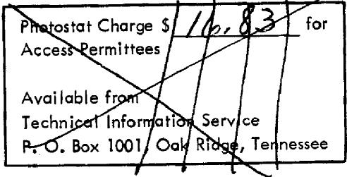

# UNCLASSIFIED

中 中 中 中 中 中 中 中 中 中 中 中 中 中

725

0/

# TABLE OF CONTENTS

Page

No.

Chapter I General Discussion 7

Chapter II Chemical Problems Associated with Fast Fused-

Salt Reactors 11

1. Selection of Fused-Salt Fuel Mixture 11

1.1 Nuclear Requirements 11

1.2 Chemical Requirements 11

Chemical Stability 11

Liquidus Range 12

2. Properties of the Fused-Salt Components 17

2.1 Major Components and Neptunium and

Plutonium 17

2.2 Fission Products 22

2.3 Chlorine Balance and Radiation

Decomposition 29

2.4 Deposition of Solids from Fused-Salt

Mixtures 31

2.5 Container Material for Fused Salts 31

References 37

Chapter III Chemistry of Liquid-Metal Fused-Salt Systems 40

1. Equilibria between Solutions in Liquid Bismuth

and Fused Salts 40

1.1 Significance of Experiments 40

1.2 Description of Experimental System 40

1.3 Experimental Results 41

2. Correlation of Experimental Results 44

2.1 Model for Equilibrium between Fused

Salts and Liquid Metals 44

2.2 Quantitative Results 53

2.3 Distribution of Plutonium 53

2.4 Criticism of Model 59

3. Applications of Theory to Reactor Problems 60

3.1 General 60   
3.2 Separation Processes 62

Liquid-Metal Fuel 66

Fused-Salt Fuel 66

3.3 Corrosion 67

References 69

Chapter IV Separation Processing 70

1. Introduction 70   
2. Stoichiometric Requirements 71

2.1 Over-All Materials Balances 71   
2.2 Higher Isotopes 73   
2.3 Summary of Separation Requirements and Objectives 73   
2.4 Preseparation 74

3. Unit Processes 75

3.1 Wet Processes 75   
3.2 Processes for Liquid-Metal Fuels 77

Liquid-Gas 78   
Liquid-Liquid Separations 78   
Liquid-Solid Separations 79   
3.3 Processes for Fused-Salt Fuels 80   
Fused Salt-Liquid Metal Processes 80   
Distillation 80   
Volatile Fluoride Processes 81   
Fractional Crystallization 81   
Immiscibility in Fused-Salt Systems 81   
Electrolysis 81   
Metathesis 82

4. Tentative Flowsheets for Processing Bi-U-Pu Fuels 82

References 87

Page No.

# Chapter V Suggestions for Research Program 88

1. Introduction 88   
2. Pure Substances 89

2.1 Physical Properties 89   
2.2 Chemical Properties 89

3.Mixtures 89

3.1Alloys 89   
3.2 Salt Mixtures 90   
3.3 Metal-Salt Systems 91

4. Radiation Stability 92   
5. Kinetics 92   
6. Physical Properties of Fuels 93   
7. Unit Processes for Separation 93

7.1 Liquid-Metal Processes 93   
7.2 Extraction with Fused Salts 93   
7.3 Gas-Metal Separations 94   
7.4 Selective Oxidation 94   
7.5 Precipitation of Intermetallic Compounds 94   
7.6 Immiscible Liquid Metals 94   
7.7 Fractional Crystallization 94   
7.8 Electrolysis, Liquid-Metal Electrodes, and Fused-Salt Electrolytes 94   
7.9 Selective Chlorination 95

8. Engineering Development of Complete Separation Process 95   
9. Conclusion 95

References 96

# Acknowledgments 98

# LIST OF FIGURES

Page

No.

FIGURE II-1. UCl3-NaCl (4) Phase Diagram 13   
II-2. UCl4-NaCl (4) Phase Diagram 14   
II-3. $\mathsf{PbCl}_2\text{-NaCl}$ (8) Phase Diagram 16   
II-4. Vapor Pressure, UCl₄, PbCl₂ (T = oK) 19   
III-1. Rare Earth Distribution between Liquid Bismuth and Fused Salt 42   
III-2. Equilibrium Constant as a Function of Temperature 47   
III-3. Comparison of Fluorides and Chlorides with Tri-valent Uranium as the Common Basis 48   
III-4. Influence of Uranium Distribution Ratio on Rare Earth Distribution Ratio 54   
III-5. Test of Equation (16) for Distribution of Rare Earth (R) between Fused Salt and Liquid Bismuth with and without Uranium (U) Present 55   
III-6. Ratio of Distribution Coefficients of Pu and U between Fused Salt and Metal 58   
III-7. $\frac{\log[\mathrm{MCl}_m]}{[\mathrm{M}]}$ vs. Log [Cl2] at 1000° K 61   
IV-1. Flow between Reactor and Separation Plant 72   
IV-2. Multistage High-Temperature Separation Flowsheet 76   
IV-3. Separation Process for U-Bi Reactor Fuel 83   
IV-4. Multistage Separation Process for U-Bi · Reactor Fuel 85   
IV-5. Bismuth Refining Flowsheet 86

2023 05

# LIST OF TABLES

Page

No.

TABLE II-1. Properties of Fused-Salt Components 13   
II-2. Specific Heat Data 21   
II-3. Properties of Fission Products in Fused Chloride Fuel 23   
II-4. Vapor Pressures at $500^{\circ}$ K 26   
II-5. Long-Lived (T>100d) Fission Products 28   
II-6. Elements with Relatively Unstable Chlorides 34   
II-7. Estimated Free Energy and Enthalpy Changes for Corrosion Reactions 35   
III-1. Concentration of Rare Earths and Uranium in Melts Containing Liquid Bismuth and Fused Chloride at $460^{\circ}$ C 43   
III-2. Equilibria between Alkali Metal Alloys and Fused Alkali Chloride Melts 50   
III-3. Equilibration Experiments for Plutonium and Uranium 57   
III-4. Equilibrium Constants for Reaction 64

# CHAPTER I. GENERAL DISCUSSION

Before the development of reactors using non-aqueous fluid fuels can be advanced beyond the preliminary conceptual stage, it will be necessary to have a much broader background of knowledge of the inorganic and physical chemistry of relevant substances than is now available. This report discusses the chemical problems of these reactors and suggests a program of experimental and theoretical chemical research broad enough to serve as an adequate basis for their engineering development.

The three main problems of non-aqueous fluid-fuel reactors are:

1. selection of a fuel system which meets nuclear and thermal requirements;   
2. control of corrosion of structural materials;   
3. development of an efficient and economical separation process.

Discovery of a fuel system which can be handled as a liquid and has desirable nuclear properties is of course essential to the successful development of these reactors. The work of this project and the investigation of other groups considering non-aqueous reactor fuels has shown the following fuel systems to be of interest:

For thermal reactors:

1. Dilute solution of uranium in bismuth;   
2. Solutions of $\mathbf{U}\mathbf{F}_{4}$ in certain mixed fluorides such as NaF - BeF $_2$ , NaF - ZrF $_4$ , Li $^{7}$ F - BeF $_2$ , or DF - NaF.

For fast reactors with fuel circulated to an external heat exchanger:

Solution of UCl₄, UCl₃, and/or PuCl₃ in certain chlorides, notably NaCl, KCl, and/or PbCl₂.

For fast reactors internally cooled:

Concentrated solution of uranium and/or plutonium in iron, nickel, bismuth, or aluminum.

The degree of solubility of reactor products, such as plutonium and individual fission products, in each of these reactor fuels is obviously of importance second only to that of their physical and nuclear properties.

Corrosion of structural materials by these fuel systems is probably the most difficult single factor impeding development of a workable

reactor using non-aqueous fluid fuel. Chemical research should prove helpful in suggesting materials of superior corrosion resistance, and, by seeking to understand the mechanism of corrosion, should be able to suggest fuel compositions and operating conditions to minimize the rate of corrosion. Structural materials currently receiving attention for this type of reactor include: carbon steel (for components of short service life), stainless steel, zirconium, tantalum, molybdenum, vanadium, graphite, and beryllium (as moderator).

Separation processing for non-aqueous liquid fuels can be carried out by cooling, dissolving, and wet-processing by a modification of existing processes. However, one of the major objectives in considering liquid fuels is to obtain the substantial simplifications and savings in separation costs which appear likely through adoption of high temperature separation processes conducted directly on a stream of liquid fuel without extensive physical or chemical changes in the bulk of the fuel. Even with the limited data available, a considerable number of such processes have been proposed. The processes of most immediate promise include:

1. extraction between a liquid-metal phase, of which bismuth, iron, lead, nickel, aluminum, or uranium is the principal constituent, and a fused-salt phase consisting of mixed fluorides or chlorides;   
2. extraction between a uranium-rich liquid-metal phase and molten silver or copper;   
3. fractional distillation from a liquid fuel containing volatile constituents, notably the distillation of $\mathrm{UCl}_4$ from a chloride fuel or $\mathrm{UF}_6$ from a fluoride fuel;   
4. vacuum removal of noble gases and other volatile fission products;   
5. selective precipitation of intermetallic compounds from a uranium-rich liquid phase;   
6. fractional crystallization of one or more constituents from a liquid fuel.

A chemical research program aimed at solution of the problems of fluid-fuel reactors will of necessity be concerned with the substances and mixtures listed above which have potential reactor utility, but

should not be restricted entirely to them. Too exclusive preoccupation with these particular materials might delay discovery of other useful substances or prevent formulation of useful generalizations which would not be forthcoming without data on additional materials. The most valuable research program will have the dual objectives of (1) obtaining detailed information on the chemical properties of the substances listed above, and (2) making fundamental advances in high-temperature inorganic and physical chemistry. Such a research program should make extensive use of theoretical methods to correlate and interpret experimental findings. Development of an adequate theory of the properties of solutions of liquid metals and of fused salts is one of the most challenging problems facing physical chemistry today, and would be one of the most valuable aids to the development of reactors using non-aqueous fluid fuels.

This report does not pretend to cover completely the chemical problems of liquid-fuel reactors. The next three chapters discuss three aspects which have arisen in our study, which are very different in their approaches, but which are conveniently grouped together in a single report.

Chapter II discusses in some detail the chemical problems which have arisen in planning a fast neutron reactor with a core of fused NaCl, $\mathrm{PbCl}_2$ , $\mathrm{UCl}_4$ mixture and a blanket of fused $\mathrm{UCl}_4$ , except for problems of the separation process. The particular separation process planned for this reactor is discussed in Chapter V of "Engineering Analysis of Non-Aqueous Fluid-Fuel Reactors"; more general matters related to separation appear in Chapter IV of this report. The chemical problems of the thermal neutron reactor with liquid-metal fuel are somewhat simpler. They are discussed in Chapter IV of the engineering analysis report, in the report "Metallurgical Problems of Non-Aqueous Fluid-Fuel Reactors," and in Chapter IV of this report.

Chapter III gives a detailed discussion of the experiments of Bareis at Brookhaven on the distribution of various metals between liquid bismuth and fused-salt solutions, and of other related experiments. It presents a quantitative explanation of these results in terms of a rather simple, and to us plausible, model. It also discusses some of the relations of these experiments to reactor technology and to separation

processes.

2725 09

Chapter IV gives a general discussion of non-aqueous, high temperature separation processes, and includes two tentative flowsheets for treating liquid bismuth fuels.

Finally, Chapter V gives recommendations for research related to the development of non-aqueous liquid-fuel reactors. Although it makes no pretence to being complete, the coverage is fairly general for the more fundamental chemical research. Since suggestions for developmental research related to corrosion and to engineering are given in the report, "Engineering analysis of Non-Aqueous Fluid-Fuel Reactors" (MIT-5002), the proposals for developmental research in this report are limited to separation processes.

# CHAPTER II. CHEMICAL PROBLEMS ASSOCIATED WITH FAST FUSED-SALT REACTORS

H. M. Clark

# 1. SELECTION OF FUSED-SALT FUEL MIXTURE

# 1.1 NUCLEAR REQUIREMENTS

For fast reactors the choice of salts containing fissionable and non-fissionable elements is limited to those in which the non-fissionable elements have low slowing-down power and low cross sections for absorption and inelastic scattering of fast neutrons. As a very rough guide for setting a limit to the allowable amounts of moderating, low mass-number diluents, Brooks (1) suggested that the ratio of the number of atoms of diluent to the number of atoms of fuel (U-235) should be less than half the atomic weight of the diluent.

Compounds containing hydrogen, carbon, nitrogen, oxygen, and fluorine are generally unsatisfactory because of the moderating effect of these elements. Of the halides, only chlorides appear to be satisfactory. In the case of chlorides, the moderation is less than for fluorides, and the capture of fast neutrons is less than for bromides and iodides.

Sulfides and phosphides may also be satisfactory nuclearwise. The chlorides of sodium and lead are considered to be satisfactory as diluents. Sodium chloride appears to be somewhat better than potassium chloride.

# 1.2 CHEMICAL REQUIREMENTS

CHEMICAL STABILITY. - Salts which are suitable nuclearwise are further restricted to those which are thermodynamically stable at the operating temperature of the reactor. This temperature may be of the order of $700^{\circ} - 800^{\circ}$ C. Both the trichloride and the tetrachloride of uranium and the trichloride of plutonium are stable.

No consideration was given to the stability of salts other than chlorides after chlorides were selected for nuclear reasons. Similarly, the chemistry of plutonium chloride fuel mixtures was not investigated

after it became apparent that a fast fused-chloride breeder does not appear to be economically attractive.

As a general rule complex substances containing covalent chemical bonds are unsatisfactory because they are much more readily decomposed by ionizing radiation than are ionic materials and metals.

LIQUIDUS RANGE. - It is reasonable to expect that the maintenance of mechanical pumps, corrosion of the reactor shell, etc., will be less severe the lower the operating temperature. The lowest temperature to which the fused salt can be cooled is obviously slightly above the freezing point of the salt. By adding other salts to depress the freezing point, the liquid range of a salt may often be extended by several hundred degrees. Tabulations of low-melting binary eutectics have been reported by Grimes and Hill (2) and by Shaw and Boulger (3).

Both the trichloride and the tetrachloride of uranium have unfavorably high melting points. The melting points are $835^{\circ}$ C. and $590^{\circ}$ C., respectively. Information on binary mixtures of uranium trichloride or tetrachloride and other salts is contained almost entirely in one report of work conducted at Brown University (4) in 1943. Data for fluoride fuel mixtures of interest for thermal reactors, such as the ARE (5), (6), (7), have been helpful in the prediction of physical properties, e.g., viscosities, of analogous chloride mixtures.

The systems UCl₃-KCl and UCl₄-KCl were considered inferior to the corresponding binary systems containing NaCl because of the formation of compounds of the type 2KCl-UCl₃ and 2KCl-UCl₄ having congruent melting points at $625^{\circ}$ C. and $650^{\circ}$ C., respectively. In contrast, the phase diagram for the system NaCl-UCl₃ consists of a single eutectic at 33 mole per cent UCl₃ with a melting point of $520^{\circ}$ C. as shown in Figure II-1. For the system NaCl-UCl₄ the compound 2NaCl-UCl₄ having an incongruent melting point at $430^{\circ}$ C. is formed. The phase diagram showing the eutectic at 50 mole per cent UCl₄ and a temperature of $370^{\circ}$ C. is represented in Figure II-2.

The melting point of the eutectic mixture of NaCl and UCl₃ was considered undesirably high for design purposes, although it is better nuclearwise because of the lower Cl/U ratio. Preliminary design for the fast fused-salt converter was based on the lower-melting eutectic mixture

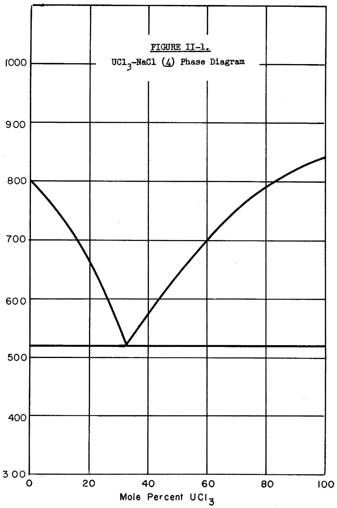  
Temperature Degrees C

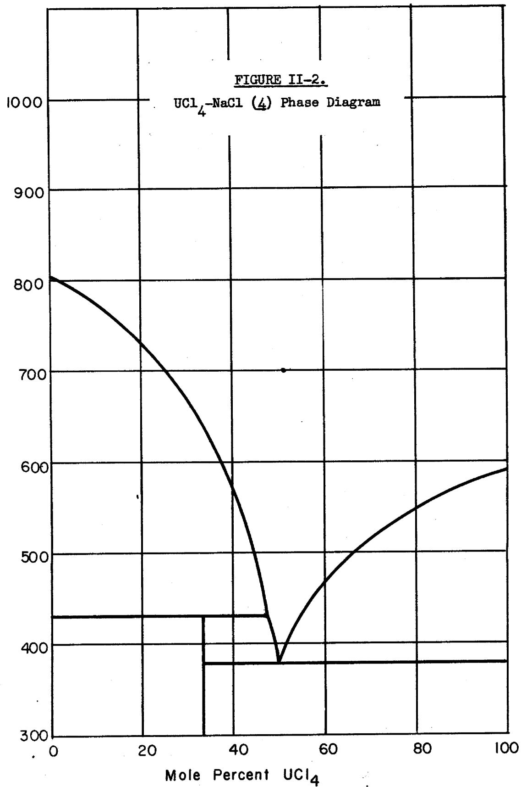  
Temperature Degrees C

2725

24

of the NaCl-UCI $_4$ system. For the final design, an even lower melting mixture was sought. With respect to both nuclear and chemical (stability and processing) requirements, $\mathsf{PbCl}_2$ was considered to be a satisfactory third component. The phase diagram for the NaCl-PbCl $_2$ system is shown in Figure II-3. The data are those of Treis (8). Unfortunately, no data are available for either the ternary system or the $\mathsf{PbCl}_2$ -UCI $_4$ system. Estimates of the expected melting points for the ternary system for various compositions were obtained by assuming ideal melting point lowerings for the two pseudo-binary systems: $(\mathsf{UCl}_4\text{-NaCl}, \text{eutectic}) + \mathsf{PbCl}_2$ and $(\mathsf{PbCl}_2\text{-NaCl}, \text{eutectic}) + \mathsf{UCl}_4$ . The two predicted ternary eutectic melting points were: $320^\circ \mathrm{C}$ . for System A having the composition $\mathsf{PbCl}_2$ , 0.33 moles; NaCl, 0.33 moles; UCl $_4$ , 0.33 moles; and $250^\circ \mathrm{C}$ . for System B with the composition $\mathsf{PbCl}_2$ , 0.43 moles; NaCl, 0.17 moles; UCl $_4$ , 0.40 moles. According to data supplied by A. R. Kaufmann (9), there are three breaks in the cooling curve for System A at about $524^\circ \mathrm{C}$ , $356^\circ \mathrm{C}$ , and $290^\circ \mathrm{C}$ . For System B there are two breaks; one at $315^\circ \mathrm{C}$ and the other at $295^\circ \mathrm{C}$ . System B was considered to be sufficiently close to the ternary eutectic and was chosen as the fuel mixture for the fixed design of the fast, fused-salt reactor.

Consideration was given to the possible application of system UCl₃⁻ UCl₄ as a fuel mixture. This system is also of interest in connection with the PbCl₂, NaCl, UCl₄ mixture because of the possibility (a) that UCl₃ may be formed in some way during operation of the reactor, or (b) that the addition of UCl₃ may be of use in a precipitation-type separation process. Kraus (4) found a nearly linear liquidus curve up to 20 mole per cent UCl₃, the same liquidus temperature, $565^{\circ}$ C., for 30 per cent as for 20 per cent, and no evidence of a eutectic halt in this range. Butler (10), in the Ames work discussed on page 488 of Katz and Rabino-witch (11), agrees with this. Kraus also carried one 20 per cent solution to high temperatures and found a break in the cooling curve at $830^{\circ}$ C. He says, therefore, "The two compounds are only slightly soluble in each other in the liquid phase." Calkins (12) found breaks at $838^{\circ}$ C. and $545^{\circ}$ C. for 89% UCl₃, and says, "The UCl₃-UCl₄ phase diagram might be quite similar to the UBr₃-UBr₄ diagram." Calkins and Nottorf (12) found that the latter has a eutectic at 24% UBr₃, that "cooling curves obtained with samples on the UBr₄ side of the eutectic were mostly of a

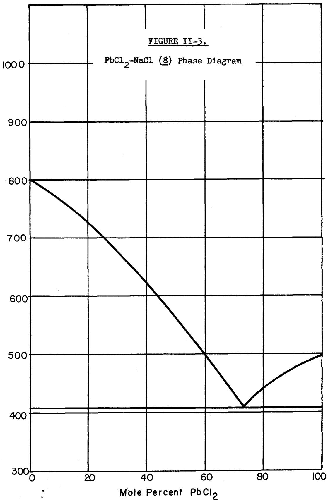  
Temperature Degrees C

poorly defined solid solution type," and that "for this portion of the curve, the breaks in the cooling curve were not sufficiently sharp to permit accurate determination of the solidus line." This corresponds to the region investigated by Kraus for the UCl₃-UCl₄ system, and solid solution formation may account for the absence of a eutectic halt in this work.

# 2. PROPERTIES OF THE FUSED-SALT COMPONENTS

# 2.1 MAJOR COMPONENTS AND NEPTUNIUM AND PLUTONIUM

Values for the melting points, boiling points, vapor pressures, heats of formation, and free energies of formation listed in Table II-1 were taken from Brewer et al (13), and Katz and Rabinowitch (11) for the uranium chlorides, from Quill (14) for sodium and lead chloride, and from Seaborg, Katz, and Manning (15) for neptunium and plutonium chlorides. Values in parentheses were considered approximate in the original source; values in brackets were approximated in this work from information and methods described in "Chemistry and Metallurgy of Miscellaneous Materials: Thermodynamics" (14). Data for UCl₃ have been included in the table, since reference to the properties of UCl₃ is made in other sections of the report.

The vapor pressures are for the pure substances as liquids at $1000^{\circ}$ K. For those substances which melt above $1000^{\circ}$ K., the vapor pressures given are for the supercooled liquid at $1000^{\circ}$ K. These were estimated by extrapolation of vapor pressure data for the liquid at higher temperatures. The variation of vapor pressure with temperature for the two major volatile components, $\mathrm{UCl}_4$ and $\mathrm{PbCl}_2$ , is shown in Figure II-4.

As a reference temperature for stability considerations $1000^{\circ}$ K. $(727^{\circ}$ C.) was chosen. At this temperature plutonium trichloride is the stable chloride in the liquid state. For neptunium, which has chemical properties intermediate between those of uranium and plutonium, both the trichloride and the tetrachloride are stable. Unless reducing conditions develop during the operation of the reactor, the uranium tetrachloride should remain unchanged.

TABLE II-1. Properties of Fused-Salt Components   

<table><tr><td rowspan="2">Chloride</td><td rowspan="2">Melting Point, ℃</td><td rowspan="2">Normal Boiling Point, ℃</td><td rowspan="2">\( \Delta H^0_{298} \) kcal/mole</td><td colspan="3">\( \Delta F^0 \), kcal/mole</td><td rowspan="2">Vapor Pressure, atm. \( 1000^0 \) K</td></tr><tr><td>\( 298^0 \) K</td><td>\( 500^0 \) K</td><td>\( 1000^0 \) K</td></tr><tr><td>NaCl</td><td>800</td><td>1465</td><td>-98.3</td><td>-91.8</td><td>-87.4</td><td>-76.3</td><td>\( 8.2 \times 10^{-5} \)</td></tr><tr><td>\( PbCl_2 \)</td><td>498</td><td>954</td><td>-85.7</td><td>-74.9</td><td>-67.8</td><td>-52.9</td><td>\( 5.3 \times 10^{-2} \)</td></tr><tr><td>\( UCl_4 \)</td><td>590</td><td>787</td><td>-251.1</td><td>-229.7</td><td>-215.7</td><td>-184</td><td>\( 3.9 \times 10^{-1} \)</td></tr><tr><td>\( UCl_3 \)</td><td>835</td><td>1727</td><td>-213.5</td><td>-197.3</td><td>-186.7</td><td>-161.8</td><td>\( \sim 3 \times 10^{-6} \)</td></tr><tr><td>\( PuCl_3 \)</td><td>734</td><td>1767</td><td>-229.3</td><td>-213.1</td><td>-202.3</td><td>-176.3</td><td>\( 1.0 \times 10^{-6} \)</td></tr><tr><td>\( NpCl_4 \)</td><td>538</td><td>(800)</td><td>-237</td><td>-216</td><td>[-200]</td><td>[-170]</td><td>\( \sim 3 \times 10^{-1} \)</td></tr><tr><td>\( NpCl_3 \)</td><td>800</td><td>(1527)</td><td>-216</td><td>-200</td><td>[-183]</td><td>[-158]</td><td>\( \sim 10^{-5} \)</td></tr></table>

FIGURE II-4.   
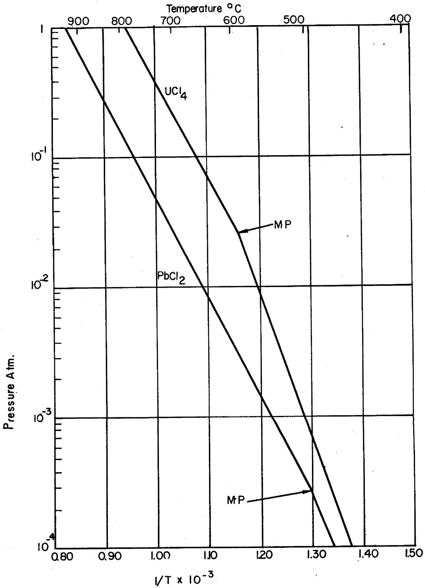  
Vapor Pressure, UCl₄, PbCl₂ (T = °K)

The density of the fused salt was estimated from the relation,

$$
\rho = \rho_ {0} (1 - 2. 5 \times 1 0 ^ {- 4} t) \tag {1}
$$

where $t = {}^{\circ}C$ and $\rho_{0} =$ density at $0^{\circ}C$ .

The density at $0^{\circ}$ C., obtained by assuming an ideal solution with additive molar volume, was 5.01 gm./cc. for the composition Pb:U:Na = 43:40:17. Densities at $25^{\circ}$ C. for $\mathsf{PbCl}_2$ , $\mathsf{UCl}_4$ , and NaCl were taken to be 5.85, 4.93, and 2.165, respectively.

The specific heat of the fused-salt mixture was estimated from the specific heats of the three major constituents by assuming these to be additive. The specific heats for the constituents and that for the mixture at $100^{\circ}$ C., $300^{\circ}$ C., and $500^{\circ}$ C. are given in Table II-2.

In addition to the problems of handling UCl4 which arise from nuclear considerations, i.e., restriction of processing and storage quantities to values far below that needed for criticality, there are handling precautions necessary because of its chemical properties. The salt is very hygroscopic and reacts with water according to the following equations:

and

$$
\mathrm {U C l} _ {4} + 4 \mathrm {H} _ {2} \mathrm {O} \longrightarrow \mathrm {U C l} _ {4} \cdot 4 \mathrm {H} _ {2} \mathrm {O}
$$

$$
\mathrm {U C l} _ {4} + \mathrm {H} _ {2} \mathrm {O} \longrightarrow \mathrm {U O C l} _ {2} + 2 \mathrm {H C l}.
$$

If oxygen is also present, the additional reaction,

$$
\mathrm {U O C l} _ {2} + 1 / 2 \mathrm {O} _ {2} \longrightarrow \mathrm {U O} _ {2} \mathrm {C l} _ {2}
$$

can take place. Even in the absence of water, the following reactions proceed at a measurable rate at about $300^{\circ}$ C.:

$$
\mathrm {U C l} _ {4} + \mathrm {O} _ {2} \longrightarrow \mathrm {U O} _ {2} \mathrm {C l} _ {2} + \mathrm {C l} _ {2}
$$

$$
3 \mathrm {U O} _ {2} \mathrm {C l} _ {2} + \mathrm {O} _ {2} \longrightarrow \mathrm {U} _ {3} \mathrm {O} _ {8} + 3 \mathrm {C l} _ {2}.
$$

The oxychlorides, $\mathrm{UOCl}_2$ and $\mathrm{UO}_2\mathrm{Cl}_2$ , are not readily converted back to $\mathrm{UCl}_4$ . It is apparent that in the preparation of the fuel mixture and in the operation of the reactor, extreme precautions would have to be taken in order to exclude water and air. Water and air are also undesirable because of their corrosive reactions with most structural materials at elevated temperatures. Furthermore, water and other low mass-number substances must be excluded from the reactor area because of the hazard

TABLE II-2. Specific Heat Data   

<table><tr><td rowspan="2">Substance</td><td colspan="3">Specific Heat, cal/gm.</td></tr><tr><td>100°C.</td><td>300°C.</td><td>500°C.</td></tr><tr><td>UCl4(a)</td><td>0.0792</td><td>0.085</td><td>0.091</td></tr><tr><td>PbCl2(b)</td><td>0.0681</td><td>0.074</td><td>0.122(c)</td></tr><tr><td>NaCl(b)</td><td>0.217</td><td>0.224</td><td>0.232</td></tr><tr><td>40 UCl4:43 PbCl2:17 NaCl</td><td>0.079</td><td>0.085</td><td>0.109</td></tr></table>

(a) From reference (11)   
(b) From reference (16)   
(c)At 540° C.

resulting from their action as neutron moderators.

During operation of the reactor, the isotopic composition of the uranium is altered by the formation of U-236 and U-237. Too much U-236 is harmful because it dilutes the fuel and is a source of undesirable Pu-238. The U-236 is maintained at an acceptable level by isotopic processing in a K-25 type separation plant. The U-237 is a short-lived (6.63d) $\beta^{-}\gamma$ emitter and introduces a holdup problem in the decontamination of uranium to be sent to the isotope separation plant. The latter problem is considered more fully in Chapter III of the engineering analysis report.

# 2.2 FISSION PRODUCTS

For each fission product the properties of the chemical species which are likely to be present in the fused-salt mixture at a temperature of $700^{\circ} - 800^{\circ}$ C. are given in Table II-3. The selection of likely species was based on thermodynamic considerations, and on descriptive information contained in Quill (14), Sidgwick (17), Latimer (18), and Hückel (19). No attempt was made to estimate the relative proportions for the cases where more than one chemical species seems likely. The effect of the high flux of ionizing radiation in the core on the equilibrium distribution of chemical species corresponding to different oxidation states is not known. Presumably the majority of the chlorides will be present chiefly in ionic form in the molten salt mixture.

The values for the melting points, boiling points, heats of formation, and free energies of formation given in Table II-3 were obtained from Quill (14), to a limited extent from Latimer (18), and from NBS circular 500 (20). The significance of parentheses and brackets around numbers in the table is the same as for Table II-1. In addition, parentheses have been used to enclose the formulas of compounds which have been entered in the table with some reservation because of insufficient or conflicting data. As in Table II-1, the vapor pressures are for the pure substances as liquids at $1000^{\circ}$ K. and were obtained for supercooled liquids in some cases. For a few of the chlorides the vapor pressures at $1000^{\circ}$ K. were estimated from values at $500^{\circ}$ K. These chlorides, together with their vapor pressures at $500^{\circ}$ K., are given in Table II-4.

TABLE II-3. Properties of Fission Products in Fused Chloride Fuel   

<table><tr><td rowspan="2">Elem.</td><td rowspan="2">Atom % of Fission Products</td><td rowspan="2">Weight % of Fission Products</td><td rowspan="2">Thermo-dynamically Stable Form (ca.1000K.)</td><td rowspan="2">Melting Point °C.</td><td rowspan="2">Normal Boiling Point °C.</td><td rowspan="2">ΔH°298 kcal/mole</td><td colspan="3">ΔF°, kcal/mole</td><td rowspan="2">Vapor Pressure atm. 1000° K.</td></tr><tr><td>298° K.</td><td>500° K.</td><td>1000° K.</td></tr><tr><td>Zn</td><td>&lt;10-5</td><td>&lt;10-5</td><td>ZnCl2</td><td>283</td><td>732</td><td>-99.6</td><td>-88.4</td><td>-81.1</td><td>-70.0</td><td>9.5×10-1</td></tr><tr><td>Ga</td><td>&lt;10-4</td><td>&lt;10-4</td><td>GaCl2</td><td>171</td><td>(597)</td><td>(-88)</td><td>(-79)</td><td>(-72)</td><td>[-60]</td><td>4.5</td></tr><tr><td></td><td></td><td></td><td>GaCl3</td><td>78</td><td>302</td><td>-125</td><td>-112</td><td>-103</td><td>[-83]</td><td>1.5×102</td></tr><tr><td>Ge</td><td>1.5×10-3</td><td>9×10-4</td><td>GeCl2</td><td>...</td><td>(702)</td><td>(-90)</td><td>(-80)</td><td>(-74)</td><td>[-58]</td><td>~1</td></tr><tr><td></td><td></td><td></td><td>GeCl4</td><td>-49</td><td>80</td><td>(-170)</td><td>(-153)</td><td>[-140]</td><td>[-110]</td><td>~6 × 102</td></tr><tr><td>As</td><td>4.5×10-4</td><td>3×10-4</td><td>AsCl3</td><td>-16</td><td>122</td><td>-71.5</td><td>-61.7</td><td>-58</td><td>[-51]</td><td>~5 × 102</td></tr><tr><td>Se</td><td>0.22</td><td>0.15</td><td>Se2</td><td>217</td><td>723</td><td>...</td><td>...</td><td>...</td><td>...</td><td>~3</td></tr><tr><td></td><td></td><td></td><td>Se2Cl2</td><td>-85</td><td>130</td><td>-20.0</td><td>...</td><td>...</td><td>...</td><td>~5 × 102</td></tr><tr><td></td><td></td><td></td><td>(SeCl4)</td><td>305</td><td>...</td><td>-46.1</td><td>-26.6</td><td>-15.1</td><td>[+14]</td><td>...</td></tr><tr><td>Br</td><td>0.065</td><td>0.045</td><td>Br2bromides</td><td>-8</td><td>58</td><td>...</td><td>...</td><td>...</td><td>...</td><td>...</td></tr><tr><td>Kr</td><td>1.03</td><td>0.73</td><td>Kr</td><td>...</td><td>-153.2</td><td>...</td><td>...</td><td>...</td><td>...</td><td>...</td></tr><tr><td>Rb</td><td>2.0</td><td>1.43</td><td>RbCl</td><td>717</td><td>1381</td><td>-105.1</td><td>-98.5</td><td>-93.8</td><td>-82.4</td><td>2.3×10-4</td></tr><tr><td>Sr</td><td>4.4</td><td>3.3</td><td>SrCl2</td><td>872</td><td>(2027)</td><td>-197.8</td><td>-186.0</td><td>-178.1</td><td>-160.4</td><td>1.3×10-8</td></tr><tr><td>Y</td><td>2.3</td><td>1.7</td><td>YCl3</td><td>700</td><td>(1507)</td><td>-235</td><td>-219</td><td>-208</td><td>-186</td><td>3.3×10-5</td></tr><tr><td>Zr</td><td>14.9</td><td>11.6</td><td>ZrCl2</td><td>727</td><td>(1477)</td><td>(-145)</td><td>(-134)</td><td>(-127)</td><td>(-112)</td><td>1.9×10-4</td></tr><tr><td></td><td></td><td></td><td>ZrCl4</td><td>437</td><td>331 subl.</td><td>(-230)</td><td>(-209)</td><td>(-195)</td><td>(-160)</td><td>1.2×102</td></tr><tr><td>Nb</td><td>&lt;3</td><td>&lt;2</td><td>NbCl5</td><td>212</td><td>243</td><td>...</td><td>...</td><td>...</td><td>...</td><td>3.8×101</td></tr><tr><td>Mo</td><td>12.1</td><td>10.1</td><td>Mo</td><td>2597</td><td>...</td><td>...</td><td>...</td><td>...</td><td>...</td><td>...</td></tr><tr><td></td><td></td><td></td><td>MoCl4</td><td>217</td><td>322</td><td>(-79)</td><td>(-60)</td><td>(-47)</td><td>[-17]</td><td>1.2×102</td></tr><tr><td></td><td></td><td></td><td>MoCl5</td><td>194</td><td>268</td><td>-90.8</td><td>-68.8</td><td>-55.3</td><td>[-25]</td><td>5.6×101</td></tr><tr><td rowspan="2">N
Δ
Elem.</td><td rowspan="2">Atom % of Fission Products</td><td rowspan="2">Weight % of Fission Products</td><td rowspan="2">Thermo-dynamically Stable Form (ca.1000K.)</td><td rowspan="2">Melting Point °C.</td><td rowspan="2">Normal Boiling Point °C.</td><td rowspan="2">ΔH°298 kcal/mole</td><td colspan="3">ΔF°, kcal/mole</td><td rowspan="2">Vapor Pressure atm. 1000° K.</td></tr><tr><td>298° K.</td><td>500° K.</td><td>1000° K</td></tr><tr><td rowspan="2">Tc</td><td rowspan="2">3.1</td><td rowspan="2">2.6</td><td>Te</td><td>(2127)</td><td>(4727)</td><td>...</td><td>...</td><td>...</td><td>...</td><td>...</td></tr><tr><td>TcCl3</td><td>(727)</td><td>...</td><td>...</td><td>...</td><td>...</td><td>...</td><td>~3×10-1</td></tr><tr><td rowspan="3">Ru</td><td rowspan="3">6.2</td><td rowspan="3">5.3</td><td>Ru</td><td>2427</td><td>4227</td><td>...</td><td>...</td><td>...</td><td>...</td><td>...</td></tr><tr><td>(RuCl2)</td><td>...</td><td>...</td><td>...</td><td>...</td><td>...</td><td>...</td><td>~3×10-2</td></tr><tr><td>RuCl3</td><td>dec.627</td><td>(1250)</td><td>-46</td><td>-31</td><td>-21</td><td>-1</td><td>~4×10-3</td></tr><tr><td rowspan="3">Rh</td><td rowspan="3">1.85</td><td rowspan="3">1.62</td><td>Rh</td><td>1967</td><td>3877</td><td>...</td><td>...</td><td>...</td><td>...</td><td>...</td></tr><tr><td>RhCl2</td><td>(677)</td><td>dec.958</td><td>-39</td><td>-29</td><td>-22</td><td>-7</td><td>...</td></tr><tr><td>RhCl3</td><td>...</td><td>1 atm. Cl2</td><td>-55</td><td>-40</td><td>-30</td><td>-9</td><td>...</td></tr><tr><td rowspan="2">Pd</td><td rowspan="2">0.75</td><td rowspan="2">0.67</td><td>Pd</td><td>1555</td><td>3167</td><td>...</td><td>...</td><td>...</td><td>...</td><td>...</td></tr><tr><td>PdCl2</td><td>678</td><td>1027</td><td>-43</td><td>-33</td><td>-26</td><td>-8</td><td>~3.0×10-2</td></tr><tr><td>Ag</td><td>0.015</td><td>0.014</td><td>AgCl</td><td>445</td><td>1564</td><td>-30.3</td><td>-26.2</td><td>-23.6</td><td>-19.2</td><td>3.3×10-5</td></tr><tr><td>Cd</td><td>0.033</td><td>0.031</td><td>CdCl2</td><td>568</td><td>967</td><td>-93.0</td><td>-82.7</td><td>-76.0</td><td>-60.8</td><td>4.7×10-2</td></tr><tr><td rowspan="3">In</td><td rowspan="3">0.005</td><td rowspan="3">0.005</td><td>InCl</td><td>225</td><td>608</td><td>-48</td><td>-43</td><td>-39</td><td>[-30]</td><td>4.5</td></tr><tr><td>InCl2</td><td>235</td><td>485</td><td>-90</td><td>-80</td><td>-72</td><td>[-55]</td><td>~1×103</td></tr><tr><td>InCl3</td><td>586</td><td>498 subl.</td><td>-126</td><td>-111</td><td>-101</td><td>-78</td><td>6.7×102</td></tr><tr><td rowspan="2">Sn</td><td rowspan="2">0.05</td><td rowspan="2">0.05</td><td>SnCl2</td><td>227</td><td>652</td><td>-81.1</td><td>-71.5</td><td>-65.1</td><td>[-49]</td><td>2.2</td></tr><tr><td>SnCl4</td><td>-33</td><td>113</td><td>-127.4</td><td>-110.4</td><td>-102.0</td><td>[-70]</td><td>~1×103</td></tr><tr><td rowspan="2">Sb</td><td rowspan="2">0.03</td><td rowspan="2">0.03</td><td>SbCl3</td><td>73</td><td>219</td><td>-91.4</td><td>-77.7</td><td>-71.1</td><td>[-56]</td><td>~4×102</td></tr><tr><td>SbCl5</td><td>4</td><td>172</td><td>-104.9</td><td>-85.4</td><td>-73.4</td><td>[-45]</td><td>~7×102</td></tr><tr><td rowspan="3">Te</td><td rowspan="3">1.30</td><td rowspan="3">1.44</td><td>Te2</td><td>453</td><td>987</td><td>...</td><td>...</td><td>...</td><td>...</td><td>5×10-2</td></tr><tr><td>TeCl2</td><td>175</td><td>322</td><td>...</td><td>...</td><td>...</td><td>...</td><td>~2×102</td></tr><tr><td>TeCl4</td><td>224</td><td>392</td><td>-77.4</td><td>-58.2</td><td>-47.4</td><td>[-20]</td><td>~1×102</td></tr></table>

TABLE II-3. Properties of Fission Products in Fused Chloride Fuel (continued)   

<table><tr><td rowspan="2">Elem.</td><td rowspan="2">Atom % of Fission Products</td><td rowspan="2">Weight % of Fission Products</td><td rowspan="2">Thermo-dynamically Stable Form (ca.1000K.)</td><td rowspan="2">Melting Point °C.</td><td rowspan="2">Normal Boiling Point °C.</td><td rowspan="2">ΔH°298 kcal/mole</td><td colspan="3">ΔF°, kcal/mole</td><td rowspan="2">Vapor Pressure atm. 1000° K.</td></tr><tr><td>298° K.</td><td>500° K.</td><td>1000° K.</td></tr><tr><td>I</td><td>0.60</td><td>0.66</td><td>I2Iodides</td><td>113</td><td>183</td><td>...</td><td>...</td><td>...</td><td>...</td><td>...</td></tr><tr><td>Xe</td><td>8.9</td><td>10.1</td><td>Xe</td><td>...</td><td>-108.1</td><td>...</td><td>...</td><td>...</td><td>...</td><td>...</td></tr><tr><td>Cs</td><td>8.3</td><td>9.5</td><td>CsCl</td><td>642</td><td>1300</td><td>-106.3</td><td>-99.4</td><td>-94.5</td><td>-83.2</td><td>9.3 × 10-4</td></tr><tr><td>Ba</td><td>3.2</td><td>3.7</td><td>BaCl2</td><td>960</td><td>1827</td><td>-205.3</td><td>-193.3</td><td>-185.6</td><td>-165.7</td><td>4 × 10-7</td></tr><tr><td>La</td><td>3.2</td><td>3.7</td><td>LaCl3</td><td>852</td><td>(1747)</td><td>-264</td><td>-247</td><td>-236</td><td>-209</td><td>2 × 10-6</td></tr><tr><td>Ce</td><td>8.2</td><td>10.4</td><td>(CeCl2)CeCl3</td><td>...</td><td>...</td><td>...</td><td>...</td><td>...</td><td>...</td><td>~ 10-8</td></tr><tr><td></td><td></td><td></td><td></td><td>802</td><td>(1727)</td><td>-260</td><td>-243</td><td>-233</td><td>-206</td><td>3 × 10-6</td></tr><tr><td>Pr</td><td>2.9</td><td>3.4</td><td>(PrCl2)PrCl3</td><td>...</td><td>...</td><td>...</td><td>...</td><td>...</td><td>...</td><td>~ 10-8</td></tr><tr><td></td><td></td><td></td><td></td><td>776</td><td>(1707)</td><td>-258</td><td>-241</td><td>-231</td><td>-205</td><td>4 × 10-6</td></tr><tr><td>Nd</td><td>8.9</td><td>10.9</td><td>(NdCl2)NdCl3</td><td>...</td><td>...</td><td>...</td><td>...</td><td>...</td><td>...</td><td>~ 10-8</td></tr><tr><td></td><td></td><td></td><td></td><td>760</td><td>(1687)</td><td>-254</td><td>-237</td><td>-227</td><td>-201</td><td>5 × 10-6</td></tr><tr><td>Pm</td><td>1.30</td><td>1.62</td><td>(PmCl2)PmCl3</td><td>...</td><td>...</td><td>...</td><td>...</td><td>...</td><td>...</td><td>~ 10-8</td></tr><tr><td></td><td></td><td></td><td></td><td>737</td><td>(1667)</td><td>(-252)</td><td>(-235)</td><td>(-225)</td><td>(-200)</td><td>6 × 10-6</td></tr><tr><td>Sm</td><td>1.15</td><td>1.46</td><td>SmCl2SmCl3</td><td>740</td><td>2027</td><td>(-205)</td><td>(-194)</td><td>(-186)</td><td>(-170)</td><td>1.3 × 10-8</td></tr><tr><td></td><td></td><td></td><td></td><td>678</td><td>dec.</td><td>(-248)</td><td>(-231)</td><td>(-221)</td><td>(-197)</td><td>5.6 × 10-6</td></tr><tr><td>Eu</td><td>0.09</td><td>0.12</td><td>EuCl2EuCl3</td><td>727</td><td>(2027)</td><td>(-210)</td><td>(-199)</td><td>(-192)</td><td>(-176)</td><td>1.3 × 10-8</td></tr><tr><td></td><td></td><td></td><td></td><td>623</td><td>dec.</td><td>(-233)</td><td>(-217)</td><td>(-206)</td><td>(-183)</td><td>3.4 × 10-6</td></tr><tr><td>Gd</td><td>0.01</td><td>0.01</td><td>GdCl3</td><td>609</td><td>(1577)</td><td>-245</td><td>-229</td><td>-218</td><td>-195</td><td>9.4 × 10-6</td></tr></table>

TABLE II-4. Vapor Pressures at $500^{\circ}$ K   

<table><tr><td>Chloride</td><td>Vapor Pressure, atm.</td></tr><tr><td>AsCl3</td><td>7.5</td></tr><tr><td>GeCl4</td><td>1.9 × 101</td></tr><tr><td>Se2Cl2</td><td>7.5</td></tr><tr><td>SnCl4</td><td>1.1 × 101</td></tr><tr><td>SbCl3</td><td>1.2</td></tr><tr><td>SbCl5</td><td>2.7</td></tr><tr><td>TeCl2</td><td>8.9 × 10-2</td></tr><tr><td>TeCl4</td><td>1.0 × 10-2</td></tr></table>

For some of the substances the critical temperature is below $1000^{\circ}$ K. However, the product of the extrapolated vapor pressure given in Table II-3 and the activity is a convenient approximate measure of the volatility in dilute solutions.

Bromine and iodine might be present in elemental form, as interhalogen compounds, as bromides and iodides, or as mixed halides such as UCl $_3$ Br, etc.

The contribution of each fission product, as the element, to the total of fission products is given both as an atom per cent and as a weight per cent in Table II-3. The assumptions used in estimating the atom per cent values were (a) that the thermal fission yields for U-235 may be taken as a reasonable approximation to the fast fission yields, and (b) that the reactor had operated for several months without removal of fission products. Fission chain yields were obtained from the Plutonium Project (21) and from Coryell and Sugarman (22). The chain yields were assigned to the last member of each chain except for those chains containing a relatively long-lived radioactive fission product. Such fission products with half-lives greater than 100 days are listed in Table II-5.

For the weight per cent values in Table II-3, an average mass number was assigned to each fission element. The percentage values are of use in estimating the relative importance of various fission products on a weight basis rather than on a radioactivity basis. For example, $82\%$ by wieght of the fission products results from the eleven elements: Sr, Zr, Mo, Ru, Xe, Cs, Ba, La, Ce, Pr, and Nd.

No single fission product seems to be a much more effective nuclear poison than any other for fast reactors. Furthermore, one advantage of fast reactors is that the tolerable concentration of fission products in general is greater than for thermal reactors.

When the fuel is subjected to chemical processing for fission products, the spectrum of fission products at steady state is altered. If, for example, a uniform processing rate of $2\%$ of the fuel mixture per day with complete recovery is assumed, the mean processing age or residence time of the fission products becomes fifty days. For a fission product production rate of $1 \mathrm{~kg}$ , per day, the fuel would contain $50 \mathrm{~kg}$ . of fission products at steady state. Due to this short residence time,

TABLE II-5. Long-Lived (T > 100d) Fission Products   

<table><tr><td>Isotope</td><td>Half-Life</td></tr><tr><td>Se79</td><td>6.5 × 104y</td></tr><tr><td>Rb87</td><td>6.0 × 1010y</td></tr><tr><td>Sr90</td><td>19.9 y</td></tr><tr><td>Zr93</td><td>~ 5 × 106y</td></tr><tr><td>Te99</td><td>2.12 × 105y</td></tr><tr><td>Ru106</td><td>1.0 y</td></tr><tr><td>Pd(107)</td><td>~ 5 × 106y</td></tr><tr><td>Sn123</td><td>130 d</td></tr><tr><td>Sb125</td><td>~ 2.7 y</td></tr><tr><td>I129</td><td>~ 3 × 107y</td></tr><tr><td>Cs135</td><td>2.1 × 106y</td></tr><tr><td>Cs137</td><td>33 y</td></tr><tr><td>Ce144</td><td>275 d</td></tr><tr><td>Pm147</td><td>~ 4 y</td></tr><tr><td>Sm(151)</td><td>~ 1000 y</td></tr><tr><td>Eu155</td><td>2.0 y</td></tr></table>

however, the yield of a chain can no longer be assigned to its last member. For example, the yield of chain-95 is distributed along the chain approximately as follows:

$$
\begin{array}{c} \mathrm {Zr} ^ {95} \\ 65 \% \end{array} \xrightarrow {\quad 65 \mathrm {d} \quad} \begin{array}{c} \mathrm {Nb} ^ {95} \\ 18 \% \end{array} \xrightarrow {\quad 35 \mathrm {d} \quad} \begin{array}{c} \mathrm {Mo} ^ {95} \\ 17 \% \end{array} \quad (\mathrm {s}).
$$

Similarly, the yields of other chains such as those of mass 89, 91, and 103 will be distributed along the chains, and the total yields for each fission element given in Table II-3 will be altered. For each processing rate, then, the distribution of chain yield along each chain will vary. A complete calculation would require consideration of the increase in yield along each chain and removal of chain members by neutron capture, radioactive decay, and chemical processing.

# 2.3 CHLORINE BALANCE AND RADIATION DECOMPOSITION

It is of interest to know whether or not chlorine is released in the process of fissioning $\mathbf{U}^{235}\mathrm{Cl}_4$ and converting $\mathbf{U}^{238}\mathrm{Cl}_4$ to $\mathbf{Np}$ and $\mathbf{Pu}$ . In these nuclear processes, conservation of oxidation state cannot be assumed. This may be illustrated by the following two fission reactions in which the products are represented in their most stable oxidation state:

$$
\begin{array}{l} U ^ {+ 4} (2 3 5) + 4 C l ^ {-} + n \longrightarrow K r ^ {o} (9 4) + B a ^ {+ 2} (1 4 0) + 2 C l ^ {-} + C l _ {2} + 2 n \\ U ^ {+ 4} (2 3 5) + 4 C l ^ {-} + C l _ {2} + n \longrightarrow A s ^ {+ 3} (9 0) + P r ^ {+ 3} (1 4 4) + 6 C l ^ {-} + 2 n \\ \end{array}
$$

If it can be assumed that the steady-state distribution of oxidation states of all components in the fused-salt mixture is that predicted thermodynamically, i.e., that the high flux of ionizing radiation in the reactor core does not alter the steady-state distribution, the fission products could combine with more chlorine than is available from UCl. This is based on the yields in Table II-3. Where more than one oxidation state is stable, the lower oxidation states and chlorine are favored in the chemical steady state at higher temperatures. In the case of ruthenium, for example, the trichloride shows appreciable decomposition to the elements at temperatures around $700^{\circ}$ C. On the other hand, for the rare-earths the trichlorides would probably be favored over the dichlorides by reactions of the type

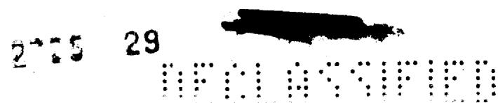

$$
U C l _ {4} + S m C l _ {2} \rightleftharpoons U C l _ {3} + S m C l _ {3}; \Delta F ^ {\circ} = \sim 5 k c a l. a t 1 0 0 0 ^ {\circ} K.
$$

For the formation of Np and Pu the various over-all nuclear chemical reactions are

$$
\begin{array}{l}\mathrm {U} ^ {2 3 9} \mathrm {C l} _ {4} \longrightarrow \mathrm {N p} ^ {2 3 9} \mathrm {C l} _ {4} \rightarrow \mathrm {P u} ^ {2 3 9} \mathrm {C l} _ {3} + \frac {1}{2} \mathrm {C l} _ {2}\\\mathrm {N p} ^ {2 3 9} \mathrm {C l} _ {3} + \frac {1}{2} \mathrm {C l} _ {2}\\\mathrm {P u} ^ {2 3 9} \mathrm {C l} _ {3}\end{array}
$$

or

$$
U ^ {2 3 9} C l _ {4} \longrightarrow P u ^ {2 3 9} C l _ {3} + \frac {1}{2} C l _ {2}.
$$

There would be produced, then, one atom of Cl for each atom of Pu produced. This neglects the additional chlorine associated with the steady-state quantity of Np in the +3 state.

The presence of free chlorine is very undesirable from the standpoint of corrosion. The atom of Cl corresponding to each atom of Pu, and one atom of Cl for each atom of U which undergoes fission, can be taken care of by replacing the U as $\mathrm{UCl}_3$ . Additional chlorine could be reduced by the addition of elementary sodium dissolved in the sodium chloride makeup. If there were an excess of $\mathrm{UCl}_3$ , however, it would probably be necessary to add controlled amounts of chlorine in one of the proposed processing streams.

The possibility of radiation decomposition of salts with the release of chlorine, in the case of chlorides, has been generally recognized. A limited amount of research on the effect of radiation on fused fluorides containing U-235 has been conducted at Oak Ridge (5, 6, 7). Decomposition appears to be negligible. Almost no data, however, are available for radiation decomposition of fused chlorides. According to Report Y-854 (23), "A eutectic mixture of LiCl and KCl showed no change in its cooling curve after two weeks in the (ORNL) pile."

In general, substances containing ionic bonds are resistant to permanent radiation damage. Small disturbances such as coloration may generally be removed from solid salts by thermal annealing. For molten salts, electronic disturbances should anneal instantaneously.

# 2.4 DEPOSITION OF SOLIDS FROM FUSED-SALT MIXTURES

For a circulating-fuel reactor, the formation and subsequent deposition of solids in pipes, pumps, etc. can be a serious matter. For the fused-salt fuel there are several ways in which solids may be formed other than as the result of simply cooling the salt. Since the melting point of the fuel is determined by the chemical composition, at a given pressure, the fuel composition of a reactor operating at a fixed temperature close to the eutectic temperature must be controlled within narrow limits to avoid precipitation of one of the major components.

Although the mole fraction of fission products (and Np and Pu) will generally be small, it is possible for the fission products to lead to solid formation in at least two ways. A few of the fission products, such as Ru, Pd, and Mo, may be present in part in elemental form with very limited solubility, and others may form relatively stable compounds such as BaUCl₆ and Ba₂UCl₈ having limited solubility.

Neptunium and plutonium trichlorides should be similar to uranium trichloride and would be expected to have limited solubility in UCl₄ according to Kraus (4), but to be quite soluble according to Calkins (12), see above.

Solids may also deposit as the result of thermal mass transport consisting of the dissolution of container material at high temperatures and deposition at lower temperatures. This is a serious aspect of the problem of corrosion of materials in contact with fused salts, although it is not limited to these high-temperature fluids. The matter is considered briefly in the following section and more extensively in Chapter V of the engineering analysis report.

# 2.5 CONTAINER MATERIAL FOR FUSED SALTS

In selecting a container material for a fused-salt reactor, two approaches may be followed. Relatively inexpensive material with fair corrosion resistance may be used with provision for frequent replacement. Alternatively, more durable but probably more expensive material may be used. Since the fuel is expensive and even small transfer losses cannot be tolerated, and since the very operation of replacing a fluid-fuel core or blanket is a difficult remote control operation at best, it is to be avoided. A material which is highly resistant to corrosion by fused salts is therefore preferable.

Techniques for handling large quantities of UCl₄ at elevated temperatures were developed at the Y-l2 magnetic separation plant (24). Unfortunately, very little information on the performance of the containers is reported. Among the materials used at Y-l2 in the preparation, sublimation, and enrichment of UCl₄ were:

1. nickel for gas-heated furnaces used for the vapor phase chlorination of $\mathrm{UO}_3$ at temperatures between $350^{\circ}$ C. and $450^{\circ}$ C.;   
2. type 316 stainless steel for sublimation stills;   
3. Hastelloy C for charge-boats used with the stainless steel stills;   
4. tantalum electrodes in the calutrons;   
5. carbon collectors in the calutrons.

Apparently the UCl4 was contaminated with ferric chloride when processed in stainless steel containers. In any case, the various containers used at Y-12 were cleaned periodically and were not subjected to the continuous operation and higher temperature expected for the reactor core, heat exchanger, etc.

Grimes and Hill (2), in a literature survey of high-temperature fuel systems, refer to experiments conducted at Westinghouse on the electrodeposition of uranium from a molten bath containing $\mathbf{U}\mathbf{F}_{4}$ , $\mathbf{KF}$ , $\mathbf{CaCl}_{2}$ , and $\mathbf{NaCl}$ at $800^{\circ}$ to $900^{\circ}$ C. Apparently a graphite crucible and a molybdenum cathode were used successfully.

Reference is made in the Liquid Metals Handbook (25) to the use of Types 304 and 316 stainless steels up to about $900^{\circ}$ C. for the distillation of metallic potassium from a potassium chloride-sodium melt. It is stated that "attack that could be attributed to the alkali metal and/or chloride was limited to an unexplained carbonization."

The fact that considerable success has been experienced in finding corrosion-resistant container materials for metallic fluorides has been a source of encouragement in the design of the fused-chloride reactor. For example, Inconel appears to show some promise as a container material for the fused-fluoride mixtures being considered by the ANP Group at Oak Ridge (7). At Y-12 (24) it was found that silver is the most corrosion-resistant of the practical metals for the handling of uranium hexafluoride. Illium R has been recommended for UF reactors at the Mallinckrodt Chemical Works (26).

In the absence of actual performance data for the resistance of various materials to attack by the particular mixture of sodium, lead, and uranium chlorides proposed for the fast reactor, certain predictions can be made on the basis of thermodynamic considerations. If it is assumed that the container dissolves through the formation of chlorides of the container materials, those elements which form relatively unstable chlorides at the temperatures involved should be resistant to attack by fused chlorides. Strictly on the basis of the free energies of formation of chlorides at $1000^{\circ}$ K., estimated from data given by Quill (14), the elements in Table II-6 should be corrosion resistant. The estimated free energy changes at $1000^{\circ}$ K. for the reaction between the element and UCl₄ to give UCl₃ and the chloride listed has been included in Table II-6. The extent of corrosion by UCl₄ should be decreased somewhat by maintaining some UCl₃ in the circulating fuel. Obviously several of the elements in the table are unsatisfactory for use in construction of vessel walls, pipes, moving parts of pumps, etc., because they do not have the desired physical properties at high temperatures, or because they have poor nuclear properties, or because they are too expensive. It is to be hoped that fabrication techniques can be developed for materials, e.g., molybdenum and graphite, which are not subject to these objections.

Unfortunately those materials which show promise for containing molten fluorides are not necessarily of interest for chlorides. With respect to uranium halides, the free energies for reaction of container metals with $\mathrm{UCl}_4$ and $\mathrm{UF}_4$ differ appreciably as shown in Table II-7. The typical reaction of uranium with the constituents of Inconel in a uranium-containing fluoride or chloride mixture would be

$$
2 \mathrm {U X} _ {4} + \mathrm {M} \quad \rightleftharpoons \quad 2 \mathrm {U X} _ {3} + \mathrm {M X} _ {2}.
$$

From the data for the constituents of Inconel in Table II-7, it can be predicted, in a qualitative way, that all three metals will react with UCl $_4$ and UF $_4$ . Even for a value of $\Delta F^0$ as high as +25, the extent of reaction may be sufficient to permit thermal mass transport as pointed out by Bredig (7). The enthalpy changes for these reactions, also listed in Table II-7, indicate that the equilibrium constants decrease with increasing temperature for corrosion of chromium by either UCl $_4$ or UF $_4$ and of iron by UCl $_4$ , which would lead to mass transfer from cold to hot container walls.

TABLE II-6. Elements with Relatively Unstable Chlorides   

<table><tr><td>Element</td><td>Chloride</td><td>ΔF° Formation at 1000° K kcal./mole</td><td>ΔF°(1000° K) Corrosion(a) Reaction kcal./mole</td></tr><tr><td>Carbon</td><td>···</td><td>(+)</td><td>···</td></tr><tr><td>Molybdenum</td><td>MoCl2</td><td>~ - 16</td><td>~ + 28</td></tr><tr><td>Ruthenium</td><td>RuCl3</td><td>- 1</td><td>+ 65</td></tr><tr><td rowspan="2">Rhodium</td><td>RhCl</td><td>- 5</td><td>+ 17</td></tr><tr><td>RhCl2</td><td>- 7</td><td>+ 37</td></tr><tr><td>Palladium</td><td>PdCl2</td><td>- 8</td><td>+ 36</td></tr><tr><td>Silver</td><td>AgCl</td><td>- 19.2</td><td>+ 3</td></tr><tr><td>Tungsten</td><td>WCl2</td><td>~ - 9</td><td>+ 35</td></tr><tr><td rowspan="2">Iridium</td><td>IrCl</td><td>- 2</td><td>+ 20</td></tr><tr><td>IrCl2</td><td>- 2</td><td>+ 42</td></tr><tr><td rowspan="2">Platinum</td><td>PtCl</td><td>+ 3</td><td>+ 25</td></tr><tr><td>PtCl2</td><td>+ 4</td><td>+ 48</td></tr><tr><td>Gold</td><td>AuCl</td><td>+ 3</td><td>+ 25</td></tr></table>

(a) $\Delta F^{\circ}$ is given for the reaction $\mathbf{M} + \mathbf{nUCl}_4 \rightleftharpoons \mathbf{MCl}_n + \mathbf{nUCl}_3$

Estimated Free Energy and Enthalpy Changes for Corrosion Reactions (a,b)

TABLE II-7.   

<table><tr><td rowspan="2">Metal</td><td colspan="2">ΔF° 1000°K, kcal.</td><td colspan="2">ΔH° 298°K, kcal.</td></tr><tr><td>UCl4</td><td>UF4</td><td>UCl4</td><td>UF4</td></tr><tr><td>Ni</td><td>+5</td><td>+25</td><td>+4</td><td>+14</td></tr><tr><td>Fe</td><td>-9</td><td>+15</td><td>-6</td><td>+4</td></tr><tr><td>Cr</td><td>-20</td><td>+4</td><td>-20</td><td>-10</td></tr></table>

(a) For reaction of type $2\mathrm{UX}_4 + \mathrm{M} = 2\mathrm{UX}_3 + \mathrm{MX}_2$ ; where $\mathbf{x} =$ halogen, and $\mathbf{M} =$ container metal.   
(b) Data from (13) and (14)

For the application to solutions at high temperatures of enthalpy changes for unit activity at room temperature, the uncertainty is so great that we should probably limit our conclusions to the hope that the temperature coefficients are small so that mass transfer may perhaps be unimportant. Then it should be possible to reduce corrosion by the addition of uranium trihalide and of small amounts of the container metal halides to the fuel. Of the three metals considered above, nickel appears to show the least tendency to corrode, and chromium the greatest tendency. All three metals appear to react more readily with $\mathrm{UCl}_4$ than with $\mathrm{UF}_4$ . The tendency of nickel to react with the chloride is as great as that of chromium to react with the fluoride at the same temperature.

Even if attack of the container by a common chemical reaction is unlikely, corrosion may result simply from the solubility of the material in the molten salt. Solubility data are available for several metals (14, 27). One proposed mechanism for the solubility of a metal in its halides involves the formation of lower valent ions (subhalides), which may be relatively more stable at high temperatures. Thermodynamic data are not available for predicting the extent of this type of corrosion. This problem is discussed in more detail in Chapter III.

It is of interest to note that the corrosion problem for $\mathsf{UCl}_3$ is much less severe than that for $\mathsf{UCl}_4$ . A typical corrosion reaction would be

$$
2 \mathrm {U C l} _ {3} + 3 \mathrm {N i} \Rightarrow 2 \mathrm {U} + 3 \mathrm {N i C l} _ {2}.
$$

Assuming that a fuel containing UCl₃ would require a higher operating temperature than one containing UCl₄, a value of ΔF° for this reaction at 1500° K. was calculated and was found to be +201 kcal. If uranium subhalides are not formed, it should be relatively easy to find corrosion-resistant container materials for UCl₃. Kraus (4) noted that UCl₃ attacks quartz but not steel. The effect on this type of corrosion of the alloying of uranium in the container walls is discussed in the engineering analysis report.

2 36

# REFERENCES

1. Personal Communication, Brooks, H.   
2. High Temperature Fuel Systems - A Literature Survey; ORNL, Y-657, Grimes, W. R. and Hill, D. G., CONFIDENTIAL, July 20, 1950.   
3. Survey of Nonmetallic-Liquid Coolants for Nuclear-Power Piles; Fairchild, NEPA-1476, Shaw, H. L. and Boulger, F. W., 31 pp., CONFIDENTIAL, May 26, 1950.   
4. Phase Diagrams of Some Complex Salts of Uranium With Halides of the Alkali and Alkaline Earth Metals; Brown Univ., M-251, Kraus, C. A., 20 pp., SECRET, July 1, 1943.   
5. Aircraft Nuclear Propulsion Project Quarterly Progress Report, Period Ending December 10, 1951; Briant, R. C., ORNL-1170, 191 pp., SECRET, March 6, 1952.   
6. Aircraft Nuclear Propulsion Project Quarterly Progress Report, Period Ending March 10, 1952; Cottrell, W. B., ORNL-1227, 214 pp., SECRET, May 7, 1952.   
7. Aircraft Nuclear Propulsion Project Quarterly Progress Report, Period Ending June 10, 1952; Cottrell, W. B., ORNL-1294, SECRET, August 21, 1952.   
8. Crystallographic and Thermal Studies of the Systems of Lead Chloride and Chlorides of Other Metals; Treis, K., Neues Jahrb. f. Mineral., Geol., and Paleont., Beil-Band 37, pp. 766-818 (1914).   
9. Private Communication, Kaufmann, A. R.   
10. Ames Monthly Report; MR-292, Butler, T. A., SECRET, April 28, 1944.   
11. The Chemistry of Uranium; Part I, N.N.E.S. Div. VIII, Vol. 5, Katz, J. J. and Rabinowitch, E., 609 pp., UNCLASSIFIED, (McGraw-Hill, 1951).   
12. Chemical Research: General, For Period August 10 to September 10, 1944; Calkins, V.P. and Nottorf, R.W., Ames, CC-1975 (A-2889), 15pp., SECRET, October 7, 1944.   
13. The Thermodynamic Properties and Equilibria at High Temperatures of Uranium Halides, Oxides, Nitrides, and Carbides, Brewer, L., Bromley, L. A., Gilles, P. W., and Lofgren, N. F.; UCRL, MDDC-1543, 84 pp., DECLASSIFIED, September 20, 1945.

14. "The Thermodynamic Properties of the Halides," Brewer, L., Bromley, L. A., Gilles, P. W., and Lofgren, N. L., pp. 76-192 in The Chemistry and Metallurgy of Miscellaneous Materials, Thermodynamics; N.N.E.S., Div. IV, P.P.R., Vol. 19B, Quill, L. L., Editor, 329 pp., UNCLASSIFIED, (McGraw-Hill, 1950).   
15. The Transuranium Elements; Parts I and II, N.N.E.S., Div. IV, P.P.R., Vol. 14B, Seaborg, G. T., Katz, J. J., and Manning, W. M., Editors, 1733 pp., UNCLASSIFIED, (McGraw-Hill, 1949).   
16. International Critical Tables; Vol. 5, pp. 96, 100, (McGraw-Hill, 1926).   
17. The Chemical Elements and Their Compounds; 2 Vols., Sidgwick, N. V., (Oxford, 1950).   
18. The Oxidation States of the Elements and Their Potentials in Aqueous Solutions; 2nd Ed., Latimer, W. M., (Prentice-Hall, 1952).   
19. The Structural Chemistry of Inorganic Compounds; Hückel, W., (Elsevier, 1950).   
20. Selected Values of Chemical Thermodynamic Properties; N.B.S. Circ. 500, U.S. Dept. of Commerce, Feb. 1, 1952.   
21. Nuclei Formed in Fission; The Plutonium Project, J.A.C.S. 68, 2411-2442 (1946).   
22. Radiochemical Studies: The Fission Products; N.N.E.S., Div. IV, P.P.R., Vol. 9, 3 books, 2086 pp., Coryell, C. D. and Sugarman, N., Editors, UNCLASSIFIED, (McGraw-Hill, 1951).   
23. Radiation Effects on Inorganic Liquids - A Preliminary Literature Search; Y-12, Y-854, Carter, E. P., 80 pp., SECRET, March 12, 1952.   
24. Chemical Processing Equipment: Electromagnetic Separation Process; N.N.E.S., Div. I, Vol. 12, Akin, G.A., Kackermaster, H.P., Schrader, R.J., Strohecker, J.W., and Tate, R.E., 506 pp., U.S.A.E.C., T.I.S., SECRET, 1951.   
25. Liquid-Metals Handbook; NAVEXOS P-733, Lyon, R. N., 188 pp., UNCLASSIFIED, June 1, 1950.   
26. Corrosion Tests Leading to the Recommendation of Illium R for Green Salt Reactors; Mallinckrodt Chem. Works, MCW-249, Ritchie, C. F. and Teter, E. R., SECRET, 1943.

27. "Metal-Salt Interactions at High Temperatures: The Solubilities of Some Alkaline Earth Metals in Their Halides;" Cubicciotti, D. D. and Thurmond, C. F., J.A.C.S. 71, pp. 2149-2153, (1949).   
"Metal-Salt Interactions at High Temperatures: The Cerium Cerium Chloride System;" Cubicciotti, D., J.A.C.S. 71, pp. 4119-4121, (1949).   
"The Solubility of Cadmium in Mixtures of Cadmium Chloride with Other Chlorides;" Cubicciotti, D., J.A.C.S. 74, 1198, (1952).

# CHAPTER III. CHEMISTRY OF LIQUID-METAL FUSED-SALT SYSTEMS

S. Golden and A. Boltax

1. EQUILIBRIA BETWEEN SOLUTIONS IN LIQUID BISMUTH AND FUSED SALTS

1.1 SIGNIFICANCE OF EXPERIMENTS

The recent work by Bareis (1) at BNL has pointed toward a potentially simple and powerful method for the treatment of nuclear reactor fuels in order to remove and possibly to separate the products of reaction. Bareis' experiments have been concerned with the processing of liquid uranium-bismuth alloys by means of an equilibration of such liquids with a fused-salt phase (consisting of the eutectic mixture: 59 mole % LiCl-41 mole % KCl). It is clear, however, that variations based upon the general principles involved in this kind of process will include the possibility of processing fused-salt fuels by equilibration with liquid metals, as well as the possibility of utilizing liquid alloys and fused salts of compositions which may differ significantly from those employed by Bareis. (For example, W. Grimes (2) of ORNL suggests the processing of fused fluorides by equilibration with liquid zinc.)

To assess the potentialities of the processing scheme suggested by Bareis' experiments, an investigation has been made of the thermodynamic equilibria which may be expected to occur in the systems for which experimental data have been obtained. An attempt has been made to estimate the equilibrium constants of such reactions which may occur, based upon the thermodynamic functions compiled by L. Brewer (2). The data reported by Bareis have been subjected to analysis and generalization.

1.2 DESCRIPTION OF EXPERIMENTAL SYSTEM

For completeness, the experimental system that has been employed by Bareis (4) will be described briefly.

A KCl-LiCl eutectic mixture was prepared by heating the mixed C.P. salts slowly under vacuum until dehydrated and fused. Various salt melts were obtained by the addition of other salts to the fused eutectic mixture. The salt melt was contacted with bismuth or bismuth-uranium

alloy to which had been added small amounts of rare-earth and other elements and which had been cleaned to remove oxides. The contacting took place in a coarse pyrex filter tube. The melt was then heated slowly under vacuum until completely fused. Pure argon gas was allowed to enter the tube above the melt, which forced the latter through the filter into a section of tube below. At this point the melt was sealed off under vacuum. The metal had the appearance of mercury, and the fused salt appeared as a water-like liquid.

The sealed capsule then was placed in a constant temperature bath and allowed to equilibrate overnight at a temperature near $500^{\circ}$ C. The following day, the capsule was allowed to cool. The salt was usually not clear, but contained suspended material which subsequent microscopic examination disclosed to be metallic bismuth. Before analysis, the salt phase was separated from the metal phase, fused again under vacuum, and filtered. This resulted in a clear salt phase. The metal ingot was washed to remove salt. Both phases were then analyzed.

In later work (5) the procedure was varied slightly by first filtering the salt phase and then sealing below a coarse pyrex filter, while the bismuth alloy was placed above the filter. The system was then evacuated, heated, and when the alloy was molten, it was filtered in contact with the salt phase by application of helium pressure. After sealing, equilibration took place at about $450^{\circ}\mathrm{C}$ . The capsule was cooled, and salt and metal phases separated. The salt phase was melted under vacuum and filtered. The metal phase was washed. Both phases then were subjected to analysis.

Generally the experiments with rare earths were conducted with tracer amounts, and analyses for these substances were made by counting techniques.

# 1.3 EXPERIMENTAL RESULTS

In Figure III-1, which is taken from Bareis (1), is presented a summary of the distribution of the elements Ce, La, and Pr between U-Bi alloys and a fused eutectic melt of KCl-LiCl. In Table III-1, also taken from Bareis (4, 5, 6, 7) are the data pertinent to the experiments summarized in Figure III-1.

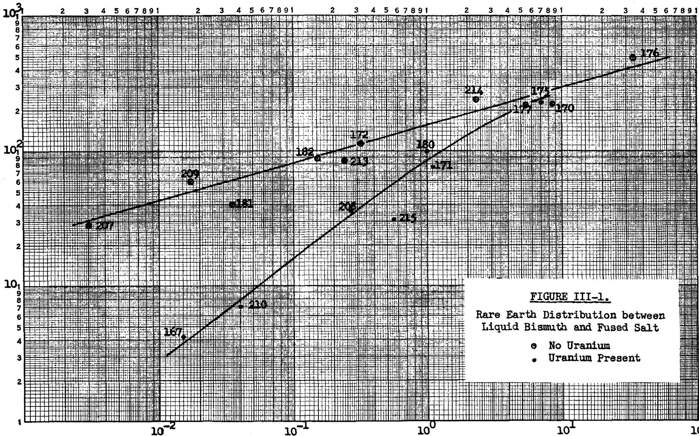  
CONCENTRATION OF RARE EARTHIS IN FUSED SALTS - P.P.M.

  
CONCENTRATION OF RARE EARTH'S IN BISMUTH - P.P.M.

TABLE III-1.   
Concentration of Rare Earths and Uranium in Melts Containing Liquid Bismuth and Fused Chloride at $460^{\circ}$ C.*   

<table><tr><td rowspan="2">Sample No.</td><td rowspan="2">Rare Earth</td><td colspan="2">Rare Earth</td><td colspan="2">Uranium</td></tr><tr><td>ppm in Salt</td><td>ppm in Bi</td><td>ppm in Salt</td><td>ppm in Bi</td></tr><tr><td>166</td><td>La</td><td>5.0</td><td>0.066</td><td>5.3</td><td>900.</td></tr><tr><td>167</td><td>&quot;</td><td>3.3</td><td>0.011 - 0.022</td><td>83.</td><td>770.</td></tr><tr><td>170</td><td>&quot;</td><td>241.</td><td>8.</td><td></td><td></td></tr><tr><td>171</td><td>&quot;</td><td>74.</td><td>1.08</td><td>1.4</td><td>475.</td></tr><tr><td>172</td><td>&quot;</td><td>114.</td><td>0.3 - 0.32</td><td></td><td></td></tr><tr><td>207</td><td>&quot;</td><td>23.4</td><td>2.6 - 3.5 ppb</td><td></td><td></td></tr><tr><td>208</td><td>&quot;</td><td>29.</td><td>0.2</td><td>3.</td><td>17.648</td></tr><tr><td>209</td><td>&quot;</td><td>53.</td><td>12 - 14 ppb</td><td></td><td></td></tr><tr><td>210</td><td>&quot;</td><td>5.4</td><td>30 - 32 ppb</td><td>0.1</td><td>6.933</td></tr><tr><td>226</td><td>&quot;</td><td>34.</td><td>.077</td><td></td><td></td></tr><tr><td>229</td><td>&quot;</td><td>54.</td><td>0.27</td><td></td><td></td></tr><tr><td>175</td><td>Ce</td><td>222.</td><td>6.6</td><td>0.35</td><td>320.</td></tr><tr><td>176</td><td>&quot;</td><td>478.</td><td>32.</td><td></td><td></td></tr><tr><td>177</td><td>&quot;</td><td>214.</td><td>5.1</td><td></td><td></td></tr><tr><td>180</td><td>&quot;</td><td>96.</td><td>0.96 - 1.0</td><td>6.</td><td>250.</td></tr><tr><td>181</td><td>&quot;</td><td>40.</td><td>0.024 - 0.052</td><td></td><td></td></tr><tr><td>182</td><td>&quot;</td><td>86.</td><td>0.12 - 0.17</td><td></td><td></td></tr><tr><td>213</td><td>Pr</td><td>83.</td><td>0.22 - 0.24</td><td></td><td></td></tr><tr><td>214</td><td>&quot;</td><td>239.</td><td>2.2</td><td></td><td></td></tr><tr><td>215</td><td>&quot;</td><td>30.</td><td>0.52 - 0.54</td><td>0.3</td><td>170.</td></tr></table>

*Note that BNL log data (4, 5, 6, 7) and those incorporated in BNL-125 (1) differ slightly. For consistency, since U distributions are reported only in former, these former data are used in the analysis which follows.

Three significant findings are to be noted from Figure III-1.

1. In the presence of uranium there appears to be a more or less uniform "distribution coefficient" between the fused salt-bismuth alloy of the elements indicated above. Thus the concentrations in the bismuth alloy of the elements indicated above are reasonably proportional to their concentrations in the fused-salt phase, when uranium is present in the system and the concentration of these materials is not too great. A line of unit slope may be fitted to the lower curve of Figure III-1, which emphasizes this result.   
2. Data obtained in the absence of uranium, however, are incapable of yielding a "distribution-coefficient" which does not vary significantly with the concentration of the material in the salt phase. Indeed, the slope of the upper line in Figure III-1 suggests that the concentration in the metal phase is roughly proportional to the third or fourth power of the concentration in the salt phase.   
3. Inasmuch as the uranium content of the systems examined was limited in extent, it seems reasonable to conclude from Figure III-1, that for increasing concentrations of the materials mentioned and for fixed uranium concentrations there will be increasing departure from a constant "distribution-coefficient."

These qualitative characterizations of the process examined by Bareis require an explanation in terms of principles that will facilitate the assessment of such a process for the separation of the products formed by a nuclear reactor. Such an explanation will undoubtedly have some bearing also upon the evaluation of anticipated corrosion problems to be associated with container materials for fused-salt mixtures.

# 2. CORRELATION OF EXPERIMENTAL RESULTS

# 2.1 MODEL FOR EQUILIBRIUM BETWEEN FUSED SALTS AND LIQUID METALS

At the outset, it seems clear that there can be listed three model mechanisms which might possibly account for the experimental results which have been obtained.

1. Physical dissolution of metals in fused ionic compounds, and vice versa. To explain Bareis' experimental results in terms of this mechanism, it would be necessary to postulate significantly non-ideal solutions, even at very small concentrations of dissolved materials.   
2. Chemical reactions between metals and cations of fused ionic compounds that determine the extent of solubility of the metals in the ionic compounds, and vice versa, by virtue of heterogeneous chemical equilibria between metal-free salts and salt-free alloys.   
3. A probably more realistic mechanism which involves a combination of the essential features of the two preceding mechanisms.

The model which has been employed by Bareis to account for his results is one in which physical dissolution of the various metals takes place in the fused-salt phase. His experiment represents, therefore, the distribution of a single chemical species between the two phases. This model stems from the investigations of Eastman, Cubicciotti, and Thurmond (8) concerning the solubility of metals in their corresponding fused halide salts. Further support for this model is to be found in the solubility of the alkali metals in fused alkali - and alkaline earth halides (9).

However, the possibility of chemical reaction between metals dissolved in fused ionic compounds and the cationic constituents contained therein requires consideration of a chemical sort, if for no other reason than completeness. In the present report, an attempt will be made to exploit the consequences of a purely chemical mechanism (i.e., the second mechanism, above).

For simplicity, consider the simple chemical equilibrium:

$$
\begin{array}{l} n M (d i s s. i n m e t a l) + m N ^ {n +} (d i s s. i n s a l t) \\ \rightleftharpoons \mathrm {m N} (\text {d i s s . i n m e t a l}) + \mathrm {n M} ^ {\mathrm {m +}} (\text {d i s s . i n s a l t}) \\ \end{array}
$$

which may be written in an alternate form,

$$
\begin{array}{l} m M (d i s s. i n m e t a l) + m N X _ {n} (d i s s. i n s a l t) \\ \Longleftrightarrow \mathrm {m N} (\text {d i s s . i n m e t a l}) + \mathrm {n M X} _ {\mathrm {m}} (\text {d i s s . i n s a l t}), \\ \end{array}
$$

where $\underline{\mathbf{M}},\underline{\mathbf{N}}$ , refer to metals, and $\underline{\mathbf{x}}$ refers to a halide. Then for each

such reaction an equilibrium constant may be written,

$$
\mathrm {K} = \frac {\left[ M ^ {m + 1} \right] ^ {n}}{\left[ M \right] ^ {n}} \frac {\left[ N \right] ^ {m}}{\left[ N ^ {n + 1} \right] ^ {m}}, \tag {1}
$$

where the brackets refer to thermodynamic activities relative to some (as yet, unspecified) standard state of reference of the individual chemical species in their respective environments.

To obtain some idea of the magnitudes to be encountered for the equilibrium constants, use has been made of the thermodynamic data of Brewer et al (3, 8), to estimate the standard free energy changes, $\Delta F$ , for the reactions,

$$
\frac {1}{m} M + \frac {1}{n} N C l _ {n} = \frac {1}{m} M C l _ {m} + \frac {1}{n} N,
$$

where the standard states of reference are the normal state of each pure substance. The standard free energy results have been converted to equilibrium constants,

$$
K ^ {\prime} = (K) ^ {\frac {1}{m n}} = \frac {\left[ M ^ {m +} \right] ^ {\frac {1}{m}}}{\left[ M \right] ^ {\frac {1}{m}}} \frac {\left[ N \right] ^ {\frac {1}{n}}}{\left[ N ^ {m +} \right] ^ {\frac {1}{m}}} = \exp . (\frac {\Delta F}{R T}) \tag {2}
$$

They are summarized in Figure III-2. Graphs of standard free energy changes for the corresponding fluoride system exist (10), and these have been utilized to provide a comparison between certain reactions in the chloride and fluoride systems. Such a comparison is given in Figure III-3.

If the activities in Eq. 2 may be approximated by the appropriate mole fractions (ideal solutions based upon pure substances as standard state of reference), it is clear, from Figure III-2, that LiCl and KCl should serve as sufficiently good oxidants to transfer preferentially certain rare-earth elements into a fused-salt phase from a metallic phase containing bismuth, uranium, and plutonium, in addition to these rare-earth elements. This conclusion is confirmed by Bareis' (1) experimental results. Also, incorporation of $\mathrm{BeCl}_2$ into the fused-salt phase will favor the transfer of uranium as well as certain rare-earth elements from a metal phase into a salt phase. This result also has been observed by Bareis. For a quantitative theoretical description of

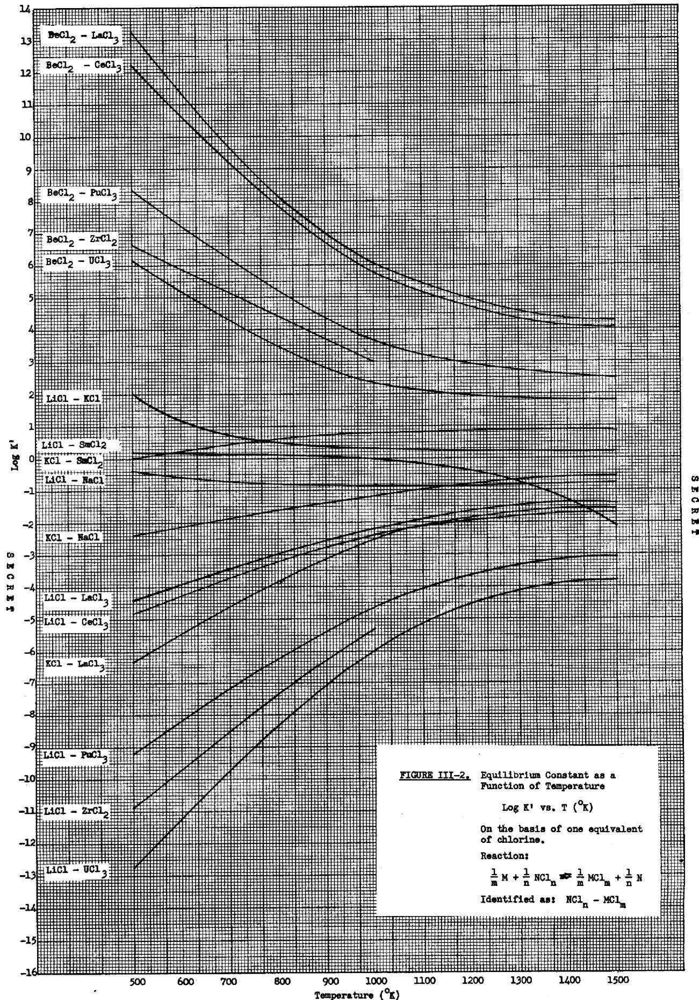

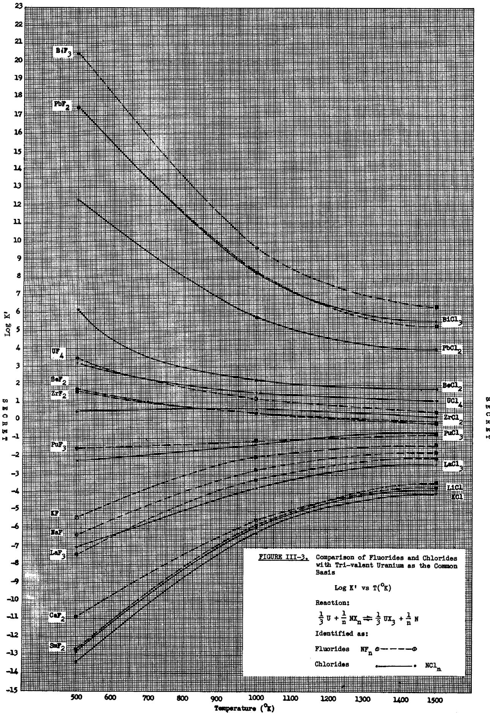

these results beyond the level indicated, it is clear that the ideality assumption will require examination. However, from a qualitative, and possibly semi-quantitative viewpoint, there seems to be some measure of support for the chemical model herein described.

Support for this model may be obtained:

1. from experiments dealing with the equilibria between K-Na alloys and the fused halides of these elements (11) and   
2. from the experimental results of Bareis in which bismuth was employed as a metal solvent.

Rinck (12) has measured the equilibrium,

$$
\mathrm {K} (\text {a l l o y}) + \mathrm {N a C l} (\text {s a l t m e l t}) \rightleftharpoons \mathrm {N a} (\text {a l l o y}) + \mathrm {K C l} (\text {s a l t m e l t}).
$$

The equilibrium constants which he reports are given in terms of mole fractions. Since independent measurements (11) on both the metal and salt phases support the assumption of such ideality, the comparison between the experimental and calculated values is noteworthy. These results are summarized in Table III-2.

In addition to these results, there are available two experiments by Bareis (7) in which Na-Bi alloys were equilibrated in contact with eutectic LiCl-KCl melts. (The uranium present in each of the phases in these experiments was of such small molal amounts relative to the amounts of the other substances that its effect can be disregarded comparatively.) For one of these experiments (Ref. 7, Run #190), it was possible to make a material balance which revealed that $1.86 \times 10^{-3}$ gram-atom of lithium and potassium were transferred to the metal phase as against $1.97 \times 10^{-3}$ gram-atom of sodium which were transferred to the salt phase, agreeing to within 6 per cent. A comparison between measured equilibrium constants and computed values are also given in Table III-2. Because of the marked deviations from ideality, in the above sense, to be expected from alkali-metal-bismuth alloys at the temperature at which measurements were made (13), as well as the possibility of non-ideality in the salt phase at these temperatures, the comparison between measured and computed values is quite satisfactory, though perhaps fortuitous.

Encouraged by this preliminary analysis, we now attempt to interpret Bareis' results, summarized above. To do so, the standard states of reference in any phase will be chosen to be infinitely dilute with regard

TABLE III-2.   
Equilibria between Alkali Metal Alloys and   
Fused Alkali Chloride Melts   

<table><tr><td>Equilibrium Reaction</td><td>Temperature °C.</td><td>Measured 
Eq. Constant</td><td>Calculated 
Eq. Constant 
(Fig.III-2)</td></tr><tr><td rowspan="4">K + NaCl ⇌ Na + KCl</td><td>900</td><td>11.5(a)</td><td>10.2</td></tr><tr><td>800</td><td>14.0(a)</td><td>14.1</td></tr><tr><td>460</td><td>14.4(b)</td><td>38.5</td></tr><tr><td>460</td><td>27.0(c)</td><td>38.5</td></tr><tr><td rowspan="2">K + LiCl ⇌ Li + KCl</td><td>460</td><td>7.3(b)</td><td>6.7</td></tr><tr><td>460</td><td>6.9(c)</td><td>6.7</td></tr></table>

(a) Ref. 12   
(b) Ref. 7, Run #190   
(c) Ref. 7, Run #216

It should be noted that agreement in (a) between calculated and measured values was known at the time the tables of free energy of formation values compiled by Brewer were published. See Ref. 8, pp. 116-117.

to the substances transferred to that phase. The equilibrium constants which appear in the following, therefore, represent a modification of Eq. (1) in which the activities have been replaced by mole fractions.

The analysis may be simplified somewhat by noting from the equilibrium constant (Table III-2),

$$
\mathrm {K} _ {\mathrm {K} - \mathrm {L i}} \doteq 7 = \frac {[ \mathrm {L i} ]}{[ \mathrm {K} ]} \quad \frac {[ \mathrm {K C l} ]}{[ \mathrm {L i C l} ]} \tag {3}
$$

that

$$
\frac {\mathrm {L i}}{\mathrm {K}} \sim 1 0,
$$

and that the amount of potassium which may be transferred to the metal phase as a result of chemical reaction is negligible compared to the amount of lithium which may be so transferred. For simplicity, therefore, mention of potassium is omitted, with only slight error caused by this omission. (A more complete analysis could readily take this effect into account.)

Consider, therefore, the following equilibria which may be expected to be of importance in the Bareis experiments:

$$
\begin{array}{l} U (B i - a l l o y) + 3 L i ^ {+} (s a l t m e l t) \rightleftharpoons 3 L i (B i - a l l o y) + U ^ {3 +} (s a l t m e l t), \\ R (B i - a l l o y) + n L i ^ {+} (s a l t m e l t) \rightleftharpoons n L i (B i - a l l o y) + R ^ {n +} (s a l t m e l t), \\ n U (B i - a l l o y) + 3 R ^ {n +} (s a l t m e l t) \Rightarrow n U ^ {3 +} (s a l t m e l t) + 3 R ^ {n +} (B i - a l l o y), \\ \end{array}
$$

where $\underline{\mathbf{R}}$ stands for a metal of interest, possibly a rare-earth. These equilibria, which are not independent of one another, have equilibrium constants:

$$
\mathrm {K} _ {\mathrm {U}} = \frac {[ \mathrm {L i} ] ^ {3}}{[ \mathrm {L i} ] ^ {3}} \frac {[ \mathrm {U} ^ {3 +} ]}{[ \mathrm {U} ]}, \tag {4}
$$

$$
\kappa_ {R} = \frac {\left[ L i \right] ^ {n}}{\left[ L i ^ {+} \right] ^ {n}} \frac {\left[ R ^ {n +} \right]}{\left[ R \right]}, \tag {5}
$$

and

$$
\mathrm {K} _ {\mathrm {U} - \mathrm {R}} = \mathrm {K} _ {\mathrm {U}} / \mathrm {K} _ {\mathrm {R}} ^ {3 / \mathrm {n}} = \frac {\left[ \mathrm {U} ^ {3 +} \right]}{\left[ \mathrm {U} \right]} / \left(\frac {\mathrm {R} ^ {\mathrm {n} +}}{\mathrm {R}}\right) ^ {3 / \mathrm {n}}. \tag {6}
$$

For equilibration experiments in which uranium and the rare-earth metals initially are in the bismuth alloy, a material balance requires that

$$
[ L i ] = 3 \alpha \left(\left[ U ^ {3 +} \right] + \frac {n}{3} [ R ^ {n +} ]\right), \tag {7}
$$

where $\alpha$ depends solely upon the relative numbers of moles of the alloy and fused-salt phases,

$$
\alpha = \frac {\text {N o . m o l e s o f s a l t p h a s e}}{\text {N o . m o l e s o f m e t a l p h a s e}}. \tag {8}
$$

Substitution of Eq. (7) into Eq. (5) gives,

$$
\mathrm {K} _ {\mathrm {R}} = \frac {3 ^ {\mathrm {n}} \propto^ {\mathrm {n}} \left[ \mathrm {U} ^ {3 +} \right] + \frac {\mathrm {n}}{3} \left[ \mathrm {R} ^ {\mathrm {n} +} \right] ^ {\mathrm {n}} \left[ \mathrm {R} ^ {\mathrm {n} +} \right]}{\left[ \mathrm {L i} ^ {+} \right] ^ {\mathrm {n}}} \quad . \tag {9}
$$

This equation presumably describes the state of affairs existing after equilibrium has been established between a salt phase initially consisting of the LiCl-KCl eutectic mixture and a metal alloy which contains uranium and one other element R. The quantities in brackets refer, of course, to equilibrium mole fractions in the appropriate phase.

Equation (9) exhibits all the qualitative characteristics observed from Bareais' experiments. First, consider the case in which uranium concentrations greatly exceed those of a rare-earth. Then,

$$
\frac {\left[ R ^ {n +} \right]}{\left[ R \right]} \sim \frac {K _ {R} \left[ L i ^ {+} \right] ^ {n}}{3 ^ {n} \propto n \left[ U ^ {3 +} \right] ^ {n}}; \quad \left(\left[ R ^ {n +} \right] / \left[ U ^ {3 +} \right]\rightarrow 0\right), \tag {10}
$$

so that in the presence of considerable excess uranium in the salt phase relative to $\underline{\mathbf{R}}$ , and for $\alpha$ reasonably constant, a more or less uniform distribution coefficient is predicted in accordance with Bareis' experimental results. Next consider the case in which the uranium concentration is negligible compared to the rare-earth. Then,

$$
\frac {\left[ R ^ {n +} \right] n + 1}{[ R ]} \sim \frac {K _ {R} \left[ L i ^ {+} \right] ^ {n}}{n ^ {n} \alpha^ {n}}; \quad \left(\left[ U ^ {3 +} \right] / \left[ R ^ {n +} \right]\rightarrow 0\right), \tag {11}
$$

so that in the absence of uranium the distribution coefficient $\left[\mathbb{R}^{n+}\right] / \left[\mathbb{R}\right]$ is predicted to vary with concentration as $\left[\mathbb{R}^{n+}\right]^{-n}$ , which is again in accord with the experimental results, since $\alpha$ does not change appreciably from one experiment to the next. For fixed uranium content, it is clear that Eq. (11) will be approached as the mole fraction $\left[\mathbb{R}^{n+}\right]$ becomes larger, again in accord with the experimental results.

# 2.2 QUANTITATIVE RESULTS

In this section an attempt is made to describe the experimental data more quantitatively in terms of the foregoing model.

Accordingly, Figure III-4 represents a test of Eq. (6) to estimate a value of $\underline{n}$ . The data do not permit unequivocal determination of its value, but a value between 1.5 and 2 is in reasonable accord with the data. In view of the uncertainties involved, the value $n = 2$ is adopted here for convenience and implies that the elements lanthanum, cerium, and praseodymium, insofar as they can be grouped together as regards these experiments, exist in the salt phase as sub-halides rather than normal halides. There is some evidence for this for certain of the rare-earths (8), which are presumably similar to the elements treated here.

With the assignment of $\mathbf{n} = 2$ , Figure III-4 yields,

$$
\mathrm {K} _ {\mathrm {U} - \mathrm {R}} = 1. 1 \times 1 0 ^ {- 5}. \tag {12}
$$

Similarly, Figure III-5, which represents a test of Eq. (9), with $n = 2$ yields

$$
\mathrm {K} _ {\mathrm {R}} = 3. 2 \times 1 0 ^ {- 7}. \tag {13}
$$

From Eq. (6), $\mathbf{K}_{\mathbf{U}} = \mathbf{K}_{\mathbf{U} - \mathbf{R}}\mathbf{K}_{\mathbf{R}}^{3 / 2}$ , and

$$
\kappa_ {U} = 1. 0 \times 1 0 ^ {- 1 5}. \tag {14}
$$

# 2.3 DISTRIBUTION OF PLUTONIUM

Inasmuch as plutonium is apt to be present in many reactors now being contemplated, the manner in which this material ultimately may be separated from uranium, fission products, and solvent by a process which involves liquid alloy-fused salt mixture equilibration is of considerable interest. According to the model herein described, it is necessary and sufficient to know the equilibrium extent of chemical reaction between uranium and plutonium halide.

Unfortunately, only two experiments have been reported by Bareis in which plutonium was a constituent. However, there have been reported (14) similar experiments which involve the distribution of trace amounts of uranium and plutonium between metal and salt phases that differ markedly from those employed by Bareis. By making the most optimistic

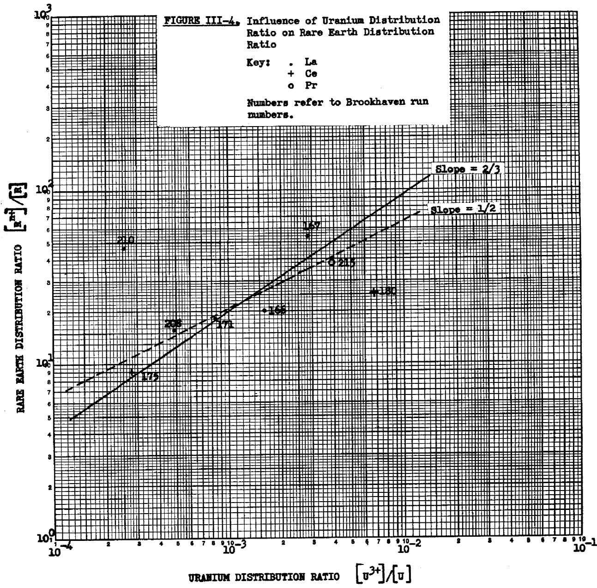

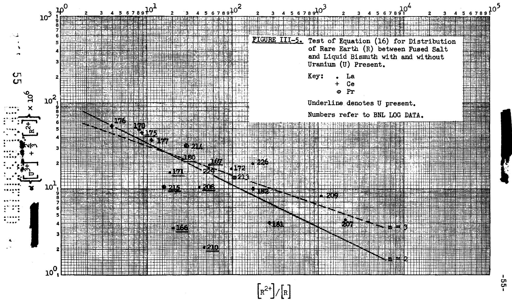

of assumptions, namely, that the standard states of reference for both the uranium and plutonium in infinitely dilute solutions are virtually independent of the nature of the alloy or ionic compound in which they may be dissolved, it is possible to correlate the information relevant to the chemical equilibrium between uranium and plutonium distributed between ionic compounds and metals.

There is some feeling (14) that the valence of plutonium in dilute solutions of ionic compounds is +2. Accordingly, we are interested in the chemical equilibrium,

$$
\begin{array}{l} \mathrm {P u} (\text {d i s s . i n m e t a l}) + 2 / 3 \mathrm {U} ^ {3 +} (\text {d i s s . i n s a l t}) \\ \Rightarrow \mathrm {P u} ^ {2 +} (\text {d i s s . i n s a l t}) + 2 / 3 \mathrm {U} (\text {d i s s . i n m e t a l}), \\ \end{array}
$$

which has the equilibrium constant,

$$
K _ {P u - U} = \frac {\left[ P u ^ {2 +} \right]}{\left[ P u \right]} / \left(\frac {\left[ U ^ {3 +} \right]}{\left[ U \right]}\right) ^ {2 / 3} \tag {15}
$$

Adequate data for testing the concentration dependence (or lack thereof) of Eq.(15) are at present unavailable. Those pertinent data which are available, however, are given in Table III-3. In Figure III-6, the equilibrium constants are plotted in such a way as to suggest their correlation with the temperature at which the measurements were made. Considering the diversity of the data, it is rather surprising to obtain as good a correlation as seems indicated.

If these results are significant, and not simply fortuitous, then the ideality assumptions noted above seem reasonable with some modification. Thus, since both solid and liquid phases are represented in Table III-3, it would be desirable to estimate the effect of this difference alone.

By assuming a standard state corresponding to a liquid phase infinitely dilute in plutonium and uranium, it is necessary to estimate the standard free energy change associated with the solution of these substances in solid phases. In other words, if ideality may be assumed for the solid phases relative to a solid phase infinitely dilute in plutonium and uranium, it is necessary to modify the equilibrium constants for the latter in order to put them on a basis comparable with the constants for liquid phases. This has been done by

# TABLE III

Equilibration Experiments for Plutonium and Uranium   

<table><tr><td>Metal</td><td>Ionic Compound</td><td>Temp. °C.</td><td>Pu2+/Pu</td><td>U3+/U</td><td>K Pu-U</td><td>No.&#x27;s on Fig. III-6</td></tr><tr><td>U (s)</td><td>UBrX</td><td>900</td><td>16(a)</td><td>1</td><td>16</td><td>(1)</td></tr><tr><td>U (1)</td><td>UBrX</td><td>1140</td><td>28(a)</td><td>1</td><td>28</td><td>(2)</td></tr><tr><td>U (s)</td><td>UBrX</td><td>1000</td><td>40(a)</td><td>1</td><td>40</td><td>(3)</td></tr><tr><td>Mg (1)</td><td>MgClx(1)</td><td>760</td><td>17(a)</td><td>...</td><td rowspan="2">4.5</td><td rowspan="2">(4)</td></tr><tr><td>Mg (1)</td><td>MgClx(1)</td><td>760</td><td>...</td><td>7.5(a)</td></tr><tr><td>Mg (s)</td><td>Mg(Cl,I)2</td><td>622</td><td>0.92(a)</td><td>...</td><td rowspan="2">1.2</td><td rowspan="2">(5)</td></tr><tr><td>Mg (s)</td><td>Mg(Cl,I)2</td><td>622</td><td>...</td><td>0.72(a)</td></tr><tr><td>Bi (1)</td><td>LiCl-KCl</td><td>460</td><td>2.19 × 10-2(b)</td><td>1.45 × 10-2(b)</td><td>0.37</td><td>(6)</td></tr><tr><td>Bi (1)</td><td>LiCl-KCl</td><td>460</td><td>1.86 × 10-2(c)</td><td>0.54 × 10-2(c)</td><td>0.71</td><td>(7)</td></tr></table>

(a) Ref. 14   
(b) Ref. 7, Run #232   
(c) Ref. 7, Run #235

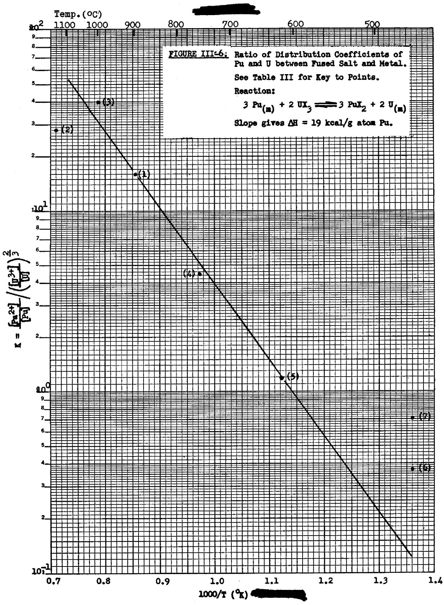

estimating the change in $K_{\mathrm{Pu - U}}$ of Eq. (15) induced by fusion of both plutonium and uranium. As a consequence of this analysis, it appears that the hypothetical liquid equilibrium constants associated with the experiments which involved solid phases are somewhat smaller than those reported for the solid phases. Indeed, when such a correction is applied, considerable improvement results in the correlation. (These results are not reproduced here.)

The two data which involve bismuth alloys differ significantly from the value estimated by extrapolation of the higher temperature data. This disparity emphasizes the speculative character of the correlation suggested here. While possible explanations could be suggested here which would tend to improve the correlation, it seems unwise to do so. The uncertainties associated with the as yet unconfirmed concentration dependence of the equilibrium product ratio, Eq. (15), far overshadow the uncertainties to be associated with a uniform set of standard states of reference to bring all the measured equilibrium constants to a common basis of comparison.

It is worth noting that, apart from the bismuth alloy data, no significant change in Figure III-5 results from taking the uranium and plutonium valences in the salt phase to be the same. From the slope of the curve, the enthalpy change for the reaction is approximately 19 kcal/gram atom plutonium. This value allows an estimate to be made of the entropy change for the reaction, which at about $900^{\circ}$ K amounts to about 21 entropy units. This value suggests that rather marked dissimilarities exist between the uranium and the plutonium under the conditions of the experiments, and provides some support for the assignment of a valence to plutonium different from that of uranium.

# 2.4 CRITICISM OF MODEL

In spite of a moderately successful correlation of the experimental results by the chemical model employed here, certain deficiencies may be noted:

1. No evaluation has been made of the effect of physical dissolution of metals in salts, and vice versa, upon the equilibria;

2. There has been an emphasis on the formation of "sub-halides" of certain elements in the salt phase, when there is no direct evidence bearing upon this point;   
3. It has not been possible to make a quantitative correlation between the values of the equilibrium constants determined from experiment and values estimated from the standard free energies of the reactions postulated; this deficiency may be traced to lack of information regarding the standard states of reference to be used for the reactants and products as well as the occurrence of non-ideality of the solutes in their respective phases;   
4. No quantitative distinction has been made between cerium, praseodymium, and lanthanum, when it is expected that small differences do exist.

# 3. APPLICATIONS OF THEORY TO REACTOR PROBLEMS

# 3.1 GENERAL

In spite of the limitations which have been pointed out for a chemical model of alloy-fused salt equilibria, it is of interest to examine the relation of the model to the two important reactor problems, processing and corrosion. In any alloy-salt system at equilibrium there is a single oxidation-reduction potential which can be expressed conveniently as the logarithm of the activity of the halogen, even though this activity is far too small for direct measurement. The halogen activity is fixed by the ratio of activities of any redox pair, and fixes the ratio of activities of every redox pair.

For the chemical reaction,

$$
\frac {2}{m} M + X _ {2} = \frac {2}{m} M X _ {m}
$$

$$
\left(\frac {\left[ \mathrm {M} \mathrm {X} _ {\mathrm {m}} \right]}{\left[ \mathrm {M} \right]}\right) ^ {\frac {2}{\mathrm {m}}} = \mathrm {K} ^ {\mathrm {t}.} \left[ \mathrm {X} _ {2} \right] \tag {16}
$$

and $\mathbf{K}^{\prime \prime}$ can be computed at each temperature from the standard free energy of formation of $\mathbf{MX}_{\mathfrak{m}}$ . Figure III-7 shows $\log \left[\mathbf{MX}_{\mathfrak{m}}\right] / \left[\mathbf{M}\right]$ vs. $\log \left[\mathbf{Cl}_{2}\right]$ for certain chlorides at $1000^{\circ}\mathbf{K}$ . The standard states are the forms of elements and of the halides stable at this temperature. Quantitative use

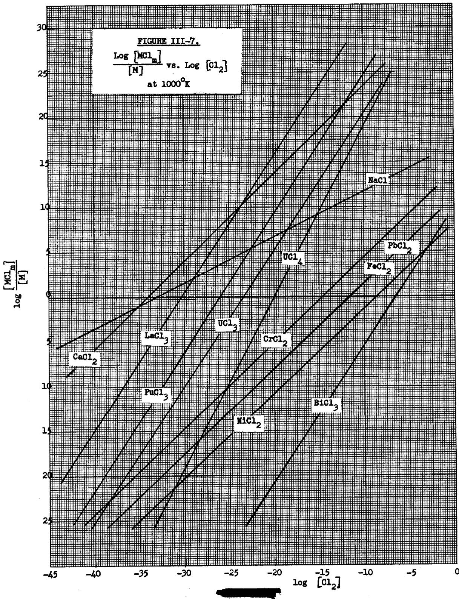

of such a graph would require as standard states of reference infinitely dilute solutions in the solvent metal or salt. This diagram is therefore only illustrative.

# 3.2 SEPARATION PROCESSES

The significant processing questions to be recognized and described are:

1. What metal solvent-fused salt solvent combinations are relatively inert with respect to each other? (The practical matters of solubility of uranium in the metal, or of compounds of uranium in the fused-salt phase, and of the temperature required to assure stable liquid phases of proper fluidity and vapor pressure, are not considered at this point.)   
2. What substances can be added to the salt phase to effect removal of uranium, plutonium, and fission products from an alloy containing these substances? Conversely, what metals may be added to a metal solvent to effect removal of uranium, plutonium, and fission products from fused-salt mixtures containing compounds of these substances?   
3. What substances may be added to either phase to effect a separation and concentration of the constituents of a nuclear fuel in the other phase?   
4. Is there a limit to the possible separability for the various constituents? If so, what is its value, and under what process conditions may it be obtained?   
5. Are there any equilibrium limitations imposed upon continuous processing?   
6. How is processing affected by changes in equilibration temperature?

An attempt can be made to answer many of these questions in terms of the model which has been discussed. In addition, there are important practical problems that cannot be attacked by means of this model alone:

7. What is the rate of approach to equilibrium?   
8. How complete can the physical separations of the phases be made?   
9. How reactive is either the alloy or fused salt with regard to container materials?

10. How significant will radiation damage be in alloys and fused salts, and how will processing be affected?

The choice of a metal solvent-fused salt solvent pair, the members of which are relatively inert towards each other, is restricted significantly by nuclear and physical considerations. Thus, in a thermal reactor employing a liquid alloy fuel, bismuth appears to be the choice of a solvent which will effect the best compromise between limited solubility of uranium, low temperature for solidification, and small losses due to parasitic capture of neutrons. In such a case, we need know only the fused ionic compounds which are relatively inert chemically toward bismuth. The fused alkali chlorides and fluorides (with the exception of lithium compounds because of nuclear considerations) would serve adequately in this application. This can be seen from Table III-4, which contains equilibrium constants estimated for the reaction (8),

$$
\frac {1}{3} B i + \frac {1}{n} M X _ {n} \Rightarrow \frac {1}{3} B i X _ {3} + \frac {1}{n} M,
$$

with

$$
\mathrm {K} _ {\mathrm {B i}} = \frac {\left[ \mathrm {B i X} _ {3} \right] ^ {\frac {1}{3}}}{\left[ \mathrm {B i} \right] ^ {\frac {1}{3}}} \quad \frac {\left[ \mathrm {M} \right] ^ {\frac {1}{n}}}{\left[ \mathrm {M X} _ {n} \right] ^ {\frac {1}{n}}} \quad , \tag {17}
$$

and $\underline{\mathbf{X}}$ being either chlorine or fluorine.

For fused-salt fuels, the salt melt will contain relatively large amounts of uranium compounds, so that suitability of metal solvents can be inferred from Figures III-2 and III-3. Bismuth would appear to be adequate for such purposes. For chlorides at $1000^{\circ}$ K, the same conclusions may be reached from differences in the ordinates in Figure III-7. The metal phase should contain elements for which the curves are well below that of uranium; the salt phase should contain elements with curves well above that of uranium.

In separation from an alloy fuel, such as a liquid bismuth alloy, it will be necessary to add an oxidizing agent equivalent to the amount of material which is to be removed. A very convenient one would be $\mathrm{BiCl}_3$ , and $\mathrm{UCl}_3$ or $\mathrm{Cl}_2$ might be useful in certain cases. As an illustration of decontamination let us assume that 0.1 per cent of the Pu may

$$
\frac {1}{3} B i + \frac {1}{n} M x _ {n} = \frac {1}{3} B i x _ {3} + \frac {1}{n} M
$$

TABLE III-4. Equilibrium Constants for Reaction:   

<table><tr><td>Salt (MXn)</td><td>500° K</td><td>1000° K</td><td>1500° K</td></tr><tr><td>LiCl</td><td>1.6 × 10-29</td><td>6.3 × 10-15</td><td>3.8 × 10-10</td></tr><tr><td>KCl</td><td>1.8 × 10-24</td><td>1.8 × 10-11</td><td>6.3 × 10-8</td></tr><tr><td>ZrCl2</td><td>1.1 × 10-17</td><td>2.5 × 10-8</td><td>4.5 × 10-6</td></tr><tr><td>LaCl3</td><td>3.6 × 10-25</td><td>1.1 × 10-12</td><td>9.6 × 10-9</td></tr><tr><td>UCl3</td><td>3.6 × 10-18</td><td>5.6 × 10-9</td><td>2.4 × 10-6</td></tr><tr><td>NaF</td><td>2.5 × 10-27</td><td>2.5 × 10-13</td><td>7.6 × 10-9</td></tr><tr><td>CaF2</td><td>4 × 10-32</td><td>1.3 × 10-16</td><td>1 × 10-10</td></tr><tr><td>KF</td><td>1.6 × 10-26</td><td>2.2 × 10-12</td><td>1.9 × 10-8</td></tr><tr><td>ZrF2</td><td>1.7 × 10-19</td><td>6.1 × 10-10</td><td>3.8 × 10-7</td></tr><tr><td>LaF3</td><td>1.3 × 10-28</td><td>1.2 × 10-13</td><td>3.1 × 10-9</td></tr><tr><td>UF3</td><td>3.8 × 10-21</td><td>2.2 × 10-10</td><td>4.2 × 10-7</td></tr></table>

be extracted in the first stage. For equimolar quantities of solvents, this would correspond in Figure III-7 to $\left[\mathrm{Cl}_2\right]$ of $10^{-28}$ atm. Only $3 \times 10^{-5}$ per cent of the U would be transferred, and only 0.01 per cent of the La would remain in the metal. To scavenge the Pu, the salt phase would be treated with another lot of bismuth which contains reducing agent equivalent to the salt to be reduced. The metal corresponding to an alkali or alkaline earth chloride in the salt phase should be satisfactory for this purpose.

If the Pu is to be separated from the U in a subsequent stage, more oxidant would be added. If three per cent of the Pu is left in the metal phase in one stage, for example, Figure III-7 indicates that the $\left[\mathrm{Cl}_2\right]$ should be increased to $10^{-25}$ atm. and one per cent of the U would also be extracted. The Pu can be purified by treating the salt with more bismuth-containing reducing agent as in the scavenging process described above, but this step might not compete with the wet processing which will presumably be necessary for the final purification.

This equilibrium is probably not directly applicable to a fused-salt fuel. Instead, most of the U could be removed by volatilization, and the Pu (and remaining U) then decontaminated by the process described above for scavenging Pu.

Figure III-6 indicates that at low temperatures the Pu might be removed without much U. However, it would certainly be necessary to reduce all the U to the trivalent state.

As regards the effect of processing temperature, it appears from the equilibrium constants which have been estimated that in general large differences may be obtained at lower temperatures that make for favorable separations, and the differences generally tend to become significantly smaller at high temperatures. However, some exceptions do exist and may be taken advantage of, as in the separation of Pu and U discussed above.

In summary, we are able to suggest the characteristics of a separations process for reactor fuels which contain uranium, plutonium, and fission products either in an alloy or in a fused salt:

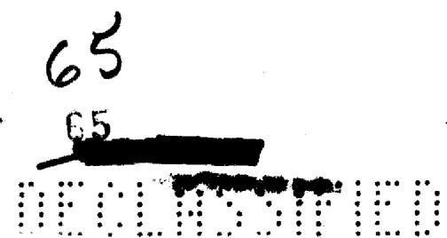

# Liquid-Metal Fuel

1. Bismuth appears to be a chemically suitable metal solvent.   
2. In order to prevent nuclear poisoning of a reactor by fused salts which may be entrained from the separation process, it has been considered desirable to restrict the choice of anion to fluoride for thermal reactors. Alkali-fluorides (excepting lithium) and alkaline-earth-fluorides appear to be feasible salts. Eutectic mixtures of 60 mole % NaF - 40 mole % KF with a eutectic temperature of $700^{\circ}$ C., or 53 mole % NaF - 47 mole % CaF₂ with a eutectic temperature of $810^{\circ}$ C. would seem to be suitable. For fast reactors, where chlorine is satisfactory, the choices are much wider and will not be listed here.   
3. The oxidant employed may be such a substance as $\mathbf{BiF}_3$ , or an electrochemical procedure may prove feasible (15).*   
4. Temperatures should be as low as possible for decontamination.   
5. Enrichment of plutonium with respect to uranium in the salt phase will probably require temperatures in excess of $800^{\circ}$ C. At lower temperatures it seems reasonable to suppose that uranium may be oxidized in preference to plutonium.

# Fused-Salt Fuel

1. The choice of salt melts now contemplated involve fluorides or chlorides. In either case bismuth would be adequate for the contacting metal phase only in the absence of tetravalent uranium salts. Otherwise, the bismuth will transform the tetravalent halide to the trivalent halide.   
2. At low temperatures enrichment of plutonium relative to uranium may be effected in the metal phase. Since fission products such as rare-earth elements are relatively more difficult to reduce, decontamination of the plutonium will certainly be effected. Electrolytic processing, with a cathode of liquid bismuth, would merit consideration in this sort of processing scheme. In such a scheme, the bismuth cathode would presumably become enriched in plutonium relative to fission products and

perhaps to uranium, and adequate control of the amount transferred could be maintained easily.

3. Extraction by a liquid metal will not serve to remove fission products in a fused salt from uranium.

# 3.3 CORROSION

The considerations given above may also be useful in studying the corrosion of container vessels, in particular in studying mass transfer. In Chapter II is discussed the relation of corrosion to the free energy of formation of corrosion products, and the relation of mass transfer to the free energy and to the enthalpy change of the corrosion reactions.

Physical mass transfer may result from a large variation with temperature of the solubility of the container walls in the contained fluid. This may be an important means of transfer by liquid metals, but it is probably unimportant with fused salts. For chemical mass transfer it is necessary that the salt of the container metal and a reducing agent both be carried by the fluid and that their equilibrium vary greatly with the temperature.

Bredig (16) has suggested that the mass transfer of Cr, Fe, and Ni by fused alkali fluorides may be due to reactions such as,

$$
\operatorname {F e} (\mathfrak {s}) + \operatorname {K F} (\ell) \Rightarrow \operatorname {F e F} _ {2} (\text {d i s s .}) + K (\text {d i s s .}),
$$

which are favored at high temperatures and reversed at low temperatures.

It is also possible that a sub-halide of the container metal may be both oxidizing and reducing agent if it is stable at high temperatures and disproportionate at low temperatures to give the higher halide and the metal, as,

$$
2 \mathrm {F e X} (\text {d i s s .}) = \mathrm {F e X} _ {2} (\text {d i s s .}) + \mathrm {F e (s)}
$$

For the thermodynamically stable halides, disproportionation increases with increasing temperature, which does not lead to mass transfer from high to low temperature. We do not know, of course, the effect of temperature upon the disproportionation of unstable sub-halides.

It was shown in Chapter II that the reaction of $\mathrm{UCl}_4$ or $\mathrm{UF}_4$ with Ni, Fe, or Cr, such as,

$$
2 \mathrm {U C l} _ {4} (\mathrm {s}) + \mathrm {F e} (\mathrm {s}) = 2 \mathrm {U C l} _ {3} (\mathrm {s}) + \mathrm {F e C l} _ {2} (\mathrm {s}),
$$

is almost independent of the temperature. Therefore a mixture of reasonable proportions, say at least 10 per cent of each component, should act as a buffer to prevent the chemical mass transfer of container metal by any other reaction. For example any K which is dissolved in the salt at high temperature will react at low temperatures much more with UCl₄ than with FeCl₂, since the former will be present in much larger quantity. If mass transfer can be avoided, corrosion can be reduced by the addition of approximately equilibrium amounts of the corrosion products. The possibility of application of these conclusions to UCl₃ and UCl₄ mixtures depends, of course, upon the mutual solubilities of these substances discussed in Chapter II.

# REFERENCES

1. A Continuous Fission Product Separation Process, BNL-125, Bareis, D.W., 23 pp., SECRET, July 1, 1951.   
2. Private Communication, Grimes, W., ORNL   
3. The Thermodynamic Properties and Equilibria at High Temperatures of Uranium Halides, Oxides, Nitrides, and Carbides, MDDC-1543, Brewer, L., Bromley, L. A., Gilles, P. W., and Lofgren, N. L., 84 pp., DECLASSIFIED, September 20, 1945.   
4. Fuel Processing Interim Report, BNL Log #C-4213, Bareis, D. W., 4 pp., SECRET, September 8, 1950.   
5. Summary Report of Fuel Processing Group Activities during 1950, BNL Log #C-4509, Bareis, D. W., 7 pp., SECRET, January 18, 1951.   
6. Fuel Processing Interim Report, BNL Log #C-4714, Bareis, D. W., 8 pp., SECRET, April 3, 1951.   
7. Interim Report of the Fuel Processing Group, BNL Log #C-5723, Bareis, D. W., 13 pp., SECRET, January 15, 1952.   
8. "Temperature-Composition Diagrams of Metal-Metal Halide Systems," Eastman, E. D., Cubicciotti, D. D., and Thurmond, C. D., pp. 6-12; "The Thermodynamic Properties of the Halides," Brewer, L., Bromley, L. A., Gilles, P. W., and Lofgren, N. L., pp. 104-115, 123-125; in The Chemistry and Metallurgy of Miscellaneous Materials, Thermodynamics, N.N.E.S., Div. IV, P.P.R., Vol. 19B, Quill, L. L., Editor, 329 pp., UNCLASSIFIED, (McGraw-Hill, 1950).   
9. Elektrochemie Geschmolzener Salze, Drossbach, P., pp. 101 et seq, (Edwards Bros., Ann Arbor, Michigan, 1943).   
10. Graph of $-\Delta F$ vs. $T$ for Fluorides, Lee, M., ANP Project, Oak Ridge, UNCLASSIFIED, Unpublished.   
11. Thermodynamics of Alloys, Wagner, C., Chapter 7, (Addison-Wesley Press, 1952)   
12. Rinck, E. Ann. Chim 10, 395 (1932).   
13. Der Aufbau der Zweistofflegierungen, Hansen, M., pp. 306-308, 314-316, (Julius Springer, Berlin, 1936).   
14. The Chemistry, Purification and Metallurgy of Plutonium, MUC-JCW-223, pp. 133-144, SECRET, December 1944.   
15. Personal Communication to J. N. Addoms from D. F. Peppard, ANL.   
16. Personal Communication, Bredig, M., ORNL.

# CHAPTER IV. SEPARATION PROCESSING

R. Schuhmann, Jr.

# 1. INTRODUCTION

This chapter represents a preliminary appraisal of the problems and possibilities of separation processing for plutonium-producing reactors using non-aqueous fluid fuels such as liquid metals and fused salts. In this study some emphasis was placed on the separation problems associated with the two specific reactors selected for detailed engineering analysis by the M.I.T. Nuclear Engineering Project. These reactors required the following principal separations:

1. For the thermal reactor, the removal of plutonium and fission products from a dilute solution of these constituents and uranium in liquid bismuth.   
2. For the fast-reactor core, the removal of plutonium and fission products from a concentrated solution of $\mathrm{UCl}_4$ in other fused chlorides.   
3. For the fast-reactor blanket, the removal of plutonium and fission products from molten UCl.

Originally it was thought that the costs of fuel separation and reprocessing represented a large fraction of the total cost of producing plutonium in present solid-fuel reactors. Accordingly, a major incentive for the development of fluid-fuel reactors was the hope of reducing the cost of plutonium by the substantially lower separation and processing costs which appeared possible with fluid fuels. Recent data from the AEC on the breakdown of the unit cost of producing plutonium in Hanford-type reactors and Redox separation plants, however, indicate that reactor costs so overshadow separation and reprocessing costs that reduction of separation costs no longer appears to be the prime incentive for considering fluid-fuel systems. This represents some shift in point of view, but the fact remains that savings in separation and reprocessing costs through use of fluid fuels might be very substantial.

The separation processes now in use and proposed for solid-fuel reactors appear readily adaptable to the treatment of non-aqueous fluid

fuels, and it is likely that one or more of these better established processes will be used for some of the more critical separations in the treatment of liquid fuels. However, the use of liquid reactor fuels makes it possible to consider processing by continuous (or semicontinuous) removal of liquid from the reactor, passage as liquid through a simple separation plant, and return to the reactor still in the liquid state. With this procedure the bulk of the fuel would not have to be taken through the many steps of complete physical and chemical change which now account for a substantial fraction of processing costs.

# 2. STOICHIOMETRIC REQUIREMENTS

# 2.1 OVER-ALL MATERIALS BALANCES

Figure IV-1 represents a generalized reactor and separation system, with the principal streams of material indicated by solid arrows. For the liquid-fuel systems under consideration, the system as a whole after an initial start-up period should approach a steady state, so that the compositions of the principal streams will not vary with time. Moreover, the fuel stream leaving the reactor will be of the same composition as the fuel in the reactor. For these conditions, it is easily shown that

$$
y = a x R \tag {1}
$$

in which

$y =$ rate of producing this element in the reactor, in any convenient units per day.

a = total steady quantity of a given element or given isotope present in the reactor, in the same units.

$x =$ fraction of reactor contents fed to separation plant per day ( $x$ can be greater than 1).

R = recovery of the element in the final product stream, expressed as a fraction of this element in the stream from the reactor. It is assumed that the unrecovered fraction returns to the reactor.

Thus, if Pu is produced at the rate of y grams per day, we wish to limit the quantity in the reactor to a grams, and we have a separation process which will recover in final form the fraction R of the Pu in the fuel stream, this equation gives the necessary rate of feed to the separation

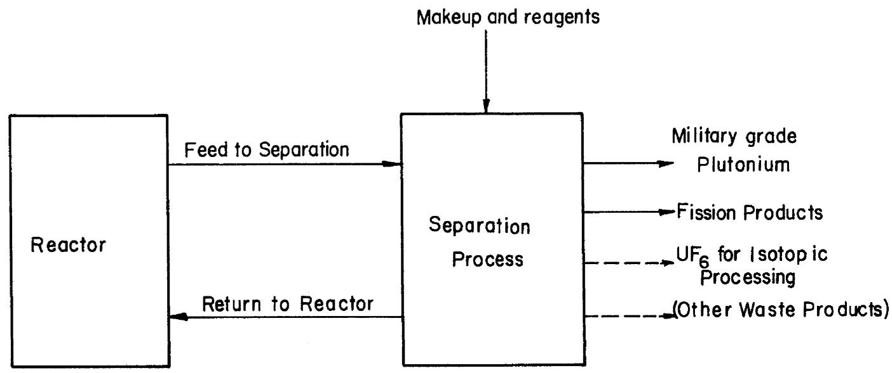

  
FIGURE IV-1. Flow between Reactor and Separation Plant

process $\underline{\mathbf{x}}$ . From the standpoint of maintaining a desired concentration of Pu or limiting the extent of poisoning by a given fission product, this relation shows that there is no necessity for attempting to make very high over-all recoveries in the separation plant. For example, it would no doubt be cheaper to maintain a given level of $\underline{\mathbf{a}}$ in the reactor with $\mathbf{x} = 0.1$ and $\mathbf{R} = 0.9$ than with $\mathbf{x} = 0.091$ and $\mathbf{R} = 0.99$ .

A major advantage of the liquid-fuel systems as compared to present solid-fuel systems is that the liquid fuel eliminates the severe requirements on the nature of the stream returning from the separation process to the reactor. Specifically the separation "tailings" do not have to be decontaminated, freed of plutonium, refined, and re-formed. These less stringent separation requirements, of course, justify the hope that simple, rapid, and cheap separation processes might be used, although they fall orders of magnitude short of giving the separation factors necessary for present solid-fueled reactors.

The use of liquid fuels of course in no way lessens the severe requirements to be met by the final products leaving the reactor system and separation plant as a whole. Thus the final plutonium product must be decontaminated to a high degree and otherwise of sufficient purity to meet military standards. The waste stream of fission products, and any other waste streams, must be substantially free of plutonium and also should not contain appreciable quantities of uranium or other valuable constituents of the fuel.

# 2.2 HIGHER ISOTOPES

Processing requirements for reactors with high burn-up rates for the fuel, such as the fast fused-chloride reactors, are complicated by the formation of higher isotopes, U-236 and U-237. Details of this problem are considered in Chapter V of the engineering analysis report. From the standpoint of the separation plant, however, this problem requires the separation of uranium and its purification, decontamination, and conversion to $\mathrm{UF}_6$ . The $\mathrm{UF}_6$ is processed isotopically in a diffusion plant which returns uranium to the reactor system.

# 2.3 SUMMARY OF SEPARATION REQUIREMENTS AND OBJECTIVES

In the light of the foregoing discussion, the principal requirements to be met by the complete separation process for a liquid-fuel

system may be summarized as follows:

1. The final product stream of Pu must be of acceptable military grade and purity.   
2. The effluent streams of fission products and other waste materials must be economically low in Pu, U, and other valuable fuel constituents.   
3. The separation process must maintain the fuel composition in the reactor within the desired limits, in accordance with the relation $y = axR$ which was discussed previously.   
4. Losses of Pu and other valuable materials must be low.   
5. If isotopic processing of U is required, the separation plant must yield a pure, decontaminated, and Pu-free stream of U or UF $_6$ suitable for feed to a diffusion plant.

In order to realize the full advantages of a liquid-fuel system, the following additional objectives should be considered:

6. Simplicity of operation, manipulation, and control, especially for all parts of the process with streams high in fission products and requiring shielding and remote control.   
7. Separation steps on the main stream of liquid fuel should be such that the bulk of the liquid fuel passes through the separation plant without chemical changes. That is, separation steps on the main stream should be in the direction of removing "concentrates" of Pu and fission products from the liquid-fuel phase and returning the bulk of the liquid unchanged chemically to the reactor.   
8. Low holdup of Pu and other valuable fissionable elements in separation plant.   
9. Elimination of "cooling" period.

# 2.4 PRESEPARATION

On the basis of present knowledge of high-temperature separation processes carried out on liquid metals and fused salts, it appears unlikely that such processes alone will meet all the requirements listed in section 2.3, and in particular may not be capable of yielding satisfactory final products in accordance with requirements 1, 2, and 5. On the other hand, the wet processes in use for solid fuels are known to be

capable of meeting these requirements but lead to complex and expensive procedures which do not satisfactorily meet requirements 6 to 9 of section 2.3 Accordingly, at this time the most promising way of utilizing separation processes carried out directly on liquid metals or fused salts is for preseparation or rough concentration of plutonium and fission products into one or more crude products. Figure IV-2 is representative of flowsheets based on the use of rough preseparation steps. The primary separation steps conducted directly on liquid fuel yield relatively crude products with moderate recoveries of Pu and fission products while the bulk of the fuel passes through quickly without chemical change and is returned to the reactor. The primary Pu concentrate is retreated first in a separation step designed to yield a Pu product sufficiently decontaminated to be fed without cooling and without heavy shielding to the final wet refining by solvent extraction, ion exchange, or precipitation. Similarly, the primary fission-product stream is retreated for the purpose of scavenging any Pu or other valuable fuel constituents.

The primary function of preseparation is to reduce substantially the quantity of material to be treated by the relatively elaborate and costly separation processes which are necessary to yield acceptable final products.

Another benefit which might be realized with flowsheets involving a simple preseparation process is that none of the steps in principle need be operated to attain an extremely high recovery. This possibility is realized in a flowsheet like that in Figure IV-2 in which each step returns unfinished intermediate products to a preceding step, or eventually back to the reactor. The Pu-refining step would be operated to yield a final Pu product meeting military standards but does not at the same time have to yield a final Pu-free product because all the unrecovered Pu is returned to the main system. Thus, the existence of a return circuit of unfinished material back to the reactor represents a further important reduction in the work to be done in the more expensive separation steps.

# 3. UNIT PROCESSES

# 3.1 WET PROCESSES

Separation processing of solid reactor fuels at present is based on wet processes, and several of these have been developed to a high degree

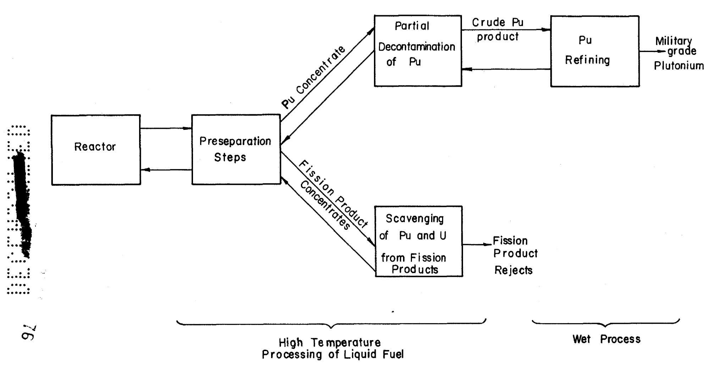  
FIGURE IV-2. Multistage High-Temperature Separation Flowsheet

to meet the severe recovery and decontamination requirements of solid-fuel systems. The wet separation processes fall into three groups:

1. Precipitation   
2. Solvent extraction   
3. Ion exchange

These processes are well described in AEC classified publications and have been appraised with other types of separations by J. H. Arnold et al (1).

As already discussed in section 2 of this chapter, the proper role of these wet processes in liquid-fuel systems is in the steps of purifying or decontaminating the final products leaving the system, especially the plutonium product. On the other hand, separation schemes based entirely on wet processes would eliminate some of the major savings to be sought by adoption of a liquid-fuel system.

# 3.2 PROCESSES FOR LIQUID-METAL FUELS

For reactors with liquid-metal fuels, such as the dilute bismuth solution considered in the engineering analysis report, the preseparation step necessarily requires a process or processes in which the bulk of the fuel remains as liquid metal while the desired elements are removed into another phase. Many separations of this kind are carried out on a large scale in the refining of common metals. Also, preliminary experimental studies of liquid-metal separations on possible reactor fuels have given promising results. Thus it is evident that liquid-metal separation processes comprise an important field for further extensive study as part of the overall program of developing non-aqueous, liquid-fueled reactors. Also it should be kept in mind that liquid-metal separations have possible utility in processing solid fuels.

A convenient basis of classifying liquid-metal unit processes is according to whether the second phase into which the elements are separated is (1) gas, (2) liquid, or (3) solid. Each of these three classes of processes is extensively used in the large-scale refining of common base metals such as lead, copper, bismuth, tin, and iron, so that a variety of techniques are well worked out. The further development of liquid-metal separations for nuclear fuels will require mainly studies of the chemistry of specific systems and engineering adaptation of the processes to the special requirements of nuclear reactor systems.

LIQUID-GAS. - In principle, separations of volatile elements and removal of dissolved gases are the simplest kinds of separation carried out on liquid metals. Since radioactive gases such as xenon and krypton and other relatively volatile elements (Ba, Sr, Rb, Cd, I, Br, etc.) will account for important proportions of the fission-product activity in liquid-metal fuels, it appears almost inevitable that a gas-phase separation will be one major step in the processing of a liquid-metal fuel.

The common techniques of removing gases include (1) simple heating to a high temperature at atmospheric pressure, (2) flushing with an inert gas, and (3) vacuum degassing. In melting and refining the common metals, these separations are generally conducted in batch apparatus. Preliminary tests of the separation of gaseous fission products from melted uranium fuel elements gave promising results in the Ames Laboratory (2). Brewer has considered this process on thermodynamic grounds (3). Experiments reported from Chalk River (4) indicate that possible volatilization and loss of plutonium must be considered. Virtually no experimental data are available on gas-metal equilibria, gas solubilities, vapor pressures of solute elements, rate of separation, and techniques of continuous operation, so that at present engineering specifications can hardly be made of a process for removing gaseous and volatile elements from liquid-metal fuels.

LIQUID-LIQUID SEPARATIONS. - Many possibilities exist for separations by treating the liquid metal with a second immiscible liquid phase. The extracting phase may be (1) another liquid metal, (2) a fused-halide mixture, or (3) slags, such as oxides, silicates, alkalis, etc. Slag-metal systems form the basis of a majority of the separations made in smelting and refining ordinary base metals, but at this time the halide-metal systems show the most immediate promise for processing reactor fuels. Bareis (5) has shown that fused-chloride mixtures will remove rare-earth fission products from dilute solutions of uranium in bismuth. These data and their theoretical interpretations were considered in detail in Chapter III. It might be pointed out also that fused chloride-liquid metal systems are the basis of a number of commercial metal-refining processes, collectively termed selective chlorination processes because the behavior of a given metal in this process depends

primarily on its chemical affinity for chlorine as measured, for example, by the free energy of formation of the chloride.

Brewer (3) has suggested that separations of rare-earths, plutonium, and uranium might be made by selective oxidation of their liquid alloys. This process merits consideration for reactor fuels based on liquid bismuth because bismuth itself is not readily oxidized and because the selective oxidation process is now successfully used in commercial bismuth refining. The separated oxide might be removed either as a solid or as an oxide slag. If an oxide slag is produced, it probably will be desirable to add auxiliary oxide fluxes to lower the slag melting point and to improve the selectivity of the separation. For example, caustic soda and soda ash are used for these purposes in selective-oxidation processes of lead refining.

Commercial separations based on systems with two immiscible liquid metals are rare, but this combination is of some interest because work at the Ames Laboratory (6) has indicated that liquid silver and perhaps liquid copper will extract plutonium from liquid uranium. It would not be surprising if other useful systems of two immiscible liquid metals were discovered, but so far none has been proposed involving liquid bismuth as one of the phases.

LIQUID-SOLID SEPARATIONS. - Two general methods of separating impurities from liquid metals as solids may be distinguished:

1. fractional crystallization or liquation, in which the original liquid metal is cooled slowly to cause precipitation of an insoluble phase, and   
2. precipitation by adding a chemical which reacts with the impurity to form a stable solid compound.

In either case, the solid phase is separated after precipitation by skimming, decantation, or filtration, depending on engineering requirements.

As an example of fractional crystallization, uranium can be removed from solution in liquid bismuth by cooling to near the freezing point of pure bismuth. The uranium separates as solid $\mathsf{UBi}_2$ and near $285^{\circ}$ C. only $0.038\%$ U is left dissolved in the liquid bismuth.

A number of processes have been proposed for selectively precipitating various constituents of liquid reactor fuels. These may be

classified on the basis of the kind of compound precipitated as follows: (1) oxides (3), (2) carbides (2, 3), (3) nitrides (2, 3), and (4) intermetallic compounds (6). All four groups show promise on physico-chemical grounds, and preliminary tests at Ames have given favorable indications.

# 3.3 PROCESSES FOR FUSED-SALT FUELS

As with liquid-metal fuels, it appears that the separation processing of fused salts will require the use of established wet processes for the steps of purifying the final products which leave the reactor system. In this section are described briefly several possible methods of directly processing fused salts. These methods at present are to be considered primarily for preseparation and other primary separations steps not requiring high separation factors.

FUSED SALT-LIQUID METAL PROCESSES. - The experimental studies of Bareis (5) and the theoretical considerations of Chapter III have dealt primarily with the use of fused salts to treat liquid-metal fuels. When liquid bismuth containing U, Pu, and rare-earths is treated with fused halides, the rare-earths tend to enter the fused-salt phase ahead of the U and Pu so that a direct separation of fission products can be made while leaving the valuable fissionable elements in the liquid-metal fuel. On the other hand, if a fused-salt fuel were treated with liquid bismuth, the rare-earth metals would not be extracted into the bismuth until all the U and Pu had been removed from the salt. Thus, the order in which the metals tend to enter the liquid metal under reducing conditions means that application of the process to fused-salt fuels would require a roundabout and complicated flowsheet.

DISTILLATION. - Many of the halides of the metallic elements present in reactor fuels are sufficiently volatile that distillation or selective volatilization appears to be an attractive possibility for primary separations of the constituents of fused-halide reactor fuels. This unit process is considered in some detail in the engineering analysis of the fused-chloride reactor. The proposed flowsheet for this reactor, with a fuel consisting primarily of NaCl, PbCl $_2$ , UCl $_4$ , and PuCl $_3$ , involves a preseparation step in which UCl $_4$ and a portion of the fission products are distilled from the salt mixture while the

nonvolatile $\mathsf{PuCl}_3$ remains in the distillation residue.

No data are available to predict the behavior of the noble gases xenon and krypton in the distillation of mixed halides, but it appears likely that separation of these fission products will be relatively straightforward.

VOLATILE FLUORIDE PROCESSES. - Processes based on UF $_6$ volatilization and involving ClF $_3$ or BrF $_3$ as fluorinating agents are under investigation at several AEC installations (7, 8, 9, 10). Apparently it is possible to decontaminate uranium by a volatile fluoride process (7), so such a step may be worthy of particular consideration for reactor systems in which UF $_6$ must be prepared for isotopic processing in a gaseous-diffusion plant.

FRACTIONAL CRYSTALLIZATION. - Constitution diagrams for various binary salt mixtures indicate various rough separations which might be made by cooling the melt and removing the solid phase. More complete data on the constitution of binary, ternary, and multicomponent salt systems are needed, however, before any significant appraisal can be made of the chances of making useful separations by fractional crystallization. For example, Calkins (11) believed that the UCl₃-UCl₄ system might have a simple eutectic with extensive solid solution formation on the UCl₄ rich side, like the UBr₃-UBr₄ system. Kraus (12), however, believed that UCl₃ and UCl₄ are only slightly miscible as liquids (See Chapter II, 1.2). If Calkins is correct, crystallization of UCl₃ with PuCl₃ and trichlorides of fission products might give a useful rough separation.

IMMISCIBILITY IN FUSED-SALT SYSTEMS. - If Kraus is correct about the UCl₃-UCl₄ system, however, there is the very interesting possibility of a two-liquid separation process in which plutonium and/or rare-earth trichlorides are concentrated in one phase while UCl₄ and other constituents are recovered in the other liquid phase. Further work on the constitution of fused-salt mixtures may disclose other two-liquid systems which might form the basis of useful separations.

ELECTROLYSIS. - Electrolysis is a potential method of separation for fused-salt fuels, but data are not available for a significant

analysis of the method at this time. Electrolysis in fused salts has been used for the purification of uranium at Argonne (13).

METATHESIS. - Selective removal of plutonium and/or rare-earth fission products from fused-halide fuels by treatment with solid compounds such as oxides and carbides appears thermodynamically feasible. This type of process involves a metathesis, with the metallic element from the fused-halide combining with the oxygen or carbon of the added reagent to form a solid insoluble product. Brewer (3) has suggested several specific processes of this kind.

# 4. TENTATIVE FLOWSHEETS FOR PROCESSING Bi-U-Pu FUELS

Insufficient data are available to justify engineering specifications of any complete separations process for liquid-metal fuels. However, enough information is available on specific unit processes of treating liquid-bismuth solutions to justify some speculation as to possible combinations of individual unit processes into complete flow-sheets. Accordingly, this section presents a few tentative flowsheets which may be of some use as a guide in planning further work. These flowsheets involve primarily the following unit processes:

Fused salt-liquid metal separations

Vacuum removal of noble-gas fission products

Selective oxidation

Fractional crystallization

Also it is assumed that one of the established wet processes will be used for the final steps of decontaminating and purifying the plutonium.

Figure IV-3 gives a relatively simple type of flowsheet which is similar to the flowsheet described in Chapter IV of the engineering analysis report. The fused salt-liquid metal step is used to make a rough concentrate of Pu and rare-carths for feed to wet processing. In order to obtain a reasonable recovery of Pu in the fused-salt phase, the fluorine activity will have to be maintained relatively high (for example, by adding $\mathrm{BiF}_3$ ) and a substantial fraction of the uranium probably will be driven into the salt phase. As has been shown in Chapter III, high temperatures are expected to favor the selective concentration of Pu relative to U in the salt phase.

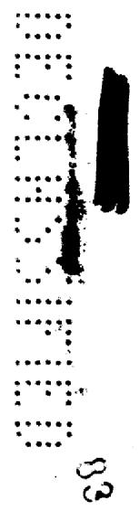

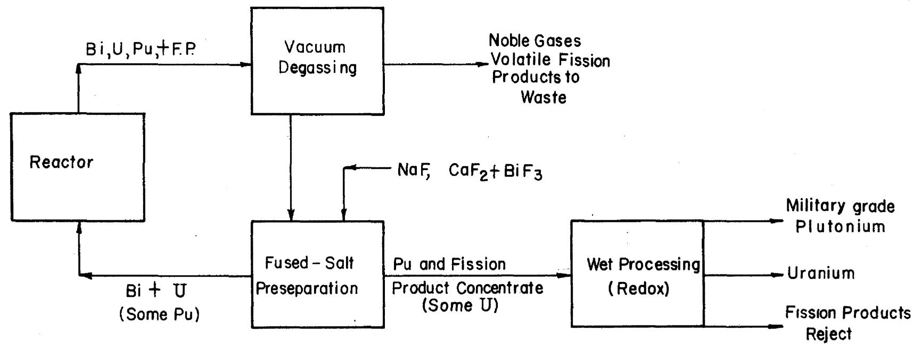  
FIGURE IV-3. Separation Process for U-Bi Reactor Fuel

Figure IV-4 gives a flowsheet involving three separate steps of fused-salt treatment of the liquid-metal fuel. In each of these steps the activity of fluorine is regulated (increased by adding $\mathrm{BiF}_3$ ; decreased by adding Na or Ca) to control the direction and extent of separation. In the fused-salt decontamination step, the objective is to separate a maximum of fission products even at the expense of driving a portion of the Pu and U into the fused salt. In the scavenging step, reducing conditions are provided to drive virtually all the Pu and U back into the liquid metal. Under these conditions, part of the fission products will be returned to the fuel in the scavenging step, but it is hoped that the fused-salt product of this step will be sufficiently low in Pu and U to be discarded as the principal fission-product reject. The fused-salt product of the Pu-separation step should contain only fluorides with dissociation pressures close to those of $\mathrm{PuF}_3$ . As compared to the flowsheet in Figure IV-3, this flowsheet should permit use of a simpler and smaller wet plant with a less serious shielding problem.

Some doubt exists as to whether an adequate separation of Pu from U can be made in the fused salt-liquid metal system. An alternative flowsheet to meet this difficulty is obtained by substituting a selective-oxidation step for the fused-salt Pu-separation step in Figure IV-4. This alternative is based on the expectation that Pu would be oxidized ahead of U (3), to give a plutonium oxide concentrate for feed to the wet plant.

It would not be surprising if a process such as that shown in Figure IV-4 would allow some fission products to build up in the liquid-metal fuel. The partial flowsheet in Figure IV-5 is one way of separating and discarding elements which fall in this category, but in view of the probable relatively high cost of the alkali metals is best suited for application to a fraction of the total stream of liquid metal through the separation plant. In principle, this procedure should bleed from the system all elements which will not tend to come out in the final salt solution of fission products, in the gaseous waste product, or into the Pu-refining circuit.

The above-discussed flowsheets by no means exhaust all the possibilities which might be devised from present information, but further speculation without more quantitative data on the unit processes hardly appears warranted at this time.

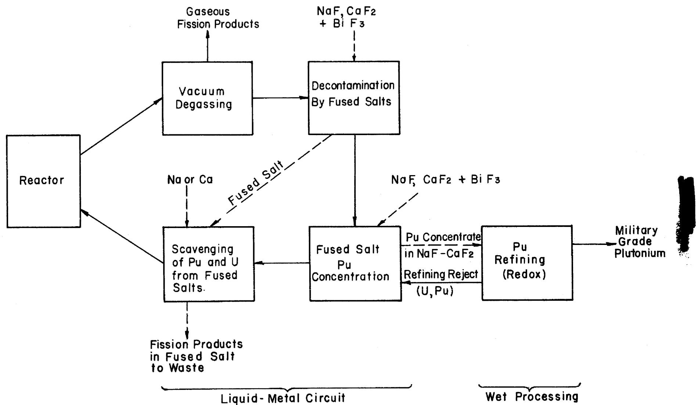  
FIGURE IV-4. Multistage Separation Process for U-Bi Reactor Fuel

  
5

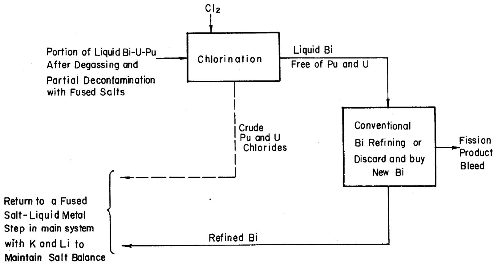

  
FIGURE IV-5. Bismuth Refining Flowsheet

# REFERENCES

1. Survey of Processes for Separation of the Products of Nuclear Reactors, Reactor Science and Technology, TID-71, Arnold, J. H., Benedict, M., Elsey, H. M., Finneran, J. A., Golden, S., and Grosselfinger, F. B., pp. 96-112, SECRET, April 1951.   
2. Preliminary Survey of a Thermal Method for Removing Fission Products, Developed by the Ames Chemical Group, CN-437, Spedding, F. H., Johns, I. B., Newton, A. S., Voigt, A. F., and Sullivan, W. H., 4 pp., SECRET, 1943.   
3. High Temperature Decontamination and Separation Processes, Univ. of Calif., UCRL-314, Brewer, L., 11 pp., SECRET, May 6, 1949.   
4. Simplified Methods for the Processing of Reactor Fuels, KAPL-670, Ahmann, D. H. and Tevebaugh, A. D., 25 pp., SECRET, Dec. 6, 1951.   
5. A Continuous Fission Product Separation Process, BNL-125, Bareis, D.W., 23 pp., SECRET, July 1, 1951.   
6. Chemical Research - Chemistry of Plutonium, CN-1058, Butler, T. A., Voigt, A. F., Wolter, F. J., Ayres, J. A., Hein, R. E., Tevebaugh, A. D., Johns, I. B., 12 pp., SECRET, Oct. 1943.   
7. Fluorination of Massive Metallic Uranium with Liquid Chlorine Trifluoride, K-831, McMillan, T. S., Kirslis, S. S., Barber, E. J., 27 pp., SECRET, Nov. 12, 1951.   
8. Pilot Plant Studies of the Recovery and Decontamination of Irradiated Uranium by the Chlorine Trifluoride Process, K-519, Gustison, R. A., 23 pp., SECRET, June 18, 1952.   
9. The Argonne Fluoride Volatility Process - Status Report, ANL-4709, Hyman, H. H. and Katz, J. J., 210 pp., SECRET, Feb. 10, 1952.   
10. Recovery of Plutonium and Fission Products from Reactor Pot Residues of the Chlorine Trifluoride Process, K-817, Benton, S. T. and Gustison, R. A., 16 pp., SECRET, Sept. 12, 1951.   
11. Chemical Research: General, For Period August 10 to September 10, 1944, Calkins, V. P., Ames, CC-1975 (A-2889), 15 pp., SECRET, October 7, 1944.   
12. Phase Diagram of Some Complex Salts of Uranium with Halides of the Alkali and Alkaline Earth Metals, Brown Univ., M-251, Kraus, C. A., 20 pp., SECRET, July 1, 1943.   
13. Private Communication to J. N. Addoms from D. F. Peppard, ANL.

# CHAPTER V. SUGGESTIONS FOR RESEARCH PROGRAM

# 1. INTRODUCTION

The following suggestions for a research program are based upon the needs which we have found in connection with the study of liquid-fuel reactors and related separation processes. No attempt is made to relate these suggestions to current research projects because of our incomplete knowledge of these projects. We do know, however, that some items which we suggest are now being studied.

The greatest need is for theoretical studies. It is generally recognized that our understanding of liquids is far behind our knowledge of either gases or solids. Of all liquids and liquid mixtures, the theory of fused salts is probably the most limited, particularly for salt systems containing complex ions. The theory of liquid alloys, particularly those containing intermetallic compounds, is almost as limited. Many of the systems of interest in reactor technology are rich in complex ions or intermetallic compounds.

It is inherent in theoretical research, however, that it cannot be programmed, except for detailed developments. Each advance in theory opens up new fields for development. This is well illustrated, in a modest way, by Chapter III of this report. We do all know that insight which may lead to a new theory depends greatly upon the breadth of knowledge. Therefore, our appreciation of the importance of theory should prevent the limitation of research to systems of immediate practical interest. For example, it is unlikely that bromides or iodides, or lithium or cesium salts will be used in or with reactor fuels. Yet they are so important in the series of the halides and of the alkalis that their behavior in mixtures with the salts of uranium and other metals should not be ignored. Primary emphasis must be placed, of course, on materials of practical interest.

The elements of greatest importance in this work are U, Pu, and Np. They are listed above in the order of decreasing importance but also in the order of decreasing knowledge.

The substances of present principal interest are the metals, their

chlorides and fluorides. However, more knowledge of oxides and carbides might lead to better separation processes.

# 2. PURE SUBSTANCES

# 2.1 PHYSICAL PROPERTIES

Before fluid-fuel reactor processes can be designed in detail it will be important to have reliable information on physical properties of fluorides and chlorides of U and Pu, particularly melting points, vapor pressures, densities, viscosities, specific heats and latent heats, and similar information on solvent metals and salts, where such data are not available.

# 2.2 CHEMICAL PROPERTIES

Reliable data on the heats of formation and free energies of formation of the fluorides and chlorides of U, Pu, and Np, of fission-product elements, and of iron, nickel, chromium, zirconium, molybdenum, tantalum, and other structural materials are of key importance in devising fused salt-liquid metal separation processes, and in understanding corrosion by fused salts. Brewer's valuable compilations of the thermodynamic properties of compounds of U (1), Pu (2), and other elements (3) are noteworthy contributions, but many of the entries are necessarily based on inaccurate experiments and many only on analogies. These should be replaced by results of precise experiments. In particular, some of the properties for Pu derivatives are assumed to be the same as for the corresponding U derivatives, and they are, therefore, of little value for studying the separation of these elements. No values for Np are available.

Any sub-halides of U, Np, Pu, of the fission products, or of the structural metals, even those which are too unstable to exist in the pure form, are extremely important for reactors. Our knowledge of them is meager indeed.

# 3. MIXTURES

# 3.1 ALLOYS

Phase diagrams for many binary alloys containing U are available and are summarized in recent articles in the Journal of Metallurgy and

Ceramics (4, 5). There is need for correspondingly complete information on binary alloys of Pu, to help select fuel systems for breeder reactors and to suggest possible separation processes for liquid-metal fuels.

Information is also needed on ternary alloys of U, Pu, and the promising solvent metals, bismuth, iron, nickel, and aluminum. Phase diagrams for alloys of each of these solvent metals, U, and individual fission products would be helpful in working out separation procedures, and phase diagrams for each of these solvents metals, U, and individual structural elements would aid in the study of corrosion.

In all of these studies, the liquidus curves will give valuable information, but we should also know the compositions of the solid phases, particularly those of intermetallic compounds. Measurements of the activities of the components, where obtainable from vapor pressure or electromotive force measurements, will be particularly valuable in understanding these systems. The recent book of Wagner (6) gives an excellent picture of methods of studying alloys and of the information which is important.

Early work at Ames, recently confirmed at Chalk River, has shown that Pu may be selectively extracted from molten U by molten Ag or Cu. Complete liquid-liquid equilibrium diagrams for the systems U-Pu-Ag and U-Pu-Cu including the solubilities of U and the effects of added components should be studied. The distributions of individual fission products between U and Ag and Cu also need to be known.

The presence of gases in reactors may be so disturbing that it is important to know, as functions of the temperature and pressure, the solubilities of the gaseous fission products, particularly of the noble gases, xenon and krypton, in liquid uranium, liquid bismuth, and in other potential fuels.

The vapor pressure of zinc in liquid zinc-bismuth-uranium alloys, and of mercury in liquid mercury-bismuth-uranium alloys may be of practical interest since these alloys have been suggested (7) as fuels to be used with evaporative cooling.

# 3.2 SALT MIXTURES

The needed studies on salt mixtures are very similar to those described above for alloys, but with complex salts instead of intermetallic compounds. The important methods of study are essentially

the same: liquid-solid and liquid-liquid equilibria or phase diagrams; vapor pressure and electromotive force measurements to determine activities. More of the salts have vapor pressures large enough to be measured for activity determinations and to be of practical importance in reactors and especially in separation processes. There is an additional complication that an element may be present in a salt mixture in more than one state of oxidation.

The oxidation-reduction equilibria of pairs such as U-Pu or U-fission product need to be investigated. Sub-halides which are not known as pure substances may be stabilized in salt mixtures, and may have considerable practical importance, especially in corrosion. This is one of the more pressing problems for research.

The system UCl₃-UCl₄ has been described as giving two immiscible liquids, and also as forming a simple eutectic with solid solutions on the UCl₄-rich side (Chapter II). Knowledge of the solubility of UCl₃ in UCl₄ is very important to reactor design. Moreover, if PuCl₃ and the rare-earth chlorides behave approximately like UCl₃, this system may be used for a convenient separation process. The nature of the process would depend upon the state of the trichloride-rich phase. More detailed and accurate knowledge of this system is particularly important.

A few fused-chloride mixtures containing UCl₃ and UCl₄ have been studied (8), and several fused-fluoride mixtures containing UF₄ have been studied at Oak Ridge in connection with the ARE project. Work on the chlorides particularly needs extension.

# 3.3 METAL-SALT SYSTEMS

Equilibria between liquid alloys and fused salts, as discussed in Chapter III, afford the bases for separation processes, and also means of studying the behavior of fused-salt systems which may be particularly important in understanding corrosion.

Studies of the equilibrium between a single salt and the metal corresponding to its cation, such as those of Eastman, Cubicciotti, and Thurmond (2) should be extended, and an attempt should be made to determine the nature of the species present in the salt phase. The metals studied should include U, Pu, fission products, bismuth, alkalis, alkaline earths and structural metals. The metal phase may be solid,

liquid, or vapor.

Measurements on systems containing two metals and their salts should include in addition the determination of the distribution of each element between the two phases. Finally, studies of more complex systems, such as those of Bareis (see Chapter III) but including higher concentrations, should be extended to give the distribution ratios of important pairs as a function of the temperature and the compositions of both metal and salt phases. A radioactive material or any material easily measurable in small quantities may be used as indicator for the oxidation potential in the system. The distribution ratios of greatest practical importance in reactor technology will probably be Pu-U and individual fission products - U, with the metal largely liquid bismuth and the salt largely fused mixtures of alkali and/or alkaline earth chlorides or fluorides, but theoretical studies may well involve a much greater range. Studies of these equilibria offer one of the most powerful tools for studying fused salts.

# 4. RADIATION STABILITY

Studies should be made upon the effect of reactor radiation on chemical equilibria in fused-salt systems. In fused chlorides and fluorides the activity of chlorine or fluorine is important in relation to corrosion in reactors. Sub-halides may be important in this relation also. In this project it was considered unwise to consider any fuels containing complex ions, such as nitrate or sulfate, because of the greater risk of decomposition by radiation. If these salts are interesting in other ways for a thermal reactor, the effect of radiation on them should be studied.

# 5. KINETICS

The rate of approach to equilibrium in metal-salt systems may be as important as the position of equilibrium so that it may be desirable to study the rates of various processes, including diffusion, phase separation, distribution between phases, and chemical reactions, both homogeneous and heterogeneous. The high temperatures and relative simplicity of the reactor systems tend, however, to reduce the importance of rate studies.

# 6. PHYSICAL PROPERTIES OF FUELS

Physical properties of certain pure substances must be known as a preliminary to reactor design. The study of the properties of the mixtures used as fuels is of even more direct importance. Such properties are density, viscosity, heat capacity, thermal conductivity, and vapor pressure. The viscosity, thermal conductivity, and vapor pressure may vary greatly with compound formation, and they may be decisive in the selection of reactor fuel.

# 7. UNIT PROCESSES FOR SEPARATION

The objectives in unit process research are the development of effective and economical separation steps and the quantitative understanding of the basic process variables and how they are related to each other. The logical starting points for developing separations processes are favorable thermodynamic data for the primary reactions, but the making of a usable process requires measurement and integration of data on energy requirements, materials flow and materials handling, reaction and mass transfer rates, apparatus design, materials of construction, etc. Unfortunately, the special requirements to be met by separation processes for reactor fuels in general will not be met very well by many of the techniques and operating procedures which are standard in the metallurgical industry.

# 7.1 LIQUID-METAL PROCESSES

The discussion below deals with processes in which a separation is made from a liquid-metal phase into a second phase which may be solid, liquid, or gas, depending on the process.

7.2 EXTRACTION WITH FUSED SALTS. - On the basis of present knowledge, the treatment of liquid-metal fuels with fused salts promises to be a very useful process for separation of rare-earth fission-products, U, and Pu from liquid metals. The research program on this process should be considerably expanded beyond the present program at Brookhaven and the theoretical study now being started by North American Aviation. If it is found that single-step extractions do not give the necessary separation factors, techniques of counter-current multi-plate extraction should be developed similar to those used in conventional solvent extraction.

7.3 GAS-METAL SEPARATIONS. - Some of the fission products may be permanent gases and others may be sufficiently volatile to be separated from the liquid fuel by boiling, vacuum distillation, or flushing with inert gas. At present virtually no data on solubilities or relative volatilities are available which could serve as the basis for designing a continuous process of removing gases from liquid metals.   
7.4 SELECTIVE OXIDATION. - Many of the procedures of fire refining of common metals are based on selective oxidation. Brewer suggests that Pu might be separated from liquid U in this way (10), and a similar separation should be feasible if the Pu and U are initially present in liquid Bi. A serious problem to be considered in connection with this and other processes in which a solid phase is precipitated from liquid metal is to find a suitable method of performing the solid-liquid separation, especially if the quantities of solids are small. It might be possible to add an inert flux so that the oxides could be more easily separated in a liquid phase.   
7.5 PRECIPITATION OF INTERMETALLIC COMPOUNDS. - Work at Ames some years ago indicated that Pu could be precipitated from liquid U in the form of intermetallic compounds with tin and possibly other metals. This type of process is of particular importance in present-day lead refining.   
7.6 IMMISCIBLE LIQUID METALS. - Systems with liquid silver or liquid copper in contact with liquid uranium or iron-uranium alloys are said to be under investigation at Ames.   
7.7 FRACTIONAL CRYSTALLIZATION. - Constitution diagrams and equilibrium data show what separations are possible by cooling and crystallization of liquid alloys, but considerable further research on techniques of phase separation and continuous operation is needed to develop a complete separation process.   
7.3 ELECTROLYSIS, LIQUID-METAL ELECTRODES, AND FUSED-SALT ELECTROLYTES. The work on fused-salt extraction of liquid Bi alloys suggests the possibility of electrolysis with two liquid Bi alloy electrodes and a fused-salt electrolyte or with various combinations of one liquid Bi electrode and one solid electrode.

27.2 94

7.9 SELECTIVE CHLORINATION. - Another process similar in principle to the fused-salt process would involve passing chlorine gas through the liquid metal to form a salt phase of chlorides of metals derived from the liquid fuel. This might be a good way of separating U or U and Pu from a decontaminated Bi-U-Pu alloy.

# 8. ENGINEERING DEVELOPMENT OF COMPLETE SEPARATION PROCESSES

On the basis of the limited quantitative information now available on the individual unit processes, an extensive program of testing complete processes would be premature. However, the available data do justify a limited program, and this program should be expanded rapidly as the unit processes are developed. In particular, modest programs could be planned now for the engineering development of complete processes for the following feed materials:

1. Irradiated Bi-Pu-U liquid alloys.   
2. Liquid fuels based on Fe-U system.   
3. Melted Hanford slugs.   
4. Liquid fuels based on Al-U system.   
5. Irradiated UCl in fused alkali chlorides.   
6. Irradiated UF in fused alkali fluorides.

# 9. CONCLUSION

It should be emphasized again that at the present state of development of non-aqueous fluid-fuel reactors, research on the design of complete reactors may well be subordinated to studies of unit processes. Still more important is the basic study of the properties of the materials and systems related more or less closely to those used in or with such reactors. The most important research, however, will probably be the broader and more fundamental theoretical studies suggested by the reactor problems.

# REFERENCES

1. The Thermodynamic Properties and Equilibria at High Temperatures of Uranium Halides, Oxides, Nitrides, and Carbides, MDDC-1543, Brewer, L., Bromley, L. A., Gilles, P. W., and Lofgren, N. L., 84 pp., DECLASSIFIED, Sept. 20, 1945.   
2. "The Thermodynamic Properties of the Halides," Brewer, L., Bromley, L. A., Gilles, P. W., and Lofgren, N. L., pp. 76-192 in The Chemistry and Metallurgy of Miscellaneous Materials, Thermodynamics; N.N.E.S., Div. IV, P.P.R., Vol. 19B, Quill, L. L., Editor, 329 pp., UNCLASSIFIED, (McGraw-Hill, 1950).   
3. The Thermodynamic Properties and Equilibria at High Temperatures of the Compounds of Plutonium, BC-88, Brewer, L., Bromley, L., Gilles, P. W., and Lofgren, N. L., Oct. 10, 1947.   
4. The Binary Alloys of Uranium, Journal of Metallurgy and Ceramics, TID-65, Buzzard, R. W. and Cleaves, H. E., pp. 25-53, SECRET, July 1948.   
5. The Solubility of Uranium and Thorium in Liquid Metals and Alloys, Journal of Metallurgy and Ceramics, TID-65, Hayes, E. E., and Gordon, P., pp. 130-141, SECRET, July 1948.   
6. Thermodynamics of Alloys, Wagner, C., (Addison-Wesley Press, 1952).   
7. Personal Communication - Kaufmann, A. R.   
8. Phase Diagrams of Some Complex Salts of Uranium with Halides of the Alkali and Alkaline Earth Metals, Brown Univ., M-251, Kraus, C. A., 20 pp., SECRET, July 1, 1943.   
9. "Temperature-Composition Diagrams of Metal-Metal Halide Systems," Eastman, E. D., Cubicciotti, D. D., and Thurmond, C. D., pp. 6-12 in The Chemistry and Metallurgy of Miscellaneous Materials, Thermodynamics, N.N.E.S., Div. IV, P.P.R., Vol. 19B, Quill, L. L., Editor, 329 pp., UNCLASSIFIED, (McGraw-Hill, 1950).   
"Metal-Salt Interactions at High Temperatures: The Solubilities of Some Alkaline Earth Metals in Their Halides," Cubicciotti, D. D. and Thurmond, C. F., J.A.C.S. 71, pp. 2149-2153, (1949).   
"Metal-Salt Interactions at High Temperatures: The Cerium Cerium Chloride System," Cubicciotti, D., J.A.C.S. 71, pp. 4119-4121, (1949).

# ACKNOWLEDGMENTS

The short-term nature of this project made it imperative that we draw on existing information at other installations wherever possible. We are very grateful for the active co-operation in this which we encountered in every case.

The assistance of the New York Operations Office of the AEC in many phases of our work proved invaluable. The Division of Reactor Development and the Operations Analysis Staff of the AEC in Washington contributed much-needed advice and data. We also wish to express our appreciation of the generous amounts of time and information extended to members of our staff at the following AEC installations and Contractors' offices:

Argonne National Laboratory Dow Chemical Co.

Battelle Memorial Institute Iowa State College

Brookhaven National Laboratory Knolls Atomic Power Laboratory

Detroit Edison Co. North American Aviation Co.

University of California

Advance reactor information obtained from other groups saved a great deal of time here and served to expedite comparison with project reactors. We are indebted to the Washington Office of the AEC for data on the Jumbo and Aqueous Homogeneous Reactors and to the KAPL staff for information about their Pin-Type Fast Reactor.

The members of the project's Advisory Committee were Harvey Brooks, John Chipman, Charles D. Coryell, Edwin R. Gilliland, and Harold S. Mickley. This committee, in addition to its assistance in shaping the general course of the project, made many valuable, specific contributions to the work.

Among the project's consultants, Henry W. Newson provided many useful suggestions, particularly in the field of reactor controls. Warren M. Rohsenow spearheaded the mechanical design activities. David D. Jacobus helped crystallize structural designs of the reactors. George Scatchard and Walter Schumb contributed to and coordinated the work in chemistry. Herbert H. Uhlig provided valuable interpretation of corrosion problems.

"The Solubility of Cadmium in Mixtures of Cadmium Chloride with Other Chlorides," Cubicciotti, D., J.A.C.S. 74, 1198, (1952).   
10. High Temperature Decontamination and Separation Processes, Univ. of Calif., UCRL-314, Brewer, L., ll pp., SECRET, May 6, 1949.

We are grateful to Karl Cohen of the Walter Kidde Nuclear Laboratories for allowing two physicists from his staff to join the project for the summer. Lee Haworth of the Brookhaven National Laboratory also helped at a critical time when he made it possible for Dr. Jacobus to spend a week with the project.

As Executive Officer, William E. Ritchie facilitated the work of the project in many ways and helped it to work effectively.