A-670

File

Those Eligible To Read the Attached

Date

Subject Notes on Meeting of April 26, 1944

Copy 5 Weinberg

By Ohlinger

N-1729-N

To

Before reading this document, sign and date below

Name Date

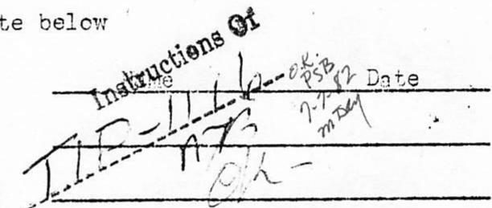

CENTRAL RESEARCH LIBRARY DOCUMENT COLLECTION

LIBRARY LOAN COPY

DO NOT TRANSFER TO ANOTHER PERSON

If you wish someone else to see this document, send in name with document and the library will arrange a loan.

# CENTRAL RESEARCH LIBRARY DOCUMENT COLLECTION

NOTES ON MEETING OF APRIL 26, 1944

9:00-10:30 1ck-209

$\left( {{C}_{4} - {44} - 4 - {429}}\right)$

Present: Fermi, Allison, Szilard, Wigner, Weinberg, Seitz, Morrison, Cooper, Vernon, Tolman, Watson, Ohlinger

The first speaker in today's meeting was Mr. Fermi. His remarks follow.

It was assumed for today's discussion that the aim of the chain reaction would be the production of power.

The first type of pile assumed for this purpose was a permanent large pile of about the Hanford size (but not the Hanford type necessarily) for production of energy in the neighborhood of $10^6$ kilowatts. The arrangement suggested was one in which one large mother plant would produce 49 for consumption in a series of smaller plants. In the mother plant, the energy produced would be used to reduce the cost of the 49 produced. (Mr. Fermi mentioned that he viewed the use of this power for the heating of cities with sympathy). There may be non-technical objections to this arrangement, for example, the shipment of 49 to the smaller consuming plants offers the serious hazard of its falling into the wrong hands, but these were to be omitted from this discussion.

The fundamental aim in the mother plant would be to get the maximum possible yield, with full utilization of the metal as the goal. If a solution to such a proposal can be found, then the schemes for isotope separation are not of great interest. If such a solution is not possible, then the schemes for isotope separation should undoubtedly be investigated further.

In the following discussion of full metal utilization, the isotopes 28 and 49 will be referred to as 8 and 9, respectively. In the reaction cycle suppose that one fission of 9 and $\psi$ fissions of 8 take place in a single cycle or generation. Then the production of neutrons will be $\nu_{9} + \psi \nu_{8}$ . Some neutrons are lost in the moderator, coolant, etc. Let $L =$ the number lost and $\alpha =$ the number used in producing 40-10. Then the excess of neutrons available for absorption by 8 to produce 9 will be

$$
(1 - I) (v _ {9} + \psi v _ {8})
$$

and the production of 9 per cycle will be

$$
(1 - L) \left(v _ {9} + \psi v _ {8}\right) - 1 - \alpha - \psi .
$$

The term $1 + \alpha$ represents the destruction of 9. Therefore, the ratio of production of 9 to its destruction, which we will call $\delta$ , will be

$$
Y = \frac {P}{1 + \alpha} = (1 - L) \left(\frac {U _ {0}}{1 + \alpha} + \psi \frac {U _ {0}}{1 + \alpha}\right) - 1 - \frac {\psi}{1 + \alpha}
$$

To utilize all the metal, $\mathcal{V}$ obviously must be greater than 1. If $\mathcal{V}$ is only very little greater than 1, the chain reaction would keep going with maximum economy of fissionable materials and would continue to go on until all the metal were used, but the value of such a pile would not be great and it would only be good for, say, hardening materials (the Wigner effect) or possibly (though less desirable) heating cities. The effective $\nu_{\mathfrak{g}}$ is around 2.1 to 2.2.

Assume first a Hanford type pile with an equivalent amount of 49 substituted for the 25, i.e., in the early stages, 25 would be burned to produce 49 which would gradually improve its condition. The earlier estimate of 1.9 for the ratio of the fission cross section of 49 to that of 25 has been more recently estimated by Y as 1.4. The ratio of absorption cross section for 49 to that of 25 is around 1.5. With these conditions, $\nu_{\theta}$ is about $10\%$ higher than it was previously thought to be. (The actual values of $\nu$ and $\nu$ effective are not really known so the discussion can only show ranges). The situation then in a pile of Hanford design and lattice would be for a $\nu$ effective (which will be referred to hereafter as $\mathcal{A}$ ) of 2 to 2.2, $\gamma$ will be from 0.8 to 0.98. In the latter case, the pile is close to a balanced situation but not quite there. To adjust such a pile without drastic changes of design, large diameter slugs or more metal could be used to improve the thermal utilization and increase $\mathcal{A}$ . However, over-sized lumps increase the difficulty of cooling since the annular type cooling is badly limited in power production by the metal temperature.

The second type pile considered for the production of power was the P-9 moderated pile. For a $\sqrt{4}$ of 2 to 2.2, $\sqrt{4}$ would be 0.93 to 1.13. These values do not necessarily represent the optimum but are merely indicative of what can be done with P-9 piles and one with such a $\sqrt{4}$ of 10 to $15\%$ may or may not be an operable plant. The practical difference between continuous and discontinuous P-9 plants is not large in this respect since the loss by absorption for the coolant and its tubes practically compensates for the less efficient reproduction in slurry piles. One might hope to improve the situation by capturing the escaping neutrons in a reflector but the absorption in the pile container is an important problem.

Another type of pile to consider is one with very little or no moderator (fast chain reacting type). From the nuclear point of view this is very desirable and is simple in principle but, practically, it involves serious problems in removing the heat. Ignoring the cooling, and considering only the nuclear point of view, this type pile may be of either one or two forms:

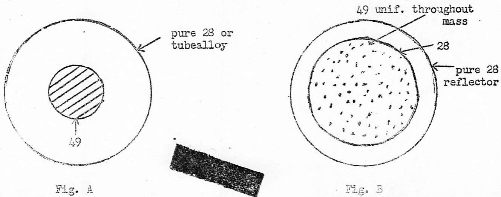

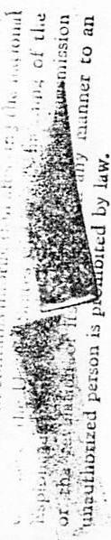

In Fig. A, a small spherical core of 49, say, 10 cm in diameter, would be surrounded by a sphere of 23 or normal tubealloy about 40 to 60 cm in diameter. This arrangement is good from a $\gamma$ standpoint and one might expect a $\gamma$ of 1.3 to 1.4, because L can be made small since the fast neutrons from the 49 get into the 28 readily. (Mr. Allison pointed out that if 25 is not considered for the surroundings here, thorium might be used). The pile shown in Fig. A only requires a few kilograms of 49. To utilize more 49 it would be possible to construct units like A with multiple 49 cores spherical or cylindrical in shape.

Fig. B represents a homogeneous sphere of 28 with 49 uniformly distributed throughout the mass, the whole surrounded by a reflector or pure 28 to catch the leakage neutrons. In this arrangement about $70\%$ of the neutrons get into 28 immediately to produce fast fission. Assuming a mixture of 49 and 28 in which X represents the percentage of 49, critical conditions (i.e., where the chain reaction continues if the pile is of infinite size) would be reached with about $5\%$ of 49 in the mixture ( $X = 0.049$ ). For values of $\mathcal{A}$ of 2 to 2.2, $\gamma$ would be 1.37 to 1.57. As the pile size is decreased, the following results would be obtained. They are calculated without reflector.

TABLIG I   

<table><tr><td rowspan="2">Critical Radius of Sphere</td><td rowspan="2">X (fraction of 49)</td><td colspan="2">r</td></tr><tr><td>N=2</td><td>N=2.2</td></tr><tr><td>100 cm</td><td>0.054</td><td>1.23</td><td>1.43</td></tr><tr><td>70 cm</td><td>0.060</td><td>1.10</td><td>1.30</td></tr><tr><td>50 cm</td><td>0.067</td><td>0.98</td><td>1.18</td></tr></table>

Adding a reflector would decrease the critical radius of the active sphere by about 10 cm and improve very considerably the value of $\gamma$ since the reflector would utilize the neutrons escaping from the active core. Taking the case of the 70 cm sphere above, this represents about $1\frac{1}{2}\overline{\mathfrak{m}}^3$ or say 30 tons of the mixture. Therefore, $6\%$ or about 2 tons of 49 would be required to keep this machine running. Thus a plant of this type requires a large quantity of 49 for operation although this is not sufficient reason for discarding this type of pile as a possibility.

The serious objection to these fast chain piles is the removal of the heat. Since practically all the heat is produced in the 49 (about 70 to $80\%$ ), piles like those in Fig. A are harder to cool since it is mainly the tiny core which must be cooled while in Fig. B the whole mass is to be cooled.

As another possibility, a compromise enriched pile might be designed which would have enough moderator to reduce the percentage of enrichment required to keep the chain reaction going. But not as large an amount would be required for the conventional optimum conditions.

Mr. Fermi suggested that at a later meeting he would consider the question of how to use the 49.

Mr. Szilard was the second speaker and proposed approaching the problem from a different viewpoint,--that of assuming more optimistic values of the constants so as to indicate other potentialities. He pointed out that the fast reaction is preferable to the slow chain reaction for producing 49 from tubealloy and that this is probably more true if we assume more pessimistic values for $\nu$ or $\lambda$ . Before discussing these values of the constants, sketches of a possible design were distributed and described briefly. These sketches are attached hereto.

The sketches show two different arrangements. In sketch A, the enriched tubealloy (enriched to where the chain reaction will go) and natural tubealloy would be distributed in the form of rods in a cylindrical pile, in which the enriched material would be in the center portion of the rods lying within a circular area in the center of the pile. Part of the rods, located within three circular areas around the center (as indicated in Fig. 1) would be arranged so the cylindrical bundles could each be rotated about its axis. In each of the rotating bundles, part of the rods would be natural tubealloy and the balance of natural tubealloy with the center section enriched.

In the beginning, the enriched material in the three bundles would all face the center of the pile and lie within a cylinder whose axis would coincide with the axis of the pile and whose cylindrical surface would pass through the three axes of the revolving bundles. By means of this arrangement, as the multiplication factor increased with the continued operation of the pile, the enriched material could be rotated away from the center of the pile and the natural tubealloy brought towards the center where it in turn would be enriched. In the center of the pile would be a single tube for introducing mercury, liquid bismuth, or some other absorbing or slowing material for controlling the pile. The coolant for this type pile would be a bismuth-lead alloy and would flow downward through the pile between the static and rotating rods. The possibility of using liquid sodium in place of bismuth-lead should also be looked into. The volumetric heat capacity of the liquid sodium is about the same as that of the bismuth-lead alloy but its density would be 10 times less, so that the pressure drop would be about 1/10 that for the bismuth-lead alloy or the velocity about 3 times larger for equal pressure drop. In the scheme just described, the following approximate conditions would obtain: (1) the bismuth-lead alloy would occupy about 1/3 of the enriched core and would pass through the pile at a velocity of about 15 meters per sec; (2) with 1/2 cm diameter rods raised to $700^{\circ}\mathrm{C}$ metal temperature at the center of the central rod and with $150^{\circ}\mathrm{C}$ temperature increase in the coolant, about 250,000 kw will be removed. The pumping power for the coolant will consume about $5\%$ of the power produced.

In the alternative scheme B, control of the pile would be obtained by means of a nest of tubes for the mercury or other controlling medium arranged as in Figs. 3A and 3B and 4A and 4B. The metal rods would all be stationary and vertical (nos. 12, 13 and 14 in Fig. 3A) and would be about $1/2$ to $1\mathrm{cm}$ in diameter by about 2 meters long.

In both designs, the enriched core would be about 1/2 to 1 meter in diameter by about the same height. The balance of the material around the

core would be ordinary tubealloy of the same rod size. The total diameter and the height of the pile would be about 2 meters.

The objective of such a pile must be to produce as much extra 49 as invested. It is assumed that the production will be double the original investment. For every atom of 49 disintegrated, two atoms of 49 could be produced. Part of these will be produced in the enriched core and part in the surrounding natural tubealloy. Some of the production in the core will tend to leak out into the natural tubealloy and this leakage must be kept within certain limits. Then $k$ will increase over a period of time. As the chain reaction goes on, the multiplication factor $k$ will then increase so that the controls must provide for this as well as the normal operating control of the pile.

In the slow chain reaction, 49 captures neutrons in radiative not fission capture to produce a new element which we will call super plutonium or 40-10. It is assumed there is a $50\%$ chance that this new element will be fissionable. If it is not fissionable, it is assumed there is $50\%$ chance that it will be formed only in negligible quantity in the capture of fast neutrons. Thus, there is a $75\%$ chance in a fast chain reaction that we may use $\nu$ and not $\lambda$ in getting the production balance ( $\lambda = 2.2$ neutrons per neutron absorbed, $\nu_{25} = 2.2 \times 1.175 = 2.6$ neutrons produced per neutron absorbed). As the energy of the neutrons increases from thermal to fission energies, it is assumed there is no decrease in $\nu$ . The main argument in favor of the fast chain reaction is that if a fission neutron is released in tubealloy, it causes fission in the 23 to produce 1.2 neutrons (fast effect). If all the neutrons are captured, the overall balance would be that for every atom of 49 destroyed, two atoms of 49 would be produced. One goes back into the chain reaction, the other replaces the 49 destroyed, providing a net gain in 49.

In experiments in which a Ra - B neutron source was surrounded by 28, measurements indicated a $5.3\%$ increase in the number of neutrons and that $6\%$ of the neutrons remained above the fission threshold. This means that the increase in the number of neutrons for an infinite sphere would be 5.3 or 19%. If the fission cross section is taken at 0.35 and the 1-0.63 inelastic cross section at 2.7 for a $\nu_{28}$ of 2.2 to 2.6 will vary from 1.18 to 1.245.

Referring to the value above of $\nu_{25}$ of 2.6, if we were to use the more optimistic results reported by Y (that $\nu_{49}$ is $20\%$ larger than $\nu_{25}$ ) then $\nu_{49}$ equals 3.1 neutrons produced per neutron absorbed. If we are less optimistic and assume $\nu_{49}$ effective=2.5 but use the $19\frac{1}{2}\%$ increase indicated by the experiment mentioned above, we have three neutrons produced in a mixture of 28 and 49 for one atom of 49 destroyed.

It has been suggested that one of the subjects for one of the meetings soon to be held would be a review of the availability of the metal producing ores and other sources of tubealloy. This is to be given by Mr. P. Morrison.

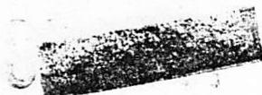

FiG.1   
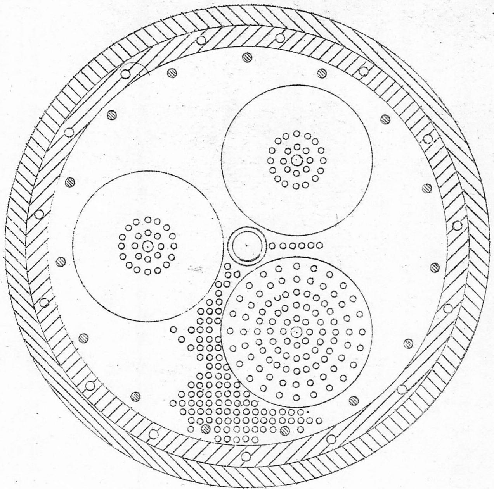  
This drawing, together with all information and knew how disclosed is the property of the University of Chicago, and no use, disclosure, or reproduction of any part thereof may be made except by written authorization of the University of Chicago.

SCHEME A

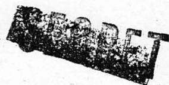

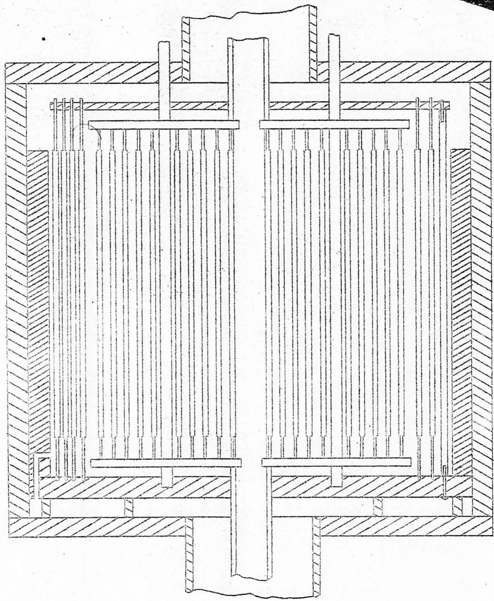  
T 100000000000000000000000000000000000000000000000000000000000000000000000000000000

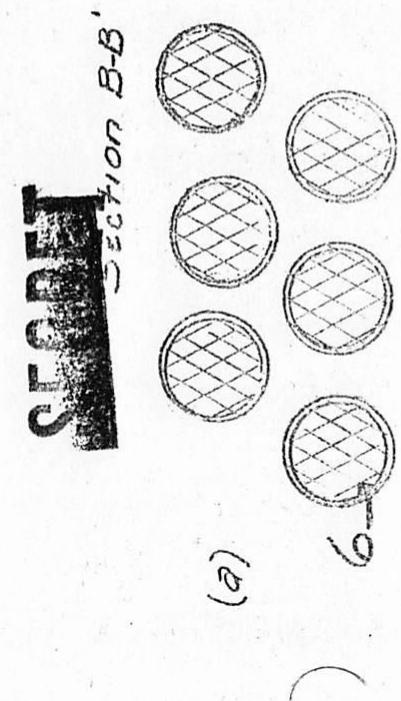

e   
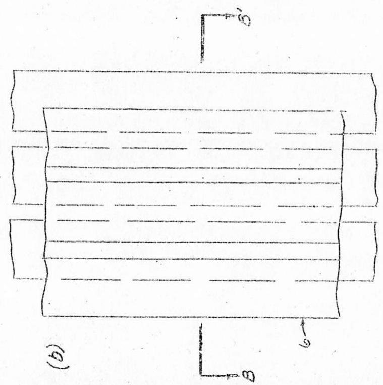  
  
  
1 3   
aee   
aannnnnne aannnnnne   
  
aannnnnne aannnnnne nnnnnnne

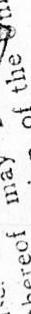  
rnnnne

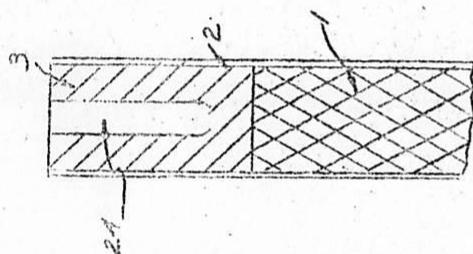

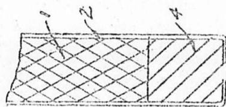

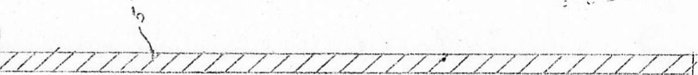  
5

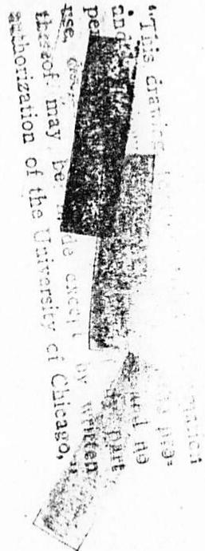  
#

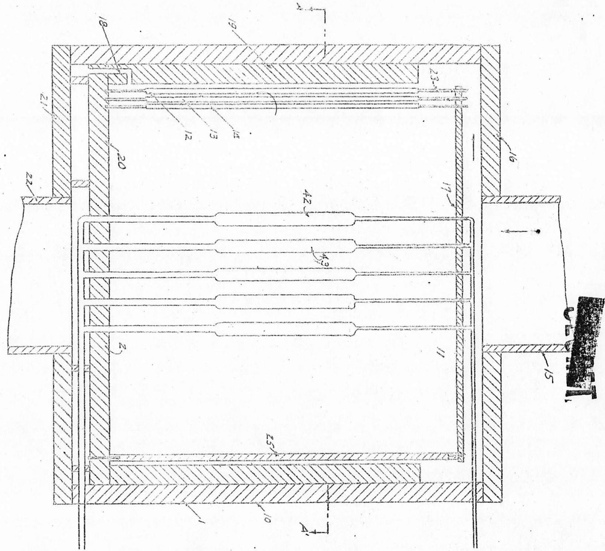

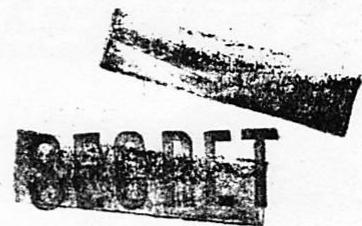

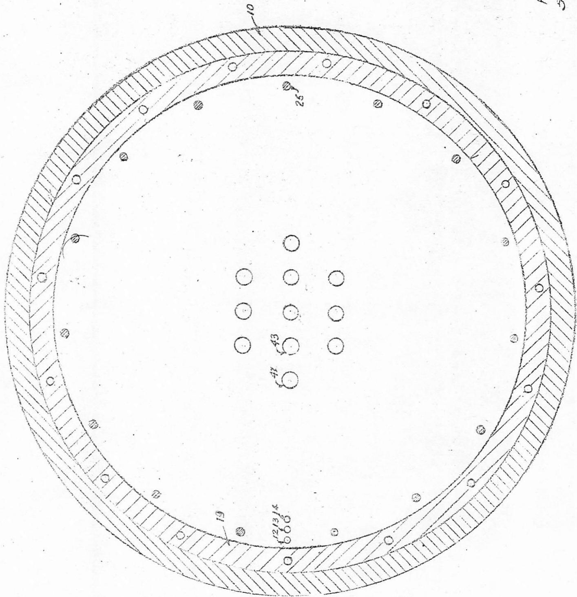  
F1G 3b   
Section $A - {A}^{\prime }$   
"This dairing, together with all information and know wherou disclosed this on, is the pro- property of the Cunlure, and no uia disclosure, or repreca tion of any part thereof may be made except by written thereof may be made except by written

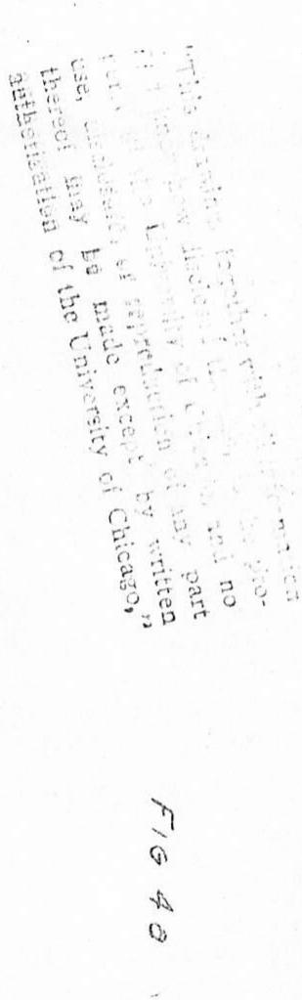

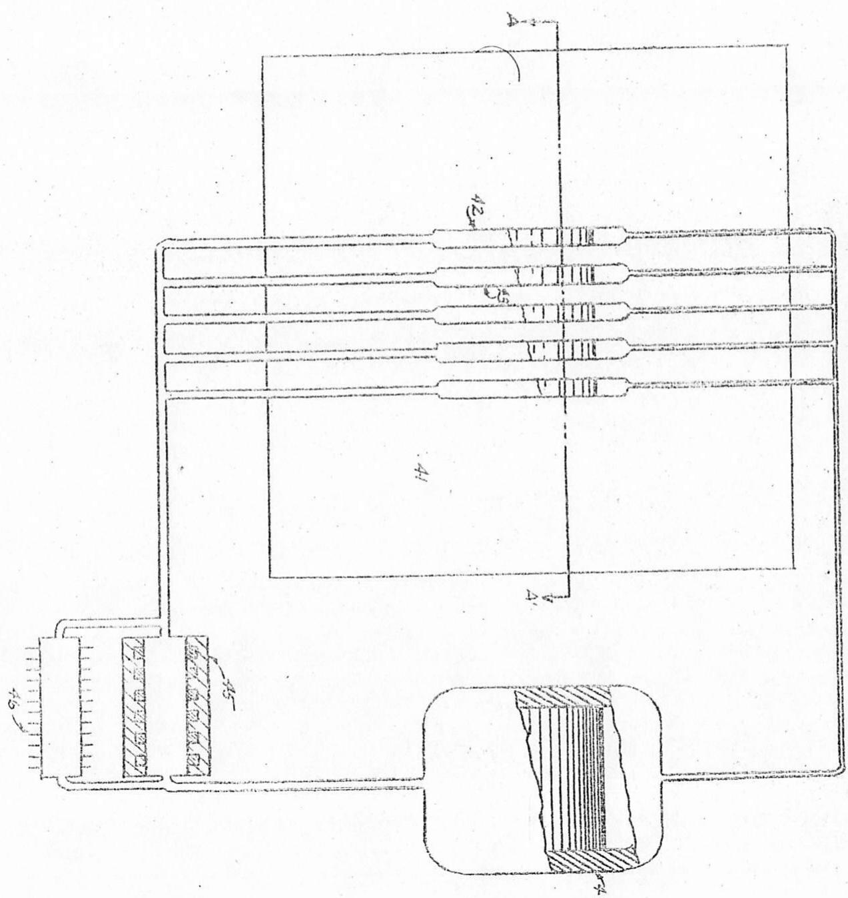

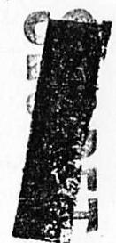

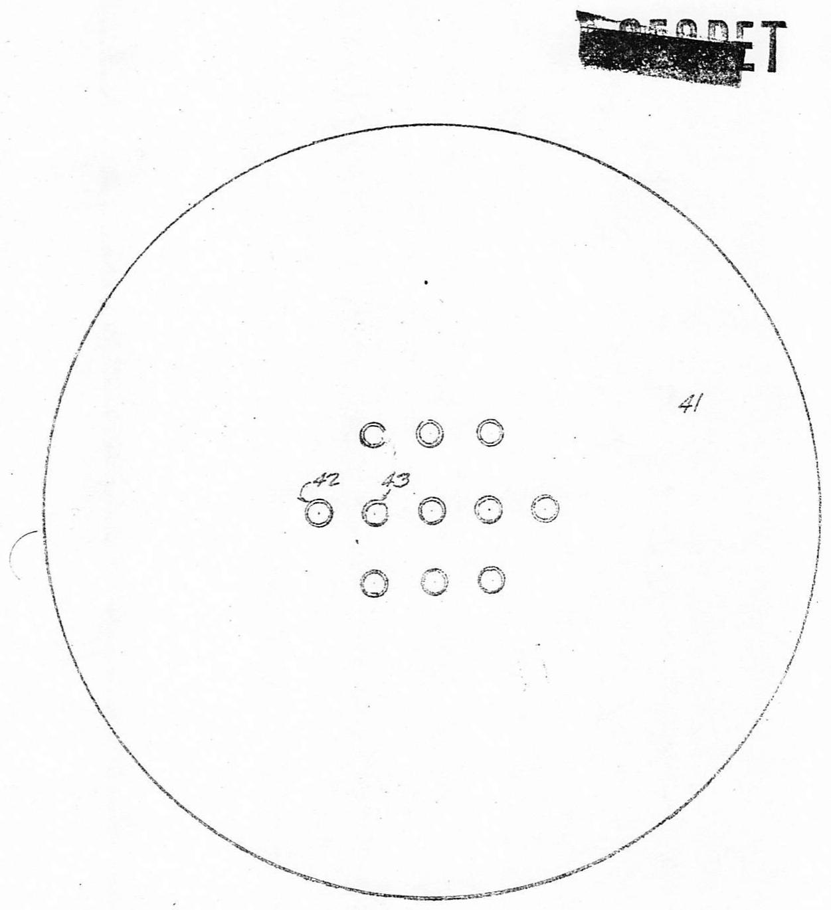  
FIG 4b   
Section $A - {A}^{\prime }$