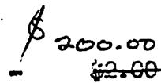
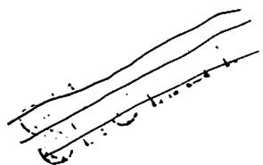

NOTES ON MEETING OF APRIL 28, 1944

9:00 - 10:30 209-Eck

Present: Fermi, Allison, Wigner, Smyth, Sailard, Morrison, Watson, Feld, Hogness, Young, Weinberg, Creutz, Cooper, Vermou, Chlinger

The first speaker was Mr. P. Morrison; his comments follow: If we view the chain reaction merely as a source of unspecialized energy, it goes directly into competition with the many existing large scale prime movers and fuel sources. Economics are then paramount. It is Mr. Morrison's opinion that we should not move in that direction for some time to come, but should attempt to exploit the particular properties of the chain reaction as a concentrated source of a highly special form of energy. Power simply as kew hours should appear at most as a by-product.

The following data was gathered from the Bureau of Mines bulletins and other sources and correlated by Mr. Morrison.

In 1941 the average yearly power produced by the major sources was as follows:

Water 25 x 106 kw

Gas and Petroleum Products 340 x 106 kw

Coal 470 x 106 kw

The first item covers mostly government and private utilities and private industrial power developments. Of the power produced from the second fuel source, about $40\%$ was from gasoline in all its uses. Of the power produced from coal, about $10\%$ was used in public utilities, about $10\%$ for coke and chemical uses, about $20\%$ for railroad transportation, and the balance of about $60\%$ for other miscellaneous uses including domestic and industrial fuels. Of the above total figures for the world power production, the U.S. consumed about $35\%$ of the coal-produced power and about $60\%$ of the petroleum-produced power.

Cost figures for the above power, while not on a strictly comparative basis, are interesting. The figures below are all per megawatt hour.

Government hydropower 51.20

Private hydropower 2.00 to 2.50

Most efficient coal-steen plants 0.60

City conatm 30.00

Large industrial consumer (firm power) 4.00

Rjukau 0.50

(Inergy, not mechanical power)

TNT

H-octane gas

Motor fuel

The first item is based on the cost of the power at Boulder Dam at the busbar face on a guaranteed consumption continuously throughout the 24 hour day and includes the cost of the original equipment, maintenance, etc. The figure for the coal-steam plant is based on the fuel cost only and does not include the equipment, maintenance, etc. As Mr. Szilard pointed out, these two cannot be compared and, as Mr. Fermi observed, it is the $80\%$ figure of the coal-steam plants with which we must compete in the production of power.

As Iir. Morrison noted in a recent memorandum, the approximate abundance of tubealloy and thorium in the top crust (5 to 8 km thick) of the earth is as follows:

Tubealloy

4 2 ppm (found mostly in granite and does not include sands, etc.)

Thorium

12 4 ppm (found mostly in sedimentary rocks)

The most efficient gold extraction plant yet constructed has been able to dig the rock, crush it, treat it, etc. to recover the gold for about $7.00 per ton. Crushing rock requires about 100 kw hours per ton when the rock is reduced to particles of about 1 mm³ in size. Therefore, Mr. Morrison estimates that we could afford to work the rock for power (based on using the 25, not the 28), if necessary, providing the abundance of the tubealloy was not less than 5 to 10 ppm. It has been estimated that there are about 10¹⁴ - 10¹⁵ tons of natural tubealloy to be found in rock in the earth's crust and about 10⁵ tons in sea water (the concentration in sea water is about 10⁻⁹ gms of tubealloy por gm of water).

The richest occurrences of natural tuballoy in the world are at the following locations. All figures are very rough estimates based on incomplete and often reluctant surveys by the producers. All tonnage figures are tons of tuballoy and not ore.

U.S. (mainly Colorado vanadium ores or Carno-tite, having a content of about 15 tuba-alloy. Estimated at 3,000 tons of tuba-alloy available in 1925.)

about 5,000 tons in sight.

Czech (also about 15' content)

about 1,000 tons remaining.

<table><tr><td>Congo</td><td>(of five sites total, one was estimated 
in 1925 at not less than 5,000 tons of 
ore having 20% tubealloy content)</td><td>about 5,000 tons 
in sight.</td></tr><tr><td>Canada</td><td>(although other deposits undoubtedly 
exist, the known deposits containing 
20 to 50% tubealloy content ore have)</td><td>about 5,000 tons.</td></tr><tr><td>Russia</td><td>(1 to 2% tubealloy content Carnotite 
vanadium ore deposits)</td><td>not less than 
3,000 tons in sight.</td></tr><tr><td></td><td></td><td>Total about 20,000 tons of tube-
alloy in sight.</td></tr></table>

A similar table of the distribution of thorium throughout the world follows. This is found almost entirely in monazite sand having about 5 to $11\%$ thorium content.

<table><tr><td>U.S.</td><td>(mainly in North Carolina with a small amount in Idaho and Florida)</td><td>about 1,000 tons.</td></tr><tr><td>Brazil</td><td>(on the coast)</td><td>about 8,000 tons.</td></tr><tr><td>British India</td><td></td><td>about 150,000 tons.</td></tr><tr><td>Netherland East Indies</td><td></td><td>may have about 5,000 tons.</td></tr></table>

If we were to use the entire U.S. and Canadian resources of tubealloy (10,000 tons) using a $\mathcal{X}$ of 0.9 and utilizing only the 25 and not the 23, we would have an equivalent replacement factor of only nine months for the total power consumption of the U.S. or about ten years for the hydropower.

The second speaker was Irf. Szilard who continued his discussion from the previous meeting. He recapped first the three possibilities as he saw them.

(1) Unseparated tubealloy $\rightarrow 49$ production   
(2) Enriched tube1loy $\rightarrow 49$ production

(a) slow chain reaction   
(b) fast chain reaction

(3) Enriched tubealloy $\rightarrow$ no 49 production

capture remains constant. Szilard therefore assumes that, in a mixture of 232 and Plutonium, $\varepsilon v_{0} = 1.2 \times 2.5 = 3.0$ neutrons emitted per thermally fissionable atom destroyed and this would mean that there is a net gain of one thermally fissionable atom per similar atom destroyed.

Referring to item (3), Szilard emphasized one possibility, i.e., the burning of Plutonium in a slow reaction and absorbing the neutrons by bismuth to give Polonium. Of the heat dissipated when Plutonium is destroyed to give Polonium, only about $3\%$ would be stored in the Polonium. However, this energy will be available for use free of $\mathcal{V}$ radiation and could be used for driving airplanes, etc.

In the discussion following, Fermi questioned the estimated value of $\nu_{0} = 2.5$ on the ground that it might be too optimistic and pointed out that there is a long range future in developing the full utilization of 28 and thorium.

Wigner questioned the feasibility of the rotating disc arrangement described at the previous meeting on the ground of poisoning and questioned the $4\frac{1}{2}$ year investment return. He felt this would probably be more nearly 10 to 20 years by which time, as Mr. Morrison suggested, we may be burning water.

After discussion, Szilard expressed his view that item 2a is of more immediate concern than 2b.

Mr. Morrison suggested that more work should be done on the nuclear development of thorium because of its greater availability and also suggested experiments to obtain $\nu_{23}$ and other useful constants.

Mr. Ohlinger explained very briefly an outlined program, of which a copy is attached hereto. This program for consideration of future trends in the laboratory work, is a compilation of the independent results of the "homework" requested at an earlier meeting. It has been assembled to give a majority consensus of the classification of possibilities.

In general, the outline is first divided into three main groups based on the use to which a pile would be put. Thereafter, the potential-ities are subdivided for easy consideration. An open discussion of this outline will occur at the next meeting on Friday, May 5th.

I. POWER PRODUCTION (49, 25, or 23 consumed)

A. Purpose of power (in order to determine following)

1. Physical size and mobility

a. Large stationary piles (slow chain react. or group of fast chain react.) such as for central stations   
b. Medium mobile (or sta.) piles (slow chain react, or group of fast chain react.) such as for boats or locomotives   
c. Small mobile piles (fast chain react.) such as for planes or cars

2. Power output range, e.g.

a. over 106 kw   
b. between $10^{3} - 10^{6}$ km   
c. less than $10^{3}$ kw

B. Utilisation of Energy

1. Direct

a. Electrical removal (including thermocouple type) b. Working fluid absorbing heat directly

(1) Direct liquid vaporization in pile to operate turbine, etc.   
(2) Gas cooling with or without gas turbine   
(3) Endothermic chemical reactions, e.g., $2\mathrm{H}_{2}\mathrm{O} \rightarrow 0_{2} + 2\mathrm{H}_{2}$

2. Indirect energy removed by circulating

a. the metal   
b. the moderator (if any)   
c. the coolant

II. ISOTOPE PRODUCTION (49 or 23 produced)

(Since its purposc is well defined and there are no limitations on size, lack of mobility and power produced, except by the operating potentialities of the design chosen, those factors are not outlined here.)

A. 49 Production

1. Slow chain reaction (thermal neutrons) using normal U

a. Homogeneous piles moderated with

(1) P-9   
(2) $P - 9 + H_{2}O$

b. Heterogeneous piles moderated with

(1) Graphite - improvement in operation and utilization of present piles (X and h) and design new improved piles   
(2) P-9 $\} \text{Also require a separation pro}$ (3) P-9 + H2O cess to recover P-9   
(4) Be   
(5)Be0

c. Cooling accomplished by moving

(1) the metal (Uf6, molten U, solutions)   
(2) the moderator $(P - 9, P - 9 + H_2O)$   
(3) a separate coolant (H₂O, P-9, liquid Bi or Bi-Pb alloy, diphenyl)

2. Enriched piles (enriched with 49 or 25)

a. Slow chain reaction as outlined above   
b. Fast chain reaction as outlined below

3. Fast chain reactions (no moderator)

a. Homogeneous pilcs   
b. Heterogeneous piles   
c. Cooling accomplished by

(1) Liquid Bi as coolant   
(2) Liquid Na as coolant   
(3) Using U molten and moving it

B. 23 Production

1. Reflectors

Coroll: If power produced in making $l9$ can be used practically, this constitutes another case, - a combination of I and II.

III. RADIATION SOURCE (High levels of intensity)

(Since the purpose is well defined and size, mobility and power produced are not criteria, they are not outlined here. However, such a pile must be flexible with the ability to reach high levels of intensity and expose materials or take measurements with ease. Flux and not total power important here. Most suitable of piles defined in II to be chosen as experimental machine. Routine metal removal is not important.)

PROBLEIS COHEN TO ALL PILES (or a large number of them)

1. Shielding   
2. Reflectors

