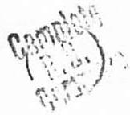
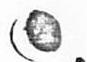
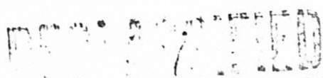
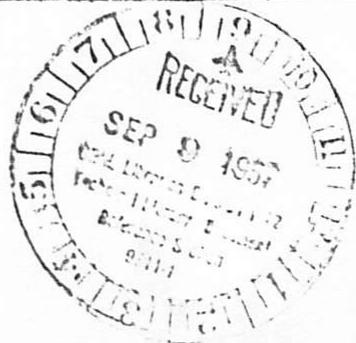
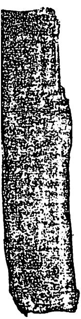
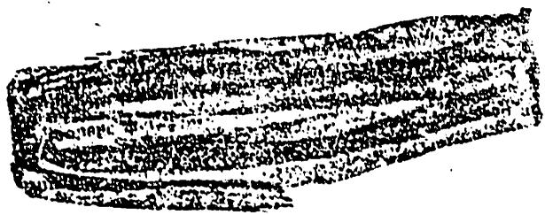

Date

Subject NOTES ON MEETING OF MAY 5.1944

By Ohlinger

TcMemo

These Eligible

To Read the

Attached

Copy 1 Leverett

MUC-10-19

Before reading this document, sirn and date below

Name Date

$m \cdot  C.{l}_{\min }x = 5 = {16} - 4$

${MR} = {90}\sqrt{m}{N}_{L}$

${17m}/U.{J}_{L}{C}_{i}{l}_{i}{C}_{i}$ 5/20/9

法一. 则函数 $S\left( {x,y}\right)  = \frac{1}{2}x + y$ .

mccfie

90.7 $\sigma$ trai 20 nov.46

$\frac{A}{B} = \frac{A}{B} + A - B$

$\frac{4.7}{2} = 2$

# ORNL LIBRARIES DIVISION Y-12 TECHNICAL LIBRARY

Document Reference Section

# LOAN COPY ONLY

Do NOT transfer this document to any other person. If you want others to see it, attach their names, return the document, and the Library will arrange the loan as requested.

B

Present: Allison, Szilard, Wigner, Weinberg, Morrison, Creutz, Vernon, Young, Watson, Ohlinger

Please note a correction in the notes of the last meeting, Friday, April 28th. On page 2 at the top, the cost of the energy from TNR should read $200.CO per megawatt hour instead of $2.00.

Mr. Morrison started the discussion by noting the above correction and adding, at the request of Mr. Wigner, a rough figure for the cost of energy obtained from tubealloy on a comparative basis. Assuming a cost of $2.00 per pound for tubealloy and assuming that all the 25 is used, the cost of energy (not mechanical power) would be about $0.02 per megawatt hour. Mr. Morrison noted that the least expensive horsepower (based on first cost) for a prime mover is an airplane engine, and the most expensive is the old fashioned steam locomotive. Mr. Morrison also transmitted the following information from Mr. Z. Jeffries. At the request of the WPB but with only limited resources, the U.S. Geological Survey has been carrying on a research into the abundance of various materials found in pegmatites. Among the many materials to be surveyed were tubealloy and thorium. This survey is to be published in one or two months and copies will undoubtedly be obtained by the laboratory. By word of mouth, Mr. Jeffries did obtain the following advance information based on the preliminary results, - a large number of granite bodies were found to contain up to 100 ppm of tubealloy and a small number up to 1,000 ppm.

Mr. Ohlinger carried on the discussion from this point with a re-view of the outline appended to the notes for the last meeting. A general discussion followed, of which the highlights follow.

Mr. Szilard pointed out that in our discussions we must not overlook the peace time uses of this power. We can only hold the advantage we have obtained in our development of this process in America if its peace time use is well developed. Following this vein of thought, Mr. Wigner said that very little has been said about this phase of the subject but that he had one or two suggestions to offer. By subjecting the tubealloy bearing granite mentioned by Mr. Jeffries to a bombardment of neutrons, it might be possible to obtain a mechanical dissolution or porosity such that nitric acid could readily penetrate the granite to dissolve out more tubealloy. Another possibility is a polymerization of hydrocarbons to produce synthetic rubber.

Mr. Allison suggested that in projects where the transportation of fuel is a major problem, such as an exploration of the South Pole or other distant objectives, a small unit would be very useful. He also repeated the previous suggestion for heating entire cities since it would also eliminate the terrific nuisance of the usual smoke pall.

Mr. Wigner observed that the age of technical problems is past. The only obvious needs are probably large scale heating and fuels. Mr. Szilard felt that if there are no present reeds, then now needs should be created. Mr. Morrison suggested stellar travel.

Mr. Ohlinger brought the discussion back to the outline with the suggestion that the subject of the direct utilization of energy by electrical removal (IBla in the outline) should be dismissed from our thinking for the most part. He mentioned that little has been forthcoming on this subject outside of the suggestions which accompanied Mr. Wigner's "homework". One of these suggestions was to use the active material in the form of an extremely thin wire surrounded by a metallic tube, with the interspaces evacuated. The fission products would assume a considerable charge before leaving the thin wire and by virtue of their kinetic energy would be able to reach the tube surrounding the wire even if it had a considerable positive charge. For a reasonable utilization, the potential difference between the tube and wire would have to be of the order of magnitude of 5,000,000 volts and one could obtain a current of about 50 amperes if the system were run at 500,000 kw. The wire and pipe would have to be cooled and, although, this is, in a way, the most direct utilization of the energy of fission, it obviously gets into great technical difficulties, is not very efficient, and does not furnish the power in a very suitable form, so it is noted only as a curiosity. The second suggestion was Mr. R. Williamson's idea to extract the heat from a pile by using the Peltier effect to convert the energy directly to electrical energy. However, the thermo-electric constants of tubealloy are not known and one can estimate that the amount of power obtainable from a pile like that at W would only be of the order of 5,000 kw. One arrangement for accomplishing this would be to have every tubealloy rod be one electrode of the thermocouple and the graphite the other. The pile would be run at low power level with reasonably good efficiency despite the heating loss. Another arrangement would be to subdivide the tube-alloy rod into short sections, cooling one end of each. The cooled end would then form the cold junction, the hot end, the hot junction. However, utilization of power in such a system is much poorer. Mr. Szilard asked for the efficiency of such a pile. Mr. Watson suggested that it would probably not exceed 1/2 although Mr. Wigner was of the opinion that this figure was too low. Mr. Szilard thought the subject could bear further investigation, but Mr. Wigner pointed out that by high temperature operation $(700^{\circ}\mathrm{C})$ it is possible to obtain efficiencies up to around $65\%$ and so, as long as we would just bs making kilowatt hours, we should abandon all "crazy schemes" and think seriously about high temperature operation. "Goldbergs" are not attractive for power production and Mr. Allison thought it would be much easier to develop the high temperature operation.

Items IBlb (2) and (3) in which the working fluid absorbs the heat of reaction for direct utilization of the energy offered more interesting possibilities according to Messrs. Wigner, Morrison and Vernon. Mr. Wigner noted one difficulty with the endothermic chemical reactions, - the gases which have these reactions usually react chemically with the pile materials.

Mr. Seilard stated that when the supply of petroleum is exhausted, it might be possible to break down the $\mathrm{CO}_{2}$ molecule and hydrogenate the carbon atom to make synthetic hydrocarbons for gasoline, etc. Mr. Morrison suggested an alternate of breaking down the $\mathrm{H}_{2} \mathrm{O}$ molecule and carbonizing the hydrogen atom.

Mr. Ohlinger suggested that in order to speed up the discussions at these meetings and avoid wastin, the time of the entire group with detailed discussions of schemes which do not hold much promise for next year's program of research work for the laboratory, assignments should be made for individual

pile types for investigation and group discussion outside of the regular meetings. The individual assigned any particular type would make it a point to investigate the advantages and disadvantages of that type as thoroughly as possible and discuss these and any design details with other members of the group who would be likely to have constructive information on the subject. Thereby, the problem would be well investigated prior to the meeting at which it would either be presented in concise form for discussion as a likely problem for investigation, theoretically or experimentally or both, or else indicated as an unpromising project which should not be considered at this time. Problems common to several designs could then be correlated for an experimental program and the more promising of the designs brought forth by these investigations outside of the regular scheduled meetings could be discussed by the group as a whole before being turned over to the various divisions for their detailed development. This proposed policy was accepted by all and the following assignments made.

Mr. Wigner will lead the investigation into the possibility of power producing piles utilizing the energy directly by endothermic chemical reactions [Item IBlb (3)]. Mr. Vernon will do the same for gas cooling [Item IBlb (2)]. In order to give them time to prepare these assignments, it was suggested that Mr. Young speak at the next meeting on Wednesday, May 10th on "Suggested Improvements for a Hanford Type Pile" and on Friday, May 12th, Mr. Weinberg on "Conversion Units".

jjp

