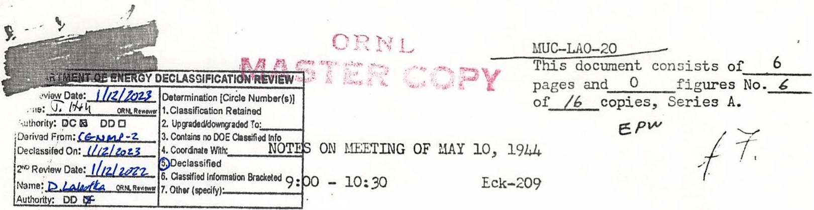
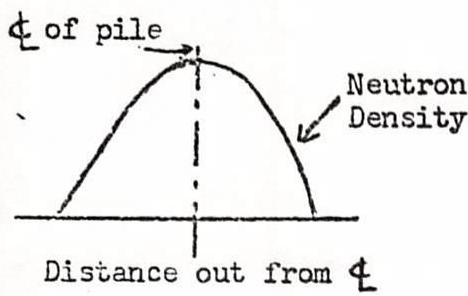
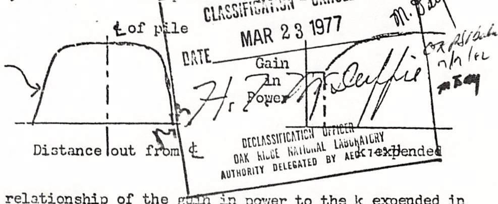
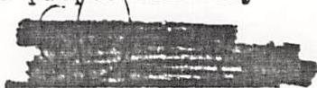
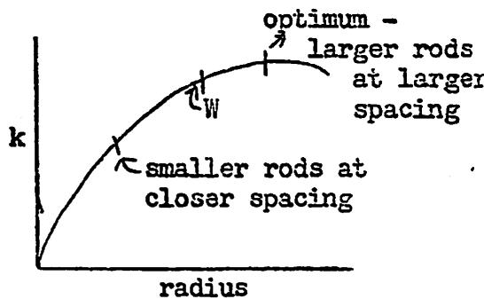
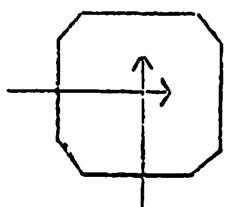
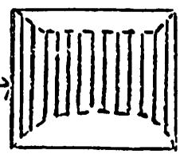
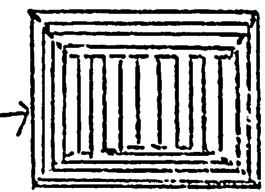
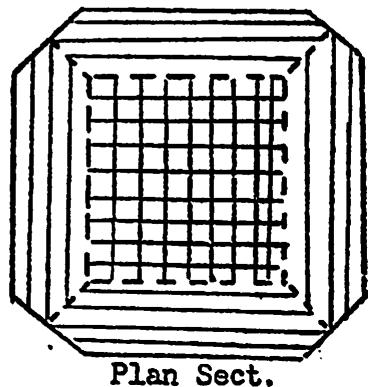
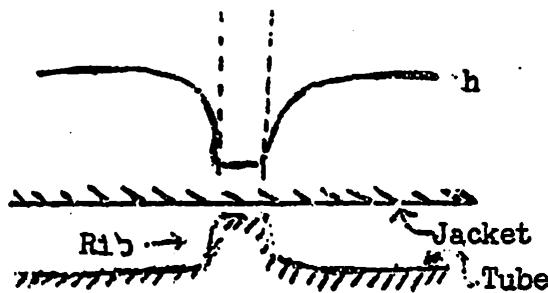

Present: Allison, Wigner, Szilard, Vernon, Seitz, Morrison, Young, Creutz, Franck Watson, Cooper, Hogness, Weinberg, Ohlinger

Mr. Allison opened the meeting with the following comment on last week's discussion. He was most impressed by Mr. Wigner's conclusion that all "crazy" schemes for these units should be abandoned in favor of removing the heat directly at, say, 600 to $700^{\circ}\mathrm{C}$ with a better working fluid. It seemed to him a more sensible goal and one possible to achieve within a reasonable time. Accordingly, he recommended that we aim toward improving the efficiency of the pile by determining such a fluid for high temperature operation.

Mr. Young then continued the discussion with a review of potentialities for improving a graphite-tubealloy pile of the Hanford type. His discussions with other members of the group elicited two major suggestions for general improvements of a W pile: (1) Spending k for power and (2) Changing the canning setup.

# (1) Spending k for power

Since the experimental work has indicated that we may expect a greater surplus $\mathbf{k}$ from the present $\mathbb{W}$ pile than originally anticipated, we may take advantage of it by spending at least part of this excess for additional power. This may be accomplished in many ways of which the following are a few of the more popular ones: (a) The proportions of the cylindrical pile at $\mathbb{W}$ might be changed so as to shorten the cylinder and so shorten the length of cooling stream. Thus, for the same pressure drop or for the same water speed, more water can be put through. (b) The power distribution might be flattened by any of several means including poisoning by the introduction of other metal or even by an excess of tubealloy (per Wigner). This is illustrated by the following graphs, the one on the left showing the normal power distribution across the width of a cylindrical pile with a uniform lattice and the one on the right showing the distribution obtained by flattening by some means. In the latter case, more tubes will operate at peak load.

The third curve indicates the relationship of the gain in power to the $k$ expended in obtaining this gain. Obviously, for a small expenditure of $k$ , a proportionately

<table><tr><td>PENIX: DD D
PENIX: Y S G A T E C H O N
C. 14040000000000000000000000000000000000000000000000000000000000000000000000000000000000000000000000000000
DE PELI: 102
C. 14040000000000000000000000000000000000000000000000000000000000000000000000000000000000000000000
C. 14040000000000000000000000000000000000000000000000000000000000000000000000000000000000000000000</td></tr></table>

greater gain in power is obtained. (c) More water might be put into the pile to use up the extra k. (d) The metal surface might be increased by using a larger number of smaller diameter rods.

In the early days of the project, the quantity of available metal provided the bottleneck in design and so obtaining the maximum per gram of metal became the criterion for our earlier designs. For a time this may still be a major factor in our design trends, although it is hoped this limitation will soon be removed.

The lattice spacing of 8-3/8" center to center at W is the outgrowth of several changing factors and is not quite adjusted to the rod diameter for optimum conditions. Therefore, some gain in k might be obtained by proper adjustment of the rod spacing and diameter. According to Mr. Weinberg, the present excess k at W is about $2\%$ so that if we were to leave, say, l to $1\frac{1}{2}$ excess k available until more of the present unknowns become known with some certainty, we still would have 1/2 to 1% k available for increased power production.

To build in, say, $1\%$ excess k in a new design, Mr. Weinberg has suggested smaller rods closer together, possibly with two different spacings in the pile say 6" centers in the center and 7" centers in the surrounding area. This is still further away from the optimum than W (as indicated in the accompanying curve) but,

by shoving the operating point still further down the curve, we can obtain more surface area for cooling and, assuming the same thickness of water annulus, reduce the "blocking effect" since the water provides less of a high diffusion barrier around the small rods than around the large ones. Thus for a given $k$ loss due to water, more water can be put around small rods than around large ones.

In flattening the power distribution by using smaller rods, in a smaller lattice, it is assumed that the metal quantity is not a criterion.

To adjust a design such as the one having both 6" and 7" spacings, some of the rods in the central section could be stripped to improve k. If the reduction in lattice size becomes too small for practical construction, it has been suggested by Mr. Wigner that alternate layers of rods could be turned at right angles to each other and have the flow through the pile from either two or four faces.

  
Plan Sect.

  
Full lincs show slug loading   
Plan Sect.

  
Full lines show slug loading

the cooling stream was by "bowing" as indicated diagrammatically in the center sketch above. From a nuclear point of view convex ends would be preferable to the concave ends achieved thereby and it has been suggested that tubes could be run crosswise through the bowed ends as indicated in the diagrammatic sketch at the right.

Suppose that the optimum spacing around the outside of the pile were about $7''$ but that it would be very difficult to achieve a spacing smaller than $7''$ . Then the effect of a closer spacing in the center could be obtained running the pile tubes at right angles to each other in alternate layers with only

the central sections loaded as shown in the sketch at the right. Mr. Wigner has found practically no difference in k between the two lattice arrangements considered, (1) having all the rods parallel and (2) having alternate layers of rods at right angles to the adjacent layers, but feels that the latter arrangement is slightly better. The arrangement shown in the last diagram shortens the cooling stream through the central portion of the pile and flattens the power distribution. Elongating the cylinder height would give a type (a) adjustment. This flow arrangement introduces a difference in

temperature between adjacent layers which may introduce expansion problems in the graphite. In addition, instead of using all rods of the same diameter, the rods in the outer section of lattice might be increased somewhat.

# (2) Canning

The second major improvement generally proposed for a new W design would be the adoption of a long cartridge to replace the present individual slug design. The consensus seemed to favor this design sufficiently that it appears desirable to obtain a higher priority on the experimental development work in connection with this problem. There are two general arrangements proposed for the long cartridge:

(a) helium under pressure for leak detection   
(b) cartridges sealed with no detection system.

In the first case above, the cartridge would have to be fabricated either as a single unit extending from one face of the pile to the other with or without an exit for the helium or else as two cartridges each extending roughly from the center of the pile to the outside face and sealed at the inner end (it might be desirable to have the cartridge at the hot water end shorter than that at the cold water end). In arrangement (b) which is favored by Messrs. Morrison and Heinberg, there would be no restrictions on length and the can would be made in any length from say double the size of the present slugs to a single cartridge extending throughout the entire length of the pile tube. Both ends of each cartridge would be sealed.

At W, a large part of the uncertainty in k is in the canning and, as we consider the possibilities from a bonded canned slug with conducting ends to cartridge canned slugs, there may be as much as 1/2 to 1% variation in k. Of course, until further work has been done on the long cartridge, there will be just as much uncertainty about its effect on k.

As another related possibility, Mr. Young referred to an early suggestion of Mr. Creutz which was intended to avoid the warping which might prove troublesome in long slugs. This suggestion was to set the slugs in the pile tubes with spacer ribs, but insert and remove the slugs and pile tube together as a unit. This arrangement is not impossible but looks unpleasant and brings up the question of putting ribs on the outside of the slugs instead of the inside of the pile tubes. This has the advantage of reducing the rib effect. From Mr. Kratz's data and Mr. Schlegel's calculations, it lately appears that the rib effect for an inside rib might be to raise the temperature of the jacket under the rib as much as $20^{\circ}$ above the average jacket temperature around the rest of the slug. This effect is rather larger than

previously anticipated and appears to be caused by the reduction in transfer of the jacket adjacent to the rib as indicated by the accompanying diagram. It is the sidewise spread of the reduction in h that is important. Warping up from the rib because of this effect would probably cause a hot spot on the top of the slug and aggravate corrosion in that region. Mr. Wigner pointed out that this was a good argument for ribs on the jacket instead of the tube.

In the general discussion which followed, the following represents the thoughts (although not verbatim) of the members noted.

Young: One disadvantage of the outside ribs would be the wear on the pile tube. Another would be alignment of the rib slug or slugs.

Creutz: This could be overcome by grooves in the pile tube as rib guides.

Young: Grooves reduce the thickness of aluminum in the pile tube and require heavier tubes which use up more k. The question arises whether the grooves will be straight throughout the length of the tube or twist around.

Seitz: It is possible that the grooves will wander due to torsional deformation.

Allison: This scheme might be possible for, say, the fourth or fifth pile at W, especially if long cartridges are found advantageous.

Cooper: In future pile designs, enough space can be left to permit the use of long cartridges without having to chop them up as they emerge from the pile.

Allison: How would long cartridges be handled?

Cooper: In a cradle in which they would probably be up-ended after removal.

Wigner: Long cartridges will probably bring our thoughts back to the long coffin arrangement of CE-407.

Cooper: TNX have indicated that they would be glad to leave a larger space at the discharge end of the pile in future designs.

Vernon: It might even be possible to put ribs on the slugs in an early replacement in the first W pile.

Cooper: This is not very feasible because of the inlet fittings on the pile tubes, although these also could be changed.

Wigner: Means should be provided for locking the slugs against rotation which would be extremely undesirable.

Mr. Cooper doesn't feel like taking the rib effect too seriously until more conclusive data has been produced. Mr. Szilard questioned the warping of long cartridges but Mr. Wigner pointed out that the slugs contained in the long cartridge would be short slugs joined together somewhat loosely. It was noted that Mr. Creutz is now making outside rib tubes.

Mr. Young resumed his discussion of graphite pile problems with a brief mention of a few problems which have not been developed to the point at which they may be called improvements but which do call for further investigation. One of these is the question of what happens to the metal in the slugs under neutron bombardment. Another is the question of running the graphite in the pile at higher temperatures in order to heal the tendency of the graphite to disintegrate under radiation bombardment. Mr. Franck questioned what would happen if the graphite were operated hot. Mr. Cooper answered that the du Pont Company has felt that a study should be made of this question but doubted if anything could be done to the present design. No top figure for the maximum safe operating temperature of the graphite has yet been developed for the present Hanford pile.

Mr. Figner pointed out that du Pont was also to develop the question of outside thimbles for the safety rods. Mr. Allison answered that du Pont was supposedly working on this but no answer has been forthcoming to date. Mr. Franck made the suggestion that du Pont be approached again with the question of operating the graphite hot. Mr. Young resumed his list of questions for further consideration. He stated that it is generally agreed that the controls, particularly the safeties, should be looked into and that there has been some feeling toward the use of liquid controls. Along with the question of operating the graphite hot would be the question of operating the pile in air and thus eliminating the gas shell. Peripheral production to obtain 23 requires a change in the reflector and shielding and complicates the outside structure. There appears to be more work involved in obtaining the 23 by peripheral production than is warranted since the same amount of work expended in obtaining 49 inside the pile would be more profitable from the standpoint of isotope production as this appears at present. There has been no particular feeling toward a vertical pile.

Mr. Wigner suggested that in future piles, the shield be built further away from the graphite for flexibility. He also suggested putting a separate cooling system in the exit shield. Mr. Weinberg felt that Mr. Young had presented no radical changes over the present design but Mr. Young pointed out that his objective was not a new radical design but improvements on the present design which could be incorporated at an early date.

Mr. Allison was not clear on the reasons for changing the controls, but Mr. Young observed that if we adopt the use of more water for expending $\kappa$ , there will be more $\mathbf{k}$ to be handled by the rods so more care in design is required. Mr. Cooper asked how much gain in power could be achieved by any or all of these factors but no results have yet been calculated. Mr. Allison said it has been suggested that

hot water effluent at W be used as makeup water in the steam plant but Mr. Morrison indicated this might be hazardous for the steam plant operators. He suggested using the excess 1 to $12\%$ k by using other metals such as stainless steel or tantalum for coating the slugs, since steel, for example, might be welded more satisfactorily than aluminum and present less of a leaking hazard. However, Mr. Young felt that the 15 to 1 thickness factor required by the substitution of stainless steel for aluminum might make the welding of the steel no more simple than that of the aluminum.

Mr. Vernon suggested that the fourth and fifth piles at W might follow some of these suggestions but with no violent changes. Mr. Cooper felt that the subject should be approached from a different angle. Assuming one year from now that both the graphite and tubealloy will be plentiful, the continuous production of 49 would probably be cheapest in the long run. This would mean low temperature, low power operating piles of simpler designs with the k used to simplify the construction. He pictured the vertical pile as the possible trend of such a solution. The water supply would be in a tank above the pile and the corrosion problem would be materially reduced because of the low temperatures and velocities. This means more piles of less capacity but indicates to us, at least, a desirable direction for our thoughts to turn in this coming year.

Mr. Wigner suggested one difficulty in this arrangement. To get the same 49 content in the tubealloy, the metal would have to remain in the pile longer so the corrosion problem would again be increased. Mr. Cooper felt that the corrosion difficulty probably followed an exponential function more nearly while the production followed a more linear function. As a further example of simplification, he indicated the more extensive use of concrete for shielding. Mr. Ohlinger pointed out that this has been proposed in CE-407 and Mr. Wigner stated that the anticipated disintegration of concrete under radiation has not proved as serious as expected.

Following the meeting, Mr. Cooper offered the information that experiments at M.I.T. on the utilization of thermocouples for the production of power have indicated that the efficiency goes up with an increase in temperature differential (approximately as the square) and that the generation of power would be in the neighborhood of $10\%$ efficiency of which 1/2 would go into resistance and other losses and the balance into power output. The upper operating limit of such couples was $500^{\circ}\mathbf{C}$ .

jjp