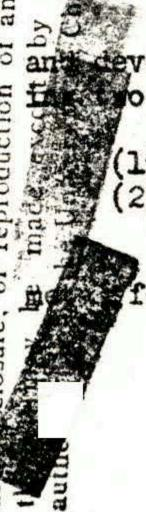
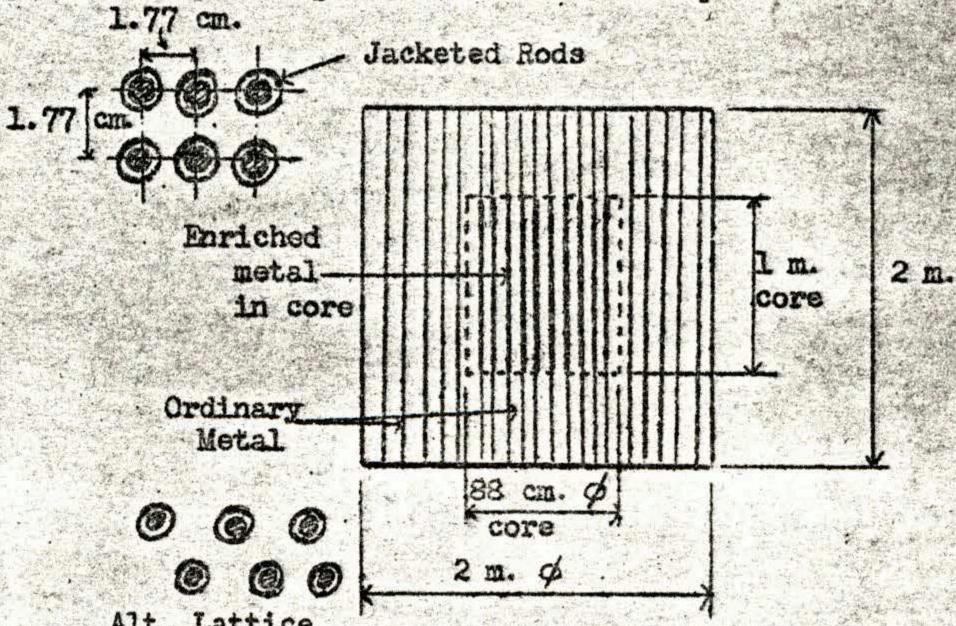
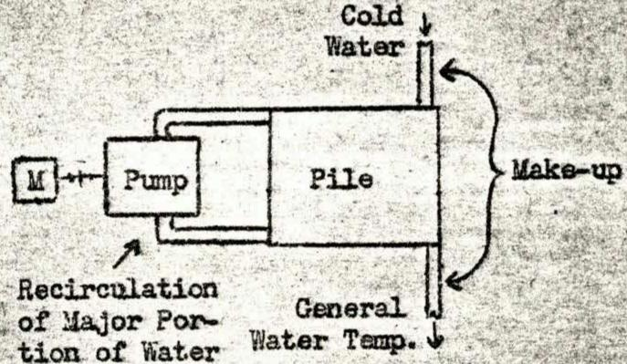
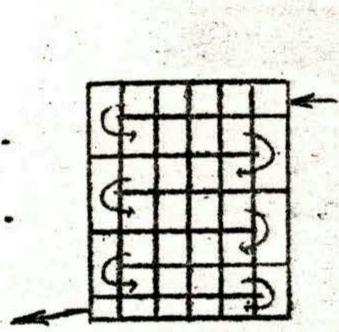
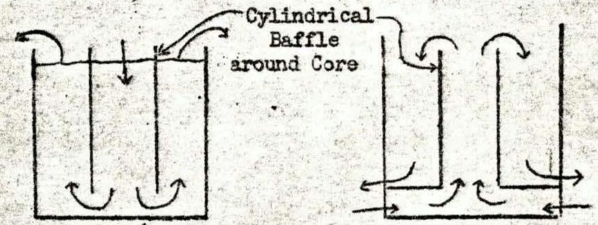
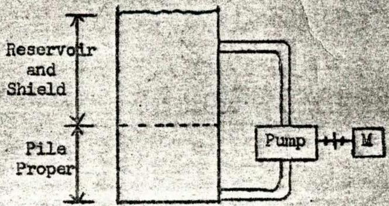

670

ORNL

MASTER COPY

Date

5-12-44

Subject

NOTES ON MEETING OF FRIDAY,

File

Those Eligible

To Read the

Attached

Copy 7 Weinberg

MAY 12, 1944

By Chlinger

To

DECLASSIFIED

Instructions Of

$\frac{1 + 4}{1} = \frac{4 + 3}{x + 3} = \frac{{0.1}\left( {0 - x}\right) }{0.1} = \frac{x}{0.1}$

Before reading this document, sign and date below

Name

Date

Name

Date

<table><tr><td colspan="4">DEPARTMENT OF ENERGY</td><td colspan="2">DECLASSIFICATION REVIEW</td></tr><tr><td>1st Review Date</td><td>26</td><td>22</td><td>Determination</td><td>Circle Number(a)</td><td></td></tr><tr><td>Name: D.R.</td><td>2nd</td><td>3rd</td><td>1. Classification</td><td>Retained</td><td></td></tr><tr><td>Authority: DC</td><td>DD</td><td>DD</td><td>2. Upd assochments Appd to:</td><td></td><td></td></tr><tr><td>Derived From:</td><td></td><td></td><td>3. Coordinate no DFE Categorized Into:</td><td></td><td></td></tr><tr><td>Declassified On:</td><td></td><td></td><td>4. Declaration Width:</td><td></td><td></td></tr><tr><td>2ndReview Date:</td><td></td><td></td><td>5. Classification</td><td>6. Classified Information Boccluded</td><td></td></tr><tr><td>Name:</td><td></td><td></td><td>7. Other (specific):</td><td></td><td></td></tr><tr><td colspan="6">Authority: DD</td></tr></table>

CENTRAL RESEARCH LIBRARY DOCUMENT COLLECTION

LIBRARY LOAN COPY

DO NOT TRANSFER TO ANOTHER PERSON

If you wish someone else to see this document, send in name with document and the library will arrange a loan.

NOTES ON MEETING OF FRIDAY, MAY 12, 1944

9:00-10:30

Eck-209 CENTRAL RESEARCH LIBRARY DOCUMENT COLLECTION

Present: Messrs. Fermi, Allison, Szilard, Wigner, Franck, Weinberg, Seitz, Cooper, Vernon, Young, Watson, Hogness, Kratz, Ohlinger

Mr. Weinberg opened the discussion on the subject of conversion units. The question of conversion units ties in closely with pile policy and depends largely on future contingencies. There are two contingencies for which a conversion unit would not only be very useful but almost mandatory.

A. Assume 49 is a failure. This is not impossible since it is rumored that purity obtained to date is poor. To get high purity one needs practically an isotope separation so the simpler conversion unit for 23 production would be very useful.   
B. Assume 49 is quite useful so that Mr. Urey can enrich metal by 25 to 30 or even $40\%$ . It then becomes a question of economics and time whether Mr. Urey's enriched product should be turned over to a conversion unit or some isotope separation scheme.

About a year ago, a unit was designed tentatively for producing completely enriched 23. (Throughout the following discussion "enriched by" signifies that the original concentration of isotope in the metal should be multiplied by the percentage indicated, while "enriched to" indicates the total percent of isotope obtained in the metal.) This design assumed a homogeneous slurry pile using $6\mathrm{kg}$ of metal enriched to $10\%$ ( $600\mathrm{gm}$ ) of 49 or 25. The slurry would require 1.2 tons of P-9 of which $75\%$ would be in the pile and $25\%$ in the external pumping system. (This design was not calculated independently but was interpolated from larger homogeneous plants to get a unit producing about $10,000\mathrm{kw}$ .)

The proposal entails getting 600 gm of 49 per day from W in the form of metal enriched to $10\%$ . The complete plant would require several conversion units in series fed consecutively with this W metal, since the useful life of the metal in each unit would be small. No details were worked out on the introduction of thorium. The power output of such a series of units per gram of 49 would be very large. If pure 49 were used, the concentration of the slurry would be reduced, but it is doubtful whether there would be any practical benefit from the use of pure 49. Unfortunately, the question of making the slurry has not yet been settled.

Mr. Fermi raised the question of substituting a solution for the slurry, and asked if there were any objections to this. Mr. Weinberg answered that the only objection to a solution was that we did not have a solution any more than we have a slurry.

Mr. Vernon suggested that, instead of using 49 in the pile and thorium in the reflector, a mixture or solution of thorium and 49 might be used, but Mr. Weinberg said that this would make the pile much larger and Mr. Fermi felt that it was simpler to use the thorium in the reflector.

Mr. Weinberg pointed out that one advantage of 23 was that the purity requirements for 23 are much less stringent than for 49. A small conversion pile using surface cooling would produce only 2000 to 3000 kw but this is still a large amount of power from a small amount of metal, although the metal would require frequent replacing.

Mr. Fermi was afraid of poisoning in such a pile since the fission products do not simply vanish but may collect and cause trouble. Mr. Weinberg answered that it would be necessary to remove the fission products continuously or periodically but that this should not prove too difficult as long as the metal is used in a slurry or solution.

Mr. Hogness asked how the heat would be removed in such a small unit. Mr. Weinberg explained that the solution or alurry would be circulated through heat exchangers. Mr. Franck asked the total weight of such a unit including the shields and Mr: Weinberg guessed that it would be in the neighborhood of 100 tons.

Mr. Fermi asked how long (i.e., to what enrichment of 23) the thorium would remain in the reflector in the pile. Mr. Weinberg explained that the thorium would be enriched with 23 to $0.1\%$ because beyond that, one loses the 23 formed.

Mr. Fermi pointed out that the accumulation of product in the thorium would require a separation process and asked whether the chemistry of separation for thorium would be any worse because of its similarity to the rare earths. Mr. Wigner felt that this would not be a serious problem since they have succeeded in separating small percents of product from uranium. Mr. Hogness suggested a slurry of thorium oxide for use in the reflector with the Szilard-Chalmers separation process for recovering the product. Mr. Weinberg questioned whether we have any better chance of getting a thorium slurry or solution than we have with uranium. Mr. Allison reported that the Canadians are thinking of using thorium in the reflector and using fluorine to remove the uranium in the form of $\mathbf{U}\mathbf{F}_6$ . However, he feels that the technical difficulties involved in this process are great.

Mr. Weinberg pointed out that one advantage of a conversion unit would be that it is the equivalent of a pilot plant for a P-9 homogeneous plant. Mr. Fermi said that this is true except that there is much less concentration than in the latter. Messrs. Wigner and Weinberg then checked and indicated that since there would be 0.2 gms. per c.c. of metal in the slurry for an unenriched P-9 homogeneous pile, there is a factor of 10 over the concentration in the conversion unit. Mr. Verdin observed that there may also be some difficulty in keeping the material in pseudo-solution and that settling out may be a serious problem.

Mr. Allison suggested that Mr. Ohlinger keep notes on suggested research elopment work which should be started for such a unit. He proposed the follow- to start the list:

(1) The behavior of solutions and slurries under radiation   
(2) The recovery of small amounts of uranium from large amounts of thorium.

Mr. Wigner proposed the use of uranium-oxalate as a possible form of a solution since it is reasonably soluble. Mr. Wigner's only worry with

the oxalate was the production of gum but Mr. Hogness said that carbon monoxide would be produced which certainly would not cause gumming. However, the carbonate might be formed and cause some deposits. Mr. Weinberg proposed attempting to obtain the oxalate of plutonium to determine its solubility.

The question of using the nitrate was asked by Mr. Wigner who wondered about the nitrogen absorption but Mr. Fermi felt that as long as the concentration was under $10\%$ there was no danger. In turn, he proposed a sulphate but questioned whether the colloidal sulphur produced under radiation might not gum up the circulation system. Mr. Wigner noted that sulphur precipitation might be prevented by the use of hydrogen sulphide and that this subject should be investigated. Also, he suggested small amounts of sulphuric acid to keep the uranium in solution since sulphuric acid does not attack stainless steel.

Mr. Hogness said that the decontamination problem should be included in Mr. Allison's list and Mr. Cooper recalled that Mr. Fermi's question of removing the fission products from a circulating stream was another problem for the list. Also, the handling and recombination of the gases of decomposition should be looked into. Mr. Heinberg indicated that the latter problem will be common to all water moderated piles. Mr. Fermi estimated the gas formation at about 20 liters per second of hydrogen and oxygen. Mr. Wigner reported that experiments of Mr. Allen had indicated that, with some luck, it might be possible to have recombination under equilibrium pressure if the gases were kept in the original tank over the liquid but that this question still needs more investigation. Mr. Fermi recalled from early experiments that a radium solution held in a flask with a vapor space above it, established its own equilibrium at around 1/2 atmosphere pressure and that the pressure never did go above one atmosphere. This was mostly the result of $\alpha$ particle activity. Mr. Wigner felt that this was good news since the action of fission particles would be similar, as indicated by investigations of Messrs. Burton and Allen who found a $\Gamma = 0.3$ for both fission and $\alpha$ particles. Mr. Fermi said that about 100 volts were required to dissociate the particles. He thought that the process might follow the cycle of forming hydrogen peroxide which would then be decomposed into the gases.

Mr. Cooper asked whether the equilibrium pressure might be expected to vary as the rate of energy liberation and, although Mr. Franck believed so, Mr. Fermi did not believe that this was necessarily true and Mr. Wigner stated that the evidence was conflicting and that this idea was the result of early experiments. With the formation of hydrogen peroxide, the process gives the equilibrium at a certain pressure regardless of the rate of energy liberation. Mr. Franck felt that since the radiation field was different in the heat exchangers than in the pile, one cannot predict the gas formation and recombination as readily as in a simple experiment. Mr. Cooper asked Mr. Fermi whether the equilibrium pressure obtained was independent of the concentration and received an affirmative answer. Since Mr. Franck was still in doubt about the equilibrium pressure formed over the solution, Mr. Fermi suggested that despite the radiologists assurance that it was, he would do some experiments to prove or disprove it.

Mr. Weinberg concluded his description of this type of conversion unit with the opinion that such a unit is fully within the range of possibility of construction by the laboratory itself instead of by an outside contractor. He also

pointed out once more that such a conversion unit would serve as a pilot plant for a P-9 homogeneous pile.

Mr. Weinberg then discussed another type of conversion unit for a different use. This would be distinctly a war plant for 49 production. Suppose that the Urey metal enriched by about $30\%$ could be produced in large quantities but to carry the concentration further would require a large plant. The concentration could be carried on further by the Chicago laboratory with a much smaller pile if it were constructed with just ordinary water. Preliminary calculations for such a reactor indicate a cylindrical pile about 2 meters in diameter by 2 meters high with an enriched core of cylindrical shape, 88 cm in diameter and 1 meter high. The core would contain 3 tons of metal enriched by $33\%$ while the surrounding shell would contain 20 tons of ordinary unenriched material. The metal in this pile would be in the form of rods or short sections of rods joined together in a continuous jacket to form a long cartridge. The jacket for either the long one piece rods or the series of short sections would be of aluminum having a thickness of about 50 mils. The rods or cartridges would all be parallel to each other and to the axis of the cylinder and arranged vertically throughout. The metal in the rods through the core would have a diameter of 1 cm while those in the shell would start at 1 cm diameter near the core and increase gradually to 4 cm in diameter at the periphery. This would give a volume ratio of 3 to 1 for the metal in the core. The spacing of the rods in the core would be 1.77 cm for a square lattice. There would be 1500 rods in the core and somewhat more than that in the shell, depending on the grading. The cartridges through the core would contain enriched material in the portion of the cartridge extending through the core and ordinary material in

the portion extending through the shell. The sketch at the right indicates diagramatically a vertical section through such a pile.

The best k for an ordinary water pile is around 0.97 but, with only a slightly optimistic assumption of the ratio of fission to capture cross section (which is uncertain), we can assume a base k of 1.1 for $33\%$ enrichment. With a $2\frac{1}{2}\%$ loss from aluminum, k becomes 1.075 and $\Delta = -0.1760 \times 10^{-6}$ . In

the shell, k would be 0.95. As a rough estimate, for each atom of 25 destroyed in the core, we can expect about 0.85 atoms of 49 in the core.

For better cooling of the rods and protection against warping, it may be desirable to have fins on the ends of the rods. Mr. Young has made calculations

on the heat transfer which indicate that, assuming a film drop twice that at W or $40^{\circ}$ , and assuming that the water through the pile is all about the same temperature (this seems reasonable since the film drop is the largest item), we can expect around 60,000 kw from such a unit. However, since the pile is practically all water, a tremendous quantity of water must pass through the pile to get good heat transfer. The calculations mentioned above indicate a velocity through the pile of about 10 meters per second. This means about 30 tons per second or 430,000 gallons per minute of water through the pile. Mr. Szilard made the suggestion that

it would be possible to avoid handling such a tremendous quantity through the necessary filters, etc., by recirculating the major portion of the water through the pile and flowing only a small quantity of water through as make-up. Mr. Young's calculation indicates that this make-up might amount to about 0.7 of a ton per second for a $40^{\circ}$ temperature differential. The sketch at the right indicates this diagramatically.

Mr. Cooper explained that it is a frequent practice in industry where once through parallel flow would involve large quantities of water, to use staggered baffles to produce a zigzag cross flow as indicated diagramatically at the left below. Mr. Wigner suggested a cylindrical baffle at the periphery of the core as indicated in the two diagramatic alternates at the center and right below.

Mr. Cooper enlarged upon the center sketch by suggesting a series of concentric cylindrical baffles as a further refinement. The cylindrical baffles with the water entering at the center offer better utilization of the cooling stream than the cross baffles since k is better in the core than in the shell and half of the power is produced in the core. The average power in the core per gram of metal is about 10 times the average power for the shell. This means the core will produce about 10,000 kw per ton of metal or about five times the utilization at h, although this figure is not far different from the expected utilization considered for P-9 piles. Since the shell metal will enrich in time, less metal will be required in the center eventually. Although core poisoning will be a factor to consider, it is probable that the metal activity rather than the poisoning will determine the length of operation.

Since the removal of rods from such a pile does not appear too easy,

Mr. Young has suggested an arrangement indicated diagramatically at the right for overcoming this difficulty. In this arrangement, the pile would be covered by a thick layer of water to act as a shield during the pulling of the rods and a reservoir for the circulating water.

In all, Mr. Weinberg felt the scheme appeared relatively simple and certainly much cheaper than a W type pile. Therefore, he felt it

looked favorable and should be compared with sending Mr. Urey's product to Mr. Lawrence.

Mr. Vernon indicated that the baffles may have to be beryllium and that there is another problem to consider,--the vibration of the rods at large velocities. Mr. Higner summed up the baffle situation as simply a comparison economically and mechanically between using huge pumps with no baffles or accepting the baffle problems with smaller pumps. He also observed that the warping of the rods will be no small problem. In answer to a question, Mr. Weinberg explained that the high water velocity through the pile is required for heat transfer and that the reason for the recirculating scheme was as follows. If the entire mass of water were pumped through once, it would only be heated $1^{\circ}$ or $2^{\circ}$ which seems wasteful. By recirculating, only a small amount of water would be raised about $40^{\circ}$ while the major portion of the water would remain at the same temperature.

In answer to Mr. Ferni's question about transverse flow of cooling water, Mr. Cooper offered the opinion that it would probably introduce a greater pressure drop than any other arrangement. Mr. Weinberg noted that they had also considered the scheme of letting local boiling occur near the rods, but that, in this arrangement, the heat transfer would be only half that at W. Mr. Wigner observed that a perfunctory calculation indicated that the maximum heat transfer which could be obtained by the boiling scheme would certainly not exceed that at W but that the subject needed further study. Mr. Cooper said that there was no question in a P-9 scheme that boiling was not the most efficient way of removing the heat but that in a pile requiring such large volumes of water for removing the heat, boiling might be more attractive. Mr. Wigner suggested the arrangement in which boiling in the liquid would occur at the surface of the rods with the bubbles leaving the rods quickly and condensing in the balance of the cooler liquid. Mr. Young said that the maximum heat transfer in a boiling scheme would only be about half that at W. Mr. Seitz pointed out that a boiling scheme enhances the corrosion problem. Mr. Franck suggested using smaller pumps and no make-up water. In this case, the water would be boiled off and recondensed, but Mr. Wigner said that Mr. Young's calculations had indicated that this method would only get out about 1/3 of the power and that there was no great gain in adding a circulation system to a boiling scheme.

Mr. Wigner felt that for enrichments higher than $30\%$ , Mr. Weinberg's water pile was not so good but that for enrichments up to $30\%$ it probably was better than Mr. Lawrence's isotope separation. Mr. Fermi felt there was a reasonably good chance that $30\%$ enriched material may become available and agreed with Mr. Wigner that, accordingly, Mr. Weinberg's scheme should be considered seriously.

In answer to a question regarding any additional problems in the chemical separation process, Mr. Cooper stated that the original plant at Clinton was designed to operate on one week old material, although now operating on ten week old material, and so this problem should not be critical in such a design.

Mr. Weinberg pointed out that the ordinary water pile originally was not very practical but Mr. Szilard's suggestion makes it attractive again.

Mr. Allison questioned whether the fundamental point at issue is not, "will the 49 be as useful as 25." In the discussion following, the enriched ordinary water pile described above was compared with Mr. Lawrence's electromagnetic isotope separation process. Mr. Lawrence uses Mr. Urey's metal which has been enriched from 0.7 to $0.9\%$ of 25 and carries it the rest of the way, but for every atom of 25 put in by Mr. Urey, he gets out just one atom of 25. In the enriched ordinary water scheme, for every atom of 25 destroyed, we can expect 1.4 atoms of 49 to be produced in the pile so that the enrichment is used more efficiently in this type of process than in the Lawrence scheme.

Because of the limited supply of material, Mr. Szilard felt that long period operation was desirable although it was possible that the resonance absorption by the fission products might poison the pile and stop the reaction. Mr. Weinberg felt that when poisoning stops the pile it is time to stop anyway for other reasons.

Mr. Fermi reported that the supply of enriched material for the core would just be enough to keep one unit going. Mr. Szilar then suggested leaving the core in place and using the shell to obtain the 49, but Mr. Fermi pointed out that the center material goes to pieces sooner than the shell material.

Mr. Ohlinger made public Mr. Young's observation that considering the abundance of metal and difficulties in obtaining it, it would be very desirable to know what steps are being taken toward recovery of the large amount of material which is now being lost in the chemical process plant. Mr. Cooper reported that work was being done on the recovery of uranium but that he had nothing definite to report for possibly another month.

The next meeting will be on Friday, May 19th at which Mr. Fermi will speak.

jip