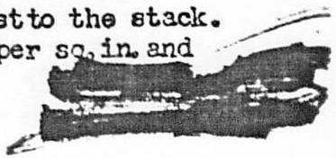
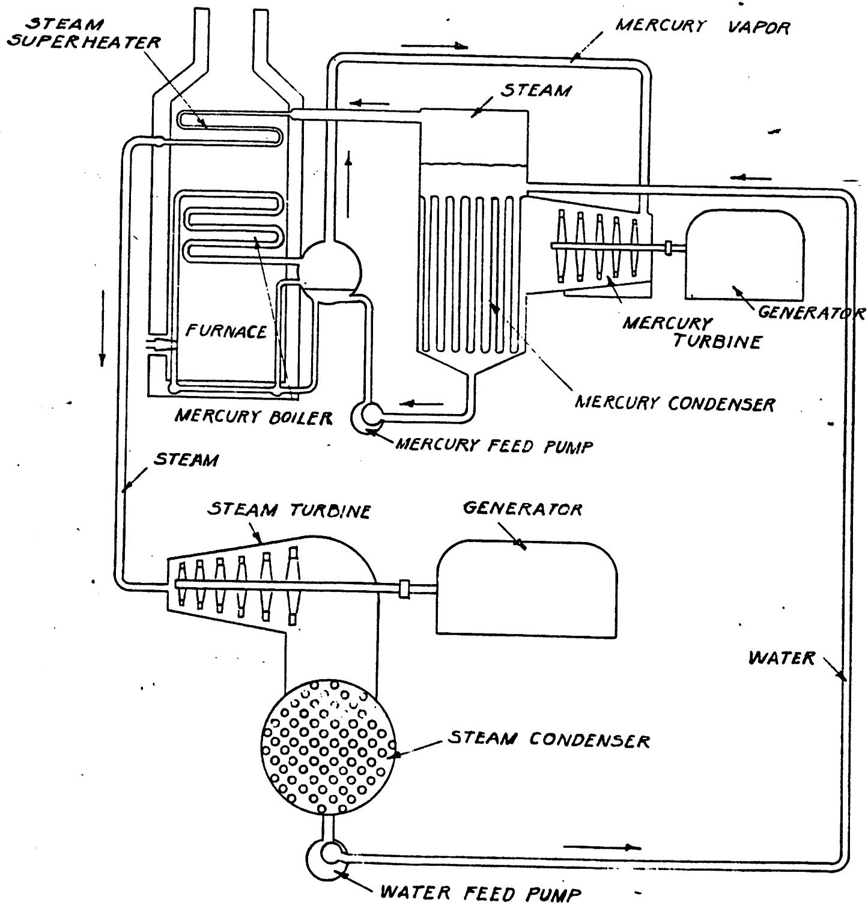

<table><tr><td colspan="2">DEPARTMENT OF ENERGY DECLASSIFICATION REVIEW</td></tr><tr><td>1STReview Date: 1/12/2023
Name: D. ### OR### Review:</td><td>Determination [Circle Number(s)]:</td></tr><tr><td>Authority: DC ☐ DD ☐</td><td>1. Classification Retained</td></tr><tr><td>Derived From: CG - NMP-2</td><td>2. Upgraded/downgraded To:</td></tr><tr><td>Declassified On: 01/12/2023</td><td>3. Contains no DOE Classified Into</td></tr><tr><td>2NDReview Date: 1/12/2023</td><td>4. Coordinate With:</td></tr><tr><td>Name: D. labu##ka OR### Review:</td><td>5. Declassified 9:00</td></tr><tr><td>Authority: DD ☒</td><td></td></tr></table>

Present: Messrs. Seitz, Hogness, Allison, Smyth, Cooper, Creutz and Ohlinger

Mr. Seitz presented a very interesting report on his visit to the General Electric Company at Schenectady to discuss turbine systems and in particular, the new mercury turbine and mercury-vapor processes.

This subject is of interest to us because, first, the mercury™"topping" system is the most modern and efficient power production system in use today and, second, it presents something new and different in power production—the use of liquid metal at high temperatures. The latter is of particular interest to us because of its application to certain of the potential pile designs involving the use of liquid metal at high temperatures.

The mercury-vapor process is based on the fact that to increase thermodynamic efficiency, one should obtain the maximum possible working temperature or rather the maximum possible differential temperature. The mercury system which is a "topping" system would operate between two temperatures $\mathbf{T}_1$ and $\mathbf{T}_2$ to produce about 1/3 to 1/2 of the total power while the steam system would operate between temperatures $\mathbf{T}_2$ and $\mathbf{T}_3$ to produce the balance of the power, about 2/3 to 1/2. Most of the mercury-vapor systems in use now, have the temperature $\mathbf{T}_2$ established according to the top temperature available in their existing steam system, with the mercury system added to bring the top temperature up to $\mathbf{T}_1$ . The engineers at Schenectady would much prefer to lower the value of $\mathbf{T}_2$ and recommend that new systems which are designed provide for a lower $\mathbf{T}_2$ in order to give a better overall efficiency.

The mercury-vapor process is a binary system for producing power from fuel with greater thermal economy than is possible with the steam cycle alone. The mercury cycle can also be considered as a steam producer in which, for a given amount of fuel, nearly as much steam is produced as in a steam cycle and, in addition, the by-product power from the mercury turbine generator is obtained at nearly the mechanical equivalent of the thermal energy. The advantage of the mercury over the water system is that one obtains as high temperature with mercury vapor as with water vapor at only 1/10 the pressure. One disadvantage of the mercury system is that the weight and volume of mercury required is larger than that of the water required in a water system. In a water system operated at about $950^{\circ}\mathrm{F}$ , the entropy per pound is 1.546 BTU/ $\mathsf{oF}$ /lb and the volume of vapor per pound is 0.3538, while in a mercury system operating at about 1050 to 1100 $\mathsf{oF}$ , the entropy is 0.1193 and the volume per pound is 0.3998. From this we see that a mercury system requires about ten times the working volume of a water system.

The present mercury units are designed to produce about 20,000 kw in the mercury system alone and one unit uses about 400,000 pounds of mercury. At the

<table><tr><td colspan="2">Vocabulary: NIO</td></tr><tr><td>1.</td><td>one (e)</td></tr><tr><td>2.</td><td>one of (o)</td></tr><tr><td>3.</td><td>one of two (o)</td></tr><tr><td>4.</td><td>one of three (o)</td></tr><tr><td>5.</td><td>one of four (o)</td></tr><tr><td>6.</td><td>one of five (o)</td></tr><tr><td>7.</td><td>one of six (o)</td></tr><tr><td>8.</td><td>one of seven (o)</td></tr><tr><td>9.</td><td>one of eight (o)</td></tr><tr><td>10.</td><td>one of nine (o)</td></tr><tr><td>11.</td><td>one of ten (o)</td></tr><tr><td>12.</td><td>one of十一 (o)</td></tr><tr><td>13.</td><td>one of十二 (o)</td></tr><tr><td>14.</td><td>one of十三 (o)</td></tr><tr><td>15.</td><td>one of十四 (o)</td></tr><tr><td>16.</td><td>one of十五 (o)</td></tr><tr><td>17.</td><td>one of十六 (o)</td></tr><tr><td>18.</td><td>one of十七 (o)</td></tr><tr><td>19.</td><td>one of十八 (o)</td></tr><tr><td>20.</td><td>one of十九 (o)</td></tr><tr><td>21.</td><td>one of二十 (o)</td></tr><tr><td>22.</td><td>one of twenty (o)</td></tr><tr><td>23.</td><td>one of twenty-one (o)</td></tr><tr><td>24.</td><td>one of twenty-two (o)</td></tr><tr><td>25.</td><td>one of twenty-three (o)</td></tr><tr><td>26.</td><td>one of twenty-four (o)</td></tr><tr><td>27.</td><td>one of twenty-five (o)</td></tr><tr><td>28.</td><td>one of twenty-six (o)</td></tr><tr><td>29.</td><td>one of twenty-seven (o)</td></tr><tr><td>30.</td><td>one of twenty-eight (o)</td></tr><tr><td>31.</td><td>one of twenty-nine (o)</td></tr><tr><td>32.</td><td>one of thirty (o)</td></tr><tr><td>33.</td><td>one of thirty-one (o)</td></tr><tr><td>34.</td><td>one of thirty-two (o)</td></tr><tr><td>35.</td><td>one of thirty-three (o)</td></tr><tr><td>36.</td><td>one of thirty-four (o)</td></tr><tr><td>37.</td><td>one of thirty-five (o)</td></tr><tr><td>38.</td><td>one of thirty-six (o)</td></tr><tr><td>39.</td><td>one of thirty-seven (o)</td></tr><tr><td>40.</td><td>one of thirty-eight (o)</td></tr><tr><td>41.</td><td>one of thirty-nine (o)</td></tr><tr><td>42.</td><td>one of forty (o)</td></tr><tr><td>43.</td><td>one of forty-one (o)</td></tr><tr><td>44.</td><td>one of forty-two (o)</td></tr><tr><td>45.</td><td>one of forty-three (o)</td></tr><tr><td>46.</td><td>one of forty-four (o)</td></tr><tr><td>47.</td><td>one of forty-five (o)</td></tr><tr><td>48.</td><td>one of forty-six (o)</td></tr><tr><td>49.</td><td>one of forty-seven (o)</td></tr><tr><td>50.</td><td>one of forty-eight (o)</td></tr><tr><td>51.</td><td>one of forty-nine (o)</td></tr><tr><td>52.</td><td>one of fifty (o)</td></tr><tr><td>53.</td><td>one of fifty-one (o)</td></tr><tr><td>54.</td><td>one of fifty-two (o)</td></tr><tr><td>55.</td><td>one of fifty-three (o)</td></tr><tr><td>56.</td><td>one of fifty-four (o)</td></tr><tr><td>57.</td><td>one of fifty-five (o)</td></tr><tr><td>58.</td><td>one of fifty-six (o)</td></tr><tr><td>59.</td><td>one of fifty-seven (o)</td></tr><tr><td>60.</td><td>one of sixty (o)</td></tr><tr><td>61.</td><td>one of sixty-one (o)</td></tr><tr><td>62.</td><td>one of sixty-two (o)</td></tr><tr><td>63.</td><td>one of sixty-three (o)</td></tr><tr><td>64.</td><td>one of sixty-four (o)</td></tr><tr><td>65.</td><td>one of sixty-five (o)</td></tr><tr><td>66.</td><td>one of sixty-six (o)</td></tr><tr><td>67.</td><td>one of sixty-seven (o)</td></tr><tr><td>68.</td><td>one of sixty-eight (o)</td></tr><tr><td>69.</td><td>one of sixty-nine (o)</td></tr><tr><td>70.</td><td>one of seventy (o)</td></tr><tr><td>71.</td><td>one of seventy-one (o)</td></tr><tr><td>72.</td><td>one of seventy-two (o)</td></tr><tr><td>73.</td><td>one of seventy-three (o)</td></tr><tr><td>74.</td><td>one of seventy-four (o)</td></tr><tr><td>75.</td><td>one of seventy-five (o)</td></tr><tr><td>76.</td><td>one of seventy-six (o)</td></tr><tr><td>77.</td><td>one of seventy-seven (o)</td></tr><tr><td>78.</td><td>one of seventy-eight (o)</td></tr><tr><td>79.</td><td>one of seventy-nine (o)</td></tr><tr><td>80.</td><td>one of eighty (o)</td></tr><tr><td>81.</td><td>one of eighty-one (o)</td></tr><tr><td>82.</td><td>one of eighty-two (o)</td></tr><tr><td>83.</td><td>one of eighty-three (o)</td></tr><tr><td>84.</td><td>one of eighty-four (o)</td></tr><tr><td>85.</td><td>one of eighty-five (o)</td></tr><tr><td>86.</td><td>one of eighty-six (o)</td></tr><tr><td>87.</td><td>one of eighty-seven (o)</td></tr><tr><td>88.</td><td>one of eighty-eight (o)</td></tr><tr><td>89.</td><td>one of eighty-nine (o)</td></tr><tr><td>90.</td><td>one of ninety (o)</td></tr><tr><td>91.</td><td>one of ninety-one (o)</td></tr><tr><td>92.</td><td>one of ninety-two (o)</td></tr><tr><td>93.</td><td>one of ninety-three (o)</td></tr><tr><td>94.</td><td>one of ninety-four (o)</td></tr><tr><td>95.</td><td>one of ninety-five (o)</td></tr><tr><td>96.</td><td>one of ninety-six (o)</td></tr><tr><td>97.</td><td>one of ninety-seven (o)</td></tr><tr><td>98.</td><td>one of ninety-eight (o)</td></tr><tr><td>99.</td><td>one of ninety-nine (o)</td></tr><tr><td>100.</td><td>one of 1000 (0)</td></tr></table>

present market cost of mercury of around $2.00 per pound, this means an outlay of nearly $1,000,000 for mercury for one unit. The known world deposits of mercury are large and with a production no greater than the present top yearly production, as much as 1,000,000 kw in combined mercury-steam plants could be installed each year. Whereas these binary units might be installed on large ships, at present they do not look very practical for smaller power requirements of a mobile nature such as trains, etc.

Although the figure above shows the utilization of 20 pounds of mercury per kw, the engineers at Schenectady believe that a minimum of 8.25 pounds of mercury/kw can ultimately be achieved. They have set up as a basis of comparison of efficiencies a figure based on the total overall efficiency from the heat contained in the coal to the power at the busbar. On this basis, the maximum theoretical efficiency which can be obtained according to the first law of thermodynamics is 3,413 BTU/hr/kw. The best overall efficiency obtained to date in any of the mercury-steam combination units is 9,175 BTU/hr/kw. The best overall efficiency obtained from an all steam unit is 10,039 BTU/hr/kw. This means the all steam power plant has an efficiency of about $33\%$ compared to the first law efficiency noted above while the binary system has an efficiency of about $37\%$ or $4\%$ gain over the all steam plant. The operating temperatures for a typical binary unit are: 1,050°F for the mercury or $\mathbf{T}_{1}$ (this is saturation temperature) and 925°F for the water or $\mathbf{T}_{2}$ (this includes the superheat). Thus the thermodynamic efficiency computed from the temperatures or the second law efficiency would be about $65\%$ .

The drawing attached illustrates diagrammatically the mercury-vapor process for the production of power. Referring to the drawing, mercury is vaporized in a boiler at comparatively low pressure and passed through a mercury turbine which drives a generator. The vapor from the turbine is exhausted to a condenser boiler where its latent heat is transferred to water which vaporizes at any desired pressure. The steam formed in the condenser boiler is superheated in coils located in the gas passages of the mercury boiler and is then used in steam turbines or for process work.

The top limit to the temperature $\mathbf{T}_{\mathbf{l}}$ at present is set by the tubes in the fire box. These are actually located in the hot coil gases immediately above the fire bed and have temperatures on the outside surface of around 1200°F and on the inside of around 1075°F. Under these operating conditions, it is obvious that the tubes are easily attacked by the gases and slags in the fire box and must have high creep strength as well as stainless properties. The best alloys found to date for these tubes are the Sicromo series having about 1% each of silicon, chromium and molybdenum with the balance iron. When better alloys are found, $\mathbf{T}_{\mathbf{l}}$ can be raised above 1075°F and the efficiency improved. However, in our type of power production units, we do not require a furnace and so we can better the value of $\mathbf{T}_{\mathbf{l}}$ .

Mercury, as the material for the liquid metal portion of this binary system, is a good material for this purpose because it dissolves very few metals used in commercial high temperature practices. In fact, the solubility of all metals in mercury is less than one part in $10^{4}$ . One problem, however, with the use of mercury was the difficulty in obtaining good wetting of the boiler tubes by the mercury. This is especially necessary in the fire box and condenser boiler to obtain good heat transfer. It was finally found that by adding 0.5 ppm of titanium and 10 ppm of magnesium as wetting agents, good heat transfer coefficients could be realized. These wetting agents are probably effective because they are both good oxygen getters, taking it away from the mercury and the iron. Mercury probably tends to wear away the iron oxide while the titanium and magnesium, in taking the oxygen away from the mercury and iron, help the mercury in cleaning off the scale and keep the tubes clean and easy to wet. When starting up a unit, it takes about ten minutes before wetting occurs but from that time on, no further trouble is encountered if about one pound per month of titanium and possibly a very small amount per year of magnesium is added. Unfortunately, a small amount of air (about 1 cu ft per hr) leaks into the mercury turbine at the condensing or low pressure end. This probably accounts for the necessity for the extra titanium.

In an all steam power plant, an entire corps of chemists is required for constant water analysis and treating to avoid scaling while the mercury system is practically self-maintaining except for the small addition of titanium. Therefore, in addition to the increased efficiency, the mercury system offers a tremendous reduction in maintenance costs.

One great worry in a mercury system is the possibility of leaks in view of the high mercury costs. In the many operating years credited to mercury-vapor binary systems, only one leak has occurred. This was brought about as a result of the following process: powdered coal was fed into the top of the fire box while ashes produced therefrom fell into the bottom of the furnace and were swept out by streams of water. In the case of the single leak, water splashed up and caused steam which attacked the tubes with a resulting loss of about one ton of mercury through the leak.

Despite all premonitions, the mercury turbines have caused no trouble and have operated very successfully without pitting or erosion. The careful design of the turbine to produce impact incidence of the mercury with the turbine blades at a safe angle instead of perpendicular appears to be the secret for the successful erosion resistance of these turbines. They are made with high carbon steel parts instead of stainless steel as employed in steam turbines. However, at present, the steam turbine is more efficient than the mercury turbine based on the overall transfer of kinetic energy in the gas to mechanical energy from the turbine. For a steam turbine the efficiency is about $85\%$ as compared to only $73\%$ for the mercury turbine. The latter figure is lower probably because of the tendency of the mercury to condense in the turbine.

Of the heat produced in the furnace, only about $15\%$ is lost to the stack. The operating pressure for the mercury system is around 125 pounds per sq.in. and for the water system around 1,250 pounds per sq. in.

To consider the application of this information to our problem of designing a new high temperature pile, we must consider the possibility of a metallic alloy of uranium or plutonium which can be used molten through a pile which would replace the fire box in the above process. There are only two systems giving a eutectic with uranium (and presumably plutonium) with low enough melting points to be practical. These are the iron-uranium (or plutonium) alloys and the nickel-uranium (or plutonium) alloys. The latter eutectic melts below $750^{\circ}\mathrm{C}$ and has about 40 atomic percent nickel. The difficulty with the first named eutectic is that iron dissolves everything which can possibly be used for the tubes.

Very little is known about the mercury-uranium alloys which are pyrophoric. More data should be obtained on the phase diagrams of this alloy and further information obtained on the nickel-uranium alloys. Of course, the pile need not be operated with the active metal in molten form circulating through the pile but may have another metal in liquid form as the coolant with the uranium or enriched material stationary within the moderator. An example of this type is Mr. Szilard's bismuth cooled pile.

Another problem in using a uranium eutectic is that the fission products will be contaminating the liquid metal constantly. At Hanford, this may take only a few hours. While most of the fission products are good elements and might help as wetting agents, iodine and the alkaline metals might interfere with the cleansing action.

In the discussion that followed, Mr. Allison pointed out the possibilities of a bismuth-uranium (or plutonium) eutectic instead of mercury-uranium. The question was also brought up as to the relation between wetting and heat transfer and it was pointed out that wetting was very important on a rough surface and less important on a smooth surface. Mr. Ohlinger questioned the supposed reduction in maintenance in the binary system and Mr. Seitz agreed that there was no reduction in maintenance in the present units where the mercury system has been added simply as a "topping" unit on an existing steam plant but that any newly designed unit where the temperature $\mathbf{T}_2$ can be reduced, it is to be expected that maintenance will be reduced accordingly.

Mr. Vernon concluded the discussion period with a brief discourse on a high temperature gas cooled pile in which the hot gases would replace the coal gases in the furnace in the binary system, the active metal would be located throughout the moderator in lumps either of uranium carbide or molten uranium contained in crucibles, say, of beryllium oxide. The furnace in the binary system would then become essentially a heat exchanger for absorbing the heat carried off by the cooling gas through the pile. Mr. Cooper's objection to this scheme was the high gas pressure that would probably be necessary in order to get sufficient heat capacity in the cooling gas (probably around 10 atmospheres). Mr. Weinborg's objection was that such a pile would be exceedingly large because of the high temperature operation and the use of the carbide. In fact, he felt that it would be much larger even than the original helium-cooled graphite-moderated plant. Mr. Hogness objected to the large amount of power that would be used up in recirculating the gas because of the low heat capacity of helium.

At subsequent meetings, Mr. Wigner will discuss his "pulsating" pile and those utilizing endothermic chemical reactions and Mr. Szilard will discuss his seed piles.

jip

