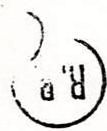
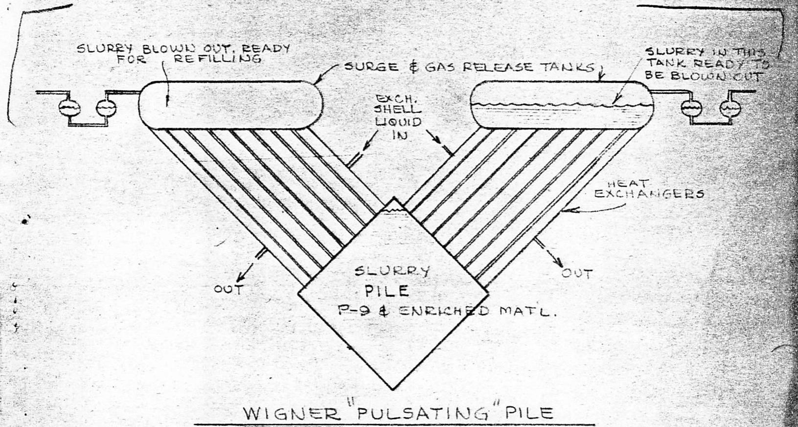
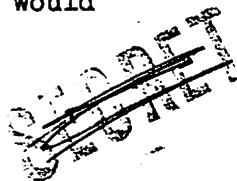
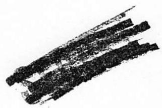
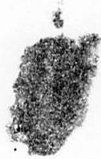

670

# ORNL MASTER COPY

$\left( 1\right)  - {17294}$

File

Those Eligible

To Read the

Attached

Date 7-14-44

Subject NOTES ON MEETING OF WEDNESDAY

JULY 14, 1944

By Ohlinger

To

# DECLASSIFIED

Before reading this document, sign and date below

Copy 6 Weinberg

CENTRAL RESEARCH LIRPA

AARY DOCUMENTI CILLIOON

Instructions Of

$\frac{1 + u}{1} - \frac{u}{1} = \frac{\left( {1 + u}\right) u}{1} < \frac{u}{1} = u$

Name Date

7/249

Name Date

$\frac{y}{h} =$

${OE} - {OE}$

CENTRAL RESEARCH LIBRARY DOCUMENT COLLECTION

LIBRARY LOAN COPY

DO NOT TRANSFER TO ANOTHER PERSON

If you wish someone else to see this document, send in name with document and the library will arrange a loan.

Those present: Allison, Vernon, Hilberry, Cooper, Fermi, Wigner Hogness, Creutz, Young, Seitz, and Ohlinger

At an earlier meeting, Mr. Wigner mentioned his "pulsating" pile. Today, he explained its operation in more detail and included some estimated operating data.

The "pulsating" pile may be applied either to the production of isotopes in a large homogeneous type pile or to the production of power. Its general shape as envisioned by Mr. Wigner is as shown diagrammatically below.

If one thinks of a power producing pile, one is naturally faced with the general problem of a liquid medium which can stand high temperatures. This problem was discussed before and a solution of some enriched material in a liquid metal, or a solution or slurry of a compound in a solvent with high boiling point but low neutron absorption was suggested. However, since this problem is not solved, the following considerations will assume that we have to deal with heavy water as solvent. The heavy water is used only as a typical liquid, in reality it is not very suitable for the purpose because of its low boiling point.

The pile proper would then be a tank containing a slurry or solution of enriched material in heavy water.

Surrounding the pile tank would be a series of heat exchangers. The tubes through these exchangers would connect directly to the pile tank at the lower end of the tubes and to a series of large, flat tanks at the upper end. These tanks would serve for brief storage of the slurry during the surging cycle with as large a liquid surface as possible to permit a maximum release of the gases of decomposition during the brief sojourn of the liquid in the tanks. Connecting to each of the surge tanks would be a deep liquid seal to prevent the escape of the gases. The operating cycle would be as follows: The slurry in the pile tank would be under pressure while one or more of the surge tanks would have their pressure reduced so that a portion of the slurry from the pile would flow up through the exchangers into the surge tanks. Simultaneously pressure in other surge tanks would be increased above the pile pressure so as to force partially cooled slurry from those tanks back through the heat exchangers into the pile. Pressures in the first tanks would then be built up to force the partially cooled slurry back through the exchangers into the pile while the latter tanks would be evacuated, and so on. The purpose of this arrangement is many-fold. It provides a back and forth motion of the hot slurry through the heat exchangers simply by adjustment of pressures without the use of pumps. It provides an arrangement for cycling the slurry through heat exchangers with a minimum of P-9 hold-up volume outside the pile proper. It does both these things in a manner that exposes a maximum of the liquid for release of the gases of decomposition.

Some of the data calculated by Mr. Wigner for a pile for the production of power follow. There will probably be as many as 1,000 tubes of $\frac{1}{2}$ cm diameter emanating from the pile. The pile would probably operate at somewhat high temperatures, about $150^{\circ}$ C if a P-9 solution is used, to get a better yield. The pressure in the pile proper would be about 10 atmospheres. The variation in pressure in the large, flat surge tanks would be about 2 atmospheres. The time of pulsation would be about 1 second.

Two different sizes were calculated by Mr. Wigner, one the critical size and the other a size somewhat larger than the optimum. The optimum size would undoubtedly lie somewhere between these two units.

TABLE I   

<table><tr><td>Item</td><td>Critical Size</td><td>Over Size</td></tr><tr><td>Concentration of 49 in P-9</td><td>0.001 gms/cc</td><td>0.0003 gms/cc</td></tr><tr><td>49 required</td><td>1 kg.</td><td>1½kg.</td></tr><tr><td>P-9 inside pile</td><td>1000 liters</td><td>4200 liters</td></tr><tr><td>P-9 outside pile (hold-up)</td><td>300 liters</td><td>800 liters</td></tr></table>

The quantity of liquid outside of the pile or the holdup in Table II is a function of the time of pulsation (t) and is based on the assumption that the total cross section area of the exchanger tubes is 1/60 of the pile area (pile face = 1/3 of the area and 1/20 of that is tube area). The amount of slurry being moved is proportional to the tube area and the velocity while the amount outside of the pile at any time is 1/2 that streaming out in the period of one pulsation. It was assumed, for Table II, that the cooling water keeps the tubes $20^{\circ}\mathrm{C}$ below the temperature of the liquid.

TABLE II   

<table><tr><td>Length of pipe through exchanger (L) 
Diameter of pipe through exchanger (D) =</td><td>100</td><td>200</td><td>300</td></tr><tr><td>Hold-up in liters for critical size pile</td><td>320 t</td><td>250 t</td><td>210 t</td></tr><tr><td>Hold-up in liters for over size pile</td><td>860 t</td><td>660 t</td><td>560 t</td></tr><tr><td>Velocity (based on l atmosphere dif-ferential pressure between pile and surge tank)</td><td>8 m/sec</td><td>7 m/sec</td><td>6 m/sec</td></tr><tr><td>Temperature drop in one pulsation (as-summing tube 20° less than the liquid temperature</td><td>40°C</td><td>80°C</td><td>120°C</td></tr><tr><td>Power in megawatts for critical size pile</td><td>54</td><td>84</td><td>105</td></tr><tr><td>Power in megawatts for over size pile</td><td>140</td><td>220</td><td>280</td></tr></table>

The temperature of the cooling water through the shells of the exchanger would not be much above $70 - 80^{\circ}$ C. At this low temperature the pile would be practically useless as a power producing unit. Accordingly, the temperatures must be increased to get higher cooling water temperatures.

Mr. Fermi pointed out that a unit of this type would use up the 49 which it contains in a few days if it is run at the high power indicated.

Mr. Wigner suggested cutting the $20^{\circ}$ temperature drop across the tubes $10^{\circ}$ which would cut the power in half. For the critical size with an L/D of 100 and a power production of 54 megawatts, the calculated external power required would be $64\mathrm{kw}$ .

Mr. Cooper questioned the advantage of the "pulsating" method of moving the liquid in contrast to its circulation by mechanical means and Mr. Wigner indicated that the purpose of his "pulsating" method of handling the liquid was to get rid of the moving mechanisms or pumps which would be completely unapproachable after once being put into operation and to provide a better means of removing the gases of decomposition. Mr. Hogness asked whether the object of this pile was to remove the power as useful power or as heat. Mr. Wigner said that it would become the former as soon as a suitable liquid is found in which to dissolve the 49 and which can be used at high temperatures.

Mr. Seitz pointed out that the efficiency of such a pile would be quite low unless other materials were used for the moderator. Mr. Wigner agreed that this was correct and suggested the use of some other liquid or internally cooled tubealloy rods to obtain a higher temperature.

Mr. Wigner then turned to the application of the pulsation method for a 49 producing pile and presented data for a large homogeneous pile containing probably a slurry of uranium oxide in P-9. In this case the pile volume would be about 30 cu.m. and the pile would probably operate at around $150^{\circ}$ C. The assumed temperature difference between the average tube temperature and that of the liquid in the pile is $50^{\circ}$ . This has been chosen rather high because no power is wanted from this particular pile. The tube diameter would be around 2 cm.

TABLE III   

<table><tr><td>Length of exchanger tube (L)</td><td>200 cm</td><td>300 cm</td><td>500 cm</td></tr><tr><td>Velocity</td><td>14 m/sec</td><td>12 m/sec</td><td>10 m/sec</td></tr><tr><td>Time of pulsation</td><td>2 sec</td><td>2 sec</td><td>2-3 sec</td></tr><tr><td>Power in megawatts</td><td>2750</td><td>3000</td><td>3250 - 3300</td></tr><tr><td>Hold-up of P-9 in tons</td><td>22</td><td>19</td><td>15½ - 23½</td></tr><tr><td>Power
Hold-up
in watts per cu cm (or
kw per liter)</td><td>125</td><td>160</td><td>210 - 140</td></tr></table>

As no further discussion on the "pulsating". pile was forthcoming, Mr. Wigner said a few words about the possibility of piles employing an endothermic chemical reaction for the direct removal of heat. He did not favor the arrangement because he foresaw considerable difficulty in obtaining suitable materials for such a pile. In this case cooling is not by a liquid which cools by its heat capacity but by a gas which cools by decomposition, for example $\mathrm{CO}_{2}$ which can be broken down to $\mathrm{CO}$ and $\mathrm{O}_{2}$ which can be burned outside the pile for the production of power. Carbon dioxide is suggested because it has a higher heat capacity and gives off chemical as well as mechanical energy. However, a chemical reaction would probably take place with many materials including the tubealloy so it would be necessary to coat the tubealloy.

In addition, the advantage to be gained from the use of a chemical reaction is not very large. The advantage of using a gas coolant in which chemical reaction goes on can be described, phenomenologically, as an increased specific heat which is, of course, favorable. In order to have maximum specific heat, one must operate around the temperature at which the chemical equilibrium is about half complete. In the preceding example, this would mean that about half of the $\mathrm{CO}_{2}$ is decomposed. The specific heat per mole then is

$$
\propto R (\ln \frac {A}{N}) ^ {\nu}
$$

In this, $\alpha$ is a rather small numerical constant, of the order of $1/10$ , R is the gas constant, $\gamma$ is a small integer, depending on the order of the reaction, N is the number of molecules per cm³, A is a combination of the chemical constants of the compounds of the reaction. In practice, it is difficult to bring the above expression above 10R to 20R. This, of course, is much more than an ordinary specific heat. However, in order to obtain it, one must stay at relatively low pressures--which entails high pumping speeds in order to attain a large power output. Furthermore, most substances which undergo chemical reactions at reasonable temperatures have a rather high atomic weight which increases the ratio of the power needed for pumping to the heat absorbed by the gas. One is led to the conclusion that He or H₂ at high pressures is as good a cooling gas as any, even if one disregards problems of chemical stability.

Mr. Cooper reported that methane and steam react to give carbon monoxide and hydrogen. This reaction is highly endothermic but occurs at relatively low temperatures (in the range of $600 - 800^{\circ}$ C). This reaction is used for starting many chemical processes such as the manufacture of methanol, etc.

Mr. Creutz questioned whether the hydrogen gas given off in the reaction might not attack the tubealloy to give the hydride which breaks down readily, but Mr. Hogness said that the temperature $(2500^{\circ})$ was too high.

# -6

Another advantage of the methane-steam reaction is that it is non-reversible and so the products remain decomposed away from the pile and can serve useful purposes of greater importance than their heat values. Unfortunately the methane-steam reaction requires the presence of a catalyst which is unfavorable because of the probable breakdown of the catalyst under radiation. An advantage of the methane-steam reaction is that it occurs at low pressures (around 1 atmosphere) and leaves very little residue.

The attached sheet gives pertinent information on various types of naval equipment.

<table><tr><td>Type</td><td>Displacement (tons)</td><td>Knots</td><td>KW</td><td>H. P.</td></tr><tr><td>Battleships</td><td>55,000</td><td>30</td><td>75,000</td><td>100,000</td></tr><tr><td>Heavy Cruisers</td><td>10,000</td><td>52</td><td>75,000</td><td>100,000</td></tr><tr><td>Light Cruisers</td><td>8,000</td><td>55</td><td>65,000</td><td>85,000</td></tr><tr><td>Aircraft Carriers</td><td>25,000</td><td>50</td><td>45,000</td><td>60,000</td></tr><tr><td>Minelayers</td><td>8,000</td><td>30</td><td>95,000</td><td>35,000</td></tr><tr><td>Destroyers</td><td>1,800</td><td>38</td><td>55,000</td><td>45,000</td></tr><tr><td>Submarines</td><td>1,000</td><td>17</td><td>4,500</td><td>6,000</td></tr><tr><td>Torpedo Boats</td><td>1,000</td><td>45</td><td>2,000</td><td>2,700</td></tr><tr><td>Patrol Vessels</td><td>2,000</td><td>17</td><td>1,250</td><td>4,000</td></tr></table>

