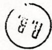
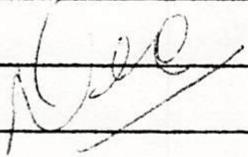
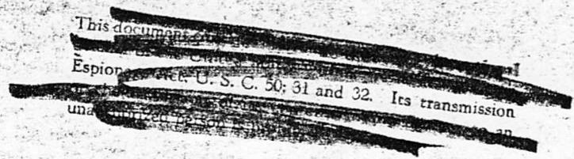
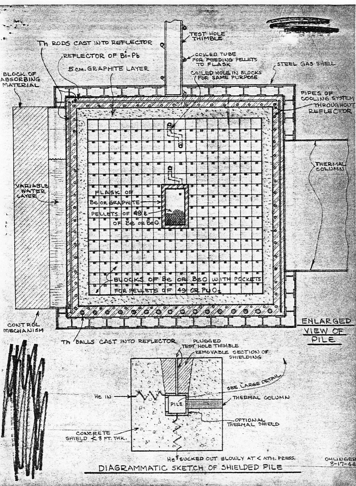

A-670

Those Eligible

To Read the

Attached

Date

Subject NOTES ON MEETING OF WEDNESDAY, JULY 26, Copy 6 Weinberg

1944

By Ohlinger

CE. RESEARCH LIBRARY

DOCUMENT COLLECTION

To

# DECLASSIFIED

Instructions Of

${2c} - 4 < 0.$

Before reading this document, sign and date below

${p}_{s}^{1 + } = 8$

Name

Date

Name

Date

CENTRAL RESEARCH LIBRARY DOCUMENT COLLECTION

LIBRARY LOAN COPY

DO NOT TRANSFER TO ANOTHER PERSON

If you wish someone else to see this document, send in name with document and the library will arrange a loan.

Those present: Allison, Szilard, Wigner, Morrison, Franck, Hogness, Brugmann, Creutz, Vernon, Young, Ohlinger

Besides the use of the chain reaction for the production of power and for the production of isotopes, a third very important use mentioned in the outline presented at one of the early discussions was a small machine for the production of radiation with a very high level of intensity.

Mr. Morrison, the speaker at this meeting, explained a pile of the latter type, that is, a radiation source for experimental purposes in contrast to the military use of the product. There is no pile now operating with a flux as high as Hanford which can be used for experimental purposes. While such a unit might seem expensive at first (the cost would be about $150,000 to $200,000), it would give an important tool for study at a cost not too much more than a cyclotron and with a much better source. The flux in the pile proposed by Mr. Morrison would be about five times that in the W pile.

The principle of the pile proposed by Mr. Morrison is a slow chain reaction in 49, using a homogeneous mixture of 49 and a moderator with a central core. Water as a moderator would not be very useful because of its rapid decomposition under the intense radiation to be obtained. Therefore, it is suggested that beryllium or beryllium oxide or some similar material be used as a moderator with the 49 probably in the form of the oxide. Cooling would be obtained by radiation from the surface of the pile proper with the heat removed by cooling coils in the reflector around the pile. With beryllium oxide as the moderator and $2 - 3\mathrm{kg}$ of 49 in the form of the oxide as the active metal, the temperature drops across the pile would be about $1000^{\circ}\mathrm{C}$ .

The general arrangement of such a pile would be as indicated diagrammatically in the sketch attached.

The core of the pile would be a beryllium metal (or perhaps BeO or graphite) bottle into which could be poured pellets of beryllium and plutonium oxide as needed. Surrounding this to form the pile proper would be a cube 80 cm on a side composed of closely fitted beryllium oxide blocks with small depressions at regular intervals into which would be placed small compressed bricks of the plutonium oxide (pure beryllium blocks and pure 49 could be used in place of the oxide). Surrounding the cubical pile would be a 2" thick graphite crucible contained within a shell of bismuth-lead eutectic covering all sides of the pile and crucible except the top. Embedded in this bismuth-lead

"dn pounn Trrerenn nne ered 102 Aep rred qetq eue Anurrddop suee stu "Auroe uurnoe   
aen daen ptnom quonw rred sue Otnoep Burejdo st ettd aou oooos   
pupe pasn eq pinn 67 Jo Aep rred wnt nooe Aep rred qameeau ouu   
-90 oJ .eTtD auy Jo apts ao uupmo jetaem ay4 q toruco srewnr   
aay qTm peirsep se umop pamots Jo dn papeeds eq uey prnoo poired ay   
"Stertieew uoc Jo Jeutte Jo sttted jeunj Jo uorttppe u3g .seunur   
OM2 Aes 'poried eae R y tTM Burezedo st ettd ouy pure passed st   
ezTS TeotTIO ouT Tlaum eTTOq Jqueo ouT paddorp ae (Aouesrs   
-uoc partsep Aue o67 ouT antrp o peppe are sttted unTTIieq euy)   
epxO umpuonnd pure unTTllraq Jo sttted uotresdo ten2e UI

Jooe Jooe Jooe Jooe Jooe Jooe Jooe Jooe Jooe Jooe Jooe Jooe Jooe Jooe Jooe Jooe Jooe Jooe Jooe Jooe Jooe Jooe Jooe Jooe Jooe Jooe Jooe Jooe Jooe Jooe Jooe Jooe Jooe Jooe JOOO Oo o o o o o o o o o o o o o o o o o o o o o o o o o o o o o o o o o o o o o o o o o o o o o o o o o o o o o o o o o o o o o o o o o o o o o o o o o oo

ouq ouo uo 1000000000000000000000000000000000000000000000000000000000000000000000000000000000

'no peoTf [e]   
pcoocspoiuupumjnei oienrdd Jo uonrnn Tnun 1000 on 0000er   
Burmorte iq omq Jo reae e Aes jnepe paoowei eq fipqoid pinn oess J quen   
-2seauu TeuEioe oju noirod e 1889 te koeq qo on jepro ut sdoosop   
Jo uonponpoed ouq ptnom spou esoun Jo osodnd ouq .uonponpuoc aq   
peroo uniouq Jo spoJ peppequee eq ptnom uotum ur Jo00erjor Otepeine peet   
-unnsto Jo peat TeuOHTtpe ue qpnom Iteus sT4 pumory \*see Teiuue   
sU wOJ pepepeaI rreeuy Aene AINs Og STIO BUTTOOc qpnom ITeys

The excess reproduction factor would be around 5 times that of Zinn's machine. The total leakage flux would be around $10^{12}$ or $10^{13}$ measured as surface flux at the face of the thermal column. At the thimble, the flux would be about five times this value. Mr. Morrison felt that the design was eminently stable and that no nuclear catastrophe was possible.

Mr. Allison commended the design on the basis of its having few moving parts.

Mr. Wigner feared that the beryllium might reduce the oxide leaving pure 49 which melts at $625^{\circ}$ and therefore it would be preferable to either use oxides for both the moderator and the active metal or else the pure metals. The latter gives a smaller unit but does not give off any gaseous fission products for other uses in the laboratory, whereas oxides will provide these products.

Mr. Hogness suggested the use of thorium as the alloying element at the center. This has a high melting point and produces some fast fission.

Mr. Wigner compared Mr. Morrison's high temperature operating pile with one using water at high pressure and felt that one could realize a factor of only say 2 or 3 in favor of the former. However, Mr. Morrison explained that he was suggesting this type of pile only for its advantage of having high temperature operation and that other types were probably as good or better. Mr. Wigner still felt somewhat disturbed by the combination of high temperature with high flux.

In answer to the question, Mr. Morrison explained that the specific activity in the P-9 pile at Argonne was rather low and that the pile he had designed had the advantage of not depending upon neutron capture to obtain high specific activity. He felt it was better to get out the gaseous fission products carrier free as occurs in this type pile. Likewise with the use of high temperature metal, it is probable that many corrosion problems will be avoided. Mr. Allison reiterated his favorable reaction to high temperature operation and reported that he had approved a program for studying the bismuth-lead alloys for this purpose. This included the solubility of iron in these alloys, wetting of ferrous metals, etc. Since there are only four main materials suitable for pile tubes--iron, beryllium, aluminum, and stainless steel--the action of bismuth-lead and pure bismuth on these materials was to be investigated.

