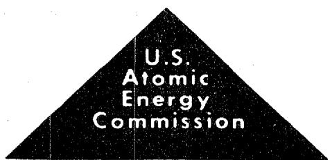
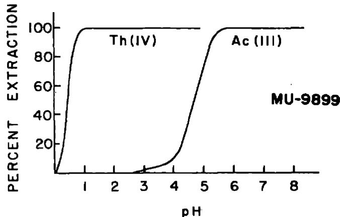
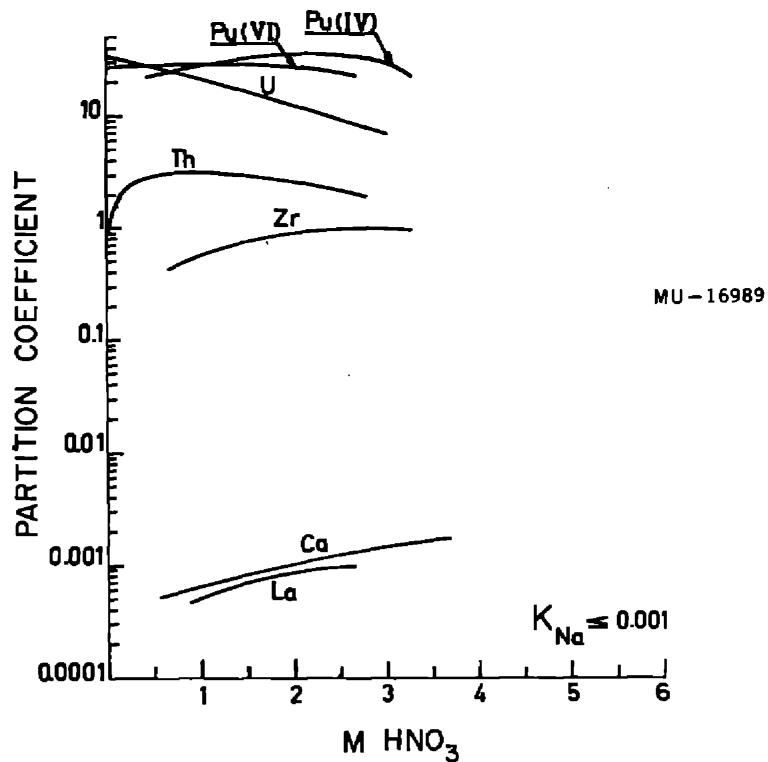
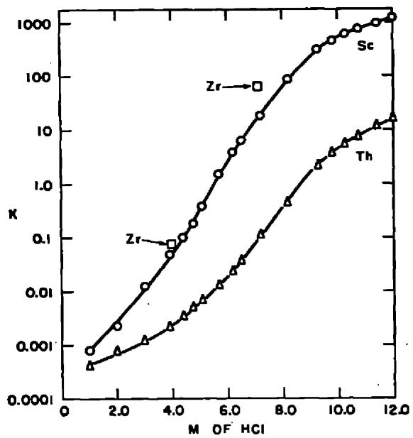
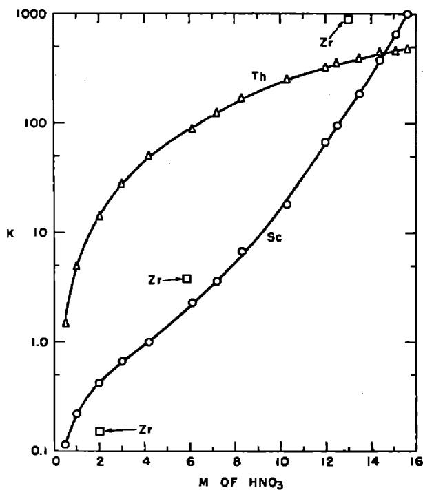
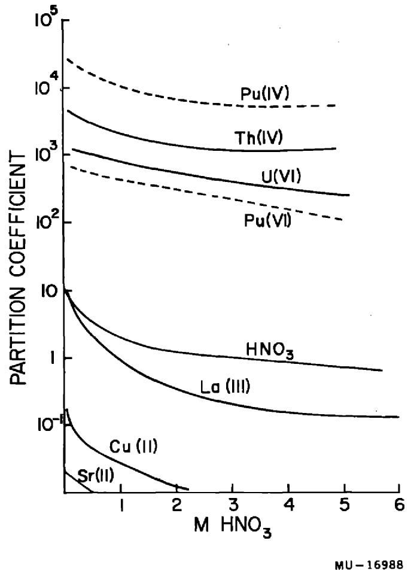
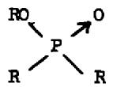
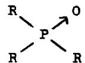
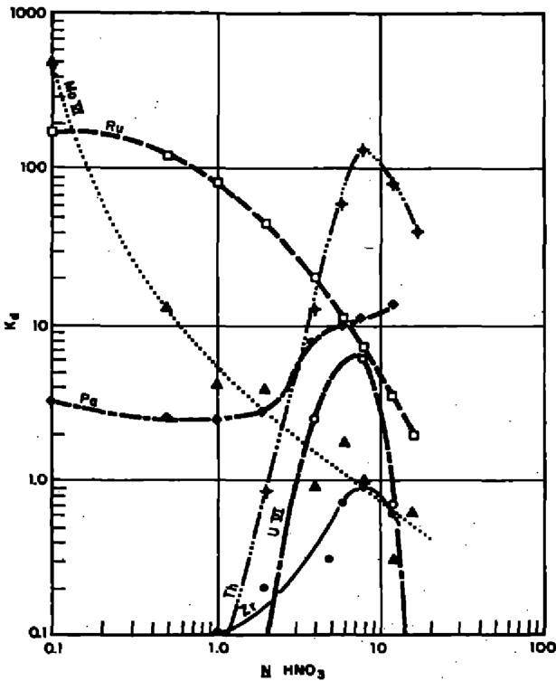
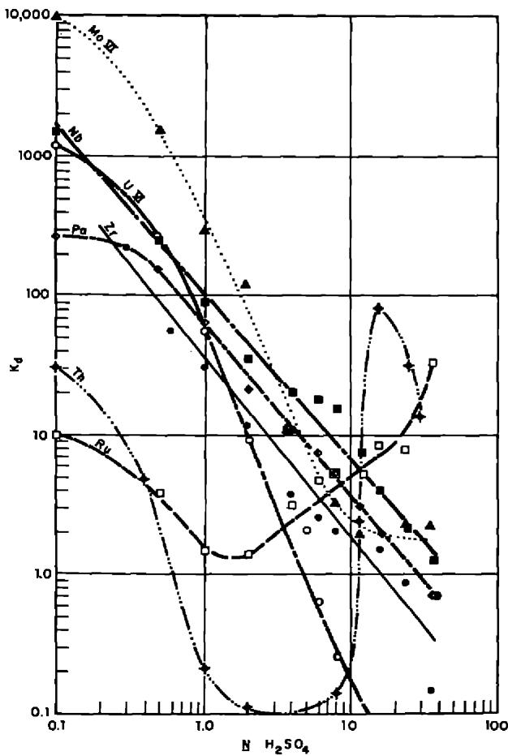

National

Academy

of

Sciences

National Research Council

NUCLEAR SCIENCE SERIES

# The Radiochemistry of Thorium

# COMMITTEE ON CHEMICAL SCIENCES

James L. Kinsey, Cochairman, Massachusetts Institute of Technology Alan Schriesheim, Cochairman, Exxon Research and Engineering Company

Andreas Acrivos, Stanford University  
Allen J. Bard, University of Texas, Austin  
Fred Basolo, Northwestern University  
Steven J. Benkovic, Pennsylvania State University  
Bruce J. Berne, Columbia University  
R. Stephen Berry, University of Chicago  
Alfred E. Brown, Celanese Corporation  
Ernest L. Eliel, University of North Carolina  
Roald Hoffmann, Cornell University  
Rudolph Pariser, E. I. Du Pont de Nemours & Co., Inc.  
Norman Sutin, Brookhaven National Laboratory  
Barry M. Trost, University of Wisconsin  
Edel Wasserman, E. I. du Pont de Nemours & Co., Inc.

# SUBCOMMITTEE ON NUCLEAR AND RADIOCHEMISTRY

Gregory R. Choppin, Chairman, Florida State University  
Eugene T. Chulick, Babcock & Wilcox Co.  
Christopher Gatrousis, Lawrence Livermore National Laboratory  
Peter E. Haustein, Brookhaven National Laboratory  
Darleane C. Hoffman, Los Alamos National Laboratory  
Paul J. Karol, Carnegie-Mellon University  
Michael J. Welch, Washington University School of Medicine  
Raymond G. Wymer, Oak Ridge National Laboratory  
William H. Zoller, University of Maryland

# LIAISON MEMBERS

Fred Basolo, Northwestern University  
Theodore L. Cairns, Greenville, Delaware  
Gerhart Friedlander, Brookhaven National Laboratory

(Membership as of January 1982)

# The Radiochemistry of Thorium

By E. K. HYDE

Lawrence Radiation Laboratory  
University of California  
Berkeley, California

January 1960

Reprinted by the Technical Information Center U. S. Department of Energy

Subcommittee on Radiochemistry National Academy of Sciences—National Research Council

Price $9.75. Available from:

National Technical Information Service

U. S. Department of Commerce

Springfield, Virginia 22161

Printed in the United States of America

# FOREWORD

The Subcommittee on Radiochemistry is one of a number of subcommittees working under the Committee on Nuclear Science within the National Academy of Sciences - National Research Council. Its members represent government, industrial, and university laboratories in the areas of nuclear chemistry and analytical chemistry.

The Subcommittee has concerned itself with those areas of nuclear science which involve the chemist, such as the collection and distribution of radiochemical procedures, the establishment of specifications for radiochemically pure reagents, the problems of stockpiling uncontaminated materials, the availability of cyclotron time for service irradiations, the place of radiochemistry in the undergraduate college program, etc.

This series of monographs has grown out of the need for up-to-date compilations of radiochemical information and procedures. The Subcommittee has endeavored to present a series which will be of maximum use to the working scientist and which contains the latest available information. Each monograph collects in one volume the pertinent information required for radiochemical work with an individual element or a group of closely related elements.

An expert in the radiochemistry of the particular element has written the monograph, following a standard format developed by the Subcommittee. The Atomic Energy Commission has sponsored the printing of the series.

The Subcommittee is confident these publications will be useful not only to the radiochemist but also to the research worker in other fields such as physics, biochemistry or medicine who wishes to use radiochemical techniques to solve a specific problem.

W. Wayne Meinke, Chairman Subcommittee on Radiochemistry

# CONTENTS

I. General Reviews of the Inorganic and Analytical Chemistry of Thorium 1   
II. General Reviews of the Radiochemistry of Thorium 1

III.Table of Isotopes of Thorium 2   
IV. Review of those Features of Thorium Chemistry of Chief Interest to Radiochemists 3

1.Metallic thorium 3   
2.Soluble salts of thorium 3   
3. Insoluble salts of thorium and coprecipitation characteristics of thorium 4   
4. Complex ions of thorium 7

5. Chelate complexes of thorium 9   
6. Extraction of the TTA-complex of thorium into organic solvents 10   
7. Extraction of thorium into organic solvents 12   
8. Ion Exchange behavior of thorium 21

V. Collection of Detailed Radiochemical Procedures for Thorium. 28

# INTRODUCTION

This volume which deals with the radiochemistry of thorium is one of a series of monographs on radiochemistry of the elements. There is included a review of the nuclear and chemical features of particular interest to the radiochemist, a discussion of problems of dissolution of a sample and counting techniques, and finally, a collection of radiochemical procedures for the element as found in the literature.

The series of monographs will cover all elements for which radiochemical procedures are pertinent. Plans include revision of the monograph periodically as new techniques and procedures warrant. The reader is therefore encouraged to call to the attention of the author any published or unpublished material on the radiochemistry of thorium which might be included in a revised version of the monograph.

# The Radiochemistry of Thorium

E. K. HYDE

Lawrence Radiation Laboratory

University of California, Berkeley, California

January 1960

# Table of Isotopes

I. GENERAL REVIEWS OF THE INORGANIC AND ANALYTICAL CHEMISTRY OF THORIUM

Chapter 3, pp 16-66 in "The Chemistry of the Actinide Elements", J. J. Katz and G. T. Seaborg, John Wiley and Sons, Inc., New York, 1957.

Chapter 4, pp 66-102, "The Chemistry of Thorium" by L. I. Katzin in the "The Attinide Elements", National Nuclear Energy Series, Division IV, Plutonium Project Record Volume 14A, edited by G. T. Seaborg and J. J. Katz, McGraw-Hill Book Co., New York, 1954.

Gmelin's Handbuch der Anorganischen Chemie, System Nr. 44, 8th Edition (Verlag Chemie, GmbH. Weinheim-Bergstrasse, 1955).

C. J. Rodden and J. C. Warf, pp 160-207 in "Analytical Chemistry of the Manhattan Project", McGraw Hill Book Co., New York, 1950.

"Thorium," pp 946-954, Vol. 1 of "Scott's Standard Methods of Chemical Analysis", N. H. Furman, editor, D. Van Nostrand Co., Inc., New York, 1939.

"The Analytical Aspects of Thorium Chemistry", T. Mueller, G.K. Schweitzer and D. D. Starr, Chem. Rev. 42, Feb. 1948.

Collected Papers on Methods of Analysis for Uranium and Thorium compiled by F. S. Grimaldi, I. May, M. H. Fletcher and J. Titcomb. Geological Survey Bulletin 1006, 1954, for sale by Superintendent of Documents U. S. Government Printing Office Washington 25, D. C. Price $1.

II. GENERAL REVIEW OF THE RADIOCHEMISTRY OF THORIUM

Chapter 15, "Radiochemical Separations of the Actinide Elements", by E. K. Hyde in "The Actinide Elements", edited by G. T. Seaborg and J. J. Katz, McGraw Hill Book Co., New York, 1954.

Paper P/728, "Radiochemical Separations Methods for the Actinide Elements" by E. K. Hyde, pp. 281-303, Vol 7, Proceedings of the International Conference in Geneva, August 1955 on the Peaceful Uses of Atomic Energy, United Nations, New York, 1956. Single copies of this paper may be available for 25 cents from United Nations Bookstore, New York City.

III. TABLE OF ISOTOPES OF THEKRIUM   

<table><tr><td>Isotope</td><td>Half life</td><td>Type of Decay</td><td>Method of Preparation</td></tr><tr><td>\( Th^{223} \)</td><td>~0.1 sec</td><td>α</td><td>Daughter 1.3 min \( U^{227} \)</td></tr><tr><td>\( Th^{224} \)</td><td>~1 sec</td><td>α</td><td>Daughter 9.3 min \( U^{228} \)</td></tr><tr><td>\( Th^{225} \)</td><td>8 min</td><td>α ~90% EC ~10%</td><td>Daughter 58 min \( U^{229} \)</td></tr><tr><td>\( Th^{226} \)</td><td>30.9 min</td><td>α</td><td>Daughter 20.8 day \( U^{230} \)</td></tr><tr><td>\( Th^{227} \)(RdAc)</td><td>18.17 day</td><td>α</td><td>Natural radioactivity; daughter \( Ac^{227} \)</td></tr><tr><td>\( Th^{228} \)(RdTh)</td><td>1.91 year</td><td>α</td><td>Natural radioactivity; daughter \( Ac^{228} \)\( (MeTh_{2}) \)</td></tr><tr><td>\( Th^{229} \)</td><td>7340 year</td><td>α</td><td>Daughter \( U^{233} \)</td></tr><tr><td>\( Th^{230} \)(Ionium)</td><td>80,000 year</td><td>α</td><td>Natural radioactivity; daughter \( U^{234} \)</td></tr><tr><td>\( Th^{231} \)(UY)</td><td>25.64 hour</td><td>β-</td><td>Natural radioactivity; daughter \( U^{235} \)</td></tr><tr><td>\( Th^{232} \)</td><td>\( 1.39 x 10^{10}year \)</td><td>α</td><td>Natural thorium is 100% \( Th^{232} \)</td></tr><tr><td>\( Th^{233} \)</td><td>22.1 min</td><td>β-</td><td>\( Th^{232} + neutrons \)</td></tr><tr><td>\( Th^{234} \)(UX1)</td><td>24.1 day</td><td>β-</td><td>Natural radioactivity; daughter \( U^{238} \)</td></tr></table>

For more complete information on the radiations of the thorium isotopes and for references to original literature, see "Table of Isotopes", D. Strominger, J. M. Hollander and G. T. Seaborg, Reviews of Modern Physics, 30, No.2, Part II, April 1958.

# IV. REVIEW OF THOSE FEATURES OF THORIUM CHEMISTRY OF CHIEF INTEREST TO RADIOCHEMISTS

# 1. Metallic Thorium

Thorium metal is highly electropositive and its preparation is a matter of no mean difficulty. Methods which are used for this purpose include reduction of thorium oxide with calcium, reduction of thorium tetrachloride or tetrafluoride or tetrachloride by calcium, magnesium or sodium or electrolysis of fused salts. Thorium metal has a high melting point $(1750^{\circ}\mathrm{C})$ and is highly reactive in the molten state. The potential of the thorium-thorium (IV) couple has been estimated as $+1.90$ volts. A fresh surface of thorium tarnishes rapidly in air and the finely divided metal is pyrophoric. The presence of oxygen and possibly of nitrogen and other light element impurities on the surface of thorium can be a matter of some importance in some experiments in nuclear chemistry or physics where thin foils of thorium are employed as targets.

The reaction of thorium metal with aqueous mineral acids has some features of great interest to radiochemists. Dilute hydrofluoric acid, nitric acid, sulfuric acid and concentrated phosphoric acid or perchloric acid attack massive thorium metal slowly. Concentrated nitric acid renders thorium passive but the addition of fluoride ion causes the dissolution to continue. In the dissolution of small thorium targets, it is found that concentrated $\mathsf{HNO}_3$ containing 0.01 molar $(\mathsf{NH}_4)_2\mathsf{SiF}_6$ (or HF) makes a good solvent mixture. The solvent should be added in batches with heating and stirring in between rather than all at once. Hydrochloric acid attacks thorium vigorously but a mysterious black or blue-black residue remains on completion of the reaction. As much as 25 percent of the original metal may be converted to the black solid by either dilute or concentrated hydrochloric acid. Most or all of this residue can be dissolved by adding fluoride ion in small concentration to the hydrochloric acid. The black residue may be ThO or it may be a hydride $\mathsf{ThH}_2$ . For a further discussion of this material see Katzin2, James and Straumanis3, and Katz and Seaborg4.

Thorium oxide targets can also be dissolved by a mixture of hydrochloric acid plus $(\mathrm{NH}_4)_2\mathrm{SiF}_6$ or of nitric acid plus $(\mathrm{NH}_4)_2\mathrm{SiF}_6$ . A good discussion of the fluoride ion catalyzed dissolution of thorium metal or thorium dioxide is given by Schuler, Steahly and Stoughton.

# 2. Soluble Salts of Thorium

Since thorium exists in solution as a comparatively small highly charged cation, it undergoes extensive interaction with water and with many anions. There is one great simplification in the aqueous chemistry of thorium in that it

has only one oxidation state and hence oxidation-reduction reactions do not need to be considered.

The water soluble salts of thorium include the nitrate, the sulphate, the chloride and the perchlorate.

# 3. Insoluble Salts of Thorium-Precipitation and Coprecipitation Characteristics of thorium

The common insoluble compounds of thorium are listed in Table 1. An inspection of the table suggests a number of precipitates which may be suitable for the removal of tracer amounts of thorium from solution. Good descriptions of the insoluble compounds of thorium and their use in analysis are given in the general references listed in Part I.

Thorium hydroxide is a highly insoluble compound forming a gelatinous precipitate when alkali or ammonium hydroxide is added to an aqueous solution of $\mathbf{Th}^{+4}$ . It is not amphoteric. Thorium hydroxide dissolves in aqueous solutions containing ions such as citrate, carbonate, or sulfosalicylic acid which complex thorium ion. Tracer amounts of thorium will coprecipitate quantitatively with a wide variety of insoluble hydroxides; lanthanum, ferric and zircon-

TABLE 1 INSOLUBLE COMPOUNDS OF THORIUM   

<table><tr><td>Resagent</td><td>Precipitate</td><td>Solubility in Water</td><td>Solubility in other Reagents</td></tr><tr><td>OH-</td><td>Th(OH)4</td><td>very insoluble S.P. = 10-39</td><td>soluble in acids, ammonium oxalate, alkali carbonates, sodium citrate, etc.</td></tr><tr><td>F-</td><td>ThF4·4H2O</td><td>very insoluble</td><td>soluble in acid aluminum nitrate solution</td></tr><tr><td>KF + HF</td><td>K2ThF6</td><td>very insoluble</td><td></td></tr><tr><td>IO3-</td><td>Th(IO3)4</td><td>very insoluble (even in strong HNO3)</td><td>soluble with reagents which destroy IO3</td></tr><tr><td>C2O4=</td><td>Th(C2O4)26H2O</td><td>insoluble in water or in dilute acid</td><td>soluble in excess ammonium or potassium oxalate</td></tr><tr><td>PO4≡</td><td>{Th3(PO4)4Th(HPO4)2H2O Th(HPO4)2H2PO42H2O}</td><td>very insoluble</td><td>dissolves with difficulty in concentrated acid</td></tr><tr><td>H2P2O6=</td><td>ThP2O6·2H2O</td><td>extremely insoluble 1.65x10-4moles per liter 4.ON HCl</td><td></td></tr><tr><td>H2O2+ 0.1M H2SO4</td><td>Th(oo)2SO43H2O</td><td>very insoluble</td><td>soluble in strong mineral acid</td></tr></table>

TABLE 1 (Cont'd.)   

<table><tr><td>Reagent</td><td>Precipitate</td><td>Solubility in Water</td><td>Solubility in other Reagents</td></tr><tr><td>SO3=</td><td>Th(SO3)2H2O</td><td></td><td>partially dissolved in excess sulphite</td></tr><tr><td>Cr2O7=</td><td>{ Th(CrO4)2·3H2O
Th(OH)2CrO4·H2O}</td><td>insoluble in H2O</td><td>soluble in conc,acid</td></tr><tr><td>MoO4=</td><td>Th(MoO4)2H2O</td><td>insoluble</td><td>soluble in dilute mineral acids</td></tr><tr><td>Fe(CN)64</td><td>ThFe(CN)6·4H2O</td><td>very insoluble</td><td></td></tr></table>

ium hydroxide have been used. Since hydroxide carrier precipitates are notoriously non-specific, they should be counted on only to remove thorium from a simple mixture of contaminants or as a group separation to be followed by more specific chemical purification steps: In some of the classical studies of the uranium series $^5\mathrm{UX}_1(\mathrm{Th}^{234})$ was separated from uranium by precipitating ferric hydroxide and ammonium uranate together and leaching the uranium from the precipitate with ammonium carbonate.

Thorium peroxide forms when hydrogen peroxide is added to a dilute mineral acid containing thorium. It is highly insoluble. The formula is often given as $\mathrm{Th}_{2}\mathrm{O}_{7}$ but recent investigations suggest that anions are incorporated into the solid as integral components. The precise formula of the precipitate varies with the conditions of precipitation. The physical form is also greatly different depending on the acidity: when precipitated from a neutral solution it is gelatinous and contains many coprecipitated anions; when precipitated from a slightly basic solution, it is not so gelatinous and has a lower peroxide content; when formed in an acid solution, it is opaque and readily filtered. Insoluble peroxide compounds are rare in the Periodic System so that precipitation of thorium peroxide can provide clean separation of thorium from most other elements. Plutonium (IV) forms a peroxide similar to that of thorium (IV). Other (IV) state elements such as cerium (IV) and zirconium (IV) also form such insoluble peroxides. Uranium (IV) and neptunium (IV) also form insoluble precipitates upon the addition of peroxide, but these seem to be of a somewhat different type than those formed by thorium and plutonium. These peroxide precipitates are readily dissolved by the addition of reagents such as Sn(II), I-, $\mathsf{MnO}_4$ or Ce(IV) which can destroy peroxide. For a more complete discussion of the peroxide and for references to the original literature, see Katz and Seaborg.

Lanthanum Fluoride as Carrier for Thorium. Thorium will coprecipitate quantitatively with lanthanum precipitated as the fluoride from strongly acidic solutions. This is a very useful method for the separation of small amounts of

thorium from uranium solutions. The fluoride may be converted to the hydroxide by direct metathesis with alkali hydroxide pellets or strong alkali solutions, or it may be dissolved in an aluminum nitrate-nitric acid solution (which thoroughly complexes the fluoride ion) and then be precipitated as the hydroxide. The coprecipitation of rare earth impurities is, of course, complete. Zirconium and barium in trace concentrations are carried but, if milligram quantities of these elements are added as "hold-back carriers", no coprecipitation is observed. Hence coprecipitation with lanthanum fluoride serves as an excellent method of freeing thorium from the zirconium carrier used in a previous step. An alternate method would be the removal of zirconium on an anion exchange resin from an 8-10 molar solution of hydrochloric acid.

Other insoluble fluorides may serve as carriers for trace amounts of thorium.

Zirconium Iodate as Carrier. Zirconium in a concentration of 0.1 to 1.0 mg/ml may be precipitated as the iodate from a strongly acidic solution to carry thorium nearly quantitatively. The iodate concentration is not critical. Elements which form insoluble iodates are also coprecipitated, but many, such as uranium, are separated. The rare earths and actinium are decontaminated if the precipitation is from a strongly acidic solution and the precipitate is washed with an iodate containing solution. Under conditions of low acidity and low total ionic strength, the carrying of these elements may be quite high, as shown for actinium by McLane and Peterson7. If cerium is present it is necessary to reduce Ce(IV) to Ce(III) with some suitable reducing agent such as hydrogen peroxide, before precipitation.

The zirconium iodate may be dissolved in nitric acid containing sulfur dioxide or some other reducing agent, and the zirconium may be reprecipitated as the hydroxide after the solution is boiled to remove iodine.

Hagemann and his co-workers applied this method to their study of the isotope Th in the $4n + 1$ series. Their procedure is reproduced in Procedure 16 of Section V below. Ballou used it as a means of substituting zirconium carrier for rare earth carrier after an initial lanthanum fluoride precipitation. See Procedure 13 in Section V below.

Phosphate Precipitates. Thorium precipitates in a variety of ill-defined forms in the presence of phosphorous-containing anions. These compounds are extremely insoluble in water and in acid solution. The hypophosphate is particularly insoluble. Even in 6N Hcl the solubility is only 2.1 x $10^{-4}$ moles per liter. Other insoluble phosphates such as zirconium phosphate serve as good carriers for the removal of trace amounts of thorium from aqueous solution.

Thorium Oxalate. A widely used method of quantitative analysis of thorium is the precipitation of thorium oxalate followed by ignition to thorium dioxide and weighing of the dioxide.[10]

Some complexing agents interfere with the precipitation of thorium oxalate by the formation of soluble thorium complexes. Gordon and Shaver report a method for the separation of rare earth ions from thorium by precipitation of phosphate-free rare earth oxalates in the presence of the strong chelating agent, ethylenediaminetetraacetic acid (EDTA).

Organic acids which form water-insoluble compounds with thorium which are of possible analytical or radiochemical importance include sebacic, anthranitic, phenylarsonic, gallic, tannic, quinaldic and aspartic acids.

# 4. Complex Ions of Thorium

The highly-charged positive ion, $\mathbf{Th}^{+4}$ , has a strong tendency to form complex ions with anions which may be present in solution. Some familiarity with the more common of these complex ions is required for a proper understanding of the behavior of thorium in ion exchange separations, in the extraction of thorium into organic solvents and so on. Quantitative measurements which have been made on the equilibrium constants for complex ion formations are summarized in Table 2.

TABLE 2 COMPLEX IONS OF THORIUM   
(Reprinted from Katz and Seaborg p.57, reference 5)   

<table><tr><td>Complexing Agent</td><td>Reaction</td><td>Ionic Strength</td><td>K</td><td>References</td></tr><tr><td rowspan="13">Cl-</td><td rowspan="5">Th+4+Cl- = ThCl+3</td><td>0.5</td><td>2.24</td><td>a</td></tr><tr><td>0.7</td><td>1.78</td><td>a</td></tr><tr><td>1.0</td><td>1.53</td><td>a</td></tr><tr><td>2.0</td><td>1.21</td><td>a</td></tr><tr><td>4.0</td><td>1.70</td><td>a</td></tr><tr><td rowspan="3">Th+4+2Cl- = ThCl2+2</td><td>6.0</td><td>2.1</td><td>a</td></tr><tr><td>2.0</td><td>0.1</td><td>a</td></tr><tr><td>4.0</td><td>0.14</td><td>a</td></tr><tr><td rowspan="3">Th+4+3Cl- = ThCl+1</td><td>6.0</td><td>0.55</td><td>a</td></tr><tr><td>2.0</td><td>0.2</td><td>a</td></tr><tr><td>4.0</td><td>0.10</td><td>a</td></tr><tr><td rowspan="2">Th+4+4Cl- = ThCl4</td><td>6.0</td><td>0.35</td><td>a</td></tr><tr><td>4.0</td><td>0.018</td><td>a</td></tr><tr><td rowspan="3">NO3-</td><td rowspan="2">Th+4+NO3- = Th(NO3)+3</td><td>0.5</td><td>4.73</td><td>b</td></tr><tr><td>5.97</td><td>2.83</td><td>c</td></tr><tr><td>Th+4+2NO3- = Th(NO3)2+2</td><td>5.97</td><td>1.41</td><td>c</td></tr><tr><td>CLO3-</td><td>Th+4+CLO3- = Th(CLO3)+3</td><td>0.5</td><td>1.84</td><td>b</td></tr></table>

TABLE 2 (Cont'd.)   

<table><tr><td>Complexing Agent</td><td>Reaction</td><td>Ionic Strength</td><td>K</td><td>References</td></tr><tr><td rowspan="2">BrO3-</td><td>Th+4+BrO3- = Th(BrO3)+3</td><td>0.5</td><td>6.4</td><td>b</td></tr><tr><td>Th+4+2BrO3- = Th(BrO3)+2</td><td>0.5</td><td>8.2</td><td>b</td></tr><tr><td>ClCH2COOH</td><td>Th+4+ClCH2COOH = Th(ClCH2COO)+3+H+</td><td>0.5</td><td>1.33</td><td>b</td></tr><tr><td rowspan="2">Cl2CHCOOH</td><td>Th+4+Cl2CHCOOH = Th(Cl2CHCOO)+3+H+</td><td>0.5</td><td>5.74</td><td>b</td></tr><tr><td>Th+4+2Cl2CHCOOH = Th(Cl2CHCOO)+2+2H+</td><td>0.5</td><td>12.7</td><td>b</td></tr><tr><td rowspan="2">Cl3CCOOH</td><td>Th+4+Cl3CCOOH = Th(Cl3CCOO)+3+H+</td><td>0.5</td><td>8.23</td><td>b</td></tr><tr><td>Th+4+2Cl3CCOOH = Th(Cl3CCOO)+2+2H+</td><td>0.5</td><td>26.7</td><td>b</td></tr><tr><td rowspan="3">IO3-</td><td>Th+4+IO3- = Th(IO3)+3</td><td>0.5</td><td>7.6x102</td><td>b</td></tr><tr><td>Th+4+2IO3- = Th(IO3)+2</td><td>0.5</td><td>6.2x104</td><td></td></tr><tr><td>Th+4+3IO3- = Th(IO3)+1</td><td>0.5</td><td>1.4x107</td><td></td></tr><tr><td rowspan="3">HSO4-</td><td>Th+4+HSO4- = ThSO4++H+</td><td>2.0</td><td>159</td><td>c</td></tr><tr><td>Th+4+2HSO4- = Th(SO4)2+2H+</td><td>2.0</td><td>2850</td><td>c</td></tr><tr><td>Th+4+2HSO4- = Th(HSO4SO4)+H+</td><td>2.0</td><td>800</td><td>c</td></tr><tr><td rowspan="4">H3PO4</td><td>Th+4+H3PO4= Th(H3PO4)+4</td><td>2.0</td><td>78</td><td>c</td></tr><tr><td>Th+4+H3PO4= Th(H2PO4)+3+H+</td><td>2.0</td><td>150</td><td>c</td></tr><tr><td>Th+4+2H3PO4= Th(H2PO4H3PO4)+3+H+</td><td>2.0</td><td>1400</td><td>c</td></tr><tr><td>Th+4+2H3PO4= Th(H2PO4)2+2H+</td><td>2.0</td><td>8000</td><td>c</td></tr><tr><td rowspan="3">HF</td><td>Th+4+HF= ThF+3+H+</td><td>0.5</td><td>5x104</td><td>c</td></tr><tr><td>Th+4+2HF= ThF+2+2H+</td><td>0.5</td><td>2.9x107</td><td>c</td></tr><tr><td>Th+4+3HF= ThF+3+3H+</td><td>0.5</td><td>9.4x108</td><td>d</td></tr><tr><td rowspan="4">CH3COCH2COCH3</td><td>Th+4+HAcAc= Th(AcAc)+3+H+</td><td>0.01</td><td>4.71x107</td><td>e</td></tr><tr><td>Th+4+2HAcAc= Th(AcAc)+2+2H+</td><td>0.01</td><td>7.34x1015</td><td></td></tr><tr><td>Th+4+3HAcAc= Th(AcAc)+3H+</td><td>0.01</td><td>5.93x1020</td><td></td></tr><tr><td>Th+4+4HAcAc= Th(AcAc)4+4H+</td><td>0.01</td><td>5.37x1025</td><td></td></tr></table>

a. W.C. Waggener and R.W. Stoughton, J. Phys. Chem. 56, 1-5 (1952).   
b. R.A. Day Jr. and R.W. Stoughton, J. Am. Chem. Soc. 72, 5662-66 (1950).   
c. E.L. Zebroski, H.W. Alter, and F.K. Heumann, J. Amer. Chem. Soc. 73, 5646-50(1951).   
d. H.W. Dodgen and G.K. Rollefson, J. Am. Chem. Soc. 71, 2600-7 (1949).   
e. J. Rydberg, Acta Chem. Scand. 4, 1503-22 (1950); Arkiv for Kemi 5, 413-23 (1953).

A large number of other complex ions are known although not much quantitative information is available on the strength of the complexes. Ions derived from many organic acids such as citrate, phthalate, maleate, succinate, malonate ion and ethylenediaminetetraacetic (called EDTA or versene) form a series of complex compounds or ions with thorium. The soluble EDTA-Complex of thorium forms the basis of an excellent tdtrtmetric determination of small amounts of thorium11,12. It is of great significance to radiochemistry that thorium forms a negatively-charged nitrate complex in nitric acid solutions greater than 3 molar in concentration. This is discussed further in connection with anion exchange methods.

In connection with complex ion formation we may mention briefly the hydrolysis of thorium ion. In acidic solution throughout the entire range below pH3 hydrolysis of Th+4 is negligible. At higher pH values there is extensive hydrolysis. There is a considerable disagreement in the published literature on the products of hydrolysis and a number of mononuclear and polynuclear complexes have been postulated. For interesting experimental studies and theoretical interpretation of the hydrolysis of Th+4 see Kraus and Holmberg13 and Sillén14,15.

# 5. Chelate Compounds of Thorium

A few 1,3 diketones form chelate complexes of thorium which are readily extractable from aqueous solution into organic solvents. This fact forms the basis of a widely used method for the radiochemical purification of tracer thorium, namely the extraction into benzene of the thenoyltrifluoroacetone acid complex of thorium which is discussed in section 6. Before discussing this specific system, it will be worthwhile to review briefly the other known complexes of this type which thorium forms.

The very strong and rather volatile complex of thorium with acetylacetone has been known for many years. $^{16}$ In a 1,3 diketone complex of this type, four molecules of the organic compound react with the $\mathrm{Th}^{+4}$ ion to form a neutral complex. Thorium acetylacetonate, like the other metal acetylacetonates, possesses a cyclic structure with the metal incorporated as part of a six-membered ring. Rydberg $^{17}$ has made a particularly careful study on the complex formation between thorium and acetylacetone and of the extraction of the complex into organic solvents. Other 1,3 diketones which form similar complex compounds much more stable toward acidic solutions are trifluoroacetylacetone, thenoyltrifluoro-acetylacetone, benzoylacetone and dibenzoyl methane $^{18-20}$ . A comprehensive investigation of thorium chelate complexes was carried out by Dyrsen $^{21}$ . Some of his results are quoted in Table 3 where the complexing constants of the proton and thorium complexes of several chelating agents are given.

Thorium forms complex compounds with salicylic acid, methoxybenzoic acid and cinnamic acid $^{22}$ . The thorium-salicylate complex extracted into methyl

isobutyl ketone has salicylic acid associated with it and may have the formula $\mathrm{Th(HA)_4\cdot H_2A}$ . Cowan22a developed a procedure for thorium analysis based on the extraction of the thorium salicylate complex into a mixed solvent of chloroform and ethyl acetate.

Cupferron (nitrosophenylhydroxylamine) forms a complex which can be extracted into chloroform. Thorium forms a complex with quinolinol which is soluble in organic solvents.[23] The thorium complex with the reagent, thorin, is widely used in a colorimetric analytical method.[23a,23b]

TABLE 3 THEORIUM COMPLEXES OF SOME CHELATING AGENTIS. (Dryssen ${}^{21}$ )   

<table><tr><td>Chelating Agent</td><td>pKa</td><td>1/4 log K
(note 1)</td></tr><tr><td>Acetyl acetone</td><td>8.82</td><td>-2.85</td></tr><tr><td>Thenoyltrifluoroacetone</td><td>6.23</td><td>+0.04</td></tr><tr><td>1-nitroso-2-naphthol</td><td>7.63</td><td>-0.41</td></tr><tr><td>2-nitroso-1-naphthol</td><td>7.24</td><td>+0.05</td></tr><tr><td>Tropolone</td><td>6.71</td><td>+0.52</td></tr><tr><td>Cupferron</td><td>4.16</td><td>+1.11</td></tr><tr><td>N-phenylbenzohydroxamic acid</td><td>8.15</td><td>-0.17</td></tr><tr><td>8 Hydroxy quinoline (oxine)</td><td>9.66</td><td>-1.78</td></tr><tr><td>5 Methyl oxine</td><td>9.93</td><td>-2.5</td></tr><tr><td>5 Acetyl oxine</td><td>7.75</td><td>-1.0</td></tr><tr><td>5,7 Dichloro oxine</td><td>7.47</td><td>-0.22</td></tr><tr><td>Cinnamic acid</td><td>4.27</td><td></td></tr></table>

note 1 $\begin{array}{rl} & {\mathrm{X = [MAn]_{org}[H^{+}]^{n} / [M]^{n}[EA]^{n}}}\\ & {[HA] = \mathrm{acid~form~of~the~chelating~agent}.} \end{array}$ where MAn $=$ uncharged complex;

# 6. Extraction of the TTA-Complex of Thorium into Organic Solvents

Many of the chelate complexes mentioned in the last section of this report are soluble in organic solvents. By suitable adjustment of reagent concentrations and acidity, thorium can be cleanly separated from contaminating ions by such an extraction procedure. We single out for special attention the complex formed with $\alpha$ -thenoyltrifluoroacetone, (called for convenience, TTA), which has been more widely used in radiochemistry than any of the others. Some of the reasons for this are the stability of the reagent toward acidic solution, the favorable Keto-enol equilibrium in the reagent, the strength of the thorium complex in slightly acidic solutions and the moderate solubility of the complex in such solvents as benzene, chloroform and ketones.

Hagemann $^{24}$ studied the acid dependence of the extraction of trace quantities

of thorium, actinium and other elements into an 0.2M solution of TTA in benzene. A typical curve is shown in figure 1. The extraction of thorium is essentially quantitative above pHland drops rapidly in solutions of higher acidity. The acid dependence is fourth power so that rather sensitive control of the extraction can be made by control of the acidity. This control is highly useful since thorium may easily be separated from elements of lower ionic charge such as the alkali elements, the alkaline earths and even the rare earth elements by extraction of thorium in the pH range of 1 to 2. Elements which extract more readily than thorium are left in the benzene phase when the thorium is later removed by contact with an aqueous solution of slightly lower pH. The chief ions which are extracted more strongly than thorium in solutions of acidity greater than pH are zirconium (IV), hafnium (IV), plutonium (IV), neptunium(IV), iron III, and protactinium (V). These ions show high partition coefficients into the organic phase for solutions as strongly acidic as 1 molar or greater.

Further control of thorium extraction can be achieved by changing the concentration of TTA or by using another solvent in place of benzene. The presence of ions which form strong complexes with thorium (see Table 2) interferes with the extraction of thorium; therefore, it is best to perform the extraction from

  
Figure 1 Extraction of trace amounts of actinium and thorium from a dilute nitric acid solution by an equal volume of an $0.25\mathrm{M}$ solution of TTA in benzene as a function of $\mathsf{pH}$ .

a dilute nitric acid, perchloric acid or hydrochloric acid solution. Most of the complex ion formation constants listed in Table 2 were measured by noting the changes in the extractability of the thorium-TTA complex into benzene when various anions were added to the aqueous phase. Hence the references quoted in Table 2 can be consulted for very specific information on the extraction of thorium in the presence of complexing anions.

TTA extraction of thorium is an important step in several of the procedures written down in Section V below.

Thorium may be separated from uranium when both are present in small concentrations if the solution contains no great quantity of neutral salts, but the acidity must be adjusted carefully. There are better methods for making this particular separation. The extraction of tracer thorium from concentrated solutions of uranium is not satisfactory because of the formation of insoluble uranium complex compounds at the interface and it is necessary to remove the bulk of the uranium by some preliminary step.

In the isolation of small amounts of thorium from a complex initial mixture of elements TTA extraction provides an excellent final step. Carrier precipitates such as lanthanum fluoride and zirconium iodate may be used to remove the bulk of the impurities and the final purification as well as the elimination of the carrier material, may be effected by a final TTA-extraction cycle.

The solubility of the thorium-TTA complex in benzene is rather small so that large volumes of solution are required to handle bulk amounts (gram amounts) of thorium. Some workers[25] report good results with the reagent, 1-(3,4 dichlorophenyl)-4,4,5,5,6,6,6 heptafluoro-1,3 hexanldione which forms a thorium complex with a considerably higher solubility in benzene. Unfortunately, this reagent is not available commercially. With this 'reagent' 20 grams of thorium can be dissolved in 100 milliliters of $\mathrm{CCl}_4$ compared to 0.3 grams of thorium as the TTA-complex.

# 7. Extraction of Thorium Into Organic Solvents

The extractability of thorium from aqueous solutions into organic solvents has been studied for dozens of representative solvents of all types. Most of these studies have been concerned with hydrochloric acid systems, nitric acid systems or mixed nitric acid - neutral nitrate salt systems. A great deal of the information on the extraction of thorium, uranium and plutonium was originally published in classified reports of the Manhattan Project or of the Atomic Energy Commission or of the governmental laboratories of Canada and Great Britain and France. This information is now declassified, but there has never been a complete systematic coverage of the basic chemistry in books and journals readily available in any scientific laboratory. Solvent extraction processes have been developed for the recovery of thorium from monazite sands, for the separation of $\mathsf{U}^{233}$ from neutron irradiated thorium, for the recovery of the irradiated thorium for reuse, and for other purposes. In this brief review, we confine our remarks to the chief solvents and the principal effects of experimental conditions of the laboratory scale treatment of small or tracer quantities of thorium.

Ethyl ether is often used to purify uranium. If the aqueous phase is slightly acidic with nitric acid (perhaps .01 to .05 Molar) and highly salted with a neutral nitrate such as ammonium, calcium or magnesium nitrate, then

uranium is readily extracted into ethyl ether leaving nearly all impurities including thorium in the aqueous phase. Thorium will not extract into ethyl ether unless the concentration of acid and neutral salts in the aqueous phase is so high that numerous other impurities would also extract.

Methyl isobutyl ketone will extract thorium with a distribution coefficient as high as 9 (organic/aqueous) provided the nitric acid concentration of the aqueous phase is maintained at 1M to 3M and if, in addition, a high concentration of such strong salting agents as calcium, magnesium or aluminum nitrate is maintained. At the Iowa State College in Ames Iowa, large quantities of thorium were purified from monazite sands by a process which included a solvent extraction separation of thorium from rare earth impurities.[26] The solvent was hexone and the aqueous phase feed solution was 3 Molar in calcium nitrate and 3 Molar in nitric acid.

Rydberg and Bernström27 have studied the distribution of Th(IV), U(VI), Pu(IV), PU(VI), Zr(IV), Ca(II), La(III) and HNO3 between methyl isobutyl ketone and aqueous solutions of nitric acid and calcium nitrate of varying composition. Figure 2 taken from their work shows the main features of the extraction of these ions. A 1955 Geneva Conference paper of Bruce27a discusses the extraction of fission products into hexone.

Pentaether (dibutoxytetraethylene glycoi) will extract thorium from aqueous nitrate solutions under moderate salting conditions $^{27b}$ . For example, tracer amounts of thorium in a solution 2M in HNO $_3$ and 1M or greater in calcium nitrate are removed to the extent of 90 percent or more from the aqueous phase by an equal volume of this solvent. Fifty percent is removed from a 4M HNO $_3$ solution and 80 percent from an 8M HNO $_3$ solution by an equal volume of solvent. If the aqueous phase is 1M in HNO $_3$ and saturated with ammonium nitrate, the extraction is quantitative. Peppard has reported the use of pentaether in the purification of ionium $(\mathrm{Th}^{230})$ from pitchblende residues. He states that 90 percent of the thorium is extracted from a solution 6M in NH $_4$ NO $_3$ and 0.3 M in HNO $_3$ into an equal volume of solvent consisting of a mixture of pentaether (2 volumes) and diethylether (1 volume). Under these conditions less than 1 percent of yttrium and the rare earths are extracted. See also analytical method of Lerner $^{29a}$ Mesityl oxide $\left[\left(\mathrm{CH}_3\right)_2\mathrm{C}=\mathrm{CH}-\mathrm{CO}-\mathrm{CH}_3\right]$ has been reported to be a useful solvent for thorium. Levine and Grimaldi have used it in an analytical procedure for the determination of thorium in thorium ores. The ore sample is decomposed by fusion with a mixture of NaF -K $_2$ S $_2$ O $_7$ . Thorium is precipitated as the oxalate. The oxalate precipitate is dissolved in nitric acid and the solution is prepared for solvent extraction by adjusting the HNO $_3$ concentration to 1.2 Molar and adding aluminum nitrate to 2.5 Molar. The solution is contacted with an equal volume of mesityl oxide which extracts the thorium quantitatively and separates it from nearly all impurities including rare earths. Traces of

  
Figure 2 Solvent extraction data for methyl isobutyl ketone. The distribution ratios of U, Pu, Th, Zr, La and Ca as functions of the equilibrium concentration of $\mathsf{HNO}_3$ in the aqueous phase. Concentration of $\mathsf{Ca(NO_3)_2}$ is 3.5 to 4.0 Molar. Data by Rydberg and Bernatrom.

rare earths are removed from the solvent by three separate washes with a wash solution containing HNO₃ and Al(NO₃)₃. The thorium is stripped from the washed solvent with water. Thorium is precipitated as the oxalate and ignited to ThO₂, in which form it is weighed.

Hiller and Martin30 have used mesityl oxide to extract thorium away from rare earth fission products in a thorium target solution. The thorium metal was dissolved in HCl with a small amount of fluosilicate ion present to clear up the solution. The solution was saturated with $\mathrm{Al(NO_3)_3}$ and the thorium was extracted by contacting the solution with mesityl oxide.

Marechal-Cornil and Picciotto31 used mesityl oxide for the quantitative extraction of thorium, bismuth and polonium from a mixture of natural radioelements present in concentrations $10^{-9}$ grams per c.c. The solution was saturated with $\mathrm{Al(NO_3)_3}$ . Radium and lead did not extract.

Tributyl Phosphate (THP) is a widely used solvent in the industrial scale recovery of uranium and thorium from ores, or the purification of uranium, thorium or plutonium from reactor fuel elements. Some idea of the scope of its use

can be obtained by consulting some general references on process chemistry.32-34

The adjustment of aqueous phase composition for the optimum radiochemical purification of thorium depends greatly on the nature of the impurities present. The principal heavy elements or fission products which show high extractability into TBP are the following:

thorium (IV) < neptunium (IV) < plutonium (IV)  
plutonium (VI) < neptunium (VI) < uranium (VI)  
protactinium (V)  
cerium (IV) hafnium (IV) zirconium (IV)  
rare earths (III) (considerably less extractable than above under most conditions).  
RuNo (III)

TABLE 4 BASIC REFERENCEES ON THE EXTRACTION OF THORIUM,OTHER HEAVY ELEMENTS AND THE RARE EARTH'S INTO TBP

Tri-n-butyl Phosphate as an Extracting Solvent for Inorganic Nitrates.

I. Zirconium nitrate

35. K. Alcock, F. C. Bedford, W. H. Hardwick and H.A.C. McKay, J. Inorganic and Nuclear Chem. 4, 100, 1957.

II. Yttrium and the lower lanthanide nitrates

36. D. Scargill, K. Alcock, J. M. Fletcher, E. Hesford, and H.A.C. McKay. J. Inorg. Nucl. Chem. 1, 304, 1957

III. The plutonium nitrates

37. G. F. Best, H.A.C. McKay and P.R. Woodgate, J. Inorg. Nucl. Chem., 4, 315, 1957

IV. Thorium nitrate

38. E. Hesford, H.A.C. McKay and D. Scargill, J. Inorg. and Nucl. Chem. 4, 321, 1957

An excellent overall view of the extraction of these elements from hydrochloric or nitric acid systems of varying composition into an undiluted or diluted THP solvent phase is presented in the articles listed in Table 4.

The high extractability of thorium into undiluted THP from hydrochloric acid and nitric acid systems are given in figures 3 and 4. Thorium nitrate is much more extractable when most of the nitric acid in the aqueous phase is replaced by some nitrate salt such as sodium nitrate, calcium nitrate or aluminum nitrate. This is dramatically shown in Table 5 where some data taken from a publication of H.A.C. McKay are presented. The main reason for the difference is that the neutral nitrate salts are not soluble in THP whereas $\mathsf{HNO}_3$ forms a soluble complex with THP.

Bernetrom and Rydberg have studied the effect of the replacement of $\mathsf{HNO}_3$ with calcium nitrate on the extraction of thorium by undiluted tributyl phosphate. An approximate summary of their results is given in Table 6. Some of the impor

  
Figure 3 Variation of distribution ratios (TBP/aqueous) of scandium, thorium and zirconium with aqueous HCl concentration for extraction into pure, undiluted TBP. Peppard, Mason and Maier42.

tant separations which can be made with such a mixture of "salting agents" in the aqueous phase are apparent from an inspection of figure 5.

The viscosity and density of undiluted THP makes it somewhat troublesome to use. Hence it is frequently diluted to a 10 to 40 volume percent solution in some inert diluent solvent such as n-butyl ether, ether, benzene, carbon tetrachloride, kerosene or some industrial mixture of hydrocarbons. The diluted THP extracts thorium with a reduced extraction coefficient but, as a compensatory change, the extractability of a number of other ions is reduced below the point where they will extract to an appreciable extent.

Thorium may be recovered from a TBP phase into an aqueous phase by backwashing the TBP with distilled water or with very dilute acid.

  
Figure 4 Variation of distribution ratios (THP/aqueous) of scandium, thorium and zirconium with aqueous HNO₃ concentration for extraction into pure undiluted TBP. Peppard, Mason and Maier.

  
Figure 5 The partition coefficients (org/aq) of Th(IV) and of several representative contaminating ions into undiluted TBP as a function of $\mathsf{HNO}_3$ in the aqueous phase. The aqueous phase concentration of $\mathsf{Ca(NO_3)_2}$ is fixed at 3 Molar. The curves for Pu(VI) and Pu(IV) have been extrapolated assuming Pu(VI) parallels U(VI) and Pu(IV) parallels Th(IV). From Bernström and Rydberg41.

TABLE 5 EFFECT OF NEUTRAL SODIUM NITRATE ON THE   
EXTRACTION OF THORIUM FROM HNO3 SOLUTION WITH 19% TBP   

<table><tr><td colspan="2">Aqueous Composition</td><td>K_Ta( org/aq. )</td></tr><tr><td>ENO3</td><td>NaNO3</td><td></td></tr><tr><td>2.0</td><td>0</td><td>0.84</td></tr><tr><td>0.01</td><td>1.99</td><td>4.0</td></tr><tr><td>6.0</td><td>0</td><td>3.2</td></tr><tr><td>1.0</td><td>5.0</td><td>33</td></tr><tr><td>0.1</td><td>5.9</td><td>200</td></tr></table>

Abstracted from data of H. A. C. McKay presented in Process Chemistry, Progress in Nuclear Energy, Pergamon Press Ltd. London 1956.

Thorium concentration about 1 gram per liter.

TABLE 6 EFFECT OF CONCENTRATION OF ${\mathrm{{Ca}}}_{\left( {\mathrm{{NO}}}_{3}\right) }$ ,IN THE AQUEOUS PHASE ON THE EXTRACTION OF THORIUM INTO UNDILUTED TBP. (Bernström and Rydberg41)   

<table><tr><td>Ca(NO3)2Conc</td><td>HNO3Conc</td><td>Kth(TBP/Aq)</td></tr><tr><td>0</td><td>1-4 M</td><td>4-20</td></tr><tr><td>1 M</td><td>1-4 M</td><td>60-200</td></tr><tr><td>2 M</td><td>1-4 M</td><td>310-550</td></tr><tr><td>3 M</td><td>1-4 M</td><td>1400</td></tr></table>

Important Note: All of the data quoted here for extraction of thorium by tributyl phosphate are for a pure solvent pretreated to remove monobutylphosphate and dibutyl phosphate. Most THP "as received" is contaminated with these hydrolysis products. Since these compounds have a much stronger ability to complex thorium and contaminating impurities, quite different extraction and purification behavior is obtained when they are present. Hence it is good practice to pretreat THP by washing it thoroughly with aqueous sodium carbonate and pure water.

Monoalkyl and Dialkyl Phosphates mixed with inert carrier solvents show phenomenally high extraction coefficients for thorium even from aqueous solution in which the concentration of acid and neutral salts is quite low. The general equations for such solvents are

(GO)PO(OH)2

and (co)2PO(OH)

Some specific solvents are those in which G is butyl or 2-ethyl hexyl or octyl phenyl [more specifically para (1,1,3,3-tetramethylbutyl) phenyl]. Dilute solutions of these acidic esters of orthophosphoric acid in toluene are able to pull th(IV), the rare earth ions, Zr(IV), Np(IV), Pu(IV), Bk(IV) and many other ions into the organic phase with partition coefficients ranging up to several thousand. The partition coefficients are strong functions of the concentration of the extracting agent and of the acid so there is considerable opportunity to manipulate experimental conditions to favor the preferential extraction of certain ions, particularly such highly extractable ions as th(IV). No detailed data on the extraction of thorium has been published and there are no detailed descriptions in the literature on the use of solvents of this type for the radiochemical separation of thorium. It seems clear, however, that the extraordinarily high partition coefficients for thorium in the presence of these acidic esters of orthophosphate will find many applications in radiochemistry. Some idea of the necessary pretreatment of the solvent and of the solvent power of these solvent systems can be obtained in publications by Peppard and his coworkers. $^{45-47}$ A paper $^{47}$ on the extraction of Bk(IV) from rare earths and other impurities indicates the type of separation of tetraspositive and tripositive ions which can be achieved. Peppard, Moline and Mason $^{47}$ put Cm(III) and Bk(IV) into an aqueous solution $\underline{\mathsf{10M}}$ in $\mathsf{HNO}_3$ and $0.1\underline{\mathsf{M}}$ in $\mathsf{KBrO}_3$ (to maintain the Bk in an oxidized state) and contacted the aqueous phase with an $0.15\underline{\mathsf{M}}$ solution of di-ethyl hexyl phosphate in n-heptane. The curium remained in the aqueous phase ( $K_{\mathrm{cm}} = 1.4 \times 10^{-3}$ ) while the berkelium was quantitatively extracted ( $K_{\mathrm{th}} = 1900$ ).

In addition to tributyl phosphate and the mono and dialkyl esters of phosphoric acid, there are several other classes of phosphorous containing compounds which have received considerable study as possible extracting solvents

for uranium, thorium and other elements. Several of these compounds have extracting power much greater than that of tributyl phosphate. Some of the most promising solvents are of the following types, where the letter R represents an alkyl group.

dialkyl phosphine orides

trialkyl phosphine oxides

Esters of pyrophosphoric acid

Other classes of solvents which are very promising for many applications in the extractive metallurgy of the heavy elements are the mono - di - tri - and quaternary alkyl ammines. A number of reports have been written on these phosphorous and ammine solvents and most of them can be located with the aid of Nuclear Science Abstracts. It is premature to discuss these solvents in any detail here because very little has been published concerning their use in the radiochemical separation of thorium. There is no question, however, that radiochemists will find several of these new solvents highly useful to them.

As a single example, the solvent tri-n-octylphosphine oxide is reviewed briefly in Tables 7 and 8. This data is taken from an Oak Ridge Report by Ross and White48. It can be seen that thorium is very highly extracted into an O.l M solution of tri-n-octylphosphine oxide in cyclohexane from dilute HCl, $\mathrm{EClO_4}$ and particularly, dilute $\mathrm{HNO}_3$ . It is particularly well extracted when the aqueous phase is $1\underline{\mathbf{M}}$ in $\mathrm{HNO}_3$ and $1\underline{\mathbf{M}}$ in sodium nitrate.

8. Ion Exchange Behavior of Thorium

# Cation Exchange

The tetrapositive thorium ion is adsorbed on cation exchange resins more strongly than most other ions. This fact makes it possible to adsorb thorium tracer from a large volume of solution onto a small amount of resin. It makes it feasible to separate thorium from most other ions by washing the resin on which the thorium is adsorbed quite thoroughly with a mineral acid solution or some other suitable leaching agent to remove the less-strongly-bound ions. When both the thorium and the unwanted contaminants are present in small concentrations the method is particularly applicable.

Diamond, Street and Seaborg49 studied the adsorption of tracer ions on the resin Dowex 50 (a copolymer of styrene and divinyl benzene with nucleonic sulfonic acid groups as exchange sites) and the elution of the ions with hydrochlor-

ic acid of varying concentration. At all concentrations of HCl, thorium (IV) was very strongly held by the resin and such ions as $\mathbf{Sr(II)}$ , La(III), CE(III) and Ac(III) were much more rapidly eluted. Thorium (IV) on the resin is readily washed free of heavy element tetrapositive ions such as $\mathbf{Np(IV)}$ or $\mathbf{Pu(IV)}$ with HCl 6 molar or greater in concentration because the higher elements in the tetrapositive state form strong complexes with hydrochloric acid. This is true also of uranyl ion.

Thorium is removed from a cation exchange resin by passing a complexing agent through the column of resin to reduce the effective concentration of free

TABLE 7 EXTRACTION OF THORIUM FROM ACID SOLUTION INTO TRI-N-OCTYLPHOSPHINE OXIDE (TOPO)   
TOPO, 0.1 M in cyclohexane, 5 ml Equilibration time - 10 minutes Data from Ross and White, ORNL 2627   

<table><tr><td>Thorium present</td><td>11.3 mg ThCl4, Th(ClO4)4</td></tr><tr><td></td><td>11.5 mg Th(NO3)4</td></tr></table>

<table><tr><td colspan="2">Acid Molarity</td><td>org
Eq.</td><td></td><td></td><td></td></tr><tr><td rowspan="7">HCl</td><td>1 M</td><td>0.26</td><td>H2SO4</td><td>1 M</td><td>0.3</td></tr><tr><td>3 M</td><td>11</td><td></td><td>2 M</td><td>0.3</td></tr><tr><td>5 M</td><td>145</td><td></td><td>3 M</td><td>0.4</td></tr><tr><td>7 M</td><td>208</td><td></td><td></td><td></td></tr><tr><td>8 M</td><td>64</td><td></td><td></td><td></td></tr><tr><td>9 M</td><td>28</td><td></td><td></td><td></td></tr><tr><td>10 M</td><td>32</td><td></td><td></td><td></td></tr><tr><td rowspan="6">HClO4</td><td>0.5 M</td><td>82</td><td></td><td></td><td></td></tr><tr><td>1.0 M</td><td>26</td><td></td><td></td><td></td></tr><tr><td>2.0 M</td><td>9.9</td><td></td><td></td><td></td></tr><tr><td>4.0 M</td><td>8.3</td><td></td><td></td><td></td></tr><tr><td>5.0 M</td><td>16</td><td></td><td></td><td></td></tr><tr><td>6.0 M</td><td>56</td><td></td><td></td><td></td></tr><tr><td rowspan="5">HNO3</td><td>1 M</td><td>2100</td><td></td><td></td><td></td></tr><tr><td>2 M</td><td>420</td><td></td><td></td><td></td></tr><tr><td>4 M</td><td>78</td><td></td><td></td><td></td></tr><tr><td>6 M</td><td>27</td><td></td><td></td><td></td></tr><tr><td>10 M</td><td>10</td><td></td><td></td><td></td></tr></table>

TOPO, 0.1 M in cyclohexane, 5 ml  
10 minute equilibration  
Data from Ross and White ORNL-2627

TABLE 8 EXTRACTION OF THORIUM FROM ACID SOLUTION INTO TRI-N-OCTYLPHOSPEINE OXIDE (TOPO) IN THE PRESENCE OF NITRATE AND CHLORIDE SALTS   

<table><tr><td>Aqueous Composition</td><td>Org
Aq</td></tr><tr><td>1 M HNO3+ 1 M NaNO3</td><td>3800</td></tr><tr><td>1 M HNO3+ 2 M NaNO3</td><td>1900</td></tr><tr><td>1 M HNO3+ 6 M NaNO3</td><td>1200</td></tr><tr><td>1 M HCl + 1 M NaCl</td><td>1.5</td></tr><tr><td>1 M HCl + 2 M NaCl</td><td>6.1</td></tr><tr><td>1 M HCl + 4 M NaCl</td><td>107</td></tr><tr><td>1 M HCl + 1/3 M AlCl3</td><td>0.4</td></tr><tr><td>1 M HCl + 1 M AlCl3</td><td>11</td></tr><tr><td>1 M HCl + 2 M AlCl3</td><td>1100</td></tr></table>

thorium ions and thus reverse the adsorption process. Suitable complexing agents are buffered citric acid, buffered lactic acid, fluoride ion, carbonate ion, sulfate ion, oxalate ion, etc.

Bane $^{50}$ separated small amounts of thorium from 0.15 M uranyl nitrate solution containing 0.1 M HNO $_3$ by passing the solution through a bed of Amberlite LR-1 resin. The column was thoroughly washed with 0.25 M H $_2$ SO $_4$ to remove all the uranium. The thorium was then eluted with 1.25 M NaHSO $_4$ -

Dryssen51 separated $\mathbf{U}\mathbf{X}_{\perp}(\mathbf{Th}^{234})$ from uranium by adsorbing the $\mathbf{U}\mathbf{X}_{\perp}$ on Wolfstat KS from a 2M HCl solution of uranium. The pure $\mathbf{U}\mathbf{X}_{\perp}$ is then eluted with $0.5\mathrm{M}$ oxalic acid. The solution is evaporated to dryness and the oxalic acid is sublimed off leaving a carrier-free thorium sample.

Asaro, Stephens and Perlman $^{52}$ prepared radiochemically pure samples of Th $^{228}$ for α and γ spectrum studies by adsorbing an impure mixture of Th $^{228}$ and its daughter products on a short Dowex-50 resin column (3mm diameter x 3 cm height) from a dilute nitric acid solution. The column was jacketed to allow operation at $87^{\circ} \mathrm{C}$ (the temperature of the vapors of boiling triethylene glycol). The radium, lead and bismuth fractions were eluted with 4M nitric acid, after which the thorium was stripped with a 50-volume-percent solution of lactic acid at pH3. One ml of lactic acid sufficed to remove the Th $^{228}$ from the column. The lactic acid could be removed by sublimation. The high temperature opera

tion was essential for the rapid removal of the thorium in a small volume of eluting solution.

Procedure 9 in Section V of this report contains additional comment on the adsorption and desorption behavior of thorium on cation exchange resins.

# Anion Exchange - Hydrochloric Acid Systems

The remarks on the use of anion exchange resins in the radiochemical purification of thorium will be divided into two parts. The first part will discuss hydrochloric acid systems in which thorium forms no negative complexes and hence is not adsorbed by anion exchange resins. Several other heavy elements and several fission product elements do form negative ions in concentrated hydrochloric acid and can be readily removed from a thorium solution by adsorption on a small amount of ion exchange resin. A number of possible separations are readily apparent from a consideration of the following data on adsorption behavior in the case of the resin Dowex-1 (a copolymer of styrene and divinyl benzene with quaternary ammonium functional groups.)

Uranium(VI), neptunium (VI) and plutonium (VI) readily adsorbed from hydrochloric acid solutions 6 M or greater in concentration. Readily desorbed with 0 to 3 M HCl.

Neptunium (V) readily adsorbed above 4 M HCl. Protactinium (V) readily adsorbed above 8 M HCl.

Thorium (IV) not adsorbed at any HCl concentration. Neptunium(IV) adsorbed above 4 M HCl. Plutonium (IV) adsorbed strongly above 2.5 M HCl.

Plutonium (III) not adsorbed at any HCl concentration. Lanthanide rare earths not adsorbed at any HCl concentration. Americium and higher actinide elements in the tripositive oxidation state very slightly adsorbed in highly concentrated HCl.

Krasus, Moore and Nelson53 investigated the anion exchange behavior of thorium, protactinium and uranium in hydrochloric acid solutions and suggested several alternate procedures for the clean separation of these three elements from each other. For example, a mixture of the three ions in 8 M HCl may be passed through a Dowex-1 column to adsorb uranium and protactinium at the top of the column. Thorium passes through the column quantitatively. The protactinium is rapidly eluted with 3.8 M HCl. The uranium elutes somewhat later. Alternatively the protactinium may be eluted with a mixture of 7 M HCl plus 0.11 M HF leaving the uranium firmly bound to the resin. The presence of fluoride ion causes a dramatic decrease in the distribution coefficient for protactinium without affecting that for uranium. After the protactinium is off the column the uranium is rapidly desorbed with 0.5 M HCl.

Many of the fission product elements form adsorbable negatively-charged chloride complexes in hydrochloric acid. Those which do can be removed from a solution of thorium by contact of the solution with a sample of resin. An

excellent overall review of all elements in the periodic system and a good bibliography is to be found in the 1955 Geneva Conference paper of Kraus and Nelson54. Some important ions which may be removed from a thorium solution by Dowex-1 resin are zirconium(IV), hafnium(IV), iron(III), zinc(II), cobalt(II), gallium(III), molybdenum(VI), cadmium(II), tin(IV), tin(II), antimony(III), antimony(V), mercury(II), bismuth(III), and polonium(IV). It is noteworthy that thorium appears to be the only metallic element of the fourth group of the Periodic System which cannot be adsorbed by a strong base anion-exchange resin from concentrated hydrochloric acid solution. The differing behavior of thorium(IV) and zirconium(IV) is particularly noteworthy in this connection because in some radiochemical procedures zirconium iodate or some other zirconium compound is used as a carrier precipitate for thorium. The carrier ion can be removed easily by placing the thorium tracer and zirconium carrier in 9-12 M HCl and removing the zirconium with anion exchange resin.

Poirier and Bearse54a of the Battelle Memorial Institute wrote a report on the separation of uranium and thorium with particular reference to the processing of monazite sands. The separation of uranium from thorium in carbonate, HCl and $\mathrm{H}_2\mathrm{SO}_4$ solutions by anion exchange resins was studied in some detail including the effects of extraneous ions, types of resin, etc.

# Anion Exchange Nitric Acid Systems

In the second main part of the discussion of the anion exchange behavior of thorium, we turn to a consideration of nitric acid systems. A few years ago the surprising discovery was made that thorium forms adsorbable nitrate complexes in nitric acid solution over a wide range of nitric acid concentration with maximum absorption occurring near $7\mathrm{M}$ HNO₃. This fact can be made the basis of a number of important radiochemical separations such as the separation of thorium from rare earths, from zirconium, from uranium, from actinium and a number of other elements.

Danon55 reports that the absorption of thorium on Dowex-1, $8\%$ divinyl-benzene 50-100 mesh, expressed as a distribution coefficient D (amount of thorium per gram of dry resin divided by the amount of thorium per ml of solution), increases from D = 300 and decreases slowly to D = 210 at 10 M HNO3. The thorium is immediately desorbed from a Dowex-1 column with dilute HCl.

Carswell56 investigated the adsorption of Th230 and U233 tracer by De-Acidite FF (nitrate form) from HNO3 solutions. Some of his values are given in Table 9. Using these results Carswell separated a mixture of thorium and uranium by adsorbing both on the top of a 2 mm diameter by 8 cm long column of De-Acidite FF from a small volume of 6 M HNO3 and then eluting the uranium slowly with 4 M nitric acid. The separation was not good at room temperature but was satisfactory at $77^{\circ}\mathrm{C}$ . The thorium was eluted from the column with pure water.

The number of elements which form negative complexes with nitrate ion is small and a large number of ions such as the alkalis, the alkaline earths, the rare earths, etc. can be separated rapidly and cleanly from thorium by adsorbing the thorium on Dowex-1, Dowex-2 or De-Acidite FF resin from 6-10 M HNO₃. Even zirconium can be separated as it is only weakly adsorbed. Some combinations of impurities might best be removed by a two step anion exchange treatment based on the differing behavior of thorium and its contaminants in chloride systems and secondly in nitrate systems.

The U.S. Naval Radiological Defense Laboratory has published a series of reports on the anion exchange behavior of a number of heavy element and fission products from ECl, HNO₃, H₂SO₄ and H₃PO₄ solutions. Figures 6 and 7

TABLE 9 VOLUME DISTRIBUTION COEFFICIENTS FOR ADSORPTION OF Th ${}^{230}$ AND U ${}^{233}$ TRACER ON DE-ACIDITE FF (settling rate 3-1.4 cm/min) Data from Carswell56   

<table><tr><td>Molarity HNO3</td><td>Distribution Thorium</td><td>Coefficient Uranium</td></tr><tr><td>2</td><td>2.1</td><td>0.7</td></tr><tr><td>4</td><td>20</td><td>2.6</td></tr><tr><td>6</td><td>140</td><td>5.5</td></tr><tr><td>8</td><td>200</td><td>5.5</td></tr></table>

  
Figure 6 Equilibrium adsorption of thorium and several other elements by Dowex-2, 8 percent DVB, 200-400 mesh from nitric acid. Data from Bunney, Ballou, Pascual and Foti

  
Figure 7 Equilibrium adsorption of thorium and several other elements by Dowex-2 from sulfuric acid solution. Data from Bunney, Ballou, Pascual and Foti57.

summarizing results for $\mathsf{HNO}_3$ and $\mathsf{H}_2\mathsf{SO}_4$ systems make it possible to devise a number of separations. Note the peculiar shape of the adsorption curve for thorium in $\mathsf{H}_2\mathsf{SO}_4$ .

Danon59 describes the separation of tracer amounts and milligram amounts of thorium (IV) from tripositive rare earth ions using Dowex-1 and nitric acid systems.

# V. COLLECTION OF DETAILED RADIOCHEMICAL PROCEDURES FOR THORIUM

# PROCEDURE 1

Source - W. W. Meinke, report AECD-2738, pp. 262. Aug. 1949

Target material: Tracer Pa separated from 60 in. bombardment of ionium.

Time for separation: Several hours

Type of bombardment: (Milking experiment)

Yield: As high as 50 percent possible

Equipment required: Stirrers and TTA

Degree of purification: Decontaminate from

$10^{7} \mathrm{c/mPa}, 10^{6} \mathrm{c/mU}$ , and $10^{5} \mathrm{c/mAc}$ .

Advantages: Gives carrier-free Th, a thin plate for pulse analysis, and good purification although not speed.

# Procedure:

1. Nitric acid used throughout. Make sample 6N acid and TTA extract (with 0.4M TTA in benzene) five times with double volume of TTA, stirring 5 min for each extraction. (Removes Pa into TTA ~70 percent or more per pass).   
2. Evaporate to dryness (wash twice with water and take these washings also to dryness) and take up in acid pH 1.0. TTA extract with equal volume (0.25M TTA in benzene) stirring 15 min. (Th into TTA but not U or Ac.)   
3. Repeat TTA extraction of step 2 with fresh TTA and combine the extractions.   
4. Wash TTA with equal volume of pH 1.0 solution for 15 min. (U contamination into acid.)   
5. Wash ITA with 6N acid (equal volume) and stir 15 min. (Th into acid.)   
6. Repeat steps 2, 3, and 4. (Repeat wash as in step 4 if necessary for further U purification.)   
7. Plate out the 0.25M TTA on Pt plates and flame.

# Remarks:

See curves of Hagemann (JACS 72, 768 (1950)) for percentage of extraction into TTA vs. pH for Th and Ac. At pH of 1, Th should go into the TTA almost completely, but U should only go in less than 10 percent, perhaps as little as 2 percent. Ac will not go into TTA until about pH 3 or so, and of course Pa goes in up to about 6N or 8N acid.

pH conditions for separating Th from U by TTA extractions are quite critical!

Equivalent and molecular weight of TTA is 222 g.

Source - D.B. Stewart in report AECD-2738, edited by W.W. Meinke. Aug. 1949

Target material: $\mathrm{UO}_2(\mathrm{NO}_3)_2.6\mathrm{H}_2\mathrm{O}$ in which $\mathrm{UX}_1$ has come to equilibrium

Time for separation: 24 hr

Equipment required: 40-ml centrifuge cone

Yield: 50,000 to 10,000 c/m from 20 g UNH

Degree of purification: Factor of $\sim 10^6$ from U

Advantages: Good yield with small amount of inert carrier. (Very voluminous insoluble precipitate. Uranium does not precipitate at all.)

# Procedure:

1. Dissolve $20\mathrm{g}$ of $\mathrm{UO}_2(\mathrm{NO}_3)_2\cdot 6\mathrm{H}_2\mathrm{O}$ in 20 to $30\mathrm{ml}$ of 0.01 N HNO3 in 40-ml centrifuge cone and warm solution to about $80^{\circ}\mathrm{C}$ in a hot water bath. Add 0.5 to $1\mathrm{mg}$ of Zr carrier as nitrate.   
2. Add 5 ml of a saturated solution of m-nitrobenzoic acid in water and continue warming for about 1 hr. Let stand overnight.   
3. Centrifuge, decant supernatant, and wash $\mathbf{Zr}$ ( $\mathbf{C}_{6} \mathbf{H}_{4} \mathbf{NO}_{2} \mathbf{COO})_{4}$ twice with 0.01N HNO $_3$ + m-nitrobenzoic acid.

# Remarks:

Saturated solution of m-nitrobenzoic acid made up by dissolving $400\mathrm{mg}$ of the material in $100\mathrm{ml}$ of $\mathsf{H}_2\mathsf{O}$ . Heat to $80^{\circ}\mathsf{C}$ . Allow to stand several hours and filter to remove excess and impurities.

# PROCEDURE 3

Source - W.W. Meinke in report ABCD-2738. Aug. 1949.

Parent material: Tracer Pa and daughters (both $\alpha$ and K)

Time for separation: $\sim 3 / 4$ hr

Milking experiment

Equipment required: Standard

Yield: Only $\sim 40$ to 50 percent Th per cycle

Degree of purification: 2 to 3 percent Accarried per cycle, other elements decontaminated by factor of at least 100.

Advantages: Good procedure if Th is present in approximately the same amount as other activities.

Procedure: Pa daughters in 6N HCl after milking from Pa in TTA (procedure 91-1 in AECD-2738).

1. To ~10-cc daughter solution, add 1/2 to 1 mg of $\mathbf{Zr}^{+4}$ carrier and enough H $_3$ PO $_4$ to make $\sim 14$ M in PO $_4$ . Centrifuge precipitate (carries $\mathbf{Th}^{+4}$ ).   
2. Add to the precipitate $3\mathrm{mg}$ of $\mathsf{La}^{+3}$ carrier and dilute with LN HCl. Add HF, digest, and centrifuge.   
3. Metathesize the fluoride precipitate to hydroxide by adding conc. KOH. Centrifuge. Wash once with alkaline water.

# PROCEDURE 3 (Cont'd.)

4. Dissolve in HCl and repeat steps 1 to 3, reducing amount of La carrier.   
5. Plate as the $\mathrm{LaCl}_3$ solution, flame, and count.

Remarks:

$\mathbf{Zr}_{3}(\mathbf{PO}_{4})_{4}$ precipitate quite specific for carrying $\mathbf{Th}^{+4}$ from other elements in the heavy region. Yield lost in the LaF $_3$ -La(OH) $_3$ precipitation.

Do not use this procedure if more purification is needed than is given by two cycles, since the Th yield will be very low.

$\mathrm{LaCl}_3$ solution when evaporated sticks to Pt plates much better than the precipitate encountered in this procedure.

# PROCEDURE 4

Solution of Thorium Metal and Thorium Dioxide

Source Newton, Hyde, and Meinke in report AECD-2738.

Thorium metal can be dissolved rapidly in conc. HCl, but a considerable amount of black insoluble residue is formed in the process. If a few drops of $(\mathsf{NH}_4)_2\mathsf{SiF}_6$ solution (enough to make $\sim 0.1\mathsf{M}$ ) are added to the HCl before solution is started, the black residue is dissolved, leaving only a small residue of thorium oxide (< 1 percent) in the clear solution.

Thorium metal can be dissolved in conc. HNO₃ with the addition of (NH₄)₂ SiF₆ (or HF) to 0.01M. The metal becomes passive to solution from time to time, requiring further additions of acid and SiF₆.

If the excess $\mathsf{HNO}_3$ is evaporated off, care should be taken not to allow the solution to go completely to dryness, or difficulty soluble $\mathsf{ThO}_2$ will be formed.

If it is desired to dissolve $\mathsf{ThO}_2$ , the $\mathsf{HNO}_3 - (\mathsf{NH}_4)_2\mathsf{SiF}_6$ solution should be used, and the mixture should be heated with stirring for several hours. $\mathsf{ThO}_2$ , when first formed, is much more soluble than after prolonged heating.

# PROCEDURE 5

Source - R.N. Osborne in report UCRL-4377, edited by M. Lindner. Aug. 1954.

Purification:

Thorium isolated from uranium targets showed no evidence of foreign alpha particle groups upon pulse analysis. The complex beta decay and growth was always reproducible and could be accounted for on the basis of the isotopes known to be present. This reproducibility suggests a high degree of beta purity.

Yield: At least 50 percent.

Separation time: About four hours.

1. To about 20 ml of the active solution in $8N HNO_{3}$ , add an appropriate thorium tracer and about 5 mg lanthanum carrier. Add 20 drops 27N HF. Centrifuge precipitate and wash once with dilute $HNO_{3}$ -HF. Discard supernatant and wash.   
2. To the precipitate add 3 ml water, 1 ml $5\%$ HBO₃ and five drops conc. HNO₃, in that order.   
3. To the resultant solution add 5 ml 3N NaOH. Centrifuge and wash precipitate twice with 3N NaOH. Discard supernatants.   
4. Add 10 ml $1.5\mathrm{M}$ HNO $_3$ to the precipitate.   
5. Equilibrate the solution, by vigorous stirring, with 5-ml portions of thenoyltrifluoracetone (TTA) in benzene, allowing ten minutes for each equilibration. Discard benzene phases.   
6. Adjust aqueous layer to pH 1.5 (buffering not necessary) with NaOH, and equilibrate with 20 ml TTA solution in benzene for 15 minutes. Separate layers and discard aqueous phase. Wash benzene layer with two 10-ml portions of HNO₃ at pH 1.5.

Equilibrate benzene solution with 5 ml $3\mathsf{N}$ HNO₃ for 15 minutes. Separate layers and discard benzene phase. The $3\mathsf{N}$ HNO₃ solution will contain carrier-free thorium, unless Th²³² was present in the original solution.

# PROCEDURE 6

Source - unpublished procedure obtained from G.M. Iddings.

Note - This procedure was developed to recover gram amounts of ionium which had been irradiated in a reactor to produce $\mathbf{Pa}^{231}$ and $\mathbf{U}^{232}$ .

Dissolve pile irradiated Al slug containing $1\mathrm{gm}$ Th230 in 6N NaOH.

Centrifuge out the $\mathbf{ThO}_2$ . Wash precipitate.

Dissolve the $\mathrm{ThO}_2$ in concentrated $\mathrm{HNO}_3$ and 0.05 M HF with boiling.

Precipitate $\mathrm{Th(OH)}_h$ with NaOH.

(Pa231 and U232 carry down with the Th230.)

Wash the fluoride from the hydroxide precipitate.

Dissolve the $\mathrm{Th(OH)}_4$ with conc. HCl.

Put solution through Dowex-2 anion column.

$(U^{232}, \mathbf{Pa}^{231}$ , and $\mathbf{Zr}^{95}$ stick; $\mathbf{Th}^{230}$ does not stick.)

Wash column with 10 N HCl.

Save conc. HCl solution and wash containing Th $^{230}$ and fission products for further purification.

Elute Pa231 from anion column with 9 N HCl and 0.1 N Hf.

$(\mathbf{U}^{232}$ and $\mathbf{Zr}^{95}$ stick to anion resin.)

Elute $U^{232}$ (together with $\mathbf{Zr}^{95}$ ) from column with 0.5 N HCl.

$\mathbf{Th}^{230}$ purification:

Add conc. HNO $_3$ to the $\mathbf{Th}^{230}$ solution and boil to destroy the HCl.

Evaporate just to dryness and redissolve in distilled water.

Adjust the acidity of the solution to pH 1 with nitric acid.

Adjust the vol. so that solution is $\sim 0.1$ M Th $^{230}$ (In this case $44 \mathrm{ml}$ for the gm of Th $^{230}$ .)

Extract the Th with 80 ml of 0.60 M Dagmar* in benzene 15-20 minutes.

Add enough $\mathrm{NaOH}$ to the aqueous phase to bring the acidity to $\mathsf{pH}1$

(2.9 ml of 6 N NaOH for 1 gm Th).

Continue the Dagmar* extraction for 15-20 minutes more.

Separate phases and wash organic phase with $0.1\mathrm{N}$ HNO3

Drain off the aqueous wash.

Back extract the gm of $\mathbf{Th}^{230}$ from organic phase with 8 N HNO $_3$ ~10 m.

Repeat back extraction. (Dagmar extraction separates Th from all fission products except Zr. Zr was previously separated from Th $^{230}$ on the anion resin column.)

Precipitate $\mathrm{Th(OH)_4}$ with $\mathrm{NH_4OH}$ .

Wash precipitate.

# PROCEDURE 6 (Cont'd.)

Ignite precipitate to $\mathsf{ThO}_2$ in Pt crucible with water cooled induction coil in glove box.

Load new Al slug with the $\mathsf{ThO}_2$ ready for pile irradiation.

# PROCEDURE 7

Source - J.W. Barnes and H.A. Potratz in "Collected Radiochemical Procedures", Los Alamos report LA-1721. Jan. 1958.

A. Determination of Ionium(Th²³⁰) in Coral Samples

# 1. Introduction

The determination of ionium $(\mathrm{Th}^{230})$ in coral samples involves carrier free separation of the total thorium content by use of TTA[4,4,4,trifluoro - 1 - (2-thienyl) - 1,3 - butanedione]. Thorium is finally adsorbed on a cation exchange column and eluted with oxalic acid. It is then $\alpha$ -counted and pulse analyzed, with Th $^{228}$ being employed to determine chemical yield. The chemical yield is $50 - 70\%$ . Duplicate samples may be run in about 6 hours.

# 2. Procedure

Step 1. Transfer about $2\mathrm{g}$ of coral, weighed to the nearest 0.1 g., to a 600-ml beaker. Add $\mathrm{Th}^{228}$ tracer in known amount (5-100 c/m) and wash down the sides of the beaker with $\mathrm{H}_2\mathrm{O}$ .

Step 2. With a speedy vap watch glass in place on top of the beaker, gradually add $75~\mathrm{ml}$ of conc. $\mathsf{HNO}_3$ , dropwise at first to prevent excessive foaming. Place the covered beaker on a hot plate and allow the solution to boil until the vegetable fibers present in most samples have disintegrated and brown fumes are no longer evolved. Cool to room temperature and cautiously add $70\%$ $\mathsf{HCLO}_4$ . (During this and subsequent steps which involve fuming with $\mathsf{HCLO}_4$ , the operator should wear a face shield and rubber gloves.) Evaporate to dense white fumes and continue heating for at least an additional 5 minutes. Cool to room temperature and dilute to about $200~\mathrm{ml}$ with $\mathsf{H}_2\mathsf{O}$ .

Step 3. Add conc. $\mathbf{NH}_4\mathbf{OH}$ until the solution is just acid, and then adjust the pH to 2.0-2.5 with the use of 3M $\mathbf{NH}_4\mathbf{OH}$ and 3M $\mathbf{HClO}_4$ .

Step 4. To a special separatory funnel add the solution from Step 3 and 150 ml. of 0.5M TTA in benzene. Stir for at least 1.5 hours with a vortex stirrer driven at high speed by means of an air motor. Permit the layers to separate, draw off the aqueous layer, and discard. (Note 1).

Step 5. Wash the benzene layer, containing the thorium complexed with TTA, for about 30 seconds by stirring with $100\mathrm{ml}$ of $\mathbf{H}_2\mathbf{O}$ . Discard the washings. Wash again with $50\mathrm{ml}$ of $\mathbf{H}_2\mathbf{O}$ and discard the washings.

Step 6. Extract the thorium from the benzene by stirring for 3 minutes with $100 \, \text{ml}$ of $3\text{M}$ HCl.

Step 7. Transfer the aqueous phase to a baker and evaporate with an air jet on a steam bath until the volume has been reduced to $20 - 30\mathrm{ml}$ . Transfer the solution to a $40\mathrm{-ml}$ centrifuge tube and continue evaporation to a volume of $1 - 2\mathrm{ml}$ .

Step 8. Add 1 ml. of conc. HNO₃ and boil over a flame until brown fumes are no longer evolved. Cool to room temperature, then add 0.3-0.4 ml. of 70%

$\mathrm{HClO}_4$ and boil to the appearance of white fumes. Cool to room temperature and dilute to about 3.5 ml. with $\mathbf{H}_2\mathbf{O}$ .

Step 9. Transfer the solution to the top of a Dowex $50 - x$ cation exchange column (Note 2) and rinse the centrifuge tube with $0.5 \, \text{ml}$ . of water, adding the rinsings to the column. (If air bubbles are present in the column, they should be removed by stirring with Pt wire.) Force the solution through the column under 2 pounds of air pressure, and then wash the column with $3\text{-}4$ ml. of $3\text{M HCl}$ under the same pressure. Discard the first effluent and the wash.

Step 10. Four 2 ml. of $0.5\text{M}$ $\text{H}_2\text{C}_2\text{O}_4$ onto the column and allow the solution to run through under atmospheric pressure. Collect the drops from the column on 1" square (1-3 mil) Pt plates, which are placed just far enough below the column so that drops separate from the tip before hitting the plate. Nine drops of effluent are collected on each of four plates. Dry the plates under a heat lamp; then flame in an open flame.

Step 11. $\pmb{a}$ -count the individual plates and then pulse analyze those plates which carry the activity (Note 3).

# Notes

1. The chemical yield may be increased slightly by taking the aqueous layer through an additional extraction. This was done with some of the samples.   
2. The tubes which are used to support the resin columns were constructed by blowing out the end of a 15 ml. centrifuge tube and sealing on a length of $3 - 4 \, \text{mm}$ . i.d. tubing.

Dovex 50-x4 resin was water-graded and the fraction which settled at the rate of 2-5 cm./min. was selected for use. This was washed several times with conc, HCl and then with H₂O.

To support the resin column, a layer of HCl-washed sand about $5\mathrm{mm}$ . thick is placed in the tip of the column tube. A slurry of graded, HCl-washed resin is then added by means of a syringe pipet, the resin slurry being introduced into the tube near the bottom so as to eliminate air bubbles. The amount of slurry added should be sufficient to produce a column 7-9 cm. in length after

settling. Settling of the resin may be hastened by application of up to 10 pounds air pressure to the top of the column. To permit pressure control, the connection from the air line to the top of the column is made through a

reducing valve. Slurry liquid is allowed to flow through the column until the liquid level reaches the top of the resin; the stopper is then removed from the top of the column tube. Air must not be permitted to enter the resin column. If air does enter, the resin is realurried to remove air bubbles. The cation column prepared as described above is washed with 2-3 ml. of $3\mathrm{M}$ $\mathrm{HClO}_4$ and is then ready for use.

3. Pulse analyses were made with 100 channel analyzer operated at a window setting which placed the Th228 peak in the 83-87 channel region.

# PROCEDURE 8

Source - J.W. Barnes and H.A. Potratz in "Collected Radiochemical Procedures" Los Alamos report IA-1721. Jan. 1958.

Determination of Ionium in Old Fission Product Material.

# 1. Introduction

The method described for the determination of ionium $(\mathrm{Th}^{230})$ in coral samples (Procedure 7) is not satisfactory for fission product solutions inasmuch as the plutonium present in the latter comes through the separation procedure and seriously interferes in pulse analyses. To overcome this difficulty, plutonium is removed on an anion exchange column from concentrated hydrochloric acid medium immediately before thorium is absorbed on the cation column.

# 2. Procedure

Step 1. To an liquot of the sample in a 150-ml. beaker add Th228 tracer in known amount (5-100 c/m) and then boil to white fumes. Dilute to 40 ml. with H2O.

Step 2. Repeat Steps 3-7 of Procedure 7 except cut down amounts of all reagents by a factor of five.

Step 3. Add $0.3 - 0.4 \, \text{ml}$ . of $70\%$ $\text{HClO}_4$ and boil to the appearance of white fumes. Cool to room temperature and dilute to about $4 \, \text{ml}$ . with Solution A. (Solution A consists of conc. $\text{HNO}_3$ mixed with conc. HCl in the ratio of $0.1 \, \text{ml}$ . $\text{HNO}_3$ to $15 \, \text{ml}$ of HCl.)

Step 4. Transfer the solution to the top of a $5 \, \text{cm} \times 2 \, \text{mm}$ . Dowex Alx2 anion exchange column (Note 1) and rinse the centrifuge tube with about 0.5 ml. of Solution A, adding the rinsings to the column. (Observe the usual pre

# PROCEDURE 8 (Cont'd.)

cautions to avoid introduction of air bubbles.) Force the solution through the column under 1-2 pounds of air pressure and collect the effluent in a $40\text{-ml}$ test tube. Rinse the column with $3\text{ml}$ . of Solution A under the same pressure and collect the effluent in the same test tube. Fu is retained on the column and thorium comes through in the effluent.

Step 5. The effluent is evaporated with an air jet to about $1\mathrm{ml}$ on a steam bath.

Step 6. Add $1 \, \text{ml}$ of conc. $\mathsf{HNO}_3$ and boil over a flame until brown fumes are no longer evolved. Cool to room temperature and add $1 \, \text{ml}$ of $70\%$ of $\mathsf{HCIO}_4$ . Boil until white fumes appear, then cool to room temperature, and dilute with $\mathsf{H}_2\mathsf{O}$ to about $3.5 \, \text{ml}$ .

Step 7. Repeat steps 9, 10, and 11 of Procedure 7.

# Notes

1. The anion exchange column is prepared in essentially the same manner as the cation column (See Note 2, Procedure 7). The resin used is a 0.5-2 cm/min. fraction of Dowex Al-x2. The resin is prepared for use by washing with Solution A.

# PROCEDURE 9

Source - J.W. Barnes in "Collected Radiochemical Procedures", Los Alamos report IA-1721. Jan. 1958.

Tracer Methods for Analysis of Thorium Isotopes

# 1. Introduction

The principal purification step in tracer work with thorium isotopes depends on the fact that the relatively small, highly charged thorium ion is more tightly bound to a cation exchange resin such as Dowex 50-X4 than the ions of most other elements. Thorium is adsorbed on the resin bed and washed with dilute hydrochloric acid solutions to remove most impurities; then it is eluted from the column in a very narrow band with oxalic acid. Since thorium oxalate is insoluble, macro quantities cannot be eluted from the column in this way. The Dowex 50-X4 resin with $4\%$ divinyl benzene in the original polystyrene bead is more satisfactory for this separation than any of the other cross-linkages. Dowex 50-X2 does not adsorb thorium strongly enough under the experimental conditions to be described; the higher cross-linkages in Dowex 50-X3 or -X12 do not allow impurities to be removed at a reasonable rate, and also cause so much tailing in the elution that the thorium is not concentrated

in the small volume desired. In tracer work with thorium, it is well to avoid solutions containing nitrate, fluoride, sulfate, or phosphate, since these cause considerable losses in either anion exchange or cation exchange column steps.

In the analysis for any thorium isotope in a solution containing organic matter such as incompletely decomposed filter paper, it is deemed necessary as a first step, after the addition of a suitable tracer, to boil to dense fumes with perchloric acid. Even though thorium has only the one stable valence state in solution, there is very strong evidence for lack of exchange between added tracer and the radioisotope already in the solution when a hydroxide precipitation is performed without the fuming ahead of it. Whether this apparent lack of complete exchange results from complexing of thorium by organic molecules that survived the initial solution of the sample in nitric and perchloric acids, or from the existence of thorium in the solution as some polymeric ion, is probably difficult to determine. Routine fuming of this type of sample has markedly improved the precision of the analysis. If the analysis is performed on solutions containing macro amounts of calcium, two precipitations of thorium on some carrier hydroxide such as iron or a rare earth will result in a much cleaner plate. Since most of the analyses were done on solutions containing a very large excess of fission products, (Section 5A), two Dowex 50-X4 columns were used.

Some of the zirconium and probably a few other unknown contaminants are eliminated by adsorbing them from concentrated hydrochloric acid solution on a relatively high cross-linked, strong-base anion exchange resin such as Dowex 1-X8 or -X10. Two of these columns are used, one after the other, if one of the beta-emitting thorium isotopes is being separated. If an alpha-emitting thorium is being purified, one of the anion columns may well be sufficient, and if the sample contains fission products which are several days old and excessive amounts of plutonium and neptunium are not present, the two cation columns provide sufficient decontamination.

Tracer amounts of thorium can be separated from uranium in quantities up to about a gram with one Dowex 50-X4 column. Amounts of uranium up to about 10 grams can be adsorbed on a 150- to 200-ml bed of Dowex 1-X8 from concentrated hydrochloric acid, leaving thorium in the effluent. A carrier-free source of Th $^{231}$ was prepared from 2 kg of oralloy by doing several ether extractions; then finally a cation column was employed to concentrate the activity in 1 to 2 drops of oxalic acid (Section 5C).

Section 5B describes the application of the principles of separation noted above to the specific analysis of thorium in coral or limestone samples, as developed by W.M. Sackett.

# 2. Regins

Anion exchange resin AG.1-XB, 100-200 mesh, stored in conc. HCl.

(AG resins are analytical grade Dowex materials supplied by the Bio-Rad Laboratories, 800 Delaware, Berkeley, California.)

Cation exchange resin AG 50-X4, 50-100 mesh

Cation exchange resin AG 50-X4, 100-200 mesh.

Both of the cation resins are stored in 3M HCl. It may not be necessary to do any further purification on the resins if they are obtained from Bio-Rad Laboratories. However, it may be well to treat the resins as follows. Place a quantity of the resin in a large fritted disk funnel of medium or coarse porosity. (In this Laboratory, we use a 12-cm fritted disk funnel sealed to a foot-long piece of glass tubing so that much larger quantities of resin can be handled.) The treatments described below are speeded considerably by draining reagents into a large (2 to 4) suction flask connected to vacuum to allow more complete removal of a reagent before the next one is added. It is helpful when adding a reagent to the partially dried resin to stir it up with a heavy porcelain spatula, then let it settle and flow by gravity awhile to prolong the treatment time before suction is applied and the reagent removed. The successive reagents used for treating the resin are: An organic solvent, such as acetone, or alcohol, which removes short-chain organic polymers not firmly anchored in the resin matrix; water to rinse out the organic solvent; conc. HCl, containing about 1 ml of 2M NaBrO₃ per 100 ml, to dissolve extraneous inorganic matter. This is removed with water or dilute HCl in an amount equal to 10 to 20 times the volume of resin being purified. The resin can be washed with 3M NH₄OH and then with water at this point, but it probably is not necessary. It should now be washed with 5 to 10 times its own volume of whatever solution it is to be stored in. If there are fine particles that are undesirable, they can be removed by running distilled water upward through the fritted disk at such a rate that they will float over the top, leaving the bulk of the resin in the tube.

# 3. Equipment

Pipets, Normax

Pipets, transfer

50-ml and 125-ml Erlenmeyer flasks

Centrifuge tubes: 40-ml short and long taper, and 90-ml

Test tube block

Stirring rods

Syringes, 10 ml

# PROCEDURE 9 (Cont'd.)

Tweezers

Centrifuge

Pt dishes

Heat lamp

Pt plates: $1^{n}$ or $1 - 3 / 4$ to $2^{n}$ in diameter

Water bath

Fisher burner

Manifold with as many outlets as the number of samples to be run at one time Resin columns - 4 per sample: three that are 0.6 cm i.d. and 7 cm height,

and one that is 0.35 cm i.d. and 7 cm height.

The glass container for the column of resin is most conveniently made by sealing a piece of the proper size of tubing, in this case either 0.6 cm i.d. by 7 cm or 0.35 cm i.d. by 7 cm, to the bottom of a tapered 15-ml centrifuge tube. If glass wool is to be used as a support for the resin, the size of the opening in the tip at the bottom of the column is not very critical, from about 0.3 to 2 mm being satisfactory. The hole size for a sand support should not be much larger than 0.3 to 0.5 mm, and it is best to put a layer of coarse sand in first, and then cover this with a layer of finer material to guarantee that the column will not be part of the effluent. The sand should be boiled and leached with HCl, or better, be made from glass.

The choice between sand and glass wool as a column support is mostly a matter of personal preference. A glass wool column plug is made by cutting off a short piece of fiber, wetting it, rolling into a ball, and pushing this to the bottom of the column with a rod.

# Pressure regulator

The pressure of air used in pushing solutions through columns is regulated by a diaphragm reducing valve with a scale reading from zero to 100 lb and the first mark at about 4 to 5 lb.

# 4. Preparation and Standardization of Tracers and the

# Calculations Involved in their Use

In analyses for the beta emitters Th $^{231}$ and Th $^{234}$ , Th $^{230}$ is the best tracer since no daughters grow into it within a time that could affect the analysis. It is desirable to use around 10,000 c/m of Th $^{230}$ tracer. It is well to have on hand several standards made with the amount of tracer being used in the analysis; then the chemical yield is determined by a ratio of sample-to-standard counted very close together, thus eliminating any small error due to change in response of the alpha counter.

The beta counting efficiencies for Th²³¹ and Th²³⁴ are determined by

# PROCEDURE 9 (Cont'd.)

mixing a known amount of $\mathbf{Th}^{230}$ tracer with a known quantity of the appropriate uranium parent, either $\mathbf{U}^{235}$ or $\mathbf{U}^{238}$ . After a perchloric acid fuming to guarantee exchange and eliminate the nitrate that is probably present, the solution is diluted to 2 to $3\mathrm{M}$ in $\mathbf{H}^+$ ion concentration and an AG 50-X4 column step performed as in the last step of the fission product decontamination (Step 9), with the one exception that a drop or two of $0.5\mathrm{MNaBrO}_3$ is added to the initial solution and to the wash to insure that the uranium will be present as U(VI). U(VI) behaves the same as Th(IV) on this column and will lead to enough deposit on the plate to cause errors in the alpha counting. The directions for obtaining large quantities of $\mathbf{Th}^{231}$ or $\mathbf{Th}^{234}$ for use as tracers are given under Section 5C.

The best tracer to use in analysis for $\mathbf{Th}^{231}$ is $\mathbf{Th}^{228}$ , as free from $\mathbf{Th}^{229}$ as possible. Since $\mathbf{Th}^{230}$ and $\mathbf{Th}^{228}$ are both alpha emitters, the final plate is pulse-analyzed to get the ratio of the two. The alpha energy of $\mathbf{Th}^{229}$ (as compared to that of $\mathbf{Th}^{228}$ ) is so much closer to that of $\mathbf{Th}^{230}$ that tail corrections are much larger and more subject to error when $\mathbf{Th}^{229}$ is present in the $\mathbf{Th}^{228}$ tracer. This tracer is made by the $(d, 2n)$ reaction on $\mathbf{Th}^{232}$ .

$$
9 0 ^ {\mathrm {T h} ^ {2 3 2}} (d, 2 n) _ {g 1} \mathrm {P a} ^ {2 3 2} \xrightarrow [ 1. 3 2 d ]{\beta^ {-}} g 2 ^ {U ^ {2 3 2}} \xrightarrow [ 7 0 y ]{\alpha} g 0 ^ {\mathrm {T h} ^ {2 2 8}}.
$$

It is possible to standardize a solution of $\mathbf{Th}^{228}$ by allowing it to decay until all its daughters are at equilibrium, then alpha counting it and subtracting the contribution of the rest of the decay chain. It is, however, quicker and more reliable to mix accurately-measured quantities of $\mathbf{Th}^{228}$ and a known $\mathbf{Th}^{230}$ solution, fume with $\mathsf{HClO}_4$ , and then separate from daughter activities with an AG 50-X4 column as in Step 9 of the regular fission product purification. The resultant plate is pulse-analyzed to get the ratio of $\mathbf{Th}^{228}$ to $\mathbf{Th}^{230}$ which, when multiplied by the alpha count of $\mathbf{Th}^{230}$ , gives the correct alpha count rate for $\mathbf{Th}^{228}$ . If this tracer is to be used for an appreciable length of time, a decay correction for its 1.9 year half-life will have to be made. There is another correction to be made in pulse analyses involving $\mathbf{Th}^{228}$ . The energy from $4.6\%$ of the alphas of the $\mathbf{Ra}^{224}$ daughter of $\mathbf{Th}^{228}$ coincides with the alpha peak of $\mathbf{Th}^{228}$ . The time of last separation of the daughter is noted. This is the time when the last HCl wash comes off the last AG 50-X4 column.

This parent-daughter relationship falls into the classification of transient equilibrium, where the equation of radioactive decay is simplified to the following:

$$
\mathrm {N} _ {2} (\mathrm {t}) = \frac {\mathrm {N} _ {1} ^ {0} \lambda_ {1}}{\lambda_ {2} - \lambda_ {1}} \left(\mathrm {e} ^ {- \lambda_ {1} \mathrm {t}}\right)
$$

# PROCEDURE 9 (Cont'd.)

where the subscript 2 refers to Ra $^{224}$ and 1 refers to Th $^{228}$ . $\mathbb{N}_1^0$ is constant for the times involved, so it is convenient to make up a plot of $\mathbb{N}_2 / \mathbb{N}_1^0$ against time using the above equation. The elapsed time from the end of the HCl wash on the last cation exchange column to the midpoint of the pulse analysis is noted on the curve, the fraction $\mathbb{N}_2 / \mathbb{N}_1^0$ read from the graph, multiplied by 0.046, and subtracted from the counts under the Th $^{228}$ peak.

To get the counting rate of Th $^{230}$ in a sample with Th $^{228}$ tracer, the ratio of the Th $^{230}$ /Th $^{228}$ peaks is multiplied by the alpha counting rate of Th $^{226}$ as obtained above.

# 5A. Procedure for Thorium Isotopes in a Solution of Fission Products

Step 1. Pipet the tracer into an Erlenmeyer flask of the proper size; use a 50-ml flask when the volume of sample plus tracer is less than 10 to 15 ml; a 125-Erlenmeyer for 12 to 50 ml. Pipet the sample into the flask, using a clean pipet for each sample so that the solution will not become contaminated with the tracer. Add a few drops of Fe carrier (carrier solution 10 mg iron per ml) and about 1 ml of conc. HClO₄. Evaporate to dense white fumes and continue heating for at least 2 minutes after their first appearance. This evaporation is most rapidly done over a Fisher burner, but if there is no hurry it may be done using an air jet and either a hot plate or an oil bath. Cool and add 10 to 15 ml of H₂O and transfer to a short-taper 40-ml centrifuge tube. There may be a fine-grained residue of SiO₂ in the Erlenmeyer, but thorium loss at this point is not very great.

Step 2. Add an excess of conc. $\mathrm{NE}_{4}\mathrm{OH}$ , mix well, centrifuge, and discard the supernate.

Step 3. Dissolve the precipitate from Step 2 in $1\mathrm{ml}$ of 3M HCl and dilute with $\mathsf{H}_2\mathsf{O}$ to half the volume of the tube. Add conc. $\mathsf{NH}_4\mathsf{OH}$ to precipitate the hydroxide, centrifuge, and discard the supernate.

Step 4. Dissolve the precipitate from Step 3 in about $5\mathrm{ml}$ of 3M HCl. If there is a very heavy precipitate of $\mathrm{Fe(OH)}_3$ , it may be necessary to add more 3M HCl to obtain complete solution. Again ignore a small residue of $\mathrm{SiO}_2$ .

Prepare a column $0.6\mathrm{cm}$ in diameter and about $7\mathrm{cm}$ in height filled with AG 50-X4, 50-100 mesh resin. Pour the HCl solution onto the top of the resin and allow to run through by gravity. Wash the column with $10\mathrm{ml}$ of 3M HCl and discard both the wash and the first effluent. Put a 50-ml Erlenmeyer containing $1\mathrm{ml}$ each of conc. $\mathrm{HClO}_4$ and $\mathrm{HNO}_3$ under the column and add $3.5\mathrm{ml}$ of 0.5M $\mathrm{H}_2\mathrm{C}_2\mathrm{O}_4$ to the top and allow this to pass through by gravity.

Step 5. Evaporate the solution from Step 4 to dense white fumes and continue heating for about a minute.

Step 6. Transfer the solution to a $40\text{-ml}$ long-taper centrifuge tube and rinse the contents of the flask into it with $2\text{ml}$ of conc. HCl. Add 2 to 3 drops of $0.5\text{M}$ $\text{NaBrO}_3$ and saturate with HCl gas while the tube is surrounded by water at room temperature. Prepare a wash solution by adding a few drops of $\text{NaBrO}_3$ to conc. HCl and saturate it at the same time.

Step 7. Prepare two columns for each sample. The diameter of each column is $0.6\mathrm{cm}$ and each is filled to a height of about $7\mathrm{cm}$ with AG 1-X8 or AG 1-X10, 100-200 mesh resin. Add the solution from Step 6 to the top of one of the columns and collect the effluent in a dry centrifuge tube. Rinse the original tube and column with about 1.0 to $1.5\mathrm{ml}$ of the wash solution prepared in Step 6. Combine this wash with the effluent and pass through the second column. Rinse this in the same manner as the first and collect the combined effluents in a 50-ml Erlenmeyer. It may be desirable to use very light air pressure to push the solution through these two columns.

Step 8. Evaporate the solution from Step 7 to 2 to $3\mathrm{ml}$ and add $1\mathrm{ml}$ of conc. $\mathrm{HNO}_3$ and $0.5\mathrm{ml}$ of conc. $\mathrm{HClO}_4$ , and continue heating until dense white fumes have been evolved for about a minute. Cool and add $2\mathrm{ml}$ of water.

Step 9. Prepare a column $0.35\mathrm{cm}$ by about $7\mathrm{cm}$ filled with 100-200 mesh AG 50-X4 resin. Pour the solution from Step 8 on the top of the column and force it through with light pressure (2 to 3 lb). Wash the column with 4.5 ml of 6M HCl and discard this wash and the first effluent. Add 0.3 to 0.4 ml of $0.5\mathrm{M}$ $\mathrm{H}_2\mathrm{C}_2\mathrm{O}_4$ and push down the column with very slight pressure. Make sure that the leading edge of the oxalic acid band does not get to the bottom of the resin and get discarded with the other effluent. Add 0.7 ml of $0.5\mathrm{M}$ $\mathrm{H}_2\mathrm{C}_2\mathrm{O}_4$ to the top of the column and collect the sample on a 5-ml Pt plate. If it is for alpha counting only, use a $1 - 3 / 4^{\prime \prime}$ to $2^{\prime \prime}$ diameter plate. If beta counting is to be performed also, the sample is collected on a $1^{\prime \prime}$ diameter plate. The samples are dried under heat lamps and are left there until most of the $\mathrm{H}_2\mathrm{C}_2\mathrm{O}_4$ is sublimed. Then they are heated to red heat in a flame.

# 5B. Thorium Procedure for Coral or Limestone Samples

Step 1. Dissolve 100 to $125\mathrm{g}$ of coral (accurately weighed) in $250\mathrm{ml}$ of conc. $\mathrm{HNO}_3$ and make up to $500\mathrm{ml}$ with $\mathrm{H}_2\mathrm{O}$ . This gives a solution containing about $0.2\mathrm{g}$ of coral per ml.

Step 2. Add a $50 \, \text{ml}$ aliquot of the well-mixed solution to a $90-\text{ml}$ centrifuge tube together with $1 \, \text{ml}$ of $\text{Th}^{234}$ (see Section 5C) tracer solution and $1 \, \text{ml}$ of Fe carrier. Stir and heat in hot water bath for an hour; then cool (Note 1).

Step 3. Add conc. $\mathrm{NH}_4\mathrm{OH}$ slowly with stirring until $\mathrm{Fe(OH)}_3$ precipitates and then centrifuge for 5 minutes (Note 2).

# PROCEDURE 9 (Cont'd.)

Step 4. Decant and dissolve the precipitate in $5\mathrm{ml}$ of conc. $\mathsf{HNO}_3$ , dilute with $\mathsf{H}_2\mathsf{O}$ , and again precipitate $\mathsf{Fe(OH)}_3$ with conc. $\mathsf{NH}_4\mathsf{OH}$ .

Step 5. Centrifuge, decant, and dissolve the precipitate in 5 l of conc. HNO₃, and with H₂O wash the solution into a Pt dish. Add 10 ml of conc. H _ and 5 ml of conc. HF.

Step 6. Take to fumes of $\mathrm{HClO}_4$ three times, washing the sides of the dish with water after each fuming (Note 3).

Step 7. Dilute the $\mathrm{HClO}_4$ solution to about $25\mathrm{ml}$ with $\mathbb{H}_2\mathbb{O}$ .

Step 8. The first column (4 x 150 mm with 40-ml reservoir) is filled with an AG 50-X4, 200-400 mesh resin-water mixture and packed to about 120 mm. Wash the resin with 3M HClO₄ and add the solution from Step 7. Allow to flow at atmospheric pressure or adjust the pressure to give a flow of about one drop every 30 sec.

Step 9. When the solution reaches the resin, add 3M HCl acid in several 1-ml portions, washing down the sides of the column. Continue until the ferric chloride color disappears.

Step 10. Elute the Th with $0.5\mathrm{M}$ $\mathsf{H}_2\mathsf{C}_2\mathsf{O}_4$ (2 to 3 ml), catching the effluent in a centrifuge tube. Add to the $\mathsf{H}_2\mathsf{C}_2\mathsf{O}_4$ solution 5 ml of conc. $\mathsf{HNO}_3$ and 5 ml of conc. $\mathsf{HClO}_4$ and take to fumes of $\mathsf{HClO}_4$ three times, washing the beaker down with $\mathsf{H}_2\mathsf{O}$ after each fuming (Note 3).

Step 11. Add the solution, diluted with $\mathbb{H}_2\mathbb{O}$ to $12\mathrm{ml}$ , to the second column (2 x 150 mm with a 15-ml reservoir) packed to a length of $120\mathrm{mm}$ with the same resin and treated as in Step 8. Adjust the flow rate as in Step 8 also.

Step 12. When the solution reaches the level of the resin, wash with five 1-ml portions of 3M HCl, rinsing the sides of the centrifuge tube with each portion.

Step 13. Elute the Th with $0.5\text{M}$ $\mathsf{H}_{2} \mathsf{C}_{2} \mathsf{O}_{4}$ , collecting the first ten drops of $\mathsf{H}_{2} \mathsf{C}_{2} \mathsf{O}_{4}$ acid effluent on a Pt plate. (The first few drops which are HCl are not collected.) Evaporate to dryness under a heat lamp, and flame.

Step 14. Count $\mathbf{Th}^{234}$ to determine the yield and pulse-analyze the alpha radiation (Notes 4 and 5).

Additional Reagents and Equipment for this section are:

Dowex 50-X4, 200-400 mesh

Resin columns - 4 x 150 mm with a 40-ml reservoir

2 x 150 mm with a 15-ml reservoir

# Notes

1. The phosphate, chloride, and other impurities in the coral and the high acid concentration seem to take the thorium into a completely exchangeable form.

2. Large quantities of phosphate increase $\left[\mathrm{Ca}_{3}(\mathrm{PO}_{4})_{2}\right]$ is precipitated along with $\mathrm{Fe(OH)}_{3}$ and lead to a decrease in yield due to the formation of phosphate complexes of thorium.   
3. The solution is fumed three times to be sure no fluoride or oxalate is there to interfere in separation.   
4. The isotopic thorium composition is calculated from the growth and decay of alpha activity.   
5. The yield for this procedure varies from 50 to $90\%$ .

# 5C. Isolation of Thorium Decay Products from

# Large Quantities of Uranium Parent

$\mathbf{Th}^{231}$ is isolated from a solution of oralloy, approximately $93.5\%$ U $^{235}$ , and $\mathbf{Th}^{234}$ is obtained from normal uranium and the $\mathbf{Th}^{231}$ present allowed to decay. For preparation of tracer using either of these thorium isotopes, the final step is an AG 50-X4 cation exchange column as in the determination of counting efficiency of $\mathbf{Th}^{231}$ or $\mathbf{Th}^{234}$ under Section 4, except that the final oxalic acid effluent is fumed nearly to dryness with 1 ml each of conc. HNO $_3$ and HClO $_4$ . If an amount of uranium up to about a gram is sufficient to supply the amount of tracer needed, the AG 50-X4 column can be used as in Section 4, except that the final oxalic acid effluent is fumed nearly to dryness with 1 ml each of conc. HNO $_3$ and HClO $_4$ . If an amount of uranium up to about a gram is sufficient to supply the amount of tracer needed, the AG 50-X4 column can be used as in Section 4. Sources of $\mathbf{Th}^{231}$ or $\mathbf{Th}^{234}$ can be milked from a 'cow' of the appropriate uranium isotope adsorbed on an AG 1-X8 column. The uranium is dissolved in conc. HCl, and some oxidizing agent such as bromate ion or bromine water or chlorine gas is used to oxidize the uranium to U(VI). The solution is then saturated with HCl gas at room temperature and adsorbed on an AG 1-X8 column.

For $10\mathrm{g}$ of uranium a column about $25\mathrm{mm}$ in diameter and holding 150 to $200\mathrm{ml}$ of resin bed is satisfactory. The resin is pre-washed with conc. HCl containing about $0.5\mathrm{ml}$ of $\mathsf{ZMNaBrO}_3$ per $100\mathrm{ml}$ of acid. The uranium solution is passed through the column and then re-cycled two or three times to get more of its adsorbed. Then the column is washed with about twice the resin bed volume of conc. HCl containing a drop or two of the bromate solution. After a suitable growth time for the thorium daughter, the column is treated with conc. HCl as above. The solution is evaporated to a small volume, fumed with $1\mathrm{ml}$ each of conc. $\mathsf{HNO}_3$ and $\mathsf{HClO}_4$ and treated with an AG 50-X4 column as in Section 4. A Th231 source reading over 1 roentgen was prepared from $2\mathrm{kg}$ of charcoal as follows: the uranium metal was dissolved in an excess of conc.

$\mathsf{HNO}_3$ and this solution was evaporated until the temperature became constant at about $118^{\circ}$ .

This is the boiling point of $\mathrm{UO}_2(\mathrm{NO}_3)_2\cdot 6\mathrm{H}_2\mathrm{O}$ . This solution freezes at about $60^{\circ}$ , so it can be cooled to 70 to $80^{\circ}$ and the molten hexahydrate poured into a 5-liter separatory funnel containing about 3 to 4 liters of diethyl ether that is being rapidly stirred with an air-driven stirrer. This must be done in a good hood with explosion-proof fixtures, or out of doors. As long as the molten hexahydrate is added in a slow stream to the ether with good stirring, the operation is perfectly safe and the ether losses are not too large, since the vapor pressure of the ether decreases rapidly as the uranium is dissolved. It is a far more rapid and easier operation to add the molten hexahydrate than it is to crystallize it and add the crystals. The final solution in ether from the $2\mathrm{kg}$ of oralloy should have a volume of about 4 liters. An aqueous layer of about $600\mathrm{ml}$ is withdrawn. The ether solution is scrubbed with three 3-ml portions of $\mathsf{H}_2\mathsf{O}$ to insure complete removal of any thorium that might be present. Th231 is allowed to grow for 1 to 2 days and then is removed with three 3-ml portions of $\mathsf{H}_2\mathsf{O}$ . This aquo2: layer is shaken with two 200-ml portions of ether to remove more of the uranium. The residual water layer is first evaporated on a steam bath to remove ether, then fumed with 1 ml each of conc. $\mathsf{HNO}_3$ and $\mathsf{HCIO}_4$ and the AG 50-X4 column used as in Section 4 except that the column dimensions are $0.2\mathrm{cm} \times 5\mathrm{cm}$ . The bulk of the Th231 can be followed down the column with a beta-gamma survey meter and over $80\%$ of it is usually concentrated in 2 to 3 drops. The oxalic acid effluent is placed in small drops on a 10-ml Pt wire about 1.5 in long and the wire gradually heated to red heat by applying a current, controlled by a Variac. In this way the oxalic acid is completely volatilized, leaving a nearly mass-free deposit of Th231. The ether 'cow' of uranium can be kept over a several week period for the preparation of a number of samples.

# PROCEDURE 10

Source - R.J. Prestwood in "Collected Radiochemical Procedures" Los Alamos Report LA-1721. Jan. 1958

# 1. Introduction

In the separation of thorium from large amounts of fission products (10 $^{15}$ fissions or more), four principal decontamination steps are employed:

(1) $\mathrm{Th}(\mathrm{IO}_3)_4$ precipitation gives separation from the rare earths.   
(2) $\mathrm{Th}(\mathrm{C}_2\mathrm{O}_4)_2$ precipitation effects separation from zirconium.

# PROCEDURE 10 (Cont'd.)

(3) Ion exchange from a concentrated (greater than 12M) hydrochloric acid solution on a Dowex A-1 anion resin results in the adsorption of zirconium, iron, neptunium, plutonium (VI), and uranium (VI), the thorium passing through the column.   
(4) Extraction of thorium from $\varepsilon$ aluminum nitrate - nitric acid solution by means of mesityl oxide $(\mathrm{CH}_3)_2\mathrm{C} = \mathrm{CH} - \mathrm{C} - \mathrm{CH}_3)$ gives excellent decontamination from the alkali and alkaline earth metal ions (including radium), lanthanum, and cerium. This e: reaction is ineffective for the separation c- thorium from zorconium, plutonium (VI), and uranium (VI), and gives only poor decontamination from neptunium.

Thorium is finally precipitated as the oxalate and ignited to the dioxide, in which form it is mounted and weighed. The yield is 70 to $80\%$ , and quadruple analyses can be carried out in approximately 8 hours.

# 2. Reagents

Th carrier: 10 mg Th/ml (See preparation and standardization of carrier).

Bi carrier: 10 mg Bi/ml (added as $\mathrm{Bi(NO_3)_3\cdot 5H_2O}$ in dilute HNO₃)

La carrier: 10 mg La/ml (added as $\mathrm{La(NO_3)_3\cdot 6H_2O}$ in $\mathbf{H}_2\mathbf{O}$ ).

Zr carrier: 10 mg Zr/ml (added as purified $\mathrm{ZrOCl}_2\cdot 8\mathrm{H}_2\mathrm{O}$ in $\mathbb{H}_2\mathbb{O}$ ).

ECL: conc.

HNO3: conc.

H2SO4: conc.

HNO3: 61

HIO: LM (carefully filtered).

$\mathrm{H}_2\mathrm{C}_2\mathrm{O}_4$ saturated solution (carefully filtered).

NH OH: conc.

EC1: gas.

H2S: gas.

SO2: gas.

2.4M Al (NO₃)₃ in 1.2M HNO₃ (carefully filtered).

$\mathbf{K}\mathbf{C}\mathbf{1}0_{3}$ : solid.

Methanol: absolute.

Mesityl oxide: Eastman White Label.

# 3. Equipment

Steam bath

Fisher burner

# PROCEDURE 10 (Cont'd.)

Drying oven

Ignition furnace $(900^{\circ})$

Block for holding centrifuge tubes

Forceps

Mounting plates

Ground-off Hirsch funnels

Filter chimneys

Transfer pipets

Manifold for column pressure

60-ml separatory funnels (one per sample)

40-ml conical short taper centrifuge tubes: Pyrex 8320 (four per sample)

40-ml conical long taper centrifuge tubes: Pyrex 8140 (one per sample)

$2^{n}$ 60funnels

Stirring rods (5 mm glass rod)

Stirring rods (4 mm glass rod - hooked end)

10-ml hypodermic syringes

Porcelain crucibles: Coors 000 (one each per standardization and sample)

No. 42 Whatman filter circles: $15 / 16^{n}$ diameter

No. 50 Whatman filter circles: $15 / 16^{\prime \prime}$ diameter - weighed

No. 40 Whatman filter paper (9 cm)

No. 42 Whatman filter paper (9 cm)

Ion exchange column

3" x 5 mm tubing attached to bottom of 15 ml centrifuge tube

4 cm of Dowex A-1 anion resin, 10% cross-link (about 200 meah).

The resin is supplied by Bio-Rad Laboratories, 800 Delaware, Berkeley, California. The resin is stored as a slurry in water. To prepare the ion exchange column, plug the bottom with glass wool, then add the resin slurry from a transfer pipet. Allow the resin to settle and withdraw excess resin and liquid. It is important that the resin be added all at once, and not by several additions of slurry, to avoid "channeling" down the column.

# 4. Preparation and Standardization of Carrier

If the purity of the thorium is known, the metal may be weighed out directly as a primary standard. It is dissolved on a steam bath in a small excess of concentrated $\mathsf{HNO}_3$ in a Pt dish, with periodic additions of small amounts of 0.1M HF. If thorium nitrate is used as carrier, it is dissolved in about 0.001M $\mathsf{HNO}_3$ and filtered. To a 10.00 ml aliquot (four standardizations

are usually carried out) of the carrier, 10 drops of conc. HCl are added and the solution is boiled over a Fisher burner. Four ml of staurated $\mathsf{H}_2\mathsf{C}_2\mathsf{O}_4$ are then added and the solution is boiled for 2 min. The thorium oxalate precipitate is filtered through No. 42 Whatman filter paper (9 cm) in a $2^{\prime \prime}$ , $60^{\circ}$ funnel and washed with about 1 percent $\mathsf{H}_2\mathsf{C}_2\mathsf{O}_4$ solution (the saturated solution is diluted 1 to 10). The precipitate is transferred to a tared porcelain crucible (Coors 000) and is carefully ignited at $900^{\circ}$ for 1 hour. The carrier is weighed as $\mathsf{ThO}_2$ .

# 5. Procedure

Step 1. Into a 40-ml short taper centrifuge tube, pipet 2.0 ml of standard Th carrier; add the fission product solution and 5 drops of La carrier. Precipitate $\mathrm{Th(OH)}_4$ by means of an excess of conc. $\mathrm{NH}_4\mathrm{OH}$ , centrifuge, and discard the supernate.

Step 2. To the precipitate add $8\mathrm{ml}$ of conc. $\mathsf{HNO}_3$ , $15\mathrm{ml}$ of $\mathsf{H}_2\mathsf{O}$ , and $7\mathrm{ml}$ of $1\mathrm{M}$ $\mathsf{HIO}_3$ . Centrifuge the $\mathrm{Th}(\mathrm{IO}_3)_4$ precipitate and discard the supernate. Wash the precipitate with $15\mathrm{ml}$ of a solution which is $4\mathrm{M}$ in $\mathsf{HNO}_3$ and $0.25\mathrm{M}$ in $\mathsf{HIO}_3$ . Centrifuge and discard the supernate.

Step 3. To the precipitate add $1\mathrm{ml}$ of conc. HCl and 5 drops of $\mathbf{Zr}$ holdback carrier. Heat with stirring over an open flame until the precipitate dissolves and the solution boils. Dilute to $5\mathrm{ml}$ and bubble in $\mathsf{SO}_2$ gas until the solution becomes essentially colorless. Dilute to $10\mathrm{ml}$ and boil until the solution is water white. Add $4\mathrm{ml}$ of saturated $\mathsf{H}_2\mathsf{C}_2\mathsf{O}_4$ solution and continue boiling for about $1\mathrm{min}$ . Centrifuge the oxalate precipitate and discard the supernate.

Step 4. To the precipitate add $1\mathrm{ml}$ of conc. $\mathsf{HNO}_3$ and about $100\mathrm{mg}$ of solid $\mathsf{KClO}_3$ . Heat cautiously to boiling to destroy oxalate. Dilute to $15\mathrm{ml}$ and precipitate $\mathsf{Th}(\mathsf{OH})_4$ by means of an excess of conc. $\mathsf{NH}_4\mathsf{OH}$ . Centrifuge and discard the supernate.

Step 5. Add 10 drops of conc. HCl to the precipitate and bubble in HCl gas through a transfer pipet until the solution is saturated. With the aid of a hypodermic syringe and the same pipet, transfer the solution (which has a volume of approximately $1\mathrm{ml}$ ) onto a Dowex A-1 anion resin ( $10\%$ cross-link) column (Before use, the resin column is treated with a wash solution made up by adding 1 drop of conc. $\mathsf{HNO}_3$ (Note 1) to $20\mathrm{ml}$ of conc. HCl and saturating with HCl gas at room temperature.) By means of air pressure, force the sample solution through the column in approximately 3 min, but do not allow the meniscus to go below the top of the resin. The effluent is collected in a $40\mathrm{-ml}$ short taper centrifuge tube. Add

1 ml of the resin wash solution to the original centrifuge tube and transfer the washings by means of the same pipet onto the column. The washings are forced through the column in the same manner as the sample solution, and are collected along with the sample solution. This wash - y be rep- ted.

Step 6. Dilute the collected sample and washes to approximately $25\mathrm{ml}$ and make the solution basic with conc. $\mathsf{NH}_4\mathsf{OH}$ . Centrifuge the $\mathsf{Th}(\mathsf{OH})_4$ precipitate and discard the supernate.

Step 7. Dissolve the precipitate with 6 drops of $6\text{M}$ $\left[\begin{array}{c}3 \\ 3\end{array}\right]$ . Use $10\text{ml}$ of $2.4\text{M}$ $\text{Al}(\text{NO}_3)_3 - 1.4\text{M}$ $\text{HNO}_3$ mixture (hereafter called the extraction mixture) to transfer the sample solution to a $60\text{-ml}$ separatory funnel. Add $10\text{ml}$ of mesityl oxide to the separatory funnel, shake for 15-20 sec, and discard the water (lower) layer. Wash the mesityl oxide layer twice with $5\text{-ml}$ portions of extraction mixture, discarding each washing. Back-extract the thorium with two $5\text{-ml}$ washes of distilled $\text{H}_2\text{O}$ , collecting both $\text{H}_2\text{O}$ layers in a $40\text{-ml}$ short taper centrifuge tube. Dilute to $15\text{ml}$ and add $8\text{ml}$ of conc. $\text{HNO}_3$ and $7\text{ml}$ of $1\text{M}$ $\text{HIO}_3$ (Note 2). Centrifuge the $\text{Th}(\text{IO}_3)_4$ precipitate and wash as in Step 2.

Step 8. Repeat Steps 3, 4, 5, and 6.

Step 9. To the $\mathrm{Th(OH)}_4$ precipitate, add 5 drops if Bi carrier and 10 drops of conc. $\mathsf{H}_2\mathsf{SO}_4$ . Dilute to 10 ml and saturate the solution with $\mathsf{H}_2\mathsf{S}$ . Filter through a No. 40 Whatman filter paper (9 cm) in a $2^{\prime \prime}$ , $60^{\circ}$ funnel, collecting the filtrate in a 40-ml short taper centrifuge tube. Wash the precipitate with a small amount of water and combine the wash with the filtrate; discard the precipitate. Make the filtrate basic with conc. $\mathsf{NH}_4\mathsf{OH}$ , centrifuge, and discard the supernate.

Step 10. Repeat Step 7.

Step 11. Repeat Step 3, but do not add Zr holdback carrier and do not centrifuge the oxalate precipitate.

Step 12. Filter the hot solution containing the oxalate precipitate onto a $15/16^{\circ}$ No. 42 Whatman filter circle, using a ground-Hirsch funnel and filter chimney (see illustration 2). Wash the precipitate with $1\% \mathrm{H}_2\mathrm{C}_2\mathrm{O}_4$ solution. Transfer the filter paper by means of forceps to a Coors 000 porcelain crucible and ignite for 15-20 min at $900^{\circ}$ .

Step 13. Transfer the $\mathrm{ThO}_2$ to a dry $40$ -ml long taper centrifuge tube. (This is readily done by holding the edge of the crucible with forceps and dumping the contents into the centrifuge tube. Little or no $\mathrm{ThO}_2$ adheres to the crucible.) Grind the $\mathrm{ThO}_2$ with a $5\mathrm{mm}$ fire polished glass stirring rod; add $1\mathrm{ml}$ of absolute methanol and continue grinding until the solid is very fine. Add an additional $10\mathrm{ml}$ of methanol and suspend the solid by vigorous swirling. Transfer onto a tared No. 50 Whatman filter circle ( $15/16"$ diameter)

# PROCEDURE 10 (Cont'd.)

in the regular filter chimney setup. Apply suction until the methanol has passed through the filter circle. Remove the circle, dry in an oven at $115^{\circ}$ for 10 min, place in the balance case for 20 min, and weigh. Mount the sample on two-sided Scotch tape which is stuck to an Al plate. Cover the sample with Nylon film $(1.5\mathrm{mg/cm}^2)$ .

# Notes

1. The purpose of the HNO $_3$ is to maintain an oxidizing medium on the resin to prevent reduction of $\mathsf{Pu}(\mathsf{VI})$ .   
2. At this point the solution will be somewhat colored as a result of oxidation of dissolved mesityl oxide. This, however, does not affect the results.

# 6. $\beta$ -Counting of Th

Whenever Th $\beta$ activities such as isotopes 231, 233, and 234 are counted and Th $^{232}$ is used as carrier, one is faced with the problem of the growth of $\beta$ activities from the carrier. Examination of the decay chain of Th $^{232}$ shows that the amount of $\beta$ activity depends upon the quantity of Th $^{228}$ present. In the chain the longest lived parent of Th $^{228}$ (half-life 1.9 y) is Ra $^{228}$ , the half-life of which is 6.7 y. Thus, the amount of Th $^{228}$ present in Th $^{232}$ depends upon the time of separation of Ra $^{228}$ . The $\beta$ emitters succeeding Th $^{228}$ grow in essentially with the half-life of Ra $^{224}$ which is 3.64 d. Therefore, the $\beta$ activity that one observes from natural Th which has had all of its decay products chemically removed grows in with a 3.64 d half-life. One mg of natural Th in equilibrium with its decay products has 494 disintegrations per minute $\beta$ activity. Since one does not usually know the history of the Th used as carrier, the most convenient way to correct for these cou... is the fo'wing:

Pipet out as much carrier solution as will give approximately the same weight as a true sample would when carried through the whole separation procedure. Perform Steps 9 through 13 of the procedure. Note the time of the last mesityl oxide wash of Step 10. After the sample is mounted, count it every few hours over a period of several days. It is convenient to use the time of the last mesityl oxide wash as $t_0$ . In this manner, one can correct for the growth of betas from the carrier.

The counting of $\mathbf{Th}^{231}$ is rather difficult because of its weak $\beta$ radiations [0.302 (44%), 0.216 (11%), 0.094 (45%)]. This isotope has nine $\gamma$ -rays ranging in energy from 0.022 to 0.230 MeV. Since the efficiency of $\gamma$ -counting, even with 1 in. NaI crystals, is quite low, one usually counts the betas. This means that extreme care must be taken to insure uniform thickness of samples. $\mathbf{Th}^{233}$ and $\mathbf{Th}^{234}$ do not present such difficulty. The former has a 1.23 MeV $\beta$ and decays

# PROCEDURE 10 (Cont'd.)

to $\mathsf{Pa}^{233}$ which has a 0.530 Mev $\beta$ . The latter, although it has weak radiations, decays into $\mathsf{Pa}^{234}$ (1.175 m) which has a very strong $\beta$ .

# 7. Absolute $\beta$ -Counting of Some Th Isotopes

The relation between counts and disintegrations for thorium isotopes of mass numbers 231, 233, and 234 can be obtained from $U^{235}$ , $Np^{237}$ , and $U^{238}$ , respectively. If a weighed quantity of $U^{235}$ or $U^{238}$ is taken, Th carrier added, and a chemical separation of Th made, one can calculate in each case the number of Th disintegrations present. By counting the sample and correcting for decay from time of separation, one has a direct relationship between counts and disintegrations. The self-absorption of the sample can be taken into account by the use of this technique on several different weights of Th carrier with identical specific activity. For example, one adds 100 mg of Th carrier to a weighed amount of either $U^{235}$ or $U^{238}$ , mixes the solution thoroughly, takes several aliquots of different sizes, and separates the thorium. In this way, one can plot a curve of sample weight vs disintegrations.

In the case of Th $^{233}$ the situation is somewhat different. The decay product of this isotope is Pa $^{233}$ , which is also the immediate decay product of Np $^{237}$ . By separating Pa $^{233}$ from a known weight of Np $^{237}$ and counting the former, one has a direct relationship for Pa $^{233}$ of counts vs disintegrations. For a sample of Th $^{233}$ one takes two known aliquots, differing by a factor of about 1000 in activity. (The ratio of Pa $^{233}$ to Th $^{233}$ half-lives if 1693.5.) The weaker aliquot is counted for Th $^{233}$ immediately upon separation of Pa. The stronger one is permitted to decay until it is all Pa $^{233}$ and is then counted. From the previous (Np $^{237}$ ) calibration one then can find the disintegrations of Pa $^{233}$ for this sample. The sample is corrected for decay back to the time the weaker sample was counted for Th $^{233}$ , thus obtaining the number of atoms of the latter when the aliquot correction is made.

# PROCEDURE 11

Source - G.A. Cowan in "Collected Radiochemical Procedures"

Los Alamos Report LA-1721. Jan. 1958

Preparation of Carrier-Free $\mathbf{UX}_{1}(\mathbf{Th}^{234})$ Tracer

# 1. Introduction

In the separation of $\mathbf{U}\mathbf{X}_{1}(\mathbf{Th}^{234})$ from uranium, the latter, originally present in the form of $\mathsf{UO}_2(\mathsf{NO}_3)_2$ , is converted to a soluble uranyl carbonate complex by means of ammonium carbonate solution. Then at pH 8.0-8.5 the cup

# PROCEDURE 11 (Cont'd.)

ferrate of $\mathbf{U}\mathbf{X}_{\perp}$ is made and separated from the uranium by extraction into chloroform. The $\mathbf{U}\mathbf{X}_{\perp}$ is back-extracted into dilute nitric acid containing bromine which serves to decompose the $\mathbf{U}\mathbf{X}_{\perp}$ cupferrate, thus allowing extraction of all the organic material and excess bromine int the chloroform phase.

# 2. Reagents

$\mathbf{2}(\mathbf{NO}_3)_2$ : 1 g. U, ml. (Added as $\mathsf{U}_{3}\mathsf{O}_{8}$ or $\mathsf{UO}_2(\mathsf{NO}_3)_2\cdot 6\mathsf{H}_2\mathsf{O}$ in dilute HNO₃).  
HNO₃: 3M $(\mathsf{NH}_4)_2\mathsf{CO}_3$ saturated aqueous solution  
Br₂ water: saturated solution  
Cupferron: 6% aqueous solution (freshly prepared and kept in refrigerator)  
Chloroform: c.p.  
Hydrion paper (short range)

# 3. Equipment

250-ml. beakers (2 per sample)  
250-ml. separator funnels (3 per sample)  
Volumetric flask: appropriate size (1 per sample)  
Pipets: assorted sizes  
1" cover glasses  
Heat lamp

# 4. Procedure

Step 1. Pipet $10\mathrm{ml}$ of $\mathrm{UO}_2(\mathrm{NO}_3)_2$ solution into a $250\mathrm{ml}$ beaker and treat with saturated $(\mathrm{NH}_4)_2\mathrm{CO}_3$ solution and $\mathbf{H}_2\mathbf{O}$ until the yellow precipitate which first forms dissolves. Sufficient $(\mathrm{NH}_4)_2\mathrm{CO}_3$ is added to make the final pH of the solution 8.0-8.5 (Note 1).

Step 2. Transfer the solution to a 250-ml. separatory funnel, and add 1-2 ml. of $6\%$ aqueous cupferron reagent and 10 ml. of chloroform. Shake well and transfer the chloroform layer containing the $\mathbf{U}\mathbf{X}_{1}$ to a clean separatory funnel. Repeat the chloroform extraction and combine the extracts.

Step 3. Wash the chloroform extracts with $20 \, \text{ml}$ of $\mathbb{H}_2\mathbb{O}$ to which has been added $1 \, \text{ml}$ of cupferron reagent and sufficient $(\mathbb{NH}_4)_2\mathbb{CO}_3$ solution to make the pH 8.0-8.5. Transfer the chloroform phase to a clean separatory funnel.

Step 4. To the chloroform phase add $10\mathrm{ml}$ of $3\mathrm{M}$ $\mathrm{HNO}_3$ and a few ml. of saturated $\mathrm{Br}_2$ water and shake. Discard the chloroform phase and wash the aqueous phase twice with chloroform, discarding the washings. Transfer to a 250-ml. beaker and boil for a minute to remove the last traces of chloroform.

# PROCEDURE 11 (Cont'd.)

Transfer the solution to a volumetric flask of the appropriate size and make up to volume with $\mathbb{H}_2\mathbb{O}$ .

Step 5. Pipet aliquots of solution to $l^{\prime \prime}$ cover glasses and evaporate to dryness under a heat lamp. Count.

# Notes

1. A pH of 8.0-8.5 appears to be the optimum for the preparation and extraction of the $\mathbf{UX}_1$ cupferrate, although a pH in the range 7-8.5 is suitable.

# PROCEDURE 12

Precipitation Procedure for the Preparation of Thorium Free of its Disintegration Products. N.E. Ballou et al. Paper 225 in "Radiochemical Studies; The Fission Products" edited by C.D. Coryell and N. Sugarman, McGraw-Hill Book Co., Inc. New York, 1951.

"To a solution of approximately $400\mathrm{g}$ of $\mathrm{Th(NO_3)_4.4H_2O}$ one gram each of barium and lead (as the nitrates) was added and precipitated with an exactly equivalent quantity of $\mathrm{H}_2\mathrm{SO}_4$ . This operation which removes the radium isotopes $\mathrm{MnTh_1}$ and $\mathrm{ThX}$ and the lead isotope $\mathrm{ThB}$ , was repeated; after the barium and lead precipitates were filtered and discarded, 1 gram of lanthanum (as the nitrate) was added to the filtrate. About 3 liters of conc. $(\mathrm{NH}_4)_2\mathrm{CO}_3$ solution was added; this precipitated the lanthanum and converted the thorium into a soluble carbonate complex. Lanthanum was precipitated from the solution twice more by adding one gram portions of lanthanum. These precipitates, which remove the actinum isotope $\mathrm{MnTh_2}$ (whose chemistry is quite similar to that of lanthanum), were separated from the solution by centrifugation. The purified thorium was then precipitated as the basic carbonate, $\mathrm{ThOCO}_3\cdot \mathrm{xH}_2\mathrm{O}$ , by the addition of about $700\mathrm{ml}$ of conc. $\mathrm{HNO}_3$ and was filtered and dried."

# PROCKDURE 13

Zirconium Iodate as a Carrier for the Removal of Tracer Thorium from Rare Earths. N.E. Ballou. Paper 292 in "Radiochemical Studies; The Fission Products" edited by C.D. Coryell and N. Sugarman, McGraw-Hill Book Co., Inc. New York, 1951. Procedure originally formulated in 1943.

The starting solution contains a mixture of the fission products of uranium and several milligrams of rare-earth carriers including Cerium(III). A mixed rare earth fluoride precipitate is formed by the addition of 4M HF to

a $2\text{M}$ $\mathsf{HNO}_3$ solution of the activities. Tracer thorium coprecipitates. The fluoride precipitate is dissolved in conc. $\mathsf{HNO}_3$ saturated $\mathsf{H}_2\mathsf{BO}_3$ . $\mathsf{XClO}_3$ is added and the solution is heated to oxidize cerium to cerium(IV). Add 20 ml 0.35M $\mathsf{HIO}_3$ to precipitate $\mathsf{Ce}(\mathsf{IO}_3)_4$ (which coprecipitates thorium). Dissolve the $\mathsf{Ce}(\mathsf{IO}_3)_4$ in conc. $\mathsf{HNO}_3$ plus one drop of 30 percent $\mathsf{H}_2\mathsf{O}_2$ . Add 5 milligrams of lanthanum carrier and 2 grams of $\mathsf{XClO}_3$ and reprecipitate $\mathsf{Ce}(\mathsf{IO}_3)_4$ . Dissolve the precipitate in 5 ml of conc. $\mathsf{HNO}_3$ plus 1 drop of 30 percent $\mathsf{H}_2\mathsf{O}_2$ . Add 5 milligrams of zirconium carrier and 20 ml of 0.35M $\mathsf{HIO}_3$ , cool in ice and centrifuge to remove the precipitate of $\mathsf{Zr}(\mathsf{IO}_3)_4$ . Thorium tracer coprecipitates quantitatively. Cerium (at this point in the III state) is decontaminated by a factor of 200. For additional decontamination the $\mathsf{Zr}(\mathsf{IO}_3)_4$ can be dissolved in a mixture of hydrochloric acid and sulfur dioxide and the zirconium reprecipitated with $\mathsf{Na}_2\mathsf{HPO}_4$ .

# PROCEDURE 14

Source - L. Winsberg and J. A. Seiler. Paper 309 in "Radiochemical Studies: The Fission Products" edited by C.D. Coryell and M. Sugarman, McGraw-Hill Book Co., Inc. New York, 1959. Original report written in 1943.

# 1. Introduction

The older procedure for the determination of $\mathbf{Th}^{234}(\mathbf{UX}_1)$ activity in fission material depended on the separation of $\mathbf{Th}^{234}$ with the rare-earth fraction and on a later removal with thorium carrier. The procedure described here is much improved and shortened.

Thorium is used as a carrier for its isotope $\mathbf{U}\mathbf{X}_{1}$ . Thorium iodate, together with zirconium activity, precipitates from a conc. $\mathbf{HNO}_3$ solution on the addition of $\mathbf{HIO}_3$ , but the other fission products, including the trivalent rare earths (cerium is present in the reduced state), remain in solution. Thorium is then precipitated as the oxalate from a solution containing zirconium holdback carrier. Zirconium remains in solution as the soluble oxalate complex. The thorium oxalate is ignited to the oxide, mounted, and counted for $\mathbf{U}\mathbf{X}_{1}$ activity.

# 2. Procedure

Step 1. To an appropriate amount of uranyl nitrate in a 50-ml centrifuge tube, add a known amount of thorium carrier (about 20 mg) and 10 mg each of cerium(III), lanthanum, and yttrium carriers (Note). Add 8 ml of conc. HNO₃, warm on a steam bath, and stir 20 ml of 0.35M HNO₃ into the solution. Record the time of precipitation. The mixture is cooled in an ice bath with stirring.

# PROCEDURE 14 (Cont'd.)

The $\mathrm{Th}(\mathrm{IO}_3)_4$ precipitate (containing $\mathrm{UX}_1$ and zirconium activity) is centrifuged and washed twice with 2- to 10-ml portions of a mixture of 4 ml of conc. $\mathrm{HNO}_3$ and 10 ml of 0.35M $\mathrm{HIO}_3$ .

Step 2. The $\mathrm{Th}(\mathrm{IO}_3)_4$ precipitate is dissolved in $5\mathrm{ml}$ of conc. HCl, and $10\mathrm{mg}$ each of cerium(III), lanthanum, and yttrium carriers and $10^{-1.5\mathrm{ml}}$ of $\mathsf{H}_2\mathsf{O}$ are added. The centrifuge tube is placed ice bath, and $\mathsf{SO}_2$ is passed in to reduce the $\mathsf{IO}_3^-$ to $\mathsf{I}^-$ and to maintain the cerium in the Ce(III) state. The solution should be clear after treatment with $\mathsf{SO}_2$ for several minutes. The solution is made alkaline with conc. $\mathsf{NH}_4\mathsf{OH}$ , and an excess is added. The hydroxides are centrifuged and washed twice with $\mathsf{H}_2\mathsf{O}$ to which a small amount of $\mathsf{NH}_4\mathsf{OH}$ has been added.

Step 3. The hydroxides are dissolved in $8\mathrm{ml}$ of conc. $\mathsf{HNO}_3$ and an iodate separation is carried out as described in step 1. The $\mathrm{Th}(\mathrm{IO}_3)_4$ so obtained is dissolved in $5\mathrm{ml}$ of conc. HCl, the $\mathrm{IO}_3^-$ is destroyed with $\mathrm{SO}_2$ , and the thorium is precipitated as the hydroxide, as described in step 2.

Step 4. The washed thorium $(\mathrm{UX}_{1})$ hydroxide, which still contains zirconium activity, is dissolved in $6\mathrm{N}$ HCl; $10\mathrm{mg}$ of zirconium carrier is added (Note); and the solution is diluted to $10\mathrm{ml}$ . Ten milliliters of hot saturated oxalic acid solution is added to the hot solution with stirring. The $\mathrm{Th}(\mathrm{C}_{2}\mathrm{O}_{4})_{2}$ precipitate is centrifuged and washed twice with a 1 percent oxalic acid solution. One gram of $\mathrm{KClO}_{3}$ and $3\mathrm{ml}$ of conc. $\mathrm{HNO}_{3}$ are added, and the solution is heated carefully for a few minutes until gas evolution ceases. The solution is diluted to $10$ to $15\mathrm{ml}$ , and $\mathrm{Th}(\mathrm{OH})_{4}$ is precipitated with conc. $\mathrm{NH}_{4}\mathrm{OH}$ and washed twice with $\mathrm{H}_{2}\mathrm{O}$ to which a small amount of $\mathrm{NH}_{4}\mathrm{OH}$ has been added.

Step 5. The hydroxide is dissolved in $6\mathsf{N}$ HCl, $10\mathsf{mg}$ of zirconium carrier is added, and the solution is diluted to $10\mathsf{ml}$ and heated in a steam bath. Ten milliliters of hot saturated oxalic acid solution is added to the hot solution with stirring. The $\mathrm{Th}(\mathrm{C}_2\mathrm{O}_4)_2$ precipitate is centrifuged and washed twice with a 1 percent oxalic acid solution. The precipitate is then suspended in $20\mathsf{ml}$ of $\mathsf{H}_2\mathsf{O}$ containing $0.5\mathsf{ml}$ of $6\mathsf{N}$ HCl and a small amount of macerated filter paper. The $\mathrm{Th}(\mathrm{C}_2\mathrm{O}_4)_2$ precipitate is collected on an ashless filter paper in a small Hirsch funnel. The paper and the precipitate are transferred to a crucible, the precipitate is ignited to $\mathrm{ThO}_2$ , and a weighed sample of the oxide is mounted for counting.

# Note

The carriers are prepared as slightly acidic solutions of the nitrates.

# 3. Discussion

This method was tested by analyzing both unirradiated and neutron-irradiated uranyl nitrate for $\mathbf{U}\mathbf{X}_{1}$ . The two analyses gave identical activities and absorption curves; this indicated that $\mathbf{U}\mathbf{X}_{1}$ is obtained radiochemically pure by the above procedure. In the analysis of solutions of high fission activity it may be necessary to repeat the thorium iodate and thorium oxalate precipitation several times.

# PROCEDURE 15

Determination of Th $^{234}$ (UK) Activity in the Presence of Uranium and Fission Products. N.E. Ballou and D.N. Hume. Paper 310 in "Radiochemical Studies: The Fission Products" edited by C.D. Coryell and N. Sugarman, McGraw-Hill Book Co., Inc., New York, 1951. It is based on report CN-1312 dated May 15, 1945.

# 1. Introduction

The precipitation of thorium with HF and KF (probably as $\mathbf{K}_2\mathbf{Th}\mathbf{F}_6$ ) removes $\mathrm{Th}^{234}(\mathrm{UX}_1)$ from uranium and the fission products except the rare earths, zirconium, and the alkaline earths. The addition of zirconium halflback carrier markedly reduces the coprecipitation of zirconium. Large amounts of $\mathrm{UO}_{2}^{++}$ cause some $\mathrm{UO}_{2}\mathrm{F}_{2}$ to come down with the fluoride precipitate; this is re-ly removed by washing the precipitate with 6M HF.

The solution of the thorium precipitate is accomplished by warming with $\mathsf{HNO}_3$ and $\mathsf{H}_3\mathsf{BO}_3$ . The precipitation of $\mathsf{Th}(\mathsf{OH})_4$ removes the alkaline-earth contamination. Additional decontamination from all the fission products except zirconium and niobium (columbium) is brought about by the precipitation of $\mathsf{Th}(\mathsf{IO}_3)_4$ from a $4\mathsf{M}$ $\mathsf{HNO}_3$ solution. The precipitation of thorium with oxalic acid serves as an additional separation from zirconium and niobium and also converts the thorium to a weighable form.

# 2. Procedure

Step 1. To 5 ml or less of uranium and fission-product plle in a lusteroid tube, add 1 ml of conc. HNO₃, 20 mg of standard thorium carrier, and 10 mg of zirconium holdback carrier. Dilute to 20 ml and add 3 ml of conc. HF and 3 ml of 6M KF. Centrifuge, and wash with 5 to 10 ml of 6M HF.

Step 2. Dissolve the precipitate with $2\mathrm{ml}$ of 6 percent $\mathbf{H}_3\mathbf{BO}_3$ and $2\mathrm{ml}$ of conc. $\mathbf{HNO}_3$ (Note 1). Dilute to about $15\mathrm{ml}$ , add $5\mathrm{mg}$ of barium holdback carrier, and precipitate with $3\mathrm{to}4\mathrm{ml}$ of conc. $\mathbf{NH}_4\mathbf{OH}$ . Centrifuge, and wash with $20\mathrm{ml}$ of $\mathbf{H}_2\mathbf{O}$ .

Step 3. Add 8 ml of conc. HNO₃, 10 drops of 3 percent H₂O₂, and 20 ml of 0.35M HIO₃ to the precipitate. Cool; and let the Th(IO₃)₄ precipitate and for 5 min (Note 2). Centrifuge and wash the precipitate with 10 ml of a mixture of 3M HNO₃ and 0.03M HIO₃.

Step 4. Dissolve the $\mathrm{Th}(\mathrm{IO}_3)_4$ precipitate by the addition of $2\mathrm{ml}$ of conc. HCl, dilute to about $20\mathrm{ml}$ , and pass in $\mathrm{SO}_2$ until the solution becomes colorless. Add $5\mathrm{ml}$ of conc. $\mathrm{NH}_4\mathrm{OH}$ and centrifuge.

Step'5. Dissolve the hydroxide precipitate in 8 ml of conc. HNO₃, and add 5 mg of Ce(III) carrier, 0.5 ml of 3 percent H₂O₂, and 20 ml of 0.35M HIO₃. Cool, and let the Th(IO₃)₄ precipitate stand for 5 min. Centrifuge, and wash with 10 ml of 0.035M HIO₃. Add 2 ml of conc. HCl to the precipitate, dilute to 20 ml, and pass SO₂ into the solution until it is colorless. Precipitate Th(OH)₄ by the addition of 5 ml of conc. NH₄OH, and centrifuge and wash the precipitate with about 20 ml of H₂O.

Step 6. Dissolve the precipitate in $1\mathrm{ml}$ of $6\mathrm{N}$ HCl, add $15\mathrm{ml}$ of $\mathsf{H}_2\mathsf{O}$ , heat the solution to boiling, and add $15\mathrm{ml}$ of sat. $\mathsf{H}_2\mathsf{C}_2\mathsf{O}_4$ . Cool the $\mathsf{Th}(\mathsf{C}_2\mathsf{O}_4)_2$ precipitate in an ice bath for $10\mathrm{min}$ , and filter it on a weighed filter-paper disk. Wash with alcohol and ether, and use the same technique for drying and weighing as in the rare-earth procedures (Note 3). Count without excessive delay (Note 4).

# Notes

1. Additional HBO₃ and HNO₃ may be necessary if much lanthanum was present in the original sample.   
2. Hydrogen peroxide reduces cerium to the Ce(III) state, in which it is not precipitated from strongly acid solutions by $\mathsf{IO}_3^-$ .   
3. The precipitate is weighed as $\mathrm{Th(C_2O_4)_2.5H_2O}$ . The carrier must be standardized in the same manner.   
4. The thorium precipitate should not be allowed to stand very long before the activity measurements are made, since the $\beta$ -active disintegration products of thorium contribute an increasingly larger fraction of the total activity with time.

# 3. Discussion

The procedure has been tested by using carrier-free tracers of cerium, yttrium, ruthenium, strontium, zirconium, and tellurium. The final thorium oxalate precipitate was contaminated to the extent of 0.06 percent of the gross added tracer activity.

Isolation of Th $^{229}$ from a mixture of U $^{233}$ and its decay products by means of coprecipitation on $\mathbf{Zr}(\mathbf{IO}_3)_4$ and extraction with TTA. Source - Hagemann and co-worker, Phys. Rev. 79, 435 (1950).

One- to two-tenths of a milligram of zirconium nitrate and sufficient iodic acid solution to give a final iodate concentration of 0.05M were added per milliliter of solution of U $^{233}$ in 0.1M nitric acid. The precipitated zirconium iodate was washed by centrifugation, dissolved in sulfur dioxide-water, heated to remove liberated iodine, diluted, and the zirconium reprecipitated with iodic acid. Four to five of these cycles served to decontaminate completely from uranium, radium, and most of the actinium. Bismuth and lead activities were removed by one or two lead sulfide by-product precipitates.

In order to prepare samples sufficiently free from carrier for alpha-particle range measurements in the pulse analyzer, and to remove any traces of actinium activity, the following procedure was used. The thorium isotopes were co-precipitated from the final zirconium iodate solution with lanthanum fluoride carrier (0.1-0.2 mg/ml), the fluoride precipitate was metathesized to hydroxide with concentrated potassium hydroxide and the hydroxide dissolved in 0.05M nitric acid. Separation of the thorium activity from the lanthanum carrier was accomplished by extraction with a solution of 0.15M thenoyl trifluoracetone (TTA) in benzene. The change from zirconium to lanthanum carrier was necessary since the former extracts into TTA solution under the conditions used, whereas the latter does not. In some cases, TTA extraction of the thorium isotopes was made directly from the uranium solution. The TTA benzene solution was in either case evaporated directly on the counting plate or reextracted with 8N nitric acid and the latter solution evaporated. Ignition of the resulting plt $\cdot$ s left an essentially weightless film of the thorium activity.

# PROCEDURE 17

Measurement of thorium isotopes in sea water. Source - F.F. Koczy, E. Picciotto, G. Poulaert, and S. Wilgain, Geochim. et Cosmochim Acta 11, 103-29 (1957); see also Nature 171, 742 (1953).

# Abstract

In order to study the geochemistry of thorium isotopes in the hydrosphere, particularly in the ocean, a method has been worked out by which Th232, Th230, Th228, and Th227 can be determined separately. Eight samples of 20 to 40 liters

of sea-water, from 23.0 ‰ to 34.97 ‰ salinity, were collected in November 1953, in the Skagerak and the Gullmarfjord (Sweden). Thorium was isolated by the following procedure: just after collection, the samples were brought to pH 2 and a given amount of Th $^{234}$ $(\mathrm{UX}_1)$ was added as tracer. Thorium was first precipitated with Fe(OH) $_3$ as carrier. Further purification was obtained by ion-exchange column chromatography followed by solvent extraction; the final fraction was obtained as the citric complex, a form suitable to incorporation in the photographic emulsion. The total yield varied from 1 to $23\%$ according to the sample, as determined by the $\beta$ activity of the tracer. The various Th isotopes were measured through their $\alpha$ activity, using nuclear photographic emulsions, more precisely the double-emulsion technique. RdTh and RdAc both generate five-branched stars; more than $90\%$ of these originated from RdTh, as indicated by the length of the tracks: while Io and Th only yield single tracks of range 18.8 μ and 15 μ respectively in the emulsion. Most samples showed a much lower activity than expected; this did not make it possible to discriminate between Io and Th through the range distribution of their tracks, thus we could only ascertain upper limits of Io and Th concentrations.

# PROCEDURE 18

Preparation of UX absolute $\beta$ -counting standards. Source - T.B. Novey, D.W. Engelkemeir, and P.W. Levy. Paper 9, pp. 114-121 in "Radiochemical Studies: The Fission Products" edited by C.D. Coryell and N. Sugarman, McGraw-Hill Book Co., Inc. 1951; report originally written in 1945.

UX Standard. Pure $\mathsf{U}_{3}\mathsf{O}_{8}$ more than 3 yr old was dissolved in acid to make a solution of sufficiently high concentration so that aliquots to give a desired activity were large enough to permit accurate pipetting. The uranium concentration chosen was $4\mathrm{mg / ml}$ . Fifteen milliliters of this solution then gave an activity of about 9,000 counts per minute $(c / m)$ at the highest geometry factor used.

The uranium was precipitated from this volume with base, and the precipitate was dissolved in $1\mathrm{ml}$ of acid solution and transferred to a 3-ml lusteroid test tube. This transfer caused no detectable loss. Lanthanum carrier $(0.25\mathrm{mg})$ was added and precipitated with KF. The precipitate was centrifuged out and washed twice with water. The supernatants were collected and tested for UX loss by LaF. separation. The activity loss here was usually 1 to 2 percent.

The first LaF₃ precipitate was slurried with 10 μl of water, transferred to a sheet of 0.2-mil aluminum weighing 1.4 mg/cm², and evaporated to dryness

# PROCEDURE 18 (Cont'd.)

with an infrared lamp. The lusteroid tube and the transfer pipet were rinsed out with several $25 - \mu 1$ water washes, which were added to the rest of the precipitate and dried. A drop of dilute Zapon lacquer was evaporated on top of the precipitate. The lusteroid was then ashed, mounted, and counted. One to two percent of the total activity usually remained in this residue.

The source then consisted of about $0.5\mathrm{mg}$ of precipitate on an area of $0.4~\mathrm{cm}^2$ mounted on thin aluminum. This sheet was attached with Scotch tape over a 1-in. hole in an aluminum card of conventional size, $2 - 1 / 2$ by $3 - 1 / 4$ by $1 / 32$ in. Four standards were made this way; the total activity of any one standard corrected for the two losses varied from the average by no more than 0.8 percent.

# PROCEDURE 19

Source - G.R. Choppin and T. Sikkeland

Scheme for the Separation of the Elements Francium Through Uranium.

The separation is accomplished by three ion exchange column elusions, the first two utilizing Dowex-1 and the third, Dowex-50.

# Reagents

1 M NH4HF2, 0.5 M HF, 0.1 M HCl, 9 M HCl, 0.1 M HCl-0.1 M HF, 9 M HCl-1 M HF, 8 M HNO3, 4 M HNO3, and 1 M HNO3.

# Procedure

1. Prepare the first anion resin column by passing the solution of $\mathbf{NH}_4\mathbf{HF}_2$ through it to convert the resin to the fluoride form. A glass column which has been coated with paraffin before addition of resin is used. The resin bed in all three columns $3\mathrm{mm} \times 5\mathrm{cm}$ . This of course is governed by the amount of material to be sorbed. A flow rate of 1.5 minutes per drop is used.

(a) Load the sample in 1-2 drops of 0.1 M HCl.   
(b) Begin elution with 0.5 M HF. Fr elution occurs immediately (first column volume).   
(c) After 4 or 5 column volumes, elute with 9 M HCl. Ra, Ac, and Th, elute in next few column volumes.   
(d) The third eluting solution is 9 M HCl-1 M HF which elutes Pa immediately.   
(e) Finally $U$ is removed by elution with 0.1 M HCl-0.1 M HF.

2. The second anion resin column is prepared by washing with $8 \mathrm{M} \mathrm{HNO}_{3}$ .

(a) The Ra, Ac, Th fraction is loaded and eluted with 8 M HNO₃ for several column volumes. Ra and Ac elute immediately.   
(b) $1 \mathrm{M} \mathrm{HNO}_{3}$ is used as eluant to remove Th.

3. The cation resin column is prepared by passage of $4\mathrm{M}$ HNO3.

(a) The Ra, Ac fraction is loaded and elution begun with $4 \mathrm{M} \mathrm{HNO}_{3}$ . Ra is eluted.   
(b) After elution of Ra, 8 M HNO $_3$ is used to bring off Ac.

# Discussion

From the characteristics of the elution peaks from the fluoride columns, it seems more likely that negative fluoride complexes are sorbing rather than that insoluble fluorides are precipitating in the resin. The behavior of Ra is surprising as formation of a negative complex seems rather unlikely and $\mathsf{RaF}_2$ is not particularly insoluble. It has been suggested that Ra may be coprecipitating with $\mathsf{CaF}_2$ which is much more insoluble.

# PROCEDURE 20

Radiochemical Determination of Ionium in Uranium Fluorination Ash Source: F. L. Moore, Anal. Chem. 30, 1020 (1958)

# Introduction

Recent detection of ionium $(t_{1/2}, 8 \times 10^{4}$ years, 4.63 MeV alpha emitter) in process solutions of uranium "ash" from various gaseous diffusion processes necessitated an analytical method for the determination of this radioactivity. Many of the process solutions contain aluminum, iron, stainless steel corrosion products, fluoride, uranium-234 and -238, neptunium-237, and plutonium-239. The present method (60) for the radiochemical determination of the thorium isotope, thorium-234 $(\mathsf{UX}_{\perp})$ , in the presence of uranium and fission products is satisfactory, as the gamma radioactivity may be counted efficiently in the presence of the thorium carrier prescribed. However, a carrier-free method was desired for the determination of ionium to avoid self-absorption losses of the alpha particles. The method for $\mathsf{UX}_{\perp}$ does not provide for the separation of neptunium and plutonium. A method for the determination of ionium in coral

limestone appears rather lengthy, because both anion and cation exchange steps are necessary to eliminate the plutonium interference.

The radiochemical method described gives satisfactory results on uranium ash process solutions. Most interferences are eliminated by a combination of lanthanum hydroxide and fluoride precipitations which carry the ionium quantitatively. Uranium, neptunium and plutonium are effectively eliminated by maintaining them in the fluoride-soluble sexivalent oxidation state. The lanthanum fluoride technique is an adaptation of the familiar method of carrying plutonium (III, IV) in the presence of plutonium (VI). Iron (III) forms a fluoride-soluble complex and is essentially eliminated in this step. A final extraction of the ionium with $0.5 \underline{\mathbf{M}}$ 2-thencyltrifluorocacetone-xylene eliminates the lanthanum carrier, increases the selectivity, and provides a solid-free plate for alpha counting.

# Procedure

Pipet a suitable aliquot of the sample solution into a 5-ml. Pyrex Brand 8060 centrifuge cone. Add 0.1 ml. of lanthanum carrier (5 mg. per ml.) and mix well with a platinum stirrer. Add 1 ml. of 19 M sodium hydroxide, mix well, and digest for 5 minutes at room temperature. Centrifuge in a clinical centrifuge for 3 minutes. Remove the supernatant solution with mild suction. Wash the precipitate by stirring with 2 to 3 ml. of 0.05 M sodium hydroxide. Centrifuge for 3 minutes, remove the supernatant solution, and repeat the wash step.

Dissolve the precipitate in several drops of concentrated nitric acid and add 8 to 10 drops in excess. Add $0.3\mathrm{ml}$ of $0.4\mathrm{M}$ potassium dichromate, mix well, and digest for 10 minutes in a beaker of water at approximately boiling temperature. Add $0.3\mathrm{ml}$ of $27\mathrm{M}$ hydrofluoric acid, mix well, and digest at room temperature for 5 minutes. Centrifuge for 3 minutes. Add $0.05\mathrm{ml}$ of lanthanum carrier and stir the supernatant solution, being careful not to disturb the precipitate. Digest for 5 minutes at room temperature. Centrifuge

# PROCEDURE 20 (Cont'd.)

for 3 minutes and carefully remove the supernatant solution, leaving about 1 drop. Wash the precipitate by stirring with $0.5 \mathrm{ml}$ . of $1 \underline{\mathbf{M}}$ hydrofluoric acid-1 $\underline{\mathbf{M}}$ nitric acid containing 1 drop of $0.4 \underline{\mathbf{M}}$ potassium dichromate. Centrifuge for 3 minutes, remove the supernatant solution, and wash the precipitate with $0.5 \mathrm{ml}$ of $1 \underline{\mathbf{M}}$ hydrofluoric acid-1 $\underline{\mathbf{M}}$ nitric acid.

Dissolve the lanthanum fluoride precipitate by adding $0.5\mathrm{ml}$ of $2\underline{\mathbf{M}}$ aluminum nitrate and several drops of $1\underline{\mathbf{M}}$ nitric acid. Carefully transfer the solution to a 10-ml. beaker using several distilled water washes. Adjust the pH to 1.4 to 1.5 with a $\mathsf{pH}$ meter and extract for 10 minutes with a one-half volume portion of $0.5\underline{\mathbf{M}}$ thenoyltrifluoroacetone-xylene. After centrifugation, evaporate an aliquot of the organic phase on a platinum or stainless steel disk, flame to a red heat, cool to room temperature, and count in a proportional alpha counter. An alpha energy analyzer is useful for occasionally checking the disks, when small amounts of ionium are determined in the presence of high levels of other alpha radioactivities.

If radium, protactinium, americium, or curium is not present, omit the final extraction step. Slurry the lanthanum fluoride precipitate with several drops of 1 M nitric acid and transfer quantitatively to a platinum or stainless steel disk. Rinse the cone with three 3-drop portions of distilled water, transferring the rinses to the disk. Dry under an infrared heat lamp, flame to a red heat, and count the disk in a proportional alpha counter.

The initial hydroxide precipitation may be omitted if the sample solution does not contain aluminum or chromium.

# Discussion

The procedure described yields $97 \pm 3\%$ on process solutions. Most losses are in the pH adjustment prior to the final extraction. By rinsing the centrifuge cone with several distilled water washes before pH adjustment and by using several portions of the organic phase to wash the beaker afterwards, essentially quantitative recovery of ionium can be effected. Quadruplicate analysis of a

dilute nitric acid solution containing $1.4 \times 10^{5}$ alpha counts per minute per milliliter of ionium gave 99.4, 98.0, 98.1, and $99.5\%$ recovery, which is satisfactory for a carrier-free technique. The radiochemist may desire to apply a yield correction for the ionium recovery, particularly if many chemical separations are performed. The beta, gamma emitter, thorium-234 ( $\mathrm{UX}_{1}$ ), is very useful in such cases.

The major alpha radioactivity present in this particular process was neptunium-237 along with much smaller amounts of plutonium-239 and uranium-234 and -238. Decontamination from these alpha emitters was satisfactory. A solution containing $2 \times 10^{5}$ alpha counts per minute per milliliter of neptunium-237 and $5.6 \times 10^{4}$ alpha counts per minute per milliliter of ionium was analyzed by the prescribed procedure. An alpha energy analysis of the final plate indicated pure ionium with no neptunium-237 detected. This analysis should be performed occasionally, if very low levels of ionium are being determined in the presence of high concentrations of other alpha emitters.

Although radium, polonium, protactinium, americium, and curium were not detected in solutions of this particular process, these elements are often present in uranium wastes. Radium will be eliminated in the hydroxide precipitation and traces that do carry will be eliminated very effectively in the final extraction of ionium. Decontamination of ionium from polonium was excellent: 0.02, 0.03, 0, 0.03, and $0.02\%$ in five experiments. Solutions containing $7.6 \times 10^{4}$ alpha counts per minute per milliliter of polonium-208 were analyzed using the ionium procedure. Analysis of the various separated fractions in the procedure indicated that essentially all of the polonium was in the oxidized supernatant solution from the lanthanum fluoride precipitation. Thus, polonium behaves like uranium, neptunium, and plutonium in the procedure. As quadrivalent polonium readily carries on lanthanum fluoride from nitric acid solution, the polonium may be in the sexivalent fluoride-soluble state in the presence of potassium dichromate. Approximately $50\%$ of the protactinium originally present remained in the supernatant solution as a fluoride soluble complex upon the pre

cipitation of lanthanum fluoride. If protactinium-23l is present, the ionium should be stripped from the 0.5 M 2-thenoyltrifluoroacetone-xylene by stirring with an equal volume of 2 M nitric acid for 5 minutes. Ionium strips quantitatively, leaving the protactinium in the organic phase. Typical decontamination data for protactinium in four experiments (including the final strip with 2 M nitric acid) gave 0.03, 0.20, 0.07, and $0.05\%$ . A 2M nitric acid solution containing $6.5 \times 10^{5}$ gamma counts per minute per milliliter of protactinium-233 was analyzed in 1-ml. aliquots by the ionium procedure. The final 2 M nitric acid strip solution was counted for protactinium-233 gamma radioactivity using a scintillation counter having a sodium iodide crystal. Although it is rarely necessary, the last traces of protactinium may be removed by re-extracting the 2 M nitric acid strip solution with an equal volume of 0.5 M 2-thenoyltrifluoroacetone-xylene for 5 minutes. Americium and curium are readily eliminated along with the lanthanum carrier when the ionium is extracted with this reagent.

The method should prove useful in the carrier-free isolation of thorium isotopes. Although the procedure has been used specifically to determine ionium in uranium fluorination ash, it should be useful for the determination of ionium in various waters and rocks. Ionium may be isolated from complex mixtures of elements by lanthanum hydroxide and fluoride carrying, followe, by extraction with 2-thenoyltrifluoroacetone-xylene. In analyzing materials containing natural thorium, a final alpha energy analysis should be performed to differentiate ionium from other thorium isotopes.

# REFERENCES

1. W. M. Latimer, Oxidation Potentials, 2nd Ed., p. 299, Prentice-Hall, New York, 1952.   
2. L. I. Katzin, "Recent Developments in the Chemistry of Thorium", Paper 7/734, Proceedings of the International Conference on the Peaceful Uses of Atomic Energy, Geneva, 1955, 7, 407 (1956).   
3. W. J. James and M.E. Straumanis, Acta. Cryst. 2, 376 (1956).   
4. J. J. Katz and G. T. Seaborg, pp 33-34, "The Chemistry of the Actinide Elements", McGraw Hill Book Co., New York, 1957.   
4a. F. W. Schuler, F. L. Steahly and R.W. Stoughton, Paper 7.l in Collected papers, Production and Separation of U²³³, edited by L.I. Katzin, Atomic Energy Commission Document TID-5223, 1952; available from Office of Technical Services, Dept. of Commerce, Washington 25, D. C. Price §3.25.   
5. O. Hahn, "Applied Radiochemistry" p34, Cornell University Press, Ithaca, New York, 1936.   
54. J. W. Hamaker and C. W. Koch, Paper 7.2 and 7.3 in Atomic Energy Commission report TID-5223 (reference 4a).   
6. J. J. Katz and G. T. Seaborg, ref. cited in General Reference Section I.   
7. C. K. McLane and S. Peterson, Paper 19.3 in "The Transuranium Elements" edited by G. T. Seaborg and J.J. Katz, McGraw Hill Book Co., New York, 1949.   
8. F. Hagemann, L.I. Katzin, M. H. Studier, G. T. Seaborg and A. Ghiorso, Phys. Rev. 79, 435 (1950).   
9. N. E. Ballou in Plutonium Project Report, CC-920, Sept. 15, 1943.   
10. L. Gordon and K. J. Shever, Atomic Energy Commission Report, NYO 3555, 104 p, Oct. (1952).   
11. J.S. Fritz and J.J. Ford, Iowa State College Report ISC-304 (1953).   
12. H.H. Willard, A. W. Mosen, R. D. Gardner, Los Alamos Scientific Laboratory Report, LA-1948.   
13. K.A.Kreus and R.W.Holmberg, J.Phys.Chem. 58, 325, (1954); see also K.A. Kreus Hydrolytic Behavior of the Heavy Elements, Paper P/731 Proceedings of the International Conference on the Peaceful Uses of Atomic Energy, Geneva, 1955, I, 245 (1956).   
14. L.G. Sillén, Acta. Chem. Scand. 8, 299, 318 (1954).   
15. L.G. Sillén, "Polynuclear Complexes Formed in the Hydrolysis of Metal Ions", p 74, Proceedings of Symposium on Coordination Chemistry, Copenhagen, Aug. 1953.

16. G. Urbain, Bull. Soc. Chim. France [3] 15, 347, (1896).   
17. J. Rydberg, Acta Chem. Scand. 4, 1503-1522 (1950); Arkiv Kemi 5, 517 (1953); Arkiv Kemi 8, 113 (1955).   
18. H. Gotte, Z. Naturforsch, 3b, 149-50 (1948).   
19. W. Forsling, Acta Chem. Scand. 3, 1133-6 (1949).   
20. L. Sacconi and R. Ercoli, Gazz. Chim. Ital. 79, 731-8, (1949).   
21. D. Dyrssen, Svensk. Kem. Tid, 68, 212, (1953).   
22. B. Hók-Bernström, Acta Chem. Scand. 10, 174-85, (1956).   
22a. G. Cowan, *Manhattan Project Report*, CC-2771.   
23. T. Moeller and M. V. Ramaniah, J. Am. Chem. Soc. 76, 2022-4, (1954).   
23a. C. V. Banks and C. H. Boyd, Anal. Chem. 25, 416, (1953).   
23b. P. F. Thomason, M.A. Perry, W. M. Byerly, Anal. Chem. 21, 1239, (1949).   
24. F. Hagemann, J. Amer. Chem. Soc. 72, 768, (1950).   
25. See R. N. Osborne in Radiochemical Procedures in Use at the University of California Radiation Laboratory (Livermore), Report UCRL-4377, (1954), See also Procedures 5 and 6 in Section V below.   
26. F. H. Spedding, A. Kant, J. M. Wright, J. C. Warf, J. E. Powell and A. S. Newton, Paper 8.7 in "Production and Separation of U233 - Collected Papers" edited by L. I. Katzin, Document TID-5223, 1952, available from Office of Technical Services, Dept. of Commerce, Washington 25, D. C. #3.25; See also Paper 8.6 in same volume.   
27. J. Rydberg and B. Bernström, Acta.Chem. Scandanavica, 11, 86 (1957).   
27a. F. R. Bruce, Paper P/719 in Volume 7, Proceedings of the International Conference on the Peaceful Uses of Atomic Energy, Geneva 1955, United Nations, New York, 1956.   
27b. Musser, D. P. Krause and R. H. Smellie, Jr., Report B-4, 380, 223). July 1947.   
28. D. F. Peppard and Co-workers, J. Amer. Chem. Soc., 75, 4576, (1953).   
29. H. Levine and F. S. Grimaldi, Report AECD-3186, Feb. 1950; See also collected Papers on Methods of Analysis for Thorium and Uranium, Geological Survey Bulletin, 1006, 1954. U.S. Gov't Printing Office, Price $1.   
29a. M.W. Lerner and G.J. Petretic, "Separation of Rare Earths from Thorium Nitrate", New Brunswick Laboratory Report, NBL-108. August 1955.   
30. D. M. Hiller and D. S. Marten Jr., "Radiochemical Studies on the Photofission of Thorium," Phys. Rev. 90, 581, (1953).   
31. J. Marechal-Cornil and E. Picciotto, "Separation of Natural Radioelements by Meetsyl Oxide", Bull. Soc. Chim. Belges, 62, 372-82, (1953).   
32. Process Chemistry, Vol 1, edited by F. R. Bruce, J. M. Fletcher, H. H. Hyman and J. J. Katz in Progress in Nuclear Energy, Pergamon Press, London, 1956.   
33. Proceedings of the International Conference on the Peaceful Uses of Atomic Energy, Geneva, 1955, Vols 7 and 9, United Nations, New York, 1956.   
34. Proceedings of the 2nd International Conference on the Peaceful Uses of Atomic Energy, Geneva, 1958, United Nations, New York 1959.   
35. K. Alcock, F. C. Bedford, W. H. Bardwick and H.A.C. McKay, J. Inorganic and Nuclear Chem., 100, 1957.

36. D. Scargill, K. Alcock, J. M. Fletcher, E. Hesford, and H.A.C. McKay, J. Inorg. Nucl. Chem., 304, 1957   
37. G. F. Best, H.A.C. McKay and P. R. Woodgate, J. Inorg. Nucl. Chem., 4, 315, 1957.   
38. E. Hesford, H.A.C. McKay and D. Scargill, J. Inorg. and Nucl. Chem., 321, 1957.   
39. Studies of the Solvent Extraction Behavior of the Trivalent Rare Earths, D. F. Peppard, J. P. Fari, P. R. Gray and G. W. Mason, J. Phys. Chem. 57, 294, (1953).   
40. Extraction of Lanthanides in tributyl phosphate - nitric acid extraction Systems, D. F. Peppard, W. J. Driscoll, R. J. Sironen and S. McCarty, J. Inorg. and Nucl. Chem. 4, 326, (1957)   
41. The Distribution of Some Actinides and Fission Products between Tributyl Phosphate and Aqueous Solutions of HNO₃ and Ca(NO₃)₂, B. Bernström and J. Rydberg, Acta Chemica Scandinavica 11, 1173 (1957)   
42. Interrelationships in the Solvent Extraction Behavior of Scandium, Thorium and Zirconium in Certain Tributyl Phosphate - Mineral Acid Systems, D. F. Peppard, G. W. Mason and J. L. Maler, J. Inorg. and Nucl. Chem. 3, 215 (1956)   
43. The Mutual Separation of Thorium Protactinium and Uranium by Tributyl Phosphate Extraction from Hydrochloric Acid, D. F. Peppard, G. W. Mason and M. V. Gergel, J. Inorg. and Nucl. Chem. 3, 370 (1957)   
44. Solvent Extraction Chemistry of the Fission Products, Paper P/719 by F.R. Bruce in Vol. 7, Proceedings of the International Conference on the Peaceful Uses of Atomic Energy, Geneva 1955, United Nations, New York, 1956.   
45. "Fractional Extraction of the Lanthanides as their Di-alkyl Orthophosphates", D.F. Peppard, G. W. Mason, J.L. Arer and W. J. Driscoll, J. Inorg. Nucl. Chem. 4, 334, 1957   
46."Acidic Esters of Orthophosphoric Acid as Selective Extractants for Metallic Cations - Tracer Studies", D. F. Peppard, G. W. Mason, W. J. Driscoll and R. J. Sironen, J. Inorg. Nucl. Chem. 7, 276 (1958).   
47. "Isolation of Berkelium by Solvent Extraction of the Tetravalent Species", D.F. Peppard, S. W. Moline and G. W. Mason, J. Inorg. Nuclear Chem. 4, 344, (1957.)   
48. "The Use of Tri-n-octylphosphine Oxide in the Solvent Extraction of Thorium from Acidic Solutions", W. J. Ross and J. C. White, Oak Ridge National Laboratory Report, ORNL 2627.   
49. R. M. Diamond, K. Street Jr., and G. T. Seaborg, J. Am. Chem. Soc. 76, 1461, (1954).   
50. R. W. Bane, Report CC-3336, Nov. 23, 1945.   
51. D. Dryssen, Svensk. Kem. Tid. 62, 153 (1950).   
52. F. Asaro, F. Stephens Jr., and I. Perlman, Phys. Rev. 92, 1495 (1953).   
53. K. A. Kraus, G. E. Moore, and F. Nelson, J. Amer. Chem. Soc. 78, 2692 (1956); 1b1d 72, 4283 (1950); 73, 2900 (1951); 77, 1383 (1955).   
54. K. A. Kraus and F. Nelson, Paper P/837 in Vol. 7 of Proceedings of the International Conference on the Peaceful Uses of Atomic Energy, Geneva, 1955, United Nations, New York, 1956; Single copies of this paper may still be available for 25 from United Nations Bobkstore, New York.   
54a. R.H. Poirier and A.E. Bearse, Battelle Memorial Institute Report, HMI-242 August 1950, 71 p.   
55. J. Danon, J. Amer. Chem. Soc. 78, 5953 (1956).

56. D. J. Carswell, J. Inorg. Nucl. Chem. 3, 384, 1957.   
57. L. R. Bunney, N. E. Ballou, J. Pascual and S. Foti, "Anion-Exchange Behavior of Several Metal Ions in HCl, HNO₃ and H₂SO₄ Solutions with Dowex-2", U.S. Naval Radiological Defense Laboratory Report, USNRDL-TR-228, May 12, 1958. also published in Anal. Chem. 31, 324, 1959.   
58. E. C. Freiling, J. Pascual and A. A. Delucchi, "Anion Exchange Studies in Phosphoric Acid Solutions", USNRDL-TR-231, May 7, 1958. Also published in Anal. Chem. 31, 330, 1959.   
59. J. Danon, J. Inorg. Nuclear Chem. 5, 237 (1958).   
60. Ballou, N. E., Hume, D. N., National Nuclear Energy Series, Div. IV, Vol. 9, 1755-7, McGraw-Hill, New York, 1951.   
61. Hagemann, F., J. Am. Chem. Soc. 72, 768 (1950).   
62. Koshland, D. E., Jr., Oak Ridge National Laboratory Unclassified Report, CN-2041 (Jan. 8, 1945).   
63. Potratz, H. A., Los Alamos Unclassified Report, LA-1721 (Sept.10, 1954). See Procedure 9 above.   
64. Rickard, R. R., Oak Ridge National Laboratory, Oak Ridge, Tenn., private communication.

Printed In the United States of America

USDOE Technical Information Center, Oak Ridge, Tennessee

# NUCLEAR SCIENCE SERIES: MONOGRAPHS ON RADIOCHEMISTRY AND RADIOCHEMICAL TECHNIQUES

Available from the National Technical Information Service,

U. S. Department of Commerce, Springfield, Virginia 22161

# ELEMENTS

Aluminum and Gallium, NAS-NS-3032 [1961], $9.25

Americium and Curium, NAS-NS-3006 [1960], $9.75

Antimony, NAS-NS-3033 [1961], $9.50

Arsenic, NAS-NS-3002 (Rev.) [1965], $9.00

Astatine, NAS-NS-3012 [1960], $8.75

Barium, Calcium, and Strontium, NAS-NS-3010 [1960], $11.00

Beryllium, NAS-NS-3013 [1960], $9.50

Bismuth, NAS-NS-3081 [1977], $11.75

Cadmium, NAS-NS-3001 [1960], $9.50

Carbon, Nitrogen, and Oxygen, NAS-NS-3019 [1960], $8.50

Cesium, NAS-NS-3035 [1961], $9.75

Chromium, NAS-NS-3007 (Rev.) [1963], $9.50

Cobalt, NAS-NS-3041 [1961], $10.25

Copper, NAS-NS-3027 [1981], $9.50

Fluorine, Chlorine, Bromine, and lodine,

NAS-NS-3005 [1980], $9.25

Francium, NAS-NS-3003 [1960], $9.00

Germanium, NAS-NS-3043 [1961], $9.25

Gold, NAS-NS-3036 [1961], $9.00

Indium, NAS-NS-3014 [1960], $9.50

Iodine, NAS-NS-3062 [1977], $11.00

Iridium, NAS-NS-3045 [1961], $8.75

Iron, NAS-NS-3017 [1960], $11.75

Lead, NAS-NS-3040 [1961], $12.00

Magnesium, NAS-NS-3024 [1961], $8.76

Manganese, NAS-NS-3018 (Rev.) [1971], $9.75

Mercury, NAS-NS-3026 (Rev.) [1970], $13.00

Molybdenum, NAS-NS-3009 [1960], $9.0

Neptunium, NAS-NS-3060 [1974], $13.75

Nickel, NAS-NS-3051 [1961], $11.25

Nicobium and Tantalum, NAS-NS-3039 [1961], $9.50

Osmium, NAS-NS-3046 [1961]. $8.50

Palladium, NAS-NS-3052 [1961], $11.00

Phosphorus, NAS-NS-3056 [1962], $9.00

Platinum, NAS-NS-3044 [1961], $8.75

Plutonium, NAS-NS-3058 [1966], $12.75

Polonium, NAS-NS-3037 [1961], $9.76

Potassium, NAS-NS-3048 [1961], $9.25

Protactinium, NAS-NS-3018 [1959], $10.00

Radium, NAS-NS-3057 [1964] $\$ 13.26$

Rare Earths—Scandium, Yttrium, and

Actinium, NAS-NS-3020 [1961], $15.00

Rare Gases, NAS-NS-3025 [1960], $9.50

Recent Radiochemical Separation Process

for As, At, Be, Mg, Ni, Ru, and Se, NAS-NS-3059 [1974], $10.25

Rhenium, NAS-NS-3028 [1961], $9.25

Rhodium, NAS-NS-3008 (Rev.) [1965], $10.00

Rubidium, NAS-NS-3053 [1982], $10.25

Ruthenium, NAS-NS-3029 [1961], $10.00

Selenium, NAS-NS-3030 (Rev.) [1965], $9.50

Silicon, NAS-NS-3049 (Rev.) [1968], $10.00

Silver, NAS-NS-3047 [1961], $9.50

Sodium, NAS-NS-3055 [1962], $9.25

Sulfur, NAS-NS-3054 [1961], $9.50

Technetium, NAS-NS-3021 [1960], $9.50

Tellurium, NAS-NS-3038 [1960], $9.25

Thorium, NAS-NS-3004 [1960], $9.75

Tin, NAS-NS-3023 [1980], $9.75

Titanium, NAS-NS-3034 (Rev.) [1971], $10.25

Transcurium Elements, NAS-NS-3031 [1960],

\$9.00

Tungsten, NAS-NS-3042 [1961], $9.25

Uranium, NAS-NS-3050 [1961], $17.00

Vanadium, NAS-NS-3022 [1960], $10.00

Zinc, NAS-NS-3015 [1960], $9.50

Zirconium and Hafnium, NAS-NS-3011 [1960],

$9.50

# TECHNIQUES

Absolute Measurement of Alpha Emission

and Spontaneous Fission, NAS-NS-3112

[1968], $9.75

Activation Analysis with Charged Particles,

NAS-NS-3110 [1968], $9.25

Application of Distillation Techniques to

Radiochemical Separations, NAS-NS-3108

[1962].$0.00

Applications of Computers to Nuclear and

Radiochemistry, NAS-NS-3107 [1962], $16.00

Cation-Exchange Techniques in Radio

chemistry, NAS-NS-3113 [1971], $13.00

Chemical Yield Determinations in Radio

chemistry, NAS-NS-3111 [987], $10.50

Detection and Measurement of Nuclear

Radiation, NAS-NS-3105 [1961], $11.50

Liquid-Liquid Extraction with High

Molecular-Weight Amines, NAS-NS-3101

[1960], $10.25

Low-Level Radiochemical Separations,

NAS-NS-3103 [1961], $9.00

Neutron Activation Techniques for the Measure

ment of Trace Metals in Environmental

Samples, NAS-NS-3114 [1974], $10.26

Paper Chromatographic and Electromigration

Techniques in Radiochemistry, NAS-NS

3106 [1962], $9.25

Processing of Counting Data, NAS-NS-3109

[1965], $12.25

Rapid Radiochemical Separations, NAS-NS

3104 [1961], $11.25

Seperations by Solvent Extraction with

Tri-n-octylphosphine Oxide, NAS-NS-3102

[1961], $9.50

Users' Guides for Radioactivity Standards,

NAS-NS-3115 [1974], $10.25