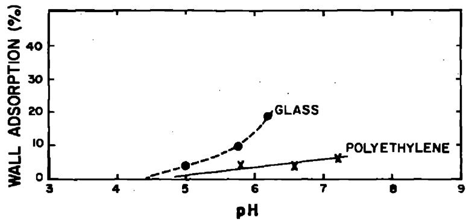
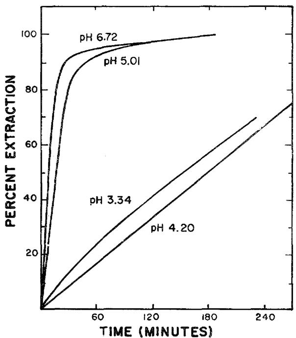
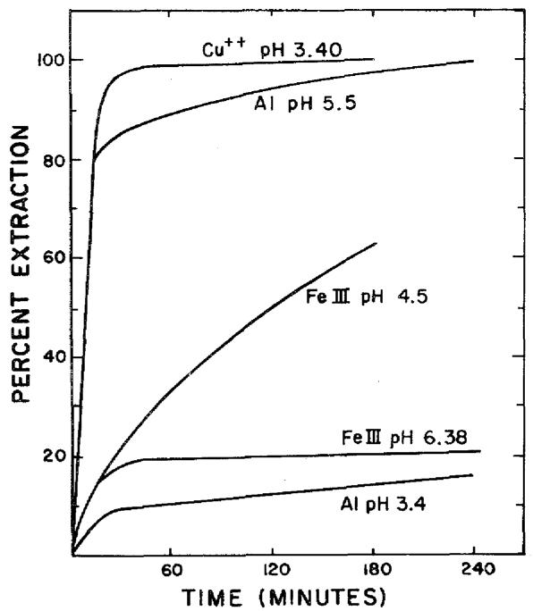
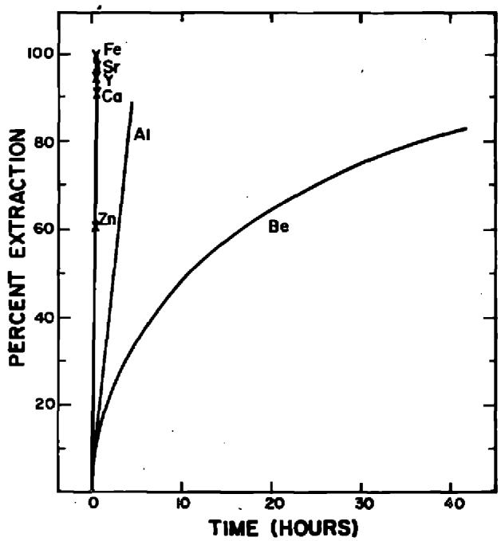
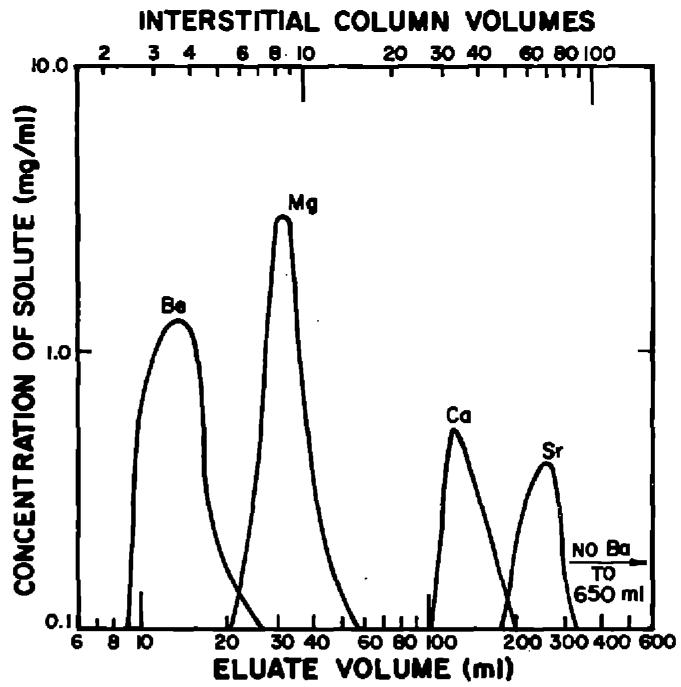
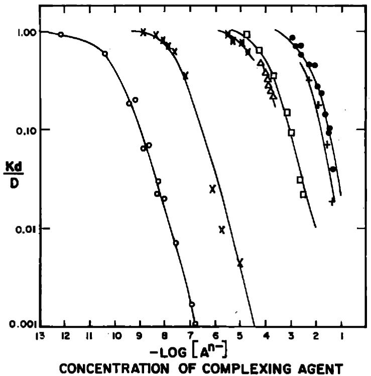
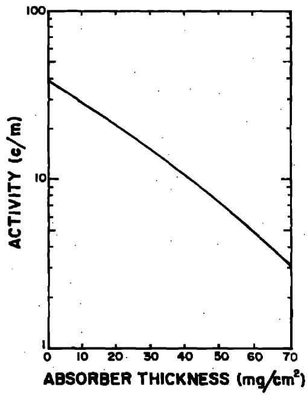
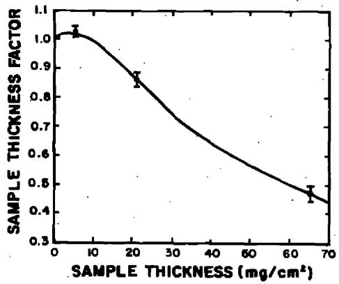

National

Academy

of

Sciences

National Research Council

NUCLEAR SCIENCE SERIES

# The Radiochemistry of Beryllium

PLEASE DO NOT

FROM LIBRARY

U.S.

Atomic

Energy

Commission

# COMMITTEE ON NUCLEAR SCIENCE

L. F. CURTISS, Chairman

National Bureau of Standards

ROBLEY D. EVANS, Vice Chairman

Massachusetts Institute of Technology

J. A. DeJUREN, Secretary

Westinghouse Electric Corporation

H.J.CURTIS

Brookhaven National Laboratory

SAMUEL EPSTEIN

California Institute of Technology

HERBERT GOLDSTEIN

Nuclear Development Corporation of America

H.J.GOMBERG

Universitv of Michigan

E.D.KLEMA

Northwestern University

ROBERT L. PLATZMAN

Argonne National Laboratory

G.G.MANOV

Tracerlab, Inc.

W. WAYNE MEINKE

University of Mlchtlgan

A. H. SNELL

Oak Ridge National Laboratory

E.A. UEHLING

University of Washington

D. M. VAN PATTERN

Bartol Research Foundation

# LIAISON MEMBERS

PAUL C. AEBERSOLD

Atomic Energy Commission

J. HOWARD McMILLEN

National Science Foundation

W.D. URRY

U. S. Air Force

WILLIAM E. WRIGHT

Office of Naval Research

# SUBCOMMITTEE ON RADIOCHEMISTRY

W.WAYNE MEINKE,Chairman

University of Michigan

GREGORY R. CHOPPIN

Florida State University

GEORGE A. COWAN

Los Alamos Scientific Laboratory

ARTHUR W. FAIRHALL

University of Washington

JEROME HUDIS

Brookhaven National Laboratory

EARL HYDE

University of California (Berkeley)

HAROLD KIRBY

Mound Laboratory

GEORGELEDDICOTTE

Oak Ridge National Laboratory

JULIAN NIELSEN

Hanford Laboratories

ELLIS P. STEINBERG

Argonne National Laboratory

PETER C. STEVENSON

University of Calforlia (Livermore)

LEO YAFFE

McGill University

# CONSULTANTS

NATHAN BALLOU

Naval Radiological Defense Laboratory

JAMESDeVOE

University of Michigan

WILLIAM MARLOW

National Bureau of Standards

# The Radiochemistry of Beryllium

By A.W. FAIRHALL

Department of Chemistry

University of Washington

Seattle, Washington

May 1960

Subcommittee on Radiochemistry

National Academy of Sciences—National Research Council

# FOREWORD

The Subcommittee on Radiochemistry is one of a number of Subcommittees working under the Committee on Nuclear Science within the National Academy of Sciences-National Research Council. Its members represent government, industrial, and university laboratories in the areas of nuclear chemistry and analytical chemistry.

The Subcommittee has concerned itself with those areas of nuclear science which involve the chemist, such as the collection and distribution of radiochemical procedures, the establishment of specifications for radiochemically pure reagents, the problems of stockpiling uncontaminated materials, the availability of cyclotron time for service irradiations, the place of radiochemistry in the undergraduate college program, etc.

This series of monographs has grown out of the need for up-to-date compilations of radiochemical information and procedures. The Subcommittee has endeavored to present a series which will be of maximum use to the working scientist and which contains the latest available information. Each monograph collects in one volume the pertinent information required for radiochemical work with an individual element or a group of closely related elements.

An expert in the radiochemistry of the particular element has written the monograph, following a standard format developed by the Subcommittee. The Atomic Energy Commission has sponsored the printing of the series.

The Subcommittee is confident these publications will be useful not only to the radiochemist but also to the research worker in other fields such as physics, biochemistry or medicine who wishes to use radiochemical techniques to solve a specific problem.

W. Wayne Meinke, Chairman

Subcommittee on Radiochemistry

# CONTENTS

I. GENERAL REVIEWS OF THE INORGANIC AND ANALYTICAL CHEMISTRY OF BERYLLIUM 1   
II.ISOTOPESOFBERYLLIUM 2   
III. REVIEW OF BERYLLIUM CHEMISTRY OF INTEREST TO RADIOCHEMISTS 3

1. General Considerations 3   
2. Complex Ions of Beryllium 4   
3. Chelate Complexes of Beryllium 5   
4. Soluble Compounds of Beryllium 8   
5. Insoluble Compounds of Beryllium 9   
6. Solvent Extraction of Beryllium Compounds 10   
7. Ion Exchange Behavior of Beryllium 15

IV. PROCEDURES FOR DISSOLVING SAMPLES CONTAINING COMPOUNDS OF BERYLLIUM 21   
V. COUNTING TECHNIQUES FOR USE WITH ISOTOPES OF BERYLLIUM 22

VI. COLLECTION OF DETAILED RADIOCHEMICAL PROCEDURES FOR BERYLLIUM 28

# The Radiochemistry of Beryllium*

A.W.FAIRHALL Department of Chemistry University of Washington, Seattle, Washington May 1960

# I. GENERAL REVIEWS OF THE INORGANIC AND ANALYTICAL CHEMISTRY OF BERYLLIUM

"Beryllium", pp 197-218, Vol. I. of "The Chemical Elements and Their Compounds", N.V. Sidgwick, Oxford University Press, London, 1950.   
"Beryllium", pp 204-248, Vol. IV of "A Comprehensive Treatise on Inorganic and Theoretical Chemistry", J. W. Mellor, Longmans, Green and Co., London, 1923.   
Gmelin's Handbuch der Anorganischen Chemie, System Nr. 26, 8th Edition, Verlag Chemie G.m.b.H., Berlin, 1930.   
Chapter 32, pp 516-523, "Applied Inorganic Analysis", W. F. Hillebrand, G. E. F. Lundell, H. A. Bright and J. I. Hoffman, 2nd edition, John Wiley and Sons, Inc., New York (1953).   
"Beryllium", pp 137-148, Vol. I of "Scott's Standard Methods of Chemical Analysis", N. H. Furman, editor, fifth edition, D. Van Nostrand Co., Inc., New York, 1939.   
L. W. Neidrach, A. M. Mitchell and C. J. Rodden, pp 350-359, "Analytical Chemistry of the Manhattan Project", C. J. Rodden, editor-in-chief, McGraw-Hill Book Co., Inc., New York, 1950.   
"Non-ferrous Metallurgical Analysis. A Review." G.W.C. Milner, Analyst 81, 619 (1956).

Only four isotopes of beryllium are known to exist, those having mass numbers 7, 8, 9 and 10. One of these, $\mathbf{B}\mathbf{e}^{\mathbf{8}}$ , is completely unstable, breaking up into two alpha particles in a time less than $10^{-15}$ sec. A short-lived isotope of mass 6 has been reported1 but its existence is doubtful. Of the remaining three, $\mathbf{B}\mathbf{e}^{\mathbf{9}}$ is the only one which is stable, and constitutes the element. Beryllium is not an abundant element, although its principal mineral, beryl, 3 BeO· $\mathrm{Al}_{2}\mathrm{O}_{3} \cdot 6 \mathrm{SiO}_{2}$ , is rather wide spread in occurrence. The average beryllium content of rocks2 is only about 3 ppm, and sea water3 contains only about $5 \times 10^{-13} \mathrm{~g/ml}$ of the element.

The isotopes of masses 7 and 10 are of interest in that they are both relatively long-lived nuclides. Be has a half-life of close to 54 day, decaying by K-electron capture to stable Li. Of these decays, $12\%$ go to a 0.477 Mev excited state of Li and the remainder go to the ground state. The only detectable radiation therefore is the 0.477 Mev ray, the x-rays of Li being much too soft to be detectable by present techniques. The branching ratio of $12\%$ to the excited state of Li is uncertain by 5 - 10 per cent.

Because of its rather low mass and convenient half-life, Be is a nuclide of some interest in the study of nuclear reactions produced artificially in the laboratory. It arises as a spallation product in the nuclear reactions induced at high energies, and its production at lower energies in light elements is of some interest.[11,12] Production of Be by cosmic ray bombardment of the atmosphere has also been observed.[13-15]

The heaviest isotope of beryllium, $\mathbf{Be}^{10}$ , is quite long lived, with a half-life of $2.5 \times 10^{8} \mathrm{y}$ .4 It decays by $\beta^{-}$ emission to the ground state of stable $\mathbf{B}^{10}$ , and in keeping with the long half-life and consequent slow build-up to detectable intensities, the production of $\mathbf{Be}^{10}$ in nuclear reactions in the laboratory is not likely to be studied radio-chemically. However, $\mathbf{Be}^{10}$ is produced as a spallation product of cosmic ray action on the atmosphere16,17 and on meteorites,18 so that its occurrence in nature is of considerable interest to the geochemist.

# III. REVIEW OF BERYLLIUM CHEMISTRY OF INTEREST TO RADIOCHEMISTS

# 1. General Considerations

In any radiochemical separation of a particular element the chemical procedures which are used are governed in part by the amount of the element which is present in the sample which is being analyzed. Isotopic carrier, in amounts of the order of milligrams, are often added to the sample to facilitate the separations and to determine the chemical recovery of the radioactive species. In the case of beryllium the amount of beryllium carrier which is to be added to the sample is governed by which of the two radioisotopes is of interest: Be7 can tolerate relatively large amounts of carrier without interfering with the subsequent counting efficiency, whereas samples for counting Be10 should be as weightless as possible. Fortunately radiochemical procedures for beryllium are available which efficiently will isolate amounts of beryllium ranging from sub-microgram up to macro amounts.

In performing chemical separations with sensible quantities of beryllium present it must be born in mind that beryllium is a very toxic element. Care should be exercised to avoid ingestion of beryllium through the mouth via pipettes or by inhalation of dust or volatile beryllium compounds. If beryllium-containing solutions are spilled on the skin they should be rinsed off at once.

Beryllium is the lightest member of the group II elements. In keeping with its position in the periodic chart it has only one oxidation number, +2. It is a very good example of the rule that the first member of a group shows a strong chemical resemblance to the second member of the next higher group: in its chemical behavior beryllium more closely resembles aluminum than it does other members of the group II elements.

Because of the electropositive nature of beryllium, and the existence of only one oxidation number for the ion, exchange between carrier and tracer species presents no problem so long as the sample containing them is completely homogeneous. The strong tendency of beryllium to hydrolyse and form colloidal aggregates above pH 5 requires that carrier-tracer exchange be carried out in fairly acid solution.

Many of the chemical properties of beryllium which are important in its radiochemical separations are associated with its ability to form complex ions. These complexes will be treated first.

# 2. Complex Ions of Beryllium

Because of its small size and its double charge, the beryllium ion has a strong tendency toward the formation of complexes. Thus the simple salts uniformly have 4 molecules of water of crystallization per beryllium atom, and the hydration of the $\mathrm{Be}^{++}$ ion forms a basis for understanding the strong tendency toward hydrolysis and the amphoteric properties of this species. Stability constants for several beryllium complexes are given in Table I.

The strong tendency of $\mathrm{Be}^{++}$ ion toward complex formation shows up in a rather peculiar way by its power to dissolve beryllium oxide. The aqueous solution of any soluble salt of beryllium can dissolve up to several molecular proportions of beryllium oxide or hydroxide. The reason for this is apparently the tendency to form the complex ion $\mathrm{Be(OBe)}_4^{++}$ , where BeO molecules have replaced $\mathrm{H}_2\mathrm{O}$ molecules in the aquo complex.

Table I. Stability Constants for Beryllium Chelates   

<table><tr><td>Chelating Agent</td><td>log K1</td><td>log K2</td><td>log K3</td><td>Reference</td></tr><tr><td>EDTA</td><td>3.8</td><td>9.8</td><td></td><td>2</td></tr><tr><td>acetyacetone</td><td>8.2</td><td>7.7</td><td></td><td>2</td></tr><tr><td></td><td>9.2</td><td>7.8</td><td></td><td>48</td></tr><tr><td></td><td>7.8</td><td>6.7</td><td></td><td>49</td></tr><tr><td>oxalic acid</td><td>4.0</td><td></td><td></td><td>2</td></tr><tr><td>phosphoric acid</td><td>2.54</td><td>1.8</td><td>1.4</td><td>2</td></tr></table>

The complex formed between $\mathrm{Be}^{++}$ and $\mathrm{C}_2\mathrm{O}_4^=$ , is of some interest inasmuch as it is the only oxalate of a divalent metal which is freely soluble in water. It is a good illustration of the difference in chemical behavior of beryllium from that of the remainder of the group II

elements. The low degree of ionization of the compound is evidence that it exists as a chelate complex.

The complex formed between beryllium and fluoride ion is worth noting. Excess fluoride ion forms the complex anion $\mathsf{BeF}_4^{\text{=} }$ , which resembles very closely the sulfate anion. Thus $\mathsf{BaBeF}_4$ forms an insoluble precipitate and finds a use in the final precipitation of beryllium in radiochemical analyses. The soluble nature of sodium fluoroberylate can be used to advantage where mineral specimens are fused with fluorides to render them soluble.[19] The complex is a fairly strong one, but may be completely destroyed by the addition of excess $\mathsf{H}_3\mathsf{BO}_3$ .

Beryllium ion is soluble in $10\%$ $(\mathrm{NH}_4)_2\mathrm{CO}_3$ solution at pH 8.5-9, presumably because of the formation of a complex carbonate anion. This property of beryllium has been used in an ion exchange technique for the separation of beryllium from copper and nickel.[20]

The formation of a $\mathrm{BeH}_2\mathrm{PO}_4$ complex which limits the phosphate content of solutions which are to be used in certain cation exchange separations has been reported.

# 3. Chelate Complexes of Beryllium

Beryllium forms numerous chelate complexes with a variety of complexing agents. These complexes may be divided into two groups according to whether they are neutral or negatively charged.

Neutral complexes are derived either from hydroxy-keto compounds, i.e. $\beta$ -keto-enols, $\beta$ -keto-esters and hydroxyquinones, or are a special class of covalent derivatives of carboxylic acids. A large number of hydroxy-keto compounds have been studied as chelating agents in the colorimetric determination of trace amounts of beryllium.[21] For details of these procedures the original literature should be consulted.

There are four chelating agents which deserve special mention because of the important roles which they play in radiochemical separations of beryllium. The first of these which will be mentioned is ethylenediamminetetraacetic acid (abbreviated EDTA), and for the reason that it forms a much stronger complex with many metals than it does with beryllium. Table II lists stability constants for a number of metal ions with EDTA. The value of $\sim 3.8$ for beryllium is sufficiently smaller than those of other common metal ions that several useful

separations may be carried out using EDTA to prevent interference from other metal species. For example, beryllium hydroxide may be precipitated with ammonia in the presence of aluminum, without the latter precipitating, if excess EDTA is present. Other examples of similar applications will be cited later.

A second very useful chelating agent for beryllium is acetylacetone. The chelate compound beryllium acetylacetonate, $\mathrm{Be}(\mathrm{C}_5\mathrm{H}_7\mathrm{O}_2)_2$ is a low melting $(108^{\circ})$ volatile (b.p. $270^{\circ}$ ) solid, insoluble in water but soluble in organic solvents. This chelate compound forms the basis for a

Table II. Formation Constants of Metal - EDTA Compleces a   

<table><tr><td>Cation</td><td>log K</td><td>Cation</td><td>log K</td></tr><tr><td>Vanadium (III)</td><td>25.9</td><td>Europium</td><td>17.35</td></tr><tr><td>Iron (III)</td><td>25.1</td><td>Samarium</td><td>17.14</td></tr><tr><td>Indium</td><td>24.95</td><td>Neodymium</td><td>16.61</td></tr><tr><td>Thorium</td><td>23.2</td><td>Zinc</td><td>16.50</td></tr><tr><td>Scandium</td><td>23.1</td><td>Cadmium</td><td>16.46</td></tr><tr><td>Mercury</td><td>21.80</td><td>Praseodymium</td><td>16.40</td></tr><tr><td>Gallium</td><td>20.27</td><td>Cobalt</td><td>16.31</td></tr><tr><td>Lutecium</td><td>19.83</td><td>Aluminum</td><td>16.13</td></tr><tr><td>Ytterblum</td><td>19.51</td><td>Cerium (III)</td><td>15.98</td></tr><tr><td>Thulium</td><td>19.32</td><td>Lanthanum</td><td>15.50</td></tr><tr><td>Erbium</td><td>18.85</td><td>Iron (II)</td><td>14.3</td></tr><tr><td>Copper</td><td>18.80</td><td>Manganese</td><td>14.04</td></tr><tr><td>Vanadyl</td><td>18.77</td><td>Vanadium (II)</td><td>12.70</td></tr><tr><td>Nickel</td><td>18.62</td><td>Calcium</td><td>10.96</td></tr><tr><td>Dysprosium</td><td>18.30</td><td>Hydrogen</td><td>10.22</td></tr><tr><td>Yttrium</td><td>18.09</td><td>Magnesium</td><td>8.69</td></tr><tr><td>Lead</td><td>18.04</td><td>Strontium</td><td>8.63</td></tr><tr><td>Terbium</td><td>17.93</td><td>Barium</td><td>7.76</td></tr><tr><td>Gadolinium</td><td>17.37</td><td>Beryllium</td><td>3.8</td></tr></table>

$$
\mathrm {M} ^ {+ \mathrm {n}} + \mathrm {Y} ^ {- 4} \rightleftharpoons \mathrm {M Y} ^ {\mathrm {n} - 4} \quad \mathrm {K} = \frac {\mathrm {M Y} ^ {(\mathrm {n} - 4)}}{\mathrm {M} ^ {+ \mathrm {n}} \mathrm {Y} ^ {- 4}}
$$

a In solutions of ionic strength 0.1. Data from reference 22, except for Beryllium, which is from reference 2.

solvent extraction procedure for amounts of beryllium as small as the carrier-free tracer (see part III-6). Owing to the volatility of the chelate compound, care must be exercised in reducing solutions of tracer beryllium to dryness where acetylacetone has been used, in order to avoid loss of the tracer.[23]

A third chelating agent which is useful for the isolation of beryllium is the compound thenoyltrifluoroacetone (TTA). The complex with beryllium is slow to form and to decompose, a property which makes possible a solvent-extraction separation of beryllium from a number of other cations.[24] The non-volatility of this complex is an advantage over acetylacetone where tracer amounts of beryllium are concerned.

The fourth chelating agent of significance to beryllium separations is acetic acid. Beryllium is almost unique in forming a series of complex compounds with carboxylic acids, of the general formula $\mathrm{Be}_4\mathrm{O}(\mathrm{O}\cdot \mathrm{CO}\cdot \mathrm{R})_6$ . These compounds are non-ionized, soluble in organic solvents, and volatile. The best known of these is the acetate, "basic" beryllium acetate, which is formed by treating beryllium hydroxide with acetic acid or acetic anhydride. It is generally employed for solvent extraction of beryllium in radiochemical analyses, although the stability and volatility of the complex (b.p. $330^{\circ}$ ) permits its isolation by distillation.

The second group of chelate complexes of beryllium are those which possess a negative charge. Complexes of this type have been prepared with a number of complexing anions including oxalate, malonate, citrate, salicylate and sulfate. The complex formed with oxalate has been used in the back-extraction of beryllium acetylacetone from the organic phase in a solvent extraction procedure for beryllium.[23] Complex formation with citrate has been demonstrated and used in the ion exchange separation of the group II metals.[24] The salicylate analogues sulfosalicylate and gentisic acid (2, 5-dihydroxylbenzoic acid) have been used as complexing agents in an ion exchange procedure for separation of beryllium[25] and for the spectrophotometric determination of beryllium.[26]

Details of the solvent extraction and ion exchange procedures involving chelate complexes of beryllium will be outlined in parts III-6 and -7.

# 4. Soluble Compounds of Beryllium

Beryllium hydroxide is a weak base and therefore solutions of its salts are extensively hydrolysed, forming ions like $\mathrm{Be(OH)}^{+}$ and probably also colloids of the form $(\mathrm{BeO})_{\mathrm{x}}\mathrm{Be}^{++}$ . Salts of such weak acids as HCN, $\mathrm{H}_{2}\mathrm{S}$ and $\mathrm{H}_{2}\mathrm{CO}_{3}$ are almost completely hydrolysed in water. The hydrolysis of beryllium solutions leads to the absorption of beryllium onto the walls of the containing vessel. Figure 1 shows the percentage adsorption of $\mathrm{Be}^{7}$ from carrier-free solutions in 0.1 M NaCl buffered with 0.001 M NaAc as a function of pH. $^{2}$ The pH was varied by addition of HCl or NaOH. Absorptions as high as $20\%$ on glass containers were observed at the higher pH's.

  
Figure 1. Adsorption of beryllium on the walls of polyethylene and glass vessels as a function of the pH of the solution. Data of reference 2.

Beryllium salts of strong mineral acids such as $\mathrm{HNO}_3$ , $\mathrm{HCl}$ , $\mathrm{HBr}$ , $\mathrm{H}_2\mathrm{SO}_4$ , $\mathrm{HClO}_4$ , etc are all quite soluble in water and the salts themselves are usually hygroscopic. The strong tendency of beryllium to form complex ions is shown by the fact that these salts always crystallize from aqueous solution with at least 4 molecules of water per atom of beryllium, corresponding to the tetraquo complex.

Soluble complex ions with $\mathbf{F}^{-}$ , oxalate, citrate, etc. have already been mentioned (parts III-2 and -3).

The action of strong bases such as NaOH or KOH first precipitate insoluble $\mathrm{Be(OH)}_2\cdot \mathrm{aq}$ , but addition of excess base causes the precipitate to redissolve. At room temperature the solubility of freshly precipitated beryllium hydroxide in 0.39 N, 0.65 N and 1.99 N NaOH is

reported to be 0.06, 0.144 and 0.66 moles of $\mathrm{Be(OH)}_2$ per liter.[27] The solution, however, is unstable. On long standing, or on boiling, beryllium is reprecipitated as a dense crystalline precipitate corresponding to the formula $\mathrm{Be(OH)}_2$ . The amphoteric nature of beryllium hydroxide is a very useful property in radiochemical separations, but whenever a strong base is used to dissolve beryllium from a mixture of insoluble, non-amphoteric hydroxides the mixture should not be subjected to prolonged boiling to effect solution of the beryllium lest the opposite of the desired result be obtained.

# 5. Insoluble Compounds of Beryllium

The most important insoluble compound of beryllium, so far as radiochemical separations is concerned, is the hydroxide. It is precipitated from aqueous solution by dilute base. Because of the amphoteric nature of the freshly precipitated hydroxide, the best precipitant for beryllium is ammonium hydroxide buffered with $\mathbf{NH}_4^+$ ion. The precipitate of beryllium, which begins to appear at around pH 5, is essentially insoluble in an excess of this reagent. Precipitation of beryllium at the methyl red end point (pH $\sim 6$ ) has been recommended.[28]

Precipitation of dense, unhydrated $\mathrm{Be(OH)}_2$ from boiling alkaline solution has been mentioned above in connection with the amphoteric properties of beryllium. A somewhat similar result is obtained if the complex carbonate of beryllium in ammonium carbonate solution is boiled. In this case there is obtained a white, granular precipitate of basic beryllium carbonate of somewhat indefinite composition. Addition of sodium bicarbonate solution to a solution of beryllium also precipitates basic beryllium carbonate. Ignition of the hydroxides or the basic beryllium carbonate results in beryllium oxide.

Because of the weakness of the acid, and the consequent strong tendency to hydrolysis of the resulting compounds, the phosphates of beryllium have a rather complicated chemistry. At lower pH's soluble compounds may be obtained, while at higher pH's insoluble precipitates of gelatinous nature, and therefore difficult to identify, are formed. However, an insoluble crystalline precipitate approximating $\mathrm{NH}_4\mathrm{BePO}_4$ may be obtained by adding $(\mathrm{NH}_4)_2\mathrm{HPO}_4$ to beryllium solutions at pH 5.5.[29] Ignition of the precipitate results in $\mathrm{Be}_2\mathrm{P}_2\mathrm{O}_7$ . This procedure is

therefore useful in obtaining beryllium in a dense form of known composition.

Another method for precipitating beryllium which has some advantages over the others involves formation of the $\mathbf{BeF}_4^{\text{一}}$ complex anion by addition of excess $\mathbf{F}^{-}$ ion, followed by the addition of excess $\mathbf{Ba}^{++}$ ion. The solution should be acidified and only a slight excess of $\mathbf{Ba}^{++}$ ion should be used in order to prevent the precipitation of $\mathbf{BaF}_2$ . The resultant precipitate of insoluble $\mathbf{BaBeF}_4$ is fine-grained and very difficult to filter through the usual types of dense filter paper. Digestion of the precipitate for 10 minutes prior to filtration helps somewhat, but the filtration problem can be overcome completely through the use of RA-type Millipore filters. The compact, dense, and anhydrous precipitate does not require ignition as do the others mentioned above. This is a distinct advantage in eliminating the health hazard associated with the transfer of ignited beryllium precipitates, which tend to "dust". The $\mathbf{BaBeF}_4$ precipitate is much more readily redissolved than ignited BeO, being easily dissolved in a mixture of $\mathbf{H}_3\mathbf{BO}_3$ and $\mathbf{HNO}_3$ . This is a useful property where further chemical processing is needed to remove unwanted radioactive contaminants from a beryllium sample.

Beryllium's strong tendency toward hydrolysis, and the insolubility of its hydroxide in near neutral solutions, means that beryllium will tend to co-separate on precipitates when the solution is not at least moderately acid.[29] Almost any precipitate which is formed in a solution containing beryllium at pH~7 will co-precipitate the beryllium to some extent. Particularly useful in this respect are gelatinous hydroxides such as those of aluminum and iron. Using $\mathrm{Fe(OH)}_3$ as the coprecipitant for beryllium allows the beryllium to be recovered from the precipitate by treatment with cold NaOH solution, or by other means.

# 6. Solvent Extraction of Beryllium Compounds

The chelate complexes of beryllium with acetylacetone, TTA, and acetic acid, which were mentioned in part III-3 above, lend themselves

to very useful solvent extraction procedures for beryllium. These will be given in detail below.

# Acetylacetone:

By shaking or stirring aqueous solutions containing beryllium at pH 4.5 - 8 with acetylacetone a chelate complex is formed which is soluble in organic solvents. Either pure acetylacetone, a solution of acetylacetone in benzene or $\mathrm{CCl}_4$ may be used. The use of a small quantity of pure acetylacetone hastens the formation of the chelate complex, after which the complex may be extracted into benzene or other suitable solvent. By stirring a solution at pH 4.5, containing about 1 microgram of beryllium with $4\mathrm{ml}$ of acetylacetone for 5 minutes, and then adding $20\mathrm{ml}$ of benzene and stirring for 20 minutes longer, Toribara and Chen found that essentially $100\%$ of the beryllium is transferred to the organic phase.[29] Bolomey and Broido[23] shook $25\mathrm{ml}$ of $10\%$ acetylacetone in benzene with $25\mathrm{ml}$ of a solution containing carrier-free beryllium tracer at pH 6 for 2 hours and found that all but a trace of the activity was extracted into the organic phase.

A great many other metal ions likewise form chelates with acetylacetone, and under the conditions described above many of them would also be extracted. The use of EDTA makes the extraction more specific for beryllium. Alimarin and Glibalo30 studied the extraction of beryllium acetylacetonate into $\mathrm{CCl}_4$ , $\mathrm{CHCl}_3$ , butyl alcohol and isoamyl alcohol containing acetylacetone from aqueous solutions containing EDTA and Al, Fe, and Cr, and the divalent ions of Co, Fe, Ni, Mn, Zn, Cd, Pb, Cu, Ca and Mg. When excess EDTA was present only beryllium was extracted into the organic phase. $\mathrm{CCl}_4$ proved to be the best of the solvents which were studied. In strongly ammoniacal solution aluminum and iron acetylacetonates could also be extracted.

The organic phase containing beryllium acetylacetonate may be washed with acidified water to remove unwanted impurities without the loss of appreciable amounts of beryllium $^{23}$ . About 2 drops of 0.1 N HCl to 25 ml of water makes a satisfactory wash solution for this purpose.

The beryllium acetylacetonate complex may be decomposed and the beryllium back extracted into water by shaking the organic phase

containing the chelate complex with equal volumes of either $10\%$ oxalic acid or 6 N HCl. Bolomey and Broido23 report that $96\%$ of tracer beryllium is back extracted in 2 hours under these conditions. Toribara and Chen29 report that 15 minutes stirring of the organic phase with 5 N HCl is sufficient to transfer the beryllium to the aqueous phase. Because of the volatility of carrier-free beryllium acetylacetonate, acetylacetone which dissolves in the acid used to

  
Figure 2. Rate of extraction of Be by 0.01 M TTA in benzene at different pH values. Data of Bolomey and Wish, reference 31.

back-extract the beryllium should be extracted from the aqueous phase by washing the latter with one or more portions of fresh benzene. The aqueous phase may then be evaporated to dryness under a heat lamp. If oxalic acid is used to accomplish the back-extraction of beryllium it may be sublimed under a heat lamp without loss of activity.[23] With beryllium carrier present the loss of beryllium through volatilization during evaporation of the aqueous phase does not appear to be a problem.

# $\alpha$ -Thenoyltrifluoroacetetone:

Thenoyltrifluoroacetone (TTA) is a useful chelating agent for many metals, including beryllium. Bolomey and Wish31 have invest

  
Figure 3. Rate of extraction of various metallic ions by 0.01 M TTA in benzene at different pH values. Data of Bolomey and Wish, reference 31.

tigated the conditions under which beryllium may be separated from a number of other metal cations using this reagent. The complex is rather slow to form and to decompose. In Figure 2 is shown the rate of extraction of beryllium by 0.01 M TTA in benzene at different pH's. The optimum pH for the extraction seems to be about 7, with extraction of beryllium being essentially complete in about 3 hours. The extraction of iron (III), aluminum and copper by 0.01 M TTA in benzene at different pH values is shown in Figure 3. Evidently aluminum is also extracted quite favorably at pH 7, but the extraction of iron is relatively much less favorable at the higher pH.

The back-extraction of TTA complexes of Be, Al, Ca, Fe, Zn, Sr and Y from benzene solution made 0.01 M in TTA by concentrated

  
Figure 4. Back extractions of several metallic ions with concentrated hydrochloric acid. Data of Bolomey and Wish, reference 31.

hydrochloric acid is shown in Figure 4. Back extraction of Ca, Fe, Zn, Sr and Y is complete in 15 minutes. Aluminum requires 6 hours, and beryllium at least 80 hours, for "complete" back-extraction. However, the use of 2 parts concentrated formic acid to 1 part concentrated HCl accomplishes the back-extraction of beryllium in a matter of a few minutes (cf. Section VI, Procedure 12).

The solvent extraction method using TTA works equally well for tracer or micro amounts of beryllium. For tracer concentrations of beryllium TTA has the advantage over acetylacetone that there is no loss of beryllium through volatilization of the beryllium - TTA complex.

# Acetic acid.

When freshly precipitated beryllium hydroxide is evaporated slowly to dryness several times with glacial acetic acid $^{32}$ , or when beryllium acetate is heated to $200^{\circ} \mathrm{C}^{14}$ , there is formed the chelate compound $\mathrm{Be}_{4} \mathrm{O}(\mathrm{O} \cdot \mathrm{CO} \cdot \mathrm{CH}_{3})_{6}$ , "basic" beryllium acetate. It is a crystalline substance insoluble in cold water, but readily soluble in most common

organic solvents except alcohol and ether. Chloroform is the solvent most commonly employed. The solution of "basic" beryllium acetate in chloroform is remarkably stable and may be washed free of other cations by extracting with water acidified with HCl or with water alone. Recovery of beryllium from the chloroform solution may be accomplished by extraction with reagent $\mathrm{HNO}_3$ or by evaporation of the chloroform followed by decomposition of the basic beryllium acetate by heating with concentrated $\mathrm{HNO}_3$ .

The preparation of basic beryllium acetate is somewhat time-consuming. This disadvantage is offset somewhat by the specificity of the procedure for beryllium.

# 7. Ion Exchange Behavior of Beryllium

The strong tendency of beryllium toward complex formation makes possible its separation by a variety of ion exchange techniques. These are summarized in Table III and discussed in detail below.

# Cation Exchange Resins:

Separation of beryllium from other cation species by cation exchange may be accomplished in several ways. Beryllium is strongly absorbed on the cation exchange resin Dowex 50 at pH 6 - 8, presumably owing to colloid formation2. At lower pH's beryllium will pass slowly through a cation exchange resin column33. Ehmann and Kohman28 passed a 1.1 M HCl solution containing Be and Al through a Dowex 50 column, and followed it with 1.1 M HCl. At a flow rate of 1 resin volume of eluent per 25 minutes the beryllium was completely eluted with 6 or 7 resin volumes of 1.1 M HCl. Under these conditions aluminum begins to elute only after 12 to 15 resin volumes of 1.1 M HCl have been passed through the column.

Milton and Grummitt34 have used 1.5 M HCl as eluting agent and Dowex 50 resin to effect a separation of beryllium from the other members of the alkaline earth family. Their results are shown in Figure 5.

Honda $^{35}$ and Kakihana $^{36}$ have investigated the elution of beryllium from Dowex 50 resin by the use of dilute Ca or Mg solutions. These cations displace be from the column, which therefore passes through,

but cations such as Al which are more strongly held than the alkaline earths are retained by the resin.

Complexing agents, for either unwanted cations or beryllium, have been used in the separation of beryllium by cation exchange resins. Merrill, Honda and Arnold2 have studied the effect of various complexing

Table III. Ion Exchange Methods for the Separation of Beryllium   
Cation Exchange   

<table><tr><td>Resin Form</td><td>Eluting Agent</td><td>Ions Eluted</td><td>Ions Retained</td><td>Reference</td></tr><tr><td>HR</td><td>ca 1M HCl</td><td>Be</td><td>Al, Mg, Ca, Sr, Ba</td><td>28, 34, 35</td></tr><tr><td>HR</td><td>0.05 M Ca or Mg</td><td>Be</td><td></td><td>35, 36</td></tr><tr><td>HR</td><td>0.4 M oxalic acid</td><td>Al, Fe3+, UO2++ Th, others</td><td>Be</td><td>2</td></tr><tr><td>HR</td><td>oxalic acid pH 4.4-5</td><td>Al, Fe</td><td>Be</td><td>37</td></tr><tr><td>NH4R</td><td>0.55 M Amm. lac. pH 5</td><td>Be</td><td>other alk. earths</td><td>34</td></tr><tr><td>NH4R</td><td>10%(NH4)2CO3pH 8.5-9</td><td>Be</td><td>Cu, Ni</td><td>20</td></tr><tr><td>NaR</td><td>EDTA, pH 3.5-4.0</td><td>Al, Fe3+, Mn++ heavy metals, others</td><td>Be, alk. earths</td><td>2, 38, 39</td></tr><tr><td>NH4R</td><td>0.35 M acetate</td><td>Be</td><td>Al, alk. earths, U, others</td><td>2</td></tr><tr><td>NaR</td><td>acetyacetone pH 5</td><td>Be</td><td>Al, alk. earths U, others</td><td>2</td></tr><tr><td>NH4R</td><td>0.02 M sulfosalicylic acid pH 3.5-4.5</td><td>Be</td><td>Cu, U, Ca</td><td>25</td></tr><tr><td colspan="5">Anion Exchange</td></tr><tr><td>RC2O4</td><td>0.1 M oxalic acid 0.15 M HCl</td><td>Be</td><td>Al</td><td>28</td></tr><tr><td>RCit</td><td>1 M amm. cit. pH 8</td><td>Be</td><td>other alk. earths</td><td>24</td></tr><tr><td>RC1</td><td>various conc. HCl</td><td>Be</td><td>many transition elements</td><td>40-42</td></tr><tr><td>RC1</td><td>13 M LiCl</td><td>alk. metals, Mg</td><td>Be</td><td>43</td></tr></table>

  
Figure 5. The separation of beryllium, magnesium, calcium, and strontium by cation exchange using 1.5 M hydrochloric acid eluant. Dowex 50 column 1.1 x 8 cm, flow rate 1.0 ml/min, T ~ 60°C. Data of Milton and Grummitt, reference 34.

agents on the uptake of beryllium by Dowex 50 resin. Be7 was used as a tracer in these experiments which were conducted at room temperature, $23 - 25^{\circ}$ C. They define the distribution coefficient of Be, $\mathbf{K}_{\mathrm{d}}$ , to be

$$
K _ {d} = \frac {\text {B e} ^ {7} \text {a d s o r b e d / g r e s i n}}{\text {B e} ^ {7} \text {r e m a i n i n g / m l s o l u t i o n}}
$$

at equilibrium. For purposes of normalization they also define the distribution coefficient, $D$ , to be

$$
D = \frac {B e ^ {+ +} a d s o r b e d / g r e s i n}{B e ^ {7} r e m a i n i n g / m l s o l u t i o n}
$$

measured in the absence of complexing agents.

In 0.1 M Na⁺, and with the resin in the sodium form, D was measured to be 700 for 200-400 mesh resin and 830 for 50-100 mesh resin. In 0.1 M H⁺, and with the resin in the hydrogen form, D was

measured to be 1870 for 50-100 mesh resin. The value of D was found to vary with the concentration, C, of the monovalent cation in the solution, and in the neighborhood of the concentrations which were used D varied as $\frac{1}{\mathbf{C}^2}$ . Values of the quantity $\frac{\mathbf{K}_d}{\mathbf{D}}$ are shown in Figure 6 plotted against the concentration of complexing agent for several cases.

Stability constants were calculated for the several complexes from these cation exchange data and are given in Table I, page 4.

Because certain unwanted cations may form much stronger complexes than does beryllium, the use of complexing agents such as EDTA or oxalate can be quite effective in isolating beryllium from a mixture of

  
Figure 6. Uptake of beryllium by Dowex 50 resin from solutions containing various complexing agents. Data of Merrill, Honda, and Arnold, reference 2.

EDTA $\{Y^{4 - }\}$ 0.09MNa+NaR

$\square =$ OXALATE $(A^{=})_{0.1}$ M.Ne+NaR

x-AcetylACETONE(A"-Q.Im

+PHOSPHORIC ACID (A-0.05MH-HR

No+-NoR

HPOA（A），OIMNe-NonR

X-OXALIC ACID $(\mathbf{A}^{\pm})$ ,0.1M H-HR

△-OXALICACHD(A²),0.1M Na-NaN

cations. EDTA is especially useful in this respect, particularly in the separation of beryllium from iron and aluminum. Table IV shows the small uptake of aluminum by Dowex 50 when excess EDTA is present. $^{2}$ Using Amberlite IR-120 resin in the sodium form Nadkarni, Varde and Athavale $^{38}$ found that from solutions containing excess $\mathrm{Na}_{2}\mathrm{H}_{2}$ EDTA at pH 3.5 beryllium was absorbed by the resin while aluminum, calcium and iron passed through the column. If $\mathrm{H}_{2}\mathrm{O}_{2}$ was present titanium also passed through the column unabsorbed by the resin.

Oxalic acid is useful for the separation of beryllium from such ions as $\mathbf{Fe}^{+3}$ , $\mathbf{Al}^{+3}$ , $\mathbf{UO}_2^{+2}$ , and $\mathbf{Th}^{+4}$ . Oxalic acid, 0.4 M solution, may be used to elute these ions while beryllium is retained on the column. Ryabchikov and Bukhtiarov37 report the separation of beryllium from iron and aluminum by the use of oxalate at pH 4.4. Iron and aluminum pass through as complex ions while beryllium is retained on the column.

The separation of beryllium from magnesium and the other alkaline

Table IV. Uptake of Aluminum by Dowex 50 from Solutions Containing Excess EDTA   

<table><tr><td>Volume of solu-tion passeda</td><td>pH before passing</td><td>pH after passing</td><td>Al absorbed (mmole/g resin)</td></tr><tr><td>50</td><td>2.79</td><td>--</td><td>0.19</td></tr><tr><td>30</td><td>3.10</td><td>3.21</td><td>0.007</td></tr><tr><td>30</td><td>3.62</td><td>3.78</td><td>0.003</td></tr><tr><td>50</td><td>3.52</td><td>3.61</td><td>0.0026</td></tr></table>

a Sample solution: $0.22 \, \text{M Na}^{+} + 0.1 \, \text{M AlY}^{-} + 0.01 \, \text{M excess EDTA} + \text{SO}_4^{\text{=} \cdot}$ ; $\text{CaCO}_3$ added to adjust pH. Data of Merrill, Honda, and Arnold, reference 2.

earths by means of ammonium lactate has been described by Milton and Grummitt. $^{34}$ Using $0.55\mathrm{M}$ ammonium lactate at $\mathsf{pH}5$ as the eluant, a flow rate of $1\mathrm{ml / min}$ , and a Dowex 50 column maintained at a temperature of $78^{\circ}\mathrm{C}$ , beryllium was eluted from a $1.1\times 8\mathrm{cm}$ column in less than 2 interstitial column volumes. This was considerably in advance of magnesium, which began to elute at around 2.5 interstitial column volumes.

The use of salicylate analogs for selective elution of beryllium adsorbed on a Dowex 50 resin column has been reported by Schubert, Lindenbaum and Westfall. Using $0.02 - 0.10\mathrm{M}$ sulfosalicylic acid at pH 3.5 - 4.5 beryllium is selectively eluted while $\mathbf{Cu}^{++}$ , $\mathbf{UO}_2^{++}$ and $\mathbf{Ca}^{++}$ ions remain firmly on the column. If iron is also adsorbed on the column it can be eluted before the beryllium with $0.1\mathrm{M}$ sulfosalicylic acid at pH 2.1.

When 0.1 M gentisic acid at pH 6.0 is used to elute a Dowex 50 column (H - form) containing adsorbed $\mathrm{Ca}^{++}$ and $\mathrm{Be}^{++}$ ions the beryllium comes off in a sharp band, beginning when the pH of the effluent reaches 1.9, reaching a maximum at pH 2.74 and complete when the effluent reaches pH 5.60.[25] Under these conditions calcium is still retained on the column.

Starting with $150\mathrm{ml}$ of solution containing $1.1\mathrm{g}$ of $\mathrm{CaCl}_2$ , $5\mu \mathrm{g}$ of Be, and $0.1\mathrm{M}$ in sulfosalicylic acid at pH 4.5, these authors passed the solution through a column containing $15\mathrm{g}$ of air-dried Dowex 50 resin which had been equilibrated with $0.1\mathrm{M}$ sulfosalicylic acid at pH 4.5. Beryllium passed completely through the column with the aid of $70\mathrm{ml}$ of wash solution ( $0.1\mathrm{M}$ sulfosalicylic acid at pH 4.5) while calcium was completely adsorbed.

Rapid elution of beryllium adsorbed on a cation exchange resin which has been washed free of unwanted cations may be accomplished by strong $(>3\mathrm{M})$ HCl, or by a solution of 0.5 M NaAc and 1 M HAc2. In the latter case 0.5 - 1.5 column volumes of effluent contain all the beryllium, which may be recovered as $\mathrm{Be(OH)}_2$ by adding $\mathrm{NH}_4\mathrm{OH}^2$ .

# Anion Exchange Resins:

The use of anion exchange resins in the separation of metal cations implies the formation of negatively charged complex ions, either of the desired element to be separated, or of unwanted impurities. As an example of the latter, in hydrochloric acid solution beryllium does not form a complex with chloride ion of sufficient strength to be absorbed on Dowex I resin.[45] A great many other metal ions do, however, form chloride complexes which are absorbed by Dowex I resin.[40-42] Beryllium may therefore be separated from these elements by simply passing the solution in hydrochloric acid of appropriate strength

through a Dowex I resin column. Unwanted ions will be adsorbed while beryllium will pass through unadsorbed.

Even though beryllium shows negligible adsorption onto Dowex I resin from 12 M HCl solutions, it is interesting that there is adsorption of beryllium from 13 M LiCl solution. With a distribution coefficient of 8 in this solution (Be adsorbed per Kg resin/Be remaining per liter of solution) beryllium could be separated by anion exchange from non-adsorbable elements such as alkali metals and magnesium by this technique.

Anion exchange separations of beryllium based on the formation of negative complexes of beryllium do not appear to have been extensively used. Ehmann and Kohman28 have used the oxalate complex of beryllium to effect radiochemical purification of beryllium. Beryllium chloride solution, after evaporation to dryness was taken up in 0.1 M $\mathrm{H}_2\mathrm{C}_2\mathrm{O}_4 - 0.15\mathrm{M}$ HCl (pH = 0.9) solution and passed through a $4''$ x $1/2''$ column of Dowex I resin at a flow rate of 1 ml/min. Elution was by the same solution, which effected the eleution of beryllium in 5 resin volumes.

Nelson and Kraus $^{24}$ studied the separation of the alkaline earth elements by anion exchange using citrate solutions and Dowex I resin. Beryllium is more strongly absorbed than the other members of the family at low citrate concentrations, although at citrate concentrations greater than about 0.1 M magnesium is more strongly absorbed than beryllium. Effective separation of beryllium from Ca, Sr, Ba and Ra may be accomplished by this technique, but the separation from magnesium is less satisfactory. Using 1 M $(\mathrm{NH}_4)_3\mathrm{Cit}$ at pH 8 beryllium comes off first, but the last portion of beryllium will be contaminated with magnesium. Alternatively, using 0.2 M $(\mathrm{NH}_4)_3\mathrm{Cit}$ at pH 4.3 magnesium comes off first but tails badly and contaminates the beryllium as it is eluted from the column.

# IV. PROCEDURES FOR DISSOLVING SAMPLES CONTAINING COMPOUNDS OF BERYLLIUM

Inasmuch as the common salts of beryllium, the chloride, fluoride, nitrate, sulfate etc., are freely soluble in water, the problem of

dissolving the sample is that of rendering soluble the matrix material in which the beryllium is imbedded. For the special case of beryllium metal itself the best solvents are hydrochloric or sulfuric acid. The metal also dissolves in alkali hydroxide solutions owing to the amphoteric character of the element. Nitric acid, either concentrated or dilute, is not a suitable solvent for it renders the metal passive.

The radioberyllium content of meteorites and of various sediments and rocks is of considerable interest to the geochemist. For iron meteorite material aqua regia is the solvent commonly employed. For siliceous materials HF is the appropriate solvent; the silica is volatilized, eliminating a bulky and otherwise troublesome component from the sample. At the same time the beryllium forms a complex with fluoride which should ensure good carrier-tracer exchange. However, care should be taken to decompose the fluorides, and the beryllium complex, before proceeding with the separation. The $\mathrm{BeF}_4^=$ complex ion is similar in behavior to the $\mathrm{SO}_4^=$ anion. The best method for destroying the $\mathrm{BeF}_4^=$ complex is to treat the sample with $\mathrm{HBO}_3$ after the bulk of the fluorides have been decomposed by treatment with $\mathrm{HNO}_3$ or $\mathrm{H}_2\mathrm{SO}_4$ .

Because of the formation of $\mathbf{BeF}_4^{\text{三}}$ complex ion with fluorides, the use of a NaF fusion to render soluble the beryllium in siliceous samples has been reported by Ruml19.

# V. COUNTING TECHNIQUES FOR USE WITH ISOTOPES OF BERYLLIUM

# Counting of Be

The only observable radiation from $\mathsf{Be}^7$ is a $\gamma$ ray of 0.477 Mev energy emitted in $\sim 12\%$ of the decays (see Part II). Scintillation counting is the obvious choice for detection of these $\gamma$ rays. Because of the possibility that other $\gamma$ -emitting species, or $\beta^+$ -emitting species which would give rise to 0.54 Mev annihilation quanta, might be present in the sample the counting of $\mathsf{Be}^7$ can be done with assurance only if a $\gamma$ ray spectrometer is available for examining the $\gamma$ ray spectrum from the sample.

In addition to the criterion of radiochemical purity, i.e. the beryllium sample for counting must show only a 0.477 Mev $\gamma$ ray,

one may also require that the sample emit no particle radiations, since $\mathsf{Be}^7$ emits none. In particular, this is a requirement when $\mathsf{Be}^7$ is produced in nuclear reactions in the laboratory. As discussed in Part II, production of $\beta$ -emitting $\mathsf{Be}^{10}$ in significant intensities in these instances is negligible. For the study of $\mathsf{Be}^7$ produced in nature by cosmic ray action, $\mathsf{Be}^{10}$ is also known to be produced $^{16-18}$ so that a low intensity of $\beta$ emission from $\mathsf{Be}^{10}$ is to be expected.

A third criterion of the radiochemical purity of a beryllium sample is the half-life for decay of the sample, which should be 54 day. Because of the long time lapse required to establish a half-life of this magnitude, particularly for samples of low activity, it is generally desirable to establish the radiochemical purity of the sample by other means.

Where other means of establishing the identity of a radioactive species are lacking, the constancy of the specific activity (counting rate per mg of sample) of the sample when put through a number of radiochemical purification steps is usually sufficient to demonstrate that the activity is isotopic with the element of the sample.

The most difficult situation for establishing the presence of $\mathbf{Be}^{7}$ in a radiochemically pure condition in a counting sample arises when the intensity is very low, of the order of $30\mathrm{c / m}$ or less, in which case it may be very difficult to obtain an accurate $\gamma$ ray spectrum or to detect low intensities or particle-emitting impurities. One must then fall back on the constancy of the specific activity as a criterion for establishing the identity of the activity which is being counted. One must therefore have a very reliable and specific radiochemical procedure for beryllium in order to minimize the possibility of having a radioactive contaminant in the counting sample. In this regard it is worth drawing attention to the nuclide $\mathbf{Tl}^{202}$ , which decays by K and L capture to $\mathbf{Hg}^{202}$ with the emission of 0.44 MeV $\gamma$ rays. Its $\gamma$ ray energy is so close to that of $\mathbf{Be}^{7}$ that the chance of producing this species by nuclear reactions on mercury and lead isotopes should not be overlooked.

The closeness in energy of the $\gamma$ ray of Be7 to 0.54 Mev annihilation quanta makes rather easy the determination of absolute disintegration rates of Be7 samples. Solutions of the $\beta^{+}$ -emitting species Na22 which have been accurately standardized for their absolute specific

activities are commercially available for calibration purposes. Provided the source is sufficiently thick to stop all positrons, the rate of emission of 0.54 Mev annihilation quanta will be just twice the positron emission rate of the source. The source may then be used to determine the detection efficiency of the scintillation detector for 0.54 Mev quanta, which will be very close to the detection efficiency for 0.477 Mev quanta.

Na²² has also a 1.28 Mev γ ray which complicates matters somewhat, since this γ ray will also give rise to some pulses equivalent in energy to those arising from 0.51 Mev quanta. In order to get around this difficulty it is necessary to determine the detection efficiency of the scintillator in the neighborhood of the 0.51 Mev photo peak. This is best done using a scintillation spectrometer with a window which can be opened to straddle the photopeak. Contributions to the observed counting rate within this window from the 1.28 Mev γ ray of a Na²² source may be estimated in the following way. The counting rates in the energy region a little above and a little below the 0.51 Mev photopeak is first measured using a rather small window to obtain the counting rate per unit window width in these two regions. These counting rates will be almost entirely due to 1.28 Mev quanta, and can be used to estimate the contribution to the counting rate in the region of the 0.51 Mev photopeak by interpolation between them. In a typical 2 inch well-type scintillation detector the contribution from 1.28 Mev quanta to the counting rate in the 0.51 Mev photopeak amounts to about 17% of the total.

Having established the counting rate, R, of annihilation quanta which fall within the window of the spectrometer, the detection efficiency, E, of the spectrometer with the window straddling the 0.51 Mev photopeak is given by

$$
\mathbf {E} = \frac {\mathbf {R}}{2 \mathbf {D}} \cdot \mathbf {f a}
$$

D is the positron emission rate of the source and fa is a factor to correct for absorption of 0.51 Mev quanta within the source. Provided the source is not too thick, fa is not a very significant factor, and can be made to cancel a similar correction factor for beryllium if the Na $^{22}$ sample is about the same thickness as the beryllium samples.

Having determined the counting efficiency of the scintillator for 0.51 Mev quanta, the base line of the spectrometer is shifted downward an appropriate amount so that the window of the spectrometer straddles the 0.477 Mev photopeak of Be7. The same window width should be used as for the 0.51 Mev annihilation photopeak, in which case the detection efficiency of the spectrometer is very close to E. For a typical 2 inch well-type scintillation detector E has a value of about 6 percent for 0.5 Mev quanta.

Restricting the energy interval in which pulses will be counted to the photopeak results in an appreciable loss in counting rate of the source over that which could be obtained if a window were not used. With strong $\mathrm{Be}^7$ source the disintegration rate of the source could be determined as outlined above and the sample used to determine the counting efficiency of a scintillation counter which counts all pulses above a minimum threshold. This is satisfactory for sources with counting rates in excess of a few hundred counts per minute. With very weak sources, however, counting with a window is usually to be preferred because it results in a more favorable sample-to-background counting ratio.

# Counting of Be 10

Because of the long half life of $\mathbf{Be}^{10}$ , and the fact that this nuclide is likely to be of importance only in nuclear reactions produced through the action of cosmic rays, the disintegration rate of any sample containing $\mathbf{Be}^{10}$ will be very small indeed. When the low $\beta$ decay energy of 0.555 Mev is considered also, the counting of $\mathbf{Be}^{10}$ becomes a formidable task. Evidently Geiger or proportional counting of thin samples in some type of low level counter is called for.

Since procedures are available for isolating beryllium in carrier-free amounts, counting samples which are very thin can be prepared. Presumably the thickness of the final sample is limited by the beryllium content of the starting material which is analysed. If such a carrier-free separation were attempted, the recovery efficiency of $\mathrm{Be}^{10}$ could be obtained by measuring the recovery of a $\mathrm{Be}^{7}$ "spike" which was added at the beginning of the analysis. Of course the amount of $\mathrm{Be}^{7}$ spike to be added should be chosen so that its counting rate does not overwhelm that due to $\mathrm{Be}^{10}$ . The much lower counting efficiency

of $\mathbf{Be}^7$ radiation in a Geiger or proportional counter means that roughly 100 times the disintegration rate of $\mathbf{Be}^7$ compared with $\mathbf{Be}^{10}$ may be present in the sample before the accuracy of counting of $\mathbf{Be}^{10}$ is impaired.

The identity of $\mathbf{Be}^{10}$ in a sample from the carrier-free separation of beryllium could be determined in a manner similar to that which is used when carrier is present. The constancy of the ratio of the $\mathbf{Be}^{10}$ counting rate to that of $\mathbf{Be}^{7}$ tracer, when repeated chemical separations are performed on the sample, should suffice to demonstrate that any $\beta$ activity is due to $\mathbf{Be}^{10}$ .

Because of the complexity of the chemical separation which may be required in some instances for isolating beryllium in a pure condition, or in high yield, it may be necessary to add beryllium carrier. In this case the final sample for counting will have an appreciable thickness, and the counting efficiency will be somewhat impaired.

Two systems for counting moderately thick Be $^{10}$ samples have been described. The earlier of these $^{16}$ uses a thin wall cylindrical counter of the type described by Sugihara, Wolfgang and Libby. $^{46}$ The beryllium counting sample is mounted on the inside walls of two hemi-cylinders by deposition from a slurry of the sample in alcohol.

The hemicylinders are then placed in close contact with the thin wall counter. Under these conditions the geometry of the counter is about $40\%$ . To reduce background the counter is surrounded by a ring of anti-coincidence counters. Because the sample area can be quite large under these conditions the sample can be made quite thin. However, correction for self-absorption of the radiations is necessary, and may be determined by the method of Suttle and Libby.[47]

Figure 7 shows an absorption curve in polyethylene of the radiations from Be $^{10}$ using such a counter. The measurement of the absorption curve of the radiations from a beryllium sample serves as a check on the radioactive purity of the sample, and the data may be used to calculate the self absorption of the radiations by the sample.

Ehmann and Kohman have recently described a counting procedure for measuring very low levels of $\mathbf{Be}^{10}$ and other naturally-occurring radioactive species. They use a side-window counter having a window

  
Fig. 7. Absorption curve of $\mathbf{B}\mathbf{e}^{10}$ in polyethylene in close cylindrical geometry. Data of Arnold, reference 16.

  
Fig.8. Relative counting rate per unit weight of sample for samples of $\mathsf{Be}^{10}$ in BeO of fixed specific activity vs. the sample thicknesses. Data of Ehmann and Kohman, reference 28. The extrapolation to zero thickness was made from data of Nervik and Stevenson, reference 47.

area slightly over $6\mathrm{cm}^2$ , with a surrounding shield of anti-coincidence counters. The sample is placed in a dish close to the window of the counter in a geometry close to $40\%$ . This system is inherently simpler to construct and operate, although counting samples will generally not be quite so thin as in the thin wall counter described above. However, self scattering in moderately thin samples helps to overcome the effects of self absorption as shown in Figure 8.

# VI. COLLECTION OF DETAILED RADIOCHEMICAL PROCEDURES FOR BERYLLIUM

PROCEDURE 1

Separation of beryllium from stone meteorite material

Source - W. D. Ehmann and T. P. Kohman, Geochim. et Cosmochim. Acta 14, 340 (1958).

# Procedure:

Step 1. Rinse the specimen with acetone to remove any laquer which may have been used to preserve it.   
Step 2. Grind a $50 - 150\mathrm{g}$ sample of the specimen to a find powder using an electrolytic iron sheet and iron roller. Transfer this fine powder to a 1 liter polyethylene beaker which is placed in a waterbath at room temperature.   
Step 3. Dissolve the sample in a hood by the cautious addition of $48\%$ hydrofluoric acid. (Note 1) About $5\mathrm{ml}$ of hydrofluoric acid per gram of sample is used. Allow the mixture to stand at room temperature for 3-4 hours with occasional stirring.   
Step 4. Heat the mixture on a water bath at $100^{\circ}$ C, with occasional stirring, until the mixture goes just to dryness. Add 50 ml of HF to the residue and again evaporate to dryness. Add 50 ml conc. $\mathrm{HNO}_3$ to oxidize iron and again reduce to dryness.   
Step 5. Dissolve the residue in $100\mathrm{ml}$ of conc. HCl and again evaporate to dryness to remove excess HF and $\mathsf{HNO}_3$ . Repeat the evaporation with $100\mathrm{ml}$ of conc. HCl.   
Step 6. Dissolve the residue from the evaporation in 1 l. of $9 - 10\mathrm{M}$ HCl. Filter through a funnel with fritted glass disk to remove insoluble residue which is usually found in trace amount.   
Step 7. Add an accurately known amount of Be carrier to the solution and transfer the solution to a 21. separatory funnel.

Extract iron with consecutive 300 - 400 ml portions of isopropyl ether which has been saturated with 9 M HCl. Three of four extractions are usually sufficient. Wash the combined ether extracts three times with 50 ml portions of 9 M HCl, combining the washings with the extracted aqueous phase.

# Step 8.

Reduce the volume of the solution to about $250\mathrm{ml}$ on a hot plate. To this solution add $500\mathrm{ml}$ of $12\mathrm{N}$ HCl, making the solution approximately $10\mathrm{M}$ in HCl. Pass the solution through an ion exchange column approximately $2.5\mathrm{cm}$ in diameter containing $200 - 250\mathrm{ml}$ of Dowex 1, X-10, 100 - 200 mesh ion exchange resin. Adjust the flow rate to approximately $1\mathrm{ml} / \mathrm{min}$ . (Note 2) Wash the column with $500\mathrm{ml}$ of $10\mathrm{M}$ HCl and combine the eluates.

# Step 9.

Reduce the volume of the solution to 300 ml on a hot plate. Add $\mathrm{NH}_4\mathrm{OH}$ to pH 7 to precipitate Al and Be hydroxides. Filter through a Millipore HA filter in a 6.5 cm Buchner funnel and wash with 25 ml of $5\%$ $\mathrm{NH}_4\mathrm{Cl}$ adjusted to pH 7.

# Step 10.

Dissolve the precipitate in dilute HCl and reprecipitate and filter as in Step 9. Repeat the precipitation a third time.

# Step 11.

Transfer the precipitated Al and Be hydroxides on the filter paper to a 250 ml beaker. Add 25 ml of 8 M NaOH and 10-20 mg of Fe (III) carrier. Macerate the filter paper and heat the mixture to boiling. Filter the warm slurry through a funnel having a 6.5 cm fritted glass disk.

# Step 12.

Wash the solids in the funnel with a small amount of hot water, combining the washings with the filtrate. Dilute the solution to $250\mathrm{ml}$ with distilled water and treat the solution with 6 M HCl to precipitate $\mathrm{Al(OH)}_3$ and $\mathrm{Be(OH)}_2$ at the methyl red end point.

# Step 13.

Filter off the precipitated hydroxides and redissolve them in dilute HCl. Reprecipitate the hydroxides with $\mathrm{NH}_4\mathrm{OH}$ at the methyl red end point. Filter the precipitate and again repeat the precipitation at the methyl red end point.

# Step 14.

Dissolve the precipitated Al and Be hydroxides in the minimum amount of 6 N HCl necessary to yield complete solution. Dilute the solution to approximately 50 ml with distilled water and

adjust the acidity to 1.1 M HCl by dropwise addition of 6 M HCl, using a pH meter and standard 1.1 M HCl solution for comparison.

Step 15.

Pass the solution through a 25 ml resin volume of Dowex 50, X-8, 50-100 mesh ion exchange column about $\frac{1}{2}$ inch in diameter and 10 in. long. Adjust the flow rate to $\frac{1}{\mathrm{ml}}/\mathrm{min}$ . After the solution has passed through the column elution is continued with 1.4 M HCl until Be is completely eluted, usually in about 6 or 7 resin volumes. (Note 3)

Step 16.

Evaporate the effluent containing Be to dryness on a steam bath. Dissolve the residue in 25 ml of 2 M HCl. Pass the solution through a 5 ml Dowex 1 ion exchange column 2 in. long and 1/2 in. in diameter. After passage of the sample solution the column is washed with 10 ml of 2 M HCl and the washing is added to the first eluate. $\mathsf{Pb}^{+2}$ is adsorbed in the column.

Step 17.

Evaporate the eluate containing the beryllium to dryness. Dissolve the residue in $25\mathrm{ml}$ of $0.1\mathrm{M}\mathrm{H}_{2}\mathrm{C}_{2}\mathrm{O}_{4} - 1.5\mathrm{M}\mathrm{HCl}$ $(\mathrm{pH} = 0.9)$ . Pass the resulting solution through a Dowex 1 column 4 in. in length and $1/2$ in. in diameter at a flow rate of $1\mathrm{ml/min}$ . Continue elution with $0.1\mathrm{M}\mathrm{H}_{2}\mathrm{CO}_{4} - 0.15\mathrm{M}\mathrm{HCl}$ until 5 resin volumes (about $50\mathrm{ml}$ ) of the eluting solution has passed through the column. Residual Al is adsorbed on the column while beryllium passes through.

Step 18.

Treat the eluate from the column with $\mathrm{NH}_4\mathrm{OH}$ to $\mathrm{pH} \sim 7$ to precipitate $\mathrm{Be(OH)}_2$ . Filter the precipitate on Millipore HA filter paper in a $6.5\mathrm{cm}$ Buchner funnel. Ignite the precipitate at $1000^{\circ}\mathrm{C}$ , weigh the BeO to determine a chemical yield, and mount the sample for counting. (Note 4)

Recycle Procedure:

Step 1.

Transfer the BeO from the counting tray to a beaker and treat it with a mixture of 15 ml conc. HNO₃ and 15 ml 9 M H₂SO₄. Boil the mixture on a hot plate for 1 hour, or

# PROCEDURE 1 (CONTINUED)

until the solution is complete. Dilute the solution to 100 ml with distilled water.

# Step 2.

Add about $10\mathrm{mgFe}$ (III) carrier to the solution and precipitate $\mathrm{Fe(OH)}_3$ and $\mathrm{Be(OH)}_2$ with $\mathrm{NH}_4\mathrm{OH}$ at $\mathrm{pH} \sim 7$ . Filter the precipitate on Whatman No. 31 filter paper in a $6.5\mathrm{cm}$ Buchner funnel.

# Step 3.

Transfer the filter paper and hydroxides to a $250\mathrm{ml}$ beaker and treat with $15\mathrm{ml}$ of $8\mathrm{MNaOH}$ solution. Heat the solution to boiling and filter the warm slurry through a funnel having a $6.5\mathrm{cm}$ fritted glass disk. Wash the residue with $10\mathrm{ml}$ of $8\mathrm{MNaOH}$ adding the washings to the filtrate.

# Step 4.

Dilute the combined solutions to $100\mathrm{ml}$ and add 6 M HCl to precipitate $\mathrm{Be(OH)}_2$ at $\mathsf{pH}\sim 7$ . Filter this precipitate on Millipore HA filter paper in a 6.5 cm Buchner funnel. Dissolve the precipitate and reprecipitate twice with $\mathrm{NH}_4\mathrm{OH}$ at $\mathsf{pH}\sim 7$ to assure removal of the $\mathrm{Na}^+$ present.

# Step 5.

Dissolve the final $\mathrm{Be(OH)}_2$ precipitate in $25\mathrm{ml}$ of conc. HCl and pass the solution through a $10\mathrm{ml}$ Dowex 1 anion exchange column 4 in. long and $1/2$ in. in diameter. Rinse the column with $20\mathrm{ml}$ of conc. HCl after introduction of the sample.

# Step 6.

Reduce the combined effluents from the column to $10\mathrm{ml}$ by evaporation on a hot plate. Add $20\mathrm{ml}$ of distilled water to make the resulting solution about $2\mathrm{M}$ in $\mathrm{HCl}$ . Pass this solution through a $10\mathrm{ml}$ Dowex 1 column and rinse the column with $20\mathrm{ml}$ of $2\mathrm{M}$ $\mathrm{HCl}$ .

# Step 7.

Combine the effluents from the column and evaporate them to dryness. Dissolve the residue in $25\mathrm{ml}$ of $0.1\mathrm{M}$ $\mathrm{H}_2\mathrm{C}_2\mathrm{O}_4$ - 0.15 M HCl and proceed as from Step 17 in the Procedure. (Note 5).

# NOTES

1. Violent effervescence is prevented by the use of the water bath for cooling and the slow addition of the hydrofluoric acid.

2. Residual $\mathbf{Fe}^{+3}$ , $\mathbf{Co}^{+2}$ , $\mathbf{Cr}^{+6}$ , $\mathbf{U}^{+4}$ , $\mathbf{Pa}^{+5}$ , $\mathbf{Po}^{+4}$ , $\mathbf{Bi}^{+3}$ and about thirty other elements are held in the column (log D>1); while $\mathbf{Ni}^{+2}$ , $\mathbf{Al}^{+3}$ , $\mathbf{Ca}^{+2}$ , $\mathbf{Th}^{+4}$ , $\mathbf{Pb}^{+2}$ , $\mathbf{Ra}^{+2}$ , and $\mathbf{Ac}^{+3}$ of the elements of interest pass freely through (no adsorption). The alkali elements and the other alkaline earth elements are also not absorbed.   
3. $\mathbf{Al}^{+3}$ is held on the column, but would start to elute at about 12 to 15 resin volumes of 1.1 M HCl.   
4. It is recommended that a dust mask be worn to prevent the inhalation of very toxic BeO dust.   
5. The chemical procedure as given is not completely satisfactory inasmuch as the initial radioactivity usually decreases on recycling. The initial chemical yield sometimes exceeds 100 percent, indicating incomplete separation from bulk constituents, although a given specimen of stoney meteorite might contain appreciable amounts of beryllium. It appears that at least three recycles may be necessary to get rid of all contaminating activities and inert impurities. The introduction of an extraction step using acetylacetone, following the directions given in Section III-6, would probably prove of value in eliminating these difficulties. Such an extraction step could be introduced after step 13, using an excess of EDTA to hold back Al, or the extraction could be carried out following Step 17 after precipitating Be with $\mathrm{NH}_4\mathrm{OH}$ .

# PROCEDURE 2

Separation of beryllium from iron meteorite material  
Source - W. D. Ehmann and T. P. Kohman, Geochim et Cosmochim. Acta 14, 340 (1958).

Procedure:

Step 1. Wash the sample, which may weigh from 100 to $150\mathrm{g}$ , with distilled water and acetone to remove terrestrial dirt and any lacquer which may have been used to preserve the specimen.

Step 2. Place the sample in a 2 l. beaker and treat with consecutive $200\mathrm{ml}$ portions of aqua regia. After reaction has ceased pour off each portion into a separate beaker. Continue this treatment until the specimen is completely dissolved.   
Step 3. To the combined solutions add $25\mathrm{ml}$ of conc. $\mathrm{HNO}_3$ to ensure oxidation of iron (II). Evaporate the solution to near dryness with several $500\mathrm{ml}$ portions of conc. HCl to remove excess $\mathrm{HNO}_3$ .   
Step 4. To the small volume from the last evaporation add sufficient $9\mathrm{M}$ HCl to bring the volume up to 1 l. Filter the solution through a Whatman No. 50 filter paper in a Buchner funnel. A small residue, possibly graphite, may be discarded.   
Step 5. Add beryllium carrier and carriers for other radioelements which it may be desired to separate. Transfer the solution to a 2 l. separatory funnel and extract iron with consecutive $300 - 400\mathrm{ml}$ portions of isopropyl ether saturated with $9\mathrm{M}$ HCl. Three or four extractions are usually sufficient.   
Step 6. Combine the ether layers and wash them three times with $50\mathrm{ml}$ portions of $9\mathrm{M}$ HCl. Add these washings to the aqueous phase. Proceed as from Step 8 of Procedure 1 for separating beryllium from stone meteorite material. (Notes 1, 2).

# NOTES

1. The chemical yield of beryllium sometimes appears to exceed 100 per cent. However, the weight of BeO often decreases appreciably on recycling, implying that the apparent extra yield comes from incomplete separation from bulk constituents rather than from beryllium present in the meteorite.   
2. See Note 5 of Procedure 1.

# PROCEDURE 3

Separation of beryllium from deep-sea sediments (I).

Source - P. S. Goel, D. P. Kharkar, D. Lal, N. Narsappaya, B. Peters, and V. Yatirajam, Deep-sea Research 4, 202 (1957).

Core samples of ocean-bottom sediments weighed between 66 and 139 grams when dry. Beryllium was recovered from them without addition of beryllium carrier by the following procedure. The recovery efficiency was determined to be $80 \pm 10\%$ by spiking some sample sediments with Be tracer before the analysis.

# Procedure:

Step 1. To the dry sample add $500\mathrm{ml}$ conc. HCl and $250\mathrm{ml}$ conc. $\mathrm{HNO}_3$ . Heat to destroy organic matter and to drive off the acid. Destroy nitrates by repeated evaporation with conc. HCl.

Step 2. Boil the semi-dry residue for $15 - 20\mathrm{min}$ with conc. HCl, dilute with $300~\mathrm{ml}$ water and heat the mixture to boiling. Allow the solids to settle and decant the solution. Wash the solid residue with $100~\mathrm{ml}$ portions of $6\mathrm{N}$ HCl until free of iron. Combine the solutions (Solution L).

Step 3. Boil the solid residue with $120\mathrm{gNaOH}$ in a glazed silica dish for 15 min and filter off any undissolved solid (Solution M). Fuse the solid residue with five times its weight of $\mathrm{Na}_2\mathrm{CO}_3$ and dissolve the melt in $100 - 150\mathrm{ml}$ of water. Filter off and discard any insoluble residue (Solution N).

Step 4. Combine solutions L, M and N and heat to drive off $\mathrm{CO}_{2}$ . Add ammonia to pH 8 to precipitate insoluble hydroxides. Filter the mixture, discarding the filtrate. Dissolve the precipitate in $200\mathrm{ml}$ conc. HCl.

Step 5. Evaporate the solution to dryness twice with additions of HCl to precipitate silica. Boil the precipitate with $400\mathrm{ml}$ of $6\mathrm{N}$ HCl and filter (Solution O).

Step 6. Moisten the silica residue with $\mathrm{H}_2\mathrm{SO}_4$ and heat with $48\%$ HF to remove $\mathrm{SiO}_2$ . Fume any remaining residue with $\mathrm{H}_2\mathrm{SO}_4$ , ignite it and then fuse it with $\mathrm{Na}_2\mathrm{CO}_3$ . Dissolve the melt

# PROCEDURE 3 (CONTINUED)

Step 7. Add ammonia to Solution O to bring the pH to 8. Filter the precipitated hydroxides and discard the filtrate. Dissolve the precipitate in $500\mathrm{ml}6\mathrm{N}$ HCl.   
Step 8. Extract Fe(III) from the solution by shaking with 1 liter of ether. Concentrate the aqueous phase to $150\mathrm{ml}$ , add $15\mathrm{gNH}_4\mathrm{Cl}$ and cool in an ice bath. Add $300\mathrm{ml}$ of ether and pass in HCl gas. Filter off the precipitate of Al and Ti chlorides. Evaporate the filtrate to $50\mathrm{ml}$ volume.   
Step 9. Add $8\mathrm{g}$ disodium EDTA to the solution and adjust the $\mathsf{pH}$ to 4.5-5.0 by the addition of dilute $\mathrm{NH}_4\mathrm{OH}$ . Add $2.5\mathrm{ml}$ acetylacetone and shake for 5 minutes.   
Step 10. Extract beryllium from solution with four $100\mathrm{ml}$ portions of benzene, shaking the mixture for 10 minutes each time. Combine the benzene layers and back-extract beryllium by shaking with four $175\mathrm{ml}$ portions of 6 N HCl.   
Step 11. Combine the HCl extracts and evaporate the solution to dryness. Destroy any organic matter by evaporation with aqua regia. Take up the residue from the evaporation in about $40\mathrm{ml}$ of 1 N HCl.   
Step 12. Cool the solution in an ice bath and add $10\mathrm{ml}$ of $6 \%$ cupferron solution. Extract the mixture with three $40 - \mathrm{ml}$ portions of $\mathsf{CHCl}_3$ , and discard the organic phase. Evaporate the aqueous phase to dryness and decompose organic matter by evaporation with $\mathsf{HNO}_3$ .   
Step 13. Decompose residual nitrates by boiling the residue with HCl. Evaporate the solution to dryness and take up the residue in $5\mathrm{ml}$ of dilute HCl. Transfer the solution a little at a time to a plastic counting dish and evaporate to dryness under a heat lamp.

Separation of beryllium from deep-sea sediments (II).

Source - P. S. Goel, D. P. Kharkar, D. Lal, N. Narsappaya; B.

Peters, and V. Yatirajam, Deep-sea Research 4, 202 (1957).

A simplified procedure for recovering $\mathbf{Be}^{10}$ from samples of ocean-bottom sediments, assuming that the beryllium is adsorbed on the surface of the clay particles.

# Procedure:

Step 1. Add $5\mathrm{mg}$ of BeO to the dried sample and heat the sample to $500^{\circ}\mathrm{C}$ in a muffle furnace for 2 hours to destroy organic matter.

Step 2. Leach the ignited material 4 times with $190\mathrm{ml}$ of conc. HCl and then wash the insoluble residue with 1:1 HCl solution until the washings are colorless.

Step 3. Combine the acid leach and washings and evaporate the solution to small volume. (Note 1) Take up the residue in water and add $400\mathrm{g}$ of disodium EDTA. Adjust the $\mathsf{pH}$ of the solution to 4.5 - 5.

Step 4. Add 5 ml acetylcacetone and shake for 5 minutes. Then extract the solution with four portions of benzene, shaking the mixture for 10 minutes each time.

Step 5. Wash the combined benzene extracts with water at pH 5. Discard the washings and back extract beryllium with four portions of 6 N HCl.

Step 6. Transfer the solution a little at a time to a plastic counting dish and evaporate to dryness under a heat lamp. (Note 2)

# NOTES

1. The procedure as quoted in the original article states that an acetylacetone-benzene extraction is carried out directly on the HCl solution after the disodium EDTA has been added. Since the extraction with acetylacetone must be carried out from solutions of pH greater than 4.5, the considerable quantity of base which would be needed to bring the strongly acid solution to the proper

# PROCEDURE 4 (CONTINUED)

pH would result in a very large volume of solution to be extracted. The details of the procedure from this point onward are not given in the original article. Steps 3, 4 and 5 represent an attempt at giving specific details of the procedure based upon information given in the original article.

2. It remains to be demonstrated to what extent this simplified procedure is capable of recovering $\mathbf{Be}^{10}$ from samples of sedimentary material.

# PROCEDURE 5

Separation of beryllium from Clay by a solvent extraction procedure. Source - J. R. Merrill, M. Honda, and J. R. Arnold, (to be published).

# Procedure:

Step 1. Divide the clay sample into ca. $100\mathrm{g}$ units. Disperse each of them in a small amount of water in a 1 liter, heat-resistant polyethylene beaker. To the mixture slowly add $250\mathrm{g}$ of $48\%$ HF followed by $80\mathrm{ml}$ of concentrated $\mathrm{H}_2\mathrm{SO}_4$ . Add about $10\mathrm{mg}$ of beryllium carrier to the mixture.

Step 2. Transfer the mixture to a $300\mathrm{ml}$ platinum dish and heat very slowly over a small gas flame. Continue heating until the viscous solution which remains begins to solidify. Cool the mixture.

Step 3. Heat the residue with $300\mathrm{ml}$ of water. Centrifuge any undissolved material, which should consist mainly of black organic matter and aluminum and calcium sulfates (Note 1). If much unattacked original sample is present further bisulfate treatment is necessary. Combine the supernatant solutions from the several clay units (Note 2).

Step 4. To the combined solutions add EDTA in about $20\%$ excess over the amount estimated for complexing the Fe and Al present. Add sufficient water to bring the volume of the solution to about 3 liters.

Step 5. Adjust the pH with ammonia to about 6.4 (Note 3). When the solution becomes cool again add $25\mathrm{ml}$ of acetylacetone and stir until it is dissolved. Transfer the solution to a large separatory funnel and extract the beryllium complex with three $250\mathrm{ml}$ portions of benzene (Note 4).

Step 6. Combine the benzene extracts and wash them with $500\mathrm{ml}$ of water buffered to $\mathsf{pH}5 - 6$ with dilute acetate. Discard the aqueous layer. Back-extract beryllium from the benzene solution with two $150\mathrm{ml}$ portions of $6\mathrm{M}$ HCl.

Step 7. Combine the HCl extracts and add $45\mathrm{g}$ of disodium EDTA and enough ammonia to bring the $\mathsf{pH}$ to 6.4. Allow the solution to cool, then add $10\mathrm{ml}$ of acetylacetone and stir until it is dissolved. Transfer the solution to a separatory funnel and extract with three $100\mathrm{ml}$ portions of benzene.

Step 8. Combine the benzene extracts, and after washing with $200\mathrm{ml}$ of buffered water, back-extract beryllium with two $50\mathrm{ml}$ portions of $6\mathrm{N}$ HCl. Combine the HCl extracts in a large beaker, add $10\mathrm{ml}$ of conc. $\mathrm{HNO}_3$ and heat the solution (caution!). Boil the solution nearly to dryness with repeated additions of $\mathrm{HNO}_3$ .

Step 9. Take up the residue from the evaporation in water and add ammonia to bring the pH to 8. Filter the precipitated $\mathrm{Be(OH)}_2$ and ignite to BeO.

Step 10. Weigh the BeO to determine chemical yield and mount for counting (Note 5).

# NOTES

1. In a preliminary experiment, a Stockton shale sample was used as a model and $\mathrm{Be}^{7}$ tracer was used to measure the recovery of beryllium. With about $10\mathrm{mg}$ of beryllium carrier it was found that the hot water extracts of the sulfate cake contain almost all of the beryllium whereas $70 - 80\%$ of total aluminum was left in solid form.   
2. Sometimes the brown supernatant solution contains some suspension (aluminum compound).

3. The color of the iron - EDTA complex is useful as an indicator.   
4. Occasional difficulties of separation require centrifuging the organic layer at this step.   
5. The over-all yield of beryllium is about $60 - 70\%$ . The procedure has been sufficient to remove all radioactive impurities from the clay samples which were analysed, but beryllium carrier is necessary for good results.

# PROCEDURE 6

Separation of beryllium from clay by an ion exchange procedure.  
Source - J. R. Merrill, M. Honda, and J. R. Arnold, (to be published).

# Procedure:

Steps 1-3 As in Procedure 5, using $20\mathrm{mg}$ of BeO carrier for a $200 - 300\mathrm{g}$ clay sample.   
Step 4. Take $0.5 \, \text{ml}$ of the combined aqueous extracts of the sulfate cake and analyse by EDTA complexometric titration for Fe and Al (Note 1).   
Step 5. Add gradually a mixture of $2\mathrm{H}_4\mathrm{Y} + 1\mathrm{Na}_2\mathrm{H}_2\mathrm{Y}\cdot 2\mathrm{H}_2\mathrm{O}+$ $5\mathrm{CaCO}_3$ to the solution until about 0.1 mole of excess EDTA, over that needed to complex Fe and Al, has been added. Adjust the pH to 3.5-4 with more $\mathrm{CaCO}_3$ (usually about $100\mathrm{g}$ ). (Note 2).   
Step 6. Add $60\mathrm{ml}$ of glacial acetic acid as a buffer (Note 3). Filter off the insoluble $\mathsf{CaSO}_4 - \mathsf{CaCO}_3$ and dilute the filtrate and washings to 10 liters.   
Step 7. Pass the solution through a 1 liter Dowex $50 \times 8$ ion exchange column in the sodium form. After this solution has passed through, pass through 1 liter of 0.01 M EDTA + 0.1 M NaAc + 0.5 M HAc to remove any traces of Al and Mn adsorbed on the column. (Note 4).   
Step 8. Elute beryllium from the column with a solution of $0.5\mathrm{M}$ NaAc and 1 M HAc. About 0.5-1.5 column volumes of effluent contain all the beryllium.

Step 9. Precipitate $\mathrm{Be(OH)}_2$ from the effluent by the addition of ammonia. Filter the precipitate and ignite to BeO. Weigh to determine chemical yield and mount for counting.

# NOTES

1. For discussions of complexometric titration see G. Schwarzenbach, Analyst 80, 713 (1955); "die Komplexometrische Titration", G. Schwarzenbach, F. Enke, Stuttgart (1955); "Complexometric Titrations", G. Schwarzenbach and H. Irving, Methuen and Co. Ltd., London, Interscience Publishers, Inc., New York. (1957).   
2. Calcium carbonate is used to raise the pH so that the electrolyte concentration will not be increased. Beryllium is not copercipitated with $\mathrm{CaSO}_4$ .   
3. If appreciable amounts of Mg or Ca are in solution they will replace $\mathbf{Na}^{+}$ from the ion exchange resin used in the succeeding step. In the presence of excess EDTA this increases the pH of the solution, the most important variable in the process. To prevent this enough HAc is added to the mixture to make the final solution 0.1 M.   
4. The completeness of removal can be checked by complexometric titration of the effluent.

# PROCEDURE 7

Separation of beryllium from clay

Source - J. R. Arnold, Science 124, 584 (1956).

Procedure:

Step 1. The sample, consisting of several hundred grams of wet clay, is treated with a mixture of $500\mathrm{g}$ of $48\%$ HF and $500\mathrm{g}$ of $12\mathrm{N}$ HCl in two 1 liter HH polythene breakers, after $10\mathrm{ml}$ of Be carrier (approximately $60\mathrm{mg}$ BeO equivalent) has been added. Evaporate to dryness in a hot-air jet.

# PROCEDURE 7 (CONTINUED)

Step 2. Add $150\mathrm{g}$ of each acid and again evaporate to dryness. Evaporate to dryness twice more with a total of $500\mathrm{g}$ of HCl to remove most of the fluoride.   
Step 3. Take up the sample in $1500\mathrm{ml}$ of $1\mathrm{N}$ HCl, boil, decant, and centrifuge. Heat the remaining solid with $\mathbf{H}_2\mathbf{SO}_4$ until HF bubbles cease.   
Step 4. Take up the cake with water and fuse any remaining solid with $\mathrm{KHSO}_4$ . After dissolving the melt in water, discard any solid which remains and combine all solutions.   
Step 5. Add $650\mathrm{g}$ of tetrasodium EDTA and bring the solution to $\mathsf{pH}6$ to 6.5. Add $25\mathrm{ml}$ of acetylacetone, and after the solution has stood for 5 minutes extract with three $250\mathrm{-ml}$ portions of reagent-grade benzene. Combine the benzene extracts and backwash them with acetate-buffered water at pH 5.5 to 6.   
Step 6. Extract the benzene layer with two $150\mathrm{ml}$ portions of $6\mathrm{N}$ HCl and discard the organic phase. Add $45\mathrm{g}$ of disodium EDTA to the aqueous extracts and adjust the $\mathsf{pH}$ to 6 to 6.5. Add $10\mathrm{ml}$ of acetylacetone, and after the solution has stood extract it with three $75\mathrm{ml}$ portions of benzene.   
Step 7. Combine the benzene extracts, backwash them with acetate-buffered water at pH 5.5 to 6, and then back-extract with two 50-ml portions of 6 N HCl. Discard the organic phase.   
Step 8. Boil down the aqueous phase nearly to dryness with the addition of $\mathrm{HNO}_3$ to destroy organic matter. Take up in $50\mathrm{ml}$ of water and precipitate $\mathrm{Be(OH)}_2$ with ammonia. Filter the precipitate and ignite to BeO.   
Step 9. Weigh the BeO to determine chemical recovery and mount for counting.

# PROCEDURE 8

Separation of beryllium from aluminum target material.

Source - E. Baker, G. Friedlander, and J. Hudis, Phys. Rev. 112, 1319 (1958).

Bombarded aluminum targets contain Na $^{22}$ , which gives 0.5f Mev quanta that interfere with the counting of the 0.48 Mev $\gamma$ ray of Be.

# Procedure:

Step 1. Dissolve the aluminum in acid and add beryllium carrier.

Step 2. Precipitate beryllium and aluminum hydroxides with ammonia. Centrifuge and discard the aqueous phase.

Step 3. Dissolve the mixed hydroxides in concentrated hydrochloric acid, add an equal volume of ether to the solution, cool in an ice bath, and saturate the solution with HCl gas.

Centrifuge and discard the precipitate of $\mathrm{AlCl}_3\cdot 6\mathrm{H}_2\mathrm{O}$ .

Step 4. Evaporate the liquid phase to small volume on a steam bath.

Add distilled water and precipitate $\mathrm{Be(OH)_2}$ with ammonia.

Centrifuge and discard the aqueous phase.

Step 5. Dissolve the precipitate of $\mathrm{Be(OH)}_2$ in glacial acetic acid and transfer the solution to a casserole. Evaporate to dryness on a steam bath. Repeat the evaporation to dryness with glacial acetic acid three more times.

Step 6. Take up the solid, consisting of crystals of basic beryllium acetate, in $\mathrm{CHCl}_3$ and transfer the $\mathrm{CHCl}_3$ solution to a separatory funnel. Wash the $\mathrm{CHCl}_3$ layer three times with an equal volume of water. Discard the aqueous layer.

Step 7. Evaporate the $\mathrm{CHCl}_3$ layer to near dryness. Take up the residue in a small amount of $\mathrm{HNO}_3$ . Again take the solution to dryness and them dilute with water. Precipitate $\mathrm{Be(OH)}_2$ by adding a slight excess of $\mathrm{HN}_4\mathrm{OH}$ .

Step 8. Filter the $\mathrm{Be(OH)_2}$ precipitate through a Whatman No. 42 filter paper. Transfer to a platinum crucible, char the paper, and ignite at $1000^{\circ}$ for 1 hour. Grind the BeO to a powder, slurry with $5\mathrm{ml}$ of ethanol and filter onto a weighed filter paper disc. Dry in an oven and weigh to determine chemical yield. Mount for counting.

Separation of beryllium from mixed fission products and uranium. Source - J. D. Buchanan, J. Inorg. Nuc. Chem. 7, 140 (1958).   
Essentially the same procedure has been described by Baker, Friedlander, and Hudis, Phys. Rev. 112, 1319 (1958) for the separation of beryllium from cyclotron targets of copper, silver and gold. Two cycles of the procedure have resulted in a decontamination factor of $3 \times 10^{8}$ and a chemical yield of $90\%$ .

# Procedure:

Step 1. Dissolve the sample in an appropriate acid and add beryllium (about $15\mathrm{mg}$ ) to the sample contained in a centrifuge tube $(50\mathrm{ml})$ . Stir well, then precipitate $\mathrm{Be(OH)}_2$ with a slight excess of $\mathrm{NH}_4\mathrm{OH}$ . Centrifuge and discard the supernatant solution.   
Step 2. Dissolve the $\mathrm{Be(OH)_2}$ precipitate in $10\mathrm{ml}$ conc. HCl. Pass through a short column of Dowex 1X-10 resin which has been washed with conc. HCl (Note 1). Wash the resin with $5\mathrm{ml}$ conc. HCl. Collect the effluent in a centrifuge tube.   
Step 3. Reprecipitate $\mathrm{Be(OH)}_2$ with a slight excess of $\mathrm{NH}_4\mathrm{OH}$ . Centrifuge and discard the supernatant solution. Wash the precipitate with $15\mathrm{ml}$ of water and discard the wash.   
Step 4. Dissolve the $\mathrm{Be(OH)}_2$ precipitate in min. of conc. HCl. Add $3\mathrm{mg}$ Fe III carrier, dilute to $15\mathrm{ml}$ and heat on a water bath. Add $10\mathrm{ml}8\mathrm{N}$ NaOH with stirring, and heat until $\mathrm{Fe(OH)}_3$ coagulates. Centrifuge and decant the supernatant solution to a clean centrifuge tube.   
Step 5. Acidify the solution with HCl and then precipitate $\mathrm{Be(OH)}_2$ with a slight excess of $\mathrm{NH}_4\mathrm{OH}$ . Centrifuge and discard the supernatant solution.   
Step 6. Dissolve the precipitate in $3\mathrm{ml}$ glacial acetic acid and dilute the solution to $15\mathrm{ml}$ with water. Add $2\mathrm{ml}$ of $10\%$ EDTA solution and then adjust the $\mathsf{pH}$ to 5 with $\mathsf{NH}_4\mathsf{OH}$ using indicator paper.   
Step 7. Add $2\mathrm{ml}$ of acetylacetone and stir the solution vigorously for a minute with a mechanical stirrer. Add $7\mathrm{ml}$ of benzene

# PROCEDURE 9 (CONTINUED)

and extract beryllium by stirring vigorously for a minute with the mechanical stirrer. Allow the two phases to separate and transfer the benzene phase to a clean centrifuge tube by means of a transfer pipette. Check the pH of the aqueous phase and readjust to pH 5 if necessary.

Step 8. Repeat step 7 twice more, combining the benzene extracts with that from step 7.

Step 9. Back extract beryllium by adding $10\mathrm{ml}$ of $6\mathrm{N}$ HCl to the benzene solution and stirring vigorously for $1\mathrm{min}$ . Allow the phases to separate and transfer the HCl solution to a $150\mathrm{ml}$ beaker using a transfer pipette.

Step 10. Repeat step 9 once, combining the HCl extract with the first in the $150\mathrm{ml}$ beaker. Discard the benzene layer.

Step 11. Evaporate the HCl solution just to dryness (do not bake). Add $5\mathrm{ml}$ of conc. $\mathsf{HNO}_3$ and evaporate just to dryness. (Note 2).

Step 12. Dissolve the residue from step 11 in $2\mathrm{ml}$ of conc. $\mathrm{HNO}_3$ and $10\mathrm{ml}$ of water. Add a slight excess of $\mathrm{NH}_4\mathrm{OH}$ to precipitate $\mathrm{Be(OH)}_2$ . Filter with suction on Whatman No. 42 paper. Transfer the paper and precipitate to a crucible and dry under a heat lamp or in a $100^{\circ}$ oven. Ignite the precipitate to BeO at $1000^{\circ}\mathrm{C}$ for $1\mathrm{hr}$ or until precipitate is snow white.

Step 13. With the crucible inside a hood to avoid inhaling BeO dust, grind the BeO to a powder with a stirring rod. Transfer the BeO to a tared filter paper by slurrying with alcohol. Wash with ethanol and dry at $90 - 100^{\circ}$ for $10\mathrm{min}$ . Weigh the sample as quickly as possible as BeO is somewhat hygroscopic. Mount BeO for counting.

# NOTES

1. The ion exchange column is made by sealing a tip $5\mathrm{mm}$ long by $2\mathrm{mm}$ diameter to the bottom of a $15\times 85\mathrm{mm}$ pyrex test tube, plugging the tip with glass wool, and filling the tube with resin to a height of about 1 inch.

2. If a higher degree of decontamination is needed, dissolve the residue in $10\mathrm{ml}$ conc. HCl and repeat the procedure from step 2.

# PROCEDURE 10

Separation of beryllium from cyclotron targets

Source - J. B. Ball, G. H. Bouchard, Jr., A. W. Fairhall, and

G. Mitra (unpublished).

The following procedure is used where the target material is sandwiched between silver foils and bombarded with up to 44 Mev helium ions. $\mathbf{B}\mathbf{e}^{7}$ which escapes from the target is caught in the silver foil. No $\mathbf{B}\mathbf{e}^{7}$ is produced under these conditions in the silver foil itself. Because of activation of impurities in the silver foil several hold-back carriers are used to improve the decontamination of the beryllium. The procedure is sufficiently general that a large number of target elements could be handled without much modification. The over-all chemical yield is in excess of $80\%$ .

# Procedure:

Step 1. Dissolve the target and silver catcher foils in conc. HNO3. Evaporate most of the excess acid and add Be carrier (10 mg). Add hold-back carriers of Cu, Zn, Cd, In, Au, Hg and Tl, where possible as nitrates (Note 1).

Step 2. Dilute the mixture to about $20\mathrm{ml}$ with water and pass in $\mathbf{H}_2\mathbf{S}$ until the precipitated sulfides are well coagulated. Centrifuge the mixture and decant the supernatant solution to a clean centrifuge tube. Discard the precipitate.

Step 3. Add conc. $\mathrm{NH}_4\mathrm{OH}$ to the solution until the solution is faintly ammoniacal. Centrifuge the mixed precipitate of $\mathrm{Be(OH)}_2$ and sulfides and discard the aqueous phase.

Step 4. Add $6\mathrm{N}$ NaOH in sufficient amount (about $1\mathrm{ml}$ ) to dissolve the $\mathrm{Be(OH)}_2$ from the precipitate. Dilute the mixture to about $20\mathrm{ml}$ with water. Centrifuge and discard any precipitate which may be present.

# PROCEDURE 10 (CONTINUED)

Step 5. To the supernatant solution add 3 to 4 drops of $10\mathrm{mg / ml}$ Fe III carrier, with swirling. Centrifuge and discard the precipitated $\mathrm{Fe(OH)_3}$ .

Step 6. Add a drop or two of methyl red indicator and barely acidify the solution. Then add sufficient $\mathrm{NH}_4\mathrm{OH}$ to turn the indicator yellow. Centrifuge the precipitate of $\mathrm{Be(OH)}_2$ .

Step 7. Dissolve the $\mathrm{Be(OH)}_2$ precipitate in a small amount of conc. HCl. Dilute the solution to $20\mathrm{ml}$ with water and add $2\mathrm{ml}$ of a saturated solution of the disodium salt of EDTA. Precipitate beryllium with $\mathrm{NH}_4\mathrm{OH}$ . Centrifuge and discard the supernatant solution. Repeat the precipitation of $\mathrm{Be(OH)}_2$ in the presence of EDTA twice more.

Step 8. Dissolve the $\mathrm{Be(OH)_2}$ precipitate in a minimum of conc. HCl. Dilute to $20\mathrm{ml}$ with water, transfer the solution to a $50~\mathrm{ml}$ plastic centrifuge tube and add 30 drops conc. HF. Heat the solution in a boiling water bath and slowly precipitate $\mathrm{BaBeF}_4$ by dropwise addition of $5\mathrm{ml}$ of a saturated solution of $\mathrm{Ba(NO_3)_2}$ . Continue heating for 10 minutes and then centrifuge the precipitate. Before discarding the supernatant solution check for completeness of precipitation by adding 1 drop more each of Ba solution and conc. HF.

Step 9. Take the precipitate up in a small amount of distilled water and filter the suspension through a weighed RA-type millipore filter (Note 2). Wash with distilled water and dry in an oven. Weigh as $\mathrm{BaBeF}_4$ . Mount for counting.

# NOTES

1. Gold carrier necessarily contains chloride ion which precipitates AgCl. A small amount of AgCl precipitate in the mixture makes no difference to the recovery of beryllium.   
2. The precipitate is very fine-grained and next to impossible to filter through ordinary filter paper.

Radiochemical separation of beryllium

Source - T. T. Shull, in "Collected Radiochemical Procedures",

Los Alamos Scientific Laboratory Report La-1724, 2nd ed. (1958)

# 1. Introduction

The determination of radioberyllium $(\mathrm{Be}^{7})$ is based upon the formation, after the appropriate decontamination steps, of basic beryllium acetate, $\mathrm{Be}_{4}\mathrm{O}(\mathrm{OCOCH}_{3})_{6}$ , which is extractable by chloroform. The first decontamination step carried out on a solution of the sample is a ferric hydroxide precipitation by means of an excess of sodium hydroxide solution. Beryllium, as a result of its amphoteric nature, remains in solution as a beryllate, $\mathrm{NaHBeO}_{2}$ or $\mathrm{Na}_{2}\mathrm{BeO}_{2}$ . The beryllate is then converted to beryllium ion and beryllium hydroxide precipitated with ammonia water. The hydroxide is purified by a series of acid sulfide precipitations in the presence of molybdenum, antimony, and tellurium carriers, respectively. Beryllium hydroxide is then changed to the basic acetate by acetic acid treatment. The basic acetate is extracted into chloroform, the chloroform is evaporated, and the basic acetate is dissolved in nitric acid solution. Beryllium is finally converted to the oxide, $\mathrm{BeO}$ , in which form it is weighed and counted. The procedure as outlined below requires approximately 18 hours and gives chemical yields in the neighborhood of $35\%$ . Although decontamination factors have not been determined, it appears that decontamination from gamma-emitting impurities is of a very high order.

# 2. Reagents

Be carrier: 1.082 mg Be/ml (3.00 mg BeO/ml)--(added as c.p.

$$
\mathrm {B e S O} _ {4} \cdot 4 \mathrm {H} _ {2} \mathrm {O} \text {i n} \mathrm {H} _ {2} \mathrm {O})
$$

Fe carrier: $10 \, \text{mg Fe/ml}$ (added as $\text{FeCl}_3 \cdot 6\text{H}_2\text{O}$ in dilute $\text{HCl}$ )

Mo carrier: $10\mathrm{mgMo / ml}$ (added as $\mathrm{NH}_4$ ) Mo $_7$ O $_{24}$ 4H $_2$ O in H $_2$ O

Sb carrier: $10\mathrm{mg}$ Sb/ml (added as $\mathrm{SbCl}_5$ in 2M HCl)

Te carrier: $10\mathrm{mg}$ Te/ml (added as $\mathrm{TeCl}_4$ in dilute HCl)

HC1: 6 M

HCl: conc.

$\mathrm{HNO}_{3}$ : conc.

# PROCEDURE 11 (CONTINUED)

HC2H3O2: glacial

NH4OH: conc.

NaOH: $20\%$ by weight aqueous solution

H S: gas

Chloroform: anhydrous

Ethanol: absolute.

# 3. Equipment

Fisher burner

Drying oven

Muffle furnace

Centrifuge

Block for holding centrifuge tubes

Mounting plates

Forceps

Tonga for Erlenmeyer flasks

10-ml beakers (one per sample)

50-ml beakers (two per sample)

Pipets: 1- and 10-m1

125-ml separatory funnels (two per sample)

125-ml Erlenmeyer flasks (one per sample)

Ground-off Hirsch funnels: Coors 000A (one per sample)

Filter chimneys (one per sample)

Filter flasks (one per sample)

No. 42 Whatman filter circles: $7 / 8^{\prime \prime}$ diameter--washed with ethanol, dried, and weighed

No. 42 Whatman filter paper (9 cm)

$2^{\prime \prime}$ $60^{\circ}$ filter funnels (four per sample)

40-ml conical centrifuge tubes: Pyrex 8320 (14 per sample)

Wash bottle

Steam bath

Hot plate

Stirring rods.

# PROCEDURE 11 (CONTINUED)

# 4. Preparation of Standard Beryllium Carrier

Dissolve $10.62\mathrm{gm}$ of c.p. $\mathrm{BeSO}_4\cdot 4\mathrm{H}_2\mathrm{O}$ (Brush Beryllium Co.), which has been dried overnight at $105^{\circ}$ , in $500\mathrm{ml}$ of $\mathrm{H}_2\mathrm{O}$ . This gives a solution containing $1.082\mathrm{mg}$ Be/ml (equivalent to $3.00\mathrm{mg}$ BeO/ml).

# 5. Procedure

Step 1. Pipet exactly $10\mathrm{ml}$ of standard Be carrier into a $40 - \mathrm{ml}$ conical centrifuge tube and add an aliquot of the sample and $1\mathrm{ml}$ of conc. HCl. Heat to boiling and add $0.5\mathrm{ml}$ of Fe carrier. Bring the solution nearly to neutral by the dropwise addition of $20\%$ NaOH. Transfer the solution to another $40 - \mathrm{ml}$ centrifuge tube which contains sufficient $20\%$ NaOH to give the combined solution a $5\%$ NaOH concentration. Stir vigorously during the transfer. Heat on a steam bath for 5 min, centrifuge, transfer the supernate to a clean centrifuge tube, and retain the $\mathrm{Fe(OH)}_3$ precipitate for Step 4.

Step 2. Add $0.5 \mathrm{ml}$ of Fe carrier to the supernate with constant, vigorous stirring. Centrifuge, transfer the supernate to a clean centrifuge tube, and retain the $\mathrm{Fe(OH)}_3$ precipitate for Step 4.

Step 3. Neutralize the supernate by the dropwise addition of conc. HCl. Make the solution ammoniacal with conc. $\mathrm{NH}_4\mathrm{OH}$ . Heat for 5 min on a steam bath and then let the mixture stand for at least 10 min, proceeding in the meantime with Step 4.

Step 4. Combine the $\mathrm{Fe(OH)}_3$ precipitates from Steps 1 and 2. Dissolve the combined precipitate in a minimum of conc. HCl. Transfer the solution into another centrifuge tube containing sufficient $20\%$ NaOH solution to give to the combined solution a $5\%$ NaOH concentration. Heat on a steam bath for 5 min. Centrifuge and transfer the supernate to a clean centrifuge tube, discarding the precipitate (Note 1). Neutralize the supernate with conc. HCl and then make it ammoniacal with conc. $\mathrm{NH}_4\mathrm{OH}$ . Heat on a steam bath for 10 min.

# PROCEDURE 11 (CONTINUED)

Step 5. Centrifuge the $\mathrm{Be(OH)_2}$ precipitates formed in Steps 3 and 4. Combine both supernates in a 125-ml Erlenmeyer flask (Note 2). Combine both precipitates by washing the smaller into the larger. Stir to break up the precipitate and then centrifuge. Transfer the wash liquor to the 125-ml flask above.

Step 6. Dissolve the $\mathrm{Be(OH)_2}$ precipitate in a slight excess of conc. HCl and repeat Steps 1-5.

Step 7. Dissolve the $\mathrm{Be(OH)}_2$ precipitate in a minimum of $6\textbf{M}$ HCl, add an additional milliliter of $6\textbf{M}$ HCl, and dilute to $10\textbf{ml}$ with $\mathsf{H}_2\mathsf{O}$ . Add $0.5\textbf{ml}$ of Mo carrier and bubble in $\mathsf{H}_2\mathsf{S}$ for $5\text{min}$ . Centrifuge and decant the supernate into a clean centrifuge tube, discarding the precipitate. Heat the supernate for $10\text{min}$ on a steam bath, pass in $\mathsf{H}_2\mathsf{S}$ for $2$ to $3\text{min}$ , and dilute to $20\text{ml}$ with $\mathsf{H}_2\mathsf{O}$ . Centrifuge, transfer the supernate to the clean centrifuge tube and discard the precipitate.

Step 8. Heat the supernate to expel $\mathbf{H}_2\mathbf{S}$ . Add $0.5\mathrm{ml}$ of Sb carrier and saturate with $\mathbf{H}_2\mathbf{S}$ . Centrifuge and decant the supernate into a clean centrifuge tube, discarding the precipitate.

Step 9. Heat the supernate to expel $\mathbf{H}_2\mathbf{S}$ and add $0.5\mathrm{ml}$ of Te (IV) carrier. Boil and saturate with $\mathbf{H}_2\mathbf{S}$ , centrifuge, and filter through a No. 42 Whatman filter paper using a $2^{\prime \prime}$ , $60^{\circ}$ funnel into another centrifuge tube (Note 3).

Step 10. Heat the filtrate to expel $\mathbf{H}_2\mathbf{S}$ and then make ammoniacal with conc. $\mathrm{NH_4OH}$ . Centrifuge and discard the supernate. Acidify the $\mathrm{Be(OH)_2}$ precipitate with $5\mathrm{ml}$ of glacial $\mathrm{HC}_2\mathrm{H}_3\mathrm{O}_2$ and evaporate the solution nearly to dryness, with constant stirring over a low flame. Add $5\mathrm{ml}$ of glacial $\mathrm{HC}_2\mathrm{H}_3\mathrm{O}_2$ and evaporate to dryness over a flame, being careful not to let the temperature exceed $330^{\circ}$ , the boiling point of basic beryllium acetate. Let the tube cool to room temperature and extract the basic beryllium acetate with $\mathrm{CHCl}_3$ , using one 10- and three 5-ml portions of $\mathrm{CHCl}_3$ and centrifuging each time before decanting the supernate into a 125-ml separatory funnel. Retain the solid material in the centrifuge tube.

Wash the $\mathrm{CHCl}_3$ extract four times with 4-ml portions of $\mathrm{H}_2\mathrm{O}$ , transferring the wash liquor to the centrifuge tube containing the material which was not extracted by $\mathrm{CHCl}_3$ . Filter the $\mathrm{CHCl}_3$ solution through dry No. 42 Whatman filter paper into a clean, dry 50-ml beaker, using a $2^{\prime \prime}$ , $60^{\circ}$ filter funnel. Evaporate the $\mathrm{CHCl}_3$ on a steam bath. While the $\mathrm{CHCl}_3$ is being evaporated, proceed with Step 11.

Step 11. Acidify the wash liquor and the $\mathrm{CHCl}_3$ -insoluble material from Step 10 with conc. HCl. Precipitate $\mathrm{Be(OH)}_2$ by the addition of conc. $\mathrm{NH}_4\mathrm{OH}$ . Centrifuge. If an appreciable quantity of $\mathrm{Be(OH)}_2$ is formed, convert it to the basic acetate as in Step 10 and repeat the $\mathrm{CHCl}_3$ extraction; adding the basic acetate extracted to that obtained in Step 10.

Step 12. Dissolve the basic acetate from the evaporated $\mathrm{CHCl}_3$ extract by heating with a minimum of conc. $\mathrm{HNO}_3$ . If it is felt that sufficient decontamination has been obtained, proceed immediately to Step 14. However, it is necessary ordinarily to proceed as in Step 13.

Step 13. Transfer the solution to a clean centrifuge tube. Dilute the $\mathrm{HNO}_3$ solution to $15\mathrm{ml}$ with $\mathbf{H}_2\mathbf{O}$ and precipitate $\mathrm{Be(OH)_2}$ by the addition of conc. $\mathrm{NH_4OH}$ . Centrifuge and discard the supernate. Repeat Steps 7-12.

Step 14. Evaporate the $\mathrm{HNO}_3$ solution to 1 to $2\mathrm{ml}$ and transfer to a 10-ml beaker. Carefully continue heating (on a hot plate) to dryness. Ignite for 1 hour at $250^{\circ}$ in a muffle furnace. Cool, alurry the BeO with 3 to $5\mathrm{ml}$ of absolute ethanol, and pour onto a tared No. 42 Whatman filter circle in a filter chimney-ground-off Hirsch funnel set up which contains $10\mathrm{ml}$ of absolute ethanol. Permit the solid to settle evenly on the filter circle (this requires about $10\mathrm{min}$ ) before applying suction. Dry the precipitate by pulling air through the funnel for 2 to $5\mathrm{min}$ ; then dry at $105^{\circ}$ for $15\mathrm{min}$ . Cool and weigh. Mount and gamma-count in scintillation counter (Note 4). Be has only a 476-kev gamma ray.

# NOTES

1. An additional recovery of Be from the $\mathrm{Fe(OH)}_3$ precipitated in Step 4 increases the chemical yield by about only 1 to $2\%$ .   
2. The supernates from the $\mathrm{Be(OH)}_2$ precipitations in Steps 3 and 4 are saved as a precautionary measure. If much $\mathrm{Be(OH)}_2$ appears to have been lost at this stage, these supernates can be evaporated to a small volume and made ammoniacal for further recovery of Be. A small quantity of $\mathrm{Be(OH)}_2$ is always formed by this treatment.   
3. Steps 8 and 9 probably could be combined with Step 7, i.e., all three carriers, Mo, Sb, and Te, could be added at the same time and precipitated as sulfides.   
4. Counting is begun immediately and is continued at intervals for a period of at least 53 days (one half-life of $\mathbf{Be}^{7}$ ). It is well to check immediately for the presence of beta activity to determine whether any impurity which is both a beta and a gamma emitter is contaminating the $\mathbf{Be}^{7}$ and must be corrected for.

# Addendum to Beryllium Procedure

1. If an appreciable amount of iron remains with the beryllium, i.e., enough to impart a yellow color to the $\mathrm{Be(OH)}_2$ precipitate, just prior to the basic acetate step, it is advisable to make an ether extraction from 6 M HCl before proceeding.   
2. The solids from the acetic acid evaporation are heated to a temperature of approximately $220^{\circ}$ C to complete the formation of basic beryllium acetate. About $30\%$ of the Be is converted to the basic acetate at 118 to $120^{\circ}$ ; however, 95 to $97\%$ is converted at $220^{\circ}$ C. Care must be exercised to prevent the temperature from exceeding $330^{\circ}$ and thus decomposing the basic acetate already formed. The final heating is best accomplished in a constant temperature oil bath or under a heat lamp.   
3. The final, BeO, after ignition at $500^{\circ}$ is transferred directly to an aluminum counting plate rather than being slurried with alcohol and filtered. More reproducible results are obtained in this manner.

Separation of Beryllium from Fission Product Mixtures

Source - G. M. Iddings, in "Radiochemical Procedures in Use at the University of California Radiation Laboratory (Livermore) ", University of California Radiation Laboratory Report UCRL-4377 (1954).

Purification: From a 4-day old solution containing $10^{14}$ fissions and about $10^{9}$ beta counts per minute, a sample of $\mathrm{Be}^{7}$ was obtained which showed a beta activity of about $7\mathrm{c / m}$ .

Yield: About 70 per cent

Separation time: About six hours exclusive of ignition.

Step 1. To an acid solution of mixed activities, add $10\mathrm{mg}$ Be carrier and about $5\mathrm{mg}$ of lanthanum carrier.

Step 2. Make the solution ammoniacal. Centrifuge and wash precipitate with dilute ammonia. Discard supernatant and wash.

Step 3. Add $10 \, \text{ml}$ $3\textbf{N}$ NaOH to the precipitate. Digest for not more than five minutes in a not water bath. Centrifuge. Repeat leach with another $10 \, \text{ml}$ $3\textbf{N}$ NaOH. Combine NaOH supernatants. Discard residual $\text{La(OH)}_3$ .

Step 4. Add $\sim 5$ mg $\mathrm{Te}^{+4}$ carrier to the NaOH solution. Add 5 drops of a saturated solution of $\mathrm{Na}_2\mathrm{S}$ . Add $\sim 15$ ml of a saturated solution of $\mathrm{NH}_4\mathrm{Cl}$ . Centrifuge and wash $\mathrm{Be(OH)}_2$ precipitate twice with water. Discard supernatants.

Step 5. Dissolve $\mathrm{Be(OH)}_2$ in 3 or 4 drops of conc. HCl, and add $\sim 15\mathrm{ml}$ of a buffer solution of $0.5\mathrm{NNa}_2\mathrm{SO}_3$ and $1\mathrm{NNaHSO}_3$ ( $\sim\mathrm{pH}6$ ).

Step 6. Transfer solution to a 60-ml, cylindrical, open-top, separatory funnel (with stem detached immediately below the stopcock).

Step 7. Add $30\mathrm{ml}$ of $0.40\mathrm{M}$ TTA (thenoyltrifluoracetone) in benzene and equilibrate phases for ten minutes by rapid stirring with a motor-driven glass rod stirrer (paddle).

# Step 8.

Wash organic phase twice with $\sim 15\mathrm{ml}$ of water allowing three minutes for each wash (to remove the sulfite). Wash organic phase twice with $\sim 15\mathrm{ml}$ of $8\underline{\mathbf{N}}$ HNO3 for five minutes each wash (see Note 1).

# Step 9.

Wash organic phase six times with $\sim 12\mathrm{ml}$ of a solution whose composition is $\sim 11\mathrm{N}$ HCl and $1\mathrm{M}$ $\mathrm{H}_2\mathrm{SO}_4$ (11 ml conc. HCl with 0.7 ml conc. $\mathrm{H}_2\mathrm{SO}_4$ ) allowing ten minutes for each wash (see Note 2).

# Step 10.

Add $\sim 15\mathrm{ml}$ of a solution consisting of two parts conc. formic acid and 4 part conc. HCl. Agitate layers together for 15 minutes. Repeat and combine aqueous layers.

# Step 11.

Make solution ammoniacal. Centrifuge the precipitate and wash with water.

# Step 12.

Add $10 \mathrm{ml}$ of $3 \underline{\mathbf{N}}$ NaOH and add $\mathbf{Br}_{2}$ dropwise until solution becomes yellow. Stir. Add a saturated solution of $\mathbf{Na}_{2} \mathbf{S}$ dropwise until solution becomes colorless, then add 5 drops excess (to keep any Te in solution when the pH is lowered to 9 or 10 in the next step).

# Step 13.

Add $10\mathrm{ml}$ of a saturated solution of $\mathbf{NH}_4\mathbf{Cl}$ . Centrifuge precipitate and wash with water.

# Step 14.

Acidify with HCl to pH 3-4 (by adding $\sim 20$ ml of $0.1\textbf{N}$ HCl). Add $\sim 5$ mg Fe $^{+ + + }$ carrier. Warm to $\sim 60^{\circ}C$ in water bath.

# Step 15.

Add 1.5 ml of $5\%$ 8-quinolinol in $2\mathrm{N}$ HAc. Add 5-10 ml of $2\mathrm{N}$ NHAc to bring solution to $\sim \mathrm{pH}5$ . Let stand for five minutes in $60^{\circ}\mathrm{C}$ bath, then cool to room temperature. Filter through No. 42 Whatman paper. Discard precipitate. (Separation of Be from Al, Pa, Zr, Nb and others.)

# Step 16.

Make filtrate basic with $\mathrm{NH}_4\mathrm{OH}$ . Filter through No. 42 Whatman paper. Wash with $1\%$ solution of $\mathrm{NH}_4\mathrm{Ac}$ .

# Step 17.

Ignite to BeO for one hour at $1000^{\circ}\mathbf{C}$

# Step 18.

Transfer to tared aluminum hat and weigh rapidly (BeO is somewhat hygroscopic.) Add a few drops of Zapon (diluted fourfold with ethyl acetate).

# PROCEDURE 12 (CONTINUED)

# NOTES

1. $\mathsf{Te}^{+4}$ is slowly reduced to Te metal by the sulfite, and it is carried along at the interface of the benzene-aqueous mixture. A 5-minute wash with $8\underline{\mathbf{N}}\mathsf{HNO}_3$ will oxidize finely divided Te metal to $\mathsf{Te}^{+4}$ , placing it in the acid layer. The paddle stirrer is necessary to churn the two phases together very rapidly.   
2. 10 or $12 \underline{\mathbf{N}}$ HCl will bring $\mathbf{Np}^{+4}$ from $0.4 \underline{\mathbf{M}}$ TTA into the aqueous phase. 12 N HCl with some sulfate will cause Zr, and some of Pa, to be extracted into the aqueous phase.   
3. If very large amounts of protactinium are present initially, extra steps must be added to remove this activity.

# REFERENCES

1. H. Tyren and P. A. Tove, Phys. Rev. 96, 773 (1954).   
2. J. R. Merrill, M. Honda, and J. R. Arnold, to be published. The author is grateful to Dr. Arnold for a copy of their manuscript in advance of its publication.   
3. J. R. Merrill, E. F. X. Lyden, M. Honda, and J. R. Arnold, Geochim. et Cosmochim. Acta (in press).   
4. References to original literature may be found in "Tables of Isotopes", D. Strominger, J. M. Hollander, and G. T. Seaborg, Revs. Mod. Phys. 30, No. 2, Part II, April 1958.   
5. See F. Ajzenberg and T. Lauritsen, Revs. Mod Phys. 27, 77 (1955), p 87.   
6. L. Marquez and I. Perlman, Phys. Rev. 81, 953 (1951).   
7. J. M. Dickson and T. C. Randle, Proc. Phys. Soc. (London) 64A, 902 (1951).   
8. G. Friedlander, J. M. Miller, R. Wolfgang, J. Hudis, and E. Baker, Phys. Rev. 94, (1954).   
9. G. Friedlander, J. Hudis, and R. L. Wolfgang, Phys. Rev. 99, 263 (1955)   
10. E. Baker, G. Friedlander, and J. Hudis, Phys. Rev. 112, 1319 (1958).   
11. H. D. Holmgren and R. L. Johnston, Phys. Rev. 113, 1556 (1959).   
12. G. H. Bouchard, Jr. and A. W. Fairhall, Phys. Rev. 116, 160 (1959).   
13. J. R. Arnold and H. A. Al-Salih, Science 121, 451 (1955).   
14. A. J. Cruikshank, G. Cowper, and W. E. Grummitt, Can. J. Chem. 34, 214 (1956).

15. K. Siegbahn, A. Berggren, and B. Ingelman, Arkiv f. Fysik 11, 445 (1957).   
16. J. R. Arnold, Science 124, 584 (1956).   
17. P. S. Goel, D. P. Kharkar, D. Lal, N. Narsappaya, B. Peters, and V. Yatirajam, Deep-sea Research 4, 202 (1957).   
18. W. D. Ehmann and T. P. Kohman, Geochim. et Cosmochim. Acta 14, 364 (1958).   
19. V. Ruml, Chem. Prumysel 5, 480 (1955); C. A. 50, 7652c (1956).   
20. T. A. Belyavskaya and V. I. Fadeeva, C. A. 51, 11162h (1957).   
21. See for example reference 2 (above); Adam, Booth, and Strickland, Anal, Chim. Acta 6, 462 (1952); Cucci, Neuman, and Mulryan, Anal. Chem. 21, 1358 (1949); Kosel and Neuman, ibid 22, 936 (1950); Underwood and Neuman, ibid 21, 1348 (1949); Meek and Banks, ibid 22, 1512 (1950); Sill and Willis, ibid 31, 598 (1959); Karanovich, Zhur. Anal. Khim 11, 400 (1956).   
22. G. Schwartzenbach, R. Gut, and G. Anderegg, Helv. Chim. Acta 37, 937 (1954).   
23. R. A. Bolomey and A. Broido, Atomic Energy Commission Report ORNL-196 (1948).   
24. F. A. Nelson and K. A. Kraus, J.A.C.S. 77, 801 (1955).   
25. J. Schubert, A. Lindenbaum, and W. Westfall, Chimia 11, 50 (1957); J. Phys. Chem. 62, 390 (1958).   
26. H. V. Meeks and C. V. Banks, Anal. Chem. 22, 1512 (1950).   
27. J. Rubenbauer, Zeit. anorg. Chem. 30, 334 (1902).   
28. W. D. Ehmann and T. P. Kohman, Geochim et Cosmochim. Acta 14, 340 (1958).   
29. T. Y. Toribara and P. S. Chen, Jr., Anal. Chem. 24, 539 (1952).   
30. I. P. Alimarin and I. M. Gibalo, Zhur. Anal. Khim. 11, 389 (1956).   
31. R. A. Bolomey and L. Wish, J.A.C.S. 72, 4483 (1950).   
32. G. Urbain and H. Lacombe, C. R. 133, 874 (1901).   
33. R. M. Diamond, J.A.C.S. 77, 2978 (1954).   
34. G. M. Milton and W. E. Grummitt, Can. J. Chem. 35, 541 (1957).   
35. M. Honda, J. Chem. Soc. Japan 71, 118 (1950); ibid 72, 361 (1951).

36. H. Kakihana, ibid. 72, 203 (1951).   
37. D. I. Ryabchikov and V. E. Bukhtiarov, Zhur. Anal. Khim. 9, 196 (1954).   
38. M. N. Nadkarni, M. S. Varde, and V. T. Athavale, Anal. Chim. Acta 16, 421 (1957).   
39. T. Taketatsu, J. Chem. Soc. Japan 79, 586 (1958); ibid 79, 590 (1958).   
40. G. E. Moore and K. A. Kraus, J.A.C.S. 74, 843 (1952).   
41. K. A. Kraus and G. E. Moore, ibid. 75, 1460 (1953).   
42. K. A. Kraus and F. Nelson, Proc. Int. Conf. on Peaceful Uses of Atomic Energy, Geneva 1955, Paper 837, Vol. 7, 113 (1956).   
43. K. A. Kraus, F. Nelson, F. B. Clough and R. C. Carlston, J.A.C.S. 77, 1391 (1955).   
44. T. Y. Toribara and R. E. Sherman, Anal. Chem. 25, 1594 (1953).   
45. K. A. Kraus, F. Nelson, and G. W. Smith, J. Phys. Chem. 58, 11 (1954).   
46. T. T. Sugihara, R. L. Wolfgang, and W. F. Libby, Rev. Sci. Inst. 24, 511 (1953).   
47. W. E. Nervik and P. C. Stevenson, Nucleonics 10, No. 3, 18 (1952).   
48. B. E. Bryant, J. Phys. Chem. 58, 573 (1954).   
49. R. M. Izatt, W.C. Fernalius, and B. P. Block, J. Phys. Chem. 59, 80 (1955).