National

Academy

of

Sciences

National Research Council

NUCLEAR SCIENCE SERIES

NAS-NS

3016

# The Radiochemistry of Protactinium

U.S.

Atomic

Energy

Commission

# COMMITTEE ON NUCLEAR SCIENCE

L. F. CURTISS, Chairman

National Bureau of Standards

ROBLEY D. EVANS, Vice Chairman

Massachusetts Institute of Technology

J. A. DeJUREN, Secretary

Westinghouse Electric Corporation

C.J.BORKOWSKI

Oak Ridge National Laboratory

ROBERT G. COCHRAN

Texas Agricultural and Mechanical

College

SAMUEL EPSTEIN

California Institute of Technology

U. FANO

National Bureau of Standards

HERBERT GOLDSTEIN

Nuclear Development Corporation of

America

J.W.IRVINE, JR.

Massachusetts Institute of Technology

E.D.KLEMA

Northwestern University

W. WAYNE MEINKE

University of Michigan

J. J. NICKSON

Memorial Hospital, New York

ROBERT L. PLATZMAN

Laboratoire de Chimie Physique

D. M. VAN PATTER

Bartol Research Foundation

# LIAISON MEMBERS

PAUL C. AEBERSOLD

Atomic Energy Commission

J. HOWARD McMILLEN

National Science Foundation

CHARLES K. REED

U. S. Air Force

WILLIAM E. WRIGHT

Office of Naval Research

# SUBCOMMITTEE ON RADIOCHEMISTRY

W.WAYNE MEINKE,Chairman

University of Michigan

GREGORY R. CHOPPIN

Florida State University

GEORGE A. COWAN

Los Alamos Scientific Laboratory

ARTHUR W. FAIRHALL

University of Washington

JEROME HUDIS

Brookhaven National Laboratory

EARL HYDE

University of California (Berkeley)

HAROLD KIRBY

Mound Laboratory

GEORGELEDDICOTTE

Oak Ridge National Laboratory

JULIAN NIELSEN

Hanford Laboratories

ELLIS P. STEINBERG

Argonne National Laboratory

PETER C. STEVENSON

University of California (Livermore)

LEO YAFFE

McGill University

# CONSULTANTS

NATHAN BALLOU

Centre d'Etude de l'Energie Nucleaire

Mol-Donk, Belgium

JAMES DeVOE

University of Michigan

WILLIAM MARLOW

National Bureau of Standards

# The Radiochemistry of Protactinium

By H. W. KIRBY

Mound Laboratory  
Operated by  
Monsanto Chemical Company  
Miamiisburg, Ohio

December 1959

Subcommittee on Radiochemistry National Academy of Sciences—National Research Council

# FOREWORD

The Subcommittee on Radiochemistry is one of a number of subcommittees working under the Committee on Nuclear Science within the National Academy of Sciences - National Research Council. Its members represent government, industrial, and university laboratories in the areas of nuclear chemistry and analytical chemistry.

The Subcommittee has concerned itself with those areas of nuclear science which involve the chemist, such as the collection and distribution of radiochemical procedures, the establishment of specifications for radiochemically pure reagents, the problems of stockpiling uncontaminated materials, the availability of cyclotron time for service irradiations, the place of radiochemistry in the undergraduate college program, etc.

This series of monographs has grown out of the need for up-to-date compilations of radiochemical information and procedures. The Subcommittee has endeavored to present a series which will be of maximum use to the working scientist and which contains the latest available information. Each monograph collects in one volume the pertinent information required for radiochemical work with an individual element or a group of closely related elements.

An expert in the radiochemistry of the particular element has written the monograph, following a standard format developed by the Subcommittee. The Atomic Energy Commission has sponsored the printing of the series.

The Subcommittee is confident these publications will be useful not only to the radiochemist but also to the research worker in other fields such as physics, biochemistry or medicine who wishes to use radiochemical techniques to solve a specific problem.

W. Wayne Meinke, Chairman Subcommittee on Radiochemistry

# INTRODUCTION

This volume which deals with the radiochemistry of protactinium is one of a series of monographs on radiochemistry of the elements. There is included a review of the nuclear and chemical features of particular interest to the radiochemist, a discussion of problems of dissolution of a sample and counting techniques, and finally, a collection of radiochemical procedures for the element as found in the literature.

The series of monographs will cover all elements for which radiochemical procedures are pertinent. Plans include revision of the monograph periodically as new techniques and procedures warrant. The reader is therefore encouraged to call to the attention of the author any published or unpublished material on the radiochemistry of protactinium which might be included in a revised version of the monograph.

Any new review on protactinium at this time has been rendered largely superfluous by the recent publication of the critical article by Haissinsky and Bouissieres1. This excellent comprehensive monograph covers the published (and much of the unpublished) literature through November 1, 1957. Except for translation from the French, it can hardly be improved upon. Such a translation has been made, and it is hoped that permission for its general distribution will be granted by the publisher in the near future.

The present report has the limited objective of acquainting the reader with the broad outlines of protactinium chemistry, especially in relation to methods of preparation, separation, and analysis. The literature survey has been limited to material reported since about 1950; for the older literature, the author has relied heavily on the Haissinsky-Bouissieres review. Critical comments, however, are those of this writer. Patents, as such, have been largely ignored, as in the opinion of the author, their significance is more legal than scientific.

# CONTENTS

I. GENERAL REVIEWS OF THE CHEMISTRY OF PROTACTINIUM 1   
II. ISOTOPES OF PROTACTINIUM 3   
III. CHEMISTRY OF PROTACTINIUM 3

1. General 3   
2. Metallic Protactinium 7   
3. Soluble Salts of Protactinium 7   
4. Insoluble Salts Useful in Separation and Analysis 10   
5. Coprecipication and Carrying of Protactinium 12   
6. Solvent Extraction of Protactinium 13   
7. Ion Exchange Behavior of Protactinium 17   
8.Miscellany 23

Paper Chromatography 23   
Electrochemistry 26   
Spectrophotometry 26   
Dry Chemistry 28

IV. DISSOLUTION OF PROTACTINIUM SAMPLES 28   
V. COUNTING TECHNIQUES 30

1. Protactinium-233 30   
2. Protactinium-231 32

VI. DETAILED RADIOCHEMICAL PROCEDURES FOR PROTACTINIUM 37

A. Preparation of Carrier-Free Prot-actinium-233 (Procedure 1 through 4) 37   
B. Determination of Protactinium (Procedures 5 through 10) 41   
C. Special Preparations of Protactinium (Procedures 11 through 13) 54   
D. Separations of Protactinium (Procedures 14 through 15) 57   
E. Urinalysis of Protactinium (Procedures 16 through 17) 59

VII. APPENDIX 65

Summary of the Protactinium Project at Mound Laboratory

# The Radiochemistry of Protactinium*

By H. W. Kirby

Mound Laboratory

Operated by Monsanto Chemical Company

Miamisburg, Ohio

December 1959

I. GENERAL REVIEWS OF THE CHEMISTRY OF PROTACTINIUM

Haissinsky, M. and Bouissieres, G., Protactinium, Nouveau Traité de Chimie Minérale, XII, pp. 617-680, ed. by P. Pascal; Masson et Cie., Paris (1958). (This should be required reading for anyone working with protactinium. The bibliography, containing 165 references, is complete to November 1, 1957.)   
Salutsky, M. L., Protactinium, Comprehensive Analytical Chemistry, Vol. I, Chapter IV, Section 44, 11 pp., ed. by Cecil L. Wilson; Elsevier Publishing Co., Amsterdam (In Press). (Primarily devoted to analytical aspects. References, 49.)

Katzin, L. I., editor, Production and Separation of U $^{233}$ . Collected Papers, U. S. Atomic Energy Comm. TID-5223, 728 pp. in 2 vols. (1952). Available at $\$ 3.25$ from Office of Technical Services, Dept. of Commerce, Washington 25, D. C. (79 papers devoted to thorium, protactinium, and uranium chemistry, radiochemistry, separations, and nuclear characteristics. Not a true review, but a valuable collection of research papers and data.)   
Gmelins Handbuch der anorganischen Chemie, Protactinium und Isotope, System Number 51, 99 pp., Verlag Chemie, G.m.b.H., Berlin (1942). (Reviews the literature to 1940.)   
Elson, R. E., The Chemistry of Protactinium, The Actinide Elements, Chapter 5, pp. 103-129, National Nuclear Energy Series, Division IV, Plutonium Project Record, Vol. 14A, ed. by G. T. Seaborg and J. J. Katz, McGraw-Hill Book Co., New York (1954). (References, 69, the latest original reference being dated 1951.)   
Hyde, E. K., Radiochemical Separations of the Actinide Elements, Ibid., Chapter 15, pp. 542-95.   
Literature Survey on: 1. The Chemistry of Actinium and Protactinium -- Especially in Aqueous Solutions. 2. Determination of Actinium and Protactinium. 3. Technical Information on Radium Industry Residues. Anon., Atomic Energy Commission, Tel-Aviv, Israel, LS-6, 34 pp. (Sept., 1958).

II. TABLE I ISOTOPES OF PROTACTINIUM   

<table><tr><td>Mass</td><td>Mode of Decay</td><td colspan="2">Half-Life</td><td>Source</td></tr><tr><td>225</td><td>α</td><td>2.0</td><td>sec</td><td>Th + d</td></tr><tr><td>226</td><td>α</td><td>1.8</td><td>min</td><td>Th + α</td></tr><tr><td rowspan="2">227</td><td>α ~ 85%</td><td rowspan="2">38.3</td><td rowspan="2">min</td><td rowspan="2">Th + d, U + α, daughter Np231</td></tr><tr><td>EC ~ 15%</td></tr><tr><td rowspan="2">228</td><td>EC ~ 98%</td><td rowspan="2">22</td><td rowspan="2">hrs</td><td rowspan="2">Th + d, daughter U228</td></tr><tr><td>α ~ 2%</td></tr><tr><td rowspan="2">229</td><td>EC - 99+%</td><td rowspan="2">1.5</td><td rowspan="2">days</td><td rowspan="2">Th230 + d</td></tr><tr><td>α - 0.25%</td></tr><tr><td rowspan="3">230</td><td>EC ~ 85%</td><td rowspan="3">17.7</td><td rowspan="3">days</td><td rowspan="3">Th + d, Pa231 + d, Th230 + d</td></tr><tr><td>β- ~15%</td></tr><tr><td>α ?, β+ ?</td></tr><tr><td>231 (Pa)</td><td>α</td><td>32,500</td><td>yrs</td><td>Th230 + n, Th + n, descendant U235</td></tr><tr><td>232</td><td>β-</td><td>1.31</td><td>days</td><td>Th + d Pa231 + n, Th + α</td></tr><tr><td>233</td><td>β-</td><td>27.0</td><td>days</td><td>Th + d, Th + n</td></tr><tr><td rowspan="2">234m(UX2)</td><td>β- - 99+%</td><td rowspan="2">1.175</td><td rowspan="2">min</td><td rowspan="2">Descendant U238 (metastable)</td></tr><tr><td>IT - 0.63%</td></tr><tr><td>234 (UZ)</td><td>β-</td><td>6.66</td><td>hrs</td><td>Daughter Pa234m</td></tr><tr><td>235</td><td>β-</td><td>23.7</td><td>min</td><td>U + p, U + d, daughter Th235</td></tr><tr><td>237</td><td>β-</td><td>11</td><td>min</td><td>U + d</td></tr><tr><td colspan="4">EC - electron capture</td><td>p - proton</td></tr><tr><td colspan="4">IT - isomeric transition</td><td>n - neutron</td></tr><tr><td colspan="5">d - deuteron</td></tr></table>

# III. CHEMISTRY OF PROTACTINIUM

# 1. General

The only naturally occurring protactinium isotopes are protactinium-231 and protactinium-234. Because of their short

half-lives, 1.2-minute protactinium-234 (UX $_2$ ) and its 6.7-hour isomer (UZ) are of relatively little interest to radiochemists. The 27-day protactinium-233 is readily produced by neutron irradiation of thorium and is of considerable value both as a tracer and as the parent of fissile uranium-233. Significantly, the $\gamma-\beta$ branching ratio of UX $_2$ was determined with the aid of protactinium-233 as a tracer. $^9$

Although the natural abundance of protactinium is almost as great as that of radium, the known world supply of the isolated element and its compounds did not exceed one or two grams until the late 1950's.

Interest in thorium breeder reactors gave necessary impetus to the recovery of gram quantities of protactinium for study of its macrochemistry.

Abundant source material was available as a result of the accelerated production of uranium for nuclear reactors. Chemical technology (solvent extraction) and instrumentation (scintillation spectrometers) had advanced to a point where separations and analyses which were previously difficult or impossible could be made with relative ease and rapidity.

Almost 100 grams of protactinium-231 was recently isolated from uranium refinery wastes in Great Britain, and groups at Cambridge, Harwell, and elsewhere are actively engaged in studying the chemistry (as distinct from the radiochemistry) of protactinium.

Dr. A. G. Maddock has kindly supplied this reviewer with an unpublished report on the 1958 activities of the Cambridge protactinium group10, in which he describes the preparation, in centigram quantities, of the penta- and tetrahalides of protactinium and polarographic studies of its oxalate, chloride, fluoride, and sulfate solutions. These data will be published shortly.

It is safe to predict that the 1960's will see much of the mystery and witchcraft eliminated from protactinium chemistry. Nevertheless, the greatest amount of information published to date has come from work done with protactinium-233 on tracer levels.

These data have not been consistently applicable to the macrochemistry of protactinium-231. To some extent, the discrepancies are due to the origins of the isotopes. Protactinium-233 is likely to be contaminated only by thorium. Protactinium-231, on the other hand, may be contaminated with any or all of the elements in groups IVa and Va of the Periodic Table, as well as with phosphate ion, which tends to make its chemistry somewhat erratic. Furthermore, radiochemical analysis of protactinium-231 is complicated by the presence of its own $\alpha$ -, $\beta$ -, and $\gamma$ -active descendants (Table II) and those of uranium-238.

Protactinium-231 can also be produced by the neutron irradiation of thorium-230 (ionium), in which case it will usually also be contaminated by thorium-232 and protactinium-233.

Too much has been made of the apparently capricious chemical behavior of protactinium. In the pentavalent state, its

TABLE II. URANIUM-ACTINIUM SERIES (4n + 3)   

<table><tr><td>Isotope</td><td>Synonym</td><td>Mode of Decay</td><td>Energies, MeV.</td><td>Half Life</td></tr><tr><td rowspan="2">U235</td><td rowspan="2">AcU</td><td rowspan="2">α</td><td>20% 4.6</td><td rowspan="2">8.8 x 108Y</td></tr><tr><td>80% 4.4</td></tr><tr><td>Th231</td><td>UY</td><td>β-</td><td>0.2</td><td>25.65 H</td></tr><tr><td rowspan="4">Pa231</td><td rowspan="4">...</td><td rowspan="4">α</td><td>58% 5.0</td><td rowspan="4">32,500 Y</td></tr><tr><td>25% 4.9</td></tr><tr><td>3% 4.8</td></tr><tr><td>13% 4.7</td></tr><tr><td rowspan="2">Ac227</td><td rowspan="2">...</td><td rowspan="2">β-(1.2% α)</td><td>0.02</td><td rowspan="2">22.0 Y</td></tr><tr><td>(4.9)</td></tr><tr><td rowspan="5">Th227</td><td rowspan="5">RdAc</td><td rowspan="5">α</td><td>24% 6.1</td><td rowspan="5">18.6 D</td></tr><tr><td>22% 6.0</td></tr><tr><td>7% 5.9</td></tr><tr><td>25% 5.8</td></tr><tr><td>22% 5.7</td></tr><tr><td>Fr223</td><td>AcK</td><td>β-</td><td>1.2</td><td>21 M</td></tr><tr><td rowspan="4">Ra223</td><td rowspan="4">AcK</td><td rowspan="4">α</td><td>41% 5.7</td><td rowspan="4">11.2 D</td></tr><tr><td>35% 5.6</td></tr><tr><td>17% 5.5</td></tr><tr><td>7% 5.4</td></tr><tr><td rowspan="4">Rn219</td><td rowspan="4">An</td><td rowspan="4">α</td><td>69% 6.8</td><td rowspan="4">3.92 S</td></tr><tr><td>15% 6.6</td></tr><tr><td>12% 6.4</td></tr><tr><td>4% 6.2</td></tr><tr><td rowspan="2">Po215</td><td rowspan="2">AcA</td><td>α</td><td>7.4</td><td rowspan="2">0.00183 S</td></tr><tr><td>(0.0005% β-)</td><td>(?)</td></tr><tr><td rowspan="2">Pb211</td><td rowspan="2">AcB</td><td rowspan="2">β-</td><td>20% 0.5</td><td rowspan="2">36.1 M</td></tr><tr><td>80% 1.4</td></tr><tr><td>At215</td><td>...</td><td>α</td><td>8.0</td><td>10-4S</td></tr><tr><td rowspan="3">Bi211</td><td rowspan="3">AcC</td><td>α</td><td>84% 6.6</td><td rowspan="3">2.16 M</td></tr><tr><td rowspan="2">(0.32% β-)</td><td>16% 6.3</td></tr><tr><td>(?)</td></tr><tr><td>Tl207</td><td>AcC&quot;</td><td>β-</td><td>1.5</td><td>4.76 M</td></tr><tr><td>Po211</td><td>AcC&#x27;</td><td>α</td><td>7.4</td><td>0.52 S</td></tr><tr><td>Pb207</td><td>AcD</td><td>Stable</td><td>---</td><td>---</td></tr></table>

chemistry is similar to that of its homologues in group V a of the Periodic Table. Like niobium and tantalum, protactinium is almost completely insoluble in all the common aqueous media except sulfuric and hydrofluoric acids. It is readily precipitated by hydroxides and phosphates, and, in trace quantities, is carried more or less quantitatively by precipitates of a wide variety of elements.

The well-publicized tendency of protactinium to deposit on the walls of glass vessels is primarily due to its insolubility; this tendency is not apparent in appropriate concentrations of sulfuric and hydrofluoric acids.

# 2. Metallic Protactinium

Metallic protactinium has been prepared by thermal decomposition of its halides on a tungsten filament and by electron bombardment of the oxide11, by reduction of the tetrafluoride with barium at $1400^{012}$ , and by electrodeposition on various metal cathodes from very dilute, slightly acid, fluoride solutions13.

The metal is grey in color, malleable, and approximately as hard as uranium. On exposure to air, it acquires a thin skin of PaO.

# 3. Soluble Salts of Protactinium

Nowhere is the literature of protactinium more confused or ambiguous than in the references to its solubility in common mineral acids. The only systematic study in this area is the

preliminary work of Thompson14 with solution volumes of the order of 0.05 ml. (Table III). The availability of gram quantities of protactinium makes this a potentially fertile field for investigation.

The best solvent for protactinium is hydrofluoric acid, which readily dissolves the ignited pentoxide and nearly all precipitates, forming the stable complex ion $\mathsf{PaF}_7^{\bullet}$ .

Protactinium pentoxide dissolves slowly in hot concentrated sulfuric acid, but the solubility is low. Prolonged digestion converts the oxide to a sulfate, which dissolves on dilution of the acid.

A solution containing 17 mg./ml. of protactinium-231 in approximately 7.7 N H₂SO₄ has been stable for over a year15, and one containing 36 mg./ml. in approximately 3 N D₂SO₄ has been stable for six months16.

In the author's experience, only hydrofluoric and sulfuric acids permanently dissolve appreciable quantities of protactinium. With all other mineral acids, solutions are unstable, resulting in precipitates or colloidal suspensions after periods ranging from a few hours to several weeks.

Solutions containing $10^{-3}$ to $10^{-4}$ M protactinium in $6\ \underline{\mathbf{M}}\ \underline{\mathbf{HNO}}_{3}$ (0.2 - 0.02 mg./ml.) hydrolyzed slowly, but, at concentrations between $10^{-4}$ and $10^{-7}$ M protactinium, the solutions were sufficiently stable for 24 hours to yield reproducible extraction and ion exchange data17.

Although the literature is prolific of references to the solvent extraction and ion exchange of protactinium from

TABLE III. SOLUBILITY OF Pa IN COMMON ACIDS14*   

<table><tr><td>Acida</td><td>Normality</td><td>Solubility(g./liter)</td><td>Starting Material</td></tr><tr><td rowspan="2">HCIO4</td><td>11.1</td><td>0.030</td><td>Hydroxide</td></tr><tr><td>7.1</td><td>0.0027</td><td>Dilution</td></tr><tr><td rowspan="4">HCl</td><td>9.61</td><td>0.30</td><td>Hydroxide</td></tr><tr><td>4.90</td><td>0.01</td><td>Dilution</td></tr><tr><td>3.33</td><td>0.0085</td><td>Dilution</td></tr><tr><td>0.99</td><td>0.0015</td><td>Dilution</td></tr><tr><td rowspan="6">HNO3</td><td>15.3</td><td>4.2</td><td>Hydroxide</td></tr><tr><td>13.8</td><td>6.6</td><td>Evaporation of HNO3</td></tr><tr><td>9.44</td><td>5.5</td><td>Dilution3</td></tr><tr><td>5.66</td><td>0.043</td><td>Dilution</td></tr><tr><td>1.88</td><td>0.0056</td><td>Hydroxide</td></tr><tr><td>1.17</td><td>0.0037</td><td>Hydroxide</td></tr><tr><td rowspan="6">H2SO4</td><td>32.5</td><td>0.093</td><td>Evaporation of H2SO4</td></tr><tr><td>21.9</td><td>1.8</td><td>Dilution</td></tr><tr><td>17.9</td><td>0.91</td><td>Hydroxide</td></tr><tr><td>9.93</td><td>3.3</td><td>Dilution</td></tr><tr><td>8.89</td><td>6.8</td><td>Dilution</td></tr><tr><td>0.92</td><td>0.78</td><td>Dilution</td></tr><tr><td>HF</td><td>0.05</td><td>3.9</td><td>1N HNO3</td></tr></table>

* Reviewer's Note: This table is included because it is the only one of its kind available. In the light of recent experience, however, the values, which were based on volumes of the order of 0.05 ml., are highly questionable.

HCl solutions, no data other than Thompson's are given to indicate the limits of solubility. The insolubility of protactinium in 6-8N HCl is useful as a method of separation from decay products: When the iodate precipitate of protactinium is digested with concentrated HCl, the protactinium dissolves temporarily, then reprecipitates quantitatively. After

digestion on a hot water bath and centrifugation, the supernate contains no detectable protactinium15.

Where an occasional reference occurs to solubilities of the order of $1\mathrm{mg / ml}$ . of protactinium in 6 N HCl18, it must be regarded as questionable. When elaborate precautions are taken to eliminate organic complexing agents and fluoride ion, the subsequent HCl solutions are unstable. A solution containing $2\mathrm{mg / ml}$ of protactinium, in 8 M HCl was prepared from a peroxide precipitate, but, over a period of three weeks, about 80 per cent of the protactinium precipitated19.

# 4. Insoluble Salts Useful in Separation and Analysis

The normal oxidation state of protactinium is + 5, but protactinium (V) probably does not exist in solution as a simple cation. On reduction to protactinium (IV) [e.g., with zinc amalgam], the fluoride can be precipitated and is insoluble in water and most acids. Tetravalent protactinium is slowly oxidized in air to the pentavalent state, and the fluoride redissolves $^{20}$ .

Protactinium (V) can be precipitated from fluoride solution by the addition of a stoichiometric amount of KF, which forms an insoluble double fluoride, $\mathsf{K}_2\mathsf{PaF}_7$ . A double fluoride with barium has also been reported[21].

Alkali hydroxides and carbonates precipitate protactinium in both oxidation states, and the precipitate is not soluble in excess of the reagent. Depending on the concentrations, $\mathrm{NH_4OH}$ may fail to precipitate protactinium quantitatively from fluoride solution $^{22}$ .

The phosphate and hypophosphate of protactinium can be precipitated from acid solutions. It has been reported that the precipitate will not redissolve even in strong mineral acids. However, the author has regularly redissolved protactinium precipitated by phosphate, whether in trace amounts carried by titanium or niobium, or in carrier-free milligram quantities. The precipitate, upon digestion with a sufficient quantity of warm $18\mathrm{~N}$ $\mathrm{H}_2\mathrm{SO}_4$ either dissolves or becomes soluble on dilution with HCl to which some $\mathrm{H}_2\mathrm{O}_2$ has been added.

The phosphate can also be precipitated from fluoride solution, depending upon the relative concentrations of the anions. If excess phosphate is separated by filtration or centrifugation, the protactinium is soluble in dilute HF.

Iodates precipitate both protactinium (IV) and protactinium (V) from moderately acid solution (e.g., $5\mathrm{~N}\mathrm{H}_{2}\mathrm{SO}_{4}$ ). The precipitate is gelatinous and voluminous, but becomes more dense on standing, especially if it is warmed on a water bath. Iodate precipitation from acid solution provides excellent separation from phosphate.

Sodium phenylarsenate precipitates protactinium in either oxidation state; the gelatinous precipitate is readily soluble in dilute $\mathbf{HF}^{20}$ .

Dilution of a sulfuric acid solution of protactinium(V) produces a precipitate which redissolves in ammonium sulfate. Potassium sulfate, however, yields a crystalline precipitate, probably a double sulfate.

Tartaric and citric acids dissolve the hydroxides of both protactinium(V) and protactinium(IV), and the solution is

stable on the addition of $\mathrm{NH}_4\mathrm{OH}$ . Sodium hydroxide precipitates protactinium from a citrate, but not from a tartratesolution.

With $\mathrm{H}_2\mathrm{O}_2$ in large excess, protactinium(V) forms a precipitate which is insoluble in $\mathrm{NH}_4\mathrm{OH}$ and $\mathrm{NaOH}$ . The precipitate is soluble in dilute $\mathrm{H}_2\mathrm{SO}_4$ only after decomposition of the peroxide on a water bath.

Freshly precipitated protactinium hydroxide dissolved rapidly in warm aqueous oxalic acid $^{23}$ . Addition of $\mathrm{NH}_4\mathrm{OH}$ to $3\mathrm{M}\mathrm{H}_2\mathrm{C}_2\mathrm{O}_4$ containing 0.15 mg./ml. of protactinium resulted in persistent turbidity at pH 5-6, but precipitation was not complete until pH 8-9 was reached. Addition of an equal volume of 1 N HCl to the original oxalate solution had no effect in the cold, but a white crystalline precipitate containing approximately 90 per cent of the protactinium was formed in warm solutions. This precipitate dissolved completely in 8 N HCl.

In general, protactinium(V) follows the chemistry of niobium, while protactinium(IV) follows that of thorium.

5. Coprecipitation and Carrying of Protactinium Most methods for the recovery of either protactinium-231 or protactinium-233 rely, for an initial concentration step, on the entrainment of protactinium by an insoluble carrier of another element. From the foregoing discussion of insoluble compounds of protactinium, it follows that hydroxide, carbonate, or phosphate precipitates of tantalum, zirconium, niobium, hafnium, and titanium will carry protactinium quantitatively,

or nearly so. In addition, protactinium is carried by most other flocculent hydroxides (e.g., calcium and iron), probably by adsorption rather than by isomorphous replacement.

Protactinium is carried by $\mathsf{MnO}_2$ produced by the addition of $\mathsf{KMnO}_4$ to a dilute $\mathsf{HNO}_3$ solution containing $\mathsf{Mn}(\mathsf{NO}_3)_2$ . In solutions of high ionic strength the entrainment is not completely quantitative, but it becomes more so as the precipitate is repeatedly redissolved and fractionally precipitated.

Since titanium and zirconium are also carried, these impurities, if present, can serve as carriers for the separation from manganese $^{24}$ .

# 6. Solvent Extraction of Protactinium

At tracer levels $(10^{-5} - 10^{-10}\underline{\underline{\mathbf{M}}})$ protactinium is extracted, to some extent, from hydrochloric, nitric, sulfuric and even perchloric acid solutions by a wide variety of unrelated organic solvents. At the macro level (ca. $1\mathrm{mg / ml}$ ) the roster of effective extractants is more exclusive.

In general, protactinium is extracted readily by long-chain alcohols and certain ketones, but poorly by the lower ethers. Extractions from aqueous chloride media give better yields and more reproducible results than those made from nitrate solutions $^{20}$ . This would follow from the relative rates of hydrolysis previously noted.

Maddock and his co-workers (18, 19, 21, 26, 27, 28) have studied the extraction of protactinium from hydrochloric acid by various organic solvents (Figure 1). For extraction of macro amounts, they found disisopropyl ketone most satisfactory,

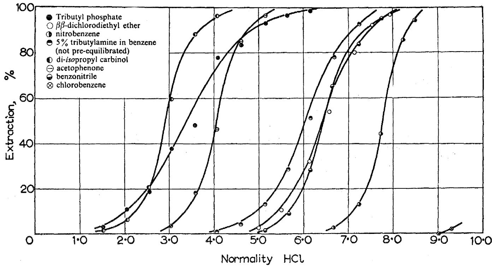  
Fig. 1. Percentage of protactinium extracted by an equal volume of the solvent from an aqueous hydrochloric acid solution as a function of the acidity of the aqueous phase. Initial concentration of protactinium-233 in the aqueous phase 4 to $6 \times 10^{-10} \mathrm{M}$ . (Goble, A. and Maddock, A. G., J. Inorg. Nucl. Chem. 7, 84 (1958).)

but diisobutyl ketone was used because it was commercially available.

Regardless of the organic solvent used, protactinium (V) exhibits its highest distribution coefficients from strongly acid aqueous media, consistent with its existence in aqueous solution as a complex anion. In this respect, it resembles most of the elements of groups IVa and Va of the Periodic Table. Thorium and uranium, which can be extracted from solutions of low acidity with the aid of salting agents, can, therefore, be easily separated.

In this laboratory, solvent extraction of protactinium has been largely confined to disobutyl carbinol diluted with kerosene or benzene, primarily because of the extremely high distribution coefficients, capacity, and decontamination attainable with this solvent.

The author does not subscribe to the hypothesis of a soluble but inextractable species of protactinium29. In numerous extractions of solutions containing both traces and milligrams of protactinium per milliliter, no such phenomenon has been observed so long as the protactinium was in true solution and fluoride ion was absent. A transient species, preliminary to hydrolysis, remains a possibility.

The following conditions have yielded apparently inextractable protactinium: (a) the "protactinium" was actually actinium-227 and its decay products; (b) fluoride ion was present; (c) the solution was colloidal; (d) interfering elements (e.g., niobium and iron) were present in large amounts and were preferentially extracted; (e) the organic

solvent was excessively soluble in the aqueous phase (usually due to insufficient diluent); and (f) there was insufficient sulfuric acid or hydrochloric acid to complex both protactinium and the impurities.

It has been suggested that a polymer of protactinium alone or of protactinium with niobium $^{26,30}$ renders the protactinium inextractable or reduces the distribution coefficient. Such a suggestion is untenable unless the polymer is regarded as the precursor of a colloid or a precipitate. As has been stated previously, aqueous solutions (other than sulfate or fluoride solutions) containing macro amounts of protactinium invariably yield precipitates after a period of time varying from a few hours to several weeks $^{17, 19}$ .

It is significant to note that, whenever protactinium is extracted from an acid phase containing only hydrochloric or nitric acid, investigators report that the extractions are carried out soon after dissolution of the protactinium [or after addition of fluoride-complexing cations such as aluminum (III) or boron (III)]. Aging of these solutions increases the percentage of the "inextractable species", a behavior consistent with slow hydrolysis and formation of a colloid.

The addition of sulfuric acid, originally recommended by Moore30 to break a "nonextractable complex of niobium-proctinium oxalate", has been found to be necessary for the complete extraction of protactinium by disobutyl carbinol even in the absence of niobium15. The precise conditions required have not yet been fully determined,

but an aqueous phase containing $9\mathrm{N}\mathrm{H}_2\mathrm{SO}_4 - 6\mathrm{N}$ HCl has been useful for all protactinium concentrations and degrees of purity. Solutions containing up to $20\mathrm{mg / ml}$ . of protactinium in disobutyl carbinol have been prepared.

The extraction of protactinium-233 from nitric acid by disobutyl carbinol has been examined, and high decontamination factors for uranium, thorium, zirconium, niobium, and rare earths are reported33.

Tributyl phosphate extraction of protactinium from hydrochloric acid $^{29}$ and from nitric acid $^{17}$ has been studied. Dibutyl phosphate diluted with dibutyl ether extracted protactinium-233 quantitatively from an equal volume of $1 \, \text{M} \, \text{HNO}_3$ containing $2\% \, \text{H}_2\text{C}_2\text{O}_4$ $^{34}$ . Long-chain amines extract protactinium from strong HCl solutions $^{31}$ .

The effect of HF on the extraction of protactinium from HCl by diisopropyl carbinol is shown in Figure $2^{29}$ . Since the extraction of niobium is not inhibited by HF, separation of protactinium is obtained if the niobium is extracted from $6\textbf{M}\textbf{H}_2\textbf{SO}_4$ containing $0.5\textbf{M}\textbf{HF}$ . Protactinium remains in the aqueous phase32.

# 7. Ion Exchange Behavior of Protactinium

A series of anion exchange studies by Kraus and Moore, using protactinium-233 and Dowex-1 resin, has provided distribution coefficients $^{34}$ , a separation from zirconium, niobium, and tantalum $^{35}$ , a separation from iron $^{36}$ , and a separation from thorium and uranium $^{37}$ . (Figures 3,4,5.)

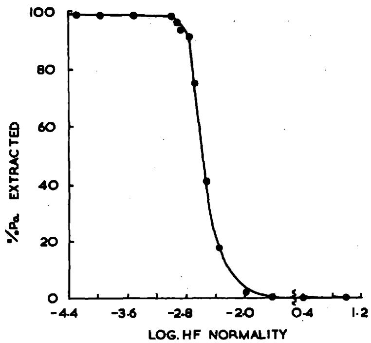  
Fig. 2. Effect of HF on solvent extraction of Pa from hydrochloric acid (shown for di-isopropylcarbinol and 5.79 N HC1). (Nairn, J. S., Collins, D. A., McKay, H. A. C., and Maddock, A. G., Second U. N. Intl. Conf. on Peaceful Uses of Atomic Energy, A/CONF.15/P/1458).

Typically, the feed solution is $9\underline{\mathbf{M}}$ in HCl, from which $\mathrm{Pa}(V)$ is strongly adsorbed by Dowex-1, along with Fe, Ta, Nb, Zr, and U(IV or VI). Thorium is only weakly adsorbed and appears in the feed effluent.

The elutrant is a mixture of HCl and HF, the concentrations of each depending upon the separation required. Zirconium (IV) and Pa(V) are eluted with 9 M HCl-0.004 M HF, with the Zr preceding the Pa. Niobium(V) is eluted with 9 M HCl-0.18 M HF. Tantalum(V) is eluted with 1 M HF-4 M NH₄Cl. Iron(III), U(IV), and U(VI) remain adsorbed when Pa(V) is eluted with 9 M HCl-0.1 M HF. They are subsequently eluted in dilute HCl.

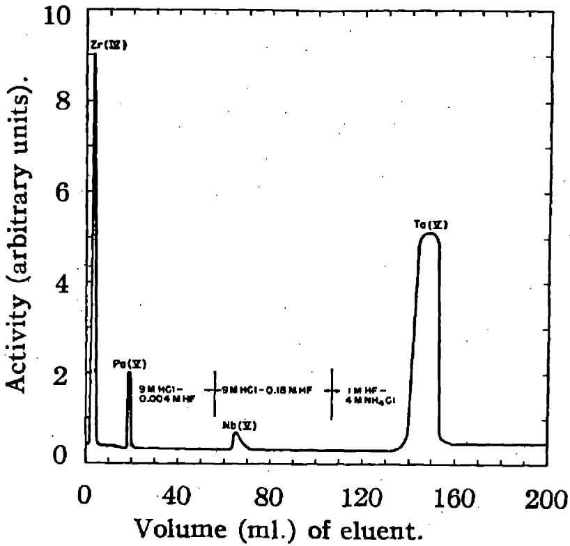  
Fig. 3. Separation of zirconium(IV), protactinium(V), niobium(V) and tantalum(V) by anion exchange: 6-cm. Dowex-1 column, 0.32-sq.-cm. cross-sectional area, average flow rate 0.2 ml. min.-1 cm.-2. (Kraus, K. A. and Moore, G. E., J. Am. Chem. Soc. 73, 2900-2 (1951).)

Zirconium and protactinium can be separated by elution with HCl alone $^{38,39}$ . Both elements are feebly adsorbed from HCl solutions below $5\underline{\mathbf{M}}$ , but strongly adsorbed above $9\underline{\mathbf{M}}$ HCl. From Amberlite IRA-400 resin, at least 95 per cent of the $\mathrm{Zr(IV)}$ is eluted with 6-7 $\underline{\mathbf{M}}$ HCl in about six column volumes with not more than 0.1 per cent of the $\mathrm{Pa(V)}$ . The latter is eluted in small volume with HCl below $3\underline{\mathbf{M}}$ . (Figure 6) Relatively few elements are adsorbed on anion exchange resins from strong HCl solutions, or if adsorbed, eluted by strong HCl containing small amounts of fluoride. Prot-

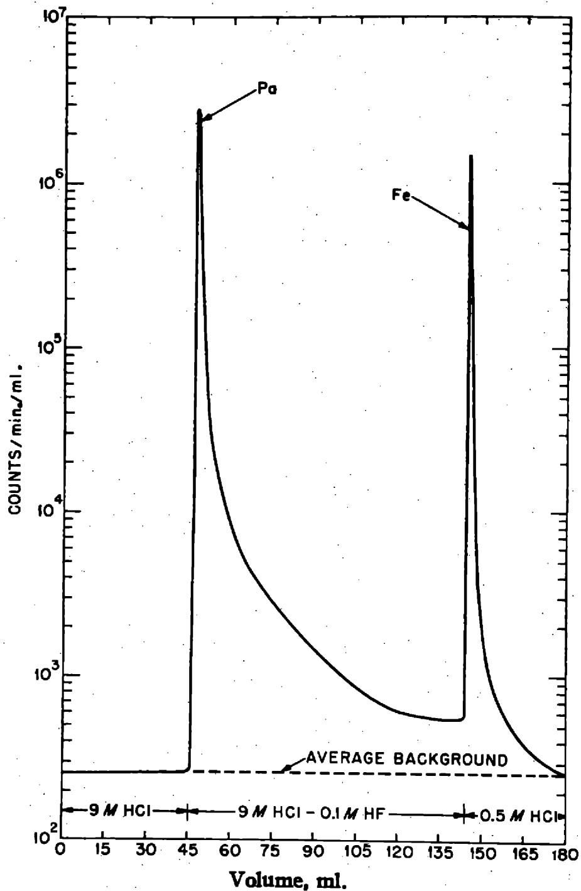  
Fig. 4. Separation of Pa(V) and Fe(III) with HCl-HF mixtures. (5-cm. column, flow rate 2.5 cm./min.). (Kraus, K. A., and Moore, G. E., J. Am. Chem. Soc. 77, 1383 (1955).)

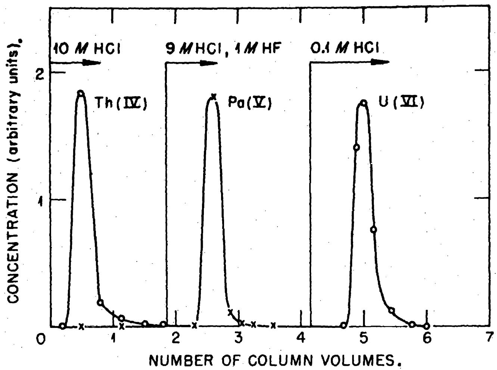  
Fig.5. Separation of Th(IV), Pa(V), and U(VI). (Kraus, K. A., Moore, G. E., and Nelson, F., J. Am. Chem. Soc. 78, 2692-5 (1956).)

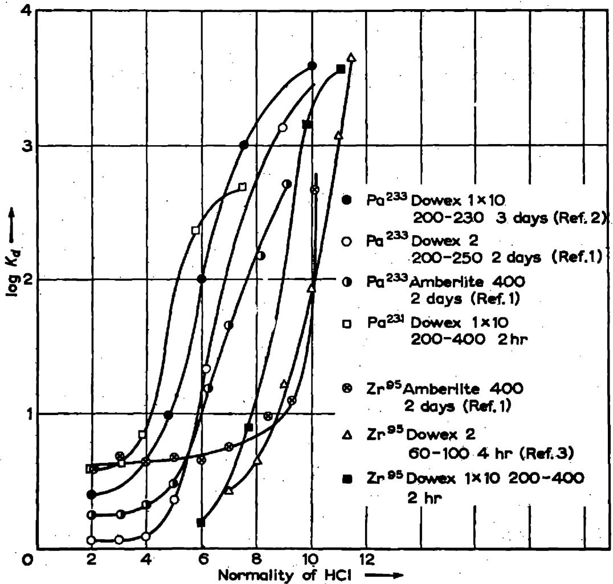  
Fig. 6. Relation between distribution coefficient $K_{d}$ and molarity of hydrochloric acid for $\mathrm{Pa^{231}}$ and $\mathrm{Zr^{95}}$ on different anion-exchange resins. (Kahn, S. and Hawkins, D. E., J. Inorg. Nucl. Chem. 3, 155-6 (1956).)

actinium(V) in trace amounts can, therefore, be purified to a considerable extent by this method. The protactinium eluted in solutions containing HF can be resorbed if $\mathsf{HBO}_3$ or $\mathsf{AlCl}_3$ is added to complex the fluoride $^{40}$ .

Hardy and co-workers17 have studied the ion exchange of $10^{-5}$ M protactinium from $\mathsf{HNO}_3$ solutions in batch experiments with ZeoKarb 225 cation resin and DeAcidite FF anion resin in the $\mathsf{H}^+$ and $\mathsf{NO}_3^-$ forms, respectively (Figures 7

and 8). Equilibrium between the cation resin and $6 \underline{\underline{M}}$ HNO $_3$ was reached within 15 minutes, about 73 per cent of the protactinium being adsorbed. About 95 per cent of the protactinium was adsorbed on the anion resin after one to two hours. The same investigators found that, from a $10^{-5}$ M protactinium solution in $0.01 \underline{\underline{M}}$ HF-6 $\underline{\underline{M}}$ HNO $_3$ 16 per cent of the protactinium was adsorbed on ZeoKarb 225 cation resin and 75 per cent on DeAcidite FF anion resin.

On the other hand, the author15 has found that $10^{-5} \underline{\mathbf{M}}$ protactinium-231 in $0.05 \underline{\mathbf{M}}$ HF-1 $\underline{\mathbf{M}}$ HNO3 or in $0.004 \underline{\mathbf{M}}$ HF-0.04 $\underline{\mathbf{M}}$ HNO3 passes freely through a column of Dowex-50 cation resin. Whereas the decay products, actinium-227, thorium-227, and radium-223, are quantitatively adsorbed, more than 99.5 per cent of the protactinium-231 appears in the effluent.

# 8. Miscellany

Paper Chromatography: The $R_{f}$ value of protactinium(V) increases with increasing HCl concentration when the chromatogram is developed with a mixture consisting of 90 parts acetone and 10 parts $\mathrm{HCl} + \mathrm{H}_{2}\mathrm{O}$ 41. Evidence for a soluble form of protactinium-233 in alkaline solution is based on its movement on filter paper developed with 1 N KOH and its slow migration toward the anode in paper electrophoresis with 1 N KOH as the electrolyte 42. Paper chromatographic separations of protactinium from tantalum, niobium, titanium, bismuth, iron, and polonium have been made by varying the elution mixture, butanol-HF-HCl- $\mathrm{H}_{2}\mathrm{O}$ with respect to the HCl or HF concentration 43.

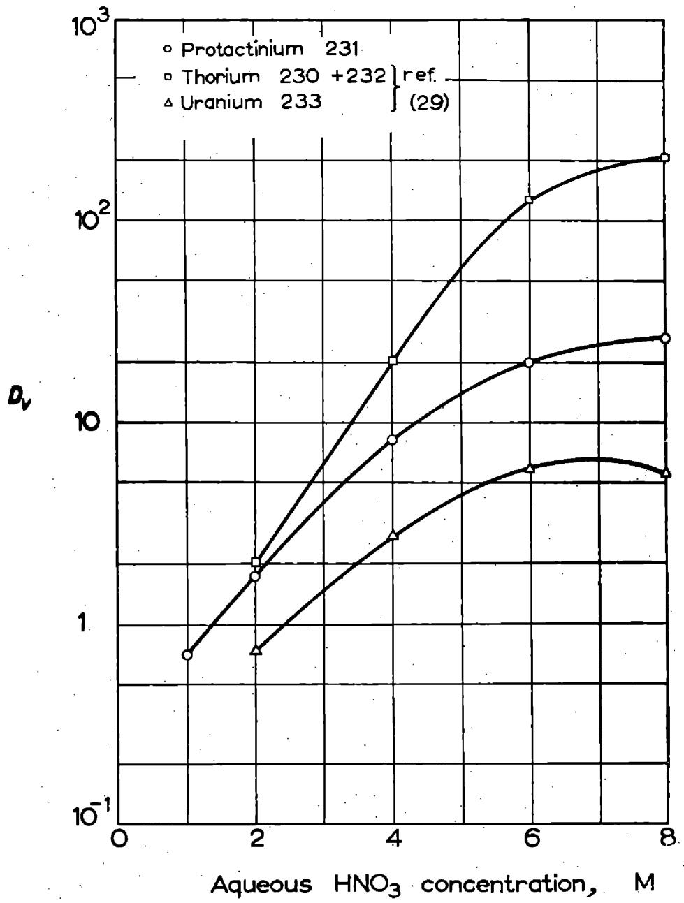  
Fig. 7. Adsorption of thorium(IV), protactinium(V), and uranium (VI), on DeAcidite FF resin. (Hardy, C. J., Scargill, D., and Fletcher, J. M., J. Inorg. Nucl. Chem. 7, 257-75 (1958).)

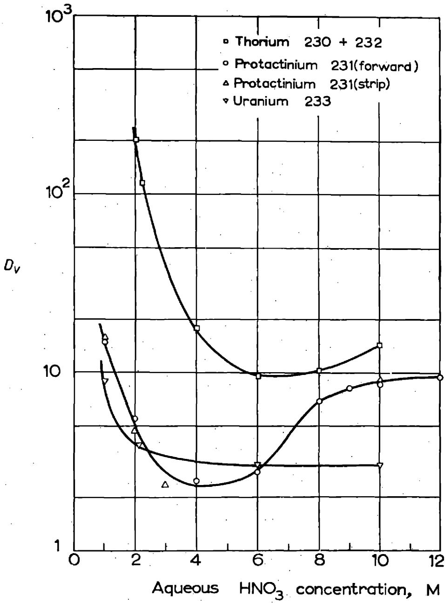  
Fig. 8. Adsorption of thorium(IV), protactinium(V), and uranium (VI), on ZeoKarb 225 resin. (Hardy, C., Scargill, D., and Fletcher, J., M., J., Inorg. Nucl. Chem. 7, 257-75 (1958).)

Electrochemistry: The spontaneous electrodeposition of protactinium from HF and $\mathrm{H}_2\mathrm{SO}_4$ solutions on various metals has been studied44, 45, 46. The critical potential for cathodic deposition of protactinium by electrolysis of neutral fluoride solutions is -1.20 volts with respect to the hydrogen electrode13,47.

Spectrophotometry: The absorption spectra of solutions containing 0.006 mg./ml. protactinium in varying concentrations of HCl have been examined by Maddock and his

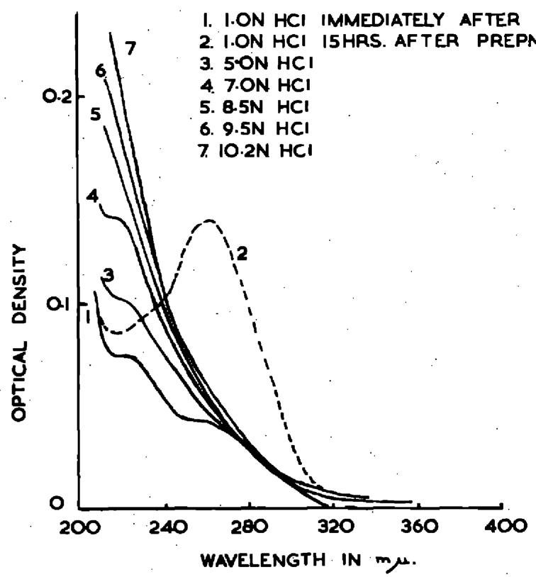  
Fig. 9. Absorption Spectra of protactinium in hydrochloric acid solutions. (Nairn, J. S., Collins, D. A., McKay, H. A. C., and Maddock, A. G., Second U. N. Intl. Conf. on Peaceful Uses of Atomic Energy, A/CONF.15/P/1458).

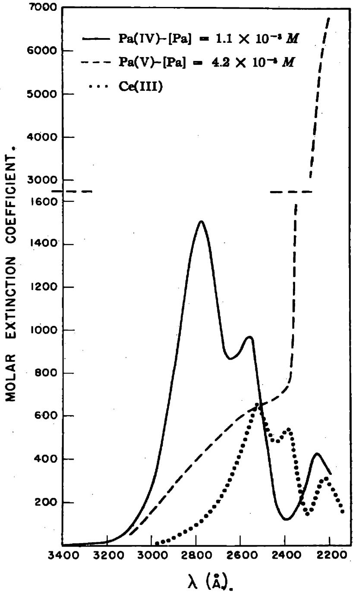  
Fig. 10. Absorption spectrum of $\mathrm{Pa(IV)}$ in 1 HCl. (Fried, S. and Hindman, J. C., J. Am. Chem. Soc. 76, 4863-4 (1954).)

co-workers $^{19,28}$ . They report that the onset of hydrolysis and disappearance of the solvent extractability of protactinium coincide with the appearance of an absorption band with its maximum at 260 mu. (Figure 9). In 2.4 - 11.8 M HClO $_4$ containing about $10^{-5}$ M protactinium(V), a weak peak at 210 mu. disappeared in eight to ten days $^{48}$ . A peak at 213 mu. was observed for 0.7 - 4 M H $_2$ SO $_4$ containing 4 x $10^{-5}$ M protactinium(V); in 6.5 M H $_2$ SO $_4$ the peak was displaced to 217.5 mu, and, in 9 - 18 M acid, it was resolved into two components at about 212.5 and 220 mu. The absorption spectrum of protactinium(IV) in 1 M HCl is shown in Figure 10 $^{49}$ (Also see reference 50).

Dry Chemistry: Protactinium metal, PaO, PaO₂, Pa₂O₅, PaH₃, PaF₄, PaCl₄, and PaOS have been prepared on a 50 - 100 microgram scale and the compounds identified by x-ray analysis12. Most of the compounds were found to be isostructural with the analogous compounds of uranium.

The extraction of protactinium tracer from solid $\mathrm{ThF}_4$ by fluorine and other gases was investigated under a variety of conditions51.

# IV. DISSOLUTION OF PROTACTINIUM SAMPLES

Protactinium-233 or protactinium-231 made by neutron irradiation of Th-232 or Th-230 offers no special problem other than that of dissolving the thorium. Concentrated $\mathrm{HNO}_3$ containing 0.01 M HF will dissolve thorium without rendering it passive[52]. The HF also insures the solubility of protactinium.

In the case of $\mathsf{Pa}^{231}$ from natural sources, the variety of these sources defies any attempt to offer a general dissolution procedure. Typically, residues from processes for recovering uranium and/or radium contain oxides of Si, Fe, Pb, Al, Mn, Ca, Mg, Ti, and Zr, and a random selection of trace elements which are usually more abundant than protactinium. Virgin pitchblende or other uranium ores will contain other elements as well, usually in a refractory condition.

Hahn and Meitner53 mixed a siliceous residue with $\mathsf{Ta}_2\mathsf{O}_5$ and fused the mixture with $\mathsf{NaHSO}_4$ . After washing the cooled melt with water, they dissolved the Pa and Ta in HF.

Pitchblende was digested with a mixture of $\mathrm{HNO}_3$ and $\mathrm{H}_2\mathrm{SO}_4$ , and the digestion liquor was treated with $\mathrm{Na}_2\mathrm{CO}_3^{54}$ . The protactinium in the carbonate precipitate remained insoluble when the carbonates were dissolved in excess $\mathrm{HNO}_3$ . When the washed residue from the $\mathrm{HNO}_3$ treatment was digested with a mixture of HF and $\mathrm{H}_2\mathrm{SO}_4$ at an elevated temperature, over $90\%$ of the protactinium went into solution, while the bulk of the residue remained insoluble.

A siliceous material consisting mainly of lead, barium, and calcium sulfates was digested with $60\%$ oleum, and the sulfates dissolved. The siliceous residue, containing the protactinium, was separated and dissolved in HF. Alternatively, the original material was attacked with $40\%$ HF, dissolving the Pa and leaving the heavy-metal sulfates as residue21.

Depending upon the amount of material to be processed, alkaline fusions are sometimes useful in separating large amounts of silica, etc., while leaving the Pa insoluble.

In general, the following treatments can be recommended, in the order given:

1. Digest the material with strong HCl to remove Fe.   
2. Digest the residue from the HCl treatment with hot, concentrated $\mathsf{H}_2\mathsf{SO}_4$   
3. Digest the residue from the $\mathsf{H}_2\mathsf{SO}_4$ treatment with $25 - 48\%$ HF or a mixture of HF and $\mathsf{H}_2\mathsf{SO}_4$ .   
4. Digest the residue with a hot mixture of HNO₃ and H₂SO₄.   
5. Digest the residue with hot $40 - 50\%$ NaOH.   
6. Fuse the residue with $\mathrm{Na}_2\mathrm{CO}_3$ , NaOH, KOH, or KHSO4.

Throughout the dissolution, the fractions should be examined by gamma-ray spectrometry, as the 27 kev peak of protactinium-23l is unique and distinctive (Figure 11).

While $\mathsf{Pa}^{233}$ has sometimes been used as a tracer to follow the course of the $\mathsf{Pa}^{231}$ dissolution $^{21}$ , it is doubtful that isotopic exchange takes place to a great extent between a refractory solid and a tracer-containing solution.

# V. COUNTING TECHNIQUES

# 1. Protactinium-233

Protactinium-233 decays by beta emission, with a half-life of 27.0 days, to uranium-233, an alpha emitter with a half

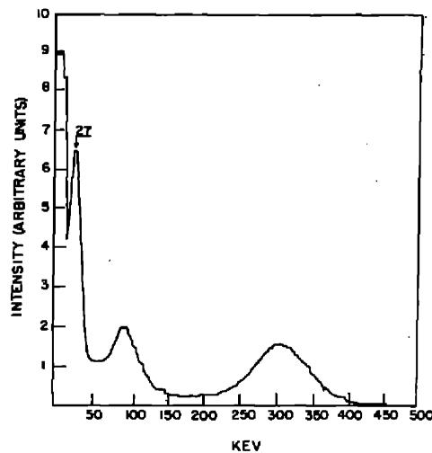  
Fig. 11. Gamma spectrum of protactinium-231. (Kirby, H. W., unpublished.)

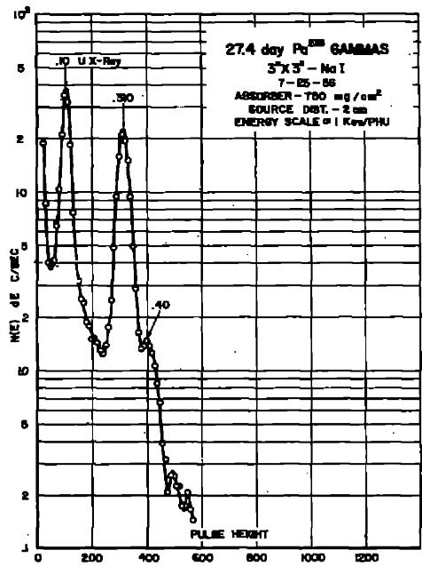  
Fig. 12. Gamma spectrum of protactinium-233. (Heath, R. L., U. S. Atomic Energy Comm. Report ID0-16408, July 1, 1957)

life of 1.62 x 105 years47. The principal beta energies in mev are: 0.15 (37 per cent), 0.257 (58 per cent), and 0.568 (five per cent)55. The gamma spectrum is shown in Figure 1256.

In most work, only relative values of protactinium-233 are needed, hence the counting problems are essentially the same as with other relatively weak beta-emitters; self-absorption, geometry, and backscattering must be carefully controlled. For the absolute determination of pure protactinium-233, a method based on its growth from neptunium-237 has been suggested $^{57}$ . Here, a highly purified sample of neptunium-237 is electrodeposited and allowed to decay. The beta-counting rate of protactinium-233 is compared with the alpha-counting rate of neptunium-237 and the counting efficiency calculated from the theoretical growth curve. Alternatively, the neptunium-237 may be permitted to decay to secular equilibrium, when the disintegration rates of the two isotopes are equal.

A simpler and more versatile method $^{58}$ consists of standardizing a scintillation gamma counter with a solution of purified protactinium-233 whose disintegration rate has been determined in a $4\pi$ beta counter. A scintillation spectrometer is useful for identifying and determining protactinium-233 in the presence of other activities. Correction for interference by Compton conversion electrons must be made if more energetic gamma rays are present.

# 2. Protactinium-231

Protactinium-231 decays by alpha emission to actinium-227, also an alpha emitter (Table II). The half-life has been

reported to be 34,300 years $^{59}$ , and 32,000 years $^{22}$ . A recent calorimetric measurement on approximately 0.5 gram of protactinium pentoxide $^{15}$ yielded a value of 32,480 ± 260 years.

Protactinium-231 has ten groups of alpha particles, of which 43 per cent have energies below 5.0 mev. This fact, combined with its low specific activity (about $50~\mathrm{mc / g}$ ), makes protactinium-231 alpha counting especially susceptible to self-absorption. Care must be taken to keep the radioactive deposit as thin as possible. A higher degree of counting precision is attainable with a proportional alpha counter than with either a parallel-plate air-ionization counter or a zinc sulfide scintillation counter.

Ideally, the alpha plateau should be determined individually for each sample, but this is a tedious and time-consuming procedure. The following mounting and counting technique has been found to give high alpha-counting precision15:

Transfer one ml. or less of a fluoride solution of protactinium-231 to a platinum or gold plate, or to a stainless steel disk coated with a thin plastic film (a clear plastic spray coating or a dilute colloid solution is convenient for this purpose). Evaporate the solution to dryness under an infrared lamp, tilting the plate as necessary to retain the solution in the center of the plate. Cool the plate and cover the residue with one ml. of $0.1\ \underline{\mathbf{N}}\ \underline{\mathbf{HNO}}_3$ . Add one drop of concentrated $\mathrm{NH}_4\mathrm{OH}$ and again evaporate the solution to dryness. Lower the lamp sufficiently to drive off all the $\mathrm{NH}_4\mathrm{NO}_3$ , and ignite the plate

over a flame until the organic coating has burned off (or, if gold or platinum was used, ignite to just below red heat).

Determine the alpha plateau of the proportional counter by counting a standard alpha source $(\mathrm{Pu}^{239}$ , radium D-E-F, or $\mathrm{Po}^{210}$ ) at 50-volt intervals. At the high-voltage end of the alpha plateau, count a sample of $\mathrm{Sr}^{90}/\mathrm{Y}^{90}$ at 25-volt intervals, and find the voltage below which only 0.01 per cent of the betas are counted. The protactinium-231 sample can be counted at this point with good precision and no significant interference from beta emitters.

A gamma-ray scintillation spectrometer is virtually a necessity in modern work with protactinium-231. The 27, 95, and 300 kev photopeaks (Figure 11) are characteristic, and the 27 kev peak in particular is unique in the gamma spectra of the naturally occurring radioisotopes. (Compare Figures 13 through 16.)

The sensitivity of this method of detection is shown in Figure 17, where 0.2 ppm of protactinium-23l is positively identified in a uranium refinery residue by the presence of the distinctive photopeak at 27 kev.

The high susceptibility of the 27 kev peak to absorption precludes its use for the quantitative determination of protactinium-23l, but it is particularly valuable in the preliminary dissolution of a raw material. The 300 kev peak is useful for quantitative work if correction is made for the contribution of decay products and other gamma-active materials.

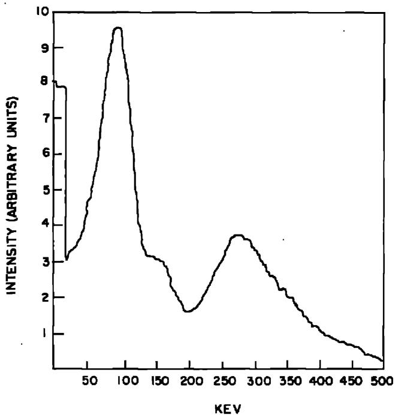  
Fig. 13. Gamma spectrum of actinium-227 in equilibrium. (Kirby, R. W., unpublished.)

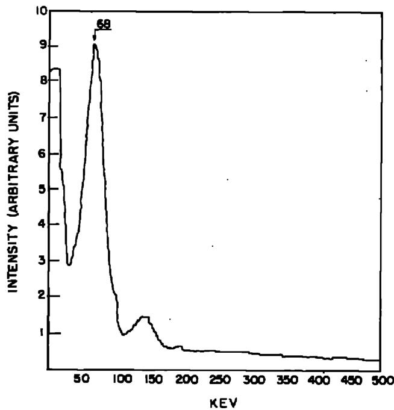  
Fig. 14. Gamma spectrum of thorium-230 (ionium). (Kirby, H. W., unpublished.)

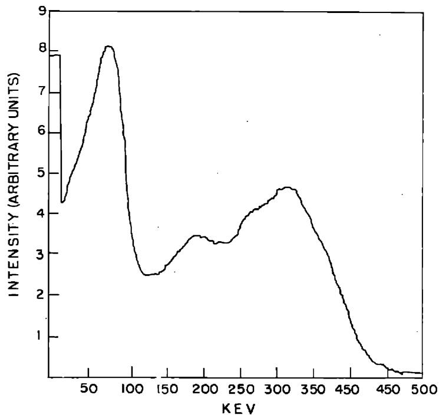  
Fig. 15. Gamma spectrum of radium-226 in equilibrium. (Kirby, H. W., unpublished.)

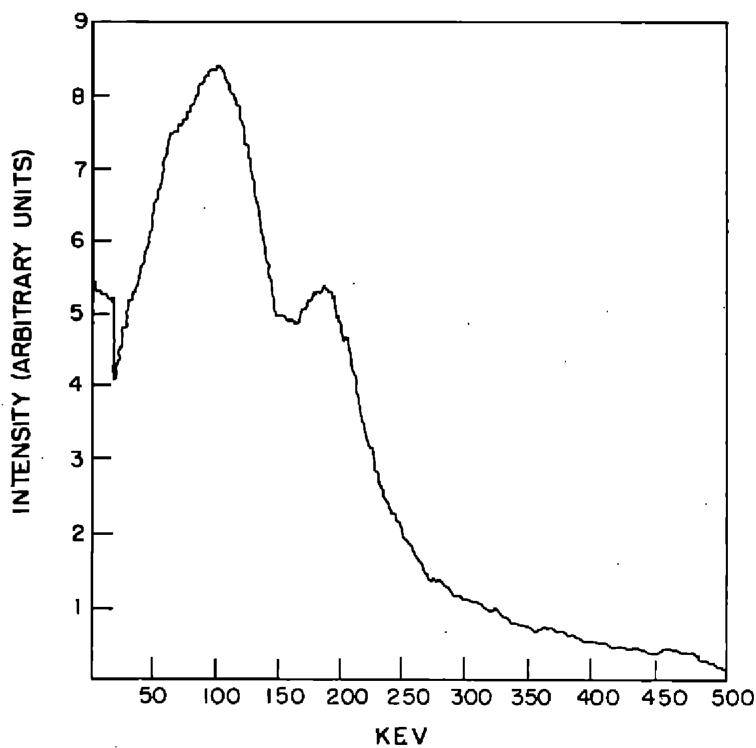  
Fig. 16. Gamma spectrum of uranium-235/238. (Kirby, H. W., unpublished.)

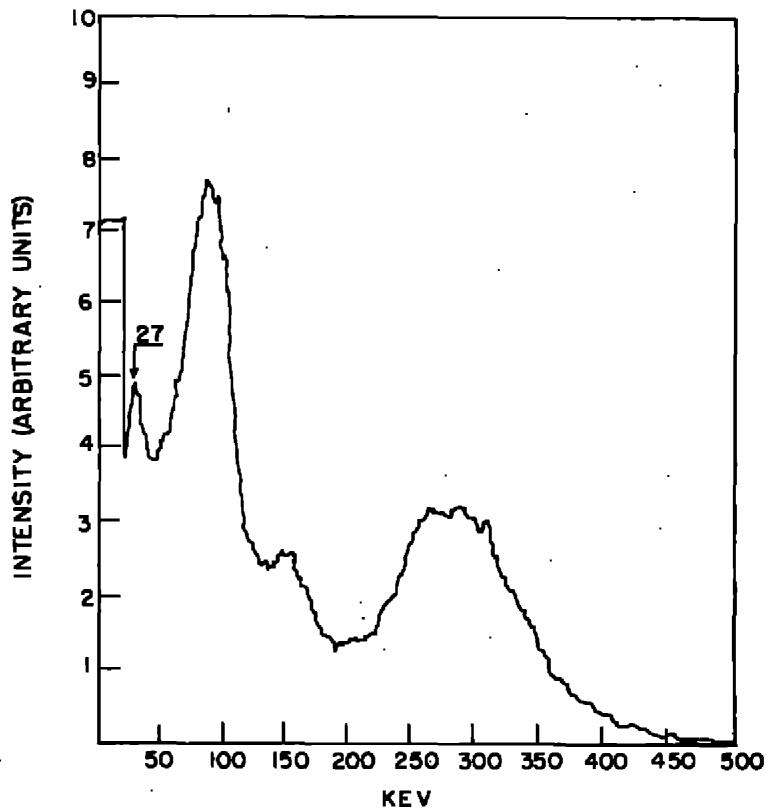  
Fig. 17. Gamma spectrum of raw material (uranium refinery residue.) (Kirby, H. W., unpublished.)

# VI. DETAILED RADIOCHEMICAL PROCEDURES FOR PROTACTINIUM

# Procedure 1

"Preparation of carrier-free protactinium-233", according to J. Golden and A. G. Maddock, J. Inorg. Nucl. Chem. 2, 46 (1956) Protactinium-233 was prepared by the neutron irradiation of samples of acid-insoluble thorium carbonate. This material, of uncertain composition, is reasonably thermally stable, but completely soluble in dilute $\mathrm{HNO}_3$ and HCl. After irradiation the material was dissolved in $8\mathrm{N}$ HCl and extracted with diisopropyl ketone (DIPK). The extract was treated with $2\mathrm{N}$ HCl, when the Pa passed back to the aqueous layer. The aqueous

# Procedure 1 (Continued)

extract was then made $8\mathbb{N}$ again and the extraction repeated. The protactinium was kept in solution in $8\mathrm{N}$ HCl in a polyethylene vessel. It was observed that losses by adsorption quickly took place on the walls of glass containers even with solutions of the chloride complex in DIPK.

Better recoveries were obtained if the irradiated carbonate was dissolved in $8\mathrm{N}$ HF. This solution was nearly saturated with $\mathrm{AlCl}_3$ before the first solvent extraction. The subsequent separation followed the first procedure. Neither product contained detectable amounts of thorium.

(Reviewer's Note: - Irradiation of one gram of Th $^{232}$ at $10^{13}\mathrm{n/cm}^2$ -sec. for one day will produce 0.25 curie of Pa $^{233}$ .)

# Procedure 2

Preparation of carrier-free protactinium-233, according to F. Hagemann, M. H. Studier, and A. Ghiorso, U. S. Atomic Energy Comm. Report CF-3796 (1947), as quoted by Hyde (6)

The bombarded Th metal was dissolved in concentrated $\mathsf{HNO}_3$ , using a small amount of $\mathbf{F}^{-}$ as a catalyst. The aqueous solution was salted with $\mathsf{Ca(NO_3)_2}$ to give solutions of $2.5\mathsf{M}$ $\mathsf{Ca(NO_3)_2}$ , $1\mathsf{M}\mathsf{HNO}_3$ , and $0.42\mathsf{M}\mathsf{Th(NO_3)_4}$ . The bulk of the $\mathsf{U}^{233}$ was removed by ether extraction, following which $\mathsf{Pa}^{233}$ was isolated by diisopropyl ketone extraction. Further purification was obtained by three $\mathsf{MnO}_2$ cycles in which $1\mathsf{mg/ml}$ of $\mathsf{MnO}_2$ was successively precipitated from $\mathsf{HNO}_3$ solution and redissolved in $\mathsf{HNO}_3$ in the presence of $\mathsf{NaNO}_2$ . After the third cycle the

# Procedure 2 (Continued)

solution was made $3.5 \mathrm{M} \mathrm{Ca}(\mathrm{NO}_3)_2$ and $1 \mathrm{M} \mathrm{HNO}_3$ and was extracted with ethyl ether again to effect complete removal of uranium. The protactinium was again coprecipitated on $\mathrm{MnO}_2$ , dissolved in concentrated HCl, and diluted to an acidity of $0.05 \mathrm{M}$ ; the protactinium was extracted into a $0.15 \mathrm{M}$ solution of thenoyl-trifluoroacetone in benzene.

# Procedure 3

Preparation of carrier-free protactinium-233, according to W. W. Meinke, U. S. Atomic Energy Comm. Reports AECD-2738 and AECD-2750 (1949) as quoted by Hyde (6) The bombarded thorium-metal target is dissolved in concentrated $\mathsf{HNO}_3$ , using $0.01\texttt{M} (\mathsf{NH}_4)_2\mathsf{SiF}_6$ as a catalyst. The solution is diluted to approximately $4\texttt{N}\mathsf{HNO}_3$ and a thorium concentration less than $0.65\texttt{M}$ . Then $\mathsf{Mn}^{++}$ in excess and $\mathsf{KMnO}_4$ are added to precipitate $1.5\text{mg/ml}$ $\mathsf{MnO}_2$ to carry the protactinium. The $\mathsf{MnO}_2$ is dissolved in a small amount of $4\texttt{M}\mathsf{NH}_2\mathsf{OH}$ . The $\mathsf{MnO}_2$ is reprecipitated and redissolved three times to reduce the final solution volume to a few milliliters. After it is made $6\texttt{M}$ HCl or $\mathsf{HNO}_3$ , it is extracted with two to three volumes of diisopropyl ketone. The ketone phase is washed three times with $1\texttt{M}$ $\mathsf{HNO}_3$ and $3\texttt{M}\mathsf{NH}_4\mathsf{NO}_3$ wash solution. The protactinium is finally stripped out into $0.1\texttt{M}\mathsf{HNO}_3$ . The protactinium left behind is recovered by using fresh ketone to repeat the extraction cycle. All $0.1\texttt{M}\mathsf{HNO}_3$ re-extraction solutions are combined, made $6\texttt{M}$ $\mathsf{HNO}_3$ , and contacted with an equal volume of $0.4\texttt{M}$ thenoyltrifluoroacetone (TTA) in benzene. The benzene solution of protactinium-TTA complex is washed with $6\texttt{M}\mathsf{HNO}_3$ once.

# Procedure 4

Preparation of carrier-free protactinium-233, according to Max. W. Hill (Thesis), U. S. Atomic Energy Comm. Report UCRL-8423 (August, 1958)

The targets were either Th metal or ThCl₄ powder, some of which was converted to ThO₂ during the bombardments.

Concentrated HCl-0.01 M HF was used for dissolving relatively small amounts of powder. Thorium metal was dissolved in concentrated HCl - 0.2 M HF. The fluoride was complexed by the addition of borax (Na $_2$ B $_4$ O $_7\cdot$ 10 H $_2$ O) or AlCl $_3$ before the solution was passed through the column.

The column was $3\mathrm{mm}$ . in diameter and was filled to a height of $55\mathrm{mm}$ . with Dowex-1 anion-exchange resin. The column volume, defined as the number of drops required for a band to traverse the length of the resin column, was 5-6 drops.

In 10 M HCl solutions, Pa(V), Zr(IV), and Nb(V) stick to the resin, while Th(IV) passes through with the other alpha emitters below Pa in the periodic table.

With 6 M HCl as the eluting agent, Zr(IV) is rapidly stripped off in a few column volumes, without loss of Pa(V) or Nb(V). The Pa is then eluted in 9.0 M HCl-0.1 M HF. The Nb(V) is eluted in 1-4 M HCl.

The 9.0 M HCl - 0.1 M HF solution containing the Pa was contacted with an equal volume of disopropyl ketone (DIPK). Under these conditions, such species as Fe(III) and Po(IV) extract quantitatively into the DIPK along with appreciable

# Procedure 4 (Continued)

amounts of Sn(IV), Nb(V), and others. Protactinium(V) extracts to the extent of less than $0.4\%$ .

The solvent phase was discarded, and borax or anhydrous $\mathrm{AlCl}_3$ was added to the aqueous phase. (Although $\mathrm{AlCl}_3$ seemed to have slightly better complexing characteristics, it appeared to be appreciably soluble in DIPK, and excess quantities in solution gave voluminous precipitates.)

The aqueous phase was then contacted with an equal volume of fresh DIPK. Under these conditions, Pa(V) is extracted quantitatively by the solvent phase, separating it from Th(IV), Ti(IV), V(V), Zr(IV), U(VI), and other species. The Pa was then re-extracted from the solvent phase into an equal volume of 2.0 M HCl.

To remove all extraneous mass and reduce the volume to a very few drops, the solution containing the Pa was then made approximately 10 M in HCl and passed through a small anion resin column (3 mm. in diameter, 12 mm. in height). After being washed with 10 M HCl, the Pa was eluted with 2.7 M HCl. The third through sixth drops contained more than 90 per cent of the protactinium.

# Procedure 5

Determination of protactinium-233, according to

F. L. Moore and S. A. Reynolds

Anal. Chem. 29, 1956 (1957)

1. The sample drawn from the process should immediately be adjusted to $6\mathrm{M}$ HCl or greater. Add an aliquot of suitable

# Procedure 5 (Continued)

counting rate to a separatory funnel or 50-ml. Lusteroid tube. Adjust the aqueous phase to $6\texttt{M}$ HCl- $4 \%$ $\mathrm{H}_2\mathrm{C}_2\mathrm{O}_4$ . (If the original sample contains Th, omit the $\mathrm{H}_2\mathrm{C}_2\mathrm{O}_4$ in the original aqueous phase and perform the extraction from $6\texttt{M}$ HCl. Wash the diisobutyl carbinol (DIBC) phase (see next step) for 1 to 2 minutes with an equal volume of $6\texttt{M}$ HCl before beginning the three scrubs of $6\texttt{M}$ HCl- $4 \%$ $\mathrm{H}_2\mathrm{C}_2\mathrm{O}_4$ ).

2. Extract for 5 minutes with an equal volume of DIBC (previously treated for 5 minutes with an equal volume of 6 M HCl).

3. After the phases have disengaged, draw off and discard the aqueous phase. Scrub the organic phase for 5 minutes with an equal volume of wash solution (6 M HCl - 4% H₂C₂O₄). Repeat with two additional scrubs of the organic phase. Draw the organic phase into a

50-ml. Lusteroid tube, centrifuge for 1 minute, and draw off an aqueous phase which appears in the bottom of the tube, being careful not to lose any of the organic phase. (In many samples, an aliquot of the organic phase may be taken at this stage for counting. Only if a substantial activity of Nb, Sb, or free $\mathrm{I}_2$ is present is it necessary to strip the organic phase.)

4. Strip the organic phase by extracting for 3 minutes with an equal volume of $6 \, \text{M} \, \text{H}_2\text{SO}_4 - 6 \, \text{M} \, \text{HF}$ . Allow the phases to disengage, centrifuge for 1 minute, and draw off most of the organic phase, being careful not to lose any of the aqueous

# Procedure 5 (Continued)

phase. Add an equal volume of DIBC and extract for 3 minutes. Centrifuge for 1 minute and draw off most of the organic phase, being careful not to lose any of the aqueous phase. Centrifuge for 1 minute.

5. Pipet suitable aliquots of the aqueous phase for $\mathsf{Pa}^{233}$ counting. The expected yield is $97 - 98\%$ .

The following table is given by the authors:

Per Cent Extracted by DIBC from 6 M HCl-4% H $_2$ C $_2$ O $_4$

<table><tr><td>Pa233</td><td>Nb95</td><td>Zr95</td><td>Eu152-4</td><td>U233</td><td>Ru106</td><td>Th232*</td></tr><tr><td>99.5</td><td>0.4</td><td>0.07</td><td>0.003</td><td>0.01</td><td>0.2</td><td>&lt;0.04</td></tr><tr><td>99.6</td><td>0.5</td><td>0.13</td><td>0.003</td><td>0.04</td><td>0.3</td><td>&lt;0.04</td></tr><tr><td></td><td>0.3</td><td>0.12</td><td>0.005</td><td>0.01</td><td>0.1</td><td>&lt;0.01</td></tr><tr><td></td><td>0.3</td><td>0.11</td><td>0.003</td><td>0.02</td><td>0.2</td><td></td></tr><tr><td></td><td></td><td>0.06</td><td></td><td></td><td></td><td></td></tr></table>

* Oxalic acid omitted from original aqueous phase, values given for Th represent lower limit of detection of analytical method used.

(Reviewer's Comment: - The procedure is basically sound, but the degree of separation is affected by the concentrations of Pa and Nb. A DIBC solution containing 2.5 mg. Pa $^{231}$ and 20 mg. Nb per ml. plus a stoichiometric amount of phosphate was scrubbed with an equal volume of 6 M HCl-5% H $_2$ C $_2$ O $_4$ . The aqueous phase contained 1.5% of the Pa and 75.3% of the Nb. When the organic phase was scrubbed a second time with fresh

# Procedure 5 (Continued)

aqueous, the aqueous phase contained $92.1\%$ of the residual $\mathrm{Nb}$ and $2.3\%$ of the $\mathrm{Pa}$ .

The presence of iron also interferes significantly, presumably because of the formation of a strong oxalate complex. The concentration of oxalic acid is probably less important than the total amount relative to the amount of niobium and other oxalate-complexing cations.)

# Procedure 6

Determination of protactinium in uranium residues, according to J. Golden and A. G. Maddock, J. Inorg. Nucl. Chem. 2, 48-59 (1956)

The siliceous material consisted mainly of the sulfates of Pb, Ba, and Ca.

Two methods of opening up were used. In the first, one-gram samples were treated with $10\mathrm{ml}$ of $60\%$ oleum, and a known amount of $\mathsf{Pa}^{233}$ added to the mixture. The Pb, Ba, and Ca sulfates were dissolved, and the siliceous residue, containing the Pa, was separated and dissolved in $5\mathrm{ml}$ of $40\%$ HF.

Alternatively, it was found that the original material could be attacked with $40\%$ HF containing the $\mathsf{Pa}^{233}$ tracer, leaving the heavy-metal sulfates as residue and dissolving both $\mathsf{Pa}^{231}$ and $\mathsf{Pa}^{233}$ . (Reviewer's Comment: - It is highly questionable that isotopic exchange was complete.)

Either solution was diluted to $100 \, \text{ml}$ , and an excess of $\mathsf{BaCl}_2$ was added. The $\mathsf{BaF}_2$ precipitate was washed until no

# Procedure 6 (Continued)

obvious decrease in bulk took place. The remaining precipitate consisted presumably of fluosilicates and was dissolved in $1\mathrm{M}$ $\mathrm{Al(NO_3)_3 - 6N HNO_3}$ . The Pa was then carried down on a $\mathrm{MnO}_2$ precipitate, sufficient $\mathrm{MnCl}_2$ and $\mathrm{KMnO}_4$ solutions being added to produce about $10\mathrm{mg}$ . of precipitate per ml. of original solution. The mixture was digested at $100^{\circ}\mathrm{C}$ . for half an hour.

The resulting precipitate was separated, washed, and dissolved in $20\mathrm{ml}$ . of $7\mathrm{N}$ HCl with a trace of $\mathrm{NaNO}_2$ . Alternatively, the precipitate was leached with $10\mathrm{ml}$ . of $1\mathrm{N}$ HF.

In some analyses, the $\mathsf{MnO}_2$ stage was omitted entirely, and the fluosilicate precipitate was dissolved in 7 N HCl-1 M A1Cl3. The HCl solution from either of these three variations was extracted with an equal volume of diisopropyl ketone.

Separation from most of the polonium can be effected by reextraction from the solvent into 7-8 N HC1 - 0.5 N HF.

# Procedure 7

Determination of protactinium in uranyl solution, according to J. Golden and A. G. Maddock, J. Inorg. Nucl. Chem. 2, 46-59 (1956)

The solution was made 8 N in HC1 and 0.5 N in HF and the tracer protactinium-233 added.

Direct extraction with diisopropyl ketone removed many impurities, e.g., iron and polonium. Extraction after adding $\mathrm{AlCl}_3$ to complex the fluoride present brought the protactinium into

# Procedure 7 (Continued)

the solvent layer. Washing this layer with 8 N HCl removed those elements whose extraction had been enhanced by the presence of AlCl₃, e.g., uranium and zirconium.

Finally, the protactinium was back-extracted with 6-8 N HCl - 0.5 N HF.

The next solvent cycle avoided the use of $\mathsf{AlCl}_3$ , repeated $\mathsf{NH}_4\mathsf{OH}$ precipitation and HCl solution, or continued evaporation with HCl, being used to remove fluoride.

In either case, the efficiency of a cycle was $98\%$ or more, without repetition of any step. At the most two of these cycles were found to be sufficient to achieve radiochemical purity.

# Procedure 8

Determination of protactinium by gamma spectrometry, according to M. L. Salutsky, M. L. Curtis, K. Shaver, A. Elmlinger, and R. A. Miller, Anal. Chem. 29, 373 (1957)

1. Weigh about $5\mathrm{g}$ . of uranium residue into a vial suitable for counting in a well-type gamma scintillation spectrometer. Determine the counting rate at 300 kev.   
2. Transfer the sample to a beaker with a small amount of $\mathsf{H}_2\mathsf{O}$ , add $100~\mathsf{ml}$ . of $9\textbf{N}$ HCl and 1-2 ml. of $48\%$ HF. Heat until the sample dissolves. Add more HF, if necessary.   
3. Cool to room temperature. Add slowly, with stirring, $10 \mathrm{ml}$ . 1 N HCl containing $10 \mathrm{mg}$ . Th. Allow the mixture to

# Procedure 8 (Continued)

stand 5 minutes. Add a second $10\mathrm{mg}$ . of Th, stir, and allow the mixture to stand 5 minutes. Filter the $\mathrm{ThF}_4$ .

4. Transfer the filter paper and precipitate to the vial used for the original sample. Determine the gamma counting rate at 300 kev. Make a blank determination for the activity of the Th carrier used.   
5. Obtain the Pa gamma counting rate by difference. Compare this counting rate with that of a standard protactinium sample at 300 kev, and calculate the concentration of Pa in the uranium residue.

(Reviewer's Comment: - This procedure contains a number of fundamental errors, but, with appropriate modifications, may be useful for obtaining a rough estimate of the Pa concentration in certain types of samples.

The basic assumption of this procedure is that, under the conditions given, all of the protactinium will remain in solution, while all other radioisotopes which contribute to the 300 kev gamma-counting rate will be carried on $\mathrm{ThF}_4$ . The first part of this assumption is subject to considerable doubt; Moore and Reynolds (cited in Procedure 1) found wide variations in the behavior of protactinium in the presence of fluoride precipitates. The second part of the assumption ignores the substantial contribution of radium-223 and other radium isotopes to the 300 kev counting rate. It is unlikely that a large percentage of the radium would be carried on $\mathrm{ThF}_4$ under the conditions recommended.

# Procedure 8 (Continued)

Finally, no correction was made for the contribution to the 300 kev gamma-counting rate by decay products in the "standard sample".

The following modifications seem indicated:

1. Determine the yield by adding protactinium-233 to a separate sample at Step 2. (The yield determination must be made separately because of the 310 kev gamma ray of protactinium-233.)   
2. Add barium carrier after Step 4, and precipitate barium chloride by the addition of diethyl ether. (Moore and Reynolds found that both $\mathrm{BaCl}_2$ and $\mathrm{BaSO}_4$ carried substantial amounts of protactinium-233 in the absence of fluoride, but did not test them in fluoride solutions. The yield correction allows for the possibility that some protactinium is carried by the barium precipitate.)   
3. Correct the gamma-count rate of the standard sample for growth of decay products, or prepare a fresh standard sample free of decay products (See Procedure 9).

# Procedure 9

Determination of protactinium by differential gamma spectrometry, according to H. W. Kirby and P. E. Figgins. Unpublished. (Reviewer's Note: - This procedure is limited to analysis of samples containing only protactinium-231 and the actinium-227 chain.)

# Procedure 9 (Continued)

1. Obtain a sample of actinium-227 in equilibrium with its decay products (AEM). The actinium should preferably have been prepared by neutron irradiation of radium-226 to avoid possible $\mathsf{Pa}^{231}$ contamination.

2. Prepare a radiochemically pure $\mathsf{Pa}^{231}$ standard by one of two methods.

a. If the protactinium is in a dry state, dissolve it in hot concentrated $\mathrm{H}_2\mathrm{SO}_4$ and dilute the solution to $18\mathrm{N}$ $\mathrm{H}_2\mathrm{SO}_4$ . Add an equal volume of $12\mathrm{N}$ HCl to the cooled solution and one or two drops of $30\%$ $\mathrm{H}_2\mathrm{O}_2$ . (If the protactinium is in aqueous solution, adjust the concentration to $9\mathrm{N}$ $\mathrm{H}_2\mathrm{SO}_4 - 6\mathrm{N}$ HCl. Fluoride must be absent or complexed with $\mathrm{Al}^{+3}$ or $\mathrm{H}_3\mathrm{BO}_3$ . It may also be removed by evaporation to fumes with $\mathrm{H}_2\mathrm{SO}_4$ .) Extract the aqueous solution with $2\mathrm{ml}$ . of disobutyl carbinol (DIBC) diluted to $50\%$ with benzene, Amsco kerosene, or other inert diluent. Scrub the organic phase with fresh $9\mathrm{N}$ $\mathrm{H}_2\mathrm{SO}_4 - 6\mathrm{N}$ HCl. The organic phase will contain radiochemically pure $\mathrm{Pa}^{231}$ .

b. If the Pa231 is in DIBC or other organic solution, scrub the organic solution with two or three volumes of $9\mathrm{N}$ $\mathrm{H}_2\mathrm{SO}_4 - 6$ N HCl to remove decay products. The Pa should be repurified at least once a week.

# Procedure 9 (Continued)

3. Determine the location of the peaks of the unknown sample in the regions of 90 and 300 kev. Count the AEM, the unknown, and standard Pa in that order at the peak of the unknown in the 90 kev region. Repeat the procedure in the 300 kev region. (Background in each region should be determined before and after each series of three counts, and weighted if there is significant variation with time.)   
4. Calculate the ratio of the 90 kev count to the 300 kev count in each sample.   
6. Determine the alpha counting rates of the Pa and AEM standard samples either by transferring them to alpha-counting plates or by counting aliquots of the same solutions.   
6. By simultaneous equations, calculate the contribution of protactinium and of AEM to the gamma-counting rate of the unknown at its peak in the 300 kev region. Correlate these gamma counts of AEM and protactinium.

Example - Determination of Pa by differential gamma spectrometry.

<table><tr><td rowspan="2">Sample</td><td colspan="2">Gamma Cts/Min at Base Line Setting</td><td rowspan="2">Ratio</td><td rowspan="2">Alpha Cts/Min</td></tr><tr><td>90</td><td>295</td></tr><tr><td>AEM std.</td><td>3001.5</td><td>343.4</td><td>8.741</td><td>127,367</td></tr><tr><td>Pa + AEM</td><td>2395.4</td><td>1044.9</td><td>2.292</td><td>332,112</td></tr><tr><td>Pa231std.</td><td>1233.5</td><td>885.2</td><td>1.393</td><td>267,124</td></tr></table>

Simultaneous equations: $\left\{ \begin{array}{l} 2395.4 = 8.741 \mathrm{AEM} + 1.393 \mathrm{Pa} \\ 1044.9 = \mathrm{AEM} + \mathrm{Pa} \end{array} \right.$

Procedure 9 (Continued)

Solution: AEM = 127.9 cts/min; Pa = 917.0 cts/min (Gamma cts/min at B.L. - 295)

AEM = 47,438 cts/min; Pa = 276,723 cts/min (Alpha in unknown)

Total alpha calculated: 324,161 cts/min (97.6%)

(Reviewer's Comment: - The results are invalid if the actinium-227 chain (thorium-227, radium-223) has been recently broken. Both the AEM standard and the Pa unknown should be at least six months old.

The procedure needs to be evaluated with synthetic mixtures of Pa and AEM, but it appears to work well with samples of known age, in which the decay product growth can be calculated.)

# Procedure 10

Determination of protactinium in uranium residues, according to H. W. Kirby (Unpublished)

1. To five grams of the residue in a 50-ml. centrifuge tube add 25 ml. of 12 N HCl, mix thoroughly, and warm gently until the initial evolution of gas subsides. Bring the temperature of the water bath to $85 - 90^{\circ}\mathrm{C}$ . and heat the mixture in the bath for one hour, stirring occasionally.   
2. Without waiting for the mixture to cool, centrifuge and decant to a second centrifuge tube.   
3. To the residue in the first tube, cautiously add 3 ml. concentrated $\mathrm{H}_2\mathrm{SO}_4$ , and digest on the water bath 15 minutes with occasional stirring. Cool to room temperature,

# Procedure 10 (Continued)

and cautiously add 3 ml. $\mathsf{H}_2\mathsf{O}$ . Mix. Add 6 ml. 12 N HCl and 3-4 drops of $30\% \mathsf{H}_2\mathsf{O}_2$ . Extract the slurry three times with two ml. diisobutyl carbinol (DIBC) diluted to 50 per cent with benzene. Separate the phases (centrifuging if necessary) and retain the organic. Centrifuge the slurry and discard the aqueous supernate. Repeat the digestion of the residue with fresh $\mathsf{H}_2\mathsf{SO}_4$ , adjust with HCl and $\mathsf{H}_2\mathsf{O}_2$ , and extract as before. Discard the aqueous phase.

4. Transfer the residue as a slurry in $10\mathrm{ml}$ . $\mathbf{H}_2\mathbf{O}$ to a test tube of a size suitable for use in a well-type gamma scintillation spectrometer. Centrifuge the residue to the bottom of the test tube and pour or draw off the supernate. To the residue add $10\mathrm{ml}$ of a saturated solution of the tetrasodium salt of ethylene diamine tetraacetic acid (Na4EDTA) adjusted to pH 12. Digest the mixture on the hot water bath for 15 minutes, stirring occasionally. Cool, centrifuge, and discard the aqueous supernate. Examine the gamma spectrum of the residue in the region of 27 kev. If there is no peak at 27 kev discard the residue. If there is a possibility that a 27 kev peak exists, but it is obscured by excessive gamma radiation in the 90 kev region, repeat the digestion with the Na4EDTA. If a definite 27 kev peak is found, proceed to Step 5.

5. Digest the residue with $10 \, \text{ml}$ . $40\%$ NaOH for 15 minutes on the hot water bath, stirring occasionally. Centrifuge and discard the supernate. Wash the residue with $10 \, \text{ml}$ . $\mathsf{H}_2\mathsf{O}$ , centrifuge, and transfer the wash to the HCl solution from

# Procedure 10 (Continued)

Step 2. Treat the residue as in Steps 3 and 4. Retain the organic extracts and discard the aqueous phase and the residue. (We have not found it necessary to go beyond this point to recover protactinium from the HCl insoluble residue.)

(If the residue should prove more refractory than those with which we have had experience, a repetition of Step 5 is recommended. If that should fail, the use of HCl would be considered.)

6. To the HCl solution in the second centrifuge tube (Step 2), add $10\mathrm{mg}$ . Ti as $\mathrm{TiCl}_3$ and mix thoroughly. Add $0.5\mathrm{ml}$ of $85\%$ $\mathrm{H}_3\mathrm{PO}_4$ and two or three drops of concentrated $\mathrm{HNO}_3$ . Mix and heat on the water bath at $85 - 90^{\circ}\mathrm{C}$ for one hour, stirring occasionally. Cool, centrifuge and decant the supernate to a third centrifuge tube.

7. Treat the precipitate as in Step 3. (The T1 precipitate usually dissolves completely after the addition of HCl and $\mathrm{H}_2\mathrm{O}_2$ . However, any insoluble residue may be treated as in Steps 4 and 5, if necessary.)

8. To the HCl solution in the third centrifuge tube (Step 6), add $10 \, \text{mg}$ . Ti, two or three drops of concentrated $\mathsf{HNO}_3$ , and enough $12 \, \text{N}$ HCl to restore the volume to $30 - 35 \, \text{ml}$ . Treat this solution as in Steps 6 and 7.

9. Combine all the organic extracts in a single 50-ml. centrifuge tube or a separatory funnel and add two ml. of $1\mathrm{N}$ $\mathrm{HNO}_3 - 0.05\mathrm{NHF}$ . Mix the phases thoroughly for ten minutes, and draw off the aqueous phase with a transfer pipet.

# Procedure 10 (Continued)

Repeat the strip of the organic phase with fresh $\mathsf{HNO}_3$ -HF. Discard the organic phase, combine the aqueous phases and evaporate the solution to two ml. In a vial or test tube suitable for use in the well of the gamma scintillation counter.

10. Compare the gamma count at 300 kev with that of a standard sample of protactinium-231 (See Procedure 9).

# Procedure 11

Preparation of tetravalent protactinium, according to M. Halssinsky and G. Bouissières, Bull. Soc. Chim. France 1951, 146-8, No. 37. (From the translation by Mae Sitney, AEC-tr-1878)

A 1-3 N $\mathsf{H}_2\mathsf{SO}_4$ or HCl solution of pure protactinium or protactinium mixed with its carriers is placed in contact with solid zinc amalgam in a plexiglas column.

The column is joined to a Buchner funnel, also of plexiglas. The latter is closed at the bottom by clamped rubber tubing, so that the liquid does not run out through the filter paper. Hydrogen gas is constantly circulated through the various parts of the apparatus, and at the same time, the solution of protactinium is run through the Buchner. It slowly forms a precipitate consisting either of the fluoride salt of reduced protactinium or of a mixture with $\mathrm{LaF}_3$ if a lanthanum salt is used as a carrier.

When the precipitate is collected, it is separated rapidly by filtration, accomplished by increasing the pressure of

# Procedure 11 (Continued)

hydrogen and opening the clamp on the Buchner. Eventually, it can be washed with $\mathsf{H}_2\mathsf{O}$ which is passed over the amalgam.

The reduction can also be carried out in the Buchner, in which the amalgam is placed in contact with the HF solution of protactinium. The precipitation of the fluoride produced in this case is proportional to the reduction. The procedure may be advantageous for separating protactinium from tantalum, zirconium and titanium, which can be dissolved much more easily in HF than in other mineral acids.

If the precipitate (of $\mathsf{PaF}_4$ ) is collected on filter paper, it can be stored for 12 to 15 hours without being completely reoxidized.

# Procedure 12

Preparation of solutions of protactinium(V) in alkali according to Z. Jakovac and M. Lederer, J. Chromatography 2, 411-17 (1959)

Protactinium-233 tracer in 6 N HCl was evaporated in a microbeaker, a few pellets of NaOH or KOH were added and fused over a naked flame for a few minutes, cooled and diluted with $\mathrm{H}_2\mathrm{O}$ to yield a solution 5 N with respect to alkali. Such solutions usually contain a soluble fraction but also an insoluble activity.

If the solution in HCl is taken to dryness and moistened with concentrated HCl and again evaporated, and this process repeated three times, the insoluble compound does not form.

# Procedure 12 (Continued)

It seems that during evaporation with 6 N HCl some radiocolloid is formed which does not react readily with NaOH. When evaporated repeatedly with concentrated HCl this seems to be inhibited and presumably the protactinium(V) is left in the beaker as a very thin layer on the surface, which then reacts readily with fused NaOH.

When solutions which have been evaporated three times with concentrated HCl are treated with aqueous 6 N KOH, some transformation into a soluble form was also noted. Without this pretreatment no soluble fraction is obtained.

# Procedure 13

Preparation of solutions of protactinium in nitric acid, according to C. J. Hardy, D. Scargill, and J. M. Fletcher, J. Inorg. Nucl. Chem. 7, 257-75 (1958)

Milligram amounts of protactinium-231 were available in a HCl-HF solution at a concentration of 0.3 mg./ml. Stock solutions (of the order of $10^{-3}$ to $10^{-4}$ M Pa in 6 N HNO₃) were prepared from this by evaporating almost to dryness with HNO₃ several times, followed by three precipitations by NH₄OH, to assist in the decontamination from fluoride, with re-solution each time in cold 6 M HNO₃.

It was found necessary to dissolve the hydroxide precipitate shortly (<5 minutes) after its formation to prevent aging to $\mathsf{HNO}_3$ -insoluble compounds of protactinium.

# Procedure 13 (Continued)

The solutions so prepared always contained small amounts of alpha activity (approximately five per cent of the total) inextractable by tributyl phosphate. Prolonged centrifuging and heating to $100^{\circ}\mathrm{C}$ , in sealed tubes reduced the alpha-active inextractable material to one per cent; this was due to daughters of protactinium-231.

Aqueous stock solutions were obtained free from inextractable alpha activity by a preliminary solvent extraction cycle, e.g., by extraction from $10\ \text{M}$ $\text{HNO}_3$ for two minutes with 50 per cent tributyl phosphate, stripping with $2\ \text{M}$ $\text{HNO}_3$ , and scrubbing with benzene to remove traces of tributyl phosphate.

# Procedure 14

Separation of protactinium and niobium according to F. L. Moore, Anal. Chem. 27, 70-72 (1955)

Polyethylene bottles were used in all the extractions. The original aqueous phases contained $1\mathrm{mg / ml}$ . of Nb carrier (dissolved in $0.18\mathrm{M} \mathrm{H}_2\mathrm{C}_2\mathrm{O}_4$ ) and a total radioactivity of $1.46 \times 10^6$ gamma counts per minute or $\mathrm{Nb}^{95}$ radioactivity of $5.4 \times 10^4$ gamma counts per minute. Separate extractions were done under the same conditions for $\mathrm{Pa}^{233}$ tracer and $\mathrm{Nb}^{95}$ tracer.

Three-minute extractions were performed with equal volumes (9 ml.) of diisobutylcarbinol that had been pretreated for three minutes with HF of the same concentration as the

# Procedure 14 (Continued)

original aqueous phase. The organic phases were separated, centrifuged, and washed for one minute with an equal volume of a solution of the same $\mathrm{HF - H_2SO_4}$ concentration as the original aqueous phase.

<table><tr><td colspan="3">Aqueous Phasea</td></tr><tr><td></td><td colspan="2">Per Cent Extracted</td></tr><tr><td>HF, M</td><td>Pa</td><td>Nb</td></tr><tr><td>0</td><td>--</td><td>&lt;0.1</td></tr><tr><td>0.5</td><td>&lt;0.01</td><td>87.8</td></tr><tr><td>1.0</td><td>&lt;0.02</td><td>92.5</td></tr><tr><td>2.0</td><td>&lt;0.02</td><td>96.8</td></tr><tr><td>4.0</td><td>&lt;0.02</td><td>98.4</td></tr><tr><td>6.0</td><td>&lt;0.01</td><td>98.2b</td></tr></table>

a Each aqueous phase was $6\textbf{M}$ in $\mathsf{H}_2\mathsf{SO}_4$   
b A second extraction left no detectable Nb in the aqueous phase.

# Procedure 15

Paper chromatography of protactinium, according to Jacques Vernois, J. Chromatography 1, 52-61 (1958)

Polyethylene was used throughout. Chromatograms were developed by ascending elution. Separations were carried out in a cylinder which was 17 cm. in diameter and 27 cm. high. Sheets of Whatman No. 1 chromatographic paper (22 x 22 cm.) were rolled into cylinders and placed in the bottom of the reservoir. Solutions were deposited on the paper with the aid of a polyethylene micropipet. Chromatograms were developed over a

# Procedure 15 (Continued)

period of about ten hours, after which the paper was removed and air-dried.

1. Separation of Pa-Ta-Nb with a solvent mixture consisting of 25 ml. of 12 N HCl, 50 ml. butanol, one ml. 20 N HF, 24 ml. H₂O. The Rf values were: Pa - 0.50; Nb - 0.82; Ta - 1.   
2. Separation of Pa-Ti-Bi with the mixture: 25 ml. of 12 N HCl, 5 ml. 20 N HF, 50 ml. butanol, 20 ml. $\mathrm{H}_2\mathrm{O}$ . The Rf values were: Pa - 0.45; Ti - 0.66; Bi - 0.66.   
3. Separation of Pa-Fe with the mixture: 33 ml. of 12 N HCl, one ml. 20 N HF, 50 ml. butanol made up to 100 ml. with H₂O. The Rf values were: Pa - 0.46; Fe - 1.   
4. Separation of Pa-Po: an unspecified mixture of HCl-HF-butanol- $\mathrm{H}_2\mathrm{O}$ (similar to those above) easily separated Pa from Po. The.Pa moves about half-way, while the Po moves with the solvent front.

# Procedure 16

Determination of protactinium in urine, according to E. R. Russell, U. S. Atomic Energy Commun. Report AECD-2516 (1958)

1. Transfer $400\mathrm{ml}$ of urine specimen to a beaker, wash the container with $100\mathrm{ml}$ of concentrated $\mathsf{HNO}_3$ and add the wash to the beaker. Evaporate to dryness, and ash to a white solid with alternate treatments of concentrated $\mathsf{HNO}_3$ and superoxol.

# Procedure 16 (Continued)

2. Treat the white residue with 50 ml. concentrated HCl and evaporate to near dryness on a low-temperature hot plate.   
3. Add 60 ml. of 10 M HCl and heat 10-15 minutes with occasional stirring.   
4. Let the salts settle, and decant the hot solution to a 125-ml. separatory funnel.   
5. Wash the remaining salts with $20 \, \text{ml}$ . hot $10 \, \text{M} \, \text{HCl}$ and decant to the separatory funnel.   
6. Add $25 \mathrm{ml}$ of diisopropyl ketone to the hot solution and shake the mixture 8-10 minutes.   
7. Discard the aqueous layer and collect the ketone in a beaker. Wash the funnel with $5 \, \text{ml}$ . of ketone, and add the wash to the beaker.   
8. Evaporate the ketone in a drying oven at $100 - 110^{\circ}\mathrm{C}$ . Avoid higher temperatures.   
9. When the ketone is completely evaporated, ignite the beaker in a muffle furnace at $250 - 300^{\circ}C$ for 5-10 minutes.   
10. After the beaker is cooled, take up the residue in warm concentrated HNO₃, and evaporate aliquots on counting dishes.

Average recovery in eight samples analyzed was $84^{\pm}6$ per cent. (Reviewer's Comment: - We have not evaluated this procedure in the laboratory, but it is easy to agree with its author that "Because of the tendency of Pa to undergo hydrolysis and to become colloidal, it is difficult to obtain reproducible

# Procedure 16 (Continued)

results". The urine procedure used in this laboratory is basically the same as that used for all other actinides (See Procedure 17).

In this reviewer's opinion, urinalysis for protactinium is an exercise in futility. Ingested protactinium is far more likely to be found in the feces.)

# Procedure 17

Determination of protactinium in urine, according to H. W. Kirby and W. E. Sheehan (Unpublished -- based on U. S. Atomic Energy Comm. Report MLM-1003, August, 1954)

Collection Procedure: Personnel are requested to collect every bladder discharge in one full 24-hour day, beginning with the first voiding in the morning either on Saturday or Sunday. As an alternate, they are permitted to collect the first voiding in the morning and the last voiding before retiring on both Saturday and Sunday of the weekend the sample is to be collected. The first procedure is preferred.

1. Transfer the urine specimen to a 2000-ml. graduated cylinder.   
2. Dilute the urine if necessary in the graduate to a volume of 1800 ml. with $\mathsf{H}_2\mathsf{O}$ .   
3. Transfer to a 3000-ml: beaker and add 25 ml. of concentrated $\mathrm{NH}_4\mathrm{OH}^{\mathrm{a}}$ . Stir the sample in the beaker for ten minutes.

# Procedure 17 (Continued)

4. Transfer the solution back to the 2000-ml. graduate and allow the precipitate to settle for two hoursb.   
5. Siphon off the supernate to within 100 ml. of the precipitate in the bottom of the cylinder and discard the supernate.   
6. Transfer the precipitate to two 250-ml. centrifuge bottles and centrifuge for 15 minutes.   
7. Siphon off the supernate from the bottles and discard.   
8. Dissolve the precipitate in one of the bottles with five ml. of concentrated HNO₃ and combine this solution with the precipitate in the other bottle.   
9. Wash the empty centrifuge bottle with $\mathsf{H}_2\mathsf{O}$ and add to the second centrifuge bottle containing the precipitate. Dilute the precipitate to $100\mathrm{ml}$ with $\mathsf{H}_2\mathsf{O}$ .   
10. Stir the solution in the centrifuge bottle until all the precipitate is dissolved and then add ten ml. of concentrated $\mathrm{NH}_4\mathrm{OH}$ . Stir for five minutes.   
11. Centrifuge for 15 minutes, siphon off, and discard the supernate.   
12. Redissolve the precipitate in $25\mathrm{ml}$ of concentrated $\mathsf{HNO}_3$ . When the precipitate has dissolved, transfer the solution to a 100-ml. beaker. Rinse the centrifuge bottle with two 3-ml. portions of $\mathsf{HNO}_3$ and add to the beaker.   
13. Evaporate the $\mathsf{HNO}_3$ solution on a hot plate to 3-5 ml. . Allow to cool.

# Procedure 17 (Continued)

14. Add $2\mathrm{mg}$ of Ce as $\mathrm{Ce(NO_3)_3}$ to a 50-ml. centrifuge tube.   
15. Dilute the solution in the 100-ml. beaker with approximately 5 ml. $\mathrm{H}_2\mathrm{O}$ , swirl, and transfer to the 50-ml. centrifuge tube containing the Ce.   
16. Rinse the 100-ml. beaker with two 10-ml. portions of $\mathsf{H}_2\mathsf{O}$ and add to the centrifuge tube. The total volume in the centrifuge tube should not exceed 30 ml.   
17. Add two drops of methyl orange indicator and, while stirring, adjust to pH 4-5 with $\mathrm{NH}_4\mathrm{OH}^{\mathrm{d}}$ . Stir for 15 minutes.   
18. Centrifuge five minutes and discard the supernate.   
19. Rinse the sides of the centrifuge tube with 20 ml. of 2 N HCl. Any precipitate clinging to the stirring rod used in Step 17 should be rinsed off with 2 N HCl into the centrifuge tube.   
20. Rinse the sides of the centrifuge tube with five ml. of $\mathrm{H}_2\mathrm{O}$ and add one drop of methyl orange indicator.   
21. Adjust to pH 4-5, while stirring, by the dropwise addition of concentrated $\mathsf{HN}_4\mathsf{OH}$ . Stir for 15 minutes.   
22. Centrifuge for five minutes and discard the supernate.   
23. Cover the precipitate with $10 \, \text{ml}$ of $1\% \, \text{NH}_4\text{H}_2\text{PO}_4$ and stir until the slurry is homogeneous. Centrifuge the precipitate and discard the wash.   
24. Mounte the precipitate, as a slurry in approximately 2 ml. of H₂O, on a stainless steel disk. Ignite the sample for 15 seconds over a Meker burner and count in a low background alpha counter.

# Procedure 17 (Continued)

# Footnotes to Procedure

A - A pH of 9.0 or greater is desired. If necessary, add 5-ml. portions of concentrated $\mathrm{NH}_4\mathrm{OH}$ until urine is at pH 9-10.

b - If at the end of two hours the precipitate is greater than 350 ml., allow it to settle until that volume is reached. Occasionally, the precipitate may settle to less than 100 ml. When this is the case, return the suspension to the 3000-ml. beaker, add concentrated HNO₃ until the solution is clear, then add 100 mg. of Ca as Ca(NO₃)₂. Repeat the addition of NH₄OH, stir, and return the suspension to the 2000-ml. graduated cylinder. Allow the precipitate to settle for two hours.

c - If the solution boils dry, redissolve in 5 ml. of concentrated HNO₃.

d - It has been found that Pa will co-precipitate with Ce better from solutions of high salt concentrations. The high salt concentration at this point necessitates a certain amount of caution on the part of the operator. The adjustment of the pH with $\mathrm{NH_4OH}$ must be done slowly, or large amounts of Ca salts may be precipitated along with the Ca. It is recommended that the following procedure be used in adjusting the pH: While stirring vigorously, add the concentrated $\mathrm{NH_4OH}$ one drop at a time from a dropping bottle, allowing the particles formed to dissipate before making the next addition. Add 10-15 drops in this manner. Continue

# Procedure 17 (Continued)

adjusting the pH by adding $3 \, \text{N NH}_4\text{OH}$ dropwise until the end-point is near. Complete the pH adjustment with $1 \, \text{N NH}_4\text{OH}$ and, if necessary, $1 \, \text{N HNO}_3$ .

e - Samples are mounted on stainless steel disks 1-7/8 inches in diameter and 0.018 inch thick. Before use, the disks are washed in a solution of a detergent, rinsed in water, and dried. Since aqueous solutions do not spread well on bright stainless steel, the disk is held in the flame of a Meker burner until the surface is slightly oxidized (color of brass). The disk is allowed to cool and a ring of Zapon lacquer or collodion, $2 - 5 \mathrm{~mm}$ wide, is applied with a brush to the outer edge. The lacquer is dried under an infrared lamp, and the disk is allowed to cool. The CePO $_4$ slurry is then transferred with the aid of a transfer pipet to the area within the lacquer ring. As many as three one- $\mathrm{ml}$ water washes may be added without danger of overflowing.

(Reviewer's Note: - The cerium used in this urinalysis procedure should have a radiochemical purity of one count per hour per milligram. At Mound Laboratory the cerium is purified by a solvent-extraction method. Yields of greater than 90 per cent are expected.)

# VII. APPENDIX

Summary of the Protactinium Project at Mound Laboratory

The production of approximately one gram of protactinium-23l at Mound Laboratory is dwarfed in significance by the fact,

noted elsewhere in this report, that approximately 100 grams of this nuclide was recently isolated in Great Britain.

Nevertheless, it seems worthwhile to describe the operation at this Laboratory for its historical value as well as for the additional chemical insight afforded by the various steps in the process. It is especially noteworthy that at no point in the process was it found necessary, or even desirable, to use fluoride for the solubilization of the protactinium.

The protactinium project was initiated in 1954 at the request of Oak Ridge National Laboratory for the purpose of obtaining a supply of protactinium which could be used to study its macrochemical properties.

The best available source was a residue which could be filtered from the aqueous raffinate resulting from the diethyl ether extraction of uranium. The residue, whose major constituents were iron, aluminum, calcium, magnesium, cobalt, and copper, contained approximately 0.1 to $0.2 \mathrm{ppm}$ of protactinium. A process was developed and reported60 which gave good recoveries and purity on a microgram scale. The process consisted of dissolution in $1 \mathrm{~N}$ HCl, saturation with NaCl, and boiling to coagulate a small precipitate, which consisted principally of calcium and silica, and which carried protactinium quantitatively. The precipitate was digested with NaOH, to remove silica, and the hydroxide residue was dissolved in $9 \mathrm{~N}$ HCl. The solution was passed through an anion exchanger, leaving protactinium on the resin. The protactinium was eluted with a mixture of HCl and HF.

On the basis of the apparently simple and inexpensive process, 20 tons of raw material was obtained from the uranium refinery. Inasmuch as the filtration of the precipitate from the aqueous waste stream was not a normal part of the treatment of the aqueous waste, no stockpile was available, and the raw material was obtained from the then-current refinery operations.

When received at this Laboratory (in 80 steel drums) it was obviously inhomogeneous; the color of the material ranged from a light tan to the dark reddish-brown of ferric hydroxide. Spectrographic analysis confirmed that the material was significantly different in composition from the samples previously received for analysis and process development. Typically, iron was a major constituent, and the aluminum and calcium previously found were either absent or reduced to minor constituents. No two drums contained raw material of identical composition.

A single drum was selected which appeared to be intermediate in composition, and optimum conditions for the dissolution and precipitation of the protactinium were developed61. Plant operations were then begun.

The material in the selected drum behaved exactly as predicted, as did one or two other batches. However, the inhomogeneity of the raw material quickly became evident when the protac-tinium either failed to dissolve quantitatively in the selected acid (2 N HCl) or, after dissolving, failed to pre-cepitate when NaCl was added and the solution boiled.

Since of the 20 tons of raw material available, only about half would be needed to fulfill the commitment for one gram of protactinium, batches were selected on the basis of the solubility of protactinium in $2\mathrm{N}$ HCl. Simultaneous analytical and process development (See Procedure 10) showed that the precipitate which carried protactinium from the NaCl solution was not, as previously thought, a calcium silicate, but $\mathrm{TiO_2} \cdot \mathrm{xPO_4}$ , and that the coprecipitation could be made quantitative by addition of $\mathrm{TiCl_3}$ to the HCl solution.

(The raw material contained sufficient nitrate ion to oxidize the $\mathsf{Ti}^{+3}$ . Precipitation of $\mathsf{Ti}^{+3}$ is incomplete and excessively slow in the presence of ferric ion.) Therefore, failure of the protactinium to coprecipitate quantitatively was corrected by the expedient of adding $\mathsf{TiCl}_3$ to the process solution.

(It was subsequently found that those batches in which protactinium failed to dissolve easily were phosphate-deficient and probably required much higher acidities to solubilize the iron. In addition, the protactinium was probably held in an insoluble condition by the more refractory $\mathsf{T}\mathsf{i}\mathsf{O}_2$ and $\mathsf{Nb}_2\mathsf{O}_5$ .)

The NaOH metathesis of the protactiniferous precipitate, which was called for by the original process, produced a residue which was only partially soluble in 9 N HCl, and the protactinium which did dissolve hydrolyzed slowly and reprecipitated. It was, therefore, not suitable for use as an anion exchange feed solution. Dissolution in HF and separation of the iron on an anion exchanger30 was found to be impractical because of the excessively large quantities of iron which had to be removed.

However, a slurry of the hydroxide residue in $6\text{N}$ HCl could be extracted with diisobutyl carbinol (DIBC) diluted to 50 per cent with Amsco kerosene. If the dissolution and extraction were carried out shortly after the NaOH treatment, about 80 per cent of the protactinium could be extracted before hydrolysis produced "inextractable" protactinium. It is noteworthy that the presence of large amounts of iron decreases the rate of hydrolysis of protactinium in HCl.

After extraction by DIBC, the aqueous raffinate was allowed to settle, and the supernate was discarded. The insoluble residue was retained for further processing with $\mathrm{H}_2\mathrm{SO}_4$ -HCl (Procedure 10, Step 3).

The organic phase was stripped with two successive portions of one-tenth its volume of water.

Although considerable iron was separated by the coprecipitation of protactinium on Ti from HCl solution, the iron which remained was extracted by DIBC and stripped along with the protactinium. When attempts were made to concentrate the protactinium by recycling through DIBC, it was found that, in high concentration, iron was extracted preferentially and limited the degree of protactinium concentration which could be achieved.

The strip solution was made 5-6 N in HCl and extracted with isopropyl ether, which removed a large, but undetermined, percentage of the iron with a loss of only about one per cent

of the protactinium. Higher HCl concentrations drove more iron into the organic phase, but the loss of protactinium became prohibitive. The aqueous phase was adjusted with $\mathrm{H}_2\mathrm{SO}_4$ and HCl, and the protactinium was extracted in DIBC $^{62}$ .

The organic phase was stripped with one-tenth its volume of $30\% \mathrm{H}_2\mathrm{O}_2$ . The strip solution was adjusted to $9\mathrm{N}$ $\mathrm{H}_2\mathrm{SO}_4 - 6\mathrm{N}$ $\mathrm{HCl}$ , and the protactinium was re-extracted in DIBC. After four cycles of extraction and stripping, approximately one gram of protactinium was concentrated in fractions totaling less than one gallon of aqueous and organic solutions.

The work was interrupted at this point and was not resumed for more than a year. By that time, all of the protactinium had hydrolyzed, affording further separation from iron. Dissolution in $\mathrm{H}_2\mathrm{SO}_4$ and extraction in DIBC yielded 660 ml. of organic solution containing approximately 900 milligrams of protactinium. A spectrographic analysis of the first concentrate is given in Table IV*.

It was apparent that the principal impurities were iron, phosphate, and niobium. The presence of bismuth was highly questionable, and no specific effort was made to separate it or any of the other reported impurities. Analysis of the final product confirmed the validity of the decision.

TABLE IV. SPECTROGRAPHIC ANALYSIS OF PROTACTINIUMa   

<table><tr><td>Element</td><td>First Concentrate 
Per Cent</td><td>Final Product 
Per Cent</td></tr><tr><td>Pa b</td><td>1.7</td><td>65</td></tr><tr><td>B</td><td>0.02</td><td>0.008</td></tr><tr><td>S1</td><td>0.42</td><td>0.15</td></tr><tr><td>Pc</td><td>4.3</td><td>--</td></tr><tr><td>Mg</td><td>0.02</td><td>0.04</td></tr><tr><td>Fe</td><td>1.97</td><td>--</td></tr><tr><td>Al</td><td>0.02</td><td>--</td></tr><tr><td>T1</td><td>0.06</td><td>--</td></tr><tr><td>Nb</td><td>6.58</td><td>0.27</td></tr><tr><td>Be</td><td>0.002</td><td>--</td></tr><tr><td>Cu</td><td>0.06</td><td>--</td></tr><tr><td>Au d</td><td>0.26</td><td>--</td></tr><tr><td>B1 d</td><td>4.02</td><td>--</td></tr><tr><td>Pt</td><td>--</td><td>0.10</td></tr></table>

a - ±50%.   
b - By gamma counting.   
c - Possible Fe interference.   
d - Probable Nb interference.

Development of purification methods proceeded concurrently with the purification itself, so that, by the time a method had been developed which could be used routinely, nearly the entire batch had been partially purified. It was found that

methods which were effective at one level of purity were either partially or totally ineffective at the next higher level, so that no one method was ever developed which could, with complete confidence, be used at all stages of the purification.

For example, in a typical series of experiments, 25 ml. of DIBC containing Fe, Nb, and about 35 mg. of Pa was stripped with an aqueous solution which was 4 N HCl and $10\%$ $\mathrm{H}_2\mathrm{O}_2$ . The volume ratio of the phases was varied, and the course of the iron separation was followed with the aid of $\mathrm{Fe}^{59}$ added as a tracer. The percentage of Pa stripped rose sharply with increasing aqueous volume and reached a plateau of $98\%$ at an aqueous-organic ratio of about 0.15. The amount of Fe stripped also increased, but less sharply, so that, at a volume ratio of 0.14, $95.6\%$ of the Pa was stripped with $2.0\%$ of the Fe. However, when the organic phase was stripped a second time with fresh strip solution in the same ratio, the aqueous phase contained almost $20\%$ of the Fe.

It is evident that, in solutions of relatively high concentrations, the degree of separation by solvent extraction is governed by the relative solubilities of the metal ion complexes in the aqueous and organic solutions, rather than by their individual distribution coefficients. This contrasts with their behavior in more nearly ideal solutions.

The $\mathrm{HCl - H_2O_2}$ strip gave no separation from Nb. However, after addition of $\mathrm{H_2SO_4}$ to the strip solution, the Pa was re

extracted with DIBC, and approximately half of the Nb remained in the aqueous phase with less than $6\%$ of the Pa.

Spectrographic analysis showed that $75\%$ of the phosphorus had been removed. The intermediate product consisted of $835~\mathrm{mg}$ . of protactinium in $150~\mathrm{ml}$ . of DIBC. The iron-laden organic and the niobium-laden aqueous raffinates were retained, and the protactinium was subsequently recovered and purified.

A second, and far more effective, Fe separation was discovered at a later stage in the purification: When 10 ml. of DIBC containing Pa, Fe, and Nb was stripped with a mixture of 4.5 ml. of 18 N H₂SO₄ and 0.5 ml. of 30% H₂O₂, the organic phase retained 62% of the Nb and 100% of the Fe, while 100% of the Pa passed into the aqueous phase. The Pa was reextracted into DIBC after addition of HCl to the aqueous phase.

Attempts to separate Nb from Pa by stripping the organic solution with an HCl/H $_2$ C $_2$ O $_4$ mixture $^{63}$ were unsuccessful so long as both elements were present in relatively high concentrations. With the bulk of the Nb removed, the efficiency of separation was improved, but was still not completely satisfactory: In a single pass with equal volumes of organic and aqueous phases, a mixture of $5\%$ H $_2$ C $_2$ O $_4$ and 6 N HCl stripped out about $70\%$ of the Nb and about $5\%$ of the Pa. When Fe(III) was present to a significant degree, the H $_2$ C $_2$ O $_4$ /HCl strip was almost totally ineffective.

A batch countercurrent method was developed which strippedthe Nb from each batch of organic solution with three separate

portions of the $\mathrm{H}_2\mathrm{C}_2\mathrm{O}_4 / \mathrm{HCl}$ mixture. About $95\%$ of the Nb was removed in the aqueous phases, with about $5\%$ of the Pa.

The aqueous phase was diluted with an equal volume of $\mathsf{H}_2\mathsf{O}$ and heated for 10 minutes at $90^{\circ}\mathsf{C}$ . Protactinium precipitated, leaving Nb and Fe quantitatively in the supernatant solution (cf. Ref. 23). The precipitate was centrifuged, and the Pa was redissolved in $\mathsf{H}_2\mathsf{SO}_4$ and extracted with DIBC.

Another separation of Nb from Pa, based on the hydrolytic precipitation of Pa from acid oxalate solution, consisted of stripping the DIBC solution with $10\% \mathrm{H}_2\mathrm{C}_2\mathrm{O}_4$ which was 1 N in HCl. A precipitate immediately appeared in the aqueous phase, and was found to contain all of the Pa and $20\%$ of the Nb. The precipitate, on being heated with fresh strip solution, dissolved almost completely, but a new precipitate formed in a few minutes. The new precipitate contained all of the Pa, while Nb remained quantitatively in solution. The precipitation of Pa was somewhat erratic under these conditions, but could be made quantitative by the addition of one drop of $85\%$ $\mathrm{H}_3\mathrm{PO}_4$ to 10 ml. of the oxalate solution.

Elimination of phosphate ion was achieved by precipitation of protactinium iodate from dilute $\mathrm{H}_2\mathrm{SO}_4$ . The Pa was stripped from DIBC with $5\mathrm{N}$ $\mathrm{H}_2\mathrm{SO}_4$ , and the solution was diluted with $\mathrm{H}_2\mathrm{O}$ . The solution, containing $120\mathrm{mg}$ , of Pa in $35\mathrm{ml}$ , of 1.4 $\mathrm{N}$ $\mathrm{H}_2\mathrm{SO}_4$ , was warmed on a water bath. Protactinium iodate was precipitated by the dropwise addition of $15\%$ $\mathrm{HIO}_3$ . The precipitate was cooled, centrifuged, and separated from the

supernatant solution. The solution was gamma-counted and contained the equivalent of between 0.1 and $0.5\mathrm{mg}$ . of Pa. However, gamma-ray spectrometry showed that the gamma activity came almost entirely from actinium-227 and its decay products; the 27-kev gamma peak of protactinium-231 was completely absent.

The protactinium iodate was digested with concentrated HCl and warmed gently until gas evolution ceased. The Pa dissolved initially, but reappeared shortly as a flocculent precipitate, which was centrifuged, washed, and dried at $110^{\circ}\mathrm{C}$ . A spectrographic analysis of the hydrous oxide is given in Table IV.

Approximately $0.5\mathrm{g}$ . of $\mathsf{Pa}$ was ignited to the pentoxide at $675^{\circ}\mathsf{C}$ . An x-ray powder pattern showed that the crystal structure corresponded to that of cubic $\mathsf{Pa}_2\mathsf{O}_5^{12*}$ .

The heat output of the $\mathrm{Pa}_{2}\mathrm{O}_{5}$ was measured in an isothermal calorimeter\*\*, and the half-life of $\mathrm{Pa}^{231}$ was found to be $32,480^{\pm}260$ years, after correction for chemical impurities and decay products. Details of the half-life measurement will be reported in the near future.

As a result of chemical operations at Mound Laboratory thus far, approximately 700 milligrams of chemically and radio-

chemically pure $\mathsf{Pa}^{231}$ has been produced. An additional 250 milligrams has been recovered from residues, raffinates, and other process wastes and is now being purified.

# REFERENCES

1. Haissinsky, M. and Bouissieres, G., Protactinium, Nouveau Traité de Chimie Minérale, XII, pp. 617-680, ed. by P. Pascal; Masson et Cie., Paris (1958). (This should be required reading for anyone working with protactinium. The bibliography, containing 165 references, is complete to November 1, 1957.)   
2. Salutsky, M. L., Protactinium, Comprehensive Analytical Chemistry. Vol. I, Chapter IV, Section 44, 11 pp., ed. by Cecil L. Wilson; Elsevier Publishing Co., Amsterdam (In Press). (Primarily devoted to analytical aspects. 49 references.)   
3. Katzin, L. I., editor, Production and Separation of U233. Collected Papers, U. S. Atomic Energy Comm. TID-5223, 728 pp. in 2 vols. (1952). Available at $3.25 from Office of Technical Services, Dept. of Commerce, Washington 24, D. C. (79 papers devoted to thorium, protactinium, and uranium chemistry, radiochemistry, separations, and nuclear characteristics. Not a true review, but a valuable collection of research papers and data.)   
4. Gmelins Handbuch der anorganischen Chemie, Protactinium und Isotope, System Number 51, 99 pp., Verlag Chemie, G.m.b.H., Berlin (1942). (Reviews the literature to 1940.)   
5. Elson, R. E., The Chemistry of Protactinium, The Actinide Elements, Chapter 5, pp. 103-129, National Nuclear Energy Series, Division IV, Plutonium Project Record, vol. 14A, ed. by G. T. Seaborg and J. J. Katz, McGraw-Hill Book Co., New York (1954). (69 references, the latest original reference being dated 1951.)   
6. Hyde, E. K., Radiochemical Separations of the Actinide Elements, Ibid., Chapter 15, pp. 542-95.   
7. Literature Survey on: 1. The Chemistry of Actinium and Protactinium - Especially in Aqueous Solutions.

2. Determination of Actinium and Protactinium. 3. Technical Information on Radium Industry Residues. Anon., Atomic Energy Commission, Tel-Aviv, Israel, LS-6, 34 pp. (Sept., 1958).   
8. Strominger, D., Hollander, J. M., and Seaborg, G. T., Revs. Mod. Phys. 30, 585-904, April, 1958.   
9. Zijp, W. L., Tom. Sj., and Sizoo, G. J., Physica 20, 727-35 (1954).   
10. Maddock, A. G., Private Communication, September, 1959.   
11. Grosse, A. V. and Agruss, M., J. Am. Chem. Soc. 56, 2200 (1934).   
12. Sellers, P. A., Fried, S., Elson, R. E., and Zachariasen, W. H., J. Am. Chem. Soc. 76, 5935 (1954).   
13. Ferradini, C., J. Chim. Phys. 53, 714 (1956).   
14. Thompson, Roy, U. S. Atomic Energy Commission Report AECD-1897 (1948). (Also reported in TID-5223, p. 294 - See Section I., General Reviews.)   
15. Kirby, H. W., Unpublished Work.   
16. Burgus, W. H., Private Communication, October, 1959.   
17. Hardy, C. J., Scargill, D., and Fletcher, J. M., J. Inorg. Nucl. Chem. 2, 257-275 (1958).   
18. Goble, A., Golden, J., and Maddock, A. G., Can. J. Chem. 34, 284-292 (1956).   
19. Casey, A. T. and Maddock, A. G., J. Inorg. Nucl. Chem. 10, 58-68 (1959).   
20. Haissinsky, M. and Bouissières, G., Bull. Soc. Chim. France, 1951, 146-148, No. 37 (AEC-tr-1878).   
21. Golden, J. and Maddock, A. G., J. Inorg. Nucl. Chem. 2, 46-59 (1956).   
22. Grosse, A. V., J. Am. Chem. Soc. 52, 1742-47 (1930).   
23. Bouissières, G. and Odiot, S., Bull. Soc. Chim. France, 1951, 918-19, (5) 18.   
24. Katzin, L. I. and Stoughton, R. W., J. Inorg. Nucl. Chem. 3, 229-32 (1956).

25. Kraus, K. A. and Van Winkle, Q., U. S. Atomic Energy Commission Report ORNL-239. (See also TID-5223, paper 6.11, p. 296.)   
26. Goble, A. and Maddock, A. G., J. Inorg. Nucl. Chem. 7, 84 (1958).   
27. Goble, A., Golden, J., Maddock, A. G., and Toms, D. J., Progress in Nuclear Energy --III, Process Chemistry 2 pp. 86-98, Pergamon Press, London (1958).   
28. Nairn, J. S., Collins, D. A., McKay, H. A. C., and Maddock, A. G., 2nd U. N. Intl. Conf. on Peaceful Uses of Atomic Energy, A/CONF.15/P/1458 (May, 1958).   
29. Peppard, D. F., Mason, G. W., and Gergel, M. V., J. Inorg. Nucl. Chem. 3, 370-78 (1957).   
30. Moore, F. L., Anal. Chem. 27, 70-72 (1955).   
31. Moore, F. L., Ibid. 29, 1660-62 (1957).   
32. Fudge, A. J. and Woodhead, J. L., Chem. and Ind., 1122 (1957).   
33. Oliver, J. R., Meriwether, J. R., and Rainey, R. H., U. S. Atomic Energy Commission Report ORNL-2668 (April, 1959).   
34. Kraus, K. A. and Moore, G. E., J. Am. Chem. Soc. 72, 4293-94 (1950).   
35. Kraus, K. A. and Moore, G. E., Ibid. 73, 2900-2 (1951).   
36. Kraus, K. A. and Moore, G. E., Ibid. 77, 1383 (1955).   
37. Kraus, K. A., Moore, G. E., and Nelson, F., Ibid. 2692-95 (1956).   
38. Maddock, A. G. and Pugh, W., J. Inorg. Nucl. Chem. 2, 114-17 (1956).   
39. Kahn, S. and Wilkinson, D. E., J. Inorg. Nucl. Chem. 3, 155-56 (1956).   
40. Barnett, M. K., J. Inorg. Nucl. Chem. 4, 358-66 (1957).   
41. Lederer, M., J. Chromatography 1, 172-78 (1958).   
42. Jakovac, Z. and Lederer, M., Ibid. 2, 411-17 (1959).   
43. Vernois, J., J. Chromatography 1, 52-61 (1958).   
44. Camarcat, M., Bouissières, G., and Haissinsky, M., J. Chim. Phys. 46, 153-57 (1949).

45. Ferradini, G. and Haissinsky, M., Ibid. 53, 722-25 (1956).   
46. Ferradini, C., Ibid. 50, 589-90 (1953).   
47. Danon, J. and Ferradini, C., Compt. rend. 234, 1361-63 (1952).   
48. Guillaumont, R., Muxart, R., Bouissières, G., and Haissinsky, M., Compt. rend. 248, 3298-3400 (1959).   
49. Fried, S. and Hindman, J. C., J. Am. Chem. Soc. 76, 4863-64 (1954).   
50. Brown, D., Smith, A. J., and Wilkins, R. G., J. Chem. Soc. (1959), 1463-66.   
51. Miles, F. T. Heus, R. J., and Wiswall, R. H., Jr., U. S. Atomic Energy Commission Report BNL 482(T-109), (Nov., 1954).   
52. Hyde, E. K., U. S. Atomic Energy Commission Report UCRL-8703, p. 6 (1959).   
53. Hahn, O. and Meitner, L., Ber. 52, 1812 (1919).   
54. Kraus, K. A. and Van Winkle, Q., U. S. Atomic Energy Commission Report CC-3365X (June 30, 1945). (Also see TID-5223, paper 6.2, p. 259 (1952)).   
55. Ong Ping Hok and Sizoo, G. J., Physica 20, 77 (1954).   
56. Heath, R. L., U. S. Atomic Energy Commission Report IDO-16408, (July, 1957).   
57. Mc Isaac, L. D., and Freiling, E. C., Nucleonics 14, No. 10, 65-7 (1956).   
58. Fudge, A. J. and Woodhead, J. L., Analyst 81, 417-26 (1956).   
59. Van Winkle, Q., Larson, R. G., and Katzin, L. I., J. Am. Chem. Soc. 71, 2585-86 (1949).   
60. Salutsky, M. L., Shaver, K., Elmlinger, A., and Curtis, M. L., J. Inorg. and Nucl. Chem. 3, 289 (1956).   
61. Barnett, M. K. and Elmlinger, A., Unpublished Work.   
62. Jones, L. V., Unpublished work.   
63. Moore, F. L. and Reynolds, S. A., Anal. Chem. 29, (1957). (Also see Procedure 14.)

Bibliography closed December, 1959.