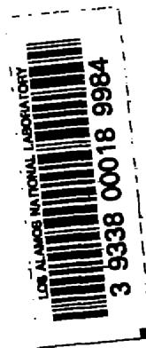
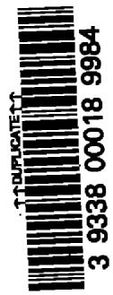
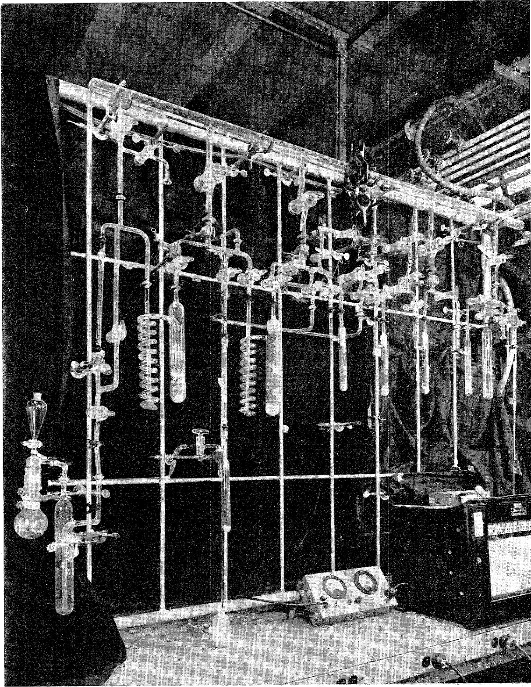

National

Academy

of

Sciences

National Research Council

NUCLEAR SCIENCE SERIES

# The Radiochemistry of the Rare Gases

U.S. Atomic Energy Commission

# COMMITTEE ON NUCLEAR SCIENCE

L.F.CURTISS,Chairman

ROBLEY D. EVANS, Vice Chairman

National Bureau of Standards

Massachusetts Institute of Technology

J. A. DeJUREN, Secretary

Westinghouse Electric Corporation

C.J.BORKOWSKI

J.W.IRVINE, JR.

Oak Ridge National Laboratory

Massachusetts Institute of Technology

ROBERT G. COCHRAN

E.D.KLEMA

Texas Agricultural and Mechanical College

Northwestern University

SAMUEL EPSTEIN

W. WAYNE MEINKE

California Institute of Technology

University of Michigan

U. FANO

J. J. NICKSON

National Bureau of Standards

Memorial Hospital, New York

HERBERT GOLDSTEIN

ROBERT L. PLATZMAN

Nuclear Development Corporation of America

Laboratoire de Chimie Physique

D. M. VAN PATTERN

Bartol Research Foundation

# LIAISON MEMBERS

PAUL C. AEBERSOLD

CHARLES K. REED

Atomic Energy Commission

U.S. Air Force

J. HOWARD MoMTILLEN

WILLIAM E. WRIGHT

National Science Foundation

Office of Naval Research

# SUBCOMMITTEE ON RADIOCHEMISTRY

W.WAYNE MENKE,Chairman

HAROLD KIRBY

University of Michigan

Mound Laboratory

GREGORY R. CHOPPIN

GEORGELEDDICOTTE

Florida State University

Oak Ridge National Laboratory

GEORGE A. COWAN

JULIAN NIELSEN

Los Alamos Scientific Laboratory

Hanford Laboratories

ARTHUR W. FAIRHALL

ELLIS P. STEINBERG

University of Washington

Argonne National Laboratory

JEROME HUDIS

PETER C. STEVENSON

Brookhaven National Laboratory

University of California (Livermore)

EARL HYDE

LEO YAFFE

University of California (Berkeley)

McGill University

# CONSULTANTS

NATHAN BALLOU

JAMES DeVOE

Centre d'Etude de l'Energie Nucleaire

University of Michigan

Mol-Donk, Belgium

WILLIAM MARLOW

National Bureau of Standards

5746.1

M733r

c.1

# The Radiochemistry of the Rare Gases

By FLOYD F. MOMYER, JR.

Lasorence Radiation Laboratory

University of California

Livermore, California

October 1980

LOS ALAMOS
SCIENTIFIC LABORATORY

APR-6 1981

LIBRARIES

PROPERTY

Subcommittee on Radiochemistry

National Academy of Sciences—National Research Council

# FOREWORD

The Subcommittee on Radiochemistry is one of a number of subcommittees working under the Committee on Nuclear Science within the National Academy of Sciences - National Research Council. Its members represent government, Industrial, and university laboratories in the areas of nuclear chemistry and analytical chemistry

The Subcommittee has concerned itself with those areas of nuclear science which involve the chemist, such as the collection and distribution of radiochemical procedures, the establishment of specifications for radiochemically pure reagents, availability of cyclotron time for service irradiations, the place of radiochemistry in the undergraduate college program, etc.

This series of monographs has grown out of the need for up-to-date compilations of radiochemical information and procedures. The Subcommittee has endeavored to present a series which will be of maximum use to the working scientist and which contains the latest available information. Each monograph collects in one volume the pertinent information required for radiochemical work with an individual element or a group of closely related elements.

An expert in the radiochemistry of the particular element has written the monograph, following a standard format developed by the Subcommittee. The Atomic Energy Commission has sponsored the printing of the series.

The Subcommittee is confident these publications will be useful not only to the radiochemist but also to the research worker in other fields such as physics, biochemistry or medicine who wishes to use radiochemical techniques to solve a specific problem.

W. Wayne Meinke, Chairman Subcommittee on Radiochemistry

# INTRODUCTION

This report dealing with the radiochemistry of the rare gases was prepared at the request of the Subcommittee on Radiochemistry of the Committee on Nuclear Science of the National Research Council as one of a series of monographs on the radiochemistry of all the elements.

The early sections of this monograph are devoted to general reviews of rare gas properties of interest to the radiochemist and to some general discussion of separation techniques for rare gases. The last three chapters are respectively a discussion of the removal of rare gases from targets, a discussion of techniques used for counting radioactive rare gases, and a collection of radiochemical procedures for rare gases.

The author would appreciate receiving from readers any additional information, published or unpublished, which should be included in such a report on the radiochemistry of the rare gases.

The author takes this opportunity to acknowledge the able assistance of Mr. R. A. daRoza in the preparation of this monograph.

# CONTENTS

Foreword iii

Introduction iv

I. General References Pertinent to Rare Gas Radiochemistry 1

II. Table of Isotopes of He, Ne, A, Kr, Xe, and Rn 2

III. Review of Features of Interest in Rare Gas Radiochemistry 5

IV. Sample Solution and Exchange with Carriers 27

V. Counting Rare Gas Activities 29

VI. Collection of Radiochemical Procedures for the Rare Gases 34

Procedure 1 - Removal of Kr and Xe from Air and Their Subsequent Separation 34

Procedure 1A - Removal and Separation of Kr and Xe Fission Products from U235 Targets 40

Procedure 2 - The Extraction, Purification and Industrial Uses of Kr85. 43

Procedure 3 - Rapid Removal of Fission Product Kr from U Foil 46

Procedure 4-Recovery of Fission Product Xe from U Metal 46

Procedure 5 - Rapid Removal of Fission Product Xe from $\mathrm{UO}_3$ or $\mathrm{UO}_2\{\mathrm{NO}_3\}_2 \cdot 6\mathrm{H}_2\mathrm{O}$ Targets. 48

Procedure 6 - Separation of Long-lived Fission Gases 48

Procedure 7 - Removal of Rn from Th Targets and its Collection on the Cathode of a Discharge Tube 49

Procedure 8-Determination of Active Gas Half-lives by the Charged Wire Technique (II) 51

# The Radiochemistry of the Rare Gases

FLOYD F. MOMYER, JR.  
Lawrence Radiation Laboratory  
University of California  
Livermore, California

I. GENERAL REFERENCES PERTINENT TO RARE GAS RADIOCHEMISTRY

H. Remy, Treatise on Inorganic Chemistry, Vol.I (translated by J. S. Anderson), Elsevier Publishing Co., New York (1956).   
S. Dushman, Vacuum Technique, John Wiley and Sons, New York, 1949.   
R. T. Sanderson, Vacuum Manipulation of Volatile Compounds, John Wiley and Sons Inc., New York (1948).   
R. E. Dodd and P. L. Robinson, Experimental Inorganic Chemistry  
Chap. 2, Elsevier Publishing Co., New York (1954).   
S. Brunauer, The Adsorption of Gases and Vapors, Vql. I. "Physical Adsorption", Princeton University Press, Princeton, N.J. (1942).   
A. I. M. Keulemans, Gas Chromatography, Reinhold Publishing Co., New York, 1959, 2nd edition.   
Lawrence A. Weller, "The Adsorption of Krypton and Xenon on Activated Charcoal -- A Bibliography," Mound Laboratory report MLM-1092, Miamisburg, Ohio, 1959.   
A. Guthrie and R. K. Wakerling, editors, Vacuum Equipment and Techniques, National Nuclear Energy Series, Div. I, Vol. 1, McGraw-Hill Book Co., Inc., New York, 1949.   
C. D. Coryell and N. Sugarman, editors, *Radiochemical Studies: The Fission Products*, National Nuclear Energy Series, Div. IV, Vol. 9, Books 2 and 3, McGraw-Hill Book Co., Inc., New York, 1951. Papers 64-70, 139, 141, 145-50, 154, and 311-17.

II. TABLE OF ISOTOPES OF HELIUM, NEON, ARGON   
KCRYPTON, XENON AND RADON.\*   

<table><tr><td>Isotope</td><td>Half-life</td><td>Type of Decay</td><td>Method of Preparation</td></tr><tr><td>He3</td><td colspan="2">Stable (abundance 1.3×10-4‰ atmos.)</td><td>Natural</td></tr><tr><td></td><td colspan="2">(abundance 1.7×10-5‰ wells)</td><td></td></tr><tr><td>He4</td><td colspan="2">Stable (abundance ~100%)</td><td>Natural</td></tr><tr><td>He6</td><td>~0.8 sec</td><td>β-</td><td>Be9(n, a)</td></tr><tr><td>Ne18</td><td>1.6 sec</td><td>β+</td><td>F19(p, 2n)</td></tr><tr><td>Ne19</td><td>~18 sec</td><td>β+</td><td>F19(p, n)</td></tr><tr><td>Ne20</td><td colspan="2">Stable (abundance 90.92%)</td><td>Natural</td></tr><tr><td>Ne21</td><td colspan="2">Stable (abundance 0.257%)</td><td>Natural</td></tr><tr><td>Ne22</td><td colspan="2">Stable (abundance 8.82%)</td><td>Natural</td></tr><tr><td>Ne23</td><td>~40 sec</td><td>β-</td><td>Ne22(n, y); Ne22(d, p); Na23(n, p); Mg26(n, a)</td></tr><tr><td>Ne24</td><td>3.38 min</td><td>β-</td><td>Ne22(t, p)</td></tr><tr><td>A35</td><td>~1.8 sec</td><td>β+</td><td>S32(a, n); Cl35(p, n)</td></tr><tr><td>A36</td><td colspan="2">Stable (abundance 0.337%)</td><td>Natural</td></tr><tr><td>A37</td><td>~35 day</td><td>EC</td><td>S34(a, n); Cl37(d, 2n); Cl37(p, n); K39(d, a); Ca40(n, a)</td></tr><tr><td>A38</td><td colspan="2">Stable (abundance 0.063%)</td><td>Natural</td></tr><tr><td>A39</td><td>~265 yr</td><td>β-</td><td>A38(n, y); K39(n, p)</td></tr><tr><td>A40</td><td colspan="2">Stable (abundance 99.600%)</td><td>Natural</td></tr><tr><td>A41</td><td>~110 min</td><td>β-</td><td>A40(d, p); A40(n, y); K41(n, p)</td></tr><tr><td>A42</td><td>≥3.5 yr</td><td>β-</td><td>A41(n, y); parent K42</td></tr><tr><td>Kr76</td><td>9.7 hr</td><td>EC</td><td>Y89(p, spall)</td></tr><tr><td>Kr77</td><td>~1.2 hr</td><td>EC~20%, β+~80%</td><td>Se74(a, n)</td></tr><tr><td>Kr78</td><td colspan="2">Stable (abundance 0.354%)</td><td>Natural</td></tr><tr><td>Kr79</td><td>34.5 hr</td><td>EC 95%, β+5%</td><td>Se76(a, n); Br79(d, 2n); Br79(p, n); Kr78(d, p); Kr78(n, y)</td></tr><tr><td>Kr80</td><td colspan="2">Stable (abundance 2.27%)</td><td>Natural</td></tr></table>

TABLE OF ISOTOPES OF He, Ne, A, Kr, Xe, and Rn, (Cont'd)   

<table><tr><td>Isotope</td><td>Half-life</td><td>Type of Decay</td><td>Method of Preparation</td></tr><tr><td>Kr81</td><td>-10 sec</td><td>IT</td><td>Br81(p,n); daughter Rb81</td></tr><tr><td>Kr81</td><td>2.1×105yr</td><td>EC</td><td>Kr80(n,y)</td></tr><tr><td>Kr82</td><td>Stable (abundance 11.56%)</td><td></td><td>Natural</td></tr><tr><td>Kr83m</td><td>114 min</td><td>IT</td><td>Se80(a,n); Kr82(d,p); Kr82(n,y); x-rays on Kr83; fission U, daughter Br83; daughter Rb83</td></tr><tr><td>Kr83</td><td>Stable (abundance 11.55%)</td><td></td><td>Natural; fission U</td></tr><tr><td>Kr84</td><td>Stable (abundance 56.90%)</td><td></td><td>Natural; fission U</td></tr><tr><td>Kr85m</td><td>4.36 hr</td><td>β-78%, IT 22%</td><td>Se82(a,n); Kr84(d,p); Kr84(n,y); Rb85(n,p); Sr88(n,a); fission U, daughter Br85</td></tr><tr><td>Kr85</td><td>10.3 yr</td><td>β-</td><td>Kr84(n,y); fission U</td></tr><tr><td>Kr86</td><td>Stable (abundance 17.37%)</td><td></td><td>Natural; fission U</td></tr><tr><td>Kr87</td><td>78 min</td><td>β-</td><td>Kr86(n,y); Kr86(d,p); Rb87(n,p); fission U</td></tr><tr><td>Kr88</td><td>2.8 hr</td><td>β-</td><td>Fission U, Th</td></tr><tr><td>Kr89</td><td>3 min</td><td>β-</td><td>Fission U, Pu</td></tr><tr><td>Kr90</td><td>33 sec</td><td>β-</td><td>Fission U, Pu</td></tr><tr><td>Kr91</td><td>9.8 sec</td><td>β-</td><td>Fission U, Pu</td></tr><tr><td>Kr92</td><td>3.0 sec</td><td>β-</td><td>Fission U, Pu, Th</td></tr><tr><td>Kr93</td><td>2.0 sec</td><td>β-</td><td>Fission U, Pu</td></tr><tr><td>Kr94</td><td>1.4 sec</td><td>β-</td><td>Fission U</td></tr><tr><td>Kr97</td><td>1 sec</td><td>β-</td><td>Fission U, Pu</td></tr><tr><td>Xe121</td><td>40 min</td><td>β+</td><td>I127(p,7n)</td></tr><tr><td>Xe122</td><td>20 hr</td><td>EC</td><td>I127(p,6n)</td></tr><tr><td>Xe123</td><td>2 hr</td><td>EC, β+</td><td>I127(p,5n)</td></tr><tr><td>Xe124</td><td>Stable (abundance 0.096%)</td><td></td><td>Natural</td></tr><tr><td>Xe125m</td><td>55 sec</td><td>IT (?)</td><td>I127(a,6n)Cs125; daughter Cs125</td></tr><tr><td>Xe125</td><td>18.0 hr</td><td>EC</td><td>Te122(a,n) Xe124(n,y)</td></tr><tr><td>Xe126</td><td>Stable (abundance 0.090%)</td><td></td><td>Natural</td></tr><tr><td>Xe127</td><td>75 sec</td><td>IT</td><td>I127(a,4n)Cs127; daughter Cs127</td></tr></table>

TABLE OF ISOTOPES OF He, Ne, A, Kr, Xe, and Rn. (Cont'd)   

<table><tr><td>Isotope</td><td>Half-life</td><td>Type of Decay</td><td>Method of Preparation</td></tr><tr><td>Xe127</td><td>36.41 day</td><td>EC</td><td>Te124(a,n); I127(d,2n)I127(p,n); Xe126(n,y)</td></tr><tr><td>Xe128</td><td>Stable (abundance 1.919%)</td><td></td><td>Natural</td></tr><tr><td>Xe129m</td><td>8.0 day</td><td>IT</td><td>Xe128(n,y)</td></tr><tr><td>Xe129</td><td>Stable (abundance 26.44%)</td><td></td><td>Natural</td></tr><tr><td>Xe130</td><td>Stable (abundance 4.08%)</td><td></td><td>Natural</td></tr><tr><td>Xe131m</td><td>12.0 day</td><td>IT</td><td>Xe131(n,n&#x27;); fission U</td></tr><tr><td>Xe131</td><td>Stable (abundance 21.18%)</td><td></td><td>Natural; fission U</td></tr><tr><td>Xe132</td><td>Stable (abundance 26.89%)</td><td></td><td>Natural; fission U</td></tr><tr><td>Xe133m</td><td>-2.2 day</td><td>IT</td><td>Xe132(n,y); fission U</td></tr><tr><td>Xe133</td><td>5.270 day</td><td>β-</td><td>Xe132(n,y); Xe132(d,p); Xe134(n,2n); Te130(a,n); Cs133(n,p); Be136(n,a); fission U</td></tr><tr><td>Xe134</td><td>Stable (abundance 10.44%)</td><td></td><td>Natural; fission U</td></tr><tr><td>Xe135m</td><td>-15 min</td><td>IT</td><td>Xe136(n,2n); Xe134(n,y); Ba138(n,a); fission U</td></tr><tr><td>Xe135</td><td>9.13 hr</td><td>β-</td><td>Xe134(n,y); Xe134(d,p); Xe136(n,2n); Ba138(n,a); fission U</td></tr><tr><td>Xe136</td><td>Stable (abundance 8.87%)</td><td></td><td>Natural; fission U</td></tr><tr><td>Xe137</td><td>3.9 min</td><td>β-</td><td>Xe136(n,y); fission U</td></tr><tr><td>Xe138</td><td>17 min</td><td>β-</td><td>Fission U</td></tr><tr><td>Xe139</td><td>41 sec</td><td>β-</td><td>Fission U, Th</td></tr><tr><td>Xe140</td><td>-10 sec</td><td>β-</td><td>Fission U, Th</td></tr><tr><td>Xe141</td><td>-2 sec</td><td>β-</td><td>Fission U</td></tr><tr><td>Xe143</td><td>1.0 sec</td><td>β-</td><td>Fission U</td></tr><tr><td>Xe144</td><td>-1 sec</td><td>β-</td><td>Fission U</td></tr><tr><td>Rn206</td><td>-6 min</td><td>α65%, EC 35%</td><td>Au197(N14, 5n)</td></tr><tr><td>Rn207</td><td>-10 min</td><td>EC 96%, α4%</td><td>Au197(N14, 4n)</td></tr><tr><td>Rn208</td><td>-22 min</td><td>EC~80%, α~20%</td><td>Spall Th; Pb(C12, spall)</td></tr><tr><td>Rn209</td><td>30 min</td><td>EC 83%, α17%</td><td>Spall Th; Pb(C12, spall)</td></tr><tr><td>Rn210</td><td>2.7 hr</td><td>α~96%, EC~4%</td><td>Spall Th; Pb(C12, spall)</td></tr><tr><td>Rn211</td><td>16 hr</td><td>EC 74%, α26%</td><td>Spall Th; Pb(C12, spall)</td></tr><tr><td>Rn212</td><td>23 min</td><td>α</td><td>Spall Th; Pb(C12, spall)</td></tr><tr><td>Rn215</td><td>~10-6sec (est.)</td><td>α</td><td>U227 chain from Th232(a, 9n)</td></tr></table>

TABLE OF ISOTOPES OF He, Ne, A, Kr, Xe, and Rn, (Cont'd)   

<table><tr><td>Isotope</td><td>Half-life</td><td>Type of Decay</td><td>Method of Preparation</td></tr><tr><td>Rn216</td><td>-10-4sec (est.)</td><td>α</td><td>U228chain from Th232(a, 8n)</td></tr><tr><td>Rn217</td><td>10-3sec</td><td>α</td><td>U229chain from Th232(a, 7n)</td></tr><tr><td>Rn218</td><td>0.019 sec</td><td>α</td><td>U230chain from Th232(a, 6n)</td></tr><tr><td>Rn219</td><td>3.92 sec</td><td>α</td><td>Member U235decay chain</td></tr><tr><td>Rn220</td><td>51.5 sec</td><td>α</td><td>Member Th232decay chain</td></tr><tr><td>Rn221</td><td>25 min</td><td>β-80%, α~20%</td><td>Th232(p, spall)</td></tr><tr><td>Rn222</td><td>3.8229 day</td><td>α</td><td>Member U238decay chain</td></tr></table>

# III. REVIEW OF FEATURES OF INTEREST IN RARE GAS RADIOCHEMISTRY

The rare gases, Group O of the periodic table, are helium, neon, argon, krypton, xenon, and radon. Helium and neon possess no radioactive isotopes of half-life long enough to permit radiochemical studies in the ordinary sense. One can conceive situations in which the separation of the remaining four rare gases from contaminants and from one another might be necessary. However, the most common problem by far is the separation of krypton and xenon resulting from fission of heavy elements from other fission products and from each other. The literature on rare gas radiochemistry is largely concerned with this problem, and most detailed discussion in this monograph will likewise center around krypton and xenon. As rare gas separations generally depend on some property which varies greatly and in a regular manner as one proceeds through the group from helium to radon, the further application of the procedure to include other rare gases will often be simple if required.

Reviews of the "chemical properties" of the rare gases will be found in most texts on inorganic chemistry. In a practical sense, the rare gases are chemically inert. They will remain chemically unaltered in any reactions chosen to quantitatively remove impurities other than rare gases from them.

However, rare gas atoms do interact with other atoms, molecules, or ions in their neighborhood. Whether these interactions are properly considered chemical or "van der Waal's" in nature is of no concern here.

The existence in discharges of species such as $\mathrm{HeH}^+$ and $\mathrm{He}_2^+$ has been established. Hydrates for the four heavier members of the group are known to exist, and solubilities of rare gases in a number of solvents are relatively high. Solubility in a given solvent generally increases with atomic number of the rare gas. A number of studies of rare gas solubility dependence on solvent, temperature, and partial pressure of the rare gas (Henry's law is applicable over wide ranges) have appeared in the literature. One of the more comprehensive studies also outlines a proposed system for recovering krypton and xenon from gas streams by their absorption in a counter-current stream of organic liquid (kerosene).

In handling rare gases, especially tracer amounts, one does well to remember that contact with liquids or solids (including system walls) or condensation from the gas phase of other liquids or solids may result in removal of rare gases from the gas phase through solution, adsorption or physical occlusion. Thus in quantitative work rare gas carriers are usually added for essentially the same reasons that carriers are added for species to be separated from solutions.

A series of substances known as clathrates has received considerable study. $^{3,4}$ Clathrates of argon, krypton and xenon have been prepared by crystallizing quinol under an atmosphere of the rare gas at high pressure. Rare gas atoms are contained in "cages" within the resulting crystal, the number of these cages setting an upper limit on the amount of rare gas in the crystal (one rare gas atom for every three quinol molecules). The actual concentration of rare gas in the crystal depends markedly on the conditions of crystallization and is usually considerably less than the theoretical limit. Clathrates of fission-product krypton have recently been prepared for use as sources of $\mathbf{Kr}^{85}$ activity. $^{5}$ The preparation described in the reference results in krypton concentrations equal to $25\%$ of the theoretical limit. This corresponds to the concentration in the gas phase at about 25 atmospheres pressure and results in 3 curies of $\mathbf{Kr}^{85}$ per gram of clathrate (using fission product krypton which is about $5\% \mathbf{Kr}^{85}$ ). The material may be ground to a powder with no appreciable loss of activity and the loss on standing is only a few parts per million per day if the material is protected from water and other substances which dissolve quinol.

The chemical operations involved in separating and purifying rare gases are performed on elements or compounds other than rare gases. The separation of the rare gases from one another must be accomplished on the basis of differences in some physical property (usually vapor pressure or extent of

adsorption). It may often happen that this physical separation will also separate some or all of the impurities other than rare gases from a particular rare gas. Thus it is often neither necessary nor most convenient to purify the rare gases chemically as a group as the first step or steps in a radiochemical procedure. Depending upon the contaminating species and their amounts it may be possible that no chemical operations whatever will be necessary.

Substances which may contaminate rare gases are limited to those which may exist in appreciable concentrations in the gas phase at the temperature of the experiment. At said temperature this will include: 1) gases, the term being used here to denote appreciable amounts of substances above their critical temperature or having vapor pressures greater than 1 atmosphere; 2) unsaturated vapors, substances whose vapor pressures are less than one atmosphere but which are present in amounts appreciable but small enough that their partial pressures are less than their vapor pressures; and 3) saturated vapors in equilibrium with solids or liquids having appreciable vapor pressures. The word "appreciable" in the foregoing must of course be defined in the context of the experiment. Although the above is a large category, the number of contaminants usually encountered is quite small. The rare gases must often be purified from the constituents of air, from volatile species involved in target dissolution such as hydrogen, hydrogen halides and oxides of nitrogen, and occasionally from small amounts of hydrocarbons and trace amounts of elemental halogens. Methods of removal are listed below for each of these. The list is by no means complete as regards methods which have been or could be used, but it is hoped that it is representative enough to be useful.

1) Nitrogen: Mole amounts may be quantitatively removed by reacting with titanium sponge, 14-20 mesh at $1000 - 1100^{\circ}\mathrm{C}$ . Use of lower temperatures (ca. $850^{\circ}\mathrm{C}$ ) has been reported. Oxygen is also removed quantitatively. Quartz or ceramic furnaces are necessary as these temperatures are above the softening point of Pyrex glasses. The reaction is quite exothermic and so the temperature must be monitored and flow rate of the gas controlled to prevent destruction of the furnace. Calcium has often been used satisfactorily to remove nitrogen ( $400 - 500^{\circ}\mathrm{C}$ ). Calcium does, however, tend to become passive through formation of surface films. For small amounts of impurities this problem is sometimes circumvented by conducting the reaction in the gas phase with Ca vapor. Clean uranium turnings at $800^{\circ}\mathrm{C}$ will also react with nitrogen (and decompose hydrocarbons).   
2) Oxygen: Will be removed with nitrogen in the above reactions. Oxygen also reacts rapidly with copper turnings above $350^{\circ}\mathrm{C}$ to give CuO.   
3) Hydrogen, carbon monoxide, light paraffin hydrocarbons: Passage

of the gas stream over CuO at $500^{\circ}\mathrm{C}$ will oxidize $\mathrm{H}_{2}$ to $\mathrm{H}_{2}\mathrm{O}^{9}$ and CO to $\mathrm{CO}_{2}$ rapidly. Hydrocarbons will be oxidized in like manner to $\mathrm{H}_{2}\mathrm{O}$ and $\mathrm{CO}_{2}$ but a temperature of $900^{\circ}\mathrm{C}$ is necessary to achieve rapid reaction. Subsequent removal of oxygen may be necessary (and is easily accomplished), if high enough temperatures are used that the dissociation pressure of oxygen over CuO becomes appreciable.

4) Water: In addition to condensation of water in cold traps (a method often not specific enough), water may be removed by passage through any one of a number of desiccants. $\mathsf{P}_2\mathsf{O}_5$ , $\mathsf{Mg(ClO_4)_2}$ ; and $\mathsf{CaCl}_2$ are representative, with equilibrium partial pressures of water over them at room temperature of $2\times 10^{-5}$ , $5\times 10^{-4}$ , and $0.2\mathrm{mmHg}$ respectively. $\mathsf{P}_2\mathsf{O}_5$ and $\mathsf{CaCl}_2$ represent the extremes of efficiency in common desiccants. Magnesium per-chlorate has achieved wide use as it is efficient enough for practically all purposes and is easily regenerated by distilling the water off in vacuo at $220^{\circ}\mathrm{C}$ . Where large amounts of water are involved, gases are often dried first with $\mathsf{CaCl}_2$ to remove most of the water and then with $\mathsf{Mg(ClO_4)_2}$ to remove remaining traces of moisture.

5) Carbon dioxide: May be removed by passing the gas through a trap containing Ascarite, a granular commercial preparation which is essentially asbestos impregnated with sodium hydroxide. Sofnolite, or soda-lime, a mixture of NaOH and CaO may also be used. Sweeping the gas through a solution of alkali metal hydroxide is also effective. Solutions are sometimes less convenient in vacuum systems than solid materials, however.

6) Hydrogen halides: May be removed in the same manner as carbon dioxide.

7) Oxides of nitrogen: Dissolution of targets in nitric acid will result in evolution of $\mathrm{N}_2\mathrm{O}$ , NO and $\mathrm{NO}_2$ in varying proportions. $\mathrm{N}_2\mathrm{O}$ usually occurs in relatively small amounts. Its removal may be accomplished by catalytic reduction with hydrogen or by oxidation to NO by scrubbing the gas with a solution of strong oxidizing agent such as permanganate. NO and $\mathrm{NO}_2$ may be removed by sweeping the gas stream through a solution of sodium hydroxide. Performing the solution under reflux will in fact wash a good portion of the higher oxides back into the dissolver flask. If alternate methods of solution are available it is often most convenient to avoid the use of nitric acid.

8) Halogens: Free halogens are all relatively volatile, and active halogens may often be present in trace amounts in targets from which rare gases are to be removed. If the solution process leaves them partly or entirely in the zero oxidation state, the gas stream will be contaminated. Sweeping the gas through a solution of sodium hydroxide will rapidly convert all the free halogens to non-volatile species (halide and hypohalite). The rapid exchange of the halogens with their corresponding halides in solution is another

useful means of decontamination from tracer halogens. 11, 12 Iodine is quantitatively removed by contact with silver (silvered Raschig rings have been used as a trap packing for this purpose). Iodine is reduced to iodide in $\mathsf{NaHSO}_3$ solution.

Where reaction rates are slow enough that purification may not be completed in one pass, it may be necessary to circulate the off gases from target dissolution through a purification train. The classic, and still most generally useful, device for circulation (or transfer) of gases is the Toepler pump, $^{13}$ with which rates of about a liter per minute may be obtained. Other circulating pumps which may be useful in particular instances have been designed. These consist essentially of a chamber designed to permit only unidirectional flow of gas and a means of producing periodic pressure changes within the chamber. Alternate heating and cooling of the gas in the chamber has been used to achieve flow rates of 0.5 liters per hour. $^{13}$ An iron piston enclosed in glass and electromagnetically operated has produced rates of a few liters per minute. $^{14}$ Pressure differentials developed were not noted in the reference but are probably small. Another achieves similarly high flow rates by pulsing the chamber pressure by means of a mylar diaphragm driven by high pressure gas. $^{15}$

Ultimately the radiochemist must concern himself with the physical properties of the rare gases. Table 1 summarizes some data which may be of interest.

Table 1   

<table><tr><td></td><td>He</td><td>Ne</td><td>Ar</td><td>Kr</td><td>Xe</td><td>Rn</td></tr><tr><td>Atmospheric abundance (Volume %)</td><td>5.25 ×10-4</td><td>1.82 ×10-3</td><td>0.934</td><td>1.14 ×10-4</td><td>8.7 ×10-6</td><td>6 ×10-18</td></tr><tr><td>Boiling Point (°C)</td><td>-269</td><td>-246</td><td>-186</td><td>-153</td><td>-107</td><td>-65</td></tr><tr><td>Melting Point (°C)</td><td>-272 (25 atm.)</td><td>-249</td><td>-189</td><td>-157</td><td>-112</td><td>-71</td></tr><tr><td>Atomic diameter in crystal (angstroms)</td><td>3.57</td><td>3.20</td><td>3.82</td><td>3.94</td><td>4.36</td><td>----</td></tr></table>

Distillation and adsorption techniques are those which first come to mind for separation of the rare gases. The pure rare gases have of course been successfully produced commercially by the fractional distillation of air, with the exceptions of helium which is extracted from certain Texas natural gases and radon which is obtained as a member of the $4\mathrm{n} + 2$ natural radioactive decay

series. Fractional distillation is discussed in most texts on physical chemistry and the fractionation of rare gases from air is discussed in numerous places.[17-20] Glueckauf used a procedure combining fractional distillation of air and adsorption techniques in the determination of krypton and xenon contents of the atmosphere.[21] It is very unlikely that the radiochemist will have need to use such low temperature fractionation columns in the laboratory so there will be no discussion of the method here.

On the other hand, simple distillation and condensation processes will be used in practically every experiment in transferring gases or effecting rough separations. Thus a plot (for low temperatures) of vapor pressures as a function of temperature for rare gases and other volatile species commonly encountered will prove very handy to the radiochemist. The reader is referred to the generally available Handbook of Chemistry and Physics $^{22}$ for data necessary for such a plot. Dushman $^{23}$ (page 781 et seq.) also tabulates vapor pressure data for a number of substances at low temperatures. In order of decreasing volatility (decreasing vapor pressure at a given temperature below the critical temperature) the common gases are $\mathbf{N}_2$ , A and $\mathbf{O}_2$ , Kr, Xe, Rn and $\mathbf{CO}_2$ , and $\mathbf{H}_2\mathbf{O}$ . Gases listed in pairs have vapor pressure curves at low temperatures which are very similar.

Efficiencies of processes such as the transfer of a gaseous species contained in a system to a cold trap attached to the system are determined by the relation of the initial partial pressure of the species in the system to the vapor pressure of its solid or liquid after condensation in the cold trap. As an example, the vapor pressure of solid Kr at $-195^{\circ}\mathrm{C}$ is $2 - 3\mathrm{mmHg}$ , so roughly $99\%$ of the Kr in a system at $20~\mathrm{cmHg}$ pressure may be collected in an attached small cold trap at $-195^{\circ}\mathrm{C}$ . As liquid nitrogen is generally the coldest conveniently available refrigerant, Kr is often manipulated by condensation at this temperature. The resultant losses decrease with increasing initial krypton pressure and may be minimized by using the smallest systems and the largest amounts of krypton carrier practicable -- usually they may be made small enough that they are acceptable for the sake of speed and convenience. If one must of necessity collect krypton at pressures comparable to $2 - 3\mathrm{mmHg}$ from a system, he must resort to lower temperature refrigerants, refrigerated adsorbents such as charcoal, or Toepler pumps. Presence of small amounts of noncondensable gases may seriously lower the rates of transfer processes such as the above krypton condensation, due to the relative slowness of gaseous interdiffusion processes. Thus one wishes a vacuum system with a base pressure orders of magnitude lower than the lowest vapor pressures involved in manipulations he may wish to perform. Systems with base pressures of $10^{-5}$ to $10^{-6}$ mm Hg are easily constructed and will suffice for the manipula-

tions involved in most rare gas radiochemistry (assuming that macro rather than tracer amounts are involved).

Removal of only the least volatile species from a gas stream is feasible when a temperature can be found at which its vapor pressure is sufficiently less than its partial pressure in the gas stream that condensation is essentially complete, while the vapor pressures of other constituents are higher than their partial pressures over the trap. Assuming equilibrium conditions and insolubility of the other species in the condensed phase, passage of the gas stream through the cold trap effects the desired separation quite simply. If condensation occurs under equilibrium conditions, the fraction of species lost (passing through the trap with the gas stream) is the ratio of its vapor pressure at trap temperature to its partial pressure in the influent gases. To improve the approach to equilibrium conditions, flow rates are limited and cold traps packed with some material to provide a large contact area and to prevent mechanical blow-through of condensed materials. Glass wool, beads or rings are materials commonly used for this purpose. Stainless steel balls (3/16 in.) combined with suitable glass wool plugs have also proved very satisfactory. Such a packing has the advantage that the steel may be warmed by the induction of eddy currents in it to achieve rapid and efficient removal of condensed materials. Time for thermal equilibrium to be reached in traps must always be allowed before initiating gas flow. As cooling of trap packings under vacuum may be quite slow, temporary introduction of some easily removable gas such as helium to improve heat transfer is often useful.

In like fashion several condensed materials of widely differing volatilities may often be separated by warming to a suitable temperature and distilling the more volatile components into another cold trap. It is often necessary to melt and refreeze the condensate remaining behind several times, each time removing the volatile material evolved to the other cold trap, to effect complete removal of occluded or dissolved traces of the volatile materials (e.g., the distillation of $\mathrm{CO}_{2}$ from $\mathrm{CO}_{2}$ -ice condensate at dry-ice temperature).

The subject of trap refrigerants should be touched on briefly. Liquid nitrogen $(-195.8^{\circ}\mathrm{C})$ , dry ice $(-78.5^{\circ}\mathrm{C})$ , and ice $(0^{\circ}\mathrm{C})$ are commonly available in most laboratories. Fortunately temperatures lower than that of liquid nitrogen will usually not be required in handling rare gases other than helium and neon. It might be noted that pumping on liquid nitrogen will cool it by evaporation to its triple point $(-210.9^{\circ}\mathrm{C}, 96.4\mathrm{mmHg})$ . Temperatures intermediate to those of liquid nitrogen, dry ice, and ice are often necessary and are commonly obtained by cooling a suitable liquid with liquid nitrogen or dry ice to obtain a partially frozen "slush" at the melting point. Slush or liquid refrigerants provide better heat transfer from the trap than solid refrigerants,

thus dry ice is usually mixed with acetone to provide a slush refrigerant at $-78.5^{\circ}\mathrm{C}$ . Discussion of cold baths may be found in most texts where vacuum techniques are discussed.[24,25] The author has found the following baths particularly useful in working with rare gases: acetone, $-95^{\circ}\mathrm{C}$ , n-pentane, $-130^{\circ}\mathrm{C}$ , and isopentane, $-160^{\circ}\mathrm{C}$ .

It is usually most convenient to refrigerate traps through which large quantities of gas will flow with liquid nitrogen, dry ice, or ice since such traps are easily replenished in place on the line. "Slush-cooled!" traps at other temperatures may usually be reserved for operations where they need take up only small amounts of heat.

# Adsorption and Adsorption Techniques

By far the majority of separations of rare gases to be found in the literature have employed adsorption techniques. Of the large number of adsorbent materials available, activated charcoal has most often been used because it has the largest surface area (largest adsorptive capacity) per unit mass and because the rare gases adsorb on charcoal to widely differing extents.

For a given adsorbate gas and adsorbent material the amount adsorbed per unit mass of adsorbent, called v and usually expressed as cc STP (Standard Temperature and Pressure,i.e., $0^{\circ}\mathrm{C}$ and $760\mathrm{mmHg}$ ) of gas per gram adsorbent, is a function of temperature of the adsorbent and partial pressure of the gas over the adsorbent. Three functional relationships among these variables are of interest: 1) Isotherms showing the dependence of v on P at constant temperature; 2) Isosteres relating P and T at constant v; and 3) Isobars relating v and T at constant P. In experimental studies of adsorption the isotherms are most usually determined at a series of temperatures. From these data the other relationships may be obtained if desired. The Clausius-Glapeyron equation also relates heats of adsorption and the pressure change with temperature (shape of the isostere).

A number of equations have been used to express adsorption isotherms, most of which are empirical in nature. Langmuir first derived the hyperbolic isotherm for monolayer adsorption from theoretical considerations.[26] Brunauer, Emmett, and Teller[27] later derived equations for multilayer adsorption which reduce to Langmuir's equation in the case of a monolayer. The hyperbolic isotherm may be written $\mathbf{v} = \mathbf{v}_{\mathrm{s}} \mathbf{bP} / (1 + \mathbf{bP})$ , $\mathbf{P} = \mathbf{v} / \mathbf{b}(\mathbf{v}_{\mathrm{s}} - \mathbf{v})$ , or $\mathbf{P} / \mathbf{v} = 1 / \mathbf{b}\mathbf{v}_{\mathrm{s}} + \mathbf{P} / \mathbf{v}_{\mathrm{s}}$ , where $\mathbf{v}_{\mathrm{s}}$ is the cc STP of adsorbate required to form a monolayer per gram of adsorbent, and $\mathbf{b}$ is a constant dependent on temperature and the nature of the adsorbate and adsorbent. The last form is particularly useful for the extension of data by interpolation since the plot of $\mathbf{P} / \mathbf{v}$ versus $\mathbf{P}$ is linear. At low pressures, or perhaps more definitively low

v, it is found that adsorption obeys Henry's law (v = kP), and interpolation on a linear plot of P versus v is possible. It will be noted that for P much less than 1/b, or v much less than $\mathbf{v}_{\mathbf{s}}$ , the hyperbolic isotherm reduces to Henry's law with k equal to $\mathbf{b}\mathbf{v}_{\mathbf{s}}$ . Freundlich's parabolic equation (semi-empirical in nature) is often useful for linear interpolation on a log-log plot in cases where it is obeyed: $\mathbf{v} = \mathbf{KP}^{1 / n}$ . Peters and Weil28 studied the adsorption of argon, krypton and xenon on charcoal and calculated the constants in the Freundlich equation from their data at several temperatures. These are given in Table 2 for handy reference. Adsorption data for a number of gases on charcoal are tabulated in Chapter 8 of Dushman.23 The adsorption process releases heat and as expected from LeChatelier's principle adsorption decreases with increasing temperature, other factors remaining constant. Adsorption increases with increasing pressure. Adsorption of different gases tends to increase with decreasing volatility (extent of adsorption tends to increase in the same order as the boiling points of the gases).

Table 2. Adsorption constants for argon, krypton and xenon: $\mathbf{v} = \mathbf{KP}^{1 / n}$   

<table><tr><td></td><td>T°C</td><td>K</td><td>l/n</td></tr><tr><td rowspan="3">Argon</td><td>-80</td><td>0.500</td><td>0.950</td></tr><tr><td>-18</td><td>0.0764</td><td>1.0</td></tr><tr><td>0</td><td>0.0581</td><td>1.0</td></tr><tr><td rowspan="3">Krypton</td><td>-80</td><td>2.927</td><td>0.711</td></tr><tr><td>-18</td><td>0.497</td><td>0.885</td></tr><tr><td>0</td><td>0.340</td><td>1.0</td></tr><tr><td rowspan="3">Xenon</td><td>-80</td><td>15.99</td><td>0.574</td></tr><tr><td>-18</td><td>2.458</td><td>0.692</td></tr><tr><td>0</td><td>1.583</td><td>0.77</td></tr></table>

Theoretical treatments discuss adsorption in terms of: 1) formation of a monolayer of adsorbate on the surface, 2) formation of multilayers on plane surfaces, and 3) capillary condensation in small pores. Adsorption of a gas is considered the result of van der Waal's forces of the same type involved in its condensation. The magnitude of the interactions resulting in adsorption is indicated by the fact that heats of adsorption are generally comparable to the heat of condensation for a given gas. Experimental isotherms may conform over wide ranges to theoretically derived equations (as the hyperbolic isotherm) for suitable values of the constants in the equation. However, values of the constants thus obtained are often not easily related to the physical models used in the derivations. For discussion of adsorption in general and a key to the literature on the subject the reader is referred to Chapters 7 and 8 in Dushman23 or to S. Brunauer's book on physical adsorption.29

Some comments on the nature of activated charcoal may be worth while. These are mostly from two recent review articles.30, 31 There are numerous materials from which activated charcoal may be prepared and many methods of preparation.32 For example, one might start with coconut shells and heat in the absence of air to remove the greater part of the elements other than carbon as volatile materials. The resulting material is then activated with steam at $700 - 1000^{\circ}\mathrm{C}$ . The large specific surface area of charcoal (of the order of 1000 square meters per gram) is due to its high porosity, as opposed to the nonporous adsorbents such as lamp black whose large specific surface area is the result of extremely small particle size. Thus the surface per gram of lamp black is a marked function of the average particle size, whereas the specific surface of activated charcoal is almost independent of particle size. Furthermore, most of the surface area in charcoal apparently resides in pores with diameters comparable to molecular dimensions. It follows that one might expect principally monolayer adsorption on charcoal. Thus adsorption on charcoal might be expected to obey the hyperbolic isotherm, and does so over wide ranges. The potential pore structure of a charcoal is dependent on both the starting material and the conditions of pyrolysis. Charcoals from hardwoods, nutshells and certain grades of coal generally give the highest porosity. The material after pyrolysis (though porous) still has low adsorptive capacity and the process of activation consists essentially of burning out more material in order to either open new pores or to enlarge existing pores to diameters which will accommodate adsorbate molecules (perhaps both processes occur). Steam is widely used for activation as the reaction is endothermic and better temperature control is possible. One expects then that the properties of the material he receives in the laboratory depend not only on materials used in preparation but also very markedly on the history of its pyrolysis and activation. Excessive activation can in fact remove more surface area than it creates, the adsorptive capacity going through a maximum as the activation proceeds. Since the distribution of pores as to size includes many with diameters comparable to molecular dimensions, a "molecular sieve" effect may be expected to some extent. Thus some pores will accommodate a given molecule but are too small for a slightly larger molecule. During activation the adsorptive capacity for various species may therefore not be increasing in the same ratio. Charcoal has in the past been referred to as an allotrope of carbon, but elemental analyses indicate atom percents of carbon always less than $100\%$ and sometimes as low as $75\%$ . The other elements present are principally hydrogen and oxygen, but appreciable amounts of nitrogen, sulfur, chlorine, and inorganic ash may also be present. It appears likely that the surfaces on which adsorption occurs are not carbon surfaces but hydrocarbon surfaces modified by the presence of oxygen and

traces of other elements. This implies that all adsorption sites are very likely not identical.

Activated charcoal is thus a class of substances whose chemical and physical properties may vary within rather wide limits. Let us hasten to add that this does not really impair its usefulness as an adsorbent. The adsorptive properties of charcoals in separation systems are usually not so critical that even variations like factors of two or more will result in loss of separation, though such variations certainly affect the procedure in detail. The intent is to point out that the experimenter should not be surprised if the adsorptive properties of his charcoal differ from those he sees quoted in the literature. In one study of the adsorption of xenon on seven charcoals at room temperature, the amount per gram of charcoal adsorbed at a given pressure varied as much as a factor of five.[33] These charcoals were of course chosen on the basis of differences in materials and preparations expected to produce a range of adsorption characteristics. In order that early experience may be used to predict with fair accuracy the course of separations in systems built at later dates, it is probably wise to originally purchase a quantity of charcoal sufficient for many years' needs.

Before use and between successive uses it is necessary to outgas charcoal, both to prevent contamination of samples with small amounts of residual gases from previous runs and to remove adsorbed materials (such as water) whose accumulation may adversely affect the adsorptive properties of the charcoal. This process should not be so extreme as to change the material through further activation. A routine which has proved satisfactory is outgassing in vacuo at $350 - 400^{\circ}\mathrm{C}$ . At Lawrence Radiation Laboratory the outgassing is routinely continued until the pressure is $10^{-4}$ mm Hg or less as judged by a thermocouple vacuum gauge in the vacuum system manifold.

One may operate in various ways to achieve separations of gases through differences in the adsorption on charcoal (or any other adsorbent). It may prove useful to point out that such separations are basically similar to separations of species in solution using ion exchange resins. The many radiochemists who are familiar with separations using such resins will note close analogies even in the various techniques used.

Separation procedures must be designed with kinetic considerations in mind -- adsorption from a stream of gas is not an instantaneous process. It was stated earlier that the adsorptive capacity of charcoals does not depend on particle size, but it is expected that rates of adsorption will be so dependent. A reduction in the average particle diameter increases the exterior surface (per gram adsorbent) presented to the gas phase and shortens paths through cracks and pores along which adsorbate molecules must diffuse in order to reach adsorption sites in the particle interior. Approach to equi

librium conditions should thus improve with smaller particle size and increased contact time with the adsorbent (decreased flow rate). A compromise is necessary as too small particle size will result in high resistance to gas flow. In flow systems low temperature adsorbent beds may not be maintained in thermal equilibrium with the refrigerant if the gas enters the bed at elevated temperature or if the rate of heat release from the adsorption processes occurring is high. Flow rates and conditions affecting the rate of heat transfer are thus important in this respect. Although it is certainly of great interest and long-range usefulness to understand in detail the kinetics of these processes, the more practical and faster approach to design is empirical. Design factors are chosen to improve the kinetics insofar as possible and the experiment is tried. If the experiment succeeds, factors affecting kinetics are usually not varied to determine the extreme conditions under which the procedure is satisfactory. Thus in places such as the Detailed Procedures where flow rates and charcoal particle sizes may be quoted it should be understood that these are sufficient for the separation, but may or may not be necessary should other considerations make changes desirable.

Most rare gas separations will commence with total adsorption of all the gases of interest in an adsorbent trap. In this manner one may minimize problems arising from non-uniform introduction of sample, temperature variations, and adsorption kinetics by using lower temperatures and more adsorbent than should really be necessary. By treating all adsorption steps in this manner one tends to reduce losses, since in subsequent desorption steps slow processes may affect the history of the separation in detail but will not result in actual loss of sample.

In their early work on rare gases, Peters and Weil $^{28}$ showed that argon, krypton and xenon could be separated by total adsorption followed by fractional desorption in vacuum from activated charcoal. They adsorbed the mixture on charcoal at $-190^{\circ}\mathrm{C}$ (roughly 10cc STP of each gas was used on 38 grams of charcoal) and then raised the trap to a suitable temperature and desorbed the gases using a mercury diffusion pump backed by a Toepler pump to transfer them to a gas buret for measurement. Temperatures at which each gas may be desorbed "pure" of the others are somewhat a compromise between speed and separation factor -- removal of argon at $-93^{\circ}\mathrm{C}$ , krypton at $-80^{\circ}\mathrm{C}$ and xenon at $0^{\circ}\mathrm{C}$ would be typical. From knowledge of the isotherms, amounts of adsorbent and of each adsorbate initially, and the volume with which the adsorbent bed is equilibrated before each lift of the Toepler pump one could calculate in a straightforward but laborious fashion the composition of the gas in the adsorbed and gaseous phases after each stroke, assuming uniform distribution of the gases on the adsorbent. Even cursory examination of the

isotherms suggests that while separations performed in this manner may produce gases which are around $99\%$ pure, separation factors of about 100 are the limit obtainable and would not be satisfactory in most radiochemistry. It might be noted that Glueckauf34 analyzed mathematically the operation of a system in which rare gases are successively adsorbed and desorbed on a series of charcoal traps and used such a system for separating helium and neon as the final step in the determination of their abundance in air. A similar system was later used35 for the separation of argon, krypton and xenon in an experiment to determine the relative yields of krypton and xenon isotopes from uranium fission by volume measurements on the separated gases and later mass spectrographic analysis. In these procedures a series of many traps was required.

A sidelight in the work of Peters and Weil $^{28}$ is worth mentioning to point out a matter of safety. They performed an experiment in which it was shown that Rn $^{222}$ adsorbed quantitatively from liquid air onto silica gel. As they point out, silica gel was used because of the explosive potentialities of charcoal and liquid oxygen. Because of this hazard it seems advisable to use liquid nitrogen, rather than liquid air or oxygen, to refrigerate charcoal traps as a safeguard in case of breakage, and to operate at reduced pressure when introducing air to a charcoal trap cooled in liquid nitrogen to avoid condensation of liquid air in the trap itself.

The techniques of Peters and Weil and of Glueckauf mentioned above have today been replaced by what may be generally termed chromatographic techniques. These usually involve adsorption of a sample on one end of an adsorbent column, and subsequent passage of some eluent gas through the column to achieve separation. In fact, Glueckauf $^{21}$ in his later determination of the Kr and Xe contents of the atmosphere separated the rare gases by elution from a charcoal column rather than by the method used in the He and Ne determination already mentioned. Keulemans' recent book $^{36}$ will serve as an introduction to the subject of gas chromatography and as an up-to-date source of literature references. Only a few remarks will be made here and some journal references cited. Chromatographic separations involve a stationary bed of liquid or solid adsorbent through which a stream of liquid or gas moves. Rare gas separations on charcoal involve a stream of gas moving through a packed column of solid and thus would be classified as gas-solid chromatography. Methods of operating chromatographic columns will generally fall into one of three categories: 1) Elution development in which a sample of the gases to be separated is adsorbed at one end of the column and a flow of slightly adsorbed carrier gas (eluent) set up through the column. 2) Frontal analysis in which a stream of gas containing the sample mixture

is continuously passed through the column. 3) Displacement development in which the sample mixture is adsorbed at one end of the column and a continuous flow initiated of gas more strongly adsorbed than any of the gases in the sample. Elution development results in the eventual emergence from the column of bands or "peaks" of the sample components (diluted of course with eluent) in the order of their increasing adsorption. If the components differ enough in their adsorption it is possible under proper conditions to obtain each component in pure form as a peak separated by pure eluent from adjacent peaks. If the stream of gas consists of an "unadsorbed" carrier gas in addition to the mixture of sample gases, frontal analysis results first in the emergence of pure carrier and then of the least adsorbed sample component, diluted with carrier. Eventually the component which is next to the least adsorbed also breaks through, and so on until the column is completely saturated with all components and the influent and effluent gases have the same composition. Only a sample of the least adsorbed component may be obtained pure of other sample components. In displacement development, bands of the components separated by zones containing a mixture of the species in adjacent bands emerge in order of increasing adsorption. Eventually the pure displacer emerges. Partial recovery of fairly pure components is possible.

Theoretical predictions as to the details of chromatographic separations vary as the adsorption isotherm is linear or nonlinear, and the process "ideal" (thermodynamically reversible) or "non-ideal". Linear-ideal and nonlinear ideal chromatography were treated by Wilson37 and by de Vault.38 Linear non-ideal chromatography has been treated by a number of investigators,39-46 and nonlinear non-ideal chromatography by Klinkenberg and Sjenitzer.47 If very large amounts of gas are involved, adsorption isotherms will usually be nonlinear. Gas-solid chromatography is also likely to be non-ideal as the attainment of equilibrium between the phases often cannot be considered instantaneous, among other things. Thus the radiochemist may well be concerned in his separations with the nonlinear non-ideal case, the least accessible to accurate theoretical treatment. The theory of the simplest case of linear-ideal chromatography for a single adsorbate provides useful qualitative insight into the processes occurring, however. Keulemans36 treats this case on page 112 et seq. of his book. A brief account of the reasoning will be given here.

Consider an adsorbent uniformly packed into a cylindrical column of constant diameter and at constant temperature throughout. If an adsorbate is present in some small cylindrical element of the column taken in cross-section, it will distribute itself so that a fraction $\phi$ of the total is in the gas phase and a fraction $(1 - \phi)$ on the adsorbent. As a fraction $\phi$ of the adsorbate

is in the gas phase, a given adsorbate molecule resides in and thus moves with the gas phase $\phi$ of the time on the average. It then follows that the rate of movement of adsorbate through the element is just $\phi$ times the linear flow rate $\mathbf{F}$ of eluent gas. Assuming the perfect gas laws, one may calculate $\phi$ and $\mathbf{F}$ . Let us call $\mathbf{G}_{\mathrm{e}}$ the volume available to the moving gas and $\mathbf{A}_{\mathrm{e}}$ the weight of adsorbent in the element $\mathbf{e}$ . $\mathbf{P}_{\mathrm{a}}$ is the partial pressure of adsorbate and $\mathbf{v}$ the amount adsorbed in cc STP per gram of adsorbent. The factor for converting gas volumes in cc-mm of Hg at column temperature to standard conditions may be called $\mathbf{C} = 273^{\circ}\mathbf{K} / (\mathbf{T}_{\bullet \mathbf{K}} \times 760 \mathrm{mmHg})$ . The fraction of adsorbate in the gas phase will then be $\phi = \frac{\mathbf{C P}_{\mathrm{a}} \mathbf{G}_{\mathrm{e}}}{(\mathbf{C P}_{\mathrm{a}} \mathbf{G}_{\mathrm{e}} + \mathbf{v} \mathbf{A}_{\mathrm{e}})} = (1 + \mathbf{v} \mathbf{A}_{\mathrm{e}} / \mathbf{C P}_{\mathrm{a}} \mathbf{G}_{\mathrm{e}})^{-1}$ . As the column is uniformly packed the ratio of $\mathbf{A}_{\mathrm{e}} / \mathbf{G}_{\mathrm{e}}$ will be the same in any element of column volume and equal to the ratio of total weight $\mathbf{A}$ of adsorbent to total void space $\mathbf{G}$ in the column. Furthermore, $\mathbf{v} / \mathbf{P}_{\mathrm{a}} = k$ will be constant for all $\mathbf{v}$ if the isotherm is linear, in which case $\mathbf{k}$ may be referred to as the Henry's law constant. In this case, $\phi = (1 + k A / C G)^{-1}$ and is the same at constant temperature everywhere in the column regardless of adsorbate concentration. The linear flow rate of eluent will be $\mathbf{F} = q L / C G P_{tot}$ , where $q$ is the gas flow in cc STP per minute, $L$ is the column length in centimeters, $\mathbf{G}$ is the cc of total column void space, $\mathbf{P}_{tot}$ is total gas pressure in mm Hg, and $\mathbf{C}$ is the constant defined above. The rate of movement of adsorbate is then $\phi F = (1 + k A / C G)^{-1} (q L / C G P_{tot}) = q L / P_{tot} (C G + k A)$ . In most instances $\phi << 1$ , or (kA/C G) >> 1, so that this expression simplifies to $\phi F = q L / k A P_{tot}$ . In either case the rate of adsorbate movement is constant everywhere along the column regardless of the concentration of adsorbate. It follows that the rate of movement of all points in a band is the same, and the band shape does not change during its travel along the column.

In ideal chromatography, frontal analysis results in the gradual extension of a band of adsorbate at constant concentration down the column, assuming constant column temperature and constant partial pressure of adsorbate in the gas entering the column. By equating total adsorbate introduced to the column to the amount present in the gas phase plus adsorbent phase in a band of length $l_{\mathrm{a}}$ on the column, one arrives at $l_{\mathrm{a}} = (\mathrm{qL} / \mathrm{P}_{\mathrm{tot}})(\mathrm{CG} + \mathrm{vA} / \mathrm{P}_{\mathrm{a}})^{-1}\mathrm{t}$ , where $t$ is total time of flow in minutes. In the case of a linear isotherm this is just $l_{\mathrm{a}} = \Phi F t$ , as one intuitively expects. Even if the isotherm is nonlinear, $(\mathrm{v} / \mathrm{P}_{\mathrm{a}})$ is constant everywhere in the band, for $\mathbf{P}_{\mathrm{a}}$ constant. This formula is thus a useful approximation in this case if $\mathbf{P}_{\mathrm{a}}$ is known and constant in the gas entering the column, and the isotherm is known at column temperature. All the above discussion is strictly for a single adsorbate, as appreciable concentrations of a second adsorbate may affect the adsorption of the first.

In many experiments, the sample introduction is accomplished in a manner corresponding to frontal analysis, with subsequent separation of the components by elution development. Detailed Procedure 1 (see last chapter) in which air containing Kr and Xe is admitted to a charcoal column over a long period is an example. After the admission of the sample is complete, the Kr and Xe are separated and recovered by elution into a suitable receptacle with helium at suitable column temperatures. In such cases a minimal requirement for satisfactory operation is that the length of the band of least adsorbed substance be less at the end of sample introduction than the column length. Thus in Procedure 1, the final length of the band of krypton must be less than the column length. In the subsequent separation by elution the rates of movement for two adsorbates are $\Phi_1F$ and $\Phi_2F$ , so that times of emergence can be calculated. For separation to be achieved the rear of the first band must overtake the front of the second band. Thus where T is the time for emergence of the rear of the first band, $T\Phi_1F = T\Phi_2F + t_2 = L$ , where $t_2$ is the band width of the more highly adsorbed component. Thus $L = t_2k_2 / (k_2 - k_1)$ is the minimum column length in which separation of two components may be achieved, in the linear-ideal case.

If, as is usually the case with charcoal, the isotherm is hyperbolic, then $\mathbf{v} / \mathbf{P}_{\mathbf{a}} = \mathbf{b}(\mathbf{v}_{\mathbf{s}} - \mathbf{v})$ . Thus, as $\mathbf{v}$ increases toward $\mathbf{v}_{\mathbf{s}}$ (that is, the fraction of the surface covered with adsorbate becomes appreciable25), $\mathbf{v} / \mathbf{P}_{\mathbf{a}}$ decreases. It will be seen that $\phi$ thus increases as $\mathbf{v}$ increases, and the more concentrated regions in a band move faster. Assuming ideal conditions the result is an emergent band with a very sharp front and a long tail. In a practical sense, if one has used a value of $\mathbf{k}$ obtained from the linear low pressure region of the isotherm to estimate the emergence time, the peak front will emerge earlier than calculated. In the latter portions of the peak tail where concentrations lie in the linear region of the isotherm, rate of movement will approximate that calculated.

Departures from "ideality" such as those due to appreciable rates of longitudinal diffusion in the gas or non-instantaneous mass transfer between phases result in broadening of bands during their travel, usually in a nearly symmetrical fashion. Superposition of these effects can give useful qualitative pictures of the bands and their motion in the various cases. Thus nonlinear, non-ideal conditions lead to asymmetric bands emerging earlier than under linear-ideal conditions. As to peak shape, one might expect the emergence first of a region in which adsorbate concentration increases slowly, then a steep main peak front, a less steep main peak back, and finally a long tail in which adsorbate concentration slowly approaches zero.

There are two general approaches to more rigorous theoretical treatment of chromatography.

The "plate" theory treats the column as a series of juxtaposed "equivalent theoretical plates" in each of which a separation factor between two species corresponding to the ratio of their distribution coefficients is achieved. The distribution coefficient is a ratio of concentrations in the two phases for a substance.

The "rate" theory takes into account the physical processes such as convection and diffusion, and sets up partial differential equations to describe them. The solution of these equations (in the adsorbate concentrations and their derivatives, with time and axial distance along the column as independent variables) is then assayed.

Both approaches involve various simplifying assumptions. The journal references to theory given earlier include accounts of both treatments. It might be specifically noted that one article by Glueckauf48 deals with the effects of heating on movement and shapes of peaks when the adsorbate is a highly radioactive gas such as Kr85. Peaks are sharpened and separations improved. One might say qualitatively that as the latter portions of the band move through regions warmed by passage of the active gas, $\phi$ is larger there. The tail would thus tend to move faster and "catch up" with the main peak. In the event that the radiochemist has need to use charcoal after exposure to high radiation fields, it might be noted that the adsorption of krypton and xenon on charcoal was found to be unaffected by previous irradiation with 1-Mev electrons (doses up to 1350 watt-hr per gram).49

The "rate" theory predicts the nature of the dependence of column efficiency (i.e., the "height of an equivalent theoretical plate") on various factors such as eluent flow rate, adsorbent particle size, column inlet and outlet pressure, nature of the eluent gas, etc. Although the development of the theory becomes mathematically fairly complicated, application of the results to practice is often relatively simple. The radiochemist who plans to make much use of gas chromatography will certainly find study of the theory interesting and profitable.

However, one actually needs only a bare acquaintance with the theory to build a system to separate rare gases. The following paragraphs are written for the radiochemist who meets a problem involving rare gas separations, and who wishes to solve it with a minimum expenditure of time and effort. For this purpose the equations given earlier for the linear-ideal case may prove useful. The assumption of linear-ideal conditions is of course a considerable departure from reality in most cases, and the treatment recorded earlier is overly simplified in some respects even for these conditions. Unless one actually determines the adsorptive properties of his charcoal, he must also keep in mind that these may vary by factors of two or more from quoted values

in the literature. The author is in fact unaware of adsorption data in the literature for Kr and Xe at temperatures less than $-80^{\circ}\mathrm{C}$ . Isotherms at lower temperatures (such as $-195^{\circ}\mathrm{C}$ ) must thus be estimated by rather dubious extrapolations.

The distribution of rare gases will generally be heavily in favor of the adsorbent phase in separation systems so that rate of band movement may be written $\Phi F = q L / k A_{\text{tot}}$ . Not all of these quantities may be varied at will without impairing column efficiency. Thus theory predicts an optimum value for the linear flow rate of gas through the column. Linear flow rates of the order of $10 \, \text{cm/sec}$ might be considered typical, though this parameter is not particularly critical and may be varied by factors of two or three without serious effect. Column efficiency drops less rapidly near the optimum value with increased linear flow than with decreased linear flow. Efficiency is also impaired at very large column diameters. Column diameters are generally around $1 \, \text{cm}$ or less. Again, efficiency is not a rapidly varying function of diameter, and columns of several centimeters diameter have been successfully used (e.g., Detailed Procedure 1, given in last chapter). As the bulk density of charcoal generally lies in the range $0.5 \pm 0.2 \, \text{gm/cm}^3$ , it follows that extreme values of L/A, column length per gram of charcoal, found in various satisfactory columns will differ by only about a factor of 10. In addition, L/A is not conveniently varied once one has constructed his system. Columns are most often operated with an inlet pressure of eluent sufficiently above atmospheric pressure to sustain the desired flow, and with atmospheric pressure at the outlet. Thus $\mathbb{E}_{\text{tot}}$ is nearly always close to $760 \, \text{mmHg}$ . One wishes the linear flow rate of eluent to be as nearly constant as possible along the length of the column, and it is thus desirable that the ratio of inlet to outlet pressure be as near unity as possible. As a certain difference between inlet out outlet pressure is required to maintain the desired flow in a given column, roughly speaking, it follows that higher operating pressures are preferable in this respect. Band velocities for a given adsorbate are most conveniently varied over wide ranges by adjusting the column temperature, i.e., by changing the ratio $v / P_a = k$ which in the case of a linear isotherm is a constant. Adsorption generally increases rapidly with decreasing temperature, and band velocities will often vary several orders of magnitude over accessible temperature ranges. Thus for Kr at $1 \, \text{mmHg}$ partial pressure over charcoal, the values of v in cc STP per gram are about 0.1 at $25^\circ C$ , 3 at $-80^\circ C$ and 100 (a rough guess) at $-195^\circ C$ . Thus for a typical chromatographic column one may generally find some temperature at which the band velocity of an adsorbate of interest is such as to give a suitable retention time.

In addition to adjusting band velocity, one may adjust column length to achieve initial sample retention. Increases in column length will usually improve separations of several components also, since retention times are proportional to $L$ , the column length, while band broadening increases roughly as $L^{1/2}$ .

A few examples of prior calculations which one might perform in estimating the performance of a proposed chromatographic column are given below. If the calculations indicate that the proposed operation is unsatisfactory or borderline, then various column parameters and/or operating conditions may be adjusted in the indicated directions before construction of the system. If the operation appears to be satisfactory with a suitable margin of safety, particularly as regards initial retention of sample in a band of width small with respect to column length, the system might be tried as proposed. In the latter case, further changes which may prove necessary can probably be made on the basis of a very few trial runs.

The length of an adsorbate band was given earlier as $l_{\mathrm{a}} = (\mathrm{qLt} / \mathrm{P}_{\mathrm{tot}})$ ( $\mathrm{CG + vA / P_a}$ ) $^{-1}$ , and for the usual case where CG << vA/Pa this may be rewritten to a close approximation as $l_{\mathrm{a}} = (qP_{\mathrm{a}}t / P_{\mathrm{tot}})(vA / L)^{-1}$ . In this form it is obvious that the band length is simply the total cc STP of adsorbate introduced divided by the cc STP on the adsorbent per unit column length. If the partial pressure of adsorbate is constant during sample introduction, v may be determined if the isotherm is known at column temperature. Values of other quantities required for the calculation of band length are experimentally accessible. Assume that 100 cc STP of Kr in air is introduced to a charcoal column at -195°C, and that the partial pressure of Kr in the influent gas is constant at 0.02 mm Hg. The column contains 5 grams of charcoal per centimeter length. If the adsorption of Kr under these conditions is 10 cc STP per gram of charcoal, one arrives at $l_{\mathrm{Kr}} = \frac{100\mathrm{ccSTPKr}}{(10\mathrm{ccSTPKr / gm})(5\mathrm{gm / cm})} = 2\mathrm{cm}$ at the end of sample introduction. The value of v used above is strictly an estimate as the adsorption isotherm is not experimentally known at this temperature. The foregoing corresponds to a typical sample introduction in Detailed Procedure 1, however, and using a β-γ survey meter on bands of radioactive Kr, widths of a very few centimeters are noted. The actual column length used in Detailed Procedure 1 is about 25 cm, a considerable margin of safety thus being allowed for uncertainties in the calculations and variations from run to run in such factors as the partial pressure of Kr in the gas entering the column. Let us assume that the above sample also contains 100 cc STP of Xe. Under the same conditions of temperature and rare gas partial pressure, values of v for neighboring rare gases are typically about a factor of 10 greater for the heavier of the two. Thus it is safe to say

that Xe will be initially retained in a band narrower than the band of Kr. Beyond this, no statements as to the actual disposition of Kr and Xe on the column will be attempted. The values of v being discussed here are comparable to $\mathbf{v}_{\mathrm{s}}$ , the cc STP required to form a monolayer, which is of the order of 100 cc STP per gram of charcoal. The portions of the isotherms involved are unknown, but definitely nonlinear. A more serious complication is the fact that at these concentrations on the adsorbent the adsorption of each rare gas will certainly be affected by the presence of the other, and by the adsorption on the column of large quantities of air.

Having retained the Kr and Xe in suitably small portions of the column, their separation by elution development may be attempted. As the adsorptivities, and thus the band velocities, differ by about an order of magnitude under most conditions, sufficient separations are easily obtained, even allowing for band "tailing". However, because of this tailing the purity of the Kr with respect to Xe may be expected to be better in general than the purity of the Xe with respect to Kr. The purity of both fractions will usually be sufficient for most purposes. Although the equation given earlier for minimum column length to achieve separation, $\mathbf{L} = \frac{1}{2}\mathbf{k}_2 / (\mathbf{k}_2 - \mathbf{k}_1)$ where "2" refers to the more and "1" to the less adsorbed component, may be useful in other connections, it is of little use with rare gases in the mode of operation under discussion. If $\mathbf{k}_2 / \mathbf{k}_1$ is greater than 2, the calculated minimum length will be less than the band width of the less adsorbed gas at end of sample introduction. That is, in the linear-ideal case, krypton could be eluted off a column only a few percent longer than the band width of xenon, leaving pure xenon. However, all but a few percent of the krypton would have left the column before the end of sample introduction. Elution of Kr from a column would take an unnecessarily long time at $-195^{\circ}\mathrm{C}$ , so one raises the column temperature in order to bring the Kr off in a few minutes. A sample calculation of estimated retention time during the elution development appears in the second example below.

Adams, Browning, and Ackley recently reported on a system for removing Kr and Xe fission products from homogeneous reactor off-gases and retaining them until radioactive species have decayed sufficiently to permit release to the atmosphere. It was of course necessary in this case that the system be designed as accurately as possible before trial. Some discussion of the theory used in designing the system is given in the article and a reference to a more detailed treatment of the theory is noted. While the linear-ideal approximation would not be satisfactory for use in design in this case, it nevertheless provides a useful illustration of the calculations and a comparison of the rough predictions with experiment. Fission gases contained in a stream

of oxygen flowing at a rate of 2 liters per minute (at 1 atmosphere pressure and $25^{\circ}\mathrm{C}$ ) were passed through two parallel series of pipes containing charcoal. Each series of pipes contained a total of 520 lb of activated charcoal and consisted of 40 ft of 0.5-in. pipe, 40 ft of 1-in. pipe, and 60 ft of 6-in. i.d. pipe. The charcoal was at $25^{\circ}\mathrm{C}$ . From the total internal volume of the pipes and the weight of charcoal one arrives at an average bulk density of the charcoal equal to $0.69\mathrm{gm/cm}^3$ . Assuming uniform packing the ratio L/A in each section of pipe is 1/(bulk density)(cross-section in cm²). Values of L/A in cm/gm are thus 1.14 for 0.5-in. pipe, 0.285 for 1-in. pipe, and 0.00792 for 6-in. pipe. In the 0.5-in. pipe $\Phi F = qL/kAP_{tot} = \frac{1000cm^3/min \times l.14cm/gm}{760mmHg \times k} = 1.50/k$ in cm/min. Similarly $\Phi F = 0.375/k$ in the 1-in. pipe and 0.0104/k in the 6-in. pipe. As there is roughly 1 cm³ of void space per gram of charcoal in the column, one may calculate that only a few percent of the adsorbate in the column resides in the gas phase. Use of the simpler formula above for $\Phi F$ is thus justified. Retention time in each section equals the length of pipe divided by band velocity. Total retention time is thus $T_R = \left(\frac{1220}{1.50} + \frac{1220}{0.375} + \frac{1830}{0.0104}\right)k = 1.80 \times 10^5 \times k(min.) = 125 \times k$ (days). The experimental values of k given in the article are about 1.3 for Xe and 0.08 for Kr (in cc STP of adsorbate per gram charcoal per mm Hg adsorbate pressure). The calculated retention times are thus 10 days for Kr and 163 days for Xe. Observed retention times were 10 days and 60 days respectively. This article also contains interesting experimental data on variations of Henry's law constant with temperature, moisture content of the adsorbent, nature of carrier, partial pressure of krypton, and the adsorbent used.

Koch and Grandy $^{52}$ recently reported studies of Kr and Xe separations on charcoal using tracer Kr $^{85}$ and Xe $^{133}$ . The tracer rare gases were deposited at one end of a column of charcoal and eluted off using columns of about 1-cm diameter and lengths of 5, 16 or 43 cm, helium eluent flow of 0.6 or 1.6 liters/min., and operating temperatures of $25^{\circ}\mathrm{C}$ , $0^{\circ}\mathrm{C}$ and $-80^{\circ}\mathrm{C}$ . Emergent peaks were observed by measuring radioactivity in the exit stream, and times for breakthrough, peak maximum and $1\%$ of peak activity in the tail recorded. Satisfactory separations were obtained in all the trials. To calculate the linear-ideal approximations for retention times in the case of 1.6 liter/min. helium flow, 43-cm column, and $25^{\circ}\mathrm{C}$ column temperature, we may write $\mathrm{T}_{\mathrm{R}} = \mathrm{L} / \phi \mathrm{F} = \mathrm{kAR}_{\mathrm{tot}} / \mathrm{q}$ . In the article the effective (bulk) density of the 40 to 50 mesh charcoal is estimated at about $1\mathrm{gm/cm}^3$ . Column volume is estimated geometrically to be $43\mathrm{cm}^3$ . Thus $\mathrm{T}_{\mathrm{R}} = \frac{43\mathrm{gm} \times 760\mathrm{mmHg} \times \mathrm{k}}{1600\mathrm{cm}^3/\mathrm{min}} = 20.4\mathrm{k}$ (in min.). Using k as 0.08 for Kr and 1.3 for Xe from the last example, the calculated Kr retention time is 1.6 min. and the Xe retention time 26 min. Observed times for emergence of the peak maxima were 2.1 and 20 min., respectively.

The emergence of various components from a column may be detected by means of the corresponding change in some property of the effluent gas. Keulemans discusses various methods of detection. The most widely used technique involves a thermal conductivity cell (katharometer) which detects changes in the thermal conductivity of the effluent gases passing through it. For radioactive gases another method is to pass the gas leaving the column through an ionization chamber or near a counter of some sort to detect the activities of the various components as they leave the column.

In separations by charcoal chromatography impurities other than rare gases will interfere in certain cases. Thus while argon, oxygen and nitrogen adsorb to slightly different extents, the separation of argon from large amounts of oxygen and nitrogen is best accomplished chemically. If only krypton and xenon are of interest it is not necessary to remove air before the chromatographic separation. Methane is very difficult to separate from krypton by adsorption on charcoal or by distillation, thus light hydrocarbons must usually be separated chemically from krypton. Certain materials should always be removed from the gas before its introduction to charcoal since they are difficult to remove from charcoal and their accumulation tends to 'poison' it (e.g., water, 50 oxides of nitrogen, HCl). Most impurities may either be removed from the mixture of rare gases before their adsorption or from the separated rare gas fractions after their elution. This choice may be made as a matter of convenience in the particular experiment.

Though charcoal is the most generally useful adsorbent it is by no means the only possible one. Adsorption is a very general property of surfaces. Silica gel has specific areas less than but of the same order of magnitude as those of activated charcoal (its use in the adsorption of radon has already been mentioned). There is in particular one other class of adsorbents which should be mentioned. These are the so-called "molecular sieve" materials, now commercially available from Linde Air Products Company, Tonawanda, New York. Actually these are zeolites and as such their adsorption properties are discussed to some extent by Dushman. Thus, the 5A Linde Molecular Sieve is CaO. $\mathrm{Al}_{2}\mathrm{O}_{3}.\mathrm{SiO}_{2}$ , and the 4A Sieve is a sodium alumino-silicate. Their peculiar property is that removal of the original water of hydration (activation) occurs with little change in the lattice structure. Thus a highly porous medium results in which the pores are of remarkably uniform (and molecular) size. The 4A and 5A materials have pores of roughly 4 and 5 angstroms diameter, respectively. Specific surface areas as great as those of many activated charcoals have been reported. The extent of adsorption for a given gas is strongly dependent on the degree of dehydration of the adsorbent and in fact goes through a maximum at nearly complete dehydration. Because the pores in which adsorption occurs are of molecular dimen

sions, the size of the adsorbate molecule strongly influences the extent of adsorption. Thus the adsorptions of two species may be quite different relative to one another from the adsorptions on charcoal, and separations impossible on charcoal may be feasible. A recent article gives an example which will illustrate the point.[58] The mixture studied was nitrogen-krypton-methane. On a charcoal column $(20^{\circ}\mathrm{C})$ , the nitrogen came off first and the krypton and methane considerably later but together. On 5A Molecular Sieve (2% water by weight) at $20^{\circ}\mathrm{C}$ , the nitrogen and krypton came off together, followed considerably later by the methane. It was then found that the separation of all three gases could be achieved by using a mixed adsorbent of "molecular sieve" and charcoal. It was further found that the relative positions of the peaks were quite close to those calculated by using the weight percents of the two adsorbents in the mixture to obtain a weighted average of the peak positions using the pure adsorbent. The possibility that "molecular sieves" or mixed adsorbents could be useful in the separation of rare gases from samples is worth keeping in mind. The author is unaware of any such radiochemical procedures in the literature to date.

# IV. SAMPLE SOLUTION AND EXCHANGE WITH CARRIERS

The radiochemist may have need to recover rare gases from a variety of target materials, though most usually from heavy elements in which fission has occurred. Any method suitable for bringing the target material into a clear solution may be used in principle. Since the recovery of the rare gases must be effected from the volatile products of solution, solution procedures which produce the more tractable gaseous products are to be desired. Methods reported in the literature for the solution of spent fuel elements and recovery of the rare gases therefrom certainly exemplify the most extreme problems likely to be met as regards volatile products of dissolution. With the small targets that the radiochemist usually encounters the feasibility of complete initial containment of the evolved gases will often simplify matters.

Solution of metal targets is usually done with acid. If the choice is available the products from solution with hydrochloric acid are simpler to handle than those with nitric acid. Thus uranium is easily dissolved in concentrated HCl with a few drops of $30\%$ $\mathrm{H}_2\mathrm{O}_2$ added and the HCl fumes simply removed in a trap containing caustic. Solution of uranium in warm $92\%$ $\mathrm{H}_3\mathrm{PO}_4$ has also been found satisfactory and hydrogen is the only gaseous product. Aluminum dissolves nicely in 6N NaOH, again with no gaseous products by hydrogen. This method of solution may be useful for aluminum catcher foils or as a preliminary to the solution of small targets clad in relatively large amounts of aluminum.

Solution must be carried out in a closed system or a system in which the rare gases are removed from the effluent gas stream prior to venting. The former is preferable in quantitative work as introduction of carriers and their exchange with the active rare gases may be effected before any chemical or adsorption operations are performed on the gas phase. With the rare gases one has no problems with rates of exchange between chemical states. The problem is simply one of achieving complete physical mixing of the carrier and active gases. As diffusion processes are relatively slow, thorough exchange in the gas phase is usually insured by convective mixing (as by alternate cooling and heating of parts of the system). One must also consider the complete removal of the tracer active gases from the target solution, or at least the complete exchange of dissolved gases with carrier. Removal of rare gases from solutions by bubbling through inert carrier gases such as helium has been studied theoretically (starting from Fick's law of diffusion) and experimentally.[60] It was found as expected theoretically that the depletion of tracer xenon in solution is exponential with time, and half-times for the removal are of the order of a few minutes. Thus gaseous species with half-lives of more than a few minutes are often swept out of solution with helium. Boiling the clear solutions is also effective. Efficiencies of various other methods for removing rare gases from targets (specifically xenon from uranium) have been studied.[60] Loss of xenon from uranium on the formation of the hydride at $300^{\circ}\mathrm{C}$ was found to be $1\%$ or less. Thus uranium metal may be converted first to the hydride and the xenon then removed from the hydride by some method. Amalgamation of uranium from freshly decomposed uranium hydride and boiling, or solution of uranium hydride in aqueous $\mathrm{AgClO}_4$ and boiling are satisfactory. Uranium dissolves in saturated potassium cupric chloride with the evolution of a small amount of hydrogen.[61]

The diffusion of rare gases from metals at low temperatures is generally negligible. Thus dissolver systems may generally be evacuated with the target in place before solution is commenced if this is desirable. From uranium metal containing gaseous fission products there is no detectable loss at less than $1000^{\circ}\mathrm{C}$ . At higher temperatures evolution of rare gases begins, accompanied by swelling and cracking of the sample. Negligible diffusion from most metals might be expected at room temperature as the atomic diameters of the heavier rare gases are often larger than interatomic distances in metal lattices. Movement of rare gases must thus be mainly through "microcracks" in the lattice.

A particularly neat method for removing rare gases from targets has been reported recently.63 It is based on the fact that long-chain fatty acid salts of heavy metals emanate rare gases quantitatively and very rapidly (more rapidly than gases can be swept from solutions). Removal of more

than $99\%$ of the 3.9-sec $\mathbf{Rn}^{219}$ was achieved from barium stearate. Uranyl stearate targets and barium stearate catchers were used in studies of independent yields in fission chains containing rare gases.

There are perhaps a few comments to be made concerning the addition of carriers. Amounts of carriers added for rare gases of interest are usually determined by consideration of how much gas one will need to perform subsequent counting operations accurately and conveniently. Actual percentage yields are of no primary interest assuming complete interchange of carrier and activity. Rather, ones needs are expressed in terms of so many cc STP yield of gas. The yields required may vary considerably from experiment to experiment and one point in particular should be kept in mind when one finds it desirable to reduce the amount of carrier to something less than amounts previously used with success. It often happens that most of the losses in a procedure are of the type which may be expressed in terms of a certain residual pressure left behind in a given volume in a transfer by condensation, or a certain partial pressure of a gas in the exit stream from a trap in which the gas is condensed. These are losses in terms of cc STP of gas and bear no relation to the amount of carrier gas added. Thus if one obtains $90\%$ yield in an experiment with 100 cc STP of carrier, and in a later experiment wishes to increase his specific activity by using only 20 cc STP of carrier he may find that his yield is only $50\%$ (10 rather than 18 cc STP). There is essentially a lower limit to the amount of carrier one may use without modification of the procedure to reduce losses of the type mentioned (where these are the principal losses).

# V. COUNTING RARE GAS ACTIVITIES

Methods which have been used to count rare gas activities may be conveniently divided into several categories. The choice of method will be determined by the usual considerations of kind and energy of radiation, level of activity, half-life of activity, and type of information desired.

1) Incorporation of the rare gas to be counted in the filling of a Geiger-Muller or proportional counter: The use of this technique involves one in all the problems of counter construction and filling. The experimenter faced for the first time with these problems in detail must be referred to standard texts on the subject.[64, 65] Only a few comments will be made here. This is of course the most efficient means of counting gaseous activities as a result of favorable geometry and absence of absorption losses. It is thus desirable and often necessary in the assay of low levels of activity or of active species which emit radiations of short range (soft beta-emitters, or alpha-emitters such as radon isotopes). Both Geiger and proportional counting have been

used, each having advantages and disadvantages. The electronic equipment associated with Geiger counters is simpler and less expensive. However, proportional counters do have a greater range of usefulness if one may sometimes wish to count fairly high levels of activity, since dead-times and the resulting coincidence losses are smaller. Since performing counts in this manner is relatively slow in any case, time savings are important if very many samples must be run. The counter fillings containing the rare gas activity will of course vary in composition and some method must be found for establishing reproducible counting conditions if the best accuracy is to be obtained. Counting conditions can be reproduced at least as accurately by using the pulse height observed with some suitable monoenergetic radiation (as Fe $^{55}$ x-rays) to set high voltages and discriminator levels as by running more time consuming plateaus. This method is applicable to both Geiger and proportional counters, but is more accurate with the latter as gas multiplications vary more rapidly with voltage in the proportional region than do pulse heights with voltage in the Geiger region. As usual it is much easier to calibrate this type of counter with samples whose assay is known and to reproduce the same counting conditions in assaying unknowns, than to attempt absolute counting. If absolute counting must be attempted, corrections are necessary for end effects (electric field distortion at the tube extremities) and for wall effects depending on the specific ionization of the radiation in the counter filling and the minimum number of ion pairs required for detection. Counters may be constructed with active volumes over which the field is radial by installation of field tubes concentric with the wire and held at the proper voltage.[66, 67] General discussion of end effects and wall effects, including an approximate theoretical derivation of wall effect corrections may be found in Rossi and Staub[65] (page 234, Appendix 9). End effects are generally determined empirically by counting aliquots of the same sample in two tubes of identical construction except for different lengths,[68] and wall effects by a similar technique using tubes of different diameters (remembering that the average ionization produced by the radiation per unit path length, and thus the wall effect, depends on pressure and composition of the filling).

Counter fillings may be made using any of the rare gases and a suitable quench. Positions and shapes of plateaus depend on so many factors as to preclude brief discussion here. Some examples appear in the literature, but the researcher will probably find some experimentation necessary as optimum fillings will be determined by his electronics as well as by his counter construction (particularly in proportional counting). Purity of materials, especially from highly electronegative species such as oxygen which tend to form negative ions, is important. A large variety of polyatomic gaseous quench materials may be used. Light saturated hydrocarbons are among the

most common. It might be noted that krypton and xenon purified according to Detailed Procedure 1 are used in proportional counter fillings with no further purification. At Lawrence Radiation Laboratory technical-grade isopentane (roughly $20~\mathrm{cmHg}$ pressure) is used as quench after drying with sodium wire. Argon, krypton, and xenon pressures up to $20~\mathrm{cmHg}$ have been used in conjunction with this quench. Plateaus are generally better at the smaller proportions of rare gas, but several cm Hg pressure is desirable to allow accurate and convenient measurement of the aliquot counted.

When low levels of $\mathbf{Kr}^{85}$ are to be counted it should be borne in mind that the atmospheric level of $\mathbf{Kr}^{85}$ is now appreciable. In the Paris region this level in 1954 was 1200 disintegrations/min, and in 1958 4200 d/m per liter of krypton removed from the atmosphere. One should assay $\mathbf{Kr}^{85}$ in carriers used and correct for this background where necessary. In very low level work it may be necessary to use for carrier krypton which was removed from the atmosphere at an early date.

2) External counting in fixed or reproducible geometry: For higher levels of activity of gamma-emitting or energetic beta-emitting rare gases, the gas may be counted in a thin-walled container whose geometry with respect to a thin-walled counter is accurately reproducible.[70] Practically such containers are limited to fairly small volumes, and overall counting efficiencies are generally lower than with the "fixed geometry" tubes to be described next. As will be seen below the main advantage of this method over the use of "fixed geometry" tubes is that a series of samples may be counted in rapid succession on one counter (say by constructing containers to fit the shelves in a counter ordinarily used for plated solid samples).[71] The effort which must be expended in calibration is thus considerably reduced.

For best accuracy and counting efficiency the container for the gas may be affixed permanently to a thin-walled counting tube, as in commercially available thin-walled counting tubes with concentric glass jackets (Radiation Counter Laboratories, Skokie, Illinois). Reynolds $^{72}$ used this type of tube for counting $\mathbf{Kr}^{85}$ . Combined geometry and absorption factors resulted in an estimated counting efficiency of $5 - 20\%$ with jacket volumes of 3-10 cc and 30 mg/cm² counter wall. Thus $\mathbf{Kr}^{85}$ samples with specific activities as low as 100 to 200 disintegrations/minute per cc STP could be accurately assayed. These counters were used in the Geiger region in the aforementioned work. The counter was sealed permanently into a vacuum system and provisions for reducing the aliquot of the sample being counted by a series of expansions and dilutions with inert carrier are described for cases where the activity is initially too great.

At Lawrence Radiation Laboratory these same tubes are used for counting and following the decay of a variety of rare gas activities. They are suit-

ably filled and used as proportional counters to reduce coincidence losses and permit decay curves to be taken from initially higher activities. With the particular electronics used, filling with $10\mathrm{cmHg}$ pressure of a mixture containing equal volumes of argon and isopentane gives satisfactory counter characteristics. Absorption losses vary with the energy of the beta radiation being counted, but overall efficiencies for various activities are still in the range quoted by Reynolds. Each tube is fitted with a base which may be plugged into the counting circuitry, and the connection to the jacket is fitted with a stopcock and ground-glass ball joint to allow easy attachment to and removal from vacuum systems. To facilitate the counting of many samples in rapid succession, a panel into which a number of tubes may be plugged is provided, and a switching arrangement allows rapid selection of the tube to be counted. As resolution of fission product 2.80-hour $\mathbf{K}\mathbf{r}^{88}$ from 4.35-hour $\mathbf{K}\mathbf{r}^{85\mathrm{m}}$ is difficult and tedious, a few tubes were purchased with special $200\mathrm{mg/cm}^2$ glass walls to remove the softer $\mathbf{K}\mathbf{r}^{85\mathrm{m}}$ betas by absorption and permit simpler accurate determination of $\mathbf{K}\mathbf{r}^{88}$ . This brings up one special point concerning the counting of $\mathbf{K}\mathbf{r}^{88}$ . It was noticed that decay curves of $\mathbf{K}\mathbf{r}^{88}$ exhibited scattering definitely beyond statistical expectation. As the scattering became roughly statistical when the decay reached the $\mathbf{K}\mathbf{r}^{85\mathrm{m}}$ tail, and $\mathbf{X}\mathbf{e}^{133}$ and $\mathbf{X}\mathbf{e}^{135}$ decay curves behaved statistically in the same counter it was assumed that the behavior of the $\mathbf{K}\mathbf{r}^{88}$ decay curves was associated with the 18.0-min. $\mathbf{Rb}^{88}$ daughter. As the $\mathbf{Rb}^{88}$ is expected to be ionized immediately after its formation [73,74] it was hypothesized that accumulation of local charges on the glass walls of the jacket containing the gas was resulting in irregular deposition of the $\mathbf{Rb}^{88}$ on the walls. It was found that silvering the internal walls of the jacket to provide a conducting surface enclosing the gas sample resulted in decay curves for $\mathbf{K}\mathbf{r}^{88}$ conforming to statistics. The matter was pursued no farther but conducting walls are always provided for containers in which $\mathbf{K}\mathbf{r}^{88}$ is to be counted in high geometry.

It was stated above that the efficiency of these counters was of the order of $10\%$ , but it should be noted that no effort is ordinarily made to determine the actual efficiency accurately. The counters are calibrated for each nuclide of interest in some suitable manner and the same counting conditions are reproduced in subsequent counting of unknown samples. Such counting procedures are undoubtedly familiar to most radiochemists in other contexts and are essentially no different for rare gases. Thus, if one counts the $\mathrm{Kr}^{88}$ from a $\mathrm{U}^{235}$ target in which a known number of fissions has been induced by thermal neutrons, he can later determine the number of such fissions which occurred in a $\mathrm{U}^{235}$ target irradiated with thermal neutrons by counting the $\mathrm{Kr}^{88}$ (using the same tube and counting conditions). The calculation of the calibration factor $k$ in this case involves the number of fissions $f$ , the activity $\mathrm{A}^{\circ}$ , of $\mathrm{Kr}^{88}$

extrapolated back to a suitable zero time (the midpoint of the irradiation for sufficiently short irradiations), and a suitable aliquot factor. Thus, $f = k_{1} \times A^{0} \times \frac{cc\,STP\,carrier}{P_{0^{\circ}C} \times V/76} = k \times A^{0} \times cc\,STP\,carrier / P_{0^{\circ}C}$ . The actual volume $V$ of the counter jacket provides no useful information in most cases and its inclusion in the counter calibration factor without actual determination saves considerable work. $P_{0^{\circ}C}$ is the measured pressure of the carrier in the counter corrected to $0^{\circ}C$ from the temperature of measurement. It is often possible to determine the number of fissions $f$ by assaying the target solution for some fission product for which counters have already been calibrated (e.g., $Mo^{99}$ ). Ultimately, of course, experiments involving a direct determination of fissions in targets must have been performed. While one can achieve accuracy sufficient for practically all purposes, the use of these counters has the obvious drawback that each counter must be separately calibrated and that counting a number of samples in a short time requires a tube for each sample due to the time required for accurate manipulation of gases.

3) Deposition of rare gases on the cathode in a glow discharge: Trace amounts of rare gases may be deposited on wires or foils used as the cathode in a glow discharge chamber.75 Tracer rare gas activities are collected in a glow discharge tube along with a few hundred microns pressure of some gas to support the discharge (nitrogen, air, helium). A few hundred volts dc potential is applied to cause a glow discharge and the discharge maintained for a few minutes. Deposition and retention of the gaseous activities on the cathode is surprisingly high (in the percent range for $\mathsf{Rn}^{222}$ ). Heating removes the activity, but it is quantitatively retained for days at room temperature. The technique has proved useful in studies of the half-lives and radiations of rare gas activities.76,77

4) Indirect study of rare gas activities through their daughters: Although not a method of counting rare gases themselves, cognizance should be taken of the feasibility of studying rare gases through counting their daughter activities. Thus some early experiments were performed in which rare gas fission product daughters were collected on a negatively charged wire coaxial with a moving gas stream.[78,79] Rough half-lives for the rare gases could be obtained from flow rates and the daughter activity as a function of distance along the wire. Fractional chain yields have also been studied through the relative amounts of daughters of rare gas activities found in heavy metal stearates (from which rare gases emanate very rapidly) and on container walls where the decay products of rare gases leaving the stearate deposit.[63] Such techniques may be useful where gas counting is inconvenient or where the rare gases themselves are too short-lived to count, but the immediate or subsequent decay products are of reasonable half-life for radiochemical assay.

5) Rare gas scintillation counting: It is interesting to note that the rare gases have been found to be satisfactory scintillants in counters. 80, 81, 82 The main usefulness of such scintillants promises to be in the counting of heavy particles such as fission fragments. They have the highly desirable property that light output is dependent only on total energy expended (and not on ionization density).   
6) The feasibility in specific instances of counting rare gas activities which have grown into solid samples of their parent activities, plated for counting, should be borne in mind. For example $\mathrm{Xe}^{135}$ and $\mathrm{Xe}^{133}$ were studied in this manner.[83,84] Fission product iodine was separated and plated out for counting as Ag I or $\mathrm{PdI}_2$ . Radioxenon growing into the plated samples was retained quantitatively for weeks, even in vacuo.

# VI. COLLECTION OF RADIOCHEMICAL PROCEDURES FOR THE RARE GASES

The largest collection of papers dealing with rare gas radiochemistry of which the author is aware is found in the last one of the nine General References given at the beginning of this monograph.

The following procedures were chosen for description with a view to calling attention to as many useful techniques and operations as possible. The author would appreciate information concerning other procedures which should be included in such a collection.

# PROCEDURE 1-REMOVAL OF Kr AND Xe FROM AIR AND THEIR SUBSEQUENT SEPARATION

Source - F. F. Momyer, Jr., et al. unpublished work at Lawrence Radiation Laboratory, Livermore, California

Figure 1 shows a photograph of the system used in the separation. A standard pumping arrangement consisting of a trap refrigerated in liquid nitrogen, a mercury diffusion pump, and a mechanical forepump is used to obtain a base pressure of $10^{-5}$ to $10^{-6}$ mm Hg. Proceeding from left to right along the separation train let us designate and label for purposes of later discussion the following: 1) a flowmeter; 2) $\mathbf{T}_1$ , a trap packed with 3/16 in. stainless steel balls and suitable glass wool plugs to retain fine particles of condensates and preceded by a glass coil; 3) $\mathbf{C}_1$ , a trap similar to $\mathbf{T}_1$ but containing 100 grams of activated charcoal; 4) $\mathbf{C}_2$ , $\mathbf{C}_3$ , and $\mathbf{C}_4$ , three small-

  
Fig. 1—Separation system used in Procedures 1 and 1A.

# PROCEDURE 1 (Continued)

er traps each containing 10 grams of activated charcoal; 5) $\mathbf{T}_2$ , an unpacked trap similar to the preceding three; 6) a 200-cc bulb; 7) an outlet for sample removal; and 8) a mercury manometer. Helium is admitted to the line through the charcoal trap at the lower left. This trap is cooled in liquid nitrogen to remove trace impurities from the helium. Partially obscured by this charcoal trap is another manometer between $\mathbf{T}_1$ and $\mathbf{C}_1$ which may be closed off from the system with a stopcock. It is certainly not obvious from the photograph but connections and stopcocks have been so arranged that helium flow may be directed through any charcoal trap, through an ionization chamber (unseen behind the drape), into any subsequent charcoal trap, and thence to the atmosphere. The current through the ionization chamber is amplified by a vibrating reed electrometer whose output drives the recorder partially seen at the right of the bench. Thus a continuous record of activity in the ionization chamber during a separation is obtained. To the left of the recorder is the thermocouple vacuum gauge power supply and meter. The large traps are constructed of 41-mm and the small traps of 22-mm o.d. glass tubing, and their respective lengths are about 25 and 20 cm. The charcoal is Columbia Grade-G activated charcoal (6-14 mesh), ground in a ball mill and sieved to yield 20-50 mesh material.

The system is used for the separation of rare gases from various types of samples, and the procedure described below admittedly does not treat a problem often encountered. It was chosen to represent the extremes of sample size, flow rates and partial pressures of rare gases for which separation has been successfully achieved with the system, and to afford a framework within which the largest number of operations could be described.

The sample is 100 cubic feet (STP) of air compressed into a bottle containing 100 cc STP of active krypton and 75 cc STP of active xenon. Average yields are about $90\%$ for krypton and $95\%$ for xenon. The time required for the separation is about 8 hours of which 3 hours are spent in bleeding the sample into the system. Before the run all charcoal traps have been heated to $350^{\circ}\mathrm{C}$ and pumped on until the thermocouple vacuum gauge in the manifold is "pinned" (probably less than $10^{-4}$ mm Hg).

1. Gallon dews of liquid nitrogen are placed on $\mathbf{T}_{\mathbf{l}}$ and $\mathbf{C}_{\mathbf{l}}$ , including the glass coils. The refrigerant level should be above the connection from coil to trap.   
2. Through a pressure gauge and reducing valve the sample is connected to the line below the flowmeter. Sample is bled into $\mathbf{T}_1$ and $\mathbf{C}_1$ until equilibrium pressure over $\mathbf{C}_1$ is about 35 cm Hg. Wait a few minutes until there

mal equilibrium is reached as evidenced by steady pressure and decreased boiling of the liquid nitrogen.

3. Using a mechanical pump on the exit from $C_1$ and suitable valving, establish sample flow through $T_1$ and $C_1$ of 15 liters STP per minute at about 35 cm Hg pressure. Reduced pressure is necessary to avoid condensation of liquid air in the system. An NRC-4S Rotary Gas Ballast Pump * (4 cfm) is used to handle the necessary large amounts of air over prolonged periods. Keeping the liquid nitrogen replenished, bleed the sample in at the above rate until the pressure in the bottle is about one atmosphere. Pumping for a few minutes with all valves open completely will reduce the pressure in the bottle to about 10 cm Hg. This represents sufficiently quantitative removal of the rare gases from the bottle.   
4. Close the manometer by $C_1$ and the stopcock at the exit side of $T_1$ , place liquid nitrogen on $C_2$ , $C_3$ and $C_4$ , and introduce helium at 1-2 psi gauge to all the charcoal traps. Thermal and pressure equilibrium in the traps will be evidenced by cessation of helium flow into the system.   
5. Set up helium flow of 1250 cc STP per minute through $C_1$ , the ionization chamber, $C_2$ in liquid nitrogen, and thence to the air. When steady flow is established remove the liquid nitrogen from $C_1$ . Allow $C_1$ to warm slowly in air for 5-10 minutes. (This avoids high pressures in the system from too rapid desorption of the roughly 30 liters STP of air adsorbed on $C_1$ ). After 10 minutes immerse $C_1$ in $10 - 20^{\circ}C$ water. Krypton activity will be observed in the ionization chamber in about 5 minutes, the activity rising rapidly to a maximum and then dropping off more slowly (full-width at half-maximum about 2 minutes). When the activity is less than $1\%$ of the peak value (10-15 minutes), the elution is halted.   
6. Set up helium flow of 750 cc STP per minute through $C_2$ in liquid nitrogen, into the ionization chamber, and thence to the air. Remove the liquid nitrogen from $C_2$ and after a couple of minutes immerse $C_2$ in dry ice-acetone slush (-78.5°C). Elute approximately ten minutes to remove air from $C_2$ . If activity appears in the ionization chamber before this period is up, stop the elution immediately and proceed with the next step.   
7. Direct the helium flow (750 cc/min) so that the sequence is $C_2$ in

# PROCEDURE 1 (Continued)

dry ice-acetone, the ionization chamber, $C_3$ in liquid nitrogen, and out to the air. Remove the dry ice-acetone from $C_2$ and replace with $10 - 20^{\circ}C$ water. The krypton activity will appear in 1-2 minutes in the ionization chamber. Full-width at half-maximum is about 30 seconds. Elute until activity in the ionization chamber is less than $1\%$ of the peak value (should take less than ten minutes), and stop the elution at that point.

8. Repeat Step 7 to elute krypton from $\mathbf{C}_3$ to $\mathbf{C}_4$ .

9. With $\mathbf{C}_4$ still in liquid nitrogen, pump until the pressure on the thermocouple vacuum gauge in the manifold is less than one micron. This should require less than five minutes and results in the removal of helium from $\mathbf{C}_4$ with no loss of krypton. If the trap does not pump down to one micron in less than five minutes, discontinue pumping and proceed to the next step.

10. Place $\mathbf{T}_2$ in liquid nitrogen. At this point $\mathbf{C}_4$ contains the krypton and some residual air. The removal of air is essentially accomplished by warming $\mathbf{C}_4$ slowly, passing the evolved gases through $\mathbf{T}_2$ in liquid nitrogen to condense any krypton evolved, and every time the pressure reaches about $1/2$ atmosphere in the system beyond $\mathbf{T}_2$ pumping the gas off briefly by rotating the stopcock to the vacuum manifold through the open position. It should be borne in mind that once krypton is condensed in $\mathbf{T}_2$ the partial pressure of krypton in the system beyond is $2 - 3\mathrm{mmHg}$ (the vapor pressure of krypton at liquid nitrogen temperature) and that one thus wishes to keep the total time which one pumps on $\mathbf{T}_2$ to a minimum to reduce losses. Remove the liquid nitrogen from $\mathbf{C}_4$ and allow the trap to warm in air a few minutes until evolution of gas begins, use the pump in the manner described above, and each time evolution of gas slows down speed the process by heating the trap to successively higher temperatures (dry ice-acetone, room temperature water, and finally warm water -- about $40^{\circ}\mathrm{C}$ ). When the trap is at $40^{\circ}\mathrm{C}$ and the pressure in the system is steady, pump off the last vestiges of air, leaving $2 - 3\mathrm{mmHg}$ pressure of krypton in the system. (The distillation of krypton from $\mathbf{C}_4$ to $\mathbf{T}_2$ will be seriously slowed by any observable pressure of residual air). Allow 5-10 minutes for the complete distillation of krypton. If the volume of the system has been measured beforehand, the stopcock between $\mathbf{C}_4$ and $\mathbf{T}_2$ may be closed, $\mathbf{T}_2$ warmed to room temperature, and the pressure of krypton measured to get a rough determination of the yield. Yield should be about $90\%$ . Distill the krypton into an evacuated bulb attached to the system outlet and cooled in liquid nitrogen, and remove from the line.

11. Place boiling water on $\mathbf{C}_2$ and $\mathbf{C}_4$ and pump down to base pressure

to remove traces of krypton. Cool the traps to room temperature, then place in liquid nitrogen, and admit helium to speed the cooling.

12. Set up helium flow of 1250 cc STP per minute through $C_1$ at room temperature, the ionization chamber, $C_2$ in liquid nitrogen and thence to the air. The xenon will be eluted to $C_2$ from $C_1$ in boiling water in about an hour. The time may be reduced to about 30 min. by heating $C_1$ more rapidly in a furnace set to reach an eventual temperature of $350^\circ C$ . Elute to less than 1% of peak activity.   
13. Set up helium flow of 750 cc STP per minute through $C_2$ in liquid nitrogen, the ionization chamber, $C_4$ in liquid nitrogen, and thence to air. Warm $C_2$ to about $40^\circ C$ and throw away any small krypton peak which appears (less than five minutes). Elute xenon to $C_4$ using either boiling water or a furnace as in Step 12 (15 to 30 min.).   
14. $\mathbf{T}_{2}$ is cooled in liquid nitrogen, $\mathbf{C}_{4}$ warmed to $100^{\circ} \mathrm{C}$ , residual air pumped off if any is present, and the xenon distilled to $\mathbf{T}_{2}$ in 10-15 minutes. Xenon losses are slight in this process as the vapor pressure at liquid nitrogen temperature is only about 50 microns. Measure the xenon yield (should be $95\%$ or greater) and distill to an evacuated bulb for removal from the line.

# Comments

1. For smaller samples in which the rare gas partial pressures are higher over $\mathbf{T}_{\mathbf{l}}$ the possibility that a large fraction of the xenon may originally be condensed in $\mathbf{T}_{\mathbf{l}}$ at -195°C should be noted. (It seldom happens that this occurs with krypton since its vapor pressure is higher (2-3 mm Hg) at -195°C, but partial pressure of krypton over the trap should also be considered with each sample). If this occurs and one wishes quantitative recovery of the xenon one could distill xenon to $\mathbf{C}_{\mathbf{l}}$ before starting the elution from $\mathbf{C}_{\mathbf{l}}$ . It is usually more convenient to recover the xenon from $\mathbf{T}_{\mathbf{l}}$ and $\mathbf{C}_{\mathbf{l}}$ separately however. The fastest way to accomplish the recovery from $\mathbf{T}_{\mathbf{l}}$ is as follows: Cool the glass coil before $\mathbf{T}_{\mathbf{l}}$ in liquid nitrogen. Use an induction coil to produce eddy currents in the steel balls and thus heat them rapidly to well above room temperature. Pump off residual air which may have been occluded in the condensate through the glass coil and then distill the xenon, carbon dioxide, and water into the coil. Distill xenon and carbon dioxide from the coil at -78.5°C into a bulb attached to the outlet at the upper left of the rack and cooled in liquid nitrogen. Thaw and refreeze the water several times until occluded or dissolved gases are removed. On another rack remove the $\mathrm{CO}_{2}$ from the xenon by passage through Ascarite or by distilling the xenon from a bath at

# PROCEDURE 1 (Continued)

about $-150^{\circ}\mathrm{C}$ into liquid nitrogen. The vapor pressure of xenon at isopentane "slush" temperature $(-160^{\circ}\mathrm{C})$ is only a few mm Hg so liquid isopentane at a few $^\circ \mathbf{C}$ higher temperature is usually used to speed the distillation. One may of course use dry ice-acetone on $\mathbb{T}_1$ to remove water without condensing Kr and Xe. Most of the carbon dioxide will then pass onto $\mathbf{C}_1$ .

2. Cross-contamination of the krypton and xenon fractions has never been observed in terms of their radioactivity. In one run with inactive krypton and active xenon, the krypton was distilled directly off of $C_2$ after the elution from $C_1$ and no xenon activity was observed in the krypton. A lower limit for the separation factor in this one elution of $5 \times 10^3$ was calculated. It thus appears quite likely that the two subsequent elutions could be eliminated in many experiments.   
3. The inclusion of a thermal conductivity cell in series with the ionization chamber to allow detection of nonradioactive species eluted from the charcoal has proved to be a valuable aid in many operations. As an example, the elution of air from the charcoal traps containing Kr can be performed more efficiently if one can observe the emergence of the air "peak". Also, with rare gas samples not active enough to register in the ionization chamber, one can observe the elution peaks of the carriers in the thermal conductivity cell rather than operating purely on the basis of previously observed retention times.   
4. In a recent modification which promises to improve the versatility of the system, the second small charcoal trap, $C_3$ , was replaced with 60 grams of 30-60 mesh 5A Linde Molecular Sieve in a coiled glass column about 1 cm in diameter and 120 cm long. Separations of methane-krypton mixtures (typically about 50 cc STP of each) have been performed very satisfactorily on this column. Eluring the mixture from $C_2$ to the top of this column at -195°C, and then raising the temperature to -36°C (ethylene dichloride "slush"), the following elution data with He flow of 600 cc STP per minute were found in several runs: Kr, peak retention time 18 min., full-width at half-maximum 3 min.; CH₄, peak retention time 35 min., full-width at half-maximum 8 min.

# PROCEDURE 1A - REMOVAL AND SEPARATION OF Kr AND Xe FISSION PRODUCTS FROM U235 TARGETS

This procedure is used for $\mathbf{U}^{235}$ targets of the order of 100 mg in weight and clad in a few hundred milligrams of 25 aluminum.

Even though only one of the rare gases is of interest it is the practice to

add carriers for both to circumvent the vagaries of tracer behavior. The amount of carrier added is determined by the usual considerations concerning the counting operations to be performed later, but 100 cc STP each of krypton and xenon would be typical.

The system as shown in Figure 1 may be used for the separation. Safety precautions such as shielding and containers to catch active solutions in case of breakage must of course be provided. The dissolver flask at the extreme left is a 250-ml round bottom flask fitted with a 34/45 inner-tapered ground-glass joint, fitting an outer 34/45 joint into the top of which a separatory funnel has been sealed. The outlet for evolved gases is through an arm at the top fitted with an 18/9 ground-glass ball joint. The trap to the right of the flask is packed with Ascarite.

1. A bulb containing the carriers is attached at the upper left of the rack. The target is placed in the flask and the tapered joints greased and fitted together. Air is evacuated from the entire dissolver system. This is permissible with most targets as the diffusion of the rare gases from uranium at room temperature is negligible. The other alternative is to pull the air in the system onto $C_1$ at -195°C. $T_1$ is cooled in dry ice-acetone and $C_1$ in liquid nitrogen.   
2. With the stopcock before $C_1$ closed, open the carrier bulb to allow carriers to expand through the rest of the system. Start the solution by dripping in concentrated HCl with a few drops of $30\%$ $\mathrm{H}_2\mathrm{O}_2$ added. Rate of reaction may be controlled by warming or cooling the flask. A wet towel containing ice may be wrapped around the neck of the flask to reflux most of the water and acid fumes back into the solution. Inclusion of a reflux condenser cooled with ice water above the dissolver is more esthetically pleasing and probably more efficient. If hydrogen pressure approaches atmospheric it may be necessary to transfer some to $C_1$ during the solution. (See Note 4 below). Dilute the final few cc of solution to 20-30 cc with cold water and cool in an ice bath.   
3. Close the carrier bulb to retain some carrier for flushing. Pull other gases onto $C_1$ to a residual few mm Hg of hydrogen. The solution should boil -- warm slightly if necessary. It was originally cooled to avoid too vigorous boiling and splashing during this operation.   
4. Close the stopcock to $C_1$ and open the carrier bulb. Again pull all gases onto $C_1$ .   
5. Close the stopcock to $\mathbf{C}_1$ and admit a few cm Hg of air to the system through the separatory funnel. Pull the air onto $\mathbf{C}_1$ . (Provisions for the use of helium for this final flush of the system would be desirable).

# PROCEDURE 1A (Continued)

6. Krypton, xenon, hydrogen and air are now on $C_1$ at liquid nitrogen temperature, and one follows the previous procedure starting from Step 4. The final steps will be simpler as the sample contains very little air, and the hydrogen is nearly quantitatively removed by the elution from dry ice-acetone.   
7. Radiochemical analyses necessary for the purpose of the experiment are performed on the target solution. As an example, in calibrating Kr $^{88}$ counters one might assay Mo $^{99}$ to determine the number of fissions in the target, assuming calibration factors for this fission product to have been previously determined.

# Notes

1. The system has given results in calibration runs which are indistinguishable (the same to within $2 - 3\%$ ) from those obtained with an earlier system in which a portion of the carriers was admitted to the system prior to solution, the rest bubbled through the clear solution, and the entire system finally flushed out through $C_1$ with helium bubbled in through the solution.   
2. In the absence of air the system has been used to separate argon, krypton and xenon. The argon is adsorbed along with the krypton and xenon at liquid nitrogen temperature, and eluted off the charcoal at $-78.5^{\circ}\mathrm{C}$ . The argon will not be separated from nitrogen and oxygen if air is present; and in this case chemical means are used to purify the argon.   
3. In experiments involving Xe $^{135}$ separations within a few hours of irradiation, no evidence of I $^{135}$ reaching the charcoal has ever been observed. Results of the experiments performed were generally not very sensitive to I $^{135}$ contamination, however. In experiments where results would be greatly affected by slight iodine contamination of the xenon fraction, this point should be checked more closely. Detailed Procedures 4 and 5 contain examples of other effective means of iodine removal.   
4... In building a system for the solution of various types and sizes of targets, the author would recommend inclusion ahead of $\mathbf{T}_{1}$ of a trap packed with CuO and heated to $500^{\circ}\mathrm{C}$ for conversion of hydrogen to water, followed by a trap filled with a desiccant such as magnesium perchlorate. The size target which may be dissolved in a system of convenient volume is then not limited by the volume of hydrogen evolved, and the fact that the system contains only the rare gases and a small amount of unburned hydrogen after dissolution is complete simplifies the total interchange of carrier and activity as well as the ultimate quantitative transfer of the carriers to $\mathbf{C}_{1}$ . Such a system has been used successfully for the dissolution of targets weighing up to a few grams.

# PROCEDURE 2 - THE EXTRACTION, PURIFICATION AND INDUSTRIAL USES OF Kr85

Source - E. J. Wilson, C. Evans, J. Chadwick, J. Eakins, K. J. Taylor, report AERE I/R 2216 (1957).

The procedure described in this paper is for the recovery of fission product krypton from kilogram amounts of irradiated uranium-metal. A brief description of the operations involved is given below to point out methods which may be applicable to smaller scale experiments.

1. Three 2.3-kilogram uranium slugs containing fission product krypton are dissolved in a 70-liter stainless steel container. Dissolution is accomplished with roughly 12 liters of $10\mathrm{N}$ $\mathrm{HNO}_3$ at $104^{\circ}\mathrm{C}$ . The dissolution is carried out "fumelessly" with respect to oxides of nitrogen by admitting oxygen over the solution (See Note 1). Approximately 6 liters of water are used to recombine acid fumes and wash them back into the vessel during solution. Solution is complete in about 20 hours and the final result is a solution of uranyl nitrate in approximately $3\mathrm{N}$ $\mathrm{HNO}_3$ . A slight excess of oxygen is used to maintain flow to the purification train during dissolution and the dissolver system is finally flushed with helium to effect complete removal of fission gases to the purification train.

2. Gases leaving the dissolver are circulated around an apparatus in which they receive the following treatment: 1) rough drying with $\mathrm{CaCl}_2$ , 2) carbon dioxide removed with Sofnolite (an NaOH-CaO mixture), 3) final drying with magnesium perchlorate, 4) removal of oxygen by reaction with copper turnings at $600^{\circ}\mathrm{C}$ , 5) any water from oxidation of hydrogen or hydrocarbons removed with Sofnolite, 6) traces of hydrocarbons and gaseous compounds of nitrogen removed by reaction with clean uranium turnings at about $800^{\circ}\mathrm{C}$ , and 7) rare gases adsorbed on charcoal at liquid nitrogen temperature. From the charcoal trap, remaining gases (mainly helium) return to the point of entry from the dissolver. The system is initially filled with one atmosphere of helium. A loosely inflated balloon attached to the system maintains the pressure at one atmosphere during sudden bursts of evolved gases. Circulation of about one liter per hour is maintained by two identical parallel pumps consisting of a chamber permitting unidirectional flow within which the pressure is varied by periodic heating and cooling.

3. Upon completion of the dissolving and flushing the dissolver with helium the charcoal trap will contain all the fission product krypton and xenon. Argon present as an impurity in the oxygen used for dissolving will also be adsorbed on the charcoal and will in fact constitute the bulk of the adsorbed

gases (several hundred cc STP). The charcoal trap is removed from the line and the rare gases desorbed by warming the charcoal in boiling water and evacuating with a Toepler pump. The desorbed gases may be transferred directly to the final purification apparatus with the Toepler pump, or if the total volume of the rare gas fraction is very large, it may be most convenient to transfer the gases first to a series of storage bulbs. The smaller aliquots of rare gases contained in these bulbs may then be purified singly as convenient.

4. The final purification apparatus consists of a train of five charcoal traps. All are heated and outgassed to a vacuum before the run and then all but the second are cooled in liquid nitrogen. The second trap is the chromatographic column. It contains 10 grams of charcoal in a column about $20~\mathrm{cm}$ long and is cooled to $-50^{\circ}\mathrm{C}$ with a dry ice-chlorobenzene mixture. The sample of rare gases to be separated is transferred to the first charcoal trap cooled in liquid nitrogen. Helium is introduced to saturate all charcoals at atmospheric pressure and a flow of 3.5 liters per hour of helium set up through the train of charcoal traps. Gradual lowering of the dewar around the first trap transfers first the bulk of the argon to the chromatographic column, and finally upon complete removal of the dewar the remaining gases deposit in diffuse bands at the head of the column.

5. Radioactivity in the gas leaving the column is monitored with a GM counter suitably placed near the exit line from the charcoal. Until activity is noted in the effluent gas the flow is directed from the column to the last charcoal trap (a precaution in case of an error in judgment). As soon as activity is noted the flow is changed to pass through all three charcoal traps subsequent to the column. Activity appears in about an hour and approaches background in 2-3 more hours. The elution is stopped at this point with most of the krypton removed from the column and all the xenon still adsorbed. Helium is pumped off the charcoal traps while still cooled in liquid nitrogen.

6. The krypton may at this point contain a few volume percent of hydrocarbons previously undecomposed by uranium and unseparated from krypton by charcoal chromatography. These are removed by warming the krypton-containing charcoals in boiling water and circulating the evolved gases over uranium turnings at $800^{\circ}\mathrm{C}$ to decompose hydrocarbons, and then over pyrophoric uranium at room temperature to remove any hydrogen resulting. Purification is considered complete when the pressure in the system reaches a steady state.

7. Krypton is transferred to suitable storage bulbs with a Toepler pump,

or by adsorption on charcoal contained in the storage bulbs and cooled to liquid nitrogen temperature.

# Notes

1. The dissolution of uranium in nitric acid has been studied in detail. $^{85}$ The dissolution in 11.7M HNO $_3$ proceeds according to the following equation: $\mathrm{U} + 4.5\mathrm{HNO}_3 \rightarrow \mathrm{UO}_2(\mathrm{NO}_3)_2 + 1.57\mathrm{NO} + 0.84\mathrm{NO}_2 + 0.0005\mathrm{N}_2\mathrm{O} + 0.043\mathrm{N}_2 + 2.25\mathrm{H}_2\mathrm{O}$ . In the presence of oxygen, however, the equation for the reaction is $\mathrm{U} + 2\mathrm{HNO}_3 + 3/2\mathrm{O}_2 \rightarrow \mathrm{UO}_2(\mathrm{NO}_3)_2 + \mathrm{H}_2\mathrm{O}$ , so that oxides of nitrogen are not present in the products.

2. Xenon could of course be recovered from the chromatographic column at $100^{\circ}\mathrm{C}$ if desired. In this particular procedure the uranium is dissolved after xenon activities have largely decayed to avoid working with high levels of radioactivity. There is a report describing the early recovery of multi-curie amounts of $\mathrm{Xe}^{133}$ from uranium.[86] Aside from problems of shielding and remote control introduced by the high levels of radioactivity, the procedure is very similar. The same dissolving and preliminary purification apparatus is in fact used. As xenon is so much more strongly adsorbed than argon, the argon is removed by pumping on the charcoal containing the rare gases with the trap at $-90^{\circ}\mathrm{C}$ , rather than by elution from a charcoal column. The final xenon fraction contains some argon and most of the fission product krypton present in the sample. As the final step in the procedure (after all the steps in the Kr[85] purification) trace impurities other than rare gases are removed with a calcium getter. The apparatus for this step consists essentially of a stainless steel crucible containing calcium chips and heated to $550 - 600^{\circ}\mathrm{C}$ . A "mirror" of calcium is deposited on an adjacent cold pyrex glass surface. Cleanup is followed by taking periodic pressure measurements with a McLeod gauge and is considered complete when no further pressure decrease occurs.

To obtain smaller amounts of $\mathrm{Xe}^{133}$ (of the order of 50 millicuries), solution of 10-20 gram amounts of irradiated uranium was carried out with nitric acid and oxygen in a smaller system. Effluent gases were passed through a trap packed with glass rings and cooled to $-80^{\circ}\mathrm{C}$ to remove water vapor and $\mathrm{NO}_2$ . Complete removal of xenon was again effected by sweeping the solution with helium, and the helium stream was passed through a charcoal trap at $-50^{\circ}\mathrm{C}$ to adsorb the xenon. Subsequent purification of the xenon followed the same pattern except that 0.03 cc STP of inactive xenon carrier was added.

# PROCEDURE 3 - RAPID REMOVAL OF FISSION PRODUCT Kr FROM U FOIL

Source - G. D. O'Kelley, N. H. Lazar, and E. Eichler, Phys. Rev. 102, 223-227 (1956)

This procedure was used to obtain samples of the 15-min. Rb89 for study and the operations are briefly described below as given for this purpose. The technique for removal of krypton from the target may prove useful in other contexts.

The target is a uranium film $(0.3\mathrm{mg} / \mathrm{cm}^2)$ deposited on a 1.6-cm-diameter Pt disk. It is mounted at one end of a vacuum-tight recoil chamber with a $3.12\mathrm{mg} / \mathrm{cm}^2$ Al foil between the uranium and the recoil chamber. This amount of aluminum absorber should stop Xe fission fragments but permit passage of the krypton fission fragments into the recoil chamber. A rubber serum bottle cap is used to cover and seal the exit line at the opposite end of the recoil chamber from the target.

1. Target and recoil chamber are placed in a pile and irradiated with neutrons for 3 minutes. (The half-life of $\mathbf{Kr}^{89}$ is 2.6 min.)   
2. The target is removed rapidly from the pile via a pneumatic tube and krypton isotopes shorter-lived than $\mathbf{Kr}^{89}$ allowed to decay out for 3 min.   
3. The rubber cap sealing the recoil chamber is punctured with a double-walled hypodermic needle. Air is flushed down the center tube of the hypo, and air containing the krypton in the recoil chamber exits through the coaxial outer annulus of the needle. The effluent gases are passed through a trap packed with glass wool and cooled in dry ice-acetone and thence into an evacuated cell. The Rb89 daughter of Kr89 is collected on a negatively charged strip of Al foil for 3 min. The foil is removed and Rb89 counted. Due to straggling some xenon recoils penetrate to the recoil chamber, and a few percent by activity of Cs138 is found on the foil.

# PROCEDURE 4 - RECOVERY OF FISSION PRODUCT Xe FROM U METAL

Source - E. J. Hoagland and N. Sugarman, Paper 147: Radiochemical Studies: The Fission Products, National Nuclear Energy Series, Div. IV, Vol. 9, Book 2, McGraw-Hill, New York (1951) pp. 1035.

This procedure effects rapid dissolution of the target and separation of iodine and xenon fission products. It was designed for studies of the independent fission yield of Xe135.

1. The uranium target is placed in the dissolver flask, and the flask attached to the vacuum line in which the separation is to be performed. Air is evacuated from the entire apparatus and helium is then admitted to about one half atmosphere pressure.

2. The target is dissolved in concentrated HCl containing a small amount of I for "holdback" carrier. After the metal is dissolved any residual oxide or carbide may be dissolved by the addition of a small amount of conc. $\mathrm{HNO}_3$ . It was found that iodide ion was not oxidized during dissolution if present originally in low concentration.

3. The liberated gases are passed in succession through a cold trap at $-85^{\circ}\mathrm{C}$ , a conc. NaOH solution, an $\mathrm{NaHSO}_3$ solution, two cold traps at $-85^{\circ}\mathrm{C}$ , an activated charcoal trap at $-85^{\circ}\mathrm{C}$ , and an activated charcoal trap at $-195^{\circ}\mathrm{C}$ . When dissolution is complete the solution is swept with about 300 cc of helium at $10\mathrm{cmHg}$ over a period of $3 - 4\mathrm{min}$ . (See Note 1, below). The procedure to this point can be completed within $10\mathrm{min}$ . after the end of an irradiation. The dissolver flask is immediately closed off.

4. All the xenon and some of the krypton are now on the charcoal trap at $-85^{\circ}\mathrm{C}$ . The remainder of the krypton is on the second charcoal trap at $-195^{\circ}\mathrm{C}$ . In this procedure the first charcoal trap is heated to $250^{\circ}\mathrm{C}$ and the desorbed gases (containing all the xenon) transferred by a Toepler pump to an evacuated storage bulb. Aliquots of xenon for counting are taken by filling thin-window gas-tight containers from the storage bulb.

5. The amount of Xe $^{135}$ growing into the target solution from I $^{135}$ may be determined by repeating the helium sweeping at a suitable known later time after irradiation and counting an aliquot of the xenon fraction so obtained. Early experiments indicated no I $^{135}$ reached the first cold trap, NaOH solution, or $\mathrm{NaHSO}_3$ solution. Thus the helium sweep containing the xenon activity may be transferred directly to the storage bulb, and aliquots for counting taken.

# Note

1. The double-ended dissolver flask used in this procedure is illustrated in the article. The closed end is used for solution of the target and storage. For sweeping with helium the flask may be rotated through $180^{\circ}$ about the horizontal axis of the sidearm connecting it to the system through a tapered glass joint. The solution then rests on a sintered glass disk through which helium may be introduced. A small bulb between two stopcocks below the

sintered glass disk is used to measure out aliquots of helium for sweeping. Efficiency of xenon removal by the helium sweep was found to be about $95\%$ .

# PROCEDURE 5 - RAPID REMOVAL OF FISSION PRODUCT Xe FROM $\mathsf{U}\mathsf{O}_3$ OR $\mathsf{U}\mathsf{O}_2\{\mathsf{NO}_3\}_2\cdot 6\mathsf{H}_2\mathsf{O}$ TARGETS

Source-F.Brown and L.Yaffe,Can.J.Chem.31,242 (1953).

This procedure was also designed for studies of the independent yield of $\mathrm{Xe}^{135}$ . The targets used were $200 - 300\mathrm{mg}$ of $\mathrm{UO}_3$ or $\mathrm{UO}_2(\mathrm{NO}_3)_2 \cdot 6\mathrm{H}_2\mathrm{O}$ enclosed in thin-walled aluminum capsules.

The target is placed in a flask containing about $50\mathrm{mg}$ of KI as holdback carrier, attached to the vacuum system, and the apparatus evacuated. $\mathbf{H}_2$ is started bubbling through the solution and hot l:1 sulfuric acid admitted to dissolve the capsule and contents rapidly. The solution is boiled while hydrogen is bubbled through. Effluent gases pass through a reflux water condenser for rough drying, a trap cooled to dry-ice temperature, a trap containing NaOH pellets, and two charcoal traps at dry-ice temperature in succession. $\mathbf{H}_2$ bubbling is continued until 30 min. after the end of irradiation. Charcoal traps are evacuated to less than 5-microns pressure and sealed off with coolant still in place. Kr and Xe activities are on the first trap, and Kr but no Xe activity on the second. The xenon activity is counted by placing the charcoal trap in a well-type ionization chamber. Later samples of xenon may be obtained for determination of the xenon activity growing into the solution by repeating the hydrogen sweep.

# PROCEDURE 6 - SEPARATION OF LONG-LIVED FISSION GASES

Source - J. A. Ayres and I. B. Johns, Paper 311:

Radiochemical Studies: The Fission Products,

National Nuclear Energy Series, Div. IV, Vol. 9,

Book 3, McGraw-Hill, New York (1951), pp. 1763.

This procedure was used in studies of the efficiencies of various methods of xenon removal from uranium metal, and gave results reproducible to $2 - 3\%$ .

The uranium sample containing fission product xenon is placed in a distilling flask, and the flask connected to the purification train. Air is removed by flushing the entire apparatus with $\mathrm{CO}_{2}$ . The uranium is then dissolved by running in $92\%$ $\mathrm{H}_{3} \mathrm{PO}_{4}$ , the rate of reaction being controlled by warming or

cooling the flask as required. Dissolution is very fast at the boiling point of the acid. Xenon, hydrogen, and some fission product iodine and tellurium enter the purification train. Bubbling the gases through a saturated $\mathrm{NaHSO}_3$ solution removes I and Te. Passage over hot CuO oxidizes the $\mathrm{H}_2$ to $\mathrm{H}_2\mathrm{O}$ , which is condensed in a subsequent flask. The active xenon and small amounts of other gases are then collected in a eudiometer over KOH. After the uranium is dissolved, any xenon remaining behind is swept from the solution into the eudiometer with $\mathrm{CO}_2$ . After the $\mathrm{CO}_2$ is removed by reaction with KOH, air may be swept in if necessary to provide an easily handled volume of gas. The sample is withdrawn to an evacuated bulb connected to a counting chamber into which an Al finger-type GM counter is sealed. The aliquot of the xenon being counted may be calculated from knowledge of the volume of the counting chamber and of the rest of the system containing the sample.

# PROCEDURE 7 - REMOVAL OF Rn FROM Th TARGETS AND ITS COLLECTION ON THE CATHODE OF A DISCHARGE TUBE

Source-F.F.Momyer and E.K.Hyde Journal of Inorganic and Nuclear Chemistry, 1,274-95 (1955).

The overall yield of this procedure is no more than a few percent. It has proved useful, however, for the collection and retention of rare gases on wires or foils in studies of decay characteristics of rare gas nuclides.

The thorium metal target, irradiated with 340-Mev protons to produce radon isotopes by spallation, is placed in the dissolver flask, the system evacuated, and hot concentrated HCl containing ammonium fluosilicate catalyst dropped in to dissolve the thorium. Evolved gases are bubbled through sodium hydroxide solution, passed through a trap cooled in dry ice/acetone, and then passed through 3 successive traps cooled in liquid nitrogen. After solution is complete the dissolver and sodium hydroxide solution are closed off and the 4 cold traps pumped down to $10^{-4} - 10^{-5}$ mm Hg. The traps are shut off from the pump and gases condensed in the traps are distilled to the last trap by keeping it immersed in liquid nitrogen and warming the others. The contents of this trap are finally distilled into a tip on the glow discharge tube which is cooled in liquid nitrogen. The discharge tube is then closed off, the tip warmed, and a glow discharge run for a few minutes to collect radon on the cathode. This technique has been discussed earlier in this monograph under counting procedures. Usually, small amounts of condensed impurities pro

# PROCEDURE 7 (Continued)

vide a few hundred microns pressure to support the discharge. If this is not the case, one may add some gas such as air, nitrogen or helium to achieve the necessary pressure in the discharge tube. Any radon not deposited on the cathode may be frozen back into the last trap at liquid nitrogen temperature for use in later experiments.

# Notes

1. Stoner and Hyde $^{76}$ studied isotopes of radon produced by bombardment of gold with nitrogen ions in similar fashion. The gold was dissolved in mercury while being heated by induction to remove the radon from the target.   
2. Mathur and Hyde77 studied neutron deficient xenon isotopes produced by bombardment of KI with 100-Mev protons using a similar procedure. The KI was dissolved with water in a closed system and the xenon removed from solution by pumping through the same series of traps used in the radon procedure. The NaOH scrubbing was omitted.   
3. The observed retention of trace amounts of rare gases in traps at $-195^{\circ}\mathrm{C}$ should be commented upon. It was also observed in the radon experiments that fission product rare gases and their interfering $\beta$ - $\gamma$ activity could be largely removed from radon by warming the trap containing all the gases briefly in air and distilling the fission products into another trap at $-195^{\circ}\mathrm{C}$ . Distillation was monitored with a $\beta$ - $\gamma$ survey meter and continued until the activity in the trap ceased to drop rapidly (about 30 sec). Well over $90\%$ of the rare gas fission product activity in the radon could be removed thus. The vapor pressures of the rare gases at $-195^{\circ}\mathrm{C}$ certainly exceed the partial pressures of the tracer amounts of rare gases in the above experiments. Retention in the cold traps is thus not due to condensation of the pure solids. Speculation as to the exact mechanism involved seems pointless without further experimental data. It seems worth calling attention to the fact that the retention is not a result of processes involving the rare gases alone (that is, adsorption on or condensation with other substances must be involved), so that circumstances under which trace xenon, for example, might not be held up in a portion of a system at $-195^{\circ}\mathrm{C}$ are possible.

# PROCEDURE 8 - DETERMINATION OF ACTIVE GAS HALF-LIVES BY THE CHARGED WIRE TECHNIQUE (II)

Source-C. R. Dillard, R. M. Adams, H. Finston, and A. Turkevich, Paper 68: Radiochemical Studies: The Fission Products, National Nuclear Energy Series, Div. IV, Vol. 9, Book 2, McGraw-Hill, New York (1951), pp. 624.   
A number of the earlier experiments to determine the half-lives of short-lived rare gases were performed using this interesting technique.   
A solution of uranyl nitrate is contained in a small polystyrene vessel over a porous graphite disk through which nitrogen may be bubbled. The vessel is connected through a baffle system, to prevent spray carry-over, to a 10-ft aluminum tube of l-in. inner diameter. A fine copper wire down the center of the tube is maintained at -1000 volts to effect collection of the daughters of gaseous activities passing through the tube. The entire apparatus is placed in a reactor and the solution irradiated with neutrons while maintaining a constant flow of nitrogen through the system. From experimental data the linear flow rate of gas through the aluminum tube may be calculated. Thus by cutting the collector wire into a number of equal lengths and determining the relative amounts of daughter activity on each piece, the half-life of a short-lived rare gas with a daughter of appreciable half-life may be determined with fair accuracy.

# REFERENCES

1H. Remy, Treatise on Inorganic Chemistry, Vol. 1, (translated by J. S. Anderson), Elsevier Publishing Co., New York, (1956).   
2 M. Steinberg and B. Manowitz, Ind. Eng. Chem., 51, 47-50 (1959).   
3 H. M. Powell, J. Chem. Soc. London, p. 298, 300, 468 (1950).   
4H.M.Powell,J.Chem.Soc.London,Part 2,2658(1954).   
5 D. J. Chleck and C, A. Ziegler, Nucleonics 17, No. 9, 130 (1959).   
6 S. Katcoff and W. Rubinson, Phys. Rev. 91, 1458-69 (1953).   
$F$ .Soddy,Proc.Roy.Soc.A78,429(1906).   
8 A. S. Newton, AEC report series M.D.D.C. 724.   
9 W. D. Bond and W. E. Clark, "Reduction of CuO by Hydrogen. II. Conversion of Hydrogen to Water over Fixed Beds." Oak Ridge National Laboratory report ORNL-2816 (1960).   
10 F. R. Bruce, J. M. Fletcher, H. H. Hyman, and J. J. Katz, editors, Process Chemistry, Progress in Nuclear Energy, Series III, McGraw-Hill, New York, or Pergamon Press, London, (1956), p. 345.   
11F. Brown and L. Yaffe, Can. J. Chem. 31, 242-9 (1953).   
12 O. E. Myers and R. J. Prestwood, in Radioactivity Applied to Chemistry, A. C. Wahl and N. Bonner, Editors, John Wiley and Sons, Inc. New York, (1951), pp. 28-29.   
13 E. J. Wilson, Vacuum 3, 287-88 (1953).   
14N.S.Corney,et al.,AERE-C/M-364,Feb.1959.   
15 A. Sayres and C. S. Wu, Rev. Sci. Instr. 28, 758-64 (1957).   
16 N. V. Sidgwick, The Chemical Elements and Their Compounds, Vol. I, Oxford, Clarendon Press (1950), p. 1.   
17F.J.Allen and P.B.Moore,JACS 53,2512-22 (1931).   
18F.J.Metzger,Ind.Eng.Chem.27,112-16 (1935).   
19 M. Ruhemann, Separation of Gases, 2nd Edition, Oxford, Clarendon Press (1949).   
20 G. H. Cady and H. P. Cady, Ind. Eng. Chem., Anal. Ed. 17, 760-6 (1945).

21 E. Glueckauf and G. P. Kitt, Proc. Roy. Soc. (London) A234, 557-65 (1956).   
22 Handbook of Chemistry and Physics, 39th Edition, 1957-58, Chemical Rubber Publishing Co., Cleveland, Ohio.   
23 S. Dushman, Vacuum Technique, John Wiley and Sons, New York, (1949).   
24 R. E. Dodd and P. L. Robinson, "Experimental Inorganic Chemistry," Elsevier Publishing Co., New York, (1954).   
25 R. S. Sanderson, Vacuum Manipulation of Volatile Compounds, John Wiley and Sons, New York, (1948).   
26 I. Langmuir, JACS 40, 1361, (1918); also Chem. Revs. 13, 147 (1933).   
27 S. Brunauer, P. H. Emmett and E. Teller, JACS 60, 309 (1938).   
28 K. Peters and K. Weil. Z. Physik. Chem. 148(A), 1-26 (1930) available as AEC-tr-2470 (35 pages).   
29 S. Brunauer, The Adsorption of Gases and Vapors, Vol. I, "Physical Adsorption," Princeton, Princeton University Press, Princeton, N.J., (1943).   
30 W. F. Wolff, J. Phys. Chem. 62, 829-33 (1958).   
31J.J.Kipling,Quarterly Reviews (Chem.Soc.London) 10,1-26(1956).   
32 V. R. Deitz, "Bibliography of Solid Adsorbents, 1900-1942," National Bureau of Standards, Washington, D.C., 1944.   
33 R. A. Ladd and T. F. Young, Paper 317: Radiochemical Studies: The Fission Products, National Nuclear Energy Series, Div. IV, Vol. 9, Book 3, McGraw-Hill, New York (1951), pp. 1833.   
34 E. Glueckauf, Proc. Roy. Soc. (London) A185, 98 (1946).   
35 W. J. Arrol, K. F. Chackett, and S. Epstein, Can. J. Res. 27B, 757-63 (1949).   
36 A. I. M. Keulemans, Gas Chromatography, 2nd Edition, Reinhold Publishing Corp., New York (1959).   
37 J. N. Wilson, JACS 62, 1583 (1940).   
38 D. de Vault, JACS 65, 532 (1943).   
39 A. J. P. Martin and R. L. M. Syngge, Biochem J. (London) 35, 1358 (1941).   
40 S. W. Mayer and E. R. Tompkins, JACS 69, 2866 (1947).   
41 E. Glueckauf, Trans. Far. Soc. 51, 34 (1955).   
42 L. Lapidus and N. R. Amundson, J. Phys. Chem. 56, 984 (1952).   
43 E. Glueckauf, "Principles of Operation of Ion Exchange Column," paper read at the Conference on Ion Exchange, London, 5-7th April, 1954.   
44 N. N. Tunitskii, Doklady Akad. Nauk. S.S.S.R. (Compt. rend. acad. sci. URSS) 99, 577 (1954).   
45 J. C. Giddings and H. Eyring, J. Phys. Chem. 59, 416 (1955).

46 J. J. van Deemter, F. J. Zuiderweg, and A. Klinkenberg, Chem. Eng. Sci. 5, 271 (1956).   
47 A. Klinkenberg and F. Sjenitzer, Chem. Eng. Sci. 5, 258 (1956).   
48 E. Glueckauf, AERE C/R 2435 (4) (1958).   
49C. B. Amphlett and B. F. Greenfield, AERE-C/R-2632 (July 1958).   
50 R. E. Adams, W. E. Browning, Jr. and R. D. Ackley, Ind. Eng. Chem. 51, 1467-70 (1959).   
51 W. E. Browning and C. C. Bolta, ORNL-2116 (1956).   
52 R. C. Koch and G. F. Grandy, Nucleonics 18, No. 7, 76-80 (1960).   
53 A. L. Lindsay and L. A. Bromley, Ind. Eng. Chem. 42, 1508 (1950).   
54 E. R. Weaver, Physical Methods in Chemical Analysis, W. G. Berl, ed., Vol. II, Academic Press, Inc. New York (1951), pp. 387-437.   
55 E. J. Wilson, C. Evans, J. Chadwick, J. Eakins and K. J. Taylor, AERE I/R 2216 (1957).   
56 R. M. Barrer and A. B. Robins, Trans. Far. Soc. 49, 807 (1953)   
57 D. W. Breck, W. G. Eversole, R. M. Milton, T. B. Reed and T. L. Thomas, JACS 78, 5963-77 (1956).   
58 M. Krejci, K. Tesarik and J. Janak, 2nd Biannual International Gas Chromatography Symposium (1959) Vol. 2, p. 105, Instrument Society of America, Pittsburgh, Pennsylvania.   
59 J. A. Ayres and I. B. Johns, Paper 311: Radiochemical Studies: The Fission Products, National Nuclear Energy Series, Div. IV, Vol. 9, Book 3, McGraw-Hill, New York (1951), pp. 1763.   
60 Reference 59, Paper 316, pp. 1823.   
61 W. J. Arrol, K. F. Chackett and S. Epstein, Can. J. Res. 27B, 757-63 (1949).   
62 M. B. Reynolds, Nuc. Sci. and Eng. 1, 374-84 (1956).   
63 A. C. Wahl, J. Inorg. and Nuc. Chem. 6, 263-77 (1958).   
64 S. A. Korff, _Electron and Nuclear Counters_, Van Nostrand Inc., New York (1946).   
65 B. B. Rossi and H. H. Staub, Ionization Chambers and Counters, National Nuclear Energy Series, Div. V, Vol. 2, McGraw-Hill, New York (1949).   
66C.P.Sikkema,NuclearInstr.1,148-51(1957).   
67 A. L. Cockcroft and S. C. Curran, Rev. Sci. Instr. 22, 37 (1951).   
68 W. B. Mann and G. B. Parkinson, Rev. Sci. Instr. 20, 41 (1949).   
$^{69}$ G. Delibrias and C. Jehanno, Bull. inform. sci. et tech. (Paris) No. 30, 14-15(1959)(in French).   
70 F. D. Rosen and W. Davis, Jr. K-678 (Nov. 1950).   
71 Reference 59, Book 2, Paper 150, pp. 1052.   
72 M. B. Reynolds, KAPL-1201 (Sept. 1954).

73 A. Wattenberg and W. H. McCorkle, editors, Physics progress report for Jan., Feb., and March 1950, Argonne National Laboratory, ANL-4437.   
74 A. H. Snell and F. Pleasonton, Phys. Rev. 107, 740-5(1957).   
75 F. F. Momyer, Jr. and E. K. Hyde, J. Inorg. and Nuc. Chem 1, 274-95 (1955).   
76 A. W. Stoner and E. K. Hyde, J. Inorg. and Nuc. Chem 4, 77-83 (1957).   
77 H. B. Mathur and E. K. Hyde, Phys. Rev. 96, 126 (1954).   
78 R. Overstreet and L. Jacobson, Paper 67: Radiochemical Studies: The Fission Products, National Nuclear Energy Series, Div. IV, Vol. 9, Book 2, McGraw-Hill, New York (1951), pp. 621.   
79 Ibid, Paper 68, pp. 624.   
80 J. A. Northrop and Judith C. Gursky, Nuc. Instr. 3, 207-12 (1958).   
81 J. A. Northrop, J. C. Gursky and A. E. Johnsrud, IRE Trans. Nuc. Sci., NS-5, 81-7 (1958).   
82 A. Sayres and C. S. Wu. Rev. Sci. Instr. 28, No. 10, 758-64 (1957).   
83 Reference 78, Paper 139, pp. 984.   
84 Ibid, Paper 141, pp. 1005.   
85 Reference 10, pages 85, 97, and 356.   
86 H. P. Dibbs, J. D. Eakins and E. J. Wilson AERE I/R 2224 (1957).