National Research Council

NUCLEAR SCIENCE SERIES

# The Radiochemistry of Uranium

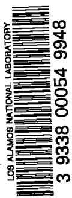

U.S. Atomic Energy Commission

# COMMITTEE ON NUCLEAR SCIENCE

D. A. Bromley, Chairman

Yaka University

Robley D. Evans, Vice Chairman

Massachusetts Institute of Technology

C. K. Reed, Executive Secretary

National Academy of Sciences

Martin J. Berger

National Bureau of Standards

Victor P. Bend

Brookhaven National Laboratory

Gregory R. Choppin

Florida State University

Herman Feuhbecch

Massachusetts Institute of Technology

F. S. Goulding

Lawrence Radiation Laboratory

Bernd Kahn

National Center for Radiological Health

# Members-at-Large

W. A. Fowler

California Institute of Technology

G.C.Phillips

Rice University

George Wetherill

University of California

Alexander Zucker

Oak Ridge National Laboratory

# Liaison Members

George A. Kolstad

U. S. Atomic Energy Commission

John McElhinney

Naval Research Laboratory

Walter S. Rodney

National Science Foundation

Lewis Slack

American Institute of Physics

# Subcommittees on Radiochemistry

Gregory R. Choppin, Chairman

Florida State University

Herbert M. Clark

Rensselaer Polytechnic Institute

Raymond Davis, Jr.

Brookhaven National Laboratory

Bruce Dropek

Los Alamos Scientific Laboratory

Rolf Herber

Rutgers University

John A. Mikel

Lawrence Radiation Laboratory

Julian M. Nolson

Pacific Northwest Laboratory

G. D. O'Kelley

Oak Ridge National Laboratory

Andrew F. Stjohns

Argonne National Laboratory

John W. Winchester

University of Michigan

# The Radiochemistry of Uranium

JAMES E. GINDLER

Argonne National Laboratory

Argonne, Illinois

Issuance Date: March 1962

LOS ALAMOS

SCIENTIFIC LABORATORY

NOV 1978

LIBRARIES

PROPERTY

Subcommittee on Radiochemistry

National Academy of Sciences—National Research Council

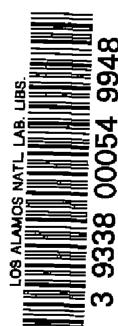

Price $3.00, which is the minimum order price for either one, two, or three randomly selected publications in the NAS-NS series. Additional individual copies will be sold in increments of three for $3.00. Available from:

National Technical Information Service

U.S. Department of Commerce

Springfield, Virginia 22151

Printed In the United States of America

USAEC Technical Information Center, Oak Ridge, Tennessee

1962; latest printing 1972

# FOREWORD

The Subcommittee on Radiochemistry is one of a number of subcommittees working under the Committee on Nuclear Science within the National Academy of Sciences - National Research Council. Its members represent government, industrial, and university laboratories in the areas of nuclear chemistry and analytical chemistry

The Subcommittee has concerned itself with those areas of nuclear science which involve the chemist, such as the collection and distribution of radiochemical procedures, the establishment of specifications for radiochemically pure reagents, availability of cyclotron time for service irradiations, the place of radiochemistry in the undergraduate college program, etc.

This series of monographs has grown out of the need for up-to-date compilations of radiochemical information and procedures. The Subcommittee has endeavored to present a series which will be of maximum use to the working scientist and which contains the latest available information. Each monograph collects in one volume the pertinent information required for radiochemical work with an individual element or a group of closely related elements.

An expert in the radiochemistry of the particular element has written the monograph, following a standard format developed by the Subcommittee. The Atomic Energy Commission has sponsored the printing of the series.

The Subcommittee is confident these publications will be useful not only to the radiochemist but also to the research worker in other fields such as physics, biochemistry or medicine who wishes to use radiochemical techniques to solve a specific problem.

W. Wayne Meinke, Chairman

Subcommittee on Radiochemistry

# INTRODUCTION

This volume which deals with the radiochemistry of uranium is one of a series of monographs on radiochemistry of the elements. There is included a review of the nuclear and chemical features of particular interest to the radiochemist, a discussion of problems of dissolution of a sample and counting techniques, and finally, a collection of radiochemical procedures for the element as found in the literature.

The series of monographs will cover all elements for which radiochemical procedures are pertinent. Plans include revision of the monograph periodically as new techniques and procedures warrant. The reader is therefore encouraged to call to the attention of the author any published or unpublished material on the radiochemistry of uranium which might be included in a revised version of the monograph.

# CONTENTS

I. General Reviews of the Inorganic and Analytical Chemistry of Uranium 1   
II. General Reviews of the Radiochemistry of Uranium 3   
III. Table of Isotopes of Uranium 3   
IV. Review of Those Features of Uranium Chemistry of Chief Interest to the Radiochemist 5

A. Metallic Uranium 5

1.Preparation 5   
2. Physical properties 6   
3. Chemical properties 6

B. Compounds of Uranium 7

C. The Chemistry of Uranium in Solution 14

1. Oxidation states 14   
2. Complex ion formation 21   
3. Non-aqueous solutions of uranium 30

D. Separation of Uranium 39

1. Precipitation 40   
2. Solvent extraction 60  
Ethers, esters, ketones, and alcohols 63  
Organophosphorus compounds 122  
Amines and quaternary ammonium salts 169  
Carboxylic acids 180  
Chelating agents 182   
3. Ion exchange 202  
Anion exchange 204  
Cation exchange 222   
4. Chromatography 227   
5. Volatilization 231   
6. Electrochemical methods 232   
7. Pyrometallurgical processes 235

E. Determination of Uranium 236

1. Counting techniques 236   
2. Sample preparation 241   
3. Activation analysis 248

F. Dissolution of Uranium Samples 252

1.Metallio uranium 252   
2. Alloys of uranium 254   
3. Compounds of uranium 254   
4.Meteorites,minerals,and ores 255   
5. Biological samples 256   
6. Air dust samples 256

V. Collection of Detailed Procedures 257

# The Radiochemistry of Uranium

JAMES E. GINDLER  
Argonne National Laboratory  
Argonne, Illinois

I. General Reviews of the Inorganic and Analytical Chemistry of Uranium.

1. J. W. Mellor, "Uranium" in "A Comprehensive Treatise on Inorganic and Theoretical Chemistry," Volume XII, Chapter LXIII, pp. 1-138, Longmans Green and Company, London, 1932.   
2. R. J. Meyer and E. Pietsch, "Gmelins Handbuch der Anorganischen Chemie," 8th Edition, System No. 55, Verlag Chemie, G.m.b.H., Berlin, 1936.   
3. N. V. Sidgwick, "Uranium" in "The Chemical Elements and Their Compounds," pp. 1069-1086, Clarendon Press, Oxford, 1950.   
4. C. J. Rodden and J. C. Warf, "Uranium" in "Analytical Chemistry of the Manhattan Project," National Nuclear Energy Series, Division VIII, Volume 1, Chapter 1, pp. 3-159, C. J. Rodden, Ed., McGraw-Hill Book Co., Inc., New York, 1950.   
5. J. J. Katz and E. Rabinowitz, "The Chemistry of Uranium," National Nuclear Energy Series, Division VIII, Volume 5, McGraw-Hill Book Co., Inc., New York, 1951.   
6. G. T. Seaborg, "The Actinide Series" in "Comprehensive Inorganic Chemistry," Volume I, Chapter 3, pp. 161-223,

M. C. Sneed, J. L. Maynard, and R. C. Brasted, Ed., D. van Nostrand Company, Inc., New York, 1953.   
7. H. R. Hoekstra and J. J. Katz, "The Chemistry of Uranium" in "The Actinide Elements," National Nuclear Energy Series, Division IV, Volume 14A, Chapter 6, pp. 130-188, G. T. Seaborg and J. J. Katz, Ed., McGraw-Hill Book Co., Inc., New York, 1954.   
8. J. J. Katz and G. T. Seaborg, "The Chemistry of the Actinide Elements," Chapter V, pp. 94-203, John Wiley and Sons, Inc., New York, 1957.   
9. "Uranium," R. Caillat and J. Elston, Directors, in "Nouveau Traite de Chemie Minérale," Part I, Volume XV, P. Pascal, Director, Masson et Cie, Paris, 1960. Part II, 1961.   
10. G. Meister, "Uranium" in "Rare Metals Handbook," Chapter 26, pp. 501-571, C. A. Hampel, Ed., Reinhold Publishing Corp., New York, 1954.   
11. L. Grainger, "Uranium and Thorium," George Newnes Limited, London, 1958.   
12. A. N. Holden, "Physical Metallurgy of Uranium," Addison-Wesley Publishing Company, Inc., Reading, Mass., 1958.   
13. "Uranium Ore Processing," J. W. Clegg and D. D. Foley, Ed., Addison-Wesley Publishing Company, Inc., Reading, Mass., 1958.   
14. "Uranium" in "Scott's Standard Methods of Chemical Analysis," Volume I, pp. 1017-1027, N. H. Furman, Ed., D. van Nostrand Co., Inc., New York, 1939.   
15. TID-5223, Production and Separation of $\mathbf{U}^{233}$ , Collected Papers, Part 1 and Part 2, L. I. Katzin, Ed., 1952.   
16. TID-5290, Chemistry of Uranium, Collected Papers, Book 1 and Book 2, J. J. Katz and E. Rabinowitz, Ed., 1958.   
17. G. H. Morrison and H. Freiser, "Solvent Extraction in Analytical Chemistry," John Wiley and Sons, Inc., New York, 1957.

II. General Reviews of the Radiochemistry of Uranium.

1. E. K. Hyde, "Radiochemical Separation of the Actinide Elements" in "The Actinide Elements," National Nuclear Energy Series, Division IV, Volume 14A, Chapter 15, pp. 542-595, G. T. Seaborg and J. J. Katz, Ed., McGraw-Hill Book Co., Inc., New York, 1954.   
2. E. K. Hyde, Paper P/728 "Radiochemical Separations Methods for the Actinide Elements," Volume 7, pp. 281-303, Proceedings of the International Conference in Geneva, August, 1955, on the Peaceful Uses of Atomic Energy, United Nations, New York, 1956.

III. Table of Isotopes of Uraniuma   

<table><tr><td>Isotope</td><td>Half-Life</td><td>Type and Energy of Radiation (Mev)</td><td>Method of Preparation</td></tr><tr><td>U227</td><td>1.3 min</td><td>α 6.8</td><td>Th232(a,9n)</td></tr><tr><td>U228</td><td>9.3 min</td><td>α (~80%) 6.67</td><td>Th232(a,8n); ~2%</td></tr><tr><td></td><td></td><td>EC(~20%)</td><td>daughter 36 min Pu232</td></tr><tr><td>U229</td><td>58 min</td><td>EC(~80%)</td><td>Th232(a,7n); ~0.1%</td></tr><tr><td></td><td></td><td>α (~20%) 6.42</td><td>daughter 20 min Pu233</td></tr><tr><td>U230</td><td>20.8 day</td><td>α 5.884 (67.2%)</td><td>Th232(a,6n); ~15%</td></tr><tr><td></td><td></td><td>5.813 (32.1%)</td><td>daughter 17.7 day Pa230;</td></tr><tr><td></td><td></td><td>5.658 (0.7%)</td><td>~6% daughter 9.0 hour Pu234</td></tr><tr><td>U231</td><td>4.3 day</td><td>EC (99%)</td><td>Th232(a,5n);</td></tr><tr><td></td><td></td><td>α(5.5x10-3%) 5.45</td><td>Pa231(d,2n);</td></tr><tr><td></td><td></td><td></td><td>3 x 10-3% daughter 26 min Pu235</td></tr><tr><td>U232</td><td>74 year</td><td>α 5.318 (68%)</td><td>Th232(a,4n);</td></tr><tr><td></td><td></td><td>5.261 (32%)</td><td>daughter 1.31 day</td></tr><tr><td></td><td></td><td>5.134 (0.32%)</td><td>Pa232; daughter 2.85 year Pu236; U233(n,2n)</td></tr><tr><td rowspan="5">U233</td><td rowspan="5">1.626 x 105yearb</td><td>α 4.816 (83.5%)</td><td rowspan="5">daughter 27.0 day Pa233</td></tr><tr><td>4.773 (14.9%)</td></tr><tr><td>4.717 (1.6%)</td></tr><tr><td>4.655 (0.07%)</td></tr><tr><td>4.582 (0.04%)</td></tr><tr><td rowspan="5">U234(UII)</td><td rowspan="5">2.48 x 105year</td><td>α 4.768 (72%)</td><td rowspan="2">natural radioactivity 0.0056%;</td></tr><tr><td>4.717 (28%)</td></tr><tr><td></td><td>daughter 1.175 min Pa234m(UX2);</td></tr><tr><td></td><td>daughter 6.66 hour Pa234(UZ);</td></tr><tr><td></td><td>daughter 86.4 year Pu238; U233 (n,γ)</td></tr><tr><td>U235m</td><td>26.5 min</td><td>IT</td><td>daughter 24,360 year Pu239</td></tr><tr><td rowspan="7">U235(AcU)</td><td rowspan="7">7.1 x 108year</td><td>α 4.559 (6.7%)</td><td rowspan="3">natural radioactivity 0.720%;</td></tr><tr><td>4.520 (2.7%)</td></tr><tr><td>4.370 (25%)</td></tr><tr><td>4.354 (35%)</td><td>daughter 26.5 min U235m; daughter</td></tr><tr><td>4.333 (14%)</td><td>410 day Np235;</td></tr><tr><td>4.318 (8%)</td><td rowspan="2">daughter 23.7 min Pa235</td></tr><tr><td>4.117 (5.8%)</td></tr><tr><td rowspan="2">U236</td><td rowspan="2">2.39 x 107year</td><td>α 4.499</td><td>51% daughter Np236 c;</td></tr><tr><td></td><td>daughter 6,580 year Pu240; U235(n,γ)</td></tr><tr><td rowspan="4">U237</td><td rowspan="4">6.75 day</td><td>β-0.248</td><td>daughter 11 min Pa237 d;</td></tr><tr><td></td><td>4x10-3% daughter Ru241;</td></tr><tr><td></td><td>U238(n,2n);</td></tr><tr><td>4</td><td>U236(n,γ)</td></tr><tr><td>U238(UI)</td><td>4.51 x 109year</td><td>α 4.195</td><td>natural radio-activity</td></tr><tr><td></td><td></td><td></td><td>99.276%</td></tr><tr><td>U239</td><td>23.54 min</td><td>β-1.21</td><td>U238(n,γ); U238(d,p)</td></tr><tr><td>U240</td><td>14.1 hour</td><td>β-0.36</td><td>daughter ~7.6 x 107year Pu244; 2nd order neutron capture on U238</td></tr></table>

Data concerning half-lives, radiations and branching ratios, unless otherwise noted has been obtained from the "Table of Isotopes" by D. Strominger, J. M. Hollander and G. T. Seaborg, Reviews of Modern Physics, 30, No. 2, Part II, April, 1958. This compilation may be consulted for more complete information on the isotopes and for references to the original literature.   
b Ya. P. Dokuchayev and I. S. Osipov, Atomnaya Energiya, 6, 73 (1959). c J. E. Gindler and R. K. Sjoblom, J. Inorg. Nuclear Chem., 12, 8 (1959).   
The half-life of $\mathsf{Pa}^{237}$ has been reported recently to be $39 \pm 3$ min, K. Takahashi and H. Morinaga, Nuclear Physics, 15, 664 (1960).

IV. Review of Those Features of Uranium Chemistry of Chief Interest to the Radiochemist.

# A. Metallic Uranium

1. Preparation. Uranium metal may be prepared by several methods: the reduction of uranium oxides with carbon in an arc-melting furnace; reduction of uranium oxides with magnesium, aluminum, calcium or calcium hydride; the reduction of uranium halides with alkali or alkaline-earth metals; electrolytic reduction of uranium halides; and the thermal decomposition of uranium iodide.

2. Physical properties. Metallic uranium exists in three allootropic forms: the orthorhombic alpha form, stable below $663^{\circ}\mathrm{C}$ ; the tetragonal beta form which exists between $663^{\circ}\mathrm{C}$ and $770^{\circ}\mathrm{C}$ ; and the body-centered cubic form which exists at higher temperatures ( $>770^{\circ}\mathrm{C}$ ). The physical properties of the metal as compiled by Grainger are given in Table I. Because of the method of preparation, impurities may be contained in the metal which alter its properties. Also, a number of the physical characteristics depend upon anisotropic and structural effects, eg. thermal expansion. Therefore, if physical properties are pertinent to an experiment or design, it is best to determine them individually for the metal used.

The changes wrought in metallic uranium by radiation and thermal cycling may be considerable. The results of reactor radiation on the metal are: dimensional instability, surface roughening and pimpling, warping, high hardness, extreme brittleness, cracks and porosity, broadened x-ray diffraction lines, and decreased thermal and electrical conductivity.3 Thermal cycling growth is similar in many respects to that caused by radiation damage. However, differences exist, the fundamental difference being in the mechanism of growth. (The reader is directed to reference 3 for more detailed discussion of this subject.)

3. Chemical properties. Uranium is a highly reactive metal. A potential of +1.80 volts for the half-cell reaction, $\mathrm{U} \rightarrow \mathrm{U}^{+3} + 3\mathrm{e}$ , places it below beryllium and above hafnium and aluminum in the electromotive force series. The metal forms intermetallic compounds with Al, Be, Bi, Co, Cu, Ga, Au, Fe, Pb, Mn, Hg, N1, Sn, Ge, In, Ir, Pd, Pt, Tl, and Zn; solid solutions with Mo, Ti, Zr, and Nb. It reacts at varying temperatures with H2, B, C, Si, N2, P, As, O2, S, Se, F2, Cl2, Br2, I2, H2O, HF(g), H2S, NH3, NO, HCI(g) N2O4, CH4, CO, CO2. In air, at room temperature, massive uranium tarnishes to form a yellow and eventually a black oxide

coating. Finely divided powder may burn spontaneously. In boiling water, massive uranium corrodes slowly with the formation of uranium dioxide and hydrogen. The reaction products with steam are uranium oxide and hydride. The dissolution of uranium metal is discussed in section IV-F.

Table I. Physical Properties of Uranium Metal   

<table><tr><td>Density (high purity)</td><td>19.05 ± 0.02 gm/cm3</td></tr><tr><td>Density (industrial uranium)</td><td>18.85 ± 0.20 gm/cm3</td></tr><tr><td>Melting point</td><td>1.132 ± 1°C.</td></tr><tr><td>Boiling point</td><td>3,818°C.</td></tr><tr><td>Heat of fusion</td><td>4.7 kcal/mole</td></tr><tr><td>Vapor pressure (1,600°C.)</td><td>10-4mm</td></tr><tr><td>Thermal conductivity (70°C.)</td><td>0.071 cal/cm-sec-°C.</td></tr><tr><td>Electrical resistivity (25°C.)</td><td>35 x 106ohm/cm3</td></tr><tr><td>Mean coefficient of linear thermal expansion (random orientation 25-100°C.)</td><td>16 x 10-6°C.</td></tr><tr><td>Specific heat (25°C.)</td><td>6.65</td></tr><tr><td>Enthalpy (25°C.)</td><td>1,520 cal/mole</td></tr><tr><td>Entropy (25°C.)</td><td>12.0 cal/mole/°C.</td></tr></table>

# IV-B. Compounds of Uranium

Uranium combines with most elements to form a large number and variety of compounds. "Gmelins Handbuch der Anorganischen Chemie," $^{6}$ which surveys the literature through the year 1935, describes several hundred compounds. Katz and Seaborg $^{2}$ describes some of the more recently prepared compounds, principally of organic character, such as chelates, alkoxides, amides, mercaptides, and $\pi$ -cyclopentadienyl compounds.

The oxidation states of uranium in the combined form vary from II to VI. Divalent uranium compounds reported are UO and US. Trivalent uranium compounds are more numerous and include the hydride, nitride, sesquisulfide, halides and borohydride. Uranium (III) sulfate $\mathrm{UH(SO_4)_2}$ has also been reported. A large number of tetravalent compounds are known varying in complexity from the oxide and simple binary salts to more complicated organic structures. Complex salts such as $3(\mathrm{CN}_3\mathrm{H}_6)_2\mathrm{CO}_3\cdot$ $\mathrm{U(CO_3)_2\cdot 4H_2O}$ and $2(\mathrm{NH_4})_2\mathrm{C_2O_4}\cdot \mathrm{U(C_2O_4)_2}\cdot 6\mathrm{H_2O}$ form an important group of uranium (IV) compounds. Complex salts are formed also with halide, sulfite, sulfate, and phosphate ions. Inorganic compounds of pentavalent uranium are $\mathrm{UF}_5$ , $\mathrm{UCl}_5$ , $\mathrm{UCl}_5\cdot \mathrm{SOCl}_2$ , $\underline{\underline{\mathbf{8}}}$ , $\mathrm{UCl}_5\cdot \mathrm{PCl}_5$ , $\underline{\underline{\mathbf{6}}}$ and $\mathrm{UF}_5\cdot \mathrm{xHF}$ . $\underline{\underline{\mathbf{6}}}$ $\mathrm{UOCl}_3$ has been reported as an intermediate compound in the chlorination of uranium oxides with carbon tetrachloride. Uranium (V) alkoxides have been prepared. Also, the compounds $(\mathrm{C}_5\mathrm{H}_6\mathrm{N})_2$ $\mathrm{UOCl}_5$ and $\mathrm{UOCl}_3$ - EtOH have been reported. Hexavalent uranium is represented by $\mathrm{UF}_6$ , $\mathrm{UCl}_6$ , $\mathrm{UO}_3$ , uranates, and uranyl $(\mathrm{UO}_2^{2+})$ compounds. Uranyl compounds are the most numerous uranium compounds and vary in type from simple salts to complex organic arrangements. Complex salts are formed with halide, iodate, nitrate, carbonate, cyanide, acetate, oxalate, sulfate, phosphate, arsenate, chromate and vanadate ions. Triple acetate salts of the form

$$
\mathrm {M} ^ {\mathrm {I}} \mathrm {M} ^ {\mathrm {I I}} (\mathrm {U O} _ {2}) _ {3} (\mathrm {C H} _ {3} \mathrm {C O} _ {2}) _ {9} \cdot 6 \mathrm {H} _ {2} \mathrm {O},
$$

where $\mathbf{M}^{\mathrm{I}}$ is an alkali metal (Li, Na, or K) and $\mathbf{M}^{\mathrm{II}}$ is a divalent metal (Mg, Ni, Zn, etc.), are used in analytical separations of uranium. Addition compounds, such as $\mathrm{UO}_2(\mathrm{NO}_3)_2 \cdot 2\mathrm{CH}_3\mathrm{COC}_4\mathrm{H}_9$ , represent a large number of uranyl compounds.

Uranates and peruranates are important in the analytical chemistry of uranium. Uranates have the general formula $xM_2^I O \cdot yUO_3$ or $xM^II O \cdot yUO_3$ . They may be prepared by different methods. However, in usual analytical procedures, they are precipitated

from a uranyl solution by the addition of a soluble metal hydroxide, $\mathrm{NH_4OH}$ , $\mathrm{NaOH}$ , $\mathrm{Ca(OH)_2}$ , etc. The uranates are insoluble in water but dissolve in acids.

Peruranates $^6$ are formed when uranyl solutions containing hydrogen peroxide are made alkaline. The composition of the peruranates depends upon the concentration of the alkali and peroxide. The following groups have been identified:

$\mathsf{M}_2\mathsf{U}_2\mathsf{O}_{10} \cdot \mathsf{xH}_2\mathsf{O}, \mathsf{M}_2\mathsf{U}\mathsf{O}_6 \cdot \mathsf{xH}_2\mathsf{O}, \mathsf{M}_6\mathsf{U}_2\mathsf{O}_{13} \cdot \mathsf{xH}_2\mathsf{O},$ and $\mathsf{M}_4\mathsf{U}\mathsf{O}_8 \cdot \mathsf{xH}_2\mathsf{O}$ . The peruranates are generally soluble in water. The least soluble are those of the $\mathsf{M}_2\mathsf{U}_2\mathsf{O}_{10} \cdot \mathsf{xH}_2\mathsf{O}$ group. The peruranates are soluble in dilute mineral acids.

Table II lists a number of uranium compounds together with their behavior in different solvents. The compounds listed are primarily binary compounds or simple salts. The order in which they appear is the order in which they may be found in "Gmelins Handbuch der Anorganischen Chemie." 6

Table II. Uranium Compounds and Their Solvents.   

<table><tr><td>Compound</td><td>Solvent</td></tr><tr><td>UH3</td><td>s. HNO3(vigorous), conc. HClO4, hot conc. H2SO4, a. +H2O2i. alk., liq. NH3</td></tr><tr><td>UO2</td><td>s. HNO3, aq. reg., conc. H2SO4, slowly converted to U(IV)-salts in hot fum. HCl</td></tr><tr><td>U3O8</td><td>s. HNO3; heated to redness U3O8is only v. s1. s. dil. HCl and H2SO4, more s. conc. a., s. hot conc. H2SO4; HF forms s. UO2F2and i. UF4</td></tr><tr><td>UO3</td><td>s. mineral a.</td></tr><tr><td>UO2·xH2O[U(OH)4·(x-2)H2O]</td><td>s. dil. a.</td></tr><tr><td>U3O8·xH2O</td><td>s. a.</td></tr><tr><td>UO3·2H2O</td><td>s. a., converted to UO3·H2O in boiling H2O</td></tr></table>

Table II. - Continued   
Compound Solvent $\mathrm{UO_3\cdot H_2O}$ $[\mathrm{H}_2\mathrm{UO}_4,\mathrm{UO}_2(\mathrm{OH})_2]$ a. a., warm conc. $\mathrm{UO_2(NO_3)_2}$ soln. $\mathrm{UO_4\cdot 2H_2O}$ solubility in $\mathrm{H}_20:20^\circ \mathrm{C - .0006g / 100ml},$ $90^{\circ}C - .008~\mathrm{g / 100~ml};$ d. HCI; aik.   
hydroxides form $\mathrm{UO_3}$ and s. peruranates $\mathrm{U}_{3}\mathrm{N}_{4}$ a. $\mathrm{HNO}_3$ ; i. conc. HCI, $\mathrm{H}_2\mathrm{SO}_4$ $\mathrm{UO_2(NO_3)_2\cdot 6H_2O}$ a solubility in $\mathrm{H}_20:0^\circ C - 170.3~\mathrm{g / 100~ml},$ $60^{\circ}C$ -soluble in all proportions; a. al., ether, acetone, dil. a. $\mathbf{UF}_3$ b. h. HCIO4, h. HNO3, h. $\mathrm{H}_2\mathrm{SO}_4$ , $\mathrm{H}_3\mathrm{BO}_3+$ mineral a. $\mathbf{UF}_4$ i. $\mathrm{H}_2\mathrm{O};$ s. fum. HCIO4, HNO3 + H3BO3; metathesized to U(IV)-hydroxide by heating with NaOH $\mathbf{UF}_5$ $\mathbf{U}_2\mathbf{F}_9$ $\mathbf{U}_4\mathbf{F}_{17}$ d. $\mathbf{H}_2\mathbf{O}$ forms s. $\mathbf{UO_2F_2}$ and i. UF4 $\mathbf{UF}_6$ b. $\mathbf{H}_2\mathbf{O}$ -vigorous reaction, CCl4, CHCl3; v. s. $\mathbf{C}_2\mathbf{H}_2\mathbf{C}\mathbf{l}_4;$ d. alcohol, ether $\mathbf{UO_2F_2}$ s. $\mathbf{H}_2\mathbf{O},$ alcohol; i. ether, amyl alcohol   
UC13 s. $\mathbf{H}_2\mathbf{O},$ HCl, glac. acetic a.; i. CCl4, CHCl3, acetone, pyridine   
UC14 s. $\mathbf{H}_2\mathbf{O},$ $\mathbf{C}_2\mathbf{H}_5\mathbf{OH},$ acetone, ethyl acetate, ethyl benzoate; i. ether, CHCl3, benzene   
UC15 s. $\mathbf{H}_2\mathbf{O}(\mathsf{d}.)$ ; absolute alcohol, ethyl benzoate, trichloracetic acid, ethyl acetate, benzonitrite, CS2, SOCl2   
UC16 d. $\mathbf{H}_2\mathbf{O};$ s. CCl4, CHCl3   
UOC12 s. $\mathbf{H}_2\mathbf{O}$ $\mathrm{UO_2Cl_2}$ s. $\mathbf{H}_2\mathbf{O}:18^{\circ}\mathrm{C - }320~\mathrm{g / 100~ml};$ s. alcohol, ether   
UBr3 s. $\mathbf{H}_2\mathbf{O}$

a di- and tri-hydrates are also well established.

Table II. - Continued   

<table><tr><td>Compound</td><td>Solvent</td></tr><tr><td>UBr4</td><td>s. H2O, acetone, methyl- and ethyl-acetate, pyridine; i. ether</td></tr><tr><td>UOBr2</td><td>s. H2O</td></tr><tr><td>UO2Br2</td><td>s. H2O, alcohol, ether</td></tr><tr><td>UI3</td><td>s. H2O</td></tr><tr><td>UI4</td><td>s. H2O</td></tr><tr><td>UO2(IO3)2·H2O</td><td>v. sl. s. H2O: 18°C-a form, 0.1049 g/100 ml, β form, 0.1214 g/100 ml; cold ppt. s. HNO3and H3PO4, i. a. after previously heating to boiling temp.; s. alk. carbonates</td></tr><tr><td>US</td><td>v. difficultly s. conc. HCl, dil. HNO3</td></tr><tr><td>U2S3</td><td>+O aq. reg., conc. HNO3</td></tr><tr><td>US2</td><td>d. steam, HNO3; s. hot conc. HCl</td></tr><tr><td>UO2S</td><td>sl. s. H2O; s. dil. a., alcohol, (NH4)2CO3; 1. absolute alcohol</td></tr><tr><td>UO2SO3·4H2O</td><td>1. H2O; s. aq. or alcoholic SO2solution</td></tr><tr><td>U(SO4)2·9H2O</td><td>s. dil. H2SO4</td></tr><tr><td>U(SO4)2·8H2O</td><td>hydrolyzes in H2O with separation of basic sulfate, UOSO4·2H2O; s. dil. mineral a., acetic a.</td></tr><tr><td>U(SO4)2·4H2O</td><td>hydrolyzes in H2O(d.); s. dil. H2SO4, HCl</td></tr><tr><td>UOSO4·2H2O</td><td>s. a.</td></tr><tr><td>UO2SO4·3H2O</td><td>s. H2O: 15.5°C-20.5 g/100 ml, 100°C-22.2 g/100 ml; s. mineral a.</td></tr><tr><td>UO2SO4·H2O</td><td>s. H2O</td></tr><tr><td>USE2</td><td>ignites with HNO3; chemical properties similar to US2</td></tr><tr><td>UO2Se</td><td>d. H2O; s. cold HCl - forms UO2Cl2</td></tr></table>

Table II. - Continued   

<table><tr><td>Compound</td><td>Solvent</td></tr><tr><td></td><td>and H2Se; reacts violently with HNO3-Se is first formed and is then oxidized</td></tr><tr><td>UO2SeO3· 2H2O</td><td>1. H2O; s. HCl</td></tr><tr><td>UB2</td><td>s. aq. reg., HNO3, HF</td></tr><tr><td>UB4</td><td>s. cold HF, cold HCl, HNO3, conc. H2O2, reduces conc. H2SO4</td></tr><tr><td>UB12</td><td>1. hot conc. HCl, HF; slowly s. hot conc. H2SO4</td></tr><tr><td>U(BH4)4</td><td>d. H2O, alcohol</td></tr><tr><td>UC2</td><td>d. H2O, dil. HCl, dil. HNO3, dil. H2SO4; reacts vigorously with heated conc. a.</td></tr><tr><td>UO2CO3</td><td>s. a.</td></tr><tr><td>UO2(HCO2)2· H2O</td><td>s. H2O: 15°C-420 g/100 ml; s. methyl alcohol; sl. a. formic a.; 1. ethyl alcohol, ether, acetone, CS2, CCl4, CHCl3, benzene, petroleum ether</td></tr><tr><td>UO2(HCO2)2· UO3· 3H2O</td><td>less s. H2O than neutral salt; more s. formic a. than neutral salt</td></tr><tr><td>UO2(CH3CO2)2· 2H2O</td><td>s. H2O: 15°C-7.694 g/100 ml; v. s. alcohol; i. ether</td></tr><tr><td>U(C2O4)2· 6H2O</td><td>i. H2O, dil. a.; s. warm conc. HCl, conc. HNO3</td></tr><tr><td>UO2C2O4· 3H2O</td><td>sl. s. H2O: 14°C-0.8 g/100 ml, 100°C-3.3 g/100 ml; s. mineral a., H2C2O4and alk. oxalate solutions</td></tr><tr><td>U(C4H4O6)2· 2H2O</td><td>1. H2O, organic solvents; s. tartaric a., tartrates, conc. a.</td></tr><tr><td>UO2(C4H4O6)· 4H2O</td><td>sl. s. H2O: 17°C-3.28 g/100 cc solution</td></tr><tr><td>UO2(CNS)2· 8H2O</td><td>s. H2O, ethyl and amyl alcohol, acetone, ether</td></tr></table>

Table II. - Continued   
Compound Solvent $\mathbf{US1}_2$ i. cold or hot conc.: HCl, $\mathrm{HNO_3}$ $\mathrm{H}_2\mathrm{SO}_4$ aq. reg.; s. conc. HF; converted to silicate and uranate by molten alk. and alk. carbonates at red heat $\mathbf{U}_{3}\mathbf{P}_{4}$ d. boiling conc. $\mathrm{HNO}_3$ , aq. reg., alk. hydroxide $\mathrm{U(H_2PO_2)_4\cdot xH_2O}$ 1. $\mathrm{H}_2\mathrm{O}$ , dil. a.; s. conc. a., $50\%$ $\mathrm{H}_3\mathrm{PO}_2$ $\mathrm{UO_2(H_2PO_2)_2}$ 1. $\mathrm{H}_2\mathrm{O}$ , dil. $\mathrm{H}_2\mathrm{SO}_4$ ; s. $\mathrm{HNO}_3$ $\mathrm{U(HPO_3)_2\cdot 4H_2O}$ 1. $\mathrm{H}_2\mathrm{O}$ , dil. a.; s. conc. a., $50\%$ $\mathrm{H}_3\mathrm{PO}_3$ $\mathrm{UO_2HPO_3}$ 1. $\mathrm{H}_2\mathrm{O}$ , dil. a.; s. conc. a. $\mathrm{U}_3(\mathrm{PO}_4)_4$ 1. $\mathrm{H}_2\mathrm{O}$ ; attacked by a., esp. $\mathrm{HNO}_3$ $\mathrm{UH_2(PO_4)_2\cdot 2H_2O}$ s. conc. HCl $(\mathrm{UO_2})_3(\mathrm{PO_4})_2\cdot \mathrm{xH_2O}$ 1. $\mathrm{H}_2\mathrm{O}$ , acetic a.; s. mineral a. $\mathrm{UO_2HPO_4\cdot xH_2O}$ 1. $\mathrm{H}_2\mathrm{O}$ ; s. mineral a., xs.(NH)CO3   
UPo7 1. $\mathrm{H}_2\mathrm{O}$ , cold a. $(\mathrm{UO_2})_{\mathrm{P}}_{2}^{0} = 7\cdot 5\mathrm{H}_{2}^{0}$ 1. $\mathrm{H}_2\mathrm{O}$ , alcohol, ether; s. xs. Na4P207, HNO3   
U(PO3)4 1. $\mathrm{H}_2\mathrm{O}$ , HCl, HNO3, $\mathbf{H}_2\mathbf{S}\mathbf{O}_4$ $\mathrm{UO_2(PO_3)_2}$ 1s.HNO3   
UAs4 1s.HNO3 $\mathrm{U}_{3}(\mathrm{AsO}_{4})_{4}$ 1s.HNO3 $\mathrm{UH_2(Aso_4)_2\cdot 3H_2O}$ 1s.HCl $\mathrm{UH_2(Aso_4)_2\cdot 2H_2O}$ 1s.dil.a.eap.araenic a. $\mathrm{UO_2HAsO_4\cdot 4H_2O}$ 1s.H2O, acetic a.. $(\mathrm{UO_2})_2\mathrm{As}_2\mathrm{O}_7$ 5uO·3sbO5·15HO aq.reg.,hot conc.HCl,d.HNO3   
Uo·Vo5·xH20   
Uo·Vo5·Ho $2\mathrm{UO}_{3}\cdot \mathrm{V}_{2}\mathrm{O}_{5}$ UoCrO4·xH20 b.H20

Table II. - Continued   
Compound Solvent $\mathrm{U(MoO_4)_2}$ s. HCl $\mathrm{UO}_2\mathrm{MoO}_4$ 1. $\mathsf{H}_2\mathsf{O}$ , CHCl3, benzene, toluene, ether, alcohol, acetic a.; s. HCl, $\mathsf{H}_2\mathsf{SO}_4$ HNO3, $\mathsf{H}_2\mathsf{S}_2\mathsf{O}_7$ $3\mathrm{UO}_{3}\cdot 7\mathrm{MoO}_{3}$ i. $\mathsf{H}_2\mathsf{O}$ ; s. mineral a. $\mathrm{UO}_3\cdot 8\mathrm{MoO}_3\cdot 13\mathrm{H}_2\mathrm{O}$ s. HNO3 $\mathrm{UO}_2\cdot 3\mathrm{WO}_3\cdot 6\mathrm{H}_2\mathrm{O}$ s. HCl; d. HNO; i. $\mathsf{H}_2\mathsf{SO}_4$ $\mathrm{UO}_3\cdot 3\mathrm{WO}_3\cdot 5\mathrm{H}_2\mathrm{O}$ s. $\mathsf{H}_2\mathsf{O}$ $\mathrm{UO}_3\cdot \mathrm{WO}_3\cdot 2\mathrm{H}_2\mathrm{O}$ sl.s.H20

Abbreviations used:   
IV-C. The Chemistry of Uranium in Solution   
a. - acid fun. - fuming alk. - alkali h. - hot aq. - aqueous 1. - insoluble aq. reg. - aqua regia 1. - liquid conc. - concentrated s. - soluble d. - decomposes sl. - slightly dil. - dilute v. - very esp. - especially xs. - excess

1. Oxidation states. Four oxidation states are known for uranium ions in aqueous solution: the tri-, tetra-, penta-, and hexapositive states. Ions in these states are usually represented as $\mathrm{U}^{+3}$ , $\mathrm{U}^{+4}$ , $\mathrm{UO}_2^+$ and $\mathrm{UO}_2^{+2}$ , respectively. The potentials between the various oxidation states are given below for acidic and basic solutions.

Acidic solution: 1 M HClO₄ at 25°C U⁻¹ⁱ⁰ U⁻³ 0.61 U⁻⁴ -0.62 U₀² -0.05 U₀² -0.334

Basic solution:

$$
\mathrm {U} ^ {2. 1 7} \mathrm {U} (\mathrm {O H}) _ {3} ^ {2. 1 4} \mathrm {U} (\mathrm {O H}) _ {4} ^ {0. 6 2} \mathrm {U O} _ {2} (\mathrm {O H}) _ {2}
$$

Tripositive uranium, $U^{+3}$ . Evidence for the existence of $U^{+3}$ comes from the reversibility of the $U(III)/U(IV)$ couple. Solutions may be prepared by the dissolution of a uranium trihalide or by the electrolytic reduction of a uranium (IV) or (VI) solution. Chloride, bromide, iodide, perchlorate and sulfate solutions of uranium(III) have been reported. $^{11}$ They are deep red in color and unstable, with oxidation of $U^{+3}$ to $U^{+4}$ occurring and hydrogen being evolved. Strongly acidified solutions $^{12}$ or those kept at low temperatures $^{10}$ appear to be more stable.

Tetrapositive uranium, $\mathbf{U}^{+4}$ . The existence of the $\mathbf{U}^{+4}$ ion in solution has been confirmed by measurement of the acid liberated on dissolving $\mathrm{UCl}_{4}\frac{13}{4}$ and by solvent extraction studies of U(IV) with thenoyltrifluoroacetone $^{14a}$ and acetylacetone. $^{14b}$ Uranous solutions may be prepared by dissolution of a water-soluble salt: the chloride, bromide, iodide, or sulfate; by dissolution of uranium or a uranium compound in an appropriate solvent, e.g., uranium metal in sulfuric or phosphoric acid; or by reduction of a uranyl solution by chemical, electrochemical or photochemical means. The solutions are green in color. They are stable in the absence of air but are oxidized by oxygen. Uranium(IV) undergoes hydrolysis with evidence in the first stages for the formation of the mononuclear species, $\mathrm{UOH}^{+3}$ . $13,15-18$ Polymeric species also are formed which apparently are not in equilibrium with the monomer. $^{13,15,19}$ Hietanen $^{17}$ found that in addition to the monomeric species, a polymer of the type $\mathrm{U[(OH)_3U]_n^{4+n}}$ could account for the hydrolysis of uranium(IV) to good approximation. Table III, based primarily upon the data compiled by Bjerrum, Schwarzenbach, and Sillén, $^{20}$

Table III. Hydrolysis of ${U}^{\text{基 }}$ and ${\mathrm{{UO}}}_{2}^{2 + }$ Ions ${}_{\mathrm{f}}^{\mathrm{a}}$   

<table><tr><td>Ion</td><td>Method</td><td>T</td><td>Medium</td><td>Log of equilibrium constant, remarks</td><td>Reference</td></tr><tr><td>U4+</td><td>magnet</td><td>20</td><td>var</td><td>*β2-2.30</td><td>21</td></tr><tr><td></td><td>sp</td><td>25</td><td>C(NaClO4)</td><td>*K1-1.63(C=2), -1.56(C=1), -1.50(C=0.5)</td><td>13</td></tr><tr><td></td><td>sp</td><td>10-43</td><td>0.5(NaClO4)</td><td>*K1-1.90(10°), -1.47(25°), -1.00(43°)</td><td>22</td></tr><tr><td></td><td>sp</td><td>10-43</td><td>→ 0</td><td>*K1-1.12(10°), -0.68(25°), -0.18(43°)</td><td>13,21</td></tr><tr><td></td><td></td><td></td><td></td><td>Δ*R1=11.7, Δ*S1=36(25°)</td><td></td></tr><tr><td></td><td>sp</td><td>15-25</td><td>0.19(HClO4)</td><td>*K1-1.38(15.2°), -1.12(24.7°)</td><td>16</td></tr><tr><td></td><td></td><td>25</td><td>0 corr</td><td>Δ*R1=10.7, Δ*S1=33, ΔS1=52</td><td>16</td></tr><tr><td></td><td>gl, red</td><td>25</td><td>3(Na)ClO4</td><td>*K1-2.0, *β3n,n+1 -1.2---3.4n</td><td>17</td></tr><tr><td></td><td>sol</td><td>25</td><td>0 corr</td><td>K5-3.77[&quot;U(OH)4(3)&quot;]</td><td>23</td></tr><tr><td></td><td>sp</td><td>25</td><td>2(ClO4-)</td><td>*K1-1.68, *R1-1.74</td><td>18</td></tr><tr><td></td><td></td><td></td><td></td><td>*K1: U4++ H20 ⇌ UOH3++ H+</td><td></td></tr><tr><td></td><td></td><td></td><td></td><td>*D1: U4++ D20 ⇌ UOD3++ D+</td><td></td></tr><tr><td></td><td></td><td></td><td></td><td>*K2: U4++ 2H20 ⇌ U(OH)2++ 2H+</td><td></td></tr><tr><td></td><td></td><td></td><td></td><td>*K3n,n+1: (n+1)U4++ 3nH20 ⇌ UI((OH)3U)n+1 + 3nH+</td><td></td></tr><tr><td>UO2+</td><td>qh</td><td>25-26</td><td>0 corr</td><td>*K1-4.3</td><td>49</td></tr><tr><td></td><td>gl</td><td>20-25</td><td>var</td><td>*K22-5.87</td><td>37</td></tr><tr><td></td><td>coll</td><td>?</td><td>var</td><td>*K1-4.50, *β22-4.95</td><td>38</td></tr><tr><td></td><td></td><td></td><td></td><td>ev UO2NO3OH, UO2(NO3)3OH2-</td><td></td></tr><tr><td>UO2+</td><td>qh,</td><td>25</td><td>0 corr</td><td>*K1-4.09</td><td>250</td></tr><tr><td></td><td>gl</td><td>15</td><td>C[Ba(NO3)2]</td><td>*K22-5.97(C=0.6), -5.72(C=0.06)</td><td>39,52,53</td></tr><tr><td></td><td>qh, gl</td><td>20</td><td>1(Na)ClO4</td><td>*K1-4.70(↑, see ref. 43), ev polyn opx</td><td>42</td></tr><tr><td></td><td></td><td>20</td><td>1(Na)ClO4</td><td>*K2n,n+1 0.30--6.35n</td><td>42, cr43</td></tr><tr><td></td><td></td><td>20</td><td>1(Na)ClO4</td><td>*K2n,n+1 0.30--6.40n</td><td>42, cr54</td></tr><tr><td></td><td>gl, fp, sp</td><td>25?</td><td>0.15(NaClO4)</td><td>*K22-5.94, *β43-14.29</td><td>40</td></tr><tr><td></td><td></td><td></td><td></td><td>Ka[O3OH(OH)2n]: -3.55(n=0), -6.5(n=1), -7.4(n=2), -11.0(n=3), -11.4(n=4)</td><td></td></tr><tr><td></td><td>gl, fp, sp</td><td>25?</td><td>0.1 ClO4</td><td>*K22-5.94, *β43-12.90</td><td>40</td></tr><tr><td></td><td>p(H2O)</td><td>25</td><td>2UO2(ClO4)</td><td>ev (UO2OH)2+, not UO2OH+</td><td>44</td></tr><tr><td></td><td></td><td></td><td>+UO3</td><td></td><td></td></tr><tr><td></td><td>sol</td><td>25</td><td>0 corr</td><td>*K3: 6.04, *K11.90, K3-3.60, K8-3.77</td><td>48</td></tr><tr><td></td><td></td><td></td><td></td><td>*K1-4.14, ev polyn opx</td><td></td></tr><tr><td></td><td>sp</td><td>?</td><td>var</td><td>*K1-4.19</td><td>50</td></tr><tr><td></td><td>dist</td><td>25</td><td>0.1(Na)ClO4</td><td>*K1-4.2, *K2-5.20</td><td>51</td></tr><tr><td></td><td>gl</td><td>25</td><td>0 corr</td><td>*K22-5.06, *β2k-1.26</td><td>45</td></tr><tr><td></td><td>gl</td><td>25</td><td>0.347[Ba(ClO4)2]</td><td>*K1-5.40, *β22-5.82</td><td>46</td></tr><tr><td></td><td>gl</td><td>25-40</td><td>0.0347[Ba(ClO4)2]</td><td>*K1-5.82(25°), -5.10(40°), Δ*R1=20.8</td><td>46</td></tr><tr><td></td><td></td><td></td><td></td><td>*K22-6.15(25°), -5.92(40°), Δ*R22=6.7</td><td></td></tr><tr><td>UO2+</td><td>qh, gl</td><td>25</td><td>0.0347[Ba(ClO4)2]</td><td>Δ*R1=4.3, Δ*R22=-6</td><td>46</td></tr><tr><td></td><td></td><td></td><td>1(Na)ClO4,</td><td>*K12-3.66, *β22-6.02</td><td>47</td></tr><tr><td></td><td></td><td></td><td>0.4UO2+</td><td></td><td></td></tr><tr><td></td><td>qh, gl</td><td>25</td><td>3(Na)ClO4,</td><td>*K12-3.68, *β22-6.3, *β43x-12.6(qh),</td><td>47</td></tr><tr><td></td><td></td><td></td><td>1.4UO2+</td><td>*K43-12.9(g1)</td><td></td></tr><tr><td></td><td></td><td></td><td></td><td>*K2n,n+1: (n+1)UO22+ 2nH20 ⇌</td><td></td></tr><tr><td></td><td></td><td></td><td></td><td>UO2[(OH)2UO2]2+ 2nH+ etc.</td><td></td></tr></table>

# Table III (Continued)

# TABLE 2.

The notation used in this and in the tables on complex information is patterned after that used by Bjerrun, Schwersebach, and Hillén, reference 20. The explanation of the table which follows is taken primarily from part II of reference 20 and this should be consulted for further details concerning notation. Part I of reference 20 may be consulted for a description of the various methods by which equilibrium constants are determined.

Colum one, "Ion," refers to the central ion $N$ about which the complex is formed.

Golden bee, "Method," refers to the method by which the countants were measured. The abbreviations used are:

<table><tr><td>ani ex</td><td>anion exchange</td><td>pH</td><td>pH method, not specified</td></tr><tr><td>cfug</td><td>centrifuges or ultracentrifuges</td><td>pol</td><td>polarography</td></tr><tr><td>ool</td><td>colorimetry</td><td>prep</td><td>preparative work</td></tr><tr><td>ocnd</td><td>conductivity</td><td>gh</td><td>quinhydride electrode</td></tr><tr><td>dist</td><td>distribution between two phases</td><td>red</td><td>surf with redox electrode</td></tr><tr><td>emf</td><td>emf, not specified</td><td>sol</td><td>solubility</td></tr><tr><td>fp</td><td>frressing paint</td><td>sp</td><td>spectrophotometry</td></tr><tr><td>gl</td><td>glass electrode</td><td>X-ray</td><td>X-ray diffraction</td></tr><tr><td>i ex</td><td>ion exchange</td><td>ΔG</td><td>combination of thermodynamic data</td></tr><tr><td>magnet</td><td>magnetic susceptibility</td><td>Fe</td><td>surf measurements with Fe electrode</td></tr><tr><td>p(X2O)</td><td>partial pressure of substance</td><td>Ag2O2O4</td><td>surf measurements with Ag2O2O4electrode</td></tr><tr><td></td><td>indicated</td><td>?</td><td>method not known to compliers</td></tr></table>

Column three, "T," gives the temperature in 'C, "M" indicates room temperature, and "T" is used if the temperature is unknown to the compliers.

Column four, "Medium," denotes the nature of the medium to which the equilibrium constants refer. The concentrations given in terms of moles per liter or moles per kilogram are not distinguished. Water is the solvent unless otherwise stated. Symbols used are:

<table><tr><td>→ 0</td><td>constants extrapolated to zero ionic strength.</td><td></td><td>with the ion shown in parentheses as the</td></tr><tr><td>0 corr</td><td>constants corrected to zero ionic strength by</td><td></td><td>inert cation.</td></tr><tr><td></td><td>application of some theoretical or empirical formula.</td><td>0(ξ104)</td><td>measurements made at a series of perchlorate concentrations.</td></tr><tr><td>0.1</td><td>an ionic strength of 0.1 mols per liter.</td><td>dil</td><td>dilute solution, concentration usually not more than 0.01 mole per liter.</td></tr><tr><td>1 NaClO4</td><td>constant concentration of the substance</td><td></td><td></td></tr><tr><td></td><td>stated (1 mole per liter NaClO4).</td><td>var</td><td>ionic medium varied, and in some cases no special attempt was made to control the ionic strength.</td></tr><tr><td>1(KaClO4)</td><td>ionic strength held constant at value stated</td><td></td><td></td></tr><tr><td></td><td>(1 mole per liter) by addition of the inert</td><td></td><td></td></tr><tr><td></td><td>salt indicated.</td><td>EUI var</td><td>this medium was mainly aqueous HCl at various concentrations.</td></tr><tr><td>I(KaClO4)</td><td>measurements made at a series of ions</td><td></td><td></td></tr><tr><td></td><td>strengths (I) with NaClO4as the inert salt.</td><td>EtOH</td><td>ethanol as solvent.</td></tr><tr><td>1(Ka)ClO4</td><td>concentration of the anion (ClO4-) held</td><td>org</td><td>various organic solvents.</td></tr><tr><td></td><td>constant at the value stated (2 mole per liter)</td><td>50% XeOH</td><td>50% methanol-water as solvent.</td></tr></table>

Column five, "Log of equilibrium constant, remarks." The following conventions are used: $\mathbb{I}_16^*$ means $\log_{10}\mathbb{I}_2 = 6^*$ ; $\mathbb{I}_2 > 3^*$ means $\log_{10}\mathbb{I}_2 > 3^*$ ; i.e., the "log" and "-" symbols are omitted. Concentrations [ ] are usually expressed as multiples per liter, but is not distinguished from multiples per kilogram. Pressures p are in atmospheres. The equilibrium constants refer to various types of reactions indicated on the part page.

1. Consecutive or step-wise constants: K

a. Addition of ligand (L)

$$
\mathbf {K} _ {\mathrm {n - 1}} + \mathrm {L e q} \mathbf {K} _ {\mathrm {n}}
$$

$$
\mathbf {x} _ {n} = \frac {[ \mathbf {x} _ {n} ]}{[ \mathbf {x} _ {n - 1} ] [ \mathbf {x} ]}
$$

b. Addition of protonated ligand (IL) with elimination of proton

$$
\mathrm {M G} _ {\mathrm {n - 1}} + \mathrm {H L} = \mathrm {M G} _ {\mathrm {n}} + \mathrm {E} ^ {+} * \mathrm {I} _ {\mathrm {n}} = \frac {[ \mathrm {M L} _ {\mathrm {n}} ] [ \mathrm {E} ^ {+} ]}{[ \mathrm {M L} _ {\mathrm {n - 1}} ] [ \mathrm {E} ]}
$$

o. Addition of protonated 1lgand $(\mathbb{R}_p^L)$

$$
\mathrm {M} (\mathrm {E} _ {\mathrm {p}} \mathrm {L}) _ {\mathrm {n - 1}} + \mathrm {H} _ {\mathrm {p}} ^ {\mathrm {L}} \rightleftharpoons \mathrm {K} (\mathrm {H} _ {\mathrm {p}} ^ {\mathrm {L}}) _ {\mathrm {n}} \quad \mathrm {H} _ {\mathrm {p}} ^ {\mathrm {L}}: \mathrm {K} _ {\mathrm {n}} = \frac {[ \mathrm {M} (\mathrm {H} _ {\mathrm {p}} ^ {\mathrm {L}}) _ {\mathrm {n}} ]}{[ \mathrm {N} (\mathrm {E} _ {\mathrm {p}} ^ {\mathrm {L}}) _ {\mathrm {n - 1}} ] [ \mathrm {E} _ {\mathrm {p}} ^ {\mathrm {L}} ]}
$$

d. Addition of central atom (M)

$$
\mathbf {x} _ {n - 1} \mathbf {L} + \mathbf {x} = \mathbf {x} _ {n} \mathbf {L} \quad \mathbf {x} _ {1 n} = \frac {\left[ \mathbf {x} _ {n} \mathbf {L} \right]}{\left[ \mathbf {x} _ {n - 1} \mathbf {L} \right] \left[ \mathbf {x} \right]}
$$

2. Cumulative or gross constants: $\beta$

In $\beta_{\mathrm{ru}}$ and ${}^{*}\beta_{\mathrm{ma}}$ the subscripts n and m denote the composition of the complex $\mathbf{M}_{\mathrm{m}}\mathbf{L}_{\mathrm{n}}$ formed. When $n = 1$ , the second subscript is omitted.

a. Addition of central atoms (R) and ligands (L)

$$
\mathbf {x} \in \mathbf {n} ^ {\mathrm {L}} \iff \mathbf {x} _ {\mathbf {g} ^ {\mathrm {T}}}
$$

$$
\beta_ {\text {m a x}} = \frac {[ m _ {\mathrm {i}} L _ {\mathrm {i}} ]}{[ m ] ^ {m} [ L ] ^ {n}}
$$

b. Addition of central atoms (M) and protonated ligands (EL) with elimination of protons

$$
\mathrm {m H} + \mathrm {n H} _ {\mathrm {L}} \rightleftharpoons \mathrm {K} _ {\mathrm {M}} \mathrm {L} _ {\mathrm {D}} + \mathrm {m H} ^ {+} \quad * \beta_ {\mathrm {R M}} = \frac {[ \mathrm {M} _ {\mathrm {L}} ] _ {\mathrm {D}} [ \mathrm {H} ^ {+} ] ^ {2}}{[ \mathrm {M} ] ^ {2} [ \mathrm {H L} ] ^ {2}}
$$

3. Solubility constants: $X_{\mathrm{b}}$

a. Solid $\mathbf{M}_{\mathrm{a}}\mathbf{I}_{\mathrm{b}}$ in equilibrium with free ions in solution

$$
\mathrm {N} _ {\mathrm {a}} \mathrm {L} _ {\mathrm {b}} (\mathrm {a}) \rightleftharpoons \mathrm {a N} + \mathrm {b L}
$$

$$
\mathbf {x} _ {\mathrm {a}, \mathrm {b}} = [ \mathbf {x} ] ^ {\mathrm {a}} [ \mathbf {L} ] ^ {\mathrm {b}}
$$

b. Solid $\mathbf{M}_{\mathrm{a}}\mathbf{L}_{\mathrm{b}}$ in equilibrium with complex $\mathbf{M}_{\mathrm{a}}\mathbf{L}_{\mathrm{b}}$ and ligand L in solution

$$
\frac {\pi}{a} M _ {a} L _ {b} (a) = M _ {a} L _ {2} + \left(\frac {\pi b}{a} - n\right) L
$$

$$
\mathbb {X} _ {\mathrm {s} _ {\text {m a x}}} = \{\overline {{\mathbf {r}}} _ {\mathrm {m}} \mathbf {L} _ {\mathrm {m}} \} (\mathbf {r}) ^ {\left(\frac {\mathrm {a b}}{n} - \alpha\right)}
$$

In $K_{m}$ the subscripts $n$ and $m$ denote the composition of the complex $M_{n}^{L}$ formed in solution. When $m = 1$ , the second subscript is omitted.

c. Protonated ligand reacts with the elimination of proton

$$
\frac {m}{a} \mathrm {M} _ {a} \mathrm {L} _ {b} (s) + (\frac {m b}{a} - n) E ^ {+} = \mathrm {M} _ {a} \mathrm {L} _ {b} + (\frac {m b}{a} - n) E L
$$

$$
\mathrm {K} _ {\mathrm {a m}} = \frac {[ \mathrm {M} _ {\mathrm {a}} - \mathrm {n} ] [ \mathrm {H} _ {\mathrm {L}} ] (\frac {\mathrm {m b}}{\mathrm {a}} - \mathrm {n})}{[ \mathrm {H} ^ {+} ] (\frac {\mathrm {m b}}{\mathrm {a}} - \mathrm {n})}
$$

4. Acidio and basic constants:

a. When L is hydroxide $(\mathrm{OH}^{-})$ , H is water and $^4 K_{n}$ is the nth acid dissociation constant for the hydrolysis of a metallic ion.

b. The use of $\mathbf{H}^{+}$ as the central atom to represent proto-tylic constants is illustrated by 1.d. above.   
a. Other acidic constants are denoted by $\mathbb{K}_{\mathrm{a}}$ , followed by parentheses enclosing the formula of the species donating the proton.

d. Ratio constants are denoted by $\mathbf{I}_b$ follow, if necessary, by parentheses enclosing the formula of the species accepting the proton.

5. Special constants:

a. $\mathbf{X}$ (equation)

The equation defines the reaction to which $\mathbf{K}$ refers.

$$
\mathrm {d} _ {\mathrm {t}} \cdot {} ^ {\mathrm {t}} \mathrm {x}, \cdot {} ^ {\mathrm {t}} \mathrm {k} _ {\mathrm {n m a}}
$$

The corresponding reaction is given in parentheses after the constant when the latter is first used for a particular ligand or central atom, or the reaction is given immediately below the equilibrium constants for a particular ligand or central atom.

o. (formula)

The formula gives the composition of the complex in terms of the species from which it is formed. Species with negative subscripts are eliminated in the formation of the complex.

a. $\mathbf{E}_{\mathrm{d}}$ (formula)

The formula gives the composition of the solid phase in terms of the species with which it is in equilibrium in solution. Species with negative subscripts are eliminated in the formation of the solid.

Beat content and entropy changes are included in column five. $\Delta \mathbb{H}$ is usually written in kilocalories and $\Delta S$ in calories per degree. They are related to the corresponding cumulative equilibrium constants as follows: $\beta_{\mathrm{n}}, \Delta \mathrm{E}_{\mathrm{Bn}}; \beta_{\mathrm{nm}}, \Delta \mathrm{E}_{\mathrm{Bm}}; \beta_{\mathrm{nm}}, \Delta^{\star} \beta_{\mathrm{nm}}$ . Where the symbol $\mathbb{K}$ is used for the equilibrium constant, $\mathbb{E}$ or $\mathbb{S}$ is given the same superscript or subscript as the corresponding K: e.g., $\mathbf{K}_{\mathrm{n}}, \Delta \mathbf{H}_{\mathrm{n}}, \mathbf{K}_{\mathrm{B0}}, \Delta \mathbf{H}_{\mathrm{B0}}, \mathbf{K}_{\mathrm{m}}, \Delta^{\dagger} \mathbf{K}_{\mathrm{m}}$ ; etc.

Other abbreviations used in column five are:

ev $\mathbf{M}_{\mathrm{in}}^{\mathrm{L}}$ evidence for the existence of the complex $\mathbf{M}_{\mathrm{in}}^{\mathrm{L}}$

opt ocomplex

cat catclic

ani anionic

unah uncharged

polyn polynuclear

? authors' doubt expressed in reference given

(7) compilers' doubt

summarizes the results of several studies on the hydrolysis of the uranium(IV) ion.

Pentapositive uranium, UO $\frac{3}{2}$ . The existence of uranium(V) ion in solution has been confirmed by polarographic measurements. $\frac{24 - 26}{5}$ Support for the $\mathrm{UO}_2^+$ ion comes from the reversibility of the U(V)/U(VI) couple and from infrared and crystallographic studies of uranium and transuranic elements. Solutions of $\mathrm{UO}_2^+$ may be prepared by dissolution of UCl or by reduction of a uranyl solution, electrolytically or with U(IV) ions, hydrogen, or zinc amalgam. The formation of U(V) is an intermediate process in the photochemical reduction of U(VI) in a sucrose solution. The solutions are unstable and disproportionate to U(VI) and U(IV). The rate of disproportionation is second order in uranium(V) concentration and first order in acid concentration. The $\mathrm{UO}_2^+$ ion is most stable in the pH range of 2 to 4. It is oxidized to the uranyl ion by molecular oxygen, Fe(III) and Ce(IV).

Hexapositive uranium, $\mathsf{UO}_{2}^{+2}$ . A number of physical-chemical measurements as well as crystallographic, infrared and Raman spectra studies support the existence of U(VI) ion as $\mathsf{UO}_{2}^{+2}$ . Uranyl solutions are easily prepared by dissolution of water-soluble salts: the nitrate, fluoride, chloride, bromide, iodide, sulfate, and acetate. Other water-soluble uranyl salts include those of other organic acids: the formate, propionate, butyrate, and valerate; and certain double salts such as potassium uranyl sulfate, sodium uranyl carbonate, sodium uranyl chromate, etc. Uranyl solutions may be prepared also by dissolution of a uranium(VI) compound in an appropriate solvent, by dissolution of a lower valence uranium compound in an oxidizing medium, or by oxidation of lower valence uranium ions already in solution. Uranyl solutions are yellow in color. They are the most stable of uranium solutions. As indicated in preceding paragraphs, the

uranyl ion may be reduced by reducing agents $^{34}$ or by electrochemical or photochemical means. The degree of dissociation of uranyl salts in aqueous solution varies. Uranyl perchlorate is apparently completely dissociated; $^{10}$ whereas, uranyl fluoride is undissociated and tends to form dimers (see section on complex ion formation - IV-C2). $^{35,36}$ Hydrolysis of the uranyl ion has been the subject of extensive investigation. Considerable evidence has been adduced for the formation of polymeric species of the type $\mathrm{UO}_2(\mathrm{UO}_3)_n^{2+}$ . $^{37-47}$ According to Sutton, $^{40}$ formation of polymers beyond the trimer $\mathrm{U}_3\mathrm{O}_8^{2+}$ is negligible. However, the trimer itself may undergo further hydrolysis with the formation of $\mathrm{U}_3\mathrm{O}_8(\mathrm{OH})^+$ , $\mathrm{U}_3\mathrm{O}_8(\mathrm{OH})_2^-$ , and eventually anionic species. $^{40,41}$ Ahrland, $^{42}$ in his original paper, proposed the formation of the monomer $\mathrm{UO}_2(\mathrm{OH})^+$ as well as polynuclear species. In a reappraisal of the work, Arhland, Hietanen, and Sillén $^{43}$ stated that there was no certain indication of mononuclear complexes being formed. Rather, the experimental data was explained on the basis that complex ions of the type $\mathrm{UO}_2[(\mathrm{OH})_2\mathrm{UO}_2]_n^{2+}$ were formed. From the data it was not possible to distinguish between a limited mechanism in which n varied from 1 to 3 or 4 or an unlimited mechanism in which n assumed all integral values. The authors were inclined to prefer the latter. Kraus $^{19}$ suggested that reactions leading to the formation of polymers may have a less positive value of $\Delta H$ than the reaction leading to the formation of the monomer. Consequently, the latter process might be identified more readily at high temperatures than at room temperature. This is apparently the case as was shown by Hearne and White $^{46}$ who determined the enthalpy change to be 20.8 kcal/mole for the monomeric reaction $(\mathrm{UO}_2\mathrm{OH}^+$ formed) and 6.7 kcal/mole for the dimeric reaction $(\mathrm{U}_2\mathrm{O}_5^{2+}$ formed). Table III summarizes much of the

data available on the hydrolysis of the uranyl ion. Included in the table are values of the equilibrium constant $\mathbf{K}_{1}$ , the constant for the formation of the monomeric species. This constant has been evaluated by at least seven groups of investigators $^{25c,38,42,48-51}$ exclusive of Hearne and White $^{46}$ . The values obtained agree very well ( $\log^{*} \mathbf{K}_{1} = -4.09$ to $-4.70$ ). However, the experimental conditions $^{25c,38,50}$ and assumptions $^{25c,38}$ used in some of the evaluations have been questioned. $^{46}$ Also, the re-evaluation of Ahrland's $^{42}$ work already has been mentioned, and Rydberg $^{51}$ has proposed an explanation for not detecting polynuclear species in his experiments. None-the-less, one must concur with Rydberg $^{51}$ who wrote, "...it seems remarkable that the same constants should be obtained for a fictive mononuclear hydrolysis product with different U(VI) concentrations and so different methods of investigation---."

2. Complex ion formation. The ability of uranium to form complex ions in solutions is of considerable importance in its analytical separation and determination. Hydrolysis, mentioned in the previous section, is but a special case of complex ion formation. Numerous complexes have been reported. $^{34}$ However, the amount of quantitative data for the various ligands is rather limited and often contradictory.

Tripositive uranium. Evidence has been reported for uranium(III) cupferrate $^{55}$ and uranium(III) chloro $^{56}$ complexes.

Tetrapositive uranium. Inorganic complexes of uranium(IV) which have been recognized through the formation of complex salts include the fluoride, chloride, sulfate, sulfite, and phosphate. $^{34}$ Table IV lists the equilibrium constants and thermodynamic data available for some of the uranium(IV) complexes in aqueous solution. In addition, a carbonate complex, possibly $\mathrm{U}(\mathrm{CO}_3)_5^{6-}$ , has been found to be stable in solutions of excess carbonate or bicarbonate ions. $^{63}$

<table><tr><td>Complexing agent</td><td>Method</td><td>T</td><td>Medium</td><td>Log of equilibrium constant, remarks</td><td>Reference</td></tr><tr><td rowspan="5">Thiocyanate; SCN-</td><td>red</td><td>20</td><td>1(NaClO4), 0.6H+</td><td>K11.49, K20.46, K30.23</td><td>57</td></tr><tr><td>dist</td><td>10</td><td>2(Na)ClO4, 1H+</td><td>K11.78, K20.52</td><td>58</td></tr><tr><td>&quot;</td><td>25</td><td>&quot;</td><td>K11.49, K20.62</td><td>58</td></tr><tr><td></td><td></td><td></td><td>ΔH1=-5.7, ΔH2=-1.8, ΔS1=-10, ΔS2=9.7</td><td></td></tr><tr><td>&quot;</td><td>40</td><td>&quot;</td><td>K11.30, K20.68</td><td>58</td></tr><tr><td>Phosphate, PO43-</td><td>sol</td><td>35</td><td>var</td><td>ev UAl6(HL)6+or UAl8(HL)12+</td><td>59</td></tr><tr><td rowspan="7">Sulfate, SO24-</td><td>dist</td><td>25</td><td>2(HClO4)</td><td>*K12.53, *K2-0.13</td><td>14a</td></tr><tr><td>&quot;</td><td>&quot;</td><td>&quot;</td><td>*K12.41, *K21.32</td><td>14a,cf. 60</td></tr><tr><td>&quot;</td><td>&quot;</td><td>&quot;</td><td>K13.24, K22.18[K1(H+]1.125](?)</td><td>14a,cf. 60, 61</td></tr><tr><td>&quot;</td><td>10</td><td>2(Na)ClO4, 1H+</td><td>*K12.63, *K21.34</td><td>58</td></tr><tr><td>&quot;</td><td>25</td><td>&quot;</td><td>*K12.52, *K21.35</td><td>58</td></tr><tr><td></td><td></td><td></td><td>ΔH1=-3.2, ΔH2=0.9, ΔS1=0.7, ΔS2=9.3</td><td></td></tr><tr><td>&quot;</td><td>40</td><td>&quot;</td><td>*K12.38, *K21.38</td><td>58</td></tr><tr><td>Fluoride, F-</td><td>dist</td><td>25</td><td>2(NaClO4), 1H+</td><td>*K1≥6, *β2≥8</td><td>58</td></tr><tr><td rowspan="7">Chloride, Cl-</td><td>sp</td><td>25</td><td>0.5(NaClO4)</td><td>K1-0.20</td><td>13</td></tr><tr><td>&quot;</td><td>25</td><td>0 corr</td><td>K10.85</td><td>13</td></tr><tr><td>red</td><td>20</td><td>1(Na)ClO4, 0.6H+</td><td>K10.30</td><td>57</td></tr><tr><td>dist</td><td>10</td><td>2(NaClO4), 1H+</td><td>K10.52</td><td>58</td></tr><tr><td>&quot;</td><td>25</td><td>&quot;</td><td>K10.26; or K10.08, K2-0.02</td><td>58</td></tr><tr><td>&quot;</td><td>40</td><td>&quot;</td><td>K1018; or K1-0.04, K2-0.06</td><td>58</td></tr><tr><td>ani ex</td><td>25</td><td>HCI var</td><td>ev ani cpx in &gt;5.5M HCI</td><td>62</td></tr><tr><td>Bromide, Br-</td><td>red</td><td>20</td><td>1(Na)ClO4, 0.6H+</td><td>K10.18</td><td>57</td></tr></table>

After J. Bjerrum, G. Schwarzenbach, and L. G. Sillén, reference 20.   
Column one denotes the complexing ligand (L). The notation is explained following Table III.

Numerous organic complexes are formed with the uranium(IV) ion: the acetate, oxalate, tartrate, malate, citrate, lactate, glycolate, etc. However, the amount of quantitative data available on their formation is very meager. Tishkoff has calculated dissociation constants for acetate complexes on the basis of the oxygenated uranium(IV) ion $\mathrm{UO}^{2+}$ being formed. The formation constants measured for acetylacetone, thenocyltrifluoroacetone and ethylenediamine tetraacetic acid complexes are given in Table V.

Pentapositive uranium. Although it appears that uranium(V) complexes should be formed in the reduction of uranium(VI) ions

in complexing media, 63 little data is available.

Hexapositive uranium. Inorganic uranium(VI) complexes which have been identified through the formation of crystalline salts include the fluorides, chlorides, nitrates, sulfates, carbonates, cyanides, and phosphates. $^{34}$ Uranyl solutions with these anions present have been studied. The results are listed in Table VI. A number of discrepancies appear in the data. For example, evidence for some complexing of the uranyl ion with nitrate $^{74,76,77}$ and chloride $^{67,76,77,105-107}$ ions has been reported by some investigators; but a complete lack of evidence has been reported by others. $^{50}$ Day and Powers $^{77}$ have pointed out that the constants calculated by them are concentration constants rather than activity constants. Consequently, the small complexing effect may be caused by the variation of activity coefficients with a change in medium. Other investigators, however, who have corrected their results to apply to pure aqueous solutions have found some complexing to occur with the chloride ion. $^{67,105-107}$

The type of complex formed between uranyl and fluoride ions also is subject to some question. Ahrland and co-workers have determined equilibrium constants for the formation of complexes $\mathrm{UO_2F^+}$ , $\mathrm{UO_2F_2}$ , $\mathrm{UO_2F_3^-}$ , and $\mathrm{UO_2F_4^{2-}}$ and found no evidence for the dimerization of $\mathrm{UO_2F_2}$ for uranyl ion concentrations less than 0.1M. Day and Powers, however, found no evidence for the formation of complexes beyond $\mathrm{UO_2F^+}$ ; and Johnson, Kraus and Young have reported the dimerization of $\mathrm{UO_2F_2}$ in solutions not very different from those investigated by Ahrland, et al.

Numerous organic complexes have been reported. Much of the quantitative data is summarized in Table VII.

There is often disagreement between different investigators concerning the nature of the complexing ligand. Uranyl-oxalate complexes serve as an example. The oxalate ion, $\mathrm{C}_{2} \mathrm{O}_{4}^{2-}$ , has been proposed by some investigators as the complexing ligand; the bioxalate ion, $\mathrm{HC}_{2} \mathrm{O}_{4}^{-}$ , by others and Heidt has

(Text continues on page 30.)

<table><tr><td>Complexing agent</td><td>Method</td><td>T</td><td>Medium</td><td>pK of HPL</td><td>Log of equilibrium constant, remarks</td><td>Reference</td></tr><tr><td rowspan="5">C5H8O2acetylcetone: HL</td><td rowspan="2">diat</td><td rowspan="2">25</td><td rowspan="2">0.1(ClO4-)</td><td rowspan="2">8.82</td><td>K18.6, K28.4, K36.4</td><td rowspan="2">14b, 111</td></tr><tr><td>K46.1</td></tr><tr><td rowspan="3">&quot;</td><td rowspan="3">&quot;</td><td rowspan="3">&quot;</td><td rowspan="3">8.82</td><td>K19.02, K28.25, K36.52</td><td>14b, cf. 112,</td></tr><tr><td>K45.98, β217.27, β323.79</td><td rowspan="2">113</td></tr><tr><td>β429.77</td></tr><tr><td>C8H5O2F3S</td><td>sp</td><td>25</td><td>0.1</td><td></td><td>K17.2</td><td>114</td></tr><tr><td>thancyltrifluoro-acetone: HL</td><td></td><td></td><td></td><td></td><td></td><td></td></tr><tr><td>C10H16O8N2</td><td>ol</td><td>25</td><td>(H2SO4)(?)</td><td>H4L 2.21</td><td>K125.6</td><td>115</td></tr><tr><td rowspan="3">ethylenediamine-tetracetic acid: H4L</td><td></td><td></td><td></td><td>H3L- 2.77</td><td>pK[H6L2+] = H4L + 2H+11.91</td><td></td></tr><tr><td></td><td></td><td></td><td>H2L2- 6.16</td><td></td><td></td></tr><tr><td></td><td></td><td></td><td>HL3- 10.26</td><td></td><td></td></tr></table>

a After Bjerrum, Schwarzenbach, and Silln reference 20.

The data, with the exception of reference 111, has been compiled by J. Gindler.

Column one lists the empirical formula, the name of the ligand, and a formula of the type H L which defines the entity L in terms of which the equilibrium constants are expressed.

The ligands are placed in order of their empirical formula according to Beilstein's system.

Column five lists the pX values $(-\log_{10}K)$ of the acid-base equilibria involving the ligands and refer to the dissociation:

$$
\mathrm {H} _ {\mathrm {p}} ^ {\mathrm {L} (\mathrm {b} - \mathrm {p}) ^ {-}} \rightleftharpoons \mathrm {H} _ {\mathrm {p} - 1} ^ {\mathrm {L} (\mathrm {b} + 1 - \mathrm {p}) ^ {-}} + \mathrm {H} ^ {+}; \quad \mathrm {K} = \frac {\left[ \mathrm {H} ^ {+} \right]\left[ \mathrm {H} _ {\mathrm {p} - 1} \mathrm {L} ^ {(\mathrm {b} + 1 - \mathrm {p}) -} \right]}{\left[ \mathrm {H} _ {\mathrm {p}} \mathrm {L} ^ {(\mathrm {b} - \mathrm {p}) -} \right]}
$$

The notation is explained following Table III.

<table><tr><td colspan="5">Table VI. Complex Formation with UO2+Ions - Inorganic ligandsa</td></tr><tr><td>Complexing agent</td><td>Method</td><td>T</td><td>Medium</td><td>Log of equilibrium constant, remarks Reference</td></tr><tr><td>Cyanoferrate(II), Fe(CN)6-</td><td>sol</td><td>25</td><td>var</td><td>K0-13.15 65</td></tr><tr><td rowspan="2">Thiocyanate, SCH-</td><td>sp</td><td>20</td><td>1(NaClO4)</td><td>K10.76, K2-0.02, K30.44 65</td></tr><tr><td>sp</td><td>25</td><td>→0</td><td>K10.93 67</td></tr><tr><td rowspan="13">Carbonate, CO2-3</td><td>prep</td><td></td><td>solid</td><td>ev UO2L4- 68</td></tr><tr><td>sol sp?</td><td>25?</td><td>0 corr</td><td>K33.78 69 quoted in ref. 70</td></tr><tr><td>sol sp</td><td>25?</td><td>0 corr</td><td>K[UO2(OH)2H2O(a) + CO2(g) ⇌ UO2CO3(a) + 2H2O]4 63</td></tr><tr><td></td><td></td><td></td><td>K2/Kp0K1(H+) 1.42, K3/Kp0K2(H+) 1.81 63</td></tr><tr><td>ΔG</td><td>25</td><td>0 corr</td><td>β214.6, β318.3 63</td></tr><tr><td>sp</td><td></td><td>~2</td><td>K3-3.5, ev (UO2)2(OH)3L- 70</td></tr><tr><td>sol</td><td>26</td><td>→0</td><td>K3[Na4+(UO2I3)4-]-2.8 to -2.0 70</td></tr><tr><td colspan="4">K2/Kp0K1(H+) : UO2CO3(a) + 2HCO3 ⇌ UO2(CO3)2- + CO2(g) + H2O</td></tr><tr><td>sol</td><td>25</td><td>1(NH4Cl)</td><td>β322.77 71</td></tr><tr><td>sp</td><td></td><td>0.4(KNO3)</td><td>↑[UO2(CO3)3- + H2O2 ⇌ UO2(CO3)2OOH3- 72</td></tr><tr><td></td><td></td><td></td><td>+ HCO3-]2.0 72</td></tr><tr><td>sp</td><td></td><td>→0</td><td>↑K2.2 73</td></tr><tr><td>sp</td><td></td><td>var</td><td>K[UO2(CO3)2OO4- + H+ ⇌ UO2(CO3)2OOH3-]10.6 73</td></tr><tr><td rowspan="5">Nitrate, NO3-</td><td>sp</td><td>25</td><td>5.38(NaClO4), 2H+</td><td>K1-0.68 74</td></tr><tr><td>sp</td><td>25</td><td>7(NaClO4), 2H+</td><td>K1-0.57 74</td></tr><tr><td>X-ray</td><td></td><td>solid</td><td>ev UO2L3in RbUO2L3(a) 75</td></tr><tr><td>qh</td><td>20</td><td>1(NaClO4)</td><td>K1-0.3 76</td></tr><tr><td>dist</td><td>10-40</td><td>2(NaClO4)</td><td>K1-0.52(10°), -0.62(25°), -0.77(40°) 77</td></tr></table>

Table VI. - Continued   

<table><tr><td>Complexing agent</td><td>Method</td><td>T</td><td>Medium</td><td>Log of equilibrium constant, remarks</td><td>Reference</td></tr><tr><td></td><td>sp</td><td>?</td><td>var</td><td>no ev cpx: 150-fold excess L</td><td>50</td></tr><tr><td></td><td>sp</td><td>22-28</td><td>org</td><td>ev UO2L3</td><td>78</td></tr><tr><td></td><td>sp</td><td></td><td>Me2CO</td><td>K33.6 in Me2CO</td><td>79</td></tr><tr><td></td><td>oond</td><td>25</td><td>EtOH</td><td>K2(?)3.15, K3(?)1.39 in EtOH</td><td>80</td></tr><tr><td></td><td>oond</td><td>25</td><td>Me2CO</td><td>K2(?)3.96, K3(?)2.46 in Me2CO</td><td>80</td></tr><tr><td>Phosphate, PO43-</td><td>sp</td><td>25</td><td>1HCIO4</td><td>K[VO22+ + H3L ⇌ UO2H1+xLx+ + (2-x)H+]1.58</td><td>81</td></tr><tr><td></td><td>sol</td><td>25</td><td>1HCIO4</td><td>K[VO22+ + H3L ⇌ UO2H1+xLx+ + (2-x)H+]11.57</td><td>82,83</td></tr><tr><td></td><td></td><td></td><td></td><td>x = 1 or 2</td><td>of. 63</td></tr><tr><td></td><td></td><td></td><td>1HCIO4</td><td>K[VO22+ + 2H3L ⇌ UO2(H2L)2 + 2H+]11.18</td><td></td></tr><tr><td></td><td></td><td></td><td>1HCIO4</td><td>K[VO22+ + 3H3L ⇌ UO2(H2L)2H3L + 2H+]12.30</td><td></td></tr><tr><td></td><td></td><td></td><td>1HCIO4</td><td>Ks(VO2HL(s)) + 2H+ ⇌ UO22+ + H3L1-2.85</td><td></td></tr><tr><td></td><td></td><td></td><td>1HCIO4</td><td>Ks(VO2HL(s)) + xH+ ⇌ UO2H1+xLx+ -1.29</td><td></td></tr><tr><td></td><td></td><td></td><td></td><td>x = 1 or 2</td><td></td></tr><tr><td></td><td></td><td></td><td>H3L var</td><td>Ks[VO2HL(s)) + H3L ⇌ UO2(H2L)2] -1.7</td><td></td></tr><tr><td></td><td></td><td></td><td>H3L var</td><td>Ks[VO2HL(s)) + 2H3L ⇌ UO2(H2L)2H3L-0.55</td><td></td></tr><tr><td></td><td></td><td></td><td>H3L dil</td><td>Ks[(VO2)3L2(s)) + 6H+ ⇌ 3UO22+ + 2H3L] -6.15</td><td></td></tr><tr><td></td><td></td><td></td><td>H3L dil</td><td>Ks[(VO2)3L2(s)) + H3L + 3H+ ⇌ 3UO2H2L+] -2.40</td><td></td></tr><tr><td></td><td></td><td></td><td>H3L dil</td><td>Ks[(VO2)3L2(s)) + 4H3L ⇌ 3UO2(H2L)2] -2.89</td><td></td></tr><tr><td></td><td></td><td></td><td>H3L dil</td><td>Ks[(VO2)3L2(s)) + 7H3L ⇌ 3UO2(H2L)2H3L]0.53</td><td></td></tr><tr><td></td><td></td><td></td><td colspan="3">solid: &quot;VO2HL(s)&quot; = UO2HPO4(H2O)4(s)</td></tr><tr><td></td><td>sol</td><td>25</td><td>var</td><td>ev UO2H2L+, UO2H3L2+, UO2(H2L)2</td><td>84,85</td></tr><tr><td></td><td>ani ex</td><td>20</td><td>0 corr</td><td>H2L- : K13.00, K22.43, K31.90</td><td>86</td></tr><tr><td></td><td></td><td></td><td></td><td>H3L : K1&lt;1.88, θ23.88, θ35.23</td><td></td></tr><tr><td></td><td></td><td></td><td></td><td>Ks[VO2(H3L)2+] -0.53, -2.27, -1.48</td><td></td></tr><tr><td></td><td></td><td></td><td></td><td>Ks[VO2(H3L)2+] -1.52, -1.18</td><td></td></tr><tr><td></td><td></td><td></td><td></td><td>(H+ : K13 2.12)</td><td></td></tr><tr><td></td><td>sol</td><td>19-20</td><td>var</td><td>Ks(VO2NH4L3-) -26.36</td><td>87</td></tr><tr><td></td><td></td><td></td><td></td><td>Ks(VO2NH4L3-) -23.11</td><td></td></tr><tr><td></td><td></td><td></td><td></td><td>Ks(VO2NH4L3-) -10.67, (H+ : K1 12.44, K12 6.71, K13 1.96</td><td></td></tr><tr><td></td><td>sp</td><td>25</td><td>var</td><td>ev UO2H2L+, UO2H3L2+, UO2(H2L)2, UO2H5L2+</td><td>88</td></tr><tr><td></td><td>sp</td><td>25</td><td>1.07(NaClO4)</td><td>β(UO2H-1H3L)1.198</td><td>89,90</td></tr><tr><td></td><td>dist</td><td>25</td><td>1.07(NaClO4)</td><td>β[VO2H-2(H3L)2]1.34b</td><td>89,90</td></tr><tr><td></td><td></td><td></td><td></td><td>β[VO2H-2(H3L)3]1.01c</td><td></td></tr><tr><td></td><td>ani ex</td><td>20</td><td>0 corr</td><td>K1J[VO22+ + H3L ⇌ UO2H2L+ (1-JH2L-; JH3L)2+J-1+(1-j)H+] : K10.9a, K11&lt;1.8, K201.3b, K212.a, K223.9, K301.1, K312.5c, K324.8, K335.3H2L- : K13.0, θ25.5, θ37.4H3L : K1&lt;1.8, θ23.9, θ35.3 (same as K11, K22, K33)(H+ : K13 2.10)</td><td>91</td></tr><tr><td></td><td>sp</td><td>25</td><td>1(ClO4-)</td><td>K1J : K10 0.7, K11 0.8, K20 0.4, K21 1.4(H+ : K13 1.68)</td><td>88, of. 91</td></tr><tr><td></td><td>sp</td><td>25</td><td>0 Corr(?)</td><td>K1J : K10 1.1, K11 1.2, K20 1.3, K21 2.2(H+ : K13 2.10)</td><td>88, of. 91</td></tr><tr><td></td><td></td><td></td><td></td><td>a same equilibrium reaction, different notationb same equilibrium reaction, different notationc same equilibrium reaction, different notationd same equilibrium reaction, different notatione same equilibrium reaction, different notationf same equilibrium reaction, different notationg same equilibrium reaction, different notationh same equilibrium reaction, different notationi same equilibrium reaction, different notationj same equilibrium reaction, different notationk same equilibrium reaction, different notationl same equilibrium reaction, different notationm same equilibrium reaction, different notationn same equilibrium reaction, different notationo same equilibrium reaction, different notationo of the same equilibrium reaction, different notationo of the same equilibrium reaction, different notationo of the same equilibrium reaction, different notationo of the same equilibrium reaction, different notationo of the same equilibrium reaction, different notationo of the same equilibrium reaction, different notationo of the same equilibrium reaction, different notationo of the same equilibrium reaction, different notationo of the same equilibrium reaction, different notationo of the same equilibrium reaction, different notationo of the same equilibrium reaction, different notationo of theSame equilibrium reaction, different notationo of the same equilibrium reaction, different notationo of the same equilibrium reaction, different notationo of the same equilibrium reaction, different notationo of the same equilibrium reaction, different notationo of the same equilibrium reaction, different notationo of the same equilibrium reaction, different notationo of the same equilibrium reaction, different notationo of the same equilibrium reaction, different notationo of the same equilibrium reaction, different notationo of the same equilibrium reaction, different notationo of the sameequilibrium reaction, different notationo of the sameequilibrium reaction, different notationo of the sameequilibrium reaction, different notationo of the sameequilibrium reaction, different notationo of the sameequilibrium reaction, different notationo of the sameequilibrium reaction, different notationo of the sameequilibrium reaction, different notationo of the sameequilibrium reaction, different notationo of the sameequilibrium reaction, different notationo of the sameequilibrium reaction, different notationo of the sameequ equilibrium reaction, different notationo of the sameequilibrium reaction, different notationo of the sameequilibrium reaction, different notationo of the sameequilibrium reaction, different notationo of the sameequilibrium reaction, different notationo of the sameequilibrium reaction, different notationo of the sameequilibrium reaction, different notationo of the sameequilibrium reaction, different notationo of the sameequilibrium reaction, different notationo of the sameequilibrium reaction, different notationo of the samequilibrium reaction, different notationo of the samequilibrium reaction, different notationo of the samequilibrium reaction, different notationo of the samequilibrium reaction, different notationo of the samequilibrium reaction, different notationo of the samequilibrium reaction, different notationo of the samequilibrium reaction, different notationo of the samequilibrium reaction, different notationo of the samequilibrium reaction, different notationo of the samequilibrium reaction, different notationo of the sameequilibrium reaction, different notationo of the sameequilibrium reaction, different notationo of the sameequilibrium reaction, different notationo of the sameequilibrium reaction, different notationo of the sameequilibrium reaction, different notationo of the sameequilibrium reaction, different notationo of the sameequilibrium reaction, different notationo of the sameequilibrium reaction, different notationo of the sameequilibrium reaction, different notationo of the samequilibrium reaction, different notationo of the samequilibrium reaction, different notationo of the samequilibrium reaction, different notationo of the samequilibrium reaction, different notationo of the samequilibrium reaction, different notationo of the samequilibrium reaction, different notationo of the samequilibrium reaction, different notationo of the samequilibrium reaction, different notationo of the samequilibrium reaction, different notiatlon</td><td>88, of. 91</td></tr></table>

Table VI. - Continued   

<table><tr><td>Complexing agent</td><td>Method</td><td>T</td><td>Medium</td><td>Log of equilibrium constant, Remarks</td><td>Reference</td></tr><tr><td>Polyphosphate,[PnO3n+1](n-2)-</td><td>pH</td><td>25</td><td>dil</td><td>n~5: K13.0, or β26.0, or β39.5</td><td>92</td></tr><tr><td>Arsenate, AsO4-</td><td>sol gl</td><td>20</td><td>var</td><td>Ks(VO22+HL2-) -10.50, Ks(VO22+Li+L3-) -18.82Ks(VO22+Na+L3-) -21.87Ks(VO22+NH4+L3-) -23.77(H+: K111.53, K126.77, K132.25)</td><td>93</td></tr><tr><td rowspan="2">Sulfite, SO2-</td><td>sp</td><td></td><td>var</td><td>ev UO2L2-, strong cpx</td><td>94</td></tr><tr><td>sol</td><td>25</td><td>(NH4)2SO3var</td><td>Ks-8.59β27.10</td><td>95</td></tr><tr><td rowspan="11">Sulfate, SO4-</td><td rowspan="2">sp</td><td>25</td><td>2.65(NaClO4), 2H+*K10.70</td><td>74</td><td>of.61</td></tr><tr><td>25</td><td>3.5(?) , 2H+</td><td>K11.83(K1(H+)-1.125)</td><td>96</td></tr><tr><td>qh</td><td>20</td><td>1(NaClO4)</td><td>K11.70, K20.84, K30.85β(UO22+L2-Aa-) 3.78β(UO22+L2-Aa-) 4.60</td><td>96</td></tr><tr><td>sp</td><td>20</td><td>1(NaClO4)</td><td>K11.75, K20.90</td><td>96</td></tr><tr><td>cond</td><td>25</td><td>0 corr</td><td>K13.239</td><td>97</td></tr><tr><td>dist</td><td>10</td><td>2(NaClO4)</td><td>K11.80, K20.96[K1(H+)-1.01]</td><td>77</td></tr><tr><td>dist</td><td>25</td><td>2(NaClO4)</td><td>K11.88, K20.97[K1(H+)-1.08]ΔH1=2.3, ΔH2=-0.9, ΔS1=16, ΔS2=2</td><td>77</td></tr><tr><td>dist</td><td>40</td><td>2(NaClO4)</td><td>K11.98, K20.93[K1(H+)-1.17]</td><td>77</td></tr><tr><td>ani ex</td><td></td><td>var</td><td>ev UO2L3, U2O5L3</td><td>98</td></tr><tr><td>ani ex</td><td>25</td><td>var</td><td>ev UO2L, UO2L2*, UO2L3*, U2O5L3</td><td>99</td></tr><tr><td>sp</td><td>25</td><td>→0</td><td>K12.96, K2-1</td><td>67</td></tr><tr><td rowspan="11">Fluoride, F-</td><td rowspan="2">ani ex</td><td rowspan="2">25</td><td rowspan="2">ECL var</td><td>*K11.18</td><td>100</td></tr><tr><td>K14.32</td><td>100, of 101</td></tr><tr><td>sp</td><td></td><td>var</td><td>K15.5, β4-8</td><td>101</td></tr><tr><td>sp</td><td>→0</td><td>UO2F2var</td><td>*K2{2UO2F2} (UO2F2)20.18</td><td>35</td></tr><tr><td>qh</td><td>20</td><td>1(NaClO4)</td><td>K14.59, K23.34, K32.56, K41.36[K1(E+)-2.94]</td><td>102</td></tr><tr><td>cond</td><td>25</td><td>0 corr</td><td>K2-4.4, ev other opx</td><td>103</td></tr><tr><td rowspan="2">dist</td><td>10-40</td><td>2(NaClO4)</td><td>*K11.74(10°), 1.42(25°), 1.32(40°)</td><td>77</td></tr><tr><td>25</td><td>2(NaClO4)</td><td>Δ*K1-5.14, Δ*S1=-12</td><td>77</td></tr><tr><td>dist</td><td>25</td><td>C(NaClO4)</td><td>*K11.42(C=2), 1.43(C=1), 1.38(C=0.5), 1.57(C=0.25), 1.71(C=0.05)</td><td>77</td></tr><tr><td>cfug</td><td>0-30</td><td>UO2F2var</td><td>*K420.48(0°), 0.85(30°)</td><td>36</td></tr><tr><td>qh</td><td>20</td><td>1(NaClO4)</td><td>K14.54, K23.34, K32.57, K41.34[K1(H+)-2.93], no ev polyn opx for &lt; 0.1M-UC2+</td><td>102, 104</td></tr><tr><td rowspan="10">Chloride, Cl-</td><td>qh</td><td>20</td><td>1(NaClO4)</td><td>K1-0.10</td><td>76</td></tr><tr><td>sp</td><td>20</td><td>1(NaClO4)</td><td>K1-0.30?</td><td>76</td></tr><tr><td>pol sp</td><td>gl 25</td><td>0 corr</td><td>K10.38</td><td>105</td></tr><tr><td rowspan="2">dist</td><td>10-40</td><td>2(NaClO4)</td><td>K1-0.24(10°), -0.06(25°), 0.06(40°)</td><td>77</td></tr><tr><td>25</td><td>2(NaClO4)</td><td>ΔH1=3.8, ΔS1=12</td><td>77</td></tr><tr><td rowspan="2">ani ex</td><td>25</td><td>ECL var</td><td>ev ani opx in &gt; 0.5M - HCl</td><td>106</td></tr><tr><td>25</td><td>0 corr</td><td>K1-0.1, K2-0.82, K3-1.70</td><td>106, of 107</td></tr><tr><td>sp</td><td>25</td><td>→0</td><td>K10.21</td><td>67</td></tr><tr><td>sp</td><td>?</td><td>var</td><td>no ev opx : 150-fold excess L-</td><td>50</td></tr><tr><td>sp</td><td></td><td>Na2CO</td><td>ev UO2L+, UO2L2, UO2L3-</td><td>108</td></tr><tr><td>Perchlorate, ClO4-</td><td>sp</td><td>25</td><td>2-6 ClO4-</td><td>no ev cpx</td><td>109</td></tr><tr><td>Bromide, Br-</td><td>qh</td><td>20</td><td>1(NaClO4)</td><td>K1-0.30</td><td>76</td></tr></table>

Table VI. - Continued

<table><tr><td>Complexing agent</td><td>Method</td><td>T</td><td>Medium</td><td>Log of equilibrium constant, remarks</td><td>Reference</td></tr><tr><td></td><td>sp</td><td>25</td><td>→0</td><td>K1-0.20</td><td>67</td></tr><tr><td>Iodate, I03</td><td>sol</td><td>25</td><td>0.2(NH4Cl)</td><td>K10-7.01, Φ2 2.73, Φ3 3.67</td><td>110</td></tr><tr><td></td><td>sol</td><td>60</td><td>0.2(NH4Cl)</td><td>K10-6.65, Φ2 2.74, Φ3 3.44</td><td>110</td></tr></table>

After Bjerrum, Schwarzenbach, and Sillén, reference 20.

Data which appeared in the literature prior to the middle of 1957 has been compiled mostly by the above authors. Subsequent data has been compiled by J. Gindler.

The notation is explained following Table III.

<table><tr><td colspan="6">Table VII. Complex Formation with \( \mathrm {U O}_{2}^{2+} \)Ions - Organic Ligands</td></tr><tr><td>Complexing agent</td><td>Method</td><td>T</td><td>Medium</td><td>pK of HpL</td><td>Log of equilibrium constant, remarks Reference</td></tr><tr><td rowspan="23">\( C_2H_2O_4 \)oxalic acid:\( H_2^L \)</td><td rowspan="2">Pt</td><td rowspan="2">25</td><td rowspan="2">0 corr</td><td>\( H_2L 1.27 \)</td><td>\( K_15.82,K_24.74,H_2L:K_12.57 \)</td></tr><tr><td>\( HL^{-}4.29 \)</td><td></td></tr><tr><td rowspan="2">cat ex</td><td rowspan="2">25</td><td rowspan="2">0.16HCIO4</td><td>\( H_2L 1.28 \)</td><td>\( HL^{-}:K_{1}3.40,K_{2}2.56 \)</td></tr><tr><td>\( HL^{-}3.75 \)</td><td></td></tr><tr><td>cat ex</td><td>25</td><td>1HCIO4</td><td>\( H_2L 1.28 \)</td><td>\( HL^{-}:K_{1}2.83,K_{2}-1.85 \)</td></tr><tr><td>cat ex</td><td>25</td><td>2HCIO4</td><td>\( H_2L 1.28 \)</td><td>\( HL^{-}:K_{1}2.89,K_{2}-1.85 \)</td></tr><tr><td>\( Ag_2C_2O_4 \)</td><td>25</td><td>0.069</td><td></td><td>\( ^\dagger K[(UO_2)_2L_3^{2-}+2L^{2-}\rightleftharpoons \)(UO2)2L-4.42</td></tr><tr><td rowspan="3">\( Ag_2C_2O_4 \)</td><td rowspan="3">25</td><td rowspan="3">0.022</td><td></td><td>\( ^\dagger K 4.60,\ ^\ddagger K([UO_2)_2L_3^{2-}+L^{2-}\rightleftharpoons \)</td></tr><tr><td></td><td>\( 2(UO_2L_2)^2-11.32 \)</td></tr><tr><td></td><td>\( K[2(UO_2L_2)^2+L^2-]\rightarrow (UO_2)_2L_5^{6-}13.28 \)</td></tr><tr><td>\( Ag_2C_2O_4 \)</td><td>25</td><td>0.008</td><td></td><td>\( ^\dagger K-0.48 \)</td></tr><tr><td rowspan="3">sol</td><td rowspan="3">20</td><td rowspan="3">var</td><td>\( H_2L 0.97 \)</td><td>\( K_16.77,K_25.23,\beta_212 \)</td></tr><tr><td>\( HL^{-}4.19 \)</td><td>\( K[UO_2^{2+}+H_2L=UO_2L+2H^+]1.60 \)</td></tr><tr><td></td><td>\( K[UO_2^{2+}+2H_2L=UO_2L^2-+4H^+]11.68 \)</td></tr><tr><td>sol</td><td>20</td><td>\( HCIO_4,&gt;1.5H^+ \)</td><td></td><td>\( K_8[UO_2^{2+}L^2-(H_2O)_3]-8.66 \)</td></tr><tr><td>sol</td><td>20</td><td>\( HNO_3,&gt;1.5H^+ \)</td><td></td><td>\( K_8[UO_2^{2+}L^2-(H_2O)_3]-8.52 \)</td></tr><tr><td rowspan="2">cat ex</td><td rowspan="2">25</td><td rowspan="2">1HCIO4</td><td></td><td>\( K_16.58graphically,6.40analyti-cally,\beta_210.74 \)</td></tr><tr><td></td><td>116,of118</td></tr><tr><td>cat ex</td><td>25</td><td>2HCIO4</td><td></td><td>\( K_16.92 \)</td></tr><tr><td>sol</td><td>25</td><td>→0</td><td></td><td>\( K_16.00,K_25.08,4.44(pre-ferred value) \)</td></tr><tr><td>sp gl</td><td></td><td>0.312</td><td></td><td>\( K_32.1 \)</td></tr><tr><td>sp gl</td><td></td><td>0.05</td><td></td><td>\( K[2UO_2L+H_2O_2\rightleftharpoons (UO_2L)_2(oo)^{2-}+2H^+]-1.62 \)</td></tr><tr><td>sp gl</td><td></td><td>0.312</td><td></td><td>\( K[2UO_2L^2+H_2O_2\rightleftharpoons (UO_2)_2(oo)L_4^{6-}+2H^+]-3.66 \)</td></tr><tr><td rowspan="4">\( C_2H_4O_2 \)acetic acid:HIL</td><td>emf sp</td><td>20</td><td>1NaClO4</td><td>4.59</td><td>\( K_12.38,K_21.98,K_31.98 \)</td></tr><tr><td>pol</td><td></td><td>NaI-HL buffer</td><td></td><td>\( K_12.63,K_22.03,K_31.60 \)</td></tr><tr><td>cat ex</td><td>25</td><td>0.16(NaCl)</td><td></td><td>\( K_12.38,K_36.38 \)</td></tr><tr><td>ion ex</td><td>RT</td><td>0.5(NaNO3)</td><td></td><td>\( K_31.22,K_35.89 \)</td></tr><tr><td rowspan="3">\( C_2H_4O_3 \)glycolic acid:HIL</td><td>gl</td><td>20</td><td>1NaClO4</td><td>3.58</td><td>\( K_12.42,K_21.54,K_31.24 \)</td></tr><tr><td>cat ex</td><td>25</td><td>0.16(NaCl)</td><td></td><td>\( K_12.78,K_21.30 \)</td></tr><tr><td>ph</td><td>25</td><td>0.16-0.19</td><td></td><td>\( K_12.75,K_21.52 \)</td></tr><tr><td>\( C_2H_3O_2Cl \)</td><td>emf</td><td>20</td><td>1NaClO4</td><td>2.66</td><td>\( K_11.44,K_20.85,K_30.51 \)</td></tr></table>

Table VII. - Continued   

<table><tr><td>Complexing agent</td><td>Method</td><td>T</td><td>Medium</td><td>pK of H+</td><td>Log of equilibrium constant, remarks</td><td>Reference</td></tr><tr><td>chloroacetic acid:HL sp</td><td>20</td><td>1NaClO4</td><td>2.66</td><td></td><td>K11.38, K20.80, K30.37</td><td>125</td></tr><tr><td rowspan="2">C2H5O2N glyone:EL</td><td rowspan="2">dist</td><td rowspan="2">25</td><td>0.45(NaCl) H2L+</td><td>2.32</td><td>K11.43</td><td>122</td></tr><tr><td>pH 1.90</td><td></td><td></td><td></td></tr><tr><td>C2H6ON2glyone amide:L</td><td>pH</td><td>25</td><td>0.15-0.25</td><td>HL+8.06</td><td>K15.15</td><td>126</td></tr><tr><td rowspan="2">C3H6O3lactio acid:HL</td><td>sp</td><td>RT</td><td></td><td></td><td>ev UO2+/L cpx in ratio 1/1 pH 3.5</td><td>127</td></tr><tr><td>sp,pH</td><td>RT</td><td></td><td></td><td>ev UO2+/L cpx in ratio 1/1 pH 6; presupposes dimerization</td><td>128</td></tr><tr><td rowspan="2">C3H7O3N serine:HL</td><td rowspan="2">dist</td><td rowspan="2">25</td><td>0.45(NaCl) H2L+</td><td>2.21</td><td>K10.67</td><td>116</td></tr><tr><td>pH 2.05</td><td></td><td></td><td></td></tr><tr><td rowspan="2">C4H6O5malic acid:H2L</td><td>sp</td><td>RT</td><td></td><td></td><td>ev UO2+/malate cpx in ratio 1/1 and 2/1 pH 3.5</td><td>127</td></tr><tr><td>sp,pH</td><td>RT</td><td></td><td></td><td>ev UO2+/malate cpx in ratio 1/1 as dimer acid solution; 3/3 and 3/2 pH ~8</td><td>128</td></tr><tr><td rowspan="2">C4H6O6tartarico acid:H2L</td><td>sp</td><td>RT</td><td></td><td></td><td>ev UO2+/tartrate cpx in ratio 1/1, 2/11, and 3/1 pH 3.5, 4.6</td><td>127</td></tr><tr><td>sp,pH</td><td>RT</td><td></td><td></td><td>ev UO2+/tartrate cpx in ratio 1/1 as dimer acid solution; 3/3 and 3/2 pH ~8</td><td>128</td></tr><tr><td rowspan="6">C5H8O2acetylcacetone:HL</td><td>gl</td><td>30</td><td>→0</td><td>8.95</td><td>K17.74, K26.43</td><td>129</td></tr><tr><td>gl</td><td>10</td><td>→0</td><td>9.10</td><td>K17.94, K26.53</td><td>129</td></tr><tr><td rowspan="3">dist</td><td rowspan="3">25</td><td rowspan="3">0.1(C10k)</td><td rowspan="3">8.82</td><td>K16.8, K26.3</td><td>51, 111</td></tr><tr><td>K[UO2+/L- + HL- UO2(LH)-]8.7</td><td rowspan="2">132</td></tr><tr><td>K[UO2+/2L- + HL- UO2L2(HL)!14.8</td></tr><tr><td>sp</td><td>25</td><td>EtOH</td><td></td><td>HL: K12.43</td><td>80</td></tr><tr><td rowspan="2">C6H8O6ascorbio acid:(H2L)</td><td rowspan="2">sp,pH</td><td rowspan="2">20-21</td><td>0.1(NaClO4) H2L</td><td>4.07</td><td>HL-: K12.48</td><td>130</td></tr><tr><td>pH 2-3</td><td></td><td></td><td></td></tr><tr><td rowspan="8">C6H8O7citric acid:H4L</td><td>sp</td><td>RT</td><td>(NaCl)</td><td></td><td>ev UO2+/citrate cpx in ratio 1/1 and 2/1 pH 2-6</td><td>131</td></tr><tr><td>pol</td><td>30</td><td></td><td></td><td>ev UO2+/citrate cpx in ratio 1/1 present as dimer pH 4.6</td><td>132</td></tr><tr><td>sp,pH</td><td>RT</td><td></td><td></td><td>ev UO2+/citrate cpx in ratio 3/3 and 3/2 pH 8</td><td>128</td></tr><tr><td>sp,pH</td><td>?</td><td>var</td><td></td><td>HL-: K13.165 pH 4-7</td><td>133</td></tr><tr><td>cond</td><td></td><td></td><td></td><td>ev UO2HL- ⇌ UO2L2- + H+ pH 4.6</td><td>133</td></tr><tr><td rowspan="3">gl</td><td rowspan="3">25</td><td rowspan="3">0.15(?)</td><td>H4L 2.94</td><td>HL-: K18-5</td><td>134</td></tr><tr><td>HL-4.34</td><td></td><td></td></tr><tr><td>H2L2-5.62</td><td></td><td></td></tr><tr><td rowspan="2">C6H9O2N3histidine:HL</td><td rowspan="2">pH</td><td rowspan="2">25</td><td rowspan="2">0.15-0.25</td><td>H2L+6.17</td><td>K17.17</td><td>126</td></tr><tr><td>HL 9.20</td><td></td><td></td></tr><tr><td rowspan="2">C7H6O2salicylaldehyde:HL</td><td rowspan="2">sp</td><td rowspan="2">?</td><td>50% EtOH</td><td></td><td>K11.81 uranyl acetate, acetic acid present, pH 3</td><td>135</td></tr><tr><td>var</td><td></td><td>β22.63 uranyl nitrate, pH 5</td><td>136</td></tr><tr><td rowspan="2">C7H6O3salicylic acid:H2L distil</td><td rowspan="2">sp</td><td rowspan="2">25</td><td rowspan="2">0.1(NaClO4) H2L</td><td>2.82</td><td>HL-: K12.2</td><td>138</td></tr><tr><td>HL-13</td><td>K[UO2+ + HL- + OH- ⇌ UO2(HL)(OH)]12.1</td><td>138</td></tr></table>

Table VII.-Continued   

<table><tr><td>Complexing agent</td><td>Method</td><td>T</td><td>Medium</td><td>pK of H L</td><td>Log of equilibrium constant, remarks</td><td>Reference</td></tr><tr><td>C7H6O4</td><td>gl</td><td>30</td><td>50% dioxan</td><td>9.40</td><td>K1 10.1, K2 7.4</td><td>139</td></tr><tr><td>kojic acid:HL</td><td></td><td></td><td></td><td></td><td></td><td></td></tr><tr><td>C7H6O6S</td><td>sp</td><td>25</td><td>≈0.015</td><td>H2L-2.86</td><td>HL2-: K1 3.89</td><td>140</td></tr><tr><td>5-sulfosalicyllic acid:H3L</td><td></td><td></td><td></td><td></td><td></td><td></td></tr><tr><td>C7H6O2N</td><td>sp</td><td></td><td></td><td>8.09</td><td>K1 6.40, K2 4.97</td><td>141</td></tr><tr><td>salicylamide:HL</td><td></td><td></td><td></td><td></td><td></td><td></td></tr><tr><td>C7H11O2N3</td><td>pH</td><td>25</td><td>0.15-0.25</td><td>H2L2+5.38</td><td>K1 5.76</td><td>126</td></tr><tr><td>histidine methyl ester:L</td><td></td><td></td><td></td><td>HL+7.33</td><td></td><td></td></tr><tr><td>C6H6ON2</td><td>gl</td><td>20</td><td>50% dioxan</td><td>H2L+1.77</td><td>K1 8.68, K2 7.16</td><td>142</td></tr><tr><td>8-hydroxycinnoline:HL</td><td></td><td></td><td>0.3 NaClO4</td><td>HL 8.84</td><td></td><td></td></tr><tr><td>C8H6ON2</td><td>gl</td><td>20</td><td>50% dioxan</td><td>H2L&lt;1</td><td>K1 8.40, K2 7.51</td><td>142</td></tr><tr><td>5-hydroxyquinoxaline:HL</td><td></td><td></td><td>0.3 NaClO4</td><td>HL 9.29</td><td></td><td></td></tr><tr><td>C8H6ON2</td><td>gl</td><td>20</td><td>50% dioxan</td><td>H2L+3.30</td><td>K1 8.99, K2 7.70</td><td>142</td></tr><tr><td>8-hydroxyquinasoline:HL</td><td></td><td></td><td>0.3 NaClO4</td><td>HL 9.59</td><td></td><td></td></tr><tr><td>C8H6O3</td><td>dist</td><td>25</td><td>0.1(NaClO4)</td><td>3.89</td><td>K[UO2+] + L- + OH- ⇌ UO2(L)(OH)11.9</td><td>138</td></tr><tr><td>methoxybenzoic acid:HL</td><td></td><td></td><td></td><td></td><td></td><td></td></tr><tr><td>C9H7ON</td><td>gl</td><td>20</td><td>50% dioxan</td><td>H2L+4.48</td><td>K1 11.25, K2 9.64</td><td>142</td></tr><tr><td>8-hydroxyquinoline (oxine):HL</td><td>dist</td><td>25</td><td>0.3 NaClO4</td><td>HL 10.80</td><td>K3 23.76</td><td>143</td></tr><tr><td>C9H8ON2</td><td>gl</td><td>20</td><td>50% dioxan</td><td>H2L+2.59</td><td>K1 9.00, K2 7.30</td><td>142</td></tr><tr><td>8-hydroxy-4-methyloinoline:HL</td><td></td><td></td><td>0.3 NaClO4</td><td>HL 9.00</td><td></td><td></td></tr><tr><td>C9H7O4NS</td><td>pH, sp</td><td>25</td><td>0.1 KNO3</td><td>H2L 3.84</td><td>K1 8.52, K2 7.16</td><td>144</td></tr><tr><td>8-hydroxyquinoline-5-sulphonic acid:H2L</td><td></td><td></td><td>HL-8.35</td><td>K[(UO2(OH)L2-+H+⇌UO2L2-]6.68 K[(UO2(OH)L2-+2H+⇌2UO2L2-]11.7 K(2UO2(OH)L2-⇌(UO2(OH)L2-)]6-11.7</td><td></td><td></td></tr><tr><td>C10H9ON</td><td>gl</td><td>20</td><td>50% dioxan</td><td>H2L+5.01</td><td>K1 ~9.4, K2 ~8</td><td>142</td></tr><tr><td>8-hydroxy-2-methylquinoline:HL</td><td></td><td></td><td>0.3 NaClO4</td><td>HL 11.01</td><td></td><td></td></tr><tr><td>C10H9ON</td><td>gl</td><td>20</td><td>50% dioxan</td><td>H2L+4.71</td><td>K1 11.25, 9.52</td><td>142</td></tr><tr><td>8-hydroxy-5-methylquinoline:HL</td><td></td><td></td><td>0.3 NaClO4</td><td>HL 11.11</td><td></td><td></td></tr><tr><td>C10H9ON</td><td>gl</td><td>20</td><td>50% dioxan</td><td>H2L+4.76</td><td>K1 10.89, K2 9.26</td><td>142</td></tr><tr><td>8-hydroxy-6-methylquinoline:HL</td><td></td><td></td><td>0.3 NaClO4</td><td>HL 10.71</td><td></td><td></td></tr><tr><td>C10H9ON</td><td>gl</td><td>20</td><td>50% dioxan</td><td>H2L+4.26</td><td>K1 11.28, K2 9.78</td><td>142</td></tr><tr><td>8-hydroxy-7-methylquinoline:HL</td><td></td><td></td><td>0.3 NaClO4</td><td>HL 11.31</td><td></td><td></td></tr><tr><td>C10H10ON2</td><td>gl</td><td>20</td><td>50% dioxan</td><td>H2L+3.15</td><td>K1 8.77, K2 7.33</td><td>142</td></tr><tr><td>8-hydroxy-2:4-dimethylquinazoline:HL</td><td></td><td></td><td>HL 10.14</td><td></td><td></td><td></td></tr><tr><td>C13H13ON</td><td>gl</td><td>20</td><td>50% dioxan</td><td>H2L+5.49</td><td>K1 10.10, K2 6.20</td><td>142</td></tr><tr><td>1:2:3:4-tetrahydro-9-hydroxy-acridine:HL</td><td></td><td></td><td>0.3 NaClO4</td><td>HL 11.39</td><td></td><td></td></tr><tr><td>C15H12CN2</td><td>gl</td><td>20</td><td>50% dioxan</td><td>H2L+&lt;1</td><td>K1 8.53, K2 7.85</td><td>142</td></tr><tr><td>8-hydroxy-4-methyl-2-phenylquinazoline:HL</td><td></td><td></td><td>0.3 NaClO4</td><td>HL 11.33</td><td></td><td></td></tr><tr><td>C22H23O9N3</td><td>sp</td><td>25</td><td>var</td><td></td><td>(NH4)2HL-(-9): K1 4.77</td><td>145</td></tr><tr><td>ammonium aurintricoarboxylate(aluminon reagent):(NE4)H2L</td><td></td><td></td><td></td><td></td><td></td><td></td></tr></table>

a After Bjerrun, Schwarzenbach, and Sillén, reference 20.   
Data which appeared in the literature prior to 1956 has been compiled mostly by the above authors. Subsequent data has been compiled by J. Gindler.   
The notation is explained following Tables III and V.

stated that a complex is formed with undissociated oxalic acid, $\mathrm{H}_{2}\mathrm{C}_{2}\mathrm{O}_{4}$ . In more recent work, Moskvin and Zakharova conclude that complexes may be formed with both $\mathrm{C}_{2}\mathrm{O}_{4}^{2-}$ and $\mathrm{HC}_{2}\mathrm{O}_{4}^{-}$ ions and that the amount of each formed will depend upon its stability and the conditions of the experiment.

The composition of a complex is sometimes decided upon by comparison with complexes having similar ligands. For example, Hox-Bernstrom,138 in her work with salicylic acid, $\mathsf{H}_2\mathsf{A}$ , and methoxybenzoic acid, HB, was able to show that complexes of the type $\mathrm{UO_2(H_2A)(H^+)}_{-1}$ , $\mathrm{UO_2(H_2A)(H^+)}_{-2}$ , and $\mathrm{UO_2(HB)(H^+)}_{-2}$ were formed in the aqueous phase. (The negative subscripts indicate that $\mathsf{H}^+$ was eliminated in the formation of the complex.) The experimental data for methoxybenzoic acid was approximated by assuming only the complex $\mathrm{UO_2(B)(OH)}$ . For salicylic acid, the complexes $\mathrm{UO_2(HA)^+}$ corresponding to $\mathrm{UO_2(H_2A)(H^+)}_{-1}$ and $\mathrm{UO_2(HA)(OH)}$ or $\mathrm{UO_2A}$ corresponding to $\mathrm{UO_2(H_2A)(H^+)}_{-2}$ were postulated. It was not possible to distinguish between the latter two. However, from the similarity of the distribution curves found for the two acids, it was suggested that the salicylate complexes are formed by $\mathsf{HA}^-$ ligands.

A vast amount of work other than that listed in Table VII has been done on the preparation and identification of organic uranyl complexes. Some of the complexing agents studied recently include dihydroxy-maleic acid, $\frac{148}{2}$ triose-reductone $\frac{149,150}{2}$ (enoltartronaldehyde), reductic acid $\frac{151}{2}$ (cyclopentene-2-diol-2,3-one-1), complexes $\frac{152,153}{2}$ (iminodiacetic acid and its derivatives), xanthates and dithiocarbamates, $\frac{154}{2}$ protoporphyrin, $\frac{155}{2}$ o-cresotic acid, $\frac{156}{2}$ miricitrine, $\frac{157}{2}$ dialkylphosphoric acids, $\frac{158,159}{2}$ and pyrazolone derivatives.

# 3. Non-aqueous solutions of uranium.

Solubility studies. A number of uranium salts are soluble in organic solvents. Uranyl nitrate is the notable example. As the hexahydrate, this salt is soluble in a

variety of ethers, esters, ketones, alcohols, aldehydes, and substituted hydrocarbons. $\underline{161-165}$ The following generalizations have been made $\underline{165}$ concerning its solution in organic solvents:

(1) In a given homologous series, the solubility decreases as the molecular weight of the solvent increases. 161,165   
(2) Solutions occur with:165

```txt
Ethers: aliphatic ethylene glycol diethylene glycol saturated cyclic Acetals Ketones: aliphatic aromatic alicyclic mixed aliphatic-aromatics: aliphatic Various esters   
aining solvents: nitriles aromatic bases 
```

(3) Solutions do not occur with:

```txt
Hydrocarbons 161   
Ethers: 165 aromatic unsaturated cyclic   
Ining solvents.165 
```

Glueckauf has made the phenomenological observation that a plot of the solubility of uranyl nitrate against the oxygen-to-carbon ratio in the solvent molecule results in a single curve for alcohols and ethers; but in a double curve for ketones; one for symmetric and one for asymmetric ketones.

Ionization. The quantity $(\Lambda \eta / \text{constant})^*$ has been used by McKay and co-workers to estimate the degree of ionization of uranyl salts in organic solvents. By this criterion, uranyl nitrate in concentrations of 0.01 - 1M is

substantially unionized in water-saturated solutions of ethers, ketones, alcohols and tributyl phosphate.* Only in saturated diethyl cellosolve and in isobutyl alcohol is ionization in excess of $10\%$ . The large amount of water which dissolves in the latter solvent may account for this.

In tributyl phosphate, the dissociation of uranyl nitrate increases as its concentration in the organic phase is decreased. At $10^{-5}\underline{\underline{M}}$ the salt is approximately 40 per cent dissociated, $169$ i.e., $\Lambda \eta /120 = 0.4$ . Uranyl perchlorate at this concentration is almost completely ionized. $169$ Ion association occurs at higher concentrations, but significantly less than for uranyl nitrate. At approximately 0.01M, the association of uranyl perchlorate is maximum ( $\Lambda \eta /120$ has a minimum value of $-0.1$ ) in the concentration range $10^{-5}$ to $1\underline{\underline{M}}$ . The ionization of this salt may well be associated with the amount of water contained within the tributyl phosphate since the electrical conductivity is decreased by dehydration. $169$

Jezowska - Trzebiatowska and co-workers have measured the molar conductivity of uranyl nitrate in organic solvents that contain only water from the hexahydrated uranyl salt.\* The conductivity was found to be low and to decrease with a decrease of the dielectric constant of the solvent.

Conductivity measurements of $\mathrm{UCl}_4$ in methyl alcohol indicated the salt to be somewhat dissociated. The dissociation was found to increase on addition of tributyl phosphate.

Kaplan, Hildebrandt, and Ader have classified into

types the absorption spectra of uranyl nitrate in a number of solvents and solvent mixtures.\* Differences between types were attributed to a series of hydrated and solvated nitrate complexes, $\mathrm{UO}_2^{2 + }$ $\mathrm{UO}_2\mathrm{NO}_3^+$ $\mathrm{UO}_2(\mathrm{NO}_3)_2$ , and $\mathrm{UO}_2(\mathrm{NO}_3)_3^-$ . The relative concentrations of the complexes depend upon the nature of the solvent, its water content, and the concentration of added nitrates. It is interesting to note that the absorption spectrum of uranyl nitrate in tributyl phosphate (0.016 - 1.6 M) is characteristic of the complex $\mathrm{UO}_2(\mathrm{NO}_3)_2$ and indicates little ionization. $^{168}$ A similar spectrum is given by uranyl nitrate in methyl isobutyl ketone (0.02 M).78 Uranyl perchlorate in methyl isobutyl ketone (0.02 M), however, exhibits a spectrum characteristic of the uranyl ion, $\mathrm{UO}_2^{2 + }$ . These results appear to be in general agreement with those obtained through conductivity-viscosity measurements. $^{167-169}$

The trinitratouranyl complex $\mathrm{UO}_2(\mathrm{NO}_3)_3$ has been studied by a number of workers.78,79,171-173 It is formed by the addition of a second soluble nitrate to a solution of uranyl nitrate in a non-aqueous solvent such as anhydrous nitric acid,171 dinitrogen tetroxide,172 acetone,78,79 methyl isobutyl ketone,78 dibutyl ether,173 etc. Kaplan and coworkers also report that the complex is formed in 16 M nitric acid, but that its formation is far from complete. The negative character of the complex has been demonstrated by electrolytic transference experiments.78 Its composition has been deduced by the isolation of solid compounds from solutions of the type described above79,171,172 and by the similarity of the absorption spectrum of such solutions with that of crystalline caesium uranyl nitrate, $\mathrm{CaUO}_2(\mathrm{NO}_3)_3^{78,79}$

The stability of the complex depends upon the nature of the associated cation as well as the nature of the solvent and the presence of water in the solvent. The general order of the solvents with respect to stability of the trinitrate complex is: ketone > ether > alcohol > water.78

The formation of chlorouranyl complexes in non-aqueous solvents has been reported by Vdovenko, Lipovskii, and Nikitinas $^{108}$ The complexes $\mathrm{UO}_2\mathrm{Cl}^+$ , $\mathrm{UO}_2\mathrm{Cl}_2$ , $\mathrm{UO}_2\mathrm{Cl}_3^-$ were formed by the addition of pyridine hydrochloride or hydroxylamine hydrochloride to a solution of uranyl perchlorate or uranyl chloride in acetone. The stability of the trichlorouranyl complex was found to be dependent upon the amount of water present in the solvent. A compound was separated and identified as $(\mathrm{C}_5\mathrm{H}_5\mathrm{NH})_2\mathrm{UO}_2\mathrm{Cl}_4$ .

Hydration. In partition studies of uranyl nitrate between aqueous solution and organic solvent (alcohols, esters, ethers and ketones) it is generally found that the water content of the organic phase increases with uranyl nitrate concentration. $^{163,167*}$ For alcohols, the relation between the water content $M_w$ and uranyl nitrate concentration $M_u$ appears to be a complex function. $^{**}$ For esters, ethers, and ketones the relation is linear except possibly at high values of $M_u$ . This relation may be expressed

$$
M _ {w} = M _ {w} ^ {o} + h M _ {u}.
$$

The quantities are expressed in terms of molalities of the dry solvent. $M_{W}^{O}$ is the solubility of water in the pure solvent; $h$ is a constant. The slope of the line, $h$ , repre

sents the degree of hydration. For many of the linear solvents h is very nearly 4.0.163,167 This has been interpreted by Katzin to mean that the species $\mathrm{UO}_2(\mathrm{H}_2\mathrm{O})_4(\mathrm{NO}_3)_2$ is extracted. McKay, however, considers this to be a mean hydration number; that a series of hydrates are present ranging from the di- to the hexahydrate; that these hydrates are in equilibrium with each other and are of comparable stability. The latter view is supported by isopiestic measurements.176

Infrared measurements on ethereal and ketonic solutions of uranyl nitrate, indicate two molecules of water to be strongly bound to the uranyl nitrate and the remaining water molecules to be more weakly bound.177,178

The extraction of uranyl nitrate from an aqueous system into tributyl phosphate (TBP) causes the displacement of water from the organic phase. $^{168}$ The displacement is roughly linear with $h$ being $-2.168$ This is in agreement with the formulae TBP·H $_2$ O and $\mathrm{UO}_2(\mathrm{NO}_3)_2\cdot 2\mathrm{TBP}$ . $^{168}$ Uranyl perchlorate, however, apparently does carry some water into tributyl phosphate. $^{169}$ Whether this water is associated with free uranyl ions or unionized $\mathrm{UO}_2(\mathrm{ClO}_4)_2$ is undetermined.

Solvation. The isolation of solvated uranium salts, in particular uranyl nitrate, is reported in the literature.[6, 163,180-182] In phase studies of ternary systems: uranyl nitrate, water, organic solvent, Katzin and Sullivan[163] have concluded that uranyl nitrate in aqueous solution is largely hexasolvated, subject to the activity. As organic molecules are dissolved, 2,3,4 and perhaps 6 water molecules may be displaced, depending upon the electron-donor capabilities of the organic molecules. The total solvation is a function of the activity levels of the water and organic molecules.

If a particular configuration is stable enough, it may survive as a crystalline solid. The particular stability of the final two water molecules is in agreement with the results of Ryaskin and co-workers $^{177,178}$ obtained through infrared absorption measurements. The ability of solvents to displace water is in the order: alcohols > ethers > ketones. $^{163}$ This general order of solvate stability is confirmed by heat of solution measurements. $^{183}$ It is in agreement also with the order of base (electron-donor) strengths of the solvents determined by other means. $^{163,183}$ Methyl isobutyl ketone is anomalous in that it behaves stronger toward uranyl nitrate than its base strength would indicate. $^{163,183}$ Tributyl phosphate, according to heat measurements, competes with water almost as well as diethyl ether and isobutyl alcohol. $^{183}$

The order of solvents with respect to solvate stability is opposite to that with respect to the stability of the trinitratouranyl complex. This suggests a competition between solvent molecule and nitrate ion for coordination with the uranyl ion. $^{171}$

Feder, Ross and Vogel have studied the stability of molecular addition compounds with uranyl nitrate. The compounds were prepared by shaking uranyl nitrate dehydrate with various addenda in an inert solvent: benzene and/or 1,2-dichloroethane. 1:1 molecular addition compounds were found with uranyl nitrate and ethyl alcohol, n-dodecyl alcohol, tetrahydrofuran, propylene oxide, mesityl oxide, tributyl phosphate, and N,N-dibutylacetamide. 1:2 compounds were observed with uranyl nitrate and acetone, methyl isobutyl ketone, cyclohexanone, ethyl acetate, 2,4-dimethyltetrahydrothiopene 1,1-dioxide, $\beta$ -chloroethylacetate, ethyl chloroacetate, ethyl cyanoacetate, diethyl ether, allyl alcohol, ethylene chlorohydrin, and acetonitrile. Formation constants were determined from changes in the solubility of uranyl nitrate.

It was shown that the stability of the addition molecules, for those addenda having similar functional groups, was in agreement with the base strength of the addend; i.e., the more stable the molecule, the greater the base strength of the addend.

The average number of solvate molecules n associated with uranyl nitrate in its partition between water and various organic solvents has been studied by McKay $^{185,186}$ and co-workers. The value of n was found to vary with the uranyl nitrate concentration of the organic phase. For most of the solvents studied, n varied between 1 and 4. For cyclohexane, considerably larger values were found for low uranyl nitrate concentrations.

A saturated solution of uranyl nitrate hexahydrate in tributyl phosphate corresponds closely to the unhydrated disolvated compound $\mathrm{UO}_2(\mathrm{NO}_3)_2\cdot 2\mathrm{TBP}$ . Evidence for the existence of the single species is:168,187

(1) The solubility is not appreciably temperature dependent over the range $0 - 50^{\circ}\mathrm{C}$ .   
(2) On freezing and rewarming a saturated solution, a sharp melting-point of $-6.0 \pm 0.5^{\circ} \mathrm{C}$ is observed.   
(3) The mole ratio of uranyl nitrate to TBP approaches the value 1:2 asymptotically under a variety of conditions.   
(4) The effect of inert diluents for the TBP on uranyl nitrate partition coefficients supports a 1:2 formula, i.e., the partition coefficient of uranyl nitrate varies as the square of the TBP concentration.

The experimental conditions under which Feder, Ross and Vogel $^{184}$ reported the formation of $\mathrm{UO}_2(\mathrm{NO}_3)_2\cdot \mathrm{TBP}$ were considerably different from those of Healy and McKay. $^{168}$

Jezowska - Trzebiatowska, et al<sup>80</sup> report that the absorption spectrum of uranyl nitrate in tributyl phosphate gives no indication of the formation of a stable complex. Attempts to identify a complex species in the concentration range 0.02-0.06M were unsuccessful.

Hesford and McKay<sup>169</sup> report evidence for the formation of $\mathrm{UO}_2(\mathrm{Cl}_4)_2\cdot 2\mathrm{TBP}$ under certain conditions. From a 10.3M aqueous perchloric acid solution, the partition coefficient of uranium varies as the square of the TBP concentration in benzene. Under other conditions, other solvates may be formed. Jezowska - Trzebiatowska, et al<sup>80</sup> report the formation of a 1:1 complex between $\mathrm{UCl}_4$ and TBP in methyl alcohol.

Tributyl phosphine oxide, like tributyl phosphate, forms an anhydrous disolvate with uranyl nitrate. $^{187}$ Healy and Kennedy $^{188}$ report a number of other neutral organophosphorus solvents which form solvates with uranyl nitrate. Most, but not all, of the solvates reported are anhydrous. All of the solvents extract uranium from aqueous solution in proportion to the square of the solvent concentration (in benzene). However, not all solutions of the solvent in benzene and saturated in uranyl nitrate give mole ratios of solvent to uranium of 2:1. For the two diphosphanates and one pyrophosphate studied the mole ratios were 1:1. This may be indicative of chelation or polymer formation. The mole ratio in triphenyl phosphate was $\sim 22:1$ . This is probably the result of the solvent being unable to displace water from the coordination sphere of the uranyl ion. $^{188}$

Solvate formation between uranyl salts and acid organophosphorus compounds, eg. mono- and d1-alkyl phosphoric acids has been the subject of some investigation.[80,158,159,188] 1:1 complexes between uranyl nitrate and mono- and d1-butyl phosphate and mono- and d1-amyl phosphate in ethyl alcohol have been reported.[80] In explanation of distribution data

in conjunction with isopiestic and viscosity measurements, Baes, Zingaro and Coleman $^{158}$ have hypothesized that uranium (VI) is extracted from aqueous perchlorate solutions into n-hexane solutions of d1-(2-ethylhexyl)-phosphate, HL, as the species $\mathrm{UO}_2(\mathrm{HL})_2\mathrm{L}_2$ . As the uranium concentration of the organic phase is increased, there is strong evidence that polymerization occurs. $^{158}$ Similar conclusions have been made by Dyrssen $^{159}$ on the basis of the distribution of uranium (VI) between aqueous perchlorate solution and dibutyl phosphate, HK, in chloroform. In hexone, the species $\mathrm{UO}_2(\mathrm{HK})_2\mathrm{K}_2$ and $\mathrm{UO}_2\mathrm{K}_2$ have been identified. $^{159}$ The extraction of uranium (VI) by dibutyl phosphate from aqueous nitrate solutions into benzene has been studied by Healy and Kennedy. $^{188}$ In addition to the species $\mathrm{UO}_2(\mathrm{HK})_2\mathrm{K}_2$ , the polyuranyl species $(\mathrm{UO}_2\mathrm{K}_2)_x\mathrm{2HK}$ and the nitrated species $\mathrm{UO}_2(\mathrm{NO}_3)_2\cdot 2\mathrm{HK}$ have been postulated to explain the shape of the extraction curve as a function of nitric acid concentration.

It has been postulated that the formation of mixed solvates or solvated chelates enhances the extraction of uranium into certain solvent mixtures. These systems are discussed in a later section on solvent extraction.

# IV-D Separation of Uranium

A number of review articles have been written on the analytical chemistry of uranium. $^{6,34,189-200}$ These, together with many texts on chemical analysis (see, for example, references 201-209), serve well as guides to the separation and purification of the element. More specialized surveys have been made by Hecht $^{210}$ on the quantitative micro-analysis of uranium-bearing minerals, and by Lawrowski $^{211}$ on separation processes for the recovery of nuclear fuels.

Two general techniques are available for the separation of uranium. (1) Uranium is removed from solution in the presence

of contaminants by precipitation, solvent extraction or some alternative method. (2) Uranium is kept in solution and contaminants are removed. These techniques are facilitated by the fact that uranium is reasonably stable in two oxidation states, (IV) and (VI), and that complex formation may be effected to prevent the removal of either uranium or contaminant from solution.

In the following paragraphs, the separation of uranium by precipitation, solvent extraction, and ion exchange are described in some detail. Reference is made also to other methods of separation: chromatography, electrodeposition, volatilization and pyrometallurgy.

1. Precipitation. In classical systems of analysis, uranium is a member of the third group of elements.* That is, it is not precipitated by hydrochloric acid or by hydrogen sulfide in an acidic solution, but it is precipitated by ammonium hydroxide or ammonium sulfide (see references 204, 206, 208, 213). Unfortunately, for the separation of uranium, many other elements also are precipitated by the same reagents. However, there exists a large number of reagents capable of precipitating uranium over a wide range of pH. These, combined with judicious use of the two oxidation states and/or the complexing ability of uranium, may be used to provide reasonably pure uranium deposits.

Precipitants. With the advent of nuclear energy as a source of power, numerous precipitants have been investigated in an effort to find one specific for the separation and/or determination of uranium. None have been found to date. Ware<sup>214</sup> has summarized early work using organic rea

gents as precipitants. She $^{215}$ and Bailey $^{216}$ have investigated some of the more promising ones. Rodden and Warf $^{34}$ have discussed the use of many reagents, both inorganic and organic, and have described procedures for the use of many of them. The latter precipitants, i.e., those for which procedures have been given by Rodden and Warf, $^{34}$ are denoted by a dagger (†) in the following discussion.

Inorganic precipitants. The reagents are listed alphabetically according to anion.

Arsenates.† Arsenic acid and ammonium, sodium and potassium arsenate precipitate uranium as uranyl metal arsenate. Silver, titanium, zirconium, thorium and lead interfere. Separation is made from the alkali metals, alkaline earths, aluminum, iron (II), and rare earths, including trivalent cerium.34

Carbonates. 6,63,201,204,206,217-224 Precipitation of uranium with ammonium, sodium, or potassium carbonates is not very satisfactory. Highly soluble carbonate-uranyl complexes are formed. Under proper conditions, the metal uranyl tricarbonate salts $\mathrm{M}_4\mathrm{UO}_2\mathrm{CO}_3$ are formed. The solubilities of the respective ammonium, sodium, and potassium salts in water are $50(15^{\circ}\mathrm{C})$ , $^{224}$ $150(\mathrm{RT})$ , $^{225}$ and $71(18^{\circ}\mathrm{C})$ ^{218} grams per liter. The solubility of the potassium salt in a $50\%$ solution of potassium carbonate is 0.200 grams per liter. $^{221}$ The solubility of the sodium salt is decreased by increasing temperature and by increasing sodium salt concentration. $^{223}$

Težak $^{217}$ has studied the precipitation of uranium by ammonium and sodium carbonate. From a 0.043N uranyl nitrate solution, precipitation was observed to be maximum in the region of 0.1N precipitant concentration. Two maxima were observed for ammonium carbonate; one for sodium carbonate. Above and below these fairly narrow regions of precipitant concentration, uranium enters into solution.

The uranium (IV) salt, $\mathrm{Na}_{6} \mathrm{U}(\mathrm{CO}_{3})_{5} \cdot 11 \mathrm{H}_{2} \mathrm{O}$ is precipitated from reduced carbonate solutions at high uranium and carbonate concentrations.

Barium uranyl carbonate salts are reported to be very insoluble.63 However, in the presence of carbonate solutions the alkaline earth salts are unstable according to the reaction,63

$$
M _ {2} U O _ {2} \left(C O _ {3}\right) _ {3} (B) + 2 C O _ {3} ^ {2 -} = \left[ U O _ {2} \left(C O _ {3}\right) _ {3} \right] ^ {4 -} + M C O _ {3} (B).
$$

Tezak $^{217}$ has found the precipitation of uranium to be nearly complete when the barium:uranium ratio is greater than 600 and the excess carbonate is less than four times the barium concentration.

A suspension of barium carbonate may be used to precipitate uranium. $34,226$ Ammonium salts interfere. A suspension of basic zinc carbonate may be similarly used. $34,227$ Iron, aluminum and thorium also precipitate.

Cyanides. Alkali cyanides form a yellow precipitate when added to uranyl solutions. $^{34}$

Ferrocyanides. $^{\dagger}$ The addition of potassium ferrocyanide to a uranyl salt solution causes the formation of a deep-red precipitate or suspension, depending upon the concentration of uranium. The reaction is used much in qualitative analysis for the identification of uranium. However, it is little used for quantitative separation. The separation is poor and there are many interferences. $^{34}$ Separation can be made from beryllium in a weakly acidic sulfate solution. $^{228}$

Fluorides.† Hydrogen fluoride precipitates uranium (IV) as the tetrafluoride. The precipitate is gelatinous and difficult to filter.34 Separation is made from metals complexed by fluoride ions, eg., tantalum and zirconium. Uranium may be reduced to the (IV)-state with zinc in a solution made slightly acidic.196

The double fluorides, eg., $\mathrm{NaUF}_5$ , are sparingly soluble even in the presence of strong acids.196 Separation can be made under these conditions from Mo, Ti, Ni, Co, Mn, Cu, Fe (II), and V (III). Aluminum precipitates as the double salt, $\mathrm{Na}_2\mathrm{AlF}_6$ . Iron (III) precipitates in part. Reduction to uranium (IV) may be done in the presence of fluorides with iron (II).197,229 Rongalite $(\mathrm{Na}_2\mathrm{H}_2\mathrm{S}_2\mathrm{O}_4 \cdot 2\mathrm{CH}_2\mathrm{O} \cdot 4\mathrm{H}_2\mathrm{O})$ also has been used to effect reduction.230

Hydroxides. The addition of a metal hydroxide to a solution of uranyl salts results in the formation of the metal uranate. It has commonly been assumed that the metal diurante, $\mathsf{M}_2\mathsf{U}_2\mathsf{O}_7$ , is precipitated by ammonium, sodium, or potassium hydroxide. However, experimental evidence indicates that the composition of the precipitate depends upon the conditions which exist during precipitation and upon the subsequent treatment, such as washing, which it receives.[231-237]

Ammonium hydroxide† precipitates uranium quantitatively at pH 4 or greater. The presence of ammonium salts and macerated filter paper facilitate precipitation. Separation is made from alkali metals, alkaline earths, and cations forming ammonia complexes. Repeated precipitations may be necessary to give sufficient separation. Phosphorus, vanadium, silicon, boron, aluminum, iron and other elements of the ammonium hydroxide analytical group also are precipitated. Complexing agents: carbonate, oxalate, citrate, tartrate, fluoride, etc., interfere.

Precipitation with alkali metal hydroxides is similar to that with ammonium hydroxide. Uranium may be precipitated in the presence of carbonate with sodium or potassium hydroxide of sufficient concentration. Carbonate ion interference may be removed by heating.

Pale green gelatinous $\mathrm{UO}_2\cdot \mathrm{H}_2\mathrm{O}$ is precipitated from uranium (IV) solutions by ammonium and alkali metal hydroxides.19

Iodates. $^{\dagger}$ Uranium (IV) is precipitated from an acid solution by potassium iodate. $^{34}$ Separation can be made from copper, molybdenum, and reduced vanadium. $^{238}$ Aluminum in amounts up to fifty times that of uranium does not interfere. Larger amounts of aluminum and divalent iron in any concentration cause incomplete precipitation. Titanium, zirconium, cerium (IV), and thorium precipitate with iodate. $^{34}$

Mercuric oxide. Uranium is precipitated when a suspension of mercuric oxide is boiled in an aqueous solution containing ammonium chloride. $^{34}$ Separation is made from alkali metals and alkaline earths. Hydroxy acids interfere.

Peroxides.† Hydrogen peroxide precipitates uranium peroxide, $\mathrm{UO}_4\cdot \mathrm{xH}_2\mathrm{O}$ , from slightly acidic solutions. The reaction occurs in the pH range 0.5-3.5. The optimum range is 2.0-2.5. Hydrogen ions released with the formation of uranium peroxide are neutralized with ammonia or ammonium acetate. Complete precipitation requires an excess of hydrogen peroxide. Quantitative separation may be effected by freezing the solution, allowing it to stand, and filtering at $2^{\circ}\mathrm{C}$ . The separation from most elements is good since it is done from an acidic solution.34,239 Plutonium, thorium, hafnium, zirconium, and vanadium also precipitate. Iron interferes by catalytically decomposing hydrogen peroxide. Small quantities of iron may be complexed with acetic, lactic, or malonic acid. Low yields may result from the use of malonic acid. Ammonium, potassium, and alkaline earths retard the rate of precipitation. Complexing ions such as oxalate, tartrate, sulfate, and fluoride in large quantities, also interfere. Fluoride ion may be complexed with aluminum.239a

Phosphates. Phosphoric acid and sodium monohydrogen phosphate. precipitate $\mathrm{UO}_2\mathrm{HPO}_4$ from uranyl solutions. Uranyl ammonium phosphate, $\mathrm{UO}_2\mathrm{NH}_4\mathrm{PO}_4$ , is precipitated by $(\mathrm{NH}_4)_2\mathrm{HPO}_4$ or $\mathrm{Na}_2\mathrm{HPO}_4$ in the presence of ammonium acetate. Precipitation is made in the pH range 1.2-2.3, 1.7 being optimum. It is not very selective. Zirconium, bismuth, and thorium precipitate under similar conditions. Alkali metals are retained. Separation is made from vanadium. Both $\mathrm{UO}_2\mathrm{HPO}_4$ and $\mathrm{UO}_2\mathrm{NH}_4\mathrm{PO}_4$ are soluble in mineral acids.

Phosphate precipitation of uranium (IV) is more selective. It is made from dilute hydrochloric or perchloric acid solutions. Separation is made from manganese, iron, vanadium and most other elements. Zirconium, thorium, and, to a smaller extent, titanium and tin precipitate.[196-198] Aluminum interferes by the formation of soluble complexes with uranium and phosphate ions.[59] With sulfate and aluminum present, uranium is precipitated in a narrow pH-range around one. At higher pH, the soluble aluminum-uranium-phosphate complex is formed; at lower pH, the soluble uranium-sulfate complex. Chromium in excess of 0.2 gram per 100 milliliters causes incomplete precipitation.[196] Large amounts of fluoride ion prevent precipitation.[196]

Sodium hexametaphosphate $\left[\left(\mathrm{NaPO}_{3}\right)_{6}\right]$ also precipitates uranium (IV) from acid solutions. Adherence to fairly stringent conditions allows for complete precipitation. A $3\mathrm{N}-\mathrm{H}310_{4}$ solution of uranium (IV) is heated to $60-70^{\circ} \mathrm{C}$ . If more than $2 \mathrm{mg}$ of uranium are to be precipitated, a freshly prepared $2 \%$ hexametaphosphate solution is added until its concentration in the precipitating medium is 0.30-0.35 per cent. To precipitate smaller amounts of uranium, a 0.5 per cent solution of thorium chloride is added as carrier and the hexametaphosphate added until it is in excess 25 per cent with respect to the thorium, i.e., molar ratio of $\mathrm{Th}: \mathrm{PO}_{3}$

is 1:5. Coagulation is improved by heating in a water-bath for ten to fifteen minutes after precipitation. Under these conditions separation is made from V (III) and (IV), Fe, Cu, and other d1- and tri-valent metals. Incomplete precipitation occurs with increased or decreased acidity -- probably because of enhanced solubility of the compound and complex formation, respectively. Precipitation from sulfuric acid is incomplete because of uranium-sulfate complex formation. Under certain conditions both uranium (IV) and (VI) form complexes with hexametaphosphate.

Hypophosphoric acid $(\mathrm{H}_4\mathrm{P}_2\mathrm{O}_6)$ , sodium dihydrogen hypophosphate $(\mathrm{Na}_2\mathrm{H}_2\mathrm{P}_2\mathrm{O}_6)$ , and sodium pyrophosphate $(\mathrm{Na}_2\mathrm{P}_2\mathrm{O}_7)$ precipitate uranium (IV) from acid solutions.† Other tetravalent metals, Ti, Zr, and Th, also precipitate. Separation is made from uranium (VI) and trivalent metals in general.34

Phosphites. Sodium hypophosphite $(\mathrm{NaH}_2\mathrm{PO}_2)$ and ammonium thiosulfate or sulfurous acid precipitate uranium from a boiling, dilute acid solution.[241] Zirconium and titanium precipitate under similar conditions. These elements may be separated prior to uranium by boiling with sodium hyposulfite alone. Elements forming acid-insoluble sulfides are removed with hydrogen sulfide before adding sodium hypophosphite and ammonium thiosulfate.

Sulfates. Uranium (IV) sulfate is practically insoluble in 47 per cent perchloric acid. Precipitation is made in a sulfuric acid medium. Uranium is reduced on a mercury cathode and concentrated perchloric acid is then added.

Sulfides. Ammonium sulfide† or polysulfide precipitates brown, amorphous uranyl sulfide. Numerous other elements are precipitated under similar conditions.213 Complexing agents such as carbonate, pyrophosphate, and citrate interfere.34 Uranium (IV) salts are precipitated as $\mathrm{UO}_2\cdot \mathrm{H}_2\mathrm{O}$ by ammonium sulfide.190

Hydrogen sulfide bubbled through a nearly neutral solution of uranyl salts containing hexamethylene tetramine precipitates uranium in a readily filterable, crystalline form of "uranium red." Separation is made from alkali metals and alkaline earths.34,197

Vanadates. Ammonium metavanadate precipitates ammonium uranyl vanadate from uranyl solutions buffered with ammonium acetate. $^{34}$ Uranovanadic acids are precipitated at pH 2.2-6.5. $^{242}$ Within these limits, the composition does not depend upon the hydrogen ion concentration. It does depend upon the vanadium : uranium ratio present in solution. Compounds corresponding to the formulae $\mathrm{H}[\mathrm{UO}_2(\mathrm{OH})_2\mathrm{VO}_3]\cdot \mathrm{H}_2\mathrm{O}, \mathrm{H}[\mathrm{UO}_2(\mathrm{OH})(\mathrm{VO}_3)_2]\cdot 2\mathrm{H}_2\mathrm{O},$ and $\mathrm{H}[\mathrm{UO}_2(\mathrm{VO}_3)_3]\cdot 4\mathrm{H}_2\mathrm{O}$ have been identified. $^{242}$ Ammonium salts of these acids have been synthesized in the presence of ammonium chloride. $^{242}$ Ammonium uranyltrimetavanadate is the least soluble. However, its formation is a long process at room temperature. Heating greatly accelerates its rate of formation.

Organic precipitants. Organic precipitating reagents are listed alphabetically.

3-Acetyl-4-hydroxycoumarin (3-acetyl benzotetronic acid). An alcoholic solution of the reagent added to a uranyl salt solution forms a pale yellow precipitate insoluble in ethanol. Precipitation occurs between pH 1.5 and 7. Below pH 1.5 the reagent precipitates. The thorium complex is soluble in alcohol, but precipitates from an aqueous solution at pH 2-4. Lanthanum and cerium (III) do not interfere when present in amounts ten times that of uranium. Cerium (IV) interferes even in small amounts.

Acradine. Uranium (IV) and (VI) are precipitated by the reagent with the addition of ammonium thiocyanate.[215] Iron (III), cobalt, copper, zinc, cadmium, mercury, and bismuth precipitate.[214,216]

Aldehyde ammonia precipitates $\mathrm{UO}_3$ .216

Alizarin and Alizarin Red S (sodium alizarin sulfonate). Uranium is precipitated slowly by the reagents when the uranyl ion concentration is less than 20 micrograms per milliliter.215

Aluminon (ammonium salt of aurintricarboxylic acid). The reagent precipitates both uranium (IV) and (VI) from sulfate solutions at pH 3.5.216

Amines. Ammine salts, generally of the form $\mathrm{UO}_2(\mathrm{Amine})_2\mathrm{X}_2$ where X is an acid radical such as acetate, chloride, nitrate, etc. have been prepared from acetanilide, antipyrene, bromoantipyrine, diethylaniline, exalgin, nitrosoantipyrine, p-nitrosodimethylaniline, phenacetin, pyramidon, pyridine, quinaldine, and quinoline. Mono-, tri- and tetraammine salts also have been formed. The salts are generally prepared in anhydrous chloroform or amyl alcohol solutions. However, some of the more stable salts may be precipitated from aqueous or alcoholic solutions.[214,244]

2-Amino pyridine precipitates $\mathrm{UO}_3$ .

Ammonium benzoate. Uranyl ion is precipitated by the reagent from slightly acidic solutions heated to boiling. A 0.05 N solution of the reagent containing about 2.5% NH₄OH is boiled separately and added in an excess of three to four times the uranium present. Carbonate ion prevents quantitative precipitation.[189,245]

Ammonium dithiocarbonate precipitates uranium (VI). Derivatives also are formed with Al, Mn(II), Fe(II), Co, Ni, Cu(II), Zn, Ag, Sn(IV), Pb, and Bi.246

Anthragallol forms brown precipitates or solutions with $U^{4+}$ , $UO_{2}^{2+}$ , $Fe^{3+}$ , $Cu^{2+}$ , and $MoO_{4}^{2-}$ . 215

Anthranilic acid. Uranium(IV) is precipitated from a solution of the reagent buffered with ammonium acetate. The reagent added to a $0.1\text{M}\text{UO}_2(\text{NO}_3)_2$ solution forms a heavy

yellow precipitate. The amount of precipitate is increased by the addition of $\underline{\mathbf{lM}}$ acetic acid; decreased by the addition of $\underline{\mathbf{lM}}$ sodium acetate. Fifty micrograms of uranyl ion per drop of solution gives no observable precipitate. In acetic acid-sodium acetate buffered solutions, slightly soluble salts are formed with the reagent and Mn, Co, Ni, Cu, Zn, Cd, Hg(II), and Pb. $^{215}$

Arsonic acids. Benzenearsonic acid† precipitates uranium (IV) in a weakly acidic solution, pH 1-3. Titanium and cerium (IV) are partially precipitated. Thorium, zirconium, hafnium, tin (IV), niobium, and tantalum are quantitatively precipitated. $\frac{34}{2}$

Arsonilic acid (p-aminobenzenearsonic acid) precipitates uranium (VI) in a weakly acidic solution, pH 1-4 or greater. At pH 2.1 or greater the precipitation is quantitative as evidenced by negative ferrocyanide tests of the filtrate. Other ions which precipitate from neutral or slightly acidic solutions include $\mathrm{Cu}^{2+}$ , $\mathrm{Zn}^{2+}$ , $\mathrm{Cd}^{2+}$ , and $\mathrm{U}^{4+}$ . With the addition of sodium acetate, aluminum and ferric ions also precipitate.

Other substituted arsonic acids which give difficulty soluble uranyl salts are 3-nitro-4-hydroxybenzene- and methane-arsonic acids.34

Bis-benzenephosphonic acid. Tests on 50-150 mg/1 uranium (VI) in sulfuric acid solutions in the presence of approximately 100- to 1000-fold excess ferrous, sulfate, aluminum, magnesium, and phosphate ions gave nearly $99\%$ precipitation with the reagent. Optimum conditions for precipitation are pH 1, $25^{\circ}\mathrm{C}$ , and 10/1 molar ratio of reagent to uranium. $^{248}$

Benzenesulfinic acid precipitates uranium (IV) in acidic solutions. Iron (III) and the tetravalent ions Ti, Sn, Ce, and Th also precipitate. $\frac{214}{3}$

Benzopurpin precipitates uranium (IV) and (VI).216

Benzoylacetone precipitates uranium (VI).216

5-Bromo-7-carboxy-8-hydroxyquinoline precipitates

uranium (VI), copper, zinc, cadmium, mercury, and lead.249

5-Carboxy-8-hydroxyquinoline precipitates uranium (VI)

in solutions buffered with acetic acid and sodium acetate.

Iron, copper, zinc, cadmium, mercury, and lead precipitate.249

7-Carboxy-8-hydroxyquinoline precipitates uranium (VI)

in ammoniacal tartrate solutions.

Catechol forms compounds with tetravalent uranium, silicon, titanium, zirconium, and thorium.214 Catechol combined with pyridine precipitates hexavalent uranium.214

Cresotinic acid in the presence of sodium acetate pre

cipitates uranium (IV) from solution. Aluminum and iron

(III) also precipitate. Separation is made from Cr, Fe(II),

Co, Ni, Cu, Zn, Cd, and Mo.215,216

Cupferron (ammonium nitrosophenylhydroxylamine).†

Uranium (IV) is precipitated from acidic solutions by the

reagent. Good separation is made from other elements if this

precipitation follows one in which uranium was kept in the

hexavalent state. Ions which are precipitated by cupferron

from acidic solutions include Ti, V, Fe, Ga, Zr, Nb, Sn, Sb,

Hf, and Ta. Ions which are not precipitated under such

conditions include the alkali metals, alkaline earths, Be,

B as borate or fluoborate, Al, P, Cr, Mn, Ni, Zn, and U(VI).

Precipitation is usually made in a sulfuric acid medium

but hydrochloric or organic acids may be used. Nitric acid

should be avoided; also perchloric acid if the precipitate

is to be ignited. The presence of a reducing agent, hydro

ylamine or sodium hydrosulfite, facilitates complete pre-

clitation of uranium (IV). The cupferrate may be filtered

or extracted with an organic solvent such as chloroform.34,250

Hexavalent uranium is precipitated by cupferron from neutral solutions.250

Dibenzoyl methane forms a yellow precipitate with uranium (VI).216

3,5-Dibromosalicylaldoxime precipitates U(VI), Co, Ni, Hg(II), and Pb.251

4,4'-Dihydroxy-3,5,3',5'-tetra(hydroxymethyl)-diphenylmethane precipitates U(VI), Mn, Fe(III), Cu(II), and Hg(II).216

Dimethylammonium dimethyldithiocarbamate forms a red precipitate with uranium (VI).216

Diphenyl thiocarbazine precipitates uranium (VI) from neutral solutions. Copper (III), silver, lead, and bismuth also precipitate with the reagent.[216]

Dipropylamine forms a yellow precipitate with uranium.216

Disalicylalethylene dimine precipitates uranium (IV) and (VI). Most heavy metals are precipitated by the reagent.34 Ethanolamine precipitates $\mathrm{UO}_3$ .216

Ethylenediamine and uranyl nitrate form an insoluble double salt, $\mathrm{UO}_{2}\mathrm{SO}_{4}(\mathrm{H}_{2}\mathrm{SO}_{4})_{2}\mathrm{NH}_{2}\mathrm{CH}_{2}\mathrm{CH}_{2}\mathrm{NH}_{2}$ , in alcoholic-sulfuric acid solution. Double salts of the same type are formed with piperazine and dimethylpiperazine. Siemens observed that a solution of ethylenediamine added to a uranium solution gives a bright yellow crystalline precipitate that is soluble in excess reagent.

Ethylenediamine tetracetic acid. Uranium is precipitated when a uranyl acetate solution is boiled with solid reagent. $^{254}$

Gallic acid precipitates U(IV), U(VI), Fe(III), Cu(II), and Zn.215

Guaiacol. A brown precipitate results from the reaction of the potassium salt of guaiacol and uranyl acetate in an aqueous solution.[255]

Hexamethylene tetramine (urotropine)† is a weaker base than ammonium hydroxide and does not absorb carbon dioxide.

This reduces the likelihood of carbonate interference and of alkaline earth carbonate precipitation. Uranium is precipitated when the reagent is boiled in a uranyl solution that contains ammonium ion and no excess acid. $^{34}$ Ions that form stable complexes with uranium interfere. Separation can be made from alkali metals, alkaline earths, Mn, Co, Ni, and Zn. Zr, Ti, Fe, Al, Ce(IV), Th, and some other elements precipitate.

A double salt, $\mathrm{UO}_2\mathrm{SO}_4 \cdot \mathrm{H}_2\mathrm{SO}_4 \cdot (\mathrm{CH}_2)_6\mathrm{N}_4$ , is formed with the reagent and an excess of sulfuric acid and uranyl salt. 256

a-Hydroxyacetophenone forms a white precipitate with hexavalent uranium.216

l-Hydroxyacridine (l-acridol or benzoxine) precipitates uranium (VI) in neutral solutions. Calcium precipitates from neutral solutions; Mg, Ca, and Ba from alkaline solutions; Cr(III), Mn(II), Fe(II and III), Cu(II), Zn, Cd, Hg(I and II), Te(II), and Pb from solutions containing acetic acid and sodium acetate. Al, Sn(II), and B1 do not precipitate.[257]

1-Hydroxyanthraquinone forms slightly soluble complexes with uranyl, cobalt, cupric, nickel, magnesium, and manganese ions.215

1-Hydroxy-3-methoxyxanthone may be used to separate uranium, thorium, ceric salts and cerite earths.[258] The ceric salts and cerite earths are not precipitated by the reagent. Thorium is precipitated at pH 2.6-4.0. Uranium (uranyl ion) precipitates at higher pH.

8-Hydroxyquinaldine. Tetravalent uranium is precipitated by the reagent with the addition of ammonium acetate. The precipitation of hexavalent uranium is almost quantitative in the pH range 7-9 from carbonate-free ammonium acetate buffer.[259] Iron, cobalt, niokel, copper, cadmium, and chromium are precipitated by the reagent.[215]

8-Hydroxyquinoline (oxine). Hexavalent uranium is

precipitated as $\mathrm{UO}_2(\mathrm{C}_9\mathrm{H}_6\mathrm{NO})_2$ - $\mathrm{C}_9\mathrm{H}_7\mathrm{NO}$ from weakly acidic or basic solutions.34 Quantitative recovery has been reported over the pH range 4.1-13.5. A large number of other elements are precipitated by oxine including Mg, Al, Cr, Fe, Co, Ni, Cu, Zn, Cd, Mo, Bi, and Th.215,260-263 Uranium can be precipitated in the presence of small amounts of complexing agents: fluoride, hydroxylamine, oxalate,lactate, and tartrate.34 Separation from small amounts of phosphate also can be made at pH 10-12 using an excess of oxine. Ammonium carbonate interferes. Tetravalent uranium and oxine form a brownish-yellow deposit.215

Isatin-β-oxime (β-1satoxime).† Uranyl and mercuric ions are precipitated by the reagent from weakly acidic solution. Precipitation is incomplete but can be made quantitative by increasing the pH with sodium acetate. A number of other elements precipitate under these conditions including Fe(II), Co, Ni, Ag, Hg(I), and Pb.264 Separation can be made from Mn(II), Zn, and alkaline earth ions.265 In alkali tartrate solutions, uranium can be separated from cobalt and nickel.266

Isojuglone. The sodium salt of this reagent and uranyl acetate form a carmine-red precipitate after washing with ethanol. Iron, cobalt, nickel, zinc, cadmium, mercury, and lead are precipitated by the reagent.[267]

Isonitroso-N-phenyl-3-methylpyrazolone. Uranyl nitrate or acetate forms a reddish-orange precipitate with a $1\%$ solution of the reagent in a $50\%$ alcoholic solution. Precipitation is quantitative with the addition of sodium acetate. Mercury (I) and (II), copper (I) and (II) and uranyl ions precipitate in acidic media (nitrate or sulfate). In acetate solutions, Ag, Cd, Ni, Co, Zn, Cu(II), and $\mathrm{UO}_2^{2+}$ ions precipitate. By reducing the acidity with sodium acetate, salts of Ag, Pb, Bi, Cd, Mn, Ni, Co, Fe(II), and Fe(III) can be precipitated from

nitrate solutions. Salts of T1(I), Sb(III), Sn(II), Al, Cr(III), and the alkaline earths do not precipitate.268

Lauramidine hydrochloride. This reagent has been tested for the separation of uranium from phosphate solutions. $^{248}$ At pH 2.45, $75\%$ of the uranium was precipitated.

N-Lauryl-lauramidine. This reagent also has been tested for the separation of uranium from phosphate solutions. At pH 2.45, $85\%$ of the uranium was precipitated.

Mercapto-acetic acid forms a greenish-white precipitate with tetravalent uranium.[215,216]

Methylamine precipitates uranium (VI).214

Methyl red causes uranium (VI) and aluminum to precipitate.215

Morpholine precipitates uranium (IV) and (VI) as well as a number of other metal ions.215 A 1 mg per ml solution of uranyl nitrate shows only a yellow color with the reagent. No precipitate is formed.215

β-Naphthoquinoline in the presence of thiocyanate ion precipitates uranium (VI), mercury, bismuth, copper, cadmium, nickel, cobalt, zinc, and iron (III) from sulfuric or nitric acid solutions.269

Neo-cupferron (ammonium $\alpha$ -nitrosonaphthyl hydroxylamine) is similar to cupferron in its application. Uranium (IV) is precipitated by the reagent. $^{214}$

Nitrilotriacetic acid forms derivatives with uranium (VI), iron (III), nickel, and copper (II).270

m-Nitrobenzoic acid precipitates uranium (IV).34

o-Nitrosohydroxylaminophenyl p-toluenesulfonate forms a yellow precipitate with hexavalent uranium. Many other metallic ions are precipitated by the reagent including Al, Cr, Fe(III), Co, Ni, Cu(II), Cd, La, Ce, Hg(II), Bi, Pb, and Th.271

α-Nitroso-β-naphthol † deposits uranium (VI) as a very fine, yellow-orange34 to brown215 precipitate. Precipitation

is made in the pH range 4.0-9.4.272 Metals such as iron, cobalt, nickel, and copper are precipitated from slightly acid solutions. Molybdenum as molybdate ion, zinc, and uranium (IV) form colored solutions.215 Aluminum, chromium, and cadmium give no visible reaction.215 The uranium compound can be extracted with amyl alcohol.34

β-Nitroso-α-naphthol precipitates uranyl ion from slightly acidic solution. Iron, cobalt, nickel, copper, zinc, and molybdate ions also are precipitated by the reagent. Aluminium, chromium, cadmium, and uranium (IV) give no visible reactions. The precipitation of uranium (VI) is most nearly complete in an acetate buffered solution.[215]

Oleic acid is a precipitant of uranium (VI). 216

Oxalic acid† precipitates uranium (IV) from acidic solution.34 Strongly complexing organic compounds and fluoride, sulfate, and large amounts of phosphate ions interfere. Uranium is precipitated from 2-3N hydrochloric acid media. At lower acidities other metal oxalates precipitate, eg., Fe(II), Zn, Cu. At higher acidities the solubility of uranium (IV) oxalate increases. Immediate filtration of the precipitate may result in losses up to $1\%$ of the uranium to the filtrate. Recovery of uranium may be made more quantitative by chilling the solution and allowing it to stand. Small amounts of manganese, iron, and nickel may be carried with the precipitate. Niobium, the rare earths, and thorium precipitate under similar conditions. If uranium is reduced on a mercury cathode prior to precipitation, no cations in moderate amounts interfere except rare earths and thorium.

Precipitation of uranium can be made in cold 1N nitric acid solutions.230 The uranium content should be less than 70 grams per liter. Enough oxalic acid is added to give a $10\%$ excess of the amount theoretically required to precipitate $\mathrm{U}(\mathrm{C}_2\mathrm{O}_4)_2$ . The uranium then is reduced to the (IV)-state by

adding sufficient rongalite $(\mathrm{Na}_{2}\mathrm{H}_{2}\mathrm{S}_{2}\mathrm{O}_{4} \cdot 2\mathrm{CH}_{2}\mathrm{O} \cdot 4\mathrm{H}_{2}\mathrm{O})$ to give a $7 - 10\%$ excess of 1 mole of rongalite per mole of uranium.

Phenanthrene quinone monoxime precipitates uranium (IV) and (VI), aluminum, iron, cobalt, nickel, copper, and zinc.215

Phenoxarsinic acid precipitates hexavalent uranium.248

Phthiocol precipitates $\mathrm{U}^{4+}$ , $\mathrm{UO}_2^{2+}$ , $\mathrm{Zn}^{2+}$ , and $\mathrm{MoO}_4^{2-}$ ions.

Picrolonic acid precipitates tetra- and hexa-valent uranium and most other metallic ions.215

Piperazine. (See ethylenediamine).

Pyridine† does not absorb carbon dioxide like ammonium hydroxide does. This reduces the possibility of carbonate interference or of alkaline earth precipitation in a uranium separation. Ammonium nitrate facilitates uranium precipitation. Sulfate ion hinders it. Separation can be made from alkali metals, alkaline earths, Mn, Co, Ni, Cu, and Zn. Zr, Ti, Fe, Cr, Al, and others are precipitated by the reagent.34

Pyrogallol and pyridine combine to form a derivative with hexavalent uranium. $\underline{214}$

Quinaldic acid† forms a yellow, amorphous precipitate with uranyl ion.216 Precipitation is made from a neutral or weakly acidic (pH 2-3) solution in the presence of ammonium chloride. The reagent precipitates a number of metals including copper, zinc, cadmium273 and uranium (IV).215 Uranyl ion is not precipitated in the presence of alkali tartrate274 or a high concentration of acetate ion.215

Quinizarin (1,4-dihydroxy-anthraquinone) precipitates uranium (IV) and (VI), iron and copper.215

Rhodizonic acid forms a blue-black precipitate with tetravalent uranium. In neutral solutions, Ag, Hg(I and II), Tl, Pb, Cu(II), Cd, Bi, Zn, Sr, Ba, Fe(II), and UO₂(II) ions are precipitated. At pH 2.8, Ag, Hg(I), Tl, Pb, Cd, Ba, and Sn(II) are precipitated.275

Salicylic acid. The sodium salt of the reagent forms a greenish-white precipitate with uranium (IV). Under conditions tested, Al, Cr, Fe, Co, Ni, Zn, Cd, $\mathrm{MoO}_4^{2-}$ , and $\mathrm{UO}_2^{2+}$ ions were not precipitated. 215

Sebacic acid precipitates uranium (IV).34

Sodium acetate precipitates sodium uranyl acetate from neutral or weakly acidic solutions of uranyl salts. $^{189}$ The method is not very useful for the precipitation of traces of uranium. The solubility of sodium uranyl acetate in a solution $5\underline{\mathbf{M}}$ in sodium nitrate, $1\underline{\mathbf{M}}$ in acetic acid, and $0.5\underline{\mathbf{M}}$ in sodium acetate is about $100\mathrm{mg}$ per liter. $^{276}$ Neptunium (VI) and plutonium (VI) also precipitate under these conditions. The addition of sodium acetate and zinc acetate to a neutral or weakly acidic uranyl salt solution precipitates the triple salt, sodium zinc uranyl acetate. $^{189}$

Sodium diethyldithiocarbamate precipitates tetravalent uranium, aluminum, iron, cobalt, nickel, copper, and cadmium.[215] Hexavalent uranium may be precipitated when both uranyl and reagent concentrations are sufficiently large.[246,277]

Sodium ethyl xanthate forms an orange precipitate with uranium (VI).216

Strychnine in the presence of fluoride ion precipitates hexavalent uranium as $\mathbb{I}(\mathrm{C}_{21}\mathrm{H}_{22}\mathrm{O}_{2}\mathrm{N}_{2}\mathrm{HF})\cdot 6(\mathrm{UO}_{2}\mathrm{F}_{2})\cdot 2\mathrm{HF}$ . The solubility of the precipitate, in water at $25^{\circ}\mathrm{C}$ is $47.5\mathrm{mg / 100}$ ml; in $60\%$ alcoholic solution at $25^{\circ}\mathrm{C}$ , $30\mathrm{mg / 100ml}$ .

Tannic acid (digallic acid)† and tannin (a glucose ester of tannic acid)† react with uranium (VI) to give a deep-brown precipitate.34 Elements arranged according to decreasing ease of precipitation by tannin are Ta, Ti, Nb, V, Fe, Zr, Hf, Th, U, Al.279 The position of chromium in this series is uncertain. Tantalum, titanium, and niobium may be separated by tannin in a slightly acidic oxalate solution. Uranium and others are precipitated by adding more tannin and by making

the solution ammoniacal. Uranium may be precipitated from such solutions in the presence of carbonate, acetate, or tartrate ions.[209]

Thiosinamine. Uranium and cadmium are precipitated when an alkaline solution containing these elements is boiled with the reagent.[280]

Carriers. Trace amounts of uranium may be removed from solution by the use of gathering agents or carriers. The choice of a particular agent depends upon the conditions under which precipitation is to be made and upon subsequent chemistry to which the precipitate is to be subjected. Rodden and Warf<sup>34</sup> have described the application of several carriers: ferric, aluminum, and calcium hydroxide. The use of barium carbonate and thorium hexametaphosphate has been mentioned in the section on inorganic precipitants. Magnesium oxide and thorium peroxide have been used.<sup>34</sup> The oxide and salts of antimony,<sup>281,282</sup> calcium fluoride,<sup>34</sup> and the phosphates of zirconium,<sup>197</sup> bismuth,<sup>283</sup> and thorium<sup>197,240</sup> have been used to carry uranium from reduced solutions. Uranium (IV), in general, should behave similarly as nepentunium (IV) and plutonium (IV). These are carried by lanthanum fluoride, ceric and zirconium iodates, ceric and thorium oxalates, barium sulfate, zirconium phosphate, and bismuth arsenate.<sup>276</sup> Uranium (VI) does not carry with these agents providing the concentration of either carrier or uranium is not too large.

Complexes. The precipitation of uranium in normally precipitating media is inhibited by the formation of soluble complexes. $^{34}$ Carbonate ion is a very efficient complexing agent of uranyl ion. In ammonium hydroxide solution, uranium can be separated from iron, titanium, zirconium, and aluminum with carbonate ion present. In ammonium sulfide solutions, carbonate ion makes possible the separation

of uranium from manganese, iron, cobalt, zinc, and titanium. Ammonium carbonate prevents the precipitation of uranium with phosphate. Precipitation with sodium carbonate makes possible the separation of uranium from beryllium, manganese, iron, cobalt, nickel, zinc, titanium, zirconium, and the alkaline earths.

Sodium peroxide facilitates the separation of uranium and other metals with sodium carbonate. The addition of the peroxide alone to acid solutions of iron, cobalt, rare earths, titanium, zirconium, hafnium, and thorium causes their precipitation while uranium, if present, remains in solution.

Uranium does not precipitate with tannic acid in slightly acidic solution with oxalate ion present. Titanium, niobium, tin, tantalum, and tungsten are precipitated under such conditions. Oxalate ion also interferes in the precipitation of uranium by ammonia.

Tartrate, citrate, and malate ions prevent the precipitation of uranium by ammonium hydroxide or sulfide. $^{34}$

Salicylic acid and hydroxylamine have both been used to complex uranium in separations from rare earth elements. Hydroxylamine has been used in separations between uranium and beryllium, aluminum, iron, and thorium.

Complexing agents that form weak complexes with uranium and relatively strong complexes with other metallic ions make separation possible between the two: uranium is precipitated by a suitable reagent; the other ions remain in solution. Ethylenediaminetetracetic acid (complexone II) and its disodium salt (complexone III) have been used successfully in this respect. Uranium has been precipitated with ammonia in the presence of complexones without interference from Al, Cr, Mn, Fe, Co, Ni, Cu, Zn, Cd, La, Ce, Hg, Pb, Bi, and the alkaline earths.[284] The recovery of uranium is not entirely quantitative since the complexing agent increases the solubility of the ammonium uranate.[196,285] The absorb

tion of impurities in the precipitate may necessitate dissolution and reprecipitation of the uranium. $^{196}$ Beryllium and titanium follow the uranium chemistry. $^{286}$

Quantitative recovery of uranium from the aforementioned cations: Al, Cr, Mn, Fe, etc., can be made with ammonium monohydrogen phosphate, $(\mathrm{NH}_4)_2\mathrm{HPO}_4$ , in the presence of ethylenediaminetetracetic acid.285,287 Beryllium and titanium again interfere. Small amounts of titanium may be complexed with hydrogen peroxide before the addition of other reagents.287

Sen Sarma and Mallik<sup>288</sup> have studied the separation of uranium from other elements using 8-hydroxyquinoline (oxine) as precipitant and complexone III as complexing or masking agent. It was found that complexone had no masking action on uranium in the pH range 5-9. In a solution buffered with acetic acid and ammonium acetate at pH $\sim 5.3$ quantitative separation was reported between uranium and Al, Mn, Fe(III), Co, Ni, Cu, Zn, Zr, Cd, rare earths, Pb, Bi, Th, and $\mathsf{P}_2\mathsf{O}_5$ . In ammoniacal medium at pH $\sim 8.4$ , a similar separation was made from $\mathsf{V}_2\mathsf{O}_5$ , $\mathsf{MoO}_3$ , and $\mathsf{WO}_3$ : Steele and Taverner, however, were unable to duplicate the above results.

2. Solvent extraction. The solubility of uranyl nitrate in organic solvents has long been recognized. $^{185}$ The ability of diethyl ether to extract this salt has been used in systems of analysis for many years. However, it is only within recent years (starting in the 1940's) that widespread use has been made of solvent techniques as a means of separating and purifying inorganic substances in general $\underline{289 - 299}$ and uranium in particular. $^{191,192,194,197 - 199,300 - 305}$

The conditions under which uranium may be extracted are many and varied. In the present paper, extraction from aqueous solution is considered. However, extraction from solid phases 305-307 and slurries 305 has been investigated

and a favorable uranium partition has been found. Conditions which affect the extraction of uranium from aqueous solution by organic solvent are the composition of the aqueous phase, the nature of the organic phase, the temperature, and the time of equilibration. In the aqueous phase, such factors as uranium, acid, common anion, foreign anion, and foreign cation concentration must be considered. The nature of the organic phase depends upon the type and concentration of solvent and diluent. If the organic phase is not initially barren, its concentration of uranium, acid, etc., affects partition.

Because of the number of variables and the large number of uranium solvents, one cannot consider, in a volume of this size, each solvent in the light of each variable. Indeed, the behavioral relation between solvent and the afore-mentioned variables is known for only a few well-studied solvents. The purpose of the present paper is to provide information on the conditions best-suited for the quantitative extraction of uranium or for the separation of uranium from interfering elements. This is done as much as possible in graphic or tabular form.

The solvents are divided into five general classifications: 1) ethers, esters, ketones, and alcohols; 2) organo-phosphorous compounds; 3) amines and quaternary ammonium salts; 4) carboxylic acids; 5) chelating agents. Dialkylphosphoric acids, eg., dibutyl phosphate, are classified as organophosphorus compounds rather than chelating agents. Carboxylic acids are classified as such, although some may also be considered chelating agents, eg., salicylic acid. A number of extractants may serve also as diluents or secondary solvents for other extractants. Such systems are described under the primary extractant. For example, a cupferron-hexone system is described under "cupferron" rather than under "hexone."

In the discussion, the terms "extractant" and "solvent" are often used interchangeably. "Diluent" is used to describe a secondary solvent rather than the term "inert solvent." The choice of diluent may appreciably affect the partition of uranium. A number of terms that are frequently used are defined below.

$$
\begin{array}{l} \text {P a r t i t i o n o r e x t r a c t i o n c o e f f i c i e n t :} \\ \alpha = \frac {\mathrm {C} _ {\mathrm {o}}}{\mathrm {C} _ {\mathrm {a}}} = \frac {\text {c o n c e n t r a t i o n o f a s u b s t a n c e i n t h e o r g a n i c p h a s e}}{\text {c o n c e n t r a t i o n o f t h e s a m e s u b s t a n c e i n t h e a q u a e o u s}} \\ \text {p h a s e} \end{array}
$$

Percentage extracted:

$P = \frac{a}{1 + a} x 100$ , when equal volumes of both phases are present after shaking.

$$
\mu = \frac {M _ {O}}{M _ {a}} = \frac {\text {a m o u n t o f a s u b s t a n c e i n t h e o r i g a n i c p h a s e}}{\text {a m o u n t o f t h e s a m e s u b s t a n c e i n t h e a q u a o u s}} = \alpha \frac {V _ {O}}{V _ {a}}
$$

Separation factor:

$$
\beta = \frac {\text {c o n c e n t r a t i o n o f s u b s t a n c e A i n t h e o r i g a n i c p h a s e}}{\text {c o n c e n t r a t i o n o f s u b s t a n c e B i n t h e o r i g a n i c p h a s e}} = \frac {\alpha_ {A}}{\alpha_ {B}}
$$

Equilibrium laws. The physical chemical principles involved in the solvent extraction of uranyl nitrate have been summarized in references 308-312. Detailed methods of treating the various equilibria involved have been devised.[111,313-315] A more simple approach, adapted from a paper by Carleson,[311] is herewith presented.

It may be assumed that within a certain concentration range an average uranium complex is extracted. The complex is representative of a whole set of complexes and may be written $\mathrm{H}_{\mathrm{y}}\mathrm{M}^{(+\mathrm{x})}\mathrm{L}_{(\mathrm{x + y})}(\mathrm{H}_{2}\mathrm{O})_{\mathrm{h}}\cdot (\mathrm{S})_{\mathrm{n}}$ . $\mathbf{M}^{\mathbf{x}}$ , in this case, may be $\mathbf{U}^{+4}$ or $\mathbf{U}\mathbf{O}_{2}^{+2}$ . L, as written, is a singly, negatively charged ligand. It may be more highly charged. S represents a solvent molecule. The subscripts y, h, and n need not be integers. The reaction for the extraction mechanism may be written

$$
\begin{array}{l} M ^ {+ x} a q + y H ^ {+} a q + (x + y) L ^ {-} a q + n S o r g \rightleftharpoons \\ \mathrm {H} _ {\mathrm {y}} \mathrm {M L} (\mathrm {x} + \mathrm {y}) ^ {\mathrm {S}} \mathrm {n} (\mathrm {H} _ {2} 0) _ {\mathrm {h}} \mathrm {o r g} + \mathrm {m H} _ {2} 0. \\ \end{array}
$$

The thermodynamic equilibrium constant for the reaction is $\mathrm{K} = \frac{\left[\mathrm{H}_{\mathrm{y}} \mathrm{ML}(\mathrm{x + y}) \mathrm{S}_{\mathrm{n}}(\mathrm{H}_{2} \mathrm{O})_{\mathrm{h}}\right] \mathrm{org}\left\{\mathrm{H}_{2} \mathrm{O}\right\}^{\mathrm{m}}}{\left[\mathrm{M}^{+\mathrm{x}}\right] \left[\mathrm{H}^{+1} \mathrm{y}^{-}\right] \left[\mathrm{L}^{-}\right]^{(\mathrm{x + y})} \left[\mathrm{S}_{\mathrm{l0Rg}}^{\mathrm{n}} \cdot \mathrm{f}(\gamma)\right)}$

where $\{\}$ and $[\cdot]$ , respectively, represent the activity and concentration of a quantity in the aqueous phase unless otherwise identified by the symbol "org." $f(\gamma)$ represents the product of the activity coefficients. The partition coefficient is approximated by

$$
a = \frac {\left[ H _ {y} M L (x + y) S _ {n} \left(H _ {2} 0\right) _ {h} \right] o r g}{[ M ^ {- x} ]}
$$

The relation between the partition coefficient and equilibrium constant is

$$
\begin{array}{l} \log \alpha = y \log [ H ^ {+} ] a q + (x + y) \log [ L ^ {-} ] a q + n \log [ S ] o r g \\ - m \log \left\{\mathrm {H} _ {2} 0 \right\} + \log f (\gamma) + \log K. \\ \end{array}
$$

Information concerning the extracted species may be obtained by measuring the partition coefficient while varying the concentration of only one of the quantities. A knowledge of the activity coefficients is then required or the product of the activity coefficients in both phases must be kept constant.

As stated previously, the above approach to solvent extraction is a simplified version. It represents only an average extracted species. Among other things, it does not consider the effect of water activity in the organic phase, solvent activity in the aqueous phase, complex formation between the various components in either phase, or the formation of polynuclear species. These effects may be large or small depending upon the solvent, aqueous medium, and uranium concentration involved.

ETHERS, ESTERS, KETONES, AND ALCOHOLS. Uranyl nitrate is extracted by many polar solvents which contain donor oxygen atoms such as ethers, esters, ketones, and alcohols.316-320

Extraction from water solutions is small unless the uranium concentration is appreciable. This is shown in figures 1-5 in which the data of McKay and co-workers, 176,185 Warner, 321,322 and Vesely, et al. are plotted. In general, it has been observed that:

1) the extraction coefficient of uranium decreases when the number of carbon atoms increases for a given homologous series of organic solvents,   
2) for a molecule with a given number of carbon atoms and a giren chemical functional group, solvents with straight chains are more efficient extractants than those with branched chains,   
3) one or more double bonds in a molecule increases the efficiency,   
4) primary alcohols are more efficient than secondary ones,   
5) the coefficient of extraction increases with the solubility; but there is no well-defined relation between the two.

Evidence considered in the section on non-aqueous solutions indicates that uranium is extracted from aqueous nitrate solutions as hydrated, solvated uranyl nitrate, $\mathrm{UO}_2(\mathrm{NO}_3)_2(\mathrm{H}_2\mathrm{O})_{\mathrm{h}}^{\mathrm{s}}$ . Under appropriate conditions, the hydrated, solvated trinitrate-uranyl complex may be extracted. The relationship between partition coefficient and equilibrium constant for the extraction mechanism shows the extraction of the former species to be favored by large free nitrate and free solvent concentrations and by small water activity.

Effect of nitric acid. The addition of nitric acid to the aqueous phase favors the extraction of uranium by preventing or decreasing the hydrolysis of uranyl ion and by increasing the nitrate ion concentration. $^{324}$ Nitric acid is extracted also by the organic solvents. This requires

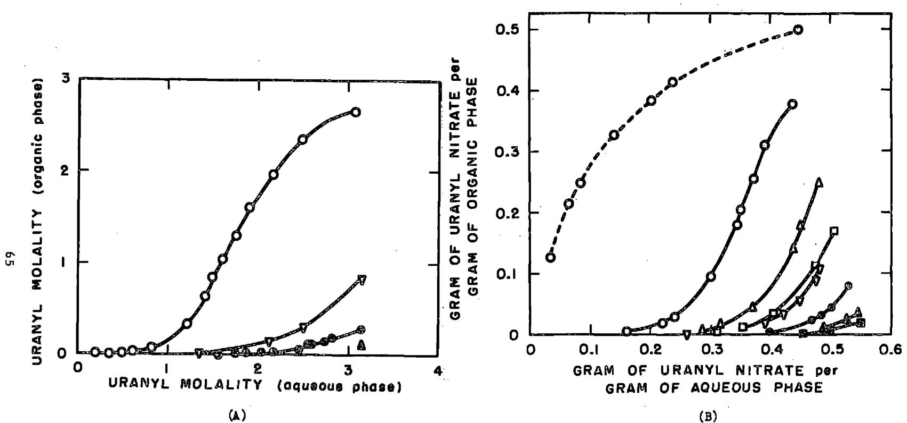  
Figure 1. Partition of uranyl nitrate between water and simple ethers. O, diethyl ether. △, ethyl-n-propyl ether. □, ethyl-n-butyl ether. ∇, d1-isopropyl ether. Ⓢ, di-n-butyl ether. △, d1-n-hexyl ether. □, 2,2'-dichloroethyl ether.

1-A. After E. Glueckauf, H. McKay, and A. Mathieson, reference 185. Temperature, $25^{\circ}\mathrm{C}$ except for diethyl ether: first three points at $25^{\circ}\mathrm{C}$ , last point at $20^{\circ}\mathrm{C}$ , remainder at $18^{\circ}\mathrm{C}$ .  
1-B. After R. K. Warner, reference 321. Dashed curve represents the partition of uranyl nitrate between diethyl ether and a saturated ammonium nitrate solution. Temperature, $20^{\circ}\mathrm{C}$ .

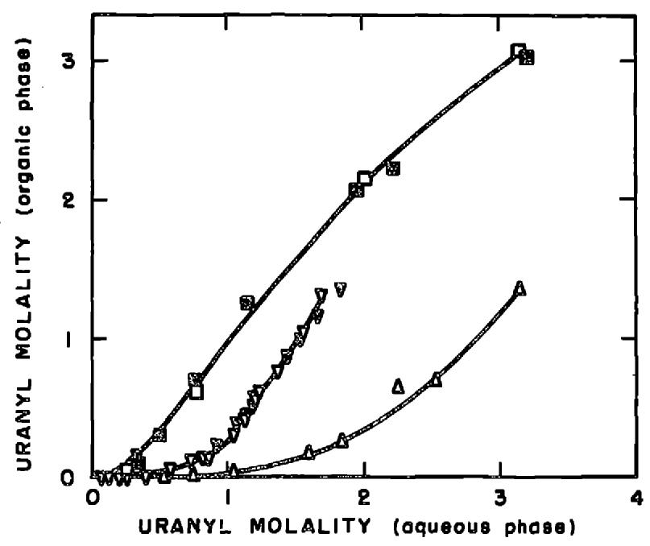  
(A)

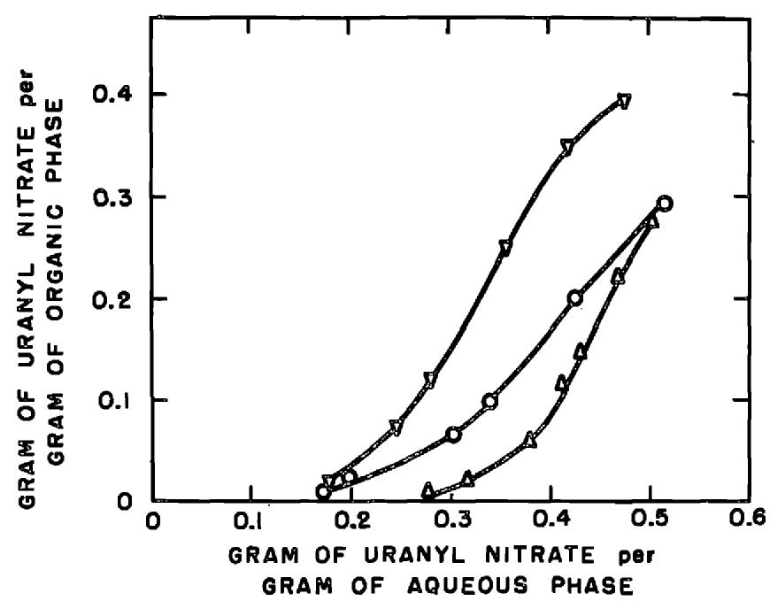  
(B)   
Figure 2. Partition of uranyl nitrate between water and complex ethers. O, phenyl cellosolve. △, dibutyl cellosolve. ∇, ∇, dibutyl carbitol. □, pentaether.

2-A. Open symbols, after E. Gleuckauf, H. McKay, and A. Mathieson, reference 185. Solid symbols, after A. Gardner, H. McKay, and D. Warren, reference 176. Temperature, $25^{\circ}C$ .   
2-B. After R. K. Warner, reference 321. Temperature $20^{\circ}\mathrm{C}$ .

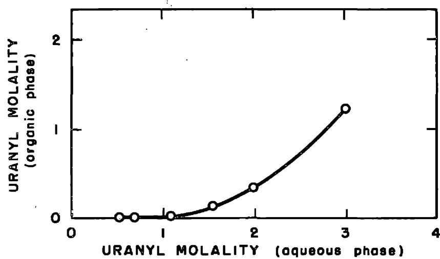  
Figure 3-A. Partition of uranyl nitrate between water and isoamyl acetate. After E. Glueckauf, H. McKay, and A. Mathieson, reference 185. Temperature, $25^{\circ}\mathrm{C}$ .

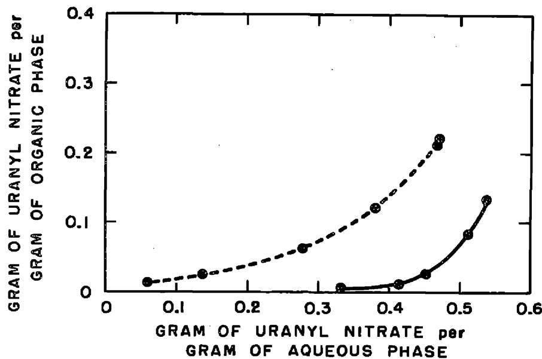  
Figure 3-B. Partition of uranyl nitrate between water and nitromethane and saturated ammonium nitrate (dashed curve) and nitromethane. After R. K. Warner, reference 322. Temperature, $20^{\circ}\mathrm{C}$ .

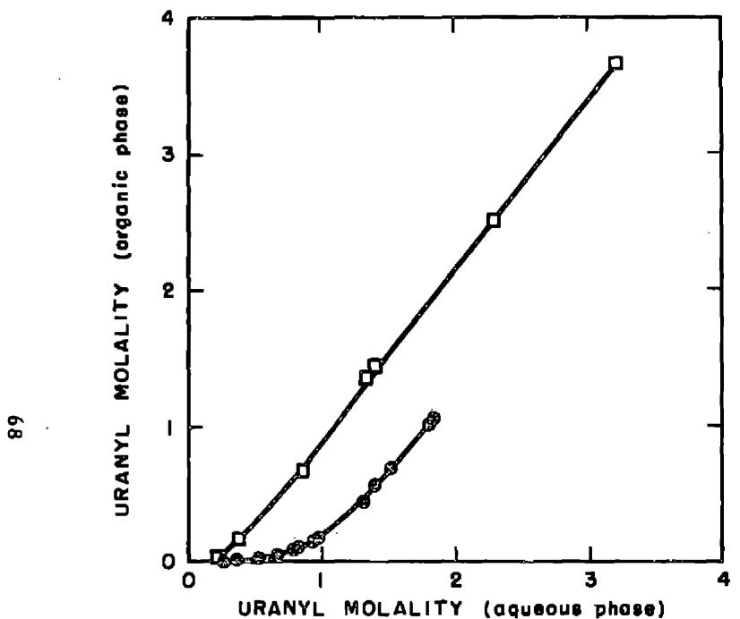  
(A)

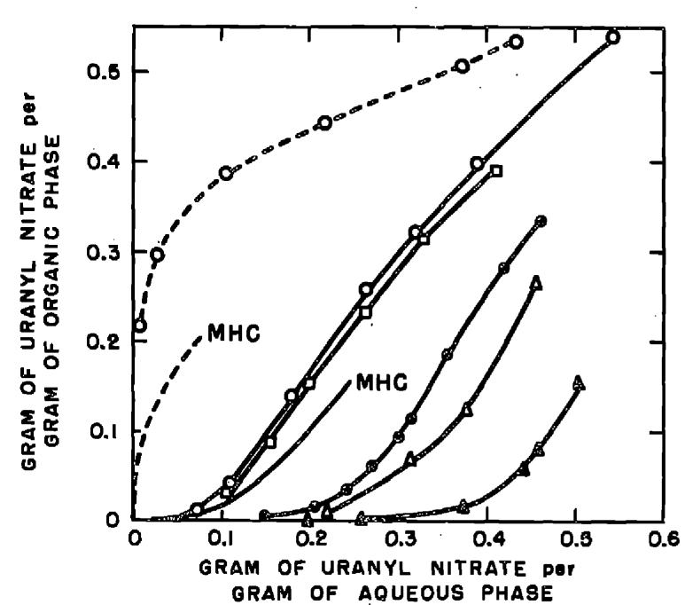  
(B)   
Figure 4. Partition of uranyl nitrate between water and ketones. O, methyl ethyl ketone. $\Theta$ , methyl isobutyl ketone. $\triangle$ , methyl n-amyl ketone. A, d1-isobutyl ketone. $\square$ , cyclohexanone. MHC, methyl cyclohexanone.

4-A. After E. Glueckauf, H. McKay, and A. Mathieson, reference 185. Temperature, $25^{\circ}\mathrm{C}$ .  
4-B. MHC curves, after V. Vesely, H. Beranova, J. Maly, reference 323. Dashed curve--aqueous solution, 6M NH $4\mathrm{NO}_3$ . Remaining curves, after R. K. Warner, reference 321. Temperature, $20^{\circ}\mathrm{C}$ . Dashed curve--aqueous solution, saturated ammonium nitrate.

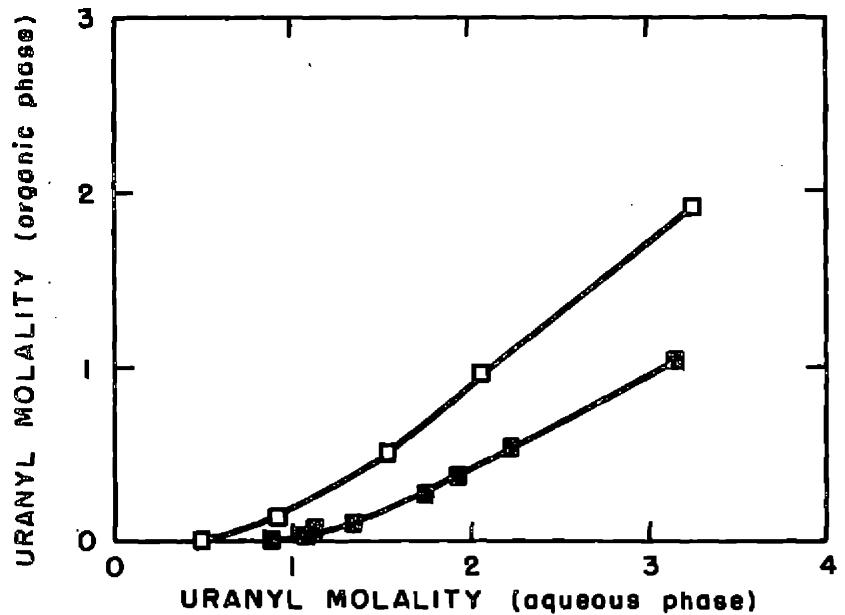  
(A)

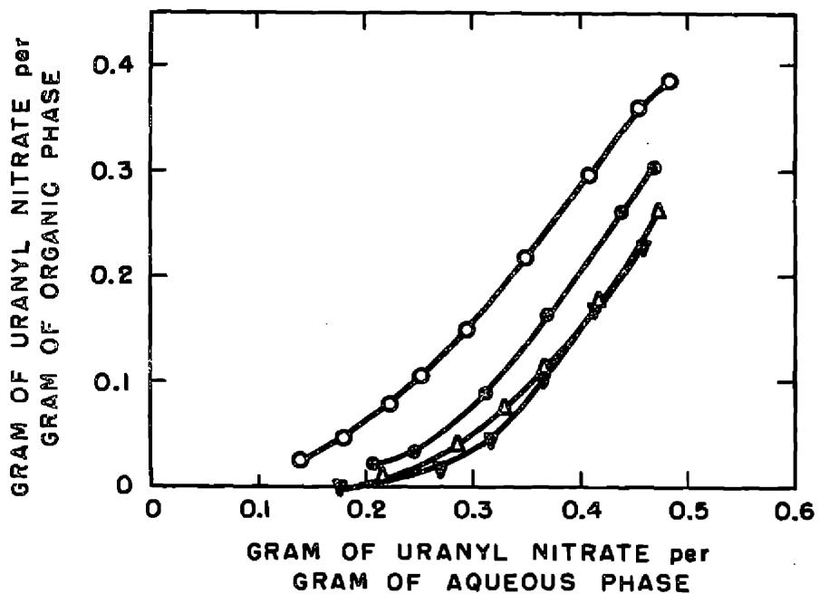  
(B)   
Figure 5. Partition of uranyl nitrate between water and alcohols. O, n-butanol. $\bullet$ , n-pentanol. $\triangle$ , n-hexanol. $\nabla$ , methyl isobutyl carbinol. $\square$ , isoamyl alcohol. $\blacksquare$ , sec-octyl alcohol

5-A. After E. Glueckauf, H. McKay, and A. Mathieson, reference 185. Temperature, $25^{\circ}C$ .   
5-B. After R. K. Warner, reference 321. Temperature, $20^{\circ}\mathrm{C}$ .

that it be replaced in continuous or multicontact extraction process. Large concentrations of nitric acid are generally not desirable. The formation of $\mathrm{HNO}_3 \cdot \mathrm{S}_n$ complexes reduces the amount of free solvent, the extraction of other elements is enhanced, and the danger of an explosive reaction between solvent and acid is increased. The formation of $\mathrm{HM(NO_3)}_{\mathrm{x} + 1}$ species, which may be more easily extracted than $\mathrm{M(NO_3)_x}$ , is promoted by the addition of nitric acid. For uranium, however, the formation of the trinitrate-uranyl complex is far from complete, even in $16 \underline{\underline{\mathbf{M}}} \underline{\underline{\mathbf{HNO}}}_3$ .

Effect of nitrate salts. The nitrate ion concentration may be increased by the addition of metal nitrates of significant solubility to the aqueous phase. This not only promotes the extraction of uranium but also the extraction of other elements whose nitrates are soluble in the organic solvent. In some cases, nitrates which serve as salting-out agents, eg. thorium may also be extracted in significant amounts. The extraction of other salting-out agents, eg., cesium, may be enhanced by the formation of uranyl trinitrate complexes, $\mathrm{MVO}_2(\mathrm{NO}_3)_3$ . The ability of various nitrates to salt-out uranium has been related to the hydration of the cation, the activity coefficient of the pure nitrate salt, and the radius and charge of the cation. A salting-out agent which is highly hydrated facilitates extraction of uranium by reducing the water activity. In figure 6, the partition coefficient of uranium is plotted as a function of aluminum nitrate for several solvents. The partition of uranium between saturated ammonium nitrate solutions and diethyl ether, nitromethane, and methyl ethyl ketone is shown by the dashed curves in figures 1B, 3B, and 4B, respectively. Ammonium nitrate is widely used as a salting agent in spite of its relatively poor salting-out ability. The ease with which it is removed from solution or from heated samples

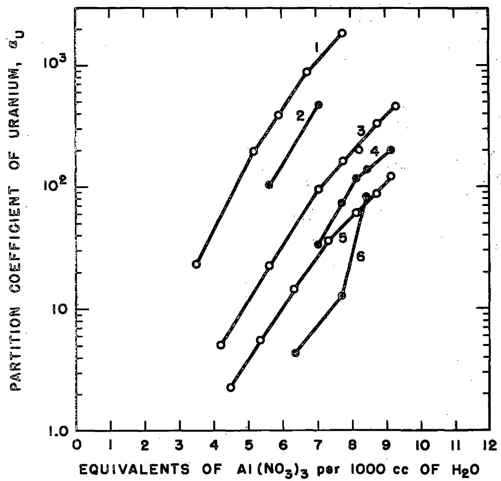  
Figure 6. Effect of aluminum nitrate as salting-out agent on the extraction of uranium by various solvents. Curve 1, dibutoxytetraethylene glycol (pentaether); Curve 2, dibutoxytriethylene glycol; Curve 3, dibutoxydiethylene glycol (dibutyl carbitol); Curve 4, methyl isobutyl ketone (hexone); Curve 5, diethyl ether; and Curve 6, dibutylmonoethylene glycol (dibutyl cellosolve).

Data adapted from E. Evers and C. Kraus, reference 332. Conditions: Aqueous phase - 2.0 to 6.0 grams of U per 100 cc of solution containing aluminum nitrate. Organic phase - solvent represented by curve. Equal phase volumes* equilibrated at $27^{\circ}\mathrm{C}$ .

*Equal or approximately equal phase volumes were employed in distribution experiments with dibutyl carbitol (C. A. Kraus, A-2322(1945)) and with hexone (C. A. Kraus, A-2324(1945)). It is assumed that the same volume ratio was used for other experiments.

makes its use advantageous.

The presence of nitrate salts which are sufficiently soluble in the organic solvent facilitates the extraction of uranium by formation of the trinitratouranyl complex, $\mathrm{RUO}_2(\mathrm{NO}_3)_3$ . This is discussed further under "Hexone."

Effect of other salts. Anions that complex uranium in the aqueous phase may seriously interfere with the extraction of the latter. Chloride, fluoride, sulfate, phosphate, and several organic anions have been studied for their interference. The adverse effects of these ions may be minimized by removing them from solution prior to uranium extraction, by complexing the anions with cations of salting-out agents, or by using an excess of an efficient salting-out agent to over-ride the anion interference. The inorganic anions may be precipitated as silver chloride, lanthanum fluoride, barium sulfate, zirconium phosphate, or ammonium phosphomolybdate. Fluoride ion is complexed by aluminum and calcium. Sulfate ion is complexed by ferric ion. Large amounts of sulfate ion are also precipitated by calcium nitrate. Phosphate ion is complexed by ferric and aluminum ions. Calcium nitrate has been used to counteract the effect of acetate and oxalate. The effect of chloride on the partition of uranium may be reduced in the presence of a strong salting-out agent. Chloride ion is more objectionable from the fact that it promotes the extraction of other elements, notably iron. In the presence of large amounts of interfering ions, particularly sulfate and phosphate, it is advisable to separate the uranium from solution prior to extraction. This may be done by precipitation with carbonate-free ammonium hydroxide. The precipitate is dissolved in nitric acid and the extraction is initiated. Ferric hydroxide may be used to carry trace amounts of uranium.

Uranium may be extracted from aqueous media other than

nitrate. Thiocyanate solutions have been found satisfactory. The extraction, however, is less selective from thiocyanate than from nitrate solutions.

Solvent action. The partition of uranyl nitrate is dependent upon the free solvent concentration. This is reflected in the coefficients of extraction of micro and macro amounts of uranium from highly salted aqueous solutions. The partition coefficient of trace amounts is larger than that of large amounts as a result of more available solvent. As mentioned previously, macro amounts of uranium extract more readily from water solutions or less highly salted aqueous solutions than do micro amounts. This effect may be attributed to the salting-out ability of uranyl nitrate itself.

The extraction of other elements is affected also by the uranium concentration. High loading of the solvent by uranium reduces the extraction of less preferred complex species. High uranium loading may be achieved by diluting the solvent with a secondary solvent in which uranyl nitrate is insoluble or significantly less soluble than in the primary extractant. Solvent dilution, in general, causes a decrease in the partition coefficient.[319,321,329,330] Wohlhuter and Sauteron[331] have listed a number of aromatic and chlorine-substituted diluents in order of increasing harmfulness to uranium extraction: benzene, toluene, xylene, carbon tetrachloride and dichloroethylene, chloroform. Solvent dilution may be used also to improve upon the physical properties of the organic phase, eg., density, viscosity, etc.

The suitability of mixtures of oxygen-containing solvents as extractants for uranyl nitrate has been studied.318-320,329,330 Stover and co-workers reported that none of the mixtures they investigated were better than the pure solvent. Recently, however, Fomin and Morgunov

and Vdovenko and Krivokhatskii have reported enhanced uranyl nitrate partition coefficients from solvent mixtures. Vdovenko and Krivokhatskii report that over ten such mixtures have been found. Among them are: di-1-isopropyl ether and $\beta, \beta'$ -dichlorodiethyl ether, dibutyl ether and $\beta, \beta'$ -dichlorodiethyl ether, diethyl ether and acetophenone, isoamyl alcohol and methyl isobutyl ketone. The enhanced extraction by solvent mixtures has been attributed to the formation of mixed solvates of uranyl nitrate.

Effect of temperature. The extraction of uranyl nitrate is decreased by a temperature increase. The partition coefficient of uranium is plotted as a function of temperature for several solvents in figure 7.332

Figure 7. The effect or temperature on the extraction of uranium by organic solvents. O, dibutyl carbitol. $\square$ , hexone. $\bullet$ , diethyl ether. $\triangle$ , pentaether.   
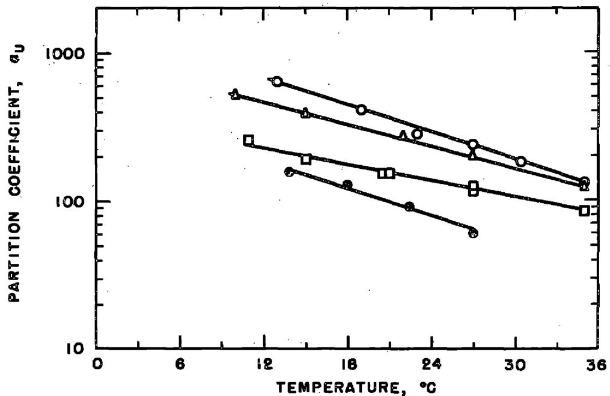  
After E. C. Evers and C. A. Kraus, reference 332. The triangles represent aqueous solutions salted with 36.6 grams of Al(NO₃)₃ per 100 cc of water. All other symbols represent solutions salted with 58 grams of Al(NO₃)₃ per 100 cc of water. 2 to 6 grams of uranium per 100 cc of solution were extracted.

Re-extraction. Uranium is re-extracted from the organic solvents considered in this section by contact with water. Several water contacts may be required if large amounts of uranium or nitric acid have been extracted. Water-soluble salts whose anions complex uranyl ion, eg., ammonium sulfate, facilitate re-extraction.

Extraction of other elements. A number of elements other than uranium are extracted by oxygen-containing solvents. Those commonly found with irradiated uranium are hexavalent Np and Pu; pentavalent Pa; tetravalent Th, Np, Pu, $\mathrm{Zr(+Nb)}$ , and Ce; and ruthenium complexes. Neptunium, plutonium, and cerium are made less extractable by reduction to lower oxidation states. Favorable separation of uranium from the other elements may be achieved by control of the nitric acid and salting-out agent concentrations. Free halogens are extracted. These elements may be eliminated from solution prior to uranium extraction. The halogens also combine chemically with a number of solvents; eg., iodine and hexone. The combined halogen is not re-extracted by water contacts.

General survey. The extraction of uranyl nitrate by polar oxygen-containing solvents has been investigated under a variety of conditions. The results of three surveys in which the experimental conditions were all different, are given in Table VIII.

and Aqueous Nitrate Solutions.   

<table><tr><td rowspan="2">Solvent</td><td colspan="3">Survey 1a</td><td rowspan="2">% Total volume in org. layer</td><td colspan="3">Survey 2b</td><td>Survey 3d</td></tr><tr><td>U</td><td>Th</td><td>HNO3</td><td>U</td><td>Th</td><td>Pa</td><td>Au</td></tr><tr><td>Ethers</td><td></td><td></td><td></td><td></td><td></td><td></td><td></td><td></td></tr><tr><td>Diethyl ether</td><td>96</td><td>60</td><td>-</td><td>62.5</td><td>35</td><td>0.0</td><td>0.19e</td><td>0.09</td></tr><tr><td>n-Propyl ether</td><td>78</td><td>1.8</td><td>44</td><td>55</td><td>2.2</td><td>0.0</td><td>0.10</td><td></td></tr><tr><td>Isopropyl ether</td><td>88</td><td>20</td><td>66.5</td><td>58</td><td></td><td></td><td></td><td>0.00</td></tr><tr><td>Dibutyl ether</td><td>48</td><td>&lt; 1</td><td>45</td><td>53.5</td><td>1.6</td><td>0.0</td><td>0.05</td><td>0.00</td></tr><tr><td>Ethyl n-butyl ether</td><td>85</td><td>&lt; 1</td><td>49</td><td>55</td><td></td><td></td><td></td><td></td></tr><tr><td>Benzyl methyl ether</td><td>85</td><td>8</td><td>41</td><td>55</td><td></td><td></td><td></td><td></td></tr><tr><td>β-S-Diochloroethyl ether</td><td>45</td><td>&lt; 1</td><td>37</td><td>53.5</td><td></td><td></td><td></td><td></td></tr><tr><td>Diethyl callosolve</td><td></td><td></td><td></td><td></td><td>55</td><td>24</td><td></td><td>0.29</td></tr><tr><td>Ethyl butyl celsolsolve</td><td>95</td><td>60</td><td>57</td><td>61.5</td><td>59</td><td>7</td><td></td><td></td></tr><tr><td>Dibutyl celsolsolve</td><td>90</td><td>17</td><td>80</td><td>56.5</td><td></td><td></td><td></td><td>0.01</td></tr><tr><td>Phenyl celsolsolve</td><td></td><td></td><td></td><td></td><td></td><td></td><td></td><td>0.00</td></tr><tr><td>Benzyl celsolsolve</td><td></td><td></td><td></td><td></td><td></td><td>21</td><td></td><td></td></tr><tr><td>Dibutyl carbitol</td><td>95</td><td>84</td><td>100</td><td>63.3</td><td>59</td><td>2.7</td><td>0.15f</td><td>0.09</td></tr><tr><td>Dibutoxytetra-ethyleneglycol (pentasether)</td><td>95</td><td>99</td><td>100</td><td>66.6</td><td></td><td></td><td></td><td>0.54</td></tr><tr><td>Dimethyldioxane</td><td></td><td></td><td></td><td></td><td>34</td><td>3.8</td><td></td><td></td></tr><tr><td>Esters</td><td></td><td></td><td></td><td></td><td></td><td></td><td></td><td></td></tr><tr><td>Ethylacetate</td><td>88</td><td>77</td><td>-</td><td>65</td><td>43</td><td>0.6</td><td>0.26g</td><td></td></tr><tr><td>n-Propyl acetate</td><td>95</td><td>46</td><td>92</td><td>60</td><td>50</td><td>1.3</td><td>9.1</td><td></td></tr><tr><td>Isopropyl acetate</td><td></td><td></td><td></td><td></td><td>54</td><td>1.2</td><td>11.9</td><td></td></tr><tr><td>n-Butyl acetate</td><td>89</td><td>26</td><td>-</td><td>58</td><td>39</td><td>0.06</td><td>10.6</td><td></td></tr><tr><td>sec-Butyl acetate</td><td></td><td></td><td></td><td></td><td>39</td><td></td><td>22.2</td><td></td></tr><tr><td>Isobutyl acetate</td><td></td><td></td><td></td><td></td><td>21</td><td>0.02</td><td>0.18</td><td></td></tr><tr><td>Amyl acetate</td><td>86(?)</td><td>16</td><td>-</td><td>56.5</td><td>31</td><td>0.3</td><td>31.9h</td><td></td></tr><tr><td>2-Ethylbutyl acetate</td><td></td><td></td><td></td><td></td><td>9</td><td>0.02</td><td></td><td></td></tr><tr><td>2-Ethyl hexylacetate</td><td>72</td><td>&lt; 1</td><td>95</td><td>54</td><td></td><td></td><td></td><td></td></tr><tr><td>Butyl carbitol acetate</td><td>98</td><td>85</td><td>-</td><td>67</td><td></td><td></td><td></td><td></td></tr><tr><td>Glycol diacetate</td><td></td><td></td><td></td><td></td><td></td><td></td><td></td><td>0.25</td></tr><tr><td>Ethylacetoacetate</td><td></td><td></td><td></td><td></td><td></td><td></td><td></td><td>0.11</td></tr><tr><td>Methyl propionate</td><td></td><td></td><td></td><td></td><td>10-20</td><td>0.2</td><td>0.06</td><td></td></tr><tr><td>Ethyl propionate</td><td></td><td></td><td></td><td></td><td>22</td><td>0.03</td><td>0</td><td></td></tr><tr><td>Ethyl butyrate</td><td>88</td><td>6</td><td>75</td><td>57.5</td><td>10</td><td>0</td><td></td><td></td></tr><tr><td>Ethyl a-bromobutyrate</td><td>35</td><td>&lt; 1</td><td>42</td><td>54</td><td></td><td></td><td></td><td></td></tr><tr><td>Methyl benzoate</td><td></td><td></td><td></td><td></td><td>7.5</td><td>0</td><td></td><td></td></tr><tr><td>Ethyl benzoate</td><td>80</td><td>1-3</td><td>54</td><td>56.5</td><td></td><td></td><td></td><td></td></tr><tr><td>Ethyl caproate</td><td>80</td><td>3</td><td>60</td><td>55</td><td></td><td></td><td></td><td></td></tr><tr><td>Diethyl maleate</td><td></td><td></td><td></td><td></td><td></td><td></td><td></td><td>0.07</td></tr><tr><td>Diethyl malonate</td><td></td><td></td><td></td><td></td><td>22</td><td></td><td></td><td></td></tr><tr><td>Ketones</td><td></td><td></td><td></td><td></td><td></td><td></td><td></td><td></td></tr><tr><td>Methyl ethyl ketone + 15% xylene</td><td></td><td></td><td></td><td></td><td>47</td><td>22</td><td></td><td></td></tr><tr><td>Methyl n-propyl ketone</td><td></td><td></td><td></td><td></td><td>53</td><td>11</td><td></td><td></td></tr><tr><td>Methyl isobutyl ketone (hexone)</td><td></td><td></td><td></td><td></td><td>57</td><td>20</td><td>20.9i</td><td>0.004</td></tr><tr><td>Methyl n-amyl ketone</td><td></td><td></td><td></td><td></td><td>47</td><td>0.9</td><td>3.0j</td><td>0.02</td></tr><tr><td>Methyl n-hexyl ketone</td><td></td><td></td><td></td><td></td><td></td><td></td><td></td><td>0.01</td></tr><tr><td>Diethyl ketone</td><td></td><td></td><td></td><td></td><td></td><td></td><td></td><td>0.08</td></tr><tr><td>Diisopropyl ketone</td><td></td><td></td><td></td><td></td><td>56</td><td>0.3</td><td>48.7k</td><td></td></tr><tr><td rowspan="2">Solvent</td><td colspan="3">Survey 1aPercent extracted</td><td rowspan="2">% Total volume in org. layer</td><td colspan="3">Survey 2bPercent extracted</td><td rowspan="2">Survey 3cau</td></tr><tr><td>U</td><td>Th</td><td>HNO3</td><td>U</td><td>Th</td><td>Pa</td></tr><tr><td>Acetophenone</td><td></td><td></td><td></td><td></td><td></td><td></td><td></td><td>0.05</td></tr><tr><td>Cyclopentanone</td><td></td><td></td><td></td><td></td><td></td><td></td><td></td><td>0.80</td></tr><tr><td>Cyclohexanone</td><td></td><td></td><td></td><td></td><td></td><td>11</td><td></td><td>0.53</td></tr><tr><td>Methyl cyclohexanone</td><td></td><td></td><td></td><td></td><td></td><td>large</td><td></td><td></td></tr><tr><td>m-Methyl cyclohexanone</td><td></td><td></td><td></td><td></td><td></td><td></td><td></td><td>0.24</td></tr><tr><td>p-Methyl cyclohexanone</td><td></td><td></td><td></td><td></td><td></td><td></td><td></td><td>0.30</td></tr><tr><td>Meisyl oxide</td><td>98</td><td>77.6</td><td>-</td><td>63</td><td></td><td>12.7</td><td></td><td>0.24</td></tr><tr><td>Isophorone</td><td></td><td></td><td></td><td></td><td></td><td>27</td><td></td><td></td></tr><tr><td>Alcohols</td><td></td><td></td><td></td><td></td><td></td><td></td><td></td><td></td></tr><tr><td>n-Butanol</td><td></td><td></td><td></td><td></td><td>44</td><td>5.2</td><td></td><td></td></tr><tr><td>2-Ethyl butanol</td><td></td><td></td><td></td><td></td><td></td><td></td><td></td><td>0.01</td></tr><tr><td>sea-Butyl carbinol</td><td></td><td></td><td></td><td></td><td>30</td><td>0.6</td><td></td><td>0.013**</td></tr><tr><td>tert-Amyl alcohol</td><td>88</td><td>63</td><td>-</td><td>61</td><td></td><td></td><td></td><td></td></tr><tr><td>Diethyl carbinol</td><td></td><td></td><td></td><td></td><td>24</td><td>0.7</td><td></td><td></td></tr><tr><td>Diisopropyl carbinol</td><td></td><td></td><td></td><td></td><td>11.6</td><td>0.0</td><td></td><td></td></tr><tr><td>Tri-n-butyl carbinol</td><td>48</td><td>5.6</td><td>51</td><td>54</td><td></td><td></td><td></td><td></td></tr><tr><td>2-Ethyl hexanol</td><td>75</td><td>10</td><td>77.5</td><td>56.5</td><td></td><td>0.0</td><td>72.1</td><td></td></tr><tr><td>Heptanol</td><td></td><td></td><td></td><td></td><td>24</td><td>0.65</td><td>71.5#</td><td></td></tr><tr><td>Methyl r-amyl carbinol</td><td></td><td></td><td></td><td></td><td>36-50</td><td>4.7</td><td></td><td></td></tr><tr><td>n-Octanol</td><td></td><td></td><td></td><td></td><td></td><td>0.5</td><td>74.8</td><td></td></tr><tr><td>Heptadecanol</td><td></td><td></td><td></td><td></td><td></td><td>0.0</td><td>31.7</td><td></td></tr><tr><td>2-Ethylhexanediol-1,3</td><td></td><td></td><td></td><td></td><td></td><td></td><td></td><td>0.09</td></tr><tr><td>Miscellaneous</td><td></td><td></td><td></td><td></td><td></td><td></td><td></td><td></td></tr><tr><td>Nitromethane</td><td>60</td><td>32</td><td>62</td><td>54</td><td></td><td></td><td></td><td></td></tr><tr><td>1-Nitropropane</td><td></td><td></td><td></td><td></td><td></td><td></td><td></td><td>0.00</td></tr><tr><td>2-Nitropropane</td><td></td><td></td><td></td><td></td><td>3.5</td><td>Trace</td><td>0.25</td><td></td></tr><tr><td>Nitrobenzene</td><td></td><td></td><td></td><td></td><td>2.1</td><td>Trace</td><td>0.10</td><td></td></tr><tr><td>o-Nitroanisole</td><td></td><td></td><td></td><td></td><td>3.5</td><td>Trace</td><td>0</td><td></td></tr><tr><td>Trichloroethane</td><td></td><td></td><td></td><td></td><td>0</td><td>0</td><td>0</td><td></td></tr><tr><td>Trichloroethylene</td><td></td><td></td><td></td><td></td><td>1.5</td><td>0.2</td><td></td><td></td></tr><tr><td>Chloroform</td><td></td><td></td><td></td><td></td><td>0</td><td>0</td><td></td><td></td></tr><tr><td>Dimethylsulflone</td><td></td><td></td><td></td><td></td><td></td><td></td><td></td><td>1.68</td></tr></table>

a 0. A. Johnson and A. S. Newton, reference 318. Equal volumes of organic solvent and aqueous solution (3M HNO₃, 3M Ca(NO₃)₂, 0.635M Th(NO₃)₄, 0.045 gm/ml UO₂(NO₃)₂) mixed 10 minutes. No extraction was detected with phenyl ether, p-bromoanisole, p-bromophenotelol, anisole, isoxynitrite, chlorobensene, xylene, ethyl iodide, butyl bromide, and triholoroethylene.   
* indicates mutual solubility of aqueous solution and organic solvent.

b E. K. Hyde and M. J. Wolf, reference 319. Equal volumes of organo solvent and aqueous solution (1N HNO₃, 3N NH₄NO₃, 2N Th(NO₃)₄, 5 x 10⁻³ - 10⁰°c/min U²³³ at 52% counting yield) mixed 5 minutes.

Aqueous phase : 1N ENO₃, 2N NH₄NO₃, 2N Th(NO₃)₄, 10⁻⁴ - 3 x 10⁵ c/m Pa²³³ at 10% counting yield.

${}^{ * }$ Aqueous phase : $1\mathrm{\;N}\mathrm{{HNO}}3,2\mathrm{\;N}\mathrm{{Al}}{\left( {\mathrm{{NO}}}_{3}\right) }_{3},3\mathrm{\;N}\mathrm{{Th}}{\left( {\mathrm{{NO}}}_{3}\right) }_{4},{10}^{4} - 3 \times  {10}^{5}\mathrm{c}/\mathrm{m}{\mathrm{P}}_{\mathrm{a}}{}^{233}$ at ${10}\%$ counting yield.

C. N. Stover, Jr., H. W. Crandall, D. C. Stewart, and P. C. Mayer, reference 320. Equal volumes of organic solvent and aqueous solution $(0.34\mathrm{M}$ HNO₃, 0.50 M O₂ (NO₃)₂ $\cdot$ 6H₂O) mixed 2 hours at 25°C.

**Solvent identified as methyl isobutyl acarbinol; formula given as CH₃CH₂OH(CH₃)CH₂OH (aeo-butyl acarbinol).

# Diethyl ether

Aqueous nitrate systems. The extraction of uranyl nitrate by diethyl ether is widely used in radiochemical separations because of the selectivity of the extraction. Disadvantages of the method are the high volatility and low flash point of the solvent and the relatively low distribution of uranium into the solvent.

The partition of uranyl nitrate between diethyl ether and water is illustrated in figure 1.185,321 With both phases saturated with uranyl nitrate at $25 - 26^{\circ}C$ , the distribution coefficient is about 0.68.326 The effect of nitric acid upon the partition of uranium333,334 and nitric acid326,333-335 itself is represented in figure 8. Furman, Mundy, and Morrison326 report that the pH of the aqueous phase should be 4 or less for complete extraction of uranium to occur. The influence of ammonium nitrate and calcium nitrate upon the extraction of nitric acid is also shown in figure 8.326

Figures 9 and 10 demonstrate the influence of various salting-out agents on the distribution of uranyl nitrate.326,328 The nitrate concentration plotted in figure 9 includes that of the salting-out agent plus that of uranyl nitrate left after extraction by an equal volume of ether. The latter contributes only a few percent to the total nitrate concentration in most cases. A notable exception is the iron (III) point at 1.18M nitrate concentration. In this instance, 0.82M nitrate ion is attributable to ferric nitrate and the remainder to uranyl nitrate. The nitrate concentration of the salting-out agent is plotted in figure 10. Uranyl nitrate contributes little to the nitrate concentration since only one gram of uranyl nitrate was used per 100 grams of initial aqueous solution. Furman, Mundy, and Morrison

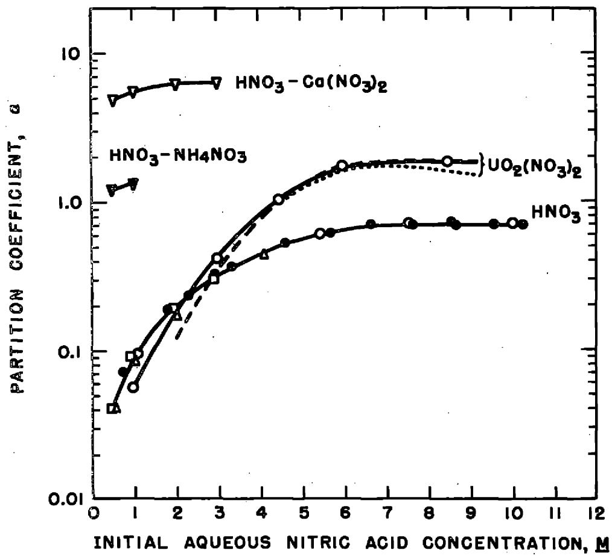  
Figure 8. The extraction of uranyl nitrate and nitric acid by diethyl ether.

Uranyl nitrate extraction: O, after R. Bock and E. Bock, reference 333. Initial U concentration, 0.lM; Temperature, $20^{\circ} \pm 1^{\circ}\mathrm{C}$ ; $V_{\mathrm{o}} / V_{\mathrm{s}} = 1$ . Dashed and dotted curves, after J. Kool, reference 334. Temperature, $25^{\circ}\mathrm{C}$ ; $V_{\mathrm{o}} / V_{\mathrm{s}} = 1$ ; Initial U concentration, -50, 150, 450 mg uranyl nitrate (hexahydrate) per 15 ml; 1350 mg uranyl nitrate (hexahydrate) per 15 ml.

Nitric acid extraction: O, after R. Bock and E. Bock, reference 333. Temperature, $19^{\circ} \pm 10^{\circ}\mathrm{C}$ ; $V_{0} / V_{\mathrm{A}} = 1$ . after J. Kooi, reference 334. Temperature, 25.0 ± 0.1°C; $V_{0} / V_{\mathrm{A}} = 1$ . after A. Grinberg and G. Lozhkina, reference 335. Temperature, 20°C; $V_{0} / V_{\mathrm{A}} = 1$ . after N. Furman, R. Mundy, and G. Morrison, reference $V_{0} / V_{\mathrm{A}} = 1$ ; HNO₃ - Ca(NO₃)₂, 100 g. of Ca(NO₃)₂. 4H₂O per 100 ml of initial solution plus HNO₃; HNO₃ - NH₄NO₃, 80 g. of NH₄NO₃ per 100 ml of initial solution plus HNO₃.

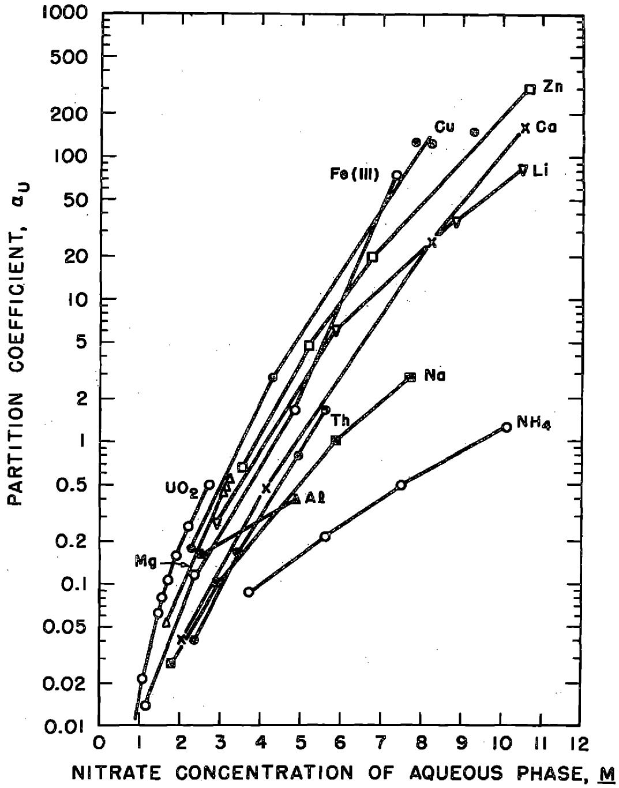  
(See facing page for legend.)

# Figure 9.

Effect of various nitrates upon the partition coefficient of uranium with diethyl ether.

After N. Furman, R. Mundy, and G. Morrison, reference 326.

The nitrate concentration plotted as the abscissa includes that attributable to the equilibrium concentrations of uranyl nitrate in addition to that of the initial concentration of salting-out agent.

# Conditions:

<table><tr><td>Salting-out Agent</td><td>[U], g/1</td><td>T.°C</td><td>V0/Va</td></tr><tr><td>NH4NO3</td><td>25</td><td>25-6</td><td>1</td></tr><tr><td>NaNO3</td><td>(25)</td><td>24-6</td><td>1</td></tr><tr><td>LiNO3</td><td>(25)</td><td></td><td>1</td></tr><tr><td>Ca(NO3)2</td><td>(25-100)</td><td>25-29</td><td>1</td></tr><tr><td>Mg(NO3)2</td><td>(25-100)</td><td>27-28</td><td>1</td></tr><tr><td>Zn(NO3)2</td><td>(50)</td><td>28-31</td><td>1</td></tr><tr><td>Cu(NO3)2</td><td>(~8-&gt;600)</td><td></td><td></td></tr><tr><td>Fe(NO3)3</td><td>(~8-&gt;200)</td><td></td><td>1</td></tr><tr><td>Al(NO3)3</td><td>(25-100)</td><td>29</td><td>1</td></tr><tr><td>Th(NO3)4</td><td>(50)</td><td></td><td>1</td></tr></table>

The uranium concentrations in parentheses have been estimated by roughly adding the equilibrium uranium concentrations of both aqueous and solvent phase.

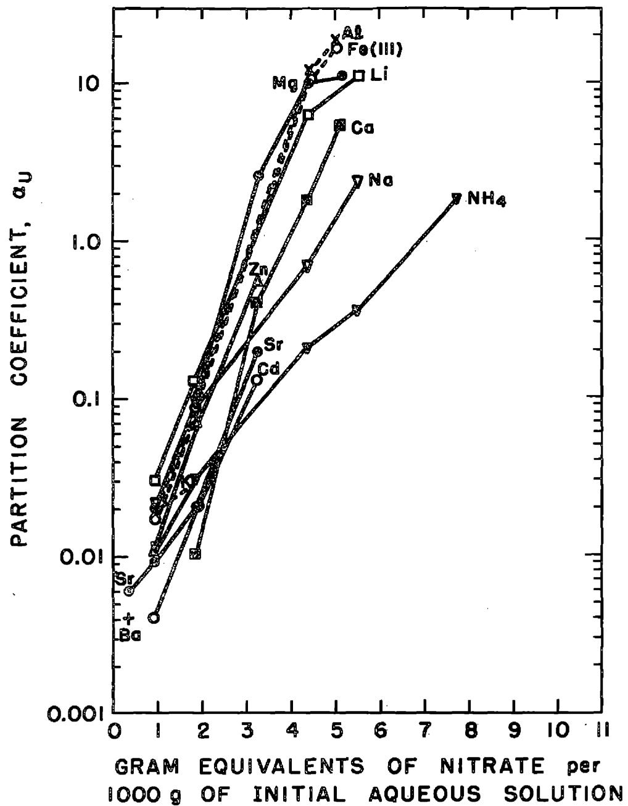  
Figure 10. Effect of various nitrates upon the partition coefficient of uranium with diethyl ether.

After V. Vdovenko and T. V. Kovaleva, reference 328.

Conditions: 1 g. $\mathrm{UO}_2(\mathrm{NO}_3)_2$ in 100 g. of initial aqueous solutions; Temperature, $25^{\circ}\mathrm{C}$ ; and $\mathrm{V}_0 / \mathrm{V}_a = 1$ .

observed that the salting action of a mixture of nitrates could be reasonably predicted by the following method:

The logarithm of $\alpha_{\mathrm{t}}$ for each salt at a given total nitrate molarity is divided by the total nitrate molarity. These individual quotients are then multiplied by the nitrate molarity of the respective salts. The sum of the resulting products is then equal to the logarithm of the predicted partition coefficient.

Hellman and Wolf have studied the salting action of various nitrates in the presence of nitric acid and thorium nitrate. Some of their results are listed in Table IX. From the data it may be observed that (1) thorium nitrate is generally a less effective salting-out agent on a normality basis than other metal nitrates and (2) the extraction of uranium becomes less efficient as the amount of extracted thorium becomes appreciable.

The effect of several foreign anions on the extraction of uranyl nitrate by diethyl ether is given in figure 11337 and Table X.326 Arsenate, molybdate, and vandate ions also interfere with the extraction of uranium. The effect of these ions may be offset by the addition of ferric nitrate to the solution.338

The partition of a large number of elements between various aqueous nitrate systems and diethyl ether is given in Table XI and illustrated in figures 12-14. The increased distribution of heavy elements and fission product elements with increased nitric acid concentration should be noted. For a selective uranium extraction the nitric acid concentration should be minimal. Hyde has recommended an aqueous phase $0.5\text{-} \underline{1}\underline{M}$ in nitric acid and $2.5\underline{M}$ in magnesium nitrate for the quantitative extraction of uranium by diethyl ether. More selective extraction of uranyl nitrate may be made from a saturated ammonium nitrate-solution, $0.05 - 0.1\underline{M}$ in nitric acid. The extraction can be made quantitative by repeated contacts with ether.

(Text continues on page 92.)

Table IX. Distribution of Uranium and Thorium between Diethyl Ether and Aqueous Solutions Containing Various Amounts of Metal Nitrates   

<table><tr><td rowspan="3">Salting agent</td><td rowspan="3">Total nitrate normality</td><td colspan="3">Composition of initial aqueous solution</td></tr><tr><td>0.5N HNO3+ salting agent</td><td colspan="2">0.5N HNO3+ 1N Th(NO3)4+ salting agent</td></tr><tr><td>U extracted, %</td><td>U extracted, %</td><td>Th extracted, %</td></tr><tr><td rowspan="4">HNO3</td><td>3</td><td>23</td><td>10</td><td>0.1</td></tr><tr><td>5</td><td>52</td><td>40</td><td>3.3</td></tr><tr><td>7</td><td>62</td><td>36</td><td>21</td></tr><tr><td>7</td><td></td><td>47</td><td></td></tr><tr><td rowspan="5">LINO3</td><td>2</td><td>10</td><td>22</td><td>0</td></tr><tr><td>3.5</td><td>36</td><td></td><td></td></tr><tr><td>5</td><td>74</td><td>31</td><td></td></tr><tr><td>7.5</td><td>81</td><td>25</td><td>2</td></tr><tr><td>7.5</td><td>81</td><td>66</td><td>19</td></tr><tr><td rowspan="6">NH4NO3</td><td>3</td><td></td><td>8</td><td>0.0</td></tr><tr><td>5</td><td></td><td>30</td><td>0.1</td></tr><tr><td>5.5</td><td>25</td><td>47</td><td>0.5</td></tr><tr><td>9</td><td></td><td>57</td><td>0.8</td></tr><tr><td>10</td><td>59</td><td>59</td><td>1.2</td></tr><tr><td>12</td><td></td><td></td><td></td></tr><tr><td rowspan="7">Ca(NO3)2</td><td>2.37</td><td>13</td><td>11</td><td>0.0</td></tr><tr><td>2.75</td><td></td><td></td><td></td></tr><tr><td>3.62</td><td>32</td><td>25</td><td>0.0</td></tr><tr><td>4.0</td><td></td><td></td><td></td></tr><tr><td>4.87</td><td>63</td><td>59</td><td>0.1</td></tr><tr><td>5.25</td><td></td><td></td><td></td></tr><tr><td>7.50</td><td>99</td><td>96</td><td>1.2</td></tr><tr><td rowspan="8">Mg(NO3)2</td><td>1.50</td><td>3</td><td>9</td><td>0.0</td></tr><tr><td>2.17</td><td>18</td><td></td><td></td></tr><tr><td>2.58</td><td></td><td></td><td></td></tr><tr><td>3.15</td><td></td><td>18.5</td><td>0.0</td></tr><tr><td>3.60</td><td>38</td><td></td><td></td></tr><tr><td>4.14</td><td></td><td></td><td></td></tr><tr><td>5.5</td><td>99</td><td>44</td><td>0.00</td></tr><tr><td></td><td></td><td>99</td><td>0.31</td></tr><tr><td rowspan="9">Mn(NO3)2</td><td>2.5</td><td>18</td><td></td><td></td></tr><tr><td>3.5</td><td></td><td>21.0</td><td>0.0</td></tr><tr><td>5.0</td><td>74</td><td></td><td></td></tr><tr><td>6.0</td><td></td><td></td><td></td></tr><tr><td>7.0</td><td></td><td></td><td></td></tr><tr><td>7.5</td><td>87</td><td>65</td><td>5.5</td></tr><tr><td>8.5</td><td></td><td></td><td></td></tr><tr><td>8.5</td><td></td><td>70</td><td></td></tr><tr><td></td><td></td><td>72</td><td>43</td></tr><tr><td rowspan="7">Cu(NO3)2</td><td>2.5</td><td>12</td><td></td><td></td></tr><tr><td>3.0</td><td></td><td>12</td><td>0.0</td></tr><tr><td>5.0</td><td>69</td><td>50</td><td>0.5</td></tr><tr><td>7.5</td><td>91</td><td></td><td></td></tr><tr><td>8.0</td><td></td><td></td><td></td></tr><tr><td>10.5</td><td>87</td><td>62</td><td>19</td></tr><tr><td>11.0</td><td></td><td></td><td></td></tr><tr><td rowspan="5">La(NO3)3</td><td>2.5</td><td>14</td><td>38</td><td>52</td></tr><tr><td>4.5</td><td>61</td><td>5</td><td>0.0</td></tr><tr><td>4.5</td><td></td><td>18</td><td></td></tr><tr><td>6.0</td><td>93</td><td>18</td><td>0.2</td></tr><tr><td>6.5</td><td></td><td>39</td><td>2.1</td></tr><tr><td rowspan="6">Al(NO3)3</td><td>2.0</td><td>18</td><td></td><td></td></tr><tr><td>2.5</td><td></td><td>13</td><td>0.0</td></tr><tr><td>4.0</td><td>54</td><td></td><td></td></tr><tr><td>5.5</td><td></td><td>63</td><td>2.8</td></tr><tr><td>6.0</td><td>96</td><td></td><td></td></tr><tr><td>7.5</td><td></td><td>57</td><td>17.6</td></tr><tr><td rowspan="4">Th(NO3)4</td><td>3.0</td><td>8</td><td></td><td>0.0</td></tr><tr><td>5.0</td><td>32</td><td></td><td>0.14</td></tr><tr><td>9.0</td><td>58</td><td></td><td>8.0</td></tr><tr><td>11.0</td><td>52</td><td></td><td>11.4</td></tr></table>

a After N. N. Hillman and M. J. Wolf, reference 336.   
Five ml of ether were shaken 10 minutes with $5\mathrm{ml}$ of the aqueous phase of appropriate composition. 5,000 to 8,000 c/m of U23 tracer (52% counting yield) were supplied to the aqueous phase. Variation of the tracer from 100 to 100,000 c/m in 5 ml did not change the % extracted.

Figure 11. The effect of various anions on the extraction of uranyl nitrate by diethyl ether.   
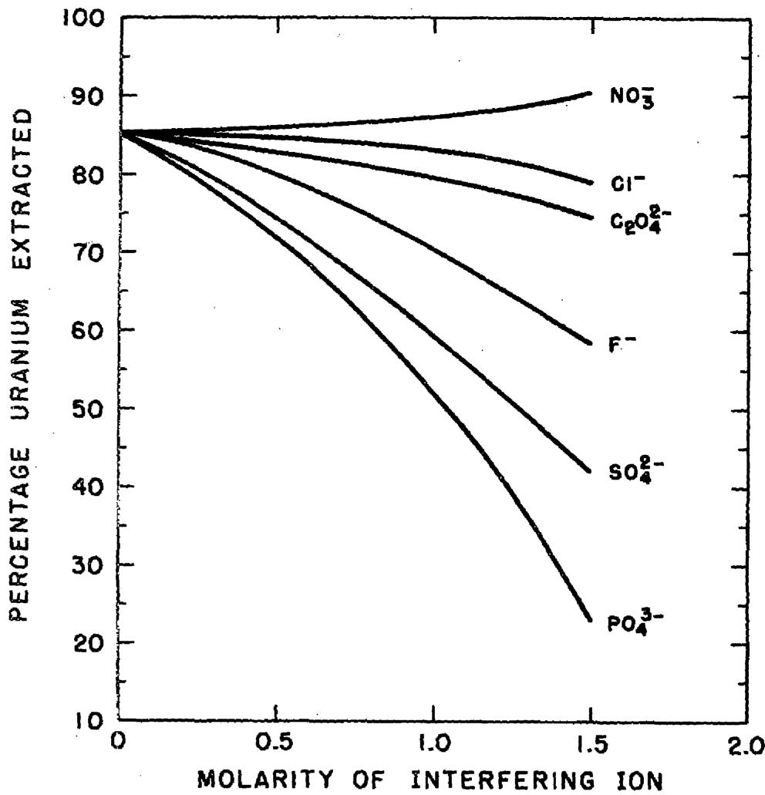  
After T. R. Scott, reference 337.   
Conditions: Aqueous phase - varying amount of anion, 3N HNO₃, 1M Fe(NO₃)₃; aqueous phase and organic phase shaken 1 minute at room temperature.

Table X. The Effects of Various Acids and Anions upon the Distribution Coefficient of Uranyl Nitrate to Diethyl Ether.   

<table><tr><td rowspan="2">Acid or salt present</td><td colspan="3">Composition of aqueous phase</td></tr><tr><td>4.23M Ca(NO3)2·4H2O (1000 g/1)</td><td>8M NH4NO3(640 g/1)</td><td>6.86M NH4NO3(549 g/1)</td></tr><tr><td>None</td><td>19.95</td><td>0.645</td><td>0.364</td></tr><tr><td>HCl, 1N</td><td>10.24</td><td>0.336</td><td></td></tr><tr><td>HCl, 2N</td><td>6.34</td><td>0.182</td><td></td></tr><tr><td>HNO3, 1N</td><td>43.56</td><td>1.162</td><td></td></tr><tr><td>HNO3, 2N</td><td>71.2</td><td>1.95</td><td></td></tr><tr><td>CH3CO2N, 1N</td><td>15.7</td><td>0.662, 0.616</td><td></td></tr><tr><td>CH3CO2N, 2N</td><td>10.52</td><td>0.720, 0.762</td><td></td></tr><tr><td>H2SO4, 0.0039N</td><td></td><td>0.613</td><td></td></tr><tr><td>H2SO4, 1N</td><td>29.6</td><td>0.024</td><td></td></tr><tr><td>H2SO4, 2N</td><td>23.5</td><td>0.019</td><td></td></tr><tr><td>H3PO4, 0.0058N</td><td></td><td>0.609</td><td></td></tr><tr><td>H3PO4, 1N</td><td>0.01</td><td>0.01</td><td></td></tr><tr><td>H3PO4, 2N</td><td>0.01</td><td>0.01</td><td></td></tr><tr><td>H3PO4, 1N</td><td>3.98</td><td>0.067</td><td></td></tr><tr><td>HNO3, 2N</td><td></td><td></td><td></td></tr><tr><td>(NH4)2C2O4·H2O, 0.7 g/100 ml</td><td></td><td></td><td>0.0847</td></tr><tr><td>H2C2O4·2H2O, 0.7 g/100 ml</td><td></td><td></td><td>0.0800</td></tr></table>

a After Furman, Mundy and Morrison, reference 326.   
The initial volumes of ether and aqueous solution were equal. Room temperature.

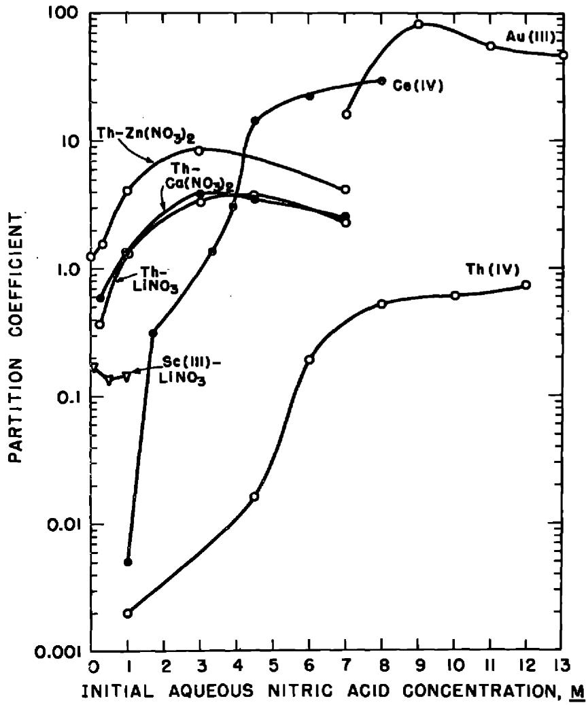  
Figure 12. The extraction of various metal nitrates by diethyl ether.

After R. Bock and E. Bock, reference 333. Conditions: equal phase volumes.

Metal nitrate Initial aqueous temperature concentration   
Th 0.1M $20 + 1^{\circ}C$ Saturated $\mathrm{LiNO_3}$ Ca $(\mathrm{NO}_3)\overline{2}$ or Zn $(\mathrm{NO}_3)\overline{2}$ solut1 Ce(IV) 0.1M $20 + 1^{\circ}C$ Au (III) 0.1M room Sc (III) 0.1M $20^{\circ}C$ Saturated LlNO3 solution

Table XI. Distribution Coefficients of Elements between Diethyl Ether and Various Nitrate   

<table><tr><td rowspan="3">Element</td><td colspan="8">Solutions.</td></tr><tr><td>H2Oa</td><td>0.8MHNO3a</td><td>0.8MHNO3a</td><td>1MHNO3b</td><td>1MHNO3b</td><td>AMINO3u</td><td>6MHNO3a</td><td>1.4MHNO3d</td></tr><tr><td>1OMNH4NO3</td><td>4.2MnCa(NO3)2</td><td>satNH4NO3</td><td>satLINO3</td><td>satLINO3</td><td>6MHNO3</td><td>6MHNO3</td><td>6MnAl(NO3)3</td></tr><tr><td>Al</td><td>&lt;0.001</td><td>&lt;0.001</td><td>&lt;0.001</td><td></td><td></td><td>0.0006</td><td>&lt;0.0001</td><td></td></tr><tr><td>Am(VI)</td><td></td><td></td><td></td><td>0.6bb</td><td></td><td></td><td></td><td></td></tr><tr><td>Sb(V)</td><td></td><td></td><td></td><td></td><td></td><td>&lt;0.01</td><td></td><td></td></tr><tr><td>As</td><td>0.0015*</td><td>0.007*</td><td>0.048*</td><td></td><td></td><td>0.168</td><td></td><td></td></tr><tr><td>Ba</td><td>&lt;0.0005</td><td>&lt;0.0005</td><td>&lt;0.0005</td><td></td><td></td><td></td><td>&lt;0.0001</td><td></td></tr><tr><td>Be</td><td></td><td></td><td></td><td></td><td></td><td>0.014</td><td>0.002</td><td></td></tr><tr><td>Bi</td><td>0.0001</td><td>0.0003</td><td>0.007</td><td></td><td></td><td>0.073</td><td>0.00031</td><td>0.021</td></tr><tr><td>B</td><td></td><td>0.01*</td><td>0.033-0.39*</td><td></td><td></td><td></td><td></td><td></td></tr><tr><td>Cd</td><td>&lt;0.00001</td><td>&lt;0.00001</td><td>0.00001</td><td></td><td></td><td>0.003</td><td>&lt;0.0001</td><td>0.0002</td></tr><tr><td>Ca</td><td>0.0003</td><td>0.0005</td><td>0.0005</td><td></td><td></td><td></td><td>&lt;0.0001</td><td></td></tr><tr><td>Ce(III)</td><td></td><td></td><td></td><td></td><td></td><td></td><td>&lt;0.0009</td><td></td></tr><tr><td>Ce(IV)</td><td></td><td></td><td>27*</td><td>0.095</td><td>0.314</td><td>30.3(29.4)</td><td></td><td></td></tr><tr><td>Cr(III)</td><td>&lt;0.0001</td><td>&lt;0.0001</td><td>&lt;0.0001</td><td></td><td></td><td>&lt;17</td><td></td><td></td></tr><tr><td>Cr(VI)</td><td></td><td></td><td></td><td></td><td></td><td>0.002</td><td>&lt;0.0001</td><td></td></tr><tr><td>Co</td><td>&lt;0.0001</td><td>&lt;0.0001</td><td>&lt;0.001</td><td></td><td></td><td>0.005</td><td>&lt;0.0001</td><td>0.00082</td></tr><tr><td>Cu</td><td>0.0004</td><td>0.0002</td><td>0.0004</td><td></td><td></td><td></td><td></td><td></td></tr><tr><td>Dy</td><td>0.0004</td><td>0.0003</td><td>0.002</td><td></td><td></td><td></td><td></td><td></td></tr><tr><td>Gd</td><td>0.0001</td><td>0.00001</td><td>0.00076</td><td></td><td></td><td></td><td></td><td></td></tr><tr><td>Ga</td><td></td><td></td><td></td><td></td><td></td><td>&lt;0.002</td><td></td><td></td></tr><tr><td>Ge</td><td></td><td></td><td></td><td></td><td></td><td>0.022</td><td></td><td></td></tr><tr><td>Au(III)</td><td></td><td></td><td></td><td></td><td></td><td>32.3(36.5-50)</td><td></td><td></td></tr><tr><td>H</td><td></td><td></td><td></td><td></td><td></td><td>0.72(0.71)</td><td></td><td></td></tr><tr><td>In</td><td>&lt;0.0004</td><td>&lt;0.0004</td><td>0.0003</td><td></td><td></td><td>0.001</td><td></td><td></td></tr><tr><td>Fe</td><td>0.0005</td><td>0.0005</td><td>0.001</td><td></td><td></td><td>0.0013</td><td>&lt;0.0001</td><td>0.0017</td></tr><tr><td>La</td><td></td><td></td><td></td><td></td><td></td><td></td><td></td><td></td></tr><tr><td>Pb</td><td>0.003?</td><td>&lt;0.0002</td><td>&lt;0.0002</td><td></td><td></td><td>0.005</td><td></td><td></td></tr><tr><td>Li</td><td>&lt;0.00002</td><td>0.0001</td><td>0.0002</td><td></td><td></td><td></td><td>0.0003</td><td></td></tr><tr><td>Mg</td><td>0.0002</td><td>0.0001</td><td>0.0002</td><td></td><td></td><td></td><td>&lt;0.0001</td><td></td></tr><tr><td>Mn(II)</td><td>&lt;0.0001</td><td>&lt;0.0001</td><td>&lt;0.0001</td><td></td><td></td><td>0.002</td><td>&lt;0.0001</td><td></td></tr><tr><td>Mn(VII)</td><td></td><td></td><td></td><td></td><td></td><td>&lt;0.005</td><td></td><td></td></tr><tr><td>Hg</td><td>0.003</td><td>&lt;0.0001</td><td>&lt;0.0001</td><td></td><td></td><td>0.049</td><td>&lt;0.0001</td><td>0.0003</td></tr><tr><td>Mo</td><td></td><td>&lt;0.001***</td><td></td><td></td><td></td><td>0.0065</td><td></td><td></td></tr><tr><td>Nd</td><td></td><td></td><td></td><td></td><td></td><td></td><td>&lt;0.0009</td><td></td></tr><tr><td>Ni</td><td>&lt;0.0001</td><td>&lt;0.0001</td><td>&lt;0.0001</td><td></td><td></td><td>0.0006</td><td>&lt;0.0001</td><td></td></tr><tr><td>Np(IV)</td><td></td><td></td><td></td><td></td><td></td><td></td><td>0.2</td><td></td></tr><tr><td>Np(V)</td><td></td><td></td><td></td><td></td><td></td><td></td><td>1.1</td><td></td></tr><tr><td>Np(VI)</td><td></td><td></td><td></td><td></td><td></td><td></td><td>4.4</td><td></td></tr><tr><td>P</td><td></td><td></td><td></td><td></td><td></td><td>0.256</td><td></td><td></td></tr><tr><td>Pu(III)</td><td></td><td></td><td></td><td></td><td></td><td></td><td>&lt;0.001</td><td></td></tr><tr><td>Pu(IV)</td><td></td><td></td><td></td><td></td><td></td><td>10.3</td><td>1.5</td><td></td></tr><tr><td>Pu(VI)</td><td></td><td></td><td></td><td></td><td></td><td>2.4</td><td>1.5</td><td></td></tr><tr><td>K</td><td>0.0005</td><td>0.0002</td><td>0.002?</td><td></td><td></td><td></td><td>&lt;0.0001</td><td></td></tr><tr><td>Ra</td><td>&lt;0.00025</td><td>&lt;0.00025</td><td>&lt;0.00025</td><td></td><td></td><td></td><td></td><td></td></tr><tr><td>Rare earths</td><td>0.00076</td><td>&lt;0.00005</td><td>&lt;0.0031</td><td></td><td></td><td></td><td></td><td></td></tr><tr><td>Re</td><td>&lt;0.015**</td><td>&lt;0.015**</td><td>&lt;0.015**</td><td></td><td></td><td></td><td></td><td></td></tr><tr><td>Rb</td><td></td><td></td><td></td><td></td><td></td><td></td><td>0.00014</td><td></td></tr><tr><td>Sm</td><td></td><td></td><td></td><td></td><td></td><td></td><td>&lt;0.0009</td><td></td></tr><tr><td>Sc</td><td></td><td></td><td></td><td>0.013</td><td>0.146</td><td>0.001</td><td></td><td></td></tr><tr><td>Ag</td><td></td><td></td><td></td><td></td><td></td><td>0.025</td><td>&lt;0.0001</td><td>0.001</td></tr></table>

Table XI. - Continued   

<table><tr><td>Element</td><td>H2O8</td><td>0. BMEINO3a10MNH4NO3</td><td>0. BMEINO3a4.2MCA(NO3)2</td><td>1MINDO3satdNHNO3</td><td>1MINDO3satdLiko3</td><td>6MINDO3b</td><td>6MINDO3c</td><td>1.4MINDO3SMNH4NO3</td><td>1.3MINDO3SMAL(NO3)3</td></tr><tr><td>Na</td><td>&lt;0.0001</td><td>&lt;0.0001</td><td>&lt;0.0001</td><td></td><td></td><td></td><td></td><td>&lt;0.0001</td><td></td></tr><tr><td>Sr</td><td>&lt;0.0008</td><td>&lt;0.0008</td><td>&lt;0.0008</td><td></td><td></td><td></td><td></td><td>&lt;0.0001</td><td></td></tr><tr><td>Tl(I)</td><td>&lt;0.0005</td><td>&lt;0.0005</td><td>&lt;0.0005</td><td></td><td></td><td>&lt;0.005</td><td></td><td></td><td></td></tr><tr><td>Tl(III)</td><td></td><td></td><td></td><td></td><td></td><td>0.083</td><td></td><td></td><td></td></tr><tr><td>Th</td><td></td><td>0.001*</td><td></td><td>0.0036</td><td>1.30</td><td>0.528(0.531)</td><td>0.5</td><td>0.0034</td><td>0.32</td></tr><tr><td>Tl</td><td></td><td></td><td></td><td></td><td></td><td>&lt;&lt;0.005</td><td></td><td></td><td></td></tr><tr><td>U(VI)</td><td>0.68*</td><td>1.31*</td><td>165*</td><td>2.09</td><td>73.8</td><td>1.86(1.78)</td><td>1.85</td><td>2.3</td><td>208</td></tr><tr><td>V(IV)</td><td></td><td>0.0006-0.001*</td><td>0.004-0.008*</td><td></td><td></td><td></td><td></td><td></td><td></td></tr><tr><td>V(V)</td><td>&lt;0.0005*</td><td>0.019*</td><td>0.040*</td><td></td><td></td><td>0.02</td><td></td><td></td><td></td></tr><tr><td>Y</td><td></td><td></td><td></td><td></td><td></td><td>0.001</td><td>&lt;0.0009</td><td></td><td></td></tr><tr><td>Zn</td><td>&lt;0.0005</td><td>&lt;0.0005</td><td>&lt;0.0005</td><td></td><td></td><td>0.001</td><td>&lt;0.0001</td><td></td><td></td></tr><tr><td>Zr</td><td></td><td>0.001*</td><td></td><td></td><td></td><td>~0.087</td><td>0.0011</td><td>0.011</td><td></td></tr></table>

a After Furman, Mundy, and Morrison, reference 326.   
Conditions were arranged, in general, so that approximately 5g. of $\mathrm{U}_{2}\mathrm{O}_{5}$ were recovered from the ether extract prior to spectrographic examination. In general, survey studies, 0.1 g of each of the elements: Ag, Al, B, Ba, Bi, Ca, Cd, Co, Cr, Gu, Fe, Eg, K, Li, Mg, Mn, Na, Ni, Pb, Sr, Tl, Zn, and 0.05 g, each of In & Re was present along with uranyl nitrate and a salting agent, 40 g. per 100 ml of ammonium nitrate and 100 g. per 100 ml of calcium nitrate. (The latter is equivalent to 4.23 M if the salt is considered to be Ca(NO₃)₂·4HgO, 4.58 M if it is considered to be Ca(NO₃)₂.) The description of the experiment given in Reference 326 gives the nitric acid concentration as 5 ml of concentrated acid per 100 ml. A table of the partition coefficients gives the acid concentration as 5 g. of ENO₃ per 100 ml. If the concentrated acid concentration is considered to be approximately 15M, both of the above values give a nitric acid concentration of the aqueous solution as 0.8M. The aqueous solutions were shaken to equilibrium with an equal volume of ether at 20°C.   
The uranium partition coefficients are the maximum values determined (see, also,   
figure 9)   
Rare earths were present in amounts such that only limiting values could be given for individual elements by spectrographic means except for Dy and $\mathrm{O}1$   
Large amounts of elements were used: V 1-2g, As or Cr 16-20g, Na or Ca nitrate 70-100g, Fe 1g, Mo 0.3g per 100 ml. Analysis of the ether phase made by means other than spectrographic.   
** Limit set by lack of sensitivity of spectrographio test; a probably much smaller.   
*** Valence state not designated.   
\*\*\* $\alpha$ is much greater for Mo present as a heteropoly acid.   
b After Book and Book, reference 333.   
Values of a for SM NO₃ solutions have been calculated from P-values given by Bock and Bock. Those values in parentheses are α-values given directly by Bock and Bock or interpolated from their data.   
Concentration of element concerned in initial solution: 0.1M with the exception of Al 0.94K, Sb, Bi 0.2M, Ge 0.03M, H 6M END Fe(III) 0.4M, La 0.27M, Pb 0.075M, So 0.2M for BMHO, Zn 0.4M.   
Elements were present as the nitrate with the following exceptions: Ge as DeO2,   
F As $\mathrm{NH_4OH}$ , As as NaHbAol, V as NH4VO3, Cr as KCrO7, Mo as NH4-molydate The Sb(V) solution hydrolyzed strongly. The largest part of the antimony was precipitated as hydroxide and only traces were detected in the ether phase.   
Cr(VI) extracted well but an exact value could not be determined because of reduction of the chromium.   
Mn(VII) was reduced with the separation of MnO2 from the ether so that practically no Mn was extracted.   
Temperature: $20^{\circ}$ for the saturated $\mathsf{NH_4NO_3}$ and $\mathsf{LiNO_3}$ solutions. Room temperature for the $\underline{\mathbf{B}}\underline{\mathbf{x}}$ $\mathsf{BN}_3$ solutions.   
bb Asprey, Stephanon and Penneman, reference 343.   
Am(VI) was prepared by peroxydisulfate oxidation.   
a After Koo1, reference 334.   
The values given in this column are values taken from curves given in this reference (see, also, figures 8 and 13).   
Concentrations of the various elements in the initial aqueous solution: Th, 22 mg per ml of $\mathrm{Th(NO_3)_4} \cdot 4\mathrm{H}_2\mathrm{O}$ ; U, 3.3, 10, 30 and 90 mg per ml of $\mathrm{UO_2(NO_3)_2} \cdot 6\mathrm{H}_2\mathrm{O}$ ; Np and Pu, tracer quantities. No detectable difference was observed in the partition data for the first three quantities of U listed; a lower α (1.7) was observed for the latter concentration.   
Shaking times for the Np and Pu experiments were kept short (15 sec to 3 min) to minimize disproportionation to other oxidation states. The shaking time for U solutions was never less than 5 minutes. An increase to two hours did not make a difference in the results.   
d After Vioenko, reference 344.   
The initial aqueous layer contained, in addition to the acid and salting agent, about 0.1M of the nitrate examined. Equal volumes of the aqueous solution and diethyl ether were shaken for 5 minutes. After 12 hours equilibration a sample of the organic solution was taken for analysis.

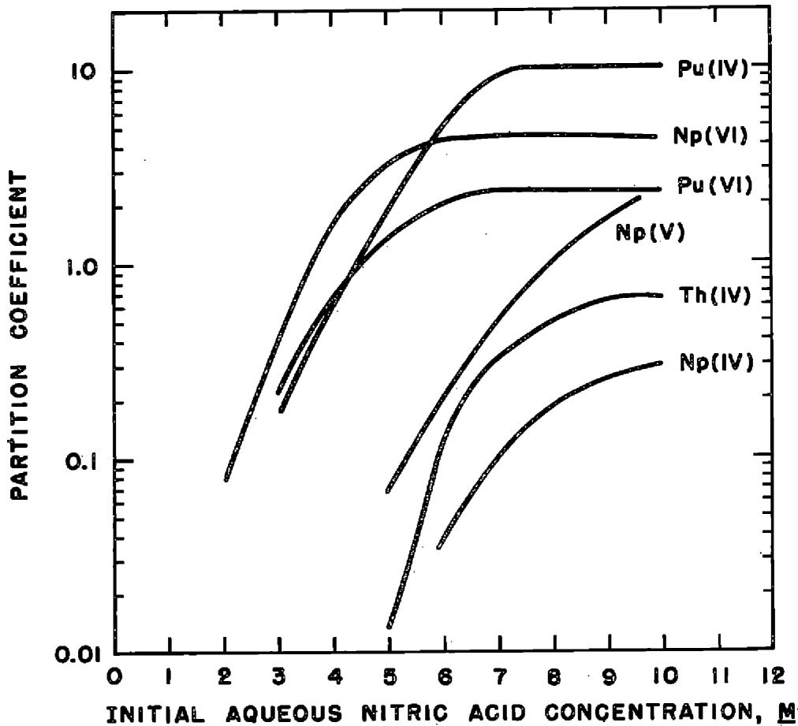  
Figure 13.

The extraction of actinide nitrates by diethyl ether.

After J. Kooi, reference 334.

Conditions:

Tracer amounts of $\mathbf{Np}^{239}$ and $\mathbf{Pu}^{239}$ in aqueous solutions were equilibrated with an equal volume of diethyl ether at $25^{\circ}C$ and room temperature, respectively. $330~\mathrm{mg}$ of $\mathrm{Th(NO_3)_4\cdot 4H_2O}$ per $15\mathrm{ml}$ of initial aqueous solution was equilibrated with an equal volume of ether.

The oxidation states of neptunium have been the subject of some question.345

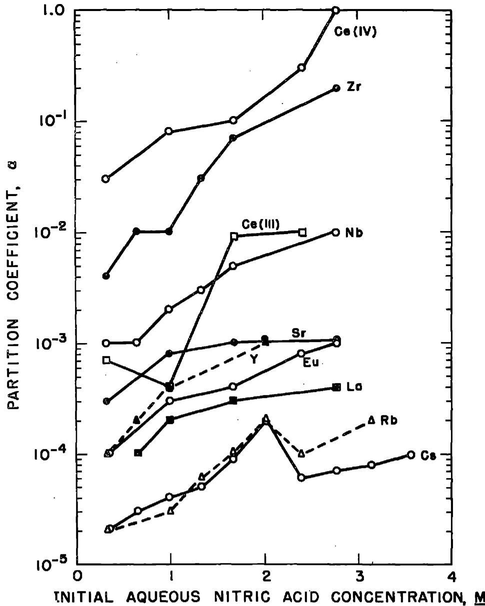  
Figure 14. Partition coefficients of fission products between diethyl ether and aqueous solution containing $\mathrm{Ca(NO_3)_2}$ and different initial acidities. After V. Vdovenko, reference 344. Conditions: Aqueous solution--required amounts of nitric acid and radioactive material added to $3.5\mathrm{M}$ solution of $\mathrm{Ca(NO_3)_2}$ ; $\mathrm{V_0 / V_8}$ , 1.

Aqueous thiocyanate systems. Uranium may be extracted from aqueous thiocyanate solutions by diethyl ether. $340,341$ Table XII lists the partition coefficients of several elements from aqueous solutions of various thiocyanate concentrations. $341$ A number of substances not listed in the table give negligible distributions or distributions of only a few percent under the conditions tested: $\mathsf{NH}_{4}$ , $\mathsf{Sb}(\mathsf{III})$ , $\mathsf{As}(\mathsf{III})$ , $\mathsf{As}(\mathsf{V})$ , $\mathsf{Bi}$ , $\mathsf{Cd}$ , $\mathsf{Cu}(\mathsf{I})$ , $\mathsf{Cr}(\mathsf{III})$ , $\mathsf{Ge}(\mathsf{IV})$ , $\mathsf{Li}$ , $\mathsf{Hg}(\mathsf{II})$ ,

Table XII. - Partition Coefficients of Various Elements between Dlethyl Ether and Aqueous Thiocyanate Solutions. Composition of the initial aqueous solution   

<table><tr><td rowspan="2"></td><td rowspan="2">HC1 M</td><td rowspan="2">°C</td><td>t</td><td colspan="3">NH4SCN concentration</td></tr><tr><td>LM</td><td>3M</td><td>5M</td><td>7M</td></tr><tr><td>0.1M Alb</td><td>0.5</td><td>20</td><td></td><td>0.011</td><td>0.099</td><td>0.275c</td></tr><tr><td>0.2M BeCl2</td><td>0.5</td><td>RT</td><td>0.039</td><td>0.987</td><td>5.29</td><td>11.9</td></tr><tr><td>0.1M CoCl2</td><td>0.5</td><td>RT</td><td>0.037</td><td>1.39</td><td>2.98</td><td>3.04</td></tr><tr><td>0.1M GaCl3</td><td>0.5</td><td>RT</td><td>1.89</td><td>9.56</td><td></td><td>152</td></tr><tr><td>HCl</td><td>0.5</td><td>20</td><td>2.67</td><td>12.7</td><td>31.1</td><td>59.4</td></tr><tr><td>0.1M InCl3</td><td>0.5</td><td>RT</td><td>1.06</td><td>3.05</td><td>2.15</td><td>0.908</td></tr><tr><td>0.1M FeCl3</td><td>0.5</td><td>RT</td><td>8.00</td><td>5.13</td><td>3.08</td><td>1.14</td></tr><tr><td>0.1M MoOCl3</td><td>~0.5</td><td>RT</td><td>140</td><td>34.9</td><td></td><td>36.4d</td></tr><tr><td>0.1M ScCl3</td><td>0.5</td><td>RT</td><td>0.145</td><td>3.95</td><td></td><td>8.06</td></tr><tr><td>0.1M (NH4)2SnCl6</td><td>0.5</td><td>RT</td><td>144</td><td>950</td><td>&gt;1000</td><td>&gt;1000</td></tr><tr><td>0.1M TiCl3</td><td>0.5</td><td>RT</td><td>1.43</td><td>5.25</td><td>3.94</td><td>3.22</td></tr><tr><td>0.1M TiCl4</td><td>0.5</td><td>RT</td><td></td><td></td><td></td><td>~0.15</td></tr><tr><td>0.1M UO2Cl2</td><td>0.5</td><td>RT</td><td>0.821</td><td>0.417</td><td>0.160</td><td>0.072</td></tr><tr><td>0.1M VOC12</td><td>0.5</td><td>RT</td><td>0.176</td><td>0.095</td><td></td><td>0.022</td></tr><tr><td>0.1M ZnCl2</td><td>0.5</td><td>RT</td><td>23.7</td><td>37.8</td><td>18.3</td><td>12.9</td></tr></table>

After R. Bock, reference 341.   
as A1Cl3?   
c 6.2M   
d 6.6M

Equal phase volumes equilibrated at room temperature.

N1, Pd(II). Figure 15 represents the change in $\alpha_{\mathrm{u}}$ with thiocyanate concentration for aqueous solutions of different acidities. Analysis of the ammonium, uranium, thiocyanate concentration of the ether phase indicates that uranium is extracted as $\mathrm{UO}_{2}(\mathrm{SCN})_{2}$

Aqueous fluoride systems. Uranium (VI) is poorly extracted by diethyl ether from aqueous fluoride solutions.<sup>342</sup> Table XIII lists the partition coefficients of a number of elements from aqueous solutions of various hydrofluoric acid concentrations.

# Dibutyl ether

Aqueous nitrate systems. The applicability of dibutyl ether as an extractant for uranium has been investigated extensively by workers in the Soviet Union.344,346-349 Dibutyl ether offers several advantages over diethyl ether. It is less soluble in water, less volatile, and has a higher flash point. The distribution coefficient of uranyl nitrate is, however, less for dibutyl ether than for diethyl ether. The partition of uranium between water and dibutyl ether is represented in figure 1.185,321 The distribution of uranyl nitrate and nitric acid is plotted as a function of aqueous nitric acid concentration in figure 16.346 Karpacheva, Khorkhovina, and Agashkina have studied the effect of various salting-out agents on the distribution of uranyl nitrate. The salting-out action was found to increase with increasing valence of the cation. The partition coefficient of uranium from an aqueous solution initially $0.5\mathrm{M}$ $\mathrm{UO}_2(\mathrm{NO}_3)_2$ , $4.5\mathrm{M}$ $\mathrm{Ca(NO_3)_2}$ , and $0.5\mathrm{M}$ $\mathrm{HNO}_3$ into an organic phase $85\%$ (by volume) dibutyl ether and $15\%$ carbon tetrachloride is $0.70$ ; $\alpha_{\mathrm{Pu(VI)}}$ is $0.42$ .347 Zirconium, niobium, and ruthenium are the main fission product elements extracted.344,348 Heyn and Banerjee350 have studied the extraction of bismuth nitrate by dibutyl ether and several other solvents.

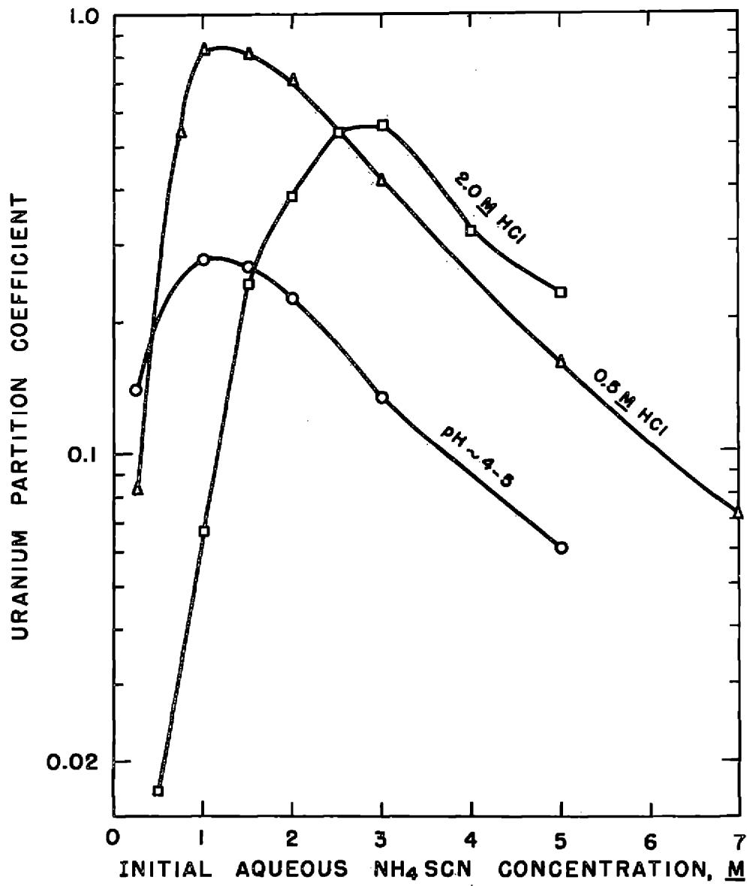  
Figure 15.

The extraction of uranyl thiocyanate by diethyl ether at various initial $\mathrm{NH_4SCN}$ and HCl concentrations.

After R. Bock, reference 341.

Conditions:

Aqueous phase--initially 0.1M, $\mathrm{UO}_2\mathrm{Cl}_2$ and $\mathrm{NH_4CNS}$ and HCl concentration indicated. Equal phase volumes equilibrated at room temperature.

Table XIII. - Partition Coefficients of Various Elements between Aqueous HF Solutions and Diethyl Ether   
HF concentration of the starting aqueous solution   

<table><tr><td>Elementb</td><td>1.0MHF</td><td>5.0MHF</td><td>10.0MHF</td><td>15.0MHF</td><td>20.0MHF</td></tr><tr><td>Sb(III)</td><td>&lt;0.0005</td><td>0.003</td><td>0.019</td><td>0.040</td><td>0.067</td></tr><tr><td>As(III)</td><td>0.111</td><td>0.227</td><td>0.432</td><td>0.530</td><td>0.605</td></tr><tr><td>As(V)</td><td>&lt;0.001</td><td>0.017</td><td>0.048</td><td>0.121</td><td>0.157</td></tr><tr><td>Be</td><td>&lt;0.0005</td><td>&lt;0.0005</td><td>0.005</td><td>0.019</td><td>0.042</td></tr><tr><td>Cd</td><td>&lt;0.0005</td><td>0.002</td><td>0.006</td><td>0.009</td><td>0.014</td></tr><tr><td>Co</td><td>&lt;0.002</td><td>&lt;0.002</td><td>&lt;0.002</td><td>0.005</td><td>0.017</td></tr><tr><td>Cu(II)</td><td>&lt;0.001</td><td>&lt;0.001</td><td>&lt;0.001</td><td>0.010</td><td>0.013</td></tr><tr><td>Ge(IV)</td><td>&lt;0.002</td><td>&lt;0.002</td><td>0.005</td><td>0.028</td><td>0.072</td></tr><tr><td>Mn(II)</td><td>&lt;0.0005</td><td>&lt;0.0005</td><td>0.002</td><td>0.005</td><td>0.013</td></tr><tr><td>Hg(II)</td><td>&lt;0.0005</td><td>&lt;0.0005</td><td>&lt;0.0005</td><td>0.009</td><td>0.028</td></tr><tr><td>Mo(VI)</td><td>0.007</td><td>0.018</td><td>0.031</td><td>0.062</td><td>0.103</td></tr><tr><td>N1</td><td>&lt;0.0005</td><td>&lt;0.0005</td><td>&lt;0.0005</td><td>0.005</td><td>0.007</td></tr><tr><td>Nb(V)</td><td>0.006</td><td>0.044</td><td>0.480</td><td>1.08</td><td>1.92</td></tr><tr><td>P(V)</td><td>&lt;0.001</td><td>0.011</td><td>0.032</td><td>0.110</td><td>0.173</td></tr><tr><td>Re(VII)</td><td>0.0005</td><td>0.121</td><td>1.58</td><td>1.78</td><td>1.62</td></tr><tr><td>Se(IV)</td><td>0.0006</td><td>0.022</td><td>0.080</td><td>0.131</td><td>0.148</td></tr><tr><td>Ta</td><td>0.012</td><td>0.774</td><td>3.80</td><td>3.82</td><td>3.84</td></tr><tr><td>Te(IV)</td><td>0.0001</td><td>0.020</td><td>0.071</td><td>0.237</td><td>0.298</td></tr><tr><td>Sn(II)</td><td></td><td>0.020</td><td>0.029</td><td></td><td>0.052</td></tr><tr><td>Sn(IV)</td><td>0.006c</td><td>0.006d</td><td>0.053e</td><td></td><td>0.055</td></tr><tr><td>U(VI)</td><td>&lt;0.002</td><td>&lt;0.002</td><td>&lt;0.002</td><td>0.005</td><td>0.011</td></tr><tr><td>V(III)</td><td>&lt;0.0005</td><td>0.003</td><td>0.03</td><td>0.10</td><td>0.13</td></tr><tr><td>V(V)</td><td>&lt;0.001</td><td>0.004</td><td>0.017</td><td>0.056</td><td>0.093</td></tr><tr><td>Zn</td><td>&lt;0.001</td><td>&lt;0.001</td><td>&lt;0.001</td><td>0.002</td><td>0.009</td></tr><tr><td>Zr</td><td>0.004</td><td>0.005</td><td>0.005</td><td>0.012</td><td>0.030</td></tr></table>

a After Bock and Herrmann, reference 342.   
Equal phase volumes equilibrated at $20.0 \pm 0.5^{\circ}C$ .

The concentration in the initial aqueous solution of the ionic species of the element listed in the table was $0.1\text{M}$ in each case with the exception of Re(VII) which was $0.05\text{M}$ .

Fluoride stock solutions were prepared in the following manner: carbonates (Cd, Co, Cu, Mn(II), Ni, Zn), oxides (Sb(III), Ge(IV), Hg(II), Nb(V), Se(IV), Ta(V), Te(IV), V(III)) or hydroxides or hydrated oxides (SN(IV), Zr) were dissolved in an excess of HF; $\mathrm{As}_{2}\mathrm{O}_{3}$ was dissolved in a known volume of 0.1N NaOH and the calculated amount of HF added to the solution; $\mathrm{BeF}_2$ and $\mathrm{SnF}_2$ were dissolved; $\mathrm{K}_2\mathrm{HAsO}_4$ , $\mathrm{Na}_2\mathrm{HPO}_4$ , $\mathrm{KReO}_4$ , ammonium vanadate, ammonium molybdate, and sodium uranate were dissolved in HF.

a 1.2 MH   
d 5.4 MHF   
10.4 MHF

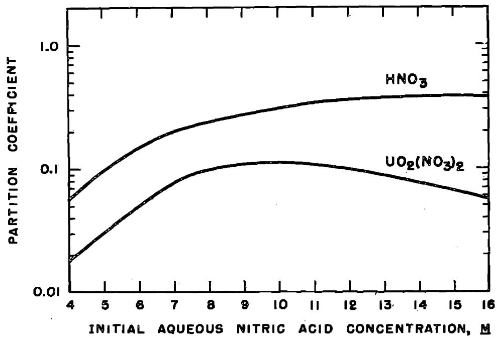  
Figure 16.

Partition of uranyl nitrate and nitric acid between dibutyl ether and aqueous solution.

After V. Vdovenko, A. Lipovskii, M. Kuzina, reference 346.

Conditions:

Equal phase volumes equilibrated at room temperature for both $\mathrm{UO}_2(\mathrm{NO}_3)_2$ and $\mathrm{HNO}_3$ extractions. For nitric acid, points corresponding to an acid content in the aqueous solution of greater than 13.4M were obtained by the extraction of previously acidified dibutyl ether with concentrated nitric acid. For uranyl nitrate, points greater than 12.0M $\mathrm{HNO}_3$ were similarly obtained. The uranium concentration was 78 mg/ml.

Dibutyl "Cellosolve" (Dibutoxymonoethyleneglycol)

Aqueous nitrate systems. A number of cellosolve derivatives have been investigated for the extraction of uranium (Table VIII). Diethyl cellosolve is an excellent extractant.332 Unfortunately its solubility in water is large (21% by weight at $20^{\circ}\mathrm{C}$ ). Dibutyl cellosolve is less soluble in water (0.2% by weight at $20^{\circ}\mathrm{C}$ ). However, it does not extract uranium as well as diethyl ether, either from water

solution (figure 2 $\underline{185,321}$ ) or from aqueous aluminum nitrate solution (figure 6 $\underline{332}$ ). The partition coefficient of uranium into dibutyl cellosolve from nearly saturated solutions of ammonium, calcium, or ferric nitrate is 1, 50, and 20, respectively. $\underline{332}$

# Dibutyl "Carbitol" (Dibutoxydiethyleneglycol)

Aqueous nitrate systems. Dibutyl carbitol (Butex) is used in the recovery of irradiated fuel material.[351] As a solvent, it has been subject to considerable study.[332,352] The partition of uranium between water solution and solvent is given in figure 2.[176,185,321] The partition of uranium between nitric acid solution and dibutyl carbitol is illustrated in figure 17.[353] For aqueous solutions in this range of acid concentration, the partition coefficient is observed to increase with increased uranyl nitrate concentration. The partition coefficient of nitric acid is plotted as a function of acid concentration in figure 18.[334,353,354] In figures 19 and 20, the partition coefficients of uranium and several other heavy elements are plotted against nitric acid concentration. The initial acid concentration of the aqueous phase is plotted in figure 19.[334] The equilibrium acid concentration of the aqueous phase is given in figure 20.[345] Best, et al[345] have observed that the steepness of the extraction curves (figure 20) is compatible with the formation of the species $\mathrm{HMO}_2(\mathrm{NO}_3)_3$ and $\mathrm{H}_2\mathrm{M}(\mathrm{NO}_3)_6$ in the organic phase rather than just $\mathrm{MO}_2(\mathrm{NO}_3)_2$ and $\mathrm{M}(\mathrm{NO}_3)_4$ . The curves given in figures 19 and 20 are in general agreement considering the difference in acid concentration plotted. There is a large discrepancy between $\mathrm{Np(IV)}$ data. The ability to maintain neptunium in the pentavalent state during extraction may be subject to question. The partition of some fission product elements is given in figure 21 for various

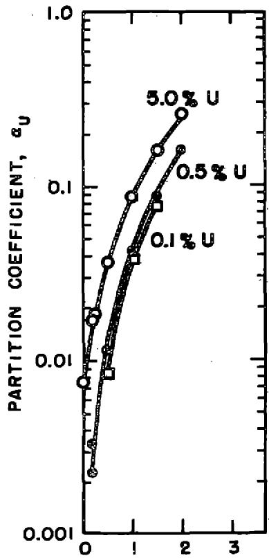  
Figure 17. Distribution of uranyl nitrate between dibutyl carbitol and nitric acid solution. Adapted from C. A. Kraus, reference 353. Conditions: Approximately equal volumes of organic and aqueous phase, initially at the uranium and nitric acid concentrations indicated, equilibrated at about $27^{\circ}C$ .

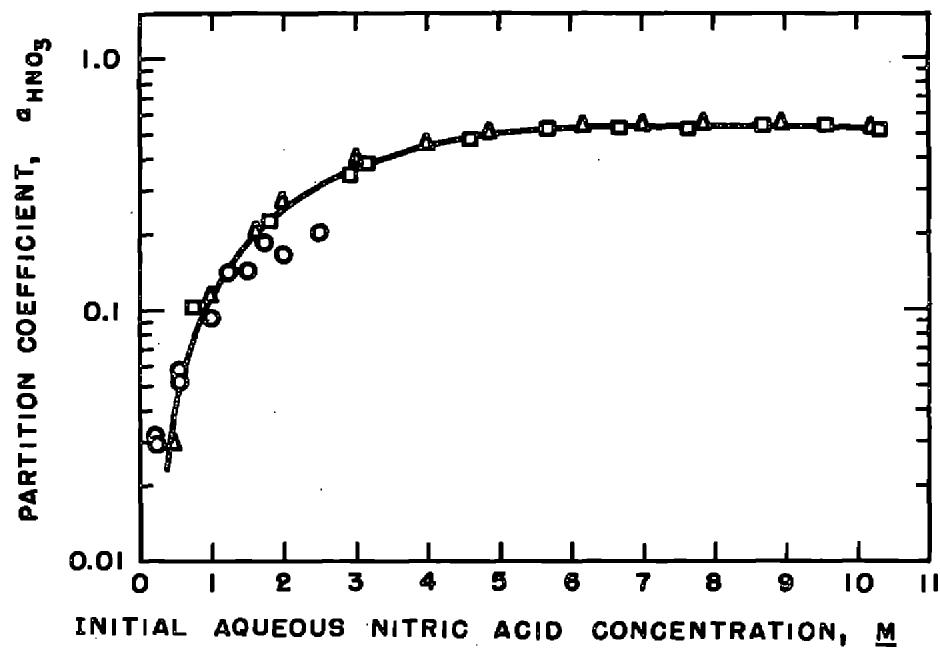  
Figure 18. Distribution of nitric acid between dibutyl carbitol and aqueous solution. O, After C. A. Kraus, reference 353. □, After J. Kooi, reference 334. △, After D. G. Tuck, reference 354. Conditions: Equal334,354 or approximately equal353 volume portions of solvent and aqueous solution equilibrated at ~27°C,353 25°C,334 and ~21°C,354

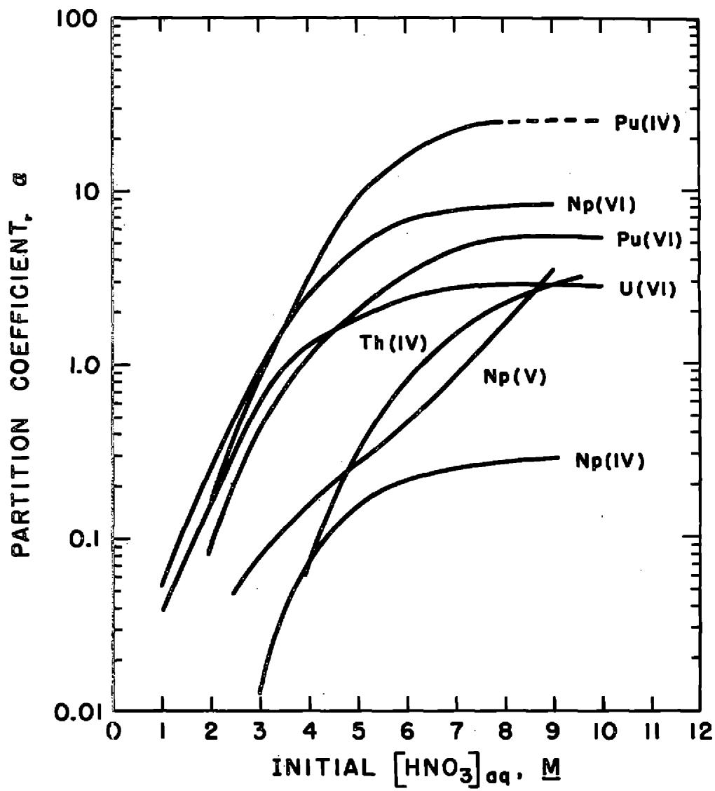  
Figure 19.

The extraction of actinide nitrates by dibutyl carbitol.

After J. Koo1, reference 334.

# Conditions:

Tracer amounts of $\mathbf{Np}^{239}$ or $\mathrm{Pu}^{239}$ , 330 mg of $\mathrm{Th(NO_3)_4}$ per 15 ml, or 300 mg of $\mathrm{UO_2(NO_3)_2}$ (hexahydrate) per 15 ml in aqueous nitric acid solution equilibrated with an equal volume of dibutyl carbitol at $25^{\circ}\mathrm{C}$ or room temperature.

The oxidation states of neptunium have been the subject of some question.345

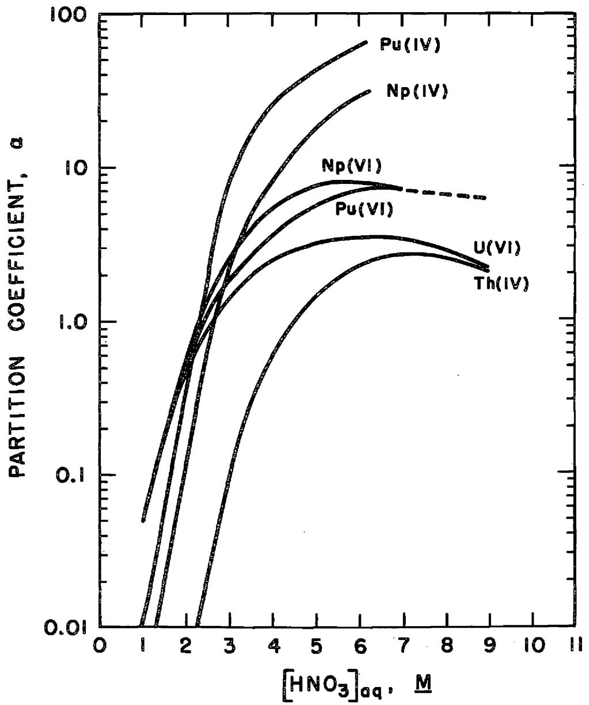  
Figure 20.

The distribution of actinide elements between dibutyl carbitol and aqueous solution as a function of equilibrium aqueous nitric acid concentration.

After G. Beat, E. Hesford, and H. McKay, reference 345.

Conditions:

Tracer concentrations $(\sim 10^{-3}\underline{\mathbf{M}})$ of actinide. Temperature, $25^{\circ}C$

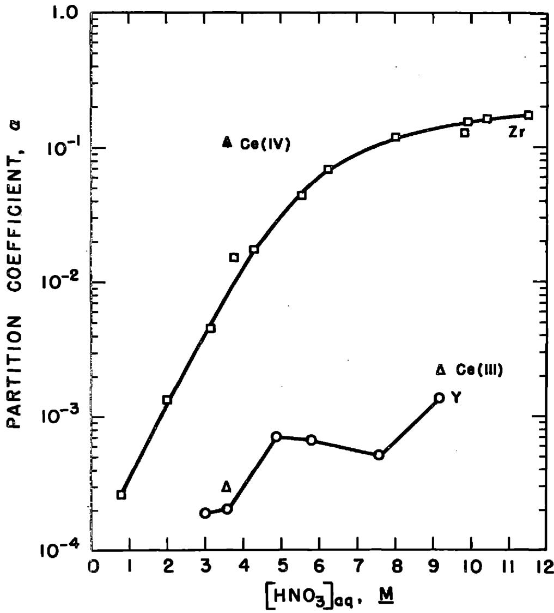  
Figure 21.

The partition of tracer amounts of yttrium, cerium, and zirconium between dibutyl carbitol and aqueous solution as a function of aqueous nitric acid concentration.

After H. McKay, K. Alcock, and D. Scargill, reference 355.

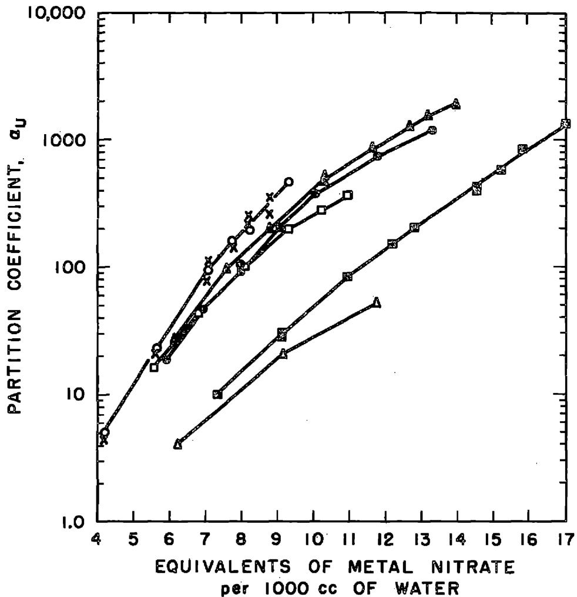  
Figure 22. The effect of salting-out agents on the extraction of uranium by dibutyl carbitol. $\bullet$ Cu(NO3)2, $\bullet$ Ca(NO3)2, $\triangle$ Zn(NO3)2, OAl(NO3)3, $\square$ Fe(NO3)3, $\triangle$ La(NO3)3. After E. Evers and C. Kraus, reference 332. Conditions: Uranium concentration, 2-6 g/100 cc of phase. Temperature, $27^{\circ}\mathrm{C}$ ; $\mathrm{V}_{\mathrm{o}} / \mathrm{V}_{\mathrm{a}} = 1$ . X Al(NO3)3. After D. Lee, R. Woodward, G. Clewett, reference 358. Conditions: Trace amounts of uranium. Temperature, $27^{\circ}\mathrm{C}$ ; $\mathrm{V}_{\mathrm{o}} / \mathrm{V}_{\mathrm{a}}$ , varied.

aqueous nitric acid concentrations. $^{355}$ The distribution of iron into dibutyl carbitol is increased by an increase in acidity. $^{352}$ Chloride ion promotes the extraction of iron. Boron is extracted by butex, especially in the presence of copper nitrate as salting-out agent. $^{352}$ Vanadium and molybdenum are extracted to several per cent. $^{352}$ The extraction of cadmium, chromium, nickel and titanium is small. $^{352}$

The effect of salting-out agents on the distribution of uranium into dibutyl carbitol has been sutured. Some of the results are presented in figure 22.

Aqueous chloride systems. Uranium (IV) and (VI) and thorium are poorly extracted by dibutyl carbitol from aqueous solutions 2-6M in hydrochloric acid.359 The extraction of protactinium is increased as the acid concentration is increased. From 6M HCl, $\alpha_{\mathrm{Pa}}$ is 10. The extraction of hydrochloric acid is negligible from aqueous solutions less than 6M in hydrochloric acid. A third phase is formed upon equilibration with 7.5M HCl. The third phase contains a large amount of the acid. One phase results upon equilibration with 8.5M HCl.

Pentaether (Dibutoxytetraethyleneglycol)

Aqueous nitrate systems. References 332 and 360 summarize much of the data pertinent to the extraction of uranium by pentaether. The distribution of uranyl nitrate between solvent and water is given in figure 2A176,185 The partition coefficient of uranyl nitrate from various nitrate media is plotted in figure 23.360 The distribution of nitric acid as a function of aqueous acid concentration is also shown in figure 23.361 The effect of salting-out agents on the partition of uranium is illustrated in figure 24.332 Table XIV lists the partition coefficients of a number of elements other than uranium between pentaether and various aqueous media.362 Uranium is extracted by pentaether from aqueous solutions containing ammonium nitrate and/or nitric acid in the presence of sulfate, phosphate, or silicate ions.362 Phosphate ion, in large quantity, and soluble silicate ions are extracted by the solvent.362 Fluoride ion, in significant quantity, interferes with uranyl nitrate extraction. This effect may be overcome by complexing the fluoride ion with calcium or aluminum nitrate.362

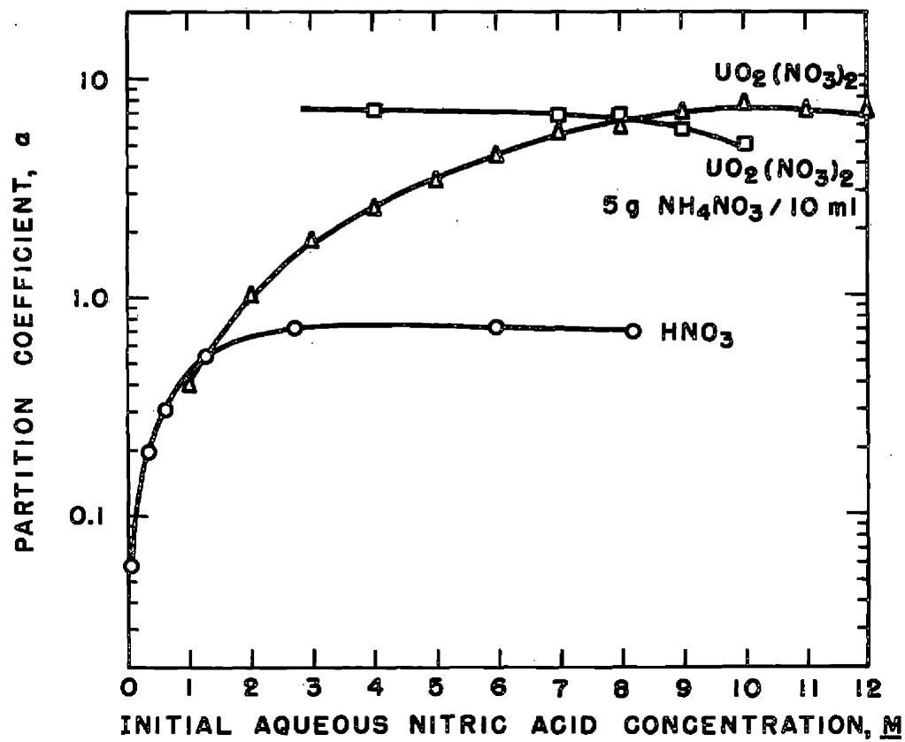  
Figure 23. The partition coefficients of uranyl nitrate and nitric acid between pentaether and aqueous solution. $\Delta \mathrm{UO}_2(\mathrm{NO}_3)_2:1.0\mathrm{g}$ . U308 dissolved in HNO₃, diluted to 50 ml with acid of desired strength, and shaken 1 minute with an equal volume of pentaether. $\square \mathrm{UO}_2(\mathrm{NO}_3)_2 + \mathrm{NH}_4\mathrm{NO}_3:1.0\mathrm{g}$ . U308 dissolved in 10 ml of HNO₃ of desired strength after addition of 5 g. $\mathrm{NH}_4\mathrm{NO}_3$ ; shaken with an equal volume of pentaether for 1 minute at room temperature. Adapted from D. Musser, D. Krause, and R. Smellie, Jr., reference 360. $\mathrm{OHNO}_3$ : equal volumes of nitric acid solution and pentaether equilibrated for 1 hour at $25^{\circ}\mathrm{C}$ . After C. Stover, Jr. and H. Crandall, reference 361.

# Cyclic ethers.

A number of cyclic ethers have been investigated as extractants for uranium. $363,364$ Those solvents that contain the furane nucleus have been found to give good extractions of uranyl nitrate from aqueous solutions. Solvents of the hydrocarbor substituted tetrahydrofurane type have been found to be especially good. $363$ The extraction of uranium and thorium by four cyclic ethers is illustrated in figure 25 as a function of acid concentration in the aqueous phase. $364$

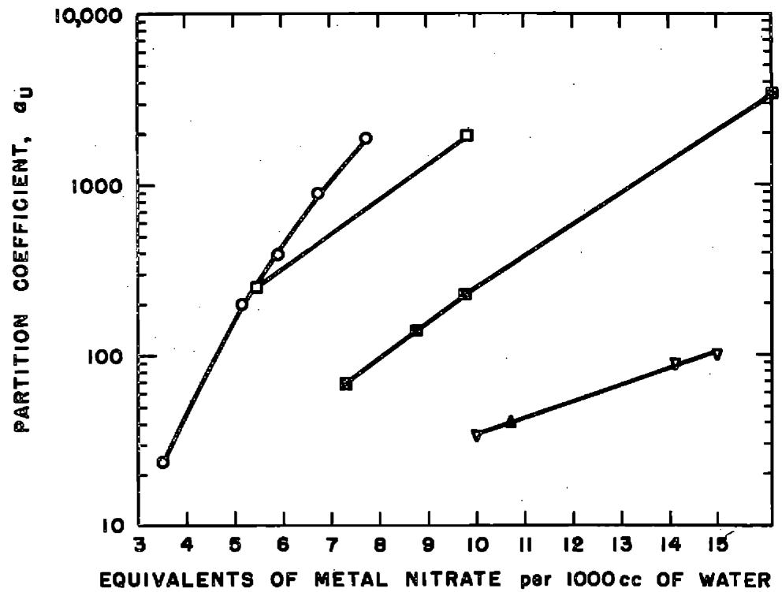  
Figure 24. Effect of salting-out agents on the extraction of uranium by pentaether. $\triangle$ NaNO₃, ∇ NH₄NO₃, Ca(NO₃)₂, O Al(NO₃)₃, Fe(NO₃)₃. After E. Evera and C. Kraus, reference 332. Conditions: Uranium concentration, 2-6 g/100 cc of phase. Temperature, 27°C or room temperature.

From figure 25-A, it can be seen that uranyl nitrate is extracted more efficiently by the various solvents than is uranyl perchlorate. Better separation of uranium and thorium is also achieved from nitrate solution rather than perchlorate.

# ESTERS

Information is less complete or less readily available for the extraction of uranium by esters than by ethers. The distribution of uranyl nitrate between iso-amyl acetate and water is represented in figure 3A.185 Karpacheva, et al.348 have found the extraction capacity of butyl acetate to be intermediate between diethyl ether and dibutyl ether. Hyde and Wolf,316 in addition to their

Table XIV. Partition Coefficients of Elements between Penta-ether and   

<table><tr><td rowspan="3">Element</td><td rowspan="3">Concentration in aqueous phase before extraction (mg/25 ml)</td><td colspan="4">Various Aqueous Mediaa</td></tr><tr><td colspan="4">Aqueous solutionb</td></tr><tr><td>Nitrate</td><td>Nitrate + Chloride</td><td>Sulfate</td><td>Sulfate + Chloride</td></tr><tr><td>Al</td><td>500</td><td>0.003</td><td>0.003</td><td>0.000</td><td>0.003</td></tr><tr><td>Ba</td><td>362</td><td>0.02</td><td></td><td></td><td></td></tr><tr><td>&quot;</td><td>7</td><td>0.35</td><td></td><td></td><td></td></tr><tr><td>Cd</td><td>501</td><td>0.024</td><td></td><td>0.003</td><td></td></tr><tr><td>&quot;</td><td>500</td><td></td><td>0.026</td><td></td><td></td></tr><tr><td>&quot;</td><td>10</td><td>0.053</td><td>0.01</td><td></td><td></td></tr><tr><td>&quot;</td><td>10.5</td><td></td><td></td><td>0.004</td><td></td></tr><tr><td>Ca</td><td>521</td><td>0.011</td><td></td><td>-- c</td><td></td></tr><tr><td>&quot;</td><td>500</td><td></td><td>0.0001</td><td></td><td>-- c</td></tr><tr><td>&quot;</td><td>10.4</td><td>0.020</td><td></td><td></td><td>0.00</td></tr><tr><td>Cl</td><td>496</td><td>0.026</td><td></td><td></td><td></td></tr><tr><td>&quot;</td><td>494</td><td></td><td></td><td>0.02</td><td></td></tr><tr><td>&quot;</td><td>10.3</td><td>0.025</td><td></td><td></td><td></td></tr><tr><td>&quot;</td><td>9.9</td><td></td><td></td><td>0.03</td><td></td></tr><tr><td>Cr(III)</td><td>500</td><td>0.003</td><td>0.004</td><td>0.0001</td><td></td></tr><tr><td>&quot;</td><td>10</td><td>0.0023</td><td>0.013</td><td>0.0004</td><td></td></tr><tr><td>Co</td><td>555</td><td>0.007</td><td></td><td></td><td></td></tr><tr><td>&quot;</td><td>500</td><td></td><td>0.002</td><td>0.00013</td><td></td></tr><tr><td>&quot;</td><td>11</td><td>0.012</td><td></td><td></td><td></td></tr><tr><td>&quot;</td><td>10</td><td></td><td>0.009</td><td>0.0065</td><td></td></tr><tr><td>Cu(II)</td><td>500</td><td>0.026</td><td>0.024</td><td>0.000</td><td></td></tr><tr><td>&quot;</td><td>10</td><td>0.017</td><td>0.018</td><td>0.000</td><td></td></tr><tr><td>Fe(III)</td><td>515</td><td>0.031</td><td></td><td>0.003</td><td></td></tr><tr><td>&quot;</td><td>500</td><td></td><td>1.2</td><td></td><td></td></tr><tr><td>&quot;</td><td>10.3</td><td>0.035</td><td></td><td>0.002</td><td></td></tr><tr><td>&quot;</td><td>10.0</td><td></td><td>0.046</td><td></td><td></td></tr><tr><td>Pb</td><td>500</td><td>0.017</td><td></td><td>-- c</td><td></td></tr><tr><td>&quot;</td><td>10</td><td>0.007</td><td></td><td>0.005</td><td></td></tr><tr><td>Mn(II)</td><td>500</td><td>0.0011</td><td></td><td>0.00006</td><td></td></tr><tr><td>&quot;</td><td>10</td><td>0.0014</td><td></td><td>0.00075</td><td></td></tr><tr><td>Hg(II)</td><td>497</td><td></td><td>0.21</td><td></td><td>0.015</td></tr><tr><td>&quot;</td><td>127</td><td>0.19</td><td></td><td>0.036</td><td></td></tr><tr><td>&quot;</td><td>10</td><td>0.41</td><td>0.176</td><td>0.23</td><td>0.03</td></tr><tr><td>Mo(VI)</td><td>500</td><td>0.028</td><td>0.10</td><td>0.001</td><td>0.001</td></tr><tr><td>&quot;</td><td>10</td><td>0.10</td><td></td><td>0.015</td><td></td></tr></table>

Table XIV. - Continued   

<table><tr><td rowspan="2">Element</td><td rowspan="2">Concentration in aqueous phase before extraction (mg/25 ml)</td><td rowspan="2">Nitrate</td><td colspan="3">Aqueous solutionb</td></tr><tr><td>Nitrate + Chloride</td><td>Sulfate</td><td>Sulfate + Chloride</td></tr><tr><td>N1</td><td>516</td><td></td><td>0.0001</td><td></td><td></td></tr><tr><td>&quot;</td><td>500</td><td>0.0018</td><td></td><td></td><td></td></tr><tr><td>&quot;</td><td>10.3</td><td></td><td>0.0008</td><td></td><td></td></tr><tr><td>&quot;</td><td>10</td><td>0.0032</td><td></td><td>0.00064</td><td></td></tr><tr><td>P(PO43-)</td><td>500</td><td>0.00005</td><td></td><td>0.00001</td><td></td></tr><tr><td>&quot;</td><td>10</td><td>0.00024</td><td></td><td>0.00</td><td></td></tr><tr><td>Ag</td><td>500</td><td>0.09</td><td></td><td>0.005</td><td></td></tr><tr><td>&quot;</td><td>10</td><td>0.32</td><td></td><td>0.005</td><td></td></tr><tr><td>SO42-(as(NH4)2SO4)</td><td>500</td><td>0.00</td><td></td><td></td><td></td></tr><tr><td>&quot;</td><td>10</td><td>0.00</td><td></td><td></td><td></td></tr><tr><td>Th</td><td>500</td><td>9.12</td><td>11.5</td><td>0.0001</td><td>0.0001</td></tr><tr><td>&quot;</td><td>10</td><td>87.5</td><td></td><td>0.005</td><td></td></tr><tr><td>Sn(IV)</td><td>500</td><td>0.0024</td><td>0.37</td><td>0.00015</td><td>0.000</td></tr><tr><td>&quot;</td><td>10</td><td>0.019</td><td></td><td>0.0006</td><td></td></tr><tr><td>T1(IV)</td><td>11</td><td>0.003</td><td>0.00</td><td>0.035</td><td></td></tr><tr><td>W</td><td>10</td><td>0.081</td><td></td><td>0.0025</td><td></td></tr><tr><td>V(V)</td><td>140</td><td></td><td>0.22</td><td></td><td></td></tr><tr><td>&quot;</td><td>107</td><td>0.11</td><td></td><td></td><td></td></tr><tr><td>&quot;</td><td>14</td><td></td><td>0.12</td><td></td><td></td></tr><tr><td>&quot;</td><td>8.5</td><td>0.07</td><td></td><td>0.009</td><td></td></tr><tr><td>Zn</td><td>497</td><td></td><td>0.15</td><td></td><td></td></tr><tr><td>&quot;</td><td>447</td><td>0.018</td><td></td><td></td><td></td></tr><tr><td>&quot;</td><td>10</td><td></td><td>0.14</td><td>--c</td><td></td></tr><tr><td>&quot;</td><td>8.9</td><td>0.022</td><td></td><td>0.000</td><td></td></tr><tr><td>Zr</td><td>10</td><td>0.040</td><td></td><td>0.013</td><td></td></tr></table>

aAdapted from A.G.Jones,C-4.360.3(1945).   
Equal volume portions of aqueous solution and pentaether.   
b Nitrate : 3/4 saturated ammonium nitrate solution.   
Sulfate : saturated ammonium sulfate solution.   
Chloride: chloride added as ammonium chloride equivalent to the metal present.   
$\underline{\underline{\mathbf{c}}}$ Precipitates of insoluble sulfate obtained in ammonium sulfate layer.

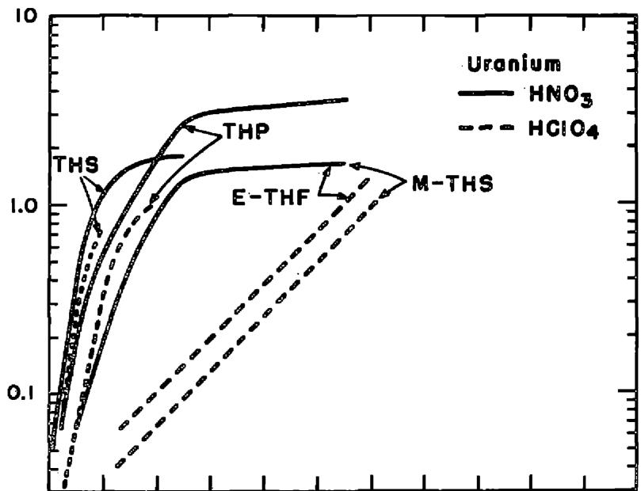  
PARTITION COEFFICIENT   
(A)

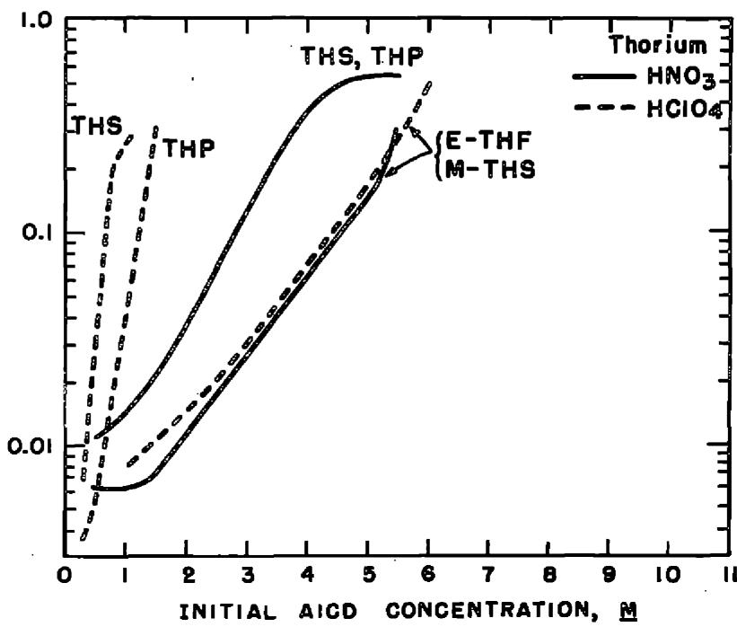  
(B)   
Figure 25. The effect of initial nitric and perchloric acid concentration on the extraction of uranyl salts (Fig. 25-A) and thorium salts (Fig. 25-B) by tetrahydrosylvane (THS), tetrahydropyrane (THP), 2-ethyltetrahydrofurane (ETHF), and 2,5-dimethyltetrahydrofurane (MTHS). After M. Branica and E. Bona, reference 364. Conditions: Uranium concentration, $2 \times 10^{-3} \mathrm{M}$ . Thorium concentration, tracer $\mathrm{UX}_1$ . Temperature, $25 \pm 0.2^{\circ} \mathrm{C}$ . $\mathrm{V}_{\mathrm{o}} / \mathrm{V}_{\mathrm{a}}$ , 1.

general survey work (Table VIII), have studied the extraction of thorium and uranium by ethyl acetate, n-propyl acetate, and iso-propyl acetate as a function of the nitrate concentration of the aqueous phase. It was the observation of the latter group $\frac{316}{2}$ that the extraction of uranium tends to decrease with increasing molecular weight of the ester. Therefore, only acetates and propionates need to be considered seriously. Increased protactinum extraction was observed with increasing length of the alcohol portion of the ester. $\frac{316}{2}$ It was further observed that hydrolysis of the ester tends to increase the extraction of both thorium and uranium. $\frac{316}{2}$ It was not determined whether the addition of alcohol or organic acid causes the increased extraction.

# Ethyl acetate

Aqueous nitrate systems. The distribution of uranyl nitrate between ethyl acetate and water has been studied by deKeyser, Cypres, and Hermann. $^{164}$ The partition coefficient was found to vary from 0.17 at $22\%$ $\mathrm{UO}_2(\mathrm{NO}_3)_2 \cdot 6\mathrm{H}_2\mathrm{O}$ in the aqueous phase to 0.78 at $43\%$ aqueous concentration. In laboratory practice, uranium is extracted by the solvent from aqueous nitrate media. The following conditions have been used by various groups to extract uranium:

Grimald1 and Levine: 9.5 g. of Al(NO₃)₃ · 9H₂O are added to 5 ml of solution approximately 2.4N in HNO₃. 10 ml of ethyl acetate are added and shaken at least 30 seconds.

Rodden and Tregonning: Uranium precipitated in the presence of aluminum (20 mg) with $\mathrm{NH}_4\mathrm{OH}$ is dissolved in 1 ml of $\mathrm{HNO}_3$ (1 to 1). 8 g. of $\mathrm{Mg(NO_3)_2} \cdot 6\mathrm{H}_2\mathrm{O}$ is added and the volume adjusted to 10 ml with water. 5 ml of ethyl acetate are added and vigorously shaken for 2 minutes. (Used with 20-400 mg samples of $\mathrm{U}_3\mathrm{O}_8$ .)

Nietzel and DeSesa<sup>367,368</sup>: Approximately 15 ml of saturated aluminum nitrate solution are added to 3 ml or less of sample containing 0.30 to 15 g. of $\mathrm{U}_{3}\mathrm{O}_{8}$ per liter. 20 ml of ethyl acetate are added and shaken for 1 minute.

Guest and Zimmerman: To 5 ml of sample containing 5% concentrated HNO₃ by volume, 6.5 ml of hot aluminum nitrate solution, having a boiling point of 130°C., are added. The resulting solution is cooled, 20 ml of ethyl acetate are added, and the mixture shaken for 45 to 60 seconds.

Steele and Taverner<sup>198</sup>: Approximately 5 ml of aqueous solution are saturated with aluminum nitrate. The resulting solution is shaken with 10 ml of ethyl acetate for 1-2 minutes.

In the procedure of Rodden and Tregonning, aluminum nitrate is used instead of magnesium nitrate if extraction is to be made in the presence of phosphate. DeSesa and Nietzel found that 1 molar concentrations of phosphate, sulfate, or carbonate ion could be tolerated with no ill effect on uranium extraction. Small amounts of sodium phosphate have been used to suppress the extraction of thorium without affecting the extraction of uranium.198 Steele and Taverner report the extraction of appreciable amounts of thorium and zirconium and small amounts of vanadium, molybdenum, and platinum by ethyl acetate. Grimaldi and Levine,365 Guest and Zimmerman,369 and Nietzel and DeSesa367,368 have investigated the effect of a number of elements on the recovery and/or determination of uranium according to their respective procedures. Nietzel and DeSesa367,368 found vanadium, present in 100 mg amounts, was precipitated and uranium was occluded in the precipitate. Titanium was observed to partially extract. This was prevented by precipitation of titanium with p-hydroxyphenylarsonic acid before extraction.

Aqueous thiocyanate systems. Vanossi has described a procedure in which uranium is extracted by ethyl acetate from an aqueous phase containing an excess of ammonium thiocyanate. Dizdar and Obrenovic have also investigated the extraction of the uranyl-thiocyanate complex by ethyl acetate.

# KETONES

Methyl ethyl ketone.

Aqueous nitrate systems. The distribution of uranyl nitrate between methyl ethyl ketone and water and between methyl ethyl ketone and saturated ammonium nitrate solution is given in figure 4-B. $^{321}$ Palei $^{196}$ reports a uranium partition coefficient of approximately 25 between methyl ethyl ketone and an aqueous solution of $60\% \mathrm{NH}_4\mathrm{NO}_3$ and $\underline{\mathbf{lN}}\mathrm{HNO}_3$ . Methyl ethyl ketone is not as selective as diethyl ether. $^{321}$ Homogeneous solutions are formed between the ketone and an equal volume of saturated ferric or cupric nitrate at $20^{\circ}\mathrm{C}$ . $^{321}$

Miscellaneous aqueous systems. The partition coefficient of uranium between methyl ethyl ketone and an aqueous $60\% \mathrm{NH}_4\mathrm{NO}_3$ , $3\% \mathrm{NH}_4\mathrm{SCN}$ solution is about 2000. Iron is extracted.

Milner and Wood<sup>372</sup> report the separation of tantalum and niobium from uranium by extracting the fluorides of the former elements with methyl ethyl ketone.

Hexone (Methyl iso-butyl ketone).

Aqueous nitrate systems. The partition of uranyl nitrate between hexone and water is represented in figure 4. $\underline{185,321}$ The partition coefficients of uranium, nitric acid, and several other actinide elements are plotted as a function of aqueous nitric acid concentration in figure 26. $\underline{334}$ The effect of several salting-out agents on the partition coeffi

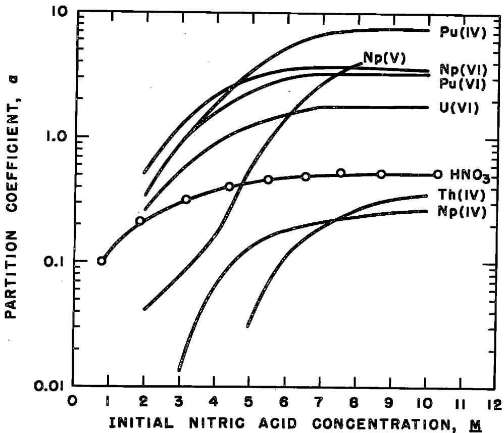  
Figure 26.

The extraction of nitric acid and actinide nitrates, Th, U,

Np, and Pu, by methyl 1obutyl ketone (hexone).

After J. Koo1, reference 334.

Conditions:

Tracer amounts of $\mathbf{Np}^{239}$ or $\mathbf{Pu}^{239}$ , 330 mg of $\mathbf{Th(NO_3)_4}$ per 15 ml, or 300 mg of $\mathbf{UO_2(NO_3)_2}$ (hexahydrate) per 15 ml in nitric acid solution or nitric acid alone equilibrated with an equal volume of hexone at $25^{\circ}\mathbf{C}$ or room temperature.

The oxidation states of neptunium have been the subject of some question.345

client of uranium is given in figure 27.319 Vdovenko and co-workers have observed an increase in the partition coefficients of cesium, calcium, strontium, and lanthanum when the uranyl nitrate concentration in the initial aqueous solution is increased. This has been related to the extraction of the elements as metal uranyl trinitrate salts. The partition coefficient of uranium from a highly salted aqueous solution is decreased by an increase in uranium concentration. Kraus observed $a_{\mathrm{u}}$ to decrease from 153 to 78.3 as the initial uranium concentration was increased from 5 to 100 grams in an aqueous solution containing 580 grams of aluminum nitrate. Jenkins and McKay found $a_{\mathrm{u}}$ to decrease from 1.58 to 1.28 as the initial uranium concentration was increased from 144 to 348 grams per liter in an aqueous solution $\underline{\mathbf{M}}$ in $\mathrm{NH_4NO_3}$ and 0.3N in $\mathrm{HNO}_3$ . In the latter case, commercial hexone adjusted to 0.15N $\mathrm{HNO}_3$ was used as the extractant. Figure 28 represents the extraction of uranium by hexone from aqueous solutions containing various amounts of nitric acid and calcium or sodium nitrate. $^{375}$ The distribution of U(VI), Pu(VI), Pu(IV), Th, La, Ca, Na, and $\mathrm{HNO}_3$ by hexone from aqueous solutions containing nitric acid and calcium nitrate has been investigated by Rydberg and Bernstrom. $^{376}$ Hyde and co-workers have studied the extraction of uranium $^{316}$ and thorium $^{316,377}$ by hexone as a function of the total nitrate concentration of the aqueous phase. Distribution curves (a or P versus nitric acid or total nitrate concentration of the aqueous phase) are presented for the various elements in the different papers. The effect of aluminum nitrate concentration on the extraction of fission product gamma-activity in general and zirconium-niobium, cerium, and ruthenium in particular is shown in figure 29. $^{378}$ Increased extraction is effected by an increase in salting-out agent. An increase in nitric acid concentra

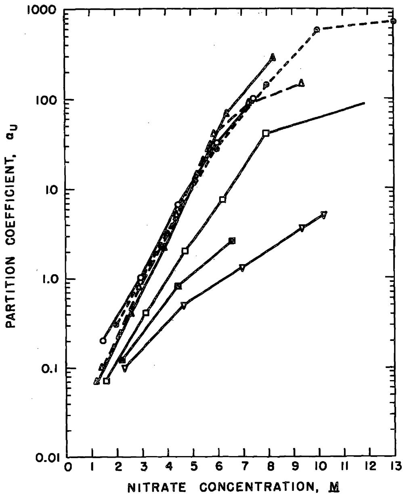  
Figure 27. The effect of various salting-out agents on the extraction of uranium by hexone. $\nabla \mathrm{NH}_4\mathrm{NO}_3$ $\bullet$ NaNO3, $\square$ Ca(NO3)2, $\triangle$ Co(NO3)2, $\triangle$ Mg(NO3)2, $\bullet$ Be(NO3)2, O Al(NO3)2. After W. H. Baldwin, reference 319. Conditions: Equal volumes of pure hexone used to extract aqueous containing 30 g U/liter.

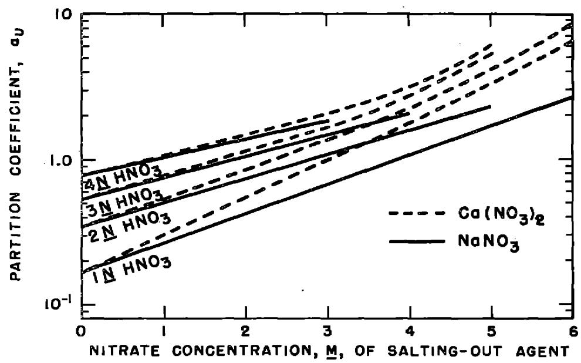  
Figure 28.

The partition coefficient of uranium as a function of the nitrate concentration of the salting-out agents, $\mathrm{Ca(NO_3)_2}$ and $\mathrm{NaNO}_3$ , for an initial concentration in the aqueous phase of $100\mathrm{g / l}$ of uranium and 1,2,3, or $4\underline{\mathbf{M}}\mathrm{HNO}_3$ .

After A. Cacciari, R. DeLeone, C. Fizzotti, and M. Gabaglio, reference 375.

tion also causes an increased extraction of fission products (figure 29).378

The extraction of uranium by hexone is facilitated by the presence of substituted ammonium nitrates which are sufficiently soluble in the organic solvent. A number of these salts and their effect on the extraction of uranium are listed in Table XV.78 Tri-n-butylamine, 2-hexyl pyridine, and dibenzoyl methane increase the extraction of fission products.378 Maeck, et al.379 have investigated the extraction of uranium by hexone from an aqueous solution containing aluminum nitrate and tetrapropylammonium nitrate. The extraction conditions adapted as a result of the

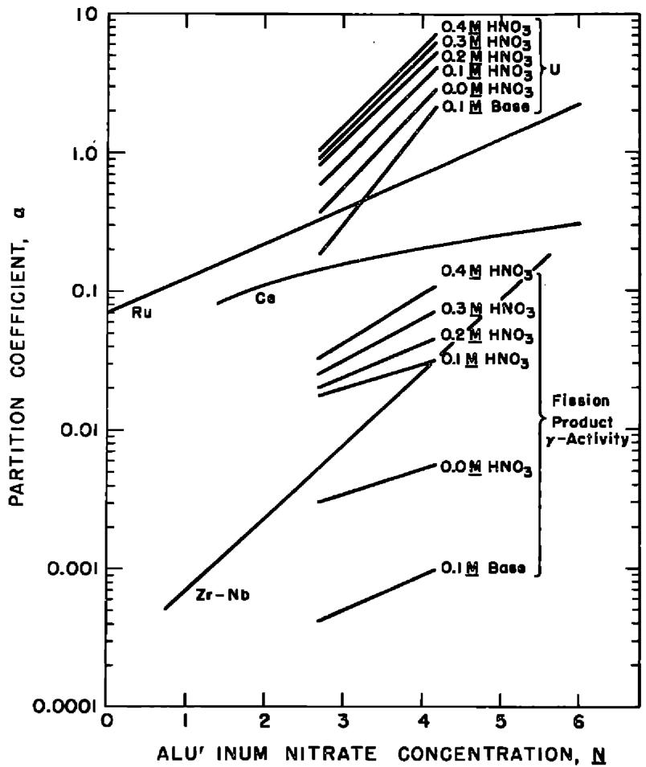  
Figure 29. The effect of salting-out agent, $\mathrm{Al(NO_3)_3}$ , on the extraction of uranium and fission products by hexone from aqueous solution at various nitric acid concentrations. After F. R. Bruge, reference 378.

# Conditions:

The results on uranium and gross fission product activity were obtained using CP. Al(NO₃)₃ as salting-out agent and pretreated hexone as solvent. An irradiated uranium slug, cooled 144 days and dissolved in HNO₃, was used as activity source. Extractions were made at 30°C from an aqueous phase oxidized 1 hour with 0.1M Na₂Cr₂O₇ at this temperature. The nitric acid is the sum of that in the aqueous and organic phases, expressed as moles of nitric acid per liter of aqueous phase.

Ruthenium extraction: aqueous phase--0.1M K2Cr2O7, 0.2M HNO3, Al(NO3)3.

Cerium extraction: aqueous phase--0.025M Na₂Cr₂O₇, 0.5M HNO₃, Al(NO₃)₃.

Zirconium-niobium extraction: aqueous phase--0.1M K2Cr2O7, 0.25M HNO3, 8 g U per liter.

Table XV. Effect of Substituted Ammonium Nitrates $(\mathsf{RNO}_3)$ on the Extraction of Uranyl Nitrate by Hexone.   

<table><tr><td>Cation, R</td><td>Total RNO3· concentration (mol/1 x 103)</td><td>au</td></tr><tr><td>None</td><td>0</td><td>2.62</td></tr><tr><td rowspan="4">(c4H9)3NH</td><td>2.1</td><td>6.2</td></tr><tr><td>4.2</td><td>10.7</td></tr><tr><td>11.0</td><td>32.4</td></tr><tr><td>21.0</td><td>68</td></tr><tr><td rowspan="4">(c8H17)2NH2b</td><td>2.5</td><td>6.0</td></tr><tr><td>5.0</td><td>9.4</td></tr><tr><td>10.0</td><td>16.5</td></tr><tr><td>20.0</td><td>33</td></tr><tr><td rowspan="4">c11H15NH</td><td>2.0</td><td>5.4</td></tr><tr><td>5.0</td><td>13.4</td></tr><tr><td>10.0</td><td>26.7</td></tr><tr><td>20.0</td><td>57</td></tr><tr><td rowspan="2">c12H24N2d</td><td>2.1</td><td>5.5</td></tr><tr><td>10.5</td><td>25.6</td></tr><tr><td rowspan="2">(c4H9)4N</td><td>10.0</td><td>97</td></tr><tr><td>10.0</td><td>84</td></tr><tr><td>c6H7NH e</td><td>10.0</td><td>2.8</td></tr><tr><td>(c2H5)3NH</td><td>10.0</td><td>4.0</td></tr><tr><td>(CH2CH2OH)4N</td><td>10.0</td><td>2.67</td></tr></table>

a After Kaplan, Hildebrandt, and Ader, reference 78. Conditions:   
equal volumes of hexone and of an aqueous solution. 8M in $\mathrm{NH_4NO_3}$ , 0.4M in $\mathrm{HNO_3}$ , and about 0.02M in uranyl nitrate.

b d1-2-ethylhexylammonium

c 2-n-hexylpyridinium

d methyl isobutyl ketazinium

e 2-methylpyridinium

investigation were $4.0\mathrm{ml}$ of 2.8M aluminum nitrate, $\underline{\mathbf{lN}}$ acid-deficient, containing $0.1\%$ (weight/volume) tetrapropylammonium nitrate; $2.0\mathrm{ml}$ hexone; and a sample size of $0.5\mathrm{ml}$ ( $-2\mathrm{mg}$ of uranium). These conditions provide a good separation of uranium from many ions. The separation from zirconium-niobium is particularly good. The recovery

of uranium is excellent even in the presence of foreign anions (10 to 1 mole ratio of anion to uranium). Of those anions tested, tungstate ion interferes most seriously (only $64.28\%$ uranium extracted). Chloride, sulfate, phosphate, acetate, oxalate, etc., in the amounts tested, exhibit no appreciable interference in the extraction of uranium. Chloride does promote the extraction of those ions which form anionic chloride complexes, eg. gold (III). Certain other anions enhance the extraction of fission products, eg. dichromate and thiosulfate increase cerium extraction.

Aqueous thiocyanate systems. Uranium (VI) is extracted by hexone from aqueous thiocyanate solution. $371,380$ Reas has investigated the separation of uranium and thorium by this means. Some of his results are given in Table XVI. The effect of sulfate ion (experimental conditions B) is to hinder the extraction of both thorium and uranium. The effect, however, is greater for thorium than for uranium. Consequently, greater separation of thorium and uranium can be made in the presence of the complexing sulfate ion. The extraction of protactinium from an aqueous solution 1.2M in $\mathrm{NH_4NO_3}$ , 0.20M in $\mathrm{HNO_3}$ , about 0.01M in $\mathrm{Th(NO_3)_2}$ , 0.00987M in $\mathrm{Na_2SO_4}$ , and 0.501M in KSCN by an equal volume of hexone was $\leq 4.4\%$ . Decontamination from fission products is not too good. Equilibration of equal volumes of hexone and an aqueous solution approximately 0.04M in $\mathrm{UO_2(NO_3)_2}$ , 0.504M in $\mathrm{Th(NO_3)_4}$ , 0.485M in $\mathrm{Na_2SO_4}$ , and 1M in $\mathrm{HNO_3}$ resulted in a beta decontamination factor of about 6.6 and a soft gamma decontamination factor of about 1.5. Zirconium was found to be the principal fission product extracted.

# Methylcyclohexanone

Aqueous nitrate systems. This solvent has been studied

Table XVI. Separation of U(VI) from Th(IV) by Thiocyanate Systems.a   

<table><tr><td>Experimental conditions</td><td>KSM M</td><td>U extracted %</td><td>Th extracted %</td></tr><tr><td>A</td><td>0.27</td><td>64.5</td><td>1.03-1.6</td></tr><tr><td>A</td><td>0.54</td><td>82</td><td>1.5-1.8</td></tr><tr><td>A</td><td>0.97</td><td>89.5</td><td>2.1-3.1</td></tr><tr><td>A</td><td>1.62</td><td>95</td><td>5.2-6.2</td></tr><tr><td>A</td><td>0.32 + 0.11M antipyrine</td><td>79</td><td>3.3</td></tr><tr><td>B</td><td>0.501</td><td>63</td><td>0.14*</td></tr><tr><td>B</td><td>0.25</td><td>35</td><td>0.015*</td></tr></table>

After W. H. Reas, reference 380.

Experimental conditions:

A: 0.16M $\mathrm{UO}_2(\mathrm{NO}_3)_2$ , 0.81M Th(NO₃)₄, volume of aqueous phase = 0.2 ml, volume of hexone = 10 ml.   
B: 0.0974M UO2(NO3)2, 0.252M Th(NO3)4, 0.2M HNO3, 0.224M Na2SO4, volume of aqueous phase = 10 ml, volume of hexone = 10 ml.

* The thorium extraction was performed under slightly different conditions in that $\mathrm{NH_4NO_3}$ was substituted for $\mathrm{UO_2(NO_3)_2}$ . An ionium (Th $^{230}$ ) tracer was added to the solution and the distribution was measured by the determination of ionium in each phase.

by workers in Czechoslovakia as a means of separating uranium from thorium $^{381}$ and fission products. $^{323,382}$ The extractability of uranium by methylcyclohexanone from sodium nitrate solution (6-8M) is considerably better than that of thorium. $^{381}$ From nitric acid solution (8M), the extractability of uranium is only two- to three-fold greater than that of thorium. $^{381}$ Ammonium nitrate is comparable to sodium nitrate as a salting-out agent for uranium. $^{323}$ Aluminum nitrate is more effective than either. However, the order of salting-out agents in causing increased fission product extractability is Al > Na > $\mathrm{NH}_4$ . The best separation of uranium from fission products is achieved with ammonium nitrate as the salting-out agent. $^{323}$ Methylcyclohexanol present in commercial methylcyclohexanone suppresses the extraction of uranium and fission

products. The separation factor between the two activities, however, is increased since the partition coefficient of fission products is decreased more than that of uranium. $\underline{323}$ The partition of uranium between methylcyclohexanone and water and methylcyclohexanone and $6\mathrm{M}$ ammonium nitrate solution is given in figure 4.B. $\underline{323}$

# Other ketonic solvents

Hyde and Wolf $^{316}$ have studied the extraction of uranium and thorium by methyl n-amyl ketone and diisopropyl ketone as a function of total nitrate concentration in the aqueous phase. In both cases, uranium was better extracted than thorium. The extraction of thorium did not become appreciable $(<5\%)$ until the aqueous nitrate concentration was greater than $5\text{M}$ . Diisopropyl ketone was found to be an excellent extractant of protactinium. $^{316}$

Vesely, Beranova, and Maly<sup>382</sup> have investigated the extraction of uranium and fission products by several methylalkyl ketones: methylhexyl, methylamyl, methylbutyl, and methylpropyl in addition to methyl isobutyl and methylcyclohexanone. The partition coefficients of both uranium and fission product activity were measured as a function of acid concentration in the range of -0.4 to 3M nitric acid. In this acidity range, fission product extraction was found to be maximum in the O-lM nitric acid region. The partition coefficient, $\alpha_{\mathrm{FP}}$ , in this region was greatest with methylpropyl ketone (22 x $10^{-3}$ at 0.61M) and least with methyl-hexyl ketone (2.4 x $10^{-3}$ at 0.03M). In the acid-deficient region, $\alpha_{\mathrm{FP}}$ increased as the acid-deficiency was decreased (the solution was made more acidic). After the maximum $\alpha_{\mathrm{FP}}$ was reached in the O-lM acid region, the partition coefficient was decreased and then increased as the aqueous solution was made more acidic up to 3-4M. The partition

coefficient of uranium, $\alpha_{\mathrm{u}}$ , increased as the nitric acid concentration was increased over the entire range. At 3M nitric acid, $\alpha_{\mathrm{u}}$ varied from about 0.7 for methylhexyl ketone to about 2 for methylpropyl ketone and 3 for methylcyclohexanone. The greatest separation, $\beta$ , of uranium from fission products was found in the 0.1M acid deficient region (-0.1M). For methylhexyl ketone, $\beta$ was found to be >1500; for methylpropyl ketone, $\beta$ was about 400. The extraction coefficients of uranium were < 0.2 for methylhexyl ketone and about 0.5 for methylpropyl ketone at this acid concentration.

Allen has tested diisobutyl ketone, diisopropyl ketone, and methylhexyl ketone as solvents for the purification of uranium from iron, copper, chromium, and nickel. Diisobutyl ketone was found most satisfactory under the conditions tested. Diisopropyl extracted some iron and chromium. Methylhexyl ketone extracted iron, chromium, and copper.

Uranium and thorium may be extracted quantitatively from a nitrate medium by mesityl oxide. $^{384}$ Under the conditions tested* zirconium is extracted to a large extent; vanadium and yttrium to a lesser extent; cerium only slightly.

# ALCOHOLS

Hyde and Wolf<sup>316</sup> found alcohols to be only fair extractants of uranium and the extraction capacity to decrease rapidly with the length of the carbon chain. This is borne out by the work of Poston, et al.<sup>385</sup> who measured the extraction coefficients of uranium and ruthenium as a function of aluminum nitrate concentration of the aqueous phase for

hexone and several tertiary alcohols: tertiary amyl alcohol, 2-methyl 2-pentanol, 2-methyl 2-hexanol, 2-methyl 2-heptanol. Only tertiary amyl alcohol extracted uranium better than hexone $(0.5 - 1.5\underline{\underline{M}}\underline{\underline{Al}(\mathrm{NO}_3)_3},0.2\underline{\underline{M}}\underline{\underline{HNO}_3})$ and all four alcohols extracted ruthenium better than hexone. Ruthenium was extracted as well or nearly as well as uranium by the alcohols.

Dilisobutylocarbinol extracts ruthenium nearly as well as uranium.386 Thorium and zirconium-mobium are poorly extracted. Protactinium is extracted much more efficiently than uranium.

# MISCELLANEOUS SOLVENTS

Nitromethane has been recommended by Warner $^{322}$ as an extractant for uranium. It is resistant to oxidation, stable to high concentrations of nitric acid, and highly selective. The distribution of uranyl nitrate between nitromethane and water and nitromethane and saturated ammonium nitrate solution is given in figure 3-B. The extraction of thorium nitrate by nitromethane from aqueous solution is much less than that of uranium. Color tests indicate that neither copper, cobalt, iron III), nor chromium nitrate is extracted by the solvent. With diethyl ether, considerable amounts of copper nitrate and trace amounts of ferric nitrate are extracted. Nitric acid enhances the extraction of uranyl nitrate by nitromethane. However, above a critical acid concentration ( $\sim$ 5N initial acid concentration with equal phase volumes at $20^{\circ}\mathrm{C}$ ) only one liquid phase is formed.

ORGANOPHOSPHORUS COMPOUNDS. Within recent years, a large number of organophosphorous compounds have been developed and investigated as extractants for uranium. These compounds have been subdivided in the present paper into neutral and acidic organophosphorus compounds.

Solvents included in this category are trialkylphosphates, $(\mathsf{RO})_3\mathsf{P}\rightarrow 0$ ; dialkyl alkylphosphonates, $(\mathsf{RO})_2\mathsf{RP}\rightarrow 0$ ; alkyl dialkylphosphinates, $(\mathsf{RO})\mathsf{R}_2\mathsf{P}\rightarrow 0$ ; and trialkylphosphine oxides $\mathsf{R}_3\mathsf{P}\rightarrow 0$ . The ability of the solvents to extract uranium is in the order

$$
\left(\mathrm {R O}\right) _ {3} \mathrm {P} \rightarrow 0 <   \left(\mathrm {R O} _ {2}\right) \mathrm {R P} \rightarrow 0 <   \left(\mathrm {R O}\right) \mathrm {R} _ {2} \mathrm {P} \rightarrow 0 <   \mathrm {R} _ {3} \mathrm {P} \rightarrow 0.
$$

This is also the order of increasing base strengths of the phosphoryl oxygen.302 In Table XVII, the four types of compounds are compared as extractants of uranium (VI), plutonium (IV), thorium, fission products, and acids.387 It should be noted that although uranium is extracted almost quantitatively by tributylphosphine oxide (Table XVII), other elements are also highly extracted. In fact, in spite of lower extraction coefficients, tributyl phosphate affords a better separation of uranium from thorium, plutonium (IV), and fission products under the conditions listed in Table XVII than does tributylphosphine oxide.

Tables XVIII388,389 and XIX390 list the distribution coefficients of uranium and some associated elements for a number of neutral organophosphorus extractants. Similar information on other solvents may be found in papers by Burger, $\underline{391}$ Healy and Kennedy, $\underline{188}$ and in numerous ORNL reports. The latter have been summarized by Blake, et al. $\underline{302}$ and Brown, et al. $\underline{303,305}$

The mechanism of extraction by neutral organophosphorus reagents appears to be similar to that of tributyl phosphate. 188, 302,387 From nitrate systems, the extraction of uranium by tributyl phosphate and trioctylphosphine oxide is described fairly well by the equilibrium reaction

$$
\mathrm {U O} _ {2} ^ {2 +} + 2 \mathrm {N O} _ {3} ^ {-} + 2 \mathrm {S} = \mathrm {U O} _ {2} (\mathrm {N O} _ {3}) _ {2} (\mathrm {S}) _ {2},
$$

where S represents the solvent molecule. $\underline{302}$ Extraction may be made by tributyl phosphate from chloride solution. Stronger

Table XVII. Comparison of the Extractive Capacities of Various Types of Organophosphorus   
Compounds   

<table><tr><td rowspan="4"></td><td colspan="5">Extraction of \( UO_2(NO_3)_2 \)</td><td colspan="7">\( Extraction of U, Pu, and Fission Productsb \)</td><td>\( Extraction of Th- \)</td><td></td></tr><tr><td colspan="5">Nitric acid concentration</td><td rowspan="2" colspan="4">No added HNO3</td><td rowspan="2" colspan="4">0.6M HNO3</td><td rowspan="2"></td></tr><tr><td>OM</td><td colspan="2">0.6M</td><td colspan="2">3M</td></tr><tr><td>U ext&#x27;d (%)</td><td>U ext&#x27;d (%)</td><td>Acid ext&#x27;d (%)</td><td>U ext&#x27;d (%)</td><td>Acid ext&#x27;d (%)</td><td>U (VI) (%)</td><td>Pu (IV) (%)</td><td>Gross β (%)</td><td>Gross γ (%)</td><td>U (VI) (%)</td><td>Pu (IV) (%)</td><td>Gross β (%)</td><td>Gross γ (%)</td><td>Th ext&#x27;d (%)</td></tr><tr><td>Tributyl phosphate</td><td>11</td><td>56</td><td>4</td><td>96.5</td><td>8</td><td>17.4</td><td>0.7</td><td>0.01</td><td>0.01</td><td>58</td><td>6.6</td><td>0.07</td><td>0.08</td><td>3.5</td></tr><tr><td>Dibutyl butylphos-phonate</td><td>55</td><td>97</td><td>6</td><td>99.4</td><td>11</td><td>64</td><td>1.13</td><td>0.05</td><td>0.13</td><td>97</td><td>54</td><td>0.72</td><td>1.0</td><td>18</td></tr><tr><td>Butyl dibutylphos-phinate</td><td>98.5</td><td>99.9</td><td>15</td><td>99.9</td><td>14</td><td>94</td><td>20</td><td>1.9</td><td>7.9</td><td>99.9</td><td>98</td><td>23</td><td>38</td><td>74</td></tr><tr><td>Tributyl phosphine oxide</td><td>99.7</td><td>99.9</td><td>39</td><td>99.9</td><td>17</td><td>99.9</td><td>97.3</td><td>37</td><td>64</td><td>99.9</td><td>99.8</td><td>72</td><td>77</td><td>98.7</td></tr></table>

$\underline{\underline{\mathbf{a}}}$ After Higgins, Baldwin, and Ruth, reference 387.   
Experimental conditions: equal phase volumes equilibrated 30 minutes at $25 \pm 0.2^{\circ} \mathrm{C}$ ; organic phase - $0.75 \mathrm{M}$ phosphorus compound dissolved in $\mathrm{CCl}_4$ ; aqueous phase - $0.1 \mathrm{M}$ uranyl salt with or without salting agent.   
b Aqueous phase - 0.1M $\mathsf{UO}_2(\mathsf{NO}_3)_2$ from dissolving irradiated U slugs in HNO $_3$ - 6 months cooling.   
Aqueous phase - 0.1M Th(NO₃)₄.

<table><tr><td rowspan="3"></td><td colspan="2">Extraction of \( UO_2SO_4^d \)</td><td colspan="2">Extraction of \( UO_2Cl_2 \)</td><td colspan="7">\( Extraction of acids^f \)</td></tr><tr><td colspan="2">\( H_2SO_4 \)concentration</td><td colspan="2">HCl concentration</td><td colspan="7">% extracted</td></tr><tr><td>OM</td><td>2M</td><td>OM</td><td>1M</td><td>Acetic</td><td>Citric</td><td>Tar-taric</td><td>\( HNO_3 \)</td><td>\( H_2SO_4 \)</td><td>\( H_3PO_4 \)</td><td>HCl</td></tr><tr><td rowspan="2">Tributyl phosphate</td><td>U ext&#x27;d (%)</td><td>U ext&#x27;d (%)</td><td>U ext&#x27;d (%)</td><td>U ext&#x27;d (%)</td><td rowspan="3">25</td><td rowspan="3">0</td><td rowspan="3">0</td><td rowspan="3">7</td><td rowspan="3">0</td><td rowspan="3">0</td><td rowspan="3">0</td></tr><tr><td>0.001</td><td>0.001</td><td>0.3</td><td>0.8</td></tr><tr><td>Dibutyl butylphos-phonate</td><td>0.1</td><td>0.03</td><td>1</td><td>26</td></tr><tr><td>Butyl dibutyl-phosphinate</td><td>16</td><td>48</td><td>40</td><td>92</td><td>49</td><td>20</td><td>20</td><td>27</td><td>2</td><td>3</td><td>0</td></tr><tr><td>Tributyl phosphine oxide</td><td>95</td><td>\( 96.8^e \)</td><td>90 some ppt. formed</td><td>all pre-cipitated</td><td>58</td><td>39</td><td>23</td><td>39</td><td>0</td><td>10</td><td>7</td></tr></table>

Aqueous phase - $0.1\mathrm{M}$ $\mathrm{UO}_2\mathrm{SO}_4$ ; acid as indicated.   
e Three phases were present, two of which were largely aqueous.   
Aqueous phase - approximately $\ln$ acid.

Table XVIII. Extraction of Actinides and Zirconium by Phosphates and Phosphonates at $30^{\circ}\mathrm{C}$   

<table><tr><td rowspan="2">Solvent</td><td rowspan="2">\( Th \)</td><td rowspan="2">\( Np(IV)^b \)</td><td rowspan="2">\( Pu(IV)^c \)</td><td colspan="2">\( Extraction \)</td><td colspan="2">\( Coefficient \)</td></tr><tr><td>\( U(VI) \)</td><td>\( Np(VI)^d \)</td><td>\( Pu(VI)^d \)</td><td>\( Zr \)</td></tr><tr><td>\( Trialkyl \ phosphate^e \)</td><td></td><td></td><td></td><td></td><td></td><td></td><td></td></tr><tr><td>n-butyl</td><td>2.9</td><td>3.2</td><td>16.1</td><td>26</td><td>15.6</td><td>3.5</td><td>0.22</td></tr><tr><td>isobutyl</td><td>2.4</td><td>2.7</td><td>11.8</td><td>22</td><td>15.9</td><td>3.4</td><td></td></tr><tr><td>n-amyl</td><td>2.9</td><td>4.2</td><td>15.6</td><td>32</td><td>19.3</td><td>4.1</td><td></td></tr><tr><td>iso-amyl</td><td>4.2</td><td>4.7</td><td>17.8</td><td>34</td><td>18.9</td><td>4.4</td><td>0.12</td></tr><tr><td>n-hexyl</td><td>3.0</td><td>3.6</td><td>15.6</td><td>38</td><td>20.0</td><td>4.5</td><td>0.14</td></tr><tr><td>n-octyl</td><td>2.4</td><td>3.4</td><td>15.3</td><td>33</td><td>15.7</td><td>3.9</td><td>0.14</td></tr><tr><td>2-ethylhexyl</td><td>2.5</td><td>4.3</td><td>25</td><td>58</td><td>23</td><td>5.7</td><td>0.14</td></tr><tr><td>2-butyl</td><td>0.45</td><td>4.9</td><td>28</td><td>42</td><td>20</td><td>4.6</td><td></td></tr><tr><td>3-amyl</td><td>0.22</td><td>3.5</td><td>18.1</td><td>49</td><td>22</td><td>5.0</td><td></td></tr><tr><td>3-methyl-2-butyl</td><td>0.18</td><td>3.0</td><td>24</td><td>47</td><td>25</td><td>5.4</td><td></td></tr><tr><td>4-methyl-2-amyl</td><td>0.047</td><td>3.5</td><td>22</td><td>38</td><td>24</td><td>4.9</td><td></td></tr><tr><td>cyclohexyl</td><td>3.5</td><td></td><td></td><td>106</td><td></td><td></td><td>0.64</td></tr><tr><td>\( Dialkyl \ alkylphosphonate^f \)</td><td></td><td></td><td></td><td></td><td></td><td></td><td></td></tr><tr><td>d1-n-butyl n-butyl</td><td>24</td><td></td><td></td><td>92</td><td></td><td></td><td>0.17</td></tr><tr><td>d1-n-butyl cyclohexyl</td><td>17</td><td></td><td></td><td>125</td><td></td><td></td><td>0.14</td></tr><tr><td>d1-n-amyl n-amyl</td><td>33</td><td></td><td></td><td>133</td><td></td><td></td><td>0.092</td></tr><tr><td>d1-n-hexyl n-hexyl</td><td>26</td><td></td><td></td><td>89</td><td></td><td></td><td>0.0706</td></tr><tr><td>di-2-ethylhexyl 2-ethyl-hexyl</td><td>10.6</td><td></td><td></td><td>176</td><td></td><td></td><td>0.12</td></tr></table>

a After T. H. Siddall III, references 388 and 389.   
Aqueous phase contained O.OlM ferrous sulfamate.   
Aqueous phase contained $0.01\mathrm{MNaNO}_2$   
a Aqueous phase contained O.O1M ceric ammonium sulfate.   
1.0M trialkyl phosphate in n-dodecane; extractants washed with 1M NaOH, water, and nitric acid before use; aqueous phase 3.0M HNO₃ at equilibrium; tracer concentration of element.   
1.09M phosphonate in n-dodecane;aqueous phase 0.8M HNO₃ at equilibrium; tracer concentration of element.   
Extrapolated value.

extractants may extract uranium from sulfate and phosphate solutions, especially if a small amount of nitrate is added to the solution.

# Tributyl phosphate (TBP)

Aqueous nitrate systems. Investigations on the extraction of metal nitrates by TBP indicate the cations are extracted as single, well-defined species: $\mathsf{M}(\mathsf{NO}_3)_3(\mathsf{TBP})_3$ , $\mathsf{M}(\mathsf{NO}_3)_4(\mathsf{TBP})_2$ , and $\mathsf{MO}_2(\mathsf{NO}_3)_2(\mathsf{TBP})_2$ . This differs from the extraction of ethers, esters, and other oxygen-containing solvents, considered previously, in which a whole series of complexes containing varying numbers of nitrate, solvate, and water molecules is extracted. The stability of the TBP-solvate molecules increases in the order $311\text{H}_2\text{O}(\text{TBP}) < \text{Pu}(\text{NO}_3)_3(\text{TBP})_3 < \text{Pa}(\text{NO}_3)_5(\text{TBP})_3 < \text{HNO}_3(\text{TBP})$ , $\text{HNO}_3(\text{TBP})(\text{H}_2\text{O}) < \text{Th}(\text{NO}_3)_4(\text{TBP})_2 < \text{PuO}_2(\text{NO}_3)_2(\text{TBP})_2 < \text{Pu}(\text{NO}_3)_4(\text{TBP})_2 < \text{UO}_2(\text{NO}_3)_2(\text{TBP})_2$ .

The unexpectedly large extraction of nitric acid, thorium, and zirconium at very high acid concentrations indicates higher complexes may be extracted.311

The distribution of uranyl nitrate between TBP and water is represented in figure 30. The extraction coefficient of uranium is plotted as a function of acid concentration for various concentrations of TBP in figure 31. The observed effects of (1) decreased $\alpha_{\mathrm{u}}$ with increased acid concentration and (2) increased $\alpha_{\mathrm{u}}$ with increased TBP concentration, may be explained on the basis of free solvent concentration. First, as the acid concentration is increased, more nitric acid is extracted resulting in less free solvent. Second, more free solvent is obviously available as a result of increasing the solvent concentration. Since the partition coefficient of uranium depends upon the second power of the free solvent concentration, $\alpha_{\mathrm{u}}$ will decrease in the first case

Table XIX. Extractive Power of Tributyl Phosphate, Alkyl Phosphonates, Diphosphonates, and Phosphine Oxides.   

<table><tr><td>Solvent</td><td colspan="3">U</td><td colspan="3">Pu(IV)</td><td colspan="3">ΣZr-Nb</td><td colspan="3">Nb</td></tr><tr><td>(c4H9O)3PO</td><td>0.68</td><td>1.42</td><td>4.65</td><td>0.19</td><td>0.67</td><td>2.73</td><td>.64</td><td>.86</td><td>1.05</td><td>.011</td><td>.014</td><td>.010</td></tr><tr><td>(c4H9O)2P-CH3</td><td>4.50</td><td>10.35</td><td>21.50</td><td>5.46</td><td>11.15</td><td>14.90</td><td>.0058</td><td>.0040</td><td>.015</td><td>.0001</td><td>.0020</td><td>.017</td></tr><tr><td>(1-C5H11O)2P-CH3</td><td>6.95</td><td>21.10</td><td>70.60</td><td>1.53</td><td>7.43</td><td>16.90</td><td>.15</td><td>.22</td><td>.33</td><td>.52</td><td>.34</td><td>.20</td></tr><tr><td>(c6H13O)2P-CH3</td><td>5.72</td><td>18.45</td><td>45.70</td><td>3.51</td><td>11.65</td><td>18.95</td><td>.10</td><td>.053</td><td>.13</td><td>.0050</td><td>.012</td><td>.021</td></tr><tr><td>(c7H15O)2P-CH3</td><td>21.30</td><td>107.1</td><td>103.1</td><td>3.25</td><td>10.95</td><td>17.15</td><td>.0078</td><td>.040</td><td>.12</td><td>.00040</td><td>.00045</td><td>.00080</td></tr><tr><td>(c8H17O)2P-CH3</td><td>22.10</td><td>50.70</td><td>178.0</td><td>5.71</td><td>13.65</td><td>19.45</td><td>.037</td><td>.14</td><td>.28</td><td>.0061</td><td>.019</td><td>.044</td></tr><tr><td>(c9H19O)2P-CH3</td><td>27.60</td><td>32.60</td><td>61.40</td><td>23.25</td><td>24.15</td><td>21.70</td><td>.97</td><td>.67</td><td>.55</td><td>.013</td><td>.014</td><td>.017</td></tr><tr><td>(c10H21O)2P-CH3</td><td>6.73</td><td>14.65</td><td>34.30</td><td>16.60</td><td>21.65</td><td>21.50</td><td>.38</td><td>.40</td><td>.54</td><td>.0043</td><td>.0043</td><td>.0060</td></tr><tr><td>(c-C6H11O)2P-CH3</td><td>17.45</td><td>44.10</td><td>101.0</td><td>4.47</td><td>17.35</td><td>25.15</td><td>.020</td><td>.061</td><td>.30</td><td>.015</td><td>.013</td><td>.0057</td></tr><tr><td>(c6H5O)2P-CH3</td><td>0.03</td><td>0.053</td><td>0.15</td><td>1.84</td><td>1.34</td><td>1.71</td><td>1.31</td><td>1.42</td><td>.86</td><td>.40</td><td>.15</td><td>.086</td></tr><tr><td>(c4H9O)2P-CH3</td><td>13.43</td><td>28.80</td><td>69.90</td><td>3.80</td><td>11.60</td><td>19.60</td><td>.24</td><td>.16</td><td>.24</td><td>.0056</td><td>.0053</td><td>.0062</td></tr><tr><td>(c4H9O)2P-CH3</td><td>12.20</td><td>36.3</td><td>65.8</td><td>7.89</td><td>17.85</td><td>24.50</td><td>.80</td><td>.47</td><td>.47</td><td>.0038</td><td>.0041</td><td>.0051</td></tr><tr><td>(n-C4H9O)2P-C2H5</td><td>4.97</td><td>13.05</td><td>44.20</td><td>2.58</td><td>7.58</td><td>14.85</td><td>.031</td><td>.091</td><td>.33</td><td>-</td><td>-</td><td>-</td></tr><tr><td>(1-C4H9O)2P-C2H5</td><td>7.58</td><td>22.50</td><td>57.30</td><td>2.53</td><td>7.67</td><td>14.85</td><td>.0085</td><td>.018</td><td>.11</td><td>.0021</td><td>.0089</td><td>.039</td></tr><tr><td>(c4H9O)2P-C3H7-n</td><td>10.45</td><td>22.20</td><td>74.70</td><td>2.58</td><td>8.65</td><td>16.75</td><td>.0039</td><td>.020</td><td>.10</td><td>&lt;.00016</td><td>.0028</td><td>.0063</td></tr><tr><td>(1-C5H11O)2P-C3H7-n</td><td>9.40</td><td>22.30</td><td>73.80</td><td>2.02</td><td>7.46</td><td>14.15</td><td>-</td><td>.013</td><td>.099</td><td>.0022</td><td>.0027</td><td>.0022</td></tr><tr><td>(C4H9O)2P-C4H9</td><td>8.98</td><td>24.00</td><td>65.30</td><td>2.82</td><td>9.46</td><td>17.50</td><td>.0034</td><td>.024</td><td>.097</td><td>&lt;.001</td><td>.0028</td><td>.025</td></tr><tr><td>(C4H9O)2P-C5H11</td><td>8.26</td><td>25.75</td><td>103.5</td><td>2.45</td><td>8.91</td><td>17.65</td><td>.0032</td><td>.024</td><td>.11</td><td>.0035</td><td>.010</td><td>.032</td></tr><tr><td>(1-C5H11O)2P-C5H11</td><td>13.65</td><td>28.40</td><td>58.40</td><td>2.50</td><td>9.00</td><td>15.75</td><td>.012</td><td>.036</td><td>.13</td><td>.011</td><td>.022</td><td>.074</td></tr><tr><td>(1-C5H11O)2P-C5H11-1</td><td>7.68</td><td>21.10</td><td>30.95</td><td>2.18</td><td>7.69</td><td>13.05</td><td>.011</td><td>.031</td><td>.13</td><td>.0017</td><td>.0024</td><td>.0031</td></tr><tr><td>(1-C5H11O)2P-C8H17</td><td>9.60</td><td>11.50</td><td>85.4</td><td>2.65</td><td>8.92</td><td>17.00</td><td>.016</td><td>.038</td><td>.13</td><td>.0012</td><td>.011</td><td>.029</td></tr><tr><td>(C4H9O)2P-CH2C6H5</td><td>2.45</td><td>6.34</td><td>21.10</td><td>0.47</td><td>1.91</td><td>6.00</td><td>.0034</td><td>.0084</td><td>.022</td><td>.0092</td><td>.0011</td><td>.0012</td></tr><tr><td>(C4H9O)2P-CH2OCH3</td><td>1.13</td><td>3.09</td><td>7.79</td><td>0.28</td><td>1.16</td><td>4.24</td><td>.029</td><td>.075</td><td>.12</td><td>.0029</td><td>.0046</td><td>.0061</td></tr><tr><td>(C4H9O)2P-CH2OC2H5</td><td>1.31</td><td>3.11</td><td>8.86</td><td>0.34</td><td>1.50</td><td>5.03</td><td>.43</td><td>.42</td><td>.42</td><td>.0046</td><td>.0057</td><td>.0067</td></tr><tr><td>(C4H9O)2P-CH2CH2OC4H9</td><td>3.15</td><td>8.68</td><td>42.20</td><td>0.80</td><td>3.26</td><td>10.95</td><td>.031</td><td>.077</td><td>.062</td><td>.0050</td><td>.0060</td><td>.012</td></tr><tr><td>(C4H9O)2P-CH(CH3)CH2C-OC4H9</td><td>2.30</td><td>6.35</td><td>34.50</td><td>0.15</td><td>2.35</td><td>6.39</td><td>.021</td><td>.025</td><td>.043</td><td>.0031</td><td>.0041</td><td>.0058</td></tr><tr><td>(C4H9O)2P-CH2CH2COOC4H9</td><td>2.14</td><td>5.57</td><td>16.46</td><td>0.79</td><td>2.38</td><td>6.24</td><td>.074</td><td>.12</td><td>.057</td><td>.0058</td><td>.0080</td><td>.0066</td></tr><tr><td>(C4H9O)2P-CH2-P(C4H9O)2</td><td>1.73</td><td>12.55</td><td>17.26</td><td>2.71</td><td>6.72</td><td>19.24</td><td>.23</td><td>.28</td><td>.29</td><td>.011</td><td>.011</td><td>.011</td></tr><tr><td>(1-C5H11O)2P-CH2-P(O5H11-1)2</td><td>1.32</td><td>2.98</td><td>9.60</td><td>3.33</td><td>8.45</td><td>24.70</td><td>.41</td><td>.41</td><td>.42</td><td>.032</td><td>.031</td><td>.031</td></tr><tr><td>(C4H9)3PO</td><td>1880</td><td>1360</td><td>352</td><td>365</td><td>299</td><td>83.2</td><td>1.00</td><td>1.84</td><td>2.45</td><td>.64</td><td>.60</td><td>.47</td></tr><tr><td>(1-C4H9)3PO</td><td>5.33</td><td>7.26</td><td>7.19</td><td>16.45</td><td>21.85</td><td>22.55</td><td>.61</td><td>.55</td><td>.55</td><td>3.95</td><td>4.40</td><td>2.15</td></tr></table>

a After Petrov, et al., reference 390.   
Organic phase - 0.5M phosphorus compound in CCl $_h$ . Initial aqueous phase - 50 g/1 U, 1 g/1 Pu(IV), 1 o/1 Zr $^{95}$ + Nb $^{95}$ , 1 c/1 Nb $^{92}$ , nitrio Gold as indicated. Volume ratio (organic/aqueous), 2. Time of shaking and of settling, 30 minutes. Temperature, $20^{\circ} \pm 1^{\circ} \mathrm{C}$ .   
1 = 180; c = cyclo.

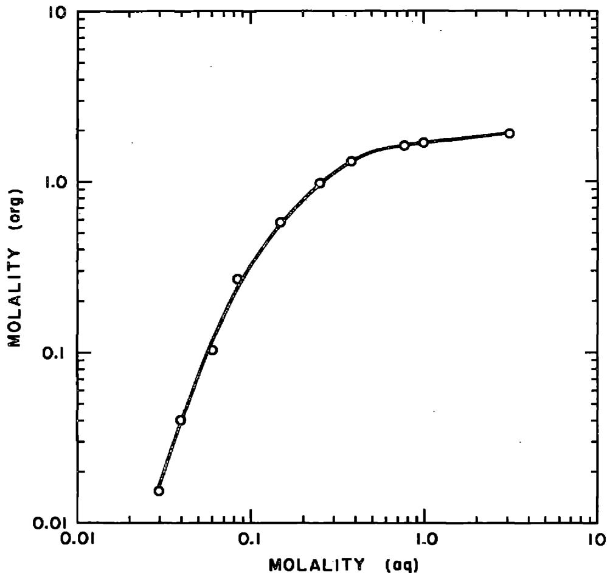  
Figure 30.

The partition of uranyl nitrate between $100\%$ TBP and water at $25^{\circ}C$

After T. Healy, J. Kennedy, G. Waind, reference 394.

and increase in the second. The effect of uranium concentration on $\alpha_{\mathrm{u}}$ is given also as a function of nitric acid concentration in figure 32.396 The decreased extraction with increased uranium concentration may again be interpreted in terms of the solvent available. The partition coefficients of other metal nitrates are also decreased, in general, by increased uranium concentration. More efficient separation may therefore be achieved by increased uranium loading of the solvent. For small amounts of uranium, a high uranium concentration may be attained in an organic phase suitable for handling by

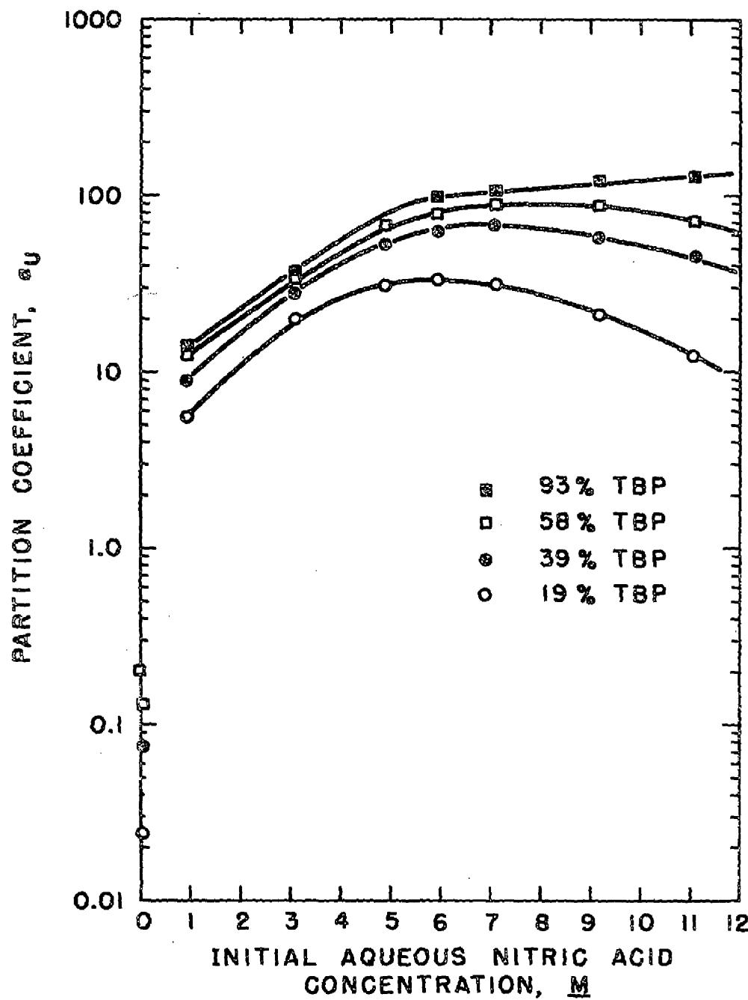  
Figure 31. The extraction of uranyl nitrate by various concentrations of TBP in kerosene as a function of initial aqueous acid concentration. After T. Sato, reference 395. Conditions: Organic phase - volume % TBP in kerosene as indicated. Aqueous phase - 5 g. uranyl nitrate per liter, nitric acid concentration indicated. Temperature, 200oC; $V_{0} / V_{a}$ , 1.

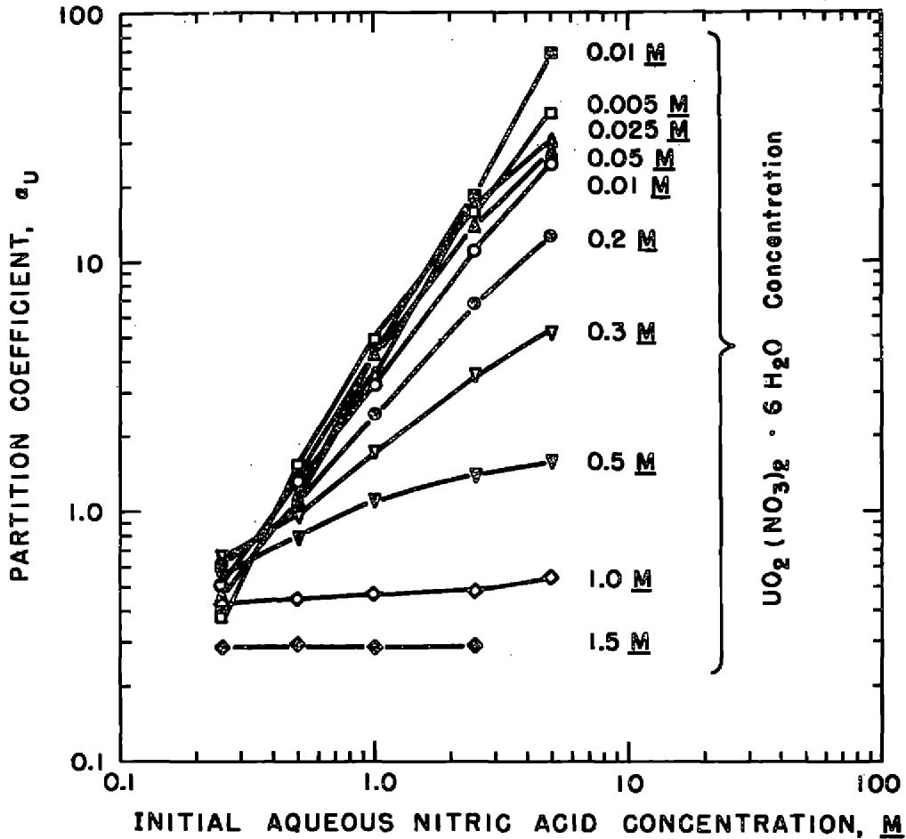  
Figure 32.

The effect of initial uranium concentration on the extraction of uranyl nitrate by 20 volume per cent TBP in $\mathrm{CCl}_4$ as a function of initial aqueous nitric acid concentration. After R. L. Moore, reference 396.

Conditions:

Equal volumes of phases shaken in a water bath at $25^{\circ}\mathrm{C}$ . dilution of the solvent. Duncan and Holburt have measured the distribution of uranium, initially present in 1.2 to 1200 micrograms per liter between $20\%$ TBP in kerosene and nitric acid solution. Although the results were somewhat erratic, it was generally shown that the partition coefficient is nearly constant over this range of uranium concentrations.

The extractive capacity of TBP is affected considerably by the choice of diluent. Taube extracted U(VI), Np(IV), Np(VI), and Pu(VI) from $5\underline{\mathbf{M}}$ $\mathrm{HNO}_3$ aqueous solutions with 0.15 M TBP dissolved in a number of solvents, including benzene and chloroform. Larger extraction coefficients were obtained for all the elements tested with benzene rather than chloroform as diluent. In the case of uranium, the difference in $\alpha_{u}$ was greater than ten-fold. Little difference in extractive capacity was observed with TBP diluted by benzene or carbon tetrachloride. Similar results were obtained by Dizdar, et al. Uranyl nitrate (0.0038M) was extracted from 2M nitric acid solutions by various concentrations of TBP diluted with carbon tetrachloride, xylene, kerosene, hexane, dibutyl ether, diethyl ether, and isopropyl ether. The partition coefficient was found to increase with increasing TBP concentration to a maximum for pure TBP. For carbon tetrachloride and xylene the maximum value was already attained at 40 mole per cent TBP. The other diluents are listed above in the approximate order in which they inhibit the extraction of uranium by TBP. Differences in $\alpha_{u}$ , for various diluents, were found to become smaller with increased uranium concentration. Bruce has found that the extraction of fission products is also affected by the choice of diluent.

The extraction of uranium by TBP is considerably enhanced by the presence of salting-out agents in the aqueous phase. The results of Sato are given in Table XX and figure 33.

The extraction of uranium by TBP decreases with increased temperature.407-411

Phosphate, sulfate, and fluoride ions reduce the extraction of uranium by TBP from nitrate media.409 Uranium is extracted from chloride solution but less efficiently than from nitrate solution. Silica causes poor phase separation

Table XX. Extraction of Uranyl Nitrate by TBP Using Various Nitrate   
Salting-out Agents.a   
Salting-out agent   
Percentage extracted   

<table><tr><td></td><td>OM HNO3</td><td>1M HNO3</td><td>3M HNO3</td><td>6M HNO3</td></tr><tr><td>(HNO3)</td><td>2.96</td><td>82.10</td><td>95.52</td><td>97.10</td></tr><tr><td>NH4NO3</td><td>70.00</td><td>92.30</td><td>96.50</td><td>97.40</td></tr><tr><td>L1NO3</td><td>73.05</td><td>94.60</td><td>97.50</td><td>97.95</td></tr><tr><td>NaNO3</td><td>72.50</td><td>93.00</td><td>97.10</td><td>97.80</td></tr><tr><td>KNO3</td><td>65.00</td><td>90.50</td><td>96.00</td><td>97.10</td></tr><tr><td>Cu(NO3)2</td><td>86.02</td><td>97.50</td><td>97.70</td><td>99.00</td></tr><tr><td>Mg(NO3)2</td><td>84.35</td><td>97.20</td><td>97.50</td><td>99.40</td></tr><tr><td>Ca(NO3)2</td><td>82.48</td><td>96.60</td><td>96.60</td><td>97.50</td></tr><tr><td>Zn(NO3)2</td><td>79.75</td><td>98.05</td><td>98.10</td><td>99.40</td></tr><tr><td>Al(NO3)3</td><td>99.90</td><td>99.60</td><td>98.20</td><td>99.50</td></tr><tr><td>Fe(NO3)3</td><td>99.80</td><td>99.50</td><td>98.20</td><td>98.90</td></tr></table>

a After T. Sato, reference 406.   
Organic phase - $19\%$ TBP in kerosene.   
Aqueous phase - 5 g/l uranyl nitrate, LM salting-out agent, initial acid concentration indicated.   
Equal phase volumes shaken together for 30 minutes at $20^{\circ}C$ .

and the formation of emulsions.

Uranium may be re-extracted from TBP by contact with sodium carbonate solution. $^{409}$ Ammonium sulfate, sodium sulfate, and urea solutions have been used satisfactorily. $^{409}$ Water or hydrogen peroxide is ineffective for TBP containing considerable nitric acid. $^{409}$

The distribution of nitric acid between aqueous solution and $100\%$ TBP is demonstrated in figure 34. The distribution of various metal nitrates between TBP and nitrate

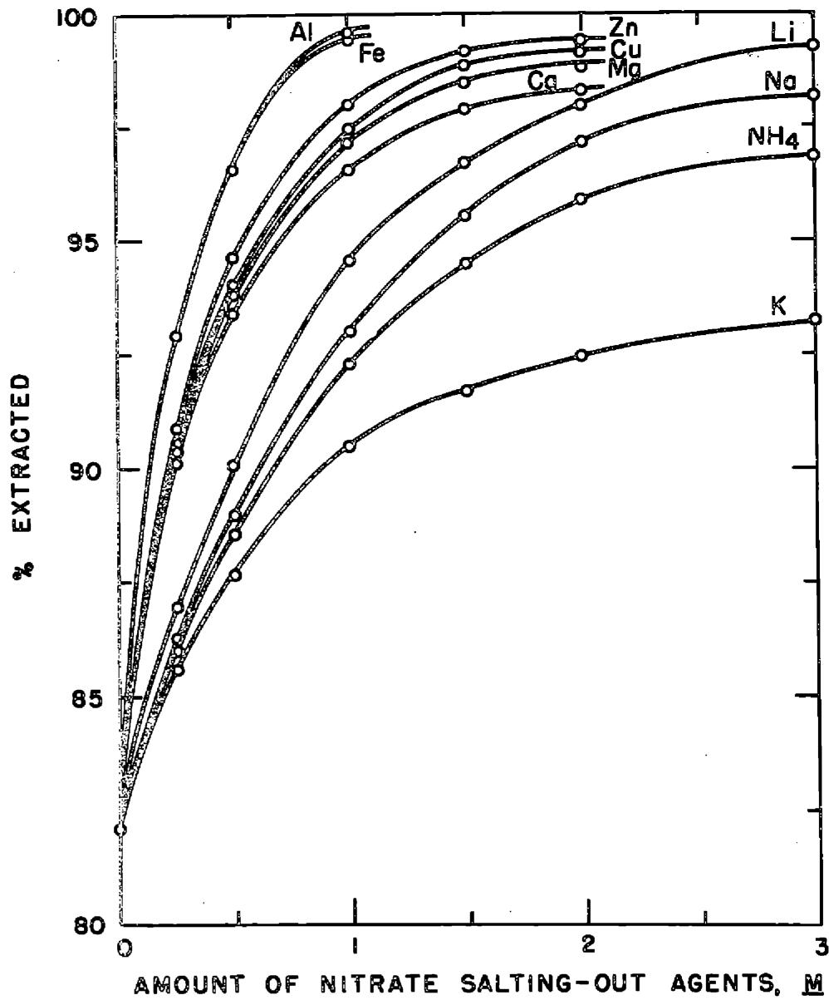  
Figure 33.

Effect of nitrate salting-out agents upon the extraction of uranyl nitrate at LM initial nitric acid concentration.

After T. Sato, reference 406.

Conditions:

Organic phase - $19\%$ TBP in kerosene.

Aqueous phase - 5 g/1 uranyl nitrate, LM HNO₃, salting-out agent concentration indicated.

Equal phase volumes shaken together for 30 minutes at $20^{\circ} \mathrm{C}$ .

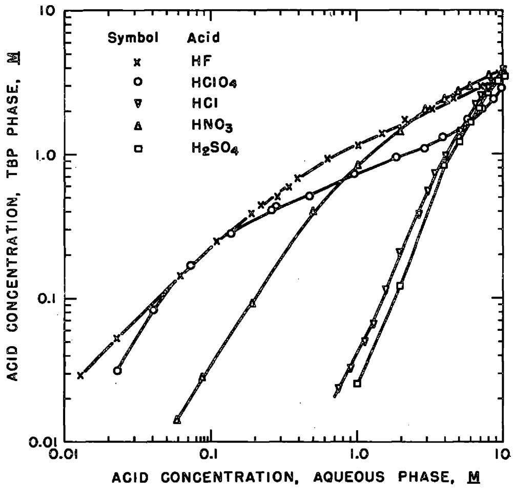  
Figure 34.

The distribution of mineral acids between $100\%$ TBP and aqueous solution at $25^{\circ}\mathrm{C}$ .

After E. Hesford and H. A. C. McKay, reference 412.

solutions has been extensively investigated. The extraction coefficients of some actinide elements are plotted against aqueous nitric acid concentration in figures 35 and 36. $^{413-416}$ Ishimori and Nakamura $^{417}$ have also measured the partition coefficients of Hf, Th, Pa, U(VI), Np(IV)(V)(VI), and Pu(IV)(VI) at various aqueous nitric acid concentrations. Figure 37 represents the partition coefficient of several fission products as a function of the nitric acid concentration. $^{418-420}$

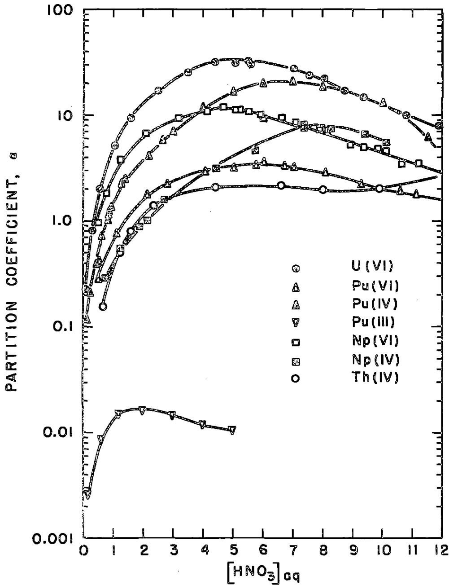  
Figure 35. The partition coefficient of actinide nitrates between $19\%$ TBP in kerosene and aqueous solution as a function of equilibrium nitric acid concentration. U (VI), Np (VI), Np (IV), Pu (VI) at $20^{\circ} - 23^{\circ}\mathrm{C}$ , after K. Alcock, G. F. Best, E. Hesford, H. A. C. McKay, reference 413. Pu (IV), Pu (III), at $25^{\circ}\mathrm{C}$ . or $20 - 23^{\circ}\mathrm{C}$ , after G. F. Best, H. A. C. McKay, P. R. Woodgate, reference 414. O Th (IV) at $25^{\circ}\mathrm{C}$ , after E. Hesford, H. A. C. McKay, D. Scargill, reference 415.

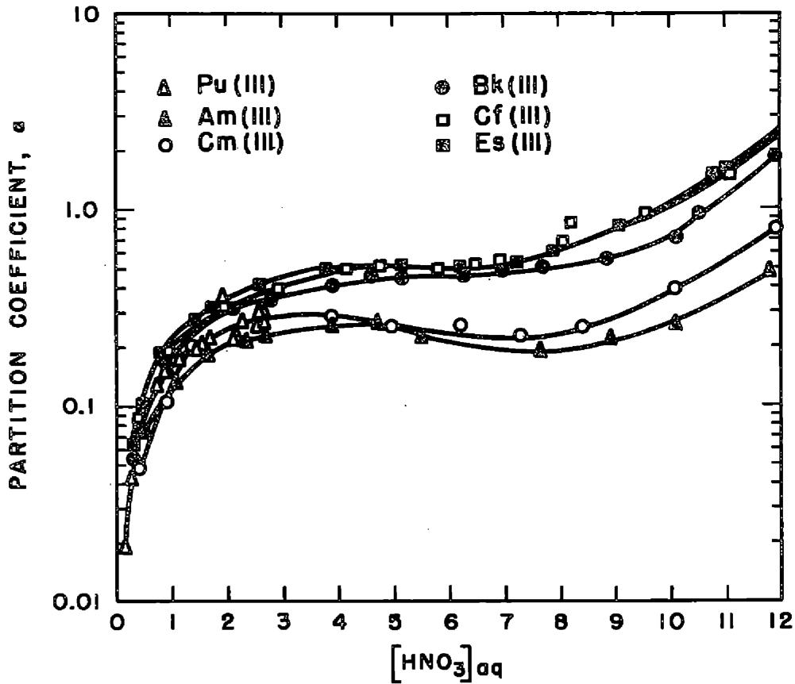  
Figure 36.

The distribution of trivalent actinides between $100\%$ TBP and aqueous solution as a function of equilibrium nitric acid concentration at $25^{\circ}\mathrm{C}$ .

After G. F. Best, E. Hesford, and H. A. C. McKay, reference 416.

The extraction of rare earths, Y, Zr, Sc, Th, and Am by TBP from aqueous nitric acid solution has been investigated by Peppard and co-workers.421,422 Iodine is extracted. It forms addition compounds with carbon-unsaturated compounds in the solvent. The extraction of iodine is minimized by keeping it in a reduced state and by careful selection of TBP diluents.378 Ruthenium is also extracted by TBP. Its extraction may be reduced by increased solvent saturation with uranium, by digestion in a nitrate solution of very high ionic

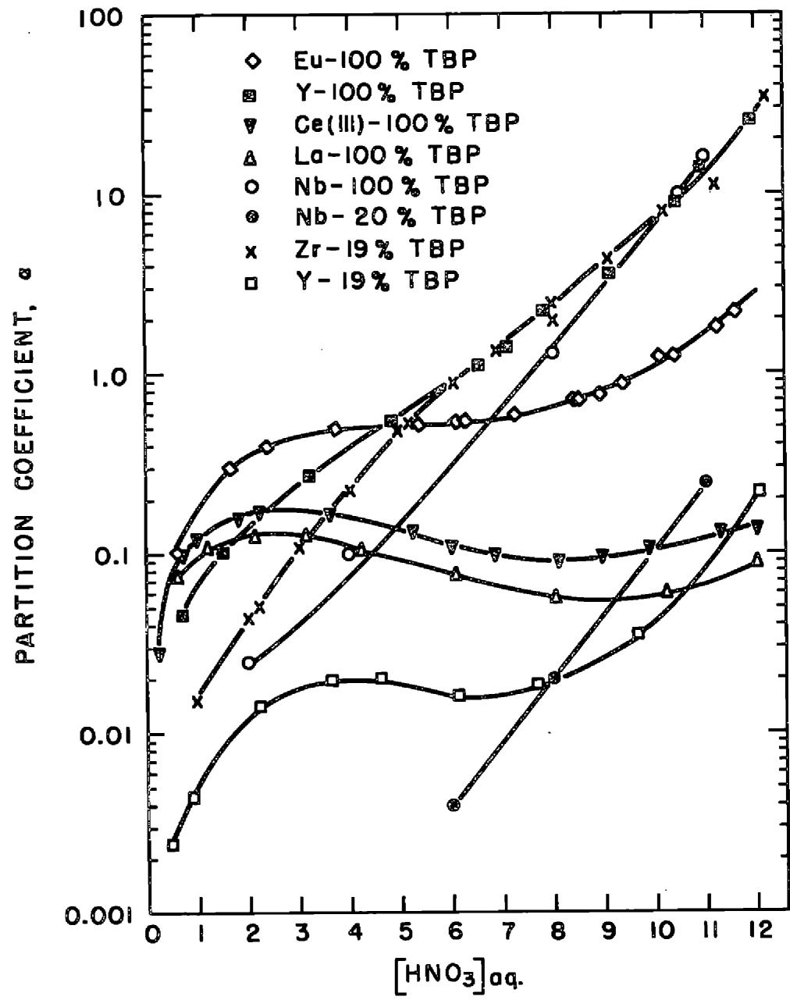  
Figure 37. The distribution of fission product elements between TBP of several concentrations and aqueous solution as a function of equilibrium nitric acid concentration. Zr, after K. Alcock, F. C. Bedford, W. H. Hardwick, and H. A. C. McKay, reference 418. Y, La, Ce, Eu, after D. Scargill, K. Alcock, J. M. Fletcher, E. Hesford, and H. A. C. McKay, reference 419. Nb, after C. J. Hardy and D. Scargill, reference 420. Conditions: Tracer, carrier-free or with less than $1\mathrm{g} / 1$ of carrier, used in all cases, Zr equilibra-tions made at $20 - 23^{\circ}\mathrm{C}$ . Nb, $\sim 20^{\circ}\mathrm{C}$ ; all others at $25^{\circ}\mathrm{C}$ . TBP diluted with kerosene.

strength, or by treatment with a reducing agent. $\underline{378}$ Susic and Jelic $\underline{423}$ and Sato $\underline{406}$ have studied the TBP extraction of metal nitrates that may be used as salting-out agents. The order of extraction of 0.1 mg per ml concentrations of metal from $2\text{N}$ HNO $_3$ solutions by 20% TBP/kerosene with no uranium present is B1 > Co > Cu > Fe > Zn > Cd > Pb. $\underline{423}$ The partition coefficient of bismuth under such conditions, with equal phase volumes, is about 0.1. The results of Sato $\underline{406}$ are listed in Table XXI.

The partition of uranium and other metal nitrates between tributyl phosphate and aqueous solution is affected greatly by the presence of hydrolysis products in the organic

Table XXI. Extraction of Metal Nitrates by TBP.a   

<table><tr><td>Metal nitrate</td><td colspan="2">Percentage extracted</td></tr><tr><td></td><td>OM HNO3</td><td>1M HNO3</td></tr><tr><td>LiNO3</td><td>-</td><td>-</td></tr><tr><td>NaNO3</td><td>-</td><td>-</td></tr><tr><td>KNO3</td><td>-</td><td>-</td></tr><tr><td>Cu(NO3)2</td><td>0.050</td><td>0.025</td></tr><tr><td>Mg(NO3)2</td><td>-</td><td>-</td></tr><tr><td>Ca(NO3)2</td><td>0.118</td><td>0.064</td></tr><tr><td>Zn(NO3)2</td><td>0.005</td><td>-</td></tr><tr><td>Al(NO3)3</td><td>0.004</td><td>0.003</td></tr><tr><td>Fe(NO3)3</td><td>0.010</td><td>0.008</td></tr></table>

a After T. Sato, reference 406.   
Aqueous phase - 5 g/l uranyl nitrate and LM metal nitrate at initial nitric acid concentration indicated.  
Organio phase - 19% TBP diluted in kerosene.  
Equal phase volumes shaken together for 30 minutes at $20^{\circ}\mathrm{C}$ .

phase, eg., mono- and di-butyl phosphates. These products may be eliminated by washing or boiling the solvent with an alkaline solution. Two procedures for the removal of TBP impurities are given.

Procedure 1: TBP is purified by boiling with a dilute caustic soda solution. Add 500 ml of $0.4\%$ NaOH solution to 100 ml of impure TBP. Distill at atmospheric pressure until 200 ml of distillate have been collected. The remaining TBP is washed repeatedly with water. It may be dried by warming under vacuum.

Procedure 2: TBP is stirred with an equal volume of 6M HCl at $60^{\circ}\mathrm{C}$ for 12 hours. The separated TBP is cooled to room temperature and scrubbed with two equal-volume portions of water, three equal volume portions of 5% aqueous sodium carbonate solution, and three equal volume portions of water. The resultant TBP is dried by heating to $30^{\circ}\mathrm{C}$ under reduced pressure.

Aqueous chloride systems. Uranium is extracted from chloride solution as $\mathrm{UO}_2\mathrm{Cl}_2$ 2TBP although higher uranyl chloride complexes may also be extracted.426-428 The partition of uranium between TBP and aqueous hydrochloric acid solution is shown in figures $38^{422,429}$ and $39.430$ The effect of uranium concentration on the distribution is given in figure 40;428 the effect of TBP concentration, in figure 41.426,427 In Table XXII, the influence of salting-out agents on the extraction of uranyl chloride by $30\%$ TBP in dibutyl ether is recorded.431 The distribution of hydrochloric acid between TBP and aqueous solution is shown in figure 34.412 In figure 37, the partition coefficients of Pa, Th, Zr, and Sc are plotted as functions of aqueous HCl concentration.422,429 In figure 39, the partition coefficients of Ni, Mn, Cu, Co, Zn, In, and Fe (III) are similarly plotted.430 Ishimori and Nakamura417 have measured the partition coefficients of Hf, Th, Pa, U (VI), and Np (IV)(V)(VI) as functions of aqueous acid concentration. Gal and Ruvarec431 have similarly

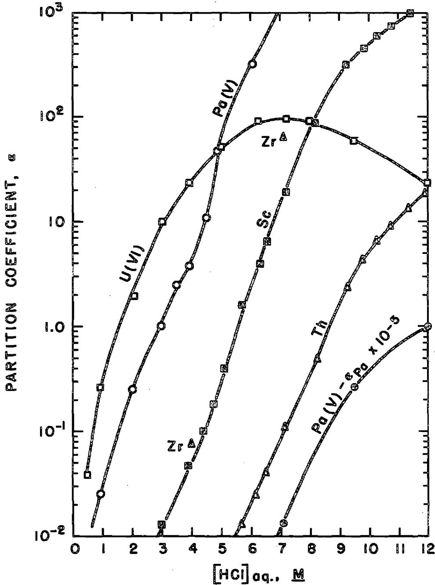  
Figure 38. The extraction coefficient of U, Pa, Th, Zr, and Sc between pre-equilibrated $100\%$ TBP and aqueous hydrochloric acid at $220^{\circ} \pm 20^{\circ}\mathrm{C}$ . After D. F. Peppard, G. W. Mason, and M. V. Gergel, reference 429, and D. F. Peppard, G. W. Mason, and J. L. Maier, reference 422.

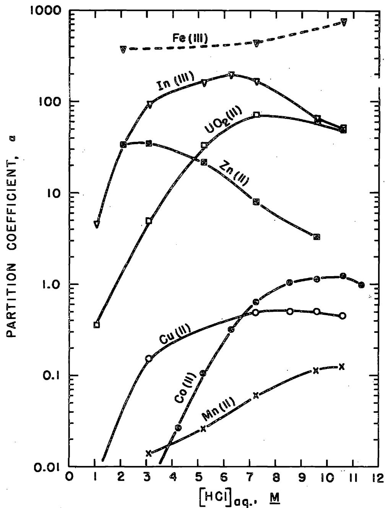  
Figure 39. The extraction coefficients of U, In, Zn, Cu, Co, Fe, and Mn between pre-equilibrated $100\%$ TBP and aqueous HCl solution at $21 + 0.1^{\circ}C$ . After H. Irving and D. N. Edgington, reference 430. Conditions: TBP and HCl pre-equilibrated by stirring equal volumes together for about 10 minutes. Tracer concentrations or about 0.02M U and Cu used. Equal volumes of pre-equilibrated phases stirred together about 5 minutes.

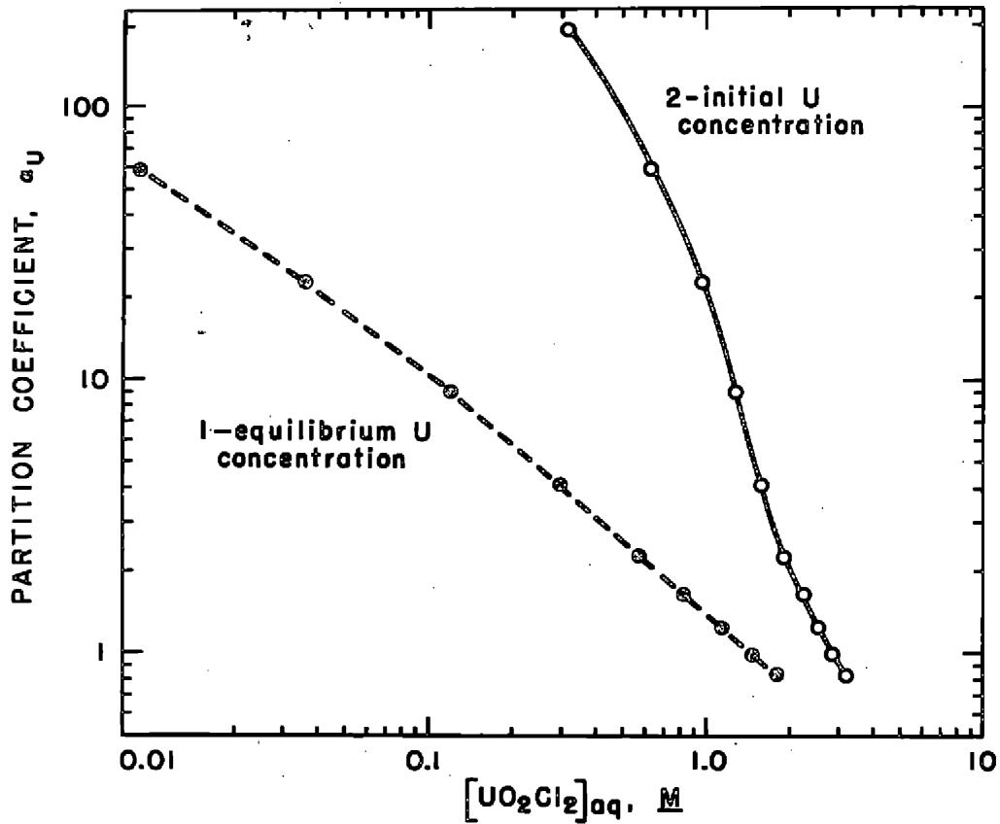  
Figure 40.

The distribution of $\mathrm{UO}_2\mathrm{Cl}_2$ between $100\%$ TBP and aqueous HCl solution as a function of uranium concentration of the aqueous phase. Curve 1 represents the partition with the equilibrium aqueous uranium concentration plotted as abscissa; curve 2, the partition with initial aqueous uranium concentration as abscissa.

After A. S. Kertes, and M. Halpern, reference 428.

Conditions:

Constant HCl acid concentration of 8.83M; equal phase volumes equilibrated for 15 minutes at room temperature, $18^{\circ} - 22^{\circ}\mathrm{C}$ .

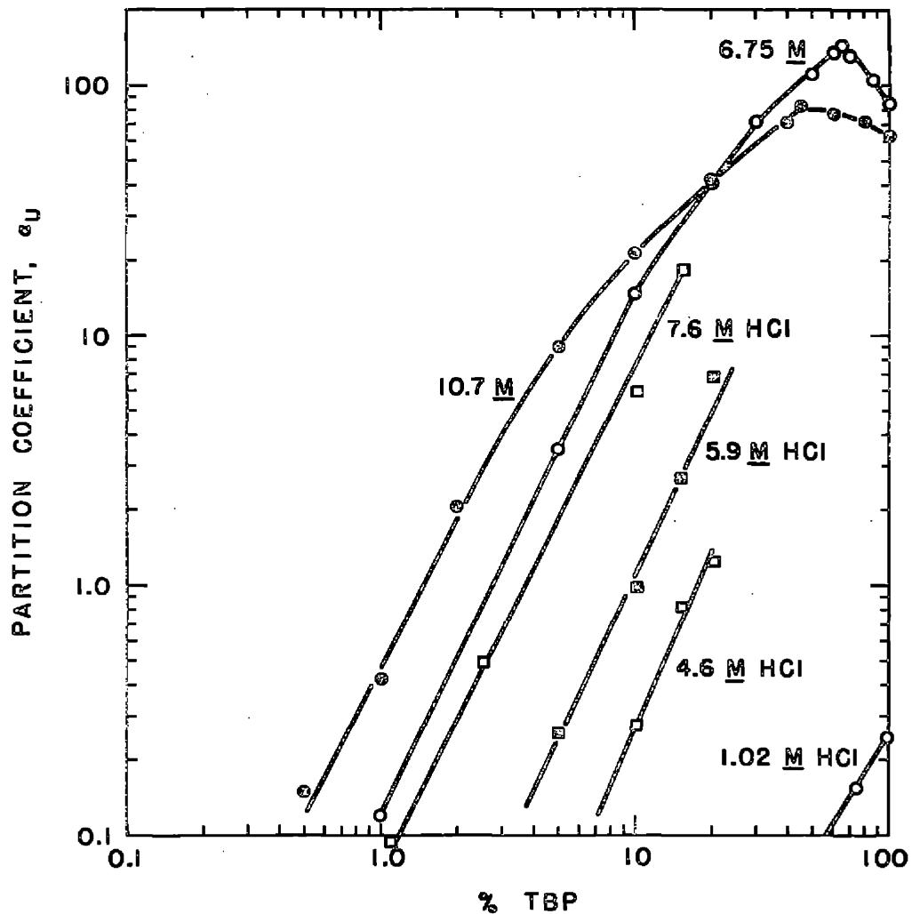  
Figure 41. Partition coefficient of uranium as a function of TBP concentration for various initial aqueous HCl concentrations. 10.7M, 6.75M, and 1.02M HCl curves, after V. M. Vdovenko, A. A. Lipovskii, and S. A. Nikitina, reference 426. Conditions: TBP dissolved in benzene. Extraction made at room temperature using U233. 4.6M, 5.9M and 7.6M HCl curves, after V. B. Shevchenko, I. G. Slepchenko, V. S. Schmidt, and E. A. Nenarokomov, reference 427. Conditions: TBP dissolved in CC14. Equal phase volumes (10 ml) mixed together for 30 minutes and allowed to stand for 12-15 hours.

examined the partition coefficients of Fe (II)(III), U (VI), Cd (II), Sr (II). Zr (IV), Ce (III), Ru (IV), and V (V).

Aqueous_perchlorate_systems. The distribution of uranyl perchlorate between TBP and water at $25^{\circ} \mathrm{C}$ is shown in figure 42.169 Figure 43 gives the partition coefficient of uranium as a function of the aqueous perchloric acid concentration.169

Shevchenko et al. have studied the extraction of uranyl perchlorate in the presence of $\mathrm{HClO_4}$ , $\mathrm{LiClO_4}$ , and $\mathrm{NaClO_4}$ . The salting-out capacity of these salts increases in the order listed. The choice of TBP diluent also affects the extraction of uranyl perchlorate. From an aqueous solution of $0.065\mathrm{M}$ $\mathrm{HClO_4}$ and $1\mathrm{M}$ $\mathrm{NaClO_4}$ , the extraction of uranium by $2.20\mathrm{M}$ TBP was found to decrease in the following order of diluents:

isoamyl acetate > n-butyl acetate > isoamyl alcohol > toluene > xylene > benzene > carbon tetrachloride.

The distribution of perchloric acid between TBP and aqueous solution is given in figure 34. The partition coefficients of Th, Zn, Pm, Y, and Ce are plotted against aqueous perchloric acid concentration in figure 44. Ishimori and

Table XXII. Effect of Salting-out Agents on the Extraction of Uranyl Chloride by TBP.   

<table><tr><td>Salting-out agent</td><td>αu</td></tr><tr><td>-</td><td>0.03</td></tr><tr><td>NaCl, sat&#x27;d</td><td>2.85</td></tr><tr><td>KCl, sat&#x27;d</td><td>0.38</td></tr><tr><td>NH4Cl, 5M</td><td>0.71</td></tr><tr><td>LiCl, 5M</td><td>0.90</td></tr><tr><td>HCl, 5M</td><td>17.6</td></tr><tr><td>CaCl2, 2.5M</td><td>5.06</td></tr><tr><td>MgCl2, 2.5M</td><td>11.7</td></tr><tr><td>AlCl3, 1.67M</td><td>23.8</td></tr></table>

a After Gal and Ruvarac, reference 431.

Initial composition of organic phase - $30\%$ (v/v) TBP in dibutyl ether, sat'd with 1.225M HCl. Initial composition of aqueous phase - 1.225M HCl, 0.1M $\mathrm{UO}_2\mathrm{Cl}_2$ , salting-out agent at concentration indicated.

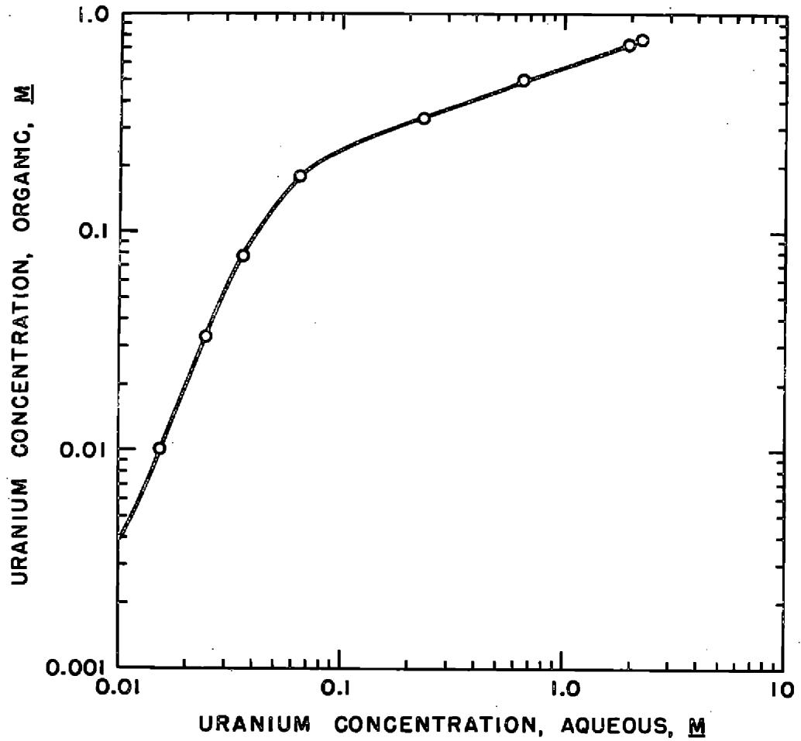  
Figure 42.

The partition of uranyl perchlorate between $100\%$ TBP and water at $25^{\circ}\mathrm{C}$ .

After E. Hesford and H. A. C. McKay, reference 169.

Nakamura $^{417}$ have studied the extraction of Pa, and Np (IV) (V) (VI) by TBP as a function of perchlorate concentration.

Aqueous sulfate systems. Sulfate ion is normally considered an interfering ion in the extraction of uranium from aqueous solution by TBP. Veereswararao, however, found that significant amounts of uranium may be extracted from sulfuric acid solution and that the extraction is increased as the acid concentration is increased (figure 45).

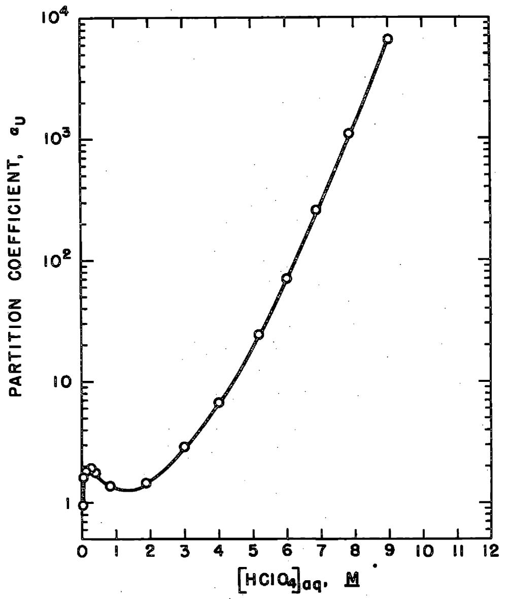  
Figure 43.

The extraction coefficient of trace amounts of uranium between $100\%$ TBP and aqueous solution as a function of equilibrium aqueous $\mathrm{HClO}_4$ concentration. $25^{\circ}\mathrm{C}$ .

After E. Hesford and H. A. C. McKay, reference 169.

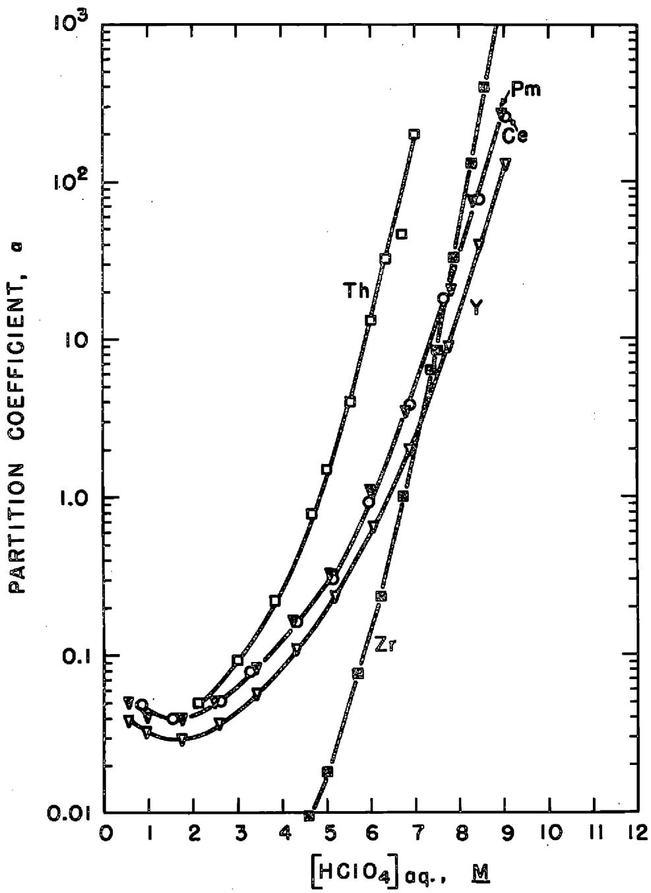  
Figure 44. The distribution of Th, Pm, Ce, Zr, and Y between $100\%$ TBP and aqueous solution as a function of initial equilibrium aqueous $\mathrm{HClO_4}$ concentration. After S. Siekierski, reference 433. Conditions: Equal phase volumes (15 ml) shaken together for about 20 minutes at $21^{\circ} - 25^{\circ}\mathrm{C}$ .

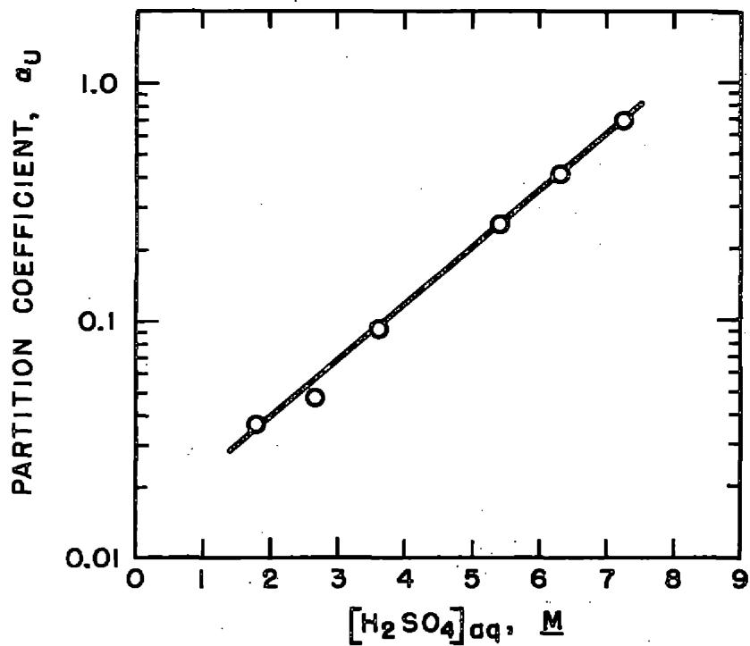  
Figure 45.

The partition coefficient of uranium between $30\%$ TBP (v/v) in kerosene and aqueous solution as a function of equilibrium aqueous $\mathrm{H}_2\mathrm{SO}_4$ concentration.

After U. Veereswararao, reference 434.

Conditions:

Equal phase volumes (10 ml) equilibrated by shaking for 5 minutes at $18^{\circ} \pm 1^{\circ}\mathrm{C}$ .

The presence of sodium chloride in sulfuric acid solution augments the extraction of uranium by TBP.434 Molybdenum and iron (III) are well extracted from such solutions. Vanadium and iron (II) are poorly extracted compared to uranium.434 The distribution of sulfuric acid between TBP and aqueous solution is represented in figure 34.412

Aqueous thiocyanate solution. Petrow and Marenburg have studied the effect of thiocyanate ion on the extraction of uranium from sulfate liquors by TBP. From an aqueous solution containing $1.5\mathrm{g} / 1$ of $\mathsf{U}_3\mathsf{O}_8$ as uranyl sulfate and

2.1 g/l total sulfate concentration at pH 1.5, the partition coefficient of uranium varied from 3.5 to 100 as the thio-cyanate to uranyl molar ratio was increased from 2 to 6. Twenty per cent TBP dissolved in kerosene was used as extractant. The partition coefficient, $\alpha_{\mathrm{u}}$ , increases with increased TBP concentration, increases with increased pH, and decreases with increased sulfate concentration. Vanadium and iron (III) are appreciably extracted by TBP from thio-cyanate solutions. Copper, titanium, cobalt are weakly extracted. Iron (II), cadmium, molybdenum, magnesium and aluminum are essentially not extracted. Phosphate ion may cause the precipitation of uranium or complex formation when present in large amounts. Okada, et al. report the extraction of uranium by TBP, mesityl oxide, and methyl ethyl ketone from phosphoric acid solutions having 20 times as much ammonium thiocyanate as uranium.

# Tri-n-octylphosphine oxide (TOPO)

Much of the work on this solvent has been reported by White and co-workers.437-444 Uranium is extracted by TOPO from nitrate and chloride solutions and to a smaller extent from sulfate and perchlorate solutions. It is essentially not extracted from phosphate solutions.441 The extraction of U, Th, Bi, Mo, Zn, and Cr by O.lM TOPO from aqueous solutions is given as a function of nitric acid concentration in figure 46; as a function of hydrochloric acid concentration in figure 47.440,441 Iron and titanium extraction curves are also included in figure 47. The extraction of over 40 ions by O.lM TOPO from hydrochloric, sulfuric, perchloric, and nitric acid solutions is qualitatively indicated in Table XXIII.438 The extraction of mineral acids by O.lM TOPO as a function of acid concentration is given in figure 48.441 Uranium may be stripped from TOPO solutions by contact

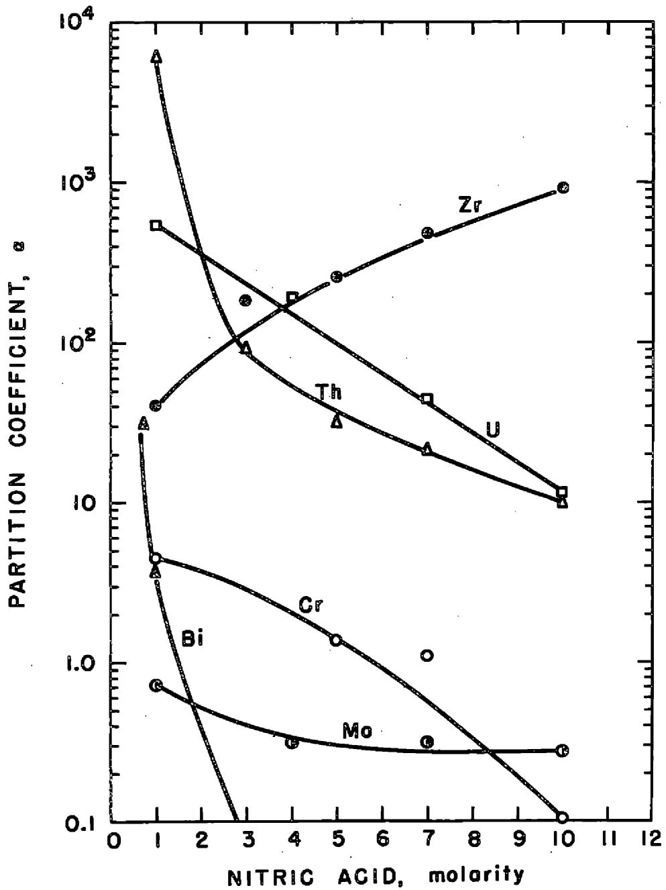  
Figure 46.

Extraction of some metal ions by O.lM tri-n-octylphosphine

oxide from nitric acid solutions.

After J. C. White, references 440 and 441.

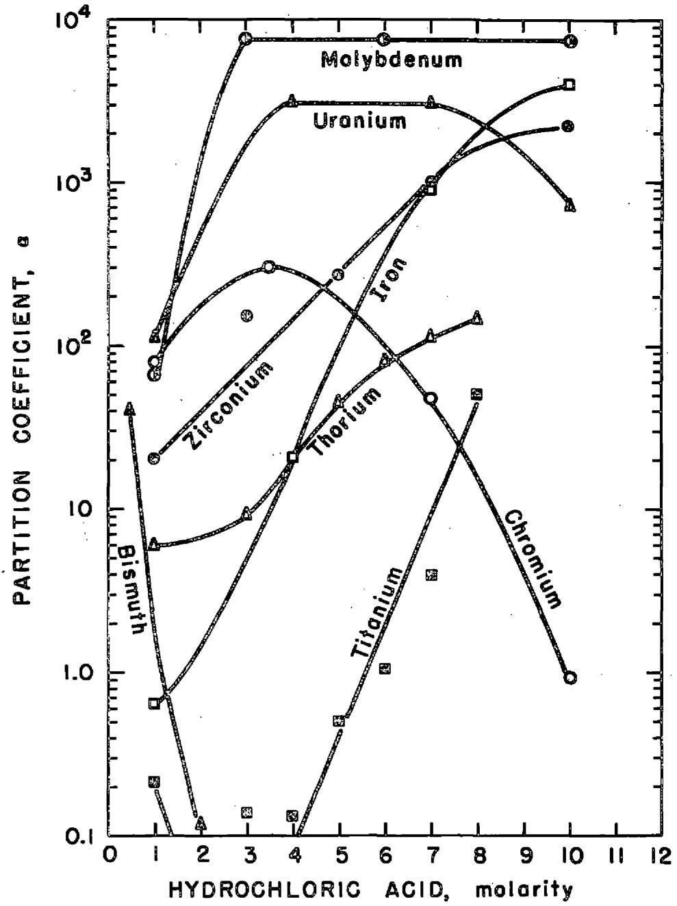  
Figure 47.

Extraction of metal ions by O.lM tri-n-octylphosphine oxide from hydrochloric acid solutions.

After J. C. White, references 440 and 441.

Table XXIII. Extraction of Ions from Acid Solutions with O.lM TOPO in Cyclohexane.   

<table><tr><td>Ion</td><td colspan="2">HCl</td><td colspan="2">H2SO4</td><td colspan="2">HC1O4</td><td colspan="2">HNO3</td></tr><tr><td></td><td>1M</td><td>7M</td><td>1M</td><td>11M</td><td>1M</td><td>7M</td><td>1M</td><td>7M</td></tr><tr><td>Al+3</td><td>N</td><td>N</td><td>N</td><td>N</td><td>N</td><td>N</td><td>N</td><td>N</td></tr><tr><td>Sb+3</td><td>P</td><td>E</td><td>E</td><td>E</td><td>P</td><td>E</td><td>P</td><td>P</td></tr><tr><td>As+5</td><td>N</td><td>N</td><td>P</td><td>N</td><td>P</td><td>P</td><td>N</td><td>N</td></tr><tr><td>Ba+2</td><td>N</td><td>N</td><td>-</td><td>-</td><td>N</td><td>N</td><td>N</td><td>N</td></tr><tr><td>Be+2</td><td>N</td><td>N</td><td>N</td><td>N</td><td>P</td><td>N</td><td>N</td><td>N</td></tr><tr><td>Bi+3</td><td>P</td><td>N</td><td>E</td><td>?</td><td>P</td><td>N</td><td>P</td><td>N</td></tr><tr><td>B+3</td><td>N</td><td>N</td><td>-</td><td>-</td><td>N</td><td>N</td><td>N</td><td>N</td></tr><tr><td>Cd+2</td><td>P</td><td>P</td><td>N</td><td>?</td><td>E</td><td>E</td><td>N</td><td>N</td></tr><tr><td>Ca+2</td><td>N</td><td>N</td><td>-</td><td>-</td><td>N</td><td>N</td><td>N</td><td>N</td></tr><tr><td>Ce+3</td><td>N</td><td>N</td><td>N</td><td>N</td><td>N</td><td>N</td><td>N</td><td>N</td></tr><tr><td>Cr+6</td><td>E</td><td>E</td><td>E</td><td>E</td><td>E</td><td>E</td><td>E</td><td>E</td></tr><tr><td>Co+2</td><td>N</td><td>N</td><td>N</td><td>N</td><td>N</td><td>N</td><td>N</td><td>N</td></tr><tr><td>Cu+2</td><td>N</td><td>P</td><td>N</td><td>N</td><td>N</td><td>N</td><td>N</td><td>N</td></tr><tr><td>Dy+3</td><td>N</td><td>N</td><td>N</td><td>N</td><td>N</td><td>N</td><td>N</td><td>N</td></tr><tr><td>Er+3</td><td>N</td><td>N</td><td>N</td><td>N</td><td>N</td><td>N</td><td>N</td><td>N</td></tr><tr><td>Eu+3</td><td>N</td><td>N</td><td>N</td><td>N</td><td>N</td><td>N</td><td>N</td><td>N</td></tr><tr><td>Gd+3</td><td>N</td><td>N</td><td>N</td><td>N</td><td>N</td><td>N</td><td>N</td><td>N</td></tr><tr><td>Ga+3</td><td>N</td><td>E</td><td>N</td><td>E</td><td>N</td><td>E</td><td>N</td><td>N</td></tr><tr><td>Ge+4</td><td>?</td><td>P</td><td>?</td><td>P</td><td>?</td><td>P</td><td>?</td><td>?</td></tr><tr><td>Au+</td><td>E</td><td>E</td><td>E</td><td>E</td><td>E</td><td>E</td><td>E</td><td>P</td></tr><tr><td>Hf+4</td><td>E</td><td>E</td><td>E</td><td>?</td><td>E</td><td>E</td><td>P</td><td>P</td></tr><tr><td>Ho+3</td><td>N</td><td>N</td><td>N</td><td>N</td><td>N</td><td>N</td><td>N</td><td>N</td></tr><tr><td>In+3</td><td>P</td><td>P</td><td>E</td><td>E</td><td>P</td><td>N</td><td>N</td><td>N</td></tr><tr><td>Fe+3</td><td>E</td><td>E</td><td>N</td><td>N</td><td>N</td><td>N</td><td>N</td><td>N</td></tr><tr><td>La+3</td><td>N</td><td>N</td><td>N</td><td>N</td><td>N</td><td>N</td><td>N</td><td>N</td></tr><tr><td>Pb+2</td><td>-</td><td>-</td><td>-</td><td>-</td><td>N</td><td>N</td><td>N</td><td>N</td></tr><tr><td>Mg+2</td><td>N</td><td>N</td><td>-</td><td>-</td><td>N</td><td>N</td><td>N</td><td>N</td></tr><tr><td>Hg+2</td><td>P</td><td>N</td><td>P</td><td>?</td><td>N</td><td>N</td><td>N</td><td>N</td></tr><tr><td>Mo+6</td><td>E</td><td>E</td><td>E</td><td>E</td><td>E</td><td>E</td><td>N</td><td>P</td></tr></table>

Table XXIII.-Continued.   

<table><tr><td>Ion</td><td colspan="2">HCl</td><td colspan="2">\( H_2SO_4 \)</td><td colspan="2">\( HC1O_4 \)</td><td colspan="2">\( HNO_3 \)</td></tr><tr><td></td><td>1M</td><td>7M</td><td>1M</td><td>11M</td><td>1M</td><td>7M</td><td>1M</td><td>7M</td></tr><tr><td>\( Na^{+3} \)</td><td>N</td><td>N</td><td>N</td><td>N</td><td>N</td><td>N</td><td>N</td><td>N</td></tr><tr><td>\( Ni^{+2} \)</td><td>N</td><td>N</td><td>N</td><td>N</td><td>N</td><td>N</td><td>N</td><td>N</td></tr><tr><td>\( Pa^{+2} \)</td><td>N</td><td>N</td><td>N</td><td>N</td><td>N</td><td>N</td><td>N</td><td>N</td></tr><tr><td>\( Pt^{+2} \)</td><td>P</td><td>P</td><td>P</td><td>N</td><td>N</td><td>N</td><td>N</td><td>N</td></tr><tr><td>\( Pr^{+3} \)</td><td>N</td><td>N</td><td>N</td><td>N</td><td>N</td><td>N</td><td>N</td><td>N</td></tr><tr><td>\( Ru^{+2} \)</td><td>N</td><td>N</td><td>N</td><td>?</td><td>N</td><td>?</td><td>N</td><td>N</td></tr><tr><td>\( Sm^{+3} \)</td><td>N</td><td>N</td><td>N</td><td>N</td><td>N</td><td>N</td><td>N</td><td>N</td></tr><tr><td>\( Ag^+ \)</td><td>-</td><td>-</td><td>-</td><td>-</td><td>N</td><td>N</td><td>N</td><td>N</td></tr><tr><td>\( Sr^{+2} \)</td><td>N</td><td>N</td><td>-</td><td>-</td><td>N</td><td>N</td><td>N</td><td>N</td></tr><tr><td>\( Tb^{+3} \)</td><td>N</td><td>N</td><td>N</td><td>N</td><td>N</td><td>N</td><td>N</td><td>N</td></tr><tr><td>\( Th^{+4} \)</td><td>-</td><td>-</td><td>-</td><td>-</td><td>?</td><td>?</td><td>P</td><td>P</td></tr><tr><td>\( Tm^{+3} \)</td><td>N</td><td>N</td><td>N</td><td>N</td><td>N</td><td>N</td><td>N</td><td>N</td></tr><tr><td>\( Sn^{+4} \)</td><td>E</td><td>E</td><td>E</td><td>E</td><td>E</td><td>E</td><td>E</td><td>E</td></tr><tr><td>\( Ti^{+4} \)</td><td>N</td><td>E</td><td>P</td><td>E</td><td>P</td><td>E</td><td>P</td><td>P</td></tr><tr><td>\( U^{+6} \)</td><td>E</td><td>E</td><td>E</td><td>E</td><td>E</td><td>E</td><td>E</td><td>E</td></tr><tr><td>\( V^{+4} \)</td><td>N</td><td>E</td><td>N</td><td>N</td><td>N</td><td>N</td><td>N</td><td>N</td></tr><tr><td>\( Yb^{+3} \)</td><td>N</td><td>N</td><td>N</td><td>N</td><td>N</td><td>N</td><td>N</td><td>N</td></tr><tr><td>\( Y^{+3} \)</td><td>N</td><td>N</td><td>N</td><td>?</td><td>N</td><td>N</td><td>N</td><td>N</td></tr><tr><td>\( Zn^{+2} \)</td><td>P</td><td>P</td><td>N</td><td>N</td><td>N</td><td>N</td><td>N</td><td>N</td></tr><tr><td>\( Zr^{+4} \)</td><td>E</td><td>E</td><td>E</td><td>E</td><td>E</td><td>E</td><td>E</td><td>E</td></tr></table>

E = complete extraction P = partial extraction N = no extraction   
After J. C. White, reference 438.   
Equal phase volumes equilibrated 10 minutes.

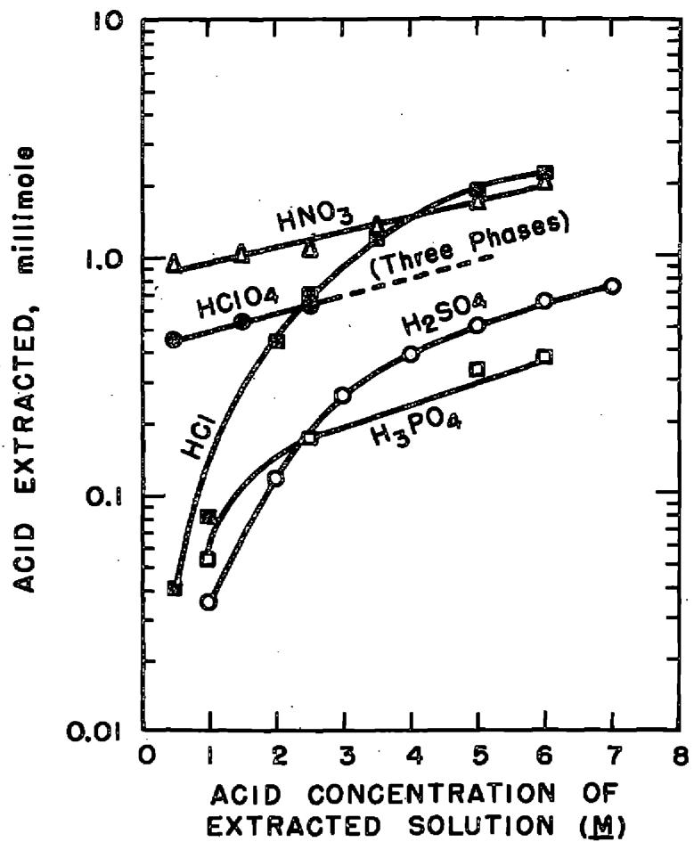  
Figure 48.

Extraction of mineral acids by tri-n-octylphosphine oxide. After J. C. White, reference 441.

Conditions:

Aqueous phases - acid solution of indicated molarity. Organic phase - 10 ml of 0.1M TOPO in cyclohexane. $V_{\mathrm{o}} / V_{\mathrm{a}} = 1$

with acid $(\mathrm{HF}, \mathrm{H}_3\mathrm{PO}_4)$ , or concentrated $(\mathrm{NH}_4)_2\mathrm{SO}_4$ solutions at pH 2), hydroxide (NaOH or $\mathrm{NH}_4\mathrm{OH}$ ), or carbonate $[(N H_4)_2C O_3$ or $\mathrm{Na}_2\mathrm{CO}_3]$ solutions. Sodium carbonate is the most effective stripping agent.

Tetraphenylphosphonium chloride (TPPC)

A recent study has been reported in which uranium was extracted into chloroform as the tetraphenylphosphonium uranyl

tribenzoate complex.446 Uranyl ion was converted to an anionic form by benzoic acid. Tetraphenylphosphonium chloride was used as extractant. The extraction of uranium was found to depend upon pH, TPPC concentration, and uranium concentration. At $\sim \mathrm{pH}3 - 9,$ the extraction of uranium was nearly quantitative. The partition coefficient, $\alpha_{\mathbf{u}}$ , was increased with increased TPPC concentration and was decreased with increased uranium concentration. The decrease in $\alpha_{\mathbf{u}}$ with increased uranium concentration was observed with a constant uranium-to-TPPC molar ratio. At $25^{\circ}\mathrm{C}$ and pH 5.2, zinc, zirconium (niobium), and ruthenium were appreciably extracted (~10-20% compared to 100% for uranium). The extraction of zinc and zirconium may be depressed by the use of a complexing agent, EDTA, in solution.

# ACIDIC ORGANOPHOSPHORUS COMPOUNDS

Uranium is efficiently extracted by acidic organophosphorus compounds which include di- and mono-alkylphosphoric acids, $(\mathrm{HO})(\mathrm{RO})_2\mathrm{P} \rightarrow 0$ and $(\mathrm{HO})_2(\mathrm{RO})\mathrm{P} \rightarrow 0$ ; dialkylphosphinic acids, $(\mathrm{HO})\mathrm{R}_2\mathrm{P} \rightarrow 0$ ; alkylphosphonic acids, $(\mathrm{HO})_2\mathrm{RP} \rightarrow 0$ ; and dialkylpyrophosphoric acids, $\mathrm{H}_2\mathrm{R}_2\mathrm{P}_2\mathrm{O}_7$ . The latter acids are discussed separately.

Table XXIV compares the extractive capacities of several dialkylphosphoric, dialkylphosphinic, and monoalkylphosphoric acids for uranium. $^{302}$ The ability to extract uranium, within a given class, appears to decrease with increased branching of the alkyl chain near the phosphate group. The acidity of the reagent decreases roughly in the same order. $^{302}$ Where comparisons can be made for the same alkyl group between classes of reagent, the extraction coefficient of uranium increases in the order

dialkylphosphoric acid < dialkylphosphinic acid < monoalkylphosphoric acid.

The choice of diluent affects the extraction of uranium. For

Reagents.

Table XXIV. Extraction of Uranium by Acidic Organophosphorus   

<table><tr><td rowspan="2">Reagent</td><td colspan="2">Uranium extraction coefficient, α</td></tr><tr><td>Carbon tetrachloride</td><td>Kerosene u</td></tr><tr><td>Dialkylphosphoric acids</td><td></td><td></td></tr><tr><td>n-octyl</td><td>90</td><td>450</td></tr><tr><td>3,5,5-trimethylhexyl</td><td>40</td><td>260</td></tr><tr><td>2-ethylhexyl</td><td>17</td><td>135</td></tr><tr><td>2-ethyl-4-methylpentyl</td><td>-</td><td>90</td></tr><tr><td>2-propyl-4-methylpentyl</td><td>-</td><td>60</td></tr><tr><td>octyl-2</td><td>11</td><td>-</td></tr><tr><td>diisobutylmethyl</td><td>2</td><td>10</td></tr><tr><td>Dialkylphosphinic acids</td><td></td><td></td></tr><tr><td>γ-phenylpropyl</td><td>300</td><td>-</td></tr><tr><td>phenyl-2-ethylhexyl</td><td>300</td><td>-</td></tr><tr><td>n-decyl</td><td>180</td><td>-</td></tr><tr><td>n-octyl</td><td>160</td><td>-</td></tr><tr><td>3,5,5-trimethylhexyl</td><td>120</td><td>-</td></tr><tr><td>2-ethylhexyl</td><td>30</td><td>-</td></tr><tr><td>Monoalkylphosphoric acids</td><td></td><td></td></tr><tr><td>n-octyl</td><td>580</td><td>-</td></tr><tr><td>3,5,5-trimethylhexyl</td><td>&gt;1000</td><td>(&gt;1000)</td></tr><tr><td>2-ethylhexyl</td><td>&gt;1000</td><td>(&gt;1000)</td></tr><tr><td>diisobutylmethyl</td><td>450</td><td>-</td></tr><tr><td>2,6,8-trimethyluonyl-4</td><td>-</td><td>650</td></tr><tr><td>1-isobutyl-4-ethylloctyl</td><td>-</td><td>600</td></tr><tr><td>3,9-diethyltridecanol-6</td><td>-</td><td>550</td></tr></table>

a After C. A. Blake, Jr., C. F. Baes, Jr., K. B. Brown, C. F. Coleman,

J. C. White, reference 302.

Aqueous phase: $0.5\mathrm{M}$ $\mathrm{SO}_4^{2-}$ , pH 1, 0.004 M U(VI) initially.

Organic phase: 0.lM reagent in solvent indicated.

Temperature, $25^{\circ}C_{\mathrm{i}}$ $\mathbf{V}_{\mathrm{o}} / \mathbf{V}_{\mathrm{s}},1.$

dialkylphosphoric and dialkylphosphinic acids, $a_{\mathrm{u}}$ generally

increases as the dielectric constant of the solvent increases.302

For monoalkylphosphoric acids, a reverse trend is indicated.302

The mechanism of extraction of uranium by dialkylphos-

phoric acids has been studied by various groups. 158,159,302,447

At low uranium concentrations, the extraction mechanism appears

to be consistent with the reaction

$\mathrm{UO}_{2}^{2+}$ aq + 2(HDAP) $\mathrm{org} = \mathrm{UO}_{2}(\mathrm{DAP}) \mathrm{org} + 2\mathrm{H}^{+}$ aq,

where HDAP represents a dialkylphosphoric acid. However, in

organic solvents, dialkylphosphoric acids are largely associated as dimers.158,159,448 On this basis, the reaction $\mathrm{UO}_2^{2+}aq + 2(\mathrm{HDAP})_2\mathrm{org} = \mathrm{UO}_2(\mathrm{DAP})_2(\mathrm{HDAP})_2\mathrm{org} + 2\mathrm{H}^+$ (1) is indicated.158,159 The number of dialkylphosphate groups associated with the uranyl ion in equation (1) may be accounted for by a chelate structure 158,302

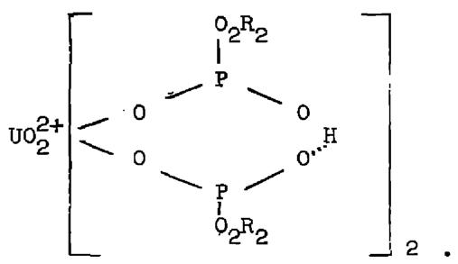

At higher uranium concentrations, isopiestic and viscosity measurements indicate that polymeric uranyl-dialkylphosphate chains are formed.158

The extraction coefficient of uranium by dibutylphosphoric acid, HDBP, is given in figure 49 as a function of nitric acid concentration. The shape of the curve has been explained by Healy and Kennedy in the following manner:

The initial decrease in $\alpha_{\mathbf{u}}$ between 0.1M and 3M HNO3 is expected on the basis of hydrogen ion replacement by $\mathrm{UO_2^+}$ ion. However, for $\alpha_{\mathbf{u}}$ greater than 10 not enough HDBP is present in the organic phase to give the monomeric species $\mathrm{UO_2}$ (DBP) $_2$ (HDBP) $_2$ demanded by equation (1). In this region, the extraction mechanism is likely to be governed by the reaction

$$
\mathrm {x U O} _ {2} ^ {2 +} \mathrm {a q} + (\mathrm {x} + 1) (\mathrm {H D B P}) _ {2} \text {o r g} = \left[ \mathrm {U O} _ {2} (\mathrm {D B P}) _ {2} \right] _ {\mathrm {x}} 2 \mathrm {H D B P} \text {o r g} + 2 \mathrm {x H} ^ {+} \mathrm {a q}. \tag {2}
$$

The shape of the extraction curve from 3M to 10M HNO₃ is similar to that obtained with TBF and indicates a change in extraction mechanism. The likely reaction is

$$
\mathrm {U O} _ {2} ^ {2 +} \mathrm {a q} + 2 \mathrm {N O} _ {3} ^ {-} \mathrm {a q} + (\mathrm {H D B P}) _ {2} \text {o r g} = \mathrm {U O} _ {2} (\mathrm {N O} _ {3}) _ {2} 2 \mathrm {H D B P} \text {o r g}. \tag {3}
$$

The decrease in $\alpha_{1}$ above 7M HNO3 is probably due to the competing reaction

$$
\left(\mathrm {H D B P}\right) _ {2} \text {o r g} + 2 \mathrm {H N O} _ {3} \mathrm {a q} = 2 \mathrm {H D B P} \cdot \mathrm {H N O} _ {3} \text {o r g}. \tag {4}
$$

It is likely that mechanisms (2) and/or (3) also occur to some extent at high acid concentrations.

The extraction mechanism of dialkylphosphinic acids is expected to be similar to that of dialkylphosphoric acids. The former are often found as dimers in organic solvents and the partition coefficient of uranium, $\alpha_{\mathrm{u}}$ , exhibits a power dependence on extractant concentration at low uranium levels similar to that of dialkylphosphoric acids. $^{302}$ Monoalkylphosphoric and monoalkylphosphonic acids have been found in larger polymeric aggregates. $^{302,448}$ Partition coefficients for these extractants exhibit first to second power dependencies on extractant concentration. $^{302}$

Interference to uranium extraction by anions increases in the order $\mathrm{ClO}_4^-$ < $\mathrm{Cl}^- < \mathrm{SO}_4^{2-} < \mathrm{PO}_4^{3-}$ .

Stripping is essentially the inverse process of extraction. Uranium may be stripped from dialkylphosphoric acids by contact with hydrofluoric, sulfuric, phosphorio, or even hydrochloric acids. The stripping efficiency is generally increased with increased acid concentration. $^{449}$ Ammonium or sodium carbonate stripping is efficient. $^{449}$

Synergism.* In a search for reagents to modify kerosene as the diluent for dialkylphosphoric aoids,** it was discovered that neutral organophosphorus compounds provided a synergistic enhancement of the uranium partition coefficient. The enhancement is increased in the following order of neutral reagent:

trialkylphosphate < alkyl dialkylphosphonate < dialkyl alkylphosphinate < trialkylphosphine oxide.

Table XXV lists $\alpha_{u}$ for several synergistic systems.302 The reason for the enhanced partition coefficient, $\alpha_{u}$ , has been

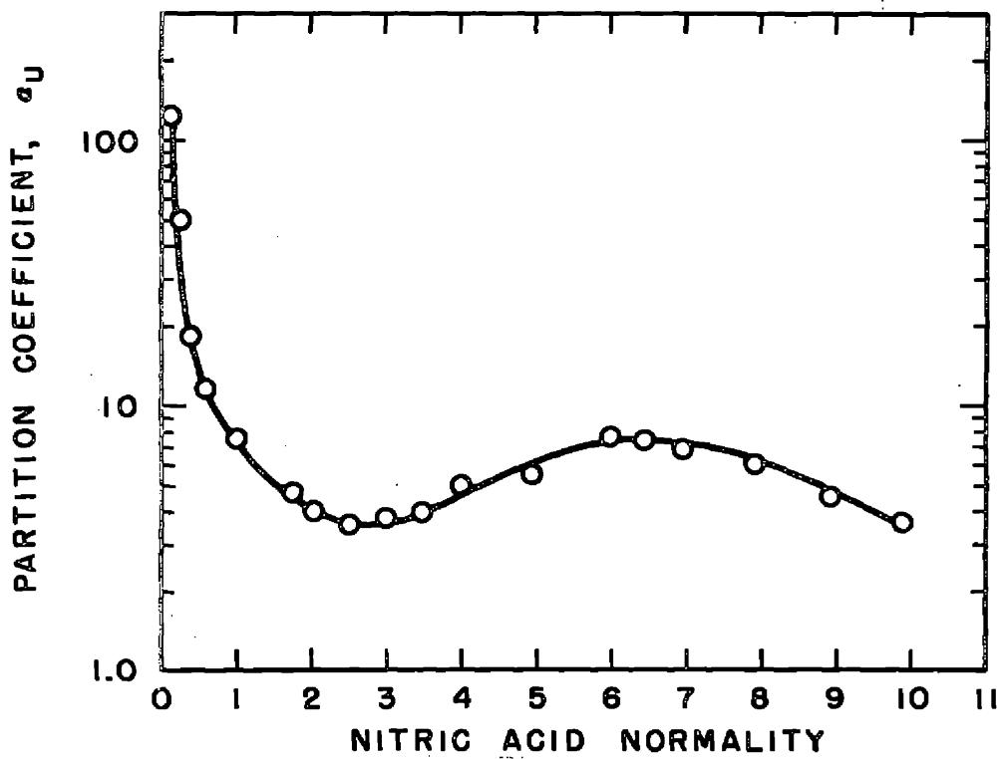  
Figure 49.

Variation of $\alpha_{\mathrm{u}}$ with nitric acid concentrations for 0.14M dibutylphosphoric acid in benzene using 20 ml organic phase, and 50 ml aqueous phase, and an initial uranium concentration of 0.018M.

After T. V. Healy and J. Kennedy, reference 188.

explained on the basis of (1) the addition of neutral reagent to the uranyl-dialkylphosphate complex through hydrogel bonding or of (2) eliminating the need of monomerizing a mole of dimeric extractant in the extraction mechanism (see equation (1)). A recent study of the synergistic system, thenoyltrifluoroacetone-neutral organophosphorus compound, indicates that more investigation is necessary for a more precise explanation of synergistic effects. Much of the work done on synergistic systems involving dialkylphosphoric acids is summarized in reference 452.

Table XXV. Synergistic Enhancement of Uranium Extraction Coefficient.a   

<table><tr><td rowspan="2">Organophosphorus reagent</td><td rowspan="2">Conc.,M</td><td colspan="2">αu</td></tr><tr><td>Reagent Alone</td><td>In synergistic combination with 0.1M D2EHPA</td></tr><tr><td>D1(2-ethylhexyl) phosphoric acid (D2EHPA)</td><td>0.1</td><td>135</td><td>-</td></tr><tr><td>Phosphates</td><td></td><td></td><td></td></tr><tr><td>tri-n-butyl</td><td>0.1</td><td>0.0002</td><td>470</td></tr><tr><td>tri-2-ethylhexyl</td><td>0.1</td><td>0.0002</td><td>270</td></tr><tr><td>Phosphonates</td><td></td><td></td><td></td></tr><tr><td>di-n-butyl n-butyl</td><td>0.1</td><td>0.0002</td><td>1700</td></tr><tr><td>di-n-amyl n-amyl</td><td>0.1</td><td>0.0003</td><td>2000</td></tr><tr><td>di-n-hexyl n-hexyl</td><td>0.1</td><td>0.0004</td><td>2200</td></tr><tr><td>di-2-ethylhexyl 2-ethylhexyl</td><td>0.1</td><td>0.0002</td><td>870</td></tr><tr><td>Phosphinates</td><td></td><td></td><td></td></tr><tr><td>n-butyl di-n-butyl</td><td>0.1</td><td>0.002</td><td>3500</td></tr><tr><td>n-butyl di-n-hexyl</td><td>0.1</td><td>0.002</td><td>3500</td></tr><tr><td>Phosphine oxides</td><td></td><td></td><td></td></tr><tr><td>tri-n-butyl</td><td>0.05</td><td>0.0025</td><td>7000</td></tr><tr><td>tri-n-octyl</td><td>0.1</td><td>0.06</td><td>3500</td></tr><tr><td>tri-2-ethylhexyl</td><td>0.1</td><td>0.02</td><td>650</td></tr></table>

a After C. A. Blake, Jr., C. F. Baes, Jr., K. B. Brown, C. F. Coleman, J. C. White, reference 302.   
Aqueous phase: 0.5M SO42-, pH 1, 0.004M U(VI) initially. Organic phase: Reagents in kerosene diluent. Temperature, 25°C.; V/Va, l.

Di(2-ethylhexyl) phosphoric acid (D2EHPA, HDEHP)

This reagent may also be known by a less descriptive name, dioctylphosphate (DOF). The extraction of uranium by D2EHPA is reviewed in reference 453. The effect of acid concentration on the extraction of uranium by D2EHPA is shown in figure 50. $^{453}$ The uranium extraction curve for D2EHPA from nitric acid is similar in shape, for the few points given, to that for dibutylphosphoric acid given in figure 49. Figure 51 illustrates the effect of nitrate ion on the extraction of uranium by D2EHPA. $^{453}$ The presence of a small amount of nitrate in an aqueous sulfate solution increases the extraction of uranium significantly. An increase in temperature causes a decrease in uranium extraction. $^{453}$

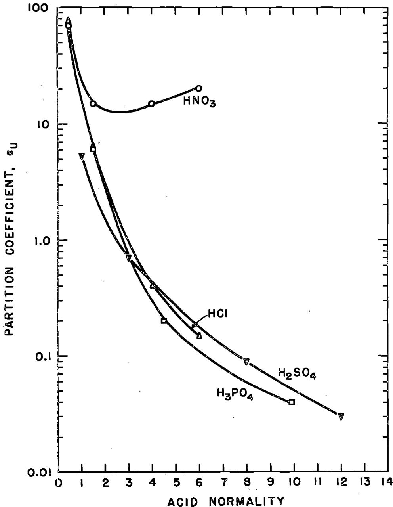  
Figure 50. Extraction of uranium by d1(2-ethylhexyl) phosphoric acid in kerosene from mineral acid solutions. After C. A. Blake, K. B. Brown, and C. F. Coleman, reference 453. Conditions: Organic phase - 0.lM D2EHPA in kerosene, $2\%$ (w/v) 2-ethylhexanol. Aqueous phase - 1 gU/l for all acid solutions except H3PO4 in which case the U concentration was 100 ppm. Agitation time - 2 minutes. $\mathrm{V_0 / V_a} = 1$ for all acids but HNO3 in which $\mathrm{V_0 / V_a} = 2$ .

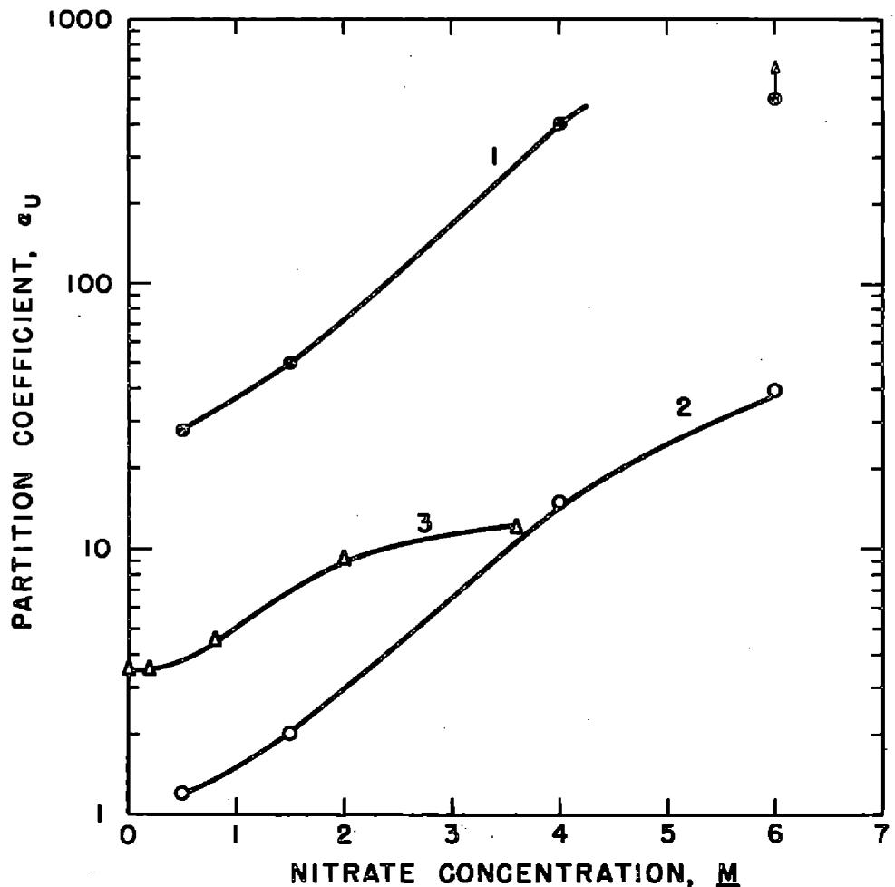  
Figure 51. The effect of nitrate ion on the extraction of uranium by d1(2-ethylhexyl) phosphoric acid. Curve 1 - initial pH = 1.5 - 1.85; Curve 2 - initial pH = 0.5 - 0.75. Conditions: 0.01M D2EHPA in kerosene (1.3% 2-ethylhexanol), 1 g U/1 in aqueous phase, $\frac{V_{\mathrm{o}}}{V_{\mathrm{a}}} = 2$ , 2 min. contact time. Curve 3 - 0.5M SO4; pH = 1.2. Conditions: 0.05M D2EHPA in CC14, 1 g U/1 in aqueous phase, $\frac{V_{\mathrm{o}}}{V_{\mathrm{a}}} = 1$ , 20 min. contact time. After C. A. Blake, K. B. Brown, and C. F. Coleman, reference 453.

The effect of diluent on $\alpha_{u}$ is given in Table XXVI. The enhanced extraction of uranium by D2HPA in synergistic combination with neutral organophosphorus reagents has already been noted (Table XXV). The extent to which other ions are extracted is indicated qualitatively in Tables XXVII and XXVIII.

Phosphoric Acid.

Table XXVI. Choice of Diluent with Di(2-ethylhexyl)   

<table><tr><td>Diluent</td><td>αu</td></tr><tr><td>Kerosene</td><td>135</td></tr><tr><td>Hexane</td><td>110</td></tr><tr><td>Carbon tetrachloride</td><td>20</td></tr><tr><td>Isopropyl ether</td><td>17</td></tr><tr><td>Benzene</td><td>13</td></tr><tr><td>Chloroform</td><td>3</td></tr><tr><td>2-Ethylhexanol</td><td>0.1</td></tr><tr><td>Octanol-2 (capryl alcohol)</td><td>0.08</td></tr></table>

a After C. A. Blake, K. B. Brown, and C. F. Coleman, reference 453.

0.1M D2EHPA, 0.004M U (VI), 0.5M SO₄²⁻, pH = 1.1, V ∇_a = 1, agitation time = 10 min. (wrist-action shaker).

# Dialkylpyrophosphoric acids

Dialkylpyrophosphoric acids are used in the recovery of uranium from low-grade phosphate ores. Much of the work that has been reported in project literature has been summarized by Ellis,455 by Long, Ellis, and Bailes,456 and by Brown and Coleman.305 The acids are prepared just prior to use by adding alcohol to a slurry of $\mathsf{P}_2\mathsf{O}_5$ in kerosene with stirring and cooling. A concentration of about 0.1 g $\mathsf{P}_2\mathsf{O}_5$ per ml of kerosene is optimum.455 A 2:1 mole ratio of alcohol: $\mathsf{P}_2\mathsf{O}_5$ is used to form the dialkylpyrophosphoric acid. A 3:1 mole ratio should give about equal mole quantities of mono- and di-alkyl orthophosphoric acids.455 The reactions are complex and mixtures of various phosphoric acids are formed. With pyrophosphoric acids, uranium extraction increases with carbon chain length from butyl to octyl.455 Nonyl and

Table XXVII. Extraction of Metal Ions from Acidic Solutions with   
O.lM D1(2-ethylhexyl) Phosphoric Acid in Cyclohexane.   

<table><tr><td rowspan="2">Metal Ion</td><td colspan="3">Sodium Chloride (1M)</td><td colspan="2">Ammonium Sulfate (1M) Sodium Nitrate (1M)</td></tr><tr><td>pH 0</td><td>pH 0.5</td><td>pH 1.5</td><td>pH 1.5</td><td>pH 1.5</td></tr><tr><td>Al+3</td><td>-</td><td>-</td><td>N</td><td>N</td><td>N</td></tr><tr><td>As+5</td><td>-</td><td>-</td><td>N</td><td>N</td><td>N</td></tr><tr><td>Ba+2</td><td>-</td><td>-</td><td>N</td><td>-</td><td>N</td></tr><tr><td>Be+2</td><td>P</td><td>P</td><td>P</td><td>P</td><td>P</td></tr><tr><td>B+3</td><td>-</td><td>-</td><td>N</td><td>-</td><td>N</td></tr><tr><td>Cd+2</td><td>-</td><td>-</td><td>N</td><td>N</td><td>N</td></tr><tr><td>Ca+2</td><td>-</td><td>-</td><td>N</td><td>-</td><td>N</td></tr><tr><td>Cr+6</td><td>P</td><td>P</td><td>P</td><td>P</td><td>P</td></tr><tr><td>Co+2</td><td>-</td><td>-</td><td>N</td><td>N</td><td>N</td></tr><tr><td>Cu+2</td><td>-</td><td>-</td><td>N</td><td>N</td><td>N</td></tr><tr><td>Ga+3</td><td>-</td><td>-</td><td>N</td><td>N</td><td>N</td></tr><tr><td>Au+</td><td>-</td><td>-</td><td>N</td><td>N</td><td>N</td></tr><tr><td>Hf+4</td><td>E</td><td>E</td><td>E</td><td>E</td><td>E</td></tr><tr><td>In+3</td><td>N</td><td>N</td><td>P</td><td>P</td><td>P</td></tr><tr><td>Fe+3</td><td>P</td><td>P</td><td>P</td><td>P</td><td>P</td></tr><tr><td>La+3</td><td>N</td><td>N</td><td>N</td><td>N</td><td>N</td></tr><tr><td>Mg+2</td><td>-</td><td>-</td><td>N</td><td>-</td><td>N</td></tr><tr><td>Hg+2</td><td>-</td><td>-</td><td>N</td><td>N</td><td>N</td></tr><tr><td>Mo+6</td><td>E</td><td>E</td><td>E</td><td>E</td><td>E</td></tr><tr><td>Ni+2</td><td>-</td><td>-</td><td>N</td><td>N</td><td>N</td></tr><tr><td>Pd+2</td><td>-</td><td>-</td><td>N</td><td>N</td><td>N</td></tr><tr><td>Pt+2</td><td>-</td><td>-</td><td>N</td><td>N</td><td>N</td></tr><tr><td>Ru+2</td><td>-</td><td>-</td><td>N</td><td>N</td><td>N</td></tr><tr><td>Sr+2</td><td>-</td><td>-</td><td>N</td><td>-</td><td>N</td></tr><tr><td>Th+4</td><td>E</td><td>E</td><td>E</td><td>E</td><td>E</td></tr><tr><td>Sn+4</td><td>E</td><td>E</td><td>P</td><td>N</td><td>E</td></tr><tr><td>Tl+4</td><td>E</td><td>E</td><td>E</td><td>E</td><td>E</td></tr><tr><td>U+6</td><td>E</td><td>E</td><td>E</td><td>E</td><td>E</td></tr><tr><td>Y+3</td><td>N</td><td>E</td><td>E</td><td>E</td><td>E</td></tr><tr><td>V+4</td><td>N</td><td>N</td><td>P</td><td>E</td><td>P</td></tr><tr><td>Zn+2</td><td>N</td><td>N</td><td>P</td><td>N</td><td>P</td></tr><tr><td>Zr+4</td><td>E</td><td>E</td><td>E</td><td>E</td><td>E</td></tr></table>

E = complete extraction, P = partial extraction, N = no extraction,

- = no test was conducted.

a After W. J. Ross and J. G. White, reference 454.

Aqueous phase: 1-2 mg of ion, salt at concentration indicated, pH indicated.

Organic phase: 0.1M D2HPA in cyclohexane. 5 ml portions of each phase shaken together for one hour.

Table XXVIII. Extraction of Rare Earths from Chloride Solutions with D1(2-ethylhexyl) Phosphoric Acid in Cyclohexane.   

<table><tr><td>Ion</td><td>pH 1.9</td><td>pH 1.0</td><td>pH 1.0b</td><td>pH 0.5</td><td>pH 0.5b</td><td>pH 0</td></tr><tr><td>Y+3</td><td>E</td><td>E</td><td>E</td><td>E</td><td>P</td><td>N</td></tr><tr><td>La+3</td><td>N</td><td>N</td><td>N</td><td>N</td><td>N</td><td>N</td></tr><tr><td>Ce+3</td><td>P</td><td>N</td><td>N</td><td>N</td><td>N</td><td>N</td></tr><tr><td>Pr+3</td><td>P</td><td>N</td><td>N</td><td>N</td><td>N</td><td>N</td></tr><tr><td>Nd+3</td><td>E</td><td>N</td><td>P</td><td>N</td><td>N</td><td>N</td></tr><tr><td>Sm+3</td><td>E</td><td>N</td><td>P</td><td>N</td><td>N</td><td>N</td></tr><tr><td>Eu+3</td><td>E</td><td>E</td><td>E</td><td>P</td><td>N</td><td>N</td></tr><tr><td>Cd+3</td><td>E</td><td>E</td><td>E</td><td>P</td><td>N</td><td>N</td></tr><tr><td>Tb+3</td><td>E</td><td>E</td><td>E</td><td>E</td><td>E</td><td>N</td></tr><tr><td>Dy+3</td><td>E</td><td>E</td><td>E</td><td>E</td><td>E</td><td>N</td></tr><tr><td>Ho+3</td><td>E</td><td>E</td><td>E</td><td>E</td><td>E</td><td>N</td></tr><tr><td>Er+3</td><td>E</td><td>E</td><td>E</td><td>E</td><td>E</td><td>N</td></tr><tr><td>Tm+3</td><td>E</td><td>E</td><td>E</td><td>E</td><td>E</td><td>P</td></tr><tr><td>Yb+3</td><td>E</td><td>E</td><td>E</td><td>E</td><td>E</td><td>P</td></tr></table>

E = complete extraction, P = partial extraction, N = no extraction.

a After W. J. Ross and J. C. White, reference 454.

Aqueous phase: standard solution of 2 mg/ml Ce+3; 1 mg/ml Pr+3, Nd+3, Sm+3, Dy+3, Ho+3, 0.5 mg/ml Tb+3, 0.2 mg/ml Y+3, La+3, Eu+3, Gd+3, Er+3; 0.1 mg/ml Yb+3;

1 ml of standard solution, 1 ml $5\mathrm{MNaCl}$ , NaOH or HCl to give desired pH in 5 ml of solution.

Organic phase: 5 ml of O.lM D2EHPA in cyclohexane extraction for 1 hour.

b Without NaCl.

decyl give about the same extraction as octyl. $^{455}$ No appreciable difference in extracting ability was observed between pyrophosphoric acids prepared with octanol-1 or octanol-2. $^{455}$ . Most of the studies have been made with octylpyrophosphoric acid (OPPA). Pyrophosphoric acids deteriorate fairly rapidly with time at room temperature. At elevated temperatures, the rate of deterioration is even greater. Contact with mineral acid causes pyrophosphoric acids to hydrolyze to orthophosphoric acids. The rate of hydrolysis is slower with basic solutions. $^{455}$

Kerosene is a satisfactory diluent for OPPA.455 The acid is used in 1-10% concentration.

The partition coefficient of uranium, $\alpha_{\mathrm{u}}$ , is considerably higher with OPPA than with the corresponding mixture of orthophosphoric acids, OPA. The partition coefficient is a function of the oxidation potential of the acid. With OPPA, satisfactory uranium recovery can be made if the e.m.f. is -0.250 volts or greater. Reduction of the acid increases the extraction of uranium considerably. At zero to +100 volts, $\alpha_{\mathrm{u}}$ is about twenty times that at -300 to -200 volts. The extraction of iron is decreased in reduced solution, i.e. $\alpha_{\mathrm{Fe(III)}} < \alpha_{\mathrm{Fe(III)}}$ .

Uranium is stripped from the organic solvent by precipitation as uranous fluoride.

Several papers have recently appeared in open literature publications concerning the extraction of uranium by pyrophosphoric acids. Zangen has shown that OPPA prepared by the alcoholysis of $\mathsf{P}_2\mathsf{O}_5$ is a mixture of several components. OPPA prepared in this manner was found to be more effective in the extraction of uranium than pure dioctylphosphoric acid by two orders of magnitude. The pure acid was prepared by synthesis, starting from $\mathsf{POCl}_3$ .

In an effort to determine the uranium species extracted by OPPA, Grdenic and Korpar have isolated the species $\mathrm{U(Oct_{2}P_{2}O_{7})_{2}}$ . The species, however, was insoluble in lignoin, the OPPA diluent. It was soluble in lignoin containing OPPA in a ratio of one mole of U(IV)-salt and 2 moles of OPPA. This indicates $\mathrm{U(Oct_{2}HP_{2}O_{7})_{4}}$ is the extractable species. The same formula was obtained by determination of the uranium content in a saturated lignoin phase.

Habash1459 has investigated the extraction of uranium and other metals by OPPA from phosphoric acid solutions. Uranium (VI) was found to be more highly extracted than uranium

(IV). This is surprising in view of the increased extraction of uranium from reduced acid solution mentioned previously. Also, cerium (III) was found to extract more readily than cerium (IV). The partition coefficients of several metal ions are given for various phosphoric acid concentrations in Table XXIX. The partition coefficients decrease with $\mathrm{H}_3\mathrm{PO}_4$ concentration for all the metal ions tested except cerium. The extraction coefficients of both cerium (IV) and (III) pass through maxima in the region of $4\mathrm{M}\mathrm{H}_3\mathrm{PO}_4$ . The partition coefficient of uranium is decreased by increased initial uranium concentration. The addition of $\mathrm{Na}_3\mathrm{PO}_4$ to the solution causes $\alpha_{\mathrm{u}}$ to increase greatly--apparently by decreasing the hydrogen ion concentration in the aqueous phase. Fluoride ion interferes most seriously with the extraction of uranium by OPPA.

Zangen has studied the extraction of uranium (IV) from phosphoric acid by d1(2-butyloctyl) pyrophosphate, BOPPA.

AMINES AND QUATERNARY AMMONIUM SALTS. A large number of amines, quaternary ammonium salts, and other organonitrogen compounds have been investigated as possible extractants of uranium. $^{461-463}$ The physical chemistry of uranium extraction by amines has been studied by McDowell, Baes, and Allen $^{464-468}$ and Boire $^{469,470}$ Much of the above work has been summarized by Coleman, et al. $^{304}$ More recently, Moore $^{471}$ has reviewed the extraction of a large number of elements, including uranium, by amines.

The reactions involved in the extraction of uranium by amines have been reviewed by Coleman, et al.304 Organic solutions of amines extract acids from aqueous solution to form alkylammonium salts

$$
R _ {3} N \text {o r g} + H X a q \rightleftharpoons R _ {3} N H X \text {o r g}. \tag {5}
$$

The amine salt in the organic phase can exchange its ion for another in the aqueous phase

Table XXIX. Partition Coefficients of Several Metal Ions Between OPPA and $\mathbf{H}_3\mathbf{PO}_4$ .   

<table><tr><td rowspan="3">Ionb</td><td colspan="4">Partition coefficient</td></tr><tr><td colspan="4">H3PO4concentration</td></tr><tr><td>2M</td><td>4M</td><td>6M</td><td>8M</td></tr><tr><td>U(VI)</td><td>190</td><td>46</td><td>23</td><td>20</td></tr><tr><td>U(IV)</td><td>18.6</td><td>14.2</td><td>13.5</td><td></td></tr><tr><td>Th(IV)</td><td>24</td><td>23</td><td>18</td><td>13</td></tr><tr><td>Fe(III)</td><td>18</td><td>8</td><td>5</td><td></td></tr><tr><td>Fe(II)</td><td>1</td><td>&lt; 1</td><td>&lt; 1</td><td></td></tr><tr><td>V(IV)c</td><td>2</td><td>0.8</td><td>0.1</td><td></td></tr><tr><td>Ce(IV)</td><td>5</td><td>8</td><td>3</td><td>1</td></tr><tr><td>Ce(III)</td><td>7</td><td>22</td><td>4</td><td>2</td></tr></table>

a After F. Habashi, reference 459.

The coefficients, with the exception of $\alpha_{\mathbf{u}(\mathbf{IV})}$ , were determined from figures which appear in reference 459.

b 0.4 mg metal ion per ml; 2% OPPA in n-hexane; $\frac{V_{o}}{V_{a}} = 0.1$ .   
$\frac{c}{v_{0} / v_{a}} = 1$

$$
R _ {3} N H X o r g + Y ^ {-} a q \rightleftharpoons R _ {3} N H Y o r g + X ^ {-} a q. \tag {6}
$$

The order of preferences for anions in the organic amine solution is $\mathrm{ClO}_4^- >\mathrm{NO}_3^- >\mathrm{Cl}^- >\mathrm{HSO}_4^- >\mathrm{F}^-$ 304

In this anion exchange representation, metals are then extracted from aqueous solutions in which they are present as anions or anionic complexes. For example,

$$
\mathrm {U O} _ {2} ^ {2 +} \mathrm {a q} + 3 \mathrm {X} ^ {-} \mathrm {a q} \rightleftharpoons \mathrm {U O} _ {2} \mathrm {X} _ {3} ^ {-} \mathrm {a q}. \tag {7a}
$$

$$
R _ {3} N H X o r g + U O _ {2} X _ {3} ^ {-} a q \rightleftharpoons R _ {3} N H U O _ {2} X _ {3} o r g + X ^ {-}. (7 b)
$$

This mechanism, however, is indistinguishable from one in which a neutral complex is extracted.

$$
\mathrm {U O} _ {2} ^ {2 +} \mathrm {a q} + 2 \mathrm {X} ^ {-} \mathrm {a q} \Rightarrow \mathrm {U O} _ {2} \mathrm {X} _ {2} \mathrm {a q}. \tag {8a}
$$

$$
R _ {3} N H X o r g + U O _ {2} X _ {2} a c \rightleftharpoons R _ {3} N H U O _ {2} X _ {3} o r g. \tag {8p}
$$

The factors that influence uranium extraction have been studied most extensively for amine-sulfate systems. $^{304}$ The effect of amine structure on the extraction of uranium and other metal ions is illustrated in Table XXX. $^{304}$ Uranium (IV) is efficiently extracted by primary amines. The efficiency decreases with secondary and tertiary amines. With uranium (VI) there does not seem to be much correlation between $a_{u}$ and amine class. With primary, secondary, and tertiary laurylamines, $a_{u(VI)}$ , under the conditions given in Table XXX, is $< 0.1$ , 80, and 140, respectively. $^{304}$ With primary laurylamine an emulsion is formed. $^{304}$ The extraction of uranium is also affected by carbon chain branching near the nitrogen atom in tertiary amines (Table XXX). Certain n-benzyl-branched-alkyl secondary amines have been found to extract uranium extremely well. $^{304}$ The uranium (VI) partition coefficients of N-benzylheptadecylamine, N-benzyltetradecylamine, N-benzyldodecylamine, and N-(2-naphthylmethyl) dodecylamine, under the conditions outlined in Table XXX, are 2000, $>1000$ , $>1000$ , $\sim1000$ , respectively. $^{304}$ The partition coefficient depends upon the amine-diluent combination. The effect of diluent on $u_{u(VI)}$ is indicated in Table XXX. $^{304}$

The partition coefficient, $\alpha_{\mathrm{u(VI)}}$ , is influenced by uranium concentration in that it changes the amount of free amine sulfate concentration.304 In sulfate solution, bisulfate complexes the amine more strongly than does sulfate. The uranium partition coefficient, therefore, decreases with increased acidity.304 Excess aqueous sulfate causes a decrease in $\alpha_{\mathrm{u(VI)}}$ .304 The partition coefficient is also decreased by increased temperature.304 Extraction isotherms indicate that four to six amine molecules are associated with each uranium (VI) ion.304 The number depends upon the particular amine used. With vigorous shaking, the partition coefficient, $\alpha_{\mathrm{u}}$ , varies approximately as the first power of the free amine

Table XXX. Effect of Amine Structure on the Extraction of Metal Sulfates.a   

<table><tr><td rowspan="2">Metal ion</td><td colspan="2">Primary Amines</td><td colspan="3">Partition coefficient, aSecondary Amines</td><td colspan="3">Tertiary Amines</td></tr><tr><td>Amineb21F81b</td><td>PrimeneJM-PC</td><td>Dilauryl-amine</td><td>D1(tri-decyl)amine</td><td>AmingS-24d</td><td>Methyl-d1-n-decyl-amine</td><td>Tri-iso-octylamine</td><td>Tris(2-ethylhexyl)amine</td></tr><tr><td>Mg, Ca, Al</td><td></td><td></td><td></td><td></td><td></td><td></td><td></td><td></td></tr><tr><td>V(IV), Cr(III),</td><td></td><td></td><td></td><td></td><td></td><td></td><td></td><td></td></tr><tr><td>Mn(II), Fe(II),</td><td></td><td></td><td></td><td></td><td></td><td></td><td></td><td></td></tr><tr><td>Co(II), Ni(II),</td><td></td><td></td><td></td><td></td><td></td><td></td><td></td><td></td></tr><tr><td>Cu(II), Zn</td><td>&lt;0.1</td><td></td><td>&lt;0.01</td><td>&lt;0.01</td><td>&lt;0.01</td><td>&lt;0.01</td><td>&lt;0.01</td><td></td></tr><tr><td>V(III)</td><td></td><td>4f,g</td><td></td><td>0.1f,g</td><td></td><td></td><td></td><td></td></tr><tr><td>Fe(III)</td><td>40</td><td></td><td>&lt;0.5</td><td>&lt;0.5</td><td>&lt;0.1</td><td></td><td>&lt;0.01</td><td></td></tr><tr><td>R.E.(III)</td><td>20</td><td></td><td></td><td>&lt;0.1</td><td>&lt;0.01</td><td></td><td>&lt;0.01</td><td></td></tr><tr><td>Ce(IV)</td><td>&gt;50</td><td>15f,g</td><td>&lt;0.1</td><td></td><td>&lt;0.01</td><td></td><td>&lt;0.01</td><td></td></tr><tr><td>T1(IV)</td><td>10</td><td></td><td>5</td><td></td><td>0.2</td><td></td><td>&lt;0.1</td><td></td></tr><tr><td>Zr</td><td>&gt;1000f</td><td></td><td></td><td>350f</td><td>f</td><td></td><td>200f</td><td></td></tr><tr><td>Th(0.5M SO4)</td><td>&gt;5000f</td><td>&gt;5000f,g</td><td></td><td>&gt;500f</td><td>f</td><td></td><td>&lt;0.1f</td><td></td></tr><tr><td>U(IV)</td><td>3000</td><td>&gt;5000f,g</td><td>200</td><td></td><td>50f,g</td><td></td><td>&lt;1</td><td></td></tr><tr><td>V(V)V(pH2)e</td><td>~20</td><td></td><td>&lt;1~20</td><td>&lt;1</td><td>&lt;1~20</td><td>~20</td><td>&lt;1~20</td><td></td></tr><tr><td>Mo(VI)e</td><td>150</td><td></td><td>200</td><td></td><td>400</td><td>400</td><td>150</td><td>3</td></tr><tr><td>Mo(VI)(pH2)e</td><td>&gt;1000</td><td></td><td>&gt;1000</td><td></td><td>&gt;1000</td><td>&gt;1000</td><td>&gt;1000</td><td></td></tr><tr><td>U(VI)</td><td>40</td><td>10</td><td>80</td><td>120</td><td>20</td><td>50</td><td>90</td><td>0.2</td></tr><tr><td>U(VI)</td><td>25g</td><td>3g</td><td></td><td>80g</td><td>110g</td><td></td><td></td><td></td></tr><tr><td>U(VI)</td><td>50h</td><td>90h</td><td></td><td>40h</td><td>2h</td><td></td><td></td><td></td></tr></table>

a After C. F. Coleman, K. B. Brown, J. G. Moore, K. A. Allen, reference 304.  
1M SO4, pH 1, ~1 g metal ion per liter except as noted. V0/Va = 1, 0.1M amine in aromatic hydrocarbon diluent.

b 1-(3-ethylpentyl)-4-ethyloctylamine   
$\underline{\underline{\mathbf{c}}}$ trialkylmethylamine, homologous mixture, 18-24 carbon atoms   
$\underline{\underline{\mathsf{d}}}$ bis-(1-1sobutyl-3,5-dimethylhexyl) amine   
$\equiv$ Coefficients at loadings of $\sim 5\mathrm{\;g}$ V or $\sim 3\mathrm{\;g}$ Mo per liter of extractant. Extraction coefficients of these metals decrease as their concentration decreases.   
Extraction from $0.5\mathrm{M}$ $\mathrm{SO}_4$ solution.   
E Diluent kerosene instead of aromatic hydrocarbon.   
$\underline{\underline{\mathsf{h}}}$ Diluent chloroform instead of aromatic hydrocarbon.

sulfate concentration,

$$
\alpha_ {u (V I)} = k [ \underline {{M}} (\Sigma a m i n e) - n \underline {{M}} (U (V I)) o r g ],
$$

where $n$ has a value between 4 and 6, characteristic of the amine. With slow equilibration, in which the liquid-liquid interfacial area is strongly limited and interfacial turbulence is prevented, nearly theoretically ideal results have been obtained; i.e.,

$$
c _ {u (V I)} = k [ \underline {{M}} (\Sigma a m i n e) - n \underline {{M}} (U (V I)) o r g ] ^ {n}.
$$

Small amounts of foreign anions added to sulfate solutions hinder the extraction of uranium more than similar amounts of added sulfate. The order of increasing interference is $\mathrm{SO}_4 < \mathrm{PO}_4 < \mathrm{Cl} < \mathrm{F} < \mathrm{NO}_3$ .

Effective separations between uranium and other metal ions may be made by choice of amine and/or diluent (Table XXX). Modification of the diluent with long-chain alcohols or other modifiers affects the extractive powers of the organic solvent phase. A possible synergistic enhancement of $\alpha_{u(VI)}$ has been found with 3,9-diethyltridecyl-6 amine and di(2-ethylhexyl) phosphoric acid. $^{452}$

The amine extraction of uranium (VI) from aqueous phosphate or fluoride solutions is qualitatively similar to that from sulfate solution. Uranium is extracted from relatively low anion concentrations. As the latter concentration is increased, $\alpha_{u}$ is decreased. $^{304}$ The opposite is true for chloride or nitrate solutions. Uranium extraction is increased as the concentration of either of the latter two anions is increased. $^{304}$

Uranium may be stripped from the amine solvent phase by a number of methods. Uranium extracted as the amine-sulfate complex may be stripped by contact with a nitrate or chloride solution. Alkaline stripping with sodium carbonate results in an aqueous uranyl tricarbonate solution. Ammonium or sodium hydroxide forms precipitates that are difficult to handle. A slurry of magnesium oxide causes uranium to precipitate

as a magnesium polyuranate.305

Tri-n-octylamine (TnOA)

The partition coefficients obtained by Keder, et al.472, 473 for the extraction of actinide metals from nitric acid solutions by 10 volume percent TnOA in xylene are given in figure 52. Carswell359 has studied the extraction of uranium and thorium by O.2M TnOA in toluene, also, from nitric acid solution. Thorium appears to be more strongly extracted than uranium in the latter system. Uranium, however, is extracted practically to the same extent in both systems for acid concentrations up to 6M.

The extraction of uranium from hydrochloric acid solutions by TnOA in $\mathrm{CCl}_4$ has been studied by Bizot and Tremillion. The extraction curve as a function of HCl concentration is similar in shape and magnitude to that for trisobutyylamine plotted in figure 53.

Allen and co-workers have made fundamental studies on the extraction of uranium from sulfate solution by TnOA.

Extraction of uranium from acetic acid solution by TnOA in Amsco D-95 appears to be intermediate between extraction from sulfuric and phosphoric acids on one side and hydrochloric and nitric acids on the other.304

Trisiooctylamine (TiOA)

The results of Moore $^{475}$ for the extraction of uranium (VI), thorium, and fission products from hydrochloric acid solution by $5 \%$ TiO $_{A}$ in xylene are presented in figure 53. The extraction of strontium-85 is negligible from 2-11M HCl. Americium (III) and curium (III) are not extracted. Elements which are extracted include Fe(III), Co(II), Zn(II), Hf(IV), V(V), Pa(V), Cr(VI), Mo(VI), U(IV), Np(VI,V,IV), and Pu(VI,IV) in addition to those shown in figure 53. The extraction of iron, vanadium, and chromium may be suppressed by reduction to a lower oxidation state. Ruthenium remains in the organic

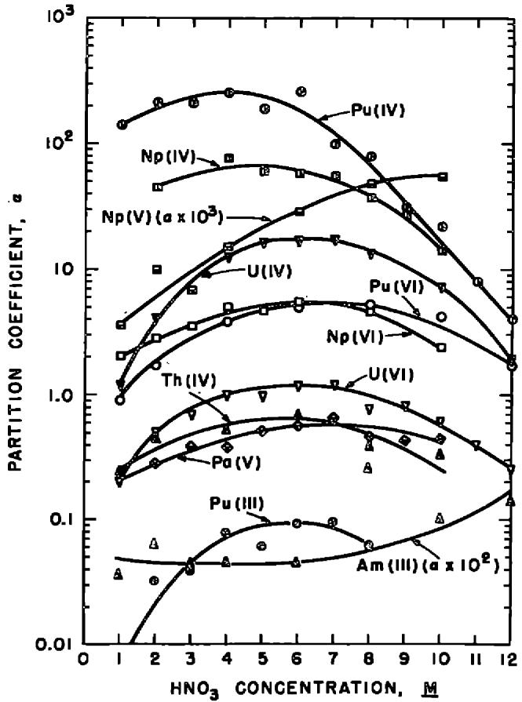  
Figure 52. The extraction of actinide ions by ten volume percent tri- $n$ -octylamine in xylene from aqueous nitric acid solution. After (1) W. E. Keder, J. C. Sheppard, and A. S. Wilson, reference 472 and (2) A. S. Wilson and W. E. Keder, reference 473.

# Conditions:

(1) Ten volume percent TnOA in xylene were stirred with an equal volume of nitric acid of the desired composition for 3-5 minutes at room temperature $(\sim 25^{\circ}C)$ . Phases were separated by centrifugation after contacting.   
(2) Uranium (IV) data only. Aqueous solutions were prepared at each nitric acid concentration by dilution of a stock solution which was $\sim 1\text{M}$ U(IV), $0.1\text{M}$ HClO4, and $\sim 1\text{M}$ Zn(II). Solutions for extraction experiments were $0.015\text{M}$ U(IV). TnOA was contacted by an equal volume of $12\text{M}$ HNO3 followed by three contacts of one volume each of the nitric acid concentration used. Equal volumes of aqueous and amine solutions were contacted at room temperature for 5 minutes. Phases were separated by centrifugation.

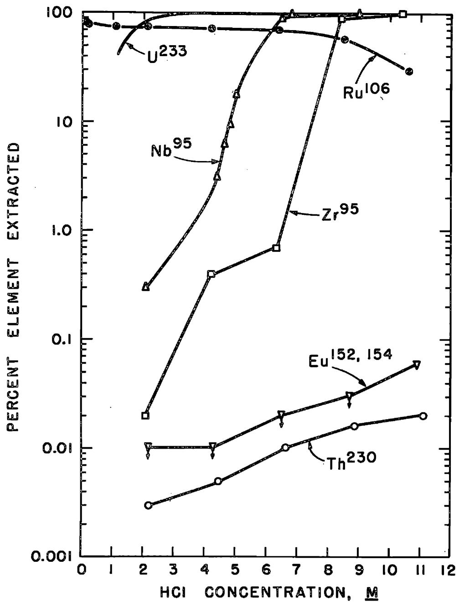  
Figure 53. The extraction of U233, Th230, and fission products by $5\%$ (w/v) trisocetylamine in xylene as a function of HCl concentration. After F. L. Moore, reference 475. Conditions: Equal phase volumes extracted for two minutes at room temperature $(24^{\circ}\mathrm{C})$ .

phase when washed with $0.1\underline{\mathsf{M}}$ HCl solution. Uranium is stripped into the aqueous phase. Excellent extraction $(>90\%)$ of macro amounts of uranium (60.4 mg U/ml initial aqueous concentration) can be obtained from 9M HCl with $20\%$ TiO A in hexone.

Moore has also investigated the extraction of uranium (VI) from acetic acid solution by TiO. Extractions were carried out in the same manner as those from hydrochloric acid solution (figure 53). Aqueous solutions of varying acetic acid concentration containing $2 \times 10^{4}$ alpha counts per minute per ml of U $^{233}$ tracer were extracted with equal volumes of $5 \%$ (w/v) TiO in xylene. It was found that maximum uranium extraction ( $>90\%$ ) is obtained from $0.5 \underline{\underline{M}}$ to LM acetic acid solutions. The addition of $3 \%$ (v/v) butyl cello-solve to the TiO-A-xylene solution inhibits foaming during the extraction process. By increasing the TiO concentration, macro amounts of uranium are efficiently extracted. Greater than $95 \%$ stripping may be achieved by contacting the amine-xylene phase with an equal volume of $0.5 \underline{\underline{M}} \mathrm{HNO}_{3}, 3 \underline{\underline{M}} \mathrm{H}_{2} \mathrm{SO}_{4}, 6 \underline{\underline{M}} \mathrm{H}_{2} \mathrm{SO}_{4}, 1 \underline{\underline{M}} \mathrm{NH}_{4} \mathrm{HCO}_{3}$ , concentrated $\mathrm{NH}_{4} \mathrm{OH}$ , or $0.25 \underline{\underline{M}} \mathrm{HF}-0.25 \underline{\underline{M}} \mathrm{HNO}_{3}$ solution. From $0.5 \underline{\underline{M}}-\underline{\underline{M}}$ acetic acid solution, ruthenium (11.5%), zirconium (27.9%), and niobium (11.1%) are extracted. Separation is made from strontium (alkaline earths), cesium and europium (rare earths), plutonium (III) (trivalent actinides), thorium, protactinium, hafnium, tantalum, iron, lead, nickel, cobalt, manganese, chromium (III), aluminum, copper, zinc, bismuth, tin, and antimony. The selectivity may be improved if the uranium is first precipitated by hydroxide, dissolved with LM acetic acid, and then extracted as previously described. Iron hydroxide is used to carry trace amounts of uranium in the precipitation step.

# Other amine extractants.

As stated at the beginning of this section, many organo-nitrogen compounds have been investigated as extractants of

uranium. A large number of these investigations are reported in ORNL reports (eg., ORNL-1922 $^{477}$ , ORNL-2099 $^{478}$ ). For further information, one may refer to these reports, the summaries $^{304,461-463}$ previously mentioned, or the review by Moore. $^{471}$

# Quaternary ammonium salts.

The enhanced extraction of uranium by hexone containing tetrabutylammonium nitrate $^{78}$ or tetrapropylammonium nitrate $^{379}$ has already been noted (see Hexone). Haeffner, Nilsson, and Hultgren $^{479}$ have also used tetrabutylammonium nitrate to extract uranyl nitrate with chloroform.

Quaternary ammonium salts, unlike amines, may be used to extract uranium from alkaline carbonate solutions. $^{477,478,480}$ The Rohm and Haas compound Quaternary B-10 $^{4}$ converted to the carbonate form has been used successfully to extract uranium from aqueous solutions having carbonate concentrations up to one molar. $^{480}$ Amso G alone or modified with a long-ohain alcohol, tridecanol, and kerosene modified with tridecanol have been used as diluents. The alcohol modifier improves both the phase separation time and the extraction coefficient. $^{480}$ The partition coefficient exhibits a negative two power dependence on carbonate concentration $^{480}$ in accord with the reaction $^{305}$

$$
\begin{array}{l} 2 \left(R _ {4} N\right) _ {2} C O _ {3} \text {o r g} + U O _ {2} \left(C O _ {3}\right) _ {3} ^ {4 -} a q \equiv \left(R _ {4} N\right) _ {4} U O _ {2} \left(C O _ {3}\right) _ {3} \text {o r g} \\ + 2 \mathrm {C O} _ {3} ^ {2 -} \quad \text {a q .} \tag {9} \\ \end{array}
$$

The extraction coefficient is virtually independent of the bicarbonate concentration with the carbonate-bicarbonate total concentration held constant. The coefficient is decreased by an increase in temperature. Uranium may be stripped from the organic phase by solutions of HCl, HCl-NH<sub>4</sub>C1, HNO<sub>3</sub>, and HNO<sub>3</sub>-NH<sub>4</sub>NO<sub>3</sub>. Nitrate solutions

are more effective than chloride. $^{478}$ Sodium hydroxide (2M-3M) may also be used as a stripping agent. $^{480}$

Clifford, et al.481 report the extraction of uranium from aqueous carbonate solutions by (1) forming a singly charged anion, $\mathrm{UO}_2\mathrm{X}_3^-$ , with a complexing agent, and (2) extracting this anion into an organic solvent with a singly charged cation. Extractions were obtained with benzoin 2-oxine, cupferron, hydroxylamine, peroxide, pyrogallol, and 8-quinolinol (oxine). The latter was used for further study. Arquad 2C, $\mathrm{R}_2^{\prime}\mathrm{N}(\mathrm{CH}_3)_2\mathrm{Cl}$ , where $\mathbf{R}^{\prime}$ is about a 16-carbon chain, was found to be the most effective extractant tested. Hexone was found to be the most effective solvent tested. Kerosene gave no extraction. With oxine as complexing agent, the extracted species was identified as $\mathrm{R}_4\mathrm{NUO}_2(\mathrm{Ox})_3$ . The extraction coefficient of uranium was found to increase with increased pH; to increase with increased oxine concentration and with increased $\mathrm{R}_4\mathrm{NCI}$ concentration (to an optimum value); to decrease with increased carbonate concentration. An extraction coefficient, $\alpha_{u}$ , of 10.9 was obtained by extracting two volumes of an aqueous solution containing $0.01\mathrm{M}\mathrm{UO}_2(\mathrm{NO}_3)_2$ , $0.92\mathrm{M}\mathrm{Na}_2\mathrm{CO}_3$ , $0.04\mathrm{M}\mathrm{NaOH}$ , and $0.02\mathrm{M}$ Arquad 2C with one volume of hexone containing $0.100\mathrm{M}$ oxine. Both uranium and oxine were removed from the organic phase by strong acids. Sodium bicarbonate was found the most efficient stripping agent on a counter-current basis.

# CARBOXYLIC ACIDS.

Hök-Bernstrom has studied the extraction of uranium (VI), thorium, and lanthanum by several carboxylic acids: salicylic, methoxybenzoic, 3,5-dinitrobenzoic, and cinnamic. Table XXXI lists the pH at which 50 percent of the metal ions are extracted from perchlorate solutions by O.lM solutions of the carboxylic acid in hexone. Chloroform was found to be a poor solvent for the extraction of

Table XXXI. pH for 50 Percent Extraction of U(VI), Th, La by Carboxylic Acid.a   

<table><tr><td>Acid</td><td>UO2+</td><td>pH50Th4+</td><td>La3+</td></tr><tr><td>Salicylic</td><td>3.1b</td><td>3.33b</td><td>4.93c</td></tr><tr><td>Methoxybenzoic</td><td>3.4b</td><td>3.8b</td><td></td></tr><tr><td>3,5-Dinitrobenzoic</td><td>2.75c</td><td>2.85c</td><td>4.38c</td></tr><tr><td>Cinnamic</td><td>3.60c</td><td>3.07c</td><td>6.13c</td></tr></table>

a After B. Hok-Bernstrom, references 138, 482.

Aqueous phase: metal concentration, $10^{-5}$ M Th or La, $10^{-3}$ M U; ionic strength, O.lM adjusted by the addition of $\mathrm{NaClO}_4$ ; pH adjusted with NaOH and $\mathrm{HClO}_4$ .

Organic phase: O.lM carboxylic acid in hexone.

$\mathrm{V}_{\mathrm{o}} / \mathrm{V}_{\mathrm{a}}, 1;$ temperature, $25^{\circ} \mathrm{C}$ .

$\underline{\underline{\mathsf{b}}}$ Log $\alpha = 0$ , reference 138.   
Calculated from data given in reference 482.

the metals by the carboxylic acids studied.

Cole and Brown have studied the extraction of U(VI), Th, Hf and Zr from aqueous nitrate solutions by salicylic acid in furfural. Satisfactory separations between uranium and thorium were obtained, depending largely upon the two metal concentrations.

Sudarikov, et al. have studied the extraction of U (VI), Th, Ge, La, Y, and Sc from aqueous solutions by salicylic acid in isoamyl alcohol. The uranium complex was observed to extract at pH 1.5 and to be completely extracted at pH 2.5 to 5.0. Up to pH 6.5, $\alpha_{\mathrm{u}}$ was found to decrease from 100 to 0.3-0.4 and to remain unchanged at higher pH values.

Mills and Whetsel have extracted uranium (VI) with perfluorobutyric acid dissolved in diethyl ether.

CHELATING AGENTS. The chelating agents described below are listed in the same general order as they may be found in the book by Morrison and Freiser.[290]

$$
\text {A c e t y l a c e t o n e}, \mathrm {C H} _ {3} - \underset {\mathrm {C}} {\overset {\mathrm {O}} {\underset {\mathrm {B}} {\rightleftharpoons}} - \mathrm {C H} _ {2}} - \underset {\mathrm {C}} {\overset {\mathrm {O}} {\underset {\mathrm {B}} {\rightleftharpoons}}} - \mathrm {C H} _ {3}
$$

The extraction of both uranium (VI) and (IV) from perchlorate solutions with acetylacetone as chelating agent has been investigated by Rydberg. The percentage extracted is given as a function of equilibrium pH in figures 54-A, -B, and -C for the three solvents, chloroform, benzene, and hexone, respectively. The extraction of other actinides, fission products, and hafnium is also included in the figures. 14b,51, 486-488 Strontium and potassium are poorly extracted by acetylacetone into chloroform. 487 Lanthanum and samarium are poorly extracted by the chelating agent into all three solvents. 487

Krishen has investigated the extraction of uranium (VI) with acetylacetone used both as chelating agent and solvent. The results are given in figure 55A together with the extraction curves of several other metals. The effect of masking agents, ethylenediaminetetraacetate, fluoride, and tartrate, on the extraction of these metals is given in figures 55-B-C and D, respectively.

The extraction of uranium by acetylacetone-chloroform in the presence of sodium chloride and EDTA has been studied by Tabushi.490 Sodium chloride increases the extraction yield and broadens the favorable pH range. EDTA permits the separation of uranium from thorium and fission products by more effective masking of the latter. Uranium has also been extracted with acetylacetone using butylacetate as solvent.491

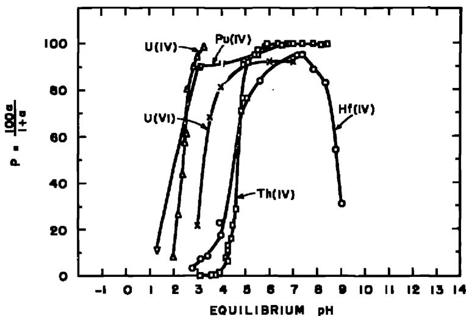  
Figure 54-A. The extraction of various elements from O.1M NaClO $_4$ solutions by an equal volume of acetylacetone-chloroform solution at $25^{\circ}\mathrm{C}$ . Acetylacetone concentrations used: U(VI), 0.021OM [HAa]aq; U(IV), 0.50M [HAa]°org; Pu(IV), 1.00M [HAa] init; Th(IV), 0.0489M [HAa]init; Hf(IV), 0.050M [HAa]°org. After J. Rydberg, references 51, 486-488.

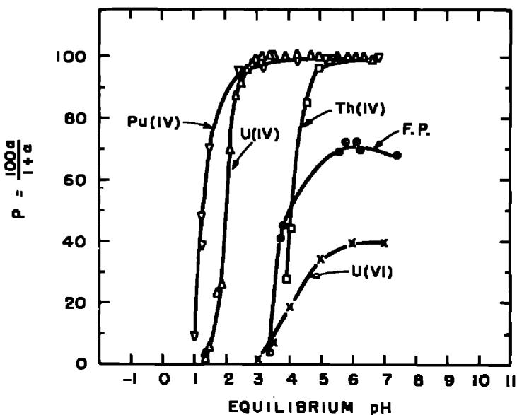  
Figure 54-B. The extraction of various elements from O.lM NaClO₄ solutions by an equal volume of acetylacetone-benzene solution at 25°C. Acetylacetone concentrations used: U(VI), O.021OM [Haa]aq; U(IV), O.072M [Haa]aq; Pu(IV), 1.00M [Haa]init; Th(IV), 0.0673M [Haa]org; F.P., 0.70M [Haa]org. F.P. irradiation time = cooling time = 1 year. After J. Rydberg, references 51, 487, 488, 492 and J. Rydberg and B. Rydberg, reference 14b.

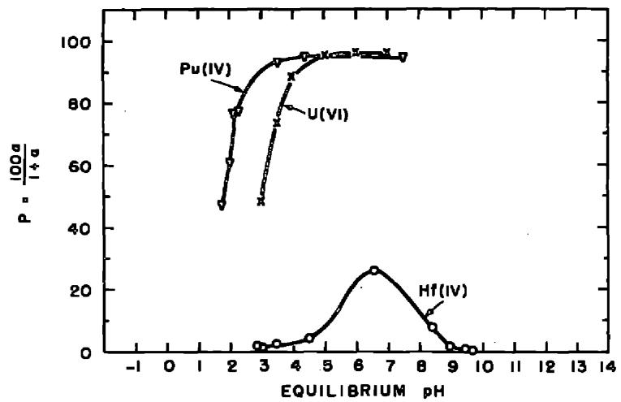  
Figure 54-C. The extraction of various elements from O.lM NaClO4 solutions by an equal volume of acetylacetone-hexone solution at $25^{\circ}\mathrm{C}$ . Acetylacetone concentrations used: U(VI), 0.021OM [HAa]aq; Pu(IV), 1.00M [HAa]init; Hf, 0.050M [HAa]org. After J.-Rydberg, references 51, 487, 488.

$$
\underline {{\text {B e n z o y l a c e t o n e}}}, \varphi - \underline {{\mathbf {C}}} - \underline {{\mathbf {C H} _ {2}}} - \underline {{\mathbf {C}}} - \underline {{\mathbf {C H} _ {3}}}.
$$

Stary<sup>493</sup> has determined the stability constants of uranyl acetate, oxalate, tartrate, and EDTA complexes. The effect of these ions was observed on the extraction of uranium (VI) from $0.1\underline{M}$ $\mathrm{NaClO}_4$ solutions by $0.1\underline{M}$ benzoylacetone in benzene.

$$
\underline {{2 - A c e t o a c e t y l p y r i d i n e ,}} \left(\underset {N} {\bigcap} - \underset {C} {\overset {0} {\mathbf {C}}} - \underset {2} {\mathrm {C}} - \underset {C} {\overset {0} {\mathbf {C}}} - \underset {3} {\mathrm {C H}} _ {3}\right).
$$

The extraction of uranium from a $0.2\underline{\mathbf{N}}$ NaOH, $0.2\underline{\mathbf{N}}$ acetic acid solution at pH 5.0 to 6.5 by $0.12\%$ acetoacetylpyridine in butylacetate is reported by Hara.494

$$
\underline {{\text {D i b e n z o y l m e t h a n e}}} _ {1} \quad \begin{array}{c c c} 0 & 0 \\ \text {n} & \text {n} \\ \varphi - C & - C H _ {2} & - C \end{array} - \varphi .
$$

Uranium (VI) $(0.05 - 0.5\mathrm{mg})$ is extracted from aqueous solution by a $0.5\%$ solution of dibenzoylmethane in ethyl acetate. $^{495}$ In the presence of other cations, the extraction is made more selective by the addition of complexone III (EDTA sodium salt). Excess complexone is complexed by a $1\%$ $\mathrm{Ca(NO_3)_2}$

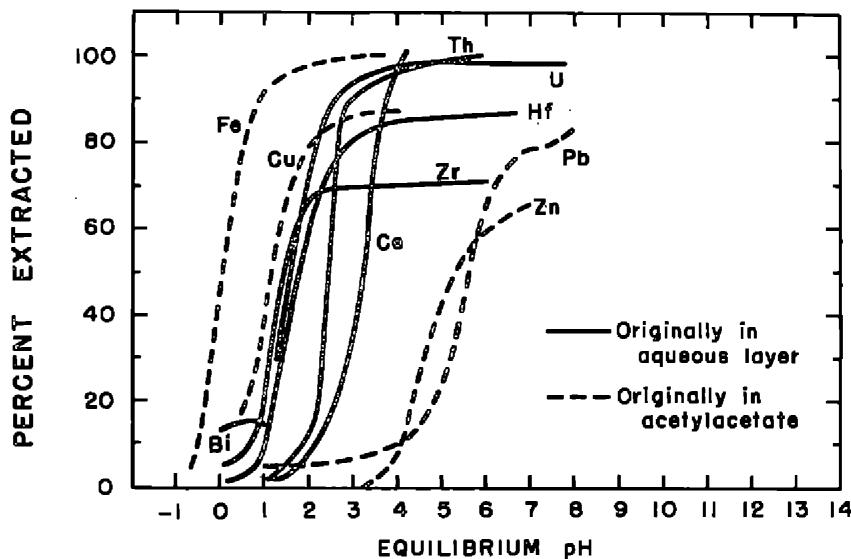  
Figure 55-A. The extraction of various metals from aqueous solution by an equal volume of acetylacetone at $25^{\circ}\mathrm{C}$ . Solid lines indicate the metal was originally contained in the aqueous phase. The dashed lines indicate the metal was originally in the organic phase. The pH was adjusted to the desired value by sulfuric acid or sodium hydroxide. After A. Krishen, reference 489.

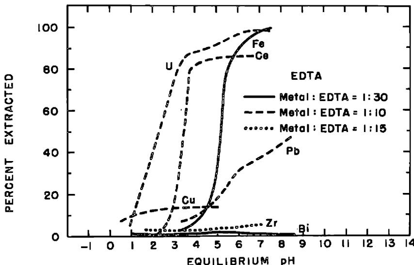  
Figure 55-B. The effect of ethylenediaminetetraacetate (EDTA) on the extraction of various metals from aqueous solution by an equal volume of acetylacetone at $25^{\circ}\mathrm{C}$ . The mole ratio of metal to EDTA is shown by the line texture. After A. Krishen, reference 489.

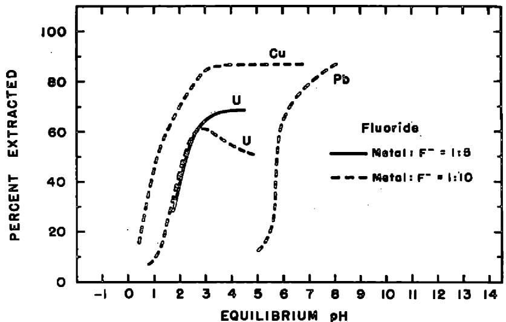  
Figure 55-C. The effect of fluoride on the extraction of various metals from aqueous solution by an equal volume of acetylacetone at $25^{\circ}\mathrm{C}$ . The mole ratio of metal to fluoride is shown by the line texture. After A. Krishen, reference 489.

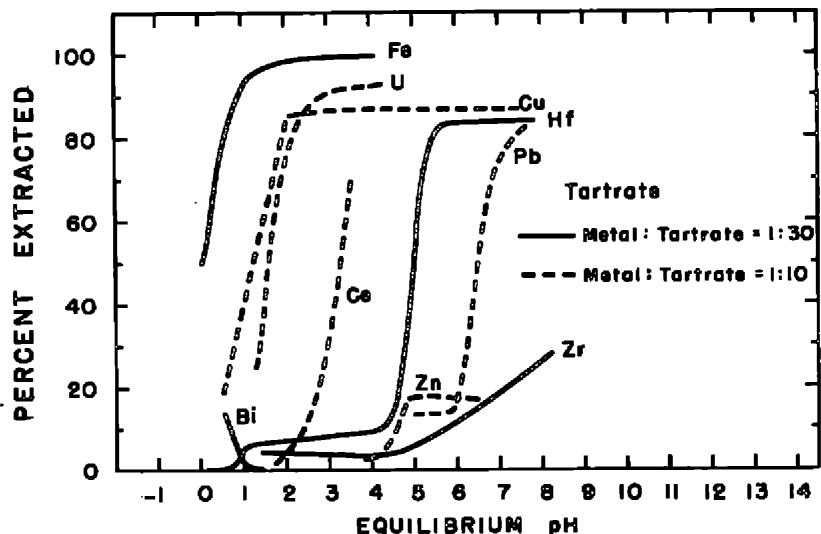  
Figure 55-D. The effect of tartrate on the extraction of various metals from aqueous solution by an equal volume of acetylacetone at $25^{\circ}\mathrm{C}$ . The mole ratio of metal to tartrate is shown by the line texture. After A. Krishen, reference 489.

solution. The resulting solution is neutralized with ammonia to pH 7 and is then contacted several times with the extracting solution.

The dibenzoylmethane extraction of uranium with chloroform, benzene, and carbon tetrachloride has been investigated by Moucka and Stary.

$$
\frac {\text {T h e n o y l t r i f l u o r o a c e t o n e (T T A) ,}}{\left| \begin{array}{l} \square \\ S \end{array} \right| - C - C H _ {2} - C - C F _ {3}}.
$$

Considerable effort has been expended in the study of TTA as an extractant for uranium. King, $\frac{497}{500}$ Orr, $\frac{498}{501}$ Heisig and Crandall, $\frac{499}{500}$ Walton, et al., $\frac{500}{500}$ and Peterson have made fundamental studies on the extraction of uranium (VI) from aqueous perchlorate $\frac{497,498}{500}$ and nitrate $\frac{499,500}{500}$ media by TTA dissolved in benzene $\frac{497,498,500,501}{500}$ hexone, $\frac{499}{500}$ cyclohexanone, $\frac{499}{500}$ and pentaether. The partition coefficient, $a_{u(VI)}$ , is increased by increased TTA concentration in the organic phase; decreased by increased initial uranium concentration. The effect of pH and various salting agents on the extraction of uranium (VI) and thorium from nitrate solutions by 0.2 M TTA in benzene is shown in figure 56. $\frac{502}{502}$ Salting agents increase the extraction of uranium by TTA-benzene from low pH solutions. There is no apparent effect on the extraction of thorium with or without $\underline{\text{IN}}$ Al $(\text{NO}_3)_3$ . A $\frac{4\text{M}}{\text{NH}_4\text{NO}_3}$ concentration in the aqueous phase (not shown), in fact, depresses the extraction of thorium. The effect of foreign anions on the extraction of U(VI) and U(IV) from aqueous perchlorate solutions by 0.5 M TTA in benzene is shown in figures 57-A and 57-B, respectively. Poskanzer and Foreman have recently reviewed the extraction of elements throughout the periodic table by TTA. The pH values for 50 percent extraction into an equal volume of 0.2 M TTA in benzene at room temperature or $25^{\circ}\text{C}$ . listed by these authors

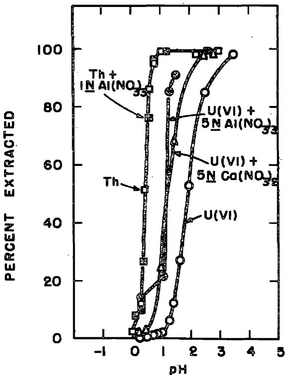  
Figure 56. The effect of pH and salting-out agents on the extraction of uranium (VI) and thorium by TTA-benzene solutions. After E. K. Hyde and J. Tolmach, reference 502. Conditions: An equal volume of 0.2M TTA in benzene was stirred vigorously for 20 minutes with an aqueous solution containing 0.003M thorium or trace amounts of uranium-233 with or without the salting-out agent indicated at the pH given.

are: for U(VI) from dilute nitric acid, $\frac{502}{\mathrm{pH}_{50}} = 1.97$ ; for U(VI) from $\mathrm{HCIO}_4 + \mathrm{LiClO}_4$ , $\mu = 2$ , $\mathrm{pH}_{50} = 1.79$ ; for U(IV) from $\mathrm{HCIO}_4 + \mathrm{NaClO}_4$ , $\mu = 2$ , $\mathrm{pH}_{50} = -0.58$ ; for U(IV) from $\mathrm{HNO}_3$ , $\frac{504}{\mathrm{pH}_{50}} = -0.31$ .

Irving and Edgington have observed a synergistic enhancement of the uranium partition coefficient with tributylphosphate (TBP) - or tributylphosphine oxide (TBPO) - TAmixtures. The results, $\alpha_{\mathrm{u}}$ versus percent TBP or TBPO in the extractant mixture, are given in figure 58.

The analysis of metals with TTA has been reviewed by Moore.505 Sheperd and Meinke506 have published,with references, the extraction curves of a large number of elements with TTA.

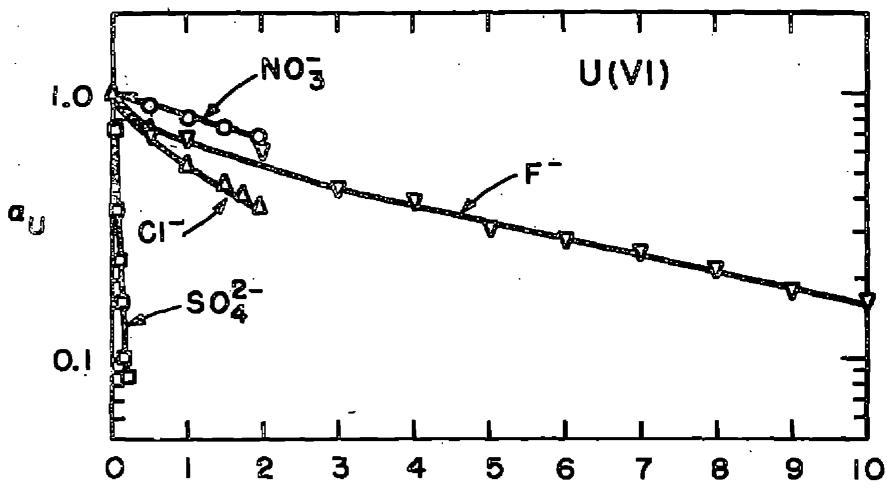  
NORMALITY COMPLEXING AGENT

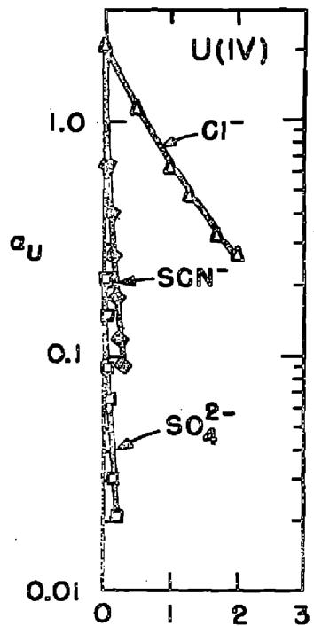  
Figure 57-A. The effect of foreign anions on the extraction of uranium (VI) from aqueous perchlorate solution by TTA-benzene. After R. A. Day, Jr. and R. M. Powers, reference 77. Conditions: Organic phase - 0.50M TTA in benzene pre-treated by shaking with dilute perchloric acid overnight. Aqueous phase - $\sim$ 10-5M U233, anion at concentration indicated, 0.05M HC104, plus sufficient NaClO4 to maintain an ionic strength of 2.0. Equal phase volumes shaken together for 2 hours at $25^{\circ}\mathrm{C}$ .   
NORMALITY COMPLEXING AGENT  
Figure 57-B. The effect of foreign anions on the extraction of uranium (IV) from aqueous perchlorate solution by TTA-benzene. After R. A. Day, Jr., R. N. Wilhite, F. D. Hamilton, reference 58. Conditions: Organic phase - 0.05M TTA in benzene pre-treated with dilute acid. Aqueous phase - 0.0016M - 0.0037M U(IV), anion at concentration indicated, 1.000M H+ (HClO4 used for all experiments except chloride in which HCl was used), plus sufficient NaClO4 to maintain an ionic strength of 2.0. Equal phase volumes shaken together for 30 minutes.

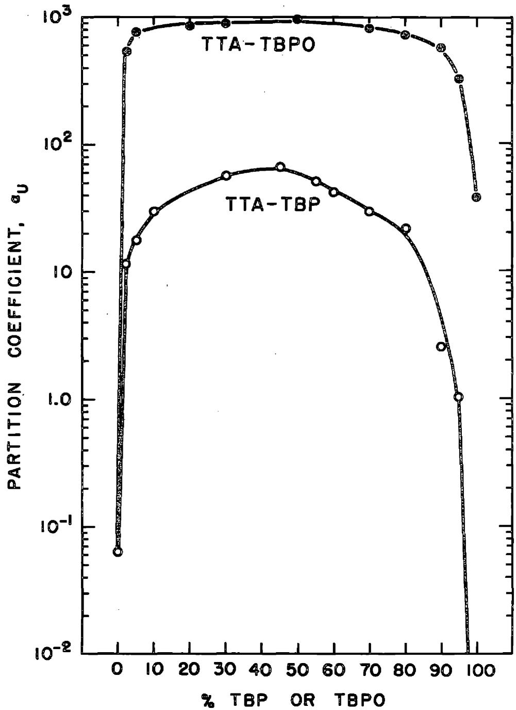  
Figure 58. The synergistic enhancement of the uranium (VI) part1- tion coefficient between aqueous nitrate solutions and mixtures of TTA and TBP or TBPO in cyclohexane. After H. Irving, D. N. Edgington, reference 451. Conditions: Organic phase - 0.02M mixture of TTA and TBP or TBPO in cyclohexane. Aqueous phase - 1.025 x 10-4M U233, 0.01N HNO3. Equal phase volumes shaken together for 24 hours at room temperature $(21^{\circ} - 23^{\circ}\mathrm{C})$

Substituted 1-phenyl-3-methyl-4-acyl-pyrazolones-5,

$$
\begin{array}{c} \mathrm {C H} _ {3} - \mathrm {C} - \mathrm {C H} - \mathrm {C} = 0 \\ \mathrm {N} \\ \mathrm {N} \\ \mathrm {C} = 0 \\ \mathrm {C} _ {6} ^ {\mathrm {H}} _ {5} \end{array}
$$

Skytte Jensen $^{160}$ has studied the possibility of using substituted 1-phenyl-3-methyl-4-acyl-pyrazolones-5 as extractants for a number of elements including uranium (VI), thorium, and lanthanum. The pH for $50\%$ extraction of trace amounts of these elements by a LM solution of chelating agent in chloroform is given in Table XXXII. The pH $_{50}$ for TTA is given for comparison.

8-Quinolinol (8-hydroxyquinoline, oxine)

"507 and Dyrssen and Dahlberg have studied the extraction of uranium (VI) from aqueous perchlorate solutions by oxine dissolved in chloroform or hexone. Results of the latter group, percent extracted versus final aqueous pH, are shown in figure 59. These results are in agreement with those of "507 (0.1M oxine - CHCl₃, 10⁻³M U, aqueous perchlorate solution, μ = 0.1M, 25°C). No appreciable difference was observed with uranium concentrations of 10⁻⁴ and 10⁻³M (open and solid circles, respectively, in figure 59). Chloroform is shown to be a slightly better solvent for the uranyl-oxine complex than hexone. The extraction curves for Th, La and Sm are also shown in the figure. A tabulation of pH for 50% extraction of various metal oxinates by chloroform has been made by Dyrssen and Dahlberg and is reproduced in Table XXXIII.

The extraction of uranium (VI) by solutions of $1\%$ oxine in chloroform from buffered aqueous solutions is shown in figure 60 as a function of aqueous $\mathsf{pH}$ .

Table XXXII. pH for $50\%$ Extraction of Tracer Amounts of Uranium (VI), Thorium, and Lanthanum by 1M Solutions of Substituted (R) 1-Phenyl-3-methyl-4-acyl-pyrazolones-5 in Chloroform.a   

<table><tr><td>R</td><td colspan="3">pH50 of Metal Ion</td></tr><tr><td></td><td>UO2+</td><td>Th4+</td><td>La3+</td></tr><tr><td>acetyl</td><td>-0.15</td><td>0.10</td><td>2.60</td></tr><tr><td>propionyl</td><td>0.05</td><td>0.05</td><td>2.65</td></tr><tr><td>butyryl</td><td>0.52</td><td>0.42</td><td>2.47</td></tr><tr><td>valleryl</td><td>0.24</td><td>0.24</td><td>2.84</td></tr><tr><td>capronyl</td><td>0.7</td><td>-0.25</td><td>3.15</td></tr><tr><td>ethoxycarbonyl</td><td>1.00</td><td>not meas.</td><td>2.50</td></tr><tr><td>chloroacetyl</td><td>0.65</td><td>0.05</td><td>2.28</td></tr><tr><td>trifluoracetyl</td><td>0.8</td><td>not meas.</td><td>not meas.</td></tr><tr><td>benzoyl</td><td>1.0</td><td>0.4</td><td>2.45</td></tr><tr><td>p-bromobenzoyl</td><td>0.9</td><td>0.30</td><td>2.3</td></tr><tr><td>p-nitrobenzoyl</td><td>-</td><td>-</td><td>-</td></tr><tr><td>TTA</td><td>0.70</td><td>-0.30</td><td>3.75</td></tr></table>

Values for $\mathsf{pH}_{50}$ were calculated from data presented by B. Skytte Jensen, reference 160. Aqueous perchlorate media.

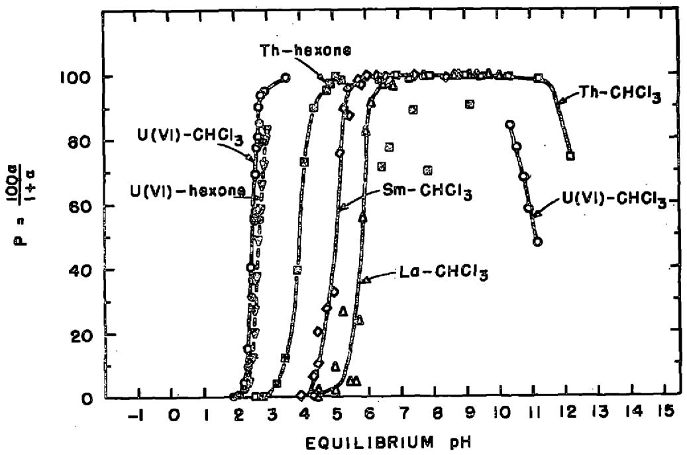  
Figure 59. The extraction of tracer amounts of uranium (VI), thorium, samarium, and lanthanum from perchlorate solution by solutions of oxine-chloroform or oxine-hexone. After D. Dyrssen and V. Dahlberg, reference 143; D. Dyrssen, references 508 and 509. Conditions: Aqueous phase - ionic strength = 0.1M with NaOH, HClO4, and NaClO4; for uranium, open circles represent 0.0001M U concentrations, solid circles and triangles, 0.001M U. Organic phase - oxine concentrations: for U, 0.100M; for Th, 0.050M; for La and Sm, 0.5M; solvent indicated. Equal phase volumes equilibrated at $25^{\circ}\mathrm{C}$ .

# Substituted quinolinols.

Rulfs, et al.510 and Dyrssen, et al.514 have studied the extraction of uranium by dihalogen derivatives of 3-quinolinol. The uranium extraction curves with $1\%$ solutions of 5,7-dichloro- and 5,7-dibromo-8-quinolinol in chloroform are shown as functions of final aqueous pH in figure 60.510 Use of the halogen-substituted oxines permits extraction of uranium from more acidic aqueous solutions. Similar curves for uranium, thorium, and lanthanum are given in figure 61 for extraction with 0.05M 5,7-dichloro-oxine in chloroform.514

Hynek has studied the extraction of various metals by 8-hydroxyquinaldine (2-methyl-8-quinolinol). The uranium complex was found to be extracted, but not quantitatively,

Table XXXIII. pH for $50\%$ Extraction of Metal Oxinates with Chloroform.a   

<table><tr><td>Metal ion</td><td>pH</td><td>Procedure</td><td>Reference</td></tr><tr><td>Ga3+</td><td>1.0</td><td>V aq = V org, 0.1M total oxine.</td><td>511</td></tr><tr><td>In3+</td><td>2.1</td><td>Anions in aqueous solution: chloride.</td><td></td></tr><tr><td>Al3+</td><td>3.4</td><td></td><td></td></tr><tr><td rowspan="2">Fe3+</td><td>1.6</td><td>Four successive extractions with Cu2+</td><td>512</td></tr><tr><td>2.0</td><td>0.01M solution of oxine in CHCl3.</td><td></td></tr><tr><td rowspan="2">In3+</td><td>2.2</td><td>Anions in aqueous solution: sulfate, B13+</td><td>3.0</td></tr><tr><td>3.0</td><td>acetate, nitrate, chloride.</td><td></td></tr><tr><td>Al3+</td><td>4.2</td><td></td><td></td></tr><tr><td>Ni2+</td><td>6.1</td><td></td><td></td></tr><tr><td>Co2+</td><td>6.5</td><td></td><td></td></tr><tr><td>Sn4+</td><td>0.0</td><td>V aq = 5V org, 0.07M oxine.</td><td>513</td></tr><tr><td rowspan="2">Mo</td><td>1.0</td><td>Anions in aqueous solution: Fe3+</td><td>2.0</td></tr><tr><td>2.0</td><td>acetate, chloride, tartrate.</td><td></td></tr><tr><td>Cu</td><td>2.1</td><td></td><td></td></tr><tr><td>Ni</td><td>3.7</td><td></td><td></td></tr><tr><td>Al</td><td>3.8</td><td></td><td></td></tr><tr><td>Mn2+</td><td>6.4</td><td></td><td></td></tr><tr><td>Hf4+</td><td>1.3*</td><td>V aq = V org, 0.1M total oxine.</td><td>143</td></tr><tr><td rowspan="2">UO2+</td><td>2.6</td><td>Anions in aqueous solution: Th4+</td><td>3.1</td></tr><tr><td>5.7</td><td>perchlorate.</td><td></td></tr><tr><td>Sm3+</td><td>6.5</td><td></td><td></td></tr><tr><td>La3+</td><td></td><td></td><td></td></tr></table>

$\underline{\underline{\mathbf{a}}}$ After D. Dyrassen and V. Dahlberg, reference 143.   
\* pH = -log[H+] + 0.1.

by chloroform from an aqueous phase at pH 9.5 containing tartrate and acetate ions. Cyanide or $\mathrm{H}_2\mathrm{O}_2$ prevented extraction.

1-Nitroso-2-naphthol,

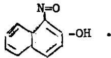

Alimarin and Zolotov have investigated the extraction of uranium (VI) by organic solutions of 1-nitroso-2-naphthol. It was found that a mole ratio of naphthol to $\mathrm{U}_{3} \mathrm{O}_{8}$ of 125

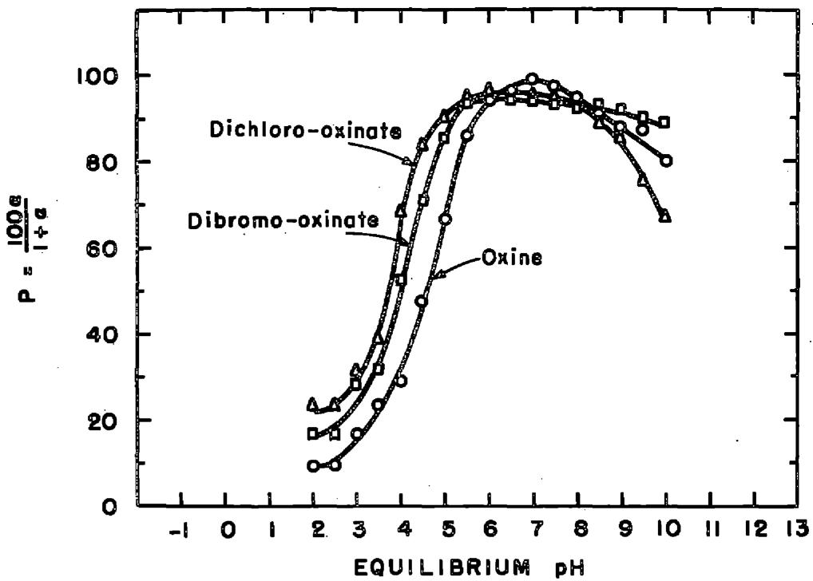  
Figure 60.

The extraction of uranium (VI) by oxine and its 5,7-dichloro-and 5,7-dibromo-derivatives. The percent extracted, P, was calculated from the values of the distribution coefficient given in the paper by C. L. Rulfs, A. K. De, Jr., J. Lakritz, and P. J. Elving, reference 510.

# Conditions:

2.1 mg of uranium in 10 ml and 25 ml of an approximately 1M buffer solution were shaken 6 to 8 minutes with 20 ml of a $1\%$ oxine-chloroform solution. The aqueous phase was rinsed twice with 5 ml of chloroform. The pH of the final aqueous phase was measured.

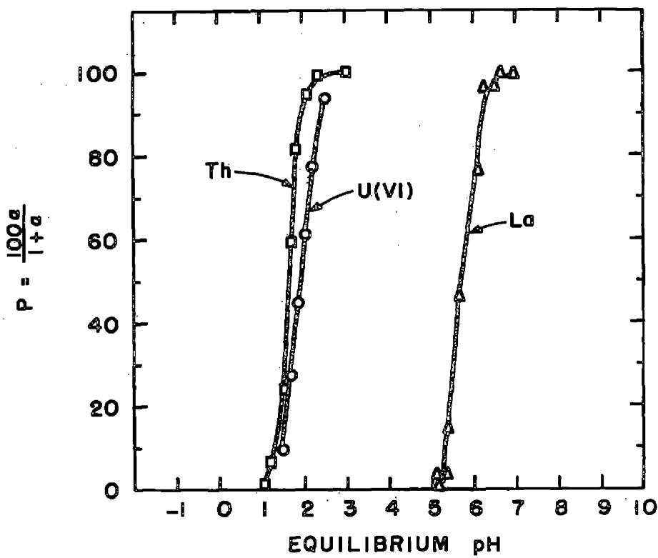  
Figure 61.

The extraction of tracer amounts of U (VI), Th, and La by 0.05M 5,7-dichloro-oxine dissolved in chloroform from 0.1M HClO₄ - NaClO₄ solutions at 25°C.

After D. Dyrssen, M. Dyrssen, and E. Johansson, reference 514.

and a volume phase ratio of organio to aqueous of 0.25 is more than adequate to give quantitative extraction of uranium into isoamyl alcohol at a pH of 5 to 6. Two minute shaking is sufficient for quantitative uranium extraction. Ethyl acetate, n-butanol, diethyl ether, amyl acetate, benzene, and chloroform also extract the uranium-naphtholate complex.

Quantitative extraction is obtained with ethyl acetate and n-butanol at a pH of 3.0 to 8.5; with isoamyl alcohol at pH 4.5 to 7.5. Quantitative extraction can be achieved at temperatures of $0^{\circ}$ to $100^{\circ}\mathrm{C}$ . Chloride or nitrate ions at con

centrations up to $0.2\underline{\mathbf{M}}$ do not seriously interfere with the extraction of uranium. Iron (III) is completely extracted; vanadium (IV) and (V) and thorium are partially extracted. The extraction of all four metal ions is considerably suppressed by complexing with complexone III (sodium salt of EDTA). The pH range for quantitative separation of u-ranum with isoamyl alcohol is increased in the presence of complexone III ( $\sim 25$ mg complexone per mg of metal) to 6.5 - 9. Aluminum and zinc are not extracted with 1-nitroso-2-naphthol.

Dyrssen, et al.517 have studied the extraction of uranium and thorium from aqueous perchlorate solutions $(\mu = 0.1\underline{\mathsf{M}})$ by O.lM 1-nitroso-2-naphthol in chloroform. Fifty percent of the uranium was extracted at pH 3.07 and fifty percent of the thorium at pH 1.66. Lanthanum and samarium were not extracted. Other metals that have been extracted as nitroso-naphtholates include Mn(II), Fe(II), Co, Ni, Cu(II), Pd(II), Ag, Cd, Hg(II), Pu(IV)517 and Np(V).518

Ammonium salt N-nitrosophenylhydroxylamine (cupferron),

$$
\begin{array}{l} \mathrm {N} = 0 \\ \mathrm {N} - \mathrm {O} ^ {-}, \mathrm {N H} _ {4} ^ {+}. \end{array}
$$

Cupferron is an important reagent in the analytical separation of uranium. The reagent precipitates uranium (IV) from acidic $\left(\mathrm{H}_{2} \mathrm{SO}_{4}\right.$ or HCl) solution but not uranium (VI). By converting uranium to its two oxidation states, separation can be made alternatively from elements not precipitated by cupferron and from those precipitated by the reagent. The uranium (IV) cupferrate complex, U(Cup), was found by Augen $^{519}$ to be soluble in chloroform and neutral organic solvents. Furman, et al. $^{250}$ found milligram amounts of uranium (IV) to be incompletely extracted from aqueous acid solution by hydrogen cupferrate in chloroform but to be almost completely extracted by ethereal hydrogen cup-

ferrate; i.e., cupferron extracted by ether from an acid solution. Ethereal hydrogen cupferrate was also found to extract quantitatively macroamounts of uranium (IV) from $(1 + 19)$ sulfuric acid containing hydroxylamine hydrochloride and submilligram amounts from $(1 + 19)$ sulfuric acid in the presence of saturated mercury-zinc amalgam.[250] The partition coefficient, $a_{u(IV)}$ , is increased with increased cupferrate concentration and is decreased with increased acid concentration.[250]

A uranium (VI) cupferrate complex is precipitated by the reagent from neutral solutions. There appear to be two forms, one of which is soluble in ethyl ether.250 From $(1 + 9)$ sulfuric acid, milligram amounts of uranium (VI) are extracted by an equal volume of chloroform with an excess of cupferron present.250

The extraction of uranium (VI) cupferrate from aqueous perchlorate solution by hexone and chloroform is given in figure 62 as a function of the pH of the final aqueous solution. Chloroform is a poor solvent for the complex. Hexone is better, but quantitative extraction is not achieved by a single contact of the solvent with an equal volume of the aqueous solution. The extraction curves for Th, $508 \mathrm{~Sm}$ , and La $509$ are also given in the figure.

The properties of other metal cupferrates have been reviewed by Furman, Mason, and Pekola.[250]

N-Benzoylphenylhydroxylamine,

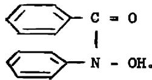

Dyrssen $^{520}$ has studied the extraction of uranium (VI) with N-benzoylphenylhydroxylamine in chloroform from aqueous perchlorate solutions. The results, P versus pH, are shown in figure 63 together with those for thorium and lanthanum.

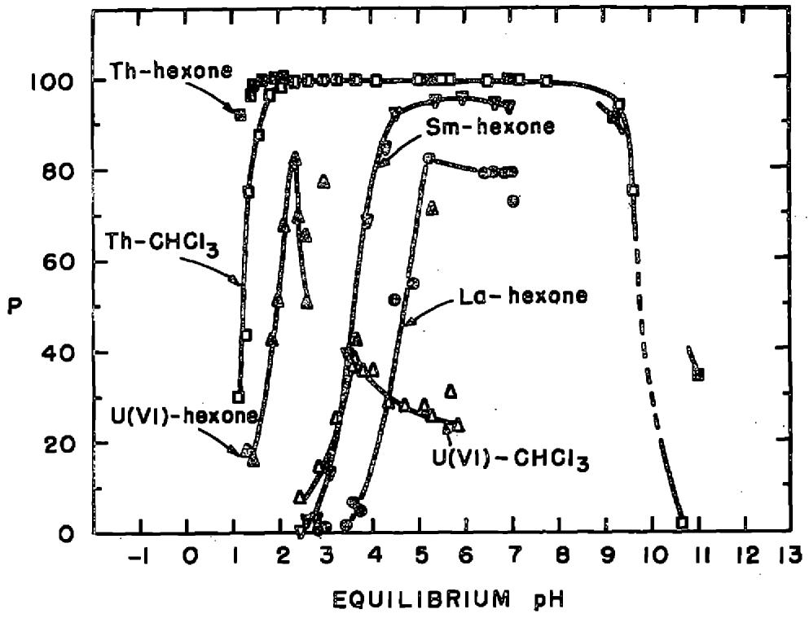  
Figure 62.

The extraction of tracer amounts of uranium (VI), thorium, samarium, and lanthanum cupferrates from perchlorate solutions by hexone or chloroform.

After D. Dyrssen and V. Dahlberg, reference 143; D. Dyrssen, references 508 and 509.

Conditions:

Aqueous phase - ionic strength = 0.1M with NaOH, HClO $_h$ and NaClO $_4$ . Na cupferrate added to aqueous phase: for U, 0.01M, for Th, Sm, and La, 0.005M.

Equal volumes of aqueous and organic solvent indicated equilibrated at $25^{\circ}\mathrm{C}$ .

1-(2-Pyridylazo)-2-naphthol (PAN),

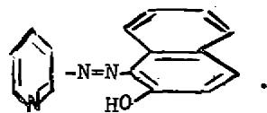

1-(2-Pyridylazo)-2-naphthol forms colored complexes (generally red) with a large number of polyvalent metal ions.521 The uranyl-PAN complex is insoluble in alcohols, carbon tetrachloride, chloroform, and ethers.522 Ortho

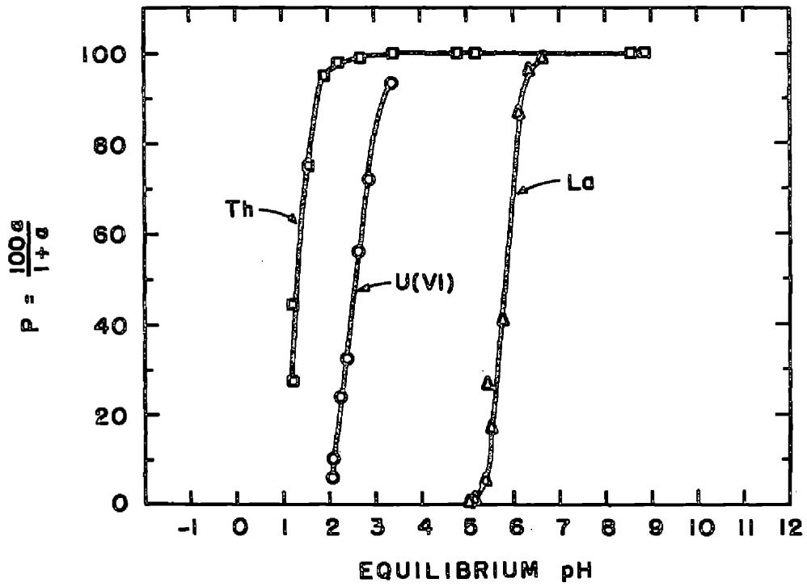  
Figure 63.

The extraction of tracer amounts of uranium (VI), thorium,

and lanthanum from perchlorate solutions by N-benzoyl-

phenylhydroxylamine dissolved in chloroform.

After D. Dyrssen, reference 520.

Conditions:

Aqueous phase - ionic strength = 0.1M with HClO₄, NaOH, and NaClO₄. The aqueous phase was sometimes buffered with 1 ml of 0.1M anilinium perchlorate, sodium acetate, or hydrozinium perchlorate per 15 ml.

Organic phase - 0.1M N-benzoylphenylhydroxylamine in chloroform.

Temperature, $25^{\circ}C$

or meta-dichlorobenzene and bromobenzene are excellent solvents for the complex. The maximum color of the uranyl-PAN complex is developed at pH 10. At pH less than 5 or greater than 12 little complex formation occurs. Uranium may be selectively separated from a large number of elements by PAN-dichlorobenzene extraction in the presence of masking

agents (EDTA, trinitrilotriacetic acid, cyanide) and with proper pH control.

Sodium diethyldithiocarbamate (DDTC), $(\mathsf{C}_2\mathsf{H}_5)_2\mathsf{N} - \mathsf{C}$ Na+.

Bode523 reports that the U(VI) - DDTC complex, unlike other heavy metals, is soluble in water. A precipitate is formed only with high concentrations of uranium and reagent. The uranyl-DDTC complex is practically inextractable by carbon tetrachloride but is readily extracted by isoamyl alcohol, diethyl ether, and amyl acetate.523 Others have used hexone,524 ethyl acetate,525 chloroform,526 and benzene527 to extract the complex. Employing the above solvents, the U(VI)-DDTC complex has been extracted from aqueous solutions having a wide range of pH, e.g., pH 1-5527 and pH 6.5-8.3.525 Sodium tartrate has been used to prevent hydrolysis at higher pH values.525 The U(VI)-DDTC complex is extracted in the presence of EDTA. Uranium may then be separated from elements, such as thorium,that form strong EDTA complexes.524,527,528 Uranium may be further separated from those elements extracted as DDTC complexes by stripping the former into an ammonium carbonate solution.196,525

Disalicylethylenedimine, CH=N-CH2CH2-N=CHHOH

Dyrsen529 reports that uranium (VI) is somewhat extractable $(60 - 90\%)$ with solutions of disalicylethylenedilimine in chloroform. Hafnium and thorium are extracted $(90 - 99\%)$ from weakly acidic solutions (pH 1.5) with a 0.1-0.5M chloroform solution of the reagent. Lanthanum and samarium are not extracted.

Antipyrine,

$$
\mathrm {O} = \begin{array}{c c c} \mathrm {C H} & = & \mathrm {C} - \mathrm {C H} _ {3} \\ | & | & \\ \mathrm {N} & \mathrm {N} - \mathrm {C H} _ {3} \\ | & | & \\ \mathrm {C} _ {6} ^ {\mathrm {H} _ {5}} & \end{array}
$$

Rodden<sup>191</sup> has mentioned that chloroform extracts uranyl complexes with antipyrine. Reas<sup>380</sup> has reported that both uranium (VI) and uranium (IV) are almost completely extracted with antipyrine-chloroform solutions from perchlorate media. Uranium may be separated from thorium using the antipyrine-chloroform system. From an aqueous solution of 20.6 ml containing 5 mmoles of Th(NO₃)₄, 1 mmole of UO₂(NO₃)₂ and 48.6 mmoles of HCl, 93-94% of the uranium and only 5% of the thorium was found to extract with 36 mmoles of antipyrine in chloroform. The uranyl-antipyrine complex is soluble in nitrobenzene, but not very soluble in hexone.

Tropolone,

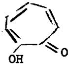

The extraction of U(VI) and Th from 0.1M perchlorate solutions by 0.05M tropolone in chloroform is given as a function of pH in figure 64.530 The pH of $50\%$ extraction for U(VI), Th, and Y under the above conditions is approximately 0.9, 1.1, and 4.0, respectively. Less than $50\%$ lanthanum is extracted at pH 6.5.530

Dyrssen $^{531}$ reports the extraction of a uranium (VI)-beta-isopropyl tropolone complex with chloroform and hexone.

# Ion Exchange.

A number of articles are available in

which the behavior of uranium toward ion exchange resins is reviewed and in which reference to much of the literature is given. Hyde,339 Katz and Seaborg,2 Choppin,532 Palei,197 and Kuznetsov, et al.200 have reviewed the ion exchange of a number of the actinide elements including uranium. Steele and Taverner198 have outlined several anion exchange separations of uranium. Clegg and Foley533 have described the use of ion exchange resins in the processing of uranium ores.

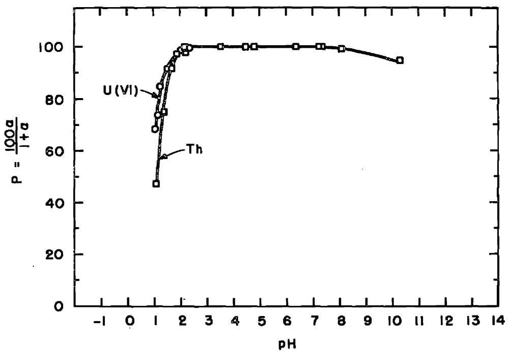  
Figure 64.

The extraction of trace amounts of uranium (VI) and thorium from $0.1\underline{M}$ perchlorate solution by $0.05\underline{M}$ tropolone in chloroform at $25^{\circ}C$ .

After D. Dyrssen, reference 530.

In the following paragraphs, the distribution of uranium (and of other elements) between an ion exchange resin and a particular solution is described in terms of the distribution coefficients, $D$ and $D_{\mathrm{v}}$ . These are defined as

$$
D = \frac {\text {a m o u n t} M ^ {+ X} / \text {g r a m d r y} \text {r e s i n}}{\text {a m o u n t} M ^ {+ X} / \text {m l} \text {s o l u t i o n}}
$$

and

$$
D _ {v} = \frac {\text {a m o u n t M} ^ {+ x} / m l \text {r e s i n b e d}}{\text {a m o u n t M} ^ {+ x} / m l \text {s o l u t i o n}}.
$$

The two coefficients are related by the density of the resin bed, $D_{\mathrm{v}} = \rho D$ . The coefficient $D$ is referred to as $K_{D}$ by many authors.

Anion exchange. Anion exchange resins commonly used in the radiochemical laboratory are the strong base resins such as Dowex-1 and-2 and Amberlite IRA-410 and IRA-400. The capacity of these resins is approximately 2.5 milli-equivalents per gram of resin. Weak base resins are also available. However, their use is more limited. These resins have capacities ranging from about 6 to 10 milli-equivalents per gram of resin.

Spivey, et al.534 have investigated various factors such as resin capacity, resin phase volume anion adsorption, etc., that affect the sorption of uranium. Trivisonno535 has made a literature survey of factors that influence the adsorption and elution of uranium by and from strong base anion exchange resins. These are similar to the factors influencing solvent extraction and include, other than those already mentioned, uranium concentration, anion concentration, pH, the presence of other metallic ions and foreign anions, temperature, resin size, porosity, cross-linkage, etc.

The various systems from which uranium may be adsorbed by anion exchange resins are described below. The resin may be converted to a particular anionic form by washing with an appropriate solution.

# Chloride systems.

Kraus and Nelson have measured the distribution coefficients for a number of elements between a strong base anion exchange resin (Dowex-1, 10% DVB, ~200 mesh) and hydrochloric acid solutions of varying molarity. Their results are shown in figure 65. The results of Marcus obtained under conditions similar to those used by Kraus and Nelson, are given in figure 66. The concentrations of the various elements used in the study by Marcus were such that the oxidation states could be determined spectro

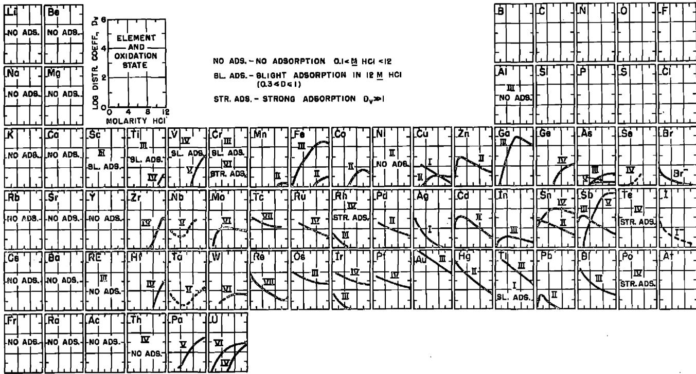  
Figure 65. Adsorption of elements from hydrochloric acid solution with anion exchange resin (quaternary amine polystyrene divinyl benzene resin, $\sim 200$ mesh, $10\%$ DVE). After K. A. Kraus and F. Nelson, reference 536.

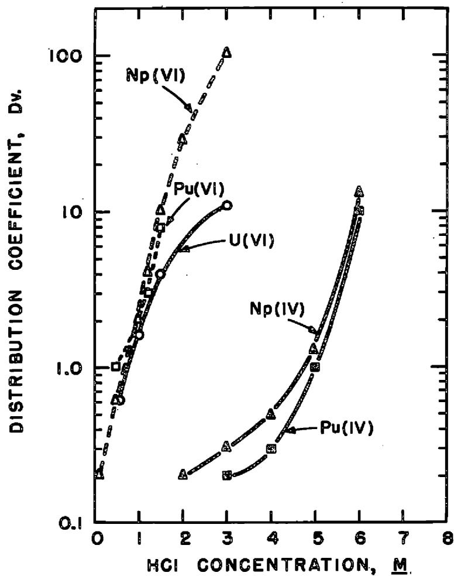  
Figure 66.

Adsorption of elements from hydrochloric acid solution with

Dowex-1 anion exchange resin (10% DVB).

After Y. Marcus, reference 537.

photometrically. No adsorption of $\mathsf{Np}(\mathsf{V})$ , $\mathsf{Pu}(\mathsf{III})$ , or $\mathsf{Am}(\mathsf{III})$ was found. The data presented by Wish for the adsorption of various elements by Dowex-2 (x8,200-400 mesh) is represented in figure 67. Ward and Welch have studied the distribution of neptunium in various oxidation states between Amberlite IRA-400 and hydrochloric acid solutions of varying concentration. Their results show that $\mathsf{Np}(\mathsf{VI})$ is strongly adsorbed at $>6\mathsf{M}$ HCl, $\mathsf{Np}(\mathsf{V})$ is exponentially adsorbed from $3\mathsf{M}$ to $6\mathsf{M}$ HCl (D increases from 1 to 10), and $\mathsf{Np}(\mathsf{IV})$ is similarly adsorbed from about $6\mathsf{M}$ to $10\mathsf{M}$ HCl (D increases from about 2 to 400). Prevot, et al. have investigated the adsorption of U, Pu, Th, Fe, Ce, and Zr by anion exchange resin A300D from hydrochloric acid solutions ranging in molarity from 4 to 7. Quantities of 7 mg Pu, 6.9 mg U and 5.9 mg Fe per ml of solution and 2 grams of resin were used in the determination of D. Their results are considerably different than those shown in figures 65-67. The distribution coefficients of U(VI), and Fe(III) are lower roughly by an order of magnitude. The distribution coefficient of $\mathsf{Pu}(\mathsf{IV})$ is almost an order of magnitude higher. For $\mathsf{Pu}(\mathsf{III})$ , D is about 0.1 at $4\mathsf{M}$ HCl and about 1 at $7\mathsf{M}$ HCl. Zirconium adsorption is similar to that shown in the figures. Thorium and cerium are poorly or not at all adsorbed.

Korkisch, et al. $541,542$ have found the distribution coefficient of uranium between Dowex-1 and hydrochloric acid solutions to increase with increased alcohol concentration of the solution. With $80 \%$ ethanol, $^{*}$ D is increased from about 40 to 6000 as the HCl concentration is increased from 0.2M to 2.4M. $^{541}$ The distribution coefficient at 2.4M HCl without alcohol is about 40. Alcohol also increases the adsorption of thorium, titanium, and zirconium. The distribution co

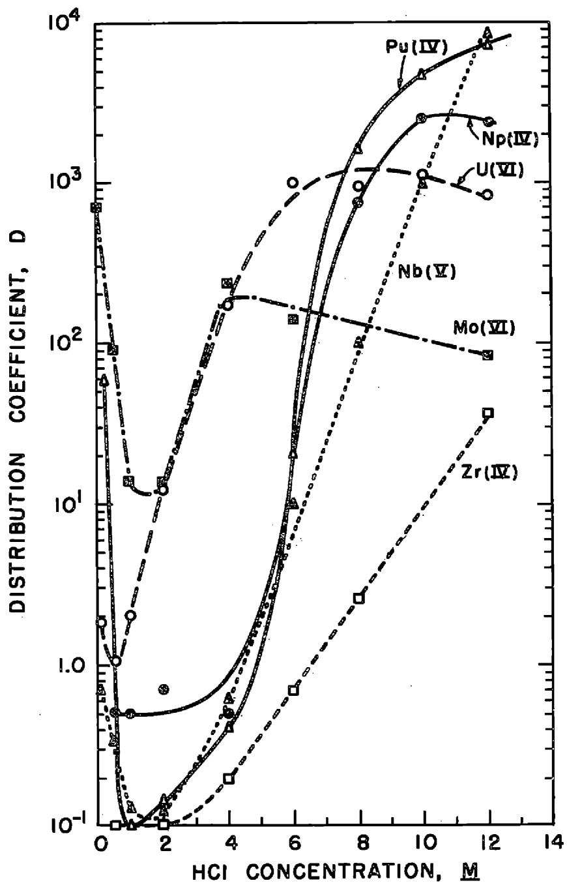  
Figure 67.

Adsorption of elements from hydrochloric acid solution with Dowex-2 anion exchange resin (x8, 200-400 mesh). After L. Wish, reference 538.

efficients of these elements vary roughly between 1 and 10 from $80\%$ alcohol solutions containing HCl in the range of 0.2M to 2.4M.542

Numerous separations of uranium from other elements are possible using hydrochloric acid systems. The more obvious ones are those in which uranium is adsorbed and the other element is not. Consideration of figure 65, indicates that uranium can be separated from alkali metals, alkaline earths, aluminum, yttrium, rare earths, actinium, and thorium by adsorption as uranium (VI) on a strong base anion exchange resin from a concentrated hydrochloric acid solution. Trivalent actinide elements are not adsorbed from hydrochloric acid solutions. Plutonium is eluted as Pu (III) with $12\underline{\mathbf{M}}$ HCl containing hydroxylamine hydrochloride and $\mathrm{NH_4I}$ , $\mathrm{NH_4I}$ alone, or HI. Separations may be made by adsorption of the contaminating element and elution of uranium with dilute hydrochloric acid. For example, molybdenum is adsorbed from O.1M HCl. $^{543}$ Bismuth is also adsorbed from dilute (<1M) HCl. $^{544,545}$ Other elements that show strong adsorption from dilute HCl include many of the transition metals, tin, tellurium, and polonium. $^{536}$ Kraus and Moore $^{546}$ have effected the separation of protactinium and uranium by adsorbing them from 8M HCl on a column of Dowex A-1 resin and developing the column with 3.8M HCl. Protactinium appeared first in the eluent, separated from uranium. The uranium fraction contained, however, a fair amount of protactinium 'tailing'.

Advantage may be taken of the different distribution coefficients exhibited by ions in various oxidation states to effect their separation from uranium. Iron reduced to ferrous ion by hydrogen iodide $^{547}$ or ascorbic acid $^{548}$ is separated by elution with $4\underline{\mathsf{M}}$ HCl. U(IV) may be separated from Pa(IV) and Th(IV). U(IV) is adsorbed by Amberlite IRA-401 (100 mesh) and Dowex-1 (100-200 mesh) from $>8\underline{\mathsf{M}}$ HCl.

Neither Pa(IV) nor Th(IV) is adsorbed from 6M - 12.6M HCl.549 The elution of Pu(III) by 12M HCl from strong base anion exchange resin has already been mentioned. Wish and Rowell have effected the separation of Th, Pu, Zr, and Np from U by elution with hydrochloric acid in a sequence of concentrations. The elements are adsorbed on the resin (Dowex-2) from 12M HCl. Thorium does not adsorb. Plutonium is eluted in the trivalent state with 12M HCl saturated with hydroxylamine hydrochloride and ammonium iodide. Zirconium is eluted with 7.5M HCl; neptunium (IV) with a 6M HCl - 5% NH $_2$ OH · HCl solution. Uranium is finally eluted with O.lN HCl.

Korkisch, et al.551 have separated uranium from tungsten by means of anion exchange. The uranium is adsorbed on Dowex-1 resin from a solution containing $20\%$ 4M HCl and $80\%$ ethanol (volume $\%$ ). Ascorbic acid is used to reduce any iron present. The resin is washed with a similar solution and uranium is eluted with an ether-saturated O.lM HCl solution. No tungsten is observed in the final eluate.

# Fluoride systems.

Faris has reported the adsorption of elements from hydrofluoric acid solutions with Dowex-1 anion exchange resin (x10, 200 mesh). His results are shown in figure 68. Uranium (VI) adsorption is strong from dilute HF solutions and decreases with increased acid concentration. Separation from elements exhibiting no or strong adsorption from HF solutions may be achieved by proper selection of the acid concentration. Elements such as Be, B, Sc, Ti, Zr, Mo, Sn, Te, Hf, Ta, W, Re, and Hg have adsorption curves similar in shape to that of uranium (VI). Separation from these elements using an HF system should prove difficult to almost impossible, depending upon the distribution coefficients involved.

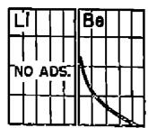

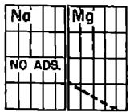

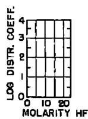

NO ADS.-NO ADSORPTION FROM IM-24M HF

SL ADS- SLIGHT ADSORPTION

STR.ADS.-STRONG ADSORPTION:LOG DIST.COEFF.>2

ROMAN NUMERALS REFER TO OXIDIZATION STATE IN INITIAL SOLUTION.

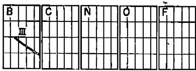

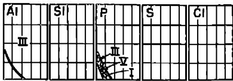

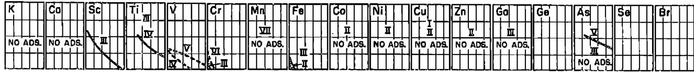

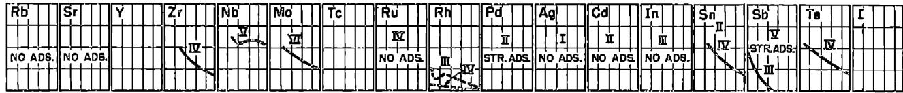

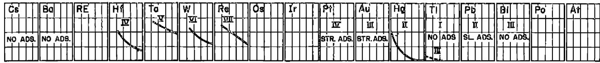

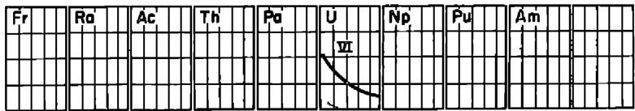  
Figure 68. Adsorption of elements from hydrofluoric acid solution with Dowex-1 anion exchange resin (x10, 200 mesh). After J. P. Faris, reference 552.

Bhat and Gokhale have found evidence for the adsorption of the anionic species $\mathrm{UO}_2\mathrm{F}_3^-$ with Amberlite IRA-400. HCl-HF systems.

Certain elements are efficiently separated from uranium by anion exchange when a combined HCl-HF eluting system is used. Such systems have been studied by a number of workers.[538,554-559] The results of Nelson, Rush, and Kraus[558] are shown in figure 69. Faris and Brody[559] have examined the distribution coefficient D of uranium as a function of HCl concentration in the presence of O, L, and 8M HF and as a function of HF concentration in the presence of O and 0.2M HCl. The former three curves are similar in shape but decrease in magnitude as the HF concentration is increased. The presence of 0.2M HCl also causes a decrease in magnitude of the D vs.[HF] curve. However, the shapes of the O and 0.2M HCl curves for varying HF concentration are dissimilar for HF concentrations less than 4M.

Table XXXIV lists a number of separations of U from other elements using HCl-HF eluting solutions.

# Nitrate systems.

The distribution of uranium between anion exchange resins and nitric acid solutions has been reported by a number of workers.536,540,543,550,557,560-562 The results of Buchanan and Faris are given in figure 70. From the non- or only slight adsorption of most of the elements from nitric acid media, it appears that anion exchange affords an excellent means for purifying uranium. Uranium is adsorbed more strongly from nitrate salt solutions than from nitric acid solutions alone.536,557,562,563 With DeAcidite FF resin, the adsorption of uranium (VI) is greatest from $\mathrm{Al(NO_3)_3}$ solutions and decreases in the order $\mathrm{Ca(NO_3)_2 > LiNO_3 > NH_4NO_3\cdot 563}$ . Ethanol increases the distribution of uranium to the resin phase.541 With an $80\%$ alcoholic solution, the distribution coefficient

Table XXXIV. Separation of Uranium from Various Elements by Anion Exchange Using HCl-HF Eluting Solutions.   

<table><tr><td>Elemental mixture</td><td>Element eluted</td><td>Eluting solution</td><td>Reference</td></tr><tr><td rowspan="2">W, U</td><td>W</td><td>7M HCl-1M HF</td><td>555</td></tr><tr><td>U</td><td>0.1M HCl</td><td></td></tr><tr><td rowspan="3">U, W, Mo</td><td>U</td><td>0.5M HCl</td><td>555</td></tr><tr><td>W</td><td>7M HCl-1M HF</td><td></td></tr><tr><td>Mo</td><td>1M HCl</td><td></td></tr><tr><td rowspan="4">W, Nb, Ti, V, Zr, U, Ta</td><td>W, Ti, V, Zr</td><td>7M HCl-4M HF</td><td>559</td></tr><tr><td>Nb</td><td>7M HCl-0.2M HF</td><td></td></tr><tr><td>U</td><td>1M HCl-4M HF</td><td></td></tr><tr><td>Ta</td><td>24M HF or 4M NH4Cl-1M NH4F</td><td></td></tr><tr><td rowspan="2">Fe(III), U</td><td>Fe(III)</td><td>1M HF-0.01M HCl</td><td>555</td></tr><tr><td>U</td><td>1M HCl</td><td></td></tr><tr><td rowspan="4">R.E. as Eu(III),U(IV), U(VI), Zn(II)</td><td>R.E.</td><td>8M HCl</td><td>556</td></tr><tr><td>U(IV)</td><td>8M HCl-0.1M HF</td><td></td></tr><tr><td>U(VI)</td><td>0.5M HCl</td><td></td></tr><tr><td>Zn(II)</td><td>0.01M HCl</td><td></td></tr><tr><td rowspan="2">Te(IV), U(VI)</td><td>U(VI)</td><td>3M HCl-1M(to 8M)HF</td><td>559</td></tr><tr><td>Te(IV)</td><td>1M HCl</td><td></td></tr><tr><td rowspan="3">Th(IV), Pa(V), U(VI)</td><td>Th(IV)</td><td>10M HCl</td><td>556</td></tr><tr><td>Pa(V)</td><td>9M HCl-1M HF</td><td></td></tr><tr><td>U(VI)</td><td>0.1M HCl</td><td></td></tr><tr><td rowspan="3">Pa, U</td><td></td><td>9M HCl</td><td>554</td></tr><tr><td>Pa</td><td>7M HCl-0.11M HF</td><td></td></tr><tr><td>U</td><td>0.5M HCl</td><td></td></tr><tr><td rowspan="6">Zr, Np, Nb, U, Mo, Tc</td><td>Zr</td><td>12M HCl-0.06M HF</td><td>538</td></tr><tr><td>Np</td><td>6.5M HCl-0.004M HF</td><td></td></tr><tr><td>Nb</td><td>6.0M HCl-0.06M HF</td><td></td></tr><tr><td colspan="2">air dry column and alcohol wash</td><td></td></tr><tr><td>U</td><td>0.1M HCl-0.06M HF</td><td></td></tr><tr><td>Mo, Tc</td><td>12M HNO3</td><td></td></tr></table>

a Dowex-1 or -2 anion exchange resin used.

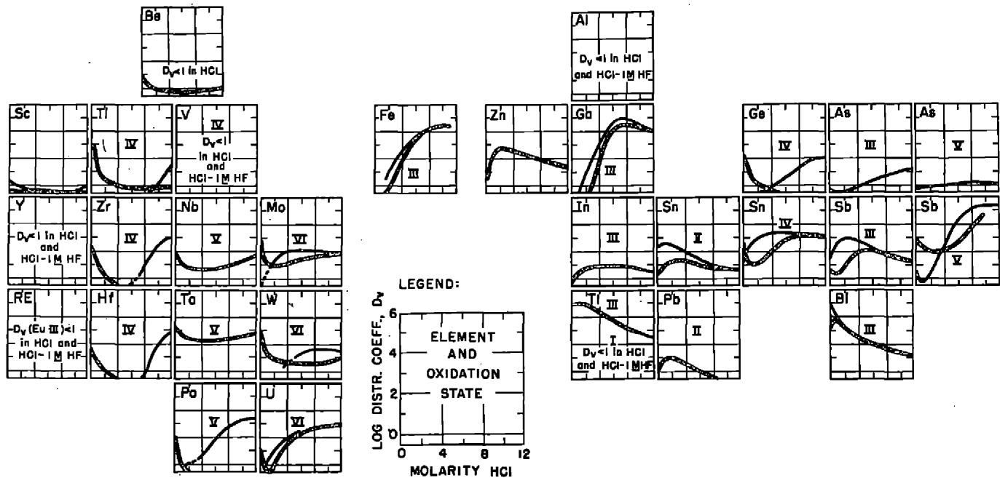  
Figure 69. Adsorption of elements from HCl and HCl-HF solutions with anion exchange resin. Distribution coefficients in absence of HF. Distribution coefficients in HCl-HF mixtures (usually LM HF except Zr(IV), Hf(IV), Nb(V), Ta(V), and Pa(V) where M HF = 0.5). After F. Nelson, R. M. Rush, and K. A. Kraus, reference 558.

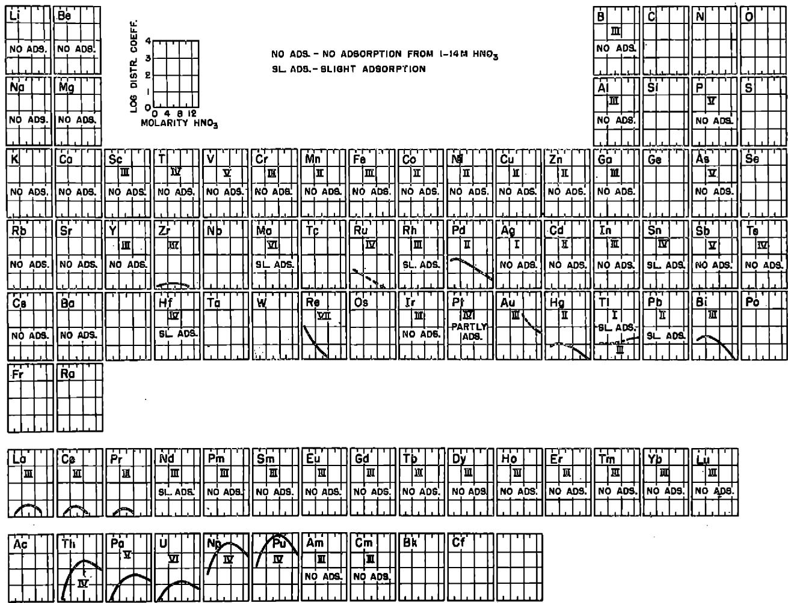  
Figure 70. The adsorption of elements from nitric acid solutions with Dowex-1 anion exchange resin (x10, 200-400 mesh). After R. F. Buchanan and J. P. Faris, reference 562.

Anion Exchange Using Nitric Acid Solutions.

Table XXXV. Separation of Uranium from Various Elements by   

<table><tr><td>Elemental Mixture</td><td>Resin</td><td>Element Eluted</td><td>Eluting Solution</td><td>Reference</td></tr><tr><td rowspan="2">Eu(III), U(VI)</td><td rowspan="2">Dowex-1</td><td>Eu(III)</td><td>8M HNO3</td><td>557</td></tr><tr><td>U(VI)</td><td>0.2M HNO3</td><td></td></tr><tr><td>U, Ru</td><td>Dowex-2</td><td>U</td><td>1M HNO3</td><td>543</td></tr><tr><td rowspan="3">Zr, U, Th</td><td rowspan="3">Dowex-2</td><td>Zr</td><td>Column developed</td><td>543</td></tr><tr><td>U</td><td rowspan="2">with 8M HNO3. Zr elutes first, followed by U and then Th.</td><td></td></tr><tr><td>Th</td><td></td></tr><tr><td rowspan="3">U, Th</td><td rowspan="3">DeAcidite FF (77°C)</td><td></td><td>6M HNO3</td><td>560</td></tr><tr><td>U</td><td>4M HNO3</td><td></td></tr><tr><td>Th</td><td>H2O</td><td></td></tr><tr><td rowspan="2">U, Th</td><td rowspan="2">Dowex-1</td><td>U</td><td>90% methanol-1M HNO3</td><td>564</td></tr><tr><td>Th</td><td>1M HNO3</td><td></td></tr><tr><td rowspan="2">U, Np</td><td rowspan="2">Dowex-1 or Dowex-21K</td><td>U</td><td rowspan="2">6M HNO3-ferrous sulfamate - 565 hydrazine or semicarbazide</td><td rowspan="2">0.35M HNO3</td></tr><tr><td>Np</td></tr><tr><td rowspan="6">Th, R.E., trans-Pu, Pu, U, Zr, Np</td><td rowspan="6">Dowex-2</td><td>Th, R.E., trans-Pu</td><td>cono.HCl-trace HNO3</td><td>550</td></tr><tr><td>Pu</td><td>cono.HCl sat&#x27;d with NH2OH·HCl and NH4I</td><td></td></tr><tr><td>-</td><td>cono.HCl(80%)-conc.HNO3(20%)</td><td></td></tr><tr><td>U, Zr</td><td>12M HNO3</td><td></td></tr><tr><td>-</td><td>cono. HCl</td><td></td></tr><tr><td>Np</td><td>4M HCl with 5% NH2OH·HCl</td><td></td></tr></table>

for uranium is about 12 between Dowex-1 resin and $1.2\underline{M}$ HNO₃ solution; for a $40\%$ alcoholic solution, D is about 7.

Table XXXV lists a number of separations of U from other elements using nitrate media. The last procedure listed in the table may be revised to include Pa separation. Following the elution of U with $\underline{12\text{M}HNO_3}$ , in which a small amount of Pa is eluted, the remaining Pa is eluted with $\underline{12\text{M}HNO_3 - 0.1\text{M}}$ HF.550

# Sulfate systems.

The recovery of uranium from sulfate liquors by anion exchange methods is important industrially. Laboratory-wise, a number of procedures have been developed for the determination of uranium that make use of the adsorbability of the anionic uranyl sulfate complexes. The nature of these complexes has also received considerable study [98,566,567] (see section on complex ions). The distribution of uranium between anion exchange resins and sulfate media has been reported by a number of investigators [536,543,550,557,561,568]. The results of Bunney, et al. [543] are given in figure 71. Strontium, yttrium, cerium, and americium do not show any significant adsorption by the resin (Dowex-2) at any acid concentration. [543] The distribution coefficient of Pu(IV) is approximately twice that of U(VI) in the acid range of 0 to $1\mathrm{ON} \mathrm{H}_{2}\mathrm{SO}_{4}$ . [550] The adsorption of uranium (and thorium) from solutions of $(\mathrm{NH}_{4})_{2}\mathrm{SO}_{4}$ is similar to that from $\mathrm{H}_{2}\mathrm{SO}_{4}$ . The decrease in adsorption is less rapid, however, with increased ammonium sulfate concentration than with sulfuric acid. [536,557,568] The adsorption of uranium from sulfate solution exhibits a pH dependence (D increases as the pH is increased from 1 to 4) which decreases as the sulfate concentration is decreased. [534] The distribution coefficient of uranium between Dowex-1 resin and O to 1.2N sulfuric acid solutions is one to three orders of magnitude greater from 80% ethanol solutions than from aqueous solutions. [541]

A number of procedures have been developed for the separation of uranium from various elements by anion exchange in sulfate solution. These generally involve the adsorption of the uranyl complex from a sulfate solution at pH 1 to 2 from which the foreign element is not adsorbed. After thoroughly washing the resin bed to remove impurities, uranium is eluted with a dilute solution of hydrochloric, nitric, or perchloric acid. Mixtures of elements that have been or may be separated

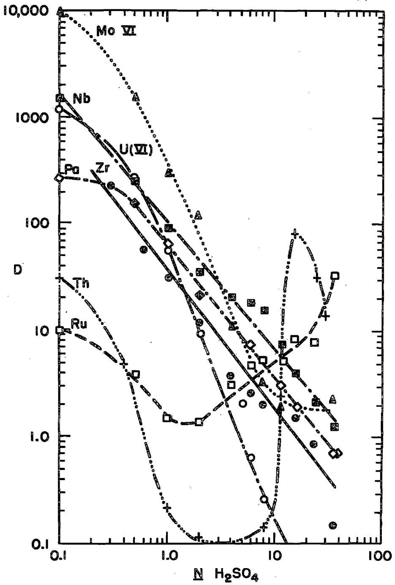  
Figure 71.

The adsorption of elements from sulfuric acid solutions with

Dowex-2 anion exchange resin (x8, 200-400 mesh).

After L. R. Bunney, N. E. Ballou, J. Pascual, S. Foti, reference 543.

from uranium by procedures similar to the one described include Am, Th; $543$ Fe, Al, Mg; $569$ Fe, V; $570$ Zn, Ni, Co, Cd, Mn, Cu, Fe, alkali metals; $571$ Zr, Ce, Cs, Ag, Cd, V; $572$ B1; $573$ R.E.; $543,571,574$ and metals contained in ores. $575-578$ . The literature references should be consulted for exact experimental conditions.

# Carbonate systems.

Uranium is recovered from carbonate leach liquors by anion exchange in industrial operations. Its anion exchange behavior is similar in carbonate solution to that in sulfate solution. That is, the distribution coefficient is decreased with increased carbonate concentration. This is illustrated in figure 72 for ammonium carbonate solutions.[575] A similar decrease in D is observed for increased sodium carbonate concentration.[568] The distribution coefficient is also decreased by a decrease in pH of the solution. The increase in bicarbonate concentration at the lower pH interferes with uranium adsorption. Other anions such as sulfate, nitrate, and chloride may also interfere with uranium adsorption from carbonate solution. To prevent gassing with carbon dioxide, uranium is eluted with salt solutions rather than acids.

Vanadium $^{576}$ and phosphate and molybdate $^{572}$ have been separated from uranium in carbonate solutions by anion exchange. The impurities are adsorbed on the resin together with uranium and eluted with a $10\%$ $\mathrm{Na}_2\mathrm{CO}_3$ solution. Uranium is eluted with a $5\%$ NaCl solution.

# Phosphate systems.

The distribution of uranium and other elements between Dowex-2 anion exchange resin and phosphoric acid solutions is represented in figure 73. Marcus has studied the Dowex 1-uranyl phosphate system. His distribution coefficients are lower by factors of 2 to 50 at $0.1\underline{M}$ $\mathsf{H}_3\mathsf{PO}_4$ and $3\underline{M}$ $\mathsf{H}_3\mathsf{PO}_4$ , respectively, than those shown in figure 73.

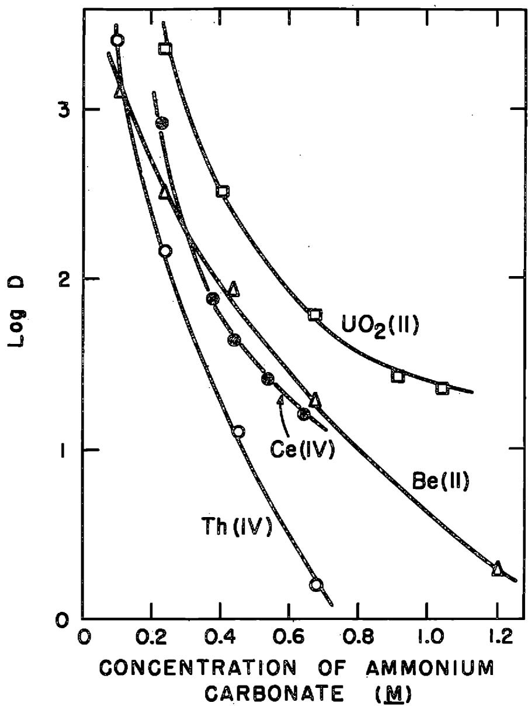  
Figure 72. The adsorption of elements from ammonium carbonate solutions with Dowex-1 anion exchange resin (x8, 50-100 mesh). After S. Misumi, T. Taketatsu, reference 575. Conditions: Amounts taken, Be2+, 11.7 mg (BeO); Ce4+, 7.3 mg (CeO2); Th4+, 26.9 mg (ThO2); and UO2+, 61.0 mg (U3O8). 1 gram of resin and 200 ml of solution in contact 12-20 hours at 20°C.

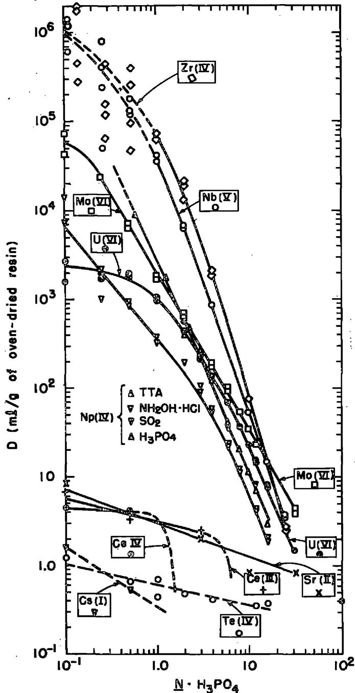  
Figure 73.

The adsorption of elements from phosphoric acid solutions with

Dowex-2 anion exchange resin (x8, 200 mesh).

After E. C. Freiling, J. Pascual, and A. A. Delucchi, reference 579.

Separations between uranium and the rare earths $(\mathrm{Ce}^{3+}, \mathrm{Ce}^{4+})$ , alkaline earths $(\mathrm{Sr}^{2+})$ , alkali metals $(\mathrm{Cs}^{+})$ , and tellurium are possible using Dowex 2- $\underline{\mathrm{H}}_{3}\mathrm{PO}_{4}$ systems. The latter separation has been used by Wish\u580 who loaded a column of Dowex-2 resin from a $0.\underline{1}\underline{\mathsf{N}}\ \underline{\mathsf{H}}_{3}\mathsf{PO}_{4}$ solution. Tellurium passed through and uranium was adsorbed. The column was then converted to the chloride form with concentrated hydrochloric acid and uranium was eluted with $0.\underline{1}\underline{\mathsf{M}}\ \underline{\mathsf{H}}\underline{\mathsf{Cl}} - 0.06\uunderline{\mathsf{M}}\ \underline{\mathsf{HF}}$ . An alternative method involved loading the column from concentrated HCl. Tellurium was eluted with $1.\underline{0}\underline{\mathsf{N}}\ \underline{\mathsf{H}}_{3}\mathsf{PO}_{4}$ after washing the column with an alcoholic phosphoric solution. The column was then washed with an alcoholic HCl gas solution. Uranium was eluted with a $0.\underline{1}\underline{\mathsf{M}}\ \underline{\mathsf{H}}\underline{\mathsf{Cl}} - 0.06\uunderline{\mathsf{M}}\ \underline{\mathsf{HF}}$ solution and molybdenum with $12\underline{\mathsf{M}}\ \underline{\mathsf{HNO}}_{3}$ . Miscellaneous systems.

Uranyl ion forms an anionic complex with acetate ions at pH 4.25 to 5.25. The complex has been adsorbed on Amberlite IRA-400 strong base resin in the determination of small amounts of uranium in stones and natural waters.[581,582]

Uranium is also adsorbed on Amberlite IRA-400 resin as an ascorbate complex.583,584 Thorium, titanium, zirconium, tungsten, and molybdenum are also adsorbed.

Uranium complexed with sulfosalicylic acid has been separated from Zn, Cu, Ni, and Cd.585 The latter are complexed with EDTA. The pH of the solution is kept between 8 and 10. Separation has been made on Amberlite IRA-401 and Dowex-1 resins.

The uranyl cyanate complex formed by adding potassium cyanate solution to a uranyl salt is adsorbed by Dowex-1 anion exchange resin.586 Uranium is eluted by a dilute hydrochloric acid solution.

Cation exchange. Although a number of separations of uranium from various elements have been reported in the literature, the amount of quantitative data reported is rather meager. Hardy has summarized much of the data available on the dis

ribution of uranium between cation exchange resins and nitric and hydrochloric acid solutions. His curves are reproduced in figure 74. Distribution coefficient curves for other actinide elements: Th, Pa, Np, Pu, are given for comparison. Prevot, et al. have published the distribution curve for uranium between cation exchange resin C.50 and nitric acid solution. Its shape and magnitude are similar to that shown for the Zeokarb-225-HNO $_3$ system in figure 74. Ishimori and Okuno have found that increasing amounts of methanol in nitric acid solution (0.18M) increase the distribution coefficient of uranium for Dowex-50 resin.

The elution peak positions of a number of ions including uranium (IV) and (VI) are given in figure 75 for various hydrochloric acid concentrations. The conditions under which the peak positions were determined are described in the figure caption. Ionescu, et al. have studied the effect of acetone on the distribution of several elements between cation exchange resins, KU-2 and R-21, and dilute hydrochloric acid solutions. For fixed hydrochloric acid concentrations of 1, 2, and $3\%$ , maximum uranyl distribution coefficients were found between 60 and $80\%$ acetone solutions. For 4 and $5\%$ acid solutions, D was found to be considerably lower than for the more dilute acid solutions.

Ishimori and Okuno have investigated a number of cation exchange systems other than those already noted. Some of their results, D versus sodium sulfate, sodium acetate, and oxalic acid concentration, are illustrated in figure 76. The adsorption of uranium by Dowex-50 from solutions of hydroxylamine was found to be pH dependent. As the pH of the solution was increased, a sharp decrease in D was observed between pH 5 and 6. Uranyl ion was not adsorbed by Dowex-50 resin from carbonate solution.

Khopkar and De589 have investigated the behavior of

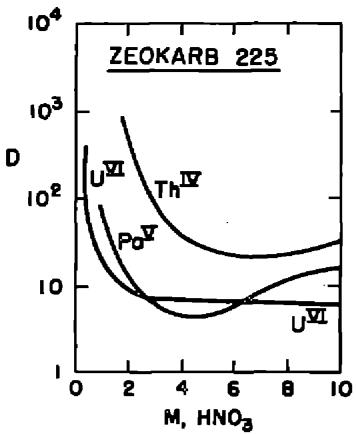

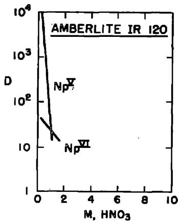

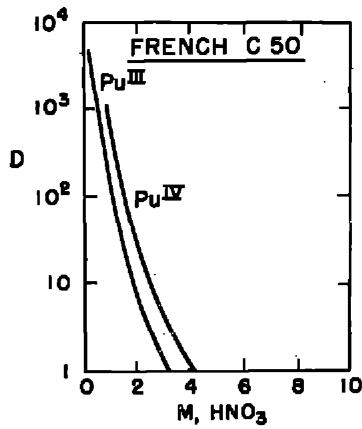

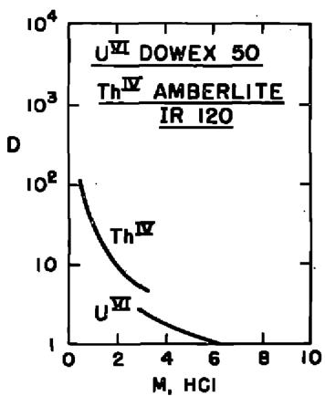

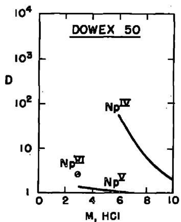

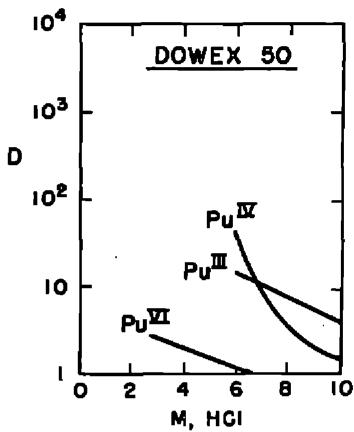  
Figure 74.

The adsorption of uranium and other actinide elements by cation

exchange resins from nitric and hydrochloric acid solutions.

After C. J. Hardy, reference 587.

The curves present the data of the following investigators:

C. J. Hardy, D. Scargill, J. M. Fletcher, J. Inorg. Nuclear Chem. 7, 257 (1958): Th(IV), Pa(V), U(VI)-HNO₃.

K. F. Sculz, M. J. Herak, Croat. Chem. Acta 29, 49 (1957): Th(IV)-HCl.

R. M. Diamond, K. Street, Jr., G. T. Seaborg, J. Am. Chem. Soc. 76, 1461 (1954): U(VI), Np(IV), (V), (VI), Pu(III), (IV), (VI)-HCI. M. Ward, G. A. Welch, Unpublished data, U.K.A.E.A., Windscale: Np(V), (VI)-HNO3.

I. Prevot, P. Regnaut, Progress in Nuclear Energy, Series III, 2, 377 (1958): Pu(III), (IV)-HNO₃.

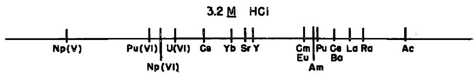

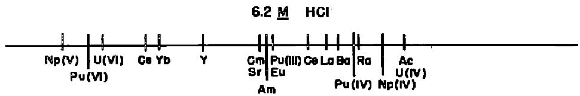

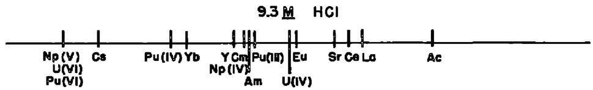

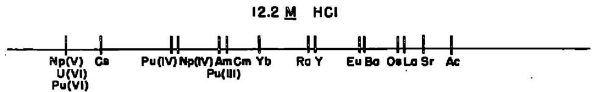

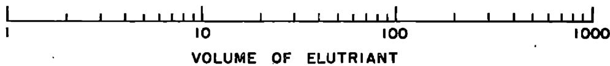  
Figure 75.

Elution peak positions of various ions with 3.2, 6.2, 9.3,

and 12.2M HCl from Dowex-50 cation exchange resin. Elutrient volume given in drops.

After R. M. Diamond, K. Street, Jr., and G. T. Seaborg, reference 591.

Conditions:

Dowex-50 resin, HR form, 250-500 mesh, settling rate approximately 0.5 cm/min.  
Column, 10 cm long x l mm diameter.  
Flow rate, approximately 0.1 cm/min.  
Room temperature.

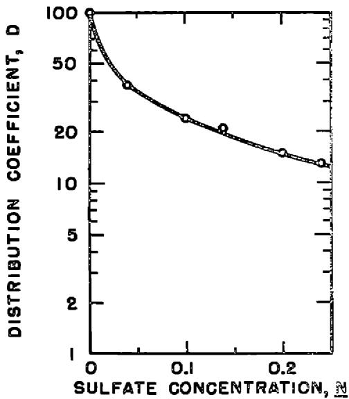

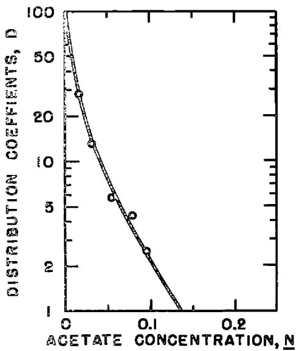

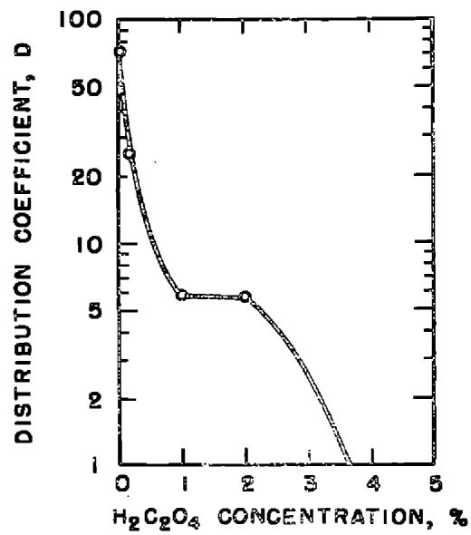  
Figure 76. The adsorption of uranium by Dowex-50 cation exchange resin from solutions of sodium sulfate, sodium acetate, and oxalic acid. After T. Ishimori and H. Okuno, reference 568.

# Conditions:

Sulfate - 0.5 g resin, NaR form; 5.4 mg U/25 ml; Na₂SO₄-

$\mathsf{NaNO}_3$ mixed solution, $[\mathbf{Na}] = 0.30\mathbf{N}$

Acetate - 0.5 g resin, NaR form; 5.4 mg U/25 ml; NaOAc-

$\mathsf{NaNO}_3$ mixed solution, $[\mathsf{Na}] = 0.16\mathsf{N}$

Oxalic acid - 0.5 g resin, HR for; 10.8 mg U/25 ml.

uranium (VI) on Amberlite IR-120 cation exchange resin with hydrochloric, nitric, sulfuric, acetic, citric, and perchloric acids. Uranium (1.7 mg) adsorbed on a resin bed (1.4 x 14.5 cm) was eluted with 200 ml of various eluants. Uranium was quantitatively recovered with 2-4M HCl, 2-4M HNO₃, and 1-2M H₂SO₄. Uranium was incompletely recovered with 1M HCl, 1M HNO₃, 2M HClO₄, 2M acetic acid, and 2-5% citric acid.

Sullivan, et al.590 have investigated the distribution of uranium between Dowex-50 ion exchange resin and perchloric acid media as a function of time and bisulfate ion concentration.

Table XXXVI lists a number of separations of uranium from various elements that have been achieved by cation exchange.

4. Chromatography. The subject of paper and cellulose chromatography for the separation of uranium has been reviewed by Rodden<sup>192</sup> and by Steele and Taverner.<sup>198</sup> Work of Soviet scientists in the field has been reviewed by Pale<sup>197</sup> and by Senyavin.<sup>612</sup> References to much of the literature may be found in the review article by Kuznetsov, Savvin, and Mikhailov.<sup>200</sup> Books by Pollard<sup>613</sup> and by Blasius<sup>614</sup> include chromatographic separations of uranium.

One of the most successful separations of uranium by filter-paper chromatography makes use of the solvent, 2-methyltetrahydrofuran.615 Of thirty-one metals tested, only ruthenium and rhodium, measured as Ru $^{106}$ -Rh $^{106}$ , and tungsten $(W^{185})$ were incompletely separated from uranium $(U^{233})$ . The results for tin $(Sn^{113})$ and antimony $(Sb^{124})$ were inconclusive and the behavior of mercury $(Hg^{203})$ was similar to that of uranium.

An example of the use of cellulose columns in combination with organic solvent for the separation of uranium is that given by Burstall and Wells.616 An ethereal solution containing 5 per cent v/v of nitric acid is used to extract uranium from a cellulose column. The nitrates of the alkali metals, alkaline earths, rare earths, Cu, Ag, Zn, Cd, Al, In, Tl, Tl, Hf, Ge, Sn, Y,

Table XXXVI. Separation of Uranium from Various Elements by Cation Exohange.   

<table><tr><td>Elemental mixture</td><td>Element eluted + eluting agent</td><td>Resin</td><td>Reference</td></tr><tr><td>U, Th</td><td>U-1.70M HCl; Th-1.1M (NH4)2CO3</td><td>Amberlite IR-120</td><td>592</td></tr><tr><td>U, Th</td><td>U, Th-90% acetone, 5% HCl, H2O (U eluted first)</td><td>KU-2</td><td>588</td></tr><tr><td>U, Th</td><td>U-1M HCl; Th-3M H2SO4</td><td>Amberlite IR-120</td><td>589</td></tr><tr><td>U, Th</td><td>U-dil. HCl; Th-complexing agent (HSO4)</td><td>phenol-formaldehyde type</td><td>593</td></tr><tr><td>U, Th</td><td>U-2M HCl; O.5M H2C2O4</td><td>Wofatit KS</td><td>594</td></tr><tr><td>U, Th</td><td>dilute HNO3</td><td>Amberlite IR-100</td><td>595</td></tr><tr><td>U, Th</td><td>U-0.1 to O.4M H2SO4; Th=0.5M H2C2O4</td><td></td><td>596</td></tr><tr><td>U, Np(IV)</td><td>U-dil. HCl; Np(IV)-complexing agent</td><td>Amberlite IR-120</td><td>597</td></tr><tr><td>U, Np</td><td>adsorb from 1M HNO3; eluted Np ahead of U with 2M HNO3</td><td>Amberlite IR-120</td><td>597</td></tr><tr><td>U, F.P.(Cs,Sr,Y,Ce)</td><td>Sr-O.1M HCl; Ce,Y=1M HCl; U-6M HCl; Cs=5M NH4Cl</td><td>zirconium phosphate</td><td>598</td></tr><tr><td>U, F.P., Pu</td><td>adsorb from uranyl nitrate solution at pH 1-3; U-0.2 to O.3M H2SO4; F.P.-phosphoric acid and 1M HNO3; Pu-U.8M H3PO4and 1M HNO3</td><td>sulfonated phenol formaldehyde type</td><td>599</td></tr><tr><td>U, F.P.</td><td>F.P.-3% Na2EDTA; U-3% NaOAc, O.25M Na2CO3</td><td>sodium dialkyl phosphate</td><td>600</td></tr><tr><td>U, La</td><td>La-0.06% Na2EDTA, pH 4.0; U-3% NaOAc, O.25M Na2CO3</td><td>sodium dialkyl phosphate</td><td>600</td></tr><tr><td>U, Eu</td><td>U-0.75M H2SO4; Eu-6M HCl</td><td>Dowex-50</td><td>601,602</td></tr><tr><td>U, Ce, Eu, Y</td><td>U-1M H2C2O4; Ce, Eu, Y-5N HCl</td><td>Amberlite IR-120</td><td>603</td></tr><tr><td>U, R.E.</td><td>R.E.-Na2EDTA</td><td>Amberlite IRC-50</td><td>604</td></tr><tr><td>U, R.E.</td><td>U-2.5M HF</td><td>Dowex-50</td><td>605</td></tr><tr><td>U, Fe, Cu, Cd, Ni, Co, Mn, R.E.</td><td>U, Fe,Cu-O.5N H2C2O4; Cd,N1,Co,Mn-IN HCl; R.E.-5% ammonium citrate</td><td>Amberlite IR-120</td><td>606</td></tr><tr><td>U, Fe(III), Co(II), 
Cu(II)</td><td>Fe,Co,Cu-2% Na2EDTA, pH 3.0; U-3% NaOAc, 0.25M 
Na2CO3</td><td>sodium dialkyl 
phosphate</td><td>600</td></tr><tr><td>U,Fe(III)</td><td>U,Fe-0.8M HCl (U eluted first)</td><td>Lewatit S100</td><td>607</td></tr><tr><td>U, Co, Cu, Ca</td><td>adsorb from O.1M HNO3; Co, Cu, Ca-0.2M HNO3; 
U-resin removed from column and washed with 
0.25M Na2CO3</td><td>dialkyl- 
phosphoric acid</td><td>600</td></tr><tr><td>U, Cd</td><td>Cd-0.5N HCl</td><td>Dowex-50</td><td>608</td></tr><tr><td>U,Th,Ac,B1,Ra,Pb</td><td>U,Th,Ac,B1-5% H2C2O4</td><td>KU-2</td><td>609</td></tr><tr><td>U, many ions</td><td>foreign ions-EDTA (Na salt); pH 7: U-H2SO4</td><td>Amberlite IRC-50</td><td>610</td></tr><tr><td>U, many ions</td><td>foreign ions-EDTA (Na salt), (a)p-1.7-1.9 
or (b)pH 5.5-7.0 following Fe(OH)3precipitation; 
U-3N H2SO4</td><td>(a)KU-2 or (b) 
Amberlite IRC-50</td><td>611</td></tr><tr><td>U, Zr, Ce(III),Cu, 
Ni, Hg(II)</td><td>Zr as anionic oxalate complex, Ce(III), Cu, Ni as 
anionic EDTA complexes, Hg(II) as anionic iodide 
complex are not adsorbed; U-4M HCl</td><td>Amberlite IR-120</td><td>589</td></tr><tr><td>U, phosphate</td><td>phosphate (Na2HPO4) not adsorbed; U-4M HCl</td><td>Amberlite IR-120</td><td>589</td></tr></table>

F.P. $[=]$ fission products.

R.E. $[=]$ rare earth elements.

EDTA $[=]$ ethylenediaminetetraacetic acid.

Pb, Nb, Ta, Cr, W, Te, Mn, Fe, Co, and Ni remain stationary or move only slightly. Gold reduced with $\mathrm{FeSO_4}$ is retained by the column. Mercury (II), selenium, arsenic, antimony, and bismuth move less rapidly through the column than uranium. Ceric nitrate is extracted as are thorium, zirconium, and scandium nitrates. Cerium in the III-state is not extracted. Thorium extraction is sensitive to the acid concentration. Zirconium extraction is inhibited by phosphate, sulfate, oxalate, and tartrate ions. Scandium extraction is also inhibited by tartrate ion. Tin is precipitated as meta-stannic acid. Large amounts of tin may be first removed by volatilization as the iodide. Vanadium is retained if peroxides are absent. Ferrous sulfate reduces vanadium to an immobile salt. Phosphoric acid is extracted. Ferric nitrate inhibits the extraction of this acid. The behavior of molybdenum is complex. Iridium and rhodium are not extracted. Traces of ruthenium and platinum may be found in the eluent. Palladium is extracted. Reduction of platinum and palladium with $\mathrm{FeSO_4}$ results in retention of bulk amounts by the column. Small amounts of sulfate do not interfere with the extraction of uranium. Sulfuric acid is retained by the column under normal conditions. Halides increase the extraction of other elements, e.g., Au, Sn. Under normal conditions, HCl is retained in the column; HBr, HI, bromine and iodine move slowly down the column. Molybdenum and arsenic may be adsorbed by the use of activated alumina in conjunction with cellulose.[617]

The use of silica gel columns combined with organic solvents, dibutyl carbitol and tributyl phosphate, and nitric acid have been used for the separation of uranium and plutonium.[618,619]

A non-ionic phosphorylated resin, diethyl polystyrene-methylenephosphonate, may be used to separate uranium (VI) from iron (III), lanthanum, zirconium, niobium, thorium, and mixed fission products. Uranium is adsorbed by the resin from 2 per cent solutions of dibutyl phosphoric acid. The other elements

are not absorbed. Uranium is eluted with a dimethyl formamide-benzene solution.

The feasibility of using tributyl phosphate gels for the separation of uranium from iron (III) and thorium has recently been demonstrated.[621]

5. Volatilization. Uranium may be separated from many elements by fractional distillation of the volatile compound, uranium hexafluoride. This method of separation has been applied to the recovery of uranium from irradiated fuel elements. Katz and Rabinowitz $^{1}$ have reviewed many of the early methods for the preparation of UF $_6$ : fluorination of various uranium compounds with elemental fluorine or cobalt trifluoride, disproportionation of UF $_5$ which results in both UF $_4$ and UF $_6$ , and the reaction between UF $_4$ and dry oxygen which results in $\mathrm{UO}_2\mathrm{F}_2$ and UF $_6$ . The latter two methods are not very practical from an analytical standpoint. Other fluorinating agents that form UF $_6$ include ceric fluoride, manganic fluoride, silver difluoride, halogen fluorides (e.g., BrF $_3$ and ClF $_3$ ) and fused metallic fluorides. Most elements form fluorides under the conditions that UF $_6$ is obtained. However, only a small number of these fluorides are volatile. Hyman, et al. $^{3}$ have published a table of some 26 elements having fluorides with boiling or sublimation points of $550^{\circ}\mathrm{C}$ or less. Included in this group are the fluorides of boron, silicon, phosphorus, vanadium, sulfur, tungsten, bismuth, plutonium, and the fission products, germanium, arsenic, selenium, niobium, molybdenum, ruthenium, antimony, tellurium, and iodine. The boiling point of UF $_6$ is $54.6^{\circ}\mathrm{C}$ . Non-volatile fluorides from which uranium is readily separated include those of the alkali metals, alkaline earths, rare earths, Fe, Co, Ni, Ag, Al, Be, Mn, Tl, Pb, Zn, Cu, Hg, Cd, and Zr. $^{34,622}$

Uranium does not form a volatile compound by interaction with anhydrous hydrogen fluoride. Materials such as Nb, Ta, As,

Sb, Si, Te, Se, etc. do. $\underline{34}$ The oxides of titanium, tungsten, and molybdenum react slowly with HF. $V_{2}O_{5}$ and VN also react slowly. VO, $V_{2}O_{4}$ and $V_{2}O_{3}$ are not volatilized. $\underline{34}$ Rodden and Warf $\underline{34}$ describe a procedure that makes use of both anhydrous hydrogen fluoride and fluorine in the separation of uranium. Possible contaminants of the separated UF $\underline{6}$ include Cr, Ta, W, Mo, or V.

Uranium hexachloride and uranium (IV) borohydride are volatile compounds for which procedures might be developed for the separation of uranium.

Uranium may be separated from arsenic, antimony, bismuth, selenium, and tin by volatilization of the latter elements with a mixture of hydrobromic acid and bromine.[198]

6. Electrochemical methods. The electrolysis of dilute sulfuric acid solutions with a mercury cathode results in the quantitative deposition of Cr, Fe, Co, Ni, Cu, Zn, Ga, Ge, Mo, Rh, Pd, Ag, Cd, In, Sn, Re, Ir, Pt, Au, Hg, and Tl in the cathode.[213] Arsenic, selenium, tellurium, osmium, and lead are quantitatively separated from the electrolyte, but are not quantitatively reposed in the cathode.[213] Manganese, ruthenium, and antimony are incompletely separated.[213] Uranium and the remaining actinide elements, rare earth elements, the alkali and alkaline earth metals, aluminum, vanadium, zirconium, niobium, etc. remain in solution.[213] Casto[623] and Rodden and Warf[34] have reviewed the effects of many variables in the electrolytic separation of the above-named elements from uranium. According to Rodden and Warf,[34] optimum conditions for the purification of uranium in sulfuric acid solutions with a mercury cathode are: electrolyte volume, 50 ml; free sulfuric acid concentration, $\underline{\mathbf{lN}}$ ; current density, as high as practicable with the given acid concentration (about 10 amp maximum); anode, flat platinum spiral or grid just making contact with the surface of the electrolyte; cathode area,

as large as practicable; stirring, surface of the mercury cathode is stirred rather rapidly; temperature of electrolyte, between $25^{\circ}$ and $40^{\circ}\mathrm{C}$ ; mercury for the cathode, pure; anions, chloride, nitrate, and phosphate ions should be absent, or present in only small amounts.

Uranium may be deposited electrolytically at the cathode of a cell from acetate, $\frac{624 - 631}{2}$ carbonate, $\frac{632}{2}$ oxalate, $\frac{633 - 638}{2}$ formate, $\frac{639}{2}$ phosphate, $\frac{640}{2}$ fluoride, $\frac{632,641}{2}$ and chloride solutions. Many of the uranium electrodeposition procedures have been developed in an effort to prepare thin, uniform films for alpha and fission counting rather than to separate the element from any particular impurity. However, in the work of Smith and co-workers $\frac{624,626}{2}$ and Coomans $\frac{627}{2}$ uranium was separated from alkali and alkaline earth metals and zinc. Casto $\frac{623}{2}$ and Rodden and Warf $\frac{34}{2}$ review much of the material pertinent to the electrodeposition of uranium.

Electrodialysis has achieved a certain amount of importance in the recovery of uranium from leach liquors. In a review article by Kunin, the following cells are presented for consideration:

(-) cathode anion permeable membrane anode (+) (1) $\mathrm{UO}_2(\mathrm{NO}_3)_2$ $\mathrm{NH_4NO_3}$ $\mathrm{H}_2\mathrm{SO}_4$ $\mathrm{NH_4NO_3}$   
(-) cathode anion permeable membrane anode (+) (2) $\mathrm{UO}_2\mathrm{SO}_4$ $\mathrm{H}_2\mathrm{SO}_4$ $\mathrm{H}_3\mathrm{PO}_4$   
(-) cathode anion permeable membrane anode (+) (3) $\mathrm{UO}_2\mathrm{Cl}_2$ NaCl NaCl $\mathrm{H}_2\mathrm{SO}_4$

(-) cathode anion membrane NaCl cation membrane anode (+) (4) $\mathrm{UO}_2\mathrm{Cl}_2$ NaCl HSO4 HSO4   
(-) cathode cation permeable membrane anode (+) (5) $\mathrm{UO}_2^{2+},\mathrm{Na}_2\mathrm{CO}_3$ NaHCO 3

In acid systems (cells 1, 2, 3, and 4), the transport of sulfate, nitrate, and chloride ions to the anode results in a removal of acid and a subsequent increase in pH in the cathode compartment. The uranium, reduced during electrolysis, is precipitated as $\mathrm{UO}_2$ or $\mathrm{U}(\mathrm{HPO}_4)_2$ . In the alkaline system, the transport of sodium ions is also accompanied by a rise in pH in the cathode compartment and uranium is again precipitated as the dioxide or as a mixture of dioxide and sodium polyuranate.

The electrodialytic separation of uranium from metals in a complex mixture has been demonstrated by Willard and Finley. An ammonium bicarbonate solution containing U, Fe, Ni, Cu, Cr, Zn, Al, Mo, Mg, and Na salts, and traces of other elements was electrolyzed in a two-compartment cell having a cation permeable membrane and a mercury cathode. The solution was first made the catholyte (electrolyte in the cathode compartment) and electrolyzed. Iron $(80\%)$ , nickel and copper $(95\%)$ , tin, and zinc were removed from solution by deposition. The bicarbonate solution was then made the anolyte and electrolyzed at a platinum anode. All aluminum, molybdenum, ammonium, and silicon, and some sodium and magnesium were separated from the uranium by migration. Uranium was retained as the carbonate complex and was recovered as the oxide by evaporation of the anolyte.

Other features of the electrodialytico behavior of uranium that may be useful in its separation and purification are (1) the retention of uranium during electrodialysis from a perohloric

catholyte using an anion selective membrane, (2) the dissolution and separation of impure $\mathbf{U}\mathbf{F}_{4}$ , and (3) the feasibility of electro dialysis in organic solutions.644

7. Pyrometallurgical processes. Although pyrometallurgical or high temperature processes have been designed primarily for large scale recovery of fertile material from irradiated fuel elements, some of the methods may find application in the radiochemistry laboratory. Types of pyrometallurgical operations that have received considerable attention are(1) distillation,(2.) salt extraction,(3.) molten metal extraction,(4.) oxidative slagging,(5) electro-refining, and(6) decomposition of uranium iodide. These methods have been reviewed by Lawroski.[21]

1. Plutonium is concentrated by vacuum distillation from molten uranium at 1500-1800°C.   
2. Plutonium is extracted from molten uranium by salts such as $\mathrm{UF}_4$ or $\mathrm{MgCl}_2$ . Uranium remains in the metallic state. Plutonium is recovered as a halide salt.   
3. Plutonium is extracted by molten metals, such as silver or magnesium, that are immiscible with molten uranium. Fission products are also extracted.   
4. Oxidative slagging involves the preferential formation of the most stable oxides by a molten irradiated fuel element in a limited oxygen environment. These oxides (rare earths) float to the surface of the molten material and are skimmed off. Other oxides diffuse into the crucible and through the slag layer.   
5. In electro-refining, uranium is dissolved anodically in a fused salt bath of alkali or alkaline earth halides that contain a uranium compound. Noble metals do not dissolve and are deposited as anode sludge. Uranium and chemically similar materials are deposited at the cathode. Alkali, alkaline earth, and rare earth fission products concentrate in the salt bath.   
6. Uranium is recovered as the metal from the thermal decomposition of $\mathsf{U}\mathsf{I}_{4}$ . Zirconium and niobium are the principal contaminants.

It is not the purpose of this section to describe the techniques involved in pyrometallurgical processes. The interested reader may consult the many papers presented in "Progress in Nuclear Energy, Series III, Process Chemistry," volumes 1(1956) and 2(1958), and in the "Proceedings of the International Con

ference on Peaceful Uses of Atomic Energy," volumes 9(1956) and 17(1958).

# IV-E Determination of Uranium

The amount of uranium in a sample may be determined by standard methods of analysis: gravimetric, volumetric, colorimetric, spectrophotometric, etc.34, 191-195,197,198,200,645 Because of its natural radioactivity, uranium may also be determined by counting techniques. The applicability, in terms of mass range, of various methods for the determination of uranium is given in Table XXXVII.199

1. Counting techniques. Principles of alpha, beta, and gamma counting are considered in review articles by Steinberg,646 Hanna,647 Deutsch and Kofold-Hansen,648 Crouthamel,649 and Jaffey.650 All three methods of counting are applicable to the radiometric determination of uranium since both alpha- and beta-emitting isotopes exist (Section III). Spontaneous fission half-lives have been determined for several uranium isotopes: $\mathsf{U}^{232}, \mathsf{U}^{234}, \mathsf{U}^{235}, \mathsf{U}^{236}, \mathsf{U}^{238}$ . These isotopes are too long-lived, however, to make fission counting a practical method for their determination.

Ionization chambers are most commonly used for the detection of alpha particles. In figures 77 and 78 are shown the alpha spectra of $\mathsf{U}^{235}$ and $\mathsf{U}^{233}$ , respectively. The spectra were obtained with a parallel plate, Frisch grid ionization chamber using P-10 (90% argon, 10% methane) gas. A multi-channel analyzer was used in conjunction with the ionization chamber. Both $\mathsf{U}^{235}$ and $\mathsf{U}^{233}$ samples were prepared by volatilization. Figure 79 represents the $\mathsf{U}^{233}$ alpha spectrum obtained with a surface barrier silicon solid state detector. Data for this figure was taken from the same sample as that for figure 78. It is readily apparent from the two figures that the solid state detector gives much better resolution of the alpha groups than does the ionization chamber.

Table XXXVII. Range of Application of Various Methods for the Determination of Uranium.   

<table><tr><td>Method</td><td>Range of application (micrograms)</td><td>Range of error (per cent)</td></tr><tr><td>Neutron activation</td><td>10-4- 104</td><td>±2 to 5</td></tr><tr><td>Fluoroscopy</td><td>10-4- 1</td><td>±5 to 50</td></tr><tr><td>Emission spectroscopy</td><td>5 x 10-2- 50</td><td>±1 to 10</td></tr><tr><td>Visual chromatography on paper</td><td>10-1- 102</td><td></td></tr><tr><td>Volumetric (including microvolumetric) methods</td><td>1 - 5 x 105</td><td>±0.5 to 5</td></tr><tr><td>Autoradiography (α emission) counting of tracks</td><td>1 - 104</td><td>±1 to 10</td></tr><tr><td>Colorimetry dibenzoylmethane</td><td>10 - 104</td><td>±1 to 3</td></tr><tr><td>thiocyanate</td><td>50 - 5 x 104</td><td>±1 to 3</td></tr><tr><td>H2O2-HClO4</td><td>103 - 105</td><td>±1 to 5</td></tr><tr><td>Alpha counting b</td><td>50 - 5 x 103</td><td>±1 to 10</td></tr><tr><td>Polarography</td><td>102 - 104</td><td>±2 to 5</td></tr><tr><td>Potentiometry</td><td>2 x 102- 104</td><td>±1 to 5</td></tr><tr><td>Gravimetric methods</td><td>5 x 104-</td><td>±0.1 to 2</td></tr></table>

a Adapted from a table given by A. Simenauer, reference 199.

b 50 μg of U²³³ gives about 20 cpm at 52% geometry. Uranium-238 may be detected in samples having much lower counting rates than this, depending upon the physical condition of the sample and the presence of extraneous alpha activity. For a thin source with low alpha background, 1 alpha cpm of uranium should be readily detected. For U²³³ this is the equivalent of about 2 μg; for other uranium isotopes, the mass is even less.

The data for figure 79, however, was taken in 1000 minutes. The data for figure 78 was taken in 10 minutes.

Alpha particles may be counted also by gaseous, liquid, plastic, and crystalline scintillation detectors. The resolution of these detectors is, in general, less than ionization chambers and their application more limited. Nuclear emulsions are used to record alpha activity. Such devices as cloud chambers are generally not used in the radiochemistry laboratory.

Geiger-Muller counters, proportional counters, and liquid, plastic, and crystalline scintillation detectors are suitable for the counting of $\beta^{-}$ -emitting isotopes, $U^{237}$ , $U^{239}$ , and $U^{240}$ .

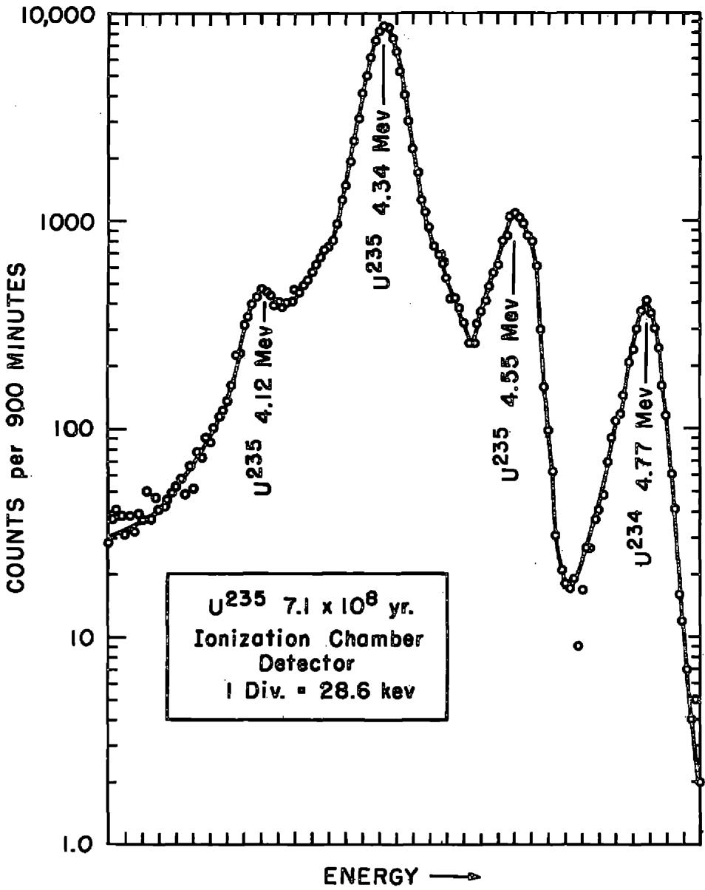  
Figure 77.

Alpha spectrum of a volatilized source of $U^{235}$ obtained with a parallel plate, Frisch grid ionization chamber using $90\%$ argon - $10\%$ methane gas.

D. J. Henderson, Argonne National Laboratory, Unpublished data.

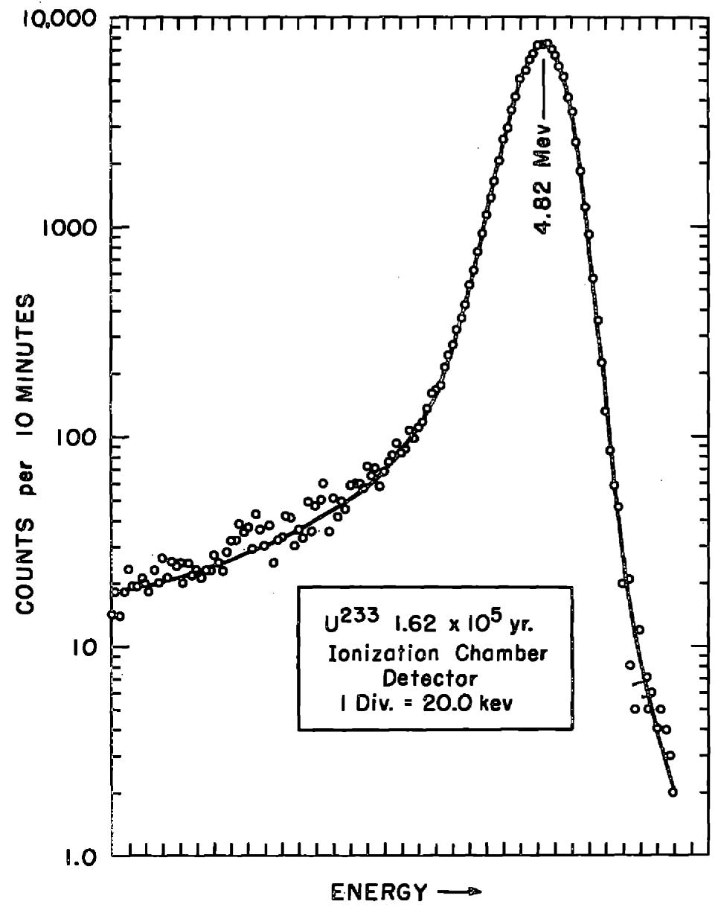  
Figure 78.

Alpha spectrum of a volatilized source of $\mathbf{U}^{233}$ obtained with a parallel plate, Frisch grid ionization chamber using $90\%$ argon - $10\%$ methane gas.

D. J. Henderson, Argonne National Laboratory, Unpublished data.

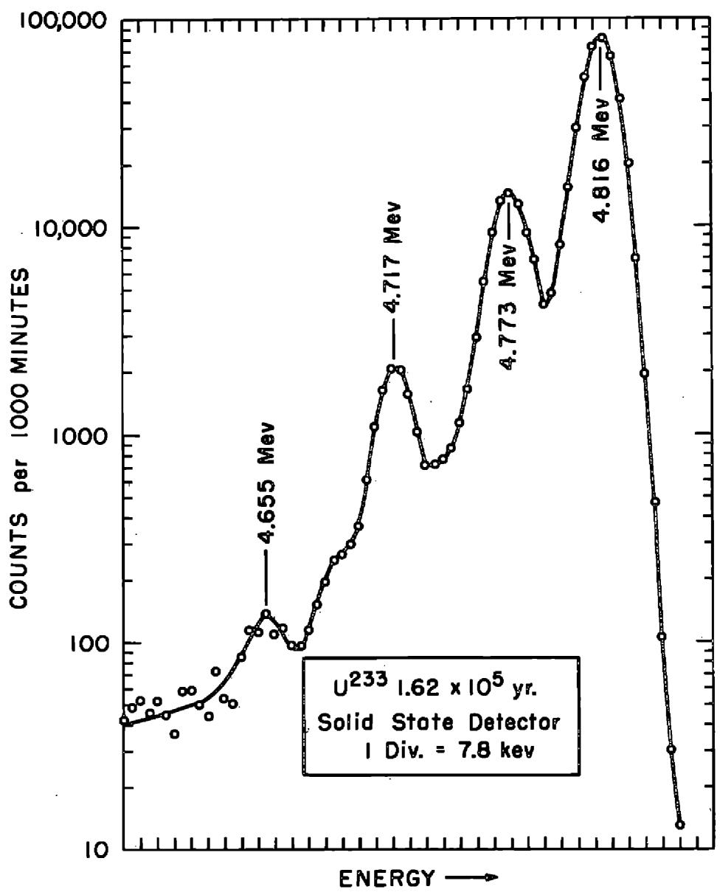  
Figure 79.

Alpha spectrum of a volatilized source of $\mathbf{U}^{233}$ obtained with a surface barrier silicon detector.

D. W. Engelkemeir, Argonne National Laboratory, Unpublished data.

Sodium iodide-thallium activated crystals have gained widespread acceptance as detectors of gamma radiation. The gamma-ray spectra of $\mathsf{U}^{239}$ , $\mathsf{U}^{237}$ , $\mathsf{U}^{235}$ , $\mathsf{U}^{233}$ , and a uranium are from the Belgian Congo are illustrated in figures 80-84. The spectra were measured by Crouthamel, Gatrousis, and Goslovich with a 4-inch diameter x 4-inch thick cylindrical NaI(Tl) crystal.

Not only can the amount of uranium in a sample be determined directly by measuring the disintegration rates of the various isotopes, it can also be measured indirectly by determining the activity of daughter products. For such a measurement to be meaningful, however, the equilibrium condition between the uranium isotope and its daughter must be known.

Information on the radioactive decay of the uranium isotopes is given in Section III. Further information on these isotopes and their daughter products may be obtained by consulting the "Table of Isotopes" compiled by Stromminger, Hollander, and Seaborg[651] and the references given therein. Volumes 8 (1956), 3 (1958), and 28 (1958) of the "Proceedings of the International Conference on the Peaceful Uses of Atomic Energy" contain a number of articles on the radiometric determination of uranium. Reference to many more articles is made in the review papers by Meinke.[652]

2. Sample preparation. One of the most important problems to overcome in the detection of alpha particles and in direct fission counting is the preparation of thin foils or sample deposits. This subject has received considerable attention and has been reviewed by several authors.[632,647,650,653,654] Several techniques are available. The simplest and most quantitative is the direct evaporation of an aliquot of a sample. The distribution of such deposits are generally not very uniform. This may be improved upon by the addition of a spreading agent such as tetraethyleneglycol, TEG. Painting techniques may be used to build up fairly uniform deposits of several milligrams

per square centimeter.655,656 Uranyl nitrate is dissolved in alcohol and added to a dilute solution of Zapon in Zapon thinner or cellulose in amyl acetate. This solution is painted over a metal backing, allowed to dry, and then baked or ignited at a suitable temperature. For aluminum backing, temperatures of $550^{\circ}$ to $600^{\circ}\mathrm{C}$ are satisfactory. For platinum, higher temperatures $(800^{\circ}\mathrm{C})$ are preferred. The thickness of the uranium deposit is increased by repeatedly painting and baking the foil.

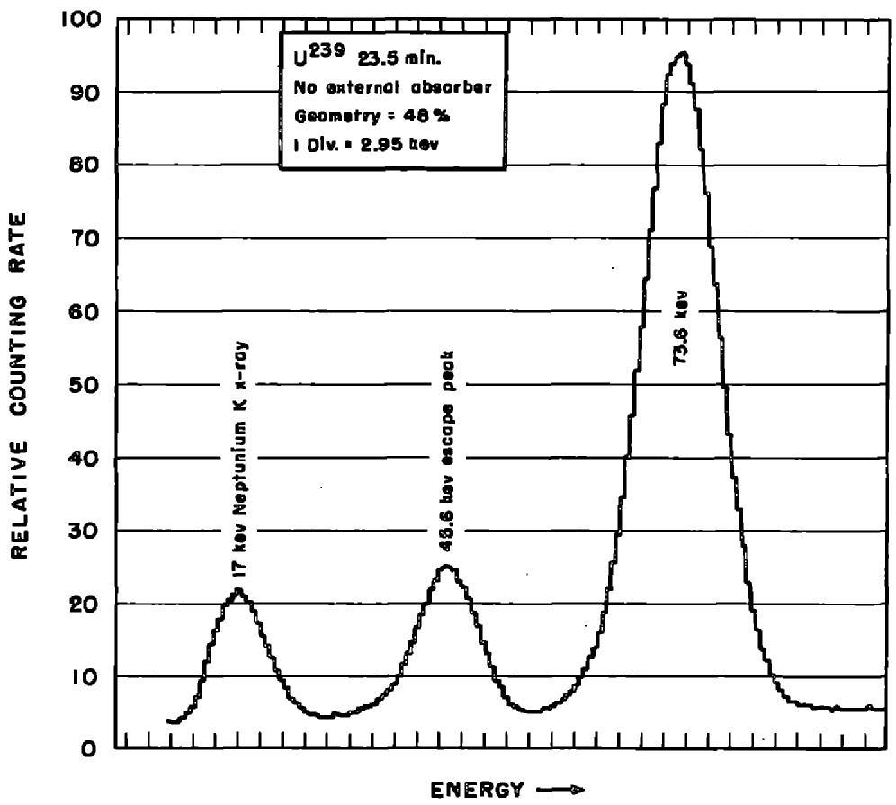  
Figure 80.

Gamma-ray spectrum of $\mathbf{U}^{239}$ obtained with a 4-inch diameter x 4-inch thick cylindrical NaI(Tl) crystal.

After C. E. Crouthamel, C. Gaurousis, S. J. Goslovich, reference 649.

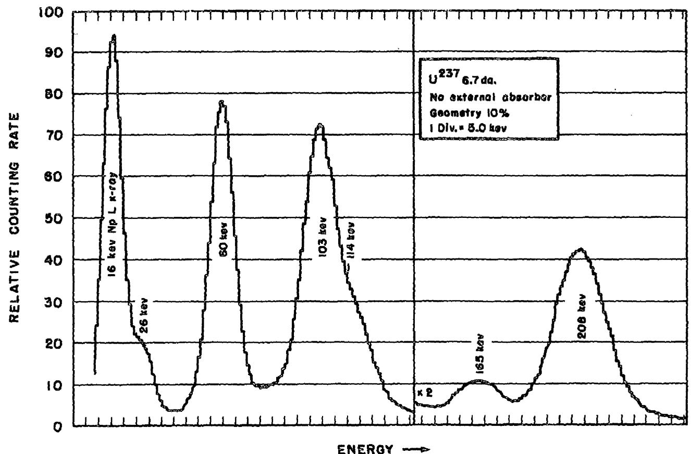  
Figure 81. Gamma-ray spectrum of $\mathsf{U}^{237}$ obtained with a 4-inch diameter x 4-inch thick cylindrical NaI(Tl) crystal. After C. E. Crouthamel, C. Gatrousis, S. J. Goslovich, reference 649.

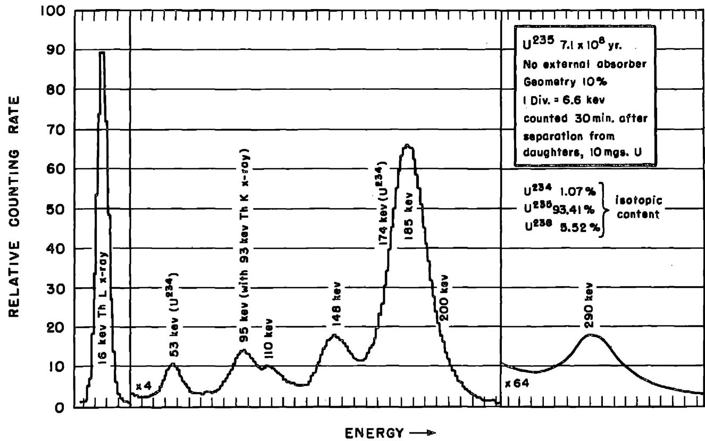  
Figure 82. Gamma-ray spectrum of U $^{235}$ obtained with a 4-inch diameter x 4-inch thick cylindrical NaI(Tl) crystal. After C. E. Crouthamel, C. Gatrousis, S. J. Goslovich, reference 649.

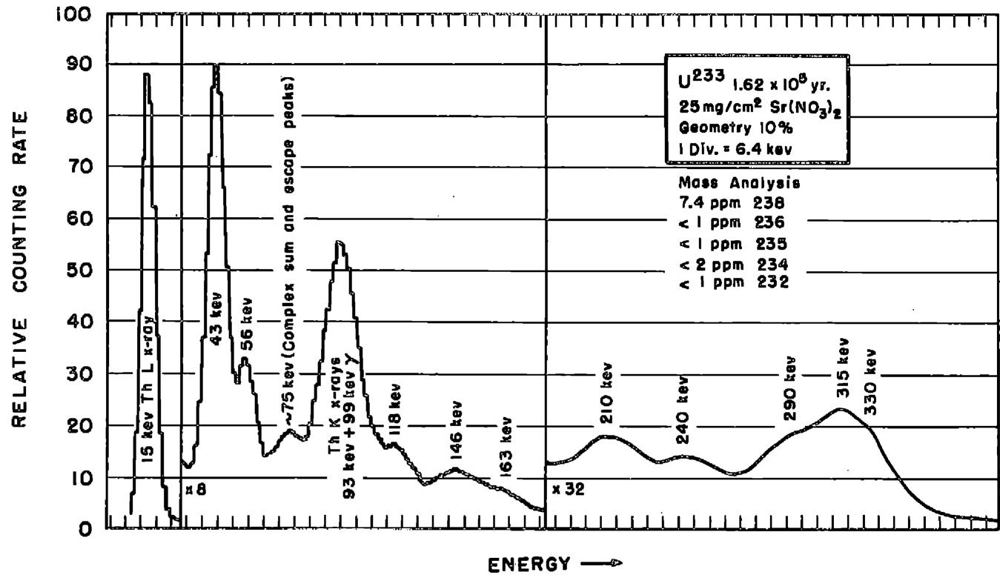  
Figure 83. Gamma-ray spectrum of U233 obtained with a 4-inch diameter x 4-inch thick cylindrical NaI(Tl) crystal. After C. E. Crouthamel, C. Gatrousis, S. J. Gaslovich, reference 649.

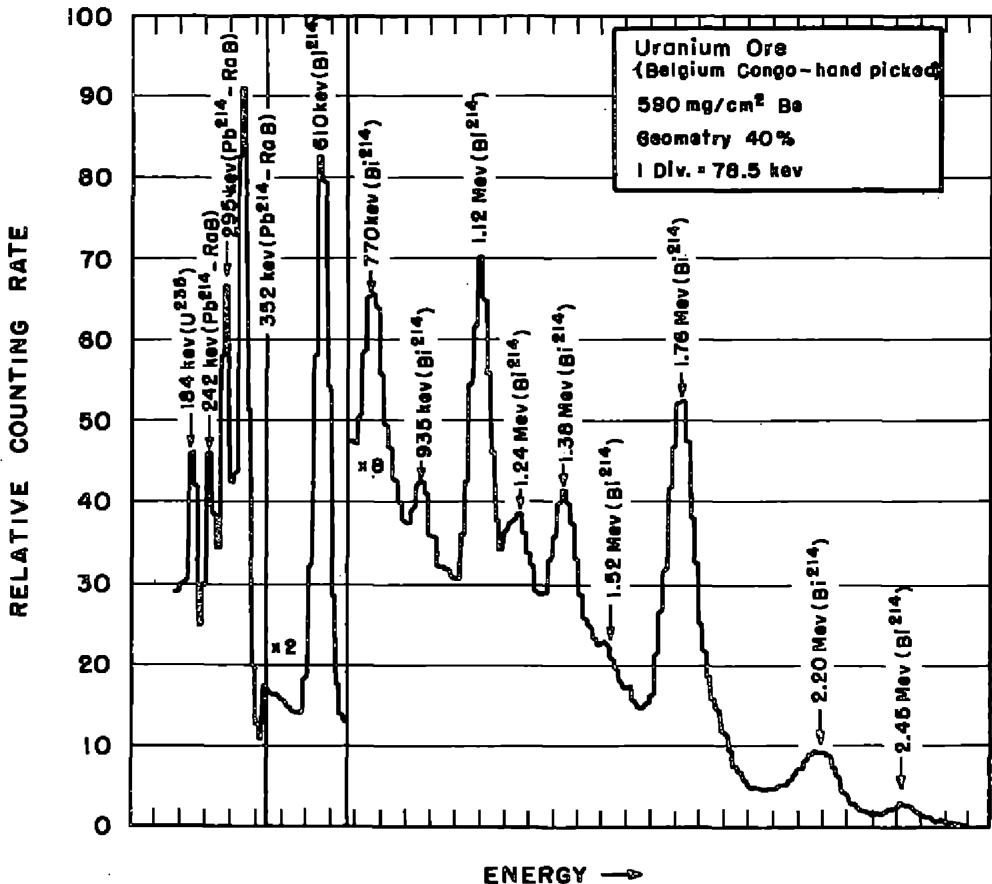  
Figure 84.

Gamma-ray spectrum of uranium ore from the Belgian Congo obtained with a 4-inch diameter x 4-inch thick cylindrical NaI(Tl) crystal. After C. E. Crouthamel, C. Gatrousis, S. J. Goslovich, reference 649.

Samples of the metastable $\mathbf{U}^{235}$ isomer have been prepared by electrostatically collecting the recoil atoms of $\mathbf{Pu}^{239}$ in air.[657,658] A negative potential of several hundred volts was applied to the metallic collection plate.

Carswell and Milsted have succeeded in preparing thin sources by a spraying technique. The material to be deposited is dissolved as the nitrate in an organic solvent (alcohol or acetone). The solution is drawn into a fine glass capillary

tube and sprayed onto the backing material by applying an electric field.

Electrodeposition is a generally satisfactory method for preparing uniform samples with quantitative or nearly quantitative yields. Uranium has been plated from a variety of solutions: acetate, $34,623,628-631$ formate, $639$ oxalate, $623,633-638$ carbonate, $34,632$ fluoride, $623,632,641$ and chloride. $642$ A factory electrolyte for the deposition of uranium is $0.4\mathrm{M}$ ammonium oxalate. $654$ A rotating platinum anode is used to stir the solution placed in a vertical cylindrical cell. The cell is made of glass, lucite, or some other chemically inert material. The cathode on which the uranium is to be deposited is thoroughly cleansed and made the bottom of the cell. The assembled cell is placed in a hot water bath and the temperature kept at about $80^{\circ}\mathrm{C}$ . A current density of approximately 0.1 amp/cm² is used. The deposition is influenced strongly by the rate of stirring, current density, and presence of foreign ions.

Vacuum sublimation provides an excellent means for the preparation of thin deposits of uranium. The sublimation of uranium acetylacetonate, $\mathrm{U(C_{5}H_{7}O_{2})_{4}}$ , has been used. A more convenient method is the sublimation of uranium oxides. A uranium salt solution is placed on a tungsten or tantalum ribbon supported between two electrodes. The solution is dried by a heat lamp or by passing a low current through the metal ribbon. The sample backing material is suspended at a suitable height above the metal ribbon. A bell jar is placed over the assembled unit and evacuated. The uranium is volatilized by increasing the current through the metal ribbon. The uniformity of the deposit depends upon the distance between the ribbon and the backing plate. The collection efficiency also depends upon this distance but in an inverse manner to that of deposit uniformity. Usually a compromise is made between collection efficiency and sample uniformity. Much of the uranium that is

not collected on the sample plate can be recovered from masking plates and glass chimneys placed between the filament and backing material. The collection efficiency may also be improved by subliming from furnaces so that the beam of uranium molecules is directed toward the backing plate. The furnace is heated by electron bombardment or induction heating.

3. Activation Analysis. In activation analysis, a nuclide irradiated by neutrons, gamma rays, or charged particles is transformed into a radioactive nuclide more easily detected than the original one. The amount of original material may be determined either absolutely or comparatively. For an absolute determination, the cross section of the reaction, the irradiation flux, and the disintegration rate of the reaction product must be known or determined. For comparative analysis, a substance of unknown mass is irradiated simultaneously with a similar substance of known mass. The positions of these two substances are either side by side or, if separated, in positions of like flux. The reaction product activities of the two samples are compared to give the relative masses of the starting materials. The comparative technique is, in general, much easier to apply. The uncertainties of many variables are eliminated by relative measurements.

Activation with thermal neutrons may be successfully employed as a method of analysis for natural uranium, uranium-236, and the fissionable isotopes of uranium. Natural uranium consists of $U^{238}(99.3\%)$ , $U^{235}(0.72\%)$ , and $U^{234}(0.0057\%)$ . The principal reactions of these nuclides with thermal neutrons are:

$$
U ^ {2 3 8} + n ^ {1} \rightarrow U ^ {2 3 9} \frac {\beta^ {-}}{2 3 . 5 4 m _ {e}} N p ^ {2 3 9} \frac {\beta^ {-}}{2 . 3 4 6 d _ {e}} P u ^ {2 3 9} \frac {\alpha}{2 4 , 3 0 0 x}, U ^ {2 3 5},
$$

$$
\begin{array}{l} U ^ {2 3 5} + n ^ {1} \rightarrow \text {F i s s i o n P r o d u c t s} + 2. 4 7 \text {n e u t r o n s}, \\ \mathrm {U} ^ {2 3 4} + \mathrm {n} ^ {1} \rightarrow \mathrm {U} ^ {2 3 5}. \\ \end{array}
$$

The amount of natural uranium present in a sample may then be determined from the amount of $\mathbf{U}^{239}$ , $\mathbf{Np}^{239}$ , or $\mathbf{Pu}^{239}$ activity formed after irradiation. Measurement of the $\mathbf{Pu}^{239}$ activity, however, requires either a fairly large amount of $\mathbf{U}^{238}$ , a long irradiation period, or a combination of the two. The amount of natural uranium may also be determined from the fission of uranium-235 either by (1) fission counting the sample, (2) isolating and counting a fission product such as $\mathbf{Ba}^{140}$ or $\mathbf{Te}^{132*}$ , or (3) measuring the total gamma activity induced in the sample by a short neutron irradiation.645 Thermal neutron irradiation of $\mathbf{U}^{234}$ results in $\mathbf{U}^{235}$ and is of little value in the determination of natural uranium.

Neutron irradiation of $\mathsf{U}^{236}$ gives $\mathsf{U}^{237}$ , a beta-emitter having a half-life of 6.75 days.[651] It is readily identified through its beta decay, associated gamma rays, and half-life. Uranium-238 irradiated with fast neutrons also produces $\mathsf{U}^{237}$ , $\mathsf{U}^{238}(\mathsf{n},\mathsf{2n})\mathsf{U}^{237}$ . The cross section for this reaction has been determined with incident neutron energies from 6 to 10 Mev and at 16 Mev.[661]

Activation analysis by fission counting is of value only if one fissioning nuclide is present or if the amounts of other fissioning nuclides present are known and corrections can be made for them. The same is true for the isolation and determination of fission products. Uranium isotopes that are fissionable with thermal neutrons together with their thermal neutron fission cross sections are:660

$$
\begin{array}{l} u ^ {2 3 0} \quad 2 5 \pm 1 0 \text {b a r n s} \\ u ^ {2 3 1} \quad 4 0 0 \pm 3 0 0 \text {b a r n s} \\ \end{array}
$$

$\mathbf{u}^{232}$ 80 ± 20 barns $\mathbf{u}^{233}$ 527 ± 4 barns $\mathbf{u}^{235}$ 582 ± 6 barns $\mathbf{u}^{239}$ 14 ± 3 barns

Other than $\mathsf{U}^{235}$ , $\mathsf{U}^{233}$ is the best uranium isotope to determine by fission counting or fission product analysis. Uranium-232 may possibly be determined in this manner. The other isotopes are of such short half-life that analysis of their own radiations is a much better means for their identification.

Excitation functions have been determined for a number of reactions with charged particles or gamma rays incident on uranium isotopes. These reactions may be used for activation analysis. For absolute analysis, it should be pointed out that (1) the cross sections reported are sometimes subject to considerable error; (2) energy determinations of the incoming particle or ray are also subject to error; and (3) the reaction product can often be produced by a number of reactions. Comparative analysis appears to be a much better method for the determination of uranium. For gamma-ray (bremsstrahlung) activation, simultaneous irradiations in a like flux are fairly easy to accomplish. The two samples, unknown and standard, are mechanically rotated in the gamma-ray beam. For charged particle activation, the simultaneous irradiation of two samples in a like flux may require some ingenuity on the part of the experimenter.

A partial list of reactions between uranium isotopes and charged particles or gamma rays for which excitation functions

or individual cross sections have been determined is given

below:

Protons

$$
\mathrm {U} ^ {2 3 8} (\mathrm {p}, \mathrm {t}) \mathrm {U} ^ {2 3 6} \underline {{6 6 2}}
$$

Deuterons

U238(d,2n)Np238 663,664 U234(d,n)Np235 666

U238(d,4n)Np236 663,664 U234(d,2n)Np234 666

238(d,p)U239 664,665 U234(d,3n)Np233 666

U238(d,t;d,p2n)U237 664

U238(d,t)U237 662 U233(d,n)Np234 667

U233(d,2n)Np233 667

U235(d,n)Np236 664,666 U233(d,3n)Np232 667

U235(d,2n)Np235 664,666 U233(d,an)Pa230 667

U235(d,3n)Np234 664,666 U233(a,F)ZA667

U235(d,4n)Np233 666

Alpha particles

U238(a,n)Pu241 U235(a,5n)Pu234 669

+U238(a,p)Np241β→ Pu241664 U235(a,p)Np238 669

U238(a,2n)Pu240 664 U235(a,p2n)Np236 669

U238(a,3n)Pu239 664 U235(a,F) 669

238(a,4n)Pu238 664,668

U238(a,pn)Np240 669 U234(a,4n)Pu234 668

U238(a,p2n)Np239 669

U238(a,p3n)Np238 669 U233(a,n)Pu236 669

U238(a,an)U237 669 U233(a,2n)Pu235 669

U238(a,t)Np239 662 U233(a,3n)Pu234 669

U238(a,F) 664,669 U233(a,4n)Pu233 669

U233(a,5n)Pu233 669

U236(a,4n)Pu236 668 U233(a,p)Np236 669

U233(a,pn)Np235 669

U235(a,n)Pu238 664,669 U233(a,p2n)Np234 669

U235(a,2n)Pu237 669 U233(a,p3n)Np233 669

U235(a,3n)Pu236 664,669 U233(a,F) 669

U235(a,4n)Pu235 669

Carbon ions

U238(c12,4n)cf246 671

U238(c12,6n)cr244 671

238(c12,a4n)cm242 671

Gamma rays, bremsstrahlung

238(y,n)0237 672,673

U238 (γ,N) 674

U238(γ,F) 672,673,675

U233(y,N) 674

The analysis of uranium by activation methods is reviewed by Koch,676 who also gives references to much of the literature.

# IV-F. Dissolution of Uranium Samples

# 1. Metallic uranium.

HNO₃. Uranium metal dissolves in nitric acid to form uranyl nitrate. With massive amounts of uranium the rate of dissolution is moderately rapid.677 The reaction between uranium turnings, powder, or sintered metal and nitric acid vapors or nitrogen dioxide may occur with explosive violence.677 Oxides of nitrogen are the principal gaseous products in the dissolution of the metal by HNO₃. The presence of oxygen in the dissolver system tends to reduce the emission of these oxides.678 The rate of dissolution of large amounts of metallic uranium may be increased by the addition of small amounts of sulfuric,679 phosphoric,679,680 or perchloric681 acid to the nitric acid.

$\underline{\mathsf{H}_2\mathsf{SO}_4}$ . Hot concentrated sulfuric acid attacks uranium metal slowly forming uranium (IV) sulfate.677 Sulfuric acid-hydrogen peroxide mixtures react slowly with the metal at $75^{\circ}C$ forming uranyl sulfate.682 The addition of small amounts of chloride or fluoride to $\mathsf{H}_2\mathsf{SO}_4 = \mathsf{H}_2\mathsf{O}_2$ mixtures increases the dissolution rate.682

H₃PO₄. Cold 85% phosphoric acid attacks uranium metal slowly. Concentration of the acid by heating produces a fairly rapid reaction in which uranium (IV) phosphate is formed. If heated too long, a chemically inert, glassy substance is formed.

$\underline{\mathsf{HClO}_4}$ . Uranium metal is inert toward cold, dilute perchloric acid. As the concentration is increased by heating a point is reached at which the reaction proceeds with violence. $677,682$ Oxidizing agents added to dilute perchloric acid dissolve the metal. $677$ HCl. Concentrated hydrochloric acid vigorously attacks uranium metal. Dilution of the acid diminishes the attack. But even with $4\text{M}$ HCl there is a rapid evolution of hydrogen. $682$ A

finely divided, black precipitate soon forms after dissolution begins. This precipitate is not dissolved by heating. Only by the addition of oxidizing agents (hydrogen peroxide, bromine, chlorate, nitrate, persulfate, dichromate, or ferric ions) does the precipitate dissolve. Gaseous chlorine, aided by small amounts of iron or iodine, also oxidizes and solubilizes the uranium precipitate. The addition of small amounts of fluosilicic acid $^{682,683}$ or large amounts of phosphoric acid $^{682}$ to the hydrochloric acid prevents formation of the black precipitate during the dissolution of uranium metal.

HF. The reaction of hydrofluoric acid with uranium metal is slow even at temperatures of $80^{\circ} - 90^{\circ}\mathrm{C}$ .677 The reaction is inhibited by the formation of insoluble $\mathsf{UF}_4$ on the surface of the metal. HBr. Hydrobromic acid attacks metallic uranium in manner similar to, but slower than, hydrochloric acid.677 The black precipitate is formed.

HI. The reaction between uranium metal and hydriodic acid is slow. 677

Organic acids. Acetic, formic, propionio, and butyric acids react rapidly with uranium in the presence of hydrogen chloride. $^{677}$ Benzoic acid in ether reacts with the metal, forming the benzoate. $^{677}$ Acetyl chloride and acetic anhydride react to form uranous acetate. $^{677}$

Miscellaneous solvents. Uranium is dissolved in a number of media other than acids: $\frac{34,677,682}{684}$ solutions of heavy metal salts (silver perchlorate, cupric ammonium chloride or acetate), alkaline peroxide solutions (NaOH- $\mathrm{H}_2\mathrm{O}_2$ or $\mathrm{Na}_2\mathrm{O}_2 - \mathrm{H}_2\mathrm{O}$ solutions), solutions of bromine and ethyl acetate, hydrogen chloride and ethyl acetate, hydrogen chloride and acetone, and nitrogen dioxide and hydrogen fluoride.

Table XXXVIII denotes qualitatively some solutions that satisfactorily dissolve uranium.682

Anodic dissolution. Metallic uranium may be dissolved elec

trolytically by anode oxidation. A variety of electrolytes have been used. $690-692$ Satisfactory dissolutions have been made with sulfuric acid, $682$ nitric acid, $691$ tartaric acid, $691$ phosphoric acid containing nitrate, $692$ and sodium bicarbonate. $691$

2. Alloys of uranium. The ease with which uranium alloys are dissolved depends largely upon the chemical behavior of the alloying metal. Larsen has reviewed the dissolution of some of the more common uranium alloys. Table XXXVIII summarizes the effect of various reagents on these alloys.

3. Compounds of uranium. Table II lists solvents for a number of uranium compounds. General Review references 2, 4, 5, and 7 (Section I) cover the chemical properties of these and other compounds more fully.

Table XXXVIII. Reagents for the Dissolution of Uranium and Its Alloys.a   

<table><tr><td colspan="4">S = satisfactory</td><td colspan="4">N = unsatisfactory</td></tr><tr><td>Description</td><td>HNO3</td><td>Aqua Regla</td><td>Nitric-HF</td><td>HCl+Ox</td><td>HCl-EtOAc</td><td>Br2-EtOAc</td><td>NaOH-H2O2</td></tr><tr><td>U</td><td>S</td><td>S</td><td>S</td><td>S</td><td>S</td><td>S</td><td>S</td></tr><tr><td>U-Zr</td><td>N</td><td>N</td><td>S</td><td>N</td><td>N</td><td>S</td><td>N</td></tr><tr><td>U-Nb</td><td>N</td><td>N</td><td>S</td><td>N</td><td>N</td><td>S</td><td>S</td></tr><tr><td>U-Fe</td><td>S</td><td>S</td><td>S</td><td>S</td><td>S</td><td>S</td><td>N</td></tr><tr><td>U-Cr</td><td>N</td><td>N</td><td>N</td><td>S</td><td>S</td><td>S</td><td>N</td></tr><tr><td>U-Ru</td><td>N</td><td>S</td><td>N</td><td>N</td><td>N</td><td>N</td><td>N</td></tr><tr><td>U-Mo</td><td>N</td><td>S</td><td>N</td><td>S</td><td>N</td><td>S</td><td>S</td></tr><tr><td>U-Fissiumb</td><td>N</td><td>S-c</td><td>N</td><td>N</td><td>N</td><td>N</td><td>N</td></tr><tr><td>U-Sid</td><td>S</td><td></td><td>S</td><td></td><td></td><td></td><td></td></tr><tr><td>U-Pu</td><td>S-e</td><td>S</td><td>N</td><td>S</td><td>S</td><td>S</td><td>N</td></tr></table>

a R. P. Larsen, reference 682.   
b Alloys containing from 1 to $3\%$ Zr, Mo, Ru, Rh, Pd, and Ce.   
$\underline{\underline{\mathbf{c}}}$ Fluoride must be added to dissolve Zr.   
d Nitric acid dissolutions leave S1 residue, but nitric-hydrofluoric acid dissolutions can easily lead to volatilization of fluosilicic acid.   
e Pu itself is not readily dissolved in nitric acid, hydrochloric acid being preferable.

The dissolution of uranium oxides is of considerable interest since uranium samples prepared as accelerator targets, for neutron irradiations, or samples found in the natural state are frequently in the form of oxides. Also, many compounds of uranium may be transformed to the oxide by heating, hydrolysis, or fusion. All of the oxides, $\mathrm{UO}_3$ , $\mathrm{U}_3\mathrm{O}_8$ , and $\mathrm{UO}_2$ , are soluble in nitric acid, forming uranyl nitrate. $\mathrm{UO}_3$ is soluble in other mineral acids. $\mathrm{U}_3\mathrm{O}_8$ and $\mathrm{UO}_2$ are dissolved by fuming with perchloric acid. $^{34}$ They are slowly dissolved in hot concentrated sulfuric acid. $^{34}$ The presence of fluoride accelerates this dissolution. $^{693}$ Alkaline peroxides react with uranium oxides to form soluble peruranates. $^{34,687}$

4. Meteorites, minerals, and ores. The extraction of uranium from natural deposits may be accomplished by decomposition and dissolution of the entire sample including uranium or by leaching the uranium from the sample. Grinding and roasting facilitate the recovery. Roasting removes organic material. It also helps form soluble uranium compounds.

Decomposition of the sample may be accomplished by acid attack, by fusion, or by a combination of the two. Mineral acids, individually or in combination, may be used. The presence of hydrofluoric acid generally aids in dissolution. Ores, sand, etc. may be fused with sodium carbonate, sodium hydroxide, sodium peroxide, sodium bisulfate, sodium chloride and sodium hydroxide, ammonium sulfate, potassium bifluoride, and magnesium oxide.[1,34,694] The melt is solubilized in water or acid and the separation of uranium made by procedures outlined in Section IV-D. Rodden and Warf[34] have described a number of procedures in which uranium was made soluble by acid attack or by fusion methods. The recovery of uranium from monazite sands has been reported by Calkins, et al.[694]

Acid and alkaline leaching are used on an industrial scale for the recovery of uranium from its ores. In acid leaching,

hydrochloric, nitric, or sulfuric acid may be used. Industrially, sulfuric acid is used because of its economy. Oxidizing agents (Fe(III), MnO₂, etc.) are used to convert uranium (IV) to uranium (VI). A separation of uranium and thorium with an oxalic acid-nitric acid leach solution has been reported.

In alkaline leaching, various combinations of alkaline carbonates, hydroxides, and peroxides have been used. Industrially, uranium is dissolved by alkaline carbonates as the $\mathrm{UO}_2(\mathrm{CO}_3)_3^{4-}$ complex. Oxygen or other suitable oxidants are used to convert uranium (IV) to uranium (VI). Hydroxyl ions are formed by the dissolution of uranium in carbonate solutions. The presence of bioarbonate ion in the dissolving solution prevents the precipitation of uranium. The recovery of uranium by acid and alkaline leaching is reviewed in General Review reference 13 (Section I).

5. Biological samples. The determination of uranium in biological samples is reviewed by Steadman. Uranium may be extracted and determined directly from liquid samples. The sample may also be ashed, as are solid samples, prior to uranium extraction. Ashing may be carried out as a wet or dry process. Wet-ashing is commonly done with a nitric acid solution. Ashing may be completed with perchloric acid. However, extreme caution must be exercised when heating organic materials with perchloric acid. The ashed residue is dissolved in acid and the uranium determination continued from there. Wet-ashing need not be carried to completion. Analysis may be made upon the sample after it has been thoroughly digested in acid.

6. Air dust samples. Samples of air dust are commonly collected on filter papers. The uranium may be dissolved by digesting the sample in nitric acid solution or the sample may be ashed and the residue dissolved in acid.

# V. Collection of Detailed Procedures

A procedure for the determination of uranium may entail one or more purification steps as outlined in the preceding sections. For example, uranium may be separated from impurities by a series of solvent extractions with one or more different solvents. These may be interspersed with precipitation and/or ion exchange methods. The procedures described herein have been gathered from project reports, the open literature, and by private communication. Only a limited number are presented. They have been selected because they represent many of the separation methods already described or because they represent different problems in handling samples: problems of dissolution, extraction in the presence of high beta-gamma activity, etc. A number of the procedures described do not make use of the radiometric determination of uranium. The method of separation in these procedures, however, is applicable to radiochemical analysis and is, therefore, included. A number of papers and reports describe, in detail, procedures for the determination of uranium. These should be noted. The work of Rodden and Warf has frequently been mentioned in this paper. In addition to procedures for the precipitation, solvent extraction, volatilization, and electrodeposition of uranium, these authors have presented a number of selected procedures for the solution of ores and minerals and the separation and determination of uranium. Procedures for the analytical determination in naturally occurring materials have also been described by Rodden and Tregonning, Grimaldi, May, Fletcher, and Titcomb, Schoeller and Powell, and in the "Handbook of Chemical Determination of Uranium in Minerals and Ores." The recent publication by Moore on extraction with amines contains a collection of procedures, many of which have to do with the separation of uranium.

PROCEDURE 1: Uranium-237.

Source: B. Warren, LA-1567 (1953) p. 18.

Editor's note: Uranium-237 may be separated from fission products, neptunium, and plutonium more easily by ion exchange and/or solvent extraction techniques (see, for example, Procedure 7). The following procedure is, however, an excellent example of uranium purification by precipitation methods.

# 1. Introduction

The significant steps in the determination of $\mathsf{U}^{237}$ in materials containing fission products, neptunium and plutonium are the following. Rare-earth, neptunium, and plutonium activities are removed by appropriate lanthanum fluoride scavenging steps in the presence of hydroxylamine hydrochloride. The latter reagent serves to reduce both neptunium and plutonium so that they may be carried down, and also to complex uranium and prevent its later removal in iron scavenging steps. Barium and zirconium are precipitated by barium fluozirconate scavenging. Following a cycle of ferric hydroxide scavenging and ammonium diuranate precipitation steps, uranium is reduced by zinc metal in hydrochloric acid medium and precipitated, presumably as $\mathrm{U(OH)_4}$ , with ammonium hydroxide. The uranium is further purified by alternate conversions to tetrafluoride and hydroxide. 24.1d $\mathrm{Th}^{234}(\mathrm{UX}_1)$ which has grown in from $\mathsf{U}^{238}$ is removed by a zirconium Iodate scavenge and the uranium is converted to ammonium diuranate. Uranium is finally plated from nitric acid medium onto a platinum foil. After flaming of the foil and weighing, uranium is beta-counted as $\mathrm{U}_{3}\mathrm{O}_{8}$ . Chemical yields average 50 to 65%. Quadruplicate determinations require approximately 8 hours.

# 2. Reagents

$U^{238}$ carrier: 1 ml containing 10 mg of (5000/1) uranium. Preparation: Weigh out 1 gm of U metal, dissolve in conc. $\mathrm{HNO}_3$ , transfer to a 100-ml volumetric flask. Make up to volume, adjusting the final solution

# PROCEDURE 1 (Continued)

to $3\underline{M}$ in $\mathsf{HNO}_3$ . The carrier is standardized by

pipeting 1 ml aliquots into a 000-Coors procelain crucible, evaporating to dryness, igniting at $800^{\circ}$

for 45 min, and weighing as $\mathrm{U}_{3} \mathrm{O}_{8}$ .

La carrier: 10 mg La/ml (added as $\mathrm{La(NO_3)_3} \cdot 6\mathrm{H}_2\mathrm{O}$ in $\mathrm{H}_2\mathrm{O}$ )

Ba carrier: 10 mg Ba/ml (added as $\mathrm{Ba(NO_3)_2}$ in $\mathrm{H}_2\mathrm{O}$ )

Zr carrier: 10 mg Zr/ml (added as $\mathrm{ZrO(NO_3)_2} \cdot 2\mathrm{H}_2\mathrm{O}$ in $1\mathrm{M}$ HNO₃)

Fe carrier: 10 mg Fe/ml (added as $\mathrm{Fe(NO_3)_3} \cdot 9\mathrm{H}_2\mathrm{O}$ in very dilute $\mathrm{HNO}_3$ )

HCl: conc.

HNO3: 1M

HNO3: 8M

HNO3: conc.

HF: conc.

H2SO4: cono.

HIO3: 0.35M

$\mathbf{NH}_{4}\mathbf{OH}$ : conc.

NH2OH·HCl:5M

4% aqueous $(\mathrm{NH}_4)_2\mathrm{C}_2\mathrm{O}_4$

Br2: liquid

Zn metal: 20 mesh, granular

Methanol: anhydrous

Methyl red indicator solution: $0.1\%$ in $90\%$ ethanol.

# 3. Equipment

Fisher burner

Centrifuge

Block for holding centrifuge tubes

40-ml centrifuge tubes: Pyrex 8140 (10 per sample)

OOO-Coore porcelain crucibles (one per standardization)

Pt-tipped tweezers

Pipets: assorted sizes

Stirring rods

Plating assembly: 1 cell per aliquot of sample

Source of current - Fisher Powerhouse (D.C.)

with variable resistance in series with cells.

Cell - Brass base (3" x 3") for holding

Pt cathode; 5-mil Pt circular $2^{\prime \prime}$ diameter disk (cathode);

gasket (Koroseal-Upholstery 36681) to seal cathode and chimney; glass chimney, $2^{n}$ diameter, $4^{n}$ high, with 4 ears at height of $3^{n}$ ; 1 $1/4^{n}$ steel springs for holding chimney to base; rotating Pt anode. The cell is heated for 1 $3/4$ hours at $105^{\circ}$ after assembly to insure formation of seal between glass and Pt.

Water bath for cell - Autemp heater; 6"

crystallizing dish (for water bath); rubber pad for holding cell.

# 4. Procedure

Step 1. Add 1 ml of standard U carrier to an aliquot of sample in a 40-ml long taper centrifuge tube. Dilute to about 10 ml, heat to boiling, and precipitate $(\mathrm{NH}_4)_2\mathrm{U}_2\mathrm{O}_7$ by the dropwise addition of conc. $\mathrm{NH}_4\mathrm{OH}$ .

Step 2. Centrifuge and discard the supernate.

Step 3. Dissolve the precipitate in 1 to 2 ml of $\underline{1\mathbf{M}}$ HNO₃, add 5.4 ml of $\mathrm{H}_2\mathrm{O}$ , 3 drops of La carrier, and 10 drops of $\underline{5\mathbf{M}}$ NH₂OH · HCl. Allow to stand for 5 min.

Step 4. Add 3 drops of conc. HF and allow to stand for 5 min. Centrifuge for 5 min, transfer supernate to a $40\text{-ml}$ centrifuge tube, and discard the precipitate.

Step 5. Add 3 drops of La carrier and let stand for 5 min. Centrifuge for 5 min, transfer supernate to a 40-ml centrifuget tube, and discard the precipitate.

Step 6. Add 3 drops of Zr carrier and 15 drops of Ba

carrier. Centrifuge for 5 min and transfer the supernate to a 40-ml centrifuge tube, discarding the precipitate.

Step 7. Add 4 drops of conc. $\mathrm{H}_2\mathrm{SO}_4$ and centrifuge for 5 min. Transfer the supernate to a $40\text{-ml}$ centrifuge tube and discard the precipitate.

Step 8. Add 2 drops of Fe carrier, heat the solution to boiling, and precipitate $\mathrm{Fe(OH)}_3$ by the addition of conc. $\mathrm{NH}_4\mathrm{OH}$ . Cool the tube under cold $\mathrm{H}_2\mathrm{O}$ , centrifuge for $2 - 1 / 2$ min, and transfer the supernate to a $40\text{-ml}$ centrifuge tube, discarding the precipitate.

Step 9. Add 0.4 to 0.5 ml of liquid $\mathbf{Br}_2$ (Note 1) slowly to slight excess and boil the solution to a light yellow color. Add conc. $\mathbf{NH}_4\mathbf{OH}$ until $(\mathbf{NH}_4)_2\mathbf{U}_2\mathbf{O}_7$ precipitate forms. Cool under cold water, centrifuge, and save the precipitate.

Step 10. Add 1 to 2 ml of $\underline{1M}$ HNO₃ and 10 ml of H₂O, heat the solution to boiling, and add conc. NH₄OH to reprecipitate (NH₄)₂U₂O₇. Centrifuge and save the precipitate.

Step 11. Add 1 to 2 ml of $\underline{1\text{M}}$ HNO₃, 10 ml of H₂O, 10 drops of $\underline{5\text{M}}$ NH₂OH · HCl, and 2 drops of Fe carrier. Let stand for 5 min. Heat the solution to boiling and precipitate Fe(OH)₃ by addition of conc. NH₄OH. Cool the tube under cold H₂O, centrifuge for 2-l/2 min, and transfer the supernate to a 40-ml centrifuge tube, discarding the precipitate.

Step 12. Repeat Step 9.

Step 13. Add $1 \, \text{ml}$ of conc. $\mathsf{HCl}$ , $10 \, \text{ml}$ of $\mathsf{H}_2\mathsf{O}$ , heat the solution to boiling and precipitate $(\mathsf{NH}_4)_2\mathsf{U}_2\mathsf{O}_7$ with conc. $\mathsf{NH}_4\mathsf{OH}$ . Cool the tube, centrifuge, and save the precipitate.

Step 14. Dissolve the precipitate in $1\mathrm{ml}$ of conc. HCl and $10\mathrm{ml}$ of $\mathrm{H}_2\mathrm{O}$ . Add $2\mathrm{gm}$ of Zn metal (20 mesh, granular), and heat the mixture until the solution turns brown. Heat 1 additional minute.

Step 15. Let stand until the vigorous gas evolution subsides and decant into a 40-ml centrifuge tube. Discard the Zn.

Step 16. Heat the solution to boiling and precipitate $\mathrm{U(OH)_4}$ (?) with conc. $\mathrm{NH_4OH}$ . (The precipitate will be greenish-black.) Centrifuge and save the precipitate.

Step 17. Dissolve the precipitate in 10 drops of conc. HCl. Add 5 ml of $\mathsf{H}_2\mathsf{O}$ and 4 drops of conc. HF. Stir vigorously until $\mathsf{UF}_4$ precipitates, add 7 drops of conc. $\mathsf{NH}_4\mathsf{OH}$ and stir. Centrifuge 5 min and save the precipitate.

Step 18. Add $l$ ml of conc. HCl, heat slightly, add $10$ ml of $\mathrm{H}_2\mathrm{O}$ , and heat the solution to boiling (the precipitate should dissolve). Add conc. $\mathrm{NH}_4\mathrm{OH}$ and precipitate $\mathrm{U(OH)}_4$ (?)(greenish-black precipitate).

Step 19. Repeat Step 17, except that $4 \mathrm{ml}$ of $\mathrm{H}_{2} \mathrm{O}$ are added instead of 5.

Step 20. Add $1 \, \text{ml}$ of conc. $\mathsf{HNO}_3$ and heat until $\mathsf{NO}_2$ ceases to be evolved. Add $10 \, \text{ml}$ of $\mathsf{H}_2\mathsf{O}$ and precipitate $(\mathsf{NH}_4)_2\mathsf{U}_2\mathsf{O}_7$ with conc. $\mathsf{NH}_4\mathsf{OH}$ . Centrifuge, discard the supernate, and dissolve the precipitate in $1 \, \text{ml}$ of conc. $\mathsf{HNO}_3$ .

Step 21. Add $10 \, \text{ml}$ of $\underline{\mathsf{H}}_2\mathsf{O}$ , 4 drops of Zr carrier, and $1 \, \text{ml}$ of $0.35\text{M} \underline{\mathsf{HIO}}_3$ . Centrifuge, transfer the supernate to a $40-\text{ml}$ centrifuge tube, and discard the precipitate.

Step 22. Heat the solution to boiling and precipitate $(\mathrm{NH}_4)_2\mathrm{U}_2\mathrm{O}_7$ with conc. $\mathrm{NH}_4\mathrm{OH}$ . Centrifuge and discard the supernate.

Step 23. Dissolve the precipitate in 1 to 2 ml of $\underline{1M}$ HNO₃, dilute with 10 ml of $\mathsf{H}_2\mathsf{O}$ , and centrifuge. Transfer the supernate to a 40-ml centrifuge tube and discard the precipitate.

Step 24. Reprecipitate $(\mathrm{NH}_4)_2\mathrm{U}_2\mathrm{O}_7$ by boiling the solution and adding conc. $\mathrm{NH}_4\mathrm{OH}$ . Centrifuge and save the precipitate.

Step 25. Add 5 drops of $8\underline{M} \underline{HNO}_3$ and transfer to the plating cell which contains 10 ml of $\underline{H}_2\bar{O}$ and 3 drops of $8\underline{M} \underline{HNO}_3$ . Rinse the centrifuge tube with three washes each consisting of 5

drops of $8\underline{M} HNO_3$ and $0.5\text{ml}$ of $\mathsf{H}_2\mathsf{O}$ , transferring the washings to the plating cell.

Step 26. Add $10 \, \text{ml}$ of $4\% (\mathrm{NH}_4)_2\mathrm{C}_2\mathrm{O}_4$ and wash the cell walls down with approximately $5 \, \text{ml}$ of $\mathrm{H}_2\mathrm{O}$ . The total volume in the cell should be about $40 \, \text{ml}$ .

Step 27. Add 5 drops of methyl red solution, and conc. $\mathrm{NH_4OH}$ drop-wise until the solution turns yellow. Add $8\mathrm{M} \mathrm{HNO}_3$ until the solution turns red or orange (one drop is usually required); then add 3 drops of $\mathrm{HNO}_3$ in excess.

Step 28. Plate for 1-1/2 hours at 1.5 amp and 8 volts at 80 to $90^{\circ}$ . For the first 30 min, at 10-min intervals add sufficient $\underline{8M} HNO_3$ to make the solution red to methyl red. At 40 min, add 3 drops of conc. $\mathsf{NH}_4\mathsf{OH}$ , or enough to make the solution yellow to the indicator.

Step 29. Wash down the cell walls with $\mathsf{H}_2\mathsf{O}$ to replenish that lost by evaporation, and continue electrolysis for an additional 50 min.

Step 30. Remove plate, wash with $\mathsf{H}_2\mathsf{O}$ and methanol. Flame plate for 1 min. Cool, weigh as $\mathsf{U}_3\mathsf{O}_8$ , mount, and count. Correct for $\mathsf{Th}^{234}$ ( $\mathsf{UX}_1$ ) activity (see accompanying figure).

# Notes

1. Liquid $\mathbf{Br}_2$ destroys $\mathbf{NH}_2\mathbf{OH}$ and also the uranium-hydroxylamine complex.

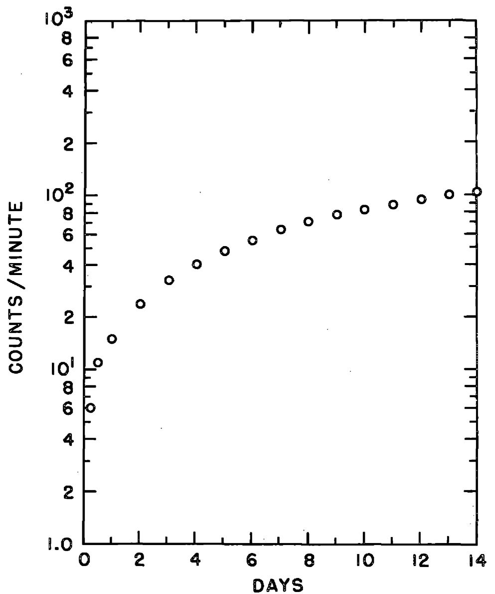  
CORRECTION FOR UX1 ACTIVITY/mg U3O8 ON PLATE. Procedure I.

PROCEDURE 2: Purification of Uranium-240.

Source: E. K. Hyde and M. H. Studier, ANL-4182 (1948).

Editor's note: The following procedure was used to purify $\mathrm{U}^{240}$ formed by the second order neutron capture of $\mathrm{U}^{238}$ . The principal decontaminating step is the ether extraction of uranium from a reducing aqueous solution. Uranium is further purified by a number of precipitations that are not described in detail. These, however, are fairly easy to perform.

# Irradiation and Chemical Procedure

Two grams of depleted uranium (1 part $U^{235}$ per 30,000 parts $U^{238}$ ) as $U_{3}O_{8}$ in a small 2s aluminum capsule was irradiated in the Hanford pile for 12 hours including time for startup and shutdown. Six hours after the end of the irradiation the capsule and its contents were dissolved in nitric acid, using mercuric ion as catalyst for dissolving the aluminum. The uranium was extracted batchwise, the dissolved aluminum serving as a salting agent. The ether containing the uranium was then passed through two static wash columns packed with 3/32 inch stainless steel helices and filled with a solution 1OM in ammonium nitrate, 0.1 M in nitric acid, 0.01 N in ferrous ion and 0.1 M in urea. Neptunium was reduced by the aluminum in the dissolver and by the ferrous ion in the wash columns to an unextractable oxidation state (Np IV and Np V). Additional ether was passed through the columns to strip out the uranium. These operations were carried out by remote control behind lead shielding. The initial dissolver solution measured roughly 50 roentgens per hour at 8 inches. The ether solution emerging from the second column and containing the uranium measured only about 3 mr per hour at the surface, and most of this was ether-soluble iodine fission product activity. The uranium was extracted from the ether into an aqueous ammonium sulfate solution and washed several times with ether to remove iodine activity. LaF₃ was precipitated from the uranyl nitrate solution after reduction with sulfur dioxide to remove any traces of $Np^{239}$ which might have come through the ether extraction.

The uranium was further purified by precipitation as diuranate, sodium uranyl acetate, and peroxide and by a final ether extraction. Throughout this final series of purifications there was no detectable decrease in $\beta$ -activity; this indicates that the uranium was radioactively pure.

Small aliquots of the final uranium solution were evaporated on platinum discs and ignited to $\mathrm{U}_{3} \mathrm{O}_{8}$ to study changes in activity. The remaining uranium solution was used for extraction of neptunium daughter fractions.

PROCEDURE 3: Purification of Irradiated U $^{236}$ .

Source: S. Fried and H. Selig, Private communication.

Editor's note: The present procedure was used in an experiment designed to measure the thermal neutron fission cross section of $U^{237}$ . The amount of $U^{235}$ that can be tolerated in such an experiment is very small.

Two criteria were used in selecting the purification steps in the following procedure:

1) To obtain uranium free of fission products and other extraneous activities without introducing contaminant normal uranium in the procedure.*   
2) The initial part should lend itself easily to remote control manipulation.

# Procedure:

# A. In Cave

The irradiated uranium oxide ( $\sim 0.3 \, \text{mg}$ ) was dissolved in concentrated $\mathsf{HNO}_3$ and made up to $2 \underline{\mathbf{M}}$ in $\mathsf{HNO}_3$ with distilled $\mathsf{H}_2\mathsf{O}$ to give total volume of about $15 \, \text{ml}$ . Some $\mathsf{Fe}^{++}$ was added to keep Pu and Np in $+4$ state. The solution was saturated with $\mathsf{NH}_4\mathsf{NO}_3$ and contacted four times with $10 \, \text{ml}$ portions of ether. Each contact was scrubbed twice with $2 \underline{\mathbf{M}} \mathsf{HNO}_3$ saturated with $\mathsf{NH}_4\mathsf{NO}_3$ . The combined ether extracts were back extracted three times with $5 \, \text{ml}$ portions of $\mathsf{H}_2\mathsf{O}$ . The $\mathsf{H}_2\mathsf{O}$ strip was evaporated to dryness and treated with HCl to destroy $\mathsf{NH}_4\mathsf{NO}_3$ carried over.

# B. Outside Cave

The sample could now be handled easily outside the cave with a minimum of shielding, most of the activity being due to $\mathbf{U}^{237}$ . A mass spectrometric analysis showed it contained 0.5 weight % of $\mathbf{U}^{237}$ . A fission count showed that additional purification was necessary to remove $\mathbf{Np}^{238}$ formed by $(\mathbf{n},\gamma)$ on $\mathbf{Np}^{237}$ which had built up during irradiation.

The sample was taken up in about $0.5 \, \text{ml}$ $6 \underline{\mathbf{N}}$ HCl and put on a small Dowex-1 column and washed. The Np comes off in $6 \underline{\mathbf{N}}$ HCl. Finally the uranium was eluted with $0.5 \underline{\mathbf{M}}$ HCl. The eluate was evaporated to dryness and taken up in $0.2 \, \text{ml}$ of $5 \underline{\mathbf{M}}$ HCl, $0.1 \underline{\mathbf{M}}$ KI and $0.05 \underline{\mathbf{M}}$ $\underline{\mathbf{N}}_2\mathbf{H}_4\mathbf{OH} \cdot 2\mathbf{HCl}$ . This was heated at $90^{\circ}$ for 2 minutes, diluted to $0.5 \underline{\mathbf{M}}$ in HCl and TTA extracted twice for 15 minutes. The original fraction was washed twice with benzene and evaporated to dryness.

In order to clean up the uranium for a mass spectrometric analysis, it was subjected to another ether extraction as in the first step. After the $\mathrm{NH}_4\mathrm{NO}_3$ was destroyed the sample was fumed with $\mathrm{HClO}_4$ to destroy any organic residue from the ether extraction.

PROCEDURE 4: Uranium and Plutonium Analysis

Source: B. F. Rider, J. L. Russell, Jr., D. W. Harris, J. P. Peterson, Jr., GEAP-3373 (1960).

Samples of dissolved irradiated fuel contain highly radioactive fission products. For this reason, uranium and plutonium are separated prior to analysis. The following procedure gives a good yield together with a good decontamination factor.

# Reagents:

1. Distilled conc. HNO₃.   
2. $2 \underline{\underline{\mathbf{M}}}$ HNO₃ - distilled conc. HNO₃, double distilled H₂O.   
3. U-233 solution, standardized.   
4. Pu-236 solution, standardized.   
5. $\mathbf{KBrO}_3$ - Crystals, Reagent Grade. Low natural U blank.   
6. 8 M NH₄NO₃ in 2 M HNO₃ - Place 200 ml distilled 16 M HNO₃ + 100 ml double distilled H₂O in a large beaker. Bubble NH₃ gas through solution until basic to pH paper. Boil off excess NH₃ (solution neutral). Transfer to mixing cylinder, add 50 ml of distilled 16 M HNO₃, dilute to 400 ml. Check density of solution (1.31 ± 0.01 at 20°C.).   
7. Hexone - distilled.   
8. HCl - C.P. reagent. Low natural U blank.   
9. 1 M HNO₃ - distilled conc. HNO₃, double distilled H₂O.   
10. $30\% \mathrm{H}_2\mathrm{O}_2$ - meets A.C.S. specification, low natural U blank.   
11. 0.2 M T.T.A. in xylene - 4.44 gm T.T.A. dissolved in 100 ml distilled xylene.   
12. Xylene - distilled.   
13. Ether - distilled.   
14. 0.05 M HNO₃ - distilled conc. HNO₃, double distilled H₂O.   
15. $\mathrm{H}_{2} \mathrm{O}$ - double distilled.

# Glassware:

All glassware used is Pyrex which has been soaked overnight in

$50\% \mathrm{HNO}_3$ and rinsed with double distilled water. Pipets are rinsed with $50\% \mathrm{HNO}_3$ and double distilled water before using.

# Separation and Decontamination Procedure:

1. Place the aliquot for analysis in a $15\mathrm{ml}$ cone and evaporate to about $1\mathrm{ml}$ . Add a suitable U-233 and Pu-236 spike, one drop conc. nitric acid, and several $\mathrm{KBrO}_3$ crystals. Allow to stand for $1\mathrm{hour}$ to allow oxidation of Pu to $\mathrm{PuO}_2^{++}$ .   
2. Add $1.5 \mathrm{ml} 8 \underline{\mathrm{M}} \mathrm{NH}_{4} \mathrm{NO}_{3}$ in $2 \underline{\mathrm{M}} \mathrm{HNO}_{3}$ , and evaporate to about $2 \mathrm{ml}$ .   
3. Prepare 2 scrub solutions in separate $15\mathrm{ml}$ cones, containing $1\mathrm{ml}$ of $8\mathrm{MNH}_4\mathrm{NO}_3$ in $2\mathrm{M}$ $\mathrm{HNO}_3$ and about 10 mgs $\mathrm{KBrO}_3$ . Preoxidize about $10\mathrm{ml}$ hexone with $2\mathrm{ml}$ of $2\mathrm{M}$ $\mathrm{HNO}_3$ and $\mathrm{KBrO}_3$ . Keep covered until ready for use.   
4. Extract the U and Pu four times for five minutes with 2 ml portions of hexone (methyl isobutyl ketone), adding 1 drop of $16 \underline{\underline{\mathbf{M}}} \underline{\underline{\mathbf{HNO}}}_{3}$ to the original solution after each extraction. Scrub each extract in turn with the two solutions prepared in step 3.   
5. Strip the combined hexone extracts with five 2 ml portions of $\mathsf{H}_2\mathsf{O}$ . Evaporate the combined aqueous portions to dryness, add a few drops of $\mathsf{HNO}_3$ and $\mathsf{HCl}$ , take to dryness. Evaporate to dryness with $\mathsf{HNO}_3$ under a gentle stream of pure nitrogen on a boiling water bath.   
6. Prepare $3\mathrm{ml}$ of $1\mathrm{M}$ $\mathrm{HNO}_3$ and $1\mathrm{ml}$ drop of $30\%$ $\mathrm{H}_2\mathrm{O}_2$ , add $1\mathrm{ml}$ to the $\mathrm{Pu}$ and $U$ residue from step 5 and two $1\mathrm{ml}$ portions to separate $15\mathrm{ml}$ cones.   
7. Extract immediately the Pu 2 times for 20 min. with 2 ml portions of $0.2 \underline{\underline{\mathbf{M}}} \mathbf{T}.\mathbf{T}.\mathbf{A}$ . (thenoyltrifluoroacetone) in xylene. Scrub each in turn with solutions prepared in step 6. Save the aqueous phase for uranium. Combine the T.T.A. extracts and add a few crystals of trichloroacetic acid.

8. Mount the combined T.T.A. extracts on a platinum plate for alpha pulse analysis.   
9. After pulse analysis, remove the Pu for mass analysis as follows: Cover disc with HF. Evaporate to dryness under a heat lamp. Again cover disc with HF and evaporate to dryness. Cover disc with cono. HNO₃ and evaporate to dryness. Repeat 3 or 4 times. Cover disc with cono. nitrio, re-flux a few seconds, and transfer with a pipet to a 15 ml cone. Repeat 3 or 4 times.   
10. Evaporate the combined conc. $\mathrm{HNO}_3$ refluxes to dryness. Treat residue with aqua regia and evaporate to dryness. Evaporate to dryness with conc. $\mathrm{HNO}_3$ on a boiling water bath several times. Add 50 λ of 0.01 M $\mathrm{HNO}_3$ to the evaporated sample and submit sample for mass spectrographic analysis.   
11. Wash the original $1 \underline{\mathbf{M}}$ HNO $_3$ uranium fraction (Step 7) with xylene. Add 1 drop of HNO $_3$ and 3 drops of HCl to the washed $1 \underline{\mathbf{M}}$ HNO $_3$ and reflux for about one-half hour to destroy the organic present. Evaporate to dryness, flame gently to destroy organic matter and dissolve the residue with 2 drops HNO $_3$ and evaporate to dryness on a water bath.   
12. Pipette three 1 ml portions of $8 \underline{\underline{M}} \mathrm{NH}_{4} \mathrm{NO}_{3}$ in $2 \underline{\underline{M}} \mathrm{HNO}_{3}$ , dissolve the evaporated U fraction in one 1 ml portion. Place the other 2 portions in two 15 ml cones for scrub solutions.   
13. Extract the U with four 2 ml portions of diethyl ether, adding 100 λ of conc. HNO₃ before each extraction. Scrub each extract in turn with 2 scrub solutions prepared in Step 12.   
14. Evaporate the combined ether extracts over $1 \, \text{ml}$ of $\mathsf{H}_2\mathsf{O}$ in a $15 \, \text{ml}$ cone. Evaporate to dryness.   
15. Add 3 drops of HCl and 1 drop of $\mathsf{HNO}_3$ , and evaporate to dry-

ness repeatedly until the organic is destroyed. Flame gently to expell ammonium salts. Then dissolve in $\mathsf{HNO}_3$ and evaporate to dryness on a water bath. Add 50 $\lambda$ of $0.05\textbf{M}$ $\mathsf{HNO}_3$ to the dry cone and submit sample for mass spectrographic analysis.

# Plutonium Calculation:

To determine the amount of Pu in the original sample, it is necessary to measure in a Frisch chamber the alpha spectrum of the plate prepared in Step 8. The ratio of Pu-239 and Pu-240 activity to Pu-236 activity is calculated. If the ratio is multiplied by the original activity of Pu-236 added, the original activity of Pu-239 plus Pu-240 can be obtained. From the mass analysis a Pu-239 to Pu-240 atom ratio is obtained. The specific activity of the mixture is calculated from that of the individual isotopes. The Pu-239 plus Pu-240 activity can be converted to Pu-239 plus Pu-240 weight by dividing this activity by the specific activity of the mixture.

# Uranium Calculation:

The ratio of the various U isotopes to U-233 from the mass spectrometer data is multiplied by the amount of U-233 spike originally added to the sample to obtain the amount of each uranium isotope present in the original sample.

PROCEDURE 5: Spectrophotometric Extraction Methods Speciio for Uranium.

Source: W. J. Maeck, G. L. Boorman, M. C. Eliott, and J. E. Rein, Anal. Chem. 31, 1130 (1959).

# Abstract

Uranium as tetrapropylammonium uranyl trinitrate is quan-

titatively separated from large quantities of diverse ions by extraction into methyl isobutyl ketone (4-methyl-2-pentanone) from an acid-deficient aluminum nitrate salting solution. Milligram levels are determined by a direct absorbance measurement of the trinitrate complex in the separated organic phase at $452\ \mu\text{M}$ . Microgram amounts are determined by adding dibenzoyl-methane (1,3-diphenyl-1,3-propanedione) in an ethyl alcohol-pyridine mixture to the separated organic phase and measuring the absorbance of the chelate at $415\ \mu\text{M}$ . The coefficient of variation is less than $1\%$ at the $10-\text{mg}$ and $25-\text{γ}$ levels. The limit of sensitivity is $0.8\ \text{\textup{\gamma}}$ for the dibenzoylmethane method.

# Apparatus and Reagents

Absorbance measurements of the tetrapropylammonium uranyl trinitrate complex were made with a Cary Model 14 recording spectrophotometer and 1-cm. Corex cells. A Teflon $9 \times 9 \times 6 \mathrm{~mm}$ spacer placed in the bottom of the cells permits absorbance measurements with $2 \mathrm{ml}$ . of sample. Absorbance measurements of the dibenzoylmethane complex were made with a Beckman DU spectrophotometer and 5-cm. Corex cells.

Extractions were made in $125 \times 15 \mathrm{~mm}$ . test tubes with polyethylene stoppers. A mechanical extraction device was used for agitation.

Reagent grade inorganic and Eastman Kodak Co. White Label organic chemicals were used without purification. Distilled water was used throughout. The uranium solutions were prepared by dissolving purified black oxide, $\mathrm{U}_{3}\mathrm{O}_{8}$ , in a slight excess of nitric acid, and making to volume with water.

The dibenzoylmethane reagent is prepared by dissolving 0.1140 gram of dibenzoylmethane in 500 ml. of a $5\%$ solution $(v_{*} / v_{*})$ of ethyl alcohol in pyridine.

Salting and Scrub Solutions. A. O.005M Tetrapropylammonium

Nitrate, 1N Acid-Deficient Salting Solution. Place 1050 grams of aluminum nitrate nonahydrate in a 2-liter beaker and add water to a volume of 850 ml. Heat, and after dissolution add 67.5 ml. of concentrated ammonium hydroxide. Stir for several minutes until the hydroxide precipitate dissolves. Cool to less than $50^{\circ}\mathrm{C}$ , add 10 ml. of $10\%$ tetrapropylammonium hydroxide, and stir until dissolved. Transfer to a 1-liter volumetric flask and make to volume with water. A preliminary extraction with methyl isobutyl ketone is suggested to remove uranium contamination in which case tetrapropylammonium hydroxide will have to be re-added.

B. 0.025 M Tetrapropylammonium Nitrate, 1 N Acid-Deficient Salting Solution. Same as A except that 50 ml. of 10% tetrapropylammonium hydroxide is used.

C. O.25M Tetrapropylammonium Nitrate, 1N Acid-Deficient Salting Solution. Neutralize 100 ml. of $10\%$ tetrapropylammonium hydroxide to pH 7 with 5N nitric acid. Transfer to a large evaporating dish and let stand until a thick crystal slurry forms (which may take as long as 4 days). Place 210 grams of aluminum nitrate nonahydrate in a 400-ml. beaker and transfer the tetrapropylammonium nitrate crystals into the beaker with 20 ml. of water. Stir and add water to a volume of approximately 180 ml. Add 13.5 ml. of concentrated ammonium hydroxide and stir until dissolution is complete (which may require several hours). Transfer to a 200-ml. volumetric flask and make to volume with water.

D. Scrub Solution for Dibenzoylmethane Method. Add 940 grams of aluminum nitrate nonahydrate, 33 grams of tartaric acid, 31 grams of oxalic acid, and 64 grams of (ethylenedinitrilo)-tetraacetic acid to 100 ml. of water and 150 ml. of concentrated ammonium hydroxide. Heat with stirring until dissolved. Cool,

filter, transfer to a 1-liter volumetric flask, and make to volume with water. Remove uranium contamination by a methyl isobutyl ketone extraction.

E. Special Solutions. The following salting and scrub solutions are used in the dibenzoylmethane method for samples containing cerium(IV) or thorium.

1. Prepare an aluminum nitrate salting solution as A, but omit the tetrapropylammonium hydroxide.   
2. Prepare a scrub solution by dissolving 154 grams of ammonium acetate and 20 grams of the sodium salt of diethyldi-thiocarbamate in water to a volume of approximately 900 ml. Adjust to pH 7, filter, and make to a l-liter volume with water.   
3. Prepare a mercuric nitrate solution by dissolving 0.063 gram of mercuric nitrate in 90 ml. of $\underline{\mathbf{lN}}$ nitric acid and making to a 100-ml. volume with $\underline{\mathbf{lN}}$ nitric acid.

# Procedures

Milligram Amounts of Uranium. With aqueous samples of 0.5 ml. or less and containing up to 2 meq. of acid, 0.5 to 12 mg. of uranium can be extracted from a salting solution which is 0.025M in tetrapropylammonium nitrate and 1N acid-deficient. Samples of high acidity should be neutralized to less than 2 meq. of free acid, or a salting solution which is 2N acid-deficient can be used for samples containing up to 6 meq. of acid. If cerium(IV) and thorium are present, the absorbance from uranium will be maximum if the combined uranium(VI), thorium, and cerium(IV) do not exceed 0.05 mmole in the sample aliquot. Samples that contain more than 0.05 mmole of combined uranium, cerium(IV), and/or thorium can be analyzed after dilution, provided the resulting sample aliquot contains more than 0.5 mg. of uranium. If this condition cannot be met, the 0.25M tetrapropylammonium nitrate salting solution is used, which can accommo

date up to 0.5 mmole of combined uranium, cerium(IV), and thorium.

Pipet a sample of 0.500 ml. or less, containing from 0.5 to 12 mg. of uranium, into a test tube containing 4.0 ml. of salting solution B or C. Add 2.0 ml. of methyl isobutyl ketone, stopper, and extract for 3 minutes. Centrifuge to facilitate phase separation. Transfer as much as possible of the organic phase with a micropipet to a 1-om. cell containing the Teflon spacer. Measure the absorbance at 452 mu against a blank prepared by substituting 1N nitric acid for the sample.

Microgram Amounts of Uranium. Aqueous sample aliquots containing up to 2 mg. of uranium and as much as 8N in acid can be quantitatively extracted from a salting solution 0.005M in tetrapropylammonium nitrate<sup>a</sup>. Neutralize samples of higher acidity to less than 8N before extraction.

SAMPLES WITHOUT CERIUM(IV) AND THORIUM. Pipet a sample of 0.500 ml. or less, containing from 0.8 to 75 $\gamma$ of uranium, into a test tube containing 5.0 ml. of salting solution A. Add 2.0 ml. of methyl isobutyl ketone, stopper, and extract for 3 minutes. Centrifuge to facilitate phase separation. Transfer as much as possible of the organic phase to a test tube containing 5.0 ml. of scrub solution D, stopper, and mix for 3 minutes. Centrifuge to facilitate phase separation. Remove a 1.00-ml. aliquot of the organic phase and transfer to a 25-ml. flask. Add 15 ml. of the dibenzoylmethane-pyridine reagent and thoroughly mix. Allow to stand 15 minutes, transfer to a 5-cm. Corex cell, and measure the absorbance at 415 $\mathfrak{m}\mu$ compared to a blank prepared by substituting 1N nitric acid for the sample aliquot.

SAMPLES CONTAINING CERIUM(IV) OR THORIUM. Pipet a sample of 0.500 ml. or less, containing from 0.8 to 75 γ of uranium,

into a test tube containing 5.0 ml. of the salting solution E-1. Add 4.0 ml. of methyl isobutyl ketone, stopper, and extract for 3 minutes. Centrifuge to facilitate phase separation. Transfer as much as possible of the organic phase to another tube containing 5.0 ml. of scrub solution E-2, stopper, and mix for 20 minutes. Centrifuge as before. Transfer at least 3 ml. of the organic phase to a test tube containing 5.0 ml. of salting solution E-1. Add 0.5 ml. of scrub solution E-3, stopper, mix for 10 minutes, and centrifuge. Remove a 2.00-ml. aliquot of the organic phase and transfer to a 25-ml. flask. Add 15 ml. of the dibenzoylmethane-pyridine reagent and thoroughly mix. Let stand 15 minutes, transfer to a 5.0-cm. Corex cell, and measure the absorbance at 415 m compared to a blank prepared by substituting 1N nitric acid for the sample aliquot.

Calibration. Two different standards containing levels of uranium equivalent to approximately 0.1 and 0.7 absorbance are processed. The concentration of samples is established by the average absorptivity of these standards provided agreement within statistical limits (95% confidence level) is obtained.

a W. J. Maeck, G. L. Boorman, M. C. Eliott, J. E. Rein, Anal. Chem. 30, 1902 (1958).

PROCEDURE 6: Determination of Uranium in Uranium Concentrates.  
Source: R. J. Guest and J. B. Zimmerman, Anal. Chem. 27, 931 (1955).

# Abstract

A method is described for the determination of uranium in high grade uranium material. Uranium is separated from contaminants by means of an ethyl acetate extraction using aluminum nitrate as a salting agent. After the uranium has been stripped from the ethyl acetate

layer by means of water, colorimetric determination of the uranium is carried out by the sodium hydroxide-hydrogen peroxide method. The procedure is accurate, rapid, and easily adaptable to routine work.

# Reagents and Apparatus

Reagents. Ethyl acetate (Merck, reagent grade).

ALUMINUM NITRATE SALTING SOLUTION. Place approximately 450 grams of reagent grade (Mallinckrodt) aluminum-nitrate $\left[\mathrm{Al}\left(\mathrm{NO}_{3}\right)_{3} \cdot 9\mathrm{H}_{2}\mathrm{O}\right]$ in a 600-ml. beaker and add 25 to 50 ml. of distilled water. Cover the beaker and heat the mixture on a hot plate. If a clear solution does not result after 5 to 10 minutes of boiling, add 20 ml. of water, and continue the boiling for 5 more minutes. Repeat this step until a clear solution is obtained after boiling. Remove the cover glass and concentrate the solution by boiling until a boiling point of $130^{\circ}\mathrm{C}$ . is reached. Cover the beaker with a watch glass and either transfer the solution to a constant temperature apparatus or keep the solution warm, finally heating to just under boiling before use. If the solution is allowed to cool to approximately $60^{\circ}\mathrm{C}$ , recrystallization of aluminum nitrate will take place. It is necessary, therefore, to dilute the salting agent solution by about one third in order to prevent recrystallization if the solution cools to room temperature. Accordingly, if the solution is to stand overnight, add 35 ml. of distilled water per 100 ml. of salting agent solution, mix well, and cover.

If the salting agent solution is to be stored, the following procedure has been found convenient. Adjust the solution to the proper concentration (boiling point, $130^{\circ}\mathrm{C}$ .) and transfer to a 100-ml. three-necked reaction flask set on a heating mantle. Adjust the heating so that the temperature of the solution is kept at about $110^{\circ}\mathrm{C}$ . In one of the necks place a water condenser, in another neck a thermometer, and in the third neck a removable ground-glass stop

# PROCEDURE 6 (Continued)

per. This third neck is utilized for pipetting the salting agent solution.

ALUMINUM NITRATE WASH SOLUTION. Add 100 ml. of aluminum nitrate salting solution (boiling point, $130^{\circ}\mathrm{C}$ .) to 73 ml. of distilled water and 4 ml. of concentrated nitric acid.

Apparatus. Beckman DU spectrophotometer.

Heating mantle.

Three-necked reaction flask (1000 ml.).

Water condenser.

No. O rubber stoppers. Boil twice in ethyl acetate before use.

Sixty-milliliter separatory funnels (Squibb, pear-shaped).

# Procedure

Sample Dissolution. Place an appropriate quantity (1 to 5 grams) of the sample in a tared weighing bottle, stopper the bottle, and weigh the bottle and contents immediately. Carry out a moisture determination on a separate sample if uranium is to be calculated on a dry weight basis.

Bring the sample into solution in one of three ways: (1) nitric acid treatment, (2) multiacid treatment, or (3) sugar carbon-sodium peroxide fusion.

For the nitric acid treatment, dissolve the sample in a suitable quantity of nitric acid and transfer the solution and insoluble residue into an appropriate volumetric flask and make up to volume. Regulate the dilution so that the aliquot chosen for extraction will contain between 10 and $30\mathrm{mg}$ . of uranium oxide if the final dilution for the colorimetric finish is to be $250\mathrm{ml}$ . Adjust the acidity of the sample solution to about $5\%$ in nitric acid.

If nitric acid treatment is not sufficient, treat the sample with hydrochloric acid, nitric acid, perchloric acid, and finally sulfuric acid. If necessary, add a few milliliters

of hydrofluoric acid. Fume the sample to dryness and leach the residue with nitric acid, finally transferring the solution and residue to an appropriate volumetric flask and adjusting to $5\%$ in nitric acid as in the single acid treatment.

If the sample is refractory, use the sugar carbon-sodium peroxide fusion method described by Muehlberg<sup>a</sup>. After dissolution of the sample in this manner, transfer the acidified solution to an appropriate volumetric flask and dilute so that the final solution is $5\%$ in nitric acid.

Aliquot solution samples directly or dilute as required for an ethyl acetate extraction. If the sample is aliquoted directly for an extraction, add 5 drops of concentrated nitric acid per $5\mathrm{-mL}$ aliquot of sample and standards before extraction. Where samples are diluted before aliquots are taken for extraction, adjust the acidity so that the final volume is $5\%$ in nitric acid.

Ethyl Acetate Extraction. Place an appropriate aliquot (usually 5 ml.) in a 60-ml. separatory funnel, the stopcock of which has been lubricated with silicone grease. Add, by means of a graduated pipet, 6.5 ml. of aluminum nitrate solution per 5 ml. of sample solution. The aluminum nitrate salting solution should be added while hot (above $110^{\circ}\mathrm{C}$ ). Cool the solution to room temperature and add 20 ml. of ethyl acetate. Stopper the separatory funnels with pretreated rubber stoppers. Snake the mixture for 45 to 60 seconds. Occasionally crystallization will take place in the separatory funnel near the stopcock. In such a case place the lower part of the separatory funnel in a beaker of hot water until the solidified portion dissolves.

After the layers have separated, drain off the aqueous (lower) layer. Occasionally a cloudiness will appear at the boundary of the aqueous and organic layer. This cloudy portion should not be drained off. Add 10 ml. of aluminum nitrate wash

# PROCEDURE 6 (Continued)

solution to the funnel and again shake the mixture for 45 to 60 seconds. Drain off the aqueous layer, once again being careful to retain the cloudy portion at the boundary in the funnel. Rinse inside the stem of the separatory funnel with a stream of water from a wash bottle.

Water Stripping of Uranium from Ethyl Acetate Layer Followed by Sodium Hydroxide-Hydrogen Peroxide Colorimetric Finish. Add $15\mathrm{ml}$ . of water to the separatory funnel containing the ethyl acetate, stopper the flask, and shake the mixture for about 1 minute. After washing off the stopper with water, drain the aqueous layer into a volumetric flask of suitable size and wash the separatory funnel and ethyl acetate layer 4 or 5 times with 5-ml. portions of water by means of a wash bottle. Combine the aqueous fractions.

Add enough $20\%$ sodium hydroxide solution $(w./v.)$ to neutralize the solution and dissolve any precipitated aluminum hydroxide, then add $10 \mathrm{ml}$ . In excess per $100 \mathrm{ml}$ of final volume. Add $1 \mathrm{ml}$ . of $30\%$ hydrogen peroxide per $100 \mathrm{ml}$ . of final volume and make up the volume to the mark with distilled water. Read the absorbance after 20 minutes on the Beckman DU spectrophotometer at $370 \mu \mathrm{m}$ against a reagent blank, using $1-\mathrm{cm}$ . Corex cells and a slit width of $0.2 \mathrm{~mm}$ . Compare the absorbances of the samples against the absorbances of standard uranium solutions which have been carried through the procedure at the same time. Choose the standards so that they cover the range into which the samples are expected to fall, using a ratio of one standard to six samples. In practice it is customary to work between the limits of $10$ and $30 \mathrm{mg}$ of uranium oxide. This is arranged by estimating the required sample weights and diluting and sampling accordingly. The final volume for colorimetric reading is usually $250 \mathrm{ml}$ .

Double Extraction of Uranium with Ethyl Acetate Followed by Application of Differential Colorimetry. Uranium determinations requiring the highest accuracy may be carried out by a double extraction of uranium with ethyl acetate followed by the application of differential colorimetry as described by Hiskey and others. In such a case it is recommended that between 100 and 150 mg. of uranium oxide be extracted, and a wave length of 400 mµ be used during the colorimetric finish. The procedure described below has been found satisfactory.

Extract an appropriate aliquot of the sample solution with 20 ml. of ethyl acetate as described above. Draw off the aqueous layer into a second separatory funnel containing 10 ml. of ethyl acetate. Stopper the funnels and shake the mixture for 45 to 60 seconds. Drain off and discard the aqueous layer. Add 10 ml. of aluminum nitrate wash solution to the first ethyl acetate extract, stopper, and shake the mixture for 45 to 60 seconds. Drain off the aqueous layer into the separatory funnel containing the second ethyl acetate extract, stopper, and shake the mixture for 45 to 60 seconds. Drain off and discard the aqueous layer. Combine the ethyl acetate fractions. Rinse the second separatory funnel with 20 ml. of water, draining the washings into the separatory funnel containing the combined ethyl acetate fractions. Shake the mixture for 1 minute. Continue the water stripping as described above, collecting the fractions in an appropriate volumetric flask. Finish colorimetrically as described previously, allowing the strongly colored solution to stand 1 to 2 hours to ensure stability before reading as a fading effect of about 0.005 absorbance (optical density) has sometimes been noted on freshly prepared samples.

Read the absorbance of the sample solution on the Beckman DU spectrophotometer at $400\mu \mathrm{m}$ against a reference solution

which contains a known amount of uranium and has been carried through the extraction and color development procedure in the same manner as the sample. Also carry along other standards containing slightly higher and lower amounts of uranium than the sample. Determine the concentration of uranium in the sample either by the calibration-curve method or the correction method, as described by Neal. If the amount of uranium in the sample is not known, make a test run by taking an aliquot of the sample solution and assaying for uranium by the more rapid single extraction method. The standard solutions to be used can then be chosen according to the result obtained.

Removal of Interfering Thorium. After an ethyl acetate extraction, strip the uranium in water from the ethyl acetate and collect the uranium fraction in a 250-ml. beaker. Add enough $20\%$ (w./v.) sodium hydroxide solution to neutralize the solution and redissolve precipitated aluminum hydroxide. Then add 10-ml. excess of $20\%$ sodium hydroxide solution and 1 ml. of $30\%$ hydrogen peroxide per 100 ml. of final volume. Filter the solution through an 11-cm. 4H filter paper (Whatman), collecting the filtrate in a volumetric flask of suitable size. Wash the paper and precipitate once with 5 ml. of a solution of $2\%$ sodium hydroxide containing 0.1 ml. of $30\%$ hydrogen peroxide. Redissolve the precipitate by washing the paper with 10 ml. of $10\%$ nitric acid solution, collecting the washings in the original beaker. Neutralize the solution with $20\%$ sodium hydroxide solution, and add 2 ml. in excess. Add 0.5 ml. of $30\%$ hydrogen peroxide, and filter off the precipitate on the original filter paper, washing as before and collecting the filtrates in the original volumetric flask. If the precipitate on the paper is colored yellow, repeat this step. Make the solution in the volumetric flask up to volume and read the absorbance

on the spectrophotometer. Carry standards through the same procedure as the samples.

W. L. Muehlberg, Ind. Eng. Chem. 17, 690 (1925).   
b C. F. Hɪskey, Anal. Chem. 21, 1440 (1949).   
C. F. Hiskey, J. Rabinowitz, and I. G. Young, Anal. Chem. 22, 1464 (1950).   
d G. W. C. Milner and A. A. Smales, Analyst 79, 414 (1954).   
eW.T.L.Neal,Analyst79,403(1954).   
I. Q. Young, C. F. Hiskey, Anal. Chem. 23, 506 (1951).

PROCEDURE 7: Uranium-237.

Source: B. Warren, LA-1721 (Rev) (1956).

# 1. Introduction

In the carrier-free method for the determination of $\mathsf{U}^{237}$ , the principal decontamination step (which is preceded by a $\mathrm{La(OH)}_3$ scavenge and partial removal of plutonium as the cup-ferron complex) is the extraction of uranium into 30% TBP (tertiary butyl phosphate) in benzene. Additional decontamination is effected by adsorption of uranium, first on an anion and then on a cation exchange resin. The uranium is finally electroplated on platinum. The chemical yield is 40 to 60% and is determined through the use of $\mathsf{U}^{233}$ tracer. The $\mathsf{U}^{237}$ is β-counted in a proportional counter with a 2.61-mg/cm² Al absorber, and from the number of counts the number of atoms of the isotope is calculated. Four samples can be run in about 6 hours.

# 2. Reagents

$\mathsf{U}^{233}$ tracer: amount determined by the $\alpha$ -counting technique employed   
La carrier: $10~\mathrm{mg~La / ml}$ [added as $\mathrm{La(NO_3)_3\cdot 6H_2O}]$ Fe carrier: $10~\mathrm{mg~Fe / ml}$ [added as $\mathrm{Fe(NO_3)_3\cdot 9H_2O}$ in very dilute $\mathrm{HNO}_3]$ HCI: O.lM   
HCI:5M   
HCI:1OM   
HCI: conc. $\mathrm{HNO}_3$ : 3M $\mathrm{HNO}_3$ : 5M $\mathrm{HNO}_3$ : conc. $\mathrm{NH_4OH}$ : conc. $\mathrm{NH_2OH}$ : HC1:5M $(\mathrm{NH}_{4})_{2}\mathrm{C}_{2}\mathrm{O}_{4}$ in $\mathrm{H}_{2}\mathrm{O}:4 \%$ TBP (teriary butyl phosphate): $30 \%$ by volume in benzene (Note 1) Aqueous cupferron reagent: $6 \%$ Methyl red indicator solution: $0.1 \%$ in $90 \%$ ethanol   
Methanol: anhydrous   
Chloroform $\mathrm{NH}_3$ gas $\mathrm{Cl}_2$ gas

# 3. Equipment

```txt
Centrifuge   
Fisher burner   
Block for holding centrifuge tubes Pt-tipped tweezers   
Steam bath   
5-ml syringe and transfer pipets   
Mounting plates 
```

40-ml centrifuge tubes: Pyrex 8140 (three per aliquot of sample) Ion exchange columns:

8 cm x 3 mm tubing attached to bottom of 15-ml centrifuge tube

Anion resin: 5 cm Dowex A2-X8, 400 mesh, (Note 2)

Cation resin: 5 cm Dowex 50-X8, 100 to 200 mesh, (Note 2)

Stirring rods

Motor-driven glass stirrers

Plating set-up: same as that used in Procedure 1 except that the Pt cathode is a $1^{\prime \prime}$ disk and the glass chimney has a $7/8^{\prime \prime}$ i.d.

# 4. Procedure

Step 1. To an aliquot of sample not exceeding $20\mathrm{ml}$ in a $40\mathrm{-ml}$ centrifuge tube, add $1\mathrm{ml}$ of $\mathbf{U}^{233}$ tracer and 3 drops of La carrier, and bubble in $\mathbf{NH}_3$ gas until the precipitate which forms coagulates. Digest for 15 min on a steam bath, centrifuge, and discard the supernate.

Step 2. Dissolve the precipitate in $0.6 \, \text{ml}$ of conc. HCl and dilute to $10 \, \text{ml}$ with $\mathsf{H}_2\mathsf{O}$ . Add 5 drops of $5\underline{\mathsf{M}} \, \mathsf{NH}_2\mathsf{OH} \cdot \mathsf{HCl}$ and 2 drops of Fe carrier (if this element is not already present), and allow to stand for $10 \, \text{min}$ . Add $4 \, \text{ml}$ of chloroform, $6 \, \text{ml}$ of $6\%$ cusperron, and extract the $\mathsf{Pu}(\mathsf{IV})$ -cusperron complex by stirring for $2 \, \text{min}$ . Remove the chloroform layer by means of a transfer pipet and discard. Extract the aqueous phase three additional times with chloroform. To the aqueous layer add 3 drops of La carrier and bubble in $\mathsf{NH}_3$ gas until the precipitate formed coagulates. Digest for $15 \, \text{min}$ on a steam bath, centrifuge, and discard the supernate.

Step 3. Dissolve the precipitate in $1.6 \, \text{ml}$ of cono. $\mathsf{HNO}_3$ , dilute to $5 \, \text{ml}$ with $\mathsf{H}_2\mathsf{O}$ , add $2 \, \text{ml}$ of TBP solution, and stir for $2 \, \text{min}$ . Draw off the TBP layer and transfer to a clean $40-$

ml centrifuge tube. Extract again with 2 ml of TBP solution and combine with the previous extract. Add 1 ml of TBP solution to the original tube, draw it off, and combine with the other extracts.

Step 4. Wash the TBP extracts with two 3-ml portions of $5\text{M}$ HNO $_3$ , discarding the washings. Bubble in $\mathrm{Cl}_2$ gas for 5 min at a vigorous rate.

Step 5. Transfer the solution to a Dowex A2 anion exchange column. Permit one-half of the solution to pass through the resin under 8 to 10 lb pressure. Add 1 ml of conc. HCl to the column and allow the remainder of the solution to pass through under pressure. Wash the column twice with 2-1/2 ml of 1OM HCl and then twice with 5M HCl, discarding the washings. Elute the U with two 2-1/2-ml portions of O.lM HCl, catching the eluate in a clean 40-ml centrifuge tube.

Step 6. Dilute the eluate to $10\mathrm{ml}$ with $\mathsf{H}_2\mathsf{O}$ and pass through a Dowex 50 cation exchange column under 1 to 2 lb pressure. Wash the resin three times with 2-1/2-ml portions of O.lM HCl and discard the washings. Elute the U with two 2-1/2-ml portions of 3M HNO $_3$ into the plating cell.

Step 7. Add $5\mathrm{ml}$ of $4\%$ $(\mathrm{NH}_4)_2\mathrm{C}_2\mathrm{O}_4$ , 3 drops of methyl red indicator solution, and make basic by the dropwise addition of conc. $\mathrm{NH}_4\mathrm{OH}$ . Make the solution just red to the indicator by the dropwise addition of $6\underline{\mathrm{M}}\mathrm{HNO}_3$ , and add 3 drops in excess. Plate at 1.1 amp and 8 volts for $1\frac{1}{2}$ hr at $80^{\circ}\mathrm{C}$ . At the end of the first 10 min, add 3 drops of methyl red solution and make acid with $6\underline{\mathrm{M}}\mathrm{HNO}_3$ . Check acidity at two additional 10-min intervals, and at the end of 40 min add 3 drops of conc. $\mathrm{NH}_4\mathrm{OH}$ . At 10-min intervals thereafter check to see that the plating solution is just basic to the indicator. Remove the cell from the water bath, wash three times with methanol,

# PROCEDURE 7 (Continued)

and dismantle the cell, carefully keeping the Pt disk flat. Flame the disk over a burner. $\alpha$ -count the $U^{233}$ , mount, and $\beta$ -count in a proportional counter with a 2.61-mg/cm² Al absorber.

# Notes

1. The TBP is purified before use by washing first with $\underline{1}\underline{M}$ NaOH and then with $5\underline{M}$ HNO₃.   
2. Before use, both the anion and cation resin are washed alternately at least five times each with $\mathsf{H}_2\mathsf{O}$ and HCl, and are then stored in $\mathsf{H}_2\mathsf{O}$ .   
3. See Procedure 1 for the correction for $\mathbf{U}\mathbf{X}_{\mathbf{l}}$ activity per mg $\mathsf{U}_3\mathsf{O}_8$ on plate.

PROCEDURE 8: Radioassay of Uranium and Plutonium in Vegetation, Soil and Water.

Source: E. L. Geiger, Health Physics 1, 405 (1959).

# Abstract

A method is discussed for the separation of uranium and plutonium from vegetation, soil and water. The method is based on the extraction of uranium and plutonium from 4 to $6\text{N}$ nitric acid into $50\%$ tri-n-butyl phosphate in n-tetradecane diluent. Uranium and plutonium are recovered together with sufficient reduction in total solids to allow $\alpha$ -counting and pulse height analysis. Data from several hundred "spiked" samples to which uranium and plutonium were added indicate a nearly equal recovery of uranium and plutonium. Average recoveries are $76 \pm 14$ per cent for vegetation, $76 \pm 16$ per cent for soil, and $82 \pm 15$ per cent for water. The procedure is designed for samples that may be collected and analyzed

for radioactivity as a part of a health physics regional monitoring program.

# Procedures

# Preparation of samples

Vegetation. Cut oven-dried vegetation into small pieces and weigh 10.0 g into a 150 ml beaker. Heat the sample at $600^{\circ}\mathrm{C}$ , starting with a cold muffle furnace. When only white ash remains, remove the beaker from the muffle furnace and allow to cool. Carefully add 2 ml of water, then add 10 ml of $8\underline{\mathbf{N}}$ HNO₃-0.5 M Al(NO₃)₃ solution. Cover the beaker with a watch glass and boil the solution for 5 min. Allow to cool, add 1 ml of 2 M KNO₂ solution and transfer the sample to a 100 ml centrifuge tube. Use $4\underline{\mathbf{N}}$ HNO₃ to complete the transfer. Centrifuge and decant the supernate into a 125 ml cylindrical separatory funnel graduated at 30 ml. Wash the residue with $4\mathbf{N}$ HNO₃, centrifuge, and decant the wash solution to the separatory funnel. The acid normality of the combined solutions at this point is 4-6 N and the total volume should not exceed 29 ml. Proceed to the extraction procedure.

Soil. Grind 5 g of oven-dried soil with a mortar and pestle until the entire sample can pass through a 200-mesh sieve. Weigh 1.0 g of the 200-mesh soil into a 50 ml platinum crucible and heat the sample at $600^{\circ}\mathrm{C}$ for 4 hr. Remove the sample from the muffle furnace and allow to cool. Add 3 ml of $70\%$ HNO₃ and 10 ml of $48\%$ HF then stir the sample for 2-3 min with a platinum rod. Heat the sample in a $200^{\circ}\mathrm{C}$ sand bath until all traces of moisture are removed. Repeat this HNO₃-HF treatment being careful that the sample is completely dry before proceeding to the next step. Allow the sample to cool and then add 15 ml of 6 N HNO₃-0.25 M Al(NO₃)₃ solution. Cover with a watch glass and heat in the sand bath for 5 min.

Allow to cool and decant the solution through a filter, such as Whatman no. 40, into a $125\mathrm{ml}$ cylindrical separatory funnel graduated at $30\mathrm{ml}$ . Leave as much of the residue as possible in the crucible and repeat the hot $6\mathrm{N}$ $\mathrm{HNO}_3$ -0.25 $\underline{\mathbf{M}}$ $\mathrm{Al}(\mathrm{NO}_3)_3$ treatment. Allow to cool and then filter. Proceed to the extraction procedure.

Water. Place 1 l. of the sample in a 1.5 l. beaker and if basic, neutralize with nitric acid. Add 15 ml of $70\%$ $\mathrm{HNO}_3$ and evaporate to 30-40 ml. Decant the solution through a filter, such as Whatman no. 40, into a 100 ml beaker. Wash the 1.5 l. beaker, the residue and the filter with $4\underline{\mathbf{N}}\mathrm{HNO}_3$ . Evaporate the combined solution in the 100 ml beaker to 5 ml. Add 20 ml of $4\underline{\mathbf{N}}\mathrm{HNO}_3$ , cover with a watch glass, and heat for 5 min. Transfer the sample to a 125 ml cylindrical separatory funnel graduated at 30 ml. Wash the beaker with $4\underline{\mathbf{N}}\mathrm{HNO}_3$ and transfer to the separatory funnel, being careful that the total volume in the separatory funnel does not exceed 29 ml. Proceed to the extraction procedure.

# Extraction

Add 1 ml of $2\mathrm{M}$ $\mathrm{KNO}_2$ to the sample in the 125 ml cylindrical separatory funnel. Dilute to the 30 ml mark with $4\mathrm{N}$ $\mathrm{HNO}_3$ and stir the solution briefly. Add 30 ml of $50\%$ TBP in n-tetradecane. Agitate the solution vigorously for 4 min with an air-driven stirrer. Discard the acid portion (lower layer). Wash the TBP portion with $4\mathrm{N}$ $\mathrm{HNO}_3$ and again discard the acid portion. Back extract with seven 15 ml portions of distilled water, collecting the strip solution in a 150 ml beaker. Evaporate the combined aqueous portions to 10-15 ml, then quantitatively transfer the solution to a flamed stainless steel planchet. Allow to dry under a heat lamp, flame the planchet to burn off organic residue, and count on an $\alpha$ -counter. Retain for pulse-height analysis if the $\alpha$ -count exceeds a specified level.

PROCEDURE 9: Separation of Uranium by Solvent Extraction with Tri-n-octylphosphine Oxide.  
Source: C. A. Horton and J. C. White, Anal. Chem. 30, 1779 (1958).

# Abstract

A simple, rapid method for the determination of uranium in impure aqueous solutions was developed. Uranium(VI) is extracted by O.lM tri-n-octylphosphine oxide in cyclohexane from a nitric acid solution. A yellow color is formed in an aliquot of the organic extract by addition of dibenzoylmethane and pyridine in ethyl alcohol. Interference by cations is minimized or eliminated by selective reduction, by fluoride complexation, or by absorbance measurement at $416\ \mu\text{M}$ rather than $405\ \mu\text{M}$ , the wave length of maximum absorbance. Interference by excess fluoride or phosphate is eliminated by addition of aluminum nitrate before extraction. The range of the method is 20 to $3000\ \gamma$ of uranium in the original solution, and the standard deviation is $\pm2\%$ .

# Apparatus and Reagents

Absorbance measurements were made with a Beckman DU spectrophotometer, using 1.00-cm. Corex or silica cells.

Phase equilibration for most extractions was carried out in the bottom portion of the apparatus (see accompanying figure). Phase separation and removal of aliquots of the upper organic phase occurred after inverting the apparatus so that the solution was in the portion of this apparatus shown on top in the figure. Some extractions were carried out in 60- or 125-ml. separatory funnels.

STANDARD URANIUM SOLUTIONS. A stock solution of $24.0\mathrm{mg}$ . of uranium(VI) per ml. was prepared by heating 7.10 gram of uranium (IV-VI) oxide $(\mathrm{U}_3\mathrm{O}_8)$ , prepared from pure uranium(VI) oxide $(\mathrm{UO}_3)$ , in 10 ml. of perchloric acid to dissolve it, and then diluting the resultant solution to 250 ml. with water. Dilutions of this solution were made as required. Another standard solution in $5\%$ sulfuric acid was also used in checking the spectrophotometric calibration curve.

DIBENZOYLMETHANE. A solution that contained 1 gram of dibenzoylmethane (1,3-diphenyl-1,3-propanedione), obtained from Eastman Kodak Co., in 100 ml. of $95\%$ ethyl alcohol was prepared for use as the chromogenic agent.

PYRIDINE. For most of the work, a solution prepared by mixing 1 volume of redistilled reagent grade pyridine and 1 volume of $95\%$ ethyl alcohol was used.

TRI-n-OCTYLPHOSPHINE OXIDE. A 0.lOM solution of this material, prepared in the authors' laboratory, in cyclohexane, Eastman 702 or 702S, was used. This phosphine oxide is now available commercially from Eastman (EK 7440).

Sodium bisulfite, 10 (w./v.) % in water, stored at about $10^{\circ}\mathrm{C}$ .

Hydroxylamine sulfate, 2M in water.

Potassium fluoride, $\underline{\mathbf{l}}\underline{\mathbf{M}}$ in water, stored in a polyethylene bottle.

# Procedure

Preliminary Treatment. A. Samples which do not contain interfering ions. Pipet a 0.5- to 8-ml. aliquot of a solution in nitric, perchloric, or sulfuric acid, estimated to contain 15 to 2500 $\gamma$ of uranium(VI), into the bottom portion of the extraction vessel. By the addition of strong 10M sodium hydroxide, nitric acid, or sodium nitrate, adjust the solution so that a total aqueous volume of 10 ml. will be 1 to 3N in hydrogen ion and 2 to 4M in nitrate ion. For almost neutral solutions, 2 ml. of concentrated nitric acid will give the correct concentrations for a 10-ml. aqueous volume. Adjust the total volume to 10 ml. Up to 12 ml. of aqueous solution can be shaken with 5 or 10 ml. of extractant in the apparatus without undue splashing. If the total aqueous volume is greater than 12 ml. after adjusting the acidity and nitrate content, perform the extraction in a separatory funnel instead of the special extraction vessel.

B. Samples containing iron(III), chromium(VI), or vanadium(V). Pipet a 0.5- to 6-ml. aliquot of a solution in dilute perchloric or sulfuric medium, estimated to contain 15 to 2500 $\gamma$ of uranium(VI), into the bottom portion of the extraction vessel. Reduce the iron(III) to iron(II), the chromium(VI) to chromium(III), and the vanadium(V) to vanadium(IV or III) without reducing the uranium(VI) to uranium(IV). Sodium bisulfite is a satisfactory reductant if the solutions are boiled to remove excess sulfur dioxide. Hydroxylamine sulfate is also a satisfactory reductant, but amalgamated zinc is unsuitable. Add sufficient nitric acid or sodium nitrate and water so that the final aqueous volume of 8 to 12 ml. will be 1 to 3N in hydrogen ion and 2 to 4M in nitrate ion.

C. Samples containing titanium, thorium, hafnium, zirconium, or iron(III), but only traces of aluminum. Pipet a 0.5- to 6-ml. aliquot of a solution in dilute nitric, perchloric, or sulfuric acid, estimated to contain 15 to 2500 $\gamma$ of uranium, into the bottom of an extraction vessel. Add sufficient base or acid, nitrate, and water to give a volume of about 8 ml., such that the solution is 1 to $3\underline{\mathbf{N}}$ in hydrogen ion and 2 to $4\underline{\mathbf{M}}$ in nitrate ions. Add up to a maximum of 2.5 ml. of $1\underline{\mathbf{M}}$ potassium fluoride when the concentrations of interfering ions are unknown. If high concentrations of these ions are known to be present, additional fluoride can be tolerated.

D. Samples containing excessive fluoride or phosphate. Pipet an aliquot into an extraction vessel, and adjust the acid and nitrate contents as in Treatment C. Add sufficient aluminum nitrate to complex the fluoride and phosphate estimated to be present. The total volume should be 12 ml. or less.

Extraction. For amounts of uranium estimated to be under about $1400\gamma$ , pipet 5 ml. of $0.1\text{M}$ tri-n-octylphosphine oxide in cyclohexane into the extraction vessel containing the treated

# PROCEDURE 9 (Continued)

sample. For 1400 to 3000 $\gamma$ of uranium, use 10 ml. of extractant. Attach the top of the vessel and shake for 10 minutes on a reciprocating shaker. Invert the extraction apparatus for separation of the phases and removal of aliquots of the upper organic phase.

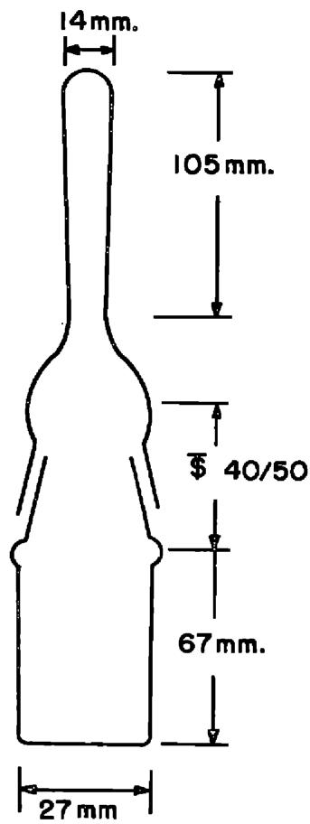  
EXTRACTION APPARATUS USED IN Procedure 9.

Color Development. Transfer by pipet a 1-, 2-, or 3-ml. aliquot of the organic extract into a 10- or 25-ml. volumetric flask such that the final solution will contain between 0.5 and 10 $\gamma$ of uranium per ml. For 10-ml. volumes, add 1.0 ml. of $50\%$

# PROCEDURE 9 (Continued)

pyridine in ethyl alcohol, 2 ml. of $1\%$ (w./v.) % dibenzoylmethane in ethyl alcohol, and $95\%$ ethyl alcohol to volume. For 25-ml. volumes, use 2.5 ml. of pyridine and 5 ml. of dibenzoylmethane. After 5 or more minutes, measure the absorbance at $405~\mathrm{m}\mu$ in 1-cm. cells, using $95\%$ ethyl alcohol as a reference solution. For samples receiving Treatment C, also measure the absorbance at $416~\mathrm{m}\mu$ . A blank should be carried through the entire procedure daily. Calculate the uranium content using the factors obtained by extracting standard pure uranium solutions as directed in Treatment A, and measured at both 405 and $416~\mathrm{m}\mu$ .

PROCEDURE 10: Radiochemical Determination of Uranium-237.  
Source: F. L. Moore and S. A. Reynolds, Anal. Chem. 31, 1080 (1959).

# Abstract

A radiochemical method for the determination of uranium-237 is based on complexing the uranyl ion in alkaline solution with hydroxylamine hydrochloride, followed by scavenging with zirconium hydroxide and extraction of the uranium from hydrochloric acid solution with trisocetylamine-xylene. The technique has been applied successfully to the determination of uranium-237 in homogeneous reactor fuel solutions.

# Preparation and Standardization of Uranium Carrier

Weigh out approximately 50 grams of uranyl nitrate hexahydrate. Dissolve and make to 1 liter with 2 M nitric acid. Standardize the carrier by pipetting 5-ml. aliquots into 50-ml. glass centrifuge cones and precipitating ammonium diuranate by adding concentrated ammonium hydroxide. Filter quantitatively through No. 42 Whatman filter paper and ignite in porcelain crucibles at $800^{\circ}\mathrm{C}$ . for 30 minutes. Weigh as $\mathrm{U}_{3} \mathrm{O}_{8}$ .

# PROCEDURE 10 (Continued)

# Procedure

In a 40-ml. tapered centrifuge tube add 1 ml. of uranium carrier and 0.2 ml. of zirconium carrier (approximately 10 mg. per ml. of zirconium) to a suitable aliquot of the sample solution. Dilute to approximately 10 ml., mix well, and precipitate ammonium diuranate by the addition of concentrated ammonium hydroxide. Centrifuge for 2 minutes and discard the supernatant solution. Wash the precipitate once with 15 ml. of ammonium hydroxide (1 to 1).

Dissolve the precipitate in 1 to 2 ml. of concentrated hydrochloric acid solution, dilute to about 10 ml., add 1 ml. of hydroxylamine hydrochloride (5 M), and mix well. Precipitate zirconium hydroxide by the addition of concentrated ammonium hydroxide. Centrifuge for 2 minutes, add 0.2 ml. of zirconium carrier, and stir the supernatant solution, being careful not to disturb the precipitate. Centrifuge for 2 minutes. Add 0.2 ml. of zirconium carrier and repeat.

Transfer the supernatant solution to another 40-ml. centrifuge tube, add several drops of phenolphthalein, and adjust the pH to approximately 8 by adding concentrated hydrochloric acid solution dropwise. Add an equal volume of concentrated hydrochloric acid solution and extract for approximately 0.5 minute with a one-half volume portion of $5\%$ (w./v.) trisioctylamine-xylene. Discard the aqueous phase. Wash the organic phase by mixing for 0.5 minute with an equal volume portion of 5 M hydrochloric acid solution. Repeat the wash step. Strip the uranium from the organic phase by mixing thoroughly with an equal volume portion of 0.1 M hydrochloric acid solution for 0.5 minute. Discard the organic phase.

Add 0.2 ml. of zirconium carrier, mix well, and repeat the above procedure, beginning with the precipitation of ammonium diuranate.

Finally, precipitate ammonium diuranate by the addition of concentrated ammonium hydroxide. Centrifuge for 2 minutes. Decant and discard the supernatant solution. Filter on No. 42 Whatman filter paper and ignite at $800^{\circ}\mathrm{C}$ for 30 minutes.

Weigh the uranium oxide on a tared aluminum foil (0.0009 inoh), fold, and place in a $10 \times 75 \mathrm{~mm}$ culture tube. Insert a suitable cork and count the uranium-237 gamma radioactivity in a well-type scintillation counter. Count the same day of the last chemical separation.

Apply a blank correction if very low uranium-237 levels are being determined. Determine this correction by taking the same aliquot of uranium carrier through the exact procedure described above. The blank correction is due primarily to the gamma radioactivity associated with the uranium-235 in the uranium carrier.

PROCEDURE 11: Separation of Uranium and Bismuth.

Source: A. Krishen and H. Freiser, Anal. Chem. 29, 288 (1957).

Editor's note: Uranium has been separated from a 5000-fold excess of bismuth by the following method. Uranium is, however, not completely extracted (only $98.48\%$ at pH values greater than 6.5). If this correction is applied, uranium is quantitatively determined by polarographic means within an experimental error of $\pm 1\%$ .

# Reagents

Acetylacetone. Commercial acetylacetone was purified by the method described by Steinbach and Freiser.

# Procedure

Analysis. The method of Souchay and Faucherre, using 0.1M EDTA and 2M sodium acetate as a supporting electrolyte, was found to be suitable in the presence of dissolved acetylacetone. The half-wave potential was shifted to -0.47 volt but the wave height was not affected.

Separation. Solutions of uranyl sulfate containing 0.1 and 1.0 mg. of uranium were mixed with different amounts of bismuth trichloride solution. A solution of the disodium salt of EDTA was added to give a bismuth to EDTA ratio of 1 to 30. The pH of the mixture was raised to 7.5 by careful addition of $\underline{\mathbf{lN}}$ sodium hydroxide. Then approximately 10 ml. of acetyacetone was added and the mixture shaken for 10 minutes. The acetyacetone phase was separated, filtered, and made up to a volume of 10 ml., of which 2 ml. was withdrawn by a pipet into a 10-ml. borosilicate glass volumetric flask. The flask was very gently warmed until the liquid was reduced in volume to about 0.5 ml. Then the supporting electrolyte was added and the resulting solution deaerated for 5 minutes in a 10-ml. Lingane-Laitinen H-type polarographic electrolysis cell. The polarogram was then recorded and the concentration of uranium found from suitable calibration curves.

a J. F. Steinbach, H. Freiser, Anal. Chem. 26, 375 (1954).  
b P. Souchay, J. Faucherre, Anal. Chim. Acta 3, 252 (1949).

PROCEDURE 12: Isolation and Measurement of Uranium at the Microgram Level.  
Source: C. L. Rulfs, A. K. De, and P. J. Elving, Anal. Chem. 28, 1139 (1956).

# Abstract

A double cupferron separation of uranium using extraction has been adapted to the micro level. Uranium(IV) does not extract in the first stage, which removes many potentially interfering elements. Uranium(IV), obtained in the residual aqueous solution by reduction at a mercury cathode, is simultaneously extracted as the cupferrate into ether, from which it can be re-extracted into

nitric acid. A relatively simple one-piece glass apparatus is used for all operations. The uranium recovery at the milligram level in an initial 30-ml. sample was determined colorimetrically as $94\%$ . With 0.03 to 0.13 $\gamma$ of radioactive uranium-233 tracer and 20 $\gamma$ of natural uranium as carrier, the recovery is $86\%$ ; the latter includes the additional step of electrodeposition of the uranium onto a platinum planchet prior to measurement by alpha counting, which is only $94\%$ complete. The decontamination possible with this procedure was checked with 0.07 $\gamma$ quantities of uranium-233 in the presence of high mixed fission product activities; $85\%$ recovery was obtained, containing only $0.9\%$ of the fission product alpha activity (assumed to be uranium).

# Apparatus

The reaction cell and simple electrical circuit used is shown in the accompanying figure.

The electrolysis vessel, C, is protected from mercury ions diffusing from the working reference calomel electrode, A, by a medium glass frit between B and C, and a fine frit backed with an agar plug between B and A. Between runs, cell C is kept filled with saturated potassium oh chloride solution.

The apparatus for the electrodeposition of uranium onto platinum disks or planchets and for alpha-counting measurement of the resulting uranium plates have been described. Beta activity was measured by a chlorine-quenched argon-filled Geiger-Muller counter (1.4 mg. per sq. cm. of window) with a Model 165 scale; a scintillation well counter with a thallium-activated sodium iodide crystal and a Model 162 scale was used for gamma-activity measurement of solutions (ca. 5 ml.) contained in a 13 x 150 mm. test tube. The scalers and counters are made by the Nuclear Instrument and Chemioal Corp. For examination of the gamma-ray spectrum, a gamma-ray scintillation spectrometer (built

in the Department of Chemistry, University of Michigan) was used through the courtesy of W. Wayne Meinke.

# Reagents

All chemicals used were of C.P. or reagent grade unless otherwise specified. The ethereal cupferron solution used (200 to 300 mg. of cupferron per 50 ml.) was actually a hydrogen oupferrate solution; the ether and cupferron were mixed in a mixing cylinder with 5 to 10 ml. of 10 to $20\%$ sulfuric acid and shaken until dissolution was complete.

# Procedures

Reductive Extraction. At the commencement of a run, bridge B is flushed through stopcock 2 by filling B with fresh potassium chloride solution from the funnel through l. C is drained and rinsed; l is left open for a time to flush the frit. With 3 closed, 4 to 5 ml. of triple-distilled mercury is placed in C. About 30 ml. of uranyl sulfate solution (0.5 to 5 mg. of uranium and 0.5 to 1.5% in sulfuric acid) is added and a potential of -0.35 volt vs. S.C.E. is applied to the mercury. About 15 to 20 ml. of the ether cupferron solution is added. Stirring is adjusted at just over the minimal rate for efficient current flow (usually about 0.2 ma. flows without stirring and 1.2 to 2.6 ma. with stirring).

Stopock 1 is opened for about 30 seconds at approximately 5-minute intervals throughout the run to minimize any loss of uranium into the bridge. At 15- or 20-minute intervals, stirring is interrupted, the ether extract is bled through stopcock 4 into cell D, and 15 to 20 ml. of fresh ether-cupferron solution is added. Runs of 40- to 55-minute total duration appear to be adequate. Three increments of ether-cupferron solution were usually used, followed by a 5- to 10-ml. pure ether rinse at the conclusion of the run. (See Note 1.)

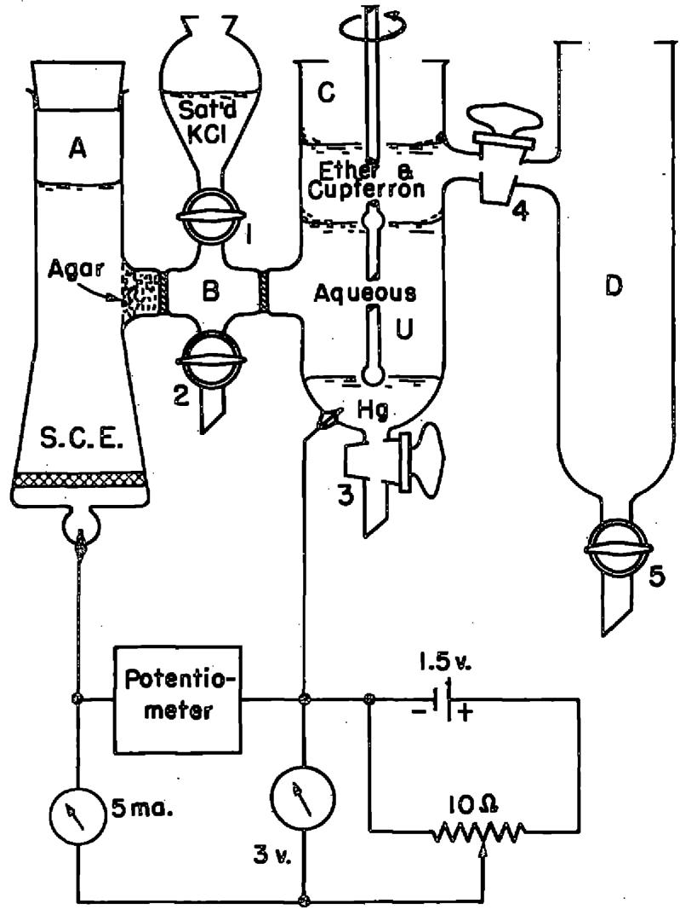  
Stirrer   
ELECTRICAL CIRCUIT FOR ELECTROCHEMICAL REDUCTION OF URANIUM FOR Procedure 12.

Extraction and Measurement at Microgram Uranium Level. A solution of uranium-233 (10 $^{-7}$ to 10 $^{-8}$ gram) together with about 20 $\gamma$ of natural uranium (as sulfate) was submitted to reductive extraction withoupferron for about 50 to 60 minutes. The uranium (IV/III) cupferrate was then re-extracted in cell D from the ether solution into three successive 15-ml. portions of 7M

nitric acid. The combined nitric acid extract was evaporated to about 5 ml., treated with 25 to 30 ml. of concentrated nitric and 2 ml. of perchloric acid, and then evaporated to dryness. The residue was digested with 10 ml. of O.lM nitric acid for a few minutes; the solution obtained, after addition of about 10. $\gamma$ more of natural uranium (as sulfate), was used for electrodeposition of the uranium onto a platinum planchet from an oxalate medium. A windowless flow counter with Q-gas was used for counting the alpha emission from the electrodeposited uranium.

The whole operation took about 4 to 5 hours. Each measurement of alphas from the samples was calibrated by counting a uranium oxide standard (National Bureau of Standards No. 836-5).

Note 1. In some runs the current dropped to a low level soon after the requisite number of coulombs had passed for about a 3-electron reduction of the uranium present. In other cases, the current did not decrease, but discontinuance of the run beyond any point where twice the theoretical current had passed gave satisfactory uranium recovery. In the latter cases, a gray ether-insoluble, but alcohol-soluble precipitate (apparently a mercury cupferrate), was usually evident in the aqueous phase. The current efficiency for the desired process appeared to be good in most runs.

The combined ether extracts may be re-extracted in cell D by inserting a clean stirrer, or they may be transferred with rinsing into a clean separatory funnel. Three extractions with 20 to 30 ml. each of $0.5\text{M}$ , $4\text{M}$ , and $0.5\text{M}$ nitric acid were adequate to re-extract uranium into aqueous solution.

C. L. Rulfs, A. K. De, F. J. Elving, J. Electrochem. Soc. 104, 80 (1957).

PROCEDURE 13: The Determination of Uranium by Solvent Extraction. Source: R. F. Clayton, W. H. Hardwick, M. Moreton-Smith and R. Todd, Analyst 83, 13 (1958).

# Abstract

The development of solvent-extraction methods for determining trace amounts of uranium-233 in irradiated thorium is described. Thorium and its alpha-emitting daughters are complexed with EDTA, and, when uranium-233 is extracted as its diethyldithiocarbamate complex, only bismuth-212 accompanies it. This is immaterial for colorimetric or fluorimetric finishes, but, for determination of the uranium-233 by alpha counting, the bismuth-212 must first be allowed to decay. If, however, the uranium-233 is extracted as its 8-hydroxyquinoline complex, no alpha emitter accompanies it and concentrations of uranium-233 ranging from $100\mu \mathrm{g}$ per ml down to $0.01\mu \mathrm{g}$ per ml in $0.7\mathrm{M}$ thorium solution have been determined in this way.

METHOD FOR DETERMINING URANIUM-233 IN THORIUM NITRATE SOLUTIONS

BY EXTRACTION WITH OXINE

# REAGENTS--

Oxine solution A--A 10 per cent w/v solution of 8-hydroxy-quinoline in isobutyl methyl ketone.

Oxine solution B--A 2.5 per cent w/v solution of 8-hydroxy-quinoline in isobutyl methyl ketone.

EDTA solution--Dissolve $372.9\mathrm{g}$ of the disodium salt of ethylenediaminetetra-acetic acid in $500\mathrm{ml}$ of water containing $80\mathrm{g}$ of sodium hydroxide and make up to 1 liter.

1 ml = 232 mg of thorium.

Nitric acid, N.

Ammonia solution, sp. gr. 0.880.

Ammonia solution, 0.2 N.

Bromothymol blue indicator solution.

Anti-creeping solution--A 20 per cent solution of ammonium

chloride containing 2 per cent of a water-soluble glue (Stephen's Stefix was found to be suitable).

PROCEDURE FOR 0.01 TO 1 μg OF URANIUM-233 PER ml--

With a pipette place a suitable volume of sample solution, containing not more than $600\mathrm{mg}$ of thorium, in a 40-ml centrifuge tube fitted with a glass stirrer. Add EDTA solution to give about a 10 per cent excess over the thorium equivalent and then add 3 drops of bromothymol blue indicator solution.

Add ammonia solution, sp. gr. 0.880, until the indicator turns blue. Return the color of the indicator to yellow by adding N nitric acid and then add 0.2 N ammonia solution until the color of the indicator just turns back to blue (pH 7). Add 2 ml of oxine solution A, stir for 5 minutes, spin in a centrifuge to separate the phases and then stopper the tube.

Evaporate duplicate 0.25-ml portions of the solvent phases slowly on stainless-steel counting trays that have had 1 drop of anti-creeping solution evaporated at their centers. Heat the trays to redness in the flame of a Meker burner, cool and count. PROCEDURE FOR 1 TC 100 μg OF URANIUM-233 PER ml--

With a pipette place a suitable volume of sample solution, containing about $10~\mu \mathrm{g}$ of uranium-233, in a 40-ml centrifuge tube and dilute to $3\mathrm{ml}$ with water. Add EDTA solution to give a 10 per cent excess over the thorium equivalent. Add 2 drops of bromothymol blue indicator solution and adjust the pH to 7 as previously described.

Add 5 ml of oxine solution B, stir for 5 minutes, spin in a centrifuge to separate the phases and then stopper the tube. Evaporate duplicate 0.1 or 0.25-ml portions of the solvent phase for counting, as before.

Note that for a fluorimetric finish to either procedure, suitable duplicate portions of the solvent phase should be

evaporated in platinum fluorimeter dishes before fusion with sodium fluoride.

METHOD FOR DETERMINING URANIUM-233 IN THORIUM NITRATE SOLUTIONS

BY EXTRACTION WITH SODIUM DIETHYLDITHIOCARBAMATE

REAGENTS--

Hexone.

Sodium diethyldithiocarbamate solution--A freshly prepared and filtered 20 per cent w/v aqueous solution.

EDTA solution--Prepared as described in reagents list, p. 377.

Ammonium nitrate solution, 2 M.

Ammonia solution, sp. gr. 0.880.

Nitric acid, concentrated and $\underline{\mathbf{N}}$

Screened methyl orange indicator solution.

Anti-creeping solution--A 20 per cent solution of ammonium chloride containing 1 per cent of a water-soluble glue.

PROCEDURE FOR 1 TO 100 μg OF URANIUM-233 FER m1--

With a pipette place a suitable volume of sample solution, containing about $10~\mu \mathrm{g}$ of uranium-233, in a 40-ml centrifuge tube fitted with a glass stirrer. Dilute to 4-ml with 2 M ammonium nitrate and add EDTA solution to give a 10 per cent excess over the thorium equivalent. Stir and make just alkaline to screened methyl orange by adding ammonia solution and then add 0.5 ml of sodium diethyldithiocarbamate solution.

Stir and add N nitric acid until the solution is mauve (not red). Add 5 ml of hexone, stir for 5 minutes and add more acid to maintain the mauve color if necessary. Spin in a centrifuge to separate the phases and then stopper the tube.

Evaporate suitable duplicate portions of the solvent phase on stainless-steel counting trays that have had 1 drop of anticreeping solution evaporated at their centers. Heat the trays to redness in the flame of a Meker burner, allow the bismuth-212

# PROCEDURE 13 (Continued)

to decay, and then count. Alternatively, for a fluorimetric finish, evaporate duplicate portions of the solvent phase in platinum fluorimeter dishes for fusion with sodium fluoride.

Note that greater sensitivity can be obtained by starting with a larger volume of sample or by evaporating larger portions of the solvent phase.

a W. H. Hardwick, M. Moreton-Smith, Analyst 83, 9 (1958).

PROCEDURE 14: Uranium Radiochemical Procedure Used at the University of California Radiation Laboratory at Livermore.

Source: E. K. Hulet, UCRL-4377 (1954).

Decontamination: $3 \times 10^{12}$ Atoms of $U^{237}$ isolated from a 3-day-old mixture containing $10^{14}$ fissions showed no evidence of contamination when decay was followed through three half lives.

Yield: 30 to 50 percent.

Separation time: About four hours.

Reagents: Dowex A-1 resin (fall rate of 5-30 cm/min).

Zinc dust, isopropyl ether.

2M Mg(NO3)2 with 1M HNO3.

2M HCl with 2M HF.

1. To the solution containing the activity in HCl in an Erlenmeyer flask, add uranium tracer in HCl, 1 ml of conc. formic acid and several ml of conc. HCl.   
2. Boil gently until volume is $-2 - 3\mathrm{ml}$ , replenishing the solution with several ml of formic acid during the boiling.   
3. Transfer to 20-ml Lusteroid centrifuge cone, rinsing flask twice with 1-2 ml of water and add 2-3 mg of $\mathsf{La}^{+ + + }$ . Add 1 ml of conc. HF, stir, heat, and centrifuge.

4. Transfer supernatant to 20-ml Lusteroid centrifuge cone, add $2 - 3\mathrm{mgLa}^{+ + + }$ , stir, heat, and centrifuge.   
5. Transfer supernatant to 20-ml Lusteroid, add 5-10 mg $\mathsf{La}^{+ + }$ $1 / 2\mathsf{m}$ of oono. HCl and heat in a water bath. When the solution is hot, add small portions of zinc dust and stir. About three small additions of zinc dust should be made over a half-hour period with vigorous stirring after each addition. If the zinc dust tends to ball and sink to the bottom of the tube at any time, addition of more conc. HCl will solve this problem. When all the zinc from the last addition has dissolved, add 4 or 5 ml of water and 1 ml of conc. HF. Stir, cool, and centrifuge, retaining the $\mathsf{LaF}_3$ precipitate. Wash precipitate with 2 ml of $2\mathsf{M}$ HCl + 2M HF.   
6. Dissolve the precipitate with $6\underline{\mathbf{M}}$ HNO₃ saturated with H₃BO₃, stirring and heating. Transfer the solution to a 40-ml glass centrifuge cone, washing out the Lusteroid cone with water.   
7. Add several drops of $\mathsf{H}_2\mathsf{O}_2$ and stir and heat. Add 2 mg Fe++ and make solution basic with $\mathsf{NH}_4\mathsf{OH}$ and some NaOH. Heat, stir, and centrifuge. Wash the precipitate with 2 ml of water.   
8. Dissolve the precipitate in one to two drops of conc. $\mathrm{HNO}_3$ and heat. Cool, add $10\mathrm{ml}$ $\underline{\mathbf{2M}}\mathrm{Mg}(\mathrm{NO}_3)_2 + \underline{\mathbf{1M}}\mathrm{HNO}_3$ saturated with ether. Equilibrate twice with 10-15 ml of diisopropyl ether.   
9. Pipet the ether phase into a clean 40-ml cone and equilibrate ether layer with $3\mathrm{ml}$ of cone. HCl. Pipet off and discard ether layer. Heat HCl for $\sim 30$ seconds and again pipet off the ether layer.   
10. Pass the HCl solution through a Dowex-1 anion resin bed (2 cm x 3 mm) by pushing the solution through the column with air pressure. Rinse the centrifuge tube once with 1 ml of conc. HCl and push this solution through the column. Wash resin with -1 ml of conc. HCl. Discard effluent.

11. To column, add $-3 / 4$ ml of $0.5\text{M}$ HCl. Collect the eluate and evaporate to a small volume and plate on a platinum disco.

PROCEDURE 15: Use of Ion Exchange Resins for the Determination of Uranium in Ores and Solutions.

Source. S. Fisher and R. Kunin, Anal. Chem. 29, 400 (1957).

# Abstract

The separation of uranium from the ions interfering with its analysis is accomplished by the adsorption of the uranium(VI) sulfate complex on a quaternary ammonium anion exchange resin. Interference of such ions as iron(III) and vanadium(V) is avoided by their preferential reduction with sulfurous acid so that they, as well as other cations, are not retained by the resin. Uranium is eluted for analysis by dilute perchloric acid. The method is applicable to both solutions and ores.

# Ore Solution

Two methods for the opening of uranium-bearing ores were investigated in conjunction with the ion exchange separation. The first is the standard digestion with hydrofluoric acid and nitric acids, with subsequent evaporation to dryness followed by a sodium carbonate fusion. $^{\underline{a}}$ The carbonate melt is dissolved in $5\%$ sulfuric acid to form a solution for the separation. A second method for routine analysis, designed to eliminate the need for hood facilities and platinum vessels, involves an oxidative leach with an acidic manganese(IV) oxide system. This procedure is given in detail below. Other workers $^{\underline{b}}$ , using the authors' separation procedure, have recommended solution of the ore by treatment with $12\mathrm{M}$ hydrochloric acid plus $16\mathrm{M}$ nitric acid followed by fuming

with sulfuric acid to produce a suitable uranium solution for the column influent.

Procedure. Weigh out samples of ore estimated to contain an amount of uranium oxide less than $100\mathrm{mg}$ . but sufficient to be detected by the chosen method of analysis. Add 20 ml. of $20\%$ by volume sulfuric acid and 2 grams of manganese(IV) oxide. Heat the mixture to boiling. Allow to cool to room temperature. Dilute with approximately 50 ml. of water. Adjust to a pH between 1.0 and 1.5 by the dropwise addition of $20\%$ sodium hydroxide. Filter through fine-pore filter paper using two 10-ml. portions of water to wash the residue on the paper.

# Ion Exchange Separation

Apparatus. Tubes 0.5 inch in diameter with high-porosity sintered glass filter disks fused to the lower end are used to contain the resin. The rate of flow of solutions through the tube is regulated by a screw clamp on rubber tubing below the filter. Small separatory funnels are attached to the top of the column to feed the sample and reagents.

Procedure. Convert a portion of quaternary ammonium anion exchange resin (Amberlite XE-117, Type 2) of mesh size 40 to 60 (U.S. screens) to the sulfate form by treating a column of it with $10\%$ sulfuric acid, using 3 volumes per volume of resin. Rinse the acid-treated resin with deionized water until the effluent is neutral to methyl red. Drain the resin so prepared free of excess water and store in a bottle. A 5-ml. portion of this resin is used for a single analysis. The resin is loaded into the filter tube and the bed so formed is backwashed with enough water to free it of air. After the resin has settled the excess water is drained off to within 1 cm. of the top of the bed prior to the passage of the sample through the bed.

Add 5 drops of $0.1\%$ methylene blue to the partially neu-

tralized (pH 1.0 to 1.5) solution from the dissolved sodium carbonate melt or from the filtered manganese(IV) oxide leach. Add $6 \%$ sulfurous acid dropwise until the methylene blue is decolorized and then add a 5- ml. excess. Pass the reduced sample through the resin bed at a rate not exceeding 2 ml. per minute. Wash the sample container with two 10- ml. portions of water, passing the washing through the resin bed at the same flow rate. Elute the uranium with 50 ml. of 1M perchloric acid. Determine the uranium content of the perchlorio acid fraction colorimetrically by the standard sodium hydroxide-hydrogen peroxide method or volumetrically. For colorimetric analysis standard uranium solutions containing perchloric acid should be used in establishing the curve.

F. S. Grimaldi, I. May, M. H. Fletcher, J. Titcomb, U. S. Geol. Survey Bull. 1006 (1954).   
H. J. Seim, R. J. Morris, D. W. Frew, U. S. Atomic Energy Comm. Document UN-TR-5 (1956).   
C. J. Rodden, "Analytical Chemistry of the Manhattan Project," McGraw-Hill, New York, 1950.

PROCEDURE 16: The Use of a "Compound" Column of Alumina and Cellulose for the Determination of Uranium in Minerals and Ores Containing Arsenic and Molybdenum.

Source: W. Ryan and A. F. Williams, Analyst 77, 293 (1952).

# Abstract

A technique in inorganic chromatography, with alumina and cellulose adsorbents in the same extraction column, is described for the separation of uranium from minerals and ores. The purpose of the alumina is to retain arsenic and molybdenum, which

are not readily retained by cellulose alone when ether containing 5 per cent v/v of concentrated nitric acid, sp.gr. 1.42, is used as the extraction solvent.

METHOD FOR SAMPLES CONTAINING MOLYBDENUM OR ARSENIC OR BOTH Solvent--Add 5 ml of concentrated nitric acid, sp.gr. 1.42, to each 95 ml of ether.

PREPARATION OF ALUMINA-CELLULOSE COLUMN--

The adsorption tube for the preparation of the column is a glass tube about 25 cm long and 1.8 cm in diameter. The upper end is flared to a diameter of about 8 cm to form a funnel that permits easy transfer of the sample. The lower end terminates in a short length of narrow tubing and is closed by a short length of polyvinyl chloride tubing carrying a screw clip. The inside surface of the glass tube is coated with a silicone in the manner described by Burstall and Wells.

Weigh 5 or $6\mathrm{g}$ of cellulose pulp into a stoppered flask and cover it with ether-nitric acid solvent. Pour the suspension into the glass tube, agitate gently and then gently press down the cellulose to form a homogeneous column. Wash the column with about $100\mathrm{ml}$ of ether-nitric acid solvent and finally allow the level of the solvent to fall to the top of the cellulose. Next pour about $15\mathrm{g}$ of activated aluminium oxide on top of the cellulose, pour on $30\mathrm{ml}$ of ether-nitric acid solvent and vigorously agitate the alumina with a glass plunger. Allow the packing to settle. Allow the level of the ether to fall to the surface of the alumina and the column is ready for use.

PREPARATION OF SAMPLE SOLUTION FROM MINERAL OR ORE--

Weigh into a platinum dish sufficient of the sample to give 100 to $150\mathrm{mg}$ of $\mathrm{U}_{3}\mathrm{O}_{8}$ , which is a convenient amount for a volumetric determination. Decompose the sample by treatment with nitric and hydrofluoric acids in the manner described by Burstall and Wells. Finally remove hydrofluoric acid by repeated evaporations with nitric acid and take the sample to dryness. If the addition of dilute nitric acid indicates the presence of undecomposed material, filter the insoluble residue on to a filter-paper and ignite and fuse it in a nickel crucible with a few pellets of potassium hydroxide. Then add the melt to the filtrate and take the whole to dryness.

Add $4\mathrm{ml}$ of diluted nitric acid, 25 per cent v/v, to the dry residue, gently warm to dissolve the mixture and then cool the solution, which is then ready for chromatography.

EXTRACTION OF URANTIUM

Transfer the sample on a wad of dry cellulose pulp to the top of the prepared alumina-cellulose column and extract the uranium with 200 to 250 ml of ether-nitric acid solvent if arsenic or molybdenum and arsenio is present in the original sample. If molybdenum alone is present, the amount of solvent can be reduced to 150 ml. Screen the column from direct sunlight. After removal of ether from the eluate, determine the uranium volumetrically.

a F. H. Burstall, R. A. Wells, Analyst 76, 396 (1951).   
F. H. Burstall, A. F. Williams, "Handbook of Chemical Methods for the Determination of Uranium in Minerals and Ores," H. M. Stationery Office, London, 1950.

PROCEDURE 17: Determination of Uranium-235 in Mixtures of Naturally Occurring Uranium Isotopes by Radioactivation.

Source: A. P. Seyfang and A. A. Smales, Analyst 78, 394 (1953).

# Abstract

A method previously used for determining uranium in minerals by neutron irradiation followed by measurement of the separated fission-product barium has been extended to the determination of uranium-235 in admixture with uranium-234 and uranium-238.

With microgram amounts of uranium-235, short irradiations in the Harwell pile give ample sensitivity. Precision and accuracy of better than $\pm 2$ per cent have been achieved for a range of uranium-235 contents covered by a factor of more than $10^{5}$ .

# Method

REAGENTS--

Magnesium oxide--Analytical reagent grade.

Nitric acid, sp. gr. 1.42.

Barium chloride solution--Dissolve $18\mathrm{g}$ of $\mathrm{BaCl}_2\cdot 2\mathrm{H}_2\mathrm{O}$ in water and make up to $500\mathrm{ml}$ .

Lanthanum nitrate solution--A 1 per cent w/v solution of $\mathrm{La(NO_3)_3\cdot 6H_2O}$ .

Ammonium hydroxide, sp. gr. 0.880.

Strontium carbonate solution--A 2 per cent w/v solution.

Hydrochloric acid-diethyl ether reagent--A mixture of 5 parts of concentrated hydrochloric acid, sp. gr. 1.18, and 1 part of diethyl ether.

Sodium tellurate solution--A 0.4 per cent w/v solution.

Zinc metal powder.

Methyl orange indicator.

Potassium iodide solution--A 1 per cent w/v solution.

Sodium hypochlorite solution--A commercial solution containing 10 per cent of available chlorine.

Hydroxylamine hydrochloride.

Ferric chloride solution--A 1 per cent w/v solution.

Sulfuric acid--A 20 per cent v/v solution.

# IRRADIATION--

Solids-- Samples containing not much more uranium-235 than natural uranium (say, up to three times more or 2 per cent) may be irradiated as solid; this is usually $\mathrm{U}_{3}\mathrm{O}_{8}$ . For these cut a 5-cm length of 2-mm polythene tubing and seal one end by warming and pressing. Introduce freshly ignited analytical reagent grade magnesium oxide to form a compact layer 4 to 5 mm in height at the sealed end of the tube. Weigh the tube and contents, add about 50 mg of $\mathrm{U}_{3}\mathrm{O}_{8}$ and re-weigh. Add a further similar layer of magnesium oxide on top of the $\mathrm{U}_{3}\mathrm{O}_{8}$ and then seal the open end. Leave a free space about 1 cm long between the top of the magnesium oxide layer and the seal, for ease of opening. Treat standard and samples similarly. Place the tubes either in a special polythene bottle for irradiation in the pneumatic "rabbit" of the pile or in a 3-inch aluminum can for irradiation in the "self-serve" holes in the pile. Irradiation is carried out for any required time; usually it is about 5 minutes. After irradiating, place the containers in lead shielding for about 15 hours. After this period, tap down the contents of the polythene tube away from one end and carefully cut off the top. Empty the contents into a 50-ml centrifuge tube. (The plug of magnesium oxide serves to "rinse" the sample tube as it is emptied.) Add 2 ml of concentrated nitric acid (sp.gr. 1.42), gently warm to dissolve, and finally boil off the nitrous fumes. Add 5.00 ml of a barium solution to act as carrier (a solution of 18 g of barium chloride, $\mathrm{BaCl}_2\cdot 2\mathrm{H}_2\mathrm{O}$ , in 500 ml of water).

Liquids--For more highly enriched samples or when the amount of sample available is small, solutions containing weighed

quantities of solid sample must be irradiated in small silica ampoules. The ampoules, which have a capacity of about 1 ml, are prepared from silica tubing. After one end of each has been sealed, the ampoules are weighed, the sample solution added from a fine-pointed glass dropping-tube and the ampoules re-weighed. Pack the ampoules, after sealing the open ends, in cotton wool in a 3-inch aluminium can and irradiate them in the "self-serve" position of the pile. The time of irradiation necessary can be calculated from the usual activation formula; as an example, 1 μg of uranium-235 irradiated for 24 hours in a flux of $10^{12}$ neutrons per sq. cm per second gives about 5000 counts per minute of barium-140 at 5 per cent counting efficiency, 24 hours after the irradiation.

After removing them from the pile, place the samples and standards in lead shielding for about 15 hours; the main activity is due to silicon-31. Transfer the ampoules to 100-ml tall-form beakers containing a few milliliters of water and 5.00 ml of barium carrier solution, carefully break off both ends of each ampoule and warm to ensure thorough mixing. Decant into centrifuge tubes and wash out the ampoules and beakers with further small portions of water. CHEMICAL SEPARATION--

Evaporate the solution containing the irradiated uranium and barium carrier to 5 to $6\mathrm{ml}$ and add two drops of 1 per cent lanthanum nitrate solution. Warm if necessary to dissolve any barium nitrate that may have crystallized, add concentrated ammonium hydroxide dropwise until a permanent precipitate is obtained and then two drops in excess. Centrifuge and decant into another centrifuge tube. Add methyl orange indicator, and then hydrochloric acid until the solution is acid. Add 2 drops of 2 per cent strontium solution, about $25\mathrm{ml}$ of hydrochloric

acid - diethyl ether reagent, mix thoroughly, centrifuge and decant. Wash the precipitate with $5\mathrm{ml}$ of reagent, centrifuge and decant. Dissolve the barium chloride precipitate in 3 to 4 ml of water, re-precipitate it by adding $20\mathrm{ml}$ of reagent, centrifuge and decant. Wash with $5\mathrm{ml}$ of reagent, centrifuge and decant.

Dissolve the precipitate in about 5 ml of water, add 6 drops of lanthanum solution and 6 drops of the 4 per cent tellurate solution and then about 3 mg of zinc metal powder. When the effervescence ceases, make the solution just ammoniacal to methyl orange, centrifuge and decant into another tube. Add 4 drops of 1 per cent potassium iodide solution and 2 drops of sodium hypochlorite solution. Warm and set aside for 2 minutes. Acidify with about 1 ml of hydrochloric acid, and add about 0.1 g of hydroxylamine hydrochloride. Boil under a hood until all the iodine appears to be removed and the volume is reduced to 5 to 6 ml. Add 2 drops of strontium solution and 2 drops of lanthanum solution and repeat the double barium chloride precipitation and washing, as above.

Dissolve the precipitate in about 5 ml of water, add 6 drops of lanthanum solution, and 6 drops of 1 per cent ferric chloride solution. Make ammoniacal to methyl orange, add half a crumbled Whatman accelerator tablet, and heat just to boiling. Filter through a 7-cm Whatman No. 30 filter-paper into a centrifuge tube, wash twice with 2 to 3-ml portions of water. Dilute the filtrate to about 20 ml and make slightly acid with hydrochloric acid. Heat nearly to boiling and add dropwise 2 ml of 20 per cent v/v sulfuric acid. Allow the precipitate to settle, decant, wash with 10 ml of water, centrifuge, decant and repeat the washing procedure to complete removal of the excess of acid.

Transfer as much as possible of the precipitate, by means of a dropping tube and a few drops of water, to a tared aluminium

counting tray. Dry under an infra-red lamp and finally heat in a muffle furnace at $500^{\circ}\mathrm{C}$ for 15 minutes. Cool, weigh and reserve for counting.

COUNTING TECHNIQUE--

The counting equipment for this work consists of (i) a power unit (type 1082A or 200 is suitable), (ii) scaling unit (type 200 or 1009B), (iii) time accessory unit (type 1003B), (iv) probe unit (type 200B or 1014A). Time pulses can be obtained from a master electric clock serving several units. A mica end-window Geiger-Muller counter (2 mg per sq. cm.), of type EHM2, is suitable; it is mounted in a lead castle with a Perspex lining and shelves.

Check the counting equipment in the normal fashion with a suitable beta-emitter, such as natural uranium oxide in equilibrium with $\mathsf{UX}_1$ and $\mathsf{UX}_2$ . Place the sample to be counted in a Perspex carrier and insert it in a shelf at a suitable distance from the Geiger-Muller tube to attain a counting rate of 2000 to 3000 counts per minute. Count for a sufficient time to obtain at least 10,000 counts for each barium sulfate precipitate, counting the precipitates one after another without undue delay. Correction for growth of lanthanum-140 is unnecessary if samples and standards are counted within, say, 60 minutes of each other provided the barium sulfate precipitations are carried out on each nearly simultaneously.

CALCULATION OF RESULTS--

Correct all counts for background, coincidence loss and chemical yield and express as the results in counts per minute.

Then $\frac{\text{Weight of } U^{235}}{\text{Weight of } U^{235}}$ in standard = Corrected count of standard
Correlated count of sample

and Weight of $U^{235}$ in sample X 100 = percentage of uranium-235 in sample.

A.A.Smales,Analyst77,778(1952).

PROCEDURE 18: Determination of Microgram and Submicrogram Quantities of Uranium by Neutron Activation Analysis. Source: H. A. Mahlman and G. W. Ledicotte, Anal. Chem. 27, 823 (1955).

# Abstract

Mlorogram and submicrogram quantities of uranium have been determined in synthetic samples, ores, and soils by neutron radioactivation analysis. The principles of the activation analysis method used in this determination and the processing of irradiated samples are discussed. This method of analysis is a sensitive and specific method for determining uranium in concentrations as small as 0.1 $\gamma$ per gram with a probable relative standard error of $10\%$ . Concentrations of uranium in quantities as small as 0.0001 $\gamma$ per gram can be determined by neutron activation analysis.

# Radioactivation Analysis of Samples that Contain

# Uranium

Nuclear Irradiation of Sample. Weighed portions of the samples and the comparative standard are put into small quartz tubes. The tubes are closed with cork stoppers that are wrapped in aluminum. They are then irradiated in the reactor. After irradiation, the samples are allowed to decay about 4 hours and are then chemically processed as described below. The synthetic samples used in this laboratory had been processed by a filter paper partition chromatography technique. After the separation, the paper was conveniently irradiated in short pieces of quartz tubing whose openings were plugged by means of cork stoppers.

Chemical Separation of Neptunium-239. In most neutron activation analyses, a chemical separation is made to isolate the radioactivity of the element from all other radioactive species in the sample. Usually an "isotopic carrier"-a known amount of the natural inactive element--is added to the solutions

# PROCEDURE 18 (Continued)

of both the irradiated specimen and the comparison samples. The solutions are then processed chemically to isolate the carrier and desired radioelement from other elements and contaminant radioactivities. Small amounts of other elements are added as holdback or scavenging carriers to assist in the decontamination process.

Although neptunium-239 has a convenient half life, it does not have a stable isotope that can be used as an isotopic carrier. However, Seaborg has shown that trace quantities of neptunium-239 can be quantitatively carried on a nonisotopic carrier, such as cerium. The method of analysis reported below uses lanthanum as a nonisotopic carrier for the neptunium-239 radioactivity. (See Note 1.)

Chemical Separation Procedure. PREPARATION. The irradiated ore and soil specimens are dissolved by digestion in a mixture of concentrated nitric, hydrofluoric, perchloric, and sulfuric acids. (Additional hydrofluoric acid can be added if a residue of silica remains in the bottom of the crucible.) After dissolution, the sample is concentrated to heavy sulfuric acid fumes, cooled, and transferred to a 15-ml. centrifuge tube. If a residue (sulfate salts) remains after the transfer, the solution is centrifuged for 5 minutes, the supernatant transferred to another tube, and the residue washed with 1 ml. of 1M nitric acid. The wash is added to the supernatant and the residue discarded. (Centrifugation is always for the stipulated time and at full speed.) The sample is then further processed by the procedure reported herein.

The irradiated synthetic samples (paper chromatograms) are processed by carefully igniting the paper contained in a porcelain crucible in a muffle furnace. The residue is dissolved in about $0.5 \, \text{ml}$ of concentrated nitric acid. After dissolution, the

sample is transferred to a 15-ml. centrifuge tube and the processing continued with the procedure reported herein.

PROCEDURE. Three (3.0) milligrams of lanthanum and 0.250 ml. of $5\underline{M}$ hydroxylamine hydrochloride solution are added to the supernatant solution and the mixture digested for 5 minutes with occasional stirring. The solution is cautiously neutralized with concentrated ammonium hydroxide to precipitate lanthanum hydroxide, after which the mixture is centrifuged and the supernatant liquid discarded.

The precipitate of lanthanum hydroxide is dissolved in 2 ml. of 2M hydrochloric acid, and 1.0 mg. of strontium (added as a solution of strontium nitrate to serve as a holdback or scavenging carrier) and 0.250 ml. of 5M hydroxylamine hydrochloride solution are added to the solution. The solution is again digested for 5 minutes with intermittent stirring, and 0.200 ml. of concentrated hydrofluoric acid is added dropwise to the solution to precipitate lanthanum fluoride. After centrifugation, the supernatant liquid is discarded and the precipitate washed with 0.5 ml. of 1M hydrofluoric acid-1M nitric acid solution.

After washing, the lanthanum fluoride precipitate is dissolved in $0.5 \mathrm{ml}$ . of saturated boric acid solution and $1.0 \mathrm{ml}$ . of $6 \underline{\mathsf{M}}$ nitric acid. One (1.0) milliliter each of $10 \%$ potassium permanganate solution and water are added to this solution, and the resulting mixture is agitated well and digested for 5 minutes. Lanthanum fluoride is again precipitated with $0.250 \mathrm{ml}$ . of concentrated hydrofluoric acid; the solution is centrifuged and the supernatant liquid transferred to another centrifuge tube. The precipitate is washed with $0.5 \mathrm{ml}$ . of $1 \underline{\mathsf{M}}$ hydrofluoric acid- $\underline{\mathsf{LM}}$ nitric acid solution and the wash combined with the supernatant liquid. The precipitate is discarded.

Three milligrams of lanthanum are added to the supernatant

# PROCEDURE 18 (Continued)

liquid, and the solution is digested for 5 minutes and centrifuged. An additional $3.0\mathrm{mg}$ . of lanthanum are added to the supernatant liquid and the solution agitated and digested for 5 minutes without disturbing the first precipitate on the bottom of the tube; then the solution is centrifuged and the supernatant liquid transferred to another centrifuge tube. The precipitate is washed with 0.5 ml. of $\underline{\mathbf{l}}\underline{\mathbf{M}}$ hydrofluoric acid- $\underline{\mathbf{l}}\underline{\mathbf{M}}$ nitric acid solution; centrifuged, and the wash combined with the supernatant liquid. The precipitate is discarded.

One milligram of zirconium (added as a solution of zirconium nitrate to serve as a holdback or scavenging carrier) and $0.250 \, \text{ml}$ . of $5\text{M}$ hydroxylamine hydrochloride are added to the solution and the mixture agitated and digested 5 minutes. Three (3.0) milligrams of lanthanum and $2 \, \text{ml}$ . of $2\text{M}$ hydrofluoric acid are added to the solution, and the solution is digested for 20 minutes and then centrifuged. The supernatant liquid is discarded. The precipitate is washed with $0.5 \, \text{ml}$ . of $1\text{M}$ hydrofluoric acid- $1\text{M}$ nitric acid solution, and the resulting mixture is centrifuged. The wash solution is discarded after the centrifugation.

The precipitate is slurried in a small amount of $\underline{\mathbf{l}}\underline{\mathbf{M}}$ nitric acid (about 0.5 ml.) and transferred to a small borosilicate glass culture tube by means of a transfer pipet. The centrifuge cone is rinsed with three 0.5-ml. portions of $\underline{\mathbf{l}}\underline{\mathbf{M}}$ nitric acid and the rinses transferred to the culture tube. The tube is stoppered with a cork stopper and the $\gamma$ radioactivity measured by a well-type gamma scintillation counter.

The standard sample of uranium oxide $(\mathrm{U}_{3}\mathrm{O}_{8})$ is dissolved in nitric acid and an aliquot of the solution processed under the same conditions as the specimen samples. The uranium content of the sample in question is determined by equating the ratio of the corrected neptunium-239 radioactivity count in the unknown

and the corrected septunium-239 radioactivity count in the standard sample.   
Note 1. Hamaguchi and co-workers have used $\mathbf{Np}^{237}$ tracer to determine the chemical yield.   
a G. T. Seaborg and co-workers, Metallurgical Project Rept. CN-2689,41 (Feb. 15, 1945) (classified).   
b H. Hamaguohi, G. W. Reed, A. Turkevich, Geochim. et Cosmochim. Acta 12, 337 (1957).

# Acknowledgements

It is a pleasure to acknowledge the assistance of Miss M. Tippet, Miss R. Cushing, Mr. N. Zeichick and others of the Argonne National Laboratory library staff in locating the many references used in writing this paper; Dr. E. K. Hyde, who kindly made available his file on the radiochemistry of uranium; Mrs. D. E. Williams, who typed most of the manuscript; Miss F. Taylor, for preparing the final figures; Dr. G. E. Crouthamel, who furnished the figures of gamma-ray spectra; Dr. D. W. Engelkemeir and Mr. D. J. Henderson, who supplied the data for the alpha spectra; and finally, Miss B. Lore and Mr. C. Ahlberg, without whom the completion of this paper would have been much, much later.

# REFERENCES

1. J. J. Katz and E. Rabinowitz, General Review reference 5. Discussion and/or reference to original literature may be found.   
2. J. J. Katz and G. T. Seaborg, General Review reference 8. Discussion and/or reference to original literature may be found.   
3. A. N. Holden, General Review reference 12. Discussion and/or reference to original literature may be found.   
4. L. Grainger, General Review reference 11. Discussion and/or reference to original literature may be found.   
5. W. M. Latimer, "Oxidation Potentials," 2nd edition, Prentice-Hall, Inc., New York, 1952.   
6. R. J. Meyer and E. Pietsch, "Gmelins Handbuch der Anorganischen Chemie," General Review reference 2. Discussion and/or reference to original literature may be found.   
7. A. Rosenheim and H. Loebel, Z. anorg. Chem. 57, 237 (1908).   
8. H. Hecht, G. Jander, and H. Schlapmann, Z. anorg. Chem. 254, 255 (1947).   
9. D. C. Bradley, B. N. Chakravarti, A. K. Chatterjee, J. Inorg. Nuclear Chem. 3, 367 (1957).   
10. H. R. Hokestra and J. J. Katz, General Review reference 7. Discussion and/or reference to original literature may be found.   
11. G. T. Seaborg, General Review reference 6. Discussion and/or reference to original literature may be found.   
12. D. Altman, Report Chem-S-166, 1943.   
13. K. A. Kraus and F. Nelson, J. Am. Chem. Soc. 72, 3901 (1950).   
14a. R. H. Betts and R. M. Leigh, Can. J. Research B28, 514 (1950).   
14b. J. Rydberg and B. Rydberg, Arkiv Kemi 9, 81 (1956).   
15. K. A. Kraus, F. Nelson, and G. L. Johnson, J. Am. Chem. Soc. 71, 2510 (1949).   
16. R. H. Betts, Can. J. Chem. 33, 1775 (1955).

17. S. Hietanen, Acta Chem. Scand. 10, 1531 (1956); Rec. Trav. Chim. 75, 711 (1956).   
18. J. C. Sullivan and J. C. Hindman, J. Phys. Chem. 63, 1332 (1959).   
19. K. A. Kraus, Paper P/731, Proc. Internat. Conf. Peaceful Uses Atomic Energy, Geneva, 1955, 245 (1956).   
20. J. Bjerrum, G. Schwarzenbach, and L. G. Sillén, "Stability Constants," The Chemical Society, London. Part I: Organic Ligands, 1957. Part II: Inorganic Ligands, 1958.   
21. R. W. Lawrence, J. Am. Chem. Soc. 56, 776 (1934).   
22. K. A. Kraus and F. Nelson, J. Am. Chem. Soc. 77, 3721 (1955).   
23. K. H. Gayer and H. Leider, Can. J. Chem. 35, 5 (1957).   
24. P. Herasymenko, Trans. Faraday Soc. 24, 267 (1928).   
25. (a) W. E. Harris and I. M. Kolthoff, J. Am. Chem. Soc. 67, 1484 (1945); (b) 68, 1175 (1946); (c) 69, 446 (1947).   
26. H. G. Heal, Trans. Faraday Soc. 45, 1 (1949).   
27. E. S. Kritchevsky and J. C. Hindman, J. Am. Chem. Soc. 71, 2096 (1949).   
28. R. A. Fenneman and L. H. Jones, J. Chem. Phys. 21, 542 (1953).   
29. J. P. Nigon, R. A. Penneman, E. Staritzky, T. K. Keenan, and L. B. Asprey, J. Phys. Chem. 58, 403 (1954).   
30. W. H. Zachariasen, Acta Cryst. 7, 795 (1954).   
31. K. A. Kraus and F. Nelson, J. Am. Chem. Soc. 71, 2517 (1949).   
32. L. J. Heidt and K. A. Moon, J. Am. Chem. Soc. 75, 5803 (1953).   
33. D. M. H. Kern and E. F. Orlemann, J. Am. Chem. Soc. 71, 2102 (1949).   
34. C. J. Rodden and J. C. Warf, General Review reference 4. Discussion and/or reference to original literature may be found.   
35. J. S. Johnson and K. A. Kraus, J. Am. Chem. Soc. 74, 4436 (1952).   
36. J. S. Johnson, K. A. Kraus, and T. F. Young, J. Am. Chem. Soc. 76, 1436 (1954).   
37. D. A. MacInnes and L. G. Longsworth, MDDC-911, 1942.   
38. H. Guiter, Bull. Soc. chim. France, 1947, 64.   
39. J. Faucherre, Compt. rend. 227, 1367 (1948).   
40. J. Sutton, J. Chem. Soc. 1949, 5275.   
41. T. V. Arden, J. Chem. Soc. 1949, 5299.   
42. S. Ahrland, Acta Chem. Scand. 3, 374 (1949).

43. S. Ahrland, S. Hietanen, and L. G. Sillén, Acta Chem. Scand. 8, 1907 (1954).   
44. R. A. Robinson and C. K. Lim, J. Chem. Soc. 1951, 1840.   
45. E. Orban, M. K. Barnett, J. S. Boyle, J. R. Heiks, and L. V. Jones, J. Phys. Chem. 60, 413 (1956).   
46. J. A. Hearne and A. G. White, J. Chem. Soc. 1957, 2168.   
47. S. Hietanen and L. G. Sillen, Aota Chem. Scand. 13, 1828 (1959).   
48. K. H. Gayer and H. Leider, J. Am. Chem. Soc. 77, 1448 (1955).   
49. L. J. Heidt, J. Phys. Chem. 46, 624 (1942).   
50. N. P. Komar and Z. A. Tretyak, Zhur. Anal. Khim. 10, 236 (1955).   
51. J. Rydberg, Arkiv Kemi 8, 113 (1955).   
52. R. Schaal and J. Faucherre, Bull. Soc. chim. France, 1947, 927.   
53. J. Faucherre, Bull. Soc. chim. France, 1954, 253.   
54. F. J. C. Rossotti, H. Rossotti, and L. G. Sillén, Acta Chem. Scand. 10, 203 (1956).   
55. C. L. Rulfs and P. J. Elving, J. Am. Chem. Soc. 77, 5502 (1955).   
56. C. K. Jörgensen, Acta Chem. Scand. 10, 1503 (1956).   
57. S. Ahrland and R. Larsson, Acta Chem. Scand. 8, 137 (1954).   
58. R. A. Day, Jr., R. N. Wilhite, and F. D. Hamilton, J. Am. Chem. Soc. 77, 3180 (1955).   
59. E. Strandell, Acta Chem. Scand. 11, 105 (1957).   
60. J. C. Sullivan and J. C. Hindman, J. Am. Chem. Soc. 74, 6091 (1952).   
61. R. A. Whitaker and N. Davidson, J. Am. Chem. Soc. 75, 3081 (1953).   
62. K. A. Kraus, G. E. Moore, and F. Nelson, J. Am. Chem. Soc. 78, 2692 (1956).   
63. L. A. McClaine, E. P. Bullwinkel, and J. C. Huggins, Paper P/525, Proc. Internat. Conf. Peaceful Uses Atomic Energy, Geneva, 1955, 8, 26 (1956).   
64. G. H. Tishkoff, NNES, VI-1, Ch. I, Appendix B (1949).   
65. I. V. Tananaev, M. A. Glushkova, and G. B. Seifer, Zhur. Neorg. Khim. 1, 66 (1956).   
66. S. Ahrland, Acta Chem. Scand. 3, 1067 (1949).

67. E. W. Davies and C. B. Monk, Trans. Faraday Soc. 53, 442 (1957).   
68. J. A. Hevdall, Z. anorg. Chem. 146, 225 (1925).   
69. E. P. Bullwinkel, USAEC RMO-2614, 1954.   
70. C. A. Blake, C. F. Coleman, K. B. Brown, D. G. Hill, R. S. Lowrie, and J. M. Schmitt, J. Am. Chem. Soc. 78, 5978 (1956).   
71. A. E. Klygin, I. D. Smirnova, Zhur. Neorg. Khim. 4, 42 (1959).   
72. E. V. Komarov, Zhur. Neorg. Khim. 4, 1313 (1959).   
73. E. V. Komarov, L. D. Preobrazhenskaya, and A. M. Gurevich, Zhur. Neorg. Khim. 4, 1667 (1959).   
74. R. H. Betts and R. K. Michels, J. Chem. Soc. 1949, 5286.   
75. J. L. Hoard and Stroup, NNES, III-2, 15 (1949).   
76. S. Ahrland, Acta Chem. Scand. 5, 1271 (1951).   
77. R. A. Day, Jr. and R. M. Powers, J. Am. Chem. Soc. 76, 3895 (1954).   
78. L. Kaplan, R. A. Hildebrandt, and M. Ader, J. Inorg. Nuclear Chem. 2, 153 (1956).   
79. V. M. Vdovenko, A. A. Lipovskii, and M. G. Kuzina, Zhur. Neorg. Khim. 2, 970 (1957).   
80. B. Jezowska-Trzebiatowska, A. Bartecki, M. Chmielowska, H. Przywarska, T. Mikulski, K. Bukietynska, and W. Kakotowicz, Paper P/1594, Proc. Internat. Conf. Peaceful Uses Atomic Energy, Geneva, 1958, 28, 253 (1958).   
81. C. F. Baes, Jr., J. M. Schreyer, and J. M. Lesser, ORNL-Y-12, ORNL-1577, 1953.   
82. J. M. Schreyer and C. F. Baes, Jr., ORNL-Y-12, ORNL-1578, 1953.   
83. C. F. Baes, Jr. and J. M. Schreyer, ORNL-1579, 1953.   
84. J. M. Schreyer and C. F. Baes, Jr., J. Am. Chem. Soc. 76, 354 (1954).   
85. J. M. Schreyer and C. F. Baes, Jr., J. Phys. Chem. 59, 1179 (1955).   
86. Y. Marcus, Dissertation, Hebrew University, Jerusalem, 1955, 17.   
87. V. G. Chukhlantsev and S. I. Stepanov, Zhur. Neorg. Khim. 1, 478 (1956).   
88. C. F. Baes, Jr., J. Phys. Chem. 60, 878 (1956).   
89. B. J. Thamer, USAEC-LA-1996, 1956.   
90. B. J. Thamer, J. Am. Chem. Soc. 79, 4298 (1957).

91. Y. Marcus, Paper P/1605, Proc. Internat. Conf. Peaceful Uses Atomic Energy, Geneva, 1958, 3, 465 (1958).   
92. R. Luther, Z. Elektrochem. 13, 294 (1907).   
93. V. G. Chukhlantsev and A. K. Sharova, Zhur. Neorg. Khim. 1, 36 (1956).   
94. G. Nyiri, Acta Univ. Szegediensis, Chem. et Phys. 1, 35 (1942).   
95. A. E. Klygin and N. S. Kolyada, Zhur. Neorg. Khim. 4, 239 (1959).   
96. S. Ahrland, Acta Chem. Scand. 5, 1151 (1951).   
97. R. D. Brown, W. B. Bunger, W. L. Marshall, and C. H. Secoy, J. Am. Chem. Soc. 76, 1532 (1954).   
98. T. V. Arden and G. A. Wood, J. Chem. Soc. 1956, 1596.   
99. T. V. Arden and M. Rowley, J. Chem. Soc. 1957, 1709.   
100. G. E. Moore and K. A. Kraus, ORNL-795, 1950.   
101. C. A. Blake, R. S. Lowrie, and K. B. Brown, AECD-3212, 1951.   
102. S. Ahrland and R. Larsson, Acta Chem. Scand. 8, 354 (1954).   
103. R. D. Brown, W. B. Bunger, W. L. Marshall, and C. H. Secoy, J. Am. Chem. Soc. 76, 1580 (1954).   
104. S. Ahrland, R. Larsson, and K. Rosengren, Acta Chem. Scand. 10, 705 (1956).   
105. F. Nelson and K. A. Kraus, J. Am. Chem. Soc. 73, 2157(1951).   
106. K. A. Kraus, F. Nelson, and G. E. Moore, J. Am. Chem. Soc., 77, 3972 (1955).   
107. Y. Marcus, personal communication, 1956; quoted in reference 20.   
108. V. M. Vdovenko, A. A. Lipovskii, and S. A. Nikitina, Zhur. Neorg. Khim. 4, 862 (1959).   
109. E. Rabinowitz and W. H. Stockmayer, J. Am. Chem. Soc. 64, 335 (1942).   
110. A. E. Klygin, I. D. Smirnova, and N. A. Nikol'skaya, Zhur. Neorg. Khim. 4, 42 (1959).   
111. J. Rydberg, Svensk. Kem. Tidakn 67, 499 (1955).   
112. J. Rydberg, J. C. Sullivan, Acta Chem. Scand. 13, 186 (1959).   
113. J. Rydberg, Acta Chem. Scand. 14, 157 (1960).   
114. Martell and Zebroski, unpublished results; quoted by A. E. Martell and M. Calvin, "Chemistry of the Metal Chelate Compounds," Prentice-Hall, New York, 1953.   
115. A. E. Klygin, I. D. Smirnova, and N. A. Nikol'skaya, Zhur. Neorg. Khim. 4, 2766 (1959).

116. N. C. Li, W. M. Westfall, A. Lindenbaum, J. M. White, and J. Schubert, J. Am. Chem. Soc. 79, 5864 (1957).   
117. E. N. Tekster, L. I. Vinogradov, and B. V. Ptitsyn, Zhur. Neorg. Khim. 4, 764 (1959).   
118. A. I. Moskvin and F. A. Zakharova, Zhur. Neorg. Khim. 4, 2151 (1959).   
119. B. V. Ptitsyn and E. N. Tekster, Zhur. Neorg. Khim 4, 2248 (1959).   
120. E. V. Komarov and A. M. Gurevich, Izvest. Akad. Nauk SSSR, Otdel. Khim. Nauk 1959, 547.   
121. S. Ahrland, Acta Chem. Scand. 5, 199 (1951).   
122. N. C. Li, E. Doody, J. M. White, J. Am. Chem. Soc. 80, 5901 (1958).   
123. B. P. Nikolsky and V. I. Paramonova, Paper P/2204, Proc. Internat. Conf. Peaceful Uses Atomic Energy, Geneva, 1958, 28, 75 (1958).   
124. S. Ahrland, Acta Chem. Scand. 7, 485 (1953).   
125. S. Ahrland, Acta Chem. Scand. 3, 783 (1949).   
126. N. C. L1, E. Doody, and J. M. White, J. Am. Chem. Soc. 79, 5859 (1957).   
127. I. Feldman and J. R. Havill, J. Am. Chem. Soc. 76, 2114 (1954).   
128. I. Feldman, J. R. Havill, and W. F. Neuman, J. Am. Chem. Soc. 76, 4726 (1954).   
129. R. M. Izatt, et al., J. Phys. Chem. 58, 1133 (1954); 59, 80, 235 (1955).   
130. I. Gal, Paper P/966, Proc. Internat. Conf. Peaceful Uses Atomic Energy, Geneva, 1955, B, 358 (1956).   
131. I. Feldman and W. F. Neuman, J. Am. Chem. Soc. 73, 2312 (1951).   
132. W. F. Neuman, J. R. Havill, and I. Feldman, J. Am. Chem. Soc. 73, 3593 (1951).   
133. C. Heitner and M. Bobtelsky, Bull. Soc. chim. France, 1954, 356.   
134. N. C. Li, A. Lindenbaum and J. M. White, J. Inorg. Nuclear Chem. 12, 122 (1959).   
135. M. Bobtelsky, C. Heitner, and K. R. S. Ascher, Bull. Soc. chim. France, 1952, 943.   
136. A. K. Babko and L. S. Kotelyanskaya, Chem. Coll. Kiev State Univ., No. 5, 1949, 75; quoted in reference 137.   
137. K. B. Yatsimerskii and V. P. Vasil'ev, "Instability Constants of Complex Compounds," Acad. Sci., USSR, Moscow, 1959; English translation, Consultants Bureau, New York, 1960.

138. B. Hok-Bernström, Acta Chem. Scand. 10, 163 (1956).   
139. B. E. Bryant and W. C. Fernalius, J. Am. Chem. Soc. 76, 535 (1954).   
140. R. T. Foley and R. C. Anderson, J. Am. Chem. Soc. 71, 912 (1949).   
141. A. K. Chakraburtty, D. Sen and P. Ray, J. Indian Chem. Soc. 30, 492 (1953).   
142. H. Irving and H. S. Rossott, J. Chem. Soc., 1954, 2910.   
143. D. Dyrssen and V. Dahlberg, Acta Chem. Scand. 7, 1186 (1953).   
144. C. F. Richard, R. L. Gustafson, and A. E. Martell, J. Am. Chem. Soc. 81, 1033 (1959).   
145. A. K. Mukherji and A. K. Dey, J. Inorg. Nuclear Chem. 6, 314 (1958).   
146. E. C. Pitzer, N. E. Gordon, and D. A. Wilson, J. Am. Chem. Soc. 58, 67 (1936).   
147. McGinnis, Thesis, Univ. Calif, 1935; referred to by G. K. Rollefson, Chem. Rev. 17, 425 (1935).   
148. J. M. HoJman, Bull. Inst. Nuclear Sci., "Boris Kidrich," (Belgrade) 6, 113 (1956).   
149. J. M. Hojman, Bull. Inst. Nuclear Sci., "Boris Kidrich," (Belgrade) 7, 17 (1957).   
150. J. M. Hojman, V. G. Drazic, and A. A. Muk, Bull. Inst. Nuclear Sci., "Boris Kidrich," (Belgrade) 8, 23 (1958).   
151. J. M. Hojman, V. G. Drazic, A. A. Muk, and M. B. Pravica, Bull. Inst. Nuclear Sci., "Boris Kidrich," (Belgrade) 9, 43 (1959).   
152. M. J. Cabell, AERE-C/R-813, 1951. Analyst 77, 859 (1952).   
153. D. I. Ryabchikov, P. N. Paléi, and Z. K. Mikhailova, Zhur. Anal. Khim. 14, 581 (1959).   
154. R. A. Zingaro, J. Am. Chem. Soc. 78, 3568 (1956).   
155. R. E. Baes, Science 126, 164 (1957).   
156. S. C. Tripathi and S. Prakash, J. Indian Chem. Soc. 35, 119 (1958).   
157. P. A. Zagorets, Nauch Doklady Vysshei Shkoly, Khim. 1 Khim. Tekhnol, No. 4, 1958, 680.   
158. C. F. Baes, Jr., R. A. Zingaro, and C. F. Coleman, J. Phys. Chem. 62, 129 (1958).   
159. D. Dyrssen and F. Krasovec, Acta Chem. Soand. 13, 561 (1959).   
160. B. Skytte Jensen, Acta Chem. Scand. 13, 1890 (1959).   
161. L. Yaffe, Can. J. Research B27, 638 (1949); ibid. B28, 171 (1950).

162. C. C. Templeton and N. F. Hall, Can. J. Research B28, 156 (1950).   
163. L. I. Katzin and J. C. Sullivan, J. Phys. Chem. 55, 346 (1951).   
164. W. L. de Keyser, R. Cypres, and M. Herman, Centre Phys. Nucleaire Univ. Libre Bruxelles Bull. No. 17 (1950); Chem. Abstr. 45, 3746 (1951).   
165. R. K. Warner, Australian J. Appl. Sci. 4, 581 (1953).   
166. E. Glueckauf, quoted by G. Sauteron, General Review reference 9.   
167. H. A. C. McKay and A. R. Mathieson, Trans. Faraday Soc. 47, 428 (1951).   
168. T. V. Healy and H. A. C. McKay, Trans. Faraday Soc. 52, 633 (1956).   
169. E. Hesford and H. A. C. McKay, J. Inorg. Nuclear Chem. 13, 165 (1960).   
170. L. Kaplan, R. A. Hildebrandt, and M. Ader, ANL-4521 (1950).   
171. G. Jander and H. Wendt, Z. anorg. Chem. 258, 1 (1949).   
172. C. C. Addison and N. Hodge, Nature 171, 569 (1953).   
173. V. M. Vdovenko, A. A. Lipovskii, and M. G. Kuzina, Zhur. Neorg. Khim. 3, 975 (1958).   
174. L. I. Katzin, J. Inorg. Nuclear Chem., 4, 187 (1957).   
175. H. A. C. McKay, J. Inorg. Nuclear Chem. 4, 375 (1957).   
176. A. W. Gardner, H. A. C. McKay, D. T. Warren, Trans. Faraday Soc. 48, 997 (1952).   
177. Ya. I. Ryskin, V. N. Zemlyanukhin, A. A. Solov'eva, N. A. Derebeneva, Zhur. Neorg. Khim. 4, 393 (1959).   
178. Ya. I. Ryskin, V. P. Shvedov, A. A. Solov'eva, Zhur. Neorg. Khim. 4, 2268 (1959).   
180. M. Bachelet and E. Cheylan, J. Chem. Phys. 44, 248 (1947).   
181. A. R. Mathieson, J. Chem. Soc. 1949, S294.   
182. G. W. Watt and A. R. Mochel, J. A. C. S. 72, 2801 (1950).   
183. L. I. Katzin, D. M. Simon, and J. R. Ferraro, J. A. C. S. 74, 1191 (1952).   
184. H. M. Feder, L. E. Ross, and R. C. Vogel, ANL-4868 (1952).   
185. E. Glueckauf, H. A. C. McKay, and A. R. Mathieson, Trans. Faraday Soc. 47, 437 (1951).   
186. H. A. C. McKay, Trans. Faraday Soc. 48, 1103 (1952).

187. T. V. Healy and H. A. C. McKay, Rec. Trav. Chem. 75, 730 (1956).   
188. T. V. Healy and J. Kennedy, J. I. N. C. 10, 128 (1959).   
189. A. A. Smales and H. N. Wilson, Br. 150, Feb. 22, 1943.   
190. M. von Stackelberg, "Handbuch der Analytischen Chemie," edited by R. Fresenius and G. Jander, Springer-Verlag, Berlin-Heidelberg, 1948, Vol. VI, p.253.   
191. C. J. Rodden, Anal. Chem. 21, 327 (1949).   
192. C. J. Rodden, Anal. Chem. 25, 1598 (1953).   
193. C.J.Rodden,Anal.Chem.31,1940(1959).   
194. C. J. Rodden, P/952, Proceed. Internat. Conf. Peaceful Uses Atomic Energy, Geneva, 1955, 8, 197 (1956).   
195. C. J. Rodden, TID-7555 (1958), pp.24-42.   
196. P. N. Palei, P/629, Proceed. Internat. Conf. Peaceful Uses Atomic Energy, Geneva, 1955, 8, 225 (1956).   
197. P. N. Palei, Zhur. Anal. Khim. 12, 647 (1957); J. Anal. Chem. USSR 12, 663 (1957).   
198. T. W. Steele and L. Taverner, P/1117, Proceed. Internat. Conf. Peaceful Uses Atomic Energy, Geneva, 1958, 3, 510 (1958).   
199. A. Simenauer, Chapter X of General Review reference 9. Discussion and/or reference to original literature may be found.   
200. V. I. Kuznetsov, S. B. Savin, V. A. Mikhailov, Uspekhi Khim. 29, 525 (1960); Russian Chem. Rev. 29, 243 (1960).   
201. F. P. Treadwell, "Analytical Chemistry," translated and revised by W. T. Hall, John Wiley and Sons, Inc., 9th edition, 1937, Vol. I.   
202. A. A. Noyes and W. C. Bray, "A System of Qualitative Analysis for the Rare Elements," MacMillan Co., New York, 1927.   
203. H. H. Willard and H. Diehl, "Advanced Quantitative Analysis," D. Van Nostrand and Co., Inc., New York, 1943.   
204. R. Fresenius and A. Gehring, "Einführung in die qualita-tative Chemische Analyse," F. Vieweg and Sohn, Braunschwieg, 1949.   
205. W. F. Hillebrand, G. E. Lundell, H. A. Bright, Jr., and J. I. Hoffman, "Applied Inorganic Analysis," John Wiley and Sons, Inc., New York, 2nd edition, 1953.   
206. A. I. Vogel, "A Textbook of Macro and Semimicro Qualitative Inorganic Analysis," Longmans, Green, and Co., London, 4th edition, 1954.   
207. G. Charlot and D. Bezier, "Quantitative Inorganic Analysis," translated by R. C. Murray, Methuen and Co., Ltd., London, John Wiley and Sons, New York, 1957.

208. H. Holness, "Advanced Inorganic Qualitative Analysis by Semi-Micro Methods," Pitman and Sons, Ltd., London, 1957.   
209. W. R. Schoeller and A. R. Powell, "Analysis of Minerals and Ores of the Rarer Elements," Charles Griffin and Co., Ltd., London, 3rd edition, 1955.   
210. F. Hecht, Mikrochem- ver Mikrochemica Acta, 36-37, 1083 (1951).   
211. S. Lawrowski, P/823, Proceed. Internat. Conf. Peaceful Uses Atomic Energy, Geneva, 1955, 9, 575 (1956).   
212. P. W. West and A. O. Parks, Chapter IV, Section 2 in "Comprehensive Analytical Chemistry," edited by C. L. Wilson and D. W. Wilson, Elsevier Pub. Co., Amsterdam, New York, 1959.   
213. G. E. F. Lundell and J. I. Hoffman, "Outlines of Methods of Chemical Analyses," John Wiley and Sons, Inc., New York, 1938.   
214. E. Ware, M-1633, February, 1945. Discussion and/or reference to original literature may be found.   
215. E. Ware, MDDC-1432, August, 1945. Discussion and/or reference to original literature may be found.   
216. S. E. Bailey, MITG-A52, December, 1948.   
217. B. Težak, P/991, Proceed. Internat. Conf. Peaceful Uses Atomic Energy, Geneva, 1955, L, 401 (1956).   
218. M. Bachelet, E. Cheylan, M. Davis and J. Goulette, Bull. Soc. chim. France 1952, 55.   
219. M. Bachelet, E. Cheylan, M. Davis and J. Goulette, Bull. Soc. chim. France 1954, 173.   
220. C. A. Blake, C. F. Coleman, K. B. Brown, D. G. Hill, R. S. Lowrie, and J. M. Schmitt, J. Am. Chem. Soc. 78, 5978 (1956).   
221. G. N. Yakalev and D. I. Gorbenko-Gumanov, P/677, Proc. Internat. Conf. Peaceful Uses Atomic Energy, Geneva 7, 306 (1956).   
222. B. Težak, H. Furedi, and M. Brantica, P/2413, Proc. Internat. Conf. Peaceful Uses Atomic Energy, Geneva 28, 250 (1958).   
223. W. E. Bunce, N. H. Furman, and J. Mundy, M-4238 (revised) (1947), quoted in ref. 220.   
224. J. Ebelman, Liebig's Ann. (3) 5, 189 (1852), quoted in ref. 63.   
225. K. B. Brown and J. B. Schmitt, AECD-3229 (1950), quoted in ref. 63.   
226. J, A. Hedvall, Z. anorg. Chem. 146, 225 (1925).   
227. M. Kohn, Z. anorg. Chem. 50, 315 (1906).   
228. W. R. Schoeller and H. W. Webb, Analyst 61, 235 (1936).   
229. W.B.Folley,HW-35814,Feb.1,1955.

230. A. A. Grinberg, L. E. Nikolskaya, G. I. Petrzhak, B. V. Pitsyn and F. M. Filinov, Zhur. Anal. Khim. 12, 92 (1957).   
231. F. J. Arnson, H. E. Dibben and H. Mason, SCS-R-30, July 20, 1949.   
232. R. A. Ewing, S. J. Kiehl, Jr., and A. E. Bearse, *BMI-1115* (1956); Nuclear Sci. Abstr. 10, 11157 (1956).   
233. H. T. S. Britton and A. E. Young, J. Chem. Soc., 1932, 2467.   
234. J. F. Ricci and F. J. Loprest, J. Am. Chem. Soc. 77, 2119 (1955).   
235. J. Sutton, J. Inorg. Nucl. Chem. 1, 68 (1955).   
236. J. Malty and V. Vesely, J. I. N. C. 7, 119 (1958).   
237. E. J. King, Paper 64 of "The Chemistry of Uranium, Collected Papers," General Review reference 16, p. 662.   
238. E. S. Pryhevalskii, E. R. Nikolaeva, and N. I. Udaltsova, Zhur. Anal. Khim. 13, 567 (1958).   
239. E. L. Zimmer, P/996, Proceed. Internat. Conf. Peaceful Uses Atomic Energy, Geneva, 1955, 8, 120 (1956).   
239a. J. Patterson, ANL-5410, March, 1955.   
240. I. P. Alimarin, E. R. Nikolaeva, and G. I. Maloferva, Zhur. Anal. Knim. 13, 464 (1958).   
241. H. N. Ray and N. P. Bhattacharayya, Analyst 82, 164 (1957).   
242. Iu. V. Morachevski, A. I. Beliaeva, and L. V. Ivanova, Zhur. Anal. Khim. 13, 570 (1958).   
243. A. N. Bhat, B. D. Jain, Talanta 4, 13 (1960).   
244. R. Rascanu, referred to in 214.   
245. F. M. Shemyakin, V. V. Adamovich, and N. P. Pavlova, Zavodskaya Lab. 5, 1129 (1936); Chem. Abstr. 31, 971 (1937).   
246. W. Parri, Giorn. farm.chim. 73, 177 (1924); Zentr. 1924II, 2190.   
247. E. T. McBee, M-2102, March 21, 1945.   
248. A. E. Bearse, G. W. Kinzer, Y. A. Lutz, R. D. Morin, and R. H. Poirier, BMI-JDS-182, April 15, 1949.   
249. R. Berg, Z. anorg. allgem. Chem. 204, 208 (1932).   
250. N. H. Furman, W. B. Mason, and J. S. Pekola, Anal. Chem. 21, 1325 (1949).   
251. J. F. Flagg and N. H. Furman, Ind. Eng. Chem., Anal. Ed. 12, 529 (1940).   
252. F.-E. Raurich Sas, Anales soc. espan. fis. quim. 32, 979 (1934); Chem. Abstr. 29, 1210 (1935).

253. J. A. Siemensen, Chem. Ztg. 35, 139 (1911); Chem. Abstr. 5, 1886 (1911).   
254. H. Brintzinger and G. Hesse, Z. anorg. allgem. Chemie 249, 113 (1942).   
255. St. Weil and St. Rozenblum, Bull. trav. inst. pharm., Poland, No. 1, 1; Chem. Abstr. 22, 4401 (1928).   
256. Foucry, J. pharm. chim. 20, 168 (1934); Chem. Abstr. 29, 1210 (1935).   
257. D. H. Freeman and F. Lions, J. Proc. Roy. Soc. N. S. Wales 74, 520 (1941); Chem. Abstr. 35, 4772 (1941).   
258. G. M. Saxena, T. R. Seshadri, Proc. Indian Acad. Sci. 47, 238 (1958).   
259. R. Lobene and J. Flagg, experimental results quoted by E. Ware, ref. 215.   
260. R. Berg, Z. anal. Chem. 70, 341 (1927); 71, 23, 171, 321, 369 (1927); 72, 177 (1927).   
261. F. Hecht and W. Reich-Rohrwig, Monatsh. 53-54, 596 (1929).   
262. H. R. Fleck and A. M. Ward, Analyst 58, 388 (1933).   
263. H. R. Fleck, Analyst 62, 378 (1937).   
264. H. Hovorka and V. Sykora, Collection Czechoslovak. chem. commun. 10, 83, 182 (1938).   
265. H. Hovorka and J. Vorisek, Collection Czechoslovak. chem. commun. 11, 128 (1939).   
266. H. Hovorka and J. Vorisek, Chem. Listy 34, 55 (1940); Chem. Abstr. 34, 5783 (1940).   
267. A. Mangini and R. Stratta, Gazz. chim. Ital. 62, 686 (1932); Chem. Abstr. 27, 285 (1933).   
268. H. Hovorka and V. Sykora, Collection Czechosolov. chem. commun. 11, 70 (1939).   
269. R. Berg. and O. Wurm, Ber. 60B, 1664 (1927).   
270. H. Brintzinger and G. Hesse, Z. anorg. allgem. Chemie 249, 299 (1942).   
271. O. Baudisch, H. Gurevitsch, and S. Rothschild, Ber. 49, 180 (1916); Chem. Abstr. 10, 903 (1916).   
272. K. Tani, H. Hosimiya, and T. Ikeda, J. Chem. Soc. Japan 61, 269 (1940); Chem. Abstr. 34, 4687 (1940).   
273. P. Ray and M. K. Bose, Z. anal. Chem. 95, 400 (1933).   
274. P. Ray and A. K. Majundar, Z. anal. Chem. 100, 324 (1935); Chem. Abstr. 29, 3626 (1935).   
275. F. Feigl and H. A. Suter, Ind. Eng. Chem., Anal. Ed. 14, 840 (1942).

276. E. K. Hyde, Radiochemical Review reference 1.   
277. H. Bode, Z. anal. Chem. 144, 165 (1955).   
278. A. R. Tourky and A. M. Amin, P/1107, Proceed. Internat. Conf. Peaceful Uses Atomic Energy, Geneva, 1955, 8, 294 (1956).   
279. W. R. Schoeller and H. W. Webb, Analyst 61, 585 (1936).   
280. P. Lemaire, Répert. pharm. [3] 20, 433 (1908); Chem. Abstr. 3, 524 (1909).   
281. R.H. Bailes, DOW-22, Dec. 30, 1949.   
282. D. R. George, MITG-228, Mar. 6, 1950.   
283. Z. Hadar1, Israel Research Council Bull. 6A, 168 (1957).   
284. R. Príbil and J. Vorlicek, Chem. Iisty 45, 216 (1951); Chem. Abstr. 46, 11031 (1952).   
285. G. W. C. Milner and J. W. Edwards, Anal. Chim. Acta 16, 109 (1957).   
286. R. Pribil and J. Adam, Chem. 11sty 45, 218 (1951); Chem. Abstr. 46, 11031 (1952).   
287. M. M. T1lu, Current Sci. (India) 24, 45 (1955).   
288. R. N. Sen Sarma and A. K. Mallik, Anal. Chim. Acta 12, 329 (1955).   
289. G. H. Morrison, Anal. Chem. 22, 1388 (1950).   
290. G. H. Morrison, H. Freiser, General Review reference 17.   
291. G. H. Morrison, H. Freiser, Anal. Chem. 30, 632 (1958).   
292. G. H. Morrison, H. Freiser in "Comprehensive Analytical Chemistry," edited by C. I. Wilson and D. A. Wilson, Elsevier Publishing Co., Amsterdam, 1959, Vol. IA, Chapter 7, pp. 147-209.   
293. H. Freiser, G. H. Morrison, Ann. Rev. Nuclear Sci. 9, 221 (1959).   
294. G. H. Morrison, H. Freiser, Anal. Chem. 32, 37R (1960).   
295. H. M. Irving, Quart. Rev. (London) 5, 200 (1951).   
296. V. I. Kuznetsov, Uspekh1 Khim. 23, 654 (1954); AERE Lib./trans. 532.   
297. V. M. Vdovenko, Zhur. Neorg. Khim. 3, 145 (1958).   
298. V. M. Vdovenko, L. N. Lazarev, Khim. Nauka 1 Prom. 4, 230 (1959).   
299. A. K. Babko, F. G. Zharovskii, Zavodakaya Lab. 25, 42 (1959); Industrial Lab. 25, 39 (1959).   
300. P. Mouret, General Review reference 9, pp. 111-115.   
301. J. Sauteron, General Review reference 9, pp. 136-163.

302. C. A. Blake, Jr., C. F. Baes, Jr., K. B. Brown, C. F. Coleman, J. C. White, P/1550, Proceed. Internat. Conf. Peaceful Uses Atomic Energy, Geneva, 1958, 28, 289 (1958).   
303. K. B. Brown, C. F. Coleman, D. J. Crouse, C. A. Blake, A. D. Ryon, P/509, Proceed. Internat. Conf. Peaceful Uses Atomic Energy, Geneva, 1958, 3, 472 (1958).   
304. C. F. Coleman, K. B. Brown, J. G. Moore, K. A. Allen, P/510, Proceed. Internat. Conf. Peaceful Uses Atomic Energy, Geneva, 1958, 28, 278 (1958).   
305. K. B. Brown, C. F. Coleman, Progress Nuclear Energy, Series III, Process Chemistry, 2, 3 (1958).   
306. W. V. Ward, MITG-244 (1951).   
307. N. M. Isaac, P. R. Fields, D. M. Gruen, paper given at 138th meeting Amer. Chem. Soc., New York, N. Y., September, 1960, "Solvent Extraction of Actinides and Lanthanides from Molten Salts."   
308. H. A. C. McKay, SRS-94 (1954); Chem. Ind. 1954, 1549.   
309. J. M. Fletcher, P/413, Proceed. Internat. Conf. Peaceful Uses Atomic Energy, Geneva, 1955, 9, 459 (1956).   
310. A. M. Rozen, Atomnaya Energiia 2, 445 (1957); Soviet J. Atomic Energy 2, 545 (1957).   
311. G. Carlson, Svensk.Kem. Tidskr. 70, 55 (1958).   
312. K. Naito, Bull. Chem. Soc. Japan 33, 363 (1960).   
313. H. Irving, F. J. C. Rossotti, R. J. P. Williams, J. Chem. Soc. 1955, 1906.   
314. J. Rydberg, Arkiv Kemi 8, 101 (1955).   
315. A. P. Zozulya, V. M. Peshkova, Uspekhi Khim. 29, 234 (1960); Russian Chem. Rev. 29, 101 (1960).   
316. E. K. Hyde, M. J. Wolf, CC-2636 (1944), pp. 8-10; CB-3810 (1947); TID-5223, Part 1, p. 197.   
317. L. Yaffe, J. Hebert, C. E. Mackintosh, M-2305 (1945).   
318. O. Johnson, A. S. Newton, CC-2954 (1945).   
319. W. H. Baldwin, Mon C-145 (1946).   
320. C. N. Stover, Jr., H. W. Crandall, D. C. Stewart, P. C. Mayer, UCRL-576 (1950).   
321. R. K. Warner, Australian J. Appl. Sci. 3, 156 (1952).   
322. R. K. Warner, Australian J. Appl. Sci. 4, 427 (1953).   
323. V. Vesely, H. Beranova, J. Maly, P/2100, Procb. Internat. Conf. Peaceful Uses Atomic Energy, Geneva, 1958, 17, 162 (1958).   
324. A. Norström, L. G. Sillén, Svensk. Kem. Tidskr. 60, 227 (1948).

325. V. M. Vdovenko, A. A. Lipovskii, M. G. Kuzina, Zhur. Neorg. Khim. 4, 2502 (1959); Russian J. Inorg. Chem. 4, 1152 (1959).   
326. N. H. Furman, R. J. Mundy, G. H. Morrison, AECD-2938.   
327. I. L. Jenkins, H. A. C. McKay, Trans. Faraday Soc. 50, 109 (1954).   
328. V. M. Vdovenko, T. V. Kovaleva, Zhur. Neorg. Khim. 2, 1682 (1957); J. Inorg. Chem. USSR 2, No. 7, 368 (1957).   
329. V. V. Fomin, A. F. Morgunov, Zhur. Neorg. Khim. 5, 233 (1960); Russ. J. Inorg. Chem. 5, 112 (1960).   
330. V. M. Vdovenko, A. S. Krivokhatski1, Zhur. Neorg. Khim. 5, 494 (1960); Russ. J. Inorg. Chem. 5, 236 (1960).   
331. Wohlhuter, J. Sauteron, quoted by J. Sauteron in General Review reference 9, p. 147.   
332. E. C. Evers, C. A. Kraus, A-2329, Part 2 (1946).   
333. R. Bock, E. Bock, Z. anorg. Chem. 263, 146 (1950).   
334. J. Kooi, Joint Establishment for Nuclear Energy Research 11, (1956).   
335. A. A. Grinberg, G. S. Lozhkina, Zhur. Neorg. Khim. 5, 738 (1960); Russ. J. Inorg. Chem. 5, 354 (1960).   
336. N. N. Hellman, M. J. Wolf, General Review reference 15, Paper No. 311, p. 175.   
337. T. R. Scott, Analyst 74, 486 (1949).   
338. J. A. Kennelly, G. L. Martin, S. W. Weidman, MCW-1397 (1956), pp. 27-32.   
339. E. K. Hyde, P/728, Radiochemical Review reference 2.   
340. W. Fischer, R. Bock, Z. anorg. allgem. Chem. 249, 146 (1942).   
341. R. Bock, Z. anal. Chem. 133, 110 (1951).   
342. R. Bock, M. Herrmann, Z. anorg. Chem. 284, 288 (1956).   
343. L. B. Asprey, S. G. Stephanou, R. A. Penneman, J. Am. Chem. Soc. 72, 1425 (1950).   
344. V. M. Vdovenko, P/2206, Proceed. Internat. Conf. Peaceful Uses Atomic Energy, Geneva, 1958, 17, 175 (1958).   
345. G. F. Best, E. Hesford, H. A. C. McKay, International Congress of Pure and Applied Chemistry, 16th, Paris, 1957. Mémoires représentés à la Section de Chimie Minérale, Sedes, Paris, 1958, p. 389.   
346. V. M. Vdovenko, A. A. Lipovskii, M. G. Kuzina, Zhur. Neorg. Khim. 2, 975 (1957); J. Inorg. Chem. USSR 2, No. 4, 415 (1957).   
347. V. M. Vdovenko, M. P. Kovalskaya, P/2216, Proceed. Internat. Conf. Peaceful Uses Atomic Energy, Geneva, 1958, 17, 329 (1958).

348. S. M. Karpacheva, L. P. Khorkhorina, G. D. Agashkina, Zhur. Neorg. Khim. 2, 961 (1957); J. Inorg. Chem. USSR, 2, No. 4, 392 (1957).   
349. V. M. Vdovenko, I. G. Suglobova, Zhur. Neorg. Khim. 3, 1403 (1958); JPRS-2521; Chem. Abstr. 53, 21120 (1959).   
350. A. H. A. Heyn, G. Banerjee, NYO-7567 (1957).   
351. G. R. Howells, T. G. Hughes, D. R. Mackay, K. Saddington, P/307, Proceed. Internat. Conf. Peaceful Uses Atomic Energy, Geneva, 1958, 17, 3 (1958).   
352. B. S. Weaver, C. E. Larson, AECD-3936 (1946).   
353. C. A. Kraus, A-2327 (1946).   
354. D. G. Tuck, J. Chem. Soc. 1957, 3202.   
355. H. A. C. McKay, K. Alcock, D. Scargill, AERE-C/R-2221 (1958).   
356. J. M. Googin, T. P. Sprague, Y-327 (1949).   
357. J. M. Googin, T. P. Sprague, Y-331 (1949).   
358. D. A. Lee, R. W. Woodward, G. H. Clewett, AECD-4007 (1947).   
359. D. J. Carswell, AERE-C/M-326 (1957).   
360. D. F. Musser, D. P. Krause, R. H. Smellie, Jr., AECD-3907 (1947).   
361. C. N. Stover, Jr., H. W. Crandall, UCRL-649 (1950).   
362. A. G. Jones, E. F. Orlemann, C-4.360.3 (1945).   
363. T. V. Arden, F. H. Burstall, K. P. Linstead, Brit. Patent 781,721, reviewed in Nuclear Eng. 3, 90 (1958).   
364. M. Branica, E. Bona, P/2412, Proceed. Internat. Conf. Peaceful Uses Atomic Energy, Geneva, 1958, 17, 172 (1958).   
365. F. S. Grimaldi, H. Levine, AECD-2824, declassified April 11, 1950; U. S. Geol. Survey Bull. 1006 (1954) p. 43.   
366. C. J. Rodden, J. J. Tregonning, "Manual of Analytical Methods for the Determination of Uranium and Thorium in Their Ores", U. S. Government Printing Office, Washington 25, D. C., (Revised, 1955).   
367. M. A. DeSasa, O. A. Nietzel, ACCO-54 (1954).   
368. O. A. Nietzel, M. A. DeSesa, P/532, Proceed. Internat. Conf. Peaceful Uses Atomic Energy, Geneva, 1955, 8, 320 (1956).   
369. R. J. Guest, J. B. Zimmerman, Anal. Chem. 27, 931 (1955).   
370. R. Vanossi, Anales soc. client. Argentina 137, 3 (1944); Chem. Abstr. 39, 1117 (1945).   
371. Z. I. Dizdar, I. D. Obrenovic, P/471, Proceed. Internat. Conf. Peaceful Uses Atomic Energy, Geneva, 1958, 28, 543 (1958).

372. G.W.C.Milner,A.J.Wood, AERE-C/R-895 (1952).   
373. C. A. Kraus, A-2324 (1945).   
374. R. Jenkins, H. A. C. McKay, AERE-C/M-31 (Del.) (1949).   
375. A. Cacciari, R. De Leone, C. Fizzotti, M. Gabaglio, Energia nucleare (Milan) 3, 176 (1956).   
376. J. Rydberg, B. Bernstrom, Acta Chem. Scand. 11, 86 (1957).   
377. E. K. Hyde, J. Tolmach, ANL-4019 (1947).   
378. F. R. Bruce, ORNL-37 (1948); P/719 Proceed. Internat. Conf. Peaceful Uses Atomic Energy, Geneva, 1955, 7, 100 (1956); Progress Nuclear Energy, Series III, Process Chemistry, 1, 130 (1956).   
379. W. J. Maeck, G. L. Boorman, M. C. Eliott, J. E. Rein, Anal. Chem. 30, 1902 (1958).   
380. W. H. Reas, CC-2730 (1945); CC-3017 (1945).   
381. K. Seidl, M. Beranek. Chem. listy 52, 337 (1958); Collection Czechoslovak, chem. commun. 24, 298 (1959).   
382. V. Vesely, H. Beranova, J. Maly, Collection Czechoslovak chem. commun. 25, 2622 (1960).   
383. M.B. Allen, RL-316.45 (1944).   
384. H. Levine, F. S. Grimaldi, U. S. Geol. Survey Bull. 1006 (1954), p. 177.   
385. M. R. Poston, B. I. V. Bailey, W. H. Baldwin, ORNL-178 (1949).   
386. J. R. Oliver, J. R. Meriwether, R. H. Rainey, ORNL-2668 (1959).   
387. C. E. Higgins, W. H. Baldwin, J. M. Ruth, ORNL-1338 (1952).   
388. T. H. Siddall III, P/521, Proc. Internat. Conf. Peaceful Uses Atomic Energy, Geneva, 1958, 17, 339 (1958); Ind. Eng. Chem. 51, 41 (1959).   
389. T. H. Siddall III, J. Inorg. Nuclear Chem. 13, 151 (1960).   
390. K. A. Petrov, V. B. Shevchenko, V. G. Timoshev, F. A. Maklyaev, A. V. Fokin, A. V. Rodionov, V. V. Balandina, A. V. El'kina, Z. I. Nagnibeda, A. A. Volkova, Zhur. Neorg. Khim. 5, 498 (1960); Russian J. Inorg. Chem. 5, 237 (1960).   
391. L. L. Burger, HW-44888 (1957); J. Phys. Chem. 62, 591 (1958).   
392. H. A. C. McKay, P/441, Proc. Internat. Conf. Peaceful Uses Atomic Energy, Geneva, 1955, 7, 314 (1956); Progress in Nuclear Energy, Series III, 1, 122 (1956).   
393. H. A. C. McKay, T. V. Healy, Progress in Nuclear Energy, Series III, 2, 546 (1958).   
394. T. V. Healy, J. Kennedy, G. M. Waind, J. Inorg. Nuclear Chem. 10, 137 (1959).   
395. T. Sato, J. Inorg. Nuclear Chem. 9, 188 (1959).

396. R. L. Moore, AECD-3196.   
397. A. Duncan, G. A. Holburt, IGR-TM/W-055 (1956).   
398. M. Taube, J. Inorg. Nuclear Chem. 15, 171 (1960).   
399. Z. I. Dizdar, J. K. Rajnvajn, O. S. Gal, Bull. Inst. Nuclear Sci., "Boris Kidrich," (Belgrade) 8, 59 (1958).   
400. A. Cacciari, R. De Leone, C. Fizzotti, M. Gabaglio, Energia nucleare (Milan) 3, 368 (1956).   
401. W.B.Wright, Y-884 (1952).   
402. B. Bernstrom, J. Rydberg, Acta Chem. Scand. 11, 1173 (1957).   
403. J. W. Coding, Jr., IDO-14454 (1958).   
404. T. J. Collopy, D. A. Stock, NLCO-801 (1959).   
405. D. Beranova, J. Maly, V. Vesely, Jaderna energia 1, 145 (1958).   
406. T. Sato, J. Inorg. Nuclear Chem. 16, 156 (1960).   
407. D. E. Ferguson, T. C. Rumon, ORNL-260 (1949).   
408. W. H. Hardwick, A. L. Mills, P. Stubbin, AERE-C/M-105, April, 1951.   
409. T. W. Bartlett, K-706 (1951).   
410. Z. I. Dizdar, O. S. Gal, J. K. Rajnvajn, Bull. Inst. Nuclear Sci., "BoIs Kidrich," (Belgrade) 7, 43 (1957).   
411. T. Sato, J. Inorg. Nuclear Chem. 6, 334 (1958).   
412. E. Hesford, H. A. C. McKay, J. Inorg. Nuclear Chem. 13, 156 (1960).   
413. K. Alcock, G. F. Best, E. Hesford, H. A. C. McKay, J. Inorg. Nuclear Chem. 6, 328 (1958).   
414. G. F. Best, H. A. C. McKay, P. R. Woodgate, J. Inorg. Nuclear Chem. 4, 315 (1957).   
415. E. Hesford, H. A. C. McKay, D. Scargill, J. Inorg. Nuclear Chem. 4, 321 (1957).   
416. G. F. Best, E. Hesford, H. A. C. McKay, J. Inorg. Nuclear Chem. 12, 136 (1959).   
417. T. Ishimori, E. Nakamura, Bull. Chem. Soc. Japan 32, 713 (1959).   
418. K. Alcock, F. C. Bedford, W. H. Hardwick, H. A. C. McKay, J. Inorg. Nuclear Chem. 100 (1957).   
419. D. Scargill, K. Alcock, J. M. Fletcher, E. Hesford, H. A. C. McKay, J. Inorg. Nuclear Chem. 4, 304 (1957).   
420. C. J. Hardy, D. Scargill, J. Inorg. Nuclear Chem. 13, 174 (1960).   
421. D. F. Peppard, W. J. Driscoll, R. J. Sironen, S. McCarty, J. Inorg. Nuclear Chem. 4, 326 (1957).   
422. D. F. Peppard, G. W. Mason, J. L. Maier, J. Inorg. Nuclear Chem. 3, 215 (1956).

423. M. V. Susic, N. Jelic, Bull. Inst. Nuclear Sci., "Boris Kidrich," (Belgrade) 7, 29 (1957).   
424. K. Alcock, S. S. Grimley, T. V. Healy, J. Kennedy, H. A. C. McKay, Trans. Faraday Soc. 52, 39 (1956).   
426. V. M. Vdovenko, A. A. Lipovskii, S. A. Nikitina, Zhur. Neorg. Khim. 5, 935 (1960); Russ. J. Inorg. Chem. 5, 449 (1960).   
427. V. B. Shevchenko, I. G. Slepchenko, V. S. Schmidt, E. A. Nenarokomov, Zhur. Neorg. Khim. 5, 1095 (1960); Russ. J. Inorg. Chem. 5, 526 (1960).   
428. A. S. Kertes, M. Halpern, J. Inorg. Nuclear Chem. 16, 308 (1961).   
429. D. F. Peppard, G. W. Mason, M. V. Gergel, J. Inorg. Nuclear Chem. 3, 370 (1957).   
430. H. Irving, D. N. Edgington, J. Inorg. Nuclear Chem. 10, 306 (1959).   
431. I. J. Gal, A. Ruvarac, Bull. Inst. Nuclear Sci., "Boris Kidrich," (Belgrade) 8, 67 (1958).   
432. V. B. Shevchenko, I. V. Shilin, A. S. Solovkin, Zhur. Neorg. Khim. 3, 225 (1958); AEC-tr-3655; Chem. Abstr. 52, 16109 (1958).   
433. S. Siekierski, J. Inorg. Nuclear Chem. 12, 129 (1959).   
434. U. Veereswararao, Bull. Inst. Nuclear Sci., "Boris Kidrich," (Belgrade) 8, 75 (1958).   
435. H. G. Petrow, H. N. Marenburg, WIN-24 (1955).   
436. S. Okada, T. Nishi, K. Ueda, Dai-1-kai gensheryoku Symposium Hobunshu, 1957, 511; Chem. Abstr. 53, 11084 (1959).   
437. J. C. White, ORNL-2161 (1956).   
438. J. C. White, CF-56-9-18 (1956).   
439. J. C. White, W. J. Ross, A. S. Meyer, Jr., Pittsburgh Conf. on Anal. Chem. and Appl. Spectroscopy, March, 1957.   
440. J. C. White, First Conf. Anal. Chem. in Nuclear Reactor Tech., Nov., 1957; TID-7555, p. 240 (1958).   
441. J. C. White, Symposium on Solvent Extraction in the Analysis of Metals, ASTM Spec. Tech. Publ., No. 238, 1958.   
442. C. K. Mann, J. C. White, Anal. Chem. 30, 989 (1958).   
443. C. A. Horton, J. C. White, Anal. Chem. 30, 1779 (1958).   
444. W. J. Ross, J. C. White, Anal. Chem. 31, 1847 (1959).   
445. C. A. Blake, K. B. Brown, C. F. Coleman, ORNL-1964 (1955).   
446. M. Shinagawa, K. Katsura, J. Atomic Energy Soc. Japan 2, 147 (1960).   
447. D. C. Stewart, T. E. Hicks, UCRL-861 (1960).   
448. D. F. Peppard, J. R. Ferraro, G. W. Mason, J. Inorg. Nuclear Chem. 7, 231 (1958).

449. C. A. Blake, D. J. Crouse, C. F. Coleman, K. B. Brown, A. D. Kelmers, ORNL-2172 (1957).   
450. J. Kennedy, AERE-C/M-369 (1958).   
451. H. Irving, D. N. Edgington, J. Inorg. Nuclear Chem. 15, 158 (1960).   
452. C. A. Blake, D. E. Horner, J. M. Schmitt, ORNL-2259 (1959).   
453. C. A. Blake, K. B. Brown, C. F. Coleman, ORNL-1903 (1955).   
454. R. J. Ross, J. C. White, CF-57-2-37 (1957).   
455. D. A. Ellis, DOW-81 (1952).   
456. R. S. Long, D. A. Ellis, R. H. Bailes, P/524. Proceed. Internat. Conf. Peaceful Uses Atomic Energy, Geneva, 1955, 8, 77 (1956).   
457. M. Zangen, J. Inorg. Nuclear Chem. 16, 165 (1960).   
458. D. Grdenic, B. Korpar, J. Inorg. Nuclear Chem. 12, 149 (1959).   
459. F. Habashi, J. Inorg. Nuclear Chem. 13, 125 (1960).   
460. M. Zangen, Bull. Research Council Israel, Sect. A, 7A, 153 (1958).   
461. K. B. Brown, C. F. Coleman, D. J. Crouse, J. O. Denis, J. G. Moore, AECD-4142 (1954).   
462. J. G. Moore, K. B. Brown, C. F. Coleman, AECD-4145 (1955).   
463. A. Preuss, J. Saunders, RMO-2533 (1955).   
464. W. J. McDowell, C. F. Baes, Jr., J. Phys. Chem. 62, 777 (1958).   
465. K. A. Allen, J. Am. Chem. Soc. 80, 4133 (1958).   
466. K. A. Allen, J. Phys. Chem. 62, 1119 (1958).   
467. K. A. Allen, J. Phys. Chem. 64, 667 (1960).   
468. K. A. Allen, W. J. McDowell, J. Phys. Chem. 64, 877 (1960).   
469. Ch. Boire, Bull. Soc. chim. France, 1088 (1958).   
470. Ch. Boire, CEA-1262 (1959).   
471. F. L. Moore, NAS-NS 3101 (1960).   
472. W. E. Keder, J. C. Sheppard, A. S. Wilson, J. Inorg. Nuclear Chem. 12, 327 (1960).   
473. A. S. Wilson, W. E. Keder, J. Inorg. Nuclear Chem. 18,259 (1961).   
474. J. Bizot, B. Tremillon, Bull Soc. chim. France 1959, 122.   
475. F. L. Moore, CF-57-6-61 (1957); Anal. Chem. 30, 908 (1958).   
476. F. L. Moore, Anal. Chem. 32, 1075 (1960).   
477. J. G. Moore, K. B. Brown, C. F. Coleman, ORNL-1922 (1955).

478. D. J. Crouse, K. B. Brown, W. D. Arnold, J. G. Moore, R. S. Lowrie, ORNL-2099 (1956).   
479. E. Haeffner, G. Nilsson, A. Hultgren, P/785, Proceed. Internat. Conf. Peaceful Uses Atomic Energy, Geneva, 1955, 9, 498 (1956).   
480. K. B. Brown, C. F. Coleman, D. J. Crouse, A. D. Ryon, ORNL-2269 (1957).   
481. W. E. Clifford, E. P. Bullwinkel, L. A. McClaine, P. Noble, Jr., J. Am. Chem. Soc. 80, 2959 (1958).   
482. B. Hok-Bernstrom, Svensk. Kem. Tidskr. 68, 34 (1956).   
483. F. K. Cole, L. H. Brown, Ind. Eng. Chem. 51, 58 (1959).   
484. B. N. Sudarikov, V. A. Zaitsev, Yu. P. Puchkov, Nauch. Doklady Vysshnei Shkoly, Khim. 1 Khim. Tekhnol. 1959, No. 1, 80; Chem. Abstr. 53, 13738 (1959).   
485. G. F. Mills, H. B. Whetsel, J. Am. Chem. Soc. 77, 4690 (1955).   
486. J. Rydberg, Arkiv Kemi 5, 413 (1953).   
487. J. Rydberg, Arkiv Kemi 9, 95 (1956).   
488. J. Rydberg, Arkiv Kemi 9, 109 (1956).   
489. A. Krishen, NY0-6498 (1957).   
490. M. Tabushi, Bull. Inst. Chem. Research, Kyoto Univ. 37, 226 (1959).   
491. M. Tabushi, Bull. Inst. Chem. Research, Kyoto Univ. 37, 252 (1959).   
492. J. Rydberg, Acta Chem. Scand. 4, 1503 (1950).   
493. J. Stary, Collection Czechoslovak. chem. commun. 25, 2630 (1960).   
494. T. Hara, J. Chem. Soc. Japan, Pure Chem. Sect. 78, 333 (1957); Chem. Abstr. 52, 7026 (1958).   
495. R. Pribil, M. Jelinek, Chem. listy 47, 1326 (1953); Chem. Abstr. 48, 2636 (1954).   
496. V. Moucka, J. Stary, Collection Czechoslovak. chem. commun. 26, 763 (1961).   
497. E. L. King, CC-3618 (1946); General Review reference 16, p. 269.   
498. W. C. Orr, UCRI-196 (1948).   
499. D. L. Heisig, H. W. Crandall, UCRL-764 (1950).   
500. G. N. Walton, F. Barker, G. Byfleet, AERE-C/R-768 (1955).   
501. S. Peterson, J. Inorg. Nuclear Chem. 14, 126 (1960).   
502. E. K. Hyde, J. Tolmach, ANL-4248 (Decl. 1955).   
503. A. M. Poskanzer, B. M. Foreman, Jr., J. Inorg. Nuclear Chem. 16, 323 (1961).

504. B. Rubin, T. E. Hicks, UCRL-126 (Decl. 1955).   
505. F. L. Moore, Symposium on Solvent Extraction in the Analysis of Metals, ASTM Spec. Tech. Publ. No. 238, 1958, pp. 13-25.   
506. E. Sheperd, W. W. Meinke, AECU-3879 (1958).   
507. B. Hok, Svensk. Kem. Tidskr. 65, 106 (1953).   
508. D. Dryssen, Svensk. Kem. Tidskr. 65, 47 (1953).   
509. D. Dryssen, Svensk. Kem. Tidskr. 66, 234 (1954).   
510. C. L. Rulfs, A. K. De, J. Lakritz, P. J. Elving, Anal. Chem. 27, 1802 (1955).   
511. S. Lacroix, Anal. Chim. Acta 1, 260 (1947).   
512. T. Moeller, Ind. Eng. Chem., Anal. Ed. 15, 270, 346 (1943).   
513. C. H. R. Gentry, L. G. Sherrington, Analyst 75, 17 (1950).   
514. D. Dyrssen, M. Dyrssen, E. Johansson, Acta Chem. Scand. 10, 341 (1956).   
515. R. J. Hynek, Symposium on Solvent Extraction in the Analysis of Metals, ASTM Spec. Tech. Publ. No. 238, 1958, pp. 36-42.   
516. I. P. Alimarin, Yu. A. Zolotov, Zhur. Anal. Khim. 12, 176 (1957); J. Anal. Chem. USSR 12, 173 (1957).   
517. D. Dyrssen, M. Dyrssen, E. Johansson, Acta Chem. Scand. 10, 106 (1956).   
518. I. P. Alimarin, Yu. A. Zolotov, E. S. Pal'shin, Doklady Akad. Nauk S.S.S.R. 124, 328 (1959); Chem. Abstr. 53, 9876 (1959).   
519. V. Auger, Compt. rendus 170, 995 (1920).   
520. D. Dryssen, Acta Chem. Scand. 10, 353 (1956).   
521. K. L. Cheng, R. H. Bray, Anal. Chem. 27, 782 (1955).   
522. K. L. Cheng, Anal. Chem. 30, 1027 (1958).   
523. H. Bode, Z. anal. Chem. 143, 182 (1954).   
524. W. H. Hardwick, M. Moreton-Smith, Analyst 83, 9 (1958).   
525. E. S. Przheval'skii, E. P. Nikolaeva, N. S. Klimova, Vestnik Moskov. Univ., Ser. Mat., Mekhan., Astron., Fiz. i Khim. 13, No. 3, 217 (1958); Chem. Abstr. 53, 9906 (1959).   
526. R. I. Lacoste, M. H. Earing, S. E. Wiberly, Anal. Chem. 23, 871 (1951).   
527. J. S. Fritz, E. C. Bradford, Anal. Chem. 30, 1021 (1958).   
528. J. K. Foreman, S. J. Riley, T. D. Smith, Analyst 82, 89 (1957).   
529. D. Dryssen, Svensk. Kem. Tidskr. 68, 212 (1956).   
530. D. Dryssen, Acta Chem. Scand. 9, 1567 (1955).   
531. D. Dryssen, J. Inorg. Nuclear Chem. 8, 291 (1958).

532. G. R. Choppin, J. Chem. Educ. 36, 462 (1959).   
533. J. W. Clegg, D. D. Foley, General Review reference 13.   
534. E. V. Spivey, E. L. Leysohn, F. J. Hurst, D. J. Crouse, C. F. Coleman, Y-816 (1951).   
535. C. F. Trivisonno, GAT-L-421 (1957).   
536. K. A. Kraus, F. Nelson, P/837, Proceed. Internat. Conf. Peaceful Uses Atomic Energy, Geneva, 1955, 7, 113 (1956).   
537. Y. Marcus, PUB/4P/R-20 (1959).   
538. L. Wish, Anal. Chem. 31, 326 (1959).   
539. M. Ward, G. A. Welch, Unpublished data quoted by C. J. Hardy, Progress in Nuclear Energy, Series III, Process Chemistry, 2, 357 (1958).   
540. I. Prevot, J. Corpel, P. Regnaut, P/1171, Proceed. Internat. Conf. Peaceful Uses Atomic Energy, Geneva, 1958, 17, 96 (1958).   
541. J. Korkisch, P. Antal, F. Hecht, J. Inorg. Nuclear Chem. 14, 247 (1960).   
542. P. Antal, J. Korkisch, F. Hecht, J. Inorg. Nuclear Chem. 14, 251 (1960).   
543. L. R. Bunney, N. E. Ballou, J. Pascual, S. Foti, Anal. Chem. 31, 324 (1959); USNRDL-TR-228 (1958).   
544. G. W. C. Milner, J. W. Edwards, Anal. Chim. Acta 17, 259 (1957).   
545. G. W. C. Milner, J. H. Nunn, Anal. Chim. Acta 17, 494 (1957).   
546. K. A. Kraus, G. E. Moore, ORNL-330 (1949).   
547. D. G. Boase, J. K. Foreman, Talanta 8, 187 (1961).   
548. J. Korkisch, A. Farag, F. Hecht, Z. anal. Chem. 161, 92 (1958).   
549. E. Pluchet, R. Muxart, Bull. Soc. chim. France 1961, 372.   
550. L. Wish, M. Rowell, USNRDL-TR-117 (1956).   
551. J. Korkisch, P. Antal, F. Hecht, Z. anal. Chem. 172, 401 (1960).   
552. J. P. Faris, Anal. Chem. 32, 520 (1960).   
553. T. R. Bhat, Y. W. Golhale, J. Sci. and Ind. Research (India) 18B, 522 (1959); Chem. Abstr. 54, 23601 (1960).   
554. K. A. Kraus, G. E. Moore, ORNL-759.   
555. K. A. Kraus, F. Nelson, G. E. Moore, J. Am. Chem. Soc. 77, 3972 (1955).   
556. K. A. Kraus, G. E. Moore, F. Nelson, J. Am. Chem. Soc. 78, 2692 (1956).   
557. K. A. Kraus, F. Nelson, ASTM Spec. Tech. Publ. No. 195, 1958, p. 27.   
558. F. Nelson, R. M. Rush, K. A. Kraus, J. Am. Chem. Soc. 82, 339 (1960).

559. J. P. Faris, J. K. Brody, Paper 34, Pittsburgh Conference on Analytical Chemistry and Applied Spectroscopy, February, 1961.   
560. D. Carswell, J. Inorg. Nuclear Chem. 3, 384 (1957).   
561. D. Naumann, R. Ross, Kernenergle 3, 425 (1960).   
562. R. F. Buchanan, J. P. Faris, International Atomic Energy Agency, Copenhagen Conference on the Use of Radioisotopes in the Physical Sciences and Industry, September 6-17, 1960.   
563. J. K. Foreman, I. R. McGowan, T. D. Smith, J. Chem. Soc. 1959, 738.   
564. F. Tera, J. Korkisch, F. Hecht, J. Inorg. Nuclear Chem. 16, 345 (1961).   
565. J. L. Ryan, HW-59193 Rev. (1959).   
566. T. O'Connor, ACCO-61 (1954).   
567. S. H. Jury, J. B. Adams, CF-59-5-127 (1959).   
568. T. Ishimori, H. Okuno, Bull. Chem. Soc. Japan 29, 78 (1956).   
569. A. Arnfelt, Acta Chem. Scand. 9, 1484 (1955).   
570. S. Fisher, R. Kunin, Anal. Chem. 29, 400 (1957).   
571. M. Susic, Bull. Inst. Nuclear Sci., "Boris Kidrich," (Belgrade) I, 35 (1957).   
572. S. M. Khopkar, A. K. De, Anal. Chim. Acta 23, 147 (1960).   
573. G. Banerjee, A. H. A. Heyn, Anal. Chem. 30, 1795 (1958).   
574. C. V. Banks, J. A. Thompson, W. O. MoLaughlin, Anal. Chem. 30, 1792 (1958).   
575. S. Misumi, T. Taketatsu, Bull. Chem. Soc. Japan 32, 876 (1959).   
576. T. K. S. Murthy, Anal. Chim. Acta 16, 25 (1957).   
577. H. J. Seim, R. J. Morris, D. W. Frew, Anal. Chem. 29, 443 (1957).   
578. H. J. Seim, R. J. Morris, R. G. Pastorino, Anal. Chem. 31, 957 (1959).   
579. E. C. Freiling, J. Pascual, A. A. Delucchi, Anal. Chem. 31, 330 (1959).   
580. L. Wish, USNRDL-TR-312 (1959).   
581. F. Hecht, J. Korkisch, R. Patzak, A. Thiard, Mikrochim. Acta 1956, 1283.   
582. J. Korkisch, A. Thiard, F. Hecht, Mikrochim. Acta 1956, 1422.   
583. J. Korkisoh, A. Farag, F. Hecht, Mikrochim. Acta 1958, 415.   
584. J. Korkisch, P. Antal, F. Hecht, Mikrochim. Acta 1959, 693.   
585. R. T. Oliver, J. S. Fritz, ISC-1056 (1958).

586. M. Ziegler, Naturwissenschaften 46, 629 (1959).   
587. C. J. Hardy, Progress Nuclear Energy, Series III, 2, 357 (1958).   
588. S. Ionescu, O. Constantinescu, D. Topar, E. Gard, P/1424, Proceed. Internat. Conf. Peaceful Uses Atomic Energy, Geneva, 1958, 28, 58 (1958).   
589. S. M. Khopkar, A. K. De, Anal. Chim. Acta 22, 153 (1960).   
590. J. C. Sullivan, D. Cohen, J. C. Hindman, J. Am. Chem. Soc. 77, 6203 (1955).   
591. R. M. Diamond, K. Street, Jr., G. T. Seaborg, J. Am. Chem. Soc. 76, 1461 (1954).   
592. S. V. Suryanarayana, Bh. S. V. Raghava Rao, J. Sci. Ind. Research (India) 17B, 310 (1958); Chem. Abstr. 53, 11939 (1959).   
593. R. Bane, U. S. Patent No. 2,902,338; N. S. A. 14, 6364 (1960).   
594. D. Dyrssen, Svensk. Kem. Tidakr. 62, 153 (1950).   
595. I. Kuzin, V. Taushkanov, Izvest. Vysshikh Ucheb. Zavedenii, Khim. 1 Khim. Tekhnol, No. 2, 70, (1958); Chem. Abstr. 52, 20930 (1958).   
596. G. E. Boyd, E. R. Russell, J. Schubert, U. S. Patent No. 2,898,185; N. S. A. 14,2503 (1960).   
597. a. Johansson, Svensk. Kem. Tidskr. 65, 79 (1953).   
598. I. J. Gal, O. S. Gal, P/468, Proceed. Internat. Conf. Peaceful Uses Atomic Energy, Geneva, 1958, 28, 17 (1958).   
599. G. E. Boyd, U. S. Patent No. 2,849,282; N. S. A. 13, 4308 (1959).   
600. J. Kennedy, R. V. Davies, B. K. Robinson, AERE-C/R-1896 (1956).   
601. H. A. Braier, Rev. fac. cienc. quim., Univ. nacl. La Plata 31, 151 (1959); Chem. Abstr. 54, 22159 (1960).   
602. H. A. Braier, P/1568, Proceed. Internat. Conf. Peaceful Uses Atomic Energy, Geneva, 1958, 28, 55 (1958).   
603. D. Dollar, Z. Draganic, Rec. trav. inst. recherches structure Matière (Belgrade) 2, 77 (1952); Chem. Abstr. 47, 6816 (1953).   
604. I. Krawczyk, Nukleonika 2, 649 (1960); N. S. A. 15, 8903 (1961).   
605. J. A. Carter, J. A. Dean, Appl. Spectroscopy 14, 50 (1960).   
606. I. G. Draganic, Z. D. Draganic, Z. I. Dizdar, Bull. Inst. Nuclear Sci., "Boris Kidrich," (Belgrade) 4, 37 (1954).   
607. R. Klement, Z. anal. Chem. 145, 9 (1955).   
608. F. W. E. Strelow, Anal. Chem. 32, 363 (1960).   
609. K. A. Kapatsinskaya, N. G. Syromyatnikov, Vestnik Akad. Nauk Kazakh. S.S.R. 14, No. 4, 60 (1958); Chem. Abstr. 52, 19523 (1958).

610. M. Fodor, Magyar Tudományos Akad. Kozponti Fiz. Kutato Intezetenek KoZlemenyei 5, 445 (1957); Chem. Abstr. 53, 17771 (1959).   
611. D. I. Ryabchikov, P. N. Palei, Z. K. Mikhailova, Zhur. Anal. Khim. 15, 88 (1960); J. Anal. Chem. USSR 15, 91 (1960).   
612. M. M. Senyavin, Zhur. Anal. Khim. 12, 637 (1957); J. Anal. Chem. USSR 12, 655 (1957).   
613. F. H. Pollard, J. F. W. McOmie, "Chromatographic Methods of Inorganic Analysis," Academic Press, New York, 1953.   
614. E. Blasius, "Chromatographische Methoden in der analytischen und preparativen anorganischen Chemie," F. Enke, Stuttgart, 1958.   
615. H. P. Raaen, F. F. Thomason, Anal. Chem. 27, 936 (1955).   
616. F. H. Burstall, R. A. Wells, Analyst 76, 396 (1951).   
617. W. Ryan, A. F. Williams, Analyst 77, 293 (1952).   
618. E. Haeffner, A. Hultgren, Nuclear Sci. & Eng. 3, 471 (1958).   
619. A. Hultgren, E. Haeffner, P/144, Proceed. Internat. Conf. Peaceful Uses Atomic Energy, Geneva, 1958, 17, 324 (1958).   
620. J. Kennedy, F. A. Buford, P. G. Sammes, J. Inorg. Nuclear Chem. 14, 114 (1960).   
621. H. Small, J. Inorg. Nuclear Chem., 18, 232 (1961).   
622. H. H. Hyman, R. C. Vogel, J. J. Katz, Progress in Nuclear Energy, Series III, 1, 261 (1956).   
623. C. C. Casto, "Analytical Chemistry of the Manhattan Project," NNES, Division VIII, Volume 1, Chapter 23.   
624. E. F. Smith, Chem. Ber. 13, 751 (1880).   
625. E. F. Smith, D. L. Wallace, J. Am. Chem. Soc. 20, 279 (1898).   
626. L. G. Kollock, E. F. Smith, J. Am. Chem. Soc. 23, 607 (1901).   
627. R. Coomans, Ing. Chim. 10, 213 (1926).   
628. B. Cohen, D. E. Hull, MDDC-387 (1946).   
629. O. A. Cook, TID-5290 (1958), Paper 18, p. 147.   
630. A. Brodsky, L. W. Flagg, T. D. Hanscome, NRL-4746 (1956).   
631. P. I. Chalov, Trudy Inst. Geol. Akad. Nauk Kirgiz. SSR, No. 9, 231 (1957); N. S. A. 13, 10991 (1959).   
632. R. W. Dodson, A. C. Graves, L. Helmholtz, D. L. Hufford, R. M. Potter, J. G. Povelites, "Miscellaneous Physical & Chemical Techniques of the Los Alamos Project," NNES(1952), Division V, Volume 3, Chapter 1.   
633. L. Koch, J. Nuclear Energy 2, 110 (1955).   
634. C. Rulfs, A. K. De, P. J. Elving, Electrochem. Soc. 104, 80 (1957).

635. C. McAuliffe, A-3626 (1946).   
636. G. I. Khlebnikov, E. P. Dergunov, Atomaya Energ. 4, 376 (1958); AEC-tr-3497.   
637. T. Whitson, T. Kwasnoski, K-1101 (1954).   
638. C. R. Wilson, A. Ianger, Nucleonics 11, No. 8, 48 (1953).   
639. R. Ko, Nucleonics 15, No. 1, 72 (1957).   
640. I. Alter, E. Foa, Y. Marcus, J. Trocker, A. Gruenstein, J. Lavi, I. Prulov, J. Tulipman, A. Waldman, P/1609, Proceed. Internat. Conf. Peaceful Uses Atomic Energy, Geneva, 1958, 28, 268 (1958).   
641. M. Kahn, MDDC-1605 (1943).   
642. R. F. Mitchell, Anal. Chem. 32, 326 (1960).   
643. R. Kunin, Progress in Nuclear Energy, Series III, 2, 35 (1958).   
644. H. H. Willard, J. J. Finley, K-1219 (1956).   
645. "Nouveau Traite de Chimie Minerale," General Review reference 9, Chapter X.   
646. E. P. Steinberg, ANL-6361 (1961).   
647. G. C. Hanna, "Experimental Nuclear Physics," Volume III, Part IX, John Wiley & Sons, New York, 1959.   
648. M. Deutsch, O. Kofoid-Hansen, "Experimental Nuclear Physios," Volume III, Parts X and XI, John Wiley & Sons, New York, 1959.   
649. C. E. Crouthamel, "Applied Gamma-Ray Spectrometry," Pergamon Press, New York, 1960.   
650. A. H. Jaffey, "The Actinide Elements," NNES, Division IV, Volume 14A, Chapter 16 (1954).   
651. D. Stromminger, J. M. Hollander, G. T. Seaborg, Reva. Modern Phys. 30, 585 (1958).   
652. W. Meinke, Anal. Chem. 28, 736 (1956); 30, 686 (1958); 32, 104R (1960).   
653. D. L. Hufford, B. F. Scott, "The Transuranium Elements," NNES, Division IV, Volume 14B, Paper 16.1, p. 1149 (1949).   
654. H. A. C. McKay, J. Milsted, Progress in Nuclear Physics 4, 287 (1955).   
655. B. B. Rossi, H. H. Staub, "Ionization Chambers and Counters," NNES, Division V, Volume 2, p. 210 (1949).   
656. K. M. Glover, P. Borrell, J. Nuclear Energy 1, 214 (1955).   
657. F. Asaro, I. Perlman, Phys. Rev. 107, 318 (1957).   
658. J. R. Huizenga, C. L. Rao, D. W. Engelkemeir, Phys. Rev. 107, 319 (1957).   
659. D. J. Carswell, J. Milsted, J. Nuclear Energy 4, 51 (1957).   
660. D. J. Hughes, R. B. Schwartz, BNL-325, Second Edition (1958).

661. J. D. Knight, R. K. Smith, B. Warren, Phys. Rev. 112, 259 (1958).   
662. W. H. Wade, J. Gonzalez-Vidal, R. A. Glass, G. T. Seaborg, Phys. Rev. 107, 1311 (1957).   
663. W. W. T. Crane, G. M. Iddings, MTA-48 (1953).   
664. J. Wing, W. J. Ramler, A. L. Harkness, J. R. Huizenga, Phys. Rev. 114, 163 (1959).   
665. L. M. Slater, UCRL-2441 (1954).   
666. R. M. Lessler, UCRL-3710 (1957), p. 87.   
667. B. M. Foreman, Jr., W. M. Gibson, R. A. Glass, G. T. Seaborg, Phys. Rev. 116, 382 (1959).   
668. T. D. Thomas, B. G. Harvey, G. T. Seaborg, P/1429, Proceed. Internat. Conf. Peaceful Uses Atomic Energy, Geneva, 1958, 15, 295 (1958).   
669. R. Vandenbosch, T. D. Thomas, S. E. Vandenbosch, R. A. Glass, G. T. Seaborg, Phys. Rev. 111, 1358 (1958).   
670. R. Vandenbosch, G. T. Seaborg, Phys. Rev. 110, 507 (1958).   
671. A. Ghiorso, T. Sikkeland, P/2440, Proceed. Internat. Conf. Peaceful Uses Atomic Energy, Geneva, 1958, 14, 158 (1958).   
672. R. B. Duffield, J. R. Huizenga, Phys. Rev. 89, 1042 (1953).   
673. J.E. Gindler, J.R. Huizenga, R.A. Schmittt, Phys. Rev. 104, 425 (1956).   
674. L. Katz, K. G. Mitchell, M. Le Blanc, F. Brown, Can. J. Phys. 35, 470 (1957).   
675. J. R. Huizenga, K. M. Clarke, J. E. Gindler, R. Vandenbosch, Unpublished data.   
676. R. C. Koch, "Activation Analysis Handbook," Academic Press, New York, 1960.   
677. J. C. Warf, General Review reference 16, Paper 2, p. 29.   
678. G. L. Miles, AERE-C/R-1804 (1949); NSA 10, 5577 (1956).   
679. B. Eliott, ed., MCW-1407 (1957); NSA 14, 15669 (1960).   
680. W. W. Schulz, U. S. Patent 2,897,047 (1959); NSA 14, 2501 (1960).   
681. L. A. Slotin, U. S. Patent 2,823,977 (1958); NSA 12, 10243 (1958).   
682. R. P. Larsen, Anal. Chem. 31, 545 (1959).   
683. J. C. Warf, C. V. Banks, CC-2942 (1945).   
684. R. Fisher, CC-1057 (1943).   
685. L. Safranski, CC-1047 (1943).   
686. R. Fryxell, CC-1448 (1944).

687. L. Warf, CC-1194 (1943).   
688. H. M. Feder, R. P. Larsen, M. Beederman, H. E. Evans, ANL-5103 (1953).   
689. BNL-583 (1959); NSA 14, 17642 (1960).   
690. W. Sborgi, Z. Elektrochem. 19, 115 (1913).   
691. J. A. McLaren, D. W. Cline, H. S. Clinton, J. J. Finley, J. H. Goode, J. A. Westbrook, K-587 (1950).   
692. M. Kolodney, U. S. Patent 2,872,387 (1959); NSA 13, 13320 (1959).   
693. British Patent 829,090 (1960); NSA 14, 9444 (1960).   
694. C. D. Calkins, R. B. Filbert, Jr., A. E. Bearse, J. W. Clegg, BMI-243A (1950).   
695. E. W. Christopherson, H. R. Grady, R. W. Woodard, C. E. Larson, AECD-4181 (1946); NSA 10, 10740 (1956).   
696. L. Steadman, "The Pharmacology and Toxicology of Uranium Compounds," C. Voegtlin, H. C. Hodge, editors, NNES, Division VI, Volume 1, Chapter 19, Section 4, McGraw-Hill Book Co., New York, 1953.   
697. F. S. Grimaldi, I. May, M. H. Fletcher, J. Titcomb, Geol. Survey Bull. 1006 (1954).   
698. "Handbook of Chemical Methods for the Determination of Uranium in Minerals and Ores," His Majesty's Stationery Office, London, 1950.

# NUCLEAR SCIENCE SERIES: MONOGRAPHS ON RADIOCHEMISTRY AND RADIOCHEMICAL TECHNIQUES

See the back of the title page for availability information

# ELEMENTS

Aluminum and Gallium, NAS-NS-3032 [1961]

Americium and Curium, NAS-NS-3006 [1960]

Antimony, NAS-NS-3033 [1961]

Arsenic, NAS-NS-3002 (Rev.) [1965]

Astatine, NAS-NS-3012 [1960]

Barium, Calcium, and Strontium, NAS-NS-3010 [1960]

Beryllium, NAS-NS-3013 [1960]

Cadmium, NAS-NS-3001 [1980]

Carbon, Nitrogen, and Oxygen, NAS-NS-3019 [1960]

Cesium, NAS-NS-3035 [1961]

Chromium, NAS-NS-3007 (Rev.) [1963]

Cobalt, NAS-NS-3041 [1961]

Copper, NAS-NS-3027 [1961]

Fluorine, Chlorine, Bromine, and lodine, NAS-NS-3005 [1960]

Francium, NAS-NS-3003 [1960]

Germanium, NAS-NS-3043,[1961]

Gold, NAS-NS-3036 [1961]

Indium, NAS-NS-3014 [1960]

Iridium, NAS-NS-3045 [1961]

Iron, NAS-NS-3017 [1960]

Lead, NAS-NS-3040 [1961]

Magnesium, NAS-NS-3024 [1961]

Manganese, NAS-NS-3018 (Rev.) [1971]

Mercury, NAS-NS-3026 (Rev.) [1970]

Molybdenum, NAS-NS-3009 [1960]

Nickel, NAS-NS-3051 [1961]

Niobium and Tantalum, NAS-NS-3039 [1961]

Osmium, NAS-NS-3046 [1961]

Palladium, NAS-NS-3052 [1961]

Phosphorus, NAS-NS-3056 [1962]

Platinum, NAS-NS-3044 [1961]

Plutonium, NAS-NS-3058 [1965]

Polonium, NAS-NS-3037 [1961]

Potassium, NAS-NS-3048 [1961]

Protactinium, NAS-NS-3016 [1959]

Radium, NAS-NS-3057 [1964]

Rare Earths—Scandium, Yttrium, and

Actinium, NAS-NS-3020 [1961]

Rare Gases, NAS-NS-3025 [1960]

Rhenium, NAS-NS-3028 [1961]

Rhodium, NAS-NS-3008 (Rev.) [1965]

Rubidium, NAS-NS-3053 [1962]

Ruthenium, NAS-NS-3029 [1961]

Selenium, NAS-NS-3030 (Rev.) [1965]

Silicon, NAS-NS-3049 (Rev.) [1968]

Silver, NAS-NS-3047 [1961]

Sodium, NAS-NS-3055 [1962]

Sulfur, NAS-NS-3054 [1961]

Technetium, NAS-NS-3021 [1960]

Tellurium, NAS-NS-3038 [1960]

Thorium, NAS-NS-3004 [1960]

Tin, NAS-NS-3023 [1960]

Titanium, NAS-NS-3034 (Rev.) [1971]

Transcurium Elements, NAS-NS-3031 [1960]

Tungstan, NAS-NS-3042 [1961]

Uranium, NAS-NS-3050 [1961]

Vanadium, NAS-NS-3022 [1960]

Zinc, NAS-NS-3015 [1960]

Zirconium and Hafnium, NAS-NS-3011 [1960]

# TECHNIQUES

Absolute Measurement of Alpha Emission and Spontaneous Fission, NAS-NS-3112 [1968]

Activation Analysis with Charged Particles, NAS-NS-3110 [1966]

Applications of Computers to Nuclear and Radiochemistry, NAS-NS-3107 [1962]

Application of Distillation Techniques to Radiochemical Separations, NAS-NS-3108 [1962]

Cation-Exchange Techniques in Radiochemistry, NAS-NS-3113 [1971]

Chemical Yield Determinations in Radiochemistry, NAS-NS-3111 [1967]

Detection and Measurement of Nuclear Radiation, NAS-NS-3105 [1961]

Liquid-Liquid Extraction with HighMolecular-Weight Amines, NAS-NS-3101 [1960]

Low-Level Radiochemical Separations, NAS-NS-3103 [1961]

Paper Chromatographic and Electromigration Techniques in Radiochemistry, NAS-NS-3106 [1962]

Processing of Counting Data, NAS-NS-3109 [1965]

Rapid Radiochemical Separations, NAS-NS3104 [1961]

Separations by Solvent Extraction with Tri- $n$ -octylphosphine Oxide, NAS-NS-3102 [1961]

Radiochemistry of Uranium

NAS-NS-3050

USAEC