National

Academy

of

Sciences

National Research Council

NAS-NS

3058

# The Radiochemistry of Plutonium

U.S.

Atomic

Energy

Commission

# COMMITTEE ON NUCLEAR SCIENCE

D. A. Bromley, Chairman Yale University

R. D. Evans, Vice Chairman  
Massachusetts Institute of Technology

Lewis Slack, Secretary National Research Council

E. C. Anderson  
Los Alamos Scientific Laboratory

Jerry B. Marion  
University of Maryland

N. E. Ballou  
U. S. Naval Radiological Defense Laboratory

R. L. Platman  
Argonne National Laboratory

Martin J. Barger  
National Bureau of Standards

Ernest C. Pollard  
Pennsylvania State University

C. J. Borkowski  
Oak Ridge National Laboratory

Katharine Way Oak Ridge National Laboratory

Herbert Goldstein Columbia University

George W. Wetherill  
University of California

Bernd Kahn Taft Sanitary Engineering Center

Marvin E. Wyman  
University of Illinois

# LIAISON MEMBERS

Harold Glaser  
Office of Naval Research

William S. Rodney  
National Science Foundation

George A. Kolstad Atomic Energy Commission

# SUBCOMMITTEE ON RADIOCHEMISTRY

Nathan E. Ballou, Chairman  
U. S. Naval Radiological Defense Laboratory

Julian M. Nielsen  
Battelle Pacific Northwest

G. R. Choppin  
Florida State University

G. D. O'Kelley  
Oak Ridge National Laboratory

Herbert M. Clark  
Rensselaer Polytechnic Institute

E.P.Steinberg Argonne National Laboratory

Richard M. Diamond  
Lawrence Radiation Laboratory

D. N. Sunderman  
Battelle Memorial Institute

Jerome Hudis Brookhaven National Laboratory

John W. Winchester  
Massachusetts Institute of Technology

Jere D. Knight Los Alamos Scientific Laboratory

R. P. Schuman, Consultant  
Sri Venkateswara University  
Tirupati, Andhra Pradesh, India

W. E. Nervik  
Lawrence Radiation Laboratory

# The Radiochemistry of Plutonium

George H. Coleman

September 1, 1965

UNIVERSITY OF CALIFORNIA

Lawrence Radiation Laboratory

Livermore, California

AEC Contract No. W-7405-eng-48

Subcommittee on Radiochemistry

National Academy of Sciences--National Research Council

Printed in USA. Price \(2.00. Available from the Clearinghouse for Federal Scientific and Technical Information, National Bureau of Standards, U.S. Department of Commerce, Springfield, Virginia.

# FOREWORD

The Subcommittee on Radiochemistry is one of a number of subcommittees working under the Committee on Nuclear Science within the National Academy of Sciences - National Research Council. Its members represent government, industrial, and university laboratories in the areas of radiochemistry and nuclear chemistry. Support for the activities of this and other subcommittees of the Committee on Nuclear Science is provided by a grant from the National Science Foundation.

The Subcommittee has concerned itself with preparation of publications, encouraging and supporting activities in nuclear education, sponsoring symposia on selected current topics in radiochemistry and nuclear chemistry, and investigating special problems as they arise. A series of monographs on the radiochemistry of essentially all the elements and on radiochemical techniques is being published. Initiation and encouragement of publication of articles on nuclear education in various subject areas of chemistry have occurred, and development and improvement of certain educational activities (e.g., laboratory and demonstration experiments with radioactivity) have been encouraged and assisted. Radioactive contamination of reagents and materials has been investigated and specific recommendations made.

This series of monographs has resulted from the need for comprehensive compilations of radiochemical and nuclear chemical information. Each monograph collects in one volume the pertinent information required for radiochemical work with an individual element or with a specialized technique. The U. S. Atomic Energy Commission has sponsored the printing of the series.

Comments and suggestions for further publications and activities of value to persons working with radioactivity are welcomed by the Subcommittee.

N. E. Ballou, Chairman

Subcommittee on Radiochemistry

# PREFACE

This report has been prepared as one of a series of monographs on the radiochemistry of the elements for the Subcommittee on Radiochemistry of the Committee on Nuclear Science within the National Academy of Sciences. There is included a review of the nuclear and chemical features of plutonium of particular interest to the radiochemist, a discussion of sample dissolution and counting techniques, and finally, a collection of radiochemical procedures for plutonium.

The literature search was completed approximately through September 1964. It is hoped that the bibliography is sufficiently extensive to serve the needs of the radiochemist, but it is to be expected that important references were omitted. The author would appreciate being made aware of such omissions, that they might be included in possible future editions of this monograph.

The author wishes to express thanks to Dr. Earl Hyde, for the loan of his extensive card file on the radiochemistry of plutonium, to Carl Wensrich and the staff of the LRL Library who greatly assisted in the literature search, to Mrs. Shauna Ness who typed the first draft, and to Mrs. Vivian R. Mendenhall who competently edited the final draft and prepared the bibliography.

Finally the author thanks his colleagues at the Lawrence Radiation Laboratory, especially Dr. R. W. Hoff, for reading and criticizing the manuscript, and Dr. P. C. Stevenson for his continued interest and support during the writing of this monograph.

George H. Coleman

Lawrence Radiation Laboratory  
University of California  
Livermore, California

# CONTENTS

Page No.

I. General Reviews of the Inorganic and Analytical Chemistry of Plutonium. 1   
II. General Reviews of the Radiochemistry of Plutonium 2   
III. Table of Isotopes of Plutonium 3

IV. Chemistry of Plutonium of Special Interest to the Radiochemist 4

A. Metallic Plutonium 4

A.1 Preparation 4   
A.2 Physical Properties 4   
A. 3 Chemical Properties 4

B. Compounds of Pu 6   
C. Plutonium Ions in Solution 8

C.1 Oxidation States 8   
C.2 Oxidation Reduction Reactions 9   
C.3 Disproportionation Reactions 9   
C.4 Radiolytic Reduction of Pu Solutions 15   
C.5 Hydrolytic Reactions of Plutonium 15   
C.6 Pu(IV) Polymer 16   
C.7 Complex Ion Formation 17

D. Separation Methods 24

D.1 Co-precipitation and Precipitation 24   
D.2 Solvent Extraction Methods 28   
D.3 Ion Exchange 75

V. Dissolution of Plutonium Samples for Analysis 96

A. Metallic Plutonium 96   
B. Other Compounds 96   
C. Biological and Environmental Samples 96

VI. Source Preparation and Counting Methods 96

A. Source Preparation 96

A.1 Direct Evaporation 97   
A. 2 Electrodeposition 97   
A.3 Other Methods 99

B. Counting 99

VII. Safety Considerations 102

A. Radioactive Safety 102   
B. Criticality Safety 103

VIII. Collection of Procedures 105

A. Introduction 105   
B. Listing of Contents 105

Procedure 1. Determination of Pu in solutions containing large amounts of Fe and Cr 108

Procedure 2. Separation and determination of Pu by TTA extraction 112

# CONTENTS (Continued)

Page No.

# Procedures (Continued)

Procedure 3. Separation and determination of Pu in U - fission product mixtures 114   
Procedure 4. Plutonium 116   
Procedure 5. Plutonium 118   
Procedure 6. Separation of Plutonium from Uranium and Fission Products in Irradiated Reactor Targets 122   
Procedure 7. Determination of Pu 124   
Procedure 8. Uranium and Plutonium Analysis 126   
Procedure 9a. Separation of Plutonium from Irradiated Uranium 129   
Procedure 9b. Separation of Plutonium from Uranium Metal 130   
Procedure 10. Purification of Plutonium from Uranium and Fission Products 131   
Procedure 11. Uranium and Plutonium from Environmental Samples of Soil, Vegetation and Water 132   
Procedure 12. Plutonium from Environmental Water Samples 134   
Procedure 13. Plutonium from Environmental Water Samples 137   
Procedure 14. Separation of Plutonium in Uranium-Plutonium Fission Element Alloys by TBP Extraction from Chloride Solutions 140   
Procedure 15. Separation of Pu before Spectrographic Analysis of Impurities Anion Exchange Method 142   
Procedure 16. Separation of Plutonium Before Spectrographic Analysis of Impurities. Extraction Chromatography Method Using TBP 144   
Procedure 17. Separation of Np and Pu by Anion Exchange 148   
Procedure 18. Separation of Np and Pu by Cation Exchange Chromatography 149   
Procedure 19. Determination of Plutonium in Urine 150   
Procedure 20. Determination of $\mathbf{Pu}^{239}$ in Urine (Small Area Electrodeposition Procedure) 153   
Procedure 21. Determination of Plutonium in Urine 155   
Procedure 22. Determination of Americium in Urine in the Presence of Plutonium 158   
Procedure 23. Determination of Plutonium in Urine by Anion Exchange 161   
Procedure 24. Determination of Plutonium in Urine by Co-crystallization with Potassium Rhodizonate 164   
Procedure 25. Determination of Plutonium in Urine and Bone Ash by Extraction with Primary Amines 166

Glossary 167

References 169

# The Radiochemistry of Plutonium

GEORGE H. COLEMAN

Lawrence Radiation Laboratory, University of California

Livermore, California

# I. GENERAL REVIEWS OF THE INORGANIC AND ANALYTICAL CHEMISTRY OF PLUTONIUM

1. J. J. Katz and G. T. Seaborg, "The Chemistry of the Actinide Elements," Chap. VII, (John Wiley and Sons Inc., New York, 1957), pp. 239-325.   
2. "Plutonium," in Nouveau Traite de Chimie Minerale, Paul Pascal, Genl. Ed. Vol. XV, "Uranium et Transuraniens" (Masson et Cie, Paris, 1962) pp 324-864.   
3. "The Complex Compounds of the Transuranium Elements," A. D. Gel'man, A. I. Moskvin, L. M. Zaitsev, and M. P. Mefod'eva (Consultants Bureau, New York, 1962 transl. by C. N. and T. I. Turton).   
4. M. Taube, Plutonium, (Macmillan Co., New York, 1964; transl. by E. Lepa and Z. Nanowski) Chap. 2, pp 39-84.   
5. R. E. Connick, "Oxidation States, Potentials, Equilibria, and Oxidation-Reduction Reactions of Plutonium," in The Actinide Elements, Natl. Nucl. Energy Series, Div. IV, Plutonium Project Record Vol. 14A; Chap. 8, G. T. Seaborg and J. J. Katz, Eds. (McGraw-Hill Book Co., Inc., New York, 1954) pp 221-300.   
6. J. C. Hindman, "Ionic and Molecular Species of Plutonium in Solution," in The Actinide Elements, Vol. 14A, Chap. 10, pp 371-434.   
7. B. B. Cunningham, "Preparation and Properties of the Compounds of Plutonium," in The Actinide Elements, Vol. 14A, Chap. 10, pp 371-434.   
8. C. F. Metz, "The Analytical Chemistry of Plutonium," Anal. Chem. 29, 1748 (1957).   
9. D. Nebel, "The Analytical Chemistry of Plutonium," Joint Publications Research Service NYC, AEC Report JPRS-11689. transl. from Chem. Tech. Leipzig, 13 522 (1961).   
10. P. N. Palei, "Analytical Chemistry of the Actinides," transl. by S. Botcharsky, AERE-LIB/TRANS-787. (See also J. Anal. Chem. USSR 12, 663 (1957).)   
11. A. J. Moses, "The Analytical Chemistry of the Actinide Elements" (Macmillian Co., New York, 1963).   
12. A. Schiffers, "Plutonium, seine chemischen und physillilischen Eigenschaften," Chemiker Zeit. 86, 656 (1962).   
13. K. W. Bagnall, "The Transuranium Elements," Sci. Progr. (London) 52, 66-83 (1964).   
14. V. I. Kuznetsov, S. B. Savvin, and V. A. Mikhailov, "Progress in the Analytical Chemistry of Uranium, Thorium and Plutonium," Russ. Chem. Rev. 29, 243 (1960).   
15. R. Kraft, C. J. Wensrich and A. L. Langhorst, "Chemical Analysis of Plutonium and Plutonium Alloys: Methods and Techniques," Lawrence Radiation Laboratory, University of California, Livermore, Calif. UCRL-6873, 1962.

# II. GENERAL REVIEWS OF THE RADIOCHEMISTRY

# OF PLUTONIUM

16. E. K. Hyde, "Radiochemical Separations of the Actinide Elements," in The Actinide Elements, National Nuclear Energy Series, Div. IV, Plutonium Project Record Vol. 14A, G. T. Seaborg and J. J. Katz, Eds. (McGraw-Hill Book Co., New York, 1954) Chap. 15.   
17. E. K. Hyde, "Radiochemical Separations Methods for the Actinide Elements," in Proc. of the International Conference on the Peaceful Uses of Atomic Energy, Geneva, 1955, A/CONF. 8/7, (United Nations, New York, 1956) pp 281-303, Paper 728.   
18. M. P. Faugeras, "Separation et Purification des Isotopes, (of Plutonium)," in Nouveau Traite de Chemie Minerale, Paul Pascal, Gen. Ed., Vol. IV, "Uranium et Transuraniens," (Masson et Cie, Paris, 1962) pp 339-385.   
19. M. Taube, Plutonium (Macmillan Co., New York, 1964; transl. by E. Lepa and Z. Nanowski). "Radiochemical Methods of Analysis," pp 78-84.

III - TABLE OF ISOTOPES OF PLUTONIUM*   

<table><tr><td>Isotope</td><td>Half Life</td><td>Specific Activity (d/m/μg)</td><td>Type of Decay</td><td>α Particle Energy (MeV)</td><td>Method of Preparation</td></tr><tr><td>Pu232</td><td>36 min</td><td>--</td><td>α2%, EC 98%</td><td>6.58</td><td>U235 + 100 MeV α particles</td></tr><tr><td>Pu233</td><td>20 min</td><td>--</td><td>α0.1%, EC 99 + %</td><td>6.30</td><td>U233 + 40 MeV α particles</td></tr><tr><td>Pu234</td><td>9.0 hr</td><td>--</td><td>α6%, EC 94%</td><td>6.19</td><td>U233,235 + 40 MeV α particles Daughter of Cm238</td></tr><tr><td>Pu235</td><td>26 min</td><td>--</td><td>α3 × 10-3%, EC 99 + %</td><td>5.85</td><td>U233,235 + 20-30 MeV α particles</td></tr><tr><td rowspan="3">Pu236</td><td rowspan="3">2.85 yr</td><td rowspan="3">1.18 × 109</td><td rowspan="3">α</td><td>5.763 (69%)</td><td>U235 + 40 MeV α particles</td></tr><tr><td rowspan="2">5.716 (31%)</td><td>Daughter Np236</td></tr><tr><td>Daughter Cm240</td></tr><tr><td rowspan="2">Pu237</td><td rowspan="2">45.6 days</td><td rowspan="2">--</td><td rowspan="2">α 0.003%, EC 99 + %</td><td>5.36 (79%)</td><td rowspan="2">U235 + 40 MeV α particles</td></tr><tr><td>5.65 (21%)</td></tr><tr><td rowspan="4">Pu238</td><td rowspan="4">86.4 yr</td><td rowspan="4">3.88 × 107</td><td rowspan="4">α</td><td>5.495 (72%)</td><td>U238 + deuterons</td></tr><tr><td rowspan="3">5.452 (28%)</td><td>Daughter Cm242</td></tr><tr><td>Pu239 + high energy neutrons</td></tr><tr><td>Np237 + neutrons</td></tr><tr><td rowspan="3">Pu239</td><td rowspan="3">24,360 yr</td><td rowspan="3">1.36 × 105</td><td rowspan="3">α</td><td>5.147 (73%)</td><td rowspan="3">U238 + neutrons</td></tr><tr><td>5.134 (17%)</td></tr><tr><td>5.096 (10%)</td></tr><tr><td rowspan="3">Pu240</td><td rowspan="3">6,580 yr</td><td rowspan="3">5.00 × 105</td><td rowspan="3">α</td><td>5.162 (76%)</td><td>U238 + neutrons</td></tr><tr><td rowspan="2">5.118 (24%)</td><td>Pu239 + neutrons</td></tr><tr><td>Daughter of Cm244</td></tr><tr><td rowspan="3">Pu241</td><td rowspan="3">13.0 yr</td><td rowspan="3">2.57 × 108</td><td rowspan="3">α 4 × 10-3%, β-99 + %</td><td rowspan="3">4.89</td><td>U238 + neutrons</td></tr><tr><td>Daughter of Cm245</td></tr><tr><td>U238 + α particles</td></tr><tr><td rowspan="2">Pu242</td><td rowspan="2">3.79 × 105yr</td><td rowspan="2">8.65 × 103</td><td rowspan="2">α</td><td>4.898 (76%)</td><td>U238 + neutrons</td></tr><tr><td>4.858 (24%)</td><td>Am241 + neutrons</td></tr><tr><td>Pu243</td><td>4.98 hr</td><td>--</td><td>β-</td><td>---</td><td>Pu242 + neutrons</td></tr><tr><td rowspan="2">Pu244</td><td rowspan="2">7.6 × 107yr</td><td rowspan="2">42.8</td><td rowspan="2">α</td><td rowspan="2">---</td><td>Am243 + neutrons</td></tr><tr><td>Pu242 + neutrons</td></tr><tr><td>Pu245</td><td>10.6 hr</td><td>--</td><td>β-</td><td>---</td><td>Pu244 + neutrons</td></tr><tr><td>Pu246</td><td>10.85 days</td><td>--</td><td>β-</td><td>---</td><td>U238 + neutrons (ther-monuclear explosion)</td></tr></table>

* The data for this table were taken from the recent review of Hyde.192 This work should be consulted for further details and references to the literature.

# IV. CHEMISTRY OF PLUTONIUM OF SPECIAL INTEREST TO THE RADIOCHEMIST

# A. Metallic Plutonium

# A.1 Preparation

Plutonium metal is most commonly prepared by the reduction of a halide by a more electropositive metal such as calcium. Connor has compared various combinations of halide and reducing metal and found that the only satisfactory reactions were $\mathsf{PuF}_3$ , $\mathsf{PuF}$ , and $\mathsf{PuCl}_3$ reduced with Ca metal. Harmon and Reas and Orth have discussed the conversion of Pu salts to metal on an industrial scale, while Anselin, et al. describe a method for the conversion on a gram scale.

# A.2 Physical Properties

Pu is a typically silver-white appearing metal which has a number of peculiar physical properties. The metal undergoes a total of five allotropic modifications below the melting point, two of which have negative coefficients of thermal expansion. Table IV-1 summarizes the more important physical properties.

# A.3 Chemical Properties

Pu is a very reactive metal. The potential for the couple $\mathrm{Pu} = \mathrm{Pu}^{++} + \mathrm{e}^{-}$ is 2.03 volts, which places it between scandium (Sc) and thorium (Th) in the EMF series of elements. Pu oxidizes more readily than does U, and resembles cerium (Ce) in its reactions in air. Superficial oxidation of a freshly prepared surface occurs in a few hours in normal air. The oxide is more or less adherent, and in several days the oxidation reaction accelerates until finally the oxidation to $\mathrm{PuO_2}$ is complete. However, the oxide coating protects the underlying metal in dry air, and the oxidation proceeds more slowly. Pu metal is attacked at elevated temperatures by most gases; $\mathbf{H}_2$ , $\mathbf{N}_2$ , halogens, $\mathrm{SO}_2$ , etc. Pu metal dissolves easily and rapidly in moderately concentrated HCl and other halogen acids.

Pu forms intermetallic compounds with intermediate solid solutions with most metallic elements. However, simple eutectic mixtures are usually made with the group Vα and VIa metals, and very little solubility in either the liquid or solid state is exhibited by alkali and alkaline earth metals.

The behavior of Pu toward various solutions is given in Table IV-2.

TABLE IV-1. Physical Properties of Plutonium Metal*   

<table><tr><td>A. Appearance</td><td colspan="6">Silvery white; quickly oxidizes in air</td></tr><tr><td>B. Melting point</td><td colspan="6">639.5°C</td></tr><tr><td>C. Boiling point</td><td colspan="6">3508 ± 19°C</td></tr><tr><td>D. Properties of the various allotropic modifications</td><td>α</td><td>β</td><td>γ</td><td>δ</td><td>δ&#x27;</td><td>ε</td></tr><tr><td>Transition temperature to next higher phase (°C)</td><td>125</td><td>210</td><td>315</td><td>460</td><td>475</td><td>640</td></tr><tr><td>Density (g/cm3) (at T°C)</td><td>19.82 (25)</td><td>17.82 (133)</td><td>17.14 (235)</td><td>15.92 (320)</td><td>16.00 (465)</td><td>16.48 (510)</td></tr><tr><td>Crystal structure</td><td>Monoclinic</td><td>Body-centered monoclinic</td><td>Orthorhombic</td><td>Face-centered cubic</td><td>Body-or face-centered tetragonal</td><td>Body-centered cubic</td></tr><tr><td>Coefficient of linear expansion (°C-1)</td><td>67 × 10-6</td><td>41 × 10-6</td><td>35 × 10-6</td><td>-8.6 × 10-6</td><td>(--------)</td><td>15</td></tr><tr><td>(in temp range °C)</td><td>(80-120)</td><td>(160-200)</td><td>(220-280)</td><td>(340-440)</td><td>(--------)</td><td>490-550</td></tr><tr><td>Latent heat of transformation to next higher phase (cal/g-atom)</td><td>958</td><td>140</td><td>156</td><td>17</td><td>470</td><td>940</td></tr><tr><td>E. Electrical resistivity (at 25°C)</td><td>68.5μΩ-cm</td><td></td><td></td><td></td><td></td><td></td></tr><tr><td>F. Self heating coefficient</td><td>(1.923 ± 0.019) × 10-3W/g</td><td></td><td></td><td></td><td></td><td></td></tr><tr><td>G. Ionization potential</td><td>5.1 ± 0.5 eV</td><td></td><td></td><td></td><td></td><td></td></tr></table>

TABLE IV-2. Behavior of Pu Metal in Various Solutions   

<table><tr><td>Solution</td><td>Behavior</td></tr><tr><td>H2O</td><td>Very slowly attacked</td></tr><tr><td>Salt water</td><td>Rapidly attacked after induction period</td></tr><tr><td>HCl, HI, HBr</td><td>Rapid dissolution</td></tr><tr><td>Acetic acid</td><td>No visible reaction in concentrated acid; slow dissolution in dilute acid</td></tr><tr><td>HClO4</td><td>Rapid dissolution in concentrated acid</td></tr><tr><td>HNO3</td><td>Very slow attack, limited principally to the oxide coating. The surface is passivated</td></tr><tr><td>H3PO4</td><td>Rapid dissolution in concentrated acid</td></tr><tr><td>H2SO4</td><td>Very slow attack with similar behavior to HNO3</td></tr><tr><td>Sulfamic acid</td><td>Rapid dissolution</td></tr></table>

# B. Compounds of Pu

Pu forms compounds with a large number of elements. Compounds of Pu in the II through VI oxidation states are known. Cunningham, and Faugeras and Heuberger describe the preparation and properties of those compounds which have been prepared. Gel'man, et al. emphasize the data on complex compounds and attempt to systematize the data by relating the structures and coordination numbers of the complex compounds to other actinide elements, as well as to other regions of the periodic table.

The compounds of the III, IV and VI oxidation states are the ones with which the radiochemist deals, and the insoluble compounds are of primary interest. Of these the insoluble hydroxides, fluorides, and oxalates, phosphates and peroxides of the III and IV states are of major interest in precipitation and co-precipitation reactions and are described in more detail in that section. One of the great complicating factors in Pu chemistry is the formation of a polymeric form by hydrolysis in dilute acid or neutral solutions. The polymeric form can be quite intractable in many reactions, and may be difficult to destroy. The section on hydrolytic reactions of Pu gives details.

Table IV-3 lists solubility information for the more stable Pu compounds which have been prepared.

TABLE IV-3. Solubility of Plutonium Compounds*   

<table><tr><td></td><td>Reference</td></tr><tr><td>PuH2-PuH3</td><td>s. ** HCl, H2SO4, i. HNO3, decomp. in H2O</td></tr><tr><td>PuF3-PuF4</td><td>decomposes in fluoride complexing agents; e.g. H3BO3i. H2O, mineral acids</td></tr><tr><td>PuO2F2</td><td>i. H2O</td></tr><tr><td>NaPuF5</td><td>sl. s. dilute HNO3HF, i. NaF-HF s. H3BO3</td></tr><tr><td>PuF6</td><td>decomposes violently in H2O</td></tr><tr><td>PuCl3</td><td>s. H2O, acid</td></tr><tr><td>Cs2PuCl6</td><td>s. acid, H2O</td></tr><tr><td>PuBr3</td><td>s. H2O</td></tr><tr><td>PuI3</td><td>s. H2O</td></tr><tr><td>Pu(IO3)3</td><td>s. HNO3, i. H2SO4-KIO3, excess HIO3</td></tr><tr><td>Pu(IO3)4</td><td>s. HNO3, decomposed in H2SO3</td></tr><tr><td>PuO2</td><td>s. slowly in boiling mineral acids; reaction speeded by fusion with NaHSO4 or HF added to HNO3; solubility is more difficult if ignited above 500°</td></tr><tr><td>Pu(OH)3</td><td>s. mineral acid</td></tr><tr><td>Pu(OH)4</td><td>s. mineral acid</td></tr><tr><td>PuO2(OH)2</td><td>s. mineral acid, Ksp=1.8×10-23 264</td></tr><tr><td>Pu peroxide</td><td>s. conc. HNO3, H2SO4</td></tr><tr><td>MPu(SO4)2, M=Na, K, Rb, Cs, NH4</td><td>i. M2SO4-H2SO4, s. H2O alcohol</td></tr><tr><td>Pu(SO4)2</td><td>s. H2O, i. alcohol</td></tr><tr><td>M4Pu(SO4)4, M=K, Rb, NH4</td><td>s. H2O, colloidal Pu forms in aqueous soln. s. HNO3, ether, acetone</td></tr><tr><td>Pu(NO3)4</td><td>i. conc.HNO3, s. H2O, dil acid</td></tr><tr><td>M2Pu(NO3)6, M=K, Rb, Cs, Tl</td><td>s. hot conc. mineral acid; sl. s. H3PO4, NaOH; i. HC2H3O2</td></tr><tr><td>PuPO4</td><td>i. mineral acid - H3PO4</td></tr><tr><td>Pu(HPO4)2·xH2O</td><td>s. HCl, H2SO4, i. cold conc HNO3</td></tr><tr><td>Pu2H(PO4)3·yH2O</td><td>s. hot conc. HNO3-NaF2</td></tr><tr><td>Pu3(PO4)4·zH2O</td><td>i. H2O, sl. s. cold mineral acids</td></tr><tr><td>PuC, Pu2C3</td><td>i. alcohol</td></tr><tr><td>PuOCO3</td><td>s. Na2CO3, LiHCO3, sl. s. H2O,</td></tr><tr><td>K6[Pu(CO3)5]·mH2O</td><td>s. mineral acid</td></tr><tr><td>K4[Pu(CO3)4]·mH2O</td><td>i. HCl</td></tr><tr><td>K12 [Pu(CO3)8]·mH2O</td><td>i. HCl</td></tr><tr><td>M4[PuO2(CO3)3], M=K, NH4</td><td>i. HCl</td></tr><tr><td>HPuFe(CN)6·xH2O</td><td>i. H2O, s. mineral acid; sl. s. K2C2O4(NH4)2C2O4</td></tr><tr><td>PuFe(CN)6</td><td>i. H2O, s. H2SO4, HNO3, HClO4 sl. s. acid-K2C2O4, NH2C2O4 minimum s. in 1.5 M HNO3-0.025 M H2C2O4 264</td></tr><tr><td>PuO2(C2O4)·3H2O</td><td>s. mineral acid; sl. s. acid - H2C2O4</td></tr><tr><td>NaPuO2(C2H3O2)2</td><td>sl. s. hot H2O, s. acid</td></tr></table>

*Compiled primarily from the reviews of Cunningham and Faugeras and Heuberger. Unless otherwise specified, the data are taken from these reviews.

**The following abbreviations are used:

s. soluble

i. insoluble

sl. s. slightly soluble

conc. concentrated

dil. dilute

# C. Plutonium Ions in Solution

# C.1 Oxidation States

Plutonium in aqueous solution exists in the $+3$ , $+4$ , $+5$ , or $+6$ oxidation states, resembling both uranium (U), neptunium (Np) and americium (Am) in this respect.

The formal oxidation potential diagrams for Pu in acid and basic solution are taken from Latimer. 250

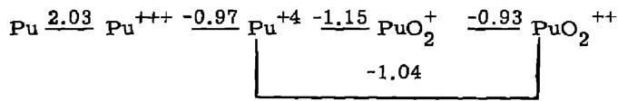  
ACID SOLUTION

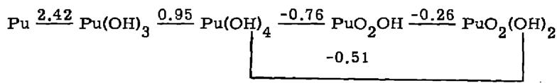  
BASIC SOLUTION

Formal oxidation potentials for Pu couples in various 1 M solutions are shown in Table IV-4. The displacements of the potentials are due to the complex-forming tendencies of the anions with Pu.

TABLE IV-4. Formal Potentials for Pu Couples in Various 1 M Solutions   

<table><tr><td></td><td>Pu(III)-Pu(IV)</td><td>Pu(IV)-Pu(VI)</td><td>Pu(III)-Pu(VI)</td><td>Pu(V)-Pu(VI)</td></tr><tr><td>HClO4</td><td>-0.982</td><td>-1.043</td><td>-1.023</td><td>-0.92</td></tr><tr><td>HCl</td><td>-0.970</td><td>-1.052</td><td>-1.024</td><td>-0.912</td></tr><tr><td>HNO3</td><td>-0.92</td><td>-1.05</td><td>-1.04</td><td>--------</td></tr><tr><td>H2SO4</td><td>-0.74</td><td>-1.2-1.4</td><td>--------</td><td>--------</td></tr></table>

The lower oxidation states become more stable in the actinide series from U to Am, and correspondingly the higher oxidation states become more difficult to attain. This effect is illustrated in Table IV-5, which shows the free energies of formation of various actinide ions.

TABLE IV-5. Free Energy of Formation of Actinide Ions (kcal/mole)   

<table><tr><td></td><td>M++</td><td>M++++</td><td>MO2+</td><td>MO2++</td></tr><tr><td>U</td><td>-124.4</td><td>-138.4</td><td>-237.6</td><td>-236.4</td></tr><tr><td>Np</td><td>-128.4</td><td>-124.9</td><td>-221.0</td><td>-194.5</td></tr><tr><td>Pu</td><td>-140.5</td><td>-118.2</td><td>-204.9</td><td>-183.5</td></tr><tr><td>Am</td><td>-160.5</td><td>-110.2</td><td>(-194.5)</td><td>-156.7</td></tr></table>

Thus the most stable $+3$ ion in this series is $\mathrm{Am}^{++}$ , while the most stable $+6$ ion is $\mathrm{UO}_2^{++}$ . Pu is the first member of this series in which the tripositive state is stable enough in aqueous solution to be useful in separation chemistry.

This fact is of supreme importance in the radiochemistry of Pu, since Pu can be selectively maintained in either the $+3$ or $+4$ oxidation states in separation schemes. Advantage is taken of this ability in many of the collected procedures in section VI.

The oxidation-reduction behavior of Pu is complicated by several factors: (1) $\mathrm{PuO}_{\mathrm{k}}^{+}$ disproportionates into $\mathrm{Pu}^{+4}$ and $\mathrm{PuO}_{2}^{++}$ and under certain conditions $\mathrm{Pu}^{+3}$ , $\mathrm{Pu}^{+4}$ , $\mathrm{PuO}_{2}^{+}$ , and $\mathrm{PuO}_{2}^{++}$ can all exist in equilibrium; $\mathrm{Pu}^{+4}$ is a small, highly charged ion and therefore undergoes extensive hydrolysis at low acidity and forms many stable complex ions. This tendency is a dominant feature of $\mathrm{Pu(IV)}$ chemistry. $\mathrm{Pu(IV)}$ forms a long-chain compound or polymer by hydrolytic reactions. $\mathrm{Pu(IV)}$ polymer is one of the more unpleasant aspects of Pu chemistry from the standpoint of the radiochemist.

# C.2 Oxidation-Reduction Reactions

Table IV-6 lists reagents and conditions to effect changes in oxidation state for Pu ions. It must be emphasized that a relatively small change in conditions may produce a large change in the equilibrium, and that some of the oxidation-reduction reactions may proceed beyond those listed. Therefore, the listed reactions should be taken as a guide only.

In general, the change in oxidation state between $+3$ and $+4$ is rapid, since only one electron is involved in this change. Similarly $\mathsf{PuO}_2^+$ and $\mathsf{PuO}_2^{++}$ changes are rapid. Changes in the oxidation state of Pu which involve the making or breaking of a Pu-O bond are usually slower. However, Hindman, in a general review of the kinetics of actinide oxidation-reduction reactions, gives examples of reactions involving M-O bonds which proceed as rapidly as some involving only electron transfer. Newton and Rabideau have also reviewed the kinetics of actinide oxidation-reduction reactions.

# C.3 Disproportionation Reactions

The potentials of the various Pu couples are such that appreciable quantities of several oxidation states may exist in equilibrium. $\mathbf{Pu}(\mathbf{IV})$ and $\mathbf{Pu}(\mathbf{V})$ are both unstable with respect to disproportionation into higher and lower oxidation states in weakly acid, uncomplexed media. There are several important equilibria which must be considered for an understanding of Pu oxidation-reduction chemistry.

TABLE IV-6. Oxidation-Reduction Reactions of Plutonium Ions*   
A. $\mathrm{Pu(III)}\rightarrow \mathrm{Pu(IV)}$   

<table><tr><td>Reagents</td><td>Solution</td><td>Temp.</td><td>Rate</td><td>Reference</td></tr><tr><td>BrO3</td><td>Dilute acid</td><td>R.T.**</td><td>Very rapid</td><td></td></tr><tr><td>Ce+4</td><td>1.5 M HCl</td><td>R.T.</td><td>Very rapid</td><td></td></tr><tr><td></td><td>6 M HCl,</td><td>R.T.</td><td>Very rapid</td><td>235</td></tr><tr><td></td><td>dilute H2SO4</td><td>R.T.</td><td>Very rapid</td><td>235</td></tr><tr><td>Cl2</td><td>0.5 M HCl</td><td>R.T.</td><td>Slow (t1/2&gt;9 hr)</td><td></td></tr><tr><td>H2O2</td><td>R-6 M HCl</td><td>R.T.</td><td>Equilibrium at 90% 
Pu(IV) in several hours</td><td>145</td></tr><tr><td></td><td>4-8 M HClO4</td><td>R.T.</td><td>Equilibrium at 80-90% 
Pu(IV) in several hours</td><td>145</td></tr><tr><td>Cr2O7</td><td>Dilute acid</td><td>R.T.</td><td>Extremely rapid</td><td></td></tr><tr><td>HIO3</td><td>Dilute acid</td><td>R.T.</td><td>Extremely rapid</td><td></td></tr><tr><td>MnO4</td><td>Dilute acid</td><td>R.T.</td><td>Extremely rapid</td><td>79</td></tr><tr><td>O2</td><td>0.5 M HCl</td><td>R.T.</td><td>No oxidation in 42 hr·</td><td></td></tr><tr><td></td><td></td><td>97°C</td><td>2.5% oxidized in 4 hr, 
more rapid in higher</td><td></td></tr><tr><td>NO2</td><td>HNO3</td><td>R.T.</td><td>Very rapid</td><td>63</td></tr><tr><td></td><td>0.4 - 2 M HNO3, 
Fe(II) Sulfamate,</td><td>R.T.</td><td>Complete in few minutes</td><td>63</td></tr><tr><td></td><td>0.1 M HNO2</td><td></td><td></td><td></td></tr></table>

*This table is an enlarged version of the one given by Katz and Seaborg<sup>1</sup> which was compiled from data given by Connick.<sup>5</sup> Unless otherwise specified, the data were obtained from this source.   
\*\*R.T. $=$ room temperature.

B. $\mathrm{Pu(IV)} \rightarrow \mathrm{Pu(III)}$   

<table><tr><td>Reagents</td><td>Solution</td><td>Temp.</td><td>Rate</td><td>Reference</td></tr><tr><td>Hydroquinone</td><td>Dilute HNO3</td><td>R.T.</td><td>Rapid</td><td></td></tr><tr><td>H2, Pt</td><td>0.5 M - 4.0 M HCl</td><td>R.T.</td><td>&gt;99% reduced in 40 min</td><td></td></tr><tr><td>I-</td><td>0.1 M KI + 0.4 M HCl</td><td>R.T.</td><td>t1/2 = 2 min</td><td></td></tr><tr><td>HSO3-</td><td>0.05 M NH4HSO3, 0.3 M HNO3</td><td>R.T.</td><td>t1/2 = ~2 min</td><td>65</td></tr><tr><td>NH3OH+</td><td>0.5 M HNO3 + 0.1 M NH3OH+</td><td>R.T.</td><td>t1/2 ~40 min</td><td></td></tr><tr><td></td><td>NH2OH·HCl, HCl</td><td>----</td><td>------</td><td></td></tr><tr><td>Zn</td><td>0.5 M HCl</td><td>R.T.</td><td>Rapid</td><td></td></tr><tr><td>SO2</td><td>1 M HNO3</td><td>R.T.</td><td>t1/2 &lt; 1 min</td><td></td></tr><tr><td>Ti++</td><td>6 M HCl, dilute H2SO4</td><td>R.T.</td><td>Very rapid</td><td>235</td></tr><tr><td></td><td></td><td>R.T.</td><td>Very rapid</td><td>235</td></tr><tr><td></td><td>1 N HNO3 + 1 N H2SO4R.T.</td><td>Rapid</td><td>103</td><td></td></tr><tr><td>Cr++</td><td>Dilute HCl or H2SO4</td><td>R.T.</td><td>Rapid</td><td>235, 449</td></tr><tr><td>Ascorbic</td><td>HNO3</td><td>Rapid</td><td>416, 402</td><td></td></tr><tr><td>Acid</td><td>0.5 M HNO3, 0.01 M Ascorbic acid</td><td>R.T.</td><td>Rapid</td><td>65</td></tr><tr><td></td><td>6 M HNO3 0.1 M Ascorbic acid, Fe(II) Sulfamate</td><td>R.T.</td><td>Rapid</td><td>65</td></tr><tr><td>H2O2</td><td>7.5 M HCl</td><td>R.T.</td><td>Complete in several hr</td><td>145</td></tr></table>

C. $\mathrm{Pu}(\mathrm{IV}) \rightarrow \mathrm{Pu}(\mathrm{VI})$   

<table><tr><td>Reagents</td><td>Solution</td><td>Temp.</td><td>Rate</td><td>Reference</td></tr><tr><td>NaBiO3</td><td>5 M HNO3+ 0.84 g/liter</td><td>R.T.</td><td>Complete in less than 5 min</td><td></td></tr><tr><td>BrO-3</td><td>0.1 M BrO-3, 1 M HNO3</td><td>85°C</td><td>99% oxidized in 4 hr</td><td></td></tr><tr><td>Ce+4</td><td>0.1 M Ce+4, 0.5 M HNO3</td><td>R.T.</td><td>Complete in 15 min</td><td></td></tr><tr><td>HOCI</td><td>pH 4.5, -8.2, 0.1 M HOCI</td><td>80°C</td><td>Complete in 15 min</td><td></td></tr><tr><td></td><td>45% K2CO3</td><td>40°C</td><td>Complete in 5-10 min</td><td></td></tr><tr><td>H5IO6</td><td>0.02 M H5IO6, 0.22 M HNO3</td><td>R.T.</td><td>t1/2= 100 min</td><td></td></tr><tr><td>MnO4</td><td>1 M HNO3, 0.001 M MnO4</td><td>25°C</td><td>t1/2= 50 min</td><td></td></tr><tr><td>O3</td><td>Ce+3 or Ag+ catalyst</td><td>0°C</td><td>Complete in 30 min</td><td></td></tr><tr><td></td><td>0.25 M H2SO4, no catalyst</td><td>19°C</td><td>Complete in 15 hr</td><td>150</td></tr><tr><td></td><td>0.25 M H2SO4, no catalyst</td><td>65°C</td><td>Complete in 1-1/2 hr</td><td>150</td></tr><tr><td></td><td>2 N HCl, no catalyst</td><td>R.T.</td><td>2-8 hr depending on concentration of Pu</td><td>275, 276</td></tr><tr><td>Ag++</td><td>Ag+ + S2O8, 1.1 M HNO3</td><td>25°C</td><td>Complete in 1 min</td><td></td></tr><tr><td></td><td>0.5 N H2SO4, Solid Ag(II)</td><td>0</td><td></td><td>361, 39</td></tr><tr><td>Cr2O7</td><td>0.05 M HClO4, dilute H2SO4</td><td>25°C</td><td>t1/2= 15 min</td><td></td></tr><tr><td>HNO3</td><td>0.55 M HNO3, 1 × 10-3M Pu</td><td>R.T.</td><td>Complete in 9 hr</td><td>129</td></tr><tr><td>Cl2</td><td>0.03 M H2SO4 + saturated Cl2</td><td>80°C</td><td>t1/2= 35 min</td><td></td></tr><tr><td></td><td>0.1 M HClO4, 0.025 M Cl2 0.056 M Cl-</td><td>22°C</td><td>t1/2= 2 hr</td><td></td></tr><tr><td>Electrolysis</td><td>0.5 M HClO4</td><td>R.T.</td><td>Complete in 30 min</td><td>454</td></tr></table>

D. $\mathrm{Pu}(\mathrm{VI}) \rightarrow \mathrm{Pu}(\mathrm{IV})$   

<table><tr><td>Reagents</td><td>Solution</td><td>Temp.</td><td>Rate</td><td>Reference</td></tr><tr><td>HCOOH</td><td>HNO3</td><td>R.T.</td><td>Slow</td><td></td></tr><tr><td>C2O4=</td><td>0.02 M H2C2O4</td><td>75°C</td><td>t1/2= 60 min</td><td></td></tr><tr><td>I-</td><td>2.3 M HII, 3.1 M HNO3</td><td>?</td><td>Rapid</td><td></td></tr><tr><td rowspan="3">Fe++</td><td>HCl</td><td>R.T.</td><td>Rapid</td><td></td></tr><tr><td>2-6 M HNO3, 1 M Ferrous Sulfamate</td><td>R.T.</td><td>Rapid</td><td>75</td></tr><tr><td>2-4 N H2SO4</td><td>R.T.</td><td>Fairly fast</td><td>361, 39</td></tr><tr><td>NO2</td><td>HNO3</td><td>?</td><td>?</td><td>96</td></tr><tr><td>H2O2</td><td>HNO3</td><td>R.T.</td><td>Fast, reduction continues to PU(III)</td><td>295</td></tr></table>

E. $\mathrm{Pu(V)}\longrightarrow \mathrm{Pu(IV)}$   

<table><tr><td>Reagents</td><td>Solution</td><td>Temp.</td><td>Rate</td><td>Reference</td></tr><tr><td>HNO2</td><td>-</td><td>R.T.</td><td>Slow</td><td></td></tr><tr><td>NH3OH+</td><td>0.5 M HCl, 0.015 M NH3OH+</td><td>R.T.</td><td>Slow</td><td></td></tr></table>

F. $\mathbf{Pu}(\mathbf{VI})\longrightarrow \mathbf{Pu}(\mathbf{V})$   

<table><tr><td>Reagents</td><td>Solution</td><td>Temp.</td><td>Rate</td><td>Reference</td></tr><tr><td>I-</td><td>pH 2</td><td>R.T.</td><td>Instantaneous</td><td></td></tr><tr><td>NH2NH3+</td><td>0.5 M HCl, 0.05 M NH2NH3</td><td>25°C</td><td>t1/2= 180 min</td><td></td></tr><tr><td>SO2</td><td>pH -2</td><td>25°C</td><td>Complete in 5 min</td><td></td></tr><tr><td>Fe++</td><td>0.05 - 2 M HClO4, μ = 2</td><td>0-25°C</td><td>301</td><td></td></tr></table>

The first of these is the disproportionation of $\mathsf{Pu}(\mathsf{IV})$ according to the reaction

$$
3 \mathrm {P u} ^ {+ 4} + 2 \mathrm {H} _ {2} \mathrm {O} = 2 \mathrm {P u} ^ {+ 3} + \mathrm {P u O} _ {2} ^ {+ +} + 4 \mathrm {H} ^ {+}
$$

for which the concentration equilibrium constant may be written

$$
\mathrm {K} _ {\mathrm {C}} = \frac {\left(\mathrm {P u} ^ {+ 3}\right) ^ {2} \left(\mathrm {P u O} _ {2} ^ {+ +}\right) \left(\mathrm {H} ^ {+}\right) ^ {4}}{\left(\mathrm {P u} ^ {+ 4}\right) ^ {3}}
$$

Table IV-7 lists $\mathbf{K}_{\mathbf{c}}$ for this reaction under similar conditions of acidity and ionic strength for different acids.

TABLE IV-7. Concentration Equilibrium Constant for the Disproportionation of $\mathsf{Pu}^{+4}$ in Various Acids at $25^{\circ}\mathbf{C}^{*}$   

<table><tr><td>Acid</td><td>H+ = 1.0 M; μ=1.0</td></tr><tr><td>HClO4</td><td>9 × 10-3</td></tr><tr><td>HCl</td><td>2 × 10-3</td></tr><tr><td>HNO3</td><td>4 × 10-7</td></tr><tr><td>H2SO4</td><td>Very low**</td></tr></table>

\*Taken from Gel'man et al. 3 \*\*Appreciable quantities of Pu(III), Pu(IV), and Pu(VI) cannot exist together in $\mathsf{H}_2\mathsf{SO}_4$ solutions.

These data show that strong influence of the anionic medium on the equilibrium. The equilibrium is shifted markedly to the left even at these low ionic strengths by the strong complexes formed by $\mathsf{Pu}(\mathsf{IV})$ . Conversely, the equilibrium is shifted to the right by lowering the concentration of the acid and complex forming anion, at least until the onset of hydrolysis at pH 1-1.5. The hydrolytic reactions again stabilize $\mathsf{Pu}(\mathsf{IV})$ .

The disproportionation reaction probably occurs as a series of bimolecular reactions. According to Connick and McVey, $^{100}$ the reaction path may be

$$
2 \mathrm {P u} ^ {+ 4} = \mathrm {P u} ^ {+ 3} + \mathrm {P u O} _ {2} ^ {+} \quad (\text {S l o w})
$$

$$
\mathrm {P u O} _ {2} ^ {+} + \mathrm {P u} ^ {+ 4} = \mathrm {P u O} _ {2} ^ {+ +} + \mathrm {P u} ^ {+ 3} \quad (\text {F a s t})
$$

The first reaction is slow because Pu-O bond formation is involved, while the second reaction only requires electron transfer. The rate of the first reaction is second-order in Pu(IV) concentration and inverse third-order in $\mathbf{H}^{+}$ concentration. The following reaction sequence is consistent with these discrepancies

$$
\mathrm {P u} ^ {+ 4} + \mathrm {H} _ {2} \mathrm {O} = \mathrm {P u O H} ^ {+ 3} + \mathrm {H} ^ {+}
$$

$$
\mathrm {P u O H} ^ {+ 3} + \mathrm {H} _ {2} \mathrm {O} = \mathrm {P u} (\mathrm {O H}) _ {2} ^ {+ +} + \mathrm {H} ^ {+}
$$

$$
\mathrm {P u O H} ^ {+ 3} + \mathrm {P u} (\mathrm {O H}) _ {2} ^ {+ +} = \mathrm {P u} ^ {+ 3} + \mathrm {P u O} _ {2} ^ {+} + \mathrm {H} _ {2} \mathrm {O} + \mathrm {H} ^ {+}
$$

Crocker<sup>106</sup> determined the relative amount of each oxidation state present over a wide range of temperature and $\mathrm{HNO}_3$ concentration. He found that the minimum concentration of $\mathrm{HNO}_3$ to prevent formation of $\mathrm{Pu}(\mathrm{VI})$ in a $4 \times 10^{-3}$ $\underline{\mathbf{M}}$ $\mathrm{Pu}(\mathrm{IV})$ solution is $1.5\underline{\mathbf{M}}$ , while at $98^{\circ}\mathrm{C}$ the required concentration of acid is $8\underline{\mathbf{M}}$ .

The second important equilibrium is the disproportionation of $\mathrm{Pu(V)}$ , which is unstable in moderately acid solution with respect to the reaction

$$
2 \mathrm {P u} (\mathrm {V}) = \mathrm {P u} (\mathrm {I V}) + \mathrm {P u} (\mathrm {V I})
$$

Connick<sup>99</sup> describes this overall reaction as proceeding by either of the two slow reactions

(A) $2\mathrm{PuO}_{2}^{+} + 4\mathrm{H}^{+} = \mathrm{Pu}^{+4} + \mathrm{PuO}_{2}^{++} + 2\mathrm{H}_{2}\mathrm{O}$

(B) $\mathrm{PuO}_{2}^{+} + \mathrm{Pu}^{+3} + 4\mathrm{H}^{+} = 2\mathrm{Pu}^{+4} + 2\mathrm{H}_{2}\mathrm{O}$

followed by the fast reaction

$$
\mathrm {P u O} _ {2} ^ {+} + \mathrm {P u} ^ {+ 4} = \mathrm {P u O} _ {2} ^ {+ +} + \mathrm {P u} ^ {+ 3} \tag {C}
$$

Reactions A and B involve the breaking of $\mathbf{Pu} - \mathbf{O}$ bonds, while C does not. Reaction A is probably only important until sufficient $\mathbf{Pu}^{+3}$ is formed for reaction B to occur, since B is kinetically more probable than A.

These disproportionation reactions may be involved in oxidation-reduction reactions by other reagents. Instead of direct oxidation or reduction, the disproportionation reaction can occur first, followed by direct oxidation or reduction of the appropriate product.

# C.4 Radiolytic Reduction of Pu Solutions

The alpha particles emitted in the decay of $\mathbf{Pu}^{239}$ supply enough energy to the medium to decompose solutions of $\mathbf{Pu}^{239}$ by radiolysis. The radiolysis products then oxidize or reduce the Pu, depending on the nature of the solution and the oxidation state of the Pu. This effect was first described by Kasha and Sheline<sup>215</sup> who noticed $0.6\%$ reduction of $\mathbf{Pu}(\mathbf{VI})$ to $\mathbf{Pu}(\mathbf{IV})$ per day in perchloric acid solution which was independent of acidity over a range 0.1 to 2 M. The rate of reduction in HCl was considerably less. In both cases the reaction is slow enough to allow the equilibrium quantities of the various oxidation states to be present. The reduction of $\mathbf{Pu}(\mathbf{VI})$ probably proceeds first to $\mathbf{Pu}(\mathbf{V})$ , and the lower states obtained by disproportionation of this ion.

Rabideau et al.326 confirmed the above qualitative results concerning the relative rates of $\mathrm{HClO_4}$ and HCl reduction and found that the situation is complicated by the production of $\mathbf{C}\mathbf{l}^{-}$ in $\mathrm{HClO_4}$ solutions and $\mathbf{C}\mathbf{l}_2$ in HCl solutions. Also, if $\mathbf{Br}^{-}$ is added to $\mathrm{HClO_4}$ solutions, a net oxidation instead of reduction occurs if the mean oxidation number is initially approximately 4.

Pages $^{308}$ and Pages and Haissinsky $^{309}$ found that the rate of reduction depended very strongly on the nature of the anion in a study of external gamma-radiation induced reduction of $\mathsf{Pu}(\mathsf{VI})$ . The rates of reduction decreased in the order $\mathrm{ClO}_4^- = \mathrm{SO}_4^= > \mathrm{Cl}^- >> \mathrm{NO}_3^-$ . These results presumably also apply to auto-reduction by alpha particles.

Popov et al.320 on the other hand found only oxidation by irradiation of $\mathsf{HNO}_3$ solutions of Pu with external x-radiation. The rate of oxidation decreased with an increase of $\mathsf{NO}_3^-$ and total acidity.

The lesson to the radiochemist is clear: The stated oxidation states of old Pu solutions, particularly low acidity $\mathrm{HClO_4}$ and $\mathrm{H}_2\mathrm{SO}_4$ solutions, should be viewed with suspicion.

# C.5 Hydrolytic Reactions of Plutonium

Pu in all of its oxidation states exists in aqueous solutions as highly charged ions and therefore undergoes hydrolysis reactions in dilute acid solutions. The tendencies for these ions to undergo hydrolysis is dependent on the charge and ionic radius. The tendency thus increases with increasing atomic number for all the oxidation states of the actinide series and in the case of Pu increases in the order $\mathrm{PuO}_{2}^{++} < \mathrm{Pu}^{+++} < \mathrm{Pu}^{+4}$ .

$\mathbf{Pu}^{+4}$ has approximately the same tendency to hydrolyze as $\mathbf{Ce}^{+4}$ but less than that of $\mathbf{Hf}^{+4}$ and $\mathbf{Zr}^{+4}$ .

The constant for the first displacement of a proton from the hydration sphere, along with the solubility product for the hydroxide of the various Pu ions, is given in Table IV-8. In the case of $\mathbf{Pu}^{+3}$ and $\mathbf{Pu}^{+4}$ , the hydrolysis reaction may be written

$$
\mathrm {P u} \left(\mathrm {H} _ {2} \mathrm {O}\right) _ {\mathbf {x}} ^ {\mathrm {n} +} + \mathrm {H} _ {2} \mathrm {O} = \mathrm {P u O H} \left(\mathrm {H} _ {2} \mathrm {O}\right) _ {\mathbf {x} - 1} ^ {(\mathrm {n} - 1) +} + \mathrm {H} _ {3} \mathrm {O} ^ {+};
$$

or in the case of $\mathsf{PuO}_2^{++}$

$$
\mathrm {P u O} _ {2} \left(\mathrm {H} _ {2} \mathrm {O}\right) _ {\mathrm {x}} ^ {2 +} + \mathrm {H} _ {2} \mathrm {O} = \mathrm {P u O} _ {2} \mathrm {O H} \left(\mathrm {H} _ {2} \mathrm {O}\right) _ {\mathrm {x} - 1} ^ {+} + \mathrm {H} _ {3} \mathrm {O} ^ {+}.
$$

$\mathsf{PuO}_2^{++}$ hydrolyzes to a greater extent than a simple dipositive ion of the same radius, showing the effect of the highly charged central $\mathsf{Pu}$ ion.

TABLE IV-8. First Hydrolysis Constants and Solubility Products for Plutonium Ions.   

<table><tr><td>Ion</td><td>Hydroxide</td><td>PKH</td><td>KSP of Hydroxide</td><td>Ref.</td></tr><tr><td rowspan="2">Pu+3</td><td rowspan="2">Pu(OH)3</td><td>7.22 (μ = 0.069, HClO4)</td><td>2 × 10-20</td><td>*</td></tr><tr><td>7.37 (μ = 0.034, HCl)</td><td>7 × 10-56</td><td>*</td></tr><tr><td>Pu+4</td><td>Pu(OH)4</td><td>1.27 (μ = 2.0)</td><td></td><td></td></tr><tr><td>PuO2++</td><td>PuO2(OH)2</td><td>3.33 (1.86 × 10-4M HNO3)</td><td>(3 ± 1) × 10-25</td><td>(244)</td></tr></table>

\*As quoted in Gel'man et al. 3

# C.6 Pu(IV) Polymer

By far the most important hydrolytic reaction from a radiochemical standpoint is the formation of colloidal aggregates in $\mathrm{Pu(IV)}$ solutions by successive hydrolysis reactions. The polymer presumably forms with oxygen or hydroxyl bridges and the reaction is apparently irreversible. $\mathrm{Pu(OH)_4}$ forms when the reaction proceeds to completion. In intermediate stages, however, the colloid remains in solution and has properties markedly different from those of the free ion. In macro concentrations the color of a $0.3\mathrm{M}\mathrm{HNO}_3$ solution changes from brown to bright green when the solution is heated. The adsorption spectra of polymer has an entirely different character than monomeric $\mathrm{Pu(IV)}$ solutions.

The polymer can be formed from many solutions. The formation of $\mathrm{Pu(IV)}$ polymer is favored by an increase in the $\mathrm{Pu}$ concentration and temperature or by a decrease in the acidity. As the total nitrate concentration increases the polymer precipitates, up to a maximum at $2 - 3\underline{\mathbf{M}}\mathrm{NO}_3^{-}.$ The presence of strong complexing anions inhibits the formation of polymer. Nevertheless, the presence of polymeric $\mathrm{Pu}$ should be suspected whenever the acid concentration is below $0.5\underline{\mathbf{M}}.$ Polymer is formed when solutions are diluted with water because of the existence of transient regions of high $\mathsf{pH}$ , even though the final acidity may be high enough to prevent formation of the polymer. The polymer is also formed by adding less than a stoichiometric quantity of acid in the dissolution of $\mathrm{Pu(OH)_4}$ precipitate. Fortunately, $\mathrm{Pu(OH)_4}$

can be precipitated from originally monomeric solutions and redissolved without appreciable formation of polymer by using excess reagents.239 Pu(IV) polymer may be completely precipitated from solution by much less than stoichiometric amounts (approximately 0.15 equivalents of anion) of oxalate, iodate, and phosphate, for example. This phenomenon indicates that the complex contains few charges. This fact was utilized by Ockenden and Welch305 to remove ionic Pu from the colloidal form by means of cation exchange.

Depolymerization is very slow at room temperature in moderate acid concentrations. The rate is increased by heating, stronger acid concentration, and addition of strong complexing agents such as fluoride and sulfate.

Care must be taken to prevent the formation of $\mathrm{Pu(IV)}$ polymer in radiochemical separations because of the very different chemical properties of the polymer. The example of non-adsorption on cation exchange resin has already been given. The $\mathrm{Pu(IV)}$ polymer does not extract into tri-n-butyl phosphate, (TBP), for example, but does extract into di-n-butyl phosphoric acid, (DBP). The formation of polymer in solutions of diethylene glycol dibutyl ether (butex) has been observed.

Costanzo and Biggers<sup>104</sup> have determined the rate of polymerization and depolymerization as a function of acidity, temperature, Pu concentration, and salt concentration. Miner<sup>278</sup> has summarized information concerning the formation of polymer in nitrate solutions. Both the above references give suggestions for the avoidance of polymer formation in handling and shipping macro amounts of Pu.

Polymeric $\mathbf{Pu}(\mathbf{IV})$ adsorbs strongly onto glass, paper, etc., indicating that it is positively charged. $^{78}$ Saturation on glass occurs at approximately $1\mu \mathrm{g / cm}^2$ . Samartseva $^{345}$ found that the adsorption is greater on silica than on glass, that 5 to 8 hours was necessary to reach equilibrium with $10^{-8}$ to $5\times 10^{-10}\underline{\underline{\mathbf{M}}}$ Pu(IV) solutions, and that adsorption on glass was reversible at $\mathrm{pH} < 4$ .

The adsorption of $\mathrm{Pu(IV)}^{399}$ and (VI) $^{346}$ on platinum (Pt) has been studied from aqueous solution. It was found that from $1\%$ to $4\%$ of the $\mathrm{Pu(IV)}$ can adsorb on a Pt surface from organic extractants such as TBP, tri-n-octylamine, (TOA), etc. $^{399}$ Increasing the concentration of the extractant or the aqueous nitric acid phase in equilibrium with the organic phase decreased the adsorption.

# C.7 Complex Ion Formation

The formation of complex ions in aqueous solutions with anionic ligands is an important feature of the aqueous chemistry of Pu. Complex formation and hydrolysis are competing reactions and may be looked upon as the displacement of the $\mathrm{H}_2\mathrm{O}$ molecules in the hydration sphere by the anionic ligand or by $\mathrm{OH}^-$ , respectively. The ability of an ion to form complexes is dependent on the magnitude of the ionic potential which may be defined by the equation

$$
d = z / r.
$$

$z$ is the charge on the ion and $r$ is the ionic radius. The values of the ionic potentials of $\mathbf{Pu}$ in different oxidation states are given in Table IV-9.

TABLE IV-9. Ionic Potential of Plutonium in Various Oxidation States   

<table><tr><td>Cation</td><td>Ionic radius (Å)</td><td>Charge</td><td>Ionic potential</td></tr><tr><td>Pu+4</td><td>0.90</td><td>4+</td><td>4.44</td></tr><tr><td>Pu+3</td><td>1.03</td><td>3+</td><td>2.91</td></tr><tr><td>PuO2+2</td><td>0.81</td><td>2+</td><td>2.47</td></tr><tr><td>PuO2+</td><td>0.87</td><td>1+</td><td>1.15</td></tr></table>

\*After Gel'man et al.3

The relative tendency of $\mathsf{Pu}$ ions to form complexes then is

$$
\mathrm {P u} (\mathrm {I V}) > \mathrm {P u} (\mathrm {I I I}) > \mathrm {P u} (\mathrm {V I}) > \mathrm {P u} (\mathrm {V})
$$

Gel' man et al. show that the anionic ligand has some effect on this series. For example, the positions of $\mathsf{Pu(III)}$ and $\mathsf{Pu(VI)}$ are interchanged in the case of oxalate complexes.

Singly charged anions form weaker complexes with actinides generally than do multiply charged anions. The order of complex forming ability with some anions is

$$
\mathrm {C O} _ {3} ^ {\overline {{=}}} > \mathrm {C} _ {2} \mathrm {O} _ {4} ^ {\overline {{=}}} > \mathrm {S O} _ {4} ^ {\overline {{=}}} > \mathrm {F} ^ {-} > \mathrm {N O} _ {3} ^ {-} > \mathrm {C l} ^ {-} > \mathrm {C l O} _ {4} ^ {-}.
$$

Tables IV-10, IV-11, and IV-12 list available stability constants for complexes of $\mathsf{Pu(III)}$ , $\mathsf{Pu(IV)}$ , $\mathsf{Pu(V)}$ , and $\mathsf{Pu(VI)}$ , respectively, which are based on the review of Gel'man et al. The chemistry of complex compounds and ions of the actinides was also reviewed by Comyns. Table IV-13 lists stability constants for some complexes of several actinides for comparison.

TABLE IV-10. Stability Constants of Pu(III) Ions*   

<table><tr><td>Complex-formation reaction</td><td>Ionic strength</td><td>K</td><td>Ref.</td></tr><tr><td>Pu+3 + NO3- = PuNO3+2</td><td></td><td>5.9 ± 0.5</td><td></td></tr><tr><td>Pu+3 + 2NO3- = Pu(NO3)2+</td><td></td><td>14.3 ± 0.8</td><td></td></tr><tr><td>Pu+3 + 3NO3- = Pu(NO3)0</td><td></td><td>14.4 ± 0.8</td><td></td></tr><tr><td rowspan="2">Pu+3 + Cl- = PuCl+2</td><td>0.5</td><td>0.58</td><td></td></tr><tr><td>1.0</td><td>1.1</td><td></td></tr><tr><td>Pu+3 + SO4-2 = PuSO4+</td><td></td><td>10</td><td></td></tr><tr><td rowspan="2">Pu+3 + 2SO4-2 = Pu(SO4)2-</td><td></td><td>50</td><td></td></tr><tr><td></td><td>3.6 × 1011*3</td><td></td></tr><tr><td rowspan="2">Pu+3 + 2C2O4-2 = Pu(C2O4)2-</td><td></td><td>2.0 × 109</td><td></td></tr><tr><td></td><td>1.4 × 109</td><td></td></tr><tr><td rowspan="2">Pu+3 + 3C2O4-2 = Pu(C2O4)3-3</td><td></td><td>2.4 × 109</td><td></td></tr><tr><td></td><td>4.5 × 1010</td><td></td></tr><tr><td rowspan="2">Pu+3 + 4C2O4-2 = Pu(C2O4)4-5</td><td></td><td>4.2 × 1011</td><td></td></tr><tr><td></td><td>8.3 × 109</td><td></td></tr><tr><td rowspan="2">Pu+3 + 4HC2O4- = Pu(HC2O4)4-</td><td></td><td>6.3 × 1012*3</td><td></td></tr><tr><td>1.0</td><td>9.1 × 1010</td><td></td></tr><tr><td rowspan="2">Pu+3 + γ-4 = Puγ-4**</td><td></td><td>1.0 × 1021*3</td><td></td></tr><tr><td>1.0</td><td>2.3 × 1017</td><td></td></tr><tr><td rowspan="2">Pu+3 + Hγ-3 = PuHγ0</td><td>0.1</td><td>(1.3-3.9) × 1018</td><td></td></tr><tr><td></td><td>7.7 × 1011*3</td><td></td></tr><tr><td rowspan="2">Pu+3 + 1/2Hγ-2 = 1/2Pu2γ+2 + H+</td><td></td><td>1.6 × 109</td><td></td></tr><tr><td></td><td>-</td><td></td></tr><tr><td>Pu+3 + 4C6H5O7-3 = Pu(C6H5O7)4-9</td><td></td><td>1 × 1011</td><td></td></tr><tr><td>Pu+3 + 6C4H4O6-2 = Pu(C4H4O6)6-9</td><td></td><td>5 × 1015</td><td></td></tr><tr><td>Pu+3 + 5C2H3O2- = Pu(C2H3O2)5-2</td><td>-</td><td>5 × 1016</td><td>511</td></tr></table>

*Based on the review of Gel'man et al. The data are taken from this source unless otherwise specified.   
$\star \star -4$ is the anion of ethylenediaminetetraacetic acid.   
*3Values at zero ionic strength.

TABLE IV-11. Stability Constants of Pu(IV) Complexes*   

<table><tr><td>Complex-formation reaction</td><td>Ionic strength</td><td>K</td><td>Ref.</td></tr><tr><td>Pu+4+Cl- = PuCl+3</td><td>1</td><td>1.38</td><td></td></tr><tr><td>Pu+4+2Cl- = PuCl2+2</td><td></td><td>0.67</td><td></td></tr><tr><td>Pu+4+NO3- = Pu(NO3)+3</td><td>2.0</td><td>2.9 ± 0.6</td><td></td></tr><tr><td></td><td>6.0</td><td>4.7</td><td></td></tr><tr><td></td><td>1.0</td><td>3.48 ± 0.06</td><td></td></tr><tr><td>Pu(NO3)+3+NO3- = Pu(NO3)2+2</td><td>6.0</td><td>0.96</td><td></td></tr><tr><td>Pu(NO3)2+2+NO3- = Pu(NO3)+</td><td>6.0</td><td>0.33</td><td></td></tr><tr><td>Pu(NO3)3+NO3- = Pu(NO3)4</td><td>-</td><td>-</td><td></td></tr><tr><td>Pu(NO3)0+NO3- = Pu(NO3)-</td><td>-</td><td>-</td><td></td></tr><tr><td>Pu(NO3)5+NO3- = Pu(NO3)6-2</td><td>-</td><td>-</td><td></td></tr><tr><td>Pu+4+HF = PuF+3+H+</td><td>1</td><td>1.7×104</td><td></td></tr><tr><td></td><td>2</td><td>1.1×104</td><td></td></tr><tr><td>Pu+4+2HF = PuF2+2+2H+</td><td>-</td><td>-</td><td></td></tr><tr><td>Pu+4+3HF = PuF3+3H+</td><td>-</td><td>-</td><td></td></tr><tr><td>Pu+4+4HF = PuF4+4H+</td><td>-</td><td>-</td><td></td></tr><tr><td>Pu+4+SO4-2= Pu(SO4)+2</td><td>1.0</td><td>4.6×103</td><td></td></tr><tr><td>Pu+4+2SO4-2= Pu(SO4)2</td><td>-</td><td>-</td><td></td></tr><tr><td>Pu+4+3SO4-2= Pu(SO4)3-2</td><td>-</td><td>-</td><td></td></tr><tr><td>Pu+4+CO3-2= Pu(CO3)+2</td><td>10.0</td><td>9.1×1046</td><td></td></tr><tr><td>Pu+4+C2O4-2= Pu(C2O4)+2</td><td></td><td>1.3×1011**</td><td></td></tr><tr><td></td><td>1.0</td><td>3.6×108</td><td></td></tr><tr><td>Pu+4+2C2O4-2= Pu(C2O4)2</td><td>1.0</td><td>3.2×1020**</td><td></td></tr><tr><td>Pu+4+3C2O4-2= Pu(C2O4)-2</td><td>1.0</td><td>8.3×1016</td><td></td></tr><tr><td></td><td></td><td>1.0×1027**</td><td></td></tr><tr><td>Pu+4+4C2O4-2= Pu(C2O4)-4</td><td>1.0</td><td>2.5×1023</td><td></td></tr><tr><td></td><td></td><td>8.0×1029**</td><td></td></tr><tr><td></td><td>1.0</td><td>3.0×1027</td><td></td></tr><tr><td></td><td></td><td>3.1×1027</td><td></td></tr><tr><td>Pu(HPO4)2+(n+4-3m)H+</td><td></td><td></td><td></td></tr><tr><td>= Pu(PO4)mHn+4-3m+(2-m)E3PO4, where m = 1, 2, . . . 5 and n = 0, 1, 2, . . . 3m</td><td>-</td><td>-</td><td></td></tr><tr><td>2Pu+4+E2O2+E2O = Pu(OO)(OH)Pu+5 + 3H+(brown complex)</td><td>0.5</td><td>8.8×106</td><td></td></tr><tr><td>2Pu+4+2H2O2= Pu (OO)2Pu+4+4H+(red complex)</td><td>0.5</td><td>6.3×108</td><td></td></tr><tr><td rowspan="2">Pu+4+γ-4** = Puγ0</td><td rowspan="2">0.1</td><td>1.58 × 1024</td><td></td></tr><tr><td>1.4 × 1026</td><td></td></tr><tr><td>Pu+4+1/2H2γ=1/2Pu2γ+H+</td><td></td><td>-</td><td></td></tr><tr><td>Pu+4+4C6H5O7-3= Pu(C6H5O7)4-8</td><td></td><td>1.7 × 1027</td><td></td></tr><tr><td>Pu+4+6C4H4O6-2= Pu(C4H4O6)6-8</td><td></td><td>2.0 × 1031</td><td></td></tr><tr><td>Pu+4+AcAc-*3= Pu(AcAc)+3</td><td>0.1</td><td>3.16 × 1010</td><td></td></tr><tr><td>Pu (AcAc)+3+AcAc- = Pu(AcAc)2+2</td><td>0.1</td><td>1.58 × 109</td><td></td></tr><tr><td>Pu(AcAc)2+2+AcAc- = Pu(AcAc)3+</td><td>0.1</td><td>2.51 × 108</td><td></td></tr><tr><td>Pu(AcAc)3+AcAc- = Pu(AcAc)40</td><td>0.1</td><td>1.0 × 106</td><td></td></tr><tr><td>Pu+4+C2H3O2- = Pu(C2H3O2)+3</td><td>-</td><td>2.0 × 105</td><td>359</td></tr><tr><td>Pu+4+2C2H3O2- = Pu(C2H3O2)2+2</td><td>-</td><td>1 × 109</td><td>359</td></tr><tr><td>Pu+4+3C2H3O2- = Pu(C2H3O2)3+1</td><td>-</td><td>8 × 1013</td><td>359</td></tr><tr><td>Pu+4+4C2H3O2- = Pu(C2H3O2)4</td><td>-</td><td>2 × 1018</td><td>359</td></tr><tr><td>Pu+4+5C2H3O2- = Pu(C2H3O2)+1</td><td>-</td><td>4 × 1022</td><td>359</td></tr></table>

# NOTES:

*Based on the review of Gel' man et al. The data are taken from this source unless otherwise specified.

**Values at zero ionic strength.   
*3Abbreviations are:

1. $\gamma^{-4}$ is the anion of ethylenediaminetetraacetic acid.   
2. $\mathrm{AcAc}^{-} = [\mathrm{CH}_{3}\mathrm{COCHCOCH}_{3}]^{-}$

TABLE IV-12. Stability Constants of $\mathbf{Pu}(\mathbf{V})$ and $\mathbf{Pu}(\mathbf{VI})$ complexes   

<table><tr><td>Complex-formation reaction</td><td>Ionic strength</td><td>K</td></tr><tr><td>PuO2+ + Cl- = PuO2Cl0</td><td></td><td>0.67</td></tr><tr><td>PuO2+ C2O4-2 = PuO2C2O4</td><td>0.05</td><td>3.3 × 104</td></tr><tr><td>PuO2+ 2C2O4-2 = PuO2(C2O4)2-3</td><td>0.05</td><td>2.4 × 107</td></tr><tr><td>PuO2+ γ-4 = PuO2γ-4**</td><td></td><td>7.9 × 1010*3</td></tr><tr><td></td><td>0.05</td><td>1.5 × 1010</td></tr><tr><td>PuO2+2 + NO3- = PuO2NO3+</td><td></td><td>72</td></tr><tr><td>PuO2NO3+ + NO3- = PuO2(NO3)20</td><td></td><td>36 ± 0.3</td></tr><tr><td>PuO2+2 + Cl- = PuO2Cl+</td><td>1.0</td><td>1.25</td></tr><tr><td>PuO2+2 + 2Cl- = PuO2Cl20</td><td></td><td>0.73 ± 0.07</td></tr><tr><td>PuO2+2 + γ-4 = PuO2γ-2</td><td></td><td>0.35</td></tr><tr><td>PuO2+2 + C2O4-2 = PuO2C2O40</td><td>1.0</td><td>1.75 × 1016</td></tr><tr><td>PuO2+2 + 2C2O4- = PuO2(C2O4)2</td><td>1.0</td><td>6.9 × 107*3</td></tr><tr><td>PuO2+2 + CH3COO- = PuO2(CH3COO)+</td><td></td><td>4.3 × 106</td></tr><tr><td>PuO2+2 + 2CH3COO- = PuO2(CH3COO)20</td><td></td><td>5.0 × 1012*3</td></tr><tr><td>PuO2+2 + 3CH3COO- = PuO2(CH3COO)3-</td><td></td><td>2.9 × 107</td></tr><tr><td>PuO2+2 + 2CO3-2 = PuO2(CO3)2-2</td><td></td><td>1 × 1015*3</td></tr></table>

*Taken from the review of Gel'man et al.3   
$\mathbf{\Pi}^{**}\gamma^{-4}$ is the anion of ethylenediaminetetraacetic acid.   
*3. Values at zero ionic strength.

TABLE IV-13. Stability Constants of Complexes of Several Actinides   

<table><tr><td>Complex-formation reaction</td><td>U</td><td>Np</td><td>Pu</td><td>Am</td></tr><tr><td>Me+3+ 2C2O4-2 = Me(C2O4)2-</td><td>-</td><td>-</td><td>11.55*3</td><td>11.46*3</td></tr><tr><td>Me+3 + γ-4 = Mγ-4**</td><td>-</td><td>-</td><td>21.0*3</td><td>20.6*3</td></tr><tr><td>Me+4 + C2O4-2 = Me(C2O4)+2</td><td>8.61</td><td>8.54</td><td>8.74</td><td>-</td></tr><tr><td>Me+4 + 2C2O4-2 = Me(C2O4)20</td><td>16.9</td><td>17.54</td><td>16.9</td><td>-</td></tr><tr><td>Me+4 + 3C2O4-2 = Me(C2O4)3-2</td><td>22.7</td><td>24.0</td><td>23.4</td><td>-</td></tr><tr><td>Me+4 + 4C2O4-2 = Me(C2O4)4-4</td><td>27.7</td><td>27.4</td><td>27.5</td><td>-</td></tr><tr><td>MeO2+ + C2O4-2 = MeO2(C2O4)-</td><td>-</td><td>5.04</td><td>4.52</td><td>-</td></tr><tr><td>MeO2+ + 2C2O4-2 = MeO2(C2O4)2-3</td><td>-</td><td>7.36</td><td>7.38</td><td>-</td></tr><tr><td>MeO2+2 + CH3COO- = MeO2(CH3COO)+</td><td>2.7</td><td>3.31</td><td>3.27</td><td>-</td></tr><tr><td>MeO2+2 + 2CH3COO- = MeO2(CH3COO)20</td><td>5.10</td><td>5.83</td><td>6.29</td><td>-</td></tr><tr><td>MeO2+2 + 3CH3COO- = MeO2(CH3COO)3-</td><td>6.41</td><td>7.90</td><td>7.36</td><td>-</td></tr><tr><td>MeO2+2 + C2O4-2 = MeO2C2O40</td><td>6.77</td><td>-</td><td>6.64</td><td>-</td></tr><tr><td>MeO2+2 + 2C2O4-2 = MeO2(C2O4)2-2</td><td>12.0</td><td>-</td><td>11.5</td><td>-</td></tr><tr><td>MeO2+2 + 2CO3-2 = MeO2(CO3)2-2</td><td>14.0</td><td>-</td><td>15.0</td><td>-</td></tr></table>

* Taken from the review by Gel'man et al. 3   
$\mathbf{\Pi}^{**}\gamma^{-4}$ is the anion of ethylenediaminetetraacetic acid.   
$^{*3}$ Thermodynamic values calculated by A. I. Moskvin.

# D.1 Co-precipitation and Precipitation

Co-precipitation and precipitation present different problems to the radiochemist because, in general, the insoluble compounds of Pu which have desirable properties in precipitation reactions are not those formed in co-precipitation reactions. Of the common reactions, only precipitation of $\mathsf{PuF}_3$ and $\mathsf{PuF}_4$ and co-precipitation of $\mathsf{Pu(III)}$ and $\mathsf{Pu(IV)}$ by $\mathsf{LaF}_3$ are analogous. Since the radiochemist is likely to have small or trace quantities of Pu in a relatively large volume, co-precipitation reactions are more important to him, and will be considered first.

# Co-precipitation

Co-precipitation reactions are extremely important in the radiochemistry of Pu. Indeed, the first separation and isolation of the element was accomplished by co-precipitation with $\mathrm{LaF}_3$ . This method has become the "classic" radiochemical method for Pu and is still widely used.

The co-precipitation behavior of Np and Pu toward a number of precipitants is shown in Table IV-14, taken from the review of Hyde. $^{16}$ The behavior of these elements is representative of the actinides in a given oxidation state. The possibility of separation arises when the elements can be maintained in separate oxidation states, and a selective precipitant is used. The review of Bonner and Kahn $^{49}$ gives a thorough discussion of the mechanism of co-precipitation and a good review of co-precipitation data for all the elements through 1949. The co-precipitation behavior of Pu has been discussed by Leader. $^{253}$

The separation of Pu by co-precipitation usually takes advantage of the aforementioned oxidation and reduction cycles to effect purification. The procedure may be illustrated with the carrying of $\mathrm{Pu(III)}$ and $\mathrm{Pu(IV)}$ and the non-carrying of $\mathrm{Pu(VI)}$ on $\mathrm{LaF}_3$ . Only those elements with co-precipitation and oxidation-reduction behavior very similar to that of Pu interfere. The oxidation-reduction cycle may be repeated as many times as needed to get any desired degree of purity. The use of $\mathrm{LaF}_3$ precipitation is also a valuable group separation and volume reduction step, since not very many elements have acid-insoluble fluorides.

In many radiochemical procedures, $\mathrm{LaF}_3$ is mounted for alpha counting to determine the Pu.191, 83, 82, 446 Chenley et al.83 report a $2.6\%$ negative bias by this method because of absorption of the alpha particles in the $\mathrm{LaF}_3$ . This bias is a function of the thickness of the counting sample and must be determined for each procedure.

Calcium is one of the elements which interferes with $\mathsf{LaF}_3$ co-precipitation, since the fluoride is moderately insoluble. One method of solving the problem of high Ca concentrations ( $>200\mathrm{mg / l}$ ) is reported by Scheidhauer and Messainguiral.[351] The Pu is oxidized to $\mathsf{Pu}(\mathsf{VI})$ and $\mathsf{CaF}_2$ is precipitated away from the Pu. Following reduction, the Pu can either be co-precipitated or separated by other means.

TABLE IV-14. Co-precipitation Behavior of Trace Amounts of Plutonium and Neptunium in Principal Valence States.[16]   

<table><tr><td>Carrier compound</td><td>Pu(III)</td><td>Pu(IV)</td><td>Pu(VI)</td><td>Np(IV)</td><td>Np(V)</td><td>Np(VI)</td></tr><tr><td>Hydroxides</td><td>C*</td><td>C</td><td>C</td><td>C</td><td>C</td><td>C</td></tr><tr><td>Lanthanum fluoride</td><td>C</td><td>C</td><td>NC**</td><td>C</td><td>C</td><td>NC</td></tr><tr><td>Phosphates:</td><td></td><td></td><td></td><td></td><td></td><td></td></tr><tr><td>Zirconium phosphate</td><td>NC</td><td>C</td><td>NC</td><td>C</td><td></td><td>NC</td></tr><tr><td>Thorium pyrophosphate</td><td>NC</td><td>C</td><td>NC</td><td></td><td></td><td></td></tr><tr><td>Thorium hypophosphate</td><td></td><td>C</td><td>NC</td><td></td><td></td><td></td></tr><tr><td>U(IV) hypophosphate</td><td></td><td>C</td><td>NC</td><td></td><td></td><td></td></tr><tr><td>Oxalates:</td><td></td><td></td><td></td><td></td><td></td><td></td></tr><tr><td>Thorium oxalate</td><td>C</td><td>C</td><td>NC</td><td>C</td><td></td><td></td></tr><tr><td>U(IV) oxalate</td><td>C</td><td>C</td><td>NC</td><td></td><td></td><td></td></tr><tr><td>Bismuth oxalate</td><td>C</td><td>C</td><td>NC</td><td></td><td></td><td></td></tr><tr><td>Lanthanum oxalate</td><td>C</td><td>C</td><td>NC</td><td>NC</td><td></td><td></td></tr><tr><td>Iodates:</td><td></td><td></td><td></td><td></td><td></td><td></td></tr><tr><td>Zirconium iodate</td><td></td><td>C</td><td>NC</td><td></td><td></td><td></td></tr><tr><td>Thorium iodate</td><td></td><td>C</td><td>NC</td><td>C</td><td></td><td>NC</td></tr><tr><td>Ceric iodate</td><td></td><td>C</td><td>NC</td><td></td><td></td><td></td></tr><tr><td>Sodium uranyl acetate</td><td>NC</td><td>NC</td><td>C</td><td>NC</td><td>Poor*3</td><td>C</td></tr><tr><td>Zirconium phenylarsonate</td><td>NC</td><td>C</td><td>NC</td><td>C</td><td>Poor</td><td>NC</td></tr><tr><td>Thorium peroxide</td><td></td><td>C</td><td></td><td>C</td><td></td><td></td></tr><tr><td>Bismuth arsenate</td><td></td><td>C</td><td>NC</td><td></td><td></td><td></td></tr></table>

*The letter "C" indicates that the co-precipitation has been observed to be nearly quantitative under proper conditions.   
** The letters "NC" mean that co-precipitation may be made less than 1 to 2 percent under proper conditions.   
*3''Poor'' indicates an intermediate percentage of carrying.

Co-precipitation of Pu with LaFg is a common step in the analysis of biological material for Pu. 360, 349, 257, 125, 208, 53

Bismuth phosphate. The carrying of Pu on $\mathrm{BiPO_4}$ is another of the early, widely used methods of separating Pu from U and fission products. The development of the process is reported by Thompson and Seaborg.[401] Like LaF₃, $\mathrm{BiPO_4}$ carries both Pu(III) and Pu(IV) when precipitated from moderately concentrated nitric acid. A peculiarity is the fact that Pu(IV) is more efficiently carried than Pu(III). The optimum conditions for the co-precipitation of Pu have been reported by Adamson.[20] These are: 1) co-precipitation at the minimum $\mathrm{BiPO_4}$ solubility, 2) the absence of strong complexing agents, 3) slow precipitation, and 4) minimum digestion after precipitation is complete.

In addition to being very successful in the large scale processing Pu, BiPO₄ precipitations have been used in general radiochemical procedures<sup>341, 415</sup> to concentrate Pu from large volumes of water<sup>237</sup> and to determine Pu in urine.<sup>126</sup> The procedure of Rydberg<sup>341</sup> uses the familiar oxidation-reduction cycle to effect purification. Plutonium

is first oxidized to $\mathrm{Pu(VI)}$ with sodium bismuthate, $\mathrm{BiPO}_4$ precipitated from $0.1\mathrm{N}$ $\mathrm{HNO}_3$ , then reduced with ferrous ion, and finally precipitated with $\mathrm{BiPO}_4$ .

Zirconium phosphate. Zirconium phosphate is a specific co-precipitant for $\mathrm{Pu(IV)}$ , in contrast to $\mathrm{BiPO_4}$ and $\mathrm{LaF_3}$ , which carry both $\mathrm{Pu(III)}$ and $\mathrm{Pu(IV)}$ . Hyde describes a Np-Pu separation based on the reduction to $\mathrm{Pu(III)}$ before precipitating zirconium phosphate.

Other inorganic co-precipitants. Dupetit and Aten<sup>118</sup> described the co-precipitation of actinides with thorium peroxide and uranium peroxide. All the elements were in the tetravalent oxidation state. They found, that in general, the crystal type made little difference in the co-precipitation of these elements. For example, Pu carried equally well with thorium peroxide, which has a similar crystal structure to plutonium peroxide, and with uranium peroxide which has a different structure.

A mixture of $\mathbf{Pu}(\mathbf{III})$ and $\mathbf{Pu}(\mathbf{IV})$ has been carried on lanthanum iodate from dilute HCl solution. 293

Plutonium can be separated directly from a urine sample by co-precipitation with calcium ammonium phosphate. 102, 74

$\mathrm{Pu(IV)}$ and $\mathrm{Am(III)}$ have been quantitatively co-precipitated with $\mathbf{K}_5\mathrm{La}(\mathrm{SO}_4)_4$ ,<sup>151</sup> and $\mathrm{Pu(IV)}$ and $\mathrm{Np(IV)}$ have been separated by precipitation of the $\mathrm{Pu}$ from solutions which are unsaturated in $\mathbf{K}_2\mathrm{SO}_4$ . The minimum $\mathrm{Pu}$ solubility in this system occurs at 0.7 M.<sup>152</sup>

Organic co-precipitants. Zirconium phenylarsonate is a specific carrier for $\mathsf{Pu}(\mathsf{IV})$ and has been used in analytical procedures to determine the oxidation state, $^{193,414,227}$ and to separate $\mathbf{Np}$ and $\mathbf{Pu}$ after reduction with $\mathsf{NH}_2\mathsf{OH}$ . $^{392}$ King $^{227}$ used $2\times 10^{-4}\underline{\mathbf{N}}\mathsf{NH}_2\mathsf{OH}$ to prevent the reduction of $\mathsf{Pu}(\mathsf{IV})$ during the analysis, while at the same time not oxidizing the $\mathsf{Pu}(\mathsf{III})$ . Voigt et al. $^{414}$ found that the precipitation of $\mathsf{Pu}$ is nearly quantitative from a formate buffer of $\mathsf{pH}$ approximately 2, and slightly less so from HCl solutions. Ice $^{193}$ got quantitative recovery in precipitations from 1 M HCl solutions.

$\mathbf{M}\mathbf{e}\mathbf{r}z^{273}$ used mandelic acid and p-bromomandelic acid with Y(III) to carry $\mathsf{Pu(III)}$ quantitatively at pH 2-4 and above. Zirconium was used for $\mathsf{Pu(IV)}$ at higher acidities. The precipitation was about $85\%$ complete at 1 M HCl and $\mathsf{HNO}_3$ for p-bromomandelic acid, and somewhat lower than this for mandelic acid.

Weiss and Shipman<sup>422</sup> quantitatively recovered Fe, Pu, Ce, and Pr from solution by the formation of oxine homogeneously in solution by the hydrolysis of 8-acetoxy-quinoline.

These workers determined Pu in urine by co-crystallization with potassium rhodizonate.421,374 Kuznetsov and Akimova247 co-precipitated $\mathsf{Pu}(\mathsf{IV})$ from 3 M HNO $_3$ solutions with butyl rhodamine. The method is quantitative and separates from all elements except Th(IV) and U(VI). Repeated precipitations effect the separation. Other dyes were successfully used to separate Pu by the same procedure.

# Precipitation

Precipitation of macro quantities of Pu is necessary in many analytical and radiochemical procedures. The precipitation reactions which have been found useful in practice will be reviewed in this section. The use of various precipitates as purification steps for Pu is illustrated by Table IV-15, which gives decontamination factors for Pu from Fe, Co, Zr, Mo, Ru, and Ce.[431] As usual, Zr and Ru give the most trouble.

TABLE IV-15. Decontamination Factors for Plutonium by Precipitation Methods.[431]   

<table><tr><td>Element</td><td>Plutonium peroxide</td><td>Plutonium (III) oxalate</td><td>Plutonium (IV) oxalate</td><td>Plutonium (III) fluoride</td></tr><tr><td>Fe</td><td>50</td><td>33</td><td>10</td><td>1.4</td></tr><tr><td>Co</td><td>30</td><td>47</td><td>&gt;95</td><td>8.6</td></tr><tr><td>Zr</td><td>1</td><td>3.5</td><td>&gt;44</td><td>1.1</td></tr><tr><td>Mo</td><td>&gt;140</td><td>&gt;13</td><td>&gt;15</td><td>1.1</td></tr><tr><td>Ru</td><td>&gt;14</td><td>&gt;38</td><td>33</td><td>36</td></tr><tr><td>Ce</td><td>6</td><td>1</td><td>1</td><td>1.1</td></tr></table>

Hydroxide. Both $\mathrm{Pu(III)}$ and $\mathrm{Pu(IV)}$ may be precipitated from mineral acid solution by sodium, potassium or ammonium hydroxide as hydrated hydroxides or hydrous oxides. Care must be taken in redissolving $\mathrm{Pu(IV)}$ hydroxide in acid to prevent formation of $\mathrm{Pu(IV)}$ polymer, by maintaining a high acid concentration during the dissolution. Once formed, the polymer dissolves very slowly in acid solutions. This subject is treated more fully in the section on polymeric $\mathrm{Pu(IV)}$ .

Fluoride. $\mathrm{PuF}_3$ and $\mathrm{PuF}_4$ may be precipitated from acid solution by addition of excess HF. Prevot et al. $^{325}$ found that $\mathrm{PuF}_3$ forms a more tractable, crystalline precipitate than does $\mathrm{PuF}_4$ . The compound is stable to oxidation if the precipitate is kept slurried in the supernatant solution. $^{323}$ The freshly precipitated compounds dissolve readily in reagents which complex fluoride ion, such as $\mathrm{H}_3\mathrm{BO}_3$ , but if heated to $500^{\circ}$ dissolve only with difficulty. Metathesis to the hydroxide with sodium or potassium hydroxide is another method of solution. Jones $^{214}$ found that $\mathrm{PuF}_3$ was suitable for use as a gravimetric standard for $\mathrm{Pu}$ , at least for a period of several months. This method has not been widely used, however. It is interesting to note that $\mathrm{PuO}_2$ prepared by ignition of this $\mathrm{PuF}_3$ at $500^{\circ}\mathrm{C}$ in oxygen was readily soluble in nitric acid, in contrast to the findings of other workers. This solubility is attributed to the extremely fine particle size of $\mathrm{PuO}_2$ prepared in this work.

Peroxides. $\mathbf{Pu}(\mathbf{IV})$ peroxide is formed when hydrogen peroxide is added to acid solutions of $\mathbf{Pu}(\mathbf{III})$ , $\mathbf{Pu}(\mathbf{IV})$ , $\mathbf{Pu}(\mathbf{V})$ , and $\mathbf{Pu}(\mathbf{VI})$ , because $\mathbf{H}_2\mathbf{O}_2$ can act as both an oxidant and a reductant. $\mathbf{Pu}(\mathbf{IV})$ peroxide always incorporates some of the anion present into the crystalline precipitate. It has been suggested that the presence of the anion is due to a more or less random placement between sheets of $\mathbf{Pu}$ and peroxide

oxygen in the ratio 1:3. If an excess of peroxide is used in the precipitation, the ratio may be lower. The extra peroxide also serves to hold the sheets together.

Precipitation of plutonium peroxide has been used as a purification step for Pu from most other cations $^{72, 158, 329, 425}$ and as a step in the preparation of high purity Pu compounds and solutions. $^{329}$ This precipitation has been used to separate Pu from Am, the Am remaining in the supernatant solution, $^{72}$ and to separate Pu and U. $^{277}$ In the latter procedure the Pu was oxidized to $\mathrm{Pu(VI)}$ by potassium bromate which served as a holding oxidant, and uranyl peroxide precipitated. Separation factors of 2-4 were obtained.

Oxalates. Precipitation of plutonium oxalate from dilute acidic solution has been used as a concentration step before conversion to oxide or metal.[265] The separation factors from other elements are not so great in some cases as in the peroxide precipitation procedure[431, 141] (Table IV-14), but the precipitate is easy to filter and work with. These compounds undergo decomposition by the action of their own alpha radioactivity.[134, 389, 216] The oxalate is decomposed into carbonate and CO, and the CO may reduce either $\mathsf{Pu}(\mathsf{VI})$ or $\mathsf{Pu}(\mathsf{IV})$ .

Other compounds. The precipitation of plutonium (IV) sulfate tetrahydrate has been used to prepare a high purity Pu compound for use as a gravimetric standard for Pu.[424] Starting with a grossly impure solution, a product of $99.98\%$ purity was obtained after five successive recrystallizations. This compound is suitably stable as a gravimetric standard at least for 18-months.[448]

Dicesium plutonium (IV) hexachoride has also been proposed as a primary gravimetric standard.[279] The compound can be prepared by precipitation from an 8 M HCl solution of $\mathsf{Pu}(\mathsf{IV})$ by addition of CsCl in HCl.

# D.2 Solvent Extraction Methods

The large-scale processing of reactor targets is largely done by liquid-liquid extraction. This is so because of a combination of desirable properties of this method; for example, great specificity for U and Pu, easy adaptability to remote handling facilities, etc. These advantages are easily carried over to laboratory separations where specificity and ease of handling are equally important.

A very great deal of research on liquid-liquid extraction systems for Pu has been carried out in the development of large-scale processes, and a large portion of the solvent extraction data reported in this section was taken under the spur of the seemingly never-ending quest for more specific extractants, better radiation stability, and the like. The basic data on the extractive properties of a given solvent are, of course, equally applicable in the laboratory or industrial situation.

The general principles of solvent extraction have been put forth in the book by Morrison and Freiser,[292] and in a comprehensive review by Marcus.[267] The solvent extraction data for Pu have been thoroughly reviewed by Smith.[388] Carleson[77] has written a good general survey of the processing chemistry of nuclear fuel for Pu, while a recent symposium[450] contained much of interest concerning the newer extraction systems.

In this section the data will most often be given in terms of the distribution coefficient $D$ , which is defined by the equation

$$
D = \frac {\text {c o n c e n t r a t i o n o f t h e s o l u t e i n t h e o r g a n i c p h a s e}}{\text {c o n c e n t r a t i o n o f t h e s o l u t e i n t h e a q u e o u s p h a s e}}
$$

To save space, the notation "D" for "the distribution coefficient of species $\mathbf{x}$ " will be used in the text.

# Organo Phosphorous Compounds

This large and important class of extractants includes the neutral and acidic esters of ortho phosphoric acid and related compounds, the phosphonates, phosphinates and phosphine oxides. The class divides naturally into neutral and acidic compounds by the differences in extraction mechanism. The neutral compounds extract by solvation of a neutral complex in the organic phase by the phosphoryl oxygen, while the acidic compounds, in general, operate by an ion-exchange reaction to form an extractable species. Further solvation may occur in the organic phase in some extraction systems of this type.

# Neutral Compounds

Tri-n-butylphosphate (TBP), $(\mathsf{C}_4\mathsf{H}_9\mathsf{O})_3\mathsf{PO}$ , will serve as the typical compound of this type. A complete survey of the literature on TBP extraction of Pu is beyond the scope of this review. The more recent papers will be emphasized, although earlier project work will necessarily be included. A summary of early work on TBP has been given by Geary.[143] The physical and chemical properties of TBP as an extracting agent have been summarized by McKay and Healy.[259] The TBP-nitrate system will be discussed first, followed by other aqueous systems, and finally other neutral organo-phosphorous compounds.

TBP-nitrate systems. Hesford and McKay<sup>178</sup> have formulated the extraction reaction of metal nitrates into TBP as

$$
\mathrm {M} ^ {+ \mathrm {p}} + \mathrm {p N O} _ {3} ^ {-} + \mathrm {q T B P} _ {(o)} = \mathrm {M} (\mathrm {N O} _ {3}) _ {\mathrm {p}} \cdot \mathrm {q T B P} _ {(o)} \tag {1}
$$

where $p$ is the charge on the metal ion and $q$ is the number of TBP molecules solvating the nitrate molecule in the organic phase. The subscript (o) refers to species in the organic phase, and species without subscripts are in the aqueous phase. The equilibrium constant, neglecting activity coefficients, is then

$$
\mathrm {K} _ {1} = \left[ \mathrm {M} \left(\mathrm {N O} _ {3}\right) _ {\mathrm {p}} \cdot q \mathrm {T B P} _ {(0)} \right] / \left[ \mathrm {M} ^ {+ p} \right] \left[ \mathrm {N O} _ {3} ^ {-} \right] ^ {p} \left[ \mathrm {T B P} _ {(0)} \right] ^ {q}. \tag {2}
$$

and the distribution coefficient

$$
D = K _ {1} \left[ N O _ {3} ^ {-} \right] ^ {p} \left[ T B P _ {(o)} \right] ^ {q}. \tag {3}
$$

Under constant aqueous conditions, and at a sufficient dilution of TBP in an inert diluent to make Eq. (2) valid, the distribution will be proportional to the qth power of

the TBP concentration. Solovkin<sup>391</sup> has calculated distribution coefficients for this system on a semi-empirical basis and obtained good agreement with experimental data.

Tetra- and hexavalent Pu as well as other actinides have been shown to be disolvates in the organic phase. $^{44}$ The extracted complexes are then $\mathrm{Pu(NO_3)_4} \cdot 2$ TBP for $\mathrm{Pu(IV)}$ and $\mathrm{PuO_2(NO_3)_2} \cdot 2$ TBP for $\mathrm{Pu(VI)}$ . Work with trivalent Pu has shown that the extracted complex is tri-solvated, $\mathrm{Pu(NO_3)_3} \cdot 3$ TBP. $^{372}$ Laxminarayanan et al. have shown that $\mathrm{Pu(IV)}$ in $2 - 4\underline{\mathbf{M}}$ $\mathrm{HNO}_3$ is associated with an average of 2.6 nitrate ions and does not exist as undissociated $\mathrm{Pu(NO_3)_4}$ by combining solvent extraction data from several solvents. There is direct evidence that the complexes are un-ionized in the organic phase. $^{170}$

Typical data for the extraction of a number of elements at trace concentration into 19 volume % TBP in kerosene from nitric acid solution of various concentrations are shown in Fig. 1. The distribution coefficients rises steeply at low nitric acid concentrations because of the strong salting-out effect of the nitrate ion (Eq. 1), passes through a maximum, and then falls at higher acid concentrations. Some elements (e.g. Th and Y) pass through minima and rise again.

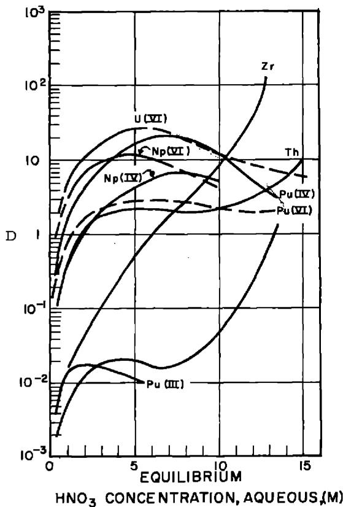  
Fig. 1. Extraction of nitrates at trace concentration into 19 volume % TBP in kerosene at $25^{\circ}\mathrm{C}$ from nitric acid solutions. Taken from McKay and Healy.[259] The individual references are: yttrium[350]; thorium [179]; zirconium[25]; uranium and neptunium[26]; and plutonium[44, 258].

Several other studies of the extraction of Pu from nitric acid solutions have been reported. Carleson $^{76}$ used $40\%$ TBP in kerosene and paid particular attention to requirements to maintain Pu in the desired oxidation state. He found that $\mathrm{NaNO}_3$ was necessary to prepare pure $\mathrm{Pu(IV)}$ from an equilibrium disproportionate mixture. Figure 2 shows the effect of $\mathrm{HNO}_3$ concentration on several reducing agents in the extraction of an equilibrium Pu solution, and the extraction curve for $\mathrm{Pu(III)}$ alone. Ferrous sulfamate with added hydroxylamine effects complete reduction of $\mathrm{Pu(IV)}$ to $\mathrm{Pu(III)}$ at up to $2\textbf{M}$ $\mathrm{HNO}_3$ , but fails at higher acidities. Ferrous ion plus hydrazine and hydroxylamine fail to complete the reduction at progressively lower acidities. Carleson also found that solid $\mathrm{KBrO}_3$ did not oxidize $\mathrm{Pu(IV)}$ to $\mathrm{Pu(VI)}$ in $1.55\textbf{M}$ $\mathrm{HNO}_3$ at room temperature, but that the oxidation was quantitative in $0.1\textbf{M}$ $\mathrm{BrO}_3^-$ after heating to $95^{\circ}\mathrm{C}$ for several hours.

Coding et al. 92, 93 used $30\%$ TBP in kerosene, Rozen and Moiseenko 334

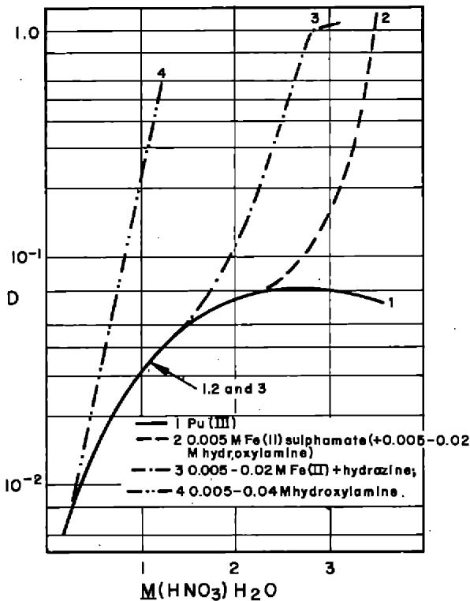  
Fig. 2. Distribution of $\mathsf{Pu(III)}$ and equilibrium $\mathsf{Pu(III)}$ , $\mathsf{Pu(IV)}$ , and $\mathsf{Pu(VI)}$ , mixtures in the presences of several reducing agents in $40\%$ TBP in kerosene and nitric acid; after Carleson.[76]

and Shevchenko and Federov $^{364}$ used $20\%$ TBP in kerosene, and Bernstrom and Rydberg $^{41}$ used $100\%$ TBP. All the above workers measured the distribution coefficients of $\mathrm{Pu(IV)}$ and $\mathrm{Pu(VI)}$ as a function of equilibrium aqueous nitric acid concentration with similar results, and several also studied the effect of U(VI) competition on the extraction of $\mathrm{Pu(IV)}$ and $\mathrm{Pu(VI)}$ . Flanary $^{132}$ derived equilibrium constants (defined by Eq. (2)) for U(VI), $\mathrm{HNO}_3$ , and $\mathrm{Pu(IV)}$ of 22, 0.18, and 3 respectively, while Rozen and Moiseenko $^{334}$ and Coding et al. $^{92,93}$ get about 1.5 for $\mathrm{Pu(IV)}$ . These values illustrate the effective competition of macro U(VI) over trace $\mathrm{Pu(IV)}$ in the simultaneous extraction of these species, resulting in a large reduction of the $\mathrm{Pu}$ distribution coefficients (see Fig. 5).

The order of extractibility into TBP from nitric acid solutions for the actinides is $\mathbf{M}(\mathbf{IV}) > \mathbf{M}(\mathbf{VI})$ >> M(III).44,258,26 The extractibility of the tetravalent actinides increases

with atomic number, i.e., $\mathrm{Th}(\mathrm{IV}) < \mathrm{Np}(\mathrm{IV}) < \mathrm{Pu}(\mathrm{IV})$ , while that of the hexavalent actinides decreases with atomic number, i.e., $\mathrm{Pu}(\mathrm{VI}) < \mathrm{Np}(\mathrm{VI}) < \mathrm{U}(\mathrm{VI})$ .<sup>44</sup>

Moiseenko and Rozen<sup>281</sup> measured the effect of temperature on the extraction of $\mathsf{Pu}(\mathsf{IV})$ as a function of nitric acid concentration and uranyl nitrate concentration (Figs. 3, 4, and 5). In the absence of uranyl nitrate the distribution coefficient decreases with temperature below $5\textbf{\underline{M}}\textbf{HNO}_3$ , while at higher acidities it increases. This effect is explained by a decrease in the equilibrium constant for the distribution reaction with temperature, with a compensating increase in the activity coefficient of $\mathsf{Pu}(\mathsf{IV})$ at higher acidities. This increase is ascribed to a decreased association of $\mathsf{Pu}(\mathsf{IV})$ with nitrate ions at higher temperatures. Shevchenko and Federov<sup>364</sup> have studied the same system at nitric acid concentrations below $4\textbf{M}$ with similar results.

Best et al. $^{43}$ measured the distribution of several tripositive actinides and lanthanides from nitric acid solutions into $100\%$ TBP. Some of their data are shown in Fig. 6 plotted as a function of atomic number, along with the lanthanide data of Hesford et al. $^{177}$ for comparison. The curves for the two homologous series are approximately superimposable if adjustment is made to compare ions of the same radius. This illustrates the importance of ionic radius on the chemical behavior of these elements.

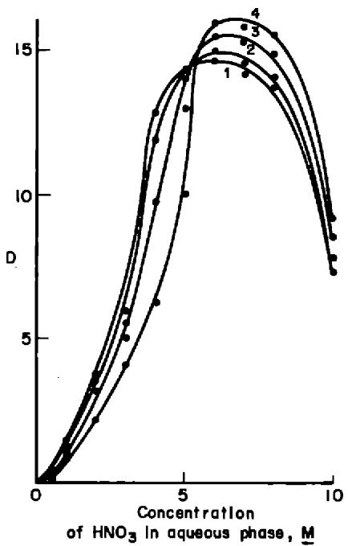  
Fig.3. Dependence of distribution coefficient of $\mathrm{Pu(IV)}$ into TBP on concentration of nitric acid in aqueous phase (for solutions not containing uranyl nitrate). 281 Curve $1 - 20^{\circ}$ curve $2 - 30^{\circ}$ curve $3 - 50^{\circ}$ and curve $4 - 70^{\circ}$

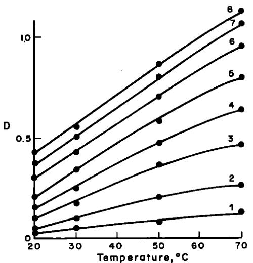  
Fig.5. Dependence of distribution coefficient of $\mathsf{Pu}(\mathsf{IV})$ into TBP on temperature with a uranium content of 0.42 M in the aqueous phase.[281] Concentration of HNO3: curve 1-0.5N, curve 2-1N, curve 3-2N, curve 4-3N, curve 5-4N, curve 6-6N, curve 7-8N, and curve 8-10N.

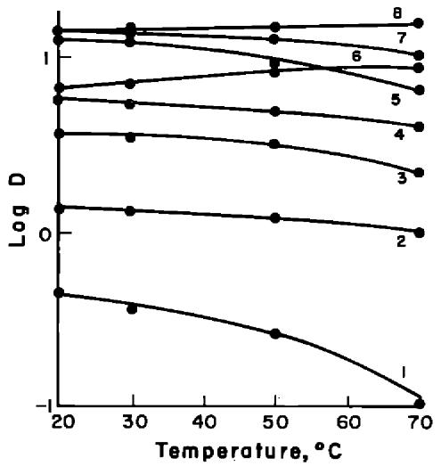  
Fig. 4. Dependence of distribution coefficient of $\mathrm{Pu(IV)}$ into TBP on temperature in solutions not containing uranium.[28] Concentration of $\mathrm{HNO}_3$ : curve 1-0.5N, curve 2-1N, curve 3-2N, curve 4-3N, curve 5-4N, curve 6-10N, curve 7-5N, and curve 8-6 to 8N.

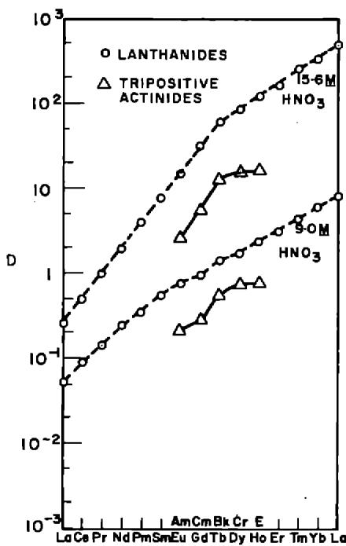  
Fig. 6. Distribution coefficient as a function of position in the lanthanide and actinide series. 43, 177

o Lanthanides   
$\Delta$ Tripositive actinides

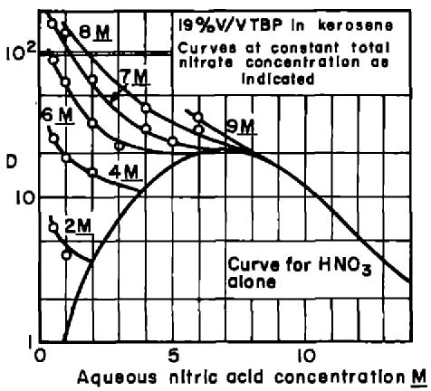  
Fig. 7. Effect of $\mathrm{NaNO}_3$ on the distribution of $\mathrm{Pu(IV)}$ between $19\%$ TBP in kerosene and nitric acid solutions.44,258

The salting-out effect of non-extractable salts on the extraction of Pu and U has received considerable attention.165,43,149,52 Typical results are shown in Fig. 7 in which $\mathrm{Na(NO_3)}$ is used as the salting agent for $\mathrm{Pu(IV).44,258}$ At a constant total nitrate concentration the distribution coefficient decreases as the proportion of nitric acid is increased, but the distribution coefficient is always greater than that of pure $\mathrm{HNO}_3$ . This effect is caused by the reduction of competition for TBP molecules by the lowering of the extractable nitric acid concentration.

Aluminum nitrate has been used as a salting-out agent for Pu in several TBP extraction processes. 149, 165, 52, 354

Applications of TBP-nitrate systems. Many papers have been written about the application of TBP to the processing of irradiated U for Pu. $^{195, 132, 93, 148, 325, 114, 202, 365, 109, 133}$ The process involves extracting Pu(IV) and U(VI) away from fission products into TBP-kerosene from nitric acid solutions, stripping the Pu into a relatively concentrated nitric acid solution by reduction to Pu(III), and finally stripping the U(VI) with water. Nitrous acid is added to the feed solution in the first extraction to stabilize Pu(IV). $^{76}$ Ferrous sulfamate was first used as a reductant in the Pu stripping stage, $^{335, 195, 132}$ although U(IV) as a reductant has been extensively studied. $^{209, 221, 67, 385, 353, 342, 38}$ This reagent can be generated from U(VI) and stabilized by volatile reductants, with the considerable advantage in large-scale processing plants of not introducing non-volatile materials (e.g. iron) into the waste streams, thus permitting a smaller waste volume. The behavior of fission products and other elements in this process has received much attention, both in the primary papers and others. $^{88, 161, 431, 133, 367}$ A variant has been described in which the fission products, Pu and U, are successively stripped from the TBP phase by stepwise lowering of the acid concentration. $^{203}$

TBP was used in the isolation of naturally occurring Pu. 315

Analytical $^{362}$ and radiochemical $^{144, 114}$ procedures for Pu based on TBP extraction from $\mathrm{HNO}_3$ have been given.

An interesting application is the use of TBP in reversed-phase chromatography for various heavy element separations, 124, 156, 157, 190 and for the separation of $\mathrm{Pu(III)}$ , $\mathrm{Pu(IV)}$ and $\mathrm{Pu(VI)}$ in $\mathrm{HNO}_3$ .<sup>380</sup>

TBP - other aqueous systems. Tetra- and hexavalent actinides extract well into TBP from moderately concentrated HCl solutions, while trivalent species are

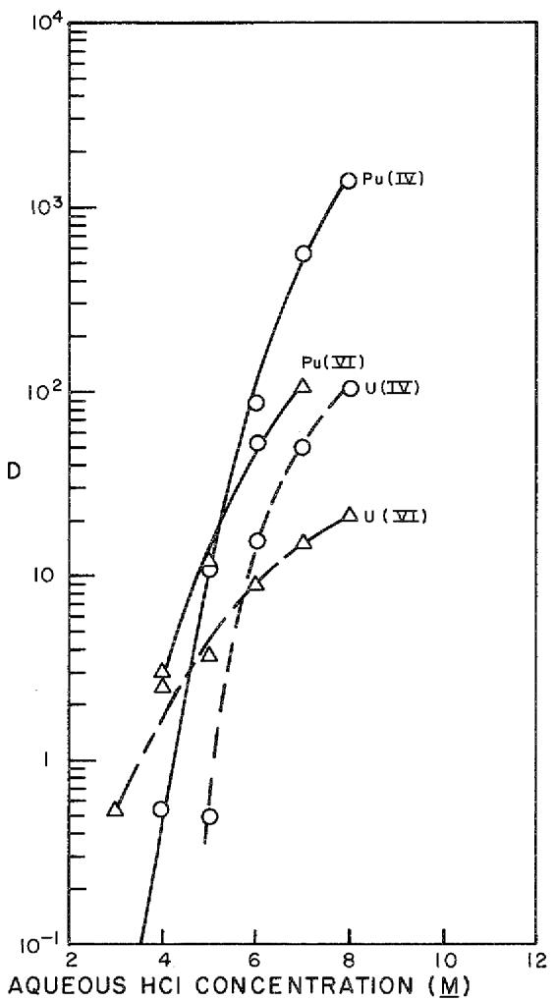  
Fig. 8. Extraction of U and Pu by $30\%$ TBP in $\mathrm{CCl}_4$ from HCl solutions.249

essentially unextractable. Larsen and Seils $^{249}$ measured the extraction of U and Pu into $30\%$ TBP in $\mathrm{CCl}_4$ (Fig. 8), and used this system as the basis of an analytical procedure for these elements (Procedure 15, Sect. VIII). Both Pu(IV) and Pu(VI) extract better at all acidities than U(IV) and U(VI). The quadrivalent actinides have higher distribution coefficients than the hexavalent above 5-6 M HCl, while the reverse is true at lower acidities. These authors report a distribution coefficient of about $10^{-3}$ for $\mathrm{Pu(III)}$ and $10^{-4}$ for Am(III) in 8 M HCl under the same conditions. The value for Am is considered more reliable because of possible partial oxidation of the $\mathrm{Pu(III)}$ to $\mathrm{Pu(IV)}$ . HCl is much less extractable than $\mathrm{HNO}_3$ into TBP. Larsen and Seils report D = 0.01 at 6 M HCl and 0.12 at 8 M HCl into $30\%$ TBP in $\mathrm{CCl}_4$ . $^{249}$

Solovkin et al.390 found that the extraction of $\mathrm{Pu(IV)}$ into $1.1\underline{\mathbf{M}} (30\%)$ TBP in $\mathrm{CCl}_4$ from perchloric acid was appreciable. The distribution coefficients varied from 0.0045 at $0.4\mathrm{M}$ HCIO4 to 0.9 at $6.4\mathrm{MHCIO_4}$ .The extracted complex was determined to be di-solvated by TBP dilution experiments.

into TBP from trichloro- and trifluoroacetic acids. $^{183}$ The distribution coefficients decrease with increasing acidity, rather than the usual increase. The distribution coefficients for both $\mathrm{Pu(IV)}$ and $\mathrm{Pu(VI)}$ are about 4 to 5 times as great for $\mathrm{CCl}_3\mathrm{COOH}$ as for $\mathrm{CF}_3\mathrm{COOH}$ at low acid concentrations. For extraction of $\mathrm{Pu(IV)}$ into $30\%$ TBP in Amsco-125 (a kerosene type diluent) from an initial concentration of $0.5\mathrm{M}\mathrm{CCl}_3\mathrm{COOH}$ , $D = 21$ ; for $\mathrm{Pu(VI)}$ , $D = 4$ .

The effect of addition of sulfuric acid and phosphoric acid to $\mathsf{Pu}(\mathsf{IV})$ or $\mathsf{Pu}(\mathsf{VI})-$ nitric acid - TBP systems is invariably to lower the distribution coefficient $^{438,440,437}$ - sulfuric $^{439}$ - phosphoric. This effect is presumably due to the formation of unextractable sulfate and phosphate complexes of $\mathsf{Pu}$ . The effect is more pronounced in $\mathsf{Pu}(\mathsf{IV})$ than in $\mathsf{Pu}(\mathsf{VI})$ , and at lower nitric acid concentrations. For example, making the aqueous phase $0.08\underline{\mathbb{M}}$ in $\mathsf{H}_2\mathsf{SO}_4$ lowered D for $\mathsf{Pu}(\mathsf{IV})$ from 16 to 9.5 in $4\underline{\mathbb{M}}\underline{\mathsf{HNO}_3}$ ; in $2\underline{\mathbb{M}}\underline{\mathsf{HNO}_3}$ the corresponding decrease was from 9 to 1.4. $^{437}$ On the other hand the lowering of D for

$\mathrm{Pu(VI)}$ by the addition of enough $\mathrm{H}_2\mathrm{SO}_4$ to $2\underline{\mathbf{M}}\mathrm{HNO}_3$ to make the solution $0.1\underline{\mathbf{M}}$ in $\mathrm{H}_2\mathrm{SO}_4$ was only from 2.6 to 2.2.

Sulfuric acid also decreases the extraction of $\mathrm{Pu(IV)}$ into TBP from HCl solutions. A solution $1\underline{\mathbf{M}}$ in $\mathrm{H}_2\mathrm{SO}_4$ lowered $\mathrm{D}_{\mathrm{Pu}}$ approximately a factor of 10 throughout a change in HCl concentration of 3-8 $\underline{\mathbf{M}}$ .

Other neutral phosphorous compounds. A wide variety of organo-phosphorous compounds has been studied in an attempt to find other extractants for Pu and U. Higgins et al.181 working with the butyl series found the order to be phosphate $(\mathrm{(RO)_3PO)} <$ phosphonate $(\mathrm{R(RO)_2PO}) <$ phosphinate $(\mathrm{R}_2(\mathrm{RO})\mathrm{PO}) <$ phosphine oxide $(\mathrm{R}_3\mathrm{PO})$ . Thus the extracting power increases with the number of C-P bonds. Burger69,70 confirmed this series and correlated the extracting power with the basisity of the phosphoryl oxygen as measured by the P-O stretching frequency. Burger,69,70 and Petrov et al.318 found that electronegative substituents in the alkyl chain such as Cl and phenyl strongly depressed the extraction. Siddall376 found that increasing the length of the alkyl chain in the phosphate series made little difference up to 8 carbon atoms for quadrivalent and hexavalent actinides. The effect of branching the alkyl chain is to increase the extraction of U, Np, and Pu, but to strongly depress that of Th. This effect is attributed to steric effects and possible tri-solvation of the Th complex at high extractant concentrations.

The extraction mechanism of these compounds is generally the same as that for TBP, but not necessarily with the same solvation number for all elements.[267] Tri-n-octylphosphine oxide (TOPO) and tri-n-butylphosphine oxide (TBPO) extract $\mathsf{Pu}(\mathsf{IV})$ and $\mathsf{Pu}(\mathsf{VI})$ as the di-solvate.[269,408] The data of Martin and Ockenden[269] is given in Figs. 9 and 10 for extraction of several elements into $0.1\underline{\mathbf{M}}$ TOPO in cyclohexane from $\mathsf{HNO}_3$ and HCl solutions. $\mathsf{Pu}(\mathsf{IV})$ and U(VI) are both extracted well ( $\mathsf{D} = 4-30$ ) from $3\underline{\mathbf{M}}\mathsf{H}_2\mathsf{SO}_4$ by $0.3\underline{\mathbf{M}}$ TOPO.[187] The extraction of $\mathsf{Pu}(\mathsf{IV})$ as a function of nitric acid concentration is similar to that for TBP, but very much higher, while that for U(VI) and $\mathsf{Pu}(\mathsf{VI})$ show different acid dependencies. White and Ross[427] have written a general review of the extractive properties of TOPO.

Trace quantities of U have been separated from large amounts of Pu by extracting the U with TOPO under reducing conditions from $2\textbf{M}$ HNO₃.34

Table IV-16 is a compilation of data for the extraction of $\mathbf{Pu}(\mathbf{IV})$ by a large number of compounds of this type. The extraction coefficients were converted to $1\underline{\mathbf{M}}$ extractant by using the "square law," that is by assuming that the extracted complex is dissolved in every case. The distribution coefficients were taken at $1\underline{\mathbf{M}}\mathrm{HNO}_3$ where possible, but cases in which other ions were present or the acidity was different are noted. The extractive power relative to TBP was calculated by direct comparison in the same series of experiments where possible, or by comparison to other TBP data taken under the same stated conditions. The conversion of the phosphine oxide data to $1\underline{\mathbf{M}}$ extractant generally required large extrapolations, since the experiments were done at low extractant concentrations. For this reason the numerical values of the distribution coefficients and the relative extractive power are only approximate.

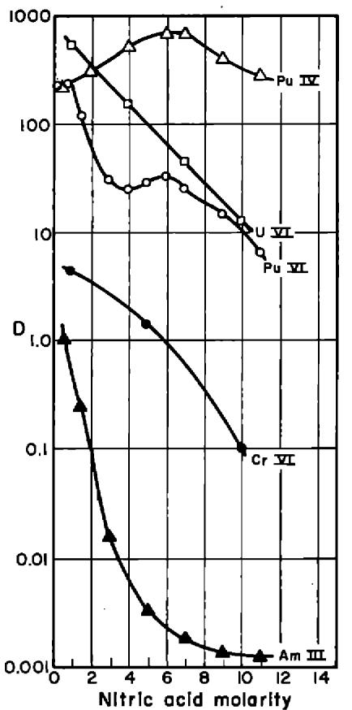  
Fig. 9. Extraction of metal ions from nitric acid by $0.1\underline{\mathbf{M}}$ TOPO in cyclohexane.269

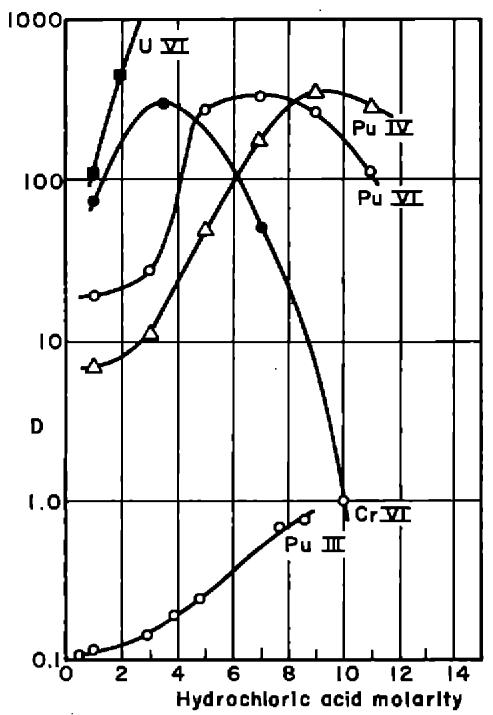  
Fig. 10. Extraction of metal ions from hydrochloric acid by 0.1 M TOPO in cyclohexane.269

# Acidic Compounds

These compounds are the mono- and di-acidic esters of phosphoric acid and related phosphonates and phosphinates. They have recieved considerable attention in recent years during the search for more versatile or specific extractants. In general, these compounds extract by an ion exchange type reaction analogous to chelation. In many cases the chelate compound thus formed is further solvated in the organic phase. For example the extracted complex in the extraction of Th(IV) with bis-2-ethylhexyl phosphoric acid from several acids involves the anions such as $\mathrm{NO}_3^-$ , $\mathrm{Cl}^-$ , and possibly $\mathrm{ClO}_4^-$ in extractions from the respective acids.[312]

Mono-acidic compounds. Di-n-butyl phosphoric acid (DBP) and bis-2-ethylhexyl phosphoric acid (HDEHP) are the compounds that have received most attention. They have been shown to be dimeric in the organic phase in a non-polar solvent such as benzene. $^{310}$ The dimerization is presumably due to hydrogen bonding to the phosphoryl oxygen. $^{130}$ The extraction reaction can be formulated as

$$
\mathrm {M} ^ {+ \mathrm {P}} + \mathrm {P} (\mathrm {H A}) _ {2 (\mathrm {o})} = \mathrm {M} (\mathrm {H A} _ {2}) _ {\mathrm {P} (\mathrm {o})} + \mathrm {P H} ^ {+}. \tag {1}
$$

TABLE IV-16. Compiled Data on Extraction of Pu(IV) by Neutral Organo-Phosphorous Compounds   

<table><tr><td>Extractant Phosphates</td><td>Diluent</td><td>Extractant Concentration Vol. % (M)</td><td>Nitric Acid Concentration (M) (a)</td><td>Pu Conc. (M)</td><td>D Given in Paper</td><td>D at 1 M Extractant (b)</td><td>Relative Extractibility (TBP = 1.0)(c)</td><td>Reference</td></tr><tr><td rowspan="11">Tributyl (TBP)</td><td>Kerosene</td><td>19 (0.69)</td><td>1.0</td><td>\( T^{(d)} \)</td><td>1.5</td><td>3.2</td><td>1.0</td><td>44</td></tr><tr><td>Gulf BT &quot;</td><td>30 (1.09)</td><td></td><td>T</td><td>3.0</td><td>2.5</td><td></td><td>92, 93</td></tr><tr><td>Kerosene</td><td>40 (1.46)</td><td></td><td>T</td><td>3.5</td><td>1.6</td><td></td><td>76</td></tr><tr><td>Kerosene</td><td>20 (0.73)</td><td></td><td>\( 8\times 10^{-4} \)</td><td>1.38</td><td>2.6</td><td></td><td>281</td></tr><tr><td>Benzene</td><td>20 (0.73)</td><td>~3.0</td><td>T</td><td>14.1</td><td>26.3</td><td></td><td>364</td></tr><tr><td>Mesitylene</td><td></td><td></td><td></td><td>6.4</td><td>11.9</td><td></td><td>364</td></tr><tr><td>Heptane</td><td></td><td></td><td></td><td>4.72</td><td>8.8</td><td></td><td>364</td></tr><tr><td>Nonane</td><td></td><td></td><td></td><td>5.46</td><td>10.2</td><td></td><td>364</td></tr><tr><td>-----</td><td>100 (3.65)</td><td>1.0</td><td>T</td><td>36.</td><td>1.0</td><td></td><td>41</td></tr><tr><td>Xylene</td><td>(1)</td><td>1.0</td><td>T</td><td>3.0</td><td>3.0</td><td></td><td>187</td></tr><tr><td>n - Dodecane</td><td>30 (1.09)</td><td>3.0</td><td>T</td><td>16.1</td><td>13.5</td><td></td><td>376</td></tr><tr><td>Dibutyl methyl</td><td>Carbon tetrachloride</td><td>(0.5)</td><td>2 (initial)</td><td>0.0038</td><td>0.71</td><td>2.8</td><td>0.45</td><td>69</td></tr><tr><td>Dibutyl-decyl</td><td>Carbon tetrachloride</td><td>(0.5)</td><td>2 (initial)</td><td>0.0038</td><td>2.3</td><td>9.2</td><td>1.28</td><td>69</td></tr><tr><td>Triisobutyl</td><td>n - Dodecane</td><td>(1.09)</td><td>3</td><td>T</td><td>11.8</td><td>9.9</td><td>0.73</td><td>376</td></tr><tr><td>Tri- n-amyl</td><td>n - Dodecane</td><td>(1.09)</td><td>3</td><td>T</td><td>15.6</td><td>13.1</td><td>0.97</td><td>376</td></tr><tr><td>Tri-isoamyl</td><td>n - Dodecane</td><td>(1.09)</td><td>3</td><td>T</td><td>17.8</td><td>15.0</td><td>1.10</td><td>376</td></tr><tr><td>Tri- n-hexyl</td><td>n - Dodecane</td><td>(1.09)</td><td>3</td><td>T</td><td>15.6</td><td>13.1</td><td>0.97</td><td>376</td></tr><tr><td>Tri- n-octyl</td><td>n - Dodecane</td><td>(1.09)</td><td>3</td><td>T</td><td>15.3</td><td>12.9</td><td>0.95</td><td>376</td></tr></table>

# NOTES:

(a) Equilibrium aqueous concentrations are listed except as noted.   
(a) Equilibrium aqueous concentrations are listed except as noted. (b) Calculated by assuming di-solvation and ideality in the organic phase; i.e., $\mathrm{D_{1M} = D_{xM}\left(\frac{1}{x}\right)^2}$ where x is the concentration of the extractant.   
(c) Calculated by comparing to TBP under the same conditions under the same experimental conditions where possible. Otherwise the comparison is made indirectly. These cases are noted.   
(d) T represents tracer quantities of Pu.

Table IV-16. (Continued)   

<table><tr><td>Extractant Phosphates</td><td>Diluent</td><td>Extractant Concentration Vol. % (M)</td><td>Nitric Acid Concentration (M) (a)</td><td>Pu Conc. (M)</td><td>D Given in Paper</td><td>D at 1 M Extractant (b)</td><td>Relative Extractability (TBP = 1.0)(c)</td><td>Reference</td></tr><tr><td>Tri-2-ethyl hexyl</td><td>n-Dodecane</td><td>(1.09)</td><td>3</td><td>T</td><td>25</td><td>21</td><td>1.55</td><td>376</td></tr><tr><td>Tri-2-butyl</td><td>n-Dodecane</td><td>(1.09)</td><td>3</td><td>T(d)</td><td>28</td><td>23.5</td><td>1.74</td><td>376</td></tr><tr><td>Tri-3-amyl</td><td>n-Dodecane</td><td>(1.09)</td><td>3</td><td>T</td><td>18.1</td><td>15.2</td><td>1.12</td><td>376</td></tr><tr><td>Tri-3-methyl-2-butyl</td><td>n-Dodecane</td><td>(1.09)</td><td>3</td><td>T</td><td>24</td><td>20</td><td>1.49</td><td>376</td></tr><tr><td>Tri-4-methyl-2-amyl</td><td>n-Dodecane</td><td>(1.09)</td><td>3</td><td>T</td><td>22</td><td>18.5</td><td>1.36</td><td>376</td></tr><tr><td>Tri-sec-butyl</td><td>Amsco 125-82</td><td>(0.3)</td><td>0.5 + 0.5 M Al (NO3)3</td><td>7.1 × 10-5</td><td>5</td><td>56</td><td>3.85</td><td>187, 420</td></tr><tr><td>Tri-2-octyl</td><td>Amsco 125-82</td><td>(0.3)</td><td></td><td></td><td>4</td><td>44</td><td>3.07</td><td>187, 420</td></tr><tr><td>Diutyl ethyl</td><td>Carbon tetrachloride</td><td>(0.5)</td><td>0.8 M Al(NO3)3</td><td>4.2 × 10-4</td><td>2.62</td><td>10.5</td><td>0.62</td><td>182</td></tr><tr><td>Diethyl amyl</td><td></td><td></td><td></td><td></td><td>3.76</td><td>15.0</td><td>0.89</td><td></td></tr><tr><td>Diethyl n-butyl</td><td></td><td></td><td></td><td></td><td>3.73</td><td>14.9</td><td>0.88</td><td></td></tr><tr><td>Diethyl isobutyl</td><td></td><td></td><td></td><td></td><td>3.69</td><td>14.8</td><td>0.87</td><td></td></tr><tr><td>Phosphonates Dibutyl butyl</td><td>CCl4</td><td>0.75 M</td><td>0.6 + 0.1 M UO2(NO3)2</td><td>T(d)</td><td>1.23</td><td>2.2</td><td>17.3</td><td>181</td></tr><tr><td></td><td>CCl4</td><td>0.5</td><td>2 (e)</td><td>0.0038</td><td>32</td><td>128</td><td>20.4</td><td>69</td></tr><tr><td>Dibutyl methyl</td><td>CCl4</td><td>0.5</td><td>2 (c)</td><td>0.0038</td><td>29</td><td>116</td><td>20.0</td><td>69</td></tr><tr><td>Dibutyl decyl</td><td>CCl4</td><td>0.5</td><td>2 (e)</td><td>0.0038</td><td>35</td><td>140</td><td>22.3</td><td>69</td></tr><tr><td>Di-n-butyl phenyl</td><td>(f)</td><td>1.0</td><td>1.0</td><td>T</td><td>3.2</td><td>3.2</td><td>1.0</td><td>187</td></tr><tr><td>Di-sec-butyl phenyl</td><td>(f)</td><td>1.0</td><td>1.0</td><td>T</td><td>5.1</td><td>5.1</td><td>1.6</td><td>187</td></tr></table>

(c) Initial aqueous concentration.   
(f) Diluent not stated, probably kerosene.

Table IV-16. (Continued)   

<table><tr><td colspan="2">Extractant</td><td rowspan="2">Extractant Concentration Vol. % (M)</td><td rowspan="2">Nitric Acid Concentration (M) (a)</td><td rowspan="2">Pu Conc. (M)</td><td rowspan="2">D Given in Paper</td><td rowspan="2">D at 1 M Extractant (b)</td><td rowspan="2">Relative Extractibility (TBP = 1.0)(c)</td><td rowspan="2">Reference</td></tr><tr><td>Phosphonates</td><td>Diluent</td></tr><tr><td>Dibutyl butyl</td><td>n-Dodecane</td><td>1.08</td><td>1.0</td><td>T</td><td>160</td><td>137</td><td>22.0(g)</td><td>375</td></tr><tr><td>Di-2-amyl</td><td>n-Dodecane</td><td>1.096</td><td>1.0</td><td>T</td><td>53</td><td>44</td><td>14.7(g)</td><td>379</td></tr><tr><td>2-butyl</td><td></td><td></td><td></td><td></td><td></td><td></td><td></td><td></td></tr><tr><td>Dibutyl methyl</td><td>CCl4</td><td>0.5 M</td><td>1.0(e) + 0.21 M UO2(NO3)2</td><td>0.004</td><td>11.15</td><td>44.6</td><td>16.6</td><td>318</td></tr><tr><td>Di-isoamyl methyl</td><td></td><td></td><td></td><td></td><td>7.43</td><td>29.7</td><td>11.1</td><td></td></tr><tr><td>Di-n-hexyl methyl</td><td></td><td></td><td></td><td></td><td>11.65</td><td>46.6</td><td>17.4</td><td></td></tr><tr><td>Di-n-heptyl methyl</td><td></td><td></td><td></td><td></td><td>10.95</td><td>43.8</td><td>16.3</td><td></td></tr><tr><td>Di-n-octyl methyl</td><td></td><td></td><td></td><td></td><td>13.65</td><td>54.6</td><td>20.3</td><td></td></tr><tr><td>Di-n-nonyl methyl</td><td></td><td></td><td></td><td></td><td>24.15</td><td>96.6</td><td>36.0</td><td></td></tr><tr><td>Di-n-decyl methyl</td><td></td><td></td><td></td><td></td><td>21.65</td><td>86.6</td><td>33.3</td><td></td></tr><tr><td>Di-cyclohexyl methyl</td><td>CCl4</td><td>0.5 M</td><td>1.0(e) + 0.21 M UO2(NO3)2</td><td>0.004</td><td>17.35</td><td>69.4</td><td>25.9</td><td>318</td></tr><tr><td>Diphenyl methyl</td><td></td><td></td><td></td><td></td><td>1.34</td><td>5.4</td><td>2.0</td><td></td></tr><tr><td>n-butyl</td><td></td><td></td><td></td><td></td><td>11.60</td><td>46.4</td><td>17.3</td><td></td></tr><tr><td>n-hexyl methyl</td><td></td><td></td><td></td><td></td><td>17.85</td><td>71.4</td><td>26.6</td><td></td></tr><tr><td>n-butyl n-heptyl methyl</td><td></td><td></td><td></td><td></td><td>7.58</td><td>30.3</td><td>11.3</td><td></td></tr><tr><td>Di-n-butyl ethyl</td><td></td><td></td><td></td><td></td><td>7.67</td><td>30.7</td><td>11.4</td><td></td></tr><tr><td>Di-isobutyl ethyl</td><td></td><td></td><td></td><td></td><td></td><td></td><td></td><td></td></tr><tr><td>Extractant Phosphonates</td><td>Diluent</td><td>Extractant Concentration Vol. % (M)</td><td>Nitric Acid Concentration (M) (a)</td><td>Pu Conc. (M)</td><td>D Given in Paper</td><td>D at 1 M Extractant (b)</td><td>Relative Extractibility (TBP = 1.0)(c)</td><td>Reference</td></tr><tr><td>Di-n-butyl n-propyl</td><td>CCl4</td><td>0.5 M</td><td>1.0(e) + 0.21 M UO2(NO3)2</td><td>0.004</td><td>8.65</td><td>34.6</td><td>12.9</td><td>318</td></tr><tr><td>Di-isoamyl n-propyl</td><td></td><td></td><td></td><td></td><td>7.46</td><td>29.8</td><td>11.1</td><td></td></tr><tr><td>Di-n-butyl n-butyl</td><td></td><td></td><td></td><td></td><td>9.46</td><td>37.8</td><td>14.1</td><td></td></tr><tr><td>Di-n-butyl n-amyl</td><td></td><td></td><td></td><td></td><td>8.91</td><td>35.6</td><td>13.3</td><td></td></tr><tr><td>Di-isoamyl n-amyl</td><td></td><td></td><td></td><td></td><td>9.00</td><td>36.0</td><td>13.4</td><td></td></tr><tr><td>Di-isoamyl isoamyl</td><td></td><td></td><td></td><td></td><td>7.69</td><td>30.8</td><td>11.5</td><td></td></tr><tr><td>Di-isoamyl n-octyl</td><td></td><td></td><td></td><td></td><td>8.92</td><td>35.7</td><td>13.3</td><td></td></tr><tr><td>Di-n-butyl benzyl</td><td></td><td></td><td></td><td></td><td>1.91</td><td>7.6</td><td>2.8</td><td></td></tr><tr><td>Di-n-butyl methoxymethyl</td><td></td><td></td><td></td><td></td><td>1.16</td><td>4.6</td><td>1.7</td><td></td></tr><tr><td>Di-n-butyl ethoxymethyl</td><td></td><td></td><td></td><td></td><td>1.50</td><td>6.0</td><td>2.2</td><td></td></tr><tr><td>Di 2-(n-butoxy)-ethyl-1</td><td></td><td></td><td></td><td></td><td>3.26</td><td>13.0</td><td>4.9</td><td></td></tr><tr><td>Di 1-methyl-2-(n-butylicarboxy)-ethyl-1</td><td></td><td></td><td></td><td></td><td>2.35</td><td>9.4</td><td>3.5</td><td></td></tr><tr><td>Di 2-(n-butyl-carboxy)-ethyl-1</td><td></td><td></td><td></td><td></td><td>2.38</td><td>9.5</td><td>3.5</td><td></td></tr><tr><td>Tetra-n-butyl methylene diphosphonate</td><td></td><td></td><td></td><td></td><td>6.72</td><td></td><td>10.0</td><td></td></tr><tr><td>Tetra-isoamyl methylene</td><td>CCl4</td><td>0.5 M</td><td>1.0(e) + 0.21 M UO2(NO3)2</td><td>0.004</td><td>8,45</td><td></td><td>12.6</td><td>318</td></tr><tr><td colspan="9">Phosphinates</td></tr><tr><td>Butyl dibutyl</td><td>CCl4</td><td>0.75 M</td><td>0.6 + 0.1 UO2(NO3)2</td><td>T(d)</td><td>49</td><td>87</td><td>69</td><td>181</td></tr><tr><td>Butyl dibutyl</td><td>CCl4</td><td>0.50</td><td>2 (e)</td><td>0.0038</td><td>170</td><td>510</td><td>108</td><td>69</td></tr><tr><td>Ethyl dihexyl</td><td>CCl4</td><td>0.50</td><td>2 (e)</td><td>0.0038</td><td>200</td><td>800</td><td>127</td><td>69</td></tr><tr><td>Butyl dibutyl</td><td>m-Dodecane</td><td>1.08</td><td>1.0</td><td>T</td><td>160</td><td>137</td><td></td><td></td></tr><tr><td colspan="9">Phosphine Oxides</td></tr><tr><td>Tri-n-butyl</td><td>CCl4</td><td>0.75 M</td><td>0.6 + 0.1 UO2(NO3)2</td><td>T(d)</td><td>499</td><td>688</td><td>703</td><td>181</td></tr><tr><td>Tri-octyl</td><td>Cyclohexane</td><td>0.1</td><td>1.0</td><td>T</td><td>236</td><td>23,600</td><td>~100(g)</td><td>269</td></tr><tr><td>Tri-n-butyl</td><td>CCl4</td><td>0.5</td><td>1.0 + 0.21 (UO2)(NO3)2</td><td>0.004</td><td>299</td><td>1,196</td><td>446</td><td>318</td></tr><tr><td>Tri-isobutyl</td><td>CCl4</td><td>0.5</td><td>1.0 + 0.21 (UO2)(NO3)2</td><td>0.004</td><td>21.9</td><td>876</td><td>32.6</td><td>318</td></tr><tr><td>Tri-butyl</td><td>CCl4</td><td>0.01</td><td>1.0</td><td>T</td><td>110</td><td>1.1 × 106</td><td>~3 × 105(g)</td><td>408</td></tr><tr><td>Tri octyl</td><td>Amsco 125-82</td><td>0.01</td><td>0.8</td><td>T</td><td>100</td><td>1.0 × 106</td><td>~3 × 105</td><td>187</td></tr><tr><td>Tri-2-ethyl-hexyl</td><td>Amsco 125-82</td><td>0.1</td><td>0.6</td><td>T</td><td>200</td><td>2.0 × 104</td><td>~6000</td><td>187</td></tr></table>

In this equation, HA represents any monoacidic ester of phosphoric acid.

This equation has been shown to be correct for di- and trivalent ions, but tetravalent ions in general show a more complex behavior. The extracted complex is sometimes further solvated in the organic phase and nitrate, chloride, and even perchlorate complexes may be involved in the extraction reaction, depending on the specific aqueous conditions employed. Thus, no general reaction can be proposed which will account for all of the observed behavior.

Kosyakov et al.238 studied the extraction of $\mathsf{Pu}(\mathsf{IV})$ and other actinides from nitric acid solutions by several dialkylphosphoric acids. Their results for $\mathsf{Pu}(\mathsf{IV})$ are shown in Fig. 11. The distribution coefficient increases as the length of the normal

1. Dlbutylphosphoric acid (HDBP)   
2. Dloctylphosphoric acid (HDOP)   
3. Dinonylphosphoric acid (HDNP)   
4. Dldecylphosphoric acid (HDDP)   
5. Di-2-ethylhexylphosphoric (HDEHP)

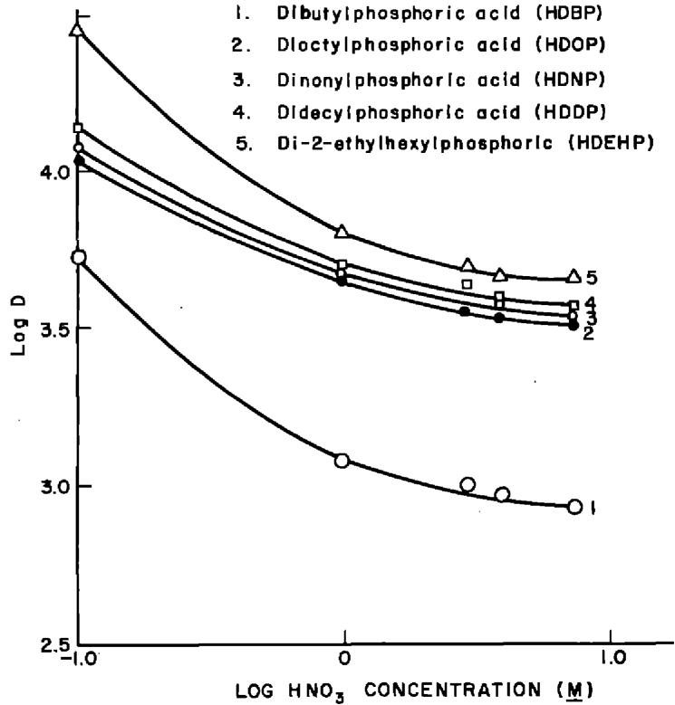  
Fig. 11. Extraction of $\mathbf{Pu}(\mathbf{IV})$ by dialkylphosphoric acids (0.5 M in isooctane) from HNO $_3$ solutions:238

alkyl chain is increased from butyl to decyl, but that for 2-ethylhexyl is greater than any of these. The non-linearity of the slope of these extraction curves is ascribed to nitrate complexing in the extracted species. The acid dependency was determined by extraction into HDEHP from $\mathrm{HCIO_4}$ solutions at a constant ionic strength of 1.0 and found to be inverse first power in the region from approximately 0.05 to $1.0\mathrm{M}\mathrm{H}^{+}$ . The Pu is probably extracted as a hydrolyzed species at low acid concentrations. The distribution coefficient was found to vary directly as the square of the HDEHP concentration.

The distribution coefficients for the extraction of Am(III), Pu(IV), Np(V) and U(VI) into HDEHP from nitric acid are shown in Fig. 12. The discontinuity in the Np(V)

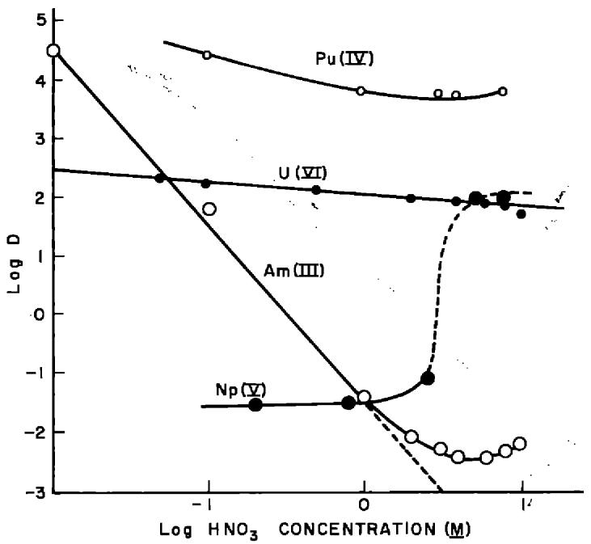  
Fig. 12. Extraction of various actinides into 0.5 M HDEHP (isooctane diluent) from HNO₃ solutions.[238]

curve at high acid concentrations is due to disproportionation of $\mathrm{Np(V)}$ into $\mathrm{Np(IV)}$ and $\mathrm{Np(VI)}$ , both of which are more extractable than $\mathrm{Np(V)}$ . The minimum in the Am(III) curve at high acid concentrations is probably due to nitrate complexing of the extracted Am species.

Horner and Coleman<sup>187</sup> get a different result for the extraction of $\mathrm{Pu(IV)}$ by HDEHP. As shown in Fig. 13, the extraction curve is concave downward with increasing $\mathrm{HNO}_3$ concentration using $0.01\underline{\mathbf{M}}$ HDEHP in Amsco 125-82. The magnitude of distribution coefficients are very much larger than those of Kosyakov et al.,<sup>238</sup> if the second power dependence on the extractant concentration is taken into account. Another difference is the decreased distribution coefficient at $0.1\underline{\mathbf{M}}$ acid. Horner and Coleman ascribe this decrease to hydrolysis of the $\mathrm{Pu(IV)}$ . Horner and Coleman prepared $\mathrm{Pu(IV)}$ by reduction to $\mathrm{Pu(III)}$ with hydroxylamine nitrate, and reoxidation and stabilization with sodium nitrite, while Kosyakov et al.<sup>238</sup> did not state their method of preparation of $\mathrm{Pu(IV)}$ .

Dreze and Duyckaerts<sup>121</sup> investigated the extraction of $\mathsf{Pu}(\mathsf{IV})$ by di-n-butyl phosphoric acid (HDBP) from nitrate solutions as a function of nitric acid concentration, nitrate concentration, HDBP concentration, and ionic strength. Representative results are shown in Figs. 14 and 15. These experimenters were able to invoke the known stability constants of $\mathsf{Pu}(\mathsf{IV})$ nitrate complexes to fit the various functional dependencies. They consider the extraction reaction to be

$$
\mathrm {P u} ^ {+ 4} + 2 \left(\mathrm {N O} _ {3}\right) ^ {-} + 2 (\mathrm {H D B P}) _ {2 (\mathrm {o})} = \mathrm {P u} \left(\mathrm {N O} _ {3}\right) _ {2} \left(\mathrm {H} (\mathrm {D B P}) _ {2}\right) _ {2 (\mathrm {o})} + 2 \mathrm {H} ^ {+} \tag {2}
$$

for which they calculate the equilibrium constant to be $(1.7 \pm 0.3) \times 10^{9} (\mathrm{m} / 1)^{2}$ .

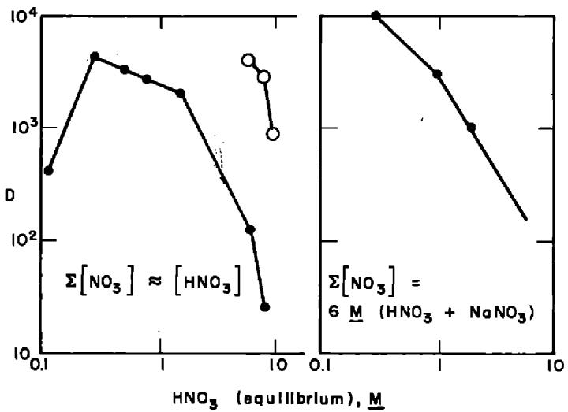  
Fig. 13. $\mathbf{Pu}(\mathbf{IV})$ extraction by di(2-ethylhexyl)-phosphoric acid: effect of nitric acid and sodium nitrate concentration. $\bullet$ 0.01 MD2EHPA; $\bigcirc$ 0.1 M D2EHPA; diluent, Amsco 125-82. Plutonium reduced with hydroxylamine nitrate, reoxidized and stabilized with $0.1 - 0.5\mathrm{\underline{M}NaNO_2}$ .<sup>187</sup>

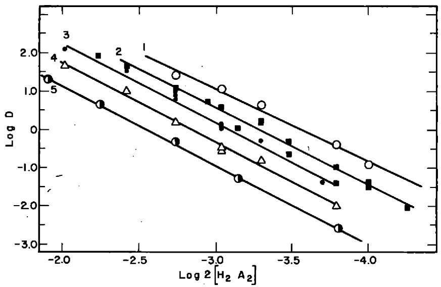  
Fig. 14. Variation of the distribution coefficient of $\mathbf{Pu}(\mathbf{IV})$ as a function of the concentration of the dimer, $(\mathsf{HDBP})_2$ in benzene. $^{121}$ $\mathsf{HNO}_3 + \mathsf{NaNO}_3 = 6\mathsf{M}$ ; $\mathsf{HNO}_3$ concentrations:

<table><tr><td>Curve 1-0.5 M</td><td>Curve 4-4 M</td></tr><tr><td>Curve 2-1 M</td><td>Curve 5-6 M</td></tr><tr><td>Curve 3-2 M</td><td></td></tr></table>

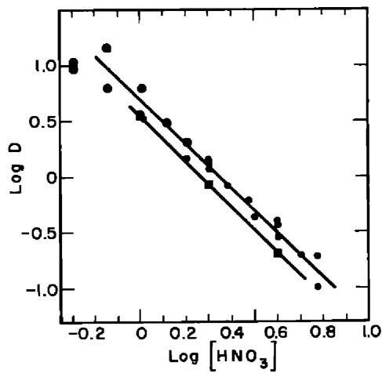  
Fig. 15. Variation of the distribution coefficient of $\mathsf{Pu}(\mathsf{IV})$ from nitrate solutions by HDBP as a function of $\mathsf{HNO}_3$ concentration.121

$$
\begin{array}{l} \bullet \mathrm {H N O} _ {3} + \mathrm {N a N O} _ {3} = 6 \underline {{\mathrm {M}}} \\ \mathrm {H N O} _ {3} + \mathrm {N a N O} _ {3} = 4 \underline {{\mathrm {M}}} \\ \end{array}
$$

On the other hand, Shevchenko and Smelov<sup>368</sup> interpreted their results on the same system by assuming the extracted complex to be nitrate free.

Early work on the $\mathbf{Pu}(\mathbf{IV})$ -HDBP- $\mathsf{HNO}_3$ system was done by Stewart and Hicks, who found a strong lowering of the distribution coefficient when dibutyl ether was used as the diluent instead of hexane.

HDBP has been used as the extractant in a procedure to determine $\mathbf{Pu}^{241}$ by extraction and counting in a liquid scintillator. 256

Kimura $^{225}$ determined the acid dependency of the distribution coefficients of many elements extracted from 50 volume % HDEHP from HCl solutions. His results, in the form of a periodic table, are shown in Fig. 16 for comparison. Some results from

other workers are included also. A later similar study was made on the solvent concentration dependency for the same system.[226]

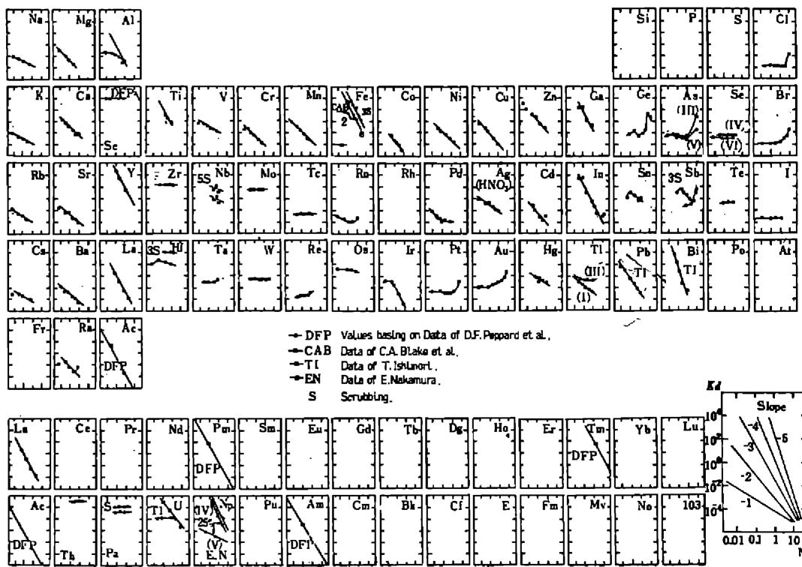  
Fig. 16. Extraction of elements from HCl solution by $50\%$ HDEHP in toluene as a function of acid concentration.225

Di-acidic compounds. Mono-2-ethylhexylphosphoric acid has been most extensively studied of this type of compound. It is polymeric in the organic phase in a non-polar solvent, such as benzene<sup>310,130</sup> and extracts primarily by the ion exchange reaction.

Kosyakov et al.238 studied the extraction of Am(III), Pu(IV), Np(V), and U(VI) by mono-2-ethylhexylphosphoric acid $\left(\mathrm{H}_{2} \mathrm{MEHP}\right)$ from nitric acid solutions with results shown in Fig. 17. The distribution coefficients are in general higher for the same aqueous conditions than those of HDEHP. Pu(IV) can be returned to the aqueous phase by washing with a $5 \%$ solution of potassium oxalate.

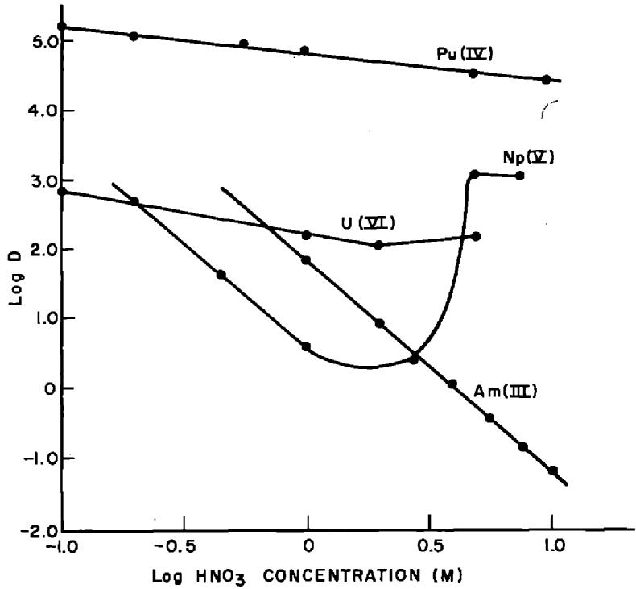  
Fig. 17. Extraction of various actinides into $0.2\mathrm{M}$ $\mathrm{H}_2\mathrm{MEHP}$ (isooctane diluent) from $\mathrm{HNO}_3$ solutions.[238]

Peppard et al. $^{313,270}$ studied the extraction of several actinides by $\mathsf{H}_2\mathsf{MEHP}$ from HCl solutions (Fig. 18). The distribution coefficient for $\mathbf{Np}(\mathbf{IV})$ at 12 M HCl is over $10^3$ and is a factor of $10^4$ greater than the other non-tetravalent species studied. Separation from Pu is accomplished by reduction of the Pu to the tripositive state. Gindler et al. $^{146}$ used this method to purify $\mathbf{Pu}^{236}$ for fission counting. The $\mathbf{Np}(\mathbf{IV})$ can be returned to the aqueous phase by the addition of TBP to the organic phase, resulting in a great reduction in the distribution coefficient because of anti-synergistic (or antagonistic) effect of these reagents, (cf Mixed Extractants, p. 71).

Applications of acidic compounds. Acidic compounds have been used in several applications in Pu chemistry. Kosyakov et al.238 used HDEHP to purify Am(III) from other actinides of higher valence state, and accomplish their mutual separation

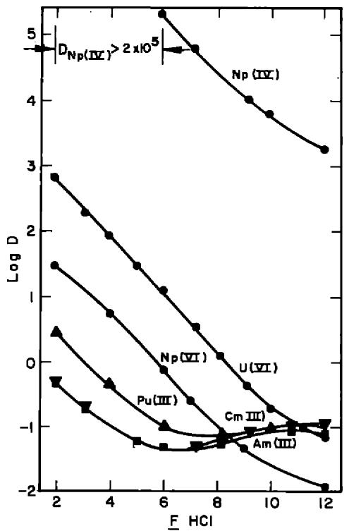  
Fig. 18. Extraction of some actinide cations into $0.48\mathrm{F}$ $\mathrm{H}_2\mathrm{MEHP}$ in toluene as a function of HC1 concentration.313

Am(III), Pu, and U, are extracted from 0.01 $\underline{\mathbf{M}}\mathrm{HNO}_3$ after stabilization of the Np in the pentavalent state with $\mathrm{NaNO}_2$ . $\mathrm{Np(V)}$ is then oxidized to $\mathrm{Np(VI)}$ by an oxidizing agent and extracted by HDEHP, and recovered from the organic phase by reduction to $\mathrm{Np(V)}$ and washing with $0.1\underline{\underline{\mathbf{M}}}\underline{\underline{\mathbf{HNO}}}_3$ . Am(III) is back-extracted from the HDEHP by $3\underline{\underline{\mathbf{M}}}\underline{\underline{\mathbf{HNO}}}_3$ , and the Pu recovered by reduction to $\mathrm{Pu(III)}$ and back extraction with $3\underline{\underline{\mathbf{M}}}\underline{\underline{\mathbf{HNO}}}_3$ . Finally, the U(VI) is returned to the aqueous phase by back extraction with $\sim 1\underline{\underline{\mathbf{M}}}$ ammonium carbonate.

Chudinov and Yakovlev extracted U and Pu away from Np(V) with HDEHP as a preliminary step in the calorimetric determination of Np(IV) with arsenazo (III). They state a Np sensitivity of 0.04 $\gamma/\mathrm{ml}$ by this method.

DBP was used by Markin and McKay $^{268}$ to prepare a pure $\mathrm{Pu(V)}$ solution in $0.2\mathrm{M}$ $\mathrm{HNO}_3$ . The method was to extract $\mathrm{Pu(IV)}$ from a mixture of $\mathrm{Pu(III)}$ and $\mathrm{Pu(VI)}$ . The reaction

$$
\mathrm {P u} (\mathrm {V I}) + \mathrm {P u} (\mathrm {I I I}) = \mathrm {P u} (\mathrm {I V}) + \mathrm {P u} (\mathrm {V})
$$

is thus driven to completion leaving a pure $\mathsf{Pu}(\mathsf{V})$ solution in the aqueous phase.

Peppard et al. $^{311}$ used $\mathsf{H}_2\mathsf{MEHP}$ in various diluents, and tri-n-octyl phosphine oxide to effect a sequential separation of various tri-, tetra-, and hexavalent ions from urine.

Peppard et al. $^{314}$ used HDEHP to separate Bk from other tripositive actinides and from Pu. The Bk is oxidized to Bk(IV) in 10 M HNO $_3$ by 1 M KBrO $_3$ and extracted away from tripositive actinides. The Bk(IV) is then back extracted into 8 M HNO $_3$ by reduction with H $_2$ O $_2$ . Pu is not reduced to Pu(III) under these conditions and remains in the organic phase.

# Amine Extractants

These compounds are long-chain alkyl or aryl primary, secondary, and tertiary amines, and quaternary amine salts. Moore $^{286}$ and Coleman et al. $^{95}$ have given general reviews of the extraction of inorganic species by these compounds. The amines react with acids to form an ion-association complex which is soluble in the organic phase, illustrated by a tertiary amine

$$
\mathrm {R} _ {3} \mathrm {N} _ {(o)} + \mathrm {H} ^ {+} + \mathrm {A} ^ {-} = \mathrm {R} _ {3} \mathrm {N H} ^ {+} \dots \mathrm {A} ^ {-} (o) \tag {1}
$$

A may be either a simple anion or the anion of a complex metal acid. This complex may undergo a further reaction with another anion in a manner analogous to anion exchange

$$
R _ {3} N H ^ {+} \dots A ^ {-} (o) + B ^ {-} = R _ {3} N H ^ {+} \dots B ^ {-} (o) + A ^ {-} \tag {2}
$$

Much work has been done on Pu and other actinides with these compounds, in process and analytical applications. They have much higher distribution coefficients than TBP for U and Pu(IV), and show much less deleterious effects on the distribution due to high radiation fields because the radiolysis products do not interact with the extractant to produce synergistic mixtures, (cf Mixed Extractants, p. 71).

The treatment here will be in the order nitrate, chloride, sulfate, and other. The structure and nature of the amine exert a great influence on the extractability of Pu.

# Nitrate Systems

The relative extractability of Pu in nitrate solutions is in the order $\mu_{\mathrm{Pu(III)}}$ and the extractive power of the amines varies in the order

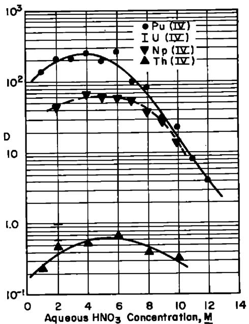  
Fig. 19. The extraction of the quadravalent actinide nitrates by 10 v/o TOA in xylene.219

quaternary $>$ tertiary $>$ secondary $\succ$ primary.187 $\mathbf{Pu}(\mathbf{IV})$ extracts very strongly and selectively in analogy with anion ex- change.

Keder et al.219 reported the extraction of several actinide elements from $\mathsf{HNO}_3$ solutions by tri-n-octylamine (TOA) diluted with xylene. Their results for quadivalent species are shown in Fig. 19 as a function of $\mathsf{HNO}_3$ concentration. $\mathsf{Pu}(\mathsf{IV})$ and $\mathsf{Np}(\mathsf{IV})$ are much more extractable than are Th and U. These species show a second power dependence on the amine concentration, indicating that the extracted complex involves two amine molecules. According to Eqs. 1 and 2, the extracted complex involves the $\mathsf{M}(\mathsf{NO}_3)_6^-$ anion and is $(\mathsf{TOA})_2\mathsf{M}(\mathsf{NO}_3)_6^-$ , where M is any quadrivalent actinide. No conclusions can be drawn about the nitrate species in the aqueous phase, however.

Keder et al.219 also determined the extraction properties of hexavalent, trivalent and pentavalent actinides as a function of nitric acid concentration, with results shown in Figs. 20 and 21. The maximum distribution coefficients for all these species is very much less than for $\mathrm{Pu(IV)}$ and $\mathrm{Np(IV)}$ , indicating an easy separation of these elements from other actinide elements. For the hexavalent species, the amine concentration dependencies of the distribution coefficients were between first and second power, permitting no unambiguous assignment of the extracted complex. The slope of the Am(III) curve was unity, while that for $\mathrm{Pu(III)}$ was approximately 1.5. No explanation of this fact was given.

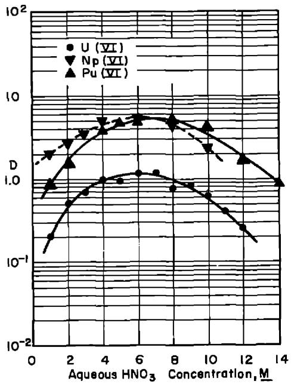  
Fig. 20. The extraction of the hexavalent actinide nitrates by $10\mathrm{v / o}$ TOA in xylene.219

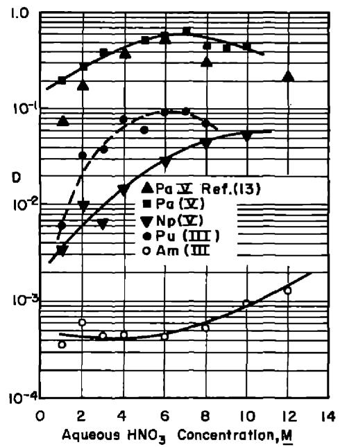  
Fig. 21. The extraction of pentavalent and trivalent actinide nitrates by $10\mathrm{v / o}$ TOA in xylene. 219

Keder et al.218 determined that the extracted complex is $\mathbf{M}(\mathbf{NO}_3)_6^{2 - }$ for quadrivalent actinides and $\mathrm{MO}_2(\mathrm{NO}_3)_3^-$ for hexavalent actinides by spectrophotometric measurements.

Horner and Coleman $^{187}$ and Weaver and Horner $^{420}$ have determined the distribution coefficients of $\mathsf{Pu}(\mathsf{IV})$ , $\mathsf{Pu}(\mathsf{III})$ , and $\mathsf{Pu}(\mathsf{VI})$ for a number of amines from $\mathsf{HNO}_3$ solutions, with results shown in Figs. 22, 23, and 24. Their $\mathsf{Pu}(\mathsf{IV})$ results for unsalted tri-n-octylamine (TOA) agree qualitatively with Keder et al. $^{219}$ and Baroncelli et al. $^{36}$ but reach the maximum at a lower $\mathsf{HNO}_3$ concentration. The other classes of amines reach a maximum at around $9\underline{\underline{\mathbf{M}}}\mathsf{HNO}_3$ . The effect of salting with $\mathsf{NaNO}_3$ at a constant nitrate concentration is to increase the distribution coefficient at lower acidities. $\mathsf{Pu}(\mathsf{III})$ and $\mathsf{Pu}(\mathsf{VI})$ show very much lower distribution coefficients with all classes of amines (Fig. 23) although $\mathsf{Al}(\mathsf{NO}_3)_3$ salting raises the $\mathsf{D}_{\mathsf{Pu}(\mathsf{III})}$ to a relatively high value with tertiary amines (Fig. 24).

Baroncelli et al. measured the distribution of $\mathrm{Pu(IV)}$ between $\mathrm{HNO}_3$ solutions and "tricaprylamine" (TCA, sold as "Alamine 336," a mixture of n-octyl and n-decyl-amines), with similar results. The amine was diluted in "Solvesso 100," an aromatic naphtha. The extraction reached a maximum of approximately $D = 140$ at $4\textbf{M}$ $\mathrm{HNO}_3$ , and was strongly depressed by the presence of macro uranyl ion, which saturates the extractant. In experiments varying the concentration of the TCA the formation of the hexanitrato $\mathrm{Pu(IV)}$ complex is confirmed, but the slope of the log D Pu vs log TCA curve is 1.4 in the presence of $1.5\textbf{M}$ uranyl ion. The corresponding slope for U is 1, indicating the formation of a uranyl trinitrate complex.

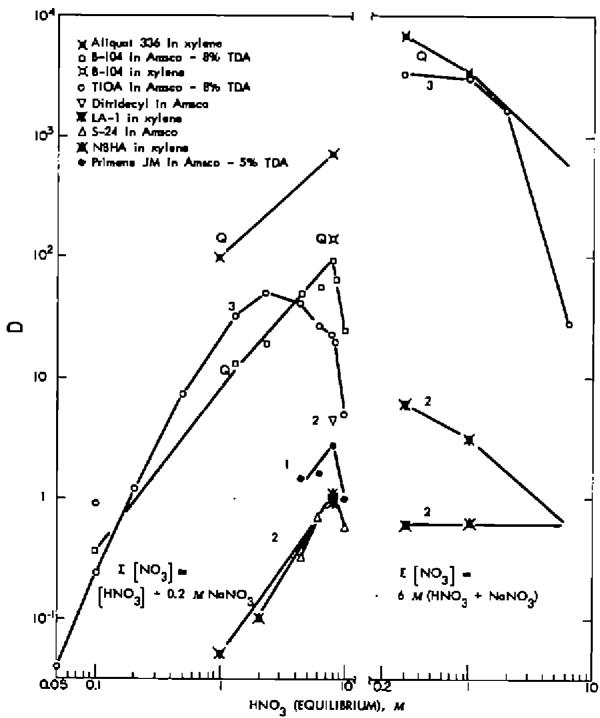  
Fig.22.Pu(IV) extraction by 0.1 M amines: effect of nitric acid and sodium nitrate concentrations. Amine class: (Q) quaternary ammonium,3 tertiary,(2) secondary, (1) primary amine.Pu(IV) stabilized with $0.04 - 0.1\mathrm{MNaNO_2}$ .Amsco 125-82,TDA $\equiv$ branched primary tridecanol.187

Baroncelli et al.36 also determined the separation factors for Pu from initially 1.5 M U ion and 4 M HNO₃ by amine extractions with tri-n-dodecyl amine ("tri-lauryl-amine," TLA) in an aromatic diluent ("Solvesso 100") and a paraffinic diluent ("Shellsol T"), and found them to be similar, around 40. The TLA-Shellsol mixture had about 5% nonanol to prevent formation of a third phase by increasing the solubility of the complex in the organic phase. Valentini et al.409 achieve maximum separation from U by extracting Pu from 2 M HNO₃.

Other work with tertiary amine nitric acid systems with generally similar results includes that of de Trentinian and Chesne<sup>116</sup> and Chesne<sup>84</sup> on TLA extraction of TL(IV), U(VI), Np(IV), Np(VI) and Pu(IV); Knoch<sup>232</sup> and Knoch and Lindner<sup>231</sup> on tri-iso-octylamine extraction of Pu(IV), U(VI), Zr, and Ru. Bertocci<sup>42</sup> found that, with tri-isononyl amine (TNA, tri-3, 5, 5-trimethylhexylamine), the D<sub>Pu(IV)</sub> vs HNO<sub>3</sub> concentration curve was still increasing at 6 M HNO<sub>3</sub>, in contrast to work on other amines.

Wilson $^{430}$ found that perchloric acid is a very good stripping agent for $\mathrm{Pu(IV)}$ in TOA solutions. The $\mathbf{D}_{\mathbf{Pu}}$ value was 0.04, both in $1\underline{\mathbf{M}}\mathrm{HNO}_3 + 1\underline{\mathbf{M}}\mathrm{HCIO}_4$ and $0.8\underline{\mathbf{M}}$ $\mathrm{HNO}_3 + 0.2\underline{\mathbf{M}}\mathrm{HCIO}_4$ . Bertocci $^{42}$ found that $\mathrm{Pu(IV)}$ was not stripped well from TNA solutions by $\mathrm{NH}_2\mathrm{OH}\cdot \mathrm{HCl}$ solutions, in contrast to expectations. Valentini et al. $^{409}$ used $1\underline{\mathbf{M}}\mathrm{H}_2\mathrm{SO}_4$ to strip $\mathrm{Pu(IV)}$ from TLA with good results.

Several processes for the separation of Pu and U from irradiated U using tertiary amines have been proposed. Wilson $^{429}$ used TLA + 2% Octanol in kerosene to extract Pu(IV) from 4 M HNO $_3$ , and stripped the Pu by reduction to Pu(III) with ferrous sulfamate. Chesne et al. $^{85}$ used the same extraction system, but stripped the Pu(IV) by a HNO $_3$ -H $_2$ SO $_4$ mixture. Valentini et al. $^{409}$ used the TLA-HNO $_3$ system.

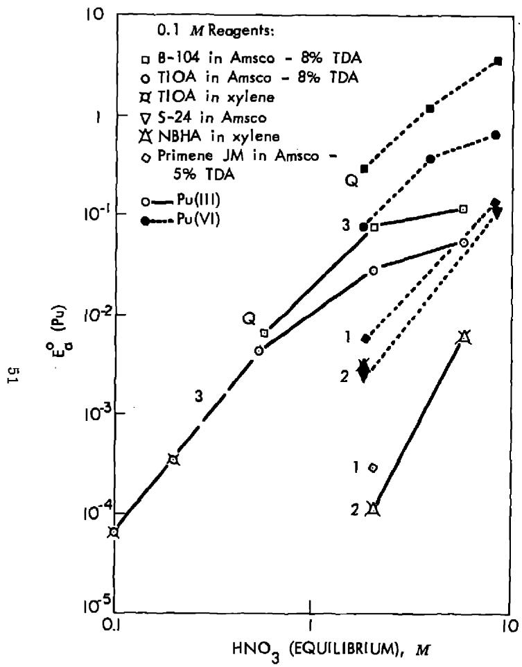  
Fig. 23. Pu(III) and Pu(VI) extraction by $0.1\textbf{M}$ amines: effect of nitric acid concentration. A mine class: (Q) quaternary ammonium, (3) tertiary, (2) secondary, (1) primary amine. Pu reduced with $0.03\textbf{M}$ ferrous sulfamate plus $0.05\textbf{M}$ excess sulfamic acid, or oxidized with $\mathsf{AgO}$ .<sup>187</sup>

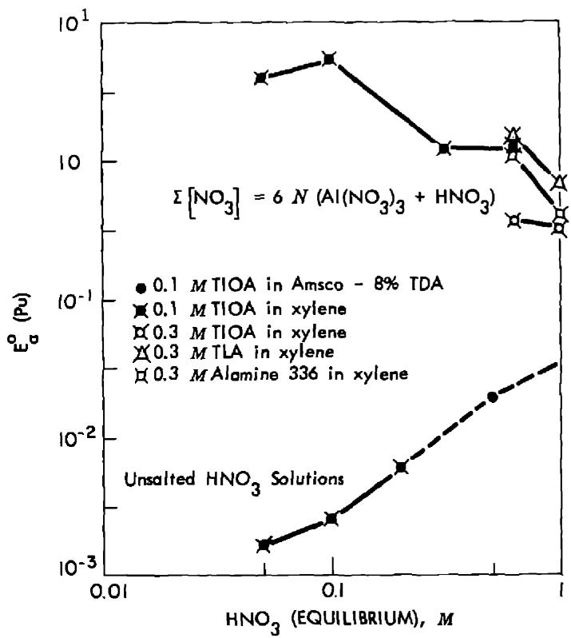  
Fig. 24. Extraction by tertiary amines from solutions of $\mathbf{Pu}(\mathbf{III})$ in nitric acid with and without aluminum nitrate salting. Plutonium reduced with $0.03\textbf{M}$ ferrous sulfamate plus $0.05\textbf{M}$ excess sulfamic acid. $^{187}$

The fact that $\mathbf{Pu}(\mathbf{III})$ does not extract into tertiary amines has been made the basis of a Np-Pu separation. $^{357}$ The Np is extracted as Np(IV) away from $\mathbf{Pu}(\mathbf{III})$ in a nitric acid solution.

Winchester and Maraman<sup>431</sup> made a study of the decontamination of Pu in an experimental pyrometallurgical laboratory from Fe, Co, Zr, Mo, Ru, and Ce by both TBP and amine extraction. A summary of their results in terms of decontamination factors for Pu is given in Table IV-17. They concluded that the best separation of Pu from these metals was obtained in the secondary amine system and described a batch equilibration process for recovery of Pu on a 300-gram scale in a metallurgical laboratory.

The Pu and U complexes have limited solubility in the organic phase, and separate as a third phase at high metal concentration. The addition of a small fraction of polar constituent, e.g. octanol, into the organic phase, increases the solubility of the extracted complex. Baroncelli et al. have made a study of this effect, and also of the effect of nitrous acid added to stabilize quadrivalent Pu. They found that nitrous acid can have either an enhancing or depressing effect on the distribution coefficient, depending on the nitric acid concentration, while the long chain alcohol always has a depressing effect. At equal molar nitrous acid and alcohol concentration in the organic phase, the distribution coefficient is at a maximum. This effect is explained in terms of the formation of an alcohol-nitrous acid complex in the organic phase.

TABLE IV-17. Decontamination Factors for Impurities in Plutonium in Various Solvent Extraction Processes.[43]   

<table><tr><td rowspan="2">Element</td><td rowspan="2">Initial concentration (g/1)</td><td rowspan="2">TBP</td><td colspan="4">Decontamination factors for(a)</td></tr><tr><td>Primary(b) amine</td><td>Secondary(c) amine</td><td>Tertiary(d) amine</td><td>Quaternary(e) amine</td></tr><tr><td>Fe</td><td>1.26</td><td>74</td><td>&gt;42</td><td>120</td><td>--</td><td>--</td></tr><tr><td>Co</td><td>1.86</td><td>&gt;300</td><td>&gt;31</td><td>&gt;80</td><td>&gt;60</td><td>&gt;52</td></tr><tr><td>Zr</td><td>0.34</td><td>44</td><td>&gt;22</td><td>92</td><td>31</td><td>&gt;52</td></tr><tr><td>Mo</td><td>0.17</td><td>&gt;100</td><td>&gt;8</td><td>&gt;78</td><td>&gt;18</td><td>&gt;9</td></tr><tr><td>Ru</td><td>0.98</td><td>1.3</td><td>12</td><td>38</td><td>16</td><td>13</td></tr><tr><td>Ce</td><td>0.36</td><td>2.1</td><td>25</td><td>&gt;67</td><td>&gt;32</td><td>&gt;29</td></tr><tr><td>Pu</td><td>60.58</td><td>--</td><td>--</td><td>--</td><td>--</td><td>--</td></tr></table>

Notes:   
(a) Procedure consisted of 3 equal volume extractions with 35 vol. % reagent in Gulf BT Solvent (aliphatic hydrocarbon) from 8 M HNO₃ solution (except primary amine extraction in which 6 M HNO₃ was used). The secondary, tertiary, and quaternary amines had 10 vol. % decyl alcohol. The solutions were stripped with 3-1/3 volume portions of 0.1 M hydroxylamine nitrate.   
(b) Rohm and Haas Company "Primene JM-T!"   
(c) Rohm and Haas Company "Amine 9D-178."   
(d) TIOA.   
(e)Sterwin Chemical Company "Roccal."

Maeck et al.262 determined the distribution of a large number of elements for quaternary ammonium compounds between various aqueous solutions and methylisobutyl ketone ("hexone"). The aqueous solutions considered were NaOH, HNO₃, H₂SO₄, HCl.

and HF. No extraction of $\mathsf{Pu}(\mathsf{IV})$ or $\mathsf{Pu}(\mathsf{VI})$ was found at any concentration of $\mathsf{H}_2\mathsf{SO}_4$ , NaOH, and HF. The results for $\mathsf{HNO}_3$ and HCl are given in Figs. 25 and 26 as percent extractions from equal phase volumes as a function of aqueous acidity in the form of periodic tables. Berkman and Kaplan<sup>40</sup> found that tetrabutylammonium nitrate (TBAN) added to $\mathsf{Pu}(\mathsf{IV})$ extracted into hexone caused the formation of a hexanitrate $\mathsf{Pu}(\mathsf{IV})$ species, while in the absence of TBAN the tetranitrate appears to be stable. A procedure for radiochemical determination of Np and Pu based on this extraction system using aluminum nitrate as a salting agent has been developed by Maeck et al.<sup>261</sup> They report a better decontamination from fission products, particularly Zr, than is obtainable in other amine systems.

The quaternary amine "Hyamine 1622" has been used to extract $\mathrm{Pu(IV)}$ from $\mathrm{HNO}_3$ solutions as part of an analytical procedure for $\mathrm{Pu}$ .

# Chloride Systems

$\mathrm{Pu(IV)}$ and $\mathrm{Pu(VI)}$ extract well from HCl solutions by amines, while $\mathrm{Pu(III)}$ is poorly extracted, in analogy with the strong base anion exchange system. Plutonium chloride systems have found application mainly in analytical and radiochemical work rather than in processes because of the corrosive properties of HCl solutions.

Keder<sup>217</sup> measured the distribution coefficients of tetra- and hexavalent Pu, Np, and U from HCl solutions into tri-n-octylamine (TOA). The dependence of the distribution coefficients on HCl concentration is shown in Figs. 27 and 28. In every case, the slope of the log D vs log TOA concentration curve is near 2, indicating that the extracted complex has two TOA molecules for both valence states. Pu(IV) is much more extractable than is Np(IV) and U(IV) under the same conditions. The hexavalent actinides are more extractable than the tetravalent in this system.

Shevchenko et al.<sup>366</sup> obtained similar results for $\mathsf{Pu}(\mathsf{IV})$ , and found that the distribution coefficient was approximately 0.005 for $\mathsf{Pu}(\mathsf{III})$ extracted into $20\%$ TOA in xylene.

Moore $^{282,283}$ extracted tracer $\mathrm{Pu}(\mathrm{VI})$ with $5\%$ tri-isoctylamine (TIOA) in xylene from $4.8\mathrm{M}$ HCl, using $0.01\mathrm{M}$ potassium dichromate as a holding oxidant. Niobium and ruthenium extracted to some extent, but separation from these elements is possible by scrubbing with $5\mathrm{M}$ HCl and reductive stripping of the $\mathrm{Pu}$ . Th(IV) or trivalent and lower speices did not extract. The tri-laurylamine (TLA)-HCl system has been used to separate $\mathrm{Pu}(\mathrm{IV})$ before spectrographic analysis of other elements. $^{234}$

# Sulfate Systems

Shevchenko and Zhdanov<sup>373</sup> investigated the extraction of $\mathsf{Pu}(\mathsf{IV})$ from $\mathsf{H}_2\mathsf{SO}_4$ solutions by TOA. They showed that the extracted complex contains 2 amine molecules. The sulfuric acid dependence from $0.1\underline{\underline{\mathbf{M}}}$ TOA is shown in Table IV-18. The decrease in the distribution coefficient at low acidity is ascribed to $\mathsf{Pu}(\mathsf{IV})$ polymerization. As the acid concentration is increased, the decrease in $\mathsf{D}_{\mathsf{Pu}(\mathsf{IV})}$ is ascribed to the formation of an amine bisulfate complex.

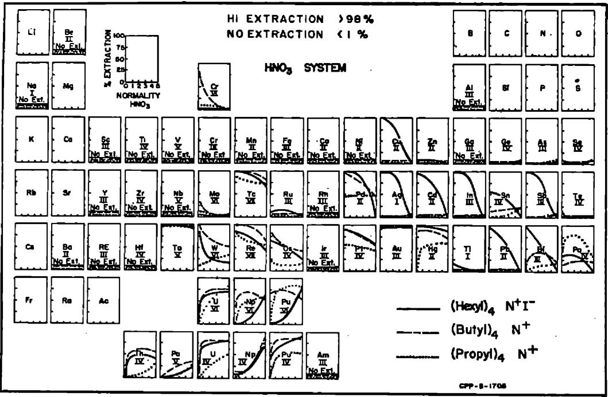  
Fig. 25. Extraction of elements as tetraalkyl amine complexes from nitric acid. $^{262}$

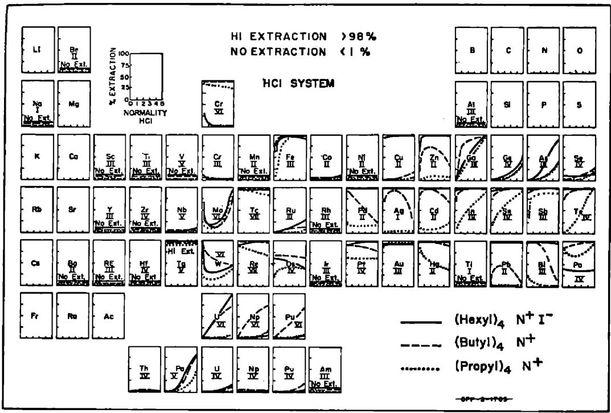  
Fig. 26. Extraction of elements as tetraalkyl amine complexes from hydrochloric acid. 262

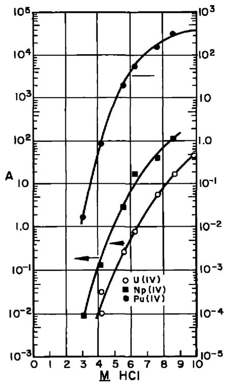  
Fig. 27. Extraction of U(IV) and Np(IV) by $10\%$ TOA and $\mathsf{Pu}(\mathsf{IV})$ by $1\cdot 0\%$ TOA from HCl solutions.[217]

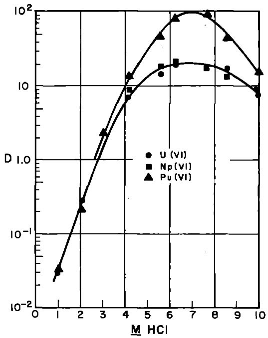  
Fig. 28. Extraction of hexavalent U, Np, and Pu from HCl solution with $1.0\%$ TOA in xylene.[217]

TABLE IV-18. Dependence of the Distribution Coefficient for $\mathbf{Pu}(\mathbf{IV})$ Between Aqueous Sulfuric Acid and Tri-n-Octylamine.373   

<table><tr><td>H2SO4Concentration
at equilibrium
(M)</td><td>D Pu(IV)</td></tr><tr><td>0.01</td><td>11.3</td></tr><tr><td>0.037</td><td>15.2</td></tr><tr><td>0.1</td><td>43</td></tr><tr><td>0.323</td><td>18.2</td></tr><tr><td>0.88</td><td>0.415</td></tr><tr><td>2.44</td><td>0.008</td></tr></table>

(a) Initial TOA concentration 0.1 M, Pu(IV) concentration $2.34 \times 10^{-4} \mathrm{M}$ .

Vdovenko et al.412 investigated the extraction of $\mathsf{Pu}(\mathsf{IV})$ by a mixture of 7 to 9 carbon primary aliphatic amines dissolved in chloroform. They determined that the extracted complex involves 4 amine molecules, i.e. $(\mathrm{RNH}_3)_4\mathrm{Pu(SO}_4)_4,$ by the amine concentration dependence method, and by direct macroscopic measurements of the stoichiometry of the reaction. From comparisons of the adsorption spectra in the aqueous and organic phases, they conclude that the $\mathsf{Pu}(\mathsf{IV})$ exists primarily as a neutral sulfate complex in the aqueous phase. Therefore,

they conclude that in this case the anion exchange process does not operate.

Extractions from mixtures of $\mathrm{H}_2\mathrm{SO}_4$ and $\mathrm{HNO}_3$ proceeded by the formation of the same amine Pu sulfate complex above, but the distribution coefficient decreased with increasing $\mathrm{HNO}_3$ concentration because of the formation of amine nitrate complex. This effect is illustrated by the data in Table IV-19.

TABLE IV-19. Distribution Coefficients of $\mathsf{Pu}(\mathsf{IV})$ from $\mathsf{H}_2\mathsf{SO}_4$ Solutions into Primary Amines as a Function of Increasing $\mathsf{HNO}_3$ Concentration.   

<table><tr><td>Concentration of HNO3(M)</td><td>0</td><td>0.05</td><td>0.10</td><td>0.20</td><td>0.30</td><td>0.50</td><td>0.90</td><td>1.50</td></tr><tr><td>DPu(IV)</td><td>66.3</td><td>63.3</td><td>50.1</td><td>14.6</td><td>2.08</td><td>0.11</td><td>0.01</td><td>----</td></tr></table>

\*Amine concentration 0.06 M, $\mathrm{H}_2\mathrm{SO}_4$ concentration 0.2 N.

By contrast, Horner and Coleman<sup>187</sup> get a third-power dependence on amine concentration for extractions of $\mathrm{Pu(IV)}$ from $\mathrm{H}_2\mathrm{SO}_4$ solutions by primary amines. They also determined distribution coefficients for $\mathrm{Pu(IV)}$ of several secondary and tertiary amines. Their results are shown in Fig. 29, showing the successive lowering of the distribution coefficients in going to more complex amine types. They report variable

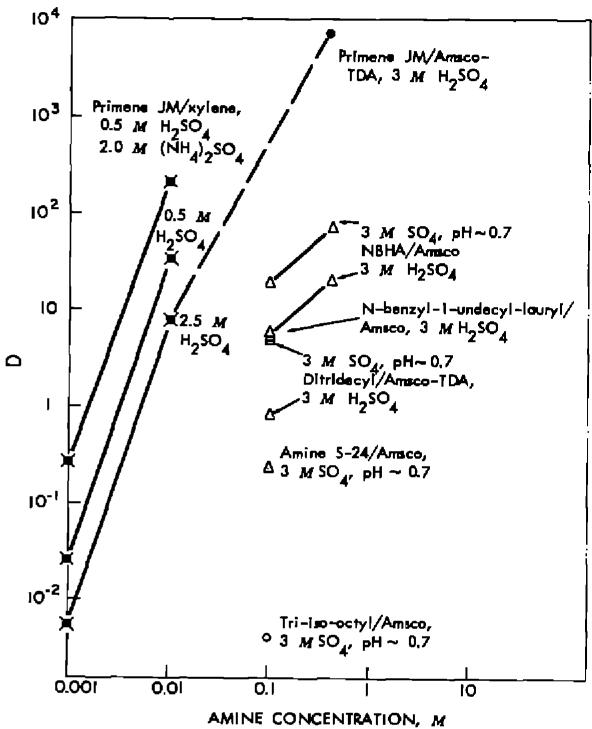  
Fig.29.Extraction of $\mathsf{Pu}(\mathsf{IV})$ from sulfuric acid and acidic sulfate solution by primary, secondary, and tertiary amines. Diluents: xylene, Amsco 125-82, or $95\%$ Amsco 125-82-5% tridecanol.For primary amine extraction, Pu reduced with hydroxylamine sulfate, reoxidized and stabilized at IV) with $0.5\mathrm{M}$ $\mathrm{NaNO_2}$ Others stabilized at IV with $0.1 - 0.5\mathrm{MNaNO_2}$ .187

distribution coefficients for $\mathbf{Pu}(\mathbf{III})$ by primary amines from sulfuric acid solutions, ranging from $\sim 5$ to $\gg 100$ with $0.1\textbf{M}$ amines. This behavior is attributed to partial oxidation of $\mathbf{Pu}(\mathbf{III})$ to $\mathbf{Pu}(\mathbf{IV})$ , even in the presence of holding reductants.

These authors propose a process for recovery of Pu from sulfuric acid decladding solutions based on primary amine extraction. 186

The primary amine- $\mathrm{H}_2\mathrm{SO}_4$ system has been used for determination of Pu in biological material, e.g. urine or solution of bone ash.[61]

# Other Systems

Moore $^{285}$ found that the hexavalent actinides U(VI) and Pu(VI) could be quantitatively extracted from 1 M acetic acid solutions and 1 M acetic acid - 0.1 M nitric acid solutions by $5\%$ TIOA-xylene. Of the fission products only Ru, Zr, and Nb extracted appreciably, and these could be scrubbed with 5 M HCl. A preliminary ferric (or uranyl) hydroxide precipitation in the presence of niobium carrier improved the decontamination from these elements. The U and Pu were leached from the insoluble $\mathrm{Nb}_{2}\mathrm{O}_{5}$ with 1 M acetic acid. The uranium could be stripped with dilute $\mathrm{HNO}_3$ or HCl, $\mathrm{NH}_4\mathrm{OH}$ or ammonium bicarbonate. The Pu(VI) could be stripped by these reagents or reductively stripped, since Pu(IV) and Pu(III) do not extract under these conditions.

# Alcohols, Ketones, Ethers, and Amides

These compounds have in common the fact that they contain a basic oxygen atom which can solvate a proton or metal atom. This type of extractant was once very popular, but the newer organo phosphorous compounds and amines have received more attention in recent years. Nevertheless, they are still important in laboratory and process separations. Indeed, one of the large-scale processes for the processing of irradiated U, the "redox" process, uses methylisobutylketone (MIBK or "hexone") as the primary extractant for U and $\mathsf{Pu}^{251}$ as do several laboratory procedures. The extractive properties of the ethers for U, Fe, and other elements have been known for many years.

Nitrate systems have received by far the most attention as extraction media for Pu. Both $\mathrm{Pu(IV)}$ and $\mathrm{Pu(VI)}$ are extractable at high nitric acid concentrations, or at moderately high nitrate concentrations provided by a salt such as aluminum nitrate. $\mathrm{Pu(III)}$ is practically inextractable at any nitrate concentration. The extracted species depends on the aqueous phase composition. It has been shown that, for example, the extraction of $\mathrm{Pu(VI)}$ from nitric acid solutions by dibutyl carbitol (DBC, the dibutyl ether of diethylene glycol) the extracted species is the neutral plutonyl dinitrate at low nitric acid $(< 0.8\mathrm{N})$ is a mixture of dinitrate and trinitrate at intermediate acidities (0.8-3N), is predominately trinitrate at higher acidities (3-6N), and finally is more complex than trinitrate above 6N. $^{171}$ At these higher acidities the extraction must involve the solvation of a proton to form the species $\mathrm{H(DBC)_2}$ $\mathrm{Pu(NO_3)_3}$ , rather than direct solvation of the Pu in the case of the extraction of the dinitrate species. $^{267}$ Similarly, $\mathrm{Pu(IV)}$ extracts into hexone as $\mathrm{Pu(NO_3)_4}$ from $1.5\underline{\mathbf{M}}\mathrm{HNO}_3$ and as $\mathrm{H_2Pu(NO_3)_6}$ at $6\underline{\mathbf{M}}\mathrm{HNO}_3$ , with intermediate composition of the organic phase in between. $^{245,246}$ The species extracted into triethyleneglycol dichloride at high nitrate concentration have been found to be $\mathrm{H_2Pu(NO_3)_6}$ for $\mathrm{Pu(IV)}$ and H $\mathrm{PuO_2(NO_3)_3}$ for $\mathrm{Pu(VI)}$ . $^{76}$ Dibutyl ether behaves similarly. $^{413}$

Pu extraction by hexone has received the most attention, undoubtedly because of its use in processing. The extraction of $\mathrm{Pu(IV)}$ and $\mathrm{Pu(VI)}$ as a function of nitric acid concentration and the concentration of various salts has been measured by several groups.

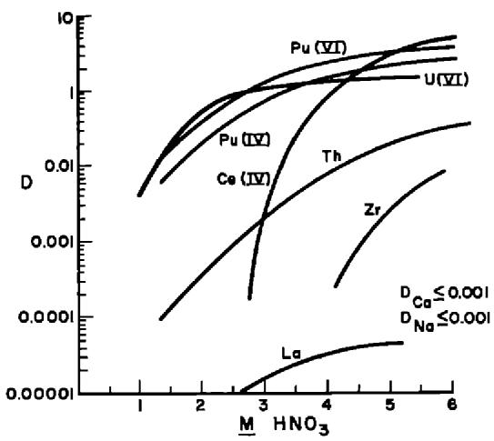  
Fig. 30. The distribution ratios of U, Pu(IV) and Pu(VI), Th, Zr, Ce(IV) and La into hexone as functions of the equilibrium concentration of HNO₃ in the aqueous phase.³⁴³ The Ce(IV) curve is taken from Glendenin et al.¹⁴⁷

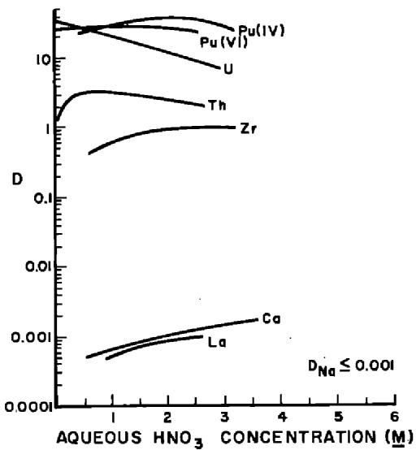  
Fig 31. The distribution ratios of U, Pu(IV) and Pu(VI), Th, Zr, La and Ca into hexone as functions of the equilibrium concentration of HNO₃ in the aqueous phase. Concentration of Ca(NO₃)₂ 4-3.5 M.343

Rydberg and Bernström<sup>343</sup> measured distribution coefficients for several elements including U(VI), Pu(IV), and Pu(VI) as a function of nitric acid concentration both with and without calcium nitrate as a salting agent. Typical results are shown in Figs. 30 and 31. The effect of salting with $\mathrm{Ca(NO_3)_2}$ is to raise all the distribution coefficients, but at low acid those of U and Pu are high enough to be efficiently separated from other elements.

MacKenzie $^{260}$ extended the distribution curves to higher aqueous acidities for $\mathrm{Pu(IV)}$ and $\mathrm{Pu(VI)}$ as shown in Fig. 32. This curve was replotted from MacKenzie's original data by Smith $^{388}$ because the original was reported in terms of organic phase acid concentration. The conversion to aqueous phase original acid concentration was made by using data on nitric acid extraction by hexone. Both $\mathrm{Pu(IV)}$ and $\mathrm{Pu(VI)}$ pass through maxima and decrease above approximately $7\textbf{M}$ acid. A salting agent, e.g. $\mathrm{Al(NO_3)_3}$ , $^{271,153}$ $\mathrm{Ca(NO_3)_2}$ , $^{343}$ , $\mathrm{NH_4NO_3}$ ^{260} increases the distribution coefficient. A useful comparison of various salting agents for $\mathrm{Pu(IV)}$ into hexone was reported by Stewart $^{393}$ (Fig. 33). The salts increase in salting effectiveness at high total nitrate concentration in this order: ammonium, lanthanum, nitric acid, magnesium, aluminum, and manganese. A similar comparison for $\mathrm{Pu(VI)}$ into diethyl ether was made resulting in this order: ammonium, calcium, lanthanum, nitric acid.

Kooi $^{236}$ found that the distribution curves for extraction of $\mathsf{Pu}(\mathsf{IV})$ and $\mathsf{Pu}(\mathsf{VI})$ into hexone did not decrease at high $\mathsf{HNO}_3$ concentrations, in contrast to other workers. His distribution coefficient for $\mathsf{Pu}(\mathsf{IV})$ reached the maximum value of approximately 7 at 8 M initial $\mathsf{HNO}_3$

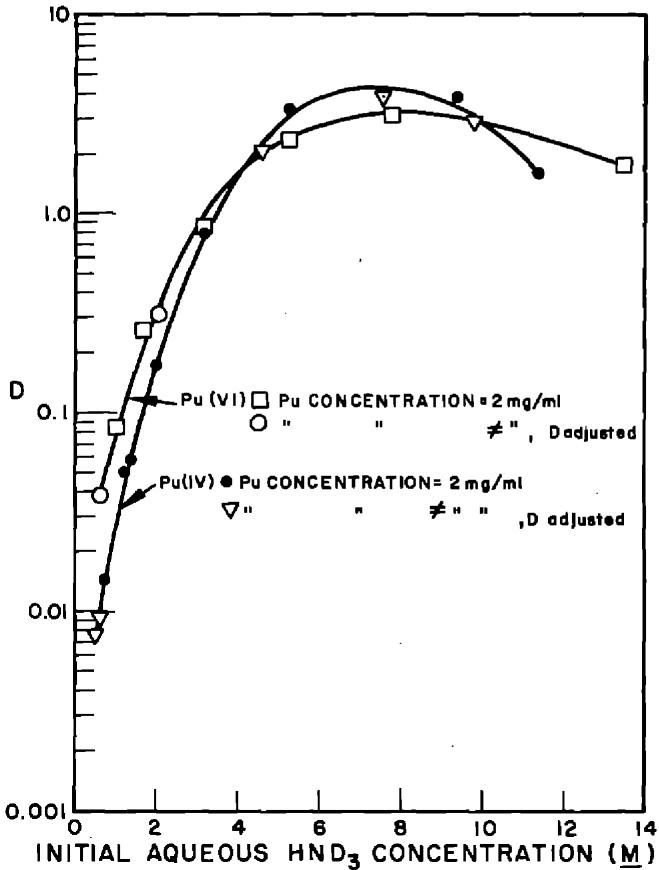  
Fig. 32. Distribution of $\mathbf{Pu}(\mathbf{IV})$ and $\mathbf{Pu}(\mathbf{VI})$ into hexone from $\mathbf{HNO}_3$ solutions. 260

concentration. MacKenzie $^{260}$ found that the distribution coefficient for both $\mathrm{Pu(IV)}$ and $\mathrm{Pu(VI)}$ in nitric acid increased in the range $0.01 - 2\mathrm{mg / ml}$ , while Groot et al. $^{153}$ report no dependence on $\mathrm{Pu}$ concentration from $0.00003$ to $0.5\mathrm{mg / ml}$ for the extraction of $\mathrm{Pu(IV)}$ . Groot et al. $^{153}$ also find that the distribution coefficients are not affected by either $0.03\mathrm{MNa}_2\mathrm{Cr}_2\mathrm{O}_7$ or $0.3\mathrm{M}$ sulfonic acid. These reagents are commonly used as oxidizing and reducing agents in redox processes. Rider et al. $^{332}$ has used hexone in a laboratory procedure to determine $\mathrm{Pu}$ and $\mathrm{U}$ in reactor targets.

# Other Aqueous Systems

Stewart<sup>393</sup> reports on the comparative extraction of Pu (unspecified initial valence) by hexone from hydrochloric, nitric, sulfuric, and acetic acids under various conditions (Table IV-20). Plutonium (presumably a mixture of Pu(IV) and Pu(VI)) extracts well from 8 N HCl, but not from $\mathrm{H}_2\mathrm{SO}_4$ or acetic acid, while the extraction is very low under reducing conditions for all these acids.

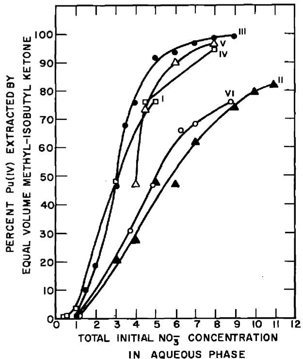  
Fig. 33. Effect of total nitrate ion concentration on the extraction of $\mathsf{Pu}(\mathsf{IV})$ by methyl isobutyl ketone.393

Curve

No.

Aqueous Phase

I HNO3only   
II 1N HNO3 + NH4NO3   
III 1N HNO3 + Mn(NO3)2   
IV 3N HNO₃ + Mg(NO₃)₂, PO₄--   
V 3N HNO₃ + Al(NO₃)₃, PO₄---   
VI 1M HNO3 + La(NO3)3

# Other Extractants

Stewart<sup>393</sup> compiled a table of extraction data for a large number of ethers, alcohols, ketones, etc. for Pu in the tri-, quadri- and hexavalant oxidation states from ammonium nitrate-nitric acid mixtures. These data are reproduced in their entirety as Tables IV-21, and IV-22, to show the variety of compounds tried and to indicate the types of compounds which are efficient as Pu extractants. In general, the ability of these compounds to extract correlates with the basicity of the oxygen, nitrogen or other functional group. Thus, electronegative substituents invariably decrease the extractibility of Pu (see e.g. diethyl ether vs dichlorodiethyl ether).

TABLE IV-20. Distribution of Pu Between Various Aqueous Phases and Hexone. 393   

<table><tr><td rowspan="2">Composition of Aqueous Layer</td><td colspan="4">Distribution Coefficient for Extraction from 8 N Acid</td></tr><tr><td>HCl</td><td>HNO3</td><td>H2SO4</td><td>CH3COOH</td></tr><tr><td>1. Acid only</td><td>10</td><td>8.3</td><td>0.06</td><td>0.012</td></tr><tr><td>2. Acid + 0.7 M UO2(NO3)26H2O</td><td>0.33</td><td>3.3</td><td>0.005</td><td>-----</td></tr><tr><td>3. Same, saturated with SO2</td><td>0.0012</td><td>0.25</td><td>-----</td><td>-----</td></tr><tr><td>4. Same, as 2 + 0.06 M hydroquinone</td><td>0.0033</td><td>-----</td><td>-----</td><td>-----</td></tr></table>

TABLE IV-21. Extraction of Plutonium from 10 M NH4NO3, 1 M HNO3 by an Equal Volume of Various Organic Solvents. 393   

<table><tr><td rowspan="2">Solvent</td><td colspan="3">% Pu extracted</td><td rowspan="2">Solvent</td><td colspan="3">% Pu extracted</td></tr><tr><td>(III)*</td><td>(IV)</td><td>(VI)</td><td>(III)*</td><td>(IV)</td><td>(VI)</td></tr><tr><td>Ethers-Cellosolves</td><td></td><td></td><td></td><td>Acids - Esters</td><td></td><td></td><td></td></tr><tr><td>Diethyl ether</td><td>&lt;1</td><td>&lt;1</td><td>50</td><td>2-ethyl butyric acid</td><td>&lt;1</td><td>5.7</td><td>-</td></tr><tr><td>N-propyl ether</td><td></td><td>&lt;1</td><td>4.8(?)2-ethyl butyl acetate</td><td>&lt;1</td><td>1.5</td><td>-</td><td></td></tr><tr><td>Di-isopropyl ether</td><td></td><td>7</td><td>1</td><td>Ketones</td><td></td><td></td><td></td></tr><tr><td>Allyl ether</td><td></td><td>3.4</td><td>-</td><td>Methyl ethyl ketone</td><td></td><td></td><td></td></tr><tr><td>N-butyl ether</td><td></td><td>1</td><td>1.5</td><td>15% Xylene</td><td>&lt;1</td><td>79</td><td>-</td></tr><tr><td>Hexyl ether</td><td>&lt;1</td><td>1</td><td>1.5</td><td>Methyn-amyl ketone</td><td>&lt;1</td><td>52</td><td>-</td></tr><tr><td>Ethylallyl ether</td><td></td><td>2</td><td>-</td><td>Methyl isobutyl ketone (Hexone)</td><td>&lt;1</td><td>82</td><td>-</td></tr><tr><td>Ethyl-n-butyl ether</td><td></td><td>1</td><td>6</td><td></td><td></td><td></td><td></td></tr><tr><td>Dichloro ethyl ether</td><td>&lt;1</td><td>3</td><td>12</td><td>Mesityl oxide</td><td></td><td>14</td><td>-</td></tr><tr><td>Phenyl cellosolve</td><td></td><td>21</td><td>-</td><td>Acetophenone</td><td></td><td>89</td><td>-</td></tr><tr><td>Benzyl cellosolve</td><td></td><td>48</td><td>-</td><td>Cyclopentenone</td><td></td><td>91</td><td>-</td></tr><tr><td>2-ethyl butyl cellosolve</td><td>&lt;1</td><td>71</td><td>-</td><td>Cyclohexanone</td><td></td><td>72</td><td>-</td></tr><tr><td>Diethyl cellosolve</td><td></td><td>97</td><td>96</td><td>Methylcyclohexanone</td><td></td><td>82</td><td>-</td></tr><tr><td>Ethyl butyl cellosolve</td><td></td><td>66</td><td>73</td><td>Menthone</td><td></td><td>20</td><td>47</td></tr><tr><td>Dibutyl cellosolve</td><td></td><td>6</td><td>13</td><td>Isophorone</td><td>&lt;1</td><td>37</td><td>-</td></tr><tr><td>ββ&#x27; Dibutoxyethyl ether</td><td></td><td>93</td><td>91(?)</td><td>Hydrocarbons</td><td></td><td></td><td></td></tr><tr><td>Triglycoldichloride</td><td>&lt;1</td><td>72</td><td>-</td><td>Cyclohexane</td><td></td><td>3</td><td>3</td></tr><tr><td>Dibutoxytetra-ethylene glycol</td><td></td><td>73</td><td>-</td><td>Cyclohexene</td><td></td><td>5</td><td>4</td></tr><tr><td>Anisole</td><td></td><td>3</td><td>-</td><td>Xylene (mixture of isomers)</td><td></td><td>10</td><td>-</td></tr><tr><td>O-Nitroanisole</td><td></td><td>62</td><td>40</td><td>Pinene</td><td></td><td>1.6</td><td>-</td></tr><tr><td>p-Fluoranisole</td><td></td><td>1</td><td>-</td><td>Indene</td><td></td><td>5</td><td>1</td></tr><tr><td>Resorcinilldimethyl ether</td><td></td><td>1</td><td>-</td><td>Nitro Compounds</td><td></td><td></td><td></td></tr><tr><td>Dimethyldioxane</td><td></td><td>60(?)</td><td>-</td><td>Nitroethane</td><td></td><td>34</td><td>61</td></tr><tr><td>Sulfur Compounds</td><td></td><td></td><td></td><td>Nitromethane</td><td>1</td><td>58</td><td>70</td></tr><tr><td>Diethyl sulfide</td><td></td><td>43</td><td>-</td><td>Nitro benzene</td><td></td><td>8</td><td>28</td></tr><tr><td>Thiophene</td><td></td><td>1</td><td>-</td><td>Halogenated Compounds</td><td></td><td></td><td></td></tr><tr><td>Carbon Disulfide</td><td></td><td>6(?)</td><td>1</td><td>Methyl Chloroform</td><td></td><td>4</td><td>3.2(?)</td></tr><tr><td>Alcohols</td><td></td><td></td><td></td><td>Trichloroethylene</td><td></td><td>6</td><td>12</td></tr><tr><td>Hexanol</td><td></td><td>23</td><td>-</td><td>Chlorobenzene</td><td></td><td>4</td><td>7</td></tr><tr><td>Heptanol</td><td></td><td>15</td><td>-</td><td>Bromobenzene</td><td></td><td>2.6</td><td>2.5</td></tr><tr><td>Heptadecanol</td><td>&lt;1</td><td>10</td><td>-</td><td>Iodobenzene</td><td></td><td>1.3</td><td>1.7</td></tr><tr><td>2-ethyl-hexanol</td><td>&lt;1</td><td>1</td><td>-</td><td>o-Bichlorobenzene</td><td></td><td>4</td><td>5</td></tr><tr><td>2-ethyl-butanol</td><td>&lt;1</td><td>16</td><td>-</td><td>m-Dichlorobenzene</td><td></td><td>4.6</td><td>-</td></tr><tr><td>Methyl-isobutyl carbinol</td><td></td><td>42</td><td>-</td><td>Ethyl iodide</td><td></td><td>1</td><td>1</td></tr><tr><td>Methyl-amyl alcohol</td><td>1</td><td>42</td><td>-</td><td>Isoamyl chloride</td><td></td><td>1.6</td><td>1</td></tr><tr><td></td><td></td><td></td><td></td><td>Tertiary amyl chloride</td><td></td><td>1</td><td>-</td></tr><tr><td></td><td></td><td></td><td></td><td>Miscellaneous</td><td></td><td></td><td></td></tr><tr><td></td><td></td><td></td><td></td><td>Butyl phosphate</td><td></td><td>99</td><td>97</td></tr></table>

\* (III) Values out of 5 MNH4 Cl, 1 N HCl, Sat'd. with SO2.

TABLE IV-22. Extraction of Plutonium into Miscellaneous Organic Solvents.393   

<table><tr><td rowspan="2">Solvent</td><td rowspan="2">Composition of aqueous phase before equilibration</td><td colspan="3">% Pu extracted by equal volume of solvent</td></tr><tr><td>(III)</td><td>(IV)</td><td>(VI)</td></tr><tr><td>Carbon tetra chloride</td><td>Nearly saturated NH4NO3</td><td></td><td>1</td><td>1</td></tr><tr><td>Ethyl acetate</td><td>Nearly saturated LiNO3</td><td></td><td>5</td><td>25</td></tr><tr><td>Chloroform</td><td>Nearly saturated LiNO3</td><td></td><td>1</td><td>1.6</td></tr><tr><td>Ethylene dichloride</td><td>Nearly saturated KNO3</td><td></td><td>1</td><td></td></tr><tr><td>Ethyl bromide</td><td>Nearly saturated LiNO3</td><td></td><td>1.6</td><td>2.1</td></tr><tr><td rowspan="2">Nitromethane</td><td rowspan="2">Nearly saturated LiNO3</td><td></td><td>7.9</td><td>71</td></tr><tr><td></td><td>13</td><td></td></tr><tr><td rowspan="2">1-Nitropropane</td><td rowspan="2">Nearly saturated LiNO3</td><td></td><td>20</td><td>81</td></tr><tr><td></td><td>30</td><td>69</td></tr><tr><td>2-Nitropropane</td><td>Nearly saturated LiNO3</td><td></td><td>39.6</td><td>72</td></tr><tr><td>Nitroethane</td><td>Nearly saturated LiNO3</td><td></td><td>72</td><td>83</td></tr><tr><td>Diethyl cellosolve</td><td>20% UO2(NO3)2·6H2O, 10 M NHNO3 0.5 M HNO3</td><td></td><td>84</td><td></td></tr><tr><td>Di-butyl cellosolve</td><td>2 M HNO3, 5 M Ca(NO3)2</td><td></td><td></td><td>11</td></tr><tr><td>Di-butyl carbitol</td><td>20% UO2(NO3)2·6H2O, 10 M NH4NO3, 1 M HNO3</td><td>0.05</td><td>48</td><td>8</td></tr><tr><td>2-ethyl-butyl cellosolve</td><td>20% UO2(NO3)2·6H2O, 10 M NH4NO3, 1 M HNO3</td><td>0.03</td><td>46</td><td></td></tr><tr><td>Diethyl cellosolve</td><td>20% UO2(NO3)2·6H2O, 10 M NH4NO3, 1 M HNO3</td><td>0.3</td><td>48</td><td>52</td></tr><tr><td>Dibutyl cellosolve</td><td>20% UO2(NO3)2·6H2O, 10 M NH4NO3, 1 M HNO3</td><td>0.003</td><td>3</td><td>88</td></tr><tr><td>Ethyl butyl cellosolve</td><td>20% UO2(NO3)2·6H2O, 10 M NH4NO3, 1 M HNO3</td><td>0.1</td><td>60</td><td></td></tr><tr><td>Nitromethane</td><td>20% UO2(NO3)2·6H2O, 10 M NH4NO3, 1 M HNO3</td><td>5.2</td><td>67</td><td></td></tr><tr><td>Methyl-isobutyl carbinol</td><td>20% UO2(NO3)2·6H2O, 10 M NH4NO3, 1 M HNO3</td><td>0.05</td><td>26</td><td></td></tr><tr><td>2-ethyl hexoic acid</td><td>20% UO2(NO3)2·6H2O, 10 M NH4NO3, 1 M HNO3</td><td>0.03</td><td>1</td><td></td></tr><tr><td>Methyl isobutyl carbinol acetate</td><td>20% UO2(NO3)2·6H2O, 10 M NH4NO3, 1 M HNO3</td><td>0.1</td><td>47</td><td></td></tr><tr><td>Xylene</td><td>3 M HNO3, 5 N Al(NO3)3. Dissolved BiPO4</td><td></td><td></td><td>0.001</td></tr><tr><td>Nitrobenzene</td><td>3 M HNO3, 5 N Al(NO3)3. Dissolved BiPO4</td><td></td><td>5</td><td>5.3</td></tr><tr><td>Nitroethane</td><td>3 M HNO3, 5 N Al(NO3)3. Dissolved BiPO4</td><td></td><td></td><td>47.5</td></tr><tr><td>Dibutyl carbitol</td><td>3 M HNO3, 5 N Al(NO3)3. Dissolved BiPO4</td><td></td><td></td><td>99.8</td></tr><tr><td>Ethylene dichloride</td><td>2 M HNO3, 10 M NH4NO3</td><td></td><td>1</td><td>1</td></tr><tr><td>Anisole</td><td>10 M NH4NO3</td><td></td><td></td><td>0.003</td></tr></table>

Kuca<sup>245, 246</sup> investigated a series of aliphatic ketones as extractants for Pu(IV). His results, shown in Table IV-23, show that the distribution of Pu(IV) into hexone is decreased by (1) increasing the length of the side chain for the methyl-n-alkyl series, (2) increasing the branching of the side chain for the methyl-(n-, sec-, and tert-) butyl series, and (3) increasing the symmetry for the seven carbon atom series. These results can be qualitatively explained by the effect of the decreased basicity of the carbonyl oxygen as the alkyl side chain is lengthened, and by steric effects in branched alpha carbon atoms. Khalkin et al.<sup>224</sup> found that the distribution coefficient for the extraction of Pu(IV) from $5.0\underline{\mathbf{M}}\mathrm{HNO}_3$ was 11.5 by diethyl ether, and this was the highest among a number of oxygen containing compounds. Pu(IV) was extracted as $\mathrm{H}_2\mathrm{Pu}(\mathrm{NO}_3)_6$ at this acidity. Kooi<sup>236</sup> found that for extraction of Pu(IV) from $8\underline{\mathbf{M}}\mathrm{HNO}_3$ the extraction decreased in the order dibutyl carbitol (DBC) > diethyl ether (DEE) > hexone, while for Pu(VI) the order was DBC > hexone > DEE. Branica and Bona<sup>54</sup> found that U(VI) and Th extract at a lower $\mathrm{HNO}_3$ concentration with several cyclic ethers (e.g.

TABLE IV-23. Distribution Coefficients for $\mathsf{Pu}(\mathsf{IV})$ Extracted by Various Ketones from 3.2 M HNO3. 245   

<table><tr><td>Ketone</td><td>Distribution coefficient</td></tr><tr><td>Methyl-n-propyl</td><td>10</td></tr><tr><td>Methyl-n-butyl</td><td>2.2</td></tr><tr><td>Methylisobutyl</td><td>1.6</td></tr><tr><td>Methyl-t-butyl</td><td>0.12</td></tr><tr><td>Methyl-n-amyl</td><td>0.62</td></tr><tr><td>Methyl-n-hexyl</td><td>0.22</td></tr><tr><td>Di-n-propyl</td><td>0.12</td></tr><tr><td>Ethyl-n-butyl</td><td>0.23</td></tr></table>

tetrahydropyran) than with diethyl ether or hexone, and these results are presumably applicable to Pu also.

A number of other process applications of this class of extractants are worth mentioning at this point. $\beta, \beta'$ - dibutoxydiethylether ("Butex") has been used as one of the extractants, along with TBP in a two-solvent process for purification of Pu and recovery of U at the Windscale power reactor facility.450,188 The quoted advantages over hexone are (1) sufficient resistance to attack by high concentrations of $\mathrm{HNO}_3$ to permit use of the acid as a salting agent, and (2) superior

separation factors of Pu from U. TBP is used as the second extractant because it gives superior decontamination of the Pu from Ru.

Vdovenko and Kovalskaya<sup>411</sup> used a mixture of dibutyl ether and carbon tetrachloride in a Redo-type process with satisfactory results.

Dibutoxytetraethylene glycol ("pentaether") has been used as an extractant, along with a $50\%$ pentaether- $50\%$ dibutyl ether mixture.[28]

Siddall $^{377,378}$ has pioneered the use of N, N disubstituted amides as extractants for tetra- and hexavalent actinides. The carbonyl oxygen in these compounds has enhanced basicity because of the presence of the amido nitrogen, and therefore should be analogous to the neutral organo-phosphorous compounds in extraction properties. Typical results for a number of elements and amides are shown in Fig. 34 and Table IV-24. He found that U(VI) behaved similarly to the phosphorous compounds (e.g. TBP) in that the extracted complex involves two amide molecules. However, the quadrivalent species (Pu, Th, etc.,) are extracted with more than two amides per

at 3 and 6 M HNO3 (Ref. 379).a

TABLE IV- 24. Extraction of Actinides and Zirconium by Various N, N-Disubstituted Amides   

<table><tr><td rowspan="2">Amideb</td><td colspan="6">3.0 M HNO3in the aqueous phase</td><td colspan="5">6.0 M HNO3in the aqueous phase</td><td></td></tr><tr><td>U(VI)</td><td>Pu(IV)</td><td>Pu-(VI)</td><td>Np(IV)</td><td>Np-(VI)</td><td>HNO3</td><td>U-(VI)</td><td>Pu(IV)</td><td>Np-(IV)</td><td>Th</td><td>Zr</td><td>HNO3</td></tr><tr><td>N, N-Dihexylformamide</td><td>4.1</td><td>2.4</td><td></td><td></td><td></td><td>0.119</td><td>3.6</td><td>4.0</td><td></td><td>0.10</td><td>0.54</td><td>0.090</td></tr><tr><td>N, N-Dibutylacetamide</td><td>9.9</td><td>21</td><td></td><td></td><td></td><td>.138</td><td>6.4</td><td>38</td><td></td><td>.74</td><td>.21</td><td>.102</td></tr><tr><td>N, N-Dibutylpropionamide</td><td>4.5</td><td>3.5</td><td></td><td></td><td></td><td>.112</td><td>4.5</td><td>7.2</td><td></td><td>.11</td><td>.044</td><td>.094</td></tr><tr><td>N, N-Dibutylisobutyramide</td><td>2.4</td><td>0.080</td><td>0.23</td><td>0.024</td><td>1.2</td><td>.103</td><td>3.3</td><td>0.21</td><td>0.070</td><td>.0040</td><td>.0026</td><td>.083</td></tr><tr><td>N, N-Dibutylpivalamide</td><td>0.60</td><td>0.0009</td><td>.051</td><td></td><td>0.33</td><td>.057</td><td>1.4</td><td>0.0048</td><td></td><td>.0001</td><td>&lt;.001</td><td>.060</td></tr><tr><td>N, N-Dibutylbutyramide</td><td>5.3</td><td>4.0</td><td>.63</td><td>1.0</td><td>3.4</td><td>.114</td><td>4.7</td><td>8.7</td><td>2.2</td><td>.095</td><td>.039</td><td>.095</td></tr><tr><td>N, N-Di-isobutylbutyramide</td><td>5.1</td><td>3.5</td><td>0.48</td><td>0.62</td><td>3.0</td><td>.108</td><td>4.8</td><td>7.1</td><td>1.6</td><td>.028</td><td>.046</td><td>.088</td></tr><tr><td>N, N-Di-isobutylisobutyramide</td><td>2.0</td><td>0.057</td><td></td><td>0.0070</td><td></td><td>.100</td><td>3.1</td><td>0.11</td><td>0.037</td><td>.0010</td><td>0.0012</td><td>.085</td></tr><tr><td>N, N-Dicyclohexylformamide</td><td>9.4</td><td>9.9</td><td></td><td></td><td></td><td>.150</td><td>4.8</td><td>11</td><td></td><td>.21</td><td>1.1</td><td>.100</td></tr><tr><td>N, N-Dicyclohexylacetamide</td><td>14</td><td>11</td><td></td><td>2.2</td><td></td><td>.142</td><td>6.3</td><td>16</td><td></td><td>.68</td><td>0.026</td><td>.091</td></tr><tr><td>N, N-Dicyclohexylbutyramide</td><td>7.9</td><td>1.7</td><td></td><td></td><td></td><td>.148</td><td>5.1</td><td>5.9</td><td></td><td>.16</td><td>.010</td><td>.103</td></tr><tr><td>N, N-Dibutyl-2-ethylhexanamide</td><td>4.0</td><td>0.19</td><td></td><td></td><td></td><td>.125</td><td>4.1</td><td>0.29</td><td></td><td>.0043</td><td>.0022</td><td>.094</td></tr><tr><td>N, N-Dimethyldecanamide</td><td>4.9</td><td>10</td><td></td><td></td><td></td><td>.115</td><td>4.4</td><td>39</td><td></td><td>.63</td><td>.096</td><td>.091</td></tr><tr><td>N, N-Diethyldecanamide</td><td>5.1</td><td>6.9</td><td></td><td></td><td></td><td>.120</td><td>5.0</td><td>16</td><td></td><td>.34</td><td>.049</td><td>.096</td></tr><tr><td>1-Hexanoylpiperidine</td><td>7.2</td><td>8.7</td><td></td><td></td><td></td><td>.115</td><td>5.8</td><td>20</td><td></td><td>.32</td><td>.077</td><td>.096</td></tr><tr><td>1-(2-Ethylhexanoyl)-piperidine</td><td>2.8</td><td>0.60</td><td></td><td></td><td></td><td>.087</td><td>4.2</td><td>1.5</td><td></td><td>.025</td><td>.011</td><td>.080</td></tr><tr><td>N, N-Di-sec-butylhexanamide</td><td>5.5</td><td>.90</td><td></td><td></td><td></td><td>.120</td><td>4.0</td><td>3.9</td><td></td><td>.092</td><td>.0092</td><td>.094</td></tr><tr><td>N, N-Dibutylcyclohexanecarboxamide</td><td>3.1</td><td>.19</td><td></td><td></td><td></td><td>.103</td><td>4.1</td><td>1.0</td><td></td><td>.0040</td><td>.0034</td><td>.090</td></tr><tr><td>N-Butyl-N-phenylbutyramide</td><td>1.4</td><td>.23</td><td></td><td></td><td></td><td>.088</td><td>2.4</td><td>1.3</td><td></td><td>.0033</td><td>.0099</td><td>.085</td></tr><tr><td>N, N-Dibutylbenzamide</td><td>0.86</td><td>.34</td><td></td><td></td><td></td><td>.105</td><td>1.2</td><td>0.69</td><td></td><td>.0099</td><td>.0070</td><td>.088</td></tr><tr><td>N, N-Dibenzylacetamide</td><td>3.3</td><td>0.22</td><td></td><td></td><td></td><td>0.077</td><td>4.3</td><td>1.0</td><td></td><td>0.014</td><td>0.021</td><td>0.077</td></tr></table>

aExtraction coefficient is defined as moles/liter in the organic phase divided by moles/liter in aqueous phase.   
bAll 0.50 M in toluene.

metal atom at high nitrate concentrations. Zr exhibits a maximum distribution coefficient at about $7\mathrm{M}$ $\mathrm{HNO}_3$ and decreases at higher acidities. A large decrease in the distribution coefficient of quadrivalent Pu and Th occurs as the branching of the alpha carbon atom is increased, while that of U(VI) is only decreased moderately. N, N-dihexyloctanamide was superior to TBP in decontamination of Pu from Zr-Nb, but slightly inferior for Ru decontamination. The potential uses of these compounds are (1) as selective extractants for quadrivalent actinides, or (2) as selective extractants for U(VI) in the case of amides with highly branced alpha carbon atoms (e.g. N, N-dihexyltrialkylacetamide).

# Chelating Agents

A large number of bi-functional reagents which form strong coordination complexes with metal ions have been investigated. These complexes are more soluble in non-polar organic solvents such as benzene or carbon tetrachloride than in the aqueous phase, and are therefore extractable. Of these compounds the fluorinated

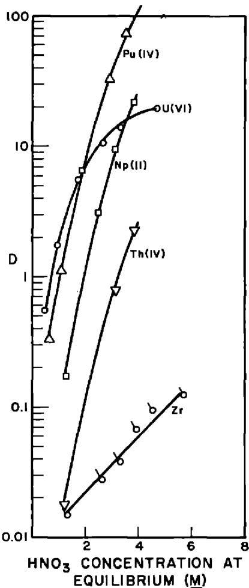  
Fig. 34. Extraction of actinides and Zr by 1.09 M N, N-dibutyloctanamide in n-dodecane at $30^{\circ}$ .378

$\beta$ -diketone, 2-thenoyltrifluoro acetone (TTA) and the ammonium salt of N-nitrosophenylhydroxylamine ("Cupferron") have been used most widely in radiochemical and analytical applications.

# Thenoyltrifluoro acetone (TTA)

This compound has the structural

formula

$$
\left. \boxed {1} _ {S} \right] - \frac {\mathrm {O}}{\mathrm {C}} - \mathrm {C H} _ {2} - \mathrm {C} - \mathrm {C F} _ {3}
$$

and exists primarily in the enol form in both aqueous and organic solutions.

TTA forms strong complexes with many metal ions, particularly those of high valence. The general reaction for the extraction can be written as

$$
\mathrm {M} ^ {+ \mathrm {m}} + \mathrm {m H T} _ {\left(\mathrm {o}\right)} = \mathrm {M T} _ {\mathrm {m} (\mathrm {o})} + \mathrm {m H} ^ {+} \tag {1}
$$

and the equilibrium constant

$$
K = \frac {(M T) _ {(o)} (H ^ {+}) ^ {m}}{(M ^ {+ m}) (H T) _ {(o)} ^ {m}} \tag {2}
$$

where the quantities in parentheses are activities.

Thus, if activity coefficients are neglected, and no aqueous complexing occurs, the distribution coefficient should show a direct mth power

dependence on the TTA concentration and an inverse $\underline{\mathfrak{m}}$ th power dependence on the aqueous acidity. This expectation is borne out for many elements, including Pu.

The most comprehensive summary of TTA data is that of Poskanzer and Foreman<sup>324</sup> who found that the extraction data for most elements could be fitted by the equation

$$
K = D \frac {\left[ H ^ {+} \right] ^ {x}}{\left(H T\right) ^ {m} f _ {H T} ^ {m - 1}} \tag {3}
$$

in which $\mathbf{K}$ is a constant, $[\mathbf{H}^{+}]$ is the activity of the hydrogen ion in the aqueous phase (HT) is the concentration of the TTA in the organic phase, $\mathbf{x}$ is the observed TTA concentration dependence of the reaction, $m$ is that of Eq. 1, and $f$ is the organic phase activity coefficient of the TTA. For benzene solutions of TTA

$$
f _ {H T} = 1 - 0. 2 4 (H T) ^ {0. 4 8 2 2 8} \tag {4}
$$

Equation (3) assumes that the activity coefficients of the TTA and the metal chelate are equal in the organic phase.

These authors determined the parameters of Eq. (3) for all available experimental data on TTA extractions and calculated $\mathsf{pH}_{50}$ . The pH at which $50\%$ of the ion is extracted by equal volume phases into 0.2 M TTA in benzene. They displayed some of these data in the form of a periodic table to show the trends in extractability of the elements (see Fig. 35). In cases in which the $\mathsf{pH}_{50}$ value is negative only HCl data are given, while other data may be for a variety of acids and acid-salt combinations. The reader is referred to the original paper for more detail. However, this figure shows that the quadrivalent ions are much more extractable than others.

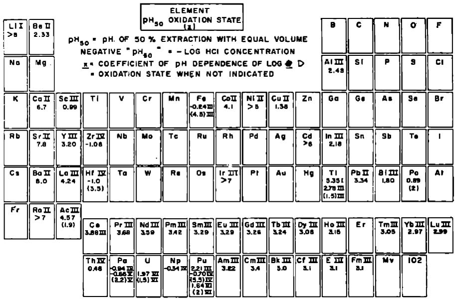  
Fig. 35. Extraction of the elements with $0.2\mathrm{M}$ TTA in benzene.324

The extraction of $\mathbf{Pu}(\mathbf{IV})$ from nitric acid solutions was investigated by Cunningham and Miles using $\mathrm{CCl}_4$ and benzene as solvents primarily, although other chlorinated hydrocarbons were used also. They find that, by neglecting aqueous phase nitrate complexing of the $\mathbf{Pu}$ , the equilibrium can be expressed by the equation

$$
C = D _ {P u (I V)} \frac {A _ {H N O _ {3}} ^ {4}}{(H T) ^ {4}} \frac {f _ {P u T _ {4}}}{f _ {H T} ^ {4}}. \tag {5}
$$

They derive the f's from the TTA concentration dependence of the distribution coefficient, and find that C is close to $1 \times 10^{+5}$ over the range from 1 to $10 \underline{\mathbf{M}} \underline{\mathbf{HNO}}_{3}$ for tracer Pu. Heisig and Hicks, in a very extensive study of the kinetics of the extraction of Pu(IV) from nitric acid solutions by TTA in sec-butyl benzene, determined that the rate of transfer of Pu chelate across the organic aqueous boundary controls the forward and reductive back extraction rates. They find that at low nitric acid concentrations $(0.5 \underline{\mathbf{M}})$ the extracted species is $\mathrm{PuT}_{4}$ , while at $4.9 \underline{\mathbf{M}}$ total nitrate concentration some partially nitrated complex such as $\mathrm{PuNO}_{3} \mathrm{T}_{3}$ exists.

Heisig and Hicks $^{174}$ found that for $\mathsf{Pu}(\mathsf{VI})$ extractions into TTA-benzene from nitric acid solutions the dependencies are direct second-power on the TTA concentration and inverse second-power on the hydrogen ion concentration, indicating that Eq. (1) represents the reaction. These authors measured the distribution coefficients for the $\mathsf{Pu}(\mathsf{III})$ obtained by reduction with $0.005\mathsf{M}$ ferrous perchlorate $-0.01\mathsf{M}$ sulfuric acid as a function of nitric acid and TTA concentrations. They obtained a direct 2.3 power dependency on TTA concentration and an inverse 2.6 power dependency on hydrogen ion. These solutions were never stabilized in the presence of TTA, however. Since the distribution coefficient increased with time, extrapolations to time zero were made, and the extrapolated values were used. Plots of the distribution coefficients for $\mathsf{Pu}(\mathsf{III})$ and $\mathsf{Pu}(\mathsf{VI})$ obtained by Heisig and Hicks are shown in Fig. 36.

Cunningham and Miles<sup>111</sup> determined the extraction properties of a number of possible impurities in the development of a batch process for separating Pu from irradiated U. Their results are shown in Fig. 37. Their procedure, which should be easily adaptable to the laboratory scale, is to pre-extract the Zr from $0.5\underline{\mathbf{M}}\mathrm{HNO}_3$ while the Pu is reduced to $\mathrm{Pu(III)}$ with hydroxylamine, oxidize to $\mathrm{Pu(IV)}$ with $\mathrm{NaNO}_2$ , extract with $0.2\underline{\mathbf{M}}$ TTA-benzene, scrub with dilute $\mathrm{HNO}_3$ , and back-extract the Pu into $8\underline{\mathbf{M}}\mathrm{HNO}_3$ . They report a $99.4\%$ Pu recovery on a 1-gram scale with decontamination factors from Zr and U of 3000 and 667, respectively.

Other reports on the use of TTA for processing irradiated uranium for Pu are those of Crandall et al.105 and Culler.109 An interesting variation is the use of U(IV) to strip Pu from TTA solutions by reduction to $\mathsf{Pu}(\mathsf{III})$ or a combination of reduction and displacement.342 The application of TTA to analytical and radiochemical procedures for Pu has been reported many times, either as the only purification step287, 50, 356 for rapid analysis (see for example, Procedure 2, Section VIII) or in combination with co-precipitation steps involving LaF3, 136, 351, 50, 284 BiPO4, 341, 237 chemisorption on a CaF2 suspension, or other separation steps.332, 315, 168, 261

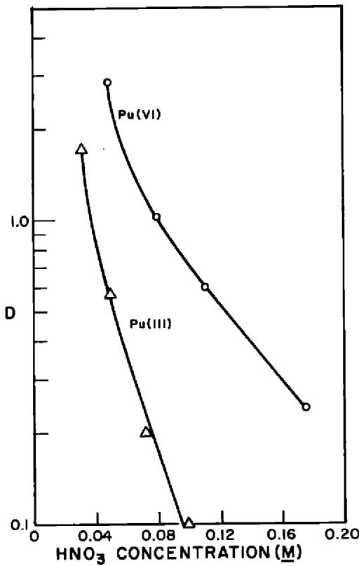  
Fig. 36. Extraction of $\mathsf{Pu}(\mathsf{III})$ and $\mathsf{Pu}(\mathsf{VI})$ into TTA-benzene as a function of $\mathsf{HNO}_3$ concentration at constant total nitrate concentration. $\mathsf{LiNO}_3$ added. $^{174}$

Pu(VI)

Pu(III)

TTA conc. (M) 0.74

1,65

Total nitrate (M) 0.175

0.096

Aqueous conditions

0.00

$2\times 10^{-4}$ KMnOy

Fe(ClO4)2

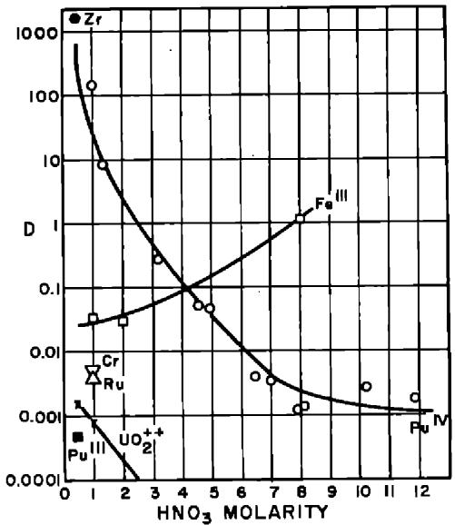  
Fig. 37. Distribution coefficients of various ions from nitric acid solutions into $0.2\mathrm{M}$ TTA in benzene.110,111

TTA has been used to separate a small amount of U from macro Pu,194 or vice versa,415 to concentrate Pu from environmental water samples352 and to determine the oxidation state of Pu in environmental samples, including sea water.136 In the latter procedure, $\mathsf{Pu}(\mathsf{IV})$ is extracted from $0.5\underline{\mathbf{M}}\mathsf{H}\mathsf{C}\mathsf{I}$ and the aqueous raffinate adjusted to pH 4.3 with ammonium acetate from which the $\mathsf{Pu}(\mathsf{III})$

and $\mathsf{Pu}(\mathsf{VI})$ are extracted together. On a second sample, the $\mathsf{Pu}(\mathsf{IV})$ and $\mathsf{Pu}(\mathsf{III})$ are coprecipitated together with $\mathsf{LaF}_3$ . The relative amounts of the three valence states are then calculated by difference.

TTA has been used to separate Pu from impurities for a spectrographic analysis.411 In this procedure an HCl solution of the metal is reduced to $\mathsf{Pu}(\mathsf{III})$ with hydroxylamine and impurity elements extracted with TTA in hexone. The Pu in the aqueous phase is then oxidized to $\mathsf{Pu}(\mathsf{IV})$ and extracted into TTA-hexone. By this procedure both extractable and non-extractable impurities can be determined.

TTA has been used for several procedures for the determination of Pu in biological material, especially urine $^{125,349,360,257,56,316}$ (see, for example, Procedure 21, Section VIII).

# Cupferron

N-nitrosophenylhydroxylamine or cupferron has been used as a precipitating agent for many metal ions for many years, and the solubility of these complexes in non-polar solvents such as chloroform was recognized at an early date. The extraction reaction is analogous to Eq. 1, although little quantitative work has been done on Pu. Furman et al. have reviewed the subject and have given data for U(IV) and U(VI). Kemp found that Pu(III) required four cupferron molecules per Pu atom in extractions into chloroform from HCl-ammonium chloride solutions $(\mu = 1.0 \mathrm{pH} = 4.5 - 5)$ . He ruled out oxidation of the Pu(III) by the reagent and postulated an "extra" cupferron molecule in the organic phase to complete the eightfold coordination sphere. The pH dependence for Pu(III) from these solutions was found to be third power, in accordance with Eq. 1. The pH dependence of Pu(III) with and without the presence of hydroxylamine and Pu(IV) is shown in Fig. 38.

Kirk and Rodden<sup>229</sup> report that most light elements are not extracted by cupferron-CHCl₃ and listed Fe, U(VI), U(IV), and Pu(IV) as extractable species. They report low extraction for Pu(VI), but essentially complete extraction for Pu(III) and Pu(IV). The extraction of reduced Pu is lowered above pH 0.8 in H₂SO₄. Phosphate interferes with the extraction, but a small concentration of iron is beneficial.

Nigon and Penneman<sup>304</sup> report a separation of Pu and Am, based on extraction of the Pu in the presence of ferrous ammonium sulfate from 1 N HCl solutions. The fact

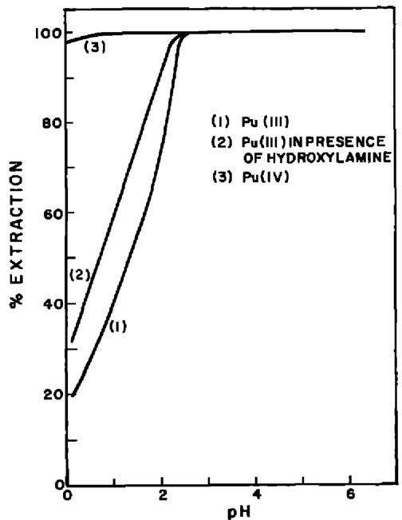  
Fig. 38. Extraction of $\mathbf{Pu}(\mathbf{III})$ and $\mathbf{Pu}(\mathbf{IV})$ from $1.0\mathrm{M}$ chloride into cupferron-CHCl3.22U Curve 1: $\mathbf{Pu}(\mathbf{III}) = 2.16\times 10^{-3}\underline{\mathbf{M}}$ cupferron $= 3.98$ $\times 10^{-2}\underline{\mathbf{M}}$ Curve 2: $\mathbf{Pu}(\mathbf{III}) = 3.65$ $\times 10^{-3}\underline{\mathbf{M}}$ cupferron $= 3.68\times 10^{-2}\underline{\mathbf{M}}$ $10\mathrm{w / v}\%$ hydroxylamine hydrochloride. The curves are $\%$ extraction for equal phase volumes vs equilibrium pH.

that the extraction rate of Pu is slowed by cooling from room temperature to $5^{\circ}\mathrm{C}$ suggests that oxidation from $\mathbf{Pu}(\mathbf{III})$ to $\mathbf{Pu}(\mathbf{IV})$ is taking place in the presence of cupferron. They report a separation factor of $10^{5}$ with quantitative recovery of both Am and Pu. A similar procedure has been used to separate Pu from U.417

Kooi and Hallatein $^{237}$ has used cupferron extractions to concentrate Pu from environmental water samples. Beaufait and Lukens $^{37}$ incorporated a cupferron extraction step in a general radiochemical procedure for Pu.

Cupferron has been used in several procedures to separate Pu before spectrographic determination of impurity elements. 296,45

Finally, cupferron, has been widely used in procedures to separate and concentrate Pu from biological materials. 102, 387, 248, 272

Chmutova et al. developed a procedure for determination of Pu by extraction from 3 M HNO₃ by a chloroform solution of N-benzoyl-phenylhydroxylamine (BPHA), an analog of

cupferron, followed by back extraction of the $\mathrm{Pu(IV)}$ into sulfuric acid. It was found that U, Am, Np(V), and fission products (except Nb and Zr) do not extract under these conditions. The Nb and Zr are separated in the back extraction step.

# Other Chelating Compounds

Many organic chelating agents were investigated in the Manhattan Project for possible extractants for Pu, including acetylacetone, trifluoroacetylacetone, and various other fluoridated diketones. Stewart<sup>393</sup> has compiled extraction data for such compounds as well as many other complexing agents. Extraction data for several chelating agents are shown in Table IV-25.

TABLE IV-25. Comparison of the Extractability of Plutonium into Benzene Phases Containing Various Fluorinated Diketones.393   

<table><tr><td>Code name</td><td>Substituted group R1(a)</td><td>Pu(IV) distribution ratio benzene 0.5 N HNO3</td><td>Relative concentration needed to give same extraction of Pu(IV)</td></tr><tr><td>TFA</td><td>CH3</td><td>1.0</td><td>1</td></tr><tr><td>PTA</td><td>CH3CH2</td><td>9.0</td><td>1/3</td></tr><tr><td>ITA</td><td>(CH3)2CHCH2</td><td>~100</td><td>1/5</td></tr><tr><td>BTA</td><td>C6H5</td><td>~100</td><td>1/7</td></tr><tr><td>TTA</td><td>HC - CH || HC C-</td><td>42</td><td>1/15</td></tr><tr><td>FBTA</td><td>pFC6H4</td><td>~100</td><td>1/7</td></tr><tr><td>PETA</td><td></td><td>~100</td><td>1/7</td></tr><tr><td>NTA</td><td></td><td>~100</td><td>1/7</td></tr><tr><td>FTA</td><td>CH - CH || HC C-</td><td>~100</td><td>1</td></tr></table>

(a) The general formula for these compounds is $\mathrm{R}_1\text{-C(O)CH}_2\mathrm{C(O)CF}_3$

$\mathsf{Pu}(\mathsf{VI})$ and $\mathsf{Pu}(\mathsf{IV})$ complexes with pyridine-N-oxide-2-carboxylic acid which precipitate at pH 2-3 have been prepared. $^{176}$ These compounds are iso-structural with TTA complex. A possible application is the separation of U(VI) and $\mathsf{Pu}(\mathsf{VI})$ from solutions of salts.

# Mixed Extractants

# Synergism

The term synergism is used to denote enhanced (or depressed) extraction of metals by mixed extractants, as against the extraction by each extractant taken separately. This subject has received considerable attention in recent years. Pu has received its share (perhaps more than its share) of the general research, and while not many radiochemical applications have appeared for this phenomenon, it is to be expected that more will be found. Considered in this section are all cases of changed extraction properties due to changes in the nature of the supposedly inert diluent, as well as mixtures of different types of extractants such as TBP-TTA, TBP-DBP, etc. The range of phenomena described under the term synergism is thus diverse, complex, and in general not completely understood. The review of Marcus<sup>267</sup> is excellent in this regard, and the reader is referred to it for a more complete discussion.

# Influence of Diluent

Taube396,397,398 conducted extensive studies on the effect of the

polarity and polarizability of supposedly inert diluents on the extractability of tetra- and hexavalent actinides with various extractants, including hexone, TBP, DBC, TTA, TLA, and TBAN. Examples of diluents used are polar (P): chloroform, non-polar (L): carbon tetrachloride, non-polar but polarizable (H): benzene. He found that the nature of the diluent exerted a large influence on the extractability, and proposed a theory based on (1) the interaction between the dipole of the organic molecule and the diluent dipoles, and (2) mutual interaction between permanent dipoles in the diluent mixture giving rise to structure in the organic phase. The effects can be large; e.g., $\mathrm{D}_{\mathrm{Pu(IV)}}$ increases a factor of three in going from pure $\mathrm{CHCl}_3$ to pure benzene in TBP extractions. In general, the extraction of a non-polar complex $(\mathrm{Pu(IV)}$ and $\mathrm{Pu(VI)}$ with hexone, TBP, TTA, etc.) is favored by a non-polar diluent. In the case of the highly polar $\mathrm{Pu(IV)}$ -TBAN complex, the extraction is favored by a polar diluent; however, the presence of a polarizable diluent increases the extraction. The extraction as a function of the mole fraction of H-type diluent thus exhibits a maximum. This is explained by disruption of the association of the dipoles in the P-type diluent, followed by participation of the induced dipoles in the H-type diluent in the extraction.

Shevchenko et al.369,371 found that the extractability of U(VI), Pu(IV), Zr(IV), and Ce(III) decrease with increasing polarizability of the diluent by TBP solutions from 3 M HNO $_3$ .

Far greater effects are observed when two different classes of extractants are mixed. The enhancement (or depression) of the distribution coefficients may be $10^{4}$ or

more. Siekierski and Taube, $^{381}$ and Taube $^{400}$ have proposed a system for synergistic mixtures based on classification of extractors as anionic ( $\mathbf{A}^{-}$ ), neutral ( $\mathbf{B}^{0}$ ), or cationic ( $\mathbf{C}^{+}$ ). Anionic extractants are acidic compounds such as TTA, DBP, HDEHP, etc. that act as organic anions in the extracted complex; similarly neutral extractants (TBP, TOPO, etc.) are neutral compounds that form complexes through a basic oxygen atom, and cationic extractants are strongly basic compounds (TOA, TBAN, etc.) that act as cations in the extracted complex. In general the synergistic effect is small in mixtures of compounds of the same class, and may be small or large in mixtures of different classes. These authors define a synergistic coefficient as

$$
S = \log \frac {D _ {1 , 2 , \exp}}{D _ {1 , 2 , a d d}} \tag {1}
$$

$\mathbf{D}_{1,2,\text{exp}}$ is the experimental distribution coefficient of a mixture of extractants 1 and 2, and $\mathbf{D}_{1,2,\text{add}}$ is the calculated distribution coefficient based on additivity of the individual distribution coefficients. Additivity is based on the assumption that (1) no interaction between the extractants occurs, and (2) no mixed complex of the extracted metal ion with the two extractants occurs. Both assumptions are commonly not true when extractants of different types are mixed. A summary table of examples of synergistic mixtures for U and Pu extraction is given in Table IV-26, based on this classification system. Taube<sup>400</sup> has made an extensive survey of mixed extraction systems.

Synergism in the system M-TTA-P, where M is an actinide and P is a neutral phosphate compound has been studied by Irving and Edgington,[196-200] in nitric acid and Healy[169] in HCl. Healy found no evidence of participation of chloride in the extraction. The extraction reaction is thus

$$
\mathrm {M} ^ {\mathrm {X}} + \mathrm {x H T} _ {(0)} + \mathrm {y P} _ {(0)} = \mathrm {M} (\mathrm {T}) _ {\mathrm {x}} (\mathrm {P}) \mathrm {y} _ {(0)} + \mathrm {x H} ^ {+}. \tag {2}
$$

Values of y ranged from 1 to 3 for various di-, tri-, and hexavalent ions. Th(IV) had a y value of 1 as did $\mathrm{UO}_2^{++}$ , except in the case of TOPO where a value of 3 was also obtained at high P concentrations.

Irving and Edginton found that 1 or 2 nitrates could enter into the complex, depending on the nitric acid concentration. With tributyl phosphine oxide (TBPO) the species identified were M(IV) $\mathrm{T}_3(\mathrm{NO}_3)_\mathrm{P}_1$ , M(IV) $\mathrm{T}_2(\mathrm{NO}_3)_2\mathrm{P}_2$ , and M(III) $\mathrm{T}_2(\mathrm{NO}_3)_\mathrm{P}_2$ , whereas with P = TBP they were M(III) $\mathrm{T}_3\mathrm{P}_2$ , M(IV) $\mathrm{T}_3(\mathrm{NO}_3)_\mathrm{P}_1$ , and M(VI) $\mathrm{T}_2\mathrm{P}_1$ , where M is an actinide. Thus the complex is influenced by the basic strength of P. These authors postulate that the reaction mechanism for hexavalent species is the replacement of a water molecule in the complex by P, giving a coordinately unsaturated product, thus

$$
\mathrm {M O} _ {2} \mathrm {T} _ {2} \mathrm {H} _ {2} \mathrm {O} + \mathrm {P} = \mathrm {M O} _ {2} \mathrm {T} _ {2} \mathrm {P} _ {(o)} + \mathrm {H} _ {2} \mathrm {O}. \tag {3}
$$

In the case of tetravalent species, one or more chelates are displaced by P molecules, with nitrates added to preserve electrical neutrality, thus

$$
\mathrm {M T} _ {4} + \mathrm {m H N O} _ {3} + \mathrm {m P} = \mathrm {M T} _ {4 - \mathrm {m}} \left(\mathrm {N O} _ {3}\right) _ {\mathrm {m}} \mathrm {P} _ {\mathrm {m}} + \mathrm {m H T}. \tag {4}
$$

TABLE IV-26. Synergistic and Antagonistic Effects in Two Extractant Systems in U and Pu Extractions.381   

<table><tr><td>System</td><td>Synergism or antagonism occurs</td><td>Examples for plutonium and uranium extraction</td><td>References and remarks</td></tr><tr><td rowspan="2">A1+ A2anionic + anionic</td><td>S &gt; 0</td><td>?</td><td></td></tr><tr><td>S &lt;&lt; 0</td><td>U(VI), HG2PO + H2GPO</td><td>Blake, 195959</td></tr><tr><td rowspan="2">A+ B°anionic + non-ionic</td><td>S &gt;&gt; 0</td><td>U(VI), H2SO4, D2EHPO + TBPO U(VI), HNO3, TTA + TBP Pu(VI), HNO3, HDEHP + TBPO Pu(VI), H2SO4, DNNSA + TBP Pu(VI), HNO3, TTA + TBP</td><td>Blake, 195959Irving, 1960196Blake, 195959Oak Ridge, 196044Irving, 1961198Taube, 1961400</td></tr><tr><td>S &lt;&lt; 0</td><td>U(VI), H2SO4, DDPA + TBP Pu(VI), Pu(IV), H2SO4, DBP + TBP</td><td>Blake, 195959Taube, 1961400</td></tr><tr><td rowspan="3">A+ C+anionic + cationic</td><td>S &gt;&gt; 0</td><td>U(VI), H2SO4, DBP + TOA</td><td rowspan="2">Deptula, Minc 1961115Blake, 195928Taube, 1961400</td></tr><tr><td></td><td>U(VI), HDEHP + tertiary amines Pu(VI) H2SO4, DBP + TOA</td></tr><tr><td>S &lt; 0</td><td>Pu(IV), H2SO4, DBP + TBAN</td><td>Taube, 1961400</td></tr><tr><td rowspan="2">B1+ B2non-ionic + non-ionic</td><td>S &gt; 0</td><td>U(VI), TBP, TiBP</td><td rowspan="2">Siddal 1960376no data</td></tr><tr><td>S &lt; 0</td><td>?</td></tr><tr><td>B° + C+non-ionic + cationic</td><td>S ~ 0</td><td>Pu(VI), Pu(IV), HNO3, TBP + TOA Pu(VI), Pu(IV), HNO3, TBP + TBAN</td><td>Taube, 1961400Taube, 1961400</td></tr><tr><td>C1+ C2cationic + cationic</td><td>S ~ 0</td><td>Pu(IV), HNO3, TOA + TBAN</td><td>Taube, 1961400</td></tr><tr><td>SYMBOLS</td><td colspan="3">G* general alkyl groupD2EHPO di-2-ethylhexyl phosphine oxideTBPO tri-n-butyl phosphine oxideDNNSA dinonylnaphthalenesulfonic acidTBAN tetrabutyl ammonium nitrateTiBP triisobutyl phosphate</td></tr></table>

The trivalent species are considered to become 8-coordinated by either addition of two P molecules or replacement of two water molecules. The addition reaction is

$$
\mathrm {M T} _ {3} + 2 \mathrm {P} = \mathrm {M T} _ {3} \mathrm {P} _ {2}.
$$

The synergistic effects discussed so far are for relatively small concentrations of P. If the P concentration is increased to about 1 M and above, a strong negative-synergism or antagonism sets in. The P dependencies for several M/TTA/P/HCl systems as quoted by Healy<sup>169</sup> are shown in Table IV-27. Thus it is possible by judicious addition of one of these compounds to effect the selective return of ions to the aqueous phase.

TABLE IV-27. Slope of the Dependence of the Distribution Coefficient on the Concentration of the Added Reagent for Mixtures of Phosphorous Esters, Amides, Alcohols and Ketones with TTA.[41]   

<table><tr><td>Ion</td><td>Valence</td><td>Synergism region</td><td>Antisynergism region</td></tr><tr><td>Th</td><td>IV</td><td>+1</td><td>-2</td></tr><tr><td>Am, Pm</td><td>III</td><td>+2</td><td>-4</td></tr><tr><td>\( UO_2 \)</td><td>VI</td><td>+1</td><td>-2</td></tr></table>

# Fused Salt Systems

Some research has been done on the solvent extraction properties of actinide and other elements in relatively low-temperature eutectic mixtures of fused salts because of their potential use in homogeneous power reactors. Gruen et al.[154] give a general discussion of oxidation states and spectra of actinides in $\mathrm{LiNO}_3\text{-KNO}_3$ mixtures, and indicate that TBP extracts a number of elements efficiently from the eutectic mixture. Isaac et al.[201] determined the distribution coefficients between Co(II), M(III) (where M is a trivalent actinide or lanthanide), Np(V) and Np(VI), and U(VI) in this eutectic mixture (MP $120^{\circ}\mathrm{C}$ ) and dilute solutions of TBP in a mixture of polyphenyls at $150^{\circ}\mathrm{C}$ . In general, the distribution coefficients were a factor of $10^{2}$ or $10^{3}$ higher than the corresponding concentrated aqueous nitrate solutions. The distribution coefficients all showed the same TBP concentration dependency as in aqueous solutions, indicating that the extraction mechanism is the same, the higher distribution being due to the increased salting-in effect. The effect of added chloride was to lower the distribution coefficients. Quadrivalent actinides would be expected to behave similarly, although none was determined.

Borkowska et al. $^{51}$ used a KCl-CuCl eutectic mixture at $180^{\circ}$ to study the extraction of Pu, U, and Am by solutions of TBP, TOA, and HDBP in diphenyl. For TOA they find the extractability is in the order

$$
\mathrm {D} _ {\mathrm {P u (I I I)}} <   \mathrm {D} _ {\mathrm {A m (I I I)}} <   \mathrm {D} _ {\mathrm {U (I I I)}} <   <   \mathrm {D} _ {\mathrm {U (I V)}}.
$$

In this system a maximum in the D vs concentration of TOA curve occurs at $\sim 40\%$ TOA, where $\mathrm{D}_{\mathrm{U}(\mathrm{IV})}\sim 3$ . TBP shows similar behavior. The maximum in this case is at $67\%$ TBP, where $\mathrm{D}_{\mathrm{U}(\mathrm{IV})}\sim 50$ . For $\mathrm{U}_{(\mathrm{IV})}$ , HDBP is similar to TBP.

Moore<sup>289</sup> measured the distribution of a number of ions between the immiscible salt pair $\mathrm{LiCl - AlCl_4^-K^+}$ at $650^{\circ}C$ . It is perhaps not proper to speak of this system as extraction; however significant distributions (Kd > 1 on a mole fraction basis) in favor of the LiCl phase were noted for $\mathrm{UCl_4}$ (for which $\mathrm{SnCl_2}$ was added as a reductant), $\mathrm{PuCl_4}$ , and $\mathrm{FeCl_3}$ . The ratio of the distribution coefficients for tri- and tetravalent actinides was > 40. Since the $\mathrm{SnCl_2}$ used to stabilize the U(IV) also reduced Pu to the trivalent state, an easy separation is possible in this system. Similar results were obtained by Moore and Lyon<sup>290</sup> for the system $\mathrm{KCl - AlCl_3 - Al}$ . In this case the separation factor for U from Pu and Th is approximately 100, while that for Th from Pa is up to 800.

Cafasso et al.73 determined the partition coefficient of a number of elements, including U and Pu, between liquid lead and zinc at $703^{\circ}\mathrm{C}$ . The results (Zn/Pb) are Pd:600, U:21.5, Pu:7.3, Ce:3.4, Sr:0.05.

# D.3 Ion Exchange

The phenomenon of ion exchange is of great utility in the radiochemical separation of Pu. Cationic Pu in dilute, non-complexing, acid solution will readily adsorb on cation resin in the hydrogen or alkali metal form. On the other hand Pu(IV) and Pu(VI) form anionic complexes in moderately concentrated nitric or hydrochloric acids and so will adsorb on anion exchange resins. Anion and cation exchange methods are thus both usable to separate Pu. The anion exchange separation is especially valuable in the laboratory because of the simple equipment required, the ease of manipulation, and the excellent decontamination from fission products by the use of redox cycles.

Recently synthetic inorganic cation exchangers such as zirconium phosphate have been developed.

A good introduction to the subject of ion exchange in the actinides is contained in Chapter 7 of Seaborg and Katz. The review of Hyde is valuable for ion exchange separations of the actinides. The general subject of ion exchange has been reviewed many times. The books of Helfferich and Samuelson are good references to the theory and applications of ion exchangers. Samuelson has a good review of recent work done on actinides. Helfferich gives a table of the names and properties of commercially available ion-exchange materials. Kraus and Nelson reviewed the general subject of ion-exchange separations in 1957, while Hardy reviewed the ion exchange data for actinides in 1958.

# Cation Exchange

The general cation exchange reaction for an exchanger in the hydrogen form (acid solution) is

$$
\mathrm {M} ^ {+ \mathrm {b}} + \mathrm {b H R} = \mathrm {M R} _ {\mathrm {b}} + \mathrm {b H} ^ {+}. \tag {1}
$$

In this equation R is an exchanger site. The exchange reaction is favored by a low acid concentration or conversely, high acid can be used to displace the metal from the exchanger by mass action. Another way to remove metal ions from the exchanger is to decrease the concentration of $\mathbf{M}^{+b}$ by complexing. In general, the absorbability of cations on ion exchangers increases with increasing charge and decreasing hydrated radius. Thus, the order of absorbability on cation exchangers for Pu is Pu(IV) > Pu(III) > PU(VI). For example, Schubert<sup>358</sup> found the following adsorption affinity for the strong base cation resin Amberlite IR-1: Th(IV) > Pu(IV) > La(III) Rare Earths > Y(III) Rare Earths > Ba(II) > Cs(I) > Sr(II) > $\mathrm{UO}_2^{++}$ . All Pu species are absorbed well at low acid concentration, and are desorbed at high acid concentrations. However, many anions form neutral or anionic complexes with Pu in all of its oxidation states, and therefore Pu may be desorbed by reaction with the anion of the acid, as well as the mass action displacement.

The sulfonated cross-linked polystyrene resins have been by far the most popular materials for the separation of inorganic species, including the actinides. Typical of these is Dowex-50. This resin is usually specified as "X 4" or "X 12," etc., which means $4\%$ or $12\%$ , etc. divinylbenzene was added to the styrene in the

polymerization of the resin to provide the cross linkage. In general, the low-cross-linked resins have the advantage of faster kinetics, but also have the disadvantage of greater volume change with changing ionic milieu.

As mentioned above, under non-complexing conditions, i.e., dilute acidic solution, the absorption of Pu is essentially independent of the anions present. However, many anions form Pu complexes at moderate concentrations, which makes the elution behavior of Pu variable.

The elution behavior of Pu on cation resin is summarized in Fig. 39, where the distribution coefficient for $\mathrm{Pu(III)}$ , $\mathrm{Pu(IV)}$ , and $\mathrm{Pu(VI)}$ on Dowex-50 is plotted as a function of the acid molarity.

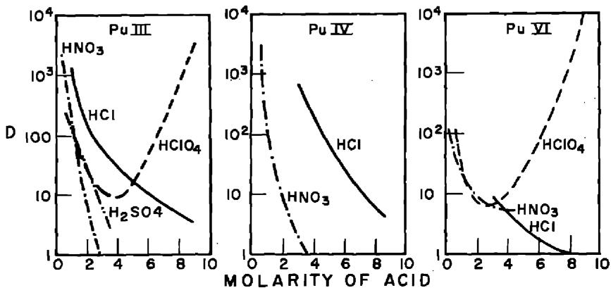  
Fig. 39. Typical distribution coefficients of Pu on Dowex 50 in common acidic solutions.

These data are intended to be only illustrative of the behavior of Pu. In some cases, the data of other actinides (e.g. Am(III), U(VI)) were adjusted to correspond to Pu in the same valance state. The data in every case were taken from literature mentioned later in this section.

In general, the slopes of the curves are steeper for $\mathrm{HNO}_3$ , $\mathrm{H}_2\mathrm{SO}_4$ , and $\mathrm{HClO}_4$ than for $\mathrm{HCl}$ . A strong increase in the distribution coefficient in $\mathrm{HClO}_4$ at high acidities is shown for $\mathrm{Pu(III)}$ and $\mathrm{Pu(VI)}$ . This increase occurs in a great number of elements, and probably also for $\mathrm{Pu(IV)}$ .

The classic work on cation exchange of the actinide elements in HCl solution was done by Diamond et al.117 whose principal results are shown in Fig. 40 as a plot of relative volumes required to elute tracer amounts of the ions from a Dowex-50 column $10\mathrm{cm}$ long by 1 or $1.5\mathrm{mm}$ in diameter. These data are proportional to the distribution coefficients, and illustrate the separations obtainable in this system. The points for the Pu species have been connected to make a crude elution positon vs HCl concentration plot. The extreme decrease of the $\mathrm{Pu(IV)}$ elution position in going from 3.2 to $9.3\mathrm{M}$ HCl is undoubtedly due to the formation of an anionic chloride complex. The tetravalent actinides elute in this sequence: Pu, Np, U, Th; i.e., Th has the highest distribution coefficient at any HCl concentration. This order of elution is in accord with the decreasing hydrated radii in going from Pu to Th. Th(IV) was not

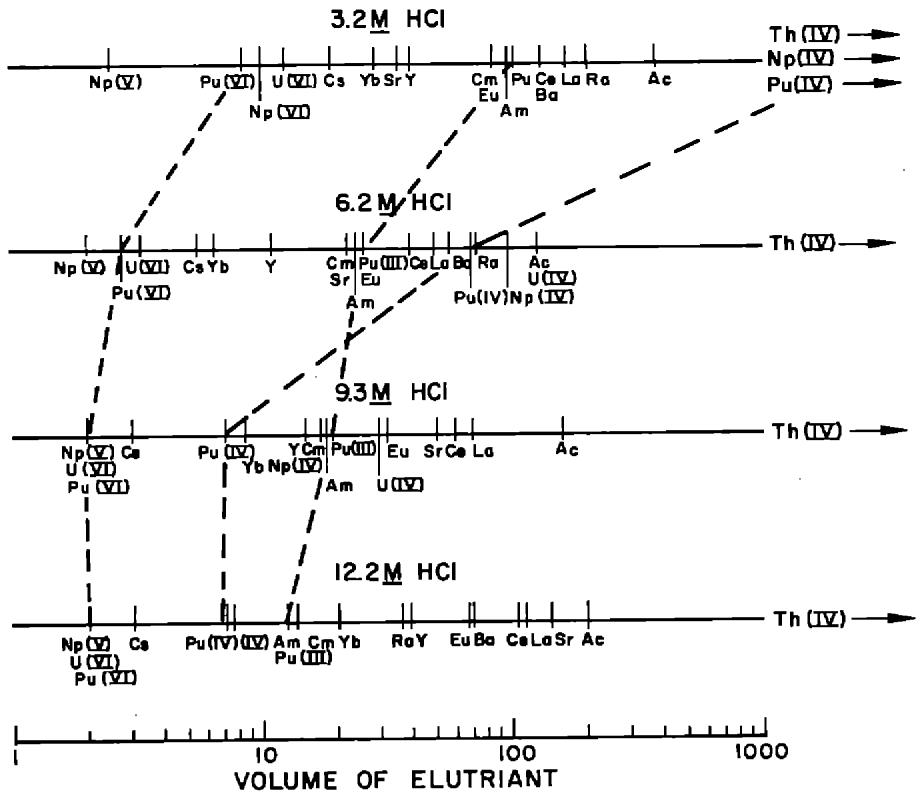  
Fig. 40. Relative elution peak position of actinides and other ions in various HCl concentrations. The positions of the Pu ions have been connected by lines.117

eluted at all under the conditions of the experiment. A plot of the elution position of the tetravalent actinides under slightly different conditions is shown in Fig. 41 to show the relative elution position of Th(IV). The well-known separation of the trivalent actinides and lanthanides is illustrated by the increase in the elution positions of the lanthanides at high acidities.

Nelson et al. summarized the cation exchange behavior of most of the elements in HCl. The summary is in Fig. 42 as a periodic table of $D_V$ vs HCl concentration. Dowex-50×4 resin was used. Although relatively few data for Pu are included, the curves for Th(IV), U(VI), and Am(III) permit a normalization to the data of Diamond et al.

Strelow<sup>395</sup> investigated the cation exchange behavior of 43 elements on Dowex- $50 \times 8$ resin at HCl concentrations up to $4\textbf{M}$ with results in general agreement with those above. He arranged the elements in decreasing order of the equilibrium distribution coefficients in $1\textbf{M}$ HCl. The values ranged from 7250 for $\mathsf{Zr}(\mathsf{IV})$ to 0.3 for $\mathsf{Hg}^{+ + }$ . The distribution coefficient of Th(IV), the only actinide studied, was 2049, just below Zr.

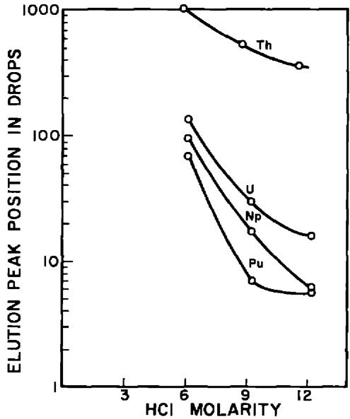  
Fig. 41. Elution peak position of the tetrapositive ions vs hydrochloric acid molarity.117

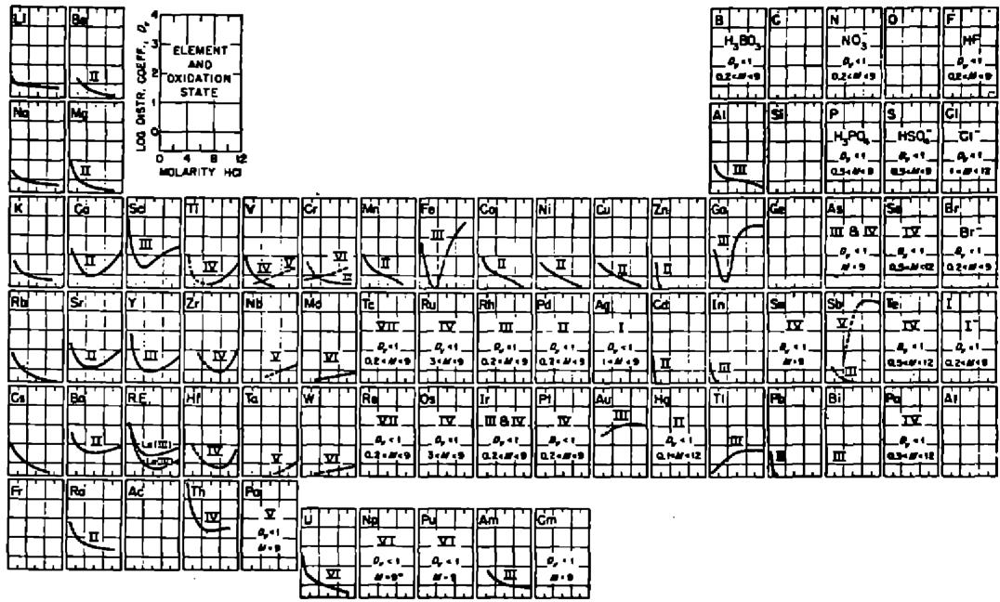  
Fig. 42. Volume distribution coefficient of the elements vs HCl concentration for Dowex $50 \times 4$ cation exchange resin. Tracer concentrations of the elements were used for the most part.300

Prevot et al.325 determined coefficients of $\mathsf{Pu(III)}$ and $\mathsf{Pu(IV)}$ , along with other ions as a function of $\mathsf{HNO}_3$ concentration (Fig. 43). They used C- 50 resin (similar to Dowex-50). $\mathsf{Pu(III)}$ and $\mathsf{Pu(IV)}$ are expected to absorb very strongly below $1\textbf{M}$ acid. The distribution coefficient is very low at $\mathsf{HNO}_3$ concentrations $\leq 4\textbf{M}$ since the U(VI) and Fe(III) curves are flattening out. A partial separation from these ions can be achieved in the elution of the Pu.

Nelson et al. $^{300}$ also used $\mathrm{HClO}_4$ as the aqueous medium in their survey of cation exchange behavior. The results shown in Fig. 44 show some striking differences from the HCl data. In high $\mathrm{HClO}_4$ concentrations ( $>9\mathrm{M}$ ) most elements have increasing distribution coefficients after having gone through minima. These authors state that essentially all the actinides in whatever oxidation state have appreciable

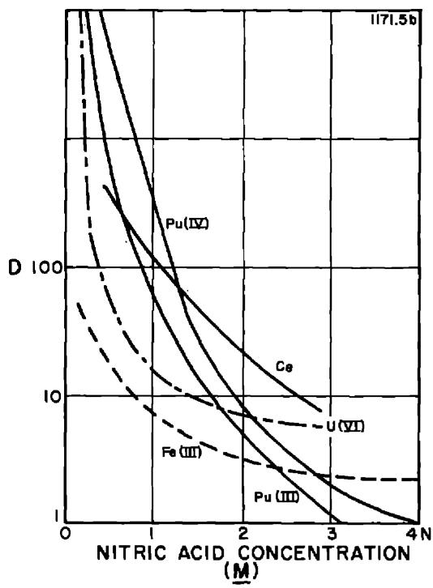  
Fig. 43. Distribution of $\mathsf{Pu}(\mathsf{III})$ and $\mathsf{Pu}(\mathsf{IV})$ and other ions between nitric acid solutions and the cation resin C-50 (similar to Dowex-50).<sup>325</sup>

distribution coefficients at high $\mathrm{HClO}_4$ concentration, and that this phenomenon might be made the basis of an actinide group separation.

Neill and Higgins<sup>299</sup> determined distribution coefficients for Pu(III) and Pu(IV) for several resins in sulfuric acid solutions. Their results are shown in Table IV-28. They used Dowex-50 resin to demonstrate a process for recovering Pu from sulfuric acid decladding solutions which contain stainless steel. The Pu is normally trivalent in dilute sulfuric acid solutions, and is adsorbed from $0.5\textbf{M}$ acid, scrubbed with $0.5\textbf{M}$ sulfuric acid, washed with water to remove sulfate, and eluted with $6\textbf{N}$ $\mathrm{HNO}_3$ . The product Pu solution contained $5\%$ of the original stainless steel materials, primarily iron and chromium.

The most common applications of cation exchange techniques for Pu are (1) concentration from a dilute solution, or (2) separation from nonabsorbable impurities, such as hydrazine.[419] Several processes for final purification and concentration of Pu from solvent extraction plants have been developed. These processes should be easily adapted to the laboratory scale. Bruce describes the process as adsorption of $\mathrm{Pu(III)}$ from $0.25\mathrm{M}$ $\mathrm{HNO}_3$ by Dowex- $50\times 12$ from a $0.15\mathrm{g} / 1$ solution of $\mathrm{Pu(III)}$ which is $0.1\mathrm{M}$ in hydroxylamine sulfate, washing with $0.1 - 0.25\mathrm{M}$ $\mathrm{HNO}_3$ containing $0.05\mathrm{M}$ hydroxylamine sulfate, and eluting with $5.7\mathrm{M}$ $\mathrm{HNO}_3$ containing $0.3\mathrm{M}$ sulfamic acid to prevent oxidation to $\mathrm{Pu(IV)}$ . Bruce reports a concentration

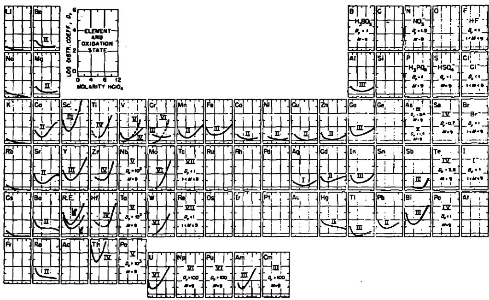  
Fig. 44. Volume distribution coefficient of the elements vs $\mathrm{HClO}_4$ concentration for Dowex-50 × 4 cation exchange resin. $^{300}$

TABLE IV-28. Distribution Coefficients for Pu for Various Cation Resins in $\mathbf{H}_2\mathbf{SO}_4$ Solutions<sup>299</sup>   

<table><tr><td>Resin</td><td>H2SO4Concentration (M)</td><td>DPu(III)</td><td>DPu(IV)</td></tr><tr><td>Duolite C-65</td><td>0.5</td><td>5.3</td><td>35</td></tr><tr><td rowspan="2">Dowex 50 × 8</td><td>0.5</td><td>360</td><td>--</td></tr><tr><td>3.6</td><td>3.6</td><td>--</td></tr><tr><td rowspan="2">Dowex 50 × 12</td><td>0.25</td><td>144</td><td>--</td></tr><tr><td>0.5</td><td>1470</td><td>--</td></tr></table>

factor of 330 for Pu in this process. Decontamination factors of approximately 20 to 30 for Zr and Nb, and 2.4 to 8 for most other ions were obtained.

During the entire process the Pu is kept trivalent for several reasons; among these are (1) the Pu is initially trivalent as it is stripped from TBP in the Purex process, (2) oxidation during adsorption liberates gasses which may channel the resin and (3) Pu(III) is more easily desorbed, permitting a higher concentration factor. Durham and Aiken describe essentially the same process. Prevot et al. Lingjaerde and Sikkeland elute with 6-8 M HCl in preparation for

anion exchange in an HCl system. The latter workers use an additional 2 M HCl wash to elute the U(VI) and some fission products before elution of the Pu. Pm and Ce were the major contaminating fission product activities in this procedure (see procedure insert VIII). Den Boer and Dizdar $^{114}$ used the same general scheme except 1.5 N HNO $_3$ was used to elute the $\mathrm{UO}_2^{++}$ and hydrazine was the reductant, and the Pu(III) was eluted with 8 M HNO $_3$ .

Chetham-Strode<sup>86</sup> investigated the behavior of $\mathrm{NH}_4(\mathrm{I})$ , $\mathrm{Fe(III)}$ , $\mathrm{Pt(IV)}$ , and $\mathrm{Al(III)}$ , which are common contaminants in the laboratory purification of trivalent actinides for spectrometer sources. His results are shown in Fig. 45 with $\mathrm{Am(III)}$ as a typical actinide. His procedure was to adsorb the ions from a very dilute HCl solution, wash with $1\textbf{\underline{M}}\textbf{H}\textbf{C}\textbf{l}$ , and elute with $6\textbf{\underline{M}}\textbf{H}\textbf{C}\textbf{l}$ .

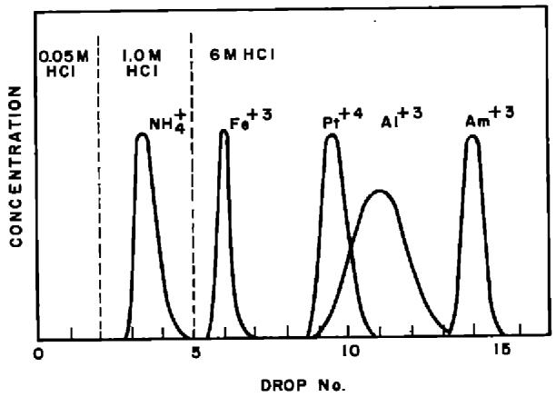  
Fig. 45. Separation of Am from some common impurities by elution with HCl. The abcissa is drop number for a 0.3-cm diameter by 10-cm column. The resin used was Dowex $50 \times 4$ .

Zolotov and Nishanov<sup>436</sup> report the separation of $\mathbf{Np}$ from U, Pu and fission products by elution of $\mathbf{Np}(\mathbf{V})$ ahead of U(VI) by $1\underline{\underline{\mathbf{M}}}\mathbf{HNO}_3$ from the cation exchange resin KU-2. In the presence of $1\underline{\underline{\mathbf{M}}}\mathbf{HNO}_3$ , $\mathbf{Np}(\mathbf{VI})$ is reduced to $\mathbf{Np}(\mathbf{V})$ on the resin. The $\mathbf{Pu}(\mathbf{IV})$ is then eluted with $3\underline{\underline{\mathbf{M}}}\mathbf{HNO}_3$ .

Zagrai and Sel'chenkov $^{435}$ separated Np and Pu by elution from cation resin (KU-1 and KU-2) with 0.02 M hydrofluoric acid after reduction to Pu(III) and Np(IV) with $\mathrm{SO}_2$ for 20 minutes at $90 - 100^{\circ}\mathrm{C}$ .

The preparation of cation exchange resin beads with scintillating properties was reported by Heimbuch and Gee. $^{172}$ Polyvinyl toluene-divinylbenzene mixtures were polymerized with p-terphenyl and 1, 4-bis-2-(5-phenyloxyazolyl)-benzene as scintillators. The resin beads were then surface-sulfonated, to give capacities ranging from 0.01 to 0.1 milliqu equivalents/gram. $\mathrm{Sr}^{90}$ , $\mathrm{Pu}^{239}$ , and $\mathrm{Po}^{210}$ have been adsorbed with this resin and counted with efficiencies from 30 to $50\%$ of the adsorbed activity. Several applications are suggested:

1. Easy sample preparation for adsorbable radionuclides.   
2. A combination of concentration of ions from dilute solution and sample preparation.   
3. Rapid qualitative analysis for radionuclides in dilute solutions.

Kennedy et al.222 prepared and tested phosphorylated resins, which are analogous to acidic phosphorous compounds in solvent extraction systems. They found that these resins are between carboxylic and sulfonic resins in acidity. The adsorption

affinity of several ions was Th(IV), U(IV) > U(VI), Fe(III) > La(III) > H⁺ > Cu(II), Co(II), Ca(II) > Na⁺. Pu was not measured, but Pu(IV) would presumably be with Th and U.

# Inorganic Ion Exchangers

Although inorganic ion exchangers have been long known, they have been largely superseded by the synthetic resins, principally because of the higher capacities and more tractable physical characteristics obtainable in the synthetic exchangers. However, experimentation has continued on natural and synthetic compounds. In the actinide field this work has proceeded primarily toward the finding of better separations from fission products. The inorganic exchangers are also quite resistant to radiation damage, which is an advantage in process applications.

A general discussion of the ion exchange properties of hydrous oxides has been given by Kraus et al. 242 Inorganic phosphates as ion exchange materials have been reported. 31, 139 The use of zirconium phosphate to separate Pu, U, and fission products has been reported by Gal and Ruvarac. 140 Equilibrium distribution coefficients for a number of ions are shown in Fig. 46, plotted against nitric acid concentration. The solution containing U, Pu and fission products was loaded onto a column at $0.5\mathrm{M}$ $\mathrm{HNO}_3 + 0.02\mathrm{M}$ $\mathrm{NaNO}_2$ . The U, Ce, Sr, and Ru pass through the column. After washing the column, the Pu and Cs are removed with $8\mathrm{M}$ $\mathrm{HNO}_3$ . The Zr and most of the Nb stay on the column. Of the ions studied, only Cs follows the Pu and must be separated by an additional step.

Ahrland et al. 21, 22 studied the behavior of several ions on silica gel and proposed a separation of Pu, U and fission products similar to the one described for zirconium phosphate above. The distribution coefficients are plotted as a function of pH in Fig. 47, revealing an easy separation of Zr, U, Pu, and other ions by pH and valency adjustment.

Rydberg 341 separated Zr-Nb from Pu by adsorption of the former on silica gel from a 6 M HNO₃ solution (see Procedure 11 in Sect. VIII).

Cvjetcanin $^{112}$ extracted $\mathbf{Pu}(\mathbf{VI})$ and U(VI) with hexone in the presence of silica gel to effect a Zr-Nb separation.

Cvjetcanin and Cvjetcanin $^{113}$ used a column of $\mathsf{MnO}_2$ to separate U and Pu from long-lived fission products. The method is adsorb the fission products from $0.1\underline{\mathbf{N}}\underline{\mathbf{HNO}}_3$ , while passing U(VI) and Pu(VI) through the column. Over $99\%$ of the $\mathsf{Zr}$ , Ru, and Cs activity was adsorbed on the column. The capacity for zirconium for $\mathsf{MnO}_2$ dried at $110^{\circ}\mathsf{C}$ was determined to be 1 milliequivalent/gram.

An exchanger composed of Zr and Si oxyhydrates has been prepared and applied to Pu separations. 297

Pu has been concentrated from environmental water samples by chemisorption of Pu(IV) on calcium fluoride from a nitric acid solution 352 (see Procedure 13 in Sect. VIII).

Kennedy et al. 223 describe the absorption of $\mathsf{Pu}(\mathsf{IV})$ , U(VI), Ru, Zr, and Nb from aqueous carbonate solutions by hydrated titanium oxide (HTO). About

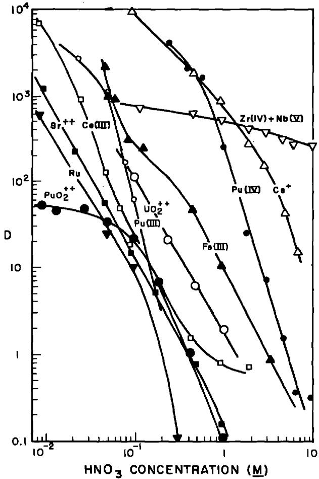  
Fig. 46. The dependence of the distribution coefficients of several ions on zirconium phosphate on the aqueous $\mathrm{HNO}_3$ concentration. All adsorbates present in tracer amounts. Solutions of $\mathrm{Pu(III)}$ were $0.005\underline{\mathbf{M}}$ in sulphamic acid and $0.015\underline{\mathbf{M}}$ in hydrazine; solutions of $\mathrm{Pu(IV)}$ $0.02\underline{\mathbf{M}}$ in $\mathrm{NaNO}_2$ and solutions of $\mathrm{PuO}_2^{++}0.02\underline{\mathbf{M}}$ in $\mathrm{KBrO}_3$ .<sup>140</sup>

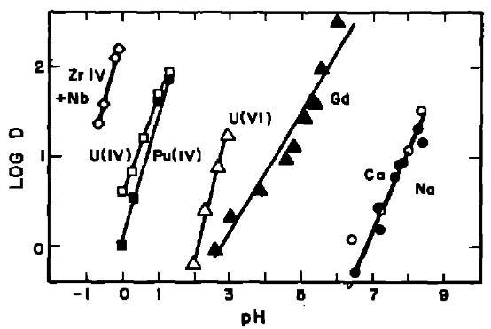  
Fig. 47. Log D for some metal ions as a function of pH on silica gel (KEBO, 50-100 mesh).22

95% of Pu(IV) was removed from a $0.5 \underline{\mathrm{M}} \mathrm{Na}_2\mathrm{CO}_3$ solution by passage of 2000-bed volumes at a flow rate of $1 \, \mathrm{ml} / \mathrm{cm}^2/\mathrm{min}$ of the solution through an HTO column. The absorption of Pu(IV) was not affected by the presence of $5 \, \mathrm{mg} / 1$ of U(VI). The absorption of Pu(VI) was only $20\%$ in 1000-bed volumes under the same conditions. A possible application of this system to recover Pu and other ions from carbonate wastes in processing plants is discussed.

# Paper Chromatography

Clanet 90 determined paper chromatographic $\mathbf{R}_{\mathrm{f}}$ values for $\mathrm{Pu(III)}$ , $\mathrm{Pu(IV)}$ and $\mathrm{Pu(VI)}$ , $\mathrm{U(IV)}$ , and $\mathrm{U(VI)}$ , and Am(III) in HCl-butanol mixtures (1:1) ranging from 1 to $10\mathrm{M}$ HCl. The $\mathbf{R}_{\mathrm{f}}$ values reached a maximum around 6 M HCl and ranged from 0.27 for U(IV) to 0.50 for U(VI), the other ions falling in between. The ions of lower valency tended to have lower $\mathbf{R}_{\mathrm{f}}$ values.

Bildestein et al. separated U and Pu by several paper chromatographic methods, using different combinations of solvent and acid. The use of ion-exchange paper to separate U and Pu was also reported by these workers. For example, with Whatman ET-20 using 6 M HCl as a developer, the $R_{f}$ values are 0.56 and 0.98 for U and Pu, respectively. The oxidation states of the U and Pu were not specified.

Fink and Fink<sup>131</sup> investigated many combinations of solvent and acid to develop paper chromatograms of both $\mathrm{Pu(IV)}$ and $\mathrm{Pu(VI)}$ . In most systems $\mathrm{Pu(IV)}$ failed to move or streaked, but in a few cases moved quantitatively. The results indicated $\mathrm{Pu(VI)}$ and $\mathrm{U(VI)}$ might be separated in a methyl ethyl ketone - dilute nitric acid system.

# Anion Exchange

The behavior of the actinide elements in various oxidation states on a strong base anion exchange resin (typically Dowex 1 or 2) in HCl is shown in Table IV-29. Strong adsorption of the actinides in the higher oxidation states (IV-VI) occurs at HCl concentrations above $6\textbf{M}$ while desorption occurs below $2\textbf{M}$ HCl.

TABLE IV-29. Absorption and Desorption of Actinides on Strong Base Anion Exchangers in HCl Solutions   

<table><tr><td rowspan="2">Oxidation State of Actinide</td><td colspan="2">HCl Concentration(M) for</td></tr><tr><td>Absorption(a)</td><td>Desorption(b)</td></tr><tr><td>III</td><td>Not absorbed</td><td>-</td></tr><tr><td>IV</td><td>6-8</td><td>2-4</td></tr><tr><td>V</td><td>6-8</td><td>2-4</td></tr><tr><td>VI</td><td>2-3</td><td>0.1-1</td></tr></table>

(a) $\mathbf{Kd} = 10 - 100$ for absorption.   
(b)Kd = 0.1-1.0 for desorption.

A convenient way of separating $\mathbf{Pu}$ from other actinides and most other elements is to adsorb $\mathbf{Pu}(\mathbf{IV})$ or $\mathbf{Pu}(\mathbf{VI})$ onto such a resin from $>6\underline{\mathbf{M}}$ HCl solution, wash with HCl, and desorb by reducing the $\mathbf{Pu}$ to the trivalent with a suitable reducing

agent. This method is so simple and effective that it has become one of the standard laboratory methods for the separation of Pu, as well as in larger scale process plants.

$\mathrm{Pu(IV)}$ may be also adsorbed from $7 \underline{\mathbf{M}} \underline{\mathbf{H}} \underline{\mathbf{N}} \underline{\mathbf{O}}_{3}$ solutions and desorbed either by dilute acid or by reduction. The distribution coefficients and separation factors from fission products are higher than in the HCl system, but the room temperature reactions are slower, resulting in some loss of convenience. 325

Many of the procedures collected in this volume are based on anion ex

change.

Wish and Rowell 432,433,434 have determined equilibrium distribution coefficients for several actinide and other elements for Dowex-2 in HCl, $\mathsf{HNO}_3$ , $\mathsf{H}_2\mathsf{SO}_4$ , and HCl-HF solution with results shown in Figs. 48-51. Although no Pu data in $\mathsf{HNO}_3$ was obtained by these workers, the curves are included for comparison. Dowex-2 is made by addition of dimethylethanol amine to chloromethylated polystyrene, while Dowex-1 is made with trimethylamine. $^{175}$ The equilibrium distribution data for the 2 resins is quite similar, e.g. for U(VI) $^{434,240}$ so that the behavior of the actinides in Dowex-2 is also valid for Dowex-1. The behavior of the ions in the HCl-HF mixture shows the effect of strong HF complexing in Zr and Pu. These workers separate Pu from Zr and other elements by eluting the Zr with 11 N HCl - 0.06 M HF, and the Pu and Np together with 6.5 N HCl - 0.0004 N HF.

Marcus 266 measured distribution coefficients for macro amounts of U, Np, and Pu in the tetra- and hexavalent states on Dowex-1. The oxidation states of the ions in these experiments were measured spectrophotometrically both in the solution and in the resin phase. The results, which differ somewhat from those above are shown in Fig. 52 as volume distribution coefficients, $D_{\nu}$ , obtained by multiplying the usual D by the resin bed density, 0.45, in this case.

Hardy $^{162}$ has summarized equilibrium data for the actinides in $\mathrm{HNO}_3$ and HCl solutions for various strong base quaternary anion resins. These are shown in Fig. 53. The $\mathrm{Pu(IV)}$ data in $\mathrm{HNO}_3$ show significant differences for different resins and different workers. The species adsorbed from $7\underline{\underline{\mathbf{M}}}$ $\mathrm{HNO}_3$ has been shown to be $\mathrm{Pu(NO_3)_6} = 337,120$

Data for the adsorption of other elements on Dowex 1 from HCl solutions $^{240}$ and $\mathrm{HNO}_3$ solutions $^{127}$ are shown in Figs. 54 and 55. The great specificity for actinides in the higher valence states is shown by Fig. 55.

Many examples exist of the use of anion exchange resins for Pu separations, both in HCl and $\mathrm{HNO}_3$ solutions. Adsorption in 8 to 12 M HCl and elution by reduction to $\mathrm{Pu(III)}$ with $\mathrm{NH}_4\mathrm{I}$ in 8 M HCl, 108, 382, 447, 185, 383 with HI in concentrated HCl, 185, 293 or with $\mathrm{NH}_2\mathrm{OH}$ and $\mathrm{NH}_4\mathrm{I}$ in concentrated HCl 434 are common procedures. An alternative procedure which has been used 293, 155 is to adsorb $\mathrm{Pu(IV)}$ from 7 M HNO₃, wash the column first with 7 M HNO₃, then with concentrated HCl, and finally strip in 10 M HCl - 0.5 M HI or $\mathrm{NH}_4\mathrm{I}$ solution. This method combines the advantages of the somewhat greater selectivity and removal of iron of the nitrate system with the ease of reduction to $\mathrm{Pu(III)}$ of the chloride system with resulting small strip volume. The elution of $\mathrm{Pu(IV)}$ by HCl-HF mixtures has been mentioned before. 432, 433 These

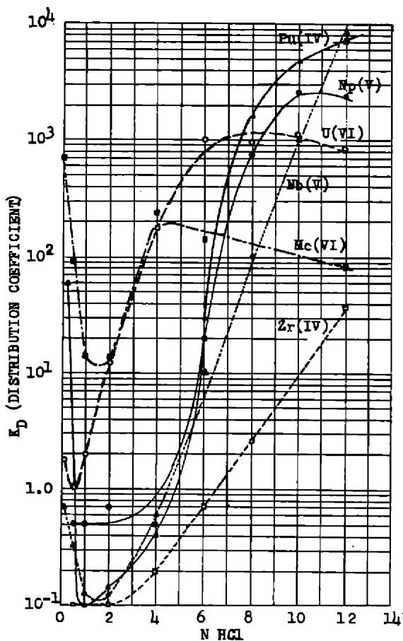  
Fig. 48. Equilibrium distribution coefficients for Dowex 2 in HCl solutions. (Mo, Zr, and Nb curves furnished by L. R. Bunney et al.)<sup>432, 433</sup>

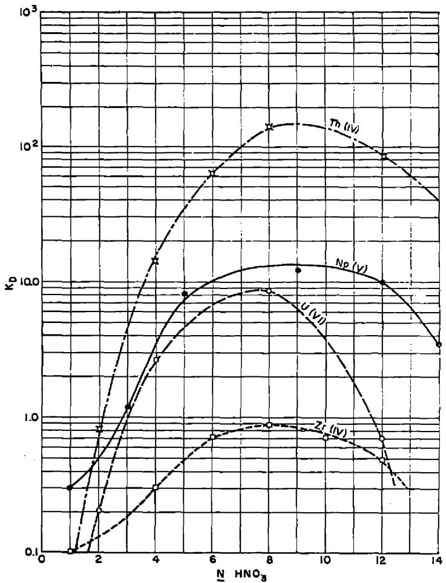  
Fig. 49. Absorption of various ions by Dowex 2 from nitric acid solutions. $^{433}$

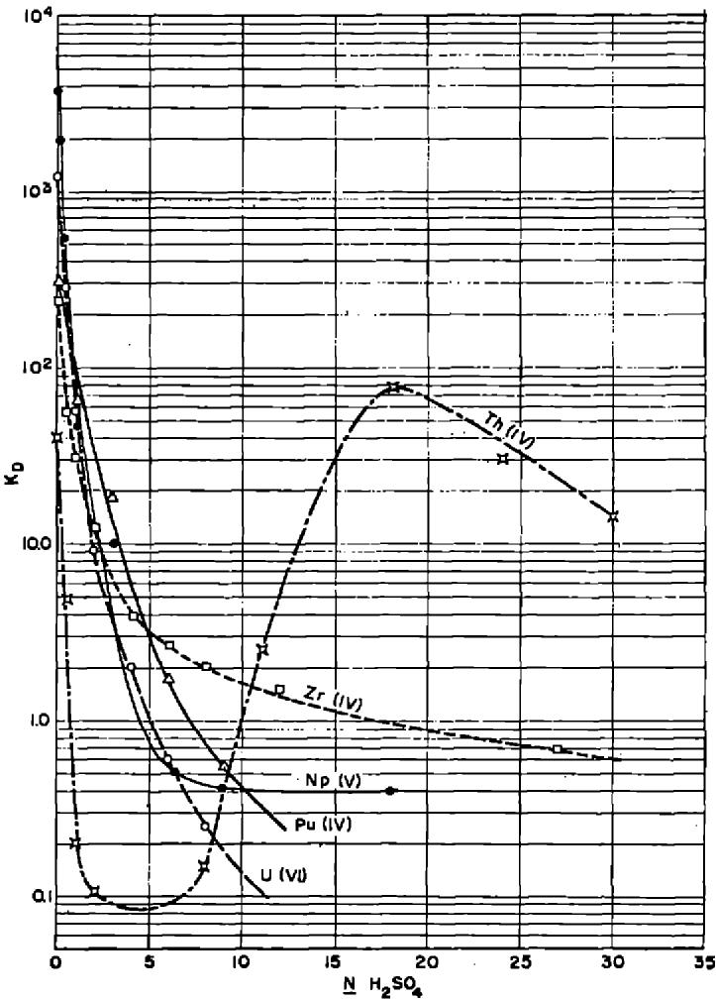  
Fig. 50. Absorption of various actinide ions from $\mathrm{H}_2\mathrm{SO}_4$ solutions by Dowex 2.433

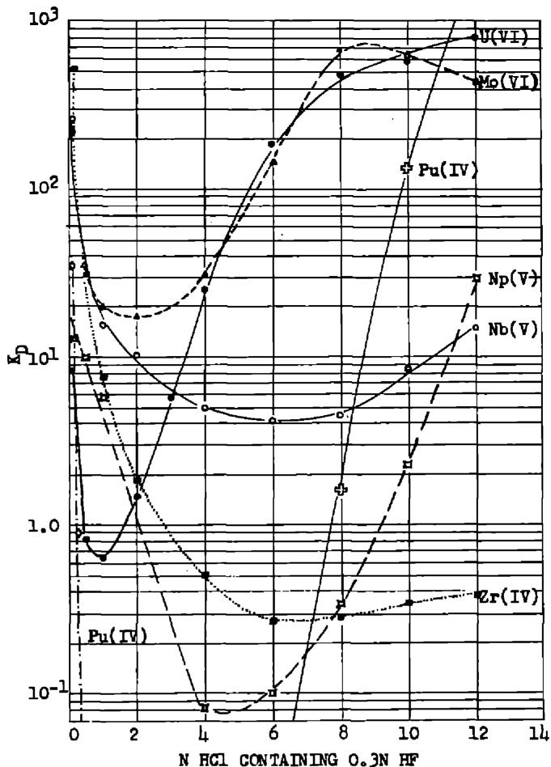  
Fig. 51. Equilibrium distribution coefficients of various ions on Dowex 2 in HCl - HF solutions. 432, 433

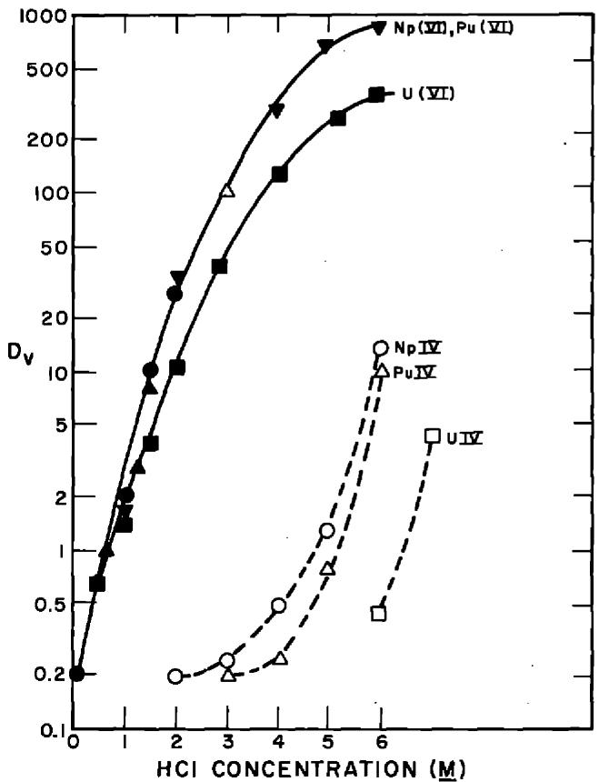  
Fig. 52. Volume distribution coefficients, Dv, for tetra and hexavalent U, Np, and Pu between Dowex 1 and hydrochloric acid solutions.266

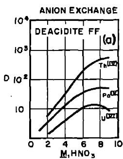

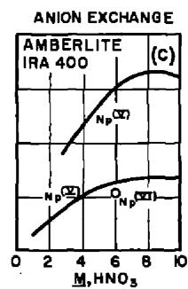

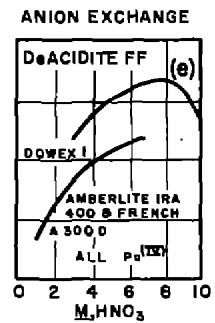

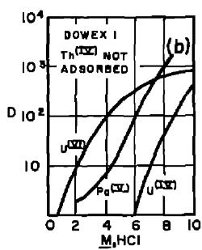

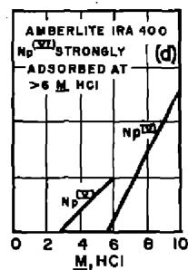

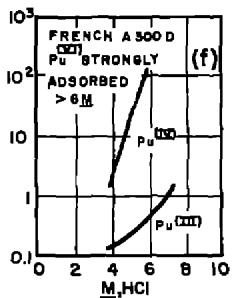  
Fig. 53. Equilibrium distribution coefficients for actinides on various strong base anion exchangers.162

Individual references:

a) Pa; Hardy et al. 163   
Th and U; Carswell 80   
b) Kraus and Nelson 240

c,d) Ward and Welch (unpublished data)

e) De-acidite FF; Phillips and Jenkins 319   
Dowex 1; Aiken23

Amberlite 1 RA 400 and French A 300 D; Prevot et al. 325

f) Prevot et al. 325

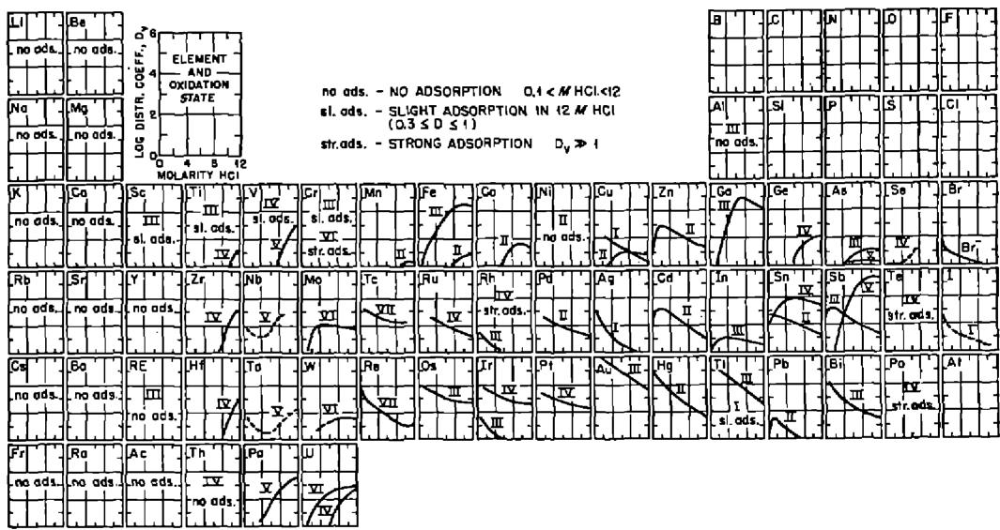  
Fig. 54. Adsorption of the elements from hydrochloric acid solution by Dowex 1.[240]

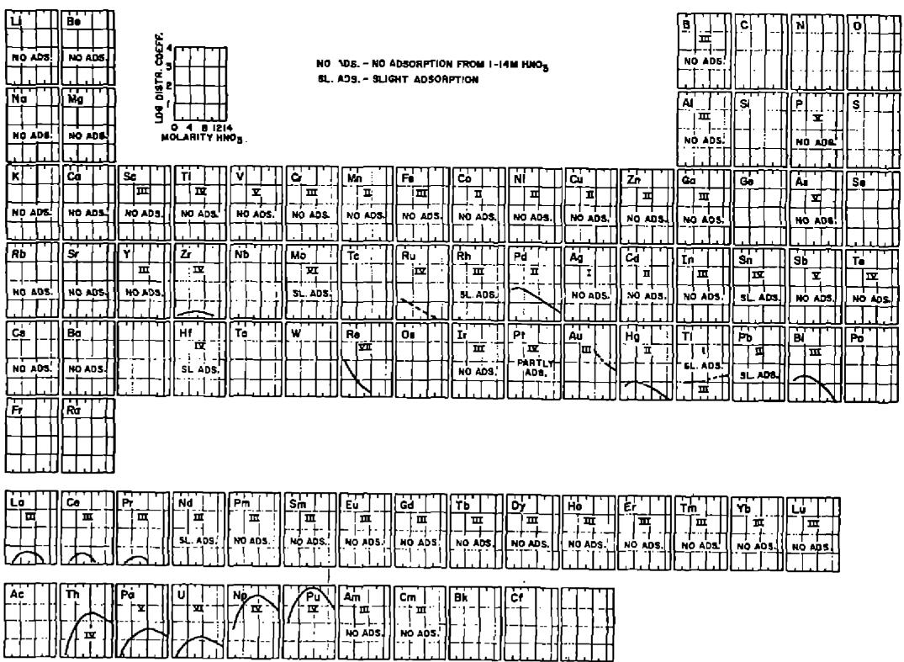  
Fig. 55. Removal of elements from solution in 1 M nitric acid with strongly basic anion-exchange resin.127

methods have been incorporated in sequential separation schemes for Pu and many other elements. 108,432,433,434 Np and Pu have been separated by reduction of the Pu with $\mathrm{NH}_4\mathrm{I}$ before adsorption on the resin. 204

The removal of macro amounts of Pu before analysis of other elements is commonly done by anion exchange either from $\mathrm{HNO}_3$ or HCl solutions 280, 405, 319, 55 for example.

The separation of Pu from U by adsorption of U(VI) on anion exchange resin in $60\%$ ethanol which is $2\textbf{M}$ in HCl has been reported. 298 Pu is reduced to Pu(III) with hydroxylamine and is not adsorbed in this form. The advantage of this system over a pure aqueous one is low shrinkage of the resin and rapid adsorption and desorption of the U(VI).

In the nitrate system Pu is usually adsorbed from 6 to $8\mathrm{M}$ $\mathrm{HNO}_3$ because the distribution coefficient decreases above this concentration and because resin degradation becomes a problem at high acid concentrations. The applications are either to separate Pu, or to separate other materials from Pu.

Roberts and Brauer 333 separate Am, Pu, and Np by adsorbing the Pu and Np from $8\underline{\mathbf{M}}\underline{\mathbf{HNO}}_3$ , eluting the Pu with $0.02\underline{\mathbf{M}}$ ferrous sulfamate, and finally eluting Np by oxidation with Ce(IV) sulfate in $0.25\underline{\mathbf{M}}\underline{\mathbf{HNO}}_3$ . In another method, Th is included in the separation scheme by adsorption of Th(IV), Pu(IV) and Np from $8\underline{\mathbf{M}}\underline{\mathbf{HNO}}_3$ , elution of the Th by $12\underline{\mathbf{M}}\underline{\mathbf{HCl}}$ , of Pu by $12\underline{\mathbf{M}}\underline{\mathbf{HCl}} - 0.1\underline{\mathbf{M}}\underline{\mathbf{NH}}_4\mathbf{I}$ , and of Np by $4\underline{\mathbf{M}}\underline{\mathbf{HCl}}$ . These authors report a clean separation with greater than $95\%$ yields by both methods.

Buchanan et al. 66 report separations of U, Mo, Ce, and Zr from Pu by anion exchange methods in analysis of Pu-"fissium" binary alloys for these elements.

Other eluting agents for Pu adsorbed on anion exchange resin in the nitrate system are hydroxylamine 159, 419, 319, 189 and 0.36 M HC1 - 0.01 M HF. 243

Kressin and Waterbury $^{243}$ used a "slurry-column" technique for the rapid separation of Pu from other ions. The $7\textbf{M}$ $\text{HNO}_3$ solution of the ions is slurried with about half of the resin to adsorb the bulk of the Pu before placing in a column containing the other half of the resin. The solution can then be run through the column at a more rapid rate without Pu breakthrough, because most of the Pu is already adsorbed. These authors used a low cross-linked resin (Dowex $1\times 2$ ) to speed the kinetics of the adsorption reaction. They report greater than $99.9\%$ recovery of the Pu by this technique when mixed with substantial quantities of over 40 elements. The Pu is desorbed with an HCl-HF mixture, again to speed the elution.

Anion exchange from $\mathrm{HNO}_3$ solutions is used as a unit process in a number of large scale processes of different types. Among these are: (1) the concentration and purification of Pu following a solvent extraction separation; 338, 339, 340, 325, 255 (2) the recovery of Pu metal scrap; 336, 331 and (3) the main separation step from fission products. 23, 57 The separation of Pu and Th in HCl solutions has also been described. 207

Anion exchange methods have been used in several procedures for the determination of Pu in biological material, 33, 404 especially urine. 205, 74, 254, 421

Toribara et al. $^{403}$ used a liquid scintillation technique for counting Pu from biological materials. The counting was done by a single-phase mixture of sample in aqueous solutions, absolute alcohol, and liquid scintillator.

# Electrolytic Separation Methods

Separation methods based on electrolysis have been used for radiochemical applications, but are not common because of the relative complexity of the method. In very early work, Cook<sup>101</sup> found that Pu could not be separated from Np and U by electrodeposition from acetate solutions at pH 6-7. However, Samartseva<sup>344</sup> found that U, Pu, and Np could be separated by electrolysis from nitric acid solutions by varying the pH. His results are shown in Fig. 56 as a plot of % yield vs pH for the stated conditions. Optimum conditions for the separation are stated as (1) current density 750-1000 ma/cm<sup>2</sup>, (2) plating time 2 to 3 hours, and (3) solution volume 20 to 40 ml.

Samartseva also found that electrolytic separation of Pu was successful against many competing ions in concentrations up to $0.5\mathrm{mg / ml}$ . Among the ions tested were Fe, Al, La, Ba, Cr, Mn, Ca, Mg, Bk, and Na. Of these only Fe interfered with the separation to an appreciable extent. Oxalic acid at $0.002\mathrm{M}$ concentration was added to complex the Fe.

On the other hand, Sinitsyna et al.384 found that the deposition of U and Pu was strongly dependent on pH and current density, but that quantitative separations could not be achieved at any pH from nitric acid solutions and acetate buffers.

Rein et al.329 separated Pu from Cr, Co, Ni, Fe, Pb, Mn, Sn, and Zn by deposition of these elements on a Hg cathode from 1 N HCl. Porter321 found that Pu metal could be deposited on a mercury cathode from an organic solution, and determined that dimethyl sulfoxide solution saturated with the metal chloride was the best solvent among those investigated.322

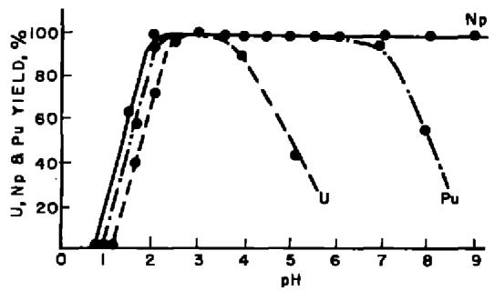  
Fig. 56. Relation of element yield to solution pH. The current density on the cathode was $100\mathrm{mA/cm}^2$ and the electrolysis time, 2 hr. The solution was nitric acid. $^{344}$

Clanet et al. separated U(VI), Pu(IV), Am(III), and Cm(III) by paper electrophoresis using $10\underline{\mathbf{M}}\underline{\mathbf{HNO}_3}$ as the electrolyte. A plot of a radioactivity scan of their "electrophoretogram" is shown in Fig. 57, which gives the experimental conditions. U(VI) would lie between $\mathrm{Pu(IV)}$ and Am(III) in this plot, according to the measured mobilities in this system.

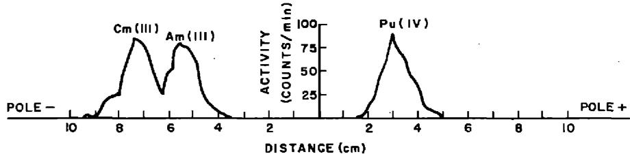  
Fig. 57. Separation of Pu(IV)-Am(III)-Cm(III).<sup>91</sup> Electrolyte: 10 NHNO<sub>3</sub>. Support: "Millipore" HAWP paper. Development voltage: 250 volts. Time: 6 hours.

# V. DISSOLUTION OF PLUTONIUM SAMPLES FOR ANALYSIS

# A. Metallic Plutonium

Plutonium metal dissolves in HCl and other halogen acids, but not in $\mathsf{HNO}_3$ or concentrated $\mathsf{H}_2\mathsf{SO}_4$ . Dilute $\mathsf{H}_2\mathsf{SO}_4$ attacks Pu slowly. The addition of HF to $\mathsf{HNO}_3$ renders Pu soluble. Sulfamic acid has been used to dissolve Pu metal. 210

Pu-Al alloys can be dissolved in $6\underline{\underline{\mathbf{M}}}\underline{\underline{\mathbf{HNO}}}_3 - 0.05\underline{\underline{\mathbf{M}}}\underline{\underline{\mathbf{Hg}(\mathbf{NO}_3)_2}} - 0.02\underline{\underline{\mathbf{M}}}\underline{\underline{\mathbf{HF}}}$ , as well as HCl and $\mathrm{HClO_4}$ . An alternative method is to dissolve the Al in a solution of $\mathrm{NaOH - NaNO_3}$ . The Pu and other actinide elements can then be dissolved in boiling $\mathrm{HNO}_3$ or HCl after filtration. $^{317,166}$

# B. Other Compounds

$\mathsf{PuO}_2$ if ignited, dissolves only with great difficulty in the usual acids. Boiling with concentrated nitric acid plus $0.005 \underline{\mathbb{M}} \mathbb{H}^{\mathfrak{r}}$ ,<sup>445,328</sup> with $85 - 100\%$ $\mathsf{H}_3\mathsf{PO}_4$ at $200^\circ$ or with $5 - 6 \underline{\mathbb{M}} \mathbb{H}^{\mathfrak{r}}$ <sup>451</sup> have been recommended methods. Another method is fusion with ammonium bifluoride, followed by treatment with aqueous aluminum nitrate or acid.<sup>107,62</sup> Ignited Pu oxalates and fluorides have been dissolved by fusion with potassium bisulfate, dissolving the residue in water to precipitate $\mathsf{Pu(OH)}_4$ , and finally dissolving the hydroxide.<sup>263</sup> The sealed tube method of Wichers et al.<sup>453</sup> has been used to dissolve Pu-containing samples.<sup>454</sup>

# C. Biological and Environmental Samples

The Pu in these samples ranges from readily soluble in the case of metabolized plutonium in excreted samples, to extremely refractory in the case of fallout samples. Nielsen and Beasley<sup>303</sup> describe methods for dissolving various biological samples. Most procedures for dissolving fallout or other environmental samples involve treatment with HF or a basic fusion step which renders the Pu soluble in acids.

# VI. SOURCE PREPARATION AND COUNTING METHODS

# A. Source Preparation

A universal problem in Pu radiochemistry is the preparation of sources suitable for counting. Owing to the short range of alpha particles in matter, the thickness of foreign material on the counting sample is limited to approximately one $\mathrm{mg/cm}^2$ for counting without serious loss. The requirements are much more severe if the ratios of alpha-emitting isotopes are to be determined by energy analysis. This is so because an alpha particle will be degraded in energy by interaction with the surrounding medium, and the resulting pulse height distribution will be smeared out.

Most of the methods used for preparing alpha counting sources in use today were developed in the Manhattan Project. Jaffey $^{206}$ and Hufford and Scott $^{189}$ summarize the project experience. Source mounting techniques are, in general, a trade-off of quantitativeity on the one hand with thinness on the other. In assay work it is very important to be quantitative but not so important to have a "thin" sample. On the other

hand, for the separation of alpha particle energies by energy analysis the thinness of the source is paramount, while quantitativity is not required, at least in the case of isotopic dilution analytical methods.

Table VI-30 is a summary of the project method for alpha source preparation. The reviews mentioned above are the primary source of this information and should be consulted for more detail and literature references. Other general reviews may be consulted for a discussion of the problem of mounting thin sources.[212,386,307]

Two of the most widely used methods for preparation of alpha sources on a metal backing for counting or spectroscopy are (1) direct evaporation of an aqueous or organic solution and (2) electrodeposition. Other methods, such as volatilization of the sample in a vacuum, adsorption from an aqueous solution, are not so widely used. However, the method of vacuum "flashing" from a tungsten filament produces very satisfactory sources and is in routine use in some laboratories. (See for example Procedure 4 in Sect. VIII.)

# A.1 Direct Evaporation

This method has the advantage of speed and simplicity and the disadvantage of tending to concentrate any mass present in the solution to produce local thick areas. The classic "LaF<sub>3</sub>" method for the determination of Pu utilizes direct evaporation of a slurry of LaF<sub>3</sub>-Pu, followed by alpha counting to determine the Pu<sup>446</sup> (Procedure 1 in Sect. VIII). In general, the method is satisfactory if only total alpha counting is to be done. However, in methods which depend on alpha energy analysis, direct evaporation of even a "carrier free" solution will not be completely satisfactory. The reason for this failure lies in the above mentioned concentration effect to produce an effectively "thick" plate. The great advantage of other methods in this regard is that the Pu and impurities in the solution to be plated are spread evenly over the entire area of the plate.

Tuck<sup>406</sup> describes a method for evaporating organic solutions of alpha-emitting materials by heating only the edge of a circular plate, thus confining the liquid to the center. The same principle was used by Westrum<sup>426</sup> to evaporate sulfuric acid solutions.

# A. 2 Electrodeposition

This method has the advantage of producing thin uniform plates suitable for energy analysis of the alpha particles, and the disadvantage of requiring a relatively complex apparatus and relatively greater effort. The time to produce one sample can be as much as two hours.

$\mathrm{Ko}^{233}$ gives specific conditions for electrodeposition of the actinides from Th to Cm. He chose a buffered solution of formic, perchloric or sulfuric acid and ammonium formate and achieved high yields for up to $100\mu \mathrm{g}$ of Pu at current densities of 100-300 mA/cm². The deposition of all these elements occurs as a precipitation reaction at the cathode. In the case of Pu, the compound precipitated is $\mathrm{Pu(OH)}_4$ (hydrated). Moore and Smith also used an acid solution of ammonium oxalate to electrodeposit Pu. Mitchell gives a rapid method for electroplating trace quantities of actinides from HCl-ammonium chloride solutions. He gets essentially quantitative deposition in 15 minutes from a 0.1-0.2 g/ml chloride solution at pH about 1 using a current density of 1 A/cm².

TABLE VI-30. Source Preparation Methods for Alpha Radioactivity Measurements(a)   

<table><tr><td>Method and Principle</td><td>Applications</td><td>Advantages</td><td>Disadvantages</td></tr><tr><td rowspan="2">1. Normal Evaporation - Placing solution on a suitable backing, usually Pt, and evaporation under a heat lamp, and igniting. Solution may be pipetted quantitatively if desired.</td><td>1. Preparation of sources for alpha counting from aqueous solution.</td><td>1. Rapid, convenient, quantitative.</td><td>1. Sample not uniformly spread if &gt;25 μg of material. May cause error due to self adsorption.</td></tr><tr><td>2. Preparation of sources for alpha counting from organic solution.</td><td>2. Easier to get uniform spreading. Organic may not have refractory impurities.</td><td>2. Same as 1 + more difficult to prevent loss over edge of plate. May require edge heating or stippling small volume at a time.</td></tr><tr><td>2. Slurry Transfer of Carrier Salts - Co-precipitation with suitable salt, transfer to plate, spread, evaporate and ignite.</td><td>Volume reduction for cases where solvent extraction or ion exchange methods are not applicable.</td><td>Relatively fast, easy method.</td><td>Co-precipitation and transfer may not be quantitative. Requires at least 0.3 mg of carrier. Self absorption losses may be serious.</td></tr><tr><td>3. Electrodeposition - Electrolytic reduction of plutonium at a platinum cathode.</td><td>Preparation of sources for energy analysis.</td><td>Very thin, uniform films are attainable. Method can be made quantitative.</td><td>Requires special preparation of solution, requires relatively long time to prepare 1 sample.</td></tr><tr><td>4. Low Temperature Sublimation in Vacuum - Prepare volatile compound, place in low temperature oven in vacuum, collect vapor on suitable cold plate. The volatile compound is rendered non-volatile and the organic material destroyed by ignition.</td><td>Preparation of extremely thin sources for highest resolution alpha energy analysis.</td><td>Excellent sources - any kind of backing may be used.</td><td>Only a small fraction of sample collected. Volatile compounds are difficult to handle and constitute a health hazard. Not a routine method.</td></tr><tr><td>5. High Temperature Sublimation in Vacuum - Place material in oven with suitable orifice, evacuate and volatilize at high temperature. Collect on a cold plate. The oven may be a dimpled W or Ta strip heated by rcsistance heating. In this case the plate need not be cooled.</td><td>Preparation of high quality thin samples for alpha energy measurements.</td><td>Very good sources obtainable. Resistance heated strip method applicable to routine isotopic dilution analysis.</td><td>Not quantitative, however under favorable conditions ~90% yield can be obtained. Yield is usually about 50%. The apparatus is relatively large and expensive.</td></tr></table>

(a) Compiled from References 206 and 189.

Miller and Brouns<sup>276</sup> give a detailed procedure for electrodeposition of $\mathsf{Pu}(\mathsf{VI})$ from 1-2 N KOH solution. The $\mathsf{Pu}$ was oxidized with ozone. This method has the disadvantage that all elements which precipitate in basic solution interfere with the deposition.

# A. 3 Other Methods

El Guebely and Sikkeland<sup>122</sup> report an interesting method for preparation of extremely thin $\mathbf{Pu}$ sources. The basis of the method is adsorption of $\mathbf{Pu}(\mathbf{IV})$ onto glass or metal plates from dilute ( $\sim 0.01 \underline{\mathbf{M}}$ ) HCl solutions, presumably as the polymeric form. The method is not quantitative. Samartseva<sup>347</sup> reports that adsorption of $\mathbf{Pu}(\mathbf{IV})$ is 97-98% complete on $\mathbf{Pt}$ from $10^{-1}$ to $10^{-3} \underline{\mathbf{M}} \mathbf{HNO}_3$ solutions.

Carswell and Milstead<sup>81</sup> made thin sources of U and Pu by electrostatically focussing a jet of the material to be plated which was dissolved in a volatile solvent.

# B. Counting

The subject of the determination of the amount of alpha radioactivity has been reviewed by Jaffey $^{206}$ and recently by Johnson et al., $^{213}$ and Hanna. $^{160}$ These accounts should be consulted for details of the various detection systems and literature references. Table VI-31 lists the major types of counting systems with applications, advantages, and disadvantages of each.

The ratios of the isotopes of Pu can be determined by making use of the difference in the energies of the alpha particles in alpha pulse analysis.

The isotope $\mathbf{Pu}^{236}$ is very useful as a tracer in this method. This isotope is prepared by the reaction

$$
U ^ {2 3 5} (d, n) N p ^ {2 3 6} \xrightarrow {\beta^ {-}} P u ^ {2 3 6},
$$

using highly enriched $\mathbf{U}^{235}$ to make the $\mathbf{Pu}^{236}$ as pure as possible. Since $\mathbf{Pu}^{236}$ is not made by any neutron reaction on U, an unspiked sample need not be run if the $\mathbf{Pu}^{236}$ is isotopically pure. Since the alpha energy $\mathbf{Pu}^{236}$ is higher than that of the other commonly occurring isotopes ( $\mathbf{Pu}^{239}$ , $\mathbf{Pu}^{240}$ , and $\mathbf{Pu}^{238}$ ), care must be taken that the added $\mathbf{Pu}^{236}$ activity is not very much greater than the activity of the other Pu isotopes. The reason for this precaution is that imperfections in the sample and detecting instrument always result in low-energy alpha particles which appear as a continuum or low energy "tail" in the spectrum. The subtraction of this tail becomes difficult if higher energy isotope predominates.

# C. Other Methods

Another isotopic dilution method uses the rare isotope $\mathbf{Pu}^{242}$ as the tracer and a mass spectrometer as the detecting instrument. Highly enriched $\mathbf{Pu}^{242}$ is a product of long reactor irradiations of $\mathbf{Pu}^{239}$ .

A determination of the $\mathbf{Pu}^{239}$ - $\mathbf{Pu}^{240}$ isotopic ratio must be made if the specific activity of a particular sample is needed. This determination must be made by means of a mass spectrometer since the alpha particle energy of these 2 isotopes is the same.

Schwendimann and Healy<sup>360</sup> have described a nuclear emulsion technique for low-level Pu analysis. Nielsen and Beasley<sup>303</sup> have reviewed the radiochemical determination of Pu in biological materials and include a critical comparison of various counting systems.

TABLE VI-31. Techniques for Measuring Alpha Radioactivity.   

<table><tr><td>Method</td><td>Application</td><td>Advantages</td><td>Disadvantages</td></tr><tr><td>A. Total Alpha Activity</td><td></td><td></td><td></td></tr><tr><td>1. Air ionization chamber</td><td>Total assay - survey instruments.</td><td>Simple, easily repaired and cleaned, reliable, inexpensive.</td><td>Long decay time of pulse makes inherently wide pulses - limited to low counting rates. Low tolerance to β activity.</td></tr><tr><td>2. Free-electron-gas ionization chamber (A, A-CO2, He, N2, etc.)</td><td>Total assay.</td><td>Sharp pulses permit high count rates and tolerance to β activity. Not micro-phonic. Reliable and stable. A known relatively unchanging geometry.</td><td>Signal-to-noise inferior to proportional counters, therefore more prone to spurious counts. Must be corrected for low-angle back scattering.</td></tr><tr><td>3. Alpha proportional counter</td><td>Total assay.</td><td>High signal-to-noise ratio, good β discrimination. Not at all microphonic.</td><td>Count rate sensitive to applied voltage. Requires pure gas for stability. Difficult to maintain stability for long periods.</td></tr><tr><td>4. Scintillation alpha counter</td><td>Total assay.</td><td>Very low background.</td><td>Lower tolerance to β radiation than ionization chamber or proportional counter. Greater sensitivity to sample size, and position.</td></tr><tr><td>5. Low-geometry counters</td><td>Total assay.</td><td>Can count sources of greater activity. Count-ing rate not so sensitive to sample thickness. Reproducable and reliable. No low-angle back scattering correction.</td><td>Not suitable for low activity. Sensitivity to sample position and area.</td></tr><tr><td>6. Nuclear Emulsions</td><td>Total assay.</td><td>Great sensitivity and stability. Very simple apparatus.</td><td>Limited accuracy, considerable technique required in exposing and developing emulsions. Counting tracks is time consuming and tedious.</td></tr></table>

TABLE VI-31. Techniques for Measuring Alpha Radioactivity (Cont'd)   

<table><tr><td>Method</td><td>Application</td><td>Advantages</td><td>Disadvantages</td></tr><tr><td colspan="4">B. Alpha Energy Measurement</td></tr><tr><td>1. Magnetic deflection alpha spectrometer</td><td>Energy measurement - mainly for determination of energy spectrum.</td><td>Very high precision and accuracy.</td><td>Large, expensive equipment. Requires photo-graphic technique for recording data. Count-ing tracks is tedious and time-consuming. Very low geometry. Thin sample required.</td></tr><tr><td>2. Total ionization and pulse analysis, Frisch grid ionization chamber</td><td>Energy measurement - determination of isotope ratios.</td><td>Convenient, easy to use. High geometry - up to 50%. Tolerates large area sources. Resolution can be improved by collima-tion.</td><td>Requires gas purification.</td></tr><tr><td>3. Semiconductor charged particle detector</td><td>Energy measurement - isotope ratios.</td><td>Very convenient - capable of high resolution.</td><td>Requires low geometry for high resolution. Detector may become irreversibly contaminated by volatile radioactivity.</td></tr></table>

Solvent extraction of Pu into a liquid scintillator has been proposed as a method to eliminate source preparation in radiochemical procedures.[135, 403] The determination of the $\beta$ activity of Pu[241] in low-level biological samples by this method has been reported.[256]

The incorporation of a scintillator in the polymerization of an ion-exchange resin has been reported<sup>172</sup> (see page 81 for details).

Scintillation counting of the weak 0.4 MeV gamma-ray in Pu $^{239}$ by NaI detectors has been used to monitor the concentration of Pu in process streams. $^{123}$

# VII. SAFETY CONSIDERATIONS

Hazards to personnel who work with Pu in the laboratory arise primarily from two causes. First, Pu is extremely poisonous because of its high specific alpha activity, long biological half-life, and tendency to concentrate in the bone. Second, inadvertent criticality may occur. A full discussion of these hazards is beyond the scope of this review, but some general comments concerning precautions and techniques can be made. The subject of personnel monitoring and radiation surveying has been treated by Morgan.291 Appleton and Dunster32 have written a manual on the safe handling of Pu.

# A. Radioactive Safety

The primary hazard is due to the possibility of ingestion, since the alpha particles are easily shielded and the gamma radiation associated with the common long-lived isotopes is slight. The hazard is better stated in terms of the activity level rather than the mass, since the biological damage is done by the alpha radioactivity and the isotopic composition of Pu varies widely. Table VII-32 lists body burdens and maximum permissible concentrations (MPC) of Pu isotopes for continuous occupational exposure. These data are taken from the National Bureau of Standards Handbook 69, which should be consulted for details.

TABLE VII-32. Health Hazard Data for Plutonium Isotopes.   

<table><tr><td>Isotope</td><td>Maximum Permissible Body Burden in Bone (microcuries)</td><td colspan="2">Maximum Permissible Concentration for 40-hour week (microcuries/cc)</td></tr><tr><td></td><td></td><td>Water</td><td>Air</td></tr><tr><td>Pu238soluble</td><td>0.04</td><td>10-4</td><td>2 × 10-12</td></tr><tr><td>Pu239, Pu240, Pu242insoluble</td><td>—</td><td>8 × 10-4(a)</td><td>3 × 10-11(b)</td></tr><tr><td>Pu241soluble</td><td>0.9</td><td>7 × 10-3</td><td>9 × 10-11</td></tr><tr><td>insoluble</td><td>—</td><td>0.04(a)</td><td>4 × 10-8(b)</td></tr></table>

(a) Assuming the gastro-intestinal tract to be the critical organ.   
(b) Assuming the lung to be the critical organ

The most common control practice is total containment of high activities of alpha-emitting isotopes by means of an enclosure which is maintained at a negative air pressure with respect to the laboratory atmosphere. Operations are done either with remote manipulators or with arm length gloves sealed to the enclosure.

In an intermediate or high-level alpha activity laboratory, a variety of auxiliary equipment and practices in addition to the primary enclosure of the activity, are necessary to insure personnel safety. Among these are:

1. Adequate monitoring of the accidental release or "spilling" of radioactivity. This monitoring can be done by hand-held survey instruments, by continuous filtering and monitoring of the laboratory air, and by personnel monitoring instruments placed at exits to the working area.   
2. Protective devices and clothing. In most high-level radiochemical laboratories, special clothing is part of the laboratory practice. The availability of respirators to prevent inhalation of airborne radioactivity in the event of a spill is essential.   
3. Procedures for normal operation of the laboratory as well as emergency procedures must be worked out in advance and understood by all personnel. "Good housekeeping," or the maintenance of a clean and orderly work space, should be especially emphasized.

The kind, amount, and distribution of protective devices, as well as laboratory practices for normal and emergency operation, vary considerably in detail from laboratory to laboratory. This very brief introduction to the subject of the handling and manipulation of large amounts of alpha activity is intended to serve mainly as a warning to the uninitiated. The subject of enclosures for radioactive materials is treated fully in a review by Garden and Nielsen.[142]

Low activity can, of course, be handled in an ordinary radiochemical laboratory. The limit beyond which total containment becomes a necessity is not very well defined. The concentration of the alpha-active material, as well as the nature of the operation and the skill and care of the operator, are factors which must be considered. At the level of one microcurie, ordinary laboratory procedures can be done if reasonable care is taken, while at higher levels the operations become more and more limited. At the millicurie level total containment becomes necessary for any chemical operation. In any case, proper monitoring of the activity is essential.

# B. Criticality Safety

This hazard is most generally met in the radiochemistry laboratory by only permitting an "always safe" amount of Pu in any room or area. This is an amount which will not be a critical mass in any configuration or dispersed in any medium. While the determination of the always-safe amount in a particular situation is beyond the scope of this review, Table 32 gives basic data for $\mathbf{Pu}^{239}$ . This table was extracted from the USAEC Publication "Nuclear Safety Guide" $444$ which may be consulted for further information on this subject.

TABLE VII-33. Basic Data for Criticality Hazard for Plutonium-239.   

<table><tr><td rowspan="2">Form of Isotope</td><td colspan="2">Mass of Isotope (kg) which is maximum</td></tr><tr><td>Recommended for Safety</td><td>Minimum Critical</td></tr><tr><td>Metal, α phase(a)</td><td>2.6</td><td>5.6</td></tr><tr><td>Metal, δ phase(a)</td><td>3.5</td><td>7.6</td></tr><tr><td>Solution</td><td>0.22</td><td>0.51</td></tr></table>

(a) The metal is assumed to be surrounded by a thick hydrogenous layer.

# A. Introduction

The literature of Pu is replate with radiochemical and analytical separation procedures. A survey disclosed 54 papers with procedures which were written in enough detail to do justice to the name, and many more methods which could easily be developed into procedures by making the directions quantitative or more complete. Of the 54, 26 survived screening and are included in this collection. The basic criteria for screening were fourfold: (1) distinctiveness in chemistry, (2) completeness in detailed instructions, (3) generality in application, and (4) utility. In some cases a rather arbitrary choice had to be made between procedures which met these criteria equally well.

The procedures are divided into (1) general radiochemical procedures, (2) special purpose separation procedures, and (3) urinalysis procedures.

The procedures in the first group are concerned with purifying Pu from other alpha emitters and from fission products sufficiently for the purpose at hand, usually for alpha counting or alpha pulse analysis. The starting materials range from reactor target dissolver solutions of varying ages to fresh samples of nuclear explosion debris to very dilute environmental samples. There are 13 of these procedures included.

The second group of procedures is concerned with a specific separation involving Pu. Two examples are the separation of Np and Pu and the removal of Pu before analysis for impurities in Pu metal.

Urinalysis is a separate category, primarily because there are so many procedures in the literature, all purporting to do the same thing. The chemistry after the initial separation step is, of course, similar to that in the other categories. The urinalysis procedures included were chosen primarily for distinctiveness of chemistry.

# B. Listing of Contents

General Radiochemical Procedures   

<table><tr><td>Procedure No.</td><td>Author (principal)</td><td>Title or method</td><td>Page</td></tr><tr><td>1.</td><td>Welch</td><td>Determination of Pu when large amounts of Fe and Cr are present (LaF3 method)</td><td>108</td></tr><tr><td>2.</td><td>Moore</td><td>Separation and determination of Pu by TTA extraction</td><td>112</td></tr><tr><td>3.</td><td>Maeck</td><td>Separation and determination of Pu in U-fission product mixtures (extraction of quaternary alkylammonium-plutonyl nitrate complex into hexone-TTA extraction</td><td>114</td></tr><tr><td>4.</td><td>Morrow</td><td>Plutonium (anion exchange)</td><td>116</td></tr><tr><td>5.</td><td>Hoffman</td><td>Plutonium (anion exchange)</td><td>118</td></tr><tr><td>6.</td><td>Hart</td><td>Separation and determination of Pu from U and fission products in irradiated reactor targets (anion exchange - TBP extraction)</td><td>122</td></tr><tr><td>7.</td><td>(No author)</td><td>Pu (CeF4-LaF3cycle, TBP extraction, anion exchange)</td><td>124</td></tr><tr><td>8.</td><td>Rider</td><td>U and Pu determination in highly irradiated fuel. (Hexone extraction, TTA extraction)</td><td>126</td></tr><tr><td>9a.</td><td>Lingjaerde</td><td>Pu from irradiated U (cation exchange, anion exchange)</td><td>129</td></tr><tr><td>9b.</td><td>Rydberg</td><td>Separation of Pu from U and fission products (BiPO4 precipitation, TTA extraction)</td><td>131</td></tr><tr><td>10.</td><td>Rydberg</td><td>Separation of Pu from U and fission products (adsorption of Zr-Nb on silica gel, preciditation of CuS, TTA extraction)</td><td>132</td></tr><tr><td>11.</td><td>Geiger</td><td>U and Pu from environmental samples of soil, vegetation and water (TBP extraction)</td><td>134</td></tr><tr><td>12.</td><td>Sheidhauer</td><td>Pu from environmental water samples (chemisorption on CaF2, TTA extraction)</td><td>137</td></tr><tr><td>13.</td><td>Kooi</td><td>Pu from environmental water samples (BiPO4 precipitation, co-extraction with ferric cupferride)</td><td>140</td></tr><tr><td colspan="4">Special Procedures</td></tr><tr><td>14.</td><td>Larsen</td><td>Separation and spectrophotometeric determination of Pu from U-Pu-fission element alloys (TBP extraction from HCl solution)</td><td>142</td></tr><tr><td>15.</td><td>Trowell</td><td>Separation of Pu before spectrographic analysis of impurities in Pu metal (anion exchange</td><td>144</td></tr><tr><td>16.</td><td>Trowell</td><td>Separation of Pu before spectrographic analysis of impurities in high purity Pu metal (extraction chromatography using TBP)</td><td>148</td></tr><tr><td>17.</td><td>Jackson</td><td>Separation of Np and Pu by anion exchange</td><td>149</td></tr><tr><td>18.</td><td>Zagrai</td><td>Separation of Np and Pu by cation exchange chromatography</td><td>150</td></tr><tr><td colspan="4">Urinalysis Procedures</td></tr><tr><td>19.</td><td>Brooks</td><td>Determination of Pu in urine (ferric cupferride extraction)</td><td>153</td></tr><tr><td>20.</td><td>Perkins</td><td>Determination of Pu in urine (PrF3precipitation, TTA extraction)</td><td>155</td></tr><tr><td>21.</td><td>Everett</td><td>Determination of Pu in urine (LaF3 precipitation, TTA extraction)</td><td>158</td></tr><tr><td>22.</td><td>Bokowski</td><td>Determination of Am in urine in the presence of Pu (BiPO4 precipitation, LaF3 precipitation extraction of Pu into di-(2-ethylhexyl) phosphoric acid</td><td>161</td></tr><tr><td>23.</td><td>Campbell</td><td>Determination of Pu in urine (alkaline earth phosphate precipitation, anion exchange</td><td>164</td></tr><tr><td>24.</td><td>Weiss</td><td>Determination of Pu in urine (co-crystal-lization with potassium rhodizonate, LaF3 precipitation, anion exchange)</td><td>166</td></tr><tr><td>25.</td><td>Bruenger</td><td>Determination of Pu in urine and bone ash (extraction by primary amines from H2SO4 solution)</td><td></td></tr></table>

Procedure 1. Determination of Pu in solutions containing large amounts of Fe and Cr. G. A. Welch et al. (Ref. 446).

# Outline of Method

Hydroxylamine is added to the sample to reduce plutonium and chromium to the trivalent state. The acidity of the solution is adjusted and lanthanum nitrate carrier added. Lanthanum fluoride is precipitated by adding a limited amount of ammonium fluoride and carries the plutonium with it. By strictly controlling the amount of fluoride added the precipitation of iron and chromium is prevented. The precipitate is separated by centrifuging, washed and mounted on a flat stainless-steel counting tray, and the $\alpha$ -activity measured with a scintillation counter calibrated against standard sources.

# Reagents

All reagents are analytical reagent quality where available.   
1. Ammonium hydroxide, 9M   
2. Nitric acid, 2M   
3. Hydroxylamine hydrochloride, $5\%$ w/v   
4. Lanthanum nitrate solution, 5 mg La/ml. Dissolve $7 \cdot 8$ g of lanthanum hyxahydrate in 500 ml of distilled water.   
5. Ammonium fluoride solution, $12 \cdot 5\%$ w/v Store in a polythene bottle.   
6. Cellulose lacquer. Dilute "ZAPON" lacquer with amyl acetate.   
7. Standard Pu solution, $0 \cdot 5 \mu \mathrm{g} / \mathrm{ml}$ . Dilute a solution of known Pu concentration. The exact Pu concentration of the diluted solution need not be known, but the isotopic constitution should be essentially the same as that of the samples requiring analysis.

# Equipment

1. $\alpha$ -scintillation equipment.

Type 1093A or B scintillation unit with associated equipment.

2. Counting trays.

Stainless steel, flat, mirror finish, 1-1/16 in. diameter.

Prepare for use by heating in a flame until the surface is straw coloured. Allow to cool and paint a ring of cellulose lacquer round the edge. Allow the lacquer to dry and store the prepared trays in a closed container.

# Procedure

1. Transfer a suitable portion of the sample to a 3 ml glass centrifuge tube. Wash out the pipette with $2\underline{\mathsf{M}}$ nitric acid and add the washings to the tube. [Note (a)].

2. Add $0 \cdot 15 \, \text{ml}$ (3 drops) of hydroxylamine hydrochloride solution and stir well. [Note (b)].   
3. Add $9\underline{M}$ ammonia solution until a faint permanent precipitate is formed.   
4. Add $2\underline{\mathbf{M}}$ nitric acid until the precipitate just redissolves, then add $0 \cdot 1 \mathrm{ml}$ (2 drops) in excess.   
5. Add $0 \cdot 1 \, \text{ml}$ (2 drops) of lanthanum nitrate solution ( $5 \, \text{mg} \, \text{La/ml}$ ), dilute the solution to about $2 \, \text{ml}$ and stir well.   
6. Add 0·15 (3 drops) of $12 \cdot 5\%$ ammonium fluoride solution, stir well and centrifuge for 10 min.   
7. Remove the supernatant liquor [Note (c)] with a transfer pipette [Note (d)] and wash the precipitate twice by stirring with a mixture of $1\mathrm{ml}$ of water, $0\cdot 1\mathrm{ml}$ of $2\mathrm{M}$ nitric acid and $0\cdot 25\mathrm{ml}$ of ammonium fluoride solution. After each wash, centrifuge for 5 min before removing the supernatant liquor.   
8. Slurry the precipitate with 2 drops of water and transfer it to a prepared counting tray with a transfer pipette. Do not allow the slurry to enter the wider part of the tube. [Note (e)].   
9. Wash the centrifuge tube with 5-10 drops of distilled water and transfer the washings and the residual precipitate to the counting tray. Spread the slurry evenly over the tray within the cellulose lacquer ring and break up agglomerations of solid matter with additional drops of water where necessary.   
10. Dry the slurry beneath a radiant heater and ignite the counting tray in a flame to a dull red heat to drive off excess ammonium fluoride and burn off the "ZAPON" ring. Allow to cool.   
11. Measure the activity on the counting tray using stable $\alpha$ -scintillation equipment [Note (f)].   
12. Using a clean counting tray, measure the background of the equipment and correct the counting rate of the sample source for background. [Note (g)].   
13. Calculate the concentration of Pu in the sample solution from the relation Pu (dpm/ml) = 100 Ce₁/EE₂ V [Note (h)].

# Notes

(a) Usually not more than $500\mu 1$ should be used.   
(b) After each addition of reagent the mixture should be well stirred with a platinum wire.   
(c) About $0 \cdot 1 \, \text{ml}$ of liquid should be left behind at this stage and after each wash to ensure that the precipitate is not disturbed.   
(d) A piece of glass tubing drawn out to a capillary and attached to a rubber teat.

(e) The precipitate is easily washed from the narrow portion of the tube, but it is difficult to remove it if it is allowed to dry on the wider part of the tube.   
(f) The stability of the counter may be checked statistically using a standard plutonium source (see Appendix II).   
(g) The background should not normally exceed 2 cpm.   
(h) The ratio $\mathbf{E}_1 / \mathbf{E}_2$ may be replaced by the ratio of the counting rates of the plutonium control source at the time of standardizing and at the time of sample count provided that the same control source is used.

Where C = Counting rate of sample source corrected for background as cpm.

V = Volume of sample in ml.

E = Percentage efficiency of the counting equipment for the standard plutonium source (Appendix I).

$\mathbf{E}_1 =$ Percentage efficiency of the counting equipment for the Pu control source at the time of calibration (Appendix I).

$\mathbf{E}_2 =$ Percentage for the Pu control source at the time of sample count (para. 11).

# APPENDIX I. Calibration of the $\alpha$ -counting equipment.

Using $500\mu l$ of the standard $\mathbf{Pu}$ solution $(0.5\mu g\mathrm{Pu / ml})$ (see Section B, para. 7) obtain a series of standard sources by the procedures described in Section D, paras. 2 to 10.

Measure the counting rate of each source and correct for background.

Determine the disintegration rate of each source using an $\alpha$ -proportional counter of known efficiency. (This efficiency is measured with a source calibrated in a low geometry counter.)

Calculate in each case the ratio

# Corrected counting rate as cpm Disintegration rate as dpm

and calculate the counter efficiency $\mathbf{E} = 100$ mean ratio.

# APPENDIX II. Preparation of the Pu control source.

Prepare a standard Pu solution containing about $10\mu \mathrm{g / ml}$ of Pu. Transfer approximately $20~\mathrm{mg}$ of this solution from a weight pipette to a clean prepared counting tray, ensuring that the liquid forms a small spot in the center of the tray. Evaporate the liquid on the tray to dryness by warming gently beneath a radiant heater. Allow the tray to cool and add just sufficient of a solution containing $10\mu \mathrm{g / ml}$ of collodion in acetone to cover the spot of activity. Allow to dry at room temperature. Determine the counting rate of the control source and determine the disintegration rate using an $\alpha$ -proportional counter of known efficiency. Calculate the efficiency of the counting equipment.

$$
E f f i c i e n c y = \frac {1 0 0 \text {C o r r e c t e d} \text {c o u n t i n g} \text {r a t e (a s c p m)}}{\text {D i s i n t e g r a t i o n} \text {r a t e (a s d p m)}}
$$

NOTE: The procedures of Appendix I and Appendix II are carried out at the same time and $\mathbf{E}_1$ , the efficiency of the equipment for the control source at the time of calibration of the equipment, is obtained. The counting rate of the control source is measured with each set of sample determinations and $\mathbf{E}_2$ , the efficiency of the equipment at the time of sample count, is calculated using the previously obtained disintegration rate.

Procedure 2. Separation and determination of Pu by TTA extraction. F. L. Moore and J. E. Hudgens, Jr. (Ref. 287).

# Outline of Method

The sample is pre-treated if necessary, with either $\mathrm{HNO}_3$ or by precipitating $\mathrm{LaF}_3$ and dissolving in $\mathrm{Al(NO_3)_3 - HNO_3}$ . The pre-treatment destroys any polymer which may be present and assures the proper valence state (IV) for the TTA extraction. $\mathrm{Pu(IV)}$ is extracted from $2\textbf{M}$ $\mathrm{HNO}_3$ and stripped into $10\textbf{M}$ $\mathrm{HNO}_3$ , evaporated onto a plate, and counted. Yield is quantitative.

# Reagents

Hydroxylamine hydrochloride, 1 M, is prepared by dissolving 69.5 grams of C.P. grade and diluting it to 1 liter.

Sodium nitrite, 1 M, is prepared by dissolving 69 grams of C.P. grade and diluting it to 1 liter.

2-Thenoyltrifluoroacetone-xylene $0.5\underline{\mathbf{M}}$ , is prepared by dissolving 111 grams of the ketone and diluting it to 1 liter with C.P. xylene. (2-Thenoyltrifluoro acetone may be obtained from Graham, Crowley, and Associates, Inc., 5465 West Division St., Chicago 51, Il.)

# Pretreatment

Nitric acid method. A suitable aliquot of the sample solution is pipetted into a 100-ml volumetric flask containing $13\mathrm{ml}$ of concentrated nitric acid. The solution is heated carefully to a low boil on a hot plate and the temperature is held just under boiling for $5\mathrm{min}$ . The solution is then made to a known volume with distilled water. The nitric acid concentration of this solution should be approximately $2\underline{\mathbf{M}}$ .

Fluoride method. A suitable aliquot (1 ml) of the sample solution is pipetted into a 5-ml centrifuge cone. After addition of 0.4 ml of concentrated hydrochloric acid and 0.1 ml of lanthanum carrier (5 mg per ml) the solution is mixed well. Then 0.3 ml of hydroxylamine hydrochloride (5M) and 0.4 ml of hydrofluoric acid (27 M) are added and the solution is stirred with a platinum stirrer. After a 5-min digestion at room temperature, the solution is centrifuged for 3 min. Next, 0.1 ml of lanthanum carrier (5 mg per ml) is added and the supernatant is stirred, care being taken not to disturb the precipitate. After another 5-min digestion at room temperature, the solution is centrifuged for 3 min and the supernatant is removed with mild suction. The precipitate is washed twice with 0.5-ml portions of 1 M nitric acid - 1 M hydrofluoric acid, centrifuging each time for 3 min. The lanthanum fluoride precipitate containing the Pu is then dissolved in 0.3 ml of 2 M aluminum nitrate and 1 ml of 2 M nitric acid.

This treatment not only aids in depolymerizing Pu(IV) but offers a method of removing the Pu from interferences, as sulfuric acid, before performing the extraction. The liquid-liquid extraction technique described in this paper has been applied successfully for several years to the purification and isolation of Pu isotopes.

# Procedure

The choice of the sample size is governed by the magnitude of the concentration of Pu activity and of the beta and gamma ray emitters in the original solution. The presence of high levels of radioactivity must be considered because of the health hazard involved and because a beta ray counting rate of over $10^{9}$ counts per minute will interfere with the alpha counting on the Simpson proportional alpha counter.

One ml of the sample solution (pretreated if necessary) is pipetted into a 10-ml beaker. Three ml of $2\text{M}$ nitric acid and $1\text{ml}$ of $1\text{M}$ hydroxylamine hydrochloride solution are added. The solution is mixed thoroughly and heated at approximately $80^{\circ}\text{C}$ . for 5 min. The volume of the solution is adjusted to approximately $4\text{ml}$ by the addition of several drops of $1\text{M}$ nitric acid. The solution is transferred to a 30-ml separatory funnel using $2\text{ml}$ of $1\text{M}$ sodium nitrite, mixed thoroughly and allowed to stand until gas evolution ceases. The aqueous phase at the time of extraction should be approximately $1\text{M}$ in nitric acid.

The solution is extracted for 10 min with an equal volume of $0.5\underline{\mathbf{M}}$ 2-thenoyltrifluoroacetone-xylene. When the two phases have disengaged, the aqueous phase is drawn off and discarded. The organic phase is washed by mixing with an equal volume of $1\underline{\mathbf{M}}$ nitric acid for 3 min. After the phases have settled, the aqueous wash solution is discarded, care being taken not to lose any of the organic phase. The $\mathrm{Pu}$ is then stripped from the organic phase by mixing thoroughly for 2 min with an equal volume of $10\underline{\mathbf{M}}$ nitric acid. If the aqueous strip solution is too high in gamma radioactivity for alpha measurement, the last traces of radiozirconium and protactinium may be removed readily by a 5-min re-extraction of the $10\underline{\mathbf{M}}$ nitric acid strip solution with an equal volume of $0.5\underline{\mathbf{M}}$ 2-thenoyltrifluoroacetone-xylene. $\mathrm{Pu}$ remains quantitatively in the aqueous phase. The small percentage of iron extracted (produces a red color) remains in the organic phase when the $\mathrm{Pu}$ is stripped into $10\underline{\mathbf{M}}$ nitric acid. The aqueous strip solution is drawn off into a centrifuge tube and centrifuged for 1 min. A suitable aliquot is pipetted onto a platinum (or stainless steel) plate and evaporated to dryness under an infrared heat lamp. The plate containing the evaporated sample aliquot is heated to a dull red heat over a Fisher burner to destroy organic matter and counted in a suitable alpha counter. In this laboratory, the methane flow proportional alpha counter is used almost exclusively.

Procedure 3. Separation and determination of Pu in U - fission product mixtures. W. S. Maeck, G. L. Boorman, M. E. Kussy and J. E. Rein (Ref. 261).

# Outline of Method

Plutonium is oxidized to Pu(VI) with permanganate and quantitatively extracted as a tetraalkylammonium complex into methyl isobutyl ketone from an acid-deficient aluminum nitrate salting solution. Pu is stripped from the organic phase and reduced to Pu(III) with a hydroxylamine-iron(II) mixture, oxidized to Pu(IV) with nitrite, then quantitatively extracted into TTA.

# Yield

Overall recovery of Pu is $98.8\%$ .

# Decontamination

Overall fission product decontamination is greater than $1 \times 10^{4}$ ; U carry-through is less than $0.05\%$ .

# Reagents

Reagent grade inorganic chemicals, Eastman Kodak Co. White Label tetrapropylammonium hydroxide, and thenoyltrifluoroacetone obtained from Peninsular Chemical Research, Inc., Gainesville, Fla., were used without purification.

Aluminum nitrate salting solution. Place 1050 grams of aluminum nitrate nonahydrate in a 2-liter beaker and add water to a volume of $800\mathrm{ml}$ . Warm on a hot plate. After dissolution, add $135\mathrm{ml}$ of concentrated $(14.8\mathrm{N})$ ammonium hydroxide and stir for several minutes until the hydroxide precipitate dissolves. Cool below $50^{\circ}\mathrm{C}$ . Add $50\mathrm{ml}$ of $10\%$ tetrapropylammonium hydroxide reagent and stir until dissolution is complete. Transfer to a 1-liter volumetric flask and dilute to volume with water.

The $0.2\underline{\mathbf{M}}$ ferrous sulfate and $0.22\underline{\mathbf{M}}$ sodium nitrite solutions should be prepared fresh daily. The $1.25\underline{\mathbf{M}}$ hydroxylamine hydrochloride and $0.05\underline{\mathbf{M}}$ potassium permanganate solutions are stable for a month or longer. The potassium permanganate solution is stored in a dark bottle.

Unless otherwise stated, the Pu levels in extractions were approximately 100,000 disintegrations per min (dpm). The stock solution was prepared from high purity Hanford metal dissolved in $6\textbf{N}$ hydrochloric acid. The isotopic composition of the metal was $95.40\% \mathrm{Pu}^{239}$ , $4.31\% \mathrm{Pu}^{240}$ , $0.28\% \mathrm{Pu}^{241}$ , and $0.01\% \mathrm{Pu}^{242}$ .

# Equipment

The methyl isobutyl ketone (4-methyl-2-pentanone) extractions and strips were made in $15 \times 125 \mathrm{~mm}$ test tubes with polyethylene stoppers. An end-for-end extraction wheel was used. Thenoyltrifluoroacetone extractions were made in $50 \mathrm{ml}$ centrifuge cones with a motor-driven wire stirrer. The samples plates were 1-in.

stainless steel. An alpha scintillation counter was used for gross counting and a Frisch grid chamber, 256-channel analyzer system, for pulse height analysis.

# Procedure.

Add 6 ml of salting solution to a test tube containing $0.1\mathrm{ml}$ of $0.05\mathrm{M}$ potassium permanganate. Pipette 1 ml or less of sample into the tube. Add 3 ml of methyl isobutyl ketone, stopper the tube, and extract for 5 min on the extraction wheel. Centrifuge to facilitate phase separation. Pipette 3 ml of $3.125\mathrm{M}$ nitric acid, $2\mathrm{ml}$ of $1.25\mathrm{M}$ hydroxylamine hydrochloride, and $2\mathrm{ml}$ of the above organic phase into another $15\times 125\mathrm{mm}$ test tube. Stopper the tube and strip for 10 min, and then centrifuge. Carefully transfer $2\mathrm{ml}$ of the aqueous strip phase to a 50-ml centrifuge tube containing $0.1\mathrm{ml}$ of freshly prepared $0.2\mathrm{M}$ ferrous sulfate and allow the mixture to stand for 5 min. Add 3 ml of freshly prepared $0.22\mathrm{M}$ sodium nitrite and let stand until gas evolution ceases. Add 5 ml of $0.5\mathrm{M}$ thenoyltrifluoroacetone-xylene and stir vigorously for 20 min. Remove an aliquot of the organic phase and dry on a planchet under a heat lamp. Ignite and count.

# Outline of Method

The Pu is co-precipitated from acid solution with $\mathrm{La(OH)_3}$ with $\mathrm{NH_4OH}$ . The precipitate is washed with NaOH solution, dissolved and the co-precipitation repeated using $\mathrm{La(IO_3)_3}$ as the carrier. The hydioxide precipitation is repeated and the Pu adsorbed on an anion resin column from $8\underline{\mathbf{M}}$ HNO₃. The column is washed successively with HNO₃ and 2 portions of $10\underline{\mathbf{M}}$ HCl. Finally, the Pu is eluted with a mixture of HCl and HI and mounted for counting.

# Purification

This procedure is designed primarily for separation of Pu samples to be alpha-counted; it does not yield samples highly purified from beta- and gamma-emitters. Samples containing $10^{13} - 10^{14}$ atoms of Pu have been isolated from four-day old solutions of $5 \times 10^{13}$ fissions. No foreign alpha activities could be detected, and the beta content was $10^{5}$ dpm or less.

# Yield

$60\%$ if an electroplating technique is used for the final step, and $35\%$ if vacuum volatilization is used.

# Procedure

One operation can do 12 samples in 6 hours, exclusive of volatilization or electroplating.

1. To an acid solution of mixed activities in a plastic centrifuge cone add $\sim 1\mathrm{mgLa}^{+3}$ carrier and an appropriate amount of standardized Pu alpha-emitting tracer, the isotope added and its level of activity depending upon the isotope sought and its estimated level of activity. Add 2-3 drops sat. $\mathrm{NaNO}_2$ solution and heat in a hot-water bath for five minutes.   
2. Add enough conc. $\mathrm{NH}_4\mathrm{OH}$ to make the solution basic. Stir, and digest at $60^{\circ}\mathrm{C}$ in a hot-water bath for five minutes. Centrifuge and discard supernatant solution.   
3. To the precipitate add 5 ml $25\%$ NaOH solution. Stir and digest for 5 min at $60^{\circ}\mathrm{C}$ in a hot-water bath. Centrifuge and discard the supernatant solution.   
4. The hydroxide precipitate is then dissolved in a minimal volume of $3\mathrm{M}$ HCl and a volume of $0.5\mathrm{M}$ $\mathrm{HIO}_3$ is added to the order of 4-5 times the volume of HCl solution.   
5. The precipitate is then digested for $10\mathrm{min}$ in a hot water bath.   
6. The sample is centrifuged and the supernatant solution is decanted, after which the precipitate is washed with $0.1\underline{\mathbf{M}}\mathrm{HIO}_3$ .   
7. The sample is again centrifuged and the supernatant solution decanted.

8. A minimal amount of concentrated HCl is used to dissolve the precipitate with stirring.

9. After dissolution the sample is precipitated with sodium hydroxide and centrifuged.

10. The supernatant solution is discarded and the precipitate is washed with $\mathrm{H}_2\mathrm{O}$ and centrifuged after which the supernatant solution is again discarded.

11. To precipitate, add enough $8\underline{\mathbf{N}}$ $\mathrm{HNO}_3$ saturated with $\mathrm{H}_3\mathrm{BO}_3$ (usually $\sim 5 - 10$ drops) to dissolve. Heat in hot-water bath if necessary.

12. Pipet the solution onto a 3 mm i.d. $\times 6$ cm long Dowex A-1 (1 $\times$ 8) anion exchange resin column (previously washed thoroughly with 8 N HNO $_3$ ) and discard effluent. Wash column twice with 2 ml 8 N HNO $_3$ each time, and twice with one ml portions of 10 N HCl. Discard all washes.

13. To column add $2 \, \text{ml}$ of a solution $10 \, \text{N}$ in $\text{HCl}$ and $0.5 \, \text{N}$ in $\text{HI}$ , collecting eluate in a $50 \, \text{ml}$ Erlenmeyer flask or a $40 \, \text{ml}$ centrifuge tube.

14. Either of two alternatives may now be followed:

a. Boil the solution to a very small volume and pipet the remainder onto the central depression of the tungsten filament of vacuum bell jar apparatus. Carefully boil the remaining solution to dryness in the filament in air by application of current through filament. Evacuate system and flash the contents of the filament onto a platinum disc located about $1/4$ in. - $1/2$ in. from filament.

b. Evaporate the solution to dryness and redissolve residue with three drops of conc. HCl. Transfer to an electrolysis cell suitable for 1-in. diameter plates. Rinse tube successively with three more drops of conc. HCl and three drops of water adding the rinses to the solution in the cell. Carefully adjust acidity to the methyl red end point with conc. $\mathrm{NH}_4\mathrm{OH}$ , then make barely acidic with two drops of $2\textbf{M}$ HCl. With a 1-in. Pt disc as cathode, and a volume of roughly 1 to 2 ml, plate at 5-6 volts with about 2.5 amps for roughly fifteen min. Before stopping the current, add 1 ml conc. $\mathrm{NH}_4\mathrm{OH}$ . Shut off current, remove solution and wash the disc first with water, then with acetone. Mild flaming of the plate is desirable.

# Outline of Method

The essentially specific procedure for Pu utilizes the almost quantitative carrying of $\mathbf{Pu}(\mathbf{IV})$ on lanthanum fluoride and also the great difference in ability of $\mathbf{Pu}(\mathbf{III})$ and $\mathbf{Pu}(\mathbf{IV})$ in $12\textbf{M}$ HCl medium to be absorbed on a Dowex A-1 anion resin. One cycle of the procedure serves to separate Pu from other $\alpha$ -emitters, and two cycles usually gives complete decontamination from $\beta$ -emitting fission products.

The initial lanthanum fluoride precipitation, carried out in the presence of hydroxylamine, is an excellent volume-reducing step and also eliminates many elements (notably iron) which may interfere in the subsequent adsorption of Pu on the resin column. After dissolution of the lanthanum fluoride precipitate in $12\mathrm{M}$ HCl, adsorption on the anion resin column of $\mathrm{Np}$ , $\mathrm{Pu}$ , and any traces of Fe and U present is effected, while the rare-earths Am and Cm pass through the column. Pu is eluted from the column after reduction to $\mathrm{Pu(III)}$ with hydriodic acid; $\mathrm{Np}$ is not reduced to the $+3$ state and remains quantitatively behind. (A solution containing 15 $\mu$ g of $\mathrm{U}^{235}$ was run through the procedure, and no fission counts above the usual background of 0.1 - 0.2 smidgins (1 smidgin = $10^{-6}$ mg) could be detected.)

The Pu is collected directly from the resin column on 2-in. Pt plates which are flamed, $\alpha$ -counted, and, if necessary, pulse-analyzed. The plates are usually very clean and may be $\alpha$ -pulse-analyzed with a resolution of $1 - 1.5\%$ .

Samples are usually run in quadruplicate and yields are determined in one of two ways. $\mathbf{Pu}^{236}$ tracer to the extent of about one-fourth to one-half of the total Pu $\alpha$ -activity expected may be added to one or two of the original aliquote. On completion of the analysis, the fraction of $\mathbf{Pu}^{236}$ in the sample is determined by pulse analysis, thus permitting the calculation of yield. Yields may also be determined by spiking two of the four samples with a standardized solution of Pu activity which is at least five times as active as the aliquot to be analyzed. The average of the number of cpm in the two unspiked samples is subtracted from the average in the two spiked samples. The resulting value divided by the number of cpm in the spike gives the yield. The chemical yield is usually about $97\%$ and for a set of four aliquots analyzed simultaneously is constant to within $\pm 1\%$ . In analysis of solutions of very high ionic strength the yields are somewhat lower ( $90 - 97\%$ ), probably because under these conditions the lanthanum fluoride carrying step is less efficient. Quadruplicate analyses can be performed in $3\mathrm{h}$ .

# Reagents

La carrier: $5\mathrm{mg}$ La/ml (added as $\mathrm{La(NO_3)_3} \cdot 6\mathrm{H}_2\mathrm{O}$ in $\mathrm{H}_2\mathrm{O}$ )

$\mathbf{Pu}^{236}$ standardized tracer solution (in $3\underline{\mathbf{N}}$ HCl),

or

Pu standardized spike solution (any mixture of Pu isotopes in $3\mathbf{N}$ HCl).

HCl: conc. (12 M)

HCl:3M

HF: conc.

HF-HNO₃: equal volumes of 2 M solutions

$\mathbf{H}_3\mathbf{BO}_3$ saturated solution

$\mathrm{NH_2OH}\cdot \mathrm{HCl}$ .. $35\%$ by weight in $\mathbf{H}_2\mathbf{O}$

Solution I: 0.1 ml conc. HNO₃ per 15 ml conc. HCl

Dowex A-1 (10% cross-link, Nalcite SBR) anion resin slurry in $\mathrm{H}_2\mathrm{O}$ .

# Preparation

The 200-400 mesh moist solid is washed about three times with successive portions of water and conc. HCl. After each wash the resin is allowed to settle and the liquid decanted by siphoning or by means of a vacuum pipet. The resin is then stirred thoroughly with several times its volume of water in a large graduated cylinder, and the following fractions are withdrawn on the basis of sedimentation rates: $< (1 \, \text{cm/min}, < 5 \, \text{cm/min}, < 10 \, \text{cm/min}$ and $> 10 \, \text{cm/min}$ . The $< 10 \, \text{cm/min}$ fraction is employed in the procedure.

HI stock solution. Distill HI (Mallinckrodt analytical reagent grade, $5.5\text{M}$ in HI, $1.5\%$ $\mathrm{H}_3\mathrm{PO}_2$ preservative) under nitrogen. The HI cannot be used without distillation, since the $\mathrm{H}_3\mathrm{PO}_2$ preservative appears to cause the eluted drops to attack the Pt collection disks and make the samples unsuitable for pulse analysis. Commercial preparations of HI without preservative usually contain enough free iodine to make them unsuitable. Even after storage under nitrogen, distilled HI is slowly oxidized. Oxidation is inhibited by the addition of sufficient hydrazine (up to $20\%$ by volume of $64 - 84\%$ $\mathrm{N}_2\mathrm{H}_4$ in $\mathrm{H}_2\mathrm{O}$ ) to decolorize the HI solution. The final solution is about $4.4\text{M}$ in HI.

HI-HCl elutriant. 1 ml of HI stock solution is added to 9 ml of conc. HCl to give a solution about $0.44\text{M}$ in HI. The precipitate which results from the hydrazine present is removed by centrifugation and the supernate is saturated with gaseous HCl. The solution is permitted to come to equilibrium at room temperature before use and since the solution is readily oxidized, fresh reagent is required every few days.

# Equipment

```txt
Centrifuge   
Block for holding centrifuge tubes   
Fisher burner   
Heat lamp   
Pt disks: 2 in. diameter   
Pt wire stirring rods   
Transfer pipets and syringes   
Vacuum trap for withdrawing supernates (optional)   
10-cm glass ion exchange columns (see Note 4, Np procedure) (one per sample)   
40-ml conical centrifuges tubes: Pyrex 8140 (one per sample) 
```

# Procedure

Step 1. Pipet the samples (2 M in HCl or HNO₃) into 40-ml long taper conical centrifuge tubes. (1-ml aliquots are used if possible, although aliquots as large as 25 ml can be taken if necessary). If tracer or spike is added to 1 or 2 of the samples, make the others up to the same volume with a solution of acid strength identical to that of the tracer or spike. Stir.

Step 2. Add 1-2 drops of La carrier and then 2-4 drops of $\mathrm{NH}_2\mathrm{OH}\cdot \mathrm{HCl}$ per ml of solution. Make the solution at least $2.5\mathrm{M}$ in HF by addition of conc. reagent (Note 1). Agitate the solution and permit to stand for 5 min after the addition of each of the above reagents.

Step 3. Centrifuge and discard the supernate.

Step 4. Wash the precipitate with about $0.5\mathrm{ml}$ of $2\underline{\mathbf{M}}$ HF-2 M HNO3 solution. Stir, centrifuge and discard the supernate.

Step 5. Dissolve the $\mathrm{LaF}_3$ precipitate by adding 1 drop of saturated $\mathrm{H}_3\mathrm{BO}_3$ solution, stirring, and then adding conc. HCl to a volume of $1.5 - 2.0\mathrm{ml}$ . The solution may be warmed if necessary.

Step 6. Transfer the solution to a 5-cm Dowex A-1 resin column (see Note 4 of Np procedure) which has been washed with 1-2 column volumes (Note 2) of Solution I (Note 3). Wash the centrifuge tube with two 1-ml aliquots of Solution I. The washes may be driven through the column with air pressure if so desired. The effluent solutions from these washes may be used for the Am and Cm determinations; if not to be so used the washes are discarded.

Step 7. Wash the sides of the centrifuge tube with $1.5 \, \text{ml}$ of conc. HCl, wash and remove the Pt stirring rods, centrifuge and pass the solution through the column with the use of pressure.

Step 8. Add a few crystals of $\mathrm{NH}_2\mathrm{OH}\cdot \mathrm{HCl}$ directly to the top of the resin column. (This helps to prevent immediate oxidation of the HI solution by any traces of $\mathrm{HNO}_3$ remaining on the column.) Wash the centrifuge tube with $1.5\mathrm{ml}$ of conc. HCl, transfer the washings to the column, and permit them to pass through. The column should not be permitted to run dry while air pressure is being applied to it, since air bubbles will be forced into the column and channeling and erratic elution of activity may occur.

Step 9. 1-2 ml of the HI-HCl elutriant is put on the top of the column and no pressure is applied during elution. The dark band of the elutriant may be seen migrating down the column. The activity appears to be concentrated about the lower edge of the elutriant band and most of it comes off in a 6- to 8-drop peak. However, to obtain quantitative yields, drop collection is begun on a 2-in. Pt disk when the band is about $0.3\mathrm{cm}$ from the end of the column, and collection is continued for 10-15 drops after the band has reached the end of the column. This allows for possible irregularities in the band or misjudgements regarding its position. The drops taken before the band reaches the end of the column are arranged on the periphery of the Pt disk, and those which are expected to contain most of the activity are collected near the center. The drops are not permitted to run together.

Step 10. Place the Pt disk under a heat lamp and allow the drops to evaporate. Heat the plate to red heat in an open flame and cool; $\alpha$ -count if the original aliquot was spiked, and pulse analyze and $\alpha$ -count if $\mathsf{Pu}^{236}$ tracer was employed (Notes 4 and 5).

# Notes

1. When an appreciable quantity of Fe is present, enough HF must be added not only to complex this element (thus decolorizing the solution) but also to precipitate La carrier.   
2. The column volume is defined as about one-half the volume calculated from the actual dimensions of the column. The column volume may, of course, be measured experimentally in each case if the interfaces can be clearly seen.   
3. The presence of conc. $\mathrm{HNO}_3$ in Solution I is necessary to destroy the reducing properties of the original resin and thus avoid premature reduction of $\mathsf{Pu}(\mathsf{IV})$ to the tripositive state.   
4. If it is desired to fission count the Pu, plates may be prepared by taking the activity directly from the column. However, if any drops are permitted to run together giving an extreme "bathtub effect," the fission counting results are invariably too low. To avoid such effects attributable to sample thickness, the following procedure for plate preparation is employed.

The Pu activity is evaporated on a 1-mil W filament under a heat lamp, but the filament is not flamed. It is then placed in a vacuum evaporating apparatus constructed at this Laboratory. The chamber of the apparatus is evacuated to $5 \times 10^{-4}$ mm or less of Hg pressure and the filament is heated rapidly several times to about $1300^{\circ}\mathrm{C}$ to remove readily volatile material. A 1-in. diameter collector plate is then placed in position directly above the sample (1/4 to 1/2-in. away) and the filament is heated to $2000^{\circ}\mathrm{C}$ for a few seconds to violate Pu. The Pt disk is then flamed and mounted for fission counting. The yields vary, depending upon the size of the sample being evaporated and also upon the distance between the filament and the disk, but are usually about $40\%$ . By careful control of the W filament temperatures, plates having no visible deposit and checking to within $0.1\%$ are ordinarily obtained.

5. The Np activity which quantitatively remains on the column after of Pu may be removed in the following manner:

Step 1: By means of pressure, run conc. HCl containing several drops of $\mathrm{HNO}_3$ per ml through the column until the dark color has been removed. Discard the effluent. (During this process the column may separate as a result of bubbling, etc., but can be resettled by means of pressure.)

Step 2. Wash the resin with conc. HCl and pressure, permitting the column to rebed itself.

Step 3. Elute the Np with $0.1\mathbb{N}$ HCl. If the yield is very low after only one elution with $0.1\mathbb{M}$ HCl, about three cycles of elution alternately with $0.1\mathbb{M}$ HCl and conc. HCl usually give yields up to $85\%$ .

Procedure 6. Separation of Plutonium from Uranium and Fission Products in Irradiated Reactor Targets R. G. Hart, M. Lounsbury, C. B. Bigham, L. P. V. Corriveau, F. Girardi (Ref. 167)

# Outline of Method

The Pu is adsorbed on anion exchange resin (Dowex 1) from 7-11 M HNO₃, the U and most of the fission products passing through. The Pu is then eluted by reduction with 1 M NH₂OH·HNO₃ and impurities are extracted into TBP while the Pu remains as Pu(III). The Pu is then precipitated as the hydroxide, dissolved in HNO₃ and extracted into TBP. Finally, the Pu is back-extracted by NH₂OH·HNO₃, precipitated as hydroxide, and dissolved in HNO₃ for analysis.

This procedure describes two specific types of analyses to be done on dissolved, irradiated, U targets. These are (1) isotopic dilution by $\mathsf{Pu}^{240}$ followed by mass spectrograph analysis, and (2) isotopic dilution by $\mathsf{Pu}^{238}$ followed by $\alpha$ pulse analysis. These analyses are described before the separation procedure is given.

# Procedure

Total Pu, isotopic dilution with Pu $^{240}$ . Two aliquots, one containing $\sim 800 \mu \mathrm{g}$ of Pu and the other containing $\sim 400 \mu \mathrm{g}$ of Pu, are removed from the dissolver solution. Only the second aliquot need be measured accurately. To the second aliquot is added $\sim 400 \mu \mathrm{g}$ of Pu containing a high percentage of the heavier isotopes. This aliquot must be accurately measured and the Pu concentration and isotopic composition must be accurately known. The samples are allowed to stand for 4 or 5 days to allow the spiked sample to reach isotopic equilibrium $^1$ and are then carried through the Separation procedure. The purified Pu is then mass analysed. From the isotopic compositions of the standard, the unknown and the mixture, and the total Pu content of the standard, it is possible to calculate the total Pu concentration in the unknown.

Total Pu, isotopic dilution with $\mathbf{Pu}^{238}$ . Two aliquots, one containing $\sim 100\mu \mathrm{g}$ of Pu and the other containing $\sim 50\mu \mathrm{g}$ of Pu, are removed from the dissolver solution. Only the second need be measured accurately. To the second aliquot is added $\sim 0.19\mu \mathrm{g}$ of $\mathbf{Pu}^{238}$ . This aliquot must be accurately measured and the $\mathbf{Pu}^{238}$ disintegration rate of the solution must be accurately known. Both samples are diluted to $15\mathrm{ml}$ with $7\mathrm{M}$ nitric acid, and are allowed to stand for 4 or 5 days to allow the spiked sample to reach isotopic equilibrium. The two samples are now carried through the Separation method and $\alpha$ -counting discs are prepared from each as described in the following section. From the ratios of $\mathbf{Pu}^{238}$ to $\mathbf{Pu}^{239}$ in the spiked and unspiked samples, the total disintegration rate of the standard $\mathbf{Pu}^{238}$ solution, and the isotopic composition of unspiked sample, it is possible to make an accurate calculation of the total Pu content of the solution.

Preparation of $\alpha$ -counting plates. An aliquot containing about $50~\mu \mathrm{g}$ of U was transferred to a stainless steel source tray in the usual manner. The micropipette used was then washed three times with a solution of tetraethylene glycol (TEG) in dilute nitric acid (4 drops of TEG in $10\mathrm{ml}$ of 1 M nitric acid). The solution on the source tray was then evaporated to dryness under an infrared lamp and the disc was ignited to redness. The evaporation must take place very slowly to avoid decomposition of TEG by hot nitric acid. Two to three hours are necessary for the drying.

# Separation procedure

(1) The aliquot, in 7-11 M nitric acid, was passed through a 1-ml column of 250-mesh Dowex 1 in the nitrate form to absorb the anionic Pu nitrate complex.   
(2) The uranium and fission products were washed through the column with $20 \, \text{ml}$ of $7.5 \, \text{M}$ nitric acid. The strong acid was then displaced with $1 \, \text{ml}$ of $1 \, \text{M}$ nitric acid.   
(3) An aliquot of the effluent containing $\sim 40$ mg of U was retained for U isotopic analysis and the remainder was discarded.   
(4) The Pu was eluted from the column with $4\mathrm{ml}$ of $1.0\mathrm{M}$ hydroxylamine nitrate.   
(5) The Pu solution was extracted five times with 2 ml portions of $30\%$ TBP-soltrol to remove any U left with the Pu.   
(6) The Pu was precipitated from the aqueous phase with concentrated ammonium hydroxide, dissolved in $100\lambda$ of concentrated nitric acid, diluted to $0.5\mathrm{ml}$ and extracted with two $0.5\mathrm{-ml}$ portions of $30\%$ TBP-soltnrol. $^3$   
(7) The Pu was then backwashed from the organic phase with 3 half-volume $1\textbf{M}$ hydroxylamine nitrate washes, precipitated with ammonium hydroxide, washed once with water, and dissolved in $20\lambda$ of concentrated nitric acid. The solution was then diluted to $100\lambda$ with $1\textbf{M}$ nitric acid.

# Outline of Method

This procedure used an oxidized $\mathrm{CeF}_4$ -reduced $\mathrm{LaF}_3$ cycle and extraction of $\mathrm{Pu(VI)}$ into hexone, in addition to two cycles of adsorption of $\mathrm{Pu(IV)}$ on anion resin from concentrated HCl and desorption by reduction with $\mathrm{NH}_4\mathrm{I}$ .

# Procedure

1. Add $5\mathrm{mgFe}^{+ + + }$ and $1\mathrm{mlHNO}_3$ to the acid solution containing the Pu activity. Boil the solution down to about $3\mathrm{ml}$ and transfer to a 50-ml lusteroid tube.   
2. Make the solution ammoniacal to precipitate $\mathrm{Fe(OH)}_3$ . Digest for a few minutes on a $75^{\circ}\mathrm{C}$ water bath. Wash the hydroxide with $5\mathrm{ml}$ water containing 1 drop $\mathrm{NH}_4\mathrm{OH}$ . Discard the supernate and wash.   
3. Dissolve the $\mathrm{Fe(OH)}_3$ in 3 drops $\mathrm{HNO}_3$ and dilute with water to a volume of $15\mathrm{ml}$ (Note a). Add $3\mathrm{mg}\mathrm{Ce}^{+ + }$ and 2 granules of $\mathrm{Na}_2\mathrm{Cr}_2\mathrm{O}_7$ . Stir well and heat for 5 min on a $75^{\circ}\mathrm{C}$ water bath. Cool in tap water until sample reaches room temperature.   
4. Precipitate $\mathrm{CeF}_4$ by adding 10 drops HF treated with dichromate (Note b). Stir well and centrifuge immediately. Wash the precipitate with $2\mathrm{ml}1\underline{\mathrm{N}}\mathrm{HNO}_3\cdot 1\underline{\mathrm{N}}\mathrm{HF}$ . Decant the supernate and wash into a clean 50-ml lusteroid tube.   
5. Make the solution basic with $8\underline{\mathbf{N}}$ NaOH. Let stand 3 min and centrifuge. Wash the $\mathrm{Fe(OH)_3}$ with $10\mathrm{ml}$ water. Discard the supernate and wash. Dissolve the hydroxide in 3 drops of $\mathrm{HNO}_3$ .   
6. Add 5 mg La, 1 mg of Zr and dilute to 10 ml with water. Heat the solution for 3 min on a $75^{\circ}\mathrm{C}$ water bath. Add 20 mg $\mathrm{NaHSO}_3$ a little at a time, to insure complete reduction. Continue to heat for 5 min. Add 10 drops HF with stirring, and heat for a few minutes. Cool and centrifuge. Wash the $\mathrm{LaF}_3$ with 2 ml $1\mathrm{N}$ HCl $\cdot 1\mathrm{N}$ HF. Discard the supernate and wash.   
7. Slurry the $\mathrm{LaF}_3$ in $1\mathrm{ml}$ saturated $\mathrm{H}_3\mathrm{BO}_3$ and heat on a $75^{\circ}\mathrm{C}$ water bath for a few minutes. Add $1\mathrm{ml}$ HCl and $1\mathrm{ml}$ water and continue to heat on the water bath to obtain a clear solution. Transfer the solution to a $40\mathrm{-ml}$ glass tube with water washes.   
8. Add $\mathrm{NH}_4\mathrm{OH}$ to precipitate $\mathrm{La(OH)}_3$ . Digest in a hot water bath for a few minutes. Centrifuge, and wash the precipitate with $5\mathrm{ml}$ water containing 1 drop $\mathrm{NH}_4\mathrm{OH}$ . Discard the supernate and wash.   
9. Dissolve the $\mathrm{La(OH)}_3$ in 1 ml HCl and 2 drops $\mathrm{HNO}_3$ . Heat the solution for 3 min in a hot water bath. Cool the solution in an ice bath, and saturate with HCl gas. Allow to come to room temperature.   
10. Transfer the solution to a prepared Dowex AG 1-X8 (100-200 mesh) column. Prepare a wash solution containing 15 ml HCl and 1/2-ml

$\mathrm{HNO}_3$ . Rinse the tube with several 1-ml portions of this solution. Transfer these washes to the column. Wash the column with the remaining solution in 2-ml portions. Wash with 15 ml HCl in 2-ml portions. Discard the effluents and washes.

11. Prepare an eluting solution containing 20 ml HCl and 75 mg $\mathrm{NH}_4\mathrm{I}$ . Elute the Pu from the column into a 50-ml beaker with 2-ml portions of this solution, allowing the first 2-ml portion to pass through. Add the second 2-ml portion and plug the top of the column with a piece of pressure-sensitive tape for 5 min. Remove the tape and continue to elute in 2-ml portions. Pass through 6 ml of HCl in 2-ml portions.

12. Add 2 mg of La and evaporate the solution to approximately 5 ml. Transfer to a 50-ml lusteroid tube and dilute to a volume of 10 ml. Add 20 mg $\mathrm{NaHSO}_3$ a little at a time.

13. Add 10 drops HF with stirring, and allow to stand for a few minutes. Cool in an ice bath, centrifuge, and wash the $\mathbf{LaF}_3$ with $2\mathrm{ml}1\mathbf{\underline{N}}\mathbf{H}\mathbf{C}\mathbf{l}$ $\times 1\mathbf{\underline{N}}\mathbf{H}\mathbf{F}$ . Discard the supernate and wash.

14. Repeat Steps 7 through 11.

15. Evaporate the solution in the 50-ml beaker to approximately 5 mls with addition of $\mathrm{HNO}_3$ to drive off all iodine. Transfer the solution to a 40 ml centrifuge tube.

16. Add $5\mathrm{mgFe}^{+ + + }$ and precipitate $\mathrm{Fe(OH)_3}$ by addition of $\mathrm{NH_4OH}$ . Digest in a hot water bath for a few minutes. Centrifuge, and wash the precipitate with $5\mathrm{ml}$ water containing 1 drop $\mathrm{NH_4OH}$ . Discard the supernate.

17. Dissolve the $\mathrm{Fe(OH)}_3$ in $5\mathrm{ml}6\mathrm{N}$ $\mathrm{HNO}_3$ . Add 4 drops saturated $\mathrm{NaBrO}_3$ solution. Warm on a hot water bath for a few minutes. Saturate the solution with $\mathrm{NH}_4\mathrm{NO}_3$ crystals, add $5\mathrm{ml}$ hexone (methyl isobutyl ketone) and stir with a mechanical stirrer for $3\mathrm{min}$ . Centrifuge to separate the phases, and withdraw the hexone (upper) layer with a transfer pipet. Transfer the hexone to a clean, dry $40\mathrm{-ml}$ centrifuge tube. Repeat the extraction twice, adding 1 drop of saturated $\mathrm{NaBrO}_3$ and more $\mathrm{NH}_4\mathrm{NO}_3$ if necessary.

18. Record the time of extraction as the "Final Separation of $\mathbf{Pu}^{241}$ and Am $^{241}$ "

19. Wash the hexone phases by stirring with $5 \, \text{ml} \, 6 \, \text{N} \, \text{HNO}_3$ . Stir for 2 min, centrifuge, withdraw the acid (lower) phase and combine with original aqueous phase.

20. Back-extract the $\mathbf{Pu}$ from the hexone by stirring for 3 min with $5\mathrm{ml}$ $0.1\underline{\mathbf{N}}\mathrm{HNO}_3$ . Centrifuge, and transfer the aqueous phase into a $50 - \mathrm{ml}$ beaker. Repeat twice and combine the aqueous phases.

21. The solution is now ready for electroplating.

# Notes

a. Do not continue step 3 unless there is enough time to carry the procedure completely and rapidly through step 5.

b. Dissolve 1 granule of $\mathrm{Na}_{2}\mathrm{CR}_{2}\mathrm{O}_{7}$ with $1/2\mathrm{mlHF}$ in a Pt dish.

# Outline of Method

Sample of dissolved irradiated fuel contain highly radioactive fission products. For this reason, U and Pu are separated before analysis. The procedure described here gives a good yield, together with a good decontamination factor.

# Reagents

1. Distilled conc. HNO₃.   
2. $2\mathrm{M}$ HNO₃ - distilled conc. HNO₃, double distilled H₂O.   
3. U233 solution, standardized.   
4. $\mathbf{Pu}^{236}$ solution, standardized.   
5. $\mathrm{KBrO}_3$ - crystals, reagent grade. Low natural U blank.   
6. $8 \underline{\underline{M}} \mathrm{NH}_{4} \mathrm{NO}_{3}$ in $2 \underline{\underline{M}} \mathrm{HNO}_{3}$ - Place $200 \mathrm{ml}$ distilled $16 \underline{\underline{M}} \mathrm{HNO}_{3} + 100$ ml double distilled $\mathrm{H}_{2} \mathrm{O}$ in a large beaker. Bubble $\mathrm{NH}_{3}$ gas through solution until basic to pH paper. Boil off excess $\mathrm{NH}_{3}$ (solution neutral). Transfer to mixing cylinder, add $50 \mathrm{ml}$ of distilled $16 \underline{\underline{M}} \mathrm{HNO}_{3}$ , dilute to $400 \mathrm{ml}$ . Check density of solution $(1.31 \pm 0.01 @ 20^{\circ} \mathrm{C})$ .   
7. Hexone - distilled.   
8. HCl - C.P. reagent. Low natural U blank.   
9. $1\underline{\underline{\mathbf{M}}}\underline{\underline{\mathbf{HNO}}}_{3}$ - distilled conc. $\mathrm{HNO}_3$ double distilled $\mathrm{H}_2\mathrm{O}$   
10. $30\% \mathrm{H}_2\mathrm{O}_2$ - meets A. C. S. specification, low natural U blank.   
11. 0.2 M TTA in xylene - 4.44 gm TTA dissolved in 100 ml distilled xylene.   
12. Xylene - distilled.   
13. Ether - distilled.   
14. 0.05 $\underline{\mathbf{M}}\mathbf{H}\mathbf{N}\mathbf{O}_{3}$ - distilled conc. $\mathrm{HNO}_3$ , double distilled $\mathrm{H}_2\mathrm{O}$   
15. $\mathrm{H}_2\mathrm{O}$ - double distilled.

# Glassware

All glassware used is Pyrex which has been soaked overnight in $50\%$ $\mathrm{HNO}_3$ and rinsed with double distilled water. Pipets are rinsed with $50\%$ $\mathrm{HNO}_3$ and double distilled water before being used.

# Separation and Decontamination Procedure

1. Place the aliquot for analysis in a 15-ml cone and evaporate to about 1 ml. Add a suitable $\mathbf{U}^{233}$ and $\mathbf{Pu}^{236}$ spike, one drop conc. nitric acid, and several $\mathbf{KBrO}_{3+}$ crystals. Allow to stand for 1 hr to allow oxidation of $\mathbf{Pu}$ to $\mathbf{PuO}_{2}$ .   
2. Add $1.5 \mathrm{ml} 8 \underline{\mathrm{M}} \mathrm{NH}_{4} \mathrm{NO}_{3}$ in $2 \underline{\mathrm{M}} \mathrm{HNO}_{3}$ , and evaporate to about $2 \mathrm{ml}$ .   
3. Prepare two scrub solutions in separate 15-ml cones, containing 1 ml of $8\underline{\underline{M}}\mathrm{NH}_4\mathrm{NO}_3$ in 2 $\underline{\underline{M}}\mathrm{HNO}_3$ and about $10\mathrm{mgKBrO}_3$ . Preoxidize about $10\mathrm{ml}$ Hexone with $2\mathrm{ml}$ of $2\underline{\underline{M}}\mathrm{HNO}_3$ and $\mathrm{KBrO}_3$ . Keep covered until ready for use.

4. Extract the U and Pu four times for 5 min with 2-ml portions of hexone (methyl isobutyl ketone), adding 1 drop of $16\ \underline{\mathbf{M}}\ \underline{\mathbf{HNO}}_3$ to the original solution after each extraction. Scrub each extract in turn with the two solutions prepared in step 3.   
5. Strip the combined hexone extracts with five 2-ml portions of $\mathsf{H}_2\mathsf{O}$ . Evaporate the combined aqueous portions to dryness, add a few drops of $\mathsf{HNO}_3$ and $\mathsf{HCl}$ , take to dryness. Evaporate to dryness with $\mathsf{HNO}_3$ under a gental stream of pure nitrogen on a boiling water bath.   
6. Prepare $3\mathrm{ml}$ of $1\mathrm{M} \mathrm{HNO}_3$ and 1 drop of $30\% \mathrm{H}_2\mathrm{O}_2$ , add $1\mathrm{ml}$ to the Pu and U residue from step 5 and two 1-ml portions to separate 15 ml cones.   
7. Extract immediately the Pu two times for 20 min with 2-ml portions of $0.2\texttt{M}$ TTA (thenoyltrifluoroacetone) in xylene. Scrub each in turn with solutions prepared in step 6. Save the aqueous phase for U. Combine the TTA extracts and add a few crystals of trichloroacetic acid.   
8. Mount the combined TTA extracts on a Pt plate for $\alpha$ -pulse analysis.   
9. After pulse analysis, remove the Pu for mass analysis as follows: Cover disk with HF. Evaporate to dryness under a heat lamp. Again cover disk with HF and evaporate to dryness. Cover disc with conc. $\mathrm{HNO}_3$ and evaporate to dryness. Repeat three or four times. Cover disk with conc. nitric, reflux a few seconds, and transfer with a pipette to a 15-ml cone. Repeat three or four times.   
10. Evaporate the combined conc. $\mathrm{HNO}_3$ refluxes to dryness. Treat residue with aqua regia and evaporate to dryness. Evaporate to dryness with conc. $\mathrm{HNO}_3$ on a boiling water bath several times. Add $50\lambda$ of $0.01\underline{\mathbf{M}}\mathrm{HNO}_3$ to the evaporated sample and submit sample for mass spectrographic analysis.   
11. Wash the original $1 \underline{\underline{\mathbf{M}}}$ HNO $_3$ U fraction (step 7) with xylene. Add 1 drop of HNO $_3$ and 3 drops of HCl to the washed $1 \underline{\underline{\mathbf{M}}}$ HNO $_3$ and reflux for about 1/2 hour to destroy the organic present. Evaporate to dryness, flame gently to destroy organic matter and dissolve the residue with 2 drops of HNO $_3$ and evaporate to dryness on a water bath.   
12. Pipette three 1-ml portions of $8 \underline{\underline{M}} \mathrm{NH}_4 \mathrm{NO}_3$ in $2 \underline{\underline{M}} \mathrm{HNO}_3$ , dissolve the evaporated U fraction in one 1-ml portion. Place the other 2 portions in two 15-ml cones for scrub solutions.   
13. Extract the U with four 2-ml portions of diethyl ether, adding $100\lambda$ of conc. $\mathrm{HNO}_3$ before each extraction. Scrub each extract in turn with two scrub solutions prepared in step 12.   
14. Evaporate the combined ether extracts over $1 \, \text{ml}$ of $\mathrm{H}_2\mathrm{O}$ in a $15-\text{ml}$ cone. Evaporate to dryness.

15. Add 3 drops of HCl and 1 drop of $\mathrm{HNO}_3$ , and evaporate to dryness repeatedly until the organic is destroyed. Flame gently to expel ammonium salts. Then dissolve in $\mathrm{HNO}_3$ and evaporate to dryness on a water bath. Add $50\lambda$ of $0.05\underline{\mathbf{M}}\mathrm{HNO}_3$ to the dry cone and submit sample for mass spectrographic analysis.

# Plutonium Calculation

To determine the amount of Pu in the original sample, it is necessary to measure in a Frisch chamber the $\alpha$ spectrum of the plate prepared in step 8. The ratio of $\mathrm{Pu}^{239}$ and $\mathrm{Pu}^{240}$ activity to $\mathrm{Pu}^{236}$ activity is calculated. If the ratio is multiplied by the original activity of $\mathrm{Pu}^{236}$ added, the original activity of $\mathrm{Pu}^{239}$ plus $\mathrm{Pu}^{240}$ can be obtained. From the mass analysis a $\mathrm{Pu}^{239}$ to $\mathrm{Pu}^{240}$ atom ratio is obtained. The specific activity of the mixture is calculated from that of the individual isotopes. The $\mathrm{Pu}^{239}$ plus $\mathrm{Pu}^{240}$ activity can be converted to $\mathrm{Pu}^{239}$ plus $\mathrm{Pu}^{240}$ weight by dividing this activity by the specific activity of the mixture.

# Uranium Calculation

The ratio of the various U isotopes to $\mathbf{U}^{233}$ from the mass spectrometer data is multiplied by the amount of $\mathbf{U}^{233}$ spike originally added to the sample to obtain the amount of each U isotope present in the original sample.

Procedure 9a. Separation of Plutonium from Irradiated Uranium R. O. Lingjaerde (Ref. 255)

# Outline of Method

The Pu, U and fission products are adsorbed on a cation exchange column from $0.3 - 0.5\underline{\mathbf{M}}\underline{\mathbf{HNO}_3}$ and washed with $0.5\underline{\mathbf{M}}\underline{\mathbf{HNO}_3}$ . The U and fission products are then eluted with $2.0\underline{\mathbf{M}}\underline{\mathbf{HCl}}$ , and the Pu is stripped with $8\underline{\mathbf{M}}\underline{\mathbf{HCl}}$ . The Pu is then adsorbed onto anion exchange resin, washed with $8\underline{\mathbf{M}}\underline{\mathbf{HCl}}$ , and finally stripped with $2\underline{\mathbf{M}}\underline{\mathbf{HCl}}$ .

# Procedure

5 ml of stock solution (containing about $15\mu \mathrm{g}$ Pu), 5 ml of $4.0\underline{\mathbf{M}}$ HNO₃ and 5 ml of $1.0\underline{\mathbf{M}}$ NaNO₂ were mixed in a flask, and made up to a volume of 50 ml with water. NO₂⁻ reduces Pu(VI) to Pu(IV). Care has to be taken that concentration of HNO₃ is not allowed to fall below 0.1 M, since Pu then will hydrolyse and consequently coagulate on the column.

This solution was adsorbed on Dowex 50 (140-160 mesh) and the column was washed with $0.5 \underline{\mathbf{M}} \underline{\mathbf{HNO}}_3$ . Then $2.0 \underline{\mathbf{M}} \underline{\mathbf{HCl}}$ was applied to elute U and accompanying fission products. The washing with $2.0 \underline{\mathbf{M}} \underline{\mathbf{HCl}}$ was continued until the $\beta$ -activity was close to background.

Pu and remaining fission products were eluted with $8\textbf{M}$ HCl, a small amount of concentrated $\mathrm{HNO}_3 +$ some $\mathrm{NaNO}_2$ added (to oxidize $\mathrm{Pu(III)}$ to $\mathrm{Pu(IV)}$ ), and this fraction was transferred to another column containing Dowex 1 (50-100 mesh), which beforehand had been washed with concentrated HCl containing a little concentrated $\mathrm{HNO}_3$ .

After the sorption step, the column was washed with 8 M HCl (containing a little concentrated HNO₃) until the effluent was practically free from $\beta$ -activity. Finally the Pu was eluted with 2.8 M HCl.

# Outline of Method

This procedure makes use of the co-precipitation properties of the different oxidation states of $\mathsf{Pu}$ on $\mathsf{BiPO}_4$ . The $\mathsf{Pu}$ is first oxidized to $\mathsf{Pu}(\mathsf{VI})$ which does not carry on $\mathsf{BiPO}_4$ , and then reduced to $\mathsf{Pu}(\mathsf{IV})$ which carries. An additional purification step is provided by extraction into TTA. Yield is greater than $60\%$ .

# Procedure

1. The U sample is dissolved in hot conc. $\mathrm{HNO}_3$ and kept at $90^{\circ}\mathrm{C}$ for 30 min, giving a solution of U(VI) and $\mathrm{Pu(IV)}$ .   
2. The solution is diluted to $5\underline{\mathbf{M}}$ in $\mathrm{HNO}_3$ and solid $\mathrm{NaBiO}_3$ is added to oxidize $\mathrm{Pu}$ to the $+6$ valency state.   
3. The solution is made $0.1 \underline{\mathbf{M}}$ in $\mathrm{HNO}_3$ (if it becomes turbid, $\mathrm{HNO}_3$ is added until the solution is clear) and $0.1 \underline{\mathbf{M}}$ in phosphate. The $\mathrm{BiPO}_4$ precipitate is centrifuged off. This precipitate carries most of the fission products, and especially those with a chemistry similar to $\mathrm{Pu(IV)}$ .   
4. The supernatant solution containing $\mathbf{Pu}(\mathbf{VI})$ is made $1\underline{\mathbf{M}}$ in $\mathsf{HNO}_3$ , $0.05\underline{\mathbf{M}}$ in $\mathbf{N}_2\mathbf{H}_4$ and $0.005\underline{\mathbf{M}}$ in $\mathsf{Fe}^{+}$ . In this solution $\mathbf{Pu}$ is rapidly reduced to $\mathbf{Pu}(\mathbf{III})$ .   
5. The solution is diluted to $0.1\underline{\mathbf{M}}$ in $\mathrm{HNO}_3$ and made $0.1\underline{\mathbf{M}}$ in phosphate. $\mathrm{Bi}^{+ + + }$ is then added (1 drop $0.1\mathrm{M}\mathrm{Bi}^{+ + + }$ for each ml solution) to precipitate $\mathrm{BiPO_4}$ , which carries all the Pu. The precipitate, which is usually contaminated with some U is centrifuged off and washed.   
6. The phosphates in the precipitate are converted into hydroxides by treating with warm $\sim 10\textbf{M}$ KOH. After centrifuging the solution is drawn off, and the precipitate is washed and dissolved in hot conc. $\mathrm{HNO}_3$   
7. After some hours at room temperature, the solution is diluted to 1 $\underline{\mathbf{M}}\mathbf{HNO}_3$ , and extracted with an equal volume of $0.3\textbf{M}$ thenoyltrifluoroacetone in benzene. This gives a pure $\mathrm{Pu(IV)}$ solution in the benzene phase, leaving the rest of the U and the fission products in the aqueous phase.   
8. If desired, the $\mathrm{Pu(IV)}$ can be back-extracted in to the aqueous phase with $10\mathrm{M}$ $\mathrm{HNO}_3$ or $\mathrm{HClO}_4$ after a two-fold dilution of the organic phase with benzene.

# Outline of Method

The method takes advantage of the fact that $\mathbf{Zr}$ and $\mathbf{Nb}$ are adsorbed very well on silica gel from strong nitric acid solutions. Further decontamination from fission products is achieved by precipitation of $\mathbf{CuS}$ from a $0.5\mathrm{M}\mathrm{HNO}_3$ solution. $\mathbf{Pu(IV)}$ does not carry. Finally the $\mathbf{Pu(IV)}$ is extracted into TTA. Yield is greater than $90\%$ . Purification is approximately $10^6$ from $\beta - \gamma$ radiation of fission products.

# Procedure

1. The $\mathrm{UO}_3$ sample is dissolved in hot conc. $\mathrm{HNO}_3$ and kept at $90^{\circ}\mathrm{C}$ for 30 min, giving a solution of U(VI) and Pu(IV).   
2. The acidity of the cooled solution is adjusted to $6\underline{\mathbf{M}}$ in $\mathrm{HNO}_3$ , and the solution is run through two columns of $\mathrm{SiO}_2$ gel. This removes most of the Zr and Nb. The columns have a diameter of 0.8 cm and a length of 10 cm.   
3. $\mathbf{Cu}^{++}$ , $\mathbf{La}^{+++}$ and $\mathbf{ZrO}^{++}$ (1 drop $0.1\mathbf{M}$ carrier for each ml of solution) are added to the solution, and it is then diluted to $0.5\mathbf{M}$ in $\mathbf{HNO}_3$ . On the addition of $\mathbf{H}_2\mathbf{S}$ , $\mathbf{CuS}$ precipitates and carries most of the fission products with sulfides insoluble in $0.5\mathbf{M}\mathbf{HNO}_3$ . The precipitate is centrifuged off.   
4. The solution is evaporated almost to dryness and then kept for 30 min in hot $\sim 10 \underline{\mathrm{M}} \mathrm{HNO}_3$ . This removes $\mathrm{H}_2\mathrm{S}$ and restores the $\mathrm{Pu(IV)}$ valency state.   
5. The solution is diluted to $1\underline{\mathbf{M}}$ in $\mathrm{HNO}_3$ and extracted with an equal volume of $0.3\underline{\mathbf{M}}$ thenoyltrifluoroacetone in benzene. Under these conditions practically only $\mathrm{Pu(IV)}$ and $\mathrm{Zr(IV)}$ are extracted, leaving U, $\mathrm{Th}(\mathrm{UX}_1)$ and the rest of the fission products in the aqueous phase.   
6. After a two-fold dilution of the organic phase with benzene, $\mathrm{Pu(IV)}$ can be extracted back into an aqueous phase with $10\textbf{M}$ $\mathrm{HNO}_3$ or $\mathrm{HCIO_4}$ . This provides an additional purification from Zr. In practice it has not proved necessary to use this step.

Procedure 11. Uranium and Plutonium from Environmental Samples of Soil, Vegetation and Water E. L. Geiger (Ref. 144)

# Outline of Method

The samples are pre-treated to bring the Pu into solution as Pu(IV) in $\mathrm{Al(NO_3)_3 - HNO_3}$ . The U and Pu is then extracted together into $50\%$ TBP in tetradecane, washed with $4\underline{\mathbf{N}}\mathrm{HNO}_3$ , and back-extracted into water for mounting and counting as total U and Pu. Yield is approximately $80 \pm 15$ (S.D.of mean)\%.

# Procedure

# Preparation of samples

Vegetation. Cut oven-dried vegetation into small pieces and weigh $10.0\mathrm{g}$ into a 150-ml beaker. Heat the sample at $600^{\circ}\mathrm{C}$ , starting with a cold muffle furnace. When only white ash remains, remove the beaker from the muffle furnace and allow to cool. Carefully add $2\mathrm{ml}$ of water, then add $10\mathrm{ml}$ of $8\underline{\mathbf{N}}\mathrm{HNO}_3 - 0.5\underline{\mathbf{M}}\mathrm{Al}(\mathrm{NO}_3)_3$ solution. Cover the beaker with a watch glass and boil the solution for $5\mathrm{min}$ . Allow to cool, add $1\mathrm{ml}$ of $2\underline{\mathbf{M}}\mathrm{KNO}_2$ solution and transfer the sample to a 100-ml centrifuge tube. Use $4\underline{\mathbf{N}}\mathrm{HNO}_3$ to complete the transfer. Centrifuge and decant the supernate into a 125-ml cylindrical separatory funnel graduated at $30\mathrm{ml}$ . Wash the residue with $4\underline{\mathbf{N}}\mathrm{HNO}_3$ , centrifuge, and decant the wash solution to the separatory funnel. The acid normality of the combined solutions at this point is $4 - 6\underline{\mathbf{N}}$ and the total volume should not exceed $29\mathrm{ml}$ . Proceed to the extraction procedure.

Soil. Grind $5\mathrm{g}$ of oven-dried soil with a mortar and pestle until the entire sample can pass through a 200-mesh sieve. Weigh $1.0\mathrm{g}$ of the 200-mesh soil into a 50-ml Pt crucible and heat the sample at $600^{\circ}\mathrm{C}$ for $4\mathrm{hr}$ . Remove the sample from the muffle furnace and allow to cool. Add $3\mathrm{ml}$ of $70\%$ $\mathrm{HNO}_3$ and $10\mathrm{ml}$ of $48\%$ HF, then stir the sample for $2 - 3\mathrm{min}$ with a Pt rod. Heat the sample in a $200^{\circ}\mathrm{C}$ sand bath until all traces of moisture are removed. Repeat this $\mathrm{HNO}_3$ -HF treatment, being careful that the sample is completely dry before proceeding to the next step. Allow the sample to cool and then add $15\mathrm{ml}$ of $6\mathrm{N}$ $\mathrm{HNO}_3$ - $0.25\mathrm{M}$ $\mathrm{Al(NO_3)_3}$ solution. Cover with a watch glass and heat in the sand bath for $5\mathrm{min}$ . Allow to cool and decant the solution through a filter, such as Whatman No. 40, into a 125-ml cylindrical separatory funnel graduated at $30\mathrm{ml}$ . Leave as much of the residue as possible in the crucible and repeat the hot $6\mathrm{N}$ $\mathrm{HNO}_3$ - $0.25\mathrm{M}$ $\mathrm{Al(NO_3)_3}$ treatment. Allow to cool and then filter. Proceed to the extraction procedure.

Water. Place 1 liter of the sample in a 1.5-liter beaker and if basic, neutralize with nitric acid. Add $15\mathrm{ml}$ of $70\%$ $\mathrm{HNO}_3$ and evaporate to $30 - 40\mathrm{ml}$ . Decant the solution through a filter, such as Whatman No. 40, into a 100-ml beaker. Wash the 1.5-liter beaker, the residue and the filter with $4\mathrm{N}$ $\mathrm{HNO}_3$ . Evaporate the combined solution in the 100-ml beaker to $5\mathrm{ml}$ . Add $20\mathrm{ml}$ of $4\mathrm{N}$ $\mathrm{HNO}_3$ , cover with a watch glass, and heat for $5\mathrm{min}$ . Transfer the sample to a 125-ml cylindrical separatory funnel graduated at $30\mathrm{ml}$ . Wash the beaker with $4\mathrm{N}$ $\mathrm{HNO}_3$ and transfer to the separatory funnel, being careful that the total volume in the separatory funnel does not exceed $29\mathrm{ml}$ . Proceed to the extraction procedure.

# Extraction.

Add 1 ml of $2\underline{\mathbf{M}}\mathbf{KNO}_2$ to the sample in the 125-ml cylindrical separatory funnel. Dilute to the 30-ml mark with $4\underline{\mathbf{N}}\mathbf{HNO}_3$ and stir the solution briefly. Add 30 ml of $50\%$ TBP in n-tetradecane. Agitate the solution vigorously for 4 min with an air-driven stirrer. Discard the acid portion (lower layer). Wash the TBP portion with $4\underline{\mathbf{N}}\mathbf{HNO}_3$ and again discard the acid portion. Back extract with seven 15-ml portions of distilled water, collecting the strip solution in a 150-ml beaker. Evaporate the combined aqueous portions to 10-15 ml, then quantitatively transfer the solution to a flamed stainless steel planchet. Allow to dry under a heat lamp, flame the planchet to burn off organic residue, and count on an $\alpha$ -counter. Retain for pulse-height analysis if the $\alpha$ -count exceeds a specified level.

# Outline of Method

$\mathrm{Pu(IV)}$ is spearated by chemisorption on solid $\mathrm{CaF}_2$ as the concentration step, and further purified with two TTA extraction cycles. The chemisorption step has been shown to be quantitative and very efficient. The sensitivity can be made very great, as low as $0.7 \times 10^{-11} \mu \mathrm{Ci/ml}$ by taking a large sample.

# Reagents

Concentrated nitric acid $(\mathbf{d} = 1.38)$

10 N nitric acid

2 N nitric acid

1 N nitric acid

Concentrated hydrofluoric acid

Concentrated perchloric acid

Ferric nitrate

Hydroxylamine hydrochloride

1 M hydroxylamine hydrochloride

Sodium nitrite

Ammonium thiocyanate

2 $\underline{\underline{\mathbf{M}}}$ Al(NO3)3-0.5N HNO3

Calcium fluoride

Solution of 111 g/1 TTA in xylene

# Procedure

1. Place 3 liters of filtered water to be analyzed in a beaker and add $5\mathrm{g}$ each of ferric nitrate and hydroxylamine hydrochloride.   
2. Heat and agitate with a glass stirring rod to about $60 - 70^{\circ}C$   
3. Let the solution cool down, making sure the $\mathbf{Fe}^{+ + + }$ is reduced by spot testing with several crystals of ammonium thiocyanate from time to time.   
4. Pour this solution in a plexiglass column which is closed at one end and add water to within $0.5\mathrm{cm}$ of the top. Start agitation with a magnetic stirrer.   
5. Add $10\mathrm{g}$ sodium nitrite. After several minutes add $60\mathrm{ml}$ concentrated $\mathrm{HNO}_3$ ( $\mathbf{d} = 1.38$ ), then $45\mathrm{ml}$ concentrated HF when the $\mathrm{HNO}_3$ has redissolved the ferric hydroxide which has formed.   
6. Then add $0.2 \, \text{g}$ calcium fluoride powder and place the filtration system on the column (see Fig. 58).   
7. After agitating for 1 hr, invert the column over a 5-10 liter plastic receiving vessel. The filtration may be speeded by maintaining pressure by means of a laboratory pump.   
8. Wash the filter cake two times with $250\mathrm{ml}$ of distilled water introduced into the tube under pressure.

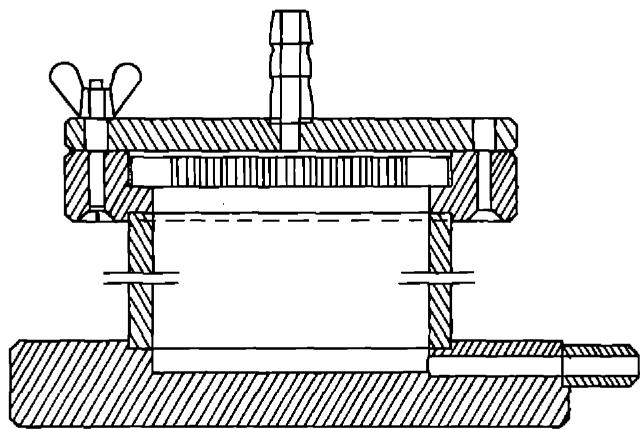  
Fig. 58. Cross sectional view of the agitation column. The material is "Altuglas MZD" throughout except for the brass screws. The diffuser plate has a total of 213 holes drilled on 8 concentric circles. The inside dimensions of the column are $8.0\mathrm{cm}$ diameter by $60~\mathrm{cm}$ high. The reader is referred to the original paper for a more detailed drawing.

9. After disassembly of the filtration apparatus the filter membrane is placed in a 100-ml beaker. The apparatus is washed briefly with distilled water which is poured into the beaker.   
10. Add $4\mathrm{ml}$ of the $\mathrm{Al(NO_3)_3 - HNO_3}$ solution and bring to a boil. When the volume is reduced to approximately $20\mathrm{ml}$ , remove the filter and wash it with water. Continue to evaporate to about $15\mathrm{ml}$ .   
11. Add $4\mathrm{ml}1\underline{\mathbf{M}}$ hydroxylamine hydrochloride and let cool. Make sure the $\mathrm{Fe}^{+ + + }$ is completely reduced by spot testing (with ammonium thiocyanate).   
12. Add 0.5 sodium nitrite and start agitation. Add $1.5 \, \text{ml} \, 10 \, \text{N HNO}_3$ and make sure by spot testing that the ferrous ion is oxidized. Expel the nitrous vapors.   
13. Add $15 \, \text{ml}$ TTA-xylene solution. Agitate so that the two phases are well mixed for $1/2 \, \text{hr}$ .   
14. Permit the phases to separate and draw off the aqueous phase with a pipette. Wash two times with $5 \, \text{ml} \, 1 \, \text{N HNO}_3$ .   
15. Back-extract the $\mathrm{Pu(IV)}$ by agitation with $5\mathrm{ml}10\mathrm{\underline{N}HNO_3}$ for $1 / 2\mathrm{hr}$ . Wash the organic phase two times with $3\mathrm{ml}10\mathrm{\underline{N}HNO_3}$ .   
16. The $10 \underline{\mathbf{N}}$ HNO₃ phases are combined in a 30-ml beaker and evaporated to dryness.   
17. Take up with $2\mathrm{ml}$ fuming $\mathrm{HNO}_3$ and $3\mathrm{ml}$ $\mathrm{HClO}_4$ and evaporate to dryness.   
18. Stop heating and add 1 ml 1 M hydroxylamine hydrochloride when the temperature permits.   
19. Let the solution cool and verify that $\mathbf{Fe}^{+ + + }$ is reduced by spot testing using a very thin glass rod.   
20. Add $1 \, \text{ml} \, 1 \underline{\mathbf{N}} \, \text{HNO}_3$ and transfer to a 30-ml separatory funnel, washing the beaker two times with $1 \, \text{ml}$ of $1 \underline{\mathbf{N}} \, \text{HNO}_3$ .   
21. Add $0.15 \, \text{g} \, \text{NaNO}_2$ to the funnel. Wash the beaker again with $1 \, \text{ml} \, 2 \, \underline{\mathbf{N}} \, \text{HNO}_3$ and $0.5 \, \text{ml} \, 2 \, \underline{\mathbf{N}} \, \text{HNO}_3$ . Combine these washes in the funnel.   
22. Stir slowly for 5 min to expel the nitrous vapors.   
23. Add 5 ml TTA-xylene and stir for 20 min at maximum speed.   
24. Let the phases separate and eliminate the aqueous phase. Wash two times by agitation for 10 min with 3 ml of $1\mathrm{N}$ HNO₃.   
25. The Pu is next re-extracted by agitation for 20 min with 5 ml of $10\underline{\mathbf{N}}\underline{\mathbf{HNO}}_3$ , and the organic phase is washed two times with 2 ml of $10\underline{\mathbf{N}}\underline{\mathbf{HNO}}_3$ .   
26. The combined aqueous phase is evaporated on a watch glass and counted.

Procedure 13. Plutonium from Environmental Water Samples J. Kooi and U. Hollstein (Ref. 237).

# Outline of Method

$\mathrm{BiPO}_4$ is used to concentrate the Pu after reduction to $\mathrm{Pu(IV)}$ with $\mathrm{SO}_2$ gas. The solution is heated to $100^{\circ}\mathrm{C}$ for several minutes to expel excess $\mathrm{SO}_2$ . The Pu is further purified by co-extraction into ferric cupferride as $\mathrm{Pu(III)}$ from dilute nitric acid. Finally, the organic matter is destroyed by wet-ashing with $\mathrm{H}_2\mathrm{SO}_4$ and $\mathrm{HNO}_3$ and the $\mathrm{Fe}^{++}$ precipitated as the hydroxide, mounted and counted.

Yield. Approximately $99\%$ from solutions containing $0.8 \times 10^{-6} \mu \mathrm{CiPu/ml}$ .

# Procedure

1. Acidify a $500 \mathrm{ml}$ sample of water with $15 \mathrm{ml}$ of $2 \mathrm{~N}$ nitric acid and add $10.4 \mathrm{mg}$ of $\mathrm{Bi}^{3+}$ .   
2. Bubble $\mathbf{SO}_2$ gas, technical, gently through the solution for $20\mathrm{min}$ , using a wide capillary.   
3. Heat the solution to boiling and keep it boiling at $100^{\circ}\mathrm{C}$ for some minutes to expel the excess of the $\mathrm{SO}_2$ . Add slowly $60\mathrm{ml}$ of a $1\mathrm{M}$ solution of orthophosphoric acid under continuous stirring with a glass rod and leave the suspension at $90^{\circ}\mathrm{C}$ for $30\mathrm{min}$ with occasional stirring. Allow the precipitate to settle for at least $2\mathrm{hr}$ , by preference overnight.   
4. Filter through a fine-fritted funnel, the stem of which has been drawn into a wide capillary. Use 25 ml of $8\mathrm{N}$ HCL in total to rinse the beaker and the glass rod and to dissolve the precipitate on the funnel. Suck the solution through the funnel directly into a 50-ml narrow-necked flask placed in a filtering flask with cut-off bottom, resting on a ground-glass plate.   
5. Transfer the Bi-Pu solution to a 250-ml beaker, rinse the flask with a little distilled water and add 5 ml of freshly prepared $10\%$ hydroxylamine hydrochloride solution. After 15 min make up to about 100 ml with distilled water.   
6. Using a pH meter, adjust the pH to 0.7-0.8 by addition of 70-90 ml of 2 N ammonia. Add 0.1 mg of $\mathsf{Fe}^{+ + + }$   
7. Transfer the solution into a 1-1 separatory funnel, lubricating the stopcock with any kind of grease that can be completely removed by the oxidation as described in 14-16. Add $2\mathrm{ml}$ of a freshly prepared $5\%$ cupferron solution in water, shake, and let stand for $45\mathrm{min}$ .   
8. Add $30\mathrm{ml}$ of purified chloroform. Shake the mixture repeatedly for 1 min and run the chloroform extract through a 4-5 cm No. 41 Whatman filter paper into a 250-ml separatory funnel, using the same kind of grease for the stopcock.   
9. Shake the chloroform solution with $20\mathrm{ml}$ of $0.3\mathrm{N}$ hydrochloric acid containing $1.5\mathrm{g}$ of cupferron per liter, and run the chloroform layer through a No. 41 Whatman filter paper into a $250\mathrm{-ml}$ roundbottom flask with ground joint. Transfer the water layer of the lower separatory funnel into the upper one.

10. Add to the solution in the upper funnel $0.1 \, \text{mg Fe}^{++}$ and $2 \, \text{ml}$ of a $5\%$ cupferron solution, shake, and let stand for 45 min.   
11. Repeat the whole extraction procedure twice (8 and 9) with $25\mathrm{ml}$ of purified chloroform. Transfer the water-layer resulting from the first repetition from the lower to the upper funnel. Discard both water-layers in upper and lower funnel after the second repetition.   
12. Wash down the sides of the two filter papers into the roundbottom flask with as little chloroform as possible to remove traces of red-brown iron-cupferrate.   
13. Distill off the chloroform until about $20\mathrm{ml}$ is left and remove the remainder of chloroform by gentle blowing or suction, as shown in Fig. 59.   
14. Add 1 ml of concentrated sulfuric acid (C. P. grade) and attach to the round-bottom flask a 15-cm condenser. Reflux for 30 min.   
15. Add $2 \, \text{ml}$ of fuming nitric acid (C.P. grade) and heat until the solution appears light yellow.   
16. Remove nitrous vapors and sulfur trioxide first by heating, later by sucking air through an attachable tube, creating slight turbulence in the bulb and the neck of the roundbottom flask. Two burners should be used, one to keep the bulb hot, without heating the dry residue to a red glow, however; and the other to prevent condensation in the neck of the round-bottom. If the dry residue does not appear snow-white after cooling, repeat 14 and remove sulfur trioxide by heating as above.   
17. Dissolve the white residue in $1 \, \text{ml}$ of concentrated HCL while gently heating. Some time may be needed before the solid is completely dissolved.   
18. The final sample for counting is deposited on a Pt tray of $35\mathrm{mm}$ diameter and $1/8\mathrm{cm}$ thick. Determine the counter background with the tray in counting position. Place the tray under a radiant heater and, using a drawn-off pipette, transfer the green-yellow solution onto the tray, covering about half of the area. Rinse the flask with a second ml of concentrated HCL and transfer the washing onto the tray. Repeat with $1\mathrm{ml}$ of water. After evaporation to near dryness, add a few drops of water.   
19. Enclose the tray and two 10-ml beakers filled with $10 - 15\%$ ammonia in a large beaker upside down. Let stand for at least 5 min to ensure the formation of $\mathrm{Fe(OH)}_q$ to be completed. Evaporate to dryness.   
20. Place the tray in a porcelain dish, cover it with a second dish, and ignite for 10-15 min to convert the hydroxides to oxides.   
21. Count the sample under an $\alpha$ -counter. A simple counting device consisting of a photomultiplier and a ZnS screen, provided with a light trap for inserting samples without switching off the high voltage, showed to be very reliable and satisfactory. Efficiencies up to 47-50 percent may easily be obtained. Calculate the Pu concentration according to the formula

$$
C _ {P u} = 9. 0 1 \times 1 0 ^ {- s} \frac {A}{E} \mu c / m l
$$

where $A =$ activity of sample in counts per minute and $E =$ percentage efficiency of counter.

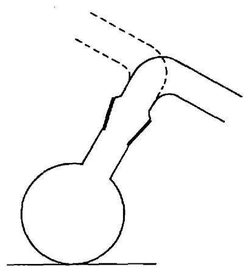  
(a)

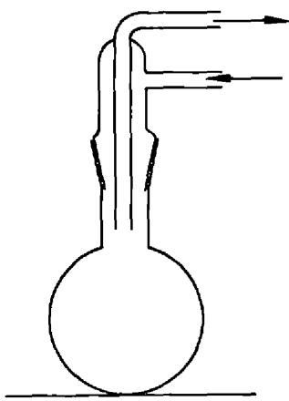  
(b)   
Fig. 59. Roundbottom flask used for destruction of organic matter. (a) Set-up used for refluxing $(\ldots)$ and removal $(\ldots)$ of nitric acid. (b) Set-up used for removing chloroform and sulfur-trioxide vapors.

Procedure 14. Separation of Plutonium in Uranium-Plutonium Fission Element

Alloys by TBP Extraction from Chloride Solutions R. P. Larsen and C. A. Seils, Jr. (Ref. 249)

# Outline of Method

The U and Pu are reduced to U(IV) and Pu(III) by contact with Mg turnings in a 2 M HCl solution. The U is then extracted into TBP. The Pu is then oxidized to Pu(IV) with $\mathrm{NaNO}_3$ and extracted into TBP and back-extracted with 0.1 M HCl. The Pu is then precipitated as the hydroxide and taken up in $\mathrm{HNO}_3$ for spectrophotometric determination.

# Reagents

Unless otherwise stated, reagent grade materials are used.

1. Tributyl phosphate, 30-volume % in carbon tetrachloride.   
2. Tributyl phosphate, 30 volume $\%$ in Amsco-140 (a kerosine distillate).   
3. Dilute $300\mathrm{ml}$ of tributyl phosphate (Commercial Solvents Corp.) to 1 liter with carbon tetrachloride (or Amsco-140). Scrub once with $200\mathrm{ml}$ of $0.5\mathrm{N}$ sodium hydroxide to remove traces of mono- and dibutyl phosphate. Scrub four times with distilled water and filer through a large dry filter paper to remove cloudiness.

# Procedure

Dissolve the alloy sample, using the procedure described by Larsen* for this type of material, and dilute to volume.

Pipette an aliquot containing 10 to $20\mathrm{mg}$ of $\mathsf{Pu}$ into a 50-ml Erlenmeyer flask. For $20\%$ Pu alloys, there will be 35 to $70\mathrm{mg}$ of U, more than enough for its determination. Convert to a chloride medium by evaporation to near dryness (3x) with $12\underline{\mathbf{M}}$ hydrochloric acid. Adjust the volume to $10\mathrm{ml}$ and the hydrochloric acid concentration to about $2\underline{\mathbf{M}}$ . Add approximately $0.1\mathrm{g}$ of Mg turnings over a period of several minutes. Using a double layer of glass fiber filter paper in a filter chimney assembly, separate the precipitated Group VIII elements by filtration, and catch the filtrate in a 60-ml cylindrical separatory funnel. Rinse the flask and filtering assembly with three 5-ml portions of $12\underline{\mathbf{M}}$ hydrochloric acid. Add $15\mathrm{ml}$ of $30\%$ tributyl phosphate in carbon tetrachloride and shake for 1 min. Allow the phases to separate and transfer the U-bearing organic phase to a second 60-ml separatory funnel.

Repeat the extraction with $10\mathrm{ml}$ of $30\%$ tributyl phosphate in carbon tetrachloride and combine the U-bearing organic phases in the second separatory funnel. Treat the Pu-bearing aqueous phase by the procedure outlined in the next paragraph. Add $15\mathrm{ml}$ of $0.5\underline{\mathbf{M}}$ hydrochloric acid to the combined organic extracts and shake for 1 min. Allow the phases to separate and drain the stripped organic phase into a 60-ml separatory funnel. Add $10\mathrm{ml}$ of $0.2\underline{\mathbf{M}}$ hydrochloric acid and repeat the stripping operation. Discard the organic phase and combine the aqueous strip solutions in the second separatory funnel. Add $5\mathrm{ml}$ of carbon tetrachloride and shake 30 sec to wash out dissolved tributyl phosphate from the aqueous phase. Discard the organic layer. Rinse the U solution into

a 50-ml Erlenmeyer flask and evaporate to dryness (2×) on a sand bath after addition of 2-ml portions of 16M nitric acid. Add 5.0 ml of 16M nitric acid to dissolve the U. Transfer to a 50-ml volumetric flask with water and make up to volume. Determine U x-ray spectrometrically. For samples containing less U, use proportionately smaller volumes of nitric acid and volumetric flasks (down to 5 ml).

Add approximately $100\mathrm{mg}$ of sodium nitrite to the aqueous raffinate from the U separation to oxidize the $\mathbf{Pu}$ to the quadrivalent state. Add $20\mathrm{ml}$ of tributyl phosphate-Amsco-140 and equilibrate 1 min. (Amsco-140 is used as the inert diluent to give a light organic phase.) Discard the lower aqueous raffinate. Add $15\mathrm{ml}$ of $0.2\underline{\mathbf{M}}$ hydrochloric acid and equilibrate 1 min. Allow the phases to separate and transfer the aqueous phase to a $50\mathrm{-ml}$ Erlenmeyer flask. Add $10\mathrm{ml}$ of $0.2\underline{\mathbf{M}}$ HCL to the organic phase and repeat the stripping operation. Combine the aqueous strip solutions, add $2\mathrm{ml}$ of $12\underline{\mathbf{M}}$ hydrochloric acid, and evaporate on a sand bath to reduce the volume to approximately $2\mathrm{ml}$ . Transfer the solution to a $15\mathrm{-ml}$ glass centrifuge cone with a transfer pipette and dilute to $7\mathrm{ml}$ with water. Add $0.5\mathrm{ml}$ of $20\%$ hydroxylamine hydrochloride and let stand $15\mathrm{min}$ with occasional mixing. While mixing with a Pt stirring wire, add $10\underline{\mathbf{M}}$ sodium hydroxide dropwise until plutonium hydroxide precipitates. Add $10\mathrm{drops}$ of sodium hydroxide solution in excess and let stand for $5\mathrm{min}$ . (Evaporation is not a satisfactory volume-reduction step, as it does not remove chloride. With the nitrate introduced in the next step, oxidation of the $\mathbf{Pu}$ to the sexivalent state would occur.) Centrifuge for $5\mathrm{min}$ and discard the clear supernate. Wash the precipitate with water, centrifuge for $3\mathrm{min}$ , and discard the wash solution. Add $2.0\mathrm{ml}$ of $16\underline{\mathbf{M}}$ nitric acid and stir to dissolve the precipitate. Heat the nitric acid solution in a boiling water bath for $20\mathrm{min}$ . (This treatment will destroy any polymeric $\mathbf{Pu}$ which may be present and ensure complete oxidation of the $\mathbf{Pu}$ to the quadrivalent state. If the precipitate were dissolved in hot $3\underline{\mathbf{M}}$ nitric acid, some oxidation to the sexivalent state would occur.) Allow the solution to cool and dilute to volume in a $10\mathrm{-ml}$ volumetric flask with water. Read the absorbance vs a reagent blank in $1\mathrm{-cm}$ cells at $475\mathrm{m}\mu$ and a slit width of $0.02\mathrm{mm}$ . Calculate the $\mathbf{Pu}$ present from a calibration factor prepared from a series of standards carried through the hydroxide precipitation step only.

Procedure 15. Separation of Pu before Spectrographic Analysis of Impurities Anion Exchange Method F. Trowell (Ref. 405)

# Outline of Method

Pu metal is dissolved in HCl and an excess of $8\underline{\mathbf{M}}\underline{\mathbf{HNO}_3}$ is added. Pu is adsorbed on an anion exchange column from the resulting mixture and the column is washed with $8\underline{\mathbf{M}}\underline{\mathbf{HNO}_3}$ . The solution and wash is evaporated to dryness, taken up in 6 M HCl, and spectrographically analyzed for Al, Be, Ca, Cd, Co, Cr, Cu, Fe, Mg, Mn, Mo, Ni, Ti, and U.

# Reagents

1. 8 M HNO₃ (Note a).   
2. 6 M HCl (Note b).   
3. Resin (Note c).

# Procedure

1. Weigh duplicate portions of $0.25\mathrm{g}$ of Pu metal and dissolve each by tipping into 1 ml 6 M HCl in 50-ml silica beakers.   
2. When all traces of metal have dissolved, add $5 \mathrm{ml} 8 \underline{\mathbf{M}} \mathrm{HNO}_{3}$ and mix well. Note (d).   
3. Transfer the resulting green solutions to the ion exchange columns (Note (e)) using the minimum volume of $8 \underline{\mathbf{M}}$ HNO₃ to rinse out the breakers.   
4. Place $50 \, \text{ml}$ silica beakers containing $1 \, \text{ml}$ of $100 \, \mu \text{g/ml}$ Sc solution under the columns to collect the eluted solutions. Allow the Pu solutions to drain down to the top of the resin.   
5. Add $15 \, \text{ml} \, 8 \, \underline{\mathbf{M}} \, \text{HNO}_3$ to the columns and allow this eluting acid to drain through.   
6. Transfer the silica beakers to the fume cupboard and evaporate the solutions to dryness. Note (f).   
7. Add $1 \, \text{ml} \, 6 \, \underline{\mathbf{M}} \, \text{HCl}$ to the dry residues and warm slightly to ensure complete solution; draw into polythene ampules. Note (g)   
8. Prepare duplicate reagent blanks using the procedure and reagents above but omitting the Pu.   
9. Pass $0.3 \underline{\mathbf{M}} \underline{\mathbf{HNO}}_3$ through the columns until all traces of green color have been removed (Note (h)). Recondition the column for further use with $8 \underline{\mathbf{M}} \underline{\mathbf{HNO}}_3$ . Note (i).

# Notes

(a) Prepared from concentrated HNO₃ (redistilled from silica) and deionised water.   
(b) Prepared from gaseous HCl and deionised water.   
(c) Deacidite FF (SRA 68). Remove fines by stirring with water. Allow to settle for 10 min and decant off any resin still in suspension; repeat this

procedure until all fines are removed. Use 3 ml wet resin in a 6-mm bore silica column fitted with a quartz wool plug. (See Fig. 60). for dimensions.)

(d) At this stage the color changes from blue to green.   
(e) Condition the columns immediately before use by allowing $10 \, \text{ml} \, 8 \, \text{M} \, \text{HNO}_q$ to run through them.   
(f) This solution contains the impurities free from Pu.   
(g) This solution is ready for analysis by the polythene funnel method.   
(h) Collect the washings and transfer to the appropriate residue bottle.   
(i) Add about $10 \, \text{ml} \, 8 \, \underline{\mathbf{M}} \, \text{HNO}_3$ and stir the resin with a pointed $1/8$ -in. perspex rod until it is in suspension and all air bubbles have been removed. Allow to settle for $10 \, \text{min}$ and decant off any resin still in suspension. Add fresh resin to bring the total resin volume to $3 \, \text{ml}$ .

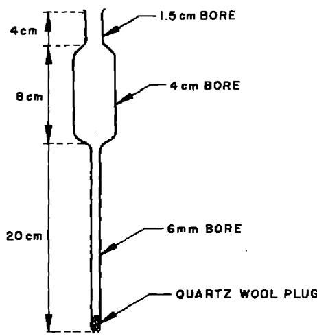  
Fig. 60. Ion exchange column.

# Outline of Method

Pu in $8\underline{\mathbf{M}}\underline{\mathbf{HNO}}_3$ solution is adsorbed on a KelF/TBP chromatographic column and the impurities eluted with $8\underline{\mathbf{M}}\underline{\mathbf{HNO}}_3$ . Sc is added as an internal standard to the eluted solution which is then concentrated by evaporation and analyzed by the graphite spark technique for Al, Co, Cr, Fe, Ga, Mn, Ni, and Ti.

Applicability. This method is intended for the analysis of high-purity Pu. The concentration range covered is from 0.5 to 10 ppm. The lower limit of analysis may be restricted by the reagent blank.

# Equipment

1. Column (for dimensions and preparation see Appendix).

# Reagents

1. 6 M HCl. Note (a).   
2. 16 M HNO₃. Note (b).  
8 M HNO₃.  
0.32 M HNO₃.   
3. 2 M HF. Note (c).   
4. $\mathbf{CCl}_4$ . Note (d).   
5. Tri-n-butyl phosphate. Note (e).   
6. KelF. Note (f).   
7. Grease solution. Note (g).

# Procedure

1. Weigh $2\mathrm{g}$ of $\mathbf{Pu}$ and dissolve by tipping into $5\mathrm{ml}6\mathrm{M}$ HCl in a 50-ml silica beaker. Cover with a clock glass and warm. Note (h).   
2. When all traces of the metal have dissolved, rinse and remove the clock glass, rinse down the sides of the beaker, and evaporate the solution to dryness.   
3. Cool (Note (i)), add 5 ml $16 \underline{\mathbf{M}} \underline{\mathbf{HNO}}_{3}$ , warm and add 5 drops 2 M HF to ensure complete solution. Evaporate to a moist residue. Note (j).   
4. Redissolve this residue in $10\mathrm{ml}8\underline{\underline{\mathbf{M}}}\underline{\underline{\mathbf{HNO}}}_3$ , warming to ensure complete solution.   
5. Transfer the solution to the KelF/TBP column using the minimum volume of $8 \underline{\mathbf{M}} \underline{\mathbf{HNO}}_{3}$ to rinse out the beaker. Note (k).   
6. Place a 50-ml tall-form silica beaker containing $1\mathrm{ml}20\mu \mathrm{g / ml}$ Sc solution under the column. Note (l).

7. Allow the solution from (5) to drain down to the top of the chromatographic column maintaining a flow rate of approximately $0.5 \, \text{ml/min}$ . Add $40 \, \text{ml} \, 8 \, \text{M} \, \text{HNO}_3$ and allow to drain through the column at the same rate.   
8. Transfer the eluted solution to a 100-ml separating funnel and wash with 10 ml conditioned $\mathrm{CCl}_4$ , repeat the wash with two further portions of 10-ml $\mathrm{CCl}_4$ .   
9. Transfer the washed solution to the 50-ml beaker and evaporate to dryness in a fume cupboard. Note (m).   
10. Redissolve the residue in $1 \, \text{ml} \, 6 \, \underline{\mathbf{M}} \, \text{HCl}$ while the beaker is still warm.   
11. Duplicate reagent blanks are prepared using the procedure and reagents above, but omitting the Pu.   
12. Prepare the electrodes for sparking by pipetting $0.1\mathrm{ml}$ of the solution from (10) on to the tops of a pair of waterproofed graphite electrodes, dividing the aliquot equally between the two electrodes, and dry under an infrared lamp. Prepare duplicate pairs of electrodes for each standard sample and reagent blank solution. Note (n).   
13. Remove the adsorbed Pu from the column by eluting with $0.32 \underline{\mathbf{M}}$ HNO₃ (Note (o)) and then wash the column with water to remove the HNO₃. Note (p).

# Notes

(a) Prepared from gaseous HCl and deionized water.   
(b) $\mathrm{HNO}_3$ AR redistilled from silica apparatus. Diluted with deionized water.   
(c) Prepared from HF AR and deionized water.   
(d) $\mathbf{CCl}_4$ AR conditioned before use by shaking with an equal volume of $8\mathrm{M}\mathrm{HNO}_3$ .   
(e) Commercial TBP purified by steam distillation and alkaline washing (see Appendix).   
(f) Low density KelF moulding powder, less than 100 mesh (see Appendix).   
(g) $0.1\%$ Apiezon $\underline{\mathbf{M}}$ in $\mathrm{CCl}_4$   
(h) Each sample should be done in duplicate.   
(i) A vigorous reaction occurs if addition of concentrated $\mathrm{HNO}_3$ is made to hot residue.   
(j) If the residue is allowed to go to dryness it will be difficult to redissolve.   
(k) See Appendix for column preparation.   
(l) Vitrosil tall-form beaker nominally $50\mathrm{ml}$ capacity in fact has a volume of about $75\mathrm{ml}$ .

(m) The activity of the solution is due almost entirely to the Am content of the Pu metal. In general this is sufficiently low to allow a number of solution to be evaporated to dryness at one time without exceeding the tolerance limit allowed in a fume cupboard.   
(n) Each sample and reagent blank will thus have four exposures.   
(o) Transfer the solution to the appropriate residue bottle.   
(p) The column life is limited as some TBP is washed off with each run. The effect of this is that the adsorbed Pu layer becomes longer with each run and the column must be replaced when the danger of Pu break-through becomes apparent.

# Appendix

# Purification of TBP

1. Place $250\mathrm{ml}$ commercial TBP and $100\mathrm{ml}0.5\mathrm{M}$ NaOH in a 1-litre flask fitted with a splash head for steam distillation. Heat the mixture to $80^{\circ}\mathrm{C}$ , but take care not to heat above this temperature. Note (a).   
2. Remove the source of heat and steam distil for $3\mathrm{hr}$ , rejecting the distillate. Note (b).   
3. Pour the hot TBP/NaOH mixture into a separating funnel and reject the (lower) aqueous phase. Wash the TBP with two 100-ml portions of hot deionized water and then with two 100-ml portions of cold deionized water. Note (c).   
4. Filter (Whatman 541 paper) the washed TBP into a clean dry reagent bottle.

# Preparation of KelF Powder

1. Chill KelF low density molding powder with solid $\mathrm{CO}_{2}$ and grind in a microhammer mill. Note (d).   
2. Sieve the milled powder and collect the material passing 100 mesh (BSS). Note (e).   
3. Wet the powder with acetone, transfer to a 1-liter beaker and add excess of $6\underline{\mathbf{M}}$ HCl (Note (f)). Allow the $\mathrm{KelF / HCl}$ suspension to stand overnight.   
4. Pour the KelF/HCl suspension into a funnel fitted with a cotton wool plug and allow the acid to drain away. Wash the KelF free from acid by pouring deionized water through the funnel.   
5. Finally, dry the washed KelF by pouring acetone through the funnel and then spreading the powder out onto a polythene sheet and allowing the acetone to evaporate.

# Preparation of Column

1. Mix $12 \, \text{g}$ KelF powder and $12 \, \text{g}$ TBP to a smooth paste, add about 10 ml deionized water and mix to a slurry.

2. Transfer about a quarter of this slurry to the column (Note (g)) filled with water and gently press small quantities of this slurry down with a glass plunger so that an evenly packed column of the KelF/TBP is formed. Note (h).   
3. Repeat this procedure with further portions of the slurry until the column is complete.   
4. Keep the column filled with water until required for use and condition with $40 \, \text{ml} \, 8 \, \text{M} \, \text{HNO}_3$ when required.

# Notes

(a) TBP/NaOH mixtures bump violently.   
(b) This removes most of the free n-butyl alcohol from the TBP; the remainder is removed by washing.   
(c) The initial separation and washings must be done hot to avoid emulsification.   
(d) Chilling assists the grinding process.   
(e) Making the powder just moist with acetone will prevent it sticking to the sieve.   
(f) To remove any metallic impurities.   
(g) $28\mathrm{cm} \times 1.2\mathrm{cm}$ Pyrex column, 2-mm bore tap and fitted with a quartz wool plug.   
(h) Care must be taken in the preparation of the column, loose packing may result in Pu breakthrough during elution; tight packing will give a very slow flow rate.

Procedure 17. Separation of Np and Pu by Anion Exchange N. Jackson and J. F. Short (Ref. 204)

# Outline of Method

This procedure is described for macro amounts of Pu and Np. It is based on the fact that Pu(III) is not adsorbed on anion exchange resin, while Np(IV) is strongly adsorbed at high HCl concentrations. The valence adjustment is done before adsorption on the column by dissolving the hydroxides in a concentrated HCl solution which has been saturated with $\mathrm{NH}_4\mathrm{I}$ . The Np is removed from the column with 2 M HCl. The separation is quantitative and complete.

# Procedure

The purification of $2.3\text{g}$ of $\mathbf{Np}^{237}$ from approximately $50\mathrm{mg}$ of $\mathbf{Pu}^{239}$ was then undertaken. The $\mathbf{Np}$ and $\mathbf{Pu}$ were precipitated as hydroxides, centrifuged, and dissolved in $210\mathrm{ml}$ of conc. HCl sat. with $\mathbf{NH}_4\mathbf{I}$ . The solution was allowed to stand for $30\mathrm{min}$ and poured onto a Deacidite FF anion column $20\mathrm{cm}$ long and

2.5 cm diameter while a flow rate of 1 ml/min was maintained. The first 200 ml of effluent were pale blue [Pu(III)]. The column was then washed with 100 ml conc. HCl and the wash collected separately. No activity was found in a drop collected at the end of the washing.

The Np was finally eluted with 2M HCl. It was possible to follow the dark green band of the Np down the column and the first $40\mathrm{ml}$ of eluate was included with the conc. HCl wash. The whole of the Np was collected in the next $50\mathrm{ml}$ of eluate. No activity was found in any eluate after this stage. Some $\beta$ - $\gamma$ activity was detected on the glass wool at the top of the resin column and was assumed to be $\mathrm{Pa}^{233}$ , the daughter of $\mathrm{Np}^{237}$ .

Procedure 18. Separation of Np and Pu by Cation Exchange Chromatography V. D. Zagrai and L. I. Sel'chenkov (Ref. 435).

# Outline of Method

$\mathbf{Np}(\mathbf{IV})$ and $\mathbf{Pu}(\mathbf{III})$ are adsorbed on the cation resin KU1 or KU2 from 0.25 M HCl solution after reduction with $\mathrm{SO}_2$ at boiling water temperatures. $\mathbf{Np}$ is eluted with $0.02\mathrm{NHF}$ and the $\mathbf{Pu}$ stripped with $0.5\mathrm{NHF}$ .

# Procedure

1. To 6-8 ml of $0.25 \underline{\mathbf{N}} \underline{\mathbf{H}} \underline{\mathbf{C}} \underline{\mathbf{l}}$ containing $\mu g$ amounts of Np and Pu, add about half of the resin in the hydrogen form required to fill the plexi-glass column (1 mm diameter × 90 mm high) and 1-2 ml of water.   
2. Pass $\mathrm{SO}_2$ gas through the solution vigorously for 15-20 min while heating on a boiling water bath.   
3. Allow the solution to cool to room temperature and transfer the resin to the column with a pipette. Plug the top of the column with cotton and pass the remaining solution through the column.   
4. Wash the resin with $10\mathrm{ml}$ of 0.25 N HCl, followed by $10\mathrm{ml}$ of $\mathbf{H}_2\mathbf{O}$ .   
5. Elute the Np into a Pt dish or a Teflon beaker with $40 - 60\mathrm{ml}$ of $0.02\mathrm{N}$ HF.   
6. Elute the Pu with 4-5 ml of $0.5\mathrm{NHF}$

# Outline of Method

A 24-hr sample of urine is dried and ashed and the residue dissolved in dil. HCl and adjusted to a pH of 1. The Pu is reduced to the trivalent state with hydroxylamine hydrochloride solution and co-precipitated on iron cupferride. This is extracted with chloroform, the chloroform is distilled off, and the cupferrides residue is wet oxidized. The iron carrying the Pu is finally mounted with conc. HCl, dried, precipitated with ammonium hydroxide, dried again, and flamed off to $\mathrm{Fe}_2\mathrm{O}_3$ . This procedure is based on that described by Smales et al.[233] Differences in the two procedures are given at the end of this procedure.

# Reagents

Ferric chloride solution. 145 mg of $\mathrm{FeCl}_3$ /liter (i.e. 50 mg Fe/liter). Hydroxylamine hydrochloride solution. 50 g of $\mathrm{NH}_2\mathrm{OH}\cdot \mathrm{HCl}$ /liter. Cupferron. $5\%$ aqueous solution, renewed weekly.

# Procedure

1. Evaporate a 24-hr sample of urine overnight in a 2-liter porcelain basin under infrared lamps.   
2. When dry, scrape out and quantitatively transfer the residue to a 200-ml silica dish with washings of $4\textbf{N}$ HCl, and re-dry it under infrared lamps.   
3. Place the sample in a muffle furnace at $500^{\circ}\mathrm{C}$ , and hasten oxidation by periodic additions of 3-ml lots of conc. $\mathrm{HNO}_3$ to the dish when it is cool.   
4. Dissolve the white residue in $\sim 30\mathrm{ml}$ of $4\mathrm{N}$ HCl, transfer to a 250-ml beaker and make up with alternate $4\mathrm{N}$ HCl and water washings to about $100\mathrm{ml}$ to a final acidity of $2\mathrm{N}$ . Stir until only an insoluble silica residue remains. Add $5\mathrm{ml}$ of $\mathrm{FeCl}_3$ solution and $10\mathrm{ml}$ of $\mathrm{NH}_2\mathrm{OH}\cdot \mathrm{HCl}$ solution followed by a few drops of cresol-red indicator.   
5. Adjust the pH of the solution to 1 (with a pH meter until the operator can correctly do it visually) with $2\underline{\mathbf{N}}\mathbf{H}\mathbf{H}_{4}\mathbf{O}\mathbf{H}$ added dropwise from a burette with constant stirring. It is essential that no phosphate precipitate forms, as this may reduce recoveries. Allow the solution to stand for 1 hr to ensure reduction of $\mathrm{Pu(VI)}$ to $\mathrm{Pu(III)}$ .   
6. Transfer the solution to a 500-ml separating funnel and add 2 ml of $5\%$ cupferron solution. Shake the contents thoroughly and let stand for $3/4 \, \text{hr}$ to allow complete formation of iron cupferride.   
7. Add $30\mathrm{ml}$ of chloroform and shake the funnel thoroughly. Allow the chloroform layer to settle and then run it off through a 7-cm Whatman No. 41 filter paper into a 100-ml separating funnel. Wash the chloroform by shaking with $20\mathrm{ml}$ of distilled water and run the

chloroform into a 250-ml round-bottomed flask through a 7 cm No. 41 filter paper as before. Return the water to the original aqueous solution and add a further $5\mathrm{ml}$ of $\mathsf{FeCl}_3$ and $2\mathrm{ml}$ of $5\%$ cupferron as a scavenge. After shaking, leave the solution to stand for another $3/4\mathrm{hr}$ .

8. Extract the cupferrides with three 15-ml lots of chloroform - or until the chlorlform remains colorless - and filter each lot separately into the 100-ml funnel. Wash the filter paper with chloroform from a pipette to remove the ring of cupferrides which forms around the top, and collect the washings in the 100-ml separating funnel.   
9. Add $20\mathrm{ml}$ of distilled water to the chloroform extracts, and shake the funnel. After they have settled out, filter the extracts into the 250-ml round-bottomed flask and wash the filter paper with chloroform.   
10. Evaporate off the excess chloroform in a fume cupboard using an "Electro-Thermal" mantle. Remove the final drops by blowing in air.   
11. Add $3\mathrm{ml}$ of conc. $\mathrm{H}_2\mathrm{SO}_4$ and $1\mathrm{ml}$ of conc. $\mathrm{HNO}_3$ to the residue and heat. Evaporate the final traces of $\mathrm{H}_2\mathrm{SO}_4$ by blowing in air. If the residue is not white, add further aliquots of the acids and take to dryness again.   
12. Dissolve the residue in $3\mathrm{ml}$ of conc. HCl and transfer by means of a pipette to a Pt tray previously counted for background. Use two further 3-ml aliquots of conc. HCl to obtain a quantitative transfer.   
13. Dry the final solution, then take up in a few drops of water and add enough $2\mathrm{N}\mathrm{NH}_4\mathrm{OH}$ to ensure complete precipitation of ferric hydroxide. Spread this precipitation evenly over the tray ( $15\mathrm{cm}^2$ effective surface) using a glass rod with a fine tip.   
14. Dry the tray, and finally heat it over a bunsen to form the red oxide $\mathsf{Fe}_2\mathsf{O}_3$ before counting.

# Counting Procedure

Count the tray "background" and sample each for one period of 8 hr in an $\alpha$ -scintillation counter.

# Calculating Maximum Permissive Level in Urine

Maximum permissive level in the body is $0.04\mu c$ for $\mathbf{Pu}^{239}$ (solution). Excretion rate assumed is $0.01\%$ per day.

# Corresponding Maximum Permissive Level in Urine is .. $4\mu \mathrm{c}$

With a method recovery of $90\%$ and a counter efficiency of (say) $35\%$ , the maximum permissive level in urine $\geq 2.8$ cpm above "background."

# Reporting Results

Results are reported in $\mu \mu c / 24$ -hr sample in the following ranges:

<0.1 $\mu \mu \mathrm{c}$

<1 >0.1 $\mu \mu c$

$>1$ $\mu \mu c$ (exact figure reported with standard deviation).

# NOTE:

Deviations from this report in steps 4, 7, and 8 above were made for reasons of economy. The use of smaller quantities of reagents were found not to affect the overall recovery. By using the amounts of $\mathrm{H}_2\mathrm{SO}_4$ and $\mathrm{HNO}_3$ quoted in step 11 above, a more rapid oxidation was achieved.

# Outline of Method

This procedure describes a method for the rapid separation of $\mathbf{Pu}^{239}$ from $200\mathrm{ml}$ (or smaller) urine samples, and the subsequent electrodeposition of the $\mathbf{Pu}^{239}$ on an $8\mathrm{-mm}^2$ area of a stainless steel disk. The yield for a set of five samples was 85.2 percent $\pm 3.6$ percent standard deviation.

# Procedure

1. Place the urine sample (200 ml or less) in a 1-liter Erlenmeyer flask, add 50 ml of concentrated HNO₃, 40 mg of Pr carrier (Note (a)) and evaporate to about 20 ml. Add 20 ml of H₂O and cool under running water, then transfer the solution to a 100-ml Lusteroid test tube (using about 20-30 ml of wash water) containing 5 ml concentrated HF and stir.   
2. Allow the sample to stand 30 min, centrifuge 2 min, discard the supernate and dissolve the precipitate in 50 ml of $2\underline{\mathbf{N}}\mathrm{HNO}_3$ . Add 5 ml of concentrated HF and stir. Allow the sample to stand 5 min, centrifuge 2 min, discard the supernate and dissolve the precipitate in 5 ml of $\mathrm{H}_2\mathrm{O}$ and 20 ml of $2\underline{\mathbf{M}}\mathrm{Al}(\mathrm{NO}_3)_3 - 0.5\underline{\mathbf{N}}\mathrm{HNO}_3$ .   
3. Transfer the solution to a 120-ml separatory funnel and shake 5 min (or until clear). Add $0.25\mathrm{ml}$ of $2\mathrm{MNaNO}_2$ and shake 15 min. Add $10\mathrm{ml}$ of $0.45\mathrm{M}$ TTA $(100\mathrm{g / liter})$ in benzene and shake for 20 min. Discard the aqueous phase and wash the organic phase with two 10-ml portions of $0.5\mathrm{N}$ $\mathrm{HNO}_3$ , 5 min each.   
4. Add $10\mathrm{ml}$ of $8\mathrm{N}$ HCl and shake $15\mathrm{min}$ . Collect the aqueous layer in a 50-ml beaker. Add $5\mathrm{ml}$ of $8\mathrm{N}$ HCl to the organic phase and shake $5\mathrm{min}$ . Collect the aqueous phase.   
5. Combine the aqueous layers, add $5 \, \text{ml}$ of concentrated $\text{HNO}_3$ , $3 \, \text{ml}$ of concentrated $\text{HCIO}_4$ , $1 \, \text{ml}$ of $0.1 \, \text{M} \, \text{KNO}_3$ and evaporate to dryness. (Use low heat for final evaporation.)   
6. Dissolve the residue in $7\mathrm{ml}$ of $0.5\mathrm{N HNO}_3$ (Note 2). Rub sides of beaker with policeman to make sure all of the residue is in solution. Wash policeman with water, adding washings to the sample, then evaporate the solution to $3 - 4\mathrm{ml}$ .   
7. Add $4\mathrm{ml}$ of electrolyte $(0.25\underline{\mathbf{M}} (\mathrm{NH}_4)_2\mathrm{C}_2\mathrm{O}_4)$ , transferring the solution to an electrodeposition cell with an $8\mathrm{-mm}^2$ stainless steel cathode area (Note 3).   
8. Electrodeposit overnight at $110\mathrm{mA}$   
9. The electrodeposited sample may be counted directly on a low background $\alpha$ counter, or exposed to a nuclear track film and the $\alpha$ tracks counted under a microscope* to provide a greater sensitivity.

# Notes

1. The element praseodymium as purchased (from the Lindsey Chemical Division of the American Potash and Chemical Corporation, West Chicago, Illinois) could be used directly without causing a high background; whereas, the use of lanthanum as a carrier resulted in a high background.   
2. At this point, the sample can be evaporated on a counting dish for direct counting if small area deposition is not required.   
3. The electrolytic cells consist of lucite cylinders which are threaded at one end for stainless steel caps which contact the stainless steel cathode plating surfaces. A beveled lucite disk fits between the cap and cylinder and defines the electrodeposition area.

# Outline of Method

Micro amounts of Pu are isolated by lanthanum fluoride coprecipitation, thenoyltrifluoroacetone (TTA) extraction, and electrodeposition. The $\alpha$ activity is measured by proportional counting or by autoradiography.

# Evaporation and Electrodeposition

# Reagents and equipment.

Electrodeposition apparatus and cells.

Stainless steel disks, 0.5-in. diam $\times$ 0.005-in. thick, polished stainless steel.

Aluminum nitrate solution - Dissolve $378\mathrm{g}$ $\mathrm{Al(NO_3)_3\cdot 9H_2O}$ in $800\mathrm{ml}$ distilled water; add $23\mathrm{ml}$ conc. $\mathrm{HNO}_3$ and dilute to 1 liter with distilled water.

Conc. ammonium hydroxide - $\mathrm{NH}_4\mathrm{OH}(30\% \mathrm{NH}_3)$ .

Ammonium hydroxide, $10\%$ solution-Dilute $10\mathrm{ml}$ conc. $\mathrm{NH}_4\mathrm{CH}$ to $100\mathrm{ml}$ with distilled water.

Conc. hydrochloric acid, $36\%$ HCl.

Conc. hydrofluoric acid, $48\%$ HF.

Conc. nitric acid, $70\%$ HNO₃.

Conc. phosphoric acid, $85\%$ $\mathrm{H}_3\mathrm{PO}_4$ .

1 N nitric acid - Dilute 63 ml conc. HNO₃ to 1 liter with distilled water.

2 N nitric acid - Dilute 125 ml conc. HNO₃ to 1 liter with distilled water.

8 N hydrochloric acid - Dilute 667 ml conc. HCl to 1 liter with distilled water.

8 N potassium hydroxide - Dissolve 112 g KOH in 250 ml distilled water.

2 N potassium hydroxide - Dissolve 28 g KOH in 250 ml distilled water. Sodium hypochlorite - 5% solution NaOCl.

Sodium nitrite solution - Dissolve $1.2\mathrm{gNaNO}_2$ in $10\mathrm{ml}$ distilled water. Prepare fresh immediately before use.

Hydroxylamine hydrochloride - NH $_2$ OH·HCl.

Lanthanum nitrate solution - Dissolve $6.2\mathrm{g}$ $\mathrm{La(NO_3)_3} \cdot 6\mathrm{H}_2\mathrm{O}$ in $100\mathrm{ml}$ $1\mathrm{N HNO}_3$ . $1\mathrm{ml} = 20\mathrm{mg}$ La.

Thenoyltrifluoroacetone solution - Dissolve $5\mathbf{g}$ thenoyltrifluoroacetone (TTA) in $100\mathrm{ml}$ benzene.

# Procedure

1. To 1 liter urine in a 2-liter beaker, add $20 \mathrm{ml}$ conc. $\mathrm{HNO}_3$ , $5 \mathrm{ml}$ conc. $\mathrm{H}_3\mathrm{PO}_4$ , and heat to $85^{\circ} \mathrm{C}$ .   
2. While stirring, add conc. $\mathrm{NH}_4\mathrm{OH}$ until precipitation occurs. Add $10\mathrm{ml}$ excess and continue heat and stirring for $1\mathrm{hr}$ .

3. Cover the beaker and let settle overnight.   
4. Decant the supernate, being careful not to disturb the precipitate.   
5. Filter the precipitate onto Whatman No. 50 filter paper. Wash the precipitate with $10\%$ $\mathrm{NH}_4\mathrm{OH}$ . Discard the filtrate.   
6. Place filter and precipitate in 50-ml Vycor crucible and ignite at $900^{\circ}\mathrm{C}$ for 1 hr.   
7. Cool residue and add $25 \, \text{ml} \, 2\underline{\mathbf{N}} \, \text{HNO}_3$ . Warm to dissolve residue. Transfer to centrifuge tube with $2\underline{\mathbf{N}} \, \text{HNO}_3$ wash, and keep volume less than $50 \, \text{ml}$ .   
8. Cool to room temperature and add $1\mathrm{gNH}_2\mathrm{OH}\cdot \mathrm{HCl}$ . Stir until it dissolves.   
9. Add $1 \, \text{ml} \, \text{La}(\text{NO}_3)_3$ solution and adjust volume to $75 \, \text{ml}$ with $2\text{N HNO}_3$ .   
10. Stir and add 7 ml conc. HF. Let stand 2 min, then remove stirring rods.   
11. Let stand 3 min more, then centrifuge and carefully discard the supernate. To residue, add a few ml $2\mathrm{N}$ $\mathrm{HNO}_3$ and stir vigorously.   
12. Add $2\mathrm{N}$ HNO₃ in portions, while stirring, until volume is 75 ml.   
13. Repeat $\mathsf{LaF}_3$ precipitation by adding 7 ml conc. HF as in step 9, then let stand for 3 min. Centrifuge, and discard the supernate.   
14. Break up precipitate with stirring rod and add $2\mathrm{ml}$ $\mathrm{Al(NO_3)_3}$ solution. Stir vigorously and add $38\mathrm{ml}$ more $\mathrm{Al(NO_3)_3}$ .   
15. Transfer the solution to a separatory funnel. Add 5 drops $\mathrm{NaNO}_2$ solution and mix. Let stand 15 min.   
16. Add 10 ml TTA solution and extract 20 min. Let phases separate and discard aqueous layer. Note: For a rapid analysis, the TTA can be evaporated on a planchet for counting. Otherwise, proceed to step 17.   
17. Add $20\mathrm{ml}$ distilled water and extract 5 min. Let phases separate and discard aqueous layer. Add $10\mathrm{ml}$ distilled water and repeat.   
18. Add $10 \, \text{ml} \, 8\underline{\mathbf{N}} \, \text{HCl}$ and extract $20 \, \text{min}$ . Let phases separate and drain HCl layer into $50 \, \text{ml}$ beaker. Repeat extraction.   
19. Carefully evaporate the two HCl extracts to 1 ml. Do not boil or let go dry. Cool and add 8N KOH by drops until a pale reddish-brown color appears. Add 5 ml 2N KOH and 2 ml $5\%$ NaOCl solution.   
20. Evaporate carefully to one-half original volume. Transfer to electrodeposition cell, washing the beaker once with $1\mathrm{ml}$ NaOCl solution and three times with distilled water.   
21. Connect cell to electroplater and electrolyze 5 hr at $80\mathrm{mA}$ .   
22. Remove cell without interrupting current. Discard solution.   
23. Remove disk from cell and wash with distilled water. Let dry and flame lightly. The disk can now be $\alpha$ -counted or autoradiographed.

# Autoradiography

# Reagents and equipment.

Developer, Kodak D-19.   
Fixer, Kodak F-5   
Nuclear-track alpha (NTA) plates - 1-in. $\times 3$ -in. glass slide with $25 - \mu$ emulsion.   
NTA exposure camera.   
Microprojector - arc illuminated, with 21X objective and 20X ocular.   
Chromic acid solution - Dissolve $0.2\mathrm{gCrO}_3$ in 1 liter distilled water.

# Plate preparation

1. Fill staining dish two-thirds full of $\mathrm{CrO}_3$ solution.   
2. In darkroom with red safe light, remove slides from box and place in staining-dish rack. Immerse rack and slides in $\mathbf{CrO}_3$ solution for 4 min. Let drain 5 sec. Turn off red safe light and wash in rinse tank 20 min.   
3. Remove rack from wash tank and let slides dry.

# Autoradiographic procedure

1. In darkroom with Series AO light filter, load NTA plate in slide depression of camera. Place disk positioner over NTA plates, and drop disks face-down into holes of positioner.   
2. Fit top securely on camera, and place camera in dark box. Expose for 1 week.   
3. After exposure, develop NTA plates 10 min in D-19 developer at $68^{\circ}\mathrm{F}$ . Rinse in distilled water and fix 20 min in F-5 fixer.   
4. Wash plates for 1 hr and let dry.   
5. Count the $\alpha$ tracks with the microprojector. Each projection covers an area of $0.1409\mathrm{mm}^2$ , which is called one field. The total area of the exposed NTA plate is $38.82\mathrm{mm}^2$ or 277 fields. Tracks are counted on a predetermined number of fields on each plate. Tracks found are compared with a standard curve prepared from urine spiked with known amounts of Pu.

# Calculation

Since 1 liter urine sample was used, dpm Pu/liter urine = dpm from standard curve.

# References

S. M. Sanders, Determination of Plutonium in Urine, DP-146, March 1956. L. C. Schwendiman and J. W. Healy, "Nuclear-Track Technique for Low-Level Plutonium in Urine," Nucleonics 16, 78 (1958).

# Outline of Method

The Pu is co-precipitated with $\mathrm{BiPO_4}$ from acidified urine, the $\mathrm{BiPO_4}$ is wet-ashed with $\mathrm{HNO_3}$ , and the Pu is co-precipitated with $\mathrm{LaF_3}$ from an HCl solution. The $\mathrm{LaF_3}$ co-precipitation is repeated and the fluoride is metathesized with KOH. Pu is extracted into di(2-ethylhexyl)phosphoric acid from a 2 M $\mathrm{HNO_3}$ solution, and the aqueous phase is mounted for counting.

This procedure is included to illustrate the extraction of $\mathrm{Pu(IV)}$ into acidic phosphate extractants. The procedure could presumably be used for a simultaneous determination of Pu and Am in urine, by back-extraction of the Pu either into strong acid or a reducing solution.

# Reagents

Bromthymol blue indicator solution - Dissolve one g of reagent grade indicator in $500\mathrm{ml}$ of distilled water made alkaline with one pellet of sodium hydroxide.

Bismuth nitrate solution - Dissolve $231.2\mathrm{g}$ of bismuth nitrate $\left[\mathrm{Bi}(\mathrm{NO}_3)_3\cdot 5\mathrm{H}_2\mathrm{O}-\mathrm{AR}\right]$ in $660\mathrm{ml}$ of concentrated $\mathrm{HNO}_3$ and dilute to one liter with distilled water. This solution contains $0.1\mathrm{g}$ of Bi per ml.

4 N HCl - Add 344 ml of conc. HCl to approximately 500 ml of distilled water in a volumetric flask and make up to 1 liter with distilled water.

6 N HCl - Dilute 510 ml of conc. HCl to 1 liter in a volumetric flask.

8 N HCl - Dilute 688 ml of conc. HCl to 1 liter in a volumetric flask.

Lanthanum nitrate solution - $\mathrm{La(NO_3)_3}$ , as received from the Lindsey Chemical Company, West Chicago, Illinois, is freed from actinum $\alpha$ -emitting impurities on a Dowex 50X12 cation exchange resin column by the method of Farabee.* The lanthanum nitrate stock solution obtained is used to prepare working solutions containing $25\mathrm{mg}$ of $\mathrm{La}^{+ + + } / \mathrm{ml}$ . Only solutions containing $0.05\mathrm{d / min}$ or less of $\alpha$ activity per mg of $\mathrm{La}^{+ + + }$ are used.

2 M Hydroxylamine hydrochloride - Dissolve $139.0\mathrm{g}$ of C.P. grade hydroxylamine hydrochloride and dilute to one liter. Store in brown bottle.

2 N Sodium nitrite solution - Dissolve 13.8 g of sodium nitrite (NaNO $_2$ -AR) in distilled water in a 100-ml volumetric flask and make to volume with distilled water. Prepare fresh before use.

0.1 M D2EHPA - Add 32.3 g of di(2-ethylhexyl)phosphoric acid (Union Carbide Chemical Company) to chloroform-AR in a 1-liter volumetric flask and make to volume with chloroform.

8 N KOH - Dissolve 65.3 g of potassium hydroxide (KOH 86%-AR) in distilled water and dilute to 1 liter.

All other chemicals are either of reagent or C.P. quality.

# Sample Pretreatment

The volume of a "24-hr equivalent" urine sample (two morning and two evening voidings) is measured and the sample transferred to a 2-liter beaker. The volume and the liquid level are denoted on the beaker with a china-marking pencil or marking pen. Several glass beads, $1\mathrm{ml}$ of octyl alcohol and $200\mathrm{ml}$ of concentrated nitric acid are added. The beaker is covered with a Speede-Vap and placed over an asbestos pad on a hot plate at high heat. The sample is digested by gentle boiling until it attains a clear appearance.

# $\mathbf{BiPO}_4$ Coprecipitation

A stirring bar is added to the cooled solution and rapid stirring initiated over a magnetic stirring motor. Approximately $130\mathrm{ml}$ of concentrated ammonium hydroxide are added cautiously, followed by $1\mathrm{ml}$ of bromthymol blue indicator solution. Neutralization is completed by addition of concentrated ammonium hydroxide to the yellow-green endpoint. If necessary, the sample volume is readjusted to its original value with distilled water. Concentrated nitric acid is added to make the solution $0.15\underline{\mathbf{M}}$ in $\mathrm{HNO}_3$ (Table VIII-1). $500\mathrm{mg}$ of hydroxylamine hydrochloride are added to the solution and the beaker placed in a steam bath heated to $80\pm 5^{\circ}\mathrm{C}$ . Concentrated phosphoric acid is then added to a concentration of approximately $0.09\underline{\mathbf{M}}$ (Table VIII-1). An amount of bismuth nitrate solution, equivalent to $60\mathrm{mg}$ bismuth per $100\mathrm{ml}$ , is added dropwise to the heated, stirred solution.

TABLE VIII-1. Solution Requirements for BiPO4 Precipitation.   

<table><tr><td>Urine volume (ml)</td><td>Conc. HNO3for 0.15 M (ml)</td><td>H3PO4(ml)</td><td>Bi(NO3)3soln, (ml)</td></tr><tr><td>500</td><td>4.8</td><td>3.0</td><td>3.0</td></tr><tr><td>600</td><td>5.9</td><td>3.6</td><td>3.6</td></tr><tr><td>700</td><td>6.8</td><td>4.2</td><td>4.2</td></tr><tr><td>800</td><td>7.5</td><td>4.8</td><td>4.8</td></tr><tr><td>900</td><td>8.7</td><td>5.4</td><td>5.4</td></tr><tr><td>1000</td><td>9.6</td><td>6.0</td><td>6.0</td></tr><tr><td>1100</td><td>10.5</td><td>6.6</td><td>6.6</td></tr><tr><td>1200</td><td>11.6</td><td>7.2</td><td>7.2</td></tr><tr><td>1300</td><td>12.45</td><td>7.8</td><td>7.8</td></tr><tr><td>1400</td><td>13.50</td><td>8.4</td><td>8.4</td></tr><tr><td>1500</td><td>14.4</td><td>9.0</td><td>9.0</td></tr><tr><td>1600</td><td>15.0</td><td>9.6</td><td>9.6</td></tr><tr><td>1700</td><td>16.4</td><td>10.2</td><td>10.2</td></tr><tr><td>1800</td><td>17.3</td><td>10.8</td><td>10.8</td></tr><tr><td>1900</td><td>18.5</td><td>11.4</td><td>11.4</td></tr><tr><td>2000</td><td>19.2</td><td>12.0</td><td>12.0</td></tr></table>

The precipitate is digested by an additional hour of stirring at $80 \pm 5^{\circ} \mathrm{C}$ . The sample beaker is removed from the water bath and allowed to stand undisturbed for a minimum of 3 hr. The supernatant solution is carefully aspirated off (avoid disturbing precipitate) and the precipitate transferred to a 90-ml Pyrex centrifuge tube with a distilled water rinse. The precipitate is centrifuged for 5 min at 2000 rpm and the supernate carefully discarded. The sample beaker walls are then rinsed down with $4 \underline{\mathbf{N}}$ HCl from a wash bottle and the rinse transferred to the 90-ml tube. The final volume in the tube should be approximately 50 ml.

# Wet-ashing of Bismuth Phosphate

Several drops of octyl alcohol are added to the HCl solution in the 90-ml tube; it is placed in an aluminum block at approximately $100^{\circ}\mathrm{C}$ , and the solution taken to dryness. The dried sample is then repeatedly wet-ashed with several drops of

concentrated nitric acid in a block heated to $350^{\circ}\mathrm{C}$ . After the sample has ashed to whiteness, it is evaporated twice with $8\ \underline{\mathbf{N}}$ HCl.

# Lanthanum Fluoride Coprecipitation

The bismuth chloride ash is dissolved in $8\mathrm{ml}$ of $8\mathrm{N}$ HCl and the solution is transferred to a 25-ml conical centrifuge tube. The walls of the 90-ml tube are rinsed with an additional $2\mathrm{ml}$ of $4\mathrm{N}$ HCl and the rinse added to the centrifuge cone. After addition of $0.1\mathrm{ml}$ of $\mathrm{La(NO_3)_3}$ solution, the tube contents are mixed thoroughly. Two ml of concentrated hydrofluoric acid (27 M) are then added, and the solution stirred with a Pt stirrer. The tube is allowed to stand for 5 min and then centrifuged at 2000 rpm for 3 min. The supernatant is carefully aspirated and the precipitate dissolved in 2 ml of concentrated HCl.

Following the addition of $2\mathrm{ml}$ of distilled water, $\mathrm{LaF}_3$ is reprecipitated by addition of $2\mathrm{ml}$ of $27\mathrm{MHF}$ . The preceding digestion and centrifugation steps are repeated. Five ml of $8\mathrm{N}$ potassium hydroxide are added to the precipitate and carefully heated to boiling. After cooling the mixture is centrifuged for three minutes and the supernate carefully drawn off.

# D2EHPA Extraction

Following solution of the precipitate in $6\mathrm{ml}$ of $2\mathrm{N}$ $\mathrm{HNO}_3$ , one ml of $2\mathrm{M}$ hydroxylamine hydrochloride is added, and the sample is heated in a water bath at $70^{\circ}\mathrm{C}$ for $5\mathrm{min}$ . The tube is then removed from the water bath and $2\mathrm{ml}$ of $2\mathrm{M}$ sodium nitrite solution are added with swirling. When bubble evolution ceases, the solution is transferred to a $30\mathrm{-ml}$ separatory funnel. The centrifuge tube is rinsed once with $3\mathrm{ml}$ of $2\mathrm{N}$ nitric acid and the rinse added to the separatory funnel. The aqueous layer is then extracted thrice with $5\mathrm{-ml}$ portions of $0.1\mathrm{MD2EHPA}$ in chloroform for 5-min periods. The chloroform extracts are removed and the aqueous layer is shaken for $3\mathrm{min}$ with a $5\mathrm{-ml}$ portion of toluene. The aqueous portion is then withdrawn through the funnel stem into another $25\mathrm{-ml}$ conical centrifuge tube. Lanthanum fluoride is precipitated by addition of $2\mathrm{ml}$ of $27\mathrm{MHF}$ . The solution is allowed to stand $5\mathrm{min}$ centrifuged at $2000\mathrm{rpm}$ for $3\mathrm{min}$ and the supernatant drawn off and discarded. Shake the precipitate with $10 - 15\mathrm{ml}$ of $1:100$ hydrofluoric acid wash solution and centrifuge at $2000\mathrm{rpm}$ for $5\mathrm{min}$ .

# Sample Planchetting

Aspirate the supernatant and invert the centrifuge cone quickly over absorbent tissue. Drain 15 min. Slurry the precipitate with distilled water and transfer to a stainless steel planchet with a disposable capillary pipette. Dry the disk under an infrared lamp and flame the dried planchet to red heat. The $\alpha$ activity is then counted with a low-background proportional counter for 150 min.

Procedure 23. Determination of Plutonium in Urine by Anion Exchange E. D. Campbell and W. D. Moss (Ref. 74)

# Outline of Method

Pu is concentrated from urine by co-precipitation with alkaline earth phosphates. The precipitate is dissolved in $7.5\mathrm{~N}$ nitric acid and the Pu absorbed from that solution onto Dowex $1\times 2$ anion exchange resin. Interfering anions absorbed on the column are removed with $12\mathrm{~N}$ HCl. The Pu is eluted from the column with specially prepared hydrochloric and hydriodic acids, and the $\alpha$ activity determined by direct planchetting or by electrodeposition of the eluate, followed by standard $\alpha$ -counting techniques.

# Equipment

Ion exchange column. The ion exchange column container consists of a glass reservoir, 2-5/8 in. long by 1-3/32 in. i.d., capacity 40 ml, on a chromatographic column tube 3 in. long by 5/16 in. i.d., constricted at the tip.

# Solutions

Hydriodic acid stock solution. Prepared by distilling hydriodic acid (analytical reagent grade, $5.5\text{M}$ in hydriodic acid, $1.5\%$ hypophosphorous acid preservative) under nitrogen. The hypophosphorous acid preservative interferes with the electrodeposition step and also with the preparation of satisfactory planchetted samples. Oxidation of the prepared hydriodic acid solution is inhibited by adding enough hydrazine (up to $20\%$ by volume of $64\%$ to $84\%$ hydrazine in water) to decolorize the hydriodic acid solution.

Hydrochloric acid-hydriodic acid elutrant. Prepared by mixing $1\mathrm{ml}$ of hydriodic acid stock solution with $9\mathrm{ml}$ of concentrated hydrochloric acid. The precipitate formed by hydrazine is removed by centrifuging; the supernatant then is saturated with gaseous hydrogen chloride. The reagent must be prepared every few days because it decomposes easily.

# Reagents

All other reagents used in the procedure are prepared from analytical grade chemicals.

# Preparation of Ion Exchange Column

A glass wool pledget in the tube supports the resin. The tube is filled with from 2-1/2 to 3 in. of a distilled water slurry of Dowex AG1-X2. chloride form, 50 to 80 mesh, anion exchange resin (Bio-Rad Laboratories, 32nd and Griffin, Richmond, Calif.). The resin in the column is converted to the nitrate form by washing with at least two 5 ml portions of 7.5 N nitric acid before adding the sample solution. The resulting column flow rate is 1 ml/min.

# Preparation of Sample

The 24-hr or equivalent urine sample is transferred to a 2-liter graduated cylinder with concentrated nitric acid (50 ml of acid per liter). The cylinder is heated in a steam bath at 75 to $80^{\circ}\mathrm{C}$ , and stirred with a magnetic stirrer, for 30 min. One ml of phosphoric acid is added to the sample, then enough concentrated ammonium hydroxide to form a copious precipitate, and the sample is digested, with continuous stirring, for 1 hr. After 30 min of digestion the stirrer is stopped, the precipitate is allowed to settle for several minutes, and the clear supernatant is treated with several ml of ammonium hydroxide to be sure precipitation is complete. Should more precipitate form, an excess of ammonium hydroxide is added, and the stirring is continued for the remaining 30 min. After the cylinder is removed from the water bath and the stirring bar from the cylinder, the sample is allowed to remain undisturbed overnight at room temperature.

The following morning the supernatant is aspirated from the precipitate and discarded. The alkaline earth phosphate precipitate is transferred to a 90-ml centrifuge tube with distilled water and centrifuged. The supernatant is discarded, the cylinder is washed with dilute (20%) nitric acid, and the washings are combined with the precipitate in the tube. The material in the tube then is evaporated to dryness in an aluminum heating block at 85 to $90^{\circ}\mathrm{C}$ , and the residue finally is whitened with concentrated nitric acid at approximately $300^{\circ}\mathrm{C}$ .

# Ion Exchange Isolation of the Pu

The ashed residue from the alkaline earth phosphate precipitate is dissolved in $25\mathrm{ml}$ of $7.5\underline{\mathbf{N}}$ nitric acid. The residue may be dissolved with heat if necessary, but will dissolve easily at room temperature overnight (preferred method). The acid solution is transferred to the reservoir of a prepared ion exchange column and allowed to drain completely. The centrifuge tube is rinsed with three 5-ml portions of $7.5\underline{\mathbf{N}}$ nitric acid, each rinse being allowed to drain through the column before the next is added. The column reservoir then is washed down with $5\mathrm{ml}$ of $7.5\underline{\mathbf{N}}$ nitric acid, which is allowed to drain through the column completely. Three ml of concentrated hydrochloric acid are added carefully to the top of the resin without disturbing the resin, keeping dilution from the $7.5\underline{\mathbf{N}}$ nitric acid to a minimum, and allowing the hydrochloric acid to drain completely. All effluents from the absorption and washing steps are discarded.

One to two ml of $0.5\mathrm{N}$ HCl are added to the top of the column, the first several drops discarded, and the remaining eluate retained in a 15-ml centrifuge tube. The column then is eluted with two 5 ml portions of $0.5\mathrm{N}$ HCl and allowed to drain completely into the centrifuge tube. Finally, several crystals of hydroxylamine hydrochloride are added to the top of the resin and 2 ml of hydriodic-hydrochloric acid solution drained through the column and collected.

NOTE: The hydroxylamine hydrochloride is added to the column to prevent immediate oxidation of the hydriodic acid. An excess of hydriodic-hydrochloric acid

solution should not be used because of possible interference in the electrodeposition step. The eluate in the tube then is evaporated to approximately $1\mathrm{ml}$ in an aluminum heating block at $75^{\circ}\mathrm{C}$ .

# Electrodeposition

The residue from the vaporation is neutralized with $8\textbf{N}$ potassium hydroxide using phenolphthalein as indicator. When the solution is neutral, $2\textbf{ml}$ of sodium hypochlorite and $5\textbf{ml}$ of $2\textbf{N}$ potassium hydroxide are added to the tube, and the contents of the tube transferred to an electrodeposition cell with distilled water. (The final concentration of the alkali is $1\textbf{N}$ .) The $\mathsf{Pu}$ is electrodeposited on $1/2$ in. polished stainless steel disks at $200\text{mA}$ for $5\text{hr}$ . The apparatus and techniques for the electrodeposition of $\mathsf{Pu}$ are described by Schwendiman et al.*

# Determination of Alpha Activity

The $\alpha$ activity on the stainless steel plates can be determined either by the NTA (Nuclear Track Alpha) emulsion method or by the standard electronic counting method. The background of the NTA method is 0.007 dpm, with an accuracy of 1.6 dpm. A method of choice for more rapid evaluation of results is the electronic determination of the $\alpha$ activity by the phosphor-coated mylar method described by Hallden and Harley.\* The phosphor method uses a 1-in. photomultiplier tube and an all-transistorized amplifier and counter system designed by P-1 (the Electronics Group of the Los Alamos Scientific Laboratory's Physics Division), similar to that described by Graveson et al.\*3 The background of this system is 0.015 cpm when adjusted to an optimum efficiency of $45\%$ . The precision of this counting is satisfactory for 0.1 dpm.

# Outline of Method

Pu is co-crystallized with potassium rhodizonate by adding an equal volume of ethyl alcohol to a pH 9 solution of the reagent in urine. The Pu is further purified by co-precipitation with $\mathrm{LaF}_3$ and adsorption on an anion exchange resin. The Pu is eluted with $6\underline{\mathbf{N}}\mathrm{HCl} - 0.2\underline{\mathbf{N}}\mathrm{HF}$ , electrodeposited and $\alpha$ -counted.

# Reagents

Potassium rhodizonate (Paul B. Elder Co., Bryan, Ohio).

Dowex anion exchange resin AG1-X8 (Bio-Rad Laboratories, Richmond, Calif.).

Lanthanum carrier solution. Lanthanum nitrate was dissolved in water and purified from interfering $\alpha$ activity by passage through the anion exchange column after adjusting the HCl content to $10\textbf{N}$ . Excess HCl was removed by evaporation and the salt was dissolved in $2\textbf{N}$ HNO $_3$ to a final concentration of $5\text{mg}$ of La $^{++}$ per ml.

All other chemicals were either of reagent grade or C.P. quality.

# Procedure

Based upon the experimental results, the following analytical procedure was evolved: The procedure is described for a 500-ml sample volume. For a different volume, reagents are used in proportionate amounts.

Add $1\mathrm{g}$ of potassium rhodizonate to the sample. (If the urine is not fresh, solubilization of the reagent may be difficult. Under such circumstances acidification of the sample with HC1 to pH 2 to 3 effects rapid solution.) Adjust to pH 9 with $5\mathrm{N}$ NaOH and crystallize the rhodizonate with $500\mathrm{ml}$ of absolute ethyl alcohol. Let stand for several minutes and isolate the crystals by centrifugation.

Dissolve the crystals in $50\mathrm{ml}$ of $2\mathrm{\underline{N}HNO_3}$ . Add $1\mathrm{ml}$ of lanthanum carrier (5 mg of $\mathrm{La}^{+ + + }$ per ml) and precipitate with $30\mathrm{ml}$ of $27\mathrm{\underline{N}HF}$ . Centrifuge. Without separating the precipitate from the liquid, add $0.5\mathrm{ml}$ of lanthanum carrier with stirring to the supernatant liquid and centrifuge. Discard the supernatant liquid.

Dissolve the precipitate in $5\mathrm{ml}$ of saturated $\mathrm{H}_3\mathrm{BO}_3$ and $5\mathrm{ml}$ of concentrated HCl. Add about $10\mathrm{ml}$ of distilled water and make alkaline with concentrated $\mathrm{NH}_4\mathrm{OH}$ . Centrifuge. Without separating the precipitate from the liquid, add $0.5\mathrm{ml}$ of lanthanum carrier with stirring to the supernatant liquid. Centrifuge. Discard the supernatant liquid.

Dissolve the precipitate in a small volume of concentrated $\mathrm{HNO}_3$ , add about 15 ml of water, and reprecipitate with concentrated $\mathrm{NH}_4\mathrm{OH}$ . Centrifuge. Without separating the precipitate from the liquid, add $0.5\mathrm{ml}$ of lanthanum carrier with stirring to the supernatant liquid. Centrifuge. Discard the supernatant liquid.

Dissolve the precipitate in concentrated $\mathrm{HNO}_3$ . Add about $3\mathrm{ml}$ of concentrated $\mathrm{H}_2\mathrm{SO}_4$ and heat to dryness.

Dissolve the salts in 10 to $15\mathrm{ml}$ of $6\underline{\mathbf{N}}$ HCl. Add $0.5\mathrm{ml}$ of $0.4\underline{\mathbf{N}}$ $\mathrm{NaNO}_2$ and make $9\underline{\mathbf{N}}$ with concentrated HCl. Let stand 5 min.

Pour the solution through a Teflon column, $4 \times 0.62$ cm anion exchange resin AG 1-X8 (Cl⁻: 0.297 to 0.144 mm) previously washed with 10 ml of 9 N HCl. Adjust the flow rate to 2 ml/min.

Wash the column with $15\mathrm{ml}$ of $9\mathrm{N}$ HCl. Elute with $30\mathrm{ml}$ of $6\mathrm{N}$ HCl-0.2 N HF. Collect the eluate in a Teflon beaker which contains $15\mathrm{mg}$ of NaCl. Evaporate to dryness. Dissolve the salt in concentrated $\mathrm{HNO}_3$ and transfer to glass. Add $3\mathrm{ml}$ of $\mathrm{HClO}_4$ , $2\mathrm{ml}$ of $\mathrm{H}_2\mathrm{SO}_4$ , and heat to dryness.

Dissolve the salt in $1\mathrm{ml}$ of water and transfer to the electrodeposition cell fitted with a tantalum disk. Add $4\mathrm{ml}$ of $6\mathrm{N}\mathrm{NH}_4\mathrm{Cl}$ solution and 2 drops of concentrated HCl.

Electrodeposit at 2.5 to 3.0 A for 20 min. Quench the cell with 1 ml of concentrated $\mathrm{NH}_4\mathrm{OH}$ . Wash the solution from the cell with distilled water and dry the tantalum disk on a hot plate.

Alpha count.

Procedure 25. Determination of Plutonium in Urine and Bone Ash by Extraction with Primary Amines F. W. Bruenger, B. J. Stover, and D. R. Atherton (Ref. 61)

# Outline of Method

Concentrated urine, or a solution of bone ash is made $1 \underline{\mathbf{M}}$ in $\mathrm{H}_2\mathrm{SO}_4$ and Pu is extracted by a mixture of highly branched primary alkyl amines. The Pu is then back-extracted with $8 \underline{\mathbf{M}}$ HCl and counted.

# Reagents and Equipment

The $\alpha$ -detection instrument is a $2\pi$ proportional counter of conventional design capable of accepting 2-in. stainless steel planchettes; counter performance is checked with a $\mathrm{U}_3\mathrm{O}_8$ standard supplied by the National Bureau of Standards.

Primene JM-T, a mixture of tert-alkyl primary amines, $5\%$ by volume in xylene, was purchased from Rohm and Haas, Philadelphia, Pa. The Primene solution is washed with half its volume of $1 \underline{\mathbf{M}} \mathbf{H}_{2} \mathbf{SO}_{4}$ before use.

# Procedure

Urine analysis. Urine is collected in polyethylene bottles over $10\mathrm{ml}$ of concentrated formic acid to avoid excessive hydrolysis of urea, which would render the specimen basic and could result in loss of $\mathsf{Pu}$ by adsorption on the wall of the container. An aliquot of urine is transferred to a Kjeldahl flask containing enough $5\textbf{M}$ $\mathsf{H}_2\mathsf{SO}_4$ to attain an acid concentration of $2\textbf{M}$ in the final sample. The solution is boiled without charring for about 1 hr. Thus far, volumes up to $500\mathrm{ml}$ have been extracted. For larger volumes, amounts of reagents are increased proportionally. The following amounts of reagents are used for $100\mathrm{-ml}$ aliquots. The sample is filtered through borosilicate glass wool into a separatory funnel and is allowed to cool to room temperature. Twenty ml of a $5\%$ solution of Primene JM-T in xylene is added to the sample and the mixture is shaken for $15\mathrm{min}$ . After separation of the two phases, the aqueous phase is put aside for a second extraction. The organic phase is washed twice with $25\mathrm{ml}$ of $1\textbf{M}\textbf{H}_2\textbf{SO}_4$ . $\mathsf{Pu}$ is removed from the organic phase with two $20\mathrm{-ml}$ portions of $8\textbf{M}\textbf{HCl}$ . The aqueous phase is again extracted with $20\mathrm{ml}$ of $5\%$ Primene, and $\mathsf{Pu}$ is back-extracted from the Primene with $20\mathrm{ml}$ of $8\textbf{M}\textbf{HCl}$ . The combined HCl fractions are dried under a heat lamp and then the organic contaminants are destroyed by heating over an open flame or in a furnace at $500^{\circ}\mathrm{C}$ . The $\mathsf{Pu}$ residue is dissolved in concentrated $\mathsf{HNO}_3$ and transferred to a 2-in.-diameter stainless steel planchette for $\alpha$ counting.

Bone analysis. Bone is ashed for 4 hr at $600^{\circ}\mathrm{C}$ and, after cooling, is dissolved in as little $\mathrm{HNO}_3$ as possible and diluted with $\mathrm{H}_2\mathrm{O}$ to a known volume, and a suitable aliquot of this solution is taken for analysis. The amount of bone ash should not exceed $250\mathrm{mg}$ for every $75\mathrm{-ml}$ volume of the aqueous phase. The aliquots are evaporated to dryness under a heat lamp to minimize the amount of $\mathrm{HNO}_3$ and then put in solution with $4\mathrm{ml}$ of concentrated HCOOH, and a $60\mathrm{-ml}$ portion of $2.5\underline{\mathbf{M}}\underline{\mathbf{H}}_2\mathrm{SO}_4$ is added. This solution is heated in a water bath until it is clear, and then transferred to a separatory funnel. Transfer is completed with a $10\mathrm{-ml}$ rinse of distilled water. Any $\mathrm{CaSO}_4$ that forms does not interfere. Pu is extracted as described above.

# Glossary

A/CONF. 8/ Vols. 1-17 - Proceedings of the International Conference on Peaceful Uses of Atomic Energy, held in Geneva, August 1955 (United Nations, New York, 1958).   
A&CONF.15/1 English Ed. Vols. 1-33 - Proceedings of the Second United Nations International Conference on Peaceful Uses of Atomic Energy, held in Geneva, September 1958 (United Nations, Geneva, 1958).   
AEC - Atomic Energy Commission  
AEC - Manhattan District and later Washington, D.C. AEC declassified reports.   
MDDS-Manhattan District, Oak Ridge, Tenn.   
TID - Technical Information Division, Oak Ridge, Tenn.   
AECL - Atomic Energy of Canada, Ltd., Chalk River, Ontario.   
(also CEI- and CRDC- prefixes followed by number.)   
ANL - Argonne National Laboratory, Illinois.   
CEA - France. Commissariat à l'Energie Atomique, Paris.   
CEA-TR - Series assigned by the AEC to translations received from CEA.   
DP - E. I. du Pont de Nemours and Co., Savannah River Laboratory, Aiken, So. Carolina.   
EURAEC - United States - Euratom Joint Research and Development Program.   
HW - General Electric Co., Hanford Atomic Products Operation, Richland, Wash.   
JENER - Joint Establishment for Nuclear Energy Research, Kjeller, Norway.   
KAPL - Knolls Atomic Power Laboratory, Schnectady, New York.   
LASL - Los Alamos Scientific Laboratory, New Mexico.   
(LA-, LAMS-, and LADC- prefixes followed by number.)   
ORNL - Oak Ridge National Laboratory, Tennessee.   
USNRDL - U.S. Naval Radiological Defense Laboratory, San Francisco, Calif.   
UKAEA - United Kingdom Atomic Energy Authority.   
AEEW - Research Group, Atomic Energy Establishment, Winfrith, Dorset.   
AERE - Atomic Energy Research Establishment, Harwell, Berks.   
AHSB(RP) - Health and Safety Branch, Radiological Protection Div., Harwell, Berks.   
AWRE - Great Britain Atomic Weapons Research Establishment, Aldermaston, Berks.   
DEG-INF-SER - Development and Engineering Group, Risley, Warrington, Lancs.   
IGO & IGR - Industrial Group Hdqtrs., Risley, Warrington, Lancs.   
PG - Production Group, Risley, Warrington, Lancs.   
Books Referenced:   
"The Transuranium Elements" (McGraw-Hill Book Co., Inc., New York, 1949).   
G. T. Seaborg, J. J. Katz and W. M. Manning, Eds.

"The Actinide Elements" (McGraw-Hill Book Co., Inc., New York, 1954).   
G. T. Seaborg and J. J. Katz, Eds.   
"Progress in Nuclear Energy Series III. Process Chemistry" (McGraw-Hill Book Co., Inc., New York, 1956-61).   
"Progress in Nuclear Energy Series V. Metallurgy and Fuels" (Pergamon Press, Ltd., London, 1956-61).

# References

NOTE: The first 19 references are contained in Sections I and II at the beginning of this monograph.   
20. A. W. Adamson, Clinton Labs., Oak Ridge, Tenn. CN-2224, Jan. 1945.   
21. S. Ahrland, I. Grenthe, and B. Noren, Acta Chem. Scand. 14, 1077 (1960).   
22. S. Ahrland, I. Grenthe, and B. Noren, Acta Chem. Scand. 14, 1059 (1960).   
23. A. M. Aiken, Chem. Engr. Progr. 53, 82 (1957).   
24. A. M. Aiken, M. Moss, and T. Bruce, AECL-1786, 1951.   
25. K. Alcock, F. C. Bedford, W. H. Hardwick, and H. A. C. McKay, J. Inorg. Nucl. Chem. 4, 100 (1957).   
26. K. Alcock, G. F. Best, E. Hesford, and H. A. C. McKay, J. Inorg. Nucl. Chem. 6, 328 (1958).   
27. I. F. Alendrikova, L. L. Zaitseva, L. V. Lipis, N. S. Nikolayev, V. V. Formin, and N. T. Chebotared, Zh. Neorgan. Khim. 3, 951 (1958). English transl. AEC-tr-3505.   
28. H. W. Alter, W. D. Haas, and E. I. Zebroski, KAPL-442, 1950.   
29. H. W. Alter and E. Zebroski, KAPL-314, 1950.   
30. F. Anselin, P. Faugeras, and E. Grison, Compt. Rend. 242, 1996 (1956).   
31. C. B. Amphlett, A/CONF. 15/1, Vol. 28, p. 17, Paper 271.   
32. G. J. Appleton and H. J. Dunster, UKAEA, AHSB(RP) R. 6, 1961.   
33. M. E. D. Bains, UKAEA, AEEW-R-292, 1963.   
34. R. J. Baltisberger, Anal. Chem. 36 2369 (1964).   
35. F. Baroncelli, G. Scibona, and M. Zifferero, J. Inorg. Nucl. Chem. 25, 205 (1963)   
36. F. Baroncelli, G. Scibona, and M. Zifferero, Radiochim. Acta 1, 75 (1963).   
37. L. J. Beaufait, Jr. and H. R. Lukens, Jr., "Handbook of Radiochemical Analysis, Vol. II. Radiochemical Procedures," NP-5056 (del.), Tracerlab, Inc., Richmond, Calif., 1952.   
38. M. Beran and S. Havelka, Collection Czech. Chem. Commun. 28, 2510 (1963). In German.   
39. K. S. Bergstresser and G. R. Waterbury, LASL, LA-3091, 1964.   
40. M. G. Berkman and L Kaplan, ANL-4573, Jan. 1951.   
41. B. Bernstrom and J. Rydborg, Acta Chem. Scand. 11, 1173 (1957).   
42. U. Bertocci, UKAEA, AERE-R-2933, May 1959.   
43. G. F. Best, E. Hesford, and H. A. C. McKay, J. Inorg. Nucl. Chem. 12, 136 (1959).   
44. G. F. Best, H. A. C. McKay, and P. R. Woodgate, J. Inorg. Nucl. Chem. 4, 315 (1957).   
45. T. K. Bierlein, L. F. Kendall, and H. H. van Tuyl, HW-25074, 1952.   
46. R. E. Biggers and D. A. Costanzo, ORNL-TM-580, 1963.   
47. H. Bildestein et al., "Destructive Analysis of Unirradiated and Irradiated Fuels" Osterreichische Studiengesellschaft fuer Atomenergie, Vienna, SGAE-CH-8/1964.

48. D. H. Boase, J. K. Foreman, and J. L. Drummond, Talanta 9, 53 (1962).   
49. N. A. Bonner and M. Kahn, "Radioactivity Applied to Chemistry" (John Wiley and Sons, New York, 1951) Chap. 6.   
50. M. Bonnevie-Svendsen, "Reprocessing Analysis", JENER-59, 1959.   
51. Z. Borkowska, M. Millcarski, and M. Taube, J. Inorg. Nucl. Chem. 26, 359 (1964).   
52. D. F. Bowersox, LASL, LAMS-2884, Feb. 1963.   
53. D. Bowkowski, Am. Indust. Hygiene Assoc. J., 25, 59 (1964).   
54. M. Branica and E. Bona, A/CONF. 15/1 Vol. 17, p 172, Paper 2412.   
55. J. K. Brody, J. P. Faris, and R. F. Buchanan, Anal. Chem. 30, 1909 (1958).   
56. R. O. R. Brooks, UKAEA, AERE-AM-60, (see also, Smales et al., AERE-C/R-533).   
57. R. E. Brooksbank and W. T. McDuffee, ORNL-3566, 1964.   
58. K. B. Brown, Progr. Nucl. Energy Ser. III, Vol. 2, Appendix IV, p 557.   
59. K. B. Brown, K. A. Allen, C. A. Blake, C. F. Coleman, D. J. Crouse, A. T. Gresky, and B. Weaver, ORNL-CF-60-1-119, 1960.   
60. F. R. Bruce, Progr. Nucl. Energy Ser. III, Vol. 2, Chapt. 8-3, p 363.   
61. F. W. Bruenger, B. J. Stover, and D. R. Atherton, Anal. Chem. 35, 1671 (1963). (See also Bruenger, et al., COO226, AEC Chicago Opns. Office, (1962) p 58.   
62. L. E. Bruns and C. W. Nilsen, HW-70084, June 1961.   
63. A. Brunstad, HW-51655, July 1957.   
64. A. Brunstad, HW-54203, 1957.   
65. A. Brunstad and R. C. Smith, HW-52796, Sept. 1957.   
66. R. F. Buchanan, J. P. Faris, K. A. Orlandini, and J. P. Hughes, AEC Div. of Tech. Infor., Oak Ridge, Tenn., TID-7560, June 1958, pp 179-88.   
67. J. S. Buckingham, C. A. Cavin, and C. A. Goodall, HW-59283, Feb 1959.   
68. L. R. Bunney, N. E. Ballou, J. Pascual, and S. Foti, USNRDL-TR-228, May 1958.   
69. L. L. Burger, HW-44888, 1957.   
70. L. L. Burger, J. Phys. Chem. 62, 590 (1958).   
71. L. L. Burger, I. M. Rehn and C. M. Slansky, HW-1994, 1952.   
72. J. P. Butler and J. S. Merritt, AECL-353, Aug. 1956.   
73. F. A. Cafasso, H. M. Feder, and I. Johnson, J. Phys. Chem. 68, 1944 (1964).   
74. E. E. Campbell and W. D. Moss, LASL, LADC-5922, 1963.   
75. M. H. Campbell, HW-68003, Jan. 1961.   
76. G. Carleson, A/CONF.8/17, p 111, Paper/137.   
77. G. Carleson, Svensk Kemish Tidskrift 70, 55 (1958).   
78. S. C. Carniglia, Clinton Labs., Oak Ridge, Tenn., CN-3339, Aug. 1945.   
79. W. N. Carson, Jr., H. S. Gile, and J. W. Vandewater, HW-39110, Sept. 1955.   
80. D. J. Carswell, J. Inorg. Nucl. Chem. 3, 384 (1957).

81. D. J. Carswell and J. Milstead, J. Nucl. Energy 4, 51 (1957).   
82. M. Cefola and W. S. Andrus, KAPL-M-MC-2, Sept. 1949.   
83. R. B. Chenley, G. J. Hunter, and T. J. Webber, UKAEA, AERE-C/M-327, 1958.   
84. A. Chesné, Bull. Inform. Sci. Tech. (Paris), No. 66, pp 58-64, Nov. 1962. In French.   
85. A. Chesné, G. Koehly, and A. Bathellier, Nucl. Sci. Eng. 17, 557 (1963).   
86. A. Chetham-Strode, Jr., Lawrence Radiation Laboratory, Berkeley, Calif. UCRL-3322, 1956.   
87. M. K. Chmutova, O. M. Petrukhin, and Yu. A. Zolotov, Zh. Analit. Khim. 18, 588 (1963). In Russian.   
88. E. L. Christenson, C. W. Kellrey, A. J. Bearmint, and J. R. Humphrey, "Extractive and Physical Metallurgy of Pu and its Alloys" (Interscience Publishers, New York, 1960) W. D. Williams, Ed. pp 75-88.   
89. E. G. Chudinov and G. N. Yakovlev, Radiokhimiya 4, 506 (1962). In Russian.   
90. F. Clanet, J. Chromatog. 6, 85 (July 1961). In French.   
91. F. Clanet, J. Clarence, and M. Verry, J. Chromatog. 13, 440 (1964). In French.   
92. J. W. Coding, W. O. Haas, Jr., and F. K. Heumann, KAPL-602, Nov. 1951.   
93. J. W. Coding, W. O. Haas, Jr., and F. K. Heumann, Ind. Eng. Chem. 50, 145 (1958).   
94. A. S. Coffinberry and M. B. Waldron, Progr. Nucl. Energy Ser. V, Vol. 1, pp 354-410.   
95. C. F. Coleman, K. B. Brown, J. G. Moore, and D. J. Crouse, Ind. Eng. Chem. 50, 1756 (1958). (See also Coleman, Brown, Moore, and K. A. Allen, A/CONF.15/1, Vol. 28, p 278 Paper/510.)   
96. C. A. Colvin, HW-79354, Oct. 1963.   
97. A. E. Comyns, Chem. Rev. 60, 115 (1960).   
98. W. V. Conner, Dow Chemical Co., Rocky Flats Div., Golden, Colo. RFP-356, Feb. 1964.   
99. R. E. Connick, J. Am. Chem. Soc. 71, 1528 (1949).   
100. R. E. Connick and W. H. McVey, J. Am. Chem. Soc. 75, 474 (1953).   
101. O. A. Cook, in "The Transuranium Elements", Vol. 14B, p 147, Paper/3.5.   
102. G. P. Cook and O. Jones UKAEA IGO-AM/W-68, Jan. 1957.   
103. J. Corpe and F. Regnaud, Anal. Chim. Acta 27, 36-9 (1962). In French. (English transl. HW-TR-45.)   
104. D. A. Costanzo and R. E. Biggers, ORNL-TM-585, July 1963.   
105. H. W. Crandall, J. R. Thomas, and E. Zebroski, AEC-TID-10022, Aug. 1947.   
106. I. H. Crocker, AECL, CRDC-697, May 1957 (AECL-488).   
107. H. W. Crocker, HW-68655, Feb. 1961.

108. E. A. C. Crouch and G. B. Cook, J. Inorg. Nucl. Chem. 2, 223-8 (1956).   
109. F. L. Culler, Progr. Nucl. Energy Ser. III, Vol. 1, Chap. 5-2, p 172; Chap. 5-4, p 201. (See also A/CONF.8/9, p 464, 560, Paper/822.)   
110. J. G. Cuninghame and G. L. Miles, J. Inorg. Nucl. Chem. 3, 54 (1956).   
111. J. G. Cuninghame and G. L. Miles, J. Appl. Chem. 7, 72 (1957). [See also same authors, J. Inorg. Nucl. Chem. 3, 54 (1956).]   
112. D. Cvjetcanin, "Separation of U(VI), Pu(VI), and Pu(IV) from Zr and Nb on a Column of Silica Gel," JENER-57, Aug. 1958.   
113. D. Cvjetcanin and N. Cvjetcanin, "Separation of U and Pu from Zr, Nb, Ru, and Cs on a Column of MnO₂," JENER-54, April 1958.   
114. D. H. W. den Boer and Z. I. Dizdar, "On the Isolation of Pu by a Solvent Extraction Procedure," JENER-45, Oct. 1956.   
115. C. Deptula and S. Mine, Nukleonika 6, 197 (1961).   
116. M. deTrentinian and A. Chesné, "Extraction and Purification of Pu with a Tertiary Amine," France. Commissariat A l'Energie Atomique, Paris, Rappt. No. 1426, 1960.   
117. R. M. Diamond, K. Street, Jr., and G. T. Seaborg, J. Am. Chem. Soc. 76, 1461 (1954).   
118. G. A. Dupetit and A. H. W. Aten Jr., Radiochim. Acta 1, 48 (1962).   
119. R. W. Durham and A. M. Aiken, AECL, CEI-55, Feb. 1953. (Reprinted July 1960.)   
120. R. W. Durham and R. Mills, AECL, CEI-62, (Rev.), Revised and reprinted, AECL-1399, Oct. 1961.   
121. Ph. Dreze and G. Duyckaerts, Liege Universite, Brussels, EUR-436.f. 1963.   
122. M. A. El Guebely and T. Sikkeland, Acta Chem. Scand. 11, 473 (1957).   
123. F. Elliott and G. W. Pearson, Nucleonics 21, 78 (1963).   
124. H. Eschrich, Institutt for Atomenergi, Kjeller, Norway, KR-11, 1961.   
125. R. J. Everett, L. W. Brewer, G. W. Edwards, A. J. Jack, T. A. Linn, Jr., and R. O. Mills, Sandia Corp., Albuquerque, N. Mex. SC-4783 (RR), Feb. 1964.   
126. L. B. Farabee, Clinton Labs., Oak Ridge, Tenn., MON-H-218, 1947.   
127. J. P. Faris, ANL-6275; and Faris and R. F. Buchanan, ANL-6811, 1964.   
128. P. Faugeras and M. Heuberger, "Nouveau Traite de Chemie Mineralere," (Masson et cie, Paris, 1962) Vol. XV, p 661.   
129. C. Ferradini and J. Corpel, CEA-791, 1958.   
130. J. R. Ferraro, G. W. Mason, and D. F. Peppard, J. Inorg. Nucl. Chem. 22, 285, 291 (1961).   
131. R. M. Fink and K. F. Fink, University of California, Los Angeles, UCLA-30, 1949.   
132. J. R. Flanary, A/CONF. 8/9, pp 528-31, Paper/539.   
133. J. M. Fletcher, Progr. Nucl. Energy Ser. III, Vol. 1, Chap. 4-1, p 105.

134. V. V. Fomin, R. E. Kartushova, and T. I. Rudenko, J. Nucl. Energy 4, 247 (1957).   
135. A. Fontaine, L. Baude-Malfosse, and M. Cunz, CEA-1977, 1961.   
136. S. C. Foti and E. C. Freiling, USNRDL-TR-444, July 1960. [See also Talanta 11, 385 (1964).]   
137. E. L. Francis, UKAEA, IGR-161 (Rd/R), 1959.   
138. N. H. Furman, W. B. Mason, and J. S. Pekola, Anal. Chem. 21, 1325 (1949).   
139. I. J. Gal and O. S. Gal, A/CONF/15/1, Vol. 28, p 24, Paper/468.   
140. I. Gal and Aleksandar Ruvarac, Bull. Inst. Nucl. Sci. "Boris Kidrich" (Belgrade), 13, No. 1, 1-17 (Apr. 1962). In English. [See also J. Chromatog., 13; 549 (1964).]   
141. M. Ganivet, CEA-1592, June 1960. In French.   
142. H. B. Garden and E. Nielsen, in "Annual Review of Nuclear Science," (Annual Reviews, Inc., Palo Alto, California, 1957) Vol. 7, p 47.   
143. N. R. Geary, UKAEA, RISLEY-8142, 1955.   
144. E. L. Geiger, Health Phys. 1, 405 (1959).   
145. A. S. Ghosh Mazumder, P. V. Balakrishnan, and R. N. Singh, Lawrence Radiation Laboratory, Livermore, California, UCRL-trans-938(L). Transl. from Vijnana Parishad Anusandhan Patrika 4, 149 (1961).   
146. J. E. Gindler, J. Gray, Jr., and J. R. Huizenga, Phys. Rev. 115, 1271 (1959).   
147. L. E. Glendenin, K. F. Flynn, R. F. Buchanan, and E. P. Steinberg, Anal. Chem. 27, 59 (1955).   
148. B. Goldschmidt, P. Regnaut, and I. Prevot, A/CONF.8/9, pp 492-7, Paper/349.   
149. P. D. Goulden, R. W. Durham, and V. Corriveau, AECL, CRDC-640, (also AECL-348) March 1955.   
150. D. W. Grant, J. Inorg. Nucl. Chem. 6, 69 (1958).   
151. V. I. Grebenshchikova and V. N. Bobrova, Radiokhimiya 3, 544 (1961). In Russian.   
152. V. I. Grebenshchikova and N. B. Chernyavskaya, Radiokhimiya 4, 232 (1962). In Russian.   
153. C. Groot, I. M. Rehn, and C. M. Slansky, HW-19303, Dec. 1950.   
154. D. M. Gruen, S. Fried, P. Graf, and R. L. McBeth, A/CONF. 15/1, Vol. 28, p 112, Paper/940.   
155. J. E. Guthrie and W. E. Grummitt, AECL, AECL-1745, May 1963.   
156. R. Gwozdz and S. Siekierski, Polish Academy of Sciences, Inst. of Nuclear Research, 168/V, 1960. Also Nukleonika 5, 671 (1960).   
157. E. Haeffner and A. Hultgren, Nucl. Sci. and Eng. 3, 471 (1958).   
158. G. R. Hall and R. Hurst, UKAEA, AERE C/M 88 (Rev), 1950.

159. J. W. Handshuh, HW-66441, 1960.   
160. G. C. Hanna, in "Experimental Nuclear Physics" (John Wiley and Sons, New York, 1959), E. Segre, Ed. Vol. III, p 54.   
161. W. H. Hardwick and F. Bedford, UKAEA, AERE-C/M-112, 1981.   
162. C. J. Hardy, Progr. Nucl. Energy Ser. III, Vol. 2, Chap. 8-2, p 357.   
163. C. J. Hardy, D. Scargill and J. M. Fletcher, J. Inorg. Nucl. Chem. 7, 257 (1958).   
164. K. M. Harmon and W. H. Reas, Progr. Nucl. Energy Ser. III, Vol. 2, Chap. 4-8, p 184. (Also HW-49597 A.)   
165. R. G. Hart, AECL, CRDC-630, 1957.   
166. R. G. Hart, AECL, CRDC-822, 1959.   
167. R. G. Hart, M. Lounsbury, C. B. Bigham, L. V. P. Corriveau, and F. Girardi, A ECL. CRP-761, 1959. [See also Talanta 6, 94 (1960).]   
168. S. Havelka and M. Beran, Collection Czech. Chem. Commun., 28, 1603 (1963). In German.   
169. T. V. Healy, Nucl. Sci. Eng., 16, 413 (1963). (Also UKAEA, AERE-R-4191.)   
170. T. V. Healy and H. A. C. McKay, Trans. Faraday Soc. 52, 633 (1956).   
171. T. V. Healy and A. W. Gardner, J. Inorg. Nucl. Chem. 7, 245 (1958). (See also UKAEA, AERE-C/R-800.)   
172. A. H. Heimbuch and H. Y. Gee, AEC New York Opns. Office, NYO-9138, 1962.   
173. D. L. Heisig and T. E. Hicks, Lawrence Radiation Laboratory, Berkeley, Calif., UCRL-1169, 1952.   
174. D. L. Heisig and T. E. Hicks, Lawrence Radiation Laboratory, Berkeley, Calif., UCRL-1664, Feb. 1952.   
175. F. Helfferich, "Ion Exchange" (McGraw-Hill Book Co., Inc., New York, 1952).   
176. A. Heller, R. Elson and Y. Marcus, *Israel Atomic Energy Comm.*, Tel Aviv, IA-736.   
177. E. Hesford, E. Jackson and H. A. C. McKay, J. Inorg. Nucl. Chem. 9, 279 (1959).   
178. E. Hesford and H. A. C. McKay, Trans. Faraday Soc. 54, 573 (1958).   
179. E. Hesford, H. A. C. McKay, and D. Scargill, J. Inorg. Nucl. Chem. 4, 321 (1957).   
180. T. E. Hicks and H. W. Crandall, Lawrence Radiation Laboratory, Berkeley, Calif., UCRL-912, Sept. 1950.   
181. C. E. Higgins, W. H. Baldwin, and J. M. Ruth, ORNL-1338, Aug. 1952.   
182. O. F. Hill and F. J. Leitz, HW-21663, 1951.   
183. O. F. Hill and F. J. Leitz, HW-23160, pp 24-5.   
184. J. C. Hindman, A/CONF. 15/1, Vol. 28, p 349, Paper/941.   
185. D. C. Hoffman, LASL. LA 1721 (Rev), 1954, pp 271-279.

186. D. E. Horner and C. F. Coleman, ORNL-2830, Nov. 1959.   
187. D. E. Horner and C. F. Coleman, ORNL-3051, March 1961.   
188. G. R. Howells, T. G. Hughes, and K. Saddington, Progr. Nucl. Energy Ser. III, Vol. 3, Chap. 3-2, p 151. (See also A/CONF.15/1, Vol. 17, p 3, Paper/307.)   
189. D. L. Hufford and B. F. Scott, in "The Transuranium Elements," p 1149, Paper/16.1.   
190. A. Hultgren and E. Haeffner, A/CONF.15/1, Vol. 17, p 324, Paper/144.   
191. G. J. Hunter and R. B. Chenley, UKAEA, AERE-AM-19, 1959.   
192. E. K. Hyde, "The Nuclear Properties of the Heavy Elements. II. Detailed Radioactivity Properties" (Prentice Hall, Inc., New Jersey, 1964) pp 804-838.   
193. C. H. Ice, HW-10277, June 1948.   
194. M. G. Inghram, D. C. Hess, P. R. Fields, and G. L. Pyle, "Half-life of Pu $^{240}$ as Determined by its U $^{236}$ Daughter," briefly noted in ANL-4653.   
195. E. R. Irish and W. H. Rease, HW-49483, April 1957.   
196. H. Irving and D. N. Edgington, J. Inorg. Nucl. Chem. 15, 158 (1960).   
197. H. Irving and D. N. Edgington, J. Inorg. Nucl. Chem. 20, 321 (1961).   
198. H. Irving and D. N. Edgington, J. Inorg. Nucl. Chem. 20, 314 (1961).   
199. See Ref. 197.   
200. H. Irving and D. N. Edgington, J. Inorg. Nucl. Chem. 21, 169 (1961).   
201. N. M. Isaac, P. R. Fields, and D. M. Gruen, J. Inorg. Nucl. Chem. 21, 152 (1960).   
202. T. Ishimori, K. Watanabe, and T. Fujino, J. At. Energy Soc. Japan 3, 507 (1961).   
203. T. Ishimori and J. Akatsu, Radiochim. Acta 1, 11 (1962).   
204. N. Jackson and J. F. Short, UKAEA, AERE-M-444, July 1959.   
205. W. R. Jacobsen, ANL-6637, 1962, pp33-42. Seventh Annual Meeting on Bio-assay and Analytical Chemistry, Oct. 12-13, 1961. Argonne National Laboratory. USAEC, 1962.   
206. A. H. Jaffey, "The Actinide Elements," pp 596-732.   
207. D. B. James and E. L. Christensen, LASL, LADC-5424, March 1963.   
208. E. N. Jenkins and G. W. Sneddon, UKAEA, AERE-C-R-1399, Nov. 1954.   
209. E. N. Jenkins and R. J. W. Streeton, UKAEA, AERE-R-3158, Dec. 1959.   
210. W. J. Jenkins, J. Inorg. Nucl. Chem. 25, 463 (1963).   
211. E. R. Jette, J. Chem. Phys. 23, 365 (1955).   
212. N. R. Johnson, E. Eidiler, and G. D. O'Kelley, in "Inorganic Chemistry" (Interscience Pubs., New York, 1963) Vol. 2, Chap. VII.   
213. N. R. Johnson, E. Eidiler, and G. D. O'Kelley, in "Inorganic Chemistry" (Interscience Pubs., New York, 1963) Vol 2, Chaps. III and VI.   
214. M. M. Jones, HW-30384, Dec. 1953.   
215. M. Kasha and G. E. Sheline, in "The Transuranium Elements," Paper/3.14.   
216. R. E. Kartushova, T. I. Rudenko, and V. V. Fomin, Atomnaya Energ. 5, 24 (1958). In Russian. English trans. Soviet J. At. Energy 5, 831 (1958).

217. W. E. Keder, J. Inorg. Nucl. Chem. 24, 561 (1962).   
218. W. E. Keder, J. C. Ryan, and A. S. Wilson, J. Inorg. Nucl. Chem. 20, 131 (1961).   
219. W. E. Keder, J. C. Sheppard, and A. S. Wilson, J. Inorg. Nucl. Chem. 12, 327 (1960).   
220. D. M. Kemp, UKAEA, AERE-R-4119, July 1962.   
221. J. Kennedy, UKAEA, AERE-M-1064, Aug. 1962.   
222. J. Kennedy, R. V. Davies, and B. K. Robinson, UKAEA, AERE-C/R-1896, 1956.   
223. J. Kennedy, J. W. Peckett, and R. Perkins, UKAEA, AERE-R-4516, 1964.   
224. V. A. Khalkin, P. N. Palei, and A. A. Nemodruk, Radiokhimiya 5, 215 (1963).   
225. K. Kimura, Chem. Soc. Japan J. 33, 1038 (1960).   
226. K. Kimura, Chem. Soc. Japan J. 34, 63 (1961).   
227. E. L. King. ANL-JJK-14B-45, 1946. (See also Clinton Labs., Oak Ridge, Tenn. CN-2726, Dec. 1944).   
228. E. L. King and W. H. Reas, J. Am. Chem. Soc. 73, 1804 (1951).   
229. P. Kirk and C. J. Rodden, "Transuranic Elements: Analytical Chemistry," Manhattan Dist; Oak Ridge, Tenn. 1947, AEC Report TID-5002; Nov. 1954.   
230. J. Kleinberg, LASL, LA 1721 (Rev), 1954.   
231. W. Knoch and R. Lindner, Z. Elektrochem. 64, 1021 (1960). In German.   
232. W. Knoch, Z. Naturforsch. 169, 525 (1961).   
233. R. Ko, HW-41025, Jan. 1956.   
234. R. Ko, HW-79738, 1963.   
235. R. J. Kofoed, Jr., HW-53368 (Supp. 1), 1963.   
236. J. Kooi, JENER-Pub-ll, 1956.   
237. J. Kooi and U. Hollstein, Health Phys. 8, 41 (Feb. 1962); U. Hollstein, A. H. M. Hoogma, and J. Kooi, Health Phys. 8, 49 (1962).   
238. V. N. Kosyakov, E. S. Gureyev, and G. N. Yakolev, "Separation of Transuranium Elements by Solution Extraction in Alkyl Phosphoric Acids," Paper given at Transplutonium Symposium, Argonne National Laboratory, IIl., May 1963. (Proceedings not published.)   
239. K. A. Kraus, A/CONF. 8/7, p 245, Paper/731.   
240. K. A. Kraus and F. Nelson, A/CONF.8/7, p 113, Paper/837.   
241. K. A. Kraus and F. Nelson, Ann. Rev. Nucl. Sci. 7, 31 (1957).   
242. K. A. Kraus, H. O. Phillips, T. A. Carlson, and J. S. Johnson, A/CONF.15/1, Vol. 28, p 3, Paper/1832.   
243. I. K. Kressin and G. R. Waterbury, Analyt. Chem. 34, 1598 (1962).   
244. M. E. Krevinskaya et al., Radiokhimiya 1, 545 (1959).   
245. L. Kuča, Collection Czech. Chem. Commun. 27, 2372 (Oct. 1962). In German.   
246. L. Kuča, Jaderna Energie 8, 286 (1962). In Czech.   
247. V. I. Kuznetsov and T. G. Akimova, Radiokhimiya 2, 357 (1960). [See also Soviet J. At. Energy 8, 135 (1960).]   
248. W. H. Langham, Manhattan Dist. Oak Ridge, Tenn. AEC Report MDDC-1555, 1947. (Al'so LAMS-603.)

249. R. P. Larsen and C. A. Seils, Jr., Anal. Chem. 32, 1863 (1960).   
250. W. M. Latimer, "The Oxidation States of the Elements and Their Potentials in Aqueous Solutions" (Prentice-Hall, New York, 1952).   
251. S. Lawroski and M. Levinson, Progr. Nucl. Energy Ser. III, Vol. 2, Chap. 7-2, p 258.   
252. T. S. Laxminarayanan, S. K. Patil, and H. D. Sharma, J. Inorg. Nucl. Chem. 26, 1301 (1964).   
253. Gordon Leader, ANL-WMM-125 (Date not available).   
254. S. C. Leidt and S. M. Sanders, Jr., USAEC, Tech. Info. Serv., AECU-4414, July 1959.   
255. R. D. Lingjaerde, JENER-48 1957.   
256. J. D. Ludwig, HW-64170, March 1960.   
257. J. McClelland, LASL, LA 1858, 2nd Ed. 1958, Chap. 23.   
258. H. A. C. McKay, A/CONF.8/7, p 314, Paper/441. (See also Progr. Nucl. Energy Ser. III, Vol. 1, for an amended version.)   
259. H. A. C. McKay and T. V. Healy, Progr. Nucl. Energy Ser. III, Vol. 2, Appendix III, p 546.   
260. D. R. MacKenzie, AECL-1787, 1951.   
261. W. J. Maeck, G. L. Boorman, M. E. Kussy, and J. E. Rein, Anal. Chem. 32, 1874 (1960).   
262. W. J. Maeck, G. L. Boorman, M. E. Kussy, and J. E. Rein, Anal. Chem. 33, 1775 (1961).   
263. C. J. Mandleberg, UKAEA, AERE-C/M-104, Feb. 1951.   
264. C. J. Mandleberg and K. E. Francis, UKAEA, AERE-C/R-1088, Feb. 1953.   
265. W. J. Maraman, A. J. Beaumont, and R. L. Nances, LASL, LA-1991, Jan. 1956.   
266. Y. Marcus, Isarel Atomic Energy Comm., Tel Aviv, Pub/UP/R-20, 1960.   
267. Y. Marcus, Chem. Rev. 63, 139-170 (1963).   
268. T. L. Markin and H. A. C. McKay, J. Inorg. Nucl. Chem. 7, 298 (1958).   
269. B. Martin and D. W. Ockenden, UKAEA, PG-165-W, 1960. [See also J. Inorg. Nucl. Chem. 21, 96 (1961).]   
270. G. W. Mason and D. F. Peppard, Nucl. Sci. Eng. 17, 247 (Oct. 1963).   
271. A. R. Matheson and I. M. Rehn, HW-13760, 1949.   
272. E. Maxwell, R. Fryall, and W. H. Langham, AEC, Oak Ridge, Tenn., MDDC-1167, 1947.   
273. E. Merz, Z. Anal. Chem. 166, 417 (1959). In German.   
274. C. F. Metz, Anal. Chem. 29, 1748 (1957).   
275. H. W. Miller and R. J. Brouns, Anal. Chem. 24, 536 (1952). [See also HW-17266, (1950).]   
276. H. W. Miller and R. J. Brouns, Anal. Chem. 24, 536 (1952). [See also HW-17265, (1950).]   
277. G. F. Mills and H. B. Whetsel, Carbide and Carbon Chemicals Co. K-25 Plant, Oak Ridge, Tenn., K-1064, Sept. 1953.   
278. F. J. Miner, Dow Chem. Co. Rocky Flats Plant, Denver, Colo. RFP-357, Jan. 1964.

279. F. J. Miner, R. P. DeGrazio, and J. T. Byrne, Anal. Chem. 35, 1218 (1963).   
280. F. J. Miner, R. P. DeGrazio, R. P. Forrey, Jr., and T. C. Jones, Anal. Chim. Acta 22, 214 (1960).   
281. E. I. Moiseenko and A. M. Rozen, UKAEA, Deg-Inf-Ser-315-R. [Transl. from Radiokhimiya, No. 3, 274-80 (1960).]   
282. F. L. Moore, Anal. Chem. 29, 1660 (1957). [See also ORNL-1314, (1952).]   
283. F. L. Moore, Anal. Chem. 30; 908 (1958).   
284. F. L. Moore, Anal. Chem. 30, 1369 (1958).   
285. F. L. Moore, Anal. Chem. 32, 1075 (1960).   
286. F. L. Moore, Nat'l Acad. of Sciences, Nuclear Science Series NAS-NS-3101, 1960.   
287. F. L. Moore and J. E. Hudgens, Anal. Chem. 29, 1767 (1957).   
288. F. L. Moore and G. W. Smith, Nucleonics 13, 66 (1955).   
289. R. H. Moore, HW-SA-2804, March 1963.   
290. R. H. Moore and W. L. Lyon, HW-59147, 1959.   
291. K. Z. Morgan, in "Nuclear Instruments and Their Uses," Vol. 1, (John Wiley and Sons, New York, 1962) A. H. Snell, Ed. Chap. 7, p 391.   
292. G. H. Morrison and H. Freiser, "Solvent Extraction in Analytical Chemistry" (John Wiley and Sons, Inc., New York, 1957).   
293. R. J. Morrow, in 'Radiochemical Procedures Used at Livermore," UCRL-14258, M. Linder, Ed. 1963.   
294. A. I. Moskvin and V. P. Zaitseva, Radiokhimiya 4, 73 (1961). In Russian.   
295. M. N. Myers, HW-44987, Aug. 1956.   
296. N. H. Nachtrieb, H. A. Patratz, O. R. Simi, S. Wexler, and B. S. Wildi, LASL, LA-387 (Del.), Sept. 1945.   
297. D. Naumann, Joint Publications Research Service, New York, JPRS-11184, 1961. [Transl. from Z. Chem. 1, 247 (1961).]   
298. D. Naumann, Kernerergie 6, 81 (1963). In German.   
299. W. J. Neill and I. R. Higgins, ORNL-2592, Dec. 1958.   
300. F. Nelson, T. Murase, and K. A. Kraus, J. Chromatog. 13, 503 (1964).   
301. T. W. Newton and F. B. Baker, LASL, LADC-5517, 1962.   
302. T. W. Newton and S. W. Rabideau, J. Phys. Chem. 63, 365 (1959).   
303. J. M. Nielsen and T. M. Beasley, HW-SA-3337, 1963.   
304. J. P. Nigon and R. A. Penneman, LASL, LA-1079 (Del.), March 1950.   
305. D. W. Ockenden and G. A. Welch, J. Chem. Soc., 3358-63, Sept. 1956.   
306. D. A. Orth, Ind. Eng. Chem., Process Design Develop. 2, 121 (1963).   
307. R. T. Overman and H. M. Clark, "Radioisotope Techniques" (McGraw-Hill Pub. Co., Inc., New York 1960). Chap. 5.   
308. M. Pages, J. Chim. Phys. 59, 63 (1962). In French.   
309. M. Pages and M. Haissinsky, A/CONF. 15/1 Vol. 29, p 44, Paper/1156. (AEC-tr-3535.)   
310. D. F. Peppard, J. R. Ferraro, and G. W. Mason, J. Inorg. Nucl. Chem. 7, 231 (1958).

311. D. F. Peppard, G. W. Mason, and C. M. Andrejasich, J. Inorg. Nucl. Chem. 25, 1175 (1963).   
312. D. F. Peppard, G. W. Mason, and S. McCarty, J. Inorg. Nucl. Chem. 13, 138 (1960).   
313. D. F. Peppard, G. W. Mason, and R. J. Sironen, J. Inorg, Nucl. Chem. 10, 117 (1959).   
314. D. F. Peppard, S. W. Moline, and G. W. Mason, J. Inorg. Nucl. Chem. 4, 344 (1957).   
315. D. F. Peppard, M. H. Studier, M. V. Gergel, G. W. Mason, J. C. Sullivan, and J. F. Mech, AEC, Wash. D. C., AECD-3016. See also J. Am. Chem. Soc. 73, 2529 (1951).   
316. R. W. Perkins, Private Communication, 1961.   
317. W. C. Perkins, DP-874, Feb. 1964.   
318. K. A. Petrov et al., Russ. J. Inorg. Chem. 5, 237 (1960). [Transl. from Zh. Neorg. Khim. 5, 498 (1960).]   
319. G. Phillips and E. N. Jenkins, J. Inorg. Nucl. Chem. 4, 220 (1957).   
320. N. I. Popov, V. I. Medvedovskii, and N. A. Bakh, Atomnaya Energ. 4, 154 (1958). (English transl. AEC-tr-3459.)   
321. J. A. Porter, DP-386, July 1959.   
322. J. A. Porter, DP-389, July 1959.   
323. J. A. Porter, DP-621, Aug. 1961.   
324. A. M. Poskanzer and B. M. Foreman, Jr., J. Inorg. Nucl. Chem. 16, 323 (1961).   
325. I. Prevot, J. Corpel, and P. Regnaud, A/CONF. 15/1, Vol. 17, p 96, Paper/1171.   
326. S. W. Rabideau, M. J. Bradley, and H. D. Cowan, LASL, LAMS-2236, June 1958.   
327. R. H. Rainey, ORNL, CF-59-12-95, Dec. 1959.   
328. M. J. Rasmussen and H. W. Crocker, HW-72285, Jan. 1962.   
329. J. E. Rein, A. L. Langhorst, Jr., and M. C. Elliott, LASL, LA-2291, Feb. 1953.   
330. Reference eliminated.   
331. A. E. Reisenauer and J. L. Nelson, HW-59983, April 1959.   
332. B. F. Rider, J. L. Russell, Jr., D. L. Harris, and S. P. Peterson, Jr., Gen. Electric Co. Vallectios Atomic Lab., Pleasanton, Calif., GEAP-3373, March 1960.   
333. F. P. Roberts and F. P. Brauer, HW-60552, June 1959.   
334. A. M. Rozen and E. I. Moiseenko, Russ. J. Inorg. Chem. 4, (1959).   
335. T. C. Runion and C. V. Ellison, ORNL-557, Jan. 1950.   
336. E. R. Russell, DP-447, Feb. 1960.   
337. J. L. Ryan, J. Phys. Chem. 64, 1375 (1960).   
338. J. L. Ryan, AEC, Oak Ridge, Tenn. TID-7607, 1960, pp 2-20.

339. J. L. Ryan and E. J. Wheelwright, HW-55893 (Del), Feb. 1959.   
340. J. L. Ryan and E. J. Wheelwright, A/CONF. 15/1, Vol. 17, p 137, Paper/1915.   
341. J. Rydberg, Acta Chem. Scand. 9, 1252 (1955).   
342. J. Rydberg, J. Inorg., Nucl. Chem. 5, 79 (1957).   
343. J. Rydberg and B. Bernström, Acta Chem. Scand. 11, 86 (1957).   
344. A. Samartseva, Soviet J. At. Energy.8, 279 (1960). [Transl. from Atomnaya Energiya, 9, 324 (1960).]   
345. A. G. Samartseva, Radiokhimiya 4, 647 (1962). In Russian.   
346. A. G. Samartseva, Radiokhimiya 5, 28 (1963). In Russian.   
347. A. G. Samartseva, Radiokhimiya 4, 526 (1962). In Russian.   
348. O. Samuelson, "Ion X Separations in Analytical Chemistry" (Almqvist and Wiksell, Stockholm, 1963).   
349. S. M. Sanders, DP-146, 1956.   
350. D. Scargill, K. Alcock, J. M. Fletcher, E. Hesford, and H. A. C. McKay, J. Inorg. Nucl. Chem. 4, 304 (1957).   
351. J. Scheidhauer and L. Messainguiral, Chim. Anal. (Paris) 43, 462 (1961).   
352. J. Scheidhauer, L. Messainguiral, and A. M. Meiraneisio, CEA-2354, 1953.   
353. C. S. Schleia, M. R. Caverly, H. E. Henry, and W. R. Jenkins, DP-808, April 1963.   
354. C. S. Schlea, M. R. Caverly, H. E. Henry, W. R. Jenkins, and W. C. Perkins, DP-739, Sept. 1962.   
355. Reference deleted.   
356. R. A. Schneider and K. M. Harmon, HW-53368. Feb. 1961.   
357. R. A. Schneider, Anal. Chem. 34, 522 (1962). (Also HW-SA-2216.)   
358. J. Schubert, Clinton Labs., Oak Ridge, Tenn., CN-1873, 1945.   
359. K. Schwabe and D. Nebel, Z. Physik, Chem. 219-220, 339-54 (1962).   
360. L. C. Schwendiman and J. W. Healy, Nucleonics 16, 78 (1958).   
361. C. A. Seils, Jr., R. J. Meyer, and R. P. Larsen, Anal. Chem. 35, 1673 (1963). (Also AEC, Oak Ridge, Tenn., TID-18832.)   
362. D. F. Shepard, HW-32710, 1955.  
363. J. C. Sheppard, HW-51958, Aug. 1957.   
364. V. B. Shevchenko and I. A. Federov, Radiochemistry (USSR) 2, 1 (1961). [Transl. from Radiokhimiya 2, 6 (1960).]   
365. V. B. Shevchenko, N. S. Povitski, and A. S. Solovkin, Progr. Nucl. Energy Ser. III, Vol. 3, Chap. 3-6, p 217.   
366. V. B. Shevchenko, V. S. Schmidt, and E. A. Mezhov, Russ. J. Inorg. Chem. 5, 929 (1960). [Transl. from Zh. Neorgan. Khim. 5, 1911 (1960).]   
367. V. B. Shevchenko, I. V. Shilin, and Y. F. Zhdanov, Russ. J. Inorg. Chem. 5, 1367 (1960). [Transl. from Zh. Neorgan. Khim. 5, 2832 (1960).]   
368. V. B. Shevchenko and V. S. Smelov, Soviet J. At. Energy 6, 76 (1960). [Transl. from Atomnaya Energiya 6, 140 (1959).]   
369. V. B. Shevchenko, A. S. Solovkin, L. M. Kirillov, and A. I. Ivantsev, Radiochemistry (USSR) 3, 186 (1962). [Transl. from Radiokhimiya 3, 503 (1961).]

370. V. B. Shevchenko, A. S. Solovkin, L. M. Krilov, and A. I. Ivantsov, Radiochemistry (USSR) 3, 186 (1962).   
371. V. B. Shevchenko, A. S. Solovkin, I. V. Shilin, L. M. Kirilov, A. V. Rodionov, and V. V. Balandina, Radiochemistry (USSR) 2, 77 (1961). [Transl. from Radiokhimiya 2, 281 (1960).]   
372. V. B. Shevchenko, V. G. Timoshev, and A. A. Volkova, J. Nucl. Energy, Part B: Reactor Technol. 1, 211 (1960).   
373. V. B. Shevchenko and Y. F. Zhdanov, Radiochemistry (USSR) 3, 231 (1962). [Transl. from Radiokhimiya 3, 676 (1961).]   
374. W. H. Shipman and H. V. Weiss, USNRDL-TR-451, 1960.   
375. T. H. Siddall III, DP-219, 1957.   
376. T. H. Siddall III, J. Inorg. Nucl. Chem. 13, 151 (1960).   
377. T. H. Siddall III, J. Phys. Chem. 64, 1863 (1960).   
378. T. H. Siddall III, DP-541, Jan. 1961.   
379. T. H. Siddall III, DP-548, Feb. 1961.   
380. S. Siekierski, Polish Acad. of Sci., Inst. of Nucl. Research, Warsaw, NP-9695, Sept. 1960.   
381. S. Siekierski and M. Taube, Nukleonika 6, 489 (1961).   
382. T. Sikkeland, JENER-38, 1955.   
383. T. Sikkeland and J. Juul, JENER-44, Aug. 1956.   
384. G. S. Sinitsyna, S. L. Faddeev, and G. M. Sukhodolov, Radiokhimiya 1, 295 (1959). In Russian. (English transl. UCRL-Trans-1083 (L), Lawrence Radiation Laboratory, Livermore, Calif.)   
385. A. L. Slade, DP-554, Feb. 1961.   
386. H. Sliatis, in "Beta and Gamma Ray Spectroscopy" (Interscience Pubs. Inc., New York, 1955). K. Siegbahn, Ed., Chap. VIII (II).   
387. A. A. Smales, L. Airey, G. N. Walton, and R. O. R. Brooks, UKAEA, AERE-C/R-533, 1950.   
388. L. L. Smith, DP-700, Dec. 1962.   
389. L. K. Sokhina and A. D. Shelman, Zh. Neorgan, Khim. 5, 1013 (1960). In Russian. French transl. CEA-TR/R-1515.   
390. A. S. Solovkin, A. I. Ivantsov, and E. V. Renard, Russ, J. Inorg. Chem. 4, 1307 (1959).   
391. A. S. Solovkin, "Extraction of Electrolytes from Nitric Acid Solutions by Neutral Organophosphoric Solvents. Calculation of the Distribution Curves," USSR Soviet Ministrov. Glavnoe Upravlenie po Ispol' zovaniyu Atomnoi Energii, Moscow, 1960. (English transl. AEC-tr-4671.)   
392. I. E. Starik, A. P. Ratner, M. A. Pasvik, and F. L. Ginzburg. Radiokhimiya 1, 545 (1959). (English transl. NP-tr-741, UKAEA, Harwell, Berks, England.)   
393. D. C. Stewart, Clinton Labs., Oak Ridge, Tenn. CN-3905, 1945 (Revised 1951).   
394. D. C. Stewart and T. E. Hicks, Lawrence Radiation Laboratory, Berkeley, Calif. UCRL-861, Aug. 1950.   
395. F. W. E. Strelow, Anal. Chem. 32, 1185 (1960).   
396. M. Taube, J. Inorg. Nucl. Chem. 12, 174 (1959).

397. M. Taube, J. Inorg. Nucl. Chem. 15, 171 (1960).   
398. M. Taube, Nukleonika 5, 531 (1960). In English.   
399. M. Taube, Nukleonika 6, 371 (1961). In English.   
400. M. Taube, CEA-TR-R-1672, 1961.   
401. S. G. Thompson and G. T. Seaborg, in Progr. Nucl. Energy Ser. III, Vol. 1, Chap. 5-1.   
402. F. W. Tober and E. R. Russel, DP-349, Feb. 1959.   
403. T. Y. Toribara, D. A. Morken, and C. Predmore, Rochester, N. Y. Univ. Atomic Energy Project, UR-607, Jan. 1962.   
404. T. Y. Toribara, C. Predmore, and P. A. Hargrave, Rochester, N. Y. Univ. Atomic Energy Project, UR-606, Jan. 1962.   
405. F. Trowell, UKAEA, AWRE-0-19/64, 1964.   
406. D. G. Tuck, Anal. Chim. Acta 17, 271 (1957).   
407. D. G. Tuck, J. Inorg. Nucl. Chem. 6, 252 (1958).   
408. H. Umezawa, Nippon Genshiryoku Gakkaishi 2, 478 (1960).   
409. G. Valentini, L. Taglioni, and N. Mostin, Centre d'Etude de l'Energie Nucleaire, and Societe Belge pour I'Industrie Nucleaire, Brussels. EUROAEC-837, 1964.   
410. H. H. Van Tuyl, HW-28530, 1953.   
411. V. M. Vdovenko and M. P. Kovalskaya, A/CONF.15/1, Vol. 17, p 329, Paper/2216. (See also Progr. Nucl. Energy Ser. III, Vol. 3, p 221.)   
412. V. M. Vdovenko, A. A. Lepovskii and S. A. Nikitivo, Radiochemistry (USSR) 3, 143 (1962). [Transl. from Radiokhimiya 3, 396 (1961).]   
413. V. M. Vdovenko, A. A. Lepovskii, and S. A. Nikitivo, Radiochemistry (USSR) 2, 44 (1960). [Transl. from Radiokhimiya 2, 307 (1960).]   
414. A. F. Voigt, A. Kant, N. R. Sleight, R. E. Hein, J. M. Wright, F. J. Walter, and H. D. Brown, in "The Transuranium Elements," p 162, Paper/3.8.   
415. A. M. Vorobev and V. P. Kuzmina, *Gigiena i Sanit.*, No. 9, 54 (Sept. 1963). In Russian.   
416. R. Wagner, Process for the Reduction of Plutonium. (to Commissariat à l'Atomique Energie, Paris) Canadian Patent 626, 591, Aug. 29, 1961.   
417. B. Warren, LASL, LA-1567, Sept. 10, 1954, Rev. Nov. 1955.   
418. C. G. Warren, LASL, LA-1843 (Del), July 1953.   
419. K. Watanabe, J. At. Energy Soc. Japan. 3, 497 (1961).   
420. B. Weaver and D. E. Horner, J. Chem. Eng. Data 5, 260 (1960).   
421. H. V. Weiss and W. H. Shipman, Anal. Chem. 33, 37 (1961).   
422. H. V. Weiss and W. H. Shipman, USNRDL-TR-541, Oct. 1961.   
423. I. Walls, UKAEA, AERE-CE/M-19, Nov. 1950.   
424. A. W. Wenzel and C. E. Pietri, Anal. Chem. 35, 1324 (1963).   
425. L. B. Werner and G. E. Moore, Clinton Labs., Oak Ridge, Tenn. CN-1630, 1944.   
426. E. F. Westrum, Jr., in "The Transuranium Elements," p 1185, Paper/16.2.

427. J. C. White and W. J. Ross, National Academy of Sciences, Nuclear Science Series NAS-NS-3102, 1961.   
428. V. J. Wilkinson and J. A. Peacegood, UKAEA, RDB-(W)/TN-77, June 1953.   
429. A. S. Wilson, A/CONF.15/1, Vol. 17, p 341, Paper/544. (See also Progr. Nucl. Energy Ser. III, Vol. 3, Chap. 3-5, p 211.)   
430. A. S. Wilson, HW-68207, 1961.   
431. R. S. Winchester and W. J. Maraman, A/CONF.15/1, Vol. 17, p 168, Paper/530.   
432. L. Wish, Anal. Chem. 31, 326 (1959).   
433. L. Wish, USNRDL-TR-185, Oct. 1957.   
434. L. Wish and M. Rowell, USNRDL-TR-117, Oct. 1956.   
435. V. D. Zagrai and L. I. Sel'chenkov, *Radiochemistry (USSR)* 4, 161 (1962). [Transl. from *Radiokhimiya* 4, 181 (1962).]   
436. Y. A. Zolotov and D. Nishanov, Radiochemistry (USSR) 4, 217 (1962). [Transl. from Radiokhimiya 4, 241, (1962).]   
437. (Noauthor), "Separations Processes, Progr. Report February-April 1951," KAPL-523, p. 17 Secret. (Quoted in DP-700, p 47, Ref. 28.)   
438. (No author), "Chemistry Tech. Div. Quarterly Progress Report for Period Ending August 20, 1951," ORNL 1141, 1952, Secret. (Quoted in DP-700, p.47, Ref. 20.)   
439. A. H. Bushey, "Quarterly Progress Report - Chemistry Unit, January-March, 1953," HW-27727, 1953, Secret.   
440. (No author), "Report of the Chemistry & Chemical Engineering Section for August-October 1953," KAPL-1002, 1953, p 42, Secret.   
441. (No author), "Chemical Engineering Division Summary Report for January-March, 1954," ANL-5254, pp 11-15, Secret.   
442. Reference deleted.   
443. (No author), "ORNL Reactor Fuel Processing," 1960, Vol. 3, p 16.   
444. (No author), "Nuclear Safety Guide," AEC Oak Ridge, Tenn. TID-7016, Rev. 1, 1961.   
445. (No author), "Special Report No. 11," Centre d'Etude de l'Energie Nucleaire & Societe Belge pour l'Industrie Nucleaire, Brussels, 1962," EURAEC-708.   
446. (No author), UKAEA, PG-372-W, 1962.   
447. (No author), "Procedures for Np and Pu," excerpt from Tracerlab Quarterly Progress Report, Richmond, Calif., Oct. 15, 1962.   
448. (No author), "Semiannual Progress Report (On Chemistry) for the Period July through December 1960," New Brunswick Lab., AEC, New Jersey, NBL-170, Aug. 1961.   
449. (No author), UKAEA, PG-309, 1962.   
450. J. M. Fletcher, in "Aqueous Reprocessing Chemistry," Symposium at Brussels, Belgium, 1963, Eurochemical.

451. C. E. Holley, Jr., R. N. R. Mulford, E. J. Huber, Jr., E. L. Head, F. H. Ellinger, and C. W. Bjorklund, A/CONF. 15/1, Vol. 6, p 215, Paper 701.   
452. R. F. Mitchell, Anal.Chem. 32, 326 (1960).   
453. E. Wichers, W. G. Schlecht, and C. L. Gordon, J. Research Nat'l. Bureau Std. 33, 363, 451, 457 (1944).   
454. H. Evans, private communication.   
455. R. Ko, Anal. Chem. 28, 274 (1956).

USAEC Division of Technical Information Branch, Oak Ridge, Temminck

# MONOGRAPHS IN THE RADIOCHEMISTRY AND THE RADIOCHEMICAL TECHNIQUE SERIES

Copies of the following monographs are available from the Clearinghouse for Federal Scientific and Technical Information, National Bureau of Standards, U. S. Department of Commerce, Springfield, Va. 22151

Aluminum and Gallium, NAS-NS-3032, $0.50

Americium and Curium, NAS-NS-3006, $0.75

Antimony, NAS-NS-3033, $0.50

Arsenic, NAS-NS-3002, (Rev.)1965 $1.00

Astatine, NAS-NS-3012, $0.50

Barium, Calcium, and Strontium, NAS-NS-3010, $1.25

Beryllium, NAS-NS-3013, $0.75

Cadmium, NAS-NS-3001, $0.75

Carbon, Nitrogen, and Oxygen, NAS-NS-3019, $0.50

Cesium, NAS-NS-3035, $0.75

Chromium, NAS-NS-3007, (Rev.)1964 $0.75

Cobalt, NAS-NS-3041, $1.00

Copper, NAS-NS-3027, $ 0.75

Fluorine, Chlorine, Bromine, and Iodine, NAS-NS-3005, $0.50

Francium, NAS-NS-3003, $0.50

Germanium, NAS-NS-3043, $0.50

Gold, NAS-NS-3036, $0.50

Indium, NAS-NS-3014, $0.50

Iridium, NAS-NS-3045, $0.50

Iron, NAS-NS-3017, $0.50

Lead, NAS-NS-3040, $1.75

Magnesium, NAS-NS-3024, $0.50

Manganese, NAS-NS-3018, $0.50

Mercury, NAS-NS-3026, $0.50

Molybdenum, NAS-NS-3009, $0.50

Nickel, NAS-NS-3051, $0.50

Niobium and Tantalum, NAS-NS-3039, $0.75

Osmium, NAS-NS-3046, $0.50

Palladium, NAS-NS-3052, $0.75

Phosphorus, NAS-NS-3056, $0.50

Platinum, NAS-NS-3044, $0.50

Plutonium, NAS-NS-3058, $2.00

Polonium, NAS-NS-3037, $0.75

Potassium, NAS-NS-3048, $0.50

Protactinium, NAS-NS-3016, $1.00

Radium, NAS-NS-3057, $2.25

Rare Earths—Scandium, Yttrium, and Actinium, NAS-NS-3020, $3.00

Rare Gases, NAS-NS-3025, $0.75

Rhenium, NAS-NS-3028, $0.50

Rhodium, NAS-NS-3008, (Rev.)1965 $1.00

Rubidium, NAS-NS-3053, $0.50

Ruthenium, NAS-NS-3029, $1.00

Selenium, NAS-NS-3030, (Rev.)1965 $1.00

Silicon, NAS-NS-3049, $0.50

Silver, NAS-NS-3047, $0.75

Sodium, NAS-NS-3055, $0.50

Sulfur, NAS-NS-3054, $0.50

Technetium, NAS-NS-3021, $0.50

Tellurium, NAS-NS-3038, $0.50

Thorium, NAS-NS-3004, $0.75

Tin, NAS-NS-3023, $0.75

Titanium, NAS-NS-3034, $0.50

Transcurium Elements, NAS-NS-3031, $0.50

Tungsten, NAS-NS-3042, $0.50

Uranium, NAS-NS-3050, $3.50

Vanadium, NAS-NS-3022, $0.75

Zinc, NAS-NS-3015, $0.75

Zirconium and Hafnium, NAS-NS-3011, $0.50

Activation Analysis with Charged Particles, NAS-NS-3110, $1.00

Applications of Computers to Nuclear and Radiochemistry, NAS-NS-3107, $2.50

Application of Distillation Techniques to Radiochemical Separations, NAS-NS-3108, $0.50

Detection and Measurement of Nuclear Radiation, NAS-NS-3105, $1.50

Liquid-liquid Extraction with High-molecular-weight Amines, NAS-NS-3101, $1.00

Low-level Radiochemical Separations, NAS-NS-3103, $0.50

Paper Chromatographic and Electromigration Techniques in Radiochemistry, NAS-NS-3106, $0.50

Processing of Counting Data, NAS-NS-3109, $1.75

Rapid Radiochemical Separations, NAS-NS-3104, $1.25

Separations by Solvent Extraction with Trin-octylphosphine Oxide, NAS-NS-3102, $0.75