NAS-NS-3060

#

# RADIOGENOMICS

# OF NEPTUNIUM

NUCLEAR SCIENCE SERIES

National Academy of Sciences-National Research Council

Published by

Technical Information Center, Office of Information Services

UNITED STATES ATOMIC ENERGY COMMISSION

# COMMITTEE ON NUCLEAR SCIENCE

D. A. Bromley, Chairman, Yale University   
C. K. Reed, Executive Secretary, National Academy of Sciences

Victor P. Bcnd, Brookhaven National Laboratory

Gregory R. Choppin, Florida State University

Herman Feshbach, Massachusetts Institute of Technology

Russell L. Heath, Aerojet Nuclear Co., Inc.

Bernd Kahn, National Environmental Research Center, EPA

Joseph Wenaser, Brookhaven National Laboratory

Sheldon Wolff, University of California Medical Center

# Members-at-Large

John R. Huizenga, University of Rochester

G.C. Phillips, Rice University

Alexander Zucker, Oak Ridge National Laboratory

# Liaison Members

John McElhinney, Naval Research Laboratory

William S. Rodney, National Science Foundation

George Rogos, U.S. Atomic Energy Commission

# Subcommittees on Radiochemistry

Gregory R. Choppin, Chairman, Florida State University

Raymond Davis, Jr., Brookhaven National Laboratory

Glen E. Gordon, University of Maryland

Rolfe Herber, Rutgers University

John A. Miskel, Lawrence Radiation Laboratory

G. D. O'Kelley, Oak Ridge National Laboratory

Richard W. Perkins, Pacific Northwest Laboratory

Andrew F. Stehney, Argonne National Laboratory

Kurt Wolfsberg, Los Alamos Scientific Laboratory

# NOTICE

This report was prepared as an account of work sponsored by the United States Government. Neither the United States nor the United States Atomic Energy Commission, nor any of their employees, nor any of their contractors, subcontractors, or their employees, makes a $y$ warranty, express or implied, or assumes any legal liability $\times$ responsibility for the accuracy, completeness o. usefulness of any information, apparatus, product or process disclosed, or represents that its use would not infrange privately owned rights.

# RADIOCHEMISTRY OF NEPTUNIUM

by

G. A. Burney

and

R. M. Harbour

Savannah River Laboratory

E. I. du Pont de Nemours & Co.

Aiken, South Carolina 29801

# Prepared for Subcommittee on Radiochemistry National Academy of Sciences - National Research Council

Issuance Date: December 1974

Published by

Technical Information Center, Office of Information Services

UNITED STATES ATOMIC ENERGY COMMISSION

This paper was prepared in connection with work under Contract No. AT(07-2)-1 with the U. S. Atomic Energy Commission. By acceptance of this paper, the publisher and/or recipient acknowledges the U. S. Government's right to retain a non-exclusive, royalty-free license in and to any copyright covering this paper, along with the right to reproduce and to authorize others to reproduce all or part of the copyrighted paper.

Price $300, which is the minimum order price for either one two, or three randomly selected publicclam on the NASM500. Additional individual copier will be sold in increments of there for $300 Available from

National Technical Information Service

U.S Department of Commerce

Sarmplard. Vapm 22161

Printed in the United States of America

UAAIC Tothawd Inbnggton Cenow, Oth Hge, Tennn

# Foreword

The Subcommittee on Radiochemistry is one of a number of subcommittees working under the Committee on Nuclear Science within the National Academy of Sciences—National Research Council. Its members represent government, industrial, and university laboratories in the areas of nuclear chemistry and analytical chemistry.

The Subcommittee has concerned itself with those areas of nuclear science which involve the chemist, such as the collection and distribution of radiochemical procedures, the radiochemical purity of reagents, the place of radiochemistry in college and university programs, and radiochemistry in environmental science.

This series of monographs has grown out of the need for compilations of radiochemical information, procedures, and techniques. The Subcommittee has endeavored to present a series that will be of maximum use to the working scientist. Each monograph presents pertinent information required for radiochemical work with an individual element or with a specialized technique.

Experts in the particular radiochemical technique have written the monographs. The Atomic Energy Commission has sponsored the printing of the series.

The Subcommittee is confident these publications will be useful not only to radiochemists but also to research workers in other fields such as physics, biochemistry, or medicine who wish to use radiochemical techniques to solve specific problems.

Gregory R. Choppin, Chairman

Subcommittee on Radiochemistry

# CONTENTS

Page

I. General Review of the Inorganic and Analytical Chemistry of Neptunium 5   
II. General Review of the Radiochemistry of Neptunium 7   
III. Discovery and Occurrence of Neptunium 8   
IV. Isotopes and Nuclear Properties of Neptunium 9   
V. Chemistry of Neptunium 12

A. Metallic Neptunium 12

A.1 Preparation 12   
A.2 Physical Properties 12   
A.3 Chemical Properties 14

B. Alloys and Intermetallic Compounds 14   
C. Compounds of Neptunium 16   
D. Neptunium Ions in Solution 20

D.1 Oxidation States 20   
D.2 Oxidation-Reduction Reactions 24   
D.3 Disproportionation of Neptunium 24   
D.4 Radiolysis of Neplunium Solutions 29   
D.5 Hydrolysis of Neptunium 31   
D.6 Complex Ion Formation 33

VI. Preparation of Neptunium Samples for Analysis 39

A. Neptunium Metal and Alloys 39   
B. Neptunium Compounds 39   
C. Biological and Environmental Simples 40

VII. Separation Methods 41

A. Coprecipitation and Precipitation. 41   
B. Solvent Extraction 54   
C. Ion Exchange 88   
D. Chromatography 104   
E. Other Methods 107

VIII. Analytical Methods 109

A. Source Preparation and Radiometric Methods . 109   
B. Spectrophotometry 114   
C. Controlled Potential Coulometry 119   
D. Polarography 121   
E. Titration 123

# CONTENTS (CONTINUED)

Page

F. Emission Spectrometry 124   
G. Gravimetric Methods 125   
H. Spot Tests 127   
I. Mass Spectrometry 129   
J. X-Ray Fluorescence Spectrometry 129   
K. Neutron Activation 130   
L. Other Methods 131

IX. Radioactive Safety Considerations 132

X. Collection of Procedures 134

A. Introduction 134   
B. Listing of Contents 134

Procedure 1. Separation of Np by TTA Extraction 138   
Procedure 2. Separation of Np by TTA Extraction 141   
Procedure 3. Determination of $^{239}\mathrm{Np}$ in Samples Containing U, Pu, and Fission Products 145   
Procedure 4. Determination of Np 150   
Procedure 5. Determination of Small Amounts of Np in Fu Metal 155   
Procedure 6. Determination of Np in Samples Containing Fission Products, U, and Other Actinides 158   
Procedure 7. Determination of Np in Samples of U and Fission Products 161   
Procedure 8. Extraction Chromatographic Separation of $^{239}\mathrm{Np}$ from Fission and Activation Products in the Determination of Micro and Sub-microgram Quantities of U 163   
Procedure 9. Separation of U, Np, Pu, and Am by Reversed Phase Partition Chromatography 165   
Procedure 10. An Analytical Method for $^{237}\mathrm{Np}$ Using Anion Exchange 167   
Procedure 11. Separation of U, Np, and Pu Using Anion Exchange 169   
Procedure 12. Separation of Zr, Np, and Nb Using Anion Exchange 171

# CONTENTS (CONTINUED)

# Page

Procedure 13. Separation c. Np and Pub by Anion f. change 173

Procedure 14. Separation of Np and Pub by Cation Exchange 175

Procedure 15. Separation and Radiochemical Determination of U and Transuranium Elements Using Barium Sulfate 176

Procedure 16. The Low-Level Radiochemical Determination of $^{237}\mathrm{Np}$ in Environmental Samples 179

Procedure 17. Radiochemical Procedure for the Separation of T:ace Amounts of $^{237}\mathrm{Np}$ from Reactor Effluent Water 184

Procedure 18. Determination of Np in Urine 186

Procedure 19. Determination of $^{21}$ Np by Gamma Ray Spectrometry 189

Procedure 20. Spectrophotometric Determination of Np 193

Procedure 21. Microvolumetric Complexometric Method for Np with EDTA 197

Procedure 22. Photometric Determination of Np as the Peroxide Complex 199

Procedure 23. Separation of Np for Spectrographic Analysis of Impurities 201

Procedure 24. Photometric Determination of Np as the Xylenol Orange Complex 204

Procedure 25. Analysis for Np by Controlled Potential Coulometry 206

References 209

# RADIOCHEMISTRY OF NEPTUNIUM*

by

G. A. Burney

and

R. M. Harbour

Savannah River Laboratory

E. I. du Pont de Nemours & Co.

Aiken, South Carolina 29801

# I. GENERAL REVIEW OF THE INORGANIC AND ANALYTICAL CHEMISTRY OF NEPTUNIUM

1. J. J. Katz and G. T. Seaborg, The Chemistry of the Actinide Elements, Chap. VI, p 204-236, John Wiley and Sons, Inc., New York (1957).   
2. C. F. Metz and G. R. Waterbury, "The Transuranium Actinide Elements," in I. M. Kolthoff and P. J. Elving (Ed.), Treatise on Analytical Chemistry of the Elements, Volume 9, Uranium and the Actinides, p 194-397, John Wiley and Sons, Inc., New York (1962).   
3. "Neptunium," in P. Pascal (Ed.), Nouveau Traite de Chimie Minerale, Vol. XV, Tronsurantiens, p 237-324, Masson et Cie, Paris (1962).   
4. "Neptunium," in P. Pascal (Ed.), Nouveau Traite de Chimie Minerale, Vol. XV, Transuraniens (Supplement), p 1-94, Masson et Cie, Paris (1962).   
5. B. B. Cunningham and J. C. Hindman, "The Chemistry of Neptunium," in G. T. Seaborg and J. J. Katz (Ed.), The Actinide Elements, p 456-483, Vol. 14A, Chap. 12, McGraw-Hill Book Co., New York (1954).

6. J. C. Hindman, L. B. Magnusson, and T. J. LaChapelle, "Chemistry of Neptunium. The Oxidation States of Nuptunium in Aqueous Solution," in C. T. Seaborg, J. J. Katz, and W. M. Manning (Ed.), The Transuranium Elements, p 1032-1038, Vol. 14B, McGraw-Hill, New York (1949).   
7. J. C. Hindman, L. B. Magnusson, and T. J. LaChapelle, "Chemistry of Neptunium. Absorption Spectrum Studies of Aqueous Ions of Neptunium," in G. T. Seaborg, J. J. Katz, and W. M. Manning (Ed.), The Transuranium Elements, p 1039-1049, McGraw-Hill Book Co., New York (1949).   
8. L. B. Magnusson, J. C. Hindman, and T. J. LaChapelle, "Chemistry of Neptunium. First Preparation and Solubilities of Some Neptunium Compounds in Aqueous Solutions," in G. T. Seaborg, J. J. Katz, and W. M. Manning (Ed.), The Transuranium Elements, p 1097-1110, McGraw-Hill Book Co., New York (1949).   
9. S. Fried and N. R. Davidson, "The Basic Dry Chemistry of Neptunium," in G. T. Seaborg, J. J. Katz, and W. M. Manning (Ed.), The Transuranium Elementa, p 1072-1096, McGraw-Hill Book Co., New York (1949).   
10. C. Keller, The Chemistry of the Transuranium Elements, p 253-332, Verlag Chemie, Germany (1971).   
11. G. A. Burney, E. K. Dukes, and H. J. Groh, "Analytical Chemistry of Neptunium," in D. C. Stewart and H. A. Elion (Ed.), Progress in Nuclear Energy, Series IX, Analytical Chemistry, Vol. 6, p 181-211, Pergamon Press, New York (1966).   
12. J. Korkisch, Modern Methods for the Separation of Rarer Metal Ions, p 28-196, Pergamon Press, New York (1969).   
13. J. Ulstrup, "Methods of Separating the Actinide Elements," At. Energy Rev. 4(4), 35 (1966).   
14. A. J. Moses, The Analytical Chemistry of the Actinide Elements, MacMillan Co., New York (1963).   
15. A. D. Gel'man, A. G. Moskvin, L. M. Zaitsev, and M. P. Mefod'eva, "Complex Compounds of Transuranides," Israel Program for Scientific Translations (1967), translated by J. Schmorak.

16. P. N. Palei, "Analytical Chemistry of the Actinides," translated by S. Botcharsky, AERE-LIB/TRANS-787. [See also J. Anal. Chem. USSR 12, 663 (1957)].   
17. Gmelins Handbuch der Anorganischen Chemie, Volume 8, Transureane, Part C (1972).   
18. Gmelins Handbuch der Anorganischen Chemie, Volume 8, Transurene, Parts A, B, and D (1973).   
19. V. A. Mikhailov and Uy. P. Novikov, "Advances in the Analytical Chemistry of Neptunium (A Review)," J. Anal. Chem. USSR 25, 1538 (1970).   
20. V. A. Mikhailov, Analytical Chemistry of Neptunium, John Wiley & Sons, New York (1973).   
21. B. B. Cunningham, "Chemistry of the Actaide Elements," in Annual Rev. Nucl. Sci. 14, 323 (1964).   
22. K. W. Bagnell, The Actinide Elements, Elsevier Publishing Co., London (1972).

# II. GENERAL REVIEW OF THE RADIOCHEMISTRY OF NEPTUNIUM

1. E. K. Hyde, "Radiochemical Separations of the Actinide Elements," in G. T. Seaborg and J. J. Katz (Ed.), The Actinide Elements, Chapter 15, National Nuclear Energy Series, Div. IV, Vol. 14A, McGraw-Hill Book Co., New York (1954).   
2. E. K. Hyde, "Radiochemical Separations Methods for the Actinide Elements," International Conference on the Peaceful Uses of Atomic Energy, 2nd Geneva, 7, 281 (1955).   
3. M. Page "Separation and Purification of Neptunium," in Transuraniens, p 249-272, Masson et Cie, Paris (1962).

# III. DISCOVERY AND OCCURRENCE OF NEPTUNIUM

Neptunium was discovered in 1940 by McMillan and Abelson. They bombarded a thin uranium foil with low-energy neutrons and showed that the 2.3-day activity that was formed was an isotope of element 93 produced by the nuclear reactions:

$$
{ } ^ { 2 } \frac { 3 } { 9 } \mathrm { ~ g ~ } U ( n , \gamma ) { } ^ { 2 } \frac { 3 } { 9 } \mathrm { ~ g ~ } U \frac { \beta ^ { - } } { 2 3 \min } > { } ^ { 2 } \frac { 3 } { 9 } \mathrm { ~ g ~ } N p \frac { \beta ^ { - } } { 2 . 3 \mathrm { ~ i ~ } } > { } ^ { 2 } \frac { 3 } { 9 } \mathrm { ~ g ~ } P u
$$

It was shown in 1941 that the decay product of $^{239}\mathrm{Np}$ was $^{239}\mathrm{Pu}$ .2

$^{239}\mathrm{Np}$ is produced in large quantities as the intermediate in the nuclear reactor production of $^{239}\mathrm{u}$ , but because of its short half-life it is used only as a tracer.

Wahl and Seaborg3 discovered the long-lived isotope $^{237}\mathrm{Np}$ in 1942. It was produced by the nuclear reactions:

$$
{ } ^ { 2 } \frac { 3 } { 9 } \frac { 8 } { 2 } U ( n , 2 n ) \quad { } ^ { 2 } \frac { 3 } { 9 } \frac { 7 } { 2 } U \frac { \beta ^ { - } } { 6 . 7 5 d } \quad { } ^ { 2 } \frac { 3 } { 9 } \frac { 7 } { 3 } N p
$$

The first weighable quantity of $^{237}\mathrm{Np}$ ( $\sim 45\mu \mathrm{g}$ of $\mathrm{NpO_2}$ ) was isolated by Magnusson and LaChapelle in 1944. These workers were the first to measure the specific activity of $^{237}\mathrm{Np}$ .

As a result of these reactions, Np is produced in relatively large quantities in nuclear reactors fueled with natural U. When fuels enriched in $^{235}\mathrm{U}$ and $^{236}\mathrm{U}$ are used in nuclear reactors, the following reactions are increasingly important.

$$
{ } ^ { 2 } \frac { 3 } { 2 } U ( n , Y ) { } ^ { 2 } \frac { 3 } { 2 } U ( n , Y ) { } ^ { 2 } \frac { 3 } { 2 } U \frac { \beta ^ { - } } { 6 . 7 5 } d > { } ^ { 2 } \frac { 3 } { 3 } N p
$$

Since about 1957, the U. S. Atomic Energy Commission has recovered and purified byproduct Np in its production facilities. $^{237}$ Np is used as target for the production of $^{238}$ Pu, an isotope in demand for fueling radioisotopic power sources. $^{5}$

$$
{ } ^ { 2 } \frac { 3 } { 9 } \frac { 7 } { 9 } N p ( n , y ) { } ^ { 2 } \frac { 3 } { 9 } \frac { 9 } { 9 } N p \frac { \beta ^ { m } } { 2 . 1 d } > { } ^ { 2 } \frac { 3 } { 9 } \frac { 8 } { 6 } P _ { 1 }
$$

The half-life of $^{237}\mathrm{Np}$ is very short compared to the age of the earth. Therefore, it is found only in trace quantities in U minerals where it is formed continuously by neutron reactions described previously. It was found that the abundance of $^{237}\mathrm{Np}$ in a sample of Katanga pitchlende was $2.16 \times 10^{-12}$ atoms per atom of $^{238}\mathrm{U}$ , while that of $^{239}\mathrm{Pu}$ was $3.10 \times 10^{-12}$ atoms per atom of $^{238}\mathrm{U}$ .

# IV. ISOTOPES AND NUCLEAR PROPERTIES OF NEPTUNIUM

The known isotopes and selected r.nuclear properties of Np are listed in Table 1. The radioanalytical chemist works mostly with long-lived $^{237}\mathrm{Np}$ and short-lived $^{239}\mathrm{Np}$ and $^{236}\mathrm{Np}$ . The decay schemes of these most important isotopes of Np are presented in Figure 1.

Thermal neutron cross sections and resonance integrals for Np isotopes are shown in Table 2.

TABLE 1   
ISOTYPES OF NEPTUMTUR   

<table><tr><td>Mass Number</td><td>Half-life</td><td>Specific Activity (dyn/μg)</td><td>Mode of2 Decay</td><td>Decay Energy (MeV)</td><td>Methods of Preparation</td></tr><tr><td>22d10</td><td>60 sec</td><td>1.031 x 1018</td><td>sf</td><td></td><td>210Bi · 12Ne</td></tr><tr><td>229</td><td>4.0 min</td><td>4.55 x 1018</td><td>α(&gt;0.5) EC(&lt;0.5)</td><td>Ea = 6.66</td><td>211U(p,Sn)</td></tr><tr><td>230</td><td>4.6 min</td><td>3.945 x 1018</td><td>EC(0.97) α(0.03)</td><td>Ea = 6.89</td><td>211U(p,4n)</td></tr><tr><td>231</td><td>50 min</td><td>3.614 x 1018</td><td>EC(≈0.99) α(~0.01)</td><td>Ea = 6.28</td><td>211U(d,6a)</td></tr><tr><td>232</td><td>13 min</td><td>1.384 x 1018</td><td>EC</td><td></td><td>211U(d,9n)</td></tr><tr><td>233</td><td>35 min</td><td>5.117 x 1018</td><td>BC</td><td></td><td>211U(d,4n)</td></tr><tr><td>234</td><td>4.40 day</td><td>2.815 x 1018</td><td>α(7 x 10-6) EC α(&lt;10-3)</td><td>Ea = 5.53 Eβ+ = 0.8</td><td>211U(d,3n)</td></tr><tr><td>235</td><td>596.1 day</td><td>5.114 x 109</td><td>BC α(~10-3)</td><td>Ea = 5.095(4%) 5.015(85%) 4.925(12%) 4.864(1%)</td><td>211U(d,2n)</td></tr><tr><td>236</td><td>22 hr</td><td>3.397 x 1018</td><td>EC(0.48) β-(0.52)</td><td>Eβ- = 0.518(60%) 0.36(40%)</td><td>211U(d,n)</td></tr><tr><td>236m</td><td>&gt;5000 yr</td><td></td><td>β-</td><td></td><td>211U(n,2n)</td></tr><tr><td>237</td><td>2.14 x 106yr</td><td>1.564 x 108</td><td>α sf(5 x 10-11)</td><td>Ea = 4.786(42%) 4.768(28%) 4.764(5%) 4.661(5.5%) 4.636(6%)</td><td>211U(d,4n)</td></tr><tr><td rowspan="2">238</td><td rowspan="2">2.12 day</td><td rowspan="2">5.744 x 1011</td><td rowspan="2">β-</td><td>Eβ- = 1.25(45%) 0.26(54%)</td><td>211Am(a-decay)</td></tr><tr><td>Eγ = 1.027(29%) 0.945(26%)</td><td>211U(d,2n)</td></tr><tr><td rowspan="2">239</td><td rowspan="2">2.35 day</td><td rowspan="2">5.160 x 1011</td><td rowspan="2">δ-q sf(&lt;0 x 10-11)</td><td>Eβ- = 0.713(7%) 0.437(48%) 0.393(13%) 0.332(28%)</td><td>211U(n,y)</td></tr><tr><td>Eγ = 0.278(13%) 0.228(12%) 0.106(21%)</td><td>211U(α-decay)</td></tr><tr><td>240m</td><td>7.5 min</td><td>2.319 x 1016</td><td>θ-</td><td>Eβ- = 2.18(52%) 1.60(31%)</td><td>211U(β-decay)</td></tr><tr><td>240</td><td>67 min</td><td>2.595 x 1018</td><td>θ-</td><td>Eβ- = 0.89(100%)</td><td>211U(a,pa)</td></tr><tr><td>241</td><td>16 min</td><td>1.082 x 1018</td><td>θ-</td><td>Eβ- = 1.36</td><td>211U(a,p)</td></tr></table>

a. sf - spontaneous fission   
$\alpha =$ alpha decay   
EC - electron capture decay   
$\beta^{-}$ - negat run decay

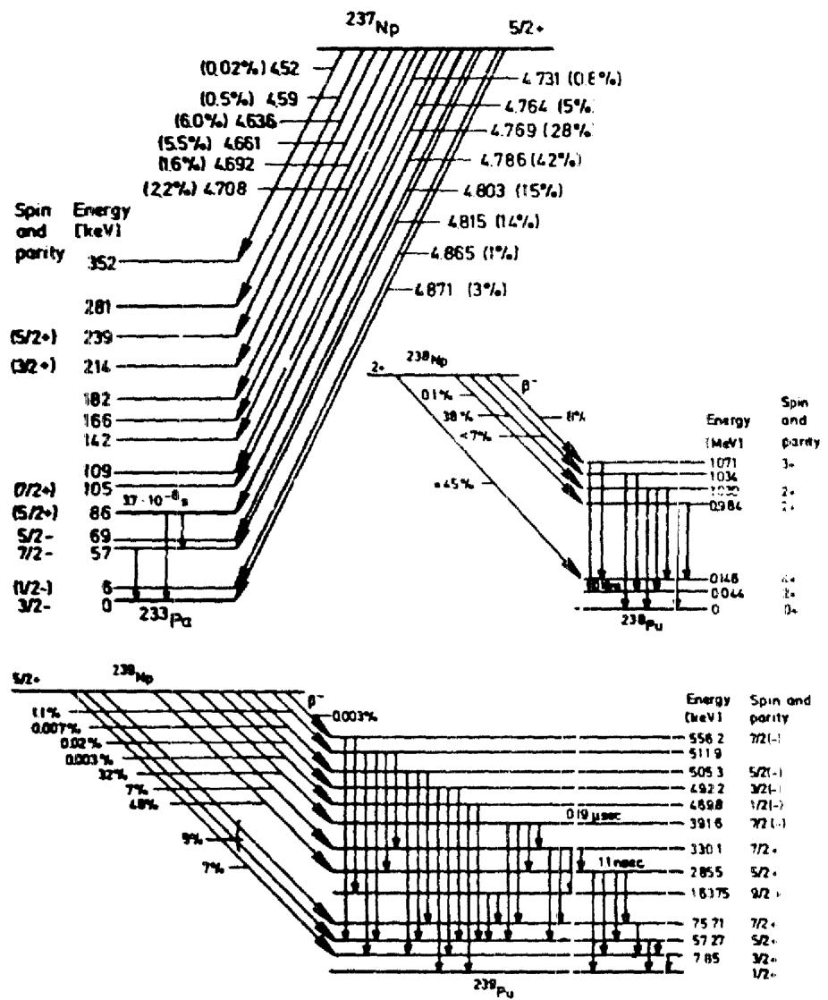  
Figure 1. Decay Schemes of the Most Important Neptunium Isotopes, $^{237}\mathrm{Np}$ , $^{236}\mathrm{Np}$ , and $^{239}\mathrm{Np}$ .

TABLE 2 CROSS SECTIONS AND RESONANCE INTEGRALSa FOR NEPTUNIUM ISOTOPES   

<table><tr><td rowspan="2">Mass Number</td><td colspan="2">Neutron Capture</td><td colspan="3">Fission</td></tr><tr><td>σ(n,y)</td><td>l(n,y)</td><td>σf</td><td>lf</td><td>σ(n,2n)</td></tr><tr><td>234</td><td></td><td></td><td>900</td><td></td><td></td></tr><tr><td>235</td><td>148b</td><td></td><td></td><td></td><td></td></tr><tr><td>236</td><td></td><td></td><td>2,800</td><td></td><td></td></tr><tr><td>237</td><td>185</td><td>600</td><td>0.02</td><td>0</td><td>0.0013°</td></tr><tr><td></td><td></td><td></td><td>1.42d</td><td></td><td></td></tr><tr><td>238</td><td>1,600</td><td>600</td><td>2,070</td><td>800</td><td></td></tr><tr><td>239</td><td>35e(to 2+8Nm)</td><td></td><td>1</td><td></td><td></td></tr><tr><td></td><td>25e(to 2+8Nm)</td><td></td><td></td><td></td><td></td></tr></table>

a. Cross-sections expressed in barns, $10^{-2}$ cm².  
b. J. H. Landrum, R. J. Nagle, M. Lininer, UCRL-51263 (1972).   
c. For neutrons with the fission spectrum.   
d. For 3 NeV neutrons.   
e. For "reactor neutrons".

# V. CHEMISTRY OF NEPTUNIUM

# A. METALLIC NEPTUNIUM

# A.1 Preparation

Np metal was first prepared by Fried and Davidson in 1948 by the reduction of $50~\mu \mathrm{g}$ of NpF, with Ba vapor at $1200^{\circ}C$ . A similar method was used by Westrum and Eyring. Reduction of NpF, by excess Ca metal with iodine as a boxster was used to produce multigram quantities of Np metal.

# A.2 Physical Properties

Pure Np is a silvery ductile metal with a melting point of $637^{\circ}C$ . The metal undergoes three allotropic modifications below the melting point. The physical properties are summarized in Table 3.

TABLE 3

PHYSICAL PROPERTIES OF NEPTUNIUM METAL 16,17,18

A. Appearance: Silvery white (slowly coated with oxide in dry air at room temperature)   
B. Melting Point: $637^{\circ} \mathrm{C}$   
C. Boiling Point: 4175°C (extrapolated from vapor pressure measurements of liquid Np)   
D. Heat of Vaporization: $\Delta H 1800^{\circ} \mathrm{K} = 94.3 \mathrm{kcal} / (\mathrm{g}\text{-atom})$   
E. Properties of Various Allotropic Modifications: α β γ Transition temperature to next higher phase, °C 280 577 637 Density, g/cm³ (at T°C) 20.48 19.40 18.04 Crystal Structure Orthor-hombic Tetrahedral Cubic

Stephens20 determined the pressure-temperature relationship for Np. The specific heat (Cp) of Np is high. The Dulong and Petit value of SR is reached at $140^{\circ}\mathrm{K}$ and 7.093 cal/(mol $^{-1}$ ) at $27^{\circ}\mathrm{C}$ .21 The high specific heat can be entirely accounted for by the very high electronic contributions. No magnetic ordering in a-Np occurs down to 1.7 $^{\circ}\mathrm{K}$ .22

# A.3 Chemical Properties

Np is a reactive metal. The potential for the couple Np = Np³⁺ + 3e⁻ is 1.83 volts. Metallic Np is slowly covered with a thin oxide layer when exposed to dry air at about 20°C, and rapid oxidation to NpO₂ occurs at higher temperatures especially in moist air. Hydrogen, halogens, phosphorus, and sulfur react with Np metal at elevated temperatures. Hydrogen reacts to form the hydride at relatively low temperatures.

Np forms intermetallic compounds of intermediate solid solutions with U, Pu, Be, Al, B, Cd, Ir, Pd, and Rh.

Np dissolves readily in HCl at room temperature and $\mathsf{H}_2\mathsf{SO}_4$ at elevated temperature. The behavior of Np toward various solutions is given in Table 4.

# 8. ALLOYS AND INTERMETALLIC COMPOUNDS

Complete phase diagrams are reported for Np-Pu and Np-U. $^{23-26}$ Complete miscibility has been reported between $\gamma$ -Np and $\gamma$ -U and between $\gamma$ -Np and $\Sigma$ -Pu. Np is a unique element because of its extremely high solubility in both $\alpha$ -Pu and $\beta$ -Pu.

The intermetallic compounds of Np with Al and Be (NpAl₂, NpAl₃, NpAl₄, and NpBe₁₃) are prepared directly by reducing NpF₃ with an excess of metallic Al or Be. The borides (NpB₂, NpB₄, NpB₆, and NpB₁₂) and the intermetallic compounds NpCd₆ and NpCd₁₂ are obtained directly from the elements.[27-29] Several

<table><tr><td>Initial</td><td>After 4 days</td></tr><tr><td>By slowly attacked</td><td></td></tr><tr><td>mediate vigorous reaction</td><td>Completely dissolve</td></tr><tr><td>&quot;</td><td>&quot;</td></tr><tr><td>&quot;</td><td>&quot;</td></tr><tr><td>&quot;</td><td>&quot;</td></tr><tr><td>visible reaction</td><td>Some turbidity, 
hydrated oxide</td></tr><tr><td>&quot;</td><td>&quot;</td></tr><tr><td>&quot;</td><td>No reaction- 
clear solvent</td></tr><tr><td>&quot; reaction</td><td>No reaction- 
clear solvent</td></tr><tr><td>&quot;</td><td>&quot;</td></tr><tr><td>&quot; noticeable reaction</td><td>&quot;</td></tr><tr><td>light initial reaction- 
used</td><td>Some turbidity 
hydrated oxide</td></tr><tr><td>&quot;</td><td>&quot;</td></tr><tr><td>visible reaction</td><td>No reaction- 
clear solution</td></tr><tr><td>and dissolution 
on heated</td><td>&quot;</td></tr><tr><td>and dissolution 
on heated</td><td>&quot;</td></tr><tr><td>and dissolution 
on heated</td><td>&quot;</td></tr><tr><td>solution when refluxed</td><td>&quot;</td></tr></table>

2. At ambient temperature.

compounds with noble metals, such as $\mathsf{NpPt}_3$ and $\mathsf{NpPt}_5$ , have been prepared by hydrogen reduction of $\mathsf{NpO}_2$ at $1300^{\circ}\mathsf{C}$ in the presence of platinum. $^{30}$ Also, Erdmann $^{31}$ used the same method to prepare several other compounds, $\mathsf{NpIr}_2$ , $\mathsf{NpPd}_3$ , and $\mathsf{NpRh}_3$ .

# C. COMPOUNDS OF NEPTUNIUM

Compounds of Np for the III, IV, V, VI, and VII oxidation states have been prepared. The solubilities and compositions of some of the compounds have not been verified because they were initially determined with small amounts of Np shortly after discovery and therefore may be semi-quantitative. Where studies have been made with larger amounts of neptunium, i.e., oxalates and peroxides, more quantitative data is available.

Numerous Np compounds, such as nitrates, chlorides, and possibly thiocyanates, are readily soluble in solvating organic solvents such as diethyl ether, hexone, TBP, and other acid-containing solvents saturated with water.

Investigation of compounds containing trivalent neptunium has been limited because of the instability of Np(III) in aqueous solution in the presence of atmospheric oxygen. Np(III) is produced under hydrogen (on a platinum catalyst), by electrochemical reduction and with rongalite, NaHSO $_2$ ·(H $_2$ O·2H $_2$ O. Mofod'eva et al. $^{32}$ have prepared several Np(III) compounds from solution with protection from oxygen. All the reagent solutions and water were

purged with pure argon. The precipitation and subsequent operations (centrifugation and washing) were conducted with a layer of benzene over the solution. The solids were washed with acetone or ether and dried in a stream of argon. Np(III) oxalate was prepared, but it was appreciably oxidized in a few hours. The solid was brown and was in the form of tetragonal prisms. Np(III) phenylarsonate is rose-lilac colored with the composition $\mathrm{Np}_2(\mathrm{C}_6\mathrm{H}_5\mathrm{AsO}_3)_3\cdot \mathrm{nH}_2\mathrm{O}$ when well dried; the compound is stable for a long period at room temperature. Np(III) salicylate and grayish-lilac Np(III) fluoride were also precipitated under controlled conditions. Two complex double sulfates of Np(III), $\mathrm{K}_5\mathrm{Np}(\mathrm{SO}_4)_4$ and $\mathrm{NaNp(SO_4)_2\cdot nH_2O}$ , were precipitated. In the dry form, these salts were stable to oxidation during prolonged storage even at increased temperature.

Only one solid compound of Np(VII), Co(NH₃)₆NpO₅·3H₂O, has been reported.³³

Compounds of Np(IV), (V), and (VI) are shown in Tables 5 and 6. Table 5 includes compounds produced in aqueous solution, and Table 6 includes compound is produced by other methods.

TABLE 5   
NEPTUNIUM COMPOUNDS PRECIPITATED FROM AQUEOUS: SOLUTION   

<table><tr><td>Compound</td><td>Color</td><td>Composition of Solution</td><td>Solubility (mg Np/l)</td><td>Reference</td></tr><tr><td>NpO2(OH)3·aq</td><td>Black</td><td>NaOH - NaNO3 pH 5 to 9</td><td>Dissolves in either acid or base</td><td>33</td></tr><tr><td>Np(IV) hydroxide</td><td>Brown green</td><td>1M NaOH - 3M NaNO3</td><td>5 to 4</td><td>34</td></tr><tr><td rowspan="3">Np(V) hydroxide</td><td rowspan="3">Green</td><td rowspan="3">1M NaOH - dilute ammonia</td><td>17</td><td rowspan="3">25</td></tr><tr><td>180</td></tr><tr><td>180</td></tr><tr><td>(NH4)2Np2O7</td><td>Brown</td><td>1M NH4OH - 0.5M (NH4)2SO6</td><td>25</td><td>35</td></tr><tr><td>Np(IV) peroxide</td><td>Purple</td><td>2.5M HNO3- 6.5M H2O2</td><td>1:</td><td>36</td></tr><tr><td rowspan="2">NpF1·XH2O</td><td>Grayish</td><td>0.5M HCl -</td><td></td><td>32</td></tr><tr><td>Iilac</td><td>0.5M HF (argon atm)</td><td></td><td></td></tr><tr><td>NpF6·XH2O</td><td>Green</td><td>1M HNO3- 1M HF</td><td></td><td>37</td></tr><tr><td>NH6NpF5</td><td>Green</td><td>1M HF - 0.01M NH4F</td><td>13</td><td>38</td></tr><tr><td>KnP2F9</td><td>Green</td><td>4M HF - 1M KF</td><td>11</td><td>38</td></tr><tr><td>La2NpF10·XH2O</td><td></td><td></td><td>4</td><td>39</td></tr><tr><td>Np(IV) iodate</td><td>Tan brown</td><td>1M HCl - 0.1M KIO3</td><td>80</td><td></td></tr><tr><td>Np(III) oxalate</td><td>Brown</td><td></td><td></td><td></td></tr><tr><td>Np(C2O6)2·6H2O</td><td>Green</td><td>0.14 H2C2O6- 3M HNO3</td><td>c</td><td>32</td></tr><tr><td>NpO2C2O6·2H2O</td><td>Green</td><td></td><td></td><td>40</td></tr><tr><td>NpO2C2O6·3H2O</td><td>Grey green</td><td></td><td></td><td>41</td></tr><tr><td>KNpC2CO3</td><td>Tan</td><td>H2O</td><td>.0</td><td>42</td></tr><tr><td>K5NpO2(CO3)3</td><td>Greenish blue</td><td>H2O - 0.2M K2CO3</td><td>23</td><td>44</td></tr><tr><td>CaNpO2(CO3)3</td><td>Greenish blue</td><td>H2O</td><td>23</td><td>44</td></tr><tr><td>KNpO2(C2H3O2)3</td><td>Green</td><td>0.7M H2SO4- 0.07M NaNO3- 2M NaC2H3O2</td><td>100</td><td>38</td></tr><tr><td>Np(HPO4)2·XH2O</td><td>Green</td><td>1M HCl - 0.5M H3PO4</td><td>56</td><td>45</td></tr><tr><td>K5Np(SO4)4</td><td>Bluish lllac</td><td>0.3M HCl - sat K2SO4- 0.2N H2SO4</td><td>0</td><td>32</td></tr><tr><td>NaNp(SO4)2·mH2O</td><td>Blue</td><td>0.3M HCl - sat K2SO4- 0.2N H2SO4</td><td>0</td><td>32</td></tr><tr><td>Np(C6H5AsO3)3</td><td>Green</td><td>0.1M C6H5AsO3H2- 0.5M HNO3</td><td>5</td><td>46</td></tr><tr><td>SpO2C4H5AsO3</td><td></td><td>0.04M C6H5AsO3H2- 0.5M HNO3</td><td>140</td><td>46</td></tr><tr><td>[(CH3)2(C6H5CH2)2N]2·Np(NO3)6</td><td></td><td>6 to 8M INO3</td><td>100</td><td>54</td></tr></table>

TABLE 6   
OTHER NEPTUNIUM COMPOUNDS   

<table><tr><td>Compound</td><td>Color</td><td>Lattice Symmetry</td><td>Reference</td></tr><tr><td>NpII2</td><td></td><td>Cubic</td><td>47</td></tr><tr><td>NpH3</td><td></td><td>Hexagonal</td><td>47</td></tr><tr><td>NpO2</td><td>Green</td><td>Cubic</td><td>48,49</td></tr><tr><td>Np2O5</td><td>Dark brown</td><td>Monoclinic</td><td>49a</td></tr><tr><td>Np3O6</td><td>Dark brown</td><td>Orthorhombic</td><td>50,51</td></tr><tr><td>NpO3·H2O</td><td>Red brown</td><td>Orthorhombic</td><td>47</td></tr><tr><td colspan="4">A large number of ternary and polynary oxides of Np(VII), Np(VI), Np(V), and Np(IV) with alkali metals and alkaline earth metals are known. Also, similar compounds are reported in 4 to 7.</td></tr><tr><td>NpN</td><td>Black</td><td>Cubic</td><td>53</td></tr><tr><td>NpF3</td><td>Purple</td><td>LaF3</td><td>54</td></tr><tr><td>NpF4</td><td>Green</td><td></td><td>55</td></tr><tr><td>NpF6</td><td>Orange</td><td>Orthorhombic</td><td>52,56</td></tr><tr><td colspan="4">A large number of fluoro compounds of alkali or alkaline metals with Np(IV) and fluoride have been reported; a few compounds with Np(V) and Np(VI) also are reported.</td></tr><tr><td>NpO2F</td><td>Green</td><td>Tetragonal</td><td>57</td></tr><tr><td>NpOF3</td><td>Green</td><td>Rhombohedral</td><td>58</td></tr><tr><td>NpO2F2</td><td>Pink</td><td></td><td>57</td></tr><tr><td>NpCl3</td><td>Green</td><td></td><td>11</td></tr><tr><td>NpCl4</td><td>Orange brown</td><td></td><td>11,58</td></tr><tr><td>NpOCl2</td><td>Orange</td><td></td><td>59</td></tr><tr><td>NpBr3</td><td>Green</td><td></td><td>60</td></tr><tr><td>NpBr4</td><td>Dark red</td><td></td><td>61</td></tr><tr><td>NpI3</td><td>Brown</td><td></td><td>62</td></tr><tr><td>NpS</td><td></td><td>Cubic</td><td>63,64</td></tr><tr><td>Np2S3</td><td></td><td>(4 different
structures)</td><td>63,64</td></tr><tr><td>Np1S3</td><td></td><td>Orthorhombic</td><td>63,64</td></tr><tr><td>Np2S3</td><td></td><td>Tetragonal</td><td>63,64</td></tr><tr><td>NpS3</td><td></td><td>Mono:linic</td><td>63,64</td></tr></table>

D. NEPTUNIUM IONS IN SOLUTION

D.1. Oxidation States

Neptunium exists in the (III), (IV), (V), (VI), and (VII) oxidation states in aqueous solutions. The heat of formation, the entropy of the individual ionic species, and simple methods of preparation are listed in Table 7. The first four of these oxidation states exist as hydrated ions in the absence of complexing agents. Np(VII) is stable only in alkaline solutions; reduction to Np(VI) occurs in acid solutions.

The singly charged, hydrated neptunyl ion, $\left[\mathrm{NpO}_{2}\left(\mathrm{H}_{2} \mathrm{O}\right)_{\varepsilon}\right]^{+}$ , is the most probable oxidation state in solution. Because $\mathrm{NpO}_{2}^{+}$ hydrolyzes only at pH >7, disproportionates only at high acid concentrations, and forms no polynuclear complexes, it is stable compared to the other pentavalent actinides. The standard potentials and formal electrode potentials in 1M HClO₄ of pairs of neptunium ions are shown in Table 8.

The formal oxidation potentials for Np couples in various 1M solutions are given in Table 9, with the hydrogen electrode in the stated medium as the reference. The change in the potentials in 1.0M H $_2$ SO $_4$ as compared to 1M solutions of HCIO $_4$ , HCl, and HNO $_3$ indicates strong complex formation of Np $^{4+}$ with sulfate ions.

TABLE 7   
NEPTUNIUM IONS IN AQUEOUS SOLUTION   

<table><tr><td>Oxidation State</td><td>Ionic Form</td><td>Color</td><td>Heat of Formation ΔH200(kcal/mol)</td><td>Entropy [°] (cal/(J·atom-1K)]</td><td>Simple Method of Preparation</td></tr><tr><td>+5</td><td>Np(H3O)10</td><td>Blue violet</td><td>-127</td><td>-1.5a</td><td>1) Np(+111): H2/Pt2) Electrolytic reduction</td></tr><tr><td>+4</td><td>Np(H2O)6*</td><td>Yellow green</td><td>-132.5</td><td>-8</td><td>1) Np1**: O22) Np(V) + SO23) Np(V) + I-(SM HC1)</td></tr><tr><td>+5</td><td>NpO2(H3O)6</td><td>Green</td><td>-231</td><td>-6.2b</td><td>1) Np** + HNO3(hat!2) Np(VI) + stoichiometric I-1) Np(VI) + NH3OH</td></tr><tr><td>+6</td><td>NpO2(H2O)6*</td><td>Pink or red</td><td>-208</td><td>-0b</td><td>1) Np(&lt;VI) - HClO4(evaporate)2) Np(&lt;VI) + Ag(II)O (or BrO3, Ca2+)</td></tr><tr><td>+7</td><td>NpO3-</td><td>Green</td><td></td><td></td><td>1) Dissolution of thermally prepared Li3NpO4in dilute alkalis2) Np(VI) + ozone (or XeO3,K2S2O8, periodate) in 0.5 to 3.5M KOH</td></tr></table>

a.J.C.Hischey,J.W.Cobble.Inorg.Chem.9,992(1970).   
b. J. R. Brandt, J. W. Cobble. Inorg. Chem. 9, 912 (1970)   
c.C.Brown In HCIO.J.C.Sullivan and A.J.Zielen.Inorg.Mol.Chem.Lattera 92-1969).

TABLE 8   
STANDARD AND FORMAL REDOX POTENTIALS OF PAIRS OF NEPTUNIUM IONS3*   

<table><tr><td>Electrode Process</td><td>Standard Potentials (volts)</td><td>Formal Potentials in 1M HClO4(volts)</td></tr><tr><td>Np = Np3+ + 3e-</td><td>-1.856</td><td>-1.83</td></tr><tr><td>2Np + 3H2O = Np2O3 + 6H+ + 6e-</td><td>-1.420</td><td>-</td></tr><tr><td>Np2O3 + H2O = 2NpO2 + 2H+ + 2e-</td><td>-0.962</td><td>-</td></tr><tr><td>Np2O3 + 5H2O = 2Np(OH)4 + 2H+ 2e-</td><td>-0.928</td><td>-</td></tr><tr><td>Np3+ = Np4+ + e-</td><td>-0.152</td><td>0.155</td></tr><tr><td>Np3+ + 2H2O = NpO2 + 4H+ + e-</td><td>0.337</td><td>-</td></tr><tr><td>Np3+ + 4H2O = Np(OH4) + 4H+ + e-</td><td>0.391</td><td>-</td></tr><tr><td>Np3+ + 2H2O = NpO2 + 4H+ + 2e-</td><td>0.451</td><td>0.447</td></tr><tr><td>Np(OH)4 = NpO2 + 2H2O + e-</td><td>0.530</td><td>-</td></tr><tr><td>NpO2 = NpO2 + e-</td><td>0.564</td><td>-</td></tr><tr><td>Np4+ + 2H2O = NpO2 + 4H+ + e-</td><td>0.749</td><td>0.739</td></tr><tr><td>NpO2 = NpO2+ + e-</td><td>1.149</td><td>1.137</td></tr><tr><td>2Np(OH)4 = Np2O5 + 2H2O + 2H+ + 2e-</td><td>1.219</td><td>-</td></tr><tr><td>2NpO2 + H2O = Np2O5 + 2H+ + 2e-</td><td>1.253</td><td>-</td></tr><tr><td>Np2O5 + H2O = 2NpO3 + 2H+ 2e-</td><td>1.310</td><td>-</td></tr><tr><td>NpO2 + H2O = NpO3 + 2H+ + e-</td><td>1.998</td><td>-</td></tr><tr><td>Np3+ + 2H2O = NpO2+ + 4H+ + 3e-</td><td>-</td><td>0.677</td></tr><tr><td>Np4+ + 2H2O = NpO2+ + 4H+ + 2e-</td><td>-</td><td>0.938</td></tr></table>

# TABLE 9

# REDOX POTENTIALS OF NEPTUNIUM (IN VOLTS AT 25°C) 8,66-68

1. 1.0M HC1O

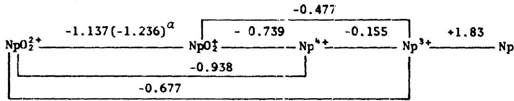

2. 1.OM HC1

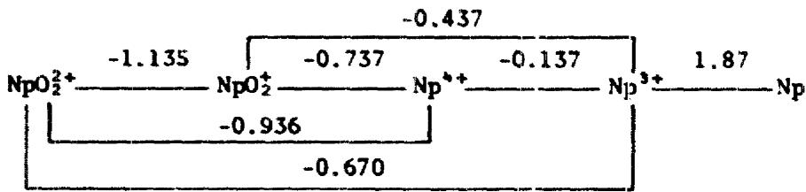

3. 1.0MH2SO

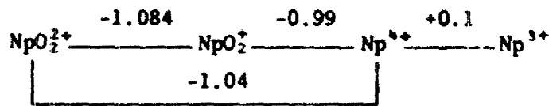

4. 1.02M HNO3

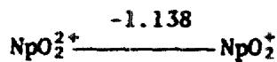

5. 1.OM NaOH

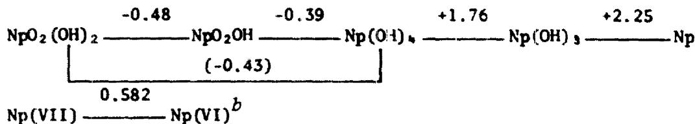

α. Standard potential

b. According to the half-reaction $\mathrm{NpO}_5^{3-} + \mathrm{e}^- + \mathrm{H}_2\mathrm{O} = \mathrm{NpO}_4^{2-} + 2\mathrm{OH}^{-6,9}$ the dependence of $\mathbf{E_0}$ on the OH concentration is expressed by:

$$
E _ {0} = 0. 6 0 0 + 0. 0 5 9 \cdot \log [ O H ^ {-} ] ^ {- b}
$$

The current-voltage curves for oxidation-reduction reactions of Np in aqueous solutions are shown in Figure 2.

# D.2. Oxidation-Reduction Reactions

Table 10 lists reagents and conditions necessary to change oxidation states for Np ions. For cases where only one electron is transferred, e.g., $\mathrm{Np}^{3+}/\mathrm{Np}^{4+}$ and $\mathrm{NpO}_2^+/NpO_2^{2+}$ , the establishment of redox equilibrium is rapid. Redox reactions that involve forming or rupturing of the neptunium-oxygen bond, e.g., $\mathrm{Np}^{4+}/\mathrm{NpO}_2^+$ and $\mathrm{Np}^{4+}/\mathrm{NpO}_2^{2+}$ , have a slower reaction rate.

Rate constants (k) and half-conversion periods of the redox reactions in IM acid solutions at $25^{\circ}C$ are given in Table 11.

# D.3. Disproportionation of Neptunium

Only the $\mathbf{Np}(\mathbf{V})$ oxidation state undergoes appreciable disproportionation. The reaction $2\mathrm{NpO}_2^+ + 4\mathrm{H}^+ = \mathrm{Np}^{4+} + \mathrm{NpO}_2^{2+}$ $2\mathrm{H}_2\mathrm{O}$ shows that disproportionation of $\mathbf{Np}(\mathbf{V})$ is favored by high acid concentrations. Because $\mathrm{Np}^{4+}$ and $\mathrm{NpO}_2^{2+}$ form more stable complexes than the $\mathrm{NpO}_2^+$ ion, the disproportionation of $\mathbf{Np}(\mathbf{V})$ is promoted by the addition of complexing agents. The equilibrium constants, $\mathbf{K}$ , for various acid solutions are listed in Table 12 where

$$
K = \frac {[ N p (I V) ] [ N p (V I) ]}{[ N p (V) ] ^ {2}}
$$

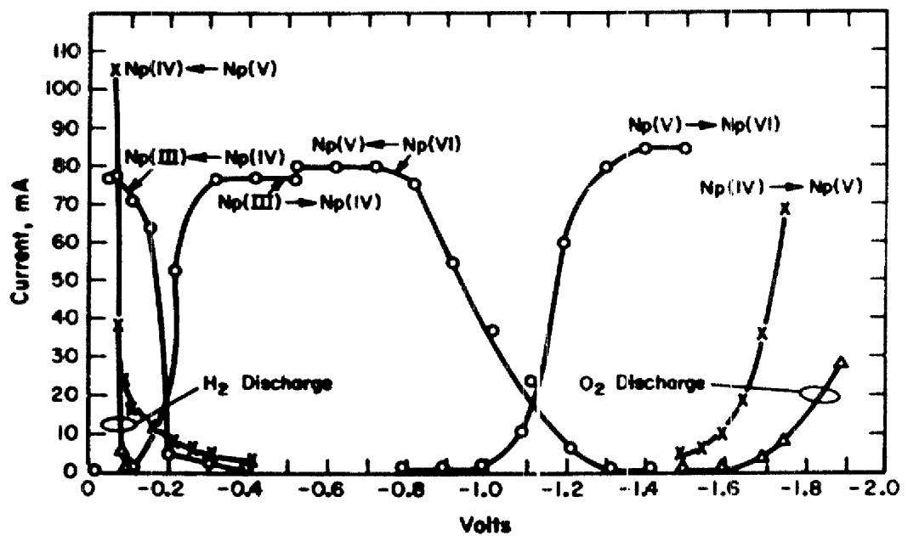  
Figure 2. Current-Voltage Curve for Redox Reactions of Neptunium.[71]

#   

<table><tr><td>Sorption</td><td>Reaction</td><td>Interaction</td><td>Temperature (°C)</td><td>Time</td></tr><tr><td>sp(VI) - sp(III)</td><td>Electrolyte</td><td></td><td></td><td>None</td></tr><tr><td>sp(VI) - sp(VI)</td><td>Cl2</td><td>MgCl2</td><td>75</td><td>None</td></tr><tr><td></td><td>NH4+</td><td>NH3</td><td>30</td><td>1 min</td></tr><tr><td></td><td></td><td></td><td>600</td><td>1 min</td></tr><tr><td></td><td>O2(melt)</td><td>MgO2OH</td><td>75</td><td>10 minutes</td></tr><tr><td></td><td>HClO4</td><td></td><td>75</td><td>10 minutes</td></tr><tr><td></td><td></td><td></td><td>600</td><td>1 min</td></tr><tr><td>sp(VI) - sp(TV)</td><td>Co(VI)</td><td>MgO2, A2OH</td><td>75</td><td>very few</td></tr><tr><td></td><td>methylamine</td><td>MgO2, A2OH</td><td>75</td><td>very few</td></tr><tr><td></td><td>Ag(III)</td><td>1.0 g CH4</td><td>75</td><td>1 min</td></tr><tr><td>sp(VI) - sp(TV)</td><td>Fe3+</td><td>Mg(OH)2</td><td>75</td><td>very few</td></tr><tr><td></td><td>I-</td><td>Mg(OH)2</td><td>75</td><td>complete to 40 sec</td></tr><tr><td></td><td></td><td></td><td>600</td><td>complete to 1 min 2 sec</td></tr><tr><td></td><td>Na2CO3</td><td>0.00 mmol</td><td>75</td><td>very few</td></tr><tr><td></td><td>NH4NO3</td><td>Mg(OH)2</td><td>75</td><td>very few</td></tr><tr><td></td><td>NH4NO3</td><td>Mg(OH)2</td><td>75</td><td>very few</td></tr><tr><td></td><td>NH3</td><td>Mg(OH)2</td><td>75</td><td>1 min</td></tr><tr><td></td><td>Sn2+</td><td>MgCl2</td><td>75</td><td>very few</td></tr><tr><td></td><td>O(IV)</td><td>MgCl2, HClO4</td><td>75</td><td>1 min</td></tr><tr><td>sp(VI) - sp(VI)</td><td>Fe3+</td><td>Mg(OH)2</td><td>75</td><td>very few</td></tr><tr><td>sp(VI) - sp(VI)</td><td>Cl-</td><td>Fe(II) oxalate</td><td>75</td><td>1 min</td></tr><tr><td></td><td>NH4NO3</td><td>Mg(OH)2</td><td>75</td><td>very few</td></tr><tr><td></td><td>NH4NO3</td><td>Mg(OH)2</td><td>75</td><td>very few</td></tr><tr><td></td><td>NH3</td><td>Mg(OH)2</td><td>75</td><td>1 min</td></tr><tr><td></td><td>MgSO4</td><td>0.00 mmol</td><td>15</td><td>1 min</td></tr><tr><td></td><td>Sn2+</td><td>MgCl2</td><td>75</td><td>1 min</td></tr><tr><td></td><td>NH4NO3</td><td>Mg(OH)2</td><td>75</td><td>1 min</td></tr><tr><td>sp(VI) - sp(VI)</td><td>Sn2+</td><td>2.5 × 10-9Mg</td><td>50</td><td>1 min</td></tr><tr><td></td><td></td><td>2.5 × 10-9MgO2</td><td>50</td><td>1 min</td></tr><tr><td></td><td></td><td>2.5 × 10-9MgO2</td><td>50</td><td>1 min</td></tr><tr><td></td><td></td><td>2.5 × 10-9MgO2</td><td>50</td><td>1 min</td></tr><tr><td></td><td></td><td>2.5 × 10-9MgO2</td><td>50</td><td>1 min</td></tr><tr><td>sp(VI) - sp(VI)</td><td>Co(IV)</td><td>MgO2, A2OH</td><td>75</td><td>very few</td></tr><tr><td></td><td>O2O2</td><td>MgO2, M2O2</td><td>75</td><td>1 min</td></tr><tr><td></td><td>Cl2</td><td>MgO2Cl</td><td>75</td><td>very few</td></tr><tr><td></td><td></td><td></td><td>75</td><td>1 min</td></tr><tr><td></td><td>NH4NO3</td><td>MgO2, M2O2</td><td>70</td><td>very few</td></tr><tr><td></td><td>Cr2O3</td><td>MgO2, M2O2</td><td>70</td><td>1 min</td></tr><tr><td></td><td>Cu(OH)2</td><td>5 × 10-10mmol, 5 × 10-10mmol,</td><td>70</td><td>1 min</td></tr><tr><td></td><td></td><td></td><td>100</td><td>1 min</td></tr><tr><td>sp(VI) - sp(VI)</td><td>Formate</td><td>2.5 × 10-9Mg</td><td>10</td><td>1 min</td></tr><tr><td></td><td></td><td>2.5 × 10-9MgO2</td><td>55</td><td>1 min</td></tr><tr><td></td><td></td><td>0.14 g Na2S2O4</td><td>10</td><td>1 min</td></tr><tr><td></td><td></td><td>0.14 g NH4NO3</td><td>10</td><td>1 min</td></tr><tr><td></td><td>Formate</td><td>2.5 × 10-9Mg</td><td>0.5</td><td>1 min</td></tr><tr><td></td><td></td><td>2.5 × 10-9MgO2</td><td>0.5</td><td>1 min</td></tr><tr><td></td><td></td><td>2.5 × 10-9MgO2</td><td>55</td><td>1 min</td></tr><tr><td></td><td>HClO1, HClO2</td><td>2.5 × 10-9Mg</td><td>55</td><td>1 min</td></tr><tr><td></td><td></td><td>2 × 10-9MgO2</td><td>55</td><td>1 min</td></tr><tr><td></td><td></td><td>2.5 × 10-9MgO2</td><td>55</td><td>1 min</td></tr><tr><td></td><td></td><td>2.5 × 10-9MgO2</td><td>55</td><td>1 min</td></tr><tr><td>sp(VI) - sp(VI)</td><td>H2O2</td><td>0.5 × 10-9MgO2</td><td>20</td><td>1 min</td></tr></table>

#

111 111

<table><tr><td>Neuromuscular
Type</td><td>Neurolipin
Level</td><td></td><td>Neuroleptin
Level</td><td></td><td>Neuroleptin
Level</td><td></td><td>Neuroleptin
Level</td><td>Neuroleptin
Level</td></tr><tr><td></td><td></td><td></td><td></td><td></td><td></td><td></td><td></td><td></td></tr><tr><td></td><td></td><td></td><td></td><td></td><td></td><td></td><td></td><td></td></tr><tr><td></td><td></td><td></td><td></td><td></td><td></td><td></td><td></td><td></td></tr><tr><td></td><td></td><td></td><td></td><td></td><td></td><td></td><td></td><td></td></tr><tr><td></td><td></td><td></td><td></td><td></td><td></td><td></td><td></td><td></td></tr><tr><td></td><td></td><td></td><td></td><td></td><td></td><td></td><td></td><td></td></tr><tr><td></td><td></td><td></td><td></td><td></td><td></td><td></td><td></td><td></td></tr><tr><td></td><td></td><td></td><td></td><td></td><td></td><td></td><td></td><td></td></tr><tr><td></td><td></td><td></td><td></td><td></td><td></td><td></td><td></td><td></td></tr><tr><td></td><td></td><td></td><td></td><td></td><td></td><td></td><td></td><td>2</td></tr><tr><td></td><td></td><td></td><td></td><td></td><td></td><td></td><td></td><td></td></tr><tr><td></td><td></td><td></td><td></td><td></td><td></td><td></td><td></td><td></td></tr><tr><td></td><td></td><td></td><td></td><td></td><td></td><td></td><td></td><td></td></tr><tr><td></td><td></td><td></td><td></td><td></td><td></td><td></td><td></td><td></td></tr><tr><td></td><td></td><td></td><td></td><td></td><td></td><td></td><td></td><td></td></tr><tr><td></td><td></td><td></td><td></td><td></td><td></td><td></td><td></td><td></td></tr><tr><td></td><td></td><td></td><td></td><td></td><td></td><td></td><td></td><td></td></tr><tr><td></td><td></td><td></td><td></td><td></td><td></td><td></td><td></td><td></td></tr><tr><td></td><td></td><td></td><td></td><td></td><td></td><td></td><td></td><td>1</td></tr><tr><td></td><td></td><td></td><td></td><td></td><td></td><td></td><td></td><td></td></tr><tr><td></td><td></td><td></td><td></td><td></td><td></td><td></td><td></td><td></td></tr><tr><td></td><td></td><td></td><td></td><td></td><td></td><td></td><td></td><td></td></tr><tr><td></td><td></td><td></td><td></td><td></td><td></td><td></td><td></td><td></td></tr><tr><td></td><td></td><td></td><td></td><td></td><td></td><td></td><td></td><td></td></tr><tr><td></td><td></td><td></td><td></td><td></td><td></td><td></td><td></td><td></td></tr><tr><td></td><td></td><td></td><td></td><td></td><td></td><td></td><td></td><td></td></tr><tr><td></td><td></td><td></td><td></td><td></td><td></td><td></td><td></td><td></td></tr><tr><td></td><td></td><td></td><td></td><td></td><td></td><td></td><td></td><td>3</td></tr></table>

TABLE 12   
EQUILIBRIUM CONSTANTS FOR DISPROPORTIONATION OF Np(V) IN VARIOUS ACID SOLUTIONS AT $25^{\circ}C^{39}$   

<table><tr><td>Solution</td><td>Ka</td></tr><tr><td>1N HCIO4</td><td>4 x 10-7</td></tr><tr><td>5.34M HCIO4</td><td>0.127</td></tr><tr><td>8.67M HCIO4</td><td>200</td></tr><tr><td>1M H2SO4</td><td>2.4 x 10-2</td></tr><tr><td>1.86M H2SO4</td><td>0.16</td></tr></table>

$$
a. k = \frac {[ N p (I V) ] [ N p (V I) ]}{[ N p (V) ] ^ {2}}
$$

The reverse reaction

$$
N p ^ {+} + N p O _ {2} ^ {2 +} + 2 H _ {2} O \rightarrow 2 N p (O) _ {2} ^ {+} + 4 H ^ {+}
$$

takes place rapidly in weakly acid solutions. The rate constant in 1M HClO $_4$ is 2.69 (M·min) $^{1,3}$ .

# D.4. Radiolysis of Neptunium Solutions

The radiolysis of Np(VI) by self-radiation of $^{237}\mathrm{Np}$ causes reduction to Np(V) with a rate constant of (3.1 ±0.2) x $10^{-9}$ sec⁻¹ (0.5 to 1.7M HClO₄) and a radiolytic reduction yield (G) of 6.4 ions/100 eV. $^{77-79}$ Compared to other hexavalent actinides, Np(VI) has a much lower rate of radiolytic reduction.

For the $60^{\circ}$ Co irradiation of 0.1M Np(VI) in 1.1M HClO₄, G = 3.4. The radiolytic yields for radiolysis of Np solutions (saturated with atmospheric oxygen) exposed to a $\sim$ 1 MeV electron beam[80,81] are shown in Table 13. Np(V) has a comparatively high stability to radiolysis. Np(IV) is oxidized to Np(V).

When $^{239}\mathrm{Np}$ is prepared by neutron irradiation of uranyl salts, 80 to $90\%$ of Np is in the tetravalent state. $^{62}$

TABLE 13   
RADIOLYSIS OF NEPTUNIUM SOLUTIONS IN AN ACCELERATED 1-MeV ELECTRON BEAM   

<table><tr><td>Ion</td><td rowspan="2">Acid</td><td rowspan="2">Acid Con- centration (H)</td><td rowspan="2">Radiolytic Yield G (number of ions per 100 eV)</td></tr><tr><td>NpO3+→ NpO2+</td></tr><tr><td></td><td></td><td>0.018</td><td>4.45</td></tr><tr><td></td><td></td><td>0.80</td><td>5.76</td></tr><tr><td></td><td></td><td>0.126</td><td>6.7</td></tr><tr><td></td><td></td><td>0.7</td><td>6.7</td></tr><tr><td></td><td></td><td>1.5</td><td>4.7</td></tr><tr><td></td><td></td><td>3.4</td><td>1.9</td></tr><tr><td></td><td>HNO3</td><td>0.05</td><td>8.2</td></tr><tr><td></td><td>H2SO4</td><td>0.86</td><td>3.0</td></tr><tr><td>Np4++→ NpO2+</td><td>H2SO4</td><td>0.8</td><td>2.1</td></tr></table>

# D.5. Hydrolysis of Neptunium

The hydrolysis of a metal ion is a special case of complex formation with OH $^-$ ion. Hydrolysis consists of the transfer of a proton from a coordinated water molecule to a water molecule in the outer sphere, e.g.,

$$
N p \left(H _ {2} O\right) ^ {+ +} + H _ {2} O = \left[ N p (O H) \left(H _ {2} O\right), \right] ^ {3 +} + H _ {3} O ^ {+}
$$

with $\kappa_{H} = \frac{[Np(OH)(H_{2}O)_{7}]^{3+}[H_{3}O]^{4-}}{[Np([H_{2}O)_{8}]^{5-}}$

The most recent and extensive hydrolytic studies of Np were made by A. I. Moskvin. $^{33}$ Hydrolysis constants, $K_{\mathrm{H}}$ , are listed in Table 14 for Np(IV), (V), and (VI). The tendency for Np ions in dilute acid solutions to undergo hydrolysis increases with increasing ionic potential (d) where $d = Z / r$ , $Z$ is the ionic charge, and $r$ is the ionic radius. Thus, the tendency to undergo hydrolysis increases in the order:

$$
N p O _ {2} ^ {+} <   N p O _ {2} ^ {2 +} <   N p O _ {2} ^ {3 +} <   N p ^ {3 +} <   N p ^ {4 +}.
$$

Successive hydrolysis reactions in Pu(IV) solutions result in the formation of colloidal aggregates. The polymer presumably forms irreversibly with oxygen or hydroxyl bridges. $^{6}$

TABLE 14   
FIRST HYDROLYSIS CONSTANTS AND SOLUBILITY PRODUCTS FOR NEPTUNIUM IONS   

<table><tr><td>Ion</td><td>Hydroxide</td><td>Ksp</td><td>Hydrolysis Product</td><td>KH</td><td>Reference</td></tr><tr><td>Np4+</td><td>Np(OH)4</td><td>6 x 10-56</td><td rowspan="3">(NpOH)3+</td><td>5 x 10-3</td><td>83</td></tr><tr><td></td><td></td><td></td><td>9 x 10-3</td><td>84</td></tr><tr><td></td><td></td><td></td><td></td><td>34</td></tr><tr><td>NpO2+</td><td>NpO2(OH)</td><td>9.5 x 10-10</td><td rowspan="2">NpO2OH</td><td>8.3 x 10-11</td><td>86</td></tr><tr><td></td><td></td><td></td><td>1.3 x 10-9</td><td>85</td></tr><tr><td></td><td></td><td>8 x 10-10</td><td></td><td>10-10</td><td>34</td></tr><tr><td>NpO22+</td><td>NpO2(OH)2</td><td>2 x 10-23</td><td>[NpO2(OH)]+</td><td>4.3 x 10-4</td><td>83</td></tr></table>

Moskvin43 reports evidence for formation of polymer forms of Np(IV) in aqueous solution at $[\mathsf{H}^+] \ll 0.3\mathsf{M}$ .

# D.6. Complex Ion Formation

The formation of complex species by the actinides in different oxidation states with a variety of ligands offers potential for separating the actinides from each other and from other cations. Complex formation and hydrolysis are competing reactions. The mechanism of complex ion formation can be represented as successive reactions between water molecules from the inner sphere of the hydrated cation and anions, A, e.g.,

$$
N p \left(H _ {2} O\right) _ {8} ^ {+ +} + A ^ {-} = N p A \left(H _ {2} O\right) _ {7} ^ {+ +} + H _ {2} O
$$

The ability of an ion to form complexes is dependent on the magnitude of the ionic potential. The relative tendency of Np ions to form complexes is usually:

$$
N p ^ {4 ^ {+}} > N p ^ {3 ^ {+}} > N p O _ {2} ^ {3 ^ {+}} > N p O _ {2} ^ {2 ^ {+}} > N p O _ {2} ^ {+}
$$

Neptunium (III)

$\mathsf{Np}(\mathsf{III})$ exists in aqueous solutions as $\mathsf{Np}(\mathsf{H}_2\mathsf{O})_8^{3+}$ . The chloride and bromide complexes cf $\mathsf{Np}(\mathsf{III})$ have been studied spectroscopically in concentrated LiCl and LiBr solutions (see Table 15).

TABLE 15   
COMPLEXS OF NEPTUNIN IN AQUEOUS SOLUTION   

<table><tr><td rowspan="2">Catalen</td><td rowspan="2">Lysis</td><td rowspan="2">Method</td><td rowspan="2">Temperature (°C)</td><td rowspan="2">Medium</td><td rowspan="2">Species</td><td colspan="2">Log of Equalibriumb Constant</td><td rowspan="2">Reference</td></tr><tr><td colspan="2">β1-2.42</td></tr><tr><td rowspan="3">Np+</td><td rowspan="2">Chloride</td><td rowspan="2">spec</td><td rowspan="2">28</td><td rowspan="2">Cane LiCl</td><td>NpCl2+</td><td colspan="2">β3-4.96</td><td>88</td></tr><tr><td>NpCl3+</td><td colspan="2">β1-3.45</td><td>88</td></tr><tr><td>Bromide</td><td>spec</td><td>28</td><td>Cane LiBr</td><td>NpBr2+</td><td colspan="2">β3-6.54</td><td>89</td></tr><tr><td rowspan="20">Np++</td><td rowspan="8">Chloride</td><td rowspan="3">dista</td><td rowspan="3">20</td><td rowspan="3">1.0M HC10</td><td>NpCl4+</td><td colspan="2">β1-0.04</td><td>90</td></tr><tr><td>NpCl5+</td><td colspan="2">β1-0.24</td><td>89</td></tr><tr><td>NpCl6+</td><td colspan="2">β1-0.48</td><td>91</td></tr><tr><td>conf</td><td>25</td><td>1.0M HC10</td><td></td><td colspan="2">β1-0.31</td><td>90</td></tr><tr><td rowspan="2">dista</td><td rowspan="2">20</td><td rowspan="2">2.0M HC10</td><td rowspan="2"></td><td colspan="2">β1+0.04</td><td>89</td></tr><tr><td colspan="2">β1-0.16</td><td>91</td></tr><tr><td rowspan="2">dista</td><td rowspan="2">25</td><td rowspan="2">4.0M HC10</td><td rowspan="2"></td><td colspan="2">β1-0.10</td><td>91</td></tr><tr><td colspan="2">β1-0.10</td><td>92</td></tr><tr><td rowspan="4">Fluoride</td><td rowspan="4">fix</td><td rowspan="4">20</td><td rowspan="4">4.0M HC10</td><td>NpF1+</td><td colspan="2">β1-4.82</td><td>92</td></tr><tr><td>NpF2+</td><td colspan="2">β1+7.57</td><td>92</td></tr><tr><td>NpF3+</td><td colspan="2">β1-9.91</td><td>92</td></tr><tr><td>NpF4+</td><td colspan="2">β1-11</td><td>99</td></tr><tr><td rowspan="7">Nitrate</td><td rowspan="3">dista</td><td rowspan="3">20</td><td rowspan="3">1.0M HC10</td><td>Np(NO3)2+</td><td colspan="2">β1-0.34</td><td>89</td></tr><tr><td>Np(NO3)3+</td><td colspan="2">β1+0.08</td><td>89</td></tr><tr><td>Np(NO3)4+</td><td colspan="2">β1-0.26</td><td>90</td></tr><tr><td>conf</td><td>25</td><td>1.0M HC10</td><td></td><td colspan="2">β1+0.38</td><td>90</td></tr><tr><td>dista</td><td>20</td><td>2.0M HC10</td><td></td><td colspan="2">β1+0.34</td><td>89</td></tr><tr><td rowspan="2">dista</td><td rowspan="2">25</td><td rowspan="2">4.0M HC10</td><td rowspan="2"></td><td colspan="2">β1-0.15</td><td>91</td></tr><tr><td colspan="2">β1-0.75</td><td>91</td></tr><tr><td>Hydroxide</td><td>spec</td><td></td><td>0.2 to 2M HC10</td><td>NpOH1+</td><td colspan="2">β1-11.7</td><td>86</td></tr><tr><td rowspan="15">Np++</td><td rowspan="6">Sulfate</td><td rowspan="2">dista</td><td rowspan="2">25</td><td rowspan="2">2.0M HC10</td><td>[Np(SO4)2]2+</td><td colspan="2">β1+2.43</td><td>93</td></tr><tr><td>[Np(SO4)2]</td><td colspan="2">β1+3.47</td><td>94</td></tr><tr><td rowspan="2">inf</td><td rowspan="2">25</td><td rowspan="2">3.0M NaClO4</td><td></td><td colspan="2">β1+2.49</td><td>94</td></tr><tr><td></td><td colspan="2">β1+3.57</td><td>92</td></tr><tr><td rowspan="2">les</td><td rowspan="2">20</td><td rowspan="2">4.0M HC10</td><td></td><td colspan="2">β1+2.70</td><td>92</td></tr><tr><td></td><td colspan="2">β1+4.26</td><td>92</td></tr><tr><td rowspan="8">Oxalate</td><td rowspan="4">sol</td><td rowspan="4">25</td><td rowspan="4">-</td><td>[Np(C2O4)]3+</td><td colspan="2">β1+0.53</td><td>95</td></tr><tr><td>[Np(C2O4)]2+</td><td colspan="2">β1+17.53</td><td>95</td></tr><tr><td>[Np(C2O4)]-</td><td colspan="2">β1+23.96</td><td>96</td></tr><tr><td>[Np(C2O4)]-</td><td colspan="2">β1-27.40</td><td>96</td></tr><tr><td rowspan="2">sol</td><td rowspan="2">26</td><td rowspan="2">1.0M HC10</td><td rowspan="2"></td><td colspan="2">β1-7.40</td><td>96</td></tr><tr><td colspan="2">β1-13.62</td><td>96</td></tr><tr><td rowspan="2">dista</td><td rowspan="2">26</td><td rowspan="2">1.0M HC10</td><td rowspan="2"></td><td colspan="2">β1+19.46</td><td>96</td></tr><tr><td colspan="2">β1+19.46</td><td>96</td></tr><tr><td>Formate</td><td>spec</td><td>-</td><td>0.1 to 0.5M NaCOOH</td><td>[Np(HCOO)3+]</td><td colspan="2">β1+2.7</td><td>94</td></tr><tr><td rowspan="8">Acetate (AC+)</td><td rowspan="8">Ion, and</td><td rowspan="8">-</td><td rowspan="8">0.5M HCLCI</td><td rowspan="8">[Np(AC)]3+</td><td>[Np(AC)3]3+</td><td colspan="2">β1+2.68</td><td>97</td></tr><tr><td>[Np(AC)3]</td><td colspan="2">β1+4.76</td><td>97</td></tr><tr><td>[Np(AC)3]</td><td colspan="2">β1+7.49</td><td>97</td></tr><tr><td>[Np(AC)3]</td><td colspan="2">β1+9.67</td><td>97</td></tr><tr><td>[Np(AC)3]</td><td colspan="2">β1+12.0</td><td>97</td></tr><tr><td>[Np(AC)3]3-</td><td colspan="2">β1+14.7</td><td>97</td></tr><tr><td>[Np(AC)3]3-</td><td colspan="2">β1+17.4</td><td>97</td></tr><tr><td>[Np(AC)3]3-</td><td colspan="2">β1+20.2</td><td>97</td></tr></table>

a. diato, distribution measurements; ion, ion exchange; spec, spectrophotometry; erf, electromotive force; redox, eef with redox electrode; pH, pH method.   
b. Stability constants are given as logarithms to base 10 of the equilibrium (constant).   
For the reaction of a cation $\mathbb{R}$ with ligands L, the constant $\mathbb{L}$ and $\mathbb{B}$ are defined as:   
1. 0.   
$= \frac{1}{2} \cdot  \frac{1}{2} \cdot  \frac{1}{2} \cdot  \frac{1}{2}$   
Therefore $\beta_{1} = \mathbf{L}_{1}\mathbf{L}_{1},\beta_{2} = \mathbf{L}_{2}\mathbf{L}_{2},$ etc.

Table 15. Continued   

<table><tr><td>Cation</td><td>Ligand</td><td>Method2</td><td>Temperature (°C)</td><td>Medium</td><td>Species</td><td>Log of Equilibrium b Constant</td><td>Reference</td></tr><tr><td rowspan="5">Np*</td><td>8-hydroxy-quinolinate (OX-)</td><td>distn</td><td>25</td><td>0.1M NH4ClO6</td><td>Np(OH)3</td><td>E1+45.20</td><td>98</td></tr><tr><td>5,7-Dichloro-8-hydroxy-quinolinate (DCO*)</td><td>distn</td><td>25</td><td>0.1M NH4ClO6</td><td>Np(DCO)3</td><td>B1+46.05</td><td>98</td></tr><tr><td>Ethylene-diamine-tetramate (EDTA)</td><td>distn</td><td>25</td><td>0.5M (HCl)</td><td>Np(BHTA)</td><td>θ1+26.3</td><td>99</td></tr><tr><td>Themoyl-trifluoroacetate (DTPA)</td><td>distn</td><td>25</td><td>0.1M HNO3</td><td>Np(TTA)</td><td>32+5.15</td><td>100</td></tr><tr><td>Diethylene-trimine-pentanacetate (DTPA)</td><td>lex</td><td>-</td><td>1M HClO6</td><td>Np(DTPA)</td><td>E1-39.79</td><td>101</td></tr><tr><td rowspan="20">NpO2*</td><td rowspan="2">Chloride</td><td>lex</td><td>25</td><td>2.0M HCl</td><td>NpO2C</td><td>θ1-0.50</td><td>102</td></tr><tr><td>distn</td><td>25</td><td>4.0M HClO6</td><td>[ NpO2Cl2]</td><td>θ1-2.52</td><td>91</td></tr><tr><td rowspan="2">Nitrate</td><td>lex</td><td></td><td>2.0M HClO6</td><td>NpO2NO3</td><td>θ1-0.25</td><td>102</td></tr><tr><td>distn</td><td>25</td><td>4.0M HClO6</td><td>[NpO2(NO3)2]</td><td>θ1-1.6</td><td>91</td></tr><tr><td rowspan="2">Hydroxide</td><td>omf</td><td></td><td>10-8M HNO3</td><td>NpO4OH</td><td>θ2-5.1</td><td>74</td></tr><tr><td>spec</td><td></td><td></td><td></td><td>θ1-4</td><td>66</td></tr><tr><td rowspan="2">Sulfite</td><td>lex</td><td></td><td></td><td>[NpO2(SO3)]</td><td>θ1+2.15</td><td>103</td></tr><tr><td></td><td></td><td></td><td>[NpO2(SO3)]b</td><td>θ1+3.00</td><td></td></tr><tr><td>Bicarbonate</td><td>lex</td><td></td><td></td><td>NpO2(HCO3)</td><td>θ1+2.45</td><td>103</td></tr><tr><td>Oxalate</td><td>lex</td><td></td><td>0.05M NH4ClO6</td><td>[NpO2(C2O4)]</td><td>θ1+4.0</td><td>104</td></tr><tr><td></td><td></td><td></td><td></td><td></td><td>θ2+7.3</td><td></td></tr><tr><td rowspan="2">Acetate (AC)</td><td>spec</td><td></td><td></td><td>NpO2(Ac)</td><td>θ1+1.33</td><td>105</td></tr><tr><td></td><td></td><td></td><td>[NpO2&#x27;AC]</td><td>θ2+1.80</td><td></td></tr><tr><td></td><td>spec</td><td></td><td>1.5M NH4ClO6</td><td></td><td>θ1+1.08</td><td></td></tr><tr><td></td><td></td><td></td><td></td><td></td><td>θ1+1.55</td><td></td></tr><tr><td rowspan="2">8-hydroxy-quinolinate (OK)</td><td>spec</td><td>25</td><td>0.1M NH4ClO6</td><td>NpO2(OI)</td><td>θ1+6.32</td><td>106</td></tr><tr><td></td><td></td><td></td><td>[NpO2&#x27;OK]aq</td><td>θ1+11.50</td><td></td></tr><tr><td>Glycolate (GLYC)</td><td>spec</td><td>25</td><td>0.1M NH4ClO6</td><td>NpO2(GLYC)</td><td>θ1+1.51</td><td>107</td></tr><tr><td rowspan="2">Lactate (LACT)</td><td>spec</td><td>25</td><td>0.1M NH4ClO6</td><td>NpO2(LACT)</td><td>θ1+1.75</td><td>107</td></tr><tr><td></td><td></td><td>0.2M NH4ClO6</td><td>[NpO2&#x27;LACT)]</td><td>θ2+2.20</td><td>103</td></tr></table>

a. distn, distribution measurements; ix, ion exchange; spec, spectrophotometry; emf, electromotive force; redox, emf with redox electrode; pH, pH method.   
b. Stability constants are given as logarithm to base 10 of the equilibria constants.   
For the reaction of a cation M with ligands L, the constant K and $\beta$ are defined as:   
M L 10   
B. $= \frac{|\mathbf{M}|}{|\mathbf{M}|} |\mathbf{L}|^{\prime}$ B. $= \frac{|\mathbf{M}|}{|\mathbf{M}|} |\mathbf{L}|$ 10c.   
Therefore $\beta_{2} = \kappa_{1}\kappa_{2},\beta_{3} = \kappa_{1}\kappa_{2}\kappa_{3}$ ,etc.

[MP(TTA)]H

Table 1. Continued   

<table><tr><td rowspan="2">Callen</td><td rowspan="2">Liquefied</td><td rowspan="2">Method</td><td rowspan="2">Temperature (°C)</td><td rowspan="2">Medium</td><td rowspan="2">S. pygmae</td><td colspan="2">Log of log10(liter/min)b</td></tr><tr><td>Concentration</td><td>Reference</td></tr><tr><td rowspan="18">VpO1*</td><td rowspan="3">a-hydroxy- indoleylpyrrole (NIB2)</td><td rowspan="3">spec</td><td rowspan="3">25</td><td rowspan="3">0.2 M NH4ClO4</td><td>HgO3(NBA)</td><td>0, - 2.17</td><td>109</td></tr><tr><td>[HgO3(NBA)]-</td><td>0, - 3.07</td><td></td></tr><tr><td>[HgO(NBA)]-</td><td>0, - 3.53</td><td></td></tr><tr><td rowspan="4">Tetrato (TART)</td><td rowspan="4">ion</td><td rowspan="4">20</td><td rowspan="4">0.65M NH4ClO4 pH 1.2 to 6.2</td><td>HgO3(MTART)</td><td>0, - 2.36</td><td>110</td></tr><tr><td>[HgO3(TART)]-</td><td>0, - 2.32</td><td></td></tr><tr><td>[HgO3(TART)]-</td><td>0, - 4.30</td><td></td></tr><tr><td>[HgO3(TART)]-</td><td>0, - 6.18</td><td></td></tr><tr><td rowspan="2">Citrate (CITB)</td><td rowspan="2">ion</td><td rowspan="2">20</td><td rowspan="2">0.6M NH4ClO4 pH 4.5 to 5.4</td><td>[HgO3(NCTB)]-</td><td>0, - 3.40</td><td>110</td></tr><tr><td>[HgO3(CITB)]-</td><td>0, - 5.67</td><td></td></tr><tr><td rowspan="2">Acetyl acetonate (AA)</td><td rowspan="2">spec</td><td rowspan="2">25</td><td rowspan="2">0.1 M NH4ClO4</td><td>HgO3(AA)</td><td>0, - 4.00</td><td>111</td></tr><tr><td>[HgO3(AA)]-</td><td>0, - 7.00</td><td></td></tr><tr><td>Thiomylate</td><td rowspan="2">spec</td><td rowspan="2">25</td><td rowspan="2">0.1 M NH4ClO4</td><td>HgO3(CTA)</td><td>0, - 2.00</td><td>112</td></tr><tr><td>fluorescein amide (TTA)</td><td>[HgO3(TTA)]-</td><td>0, - 5.48</td><td></td></tr><tr><td>Diethylenamidomethylammonium pentachlorate (DTPA)</td><td>spec</td><td>25</td><td>0.1 M NH4ClO4</td><td>[HgO3(DTPA)]-</td><td>0, - 5.03</td><td>112</td></tr><tr><td rowspan="2">Nitrite-tricarbamate (NTA)</td><td rowspan="2">spec</td><td rowspan="2">25</td><td rowspan="2">0.1 M NH4ClO4</td><td>[HgO3(NHTA)]-</td><td>0, - 1.77</td><td>113</td></tr><tr><td>[HgO3(NTA)]-</td><td>0, - 6.05</td><td></td></tr><tr><td>f-thylose diacetate</td><td rowspan="2">spec</td><td rowspan="2">25</td><td rowspan="2">0.1 M NH4ClO4</td><td>[HgO3(NETTA)]-</td><td>0, - 4.00</td><td>113</td></tr><tr><td>tetramersite (EDTA)</td><td>[HgO3(ETPA)]-</td><td>0, - 7.33</td><td></td></tr><tr><td rowspan="16">VpO1*</td><td rowspan="2">Chloride</td><td rowspan="2">dissociation</td><td>25</td><td>0.4M NH4ClO4</td><td>[HgO3Cl]</td><td>0, - 0.37</td><td>114</td></tr><tr><td>25</td><td>0.4M HClO4</td><td>[HgO3Cl]</td><td>0, - 0.15</td><td>93</td></tr><tr><td rowspan="2">Nitrate</td><td rowspan="2">dissociation</td><td>25</td><td>0.4M HClO4</td><td>[HgO3(NO3)]-</td><td>0, - 0.00</td><td>114</td></tr><tr><td>25</td><td>0.4M HClO4</td><td></td><td>0, - 0.60</td><td>93</td></tr><tr><td rowspan="2">Fluoride</td><td rowspan="2">water</td><td rowspan="2">21</td><td rowspan="2">1 M NH4ClO4</td><td>[HgO3F]</td><td>0, - 5.06</td><td>115</td></tr><tr><td>[HgO3F]</td><td>0, - 6.27</td><td></td></tr><tr><td rowspan="2">Sulfate</td><td rowspan="2">water</td><td rowspan="2">25</td><td rowspan="2">1 M NH4ClO4</td><td>[HgO3SO4]</td><td>0, - 1.00</td><td>116</td></tr><tr><td>[HgO3(SO4)2]3-</td><td>0, - 2.77</td><td></td></tr><tr><td rowspan="2">Oxalate</td><td rowspan="2"></td><td>20</td><td>1 M NH4ClO4</td><td>[HgO3C2O4]</td><td>0, - 6.0</td><td>42</td></tr><tr><td>15</td><td>1 M NH4ClO4</td><td>[HgO3(C2O4)2]3-</td><td>0, - 4.00</td><td></td></tr><tr><td rowspan="6">Acetate</td><td rowspan="2">pH</td><td rowspan="2">-</td><td rowspan="2">-</td><td>[HgC1(AC)]-</td><td>0, - 2.30</td><td>97</td></tr><tr><td>[HgO3(AC)]-</td><td>0, - 4.60</td><td></td></tr><tr><td rowspan="4">pH</td><td rowspan="4">20</td><td rowspan="4">1 M NH4ClO4</td><td>[HgO3(AC)]-</td><td>0, - 6.40</td><td>117</td></tr><tr><td></td><td>0, - 2.32</td><td></td></tr><tr><td></td><td>0, - 4.23</td><td></td></tr><tr><td></td><td>0, - 6.0</td><td></td></tr><tr><td rowspan="2">VpO1*</td><td rowspan="2">Sulfate</td><td rowspan="2">spec</td><td rowspan="2">6</td><td rowspan="2">1 M NH4ClO4</td><td>[HgO3SO4]</td><td>0, - 2.20</td><td>118</td></tr><tr><td>[HgO3(SO4)2]3-</td><td>0, - 6.24</td><td></td></tr></table>

1. data distribution measurements; 100, 10 exchange: spc, spectrophotometry; cf, electromotive force, radars, and with radars electrode; pf, pf method   
itability contrnnts are given as logarithms to beq 10 of the equilibrium cunrnments.   
for the reaction of a cation with ligands L, the constant $\beta$ and $\delta$ are defined as:   
1. $\left( {x,y}\right)  = \left( {{ab},\frac{5}{2}xy}\right)$ . 若 $b \neq  0$ .  
a.   
#

# Neptunium (IV)

$\mathrm{Np(IV)}$ , which exists as $\mathrm{Np(H_2O)_8}^{4+}$ in aqueous solution, forms strong complexes with most anions. Analogous to U and Pu, $\mathrm{Np(IV)}$ forms negatively charged chloro and nitrate complexes in concentrated HCl and $\mathrm{HNO}_3$ ; these complexes are sorbed on anion ex-changers. $\mathrm{Np(C_2O_4)_2}$ is soluble in dilute $(\mathrm{NH}_4)_2\mathrm{CO}_3$ solution indicating that the carbonate complexes, which have not been studied in detail, are more stable than the oxalate complexes. Definitive studies of the nature and composition of peroxide complexes in solution have not been made. A purple-gray $\mathrm{Np(IV)}$ peroxide precipitate is formed by addition of $\mathrm{H}_2\mathrm{O}_2$ to a solution of $\mathrm{Np(IV)}$ in nitric acid.

From the stability constants listed in Table 15, the following series of ligands were arranged according to increasing strength of the complexes formed by addition of the first ligand to $\mathbf{Np}^{*+}$ :

$$
C l 0 _ {3} ^ {-} <   C l ^ {-} <   N O _ {3} ^ {-} <   S O _ {4} ^ {2 -} \because C H _ {3} C O O ^ {-}
$$

$$
<   F ^ {-} <   C _ {2} O _ {4} ^ {2 -} <   O H ^ {-} <   E D T A ^ {6 -} <   D T P A ^ {5 -} <   O X ^ {-}
$$

# Neptunian (V)

$\mathbf{Np}(\mathbf{V})$ , present in aqueous solution as singly charged neptunyl ion, $\mathrm{NpO_2(H_2O)_6^+}$ , is a poor complexing agent because of its large size and low charge. The neptunyl complexes, which are comparable in stability to $\mathbf{Mg}^{2 + }$ $\mathbf{Ca}^{2 + }$ , and $\mathbf{Zn}^{2 + }$

complexes, $^{87}$ are much more stable than pentavalent uranium, plutonium, and americium complexes.

Studies of cationic complexes of $\mathbf{Np}(\mathbf{V})$ with $\mathsf{UO}_2^{2+}$ , $\mathsf{Cr}^{3+}$ , $\mathsf{Fe}^{3+}$ , $\mathsf{Th}^{4+}$ , and other cations in $\mathsf{HClO}_4$ solutions have been made.

From the stability constants listed in Table 15, the following series of ligands were arranged according to increasing strength of the complexes formed by the addition of the first ligand to $\mathsf{NpO}_2^+$ :

$$
\begin{array}{l} C l O _ {4} ^ {-} <   C l ^ {-} <   N O _ {3} ^ {-} <   A C ^ {-} <   N T A <   S O _ {3} ^ {2} \sim + I B A ^ {-} \\ \sim \mathrm {T A R T} ^ {2 -} \quad \mathrm {H C O} _ {3} ^ {-} <   \mathrm {T T A} ^ {-} <   \mathrm {C I T R} ^ {3 -} \quad \mathrm {C} _ {2} \mathrm {O} _ {4} ^ {2 -} \sim \mathrm {H A A} ^ {-} \\ <   O H ^ {-} <   D T P A ^ {5 -} <   E D T A ^ {4 -} \\ \end{array}
$$

Neptunium (VI)

$\mathbf{Np}(\mathbf{VI})$ exists in aqueous solution as $\mathsf{NpO}_2(\mathsf{H}_2\mathsf{O})_6^{2+}$ . From the stability constants listed in Table 15, the following series of ligands were unrigued according to increasing strength of the complexes formed by the addition of the first ligand to $\mathsf{NpO}_2^{2+}$ :

$$
C l O _ {4} ^ {-} <   N O _ {3} ^ {-} <   C l ^ {-} <   S O _ {4} ^ {-} <   C H _ {3} C O O ^ {-} <   F ^ {-} <   C _ {2} O _ {4} ^ {-}
$$

Neptunium(VI)

Very few studies of $\mathbf{N}_{\mathbb{P}}(\mathbf{VII})$ complexes have been made. Sulfate complexes of the $\mathrm{NpO_2}^{3+}$ ion in acid solution show that $\mathrm{NpO_2}^{3+}$ has a higher tendency towards complex formation with

sulfate ions than the neptunyl $\mathsf{NpO}_2^{2+}$ ion. This is reasonable because the charge of the $\mathsf{NpO}_2^{2+}$ group increases from hexavalent to heptavalent neptunium.

# VI. PREPARATION OF NEPTUNIUM SAMPLES FOR ANALYSIS

# A. NEPTUNIUM METAL AND ALLOYS

Neptunium metal dissolves in HCl, other halogen acids, and sulfamic acid but not in HNO₃ or concentrated H₂SO₄. Hot dilute H₂SO₄ attacks Np slowly. Np is dissolved slowly in hot concentrated nitric acid containing fluoride.

Np-Al alloys are soluble in 6 to 10M HNO₃ containing ~0.05M Hg(NO₃)₂ and ~0.02M KF; they are also soluble in HCl and HClO₄. An alternative method is to selectively dissolve the Al in a solution of NaOH-NaNO₃; the Np and other actinide elements are separated by filtration or centrifugation and are soluble in boiling HNO₃-HF or HCl.

# B. NEPTUNIUM COMPOUNDS

$\mathsf{NpO_2}$ prepared by ignition of the oxalate at 400 to $600^{\circ}C$ is soluble in hot 1OM HNO₃. When ignition is done at higher temperatures, refluxing in strong nitric acid for a long period, even with the addition of HF, is required. Fusion with potassium bisulfate and dissolution of the melt in dilute acid is useful for dissolving $\mathsf{NpO_2}$ fired at very high temperatures. $\mathsf{Np}$ fluorides are readily soluble in nitric acid solutions containing aluminum or borate ions.

$\mathsf{NpO}_2$ -Al targets are soluble in hot strong nitric acid solutions containing mercuric and fluoride ions.

# C. BIOLOGICAL AND ENVIRONMENTAL SAMPLES

Np in these samples ranges from readily soluble metabolized neptunium in excreted samples to extremely refractory fallout samples. Most procedures for dissolving fallout or other environmental samples involve treatment with HF or a basic fusion step which renders Np soluble in acids. There has been little investigation of Np in these types of samples; however, numerous determinations of plutonium in tissue, bone, feces, urine, vegetation, soil, and water have been reported and the same methods of dissolution would probably be applicable for Np; Nielsen and Beasley119 have summarized many of these methods. Dissolution of biological samples and vegetation is generally accomplished by multiple wet ashing or a combination of wet and dry ashing. In wet ashing, strong oxidizing agents such as perchloric acid and nitric acid are used (individually or in combination), or sulfuric acid and hydrogen peroxide. In some cases the sample is fused with sodium or potassium carbonate, and the melt is dissolved in water or dilute acid.120

# VII. SEPARATION METHODS

# A. COPRECIPIATION AND PRECIPITATION

Coprecipitation is the "classic" method for separating tracer quantities in radiochemical analyses. Because Np in aqueous solution is easily converted to different oxidation states that exhibit markedly different behavior in coprecipitation, separation from other elements can be attained. However, ion exchange, extraction chromatography, and solvent extraction separation are used almost exclusively because more complete separation is attained more rapidly.

Precipitation of neptunium oxalate is regularly used in large-scale processing of neptunium as an intermediate to neptunium oxide. Precipitation of other Np compounds is very limited.

The coprecipitation behavior of the different oxidation states of Np is shown in Table 16.

Lanthanum Fluoride. The first separation of a pure Np compound described by Magnusson and LaChapelle4 used LaF3 coprecipitation. Np(IV), Pu(III), and Pu(IV) are carried almost quantitatively by lanthanum fluoride from mineral acids. U decontamination is best from H2SO4, because of the strong uranyl sulfate complexes. Np is reduced to the tetravalent state and precipitated by adding fluoride and lanthanum ions. Insoluble fluorides

TABLE 16   
COPRECIPITATION BEHAVIOR OF TRACE AMOUNTS   
OF NEPTUNIUM   

<table><tr><td>Carrier Compound</td><td>Np(IV)</td><td>Np(V)</td><td>Np(VI)</td></tr><tr><td>Lanthanum Fluoride</td><td>Ca</td><td>C</td><td>NC</td></tr><tr><td>Zirconium Phosphate</td><td>C</td><td>NC</td><td>NC</td></tr><tr><td>Thorium Oxalate</td><td>C</td><td></td><td></td></tr><tr><td>Lanthanum Oxalate</td><td>NCb</td><td></td><td></td></tr><tr><td>Thorium Iodate</td><td>C</td><td></td><td>NC</td></tr><tr><td>Zirconium Phenylarsonate</td><td>C</td><td>Poor</td><td>NC</td></tr><tr><td>Zirconium Benzenesulfinate</td><td>C</td><td>NC</td><td>NC</td></tr><tr><td>Sodium Uranyl Acetate</td><td>NC</td><td>Poor</td><td>C</td></tr><tr><td>Thorium Peroxide</td><td>C</td><td></td><td></td></tr><tr><td>Bismuth Phosphate</td><td>C</td><td>NC</td><td>NC</td></tr><tr><td>Barium Sulfate</td><td>C</td><td>NC</td><td>NC</td></tr><tr><td>Potassium Lanthanum Sulfate</td><td>C</td><td>NC</td><td>NC</td></tr><tr><td>Potassium Uranyl Carbonate</td><td>NC</td><td>C</td><td>C</td></tr><tr><td>Hydroxides</td><td>C</td><td>C</td><td>C</td></tr></table>

a. C indicates co-precipitation nearly complete under proper condition.   
b. NC indicates co-precipitation less than a few percent under proper conditions.

including the rare earths and Th also precipitate. Hold-back carriers are added to decrease the precipitation of Zr and alkaline earths. The fluoride precipitate is converted either to acid-soluble sulfates by evaporating until fumes of $\mathsf{H}_2\mathsf{SO}_4$ appear, or to hydroxides by metathesis with alkali hydroxide. Oxidation at room temperature with bromate yields fluoride-soluble Np(VI), but other actinides and lanthanides are not oxidized and, hence, are precipitated in a subsequent LaF3 precipitation step. After removal of solids, Np is reduced to the tetravalent state and again coprecipitated with LaF3. Pa is coprecipitated with manganese dioxide preceding the LaF3 precipitation as required.121 LaF3 precipitation has been used to separate Np(IV) and Np(V) from Np(VI).122

Zirconium Phosphate. Tetravalent ions of Np, Pu, Ce, Th, and other elements are coprecipitated with zirconium phosphate. A variation of this method by Magnusson, Thompson, and Seaborg121 is based on oxidation-reduction cycles. After zirconium ion and $\mathrm{NaBiO}_3$ are added, the solution is heated to oxidize Np and Pu to the hexavalent state. $\mathrm{H}_{3}\mathrm{PO}_{4}$ is added to carry tetravalent ions. The supernatant solution is treated with excess hydrazine to destroy bismuthate and then with ferrous ion to yield Np(IV) and Pu(III); Np is carried with zirconium phosphate, but Pu(III) and U(VI) are not carried. The zirconium phosphate is dissolved in $\mathrm{HNO}_{3} - \mathrm{HF}$ , and Np is separated from Zr by coprecipitation with LaF₃.

Barium Sulfate. Ce, Ba, La, and Np(IV) in quantities from carrier-free trace levels to 1 mg are coprecipitated >99.7% by barium sulfate from strong sulfuric acid solutions containing potassium salts and hydrogen peroxide. This causes a separation from most other elements. Np was separated by dissolution of the barium sulfate and reprecipitation from concentrated sulfuric acid containing chromic acid; Np(IV) was not carried with the Ce, Ba, and La. The Np in the supernatant was reduced to Np(IV) with hydrogen peroxide and again coprecipitated with barium sulfate. After the precipitate was filtered, $^{239}\mathrm{Np}$ was determined by gamma counting of the filter. $^{123}$ The method has been further modified $^{124}$ and also applied to a wide variety of environmental and biological samples $^{125}$ (Procedure 15, p176).

Hydroxides. Insoluble hydroxides coprecipitate all oxidation states of Np except Np(VII).45,127-129 Generally, the trivalent and tetravalent states are carried most effectively. The choice of reagent for precipitation depends on the composition of the solution. Strong bases are used when the solution contains cations that are amphoteric (Al, Pb, Zn) or when the solution contains organic complexing ligands. When the solution contains cations that form amine complexes or are insoluble in strong base (Cu, Co, Ni, Ca, Mg), ammonia is used as precipitant.

Other Inorganic Coprecipitants. Np(IV) is coprecipitated with bismuth phosphate and the double sulfate of lanthanum and potassium. Coprecipitation with lanthanum potassium double sele-nate gives results similar to those described for the double sulfate but does not have any advantages.[130]

The pentavalent cations of the transuranium elements are coprecipitated with potassium uranyl tricarbonate. $^{131}$

Dupetit and Aten132 described the coprecipitation of tetravalent actinides with thorium peroxide and uranium peroxide. Neptunium is completely carried by thorium peroxide, but results were poor with uranium peroxide. This was attributed to the presence of Np(V).

Other less common carriers for Np(IV) include thorium and lanthanum oxalates and zirconium, thorium, and ceric iodates.

Other Organic Coprecipitants. Zirconium phenylarsonate and zirconium benzenesulfinate are specific for coprecipitation of the tetravalent ions from solution. The transuranium elements are separated from other cations and from each other by a series of oxidation-reduction steps similar to those outlined for zirconium phosphate.[133]

Kuznetsov and Akimova134 have proposed a number of organic reagents for concentrating the tetravalent cations of the transuranium elements from very dilute solutions. Np(IV) and Pu(IV) form hexanitrato species in nitric acid-nitrate salt solutions,

and these cations are coprecipitated with the nitrate precipitates of heavy organic cations. Of the reagents studied, butylrhodamine was the most effective organic cation. In concentrated nitrate solutions, U(IV), Th(IV), and Ce(IV) coprecipitate with Np(IV) and Pu(IV). Other coprecipitation was with quaternary ammonium bases, dimethyl dibenzyl ammonium, and benzylquinolium compounds. Excellent separation from rare earths, iron, chromium, manganese, and copper was attained.[135]

With many organic reagents containing sulfonic groups, tetravalent elements form soluble cyclic salts that are coprecipitated with precipitates formed by the cation of a basic dye (arsenazo) and the cyclic organic reagent. Compared to the organic nitrates above, the precipitation is more complete but less selective.[136]

$\mathbf{Np}(\mathbf{VI})$ is carried with sodium uranylacetate.

Precipitation. Precipitation of macro quantities of Np is seldom used as an analytical or radiochemical method. If other cations that form insoluble compounds are present, these must be separated first. When the solution is relatively free from other ions, a method such as alpha counting is usually more rapid and offers less health hazard. A number of Np compounds have low solubilities in aqueous solution; however, indefinite stoichiometry or necessity for calcination to the oxide limits the usefulness of direct gravimetric determination.

Hydroxides. No information is available on Np(III) "hydroxide," probably because it is rapidly oxidized even in an inert atmosphere. Np(IV) is precipitated from mineral acid solutions by sodium, potassium, and ammonium hydroxides as the hydrated hydroxide or hydrous oxide. The brown-green gelatinous solid is difficult to filter; it is easily redissolved in mineral acids. No formal solubility studies are reported, but the solubility in 1M NaNO₃ - 1M NaOH is <1 mg/l.

$\mathsf{Np}(\mathsf{V})$ "hydroxide" is green. The solubility in dilute ammonium solution is 0.18 g/l; in 1M NaOH, 0.017 g/l; and in 2.2M NaOH, 0.014 g/l. $^{35}$ There was speculation in the early literature $^{36}$ that $\mathsf{Np}(\mathsf{V})$ might precipitate as $\mathsf{NH}_4\mathsf{NpO}_3\cdot{:}\mathsf{H}_2\mathsf{O}$ or an analogous sodium compound as well as $\mathsf{NpO}_2(\mathsf{OH})\cdot\mathsf{H}_2\mathsf{O}$ ; however, the exact nature of the precipitate has not been confirmed. $\mathsf{Np}(\mathsf{VI})$ is precipitated as dark brown $(\mathsf{NH}_4)_2\mathsf{Np}_2\mathsf{O}_7\cdot\mathsf{H}_2\mathsf{O}$ with excess: ammonia from mineral acid solution; the solubility is given as: 25 mg $\mathsf{Np}/\mathsf{l}$ . $^{35}$ When sodium hydroxide is the precipitant, a brown compound with reported composition $\mathsf{Na}_2\mathsf{Np}_2\mathsf{O}_7\cdot:\mathsf{xH}_2\mathsf{O}$ is precipitated. Studies on the variable composition of the uranates leave some question as to the composition of the septunates given above. $^{137}$

Fluorides. Grayish-lilac colored Np(III) fluoride is precipitated by adding a dilute HCl solution of Np(III) containing Rangelite to a solution of ammonium fluoroide or hydrofluoric acid in dilute hydrochloric acid while sparging with argon. The dry compound was quite stable to oxidation. $^{31}$ Np(IV) fluoride hydrate

is precipitated when hydrofluoric acid is added to an acid solution of $\mathbf{Np}(\mathbf{IV})$ .

Ammonium Np(IV) pentafluoride precipitates as a bright-green granular solid when hydrofluoric acid is added to a solution of Np(IV) containing $\mathsf{NH}_4^+$ ions. A similar precipitation in the presence of potassium ions yields a bright-green precipitate that X-ray diffraction indicates is $\mathsf{KNp}_2\mathsf{F}_9$ . The supernatant 1M HF - 0.01M $\mathsf{NH}_4^+$ from precipitation of the ammonium salt contained 1.1 mg Np/l two hours after precipitation; the solubility of the potassium salt was 1.7 mg Np/l after 16 hours in 0.5M $\mathsf{H}_2\mathsf{SO}_4$ - 0.5M $\mathsf{K}_2\mathsf{SO}_4$ - 2M HF. $^{38}$

A double fluoride precipitate of La and Np with an approximate composition $\mathrm{La}_2\mathrm{NpF}_{10} \cdot x\mathrm{H}_2\mathrm{O}$ is obtained by adding hydrofluoric acid to an acid solution o equivalent amounts of $\mathrm{La}^{3+}$ and $\mathrm{Np}^{4+}$ . The solubility of the salt in water was $4\mathrm{mg}/\mathrm{l}$ .39

Rubidium neptunyl(V) fluoride was prepared by injecting a chilled $\sim 0.1\mathrm{M}$ HNO $_3$ solution of $\mathrm{NpO}_2^+$ into a chilled solution of $\sim 1.2\mathrm{M}$ RbF at $0^\circ \mathrm{C}$ . The gray-green precipitate was washed with small amounts of water, methanol, and acetone followed by air drying. $^{138}$

Oxalates. Brown $\mathsf{Np}_2(\mathsf{C}_2\mathsf{O}_4)_3\cdot \mathsf{nH}_2\mathsf{O}$ (n 11) is precipitated by adding oxalic acid containing Rangelite into a dilute acid solution of Np(III) also containing Rangelite. The compound is appreciably oxidized within a few hours.[32]

After valence adjustment to Np(IV) with ascorbic acid, $^{40}$ bright-green $\mathrm{Np}(\mathrm{C}_2\mathrm{O}_4)_2\cdot 6\mathrm{H}_2\mathrm{O}$ is precipitated from solutions originally containing 5 to $50\mathrm{g}$ of Np(IV), (V), or (VI) in 1 to $4\mathrm{M}$ $\mathrm{HNO}_3$ by the addition of oxalic acid. The solubility varies as a function of the concentration of nitric acid and oxalic acid (Figure 3). At oxalic acid concentrations near 0.1M, the solubility varies between 6 and $10\mathrm{mg}/\mathrm{l}$ as the nitric acid concentration is varied between 1 and 4M. The solubility is very dependent on maintaining all the neptunium in the tetravalent state. Significant separation from a number of cations is attained.

The salt $(\mathrm{NH}_4)_4[\mathrm{Np}(\mathrm{C}_2\mathrm{O}_4)_4] \cdot (\mathrm{NH}_4)_2\mathrm{C}_2\mathrm{O}_4 \cdot x\mathrm{H}_2\mathrm{O}$ has been isolated. $^{139}$ The soluble aqueous complex was cooled to $0^{\circ}\mathrm{C}$ to remove excess ammonium oxalate. Ethyl alcohol addition produced an oily, dark-green liquid that yielded dark-green crystals when treated with $96\%$ ethanol.

Green neptunyl(V) oxalate $(\mathsf{NpO}_2\mathsf{C}_2\mathsf{O}_4\mathsf{H}\cdot 2\mathsf{H}_2\mathsf{O})$ is precipitated when a solution of Np(V) in IM HCl is treated with a $10\%$ solution of oxalic acid in tert-butanol.

Neptunyl(VI) oxalate $(\mathsf{NpO}_2\mathsf{C}_2\mathsf{O}_4\cdot 3\mathsf{H}_2\mathsf{O})$ , a grayish-green crystalline solid, is precipitated from 2M HNO $^3$ - 0.05M KBrO $^3$ containing 20 to 40 g Np/1 by adding oxalic acid until the solution is $\sim 0.3\mathsf{M}$ H2C2O4.42 The solubility in 0.5M HNO $^3$ - 0.023M H2C2O4 increased from $\sim 0.5$ to $\sim 1.5$ g Np/1 over the temperature range O to $20^{\circ}C$ . In 1M HNO $^3$ at $14^{\circ}C,$ the solubility varied from $\sim 3.8$ to

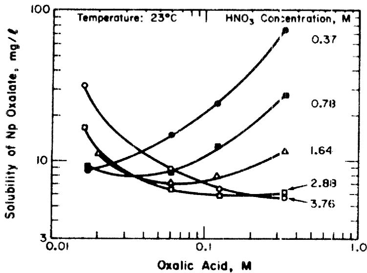  
Figure 3. Solubility of Np(IV) Oxalate

$\sim 0.75 \mathrm{~g} \mathrm{Np} / \mathrm{l}$ as the oxalic acid concentration varied from $\sim 0.002 \mathrm{M}$ to $\sim 0.15 \mathrm{M}$ .

Peroxide. Np(IV) peroxide is precipitated from solutions containing Np(IV), (V), or (VI) in $>3\mathrm{M}$ $\mathrm{HNO}_3$ by the addition of hydrogen peroxide. $^{140}$ The higher valence states are rapidly reduced to Np(IV), and gray-purple neptunium peroxide precipitates. The precipitation does not progress through the highly colored, soluble peroxy complexes that are characteristic of plutonium peroxide. Two crystalline forms were prepared depending on the acidity of the precipitation solution. The solubility is reported as a function of the concentrations of nitric acid and hydrogen peroxide. A minimum solubility of $\sim 10^{-4}\mathrm{M}$ neptunium occurred in solutions 1.5 to 2.5M $\mathrm{HNO}_3$ and 4.5M $\mathrm{H}_2\mathrm{O}_2$ . The solubilities were not readily reproducible at nitric acid concentrations of $< 2.5\mathrm{M}$ .

Iodates. Precipitation of Np(III) iodate has not been reported. Np(IV) iodate, a tan-brown solid, is precipitated when HIO₃ or KIO₃ is added to a dilute mineral acid solution. The solubility in 1M HCl - 0.1M HIO₃ is 0.8 g/l; in 1M HCl - 0.1M KIO₃, 0.08 g/l. $^{35}$ These solubilities appear to be high, possibly because some Np was in higher oxidation states.

Acetate. Rose-colored $\mathrm{NaNpO_2(C_2H_3O_2)_3}$ is precipitated when a sodium acetate - sodium nitrate solution is added to a dilute sulfuric acid solution that has been heated to $90^{\circ}\mathrm{C}$ in the presence of potassium bromate to give $\mathrm{NpO_2}^{2+}$ . The solubility is $\sim 0.1\mathrm{g / l}$ in $0.5\mathrm{M H_2SO_4} - 0.07\mathrm{M NaNO_3} - 2\mathrm{M NaC_2H_3O_2}$ .

Carbonates. No simple carbonates of $\mathsf{N}\mathsf{p}$ (III) and $\mathsf{N}\mathsf{p}(\mathsf{IV})$ are reported. A light-colored precipitate of $\mathsf{N}\mathsf{p}(\mathsf{V})$ , $\mathsf{KNpO}_2\mathsf{CO}_3$ , is precipitated by addition of solid alkali carbonate (to about pH 7) to a solution of $\mathsf{N}\mathsf{p}(\mathsf{V})$ made by reduction of $\mathsf{N}\mathsf{p}(\mathsf{VI})$ with iodide ion. $^{43}$

Phosphate. A green gelatinous precipitate, $\mathsf{Np}(\mathsf{HPO}_4)_2\cdot \mathsf{xH}_2\mathsf{O}$ , is formed when phosphoric acid is added to $\mathsf{Np}(\mathsf{IV})$ in hydrochloric or nitric acid. The solubility in LM HCl - 0.5M $\mathsf{H}_3\mathsf{PO}_4$ is $\sim 56$ mg/l, and the solubility in LM HNO₃ - LM $\mathsf{H}_3\mathsf{PO}_4$ is $\sim 134$ mg/l. $^{45}$

Sulfates. Mefod'eva and Gel'man32 report precipitation of Np(III) as the complex sulfates $\mathrm{K}_5\mathrm{Np}(\mathrm{SO}_4)_4$ and $\mathrm{NaNp}(\mathrm{SO}_4)_2\cdot \mathrm{nH}_2\mathrm{O}$ . Np(III) is produced in dilute hydrochloric and sparged with argon at $\sim 50^{\circ}\mathrm{C}$ using Rangelite reductant. In the dry form, the complex sulfates are stable to oxidation even at increased temperature.32 Np(IV) is crystallized from hot concentrated sulfuric acid as a bright-green compound, presumably $\mathrm{Np}(\mathrm{SO}_4)_2\cdot \mathrm{dH}_2\mathrm{O}$ . The solubility is $\sim 16\mathrm{g}\mathrm{Np}/\mathrm{l}$ . Sulfuric acid solutions of Np(V) and Np(VI) have been reported, but no data are given on solubility.35 Although not reported, it is expected that Np(IV) compounds analogous to Pu(IV) compounds could be precipitated from a solution containing sulfate salts, alkali metal ions, and Np(IV).

Other Compounds. Several Np(IV) chloride complex salts have been prepared. Yellow Cs₂NpCl₆ was precipitated by mixing solutions of Np(IV) and CsCl in 2 to 1M HCl and saturating the resulting

solution with hydrogen chloride. The solubility in $\sim 10\text{M}$ HCl is $< 0.01\text{M}$ and increases to $\sim 1.4\text{M}$ in $\sim 1\text{M}$ HCl. $^{141}$ A similar compound, $[(C_{2}H_{5})_{4}N]_{2}NpCl_{6}$ , was precipitated by adding tetraethylammonium chloride in 12M HCl to Np(IV) in 8 to 12M HCl. $^{142}$ Several other complex salts of Np(V) and Np(VI) have been reported. Yellow $[(C_{2}H_{5})_{4}N]_{2}NpO_{2}Cl_{4}$ was precipitated by the same procedure used for the Np(IV) salt, $^{143}$ and Cs $_{2}$ NpOCl $_{5}$ (bright yellow), $(Ph_{4}As)_{2}NpOCl_{5}$ (bright yellow), Cs $_{3}$ NpOCl $_{4}$ (turquoise), and Cs $_{2}$ NpO $_{2}$ Cl $_{4}$ (dark yellow) were made by variations of the same procedure. $^{59}$

The phenylarsonate and salicylate of Np(III) have been reported.32 They are quite stable at ambient temperature when dry.

# B. SOLVENT EXTRACTION

Solvent extraction of Np from aqueous solution into immiscible organic solvents is probably used most often for separation because of its rapidity, simplicity, and reliability. Solvent extraction of Np is usually made from nitrate systems. Generally the efficiency and specificity are decreased from chloride systems; other systems, such as fluoride, sulfate, and phosphate, form complex ions with neptunium, and extraction is inhibited.

There are examples of both ion association extraction and chelate extraction among the solvent extraction systems for Np. $^{144,145}$ In chelate systems, compounds such as TTA, cupferron, acetylacetone, and 8-hydroxyquinoline replace coordinated water from neptunium ions and form neutral, almost covalent, chelate compounds that are soluble in such organic compounds as hydrocarbons. In ion association systems, several mechanisms are possible by which uncharged, extractable compounds are formed by electrostatic attraction between oppositely charged ions. In one ion association system, an oxygen-containing organic compound such as ether is coordinated to Np(IV), and the complex cation is associated with nitrate ions to give an uncharged extractable species. Ion association solvents commonly used for Np extraction include TBP, hexone, diethylether, isoamyl alcohol, pentaether, and dibutyl carbinol. For solvents such as hexone and diethylether, which form coordination complexes with actinide nitrates, the order of extractability of the various

oxidation states is usually (VI) > (IV) >> (III) and (V), with the last two states generally considered to be nonextractable. The (IV) oxidation state is poorly extracted by diethylether but is extracted into hexone and dibutyl carbinol. For TBP and chelating agents, which form coordination complexes with the metal nitrates, the stable oxidation state giving the strongest complex is usually extracted most efficiently. The tendencies of the actinides to form complexes is (IV) > (VI) > (III) and (V). Thus, TBP, TTA, and other complexing agents usually extract the (IV) state most effectively. An exception (Table 17) is $\mathsf{Np}(\mathsf{IV})$ -TBP; however, these exceptions may be the result of the instability of the oxidation state in the aqueous solution.

Groh and Schleia146 and Schulz and Benedict5 have reviewed production-scale neptunium processes, including solvent extraction.

Chelate Systems. A large number of bi-functional reagents that form strong coordination complexes with metal ions have been investigated. These complexes are more soluble in nonpolar organic solvents, such as benzene or $\mathrm{CCl}_4$ , than in the aqueous phase. Of these compounds, the fluorinated $\beta$ -diketone, 2-thenoyltrifluoroacetone (TTA) has been most widely used for extraction of Np in radiochemical and analytical applications.[147,148] Many variations include TTA extraction as a part of the total separation scheme before the analysis of Np or the determination of its oxidation states.[127,192,149,150]

TABLE 17   
VARIATION OF EXTRACTION COEFFICIENTS WITH OXILATION STATE   

<table><tr><td>Organic Phase</td><td>Aqueous Phase</td><td>Np(III)</td><td>Np(IV)</td><td>Np(V)</td><td>Np(VI)</td><td>Pu(III)</td><td>Pu(IV)</td><td>Pu(VI)</td><td>Am(III)</td><td>Am(VI)</td></tr><tr><td>19% TBP-kerosene</td><td>4M HNO3</td><td></td><td>3.0</td><td>0.13</td><td>11.0</td><td>0.014</td><td>11.5</td><td>2.5</td><td>0.08</td><td></td></tr><tr><td>0.5M TTA-xylene</td><td>1M HNO3</td><td>10-6</td><td>106</td><td>10-6</td><td>10-9</td><td>10-6</td><td>106</td><td>0.004</td><td>10-8</td><td></td></tr><tr><td rowspan="3">Diethyl ether</td><td>6M HNO3</td><td></td><td>0.1</td><td>0.3</td><td>4.6</td><td></td><td></td><td>2.5</td><td></td><td></td></tr><tr><td>1M HNO3-sat</td><td></td><td></td><td></td><td></td><td></td><td></td><td>1.2</td><td></td><td></td></tr><tr><td>NH4NO3</td><td></td><td></td><td></td><td></td><td></td><td></td><td></td><td></td><td></td></tr><tr><td rowspan="3">Hexane</td><td>0.5M HNO3-11.1M</td><td></td><td></td><td></td><td></td><td>0.14</td><td>1.7</td><td>9.8</td><td></td><td></td></tr><tr><td>NH4NO3</td><td></td><td></td><td></td><td></td><td></td><td></td><td></td><td></td><td></td></tr><tr><td>6M HNO3</td><td></td><td>0.3</td><td>1.7</td><td>3.5</td><td></td><td></td><td></td><td></td><td>&gt;100</td></tr></table>

Some data for the extraction of Np and other cations into 0.5M TTA in xylene for a range of nitric acid concentrations are given in Table 18.

Shepard and Meinke have compiled a useful set of TTA extraction curves showing extraction as a function of pH for a number of elements. $^{150}$ The data show that by judicious pH control, TTA extraction is useful to separate neptunium from many other elements.

Basically, the TTA method depends on quantitative reduction of Np to the highly extractable tetravalent state while interfering ions are stabilized in inextractable oxidation states. (Procedures 1 and 2, p 138 and 141). Neptunium in 1M HNO₃ or 1M HCl is rapidly and completely reduced with ferrous sulfamate, hydroxylamine hydrochloride-potassium iodide, or hydroxylamine hydrochloride-ferrous chloride. Np(IV) is extracted into the TTA, and Pu(III) and U(VI) remain in the aqueous phase. If no interfering cations are present, the extract can be evaporated directly for counting. The efficiency of separation from other alpha emitters is verified by alpha pulse height analysis. Fe(III), Zr(IV), and Pa(V) are strongly extracted from 1M HNO₃, but separation is attained by stripping the Np(IV) from the TTA-xylene into 8M HNO₃. Trivalent actinides and lanthanides do not interfere. Sulfate, phosphate, oxalate, and chloride, if present in the aqueous phase, are complexed with Al³⁺ before extraction to prevent interference.

EXTRACTION COEFFICIENTS FOR VARIOUS IONS INTO 0.5M TTA-XYLEN

TABLE 18   

<table><tr><td>Ion</td><td>HNO3(M)</td><td>Extraction Coefficient at 25°C</td></tr><tr><td>Np(III)</td><td>1.0</td><td>&lt;3 x 10-6</td></tr><tr><td>Np(IV)</td><td>1.0</td><td>1 x 104</td></tr><tr><td></td><td>8.0</td><td>&lt;1 x 10-2</td></tr><tr><td>Np(V)</td><td>0.8</td><td>&lt;5 x 10-4</td></tr><tr><td>Np(VI)</td><td>0.8</td><td>&lt;1 x 10-3</td></tr><tr><td>Pu(III)</td><td>1.0</td><td>1 x 10-6</td></tr><tr><td>Pu(IV)</td><td>1.0</td><td>1 x 104</td></tr><tr><td></td><td>8.0</td><td>&lt;1 x 10-2</td></tr><tr><td>Pu(V)</td><td>1.0</td><td>&lt;1 x 10-4</td></tr><tr><td>Pu(VI)</td><td>1.0</td><td>4 x 10-3</td></tr><tr><td>U(VI)</td><td>1.0</td><td>3 x 10-5</td></tr><tr><td>Fe(II)</td><td>1.0</td><td>&lt;1 x 10-3</td></tr><tr><td>Fe(III)</td><td>1.0</td><td>375</td></tr><tr><td>Ce(III)</td><td>1.0</td><td>1 x 10-5</td></tr><tr><td>Ce(IV)</td><td>1.0</td><td>1 x 103</td></tr><tr><td>Zr(IV)</td><td>1.0</td><td>1 x 107</td></tr><tr><td></td><td>8.0</td><td>250</td></tr><tr><td>Am(III)</td><td>1.0</td><td>1 x 10-9</td></tr><tr><td>Al(III)</td><td>1.0</td><td>1 x 10-20</td></tr><tr><td>Na</td><td>1.0</td><td>1 x 10-20</td></tr><tr><td>Nb(V)</td><td>1.0</td><td>4 x 10-1</td></tr><tr><td>Th(IV)</td><td>1.0</td><td>3.0</td></tr></table>

The relative standard deviation for the analysis is $\pm 2\%$ . The nominal decontamination attained from plutonium is $10^{3}$ to $10^{4}$ . Some data on the extraction of Np from sulfate and perchlorate systems with TTA have been given by Sullivan and Hindman.

TTA extraction preceded by a LaF, coprecipitation cycle has also been described. $^{153-156}$ Np has been separated from numerous special materials where a combination of methods including TTA extraction was used. Holcomb $^{157}$ has described a method for separating 17 gamma-emitting radionuclides, including $^{239}\mathrm{Np}$ , from heavy water moderator by TTA solvent extraction and anion exchange. The individual nuclides were determined by gamma counting and gamma spectrometry.

8-Hydroxyquinoline forms the following chelates with Np: $\mathrm{Np}(\mathrm{C}_9\mathrm{H}_6\mathrm{NO})_4$ with Np(IV) and H[NpO2(C9H6NO)] with Np(V). Extraction of a number of elements as a function of pH into 0.1M 8-hydroxyquinoline in CHCl3 is shown in Figure 4. The trivalent actinides extract only at pH 4-6, and at this pH appreciable hydrolysis of the metal cation occurs. $^{5,1}$ Np(IV) cupferron is extracted almost quantitatively into chloroform from 1M HCl and is back extracted in 8M HCl. $^{15a}$

Separation with acetylacetonate has been reported for U and Pu and probably has application for Np.

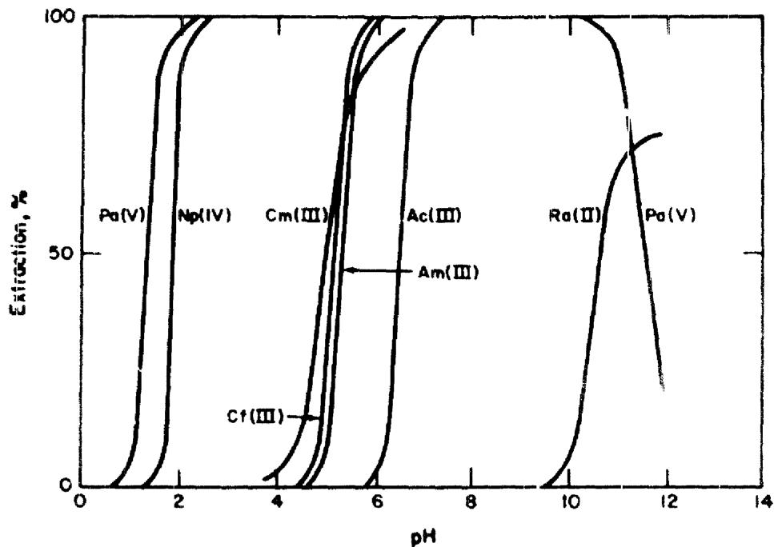  
FIGURE 4. Percentage Extraction of Tracer Quantities of Ac(III), Am(III), Cm(III), Cf(III), Np(IV), and Pa(V) with 0.1M 8-Hydroxyquinoline /CHCl₃ and of Ra(II) with 1.0M 8-Hydroxyquinoline/CHCl₃ [μ = 0.1M (Na, NH₄⁺, H)ClO₄⁻, 25°C]. [C. Keller and M. Mosdzelenski, Radiochim. Aota. ?, 185(1967) Supplemented].

Extraction of plutonium dibenzoylmethane or salicylate has been reported. $^{159,160}$ Neptunium dibenzoylmethane is unstable in aqueous solution, so Pu and U, which form extractable complexes, can be separated. $^{159,161}$

Chmutova et al. extracted Pu(IV) from 3M HNC₃ with a chloroform solution of N-benzoylphenylhydroxylamine; UO₂⁺, Am(III), (V), and fission products (except Zr and Nb) do not extract.[162]

$\mathsf{Np}(\mathsf{IV})$ is strongly extracted from 1 to $4\mathsf{M}$ $\mathsf{HNO}_3$ and 1 to 6M HCl with 4-benzoyl-3-methyl-1-phenyl-pyrazolin-5-one; under the same conditions, $\mathsf{Np}(\mathsf{V})$ and (VI) are not extracted. $^{163}$ $\mathsf{Np}$ is extracted at pH 9 to 10 with 1-nitroso-2-naphthol in n-butanol and isopentanol and is separated from U and Pu. $^{164}$

Ion Association Systems. The TBP-HNO₃ system is a useful system for large-scale processing but is not widely used for quantitative analytical separation. TBP forms an organic-soluble coordination complex with the metal nitrate, generally of the type M(NO₃)₄·2TBP. Increasing the nitrate concentration by adding nitrate salts of Al or Ca favors extraction. Other factors that affect the extraction include complexing ions, reagent purity, free TBP concentration, temperature, and mixing time. A summary of the early work with TBP has been given by Geary. The physical and chemical properties of TBP as an extracting agent have been summarized by McKay and Healy. Other discussions of the use of TBP are in References 168-170. Extraction coefficients

for many elements for a variety of aqueous solutions and TBP concentrations have been reported by Schneider and Harmon; data are shown in Table 19.

$\mathsf{Np}(\mathsf{VI})$ is almost completely separated from $\mathsf{Al}(\mathsf{III})$ , $\mathsf{Am}(\mathsf{III})$ , $\mathsf{Cr}(\mathsf{III})$ , $\mathsf{Fe}(\mathsf{II})$ , $\mathsf{Fe}(\mathsf{III})$ , $\mathsf{Na}(\mathsf{I})$ , $\mathsf{Zn}(\mathsf{II})$ , and many other cations in one stage of TBP extraction. Separation of $\mathsf{Np}$ from $\mathsf{Pu}$ and $\mathsf{U}$ involves either oxidation of $\mathsf{Np}$ to the (VI) state for extraction and subsequent stripping of $\mathsf{Np}(\mathsf{V})$ , or stabilization of inextractable $\mathsf{Np}(\mathsf{V})$ followed by extraction of $\mathsf{Pu}$ and $\mathsf{U}$ .

The following sequence of extractability has been found for the various oxidation states of the actinides: $\mathsf{M}(\mathsf{IV}) > \mathsf{M}(\mathsf{VI}) >> \mathsf{M}(\mathsf{III}) > \mathsf{M}(\mathsf{V})$ . For the tetravalent actinides the sequence is $\mathsf{Pu}(\mathsf{IV}) > \mathsf{Np}(\mathsf{IV}) > \mathsf{U}(\mathsf{IV}) > \mathsf{Th}(\mathsf{IV})$ , while among the hexavalent actinides the extractability decreases with increasing atomic number: $\mathsf{U}(\mathsf{VI}) > \mathsf{Np}(\mathsf{VI}) > \mathsf{Pu}(\mathsf{VI})^{165}$ (Figures 5 and 6).

The tetravalent and hexavalent actinides are extracted from HCl solutions with similar relative distribution coefficients as from nitric acid but exhibit no maxima. Lower distribution coefficients are observed for extraction from perchloric acid solutions because of weak complexing by the perchlorate ion. Strong complexing agents, such as $\mathrm{SO}_4^{2-}$ , $\mathrm{PO}_4^{3-}$ , and $\mathrm{F}^{-}$ , reduce the extractability of all actinides appreciably; however, cations such as Al that form quite stable complexes with these anions partially negate the deleterious effect on actinide extraction. Distribution

TABLE 19   
EXTRACTION COEFFICIENT DATA FOR $\mathsf{TBP^{149}}$   

<table><tr><td>Ion</td><td>Solution</td><td>TEP (%)</td><td>Extraction 
Coefficient 
At 25°C</td></tr><tr><td>Am(III)</td><td>4.0M HNO3</td><td>30</td><td>0.013</td></tr><tr><td>Al</td><td>4.7M</td><td>15</td><td>0.0003</td></tr><tr><td>Ca</td><td>4.7M</td><td>15</td><td>0.0003</td></tr><tr><td>Co(II)</td><td>2.14M Co(NO3)2</td><td>60</td><td>0.002</td></tr><tr><td>Cr(III)</td><td>3.0M HNO3</td><td>100</td><td>0.0001</td></tr><tr><td>Cu(II)</td><td>3.0M</td><td>100</td><td>0.0004</td></tr><tr><td>Fe(II)</td><td>4.7M</td><td>15</td><td>0.005</td></tr><tr><td>Fe(III)</td><td>2.0M</td><td>12.5</td><td>0.003</td></tr><tr><td>Mg</td><td>4.7M</td><td>15</td><td>0.0003</td></tr><tr><td>Na</td><td>2.0M</td><td>12.5</td><td>0.003</td></tr><tr><td>Ni(II)</td><td>3.0M</td><td>100</td><td>0.00006</td></tr><tr><td>Np(IV)</td><td>4.0M</td><td>30</td><td>3.0</td></tr><tr><td>Np(VI)</td><td>4.0M</td><td>30</td><td>12.0</td></tr><tr><td>Th</td><td>4.0M</td><td>30</td><td>2.8</td></tr><tr><td>Pa</td><td>4.0M</td><td>50</td><td>2.8</td></tr><tr><td>Zn</td><td>2.0M Zn(NO3)2</td><td>12.5</td><td>0.0001</td></tr><tr><td>Ru</td><td>2.0M HNO3</td><td>30</td><td>0.15</td></tr><tr><td>Zr</td><td>2.0M</td><td>30</td><td>0.09</td></tr><tr><td>Nb</td><td>2.0M</td><td>30</td><td>0.03</td></tr><tr><td>Rare earths</td><td>2.0M</td><td>30</td><td>0.02</td></tr><tr><td>Pu(III)</td><td>5.0M</td><td>20</td><td>0.012</td></tr><tr><td>Pu(IV)</td><td>5.0M</td><td>20</td><td>16.6</td></tr><tr><td>Pu(VI)</td><td>5.0M</td><td>20</td><td>2.7</td></tr><tr><td>U(IV)</td><td>4.0M</td><td>25</td><td>10</td></tr><tr><td>U(VI)</td><td>4.0M</td><td>25</td><td>23</td></tr><tr><td>HNO3</td><td>2.0M</td><td>30</td><td>0.26</td></tr></table>

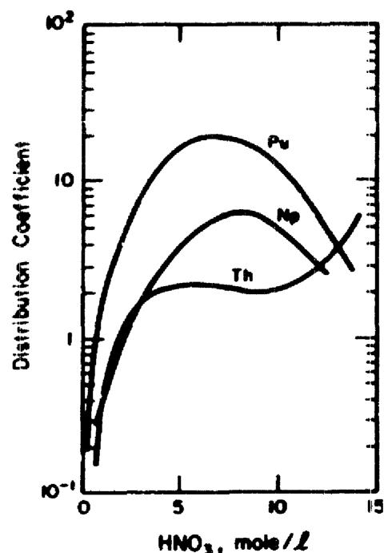  
Figure 5. Distribution Coefficients for the Extraction of Tetravalent Actinides by 19 vol % TBP-Kerosene from Nitric Acid Solution.165

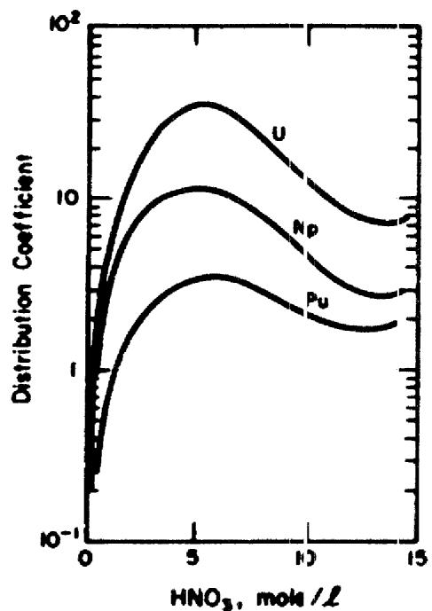  
Figure 6. Distribution Coefficients for the Extraction of Hexavalent Actinides by 19 vol % TBP-Kerosene from Nitric Acid Solution. $^{165}$

coefficients for $\mathbf{Np}(\mathbf{V})$ and trivalent actinides are appreciably lower171 than for tetravalent and hexavalent actinides.

For $\mathsf{NpO}_2^+$

$$
\mathrm {N p O} _ {2} ^ {+} (\mathrm {a q}) + \mathrm {N O} _ {3} ^ {-} (\mathrm {a q}) + \mathrm {T B P} (\mathrm {o r g}) = \left[ \mathrm {N} _ {1} \times \mathrm {O} _ {2} (\mathrm {N O} _ {3}) \cdot \mathrm {T B P} \right] (\mathrm {o r g})
$$

For analytical applications with small volumes, equilibrium is attained in less than five minutes with good mixing.

The extraction properties of many other organophosphorus compounds have been studied; however, few separation methods for Np have been defined. Higgins et al. working with the butyl series found the order to be phosphate $(\mathsf{(RO)_3PO)} < \mathsf{phosphonate}(\mathsf{R}(\mathsf{RO})_2\mathsf{PO})$ < phosphinate $(\mathsf{R}_2(\mathsf{RO})\mathsf{PO}) < \mathsf{phosphine}$ oxide $(\mathsf{R}_3\mathsf{PO})$ .172

The distribution coefficients for the extraction of some tetravalent and hexavalent actinides with various trialkyl phosphates are given in Table 20.

$\text{Burger}^{174,175}$ and Petrov et al. $^{176}$ found that electronegative substituents in the alkyl chain, such as, chloride and phenyl, strongly depressed the extraction. Siddall $^{79}$ found that increasing the length of the alkyl chain in the phosphate series made little difference for up to eight carbon atoms for tetravalent and hexavalent actinides. The effect of branching the alkyl chain is to increase the extraction of U, Np, and Pu, but to strongly depress extraction of Th. The extraction mechanism of these compounds is generally the same as that for TBP, but the solvation number is not

# TABLE 20

DISTRIBUTION COEFFICIENTS FOR THE EXTRACTION OF TETRAVALENT AND HEXAVALENT ACTINIDES WITH 1.9M TRIALYL PHOSPHATE/ n-DODECANE FROM 2M HNO₃ AT 30°C

<table><tr><td rowspan="2">Extractant</td><td colspan="6">Distribution Coefficientsa</td></tr><tr><td>Th</td><td>Np(IV)b</td><td>Pu(IV)c</td><td>J(VI)</td><td>Np(VI)d</td><td>Pu(VI)</td></tr><tr><td>Tri-n-butyl phosphate</td><td>2.9</td><td>3.2</td><td>16.1</td><td>26</td><td>15.6</td><td>3.5</td></tr><tr><td>Triisobutyl phosphate</td><td>2.4</td><td>2.7</td><td>11.8</td><td>22</td><td>15.9</td><td>3.4</td></tr><tr><td>Tri-n-amyl phosphate</td><td>2.9</td><td>4.2</td><td>15.6</td><td>32</td><td>19.3</td><td>4.1</td></tr><tr><td>Triisoamyl phosphate</td><td>4.2</td><td>4.7</td><td>17.8</td><td>34</td><td>18.9</td><td>4.4</td></tr><tr><td>Tri-n-hexyl phosphate</td><td>3.0</td><td>3.6</td><td>15.6</td><td>38</td><td>20.0</td><td>4.5</td></tr><tr><td>Tri-n-octyl phosphate</td><td>2.4</td><td>3.4</td><td>15.3</td><td>33</td><td>15.7</td><td>3.9</td></tr><tr><td>Tri-(2-ethylhexyl) phosphate</td><td>2.5</td><td>4.3</td><td>25</td><td>58</td><td>23</td><td>5.7</td></tr><tr><td>Tri-(2-butyl) phosphate</td><td>0.45</td><td>4.9</td><td>28</td><td>42</td><td>20</td><td>4.6</td></tr><tr><td>Tri-(3-amyl) phosphate</td><td>0.22</td><td>3.5</td><td>18.1</td><td>49</td><td>22</td><td>5.0</td></tr><tr><td>Tri-(3-methyl-2-butyl) phosphate</td><td>0.18</td><td>3.0</td><td>24</td><td>47</td><td>25</td><td>5.4</td></tr><tr><td>Tri-(4-methyl-2-amyl) phosphate</td><td>0.047</td><td>3.5</td><td>22</td><td>38</td><td>24</td><td>4.9</td></tr></table>

$\pmb{\alpha}$ .For tracer amounts of the given elements.   
b. The aqueous phase contains $0.01\mathrm{MFe}(\mathrm{NH}_2\mathrm{SO}_3)_2$   
c. The aqueous phase contains 0.01M $\mathrm{NaNO}_2$ .   
$d$ . The aqueous phase contains 0.01 $(\mathsf{NH}_4)_2\mathsf{Ce}(\mathsf{NO}_3)_1$ .

necessarily the same for all elements.173

A method with mono[2-ethylhexyl]orthophosphoric acid in contact with 12M HCl + 0.1M hydroquinone has been effective for separating Np(IV) from U(VI), Pu(III), Am(III), Cu(III), and trivalent rare earths. The K value for Np(IV) is $\sim 10^{3}$ , and for the other cations, $\sim 10^{-1}$ ; thus, separation is attained by a single contact followed by multiple scrubbing of the organic phase.[177] K. Kimura[178] has determined the acid dependency of the distribution coefficients for many elements extracted by 50 vol% bis(2-ethylhexyl)orthophosphoric acid (HDEHP) from HCl solutions (Figure 7). These data offer the basis for separating Np from many cations.

The distribution coefficients of $\mathsf{Am}(\mathsf{III})$ , $\mathsf{Pu}(\mathsf{IV})$ , $\mathsf{Np}(\mathsf{V})$ , and $\mathsf{U}(\mathsf{VI})$ in HDEHP from $\mathsf{HNO}_3$ are given in Figure 8. The discontinuity in the $\mathsf{Np}(\mathsf{V})$ curve at high acid concentrations is probably due to disproportionation of $\mathsf{Np}(\mathsf{V})$ into $\mathsf{Np}(\mathsf{IV})$ and $\mathsf{Np}(\mathsf{VI})$ , both of which are more extractable than $\mathsf{Np}(\mathsf{V})$ .

$\mathsf{Np}(\mathsf{V})$ in dilute nitric acid has been separated from U(VI), $\mathsf{Pu}(\mathsf{IV})$ , and Th(IV) by HDEHP extraction; however, there was evidence that a few percent of the $\mathsf{Np}(\mathsf{V})$ was reduced to $\mathsf{Np}(\mathsf{IV})$ and not separated by a single extraction.[180] Kosyakov et al.[179] used HDEHP to purify Am(III) from other actinides in higher valence states and to accomplish their mutual separation. Am(III), Pu, and U were extracted from 0.01M HNO₃ after stabilization of Np in the

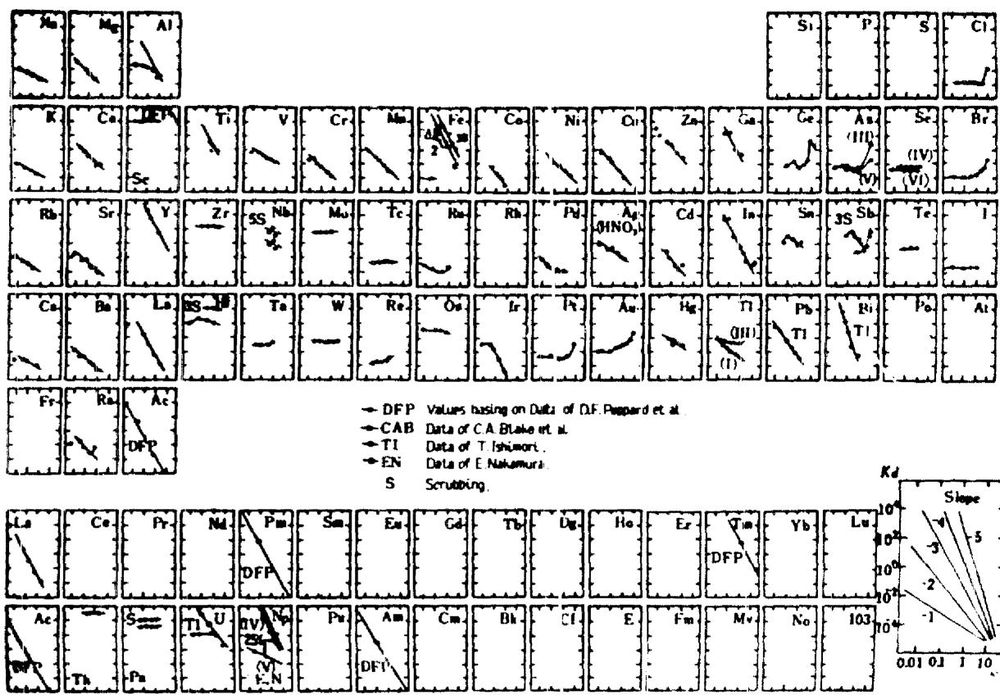  
Figure 7. Extraction of Elements from HCl Solution by $50\%$ HDEHP in Toluene as a Function of Acid Concentration. $^{178}$

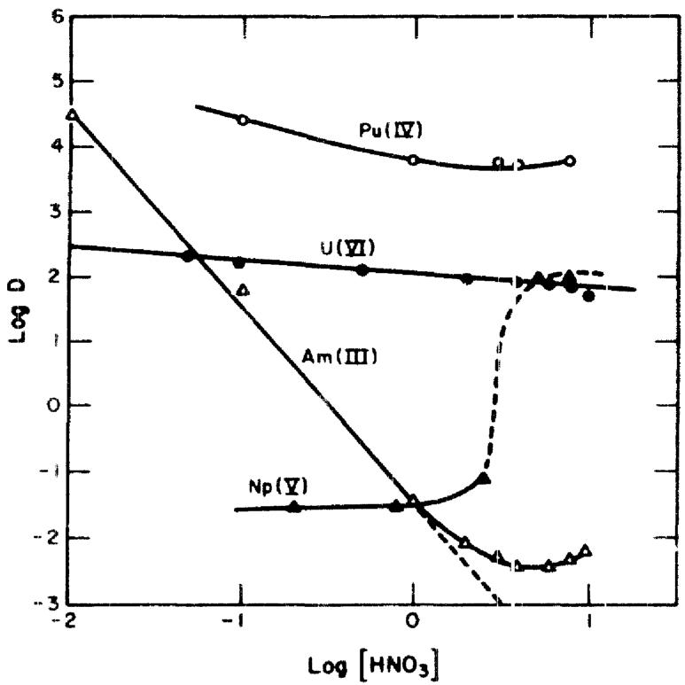  
Figure 8. Extraction of Various Actinides into 0.5M HDEHP (isooctane diluent) from $\mathsf{HNO}_3$ Solutions. $^{179}$

pentavalent state with sodium nitrite. $\mathsf{Np}(\mathsf{V})$ was then oxidized to $\mathsf{Np}(\mathsf{VI})$ and extracted with HDEHP. $\mathsf{Np}(\mathsf{VI})$ was reduced to $\mathsf{Np}(\mathsf{V})$ and recovered from the organic phase by washing with $0.1\mathsf{M}$ $\mathsf{HNO}_3$ . Am was back-extracted from the HDEHP with $3\mathsf{M}$ $\mathsf{HNO}_3$ and Pu was reduced to $\mathsf{Pu}(\mathsf{III})$ and recovered by back extraction with $3\mathsf{M}$ $\mathsf{HNO}_3$ . U(VI) was recovered by back extraction with $1\mathsf{M}$ $(\mathsf{NH}_4)_2\mathsf{CO}_3$ .

Chudinov and Yakovlev extracted $\mathbb{U}$ and $\mathbf{F}\mathbf{u}$ from $\mathbf{Np}(\mathbf{V})$ with HDEHP as a preliminary step in the colorimetric determination of $\mathbf{Np}(\mathbf{IV})$ with Arsenazo(III).

Peppard et al. $^{177,181}$ studied the extraction of several actinides by mono-2-ethylhexylphosphoric acid (H $_2$ MEHP) from HCl solutions (Figure 9). The distribution coefficient: for Np(IV) in 12M HCl was $\sim 10^3$ , $10^4$ times larger than the non-etravalent species studied. Gindler et al. $^{182}$ used this method to purify $^{236}\mathrm{Pu}$ for fission counting. The Np(IV) can be returned to the aqueous phase by addition of TBP to the organic phase, resulting in a great reduction in the distribution coefficient:

Kosyakov et al. $^{179}$ determined the distribution coefficients of Am(III), Np(V), Pu(IV), and U(VI) in $\mathsf{H}_2\mathsf{MEHP}$ from nitric acid (Figure 10). They are generally higher for the same aqueous conditions than those for HDEHP.

White and Ross163 have written a general review of the extractive properties of tri-n-octylphosphine oxide (TOPO).

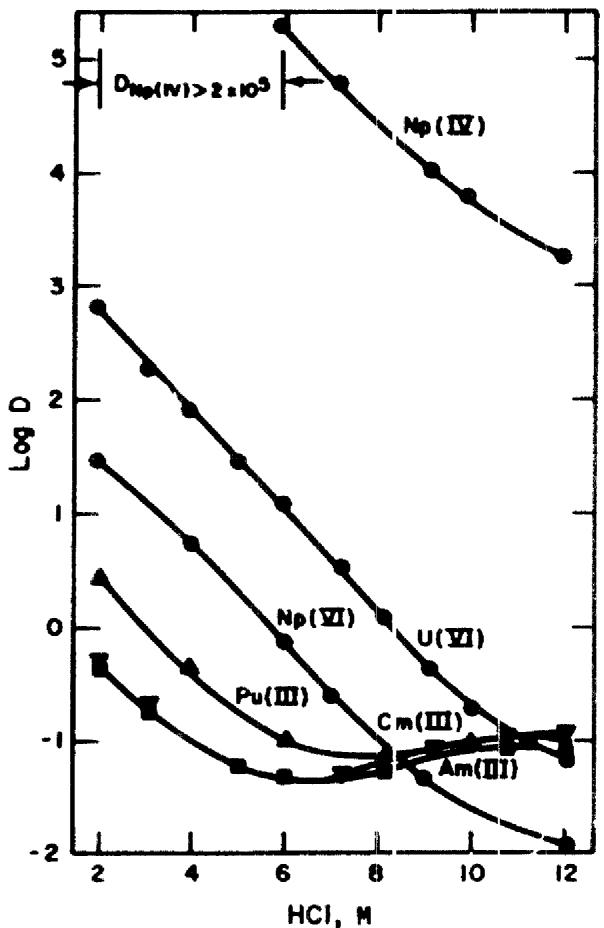  
Figure 9. Extraction of some Actinide Cations into O.48M $\mathsf{H}_2\mathsf{MEHP}$ in Toluene as a Function of HCl Concentration.[177]

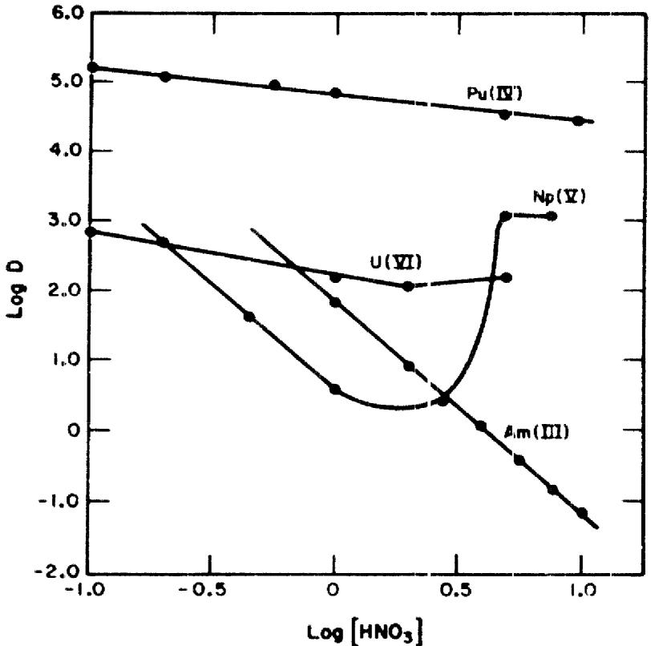  
Figure 10. Extraction of Various Actinides into 0.2M $\mathsf{H}_2\mathsf{MEHP}$ (Isooctane diluent) from HNO₃ Solutions.¹⁷,

Extraction data for Np and other actinides into TOPO have been summarized by Weaver and Horner. $^{184}$

Extraction with methyl isobutyl ketone (hexone) is based on the solvent power of hexone for the covalent nitrates of the (VI) oxidation states. Hexone was used for large-scale processing of irradiated nuclear fuels ("redox" process) but has been supplanted by other solvents both in plant and laboratory applications. A two-cycle extraction system for the separation of neptunium from uranium-fission product mixtures has been given by Maeck.[185] Hexone extraction of Np(VI) from acid-deficient $\mathrm{Al(NO_3)_3}$ was followed by TTA extraction. Excellent separation from U, Pu, Ru, and Zr was attained. Also, Np has been separated from Pu and La. Np(VI) and Pu(VI) were produced by oxidation with $\mathrm{KBrO_3}$ ; both were extracted into hexone from an $\mathrm{Al(NO_3)_3}$ solution. Back extraction with an aqueous sodium nitrite solution yielded Np(V) and Pu(III), neither of which is soluble in hexone. The hydroxides were precipitated and dissolved in nitric acid, and ferrous sulfamate was added to give Np(IV) and Pu(III). Np was extracted into a solution of tributylamine in hexone, leaving the Pu in the aqueous phase.[129]

Extraction coefficients for ions into hexone from several different aqueous compositions are shown in Table 21.

Diethylether quantitatively extracts hexavalent Np, Pu, and Am from salted solutions containing a strong oxidant (Table 22).186

TABLE 21   
EXTRACTION COEFFICIENTS OF VARIOUS SOLUTES INTO HEXONE AT $25^{\circ}C^{149}$   

<table><tr><td>Solutea</td><td colspan="2">Salting Agent (M)</td><td>NC1-(M)</td><td>HNO3(M)</td><td>Extraction Coefficient</td></tr><tr><td>Na+</td><td>Al(NO3)s</td><td>1.3</td><td>4.0</td><td>0.1</td><td>0.02</td></tr><tr><td>Al3+</td><td></td><td>1.3</td><td>3.9</td><td>0.0</td><td>&lt;0.0001</td></tr><tr><td>Cr2O7-</td><td></td><td>2.0</td><td>6.1</td><td>1.7 pH</td><td>0.011</td></tr><tr><td>Cr3+</td><td></td><td>2.0</td><td>6.1</td><td>0.1</td><td>0.0003</td></tr><tr><td>U6+</td><td></td><td>1.3</td><td>4.4</td><td>0.5</td><td>2.1</td></tr><tr><td>Am3+</td><td></td><td>1.95</td><td>6.35</td><td>0.5</td><td>0.0018</td></tr><tr><td>Np4+</td><td></td><td>1.3</td><td>4.4</td><td>0.5</td><td>1.5</td></tr><tr><td>Np5+</td><td></td><td>1.5</td><td>5.0</td><td>0.5</td><td>&lt;0.001</td></tr><tr><td>Np6+</td><td></td><td>0.7</td><td>2.6</td><td>0.5</td><td>1.7</td></tr><tr><td>HNO3</td><td></td><td>1.0</td><td>3.4</td><td>0.4</td><td>0.82</td></tr><tr><td>NO3-</td><td></td><td>1.5</td><td>4.5</td><td>0.0</td><td>1.1</td></tr><tr><td>Cs+</td><td></td><td>1.0</td><td>3.5</td><td>0.5</td><td>0.009</td></tr><tr><td>Zr-Nb</td><td></td><td>1.0</td><td>3.25</td><td>0.25</td><td>0.01</td></tr><tr><td>Ru</td><td></td><td>1.0</td><td>3.1</td><td>0.10</td><td>0.10</td></tr><tr><td>Ce</td><td></td><td>1.3</td><td>4.1</td><td>0.20</td><td>0.12</td></tr><tr><td>F.P.b</td><td></td><td>1.4</td><td>4.6</td><td>0.4</td><td>0.10</td></tr><tr><td>Fe2+</td><td>NH4NO3</td><td>8</td><td>8.2</td><td>0.2</td><td>0.004</td></tr><tr><td>Fe3+</td><td></td><td>8</td><td>8.2</td><td>0.2</td><td>0.0005</td></tr><tr><td>Pu4+</td><td></td><td>11.1</td><td>11.6</td><td>0.5</td><td>1.7</td></tr><tr><td>Pu6+</td><td></td><td>11.1</td><td>11.6</td><td>0.5</td><td>9.8</td></tr><tr><td>Pu3+</td><td></td><td>11.1</td><td>11.6</td><td>0.5</td><td>0.14</td></tr><tr><td>Pu6+</td><td>A1(NO3)3</td><td>2.0</td><td>6.3</td><td>0.3</td><td>50.0</td></tr><tr><td>U6+</td><td>A1(NO3)3</td><td>0.5</td><td>1.8</td><td>0.3</td><td>0.1</td></tr><tr><td></td><td></td><td>1.0</td><td>3.3</td><td>0.3</td><td>2.0</td></tr><tr><td></td><td></td><td>2.0</td><td>6.3</td><td>0.3</td><td>30.0</td></tr><tr><td></td><td>NH4NO3</td><td>4.3</td><td>4.6</td><td>0.3</td><td>0.18</td></tr><tr><td></td><td></td><td>8.7</td><td>9.0</td><td>0.3</td><td>2.0</td></tr><tr><td></td><td></td><td>11.0</td><td>11.3</td><td>0.3</td><td>14.0</td></tr></table>

a. Concentration of all solutes is 2 g/l   
b. Gamma-emitting fission products after 144-day cooling period.

TABLE 22   
EXTRACTION OF NEPTUNIUM, PLUTONIUM, AND AMERICIUM INTO VARIOUS SOLVENTS   

<table><tr><td rowspan="2">Solvent</td><td rowspan="2">Aqueous Phase</td><td colspan="6">% Extracted</td></tr><tr><td>Np (IV)b</td><td>Np (V)</td><td>Np (VI)</td><td>Pu (III)</td><td>Pu (VI)</td><td>Am (VI)</td></tr><tr><td rowspan="3">Ethyl ether</td><td>1M HNO3; sat NH4NO3</td><td></td><td></td><td></td><td></td><td>α</td><td>100</td></tr><tr><td>6M HNO3</td><td>9</td><td>17</td><td>32</td><td></td><td>70</td><td></td></tr><tr><td>9M HNO3</td><td>17</td><td>65</td><td>32</td><td></td><td>89</td><td></td></tr><tr><td rowspan="2">Dibutyl carbinol</td><td>5M HNO3</td><td>17</td><td>23</td><td>31</td><td></td><td>81</td><td></td></tr><tr><td>7 co 9M HNO3</td><td>23</td><td>48</td><td>39</td><td></td><td>95</td><td></td></tr><tr><td rowspan="2">DBBP, c 50%</td><td>4M HNO3</td><td>91</td><td></td><td></td><td></td><td></td><td></td></tr><tr><td>7M HNO3</td><td>15</td><td></td><td></td><td></td><td></td><td></td></tr><tr><td rowspan="2">DBE, d 85%</td><td>2.4M Ca(NO3)2; 0.6M HNO3</td><td></td><td></td><td></td><td></td><td>11</td><td></td></tr><tr><td>5.4M Ca(NO3)2; 0.05M HNO3</td><td></td><td></td><td></td><td>0.3</td><td>41</td><td></td></tr></table>

a. High efficiency; no value given.   
b. Np(IV) unstable in HNO3.   
c. Dibutyl-butyl phosphonate, DBBP.   
d. Dibutyl ether. DBE,ith 15% CCl#.

Other elements that extract strongly are Ce(IV), Au(III), and Sc(III); P, Cr(VI), As(V), Hg(II), Tl(III), Th(IV), and Bi(III) are partially extracted. After back-extraction with dilute acid, ferrous ion and urea or hydrazine are added to reduce Np(VI) to Np(V); NH₄NO₃ is added for salting. A second extraction with diethylether further separates Np(IV) from U(VI).127,166

Distribution data for several of the actinides, including neptunium, as a function of nitric acid concentration into dibutyl carbitol are reported.[187,188]

Amine extractants, including long-chuin alkyl or aryl primary, secondary, and tertiary amines, and quaternary amine salts react with acids to form an ion-association complex which is soluble in the organic phase. The mechanism is illustrated with a tertiary amine:

$$
R _ {3} N _ {(o r g)} + H ^ {+} (a q) + A ^ {-} (a q) \rightarrow R _ {3} N H ^ {+} - - - A ^ {-} (o r g)
$$

A\~ may be either a simple anion or the an:on of a complex metal acid. The complex may undergo a further reaction with another anion in a manner analogous to anion exchange.

$$
R _ {3} N H ^ {+} - - - A ^ {-} (o r g) + B ^ {-} (a q) \rightarrow R _ {3} N H ^ {+} - - - B ^ {-} (o r g) + A ^ {-} (a q)
$$

The higher amines are excellent extractants for Np(IV), Pu(IV), and U. The advantage of amines over organophosphorus compounds is the greater stability to radiation and hydrolysis in radioactive solutions. The amines are usually dissolved in an organic

solvent (xylene, benzene, or chloroform). To achieve rapid phase separation and to prevent formation of a third phase during extraction, a small amount (3 to 5 vol%) of a long chain aliphatic alcohol is added to the organic phase. The relative extractability of Np in nitrate solution is $\mathrm{Np}(\mathrm{IV}) > \mathrm{Np}(\mathrm{VI}) > \mathrm{Np}(\mathrm{V})$ , although the selectivity depends on the structure of the amine and the composition of the aqueous phase. The extractive power of the amines in nitrate and chloride solutions varies in the order of quaternary ammonium > tertiary > secondary > primary109; from H2SO6, solutions, the sequence is reversed. The distribution coefficient of tetravalent and hexavalent actinides from HCl and HNJ, acid solutions decreases in the sequence Pu > Np > U > Ps > Th.

Keder et al.190 have reported distribution coefficients for several actinide elements (more than one oxidation state) from nitric acid solutions with tri-n-octylamine (TOA) diluted with xylene (Figures 1i, 12, and 13).

The tetravalent ions show a second power dependence on the amine concentration, indicating that the extracted complex involves two amine molecules. Extraction of Np(IV) and Np(VI) with trilaurylamine (TLA) from nitric acid is reported. $^{191,192}$ A review of liquid-liquid extraction with high molecular weight amines has been published. $^{193}$

$\mathsf{Np}(\mathsf{IV})$ has been separated from U(VI), Fu(III), Am(III), and fission products by extraction of $\mathsf{Np}(\mathsf{IV})$ into tri-iso-octylamine

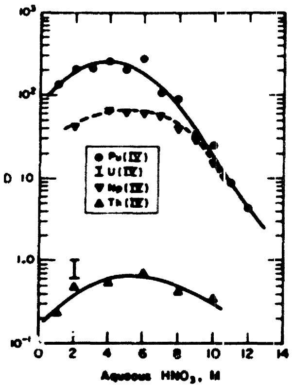  
Figure 11. The Extraction of the Quinavalent Actinide Nitrates by 10 vol % TOA in Xylene.190

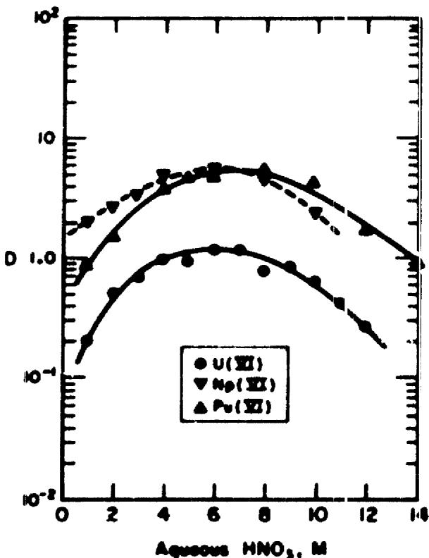  
Figure 12. The Extraction of the Hexavalent Actinide Nitrates by 10 vol $\%$ TOA in Xylene. $^{190}$

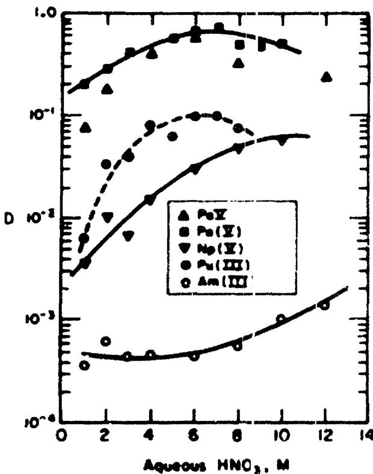  
Figure 13. The Extraction of Pentavalent and Trivalent Actinide Hitrates by 10 vol $\frac{2}{3}$ TOA in Xylene.190

(TIOA) in xylene from aqueous SM nitric acid solution containing ferrous sulfamate. For further separation, the neptunium-bearing organic solution was scrubbed with SM HNO₃ containing ferrous sulfamate. Final purification of Np was achieved with a TTA extraction.[194,195] [219] Np has been separated from [243]Am by extraction with TIOA.[196] Np(IV) was extracted (K₀ > 20) from 0.1 to 1M HNO₃ with 0.1M tetraheptyl ammonium nitrate in xylene. The K₀² was >2000 in 1M HNO₃.[197] Distribution data for a large number of elements in quaternary ammonium compounds from various solutions have been determined, and a procedure for separating Np and Pu with this system has been reported.[198]

Keder199 has reported the distribution coefficients from tetra - and hexavalent Np, Pu, and U from HCl solutions into TOA (Figures 14 and 15). Pu(IV) is much more extractable than Np(IV) and U(IV) under the same conditions, and the hexavalent actinides are more extractable than the reentrant in this system.

Np(IV) and Pu(IV) were strongly extracted from sulfuric acid by the primary amine "Primene" $^*$ JM-T in xylene. In general, the order of extraction of Np(IV) and Pu(IV) from sulfate solution was primary >> secondary > tertiary amine. $^{200}$ Many more procedures for amine extraction have been reported for U and Pu, and these methods also offer potential for Np separation. $^{66,193,201}$

Mixed Extractants (diluents). The term synergism is used to denote enhanced (or depressed) extraction of metals by mixed extractants (diluents) as compared to extraction by each extractant

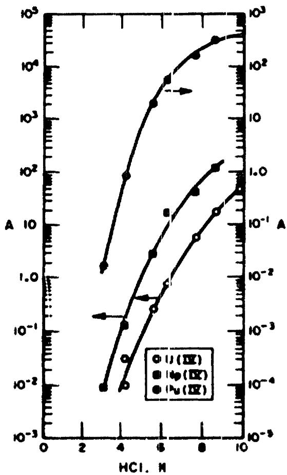  
Figure 14. Extraction of U(IV) and Np(IV) by 10% TOA and Pu(IV) by 1.0% TOA from HCl Solutions.

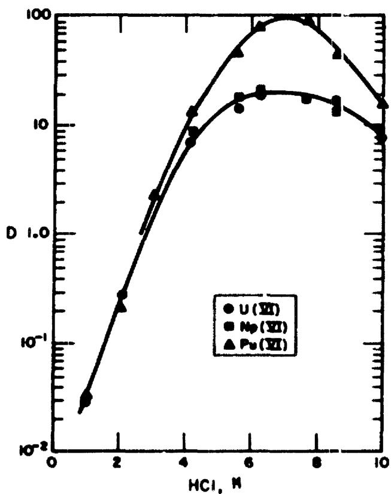  
Figure 15. Extraction of Hexavalent U, Np, and Pu from HCl Solution with 1.0% TCA in Xylene.[19]

(diluent) taken separately. The range of phenomena described under the term synergism is diverse, complex, and not completely understood. A review of this subject is given by Marcus. $^{173}$ Although the subject has received considerable attention, only a few examples are reported for Np. Lebedev et al. $^{202}$ have reported a procedure to determine $^{263}\mathrm{Am}$ through its daughter product $^{299}\mathrm{Np}$ in solutions containing large quantities of curium and fission products. 0.1M l-phenyl-3-methyl-4-benzoyl-pyrazolon-5 (PMBP) and 0.25M tributylphosphate (TBP) in benzene were used to separate Np(IV) from Zr, Nb, Cs, Ce, Am and Cm in 0.5M HNO $_3$ and 1M H $_3$ PO $_4$ . More than $99\%$ of the Np was extracted with $<0.1\%$ of other elements. The $^{243}\mathrm{Am}$ was determined by measurement of the gamma activity of the extracted $^{239}\mathrm{Np}$ .

Taube $^{203}$ has discussed the influence of polarity in two-component diluent mixtures of chloroform, benzene and carbon tetrachloride on the extraction of Np(IV) and Np(VI) complexes with several phosphate and amine extractants. The results are interpreted in terms of the size of the complex species, the diluent structure, dipole interaction between complex and diluent, and other factors. Figures 16 and 17 show the effects of variation of diluent mixtures on the distribution of Np(IV) and (VI) into TBP and tetrabutylammonium nitrate from nitric acid.

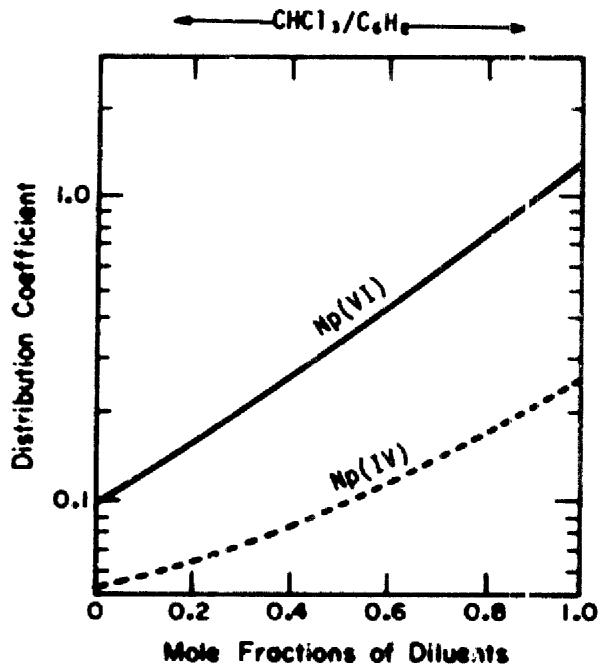  
Figure 16. Neptunium Extraction with TBP from SM HNO, into Diluent Mixtures.213

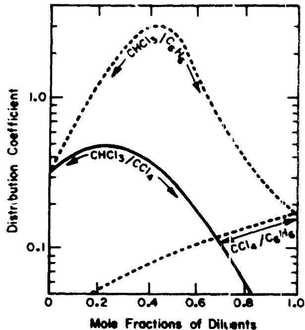  
Figure 17. Distribution Coefficients for $\mathbf{M}\mathbf{p}(\mathbf{IV})$ Extraction with $10^{-2}\mathbf{M}$ Tetratutyl-Ammonium Nitrate from 3M HCl, Using Mixtures of Different Diluents.[20]

# C. ION EXCHANGE

Many variations of ion exchange are used for separating Np from other ions. Np ions in dilute mineral acids with no strong complexing ions are sorbed by strongly acidic cation exchange resins, such as sulfonated polystyrene. In general, the ability of cations to be sorbed on cation exchangers increases with increasing charge and decreasing hydrated radius. Thus, the order of sorbability on cation exchangers for Np is Np(IV) > Np(III) > NpO₂²⁺ > NpO₂⁺. All Np species are sorted at low acid concentrations and eluted with high concentrations of mineral acids; elution of NpO₂⁺ proceeds first and Np(IV) is last. Some anions form neutral or anionic complexes with different oxidation states of Np, so that Np may be eluted by this mechanism. Both Np(V) and Np(VI) are slowly reduced to Np(IV) by common organic base resins. For this reason and because cation exchange of Np(IV) offers limited selectivity in the separation from other multivalent cations, this method has not been used widely for analytical applications.

Anion exchange is one of the techniques most used for separation of Np in analytical and process applications. The method is simple to perform and yields excellent separation from many other elements, including most of the fission products.

Ion exchange has been the subject of many reviews. The books of Helfferich, $^{204}$ Samuelson, $^{205}$ Amphlett, $^{206}$ and Riemann and

Walton $^{207}$ are good references to the theory and applications of ion exchangers. Other reviews of ion exchange include Massart, $^{208}$ Korkisch, $^{209,211}$ and Faris and Buchanan. $^{110}$

Anion Exchange. Np(IV) forms anionic nitrate and chloride complexes that are strongly sorbed by anion resins; the anionic species provide separation from the cations of many other elements. The hexavalent state of the actinides also form strongly sorbed anionic chloride complexes. Greater separation of Np is attained from most other elements in the nitrate system than in the chloride system. The distribution coefficients of many elements over a wide range of nitric acid and nitrate concentrations have been reported.[212] Data are given in Figure 13.

In a typical anion exchange cycle, a sample containing Np is adjusted to 7 to 8M HNO₃ for optimum sorption of Np(NO₃)₆²⁻ ions, and 0.01 to 0.05M ferrous sulfamate is added to ensure that all Np(V) and Np(VI) is reduced to Np(IV). The solution is heated to 55°C for 30 minutes or treated with sufficient sodium nitrite to react all the sulfamate and oxidize excess Fe(II) to Fe(III); this treatment is necessary to prevent excessive gassing in the resin bed. The resin is washed with strong nitric acid to remove Zr, Ru, Pa, Fe, Al, rare earths, U, transplutonium elements, and most other cationic contaminants. Th(IV) and Pu(IV) are not separated; however, washing with 5 to 15 bed volumes of 5 to 6M HNO₃-0.05M ferrous sulfamate-0.05M hydrazine reduces Pu(IV) to

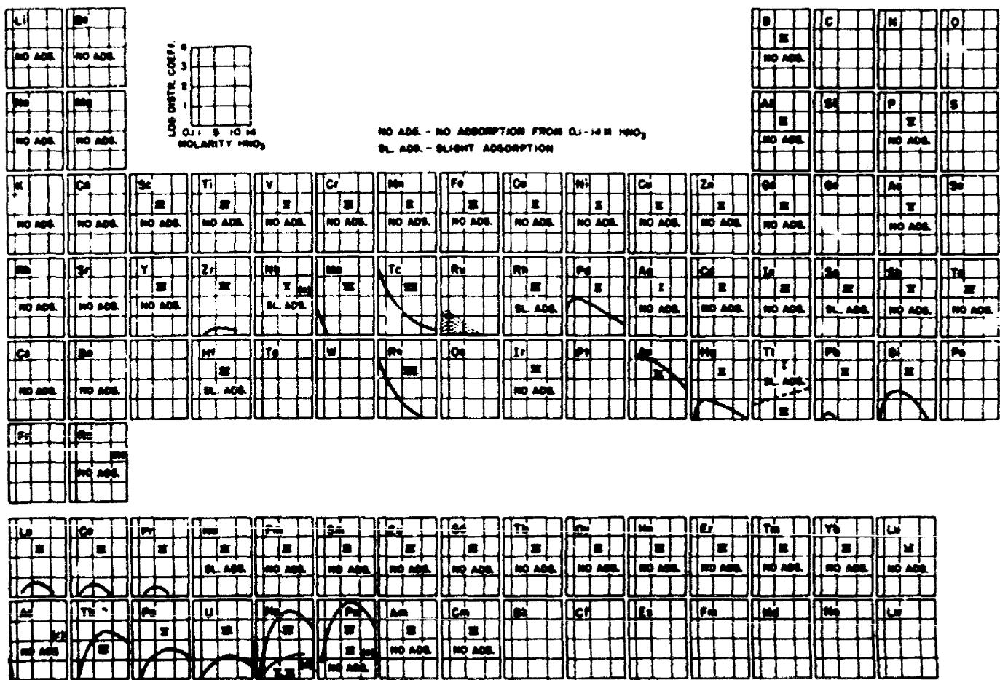  
Figure 18. Sorption of the Elements from Nitric Acid Solutions by Strongly Basic Anion Exchange Resins. $^{212}$

Pu(III), which is removed from the column. Washing with 8M HCl removes Th. The Np is eluted with $0.3\mathrm{M}$ $\mathrm{HNO}_3$ . Cross-linking and particle size of the resin greatly influences the separation from other cations as well as elution of the Np. $^{152,213-215}$ Macroporous anion resin is superior to gel-type anion resin for separation of Pu from Np. $^{215a}$ A number of similar procedures with variations in acid concentration and substitution of semicarbazide or aminoguanidine for hydrazine have been reported.

The separation of tracer amounts of Np(VI), Th(IV), Am(III), and Pu'IV) in nitric acid by anion exchange has been reported.216 The feed was adjusted to 7.2M HNO $_3$ -0.05M NaNO $_2$ at $50^{\circ}\mathrm{C}$ to yield Np(VI) and Pu(IV). After sorption on "Dowex" 1-X4 resin, the column was washed with 7.2M HNO $_3$ to elute Am(III) and $\mathsf{NpO_2}^{2+}$ , then with 4M HNO $_3$ to elute Th(IV), and finally with 0.35M HNO $_3$ to elute Pu(IV). Other work with macro quantities of these cations has shown incomplete separation of Np probably because of some reduction to Np(IV). Also, Th(IV) and Pu(IV) were not completely separated. The separation o: Np from fission products in 7.5M HNO $_3$ using ascorbic acid reductant is reported by Ichikawa.217

Radiochemically pure Np has been p:prepared for production of high purity metal with one nitrate anion exchange cycle and two chloride anion exchange cycles successively.[210]

The distribution coefficients of many elements over a wide range of hydrochloric acid concentrations have been reported.

These data are used to design separation systems for chloride anion exchange (Figure 19).126,219 Np, Th, and Pu are separated by chloride anion exchange by sorbing the anionic chioro-complexes of Np(IV) and Pu(IV) in 8 to 12M HCl. Pu(III) is eluted with NH4I in 8M HCl, NH2OH-NH4I in 12M HCl or Fe3I2 in 8M HCl; Th is not retained; and Np is eluted with 0.3M HCl.156,220 Distribution data for 65 elements on "Dowex"*1-X8 from 2 to 17.4M acetic acid in water have been reported221 (Figure 20). Examples of several separations including U and Np are given. Distribution data for 60 elements on cation exchange resin from 1 to 17.4M acetic acid in water have also been reported.222 With Np(VI) in 7.9M HC2H3O2, equilibrium was not reached even after 40 hours of mixing.

A method to separate and determine Np, Pu, U, Zr, Nb, and Mo in mixed fission products by anion exchange with HCl-HF solutions has been developed.[223] Trace quantities of Np have been separated from macro amounts of Zr and trace amounts of Nb by elution with HCl-HF solutions.[224] Also, HCl and HF solutions have been used to separate U, Pu, and Np from each other ard from alkali metals, alkaline earths, rare earths, trivalent actinides, Al, Sc, Ac, Th, Y, and Ni (Figure 21).[225] Controlled elution with a series of solvent mixtures was used to separate Np, Pu, Zr, Nb, Mo, Tc, Te, and U from fission products.[226] The chloro complexes were sorbed on anion resin and sequential washes with 12M HCl-NH $_2$ OH-NH $_4$ I(Pu), 10M HCl-Aq H $_2$ O $_2$ (Np), 9M HCl-Aq H $_2$ O $_2$ (Np and Zr), 9M HCl-ethanol (l:i, Zr), 6M HCl-ethanol (l:l, Nb), ethanol-lM HCl(4:l, Te),

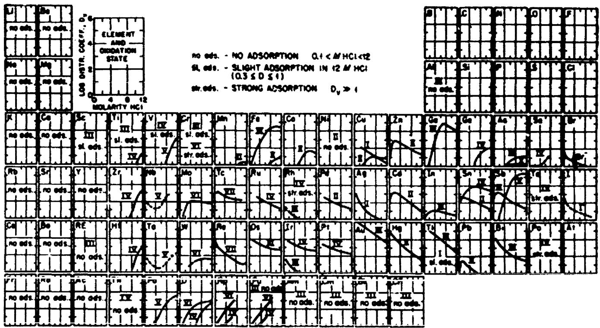  
Figure 19. Sorption of the Elements from Hydrochloric Acid Solutions by Strongly Basic Anion Exchange Resins.[219]

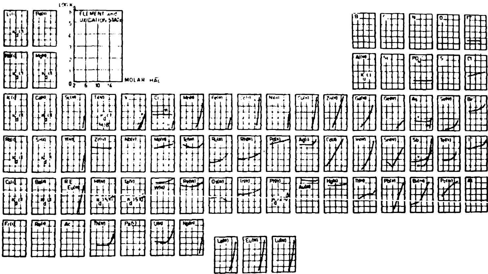  
Figure 20. Sorption of the Elements from Acetic Acid Solutions by an Anion-Exchange Resin $^{2,21}$

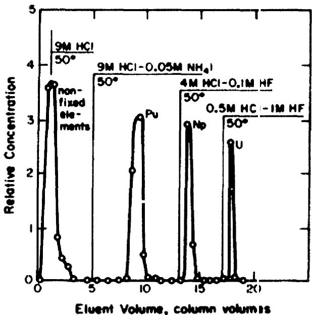  
Figure 21. Uranium-Neptunium-Plutonium Separation by Anion Exchange ("Dowex" 1-X10, <400 Hesh, 0.25 cm² × 3 cm Column).225

ethanol-6N HCl(4:1, No), 0.1N HCl(U), and 4N HNO3(Tc).

Other literature has included a study of the elution characteristics of $\mathsf{Sp}$ , $\mathsf{Pu}$ , $\mathsf{U}$ , $\mathsf{Pa}$ , and $\mathsf{Zr}$ in $\mathsf{HCl}$ , $\mathsf{INO}_3$ , and $\mathsf{H}_2\mathsf{SO}_4$ systems with "Dowex"-2 anion resin. Equilibrium data were given for each acid from 0.1V to concentrated, and possible separations based on equilibrium data were summarized.[23] Equilibrium data were given for a number of elements including $\mathsf{Sp}$ in 0.1 to 30N H $_3$ PO $_6$ , with "Dowex"-2 resin. Separation of $\mathsf{Sp}$ from Cs and Te was attained, but data were erratic.[24]

Sp has been separated from Pa by elution with 12N HCl-0.5N HF with Pa eluting first.[219] Separation has also been achieved by elution with 5N HCl from anion resin, in which case Sp elutes first.[220]

Sp(IV) has been sorbed quantitatively on "Dovex"-1 from 0.19 $\mathrm{Na}_{2}\mathrm{CO}_{3}$ and eluted with $\mathrm{NH}_{4}\mathrm{Cl}$ or dilute HCl.[3]

Sp(III) forms stable alkaline solutions as the $\mathfrak{spO}_3$ -ion. Novikov et al. studied the anion exchange behavior of this soluble complex as a possible basis for separation from other elements. The sorption was irreversible for all experiments; this was attributed to the reduction of the Sp(III) by the resin.

An anion exchange method using the nitrate system has been reported for removal of Np before spectrochemical determination of cationic impurities $^{212}$ (Procedure 23, p 200).

In several reported instances, anion exchange resin exploded or ignited after use in nitric acid or strong nitrate solutions.[23] These accidents are thought to be due to nitration of the skeleton of the exchange resin, leading to the spontaneous reaction in the presence of heat. Anion exchange resin in the nitrate form should not be stored in the dry state, and temperature should be carefully controlled at $< 60^{\circ}\mathrm{C}$ when used in strong; nitric acid. The nitric acid concentration should be $< 8$ .SM, and flow to the column should not be interrupted, particularly when high levels of radioactivity are in the column.

Cation Exchange. Sulfonic acid type resins have had limited applications for Np separations because both Np(VI) and Np(V) are reduced slowly by the resin.[23] Several separations have been reported for the pentavalent state of Np. Y. A. Zolotov and D. Nishanov[23] reported the separation of Np from U, Pu, and fission products by elution of Np(V) ahead of U(VI) with IM HNO₃ from a cation resin in the hydrogen form. Np was initially oxidized to the hexavalent state with bromate. Separation of Np depended on reduction to Np(V) by the resin. Also, cation exchange has been used for partial separation of Np from Pu(IV), Th(IV), and Zr(IV). Np was oxidized to Np(V) in dilute nitric

acid before sorption on the resin, but a few percent of the Np(V) was reduced to Np(IV) by the "Dowex"-50W resin and was not separated from the other cations.[236]

The distribution coefficients for many of the elements were determined in 0.1 to 12M HBr with "Dowex"-5C resin. Conditions for separation of U(VI) and Np(IV) and separation of Np(IV) and Pu(III) were given (Figures 22 and 23). Many other separation methods for Np could be devised from the distribution data (Figure 24).237

Np and Pu have been separated by elution from cation resin with HF after reduction to Np(IV) and Pu(III) with $\mathrm{SO}_2$ .238 Np(IV) was eluted first with 0.02M $\mathrm{HF}^{239}$ , and then Pu(III) was eluted with 0.5M HF. Also, Np was separated from Pu by cation exchange with HBr followed by TTA extraction.240

Pressurized elution development chromatography on cation resin at 70 to $90^{\circ}\mathrm{C}$ with $\alpha$ -hydroxyisobutyric acid has been very useful for separation of trivalent actinide elements both in the laboratory and with macroscopic quantities.[24] Although no specific separations of this type for Np are reported, the method is useful for highly radioactive solutions.

Distribution data for many of the elements on "Dowex"50 resin over a range of hydrochloric acid concentrations and also over a range of perchloric acid concentrations have been reported (Figures 25 and 26).238

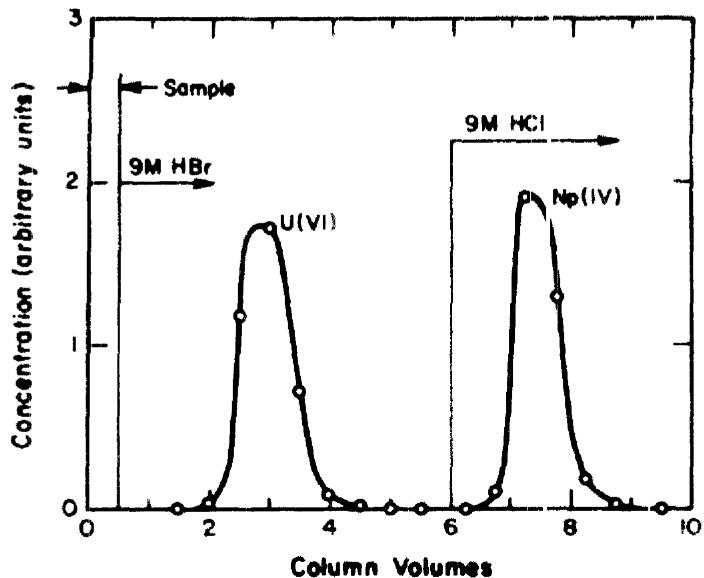  
Figure 22. Separation of U(VI) and Np(IV) by Cation Exchange ("Dowex" 50-X4 0.2 cm² × 2 cm Column, 25°).237

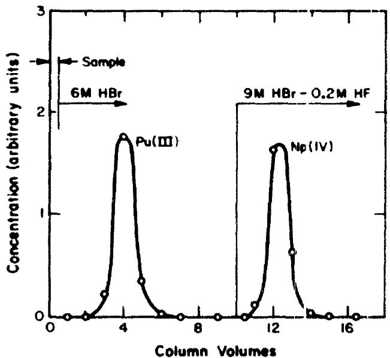  
Figure 23. Separation of Pu(III) and Np(IV) by Cation Exchange ("Dowex"50-X4, 0.28 cm² × 3 cm Column, 60°).

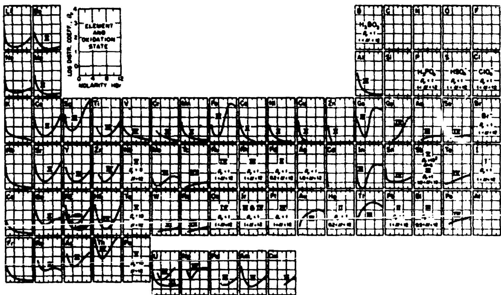  
Figure 24. Sorption of the Elements from HBr Solutions by a Cation Exchange Resin.[297]

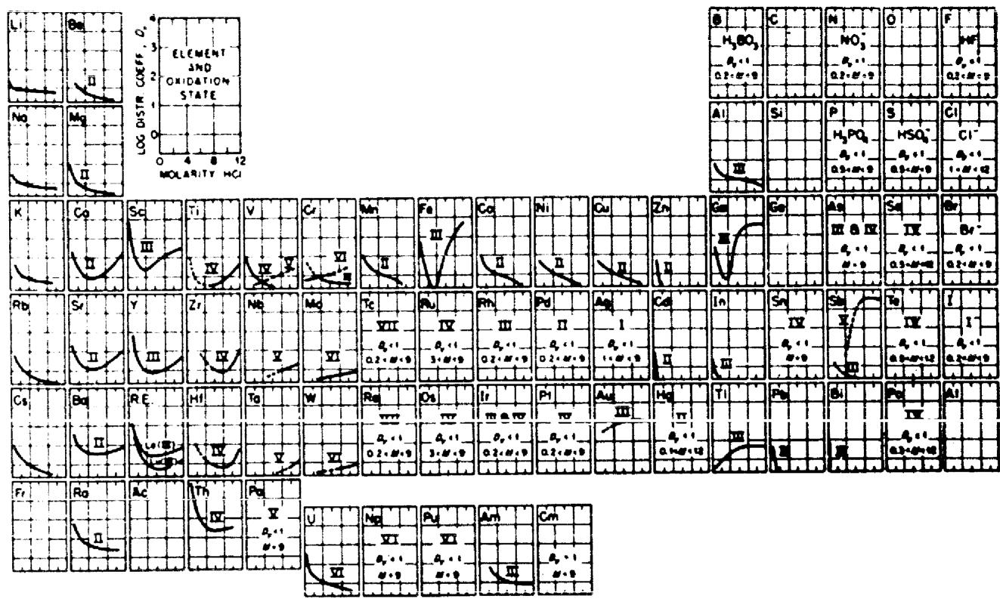  
Figure 25. Sorption of the Elements from HCl Solutions by a Cation Exchange Resin.[23]

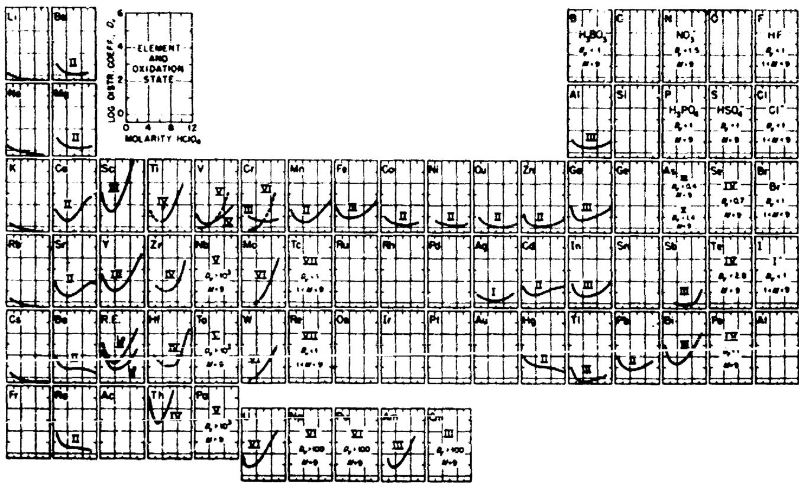  
Figure 26. Sorption of the Elements from $\mathsf{HClO}_4$ . Solutions by a Cation Exchange Resin.

Inorganic Ion Exchangers. Inorganic exchangers have been largely superseded by synthetic resins principally because of higher capacities and more useful physical characteristics of the synthetic resins. However, inorganic exchangers have the advantage of greater resistance to radiation damage. The distribution coefficients of 60 cations, including Np, on hydrous zirconium oxide, zirconium phosphate, zirconium tungstate, and zirconium molybdate have been measured.[242] Shafiev et al.[243] have studied the separation of Np, Pu, and Pm on zirconium phosphate. Np(V) is not retained while trivalent elements are readily eluted with IM HNO₃. Pu(IV) is eluted with 0.5M HNO₃ containing reducing agents such as ferrucus sulfamate or hydroquinone. Zirconium phosphate does not change the oxidation state of Np(V). The sorption of Np, Th, and U from HNO₃, H₂SO₄, and HF solutions on ammonium molybdophosphate (AMP) columns has been determined.[244,245] The sequence of sorption is Np(IV) > Th(IV) >> U(VI) >> Np(VI) > Np(V). These same workers demonstrated the separation of Th, U, and Np using columns loaded with AMP.[246] Tsuboya et al.[247] demonstrated conditions in a HNO₃ system for separating Np(IV) and U(VI) with a tungstic acid exchanger; Np(IV) is much more strongly retained than U(VI) from 0.5 to 2N HNO₃.

# D. CHROMATOGRAPHY

Extraction Chromatography. Extraction chromatography has been applied to the separation of Np, Pu, Am, and U with $100\%$ TBP sorbed on diatomaceous silica. The diatomaceous silica was initially exposed to dimethylsilane vapor, then treated with TBP, and used as the stationary phase. Nitric acid, with and without reducing agents, was used as the mobile phase. $^{26}$ Other workers $^{249}$ used this system for a similar separation of Np and found that modifications were required to prevent reduction of Np(VI) to Np(V) and to improve separation from some fission products. Eschrich $^{250}$ used the same system to determine the oxidation states of Np by eluting with 0.5 to 2M HNO $_3$ . The order of elution was Np(V), Np(IV), and Np(VI). It is probable that some reduction of Np(VI) occurred.

$^{239}\mathrm{Np}$ was separated from fission products and U on a column of TTA sorbed on glass powder. $^{251}$ The chromatographic method gave much more effective separation than batch extraction; recovery was adequate so that isotopic dilution was not necessary. However, two column separations were necessary to separate Np from Zr. Wehner et al. ${}^{252}$ have also reported separation of $^{339}\mathrm{Np}$ from fission and activation products on Poropak-Q impregnated with TTA-o-xylene.

Some workers have used "Kel-F" or "Teflon" powders coated with an organic extractant as the stationary phase for extraction

chromatography separations. "Kel-F" powder coated with trilaurylamine nitrate has been used to separate Np from U, Pu, and fission products. The feed was adjusted to 2M HNO₃ - 0.1M Fe(SO₃NH₂)₂ and passed through the bed. After the column was washed with 1M HNO₃ containing Fe(SO₃NH₂)₂, the Np was eluted with H₂SO₄ - HNO₃.

The method is very selective for Np(IV) and has yielded chemically pure $^{239}\mathrm{Np}$ when the weight ratio of U to Np was $>10^{10}$ in the feed. The separation requires one to two days. A similar method was developed for the coseparation of Np and Pu from U.

Paper Chromatography. Paper chromatography $R_{f}$ values for elements Ac through Am in many mixtures of either HVO₃ or HCl with methanol, ethanol, and butanol have been determined by Keller.[255] It was necessary to reduce Np(VI) to Np(V) or (IV) before starting the separation because Np(VI) is slowly reduced in the column rcsulting in poor separation of the bands.

Neptunium(IV) was separated from Th(IV) with 12M HCl-butanol and >8M HNO₃-butanol mixtures. Also, good separation of Np(IV) from U(VI) was attained with >1M HCl-butanol; Np(V) was separated from U(VI) with 2M HCl-ethanol as developer.

$\mathbf{Clanet}^{256}$ measured the $\mathbf{R}_{\mathbf{f}}$ values for elements with atomic numbers 90 through 96 in mixtures of mineral acids with alcohols and discussed analytical applications.

$R_{f}$ values for $Np(IV)$ , (V), and (VI) have been reported for paper treated with TOA using 0.5M $\mathsf{HNO}_3$ developer solutions

containing $\mathsf{LiNO}_3$ , $\mathsf{NH}_4\mathsf{NO}_3$ , or $\mathsf{Al}(\mathsf{NO}_3)_3$ . The values are well separated for the different oxidation states of $\mathfrak{sp}$ and for the different actinides.[257] $R_{f}$ values were also obtained for paper treated with solutions of tetrabutylhypophosphate in acetone-water (20:1) using developer solutions of nitric and perchloric acid.[258]

Twelve fission and neutron capture isotopes including $^{239}\mathrm{Np}$ , have been separated from irradiated uranium with aqueous hydrofluoric and methylethyl ketone-hydrofluoric acid mixtures as developers. $^{259}$

Thin Layer Chromatography. Rapid separation of different valence states of Np from each other and from other actinide elements by thin layer chromatography on "Teflon"-40 powder saturated with 0.1M tetrabutylhypophosphate solution has been demonstrated.[258]

Gas Chromatography. Effective separation of the transuranium elements by gas chromatography of their chlorides has been demonstrated.[260] The volatile chloride complexes were synthesized at $\sim 500^{\circ}\mathrm{C}$ by adding $\mathrm{Al}_{2}\mathrm{Cl}_{6}$ vapors into the carrier gas. The experiments were carried out in glass capillary columns maintained at $\sim 250^{\circ}\mathrm{C}$ with less than one microgram of each actinide. Cm, Am, and Pu were eluted in order of decreasing atomic number in about the same position as lighter lanthanide elements in a similar experiment. The retention times of Np, U, and Pa are much

shorter; it is postulated that the tetrachlorides of these elements are produced. The chromatogram is measured by collecting fractions of $\mathrm{Al}_{2}\mathrm{Cl}_{6}$ condensate at the exit of the column. The actinide hydroxides are carried with La from strongly basic solution and separated from Al. Then the actinide is deposited, and the alpha spectrum is measured with a surface barrier detector and multichannel pulse height analyzer.

# E. OTHER METHODS

Volatilisation. Separation of more-volatile Np(IV) chloride from Pu(III) chloride and other less volatile chlorides has been reported.[261,262] The actinide chlorides were prepared by passing carbon tetrachloride vapor at $650^{\circ}\mathrm{C}$ over mixtures of plutonium-neptunium oxides or oxalates. The nepturium chloride sublimate was collected with a separation factor of $\sim 3 \times 10^{3}$ for Np initially containing $4\%$ Pu; the yield was $\sim 96\%$ . The method is useful for obtaining quite pure Np where a quantitative separation is not required.

$\mathsf{NpF_6}$ is quite volatile, intermediate between $\mathsf{UF_6}$ and $\mathsf{PuF_6}$ . Separation was attained from $\mathsf{UF_6}$ by co-scription of the hexafluorides on NaF. Then the $\mathsf{NpF_6} \cdot \mathsf{NaF}$ complex was reduced, and the $\mathsf{UF_6}$ desorbed. After refluorination, the $\mathsf{NpF_6}$ was desorbed.[263]

Electrophoresis. $\mathbf{Clanet}^{256}$ has developed an electrophoretic method on cellulose acetate membranes to separate the charged species formed by elements with atomic numbers 90 to 96 in 1 to

12M HCl and $\mathsf{HNO}_3$ . Mobility curves have been obtained for the acid concentration range for both acids. A large number of potential separations of these elements and the solution conditions are tabulated. Some of the separations of Np include Np(IV) or (V) from U(VI); Np(IV) from Pu(IV) or (VI); Np(IV), (V), or (VI) from Am(III) and Cm(III); and separation of the oxidation states of Np.

Electrodeposition. Although electrodeposition has been used to prepare mounts for radiometric measurement, electrolysis has not been used as a separation method. There has been one report that U, Pu, and Np were separated by electrolysis from HNO₃ by varying the pH. Optimum conditions were stated as current density 750 to 1000 mA/cm² with a plating time of 2 to 3 hours and solution volume of 20 to 30 ml. Np is completely deposited at pH > 9, and Pu and U are completely deposited at pH <6 and pH <3, respectively. Other workers using different media for electrolysis have been unsuccessful in separating Np from other actinides. Although partial separation from a number of common cations has been attained, no useful separation method has been reported.

Miscellaneous. An analytical scheme has been described which yields sequential separation of the elements including Np remaining after neutron exposure of 1 mg of a fissile element.[263] The products were separated and isolated for determination of isotopic abundance by mass spectrometry using solvent extraction, ion exchange, extraction chromatography, and precipitation methods.

# VIII. ANALYTICAL METHODS

# A. SOURCE PREPARATION AND RADIOMETRIC METHODS

Counting. Because counting methods are more sensitive than chemical or spectrochemical methods, they are the primary methods for identifying and quantitatively determining Np. The two most common Np isotopes are $^{237}\mathrm{Np}$ and $^{239}\mathrm{Np}$ . $^{237}\mathrm{Np}$ is usually determined by alpha counting its two major alpha transitions at 4.781 and 4.762 MeV. If $^{237}\mathrm{Np}$ has decayed for a period of about 6 months or longer, it can be determined by gamma ray spectroscopy of its $^{233}\mathrm{Pa}$ daughter. If $^{237}\mathrm{Np}$ is separated from $^{233}\mathrm{Pa}$ which has an 86.6-keV gamma ray, the $^{237}\mathrm{Np}$ 86.6-keV gamma ray can be counted directly. $^{239}\mathrm{Np}$ is determined by gamma counting its gamma transitions at 228 and 278 keV. $^{10}$

The gross alpha activity of $^{237}\mathrm{Np}$ can be determined with a proportional counter or plastic scintillation counter. If other alpha-emitting nuclides are present, an alpha pulse height analysis with a surface barrier detector allows a determination of the percentage of the total alpha counts attributable to $^{237}\mathrm{Np}$ .

Liquid scintillation counting can be used to determine gross alpha activity with almost 100% efficiency and in many cases can be used to determine $^{217}\mathrm{Np}$ in the presence of other alpha-emitting nuclides. The energy resolution in liquid scintillation is $\sim 600$ KeV

as compared to 15 KeV for surface barrier detectors.

Gamma-ray spectrometry with either a NaI scintillation detector or a Ge(Li) detector may be used to determine $^{239}\mathrm{Np}$ . For $^{239}\mathrm{Np}$ gamma rays (228, 278 KeV), the energy resolution of a typical coaxial Ge(Li) detector (about 1.0 KeV) is much better than for NaI (about 20 KeV). The efficiency of such Ge(Li) detectors relative to a 3 x 3 in. NaI detector is 3 to 15% for the 1.33-MeV gamma ray. Ge(Li) low-energy photon detectors (LEP) have an energy resolution of 0.5 KeV with lower efficiency.

An $\alpha$ - $\gamma$ coincidence method for determining $^{237}\mathrm{Np}$ was developed which increased selectivity. $^{264}$ The resolving time of the coincidence system was taken as 8 x 1C $^{-6}$ sec.

A radioactivation method was developed to increase the sensitivity for determining $^{237}\mathrm{Np}$ . The activation product is short-lived $^{238}\mathrm{Np}$ , which is determined by counting its 1.0 MeV gamma ray. To obtain maximum sensitivity, the $\mathrm{Np}$ should be purified before and after neutron irradiation.

A summary of the sensitivity and selectivity of radiometric and radioactivation methods for determining Np is presented in Table 23. In summary, alpha counting is the most convenient method for $^{237}\mathrm{Np}$ , and gamma spectrometric methods are preferred for $^{236}\mathrm{Np}$ and $^{239}\mathrm{Np}$ . Because of the continuing advancements in nuclear radiation detection systems, the sensitivity, precision, and accuracy of the radiometric methods discussed above could be

TABLE 23   
SENSITIVITY AND SELECTIVITY OF PROJECTING AND PROJECTIVATION METHODS   
Faeettnnneep   

<table><tr><td rowspan="2">Isotope</td><td rowspan="2">Method</td><td rowspan="2">Sensitivity of Method</td><td rowspan="2">Interfering Element</td><td colspan="2">Permissible amount in Terms of</td><td rowspan="2">Duration of Analysis (min)</td></tr><tr><td>Sp Weight (kg)</td><td>Bp Activity</td></tr><tr><td rowspan="6">117Pp</td><td rowspan="6">α-Counting</td><td rowspan="6">0.05 to 0.1 μg</td><td>314Pb</td><td>5 × 10-6</td><td>0.02</td><td>10 to 60</td></tr><tr><td>211Am</td><td>1 × 10-8</td><td>0.02</td><td></td></tr><tr><td>314Pp</td><td>--</td><td>133</td><td></td></tr><tr><td>U</td><td>20</td><td>0.02</td><td></td></tr><tr><td>FPa</td><td>--</td><td>134</td><td></td></tr><tr><td>SIb</td><td>50</td><td>--</td><td></td></tr><tr><td rowspan="6">117Np</td><td rowspan="6">α-Spec-truency</td><td rowspan="6">0.1 to 0.5 μg</td><td>314Pb</td><td>0.2</td><td>111</td><td>10 to 100</td></tr><tr><td>211Am</td><td>4 × 10-3</td><td>111</td><td></td></tr><tr><td>314Pp</td><td>--</td><td>115</td><td></td></tr><tr><td>U</td><td>50</td><td>0.05</td><td></td></tr><tr><td>FP</td><td>--</td><td>143</td><td></td></tr><tr><td>SI</td><td>50</td><td>--</td><td></td></tr><tr><td rowspan="7">117Np</td><td rowspan="7">γ-Spec-truency</td><td rowspan="7">0.01 to 0.1 μg</td><td>314Pb</td><td>10</td><td>116</td><td>10 to 60</td></tr><tr><td>211Pb</td><td>--</td><td>0.02</td><td></td></tr><tr><td>314Am</td><td>5 × 10-8</td><td>SC</td><td></td></tr><tr><td>Ia,b,c,d,e</td><td>--</td><td>0.1</td><td></td></tr><tr><td>U</td><td>100</td><td>1</td><td></td></tr><tr><td>FP</td><td>--</td><td>1</td><td></td></tr><tr><td>SI</td><td>103</td><td>--</td><td></td></tr><tr><td rowspan="5">117Np</td><td rowspan="5">α,γ-Cole-cidence(90 keV)</td><td rowspan="5">0.1 to 0.5 μg</td><td>314Pb</td><td>20</td><td>2 × 105</td><td>60 to 200</td></tr><tr><td>211Am</td><td>5 × 10-8</td><td>50</td><td></td></tr><tr><td>314Pp</td><td>--</td><td>101to 104</td><td></td></tr><tr><td>FP</td><td>--</td><td>101to 104</td><td></td></tr><tr><td>SI</td><td>50</td><td></td><td></td></tr><tr><td rowspan="4">117Np</td><td rowspan="4">β-Counting</td><td rowspan="4">10-6mCi</td><td>FP</td><td>--</td><td>0.32</td><td>10 to 60</td></tr><tr><td>314Pb</td><td>--</td><td>0.</td><td></td></tr><tr><td>U</td><td>(0.1 to 1)</td><td></td><td></td></tr><tr><td>SI</td><td>(0.1 to 1)</td><td></td><td></td></tr><tr><td rowspan="5">117Np</td><td rowspan="5">γ-Spec-truency(100 keV)</td><td rowspan="5">10-3to 10-6mCi</td><td>314Pb</td><td>--</td><td>10</td><td>5 to 60</td></tr><tr><td>Ia,b,c,d,e</td><td>--</td><td>101</td><td></td></tr><tr><td>U</td><td>100</td><td>4</td><td></td></tr><tr><td>FP</td><td>--</td><td>3</td><td></td></tr><tr><td>SI</td><td>100</td><td></td><td></td></tr><tr><td rowspan="8">117Np</td><td rowspan="8">γ-Spec-truency(1000 keV)</td><td rowspan="8">10-3to 10-6mCi</td><td>314Pb</td><td>(&gt;1)</td><td>1C3</td><td>5 to 60</td></tr><tr><td>314Pp</td><td>(&gt;1)</td><td>&gt;103</td><td></td></tr><tr><td>U</td><td>(&gt;100)</td><td>&gt;103</td><td></td></tr><tr><td>O2:T-</td><td>--</td><td>0.1</td><td></td></tr><tr><td>O2:Yb</td><td>--</td><td>0.1</td><td></td></tr><tr><td>Ia,b,c,d,e</td><td>--</td><td>0.1</td><td></td></tr><tr><td>FP</td><td>--</td><td>1</td><td></td></tr><tr><td>SI</td><td>(100)</td><td></td><td></td></tr><tr><td rowspan="6">117Np</td><td rowspan="6">Radioacti-vation (byγ-spec-truence of116sp)</td><td rowspan="6">10-3μg [irgh film of 16μm/(cm-2-sec)]</td><td>314Pb</td><td>1</td><td>10&#x27; to 10&quot;</td><td>24 to 156</td></tr><tr><td>314Pb</td><td>1</td><td>--</td><td></td></tr><tr><td>314U</td><td>&gt;100</td><td>--</td><td></td></tr><tr><td>Other</td><td>&gt;100</td><td>--</td><td></td></tr><tr><td>elec-mia</td><td>--</td><td>n.1 to 1</td><td></td></tr><tr><td>FP</td><td>--</td><td>n.1 to 1</td><td></td></tr></table>

FP - Fusion Product   
41 - Stable Isolopes

improved with available advanced instrumentation.

Source Preparation. Direct evaporation is the simplest method for preparing sample aliquots for counting. The disadvantage for alpha pulse height analysis is the thickness of the deposit, which results in self absorption of the alpha particles. If a surfactant such as tetraethyleneglycol $(50\mu \mathrm{g} / \mathrm{cm}^2)$ is added to the aqueous solution, the Np solution is evaporated from a film rather than a drop resulting in a more homogeneous deposit.[267,268] The surfactant polymerizes on heating and burns up when ignited. The diluted sample is transferred to a suitable counting plate, e.g. stainless steel disk, and slowly evaporated to dryness to prevent spattering. The direct mount is flamed to dull red heat, cooled, and coated with a thin layer of collodion solution, and the Np is counted.

Electrodeposition has been widely used to prepare high-quality sample mounts for precise alpha counting. The procedure is extremely useful when samples contain a mixture of alpha emitters that need to be resolved. Electrodeposition results in excellent sample mounts from organic solutions that evaporate very slowly or leave large amounts of residue and from aqueous solutions that contain large amounts of dissolved solids.

Np and other actinides can be deposited from a variety of electrolytes and under several conditions. Graves269 described

a semiquantitative method for depositing $^{237}\mathrm{Np}$ from Li onto Pt. $\mathsf{Ko}^{270}$ reported a method for quantitative deposition of Np from 0.2M HC104 - 0.15M NH4COOH, and Mitchell $^{271}$ used NH4Cl - HCl to obtain a yield of $94\%$ . Some systems used by other workers $^{272-274}$ are formic acid-ammonium formate, ammonium oxalate, ammonium acetate, ethanol, isopropanol, and NH4Cl with uranium carrier.

Donnan and Dukes $^{275}$ developed one of the fastest procedures for quantitative depositions by combining Mitchell's method with uranium carrier addition. $^{238}\mathrm{U}$ is added as a carrier in three increments to the $\mathrm{NH_4Cl}$ electrolyte to ensure quantitative yield; only 20 minutes deposition time is required. An average recovery of $99.8\%$ with a relative standard deviation of $\pm 0.2\%$ ( $n = 10$ ) was obtained with Pu. Similar results were obtained with Np. Resolution of 20 keV is achieved consistently with electrodeposited mounts and a silicon surface-barrier detector.

Parker and Colonomos276 reviewed electrodeposition procedures and described two new methods. One is a co-deposition method for alpha-spectrometry, and the other for preparation of carrier-free layers as fission detectors. In the co-deposition method with uranium carrier, 237Np was deposited quantitatively in 10 min at 1700 V with stainless steel as the cathode.

In other recent work, Np was deposited quantitatively from ammonium oxalate or ammonium acetate solution or mixed ammonium

oxalate-ammonium chloride electrolyte. $^{277-280}$ Alcohol is an excellent plating medium for aqueous and organic samples. Methods have been reported for ethanol, isopropanol, and alcohol saturated with ammonium chloride. $^{281-283}$ Deposition from sulfuric, hydrochloric, perchloric, and oxalic acid has been reported by Palei. $^{284}$ The effect of variables on the quantitative deposition on Np and other actinide elements has been reported by other authors. $^{285,286}$

Other methods which have a lower efficiency but yield sources with excellent resolution include vacuum sublimation and electrospraying.[266-291] Both electrodeposition and electrospraying have several disadvantages. These methods take a longer time than evaporation and require special equipment including a specially designed electrolytic cell for electrodeposition, high voltage equipment, and special capillary with a needle electrode for electrostatic spraying.[266]

# B. SPECTROPHOTOMETRY

Although different oxidation states of Np have sharp absorption bands, spectrophotometric analysis has had limited use because radiometric procedures are more sensitive. Further, alpha containment is required for the spectrophotometer, and operation within a glove box is tedious. Generally, procedures used for other actinides can be applied to the determination. Np is adjusted to a single oxidation state, and the concentration is calculated from the molar extinction coefficient and the absorption of the

solution at the proper wavelength. When more than one oxidation state is present, appropriate equations may be formulated for the concentration of each component.[292]

Absorption Bands. Important absorption bands and molar extinction coefficients of the different oxidation states are listed in Table 24. Most of the sharp bands can be used for qualitative or quantitative work even though they only obey Beer's Law over a limited concentration range. The best band to use for analysis of Np(III) is at 786 mµ because this band obeys Beer's Law. The strongest bands for Np(IV) (960 mµ, 723 mµ) do not obey Beer's Law, but they can be used with appropriate calibration and constant slit width. The strongest band for Np(V) (at 980 mµ in 1M HNO₃) does obey Beer's Law;²⁹⁸ a high-resolution monochromator (e.g., a double-grating monochromator) should be used. Cauchatier' and coworkers²⁹⁸ have developed a method for determining Np in irradiated nuclear fuels by measuring the Np(V) band in 1M HNO₃. The pentavalent state is produced by adding hydrazine to a Np(V)-Np(VI) mixture obtained after evaporation of the nitric acid solution. Correction for Pu(VI) is necessary. The most useful band for Np(VI) is at 1.23 μm; Colvin developed a method using this band for measurements in nitrate solution.²⁹⁹ In this method, Np is oxidized to the hexavalent state with sodium dichromate, and then the acidity is adjusted to 1 to 2M. The absorbance is measured at 1.23 μm

TABLE 24   
IMPORTANT ABSORPTION PEAKS OF NEPTUNIUM293-297   

<table><tr><td></td><td>Absorption Band (mμ)</td><td>Molar Extinction Coefficient</td></tr><tr><td rowspan="7">Np(III)</td><td>552a</td><td>44.5</td></tr><tr><td>602a,d</td><td>25.8</td></tr><tr><td>661a,d</td><td>30.5</td></tr><tr><td>786b,d</td><td>44 (50 to 60°C)</td></tr><tr><td>849b</td><td>~25</td></tr><tr><td>991b</td><td>~27</td></tr><tr><td>1363b</td><td>~39</td></tr><tr><td rowspan="11">Np(IV)</td><td>500c</td><td>~15</td></tr><tr><td>504a,d</td><td>22.9</td></tr><tr><td>590.5a,d</td><td>16.1</td></tr><tr><td>~600c</td><td>~7.5</td></tr><tr><td>~715c,d</td><td>~3.7</td></tr><tr><td>723b</td><td>127</td></tr><tr><td>743a,d</td><td>43.0</td></tr><tr><td>800c</td><td>~21</td></tr><tr><td>825a,d</td><td>24.5</td></tr><tr><td>960b</td><td>162</td></tr><tr><td>975c</td><td>~32</td></tr><tr><td rowspan="5">Np(V)</td><td>428a</td><td>11.1</td></tr><tr><td>617b,d</td><td>22</td></tr><tr><td>~617c,d</td><td>~18</td></tr><tr><td>980b</td><td>395</td></tr><tr><td>~990c</td><td>~180</td></tr><tr><td rowspan="4">Np(VI)</td><td>476a</td><td>6.4</td></tr><tr><td>557a</td><td>6.8</td></tr><tr><td>1223b,d</td><td>45</td></tr><tr><td>1230c,d</td><td>~43</td></tr><tr><td rowspan="2">Np(VII)</td><td>412e</td><td>1370 ±40</td></tr><tr><td>618e</td><td>382 ±10</td></tr></table>

a. 1M HCIO4.   
b. 2M HC104.   
c. IM HNO3.   
d. Obeys Beer's Law.   
e. KOH Solution.

against a reference HNO₃ solution that is the same HNO₃ concentration as the sample. The method has a relative standard deviation of ±0.5% at 3 g/l. A number of ions, including Pu, do not interfere when present in amounts ten times that of the Np. A study on heavy water solutions of neptunium salts in which numerous well-defined bands were found in the region 1.2 to 1.8 μm is reported by Waggener.

Color Complexes. Spectrophotometric methods for Np lack sensitivity. Furthermore, the position of the band extinction coefficients are affected by some anions and by the Np concentration. These disadvantages are partially overcome when color complexes that have very high molar extinction coefficients are used. A method with arsenazo III [1, 8-dihydroxynaphthalene-3, 6-disulfonic acid-2, 7-bis(azo-I) benzene -2-arsonic acid] is reported. $^{301-303}$ The intensity of the s:able green complex of Np(IV) and arsenazo III is measured at: $665\ \mu\text{l}$ . The color forms instantaneously, and its intensity is constant over the concentration range 4 to 6M HNO $_3$ . The molar extinction coefficient at $665\ \mu\text{l}$ is $\sim 10^5$ . Chudinov and Yakovlev separated U(IV), Pu(IV), and Th(IV), which form colored complexes, from NpO $_2^{+}$ by extraction with di-2-ethylhexylphosphoric acid (HDEHP) in carbon tetrachloride. After extraction, Np is reduced to Np(IV), and arsenazo III is added. The lower limit of detection is $0.04\ \mu\text{l}/\text{ml}$ , and the relative accuracy is between 1 and $7\%$ .

Bryan and Waterbury $^{302}$ separated Np from U and Pu by extraction with tri(iso-octyl)amine (TIOA) before determining the arsenazo III complex. They found that of 45 elements tested, only Pd, Th, U, Pu, and Zr interfered. The relative standard deviation was between 7.2 and $1.1\%$ in 200-mg samples of 8.5 to 330 ppm of Np. (Procedure 20, p192.) Novikov et al. have studied the color complex of Np(IV) with Arsenazo M. $^{304}$ At 664 μ the molar extinction coefficient is $1.18 \times 10^{5}$ in 7M HCl and $9.5 \times 10^{4}$ in 0.5M HCl.

Thorin was used by several workers to analyze Np. $^{305,306}$ The absorbance is measured at 540 mu against a reference solution not containing Np. The molar extinction coefficient measured with a Beckman DU spectrophotometer is $\sim 14,500$ . The precision of the method at the $95\%$ confidence limits is $\pm 2.1\%$ for $0.63~\mu \mathrm{g}$ of Np/ml. Chudinov and Yakovlev used extraction to separate Np from U and Fu interferences. The thorin method has also been automated $^{307}$ with the Technicon AutoAnalyzer, and the precision has been improved.

Np reacts in weakly acidic solution (pH2) with xylonol orange to form a colored complex with an absorbance maximum at 550 m and molar extinction coefficient of 5.5 x $10^{4}$ .308 Xylonol orange is three times more sensitive than thorin but only one-half as sensitive as arsenazo III as a reagent for Np(IV). The greatest

advantage of xylonol orange is that uranyl ions do not interfere.

Fe(III), Zr, Th, and Bi interfere.

Np(IV) forms a color complex with quercetin that is stable in the pH range 3 to 7 and obeys Beer's Law over a concentration range 0.4 to $4.0~\mu \mathrm{g / ml}$ . The molar extinction coefficient is $\sim 2.3 \times 10^{6}$ at $425~\mathrm{mU}$ . This method requires an extensive purification to remove cations and traces of organic impurities.[309]

The color complex of Np(V) and arsenazo III exists over a narrow pH range and was studied by Chudinov and Yakovlev.310 A method with the green-colored complex of Np(V) and chlorophosphonazo III was also developed by these workers.31 Chemical separation or masking agents are required for a number of elements. Chudinov has studied spectrophotometrically the interaction of 12 organic dyes of different types with $\mathsf{NpO_2}^+$ .312 He concluded that the most promising reagents for pentavalent neptunium are 1-(2-pyridylazo) resorcinol (PAR), arsenazo III, and chlorophosphonazo III. With PAR, the molar extinction coefficient is $\sim 4.3 \times 10^{6}$ at $510\mathrm{mu}$ .

# C. CONTROLLED POTENTIAL COULOMETRY

Determination of Neptunium Concentration. Alpha counting is generally superior to coulometry for determining less than a few micrograms of Np; however, controlled potential coulometry is an accurate and precise method for determining Np above the 10-μg level.[313] The electrolysis cell contains a platinum electrode at which the Np(V/VI) couple is titrated in $0.5\mathrm{M}$ $\mathrm{H}_2\mathrm{SO}_4$ . First,

the Np is oxidized to Np(VI) with Ce(IV), the Np(VI) and Ce(IV) are electrolytically reduced to Np(V) and Ce(III), and then Np(V) is coulometrically oxidized to Np(VI). The integrated current in the last step is used to calculate the concentration of Np. The standard deviation ranged from $6\%$ for $7\mu \mathrm{g}$ to $0.05\%$ for about $1\mathrm{mg}$ of Np. As little as $2\mu \mathrm{g}$ was detected. Elements which significantly interfere are Au, Pt, Hg, Tl, and Cl; Pu and Pd cause only slight interference. Stromatt's method was used successfully with a gold electrode instead of a platinum electrode to eliminate the Pt/Pt(OH) $_2$ reaction reported by Fulda. $^{314}$

Fulda obtained a precision of $\pm 0.6\%$ for $6\mathrm{mg}$ of Np. In another application of Stromatt's method, the precision was $0.1\%$ ( $n = 8$ ) for $9\mathrm{mg}$ of Np. Also, Buckingham demonstrated a coefficient of variation for the coulometric method of $\pm 0.8\%$ for neptunium oxide and $\pm 1.1\%$ ( $n = 11$ ) for neptunium nitrate solutions.

Delvin and Duncan $^{316}$ used the same method in the presence of nitrate with $\mathrm{H}_2\mathrm{SO}_4$ electrolyte. Plock and Polkinghorne $^{317}$ used coulometry to analyze solutions of dissolved alloys for both U and Np without prior chemical separation. Propst $^{318}$ has reported a coulomteric method for Np using a conducting glass electrode in a thin-layer electrochemical cell. Organic contaminants interfered and were removed by bisulfate fusion before coulometry.

Determination of Oxidation States. This method applies to the (IV), (V), and (VI) states and was reported by Stromatt. $^{319}$ The analysis depends on the fact that $\mathsf{Np}(\mathsf{IV})$ is not oxidized, nor is $\mathsf{Np}(\mathsf{V})$ reduced at a significant rate at a platinum electrode in $\mathsf{IMH_2SO_4}$ electrolyte. The procedure is: (1) a potential is applied at the controlled potential electrode to reduce $\mathsf{Np}(\mathsf{VI})$ to $\mathsf{Np}(\mathsf{V})$ ; (2) $\mathsf{Np}(\mathsf{V})$ is electrolytically oxidized to $\mathsf{Np}(\mathsf{VI})$ ; (3) $\mathsf{Ce}(\mathsf{IV})$ is added to oxidize $\mathsf{Np}(\mathsf{IV})$ to $\mathsf{Np}(\mathsf{VI})$ ; (4) excess $\mathsf{Ce}(\mathsf{IV})$ and $\mathsf{Np}(\mathsf{VI})$ are electrolytically reduced to $\mathsf{Ce}(\mathsf{III})$ and $\mathsf{Np}(\mathsf{V})$ ; and (5) $\mathsf{Np}(\mathsf{V})$ is electrolytically oxidized to $\mathsf{Np}(\mathsf{VI})$ . $\mathsf{Np}(\mathsf{VI})$ is determined in the first step. The difference between the integrated currents for the first and second titrations corresponds to $\mathsf{Np}(\mathsf{V})$ , and the difference between the integrated currents for Step 5 and Step 2 corresponds to $\mathsf{Np}(\mathsf{IV})$ .

Determination of Oxidation-Reduction Potential. The potential for the Np(V)/(VI) couple was measured in sulfuric, perchloric, and nitric acids with a platinum electrode.[92] The potential in HCl was not obtained because of reduction of Np(VI) by chloride. The inability of the method to measure irreversible couples, such as Np(IV)/(V), is a serious limitation. The potential for the Np(III)/(IV) couple was obtained with a mercury electrode.

# D. POLAROGRAPHY

Alternating current polarography with square-wave or pulse polarographs has been applied to determine small concentrations

of Np. Slee and others320 have reported an analytical method with square-wave polarography to determine Np in Pu after preliminary separation from Pu by TTA extraction. Np is back-extracted from the TTA into 10M HNO3. After several evaporation with nitric acid and wet ashing with mixed nitric and perchloric acid (to oxidize organic material), the final perchlorate residue is taken up in 1 ml of HCI. 2 ml of SM hydroxylamine hydrochloride is added, and the solution is evaporated to reduce the volume to 0.5 ml. Then, 0.5 ml of IM EDTA is added; the solution is adjusted to pH 5.5 to 6.5 with several drops of ammonia and diluted to 5 ml. Exactly 2 ml of the dilution are transferred to a polarographic cell and sparged with nitrogen. The Np peak is recorded at about -0.8V against the mercury pool electrode on the square-wave polarograph. Then an accurately measured aliquot of a standard Np solution prepared in EDTA is added to the cell, and the Np concentration in the original solution is calculated from the increase in peak height. Interference from the oxidation of chloride ions is decreased by adding EDTA to shift the half-wave potential of the Np peak. The potential for the reduction of the EDTA complex is about 700 mV more negative than for the reduction of neptunium ions; therefore, the peak is shifted well away from the anodic oxidation of chloride ions and is well defined. The authors report precision of ±2% and ±10% for concentration ranges of 500 and 25 ppm, respectively.

Cauchetier et al.²⁹⁰ reported a method which makes use of the Np(IV)-Np(III) couple for determining Np in solutions of irradiated nuclear fuels and ²¹⁷Np targets. Np is reduced electrolytically to Np(IV), and the polarogram is taken. An aliquot of standard Np is added to the cell, and the procedure is repeated. The method was used to analyze solutions with a Np content >20 mg/l containing Pu, U, Fe, Ni, Cr, and fission products, with a precision of ∼21.

Polarography and other methods were used to compare the chemistry of U, Np, and Pu by Kraus, et al.321 Jenkins used a manual polarograph to study the nature and stability of EDTA complexes with Np(III) and Np(IV).322 Np(III) and (IV) were studied in chloride and perchlorate media by Hindman and Kritchevsky.323

Np was included in a review of electrochemistry of the actinides by Milner.[126] The sulfate complexes of Np(IV) were studied polarographically by Musikas.[17]

# E. TITRATION

Potentiometric. 10- to 100-mg quantities of Np were determined by redox titration. $^{22}$ $\mathrm{C}_{\mathrm{C}}(\mathrm{IV})$ is used to titrate Np(V) to Np(VI), and iron(II) perchlorate was used to titrate Np(VI) to Np(V). The methods can be used successively on the same aliquot of sample if HNO $_3$ is present (to give the required ceric oxidation potential) and chloride ion is absent (it would be oxidized to chlorine).

Stoppered weight burets were used for adding reagents, and a platinum-calomel system was used to detect the end points. Relative standard deviations for a single determination were $0.15\%$ for ferrous titers and $0.59\%$ for ceric titers.

Complexometric Titration. Np(IV) is titrated with a solution of EDTA at pH 1.3 to 2.0 with xylenol orange as indicator. The reaction of Np(IV) with EDTA is stoichiometric and the color changes from bright rose to light yellow at equal molar concentrations. The error for determining 1 to 4 mg of Np i: 1 to 24. Np(IV) is produced in 0.01 to 0.05M HCl with hydroxylamine reductant. $\mathsf{Fe}^{3+}$ , $\mathsf{Zr}^{6+}$ , $\mathsf{Pu}^{6+}$ , $\mathsf{Th}^{6+}$ , and ascorbic acid interfere. Reasonably large amounts of alkali, alkaline-earth, rare earth elements, $\mathsf{Zn}^{2+}$ , $\mathsf{Cd}^{2+}$ , $\mathsf{Co}^{2+}$ , $\mathsf{Cr}^{3+}$ , $\mathsf{Mn}^{2+}$ , $\mathsf{Ni}^{2+}$ , and $\mathsf{UO}_2^{2+}$ do not interfere. $^{326}$

Chronopotentiometric. There has been little analytical chemistry done in molten salts, and so far the only useful results have been obtained from electroanalytical methods. Np(IV) was determined quantitatively in molten LiCl-KCl eutectic at 400 to $500^{\circ}\mathrm{C}$ with an accuracy of $\pm 4\%$ .[327]

# F. EMISSION SPECTROMETRY

Np has a line-rich emission spectra with the more-sensitive lines at 4154.5, 4098.8, 3999.5, and 3829 $\lambda$ .320,329 Other methods are more useful for quantitative determination of Np than the spectrochemical method, which is generally used only for analyses of impurity elements. To prevent interference by the numerous spectral lines of Np, a chemical separation is usually made, or the carrier distillation method with gallium sesquioxide is used.

A quantitative method for determination of impurities in Np is reported by Wheat $^{232}$ (Procedure 23, page 200). The method is a modification of one reported by Ko for Pu. $^{190}$ The neptunium oxide is dissolved in HNO $_3$ , reduced to the tetravalent state with hydrazine and sulfamic acid, and then sorbed on anion exchange resin. Two cycles of anion exchange are used to separate Np. The second effluent is evaporated to dryness to decompose hydrazine. The residue is made water soluble with aqua regia, evaporated to dryness, and dissolved in 6M HCl containing Co as the internal standard for the spectrographic analysis. The coefficient of variation for a single determination of a number of common metal ion impurities ranges from 9 to $24\%$ . For a 50-mg sample, the minimum concentration of impurities that can be analyzed is 0.5 to $10~\mathrm{ppm}$ .

# G. GRAVIMETRIC METHODS

Precipitation of Np for gravimetric determination is not a useful method. If other ions which form insoluble salts are present, these must be separated first. When the solution is relatively free from other ions, alpha counting or some other method is usually more rapid and offers less health hazard. A number of Np compounds have low solubilities in aqueous solution; however, indefinite stoichiometry or necessity for calcination to the oxide limits the usefulness of direct gravimetric determination. Often the small quantity or low concentration of neptunium precludes the use of gravimetry.

Hydroxide. Np(IV) is completely precipitated from mineral acid solution by Na, K, or NH₄OH as the hydrated hydroxide or hydrous oxide. The brown-green gelatinous solid that forms is difficult to filter but is easily redissolved in acids. The solubility in 1M NaNO₃ - 1M NaOH is <0.1 mg/t. Np(V) "hydroxide" is green; it is somewhat more soluble in a sodium nitrate-sodium hydroxide solution. Np(VI) is precipitated as dark brown (NH₄)₂Np₂O₇·H₂O with excess NH₄OH from mineral acid solution.

Fluorides. $\mathsf{Np}(\mathsf{IV})$ is precipitated from mineral acid solution as green hydrated $\mathsf{NpF}_6$ by adding excess Hf. The compound dissolves readily in reagents which complex fluoride ion, such as Al $^{3+}$ or boric acid. When K or NH $_4$ F is used as the precipitant, the green double salt $\mathsf{KNp}_2\mathsf{F}_9$ or $\mathsf{NH}_4\mathsf{NpF}_5$ is produced.

Peroxides. Purple $\mathsf{Np}(\mathsf{IV})$ peroxide is precipitated when a large excess of $\mathsf{H}_2\mathsf{O}_2$ is added to a strongly acidic solution of $\mathsf{Np}(\mathsf{IV})$ , $\mathsf{Np}(\mathsf{V})$ , or $\mathsf{Np}(\mathsf{VI})$ , because peroxide rapidly reduces $\mathsf{Np}$ to the tetravalent state. Reduction is much slower in dilute mineral acid. $\mathsf{Np}(\mathsf{IV})$ peroxide always incorporates some of the anion into the crystal and may have different crystalline forms depending on the acid concentration of the supernatant. $\mathsf{Np}$ is separated from many cations by precipitation of neptunium peroxide. $^{36}$

Oxalates. Green Np(IV) oxalate hexahydrate is precipitated from dilute acid solution with oxalic acid. Because quantitative precipitation is not attained for Np(V) or Np(VI), a reducing

agent, such as ascorbic acid, is used to ensure complete reduction to Np(IV). A granular, easily-filtered precipitate is produced under controlled conditions. $^{40}$ $(\mathsf{NH}_4)_6\mathsf{Np}(\mathsf{C}_2\mathsf{O}_4)_6$ and $\mathsf{NpO_2HC_2O_4}$ have also been precipitated from Np(IV) and Np(V) solution.

Iodate. Light tan Np(IV) iodate is precipitated from dilute mineral acid by adding excess potassium iodate. $^{35}$

Carbonate. The double carbonate of Np(V), $\mathsf{KNpO}_2\mathsf{CO}_3$ , is produced by adding potassium bicarbonate to a dilute acid solution of Np(V), until the resulting solution is 0.1M in bicarbonate. The solution is heated at $90^{\circ}\mathsf{C}$ for 3 to 4 hours to produce the light tan double salt. $^{43}$

Acolate. Sodium neptunium(VI) dioxytriacetate, $\mathrm{NaNpO_2(C_2H_3O_2)}$ , is pink by transmitted light and pale green by reflected light. Np is oxidized in dilute acid with $\mathrm{KBrO_3}$ at $90^{\circ}\mathrm{C}$ to $\mathrm{NpO_2}^{2+}$ . Sodium neptunylacetate is precipitated by adding an equal volume of 4M $\mathrm{NaNO_3}$ - 4M $\mathrm{NaC_2H_3O_2}$ solution.[38]

Phosphate. Np(IV) di(monomohydrogenphosphate) hydrate $\left[\mathrm{Np}\left(\mathrm{HPO}_{4}\right)_{2} \cdot \mathrm{XH}_{2} \mathrm{O}\right]$ , a pale-green gel, is precipitated by adding phosphoric acid to a dilute acid solution of Np(IV).35

# H. SPOT TESTS

Spot tests for determining oxidation states of Np and Pu were obtained for 36 organic and inorganic reagents commonly used in paper chromatography.331 The tests were made on Whatman No. 1

paper which was treated with 24 HCl in descending chromatography for 12 hours to remove traces of Fe, Mg, and Ca. The paper was treated with two successive 24-hour washings by migration with twice-distilled water. Because of hazards of these alpha emitters and the high sensitivity of radioactive measurement, very sensitive spot tests with an identification limit of less than $1\mu \mathrm{g}$ of actinide were selected. Observations were made in white and ultraviolet light for both acidic and basic media with each reagent. First the acidic media was allowed to dry; then ammonia was added and evaporated. A standard scale of colors was used for comparison. In most cases, a color reaction was obtained with less than $1\mu \mathrm{g}$ of actinide, but the color was the same for all oxidation states of both Np and Pu.

Diphenylcarbazide gives a color reaction with Np(VI) but not Np(V); however, Pu(VI) gives the same color reaction. In acid solution, sodium alizarinsulfonate or arsenazo give a color with Pu(IV) and Pu(VI), but no color with Np(V) and Np(VI). Four of the reagents, chromazural-S, arsenazo, 4,2-pyridyl-azo-resorcinol, and pyrocatechol, give fluorescent spots under ultraviolet light with all oxidation states of Pu and Np; kojic acid fluoresces only with Pu(III).

The oxidation states of Np and Pu were characterized from color reactions on chromatograms and electropherograms.[256]

The tetravalent states give characteristic colors with alizarin, arsenazo-I, and thorin-I; however, diphenylcarbazide was used for the hexavalent state.

# I. MASS SPECTROMETRY

Subnanogram quantities of $^{237}\mathrm{Np}$ were determined with a mass spectrometer by Landrum, et al. The instrument was a double-focusing, 60-degree sector type, with a 12-inch radius. The source chamber contained a tantalum filament (from which the sample was volatilized) and a rhenium filament (on which gaseous species were ionized). After mass analysis, the ionized Np atoms were collected in a Faraday cup. The method uses isotopic dilution with $^{235}\mathrm{Np}$ or preferably $^{236}\mathrm{Nm}\mathrm{Np}$ . This method is much more rapid than neutron activation, and the sensitivity is at least ten times greater. The standard deviation for 0.1 to 0.5 nanogram of Np was 1 to $2\%$ . Isotope dilution with $^{239}\mathrm{Np}$ has also been applied to determine $^{237}\mathrm{Nm}$ .

Spark source mass spectrometry is useful for less quantitative measurements of many elements including Np; however, it is most often used for determining cationic impurities in Np and other actinides.[334]

# J. X-RAY FLUORESCENCE SPECTROMETRY

The ease of production and simplicity of the X-ray spectra produced for elements of high atomic number allow mixtures of

actinides to be analyzed by X-ray fluorescence spectrometry with considerable precision and accuracy. Either solid or liquid samples can be analyzed by the internal standard technique. Mixtures of U, Np, and Pu were analyzed at ratios as high as 1:1:1; results were comparable to standard counting. U, Np, and Pu in any combination of two elements were analyzed at ratios as high as 1:8 without seriously affecting accuracy. However, at ratios of 1:10, low results of 5 to $7\%$ were obtained for the element present at lower concentration. The principal L series X-ray emission lines of elements with atomic numbers 92 through 96 are given by Kofod.[335] Novikov et al.[336] used X-ray fluorescence to determine microgram amounts of Np in pure solutions or in solutions containing Pu. The sensitivity was 0.2 to $0.3\mu \mathrm{g}$ of Np. The relative standard error in determining 1 $\mu \mathrm{g}$ Np was $5\%$ , and the analysis, including sample preparation, required 30 to 40 minutes. The $\mathsf{K}\alpha_{1}$ and $\mathsf{K}\alpha_{2}$ X-ray energies for Np, Pu, and Am were measured by Nelson, et al.[337]

# K. NEUTRON ACTIVATION

Neutron activation was used to determine subnanogram quantities of $^{237}\mathrm{Np.}^{332}$ The unknown sample was irradiated with another Np sample of known Np content and comparable weight in the same average time-integrated neutron flux. After irradiation,

the $^{238}\mathrm{Np}$ was determined by gamma spectrometry. Conventional radiochemical separation methods were used. Isotopic dilution with mass quantities of $^{237}\mathrm{Np}$ served to determine chemical recovery.

# L. OTHER METHODS

Gamma counting $^{239}\mathrm{Np}$ , the decay product of $^{243}\mathrm{Am}$ , has been used to determine $^{243}\mathrm{Am}$ in solutions containing large amounts of $\mathrm{Cm}$ . The ratio of the equilibrium amount of $^{239}\mathrm{Np}$ to the amount of $^{243}\mathrm{Am}$ was determined by separating (by TTA extraction) and analyzing (gamma counting) $^{239}\mathrm{Np}$ from samples in which $^{243}\mathrm{Am}$ and $^{239}\mathrm{Np}$ were known to be in secular equilibrium. The method was compared to determining $^{243}\mathrm{Am}$ by the isotope dilution-mass spectrometric method. The precision of the method was $7\%$ at the $95\%$ confidence limits ( $n = 16$ ) for sample aliquots that contained 0.1 to 5 μg of $^{243}\mathrm{Am}$ . A similar approach was reported by Lebedev et al.

${}^{233}\mathrm{Pa}$ , the daughter of $^{237}\mathrm{Np}$ decay, has more-abundant gamma rays, which are easier to measure than $^{237}\mathrm{Np}$ . Cofield $^{339}$ used this as a basis for determining $^{237}\mathrm{Np}-^{233}\mathrm{Pa}$ in human lungs by in vivo gamma spectrometry with a large NaI scintillation detector in a low-background counting chamber.

The neutron capture cross section of $^{238}\mathrm{U}$ was measured by analysis of $^{239}\mathrm{Np}$ produced $[{}^{238}\mathrm{U}(n,\gamma)^{239}\mathrm{U} \xrightarrow{\beta-{}^{239}\mathrm{Np}}$ . The procedure uses isotope dilution with $^{237}\mathrm{Np}$ to determine chemical yield, TTA extraction for separation of Np and U, electrodeposition for

Np source preparation, and gamma counting340 for analyses.

Characteristic isomer shift ranges have been measured for several valence states of Np using Mössbauer resonance of the 59.54-keV gamma ray of $^{237}\mathrm{Np}$ . They extend from about -6.8 cm/sec to +5 cm/sec for the individual oxidation states of +7 to +3 and are clearly defined. $^{341,342}$ The isomer shift characteristic of each oxidation state is useful for study of bonding in Np compounds. Dunlop and Kalvius have also made significant contributions. $^{341a}$

# IX. RADIOACTIVE SAFETY CONSIDERATIONS

The Np isotopes emit high-energy alpha particles, medium-energy beta particles, and low-energy gamma rays. The tendency of Np to concentrate in the bones with a biological half-life of 7.3 x 10 $^6$ years makes ingestion the primary hazard to personnel. Studies of the distribution of $^{239}\mathrm{Np}$ in animal tissue showed 60 to 80% of the Np was deposited in the bone. $^{31}$ Studies have also been made of the inhalation, pulmonary absorption, gastrointestinal absorption, and short-term retention of $^{237}\mathrm{Np}$ in rats. $^{34,3}$ Because $^{237}\mathrm{Np}$ ( $T_{\mathrm{h}} = 2.14 \times 10^{6}\mathrm{y}$ ) is the only isotope of Np which is available in weighable amounts, it presents the only serious hazard. The radiation hazard is small due to the low specific activity of $^{237}\mathrm{Np}$ and the low energy of its gamma radiation. Table 25 lists body burdens and maximum permissible concentrations of $^{237}\mathrm{Np}$ and $^{237}\mathrm{Np}$ for continuous occupational exposure. $^{34,4}$ In

handling large quantities of $^{237}\mathrm{Np}$ , standard gloved-boxes maintained at a negative air pressure with respect to the laboratory air $^{345}$ should be considered for containment.

Criticality is no problem for $^{237}\mathrm{Np}$ because the bare critical mass for a sphere of density 20.45 g/m³ is 68.6 kg. $^{346}$

TABLE 25   
HEALTH HAZARD DATA FOR NEPTUNIUM [SOTOPES]   

<table><tr><td rowspan="2">Isotope</td><td rowspan="2">Organ</td><td rowspan="2">Max Permissible Body Burden (μCi)</td><td colspan="2">Maximum Permissible Concentration for 40-hr Week (μCi/cc)</td></tr><tr><td>Water</td><td>Air</td></tr><tr><td rowspan="5">237Np (sol.)</td><td>Bone</td><td>0.06</td><td>9 x 10-5</td><td>4 x 10-12</td></tr><tr><td>Kidney</td><td>0.1</td><td>2 x 10-4</td><td>7 x 10-12</td></tr><tr><td>Total Body</td><td>0.5</td><td>4 x 10-4</td><td>2 x 10-11</td></tr><tr><td>Liver</td><td>0.5</td><td>6 x 10-4</td><td>2 x 10-11</td></tr><tr><td>GI(LLI)</td><td></td><td>9 x 10-4</td><td>2 x 10-7</td></tr><tr><td rowspan="2">(insol.)</td><td>Lung</td><td></td><td></td><td>10-10</td></tr><tr><td>GI(LLI)</td><td></td><td>9 x 10-4</td><td>2 x 10-7</td></tr><tr><td rowspan="5">239Np (sol.)</td><td>GI(LLI)</td><td></td><td>4 x 10-3</td><td>8 x 10-7</td></tr><tr><td>Bone</td><td>30</td><td>100</td><td>4 x 10-6</td></tr><tr><td>Kidney</td><td>40</td><td>200</td><td>7 x 10-6</td></tr><tr><td>Total Body</td><td>70</td><td>300</td><td></td></tr><tr><td>Liver</td><td>100</td><td>500</td><td>2 x 10-5</td></tr><tr><td rowspan="2">(insol.)</td><td>GI(LLI)</td><td></td><td>4 x 10-3</td><td>7 x 10-7</td></tr><tr><td>Lung</td><td></td><td></td><td>2 x 10-6</td></tr></table>

# X. COLLECTION OF PROCEDURES

# A. INTRODUCTION

The procedures are divided into three categories:

- Procedures for extraction, extraction chromatography, ion exchange, and carrier precipitation or some combination of these methods with highly radioactive samples. Most of these methods utilize alpha counting (alpha pulse height analysis), gamma spectroscopy, or possibly isotopic dilution. The method of determination is not detailed for all procedures.   
- Procedures used for environmental and biological samples.   
- Miscellaneous procedures for quantitative determination, including absorption spectrometry of color complexes, coulometry, and gamma spectrometry.

# 8. LISTING OF CONTENTS

<table><tr><td>Procedure</td><td>Author</td><td>Title or Method</td><td>Page</td></tr><tr><td>1</td><td>Moore148</td><td>Separation of Np by TTA Extraction</td><td>138</td></tr><tr><td>2</td><td>Dorsett151</td><td>Separation of Np by TTA Extraction</td><td>141</td></tr><tr><td>3</td><td>Smith347</td><td>Determination of 239Np in Samples Containing U, Pu and Fission Products</td><td>145</td></tr><tr><td>4</td><td>Landrum348</td><td>Determination of Np</td><td>150</td></tr><tr><td>5</td><td>Slee et al.320</td><td>Determination of Small Amounts of Np in Fu Metal</td><td>155</td></tr><tr><td>6</td><td>Schneider194</td><td>Determination of Np in Samples Containing Fission Products, U and Other Actinides</td><td>158</td></tr><tr><td>7</td><td>Maeck et al.185</td><td>Determination of Np in Samples of U and Fission Products</td><td>161</td></tr><tr><td>8</td><td>Wehner et al.252</td><td>Extraction Chromatographic Separation of 239Np from Fission and Activation Products in the Determination of Micro and Submicrogram Quantities of U</td><td>163</td></tr><tr><td>9</td><td>Eschrich248</td><td>Separation of U, Np, Pu, and Am by Reversed Phase Partition Chromatography</td><td>165</td></tr><tr><td>10</td><td>Roberts214</td><td>An Analytical Method for 237Np Using Anion Exchange</td><td>167</td></tr><tr><td>11</td><td>Nelson et al.225</td><td>Separation of U, Np, and Pu Using Anion Exchange</td><td>169</td></tr><tr><td>12</td><td>Holloway et al.224</td><td>Separation of Zr, Np, and Nb Using Anion Exchange</td><td>171</td></tr><tr><td>13</td><td>Jackson et al.349</td><td>Separation of Np and Pu by Anion Exchange</td><td>173</td></tr><tr><td>14</td><td>Zagrai et al.239</td><td>Separation of Np and Pu by Cation Exchange</td><td>175</td></tr><tr><td>15</td><td>Sill123,124,125</td><td>Separation and Radiochemical Determination of U and Transuranium Elements Using Barium Sulfate</td><td>176</td></tr><tr><td>Type II</td><td></td><td></td><td></td></tr><tr><td>16</td><td>Taylor350</td><td>The Low-Level Radiochemical Determination of 237Np in Environmental Samples</td><td>179</td></tr><tr><td>17</td><td>Perkins155</td><td>Radiochemical Procedure for the Separation of Trace Amounts of 239Np from Reactor Effluent Water</td><td>184</td></tr><tr><td>18</td><td>Butler351</td><td>Determination of Np in Urine</td><td>186</td></tr><tr><td>Type III</td><td></td><td></td><td></td></tr><tr><td>19</td><td>Granade352</td><td>Determination of 237Np by Gamma Ray Spectrometry</td><td>189</td></tr><tr><td>20</td><td>Bryan et al.302</td><td>Spectrophotometric Determination of Np</td><td>193</td></tr><tr><td>21</td><td>Smirnov-Averin et al.326</td><td>Microvolumetric Complexometric Method for Np with EDTA</td><td>197</td></tr><tr><td>22</td><td>Novikov et al.353</td><td>Photometric Determination of Np as the Peroxide Complex</td><td>199</td></tr><tr><td>23</td><td>Wheat232</td><td>Separation of Np for Spectrographic Analysis of Impurities</td><td>201</td></tr><tr><td>24</td><td>Ermoloev et al.300</td><td>Photometric Determination of Np as the Xylenol Orange Complex</td><td>204</td></tr></table>

# Procedure

25

# Author

Stromatt313

# Title or Method

Analysis for Np by

Controlled Potential

Coulcmetry

# Page

206

Procedure 1. Separation of Np by TTA Extraction

F. L. Moore14

Outline of Method

Np is separated from fission products, U, Pu, transplutonium elements, and nonradioactive elements by extraction into thenoyltrifluoroacetone (TTA). After separation, an aliquot is suitably prepared for either alpha counting of $^{237}\mathrm{Np}$ or gamma counting of $^{239}\mathrm{Np}$ .

Reagents (C.F. Chemicals)

HC1,IM   
HNO3,10M   
- Hydroxylamine hydrochloride $(\mathrm{NH}_2\mathrm{OH}\cdot \mathrm{HCl})$ solution, $\sim 5\mathrm{M}$ . Dissolve $69.5\mathrm{g}$ of reagent in $200\mathrm{ml}$ of distilled water and warm if necessary for dissolution.   
- FeCl, $\sim 2M$ . Dissolve $40\mathrm{g}$ of reagent-grade $\mathsf{FeCl}_2\cdot 4\mathsf{H}_2\mathsf{O}$ tetrahydrate in $100\mathrm{ml}$ of $0.2M\mathsf{HCl}$ . Store in a dark glass stoppered bottle.   
- 2-Thenoyltrifluoroacetone-xylene solution, v0.5M. Dissolve 11 g of compound in one liter of reagent-grade xylene.

Equipment

- Extraction vessel with mixing device   
Hot place   
- Micropipets   
- Stainless steel counting plates   
- Counting plate heater   
- Meeker burner

Asbestos board   
Sample carrier   
- Alpha proportional counter (or gamma counter)

# Pretreatment

If interferences may be present in solution with the Np tracer, Np is adjusted to Np(IV) and carried on $\sim 1$ mg of La precipitated as the hydroxide. The hydroxide precipitates are dissolved in 1M HNO₃, and LaF₃ is precipitated to carry Np(IV). The fluoride precipitates are dissolved in a few drops of 2M Al(NO₃)₃ and dilute HCl. While the extraction of Np(IV) from HNO₃ is usually very effective, HCl should be used whenever possible because there is a greater tendency to form extractable Fe(III) ion in the HNO₃ system.

It is desirable to measure the chemical yield if much chemistry is employed. A $^{237}\mathrm{Np}$ spike is useful for determining $^{239}\mathrm{Np}$ recovery; $^{239}\mathrm{Np}$ may be used for determining $^{237}\mathrm{Np}$ yield.

# Procedure

1. Pipet a suitable aliquot of the sample into a separatory funnel or other extraction vessel.   
2. Adjust the solution to 1M HCl - 1M NH $_2$ OH $\cdot$ HCl - 0.25M FeCl $_2$ . KI may be used as a reductant in place of FeCl $_2$ .   
3. Mix the solution for 5 min at ambient temperature.   
4. Add an equal volume of 0.5M TTA and mix for 10 min.   
5. Allow the phases to separate; then remove the aqueous phase and discard it.

6. Wash the organic phase by mixing with an equal volume of IM HCl for 3 min. Allow the phases to separate and discard the aqueous wash.

7. Strip the Np from the organic phase by mixing with an equal volume of 1OM HNO₃ for 2 min. (If the aqueous strip is too high in gamma activity for alpha measurement, the last traces of radioactive Zr and Pa may be removed by a 5 min re-extraction of the 10M HNO₃ strip solution with an equal volume of TTA.

Ordinarily, the small amount of Fe in the TTA causes negligible self absorption in counting, and the TTA extract is mounted directly on the counting plate. If Fe is a problem, excellent separation is attained by stripping the Np into 1OM HNO₃.

8. A suitable aliquot of the TTA extract or the 1OM HNO₃ strip is prepared by conventional methods for either alpha counting for $^{237}\mathrm{Np}$ or gamma counting for $^{239}\mathrm{Np}$ .

# Procedure 2. Separation of Np by TTA Extraction R. S. Dorsett15

Outline of Method

Np is determined in the presence of Pu, U, fission products, and other alpha-emitting nuclides by extraction into thenoyltrifluoro-acetone (TTA) followed by alpha counting of the TTA. The analysis consists of three parts: (1) the pre-extraction step in which acid and oxidation state are adjusted, (2) the extraction in which Np is quantitatively extracted into TTA, and (3) the mounting and alpha counting of the TTA extract. When additional purification is required, the Np is stripped from the TTA, acid and oxidation state are adjusted, and a second extraction is done. The precision of the method is dependent on the type and quantities of interferences. The interferences caused by sulfate, phosphate, fluoride, and oxalate ions are eliminated by addition of Al(NO₃), which complexes these ions. A coefficient of variation of 2% is obtained with relatively pure solutions.

# Reagents

- Hydroxylamine hydrochloride $(\mathrm{NH}_2\mathrm{OH}\cdot \mathrm{HCl})$ , 1M, is prepared by dissolving $69.5\mathrm{g}$ of C.P. grade compound and diluting to one liter.   
$\bullet$ $(\mathrm{NaNO}_2)$ , 1M, is prepared by dissolving $69\mathrm{g}$ of C.P. grade compound and diluting to one liter.   
- 2-Thenoyltrifluoroacetone-xylene, 0.5M, is prepared by dissolving $111\mathrm{g}$ of the compound in one liter with C. P. xylene.

- Ferrous sulfamate $\left[\mathrm{Fe}\left(\mathrm{NH}_{2} \mathrm{SO}_{3}\right)_{2}\right]$ , 2M, is prepared by dissolving iron powder in an excess of sulfamic acid with minimum heating. The solution is filtered after dissolution.   
- Aluminum nitrate $\left[\mathrm{Al}\left(\mathrm{NO}_{3}\right)_{3}\right]$ , 2M, is prepared by dissolving $750 \mathrm{~g}$ of C.P. grade compound and diluting to one liter.   
- $(\mathsf{HNO}_3)$ nitric acid solutions are prepared as required from C.P. grade stock.   
- Collodion solution, $0.5 \, \text{mg/ml}$ , is prepared by dissolving $500 \, \text{mg}$ of collodion in one liter of 1-to-1 ethyl alcohol-ethyl ether.

# Equipment

- Centrifuge cones (with caps)   
Vortex mixer   
- Micropipets   
- Stainless steel counting plates   
- Counting plate heater   
Meeker burner   
Asbestos board   
Sample carrier   
- Alpha proportional counter   
- Alpha pulse height analyser

# Pretreatment

Fluoride method. When it is not known what impurities are present in the solution, Np(Pu) can be carrier precipitated with La(OH)₃. The hydroxide is dissolved in HNO₃, and La is

reprecipitated as the fluoride. The fluoride precipitate containing the actinides and lanthanides is dissolved in $\mathrm{Al(NO_3)_3}$ and dilute $\mathrm{HNO}_3$ , and this solution is extratod with TTA.

Np in Tributylphosphate (TBP). If Np is present in TBP or other organic extractants, it is stripped with dilute HNO₃(≈0.1M) and then analyzed by the procedure.

Separation of Np and U. Acid control is very important for this separation. In the analysis of low-level Np solutions that contain large quantities of U, the problem is complicated because $^{237}\mathrm{Np}$ and $^{234}\mathrm{U}$ have the same alpha energies. Also, the specific activity of $^{234}\mathrm{U}$ is 10 times greater than $^{237}\mathrm{Np}$ . An accurate analysis is assured by (1) close control of the extraction acidity, (1 ±0.1M), (2) a double extraction cycle, and (3) in extreme cases, a fluorophotometric determination of U content of the final TTA extract.

# Procedure

1. Pipet $10^{3}$ to $10^{4}$ dis/min alpha of $^{297}\mathrm{Np}$ into a 15-ml centrifuge cone.   
2. Add sufficient water or HNO $_3$ so that at the end of Step 3 the acid is LM. Mix.   
3. Add $1 \mathrm{ml}$ of $2 \mathrm{M} \mathrm{Fe}(\mathrm{NH}_{2} \mathrm{SO}_{3})_{2}$ solution. Mix and let the solution stand for $5 \mathrm{~min}$ .   
4. Add 3 ml of 0.5M T7A in xylene, and mix for 5 min in a vortex mixer.   
5. Allow the phases to separate; then remove the aqueous phase and discard it. Add 4 ml of $1\text{M}$ $\mathsf{HNO}_3$ to the organic phase, and mix for 2 min in the vortex: mixer.

6. If the alpha activity due to Pu and U is $< 10^{3}$ dis/min, proceed to Step 9. If the alpha activity is $> 10^{3}$ , proceed to Step 7.   
7. Remove the aqueous phase from Step 5 and discard it. Add $1 \, \text{ml}$ of $8M \, HNO_{3}$ to the organic phase, and mix for 5 min in the vortex mixer.   
8. Discard the organic phase. Repeat Steps 2 through 5.   
9. Turn on the counting plate heater, heat to $175^{\circ}$ to $190^{\circ}\mathrm{C}$ , and place a clean stainless steel counting plate on the heater.   
10. Pipet an aliquot from the organic phase that contains $\sim 10^{3}$ dis/min Np, and add it dropwise to the plate. Rinse the pipet twice with xylene, and add both rinses to the plate. Heat the plate until dry.   
11. Heat the plate over a Meeker burner flame until the plate is a dull red color. Place the plate on an asbestos board to cool.   
12. When the plate is cool, add 1 drop of colloidion to cover the surface. Allow the plate to dry several minutes before counting.

Procedure 3. Determination of $^{239}\mathrm{Np}$ in Samples Containing U, Pu, and Fission Products H. L. Smlth347

# Introduction

The procedure for determining $^{239}\mathrm{Np}$ a: fords excellent decontamination from milligram quantities of U, the fission products obtained from $10^{13}$ fissions, and Pu. The decontamination factor for Pu is about $10^4$ .

An initial fuming with $\mathsf{H}_2\mathsf{SO}_4$ is required to ensure exchange between the $^{237}\mathsf{Np}$ tracer employed and $^{239}\mathsf{Np}$ , and also to complex U(VI). If the sample is a dissolved U foil, $\mathsf{HNO}_3$ must be added before the fuming step to convert U to the VI oxidation state. $\mathsf{Np}(\mathsf{IV})$ and (V) are carried by $\mathsf{LaF}_3$ precipitations in the presence of Zr and Sr holdback carriers. The precipitations provide decontamination from the activities of Zr and Sr as well as from U. $\mathsf{LaF}_3$ scavenging with $\mathsf{Np}$ in the VI oxidation state decontaminates from the lanthanides and partially from Pu.

The chemical yield is about $50\%$ , and eight samples can be analyzed in one day.

# Reagenta

- La carrier: 5 mg La/ml, added as $\mathrm{La(NO_3)_3}$ . $6\mathrm{H}_2\mathrm{O}$ in $\mathrm{H}_2\mathrm{O}$   
- Sr carrier: 10 mg Sr/ml, added as $\mathrm{Sr(NO_3)_2}$ . $4\mathrm{H}_2\mathrm{O}$ in $\mathrm{H}_2\mathrm{O}$   
- Zr carrier: 10 mg Zr/ml, added as ZrOCl₂ in H₂O   
$\bullet$ 237Np standard solution: 5,000 to 10,000 counts/(min-ml) in 2 to 4M HCl or HNO3

HCl: 0.1M; 2M; concentrated   
$\bullet$ $\mathsf{H}_2\mathsf{SO}_4$ : concentrated   
HNO3: concentrated   
$\bullet$ $\mathsf{H}_3\mathsf{BO}_3$ saturated solution   
HF: 1:1 $\mathbf{H}_2\mathbf{O}$ and concentrated HF   
HI-HCl: 1 ml $47\%$ HI + 9 ml concentrated HCl   
HF-HNO3: equal parts by volume of 2M solutions   
- $\mathrm{NH}_{2} \mathrm{OH} \cdot \mathrm{HCl}$ : 5M (or saturated)   
KMnO: 10% solution   
- $\mathrm{NH}_{4} \mathrm{OH}$ : concentrated   
" Dowex" 1-X10 anion exchange resin: 100 to 200 or 200 to 400 mesh, slurry in $\mathsf{H}_2\mathsf{O}^*$

# Procedure

Step 1. Pipet 1 ml of $^{237}\mathrm{Np}$ standard into a clean 125-ml erlenmeyer flask, and then pipet in the sample. Wash down the sides of the flask with a little $\mathsf{H}_2\mathsf{O}$ , add 1C drops of concentrated $\mathsf{H}_2\mathsf{SO}_4$ , and evaporate nearly to dryness on a hot plate. (No harm is done if the solution is permitted to evaporate to hard dryness.)

Step 2. Dissolve the residue by boiling briefly in a minimum of 2M HCl. Transfer the solution to a clear $40\text{-ml}$ Pyrex centrifuge

tube; wash the flas.. once wit $\mathsf{H}_2\mathsf{O}$ , and transfer the washings to the tube. The volume of solution should be 5 to 10 ml. (Ignore any small residue.)

Step 3. Add 5 drops of La carrier and 3 drops of Zr holdback carrier. Add 2 drops of $\mathrm{NH_2OH\cdot HCl}$ for each ml of solution, stir, and let stand for a few minutes. Add HF dropwise until the yellow color of the solution disappears and the solution becomes cloudy (LaF₃). Centrifuge. Remove and discard the supernate. Wash the precipitate with 1 to 5 ml of HF-HNO₃.

Step 4. Dissolve the precipitate by slurrying with 3 drops of saturated $\mathsf{H}_3\mathsf{BO}_3$ and adding 3 drops of concentrated HCl. (Ignore any small residue.) Add 3 ml of 2M HCl and precipitate La(OH)₃ by adding about 1 ml of concentrated NH₄OH. Centrifuge, and discard the supernate. Wash the precipitate by boiling it briefly with several milliliters of $\mathsf{H}_2\mathsf{O}$ . Centrifuge and discard the supernate.

Step 5. Dissolve the precipitate in about $5\mathrm{ml}$ of 2M HCl. Reprecipitate $\mathsf{LaF}_3$ by adding 10 drops of HF; centrifuge, and discard the supernate. Wash the precipitate with $1\mathrm{ml}$ of HF- $\mathsf{HNO}_3$ . If the precipitate volume is greater than $0.2\mathrm{ml}$ , repeat the hydroxide and fluoride precipitations until the volume of $\mathsf{LaF}_3$ precipitate does not exceed $0.2\mathrm{ml}$ .

Step 6. Dissolve the fluoride precipitate in 1 drop each of saturated $\mathsf{H}_3\mathsf{BO}_3$ and concentrated $\mathsf{HNO}_3$ . Add 10 drops of $\mathsf{KMnO}_4$ , and allow to stand for 5 min. Add 2 drops of HF, and allow the solution to stand for a few minutes. Centrifuge, and transfer the supernate to a clean centrifuge tube. Wash the precipitate with $1\mathrm{ml}$ of HF- $\mathsf{HNO}_3$ , centrifuge, and add the supernate to the previous one. Discard the precipitate.

Step 7. Add 2 drops of La carrier to the solution, stir centrifuge, and transfer the supernate to a clean centrifuge tube. Wash the precipitate with $1\mathrm{ml}$ of $\mathsf{HF - HNO_3}$ , add the washings to the previous supernate, and discard the precipitate.

Step 8. Add 5 drops of $\mathrm{NH_2OH\cdot HCl}$ and 2 drops of Zr carrier, and let stand for a few minutes. Add 2 drops of La carrier, stir well, centrifuge, and discard the supernate. Wash the precipitate with $1\mathrm{ml}$ of HF- $\mathrm{HNO}_3$ , centrifuge, and discard the supernate.

Step 9. Repeat Steps 6 and 7.

Step 10. Add 5 drops of $\mathrm{NH_2OH\cdot HCl}$ and 2 drops of Sr holdback carrier, and let stand for a few minutes. Add 2 drops of La carrier, stir well, centrifuge, and discard the supernate. Wash the precipitate with $1\mathrm{ml}$ of HF- $\mathrm{HNO}_3$ , centrifuge, and discard the supernate.

Step 11. Dissolve the precipitate with 1 drop of saturated $\mathsf{H}_3\mathsf{BO}_3$ and 10 drops of concentrated HCl. Pass the solution through a "Dowex" 1-X10 anion exchange column, $3\mathrm{cm} \times 3\mathrm{mm}$ , and wash the column with $1\mathrm{ml}$ of concentrated HCl. The Np, now in the IV oxidation state, is sorbed on the column. If necessary, remove Pu from the column with HI-HCl. Add approximately $1\mathrm{ml}$ of 0.1M HCl to the reservoir of the column. Discard the first 2 drops that come off the column, and then collect approximately $0.25\mathrm{ml}$ in a clean, dry centrifuge tube. Use no air pressure when eluting the Np. Pick up the solution in a transfer pipet and evaporate by stippling on a $2.5\mathrm{cm}$ Pt plate. If possible keep the deposit within a $1.3\mathrm{cm}$ circle. Flame the sample to dull red in a burner, mount with double-sided Scotch tape in the center of an Al plate, and $\alpha$ - and $\beta$ -count on 3 successive days.

# Procedure 4. Determination of Np

# J. Landrum348

Outline of Method

After the sample is dissolved, the volume is reduced by evaporation. Np and other hydroxides are precipitated with $50\%$ NaOH to separate Al. The precipitate is dissolved in concentrated HCl, and Np is separated from many impurities by chloride anion exchange. Further separation is attained by performing in order: TTA extraction, cupferron extraction, and chloride anion exchange. The plate for counting is prepared by electrolysis.

# Reagents

50% NaOH   
- La carrier, 5 mg La/ml (as La $(\mathrm{NO}_{11})_{3} \cdot 6 \mathrm{H}_{2} \mathrm{O}$ in $\mathrm{H}_{2} \mathrm{O}$ )   
- Concentrated HC1   
55% HI solution   
HC1 gas   
Bio-Rad AG 1 x 8, 50 to 100 mesh resin   
10M HC1 - 0.5M HI   
5M HC1   
1M HC1   
0.4M Thenoyltrifluoroacetone (TTA) in xylene   
Cupferron   
CHC13   
- Saturated $\mathbf{NH}_4\mathbf{Cl}$ solution   
- Concentrated $\mathrm{NH}_4\mathrm{OH}$

# Procedure

1. To the sample add about $3 \times 10^{5}$ alpha counts/min $^{237}\mathrm{Np}$ standardized tracer. Add $\sim 2$ mg of $\mathrm{La}^{3+}$ carrier and $2 \, \mathrm{ml} \, 55\%$ HI (no inhibitor), and boil the solution until the volume has been reduced to about $10 \, \mathrm{ml}$ . Transfer to a $40-\mathrm{ml}$ cone. Add sufficient $50\%$ NaOH to dissolve any Al that may be present. Heat in a water bath, centrifuge, and discard the supernatant liquid.   
2. Wash the precipitate with $10\mathrm{ml}$ of 10M NaOH. Again heat, centrifuge, and decant. Wash the precipitate thoroughly with $30\mathrm{ml}$ of $\mathsf{H}_2\mathsf{O}$ (to remove most of the $\mathsf{Na}^+$ salts), centrifuge, and decant.   
3. Dissolve the precipitate in $10\mathrm{ml}$ of concentrated HCl. Add 2 drops of $55\%$ HI (no inhibitor).   
4. Cool and saturate the solution with HCl gas. (If white salts precipitate, centrifuge them and decant.) Pass the solution through a "Dowex" 1-X8, 50 to 100 mesh column, 6 mm I.D. by 11 cm, pretreated with concentrated HCl - 0.SM HI. Discard the effluent. If $^{236}\mathrm{Pu}$ is to be measured, save the effluent and note the time of Np-Pu separation.   
5. Wash the column with $15 \, \text{ml}$ of $10M HCl - 0.5M HI$ , and collect the wash with the effluent.   
6. Elute the Np with three 5-ml portions of 5M HCl, and allow a minute or so between elutions. Collect the eluate in a 125-ml Erlenmeyer flask.   
7. Add 2 drops HI, and boil to near dryness. Transfer to a 40-ml cone with 1M HCl. Add 1M HCl to make approximately 15 ml.

8. Add 10 ml of 0.4M TTA in benzene, toluene, or xylene, and equilibrate for 30 min. Separate the layers by centrifuging, and transfer the organic layer into a clean 40-ml cone. Repeat the extraction with 5 ml of 0.4M TTA for 10 min. Combine the organic fractions. Discard the aqueous fraction.   
9. Wash the organic with 5 ml of LM HCl for 2 min. Centrifuge, and discard the aqueous.   
10. Back-extract the Np by equilibrating the TTA with 2 ml of 9M HCl for 10 min. Separate the layers as before, and transfer the aqueous to a clean cone. Repeat the extraction with 1 ml of 9M HCl for 5 min. Combine the aqueous phases.   
11. To the combined aqueous phases, add 2 drops of $6\%$ cupferron and $5\mathrm{ml}$ of $\mathsf{CHCl}_3$ . Equilibrate for 30 sec. Discard the $\mathsf{CHCl}_3$ (lower layer). Add $5\mathrm{ml}$ of $\mathsf{CHCl}_3$ and repeat the extraction. Again discard the $\mathsf{CHCl}_3$ . This step is designed to remove troublesome Nb activity.   
12. Transfer the solution to a 125-ml Erlenmeyer flask, add 1 ml concentrated HNO₃, and boil to near dryness. Add 5 ml of 9M HCl and 1 ml of concentrated formic acid. (CAUTION: The reaction between HNO₃ and formic acid may be violent if too much HNO₃ is present.) Warm the solution until the HNO₃ has been destroyed. This step oxidizes U(VI) and reduces Np(IV).   
13. Add 5 ml of fresh concentrated HCl (final HCl concentration should be >10M, use HCl gas if necessary). Pass the solution through a "Dowex" 1-X8, 50 to 100 mesh, 6-mm I.D. x 5 cm column, pretreated with 10M HCl. Wash the column with 5 ml of 10M HCl. Discard the effluent and wash.

14. Elute the Np as in Step 6, but with 10 ml of SM HC1.

Collect in a 125-ml Erlenmeyer flask.

15. Repeat Steps 7, 8, 9, and 10. (TTA extraction)   
16. Examine on a NaI detector for gamma contamination. If

the sample is radiochemically pure, plate the sample.

# Electroplating

Boil the solution from Step 10 to near dryness. Add $1\mathrm{ml}$ of saturated $\mathsf{NH_4Cl}$ and one drop of methyl red indicator, and adjust acidity with $\mathsf{NH_4OH}$ and $1\mathsf{M}\mathsf{HCl}$ so that one drop of $1\mathsf{M}\mathsf{HCl}$ turns the solution red. (Volume should be 3 to $4\mathrm{ml}$ .) Transfer the solution to an electroplating cell fitted with a Pt wire anode and a $l$ -in.-diameter Pt disc cathode. Pass approximately 1.5 amps through the cell for $15\mathrm{min}$ .

Add I ml of concentrated $\mathsf{NH_4OH}$ to the cell while electrolysis is in progress. Continue plating for another 15 to 30 sec. Remove the solution from the cell, and check it for activity in a well counter. If appreciable activity is present, repeat the plating procedure without the addition of $\mathsf{NH_4Cl}$ .

Dismantle the cell, flame the Pt disc to a dull red, and alpha count for chemical yield. Gamma and beta count for $^{239}\mathrm{Np}$ and $^{238}\mathrm{Np}$ .

# Notes

1. Using this procedure, Np is separated from solutions whose contents underwent $10^{15}$ fissions (one week previous) and up to one gram of dissolved soil. Gamma-ray spectroscopy showed no activities other than $^{238}\mathrm{Np}$ and $^{239}\mathrm{Np}$ .

2. 10 to 12 hours is required for six samples.   
3. The yield for this procedure is 30 to $60\%$ .

Procedure 5. Determination of Small Amounts of Np in Pu Metal L. J. Slee, G. Phillips and E. N. Jenkins320

Outline of Method

Pu metal is dissolved in HCl. The Np (10 to 2000 ppm) is parated from Pu by TTA extraction and determined with a square-ve polarograph.

# Reagente

Distilled water   
HNO3, analytical-reagent grade   
- Hydroxyamine hydrochloride (NH $_2$ OH $\cdot$ HCl) solution, SM   
- TTA solution, 0.5M in xylene: Dissolve $28\mathrm{g}$ of 2-thenoyltrifluoroacetone (TTA) in $200\mathrm{ml}$ of pure xylene, filter, and dilute with xylene to $250\mathrm{ml}$ .   
- Ferrous chloride (FeCl $_2$ )   
EDTA solution: Dissolve $37\mathrm{g}$ of disodium ethylenediaminetetraacetate (EDTA) in distilled water, adjust to $\mathsf{pH}7$ with ammonia solution, and dilute to $100\mathrm{ml}$ .

# Procedure

1. Weigh $\sim 300$ mg of Pu metal accurately.   
2. Add 5 ml of distilled water and then slowly add 0.5 ml of 1OM HCl. When the reaction subsides, add 1 ml of 1OM HCl and 2 ml of 5M NH $_2$ OH $\cdot$ HCl and warm the solution.   
3. Dilute to $10 \, \text{ml}$ with distilled water, add $250 \, \text{mg}$ of $\mathsf{FeCl}_2$ , allow 5 min for oxidation state adjustment.   
4. Transfer quantitatively to an extraction vessel, and add 5 ml of 0.5M TTA. Stir for 10 minutes, allow the phases to separate, and remove the organic phase.

5. Repeat the extraction with 5 ml of 0.5M TTA.   
6. Combine the organic phases in the extraction vessel, add 1 ml of 1M HCl, and stir for 1 min (to remove entrained Pu. Remove the aqueous phase.   
7. Add 5 ml of 10M HNO₃, and stir for 10 min to strip the Np.   
8. Remove the aqueous phase into a clear vessel, and repeat Steps 7 and 8.   
9. Evaporate the 10M HNO $_3$ to $\sim 3$ ml and then add 5 ml of analytical-grade concentrated HNO $_3$ .   
10. Evaporate to $\sim 1$ ml, and repeat evaporation with two more 5-ml portions of concentrated HNO₃.   
11. Add $3 \mathrm{ml}$ of analytical-grade perchloric acid $(60\%)$ and more concentrated $\mathrm{HNO}_3$ and evaporate to complete wet oxidation of organic matter.   
12. Heat until solid perchlorates remain but do not bake.   
13. Dissolve the residue in $1 \, \text{ml}$ of warm $6 \, \text{M} \, \text{HCl}$ and $1 \, \text{ml}$ of water.   
14. Add 2 ml of SM $\mathrm{NH_2OH\cdot HCl}$ and evaporate slowly to $\sim 0.5$ ml.   
15. Add 0.5 ml of 1M EDTA and 4 to 7 drops of ammonia to adjust pH to 5.5 to 6.5.   
16. Dilute to $5.00 \, \text{ml}$ , and mix thoroughly. Transfer $2.00 \, \text{ml}$ to a polarograph cell, and de-aerate with $\mathbf{N}_2$ (pre-saturated with water) for $\sim 3 \, \text{min}$ .   
17. Record the Np peak at about -0.8 V against the mercury-pool anode on the square wave polarograph.   
18. Add $\sim 0.2$ ml of a standard Np solution prepared in EDTA so that the original peak height is approximately doubled. Deduce the Np concentration of the original solution from

the increase in peak height. Interference from the oxidation of chloride ions is decreased by adding EDTA to shift the half-wave potential of the Np peak.

The precision is $\pm 2$ and $\pm 10\%$ for concentrations of 500 and 25 ppm, respectively.

# Procedure 6. Determination of Np in Sample Containing Fission Products, U, and Other Actinides

A. Schneider $^{194}$

# Introduction

This procedure describes an analytical solvent extraction method for separating Np from Pu, Am, Cm, U, Th, and fission products using tri-iso-octylamine (TIOA) and thenoyltrifluoroacetone (TTA). Np is separated from Pu, Am, Cm, and fission products by extraction of Np(IV) into the amine from HNO₃ containing a reducing agent. Further purification is obtained by stripping Np from the amine with dilute HCl and then extracting the Np into TTA.

# Reagents

SM HNO3   
3M [Ferrous Sulfamate], Fe $(\mathrm{NH}_2\mathrm{SO}_3)_2$   
5.5M [hydrazine], $\mathbf{N}_2\mathbf{H}_4$   
10 Vol% tri-isooctylamine (TIOA) in xylene   
IM HC1   
- SM [hydroxylamine hydrochloride] (NH $_2$ OH·HC1)   
0.5M TTA in xylene

# Procedure

1. To a 5-ml extraction vial add $1.5 \, \text{ml}$ of $5M HNO_{3}$ and a glass-covered magnetic stirring bar.   
2. Pipet the sample (not to exceed $200 \mu \mathrm{L}$ ) into the HNO₃ and stir.

3. Add 3 drops $2\text{M Fe}(\text{NH}_2\text{SO}_3)_2$ and 1 drop of $5.5\text{M N}_2\text{H}_4$ . Stir and allow to stand for 5 min at room temperature.   
4. Add $1.0 \mathrm{ml}$ of $10 \%$ TIOA in xylene and stir for 3 min to produce an emulsion. Allow the phases to separate. Separate the phases, and discard the aqueous.   
5. Transfer the organic phase from the original vial to a clean vial containing $1.5 \, \text{ml}$ of SM $\mathsf{HNO}_3$ , 3 drops of $\mathsf{Fe}(\mathsf{NH}_2\mathsf{SO}_3)_2$ , and 1 drop of $\mathsf{N}_2\mathsf{H}_4$ . Stir for two minutes, allow the phases to separate, and discard the aqueous phase.   
6. Transfer exactly $0.75 \, \text{ml}$ of the organic phase to a clean vial containing $2.5 \, \text{ml}$ of IM HCl and $1.5 \, \text{ml}$ of xylene. Rinse the $0.75-\text{ml}$ pipet in the xylene phase of the new vial. Stir for 3 min and allow the phases to separate. Discard the organic phase.   
7. Transfer exactly $2.0 \, \text{ml}$ of the aqueous HCl phase to a clean vial. Add 3 drops of $5M NH_2OH\cdot HCl$ and 3 drops of $2M Fe(NH_2SO_3)_2$ . Stir and heat at $65^{\circ}C$ for $3 \, \text{min}$ . Remove from the bath, and let stand for $3 \, \text{min}$ .   
8. Add 1.0 ml of 0.5M TTA in xylene. Stir for 4 min to give a complete emulsion. Allow the phases to separate. The organic phase contains the purified Np. This phase is mounted for alpha counting for measurement of $^{237}\mathrm{Np}$ .

# Notes

1. The presence of fluoride, sulfate, oxalate, and phosphate lower the extraction coefficient of Np(IV) into TIOA; Chloride ion does not interfere. The deleterious effect of these anions is circumvented by reducing the sample size or by adding Al ion.

2. For U-tree samples, the combined system yields $96 \pm 2\%$ recovery. For U-bearing samples, the recoveries are dependent on the amount of U taken. The extraction conditions are reproducible, and for control analyses the recovery factors are included in the calculations.   
3. In routine use, the combined extraction system achieves a separation from common fission products (Ce, Ru, Nb, Zr, Cs and Sr) of about $1 \times 10^{6}$ and a Pu separation factor of 5 to $50 \times 10^{5}$ .   
4. Control of the method for samples of unknown composition is maintained by spiking a portion of the sample solution with $^{237}\mathrm{Np}$ or $^{239}\mathrm{Np}$ and evaluating the recovery of the spike. An alpha pulse height analysis may be necessary if large amounts of Pu are initially present in the sample.

Procedure 7. Determination of Np in Samples of U and Fission Products

W. J. Maeck, G. L. Boorman, M. C. Ellott, and J. E. Rein

# Introduction

This procedure describes a method for separation and determination of Np in solutions of U and fission products using methyl isobutyl ketone and thenoyltrifluoroacetone (TTA) extractants. Np is oxidized to the hexavalent state and quantitatively extracted as a nitrate complex into methyl isobutyl ketone from an acid-deficient Al(NO₃), solution containing tetrapropylammonium nitrate. Np is stripped from the ketone with 1M HCl containing reductants and then quantitatively extracted into TTA-xylene to complete the separation.

# Reagents

Al(NO₃)₃ salting solution: Dissolve 1050 g of Al(NO₃)₃·9H₂O, add 135 ml of concentrated NH₄OH with mixing, and cool to 50°C. Add 50 ml of 10% tetrapropylammonium hydroxide reagent, and stir the solution until all solid is dissolved. Dilute the solution to one liter with water.   
- Reducing-strip solution: 1M HI - 0.5M NH $_2$ OH $^*$ HCl and 0.25M FeCl $_2$ solution.   
0.25M KMnO   
Methyl isobutyl ketone   
0.5MTA in xylene   
- Ethylenediamine

# Procedure

1. Add 6 ml of Al(NO₃), salting solution to a tube containing 0.1 ml of 0.25M KMnO₄. Then p:pet 1 ml or loss of the sample into the tube and mix.   
2. Add 3 ml of methyl isobutyl ketone, and mix for 3 minutes.   
3. Centrifuge to separate the phases.   
4. Remove $2\mathrm{ml}$ of the organic phase, and transfer to another tube containing $4\mathrm{ml}$ of the reducing strip solution. Mix for 10 min and allow the phases to separate.   
5. Transfer $3\mathrm{ml}$ of the aqueous phase to a 30-ml separatory funnel; add $3\mathrm{ml}$ of 0.5M TTA, and stir vigorously for 10 min.   
6. Let the phases separate, and discard the aqueous phase. Add $3 \mathrm{ml}$ of reducing-strip solution, and scrub for 5 minutes.   
7. Remove an aliquot of the organic phase, and dry it on a counting plate under a heat lamp. Cover the residue with 2 to 3 drops of ethylenediamine, evaporate to dryness, ignite, and count.

# Notes

1. Extraction from acid-deficient Al(NO₃)₃ with methyl isobutyl ketone yields very good separation from Zr, and extraction with TTA gives good separation from Pu and U. The extraction of U and Pu is <0.1 and 0.01%, respectively Ru and Zr, the only 80-day cooled fission products that follow Np, are separated by >10⁴.   
2. An alpha scintillation counter is used for gross counting, and a Frisch-grid chamber, 256-channel analyzer system is used for pulse height analysis.

Procedure 8. Extraction Chromatographic Separation of $^{239}\mathrm{Np}$ From Fission and Activation Products in the Determination of Micro and Submicrogram Quantities of U

H. Wehner, S. Al-Murab, and M. Stoeppler $^{252}$

# Introduction

This procedure describes extraction chromatographic separation of $^{239}\mathrm{Np}$ from fission and activation products after neutron irradiation. The system is Poropak-Q resin impregnated with TTA-xylene. It is suggested that radioactive samples are more easily analyzed with extraction chromatography than with TTA extraction.

# Reagents

- Poropak-Q resin, 100 to 120 mesh   
0.4M TTA in xylene (small amount of n-pentane added)   
2M HC1   
IM FeCl2   
3M NH2OH·HC1   
1OM HNO,

# Procedure

1. Dissolve sample in 2M HCl or convert to chloride with HCl.   
2. Add 3 ml of freshly prepared 1M FeCl $_2$ and 4 ml of 3M NH $_2$ OH·HCl mix, and let stand for 15 min.   
3. Transfer the adjusted solution to a column (5 cm long and 0.6 cm I.D.) of Poropak Q impregnated with TTA-xylene at $\sim l$ ml/(cm²-min).

4. When the feed has passed through the column, wash with 2 ml of 1M HCl and then a few drops of distilled water. Discard the effluents.   
5. Pass 5 ml of 10M HNO₃ through the column to strip the Np.   
6. Count the HNO $_3$ solution containing the $^{239}\mathrm{Np}$ immediately after separation with a 3 x 3 in. NaI(TL) detector connected to a S12-channel pulse-height analyzer and evaluate the 0.106-MeV photopeak.

# Notes

1. The method was suggested for determining low concentrations of U by irradiating a standard sample of known U content at the same time as the unknown and then determining the $^{239}\mathrm{Np}$ content of both samples. A sensitivity of 1 μg of U was determined for a 1 hour irradiation, at a thermal neutron flux of 2 x $10^{13}$ n/cm² -sec with a cooling period of 20 hours. With a longer irradiation, a detection limit of 0.5 μg is suggested.

Procedure 9. Separation of U, Np, Pu, and Am by Reversed Phase Partition Chromatography H. Eschrich $^{248}$

# Introduction

This procedure describes extraction chromatographic separation of U, Np, Pu, and Am. The system is Hyflo Super-Cel (diatomaceous silica) impregnated with tributyl phosphate (TBP) and aqueous HNO₃ solutions of the actinides.

# Reagents and Materials

Hyflo Super-Ce!   
- Purified tributyl phosphate (TBF)   
HNO3   
- Sodium dichromate solution $\left(\mathrm{Na}_{2} \mathrm{Cr}_{2} \mathrm{O}_{7}\right)$   
Dichloro-dimethylsilane   
Glass column

# Procedure

1. Add $\mathsf{Na}_2\mathsf{Cr}_2\mathsf{O}_7$ to 1 to 2M HNO₃ containing the actinides, and heat at $75^{\circ}\mathsf{C}$ for five hours to yield hexavalent U, Np, and Pu.   
2. Wash the packed column with $\sim 10$ column volumes of $\sim 1M$ HNO $_3$ at relatively high flow and pressure to remove any air and nonsorbed TBP.   
3. Add the sample volume (not greater than 1/10 of the total column volume and containing a maximum cf 1 mg TBP-extractable species per 100 mg of silaned Hyflo Super-Cel) at a flow of 0.4 to 0.8 ml/(min-cn²).

4. Wash the column with $1.7\mathrm{M}$ $\mathrm{HNO}_3$ to remove (in order) Am(III), Cr(VI), and Pu(VI).   
5. After $\mathsf{Pu}(\mathsf{VI})$ elution, switch to $1.7\mathsf{M}$ $\mathsf{HNO}_3 - 0.1\mathsf{M}$ $\mathsf{N}_2\mathsf{H}_4$ wash. (Np is reduced to $\mathsf{Np}(\mathsf{V})$ and elutes immediately, and U(VI) is removed.)

# Note

If U, Np, and Pu are present, no oxidation step is required. The feed is adjusted 0.7M HNO $_3$ - 0.02M Fe(SO $_3$ NH $_2$ ) $_2$ to yield Pu(III), Np(IV), and U(VI), and the same composition wash solution is used. The order of elution is Pu(III), Np(IV), and U(VI).

Procedure 10. An Analytical Method for $^{297}\mathrm{Np}$ Using Anion Exchange F. P. Roberts

# Outline of Method

This method separates Np from Pu, U, An, Cm, and fission products by anion exchange in HNO₃ solutions to permit 237Np estimation by gamma spectrometry. The sample is spiked with 299Np tracer to permit yield corrections and loaded onto a small column of "Dowex" 1-X4 (100 to 200 mesh) resin from 8M HNO₃ containing Fe(NH₂SO₃)₂ and semicarbazide. After washing with 30 to 40 column volumes of 4.5M HNO₃ containing Fe(NH₂SO₃); and semicarbazide, the Np is eluted with dilute HNO₃ containing 0.005M Ce(SO₄)₂. Np recovery is ~95% with a Pu decontamination factor of 5 x 10⁴. Decontamination factors from U, Am, Cm, and gross fission products are all >10⁶. Uranium at concentrations up to 180 g/ℓ in the feed does not interfere. The Pu decontamination factor can be increased 10 to 100 by following the HNO₃ wash with 12M HCl - 0.1M NH₄I. Np is then eluted with 6.5M HCl - 0.004M HF. The method is applicable to samples containing high salt concentrations.

# Reagents (C.P. Chemicals)

- Concentrated HNO $_3$   
$\sim 2M$ Fe $(SO_{3}NH_{2})_{2}$   
Semicarbazide   
239Np tracer

# Materials

" Dowex" 1-X4, 100-200 mesh   
Glass column, 0.3 cm x 7 cm with 10-ml reservoir

# - Counting equipment

# Procedure

1. Adjust an aliquot of sample to $\sim 8\mathrm{N}$ HNO₃ with concentrated HNO₃.   
2. Add an equal volume of 8M HNO₃ - 0.02 Fe(NH₂SO₃)₂ - 0.2M semicarbazide and mix.   
3. Add $^{239}\mathrm{Np}$ tracer ( $\sim 10^5$ dis/min).   
4. Pass the adjusted sample through the column at 3 to 6 drops/min.   
5. Rinse the reservoir several times with a few drops of $8M HNO_{3}$ , pass through the column, and discard.   
6. Pass 15 to 20 ml of 4.5M HNO₃ - 0.1M semicarbazide - 0.01M Fe(NH₂SO₃)₂ through the column at 5 to 6 drops per minute (Pu fraction).   
7. Pass 2 ml of 8M HNO₃ rinse through the column.   
8. Elute the Np with 2 ml of 0.005M $\mathrm{Ce}:(\mathrm{SO}_4)_2$ in 0.25M HNO₃. Catch the eluate in a 2-ml volumetric flask.   
9. Mount an aliquct of the Np product on a Pt disc for alpha counting and alpha energy analysis. (The yield is determined by comparative counting of the 0.23 MeV $^{239}\mathrm{Np}$ gamma from the disc with that of a standard $^{239}\mathrm{Np}$ disc.)

Procedure 11. Separation of U, Np, and Pu Using Anion Exchange F. Nelson, D. C. Michelson, and J. H. Holloway $^{225}$

Outline of Method

This method utilizes anion exchange n HCl for separating U, Np, and Pu from "n-adsorbable" elements which include alkali metals, alkaline earths, trivalent actinides, rare earths, and a number of other elements such as Al, Sc, Y, Ac, Th, and Ni.

Sorption of the uranides by anion exchangers from HCl solutions can occur in either the +4 or +6 oxidation states but not in the +3 or +5 states. In this procedure, U is sorbed as +6, while Np and Pu are sorbed in the +4 oxidation state. Pu is selectively reduced to Pu(III) and eluted, while U $^{6+}$ and Np $^{4+}$ remain sorbed. The latter are then eluted in separate portions with HCl - HF mixtures.

Reagents (C.P. Chemicals)

9M HC1   
9M HC1 - 0.05M NH4I   
4M HC1 - 0.1M HF   
0.5MHCI-1MHF

# Materials

" Dowex" 1-X10, -400 mesh anion resin   
- Column, 0.6 cm I.D. and 12 cm in length, with heating device.   
Resin bed, 0.28 cm² x 3 cm long.   
- Plastic test tubes

- "Teflon" evaporating dishes   
- Plastic transfer pipettes

# Procedure

1. Evaporate sample to near dryness.   
2. Add 1 ml of 9M HCl - 0.05M HNO₃ and heat for 5 min. Do not boil.   
3. Heat column to $50^{\circ}$ and maintain throughout elution.   
4. Pretreat resin bed with 3 column volumes of 9M HCl. Use air pressure to obtain flow of $0.8~\mathrm{cm}^3/\mathrm{min}$ .   
5. Pass sample through resin bed a: 0.8 cm/min.   
6. Wash bed with 4 column volumes of 9M HCl.   
7. Wash bed with 8 column volumes of 9M HCl - 0.05M NH4I (Pu fraction).   
8. Wash bed with 4 column volumes of 4M HCl - 0.1M HF (Np fraction).   
9. Wash bed with 3 column volumes cf 0.5M HC1 - 1M HF (U fraction).

10. Regenerate the column with 3 column volumes of 9M HCl.

The total time for the column operation is about $80\mathrm{min}$

Procedure 12. Separation of $\mathbf{Zr}$ , $\mathbf{Np}$ , and $\mathbf{Nb}$ Using Anion Exchange J. H. Holloway and F. Nelson224

Outline of Method

This procedure is used to separate trace amounts of Np and Nb from micro-amounts of Zr. It makes use of the fact that Zr(IV) in HCl - HF media at high HCl concentrations is essentially nonsorbable by anion exchange resin under conditions where Np(VI) and Nb(V) are strongly sorbed.

# Reagents

6MHCl-1MHF-C12   
6MHCl-1MF   
0.5MHCl-1.0MHF   
4M HNO3 - 1MHCl - 0.2MHF

# Materials

- "Dowex" 1-X10, -400 mesh anior resin   
- Column, 0.9 cm I.D. x 12 cm ir length containing 2 ml of resin   
"Teflon" evaporating dishes   
- Plastic transfer pipettes   
- Plastic test tubes   
Chlorine gas

# Procedure

1. Dissolve the sample, and evaporate it to near dryness.   
2. Add 1 ml of 6M HCl - 1M HF - Cl₂, and warm.   
3. Transfer the sample to a plastic tube and bubble $\mathrm{Cl}_2$ gas through it for $\sim 3$ min.

4. Chlorinate the resin, and add it to the column.   
5. Wash the bed with 2 column volumes ( $\sim$ 4 ml) of 6M HCl - 1M HF - $\mathsf{Cl}_2$ . Then pass the sample through the bed. (Control the flow with air pressure at $\sim$ 0.8 cm/min. When the sample has passed, wash with an additional 3.5 column volumes of 6M HCl - 1M HF - $\mathsf{Cl}_2$ (Zr fraction).   
6. Wash with 3 column volumes of 0.5M HCl - 1M HF to elute Np.   
7. Wash with 3 column volumes of $4\mathrm{M}$ $\mathsf{HNO}_3$ - $1\mathrm{M}$ HCl - 0.2M HF to elute Nb.   
8. Regenerate with 3 column volumes of 6M HC1 - 1M HF - $\mathsf{Cl}_2$

The total time for the column operation is $\sim 30$ min.

Procedure 13. Separation of Np and Pu by Anion Exchange N. Jackson and J. F. Short349

Outline of Method

This procedure describes separation of macro amounts of Pu and Np. It is based on the fact that Pu(III) is not sorbed on anion exchange resin, while Np(IV) is strongly sorbed at high HCl concentrations. The valence adjustment is done before sorption on the column by dissolving the hydroxides in a concentrated HCl solution that has been saturated with $\mathsf{NH_4I}$ . The Np is removed from the column with 2 M HCl. The separation is quantitative and complete.

# Procedure

The purification of $2.3\mathrm{g}$ of $\mathsf{Np}^{237}$ from approximately $50~\mathrm{mg}$ of $\mathsf{Pu}^{239}$ was then undertaken. The Np and Pu were precipitated as hydroxides, centrifuged, and dissolved in $210~\mathrm{ml}$ of concentrated HCl saturated with $\mathsf{NH}_4\mathsf{I}$ . The solution was allowed to stand for 30 min and poured onto a Deacidite FF*anion column $20~\mathrm{cm}$ long and $2.5~\mathrm{cm}$ diameter, while a flow rate of $1~\mathrm{ml}/\mathrm{min}$ was maintained. The first $200~\mathrm{ml}$ of effluent were pale blue [Pu(III)]. The column was then washed with $100~\mathrm{ml}$ of concentrated HCl, and wash was collected separately. No activity was found in a drop collected at the end of the washing.

The Np was eluted with 2M HCl. It was possible to follow the dark green band of the Np down the column, and the first 4G ml of eluate was included with the concentrated HCl wash. All the Np *Deacidite is supplied by Permutit Co. Ltd., England.

was collected in the next 50 ml of eluate. No activity was found in any eluate after this stage. Some f-γ activity was detected on the glass wool at the top of the resin column and was assumed to be $^{233}\mathrm{Pa}$ , the daughter of $\mathbf{Np^{237}}$ .

Procedure 14. Separation of Np and Pu by Cation Exchange

V. D. Zagrai and L. I. Sel'chenkov239

Outline of Method

Np(IV) and Pu(III) are adsorbed on the cation resin KU1 or KU2 from 0.25M HCl solution after reduction with $\mathsf{SO}_2$ at boiling water temperatures. Np is eluted with 0.02M HF, and Pu stripped with 0.5M HF.

# Procedure

1. To 6 to 8 ml $c$ 0.25N HCl containing $\mu g$ amounts of Np and Pu, add a'ut half of the resin in the hydrogen form required to fill the pleyiglass column (1 mm diameter × 90 mm high) and 1 to 2 m! of water.   
2. Pass $\mathsf{SO}_2$ gas through the solution vigorously for 15 to 20 min, while the solutions heating on a boiling water bath.   
3. Allow the solution to cool to room temperature, and transfer the resin to the column with a pipette. Plug the top of the column with cotton, and pass the remaining solution through the column.   
4. Wash the resin with 10 ml of 0.25 HCl, followed by 10 ml of H2O.   
5. Elute the Np into a Pt disk or a "Teflon" beaker with 40 to 60 ml of 0.02M HF.   
6. Elute the Pu with 4 to 5 ni of O.SH HF.

Procedure 15. Separation and Radiochemical Determination of U and the Transuranium Elements Using Barium Sulfate

C.W.Sill123,126,125

# Introduction

Large trivalent and tetravalent ions are precipitated with $\mathrm{BaSO}_4$ while monovalent and divalent cations are not precipitated. This procedure outlines the separation of U and transuranium elements both from other elements and from each other. The oxygenated cations of the hexavalent state are too large to fit into the $\mathrm{BaSO}_4$ , lattice and are not carried. The $\mathrm{BaSO}_4$ precipitate can be alpha counted directly with $92\%$ counting efficiency, or the radionuclides can be electrodeposited for alpha spectrometry.

# Reagents and Equipment

- Concentrated $\mathrm{H}_{2} \mathrm{SO}_{4}$   
C.P. K2SO4   
- Concentrated HNO,   
- Concentrated perchloric acid (HCLO₄)   
C.P. KNO,   
C.P. potassium dichromate $(\mathsf{K}_2\mathsf{Cr}_2\mathsf{O}_7)$   
- 50% hydrogen peroxide $\left(\mathrm{H}_{2} \mathrm{O}_{2}\right)$   
Erlenmeyer flask   
- Centrifuge and special tubes   
- Counting supplies and equipment

# Procedure

1. Add $3\mathrm{g}$ of anhydrous $\mathsf{K}_2\mathsf{SO}_4$ 2 ml of concentrated $\mathsf{H}_2\mathsf{SO}_4$ , 6 drops each of concentrated HNO₃ and HClO₄, and 2.00 ml of 0.45% solution of BaCl₂·2H₂O (5 mg of Ba) to the solution containing the elements to be precipitated in a 250-ml Erlenmeyer flask and evaporate until fumes of $\mathsf{H}_2\mathsf{SO}_4$ appear. (If there is any question about removal of organic matter, add HNO₃ and/or HClO₄ and re-evaporate.)   
2. Heat the solution over a blast burner with swirling until the excess $\mathsf{H}_2\mathsf{SO}_4$ and $\mathsf{HClO}_4$ are volatilized and a clear pyrosulfate melt is obtained.   
5. Cool the melt, add 2 ml of concentrated $\mathsf{H}_2\mathsf{SO}_4$ , and heat to boiling or until the pyrosulfate melt is dissolved. Do not volatilize much $\mathsf{H}_2\mathsf{SO}_4$ .   
4. Cool and add $\sim 10$ mg of solid $\mathsf{K}_2\mathsf{Cr}_2\mathsf{O}_7$ , and mix to ensure complete oxidation of $\mathsf{Sp}$ . Do not heat because $\mathsf{Pu}$ will be oxidized and the excess dichromate will be thermally decomposed.   
5. Cool to $\sim 10^{\circ}C$ and add $\sim 20\text{ml}$ of water; boil for 1 minute.   
6. Cool, centrifuge, and wash the precipitate: the Sp and U are in the supernate.   
7. Add $0.5 \mathrm{ml}$ of $30\% \mathrm{H}_2\mathrm{O}_2$ and $2.00 \mathrm{ml}$ of $0.45\% \mathrm{BaCl}_2$ to the supernate, and evaporate until fumes of $\mathrm{H}_2\mathrm{SO}_4$ appear to reduce any Pu that may have followed the $\mathrm{Sp}$ .   
8. Heat the $\mathsf{H}_2\mathsf{SO}_4$ to boiling, cool for 2 minutes, and add $\sim 10~\mathrm{mg}$ of $\mathsf{K}_2\mathsf{Cr}_2\mathsf{O}_7$ to reoxidize the $\mathsf{N}_3$ .   
9. Add 20 ml of water and boil for 1 minute; cool, centrifuge, and combine the supernate with that from Step 6.   
10. Add 0.5 ml of $30\% \mathrm{H}_2\mathrm{O}_2$ to reduce Np to the quadrivalent state, and evaporate to 25 ml.

11. Cool and add $\mathsf{BaCl}_2$ ; then boil, centrifuge, wash, and mount the $\mathsf{BaSO}_4$ which contains the $^{237}\mathsf{Np}$ . The U remains quantitatively in the supernate.

# Notes

1. Several other shorter procedures for Np are given when Np is to be separated from one or two other cations.

2. Details are given in the reference article for depositing the precipitate on a stainless steel disc that fits into a specially designed centrifuge holder and also into a specially designed counting holder. An alternative procedure uses electrodeposition of the radionuclides for alpha spectrometry.

Procedure 16. The Low-Level Radiochemical Determination of $^{237}\mathrm{Np}$ In Environmental Samples

R.W.Taylor350

# Introduction

Np, along with Pu and U, is removed from 8M HCl by anion exchange to tris(octylamine (TIOA). Each element can be individually removed from the TIOA. Pu is stripped first with 8M HCl - 0.05M NH₄I. Np is removed next with 4M HCl - 0.05M HF, and U is removed last with 0.5M HNO₃.

Most environmental samples contain large quantities of Fe that will extract with the actinide elements into TIOA. Much of the Fe will be stripped from the TIOA along with Np, but it is easily removed from 8 M HCl by isopropyl ether. If the sample is known to contain no Fe, the ether extraction step may be omitted.

Final decontamination of Np is accomplished by solid ion exchange. Np is finally electrodeposited for radioassay by alpha pulse height analysis.

When the sample contains large quantities of U, some of it may follow the Np and be electrodeposited on the plate. $^{23}\mathrm{U}$ and $^{237}\mathrm{Np}$ have the same alpha energy (4.75 MeV) and cannot be distinguished from one another. The Np can be converted to $^{238}\mathrm{Pu}$ by neutron irradiation for verification of $^{237}\mathrm{Np}$ . Also, when the Np activity is very low, conversion to $^{239}\mathrm{Pu}$ will decrease the counting time. Two-hour irradiations at a flux of 1 x $10^{13} \mathrm{n} / (\mathrm{cm}^2$ -sec) result in a $^{239}\mathrm{Pu}$ activity level about 7 to 10 times greater than

the original activity due to Np.

# Reagente

HNO3,16M，IM   
HC1, 12M, 8M   
$\bullet \mathrm{H}_2\mathrm{O}_2$ ， $30\%$   
NHOH,1.5M   
KOH, 12M   
- 8M HC1 - 0.05M NH₄I: This reagent must be prepared fresh just prior to use. Discard any unused reagent at the end of the day.   
- $10\%$ TIOA (triisooctylaminc): $10\%$ volume/volume TIOA in xylene. Clean the reagent by shaking in a separatory funnel with half its volume of 0.5M HNO₃. Repeat the HNO₃ wash, and wash finally with distilled water. Store the cleaned TIOA in a glass flask.   
4MHCI-0.05MHF   
Isopropyl ether   
- "Dowex" 2-X8 anion exchange resin, 200 to 400 mesh

# Procedure

1. Adjust the sample to be analyzed to 8M HCl. Soluble samples may be dissolved directly; insoluble materials may be leached with hot 3M HCl; aqueous samples may be evaporated to near dryness and brought up in 8M HCl. The sample should be adjusted to a convenient volume of from 200 to 400 ml.   
2. Add 5 ml of $30\% \mathrm{H}_2\mathrm{O}_2$ to the sample and heat at about $80^{\circ}\mathrm{C}$ until effervescence ceases. Cool the sample to about room temperature.

3. Transfer the sample to a 500-ml separatory funnel. Add an amount of $10\%$ TIOA equal to one-fourth the amount of the original sample. Shake the funnel for one minute. Allow the phases to separate, and drain the bottom (aqueous) phase. Retain for other analyses.

4. Add 10 to 20 ml 8M HCl (according to volume of original sample) and shake one minute. Allow phases to separate, drain, and discard the aqueous.

5. To strip Pu from the TIOA, add to the separatory funnel an amount of 8M HCl - 0.01 M NH₄I equal to one-half the volume of TIOA. Shake one minute and then allow phases to separate. Drain the aqueous and retain for Pu analysis. Repeat the Pu strip with a fresh portion of 8M HCl - 0.05 M NH₄I. Combine the two strips, and save for Pu analysis.

6. To remove Np from the TIOA, add to the separatory funnel an amount of 4M HCl - 0.05M HF equal to one-half the volume of TIOA and shake for one minute. Allow the phases to separate, and drain the aqueous which contains Np. Repeat the strip with a fresh portion of 4M HCl - 0.05M HF, and combine the two strips. U can now be stripped from the TIOA with 0.5M HNO₃.)

7. Add an equal amount of 12M HCl to the combined strips, and transfer to a clean separatory funnel. Add 25 ml isopropyl ether and shake one minute. (CAUTION: Vent the separatory funnel frequently while shaking.) Drain the aqueous, and retain. Discard the ether in accordance with safety regulations. Repeat the ether extraction with a fresh portion of ether.

8. Evaporate the aqueous phase from Step 7 to dryness. Place in a muffle furnace at $400^{\circ}\mathrm{C}$ for at least 4 hours. Wet oxidize the sample two or three times with 3 or 4 ml

16M HNO $_3$ and $30\%$ $\mathsf{H}_2\mathsf{O}_2$ . Add 2 or 3 ml 12M HCl and evaporate to dryness. Repeat the 12M HCl evaporation.   
9. Dissolve the sample in 10 ml of 8M HCl and pass through a "Dowex" 2-X8, 200 to 400 mesh, anion exchange column. The resin bed should be 50 mm long and 6 mm in diameter; it must be pre-conditioned with 5 ml of 8M HCl. After the sample passes through the column, pass an additional 5 ml of 8M HCl through it. Elute the Np from the column with 10 ml of 0.1M HCl. Evaporate to dryness.   
10. Add 2 ml of 16M HNO $_3$ to the sample, and evaporate to dryness. Repeat the HNO $_3$ evaporation. Add 2 ml 1M HNO $_3$ to the sample, and heat gently to ensure dissolution. Cool, and transfer the sample to an electrodeposition cell. Rinse the beaker twice with 2 ml of distilled water, and transfer the rinse to the cell. Add 2 ml of 1.5M NH $_4$ OH to the cell, and add distilled water until the cell is full.   
11. Electrodeposit the sample at 10 V and about 200 mmp for three hours. Maintain the pH of the solution between 1 and 3 during electrodeposition. A: the end of the electrodeposition period, add 1 ml oF 12M KOH and plate for 1 min. Empty the cell, rinse with distilled water and remove the plate. Dry the plate and flame it.   
12. Count the plate by alpha pulse height: analysis. If there is no U present and if there is sufficient $^{237}\mathrm{Np}$ present, radioassay can be accomplished directly. In the presence of U or when there is very little $^{237}\mathrm{Np}$ present, increased sensitivity can be achieved by conversion of $^{237}\mathrm{Np}$ to $^{238}\mathrm{Pu}$ by neutron irradiation. The absence of $^{238}\mathrm{Pu}$ is verified by the initial count.   
13. Irradiate the Np sample for approximately two hours at a flux of 1 x $10^{13}$ n/(cm $^2$ -sec). Allow the plate to

cool long enough to permit decay of induced Pt activities and to allow $^{230}\mathrm{Np}$ to decay to $^{230}\mathrm{Pu}$ . Recount the plate by alpha pulse height analysis. Correct the amount of $^{230}\mathrm{Pu}$ now present by any originally present on the plate, if necessary. Calculate the amount of $\mathbf{Np}$ present before irradiation from the activation formula.

Procedure 17. Radiochemical Procedure for the Separation of Trace Amounts of $^{239}\mathrm{Np}$ from Reactor Effluent Water

R. W. Perkins155

# Introduction

This procedure accommodates a relatively large volume of reactor effluent water, and emphasis is placed on speed of separation and high radiochemical purity rather than high yield.

# Procedure

1. Add $20\mathrm{mg}$ of La carrier and $5\mathrm{ml}$ of concentrated HCl to one gallon of reactor effluent water, and evaporate to $\sim 50\mathrm{ml}$ .   
2. Cool the solution, dissolve $0.25\mathrm{g}$ of $\mathrm{Fe(NH_2SO_3)_2}$ , and let stand for 5 min.   
3. Transfer to a 100-ml plastic tube, add 5 ml of concentrated HF, stir, and let stand 5 min.   
4. Centrifuge, and discard the liquid phase.   
5. Dissolve the precipitate in 20 to $50 \, \text{ml}$ of 1M HCl, and dilute to $75 \, \text{ml}$ with 1M HCl.   
6. Add $5 \mathrm{ml}$ of concentrated HF, stir, and let stand for 5 min.   
7. Centrifuge and discard the liquid phase.   
8. Repeat Steps 5 through 7.   
9. Transfer the precipitate to a 50-ml beaker containing 3 ml of concentrated HClO₄, and evaporate to dryness.   
10. Dissolve the residue in $20 \, \text{ml}$ of $1\text{M}$ HCl by boiling. Cool the solution and dissolve $0.25 \, \text{g}$ of $\text{Fe}(\text{NH}_2\text{SO}_3)_2$ .   
11. Transfer the solution to a 125-ml separatory funnel and mix. Add 20 ml of TTA in benzene, and extract for 10 min. Discard the aqueous phase.

12. Wash the organic phase with three 20-ml portions of 1M HCl for 5 min each. Discard the aqueous solutions.   
13. Back-extract the $^{239}\mathrm{Np}$ with 10 ml of BM HNO₃ for 10 min.   
14. Place the aqueous in a 50-ml beaker containing 3 ml of concentrated $\mathsf{HClO}_4$ , and evaporate to dryness under a heat lamp.   
15. Cool the beaker, add $\sim 5$ ml of $8\text{M}$ HNO₃, and heat to boiling.   
16. Dilute the solution to a measured volume and analyze by gamma counting.

Note

The analysis requires $\approx 6$ hours, and the yield is $>90\%$ .

Procedure 18. Determination of Np in Urine F. E. Butler351

Outline of Method

Urine is wet ashed with $\mathsf{HNO}_3$ and $\mathsf{H}_2\mathsf{O}_2$ to destroy organic matter. The salts are dissolved in 8M HCl and extracted with TIOA (tri-isooctylamine). The Np is then back extracted, and the alpha activity is determined by direct planchetting and counting on low background solid-state counters.

A variation of the procedure provides for sequential determination of actinides in biological and environmental samples. Pu, Np, and U are extracted from 8M HCl to TIOA. The residual 8M HCl containing Th, Am, Cm, Bk, Cf, and Es are extracted from i2M HNO $_3$ to DDCP (dibutyl N, N-diethylcarbamyl phosphonate). The actinides of interest are back-extracted sequentially for quantitative determinations.

# Preparation of Sample

Urine collected in polethylene bottles is transferred to an Erlenmeyer flask with concentrated HNO₃ (20 ml of acid per liter). Acid is added to the urine in the polyethylene bottle to remove the Np, which may be adsorbed on the walls of the container. The acidified sample is evaporated to dryness, and the residue is wetashed with HNO₃ and H₂O₂. Nitrates are metathesized to chlorides by evaporation to prevent interference with Pu (III) removal.

Reagents and Equipment

The liquid anion exchanger, TIOA (Bram Chemical Co.) is diluted to 10 vol % with xylene and washed with half its volume of 0.1M HCl before use.

The alpha-detection equipment are 2π solid-state counters. The counters are equipped with detectors that have an active area of $350 \, \text{mm}^2$ and are capable of accepting 1-in. stainless steel planchets.

All other reagents used in the procedure are prepared from analytical grade chemicals.

# Procedure

1. Wet ash urine with $\mathsf{HNO}_3$ and $\mathsf{H}_2\mathsf{O}_2$ ; then add 10 ml of 8M HCl to the white salts twice and evaporate the solution to dryness each time.   
2. Dissolve the salts in freshly prepared 8M HCl - 0.05M NH₄I (50 ml of acid/250 ml of urine in sample), and heat to complete solution.   
3. Transfer a 50-ml aliquot of the solution with 25 ml TIOA-xylene into a separatory funnel and shake for 1 min. (For urine samples of 250 ml or less, rinse the flask twice with 10 ml of 8M HCl, and add the rinses to the funnel.)   
4. Drain and store the aqueous (lower) layer for Pu, Th, Am, Cm, and Cf analysis.   
5. Rinse the organic phase with $25\mathrm{ml}$ of $\mathsf{EMHCl - 0.05M NH_4I}$ at $80^{\circ}C$ and shake for 1 min. Discard the rinse solution or combine with solution stored for other actinide analysis.

6. Add 25 ml of 4M HCl - 0.02M HF to the funnel and shake vigorously for 10 sec. Drain the Np strip to a 100-ml breaker. Repeat a second time and combine the two 25-ml solutions. Discard the organic phase or strip with 0.1M HCl for uranium analysis.

7. Evaporate the Np strip to dryness. Wet ash with HNO₃ and H₂O₂. Rinse sides of breaker with 4M HNO₃ and evaporate solution to dryness.

8. Add 1 ml $4\mathrm{M}$ HNO₃ and transfer solution to stainless steel planchets and evaporate to dryness under an infrared lamp. Complete transfer with 3 rinses of 4M HNO₃.

9. Flame the dried planchet to dull red, cool, and count on low-level solid state alpha counters.

10. Calculation: Np activity on planchet is determined as follows:

$$
\text {d i s} / (\min  - \text {p l a n c h e t}) = \frac {\text {t o t a l} - \text {B k g d}}{(\mathrm {t}) (\text {c o u n t r} \text {e f f .})}
$$

$$
\text {w h e r e :} \quad \text {B k g d .} = \text {c o u n t e r b a c k g r o u n d (3 t o 1 0 c o u n t s / 2 4 h r)}
$$

$$
t = \text {c o u n t i n g}
$$

$$
\text {c o u n t e r} = \text {c o u n t e r} \quad \text {e f f} = \text {c o u n t e r} \quad \text {e f f i c i e n c y} = \text {a f r a c t i o n} (\text {n o r m a l l y 0 . 3 0})
$$

The sensitivity of this analysis is $0.02 \pm 0.01$ dis/(min-sample). The recovery efficiency is determined by adding a known amount of Np standard to an aliquot of urine sample and following the same procedure for analysis.

Procedure 19. Determination of $^{237}\mathrm{p}$ by Gamma Ray Spectrometry W. O. Granade352

Introduction

A gamma spectrometric method was developed that allows for the rapid determination of Np in process solutions containing fission products. The method is unaffected by highly salted, corrosive, or organic media. $^{237}\mathrm{Np}$ is determined by gamma spectrometry using a thin lithium-drifted germanium [Ge(Li)] semiconductor detector to resolve the 86.6-keV $^{237}\mathrm{Np}$ gamma ray.

Apparatus

The detector system consists of an Ortec model 3115-10200, low-energy photon detector with cooled FET preamp and a resolution of 900-keV full width at half maximum (FWHM) at 86.6-keV. A 4096-channel pulse height analyzer is used for the accumulation and storage of the gamma spectra. The data are read onto magnetic tape or printed out directly from a high-speed digital printer. Data reduction is performed using an IBM 360 system and FORTRAN programs developed to calculate nuclide abundances from multi-channel gamma ray spectra.

Procedure

Calibration. $^{233}\mathrm{Pa}$ , the daughter of $^{237}\mathrm{Np}$ , has a 0.017 abundant gamma ray at 86.6-keV that interferes with the measurement of the $^{237}\mathrm{Np}$ gamma ray of the same energy. $^{233}\mathrm{Pa}$ also has a 0.34 abundant gamma ray at 311.9-keV that is not associated with a $^{237}\mathrm{Np}$ gamma ray. In order to determine the $^{233}\mathrm{Pa}$ contribution

to the 86.6-keV $^{237}\mathrm{Np}$ photopeak, a pure standard solution of $^{233}\mathrm{Pa}$ is required. $^{233}\mathrm{Pa}$ is purified by passing an equilibrium solution of $^{233}\mathrm{Pa}-^{237}\mathrm{Np}$ through a diatomaceous earth column which sorbs $^{233}\mathrm{Pa}$ . The $^{233}\mathrm{Pa}$ is eluted, and the $^{2:7}\mathrm{Np}$ contaminant level is determined by alpha counting ( $^{233}\mathrm{Pa}$ does not decay by alpha emission). Aliquots of $^{233}\mathrm{Pa}$ are pipetted into a standard gamma counting geometry. A series of counts of the $^{233}\mathrm{Pa}$ are made to determine the ratio of gamma counts at the 86.6-keV peak to counts at the 311.9-keV peak. The ratio is used to calculate the $^{233}\mathrm{Pa}$ contribution to the total counts detected at the 86.6-keV peak.

The efficiency of the Ge(Li) detector for 86.6-keV gamma rays is determined by calibration with known gamma standards between 43.5 and 511.6-keV.

# Analysis

The standards and sample are counted in a holder which ensures a reproducible geometry at 2 cm. The deadtime correction (always $< 20\%$ ) was found to be accurate to $< 1\%$ . The gain setting of the amplifier is adjusted to provide a peak width of 7 to 10 channels (FWHM) to allow reliable integration of the photopeak area. For a Gaussian distribution, $99\%$ of a peak area is contained in 2.1 x FWHM. Therefore a peak area of 24 channels is used with a gain setting giving 10 channels FWHM.

The net counts per minute of $^{237}\mathrm{Np}$ is calculated by subtracting the Compton background and the $^{233}\mathrm{Pa}$ contribution from the 86.6-keV

total photopeak area. The contribution of underlying Compton background is assumed to be linear over the peak area. An average of the counts from 4 channels on each side of the peak is used to determine the background correction. For an analysis above the determination limit (the relative standard deviation is less than $10\%$ of the measured value), the peak area minus the background should be greater than:

$$
5 0 \left\{1 + \left[ 1 + \frac {B k g \cdot S u r}{1 2 . 5} \right] ^ {\frac {1}{3}} \right\}
$$

The absolute disintegration per minute value of $^{317}\mathrm{Sp}$ is obtained by dividing the net counts per minute by the product of the gamma ray abundance (photon/disintegration) and the detector efficiency at 86.6-keV.

A comparison of $^{217}\mathrm{Np}$ results obtained by gamma spectrometry and TTA extraction agreed within 3%. An aliquot of $1.06 \times 10^{5}$ alpha dis/(min-ml) $^{217}\mathrm{Np}$ standard solution was extracted using TTA. A standard geometry sample was made from the TTA (organic) phase and one from the aqueous phase. The resulting gamma counting showed that 97% of the $^{217}\mathrm{Np}$ had been extracted into the TTA phase. Close agreement between the two methods demonstrated the reliability of the gamma pulse height analysis. Samples can be counted in organic media with no adverse effects. A lower limit of detection of $1 \times 10^{4} \, \mathrm{d/m/ml}$ at a confidence level of 95% was determined from a series of counts using a diluted standard $^{217}\mathrm{Np}$ solution.

# Reference

I. R. V. Slatns. GELI 2 and SPA'2, Fortran Programs to Calculate Nuclida Abundances from Multisnll Gamma Ray Spectra. USAEC Report DP-1275 (1971).   
2. N. A. Wakat and E. K. Dukes, ' Radjanslyt. Cier., 109 (1970).   
S. S. F. Rider. Selected Analytical Methods for Pure Process Control. USAEC Report KAPL-890 (1953).

Procedure 20. Spectrophotometric Determination of Np R. G. Bryan and G. R. Waterbury302

Outline of Method

Np is measured spectrophotometrically as the arsenazo III complex after separation from Pu and impurity elements by liquid-liquid extraction. U is removed first by extraction from 4M HCl into trisooctyl amine (TIOA)-carbon tetrachloride, while Np(IV) and Pu(III) are stabilized in their nonextractable oxidation states by Fe(II) and ascorbic acid. Then Np(IV) is extracted from 8N HCl into TIOA and back-extracted into 0.1M HCl. The Np-arsenazo III complex is formed in 6.1M HCl, and the absorbance is measured at a wavelength of 665 nm.

# Reagenta

- Arsenazo III, 0.2% [i,8-dihydroxynapthalene -3, 6-disulfonic acid-2, 7-bis (azo-2)-phenylarsonic acid]. Dissolve 1 g of arsenazo III in 500 ml of water containing two KOH pellets.   
- Ascorbic acid, $5\%$ . Dissolve 6 grams of ascorbic acid in $120 \mathrm{ml}$ of $8\mathrm{M}$ HCl.   
- Carbon tetrachloride, (CCl $_4$ ) reagent grade.   
HCl, 12M, reagent grade.   
HCl, 8M, 4M, and 0.1M.   
- Np stock solution. Dissolve high purity Np metal in 12M HCl.   
- Phosphoric acid, $(\mathbb{H}_3\mathbb{P}\mathbb{O}_4)$ 15.9M, reagent grade.   
KOH, pellets, reagent grade.

- Reducing solution, $5 \%$ ascorbic acid and $0.5 \%$ Fe(II) ion in 4M HCl. Dissolve $2.5 \mathrm{~g}$ of ascorbic acid and $1.75 \mathrm{~g}$ of $\mathrm{Fe}(\mathrm{NH}_{2} \mathrm{SO}_{3})_{2}$ in $50 \mathrm{ml}$ of 4M HCl.   
- Tri(iso-octyl)amine-xylene (TIOA in xylene), $5 \%$ . Dissolve 31 ml of TIOA in 500 ml of reagent-grade xylene.   
- Tri(iso-octyl)amine-carbon tetrachloride (TIOA-CCl₄), 5%. Dissolve 31 ml of TIOA in 500 ml of CCl₄.

# Equipment

- Extractors (see figure in Reference 302).   
Laboratory glassware (beakers, pipets, syringes, and volumetric flasks).   
- Spectrophotometer, Beckman model DU or equivalent, with matched fused-silica cells having 1-cm light paths.

# Pretreatment

The sample of metal or alloy is inspected, and extraneous material is removed. Cutting oil is removed by washing with methyl chloroform. For each Pu metal sample, take two accurately weighed portions, each not greater than $200\mathrm{mg}$ and containing less than $60\mu \mathrm{g}$ of Np. Make duplicate determinations on each sample, on a solution containing a known quantity of Np, and on the reagent blank solution.

# Procedure

1. Place each accurately weighed sample in a glass extractor and add $1.5 \, \text{ml}$ of $12\text{M} \, \text{HCl}$ . When the sample has dissolved, add $1 \, \text{ml}$ of the reducing solution and $2.5 \, \text{ml}$ of water.   
2. Prepare reagent blank solutions by adding $1 \, \text{ml}$ of reducing solution and $4 \, \text{ml}$ of 4M HCl to each of two extractors.   
3. Prepare known Np solutions by adding an aliquot of standard Np solution that contains an amount of Np approximately equal to that expected in the sample and 1 ml of reducing solution to each of two extractors. Dilute the solutions to 5 ml with 4M HCl.   
4. Add $5 \, \text{ml}$ of TIOA-CCl₄ to each of the solutions prepared in previous steps, mix the phases for 2 min, and then allow the phases to separate for 1 min.   
5. Separate the TIOA-CCl, layer and discard.   
6. Repeat Steps 4 and 5.   
7. Add 5 ml of 12M HCl and 10 ml of TIOA-xylene to each extractor, mix the phases for 5 min and allow the phases to separate for 1 min. Remove the aqueous phase containing the Pu.   
8. Wash the inside of the extractor with $5 \%$ ascorbic acid- $\mathbf{8M}$ HCl, mix the phases for 2 min, and allow the phases to separate for 1 min. Remove the aqueous phase.   
9. Wash the inside of the extractor with 8M HCl. Mix the phases for 2 min, and allow to separate for 1 min. Remove the aqueous phase.   
10. Add 4 ml of 0.1M HCl to each extractor. Mix the phases for 3 min, and allow to separate for 1 min.

11. Remove the aqueous phase into a 25-ml volumetric flask containing 0.6 ml of H3PO4, 1 ml of 5% ascorbic acid-8M HCI, and 12.7 ml of 12M HCI.   
12. Repeat Steps 10 and 11.   
13. Add $2.5 \, \text{ml}$ of $0.2\%$ Arsenazo III solution to the volumetric flask, and dilute to $25 \, \text{ml}$ with water. Stopper and mix the contents of the f'ask.   
14. Measure the absorbance of the solution in cells having 1-cm light paths at a wavelength of 665 nm.   
15. Np, ppm = (As-Ab) (Wk, μg of Np) / (Ak-Ab) (sample wt in grams)  
Ab = absorbance of blank  
Ak = absorbance of known Np solution  
As = absorbance of unknown sample  
Wk = μg of Np in known Np solution

Relative standard deviations range between 7.2 and $1.1\%$ in measuring 8.5 to 330 ppm of $\mathsf{Np}$ in 200 mg samples. Of 45 elements tested only $\mathsf{Pd}$ , Th, U, and Zr cause serious interference, but only if present in concentrations greater than $0.8\%$ . However, initial extraction from 4M HCl into TIOA removes some U, and Th is not significantly extracted from HCl solution. Also, $\mathsf{H}_3\mathsf{PO}_4$ complexes up to 1 mg of Zr without affecting the analysis. HF and HNO₃ cause low results unless removed by volatilization. The method tolerates the intense radioactivity from quantities of $^{236}\mathsf{Pu}$ as large as 100 mg.

Procedure 21. Microvolumetric Complexonetic Method for Np with EDTA

A. P. Smirnov-Averin, G. S. Kovalenko, N. P. Ermoloev, and N. N. Krot126

Outline of Method

$\mathbf{Np}(\mathbf{IV})$ is titrated with a solution of EDTA at $\mathsf{pH}1.3$ to 2.0 with xlenol orange as indicator. The reaction of $\mathbf{Np}(\mathbf{IV})$ with EDTA is stoichiometric, and the color changes from bright roseto light yellow at equal molar concentrations. The determination takes approximately two hours; the error is $\pm 0.05\mathrm{mg}$

Reagents and Equipment

HCl, reagent grade   
Test solution, $10\mathrm{mgMn}^{2 + }$ and $50~\mathrm{mg}$ $\mathrm{NH_2OH*HCl}$ per ml   
30% KOH   
10% NaCl in 4M HCl   
0.1% xylenol orange   
- Centrifuge tubes   
- Micro or semimicroburet

# Procedure

1. Add 1 to $4\mathrm{ml}$ of $\mathbf{Np}$ solution and $2\mathrm{ml}$ of test solution containing $10\mathrm{mgMn}^{2+}$ and $50\mathrm{mg}$ of $\mathrm{NH_2OH\cdot HCl}$ per ml into a centrifuge tube.   
2. Dilute to 6 to $8\mathrm{ml}$ , and heat to $60^{\circ}\mathrm{C}$ ; add $30\%$ KOH with mixing until the $\mathsf{pH} > 10$ .   
3. Centrifuge the precipitate, and discard the solution.   
4. Add $10\%$ NaCl in 4M HCl dropwise until the precipitate is dissolved.

5. Add 1 to $1.5 \, \text{ml}$ of $4\text{M HCl}$ containing $50 \, \text{mg}$ of $\text{NH}_2\text{OH} \cdot \text{HCl}$ per ml, and heat the solution for $20 \, \text{min}$ on a boiling water bath.   
6. Cool the solution, dilute to $\sim 100$ ml with water, and add 1 to 2 drops of $0.1\%$ xylenol orange.   
7. Titrate with $2 \times 10^{-3}$ M EDTA from a microburet until the color changes from rose to bright yellow.

# Notes

1. HCI solutions are preferred in order to reduce all the Np to the tetravalent state with $\mathsf{NH}_2\mathsf{OH}\cdot \mathsf{HCl}$ . Ascorbic acid is not suitable, since its decomposition products interfere with the titration.   
2. Doubly charged readily hydrolyzable ions $(\mathsf{Mn}^{2+}, \mathsf{Ni}^{2+}, \mathsf{UO}_2^{2+})$ , which do not interfere with the titration, are used as carriers.   
3. Np can be determined with an error of $\pm 0.03\mathrm{mg}$ in the presence of large amounts of alkali, alkaline earth, and rare earths elements, $\mathsf{Mn}^{2+}$ , $\mathsf{Zn}^{2+}$ , $\mathsf{Cd}^{2+}$ , $\mathsf{Pb}^{2+}$ , $\mathsf{Cr}^{3+}$ (up to $20\mathrm{mg}$ ), $\mathsf{Ni}^{2+}$ , $\mathsf{Co}^{2+}$ and $\mathsf{UO}_2^{2+}$ . Anions which are separated by strong base precipitation include $\mathsf{NO}_3^-$ , $\mathsf{CH}_3\mathsf{COO}^-$ , $\mathsf{SO}_4^{2-}$ , $\mathsf{C}_2\mathsf{O}_4^{2-}$ , $\mathsf{Cr}_2\mathsf{O}_7^{2-}$ , and $\mathsf{EDTA}^{6-}$ . Pu is reduced to Pu(III) and does not interfere up to $2\mathrm{mg}$ . $\mathsf{Zr}^{6+}$ , $\mathsf{Th}^{6+}$ , and $\mathsf{Fe}^{3+}$ interfere because they are cotitrated with Np(IV).

# Procedure 22. Photometric Determination of Np as the Peroxide Complex

Yu. P. Novikov, S. A. Ivanova, E. V. Bezrogova, and A. A. Nemodruk353

Outline of Method

$\mathbf{Np}(\mathbf{V})$ forms an intensely colored complex in alkaline solutions $(\mathsf{pH} > 8)$ . The ratio of $\mathbf{Np}(\mathbf{V})$ to $\mathsf{H}_2\mathsf{O}_2$ in the complex is 1:1; the molar absorptivities of the complex at 430 and 370 nm are 5010 ±210 and 7950 ±350, respectively. The method is highly selective for $\mathbf{Np}$ .

Reagents and Equipment

NaOH, CP grade   
$\bullet$ $\mathsf{II}_2\mathsf{O}_2$ , CP grade   
- Spectrophotometer and cells.

# Procedure

1. Add the dilute acid $(\mathsf{HNO}_3, \mathsf{HCl}, \mathsf{or} \mathsf{HClO}_4)$ solution, $\sim 2.5 \mathrm{ml}$ containing $5$ to $50 \mu \mathrm{g}$ of $\mathbf{Np}$ into a test tube.   
2. Adjust to $\mathbf{Np}(\mathbf{V})$ by adding $0.1\mathrm{ml}$ of $30^{\circ}\mathrm{H}_{2}\mathrm{O}_{2}$ , and keep in a boiling water bath for 10 min.   
3. Cool the solution, and add 0.1 ml of $0.5 \mathrm{M} \mathrm{H}_{2} \mathrm{O}_{2}$ .   
4. Neutralize to pH 1 to 3 with NaOH, and add an extra 1 ml of 4M NaOH.   
5. Dilute to exactly 4 ml with water, and mix thoroughly.   
6. Measure the absorbance in a 1 cm cell at 430 or 370 nm realtive to a blank.   
7. Determine the Np content using a calibration curve.

# Notes

1. $\mathbf{Np}(\mathbf{V})$ , but not $\mathbf{Np}(\mathbf{IV})$ or $\mathbf{Np}(\mathbf{VI})$ , gives a color reaction with $\mathsf{H}_2\mathsf{O}_2$ .

2. The stability of the colored $\mathsf{Np}(\mathsf{V})$ peroxide complex increases as the pH is increased. In 0.1M NaOH solution, the absorbance remins unchanged for two hours.

3. Increasing the $\mathsf{H}_2\mathsf{O}_2$ concentration to $>7\times 10^{-3}\mathsf{M}$ does not change the absorbance. At higher $\mathsf{H}_2\mathsf{O}_2$ concentrations, the time for constant absorbance increases.

4. When the solution contains U, 7 to 10 mg of $(\mathsf{NH}_4)_2\mathsf{HPO}_4$ is added before the NaOH. Greater amounts of the phosphate reduce absorbance of the Np(V) complex.

5. Fluoride reduces the absorbance of the Np(V) peroxide complex. Tartrate, carbonate, and sulfate ions to 0.1M have no effect. When iron is present, Fe(OH) $_3$ precipitates and is removed by centrifugation. Up to 300-fold amounts of Fe do not interfere. Four-fold amounts of Pu do not interfere.

# Procedure 23. Separation of Np for Spectrographic Analysis of Impurities

J. A. Wheat²³²

Outline of Method

Np compounds are dissolved in concentrated HNO₃, and the solution is heated to dryness. The residue is dissolved in dilute HNO₃, and Np oxidation state adjustment is made with N₂H₄ and sulfamic acid. The hexanitrato anionic complex of Np(IV) is sorbed on strong base anion resin; the cationic impurities are not sorbed by the resin. The cycle is repeated, and the effluents are evaporated and baked at 400°C. The residue is dissolved in 6M HCI, and the cationic impurities are determined by emission spectroscopy.

# Reagents and Equipment

Double-distilled HNO3   
" Dowex" 1-4 100 mesh   
Hydrazine $(\mathbf{N}_2\mathbf{H}_4)$   
Sulfamic acid   
Cobalt solution   
- Small glass column   
- Spectrograph

# Procedure

1. Dissolve $50 \, \text{mg}$ of sample in concentrated $\mathsf{HNO}_3$ , and evaporate to dryness.   
2. Dissolve solid residue in 2 ml of $0.35\mathrm{M}$ $\mathrm{HNO}_3$ and add one-fourth ml of 1M aqueous solution of $\mathbf{N}_2\mathbf{H}_4$ . Wait at least 30 min for valance adjustment.

3. Add one-half ml of 3M sulfamic acid and 2.5 ml of 16M HNO₃, and mix the solution.   
4. Pass the adjusted solution through a $3\mathrm{ml}$ bed of 100-mesh "Dowex" 1-X4 resin at $< 3\mathrm{ml} / (\mathrm{min - cm}^2)$ , and collect the effluent.   
5. Wash the resin with $\sim 10 \, \text{ml}$ of $\text{BM HNO}_3$ , and combine the effluent with that from Step 2.   
6. Elute Np from the resin with 0.35M HNO₃, and condition the column with 8M HNO₃ for reuse.   
7. Evaporate the sorption and was effluents to dryness, and repeat Steps 2 through 6. (99.96% of the Np was removed with two cycles of anion exchange).   
8. Evaporate the sorption and was effluents from Step 7 to dryness and bake at $400^{\circ}\mathrm{C}$ to expel hydrazine.   
9. Dissolve the residue in $1\mathrm{ml}$ of aqua regia, and evaporate to dryness.   
10. Dissolved the last residue in $\text{lml}$ of GM HCl containing $100\mu \text{g}$ of Co, which serves as an internal standard.   
11. Evaporate two hundred $\mu \mathfrak{L}$ of the solution to dryness on top of a 1/4-inch-diameter flat-top electrode.   
12. Excite the sample for 30 sec by a 10-amp dc arc using a large Littrow spectrograph in the 2500 to 3500 A wavelength region. The slit width is $10\mu \mathrm{m}$ , and a two-step neutral filter $100\% / 35\%$ is inserted in the slit. SA-2 emulsion is used.

Because of the relatively large volume of reagents used, a reagent blank should be carried through the procedure. Doubly distilled HNO₃ was used.

Recovery was 88 to $106\%$ for all elements except Ni which was $65\%$ .

The coefficient of variation for a single determination of the several elements varies from 9 to $24\%$ with an average of $17\%$ . The precision is affected by large volumes of reagents and incomplete removal of cationic impurities from the resin column. The method was applied to determination of Fe, Cr, Ni, Mn, Cu, Al, and Mg.

# Procedure 24. Photometric Determination of Np as the Xylenol Orange Complex

N. P. Ermoloev, G. S. Kovalenko, N. N. Krot, and V. J. Blokhin308

Outline of Method

$\mathbf{Np}(\mathbf{IV})$ reacts in weakly acidic solution $(\mathsf{pH}\sim 2)$ with xylenol orange to form a color complex with an absorbance maximum at 550 nm and molar extinction coefficient of $5.5\times 10^{6}$ . Xylenol orange is three times more sensitive than thorin but only one-half as sensitive as Arsenazo III as a reagent for $\mathbf{Np}(\mathbf{IV})$ . The greatest advantage of xylenol orange compared to thorin and Arsenazo III is the relatively minor interference of U.

Reagents and Equipment

HCl   
30° KOH   
- Test solution, ${10}\mathrm{{mg}}{\mathrm{{Mn}}}^{2 + }$ and ${50}\mathrm{{mg}}$ of ${\mathrm{{NH}}}_{2}\mathrm{{OH}} \cdot  \mathrm{{HCl}}$ (per ml)   
100 mg NH $_2$ OH·HCl per ml in 7M HCl   
2M NH4OH   
0.05 xylenol orange   
- pll meter   
Spectrophotometer   
- Centrifuge tubes

# Procedure

1. Add solution containing 5 to $20\mu \mathrm{g}$ of $\mathbf{Xp}$ to a centrifuge tube, and dilute to 5 to 8 ml; then add $30\%$ KCl until pH >10.   
2. Add 1 ml of test solution containing 10 mg of $\mathfrak{m}^{2+}$ and 50 mg of $\mathsf{NH}_3\mathsf{OH} \cdot \mathsf{HCl}$ into the centrifuge tube.

3. Mix and centrifuge the precipitate. Discard the liquid; then dissolve the precipitate in $2\mathrm{ml}$ cf 7M HCl containing $100\mathrm{mgNH_2OH\cdot HCl}$ per ml.   
4. Heat the solution to almost boiling on a water bath for 25 min to obtain $\mathbf{Np}(\mathbf{IV})$ .   
5. Dilute to $\sim 15$ ml with water, add exactly $1\mathrm{ml}$ of $0.05\%$ xlenol orange, and adjust to pH 2.0 to 2.2 with $2\mathrm{M}$ NH $_4$ OH.   
6. Transfer the solution quantitatively to a 25 ml volumetric flask, and dilute to volume with water.   
7. Mix and measure the optical density of the solution on an FE'K-M Instrument fitted with a green filter and using cells with a path of 5 cm at 550 nm. The reference solution is the same pH and reagent composition as the $\mathbf{X}\mathbf{p}$ solution.

# lotes

1. The NP concentration is determined from a standard calibration curve.   
2. The determination requires $\sim 3$ hours, and the error usually is $< 1\mu g$ .   
3. $\mathfrak{sp}$ can be determined by the above method in IICl, INO₃, IIc₂II₁O₂, and II₂SO₆ solutions and also In solutions containing other anions that are removed by the strong base precipitation; fluoride and phosphate interfere.   
4. Alkali, alkaline-earth, rare earths, and $\mathbf{Zn}^{2+}$ , $\mathbf{Cd}^{2+}$ , $\mathbf{Mn}^{2+}$ , $\mathbf{Xi}^{2+}$ , and $\mathbf{Cr}^{3+}$ can be tolerated at 100 times the weight of Xp. Hexavalent U up to 10 mg does not interfere. Fu(III) up to 200 μg does not interfere unless stored for a period of time which results in oxidation to Fu(II). Fe $^{3+}$ , $\mathbf{Zr}^{3+}$ , Th $^{4+}$ , and Bi $^{3+}$ ions form intensely colored species that interfere unless separated.

# Procedure 25. Analysis for Np by Controlled Potential Coulometry R. W. Stromatt313

# Introduction

Controlled potential coulometry is useful for detecting as little as $2\mu \mathrm{g}$ of Np, and $7\mu \mathrm{g}$ can be determined with $6 \%$ standard deviation. The general procedure is to first oxidize all the Np to Np(VI) with Ce(IV), then the Np(VI) and excess Ce(IV) are electrolytically reduced to Np(V) and Ce(III). Finally the Np(V) is coulometrically oxidized to Np(VI) to determine the concentration of Np.

# Reagents and Equipment

1MHSO4   
- Mercury metal   
- Mercuric sulfate   
Pure helium gas   
- Sodium silicate solution   
- Controlled potential coulometer   
- Titration cell (working electrode Pt gauze, isolated electrode Pt wire and saturated calomel reference)

# Procedure

1. Add the Np sample and the titration medium into the cell, and adjust the hydrogen ion and sulfate ion concentrations to $\sim 1N$ . (The hydrogen ion concentration is not critical between 0.4 to 2N but the electrode potential of the Np(V/Vl) couple is affected by the sulfate concentration).   
2. Add Ce(IV) solution until there is an excess as evidenced by a persistent color.

3. De-aerate the solution with He for 5 min. [If during this time the excess $\mathbf{Ce}(\mathbf{IV})$ has reacted, add additional $\mathbf{Ce}(\mathbf{IV})$ ].   
4. Apply the potential to reduce the $\mathfrak{p}(\mathsf{VI})$ and excess $\mathsf{Ce}(\mathsf{IV})$ to $\mathsf{Np}(\mathsf{V})$ and $\mathsf{Ce}(\mathsf{III})$ until the current becomes constant.   
5. Apply the potential to oxidize the $\mathbf{Np}(\mathbf{V})$ to $\mathbf{Np}(\mathbf{VI})$ . The oxidation is continued until a constant current is obtained. Make several readings of the integrated current, and extrapolate the integrated current curve to zero time.   
6. Prepare a blank solution containing the same amount of Ce(IV), and after 5 min of de-aeration perform reduction and oxidation titrations at the same potentials as used for the Np titration. After constant current is reached for oxidation, read the integrated current several times and extrapolate to zero time.   
7. Subtract the zero-time integrated current of the blank from that for the Np titration, and calculate the amount of Np based on the instrument calibration. (For highest accuracy, the Np lost in the de-ication and from migration in the cell are taken into account.)

# Notes

1. The $\mathbf{Np}(\mathbf{V}) / (\mathbf{VI})$ couple can be titrated quantitatively and reversibly in $\mathsf{HNO}_3$ , $\mathsf{HCIO}_4$ , and $\mathsf{H}_2\mathsf{SO}_4$ ; however, more reproducible results are obtained with $\mathsf{H}_2\mathsf{SO}_4$ . Also, the potentials of the $\mathbf{Pu(III)} / (\mathbf{IV})$ and $\mathbf{Np}(\mathbf{V}) / (\mathbf{VI})$ couples are separated better in $\mathsf{H}_2\mathsf{SO}_4$ .

2. Ce(IV) ion is used for oxidation because oxidation of Np is rapid and quantitative, and Pu(IV) is not oxidized significantly in $\mathsf{H}_2\mathsf{SO}_4$ .   
3. Coulometric titrations in solutions containing organic contaminants are often slow and yield low values.   
4. The concentration of Np in the different oxidation states can be made using the Pt electrode cell. The Np(V)/(VI) couple can be titrated without interference from oxidation of Np(IV).

$\mathbf{Np}(\mathbf{VI})$ is determined by coulometric reduction to $\mathbf{Np}(\mathbf{V})$ . The $\mathbf{Np}(\mathbf{V})$ is then oxidized coulmetrically, and the difference between these two titrations is the $\mathbf{Np}(\mathbf{V})$ initially present. The total $\mathbf{Np}$ concentration is determined as previously discussed, and $\mathbf{Np}(\mathbf{IV})$ is calculated from the difference between the concentrations of $\mathbf{Np}(\mathbf{V})$ plus $\mathbf{Np}(\mathbf{VI})$ and the total $\mathbf{Np}$ .

5. Propst310 has reported a coulometric method for Np utilizing a conducting glass electrode in a thin-layer electrochemical cell. Organic contaminants interfered and were removed by a bisulfate fusion procedure.

# REFERENCES

1. E. McMillan and P. H. Abelson, Phys. Rev. 57, 1185 (1940).   
2. J. W. Kennedy, G. T. Seaborg, E. Segre', and A. C. Wahl, Phys. Rev. 70, 555 (1946).   
3. A. C. Wahl and G. T. Seaborg, Phys. Rev. 73, 940 (1948).   
4. L. B. Magnusson and T. J. LaChapelle, J. Amer. Chem. Soc. 70, 3534 (1948).   
5. W. W. Schulz and G. E. Benedict, Neptunium Production and Recovery, USAEC Report TID-25995 (1972).   
6. D. F. Peppard, G. W. Mason, P. R. Gray, and J. F. Mech, J. Amer. Chem. Soc. 74, 6081 (1952).   
7. W. A. Myers and M. Lindner, J. Inorg. Nucl. Chem. 33, 3233 (1971).   
8. C. Keller, The Chemistry of the Transuranium Elements, pp. 253-332, Verlag Chemie, Germany (1971).   
9. V. A. Mikhailov, Analytical Chemistry of Neptunium, pp 1-10, Halsted Press, New York (1973).   
10. C. M. Lederer, J. M. Hollander, I. Perlman, Table of the Isotopes, 6th Edition, John Wiley, New York (1968).   
11. S. Fried and N. Davidson, J. Amer. Chem. Soc. 70, 3539 (1948).   
12. E. F. Westrum, Jr. and L. Eyring, U. Amer. Chem. Soc. 73, 3399 (1951).   
13. A. N. Morgan, K. W. R. Johnson, and J. A. Leary, Preparation of Neptunium-237 Metal. USAEC Report LAMS-2756 (1962).   
14. H. A. C. McKay, J. S. Nairn, and M. B. Waldron, International Proceedings of the Second United Nations Conference on the Peaceful Uses of Atomic Energy, 28, 2nd Geneva, 1304 (1958).   
15. D. L. Baaso, W. V. Conner, and D. H. Burton, Production of Neptunium Metal on a 100 to 400 Gram Scale. USAEC Report RFP-1032 (1967).

16. J. A. Lee, P. G. Mardon, J. H. Pearce, and R. O. A. Hall, J. Phys. Chem. Solids 11, 177 (1959).   
17. W. H. Zachariasen, Acta Cryst. 5, 660 (1952).   
18. L. J. Wittenberg, G. A. Vaughn, and R. DeWitt, in: Plutonium 1970 and other Actinides, Proceedings of the 4th International Conference on Plutonium and Other Actinides (W. N. Miner, ed) 1970, [Nucl. Metallurgy 17, 659 (1970)].   
19. H. A. Eick and R. N. R. Mulford, J. Chem. Phys. 41, 1475 (1964).   
20. D. R. Stephens, J. Phys. Chem. Solids 27, 1201 (1966).   
21. J. A. Lee, K. Mendelssohn and P. W. Sutcliffe, Proc. Roy. Soc. A317, 303 (1970).   
22. B. D. Dunlap, M. B. Brodsky, G. M. Kalvius, G. K. Shenoy, and D. J. Lam, J. Appl. Phys. 40 (3), 1495 (1969).   
23. P. G. Mardon, J. H. Pearce and J. A. C. Marples, J. Less Common Metals 3, 281 (1961).   
24. P. G. Mardon and J. H. Pearce, J. Lees Common Metals 1, 467 (1959).   
25. D. M. Poole, M. G. Bolo, P. G. Mardon, J. A. Nichols ir: E. Grison, W. B. H. Lord, and R. D. Fowler (ed), *Plutonium* 1960, p. 267-280, Clever-Hume Press, London (1961).   
26. G. R. Cope, D. G. Hughes, R. G. Loasly, and D. C. Miller in: E. Grison, W. B. H. Lord, and R. D. Fowler (ed), *Plutonium* 1960, p. 280-289, Clever-Hume Press, London (1961).   
27. O. J. C. Runnalls, J. Metals 5, 1460 (1953).   
28. H. A. Eick and R. N. R. Mulford, J. Inorg. Nucl. Chem. 31, 371 (1969).   
29. M. Kruppelt, I. Johnson, and J. J. Heiberger, J. Less Common Metals 18, 35 (1969).   
30. C. Keller and B. Erdmann, Inorg. Nucl. Chem. Letters 7, 875 (1971).   
31. B. Erdmann, Preparation of Actinide/Linthanide-Noble Metal (Pt, Pd, Ir, Rh) Alloy Phases by Coupled Reduction, KFK-1444 (1971).

32. M. P. Mefod'eva and A. D. Gel'man, Soviet Radiochem. 13, 613 (1971).   
33. N. N. Krot, M. P. Mefod'eva and A. D. Gel'man, Soviet Radiochem. 10, 621 (1968) (English Translation).   
34. V. A. Mikhailov, Analytical Chemistry of Neptunium, p. 10-49, Halsted Press, New York (1973).   
35. B. B. Cunningham and J. C. Hindman ir.: G. T. Seaborg and J. J. Katz (ed), The Actinide Elements, p. 456, National Nuclear Energy Series, Div. IV, Vol. 14A, McGraw-Hill Book Co., New York (1954).   
36. E. K. Dukes and G. A. Burney, J. Inorg. Nucl. Chem. 24, 899 (1962).   
37. W. H. Zachariasen, USAEC Report ANL-4166 (1948).   
38. T. J. LaChapelle, L. B. Magnusson, and J. C. Hindman in: G. T. Seaborg; J. J. Katz, and W. M. Manning (ed), The Transuranium Elements, National Nuclear Energy Series, Div. IV., Vol. 14B, p. 1097, McGraw-Hill, New York (1949).   
39. V. M. Vdovenko, Chemistry of Uranium and Transuranium Elements, p. 236, AEC-tr-6421 (1960).   
40. J. A. Porter, Ind. Eng. Chem. Proc. Design and Develop. 3, 289 (1964).   
41. G. Gibson, D. M. Gruen, and J. J. Katz, J. Amer. Chem. Soc. 74, 2103 (1952).   
42. M. P. Mefod'eva, N. N. Krot, T. V. Smirova, and A. D. Gel'man, Soviet Radiochem. 11, 187 (1969) (English Translation).   
43. T. K. Keenan and F. H. Kruse, Inorg. Chem. J, 1231 (1964).   
44. D. S. Gorbenko-Germanov and R. A. Zenkova, Russ. J. Inorg. Chem. 11, 282 (1966).   
45. G. T. Seaborg and J. J. Katz (ed), The Actinide Elements, National Nuclear Energy Series, Div. IV, Vol. 14A, McGraw-Hill, New York (1954).   
46. P. I. Kondratov and A. D. Gel'man, Soviet Radiochem. 2, 244 (1960).   
47. K. W. Bagnall and J. B. Laidler, J. Chem. Soc. 1964, 2693 (1964).

48. J. W. Lindsay, H. N. Robinson, H. L. Bramlet, and A. J. Johnson, J. Inorg. Nucl. Chem. 32, 1559 (1970).   
49. C. Keller, Fortschr. Chem. Forsch. 13, 1 (1969).   
49a. D. Cohen, Inorg. Chem. 2, 866 (1963).   
50. L. E. J. Roberts and A. J. Walter, British Report AERE-R-3624 (1963).   
51. D. Cohen and A. J. Walter, J. Chem. Soc. 1964, 2696 (1964).   
52. G. Koch (ed), Gmelins Handbuch der Anorganischen Chemie, Transuraniums, Part C, The Compounds, Verlag Chemie - GMBH-Weinheim/Bergstrasse (1972).   
53. C. H. de Novion and R. Lorenzelli, J. Phys. Chem. Solids 29, 1901 (1968).   
54. W. H. Zachariasen, in: G. T. Seaborg and J. J. Katz (ed), The Actinide Elements, p. 769, New York-Toronto-London (1954); Acta Cryst. 2, 388 (1949).   
55. V. Emmerson and K. Wilkinson, British Report AERE-M-1683 (1965).   
56. A. E. Florin, MUC-GTS-2165 (1943).   
57. K. W. Bagnall, D. Brown, and J. F. Easey, J. Chem. Soc. A1968, 2223 (1968).   
58. K. W. Bagnell and J. B. Laidler, J. Chem. Soc. A1965,   
59. K. W. Bagnall, D. Brown, and J. F. Easey, J. Chem. Soc. A1966, 288 (1968).   
60. W. H. Zachariasen, J. Chem. Phys. 16, 254 (1968).   
61. D. Brown, J. Hill, and C. E. F. Rickard, J. Chem. Soc. A 1970, 476 (1970).   
62. W. H. Zachariasen, Acta Cryst. 1, 265 (1948).   
63. J. P. Marcon, Compt. Rend. C265, 235 (1967).   
64. J. P. Marcon, CEA-R-3919 (1969).   
65. B. B. Cunningham, "Compounds of the Actinides," in W. L. Jolly (ed), *Preparative Inorganic Reactions*, Vol. 3, p. 79, Interscience, New York (1966).

66. D. Cohen and J. C. Hindman, J. Amer. Chem. Soc. 74, 4679 (1952).   
67. D. Cohen and J. C. Hindman, J. Amer. Chem. Soc. 74, 4682 (1952).   
68. L. B. Magnusson, J. C. Hindman, and T. J. LaChelle, "Chemistry of Neptunium(V), Formal Oxidation Potentials of Neptunium Couples," in: G. T. Seaborg, J. J. Katz, and W. M. Manning (ed), The Transuranium Elements, p. 1059, National Nuclear Energy Series. Div. IV, Vol. 14B, McGraw-Hill Co., New York (1949); J. R. Brandt and J. W. Cobble, Inorg. Chem. 9, 912 (1970).   
69. A. J. Zielen and D. Cohen, J. Phys. (Chem. 74, 394 (1970)).   
70. G. A. Simakin and I. V. Matjascuk, Soviet Radiochem. 11, 472 (1969) (English Translation).   
71. J. C. Hindman, D. Cohen, and J. C. Sullivan, International Conference on the Peaceful Uses of Atomic Energy 7, 1st Geneva, 345 (1956).   
72. V. S. Koltunov, "Kinetics of the Redox Reactions of Uranium, Plutonium and Neptunium," Atomizdat (1965).   
73. A. G. Rykov and G. N. Yakovlev, Soviet Radiochem. 8, 26 (1966) (English Translation).   
74. J. J. Katz and G. T. Seaborg, The Chemistry of the Actinide Elements, John Wiley, New York (1957).   
75. N. K. Shastri, E. S. Amis, and J. O. Wear, J. Inorg. Nucl. Chem. 27, 2413 (1965).   
76. J. C. Sullivan, A. J. Zielen, and J. C. Hindman, J. Amer. Chem. Soc. 83, 3373 (1961).   
77. D. Cohen and B. Taylor, J. Inorg. Nucl. Chem. 22, 151 (1961).   
78. A. J. Zielen, J. C. Sullivan, and D. Cohen, J. Inorg. Nucl. Chem. 7, 378 (1958).   
79. T. H. Siddall, III, J. Inorg. Nucl. Chem. 13, 151 (1960).

80. A. D. Gel'man, M. P. Mefod'eva, A. K. Pikaev, and P. Ya. Glazunov, Radiokhimiya 3, 31 (1961).   
81. A. D. Gel'man and M. P. Mefod'eva, Proceedings of the Second All-Union Conference on Radiation Chemistry, p. 167 (1960).   
82. V. F. Peretrukhin, N. N. Krot, A. D. Glazunov, and H. D. Gel'man, Noklady An SSSR 173, 609 (1967).   
83. A. I. Moskvin, Soviet Radiochem. 13, 700 (1971).   
84. J. C. Sullivan and J. C. Hindman, J. Phys. Chem. 63, 1332 (1959).   
85. Kraus in: G. T. Seaborg and J. J. Katz, The Chemistry of the Actinide Elements, John Wiley, New York (1957).   
86. G. H. Coleman, The Radiochemistry of Plutonium, NAS-NS-3058, p. 16 (1965).   
87. Y. A. Zolotov and I. P. Alimarin, J. Inc., Nucl. Chem. 25, 691 (1963).   
88. M. Shiloh and Y. Marcus, J. Inorg. Nucl. Chem. 28, 2725 (1966).   
89. I. V. Shilin and V. K. Nazarov, Radiohimiya, 8, 474 (1966).   
90. R. W. Stromatt, R. M. Peekema, and F. A. Scott, USAEC Report HW-58212 (1958).   
91. P. R. Danesi, R. Chiarizia, G. Scibona, and G. D'Alessandro, J. Inorg. Nucl. Chem. 33, 3503 (1971).   
92. S. Ahrland and L. Brandt, Acta Chem. Scand. 20, 328 (1966).   
93. J. C. Sullivan and J. C. Hindman, J. Amer. Chem. Soc. 76, 5931 (1954).   
94. M. C. Musikas, Radiochim. Acta 1, 92 (1963).   
95. P. I. Kondratov and A. U. Gel'man, Radiokhimiya 2 (3), 52 (1960).   
96. B. M. L. Bansal and H. D. Sharma, J. Irorg. Nucl. Chem. 26, 799 (1964).   
97. A. I. Moskvin, Soviet Radiochem. 13 (4), 587 (1971) (English Translation).

98. C. Keller and S. H. Eberle, Radiochir. Acta 4, 141 (1965).   
99. T. Ishimori and E. Nakamura, Radiochim. Acta 1, 6 (1962).   
100. H. Irving and D. N. Edgington, J. Inorg. Nucl. Chem. 20, 321 (1961).   
191. A. I. Moskvin, Soviet Radiochem. 13 (4), 598 (1971) (English Translation).   
102. I. Gainar and K. W. Sykes, J. Chem. Soc. 1964, 4452 (1964).   
103. A. I. Moskvin and M. P. Mefod'eva, Radiokhimiya 7, 411 (1965).   
104. Yu. A. Zolotov, I. N. Marov, and A. I. Moskvin, Russ. J. Inorg. Chem. 6, S39 (1961) (English Translation).   
105. M. P. Mefod'eva, Radiokhimiya 1, 309 (1958).   
106. C. Keller and S. H. Eberle, Radiochir. Acta 8, 65 (1967).   
107. S. H. Eberle and H. Schäfer, J. Inorg. Nucl. Chem. 31, 1523 (1969).   
108. A. I. Moskvin, Soviet Radiochem. 13, 230 (1971) (English Translation).   
109. A. I. Moskvin, Soviet Radiochem. 13, 598 (1971) (English Translation).   
110. A. I. Moskvin, I. N. Marov, and Yu. A. Zolotov, Russ. J. Inorg. Chem. 6, 926 (1961) (English Translation).   
111. C. Keller, J. Gross, and W. Bacher, personal communication, quoted in Reference 8, p. 330.   
112. A. I. Moskvin, Sov't Radiochem. 13, 659 (1971).   
113. S. H. Eberle and U. Wede, personal communication, quoted in Reference 8, p. 330.   
114. N. S. Al-Niami, A. G. Wain, and A. C. McKai, J. Inorg. Nucl. Chem. 28, 1047 (1970).   
115. S. Ahrland and L. Brandt, Acta Chem. Scand. 22, 106 (1968).   
116. S. Ahrland and L. Brandt, Acta Chem. Scand. 22, 1579 (1968).

117. R. Portanova, G. Tomat, L. Magon, and A. Cassol, J. Inorg. Nucl. Chem. 32, 2343 (1970).   
118. M. P. Mefod'eva, N. N. Krot, and A. D. Gel'man, Soviet Radiochem. 12, 210 (1970) (English Translation).   
119. J. M. Nielsen and T. M. Beasley, USAEC Report HW-SA-3337 (1963).   
120. T. Y. Toribara, C. Predmore, and P. A. Hargrave, Talanta 10, 209 (1963).   
121. L. B. Magnusson, S. G. Thompson, and G. T. Seaborg, Phys. Rev. 78, 363 (1950).   
122. S. C. Foti and E. C. Freiling, Talanta 11, 385 (1964).   
123. C. W. Sill and C. P. Willis, Anal. Chem. 38, 97 (1966).   
124. C. W. Sill, Health Physics 17, 89 (1969).   
125. C. W. Sill in: Symposium on Rapid Methods for Measuring Radioactivity in the Environment, CONF-71075 (1971).   
126. C. F. Metz and G. P. Waterbury in: I. M. Kolthoff, P. J. Elving, and E. B. Sandell (ed), Treatise on Analytical Chemistry, Vol. 9, Part II, Interscience, New York, (1962).   
127. E. K. Hyde, International Conference on Peaceful Uses Atomic Energy, 2nd Geneva 7, 281 (1955).   
128. G. A. Burney, E. K. Dukes, and H. J. Croh in: D. C. Stewart and H. A. Elion (ed), Progress in Nuclear Energy, Series IX, Vol. 6, p. 194, Pergamon, Oxford (1966).   
129. J. Ulstrup, At. Eng. Rev. 4, 36 (1966).   
130. V. P. Shvedov, S. G. Strizhov, and Chin Tsze-Khon, Radiokhimiya 1, 622 (1959).   
131. G. N. Yakovlev and D. S. Gorbenko-Germanov, International Conference on the Peaceful Uses Atomic Energy, 1st Geneva, 7, 306 (1956).

132. G. A. Dupetit and A. H. W. Aten, J., Radiochim. Acta 1, 48 (1962).   
133. S. G. Thompson, L. O. Morgan, R. A. James, and I. Perlman in: G. T. Seaborg, J. J. Katz, and W. M. Manning (ed), The Transuranium Elements, National Nuclear Energy Series, Div. IV, Vol. 14B, p. 1339, McGraw-Hill, New York (1949).   
134. V. I. Kuznetsov and T. G. Akimova, Radiokhimiya 2, 357 (1960).   
135. B. P. Nikol'skii, M. V. Posvol'skii and G. S. Markov, At. Energy (USSR) 27, 566 (1969).   
136. V. I. Kuznetsov and T. G. Akimova, Soviet At Energy 8, 135 (1961).   
137. E. H. P. Cordfunke, J. Inorg. Nucl. Chem. 24, 303 (1962).   
138. T. K. Keenan, Inorg. Chem. 4, 1500 (1965).   
139. A. D. Gel'man and P. I. Kondratov, *Kadiokhimiya* 2, 315 (1960).   
140. G. A. Burney and E. K. Dukes, Precipitation of Neptunium Peroxide, DP-594 (1961).   
141. K. W. Bagnall, A. M. Deane, T. L. Markin, P. S. Robinson and M. A. A. Stewart, J. Chem. Soc. 1961, 1611 (1961).   
142. J. L. Ryan, J. Phys. Chem. 65, 1856 (1961).   
143. J. L. Ryan, Inorg. Chem. 2, 348 (1963).   
144. G. H. Morrison and H. Freiser, Solvent Extraction and Analytical Chemistry, p 30, 145, John Wiley, New York (1957).   
145. A. K. De, S. M. Khopkar, and R. A. Chalmers, Solvent Extraction of Metals, Van Nostrand Reinhold, London (1970).   
146. H. J. Groh and C. S. Schleia, "The Recovery of Neptunium-237 and Plutonium-238," in: C. E. Steverson, E. A. Mason, and A. T. Gresky (ed), Progress in Nuclear Energy, Vol. 4, pp. 507-547, Series III, Pergamon Press, Inc., New York (1970).   
147. L. B. Magnusson, J. C. Hindman, and T. J. LaChapelle, USAEC Report ANL-4066 (1947).   
148. F. L. Moore, Anal. Chem. 29, 941 (1957).   
149. R. A. Schneider and K. M. Harmon, USAEC Report HW-53368 (1961).

150. E. Shepard and W. M. Meinke, USAEC Report AECU-3479 (1958)   
151. B. B. Murray, USAEC Report DP-316 (1968).   
152. E. K. Dukes and R. S. Dorsett, Ind. Eng. Chem. Prog. Design Develop. 3, 333 (1964).   
153. G. A. Barnett, W. A. V. Brown, and J. D. ForreTT, 1963.   
154. D. C. Perricos and J. A. Thomassen, KI-83 (1964).   
155. R. W. Perkins, USAEC Report 10-5031 (1957).   
156. M. Lindner, UGAEC Report UCRL-14258 (1965).   
157. II. P. Ibolcomb, USAEC Report LR-886 [1964].   
158. C. Keller and N. Nosdyelevski, Radiochim. Acta 7, 185 (1967).   
158a. J. Landrum, personal communication.   
159. B. G. Harvey, II. G. Ieal, A. G. Nadlock, and E. L. Rowley, J. Chem. Soc. (1947), 1010.   
160. R. Pribil and N. Jelinek, Chom. Liach 47 1326 (1953).   
161. H. Götte, A. Naturforsch. JB, 149 (1948).   
162. M. K. Chmutova, O. M. Petrukhin and Yu. A. Zolotov, Zh. Analit. Khim. 18, S58 (1963) (Russian).   
163. L. I. Noseev and B. V. Nonakhov, Soviet Radiochem. 10, 293 (1968) (English Translation).   
164. I. P. Alimarin, YU. A. Zolotov, and E. S. Palskin, Dokl. Akad. Nauk. SSSR 124, 328 (1959).

163. K. Alcoch, G. F. Bent, K. Iberford and II. A. C. McKay, J. Sory, Dwi, Chen, E, 12 (1916).   
x. k. Gcary, UKAA, Risley-1id3, (1955).   
167. H. A. C. McKay and T. V. Healy in Progress in Nuclear Energy Series III, Vol. 2, Appendix III, p. 546, Pergamon Press, New York (1958).   
168. J. P. Butler, Canadian Patent 551873 (1957).   
109. J. H. Fianary and J. II. Gode, Jau. 2y. Thm. S, 55 (1839).   
170. J. P. Duxworth and L. K. Nicholls, Ind. Eng. Chem., Proc. Design Technol., 1, 302 (1964).   
171. C. F. Boul, E. Hesford, and II. A. C. McKay, I. Inory. Publ. Cham. 12, 136 (1960).   
172. C. K. Higgins, K. II. Baldwin, and J. M. Ruth, USA: Roper | CKsL-133 (1953).   
173. Y. Marcus, Chen. Juy. 139 (1963).   
174. L. L. Burger, USAEC Report 192-14488 (1957).   
173. L. L. Burger, J. Flyt. Chan, 62, SPU (1PS8).   
176. K. A. Petrov et al., 1984. Inorg. Chem. S, 337 (1960).   
177. D. F. Peppard, G. M. Mason, and R. J. Sironon, I. Inorg. Biol. Chem. 10, 117 (1959).   
178. K. Kimura, Chen. Soc. Japan J. JS, 1038 (1960).   
179. V. N. Kosyakov, E. S. Gureyev, and G. N. Yakovlev, "Separation of Transuranium Elements by Solution Extraction in Alkyl Phosphoric Acids," Paper given at Translutonium Symposium, Argonne National Laboratory, May 1963. (Proceedings not published).

180. E. G. Chudinov and G. N. Yakovlev, Soviet Radiochem. 4, 443 (1962).   
181. G. W. Mason and D. F. Peppard, *Vuel. Sci. Eng.* 17, 247 (1963).   
182. J. E. Gindler, J. Gray, Jr., and J. R. Huizenga, Phys. Rev. 115, 1271 (1959).   
183. J. C. White and W. J. Ross, NAS-NS-3102, (1961).   
184. B.Weaver and D.E.Iborner, J.Chem.Eng.Data 5,260 (1960).   
185. W. J. Maeck, G. L. Boorman, M. C. Elliott, and J. E. Rein, Anal. Chem. 32, 605 (1960).   
186. Yu A. Zolotov and I. P. Alimarin, J. Inorg. Nucl. Chem. 25, 719 (1963).   
187. J. Kooi, Joint Establishment for Nuclear Energy Research, JENER-Pub-11 (1956).   
188. G. F. Best, E. Hesford, H. A. C. McKay, Mémoires presentes à la Section de Chimie Minerole, Sedes, Paris, 1958, p. 389, 16th International Congress of Pure and Applied Chemistry, Paris (1957).   
189. D. E. Horner and C. F. Coleman, USAEC Report ORNL-2830 (1959).   
190. W. E. Koder, J. C. Sheppard, and A. S. Wilson, J. Inorg. Nucl. Chem. 12, 327 (1960).   
191. A. Chesne, Bull. Inform. Sci. Tech. (Paris) No. 66, 58 (1962).   
192. M. de Trentinian and A. Chesné, Comm. A. 1'Energie Atomique (Paris), Report 1426 (1960).   
193. F. L. Moore, NAS-NS-3101 (1960).   
194. R. A. Schneider, Anal. Chem. 34, 522 (1962).   
195. R. D. Britt, USAEC Report (1962).   
196. C. W. Sill, Anal. Chem. 38, 802 (1966).

197. K. B. Brown, USAEC Report ORNL-Cl'-60-1-119 (1960).   
198. W. J. Maeck, G. L. Boorman, M. E. Kussy, and J. E. Rein, Anal. Chem. 33, 1775 (1961).   
199. W. E. Keder, J. Inorg. Nucl. Chem. 24, 561 (1962).   
200. V. M. Vdovenko, A. A. Lipovskii, and S. A. Nikitina, Radiokhimiya 3, 396 (1961).   
201. W. Muller, Actinida Rev. 1, 71 (1967).   
202. I. A. Lebedev, B. F. Myasoedov, and P. N. Palei, J. Radioanal. Chem. S, 61 (1970) (English translation).   
203. M. Taube, J. Inorg. Nucl. Chem. 15, 171 (1960).   
204. F. Helffferich, Ion Exchange, McGraw-Hill Book Co., New York (1962).   
205. O. Samuelson, Ion Exchange Separations in Analytical Chemistry, John Wiley, New York (1963).   
206. C. B. Amphlett, Inorganic Ion Exchangers, Elsevier, Amsterdam (1964).   
207. W. Riemann and H. F. Walton, Ion Exchange in Analytical Chemistry, Pergamon Press, New York (1970).   
208. D. L. Massart, Cation-Exchange Techniques in Radiochemistry, NAS-NS-3113 (1971).   
209. J. Korkisch, Modern Methods for the Separation of Rarer Metal Ions, p. 28-97, Pergamon Press, New York (1969).   
210. J. P. Faris and R. F. Buchanan in: D. C. Stewart and H. A. Elion (ed), Progress in Nuclear Energy, Series IX, Vol. 6, p. 149, Pergamon Press, New York (1966).   
211. J. Korkisch in: D. C. Stewart and H. A. Elion (ed), Progress in Nuclear Energy, Series IX, Vol. 6, p. 3, Pergamon Press, New York (1966).   
212. J. P. Faris and R. J. Buchanan, USAEC Report, ANL-6811 (1964).

213. G. A. Burney, Ind. Eng. Chem. Prog. Design Develop. 3, 328 (1964).   
214. F. P. Roberts, USAEC Report HM-59032 (1959).   
215. F. P. Roberts and F. P. Bauer, USAEC Report HW-60552 (1959).   
215a. G. II. Thompson and G. A. Burney, USAEC Report DP-1333 (1973).   
216. D. Cojeticanin and S. Ratkovic, J. Chromatog. 46, 326 (1970).   
217. Fujio Ichikawa, Bull Chan. Soc. Japan 31, 778 (1958).   
218. W. V. Conner and D. L. Basso, USAEC Report RFP-1415 (1969).   
219. K. A. Kraus and F. Nelson, Proc. Intern. Conf. Peaceful Uses Atomic Energy, 1st Geneva, 7, 113 (1956).   
220. E. A. C. Crouch and G. B. Cook, J. Inorg. Nucl. Chem. 2, 223 (1956).   
221. P. Van Den Winkel, F. DeCorte, and J. Hoste, Anal. Chim. Acta 56, 241 (1971).   
222. S. K. Jha, F. DeCorte, and J. Hoste, Anal. Chim. Aota 62, 163 (1972).   
223. L. Wish, Anal. Chem. 31, 326 (1959).   
224. J. H. Holloway and F. Nelson, J. Chromatog. 14, 255 (1964).   
225. F. Nelson, D. C. Michelson, and J. H. Holloway, J. Chromatog. 14, 258 (1964).   
226. I. Markl and O. Bobleter, Z. Analyt. Chem. 219, 160 (1966).   
227. L. Wish and M. Rowell, USNRDL-TR-117 (1956).   
228. E. C. Freiling, J. Pascual, and A. A. Delucchi, Anal. Chem. 31, 330 (1959).   
229. C. Cesarano and G. Pugnetti, RT-C-I-(63)-31 (1963).   
230. N. Saito and T. Sekine, Bull. Chen. Soc. Japan 30, 561 (1957).   
231. Yu, P. Novikov, B. F. Myasoedov, and S. A. Ivanova, Anal. Chem. (USSR) 27, 47 (1972).

232. J. A. Wheat, Applied Spectroscopy 16, 108 (1962).   
233. F. W. Miles, Nucl. Safety 9, 394 (1968).   
234. J. C. Sullivan, D. Cohen, and J. C. Hindinan, J. Amer. Chem. Soc. 77, 6203 (1955).   
235. Y. A. Zolotov and D. Nishanov, Radiochemistry (USSR) 4, 217 (1962) (English Translation).   
236. G. A. Burney and C. A. Prohaska, USAEC Report DP-741 (1962).   
237. F. Nelson and D. C. Michelson, J. Chromatog. 25, 414 (1966)   
238. F. Nelson, T. Murase, and K. A. Kraus, J. Chromatog. 13, 503 (1964).   
239. U. D. Zargrai and L. I. Sel'Chenkcv, Radiochemistry (USSR) 4, 161 (1962) (English Translation).   
240. J. Bubernak, M. S. Lew, and G. M. Matlack, Anal. Chim. Acta 48, 233 (1969).   
241. R. M. Harbour, W. H. Hale, G. A. Furney, and J. T. Lowe, Atomic Energy Rev. 10, 379 (1972).   
242. W. J. Maeck, M. E. Kussy, and J. E. Rein, Anal. Chem. 35, 2086 (1963).   
243. A. I. Shafiev, Yu. V. Efremov, V. M. Nikolaev, and G. N. Yakovlev, J. Radiochem. (USER) 13, 120 (1971).   
244. M. T. Ganzerli-Valentini, V. Maxis, S. Meloni, and A. Martinelli, Radiochem. Radioanal. Letters 7, 85 (1971).   
245. M. T. Ganzerli-Valentini, V. Maxis., S. Meloni, and A. Martinelli, Radiochem. Radioanal. Letters 7, 163 (1971).   
246. M. T. Ganzerli-Valentini, V. Maxis, S. Meloni, A. Martinelli, and M. A. Rollier, J. Radioanal. Chem. 11, 179 (1972).   
247. T. Tsuboya, A. Kaya, and T. Hoshira, PNC-N-831-70-2, p. 70 (1970).   
248. H. Eschrich, Kjeller Report KR-11 (1961).

249. S. Lis, E. T. Jozefowicz, and S. Siekierski, J. Inorg. Nucl. Chem. 28, 199 (1966).   
250. H. Eschrich, Zeit, für Anal. Chemie 228, 100 (1967).   
251. J. Thomassen and H. H. Windsor, KR-44 (1963).   
252. H. Wehner, S. Al-Murab, and M. Stoeppler, Radiochem. Radioanal. Letters 13, 1 (1973).   
253. D. Gourisse and A. Chesne, Anal. Chim. Acta 45, 311 (1969).   
254. D. Gourisse and A. Chesne, Anal Chim. Acta 45, 321 (1964).   
255. C. Keller, J. Chromatog. 7, 535 (1962).   
256. F. Clanet, CEA-R-3411 (1968).   
257. W. Knoch, B. Muju, and H. Lahr, J. Chromatog. 20, 122 (1965).   
258. Yu. S. Korotkin, Soviet Radiochem. 13, 133 (1971).   
259. C. E. Crouthamel and A. J. Fudge, Inorg. Nucl Chem. 5, 240 (1958).   
260. T. S. Zvarova and I. Zvara, J. Chomatog. 49, 290 (1970).   
261. S. Fried, USAEC Report ANL-4224 (1948).   
262. J. G. Malm, USAEC Report ANL-4382 (1949).   
263. S. Katz and G. I. Cathers, Nucl. Aip1. 5, 206 (1968).   
264. A. Samartseva, Soviet J. At. Energy, 8, 279 (1960).   
265. W. J. deWet and E. A. C. Crouch, J. Inorg. Nucl. Chem. 27, 1735 (1965).   
266. Berdikov and Khorev (1965), quoted in Reference 9, p. 154.   
267. Gasyuk, Mikhailov, Ternovskii, Fominykh, and Sharapalapov (1965), quoted in Reference 9, p. 155.   
268. M. S. Milyukoua, N. I. Gusev, I. G. Sentryurium, and I. S. Sklyarenko, Analytical Chemistry of Plutonium-Moskva, Nauka (1965).

269. A. C. Graves and D. K. Froman, Miscellaneous Physical and Chemical Techniques of the Los Alamos Project, McGraw-Hill, New York (1952).   
270. R. Ko, USAEC Report HW-32673 (1954).   
271. R. F. Mitchell, Anal. Chem. 32, 326 (1960).   
272. C. L. Rulfs, A. K. De, and F. J. Elving, J. Electrochem. Soc. 104, 80 (1957).   
273. R. Ko, Nucleonics 15(1), 72 (1957).   
274. G. A. Barnett, AEEW-M, p. 772 (1967).   
275. M. Y. Donnan and E. K. Dukes, Anal. Chem. 36, 392 (1964).   
276. W. Parker and M. Colonomos, Nucl. Instr. and Methods 66, 137 (1968).   
277. G. S. Petit, J. D. Griffin and C. A. Kienberger, USAEC Report K-1761 (1968).   
278. W. Parker, H. Bildstein and N. Getoff, Nucl. Instrum. Meth. 26, 55 (1964).   
279. K. W. Puphal and D. R. Olsen, Anal. Chem. 44, 284 (1972).   
280. G. A. Dupetit, J. Inorg. Nucl. Chem. 24, 1.297 (1962).   
281. S. M. Kim, J. E. Noakes, and W. W. Miller, *Nucleonics* 24, 66 (1966).   
282. M. Y. Donnan and E. K. Dukes, USAEC Report: DP-1048 (1966).   
283. P. N. Palei, J. Anal. Chem. (USSR) 12, 663 (1958) (English Translation).   
284. A. G. Samartseva, Sov. J. At. Energy 9, 279 (1960) (English Translation).   
285. G. I. Khlebnikov and E. P. Dergunov, Sov. J. At. Energy 4, 494 (1958) (English Translation).   
286. N. Jackson, British Report AERE-C/R-2767 (1969).   
287. P. S. Robinson, Nucl. Instrum. Meth. 40, 36 (1966).

288. E. Dermendzhiev, Pribory i Tekhnika Ekspiminta 7, 280 (1965).   
289. G. Bertolini, Nucl. Instrum. Meth. 32, 355 (1965).   
290. G. Carswell, Nucl. Instrum. Meth. 32, 355 (1965).   
291. M. H. Campbell, Anal. Chem. 36, 2065 (1964).   
292. E. K. Dukes and W. E. Shuler, USAEC Report DP-543 (1960).   
293. P. G. Hagan and J. M. Cleveland, J. Inorg. Nucl. Chem. 28, 2905 (1966).   
294. A. J. Johnson and G. A. Shepherd, USAEC Report RFP-958 (1967).   
295. R. Sjoblom and J. C. Hindman, J. Amer. Chem. Soc. 73, 1744 (1951).   
296. L. Koch, USAEC Report KFK-196 (1954).   
297. N. N. Krot, M. P. Mefod'eva, F. A. Zakharova, T. V. Smirnova, and A. D. Gel'man, Radiokhimiya 11, 630 (1968).   
298. P. Cauchetier, C. Guichar, and M. Hucleux in: Analytical Methods for Nuclear Fuel Cycle, Proceedings of a Symposium Vienna, 1971, p. 433 (1972).   
299. C. A. Colvin, Anal. Chem. 35, 806 (1963).   
300. W. C. Waggener, J. Phys. Chem. 62, 382 (1958).   
301. E. G. Chudinov and G. N. Yakovlev, *Radicichemistry (USSR)* 4, 444 (1962) (English Translation).   
302. R. G. Bryan and G. R. Waterburg, USAEC Report LA-4061 (1969).   
303. S. B. Savvin, Talanta 11, 1 (1964).   
304. Yu, P. Novikov, B. V. Myasoedov, and M. N. Margorina, Radiochem. Radioanal. Letters 10, 11 (1972).   
305. R. D. Britt, Anal. Chem. 33, 969 (1961).   
306. E. G. Chudinov and G. N Yakovlev, *Radiochemistry (USSR)* 4, 331 (1962) (English Translation).

307. R. D. Britt, USAEC Report DP-840 (1963).   
308. N. P. Ermolaev, G. S. Kovalenko, N. N. Krot, and V. I. Blokhin, J. Anal. Chem. (USSR) 20, 1371 (1965) (English Translation).   
309. E. G. Chudinov and G. N. Yakovlev, *Radiochemistry (USSR)* 4, 329 (1962) (English Translation).   
310. E. G. Chudinov and G. N. Yakovlev, *Radiochemistry (USSR)* 4, 443 (1962) (English Translation).   
311. E. G. Chudinov and G. N. Yakovlev, *Radiochemistry (USSR)* 4, 526 (1962) (English Translation).   
312. E. G. Chudinov, J. Anal. Chem. (USR) 20, 880 (1965) (English Translation).   
313. R. W. Stromatt, USAEC Report HW-59447 (1959).   
314. M. O. Fulda, USAEC Report DP-673 (1962).   
315. J. S. Buckingham, USAEC Report TID-7660 (1963).   
316. W. L. Delvin and L. R. Duncan, USAEC Report HW-SA-2635 (1962).   
317. C. E. Plock and W. S. Polkinghorne, Talanta 14, 1356 (1967).   
318. R. C. Propst, Anal. Chem. 43, 994 (1971).   
319. R. W. Stromatt, Anal. Chem. 32, 134 (1960).   
320. L. J. Slee, G. Phillips, and E. N. Jenkins, Analyst 84, 596 (1959).   
321. K. A. Kraus, F. Nelson, and G. L. Johnson, J. Amer. Chem. Soc. 71, 2510 (1949).   
322. E. N. Jenkins, C/R-2721 (1958).   
323. J. C. Hindman and E. S. Kritchevsky, J. Amer. Chem. Soc. 72, 953 (1950).   
324. G. W. C. Milner in, Analytical Chemistry, Proceedings of an International Symposium, Birmingham University, Birmingham, England, p. 255 (1963).

325. J. H. Moss, R-3214 (1960).   
326. A. P. Smirnov-Averin, G. S. Kovalenko, N. P. Ermolaeu, and N. N. Krot, J. Anal. Chem. (USSR) 21, 62 (1966) (English Translation).   
327. F. Caligara, L. Martinot, and G. Duyckaerts, J. Electroanalytical Chem. 16, 335 (1968).   
328. J. G. Conway and R. D. Mclaughlin, J. (pt. Scc. Am 46, 91 (1956)).   
329. F. S. Tomkins and M. Fred, J. Opt. Soc. Am. 39, 357 (1959).   
330. R. Ko, Appl. Spectry. 13, 10 (1959).   
331. F. Clanet, Analytical Chemistry, Proceedings of an International Symposium, Birmingham University, Birmingham, England, p. 28 (1963).   
332. J. H. Landrum, M. Lindner, and N. Jones, Anal. Chem. 41, 840 (1969).   
333. W. R. Cornman, E. J. Hennelly, and C. J. Banick, Nucl. Sci. Eng. 31, 149 (1968).   
354. P. Chastagner and B. Tiffany, Intern. J. Mass. Spectrom. Ion Physics 9, 325 (1972).   
335. R. J. Kofoed, USAEC Report HW-SA-2530 (1962).   
336. Yu, P. Novikov, M. M. Kakhana, N. P. Il'in, and M. M. Margorina, J. Anal. Chem. (USSR) 27, 42: (1972).   
337. G. C. Nelson, B. G. Saunders, and W. John, Phys. Rev. 188, 4 (1969).   
338. C. J. Banick, Anal. Chem. 37, 434 (1965).   
339. R. E. Cofield, Health Phys. 9, 283 (1963).   
340. G. A. Barnett, W. A. V. Brown, and D. J. Ferrett, Reactor Sci. Tech. 17, 389 (1963).   
341. J. A. Stone and W. L. Phillinger, "Isomer Shifts in Neptunium Compounds" in Discussions of the Faraday Society on The Mossbauer Effect, London (1967).

342. J. A. Stone, W. C. Pillinger and D. G. Karraker, Inorg. Chem. 8, 2519 (1969).   
342a. B. D. Dunlop and G. M. Kalvius, Phys. Rev. 186, 1296 (1969).   
343. J. E. Ballon, W. J. Bair, A. C. Case and R. C. Thompson Health Phys. 8, 685 (1962).   
344. Health Phys. 3, 1-380 (1960).   
345. H. B. Garden and E. Nielson in: Annual Review of Nuclear Science, Vol. 7, p. 47, Annual Reviews, Inc., Palo Alto, California, (1957).   
346. E. D. Clayton and S. R. Bierman, Actinide Rev. 1, 409 (1971).   
347. H. L. Smith in: Collected Radiochemical Procedures, 2nd Edition, USAEC Report LA-1721 (1966).   
348. J. Landrum, Private Communication, Lawrence Livermore Laboratory (1973).   
349. N. Jackson and J. F. Short. British Report AERE-M-444 (1959).   
350. R. W. Taylor, Private Communication, Savannah River Laboratory (1973).   
351. F. E. Butler, Health Phys. 15, 19 (1968).   
352. W. O. Granade, Private Communication, Savannah River Laboratory (1973).   
353. Yu, P., Novikov, S. A., Ivanova, E. V., Betrogova and A. A. Nemodruk, J. Anal. Chem. (USSR) 2', 1375 (1972).

# END

# DATE FILMED

# 2/11/75