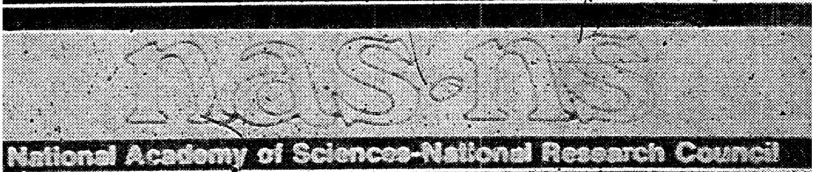
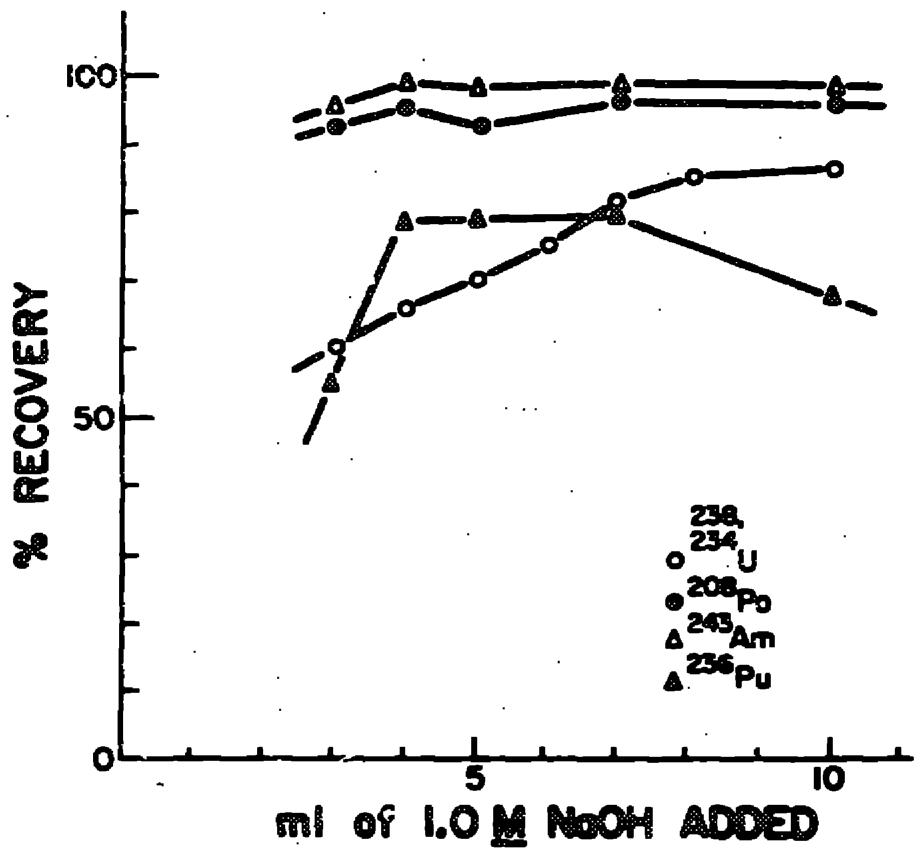
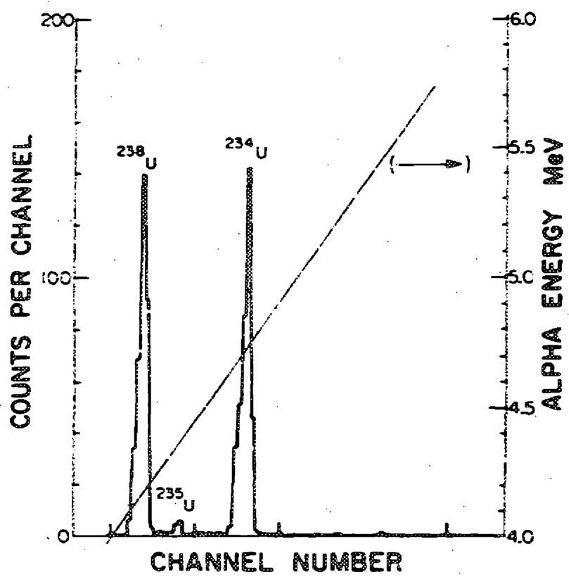
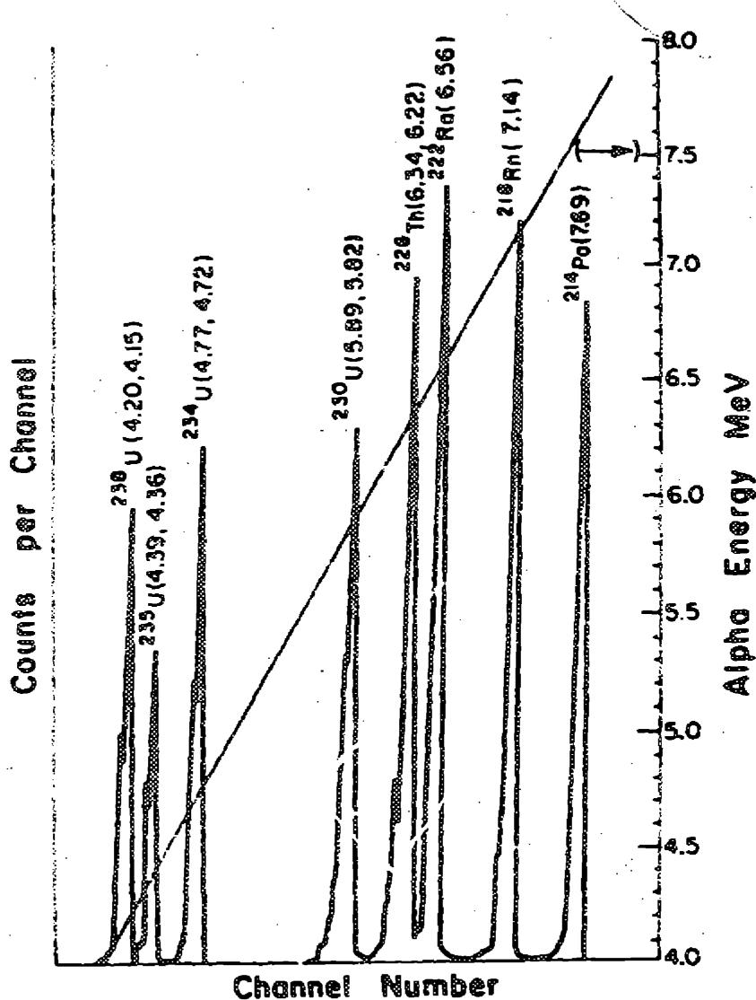
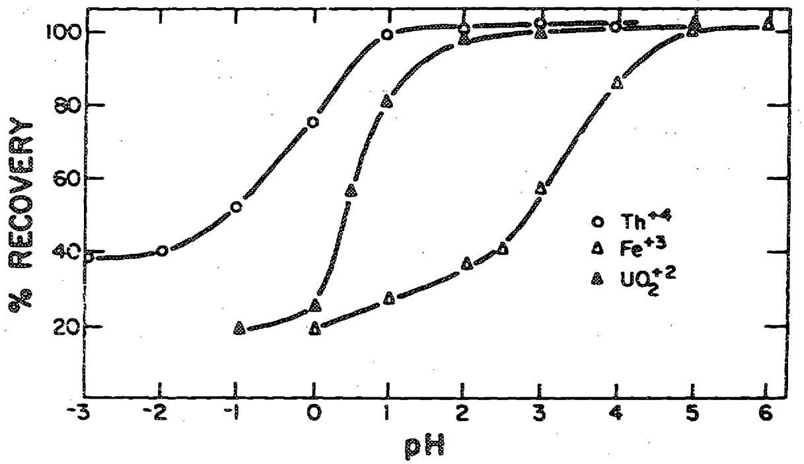
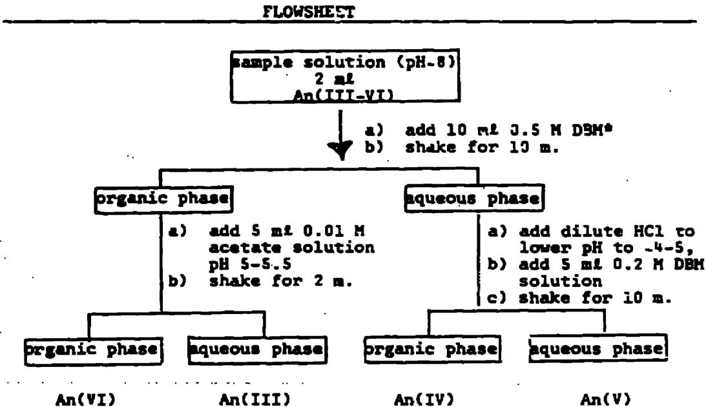

A major purpose of the Technical Information Center is to provide the broadest dissemination possible of information contained in DOE's Research and Development Reports to business, industry, the academic community, and federal, state and local governments.

Although a small portion of this report is not reproducible, it is being made available to expedite the availability of information on the research discussed herein.

Radiochemistry of the Elements

# THE RADIOCHEMISTRY OF URANUM, NEPTUNIUM AND PLUTONIUM - AN UPDATING

${P}_{\text{首先出现 }}$

Other information and technical information

12.5 Department of Energy

THE RADIOCHEMISTRY OF URANUM, NEPTUNIUM AND PLUTONIUM - AN UPDATING

NAS-NS--3063

DE86 007600

by

Richard A. Roberts

Mallinckrodt Medical Products R & D

675 McDonnell Boulevard

St. Louis, MO 63134

Gregory R. Choppin

Department of Chemistry

Florida State University

Tallahassee, Florida

and

John F. Wild

Nuclear Chemistry Division

Lawrence Livermore National Laboratory

Livermore, California

Prepared for Committee on Nuclear and Radiochemistry Board on Chemical Sciences and Technology Commission on Physical Sciences, Mathematics, and Resources National Academy of Sciences--National Research Council

February 1986

MASTER

Published by

# Forward

The Committee on Nuclear and Radiochemistry is one of a number of committees working under the Board on Chemical Sciences and Technology of the Commission on Physical Sciences, Mathematics, and Resources of the National Academy of Sciences--National Research Council. Its members are drawn from academic, industrial, and government laboratories and represent the areas of nuclear chemistry, radiochemistry, and nuclear medicine.

The Committee has concerned itself with those areas of nuclear science which involve the chemist, such as the collection and distribution of radiochemical procedures, specialized techniques and instrumentation, the place of nuclear and radiochemistry in college and university programs, the training of nuclear and radiochemists, radiochemistry in environmental science, and radionuclides in nuclear medicine. A major interest of the Committee is the publication of the Nuclear Science Series of monographs on Radiochemistry and on Radiochemical Techniques. In 1982 a third series on Nuclear Medicine was initiated.

The Committee has endeavored to present monographs that will be of maximum use to the working scientist. Each monograph presents pertinent information required for radiochemical work with an individual element or with a specialized technique or with the use of radionuclides in nuclear medicine.

Experts on the various subjects have been recruited to write the monographs. The U.S. Department of Energy sponsors the printing of the series.

The present monograph is a comprehensive revision and update of three previously published monographs in the series on the Radiochemistry of the Elements. It is published as part of our continuing effort to update, revise, and expand the previously published monographs to keep them current and relevant.

Edward S. Macias, Chairman

Committee on Nuclear and Radiochemistry

# Preface

This monograph presents some procedures used in the radiochemical isolation, purification and/or analysis of uranium, neptunium, and plutonium. The original monographs were:

The Radiochemistry of Uranium, J. E. Gindler, NAS-NS-3050 (1962), 350 pp., 18 procedures.

The Radiochemistry of Neptunium, G. A. Burney and R. M. Harbour, NAS-NS-3060 (1974), 229 pp., 25 procedures.

The Radiochemistry of Plutonium, G. H. Coleman, NAS-NS-3058 (1965), 184 pp., 25 procedures.

In addition to the description of the procedures, these earlier monographs list the isotopes and their nuclear properties for each element. They also discuss the chemistry of the separation processes of these elements with primary emphasis on precipitation, ion exchange and solvent extraction techniques. In this update of the procedures, we have not attempted to discuss the developments in the chemistry of U, $\mathrm{Hp}$ and Pu but have restricted the monograph to the newer procedures, most of which have resulted from the increased emphasis in environmental concern which requires analysis of extremely small amounts of the actinide element in quite complex matrices. The final section of this monograph describes several schemes for isolation of actinides by oxidation state.

The individual procedures from the earlier monographs are listed by title to provide a more complete view of available separation techniques. The new procedures in this monograph are included for each element following the list from the earlier publications.

R. A. Roberts

G. R. Choppin

J. F. Wild

# Contenta

Page

Forward 11

Frac

I. Summary of Previous I'Anium Procedures 1

II. Summary of Previous Naptunium Procedures 2

III. Summary of Previous Plutonium Procedures. 4

IV. New Uranium Procedures 6

Introduction. 6

Discussion of Procedures 6

# Procedures:

1. Semi-Quantitative Determination of Uranium (aSpectroscopy). 14   
2. Concentration of Uranium by Coprecipitation with Iron-Potassium Ferrocyanophosphonates 16   
3. Extraction of Uranium with TOA and Spectrophotometric Determination with Arsenazo III 17   
4. Determination of Uranium (and Plutonium) Isotopes in Soil Samples by a-Spectroscopy 19   
5. Anion Exchange Separation of U in Malonic and Ascorbic Acid Media. 21   
6. Separation of Uranium from Heavy Metals by Chromatography Using an Arsonic Acid Resin. 23   
7 Chromatographic Separation and $\pmb{\alpha}$ -Spectrometric Determination of Uranium. 24   
8. Determination of Uranium in Natural Waters After Anion-Exchange Separation 26   
9. Uranium Analysis by Liquid Scintillation Counting. 28   
10. Determination of Trace Uranium in Biological Materials by Neutron Activation Analysis and Solvent Extraction 31   
11. Determination of Trace Uranium by Instrumental Neutron Activation Analysis 33

V. New Neptunium Procedures 34

Introduction. 34

Procedures:

1. Chromatographic Separation of Neptunium Using Quaternary Ammonium Nitrate Extractant 35   
2. A Spectrophotometric Method for the Determination of Neptunium in Process Solutions 36

VI. New Plutonium Procedures 38

Introduction. 28   
Discussion of the Procedures 38

# Procedures:

1. Liquid-Liquid Extraction Separation and Determination of Plutonium 40   
2. Determination of Plutonium in Sediments by Solvent Extraction 42   
3. Radiochemical Determination of Plutonium in Marine Samples by Extraction Chromatography 44   
4. The Determination of Plutonium in Environmental Samples by Extraction with Tridodecylamine. 46   
5. Solvent Extraction Method for Determination of Plutonium in Soft Tissue 48   
6. Determination of Plutonium in Tissue by Aliquat-336 Extraction 50   
7. Determination of Trace Amounts of Plutonium in Urine 52   
8. Extractive Photometric Determination of Plutonium(IV) with Aliquat-336 and Xylenol Orange. 54   
2. Simultaneous Determinations of Plutonium Alpha- and Beta-Activity in Liquid Effluents and Environmental Samples 55

VII. Oxidation State Procedures 57

Introduction. 57

I. Summary of Previous Uranium Procedures
J. E. Gindler
NAS-NS-3050 (1962)

1. Determination of Uranium -237   
2. Purification of Uranium -240   
3. Purification of Irradiated Uranium -236   
4. Uranium and Plutonium Analysis   
5. Spectrophotometric Extraction Methods Specific for Uranium   
6. Determination of Uranium in Uranium Concentrates   
7. Carrier Free Determination of Uranium -237   
8. Radioassay of Uranium and Plutonium in Vegetation, Soil, and Water   
9. Separation of Uranium by Solvent Extraction with TOPO   
10. Radiochemical Determination of Uranium -237   
11. Separation of Uranium and Bismuth   
12. Isolation and Measurement of Uranium at the Microgram Level   
13. The Determination of Uranium by Solvent Extraction   
14. Uranium Radiochemical Procedure "used at the U.S. Radiation Laboratory at Livermore   
15. Use of Ion Exchange Resins for the Determination of Uranium in Ores and Solutions   
16. The Use of a Compound Column of Alumina and Cellulose for the Determination of Uranium in Minerals and Ore+ Containing Arsenic and Molybdenum   
17. Determination of Uranium -235 in Mixtures of Naturally Occurring Uranium Isotopes by Radioactivation   
15. Determination of Microgram and Submicrogram Quantities of Uranium by Neutron Activation Analysis

# II. Summary of Previous Neptunium Procedures

G. A. Burney and R. M. Harbour NAS-NS-3060 (1974)

1. Separation of Np by TTA Extraction   
2. Separation of Np by TTA Extraction   
3. Determination of $^{239}\mathrm{Np}$ in Samples Containing U, Pu, and Fission Products   
4. Determination of Np   
5. Determination of Small Amounts of Np in Pu Metal   
6. Determination of Np in Samples Containing Fission Products, U, and Other Actinides   
7. Determination of Np in Samples of U and Fission Products   
8. Extraction Chromatographic Separation of $^{239}\mathrm{Np}$ from Fission and Activation Products in the Determination of Micro- and Sub-Microgram Quantities of U   
9. Separation of U, Np, Pu, and Am by Reversed Phase Partition Chromatography   
10. An Analytical Method for $^{237}\mathrm{Np}$ Using Anion Exchange   
11. Separation of U, Np, and Pu Using Anion Exchange   
12. Separation of Zr, Np, and Nb Using Anion Exchange   
13. Separation of Np and Pu by Anion Exchange   
14. Separation of Np and Pu by Cation Exchange   
15. Separation and Radiochemical Determination of U and Transuranium Elements Using Barium Sulfate   
16. The Low-Level Radiochemical Determinations of $^{237}\mathrm{Np}$ in Environmental Samples   
17. Radiochemical Procedure for the Separation of Trace Amounts of $^{237}\mathrm{Np}$ from Reactor Effluent Water   
18. Determination of Np in Urine

Summary of Previous Neptunium Procedures, continued

19. Determination of $^{237}\mathrm{Np}$ by Gamma Ray Spectrometry   
20. Spectrophotometric Determination of Np   
21. Microvolumetric Complexometric Method for Np with EDTA   
22. Photometric Determination of Np as the Peroxide Complex   
23. Separation of Np for Spectrographic Analysis of Impurities   
24. Photometric Determination of Np as the Xylenol Orange Complex   
25. Analysis for Np by Controlled Potential Coulometry

# III. Summary of Previous Plutonium Procedures

G. H. Coleman

NAS-NS-3058 (1965)

1. Determination of Pu in Solutions Containing Large Amounts of Fe and Cr   
2. Separation and Determination of Pu by TTA Extraction   
3. Separation and Determination of Pu in U-Fission Product Mixtures   
4. Plutonium   
5. Plutonium   
6. Separation of Plutonium from Uranium and Fission Products in Irradiated Reactor Targets   
7. Determination of Pu   
8. Uranium and Plutonium Analysis   
9a. Separation of Plutonium from Irradiated Uranium   
9b. Separation of Plutonium from Uranium Metal   
10. Purification of Plutonium from Uranium and Fission Products   
ll. Uranium and Plutonium from Environmental Samples of Soil, Vegetation, and Water   
12. Plutonium from Environmental Water Samples   
13. Plutonium from Environmental Water Samples   
14. Separation of Plutonium in Uranium-Plutonium Fission Element Alloys by TBP Extraction from Chloride Solutions   
15. Separation of Pu before Spectrographic Analysis of Impurities Anion Exchange Method   
16. Separation of Plutonium Before Spectrographic Anlaysis of Impurities. Extraction Chromatography Method Using TBP   
17. Separation of Np and Pu by Anion Exchange   
18. Separation of Np and Pu by Cation Exchange Chromatography   
19. Determination of Plutonium in Urine

Summary of Previous Plutonium Procedures, continued

20. Determination of $\mathbf{Pu}^{239}$ in Urine (Small Area Electrodeposition Procedure)   
21. Determination of Plutonium in Urine   
22. Determination of Americium in Urine in the Presence of Plutonium   
23. Determination of Plutonium in Urine by Anion Exchange   
24. Determination of Plutionium in Urine by CocrySTALLIZATION with Potassium Rhodizenate   
25. Determination of Plutonium in Urine and Bone Ash by Extraction with Primary Amines

# INTRODUCTION

Since the publication of the original monograph on the radiochemistry of uranium in 1962, much attention has been given to methods of separation, isolation, and measurement of small amounts of uranium in various types of samples. Such samples involve geological, biological, and environmental matrices, frequently of high complexity and low uranium content. The procedures for such samples collected in this monograph are meant not to supplant, but rather to supplement those in the original monograph by allowing applicability of the procedures to a wider variety of sample types.

These new procedures were chosen to provide description of a wide variety of techniques rather than to focus on any particular method, such as neutron activation analysis or solvent extraction. Some of the procedures emphasize the separation of uranium from other elements, while for others, the main focus is the method of measurement.

A complete procedure generally can be divided into three operations: 1) sample preparation, 2) separation of the element(s) of interest, and 3) analytical measurement. In many cases a specific operation from one procedure can be used in conjunction with other operations from another procedure. This should allow a broad spectrum of sample types. For each of the collected procedures, sample types to which the procedure may be applied are given. A more complete discussion of each procedure and additional information regarding applications can be obtained from the original reference. In some cases, additional references are listed, as they "contain similar, related procedures and might be of interest in the case of some particular sample.

# DISCUSSION OF THE PROCEDURES

The first two procedures involve precipitation of uranium from large quantities of water. In the first procedure, NaOH is used to precipitate uranium from seawater. The efficiency of recovery of uranium and other heavy radionuclides from 750 grams of seawater by this procedure is shown in Figure 1. The dependency of the recovery efficiency on the volume of NaOH added is evident, with maximum recovery occurring after addition to the 750 gram sample of at least $8\mathrm{ml}$ of $1.0\mathrm{MNaOH}$ , which corresponds to a final NaOH concentration of approximately $0.01\mathrm{M}$ . For different volumes of samples, the amount of base to be added should be modified so as to obtain a comparable NaOH concentration. Figure 2 is an alpha spectrum of a uranium sample obtained from the use of this method.

  
FIGURE I. Recovery of uranium (and other added nuclides) from 750 ml of sea water with . . .rus volumes of 1.0 M NaOH added. (See Proc. ... for reference).

  
FIGURE 2. Alpha activities of natural uranium plated directly onto a counting disc from the dissolved precipitate of 740 grams of Scripps Pier sea water. (Note the absence of other activities in the 4.0 - 5.7 MeV energy range). (See Procedure 1 for reference).

The second procedure involves the coprecipitation of uranium with iron potassium ferrocyanophosphonates. This procedure can be used with larger volumes (several liters) of water and gives a slightly better recovery in some cases.

Procedures 3 and 4 involve solvent extraction to preconcentrate and isolate the uranium. Procedure 3 uses tri-n-octylamine (TOA) as extractant; details on the chemistry of this extractant is described in the original uranium monograph (NAS-NS-3050). This procedure employs spectrophotometric analysis of the uranium by the use of arsenazo III reagent, which has come into wide use since the publication of the first monograph and is an excellent reagent for the spectrophotometric determination of uranium. It forms a brightly colored complex with uranium (VI) and can be used to detect uranium in the part-per-million range (and, in some cases, in even lower concentrations). The original series of articles on the use of this reagent1-3 should be read for details.

Procedure  also uses trioctylamine in the solvent extraction of uranium from acidic aqueous media. This procedure employs the use of $^{230}\mathrm{U}$ tracer to correct for the low (2 - 10%) uranium yield. This isotope is convenient to use as a tracer since its alpha decay energies (and those of its daughters) are above 5.8 MeV and therefore do not interfere in alpha spectroscopy with the peaks of the more commonly encountered uranium isotopes. The preparation of the $^{230}\mathrm{U}$ tracer by irradiation of thorium is also described in the procedure. The alpha spectrum of the purified $^{230}\mathrm{U}$ (and its daughters) is shown in Figure 3, in which the separation from the alpha spectra of $^{230}\mathrm{U}, ^{234}\mathrm{U}$ , and $^{236}\mathrm{U}$ is easily seen. Quantitative analysis of samples is obtained by alpha spectroscopy and an appropriate yield correction obtained from the $^{230}\mathrm{U}$ . Although the yield is low, this procedure is a useful one for soil whose complexity causes the low yield.

Procedures 5, 6, 7 and 8 involve ion exchange chromatography. Procedure 5 used Dowex-21K resin in either the malonic or ascorbic acid form for the separation of uranium from other metal ions. This procedure is capable of separating uranium from a host of other metals, and is therefore useful for purifying uranium from highly contaminated samples such as fission products. Uranium forms a stronger anionic complex with both malonate and ascorbate than most other metals and is retained on the column while other metals are preferentially eluted with a series of increasingly stronger eluting agents. Reported recovery is excellent, $99\% + 1\%$ . Additionally, the procedure allows purification of thorium, if it is present in the sample.

Procedure 6 uses Amberlite XAD-4 resin, converted to the arsonic acid form, to separate uranium from natural waters in samples of up to one liter in volume. Uranium recovery is dependent on pH, as shown in Figure 4. Recovery and separations from other metal ions is reported to be very good, with chromium(III) being the only interference. When present in equal concentration with the uranium (0.5 ppm), approximately 11% of the chromium was eluted with the uranium fraction.

  
FIGURE 3. Alpha spectrum of purified $230\mathrm{g}$ in equilibrium with its daughters prepared from the $^{232}\mathrm{TH}$ irradiation process, showing the energy separation from other common uranium isotopes. (Energies given in MeV). (See Procedure 4 for reference).

  
FIGURE 4. Effect of pH of retention of Th(IV), U(VI), and FE(III) on an arsenic acid column. (See Procedure 6 for reference).

In Procedure 7, an initial column separation using HDEHP (di-2-ethylhexylphosphoric acid) supported on 0.1 - 0.2 mm Teflon beads is used both to isolate the uranium fraction from a sample and to separate the individual U(VI) and U(IV) fractions. The separate fractions are purified by passage through anion-exchange resin columns prior to alpha spectrometry. Large amounts of Fe(III) in a sample are reported to interfere with the separation. However, reduction to Fe(II) with hydrazine hydrochloride eliminates this interference.

Procedure 8 employs a tetrahydrofuran-methyl glycol-HCl mixture with Dowex-1 anion resin to separate ura from acidified natural waters. Quantitative analysis is performed by optical spectroscopy with arsenazo III.

An increasingly important analytical tool for alpha emitters is employed in Procedure 9 wherein liquid scintillation alpha counting is used to determine uranium in biological samples. Instructions are given for use of both extractive and dispersive scintillation cocktails. The extractive cocktail gives slightly lower background counts, and would probably be the more desirable method for samples with lower uranium content.

Procedure 10 is a neutron activation analysis for use with solid biological materials. After irradiation, the uranium is isolated by solvent extraction using HDEHP. The separated uranium is analyzed with a Ge(Li) detector by measurement of the 75 keV gamma ray of $^{239}\mathrm{U}$ . Reported yields are in excess of $90\%$ . Procedure 11 also describes a procedure of activation analysis.

In 1964, a procedure (reference 5) was published which quickly became a laboratory standard for uranium analysis. Although it is not really applicable to trace quantities of uranium, nor for highly radioactive samples, and has been supplanted by newer procedures, it is worthy of mention since it is still in common use in many analytical laboratories. In this procedure, uranium (VI) is reduced to uranium(IV) by an excess of iron(II) sulfate in a phosphoric acid-sulfamic acid solution. The excess iron(II) is oxidized to iron(III) by nitric acid with a molybdenum(VI) catalyst. The uranium(IV) is finally titrated with standard potassium dichromate solution using barium diphenylamine sulfonate as the indicator.

This procedure is applicable to solutions of 0-300 mg of uranium per aliquot, with aliquot size up to about 15 ml. Optimum uranium content is around 200 mg. There are relatively few interferences as compared with other redox methods, but vanadium, bromide, iodide, and silver interfere directly with the redox titrations of the U(IV). Additionally, if more than 100 mg of of chromium(III) is present, the indicator end-point color change will be masked by the intense color of the chromium solution for determination of trace levels of uranium in solid samples by neutron activation analysis in which no chemical separation is used.

# REFERENCES

1. S. B. Savin, Talanta, 8, 673-685 (1961).   
2. S. B. Savin, Talanta, 11, 1-6 (1964).   
3. S.B.Savin,Talanta,11,7-19 (1964).   
4. J. Hashimoto, K. Taniguchi, H. Sugiyama, and T. Sotobayashi, Journal of Radioanalytical Chemistry, 52, 133-142 (1979).   
S. W. Davies and W. Gray, Talanta, 11, 1203-1211 (1964).

# PROCEDURE 1

# Semi-Quantitative Determination of Uranium (α-Spectroscopy)

Source: V. L. Hodge, M. E. Gurney, Analytical Chemistry, 47, 1866-68 (1975).

Sample Type: Sea Water

Procedure:

1. Weigh 750 g of sea water into a 1 liter polyethylene bottle (whose top has been cut off).   
2. Add 8 to $10 \, \text{ml}$ of $1.0 \, \text{M} \, \text{NaOH}$ while stirring rapidly with a magnetic stir bar.   
3. Continue stirring for 1 hour, then allow the milky precipitate to settle overnight.   
4. Compact the precipitate by centrifuging the liter polyethylene bottle at 2500 rpm for 15 minutes (Note 1).   
5. Pour off supernatant sea water.   
6. Dissolve the precipitate with 2 ml of 12 M HCl and add 3 drops of 0.04% thymol blue indicator.   
7. Pour the solution into a plating cell.   
8. Add 1 ml of 12 M HCl and 2 ml of deionized water to the poly bottle.   
9. Wash the walls of the bottle with this solution and transfer to the plating cell.   
10. Wash the bottle once again with $1.5 \, \text{ml}$ of deionized water and transfer to the cell which has a stainless steel counting planchet as the anode.   
11. Neutralize the contents of the plating cell with 1.5 ml of $15\mathrm{M}$ $\mathrm{NH_4OH}$ to a pH of 2-3.   
12. Plate the sample at $0.4\mathrm{~amp/cm}^2$ current density for 1 hour. Before stopping the electrolysis, add 1 ml of $15\mathrm{M}$ $\mathrm{NH}_4\mathrm{OH}$ to the cell. Disassemble the cell and prepare the disc for counting by washing with water and acetone, then drying. Count with a silicon surface barrier detector (the authors reported using a $300-450\mathrm{~mm}^2$ detector monitored by a pulse height analyzer; counting times of roughly 1000 minutes) (Note 2).

Note 1: The reported precipitation efficiency for uranium is .86 + 2% using 8 ml of 1.0 M NaOH to effect precipitation. This value can be used in calculations for semi-quantitative analysis, or a tracer could be added (see the original article).

Note 2: Pu and Am are coprecipitated and coplated with the uranium. All three elements are identified and measured by the alpha energy spectrometry.

# PROCEDURE 2

Concentration of Uranium by Coprecipitation with Iron-Potassium Ferrocyanophosphonates

Source: V. P. Kermanov, D. A. Fedoseev, Radiokhimiya, 18, 827-29 (1976).

Sample Type: Aqueous

Procedure:

1. To 5 liters of water containing uranium, add the following:

7 pl MIOMPA (monoisooctylethylphosphonic aciu)   
5 ml toluene   
1.5 ml kerosene   
100 mg potassium ferrocyanide   
1.3 3 ferric chloride

2. Mix thoroughly for 15 minutes.   
3. Filter the precipitate.   
4. Transfer to a weighing bottle or metallic substrate.

Extraction efficiency: 93 + 148

# PROCEDURE 3

# Extraction of Uranium with TOA and Spectrophotometric Determination with Arsenazo III

Source: H. Onishi, X. Sekine, Talanta, 19,473-78 (1972)

Sample Type: Acidic aqueous

Procedure:

Solutions: Thenoyltrifluoroacetone, 0.5 M - dissolve 45 g TTA in 400 ml of xylene.

Tri-n-octylamine - dissolve 5 g TOA in 100 g of xylene.

Cresol Red - dissolve $100\mathrm{mg}$ of Cresol Red in 25 ml of 0.01 M NaOH and dilute to 250 ml with water.

Aqueous Arsenazo III solution - 0.10% w/v.

1. The sample containing 0-5 μg of uranium should be made to a volume of about 20 ml and 4 M in hydrochloric acid.   
2. Transfer the sample to a 100 ml separatory funnel and shake for 10 minutes with 10 ml of the TTA solution to remove iron.   
3. Allow the layers to separate and drain the aqueous phase containing any U(VI) into a second separatory funnel.   
4. Wash the organic phase by shaking for 5 minutes with $3\mathrm{ml}$ of $4\mathrm{M}$ HCl and add this aqueous wash phase to the original aqueous phase in the second separatory funnel.   
5. Add 10 ml of TOA solution to the second separatory funnel and shake for 2 minutes.   
6. Allow the layers to separate and drain off the aqueous phase.   
7. Wash the organic phase by shaking for 2 minutes with $3\mathrm{ml}$ of $4\mathrm{M}$ HCl, and discard the aqueous phase.   
8. Back-extract the uranium by adding $10 \, \text{ml}$ of $0.3 \, \text{M} \, \text{HCl}$ to the organic phase and shaking for 2 minutes.   
9. Transfer the aqueous phase to a third separatory funnel and shake the organic phase with 3 ml of 0.3 M HCl for 1 minute.   
10. Add this aqueous phase to the third $\mathfrak{S}^{\bullet}$ -aratory funnel and discard the organic phase.

11. Shake the aqueous phase for 1 minute with 5 ml of xylene.   
12. Transfer the aqueous phase (containing the uranium) to a 25 ml volumetric flask through filter paper.   
13. Add 1 ml of 1% ascorbic acid solution. 1 drop Cresol Red solution, and adjust the pH to 0.5-2.0 (solution turns from yellow to red) with 1:9 dilute ammonia solution.   
14. Add 1.0 ml of Arsenazo III solution and dilute to volume with water.   
15. Measure the absorbance of the solution at $650\mathrm{nm}$ using the reagent blank as a reference (an appropriate calibration curve should also be constructed with standard uranium solutions).

Note: The molar absorptivity for the uranium(VI)₃ - Arsenazo III complex used in this procedure is 4.4 x 10³ l.mole⁻¹.

Reported recovery of uranium for this procedure is approximately 93%.

# PROCEDURE 4

# Determination of Uranium (and Plutonium) Isotopes in Soil Samples by $\alpha$ -Spectroscopy

Source: J. Hashimoto, K. Taniguchi, H. Sugiyama, T. Sotobayashi, Journal of Radioanalytical Chemistry, 52, 133-42 (1979).

Sample Type: Soil

Procedure: Preparation of U tracer (done prior to determination)

1. $\mathsf{ThO}_2$ (free of uranium contamination) is wrapped in aluminum fccl and irradiated with a 50 MeV proton beam (total applied current - 5.6 x $10^{-2}$ coulomb).   
2. Store the irradiated sample for one month (allows maximum accumulation of $\mathbf{U}$ from parent ( $\mathbf{Pa}$ ).   
3. Dissolve the $\mathsf{ThO}_2$ target in a mixture of $\mathsf{HNO}_3$ and HCl solution containing a small amount of HF.   
4. Evaporate to near dryness and convert to 8 M HCl solution.   
5. Purify the uranium fraction by anion exchange.

# Procedure for Soil Samples:

1. Dry the soil sample in sunlight, then crush to a fine powder.   
2. Dry the powdered samples in an electric furnace at $110^{\circ}\mathrm{C}$ for one day.   
3. Past the sample through a 32 mesh sieve and weig- a 50 g sample.   
4. Transfer the sample to a 1 liter beaker containing 200 ml of $8\textbf{M}$ HNO₃, and add a known activity of $^{236}\mathrm{U}$ tracer.   
5. Digest the sample with ultrasonic agitation for 2 hours, then boil gently for a few hours.   
6. Let the sample stand overnight at room temperature, then filter through glass fiber paper.   
7. Concentrate the filtrate to about 100 ml under an infrared lamp.   
8. Add several drops of $30\% \mathrm{H}_2\mathrm{O}_2$ and evaporate to near dryness.   
9. Redissolve the residual substance in $200\mathrm{ml}$ of $8\mathrm{M}$ $\mathrm{HNO}_3$ and filter through filter paper (No. 5A).

# Extraction Procedure:

1. The extractant should be prepared as $10(\mathrm{v} / \mathrm{v})\%$ TOA (Trioctylamine) in xylene and equilibrated with an equal volume of $8\mathrm{M}\mathrm{HNO}_3$ .   
Note: In the following extraction and washing steps, shaking times are 10 minutes.   
2. Extract twice with $50 \, \text{ml}$ of the TOA/ethylene extractant and save both organic phases.   
3. Wash the combined organic phase with $100\mathrm{ml}$ of $\mathbf{8}\underline{\mathbf{M}}\mathbf{HNO}_3$ (to remove ferric ions).   
4. Wash the organic phase with $100\mathrm{ml}$ of $10\mathrm{M}$ HCl (to remove thorium).   
5. Scrub the organic phase (containing U and Pu) with 50 ml of distilled water and then 50 ml of 0.36 M HCl + 0.01 M HF solution. Collect both aqueous phases in a Teflon beaker.   
6. Evaporate the combined aqueous phase under an infrared lamp.   
7. Decompose organic impurities by repeatedly evaporating with concentrated $\mathsf{HNO}_3$ containing $\mathsf{HCLO}_4$ until no fuming due to $\mathsf{HCLO}_4$ occurs.   
8. Dissolve the residue in $0.5 \, \text{ml}$ of $1 \, \underline{\mathbf{M}} \, \text{HNO}_3$ solution.   
9. Electrodeposit the U (and Pu) on a counting planchet using 10 ml of 0.2 M ammonium formate as the electrolyte and a current density of 0.15 amp/cm² for 50-60 minutes.   
10. Count the sample with a silicon surface barrier detector combined with a pulse-height analyzer.

Note: Because of the relatively short half-life of $^{230}\mathrm{U}$ ( $t_4 = 20.8$ d), a correction for decay should be made. Alternatively, $^{230}\mathrm{U}$ activity could be calculated from the activities of its daughter $^{226}$ Th and granddaughter $^{222}$ Ra, which will be in secular equilibrium with the parent $^{230}\mathrm{U}$ .

Uranium Yield: Reported as approximately 2-10% depending on a given soil sample.

# PROCEDURE S

# Anion Exchange Separation of U in Malonic and Ascorbic Acid Media

Source: M. Chakravorty and S. M. Khopkar, Chromatographia, 10, 372-76 (1977).

Sample Type: Aqueous solutions, fission products, minerals

Procedure:

Column Preparation:

1. Pack a 1.4 x 18 cm column with Dowex-21K resin (50:100 mesh), Cl form).   
2. Convert to the malonate or ascorbate form by passing 150 ml of $5\%$ malonic or ascorbic acid buffered at pH 4.5 through the column.   
3. Wash the column with water.

Sorption:

1. To a sample of appropriate volume (see note in the next step) add $0.2\mathrm{g}$ of malonic or ascorbic acid as applicable.   
2. Adjust the pH to 4.5 with $1\text{M}$ $\mathsf{NH}_4\mathsf{OH}$ and $1\%$ malonic or ascorbic acid as applicable.

Note: The total volume of solution should be about 10 ml.

3. Sorb the solution onto the column (previously described) at a flow rate of 1 ml/min.

Note: In the following elution steps, a step may be omitted if the indicated elements are not present in the sample.

Separation of Malonic Acid Media:

1. Tl(I), Hg(II), Fe(III), Bi(III), alkalis, and alkaline earths are not sorbed onto the column and are eluted in step 3 above.   
2. Mn(II), Co(II), Ni(II), Pd(II), Zn, and Cd are eluted with water.   
3. $\mathsf{Sb(III)}$ , Fe(III), Al, and Cr(III, IV) are eluted with 2 M NHC!.   
4. Cu(II), V(IV), and Mo(VI) are eluted with 2 M NaCl.   
5. Ph(II) and Zn(IV) are eluted with 1 M ammonium acetate.

6. Ceria earth lanthanides are eluted with 0.05 M HCl.   
7. U is finally eluted with 1 M HCl.   
8. If Th is present, step 7 is omitted and the Th is eluted with $100\mathrm{ml}$ of $0.25\mathrm{M}$ $\mathrm{HNO}_3$ , and U eluted next with $150\mathrm{ml}$ of $0.25\mathrm{M}$ $\mathrm{HNO}_3$ .

# Separation in Ascorbic Acid Media:

1. Alkalis and alkaline earths are not retained on the column and are therefore eluted in the original sample solution.   
2. Cr, Mn(II), Fe(II), Co(II), Ni(II), Pd(II), Zn, Cd, Al(III), Sb(III), and Pb(II) are eluted with 200 ml water.   
3. $\mathbf{Zr}(\mathbf{IV})$ is eluted with $1\mathrm{M}$ ammonium acetate.   
4. V(IV) is eluted with 1 M NH4Br.   
5. Y is eluted with 0.1 M HCl.   
6. Ti(IV) is eluted with 0.2 M HCl.   
7. U is eluted with 1 M HCl.   
8. If Th is present, it can be eluted after elution of U with 3 M HCl.   
9. If $\text{Mo}$ is present, it can be eluted after the uranium with 1:7 ammonia containing $3\% (\text{NH}_4)_2\text{SO}_4$ .

Note: In all cases (for both malonic and ascorbic acid media) the volume of elutant is 200 ml, unless otherwise noted.

Yield: Reported yield is $99 + 18$ .

# PROCEDURE 6

# Separation of Uranium from Heavy Metals by Chromatography Using an Arsonic Acid Resin

Source: J. S. Fritz, E. M. Moyers, Talanta, 23,590-93 (1976).

Sample Type: Natural Waters

Procedure:

Resin Preparation:

1. Wash a quantity of XAD-4 macroporous resin (150-200 mesh) with acetone and concentrated HCl.   
2. To the resin, add a 60-40 v/v mixture of sulfuric and nitric acids at $0^{\circ}\mathrm{C}$ . Raise the temperature to $65 - 70^{\circ}\mathrm{C}$ for half a day to nitrate the resin.   
3. Reduce to the amine at $73 - 75^{\circ}C$ by adding mossy tin in concentrated hydrochloric acid (reaction allowed to proceed for half a day).   
4. Slurry the product with $\underline{1} \underline{M}$ NaOH (to remove tin salts).   
5. Cool to $0^{\circ}C$ in concentrated HCl.   
5. Diazotize by slow addition of 1 M NaNO2.   
7. Wash the resin with sodium carbonate solution, and convert the resin to the arsonic acid form with sodium arsenite (in aqueous solution) at $70 - 75^{\circ}C$ .   
8. Pack a column (2.8 x 0.6 cm) with 0.5 g of the prepared resin.

# Separation Procedure:

1. Buffer the sample solution containing uranium(VI) (up to one liter) to pH 5.0 w/o orthophosphoric acid and ammonia and make to 0.01 M in EDTA.   
2. Pass the solution through the resin column at 7 ml/min.   
3. Wash the resin with 100 ml of 0.01 M EDTA buffered to pH 5.0 (with phosphoric acid and ammonia).   
4. Wash with 100 ml of pH 5.0 wash solution (no EDTA, no metals).   
5. Strip the uranium from the column with 25 ml of $4\mathrm{M}$ $\mathrm{HClO}_4$ . Recovery: Uranium is successfully separated from other metals by this procedure. Chromium(III) gives a slight interference (ca. $11\%$ recovery). Uranium recovery is reported at $98.3\%$ .

# PROCEDURE 7

# Chromatographic Separation and a-Spectrometric

# Determination of Uranium

Source: R. V. Bogdanov, R. A. Kuznetsov, Radiokhimiya, 17, 502-4 (1975).

Sample Type: Acidic media, uranium content 1-100 μg

Procedure:

Column Preparation:

1. Column size is determined by sample volume and composition. Linear flow rates up to 10 cm/min are acceptable.   
2. Teflon with a grain size of 0.1 - 0.2 mm serves as the carrier. A 1:1 solution of HDEHP (di(2-ethylhexyl) phosphoric acid) in acetone is passed through the column, and the solvent is then removed by purging with air.

# Initial Separation:

1. Pass the sample solution through the column (optimum solution pH is 1-2).   
2. Wash the column with 0.01 M HCl.   
3. Remove $\mathsf{Fe}^{3+}$ (and some other elements) by washing with three column volumes of $4\text{M}$ HCl at a flow rate of $2\text{cm/min}$ .   
4. Elute U(VI) with 12 M HCl (six column volumes at a rate of 4 cm/min).   
5. Wash column with water.   
6. Oxidize U(IV) to U(VI) with $15\% \mathrm{H}_2\mathrm{O}_2$ (4-S column volumes).   
7. Wash the column with water and elute the U(VI) with 12 M HCl.

Note: Thorium is still on the column at this point and can be eluted with $6 \mathrm{M} \mathrm{H}_{3} \mathrm{PO}_{4}$ or a solution of $0.5 \mathrm{M} \mathrm{H}_{2} \mathrm{C}_{2} \mathrm{O}_{2} + 0.05 \mathrm{M} \mathrm{HNO}_{3}$ .

# Purification:

1. Add one drop of $\mathsf{HClO}_4$ to each uranium fraction and evaporate to dryness.   
2. In a Teflon cup, treat the residue by adding 2 ml of 8 M HNO₃ and evaporate to dryness.

3. Repeat the addition of $8 \times 10^{4} \mathrm{HNO}_{3}$ and evaporate to a volume of 1-2 drops.   
4. Cool the cup and add 4 drops of $8 \times HNO_{3}$ .   
5. Transfer to a 2 x 80 mm column containing AV-17 anion-exchange resin in the nitrate form.   
6. Rinse the cup and add the rinse solution to the column, allowing the combined solutions to pass through the column.   
7. Wash the column with six column volumes of $8 \, \text{M HNO}_3$ (to remove nonsorbable elements).   
8. Uranium is eluted with 10 columns of 1.5 M HNO₃.   
9. Add one drop of $\mathsf{HClO}_4$ to the uranium solution and evaporate to dryness.   
10. After evaporation, treat the residue by heating with 1 ml of 0.2 M HCl.   
11. Evaporate to a volume of 2-3 drops and cool.   
12. Add 6-8 drops of ethanol and transfer to an electrodeposition cell.   
13. Repeat the treatment with $0.2\mathrm{M}$ HCl and transfer this solution to the cell. A current of $40 - 50 \mathrm{~mA}$ for 3 hours is used for electrodeposition.   
14. After electrolytic deposition is completed, the solution is removed rapidly and the cathode disc is washed, dried and counted with a surface barrier detector.

# Notes:

1. The method, when carefully executed, gives a uranium yield of $96 + 3\%$ . For more precise work, a $2^{12}\mathrm{U}$ tracer can be added to the original sample.   
2. Substantial amounts of $\mathsf{Fe}^{2+}$ have an adverse effect on the separations, so iron should be reduced to $\mathsf{Fe}^{2+}$ with hydrazine hydrochloride in samples of high iron content.   
3. The cell is a Teflon cylinder of 16 mm diameter and a height of 35 mm. The cathode is a counting planchet of Ni or Cu; the platinum anode is positioned 15 mm above this cathode.

# PROCEDURE 3

# Determination of Uranium in Natural Waters

# After Anion-Exchange Separation

Source: J. Korkisch, L. Gudl, Analytica Chimica Acta, 71, 113-121 (1974).

Sample Type: Natural waters

Procedure:

Solution Preparation:

1. Pretreatment solution - add $1 \, \text{ml}$ of concentrated HCl to $100 \, \text{ml}$ of distilled water. In this solution dissolve $0.5 \, \text{g}$ of ascorbic acid and $1 \, \text{g}$ of potassium thiocyanate.

Note: This solution should be prepared a few hours prior to use and has a shelf-life of only 2-3 days.

2. THF - HG - HCl mixture - 200 ml of solution should be prepared per separation, and larger quantities may be prepared since this solution has a indefinite shelf-life. The mixture is prepared to be 50 vol.% tetrahydrofuran (THF), 40 vol.% methyl glycol (HG - monomethyl ether of ethylene glycol), and 10 vol.% in 5 M HCl. This solution should be prepared at least several hours before use.

# Column Preparation:

1. 4 g of Dowex 1 (Bio-Rad AG 1-X8, 100-200 mesh, chloride form) anion-exchange resin is slurried with a few milliliters of the pretreatment solution (described above).   
2. After allowing to stand for 15 minutes, pour into an appropriate size column.   
3. Wash the resin with 50 ml of the pretreatment solution.

# Separation Procedure:

1. To a 1 liter water sample, acidify with 10 ml of concentrated HCl.   
2. Filter through a dense filter.   
3. Add $5\mathrm{g}$ of ascorbic acid and $10\mathrm{g}$ of potassium thiocyanate.   
4. Mix thoroughly until all reagents have dissolved.   
5. Allow to stand 5-6 hours.

6. Place the sample solution on the column and allow it to pass through at a rate of 1.2 - 1.3 ml/min (corresponding to the back pressure of the resin bed).   
7. Wash the column with 100 ml of the THF-MG-HCl mixture.   
8. Wash the column with 100 ml of 6 M HCl.   
9. Elute the uranium with 50 ml of 1 M HCl.

# Determination of Uranium:

1. Prepare an aqueous $0.1\%$ solution of arsenazo III.   
2. Evaporate the uranium-containing elute to dryness on a stea bath.   
3. Take up the residue in 5 ml of 9 M hydrochloric acid (added in portions) and transfer to a 50 ml wide-neck Erlenmeyer flask.   
4. Add exactly $0.550\mathrm{g}$ of zinc and cover the flask loosely with a stopper.   
5. Shake the flask carefully until all of zinc is dissolved.   
6. Immediately add $0.15\mathrm{g}$ of oxalic acid and $0.50\mathrm{ml}$ of the arsenazo III solution.   
7. Measure the absorbance of the solution of 665 nm against a reagent blank prepared in the same manner.   
8. Prepare a calibration curve (1-10 $\mu$ g of uranium range) and obtain the sample uranium concentration by comparison.

Note: The absorbance will remain constant for at least 30 minutes. The following articles contain related information on this procedure and its development:

"Determination of Uranium in Geologic Specimens after the Separation of the Uranium by Anionic Exchange" by J. Korkisch and I. Steffan, Mikrochimica Acta, 1972/6, 837-860 (1972). "Determination of Small Amounts of Uranium after Concentration by Extraction and Anionic Exchange in a Tri-n-octylphosphine Oxide Solvent System" by J. Korkisch and W. Koch, Mikrochimica Acta, 1973, 157-168 (1973). "Anionic Exchange Separations of Elements which are Extractable with Tributyl Phosphate VII" by J. Korkisch and W. Koch, Mikrochimica Acta, 1973, 865-875 (1973).

# PROCEDURE 3

Uranium Analysis:by Liquid Scintillation Counting

Source: W. J. McDowell, J. F. Weiss, Health Physics, 32, 73-82 (1977).

Sample Type: Bone and tissue samples. (This procedure can be adapted to other sample types; these modified procedures are referenced).

Procedure:

Sample Preparation:

1. A. For small bone or tissue samples (<25 g), dissolve in concentrated nitric acid with a small amount of 30% H₂O₂ added.   
B. Heat gently until a clear solution is obtained. (In samples with small amounts of residual salts, do not allow to go dry).   
2. A. For large samples ( $>25\ \mathrm{g}$ ), dissolve by repeated treatment with $\mathsf{HNO}_3$ (conc.) and $30\% \mathsf{H}_2\mathsf{O}_2$ , evaporating to near dryness between each treatment.   
B. Heat the sample to $450^{\circ} \mathrm{C}$ in a furnace overnight.   
C. If the resulting ash is not white, repeat the acid digestion and heating until a white ash remains.   
D. Dissolve the ash in a sufficient volume of $2 \mathrm{M} \mathrm{HNO}_{3}$ .

3. Depending on the counting method to be used, further treatment at this point varies:

A. For samples to be treated by anion exchange separation, dilute or treat the sample solution accordingly to give the desired nitric or hydrochloric acid concentration.   
B. For high activity samples to be courted with an aqueous-phase-accepting scintillator, dilute the sample to a known volume and add an aliquot to the scintillator.   
C. For samples to be counted with an extractive scintillator containing HDEHP, add sufficient perchloric acid to the sample solution to give a final solution which is 0.1 - 0.2 M HClO₄ and in which all metal ions have been converted to perchlorate salts. (Observe the usual precautions for adding HClO₄ to a solution containing small amounts of organic material). The nitric acid is evaporated at slightly higher heat (150-170°C) in order to leave only

the perchloric acid and salts. Add 2 al of saturated $\mathrm{Al(NO_3)_3}$ per gram of sample to the hot solution and add water to make 5 ml of volume per gram of sample.

Counting in All-Purpose Scintillator:

160 g naphthalene

10 g PPO (2,5-diphenyloxazole)

0.1 g POPO? (2,2-p-phenylene-bis-5-phenyloxazole)

385 ml xylene

325 ml dioxane

233 al ethyl alcohol

100] ml Triton X-100

1. Up to $\frac{1}{2}$ of aqueous sample solution may be taken up in the scintillator (volume approximately 15 ml).   
2. The alpha peak of interest must fall within the pulse-height range observed. This can be determined two ways:

A. The peak may be located by counting through a narrow-range window and scanning across the entire available range.   
8. A multichannel analyzer can be connected to the scintillation counter. (This technique has the additional benefit of allowing visual differentiation of the alpha and beta-gamma spectra).

Unless each sample has a very similar matrix, the alpha peak position must be determined for each sample to maintain reproducible counting efficiency.

3. Typical background count rates run about 20-30 cpm with an additional 10-20 cpm (from 40K) per each gram of tissue in a sample. The practical lower limit for counting should be a total count of at least twice the background.

Counting in an Extractive Scintillator:

Extractive Scintillator:

161 g HDEHP (di(2-ethylhexyl)phosphoric acid)

80 g naphthalene

4 g PBBO (2-4'-biphenylyl-6-phenylbenzoxazole) or

5 g PPO (2,5-diphenyloxazole)

l liter toulene

1. Transfer the sample (prepared as described under part 3.C. of the sample preparation section) to a standard 20-ml scintillation vial.

2. Add 10 ml of the extractive scintillator and shake for 1 to 2 minutes.   
3. Allow the phases to separate (removal of the aqueous phase is not necessary, however) and place the vial in the counter.   
4. A background count rate of 15-20 counts/minute from external sources is generally the lower limit for the extractive scintillator procedure.   
5. Alpha energies differing by more than 1 MeV may be distinguishable since typical full peak width at half maximum peak height is typically 0.9 - 1.0 MeV.

Note: The author describes a high resolution alpha scintillation counting system in this paper and the one referenced below. With that system, increased resolution of complex mixtures is possible. Reported peak half-width is 0.2 - 0.3 MeV and an energy identification to +0.1 MeV.

Related Articles:

W. J. McDowell, D. T. Farrar, M. R. Billings, Talanta, 21, 1231-1245 (1974).

D. L. Horrocks, Nuclear Instruments and Methods, 117, 589-595 (1974).

# PROCEDURE 10

Determination of Trace Uranium in Biological Materials by Neutron Activation Analysis and Solvent Extraction

Source: D. A. Becker, P. D. La Fieur, Analytical Chemistry, 44, 1508-1511, (1972).

Sample Type: Solid biological materials

Procedure:

Irradiation:

1. Lyophilize and store the samples in a dessicator before use.   
2. Weigh the samples (200-450 mg) and encapsulate in a cleaned polyethylene snap-cap vial.   
3. Encapsulate an uranium standard (a solution of NBS Standard Reference material No. 950a Uranium Oxide $(U_{3}O_{8})$ , 99.94% purity), consisting of 1 ml of 1.02 μm U/ml.   
4. Attach copper foil flux monitors to all samples and the standard for flux normalization.   
5. Irradiate the samples and standard (the authors used thermal neutron fluxes of 1.3 x $10^{13}$ n · cm⁻² sec⁻¹ and 5 x $10^{13}$ n · cm⁻⁵ sec⁻¹ for periods of 10 seconds to 5 minutes.

# Dissolution:

1. Add $100\mu \mathrm{g}$ of uranium carrier to the samples.   
2. Wet ash the samples with mixed nitric and perchloric acids (observing the usual perchloric acid precautions), and 1-2 mg of vanadium as a catalyst. 1-2 mg of chromium should also be added to indicate when all of the organic matter is destroyed. The green-orange Cr(III) + Cr(IV) color change usually occurs in 6-10 minutes.   
3. Cool the samples, and dilute to 20 ml with 9 M HNC₃. The final sample solution should be ca. 8 M in HNO₃ and i M in HClO₄.

# Extraction:

Note: The extractions are done in 35-ml polycarbonate centrifuge tubes using 0.75 M HDEHP (di-(2-ethylhexy)-phosphoric acid in petroleum ether.

1. Add 10.0 ml of HDEHP solution to the sample in the centrifuge tube and shake vigorously for 60 seconds.   
2. Centrifuge the samples for 2 minutes to separate the phases.   
3. Remove the aqueous phase with a disposable pipet and discard.   
4. Wash the organic phase at least once with $\underline{\theta} \underline{\underline{M}} \underline{\underline{HNO}_3}$ and discard the wash solution.   
5. Strip the uranium from the organic phase with 14 M HF, shaking vigorously for 1-2 minutes.   
6. Remove the aqueous phase (or an aliquot, depending on activity) for counting.

# Counting:

1. Counting is performed with a large volume Ge(Li) detector and 4096 channel pulse height analyzer to measure the $75\mathrm{keV}^{239}\mathrm{U}$ gamma ray.   
2. A small aliquot (50-250 ul) of the vanadium standard is diluted to an appropriate volume (corresponding to the final volume of the samples to be counted). During this dilution, several milligrams of dissolved inactive uranium carrier should be added to the standard solution to prevent loss of the radioactive uranium.

Yield: 91 + 4%. Slightly higher yields may be obtained by using separatory funnels for the extractions (for lower mechanical losses), but this method increases the time required for phase separation.

# PROCEDURE 11

# Determination of Trace Uranium by Instrumental Neutron Activation Analysis

Source: S. Katcoff, Fifth International Conference on Nuclear Methods in Environmental and Energy Research, April 2-6, 1984.

Sample Type: Solids

# Procedure:

1. Seal 0.3 - 0.9 g of solid sample (powdered, granular or bulk) in carefully cleaned high purity quartz ampules 6 mm in diameter.   
2. Irradiate samples, standards, and blanks for about 4 hours at a neutron flux of $2 \times 10^{16} \mathrm{n/cm}^2$ sec, and allow the ampules to cool for 2-3 days.   
3. Remove activated impurities from the outer surface of the quartz by successively immersing the ampules briefly in concentrated HF solution, hot concentrated $\mathsf{HNO}_3$ , and distilled water.   
4. Before counting, place each ampule in a cylindrical lead shield 3.8" long, with 1.0" thick walls and a central hole 0.25" in diameter. This shield suppresses low energy gammas which could interfere with counting.   
5. Count the sample with a Ge(Li) detector connected to a multi-channel analyzer. A 0.5" thick lead absorber can be placed between the lead sample container and the detector head to further reduce low-energy interferences.   
6. Uranium can be determined by measuring the activity due to the high yield fission products $^{132}\mathrm{Te}$ ( $t_4 = 78$ hr.) and $^{100}\mathrm{Ba}$ ( $t_4 = 12.8$ d). The $^{100}\mathrm{Ba}$ decays to $^{100}\mathrm{La}$ , which emits a $159\mu$ -keV gamma. See the following table for relevant nuclear data.

<table><tr><td>Element</td><td>Isotope Monitored</td><td>Cross Section (barns)</td><td>Selected gamma (keV)</td><td>% decay</td></tr><tr><td rowspan="2">U</td><td>142Ba</td><td>0.26</td><td>1596</td><td>96</td></tr><tr><td>132Te</td><td>0.28</td><td>773</td><td>79</td></tr></table>

Note: Enough cooling time must be allowed for $1^{b}0$ La produced by the $(r, y)$ reaction of lanthanum in the sample to decay away before counting.

# V. New Neptunium Procedures

# INTRODUCTION

Neptunium is usually encountered as $^{237}\mathrm{Np}$ ( $t_4 = 2.14 \times 10^6\mathrm{y}$ ) in acid solutions of uranium reactor fuel elements. Neptunium-237 is of relatively little use commercially except, possibly, for the production of pure sources of $^{236}\mathrm{Pu}$ (by reactor neutron irradiation) and of $^{233}\mathrm{U}$ (the α-decay granddaughter of $^{237}\mathrm{Np}$ ). The amount of $^{237}\mathrm{Np}$ in the environment generally is so small as to be unmeasurable as compared to $^{239}\mathrm{Pu}$ , and no procedures were found for separation of $\mathbf{Np}$ from environmental samples.

Neptunium-239 is a transient species in reactor fuel elements, due to its short half-life (2.35d). It completely disappears shortly after the end of a neutron irradiation through decay to $^{239}\mathrm{Pu}$ . Neptunium-239 is most frequently used as a tracer to study the chemistry of Np; it can be obtained from the neutron irradiation of $^{236}\mathrm{U}$ or by milking a sample of $^{243}\mathrm{Am}$ with which it is in equilibrium as the $\alpha$ -decay daughter.

Two procedures are described for the separation of $\mathbf{Np}$ . The first involves separation of $^{239}\mathbf{Np}$ from irradiated $^{238}\mathbf{U}$ , and the second involves separation of $^{237}\mathbf{Np}$ from a solution representing that from a dissolved fuel element.

# PROCEDURE 1

# Chronatographic Separation of Neprunium Using Quaternary Ammonium Nitrate Extractant

Source: V. K. Markov, A. N. Usolkin, and A. I. Ternovskii, Radiokhimiya 21, 862 (1979).

Sample Type: A 100 mg sample of mixed uranium oxides which has been irradiated with a neutron flux of $10^{12} \, \text{n/cm}^2$ for one day to produce $^{239}\text{Np}$ .

# Procedure:

1. Prepare a 6 mm diam.chromatographic column by mixing 7-8 mg of methyltrioctylammonium nitrate with -600 mg of fluorocarbon powder (grain size cf 150-250 μm) and pouring the mixture into the column. Flush the column with 4 M HNO₃.   
2. Dissolve the uranium oxide sample in $5\mathrm{ml}$ of $4\mathrm{M}$ $\mathrm{HNO}_3$ with heating.   
3. Add enough ferrous sulfate to the cooled solution to make a concentration of 0.01 M.   
4. Allow the solution to cool and pass it through the chromatographic column.   
5. Wash the column with 8 ml of $2\text{K}$ HNO₃.   
6. Elute the $^{239}\mathrm{Np}$ from the column with 6 ml of a solution $0.03\mathrm{M}$ in ammonium oxalate and $0.2\mathrm{M}$ in $\mathrm{HNO}_3$ . Use a flow rate of about 1 ml/min.

Note: No radiochemical yield is given, but it is indicated that the extraction of Np from the uranium is virtually quantitative. Gamma-ray spectra of the $^{239}\mathrm{Np}$ product show no Y rays characteristic of fission-product contamination.

# PROCEDURE 2

A Spectrophotometric Method for the Determination of Neptunium in Process Solutions

Source: P. R. Vasudeva Rac and S. K. Patil, J. Radioanal. Chem. 42, 399 (1978).

Sample Type: 5 ml of a 1 M HNO $_3$ solution containing about 100 mg U, 0.25 mg Pu, and 0.50 mg Zr in addition to -1 μg/ml of $^{239}\mathrm{Np}$ .

# Procedure:

1. To the sample solution in a test tube add a known amount of $^{23}$ Np tracer solution (Note 1).   
2. Adjust the solution to $0.1 \, \text{M}$ in each of ferrous sulfate and hydroxylamine hydrochloride.   
3. Add 5 ml of $0.5\text{M}$ thenoyltrifluoroacetone (TTA) in benzene and shake for 10 min with a vortex mixer to extract Np(IV) into the organic phase.   
4. Pipet 4 ml of the TTA phase into another test tube containing 10 ml of a solution 1 M in HNO₃, and -0.1 M in Fe²⁺ and hydroxylamine hydrochloride (Note 2).   
5. Shake for 10 min to remove $\mathsf{Pu}(\mathsf{IV})$ extracted along with the Np(IV).   
6. Remove the aqueous phase and add 1 ml of $8\text{M}$ HNO $_3$ to the organic phase. Shake for 10 min to extract the $\mathbf{R}\mathbf{p}(\mathbf{IV})$ into the aqueous phase.   
7. Separate the aqueous phase containing the Np(IV) and evaporate to dryness.   
8. Redissolve the $\mathbf{Np}(\mathbf{IV})$ in $10\mathrm{ml}$ of a solution 0.1 M in $\mathsf{HNO}_3$ and $-0.1\mathsf{M}$ in each of $\mathsf{Fe}^{+2}$ and hydroxylamine hydrochloride.   
9. Add 5 ml of the TTA solution in benzene and reextract for 10 min.   
10. Separate the organic phase, discard the aqueous phase and strip the Np(IV) into 5 or 10 ml of 5 M HNO₃ containing 5 mg/ml of sulfamic acid and 0.1 mg/ml Arsenazo III.   
11. Measure the optical density of the solution at 665 nm with a Beckman DU, using 1 cm fused silica cells. Compare with the absorbance from a blank solution of 5 M HNO₃ containing 5 mg/ml sulfamic acid and 0.1 mg/ml Arsenazo III. Measure the chemical yield by comparing the γ activity of the $^{239}\mathrm{Np}$ in the sample against that of a known solution of $^{239}\mathrm{Np}$ (Note 3).

Note 1: $^{299}\mathrm{Np}$ can be obtained by either irradiating $^{216}\mathrm{U}$ in a reactor or by milking it from a sample of $^{203}\mathrm{Am}$ (as the $\alpha$ -decay daughter).

Note 2: Only $4 \mathrm{ml}$ is removed to avoid inclusion of any aqueous phase.

Note 3: Beer's law for the Np(IV)-Arsenazo III complex holds at least up to $1.5\mu \mathrm{g}$ Np(IV) per ml; if $\mathsf{H}_3\mathsf{PO}_4$ is added to the absorbance solution to mask the Arsenazo III complex with Zr, a separate calibration curve for measuring the Np(IV) absorbance using $\mathsf{H}_3\mathsf{PO}_4$ must be obtained.

# VI. New Plutonium Procedures

# INTRODUCTION

Since 1965, when the original monograph on the radiochemistry of plutonium was published (l), significant changes have occurred in the radiochemical separation and determination of plutonium. Since the advent of a worldwide interest in ecology in the early 1970's, much attention has been directed at determining plutonium concentrations in the environment: human and animal tissue, plants, the atmosphere, and natural waters. These measurements involve the detection of extremely small concentrations of Pu in relatively large matrices; e.g., liters of water or kg of tissue or soil and sediments. This requires the reduction of the sample and the quantitative concentration of the Pu to attain measurable levels of activity free from interfering activities often in significantly greater amounts (e.g., natural uranium and thorium and their daughters).

Separations procedures have been improved since 1965 by an increase in the number and quality of solvent extraction reagents which are available commercially. Many of the procedures presented in the original monograph employed a solvent extraction step for the purification of the Pu activity; most of these used either thenoyltrifluoracetone (TTA) or tri-n-butylphosphate (TBP). Now available are such reagents as di-(2-ethylhexyl)orthophosphoric acid (HDEHP), trilaurylamine (TLA), tri-n-octylphosphine oxide (TOPO), and tricaprylmethyiamine (Aliquat-336). Counting methods have similarly improved with the introduction of the silicon surface-barrier detector for a pulse-height analysis, replacing the more complicated and considerably more expensive Frisch grid with essentially no loss in counting efficiency or peak resolution.

The proliferation of nuclear power reactors throughout the world since 1965 has also led to the development of a great many procedures for the separation of Pu in macroscopic concentrations from other actinides and fission products resulting from the dissolution of uranium reactor fuel elements. These are not considered among the procedures for this monograph since they generally do not lend themselves well to a laboratory-scale separation, but rather are relevant to a processing-plant operation with all the attendant precautions against radiation hazards and leakage of radioactivity into the environment.

# DISCUSSION OF THE PROCEDURES

The procedures presented herein reflect the interest in measuring plutonium concentrations in the ecosphere arising primarily from two sources: fallout from the large number of atmospheric nuclear weapons tests conducted prior to 1963 by the United

States, the United Kingdom, and the Soviet Union, and, since then, by the Chinese and the French; and the introduction of small amounts of Pu to the environment through the discharge of decontaminated low-level waste solutions by processing plants and other laboratories employing radiochemical techniques.

With the exception of Procedures 7 and 9 the following methods all use solvent extraction, by either batch separation or column chromatography, as the main purification-concentration step. Procedures 1 - 7 use electrodeposition of the sample followed by a pulse-height analysis for the Pu determination; procedure 8 uses absorption spectrophotometry and procedure 9 uses standard scintillation counting. Electrodeposition is generally carried out from a solution of ammonium chloride or ammonium sulfate; procedures 1-6 offer semi-detailed descriptions of the process. See the Reference 1 for a more detailed description of the electrodeposition cell and conditions affecting the plating of Pu onto a metal disk. Occasionally, Pu in warm or hot $\mathsf{HNO}_3$ can be oxidized to the VI state which is no retained, subsequently, on an anion resin column. The use of $\mathsf{NaNO}_2$ in these procedures ensures that Pu is present in oxidation state III.

A word of caution: at higher pH values (> 4), Pu(IV) tends to form a hydroxy-polymer which cannot be easily destroyed and which behaves differently from Pu species in higher acid concentrations. Methyl red indicator, used for adjusting the salt and acid concentration in the electroplating solution, has a pH range of 4.4-6.0 for the equivalence point color change. If the solution remains too long at the yellow (basic) color, this hydroxy-polymer of Pu could form, thus severely reducing the electroplating yield. The use of methyl orange (pH range 3.1-4.4) as an indicator might serve to alleviate this potential danger.

Much recent research in plutonium chemistry is reviewed in the papers in Reference 2.

# REFERENCES

1. K. W. Puphal and D. R. Cisen, Anal. Chem. 44, 284 (1972).   
2. "Plutonium Chemistry", ed., W. T. Carnall and G. R. Choppin, ACS Symposium Series 216, Am. Chem. Soc., Washington, D. C., 1983.

# PROCEDURE 1

# Liquid-Liquid Extraction Separation and Determination of Plutonium

Source: R. P. Bernabee, D. R. Percival, and F. D. Hindman, Anal. Chem. 52, 2351 (1980).

Sample Type: Soil Samples (1-10 g), filters, and water samples (< 0.5 l) which have been decomposed and leached. The lanthanide-actinide species have been carried on a precipitate of $\mathsf{BaSO}_4$ (see Jecs. a and b for a description of the $\mathsf{BaSC}_4$ precipitation procedure).

# Procedure:

1. Transfer the $\mathsf{BaSO}_4$ precipitate with a suitable amount of Pu chemical yield tracer to a porcelain or platinum crucible.   
2. Add 30 ml of $72\%$ $\mathrm{HClO}_4$ and dissolve the $\mathrm{BaSO}_4$ with a minimum amount of heating. Cool the solution to room temperature.   
3. Transfer the solution to a 60 ml separatory funnel containing 10 ml of 15% HDEHP in n-heptane. Extract for 5 min.   
4. Wash the organic phase twice with 5 ml portions of $72\%$ HClO₄.   
5. Strip the lanthanides and actinides from the organic layer with two 10 ml portions of 4 M HNO₃ for 2 min each; the first 10 ml portion should contain 1 ml of a 25% NaNO₂ solution.   
6. Wash the organic layer for 2 min with a solution containing 10 ml of $4\text{M}$ HNO₃ and 2 ml of a hydrazine-sulfamic acid solution (Note 1).   
7. Strip the plutonium from the organic phase for 5 min with a solution containing $10\mathrm{ml}$ of $4\mathrm{M}$ $\mathrm{HNO}_3$ , $2\mathrm{ml}$ of hydrazine-sulfamic acid solution, and $5\mathrm{ml}$ of $0.2\mu \mathrm{l}$ di-tert-butyl-hydroquinone (DBHQ).   
8. Repeat the stripping process for 5 min with just 10 ml of $4 \, \text{M} \, \text{HNO}_3$ and 2 ml of the hydrazine-sulfamic acid solution. Combine the strip solutions.   
9. Transfer the strip solutions to a second 60 ml separatory funnel containing 10 ml of 15% HDEHP in n-heptane and extract for 2 min to remove minor activities of Th and Pa. Add 5 ml of DBHQ solution to the combined organic and aqueous phases in the separatory funnel and shake for 5 min more.

10. Transfer the strip (aqueous) solution to a 250 ml Erlenmeyer flask containing 2 ml of conc. $\mathrm{H}_2\mathrm{SO}_4$ , 100 mg of $\mathrm{NaHSO}_4$ , and 5 ml of an equi-volume mixture of conc. HCl and conc. $\mathrm{HNO}_3$ . Heat gently until the solution turns yellow.   
11. Add an additional 5 ml of the equi-volume mixture of conc. HCl and conc. HNO₃ plus 1 ml of 72% HClO₄ and evaporate the solution to fumes of H₂SO₄.   
12. Heat the flask over a Meker burner to a mild pyrosuifate fusion.   
13. Cool the residue and dissolve in 1-2 ml of 6 M HCl with heating. Add 2 drops of a 1 M solution of the ammonium salt of diethylaminetriaminepentaacetic acid (DTPA) and evaporate until only 2-3 drops remain (Note 2).   
14. Transfer the sample to the electroplating cell with warm rinses of $4\%$ oxalic acid solution totaling $14 \, \text{ml}$ . Add 1 drop of saturated hydroxylamine hydrochloride solution, and $2 \, \text{ml}$ of saturated $\mathsf{NH}_4\mathsf{Cl}$ solution.   
15. Stir the solution in the cell and add conc. ammonia dropwise until a red color persists for 30 sec. Add 3 drops of $5 \text{ M} \text{ Hf}$ .   
16. Electroplate for 50 min at $0.75\mathrm{A/cm}^2$ , add 2 ml of conc. ammonia just before the end of the electrodeposition. Dismantle the cell, wash the planchet with distilled water and alcohol, and dry the disk on a high temperature hotplate for 5 min to volatilize any remaining $^{213}\mathrm{Po}$ . Determine the Pu isotopic composition and chemical yield by $\alpha$ -spec-troscopy (Note 3).

Note 1: Prepare the hydrazine-sulfamic acid solution by adding $10 \, \text{ml}$ of $95\%$ hydrazine to $50 \, \text{ml}$ of $2 \, \text{M}$ sulfamic acid solution.   
Note 2: The DTPA suppresses the hydrolysis of Pu at the higher pHs.   
Note 3: Chemical yields are typically -90% with decontamination factors of $10^{-6} - 10^{5}$ from other a-emitting species.

# REFERENCES

(a) C. W. Sill, K. W. Puphai, and F. D. Hindman, Anal. Chem. 46: 1725 (1974).   
(b) C. W. Sill, Anal. Chem. 49, 618 (1977).

# PROCEDURE 2

Determination of Plutonium in Sediments by Solvent Extraction

Source: N. P. Singh, P. Linsalata, R. Gentry, and M. E. Wrenn, Anal. Chim. Acta 111, 265 (1979).

Sample Type: River-bottom sediments.

# Procedure:

1. Dry the sample in air. 'rush to uniform particle size, and weigh out a 20 g aliquot. Add 2-3 adpm of $^{24}$ Fu tracer (Note 1) to the surface of the sediment sample in a fused quartz baking dish.   
2. Heat sample in a muffle furnace at $400^{\circ}\mathrm{C}$ for 24 h to destroy organic matter; cool to room temperature.   
3. Leach the sample with $400 \, \text{ml}$ of a solution of 3 parts conc. $\mathsf{HNO}_3$ and 1 part conc. HCl. Filter the sample through Whatman no.42 paper.   
4. Repeat step 3, combine the leachates, and discard the sediment residue and filter paper.   
5. Boil the leachates down to a volume of 100 ml, cool, and dilute to 300 ml with distilled, deionized water. Precipitate iron hydroxide by the slow, careful addition of concentrated ammonia solution.   
6. Centrifuge the precipitate and discard the aqueous supernatant. Wash the precipitate with dilute ammonia solution (-1/20 of concentrated) as many times as is necessary to eliminate $\mathsf{SO}_4^-$ as determined by adding $\mathsf{BaCl}_2$ to a few ml of the washing supernatants.   
7. Dissolve the precipitate in a minimum volume of conc. $\mathsf{HNO}_3$ . Add $-200\mathrm{mg}$ of $\mathsf{NaNO}_2$ , heating the solution gently. Cool the solution to room temperature, and adjust the acidity of the solution to 8 M by adding conc. $\mathsf{HNO}_3$ .   
8. Transfer the solution to a 500 ml separatory funnel. Add an equal volume of 20% trilaurylamine (TLA) in xylene, which has been preequilibrated with about 20 ml of 8 M HNO₃.   
9. Shake gently for about 10 min. Separate the phases, remove and set aside the organic phase. Extract twice more with equal volumes of TLA-xylene. Discard the aqueous phase.

10. Combine the organic phases into the separatory funnel. Add an equal volume of 10 M KCl and shake gently for 5 min to remove traces of Th. Discard the aqueous phase.   
11. Shake the organic phase twice (5 min each) with equal volumes of $8\text{M}\text{HNO}_3$ to remove uranium. Discard the aqueous phases.   
12. Back-extract the plutonium with an equal volume of $2 \, \text{M} \, \text{H}_2\text{SO}_4$ , shaking gently for 10 min. Repeat twice more and combine the aqueous back-extractant solutions in a beaker.   
13. Evaporate the back-extractant solution to dryness and cool. Destroy residual organic matter by adding several drops of conc. HNO₃ and 30% H₂O₂; evaporate to dryness.   
14. Dissolve the residue in 1 ml of 2 M H₂SO₄ and transfer to a plating cell. Wash the beaker twice more with 1 ml portions of 2 M H₂SO₄ and transfer these to the plating cell.   
15. Add 1 drop of methyl red indicator. Add conc. ammonia dropwise until a yellow color appears. Quickly add enough drops of $2\mathrm{M}$ $\mathrm{H}_2\mathrm{SO}_4$ to restore the red color and electroplate at a current of 1.2 A for one hour.   
16. Quench the electrodeposition with 3-4 drops of conc. ammonia at the end of the plating porcess; remove the planchet and wash with distilled water and alcohol. Flame to redness over a Bunsen burner. Use α-spectrometry to determine Pu isotopic composition and yield (Note 2).

Note 1: Uranium in the sediment may accompany the Pu through the extraction procedure in amounts sufficient such that the $^{238}\mathrm{U}$ α-peak at 4.77 MeV may interfere with the $^{202}\mathrm{Pu}$ α-peak at 4.90 MeV. If this is the case, more $^{202}\mathrm{Pu}$ tracer than that indicated must be added.

Note 2: The average Pu chemical yield for 11 measurements was $35\%$ , with a range of 7 to $71\%$ . Amounts of Pu down to a few pCi per dry kg of sediment can be measured.

# PROCEDURE 3

# Radiochemical Determination of Plutonium in Marine Samples by Extraction Chromatography

Source: A. Della Site, U. Marchionni, C. Testa, and C. Triulzi, Anal. Chim. Acta 117, 217 (1980).

Sample Typs: (a) sea water; (b) sediments; (c) marine organisms

# Procedure:

1. Prepare two extraction slurries by adding dropwise, with stirring, 2 ml of 0.3 M tri-n-octylphosphine oxide (TOPO) in cyclohexane to 3 g of Microthene or Kel-F powder. Add 30 ml of 4 M HNO₃ and stir for 30 min. Transfer one of the slurries to a glass chromatographic column.

2. Pretreatment of samples:

a) Sea water: to 50 l, add 10 ml of a solution of 50 mg Fe³⁺ ml⁻¹ in 0.5 M HCl and -l adpm of²⁶²Pu or²⁹⁶Pu tracer. Stir and add 200 ml of 2 M NaHSO₃, followed by enough conc. ammonia to give an alkaline pH. Let the precipitate stand overnight. Siphon off the solution; centrifuge the precipitate, and dissolve it in the minimum quantity of conc. HNO₃. Add 100 ml of 8 M HNO₃ and 5 ml of 30% H₂O₂, and heat the solution to boiling. Dilute to 1 l with 4 M HNO₃, add -10 g NaNO₂ in water, and stir for 15 min.   
b) Sediments: dry the sediment at $105^{\circ}C$ to constant weight. Add $-2$ adpm of $^{242}\mathrm{Pu}$ or $^{236}\mathrm{Pu}$ tracer to $100\mathrm{g}$ of sediment and leach by boiling with $600~\mathrm{ml}$ of 8 M HNO₃ for $3\mathrm{h}$ . Filter the solution and repeat the leaching procedure twice more. Combine the leachings, add $25\mathrm{ml}$ of $30\% \mathrm{H}_2\mathrm{O}_2$ , and evaporate the solution to $500~\mathrm{ml}$ . Dilute to $1\mathrm{L}$ with distilled water, and $-10\mathrm{g}$ of $\mathrm{NaNO}_2$ , and stir for $15\mathrm{min}$ .   
c) Marine organisms: dry the sample at $105^{\circ}C$ to constant weight. Add -2 adpm of ${}^{212}\mathrm{Pu}$ or ${}^{236}\mathrm{Pu}$ tracer to 300 g of dry sample and heat in a muffle furnace at $450^{\circ}C$ for 5 h. Cool, add 50-100 ml of conc. $\mathsf{HNO}_3$ and 10 ml of $30\% \mathrm{H}_2\mathrm{O}_2$ , and dry under an infrared lamp. Heat again in muffle furnace at $450^{\circ}C$ . Repeat the wet and dry mineralization to give a carbon-free residue. Dissolve the residue in 500 ml of 8 M $\mathsf{HNO}_3$ , boil, filter, and dilute to 1 l with water. Add $2.5\mathrm{g}$ of $\mathsf{NaNO}_2$ and stir for 15 min.

3. Add the remaining extraction slurry to the sample solution $(-4\mathrm{M}$ in $\mathrm{HNO}_3)$ and stir for $1\mathrm{h}$ . Filter on a Buchner funnel and transfer the slurry containing the $\mathrm{Pu(IV)}$ quantitatively to an empty glass chromatographic column.   
4. Wash with 50 ml of $\underline{4}$ M HNC, and elute with 80 ml of 6 M HCl/0.02 M HI at a flow rate of 0.25 ml min $^{-1}$ .   
5. Evaporate the eluate to dryness, add a few drops of conc. HNO₃ to remove iodine, and dissolve the residue in 20 ml of 4 M HNC₃. Stir for 15 min, add 80 mg of NaNO₂ in water, and stir again for 15 minutes.   
6. Pass the solution through the other chromatographic column at $0.25 \, \text{ml} \, \text{min}^{-1}$ ; wash with $50 \, \text{ml}$ of $4 \, \text{M} \, \text{HNO}_3$ , and elute the Pu with $80 \, \text{ml}$ of $5 \, \text{M} \, \text{NCI} / 0.02 \, \text{M} \, \text{HI}$ . Evaporate the eluate to dryness.   
7. Dissolve the residue in $0.5 \, \text{ml}$ conc. $\mathsf{H}_2\mathsf{SO}_4$ ; heat for 5 min. Add $3 \, \text{ml}$ of distilled water and 2 drops of methyl red indicator. Add conc. ammonia until the color changes to yellow. Quickly transfer the solution to a plating cell; wash the beaker several times with a total of $5 \, \text{ml}$ of $1 \, \text{vol} \, \text{g} \, \mathsf{H}_2\mathsf{SO}_4$ . Neutralize again with ammonia; when yellow color occurs, add just enough $\mathsf{H}_2\mathsf{SO}_4$ to restore red color.   
8. Electroplate for 5 h at 600 mA; just before the end of the plating procedure, add 1 ml of conc. ammonia to quench the electrolysis. Wash the planchet with distilled water and allow to dry. Use α-spectrometry to determine Pu isotopic content and chemical yield (see Note).

Note: Average chemical yields for this procedure were: $62.6 + 9.7\%$ for sea water samples, $45.4 + 9.6\%$ for sediments, and $81.7 + 4.5\%$ for marine organisms. Sensitivities down to $100\mathrm{fCi}$ per kg of sea water and $100\mathrm{fCi}$ per g of sediment can be obtained.

# PROCEDURE 4

# The Determination of Plutonium in Environmental Samples by Extraction with Tridodecylamine

Source: J. C. Veselsky, Int. J. Appl. Radiation and Isotopes 27, 499 (1976).

Sample Type: Soils

# Procedure:

1. Add $10 \, \text{ml}$ of water containing a suitable amount of $^{236}$ Pu tracer to $50 \, \text{g}$ of air-dried soil in a porcelain dish. After drying the tracer solution, ash the sample at $500^{\circ}\text{C}$ for several hours (or overnight).   
2. Boil the sample for $3\mathrm{h}$ with $200~\mathrm{ml}$ of $8\mathrm{M}$ $\mathrm{HNO}_3$ including $-1\mathrm{g}$ of $\mathrm{NaNO}_2$ . Cool and decant the solution into a $250~\mathrm{ml}$ centrifuge glass and centrifuge for $10\mathrm{min}$ .   
3. Transfer the nitric acid solution to a 500 ml separatory funnel and extract twice (5 min each) with 40 ml portions of 25% tridodecylamine (TLA) in x, lene which has been preequilibrated with 8 M HNO₃.   
4. Combine the organic extracts, centrifuge for 5 min and discard any aqueous solution. Transfer the organic phase to a 250 ml separatory funnel and wash with 25 ml of $8\textbf{M}$ HNO₃ (3 min). Discard the aqueous phase.   
5. Centrifuge the organic phase for 5 min and discard any aqueous solution.   
5. Wash the organic phase 3 times with $25\mathrm{ml}$ of $10\mathrm{M}$ HCl (3 min each) in the separatory funnel, discarding the aqueous phase each time.   
7. Strip the Pu by shaking the organic phase for 5 min each with two 80 ml portions of a solution of 30 ml conc. HCl + 0.3 ml conc. HF in 1 L of water. Wash the combined aqueous back-extractants with 50 ml of xylene.   
8. Transfer the aqueous back-extractant to a Teflon beaker and evaporate to dryness under a heat lamp.   
9. Dissolve the residue in 5 ml conc. HNO₃, add 5 drops of 30% H₂O₂, and evaporate to dryness again.   
10. Dissolve the residue in 5 ml of conc. HCl, evaporate to dryness, and dissolve the residue again in 5 ml of conc. HCl + 4 ml of 3.2 M NH4Cl solution. Evaporate to dryness.

11. Dissolve the dry $\mathsf{NH}_4\mathsf{Cl}$ residue in 3 ml of water and transfer to an electroplating cell. Wash the beaker with 1 ml of water and add this to the cell.   
12. Add 1 drop of methyl violat indicator and electrolyze for about 20 min at $14\mathrm{V}$ and 1.5 A. Add 2 ml of conc. ammonia solution to the cell about 1 min before the end of electrolysis without interruption of the current.   
13. Remove the planchet from the cell, wash with water and dry under a heat lamp. Determine the Pu isotopic content and chemical content by $\alpha$ -spectrometry (see Note).

Note: Chemical yields for soil samples ranged up to 70%; for plant ashes, >90% yield was obtained. Sensitivities down to 0.1 pCi $^{23}$ Pu per 50 g of soil can be obtained.

# PROCEDURE 5

# Solvent Extraction Method for Determination of Plutonium in Soft Tissue

Source: M. P. Singh, S. A. Ibrahim, N. Cohen, and H. E. Wrenn, Anal. Chem. 50, 357 (1978).

Sample Type: Soft Tissue

# Procedure:

1. 500-1000 g of tissue in a 4:1 beaker, add 1-2 adpa cf $^{2+2}$ Pu tracer and enough conc. HNO₃ to just cover the tissue.   
2. Heat gently over a magnetic stirrer hot plate until frothing ceases. Raise the temperature to $100^{\circ}C$ and heat until the volume is $-100\mathrm{ml}$ .   
3. Increase the temperature and add a few drops of conc. $\mathsf{HNO}_3$ occasionally until the solution is clear.   
4. Add 200 ml of an equal-volume mixture of conc. HNO₃ and conc. H₂SO₄ and heat vigorously until all the nitric acid is driven off. Add a few drops of conc. HNO₃ occasionally with constant heating until a clear colorless solution is obtained. Remove most of the sulfuric acid by evaporation before proceeding further.   
5. Add 300 ml of $\frac{1}{4}$ M HCl to the clear solution and boil for several minutes. Cool and add 1 ml of Fe carrier (100 mg Fe⁺⁻); swirl the beaker for proper mixing.   
6. Add conc. ammonia solution gently until the precipitation is complete $(\mathsf{pH} > 8)$ . Gently heat the precipitate with constant stirring and allow to stand overnight.   
7. Separate the precipitate from the supernatant by centrifugation in a $50~\mathrm{ml}$ centrifuge cone. Dissolve the precipitate in a $4 - 5\mathrm{ml}$ of conc. $\mathsf{HNO}_3$ and reprecipitate the iron hydroxide; repeat the process several times to ensure the complete removal of the sulfate ions (test the supernatant for $\mathsf{SO}_4^{2-}$ with $\mathsf{BaCl}_2$ solution).   
8. Dissolve the precipitate in a minimum volume of 8 M HNO₃ and adjust the HNO₃ concentration to 3 M.   
9. Heat the solution gently and add $25\mathrm{mg}$ of $\mathrm{NaNO}_2$ . Cool the solution to room temperature.

10. Add an equal volume of 25% trilaurylamine (TLA) in xylene which has been preequilibrated with $3\text{M}$ HNO₃ for 10 min (Note 1). Shake gently for 10 min and centrifuge to separate the phases.   
11. Remove the aqueous phase into another 50 ml centrifuge cone and repeat the extraction using a fresh portion of TLA extractant.   
12. Combine the organic phases and wash for 10 min with an equal volume of 10 M HCl. Centrifuge to separate the phases. Repeat this washing to insure removal of Th.   
13. Wash the organic phase with $8 \underline{\underline{M}}$ HNO $_3$ to remove Fe and U.   
14. Strip the Pu from the organic phase with an equal volume of $2\text{M}\text{H}_2\text{SO}_4$ , shaking for 10 min. Remove the aqueous phase and repeat the stripping with $2\text{M}\text{H}_2\text{SO}_4$ . Combine the aqueous back-extractant solutions.   
15. Evaporate the solution to dryness.   
15. For electroplating, add 1 ml of 2 M H $_2$ SO $_4$ to the beaker, heat gently, and transfer to the electrodeposition cell. Repeat with two more rinses of 1 ml of 2 M H $_2$ SO $_4$ .   
17. Add 1 drop of methyl red indicator and titrate dropwise with ammonia to a yellow color. Restore the red color with a minimum amount of $2\underline{\underline{M}}\mathrm{H}_2\mathrm{SO}_4$ .   
18. Electroplate at 1.2 A for 1 h. At the end of 1 h, just before the current is shut off, quench the electrodeposition by adding several drops of ammonia.   
19. Remove the planchet, rinse with water and alcohol, and flame to red heat. Determine the Pu isotopic composition and chemical yield by a-spectrometry (Note 2).

Note 1: The $25\%$ solution of TLA in xylene which has been equilibrated with 3 $\underline{\mathbf{M}}$ $\mathsf{ENO}_3$ must be prepared fresh each day.

Note 2: Pu recovery ranged from 49 to $85\%$ with a mean of $61\%$ . Sensitivities as low as a few fCi/kg tissue can be obtained.

# PROCEDURE 5

Determination of Plutonium in Tissue by Aliquat-336 Extraction

Source: I. M. Fisenne and P. M. Perry, Radiochem. Radioanal. Lett 33, 259 (1978).

Sample Type: Human or animal tissue

# Procedure:

1. A weighed amount of tissue is wet-ashed in conc. $\mathsf{HNO}_3$ containing a known amount of $^{2,3}\mathrm{Pu}$ tracer to achieve destruction of the organic material. Evaporate the solution just to the point of dryness.   
2. Add 100 ml of 0.5 M HNO₃ to the sample and warm to 80°C to effect complete dissolution. Add 25 mg of NaNO₃ to convert the Pu to the IV oxidation state. Continue warming to remove excess nitrate.   
3. Cool the solution to room temperature. Withdraw a 100 μl aliquot of the solution, add to 25 ml of distilled water, and titrate to the phenolphthalein end point with 0.1 N NaOH. If the HNO₃ concentration is between 8 and 9.7 N, proceed to step 4. If not, adjust the concentration to 8.5 N with either distilled water or conc. HNO₃, as required.   
4. Prewash a 30 vol $\%$ Aliquat-336 in toluene solution three times with equal volumes of $8.5\mathrm{N}$ $\mathrm{HNO}_3$ . Add two 50 ml portions of the Aliquat-336 solution to each of two 250 ml separatory funnels. Add $300~\mathrm{mg}$ of $\mathrm{Ca(NO_3)_2}$ dissolved in $8.5\mathrm{N}$ $\mathrm{HNO}_3$ to the first separatory funnel.   
5. Transfer the sample with washes to the first separatory funnel and shake for 3 min. Separate the phases and draw off the aqueous phase into the second separatory funnel.   
6. Shake the second separatory funnel for 3 min and separate the phases. Discard the aqueous phase.   
7. Combine the extractant phases into a separatory funnel and wash twice for 3 min each with equal volumes of 8.5 N HNO₃ and twice for 3 min each with equal volumes of conc. HCl. Discard all of the acid washes.   
8. Strip the Pu from the Aliquat-336 with two equal-volume washes of 1 N HCL/0.01 N HF solution. Combine the aqueous strip solutions.

9. Evaporate the strip solution to near dryness; add 5 ml of conc. HNO₃ and 0.5 ml of conc. H₂SO₄. Heat the solution until dense, white fumes appear.   
10. Add conc. $\mathsf{HNO}_3$ dropwise to the hot solution to remove any residual organic matter and cool the solution to room temperature.   
11. Transfer the solution to an electrodeposition cell which can be cooled in an ice-water bath. Electrolyze the Pu onto a platinum disk for 2 h at 1.2 A. Determine the Pu isotropic content and chemical yield by $\alpha$ -spectrometry (see Note).

Note: Typical samples ranged from 17 to $470\mathrm{g}$ of wet tissue; chemical yields were typically $70 - 80\%$ . Activities of $\mathbf{\Omega}^{33}\mathbf{Pu}$ down to 0.1 adpm/kg of tissue can be observed.

# PROCEDURE 7

# Determination of Trace Amounts of Plutonium in Urine

Source: J. C. Veselsky, Mikrochim. Acta, 1978I, 79.

Sample Type: Urine

# Procedure:

1. To the urine sample (1-1.5 L), add 200 ml of conc. HNO₃, -1 adpm of 236Pu tracer, and 5 ml of a calcium phosphate carrier solution (Note 1).

2. Heat the solution to $80 - 90^{\circ}C$ for $3\text{h}$ . Precipitate with 500 ml of conc. ammonia, decant the supernatant, and centrifuge the precipitate in a 250 ml centrifuge tube.

3. Dissolve the precipitate in the centrifuge tube in a minimum volume of 3.5 M HNO₃ and add 4 ml of 30% H₂O₂.

Evaporate to dryness in a silicone bath. Repeat steps 3 and 4 until the salts appear white or pale yellow.

5. Add $0.5\mathrm{g}$ of solid $\mathsf{NaNO}_2$ to the residue, followed by 25 ml of $7.2\mathrm{M}$ $\mathsf{HNO}_3$ . Heat in a silicone bath until gas evolution ceases. Cool to room temperature.

6. Pass the solution through a 1 cm diam. ion-exchange column of 8 g 100-200 mesh Dowex 1-X2 resin which has been prewashed with 7.2 M HNO₃. Wash 3 times with 5 ml portions of 7.2 M HNO₃, followed by 2 washes with 5 ml of 10 M HCl.

7. Elute the Pu (see Note 2) with $25\mathrm{ml}$ of a solution 0.36 M in HCl and 0.01 M in HF into a beaker containing 5 ml of conc. $\mathrm{HNO}_3$ . Evaporate to dryness.

8. Add $4 \mathrm{ml}$ of $3.2 \mathrm{M} \mathrm{NH}_{4} \mathrm{Cl}$ solution to the residue; evaporate to dryness.

9. Follow steps 11-13 of Procedure 4 for the preparation of an electroplated sample suitable for $\alpha$ -pulse height analysis (Note 3).

Note 1: The calcium phosphate carrier solution is prepared by dissolving $60\mathrm{g}$ of calcium phosphate in $150\mathrm{ml}$ of $8\mathrm{M}$ $\mathrm{HNO}_3$ and diluting to 1 with distilled water.

Note 2: Any Np initially present in the urine sample will be eluted also. Neptunium-237 and $^{119}\mathrm{Pu}$ can be distinguished by a-spectrometry. If & Np-Pu separation is required, a reductive elution (using, e.g., 10 M HCl/0.2 M HI solution) must be used.

Roberts/Choppin/Wild page 53

Note 3: Pu recovery is usually $>90\%$ ; the detection limit is about 40 fCi of ${}^{233}\mathrm{Pu}$ per liter of urine.

# PROCEDURE 8

# Extractive Photometric Determination of Plutonium(IV) with Aliquat-336 and Xylenol Orange

Source: J. P. Shukula and M. S. Subramanian, J. Radioanal. Chem. 47, 29 (1978).

Sample Type: Solution

# Procedure:

1. Transfer an aliquot of solution containing ug quantities of Pu(IV) to a centrifuge tube containing 2 ml of 4 M HNO₃.   
2. Extract twice with 2 ml portions of 5% Aliquat-336 in xylene which has been preequilibrated with: $4\mathrm{M}$ HNO₃. Extraction time should be abct 5 min.   
3. Combine the organic extracts; transfer a 0.5 ml portion to a 10 ml volumetric flask.   
4. Add to the volumetric flask 2 ml of absolute ethanol, 0.5 ml of glacial acetic acid, and 2 ml of a 0.2 w/v % solution of xylonol orange in methanol. Dilute to the mark with absolute ethanol.   
5. Transfer an aliquot to a spectrophotometer cell and read the absorbance at $540 \, \text{nm}$ against a reagent blank prepared in the same manner. Compute the amount of plutonium extracted into the organic phase from a calibration curve.

Note: The extraction of Pu(IV) into Aliquat-336 in xylene (5 w/v % solution) was found to be a maximum and quantitative at 4 M HNC₃. The extracted Pu complex with xylenol orange obeyed Beer's Law in the concentration range 1-8 ppm. Ions such as Al⁺, Be⁺, Cu⁺, La⁺, MoO₄⁻, Ni⁺, Mn⁺, Zn²⁺, alkali and alkaline earths could be tolerated in levels as much as one thousand times greater than Pu, while ions such as Cr³⁺, Fe³⁺, Ce³⁺, and F⁻ could be tolerated in smaller amounts. Significant interferences from ∼1(IV) and Cr(VI) were obtained.

# PROCEDURE 9

Simultaneous Determinations of Plutonium Alpha- and Beta-Activity in Liquid Effluents and Environmental Samples

Source: G. C. Hands and B. O. B. Conway, Analyst 102, 934 (1977).

Sample Type: Solutions

# Procedure:

1. Transfer not more than 50 ml of the sample solution into a 125 ml Erlenmeyer flask. Add 3 g of $\mathsf{K}_2\mathsf{SO}_4$ , 3 ml of conc. $\mathsf{H}_2\mathsf{SO}_4$ , and 6 drops each of conc. $\mathsf{HNO}_3$ and $60\%$ $\mathsf{HCIO}_4$ .

2. Evaporate the mixture to fumes and fuse over a high-temperature burner (such as a Maker).

3. Cool, add 30 ml of distilled water and 2 ml of conc. HNO₃; heat to dissolve the solids.

4. Add 5 ml of 1 M NaBrO $_3$ solution and boil gently for 15 min, keeping the volume constant by adding water as necessary.

5. Cool and add dropwise $2\mathrm{mi}$ of $30\% \mathrm{H}_2\mathrm{O}_2$ , allowing the reaction to proceed gently.

6. Boil the solution for 5 min, add 1 ml of $30\%$ $\mathrm{H}_2\mathrm{O}_2$ , and boil for 5 more min.

7. Cool and add $1 \, \text{ml}$ of $10 \, \text{mg/ml} \, \text{Mg}^{2+}$ carrier solution. Mix and transfer quantitatively into a centrifuge tube.

8. Add $50\%$ NaOH solution until precipitation is complete. Centrifuge; wash the precipitate twice with water. Discard the supernatant and wash solutions.

9. Dissolve the precipitate in 5 ml of conc. HCl. Transfer the solution to an ion exchange column approximately 14 mm in diam, and 150 mm high containing AG 1-X2 resin which has been pretreated with 100 ml of 9 M HCl containing 1 drop of 30% H₂O₂.

10. Pass the sample through the column at 3 ml/min and wash with 75 ml of 9 M HCl, discarding the eluate solution.

11. Elute iron with 50 ml of 7.2 M HNO₃ and uranium with 10C ml more of 7.2 M HNO₃. Discard these eluates.

12. Wash the nitric acid from the column with 10 ml cf l.2 M HCl and elute Pu with a freshly prepared solution of 50 ml of 1.2 M HCl and 1 ml of 30% H $_2$ O $_2$ at 3 ml/min.

13. Transfer the eluate to a centrifuge bottle and add 1 ml of the Mg carrier solution. Precipitate by the dropwise addition of $50\%$ NaOH solution. Centrifuge and wash twice with water, discarding the supernatant and wash solutions.   
14. Dissolve the precipitate and wash the solution into a separatory funnel, using a total of 10 ml of 2 M HNO₃. Add 5 ml of a 25 vol. percent solution of HDEHP-in n³-heptane and extract for 5 min.   
15. Discard the aqueous phase and transfer the organic layer into a glass scintillation counting vial. Add 10 ml of scintillant (Note l), mix, and count in a three-channel liquid-scintillation spectrometer. Use two channels which have been previously optimized for counting $\alpha$ and $\beta$ activity.   
16. Calculate the $^{20}$ Pu activity in pCi/µ from the equation

$$
2 ^ {b + 1} P u \text {a c t i v i t y} = \frac {(c - b) \times 1 0 0 0}{2 . 2 2 \times E \times V}
$$

where $c$ is the sample count rate, $b$ is the background count rate, $E$ is the counting efficiency for $^{2b}$ Pu and $V$ is the volume of the sample aliquot in mi. Calculate the Pu activity similarly, using the counts recorded in the a-counting channel (Note 2).

Note 1: For the scintillator solution, dissolve $4.64\mathrm{g}$ of p-terphenyl and 0.115 g of 2-(5-phenyl-oxazolyl)-benzene (POPOP) in 1 l of scintillator-grade toluene.

Note 2: Average recovery is $94.0 + 1.8\%$ for ${}^{131}\mathrm{Pu}$ and 97.6 + 3.8% for ${}^{239}\mathrm{Pu}$ . Limits of 1.7 pCi for ${}^{231}\mathrm{Pu}$ and 0.24 pCi for ${}^{239}\mathrm{Pu}$ can be achieved, depending on counter backgrounds.

Roberts/Choppin/Wild

page 57

# VII. Oxidation State Procedures

# INTRODUCTION

Thorium exists in oxidation IV and the transplutonium actinides are typically trivalent although some use is made of other oxidation states in their separation schemes. Uranium is most commonly found as U(VI) in the form of the divalent $\mathrm{UO}_2^{+2}$ . However, neptunium and plutonium exist rather readily in oxidation states III, IV, V and VI. Since the behavior in nature of these latter two elements is dependent on the oxidation state or states present in a particular soil or water, a major problem has been the separation of the neptunium and plutonium species present in a sample without changing the redox equilibria. The next three procedures are schemes for such separations.

In the first procedure, a combination of selective sorption and solvent extraction is used to separate Np(IV), Np(V) and Np(VI). The same procedure works for plutonium. The second procedure uses solvent extraction by TTA with aqueous solutions of different pH values to achieve separation of the IV, V and VI states. Since many natural waters are about neutral, a similar procedure has been developed using dibenzoylmethane (DBM) which is less soluble in neutral aqueous solutions than is TTA. This is described in Procedure 3 for oxidation states III, IV, V and VI. The An(IV) is sorbed on the vessel walls in the first extraction but is plated in solution by the dilute HCl and extracted subsequently.

# PROCEDURE 1

Separation of Np(IV), Np(V) and Np(VI) by Adsorption and Extraction

Source: Y. Inone and O. Tochiyama, J. Inorg. Nucl. Chem., 39, 1443 (1977).

Sample Type: Solutions

# Procedure:

1. Adjust an aliquot of the Np solution to pH6 with acetic acid and/or ammonium hydroxide at a total volume of 5 ml. Add 100 mg silicic acid powder (100 mesh). Shake occasionally for 30 min. The Np(IV) and Np(VI) are 100% sorbed, leaving Np(V) in solution.   
2. After separation by centrifugation, adjust the pH to 10-ll and add a fresh $100\mathrm{mg}$ sample of silicic acid. With 30 minutes occasional shaking, the $\mathbf{Np}(\mathbf{V})$ sorbs completely.   
3. To a fresh aliquot of the Np solution, add $\mathsf{HCIO}_4$ to obtain 5 ml solution which is 1M in $\mathsf{HCIO}_4$ .   
4. Prepare a fresh precipitate of $\mathsf{BaSO}_4$ by mixing 1 ml each of 0.1 M $\mathsf{Ba}(\mathsf{NO}_3)_2$ and 0.2 M $\mathsf{Na}_2\mathsf{SO}_4$ . After 30 min, remove the supernate and add the $\mathsf{Np}$ solution. Allow 30 min for complete sorption of the $\mathsf{Np}(\mathsf{IV})$ with no sorption of $\mathsf{Np}(\mathsf{V})$ or $\mathsf{Np}(\mathsf{VI})$ .   
5. Oxidation state differentiation can also be achieved with $40\%$ (v/v) TBP in benzene. From 3 M HCl solution, after 5-10 min, $90\%$ extraction of Np(VI) is obtained with $<5\%$ Np(IV) and Np(V). From 6 M HCl solution, after 5-10 min, $80\%$ Np(IV) and $100\%$ Np(VI) but no Np(V) is extracted.   
Note: This method has been used for plutonium also.   
6. Pu(V) sorbs on $\mathsf{CaCO}_3$ (ref. a) and $\mathsf{TiO}_2$ (ref. b) and can be separated from Pu(VI) by a modification of the above procedure since Pu(IV) sorbs at lower pH values.

# REFERENCES

(a) D. M. Nelson and K. A. Orlandini, ANL-79-65(1979) pp. 57-59.   
(b) E. A. Bondietti and J. K. Trabalka, Radiochem. Radioanal. Chem. Lett., 42, 169 (1979).

# PROCEDURE 2

Separation of Oxidation States IV, V and VI by Solvent Extraction

Source: P. A. Bertrand, G. R. Choppin, Radiochim. Acta, 31, 135 (1982).

Sample Type: Solution

# Procedure:

1. A 0.5 ml aliquot of the actinide solution is added to 0.5 ml of 0.5 M acid (HClO₄, HCl, HNO₃) to obtain a pH ca. 0.6.   
2. This solution (1 ml) is mixed with 1 ml of 0.5 M TTA solution in xylene or toluene and the mixture shaken vigorously for 5 min.   
3. The phases are separated for counting; the An(IV) is $\sim 100\%$ extracted into the TTA solution while the An(VI) remains quantitatively ( $>98\%$ ) in the aqueous phase (Note 1).   
4. A second $0.5 \mathrm{ml}$ of the original actinide solution is added to $0.5 \mathrm{ml}$ of $0.5 \mathrm{M}$ sodium acetate at $\mathrm{pH} 4$ .   
5. This solution is added to $1 \, \text{ml}$ of the $0.5 \, \text{M}$ TTA solution and shaken for $5 \, \text{min}$ .   
6. The phases are separated for counting with essentially $100\%$ of the An(IV) and An(VI) in the organic phase and $100\%$ of the An(V) in the aqueous (Note 2).

An = actinide element

Note 1. An(III) would remain quantitatively in the aqueous phase.

Note 2. An(III) would be extracted into the organic phase.

# PROCEDURE 3

# Separation of Different Oxidation States by Solvent Extraction in Neutral Solutions

Source: A. Saito and G. R. Choppin, Anal. Chem., 55, 2454 (1983).

Sample Type: Neutral solutions

Procedure: See flowsheat

*Chloroform was used as a solvent to allow easy removal of the organic phase.

# Procedures:

1. Separation of $\mathbf{H}\mathbf{p}(\mathbf{IV})$ , $\mathbf{H}\mathbf{p}(\mathbf{V})$ and $\mathbf{N}\mathbf{p}(\mathbf{VI})$ by Adsorption and Extraction. 58   
2. Separation of Oxidation States IV, V, and VI by Solvent Extraction 59   
3. Separation of Different Oxidation States by Solvent Extraction in Neutral Solutions 60

# EAD

# DATE FILMED

05/27/86