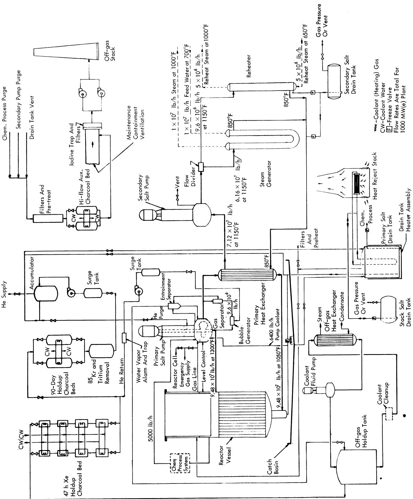
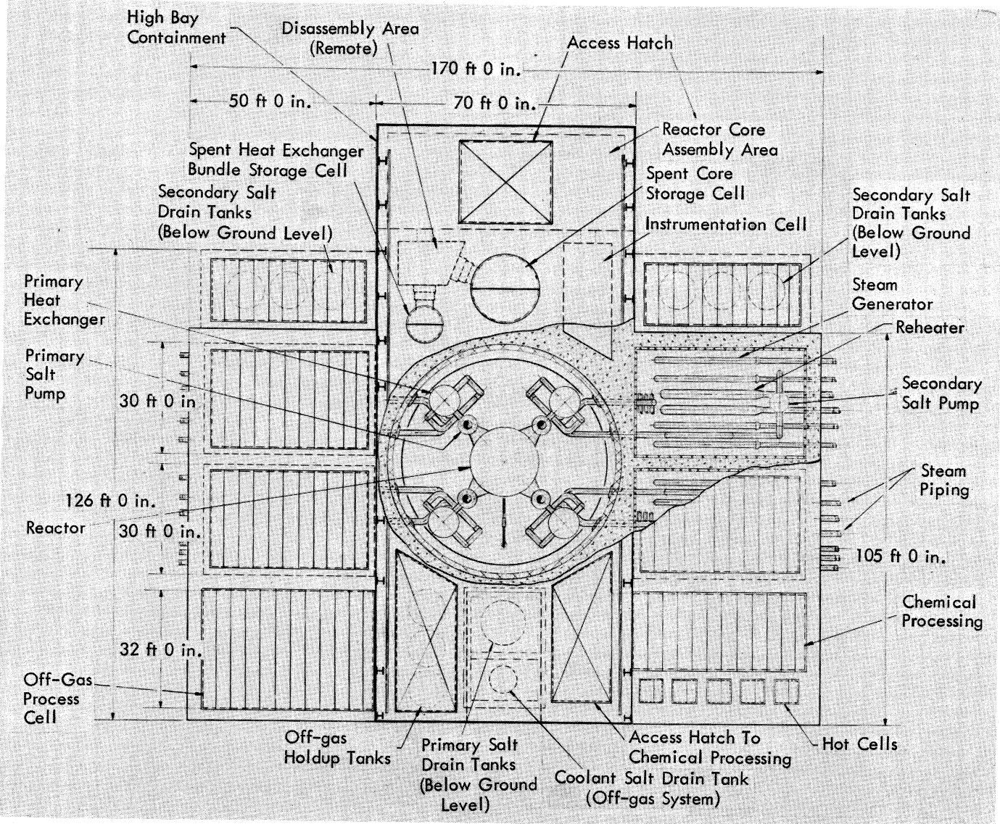
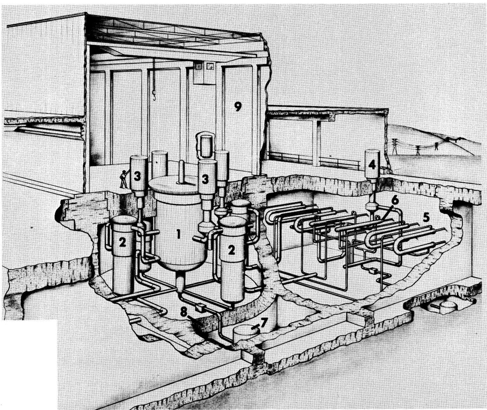
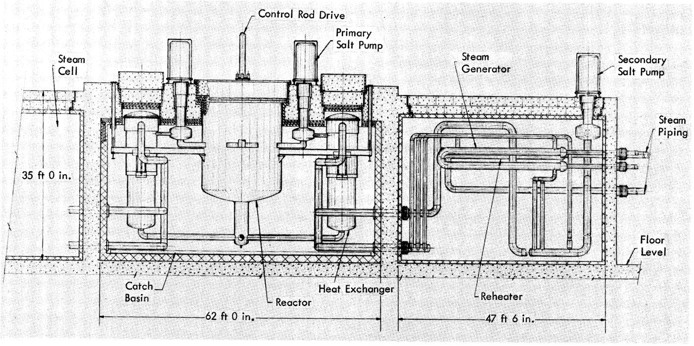
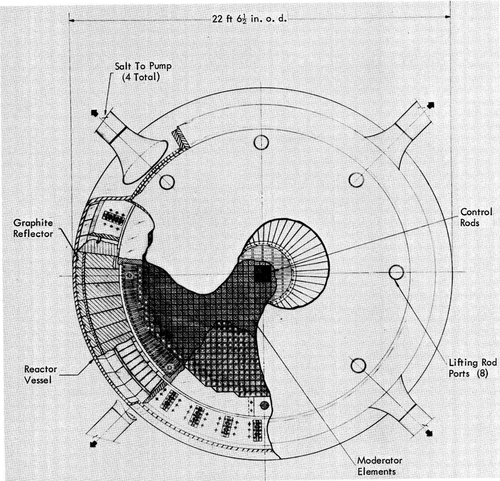
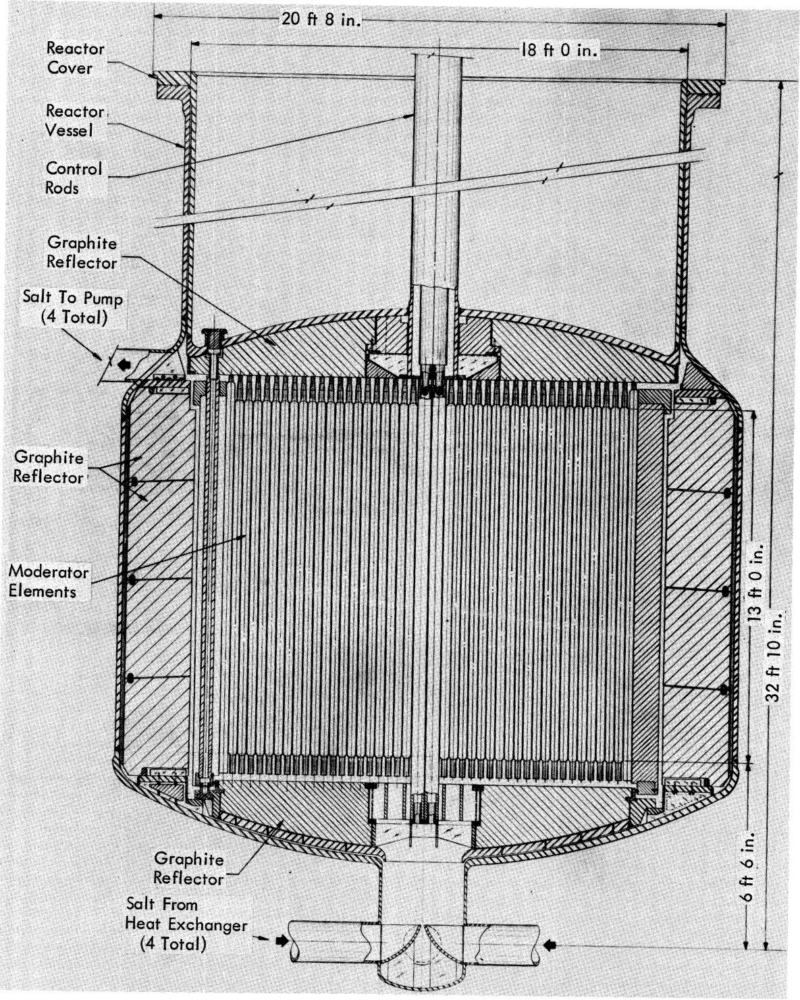
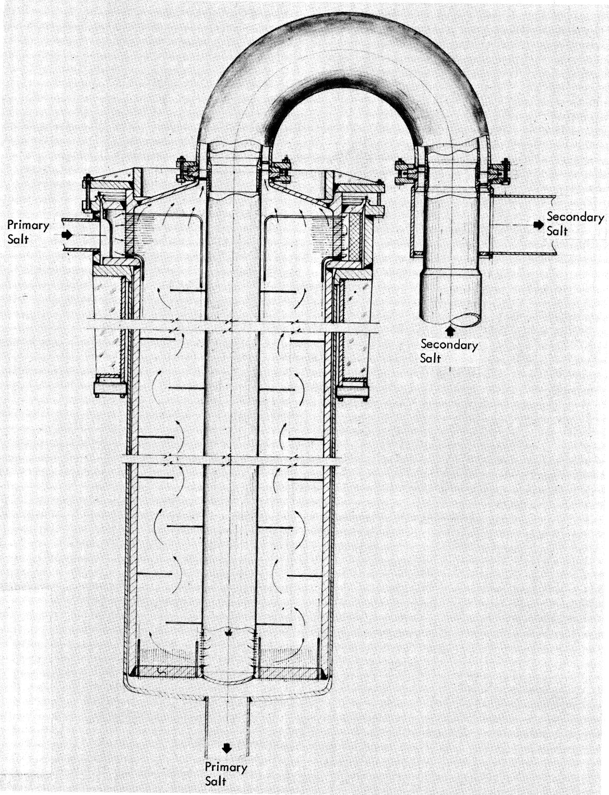
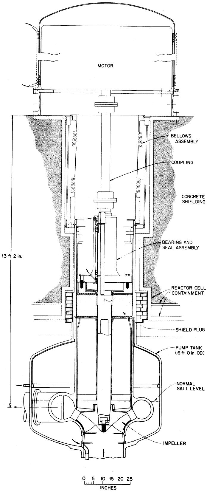
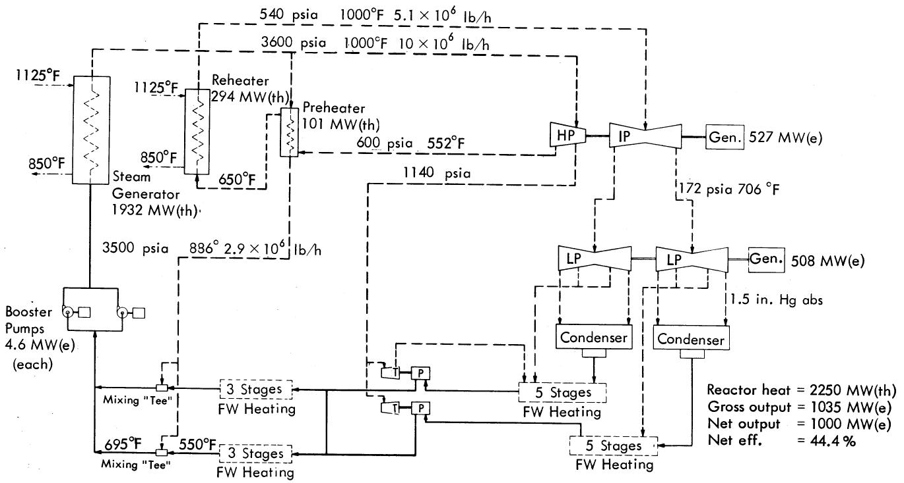

# THE DESIGN AND PERFORMANCE FEATURES OF A SINGLE-FLUID MOLTEN-SALT BREEDER REACTOR

E. S. BETTIS and ROY C. ROBERTSON Reactor Division
Oak Ridge National Laboratory, Oak Ridge, Tennessee 37830

REACTORS

KEYWORDS: molten-salt reactors, design, performance, economics, uranium-233, power reactors, fuels, MSBR, cost, fuel cycle

Received August 4, 1969  
Revised October 2, 1969

A conceptual design has been made of a single-fluid 1000 MW(e) Molten-Salt Breeder Reactor (MSBR) power station based on the capabilities of present technology. The reactor vessel is $\sim 22$ ft in diameter $\times 20$ ft high and is fabricated of Hastelloy-N with graphite as the moderator and reflector. The fuel is $^{233}U$ carried in a LiF-BeF $_{2}$ -ThF $_{4}$ mixture which is molten above $930^{\circ}F$ . Thorium is converted to $^{233}U$ in excess of fissile burnup so that bred material is a plant product. The estimated fuel yield is $3.3\%$ per year.

The estimated construction cost of the station is comparable to PWR total construction costs. The power production cost, including fuel-cycle and graphite replacement costs, with private utility financing, is estimated to be 0.5 to 1 mill/kWh less than that for present-day light-water reactors, largely due to the low fuel-cycle cost and high plant thermal efficiency.

After engineering development of the fuel purification processes and large-scale components, a practical plant similar to the one described here appears to be feasible.

# INTRODUCTION

The objective of this design study is to investigate the feasibility of attaining low-cost electric power, a low specific inventory of fissile material, and a reasonably high breeding gain in a molten-salt reactor. As discussed by Perry and Bauman1 a molten-salt reactor can be designed as either a breeder, or, with relatively few major differences other than in fuel processing, as a converter. This particular design study is confined to the single-fluid Molten-Salt Breeder Reactor (MSBR).

The conceptual design of the MSBR plant was made on the basis that the technology required for fabrication, installation, and maintenance be generally within present-day capabilities. Major design considerations were keeping the fuel-salt inventory low, accomodating graphite dimensional changes, selection of conditions favoring graphite life, and providing for maintainability.

The facilities at an MSBR power station can be grouped into the following broad categories: (a) the reactor system which generates fission heat in a fuel salt circulated through primary heat ex-changers; (b) an off-gas system for purging the fuel salt of fission-product gases and colloidal noble metal particulates; (c) a chemical processing facility for continuously removing fission products from the fuel salt, recovery of the bred $^{233}\mathrm{U}$ , and replenishment of fertile material; (d) a storage tank for the fuel salt which has an afterheat removal system of assured realiability; (e) a coolant-salt circulating system, steam generators, and a turbine-generator plant for converting the thermal energy into electric power; and (f) general facilities at the site which include condensing water works, electrical switchyard, stacks, conventional buildings, and services. These categories are not always clearly defined and are closely interdependent, but it is convenient to discuss them separately. The reactor, and its related structures and maintenance system, the drain tank, the off-gas system, and the chemical processing equipment, are of primary interest. The steam turbine plant and the general facilities are more or less conventional and will be discussed only to the extent necessary to complete the overall picture as to feasibility and costs of an MSBR station.

In a single-fluid MSBR the nuclear fuel is $^{233}\mathrm{U}$ (or other fissile material) carried in a lithium-7-fluoride, beryllium-fluoride, thorium-fluoride salt. The mixture is fluid above $\sim 930^{\circ}\mathrm{F}$ and has good flow and heat transfer properties and very low

vapor pressure. This salt is pumped in a closed loop through a graphite-moderated and reflected core where it is heated to $\sim 1300^{\circ}\mathrm{F}$ by fissioning of the fuel. It then flows through heat exchangers where the heat is transferred to a circulating heat transport salt. This fluid, in turn, supplies heat to steam generators and reheaters to power a conventional high-temperature, high-pressure steam turbine-generator plant. The thorium in the fluoride fuel-salt mixture is converted to $^{233}\mathrm{U}$ at a rate in excess of the fuel burnup so that fissile material, as well as power, is a valuable product of the plant.

A low specific inventory is obtained by designing the MSBR to operate at a high reactor power density with a minimum of fuel salt in the circulating system. The concentration of fissile-fertile material in the salt results from a compromise between keeping the inventory low and achieving a higher breeding gain. High performance depends on keeping the neutron parasitic absorptions low and fuel losses to a minimum. The Li and Be in the fuel salt are good neutron moderators, but their concentrations are relatively low in fluoride salts and additional moderation is needed. Graphite is the most satisfactory moderator and reflector for the MSBR. However, radiation affects the graphite and its useful life varies nearly inversely as the maximum power density in the core. The radiation damage effect is also increased by higher temperatures. Selection of a power density is thus a balance between a low fuel inventory and the frequency with which the graphite must be replaced.

The optimization studies which equate the several factors mentioned above are described by Scott and Eatherly.[22] These studies indicate that an average core power density of $22.2\mathrm{kW}/\mathrm{liter}$ results in a useful graphite life of $\sim 4$ years, which is the operating condition used in this design study. Thus, the reactor design must provide for periodic replacement of the core graphite with minimal plant downtime and complexity of maintenance equipment.

To attain a high nuclear performance it is necessary to maintain low concentrations of $\mathrm{Pa}$ and $^{135}\mathrm{Xe}$ in the high flux region of the core. The protactinium is kept low by processing a small side stream of the salt for removal of this nuclide and other fission products. By integral processing on-site a minimum inventory of fuel salt is involved in transport and storage. The xenon is removed by helium-sparging the fuel salt on a few-second cycle; the core graphite is also sealed to decrease the rate of diffusion of the Xe into the pores of the graphite. The plant design therefore includes the auxiliary systems to remove the nuclear poisons and the bred fissile ma

terial from the salt, to purge the fission-product gases, and to store or dispose of the radioactive waste products; Whatley et al.,3 and Perry and Bauman1 treat the subject of salt processing and estimate fuel-cycle costs.

Although the economic performance of a 2000 MW(e), or larger, MSBR station would be significantly better than that of smaller sizes, a plant with a net electrical output of 1000 MW(e) was chosen for this study because it permitted more direct comparison with the results of other studies. A steam-power cycle with $1000^{\circ}\mathrm{F}$ and 3500-psia turbine throttle conditions, with single reheat, was selected because this was representative of current practice and because it afforded a high overall plant thermal efficiency of $\sim 44\%$ . The MSBR is adaptable to other steam conditions and to additional reheats if future developments lead in this direction.

All portions of the systems in contact with salts are fabricated of Hastelloy-N. When this material is modified with $\sim 1\%$ titanium or hafnium to improve resistance to radiation embrittlement, as described by McCoy et al., it has good high-temperature strength and excellent resistance to corrosion. No exothermic reactions of concern result from mixing of the fuel and coolant salts with each other or with air or water. It is important to keep water and oxygen out of the salts in normal operation, however. The reactor graphite is a specially developed type having very low salt and gas permeability and good resistance to radiation damage. The salt composition is a compromise between the nuclear and physical properties, chemical stability, etc., as discussed by Grimes. Some selected physical properties of the materials important to the design study are shown in Tables I, II, and III.

The performance features of the plant, in terms of breeding gain, graphite life, thermal efficiency, and the net cost to produce electric power, are all reported here on the basis of normal full-load operation at $80\%$ plant factor. Very preliminary review of the various modes of start-up and shutdown, partial-load operation, etc., has not disclosed any major problem areas, however.

# PLANT DESCRIPTION

A simplified flow diagram of the primary and secondary-salt circulating systems is shown in Fig.1. The fluoride fuel-salt mixture is circulated through the reactor core by four pumps operating in parallel. $^a$ Each pump has a capacity of $\sim 14000$

TABLEI   
Properties of the Primary and Secondary Salts Used in Conceptual Design Study of MSBR 1000-MW(e) Station   

<table><tr><td></td><td>Primary Salt</td><td>Secondary Salt</td></tr><tr><td>Components</td><td>LiF-BeF2-ThF4-UF4</td><td>NaBF4-NaF</td></tr><tr><td>Composition, mole%</td><td>71.6-16-12-0.4</td><td>92-8</td></tr><tr><td>Molecular weight, approximate</td><td>64</td><td>104</td></tr><tr><td>Liquidus temperature, °F</td><td>930</td><td>725</td></tr><tr><td>Density, lb/ft3</td><td>205 (at 1300°F)</td><td>117 (at 988°F)</td></tr><tr><td>Viscosity, lb/(ft h)</td><td>16.4 (at 1300°F)</td><td>2.5 (at 900°F)</td></tr><tr><td>Thermal conductivity, Btu/(h ft °F)</td><td>0.7 to 0.8</td><td>0.27</td></tr><tr><td>Heat capacity, Btu/(lb °F)</td><td>0.32</td><td>0.36</td></tr><tr><td>Vapor pressure at 1150°F, Torr (mm Hg)</td><td>&lt;0.1</td><td>252</td></tr></table>

gal/min and circulates the salt through one of four primary heat exchangers and returns it to a common plenum at the bottom of the reactor vessel. Use of four pumps and heat exchangers corresponds to a pump size which represents a reasonable extrapolation of the Molten-Salt Reactor Experiment (MSRE) experience.

Each of the four coolant-salt circuits has a pump of 22 000-gal/min capacity which circulates the coolant salt through a primary heat exchanger located in the reactor cell and then through steam generating equipment installed in an adjacent cell. The reactor can continue to operate although at reduced output, if not all of the coolant salt pumps are operative.

A plan of the reactor plant is shown in Fig. 2; an isometric view and a sectional elevation are presented in Figs. 3 and 4.

The reactor cell is $\sim 62$ ft in diameter and 35 ft deep. It houses the reactor vessel, the four primary heat exchangers, and four fuel-salt circulating pumps. The roof of the cell has removable plugs over all equipment which might require maintenance. The reactor cell is normally kept at a temperature of $\sim 1000^{\circ}\mathrm{F}$ by electric heater thimbles to ensure that the salts will remain above their liquidus temperatures. The estimated maximum heating load is $\sim 2500\mathrm{kW}$ . This "furnace" concept for heating is preferred over trace heating of lines and equipment because it ensures more even heating, heater elements can be replaced without reactor shutdown, there is no need for space coolers inside the cell, and bulky thermal insulation that would crowd the cell and require removal for maintenance and inspection is eliminated.

TABLE II   
Nominal Values for Properties of MSBR Graphite   

<table><tr><td>Density, lb/ft3at room temperature</td><td>115</td></tr><tr><td>Bending strength, psi</td><td>4000-6000</td></tr><tr><td>Young&#x27;s modulus of elasticity, psi</td><td>1.7 × 106</td></tr><tr><td>Poisson&#x27;s ratio</td><td>0.27</td></tr><tr><td>Thermal expansion, per °F</td><td>2.3 × 10-6</td></tr><tr><td>Thermal conductivity, Btu/(hr ft °F)</td><td></td></tr><tr><td>(1340°F)</td><td>35-42</td></tr><tr><td>Electrical resistivity, Ω-cm</td><td>8.9-9.9 × 10-4</td></tr><tr><td>Specific heat, Btu/(lb °F) at 600°F</td><td>0.33</td></tr><tr><td>Btu/(lb °F) at 1200°F</td><td>0.42</td></tr></table>

Biological shielding for the reactor cell is provided by reinforced concrete. The walls of the reactor cell also furnish double containment for the fuel-salt systems. Two thicknesses of carbon steel plate form inner and outer containment vessels, each designed for 50 psig, and also provide gamma shielding for the concrete. Nitrogen gas flows between the plates in a closed circulating loop to remove $\sim 3$ MW(th) of heat. Double bellows are used at all cell penetrations. The normal cell operating pressure is $\sim 26$ in. Hg abs.

High-temperature thermal insulation is attached to the inside of the containment membrane to limit heat losses from the reactor cell. The inside surface of the insulation is covered with a thin stainless-steel liner to protect the insulation from damage, to act as a radiant heat reflector,

TABLE III   
Selected Physical Properties of Hastelloy-N   

<table><tr><td>Nominal Chemical Composition of 
Modified Alloy for Use in MSBRa</td><td colspan="2">Wt%</td></tr><tr><td>Nickel</td><td colspan="2">75</td></tr><tr><td>Molybdenum</td><td colspan="2">12</td></tr><tr><td>Chromium</td><td colspan="2">7</td></tr><tr><td>Iron</td><td colspan="2">4</td></tr><tr><td>Titanium</td><td colspan="2">1</td></tr><tr><td>Other</td><td colspan="2">1</td></tr><tr><td></td><td>At 80°F</td><td>At 1300°F</td></tr><tr><td>Density, lb/ft3</td><td>~553</td><td>~553</td></tr><tr><td>Thermal conductivity, Btu/(h ft °F)</td><td>6.0</td><td>12.6</td></tr><tr><td>Specific heat, Btu/(lb °F)</td><td>0.098</td><td>0.136</td></tr><tr><td>Thermal expansion, per °F</td><td>5.7 × 10-6</td><td>9.5 × 10-6</td></tr><tr><td>Modulus of elasticity, psi</td><td>31 × 106</td><td>25 × 106</td></tr><tr><td>Electrical resistance, Ω-cm</td><td>120.5 × 10-6</td><td>126.0 × 10-6</td></tr><tr><td>Approximate tensile strength, psi</td><td>115 000</td><td>75 000</td></tr><tr><td>Maximum allowable design stress, psi</td><td>25 000</td><td>3 500</td></tr><tr><td>Maximum allowable design stress, 
bolts, psi</td><td>10 000</td><td>3 500</td></tr><tr><td>Melting temperature, °F</td><td>~2 500</td><td>~2 500</td></tr></table>

aThe exact composition may be different from the nominal values given here, as discussed by McCoy et al.4

  
Fig. 1. Flow diagram of MSBR for 1000 MW(e) MSBR power station.

  
Fig. 2. Plan view of MSBR cell complex for 1000 MW(e) power station.

and to provide a clean, smooth surface for the interior.

The stainless-steel "catch pan" at the bottom of the reactor cell, shown in Fig. 4, slopes to a drain line leading to the fuel-salt drain tank located in an adjacent cell. In the very unlikely event of a major salt spill, the salt would flow to the tank. A valve is provided in the drain line to isolate the tank contents from the cell during normal conditions and to permit pressurizing the drain tank for salt transfer.

The four rectangular steam-generating cells are located adjacent to the reactor cell. These house the secondary-salt circulating pumps, the steam generator-superheaters, and the reheaters. The cell construction is similar to that of the reactor cell but only a single containment barrier is

required and heavy steel plate is not needed for shielding the concrete. The 40-psig design pressure would accommodate leakage of steam into the cell.

Other adjacent cells provide for storage of the fuel salt, for storage of spent reactor core assembly, and for other radioactive equipment removed for maintenance.

Through careful quality control of materials and workmanship, the reactor loops containing fission products would have a high degree of integrity and reliability in preventing escape of radioactive materials from the system. The coolant-salt system will operate at a slightly higher pressure than the fuel salt so that any leakage at heat exchanger joints would be in the direction of the fuel salt. The coolant-salt system would be

  
Fig. 3. Cutaway perspective of MSBR reactor and steam cells. (1) Reactor, (2) Primary heat exchangers, (3) Fuel-salt pumps, (4) Coolant-salt pumps, (5) Steam generators, (6) Steam reheaters, (7) Fuel-salt drain tank, (8) Containment structure, (9) Confinement building.

provided with rupture disks to prevent steam pressure from being transmitted to the fuel salt via the coolant-salt system. In addition to the double containment around all fuel-salt equipment, mentioned previously, the building covering the reactor plant is in itself a sealed structure to act as a confinement for airborne material.

# REACTOR

The MSBR reactor core design is based on a maximum allowable neutron dose to the core graphite of $\sim 3\times 10^{22}\mathrm{n / cm}^2$ (for $\mathbf{E} > 50\mathrm{keV}$ ). The average core power density is $\sim 22\mathrm{kW / liter}$ ,

affording a useful core graphite life of $\sim 4$ years, a fuel yield of $\sim 3.3\%$ per year, and a compounded fuel doubling time of $\sim 21$ years. These and other data are given in Table IV. The dimensions of the reactor were obtained through nuclear physics optimization studies discussed by Perry and Bauman.

The coefficient of thermal expansion of Hastelloy-N is about three times that of the graphite. As a result, the clearances inside the reactor vessel increase significantly as the system is raised from room temperature to operating temperature. It is necessary to keep the graphite in a compact array, however, to have control over the

  
Fig. 4. Sectional elevation of MSBR cell complex for 1000 MW(e) power station.

TABLE IV Principle Reactor Design Data for MSBR   

<table><tr><td>Useful heat generation, MW(th)</td><td>2250</td></tr><tr><td>Gross electrical generation, MW(e)</td><td>1035</td></tr><tr><td>Net electrical output of plant, MW(e)</td><td>1000</td></tr><tr><td>Overall plant thermal efficiency, %</td><td>44.4</td></tr><tr><td>Reactor vessel i.d., ft</td><td>22.2</td></tr><tr><td>Vessel height at centerline, ft</td><td>20</td></tr><tr><td>Vessel wall thickness, in.</td><td>2</td></tr><tr><td>Vessel head thickness, in.</td><td>3</td></tr><tr><td>Vessel design pressure, psig</td><td>75</td></tr><tr><td>Vessel top flange opening diameter, ft</td><td>18</td></tr><tr><td>Core height, ft</td><td>13</td></tr><tr><td>Distance across flats of octagonal core, ft</td><td>14.3</td></tr><tr><td>Radial blanket thickness, ft</td><td>1.3</td></tr><tr><td>Graphite reflector thickness, ft</td><td>2.5</td></tr><tr><td>Number of core elements</td><td>1412</td></tr><tr><td>Size of core elements, in.</td><td>4 × 4 × 156</td></tr><tr><td>Salt-to-graphite ratio in core, % of core volume</td><td>13</td></tr><tr><td>Salt-to-graphite ratio in undermoderated region, %</td><td>37</td></tr><tr><td>Salt in reflector volume, %</td><td>&lt;1</td></tr><tr><td>Total weight of graphite in reactor, lb</td><td>650 000</td></tr><tr><td>Weight of removable core assembly, lb</td><td>480 000</td></tr><tr><td>Maximum flow velocity in core, ft/sec</td><td>8.5</td></tr><tr><td>Maximum graphite damage flux (&gt;50 keV), n/(cm2sec)</td><td>3.2 × 1014</td></tr><tr><td>Graphite temperature in maximum flux region, °F</td><td>1284</td></tr><tr><td>Average core power density, W/cm3</td><td>22.2</td></tr><tr><td>Maximum thermal neutron flux, n/(cm2sec)</td><td>7.9 × 1014</td></tr><tr><td>Estimated graphite life, yearsa</td><td>4</td></tr><tr><td>Pressure drop through reactor due to flow, psi</td><td>18</td></tr><tr><td>Total salt volume in primary system, ft3</td><td>1 720</td></tr><tr><td>Thorium inventory, kg</td><td>68 000</td></tr><tr><td>Fissile fuel inventory of reactor system and processing plant, kg</td><td>1 468</td></tr><tr><td>Breeding ratio</td><td>1.06</td></tr><tr><td>Yield, %/year</td><td>3.3</td></tr><tr><td>Doubling time, years</td><td>21</td></tr></table>

${}^{a}$ Based on ${80}\%$ plant factor

fuel-to-graphite ratios, to ensure that the salt velocities in the passages are as planned and to prevent vibration of the graphite. The fact that the graphite has considerable buoyancy in the fuel salt, and yet must be supported when the reactor is empty of salt, is another important design consideration.

Figures 5 and 6 show plan and elevation views of the reactor. The vessel is $\sim 22$ ft in diameter and 20 ft high, with 2-in.-thick Hastelloy-N walls. The dished heads at the top and bottom are 3 in. thick. The maximum design pressure is 75 psig. A cylindrical extension of the vessel above the top head permits the reactor support flange and top head closure to be located in a relatively low-temperature, low-activity zone between two layers of roof shielding plugs. In this position the seal welds and flange bolting are more accessible and distortion of the flange due to high temperature is kept small. Double metal gaskets and a leak-detection system are used in the flanged closure.

The fuel salt enters the bottom of the reactor at $\sim 1050^{\circ}\mathbf{F}$ , flows upward through the vessel, and leaves at the top at $\sim 1300^{\circ}\mathbf{F}$ . The central core is $\sim 14$ ft in diameter and consists of extruded graphite elements, 4 in. $\times 4$ in. $\times 13$ ft long. A $\frac{1}{2}$ -in.-diam hole through the center of each element, and ridges on each side of the elements to separate the pieces, furnish flow passages and provide the requisite $13\%$ salt volume in this most active portion of the reactor. Other shapes of graphite

  
Fig. 5. Top cut-away view of reactor vessel for MSBR 1000 MW(e) station.

elements can be considered, with perhaps the exception of cylinders, which would have poorly defined flow passages between them. The graphite prisms are maintained in a compact array, as shown in Figs. 5 and 6.

Molded extensions on each end of the elements provide a greater salt-to-graphite volume ratio at the top and bottom of the main core to form an undermoderated region which helps reduce the axial neutron leakage from the core. The molded extensions on the elements also provide the ori

ficing to obtain the desired flow distribution. By varying the salt velocity from $\sim 8$ ft/sec at the center to $\sim 2$ ft/sec near the periphery, a uniform temperature rise across the core of $\sim 250^{\circ}\mathbf{F}$ is obtained. The overall pressure drop in the salt flowing through the core is $\sim 26$ psi.

Graphite slabs, $\sim 2\times 10$ in. in cross section and 13 ft long, are arranged radially around the active core. These slabs have larger flow passages, with $\sim 37\%$ of the volume being fuel salt. This undermoderated region serves to reduce the

  
Fig. 6. Sectional elevation of reactor vessel for MSBR station.

radial neutron leakage. The slabs provide the stiffness to hold the inner core graphite elements in a compact array as dimensional changes occur in the graphite. The slabs are confined by graphite rings at the top and bottom.

Eight equally spaced vertical holes, $\sim 3$ in. in diameter, are provided in the undermoderated re

tion, mentioned above, to allow a small portion of the incoming fuel salt to bypass the core region and flow through graphite passages in the top head reflector graphite to prevent overheating. These holes are indicated on Fig. 5 as “lifting rod ports.”

Since it is not expected that the core graphite

would last the life of the plant, it is designed for periodic replacement. It was decided to replace all the core graphite as an assembly rather than by individual pieces because it appeared that this method could be performed more quickly and with less likelihood of escape of activity. Handling the core as an assembly also permits the replacement core to be carefully preassembled and tested under essentially shop conditions.

The portions of the core described above are arranged as a removable unit having an overall diameter of $\sim 16$ ft and a total weight of 240 tons. When the reactor is empty of salt, the graphite rests on a Hastelloy-N bottom plate, which, in turn, rests on the bottom head of the vessel. (The bottom reflector graphite is keyed to this support plate and when the vessel is filled with salt the mass of the plate is sufficient to prevent the bottom reflector from floating.) When it is necessary to replace the graphite assembly, eight Hastelloy-N rods, $\sim 2^{\frac{1}{2}}$ in. in diameter, are inserted through ports around the periphery of the top head, down through the lifting rods ports in the graphite, mentioned above, and latched to the bottom support plate. The rods are then attached to the top head so that the entire core can be removed as an assembly. The reactor control rods and the associated drive assemblies are also removed with the head. The maintenance equipment and procedures are briefly described in a later section of this paper.

The reactor vessel also contains a 2.5-ft-thick layer of radial reflector graphite at the outside wall. This graphite receives a relatively low neutron dose and does not require periodic replacement. The graphite is arranged in wedged-shaped slabs, $\sim 12$ in. wide at the thicker end and $\sim 4$ ft high. These slabs are spaced $\sim \frac{1}{4}$ in. from the vessel wall to allow an upward flow of fuel salt to cool the metal wall and maintain it below the design temperature of $\sim 1300^{\circ}\mathrm{F}$ . The slabs have a radial clearance of $\sim 1\frac{1}{2}$ in. on the inside to accommodate dimensional changes of the graphite and to allow clearances in removing and replacing the core assembly. Salt flow passages and appropriate orificing are provided between the graphite slabs to maintain the temperature at acceptable levels. A system of Hastelloy-N bands and vertical rods key the slabs together and cause the reflector to move with the vessel wall as the systems expand with temperature. Reflector graphite is also provided in the top and bottom heads. The amount of fuel salt in the radial and axial reflector regions is $\sim 1\%$ of the reflector volume.

Design concepts for a single-fluid breeder reactor different from that described above are clearly possible. Relatively little optimization

work has been completed to date. Hydrodynamic testing will be an essential part of establishing a final MSBR reactor design.

# PRIMARY HEAT EXCHANGERS

Four counterflow, vertical, shell-and-tube heat exchangers are used to transfer heat from the fuel salt to the sodium fluoroborate coolant salt. Pertinent data for the exchangers are given in Table V.

As shown in Fig. 7, fuel salt enters the top of each unit and exits at the bottom after once-through flow through the tubes. The coolant salt enters the shell near the top, flows to the bottom in a 20-in.-diam downcomer, turns and flows upward through disk-and-doughnut baffling in the lower portion of the shell, and exits through 28-in.-diam concentric piping at the top.

The Hastelloy-N tubes are L-shaped and are welded into a horizontal tube sheet at the bottom and into a vertical tube sheet at the top. The toroidal-shaped header is stronger than a flat

TABLEV Primary Heat Exchanger Design Data   

<table><tr><td></td><td>Each of 4 Units</td></tr><tr><td>Thermal duty, Btu/h</td><td>1922 × 10^6</td></tr><tr><td>Tube-side conditions:</td><td></td></tr><tr><td>Fluid</td><td>Fuel salt</td></tr><tr><td>Entrance temperature, °F</td><td>1300</td></tr><tr><td>Exit temperature, °F</td><td>1050</td></tr><tr><td>Mass flow rate, lb/h</td><td>23.7 × 10^6</td></tr><tr><td>Volume salt in tubes, ft^3</td><td>64</td></tr><tr><td>Number tubes</td><td>5900</td></tr><tr><td>Nominal tube o.d., in.</td><td>3/8</td></tr><tr><td>Tube thickness, in.</td><td>0.035</td></tr><tr><td>Tube spacing on pitch circle, in.a</td><td>3/4</td></tr><tr><td>Radial distance between pitch circles, in.a</td><td>0.6</td></tr><tr><td>Length, ft</td><td>21.6</td></tr><tr><td>Effective surface, ft^2</td><td>11000</td></tr><tr><td>Pressure drop, psi</td><td>129</td></tr><tr><td>Velocity in tubes, average ft/sec</td><td>10</td></tr><tr><td>Shell-side conditions:</td><td></td></tr><tr><td>Fluid</td><td>Coolant salt</td></tr><tr><td>Entrance temperature, °F</td><td>850</td></tr><tr><td>Exit temperature, °F</td><td>1150</td></tr><tr><td>Mass flow rate, lb/h</td><td>17.8 × 10^6</td></tr><tr><td>Inside diameter of shell, ft</td><td>5.4</td></tr><tr><td>Shell thickness, in.</td><td>2.5</td></tr><tr><td>Baffle spacing, ft</td><td>1.1</td></tr><tr><td>Pressure drop, psi</td><td>74</td></tr><tr><td>Velocity, typical, ft/sec</td><td>7.5</td></tr><tr><td>Overall heat transfer coefficient, based on log mean Δt, tube o.d., Btu/(h ft^2 °F)</td><td>950</td></tr></table>

a Tubes are not on triangular pitch to facilitate assembly of bent tubes into tube sheets.

  
Fig. 7. Sectional elevation of primary heat exchanger for MSBR station.

header and also simplifies the arrangement for the coolant-salt flow. The design also permits the seal weld to be located outside the heat exchanger. About 6 ft of the upper portion of the tubing is bent into a sine-wave configuration to absorb differential expansion. Maximum stresses in the tubing were estimated to be $< 8000$ psi.

The tubes have a helical indentation knurled into the surface to enhance the film heat transfer coefficients. In the cross-flow regions of the exchanger, a heat transfer enhancement factor of 2 was used on the inside of the tubes, and a factor of 1.3 was applied to the outside. No enhancement was assumed in the bent-tube region. The shells

of the exchangers are also fabricated of Hastelloy-N. Disk and doughnut baffles are used in the shell to a height of $\sim 11$ ft. Coolant-salt velocity in the unit varies but has an average value of 7 to 8 ft/sec.

The heat exchanger design was computer-optimized and the calculations take into account the temperature dependence of the salt properties as a function of position in the exchanger. The average overall heat transfer coefficient, based on simple overall log mean temperature difference and total area, is $\sim 950\mathrm{Btu / (hft^2F)}$ ,as given in Table V. Limited heat transfer tests are now in progress, but a more comprehensive program is required to establish a final MSBR primary heat exchanger design.

The exchangers are mounted at a point near their center of gravity by a gimbal-type joint that permits rotation to accommodate the unequal thermal expansions in the inlet and outlet pipes. The entire heat exchanger assembly is suspended from an overhead support structure.

Through close material control and inspection, the heat exchangers are expected to have a high degree of reliability and to last the 30-year life of the plant. If maintenance is required, however, provisions have been included in the design for replacement of tube bundles. No specific arrangements are made for replacement of the shell, although this could be accomplished but with more difficulty.

# STEAM GENERATORS AND REHEATERS

Each of the four primary heat exchangers has coolant salt circulated through it by a coolant-salt pump operating in a closed loop independently of the other three pumps. Each of the coolant-salt loops contains four horizontal U-shell, U-tube steam-generator superheaters and two horizontal straight-tube reheaters, connected in parallel to the coolant-salt system. A flow-proportioning valve balances the salt flow between the steam generators and reheaters to provide $1000^{\circ}\mathrm{F}$ outlet steam temperature from each. The coolant-salt pump speeds can be varied in proportion to the electric load on the plant. Design data for the steam generators and reheaters are listed in Tables VI and VII.

The steam generators are supplied with $\sim 10\times$ $10^{6}\mathrm{lb / h}$ of demineralized feedwater at $\sim 700^{\circ}\mathbf{F}$ and 3800 psia. A supercritical pressure steam cycle was selected because it affords a high thermal efficiency and also permits steam to be directly mixed with the high-pressure feedwater to raise its temperature to $\sim 700^{\circ}\mathbf{F}$ to guard against freezing of the coolant salt in the steam generator. For the same reason, prime steam is also used to

TABLE VI Steam Generator-Superheater Design Data   

<table><tr><td></td><td>Each of 16 Units</td></tr><tr><td>Thermal duty, Btu/h</td><td>415 × 10^6</td></tr><tr><td>Tube-side conditions:</td><td></td></tr><tr><td>Fluid</td><td>Steam</td></tr><tr><td>Entrance temperature, °F</td><td>700</td></tr><tr><td>Exit temperature, °F</td><td>1000</td></tr><tr><td>Mass flow rate, lb/h</td><td>6300 × 10^3</td></tr><tr><td>Number tubes</td><td>384</td></tr><tr><td>Nominal tube o.d., in.</td><td>1/2</td></tr><tr><td>Tube thickness, in.</td><td>0.077</td></tr><tr><td>Tube pitch, in.</td><td>0.875</td></tr><tr><td>Tube length, ft.</td><td>73</td></tr><tr><td>Effective surface, ft²</td><td>3628</td></tr><tr><td>Pressure drop, psi</td><td>150</td></tr><tr><td>Entrance pressure, psia</td><td>3750</td></tr><tr><td>Shell-side conditions:</td><td></td></tr><tr><td>Fluid</td><td>Coolant salt</td></tr><tr><td>Entrance temperature, °F</td><td>1150</td></tr><tr><td>Exit temperature, °F</td><td>850</td></tr><tr><td>Mass flow rate, lb/h</td><td>3.85 × 10^6</td></tr><tr><td>Pressure drop, psi</td><td>60</td></tr><tr><td>Baffle spacing, ft</td><td>4</td></tr><tr><td>Inside diameter of shell, ft</td><td>1.5</td></tr><tr><td>Overall heat transfer coefficient, based on log mean Δt, tube o.d., Btu/h ft² °F)</td><td>764</td></tr></table>

temper the "cold" reheat steam to $650^{\circ}\mathrm{F}$ before it enters the reheaters.

After encountering piping stress and other layout problems with vertical units, it was found that by making both the steam generators and reheaters horizontal, the piping was simplified, stresses were lowered to within acceptable limits, and cell heights could be decreased.

# SALT-CIRCULATING PUMPS

Both the primary and secondary salt-circulating pumps are motor-driven, single-stage, sump-type, centrifugal pumps with overhung impellers as illustrated in Fig. 8. A helium cover gas is used in the salt circulating systems, a portion of this gas being fed continuously through the labyrinth seals on the pumps to prevent leakage of fission products from the systems.

A design criterion adopted for the MSBR conceptual study was that pressure drops in the salt circuits be limited to a total of $\sim 150$ ft of head, a pressure that can be developed by a single-stage pump. Single-stage pumps, with overhung impellers and the upper bearing lubricated by a circulating oil system, have successfully operated at

TABLE VII   
Steam Reheater Design Data   

<table><tr><td></td><td>Each of 8 Units</td></tr><tr><td>Thermal duty, Btu/h</td><td>1.25 × 10^6</td></tr><tr><td>Tube-side conditions:</td><td></td></tr><tr><td>Fluid</td><td>Steam</td></tr><tr><td>Entrance temperature, °F</td><td>650</td></tr><tr><td>Exit temperature, °F</td><td>1000</td></tr><tr><td>Mass flow rate, lb/h</td><td>6420 × 10^3</td></tr><tr><td>Number tubes</td><td>397</td></tr><tr><td>Nominal tube o.d., in.</td><td>3/4</td></tr><tr><td>Tube thickness, in.</td><td>0.035</td></tr><tr><td>Tube pitch, in.</td><td>1</td></tr><tr><td>Tube length, ft</td><td>27.3</td></tr><tr><td>Effective surface, ft²</td><td>2127</td></tr><tr><td>Pressure drop, psi</td><td>27</td></tr><tr><td>Entrance pressure, psia</td><td>570</td></tr><tr><td>Shell-side conditions:</td><td></td></tr><tr><td>Fluid</td><td>Coolant salt</td></tr><tr><td>Entrance temperature, °F</td><td>1150</td></tr><tr><td>Exit temperature, °F</td><td>850</td></tr><tr><td>Mass flow rate, lb/h</td><td>1.16 × 10^6</td></tr><tr><td>Pressure drop, psi</td><td>58</td></tr><tr><td>Baffle spacing, in.</td><td>8.4</td></tr><tr><td>Inside diameter of shell, in.</td><td>22</td></tr><tr><td>Overall heat transfer coefficient, based on log mean Δt, tube o.d., Btu/(h ft² °F)</td><td>340</td></tr></table>

ORNL over many thousands of hours in test loops and in the MSRE. Although development will be required to produce the high-capacity, single-stage pumps needed for the MSBR, no major technological problems are foreseen.

Multistage pumps having a lower bearing would be required to produce a higher head. Salt-lubricated bearings have been tested with some success at ORNL, but it was judged that the single-stage design is a more conservative approach and requires less development effort. A further advantage of not using the salt-lubricated bearing is that tests of single-stage units have demonstrated that, when drained of salt, significant amounts of nitrogen gas can be moved by the pumps when operating at $\sim 1200$ rpm. Advantage is taken of this in planning for removal of afterheat in the reactor core in event of an unscheduled salt drain.

# DRAIN TANKS

Both the primary and secondary salt-circulating systems are provided with tanks for storage of the salt during start-up and for emergency or maintenance operations.

  
Fig. 8. Sectional elevation of primary-salt pump for MSBR station.

Design objectives for the fuel-salt drain tanks are that the highly radioactive contents be contained with a high degree of integrity and reliability and that the afterheat-removal system be largely independent of the need for mechanical equipment, emergency power supply, or initiating action by the operating personnel.

The fuel-salt inventory of $\sim 1720\mathrm{ft}^3$ is stored in a single tank, $\sim 12$ ft in diameter $\times 20$ ft high, located in the drain-tank cell. Since there is insufficient moderation a critical mass could not exist. The cell is heated to maintain the salt above $930^{\circ}\mathrm{F}$ , although there would be no permanent damage in the very unlikely event that the salt were to freeze in the tank. To limit the temperature rise after a drain due to fission-product decay heat, the tank is equipped with internal U-tubes through which sodium fluoroborate coolant salt is circulated by thermal convection to a salt-to-air exchanger located at the base of a natural convection stack, as indicated in the flow sheet, Fig. 1. There are two sets of U-tubes and air-cooled exchangers, each of which alone is capable of maintaining the tank at acceptable temperatures.

The fuel-salt storage tank is connected to the circulating system by a drain line having a freeze-plug-type "valve." At the discretion of the plant operator, the plugs could be thawed in a few minutes for gravity drain of the salt into the tank. The plugs would also thaw in event of a major loss of power or failure of the valve coolant system. The salt is returned to the circulating system by pressurization of the drain tank.

A coolant-salt storage tank, $\sim 10$ ft in diameter $\times 20$ ft high, is provided for each of the coolant-salt-circulating loops and for the two heat removal systems on the fuel-salt drain tank. The six tanks have a total storage volume of $\sim 8400\mathrm{ft}^3$ of coolant salt. The tanks are located in a heated cell which maintains the temperature above $800^{\circ}\mathrm{F}$ .

# OFF-GAS SYSTEM

The volatile fission products and colloidal noble metals formed in the fuel salt are largely removed by a helium-gas purge system. The gashandling and -disposal system is shown schematically in Fig. 1.

About $10\%$ of the fuel salt discharged from each of the four circulating pumps is bypassed through a gas separator. Swirl vanes in the separator cause the gas bubbles to collect in a central vortex from which they are withdrawn with nearly $100\%$ stripping efficiency. Downstream vanes then kill the swirl. It is desirable that the radioactive gas flow from the separator carry some salt with it (perhaps as much as $50\%$ ) to act as a sink for the decay heat. The separated gas ( $\sim 9$

scfm) then flows through an entrainment separator to remove residual salt before it enters a particle trap and $1000\text{-ft}^3$ decay tank. The salt removed in the entrainment separator returns to the pump bowl.

The main bypass flow of salt leaving the gas separator described above then passes through a bubble generator where the salt is recharged with the helium gas used to strip xenon and other fission product gases from the reactor core. The bubble generator is a venturi-like section in the pipe capable of producing bubble diameters in the range of 15 to 20 mils. The fraction of xenon remaining in the reactor core depends upon the ratio of the surface area of the bubbles to the surface area of the graphite—and on the permeability of the graphite to xenon. Based on the belief that the graphite coating reduces the permeability to xenon as effectively as the tests now indicate, the volume fraction of bubbles circulating with the fuel salt probably need be no more than $\sim 0.5\%$ .

The particle trap for the gas leaving the gas separator also receives about a 2-scfm flow of helium gas from the pump bowl. The helium is used to purge the reactor of volatile fission products and "smoke" of extremely small-sized noble metal fission-product particles which tend to accumulate above the liquid interface in the bowl. The particle trap tank is designed to remove a fission-product heat load of $\sim 18$ MW(th). The entering gas impinges on the surface of a flowing lead-bismuth alloy where heavy particles are trapped while the gas passes over the surface and is cooled. The lead-bismuth is circulated by two 900-gal/min motor-driven pumps to the shell side of heat exchangers cooled by a closed-circuit, boiling-water system coupled to an air-cooled condenser. The liquid metal is circulated to a chemical processing cell for removal of the captured fission-product particles.

The highly radioactive gas decays for $\sim 1\mathrm{h}$ in the tank and then passes to one of two water-cooled charcoal holdup traps. These water-cooled traps absorb and hold up the gases, with the xenon being retained for $\sim 47\mathrm{h}$ . On leaving the charcoal beds, $\sim 9$ scfm of the gas passes through a water detector and trap to a gas compressor which recirculates it to the gas purge system bubble generator. The remaining 2 scfm is held up for further decay and stripping of tritium and other gases before it is returned to the off-gas system for purging of the pump seals, etc.

With the exception of the lead-bismuth particle trap, the components proposed for the off-gas system have been tested in principle in the MSRE or in experimental loops at ORNL. The off-gas system is described in more detail by Scott and Eatherly.2

# FUEL-SALT PROCESSING

The nuclear performance of the MSBR is enhanced by continuous removal of the fission products and nuclear poisons. There are also advantages in plant safety to continuous reduction and disposal of the inventory of fission products in the system. Methods of treating the fuel salt are described in an article by Whatley et al.3 Very briefly, the process consists of diverting a 3-gal/min sidestream of circulating fuel salt to an adjacent cell for reduction extraction using bismuth. The Pa is removed on about a 3-day cycle and the rare earth fission products on about a 50-day cycle. It may be noted that the reactor can continue to operate for relatively long periods even if the fuel processing facility is out of service.

# STEAM-POWER SYSTEM

The MSBR can produce high-temperature, high-pressure steam to make use of advanced-design steam turbine-generator equipment.

The steam system flow sheet, Fig. 9, considers a supercritical pressure, $1000^{\circ}\mathrm{F}$ , with reheat to $1000^{\circ}\mathrm{F}$ , steam turbine very similar to that used in the TVA's Bull Run plant. This is a cross-compounded unit of 1035 MW(e) gross capacity with the load about equally divided between the single-flow, 3600-rpm, high-pressure and two

flow intermediate pressure turbines on one shaft and the 1800-rpm, four-flow arrangement of low-pressure turbines on the other shaft. It seems certain, however, that tandem-compounded units of this capacity will be available to a future MSBR power industry. Credit for this has been taken in the cost estimates.

Eight stages of regenerative feedwater heating have been shown, with extraction steam taken from the high- and low-pressure turbines and from the turbines used to drive the two boiler feed pumps. The system is conventional except for the precautions taken to preheat the entering steam or water above the liquidus temperature of the coolant salt. The $550^{\circ}\mathrm{F}$ steam from the high-pressure turbine exhaust is preheated to $\sim 650^{\circ}\mathrm{F}$ before it enters the reheaters. This is accomplished in the shell side of an exchanger heated by high-pressure steam at throttle conditions in the tubes. The high-pressure heating steam leaving the tube side is then mixed directly with the high-pressure $550^{\circ}\mathrm{F}$ feedwater leaving the top extraction heater to raise its temperature to $\sim 700^{\circ}\mathrm{F}$ . Motor-driven pumps then boost the feedwater pressure from $\sim 3500$ psia at the mixing "tee" to the steam generator pressure of $\sim 3800$ psia. These pumps are similar to canned-motor supercritical pressure boiler recirculation pumps in current use.

The allowable temperature margins to guard against significant freezing of the coolant salt in

  
Fig. 9. Simplified steam-system flow sheet for 1000 MW(e) MSBR station.

the heat exchangers are yet to be determined experimentally. No optimization studies of the feedwater and reheat steam systems have been made and there are obviously many possible variations. For example, if $580^{\circ}\mathrm{F}$ feedwater and $550^{\circ}\mathrm{F}$ "cold" reheat steam could be used, thus eliminating the heating and mixing processes suggested above, the flow through the steam generator could be reduced by one-third and the overall plant thermal efficiency increased from $\sim 44.4$ to $44.9\%$ .

Four control rods of medium reactivity have been provided. The effective portions of the rods are graphite, which on removal from the core decrease the neutron moderation and the reactivity.

The basic principle of MSBR control takes into account its load-following characteristics. An increase in turbine load would increase the steam flow rate and tend to lower the steam outlet temperatures from the steam generators and reheaters. The coolant-salt pump control would increase the pump speed to maintain constant $1000^{\circ}\mathrm{F}$ steam outlet temperatures, thereby tending to lower the salt temperatures in both the primary and secondary salt loops. The combination of the negative temperature coefficient of reactivity and possible control rod movement would then increase the reactor power.

The MSBR control system has not been studied in detail, but no major problems are foreseen. Preliminary analog computer studies indicate that the primary, secondary, and steam-system loops have greatly different time constants so that power oscillating and control rod position hunting problems can be avoided.

# AFTERHEAT REMOVAL

The normal shutdown procedure after taking the reactor subcritical would be to continue to circulate both the salts so as to transfer afterheat to the steam system for rejection to the condensing water. The afterheat load would decrease by a factor of 10 in two to four days. After several days of circulation, the fuel salt could be drained to the storage tank without concern for overheating of the primary loop due to the deposited fission products remaining in the system.

In the event of excessive salt leakage or other malfunction which would require quick drainage of the fuel salt, nitrogen could be introduced and circulated at $\sim 50$ psig in the fuel-salt loop. Preliminary estimates indicate that three of the four fuel-salt-circulating pumps (operating at 1200 rpm) can circulate enough gas to keep the temperatures within tolerable levels. This assumes that at least one of the four secondary-salt pumps is operative.

# MAINTENANCE

Any portions of the system containing fuel salt will become sufficiently radioactive to require that all maintenance operations be accomplished by other than direct methods. The coolant salt will experience induced activity, primarily due to activation of the sodium atoms. The coolant-salt pumps, steam generators and reheaters, however, will not become radioactive, and after the coolant salt is drained and flushed, could probably be approached for direct maintenance.

Cell roof access openings will be provided over all equipment that might need servicing. The plugs are replaceable with a work shield through which long-handled tools can be manipulated. A bridge-type manipulator will be mounted beneath the work shield to perform more sophisticated operation. Viewing can be accomplished through cell windows, periscopes, and closed-circuit television.

Replacement of the reactor core graphite will be a maintenance operation that can be planned in considerable detail. The assembly to be removed is $\sim 16$ ft in diameter, 30 ft high (including the cylinder extension), and weighs $\sim 240$ tons. After 10 days of decay time the activity level at the outer circumference would be $\sim 5 \times 10^{5} \mathrm{R/h}$ on contact. The first step in replacing the core graphite would be to disconnect the attachments and holddown devices. A transition piece and track-mounted transport cask would then be positioned on the operating floor directly above the reactor, and a lifting mechanism inside the cask used to draw the core assembly up into it. The cask would then be closed by means of sliding shields, moved into position over the reactor storage cell, and the spent core assembly lowered into it.

A replacement core assembly would have previously been made ready for lifting into the transport cask and subsequent lowering into the reactor vessel. Since this arrangement requires two top heads and control rod drive assemblies for the reactor vessel to be on hand, these have been included in the direct construction cost of the plant. Very preliminary estimates indicate that the capital cost of special maintenance equipment would be in the range of $6 million. These studies give promise that the core graphite can be replaced within the usual downtime allowance for other plant maintenance.

Although there is some background of experience in maintenance of the MSRE and other reactor types, obviously the above comments regarding MSBR maintenance procedures and costs are speculative and will require further evaluation in continued study and testing.

# COST ESTIMATES

Methods used in making the cost estimates for an MSBR power station conform largely to those used by the USAEC in reactor cost evaluation studies. It is important to note that the MSBR estimated construction cost is not that of a first plant but that of a new plant in an established molten-salt reactor industry. It is further assumed that there is a proven design essentially the same as the one described here, that development costs have been largely absorbed, and that the manufacture of materials, plant construction, and licensing are routine. On this basis the contingency and other uncertainty factors assumed for MSBR costs are little different from those applied to other reactor types.

Costs are based on the early 1969 value of the dollar. It is assumed that it would require five years to construct a plant. Escalation of prices during the construction period was not included in these estimates but could amount to $\sim 12\%$ additional cost. Interest (at $6\%$ ) on capital during the 5-year construction period was included, however. Expenses of an extended (54-h) work week were applied, as was a $3\%$ local sales tax.

TABLE VIII Estimated Construction Cost of 1000-MW(e) MSBR Power Station   

<table><tr><td></td><td>$106a</td></tr><tr><td>Structures and improvements</td><td>11.5</td></tr><tr><td>Reactor</td><td></td></tr><tr><td>Vessel</td><td>5.9</td></tr><tr><td>Graphite</td><td>6.0</td></tr><tr><td>Shielding and containment</td><td>3.1</td></tr><tr><td>Heating and cooling systems</td><td>1.3</td></tr><tr><td>Control rods</td><td>1.0</td></tr><tr><td>Cranes</td><td>0.2</td></tr><tr><td>Heat transfer systems</td><td>22.2</td></tr><tr><td>Drain tanks</td><td>4.3</td></tr><tr><td>Waste treatment and disposal</td><td>0.5</td></tr><tr><td>Instrumentation and controls</td><td>4.1</td></tr><tr><td>Feedwater supply and treatment</td><td>5.2</td></tr><tr><td>Steam piping</td><td>5.6</td></tr><tr><td>Remote maintenance and equipment</td><td>6.6</td></tr><tr><td>Turbine-generator plant equipment</td><td>25.0</td></tr><tr><td>Accessory electrical equipment</td><td>5.2</td></tr><tr><td>Miscellaneous</td><td>1.4</td></tr><tr><td></td><td>109.1</td></tr><tr><td>Total + 6% allowance for 54-h work week</td><td>$115.6</td></tr><tr><td>Total + 3% local sales tax</td><td>$119.1</td></tr><tr><td>Total + 33.5% indirect costs (see Table IX)</td><td>$159.0</td></tr></table>

$^\mathrm{a}$ Based on early 1969 prices.

TABLE IX   
Explanation of Indirect Costs Used in Table VIII   

<table><tr><td>(For direct cost of $1)</td><td>Percent</td><td>Total Cost</td></tr><tr><td>General and administrative</td><td>4.7</td><td>1.047</td></tr><tr><td>Miscellaneous construction</td><td>1.0</td><td>1.057</td></tr><tr><td>Architect-engineer fees</td><td>5.1</td><td>1.111</td></tr><tr><td>Nuclear engineering fees</td><td>2.0</td><td>1.134</td></tr><tr><td>Start-up costs</td><td>0.7</td><td>1.142</td></tr><tr><td>Contingency</td><td>2.7</td><td>1.172</td></tr><tr><td>Interest during construction</td><td>13.5</td><td>1.331</td></tr><tr><td>Land ($360 000)</td><td>-</td><td>1.335</td></tr></table>

Substantive cost data are available for making MSBR estimates on about half the items in the MSBR plant. The remaining costs are less certain because of the preliminary nature of the reactor system designs, and because the special graphite and Hastelloy-N materials have accumulated little large-scale production experience. The fuel cycle costs are discussed in a companion paper of this series. The estimated construction costs are shown in Table VIII and the breakdown of indirect costs in Table IX. The power production costs are given in Table X.

The reactor vessel, heat exchangers, drain tanks, etc., were estimated on the basis of an installed cost of Hastelloy-N parts of $8/lb for simple cylindrical shapes, $12/lb for vessel heads, etc., and $20/lb for tubing and other special shapes. The assumed installed graphite cost was estimated at $8/lb for simple slabs and $10/lb for the extruded core elements. The cost of an alternate reactor head assembly is included.

Fixed charges for the capital, which include interest depreciation, routine replacements (other than reactor core), taxes, and insurance, total $13.7\%$ for a plant owned by a private utility.

The estimated cost of replacing the core graphite every 4 years is given in Table XI. It is assumed that the replacement can be accomplished

TABLE X   
Estimated Power Production Cost in 1000-MW(e) MSBR Station   

<table><tr><td>Depreciating capitala</td><td>3.1 mills/kWh</td></tr><tr><td>Fuel cycle costb</td><td>0.7</td></tr><tr><td>Operating cost</td><td>0.3</td></tr><tr><td>Total</td><td>4.1 mills/kWh</td></tr></table>

${}^{a}$ Based on fixed charges of 13%/year and 80% plant fac- tor.   
bIncludes graphite replacement cost of 0.1 mil/kWh(e), based on 4-year life of graphite and capitalization costs totaling $8 \%$ for replacement expenses.

TABLE XI Explanation of Graphite Replacement Cost Used in Table X   

<table><tr><td></td><td>$10^6</td></tr><tr><td>Cost of graphite per replacement</td><td>$ 3.3</td></tr><tr><td>Cost of Hastelloy-N per replacement</td><td>0.5</td></tr><tr><td>Special labor costs per replacement</td><td>0.3</td></tr><tr><td></td><td>$ 4.1</td></tr><tr><td>Replacement cost factor for 4-year life to convert to present worth (at 6%), based on 30-year plant life</td><td>(3.04)</td></tr><tr><td>Total 30-year replacement cost</td><td>$12.4</td></tr><tr><td>Production cost of graphite replacement, based on fixed charges of 8%, 80% plant factor, mills/kWh</td><td>0.1</td></tr></table>

within the usual plant downtime for other maintenance that is accommodated within the $80\%$ plant factor.

The general conclusion has been reached that the direct construction cost of an MSBR is similar to that of a PWR. This cost position of the MSBR is largely due to the high thermal efficiency of the plant and the use of modern high-speed turbine-generators having a relatively low first cost per kilowatt. The above features, combined with a low fuel-cycle cost, permit MSBR stations to operate with low power production costs and with high load factors throughout their life.

In summary, this study of a conceptual design

for a 1000-MW(e) MSBR power station has indicated that it is feasible to design practical thermal breeders that would contribute significantly to conservation of fertile fuel resources and be capable of generating low-cost electric power both in the near and distant future.

# ACKNOWLEDGMENTS

This research was sponsored by the U.S. Atomic Energy Commission under contract with the Union Carbide Corporation.

# REFERENCES

1. A. M. PERRY and H. F. BAUMAN, “Reactor Physics and Fuel Cycle Analysis,” Nucl. Appl. Tech., 8, 208 (1970).   
2. DUNLAP SCOTT and W. P. EATHERLY, “Graphite and Xenon Behavior and Their Influence on Molten-Salt Reactor Design,” Nucl. Appl. Tech., 8, 179 (1970).   
3. M. E. WHATLEY, L. E. McNEESE, W. L. CARTER, L. M. FERRIS, and E. L. NICHOLSON, "Engineering Development of the MSBR Fuel Recycle," Nucl. Appl. Tech., 8, 170 (1970).   
4. H. E. McCoy, W. H. COOK, R. E. GEHLBACH, J. R. WEIR, C. R. KENNEDY, C. E. SESSIONS, R. L. BEATTY, A. P. LITMAN, and J. W. KOGER, "Materials for Molten-Salt Reactors," Nucl. Appl. Tech., 8, 156 (1970).   
5. W. R. GRIMES, “Molten Salt Reactor Chemistry,” Nucl. Appl. Tech., 8, 137 (1970).