# REACTOR PHYSICS AND FUEL-CYCLE ANALYSES

A. M. PERRY and H. F. BAUMAN

Oak Ridge National Laboratory

Oak Ridge, Tennessee 37830

Received August 4, 1969

Revised October 9, 1969

REACTORS

KEY WORDS: molten-salt reactors, fuels, economics, operation, breeding, thorium-232, uranium-233, performance, MSBR, fuel cycle, cost, breeding ratio

As presently conceived at Oak Ridge National Laboratory and described in this issue, the single-fluid Molten-Salt Breeder Reactor, operating on the $^{232}\mathrm{Th - }^{233}\mathrm{U}$ fuel cycle and based on a reference design, has a breeding ratio of $\sim 1.06$ , specific fissile inventory of $1.5\mathrm{kg} / \mathrm{MW}(e)$ , a fuel doubling time of $\sim 20$ years, and fuel cycle costs of $\sim 0.7$ mill/kWh(e). Start-up may be accomplished with either enriched uranium or plutonium, with little effect on fuel cost; the breeding ratio, averaged over reactor life, is reduced 0.01 to 0.02 relative to the equilibrium cycle.

Operated as a converter, with limited chemical processing, the reactor may have a conversion ratio in the range 0.8 to 0.9 with fuel cycle costs of 0.7 to 0.9 mill/kWh(e).

# INTRODUCTION

One of the most important aspects of the Molten-Salt Reactor (MSR) concept is that it is well suited for breeding with low fuel-cycle costs, and it does so in a thermal reactor operating on the $^{232}\mathrm{Th} - ^{233}\mathrm{U}$ fuel cycle. This is true not primarily because of any unique nuclear characteristics, for the reactor is similar to other thermal reactors in terms of attainable fuel-moderator ratios, the unavoidable presence of certain parasitic neutron absorbers, and reliance on a fertile blanket to reduce neutron losses by leakage to an acceptably low level for breeding. Indeed, the concept might be thought to have some a priori disadvantage, because a substantial fraction of the fissile material is invested in the heat transfer circuit and elsewhere outside the reactor core. The peculiar suitability of the molten-salt reactor for

economical thermal breeding stems rather from the practical possibility of continuous removal of fission-product wastes and $^{233}\mathrm{Pa}$ , and virtually arbitrary additions of uranium or thorium, without otherwise disturbing the fuel. This fundamental aspect of the molten-salt reactor, details of which are discussed in other papers of this series, has a profound effect on the relationship between neutron economy and fuel-cycle cost. The coincidence of good neutron economy with low fuel-cycle cost which characterizes the molten-salt reactor appears to be unique among thermal reactors and will be described more fully in this paper.

# GENERAL NUCLEAR CHARACTERISTICS

The $\mathrm{LiF / BeF_2}$ carrier salt used in the MSR concept is not by itself a very good moderator. Its moderating power is about half to two-thirds that of graphite (the exact value depending on the proportions of Li and Be in the salt), while its macroscopic absorption cross section is an order of magnitude greater than that of graphite, even with the feed lithium enriched to $99.995\%$ in the ${}^{7}\mathrm{Li}$ isotope. (With this composition, $< 10\%$ of the neutron absorptions in the salt occur in ${}^{6}\mathrm{Li}$ ; nearly half are in fluorine, and about a third in ${}^{7}\mathrm{Li}$ .) It is evident, therefore, that an additional moderator is needed, and graphite is selected for this purpose because of its compatibility with the salt.

There is only a weak connection between the fissile fuel concentration in the carrier salt and the heat transfer characteristics of the salt (arising primarily from the influence of the thorium concentration on the physical properties of the salt), and as a consequence one has considerable latitude in selecting the uranium (and thorium) concentrations in the salt. Because the carrier salt itself constitutes a significant neutron poison, the fuel concentration in the salt must not be set

at too low a level, but must be high enough for the fuel to compete favorably (for neutrons) with the lithium and the fluorine in the salt. On the other hand, it must not be too high, lest the inventory of fuel outside the reactor core become excessive. The optimum fuel concentration, typically $\sim 0.2$ mole% of $\mathrm{UF_4}$ in the salt, or $\sim 1$ kg of uranium per cubic foot of salt, is interrelated with the neutron spectrum in the reactor, which is a function of the relative proportions of fuel salt and graphite moderator in the core. Too large a proportion of salt leads to an excessive fuel inventory and to a poorly thermalized neutron spectrum, with a reduced neutron yield, $\eta$ ; too large a proportion of graphite leads to excessive neutron-absorption losses in the graphite. An optimum salt volume fraction is typically found to be $\sim 13$ to $15\%$ .

The proper balance of the above factors does, of course, depend in part on the power density in the reactor core, which may be selected almost independently of the power density in the remaining parts of the primary salt circuit. The maximum power density in the core is limited by fast neutron damage to the graphite moderator, while the removal power density in the external power recovery circuit is limited primarily by heat transfer and pressure-drop considerations and by requirements for pipe flexibility in the piping runs between the reactor vessel and the heat exchangers.

The necessity for maintaining a sufficiently high fuel concentration to suppress neutron losses in the carrier salt and in the moderator, together with the requirement for appreciable core size simply to generate the requisite amount of power, leads to the conclusion that thorium must be present in the core, not merely in a surrounding blanket. However, the question of how the thorium is to be incorporated in the core is crucial to the MSBR concept. One quickly recognizes several distinct possibilities, some much more desirable in principle than others, but full of implications with respect to reactor design and chemical processing.

We have previously given serious consideration to a two-fluid reactor in which the fissile and fertile materials are carried in separate salt streams, the bred uranium being continuously stripped from the fertile stream by the fluoride volatility process. Blanket regions contain only the fertile salt, while the core contains both fissile and fertile streams; these streams must be kept separate by a material with a low-neutron cross section, that is, by the graphite moderator itself. This approach appears to yield the best nuclear performance, owing primarily to a combination of maximum blanket effectiveness and minimum fuel inventory. It also exhibits attractive

safety characteristics because expansion of the fuel salt, upon heating, removes fissile material from the core while leaving the thorium concentration unchanged. The concept does, however, involve important questions regarding the reliability of the graphite "plumbing" in the core, the adequate proof of which may require a good deal of time and testing.

The present approach employs a single salt stream which contains both the fissile and the fertile materials. This concept represents a modest extrapolation of the technology already demonstrated in the MSRE. A central feature of the concept is the manner in which the single salt composition can be made to function adequately both in the core and in the blanket (or outer core) regions. This is done by the simple expedient of altering the salt volume fraction, making it considerably larger in the blanket than in the core. This undermoderation results in enhanced resonance capture of neutrons by thorium in the outer region, gives rise to a negative material buckling in the outer region, and should in principle cause a fairly rapid decrease in power density in the blanket as a function of distance from the core boundary. In practice, the distinction between the core and blanket regions is not as clear cut as this argument may suggest, but the idea works reasonably well. Figure 1 illustrates the power density distribution for our present reference design based on the single-fluid concept. The enhancement of resonance neutron capture in the blanket (or outer core) region is indicated by the ratio of neutron absorptions in $^{232}\mathrm{Th}$ to those in $^{233}\mathrm{U}$ ; this ratio is about 1.0 in the core, and 1.3 in the blanket. The salt annulus, which is required to allow the periodic replacement of the moderator, functions as a part of the outer core region.

The principal shortcoming of the single-fluid concept, of course, is the substantial investment of fissile material in the blanket region. This results in a rather different compromise between breeding gain and specific inventory than in the two-fluid concept, leading both to reduced effectiveness of the blanket region and to an appreciable increase in fuel inventory. Fortunately, this feature of the single-fluid reactor is partly offset by a reduction in neutron captures in the carrier salt, owing to the fact that a single carrier salt contains both fissile and fertile materials.

The preceding qualitative discussion is intended to provide a general understanding of the interplay of factors affecting the selection of MSBR design parameters. These factors are of course quite numerous. They include core size, radial and axial blanket thickness, reflector thickness, salt volume fractions in the core and blanket regions, thorium and uranium concentrations,

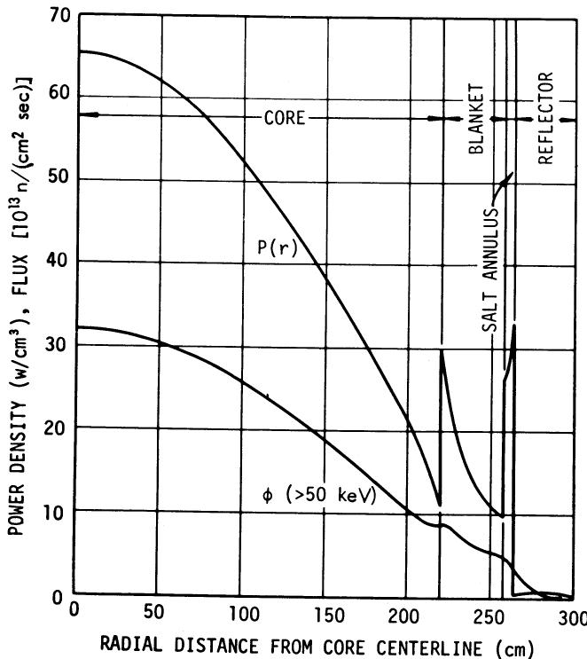  
Fig.1. Radial power density and fast flux distributions—single-fluid MSBR.

chemical processing rates, and reactor power level. Because the interaction of all these factors is rather complex, and because of the need to identify optimum values of the design variables rather closely, we have found it convenient to make use of a comprehensive, automatic reactor optimization procedure for arriving at that combination of design parameters that will produce, in some sense, the best attainable performance. The Reactor Optimization and Design code (ROD) is based on a gradient projection method for locating the extreme value of a specified figure of merit, which may be any desired function of the breeding ratio, the specific fuel inventory, various elements of the fuel cycle and capital costs, or any other factors important to the designer. The computational procedure comprises multigroup (synthetic), two-dimensional diffusion-theory calculations of the neutron flux, an equilibrium fuel-cycle calculation which determines the critical fuel concentration and nuclide composition consistent with processing rates and other variables, and the gradient projection calculation for moving the cluster of independent variables in the direction that most rapidly improves the figure of merit. The optimization may be constrained by limiting the allowed range of the independent variables, or by selecting in advance the desired value

(or a limiting value) of certain derived quantities, such as the maximum power density.

The figure of merit used here in determining reactor design specifications is related to the capability of a reactor type to conserve fuel supply in an expanding nuclear economy. For the special case of a linear increase in power generation, the total amount of natural uranium that must be mined up to the point when the system becomes self-sufficient (i.e., independent of any external supply of fissionable material) is proportional to the product of the doubling time and the specific fuel inventory. We have chosen to optimize our MSBR design primarily on the basis of a quantity which we call the fuel "conservation coefficient," defined as the breeding gain times the square of the specific power, which is equivalent to the inverse of the product of the doubling time and the fuel specific inventory. Therefore, a maximum value of the conservation coefficient is sought in the optimization procedure.

# EQUILIBRIUM FUEL-CYCLE RESULTS

The result of a reactor optimization calculation is a set of specifications for the optimum reactor configuration, subject to any imposed constraints, together with a complete description of its equilibrium fuel cycle. This description includes the multigroup neutron flux distributions, the resulting power distribution, and the consistent set of concentrations of all nuclides present in the reactor. We have imposed constraints on maximum power density (i.e., minimum graphite life), on overall reactor vessel dimensions, and on chemical processing rates which we believe will result in near-minimum power cost. Although we lack specific information as to the cost of chemical processing as a function of fuel processing rate for the liquid-metal extraction process, it appears that processing equipment sizes and operating costs will be comparable with those for the fluoride-volatility/uranium-distillation process considered for the two-fluid reactor. We have therefore fixed the processing rates, listed in Table I, at values found to be essentially optimum in studies of the two-fluid reactor, with minor adjustments appropriate to the extraction process. While subsequent improvements in processing cost estimates may suggest some change in optimum processing rate and some change in fuel cost estimates, we do not expect that these will result in any major revision in performance estimates for the reactor.

The reference reactor configuration which results from these and other (engineering) considerations is described by Bettis. A summary of its nuclear design characteristics is given in Table I.

TABLEI   
Characteristics of the One-Fluid MSBR Reference Design   

<table><tr><td colspan="2">A. Description</td><td colspan="2">B. Performance</td></tr><tr><td>Identification</td><td>CC93</td><td>Conservation coefficient, [MW(th)/kg]2</td><td>14.3</td></tr><tr><td>Power, MW(e)</td><td>1000</td><td>Breeding ratio</td><td>1.062</td></tr><tr><td>MW(th)</td><td>2250</td><td>Yield, % per annum</td><td>3.18</td></tr><tr><td>Plant factor</td><td>0.8</td><td>Inventory, fissile, kg</td><td>1478</td></tr><tr><td>Dimensions, ft</td><td></td><td>Specific power, MW(th)/kg</td><td>1.52</td></tr><tr><td>Core zone 1</td><td></td><td>Doubling time, system, year</td><td>22</td></tr><tr><td>Height</td><td>13.0</td><td>Peak damage flux, E &gt;50 keV, n/(cm2sec)</td><td></td></tr><tr><td>Diameter</td><td>14.4</td><td>Core zone 1</td><td>3.2×1014</td></tr><tr><td>Region thicknesses</td><td></td><td>Reflector</td><td>4.2×1013</td></tr><tr><td>Axial: Core zone 2</td><td>0.75</td><td>Vessel</td><td>3.7×1011</td></tr><tr><td>Plenum</td><td>0.25</td><td>Power density, W/cm3</td><td></td></tr><tr><td>Reflector</td><td>2.0</td><td>Average</td><td>22.2</td></tr><tr><td>Radial: Core zone 2</td><td>1.25</td><td>Peak</td><td>65.2</td></tr><tr><td>Annulus</td><td>0.167</td><td>Ratio</td><td>2.94</td></tr><tr><td>Reflector</td><td>2.5</td><td>Fission power fractions by zone</td><td></td></tr><tr><td>Salt fractions</td><td></td><td>Core zone 1</td><td>0.765</td></tr><tr><td>Core zone 1</td><td>0.132</td><td>Core zone 2</td><td>0.167</td></tr><tr><td>Core zone 2</td><td>0.37</td><td>Annulus and plena</td><td>0.056</td></tr><tr><td>Plena</td><td>0.85</td><td>Reflector</td><td>0.012</td></tr><tr><td>Annulus</td><td>1.0</td><td></td><td></td></tr><tr><td>Reflector</td><td>0.01</td><td></td><td></td></tr><tr><td>Salt composition, mole%</td><td></td><td colspan="2">mance of the MSBR. By far the most important effect is the uncertainty in the average value of η of 233U in the MSBR spectrum, which leads to an uncertainty in the breeding ratio of ±0.012. Uncertainties in the cross sections of other important MSR nuclides (such as F) make a relatively small contribution to the overall uncertainty in the breeding ratio, which is estimated to be ±0.016. A detailed discussion of cross-section uncertainties is given in a report by Perry.2</td></tr><tr><td>UF4</td><td>0.228</td><td></td><td></td></tr><tr><td>ThF4</td><td>12</td><td></td><td></td></tr><tr><td>BeF2</td><td>16</td><td></td><td></td></tr><tr><td>LiF</td><td>72</td><td></td><td></td></tr><tr><td>Processing cycle times for removal of poisonsa</td><td></td><td></td><td></td></tr><tr><td>1. Kr and Xe; sec</td><td>20</td><td></td><td></td></tr><tr><td>2. Se, Nb, Mo, Tc, Ru, Rh, Pd, Ag, Sb, Te, Zr; sec</td><td>20</td><td></td><td></td></tr><tr><td>3. Pa; Cd, In, Sn; days</td><td>3</td><td></td><td></td></tr><tr><td>4. Y, La, Ce, Pr, Nd, Pm, Sm, Eu, Gd; days</td><td>50</td><td></td><td></td></tr><tr><td>5. Sr, Rb, Cs, Ba; year</td><td>5</td><td></td><td></td></tr><tr><td>6. Br, I; days</td><td>5</td><td></td><td></td></tr></table>

${}^{a}$ According to our present flow sheet, $\mathrm{{Zr}}$ , $\mathrm{{Cd}}$ ,In,and Sn will be removed on a 200-day cycle,and Br and I on a 50-day cycle. The additional poisoning, however, is negligible.

A neutron balance for this case is given in Table II, in which the normalization is to one neutron absorbed in $^{233}\mathrm{U}$ plus $^{235}\mathrm{U}$ .

# Uncertainties in Neutron Cross Sections

We have estimated the effect of uncertainties in neutron cross sections on the calculated perfor

mance of the MSBR. By far the most important effect is the uncertainty in the average value of $\eta$ of $^{233}\mathrm{U}$ in the MSBR spectrum, which leads to an uncertainty in the breeding ratio of $\pm 0.012$ . Uncertainties in the cross sections of other important MSR nuclides (such as F) make a relatively small contribution to the overall uncertainty in the breeding ratio, which is estimated to be $\pm 0.016$ . A detailed discussion of cross-section uncertainties is given in a report by Perry.

# Equilibrium Fuel-Cycle Costs

As stated before, the molten-salt breeder reactor exhibits unusually low fuel-cycle costs in combination with good breeding performance. This results primarily from the low specific fuel inventory and from a small but non-negligible excess production of fuel, which results from the ability to process the fuel rapidly at what appears to be a very low unit cost.

The inventory of fissile material in the reactor and chemical processing plant amounts to some 1480 kg, including ~100 kg each of $^{235}\mathrm{U}$ and $^{233}\mathrm{Pa}$ ; when valued at $13.00/g for $^{233}\mathrm{U}$ and $^{233}\mathrm{Pa}$ and $11.20/g for $^{235}\mathrm{U}$ , this material is worth $19 million. With an effective annual inventory charge rate of 10%/year and a 0.8 plant factor, the fuel inventory thus contributes 0.27 mill/kWh(e) to the

TABLE II   
Neutron Balance, Single-Fluid MSBR   

<table><tr><td></td><td>Absorptions</td><td>Fissions</td></tr><tr><td>233U</td><td>0.9239</td><td>0.8239</td></tr><tr><td>235U</td><td>0.0761</td><td>0.0619</td></tr><tr><td>232Th</td><td>0.9853</td><td>0.0031</td></tr><tr><td>234U</td><td>0.0817</td><td>0.0004</td></tr><tr><td>233Pa</td><td>0.0017</td><td></td></tr><tr><td>236U</td><td>0.0088</td><td></td></tr><tr><td>237Np</td><td>0.0061</td><td></td></tr><tr><td>6Li</td><td>0.0049</td><td></td></tr><tr><td>7Li</td><td>0.0159</td><td></td></tr><tr><td>9Be</td><td>0.0071</td><td>(0.0046)a</td></tr><tr><td>19F</td><td>0.0205</td><td></td></tr><tr><td>Graphite</td><td>0.0519</td><td></td></tr><tr><td>Fission products</td><td>0.0196</td><td></td></tr><tr><td>Leakage</td><td>0.0276</td><td></td></tr><tr><td>ηε</td><td>2.2311</td><td></td></tr></table>

$\mathbf{a}(n,2n)$ reaction.

fuel-cycle cost. The fuel salt, with a composition $\mathrm{LiF / BeF_2 / ThF_4 = 72 / 16 / 12~mol}\%$ respectively, is estimated to be worth $3 million, including the thorium. At $10\%$ /year, this contributes 0.04 mill/ kWh(e) to the fuel cycle cost. For a conversion ratio of 1.062, fuel production results in a reduction of 0.09 mill/kWh(e) in the fuel cycle cost. The cost of thorium burnup, in contrast, is negligible $[\sim 0.002\mathrm{mil} / \mathrm{kWh(e)}]$ .

The chemical process for removal of fission products, which is under development for use with the single-fluid MSBR, involves the accumulation of rare-earth fission products in a portion of the salt stream in the liquid bismuth extraction tower. The concentration of rare-earth trifluorides in this salt is limited by solubility to $\sim 0.7$ mole%; it is presently planned to limit this concentration by discarding $\sim 0.5$ ft³/day of carrier salt having $\sim 100$ times as high a concentration of rare earths as the salt circulating in the reactor. The makeup of carrier salt (including ThF₄) required to compensate for this discard thus contributes $\sim 0.5 \times$ $1846 / ft^3 =$ 932/day to the fuel cost, i.e., 0.05 mill/kWh(e) at 0.8 plant factor.

The cost of processing the fuel for removal of fission products and for isolation of $^{233}\mathrm{Pa}$ from the circulating salt stream is difficult to assess precisely. Our tentative estimate of these costs, including both capital and operating expense, is $\sim 0.3$ mill/kWh(e), based on the rapid processing rates indicated in Table I. In summary, therefore, we estimate that the equilibrium fuel-cycle cost will be $\sim 0.7$ mill/kWh(e), as shown in Table III, for a single-fluid MSBR of the reference design.

# EFFECT OF CHANGES IN REACTOR DESIGN PARAMETERS

Although our computational procedure is designed to lead directly to the optimum combination of reactor parameters, it is nonetheless a matter of some interest to see how deviations of these parameters from their optimum values will affect the performance of the reactor. The influence of these parameters on reactor performance may be investigated by assigning specific perturbed values to each parameter in turn, the others retaining their reference values, and performing the flux and equilibrium fuel-cycle calculations for the perturbed cases. In some instances, a selected subset of the unperturbed variables may be allowed to be reoptimized, using ROD, if there is reason to suppose that such reoptimization will partially compensate for any adverse effect of the perturbation. The effect of several specific departures from the reference 1000 MW(e) design given in Table I is discussed in the following paragraphs.

# Reactor Plant Size

The effectiveness of the blanket (outer core) region depends very much on its thickness. Normally, the blanket will contain a larger fraction of the salt inventory for a small than for a larger reactor. Thus, both the fuel specific power and the breeding gain, for an optimized reactor, increase as the reactor plant size is increased, as shown in Fig. 2. This is true when the reactors are compared at equal core life (the solid curves) or at equal average core power density (the dashed curves). A brief listing of dimensions and other parameters for 500, 1000, 2000, and 4000 MW(e) reactors is given in Table IV.

TABLE III Equilibrium Fuel-Cycle Cost   

<table><tr><td>Cost Element</td><td>Cost 
mills/kWh(e)</td></tr><tr><td>Fuel inventorya</td><td>0.27</td></tr><tr><td>Salt inventorya</td><td>0.04</td></tr><tr><td>Salt makeup</td><td>0.05</td></tr><tr><td>Moderator replacement</td><td>0.10</td></tr><tr><td>Processing</td><td>0.30</td></tr><tr><td>Subtotal</td><td>0.76</td></tr><tr><td>Fuel production credit</td><td>-0.09</td></tr><tr><td>Total fuel-cycle cost</td><td>0.67</td></tr></table>

a Inventory charge $10\%$ per annum.

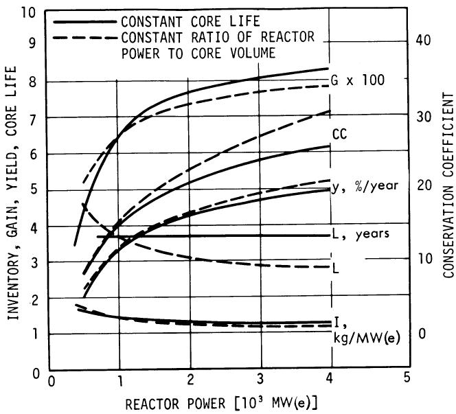  
Fig. 2. Effect of power level on MSBR performance.

# Graphite Moderator Life

The useful life of the graphite moderator is limited by radiation damage effects, caused by fast neutrons. As discussed by Eatherly, we have for the present adopted a limiting fast-neutron fluence $(E > 50\mathrm{keV})$ corresponding to zero net graphite volume change at the end of exposure. Since the fast-neutron flux is almost entirely determined by the local power density (per unit vol

ume of salt-plus-moderator), there is a nearly unique relationship between maximum core power density, plant utilization factor, and useful core life, for a specified maximum fluence. While one expects a higher power density to be accompanied by a reduced fuel inventory, there is in fact a power density above which increased neutron leakage losses and other associated losses in breeding gain more than offset the reduced inventory, and the fuel yield and the conservation coefficient then decrease. These trends are exhibited in Fig. 3, which shows breeding gain, specific inventory, fuel yield, and conservation coefficient as a function of core life. In this comparison, blanket, reflector, and plenum thicknesses were held constant, and the core size was specified. Only the salt volume fraction was reoptimized, and it changed very little.

# Thorium Concentration

The thorium concentration in the fuel salt primarily influences the uranium inventory and the breeding ratio. For a reactor configuration very similar to our present reference design (but having a slightly lower estimate of the required external salt volume) we have examined the influence of thorium concentration on reactor performance over the range 10 to $14\mathrm{~mol}\% \mathrm{ThF}_4$ . Cross sections were carefully computed for each region in each case and iteratively adjusted to allow for resultant changes in reactor configuration. In these calculations, core size, radial and axial blanket thicknesses, and core salt volume fraction were all subject to reoptimization.

TABLE IV Performance of Single-Fluid MSBR's as a Function of Plant Size   

<table><tr><td rowspan="2"></td><td colspan="4">Reactor Power, MW(e)</td></tr><tr><td>500</td><td>1000</td><td>2000</td><td>4000</td></tr><tr><td>Core height, ft</td><td>9.44</td><td>11.0</td><td>17.44</td><td>23.0</td></tr><tr><td>Core diameter, ft</td><td>10.42</td><td>14.4</td><td>19.36</td><td>25.5</td></tr><tr><td>Salt specific volume, ft3/MW(e)</td><td>1.75</td><td>1.68</td><td>1.62</td><td>1.55</td></tr><tr><td>Fuel specific inventory, kg/MW(e)</td><td>1.65</td><td>1.47</td><td>1.36</td><td>1.28</td></tr><tr><td>Peak power density, W/cm3</td><td>62.2</td><td>65.2</td><td>66.1</td><td>65.9</td></tr><tr><td>Peak flux (&gt;50 keV), 1014n/(cm2sec)</td><td>3.04</td><td>3.20</td><td>3.25</td><td>3.24</td></tr><tr><td>Core life, years at 0.8 PF</td><td>4.3</td><td>4.1</td><td>4.0</td><td>4.0</td></tr><tr><td>Leakage, n/fissile absorption × 1000</td><td>3.89</td><td>2.44</td><td>1.53</td><td>0.96</td></tr><tr><td>Breeding ratio</td><td>1.043</td><td>1.065</td><td>1.076</td><td>1.083</td></tr><tr><td>Annual fuel yield, %/year</td><td>1.99</td><td>3.34</td><td>4.28</td><td>4.95</td></tr><tr><td>Conservation coefficient</td><td>8.0</td><td>15.1</td><td>21.0</td><td>25.9</td></tr></table>

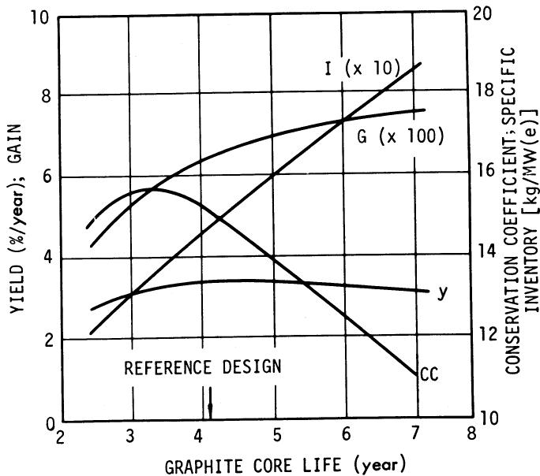  
Fig. 3. Performance of 1000 MW(e) MSBR as a function of core life (at 0.8 plant factor).

The basic interplay, of course, is between rising breeding gain and rising inventory, as thorium and uranium concentrations are increased. Both the annual fuel yield $(y)$ and the conservation coefficient $(CC)$ should exhibit a peak, when plotted as a function of thorium concentration, but the peaks will occur at different places because of the difference in weight assigned to the specific power. These trends are shown in Fig. 4. It may be seen that there is quite a broad maximum in the conservation coefficient in the vicinity of 12 $\mathrm{mole\%}$ $\mathrm{ThF_4}$ .

# Salt Volume Fractions

Core. In all of our calculations, the optimum salt volume fraction in the core has fallen in the range 12 to $15\mathrm{vol}\%$ with a carbon/fissile-uranium atom ratio close to 9000. As indicated earlier, the volume fraction is rather closely determined by a balance between fuel inventory, degree of neutron moderation, and neutron absorptions in the moderator; for the reference design, the optimum salt fraction was 0.132.

Blanket. The volume fraction of salt in the blanket (outer core) is central to the whole concept of a single-fluid, 1000 MW(e) molten-salt breeder reactor. We have tested the effect of variations in salt fraction (in the radial blanket) under the special assumptions of constant overall salt volume and constant outer diameter of the blanket region. Results of these calculations show that a broad optimum exists in the range of 0.35 to 0.6 for the salt fraction. The choice of 0.37 for the reference reactor was initially selected to permit, if desired, the use of a randomly packed ball bed in the blanket.

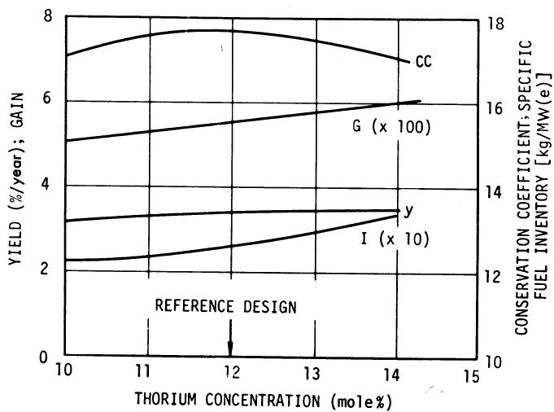  
Fig. 4. Influence of thorium concentration on the performance of a single-fluid MSBR.

# 233Pa Removal Rate

Rapid and inexpensive isolation of $^{233}\mathrm{Pa}$ from the circulating fuel stream is essential for economic breeder operation of the single-fluid molten-salt reactor concept. The necessity for removing the Pa and allowing it to decay outside the neutron flux may be seen from Fig. 5, in which we show the approximate loss in breeding ratio associated with Pa absorptions as a function of specific power and of the processing cycle time for continuous isolation of Pa from the circulating salt stream. (This loss includes both the neutron losses in the $^{233}\mathrm{Pa}$ and the destruction of latent $^{233}\mathrm{U}$ .) As one would expect, the Pa removal cycle must be short compared to the 40-day mean decay life, if significant losses are to be avoided. The effect of the Pa removal rate (along with certain fission products) on the breeding performance of MSR's is shown in Fig. 6. Note that for no Pa removal, the reactors considered are high performance converters rather than breeders.

# Removal of Fission Products

The fission products may be divided into several groups, according to their chemical behavior in molten salt systems. The main groups, roughly in order of importance as neutron poisons, are the noble gases, the rare earths, the noble and seminoble metals, the volatile fluorides, and the stable fluorides not readily separable from the carrier salt.

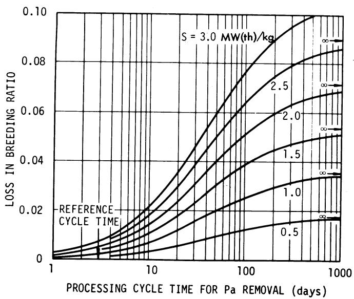  
Fig. 5. Approximate loss in breeding ratio associated with neutron absorptions in $^{233}\mathrm{Pa}$ for a single-fluid MSBR.

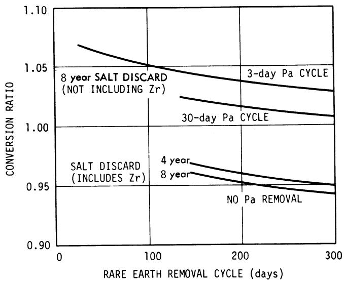  
Fig. 6. Conversion ratio vs processing cycle times—single-fluid MSBR.

An outstanding characteristic of the molten salt reactor is the relative ease with which the noble gases--notably $^{135}\mathrm{Xe}-$ can be removed from the salt stream. This aspect is discussed in detail by Scott; suffice it to say here that we estimate a residual poisoning effect (reduction in breeding ratio), due to $^{135}\mathrm{Xe}$ together with other noble gas fission products and their daughters, of not more than 0.005.

The effect of the rare earth removal cycle on the breeding performance of single-fluid MSR's (at various Pa removal rates) is shown in Fig. 6. The ability to process the fuel rapidly for rare earth removal is one of the most important characteristics of the molten salt reactors. While rapid rare earth and Pa removal are required for good breeding performance, there is considerable flexibility to trade off nuclear performance for decreased processing rate (and processing cost) at the discretion of the designer.

The "noble metals," which do not form stable fluorides and do not remain in the fuel salt, would have a serious adverse effect on the breeding ratio if they simply attached themselves to the graphite moderator in the core. The nuclides in this group, which includes Nb, Mo, Tc, Ru, Rh, and several others of less importance, have a combined yield of 0.35 and, if they accumulated in the reactor core over a long enough period of time, would eliminate any chance of breeding. Most of the nuclides in this group, however, have small neutron-absorption cross sections and saturate very slowly, or else they have very low yields. It is primarily $^{95}\mathrm{Mo}$ , $^{99}\mathrm{Tc}$ , $^{101}\mathrm{Ru}$ , and $^{103}\mathrm{Rh}$

whose potential poisoning effect is of real concern. The chemical behavior of this group of fission products is discussed in detail by Grimes. For the present purpose, it is sufficient to note that we believe $\sim 10\%$ of these nuclides will remain in the core regions of the MSBR. On this basis, the poison fraction, $P(t)$ , of all nuclides in the group and the time-averaged poisoning, $\overline{P}(t)$ , up to time $t$ after start-up with clean graphite, are shown in Fig. 7. Since we anticipate replacement of the graphite after $\sim 4$ years, we may see from Fig. 7 that the average reduction in breeding ratio attributable to the accumulation of these nuclides is 0.004. This effect is more than compensated by the burnout of $^{10}\mathrm{B}$ in the graphite, and these effects are assumed to cancel, in our calculations.

The "semi-noble metals," including Zr, Cd, In, and Sn, are assumed to be removed in an adjunct to the Pa removal process. The poison effect of this group is small and they could also be removed, if necessary, by a gradual discard of fuel salt (from which the uranium would be recovered by fluorination).

The volatile fluorides of Br and I are relatively unimportant and are removed in the fluorination

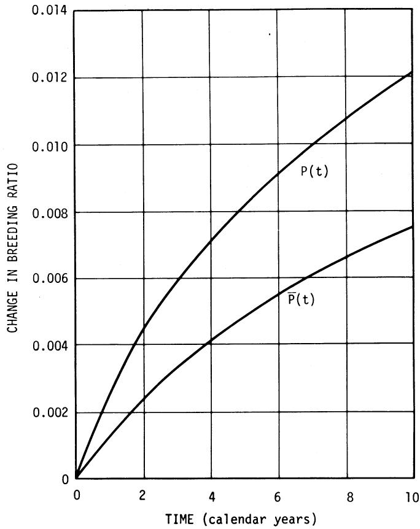  
Fig. 7. Change in breeding ratio due to noble-metal fission products in MSBR.

step of the Pa removal process. The stable fluorides of Rb, Sr, Cs, and Ba are removed by the discard of salt from the rare earth process on a long cycle, typically eight years.

# REACTOR START-UP AND APPROACH TO EQUILIBRIUM

The preceding discussion has dealt only with the equilibrium fuel cycle, in which all nuclide concentrations—and particularly those of the uranium isotopes—are time-independent and have their asymptotic values. This condition is in fact approached rather rapidly in an MSBR, because of its relatively high specific power. Nonetheless, it is of interest to examine the transient fuel-cycle characteristics of the reactor when it is initially fueled with enriched uranium $(^{235}\mathrm{U})$ or with plutonium.

There is considerable latitude in specifying the initial fuel loading for the reactor, even when the equilibrium fuel cycle is well defined, since the initial thorium concentration may, at the discretion of the operator, be quite different from the equilibrium value. We have, in fact, tried different initial thorium concentrations, and find no advantage in choosing a value different from the equilibrium one. In the following discussion, therefore, it will be understood that the thorium concentration is held constant at 12 mole%.

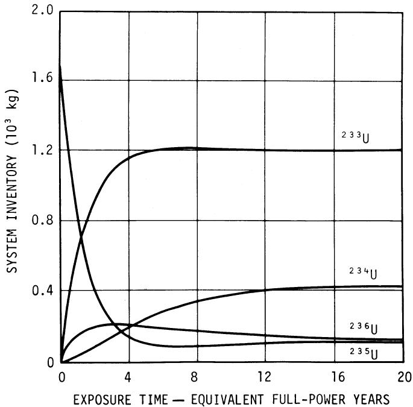  
Fig. 8. Uranium isotope inventories-MSBR start-up with enriched uranium.

235U Start-Up

Start-up of the reactor on enriched uranium $(93\%)$ results in an initial conversion ratio substantially less than unity. However, because $^{233}\mathrm{U}$ is much more reactive than $^{235}\mathrm{U}$ in the MSBR spectrum, the export of fissile material from the reactor plant may begin quite soon after start-up, and indeed well before the conversion ratio actually exceeds unity.

Time-dependent inventories of the uranium isotopes are shown, for the reference single-fluid 1000 MW(e) MSBR, in Fig. 8, while the conversion ratio and the cumulative net feed of fissile material to the circulating fuel salt are shown in Fig. 9. It may be noted that very little additional fuel is supplied to the reactor in excess of the initial critical mass required for start-up. There is, of course, some loss in performance, averaged over the life of the reactor, associated with this initial phase of the fuel cycle. The average reduction in breeding ratio, over the life of the plant, is $\sim 0.018$ , while the increase in the present value of the 30-year fuel-cycle cost is $+0.02$ mill/kWh(e).

# Pu Start-Up

A useful attribute of the molten-salt reactor is the capacity of the $\mathrm{LiF / BeF_2 / ThF_4}$ carrier salt to contain plutonium in the form of $\mathrm{PuF}_3$ , with a solubility in excess of $1\mathrm{mole}\%$ at the operating temperatures of the MSBR. We have considered the start-up of the MSBR on plutonium whose composition is typical of the material discharged from a

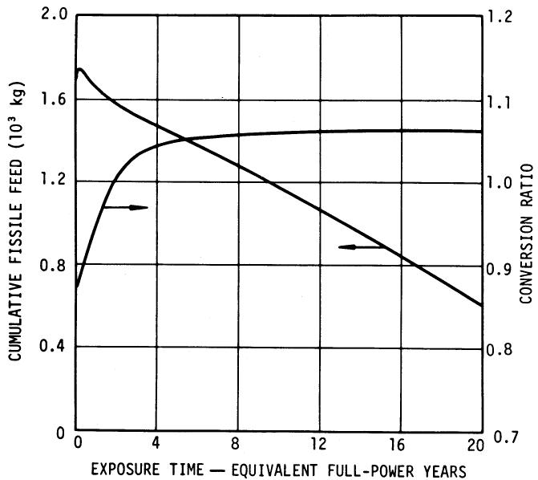  
Fig. 9. Conversion ratio and cumulative fissile feed-enriched uranium start-up.

PWR or BWR with a fuel exposure in the neighborhood of 20 000 MWd/T, specifically, $59.7\%$ ${}^{239}\mathrm{Pu}$ , $24.1\%$ ${}^{240}\mathrm{Pu}$ , $12.2\%$ ${}^{241}\mathrm{Pu}$ , and $4.0\%$ ${}^{242}\mathrm{Pu}$ . A notable difference between the plutonium and uranium start-up cases is the much lower initial inventory of plutonium, which is due to the very large effective cross sections of the plutonium isotopes in the MSBR spectrum. These isotopes burn out very rapidly, however, and additional plutonium must be supplied for a time until nearly enough ${}^{233}\mathrm{U}$ is produced to sustain the chain reaction by itself. Thereafter, the concentrations of ${}^{239}\mathrm{Pu}$ , ${}^{240}\mathrm{Pu}$ , and ${}^{241}\mathrm{Pu}$ decrease rather sharply, while that of ${}^{242}\mathrm{Pu}$ decreases more slowly until the plutonium ceases to make a net positive contribution to the reactivity. At this point, the plutonium (now mainly ${}^{242}\mathrm{Pu}$ ) is isolated from the circulating fuel salt and discarded. If this is done, the result is a self-sustaining ${}^{233}\mathrm{U}$ -fueled reactor in which the ${}^{235}\mathrm{U}$ and ${}^{236}\mathrm{U}$ concentrations are temporarily below their equilibrium values, and the asymptotic breeding ratio is approached from the high side.

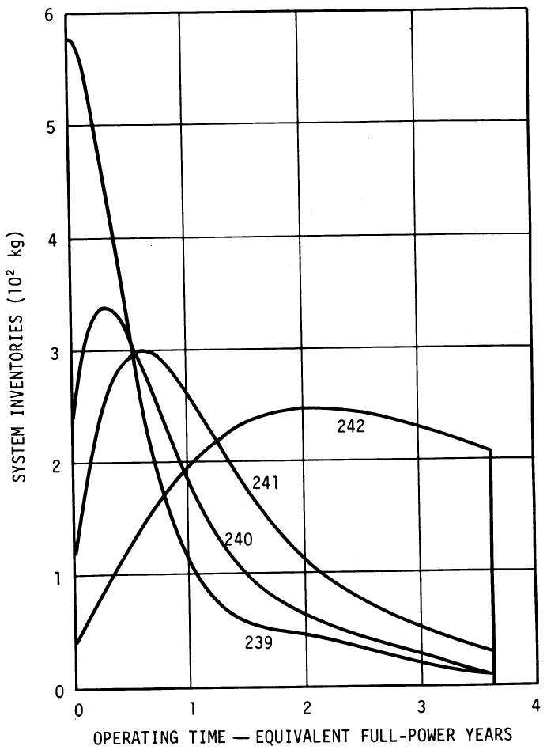  
Fig. 10. Plutonium isotope inventories—MSBR start-up with PWR plutonium.

These features of the plutonium start-up are exhibited in Figs. 10, 11, and 12.

The average breeding ratio, over a 30-year plant life at 0.8 plant factor, is reduced by $\sim 0.008$ relative to the equilibrium cycle. The present value of the fuel-cycle cost is actually decreased by $\sim 0.04$ mill/kWh(e) if one assigns to the fissile plutonium a value $\frac{5}{6}$ that of enriched $^{235}\mathrm{U}$ .

# OPERATION WITH LIMITED FUEL PROCESSING

The combination of good breeding performance with low fuel-cycle cost, which is associated with economical processes for the rapid removal of fission products and protactinium, is an important feature of the molten-salt reactor concept. Nevertheless, quite satisfactory fuel costs can be achieved in the absence of fuel processing for removal of protactinium or fission products, although the reactor will of course not breed when operated in this fashion.

In examining this alternate mode of operation, we postulate the occasional batch discard and replacement of the entire inventory of carrier salt, including the thorium, but not including the uranium; the latter is to be recovered by fluoride volatility (as was done with the MSRE fuel salt) and recycled to the reactor. The removal of noble-gas fission products from the salt by gas sparging and of noble-metal fission products by

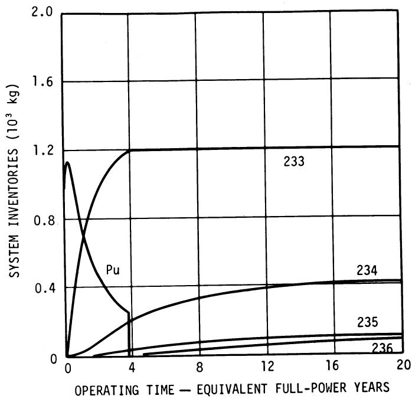  
Fig. 11. Inventories of uranium isotopes and total plutonium for plutonium start-up of MSBR.

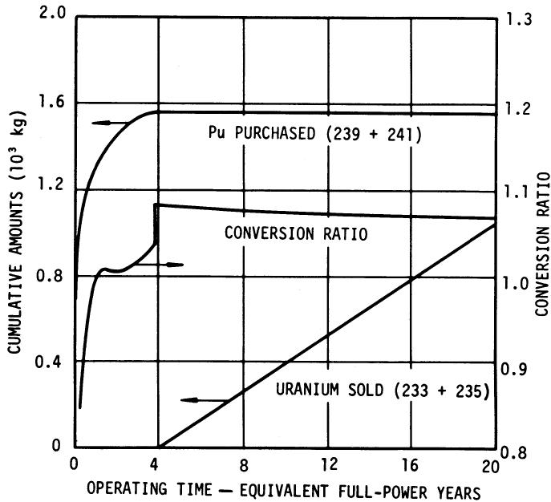  
Fig. 12. Cumulative purchases and sales of fissile material and conversion ratio MSBR with plutonium start-up.

deposition and by escape to the off-gas system, as observed in the MSRE, are assumed to occur.

An optimum salt discard rate exists, for which the cost of replacing the salt (and recovering uranium) is balanced against the fuel makeup cost, which depends on the conversion ratio and hence on the level of fission-product poisoning. In addition, however, there is a minimum discard rate required to limit the concentration of rare-earth trifluorides in the circulating fuel salt to an acceptable level $(< 1\mathrm{~mol}\%)$ . This consideration per se will place a limit of $\sim 10$ years on the salt replacement interval.

We have investigated the trend in fuel-cycle costs, as a function of the salt replacement interval, for a molten-salt converter reactor which is defined in terms of its general nuclear characteristics, such as neutron leakage and fuel inventory, but whose engineering design has not been specified in detail. We found the fuel costs to be rather insensitive to the salt replacement interval from 3 years to 8 or 10 years, with a broad minimum at 5 to 6 years. The conversion ratios ranged from 0.84 for a 4-year salt-replacement interval to 0.78 for a 10-year interval.

We have not yet made any detailed estimates of costs for the fluorination plant and for the chemical treatment plant necessary to control the composition of the salt over long periods of time. Allowing 0.1 mill/kWh(e) for this equipment and its operation, and 0.1 mill/kWh(e) for graphite replacement in the reactor core, we estimate the

fuel-cycle costs for the converter reactor, with a salt discard cycle, to be 0.7 to 0.8 mill/kWh(e). Compared with the MSBR, the principal cost differences are a saving of $\sim 0.2$ mill/kWh(e) in fuel processing, an increase of 0.2 to 0.3 mill/kWh(e) for fuel burnup, and possibly some reduction of fuel and salt inventory charges $[< 0.1$ mill/kWh(e)]. Thus, the fuel-cycle cost for the converter reactor, without chemical processing for removal of protactinium or of fission products, appears to be within 0.1 mill/kWh(e) of the cost for the breeder reactor.

# TEMPERATURE COEFFICIENTS OF REACTIVITY

Expansion of the single fissile-fertile salt in the one-fluid reactor reduces the density of most of the absorbing materials in the same proportion, so that one might expect a very small prompt temperature coefficient of reactivity. The density coefficient of the salt is in fact very small. In addition to this, however, there is both a positive contribution to the salt-temperature coefficient associated with the shift in thermal-neutron spectrum with increasing salt temperature, and a negative contribution associated with the Doppler broadening of resonance capture lines in thorium. The latter predominates, resulting in a prompt negative coefficient of $-2.4 \times 10^{-5} \delta k / k / {}^{\circ}\mathrm{C}$ .

The graphite moderator contributes a positive component to the overall temperature coefficient, attributable to an increase in the relative cross section of $^{233}\mathrm{U}$ with increasing neutron temperature. This results in an overall coefficient which is very small, though apparently negative, i.e., $-0.5 \times 10^{-5} / {}^{\circ}\mathrm{C}$ .

The prompt negative salt coefficient will largely govern the response of the reactor for transients whose periods are several seconds or less. The small overall coefficient will provide little inherent system response to impressed reactivity changes, and it will consequently be necessary to provide control rods to compensate any reactivity changes of intermediate duration. Long-term reactivity effects, such as those associated with the fuel cycle, are compensated by adjustment of the fuel concentration in the salt.

# SUMMARY AND CONCLUSION

While a full economic optimization of the single-fluid molten-salt breeder reactor has not yet been undertaken, it is apparent that good breeding performance can be achieved in conjunction with unusually low fuel-cycle costs, subject to the successful completion of chemical processing developments now under way. That is, a breeding

ratio of $>1.06$ , together with a specific fuel inventory of $< 1.5 \, \text{kg/MW(e)}$ , will be attainable with fuel-cycle costs of $\sim 0.7 \, \text{mill/kWh(e)}$ . The associated fuel doubling time is $\sim 20$ years.

The MSBR fuel cycle may be initiated either with enriched uranium or with plutonium discharged from light-water reactors. The reduction in breeding ratio, averaged over the life of the reactor, is $< 0.02$ and 0.01, respectively, for the uranium and plutonium start-up cases relative to the equilibrium case. The present value of the fuel-cycle cost is increased, relative to that for the equilibrium cycle, by $\sim 0.02$ mill/kWh(e) for the uranium-start-up case, while for the plutonium-start-up case the cost appears to be 0.04 mill/kWh less, based on a fissile plutonium value equal to $\frac{5}{6}$ that of $^{235}\mathrm{U}$ .

6 Development of the technology for molten-salt reactors themselves and for the associated chemical processes for removal of protactinium and fission products need not necessarily be carried out on precisely the same time schedule, since an economically attractive fuel cycle may be achieved with a salt-discard cycle, resulting in a conversion ratio of 0.8 to 0.9. A given reactor, operated initially in this way, could subsequently be operated as a breeder by the addition of appropriate processing equipment to the reactor plant.

It is thus apparent that there is considerable latitude in the mode of operation of molten-salt reactors, with only small variations in fuel-cycle cost. We believe that this can facilitate the devel

opment of the molten-salt reactor and of the associated chemical-processing technology on time schedules appropriate to each, and will encourage an orderly progress toward the achievement of an economical breeder reactor.

# ACKNOWLEDGMENTS

The authors wish to acknowledge the contributions made by many of their colleagues to the work reported here, and in particular those made by R. S. Carlsmith, W. R. Cobb, E. H. Gift, and O. L. Smith. This research was sponsored by the U.S. Atomic Energy Commission under contract with the Union Carbide Corporation.

# REFERENCES

1. E. S. BETTIS and R. C. ROBERTSON, “The Design and Performance of a Single-Fluid MSBR,” Nucl. Appl. Tech., 8, 190 (1970).   
2. A. M. PERRY, “Influence of Neutron Data in the Design of Other Types of Power Reactors,” ORNL-TM-2157, Oak Ridge National Laboratory (March 8, 1968).   
3. M. E. WHATLEY, L. E. McNEESE, W. L. CARTER, L. M. FERRIS, and E. L. NICHOLSON, "Engineering Development of the MSBR Fuel Recycle," Nucl. Appl. Tech., 8, 170 (1970).   
4. E. P. EATHERLY and D. SCOTT, “Graphite and Xenon Behavior and Influence on MSBR Design,” Nucl. Appl. Tech., 8, 179 (1970).   
5. W. R. GRIMES, “Molten-Salt Reactor Chemistry,” Nucl. Appl. Tech., 8, 137 (1970).