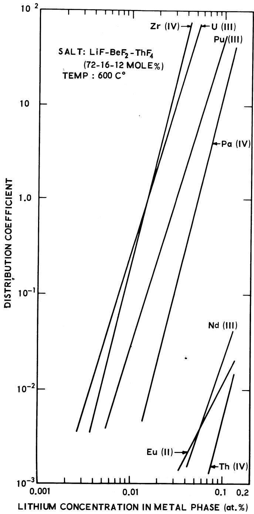
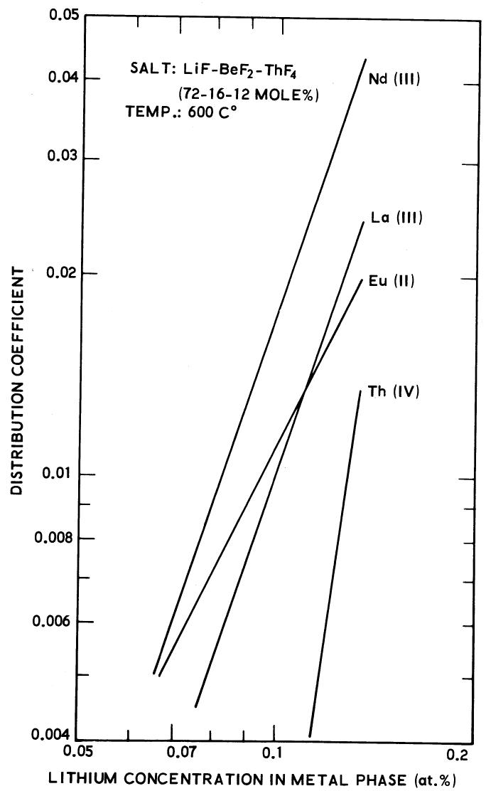
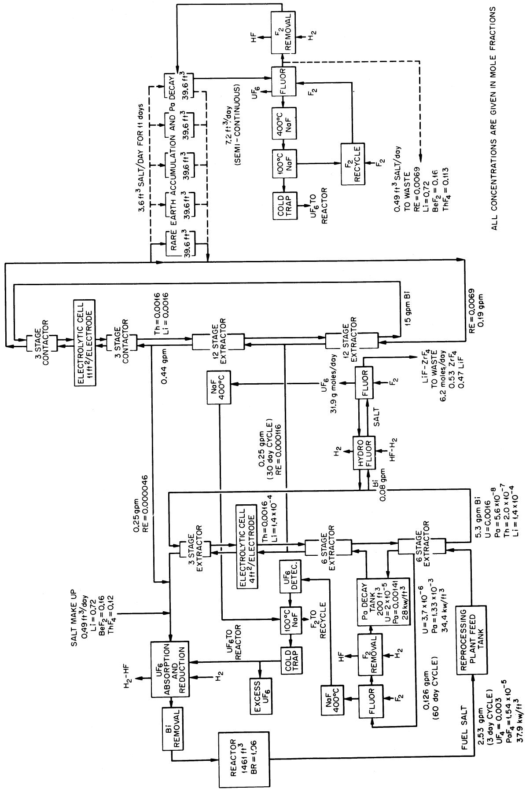
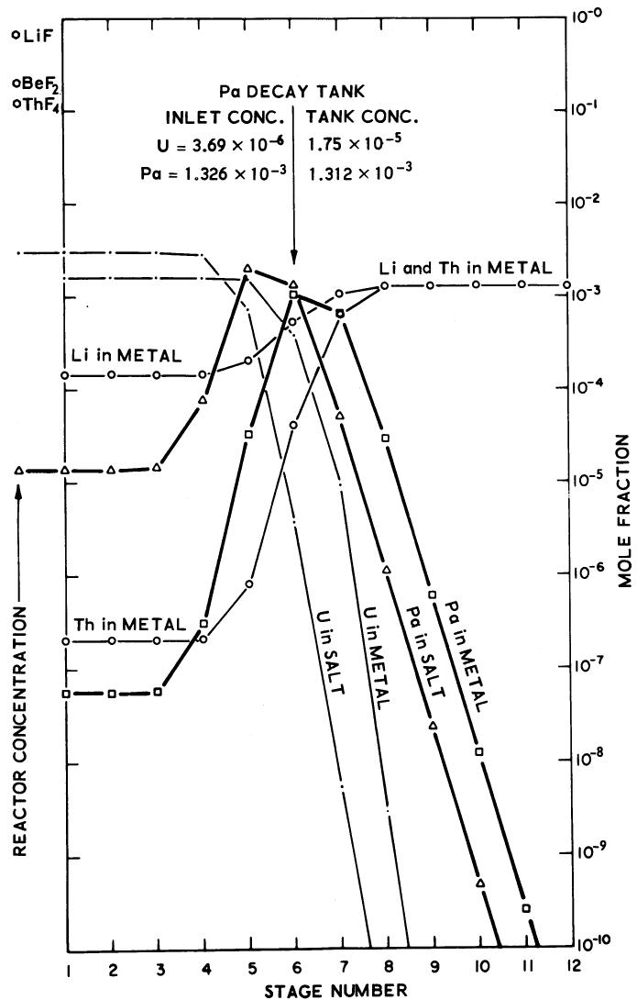
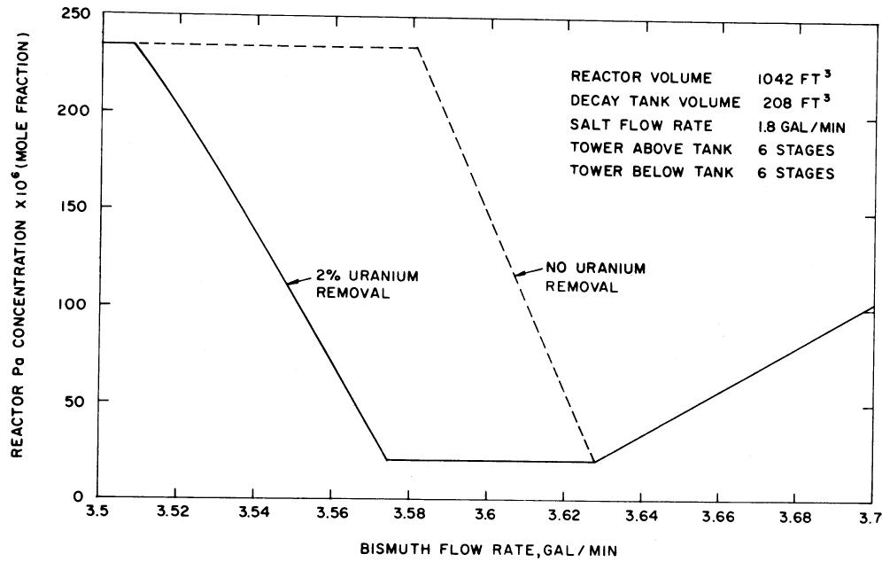

# ENGINEERING DEVELOPMENT OF THE MSBR FUEL RECYCLE

M. E. WHATLEY, L. E. McNEESE, W. L. CARTER, L. M. FERRIS, and E. L. NICHOLSON Chemical Technology Division, Oak Ridge National Laboratory, Oak Ridge, Tennessee 37830

Received August 4, 1969  
Revised October 13, 1969

REACTORS

KEYWORDS: molten-salt reactors, fused salt fuel, reprocessing, chemical reactions, reduction, bi muth, liquid metals, fission products, fuel cycle, MSBR, separation processes, extraction columns

The molten-salt breeder reactor being developed at Oak Ridge National Laboratory (ORNL) requires continuous chemical processing of the fuel salt, $^{7}LiF-BeF_{2}-ThF_{4}$ (72-16-12 mole%) containing $\sim 0.3$ mole% $^{233}UF_{4}$ . The reactor and the processing plant are planned as an integral system. The main functions of the processing plant will be to isolate $^{233}Pa$ from the neutron flux and to remove the rare-earth fission products. The processing method being developed involves the selective chemical reduction of the various components into liquid bismuth solutions at $\sim 600^{\circ}C$ , utilizing multistage counter-current extraction. Protactinium, which is easily separated from uranium, thorium, and the rare earths, would be trapped in the salt phase in a storage tank located between two extraction contactors and allowed to decay to $^{233}U$ . Rare earths would be separated from thorium by a similar reductive extraction method; however, this operation will not be as simple as the protactinium isolation step because the rare-earth-thorium separation factors are only 1.3 to 3.5. The proposed process would employ electrolytic cells to simultaneously introduce reductant into the bismuth phase at the cathode and to return extracted materials to the salt phase at the anode. The practicability of the reductive extraction process depends on the successful development of salt-metal contactors, electrolytic cells, and suitable materials of construction.

# INTRODUCTION

Oak Ridge National Laboratory is engaged in the development of a molten-salt breeder reactor that would operate on the $^{232}\mathrm{Th} - ^{233}\mathrm{U}$ fuel cycle.

The reference reactor1 is a single-fluid, two-region machine containing $\sim 1500\mathrm{ft}^3$ of carrier salt having the composition 71.7 mole% LiF, 16 mole% BeF2, 12 mole% ThF4, and $\sim 0.3$ mole% $^{233}\mathrm{UF}_4$ . The reactor system would be fabricated of Hastelloy-N, and would use graphite as a moderator; corrosion of the Hastelloy is very low when $\sim 1\%$ of the uranium in the salt is present as UF3. Calculations have shown that single-fluid maltensalt reactors designed to operate economically at reasonable power densities and fuel inventories will not breed unless neutron absorbers such as fission products (mainly xenon and rare earths) and $^{233}\mathrm{Pa}$ (which is formed from $^{232}\mathrm{Th}$ and decays to $^{233}\mathrm{U}$ ) are continually removed from the salt. Protactinium-233, which has a neutron-capture cross section of $\sim 43$ b, must be removed from the neutron flux on a short time cycle (3 to 5 days). Rare earths should be removed on a cycle of 30 to 60 days. The chemical processing system for effecting these separations must be close-coupled to the reactor to minimize fuel inventory.

The salt from the reactor, even after allowing $1\mathrm{h}$ for decay of very short-lived nuclides, has a specific heat generation rate of $\sim 10~\mathrm{kW / ft^3}$ . At various places in the processing plant the protactinium and fission products will be concentrated, giving rise to heat generation rates that are 3 to 5 times this value. The protactinium isolated in the processing plant will generate $\sim 5$ MW of decay heat. Thus, the chemical processing system must be designed to handle much higher levels of radiation and heat generation than are encountered in the existing aqueous processes for water-cooled reactor fuels. The separations process being evaluated involves the selective reduction and extraction at $\sim 600^{\circ}\mathrm{C}$ of the various species from the salt into liquid bismuth that contains lithium and thorium as the reductants. Progress in the development of this process is the subject of this paper.

# CHEMISTRY OF THE REDUCTIVE EXTRACTION PROCESS

Bismuth is a noble metal that does not react with the components of the fuel salt, but will dissolve metallic lithium, uranium, thorium, and the rare earths to a reasonable extent. (Beryllium, on the other hand, is almost insoluble in bismuth.) Bismuth has a low melting point $(271^{\circ}\mathrm{C})$ and a high boiling point $(1477^{\circ}\mathrm{C})$ ; its vapor pressure is negligible in the temperature range of interest, 500 to $700^{\circ}\mathrm{C}$ . These properties, and the fact that it is almost completely immiscible with a variety of molten-fluoride salts, made it the first choice for the metal phase in the reductive extraction process.

The relative extractabilities of the important actinide and lanthanide elements were determined by measuring equilibrium distribution coefficients in the two-phase system. The extraction of a metal fluoride, $\mathbf{MF}_n$ , from the salt into a liquid bismuth solution can be expressed as the equilibrium reaction

$$
\mathbf {M F} _ {n (\text {s a l t})} + n \operatorname {L i} (\mathrm {B i}) = \mathbf {M} _ {(\mathrm {B i})} + n \operatorname {L i F} _ {(\text {s a l t})},
$$

in which $n$ is the valence of the metal in the salt phase. An equilibrium constant for this reaction can be written as

$$
K = \frac {a _ {\mathrm {M}} a _ {\mathrm {L i F}} ^ {n}}{a _ {\mathrm {M F} _ {n}} a _ {\mathrm {L i}} ^ {n}} = \frac {X _ {\mathrm {M}} \gamma_ {\mathrm {M}} a _ {\mathrm {L i F}} ^ {n}}{X _ {\mathrm {M F} _ {n}} \gamma_ {\mathrm {M F} _ {n}} X _ {\mathrm {L i}} ^ {n} \gamma_ {\mathrm {L i}} ^ {n}} \tag {1}
$$

in which $a$ denotes activity, $X$ is mole fraction, and $\gamma$ is an activity coefficient. Under the experimental conditions used, $a_{\mathrm{LiF}}$ and the individual activity coefficients were essentially constant; thus, Eq.(1) reduces to

$$
K ^ {\prime} = \frac {X _ {\mathrm {M}}}{X _ {\mathrm {M F} _ {n}} X _ {\mathrm {L i}} ^ {n}}. \tag {2}
$$

The distribution coefficient for component M is defined by

$$
D = \frac {\text {m o l e f r a c t i o n o f M i n b i s m u t h p h a s e}}{\text {m o l e f r a c t i o n o f M F} _ {n} \text {i n s a l t p h a s e}} = \frac {X _ {M}}{X _ {M F _ {n}}} \tag {3}
$$

Combination of Eqs. (2) and (3) gives

$$
D = X _ {\mathrm {L i}} ^ {n} K ^ {\prime}, \tag {4}
$$

or, in logarithmic form,

$$
\log D = n \log X _ {\mathrm {L i}} + \log K ^ {\prime}. \tag {5}
$$

Thus, a plot of $\log D$ vs the logarithm of the lithium concentration in the metal phase (mole fraction or at.%) should be linear with a slope equal to $n$ . The ease with which one component can be separated from another is indicated by the ratio of

their respective distribution coefficients, i.e., by the separation factor $\alpha$ . If the separation factor for two components designated A and B ( $\alpha = D_A / D_B$ ) is 1, no separation is possible; the greater the deviation of $\alpha$ from 1, the easier the separation.

Data $^{2-5}$ obtained at $600^{\circ}\mathrm{C}$ using LiF-BeF $_2$ -ThF $_4$ (72-16-12 mole%) as the salt phase are summarized in Fig. 1 as plots of $\log D$ vs $\log C_{\mathrm{Li}}$ . The slopes of the lines show that, under the conditions used, zirconium, thorium, and protactinium exist as tetravalent species in the salt; uranium, plutonium, and rare earths other than europium are trivalent; and only europium is reduced to the divalent state prior to extraction. Uranium and zirconium are the most easily reduced of the species shown. In fact, except for the difference in valence, their behavior is almost identical. Thus, zirconium, which is a fission product of high yield, will coextract with uranium in the reductive extraction process. Uranium and protactinium should be easily separated, and, under the proper conditions, a Pu-Pa separation is possible. Under one expected operating condition, where $D_{\mathrm{U}}$ is $\sim 1$ , the corresponding U-Pa and Pa-Th separation factors are $\sim 100$ and 3000, respectively. These separation factors comprise the basis for the protactinium isolation flow sheet. As indicated in Fig. 1, and as shown on an enlarged scale in Fig. 2, the rare-earth-thorium separation factors are only in the range of $\sim 1.3$ to 3.5 under the desired operating conditions ( $C_{\mathrm{Li}} > 0.1$ at%). Thus, removal of the rare earths by the reductive extraction method will be much more difficult than the isolation of protactinium.

As noted above, most of the components of interest are adequately soluble in bismuth. Thorium is the least soluble of the extractable components; its solubility at $600^{\circ}\mathrm{C}$ is $\sim 1800$ wt ppm. Uranium and plutonium (which could be used as the fissile material for starting up an MSBR) are at least five times more soluble than thorium. Previously, no information was available on the solubility of protactinium in bismuth. However, recent work indicated its solubility to be $\sim 1200$ wt ppm at $500^{\circ}\mathrm{C}$ and $>2100$ ppm at $600^{\circ}\mathrm{C}$ . By assuming that the effect of temperature on the solubility between 500 and $700^{\circ}\mathrm{C}$ is about the same as it is for the other actinide metals, the solubility of protactinium at $600^{\circ}\mathrm{C}$ has been estimated to be 4500 wt ppm. This concentration is more than adequate to satisfy the process requirements.

Mutual solubilities of most of the major components in bismuth appear to be high enough for process application. Nickel is the only component encountered so far that causes a marked effect. The presence of as little as 100 wt ppm nickel in a bismuth solution that is nearly saturated with

  
Fig. 1. Distribution coefficients of major components between a bismuth phase and a single-fluid MSBR salt.

thorium can result in the precipitation of an insoluble nickel- and thorium-containing intermetallic compound.2,3 One method for removing nickel is described below.

# THE CONCEPTUAL PROCESS FLOW SHEET

The principal engineering features of the conceptual process $^{6,7}$ are combined in a simplified

  
Fig. 2. Distribution of thorium and selected rare earths between a single-fluid MSBR salt and a bismuth phase.

flow sheet shown in Fig. 3. In this process fuel salt from the reactor, after $<1\mathrm{h}$ of cooling, enters the bottom of the protactinium isolation system at a rate of $\sim2.5$ gal/min. This system consists of two 7-in.-diam extractors, each having six stages. The extractors are separated by a $200\text{-ft}^3$ decay tank. Uranium is extracted from the fuel salt into the bismuth, and the protactinium is concentrated and trapped in the decay tank, resulting in its removal from the reactor on a 3- to 5-day cycle. The decay tank is actually a heat-exchanger in which protactinium decay heat is removed.

The bismuth is continuously circulated through the protactinium isolation system contactors and an electrolytic cell. At the anode of the cell, uranium present in the bismuth is oxidized to $\mathbf{U}^{4+}$ ,

  
Fig. 3. Conceptual reductive extraction flow sheet for processing a MSBR.

which transfers to the salt stream that is returned to the reactor. At the cathode of the cell, $\mathrm{Th}^{4+}$ and $\mathrm{Li}^{+}$ from the salt are reduced to metals which dissolve in the bismuth. The resulting Th-Li-Bi solution flows into the top of the upper extractor. A small side stream of salt from the lower extractor is fluorinated to remove uranium as $\mathrm{UF}_6$ for control purposes. The fluorination also removes iodine, bromine, and oxygen from the salt. After treatment to remove traces of fluorine, the salt is returned to the decay tank. The $\mathrm{UF}_6$ is decontaminated from fission products by passage through hot sodium fluoride beds and is collected after subsequent passage through a suitable concentration monitor. Most of the $\mathrm{UF}_6$ is absorbed in salt, reduced with hydrogen to $\mathrm{UF}_4$ , and returned to the reactor. Excess uranium is removed and sold.

Batch fluorination of molten salt for uranium recovery and decontamination is well-established technology. A similar operation was carried out at the MSRE when the $^{235}\mathrm{U}$ fuel was replaced with $^{233}\mathrm{U}$ . Small-scale tests have shown that continuous fluorination will be feasible, and that soluble $\mathrm{UF_4}$ is produced when $\mathrm{UF_6}$ is sorbed in salt in the presence of hydrogen. In the preceding operations, container corrosion could be severe; hence, protection of the wall by a layer of frozen salt is being considered.

The bismuth stream from the first stage of the lower extractor carries the uranium to the electrolytic cell in which the uranium is oxidized. About $1\%$ of this stream is continuously treated with hydrogen fluoride in the presence of a salt to remove fission products (Zr, Zn, Ga, Cd, and Sn) and corrosion products (Fe, Ni, and Cr). After fluorination to remove the uranium, the salt is discarded to waste. This operation removes fission product zirconium on a 200-day cycle. A shorter cycle time may be necessary if nickel or other contaminants build up excessively. Hydrofluorination of this side stream of bismuth would provide a method for removing plutonium from the circuit of a molten-salt breeder reactor that was started up with plutonium.

The salt stream leaving the protactinium isolation system contains only traces of protactinium and uranium but contains practically all of the rare earths. A portion of this salt stream is withdrawn and sent to a reductive extraction process for removing rare earths. The rare-earth extraction system differs from the protactinium isolation system in that the highest concentration of rare earths occurs at the lower end of the contactor rather than in the middle. The salt-feed stream would enter near the middle of the contactor. Calculations have shown that a contactor having 24 theoretical extraction stages

with a bismuth-to-salt flow rate ratio of 80 would result in a discard salt with the rare earths $\sim 60$ times as concentrated as they occur in the reactor salt. The salt discard rate is set so that the rare earths are effectively removed on a 50-day cycle. At this discard rate, the neutron loss to rare earths in the reactor is kept at an acceptably low level, and the alkali metal and alkaline earth fission products (which remain in the salt throughout the process) are removed from the reactor on an 8- to 10-year cycle. The salt that is discarded would have a heat generation rate of $\sim 17\mathrm{kW / ft}^3$ and would have to be stored for radioactive decay.

The reconstituted fuel salt will contain a small but unknown amount of bismuth. Most of this bismuth must be removed from the salt to ensure that its concentration in the salt returning to the reactor will not be high enough to cause corrosion of the Hastelloy.

Not all of the fission products having significant neutron capture cross sections would be removed by the reductive extraction process. Xenon, krypton, and tritium will be removed from the reactor as gases on about a 1-min cycle by a helium purge. Experience with the MSRE has shown that the noble metal fission products (e.g. Mo, Ru, Tc, Rh, Nb, and Pd) are not present in the salt as fluorides.[12] Instead, they apparently exist in the metallic state because of the reducing condition in the reactor. A portion of these metals is deposited on the surfaces of the graphite and the Hastelloy, and the rest is present in the gas phase in the form of a smoke. It is estimated that at least half of the noble metal fission products will also be removed from the MSBR by the helium purge. Thus, the reactor off-gas system must be designed to handle a significant amount of gaseous and particulate fission products.

# PROTACTINIUM ISOLATION SYSTEM CALCULATIONS

The distribution coefficient data for the components of interest (Fig. 1) provide a firm basis for calculation of the separations attainable in a multistage countercurrent extraction system. A typical set of concentration profiles for this system with six theoretical stages below the decay tank and six theoretical stages above, is shown in Fig. 4. The points beyond the left margin of the figure represent the composition of the reactor fuel salt entering the extraction system. The maximum concentrations of uranium, protactinium, and thorium in the metal phase are limited by the solubility of thorium in bismuth, which, in turn, governs the salt-bismuth flow rate ratio. The protactinium concentrations in both the salt phase and the metal phase reach maxima in the vicinity of the decay tank, where the protactinium

concentration in the salt is two orders of magnitude higher than that in the fuel salt entering the extractor. Routing the high-protactinium-concentration salt stream through a $200\text{-ft}^3$ decay tank results in retention of $>90\%$ of the protactinium (in the reactor and the chemical processing plant) in the tank, thus obtaining low protactinium losses by neutron capture in the reactor.

The concentration profile (Fig. 4) represents a steady state at very nearly optimum conditions. However, two significant effects are not readily apparent in this representation. The first is that the profile is very sensitive to the amount of reductant entering the system. Thus, a small error in this amount, caused by either a change in the reductant concentration in the bismuth or by a flow-rate-ratio change, could change the location of the protactinium. The net effect could be the eventual return of all the protactinium to the re

  
Fig. 4. Calculated concentration profiles in the protactinium isolation column.

actor. The second effect is the stabilizing influence on the system of the capacitance that is provided by the large volume of salt in the decay tank.

The effect of flow rate on a system at steady state is shown in Fig. 5. The dotted line represents operation in the mode described above. The concentration of protactinium in the reactor decreases to an optimum from which, under a simple steady-state analysis, a flow rate variation as small as $1\%$ could result in a tenfold increase in the protactinium concentration in the reactor if the flow rate were low, or a threefold increase if the rate were high. Removal of a small amount of uranium, for example by fluorination of $2\%$ of the salt entering the decay tank, would provide considerable relief of the control system sensitivity (Fig. 5). The typical concentration profiles (Fig. 4) show that the uranium concentration changes rapidly from stage to stage in the vicinity of the decay tank and would also be sensitive to flow rate ratios. In fact, the uranium concentration drops to 0.0005 of its concentration in the reactor when the bismuth flow rate is slightly above the optimum, and drops by a factor of 400 per $0.1\%$ increase in the bismuth flow rate close to the optimum. Thus, the uranium concentration in the salt provides a very sensitive index to operation, and by controlling it at $\sim 0.007$ times the reactor concentration (within a factor of 5 or 10), the system can be held sufficiently close to the optimum flow conditions. As noted before, uranium removal from the system would be accomplished by continuously fluorinating a small side stream of salt entering the decay tank. Monitoring the $\mathrm{UF}_6$ concentration in the gas from the fluorinator provides a sensitive measurement of the uranium concentration in the decay tank and, consequently, the location of the protactinium in the contactor.

Calculations² of the transient behavior of the protactinium isolation system were made to gain information about the stability of the system. In the computer program used, the uranium concentration at the inlet to the decay tank controlled the bismuth flow rate. The other input information was similar to that used to generate the concentration profile. A random error with a $5\%$ standard deviation was superimposed upon the controlled rate which was maintained constant for 1 h; then, a new input generated a different flow rate with a new random error. Even with this crude control system, over $85\%$ of the protactinium was held outside of the reactor.

# THE ELECTROLYTIC CELLS

An ideal electrolytic cell for use in the process would receive bismuth containing extracted com

  
Fig. 5. Effect of Bi flow rate in reductive extraction tower on Pa concentration in the reactor.

ponents and would completely oxidize these components to fluoride salts which would be carried out of the cell. The purified bismuth would then be routed to the cathode where thorium fluoride from the salt would be reduced to produce a bismuth metal phase that is suitable for use as an extractant. In practice, both lithium and thorium metals would be produced at the cathode, and the anode would supply $\mathrm{BiF}_3$ which would subsequently react with the uranium or the rare earths in auxiliary contactors provided for this reaction to strip them into the salt phase.

In the rare-earth removal system the cell would be operated as the center unit of a three unit complex with salt-bismuth contactors located above and below it. The cell would operate with pure bismuth being fed to both the cathode and anode. The salt in the cell would be practically free of the rare earths and thorium. In the contactor above the cell, the extracted components would be removed from the incoming bismuth stream by oxidizing them with $\mathrm{BiF}_3$ (produced at the anode of the cell) and transferring them to the salt phase. In the lower contactor, the bismuth leaving the cell, which contains lithium produced at the cathode, would be contacted with the incoming salt, and thorium would be transferred to the bismuth phase. In the protactinium isolation system, only the top contactor would be used.

The $\mathbf{BiF}_3$ that is produced at the anode of the rare-earth removal system could attain a concentration of up to 20 mole% in the salt. Operation with high concentrations of this fluoride in the cell could seriously affect cell efficiency. The $\mathbf{BiF}_3$

concentration in the cell might be controlled by introducing hydrogen to form hydrogen fluoride, which would leave the cell promptly; HF is as effective as $\mathbf{BiF}_3$ in performing the oxidation.

The cell arrangement described above would allow the electrodes to be placed in close proximity. This is important because the resistivity of the salt is fairly high $(0.5\Omega \mathrm{cm})$ , and a long current path would cause intolerable electrical losses and accentuate the heat removal problem. Corrosion protection of the anode, as well as electrical insulation, would be provided by freezing a layer of salt on all exposed metal surfaces. Ample internal heat from radioactive decay and electrical losses is available to generate the required thermal gradient for establishing and maintaining the protective frozen wall.

The theoretical current requirement for the protactinium isolation system is $\sim 10000$ A. Current efficiencies of at least $50\%$ at a current density of $\sim 5000$ A/ft² might be achieved, based on commercial practice in the aluminum industry. The protactinium isolation system would then require $\sim 4$ ft² of surface for each electrode, while the rare-earth removal system would require a cell that is about three times this size. The electrodes would consist of pools of bismuth in the flowing bismuth stream.

Alternatively, it is possible that the reducing agent (either thorium or lithium) and the oxidizing agent (e.g., hydrogen fluoride) could be supplied from an external source, eliminating the need for electrolytic cells. In such a case, the protactinium isolation and the rare-earth removal systems

would require $\sim 550$ and $\sim 1500\mathrm{kg}$ of thorium per day, respectively. However, the cost of this thorium and the resulting salt discard would be prohibitive. Thus, it is concluded that electrolytic cells are required for economical operation of the processing system.

In experiments with simple static electrolytic cells, current densities in excess of the desired $5000\mathrm{A / ft}^2$ were obtained, and $\mathrm{BiF}_3$ and lithium (the salt contained no thorium) were produced at the anode and cathode, respectively. This experimental series also included the first attempts to protect the anode from corrosion and provide electrical insulation with frozen salt. A large-scale, fully continuous system for electrolytic cell development is being installed to permit experiments with flowing salt and bismuth.

# EXTRACTORS

The required multistage countercurrent extractors present unique problems due to the physical properties of the liquids, the unusually high flow ratios required in the rare-earth removal system, and the high rate of radioactive-decay heat generation. The contactor development effort $^{7,13}$ has, so far, been conducted with mercury and water to simulate bismuth and salt to permit estimation of flooding rates, pressure drops, and holdup with high-density fluids. The density difference divided by the average density is 2 for the mercury-water system, 1.0 for the salt-bismuth system, and $\sim 0.2$ for liquid-liquid extraction systems using organic solvents. It is interesting to note that the salt-bismuth system may more closely resemble a distillation system (where this number may be 2) than a conventional liquid-liquid system.

The low distribution coefficients available in the rare earth removal system (Fig. 2) make contactor operation at very high metal-to-salt flow rate ratios (30 to 80) mandatory. Backmixing would be expected in a conventional packed column which would limit performance. Radioactive-decay heat generation in the salt phase is markedly different in the protactinium isolation and rare earth removal system. In the protactinium isolation system, a tenfold change in specific heat generation occurs between the protactinium decay tank withdrawal point and the top of the extractor, with the maximum heat-generation rate being $\sim 34\mathrm{kW / ft^3}$ . Thus, it is apparent that a suitable contactor will require considerable development.

# STATUS OF THE DEVELOPMENT WORK

During the past two years, ORNL has been engaged in studies aimed at developing basic

chemical information for the reductive extraction processing system and in defining the engineering requirements for this system. During this time, many of the important problems associated with the chemistry have been solved. Experiments in simple equipment that will permit operation in contactors and electrolytic cells with flowing salt and bismuth are in progress, while design and construction of larger, more comprehensive experiments which include electrolytic cell and contactor development are under way.

The selection of a material for construction of the processing plant requires investigation regarding two major areas: (a) surfaces exposed to oxidizing conditions, and (b) surfaces exposed to salt and liquid bismuth. As previously mentioned, a layer of frozen salt will probably serve to protect surfaces that are exposed to an oxidizing environment if the layer can be maintained in the complex equipment. Preliminary experiments14 with a simple vertical column filled with molten salt and with a centerline heater showed that the thickness of the frozen film on the wall was predictable and adhered to the wall. The simultaneous containment of bismuth and salt presents a special problem. The only materials that are truly resistant to bismuth are refractory metals and graphite, neither of which is attractive for fabricating a large and complicated system. To date, experimental equipment has been built of low-carbon steel, as an expedient. Development work to determine if iron-base alloys can be protected with refractory metal coatings is starting.

Although the development of the chemical processes for MSBR's is at an early stage, we have attempted to estimate the cost of processing. The uncertainties of such an estimate are both numerous and serious. Results of previous work[15] and a rough estimate of the complexity of the present process, suggest that the capital cost of the plant considered by Perry et al.[16] might be $\sim$ 8 × 10⁶ with an operating cost of $\sim$ 10⁶/year, giving a unit processing cost of $\sim$ 0.3 mill/kWh, based on an 80% load factor. As additional processing development information becomes available, more meaningful estimates can be made. A more detailed cost study based on the conceptual flow sheet is under way.

In conclusion, processes for the isolation of protactinium from the reactor salt and for the removal of the rare-earth fission product poisons from MSBR's have been studied through the phase of establishing chemical feasibility. The protactinium isolation system is simpler and perhaps more tractable than the rare-earth removal system because of the higher distribution coefficients and separation factors available in the former system. Although cost estimates at this time

should be considered highly tentative, it appears that MSBR's with associated chemical processing systems hold attractive economic potential in the evolving nuclear industry.

# ACKNOWLEDGMENTS

The authors thank the many people in the Chemical Technology Division and Reactor Chemistry Division of ORNL who contributed to this work, especially D. E. Ferguson for his encouragement and guidance. We are also indebted to the groups of W. R. Laing, C. Feldman, J. H. Cooper, and W. T. Mullins of the Analytical Chemistry Division who performed the many difficult analyses and did the necessary analytical development. This work was sponsored by the U.S. Atomic Energy Commission under contract with the Union Carbide Corporation.

# REFERENCES

1. E. S. BETTIS and R. C. ROBERTSON, “MSBR Design and Performance Features,” Nucl. Appl. Tech., 8, 190 (1970).   
2. D. E. FERGUSON, “Chemical Technology Division Annual Progress Report, May 31, 1969,” USAEC Report ORNL-4422, Oak Ridge National Laboratory.   
3. L. M. FERRIS, J. C. MAILEN, J. J. LAWRANCE, and F. J. SMITH, "MSR Program Semiannual Progress Report, February 28, 1969," USAEC Report ORNL-4396, Oak Ridge National Laboratory (1969).   
4. L. M. FERRIS, J. C. MAILEN, F. J. SMITH, E. D. NOGUEIRA, J. H. SHAFFER, D. M. MOULTON, C. J. BARTON, and R. G. ROSS, "Isolation of Protactinium from Single-Fluid Molten-Salt Breeder Reactor Fuels by Selective Extraction into Li-Th-Bi Solutions," to be published in the Proc. Third Intern. Protactinium Conf.   
5. L. M. FERRIS, J. C. MAILEN, J. J. LAWRANCE, F. J. SMITH, and C. E. SCHILLING, “MSR Program Semiannual Progress Report, August 31, 1968,” USAEC Report ORNL-4344, pp. 292-297, Oak Ridge National Laboratory (1969).   
6. M. E. WHATLEY and L. E. McNEESE, "MSR Program Semiannual Progress Report, February 29, 1968,"

USAEC Report ORNL-4254, pp. 248-251, Oak Ridge National Laboratory (1968).   
7. L. E. McNEESE, "MSR Program Semiannual Progress Report, February 28, 1969," USAEC Report ORNL-4396, Oak Ridge National Laboratory (1969).   
8. J. M. CHANDLER and R. B. LINDAuer, “Preparation and Processing of MSRE Fuel,” to be published in the Proc. AIME Symp. on Reprocessing of Nuclear Fuels, August 1969.   
9. D. E. FERGUSON, "Chemical Technology Division, Annual Progress Report, May 31, 1966," USAEC Report ORNL-3945, p. 72, Oak Ridge National Laboratory (1966).   
10. L. E. McNEESE, “Fuel Reconstitution,” in “Unit Operations Section Quarterly Progress Report, April-June 1965,” USAEC Report ORNL-3868, p. 43, Oak Ridge National Laboratory (1965).   
11. L. E. McNEESE and C. D. SCOTT, “Reconstitution of MSR Fuel by Reduction of $\mathbf{UF_6}$ Gas to $\mathbf{UF_4}$ in Molten Salt,” USAEC Report ORNL-TM-1051, Oak Ridge National Laboratory (1965).   
12. W. R. GRIMES, “Molten Salt Reactor Chemistry,” Nucl. Appl. Tech., 8, 137 (1970).   
13. J. S. WATSON and L. E. McNEESE, "Simulated Salt-Metal Contactor Studies," in "Unit Operations Section Quarterly Progress Report, July-September 1968," USAEC Report ORNL-4366, Oak Ridge National Laboratory (in press).   
14. B. A. HANNAFORD and L. E. McNEESE, “MSR Program Semiannual Progress Report, August, 31, 1968,” USAEC Report ORNL-4344, pp. 302-306, Oak Ridge National Laboratory (1969).   
15. C. D. SCOTT and W. L. CARTER, “Preliminary Design Study of a Continuous Fluorination Vacuum-Distillation System for Regenerating Fuel and Fertile Streams in a Molten Salt Breeder Reactor,” USAEC Report ORNL-3791, Oak Ridge National Laboratory (1966).   
16. A. M. PERRY and H. F. BAUMAN, “Reactor Physics and Fuel-Cycle Analyses,” Nucl. Appl. Tech., 8, 208 (1970).