# THEORETICAL DYNAMICS ANALYSIS OF THE MOLTEN-SALT REACTOR EXPERIMENT

T. W. KERLIN, S. J. BALL, and R. C. STEFFY*

Oak Ridge National Laboratory, Oak Ridge, Tennessee 37830

Received May 23, 1970

Revised September 14, 1970

REACTORS

KEYWORDS: reactors, reactivity, uranium-233, uranium-235, transients, disturbances, frequency, variations, stability, fuels, operation, differential equations, MSRE, reactor kinetics

The dynamic characteristics of the MSRE were calculated for operation with $^{235}U$ and $^{233}U$ fuels. The analysis included calculation of the transient response for reactivity perturbations, frequency response for reactivity perturbations, stability, and sensitivity to parameter variations. The calculations showed that the system dynamic behavior is satisfactory for both fuel loadings.

# I. INTRODUCTION

The dynamic characteristics of the Molten-Salt Reactor Experiment (MSRE) were studied carefully prior to the initial $^{235}\mathrm{U}$ fuel loading in 1965 and again prior to the $^{233}\mathrm{U}$ fuel loading in 1968. The first objective of these studies was to determine the safety and operability of the system. The second objective was to establish methods of analysis which can be used with confidence in predicting the dynamic behavior of future, high-performance molten-salt reactors. To satisfy the second objective, it was necessary to include theoretical predictions of quantities amenable to experimental measurement. The frequency response results proved most useful for this purpose.

Several different types of calculations were used in these studies. In general, they consisted of calculations of transient response, frequency response, stability, and parameter sensitivities. Four considerations led to the decision to use this many different types of analysis. These were:

1. It is helpful to display system dynamic characteristics from different points of view as an aid in understanding the underlying physical causes for calculated behavior.   
2. Computer costs for the different types of analysis were small compared to the expense of preparing the mathematical models.   
3. The calculations for comparison with experiment (frequency response) were essential, but they did not furnish sufficient information about the system.   
4. The experience with a number of methods provided insight on selecting methods which would be most useful in analysis of future molten-salt reactors.

The analysis of the system with $^{233}\mathrm{U}$ fuel was very similar to the analysis of the $^{235}\mathrm{U}$ -fueled system. The modeling for the $^{233}\mathrm{U}$ study was influenced slightly by results from dynamics experiments on the $^{235}\mathrm{U}$ -fueled system and the analysis for the $^{233}\mathrm{U}$ -fueled system took advantage of some new methods developed after the completion of the first study.

This paper describes the mathematical models used, the computational methods used, and the results of the calculations. A companion paper gives results of dynamics experiments and comparisons with theoretical predictions.

# II. DESCRIPTION OF THE MSRE

The MSRE is a graphite-moderated, circulating-fuel reactor with fluoride salts of uranium, lithium, beryllium, and zirconium as the fuel. The basic flow diagram is shown in Fig. 1. The

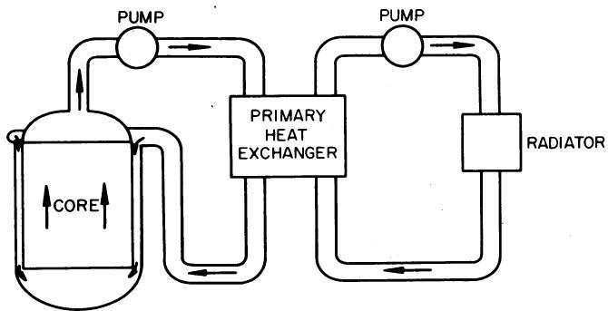  
Fig.1. MSRE basic flow diagram.

molten, fuel-bearing salt enters the core matrix at the bottom and passes up through the core in channels machined out of 2-in. graphite blocks. The 8 MW of heat generated in the fuel and transferred from the graphite raises the fuel temperature from $1170^{\circ}\mathrm{F}$ at the inlet to $1210^{\circ}\mathrm{F}$ at the outlet. When the system operates at low power, the flow rate is the same as at 8 MW, and the temperature rise through the core decreases. The high-temperature fuel salt travels to the primary heat exchanger, where it transfers heat to a non-fueled secondary salt before reentering the core. The heated secondary salt travels to an air-cooled radiator before returning to the primary heat exchanger.

Criticality was first achieved with $^{235}\mathrm{U}$ fuel (35 at. $\%^{235}\mathrm{U}$ ) in June of 1965. After 9006 equivalent full power hours of operation, this uranium was removed and the reactor was refueled with $^{233}\mathrm{U}$ (91.5 at. $\%^{233}\mathrm{U}$ ) in October of 1968. Between October 1968, and shutdown in December 1969, an additional 4166 equivalent full power hours were achieved with $^{233}\mathrm{U}$ fuel.

Dynamically, the two most important characteristics of the MSRE are that the core is heterogeneous and that the fuel circulates. Since this combination of important characteristics is uncommon, a detailed study of system dynamics and stability was required. The fuel circulation acts to reduce the effective delayed-neutron fraction, to reduce the rate of fuel temperature change during a power change, and to introduce delayed fuel-temperature and neutron-production effects. The heterogeneity introduces a delayed feedback effect due to graphite temperature changes.

# III. SYSTEM MODELS

# A. Neutronics

The point kinetics equations for circulating fuel reactors were used with appropriate temperature-

dependent reactivity feedback (see Sec. III.C). The equations are:

$$
\frac {d \delta n}{d t} = \left(\frac {\rho_ {0} - \beta_ {T}}{\Lambda}\right) \delta n + \left(\frac {n _ {0}}{\Lambda}\right) \delta \rho + \sum_ {i = 1} ^ {6} \lambda_ {i} \delta c _ {i} + \frac {\delta \rho \delta n}{\Lambda} \tag {1}
$$

$$
\frac {d \delta c _ {i}}{d t} = \frac {\beta i}{\Lambda} \delta n - \lambda_ {i} \delta c _ {i} - \frac {\delta c _ {i}}{\tau_ {c}} + \frac {\delta c _ {i} (t - \tau_ {L}) \exp (- \lambda_ {i} \tau_ {L})}{\tau_ {c}}, \tag {2}
$$

where

$\delta n =$ deviation in neutron population from steady state

$\delta c_{i} =$ deviation in concentration of the $i$ th precursor group from steady state

$\rho_0 =$ reactivity change in going from a circulating fuel condition to a stationary fuel condition

$\beta_{T} =$ total delayed-neutron fraction

$\beta_{i} =$ importance weighted delayed-neutron fraction for the $i^{\prime}$ th precursor group

$\Lambda =$ neutron generation time

$\delta \rho =$ change in reactivity

$\lambda_{i} =$ radioactive decay constant for the $i$ th precursor group

$\tau_{c} =$ fuel residence time in the core

$\tau_{L} =$ fuel residence time in the external loop.

The term $\delta \rho$ is given by

$$
\delta \rho = \delta \rho_ {r} + \sum \alpha_ {i} \delta T _ {i},
$$

where

$\delta \rho_{r} =$ reactivity change due to control-rod motion

$\alpha_{i} =$ temperature coefficient of reactivity for the $i^{\prime}$ th section (node) of the core

$\delta T_{i} =$ temperature change in the $i^{\prime}$ th section (node) of the core.

In some of the calculations (determination of eigenvalues of the system matrix), it was necessary to eliminate the time delay from the precursor equation. This was accomplished by eliminating the last two terms from Eq. (2) and defining an effective $\beta_{i}$ as follows:

$$
\beta_ {i _ {\text {e f f}}} = \beta_ {i} \times \left(\frac {\text {d e l a y e d n e u t r o n s e m i t t e d i n c o r e a t s t e a d y s t a t e}}{\text {t o t a l d e l a y e d n e u t r o n s e m i t t e d i n t h e s y s t e m a t s t e a d y s t a t e}}\right).
$$

Then, the approximate precursor equation is

$$
\frac {d \delta c _ {i}}{d t} = \frac {\beta_ {i \text {e f f}}}{\Lambda} \delta n - \lambda_ {i} \delta c _ {i}. \tag {3}
$$

This formulation assumes that the fraction of the precursors which decay in in-core regions is constant during a transient. Comparison of frequency response calculations using this approach and an approach which explicitly treats circulating precursor effects showed negligible differences in the frequency range of interest.

Since the neutron population is proportional to fission power, the units on $\delta n$ were taken to be megawatts.

# B. Power

An attempt was made to include the effect of delayed gamma rays on the total power generation rate. If we assume that the delayed gamma rays are emitted by a single nuclide, then the appropriate equation is

$$
\frac {d N}{d t} = \gamma n - \lambda N, \tag {4}
$$

where

$N =$ energy stored in gamma-ray emitters (in MW sec)

$\gamma =$ fraction of power which is delayed

$n =$ neutron population (in units of MW)

$\lambda =$ decay constant of gamma-ray emitter (sec-1).

The total power is given by

$$
P = \lambda N + (1 - \gamma) n. \tag {5}
$$

For these studies the value used for $\lambda$ and $\gamma$ were 0.0053 and 0.066/sec, respectively.

# C. Core Heat Transfer

The core heat transfer was modeled using a multinode approach. The reactor was subdivided into sections and each section was modeled using the representation shown in Fig. 2. This model was preferred over a model with a single fuel lump coupled to a single graphite lump because of difficulties in defining appropriate average temperatures and outlet temperatures for a single fluid lump model. If the outlet temperature of a single fluid lump model is assumed to be the same as the average temperature, then the steady-state outlet temperature is too low. If the average temperature is taken as a linear average of inlet temperature and outlet temperature, then it is possible for outlet temperature changes to have the wrong sign shortly after an inlet temperature

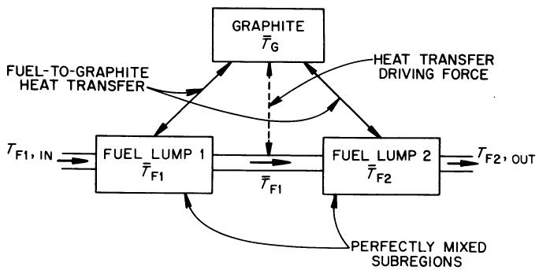  
Fig. 2. Model of reactor core region; nuclear power produced in all three subregions.

change. The model using two fluid lumps circumvents these problems by providing an intermediate temperature to serve as an average temperature to use in the solid-to-liquid heat transfer calculations. Also, the average temperature in the second lump is a better representation of the outlet temperature than the average temperature of a single lump.

Since $\sim 7\%$ of the heat is generated in the graphite by gamma ray and neutron interaction, the graphite lump equation has an internal heat source term. The equations are:

$$
\begin{array}{l} \frac {d \delta T _ {f 1}}{d t} = \frac {K _ {f 1}}{(M C) _ {f 1}} \delta P + \frac {1}{\tau_ {f 1}} [ \delta T _ {f 1} (\mathrm {i n}) - \delta T _ {f 1} ] \\ + \frac {(h A) _ {f 1}}{(M C) _ {f 1}} [ \delta T _ {G} - \delta T _ {f 1} ] \tag {6} \\ \end{array}
$$

$$
\begin{array}{l} \frac {d \delta T _ {f 2}}{d t} = \frac {K _ {f 2}}{(M C) _ {f 2}} \delta P + \frac {1}{\tau_ {f 2}} [ \delta T _ {f 1} - \delta T _ {f 2} ] \\ + \frac {(h A) _ {f 2}}{(M C) _ {f 2}} [ \delta T _ {G} - \delta T _ {f 1} ] \tag {7} \\ \end{array}
$$

$$
\begin{array}{l} \frac {d \delta T _ {G}}{d t} = \frac {K _ {G}}{(M C) _ {G}} \delta P - \left[ \frac {(h A) _ {f 1} + (h A) _ {f 2}}{(M C) _ {G}} \right] \\ \times \left[ \delta T _ {G} - \delta T _ {f 1} \right], \tag {8} \\ \end{array}
$$

where

$\tau =$ residence time

$h =$ heat transfer coefficient for a lump

$A =$ heat transfer area for a lump

$M =$ mass

$C =$ specific heat

$K =$ fraction of total power

$f_{1} =$ subscript indicating first fuel lump

$f_{2} =$ subscript indicating second fuel lump

$G =$ subscript indicating graphite.

In most of the calculations, 9 sections of the type shown in Fig. 2 were used giving a total of 27 lumps. The arrangement is shown in Fig. 3. The fraction of the total power generated in each lump was obtained from steady-state calculations of the power distribution. The local temperature coefficients were obtained for each region by importance weighting the computed overall temperature coefficients for fuel and for graphite.

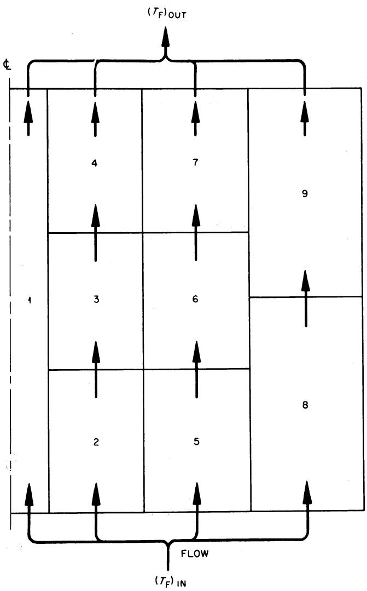  
Fig. 3. Schematic diagram of 9-region core model.

# D. Heat Exchanger and Radiator

The models for the heat exchanger and the radiator were similar to the core heat transfer models. The arrangement for a heat exchanger section appears in Fig. 4. The equations for a heat exchanger section are:

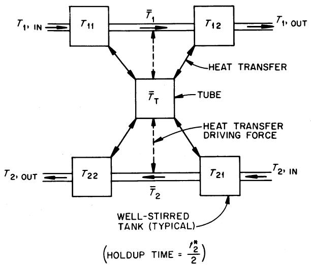  
Fig. 4. Model of heat exchanger and radiator section.

$$
\begin{array}{l} \frac {d \delta T _ {1 1}}{d t} = \frac {1}{\tau_ {1 1}} [ \delta T _ {1} (\mathrm {i n}) - \delta T _ {1 1} ] \\ + \frac {(h A) _ {1 1}}{(M C) _ {1 1}} [ \delta T _ {T ^ {-}} - \delta T _ {1 1} ] \tag {9} \\ \end{array}
$$

$$
\begin{array}{l} \frac {d \delta T _ {1 2}}{d t} = \frac {1}{\tau_ {1 2}} [ \delta T _ {1 1} - \delta T _ {1 2} ] \\ + \frac {(h A) _ {1 2}}{(M C) _ {1 2}} [ \delta T _ {T} - \delta T _ {1 1} ] \tag {10} \\ \end{array}
$$

$$
\begin{array}{l} \frac {d \delta T _ {T}}{d t} = \frac {\left(h A _ {1 1}\right) + h A _ {1 2})}{(M C) _ {T}} \left[ \delta T _ {1 1} - \delta T _ {T} \right] \\ + \frac {\left(h A _ {2 1} + h A _ {2 2}\right)}{\left(M C\right) _ {T}} \left[ \delta T _ {2 1} - \delta T _ {T} \right] \tag {11} \\ \end{array}
$$

$$
\begin{array}{l} \frac {d \delta T _ {2 1}}{d t} = \frac {1}{\tau_ {2 1}} \left[ \delta T _ {2 1} (\mathrm {i n}) - \delta T _ {2 1} \right] \\ + \frac {(h A) _ {2 1}}{(M C) _ {2 1}} [ \delta T _ {T} - \delta T _ {2 1} ] \tag {12} \\ \end{array}
$$

$$
\begin{array}{l} \frac {d \delta T _ {2 2}}{d t} = \frac {1}{\tau_ {2 2}} \left[ \delta T _ {2 1} - \delta T _ {2 2} \right] \\ + \frac {(h A) _ {2 2}}{(M C) _ {2 2}} \left[ \delta T _ {T} - \delta T _ {2 1} \right]. \tag {13} \\ \end{array}
$$

In some of the calculations, it was assumed that the heat capacity of the air in the radiator was negligible. (Terms $T_{21}$ and $T_{22}$ are used for the air side of the radiator.) Ignoring the heat storage in the air leads to the following heat balance:

$$
\left(W C\right) _ {2 1} \left[ T _ {2 2} - T _ {2 1} (\text {i n}) \right] = \left(h A _ {2 1} + h A _ {2 2}\right) \left(T _ {T} - T _ {2 1}\right), \tag {14}
$$

where $W$ is the mass flow rate of the air.

If we assume $T_{21} = \left[T_{21}(\mathrm{in}) + T_{22}\right] / 2$ , Eq. (14) becomes

$$
\frac {\left(W C _ {2 1}\right)}{\left(h A _ {2 1} + h A _ {2 2}\right)} \left[ 2 T _ {2 1} - 2 T _ {2 1} (\text {i n}) \right] = \left[ T _ {T} - T _ {2 1} \right]. \tag {15}
$$

Now, we write the equation in terms of incremental quantities and assuming $T_{21}$ (in) is constant to obtain:

$$
\delta T _ {2 1} = \frac {\delta T _ {T}}{1 + 2 \frac {(W C) _ {2 1}}{h A _ {2 1} + h A _ {2 2}}} \tag {16}
$$

This is then used for $\delta T_{21}$ in Eq. (11). The schematic representation of this type of radiator model appears in Fig. 5.

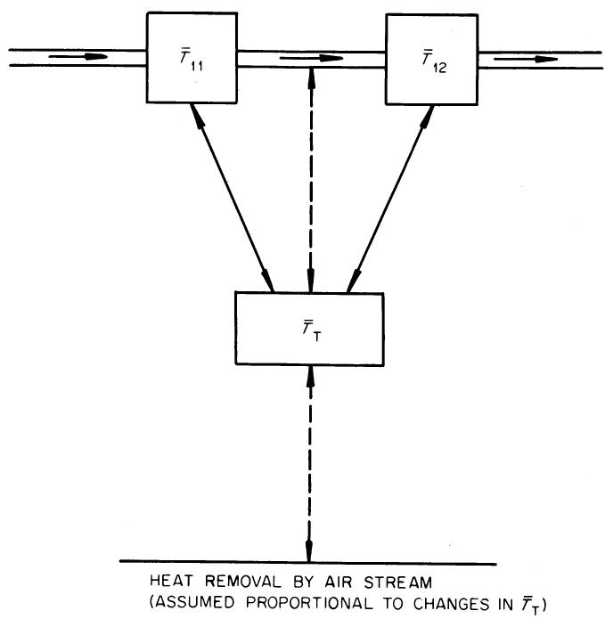  
Fig. 5. Model of radiator for assumed negligible air heat capacity.

# E. Piping

Several models were used to represent salt transport in the piping in different stages of the studies. The simplest model was a pure time delay. From some calculations (eigenvalues of the systems matrix) it was necessary to eliminate the delay terms. They were represented by Padé approximations in those calculations. In some of the more detailed calculations, the heat transfer to the pipe walls was included. Since experimental results obtained after the $^{235}\mathrm{U}$ study indicated significant mixing in headers and piping in the fuel stream, some calculations for the $^{235}\mathrm{U}$ fueled system used a model of a mixing chamber at the core outlet. This model consisted of the following equation (a first-order lag):

$$
\frac {d \delta T}{d t} = \frac {1}{\tau} \left(\delta T _ {\mathrm {i n}} - \delta T\right). \tag {17}
$$

# F. Values of Important Parameters

Some of the important parameters computed for the $^{235}\mathrm{U}$ and $^{233}\mathrm{U}$ loadings appear in Table I.

# G. Overall System Model

The models for the subsystems were combined to give an overall system model. Several different overall system models were used in different stages of the study. The model shown in Fig. 6 was used in the study of the $^{233}\mathrm{U}$ -fueled system. This will be called the reference model. This model resulted in a 44'th-order system matrix with 4 time delays for heat convection and 6 time delays for precursor circulation. Major modifications of this model which were used in some

TABLEI   
Parameters Used in MSRE Dynamics Studies   

<table><tr><td>Parameter</td><td>235U</td><td>233U</td></tr><tr><td>Fuel reactivity coefficient (°F-1)</td><td>-4.84 × 10-5</td><td>-6.13 × 10-5</td></tr><tr><td>Graphite reactivity coefficient (°F-1)</td><td>-3.70 × 10-5</td><td>-3.23 × 10-5</td></tr><tr><td>Neutron generation time (sec)</td><td>2.4 × 10-4</td><td>4.0 × 10-4</td></tr><tr><td>Total effective delayed-neutron fraction (fuel stationary)</td><td>0.00666</td><td>0.0029</td></tr><tr><td>Total effective delayed-neutron fraction (fuel circulating)</td><td>0.00362</td><td>0.0019</td></tr><tr><td>Total fuel heat capacity (in core) (MW sec/°F)</td><td colspan="2">4.19</td></tr><tr><td>Heat transfer coefficient from fuel to graphite (MW/°F)</td><td colspan="2">0.02</td></tr><tr><td>Fraction of power generated in the fuel</td><td colspan="2">0.934</td></tr><tr><td>Delayed power fraction</td><td colspan="2">0.0564</td></tr><tr><td>Core transit time (sec)</td><td colspan="2">8.46</td></tr><tr><td>Graphite heat capacity (MW sec/°F)</td><td colspan="2">3.58</td></tr><tr><td>Fuel transit time in external primary circuit</td><td colspan="2">16.73</td></tr><tr><td>Total secondary loop transit time (sec)</td><td colspan="2">21.48</td></tr></table>

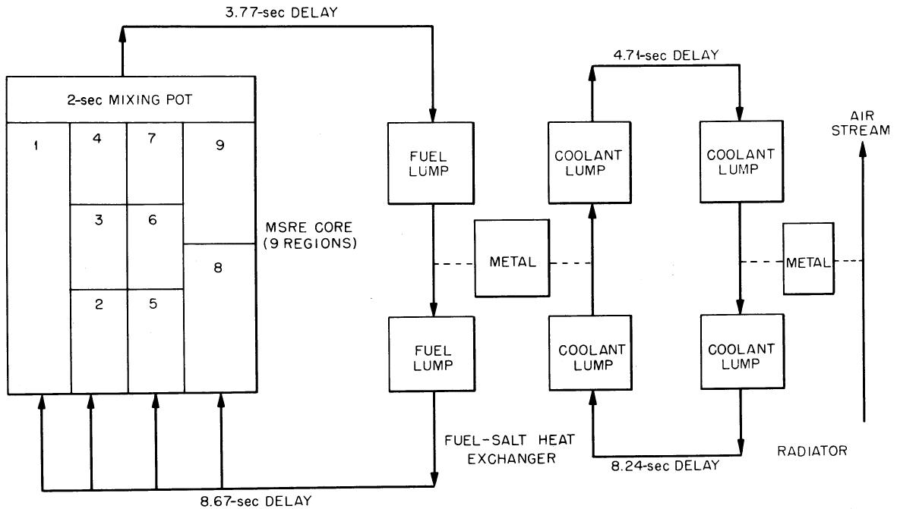  
Fig. 6. Schematic representation of the MSRE reference model.

aspects of the study are listed below:

1. The mixing pot was not included in the early studies for the $^{235}\mathrm{U}$ -fueled systems. It was added after experimental results1 indicated significant mixing of the fuel salt.   
2. For computing the eigenvalues of the system matrix, each pure time delay for fluid transport was replaced by a Padé approximation. Effective delayed-neutron fractions were determined and Eq. (3) was used instead of Eq. (2).   
3. In the models used in the MSFR code (see Sec. IV), the heat exchanger and radiator models were expanded. Instead of a single 5-node representation for the heat exchanger, 10 sections (each with 5 nodes) were used. Instead of a single 3-node representation for the radiator, 10 sections (each with 3 nodes) were used as with the heat exchanger.

Calculations showed that results obtained with the simpler heat exchanger and radiator models gave good agreement with results obtained using the larger models for these components.

# IV. METHODS OF ANALYSIS

# A. Transient Response

The transient response of the reactor system was calculated for selected input disturbances

usually reactivity steps). The computer code MATEXP (a FORTRAN IV program for the IBM-7090 or IBM-360) was used for these calculations. MATEXP uses the matrix exponential technique to solve the general matrix differential equation. For the linear case, the general matrix differential equation has the form:

$$
\frac {d \bar {x}}{d t} = A \bar {x} + \bar {f} (t), \tag {18}
$$

where

$\overline{x} =$ the solution vector

$t =$ time

$A =$ system matrix (a constant square matrix with real coefficients)

$\overline{f}(t) = \text{forcing function vector.}$

The solution of Eq. (18) is

$$
\bar {x} = \exp (A t) \bar {x} (0) + \int_ {0} ^ {t} \exp [ A (t - \tau) ] \bar {f} (\tau) d \tau . \tag {19}
$$

MATEXP solves this equation using a power series for the evaluation of $\exp (At)$ :

$$
\exp (A t) = I + (A t) + \frac {1}{2} (A t) ^ {2} + \dots . \tag {20}
$$

In MATEXP, $f(\tau)$ must be a step or representable by a staircase approximation. For the nonlinear case, the general matrix differential equation is

$$
\frac {d \bar {x}}{d t} = A \bar {x} + \Delta A (\bar {x}) \bar {x} + \bar {f} (t), \tag {21}
$$

where

$\Delta A(\overline{x}) = \mathbf{a}$ matrix whose elements are changes in the coefficients resulting from nonlinear effects.

The procedure used in MATEXP to solve this equation is to use an approximate forcing function rather than to modify the $A$ matrix continuously. The procedure for proceeding from time-step $j$ to time-step $j + 1$ is

$$
\begin{array}{l} \bar {x} \left(t _ {j + 1}\right) = \exp (A t) \bar {x} \left(t _ {j}\right) + \int_ {t _ {j}} ^ {t (j + 1)} \exp [ A (t - \tau) ] \\ \times \{\bar {f} (\tau) + \Delta A [ \bar {x} (\tau_ {j}) ] \bar {x} (\tau_ {j}) \} d \tau . \tag {22} \\ \end{array}
$$

This result is analytically integrable and amenable to computer analysis. This method has proved to be fast and reliable.

MATEXP uses a similar method for systems with time delays.

# B. Frequency Response

The frequency response for the $^{235}\mathrm{U}$ -fueled system was calculated with a special-purpose digital computer program, MSFR (a FORTRAN IV program for the IBM-7090 or IBM-360), and also with a general purpose program, SFR-III (a FORTRAN IV program for the IBM-7090 or IBM-360). The SFR-III program was used for the analysis of the $^{233}\mathrm{U}$ -fueled system.

The basic approach in the MSFR program is to program the transfer functions for all the subsystems and to connect them by the methods of block diagram algebra to obtain the overall system transfer function. This method proved to be efficient (low computing time) and flexible (subsystem models were changed readily by substituting different subroutines for the appropriate part of the model).

The SFR-III program uses a state-variable approach to obtain the frequency response. The system model is expressed in matrix form:

$$
\frac {d \bar {x}}{d t} = A \bar {x} + \bar {d} + \bar {g} f (t), \tag {23}
$$

where

$\overline{x} =$ vector of system state variables

$A =$ coefficient matrix (a constant, square ma-trix)

$\overline{d} =$ vector of time delay terms (see below)

$\overline{g} =$ vector of constant coefficient of the forcing function

$f =$ the scalar forcing function.

The time delay vector allows any equation in the set (row in the matrix differential equation) to have terms containing the value of any state variable evaluated at some prior time. Clearly, this is needed to handle transport delays. The form of this type of term is

$$
r _ {i j} x _ {j} (t - \tau_ {i j}) ,
$$

where

$\gamma_{ij} =$ constant coefficient in row $i$ for the term containing $x_{j}$ evaluated at a prior time

$\tau_{ij} = \text{time delay for the effect of } x_j \text{ in row } i$ .

The Laplace transform of the time delay term is

$$
L \left\{r _ {i j} x _ {j} (t - \tau_ {i j}) \right\} = r _ {i j} x _ {j} (s) \exp (- \tau_ {i j} s). \tag {24}
$$

Thus, the Laplace transform of $\overline{d}$ in Eq. (23) is

$$
L \{\overline {{d}} \} = L (s, \tau) \bar {x} (s), \tag {25}
$$

where

$L(s,\tau) = \mathbf{a}$ matrix whose elements are $l_{ij} =$ $\pmb{\nu}_{ij}\exp (-\tau_{ij}s)$

$\overline{x}(s) = \text{Laplace transform of } \overline{x}(t)$ .

Equation (23) may be Laplace transformed to give

$$
s \bar {x} (s) = A \bar {x} (s) + L \bar {x} (s) + \bar {g} f (s). \tag {26}
$$

Initial conditions are zero because the state variables represent deviations from equilibrium. The transfer function is obtained from Eq. (26).

$$
G (s) = \frac {1}{f (s)} \bar {x} (s) = [ s I - A - L ] ^ {- 1} \bar {g}. \tag {27}
$$

The frequency response is obtained by evaluating this equation for $s = j\omega$ at selected angular frequencies $\omega$ .

The SFR-III program also furnishes sensitivity to parameter changes. For instance, the fractional change in $G(j\omega)$ due to a fractional change in coefficient, $a_{ij}$ , is

$$
\frac {a _ {i j}}{G (j \omega)} \frac {\partial \overline {{G}} (j \omega)}{\partial a _ {i j}}.
$$

This type of sensitivity coefficient is calculated in SFR-III. The algorithm is obtained simply by differentiating Eq. (27).

$$
\frac {\partial \bar {G} (j \omega)}{\partial a _ {i j}} = [ s I - A - L ] ^ {- 1} \bar {G} (j \omega). \tag {28}
$$

It is noteworthy that the factors on the right side of the sensitivity equation are evaluated in the normal frequency response calculation. Thus, the sensitivities are obtained only at the expense of a matrix multiplication of known quantities.

# C. Stability Analysis

Three different methods were used for analyzing the linear stability of the system. These were analysis by the Nyquist method, calculation of the eigenvalues of the system matrix, and analysis by the modified Mikhailov method.

1. The Nyquist Method--The stability analysis by the Nyquist method followed standard practice. $^8$ The MSFR code (see Sec. IV) was used to compute open loop frequency responses. The Nyquist criterion requirement for stability is that the net number of encirclements of the $(-1, j0)$ point for $-\infty \leqslant \omega \leqslant \infty$ must be equal to the number of right half-plane poles of the open loop transfer function. Thus, it is necessary to know the stability characteristics of the open loop system prior to analysis of the closed loop system. In the MSRE analysis, it was assumed that the open loop transfer function had no right half-plane poles. This was verified in other analyses.   
2. Eigenvalue Calculation—The eigenvalues of the $A$ matrix (numerically identical with the poles of the closed loop transfer function) must have negative real parts if the system is stable. Eigenvalues were computed using a computer code based on the QR transform method.   
3. Modified Mikhailov Method-A new method was developed for stability analysis of large state-variable system models (pure time delays in the model are allowed). The criterion is that a plot of the function $M(j\omega)$ for $-\infty \leqslant \omega \leqslant \infty$ must have no net encirclements of the origin for $M(j\omega)$ given by

$$
M (j \omega) = \frac {\det (j \omega I - A - L)}{} \tag {29}
$$

$$
\prod_ {i = i} ^ {n} (j \omega + | a _ {i i} |)
$$

# D. Stability Range Analysis

After the analysis of the $^{235}\mathrm{U}$ -fueled MSRE using design parameters indicated that the system was stable, a systematic study of the influence of parameter uncertainties was made. The maximum expected range on the value on each important system parameter was estimated. Then, an automatic optimization procedure was used to find the combination of parameters in this region of parameter space which gave the least stable system. A simplified system model was used for this study (only one graphite node and two fuel nodes to represent the core). These calculations gave combinations of system parameters which result in the least stable configurations. The parameters

corresponding to this least stable configuration were then used in a stability analysis using the more detailed model. This analysis indicated that the system is stable for any combination of system parameters within the predicted uncertainty range.

# V. RESULTS

The methods described in Sec. IV were used with the models described in Sec. III to analyze the dynamics of the MSRE. Results for the $^{235}\mathrm{U}$ -fueled system are given first, followed by results for the $^{233}\mathrm{U}$ -fueled system. Also, a comparison of system performance with $^{235}\mathrm{U}$ fuel and with $^{233}\mathrm{U}$ fuel may be obtained by comparison of results from similar calculations for the two systems.

# A. $^{235}\mathrm{U}$ -Fueled System

1. Transient Response—The MATEXP code was used with the state variable model to compute the response of the uncontrolled MSRE to a step input in reactivity. The results for a step input of $0.01\% \delta \rho$ for low power operation and for high power operation appear in Fig. 7. At low power, the response is a low frequency, lightly damped return to equilibrium. At high power the response is a higher frequency, more strongly damped return to equilibrium.

2. Frequency Response--The results of a set of frequency response calculations using the MSFR code (see Sec. IVB) appear in Fig. 8. The results indicate fairly sharp peaks in the amplitude at low frequency for low power operation, and broader peaks at higher frequencies for higher power operation. This behavior is consistent with the transient response results. In general, the frequency response plots are rather featureless and indicate no dynamics problems for the system.

The results of the frequency response analysis and the transient response analysis indicate that the natural period of oscillation of the perturbed reactor is a strong function of the operating power level. This natural period may be obtained directly from the transient response results or from the location of the dominant amplitude peak in the frequency response results. The dependence of natural period of oscillation on power level appears in Fig. 9.

2. Stability-For the $^{235}\mathrm{U}$ -fueled system, the original stability analysis was based on a Nyquist analysis and an eigenvalue calculation. The Nyquist plot appears in Fig. 10 for low power operation and for high power operation. The locus is

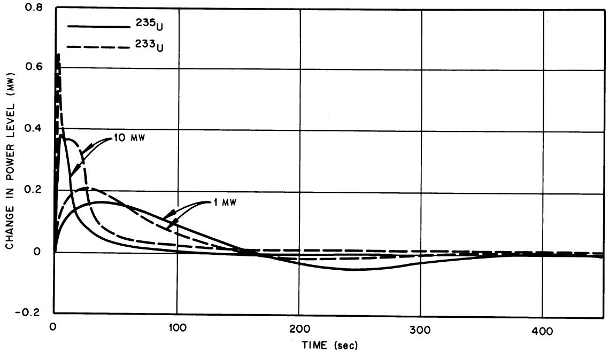  
Fig. 7. MSRE transient response to a $+0.01\%$ $\delta \rho$ step reactivity input when operating at 1 and 10 MW.

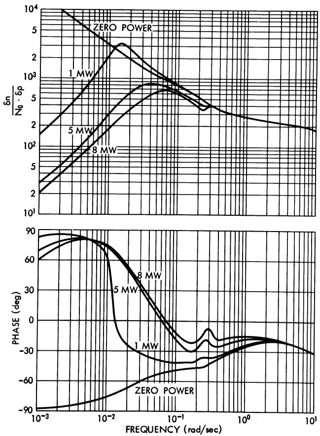  
Fig. 8. Nuclear power to reactivity frequency response for $^{235}\mathrm{U}$ -fueled MSRE at several power levels.

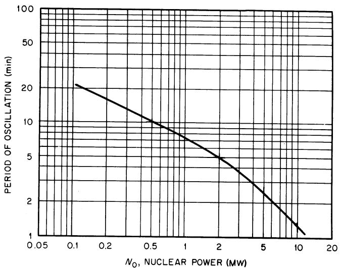  
Fig. 9. Period of oscillation vs power level for $^{235}\mathrm{U}$ -fueled MSRE.

complicated near the origin, but it is clear that no encirclements of $(-1,j0)$ exist. The main eigenvalues and their power dependence appear in Fig. 11. These were computed using the system matrix containing Padé approximations for the transport delays and precursor equations with effective delayed-neutron fractions rather than explicit treatment of precursor circulation effects. As before, this analysis indicates a low frequency, lightly damped behavior at low power and a higher

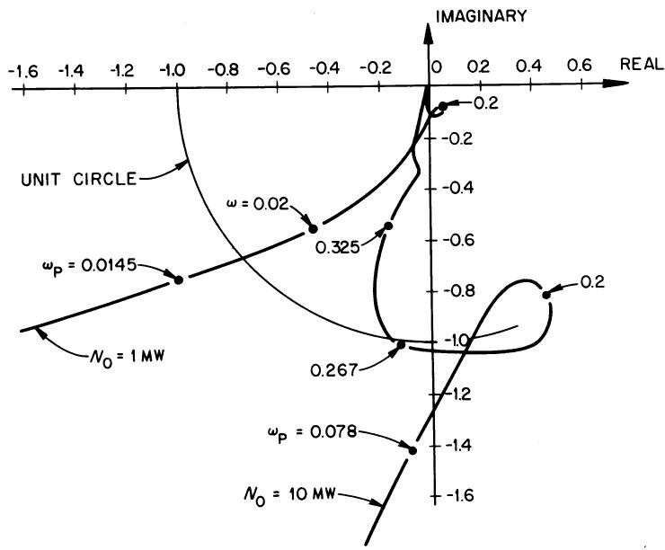

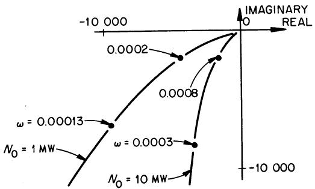  
Fig. 10. Nyquist diagrams for complete model at 1 and 10 MW ( $^{235}\mathrm{U}$ fuel).

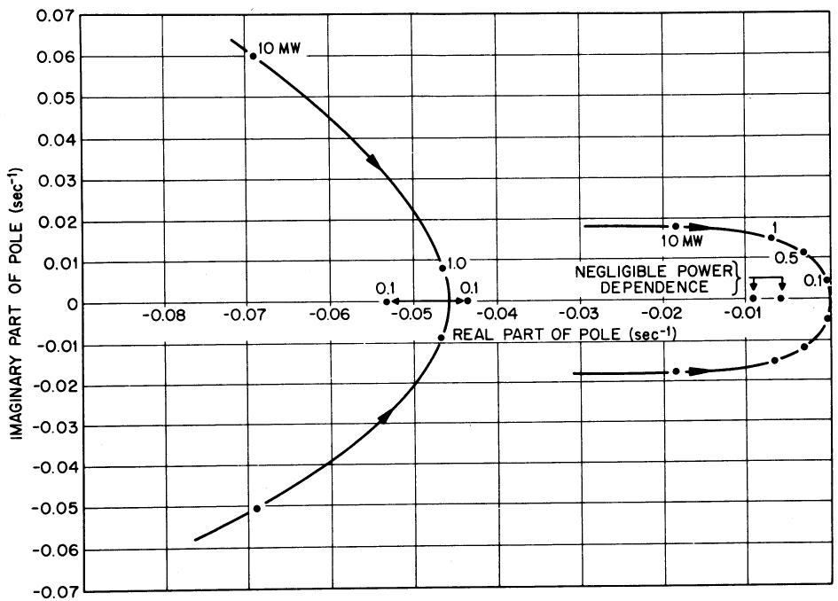  
Fig. 11. Major poles for the $^{235}\mathrm{U}$ -fueled MSRE.

frequency, more strongly damped behavior at higher power. Also, stable system operation is indicated at all power levels with relative stability increasing as the power level increases.

# B. $^{233}\mathrm{U}-$ Fueled System

1. Transient Response—The MATEXP code was used with the state variable model to compute the response of the uncontrolled, $^{233}\mathrm{U}$ -fueled MSRE12 to a step input in reactivity. The results for a step input of $0.01\% \delta \rho$ are shown in Fig. 7.

Other transients which were calculated for the $^{233}$ U-fueled system appear in Fig. 12. At the higher power levels the power rises sharply after a step increase in reactivity, but the temperature effects in the core promptly counterbalance the reactivity input, and the power decreases toward its initial level. However, before returning to its initial level, the power levels out on a transient plateau. It stays at this level until $\sim 17$ sec after the reactivity perturbation; then it again begins to decrease. The power plateau is observed because a quasi-steady state exists in the core

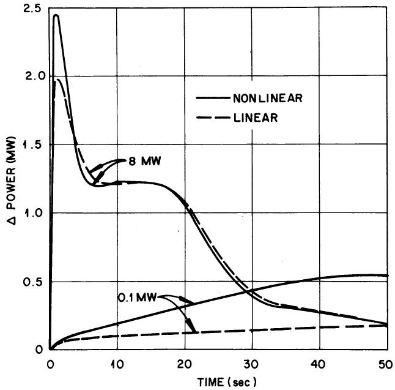  
Fig. 13. Power response of the $^{233}\mathrm{U}$ -fueled MSRE to a $0.04\%$ step reactivity insertion as calculated with nonlinear and linearized kinetics equations.

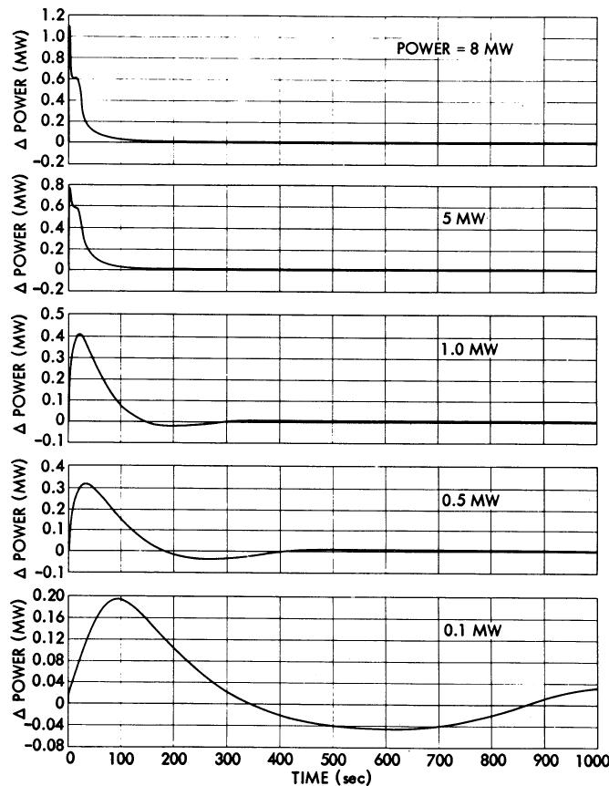  
Fig. 12. Calculated power response of the $^{235}\mathrm{U}$ -fueled MSRE to a $0.02\%$ $\delta k / k$ step reactivity insertion at various power levels.

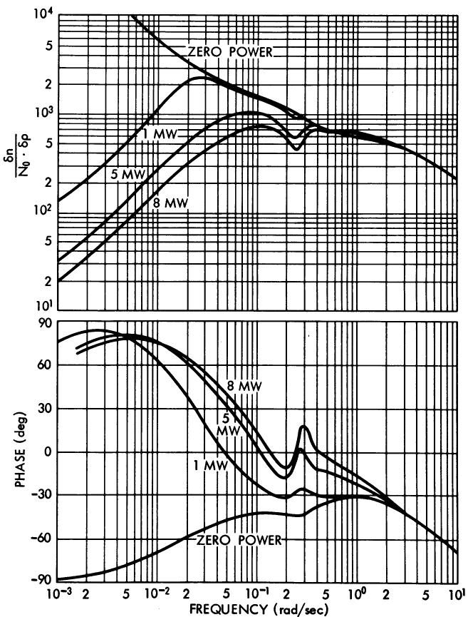  
Fig. 14. Nuclear power to reactivity frequency response for $^{233}\mathrm{U}$ -fueled MSRE at several power levels.

region. The inlet temperature is the same as it was before the perturbation, and the core nuclear average temperature has increased enough to compensate for the reactivity change. After $\sim 17$ sec (the transit time of the fuel in the external loop) the return of higher-temperature salt increases the inlet temperature and introduces negative reactivity through the negative temperature coefficient. After sufficient time the reactor returns to the initial power level, at which time the net increase in average temperature compensates for the step reactivity input. This behavior was not observed in the $^{235}\mathrm{U}$ -fueled system for the power levels considered.

A comparison of the step response of the system for the complete, nonlinear model and for a linearized model was made. The results appear in Fig. 13. It is observed that the nonlinear effects are more important at low power where larger fractional power changes can occur before the inherent temperature feedback can cancel the inserted reactivity.

2. Frequency Response—The results of a set of frequency response calculations using SFR-III appear in Fig. 14. The results are similar to the results for the $^{235}\mathrm{U}$ -fueled system. In general, the dominant amplitude peaks for the $^{233}\mathrm{U}$ -fueled system are lower, broader, and at slightly higher frequencies than for the $^{235}\mathrm{U}$ -fueled system. This is mainly due to the greater negative temperature feedback in the $^{233}\mathrm{U}$ -fueled system resulting from the greater magnitude of the negative fuel temperature coefficient of reactivity which overrides the destabilizing effect of the lower delayed-neutron fraction. As with the $^{235}\mathrm{U}$ -fueled system, the frequency response results indicate a well-behaved system.

The dip in the frequency-response amplitude at 0.24 rad/sec is due to the fuel recirculation effect. The total loop time is $16.73 + 8.46 = 25.19$ sec (see Table I). The frequency associated with this is $6.28 / 25.19 = 0.24$ rad/sec. Experiments with the $^{235}\mathrm{U}$ fueled system indicated that the dip was much smaller than predicted by a model which used pure time delays for fuel transport. Consequently, a first-order lag representation of a mixing pot was added to the model. Calculations were made to determine the effect of assigning different fractions of the external loop time to the mixing pot holdup time. These results appear in Fig. 15 for operation at 8 MW.

The sensitivity of the frequency response to parameter changes was also calculated using SFR-III. Some results are shown in Fig. 16 for operation at 8 MW. These clearly show the frequency range over which the parameters have an important effect on system dynamics. For

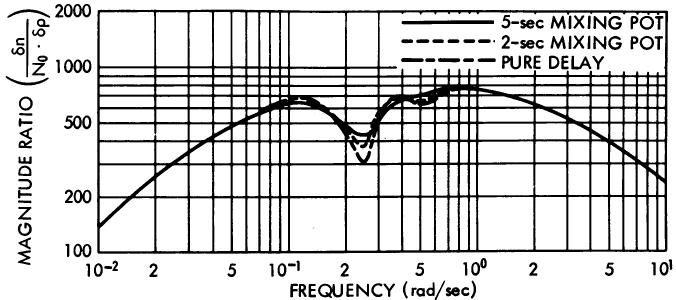

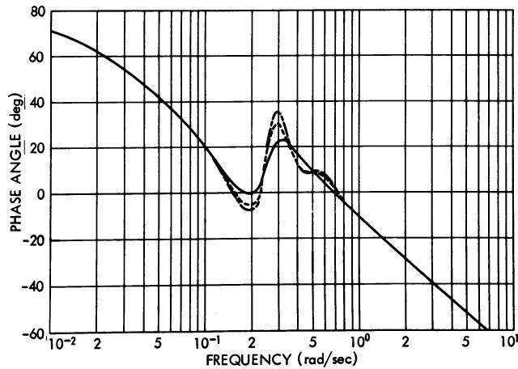  
Fig. 15. Frequency-response plot for the $^{233}\mathrm{U}$ -fueled MSRE operating at 8 MW for various amounts of mixing in the circulating loop.

example, the large changes in the mixing pot holdup time and the heat exchanger characteristics at $\sim 0.24$ rad/sec suggest that fuel salt recirculation effects are important factors in determining the amplitude dip at $0.24$ rad/sec.

3. Stability-For the $^{233}\mathrm{U}$ -fueled system, the stability analysis was based on an eigenvalue calculation and a modified Mikhailov analysis. The eigenvalues appear in Fig. 17. All of the eigenvalues have negative real parts and the real part of the dominant eigenvalue becomes more negative as the operating power level increases. The results of the modified Mikhailov analysis appear in Fig. 18. (These curves only show the range $0 \leqslant \omega \leqslant \infty$ . The locus for $-\infty \leqslant \omega \leqslant 0$ is simply the mirror image around the real axis.) No encirclements of the origin were observed for any power level, indicating stable system operation at all operating power levels.

# VI. CONCLUSIONS

A detailed analysis of the dynamics and stability indicates that the system is stable and operable at all power levels. Furthermore, relative stability increases as the operating power level increases. The smaller delayed-neutron

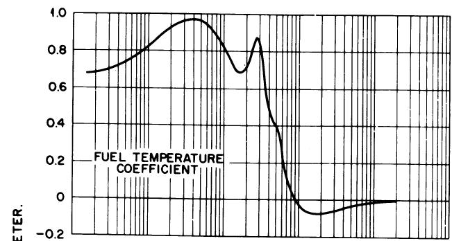

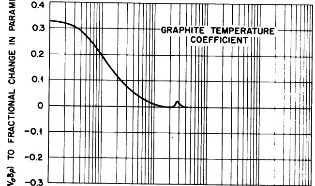

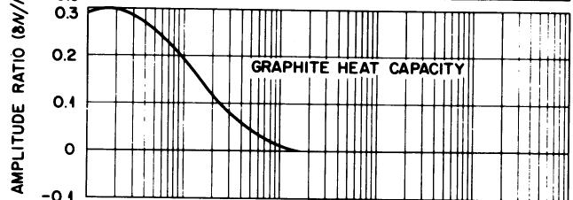

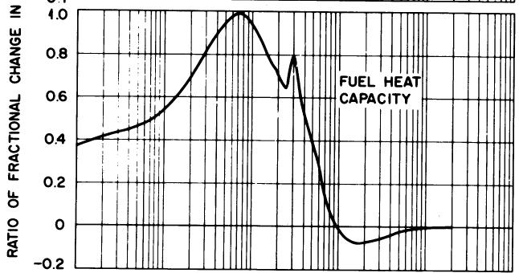

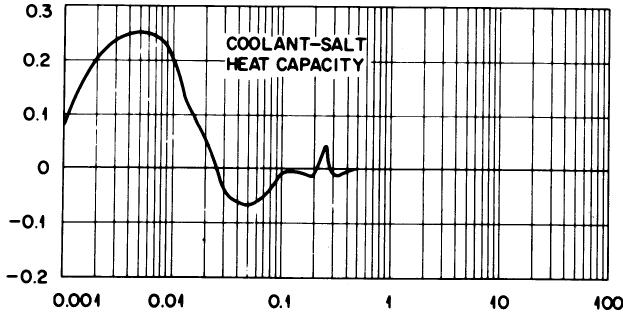  
FREQUENCY (rad/sec)

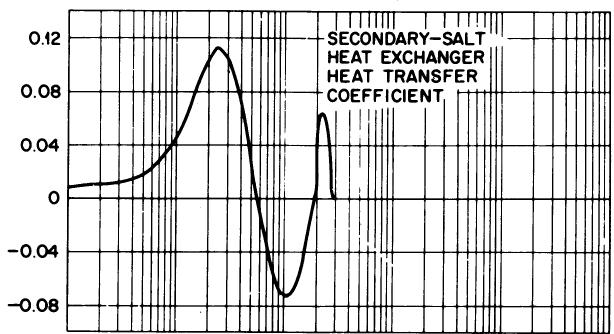

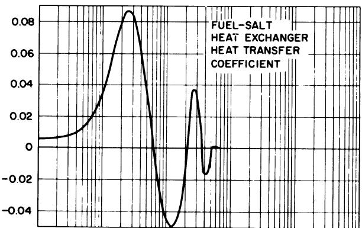

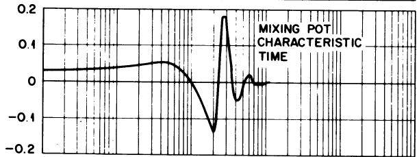

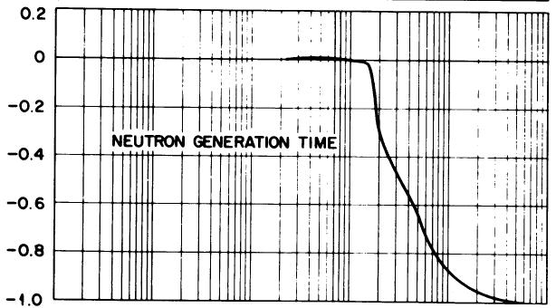

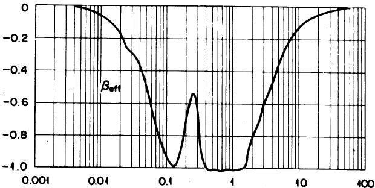  
FREQUENCY (rad/sec)   
Fig. 16. Curves showing the sensitivity of the amplitude ratio to change in various system parameters for $^{233}\mathrm{U}$ -fueled MSRE.

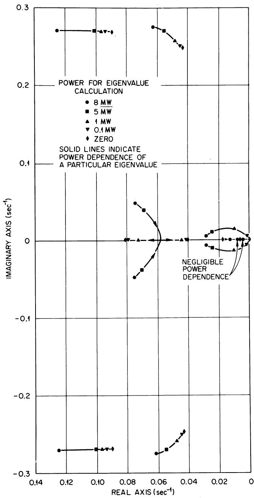  
Fig. 17. Major poles for the $^{233}\mathrm{U}$ -fueled MSRE.

fraction for the $^{233}\mathrm{U}$ -fueled system caused no dynamics or stability problems. This is because the stabilizing effect of a more negative fuel temperature coefficient of reactivity in the $^{233}\mathrm{U}$ -fueled case compensates for the effect of a smaller delayed-neutron fraction.

Numerous analytical methods were used in the studies. Experience showed that the effort required to implement the different methods was justified by the increased understanding of system characteristics made possible by interpretation of the various results. It is felt that, in general, a

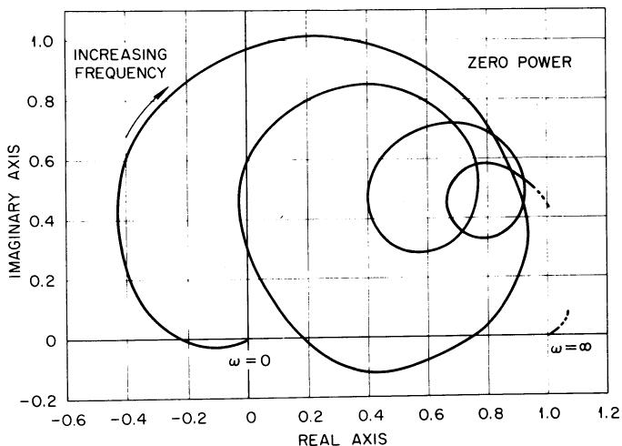  
Fig. 18a. Modified Mikhailov plot for MSRE operating with $^{233}\mathrm{U}$ fuel at zero power.

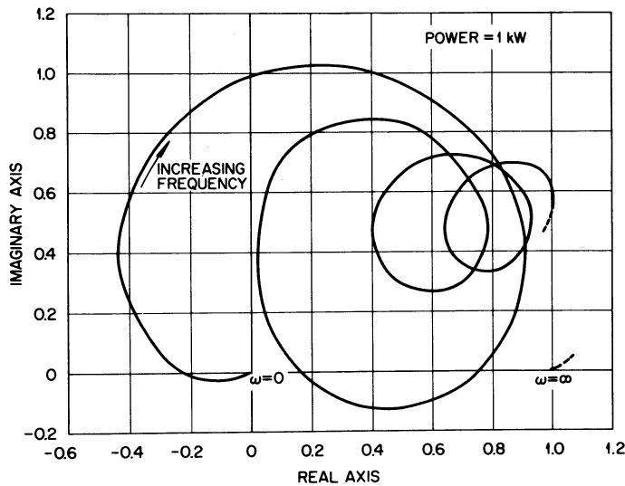  
Fig. 18b. Modified Mikhailov plot for MSRE operating with $^{233}\mathrm{U}$ fuel at $1\mathrm{kW}$ .

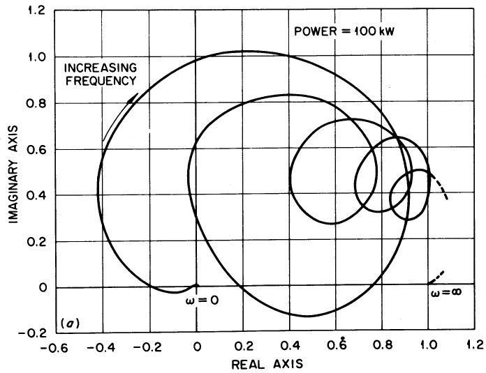  
Fig. 18c. Modified Mikhailov plot for MSRE operating with $^{233}\mathrm{U}$ fuel at $100\mathrm{kW}$ .

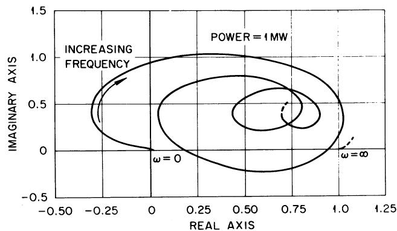  
Fig. 18d. Modified Mikhailov plot for MSRE operating with $^{233}\mathrm{U}$ fuel at 1 MW.

complete analysis of the inherent dynamic characteristics of a new system should include transient response calculations, frequency response calculations, stability analysis, and sensitivity analysis.

# ACKNOWLEDGMENT

This research was sponsored by the U.S. Atomic Energy Commission under contract with the Union Carbide Corporation.

# REFERENCES

1. T. W. KERLIN, S. J. BALL, R. C. STEFFY, and M. R. BUCKNER, 'Experiences with Dynamic Testing Methods at the Molten-Salt Reactor Experiment,' Nucl. Technol., 10, 103 (1971).   
2. P. N. HAUBENREICH and J. R. ENGEL, “Experience with the Molten-Salt Reactor Experiment,” Nucl. Appl. Technol., 8, 118 (1970).   
3. S. J. BALL and T. W. KERLIN, "Stability Analysis of the Molten-Salt Reactor Experiment," USAEC Report ORNL-TM-1070, Oak Ridge National Laboratory (December 1965).   
4. S. J. BALL, “Approximate Models for Distributed-Parameter Heat-Transfer System,” ISA Trans., 3, 38 (January 1964).   
5. G. S. STUBBS and C. H. SINGLE, "Transport Delay Simulation Circuits," USAEC Report WAPD-T-38 and Supplement, Westinghouse Atomic Power Division (1954).   
6. S. J. BALL and R. K. ADAMS, “MATEXP, A General Purpose Digital Computer Program for Solving Ordinary Differential Equations by the Matrix Exponential Method,” USAEC Report ORNL-TM-1933, Oak Ridge National Laboratory (August 1967).

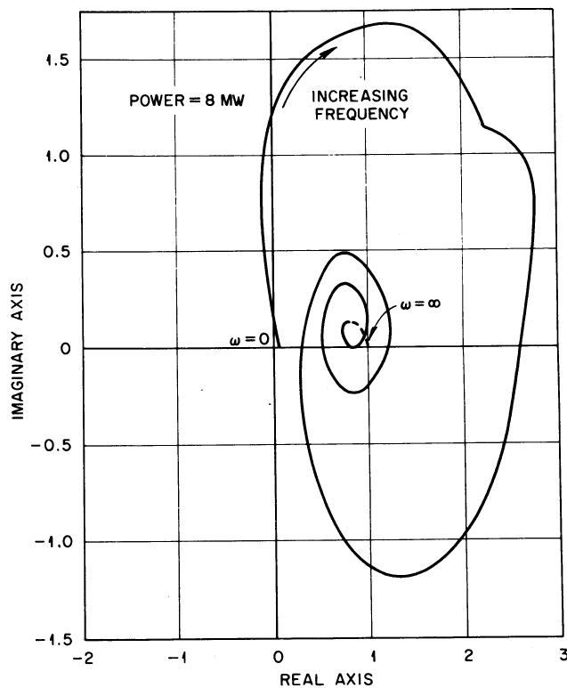  
Fig. 18e. Modified Mikhailov plot for MSRE operating with $^{233}\mathrm{U}$ fuel at 8 MW.

7. T. W. KERLIN and J. L. LUCIUS, “The SFR-3 Code—A Fortran Program for Calculating the Frequency Response of a Multivariable System and Its Sensitivity to Parameter Changes,” USAEC Report ORNL-TM-1575, Oak Ridge National Laboratory (June 1966).   
8. F. H. RAVEN, Automatic Control Engineering, McGraw-Hill, New York (1961).   
9. F. P. IMAD and J. E. Van NESS, “Eigenvalues by the QR Transform,” Share-1578, Share Distribution Agency, IBM Program Distribution, White Plains, New York (October 1963).   
10. W. C. WRIGHT and T. W. KERLIN, “An Efficient, Computer-Oriented Method for Stability Analysis of Large Multivariable Systems,” Trans. ASME, J. Basic Eng., Series D, 92, 2, 279 (1970).   
11. T. W. KERLIN, “Stability Extrema in Nuclear Power Systems with Design Uncertainties,” Nucl. Sci. Eng., 27, 120 (1967).   
12. R. C. STEFFY, Jr. and P. J. WOOD, “Theoretical Dynamic Analysis of the MSRE with $^{233}\mathrm{U}$ Fuel,” USAEC Report ORNL-TM-2571, Oak Ridge National Laboratory (July 1969).

