# EXPERIENCES WITH DYNAMIC TESTING METHODS AT THE MOLTEN-SALT REACTOR EXPERIMENT

KEYWORDS: reactivity, frequency, power, testing, performance, signals, MSRE

T. W. KERLIN, S. J. BALL, R. C. STEFFY,\* and M. R. BUCKNER\*\*

Oak Ridge National Laboratory, Oak Ridge, Tennessee 37830

Received May 23, 1970

Revised September 14, 1970

A series of reactivity-to-power frequency response measurements was made on the MoltenSalt Reactor Experiment. This was done for $^{233}U$ and $^{235}U$ fuels, for a range of operating power levels, at several points in the system operating history, and for several different test procedures. A comparison of experimental results with prior theoretical predictions confirmed the validity of the theoretical predictions. The test program included measurements using the pseudorandom binary sequence, pseudorandom ternary sequence, n-sequence, and the multifrequency binary sequence.

# I. INTRODUCTION

An extensive dynamics testing program was carried out at the Molten-Salt Reactor Experiment (MSRE). The tests consisted of reactivity to power frequency response measurements. The purpose of the test program was:

1. to demonstrate the safety and operability of the system   
2. to check the validity of the theoretical analysis so that the safety of the plant could be

reassessed if necessary and so that confirmed methods could be established for analyzing future, high-performance molten-salt reactors

3. to evaluate techniques for performing dynamics experiments and methods of data analysis.

Tests were performed at several different power levels, at several different times in the system's operating history, and for the reactor fueled with $^{235}\mathrm{U}$ and with $^{233}\mathrm{U}$ . Items 1 and 2 were the main objectives of the test program, but this paper emphasizes item 3 since it should be of general interest to those planning dynamics tests in other systems. Those interested only in the performance of the MSRE could skip Secs. II and III and proceed directly to the results in Sec. IV.

# II. PLANNING THE TESTS

# A. Objective

The primary test objective was to measure the reactivity-to-power frequency response over the range of frequencies where important system dynamic effects occurred. Inspection of the frequency response predictions (see Figs. 8 and 14 of Ref. 1) indicated that measurements down to $\sim 0.005$ rad/sec at the low frequency end were needed. It would have been desirable to carry the high frequency end of the measurements out to about 50 rad/sec if the zero-power reactor kinetics effects were to be observed. If the interest were in feedback effects, the upper frequency need not have been greater than $\sim 0.5$ rad/sec. The approach used here was to determine the high frequency (1.0 to 100.00 rad/sec) response by noise

measurements during zero-power operation. Subsequent at-power measurements concentrated on the 0.005- to 0.5-rad/sec range where feedback effects were important.

# B. Equipment Used in Experimenta! Measurements

The selection of the experimental methods for the MSRE dynamics tests was based on the information required and on the capabilities of the available equipment. Fortunately, the emphasis on low frequency results (0.005 to 0.5 rad/sec) made it possible to obtain the important part of the system frequency response using the standard MSRE control rods to introduce the input reactivity perturbations.

The MSRE has three identical control rods, each with an active length of 59.4 in. One rod is normally designated as the regulating rod and is used for fine control. The other two rods are used as shim rods for coarse adjustments. The rods are actually flexible, stainless-steel hoses on which are strung gadolinium oxide poison cylinders. The rods are mounted in thimbles which have two 30-deg offsetting bends so that the rods can be centrally located even though there is no room for the control-rod drive assemblies above the central axis of the core. The maximum rod speed is $\sim 0.5$ in./sec. Typical rod travel in the experiments was $\sim 0.5$ in. for most of the $^{235}\mathrm{U}$ tests and 0.3 in. for most of the $^{233}\mathrm{U}$ tests. This gave a reactivity change of $\sim 0.025\%$ (7%) in the $^{235}\mathrm{U}$ tests and $\sim 0.02\%$ (12%) in the $^{233}\mathrm{U}$ tests.

Figure 1 shows the control-rod and drive assembly. The position indication for each rod was obtained from a synchro geared to the rod drive mechanism. A coarse synchro (5-deg rotation per inch of rod travel) was used in early tests and a fine synchro (60-deg rotation per inch of rod travel) was used in later tests. The signal from the position synchro was amplified and low-pass filtered (1-sec time constant) to eliminate high frequency noise and the accompanying aliasing effect prior to input into the Bunker Ramo computer, BR-340, where the signal was digitized every 0.25 sec and recorded on magnetic tape.

The nuclear power level signal was furnished by the output of a compensated ion chamber located adjacent to the core. This signal was also amplified, low-pass filtered (1-sec time constant), digitized at 0.25-sec intervals, and recorded on magnetic tape.

The BR-340 computer was also used in conjunction with a portable analog computer for generation of the input signal for the test. A computer program was prepared for on-line generation of each test signal used in the tests (the signals are described in Sec. II.C.2).

# C. Test Signals

1. Introduction. Test signal selection was influenced by considerations of accuracy requirements, frequency range over which information was needed, and hardware capabilities. The following input signals were used during the testing program:

a. pulse

b. step

c. pseudorandom binary sequence

d. pseudorandom ternary sequence

e. $n$ -sequence

f. multifrequency binary sequence (flat input spectrum)

g. multifrequency binary sequence (prewhitened output spectrum).

Pulse and step tests are easy to implement, but these signals give results with limited accuracy. This is because the signals are nonperiodic, and therefore have a continuous frequency spectrum and resulting low signal energy in the neighborhood of a frequency of interest.

The other five signals are more trouble to implement, but they permit more accurate results. This is because they are periodic, and therefore concentrate the signal energy in discrete harmonic frequencies. In all of the tests using periodic signals, the period is determined by the lowest desired frequency:

$$
T = \frac {2 \pi}{\omega_ {1}} \quad ,
$$

where

$$
T = \text {p e r i o d}
$$

$$
\omega_ {1} = \text {l o w e s t d e s i r e d f r e q u e n c y}.
$$

For example, the required period for a test in which the lowest required frequency is 0.01 rad/sec in 628 sec. All other harmonics would be at integer multiples of 0.01 rad/sec. The accuracy of the results is improved by using input signals consisting of more than 1 cycle. In the MSRE measurements 2 to 10 cycles were used.

# 2. Properties of Input Signals.

a. Pulse. The energy density $e$ of a pulse of duration $T$ and amplitude $A$ at frequency $\omega$ is given by:

$$
e = \frac {A ^ {2} T ^ {2}}{2 \pi} \left[ \frac {\sin (\omega T / 2)}{\omega T / 2} \right] ^ {2}.
$$

  
Fig. 1. Control-rod drive assembly.

This spectrum appears in Fig. 2. Note that the amplitude is expressed as energy spectral density (energy per unit frequency).

b. Step. A step input may be thought of as a pulse whose duration has gone to infinity. The step test is suitable only for systems whose response settles to some constant value after the

step input. This requires that the system's zero-frequency gain be a finite constant (including zero). In principle, the step input contains an infinite amount of energy, but this energy is concentrated in the low frequencies where it is of little use.

c. Pseudorandom Binary Sequence. The pseudorandom binary sequence (PRBS) is often used

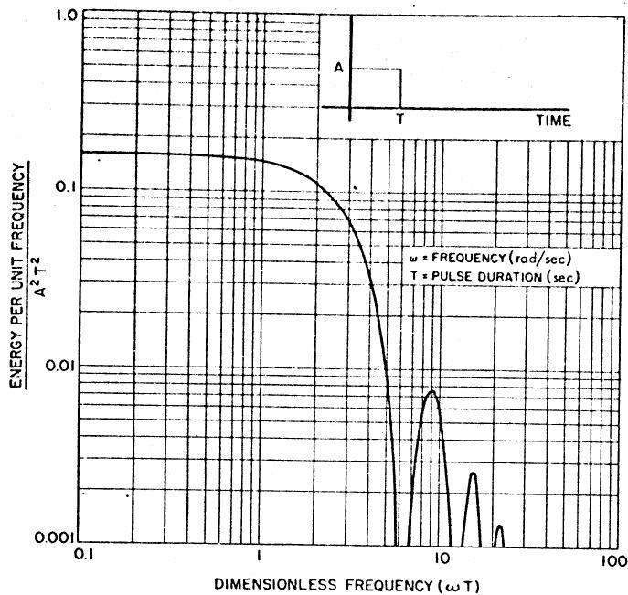  
Fig. 2. Energy spectrum of a square pulse.

for frequency response measurements and for approximate impulse response measurements. The methods for generating the PRBS are well known. $^{2,3}$ These methods give periodic sequences of $+1$ 's and $-1$ 's (each member of the sequence is called a bit). The total number of bits in the sequence $N$ must be $2^{Z} - 1$ for any integer value of $Z$ . The period of the signal is given by the product of the number of bits $N$ and the bit time interval $\Delta t$ .

The spectrum of the PRBS with pulse amplitude $A$ and total test duration $T$ is given by:

$$
\begin{array}{l} A _ {k} = 2 \frac {(N + 1) A ^ {2} T}{N ^ {2}} \left[ \frac {\sin (k \pi / N)}{k \pi / N} \right] ^ {2} \quad \text {f o r} k \neq 0 \\ A _ {0} = \frac {A ^ {2} T}{N ^ {2}} \quad \text {f o r} k = 0, \tag {1} \\ \end{array}
$$

where $A_{k} =$ amplitude of the energy spectrum at the $k$ 'th harmonic frequency. The spectra for several sequences are shown in Fig. 3. Note that the short sequences concentrate most of the signal energy in the first few harmonics and the longer sequences spread the signal power among more harmonics.

In planning a test, one must select the period to give the required lowest frequency. The required upper frequency fixes the sequence length $N$ or equivalently (since the period is fixed) the bit duration. The following relation specifies the harmonic number at which the signal power is half as large as the amplitude of the harmonic with the

greatest amplitude3 (thereby furnishing a measure of the bandwidth of the signal):

$$
k _ {f} = 0. 4 4 N, \tag {2}
$$

where $k_h =$ harmonic number of the harmonic with half the power as the harmonic with the greatest power. Thus, if the lowest frequency is $\omega_1$ rad/sec, and the required highest frequency is $\omega_h$ rad/sec, then the number of bits is given by:

$$
N = 2. 2 7 \frac {\omega_ {h}}{\omega_ {1}}. \tag {3}
$$

The bit duration $\Delta i$ is fixed by the highest frequency of interest. The relation is

$$
\Delta t = \frac {2 . 7 7}{\omega_ {h}}. \tag {4}
$$

Of course, these are just rules of thumb. If the total signal energy is too small, the signal energy per harmonic may be too small even for the harmonic with the largest amplitude.

d. Pseudorandom Ternary Sequence. The pseudorandom ternary sequence4 (PRTS) is similar to the PRBS, but three levels of the input signal are

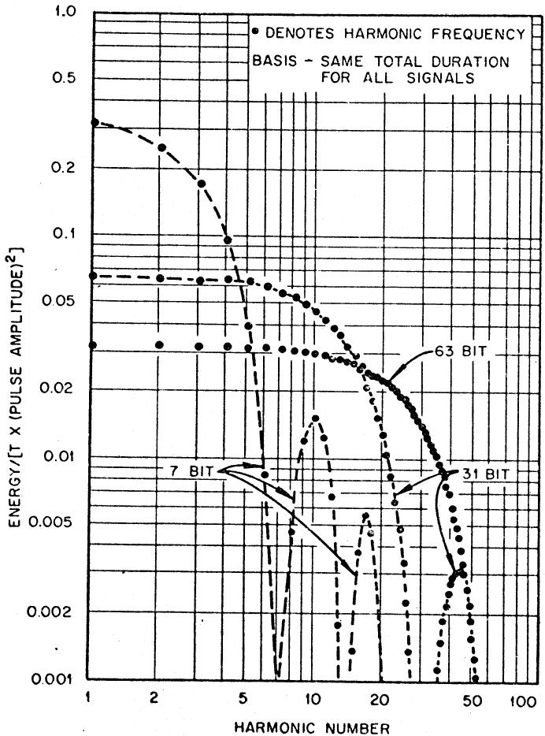  
Fig. 3. Energy spectrum for several PRBS signals.

used $(-1,0, + 1)$ . The number of shifts in these sequence is given by $N = (3^{Z} - 1)$ for integer values of $Z$ .

The spectrum of the PRTS with pulse amplitude $A$ and total test duration $T$ is given by:

$$
A _ {k} = \frac {8}{3} \frac {\left(\dot {N} + 1\right) A ^ {2} T}{N ^ {2}} \left[ \frac {\sin \left(k \pi / N\right)}{k \pi / N} \right] ^ {2} \quad \text {f o r} k \text {o d d} \tag {5}
$$

$$
A _ {k} = 0 \quad \text {f o r} k \text {e v e n}.
$$

This shows that the shape of the PRTS spectrum is the same as for the PRBS. However, only the odd harmonics are non-zero and they have an amplitude which is one-third larger than the corresponding amplitude of a PRBS harmonic for a sequence with the same value of $N$ . Figure 4 shows a comparison of these signals. The properties given in Eqs. (2) through (4) for the PRBS also apply for the PRTS.

The PRTS is of interest because it has the advantage that it discriminates against nonlinear effects. This may be advantageous because it allows one to use large amplitude signals in frequency response measurements. The PRTS has the disadvantage that in the MSRE (and in many other reactor systems) a three-level input is harder to implement with system hardware than a two-level signal.

e. $n$ -Sequence. The $n$ -sequence is obtained by a simple modification of the PRBS. The modification consists of inverting every other bit in a PRBS. Since the number of bits $N$ in a PRBS is

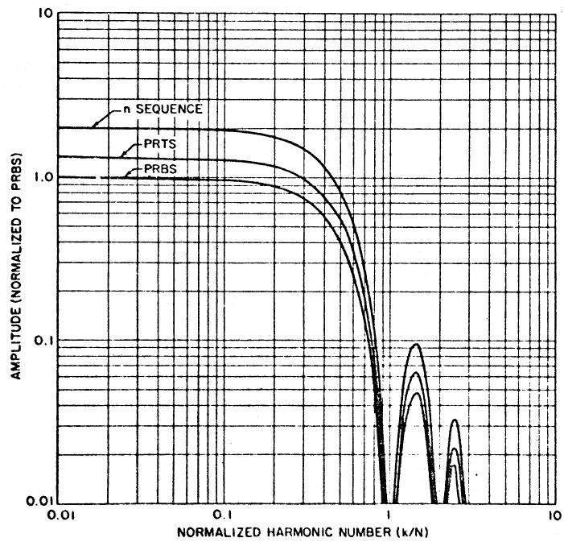  
Fig. 4. Envelope of amplitude spectra for PRBS, PRTS, and $n$ -sequence.

always odd, the number of bits in an $n$ -sequence obtained by $\mathfrak{n}$ codification of an $N$ -bit PRBS is $2N$ .

The spectrum of the $n$ -sequence with $N$ bits, pulse amplitude $A$ , and total test duration $T$ is given by:

$$
A _ {k} = - \frac {4 (N + 1) A ^ {2} T}{N ^ {2}} \left[ \frac {\sin (k \pi / N)}{k \pi / N} \right] ^ {2} \quad \text {f o r} k \text {o d d} \tag {6}
$$

$$
A _ {k} = 0 \quad \text {f o r} k \text {e v e n}.
$$

Figure 4 shows a comparison of the spectrum for the $n$ -sequence and the PRBS and PRTS. Since the shape of the amplitude spectrum is the same as for the PRBS, the bandwidth relations [Eqs. (2) through (4)] still apply.

The $n$ -sequence discriminates against nonlinear effects as in the case of the PRTS signal.

f. Multifrequency Binary Sequence (MFBS)- Flat Spectrum. In all frequency response measurements, a major objective is to select input signals with a large fraction of the total available signal energy concentrated in the frequencies selected for measurement. Generally, it is desirable to space the harmonics evenly on a logarithmic scale except in regions where more resolution is needed. Since the harmonics of the PRBS, PRTS, and $n$ -sequence are evenly spaced on a linear scale, the spacing of the harmonics is too dense at the higher frequencies (see Fig. 3). This constitutes a waste of signal energy in identifying nearby harmonics which are only slightly different from one another.

An alternate procedure is to design a test signal which maximizes the fraction of the total signal energy in harmonics selected by the experimenter. A signal of this type can be obtained by a computer optimization of the polarities of the pulses in a pulse chain of fixed length. The objective function, which is minimized in the optimization, is the difference between the desired spectrum and the spectrum obtained for a given pulse chain. Experience shows that as much as 65 to $75\%$ of the total signal power can be concentrated in selected harmonics.[6,7] Furthermore, the signal can be designed so as to discriminate against nonlinear effects.

A typical signal used in the MSRE experiments appears in Fig. 5.

g. Multifrequency Binary Sequence (MFBS)-Prewhitened Spectrum. One of the main reasons for interest in the PRBS, PRTS, and $n$ -sequence is that the amplitude spectrum can be made quite flat over a wide frequency range. This is important in measurements with large noise contamination of the input signal. The procedure for such a system would be to use as much input signal energy as possible (within limits set by system operating

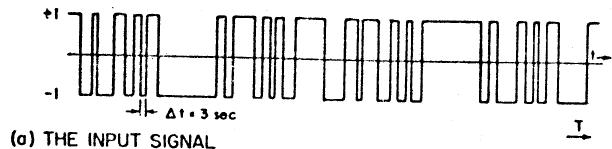

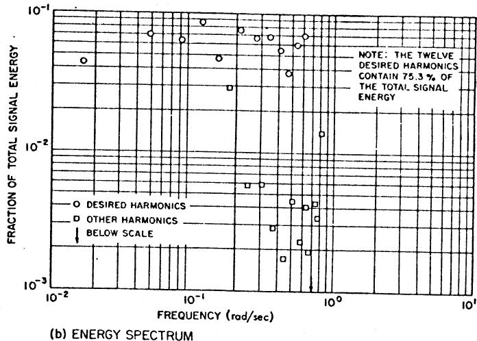  
Fig. 5. MFBS flat spectrum signal and its spectrum.

conditions and nonlinear effects) and to divide this energy evenly among the desired harmonics so that the signal-to-noise ratio would be as high as possible at each measurement frequency.

In systems in which the predominant noise contamination is in the output signal, the same observations apply as were mentioned above in connection with an input-noise problem. That is, each output harmonic should contain the maximum possible signal energy. Thus, for systems with output noise problems (a common case) the output amplitude spectrum should be flat. This can be accomplished by using an input signal whose amplitude spectrum has a shape which is the reciprocal of the amplitude spectrum of the system frequency response.

A method has been developed for obtaining a flat output spectrum if preliminary estimates of the amplitude of the system frequency response are available from theoretical calculations or from preliminary measurements. The procedure is the same as described in the previous section, except that the desired amplitude spectrum used in the optimization has the shape of the reciprocal of the expected shape of the amplitude of the system frequency response. The amplitude spectrum of a typical input signal for a prewhitened MFBS test is shown in Fig. 6.

3. Signal Input Procedures. Three different procedures were used in the tests. The changes were required to overcome problems with the control rods and with the system background flux noise.

a. Open-Loop Rod Positioning. This procedure was used in the early tcosts. The desired input signal generated by the BR-340 computer was used to actuate withdraw and insert signals to the control-rod drive motor. The withdraw and insert times were different because the coasting characteristics of the rod were different for withdrawals and insertions. The withdraw and insert times were adjusted manually during the beginning of the test to give the desired pulse shapes. This procedure worked well when the control rods were new, but the wear associated with long-term operation caused difficulty in later tests.

b. Flux Demand. The flux demand procedure was used to overcome the problems associated with open-loop tests. The procedure was to feed the test sequence in as a flux demand signal for the flux-servo system. This caused the control rods to move to satisfy the flux demand. In this test, the spectrum of the flux signal had the approximate shape of the spectrum of the test sequence. The amplitude of the spectrum of the input was approximately the amplitude of the flux signal divided by the amplitude of the system frequency response at that frequency.

This procedure worked satisfactorily for the final tests with the $^{235}\mathrm{U}$ loading. The only condition was that the flux servo system had to be ad

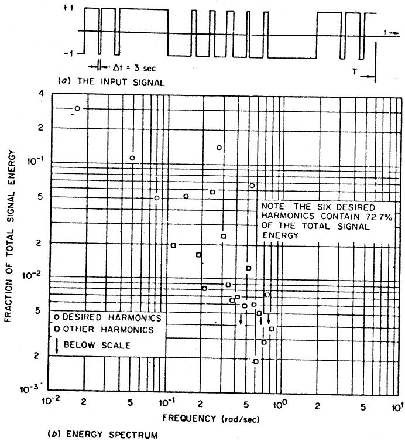  
Fig. 6. MFBS prewhitened signal and its spectrum.

justed to avoid hunting by the control rod. This was necessary because of loose coupling in the rod drive mechanism (see Fig 1), which caused an error in every indicated rod position change. If each rod position change was preceded by a change in the opposite direction, then each reading was in error by a multiplicative factor. When rod position changes in arbitrary directions were made, the indicated position error was not a simple factor and it was impossible to obtain reliable rod position indications.

When the reactor operated with $^{233}\mathrm{U}$ fuel, a change in system characteristics made the flux demand procedure unacceptable. Shortly after operation began with $^{233}\mathrm{U}$ fuel, the void fraction in the fuel salt increased significantly with an accompanying increase in flux noise. This noise component in the error signal in the servo caused excessive rod motion. This was unacceptable because of the problem with erroneous rod position signals.

c. Closed-Loop Rod Positioning. The problems with the flux demand test led to the closed-loop rod positioning procedure. In this procedure, the flux signal from the ion chamber was disconnected from the servo system and was replaced by the rod position signal. Then, the error signal which actuated the control-rod drive was the difference between actual and desired rod position signal. This procedure was satisfactory in all tests.

# III. DATA ANALYSIS METHODS

Three different digital computer codes were used in the data analysis. These are described briefly below:

1. FOURCO. $^{8}$ This code computes the Fourier transform of the output signal and the input signal, and computes their ratio to give the frequency response.   
2. CPSD. This code is based on a digital simulation of bandpass filters. The filters have adjustable bandwidths, as opposed to the other two analysis methods in which the effective bandwidths are determined by the duration of the data record analyzed.   
3. CABS. $^{10}$ This code computes the autocorrelation function of the input, the autocorrelation function of the output, and the cross-correlation function for input and output. These are then Fourier transformed (using FOURCO) to give the input power spectrum, the output power spectrum, and the cross power spectrum. The frequency response is given by the ratio of the cross power spectrum to the input power spectrum.

# IV. RESULTS

The large number of different tests (over 50) makes it impossible to show all the results in this paper. Instead, some typical results will be shown, and a comparison with theoretical results will be made. (The reader may consult Refs. 7, 9, and 11 for more details on test results.)

# Frequency Response Results

a. $^{235}U$ Fuel, Initial Operation. For these early tests, the input consisted of a reactivity pulse, a reactivity step, or a pseudorandom binary reactivity input. The input procedure was the open-loop rod positioning procedure, and all three data analysis methods were used. Figure 7 shows the zero-power frequency response for the $^{235}U$ -fueled reactor with fuel salt stationary. This figure also shows the noise analysis results at high frequency. The comparison of the magnitude with calculations is quite good. The phase results are less satisfactory.

Figure 8 shows the frequency response at 2.5 MW. The agreement between the shape of the measured frequency response and the shape of the predicted frequency response is good for magnitude and phase. The differences between the theoretical and experimental results for the absolute value of this magnitude are not completely understood, but it is suspected that the problems with accurate rod position indications and with establishing the true power level by heat balances are largely responsible for the differences. (The frequency response is a strong function of power level. See Figs. 8 and 14 of Ref. 1.) The autocorrelation function of the rod position signal and the cross-correlation function for the 2.5 MW test appear in Figs. 9 and 10. The blips near each end are due to asymmetry in the pulses (the positive pulses do not have exactly the same shape as the negative pulses). These blips are predictable from the theoretical properties of pseudorandom binary signals with asymmetrical pulses.[13] These blips were not observed during the first tests (before the power was increased to 2.5 MW), but they have been observed intermittently in subsequent tests. They cause no problems in obtaining frequency response results. They are included here to illustrate an unexpected feature in the test results which were bothersome until the cause was understood.

Figure 11 shows the results at 7.5 MW. From this figure, it appears that the dip in the amplitude at $\sim 0.24$ rad/sec in the predicted frequency response is too large in the theoretical predictions. Since this calculated dip was due to fuel recirculation effects, it appears that more mixing of the

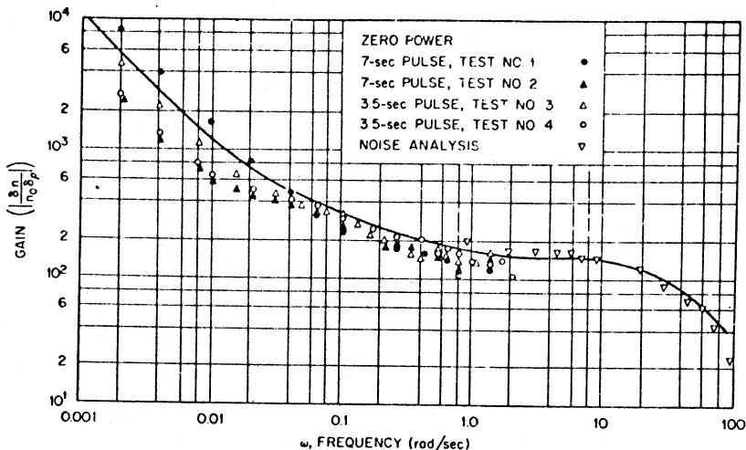

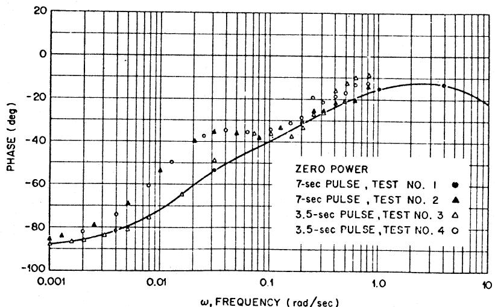  
Fig. 7. Frequency response at zero power; fuel static.

fuel salt in the external loop should be included in the theoretical model.

A measure of the adequacy of the theoretical model is its ability to predict the natural period of oscillation of the power response following a reactivity perturbation. The comparison of the experimental results with theoretical predictions (see Fig. 9 of Ref. 1) appears in Fig. 12.

b. $^{235}U$ Fuel, Intermediate Tests. Measurements were made again after 1 year of power operation (2100 equivalent full-power hours). Pseudorandom binary sequence inputs were used at power levels of 1, 5, and 7 MW. The open-loop rod positioning procedure was used. These tests showed no significant changes in the dynamic characteristics due to aging.

c. $^{235}U$ Fuel, Final Tests. A final set of measurements for the $^{235}U$ -fueled system were made after more than 9000 equivalent full-power hours of operation. Input steps, pseudorandom binary

sequences, and pseudorandom ternary sequences were used. The last attempts at open-loop rod positioning were made in some of the PRBS tests. This procedure worked occasionally, but it was not reliable. The flux demand method was used for most of these tests to overcome problems encountered with the open-loop rod positioning method. Figure 13 shows results from flux demand tests using one of the few satisfactory PRTS signals. These results show that there were no aging effects which caused significant changes in the power hours of operation.

d. $^{233}U$ Fuel, Initial Operation. Plans were made to use the flux demand technique in the dynamics tests for the $^{233}U$ loading, but this procedure proved unacceptable because of the problems mentioned in Sec. II.C.3. This led to the use of the closed-loop rod positioning method, which proved to be satisfactory, and which was used in all subsequent tests. Pseudorandom binary sequences and pseudorandom ternary sequences

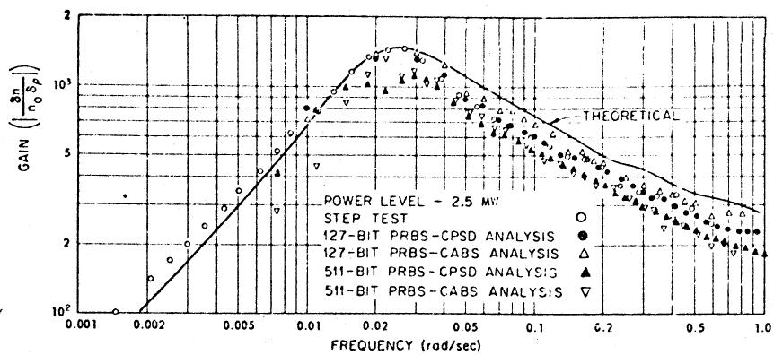

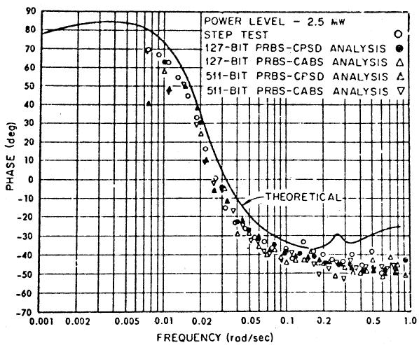  
Fig. 8. Frequency response, power $= 2.5$ MW.

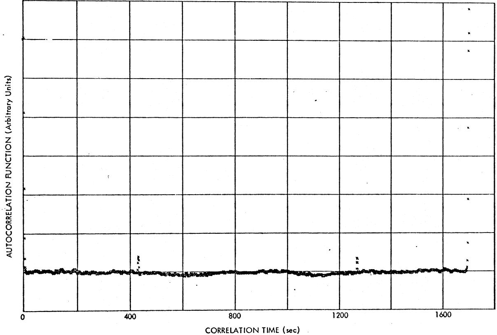  
Fig. 9. Input autocorrelation function for a 511-bit PRBS test at 2.5 MW.

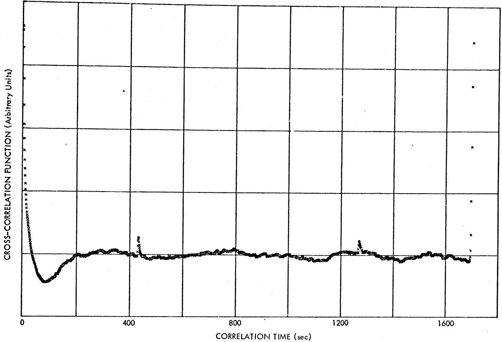  
Fig. 10. Cross-correlation function for a 511-bit PRBS test at 2.5 MW.

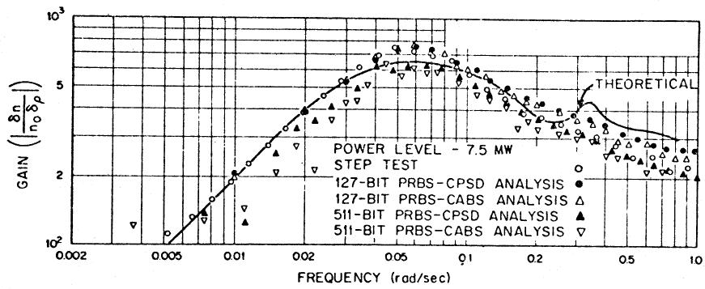

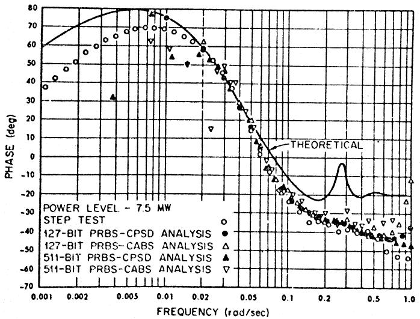  
Fig. 11. Frequency response, power $= 7.5 \mathrm{MW}$ .

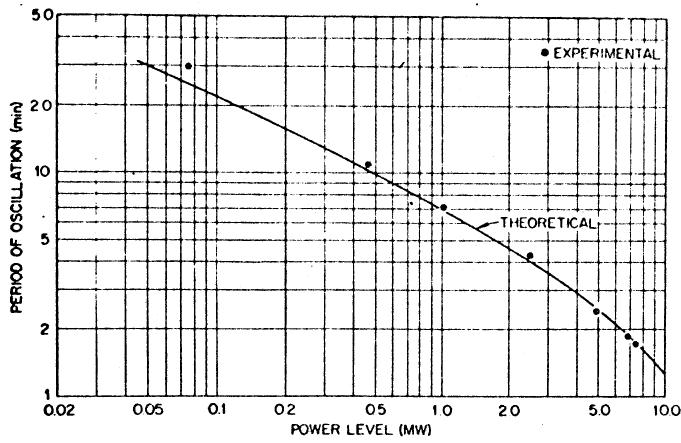  
Fig. 12. MSRE natural periods of oscillation.

were used. Typical results are shown in Figs. 14 and 15 for PRBS and PRTS tests. The PRBS results shown in Fig. 14 are in good agreement with theory and the scatter is small. The theory still shows too large a dip at 0.24 rad/sec, indicating too little mixing in the theoretical model. The PRTS results shown in Fig. 15 have the same general form as the PRBS results, but the scatter is excessive. This is apparently due to the problems in determining the rod position accurately for the three-level signal (see Sec. II.C.3).

e. $^{233}U$ Fuel, Final Tests. A final series of tests was run $\sim 9$ months later. For the final tests, the PRBS, the $n$ -sequence, the MFBS-flat spectrum, and the MFBS-prewhitened spectrum

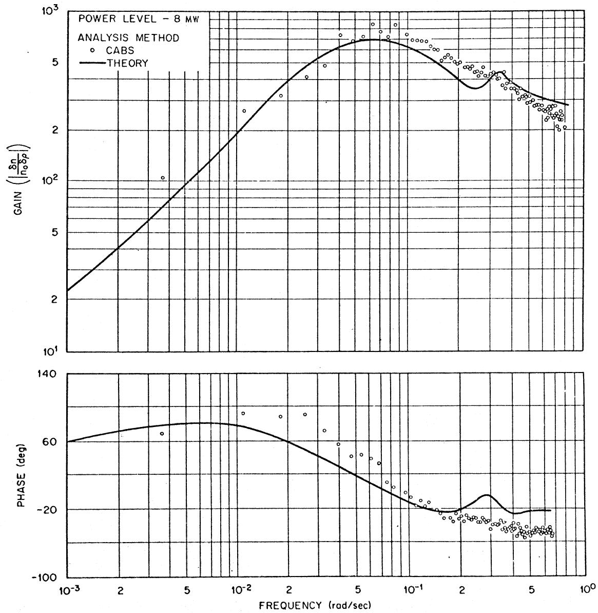  
Fig. 13. Frequency-response results from a flux-demand test performed on the $^{235}\mathrm{U}$ -fueled reactor using a PRTS test pattern.

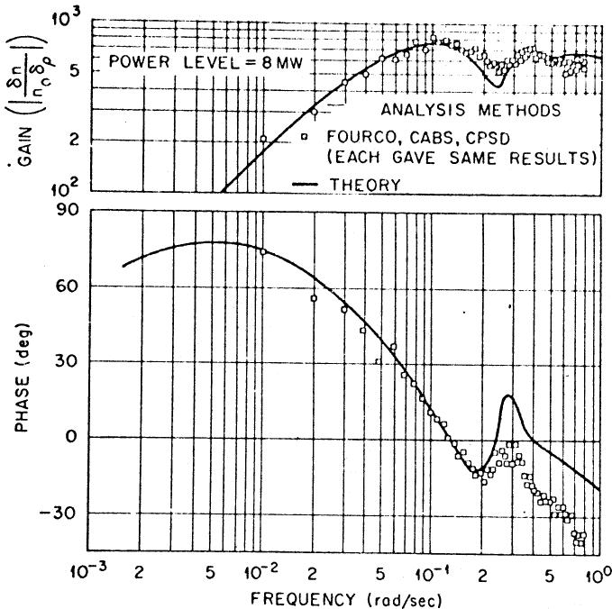  
Fig. 14. Results from a 127-bit PRBS with the reactor at 8 MW.

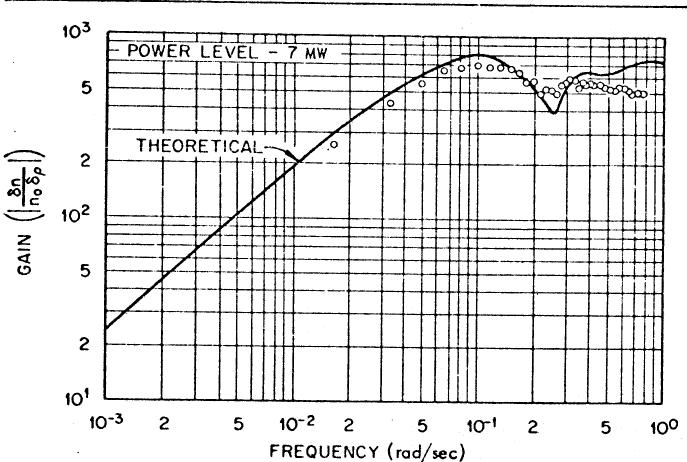

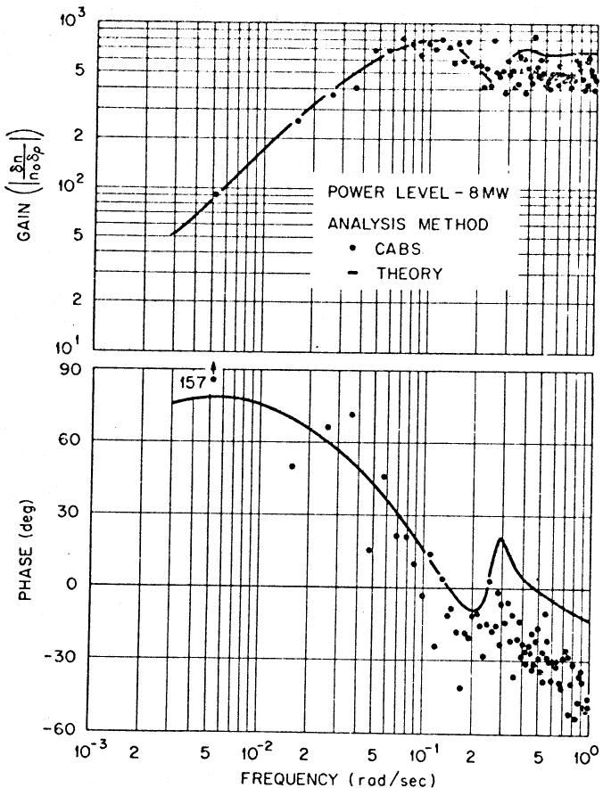  
Fig. 15. Frequency-response results from a rod-demand test using a 242-bit PRTS test pattern.

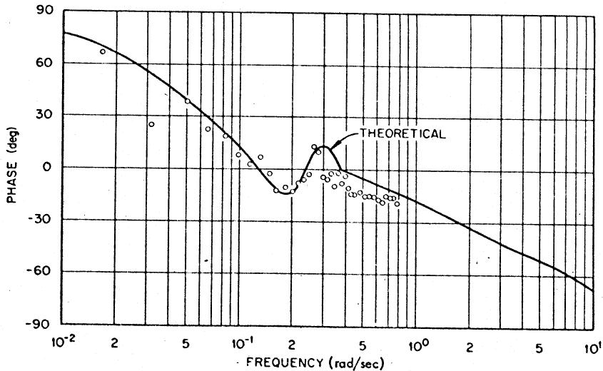  
Fig. 16. MSRE frequency response—PRBS signal.

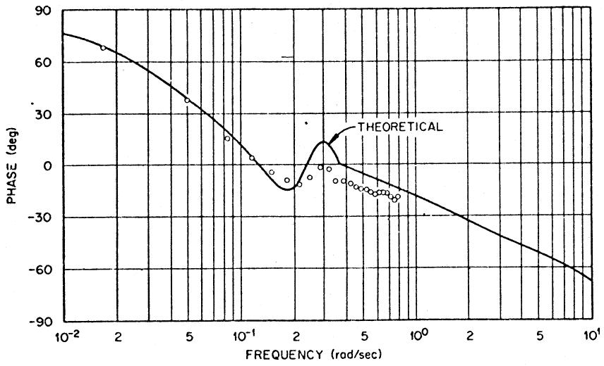

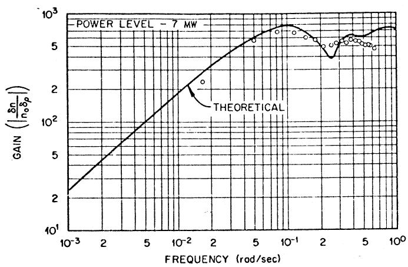  
Fig. 17. MSRE frequency response— $n$ -sequence.

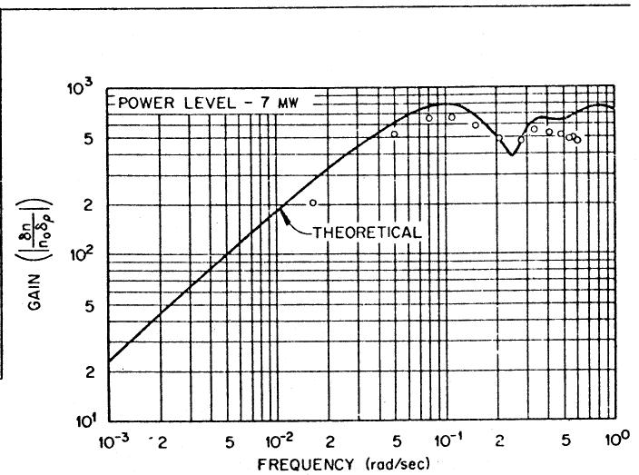

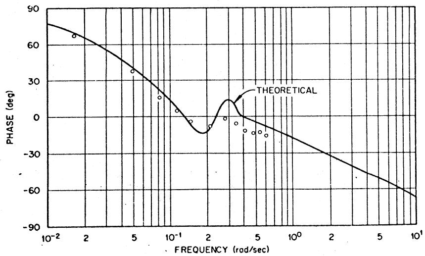  
Fig. 18. MSRE frequency response—MFBS with flat input spectrum.

were used. Results are shown in Figs. 16 through 19. These results again demonstrate that there was no significant change in system dynamics due to aging.

In these tests, comparisons were made of the different test signals. In general, the advantage of the MFBS was demonstrated. It is not possible to present the details of the comparison here (see Ref. 7), but some typical results are shown in Table I. This table shows results for a PRBS test and an MFBS test. Each test consisted of 8 cycles and each cycle was analyzed separately to give an independent estimate of the frequency response. The lower percent deviations for the MFBS tests are due to the higher signal-to-noise ratio at each measurement frequency, which occur because the input signals concentrate the available energy in these frequencies.

The prewhitening technique was of little benefit because the amplitude of the MSRE frequency response did not change very much over the frequency range of interest.

TABLEI Percent Deviations in Measured Magnitude Ratios   

<table><tr><td rowspan="2">Frequency (rad/sec)</td><td colspan="2">Percent Deviationa</td></tr><tr><td>MFBS</td><td>PRBS</td></tr><tr><td>0.016</td><td>16.0</td><td>34.0</td></tr><tr><td>0.049</td><td>7.3</td><td>16.4</td></tr><tr><td>0.082</td><td>4.1</td><td>7.3</td></tr><tr><td>0.12</td><td>4.6</td><td>9.2</td></tr><tr><td>0.15</td><td>7.0</td><td>6.6</td></tr><tr><td>0.21</td><td>4.4</td><td>17.8</td></tr><tr><td>0.28</td><td>3.9</td><td>16.6</td></tr><tr><td>0.35</td><td>4.0</td><td>9.5</td></tr><tr><td>0.41</td><td>3.9</td><td>9.8</td></tr><tr><td>0.48</td><td>3.6</td><td>5.1</td></tr><tr><td>0.54</td><td>1.8</td><td>7.9</td></tr><tr><td>0.61</td><td>3.3</td><td>5.8</td></tr></table>

${}^{a}$ Based'on 8 cycles of data. Both signals had same amplitude and bit duration. The MFBS had 128 bits and the PRBS had 127 bits.

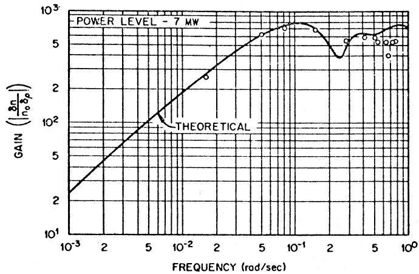

# V. CONCLUSIONS

The main conclusion as far as the MSRE program is concerned is that the dynamic characteristics of the MSRE were found to be satisfactory and essentially as predicted, for both the $^{235}\mathrm{U}$ and the $^{233}\mathrm{U}$ fuel loadings.

Conclusions having to do with experiences in performing dynamics tests on a system with no special provision for test equipment are:

1. By proper matching of the testing method to the system characteristics and to the characteristics of normal system hardware, it was possible

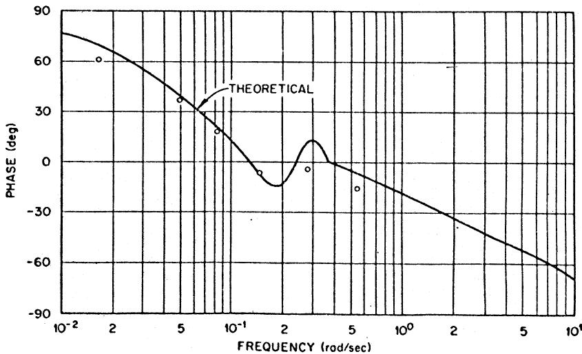  
Fig. 19. MSRE frequency response—MFBS with prewhitened output spectrum.

to measure the system frequency response without the expense of installing an oscillator rod.

2. A thorough understanding of the properties of test signals is a great help in selecting the optimum test signal for a particular application. Our experience suggests that the MFBS signal may have the widest general utility of the methods used in the MSRE tests.

# ACKNOWLEDGMENTS

This research was sponsored by the U.S. Atomic Energy Commission under contract with the Union Carbide Corporation.

# REFERENCES

1. T. W. KERLIN, S. J. BALL, and R. C. STEFFY, "Theoretical Dynamics Analysis of the Molten-Salt Reactor Experiment," Nucl. Technol., 10, 118 (1971).   
2. P. A. N. BRIGGS, K. R. GODFREY, and P. H. HAMMOND, "Estimation of Process Dynamic Characteristics by Correlation Methods Using Pseudo-Random Signals," IFAC Symp. on Identification in Automatic Control Systems, June 12-17, 1967, Prague, Czechoslovakia, Part II, pp. 3.1-3.12, Academic, Prague (June 1967).   
3. T. W. KERLIN, "The Pseudorandom Binary Signal for Frequency Response Testing," USAEC Report ORNL-TM-1662, Oak Ridge National Laboratory (1966).   
4. R. J. HOOPER and E. P. GYFTOPOULOS, "On the Measurement of Characteristic Kernels of a Class of Nonlinear Systems," Proc. Symp. on Neutron Noise, Waves and Pulse Propagation, Conf. 660206, U.S. Atomic Energy Commission (1967).

5. H. R. SIMPSON, Proc. IEEE, 113, 12, 2075 (December 1966).   
6. A. Van Den BOS, "Construction of Binary Multifrequency Test Signals," IFAC Symp. on Identification in Automatic Control Systems, June 12-17, 1967, Prague, Czechoslovakia, Part II, pp. 3.1-3.12, Academic, Prague (June 1967).   
7. M. R. BUCKNER, "Optimum Binary Signals for Frequency Response Testing," Doctoral Dissertation, University of Tennessee, Knoxville (1970).   
8. S. J. BALL, “A Digital Filtering Technique for Efficient Fourier Transform Calculations,” USAEC Report ORNL-TM-1662, Oak Ridge National Laboratory (1967).   
9. T. W. KERLIN and S. J. BALL, "Experimental Dynamic Analysis of the Molten-Salt Reactor Experiment," USAEC Report ORNL-TM-1647, Oak Ridge National Laboratory (1966).   
10. T. W. KERLIN and J. L. LUCIUS, "CABS-A Fortran Computer Program for Calculating Correlation Functions, Power Spectra, and the Frequency Response from Experimental Data," USAEC Report ORNL-TM-1663, Oak Ridge National Laboratory (1966).   
11. R. C. STEFFY, “Frequency Response Testing of the Molten-Salt Reactor Experiment,” Thesis, University of Tennessee, Nuclear Engineering Department (November 1969); and USAEC Report ORNL-TM-2823, Oak Ridge National Laboratory (1970).   
12. D. P. ROUX and D. N. FRY, Oak Ridge National Laboratory, Personal Communication.   
13. K. R. GODFREY and W. MURGATROYD, Proc. IEEE, 112, 3, 565 (March 1965).