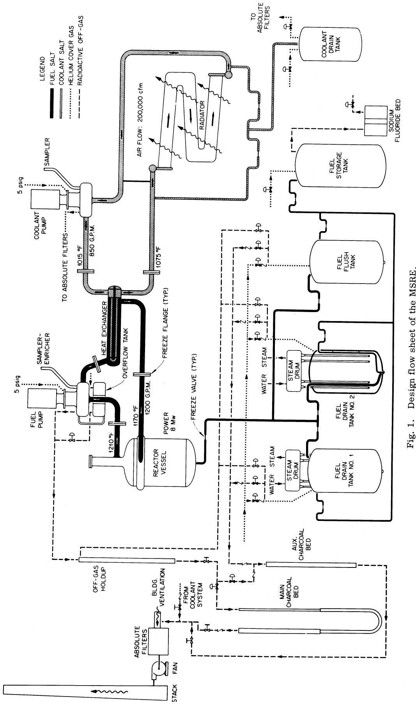
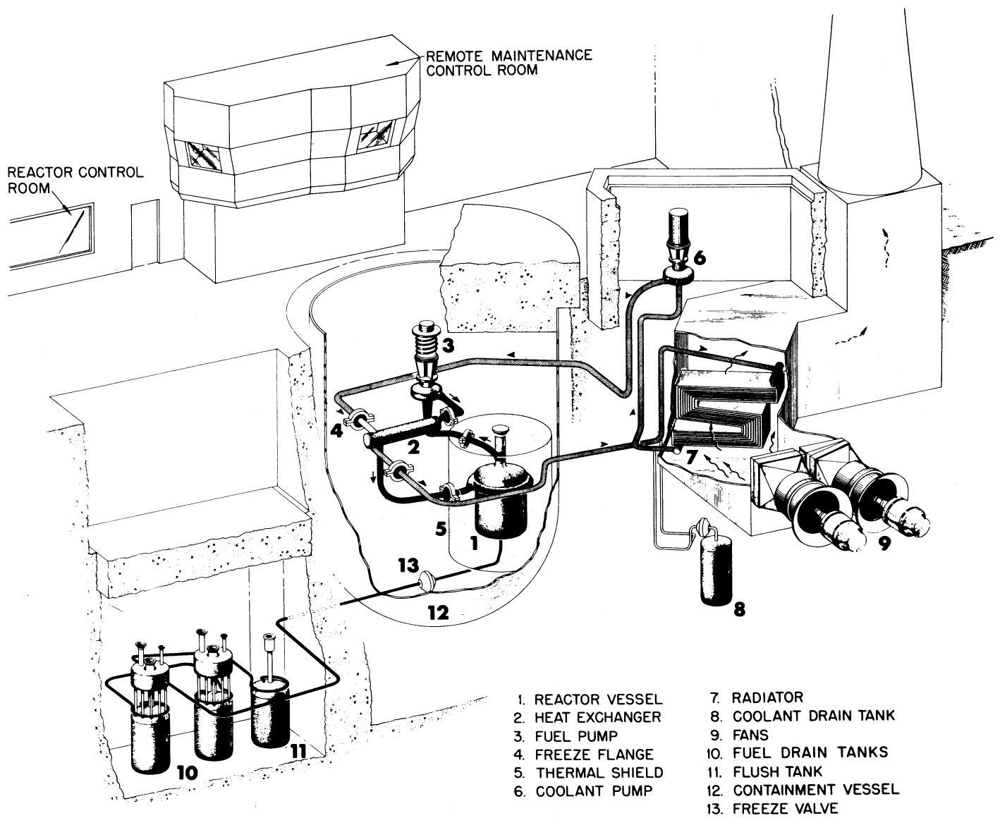
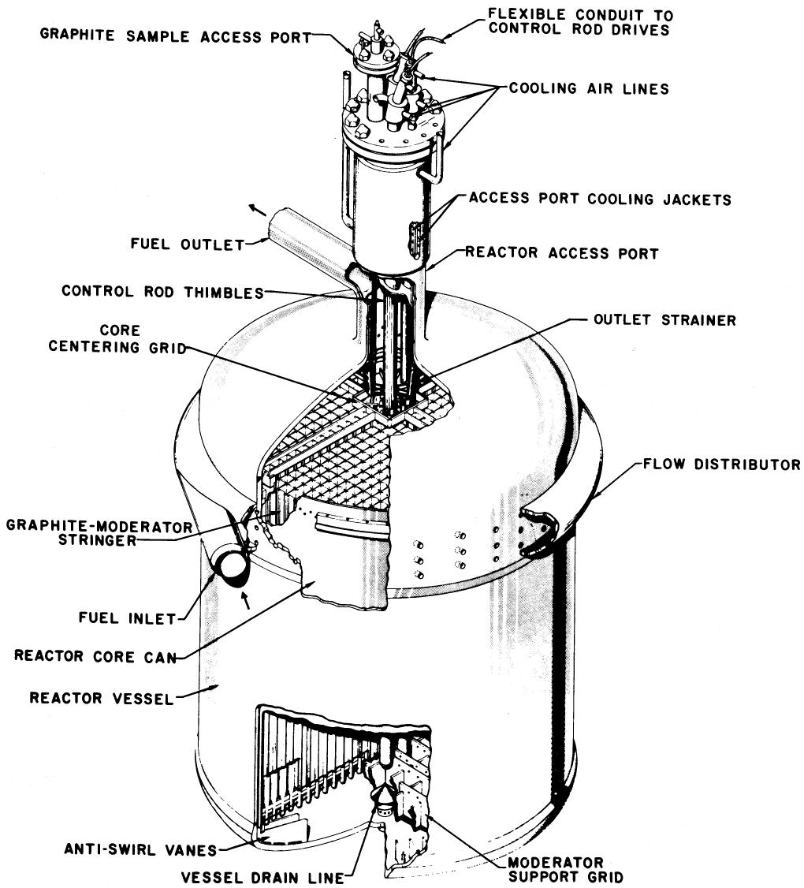
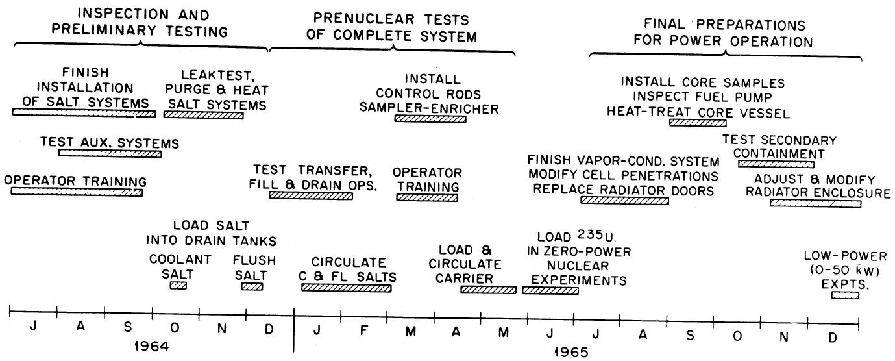
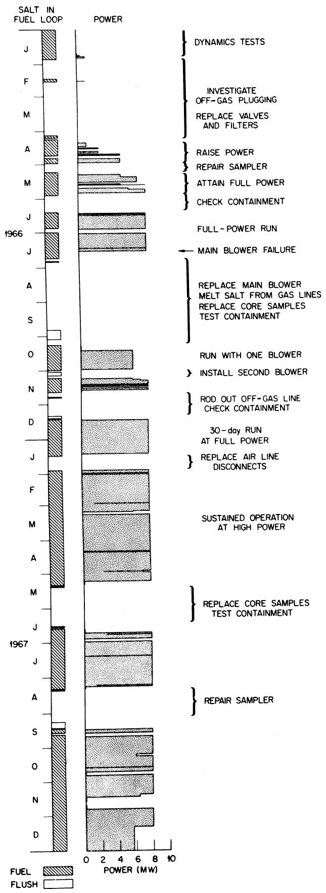
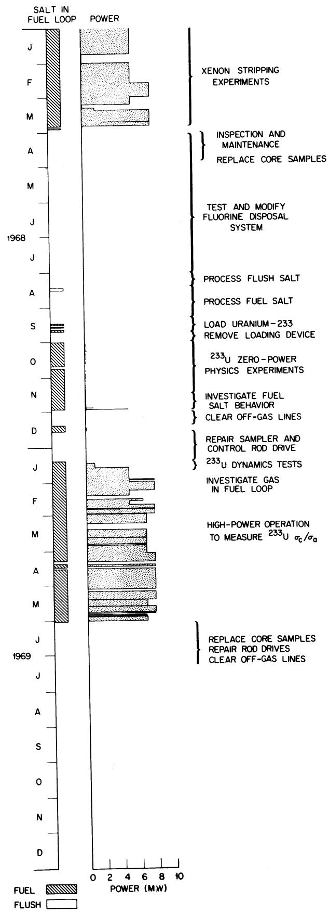
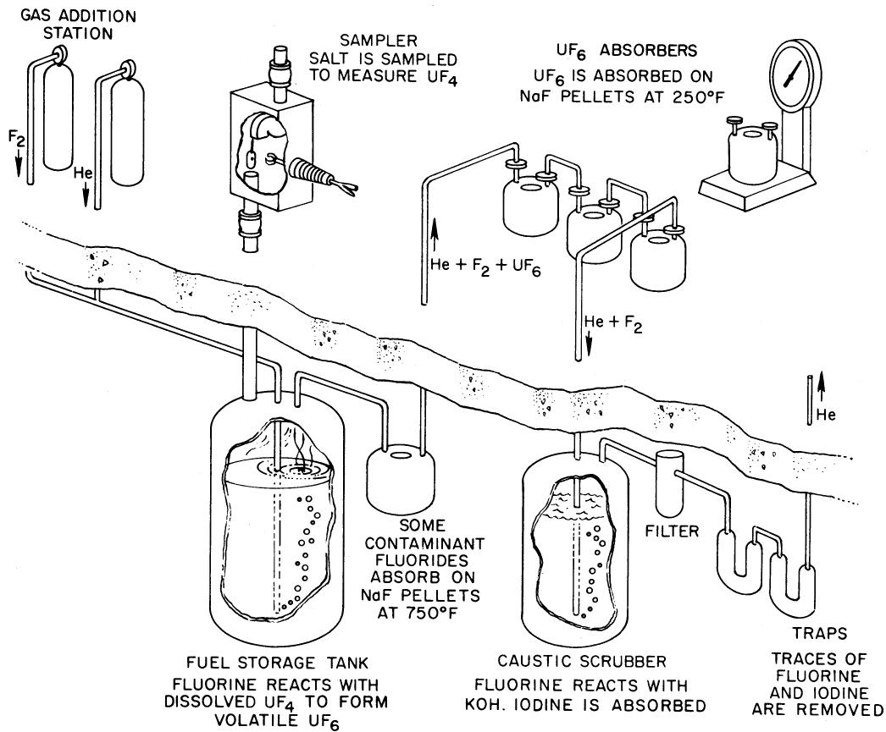

# EXPERIENCE WITH THE MOLTEN-SALT REACTOR EXPERIMENT

PAUL N. HAUBENREICH and J. R. ENGEL

Oak Ridge National Laboratory, Oak Ridge, Tennessee 37830

REACTORS

KEYWORDS: molten-salt reactors, operation, performance, testing, MSRE

Received August 4, 1969

Revised September 19, 1969

# INTRODUCTION

The MSRE is an 8-MW(th) reactor in which molten fluoride salt at $1200^{\circ}F$ circulates through a core of graphite bars. Its purpose was to demonstrate the practicality of the key features of molten-salt power reactors.

Operation with $^{235}\mathrm{U}$ (33% enrichment) in the fuel salt began in June 1965, and by March 1968 nuclear operation amounted to 9000 equivalent full-power hours. The goal of demonstrating reliability had been attained-over the last 15 months of $^{235}\mathrm{U}$ operation the reactor had been critical $80\%$ of the time. At the end of a 6-month run which climaxed this demonstration, the reactor was shut down and the 0.9 mole% uranium in the fuel was stripped very efficiently in an on-site fluorination facility. Uranium-233 was then added to the carrier salt, making the MSRE the world's first reactor to be fueled with this fissile material. Nuclear operation was resumed in October 1968, and over 2500 equivalent full-power hours have now been produced with $^{233}\mathrm{U}$ .

The MSRE has shown that salt handling in an operating reactor is quite practical, the salt chemistry is well behaved, there is practically no corrosion, the nuclear characteristics are very close to predictions, and the system is dynamically stable. Containment of fission products has been excellent and maintenance of radioactive components has been accomplished without unreasonable delay and with very little radiation exposure.

The successful operation of the MSRE is an achievement that should strengthen confidence in the practicality of the molten-salt reactor concept.

The paper by Rosenthal et al. describes the origin of the molten-salt reactor concept and how the encouraging results of the aircraft reactor program led to recognition of the potential of molten-salt reactors for economical production of electricity. The role of the Molten-Salt Reactor Experiment (MSRE) was to demonstrate the practicality of this high-temperature fluid-fuel concept which seemed so promising on the basis of materials compatibility information and calculated fuel cycle costs. When design of the MSRE was initiated in 1960, therefore, a primary objective was to make the reactor safe, reliable, and maintainable. How well these efforts succeeded is told in this paper.

# DESCRIPTION OF THE MSRE

The MSRE was designed $^2$ to use essentially the same materials as the proposed molten-salt breeders but, for economy and simplicity, there was no attempt to make the reactor actually breed. The core is small (54 in. in diam $\times 64$ in. high) so that the neutron leakage is high, and there is no blanket of fertile material. The fuel salt contains no thorium because at the time the reactor was being designed we were thinking in terms of the two-fluid breeder and we made the MSRE salt similar to the anticipated breeder fuel salt. The power level was to be limited to 10 MW(th) or less, but we wanted to try fairly large molten-salt pumps. As a result, the temperature rise of the salt as it passes through the core is $< 50^{\circ}\mathrm{F}$ . The average temperature of the fuel salt was to be $1200^{\circ}\mathrm{F}$ in the range proposed for the power breeders. Even at this temperature, the vapor pressure of the salt is $< 0.1 \mathrm{~mmHg}$ , so the pressure of the gas blanket over the salt was set

at only 5 psig. The flowsheet of the MSRE (Fig. 1) shows the normal operating conditions at 8 MW, the maximum heat removal capability of the air-cooled secondary heat exchanger. The special materials used in this reactor system are listed in Table I.

The physical arrangement of the salt systems is shown in Fig. 2. The building housing the reactor is the one in which the Aircraft Reactor Experiment was operated in 1954. The cylindrical reactor cell was added for the Aircraft Reactor Test (which was never built) and was adapted for MSRE use.

Details of the MSRE core and reactor vessel are shown in Fig. 3. The 54-in.-diam core is made up of graphite bars, 2 in. square and 64 in. tall, exposed directly to fuel which flows in passages machined into the faces of the bars. The graphite was especially produced3 to have low permeability, and, since salt does not wet the graphite, very high pressure would be required to force any significant amount of salt into the graphite. Some cracks developed in the manufacture of the graphite, but cracked bars were accepted when tests showed effects attending heating and salt intrusion into cracks were inconsequential.

All metal components in contact with molten salt are made of Hastelloy-N (formerly called INOR-8). Metal corrosion by salt mixtures consists of oxidation of metal constituents to their fluoride salts, which do not form protective films. Attack is therefore limited only by the

thermodynamic potential for the oxidation reaction, and is selective, removing the least-noble constituent, which in the case of Hastelloy-N is chromium. However, the diffusion coefficient of the chromium in the metal is such that there is practically no chromium leaching at temperatures below $1500^{\circ}\mathrm{F}$ . Impurities in the salt, such as $\mathrm{FeF}_2$ , react with Hastelloy-N, but this is a limited effect which goes to completion soon after the salts are loaded. The metallurgy and technology of Hastelloy-N have been thoroughly developed5 and it has been approved for construction under ASME Unfired Pressure Vessel and Nuclear Vessel Codes. Hastelloy-N is stronger than austenitic stainless steel and most nickel-base alloys but, like these metals it is subject to deterioration of high-temperature ductility and stress-rupture life by neutron irradiation. (These effects are due to accumulation in grain boundaries of helium produced by $n$ , $\alpha$ reactions.) In the MSRE neutron spectrum the fast neutron reactions with nickel are insignificant compared to the slow neutron reactions with impurity boron. Careful analysis of stresses and neutron fluxes in the $\mathrm{MSRE}^6$ led to the conclusion that the service life of the reactor vessel would extend at least $20000\mathrm{h}$ beyond the point at which the properties of the metal began to be seriously affected by the neutron exposure.

The control rods are flexible, consisting of hollow cylinders of $\mathrm{Gd_2O_3 - Al_2O_3}$ ceramic, canned in Inconel and threaded on a stainless-steel hose which also serves as a cooling-air conduit. An endless-chain mechanism, driven through a

TABLE I   
MSRE Materials   

<table><tr><td>Fuel Salt
Composition:</td><td colspan="2">7LiF-BeF2-ZrF4-UF4(65.0-29.1-5.0-0.9 mole%</td></tr><tr><td>Properties at 1200°F (650°C)</td><td></td><td></td></tr><tr><td>Density</td><td>141 lb/ft3</td><td>2.3 g/cm3</td></tr><tr><td>Specific heat</td><td>0.47 Btu/lb-°F</td><td>2.0 × 103J/kg-°C</td></tr><tr><td>Thermal conductivity</td><td>0.83 Btu/h-ft-°F</td><td>1.43 W/m-°C</td></tr><tr><td>Viscosity</td><td>19 lb/h-ft</td><td>29 kg/h-m</td></tr><tr><td>Vapor pressure</td><td>&lt;0.1 mm Hg</td><td>&lt;1 × 10-4bar</td></tr><tr><td>Liquidus temperature</td><td>813°F</td><td>434°C</td></tr><tr><td>Coolant salta</td><td colspan="2">7LiF-BeF2(66-34 mole%)</td></tr><tr><td>Moderator</td><td colspan="2">Grade CGB graphite</td></tr><tr><td>Salt containers</td><td colspan="2">Hastelloy-N (68 Ni-17 Mo-7 Cr-5 Fe)</td></tr><tr><td>Cover gas</td><td colspan="2">Helium</td></tr></table>

aAnother batch of salt of this composition is used to flush the fuel system before it is opened to minimize fission product escape and again after it is resealed to pick up moisture that may have entered.

  
Fig. 2. Layout of the MSRE.

clutch, raises and lowers the rods at 0.5 in./sec. When scrambled, the rods fall with an acceleration of $\sim 12$ ft/sec².

The bowl of the fuel pump is the surge space for the circulating loop. Dry, deoxygenated helium at 5 psig blankets the salt in the pump bowl. About 50 of the 120 gal/min discharged by the pump is sprayed into the gas space to provide contact between salt and cover gas to allow $^{135}\mathrm{Xe}$ to escape from the salt. (The solubility of xenon and krypton in the salt is very low.) A flow of 4 liters/min STP of helium carries the xenon and krypton out of the pump bowl, through a holdup volume providing $\sim 40$ -min delay, a filter station, and a pressure-control valve to charcoal beds. The charcoal beds consist of pipes filled with charcoal, submerged in a water-filled pit at

$\sim 90^{\circ}\mathbf{F}$ . The beds are operated on a continuous-flow basis and delay xenon for $\sim 90$ days and krypton for $\sim 7$ days. Thus, only stable or long-lived gaseous nuclides are present in the helium which is discharged through a stack after passing through the beds.

All salt piping and vessels are electrically heated to prepare for salt filling and to keep the salt molten when there is no nuclear power. In the reactor and drain-tank cells, where radiation levels make remote maintenance necessary, heater elements and reflective metal insulation are combined in removable units. Thermocouples under each heater monitor temperatures to avoid overheating the empty pipe. The radiator is equipped with doors that drop to block the air duct and seal the radiator enclosure if the coolant salt

  
Fig. 3. Details of the MSRE core and reactor vessel.

circulation stops and there is danger of freezing salt in the tubes.

Around the reactor-vessel furnace is a shield, 16 in. thick consisting of a tank of stainless steel filled with steel balls and circulating water. The shield absorbs most of the energy of neutrons and gammas escaping the reactor vessel (20 kW/MW of reactor power). It also cuts down on neutron activation of components in the reactor cell, facilitating maintenance. The cooling-water supply for the shield is deaerated to remove radiolytic gas.

Neutron chambers are located in tubes in a 36-in.-diam water-filled shaft that slopes down through the reactor cell to the inner surface of the thermal shield. Included are 3 uncompensated ion chambers driving safety channels, 2 compensated chambers, and 2 servo-driven fission chambers

that provide a 10-decade power indication. The compensated chambers are connected to multiple-range ammeters and a flux- or power-servo system. Any one of the three rods can be connected as a regulating rod to the servo system. The fuel salt, which is a mixture containing both alpha emitters and beryllium, is itself a strong neutron source, but there is also an Am-Cm-Be start-up source in a thimble in the thermal shield.

There are no mechanical valves in the salt piping. Instead, flow is blocked by plugs of salt frozen in flattened sections of the lines. Temperatures in the "freeze valves" in the fuel and coolant drain lines are controlled so they will thaw in 10 to 15 min when a drain is requested. A power failure of longer duration also results in a drain because the cooling air required to keep the valves frozen is interrupted.

The drain tanks are $\sim 4$ ft in diameter, but the molten fuel is safely subcritical because it is undermoderated away from the core graphite. Water-cooled bayonet tubes extend down into thimbles in the drain tanks to remove up to 100 kW of heat if necessary. Steam produced in the tubes is condensed and returned by gravity to provide reliability.

The reactor cell and drain-tank cell are connected by a large duct so they form a single containment vessel. The tops of the two cells consist of two layers of concrete blocks, with a weld-sealed stainless-steel sheet between the layers and the top layer fastened down to contain internal pressure. The drain cell and the top of the reactor cell were designed for 40 psig and were tested at 48 psig. The sides and bottom of the reactor cell, built to house the Aircraft Reactor Test, were tested at 300 psig before the top was modified for the MSRE. The cell atmosphere is kept at $130^{\circ}\mathrm{F}$ by water-cooled, forced-air space coolers.

The cooling "air" for the freeze valves and the fuel-pump bowl is actually reactor-cell atmosphere, compressed and cooled. Some of the blower output is discharged past a radiation monitor and up the ventilation stack to keep the reactor cell and drain-tank cell at -2 psig during operation. A small bleed of nitrogen into the cell keeps the oxygen content at $3\%$ to preclude fire if fuel-pump lubricating oil should spill on hot surfaces. The cell inleakage is calculated from purge flow-in, discharge rate, and differential pressure between the cell and a temperature-compensated, sealed volume in the cell.

All the components in the reactor and drain-tank cells are designed and laid out so they can be removed by the use of long-handled tools from above. When maintenance is to be done, the fuel is secured in a drain tank and salt plugs frozen in the connecting lines. The upper layer of blocks is removed, a hole is cut in the stainless membrane and one or two lower blocks are removed over the item to be worked on. A large duct from the reactor cell to the upstream side of the ventilation filters is opened to draw air down through the shield openings. Tools, lights, and viewing devices are inserted through fitted openings in a steel work shield. Items removed from the cells are bagged in plastic and removed for storage in another cell in the reactor building, inspection, or disposal.

In the same building, adjacent to the drain-tank cell, there is a simple facility for processing the fuel for flush salt. The purpose of twofold: to remove oxide contamination from the salt if this should be necessary and to recover the uranium from the salt at the end of the experiment. One

whole batch of salt $(\sim 75\mathrm{ft}^3)$ is transferred into a tank where it is sparged with gas-either hydrogen fluoride to remove $\mathrm{H}_2\mathrm{O}$ and convert the metal oxides to fluorides, or fluorine gas to convert $\mathrm{UF_4}$ to the volatile $\mathrm{UF_6}$ which leaves the salt to be trapped on a bed of sodium fluoride pellets. Ancillary equipment includes gas-handling equipment and a large filter to remove solids from the salt after processing.[9]

# CHRONOLOGY OF THE MSRE

Design of the MSRE began in the summer of 1960 and 18 months later fabrication of the Hastelloy-N primary-system components was started. Production of the newly developed, low-permeability graphite proved to be the critical path but by the end of 1963 it was ready for assembly in the reactor vessel. Installation of the salt systems was completed in the summer of 1964. Activities during the start-up period that followed are outlined in Fig. 4.

Prenuclear tests showed that all systems operated well and there were no unanticipated problems in handling the molten salt. The fuel carrier salt that was circulated in the final prenuclear test contained depleted uranium (150 kg). The reactor was made critical by adding 69 kg of highly enriched $^{235}\mathrm{U}$ in the form of a $\mathrm{UF_4}$ -LiF eutectic salt containing 61% uranium by weight. Most of the uranium was added to the salt in the drain tanks, with the final amounts added, 85 g at a time, through the sampler-enricher to the circulating fuel salt. After the initial criticality on June 1, 1965, more uranium was added while the control rods were calibrated and the reactivity coefficients that would be needed in later analysis of the system were measured.

At the end of the zero-power nuclear experiments, the reactor was shut down while final preparations for power operation were made. This consisted mainly of finishing construction; the only repair or modification dictated by the previous testing was replacement of the heat-warped radiator doors with doors of an improved design.

After tests in the kilowatt range showed that the dynamics of the system were as expected, the approach to the full power was started in January 1966. Trouble was encountered immediately within a few hours, plugs developed at several points in the fuel off-gas system and the reactor

  
Fig. 4. MSRE activities, July 1964-December 1965.

was shut down. Investigation showed that something like a varnish mist had plugged the small passages and a small filter in the off-gas system. There had evidently been some oil in the off-gas holdup pipe in the reactor cell and this had been vaporized and polymerized by the heat and radiation from the fission products in the fuel off-gas. Only a few grams of material had caused the trouble and the installation of a more efficient, larger filter ("particle trap") downstream of the hold pipe brought the problem under control.

Almost three months were spent in investigating and remedying the off-gas problem before operation was resumed. As shown in Fig. 5, in the approach to full power, the reactor was operated at several intermediate power levels to observe dynamics, xenon behavior, and fuel chemistry. The only significant delay in this period was to repair an electrical short in the fuel sampler-enricher drive. In the final stages of the power escalation it was discovered that the heat removal capability of the air-cooled secondary heat exchanger was substantially less than expected. As a result the maximum steady-state power of the MSRE was restricted to 8 MW. (At the time, heat balances indicated the maximum power was $\sim 7.2$ MW. Later the coolant salt specific heat was measured and found to be $11\%$ higher than the original value, which had been obtained by extrapolation of data on other salts.)

Shortly after full power was reached, the indicated air inleakage into the reactor cell rose and, as shown in Fig. 5, the reactor was shut down to investigate the difficulty. No excessive leakage path to the atmosphere was found; the inleakage was from pressurized thermocouple headers and

was corrected. Full-power operation was then resumed. In the next five weeks the only interruption of more than a few hours was a four-day delay when an electrical short in the power lead to a component cooling blower caused a salt drain.

High-power operation was abruptly halted in July when the hub and blades in one of the main blowers in the heat removal system broke up. The cast aluminum hubs in the other blower and in the spare unit were also found to have some cracks, so new units had to be procured. Through the vigorous efforts of the manufacturer, the hub and blade castings were redesigned and a new unit was built, tested, and installed at the MSRE within 11 weeks.

While the reactor was down, the array of graphite and metal specimens was removed from the core and a new array was installed. During the flushing operations before the specimen removal, the fuel-pump bowl was accidentally overfilled and some flush salt froze in the attached gas lines. Temporary heaters were installed remotely to clear the lines.

Operation with one blower resumed in October, but it was soon found that the fuel off-gas line had not been completely cleared. A restriction near the pump bowl became worse and the reactor was shut down. When temporary heaters were put on the off-gas line and pressure was applied, the plug partially blew out, and the pressure drop returned to near normal. While the reactor was down, the second new main blower was installed and when the reactor was started up again it was to go to full power. Again it was found that the off-gas line was not clear. Once more the reactor was shut down to take positive steps to clean out the

  
Fig. 5. MSRE activities, 1966-1969.

off-gas line and also to investigate an apparent high inleakage of air.

When the off-gas line was opened, crusts of frozen salt were found in the flanges where the heaters had not been effective. These deposits were rodded out. The cell inleakage proved to be from leaking service-air-line disconnects. Since these did not represent a leakage path to the outside, provisions were simply made to measure their input so the cell leak rate could be calculated.

The next run began in mid-December and continued for 30 days at full power. A shutdown, which had been scheduled for the 1000-h inspection of the new blower, was extended to permit replacement of all the air-line disconnects in the reactor cell and installation of an improved particle trap in the fuel off-gas line.

It turned out that the bothersome problems that had interfered with sustained operation during the autumn had been finally overcome. Nuclear operation resumed on January 28 and continued for 102 consecutive days until a shutdown that was scheduled to permit removal of specimens from the core. As shown in Fig. 5, during this period the reactor was at full power nearly the full time (93% of the time from February 1 through May 8). The longest interruption was four days at low power while a zero-xenon reactivity measurement was being obtained and a rough bearing on a main blower was replaced. During this run a total of 761 g of $^{235}\mathrm{U}$ was added through the sampler-enricher, marking the first time fuel had been added with the reactor at full power.

The reactor was down for 39 days while the core specimens were replaced, annual tests of containment and instrumentation were conducted, and miscellaneous maintenance jobs were done. Again full-power operation was resumed. More $^{235}\mathrm{U}$ was added during the run (18 capsules containing $1527\mathrm{g}$ of $^{235}\mathrm{U}$ in seven days) in preparation for six months of power operation with no further uranium additions to obtain a measure of the capture-to-fission ratio of $^{235}\mathrm{U}$ . However, after 42 days of full-power operation, the run was cut short by a malfunction in the fuel sampler-enricher.

The drive cable in the sampler had become tangled and, in attempts to untangle it, the cable was severed, dropping a sample capsule and the cable latch into the pump bowl. In the next five weeks the latch was retrieved and the drive unit was replaced. The capsule was left in the pump bowl.

Full-power operation was barely resumed when one of the component cooling pumps went down with a lubricating-oil leak. Rather than start what we hoped to be a 6-month run without a standby, component cooling pump, we shut down and fixed

it. A new start was made on September 20. This time everything went well and it was 188 days before the fuel was again drained.

The long run was devoted primarily to study of fission-product behavior. The reactor was operated for about two of the six months at a reduced power, 5.6 MW, to permit the fuel temperature to be varied in a study of the effect of various operating conditions on $^{135}\mathrm{Xe}$ stripping. The only interruption of any significance was a week in November when the power was lowered (subcritical for two days) while an electrical short in the fuel sampler-enricher was being repaired.

The shutdown on March 26, 1968 was the end of nuclear operation with $^{235}\mathrm{U}$ . For several months, preparations had been underway to strip the uranium from the fuel salt and replace it with $^{233}\mathrm{U}$ . The uranium was to be removed on-site by the fluoride volatility process. For the $^{233}\mathrm{U}$ addition, equipment had been set up in the nearby Thorium-Uranium Recycle Facility (TURF) at ORNL to produce half a cubic foot of $\mathrm{UF_4 - LiF}$ eutectic containing $35\mathrm{kg}$ of $^{233}\mathrm{U}$ . (This uranium contained $\sim 220~\mathrm{ppm}$ $^{232}\mathrm{U}$ , which made it so radioactive as to practically prohibit any other use.)

In the first month of the shutdown the core specimens were replaced, and the fuel piping and vessels were surveyed using remote gamma-ray spectroscopy to determine the distribution of fission products. At the same time necessary maintenance was completed. This included repair of two heaters from the primary heat exchanger, rodding out the fuel off-gas line at the pump bowl and fishing (unsuccessfully) for another sample capsule that had been accidentally dropped into the pump bowl. Attention then focused on the salt processing system where the system for disposal of excess fluorine was as yet untried.

In the preparations for uranium recovery, difficulties were encountered in obtaining the required efficiency in disposal of fluorine by reaction with $\mathrm{SO}_2$ gas, and eventually the process was changed to reaction in a caustic solution. Processing of the flush-salt charge started on August 1; eleven days later the $6\mathrm{kg}$ of uranium in the salt had been fluorinated out as $\mathrm{UF}_6$ and collected on sodium fluoride pellets, corrosion-product fluorides had been reduced to filterable metals, and the salt had been filtered on its return to the reactor. Fluorination of the fuel salt to recover the $218\mathrm{kg}$ of uranium present took only $47\mathrm{h}$ of fluorine sparging over a 6-day period. Corrosion products were reduced and filtered in another 10 days. Two cubic feet of the stripped carrier salt, still loaded with fission products, was left in the processing vessel for a future test of a vacuum distillation process. The remainder was returned to the reactor.

Loading of $^{233}\mathrm{U}$ began immediately. The bulk of the uranium required for criticality was loaded into the carrier salt through equipment attached temporarily to one of the drain tanks. Cans of frozen eutectic, containing up to $7\mathrm{kg}^{233}\mathrm{U}$ each, were lowered into the hot tank where the salt melted and poured into the carrier salt. Neutron multiplication measurements were made with the salt in the core after the addition of 21, 28, and $33\mathrm{kg}\mathrm{U}$ . After the last of these, the addition equipment was removed and the cell was closed and leak-tested before the addition of the remaining $400\mathrm{g}$ required for criticality. This amount was added in capsules through the sampler-enricher and on October 2 the MSRE was first critical with $^{233}\mathrm{U}$ fuel. Capsule additions were continued and on October 8, U.S. Atomic Energy Commission Chairman Seaborg took the reactor power to $100\mathrm{kW}$ for the first time after ceremonies marking the world's first power operation with $^{233}\mathrm{U}$ fuel. Over the next month another $1.7\mathrm{-kg}\mathrm{U}$ was added while the control rods were calibrated and the temperature and concentration coefficients of reactivity were measured.

Early in the zero-power physics experiments the amount of gas entrained in the circulating fuel was observed to increase from $< 0.1$ to $\sim 0.5\mathrm{vol}\%$ . The run was therefore extended two weeks for experiments aimed at determining the cause of the increase. The initial increase was coincident with the addition of beryllium reductant to the fuel salt and further additions confirmed that beryllium had an effect on bubble behavior. Magnets dipped into the salt showed that small amounts of finely divided, reduced iron were floating on the surface in the pump bowl. This evidence was later fitted with other observations to conclude that minor changes in surface tension occurred when beryllium was exposed in the salt containing some unreduced corrosion products. These minor changes affected the behavior of the bubbles churned into the fuel in the pump tank by the xenon stripper sprays just enough to affect the entrainment of gas into the circulating stream.

In preparation for precision assays of the uranium to measure the $^{233}\mathrm{U}$ capture-to-fission ratio during subsequent power operation, the reactor was shut down to mix the uranium in the loop and in the drain tanks. While it was down the fuel off-gas line, which had become restricted near the pump bowl, was rodded out. The reactor was started up, but before power operation was begun, it was shut down again to repair a gear in the sampler drive mechanism. This work extended into January 1969.

As shown in Fig. 5, the reactor power was stepped up to 1, 5, and 8 MW over a two-week

period in January, with dynamics tests and observations of reactivity and radiation heating at each level. As expected, the system was quite stable over the entire range of power, with dynamic response characteristics very close to predictions.

During the approach to full power, there were observed for the first time sporadic small increases ( $\sim 5$ to $10\%$ ) in nuclear power for a few seconds, occurring with a varying frequency somewhere around $10 / \mathrm{h}$ . The perturbations involved brief reactivity increases of 0.01 to $0.02\%$ $\delta k / k$ , and temperature and pressure changes too small to be of consequence. The characteristics of the transients pointed to changes in gas volume in the fuel loop and it appeared that they were most likely caused by occasional release of some gas that collected in the core. This hypothesis was supported when, late in February, a variable-frequency generator was used to operate the fuel pump at reduced speed. The gas entrainment in the circulating fuel decreased sharply (from 0.7 to $< 0.1$ vol $\%$ ) and the perturbations ceased entirely. Upon resumption of full-speed circulation the perturbations appeared again but gradually became smaller and less frequent, until by the end of March they were indistinguishable from the continuous noise in the neutron level ( $\pm 2\%$ of power). The disappearance was tentatively attributed to gradual, slight changes in salt surface tension and circulating gas fraction.

In May, restrictions began to show up again in the fuel off-gas system. Partial restrictions appeared at several points including two places in the main fuel off-gas line where they had occurred previously as well as two other locations that had not plugged before. Although the restrictions were somewhat more severe than in the past, they did not prevent operation of the reactor at high power until the scheduled end of the run on June 1. The power operation in this run burned up enough $^{233}\mathrm{U}$ to provide a good measure of the ratio of neutron captures to fissions in this fissile material. (Samples taken for this purpose were prepared for high-precision mass-spectrographic analyses at the time of this writing.)

The primary purpose of the shutdown was to permit removal and replacement of surveillance specimens in the core and to investigate the distribution of fission products in the primary loop by gamma scanning. Preparations were also made for more extensive gamma scanning during and after the next period of power operation. In addition, maintenance operations were performed on the reactor control rods and drives and to relieve the off-gas restrictions. The return to power operation was scheduled for August.

# SUMMARY OF EXPERIENCE

Operation of the MSRE has served to demonstrate and emphasize the basic soundness of the molten-salt reactor concept. It has also provided some valuable new information. The following is a discussion of the experience in each of several important areas.

# Fuel Chemistry

Fuel chemistry is an area of vital importance to a fluid-fuel reactor comparable to fuel structure, cladding integrity, and coolant stability in a solid-fuel reactor.

In assessing the safety of fluid-fuel reactors, perhaps the first question that comes to mind is the possibility of uranium separating from the fluid. This has occurred in aqueous homogeneous reactors, where several mechanisms exist for such separation and operating conditions may be close to a region of chemical instability. Such is not the case in molten-salt reactors, however. The MSRE fuel is subject to only two mechanisms for uranium separation: the contamination of the salt with moisture or oxygen to the point that uranium oxide precipitates, and the reduction of so much $\mathrm{UF_4}$ to $\mathrm{UF_3}$ that the $\mathrm{UF_3}$ begins to disproportionate into $\mathrm{UF_4}$ and insoluble uranium. Neither condition is approached during operation.

Oxide formation in the MSRE salt is controlled by providing a blanket gas (helium) that has had oxygen and moisture reduced to $< 10$ ppm by passage through a $1200^{\circ}\mathrm{F}$ titanium sponge. When the core access is opened for specimen removal, moist air intrusion is minimized by first filling the system with denser argon and working through a standpipe filled with dry nitrogen. Then before the fuel salt is put back in the core, the flush salt is first circulated to react with any moisture that may have entered. Evidence of the effectiveness of these measures is the extremely low oxide level in the fuel after four years in the reactor: analyses consistently show only $\sim 60$ ppm oxide. This small amount is in solution: the chemistry of the fuel salt is such that the first oxide to form is $\mathrm{ZrO_2}$ and its solubility is $\sim 700$ ppm. The $\mathrm{ZrF_4}$ was put in the fuel as a cushion; without it, the $\mathrm{UO_2}$ that would have been formed would still have been far below its solubility limit of $1000~\mathrm{ppm}$ . The success of the MSRE of keeping oxide contamination down argues that $\mathrm{ZrF_4}$ need not be included in the fuel of future molten-salt reactors.

The second possibility, precipitation of reduced uranium, was the reason for specifying that the uranium to be used in the original power operation by only $\sim 33\%$ $^{235}\mathrm{U}$ instead of highly enriched. At that time we did not know precisely

what the average total valence of the products of one fission would be in the reactor environment. We expected it to be close to four, but if it had been more it would, in effect, tfe up more than the four fluorine atoms made available by the destruction of the uranium atom. The ingrowth of fission products would then gradually reduce some of the $\mathrm{UF_4}$ to $\mathrm{UF_3}$ . With more moles of $\mathrm{UF_4}$ in the fuel charge, more fissions could be sustained before the $\mathrm{UF_3 / UF_4}$ ratio reached the point of disproportionation. Thus the composition of the fuel was specified to contain $0.9\%$ total uranium even though $< 0.3$ mole% of highly enriched uranium would have been sufficient to make the MSRE critical. Operation of the MSRE has shown that in fact the average total valence of the products of a fission is slightly less than four. This means that the tendency is actually away from reduction of $\mathrm{UF_4}$ to $\mathrm{UF_3}$ , thus eliminating the possibility of uranium precipitation.

Although the chemical effect of the fission process in the MSRE is in the direction of excess fluorine, as long as there is any $\mathrm{UF}_3$ present, the result is simply the gradual conversion of $\mathrm{UF}_3$ to $\mathrm{UF}_4$ . Therefore, a small fraction of the uranium is maintained as $\mathrm{UF}_3$ to guarantee a reducing, noncorrosive environment. This is accomplished simply by occasionally exposing a rod of Be metal to the salt in the fuel-pump bowl. In a 10-h exposure, $\sim 10\mathrm{g}$ of Be forms $\mathrm{BeF}_2$ , reducing two moles of $\mathrm{UF}_4$ to $\mathrm{UF}_3$ and counteracting the effect of the fissions over more than 10 000 MWh of operation. After the fuel processing in September 1968, some unreduced corrosion-product fluorides from the fluorination process were apparently left in the salt, and the first three additions of beryllium were consumed in reducing these fluorides to the metals. Further additions then produced the desired $\mathrm{UF}_3$ .

Corrosion products in the salt in the reactor have never amounted to more than $\sim 200$ ppm and, with the exception of the possible interference with the $\mathrm{UF_4 - UF_3}$ reduction just mentioned, they have had no significant chemical effects.

Fission product behavior in the molten-salt reactor environment was a question on which the MSRE operation has shed new light. The noble gases, xenon and krypton, are stripped into the off-gas even more efficiently than had been expected. Only small fractions of their radioactive isotopes decay in the salt or in the pores of the graphite. As expected, most of the other fission product species remain entirely within the fuel salt. The only exception is the "noble-metal" group-Mo, Ru, Te, and Nb, which do not form stable fluorides in the normal MSRE environment. Analyses of salt samples typically show only one percent or less of the noble metals circulating

with the salt. (An exception was during the $^{233}\mathrm{U}$ start-up when niobium showed up in the salt until beryllium additions increased the reducing power of the salt.) Specimens from the core array showed that around half of the noble-metal fission products were plated out on graphite and metal surfaces exposed to the salt. The remaining substantial fraction of the noble metals goes into the cover gas above the fuel salt as a smoke or aerosol of submicron particles. The deposition and "smoking" of the noble metals create no problems in the MSRE, but forewarn of afterheat problems to be dealt with in the breeder design.

Also of interest for future reactors is the behavior of plutonium in molten salt. The stable form is $\mathrm{PuF}_3$ , which is sufficiently soluble in the salt to be of interest as a potential fuel for molten-salt reactors. The MSRE operation with partially enriched uranium produced $\sim 600$ g of plutonium and analyses of samples show that all has stayed with the salt.

# Materials Compatibility

Analyses of several hundred samples of fuel salt taken over a period of three years and examination of specimens exposed in the core for many thousands of hours have demonstrated the compatibility of the salt, the moderator, and the container material.

Chromium in the fuel salt is the best indicator of corrosion of the Hastelloy-N, since corrosion selectively attacks the chromium in the alloy and the product, $\mathrm{CrF}_2$ , is quite soluble in the salt. The MSRE fuel is sampled and analyzed for chromium at least once a week. Results showed an increase in the three years between May 1965 and March 1968 from 38 to 85 ppm. This corresponds to the amount of chromium in a 0.2-mill layer of Hastelloy-N over the entire metal surface in the circulating system. However, the data suggest that much of the chromium appeared in in the salt while it was in the drain tank between runs so that the chromium was leached from even $< 0.2$ mil over the circulating loop surfaces in three years. This extremely low rate in the loop is less than was predicted from thermodynamic data and diffusion in the metal. One hypothesis is that the corrosion is so low because the surfaces are protected by the film of deposited noble-metal fission products, which averaged $\sim 10\AA$ in thickness by March 1968.

The chromium indication of very low corrosion in the fuel loop during the $^{235}\mathrm{U}$ operation was substantiated by the condition of Hastelloy-N surveillance specimens exposed in the core. There was no sign of localized attack, and metallographic examination showed no appreciable corro

sion. Carburization of metal specimens in contact with graphite extended to a depth of only 1 mil.

During the first 3 months of fuel circulation in the $^{233}\mathrm{U}$ start-up, the chromium concentration came up from 35 to 70 ppm and then virtually leveled out. This behavior was attributed to the presence in the salt of some $\mathrm{FeF}_2$ from the fluorination process that reacted with the chromium in the walls until it was reduced by additions of beryllium metal.

Graphite specimens exposed in the fuel salt for as long as $22500\mathrm{h}$ (2.5 years) showed no attack by the salt. There was no change in the surface finish and no cracks other than those present before exposure. Only extremely small quantities of salt were found to have penetrated the graphite either through pores or cracks. (Assuming the specimens are typical, there is $< 2\mathrm{g}$ of uranium in the $3700\mathrm{kg}$ of graphite in the entire core.)

The physical properties of the Hastelloy-N were affected by irradiation in the MSRE as expected on the basis of prior irradiation experiments. There was little change in ultimate strength, yield strength, and secondary creep rate. Rupture ductility and creep rupture life in specimens of the heats of Hastelloy-N used in the fabrication of the MSRE were reduced as had been anticipated in the design. Specimens of improved Hastelloy-N (containing small amounts of titanium) irradiated in the MSRE showed very good ductility and life at $1200^{\circ}\mathrm{F}$ , even surpassing unirradiated standard Hastelloy-N.

# Chemical Processing

Fluorination to recover the original charge of uranium was accomplished in the simple equipment depicted in Fig. 6. Mixtures of fluorine and helium were bubbled at rates up to 33 std liters/min of fluorine through a 1-in. dip tube immersed 64 in. in the tank of salt. At the beginning of the processing there was a high utilization of fluorine as the $\mathrm{UF_4}$ was rasied to $\mathrm{UF_5}$ . Then volatile $\mathrm{UF_6}$ began to be formed and the fluorine utilization decreased to $\sim 30\%$ . The effluent gas stream passed through a bed of sodium fluoride pellets at $750^{\circ}\mathrm{F}$ to remove volatile impurities and then into a series of cannisters filled with NaF pellets at 200 to $300^{\circ}\mathrm{F}$ where the $\mathrm{UF_6}$ was absorbed.

The uranium concentration in the flush salt was reduced to 7 ppm in 7 h of fluorination; in the fuel salt processing, 47 h of fluorination removed 218 kg of uranium from the 4730 kg of salt, leaving a concentration of 26 ppm U. The $\mathrm{UF_6}$ has not yet been desorbed from the NaF for an accurate material balance, but the weight gain of the absorbers checks the expected $\mathrm{UF_6}$ recovery within the accuracy of the measurement.

  
Fig. 6. MSRE salt fluorination process.

Decontamination of uranium from the fission products was very effective; the processing tank read over $2000\mathrm{R / h}$ , while cannisters containing $12\mathrm{kgU}$ read $<  0.002\mathrm{R / h}$ . The measured decontamination factors for gross beta and gross gamma activities were $1.2\times 10^{9}$ and $8.6\times 10^{8}$ respectively. This permitted direct handling of the absorbed cannisters containing the recovered uranium.

Corrosion of the tank during fluorination was less than had been observed in fluoride volatility processing in other equipment. This was probably because the processing at the MSRE was done at a lower temperature $(850^{\circ}\mathrm{F},$ just above the salt liquidus) and also because the MSRE tank is relatively large so that fluorine concentrations at the wall tended to be lower. The depth of corrosion for the whole campaign, averaged over the surface exposed to the salt, was 11 mil. At this rate the tank would last for processing many batches, although the dip tube would likely have to be replaced after each few batches.

At the end of fluorination the fuel salt contained 850 ppm Ni, 410 ppm Fe, and 435 ppm Cr as fluorides. The fluorides were reduced by treatment with hydrogen and finely divided zirconium.

The agglomerated reduced metals were then removed by a $9\text{-ft}^2$ fibrous-metal filter as the salt was returned to the reactor. Samples from the reactor showed only 60 ppm Ni, 110 ppm Fe, and 35 ppm Cr, indicating the effectiveness of this part of the processing. As discussed before, however, it appears that at least some of the iron that got through was in the form of the fluoride.

# Reactivity

The MSRE has gone through two series of nuclear start-up experiments: once13 with $^{235}\mathrm{U}$ and again with $^{233}\mathrm{U}$ . In each case the critical concentration of fissile material was carefully determined and the control rod calibrations and reactivity coefficients necessary for analysis of the nuclear operation were measured. Table II summarizes the most important results. Comparison of predicted and observed values shows that the available data and procedures were quite adequate for calculating the nuclear characteristics of the MSRE at start-up.

During routine reactor operation, the system reactivity is monitored by a calculation executed every five minutes by an on-line digital computer

TABLE II   
Summary of MSRE Nuclear Parameters with $^{235}\mathrm{U}$ and $^{233}\mathrm{U}$ Fuels   

<table><tr><td rowspan="2">Parameter</td><td rowspan="2">Units</td><td colspan="2">235U Fuel</td><td colspan="2">233U Fuel</td></tr><tr><td>Calculated</td><td>Measured</td><td>Calculated</td><td>Measured</td></tr><tr><td>Initial critical concentration in salt</td><td>g U/liter</td><td>33.06a</td><td>32.85 ± 0.25a</td><td>15.30b</td><td>15.15 ± 0.1b</td></tr><tr><td>Reactivity loss due to circulation of delayed-neutron precursors</td><td>% δk/k</td><td>0.222</td><td>0.212 ± 0.004</td><td>0.093</td><td>c</td></tr><tr><td>Control-rod worth at initial critical loadingd</td><td>% δk/k</td><td></td><td></td><td></td><td></td></tr><tr><td>1 Rod</td><td></td><td>2.11</td><td>2.26</td><td>2.75</td><td>2.58</td></tr><tr><td>3 Rods, banked</td><td></td><td>5.46</td><td>5.59</td><td>7.01</td><td>6.9</td></tr><tr><td>Temperature coefficient of reactivity at operating loading</td><td>δk/k/°F (×105)</td><td></td><td></td><td></td><td></td></tr><tr><td>Total</td><td></td><td>-8.1</td><td>-7.3 ± 0.2</td><td>-8.8</td><td>-8.5</td></tr><tr><td>Fuel</td><td></td><td>-4.1</td><td>-4.9 ± 2.3</td><td>-5.7</td><td>e</td></tr><tr><td>Concentration coefficient of reactivity</td><td>% δk/k/‰δc/c</td><td>0.234</td><td>0.223</td><td>0.389</td><td>0.369</td></tr></table>

a235 U only.   
bUranium of the isotopic composition of the material added during the critical experiment $(91\%^{233}\mathrm{U})$   
c Measurement obscured by effect of circulating voids.   
dNormal full travel of rod(s).   
Not separately evaluated.

at the reactor site. $^{14}$ The computer is programmed to take signals of control rod position, neutron flux, and fuel temperature and compute a reactivity balance based on present conditions and the power history. The basic equation solved by the computer is

$$
\begin{array}{l} - K R E S = K T E M P + K P O W + K X E + K S A M \\ + \mathrm {K F P} + \mathrm {K U 2 3 5} + \mathrm {K R O D}, \\ \end{array}
$$

where

$$
\mathrm {K R E S} = \text {t h e}
$$

$$
\mathrm {K T E M P} = \text {t h e r e a c t i v i t y v a r i a t i o n a s s o c i a t e d}
$$

$$
\mathrm {K P O W} = \text {t h e r e a c t i v i t y d i f f e r e n c e c a u s e d b y}
$$

$$
\mathbf {K X E} = \text {t h e r e a c t i v i t y e f f e c t o f} ^ {1 3 5} \mathbf {X e}
$$

$$
\mathbf {K S A M} = \text {t h e r e a c t i v i t y e f f e c t o f} ^ {1 4 9} \mathrm {S m} \text {a n d} ^ {1 5 1} \mathrm {S m}
$$

$$
\mathbf {K F P} = \text {t h e r e a c t i v i t y e f f e c t d u e t o b u i l d u p o f}
$$

$^{6}$ Li burnout in fuel, $^{10}$ B burnout in graphite)

$$
\mathrm {K U} 2 3 5 = \text {t h e r e a c t i v i t y e f f e c t o f c h a n g e s i n t h e}
$$

$$
\begin{array}{l} \text {K R O D} = \text {t h e r e a c t i v i t y e f f e c t o f t h e c o n t r o l} \\ \text {r o d s r e l a t i v e t o a b a s i l e n c o n d i t i o n .} \end{array}
$$

If the deviation, KRES, exceeds preset limits (usually $\pm 0.25\% \delta k / k$ ) the computer automatically annunciates the fact. In any event the complete balance is printed out hourly for the guidance of the reactor operators. The results are used to watch for unexpected short-term changes in reactivity and also to study the long-term behavior of the reactor. The precision of the results has been excellent, with the scatter being generally $< 0.02\% \delta k / k$ . No significant deviations from the expected short-term behavior have been observed.

A major term in the on-line reactivity balance at power is the description of $^{135}\mathrm{Xe}$ poisoning. Xenon and other noble gases are only slightly soluble in the molten salt and therefore tend to transfer into any gas phase in contact with the fuel. Contact with the helium cover gas is provided by the 50-gal/min spray in the fuel-pump bowl, which not only produces salt spray in the gas space but also carries bubbles of helium into the salt, some of which enter the circulating loop. Although most of the $^{135}\mathrm{Xe}$ is swept out into the off-gas system, some diffuses into the pores of the

core graphite and some remains in the salt until it decays or captures a neutron. The various competing mechanisms operate to give a xenon poisoning in the MSRE around $0.3\% \delta k / k$ , only $\frac{1}{4}$ to $\frac{1}{6}$ of the value that would exist if all the xenon remained in the fuel salt. The reactivity measure of xenon poisoning has been confirmed by determinations of the $^{136}\mathrm{Xe} / ^{134}\mathrm{Xe}$ ratio in off-gas samples which show the effect of neutron captures in $^{135}\mathrm{Xe}$ .

The steady-state xenon poisoning in the MSRE varies somewhat with system temperature and pressure and, to some extent, with the level of salt in the fuel-pump tank. These variations are accompanied by small changes in the volume fraction of circulating helium bubbles in the fuel salt, and it appears that they are caused by changes in gas-stripping efficiency in the pump tank. The correlation between stripping efficiency and the various operating parameters has not been fully described. Instead, the on-line calculation of xenon poisoning uses average values for stripping efficiencies and transfer coefficients obtained empirically from analysis of many xenon poisoning transients.

Reactivity balance calculations are done only when the reactor is critical with the fuel circulating, so the reactivity effects of circulation are part of the baseline condition. In the operation with $^{235}\mathrm{U}$ , circulation reduced reactivity by $0.21\% \delta k / k$ due to the loss of delayed neutrons and only $0.02\% \delta k / k$ or less due to the effect of gas bubbles entrained in the fuel. Since the salt processing, however, gas bubbles are carried deeper into the salt in the pump bowl by the xenon stripper jets and more gas gets into the loop. As a result, the void effect attending circulation in the recent operation has amounted to around $0.25\% \delta k / k$ . An exception has been during operation at reduced pump speeds when the circulating bubbles are eliminated by a $15\%$ reduction in speed. The reactivity decrease due to loss of delayed neutron amounts to $\sim 0.09\% \delta k / k$ with the $^{233}\mathrm{U}$ fuel.

The long-term reactivity behavior is most accurately defined by measurements made in the absence of $^{135}\mathrm{Xe}$ poisoning. During the $^{235}\mathrm{U}$ operation, such measurements showed the reactivity decreasing very slightly more than predicted. (The deviation was $-0.05\% \delta k / k$ at the end of 9006 equivalent full-power hours.) After the end of the $^{235}\mathrm{U}$ operation, a careful reexamination of the calculation revealed small errors in some of the long-term effects. At about the same time a more reliable value for the heat capacity of the coolant salt was obtained which shifted the heat-balance power of the reactor from 7.2 to 8 MW, thus increasing the calculated burnup and fission-product inventories. When these errors were

corrected the observed-calculated reactivity deviation showed a gradual increase to $+0.2\% \delta k / k$ in 9006 equivalent full-power hours of operation over a period of more than 2 years. Although it had been anticipated that distortion of the core graphite by neutron irradiation might have a positive reactivity effect, no attempt had been made to predict the effect quantitatively because of the limited amount of data originally available on MSRE graphite. After the $^{235}\mathrm{U}$ shutdown, with the benefit of more data on graphite distortion, we evaluated this effect and found that at most it could account for only a small part of the calculated reactivity drift. The drift must, therefore, be assigned to inaccuracies in calculating other long-term effects on reactivity.

In more than 2000 equivalent full-power hours of operation with $^{233}\mathrm{U}$ , there has been no distinguishable long-term trend in the deviation between observed and predicted reactivity.

# Reactor Dynamics

The MSRE is stable and self-regulating with regard to changes in heat load, with a response that becomes quicker and more strongly damped as the power level is increased. Responsible in large part for this behavior are the strong negative temperature coefficients of reactivity associated with both the fuel salt and the graphite moderator. When the reactor is operated at low power, because of the very large temperature difference between the salt and air, only a very small area of the secondary heat exchanger need be exposed. This introduces a long time constant in the system thermal equations and produces a rather sluggish system at low power.

Loss of delayed neutrons by precursor decay outside the core significantly reduces the effective delayed-neutron fraction in the MSRE. In fact, with the salt circulating, the effective fractions are 0.0045 and 0.0017 for the $^{235}\mathrm{U}$ and $^{233}\mathrm{U}$ fuels. Despite these low fractions, the system response to perturbations is quite acceptable with either fuel.

The dynamic behavior of the MSRE was extensively examined, by theoretical techniques before the reactor was operated and by experiments during the operation. Calculations had indicated that the reactor would be inherently stable at all power levels and that the degree of stability would increase with increasing power, and experimental measurements of the reactor dynamic response agreed very closely with the predictions. In addition, measurements made throughout the operation with $^{235}\mathrm{U}$ fuel showed that there was no change in dynamic behavior with time.

Similar theoretical and experimental evaluations were made of the dynamic behavior with $^{233}\mathrm{U}$ fuel. The calculations indicated that, despite the lower delayed-neutron fraction, the reactor stability would be greater with $^{233}\mathrm{U}$ -due primarily to the larger negative temperature coefficient of reactivity of the fuel salt. Experimental measurements of system transfer functions and transient response are in good agreement with predictions.

Because of the good self-regulating characteristics of the MSRE, the system is quite simple to control. In more than 15 000 h of critical operation, not once have the nuclear power, period, or fuel temperature gone out of limits so as to cause a control-rod scram.

# Equipment Performance

Some of the MSRE equipment items have unusual features but none differ radically from components tested and proved before the MSRE. In addition to conservative design, great care was exercised in quality assurance for every part of the primary systems. These factors account in large measure for the high degree of reliability attained by the MSRE.

Salt Pumps. The fuel and coolant salts are circulated by centrifugal pumps of conventional hydraulic design. The vertical shafts have oil-lubricated bearings above the salt surface. Oil leakage past the lower seal is drained out of the pump housing and a split purge of helium into the shaft annulus prevents oil vapors from going down into the pump bowl or gaseous fission products from coming up the shaft. The two original pumps are still performing satisfactorily. The fuel pump has circulated salt for more than 19400 h; the coolant pump, more than 23500 h.

The only problem with the salt pumps has been with oil leakage into the pump bowl. There is evidence that in the fuel pump a small amount of oil (on the order of $1\mathrm{cm}^3/\mathrm{day}$ ) leaks from the seal drainage passage, past a gasketed joint, and into the pump bowl. The oil does not react with the salt or affect it in any way, but the oil is thermally decomposed and its products are drawn into the off-gas line where they have caused problems as discussed below. Spare pump rotary elements have a seal weld that prevents oil leakage, but the off-gas problems have been adequately handled otherwise, obviating the need for pump replacement.

Off-Gas System. The primary function of the fuel off-gas system is to discharge cover gas from which radioactive materials have been filtered or

allowed to decay. Tests have shown that the times required for krypton and xenon to work their way through the 240-ft-long charcoal beds are at least 7 and 90 days, respectively. As a result, there has been no significant activity in the effluent other than 10-year $^{85}\mathrm{Kr}$ .

The problem with the oil decomposition products first appeared when the power was raised to 1 MW. A light fraction that had condensed in the holdup pipe was vaporized by the heat from the fresh fission-product gases and the intense beta radiation transformed it into a cross-linked polymer that plugged a small sintered-metal filter and a throttling valve and partially plugged the steel wool in the entrances of the charcoal beds. A large filter, consisting of coarse stainless-steel mesh, sintered fibrous-metal filter media, and Fiberfrax, was designed and proved quite effective. The first unit developed excessive pressure drop when the trapped fission products raised internal parts of the filter above $1200^{\circ}\mathrm{F}$ , causing the inlet pipe to expand against the filter medium. No more troubles of this sort were experienced after a revised unit was installed in January 1967.

Salt mist is produced in the pump bowl by the xenon stripper spray and some drifts into the off-gas line where it freezes into tiny beads (1 to $5\mu$ diam). The rate is very low (probably a few grams per month) but the frozen mist does gradually build up in the off-gas line at the first cool point just outside the heated enclosure around the pump bowl. Accumulations there were rodded out in 1966, in April 1968, and in December 1968. Intermittent heating at the point of accumulation proved effective in a similar situation in a salt-pump test loop and a small heater unit that can be installed remotely in the MSRE has been designed and tested.

Heat Exchangers. MSRE operation has shown that conventional design calculations adequately predict heat transfer in molten-salt heat exchangers and there is no change in heat transfer over an extended period of operation. In the primary heat exchanger, which is of conventional shell-and-tube design, the predicted overall heat transfer coefficient is 600 Btu/h-ft²-°F and that observed is 656 ± 15 Btu/h-ft²-°F. Values measured over more than 15 000 h of salt circulation since the beginning of power operation show no detectable change in the coefficient. In the air-cooled secondary heat exchanger the overall coefficient, which is very close to the air-side coefficient, proved to be lower than the design value by ~27%. Part of the reason for the disparity was traced to an error in the choice of air properties used in the design computation. Even after correction of this error, the design coefficient of 51.5 Btu/h-ft²-°F is still

higher than the observed value of 42.8 Btu/h-ft²-°F. This discrepancy is most likely attributable to inapplicability of the basic heat transfer correlation used in the design to the specific geometry of the air flow through the MSRE heat exchanger.

The tubes in the primary heat exchanger are welded and back-brazed into the tube sheet. In the secondary heat exchanger, the tubes are welded to stubs forged in the headers. There has never been any leakage in either exchanger.

The doors on the secondary-heat-exchanger enclosure warped during prenuclear testing at $1200^{\circ}\mathrm{F}$ so that they could not be opened. Revised doors with the structural members protected from high temperatures did not warp. The gasketed closure was not perfect at first and air inleakage caused salt to freeze in several of the 120 tubes on two occasions when the coolant-salt circulation stopped and the doors were shut. The tubes were thawed without damage, using the heaters built into the enclosure (the coolant-salt density changes very little on freezing and thawing). A segmented metal strip pressing against an asbestos-filled braided Inconel gasket gave a tight door seal and no more freezing has occurred.

Salt Samplers. The samplers on the fuel pump, the coolant pump, and the processing tank are all similar. A motor-driven windlass in a shielded containment enclosure is used to lower and retrieve capsules latched to the end of a drive cable. Isolation valves close off the sampler tube before a sample is withdrawn from the containment enclosure. The samplers have operated very well except for two occasions when a capsule being lowered in the fuel sampler hung up, causing the drive cable to tangle. Both times the capsule was accidentally dropped down into a cage in the pump bowl. Efforts at retrieval were unsuccessful. Two other brief delays in operation were occasioned by electrical shorts in the wiring penetrating the containment enclosure to the drive motor. On another occasion, loose setscrews in a drive gear rendered the sampler inoperative until repairs were made. Altogether the three salt samplers have been used for over 580 sampling operations and the addition of 141 uranium enriching capsules. Never has there been any significant release of activity into the operating area.

Other Equipment. The unique flexible control rods and drives developed for the MSRE proved satisfactory. In four years after the beginning of nuclear operation, no control rod ever failed to scream when requested. One rod hung one time on June 1, 1969 and the trouble was traced to galling on an air tube which slides inside the hollow rod.

The "freeze valves," which take the place of mechanical valves in the salt piping, operated as intended after the cooling-air controls were properly adjusted during the prenuclear start-up of the reactor. The valves in the transfer lines are slow to use, however, because a gas-tight seal requires molten salt on the high-pressure side of the frozen plug and sometimes this takes several hours to set up. The fuel and coolant drain valves operate reliably, with thaw times between 10 and $15\mathrm{min}$ . Removable heaters on the salt piping and vessels in the reactor cell have had a low incidence of failure: only 4 units of $\sim 92$ have ever been out of service. Although not a part of the primary systems, the positive-displacement blowers used to circulate cell atmosphere for cooling the control rods and freeze valves are essential to reactor operation. Failure due to belt slippage, lubricating oil leakage, and a short in the power wiring have shut the reactor down at various times. These problems have been corrected and the blowers are now considered to be quite reliable.

# Containment

The MSRE design aimed at zero leakage from the system of piping and vessels that is the primary containment for the fission products. In addition, a secondary containment system was provided to limit the release of fission products to the environs in the event of a failure in the primary containment. Stringent leakage criteria were set for the secondary containment by the assumption that the fuel salt system and the water-cooled thermal shield could rupture simultaneously, mixing all the salt with the amount of water that would give the maximum steam pressure in the cell. This was calculated to be 39 psig and the reactor cell and drain-tank cell are required to leak at a rate $< 1\%$ per day at this pressure.

The MSRE has met the criterion for primary containment. By the use of welded construction with a minimum of gasketed joints, and those pressure-buffered, zero leakage has been attained during all periods of operation. Annual tests and routine measurements of air leakage into the reactor cell during normal operation at -2 psig indicate that the reactor has always operated within a satisfactory secondary containment. On two occasions in 1966, the reactor was shut down when a high air leakage rate into the reactor cell was measured. The sources proved to be leaks in pressurized thermocouple penetrations and valve operator air line disconnects. In neither case did the leaks constitute an open path for outleakage had the cell been pressurized.

# Maintenance of Radioactive Systems

For the molten-salt reactor to be accepted as a practical possibility for commercial power, it must be maintainable at a reasonable cost. Development and demonstration of safe and efficient maintenance is therefore a prime objective of the MSRE. The reactor equipment was designed and laid out with an eye to maintenance, and philosophy, methods, and tools were developed in advance for all conceivable jobs of radioactive maintenance. Many of the most important jobs (fuel-pump rotary element removal, for example) were practiced before the system became highly radioactive.

Although there has been little trouble with the major components of the reactor, enough jobs have involved working in the reactor cell to thoroughly test the maintenance scheme. Four times the specimen array in the core has been replaced. The fuel off-gas line has been rodded out and a removable section replaced. Off-gas system valves and filters have been replaced. Eighteen disconnects in service air lines in the reactor cell were replaced because of air leakage. Two large heater units surrounding the primary heat exchanger were removed, repaired, and replaced. All of these jobs were done with long-handled tools working through penetrations in the maintenance shield. Such work generally takes several times as long as similar tasks done directly, but with experience and with the help of detailed procedures, it has proved possible to estimate time requirements for remote maintenance as for conventional jobs.

Through careful planning and use of temporary containment enclosures, radioactive contamination has been successfully controlled and cleanup during and after radioactive jobs has required only vacuuming and mopping or wiping. Exposure of personnel to radiation has been held well below permissible limits: the maximum exposure of any individual in any quarter has been $< 0.5$ rem.

# CONCLUSIONS

The MSRE operated long enough with $^{235}\mathrm{U}$ to be a good test of the practicality of molten-salt reactors. Some of the highlight dates and statistics from this period are listed in Table III. In retrospect, the 30-day run that started in December 1966 was the real beginning of the sustained power operation phase of the test program. Up to that time sundry problems related to start-up had prevented any long run. After that point, over the next 15 months until the shutdown, the reactor was critical $80\%$ of the time. Counting four weeks

that were spent on core specimen replacement, the reactor was available for planned experimental work for $87\%$ of that period. This is obviously a good record, but when measured against the yardstick of other reactors in a comparable stage of development, it is seen to be indeed remarkable.

From the months of operation and experiments, a very favorable picture emerged. In properly designed equipment, handling the high-melting salt proved to be easy. Maintenance of the radioactive systems was not easy, but there were no unforeseen difficulties, and control of contamination was, if anything, less difficult than expected. Fuel chemistry and materials compatibility lived up to expectations, showing no adverse effects due to the reactor environment. The noble gases, xenon and krypton, were stripped efficiently. It was found that the noble-metal fission products, whose behavior had hitherto been uncertain, partially plated out and partially came off as a smoke, thus providing important information for the design of future reactors. Although the operation of the MSRE showed that the design of some equipment and systems could be improved, key components performed well.

The on-site removal of the original uranium from the fuel and the loading of the $^{233}\mathrm{U}$ into the stripped carrier salt extended the usefulness of the MSRE and the simplicity and efficiency of these steps illustrated one of the virtues of the fluid-fuel, molten-salt system.

TABLE III Important Dates and Statistics in Operation of the MSRE   

<table><tr><td colspan="4">Dates</td></tr><tr><td>Salt first loaded into tanks</td><td colspan="3">October 24, 1964</td></tr><tr><td>Salt first circulated through core</td><td colspan="3">January 12, 1965</td></tr><tr><td>First criticality</td><td colspan="3">June 1, 1965</td></tr><tr><td>First operation in megawatt range</td><td colspan="3">January 24, 1966</td></tr><tr><td>Reach full power</td><td colspan="3">May 23, 1966</td></tr><tr><td>Complete 30-day run</td><td colspan="3">January 14, 1967</td></tr><tr><td>Complete 3-month run</td><td colspan="3">April 28, 1967</td></tr><tr><td>Complete 6-month run</td><td colspan="3">March 20, 1968</td></tr><tr><td>End nuclear operation operation with 235U</td><td colspan="3">March 26, 1968</td></tr><tr><td>Strip U from fuel carrier salt</td><td colspan="3">August 23-29, 1968</td></tr><tr><td>First critical with 233U</td><td colspan="3">October 2, 1968</td></tr><tr><td>First operation at significant power with 233U</td><td colspan="3">October 8, 1968</td></tr><tr><td>Reach full power with 233U</td><td colspan="3">January 28, 1969</td></tr><tr><td colspan="4">Statistics</td></tr><tr><td></td><td>235Ua</td><td>233Ub</td><td>Totalb</td></tr><tr><td>Critical hours</td><td>11 515</td><td>3 910</td><td>15 424</td></tr><tr><td>Integrated power, MW(th) h</td><td>72 441</td><td>20 363</td><td>92 805</td></tr><tr><td>Equivalent full-power hours</td><td>9 006</td><td>2 549</td><td>11 555</td></tr><tr><td>Fuel pump circulating salt, h</td><td>15 042</td><td>4 363</td><td>19 405</td></tr><tr><td>Coolant pump circulating salt, h</td><td>16 906</td><td>6 660</td><td>23 566</td></tr></table>

${}^{a}$ Salt circulation times include prenuclear testing.   
bThrough June 1, 1969.

The nuclear start-up experiments and operation at power confirmed the adequacy of the data and procedures used to predict the nuclear behavior. The system was quite stable and easy to control even during $^{233}\mathrm{U}$ operation with a delayed neutron fraction lower than in any other reactor. Finally, burnup over an extended period at high power should yield very accurate information on $^{233}\mathrm{U}$ cross-section ratios in a neutron energy spectrum typical of molten-salt reactors.

A net result of the MSRE operation is enhanced confidence in the practicality and performance of future molten-salt reactors.

# ACKNOWLEDGMENTS

This research was sponsored by the U.S. Atomic Energy Agency Commission under contract with the Union Carbide Corporation.

# REFERENCES

1. M. W. ROSENTHAL, P. R. KASTEN, and R. B. BRIGGS, “Molten-Salt Reactors—History, Status, and Potential,” Nucl. Appl. Tech., 8, 107 (1970).   
2. R. C. ROBERTSON, “MSRE Design and Operations Report, Part I—Description of Reactor Design,” ORNL-TM-278, Oak Ridge National Laboratory (January 1965).   
3. W. H. COOK, "MSRE Program Semiannual Progress Report, July 31, 1964," ORNL-3708, pp. 373-389, Oak Ridge National Laboratory.   
4. W. R. GRIMES, “Molten-Salt Reactor Chemistry,” Nucl. Appl. Tech., 8, 137 (1970).   
5. A. TABOADA, “MSRE Program Semiannual Progress Report, July 31, 1964,” ORNL-3708, pp. 330-372, Oak Ridge National Laboratory.

6. R. B. BRIGGS, “Effects of Irradiation on the Service Life of the MSRE,” Trans. Am. Nucl. Soc., 10, 166 (1965).   
7. T. L. HUDSON, “Design and Operation of the $1200^{\circ}\mathrm{F}$ Heating System for the MSRE,” Trans. Am. Nucl. Soc., 8, 147 (1965).   
8. R. B. LINDAuer, "MSRE Design and Operations Report, Part VII-Fuel Handling and Processing Plant," ORNL-TM-907 Rev., Oak Ridge National Laboratory (December 1967).   
9. R. B. LINDAuer and C. K. McGLOTHLAN, "Design, Construction, Development, and Testing of a Larger Molten Salt Filter," ORNL-TM-2478, Oak Ridge National Laboratory (February 1969).   
10. J. M. CHANDLER and S. E. BOLT, “Preparation of Enriching Salt LiF-233 UF4 for Refueling the Molten Salt Reactor,” ORNL-4371, Oak Ridge National Laboratory (March 1969).   
11. H. E. McCoy, “MSRE Program Semiannual Progress Report, August 31, 1968,” ORNL-4344, pp. 216-223, Oak Ridge National Laboratory.   
12. R. B. LINDAuer, “Processing of the MSRE Flush and Fuel Salts,” ORNL-TM-2578, Oak Ridge National Laboratory (July 1969).   
13. B. E. PRINCE, S. J. BALL, J. R. ENGEL, P. N. HAUBENREICH, and T. W. KERLIN, “Zero-Power Physics Experiments on the Molten-Salt Reactor Experiment,” ORNL-4233, Oak Ridge National Laboratory (February 1968).   
14. J. R. ENGEL and B. E. PRINCE, “The Reactivity Balance in the MSRE,” ORNL-TM-1796, Oak Ridge National Laboratory (March 10, 1967).   
15. S. J. BALL and T. W. KERLIN, "Stability Analysis on the Molten-Salt Reactor Experiment," ORNL-TM-1070, Oak Ridge National Laboratory (December 1965).   
16. T. W. KERLIN and S. J. BALL, “Experimental Dynamic Analysis of the Molten-Salt Reactor Experiment,” ORNL-TM-1647, Oak Ridge National Laboratory (October 1966).