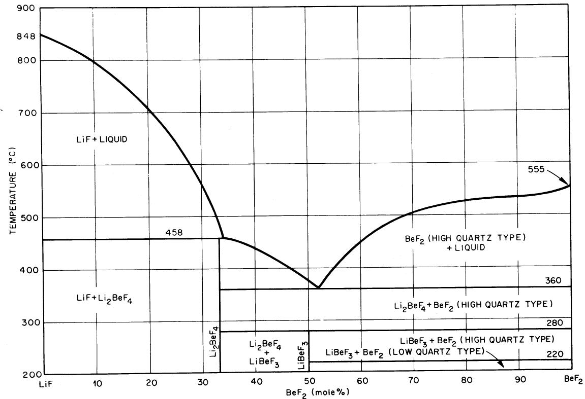
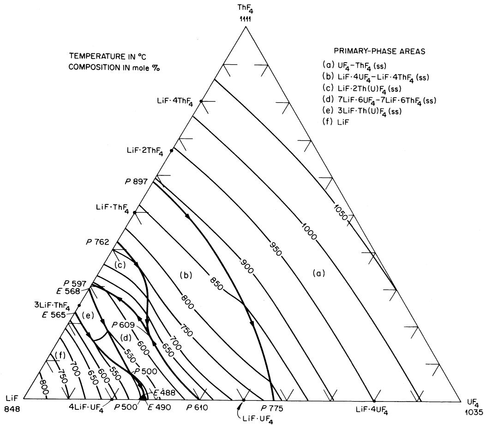
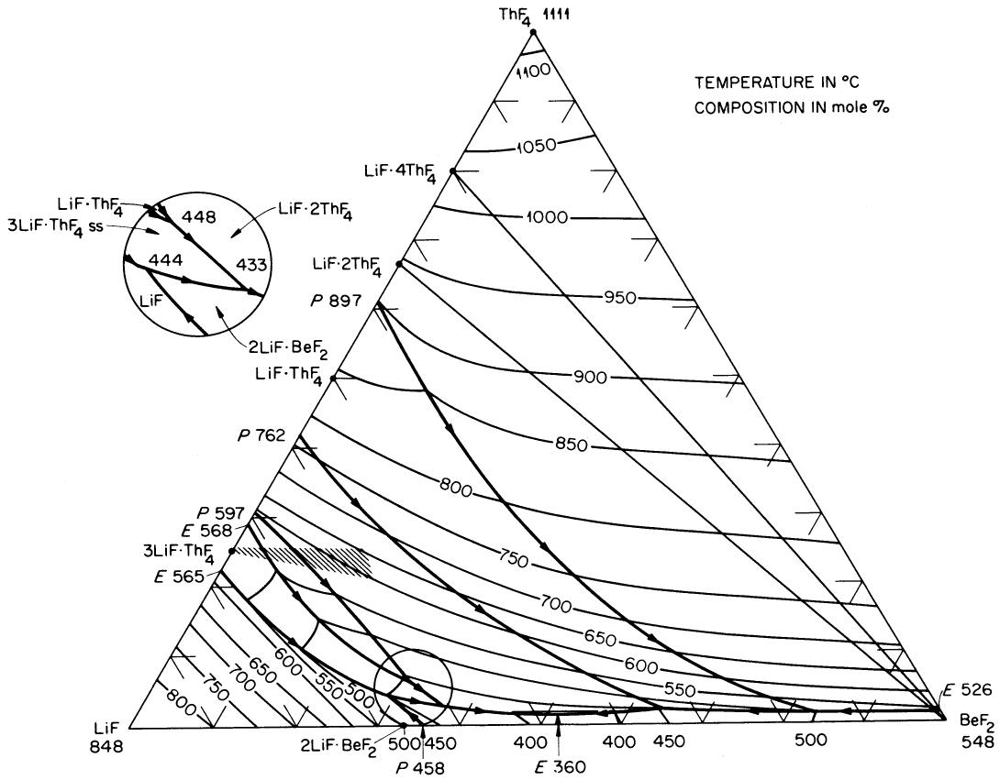
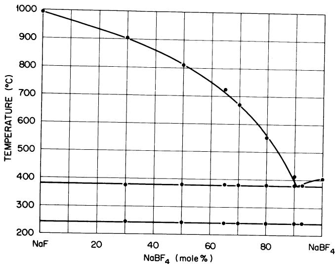
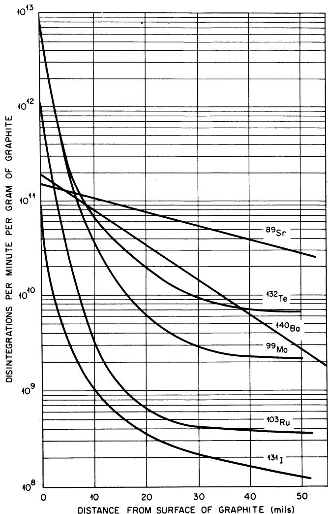
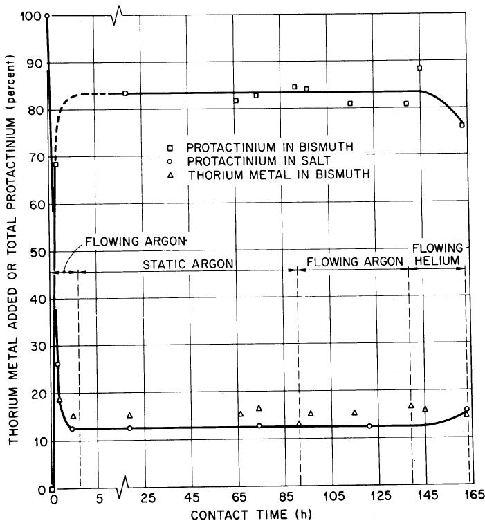
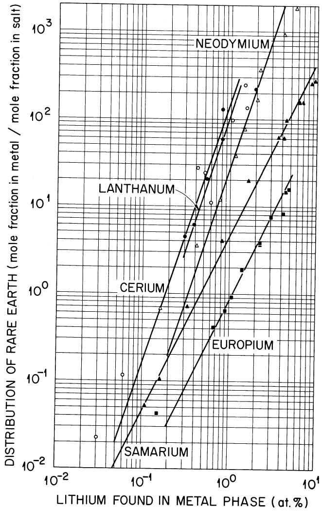
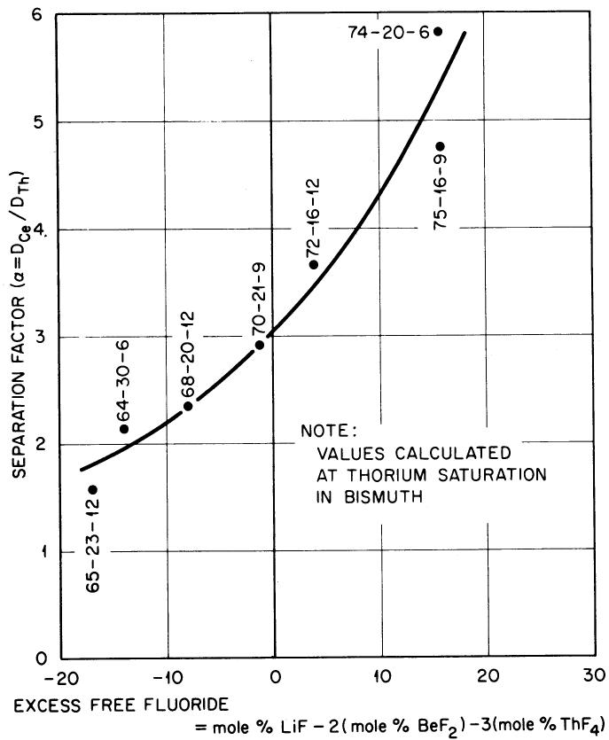

# MOLTEN-SALT REACTOR CHEMISTRY

REACTORS

W. R. GRIMES Oak Ridge National Laboratory,

Oak Ridge, Tennessee 37830

Received August 4, 1969

Revised October 7, 1969

KEYWORDS: fused salt fuel, chemical reactions, reactors, beryllium fluorides, zirconium fluorides, lithium fluorides, uranium hexafluoride, reprocessing, protactinium, separation processes, breeding, fission products, MSRE

This document summarizes the large program of chemical research and development which led to selection of fuel and coolant compositions for the Molten-Salt Reactor Experiment (MSRE) and for subsequent reactors of this type. Chemical behavior of the LiF-BeF $_2$ -ZrF $_4$ -UF $_4$ fuel mixture and behavior of fission products during power operation of MSRE are presented. A discussion of the chemical reactions which show promise for recovery of bred $^{233}\mathrm{Pa}$ and for removal of fission product poisons from a molten-salt breeder reactor is included.

# INTRODUCTION

A single-fluid molten-salt thermal breeder (MSBR) of the type described by Rosenthal et al.,1 Bettis and Robertson,2 and Perry and Bauman3 makes very stringent demands upon its fluid fuel.4-6 This fuel must consist of elements having low capture cross sections for neutrons typical of the energy spectrum of the chosen design. The fuel must dissolve more than the critical concentration of fissionable material ( $^{235}\mathrm{U}$ , $^{233}\mathrm{U}$ , or $^{239}\mathrm{Pu}$ ), and high concentrations of fertile material ( $^{232}\mathrm{Th}$ ) at temperatures safely below the temperature at which the salt leaves the MSBR heat exchanger. The mixture must be thermally stable, and its vapor pressure needs to be low over an operating temperature range (1100 to $1400^{\circ}\mathrm{F}$ ) sufficiently high to permit generation of high quality steam for power production. The fuel mixture must possess heat transfer and hydrodynamic properties adequate for its service as a heat-exchange fluid. It must be relatively non

aggressive toward some otherwise suitable material of construction and toward some suitable moderator material. The fuel must be stable toward reactor radiation, must be able to survive fission of the uranium (or other fissionable material) and must tolerate fission product accumulation without serious deterioration of its useful properties. We must also be assured of a genuinely low fuel-cycle cost; this presupposes a low-cost fuel associated with inexpensive turnaround of the unburned fissile material, and effective and economical schemes for recovery of bred fissile material and for removal of fission-product poisons from the fuel.

A suitable secondary coolant must be provided to link the fuel circuit with the steam-generating equipment. The demands imposed upon this coolant fluid differ in obvious ways from those imposed upon the fuel system. Radiation intensities will be markedly less in the coolant system, and the consequences of uranium fission will be absent. The coolant salt must, however, be compatible with metals of construction which will handle the fuel and the steam; it must not undergo violent reactions with fuel or steam should leaks develop in either circuit. The coolant should be inexpensive, possessed of good heat-transfer properties, and it should melt at temperatures suitable for steam cycle start-up. An ideal coolant would consist of compounds which would be easy to separate from the valuable fuel mixture should they mix as a consequence of a leak.

This report presents, in brief, the basis for choice of fuel and coolant systems which seem optimum in light of these numerous—and to some extent conflicting—requirements.

# CHOICE OF FUEL COMPOSITION

Compounds which are permissible major constituents of fuels for single-fluid thermal breeders

are those which can be prepared from beryllium, bismuth, boron-11, carbon, deuterium, fluorine, lithium-7, nitrogen-15, oxygen, and the fissionable and fertile materials. As minor constituents one might tolerate compounds containing the other elements in Table I.

Many chemical compounds can be prepared from the several "major constituents" listed above. Most of these, however, can be eliminated after elementary consideration of the fuel requirements. No hydrogen- (or deuterium-) bearing compounds possess overall properties that are practical in such melts. Carbon, nitrogen, and oxygen form high melting binary compounds with the fissionable and fertile metals; these compounds are quite unsuitable as constituents of liquid systems. The oxygenated anions either lack the required thermal stability (i.e., $\mathrm{NO}_3^-$ or $\mathrm{NO}_2^-$ ) or fail as solvents for high concentrations of thorium compounds (i.e., $\mathrm{CO}_3 =$ ). It quickly develops, therefore, that fluorides are the only suitable salts indicated in this list of elements.

Fluoride ion is capable of appreciable neutron moderation, but this moderation is by itself insufficient for good neutron thermalization. An additional moderator is, accordingly, required.

TABLE I   
Elements or Isotopes Which may be Tolerable in High-Temperature Reactor Fuels   

<table><tr><td>Material</td><td>Absorption Cross Section (barns at 2200 m/sec)</td></tr><tr><td>Nitrogen-15</td><td>0.000024</td></tr><tr><td>Oxygen</td><td>0.0002</td></tr><tr><td>Deuterium</td><td>0.00057</td></tr><tr><td>Carbon</td><td>0.0033</td></tr><tr><td>Fluorine</td><td>0.009</td></tr><tr><td>Beryllium</td><td>0.010</td></tr><tr><td>Bismuth</td><td>0.032</td></tr><tr><td>Lithium-7</td><td>0.033</td></tr><tr><td>Boron-11</td><td>0.05</td></tr><tr><td>Magnesium</td><td>0.063</td></tr><tr><td>Silicon</td><td>0.13</td></tr><tr><td>Lead</td><td>0.17</td></tr><tr><td>Zirconium</td><td>0.18</td></tr><tr><td>Phosphorus</td><td>0.21</td></tr><tr><td>Aluminum</td><td>0.23</td></tr><tr><td>Hydrogen</td><td>0.33</td></tr><tr><td>Calcium</td><td>0.43</td></tr><tr><td>Sulfur</td><td>0.49</td></tr><tr><td>Sodium</td><td>0.53</td></tr><tr><td>Chlorine-37</td><td>0.56</td></tr><tr><td>Tin</td><td>0.6</td></tr><tr><td>Cerium</td><td>0.7</td></tr><tr><td>Rubidium</td><td>0.7</td></tr></table>

The only good moderator material truly compatible with molten-fluoride fuel mixtures is graphite. $^{4-6}$

# Phase Behavior Among Fluorides

Uranium tetrafluoride and uranium trifluoride are the only fluorides (or oxyfluorides) of uranium which appear useful as constituents of molten-fluoride fuels. Uranium tetrafluoride $(\mathrm{UF}_4)$ is relatively stable, nonvolatile, and largely non-hygrosopic. It melts at $1035^{\circ}\mathrm{C}$ $(1895^{\circ}\mathrm{F})$ , but this freezing point is markedly depressed by useful diluent fluorides. Uranium trifluoride disproport-ationates at temperatures above $\sim 1000^{\circ}\mathrm{C}$ by the reaction

$$
4 \mathrm {U F} _ {3} = 3 \mathrm {U F} _ {4} + \mathrm {U} ^ {0}. \tag {1}
$$

It is unstable at lower temperatures in most molten-fluoride solutions and is tolerable in reactor fuels only with a large excess of $\mathrm{UF_4}$ so that the activity of $\mathbf{U}^0$ is so low as to avoid appreciable reaction with moderator graphite or container metal.

Thorium tetrafluoride $(\mathrm{ThF}_4)$ is the only known fluoride of thorium. It melts at $1111^{\circ}\mathrm{C}$ (2032°F) but fortunately its freezing point is markedly depressed by fluoride diluents which are also useful with $\mathbf{U}\mathbf{F}_4$

Consideration of nuclear properties alone leads one to prefer as diluents the fluorides of Be, Bi, $^7\mathrm{Li}$ , Mg, Pb, and Zr in that order. Equally simple consideration of the stability of these fluorides toward reduction by structural metals, however, eliminates the bismuth fluorides from consideration. This leaves $\mathsf{BeF}_2$ and $^7\mathrm{LiF}$ as the preferred diluent fluorides. Phase behavior of systems based upon LiF and $\mathsf{BeF}_2$ as the major constituents, has, accordingly, been examined in detail. Fortunately for the molten fluoride reactor concept, the phase diagrams of LiF- $\mathsf{BeF}_2$ - $\mathsf{UF}_4$ and LiF- $\mathsf{BeF}_2$ - $\mathsf{ThF}_4$ are such as to make these materials useful as fuels.

The binary system $\mathrm{LiF - BeF_2}$ has melting points below $500^{\circ}C$ over the concentration range from 33 to 80 mole% $\mathrm{BeF_2}$ . The phase diagram, presented in Fig. 1, is characterized by a single eutectic (52 mole% $\mathrm{BeF_2}$ , melting at $360^{\circ}C$ ) between $\mathrm{BeF_2}$ and 2LiF· $\mathrm{BeF_2}$ . The compound 2LiF· $\mathrm{BeF_2}$ melts incongruity to LiF and liquid at $458^{\circ}C$ . LiF· $\mathrm{BeF_2}$ is formed by the reaction of solid $\mathrm{BeF_2}$ and solid 2LiF· $\mathrm{BeF_2}$ below $280^{\circ}C$ .

The phase behavior of the $\mathrm{BeF}_2$ - $\mathrm{UF}_4^{10,11}$ and $\mathrm{BeF}_2$ - $\mathrm{ThF}_4^{12}$ systems are very similar. Both systems show simple single eutectics containing very small concentrations of the heavy metal fluoride. $\mathrm{ThF}_4$ and $\mathrm{UF}_4$ are isostructural; they form a continuous series of solid solutions with neither maximum nor minimum.

  
Fig. 1. The system $\mathbf{LiF - BeF_2}$

The binary diagrams $\mathrm{LiF - UF_4^{13}}$ and $\mathrm{LiF - ThF_4^{14}}$ are generally similar and much more complex than the binary diagrams discussed immediately above. The $\mathrm{LiF - UF_4}$ system shows three compounds (none are congruently melting) and a single eutectic, at 27 mole% UF4, melting at $490^{\circ}C$ . The $\mathrm{LiF - ThF_4}$ system contains four binary compounds, one of which (3LiF·ThF4) melts congruently, with two eutectics at $570^{\circ}C$ and 22 mole% $\mathrm{ThF_4}$ and at $560^{\circ}C$ and 29 mole% $\mathrm{ThF_4}$ .

The ternary system $\mathrm{LiF - ThF_4 - UF_4}$ ,15 shown in Fig. 2, shows no ternary compounds and a single eutectic freezing at $488^{\circ}\mathrm{C}$ with $1.5\mathrm{mole}\%$ $\mathrm{ThF_4}$ and $26.5\mathrm{mole}\%$ $\mathrm{UF_4}$ . Most of the area on the diagram is occupied by the primary phase fields of the solid solutions $\mathrm{UF_4 - ThF_4}$ , $\mathrm{LiF\cdot 4UF_4 - LiF\cdot 4ThF_4}$ , and $\mathrm{LiF\cdot UF_4 - LiF\cdot ThF_4}$ . Liquidus temperatures decrease generally to the $\mathrm{LiF - UF_4}$ edge of the diagram.

The single-fluid molten-salt breeder fuel will need a concentration of $\mathrm{ThF_4}$ much higher than that of $\mathrm{UF_4}$ . Accordingly, the phase behavior of the fuel will be dictated by that of the LiF-BeF2-ThF4 system. Figure 3 gives the ternary system LiF-BeF2-ThF4; this system shows a single ternary eutectic at 47 mole% LiF and 1.5 mole% ThF4, melting at $360^{\circ}\mathrm{C}$ . The system is complicated to some extent by the fact that the compound

3LiF·ThF4 can incorporate Be2+ ions in both interstitial and substitutional sites to form solid solutions whose compositional extremes are represented by the shaded triangular region near that compound. Liquidus temperatures < 550°C (1022°F) are available at ThF4 concentrations as high as 22 mole%. The maximum ThF4 concentration available at liquidus temperatures of 500°C (932°F) is seen to be just above 14 mole%. Inspection of the diagram reveals that a considerable range of compositions with > 10 mole% ThF4 will be completely molten at or below 500°C.

As expected from the general similarity of $\mathrm{ThF_4}$ and $\mathrm{UF_4}$ -and especially from the substitutional behavior shown by the LiF- $\mathrm{UF_4 - ThF_4}$ system (Fig. 2)-substitution of a small quantity of $\mathrm{UF_4}$ for $\mathrm{ThF_4}$ scarcely changes the phase behavior. Accordingly, and to a very good approximation, Fig. 3 represents the behavior of the LiF-BeF $_2$ -ThF $_4$ - $\mathrm{UF_4}$ system over concentration regions such that the mole fraction of $\mathrm{ThF_4}$ is much greater than that of $\mathrm{UF_4}$ .

# Oxide Fluoride Equilibria

Phase behavior of the pure fluoride system $\mathbf{LiF - BeF_2 - ThF_4 - UF_4}$ , as indicated above, is such that adequate fuel mixtures seem assured. The

  
Fig. 2. The system $\mathbf{LiF - ThF_4 - UF_4}$

behavior of systems such as this, however, is markedly affected by appreciable concentrations of oxide ion.

When a melt containing only LiF, $\mathrm{BeF}_2$ , and $\mathrm{UF_4}$ is treated with a reactive oxide (such as $\mathrm{H}_2\mathrm{O}$ ) precipitation of transparent ruby crystals of $\mathrm{UO}_{2,00}$ results. If the melt contains, in addition, an appreciable concentration of $\mathrm{ZrF_4}$ the situation is markedly altered. $\mathrm{ZrO_2}$ is less soluble than is $\mathrm{UO_2}$ in such melts, and the monoclinic $\mathrm{ZrO_2}$ (the form stable below $\sim 1125^{\circ}\mathrm{C}$ ) includes very little $\mathrm{UO_2}$ in solid solution. Thus, inadvertent oxide contamination of a LiF- $\mathrm{BeF}_2$ - $\mathrm{ZrF_4}$ - $\mathrm{UF_4}$ melt yields monoclinic $\mathrm{ZrO_2}$ containing 250 ppm of $\mathrm{UO_2}$ . Precipitation of cubic $\mathrm{UO_2}$ (containing a small concentration of $\mathrm{ZrO_2}$ ) begins only after precipitation of $\mathrm{ZrO_2}$ had dropped the $\mathrm{ZrF_4}$ concentration to near that of the $\mathrm{UF_4}$ .

Slow precipitation of $\mathrm{UO_2}$ followed by a sudden entrance of this material into the reactor core could result in undesired increased in reactivity. This possibility was assumed to represent a danger to the Molten-Salt Reactor Experiment. Accordingly, the MSRE fuel was chosen to contain 5 mole% of $\mathrm{ZrF_4}$ to eliminate such a possibility.

When a mixture of LiF and $\mathrm{BeF}_2$ containing $\mathrm{ThF_4}$ and $\mathrm{UF_4}$ is treated with a reactive oxide a homogeneous cubic phase is produced; this phase is a solid solution of $\mathrm{UO_2}$ and $\mathrm{ThO_2}$ which is very rich in $\mathrm{UO_2}$ .17 Careful studies have shown that the reaction

$$
\mathrm {T h O} _ {2 (s s)} + \mathrm {U} _ {(f)} ^ {4 +} \rightleftharpoons \mathrm {U O} _ {2 (s s)} + \mathrm {T h} _ {(f)} ^ {4 +} \tag {2}
$$

[where the subscripts (ss) and (f) indicate the solid-phase solid solution and the molten-fluoride solution, respectively] approaches equilibrium with reasonable speed. Values for the equilibrium quotient $Q$ for this reaction

$$
N _ {\mathrm {U O} 2 \left(\mathrm {s s}\right)} \cdot N _ {\mathrm {T h} (\mathrm {f})} ^ {4 +} \tag {3}
$$

$$
Q = \overline {{N _ {\mathrm {T h O} 2 (\mathbf {s s})} \cdot N _ {\mathrm {U (f)}} ^ {4 +}}}
$$

increase with $\mathrm{UO_2}$ concentration of the oxide phase and decrease markedly with temperature. Since values of $Q$ for mixtures similar to those chosen as fuel compositions are typically 300 to 1000, it is clear that oxide contamination of such salts will selectively precipitate the uranium.

  
Fig. 3. The system $\mathrm{LiF - BeF_2 - ThF_4}$

It is likely, though not certain, that addition of some $\mathbf{ZrF_4}$ would afford protection of the sort obtained with the MSRE fuel. Such addition is undesirable, however, since the presence of $\mathbf{ZrF_4}$ would certainly complicate the separation processes described later in this paper and elsewhere in this series.

The successful operation of the MSRE over a three year period (discussed later) lends confidence that oxide contamination of the fuel system can be kept to adequately low levels. This confidence, when added to the prospect that the breeder fuel will be reprocessed (and its oxide level reduced) at regular intervals, suggests very strongly that successful operation can be achieved without added "oxide protection."

Tolerance levels for oxide concentration in $\mathrm{LiF - BeF_2 - UF_4}$ and $\mathrm{LiF - BeF_2 - ZrF_4 - UF_4}$ systems have been studied in detail and are relatively well understood.16,18-20 Analogous values for the LiF $\mathrm{BeF}_2$ -ThF4-UF4 system are still largely lacking. It is known, however, that processing of these quaternary melts with anhydrous HF and $\mathbf{H}_2$ serves to remove oxide to a level below that required for precipitation of the solid solutions. There seems little doubt, therefore, that initial processing of

the type used for MSRE fuels can be successfully applied on a large scale to the LiF-BeF $_2$ -ThF $_4$ -UF $_4$ system.

# MSRE and MSBR Fuel Compositions

The fuel chosen for operation of MSRE (with a $^{235}\mathrm{U} - ^{238}\mathrm{U}$ isotopic mixture containing $33\%$ of the fissionable isotope) was a mixture of $^7\mathrm{LiF}$ , $\mathrm{BeF}_2$ , $\mathrm{ZrF}_4$ , and $\mathrm{UF}_4$ consisting of 65, 29.1, 5, and 0.9 mole%, respectively. The uranium concentration was fixed at $\sim 1\%$ so that there was less possibility of fissile U precipitating $(\sim 0.3\mathrm{mole}\%)^{235}\mathrm{U}$ was necessary to achieve criticality and to provide a small excess of fissionable material for power operation of the machine). The $\mathrm{ZrF}_4$ was added, as indicated above, to preclude possible inadvertent precipitation of $\mathrm{UO}_2$ . Beryllium fluoride is an extremely viscous material; its viscosity is markedly lowered by addition of LiF. The ratio of LiF to $\mathrm{BeF}_2$ in the MSRE fuel was chosen to optimize the conflicting demands for low viscosity and a low liquidus temperature for the molten fuel.

The single-fluid breeder requires a high concentration of $\mathsf{ThF_4}$ ; concentrations near 12 mole% seem to be reasonable for good reactor

performance. Criticality estimates suggest that such a fuel could be made critical in a practicable reactor with somewhat $< 0.3 \, \text{mole\%}^{233} \, \text{UF}_4$ . The ratio of $^7$ LiF to $\text{BeF}_2$ should, to decrease viscosity, be kept at a value as high as is practicable. If the liquidus temperature is to be kept at or below $500^{\circ}\text{C}$ ( $932^{\circ}\text{F}$ ) for a melt with $12 \, \text{mole\%}$ of $\text{ThF}_4$ , the beryllium concentration limits range from 16 to $25 \, \text{mole\%}$ . The most likely choice for the MSBR fuel—and the present design composition—is, accordingly, $^7$ LiF- $\text{BeF}_2$ - $\text{ThF}_4$ - $\text{UF}_4$ at 71.7-16-12-0.3 $\text{mole\%}$ , respectively.

# Choice of Coolant

The secondary coolant is required to remove heat from the fuel in the primary heat exchanger and to transport this heat to the power generating system. In the MSBR the coolant must transport heat to supercritical steam at minimum temperatures only modestly above $700^{\circ}\mathrm{F}$ . In the MSRE the heat was rejected to an air cooled radiator at markedly higher salt temperatures.

The coolant mixture chosen for the MSRE and shown to be satisfactory in that application is $\mathrm{BeF}_2$ with 66 mole% of $^7\mathrm{LiF}$ . Use of this mixture would pose some difficulties in design of equipment for the MSBR since its liquidus temperature is $851^{\circ}\mathrm{F}$ ; moreover, it is an expensive material. The eutectic mixture of LiF with $\mathrm{BeF}_2$ (48 mole% LiF) melts at near $700^{\circ}\mathrm{F}$ (see Fig. 1) but it is relatively viscous and is expensive, especially if $^7\mathrm{LiF}$ is used.

The alkali metals, excellent coolants with real promise in other systems, are undesirable here since they react vigorously with both fuel and steam. Less noble metal coolants such as $\mathbf{Pb}^0$ or $\mathbf{Bi}^0$ undergo no violent reactions, but they are not compatible with Hastelloy-N, the Ni-based alloy used in MSRE and intended for use in MSBR's.

Several binary chloride systems are known to have eutectics melting below (in some cases much below) $700^{\circ}\mathbf{F}$ . These binary systems do not, however, appear especially attractive since they contain high concentrations of chlorides (TlCl, $\mathrm{ZnCl}_2$ , BiCl₃, CdCl₂, or SnCl₂), which are easily reduced and, accordingly, corrosive; or chlorides (AlCl₃, ZrCl₄, HfCl₄, or BeCl₂) which are very volatile. The only low-melting binary systems of stable, non-volatile chlorides are those containing LiCl; LiCl-CsCl (330°C at 45 mole% CsCl), LiCl-KCl (355°C at 42 mole% KCl), LiCl-RbCl (312°C at 45 mole% RbCl). Such systems would be relatively expensive if made from 'LiCl, and they could lead to serious contamination of the fuel if normal LiCl were used.

Very few fluorides or mixtures of fluorides are known to melt at temperatures below $370^{\circ}\mathrm{C}$ . Stan-

nous fluoride $(\mathrm{SnF}_2)$ melts at $212^{\circ}\mathrm{C}$ . This material is probably not stable during long term service in Hastelloy-N; moreover, its phase diagrams with stable fluorides (such as NaF or LiF) show high melting points at relatively low alkali fluoride concentrations. Coolant compositions which will meet the low liquidus temperature specification may be chosen from the NaF-BeF $_2$ or NaF-LiF-BeF $_2$ system. These materials are almost certainly compatible with Hastelloy-N, and they possess adequate specific heats and low vapor pressures (discussed in the next section). They (especially those including LiF) are moderately expensive, and their viscosities at low temperature are certainly higher than desirable. It is possible that substitution of $\mathrm{ZrF_4}$ or even $\mathrm{AlF_3}$ for some of the $\mathrm{BeF_2}$ would provide liquids of lower viscosity at no real expense in liquidus temperature.

It now appears that the best choice for the MSBR secondary coolant is the eutectic mixture of sodium fluoride and sodium fluoroborate. The binary system $\mathrm{NaF - NaBF_4}$ has been described as showing a eutectic at 60 mole% $\mathrm{NaBF_4}$ melting at $304^{\circ}\mathrm{C}$ (580°F).[21,22] Studies here have shown that this publication is seriously in error. Boric oxide substantially lowers the freezing point of $\mathrm{NaF - NaBF_4}$ mixtures; the original authors may well have used quite impure materials. Use of pure $\mathrm{NaF}$ and $\mathrm{NaBF_4}$ leads to the conclusion that the system shows a single eutectic at 8 mole% $\mathrm{NaF}$ and a melting point of $385^{\circ}\mathrm{C}$ (725°F),[23] as shown in Fig. 4.

At elevated temperatures the fluoroborates show an appreciable equilibrium pressure of gaseous $\mathbf{BF}_3$ . The equilibrium pressure24 above a

  
Fig. 4. The system NaF-NaBF $_4$ .

melt maintained at the eutectic composition (8 mole% NaF, 92 mole% NaBF₄) is given by

$$
\log P _ {\text {T o r r}} = 9. 0 2 4 - \frac {5 , 9 2 0}{T ^ {\circ} \mathrm {K}}. \tag {4}
$$

# PHYSICAL PROPERTIES OF FUELS AND COOLANTS

Tables II and III list some of the pertinent physical properties $^{24}$ for MSRE and MSBR fuels and secondary coolants.

Many of the properties shown are estimates rather than measured values. These estimates have been carefully prepared from the best available measurements on several salt mixtures of similar composition. The values given are unlikely to be in error sufficient to remove the fluid from consideration. It is clear, however, from the fact that estimates rather than measured values are shown that an experimental program must be devoted to firming up the physical properties of these materials.

The densities were calculated from the molar volumes of the pure components by assuming the volumes to be additive. The heat capacities were estimated by assuming that each gram atom in the mixture contributes 8 calories per degree centigrade. The value of 8 is the approximate average from a set of similar fluoride melts. The viscosity of the MSBR fuel and the $\mathrm{BeF_2}$ -based coolants were estimated from other measured LiF- $\mathrm{BeF_2}$ and NaF- $\mathrm{BeF_2}$ mixtures.

The vapor pressure of the fuels and the $\mathbf{BeF}_2$ based coolants are considered negligible; extrapolation of measurements from similar mixtures

TABLE II Composition and Properties of MSRE and MSBR Fuels   

<table><tr><td rowspan="2">Composition (mole%)</td><td>MSRE Fuel</td><td>MSBR Fuel</td></tr><tr><td>LiF 65BeF2 29.1ZrF4 5UF4 0.9</td><td>LiF 71.7BeF2 16ThF4 12UF4 0.3</td></tr><tr><td>Liquidus °C</td><td>434</td><td>500</td></tr><tr><td>°F</td><td>813</td><td>932</td></tr><tr><td>Properties at 600°C (1112°F)</td><td></td><td></td></tr><tr><td>Density, g/cm3</td><td>2.27</td><td>3.35</td></tr><tr><td>Heat capacity, cal/(g °C) or Btu/(lb °F)</td><td>0.47</td><td>0.33</td></tr><tr><td>Viscosity, cP</td><td>9</td><td>12</td></tr><tr><td>Vapor pressure, Torr</td><td>Negligible</td><td>Negligible</td></tr><tr><td>Thermal conductivity, W/(°C cm)</td><td>0.014</td><td>0.011</td></tr></table>

TABLE III Composition and Properties of Possible MSBR Secondary Coolants   

<table><tr><td rowspan="2">Composition (mole%)</td><td>C1</td><td>C2</td><td>C3</td></tr><tr><td>NaF 8 NaBF4 92</td><td>LiF 23 NaF 41 BeF2 36</td><td>NaF 57 BeF2 43</td></tr><tr><td>Liquidus Temperature:</td><td></td><td></td><td></td></tr><tr><td>°C</td><td>385</td><td>328</td><td>340</td></tr><tr><td>°F</td><td>725</td><td>622</td><td>644</td></tr><tr><td>Physical Properties at 850°F (454°C)a</td><td></td><td></td><td></td></tr><tr><td>Density, lb/ft3</td><td>121</td><td>136</td><td>139</td></tr><tr><td>Heat capacity, Btu/(lb °F)</td><td>0.36</td><td>0.47</td><td>0.44</td></tr><tr><td>Viscosity, cP</td><td>2.5</td><td>40</td><td>65</td></tr><tr><td>Vapor pressure at 1125°F (607°C),b mm</td><td>200c</td><td>Negligible</td><td>Negligible</td></tr><tr><td>Thermal conductivity, W/(°C cm)</td><td>0.005</td><td>0.01</td><td>0.01</td></tr></table>

aMean temperature of coolant going to the primary heat exchanger. bHighest normal operating temperature of coolant.   
cRepresents pressure of $\mathbf{BF}_3$ in equilibrium with this melt composition.

yielded pressures $< 0.1 \mathrm{~mm}$ . The partial pressure of $\mathrm{BF}_3$ above the fluoroborate coolant mixture was calculated from measurements on very similar mixtures.

# CHEMICAL COMPATIBILITY OF MSBR MATERIALS

Details and specific findings of the large program of corrosion testing are presented by McCoy et al $^{25}$ as a separate article in this issue. In brief, compatibility of the MSBR materials is assured by choosing as melt constituents only fluorides that, insofar as is possible, are thermodynamically stable toward the moderator graphite and toward the structural metal, Hastelloy-N, $^{a}$ a nickel alloy containing $\sim 12\%$ Mo, $7\%$ Cr, $4\%$ Fe, $1\%$ Ti, and small amounts of other elements. The major fuel components (LiF, $\mathrm{BeF}_2$ , $\mathrm{UF}_4$ , and $\mathrm{ThF}_4$ ) are much more stable than the structural metal fluorides ( $\mathrm{NiF}_2$ , $\mathrm{FeF}_2$ , and $\mathrm{CrF}_2$ ); accordingly, the fuel and blanket have a minimal tendency to corrode the metal. Such selection, combined with proper purification procedures, provides liquids whose corrosivity is well within tolerable limits. The chemical properties of the materials and the nature of their several interactions are described briefly in the following.

# Thermodynamic Data for Molten Fluorides

A continuing program of experimentation over many years has been devoted to definition of the thermodynamic properties of many species in molten LiF-BeF $_2$ solutions. Many techniques have been used in this study. Many of the data have been obtained by direct measurement of equilibrium pressures for reactions such as

$$
\mathrm {H} _ {2 (\mathrm {g})} + \mathrm {F e F} _ {2 (\mathrm {d})} = \mathrm {F e} _ {(\mathrm {c})} ^ {0} + 2 \mathrm {H F} _ {(\mathrm {g})} \tag {5}
$$

and

$$
2 \mathrm {H F} _ {(g)} + \mathrm {B e O} _ {(c)} = \mathrm {B e F} _ {2 (1)} + \mathrm {H} _ {2} \mathrm {O} _ {(g)} \tag {6}
$$

[where (g), (c), and (d) represent gas, crystalline solid, and solute, respectively] using the molten fluoride as reaction medium. Baes has reviewed all these studies and by combining the data with the work of others has tabulated thermodynamic data for many species in molten 2LiF·BeF $_2$ .26 Table IV below records pertinent data for the major components of MSRE and MSBR fuels and for corrosion products in molten 2LiF·BeF $_2$ .

From these data one can assess the extent to which $\mathbf{U}\mathbf{F}_3$ -bearing melt will disproportionate according to the reaction

$$
4 \mathrm {U F} _ {3 (\mathrm {d})} = 3 \mathrm {U F} _ {4 (\mathrm {d})} + \mathrm {U}. \tag {7}
$$

TABLE IV   
Standard Free Energies of Formation for Species in Molten 2LiF·BeF2   
(773 to 1000°K)   

<table><tr><td>Materiala</td><td>-ΔGf(kcal/mole)</td><td>-ΔGf(1000°C)(kcal/mole)</td></tr><tr><td>LiF (1)</td><td>141.8 - 16.6 × 10-3T°C</td><td>125.2</td></tr><tr><td>BeF2(1)</td><td>243.9 - 30.0 × 10-3T°C</td><td>106.9</td></tr><tr><td>UF3(d)</td><td>338.0 - 40.3 × 10-3T°C</td><td>99.3</td></tr><tr><td>UF4(d)</td><td>445.9 - 57.9 × 10-3T°C</td><td>97.0</td></tr><tr><td>ThF4(d)</td><td>491.2 - 62.4 × 10-3T°C</td><td>107.2</td></tr><tr><td>ZrF4(d)</td><td>453.0 - 65.1 × 10-3T°C</td><td>97.0</td></tr><tr><td>NiF2(d)</td><td>146.9 - 36.3 × 10-3T°C</td><td>55.3</td></tr><tr><td>FeF2(d)</td><td>154.7 - 21.8 × 10-3T°C</td><td>66.5</td></tr><tr><td>CrF2(d)</td><td>171.8 - 21.4 × 10-3T°C</td><td>75.2</td></tr><tr><td>MoF6(g)</td><td>370.9 - 69.6 × 10-3T°C</td><td>50.2</td></tr></table>

aThe standard state for LiF and $\mathrm{BeF_2}$ is the molten $2\mathrm{LiF}\cdot \mathrm{BeF_2}$ liquid. That for $\mathrm{MoF_6(g)}$ is the gas at one atmosphere. That for all species with subscript (d) is that hypothetical solution with the solute at unit mole fraction and with the activity coefficient it would have at infinite dilution.

For the case where the total uranium in the molten solution of 0.9 mole% (as in the MSRE) the activity of metallic uranium is near $10^{-15}$ with $1\%$ of the $\mathrm{UF_4}$ converted to $\mathrm{UF_3}$ and is near $2\times 10^{-10}$ with $20\%$ of the $\mathrm{UF_4}$ so converted.[27] Operation of the reactor with a small fraction (usually $< 2\%$ ) of the uranium present as $\mathrm{UF_3}$ is advantageous insofar as corrosion and the consequences of fission are concerned (see subsequent sections of this report). Such operation with some $\mathrm{UF_3}$ present should result in formation of an extremely dilute (and experimentally undetectable) alloy of uranium with the surface of the container metal. Operation with $>50\%$ of the uranium as $\mathrm{UF_3}$ would lead to much more concentrated (and highly deleterious) alloying and to formation of uranium carbides. Fortunately, all evidence to date demonstrates that operation with relatively little $\mathrm{UF_3}$ is completely satisfactory.

# Oxidation (Corrosion) of Metals

The data of Table IV reveal clearly that in reactions with structural metals (M)

$$
2 \mathrm {U F} _ {4 (\mathrm {d})} + \mathrm {M} _ {(\mathrm {c})} = 2 \mathrm {U F} _ {3 (\mathrm {d})} + \mathrm {M F} _ {2 (\mathrm {d})}, \tag {8}
$$

Cr is much more readily attacked than is iron, nickel, or molybdenum.[27] Few thermodynamic data exist for the fluorides of titanium in the pure state and none for dilute solutions in molten fluoride solvents. Estimates[8,9] of free energies of formation suggest that Ti is somewhat more reactive than Cr. Titanium on the surface layers of the metal should, therefore, be expected to react with the available oxidants, such as $\mathbf{U}\mathbf{F}_4$ . Such oxidation and selective attack follow from reactions such as the following:

Impurities in the melt

$$
\mathrm {C r} + \mathrm {N i F} _ {2} \rightarrow \mathrm {C r F} _ {2} + \mathrm {N i} \tag {9}
$$

or

$$
\mathrm {C r} + 2 \mathrm {H F} \rightarrow \mathrm {C r F} _ {2} + \mathrm {H} _ {2}. \tag {10}
$$

Oxide films on the metal

$$
\mathrm {N i O} + \mathrm {B e F} _ {2} \rightarrow \mathrm {N i F} _ {2} + \mathrm {B e O}, \tag {11}
$$

followed by reaction of $\mathbf{NiF}_2$ with Cr.

Reduction of $\mathbf{U}\mathbf{F}_4$ to $\mathbf{U}\mathbf{F}_3$

$$
\mathrm {C r} + 2 \mathrm {U F} _ {4} = 2 \mathrm {U F} _ {3} + \mathrm {C r F} _ {2}. \tag {12}
$$

Reactions (9), (10), and (11) above will proceed essentially to completion at all temperatures within the MSBR circuit. Accordingly, such reactions can lead (if the system is poorly cleaned) to a noticeable, rapid initial corrosion rate. However, these reactions do not give a sustained corrosive attack.

The reaction of $\mathrm{UF_4}$ with Cr, on the other hand, has an equilibrium constant with a small temperature dependence; hence, when the salt is forced to circulate through a temperature gradient, a possible mechanism exists for mass transfer and continued attack.

If nickel, iron, and molybdenum are assumed to be completely inert diluents for chromium (as is approximately true), and if the circulation rate in the MSBR is very rapid, the corrosion process can be simply described. At high flow rates, uniform concentrations of $\mathrm{UF}_3$ and $\mathrm{CrF}_2$ are maintained throughout the fluid circuit; these concentrations satisfy (at some intermediate temperature) the equilibrium constant for the reaction. Under these steady-state conditions, there exists some temperature (intermediate between the maximum and minimum temperatures of the circuit) at which the initial surface composition of the structural metal is at equilibrium with the fused salt. Since the equilibrium constant for the chemical reaction increases with increasing temperature, the chromium concentration in the alloy surface tends to decrease at temperatures higher than $T$ and tends to increase at temperatures lower than $T$ . [In some melts (NaF-LiF-KF- $\mathrm{UF}_4$ , for example) $\Delta G$ for the mass transfer reaction is quite large, and the equilibrium constant changes sufficiently as a function of temperature to cause formation of dendritic chromium crystals in the cold zone.] For MSBR fuel and other LiF- $\mathrm{BeF}_2$ - $\mathrm{UF}_4$ mixtures, the temperature dependence of the mass-transfer reaction is small, and the equilibrium is satisfied at reactor temperature conditions without the formation of crystalline chromium. Thus, in the MSBR, the rate of chromium removal from the salt stream by deposition at cold-fluid regions is controlled by the slow rate at which chromium diffuses into the cold-fluid wall; the chromium concentration gradient tends to be small, and the resulting corrosion is well within tolerable limits. Titanium, which must be presumed to undergo similar reactions, diffuses less readily than does Cr in Hastelloy-N. It seems most unlikely that the $1 \%$ of Ti in the alloy will prove detrimental.

The results of numerous long-term tests have shown that Hastelloy-N has excellent corrosion resistance to molten-fluoride mixtures at temperatures well above those anticipated in MSBR.[25] The attack from mixtures similar to the MSBR fuel at hot-zone temperatures as high as $1300^{\circ}\mathrm{F}$ is barely observable in tests of as long as 12 000 h. A figure of $< 0.5$ mil/year is expected.[28] In MSRE, attack was $\sim 0.1$ mil/year. Thus, corrosion of the container metal by the reactor fuel does not seem to be an important problem in the MSBR.[25]

It is likely that the NaF-NaBF4 coolant mixture will also prove compatible with Hastelloy-N, but

experimental study of this is much less extensive. The free energy change for the chemical reaction

$$
\mathrm {B F} _ {3 (\mathrm {g})} + 3 / 2 \mathrm {C r} _ {(\mathrm {s})} \rightarrow 3 / 2 \mathrm {C r F} _ {2 (\mathrm {l})} + \mathrm {B} _ {(\mathrm {s})} \tag {13}
$$

is $\sim +30$ kcal at $800^{\circ}\mathrm{K}$ . The reaction is, therefore, quite unlikely to occur, and similar reactions with Fe, Mo, and Ni are much less so. In addition, the above reaction becomes even less likely (perhaps by 5 kcal or so) when one considers the energetics of formation of the compound $\mathrm{NaBF_4}$ and dilution of the $\mathrm{NaBF_4}$ by NaF. However, reactions which produce metal fluorides and metal borides are those which must be anticipated. Titanium, a minor constituent of Hastelloy-N, has a quite stable boride. The reaction

$$
2 \mathrm {B F} _ {3} (\mathrm {g}) + \frac {5}{2} \mathrm {T i} (\mathrm {c}) = \mathrm {T i B} _ {2} (\mathrm {c}) + \frac {3}{2} \mathrm {T i F} _ {4} (\mathrm {d}) \tag {14}
$$

probably shows a small negative free energy change and must be expected to proceed. The very small diffusion rate of Ti in Hastelloy-N would be expected to markedly limit the reaction. Thermochemical data for the borides of Fe, Cr, Ni, and Mo do not seem to have been established. Unless the borides of these materials are very stable ( $\Delta G^f$ values more negative than -25 kcal B atom) the Hastelloy-N should prove resistant to pure NaF-NaBF₄ coolant.

# Compatibility of Graphite with Fluorides

Graphite does not react with molten fluoride mixtures of the type to be used in the MSBR. Available thermodynamic data8,9 suggest that the most likely reaction

$$
4 \mathrm {U F} _ {4} + \mathrm {C} \rightleftharpoons \mathrm {C F} _ {4} + 4 \mathrm {U F} _ {3} \tag {15}
$$

should come to equilibrium at $\mathrm{CF_4}$ pressures $< 10^{-8}$ atm. $\mathrm{CF_4}$ concentrations over graphite-salt systems maintained for long periods at elevated temperatures have been shown to be below the limit of detection ( $< 1\mathrm{ppm}$ ) of this compound by mass spectrometry. Moreover, graphite has been used as a container material for many NaF-ZrF4-UF4, LiF-BeF2-UF4, and other salt mixtures with no evidence of chemical instability.

# CHEMICAL BEHAVIOR IN MSRE

The Molten-Salt Reactor Experiment was, as detailed in an article by Haubenreich and Engel31 operated during much of 1966, 1967, and early 1968 with the original fuel charge in which the uranium was $33\%$ 235U with the balance consisting primarily of 238U. The reactor accumulated nearly 70 000 MWh of operation during this interval with the major fraction of this accumulated at the maximum power of $\sim 8$ MW(th).

# Behavior of Fuel Components

Samples of the molten salts were removed routinely from the fuel and coolant circuits and were analyzed for uranium, major fuel constituents, possible corrosion products, and (less frequently) for oxide ion contamination. Early in the power runs, standard samples of fuel were drawn three times per week; this schedule was markedly diminished as confidence in the system grew. At late stages in the power runs, analyses for these items was generally done on a one-per-week basis. The LiF-BeF $_2$ coolant system was sampled every two weeks initially and less frequently during 1967 and 1968.

Chemical determinations of uranium content of the fuel salt were run by coulometric titrations $^{32}$ of dilute aqueous solutions. Such analyses showed good reproducibility and high precision $(\pm 0.5\%)$ . (On-site reactivity balance calculations proved to be about ten-fold more sensitive than this in establishing changes in uranium concentrations within the fuel circuit.) Agreement of the chemically determined uranium concentrations (in a statistical sense) with the reactor inventory values diminished by the uranium burnup during operation was excellent. The inventory value at end of operation on $^{235}\mathrm{U}$ showed the uranium concentration to be $4.532\%$ by weight. $^{33}$ The difference (200 g of uranium out of $220\mathrm{kg}$ ) is $< 0.1\%$ . These data strongly indicate that uranium losses (as to the purge gas stream) have been extremely small and that, as anticipated, the fuel salt is chemically stable during long periods of reactor operation. A further check on these numbers will be possible when the $^{235}\mathrm{U}-^{238}\mathrm{U}$ mixture removed by fluorination from the MSRE fuel is recovered and assayed.

While analyses for $\mathbf{U}\mathbf{F}_4$ and for $\mathbf{ZrF_4}$ agree quite well with the inventory data, the values for LiF and $\mathbf{BeF}_2$ have never done so; analyses for LiF have shown higher and those for $\mathbf{BeF}_2$ have shown lower values than the inventory since start-up. Table V shows a comparison of typical analysis with the original inventory value. This

# TABLE V

Typical and Original Composition of MSRE Fuel Mixture   

<table><tr><td>Constituent</td><td>Original Value (mole%)</td><td>Typical Analysis</td></tr><tr><td>7LiF</td><td>63.40 ± 0.49</td><td>64.35</td></tr><tr><td>BeF2</td><td>30.63 ± 0.55</td><td>29.83</td></tr><tr><td>ZrF4</td><td>5.14 ± 0.12</td><td>5.02</td></tr><tr><td>UF4</td><td>0.821 ± 0.008</td><td>0.803</td></tr></table>

discrepancy in LiF and $\mathbf{BeF}_2$ concentration remains a puzzle, but there was nothing in the analyses (or in the behavior of the reactor) to suggest that any changes occurred.

Oxide concentration in the radioactive fuel salt were performed by careful evaluation of $\mathrm{H}_2\mathrm{O}$ produced upon treatment of the salt samples with anhydrous gaseous HF. All samples examined showed less than 100 ppm of $\mathsf{O}^{\text{二}}$ ; no perceptible increase in the values with time or with operational details was apparent.[34] These facts are quite reassuring insofar as maintaining oxide contamination at very low levels in future reactor systems is concerned.

MSRE maintenance operations have necessitated flushing the interior of the drained reactor circuit on numerous occasions. The salt used for this operation consisted originally of a $^7\mathrm{LiF - BeF}_2$ (66.0 to 34.0 mole%) mixture. Analysis of this salt before and after each use shows that $\sim 215~\mathrm{ppm}$ of uranium is added to the flush salt in each flushing operation; this corresponds to removal of $22.7\mathrm{kg}$ of fuel-salt residue ( $\sim 0.5\%$ of the charge) from the reactor circuit.

# Behavior of Corrosion Products

Analysis of many samples at regular intervals during reactor operation showed relatively high values for iron (120 ppm) and nickel (50 ppm) in the salt.[33-35] These values scattered significantly but showed no perceptible trends. They do not seem to represent dissolved $\mathrm{Fe}^{2+}$ or $\mathrm{Ni}^{2+}$ . Molybdenum concentrations were shown, in the few attempts made, to be below the detectible limit ( $\sim 25$ ppm) for chemical analysis.

The chromium concentration, as determined by chemical analysis, rose from an initial value near 40 ppm to a final value after 70 000 MWh of $\sim 85$ ppm. A considerable scatter ( $\pm 15$ ppm) in the numbers was apparent but the increase with time and reactor operation is clearly real. All evidence suggests that the analytically determined chromium was largely, if not entirely, present as dissolved $\mathrm{Cr}^{2+}$ . This observed increase in chromium concentration corresponds to removal of $< 250\mathrm{g}$ of this element from the MSRE circuit. If this were removed uniformly it would deplete the chromium in the alloy to a depth of $< 0.2$ mil. Such an estimate of corrosion seems consistent with observations (reported elsewhere in this series) showing very slight attack by the fuel during MSRE operation.

This virtual absence of corrosion—though in general accord with results from a variety of engineering corrosion tests—is mildly surprising since the MSRE was operated for appreciable periods with the fuel salt more oxidizing than

necessary. The analysis for ratio of $\mathbf{U}^{4+}$ to $\mathbf{U}^{3+}$ has proved especially difficult in the radioactive salts, but it seems certain that the MSRE fuel has, at times, contained $< 0.2\%$ of the total uranium as $\mathbf{U}^{3+}$ .

The fission process (see following section of this report) appears to be mildly oxidizing toward dissolved $\mathbf{U}^{3+}$ in the fuel. Accordingly, and although the corrosion product analysis did not seem to require it, a convenient means was developed for adding $\mathbf{U}^{3+}$ to the reactor circuit as desired. Beryllium metal (as 3-in. rods of $\frac{3}{8}$ -in. diameter encased in a perforated capsule of nickel) was introduced through the sampling system and suspended in the flowing salt stream in the MSRE pump bowl. This active metal reacts with $\mathbf{UF}_4$ by

$$
\mathrm {B e} _ {(c)} ^ {0} + 2 \mathrm {U F} _ {4 (d)} \rightarrow \mathrm {B e F} _ {2 (d)} + 2 \mathrm {U F} _ {3 (d)} \tag {16}
$$

at a rate such that some $600\mathrm{g}$ of $\mathbf{U}\mathbf{F}_3$ is produced during an 8-h treatment. The salt flowing past the Be appears to be locally over-reduced so that at least $6 \%$ of the $\mathbf{U}\mathbf{F}_4$ becomes $\mathbf{U}\mathbf{F}_3$ ; crystalline Cr was observed upon the nickel capsule from one such reduction attempt. The over-reduced salt mixture clearly reacted and achieved equilibrium with the large excess of unreduced salt in the pump bowl and reactor circuit.

A molten-salt reactor which included a reprocessing circuit could use that external circuit to maintain the $\mathrm{UF_4 / UF_3}$ ratio at the desired level. Use of techniques such as the Be addition for such a reactor would seem to be quite feasible but unnecessary.

# Behavior of Fission Products

When fission of $\mathbf{U}\mathbf{F}_4$ occurs in a well-mixed high-temperature molten-fluoride, four fluoride ions associated with the $\mathbf{U}^{4+}$ are released and the two fission fragments must come quickly to a steady state as common chemical entities. This steady state is made very complicated by the radioactive decay of many species. The valence states that the fission product assume in the molten system are, presumably, defined by the requirements that cation-anion equivalence be maintained in the liquid and redox equilibria be established both among the components of the melt and the surface layers of the container metal. $^{4-6}$ Fluorine and uranium species higher than 4 are, in MSRE and MSBR fuels, unstable toward reduction by the active constituents of Hastelloy-N; the fission product cations must satisfy the four fluoride ions plus the fission product anions. Should they prove inadequate, or if they become adequate only by assuming oxidation states incompatible with Hastelloy-N, then oxidation of $\mathbf{U}\mathbf{F}_3$

must occur or the container must supply the deficiency. Operation of MSRE has indicated that the presence of $\mathbf{U}\mathbf{F}_3$ in relatively low concentrations (see preceding sections) suffices to avoid oxidation or corrosion from this source.

Behavior of the fission products in MSRE was studied $^{36-40}$ during the entire period of operation with $^{235}\mathrm{U}$ . Samples of MSRE fuel, drawn from the sampling station in the MSRE pump bowl, have been routinely analyzed for numerous fission product species. Since samples drawn in open metal cups were shown (for reasons described below) to give erroneously high values for gas-borne species, evacuated bulbs of Ni sealed with a fusible plug of salt were used to obtain many of the data presented here.

Samples of the helium gas purge within the MSRE were obtained by use of identical evacuated sample bulbs in which the fusible plug was permitted to melt with the bulb exposed to the gas phase.[37,38]

In addition to these salt and gas samples, assemblies of surveillance specimens were exposed as the central stringer within the MSRE core. These assemblies included specimens of various graphites and many specimens of Hastelloy-N and some other metals. Their removal at reactor shutdowns permitted study of fission product depositions after 8000, 20000, and 70000 MWh of operation.

Samples of salt removed from the pump bowl were dissolved in analytical chemistry hot cells (after careful leaching of activities from the outside of capsules where necessary); the fission products were identified and their quantity determined radiochemically. Analysis of the gas samples was accomplished similarly after careful leaching of the activities from within the capsules. Deposition of fission products upon the metallic surveillance specimens was determined in the same way after repeated leachings of the metal surface.

Deposition on the graphite specimens was established as a function of depth of penetration. This was accomplished by careful milling of successive thin layers from each surface of the rectangular specimens. The removed layers were separately recovered and analyzed for several fission product isotopes.[38-40]

The fission gases Kr and Xe form no compounds under conditions existing in a molten-salt reactor,[41] and these elements are only very sparingly soluble in the molten fluoride.[42-44] The helium purge gas introduced into the MSRE pump bowl serves to strip these gases from the incoming salt to charcoal filled traps downstream in the exit gas system. This stripping ensures that the fission product daughters of these gases will

appear within the reactor system at lower than the theoretical concentration. The MSRE graphite is, of course, permeable to Kr and Xe; radioactive daughters of these gases are, accordingly, expected in the graphite specimens.

The fission products Rb, Cs, Sr, Ba, the lanthanides and yttrium, and Zr all form quite stable and well-known fluorides which are soluble in MSRE fuel.[45,46] These fission products were expected (except to the extent that volatile precursor Kr and Xe had escaped) to be found almost completely in the molten fuel. These expectations have been confirmed. Isotopes such as $^{95}\mathrm{Zr}$ , $^{91}\mathrm{Sr}$ , and $^{143}\mathrm{Ce}$ which have no precursors of consequence are typically found in the salt at $90+\%$ of the calculated quantity. Isotopes such as $^{89}\mathrm{Sr}$ and $^{140}\mathrm{Ba}$ whose Kr and Xe precursors have appreciable half-lives are found in less than the calculated quantity; these isotopes are, as expected, found in the graphite specimens and the gas samples as well.

The elements (molybdenum, niobium, ruthenium, and tellurium) whose higher valence fluorides are volatile and relatively unstable toward reduction by $\mathrm{UF}_3^{8,19,29,30,47}$ are virtually absent from the salt. Typical analyses of samples (which have been carefully protected from the pump bowl gas by use of the evacuated bulb samples) show $< 2\%$ of the calculated concentration of these isotopes.

Deposition of fission products on the $\sim 7-$ to 10-mil outer layers of graphite specimens exposed for $8000\mathrm{MWh}$ in MSRE is shown in Table VI. It is clear that, with the assumption of uniform deposition in or on the moderator graphite, appreciable fractions of Mo, Te, and Ru and a larger fraction of the Nb are associated with the graphite. Subsequent examinations of graphite after 22 000 and 70 000 MWh have shown somewhat smaller fractions deposited for all these isotopes. The data of Table VII described below show values more typical of the longer exposures.[40]

A careful determination of uranium in or on the graphite specimens led to values $< 1 \, \mu \mathrm{g/cm}^2$ .40 This quantity of uranium-equivalent to a few grams in the moderator stack-seems completely negligible.

Figure 5 shows the change in concentration of the fission product isotopes with depth in the graphite. Those isotopes (such as $^{140}\mathrm{Ba}$ ) which penetrated the graphite as noble gases show straight lines on the logarithmic plot; they seem to have remained at the point where the noble gas decayed. As expected, the gradient for $^{140}\mathrm{Ba}$ with 16-sec $^{140}\mathrm{Xe}$ precursor is much steeper than that for $^{89}\mathrm{Sr}$ , which has a 3.2-min $^{89}\mathrm{Kr}$ precursor. All the others shown show a much steeper concentration dependence. Generally the concentration

TABLE VI Fission Product Deposition on Surface\* of MSRE Graphite   

<table><tr><td rowspan="2">Isotope</td><td colspan="3">Graphite Location</td></tr><tr><td>Top Percent of Totala</td><td>Middle Percent of Totala</td><td>Bottom Percent of Totala</td></tr><tr><td>99Mo</td><td>13.4</td><td>17.2</td><td>11.5</td></tr><tr><td>132Te</td><td>13.8</td><td>13.6</td><td>12.0</td></tr><tr><td>103Ru</td><td>11.4</td><td>10.3</td><td>6.3</td></tr><tr><td>95Nb</td><td>12</td><td>59.2</td><td>62.4</td></tr><tr><td>131I</td><td>0.16</td><td>0.33</td><td>0.25</td></tr><tr><td>95Zr</td><td>0.33</td><td>0.27</td><td>0.15</td></tr><tr><td>144Ce</td><td>0.052</td><td>0.27</td><td>0.14</td></tr><tr><td>89Sr</td><td>3.24</td><td>3.30</td><td>2.74</td></tr><tr><td>140Ba</td><td>1.38</td><td>1.85</td><td>1.14</td></tr><tr><td>141Ce</td><td>0.19</td><td>0.63</td><td>0.36</td></tr><tr><td>137Cs</td><td>0.07</td><td>0.25</td><td>0.212</td></tr></table>

*Average of values of 7- to 10-mil cuts from each of three exposed graphite faces.   
aPercent of total in reactor deposited on graphite if each $\mathrm{cm}^2$ of the $2 \times 10^6 \mathrm{~cm}^2$ of moderator had the same concentration as the specimen.

drops a factor of 100 from the top 6 to 10 mils to the second layer. More recent examinations which used cuts as thin as 1 mil show the materials to be concentrated in an extremely thin layer. Typically $95\%$ of the metallic species are within 3 mils of the surface.

TABLE VII Fission Product Distribution for MSRE at End of $^{235}\mathrm{U}$ Operation   

<table><tr><td rowspan="2">Nuclide</td><td colspan="5">Quantity Found (% of Calculated Inventory)</td></tr><tr><td>In Fuel</td><td>On Graphitea</td><td>On Hastelloy- Na</td><td>In Purge Gasb</td><td>Total</td></tr><tr><td>99Mo</td><td>0.17</td><td>9.0</td><td>19</td><td>50</td><td>78</td></tr><tr><td>132Te</td><td>0.47</td><td>5.1</td><td>9.5</td><td>74</td><td>89</td></tr><tr><td>129Te</td><td>0.40</td><td>5.6</td><td>11.5</td><td>31</td><td>48</td></tr><tr><td>103Ru</td><td>0.033</td><td>3.5</td><td>2.5</td><td>49</td><td>55</td></tr><tr><td>106Ru</td><td>0.10</td><td>4.3</td><td>3.2</td><td>130</td><td>138</td></tr><tr><td>95Nb</td><td>0.001 to 2.2</td><td>41</td><td>12</td><td>11</td><td>64</td></tr><tr><td>95Zr</td><td>94</td><td>0.14</td><td>0.06</td><td>0.43</td><td>95</td></tr><tr><td>89Sr</td><td>83</td><td>8.5</td><td>0.08</td><td>17</td><td>109</td></tr><tr><td>148Ba</td><td>96</td><td>1.9</td><td>0.05</td><td>0.48</td><td>98</td></tr><tr><td>141Ce</td><td></td><td>0.33</td><td>0.03</td><td>0.88</td><td></td></tr><tr><td>144Ce</td><td></td><td>0.92</td><td>0.03</td><td>2.7</td><td></td></tr><tr><td>131I</td><td>60</td><td>0.11</td><td>0.3</td><td>19</td><td>80</td></tr></table>

aCalculated on assumption that average values for surveillance specimens are representative of all graphite and metal surface in MSRE.   
b These values are the percentage of production lost assuming mean values found in gas samples apply to the 4-liter/min purge.

  
Fig. 5. Concentration profile of fission products in MSRE core graphite after 8000 MWh.

Examination of the Hastelloy-N surveillance specimens exposed in the MSRE core reveals very low concentrations of the stable fluoride-forming fission products such as ${}^{89}\mathrm{Sr}$ , ${}^{95}\mathrm{Zr}$ , and ${}^{141}\mathrm{Ce}$ . The more noble metals such as Mo, Nb, and Ru are deposited, along with Te, in appreciable though not in large quantities. If the surveillance specimens are truly representative of all the metal surface in MSRE then (see Table VII) only a relatively small fraction of these metals are so deposited. However, flow conditions in the MSRE heat exchanger (where most of the metal surface exists) is turbulent while laminar flow occurs over the core specimens. It seems very likely that the actual fraction deposited on MSRE metal is higher than that shown here.

Analysis of samples of gas from MSRE yielded some real surprises. Isotopes such as $^{89}\mathrm{Sr}$ and $^{140}\mathrm{Ba}$ are found in amounts consistent with consideration of the half-lives of their Kr and Xe

precursors. A small quantity of $^{95}\mathrm{Zr}$ appears in the gas phase; this isotope, along with several others with stable soluble fluorides, almost certainly appears in the gas as fine particles of salt mist. $^{39}$ However, high concentrations of $^{99}\mathrm{Mo}$ , $^{132}\mathrm{Te}$ , $^{95}\mathrm{Nb}$ , $^{103}\mathrm{Ru}$ , and $^{106}\mathrm{Ru}$ are found in the gas phase. Indeed, as Table VII indicates, the gas samples represent the largest fractions observed for each of these isotopes except $^{95}\mathrm{Nb}$ . In addition, appreciable fractions of $^{110}\mathrm{Ag}$ and of palladium isotopes have been observed in the purge gas samples. An appreciable quantity of $^{131}\mathrm{I}$ appears in the gas phase; it seems very likely that its appearance there is due to "volatilization" of its tellurium precursor.

The mechanisms by which the Mo, Nb, Te, and Ru isotopes appear in the gas phase are still not fully understood. $\mathrm{NbF}_5$ , $\mathrm{MoF}_6$ , $\mathrm{RuF}_5$ , and $\mathrm{TeF}_6$ are all volatile (although Ag and Pd have no volatile fluorides); these volatile fluorides, however, are far too unstable, with the possible exception of $\mathrm{NbF}_5$ , to exist at the redox potentials in MSRE. Stability of lower fluorides of these elements is poorly known; it is possible that some of these may contribute to the "volatility."

It seems much more likely, however, that all these species exist in the reduced MSRE fuel in elemental form. They originate as (or very rapidly become) individual metal atoms. They aggregate in the fuel at some slow but finite rate, and become insoluble as very minute colloidal particles which then grow at a slower rate. These colloidal particles are not wetted by the fuel, they tend to collect as gas-liquid interfaces, and they can readily be swept into the gas stream of the helium purge of the pump bowl. They tend to plate upon the metal surfaces of the system, and (as extraordinarily fine "smoke") to penetrate the outer layers of the moderator. While there are difficulties with this interpretation it seems more plausible than others suggested to date.

Deposition of fission products on or in the graphite is, of course, undesirable since there they serve most efficiently as nuclear poisons. Of the species studied only Nb (whose carbide is stable at MSRE temperatures) seems to prefer the graphite.

It seems likely that in a MSBR the molten fuel will contain virtually all of the zirconium, the lanthanides and yttrium produced, and a large fraction of the iodine, rubidium, cesium, strontium, and barium. Thess species would, therefore, be available for removal in the processing plant. The salt will contain very little Mo, Nb, Te, Ru, and (presumably) technetium. These will report to the MSBR metal, graphite, and purge gas systems in fractions which are probably not very different from those indicated for MSRE.

# SEPARATIONS CHEMISTRY

Molten-salt breeder reactors will require effective schemes for recovery of the fissionable material which is produced and for removal of fission product poisons from the fuel. MSRE produced no significant quantity of fissionable isotope and made no provision for on-stream removal of fission products other than the noble gases Kr and Xe.

Recovery of uranium from molten fluorides by volatilization as $\mathrm{UF}_{6}$ and the subsequent decontamination of this $\mathrm{UF}_{6}$ by sorption-desorption on beds of NaF is well demonstrated. Recovery of uranium from MSRE or MSBR fuel by this scheme is clearly feasible. However, performance of a single-fluid MSBR is markedly improved if the bred protactinium is removed from the circulating fuel and permitted to decay to $^{233}\mathrm{U}$ outside the reactor core. Fluorination is not effective in removal of protactinium from molten fluoride mixtures. Development of other processes for Pa recovery has, accordingly, been necessary.

In molten-salt reactors, from which Kr and Xe are effectively removed, the most important fission product poisons are among the lanthanides. These fission products, as indicated above, form stable fluorides which are soluble in the fuel and will report almost quantitatively with the fuel to the separations plant. Their removal especially from fuels with high $\mathrm{ThF_4}$ concentrations is difficult. Rare earths have, accordingly, received more attention than other fission products.

Processes for recovery of Pa and the lanthanide fission products from MSBR fuels are described in some detail by Whatley et al.48 The chemical basis for such processes is described very briefly below.

# Separation of Protactinium

Protactinium is produced in the MSBR fuel by reaction of a neutron with $^{232}$ Th to yield $^{233}$ Th which transmutes to $^{233}$ Pa; the $^{233}$ Pa decays with a 27.4-day half-life to $^{233}$ U. Clearly, a separation of $^{233}$ Pa from the fuel needs, if it is to be effective, to be accomplished on a cycle time short compared with this half-life. It is desirable to process the fuel on a cycle of three to five days. The process needs, therefore, to be relatively simple.

Removal of Pa from $\mathsf{LiF - BeF_2 - ThF_4}$ mixtures by addition of BeO, $\mathsf{ThO}_2$ , or even $\mathsf{UO}_2$ has been demonstrated in laboratory-scale experiments.49,50 Addition of these oxides to MSBR fuel composition would, as indicated in a previous section of this report, result in a uranium-oxide-rich solid solution of $\mathsf{UO}_2\mathrm{-ThO}_2$ . Whether the protactinium oxide

was adsorbed on the added oxide or participated in the solid solution formation is not known. The process was shown to be reversible; treatment of the oxide-fluoride system with anhydrous HF dissolves the oxide and returns the Pa to the fluoride melt from which it can readily be reprecipitated. It seems likely that Pa might be removed from the MSBR fuel by effective contact of a fuel mixture side stream with $\mathrm{UO_2 - ThO_2}$ solid solution. Such a possibility—which is still under consideration in laboratory-scale equipment—would add appreciably to the $^{233}\mathrm{U}$ inventory through holdup of $\mathrm{UO_2}$ in the solid solution. It would also probably require that the oxide ion concentration in the fuel after contact be diminished (as by treatment with HF) before the melt could be returned to the reactor.

Separations based upon reduction of the Pa (present in the fuel as $\mathbf{PaF_4}$ ) to metal and extraction into liquid metals appears at present to be more attractive.[48] Such separations have the following basis.

When thorium metal, dissolved as a dilute alloy in bismuth $(\mathrm{Th}_{\mathrm{Bi}})$ , is equilibrated with a molten mixture of LiF, $\mathrm{BeF}_2$ , and $\mathrm{ThF}_4$ several equilibria must be satisfied simultaneously. These include

$$
\operatorname {L i F} _ {(d)} + \frac {1}{4} \operatorname {T h} _ {(B i)} \rightleftharpoons \frac {1}{4} \operatorname {T h F} _ {4 (d)} + \operatorname {L i} _ {(B i)} \tag {17}
$$

$$
\mathrm {B e F} _ {2 (\mathrm {d})} + \frac {1}{2} \mathrm {T h} _ {(\mathrm {B i})} = \frac {1}{2} \mathrm {T h F} _ {4} + \mathrm {B e} _ {(\mathrm {B i})} \tag {18}
$$

$$
\frac {3}{4} \operatorname {T h F} _ {4 (d)} + \frac {1}{4} \operatorname {T h} _ {(B i)} \rightleftharpoons \operatorname {T h F} _ {3 (d)}, \tag {19}
$$

where (d) and (Bi) indicate that the species are in fluoride solution and alloyed with the Bi, respectively. Reaction (19) seems to be of little importance since only a small quantity (if any) $\mathrm{ThF}_3$ forms. Reaction (18) does not occur perceptibly; Be is "insoluble" in Bi and forms no intermetallic compounds with that liquid metal. Reaction (17) occurs to an appreciable extent even though LiF (see Table IV) is much more stable than $\mathrm{ThF}_4$ .19

Uranium forms stable dilute alloys in Bi, and its fluorides are less stable than $\mathbf{ThF_4}$ . Accordingly, the reactions

$$
\mathrm {U F} _ {4 (\mathrm {d})} + \frac {1}{4} \mathrm {T h} _ {(\mathrm {B i})} = \frac {1}{4} \mathrm {T h F} _ {4 (\mathrm {d})} + \mathrm {U F} _ {3 (\mathrm {d})} \tag {20}
$$

and

$$
\mathrm {U F} _ {3 (\mathrm {d})} + \frac {3}{4} \mathrm {T h} _ {(\mathrm {B i})} \rightleftharpoons \mathrm {U} _ {(\mathrm {B i})} + \frac {3}{4} \mathrm {T h F} _ {4 (\mathrm {d})} \tag {21}
$$

proceed very far to the right with low concentrations of Th (and Li) in the Biat equilibrium. Uranium is, therefore, very readily extracted from MSBR fuel melts.[51,52]

If the $\mathbf{LiF - BeF_2 - ThF_4}$ melt contains $\mathbf{PaF_4}$ , the reaction

$$
\mathrm {P a F} _ {4 (\mathrm {d})} + \mathrm {T h} _ {(\mathrm {B i})} = \mathrm {T h F} _ {4 (\mathrm {d})} + \mathrm {P a} _ {(\mathrm {B i})} \tag {22}
$$

proceeds to quite a convenient extent $^{52-55}$ as shown in Fig. 6 although protactinium is reduced less easily than is uranium. Accordingly, if a melt containing both $\mathbf{U}\mathbf{F}_{4}$ and $\mathbf{PaF_4}$ is contacted with bismuth and thorium metal added in small increments the uranium and the protactinium are extracted.

Preliminary experiments $^{56}$ disclosed that Pa could indeed be removed from the salts by reduction with Th but material balance data were very poor and little Pa appeared in the Bi. More recent experiments have used equipment of molybdenum, which seems essentially inert to the salt and the alloy, and very careful purification of the materials and the cover gas. $^{53-55}$ By these techniques two sets of investigators $^{53,54}$ have shown values in excess of 1500 for the separation factor

$$
\alpha_ {\mathrm {T h}} ^ {\mathrm {P a}} = \frac {N _ {\mathrm {P a}} N _ {\mathrm {T h F} _ {4}}}{N _ {\mathrm {P a F} _ {4}} N _ {\mathrm {T h}}} \tag {23}
$$

where $N$ indicates mole fraction of the indicated species either in metal or in LiF-BeF $_2$ -ThF $_4$ solution. The separation factor for U from Pa has been shown to be above 25. These separation factors are, of course, quite adequate for process design, as discussed in detail by Whatley et al. $^{48}$

  
Fig. 6. Distribution of protactinium and material balance for equilibrium of LiF-BeF $_2$ -ThF $_4$ (72-16-12 mole%) with Bi-Th alloy (0.93 wt% Th).

# Separation of Rare Earths

There is no real doubt that the rare-earth elements, which form fluorides that are more stable than $\mathrm{ThF_4}^{19}$ will be present in MSBR fuel sent to the processing plant.

The limited solubility of these trifluorides (though sufficient to prevent their precipitation under normal MSBR conditions) has suggested a possible recovery scheme. When a LiF-BeF $_2$ -ThF $_4$ -UF $_4$ melt (in the MSBR concentration range) that is saturated with a single rare-earth fluoride (LaF $_3$ , for example) is cooled slowly, the precipitate is the pure simple trifluoride. When the melt contains more than one rare-earth fluoride the precipitate is a (nearly ideal) solid solution of the trifluorides. $^{45,46}$ Accordingly, addition of an excess of CeF $_3$ or LaF $_3$ to the melt followed by heating to effect dissolution of the added trifluoride and cooling to effect crystallization effectively removes the fission product rare earths from solution. It is likely that effective removal of the rare earths and yttrium (along with UF $_3$ and PuF $_3$ ) could be obtained by passage of the fuel through a heated bed of solid CeF $_3$ or LaF $_3$ . However, the price is almost certainly too high; the resulting fuel solution is saturated with the scavenger fluoride (LaF $_3$ or CeF $_3$ , whose cross section is far from negligible) at the temperature of contact.

Similar solid solutions are formed by the rare-earth trifluorides with $\mathbf{U}\mathbf{F}_3$ . It might, accordingly, be possible to send a side-stream (with the $^{233}\mathrm{Pa}$ and $^{233}\mathrm{U}$ removed by methods described above) through a bed of $\mathbf{U}\mathbf{F}_3$ to remove these fission product poisons; $^{238}\mathrm{UF_3}$ would presumably be used for economic reasons. The resulting LiF-BeF $_2$ -ThF $_4$ solution would be saturated with $\mathbf{U}\mathbf{F}_3$ after its passage through the bed. This $^{238}\mathrm{U}$ would have to be removed (for example, by electrolytic reduction $^{48}$ into molten Bi or Pb) before the salt could be returned to the cycle. The $\mathbf{U}\mathbf{F}_3$ bed could be recovered by fluorination to separate the uranium and rare earths. While this process probably deserves further study, the instability of $\mathbf{U}\mathbf{F}_3$ in melts with high $\mathbf{U}\mathbf{F}_3/\mathbf{U}\mathbf{F}_4$ ratios and the ease with which uranium alloys with most structural metals would tend to make application of such a process unattractive.

Removal of rare-earth ions (and other ionic fission-product species) by use of cation exchangers has always seemed an appealing possibility. The ion exchanger would, of course, need (a) to be quite insoluble, (b) to be extremely unreactive (in a gross sense) with the melt, and (c) to take up rare-earth cations in exchange for ions of low-neutron cross section. The bed of $\mathrm{CeF_3}$ described above functions as an ion ex

changer; it fails to be truly beneficial because it is too soluble in the melt.

Unfortunately, not many materials are truly stable to the $\mathrm{LiF - BeF_2 - ThF_4 - UF_4}$ fuel mixture. Zirconium oxide is stable (in its low temperature form) to melts whose $\mathrm{Zr^{4 + } / U^{4 + }}$ ratio is in excess of $\sim 3$ , and $\mathrm{UO_2 - ThO_2}$ solid solutions are stable at equilibrium $\mathbf{U} / \mathbf{Th}$ ratios. It is conceivable that sufficiently dilute solid solutions of $\mathrm{Ce_2O_3}$ in these oxides would be stable and would exchange $\mathrm{Ce}^{3 + }$ for other rare earth species. Intermetallic compounds of rare earths with moderately noble metals (or rare earths in very dilute alloys with such metals) seem unlikely to be of use because they are unlikely to be stable toward oxidation by $\mathrm{UF_4}$ . Compounds with oxygenated anions (such as silicates and molybdates) are decomposed by the fluoride melt; they precipitate $\mathrm{UO_2}$ from the fuel mixture. It is possible that refractory compounds (such as carbides or nitrides) of the rare earths, either alone or in solid dilute solution with analogous uranium compounds, may prove useful.

# By Reduction

The rare-earth fluorides are very stable toward reduction to the metal. For example, at $1000^{\circ}\mathrm{K}$ the reaction

$$
2 / 3 \mathrm {L a F} _ {3 (1)} + \mathrm {B e} _ {(c)} \rightarrow 2 / 3 \mathrm {L a} _ {(c)} + \mathrm {B e F} _ {2 (1)}, \tag {24}
$$

where (c) and (l) indicate crystalline solid and liquid, respectively, shows $\sim +30$ kcal for the free energy of reaction. With the $\mathbf{LaF}_3$ in dilute solution and $\mathbf{BeF}_2$ in concentrated solution in LiF- $\mathbf{BeF}_2$ mixture the situation is, of course, even more unfavorable. However, the rare-earth metals form extremely stable solutions in molten metals such as bismuth; the activity coefficient for La at low concentrations in Bi is near $10^{-14}$ . Therefore, the reaction

$$
\frac {2}{3} \operatorname {L a F} _ {3 (d)} + \operatorname {B e} _ {(c)} \rightleftharpoons \frac {2}{3} \operatorname {L a} _ {(\mathrm {B i})} + \operatorname {B e F} _ {2 (d)}, \tag {25}
$$

where (d) indicates that the species is dissolved in $2\mathrm{LiF}\cdot \mathrm{BeF}_2$ , and (c) indicates crystalline solid can be made to proceed essentially to completion. Accordingly, $\mathsf{LaF}_3$ can be reduced and extracted into molten Bi from LiF-BeF2 mixtures. Figure 7 shows the behavior of several rare-earth elements58 upon extraction into bismuth using $\mathbf{L}\mathbf{i}^0$ (which is more convenient to use) as the reductant. Such a process would seem to be useful.

However, when the melt is complicated, as is necessary for the single-fluid breeder, by the addition of large quantities of $\mathrm{ThF_4}$ the situation becomes considerably less favorable. Use of $\mathbf{L}\mathbf{i}^{\mathbf{o}}$ concentrations as high as those shown in Fig. 7 is prohibited since the reaction

  
Fig. 7. Effect of lithium concentration in metal phase on the distribution of rare earths between LiF-BeF $_2$ (66-34 mole%) and bismuth at $600^{\circ}\mathrm{C}$ .

$$
\frac {1}{2} \operatorname {B i} _ {(1)} + \frac {1}{4} \operatorname {T h F} _ {4 (d)} + \operatorname {L i} _ {(\mathrm {B i})} = \operatorname {L i F} _ {(d)} + \frac {1}{4} \operatorname {T h B i} _ {2 (c)} \tag {26}
$$

proceeds at lower concentrations than these to yield solid ThBi₂. Accordingly, the most reducing metallic phase which is tolerable is that represented by the (barely) saturated solution of ThBi₂ in Bi. When such solutions are used the rare-earth fluoride is much less completely extracted and relatively small separation factors from thorium are obtained.[51-53,55] Figure 8 shows data obtained[55] in extraction of Ce at $600^{\circ}\mathrm{C}$ from several LiF-BeF₂-ThF₄ mixtures (the points are labeled to indicate mole percentages of LiF, BeF₂, and ThF₄, respectively) in this way. Separation factors appreciably above unity are obtained even in the worst case, and compositions containing 12 mole% ThF₄ with < 20 mole% BeF₂ appear somewhat more attractive. Unfortunately, Ce³⁺ is one of the easiest of the rare earths to reduce.

Others in the series show even smaller separation factors. Another paper in this series presents information showing how processes with separation factors of this magnitude could be operated.[48] There is little doubt, however, that improved (larger) separation factors would be desirable; there is reason to believe that improvement can be obtained by modification of the alloy phase.

  
Fig. 8. Effect of salt composition on the separation of cerium from thorium during reductive extraction of cerium from $\mathsf{LiF - BeF_2 - ThF_4}$ mixtures into bismuth at $600^{\circ}C$

# SUMMARY

Phase behavior of $\mathrm{LiF - BeF_2 - ThF_4 - UF_4}$ mixtures appears suitable to permit use of a high concentration of $\mathrm{ThF_4}$ in melts whose freezing point will prove acceptable for single-fluid molten-salt breeder reactors. Oxide tolerances of such mixtures are not entirely defined, but laboratory experience and the MSRE operating experience combine to suggest that no oxide scavenger (such as $\mathrm{ZrF_4}$ ) need be added. The design basis fuel, accordingly, consists of 71.7 mole% LiF, 16 mole% BeF $_2$ , 12 mole% ThF $_4$ , and 0.3 mole% $^{233}\mathrm{UF_4}$ . The secondary coolant is to be 8 mole% NaF with 92 mole% NaBF $_4$ . Physical

properties of these fluids, estimated in most cases from data on similar materials, seem adequate for their use in MSBR.

Compatibility of the $\mathrm{LiF - BeF_2 - ThF_4 - UF_4}$ melt with Hastelloy-N and with moderator graphite seems assured, and operation of LiF-BeF $_2$ -ZrF $_4$ -UF $_4$ melts in MSRE indicate very strongly that the compatibility will not be adversely affected by the consequences of radiation and fission of the uranium. Compatibility of the secondary coolant, while less satisfactory, appears to be adequate with Hastelloy-N if salt purity is maintained.

Fission product Kr and Xe are virtually insoluble in the fuel and can be removed, if the moderator graphite is sufficiently impermeable, by simple equilibration with an inert gas (helium). Fission products with stable fluorides (Rb, Cs, Sr, Ba, the lanthanides, and Zr) appear almost entirely in the fuel as fluorides except as they are lost through volatilization of precursors. More noble fission products (Nb, Mo, Ru, and Te) are virtually absent from the fuel, but plate (in appreciable amounts) on the graphite and the Hastelloy-N, and appear to a surprisingly large extent in the helium purge gas.

Chemical separations, of which reductive extraction appears most attractive, for removing uranium and protactinium from the fuel salt and from each other have been demonstrated in small scale laboratory equipment. Separations of lanthanides from the fuel are markedly more difficult, but reductive extraction of these elements into molten bismuth appears possible.

While much research and development remains to be accomplished there seems to be no fundamental chemical difficulty with design and operation of a single-fluid molten-salt breeder system.

# ACKNOWLEDGMENTS

This research was sponsored by the U.S. Atomic Energy Commission under contract with the Union Carbide Corporation.

# REFERENCES

1. M. W. ROSENTHAL, P. R. KASTEN, and R. B. BRIGGS, “Molten Salt Reactors—History, Status, and Potential,” Nucl. Appl. Tech., 8, 107 (1970).   
2. E. S. BETTIS and R. C. ROBERTSON, “MSBR Design and Performance Features,” Nucl. Appl. Tech., 8, 190 (1970).   
3. A. M. PERRY and H. F. BAUMAN, "MSBR Reactor Physics," Nucl. Appl. Tech., 8, 208 (1970).

4. W. R. GRIMES, F. F. BLANKENSHIP, G. W. KEIL-HOLTZ, H. F. POPPENDIEK, and M. T. ROBINSON, "Chemical Aspects of Molten Fluoride Reactors," in Progress in Nuclear Energy, Series IV, Vol. 2, Pergamon Press, London (1960).   
5. W. R. GRIMES, D. R. CUNEO, F. F. BLANKENSHIP, G. W. KEILHOLTZ, H. F. POPPENDIEK, and M. T. ROBINSON, "Chemical Aspects of Molten Fluoride Salt Reactor Fuels," in Fluid Fuel Reactors, J. A. LANE, H. G. MacPHERSON, and FRANK MASLAN, Eds., Addison-Wesley, Reading, Mass. (1958).   
6. W. R. GRIMES, "Materials Problems in Molten Salt Reactors," in Materials and Fuels for High Temperature Nuclear Energy Applications, M. T. SIMNAD and L. R. ZUMWALT, Eds., The M.I.T. Press, Mass. (1964).   
7. W. R. GRIMES, “MSR Program Semiannual Progress Report, July 31, 1964,” ORNL-3708, p. 214, Oak Ridge National Laboratory.   
8. ALVIN GLASSNER, "The Thermochemical Properties of the Oxides, Fluorides, and Chlorides to $2500^{\circ}\mathrm{K}$ ," ANL-5750, Argonne National Laboratory.   
9. L. BREWER, L. A. BROMLEY, P. W. GILLES, and N. L. LOFGREN, MDDC-1553 (1945) and L. BREWER in The Chemistry and Metallurgy of Miscellaneous Materials; Thermodynamics, L. L. QUILL, Ed., McGraw-Hill, New York, pp. 76-192 (1950).   
10. R. E. THOMA, Ed., “Phase Diagrams of Nuclear Reactor Materials,” ORNL-2548, Oak Ridge National Laboratory (November 6, 1959).   
11. L. V. JONES, D. E. ETTER, C. R. HUDGENS, A. A. HUFFMAN, T. B. RHINEHAMMER, N. E. ROGERS, P. A. TUCKER, and L. J. WITTENBERG, "Phase Equilibria in the Ternary Fused-Salt System LiF-BeF $_2$ -UF $_4$ ," J. Am. Ceram. Soc., 45, 79 (1962).   
12. R. E. THOMA, H. INSLEY, H. A. FRIEDMAN, and C. F. WEAVER, “Phase Equilibria in the Systems $\mathsf{BeF}_2$ -ThF4 and LiF-BeF2-ThF4,” J. Phys. Chem., 64, 865 (1960).   
13. C. J. BARTON, H. A. FRIEDMAN, W. R. GRIMES, H. INSLEY, and R. E. THOMA, “Phase Equilibria in the Alkali Fluoride-Uranium Tetrafluoride Fused Salt Systems: 1. The Systems LiF-UF4 and NaF-UF4,” J. Am. Ceram. Soc., 41, 63 (1958).   
14. R. E. THOMA, H. INSLEY, B. S. LANDAU, H. A. FRIEDMAN, and W. R. GRIMES, “Phase Equilibria in the Fused Salt Systems LiF-ThF $_4$ and NaF-ThF $_4$ ," J. Phys. Chem., 63, 1266 (1959).   
15. C. F. WEAVER, R. E. THOMA, H. INSLEY, and H. A. FRIEDMAN, “Phase Equilibria in the Systems $\mathrm{UF_4 - ThF_4}$ and LiF- $\mathrm{UF_4 - ThF_4}$ ” J. Am. Ceram. Soc., 43, 213 (1960).   
16. K. A. ROMBERGER, C. F. BAES, and H. H. STONE, "Phase Equilibrium Studies in the Uranium(IV) Oxide-

Zirconium Oxide System," presented at 151st National Meeting of American Chemical Society, Pittsburgh, Pa., March 21-31, 1966.   
17. C. F. BAES and C. E. BAMBERGER, “MSR Program Semiannual Progress Report, August 31, 1968,” ORNL-4344, Oak Ridge National Laboratory.   
18. A. L. MATHEWS and C. F. BAES, "Oxide Chemistry and Thermodynamics of Molten LiF-BeF $_2$ by Equilibrium with Gaseous Water-Hydrogen Fluoride Mixtures," ORNL-TM-1129, Oak Ridge National Laboratory (May 1965).   
19. C. F. BAES, “The Chemistry and Thermodynamics of Molten Salt Reactor Fluoride Solutions,” Proc. IAEA Symp. on Thermodynamics with Emphasis on Nuclear Materials and Atomic Transport in Solids, Vienna, Austria (July 1965).   
20. C. F. BAES and B. F. HITCH, "Reactor Chemistry Division Annual Progress Report, January 31, 1965," ORNL-3789, pp. 61-5, Oak Ridge National Laboratory.   
21. E. M. LEVIN, C. R. ROBBINS, and H. F. McMURDIE, Phase Diagrams for Ceramists, The American Ceramic Society, Inc., Ohio (1964).   
22. V. G. SELIVANOV and V. V. STENDER, Zhur. Neorg. Khim., 3, 2, 448 (1958).   
23. C. J. BARTON, L. O. GILPATRICK, H. INSLEY, and T. N. McVAY, “MSR Program Semiannual Progress Report, February 29, 1968,” ORNL-4254, p. 166, Oak Ridge National Laboratory.   
24. S. CANTOR, J. W. COOKE, A. S. DWORKIN, G. D. ROBBINS, R. E. THOMA, and G. M. WATSON, "Physical Properties of Molten Salt Reactor Fuel," ORNL-TM-2316, Oak Ridge National Laboratory (August 1968).   
25. H. E. McCoy, W. H. COOK, R. E. GEHLBACK, J. R. WEIR, C. R. KENNEDY, C. E. SESSIONS, R. L. BEATTY, A. P. LITMAN, and J. W. KOGER, “New Developments in Materials for Molten-Salt Reactors,” Nucl. Appl. Tech., 8, 156 (1970).   
26. C. F. BAES, Jr., “The Chemistry and Thermodynamics of Molten Salt Reactor Fuels,” presented at AIME Nuclear Fuel Reprocessing Symposium at Ames Laboratory, Ames, Iowa, August 25, 1969. Published in the 1969 Nuclear Metallurgy Symp., Vol. 15 by the USAEC Division of Technical Information Extension.   
27. G. LONG, “Reactor Chemistry Division Annual Progress Report, January 31, 1965,” ORNL-3789, p. 65, Oak Ridge National Laboratory.   
28. “MSR Program Semiannual Progress Report, August 31, 1961,” ORNL-3215, p. 93, Oak Ridge National Laboratory.   
29. C. E. WICKS and F. E. BLOCK, "Thermodynamic Properties of 65 Elements—Their Oxides, Halides, Carbides, and Nitrides," Bureau of Mines Bulletin 605 (1963).

30. JANAF (Joint Army-Navy-Air Force) Interim Thermochemical Tables, Thermal Research Laboratory, Dow Chemical Co., Midland, Mich.   
31. P. N. HAUBENREICH and J. R. ENGEL, “Operation of the Molten-Salt Reactor Experiment,” Nucl. Appl. Tech., 8, 118 (1970).   
32. R. F. APPLE, Method No. 9021206 (March 16, 1965), "ORNL Master Analytical Manual," TID-7015 (Suppl. 8).   
33. R. E. THOMA, "MSR Program Semiannual Progress Report, August 31, 1968," ORNL-4344, p. 110-112, Oak Ridge National Laboratory.   
34. R. E. THOMA, “MSR Program Semiannual Progress Report, February 29, 1968,” ORNL-4354, pp. 88-93, Oak Ridge National Laboratory.   
35. R. E. THOMA, “MSR Program Semiannual Progress Report, August 31, 1967,” ORNL-4191, pp. 102-108, Oak Ridge National Laboratory.   
36. S. S. KIRSLIS and F. F. BLANKENSHIP, "Reactor Chemistry Division Annual Progress Report, December 31, 1966," ORNL-4076, pp. 45-54, Oak Ridge National Laboratory.   
37. S. S. KIRSLIS, “MSR Program Semiannual Progress Report, August 31, 1966,” ORNL-4037, pp. 165-166, Oak Ridge National Laboratory.   
38. S. S. KIRSLIS and F. F. BLANKENSHIP, “MSR Program Semiannual Progress Report, August 31, 1967,” ORNL-4191, pp. 116-120, Oak Ridge National Laboratory.   
39. S. S. KIRSLIS and F. F. BLANKENSHIP, “MSR Program Semiannual Progress Report, February 28, 1968,” ORNL-4254, pp. 94-114, Oak Ridge National Laboratory.   
40. S. S. KIRSLIS and F. F. BLANKENSHIP, “MSR Program Semiannual Progress Report, August 31, 1968,” ORNL-4344, pp. 115-141, Oak Ridge National Laboratory.   
41. F. F. BLANKENSHIP, S. S. KIRSLIS, J. E. SAVOLAINEN, and W. R. GRIMES, "Reactor Chemistry Division Annual Progress Report, January 31, 1963," ORNL-3417, p. 17, Oak Ridge National Laboratory.   
42. W. R. GRIMES, N. V. SMITH, and G. M. WATSON, "Solubility of Noble Gases in Molten Fluorides. I. In Mixtures of NaF-ZrF₄ (53-47 mole %) and NaF-ZrF₄-UF₄ (50-46-4 mole %)," J. Phys. Chem., 62, 862 (1958).   
43. M. BLANDER, W. R. GRIMES, N. V. SMITH, and G. M. WATSON, “Solubility of Noble Gases in Molten Fluorides. II. In the LiF-NaF-KF Eutectic Mixtures,” J. Phys. Chem., 63, 1164 (1959).   
44. G. M. WATSON, W. R. GRIMES, and N. V. SMITH, "Solubility of Noble Gases in Molten Fluorides. In Lithium-Beryllium Fluoride," J. Chem. Eng. Data, 7, 285 (1962).   
45. W. R. GRIMES, J. H. SHAFFER, N. V. SMITH, R. A. STREHLOW, W. T. WARD, and G. M. WATSON, "High-

Temperature Processing of Molten Fluoride Nuclear Reactor Fuels," Nucl. Eng.-Part VII, 55, 27, 65 (1959).   
46. W. T. WARD, W. R. GRIMES, R. A. STREHLOW, and G. M. WATSON, "Rare Earth and Yttrium Fluorides. Solubility Relations in Various Molten NaF-ZrF $_4$ -UF $_4$ Solvents," J. Chem. Eng. Data, 5, 137 (1960).   
47. C. F. BAES, Jr., “Reactor Chemistry Division Annual Progress Report, January 31, 1967,” ORNL-4076, pp. 49-50, Oak Ridge National Laboratory.   
48. M. E. WHATLEY, L. E. McNEESE, W. L. CARTER, L. M. FERRIS, and E. L. NICHOLSON, "Engineering Development of MSBR Fuel Recycle," Nucl. Appl. Tech., 8, 170 (1970).   
49. C. J. BARTON, “Reactor Chemistry Division Annual Progress Report, December 31, 1965,” ORNL-3913, p. 45, Oak Ridge National Laboratory.   
50. J. H. SHAFFER, W. R. GRIMES, G. M. WATSON, D. R. CUNEO, J. E. STRAIN, and M. J. KELLY, “The Recovery of Protactinium and Uranium from Molten Fluoride Systems by Precipitation as Oxides,” Nucl. Sci. Eng., 18, 177 (1964).   
51. J. H. SHAFFER, D. M. MOULTON, and W. R. GRIMES, “MSR Program Semiannual Progress Report, February 29, 1968,” ORNL-4254, pp. 152-155, Oak Ridge National Laboratory.   
52. L. M. FERRIS, J. F. LAND, J. J. LAWRENCE, and C. E. SCHILLING, “MSR Program Semiannual Progress Report, February 29, 1968,” ORNL-4254, pp. 241-247, Oak Ridge National Laboratory.   
53. L. M. FERRIS, J. C. MAILEN, E. D. NOGUEIRA, D. E. SPANGLER, J. J. LAWRENCE, J. F. LAND, and C. E. SCHILLING, “MSR Program Semiannual Progress Report, August 31, 1968,” ORNL-4344, pp. 292-297, Oak Ridge National Laboratory.   
54. C. J. BARTON and R. G. ROSS, “MSR Program Semiannual Progress Report, August 31, 1968,” ORNL-4344, pp. 180-185, Oak Ridge National Laboratory.   
55. J. H. SHAFFER, D. M. MOULTON, and W. R. GRIMES, “MSR Program Semiannual Progress Report, August 31, 1968,” ORNL-4344, pp. 174-180, Oak Ridge National Laboratory.   
56. J. H. SHAFFER, W. R. GRIMES, F. A. DOSS, W. K. R. FINNELL, and W. P. TEICHERT, “Reactor Chemistry Division Annual Progress Report, December 31, 1965,” ORNL-3913, p. 42, Oak Ridge National Laboratory.   
57. J. J. EGAN and R. W. WISWALL, *Nucleonics*, **15**, 104 (1967).   
58. J. H. SHAFFER, W. P. TEICHERT, D. M. MOULTON, F. F. BLANKENSHIP, W. K. R. FINNELL, and W. R. GRIMES, “Reactor Chemistry Division Annual Progress Report, December 31, 1966,” ORNL-4076, p. 34-36, Oak Ridge National Laboratory.