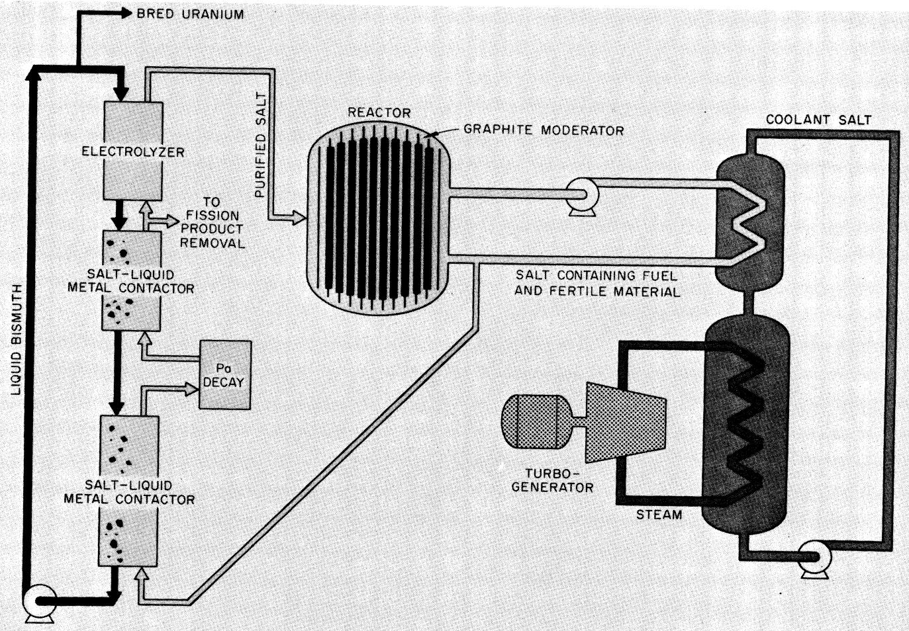
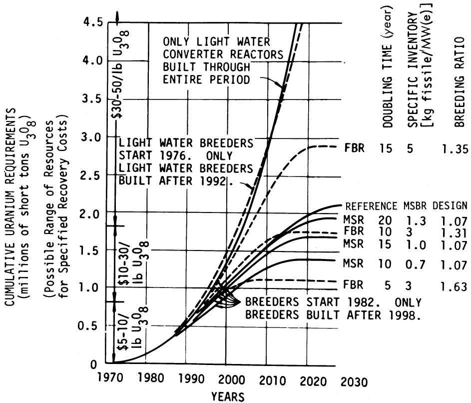
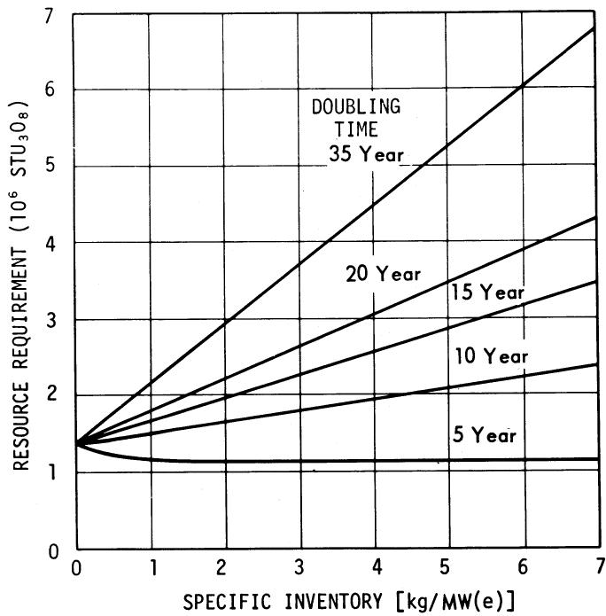

# MOLTEN-SALT REACTORS-HISTORY, STATUS, AND POTENTIAL

M. W. ROSENTHAL, P. R. KASTEN, and R. B. BRIGGS

Oak Ridge National Laboratory, Oak Ridge, Tennessee 37830

Received August 4, 1969

Revised October 10, 1969

REACTORS

KEYWORDS: molten-salt reactors, breeder reactors, design, operation, performance, economics, power reactors

Molten-salt breeder reactors (MSBR's) are being developed by the Oak Ridge National Laboratory for generating low-cost power while extending the nation's resources of fissionable fuel. The fluid fuel in these reactors, consisting of $UF_4$ and $ThF_4$ dissolved in fluorides of beryllium and lithium, is circulated through a reactor core moderated by graphite. Technology developments over the past 20 years have culminated in the successful operation of the 8-MW(th) Molten-Salt Reactor Experiment (MSRE), and have indicated that operation with a molten fuel is practical, that the salt is stable under reactor conditions, and that corrosion is very low. Processing of the MSRE fuel has demonstrated the MSR processing associated with high-performance converters. New fuel processing methods under development should permit MSR's to operate as economical breeders. These features, combined with high thermal efficiency (44%) and low primary system pressure, give MSR converters and breeders potentially favorable economic, fuel utilization, and safety characteristics. Further, these reactors can be initially fueled with $^{233}U$ , $^{235}U$ , or plutonium. The construction cost of an MSBR power plant is estimated to be about the same as that of light-water reactors. This could lend to power costs $\sim 0.5$ to 1.0 mill/kWh less than those for light-water reactors. Achievement of economic molten-salt breeder reactors requires the construction and operation of several reactors of increasing size and their associated processing plants.

# THE HISTORY OF MOLTEN-SALT REACTORS

Investigation of molten-salt reactors started in the late 1940's as part of the United States' pro

gram to develop a nuclear powered airplane. A liquid fuel appeared to offer several advantages, so experiments to establish the feasibility of molten-salt fuels were begun in 1947 on "the initiative of V. P. Calkins, Kermit Anderson, and E. S. Bettis. At the enthusiastic urging of Bettis and on the recommendation of W. R. Grimes, R. C. Briant adopted molten fluoride salts in 1950 as the main line effort of the Oak Ridge National Laboratory's Aircraft Nuclear Propulsion program." The fluorides appeared particularly appropriate because they have high solubility for uranium, are among the most stable of chemical compounds, have very low vapor pressure even at red heat, have reasonably good heat transfer properties, are not damaged by radiation, do not react violently with air or water, and are inert to some common structural metals.

A small reactor, the Aircraft Reactor Experiment, was built at Oak Ridge to investigate the use of molten fluoride fuels for aircraft propulsion reactors and particularly to study the nuclear stability of the circulating fuel system. The ARE fuel salt was a mixture of NaF, $\mathrm{ZrF_4}$ , and $\mathrm{UF_4}$ , the moderator was BeO, and all the piping was Inconel. In 1954 the ARE was operated successfully for 9 days at steady-state outlet temperatures ranging up to $1580^{\circ}\mathrm{F}$ and at powers up to 2.5 MW (th). No mechanical or chemical problems were encountered, and the reactor was found to be stable and self-regulating.

That molten-salt reactors might be attractive for civilian power applications was recognized from the beginning of the ANP program, and in 1956 H. G. MacPherson formed a group to study the technical characteristics, nuclear performance, and economics of molten-salt converters and breeders. After considering a number of concepts over a period of several years, MacPherson and his associates concluded that graphite-moderated thermal reactors operating on a

thorium fuel cycle would be the best molten-salt systems for producing economic power. The thorium fuel cycle with recycle of $^{233}\mathrm{U}$ was found to give better performance in a molten-salt thermal reactor than a uranium fuel cycle in which $^{238}\mathrm{U}$ is the fertile material and plutonium is produced and recycled. Homogeneous reactors in which the entire core is liquid salt were rejected because the limited moderation by the salt constituents did not appear to make as good a thermal reactor as one moderated by graphite, and intermediate spectrum reactors did not appear to have high enough breeding ratios to compensate for their higher inventory of fuel. Studies of fast spectrum molten-salt reactors[4,5] indicated that good breeding ratios could be obtained, but very high power densities would be required to avoid excessive fissile inventories. Adequate power densities appeared difficult to achieve without going to novel and untested heat removal methods.

Two types of graphite-moderated reactors were considered by MacPherson's group—single-fluid reactors in which thorium and uranium are contained in the same salt, and two-fluid reactors in which a fertile salt containing thorium is kept separate from the fissile salt which contains uranium. The two-fluid reactor had the advantage that it would operate as a breeder; however, the single-fluid reactor appeared simpler and seemed to offer low power costs, even though the breeding ratio would be below 1.0 using the technology of that time. The fluoride volatility process, which could remove uranium from fluoride salts, had already been demonstrated in the recovery of uranium from the ARE fuel and thus was available for partial processing of salts from either type of reactor.

The results of the ORNL studies were considered by a U.S. Atomic Energy Commission task force that made a comparative evaluation of fluid-fuel reactors early in 1959. One conclusion of the task force7 was that the molten-salt reactor, although limited in potential breeding gain, had “the highest probability of achieving technical feasibility.”

By 1960, more complete conceptual designs of molten-salt reactors had emerged. Although emphasis was placed on the two-fluid concept because of its better nuclear performance,[8] the single-fluid reactor was also studied.[9] ORNL concluded that either route would lead to low-power-cost reactors, and that proceeding to the breeder either directly or via the converter would achieve reactors with good fuel conservation characteristics. Since many of the features of civilian power reactors would differ from those of the ARE, and the ARE had been operated only a short period, another reactor experiment was needed to

investigate some of the technology for power reactors.

The design of the Molten-Salt Reactor Experiment was begun in 1960. A single-fluid reactor was selected that in its engineering features resembled a converter, but the fuel salt did not contain thorium and thus was similar to the fuel salt for a two-fluid breeder. The MSRE fuel salt is a mixture of uranium, lithium-7, beryllium, and zirconium fluorides. Unclad graphite serves as the moderator (the salt does not wet graphite and will not penetrate into its pores if the pore sizes are small). All other parts of the system that contact salt are made from the nickel-base alloy, INOR-8 (also called Hastelloy-N), which was specially developed in the aircraft program for use with molten fluorides. The maximum power is $\sim 8000\mathrm{kW}$ , and the heat is rejected to the atmosphere.

Construction of the MSRE began in 1962, and the reactor was first critical in 1965. Sustained operation at full power began in December 1966. Successful completion of a six-month run in March of 1968 brought to a close the first phase of operation during which the initial objectives were achieved. The molten fluoride fuel was used for many months at temperatures $>1200^{\circ}\mathrm{F}$ without corrosive attack on the metal and graphite parts of the system. The reactor equipment operated reliably and the radioactive liquids and gases were contained safely. The fuel was completely stable. Xenon was removed rapidly from the salt. When necessary, radioactive equipment was repaired or replaced in reasonable time and without overexposing maintenance personnel.

The second phase of MSRE operation began in August 1968 when a small processing facility attached to the reactor was used to remove the original uranium by treating the fuel salt with fluorine gas. A charge of $^{233}\mathrm{U}$ fuel was added to the same carrier salt, and on October 2 the MSRE was made critical on $^{233}\mathrm{U}$ . Six days later the power was taken to $100\mathrm{kW}$ by Glenn T. Seaborg, Chairman of the U.S. Atomic Energy Commission, bringing to power the first reactor to operate on $^{233}\mathrm{U}$ .

During the years when the MSRE was being built and brought into operation, most of the development work on molten-salt reactors was in support of the MSRE. However, basic chemistry studies of molten fluoride salts continued throughout this period. One discovery $^{10}$ during this time was that the lithium fluoride and beryllium fluoride in a fuel salt can be separated from rare earths by vacuum distillation at temperatures near $1000^{\circ}\mathrm{C}$ . This was a significant discovery, since it provided an inexpensive, on-site method for recovering these valuable materials. As a

consequence, the study effort looking at future reactors focused on a two-fluid breeder in which the fuel salt would be fluorinated to recover the uranium and distilled to separate the carrier salt from fission products. The blanket salt would be processed by fluorination alone, since few fission products would be generated in the blanket if the uranium concentration were kept low. Graphite tubes would be used in the core to keep the fuel and fertile streams from mixing.

Analyses of these two-fluid systems showed that breeding ratios in the range of 1.07 to 1.08 could be obtained, which, along with low fuel inventories, would lead to good fuel utilization. In addition, the fuel cycle cost appeared to be quite low. Consequently, the development effort for future reactors was aimed mainly at the features of two-fluid breeders. A review of the technology associated with such reactors was published in 1967.[11] The major disadvantage of this two-fluid system was recognized as being that the graphite had to serve as a piping material in the core where it was exposed to very high neutron fluxes.

In late 1967, new experimental information and an advance in core design caused the molten-salt program at ORNL to change from the two-fluid breeder to a single-fluid breeder. Part of the information influencing this change concerned the behavior of graphite at higher radiation exposures than had been achieved previously, and the other part related to a development in chemical processing.

The irradiation data $^{12,13}$ showed that the kind of graphite planned for use in an MSBR changes dimensions more rapidly than had been anticipated. This made it necessary to lower the core power density for the graphite to have an acceptable service life, and to plan on replacement of the core at fairly frequent intervals. $^{14}$ Moreover, complexities in the assembly of the core seemed to require that the entire core and reactor vessel be replaced whenever a graphite element reached its radiation limit or developed a leak. Under such circumstances, many years of operation of a prototype reactor would be required to prove convincingly that the two-fluid core is practicable.

At about the time the problems associated with long graphite exposure became evident, a chemical processing development occurred15 that greatly improved the prospect for a single-fluid breeder. To obtain good breeding performance in a single-fluid reactor, 233Pa (27.4-day half-life) must be held up outside the core until it decays to 233U. The processing development that showed promise of accomplishing this was a laboratory demonstration of the chemical steps in a liquid-liquid extraction process for removing protactinium and uranium from molten fluoride salts. The tech

nique is to exchange thorium and lithium dissolved in molten bismuth for the constituents to be removed from the salt. The process has similarities to one being developed at Argonne National Laboratory for processing fast reactor fuels and involves technology explored at Brookhaven National Laboratory for removing fission products from a liquid bismuth fuel. Additional data have confirmed the early results and have shown that the uranium can be selectively stripped from the salt into bismuth, the protactinium can be trapped in salt in a decay tank, and the uranium can be transferred back to the salt by electrolysis for return to the reactor. Calculations indicated that the extraction and electrolysis could be carried out rapidly and continuously, and that the process equipment would be relatively small.

Laboratory experiments also indicated that rare earths might be extracted from salt from which the uranium had previously been removed. Unfortunately, the chemical potentials that determine which constituents transfer to the bismuth are relatively close for thorium and the higher cross-section rare earths, and the separation is more difficult than it is for uranium and protactinium. The extraction process may still be workable, however, because with no processing the rare earths have a much smaller effect on breeding ratio than does protactinium and so need be removed only relatively slowly (50- to 80-day cycle time). Several other processes for rare earth removal are under investigation, and whether liquid metal extraction will be the most attractive is still uncertain.

The advance in core design that was important in the switch to the single-fluid breeder was the recognition that a fertile "blanket" can be achieved with a salt that contains uranium as well as thorium. The blanket is obtained by increasing the volume fraction of salt and reducing the volume fraction of graphite in the outer part of the reactor. This makes the outer region undermoderated and increases the capture of neutrons there by the thorium. With this arrangement, most of the neutrons are generated at some distance from the reactor boundary, and captures in the blanket reduce the neutron leakage to an acceptable level. H. G. MacPherson had proposed this scheme several years before, but it was only studied thoroughly after the discovery that protactinium could be removed from the salt. Optimization calculations then showed that proper selection of dimensions and volume fractions could keep the inventory of uranium in the outer region from being excessive, while producing a blanket region.

As a result of the developments cited above, design studies of single-fluid breeders were pur

sued. The studies indicated that the fuel utilization in single-fluid, two-region molten-salt reactors can be almost as good as in two-fluid reactors, and with the present limitations on graphite life, the economics probably can be better. Consequently, in 1968 ORNL's Molten-Salt Reactor Program was directed toward the development of a single-fluid breeder reactor. The immediate effect was to bring the reactor itself to a more advanced state, since in many respects the single-fluid concept is a scaled-up MSRE. At the same time, however, a number of new features were introduced into the processing concept by adoption of the extraction processes.

The characteristics of single-fluid reactors and the work that is required to develop commercial-size plants are discussed in the sections which follow.

# ECONOMIC AND NUCLEAR PERFORMANCE OF MOLTEN-SALT BREEDER REACTORS

Molten-salt breeder reactors offer attractions as power producers because of potentially favorable economic, fuel utilization, and safety charac

teristics. The avoidance of fuel fabrication, the ease of processing, and the low fissile inventory should result in low fuel cycle costs. Capital costs benefit from high thermal efficiency, low primary system pressure, and low pumping requirements. Some inherent safety features assist the designer in providing a safe plant.

The above characteristics can more than compensate for the extra costs of handling radioactive fluids and maintaining radioactive equipment, and that MSBR's can have low power costs. Since the reprocessing can be done in a small on-site plant, the attainment of low costs does not await the development of a large fuel reprocessing industry. The use of bare graphite in the core and the rapid removal of fission products, when combined with low fuel inventory, result in good fuel utilization. In addition, molten-salt reactors can be started up economically on $^{233}\mathrm{U}$ , $^{235}\mathrm{U}$ , or plutonium, and hence, can use the fuel that gives the lowest cost at a given time.

A simplified flow diagram of a single-fluid two-region MSBR having these characteristics is shown in Fig. 1, and some of the features of such reactors are given in Table I. An example of the

  
Fig. 1. Simplified flow diagram of a single-fluid two-region molten-salt breeder reactor.

# TABLEI

Characteristics of One-Fluid, Two-Region Molten-Salt Breeder Reactors   

<table><tr><td>Fuel-fertile salt, mole %</td><td>727LiF, 16 BeF2, 12 ThF4, 0.3 UF4Melting point, 930°F</td></tr><tr><td>Moderator</td><td>Graphite (bare)</td></tr><tr><td>Salt volume fractions, %</td><td>Core, 13; blanket, 40</td></tr><tr><td>Core temperatures, °F</td><td>Inlet, 1050; outlet, 1300</td></tr><tr><td>Reactor power, MW(e)</td><td>1000-2000</td></tr><tr><td>Steam system</td><td>3500 psia, 1000°F, 44% net cycle efficiency</td></tr><tr><td>Breeding ratio</td><td>1.05-1.07</td></tr><tr><td>Specific fissile fuel inventory,a kg/MW(e)</td><td>1.0-1.5</td></tr><tr><td>Doubling time (compound interest),a year</td><td>15-25</td></tr><tr><td>Fuel cycle cost,a mills/kWh (including graphite replacement)</td><td>0.6-0.7</td></tr></table>

aThe lower values are associated with the higher reactor powers.

fuel cycle cost breakdown for a 1000 MW(e) MSBR is shown in Table II; to permit comparison with the fuel cycle costs of solid fuel reactors, the capital and operating costs of the processing plant and the cost of replacing the graphite have been included in the table.

We have also estimated the capital cost of 1000 MW(e) molten-salt reactor plants and compared them with cost estimates of light-water reactors made on the same bases. The estimates assume that a molten-salt industry has advanced to the point where development costs have largely been absorbed, and the manufacture of materials and the construction and licensing of plants have become routine. Under these conditions we find that the capital costs of molten-salt and light-water reactors should be about the same. While the molten-salt reactor has some features which add cost, such as the off-gas system and the

# TABLE II

Fuel Cycle Cost Breakdown for a Single-Fluid Molten-Salt Breeder Reactor*   

<table><tr><td></td><td>Mills/kWh</td></tr><tr><td>Fissile inventory</td><td>0.26</td></tr><tr><td>Thorium inventory</td><td>0.01</td></tr><tr><td>Carrier salt inventory</td><td>0.04</td></tr><tr><td>Thorium and carrier salt makeup</td><td>0.05</td></tr><tr><td>Processing plant fixed charges and operating cost</td><td>0.30</td></tr><tr><td>Credit for sale of bred material</td><td>-0.09</td></tr><tr><td>Graphite replacement cost (4-year interval)</td><td>0.10</td></tr><tr><td>Net fuel cycle cost</td><td>0.67</td></tr></table>

*At 10% per year inventory charge on material, 13.7% per year fixed charge rate on processing plant, $13/g 233U, $11.2/g 235U, $12/kg ThO₂, $120/kg 'Li, $26/kg carrier salt (including 'Li).

equipment provided for remote maintenance of the radioactive systems, it also has features that reduce costs; for example use of the high-temperature, high-efficiency power cycle gives a savings of $\sim$ 17 000 000 in the turbine-generator plant.

An important factor to include when estimating the performance of reactors is the downtime required for maintenance and refueling. Because of the fission product activity, longer times will be required for maintenance of some parts of molten-salt reactors than for comparable parts of solid-fuel reactors. There will, however, be no loss in operating time for refueling a molten-salt system, so the overall plant factor ought to be at least as high as for other reactors. A molten-salt reactor can operate for an extended period without processing, so the reactor need not be shut down while work is being done on the processing plant.

Considering all these factors, the power cost from a molten-salt breeder reactor can be 0.5 to 1 mill/kWh below that of a light-water reactor with present uranium ore costs. The differential will increase if ore costs go up, since power costs for molten-salt reactors are considerably less sensitive to the cost of uranium.

Many analyses have shown that the development of breeder reactors is necessary to avoid rapid depletion of our uranium reserves. Similar analyses have been performed here, in which the ability of molten-salt breeders to fill this need has been compared with the abilities of other kinds of breeders, and Fig. 2 gives some of the results obtained. In the analyses, the fuel utilization characteristics used for light-water converter reactors were based on estimates for future light-water reactors,[16] and varied with time. A single set of fuel utilization characteristics was used for the light-water breeder,[17] while several combinations of breeding ratio and specific inventory were used for fast and molten-salt breeders. The curves for the breeders are based on building only light-water converters for a specified time, and then phasing in a particular breeder such that after 16 years, all new reactors are breeders. In these studies, the introduction date for breeders was assumed to be 1976 for the light-water breeder and 1982 for the fast and molten-salt breeders.

The curves in Fig. 2 indicate that the breeding gain and doubling time in themselves are not adequate measures of the ability of a breeder reactor to limit the amount of uranium ore that must be mined to fuel a large nuclear power economy. The fissile inventory is also important and a low specific inventory is particularly important in a rapidly growing nuclear economy. It is their low specific inventory that makes it possible for molten-salt thermal breeder reactors to

  
Fig. 2. Uranium ore requirements for a growing nuclear power economy.

compete with fast breeder reactors in limiting the resource requirements.

To demonstrate further the importance of inventory, the peak ore requirements obtained from curves like those shown in Fig. 2 have been cross-plotted in Fig. 3 as a function of specific inventory and doubling time. A point to note is that values plotted in Fig. 3 depend on the assumptions made about the growth of nuclear power. It was assumed that the US nuclear power capability would reach 140 000 MW(e) in 1980, 930 000 MW(e) in 2000, and expand at a rate of 100 000 MW(e) per year afterwards. If nuclear power grew exponentially after 2000, the ore requirements would not reach a peak unless the doubling time of the reactor considered was less than the doubling time of the long term growth of the nuclear power economy.

# MOLTEN-SALT CONVERTER REACTORS

Nearly all the present ORNL effort on moltensalt reactors is devoted to developing a breeder, since it has the lowest potential power cost as well as good fuel utilization characteristics. Achieving good breeding performance is dependent upon the successful development of advanced pro

cessing schemes, but low power costs can be obtained with smaller breeding ratios using processing already demonstrated at the MSRE, namely, xenon stripping and fluoride volatility. The MSRE processing plant, if run in a semicontinuous fashion, is large enough to process a 1000 MW(e) reactor on a three-year cycle. If used with a single-fluid reactor to recover the uranium, and with the fission products and other constituents of the salt being discarded, a converter having a breeding ratio between 0.8 and 0.9 would be obtained.[18] The accompanying fuel cycle cost, including graphite replacement cost and the fixed charges and operating cost of the processing plant, would be $\sim 0.8$ mills/kWh. Thus, a reactor which is a scaled-up, higher power-density MSRE, using an MSRE-type processing plant, is capable of producing power at attractive costs. With the addition of extractive processing, such a reactor, or one very similar, becomes a high-performance breeder.

# SAFETY

Safety is an important factor to be considered in evaluating civilian power reactors, but it cannot be divorced from economics. Most reactors can

  
Fig. 3. Maximum uranium ore requirements.

probably be made adequately safe by conservative design features and redundant engineered safeguards that add to the cost of power. In this regard, molten-salt reactors have some inherent features that may result in cost savings relative to other systems: the primary system operates at low pressure with fuel salt that is more than $1000^{\circ}\mathrm{F}$ below the boiling point, some fission products are removed from the reactor continuously, iodine and strontium form stable compounds in the salt, and the salts do not react rapidly with water or air. The need for excess reactivity is reduced by the continuous fuel processing, and a prompt negative temperature coefficient is associated with heating of the fuel salt.

A safety disadvantage of molten-salt reactors is the accumulation of fission products in the primary system, the off-gas system, the fuel storage tanks, and the processing plant, which requires provisions to ensure that the fission products will be contained and their decay heat will be removed under all conceivable circumstances. Partially offsetting this is the ability to drain the fuel into a tank having always ready, redundant cooling systems.

Preliminary evaluation of conceptual designs suggests that the safety characteristics of moltensalt reactors will be a net asset, but a thorough evaluation of fairly detailed designs will be required before the economic importance of this can be assessed.

# REMAINING TECHNOLOGY DEVELOPMENTS

While molten-salt reactors offer many attractive features, there is much to be done before full-scale economic molten-salt breeders can be built. What is seen as the remaining primary research and development in different areas is summarized below.

# Physics

No crucial physics problems are seen in the development of molten-salt reactors, but in view of the relatively small breeding gain of an MSBR, particular care must be taken to ensure that the nuclear calculations are accurate. The combined uncertainty in breeding ratio due to uncertainties in cross sections of all the reactor materials is $\sim \pm 0.016$ , of which $\sim 0.012$ results from uncertainty in the $\eta$ value of $^{233}\mathrm{U}$ .

To reduce the uncertainty, the capture-to-fission cross-section ratio of $^{233}\mathrm{U}$ is being determined from changes in isotopic ratios in the MSRE fuel. Additional measurements of the absorption cross sections of the salt constituent—Li, Be, and F—could reduce the uncertainty further. Lattice experiments with concentrations and geometries appropriate for the core of an MSBR should be made in facilities such as the Physical Constants Tests Reactor and the High Temperature Lattice Test Reactor at Battelle Northwest Laboratories, with emphasis on verifying the temperature coefficients of reactivity, including Doppler coefficients. These experiments would also provide an integral check on the adequacy of cross-section values and on computational models.

# Chemistry

An extensive program of molten-salt chemical research over the past 20 years has established a sound basis for understanding the chemistry of the pertinent fluoride salts. Additional work is desirable, however, in several areas. A better understanding is needed of the behavior of the noble metal fission products in MSBR systems. Alternative processes for rare earth removal should be investigated, and chemical information on the protactinium removal process needs to be extended to a wider range of conditions. The phase behavior of $\mathrm{PuF_3}$ in molten salts ought to be studied more thoroughly to provide a firmer chemical basis for the use of plutonium. Further measurements are needed of the physical and chemical properties of molten salts, and particularly of the sodium fluoride/sodium fluoroborate salt mixtures which are the presently proposed secondary coolants for MSBR's.

# Analytical Chemistry

Adequate control of the chemistry of the salts in the reactor systems depends on development of rapid, reliable, and economical analytical techniques for the precise determination of uranium, thorium, and other constituents of the fuel salt, the detection of bismuth in fuel salt, the measurement of the concentration of trivalent uranium in fuel salt, and the analysis of constituents of fuel and coolant system cover gases. At present, such measurements are obtained through sampling and subsequent analysis, but promising electrochemical and spectrophotometric methods for continuous, or almost continuous, analyses are under development. These methods need to be developed to the point where dependable instruments can be demonstrated.

# Fuel Processing

Obtaining good breeding in a single-fluid reactor requires rapid on-site reprocessing to keep protactinium out of the high neutron flux as well as to remove fission products. Investigation of most of the steps needed to effect rapid reprocessing has not proceeded past preliminary laboratory tests. Thus, development of the liquid-bismuth extraction system will require an extensive program of engineering experiments. Materials problems, including the inherently difficult corrosion problem of the electrolyzer for transferring uranium from bismuth to salt and thorium and lithium from salt to bismuth, will have to be overcome.

Nonradioactive engineering experiments should be sufficient to develop and prove out components and to demonstrate the practicality of salt-bismuth contractors and of the electrolyzer. Removal of rare earths also can be tested using nonradioactive material, but experiments using significant concentrations of protactinium will have to be performed in facilities that have provisions for high $\alpha$ activity. Demonstration of a processing system with high fission-product heating rates will only be possible on a reactor.

Although a workable fluorination process has already been demonstrated, advantages would accrue from using a layer of frozen salt to protect metal surfaces from corrosion. Since fluorination can have an auxiliary role in single-fluid breeder processing as well as the main role in processing a converter, further work should be done on this. Additional work is needed on vacuum distillation, which appears applicable to recovery of lithium and beryllium, and possibly thorium, from waste streams.

# Materials

Graphites that would be acceptable for the cores of early molten-salt reactors can probably be obtained commercially in the near future, but production techniques must be scaled up, and commercially produced materials must be tested for reactor use. Damage from high-energy neutrons eventually leads to deterioration of graphite at temperatures of interest to molten-salt reactors. However, there is some experimental evidence that the resistance of graphite to radiation damage can be significantly increased, and improved grades need to be developed and tested. Graphite development work centers on use of the High-Flux Isotope Reactor, in which a dose of $4 \times 10^{22}$ nvt ( $E > 50\mathrm{keV}$ ) can be obtained in one year.

Helium sparging will remove $^{135}\mathbf{Xe}$ from molten salts, and reduction of xenon poisoning by a factor of 6 has been demonstrated in the MSRE. To achieve the factor of 10 reduction desired for a breeder, however, will require that the permeability of the graphite, as measured with helium, be reduced to $\sim 10^{-8}~\mathrm{cm}^2/\mathrm{sec}$ . Pyrolytic carbon impregnation of the surface has been shown to be capable of producing graphite of such low permeability, but much more testing under irradiation is required, and the process must be scaled up for use with reactor-size graphite bars.

The Hastelloy-N used in the past for containing molten salts is embrittled by helium produced in the metal when it is irradiated. Although the present material has been satisfactory for the MSRE, an improved alloy is needed for power reactors. A modified form of Hastelloy-N containing small amounts of titanium or hafnium appears to meet this requirement. Further testing under a variety of irradiation conditions must be completed to demonstrate fully that the desired improvement has been accomplished. Large heats must be obtained, and the modified material must be subjected to enough testing to have it approved for pressure vessel use by the ASME. The changes in composition from standard Hastelloy-N are not great, however, and full requalifications is probably not required. For the longer term, creep rupture tests at low stress conditions and extending over many years should be made to verify the extrapolation of data from the requalification tests. Resistance of the modified alloy to corrosion by fuel and coolants salts—particularly the fluoroborate—must be demonstrated at all reactor operating conditions.

In a reductive extraction fuel processing system, materials will be exposed to both salt and bismuth at temperatures between 500 and $700^{\circ}\mathrm{C}$ . Candidate materials will have to be tested, and

methods of protection, such as deposition of films or frozen salt layers on the wall, may have to be developed.

# Molten-Salt Irradiation Experiments

MSRE operation has shown the compatibility of graphite with fissioning fuel at low power densities and low burnup, and a variety of in-pile capsules and loops have provided additional information. However, the experience to date has not included exposures at the power densities of breeder reactors. In-pile loop experiments thus need to be performed using appropriate materials at the peak power densities of high-performance breeders.

# Engineering Development

Development of large components is probably the most costly of all the technology needs of the MSR. Most of the components built so far have been of MSRE size or smaller. While the MSRE has demonstrated the workability of small components, much larger equipment will be needed for MSBR's.

Vertical shaft pumps with overhung impellers similar to the MSRE pumps would be used, and the basic requirement is to increase the size. Heat exchangers for MSBR's must be of very high performance to obtain a low fuel salt inventory and must be capable of replacement. The development of steam generators heated by molten salt involves an area in which there has been almost no experience, and the high melting point of the salt will probably cause the design to be considerably different from that of other steam generators built to date. The control rods and drives for large MSBR's will be different from those on the MSRE, because air cooling will not suffice at the higher power densities. Rods and drives that permit insertion of control elements directly into the fuel salt will be needed.

Xenon is effectively stripped from the fuel salt in the MSRE pump bowl, but for a large, high-performance MSBR, it will be necessary to inject bubbles into the salt under controlled conditions and to remove them effectively. Reliable methods for disposing of afterheat in the fuel salt after reactor shutdown must be demonstrated for a variety of reactor conditions.

The ability to maintain the reactor primary system and the processing system of an MSBR power plant must be assured. New techniques need to be developed that go beyond those used on the MSRE. The ability to cut and weld piping remotely would be valuable, and existing automatic welding equipment should be adapted for this use and demonstrated.

A number of test facilities will be needed for use in the development and testing of components and systems.

These and other developments must be accomplished on an appropriate scale before the next molten-salt reactor is completed. Where they are successful, only scale-up will be required for the larger reactors that follow.

# Reactor Development

Achievement of economic molten-salt breeder reactors requires the construction and operation of several reactors of increasing size and their associated processing plants. Construction of these reactors will establish the industrial capability to manufacture molten-salt reactors and will test and demonstrate the technology which leads toward dependable reactor operation and low power costs. The next reactor could be a molten-salt breeder experiment which has all the features and systems of a full-scale power breeder and operates at power densities and other conditions extreme enough to provide a thorough test of future reactor conditions. Alternatively or concurrently, a converter reactor could be built which uses technology largely demonstrated by the MSRE except for equipment scale-up to higher performance and larger size.

# CONCLUSIONS

The objective of developing breeder reactors is to obtain a source of low-cost energy for ourselves and for future generations. Three events of the past year make it seem likely that maltensalt reactors can accomplish this:

1. the very successful operation of the MSRE on both $^{235}\mathrm{U}$ and $^{233}\mathrm{U}$   
2. the processing of a complete charge of fuel at the MSRE   
3. the advances in chemical processing and core arrangement that make it possible to design a single-fluid breeder.

The first event gives assurance that molten salt technology can be used dependably for power reactors. The second event means that a converter reactor having a breeding ratio of 0.8 to 0.9 and attractively low power costs can be based on a demonstrated processing system. And the third means that molten-salt breeders, as well as converters, can essentially be scaled-up versions of the MSRE.

While adoption of the single-fluid concept brings the breeder reactor nearer to fruition, it also increases the development needed for the

breeder processing plant. Scale-up towards commercial-size breeder reactors, however, need not await the demonstration of breeder processing. Since the converter and breeder are basically the same except for the processing plant, the scale-up can begin by building converters, with expectation that they will evolve into single-fluid breeders as the processing is improved. This flexibility—generally a result of using a fluid fuel—extends also to the freedom to start up the reactors with $^{235}\mathrm{U}$ , $^{233}\mathrm{U}$ , or $\mathrm{Pu}$ , depending on which is most economic at the time.

Much remains to be done before economic molten-salt breeder reactors can be achieved, but the basic virtues of the molten-salt system and the success of the MSRE offer promise that the breeder development program will meet with early success.

# ACKNOWLEDGMENTS

This research was sponsored by the U.S. Atomic Energy Commission under contract with the Union Carbide Corporation.

# REFERENCES

1. H. G. MACPHERSON, “Molten-Salt Reactors,” Proc. Intern. Conf. Constructive Uses At. Energy, Washington, DC, November 1968, American Nuclear Society (March 1969).   
2. “The Aircraft Reactor Experiment,” Nucl. Sci. Eng., 2, 797 (1957).   
3. J. A. LANE, H. G. MACPHERSON, and F. MASLAN, Fluid Fuel Reactors, pp. 567 ff, Addison-Wesley, Reading, Mass. (1958).   
4. L. G. ALEXANDER et al., Oak Ridge National Laboratory, Personal Communication (1962-1963).   
5. P. R. KASTEN, "The MOSEL Reactor Concept," Third U.N. Intern. Conf. Peaceful Uses of At. Energy, Geneva, A/Conf 28/P/538 (1964).   
6. G. I. CATHERS, "Uranium Recovery from Spent Fuel by Dissolution in Fused Salt and Fluorination," Nucl. Sci. Eng., 2, 768 (1957); W. H. CARR, "Volatility Processing of the ARE Fuel," Chem. Eng. Symp. Series, 56, 28 (1960).   
7. US-AEC TASK FORCE, "Report of the Fluid Fuel Reactors Task Force," TID-8507 (February 1959).   
8. L. G. ALEXANDER, W. L. CARTER, R. H. CHAPMAN, B. W. KINYON, J. W. MILLER, and R. VAN WINKLE, “Thorium Breeder Reactor Evaluation—Part I, Fuel Yield and Fuel Cycle Costs in Five Thermal Breeders,” ORNL-CF-61-3-9, Oak Ridge National Laboratory (September 1961).

9. L. G. ALEXANDER, W. L. CARTER, C. W. CRAVEN, D. B. JANNEY, T. W. KERLIN, and R. VAN WINKLE, “Molten-Salt Converter Reactor Design Study and Power Cost Estimated for a 1000 Mwe Station,” ORNL-TM-1060, Oak Ridge National Laboratory (September 1965).   
10. M. J. KELLY, “Removal of Rare Earth Fission Products from Molten-Salt Reactor Fuels by Distillation,” Trans. Am. Nucl. Soc., 8, 170 (1965).   
11. The status of molten-salt reactor development was surveyed in a series of ORNL reports issued in 1967. They are:   
R. B. BRIGGS, “Summary of the Objectives, the Design, and a Program of Development of Molten-Salt Breeder Reactors,” ORNL-TM-1851, Oak Ridge National Laboratory (June 12, 1967).   
W. R. GRIMES, “Chemical Research and Development for Molten-Salt Breeder Reactors,” ORNL-TM-1853, Oak Ridge National Laboratory (June 1967).   
H. E. McCoy and J. R. WEIR, “Materials Development for Molten Salt Breeder Reactors,” ORNL-TM-1854, Oak Ridge National Laboratory (June 1967).

DUNLAP SCOTT and A. G. GRINDELL, "Components and Systems Development for Molten-Salt Breeder Reactors," ORNL-TM-1855, Oak Ridge National Laboratory (June 30, 1967).

A. M. PERRY, “Physics Program for Molten Salt Breeder Reactors,” ORNL-TM-1857, Oak Ridge National Laboratory (June 1967).   
PAUL R. KASTEN, "Safety Program for Molten-Salt Breeder Reactors," ORNL-TM-1858, Oak Ridge National Laboratory (June 9, 1967).   
J. R. TALLACKSON, R. L. MOORE, and S. J. DITTO, "Instrumentation and Controls Development for Molten-Salt Breeder Reactors," ORNL-TM-1856, Oak Ridge National Laboratory (May 22, 1967).   
W. L. CARTER and M. E. WHATLEY, “Fuel and Blanket Processing Development for Molten-Salt Breeder Reactors,” ORNL-TM-1852, Oak Ridge National Laboratory (June 1967).

ROBERT BLUMBERG, "Maintenance Development for Molten-Salt Breeder Reactors," ORNL-TM-1859, Oak Ridge National Laboratory (June 1967).

12. R. W. HENSON, A. S. PERKS, and J. H. W. SIMMONS, “Lattice Parameter and Dimensional Changes in Graphite Irradiated Between 300 and $1350^{\circ}\mathrm{C}$ ,” AERE R 5489, United Kingdom Atomic Energy Research Establishment, Harwell (June 1967).   
13. J. W. HELM, “Long Term Radiation Effects on Graphite,” Paper MI 77, 8th Biennial Conference on Carbon, Buffalo, New York (June 1967).

14. P. R. KASTEN, E. S. BETTIS, W. H. COOK, W. P. EATHERLY, D. K. HOLMES, R. J. KEDL, C. R. KENNEDY, S. S. KIRSLIS, H. E. McCOY, A. M. PERRY, R. C. ROBERTSON, D. SCOTT, and R. A. STREHLOW, “Graphite Behavior and Its Effects on MSBR Performance,” Nucl. Eng. Design, 9, 2 (February 1969).   
15. W. R. GRIMES, “Molten-Salt Reactor Chemistry,” Nucl. Appl. Tech., 8, 137 (1970).   
16. JACKSON & MORELAND and S. M. STOELLER ASSOCIATES, "Current Status and Future Technical and

Economic Potential of Light Water Reactors," WASH-1082, U.S. Atomic Energy Commission (March 1968).   
17. "Performance Potential of Large Seed-Blanket Breeder Reactors," WAPD-LSBR-300, Bettis Atomic Power Laboratory, Westinghouse Electric Corporation (February 1965).   
18. A. M. PERRY and H. F. BAUMAN, “Reactor Physics and Fuel-Cycle Analyses,” Nucl. Appl. Tech., 8, 208 (1970).