# NEW DEVELOPMENTS IN MATERIALS FOR MOLTEN-SALT REACTORS

H. E. McCOY, R. L. BEATTY, W. H. COOK, R. E. GEHLBACH  
C. R. KENNEDY, J. W. KOGER, A. P. LITMAN, C. E. SESSIONS  
and J. R. WEIR Metals and Ceramics Division,  
Oak Ridge National Laboratory Oak Ridge, Tennessee 37830

Received August 4, 1969  
Revised October 10, 1969

REACTORS

KEYWORDS: radiation effects, molten-salt reactors, breeder reactors, power reactors, reactor core, fused salts, coolants, chromium alloys, molybdenum alloys, nickel alloys, corrosion, brittleness, thermal neutrons, sodium fluorides, sodium borides, mixing, graphite, fast neutrons, stability, expansion, porosity, Hastelloy, embrittlement, mixtures, surfaces

Operating experience with the Molten-Salt Reactor Experiment (MSRE) has demonstrated the excellent compatibility of the graphite-Hastelloy-N-fluoride salt system at $650^{\circ}C$ . Several improvements in materials are needed for a molten-salt breeder reactor with a basic plant life of 30 years; specifically: Hastelloy-N with improved resistance to embrittlement by thermal neutrons; graphite with better dimensional stability in a fast neutron flux; graphite that is sealed to obtain a surface permeability of $<10^{-8}$ cm²/sec; and a secondary coolant that is inexpensive and has a melting point of $\sim400^{\circ}C$ . A brief description is given of the materials work in progress to satisfy each of these requirements.

# INTRODUCTION

Our present concept of a molten-salt breeder reactor1 utilizes graphite as moderator and reflector, Hastelloy-N for the containment vessel and other metallic parts of the system, and a liquid fluoride salt containing LiF, $\mathrm{BeF}_2$ , $\mathrm{UF}_4$ , and $\mathrm{ThF}_4$ as the fertile-fissile medium. The fertile-fissile salt will leave the reactor vessel at a temperature of $\sim 700^{\circ}\mathrm{C}$ and energy will be transferred to a coolant salt which in turn is used to produce supercritical steam.

Experience with the Molten-Salt Reactor Experiment (MSRE) has demonstrated the basic compatibility of the graphite-Hastelloy- $\mathbf{N}^{\mathrm{a}}$ -fluoride salt $(\mathrm{LiF - BeF_2 - ZrF_4 - UF_4})$ system at $650^{\circ}\mathrm{C}$ . However, a breeder reactor will impose more stringent material requirements; namely: the design life of the basic plant of a breeder is 30 years at a maximum operating temperature of

$700^{\circ}\mathrm{C}$ ; the power density will be higher in a breeder and will require the core graphite to sustain higher damaging neutron flux and fluence; and neutron economy is of utmost importance in the breeder and the retention of fission products (particularly $^{135}\mathrm{Xe}$ ) by the core graphite must be minimized. Each of these factors requires a specific improvement in the behavior of materials.

Experience has shown that the mechanical properties of Hastelloy-N deteriorate as a result of thermal-neutron exposure and a method must be found of improving the mechanical properties of this material to ensure the desired 30-year plant life.

Similarly, graphite is damaged by irradiation. Although the core graphite can be replaced, the allowable fast neutron fluence for the graphite has an important influence on the economics of molten-salt breeder reactors. Thus, a program has been undertaken to learn more about irradiation damage in graphite and to develop graphites with improved resistance to damage.

A big factor in neutron economy is reducing the quantity of $^{135}\mathrm{Xe}$ that resides in the core. This gas can be removed by continuously sparging the system with helium bubbles, but the transfer by this method probably will not be rapid enough to prevent excessive quantities of $^{135}\mathrm{Xe}$ from being absorbed by the graphite. This can be prevented by reducing the surface diffusivity to $< 10^{-8}\mathrm{cm}^2/\mathrm{sec}$ , and we feel that this is best accomplished by carbon impregnation by internal decomposition of a hydrocarbon.

A new secondary coolant is also needed that will allow us greater latitude in operating temperature. Sodium fluoroborate has reasonable physical properties for this application, and the compatibility of Hastelloy-N with this salt is being evaluated.

Our work in each of these areas will be described in some detail.

# EXPERIENCE WITH THE MSRE

Other papers in this series have elaborated on the information gained from the MSRE regarding operating experience, physics, chemistry, and fission-product behavior. Additionally, valuable information has been gained about the materials involved.[2-4]

There are surveillance facilities exposed to the salt in the core of the reactor and outside the reactor vessel, where the environment is nitrogen plus $\sim 2\%$ $\mathrm{O_2}$ . Hastelloy-N tensile rods and samples of the grade CGB graphite used in the core of the MSRE are exposed in the core facility. The components are assembled so that portions can be removed in a hot cell, new samples added, and the assembly returned to the reactor. Samples were removed after 1100, 4400, and $9000\mathrm{h}$ of full-power ( $\sim 8\mathrm{MW}$ ) operation at $650^{\circ}\mathrm{C}$ . As shown in Fig. 1, the physical condition of the graphite and metal samples was excellent; identification numbers and machining marks were clearly visible. The peak fast fluence received by the graphite has been $4.8\times 10^{20}\mathrm{n/cm}^2$ ( $>50\mathrm{keV}$ ) and the dimensional changes are $< 0.1\%$ . Pieces of graphite from the MSRE have been sectioned and most of the fission products were found to be located on the surface and within 10 mils below the surface. However, a few of the fission products have gaseous precursors and penetrated the graphite to greater depths. The microstructure of the Hastelloy-N near the surface was modified to a depth of $\sim 1$ mil, but a similar modification was found in samples exposed to static nonfissioning salt for an equivalent time. The near-surface modification has not been positively identified, but its presence is likely of no consequence. The very small changes in the amounts of chromium and iron in the fuel salt also indicate very low corrosion rates and support our metallographic observations.

The observed low corrosion rate of Hastelloy-N in the MSRE does not come as a surprise, since thousands of hours of corrosion tests preceded

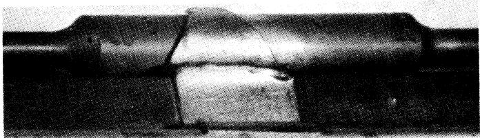

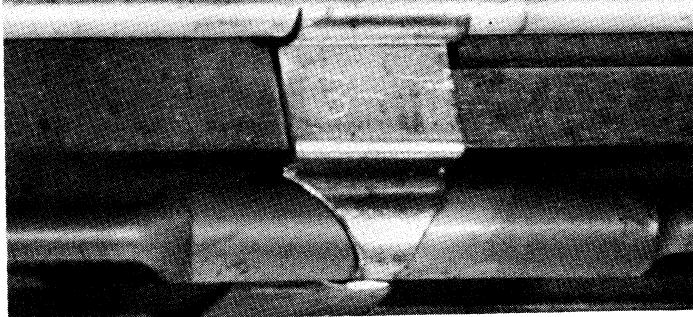  
Fig. 1. Graphite and Hastelloy-N surveillance assembly removed from the core of the MSRE after 72400 MWh of operation. Exposed to flowing salt for 15300 h at $650^{\circ}\mathrm{C}$ .

construction of the reactor. Hastelloy-N is nickel based and contains about $16\%$ Mo, $7\%$ Cr, and $5\%$ Fe. Under normal operating conditions, the fuel salt cannot oxidize (form fluorides) any of these elements except Cr. Since Cr is present in very small concentrations in the alloy, the corrosion is limited by the diffusion of Cr to the metal surface. Corrosion can be reduced even further by controlling the oxidation state of the salt, thus reducing the rate of the corrosion reaction at the metal-salt interface. The oxidation state of the salt in the MSRE is controlled by the addition of beryllium metal.

Hastelloy-N samples were removed from the surveillance facility outside the reactor vessel after 4400 and $9000\mathrm{h}$ of full-power operation. This environment is oxidizing, and an oxide film $\sim 2$ mils thick was formed on the surface after the longer exposure. There was no evidence of nitriding, and the mechanical properties of these samples were not affected adversely by the presence of the thin oxide film.

Thus, experience with the MSRE has proved in service the excellent compatibility of the Hastelloy-N-graphite-fluoride salt system.

# DEVELOPMENT OF A MODIFIED HASTELLOY-N WITH IMPROVED RESISTANCE TO IRRADIATION DAMAGE

Since the MSRE was constructed, Hastelloy-N, as well as most other iron- and nickel-base alloys, was found to be subject to a type of high-temperature irradiation damage that reduces the

This effect is characterized in Figs. 2 and 3 for a test temperature of $650^{\circ}\mathrm{C}$ . The rupture lives for irradiated and unirradiated materials differ most at high stress levels and are about the same for below 20 000 psi. The property change of most concern in reactor design and operation is the reduction in fracture strain. The postirradiation fracture strain is shown in Fig. 3 as a function of strain rate; the scatter band is based upon test results for three different heats of metal. The plot includes results from both tensile and creep tests. In tensile tests the strain rate is a controlled parameter and the test results are plotted directly. In creep tests the stress is controlled and the strain measured as a function of time. The minimum strain rate was used in constructing Fig. 3. The data are characterized by a curve with a minimum at a strain rate of $\sim 0.1\%/\mathrm{h}$ , with rapidly increasing fracture strain as the strain rate is increased, and slowly increasing fracture strain as the strain rate is decreased. Thus, under normal operating conditions for a reactor where the stress levels (and the strain rates) are low, the rupture life will not be affected significantly (Fig. 2), but the fracture strain will be only 2 to $4\%$ (Fig. 3). However, transient conditions that would impose higher stresses or require that the material absorb thermally induced strains could cause failure of the material. Therefore, a material is desired that has improved properties in the irradiated condition and a program with this as its goal has been embarked upon.

The changes in high-temperature properties of iron- and nickel-base alloys during irradiation in thermal reactors have been shown rather conclusively to be related to the thermal fluence and more specifically related to the quantity of helium produced in the metal from the thermal $^{10}\mathrm{B}(n,\alpha)^7\mathrm{Li}$ transmutation. The mechanical properties are only affected under test conditions that produce intergranular fracturing of the material. Under these conditions both creep and tensile curves for irradiated and unirradiated materials are identical up to some strain where the irradiated material fractures and the unirradiated material continues to deform. Thus, the main influence of irradiation is to enhance intergranular fracture.

cAlthough the fast-neutron flux will be quite high in the core of our proposed breeder, the neutrons reaching the Hastelloy-N vessel will be reduced in energy by the graphite present. Thus, the fast fluence seen by the vessel during 30 years will be $< 1\times 10^{21}\mathrm{n / cm}^2$ , and we do not feel that fast-neutron displacement damage is of concern. Experiments will be run to confirm this point.

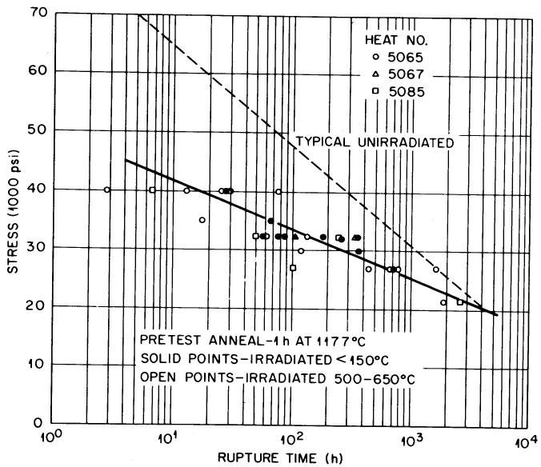  
Fig. 2. Creep-rupture properties of Hastelloy-N at $650^{\circ}\mathrm{C}$ after irradiation to a thermal fluence of $\sim 5\times 10^{20}\mathrm{n/cm}^2$ .

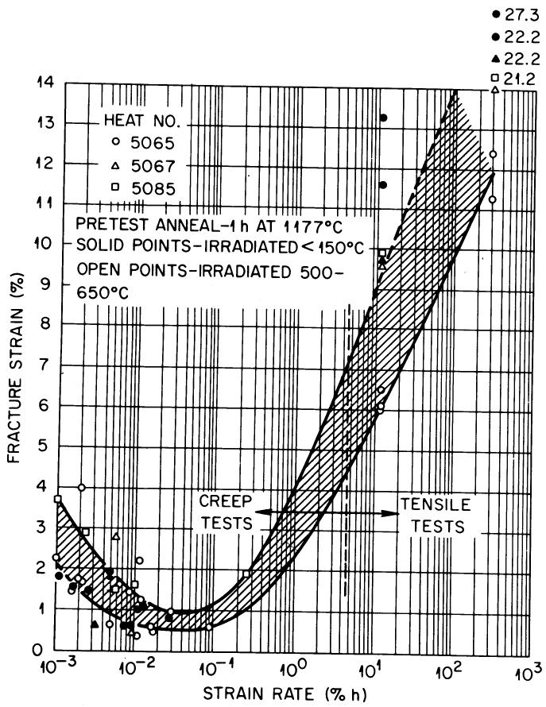  
Fig. 3. Fracture strain of Hastelloy-N at $650^{\circ}\mathrm{C}$ after irradiation to a thermal fluence of $\sim 5 \times 10^{20} \, \mathrm{n/cm}^2$ .

A logical solution to this problem would be to remove the boron from the alloy. However, boron is present as an impurity in most refractories used for melting, and the lowest boron concentrations obtainable by commercial melting practice are in the range of 1 to 5 ppm. The low helium levels that have caused the creep-rupture properties to deteriorate in Hastelloy-N make this approach very unattractive. For example, in-reactor tube burst tests at $760^{\circ}\mathrm{C}$ showed that the rupture life was reduced by an order of magnitude and that the fracture strain was only a few tenths of a per cent when the computed helium levels were in the parts-per-billion range.[10] Thus, we have concluded that the properties of Hastelloy-N cannot be improved solely by reducing the boron level.

Another very important observation has been that the properties are altered by irradiation at elevated temperatures only when the test temperature is high enough for grain boundary deformation to occur (above about half the absolute melting temperature for many materials). Thus, the role of helium must be to alter the properties of the grain boundaries so that they fracture more easily.

The size of boron lies intermediate between the sizes of small atoms such as carbon that occupy interstitial lattice positions and the larger metal atoms, such as nickel and iron, that occupy the normal lattice positions. For this reason boron concentrates in the grain boundary regions where the atomic disorder provides holes large enough to accommodate the boron atoms. Thus, the transmuted helium will be generated near the grain boundaries where it will have its most devastating effects. We reasoned that the addition of an element that formed stable borides would result in the boron being concentrated in discrete precipitates rather than being distributed uniformly along the grain boundaries. The transmuted helium would likely remain associated with the precipitate and be less detrimental. Additionally, certain precipitate morphologies and alloying elements are beneficial in improving the resistance of alloys to intergranular fracture.

Following this reasoning, small additions of Ti, Hf, and Zr have been made to Hastelloy-N and the postirradiation properties were improved markedly. The titanium-modified alloy was chosen for development as a structural material for a molten-salt breeder experiment (MSBE). A further modification made in the composition was reducing the molybdenum content from 16 to $12\%$ . This change was prompted by the observation that the additional molybdenum was used in forming large carbide particles that made it difficult to control the grain size. The vacuum-melting prac

tice was adopted to reduce the concentrations of other residual elements thought to be deleterious.

The stress-rupture properties at $650^{\circ}\mathrm{C}$ of several heats of the titanium-modified alloy $(0.5\%)$ Ti) are summarized in Fig. 4. The properties in the absence of irradiation are improved over those of standard Hastelloy-N and the rupture life of the modified alloy is not reduced more than $\sim 10\%$ by irradiation at $650^{\circ}\mathrm{C}$ to a thermal fluence of $5\times 10^{20}\mathrm{n/cm}^2$ . The postirradiation fracture strains of the titanium-modified alloy are also improved over those of the standard alloy (Fig. 5). The modified alloy has a very well-defined ductility minimum as a function of strain rate, but the minimum strain is $\sim 3\%$ compared with $0.5\%$ for the standard alloy.

Electron microscopy has shown that the titanium-modified alloy forms very fine-grain boundary and matrix precipitates of the MC type when annealed at $650^{\circ}\mathrm{C}$ . These precipitates are only a few tenths of a micron in size and those in the grain boundaries are spaced at $\sim 2 - u$ intervals. They have a face-centered cubic crystal structure with a lattice parameter of $\sim 4.24\AA$ and are likely complexes involving Mo, Cr, Ti, C, N, and B. These complex compounds also form precipitates in the matrix. This microstructure should lead to trapping of some of the helium as proposed earlier and should also inhibit fracture along the grain boundaries. However, further studies have shown that the precipitates which form during long exposure at $760^{\circ}\mathrm{C}$ are relatively coarse $\mathsf{Mo}_2\mathsf{C}$ carbides and that the postirradiation properties of

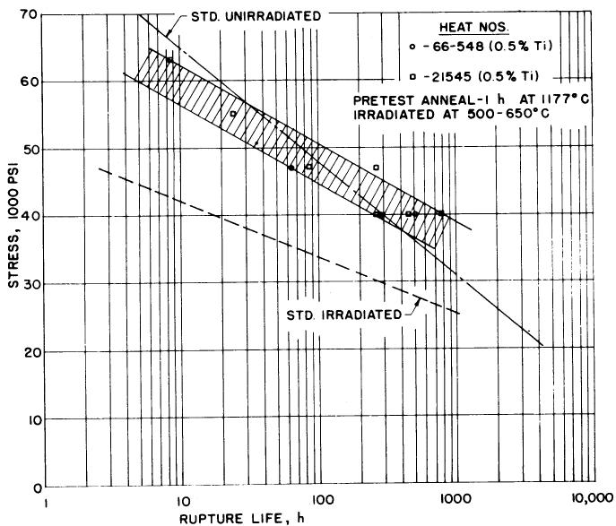  
Fig. 4. Creep-rupture properties of several heats of modified Hastelloy-N at $650^{\circ}\mathrm{C}$ . Samples irradiated to a thermal fluence of $\sim 5 \times 10^{20} \mathrm{n/cm}^2$ .

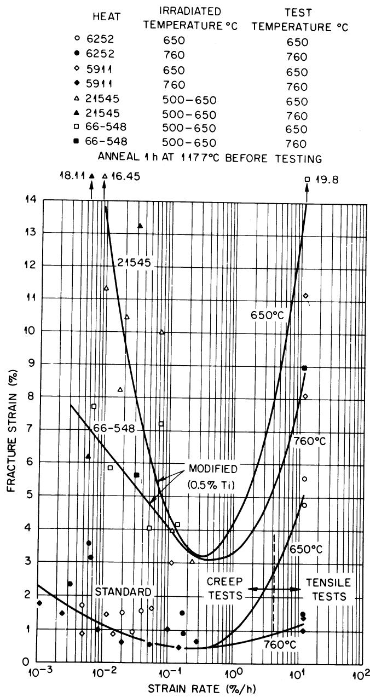  
Fig. 5. Variation of fracture strain with rate for several Hastelloy-N type alloys. Samples irradiated to a fluence of $\sim 5 \times 10^{20} \mathrm{n/cm}^2$ prior to testing.

material irradiated at $760^{\circ}\mathrm{C}$ are very poor. Since some designs require the vessel of the MSBR to operate at $\sim 700^{\circ}\mathrm{C}$ , this difference in precipitate morphology and subsequent deterioration of properties was of concern.

Further work has shown that the desired MCType carbide can be stabilized at higher service temperatures. This carbide is favored by increasing amounts of Ti, Hf, and Nb and decreasing concentrations of Si. Several alloys have been

prepared that retain good postirradiation properties after irradiation at $760^{\circ}\mathrm{C}$ . Several of the alloy additions that appear satisfactory are $1.2\%$ Ti, $1\%$ Hf, $1\%$ Hf plus $1\%$ Ti, $0.5\%$ Ti plus $2\%$ Nb, and $2\%$ Hf. The results of tests on these alloys give encouragement that a commercial alloy can be developed that has properties at least as good as those shown in Figs. 4 and 5.

# IRRADIATION DAMAGE IN GRAPHITE

Neutron irradiation alters the physical properties of graphite, but the dimensional changes that occur $^{16,17}$ are of major concern. These dimensional changes are illustrated in Fig. 6 where the data of Henson et al. $^{18}$ are presented for isotropic graphite. With increasing fluence the graphite first contracts and then begins to expand at a very high rate. Several potential problems arise as a result of these dimensional changes. First, the initial contraction will change the volume occupied by fuel salt and change the nuclear characteristics of the reactor. These dimensional changes seem small enough for most isotropic graphites that the nuclear effects may be accommodated by design. A second problem is stress generation due to flux gradients across a piece of graphite. Graphite creeps under irradiation $^{19}$ and this creep is large enough to reduce the stress intensities to quite acceptable values. The third and most serious problem is that the rapid growth rate represents a rapid decrease in density with potential crack and void formation. At some fluence this will cause the mechanical properties to deteriorate and the permeability to salt and fission products to increase. We feel that properties will be acceptable, at least until the material returns to its original volume, and have defined this fluence as the lifetime. A fourth

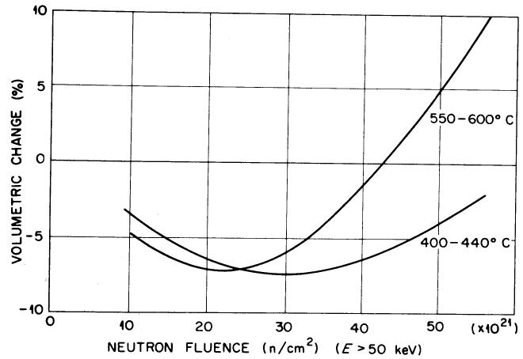  
Fig. 6. Volume change in isotropic graphite Dounreay fast reactor irradiations.

problem is that the dimensional changes are dependent on temperature and the curve in Fig. 6 is shifted up and to the left for increasing temperature. Thus, stresses develop in a part having a temperature gradient since segments of the part are seeking different dimensions. Again, this stress is relieved by the irradiation-induced creep in graphite geometries of interest. Therefore, we consider the onset of rapid growth to be the primary problem and the initial dimensional changes of secondary importance.

Graphite temperatures between 550 and $750^{\circ}\mathrm{C}$ are anticipated in MSBR's, and operation with a fast flux $(>50\mathrm{keV})$ as high as $1\times 10^{15}\mathrm{n / (cm}^2\mathrm{sec})$ is desired. Data in Fig. 6 indicate that this flux will cause this particular graphite to expand rapidly after a fluence of $\sim 3\times 10^{22}\mathrm{n / cm}^2$ is reached ( $\sim 1$ year of operation). The flux can be reduced by decreasing the power density, but this usually increases the fuel inventory and doubling time. Hence, it is quite desirable that graphite be used with better resistance to irradiation damage than the graphite shown in Fig. 6. The data available on current reactor graphites irradiated to high fluences were examined and the results described a fairly consistent picture. The fluences required for graphite to reach its minimum volume were strongly temperature dependent (decreased with increasing temperature), but were not appreciably different for any of the graphites studied to date. Although this observation is

discouraging, current experiments show that better graphites already exist and that others can probably be developed with only small changes in present materials and processing. Let us look briefly at a simple description of the origin of the dimensional changes and then return to our specific observations.

Graphite, after being well graphitized at temperatures above $2000^{\circ}\mathrm{C}$ , has a hexagonal close-packed crystal structure consisting of close-packed layers, (basal planes) of carbon atoms with very strong covalent bonds within the basal planes ( $a$ direction) and very weak Van der Waals' forces between atoms in adjacent basal planes ( $c$ direction). This anistropy in atomic density and bond strength is reflected by very anisotropic properties.

The changes that take place in a single crystal of graphite during irradiation are shown schematically in Fig. 7. A neutron having an energy above $\sim 0.18\mathrm{eV}$ can displace a carbon atom from a close-packed basal plane with a reasonable probability of creating a vacancy in a basal plane and an interstitial carbon atom between the basal planes. Repetition of this process and diffusion at elevated temperatures can result in the formation of defect clusters, specifically partial planes of atoms between the basal planes and vacancy clusters within the original planes. This leads to an expansion perpendicular to the basal planes ( $c$ direction) and a contraction within the layer

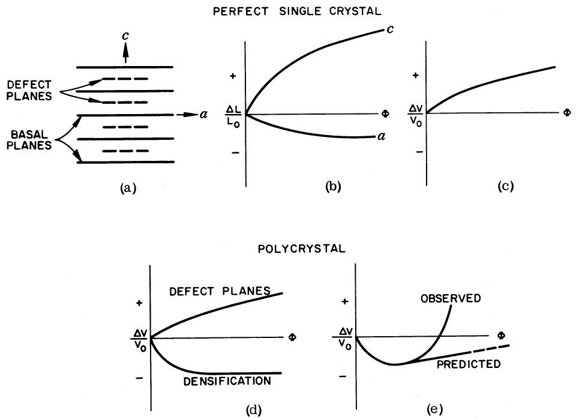  
Fig. 7. Graphite dimensional changes due to irradiation.

planes (a direction) as shown in Fig. 7b. This new configuration leads to a slight increase in volume (Fig. 7c).

Polycrystalline graphites are not initially of theoretical density. The voids present in the material are a result of shrinkage of the binder during graphitization and from separation or fracture of layer planes during cooling from the graphitization temperature. Initially, during irradiation the porosity within the material tends to be filled as the crystallites expand in the $c$ direction. This produces a densification illustrated by the bottom curve in Fig. 7d. As the porosity fills, the shrinkage saturates and the dimensional behavior begins to be dominated by the volume expansion due to the growth of the crystallites in the $c$ direction. Thus, a minimum volume is obtained as shown in Fig. 7e. During the subsequent expansion, the material either remains internally contiguous, in which case the volume change rate of the polycrystalline material should be similar to the small rate of expansion exhibited by the crystallites themselves, or fractures internally due to the stresses generated between the crystallites of differing orientation (causing a higher rate of growth to occur). Observations to date indicate that most graphites increase in volume at a faster rate at high fluences than expected if the material remained internally contiguous.

One further consideration helps to explain why the unpredicted rapid growth takes place. A

schematic representation of several coke particles and binder after graphitization is shown in Fig. 8.[20] Each coke particle consists of several crystals with a very high degree of preferred orientation. Although the coke particles are arranged randomly in a large piece of graphite, there are still interfaces between particles of widely different orientations. As each particle changes dimensions, these interfaces must be strong and able to shear large amounts without fracturing. The observation that graphites undergo large dimensional changes at high fluences indicates that these interfaces or boundaries are fracturing. As indicated by the sketch in Fig. 8, these boundaries are made up largely of the graphitized binder materials. Thus, the properties of these boundaries are influenced largely by the nature of the binder material and its interaction with the coke particles.

We are making graphites with known filler and binder materials, but our work in this area has not progressed very far. This work also includes a study of the properties of several commercial graphites that may be potentially useful for MSBR applications and others that should give some basic information about irradiation damage in graphite. Graphite irradiations have been done at $705 \pm 10^{\circ}\mathrm{C}$ in the High Flux Isotope Reactor (HFIR) where the peak flux ( $>50\mathrm{keV}$ ) is $1 \times 10^{15}\mathrm{n} / (\mathrm{cm}^2\mathrm{sec})$ . Thus, samples can be irradiated to fluences of $1 \times 10^{22}\mathrm{n} / \mathrm{cm}^2$ in $\sim 4$ months.

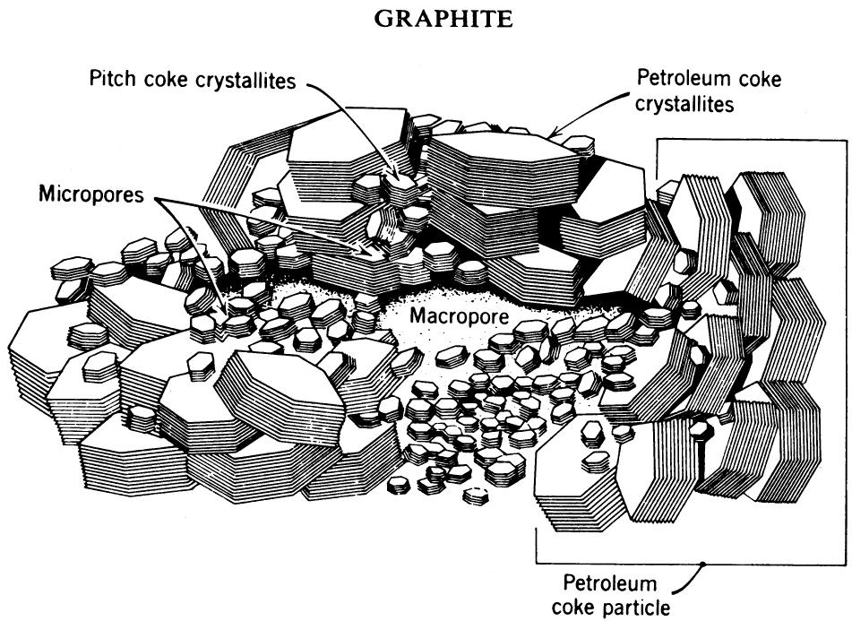  
Fig. 8. Proposed arrangement of crystallites in graphitized stock.

A summary of the results obtained to date is shown in Fig. 9. Several materials show a significant deviation from the "typical" behavior illustrated in Fig. 6. The $\mathrm{POCO^d}$ graphites show excellent resistance to irradiation with very small dimensional changes out to fluences of $2.5\times$ $10^{22}\mathrm{n / cm}^2$ . Thus, these data support the supposition that the typical behavior of graphite can be improved markedly, but test results have not been extended to fluences high enough to determine the exact magnitude of this improvement.

# SEALING GRAPHITE

Entry of fuel salt into graphite can be prevented by keeping the entrance diameter of the accessible porosity smaller than $1\mu$ . Although this does require some extra care during processing it can be accomplished routinely on large shapes. In fact, the grade CGB graphite obtained 5 years ago for the MSRE satisfies this requirement.[21] However, the graphite structure must be much more restrictive to prevent gaseous fission products, particularly $^{135}\mathrm{Xe}$ , from diffusing into the graphite. We presently propose to strip $^{135}\mathrm{Xe}$ from the fuel salt by purging with helium. Helium bubbles will be injected and later removed in a gas-liquid separator. The efficiency of this purging depends very heavily on the size of bubbles that can be injected and circulated and the mass transfer of $^{135}\mathrm{Xe}$ from the salt to the helium bubbles. Both of these factors are presently uncertain, and we must anticipate that large quantities of $^{135}\mathrm{Xe}$ will be available to the graphite surfaces and that excessive ( $>0.5\%$ ) retention of $^{135}\mathrm{Xe}$ will result if this gas can enter the graphite surface at a high rate. Present calculations show that the accessibility of $^{135}\mathrm{Xe}$ to the graphite surfaces will be impeded by a laminar salt film and that the graphite offers an additional resistance to gas flow only when its diffusivity to $^{135}\mathrm{Xe}$ is $\sim 10^{-8} \, \text{cm}^2/\text{sec}$ .

The best grades of commercial graphites presently available have bulk diffusivities in the range of $10^{-1}$ to $10^{-4} \mathrm{~cm}^{2} / \mathrm{sec}$ , and it is unreasonable to expect that techniques can be developed for making massive shapes with such a restrictive structure. The techniques used for reducing the porosity of graphite involve multiple impregnations of the material with liquid hydrocarbons and then firing to graphitize this material. As the bulk diffusivity decreases, it becomes progressively more difficult for the gases released by the decomposing impregnants to diffuse out of the material and the times required to reach the

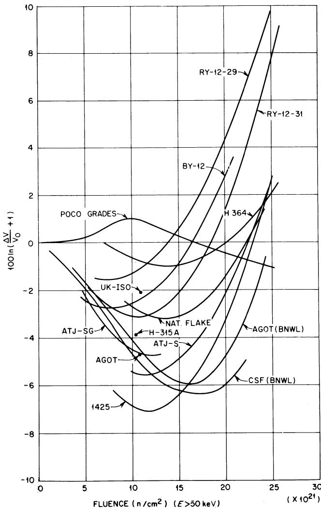  
Fig. 9. Volume changes in graphite irradiated at $705^{\circ}\mathrm{C}$ .

graphitizing temperature become excessive. Thus, it is more reasonable to reduce the surface diffusivity by a postfabrication surface-sealing process involving gaseous impregnation. Since the pyrolytic carbon, that would be deposited, and the graphite substrate will change dimensions differently under irradiation, it is imperative that the pyrolytic carbon be linked with the substrate structure and not deposited as a surface layer that can be sheared easily.

The task of sealing the graphite is illustrated by the photomicrograph in Fig. 10. The processing parameters must be adjusted so that the voids are filled internally in preference to closing the voids near the surface and forming a coating. This can be accomplished by using a flowing stream of hydrocarbon at low partial pressure and temperature appropriate to maintain very low deposition kinetics, but this requires long processing times. We have used a different method

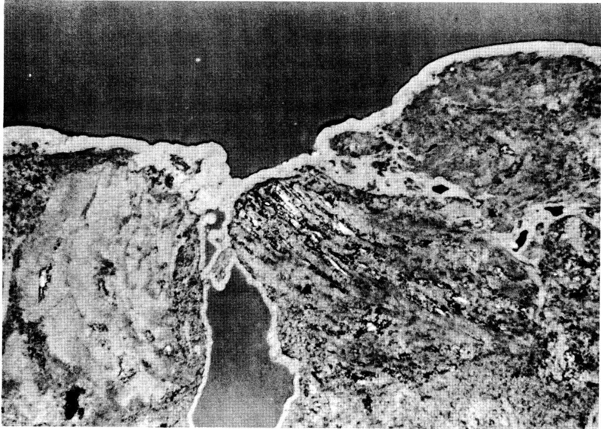  
0.005 INCHES 10   
Fig. 10. Photomicrograph of the edge of graphite showing a pore that has been partially coated and then sealed over with pyrocarbon.

to accomplish penetration which involves pulsing the sample environment between a rich hydrocarbon environment and vacuum. The vacuum cycle removes the reaction products (primarily hydrogen) and allows more hydrocarbon gas to enter the void. Specifically, we have used 1, 3 butadiene at 20 psig, deposition temperatures of 800 and $1000^{\circ}\mathrm{C}$ , and cycle times of $\sim 1$ min for the vacuum and a fraction of a second for the hydrocarbon. Butadiene was chosen because it is a gas at room temperature and because of its high carbon yield per molecule. The temperature range is restricted to 800 and $1000^{\circ}\mathrm{C}$ because higher temperatures result in a surface coating not penetrating the pore structure and lower temperatures yield intolerably low deposition rates. The lengths of the vacuum and pressure periods are very important because they not only influence the processing rate, but also the depth of penetration of the impregnant. The time required for the process will be important in determining the cost.

Two commercial graphites have been used in this work-viz., AXF made by POCO and ATJ-SG

made by UCC. These materials had widely different accessible pore spectra; nearly all the pores in the AXF material were $< 0.8\mu$ in diameter while the ATJ-SG grade had pores in all size ranges up to $17\mu$ . Thus, the sealing characteristics of the two materials were widely different. The results of some parameter studies are shown in Fig. 11 where the vacuum-hydrocarbon cycle times were varied at $850^{\circ}\mathrm{C}$ . The initial slopes are proportional to the surface area being coated and the slope is much steeper for the AXF graphite than for the ATJ-SG material. The sharp break in the curves for the AXF graphite indicates that the pores have been filled or closed off and that the surface area being coated is reduced. The sharpness of this break attests to the uniform pore size of the AXF graphite. The horizontal portions of the curves represent, essentially, surface coating, and the data suggest that some finite amount of surface coating is necessary to attain the MSBR permeability specification of $< 10^{-8}\mathrm{cm}^2/\mathrm{sec}$ for ${}^{135}\mathrm{Xe}$ at $700^{\circ}\mathrm{C}$ . (A ${}^{135}\mathrm{Xe}$ permeability at $700^{\circ}\mathrm{C}$ of $4\times 10^{-8}\mathrm{cm}^2/\mathrm{sec}$ is approximately equal to a helium permeability at

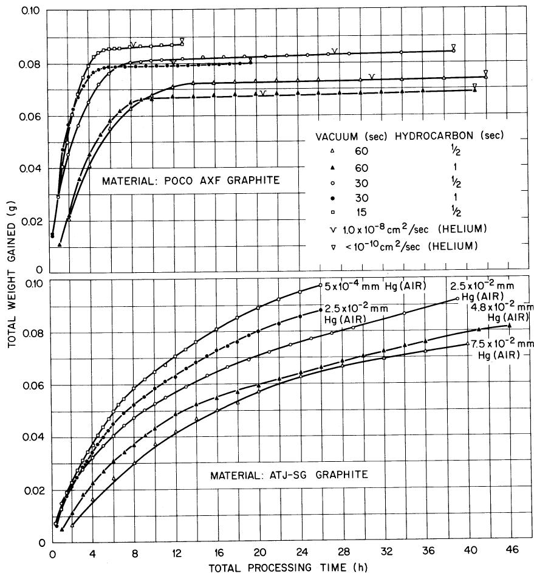  
Fig. 11. Impregnation rate of graphite using 1,3 butadiene at $850^{\circ}\mathrm{C}$ .

$25^{\circ} \mathrm{C}$ of $1 \times 10^{-8} \mathrm{~cm}^{2} / \mathrm{sec}$ . Helium permeability measurements were made and the goal was a helium permeability of $< 1 \times 10^{-8} \mathrm{~cm}^{2} / \mathrm{sec}$ (denoted on these curves by a "v" mark). The ATJ-SG graphite was not sealed to the desired level under the conditions shown in Fig. 11 and the slope changes very gradually due to the wide variation in the pore sizes.

The data indicate that the processing time could be reduced by shortening the length of the vacuum cycle. Another interesting feature of the process for the AXF graphite was that the final total weight of carbon deposited was increased by shortening the vacuum pulse. This indicates that the depth of penetration of carbon into the material was increased. Thus, shortening the vacuum pulse accelerated the process and improved the product, both very desirable characteristics.

These studies are not yet extensive enough to optimize the deposition conditions but are sufficient to make us optimistic about being able to reduce the diffusivity of graphite to the desired level. The remaining question of prime impor-

tance is the integrity of the seal after exposure to high neutron fluences.

# CORROSION IN FLUORIDE SALT SYSTEMS

Two decades of corrosion testing $^{22-30}$ and experience with the $\mathrm{MSRE}^{3,4}$ have demonstrated the excellent compatibility of Hastelloy-N and graphite with fluoride salts containing LiF, $\mathrm{BeF}_2$ , $\mathrm{ThF}_4$ , and $\mathrm{UF_4}$ . The fertile-fissile salt for an MSBR will contain these same fluorides, so only proof-testing will be required for the primary reactor circuit. However, a coolant salt is needed with a lower melting temperature than the LiF- $\mathrm{BeF}_2$ salt presently used in the MSRE; a sodium fluoroborate salt ( $\mathrm{NaBF}_4 - 8$ mole% NaF) has been chosen as a potential coolant salt for further study. This salt is inexpensive ( $<\$0.50/\mathrm{lb}$ ) and has a low melting point of $385^{\circ}\mathrm{C}$ . A significant characteristic of this salt is that it has an appreciable equilibrium overpressure of $\mathrm{BF}_3$ gas (e.g., 180 mm at $600^{\circ}\mathrm{C}$ ).

Much of our present corrosion work is concerned with the compatibility of Hastelloy-N with sodium fluoroborate. Some earlier thermal convection loop studies involving a relatively impure salt of composition $\mathrm{NaBF}_4$ -4 mole% NaF-6 mole% $\mathrm{KBF}_4$ showed that a Croloy-9M loop plugged after $1440\mathrm{h}$ at a maximum temperature of $607^{\circ}\mathrm{C}$ and a temperature difference of $145^{\circ}\mathrm{C}$ , and that a Hastelloy-N loop was partially plugged after $8765\mathrm{h}$ of operation under the same temperature conditions.[31] The plug in the Croloy was comprised primarily of pure iron crystals and the partial plug in the Hastelloy-N loop was made up of a compact mass of green single crystals of $\mathrm{Na}_3\mathrm{CrF}_6$ . The salt charge from the Hastelloy-N contained large amounts of Cr, Fe, Ni, and Mo, all major alloying elements in Hastelloy-N.

In more recent tests a purer fluoroborate salt of composition $\mathrm{NaBF}_4$ -8 mole% NaF has been used. $^{32,33}$ A thermal convection loop is being used from which we can remove salt samples for chemical analysis and metal samples for weighing without interrupting operation of the loop. The weight changes for the hottest and coldest samples are shown in Fig. 12 for the two loops presently in operation. The loops are constructed of identical materials, but the removable samples in one loop (NCL-13) are standard Hastelloy-N and those in the other loop (NCL-14) are a modified Hastelloy-N containing $0.5\%$ Ti and only $0.1\%$ Fe (standard Hastelloy-N contains $4\%$ Fe). As shown in Fig. 12, the weight changes of the modified Hastelloy-N are smaller, and this is later shown to be due primarily to the lower iron content of the modified material. The rate of weight change was steady except for a small perturbation after $1500\mathrm{h}$ of operation and a large variation after $4200\mathrm{h}$ of operation. These times corresponded to times when moist air inadvertently came in contact with the salt. The changes in chemistry shown in Fig. 13 also reflect the admission of air at these times since the oxygen and water levels in the salt increased. The iron and chromium concentrations have continued to increase at a rate proportional to $(\mathrm{time})^{1/2}$ , indicating that the process is controlled by diffusion in the metal. The nickel and molybdenum concentrations in the salt have remained very low except for times when moist air was inadvertently contacted with the salt. These results show qualitatively that the corrosion rates increased when the oxygen and water levels increased. Capsule tests in which sodium fluoroborate containing $1400\mathrm{ppm}$ $\mathrm{O}_2$ and $400\mathrm{ppm}$ $\mathrm{H}_2\mathrm{O}$ was contacted with Hastelloy-N for $6800\mathrm{h}$ at $607^{\circ}\mathrm{C}$ exhibited very low corrosion rates $(<0.1\mathrm{mil/year})$ . Future work will be directed toward defining the oxygen and water levels that result in acceptable corrosion rates.

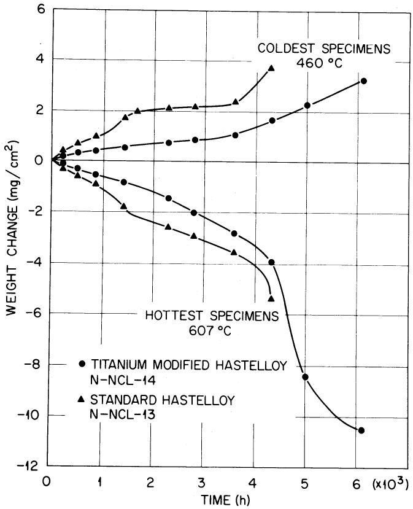  
Fig. 12. Comparison of the weight changes of Hastelloy-N specimens inserted in $\mathrm{NaBF_4}$ -NaF (92-8 mole%) thermal convection loops. (Assuming uniform corrosion, a weight change of $20\mathrm{mg/cm^2}$ in 8750 h is equivalent to a corrosion rate of $\sim 1$ mil/year.)

The information obtained on the changes in salt composition and the weight change of samples located at various points (and temperatures) around the loop is sufficient to attempt a mass balance for the system. The weight of metal lost must equal the weight of metal deposited plus the weight of metal in the salt-i.e.,

$$
\Delta W _ {\text {l o s s}} = \Delta W _ {\text {d e p o s i t e d}} + \Delta W _ {\text {s a l t}}. \tag {1}
$$

A weight change vs temperature profile is constructed based on the removable samples and the assumption is made that each segment of the loop wall follows this same curve. This procedure results in mass balances, Eq. (1), that close within $10\%$ .

Diffusion theory can be used for further analysis. As mentioned earlier, chemical analyses (Fig. 13) indicate that the iron and chromium concentrations in the salt are increasing, so it is assumed that the salt selectively removes these elements from the alloy. The modified Hastelloy-N tested here is relatively free of iron, so the

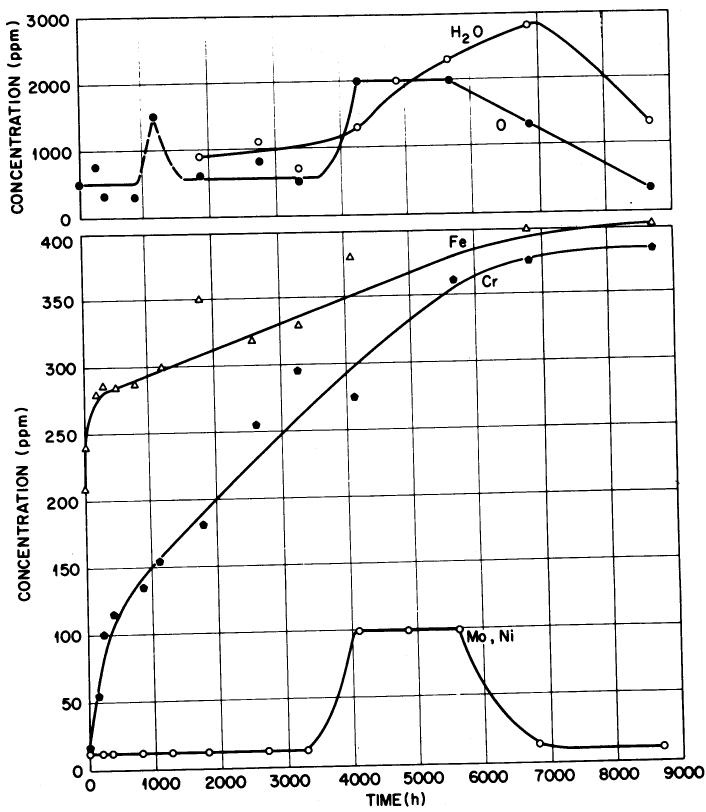  
Fig. 13. Variation of impurities with time in $\mathrm{NaBF_4}$ NaF (92-8 mole%), thermal convection loop NCL-14.

weight loss of this sample should be due primarily to the removal of chromium. The quantity of material removed by diffusion under conditions where the surface concentration of the diffusing element is zero is given by:

$$
\Delta M = C _ {0} \sqrt {D t}, \tag {2}
$$

where

$$
\begin{array}{l} \Delta M = \text {m a t e r i a l} \mathrm {r e m o v e d}, \mathrm {g} / \mathrm {c m} ^ {2} \\ \begin{array}{l} C _ {0} = \text {b u l k c o n c e n t r a t i o n o f d i f f u s i n g s p e c i e s}, \\ \mathrm {g / c m ^ {3}} \end{array} \\ D = \text {d i f f u s i v i t y}, \mathrm {c m} ^ {2} / \sec \\ t = \text {t i m e}, \sec . \\ \end{array}
$$

Using the data of Grimes et al.34 for diffusion of chromium in Hastelloy-N, this analysis showed that the quantity of chromium removed by diffusion cannot account for the total weight lost.

Fusion cannot be accounted for by short-circuit diffusion mechanisms enhancing the rate of chromium removal at these low temperatures or by impurities (likely HF formed by water ingestion) that lead to some general attack of the

metal that is not diffusion controlled. Two observations argue against the latter possibility. First, microprobe analyses have not shown any transfer of nickel or molybdenum to the colder surfaces of the loop except during a brief period after $4200\mathrm{h}$ of operation in which we knew that large amounts of impurities were present. A second and more convincing argument is based on the relative behavior of standard and modified Hastelloy-N during the first $4000\mathrm{h}$ of operation. Rewriting of Eq. (2) in terms of a reaction rate constant, $K$ , instead of the diffusion coefficient yields

$$
\Delta M = C _ {0} \sqrt {K t}. \tag {3}
$$

This equation predicts the material transported by diffusion to be too low for the modified alloy when $K$ equal $D$ , but let $K$ take on a value so that the predicted and observed weight losses for a given time of operation agree with $C_0$ equal to $7\%$ Cr. Now consider the standard alloy in which $C_0$ corresponds to $7\%$ Cr + $4\%$ Fe. The same $K$ chosen for the modified alloy predicts the observed weight change for the standard alloy. Thus, the difference in the weight losses between the modified and standard alloy appears due principally to the iron content. Had much general corrosion occurred, this adjustment in $C_0$ should not have worked. In fact, this analytical procedure was entirely unsatisfactory for the short time period after $4200 \, \text{h}$ when the water and oxygen levels were high and nickel and molybdenum were being removed (Figs. 12 and 13). A further possible role of impurities is to provide the oxidizing potential necessary to keep the surface concentration of iron and chromium at zero. Thus, even though the process remains diffusion controlled, the rate can be increased by impurities.

Although some of the curves in Figs. 12 and 13 have quite large slopes, the corrosion rates are not very high. Using the rather rough method of converting the weight losses to corrosion depths indicates that the average rate during $8000\mathrm{h}$ of operation has been 0.7 mil/year. The rate has decreased to $\sim 0.3$ mil/year for long time periods in which operation was not disturbed. In scaled-up MSBR systems, a cold trapping technique will likely be used to remove some of the corrosion products so that their solubilities are not exceeded. We presently feel that the sodium fluoroborate salt will provide a satisfactory and economical secondary coolant for molten-salt reactors.

# SUMMARY

Experience with the MSRE has proven the basic compatibility of the graphite-Hastelloy-N-fluoride

salt system at elevated temperatures. However, a molten-salt breeder reactor will impose more stringent operating conditions, and some improvements in the graphite and Hastelloy-N for this system are needed. The mechanical properties of Hastelloy-N deteriorate under thermal-neutron irradiation, but the addition of titanium in combination with strong carbide formers such as niobium and hafnium makes the alloy more resistant to this type of irradiation damage. Graphite undergoes dimensional changes due to exposure to fast neutrons, and the possible loss of structural integrity due to these dimensional changes presently limits the lifetime of the core graphite. Although the core graphite can be replaced as often as necessary, these replacements influence the economics of the reactor, and a program to find a better graphite has been initiated. Studies to date indicate that graphites can be developed that have better resistance to irradiation damage than conventional nuclear graphites. The graphite used in the core will be sealed with pyrocarbon to reduce the amount of $^{135}\mathrm{Xe}$ that is absorbed. Techniques have been developed for this sealing, and studies are in progress to determine whether the low permeability is retained after irradiation. Corrosion studies indicate that the corrosion rate of Hastelloy-N in sodium fluoroborate is acceptable as long as the salt does not contain large amounts of impurities, such as HF and $\mathrm{H}_2\mathrm{O}$ .

# ACKNOWLEDGMENTS

This research was sponsored by the U.S. Atomic Energy Commission under contract with the Union Carbide Corporation.

# REFERENCES

1. E. S. BETTIS and R. C. ROBERTSON, “The Design and Performance Features of a Single-Fluid Molten-Salt Breeder Reactor,” Nucl. Appl. Tech., 8, 190 (1970).   
2. W. H. COOK, “Molten-Salt Reactor Program Semiannual Progress Report, August 31, 1965,” ORNL-3872, pp. 87-92, Oak Ridge National Laboratory.   
3. H. E. McCoy, "An Evaluation of the Molten-Salt Reactor Experiment Hastelloy N Surveillance Specimens-First Group," ORNL-TM-1997, Oak Ridge National Laboratory (November 1967).   
4. H. E. McCoy, "An Evaluation of the Molten Salt Reactor Experiment Hastelloy N Surveillance Specimens-Second Group," ORNL-TM-2359, Oak Ridge National Laboratory, in press.   
5. D. R. HARRIES, J. Brit. Nucl. Energy, 5, 74 (1966).

6. W. R. MARTIN and J. R. WEIR, in *Flow and Fracture of Metals and Alloys in Nuclear Environments* Spec. Tech. Publ., 380, pp. 251-267, American Society for Testing and Materials, Philadelphia (1965).   
7. J. T. VENARD and J. R. WEIR, in *Flow and Fracture of Metals and Alloys in Nuclear Environments* Spec. Tech. Publ., 380, p. 269, American Society for Testing and Materials, Philadelphia (1965).   
8. W. R. MARTIN and J. R. WEIR, Nucl. Appl., 1, 160 (1965).   
9. W. R. MARTIN and J. R. WEIR, “Postirradiation Creep and Stress Rupture of Hastelloy N,” Nucl. Appl., 3, 167 (1967).   
10. H. E. McCoy and J. R. WEIR, "Stress-Rupture Properties of Irradiated and Unirradiated Hastelloy N Tubes," Nucl. Appl., 4, 96 (1968).   
11. P. C. L. PFEIL and D. R. HARRIES, in Flow and Fracture of Metals and Alloys in Nuclear Environments Spec. Tech. Publ., 380, p. 202, American Society for Testing and Materials, Philadelphia (1965).   
12. P.C.L. PFEIL, P.J. BARTON, and D.R. ARKELL, "Effects of Irradiation on the Elevated-Temperature Mechanical Properties of Austenitic Steels," Trans. Am. Nucl. Soc., 8, 120 (1965).   
13. P. R. B. HIGGINs and A. C. ROBERTs, Nature, 206, 1249 (1965).   
14. H. E. McCoy, Jr. and J. R. WEIR, Jr., Materials Development for Molten-Salt Breeder Reactors, ORNL-TM-1854, Oak Ridge National Laboratory (June 1967).   
15. H. E. McCoy, Jr. and J. R. WEIR, Jr., "Development of a Titanium-Modified Hastelloy with Improved Resistance to Radiation Damage," Proc. Symp. on the Effects of Radiation on Structural Metals, San Francisco, Calif., June 23-28, 1968, to be published.   
16. R. E. NIGHTINGALE, Nuclear Graphite, Academic Press, New York (1962).   
17. J. H. W. SIMMONS, Radiation Damage in Graphite, Pergamon Press, New York (1965).   
18. R. W. HENSON, A. J. PERKS, and J. H. W. SIMMONS, “Lattice Parameter and Dimensional Changes in Graphite Irradiated Between 300 and $1350^{\circ}\mathrm{C}$ ,” AERE-R 5489, p. 33, Atomic Energy Research Establishment (June 1967).   
19. C. R. KENNEDY, “Gas Cooled Reactor Program Semiannual Progress Report, March 31, 1964,” ORNL-3619, pp. 151-154, Oak Ridge National Laboratory.   
20. W. C. RILEY, High-Temperature Materials and Technology, p. 188, I. E. CAMPBELL and E. M. SHERWOOD, Eds., Wiley, New York (1967).   
21. W. H. COOK, “Molten-Salt Reactor Program Semiannual Progress Report, July 31, 1964,” ORNL-3708, p. 377, Oak Ridge National Laboratory.

22. L. S. RICHARDSON, D. C. VREELAND, and W. D. MANLY, “Corrosion by Molten Fluorides,” ORNL-1491, Oak Ridge National Laboratory (March 17, 1953).   
23. G. M. ADAMSON, R. S. CROUSE, and W. D. MANLY, “Interim Report on Corrosion by Alkali-Metal Fluorides: Work to May 1, 1953,” ORNL-2337, Oak Ridge National Laboratory.   
24. G. M. ADAMSON, R. S. CROUSE, and W. D. MANLY, “Interim Report on Corrosion by Zirconium-Base Fluorides,” ORNL-2338, Oak Ridge National Laboratory (January 3, 1961).   
25. W. B. COTTRELL, T. E. CRABTREE, A. L. DAVIS, and W. G. PIPER, "Disassembly and Postoperative Examination of the Aircraft Reactor Experiment," ORNL-1868, Oak Ridge National Laboratory (April 2, 1958).   
26. W. D. MANLY, G. M. ADAMSON, Jr., J. H. COOBS, J. H. DeVAN, D. A. DOUGLAS, E. E. HOFFMAN, and P. PATRIARCA, "Aircraft Reactor Experiment—Metal-lurgical Aspects," ORNL-2349, Oak Ridge National Laboratory, pp. 2-24, (December 20, 1957).   
27. W. D. MANLY, J. H. COOBS, J. H. DevAN, D. A. DOUGLAS, H. INOUYE, P. PATRIARCA, T. K. ROCHE, and J. L. SCOTT, Progr. Nucl. Energy Ser. IV, 2, 164 (1960).   
28. W. D. MANLY, J. W. ALLEN, W. H. COOK, J. H. DevAN, D. A. DOUGLAS, H. INOUYE, D. H. JANSEN, P. PATRIARCA, T. K. ROCHE, G. M. SLAUGHTER, A.

TABOADA, and G. M. TOLSON, Fluid Fuel Reactors, pp. 595-604, JAMES A. LANE, H. G. MacPHERSON, and FRANK MASLAN, Eds., Addison Wesley, Reading, Pa. (1958).   
29. “Molten-Salt Reactor Program Status Report,” pp. 112-113, ORNL-CF-58-5-3, Oak Ridge National Laboratory (May 1, 1958).   
30. J. H. DeVAN and R. B. EVANS, III, in Conference on Corrosion of Reactor Materials, June 4-8, 1962, Proceedings Vol. II, pp. 557-579, International Atomic Energy Agency, Vienna (1962).   
31. J. W. KOGER and A. P. LITMAN, "Compatibility of Hastelloy N and Croloy 9M with $\mathrm{NaBF}_4$ -NaF-KBF₄ (90-4-6 mole%) Fluoroborate Salt," ORNL-TM-2490, Oak Ridge National Laboratory, in preparation.   
32. J. W. KOGER and A. P. LITMAN, “Molten-Salt Reactor Program Semiannual Progress Report, February 29, 1968,” pp. 221-225, ORNL-4254, Oak Ridge National Laboratory.   
33. “Molten-Salt Reactor Program Semiannual Progress Report, August 31, 1968,” ORNL-4344, Oak Ridge National Laboratory, in press.   
34. W. R. GRIMES, G. M. WATSON, J. H. DeVAN, and R. B. EVANS, in Conference on the Use of Radioisotopes in the Physical Sciences and Industry, September 6-17, 1960, Proceedings Vol. III, p. 559, International Atomic Energy Agency, Vienna (1962).