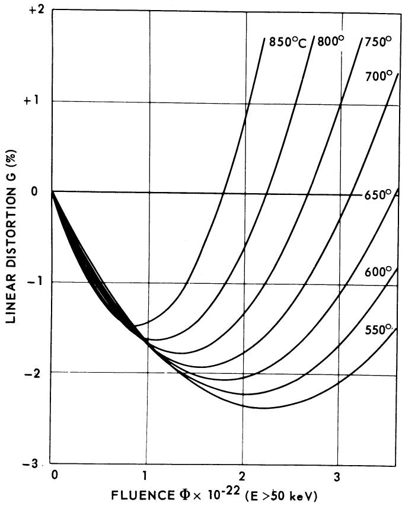
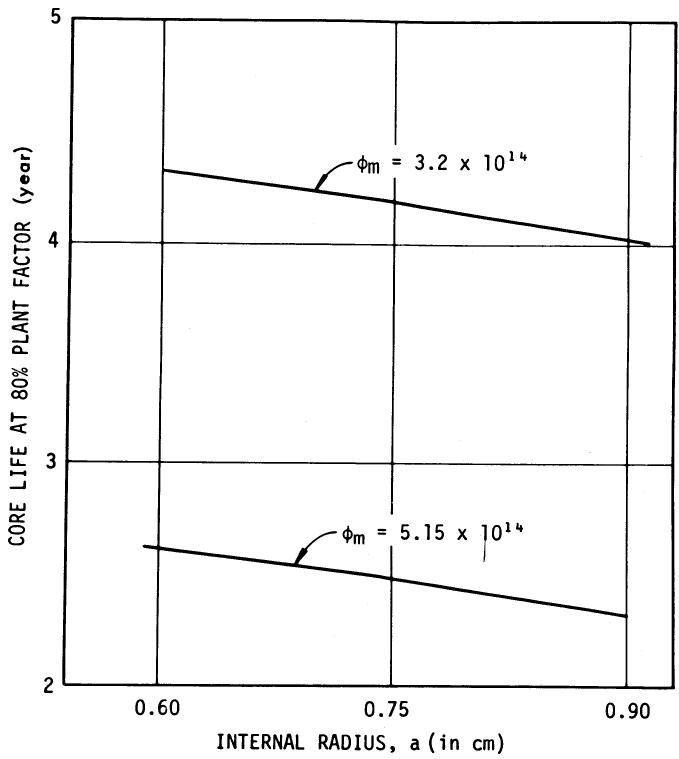
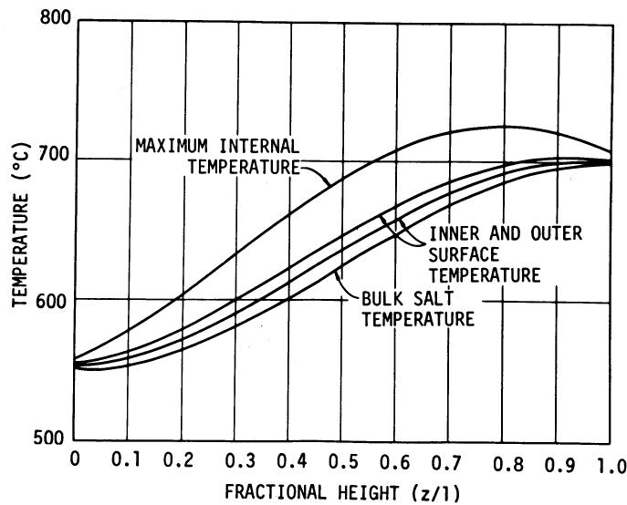
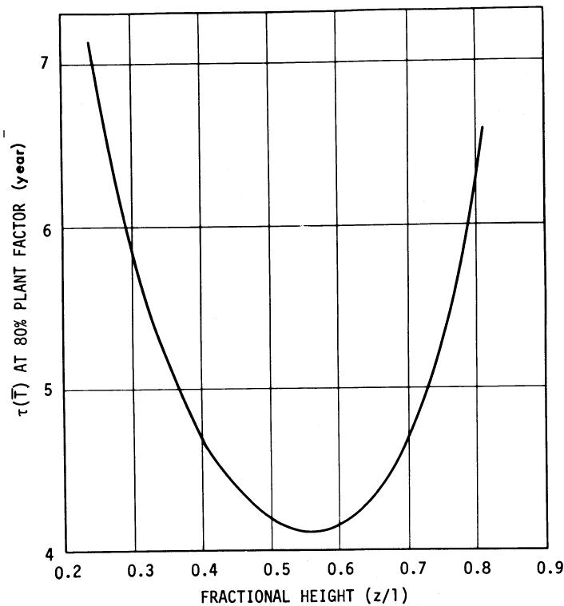
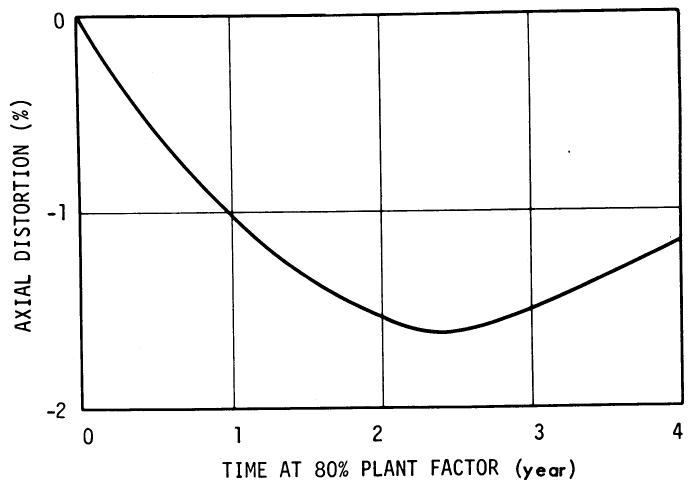
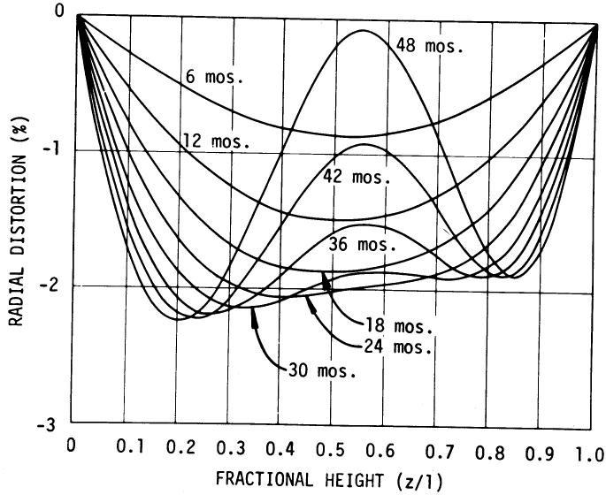
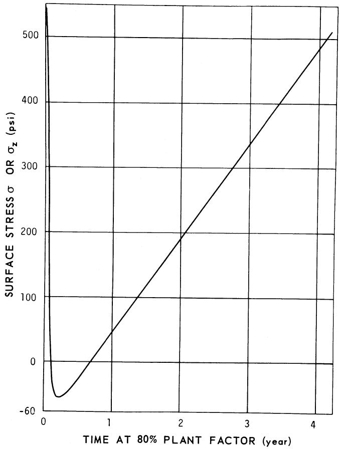
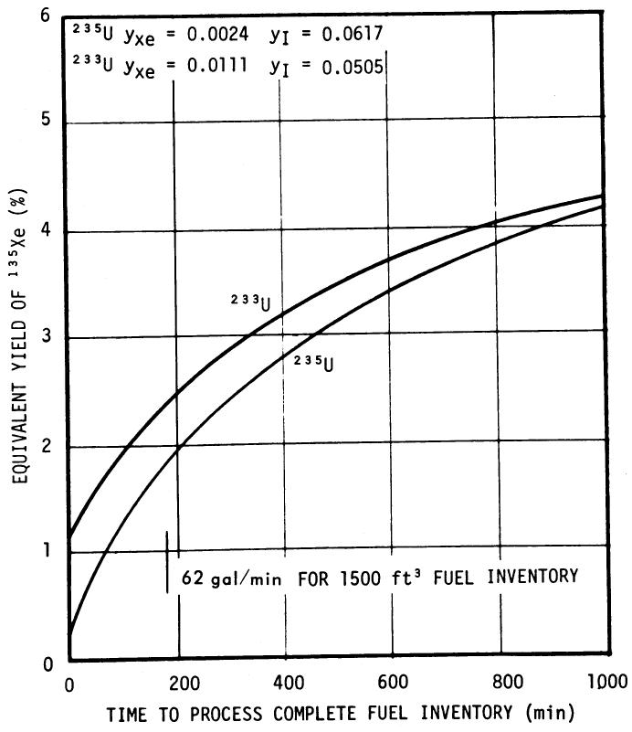
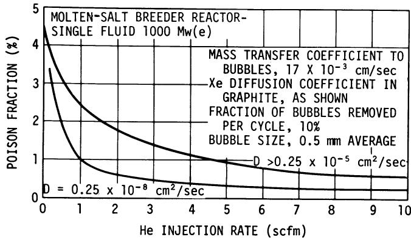
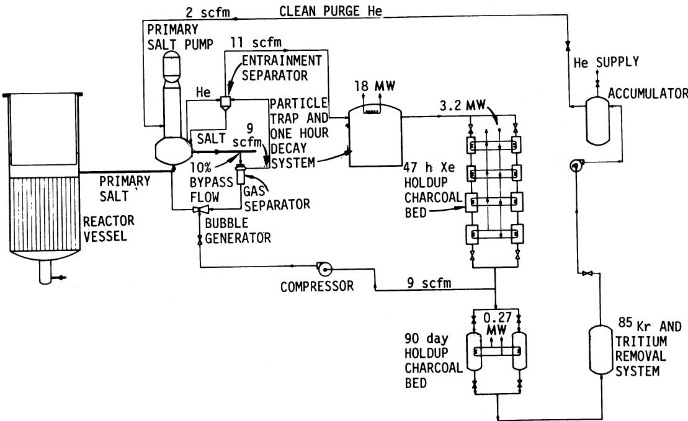

# GRAPHITE AND XENON BEHAVIOR AND THEIR INFLUENCE ON MOLTEN-SALT REACTOR DESIGN

DUNLAP SCOTT and W. P. EATHERLY Oak Ridge National Laboratory, Nuclear Division, Oak Ridge, Tennessee 37830

REACTORS

KEYWORDS: molten-salt reactors, breeder reactors, radiation effects, temperature, graphite moderator, stresses, porosity, xenon-135, poisoning, helium, bubbles, design, economics, reactor core, MSBR

Received August 4, 1969

Revised October 2, 1969

Existing data on dimensional changes in graphite have been fitted to parabolic temperature-sensitive curves. From these, the graphite life, radiation-induced stresses, and permissible geometries have been calculated. It is concluded existing materials can be utilized in a molten-salt reactor which has a core graphite life of about four years, without serious cost penalty.

Fission product xenon can be removed by sparging the fuel salt with helium bubbles and removing them after enrichment. With reasonable values of salt-to-bubble transfer coefficient and graphite permeability, the penalty to breeding ratio can be reduced to $< 0.5\%$ .

# INTRODUCTION

One of the attractive aspects of the molten-salt reactor concept is that even the most stringent of the present materials or process limitations permit reactor designs having acceptable economic performance. In this paper we consider, as examples, the effects of finite graphite lifetime and xenon poisoning on MSBR design. Finite graphite lifetime implies periodic replacement of the graphite; neutron economy requires the removal of the bulk of $^{135}\mathrm{Xe}$ from the core to keep the xenon poison fraction below the target value of $\frac{1}{2}\%$ .

The major economic penalty associated with graphite replacement would be the load factor penalty associated with taking the reactor off-stream. This cost can be circumvented by assuring that the graphite will maintain its integrity for at least the time interval between normal turbine

maintenance requirements; i.e., the downtime required for scheduled maintenance should coincide with that for graphite replacement. Hence, to avoid load-factor penalties associated with graphite replacement, we have set as a minimum requirement that the graphite have a life of two years; at the same time, a longer life would be desirable and consistent with the power industry's objective of increasing the time interval between turbine maintenance operations. Thus, in the reference design the reactor performance is constrained to yield a graphite life of about four years, and this paper points out the basis for that value.

The removal of $^{135}\mathrm{Xe}$ from the core also puts a constraint on the graphite. The fuel salt must be excluded from the graphite to prevent local overheating and also to decrease fission-product poisoning, and this, in turn, requires that the graphite pore diameters not exceed one micron. This, however, is not a limitation, for the xenon removal will be shown below to require a gas permeability of the order of $10^{-8} \, \mathrm{cm}^2/\mathrm{sec}$ , and such a value requires pore diameters of $\sim 0.1 \, \mu$ .

Even though xenon is excluded from the graphite, it needs to be removed from the salt stream if the desired neutron economy is to be attained. This removal is accomplished by injecting helium bubbles into the flowing salt, which transfers the xenon from the salt to the bubbles and effectively removes xenon from the core region.

In the following sections we shall discuss in some detail: the method of analysis of existing data on radiation damage to permit prediction of the graphite lifetime in MSBR cores; the application of these damage rates and the radiation-induced creep to calculate induced stresses in the graphite; the considerations involved in the distribution and removal of $^{135}\mathrm{Xe}$ and other noble gases; and last, the method proposed for safely

collecting and disposing of these gases. We conclude that graphite and the removal of xenon present no questions of feasibility, but require only minor extensions of existing technology.

# GRAPHITE LIFETIME

It has been recognized for several years that under prolonged radiation exposure, graphite begins to swell extensively, even to the point of cracking and breaking into fragments. However, data at high fluences and within the operating temperature ranges anticipated for molten-salt breeder reactors were largely nonexistent. Nevertheless, by using existing data, it was possible to estimate graphite behavior over the range of MSBR conditions. For a large group of commercial graphites—including British Gilso-graphite, Pile Grade A, and the American grades AGOT and CSF—it was found that the volume distortion, $\nu$ , could be related to the fluence, $\Phi$ , by a parabolic curve,

$$
\nu = A \Phi + B \Phi^ {2}, \tag {1}
$$

where $A$ and $B$ are functions of temperature only. The fit of this equation to the experimental data is excellent for the isotropic Gilso-graphite, but the relation is approached only asymptotically for the anisotropic graphites. We may write the fluence as the product of flux and time, i.e., $\Phi = \phi t$ . The behavior of $\nu$ is to decrease to a minimal value, $\nu_{m}$ , and then increase, crossing the $\nu = 0$ axis at a defined time, $\tau$ , given by

$$
0 = A \phi \tau + B (\phi \tau) ^ {2}. \tag {2}
$$

Clearly, in terms of $\nu_{m}$ and $\tau$ , Eq. (1) can be rewritten as

$$
\nu = 4 \nu_ {m} \frac {t}{\tau} \left(1 - \frac {t}{\tau}\right). \tag {2a}
$$

For isotropic graphite, the linear dimensional changes will be given approximately by one-third the volume change. If the graphite is anisotropic, the preferred $c$ -axis direction will expand more quickly, the other directions more slowly. This will induce a more rapid deterioration of the material in the preferred $c$ -direction. As a consequence, we require that the graphite be isotropic, and can rewrite Eq. (2a) in terms of the linear distortion, $G$ ,

$$
G = \frac {1}{3} \nu = \frac {4 \nu_ {m}}{3} \frac {t}{\tau} \left(1 - \frac {t}{\tau}\right) \tag {2b}
$$

and this relation will be used hereafter.

The best values for the parameters $\phi \tau$ and $\nu_{m}$ were found to be

$$
\phi T = (9. 3 6 - 8. 9 3 \times 1 0 ^ {- 3} T) \times 1 0 ^ {2 2} \mathrm {n v t} (E > \mathrm {t o k e V})
$$

and

$$
\nu_ {m} = - 12.0 + 8.92 \times 10 ^ {- 3} T \% ,
$$

where $T$ is the temperature in ${}^{\circ}\mathrm{C}$ , valid over the range 400 to $800^{\circ}$ . At $700^{\circ}\mathrm{C}$ , these yield $\phi \tau = 3.1 \times 10^{22}$ with a $90\%$ double-sided confidence limit of $\pm 0.2 \times 10^{22}$ , and $\nu_{m} = -5.8\%$ , with the limit $\pm 0.2$ . Figure 1 shows the behavior of the linear distortion as a function of fluence with temperature as a parameter.

As pointed out in the introduction, it is necessary that the graphite exclude both salt and xenon. The first requires the graphite to have no pores larger than $\sim 1\mu$ in diameter; the second, as will be seen below, requires the graphite to have a permeability to xenon of the order of $10^{-8}\mathrm{cm}^2/$ sec. Clearly, as the graphite expands and visible cracking occurs ( $\nu > + 3\%$ ), these requirements will have been lost. Lacking definitive data, we have made the ad hoc assumption that the pore size and permeability requirements will be maintained during irradiation until the time when the original graphite volume is reattained, namely, when $t = \tau$ as defined above.

To estimate the lifetime of an MSBR core, we must take into account the strong dependence of $\tau$

  
Fig. 1. Graphite linear distortion as a function of fluence at various temperatures.

on temperature, and the temperature of the core graphite will depend on the fuel salt temperatures, the heat transfer coefficient between salt and graphite, and the gamma, beta, and neutron heat generation in the graphite. In all core designs which have been analyzed, the power generation (i.e., fission rate) has been found to vary closely as $\sin (\pi z / l)$ along the axial centerline, where $z / l$ is the fractional height, and $l$ is the effective total core height. Thus, the heat generation rate in the graphite will vary as

$$
q = q _ {0} + q _ {1} \sin (\pi z / l), \tag {3}
$$

where $q_0$ approximates the rate due to delayed gamma, beta, and neutron heating, and $q_1$ approximates the maximum prompt heating. Representing the actual graphite core prisms as cylinders with internal radius $a$ and external radius $b$ , we can readily calculate the internal temperature distribution assuming $q$ is not a function of radius. The result is1

$$
\begin{array}{l} T = T _ {a} - \frac {q}{4 K} \left(r ^ {2} - a ^ {2}\right) + \frac {\log (r / a)}{\log (b / a)} \\ \times \left[ T _ {b} - T _ {a} + \frac {q}{4 K} \left(b ^ {2} - a ^ {2}\right) \right] \quad , \tag {4} \\ \end{array}
$$

where $T_{a}$ and $T_{b}$ are the surface temperatures at $a$ and $b$ , respectively, and $K$ the graphite thermal conductivity. Since the axial heat flow is negligible, the heat, $Q$ , that must cross the graphite surfaces per unit area becomes

$$
\begin{array}{l} Q _ {a} = - \frac {q a}{2} + \frac {K}{a \log b / a} \left[ T _ {b} - T _ {a} + \frac {q}{4 K} \left(b ^ {2} - a ^ {2}\right) \right] \\ Q _ {b} = - \frac {q b}{2} + \frac {K}{b \log b / a} \left[ T _ {b} - T _ {a} + \frac {q}{4 K} \left(b ^ {2} - a ^ {2}\right) \right] \tag {5} \\ \end{array}
$$

and if $h$ is the heat transfer coefficient between the salt and graphite interface, then also

$$
\begin{array}{l} Q _ {a} = h \left(T _ {a} - T _ {0}\right) \\ Q _ {b} = h \left(T _ {b} - T _ {0}\right), \tag {6} \\ \end{array}
$$

where $T_{0}$ is the bulk salt temperature. The coefficient $h$ is calculated from the turbulent-flow Dittus-Boelter equation

$$
h = 0. 0 2 3 \operatorname {R e} ^ {0. 8} \Pr^ {0. 4} \frac {K _ {0}}{2 a}, \tag {7}
$$

where

Re is the Reynolds number

Pr is the Prandtl number

$K_{0}$ is the salt thermal conductivity.

We are assuming the coolant channels at the outer surfaces of the cylinder will have the same effective hydraulic radius as the interior channel of

radius $a$ . Finally, since the heat capacity of the salt is a weak function of temperature, in keeping with the sinusoidal variation of power density along the axis, the salt temperature, $T_0$ , becomes

$$
T _ {0} = \frac {1}{2} \left[ T _ {f} + T _ {i} - \left(T _ {f} - T _ {i}\right) \cos \frac {\pi z}{l} \right] \tag {8}
$$

in which $T_{i}$ and $T_{f}$ are the entering and exiting temperatures, respectively, of the salt.

Equations (3) through (8) completely determine the temperatures in the graphite. As we shall see below, the radiation-induced strain in the graphite along the $z$ -axis, i.e., $\Delta z / z$ , is given by

$$
\frac {\Delta z}{z} = \frac {2}{\left(b ^ {2} - a ^ {2}\right)} \int_ {a} ^ {b} G (T) r d r,
$$

where $G(T)$ is the damage function of Eq. (2b). A similar expression applies to the radial strain. A negligible error is introduced by approximating the right-hand side by $G(\overline{T})$ , where $\overline{T}$ is the average temperature over the cross section; therefore,

$$
\frac {\Delta z}{z} = G (\bar {T}). \tag {9}
$$

Since $\overline{T}$ varies with $z / l$ , each point along the cylinder will have a different life, $\tau (\overline{T})$ , defined by $\Delta z / z = 0$ . The minimum value of these $\tau (\overline{T})$ thus defines the time at which the cylindrical prism should be replaced based on our criterion.

The properties of the fuel salt and graphite which are required in the above equations are given in Table I. The graphite is assumed to be similar to the British Gilso-graphite, although there are other coke sources than Gilsonite which lead to isotropic materials.

Calculations have been made on two core configurations. Case No. CC-58 is the reference design discussed elsewhere in this series of

TABLEI   
Materials Properties Used in Graphite Lifetime and Stress Calculations   

<table><tr><td colspan="2">Fuel Salt</td></tr><tr><td>Thermal conductivity, W/(cm °C)</td><td>1.29 × 10-2</td></tr><tr><td>Specific heat, W sec/(g °C)</td><td>1.36</td></tr><tr><td>Viscosity, cP</td><td>(7.99 × 10-2) exp(4342/T °K)</td></tr><tr><td colspan="2">Graphite</td></tr><tr><td>Thermal conductivity, W/(cm °C)</td><td>37.63 exp(-0.7T °K)</td></tr><tr><td>Thermal expansion, (°C)-1</td><td>5.52 × 10-8+ 1.0 × 109(T °C)</td></tr><tr><td>Young&#x27;s modulus, psi</td><td>1.9 × 106</td></tr><tr><td>Poisson&#x27;s ratio</td><td>0.27</td></tr><tr><td>Creep constant, k</td><td>(5.3 - 1.45 × 10-2T + 1.4 × 10-5T2) × 10-27</td></tr><tr><td></td><td>k in psi-1n/(cm2sec)</td></tr><tr><td></td><td>T in °C.</td></tr></table>

papers. This design optimizes the fuel conservation coefficient4 with the peak power density constrained to a value of $63\mathrm{W/cm}^3$ to prolong graphite life. Case No. CC-24 is the identical core scaled to a smaller geometry (half the volume of No. CC-58) and with the constraint on graphite lifetime raised. In both cases the fuel conservation coefficient is 15.1 $\left[\mathrm{MW(th)/kg}\right]^2$ . The damaging flux in case No. CC-24 is also more typical of the case when the core is optimized with no constraints. The pertinent core parameters4 are given in Table II.

TABLE II Relevant Core Characteristics for Calculation of Graphite Lifetime and Stresses   

<table><tr><td></td><td>Case No. CC-24</td><td>Case No. CC-58</td></tr><tr><td>Peak flux (E≥50 keV), n/(cm2sec)</td><td>5.15 × 1014</td><td>3.2 × 1014</td></tr><tr><td>Salt flow per unit area, g/(cm2sec)</td><td>1.39 × 103</td><td>8.21 × 102</td></tr><tr><td>Heat generation, delayed, W/cm3</td><td>1.16</td><td>0.71</td></tr><tr><td>Heat generation, prompt, W/cm3</td><td>7.17</td><td>4.39</td></tr><tr><td>Salt inlet temperature, °C</td><td>550</td><td>550</td></tr><tr><td>Salt outlet temperature, °C</td><td>700</td><td>700</td></tr></table>

  
Fig. 2. Core lifetime as a function of graphite prism dimensions for cores with peak damage fluxes of 3.2 and $5.15 \times 10^{14} \mathrm{nv}$ ( $E > 50 \mathrm{keV}$ ). In all cases the ratio of the radii, $b / a$ , is 6.67.

Since the salt-to-graphite ratios in the core are determined by nuclear requirements, and the salt flow by cooling requirements, the only variable left at this point is the absolute value of the internal radius $a$ , which scales the size of the graphite prisms. Figure 2 shows the lifetime of the central graphite prism as it is affected by the radius $a$ ; there is an obvious decrease in core life as the radius $a$ increases and the internal graphite temperatures climb. We note that the ratio of fluxes in the two cases is 1.61; at $a = 0.9$ cm, the corresponding reciprocal ratio of lifetimes is 1.74, the additional gain in lifetime at the lower flux being due to decreasing graphite temperatures.

The latter case has been studied in more detail since it corresponds to the current reference design concept. For this design the equivalent radii are

$$
a = 0. 7 6 2 \mathrm {c m}
$$

$$
b = 5. 3 9 \mathrm {c m}.
$$

The associated temperature distributions for the central core prisms are given in Fig. 3, and the local lifetimes $\tau(\overline{T})$ as a function of $z / l$ in Fig. 4. The life of the prism, i.e., the minimal $\tau(\overline{T})$ , occurs at $z / l = 0.55$ and has a value of 4.1 years at $80\%$ plant factor. The entire prism will change length as given by the integral of the right-hand side of Eq. (9) over the length of the prism; this is shown as a function of time in Fig. 5. The radial distortion for various times is shown in Fig. 6, and gives the prism a double hourglass shape toward the end of life.

  
Fig. 3. Temperatures associated with the central graphite prism as a function of vertical position for the reference core design.

  
Fig. 4. Local lifetime $\tau(\overline{T})$ as a function of vertical position for the central graphite prism of the reference core design.

The cost of replacing graphite will include both material procurement and labor. We have estimated these costs based on an industry supplying the order of ten or more reactors. The total operating cost associated with graphite replacement would amount to $\sim 0.2$ mill/kWh for a two-year life, or 0.10 mill/kWh for a four-year life. (Capital investment would also be required for the replacement equipment and is included in the capital cost estimates of Bettis and Robertson.) Thus, the cost penalty associated with graphite replacement is not a crippling one, although it is large enough to merit considerable effort on graphite improvement.

Assuming pyrolytic impregnation, as discussed by McCoy et al., successfully excludes xenon from the graphite, three significant material requirements need to be met: the graphite must be isotropic, have entrance pore diameters $< 1\mu$ , and have a radiation stability at least as good as the Gilso-graphite. All of these requirements can be met with existing graphite technology, although all have not been met in a single graphite of the dimensions required. Unquestionably, there will be production difficulties in initially producing such a graphite, but the problems will be in process control rather than in basic technology.

  
Fig. 5. Axial distortion of the central graphite prism as a function of time for the reference design.

# INTERNAL STRESSES IN THE GRAPHITE

In the preceding section we have tacitly assumed that the thermal and radiation-induced stresses developed during the lifetime of the graphite are not limiting. We turn now to validate this assumption. We again consider the central prism as in the preceding section, and have for the constitutive equations,

$$
\dot {\epsilon} _ {i} = \frac {1}{E} \left[ \dot {\sigma} _ {i} - \mu \left(\dot {\sigma} _ {j} + \dot {\sigma} _ {k}\right) \right] + k \phi \left[ \sigma_ {i} - \frac {1}{2} \left(\sigma_ {j} + \sigma_ {k}\right) \right] + g, \tag {10}
$$

where

$$
\epsilon_ {i} = \text {s t r a i n i n t h e} i ^ {\prime} \text {t h d i r e c t i o n}
$$

$$
\sigma_ {i} = \text {s t r e s s}
$$

$$
E = \text {Y o u n g} ^ {\prime} \text {s m o d u l u s}
$$

$$
\mu = \text {P o i s s o n ' s r a t i o}
$$

$$
k = \text {s e c o n d a r y}
$$

$$
\phi = \text {d a m a i g i n g f l u x}
$$

$$
\text {d o t s} = \text {t i m e d e r i v a t i v e s}
$$

$$
g = d G / d t = \text {d a m a g e r a t e f u n c t i o n} \tag {Eq. (2b).}
$$

In cylindrical coordinates, $i = (r,\theta ,z)$ . In the absence of externally applied stresses and because of the vanishing of $\phi$ at the ends of the core prism, the $z$ component of strain will not be a function of $\pmb{r}$ and $\theta$ plane strain). We shall assume $\pmb{k}$ is a function of $\overline{T}$ , but will not let $\pmb{k}$ or $\phi$ vary with $\pmb{r}$ and $\theta$ . Then Eq. (10) can be integrated in closed form. The resulting dimensional changes in the prism are

$$
\frac {\Delta z}{z} = \frac {\Delta a}{a} = \frac {\Delta b}{b} = \bar {G}, \tag {11}
$$

  
Fig. 6. Radial distortion of the central graphite prism as a function of vertical height for the reference design. Times are calculated at $80\%$ plant factor.

where $\overline{G}$ is the average value of $G$ over the cylindrical cross section. Hence the prism behaves locally as though it were at the average radiation distortion $\overline{G}$ .

The tensile stresses are maximum at the outside surface of the cylinder, and are given by

$$
\sigma_ {r} (b) = 0, \quad \sigma_ {\theta} (b) = \sigma_ {z} (b)
$$

and

$$
\sigma_ {z} = \frac {E}{1 - \mu} e ^ {- \beta t} \int_ {0} ^ {t} [ \bar {g} - g (r) ] e ^ {\beta t} d t + \sigma_ {z _ {0}} e ^ {- \beta t} \tag {12}
$$

with

$$
\beta = \frac {E k \phi}{2 (1 - \mu)}.
$$

We may consider the initial stress $\sigma_{z_0}$ to be the thermal stresses introduced as the reactor is brought to power, and these anneal out exponentially with time because of the radiation-induced creep. We are interested only in large times $t$ , and if we set

$$
\Delta g = \bar {g} - g (b)
$$

and remember $g$ is a linear function of time

$$
g = \frac {d G}{d t} = \frac {4}{3} \frac {\nu_ {m}}{\tau} \left(1 - \frac {2 t}{\tau}\right) = g _ {0} + g _ {1} t,
$$

then

$$
\Delta g = \Delta g _ {0} + \Delta g _ {1} t
$$

and Eq. (12) thus takes the asymptotic form

$$
\sigma_ {z} \rightarrow \frac {2}{k \phi} (\Delta g _ {0} - \beta \Delta g _ {1}) + \frac {2}{k \phi} \Delta g _ {1} t. \tag {13}
$$

It can also be shown that $\overline{g} = g(\overline{T})$ with an error not exceeding $2\%$ for the parameter values of interest.

The thermal stresses have the same interrelationships as the radiation stresses, and are given by

$$
\sigma_ {r 0} (b) = 0, \quad \sigma_ {\theta 0} (b) = \sigma_ {z 0} (b)
$$

and

$$
\sigma_ {z 0} = \frac {\alpha E}{1 - \mu} [ \bar {T} - T (\nu) ] e ^ {- \beta t}. \tag {14}
$$

We may substitute this result into Eq. (12) to give the maximum stress $\sigma_z(b)$ throughout the entire life of the central prism.

For the reference design concept, the maximum stresses also occur at the point $z / l = 0.55$ and are shown in Fig. 7. The stresses reach a maximum at the end of life and amount to only 490 psi. Since the isotropic graphite which is presumably to be used in the reference design would have a tensile strength in the range 4000 to

  
Fig. 7. Axial or tangential surface stress at $z / l = 0.55$ as a function of time.

5000 psi, there appears to be no reasonable probability that these stresses can cause graphite failure.

# XENON-135 BEHAVIOR

Because of its high-neutron-absorption cross section, it is important to keep xenon out of the graphite and also out of the fuel salt. The $^{135}\mathrm{Xe}$ comes from two sources, directly from the fission of uranium and indirectly from the $\beta$ decay of the fission products tellurium and iodine. Tellurium probably exists as a free metal which is believed to be insoluble in molten salt and tends to migrate to the available surfaces such as the core vessel walls, the heat exchanger, the graphite moderator, and even any circulating gas voids which may be present. However, $^{135}\mathrm{Te}$ has a relatively short half-life, $< \frac{1}{2}$ min, and it is conservative for our purposes to assume that most of it decays into iodine before it can leave the fuel system. The iodine forms stable iodides in the molten-salt fuel and will remain with the fuel unless steps are taken to remove it.

Since the half-life of $^{135}\mathrm{I}$ is 6.7 h, it appears possible to process the salt stream at a relatively slow rate to remove a large portion of the iodine before it decays into xenon. The equivalent yield of $^{135}\mathrm{Xe}$ in the processed salt can then be represented by

$$
Y _ {\mathrm {X e}} ^ {\mathrm {U}} = y _ {\mathrm {X e}} ^ {\mathrm {U}} + \left. y _ {\mathrm {I}} ^ {\mathrm {U}} \left(1 - \frac {1}{T _ {p} \lambda_ {\mathrm {I}} + 1}\right) \right.,
$$

where

$y_{\mathbf{Xe}}^{\mathbf{U}} =$ direct yield of xenon from uranium of mass U

$y_{\mathbf{I}}^{\mathbf{U}} = \mathbf{chain}$ yield of I from uranium of mass U

$\lambda_{\mathrm{I}} =$ decay constant of 135 I

$T_{p} =$ time required to process the entire salt inventory for the removal of iodine.

It is apparent that the effective yield cannot be reduced by iodine processing alone to below $\sim 1.1\%$ for $^{233}\mathrm{U}$ fission. As shown in Fig. 8, a relatively high processing rate of 62 gal/min for $1500\mathrm{ft}^3$ of fuel only reduces the effective yield of $^{135}\mathrm{Xe}$ to $\sim 0.0225$ . One scheme for processing a side stream uses HF for converting $\mathbf{I}^{-}$ to $\mathbf{I}_2$ , and then removing the HF and $\mathbf{I}_2$ by purging with helium or $\mathbf{H}_2$ . However, it would still be necessary to remove additional xenon, and so stripping the fuel salt with helium is the preferred process for removing $^{135}\mathrm{Xe}$ .

Xenon is very insoluble in molten lithium-beryllium fluoride and obeys Henry's law for gases; at $650^{\circ}\mathrm{C}$ the pressure coefficient of solubility is $3.3 \times 10^{-9}$ moles(Xe)/[cm $^3$ (salt) atm].

  
Fig. 8. Effect of iodine removal on $^{135}\mathrm{Xe}$ yield.

Because of the relatively high xenon partial pressure at very low concentration, it will tend to leave the salt through any free surface available before the concentration becomes high enough to make a significant contribution to the $^{135}\mathrm{Xe}$ poisoning. In the MSBR, the free surfaces of importance are those associated with the voids in the graphite and the entrained helium bubbles. The graphite planned for MSBR use, but without surface impregnation, has a bulk void volume available to xenon of $\sim 10\%$ and could contain a large inventory of xenon if there is an unimpeded flow from the salt to these voids. Almost all the xenon poisoning in the MSBR will result from the neutron absorptions in the $^{135}\mathrm{Xe}$ within the graphite, and so the graphite should have those properties which keep xenon concentration in graphite low.

The concentration of xenon in the graphite is controlled by the concentration in the salt, the mass transfer coefficient from the salt to the graphite, the total surface of graphite exposed to the salt, the diffusion coefficient of xenon in the graphite, and the void fraction available to xenon. The mass transfer coefficient from the salt to the graphite is very strongly influenced by the characteristics of the salt flow boundary film which, together with the area of graphite exposed to the

salt, are determined by the heat transfer conditions required to cool the graphite. However, the effective diffusivity and available volume of the graphite can be controlled during manufacture by impregnating the surface with a thin layer of material having low permeability. The base stock graphite which would be used in the core will probably have properties which are dictated by radiation damage and lifetime considerations and not those which affect xenon concentration in the voids. However, as will be illustrated below, a sealed surface will act as an effective barrier to the transfer of xenon into the graphite interior if the value for the diffusivity of the sealed surface can be controlled to $\sim 0.25 \times 10^{-8}$ cm²/sec, and the associated void volume is 1%. As discussed by McCoy et al., experiments have been performed which indicate that the application of such a sealant is feasible. With the above conditions of permeability and available void volume met, the xenon poisoning in the core becomes controlled by its concentration in the salt and therefore by our ability to process the salt stream for xenon removal.

The salt will be processed for xenon removal by injecting small bubbles of helium into the fuel salt stream and then removing them after they have taken up a portion of the xenon present. The rate of transfer of xenon to the bubbles is affected by the concentration of xenon in the salt, the total surface area of bubbles, the mass transfer coefficient of the dissolved xenon from the salt to the entrained bubbles, and the residence time of the bubble in contact with the salt. We can control all of these except the mass transfer coefficient to the bubbles, and a good value for the coefficient is difficult to determine. A review made of existing data on rates of mass transfer to gas bubbles points to reliable equations for predicting mass transfer under certain simple conditions involving stationary liquids and rising bubbles. It was also found by analysis that the mass transfer to bubbles associated with turbulent liquid in a pipe could vary by as much as a factor of 6 depending upon the characteristics assigned to the bubble-salt interface. An experiment is under way to evaluate this effect; at present a conservative value of $17 \times 10^{-3} \mathrm{~cm/sec}$ at the lower end of the range for the mass transfer coefficient under turbulent conditions is being used in the calculations to estimate the xenon poisoning in the MSBR.

The surface area of a given volume of entrained bubbles varies as the inverse of the spherical diameter and therefore the void volume needed in the circulating fuel can be kept small if the bubbles are small. Methods of injecting the bubbles into the salt are under study and one in particular appears promising. In this latter

method, the gas is injected into the throat of an inverted venturi which is formed in the annulus between a teardrop shape (installed on the pipe axis) and the pipe wall. When tested with water, bubbles of $\sim 0.5\mathrm{mm}$ were produced, and we expect similar results when used with molten salt. The bubbles in the salt are allowed to recirculate through the system several times before removal. The solubility of xenon in molten salt is such that with helium-to-salt volume fractions as small as $\frac{1}{4}\%$ , the bubbles can be recirculated $\sim 10$ times before the xenon concentration in the bubbles gets high enough to significantly affect xenon poisoning.

The final step in the xenon processing of the salt is the removal of the bubbles, and this can be done with a centrifugal gas separator of a type which was developed for another circulating fuel reactor.[10] Kedl has proposed[11,12] a model for describing the migration of the noble gases in a molten-salt reactor and for estimating the poisoning resulting from this migration. This model was evaluated in a summary experiment using a gas containing a $^{85}\mathrm{Kr}$ tracer on the MSRE during prenuclear operation; calculated results were in good agreement with experiment. After the MSRE had been operating at power, the calculated results for $^{135}\mathrm{Xe}$ poison were not in complete agreement with experiment results; in general the poisoning was less than expected for the case where the circulating bubble fraction was very small and about as expected for the larger bubble fractions. Studies are under way to determine the source of the difference.

Figure 9 summarizes the predicted effect on the poison fraction of varying the volume flow of helium into the salt stream of the MSBR for two different graphites in the core. Poison fraction is the neutron absorptions in $^{135}\mathrm{Xe}$ relative to fissile fuel absorptions. The values of the physical constants used are considered the most likely

  
Fig. 9. Effect of helium injection rate on $^{135}\mathrm{Xe}$ poison fraction.

for the MSBR. The upper curve is for an uncoated base graphite where the main resistance to xenon transfer is in the fluid flow boundary and not in the graphite. The lower curve represents the advantage gained by surface impregnation of the base graphite to a xenon permeability of $\sim 0.25 \times 10^{-8} \, \text{cm}^2/\text{sec}$ . One important difference between the two curves is in the volume of helium which must be handled to get the desired results. The conditions of the lower curve are such that only low helium gas flows are needed to reach the target of $0.5\%$ Xe poison fraction. However, it should be noted that some helium processing is required even if a good coating is obtained.

# OFF-GAS SYSTEM

The removal of $^{135}\mathrm{Xe}$ from the circulating fuel by sparging with helium will also remove many other fission products including the other noble gases together with some of the relatively noble metal fission products. Altogether these represent a significant radiation and heat source. It is the purpose of the off-gas removal and disposal system to safely collect and store these materials to permit recycling the helium. The present version of the off-gas system removes the helium and certain fission products from the circulating salt stream, and de-entrains any salt which may be carried along; separates the noble gas from the helium, and holds the $^{135}\mathrm{Xe}$ outside the reactor for a total of $48\mathrm{h}$ , and then reinjects a

major portion of the gas stream into the fuel salt for recycle. The remainder of the stream is further processed for the removal of the longer-lived fission products so that the clean helium can be used in the helium purge stream (i.e., along the fuel pump shaft). This system is described below.

Figure 10 is a flow diagram which illustrates the considerations involved in the off-gas system design. Ten percent of the total salt flow from the primary salt pump is bypassed through the $^{135}\mathrm{Xe}$ removal system, which includes the gas separator and the bubble generator. About 9 scfm of helium with fission products is removed from the salt as it passes through the bubble separator. This gas, together with some salt, goes to the entrainment separator where the salt is removed and returned to the primary circulating system through the pump expansion tank. The remaining gas, together with $\sim 2$ scfm of purge gas from the pump expansion tank, then goes to the particle trap and 1-h decay tank. The pipe lines from the bubble separator to and including the entrainment separator are cooled by entrained primary salt; in addition a secondary coolant salt flowing in an annulus around the section of gas line from the entrainment separator to the particle trap will remove the heat released to the pipe wall. At the particle trap and 1-h decay tank the entrained fission-product particles are removed and allow the short-lived xenon and krypton isotopes to decay for 1 h before entering the absorption charcoal beds where the xenon is held up for 47 h.

  
Fig. 10. Molten-Salt Breeder Reactor Off-Gas System.

The decay of the noble gases in the 1-h volume delay tank reduces the heat load on the head end of the charcoal bed by a factor of 6, making it easier to keep the temperature of the charcoal low enough to maintain an acceptable adsorption efficiency. In the decay tank the fission-product particles will be removed from the gas stream by washing with a liquid coolant which will also cool the gas and all surfaces of the tank walls. This coolant stream will be pumped through a heat exchanger where the heat will be transferred to a closed steam system which in turn dumps its heat to a natural-draft air-cooled condenser. About 18 MW of energy is released in the decay tank. One of the primary objectives in the design of this system is to make the heat-rejection system independent of external power needs such that a power failure will not jeopardize the system. The coolant stream will be processed to keep the concentration of fission products below the saturation level to prevent deposition on the walls.

The gas goes from the decay tank to the charcoal adsorption beds where the xenon is held up for $47\mathrm{h}$ and the krypton is held for $4\mathrm{h}$ . This holdup is by adsorption of these heavy gases on the charcoal which does not delay the helium carrier gas. The total delay of $48\mathrm{h}$ in the two holdup sections is sufficient to reduce the $^{135}\mathrm{Xe}$ concentration returning to the circulating salt system to $2^{\frac{1}{2}}\%$ of its value when it left the salt. About 3.2 MW are released in this adsorption holdup system.

After leaving the charcoal bed the flow splits into two streams. One system of $\sim 2$ scfm goes to the low-flow charcoal beds where the xenon is held for 90 days, after which most of the activity has decayed. However, $^{85}\mathrm{Kr}$ (10.4-year half-life) and tritium (12-year half-life) remain in the gas stream and are removed by appropriate collector beds using hot titanium beds for tritium removal and molecular sieves for $^{85}\mathrm{Kr}$ removal. The resulting clean helium is then compressed into the accumulator for reuse in the cover-gas system and the pump shaft purge.

The other stream of $\sim 9$ scfm is simply compressed and returned to the bubble generator for recycle to the $^{135}\mathrm{Xe}$ removal system.

# SUMMARY AND CONCLUSIONS

The previous sections indicate that, although radiation damage to the graphite and $^{135}\mathrm{Xe}$ poisoning of the core introduce design complexities into the reactor plant, accommodation of these factors requires neither significant new technology nor excessive cost penalties. We specifically conclude the following.

1. Radiation damage in graphite will limit core life, but existent materials are adequate to provide a core life of the order of four to five years without excessively penalizing reactor performance. Although a specific grade of graphite that fulfills all our requirements is not currently available commercially, only minor extensions of existing technology, including the experience factor, are required to produce such a material.

2. Under the conditions existing in the central region of the core, stresses induced internally in the graphite are small and do not limit the permissible graphite exposure based on the present design.

3. Although not specifically discussed here, we have had sufficient experience with pyrolytic carbon impregnation of graphite to feel confident the process can be developed for use with MSBR graphite. The times and process conditions used to impregnate small graphite samples are practical for scale-up, and in at least one case the permeability of the graphite was not significantly affected by neutron irradiation.

4. Xenon-135 can be removed successfully from the circulating salt by sparging with helium bubbles. However, several parameters such as salt-to-gas mass transfer coefficients are only approximately known. Nevertheless, it appears that the parameter values are in a range where the sparging will be effective.

5. Helium bubble insertion and extraction have been demonstrated successfully in an air/water system. Although previous experience with molten-salt systems has confirmed the ability to transform fluid flow results on water to a moltensalt system, it remains to be demonstrated that the helium-bubble/salt system performance can be predicted using results from the air/water system.

6. An off-gas system has been conceptually designed which permits removal of the fission products from the helium, recirculation of the cleaned helium, and control of the fission-product heat. Such a system appears practical, based on the capabilities of present technology.

# ACKNOWLEDGMENTS

This research was sponsored by the U.S. Atomic Energy Commission under contract with the Union Carbide Corporation. Oak Ridge National Laboratory is operated by the Union Carbide Corporation Nuclear Division for the U.S. Atomic Energy Commission.

# REFERENCES

1. H. S. CARSLAW and J. C. JAEGER, Conduction of Heat in Solids, 2nd ed., Oxford, Clarendon Press (1959).   
2. W. H. McADAMS, Heat Transmission, 3rd ed., McGraw-Hill, New York (1954).   
3. E. S. BETTIS and R. C. ROBERTSON, “The Design and Performance Features of a Single-Fluid Molten-Salt Breeder Reactor,” Nucl. Appl. Tech., 8, 190 (1970).   
4. A. M. PERRY, "Reactor Physics and Fuel Cycle Analyses," Nucl. Appl. Tech., 8, 208 (1970).   
5. H. C. McCoy, W. H. COOK, R. E. GEHLBACK, J. R. WEIR, C. R. KENNEDY, C. E. SESSIONS, R. L. BEATTY, A. P. LITMAN, and J. W. KOGER, “Materials for Molten Salt Reactors,” Nucl. Appl. Tech., 8, 156 (1970).   
6. C. B. BIGHAM, A. OKAZAKI, and W. H. WALKER, "The Direct Yield of Xe-135 in the Fission of U-233, U-235, Pu-239, and Pu-241," Trans. Am. Nucl. Soc., 8, 11 (1965).

7. G. M. WATSON, R. B. EVANS, III, W. R. GRIMES, and N. V. SMITH, “Solubility of Noble Gases in Molten Fluorides,” J. Chem. Eng. Data, 7, 2, 285 (1962).   
8. F. N. PEEBLES, “Removal of Xenon-135 from Circulating Fuel Salt of the MSBR by Mass Transfer to Helium Bubbles,” ORNL-TM-2245, Oak Ridge National Laboratory (1968).   
9. R. J. KEDL, “Bubble Generator,” MSR Program Semiannual Progress Report, February 28, 1969, ORNL-4396, Oak Ridge National Laboratory (1969).   
10. R. H. CHAPMAN, “HRE-2 Design Manual,” ORNL-TM-348, p. 112, Oak Ridge National Laboratory (1964).   
11. R. J. KEDL and A. HOUTZEEL, “Development of a Model for Computing $^{135}\mathrm{Xe}$ Migration in the MSRE Graphite,” ORNL-TM-4069, Oak Ridge National Laboratory (1967).   
12. R. J. KEDL, “A Model for Computing the Migration of Very Short-Lived Noble Gases into MSRE Graphite,” ORNL-TM-1810, Oak Ridge National Laboratory (1967).