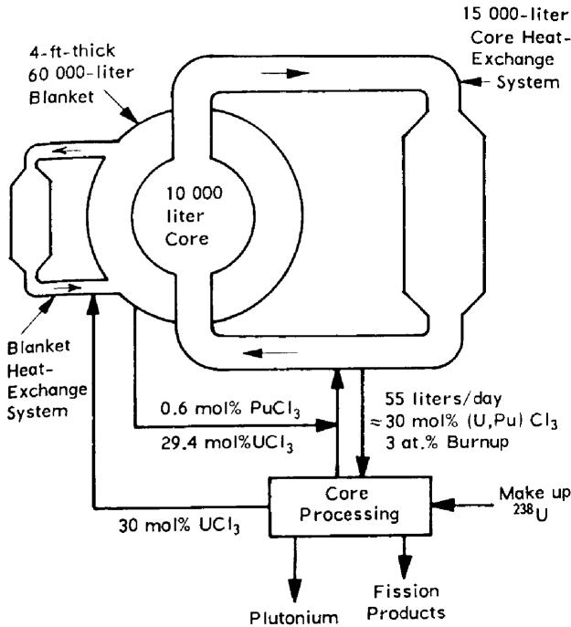

# FUEL PROPERTIES AND NUCLEAR PERFORMANCE OF FAST REACTORS FUELED WITH MOLTEN CHLORIDES

P.A. NELSON, D.K. BUTLER, M.G. CHASANOV, and D. MENEGHETTI  
Argonne National Laboratory, Argonne, Illinois 60439

Received December 9, 1966  
Revised April 13, 1967

The characteristics of fast reactors having molten fuels consisting of uranium and plutonium trichlorides dissolved in alkali chlorides and alkaline-earth chlorides were studied. The study included considerations of the physical and chemical properties of the fuel, the heat-removal problems, and neutronic characteristics for three types of chloride reactors: a homogeneous reactor and two internally cooled reactors. Optimization of the core size for 1000-MWe reactors resulted in a core volume of 10,000 liters for each type. These reactors have the favorable characteristics (even for natural chlorine) of high breeding ratio, large negative temperature coefficients of reactivity, and low fuel-cycle costs. However, the unattractive characteristics of large plutonium inventory, large volume, complex design, and container material problems indicate that a sizeable program to develop chloride-fueled reactors would be required.

# INTRODUCTION

Some recent studies of large solid-fueled fast reactors have indicated the need for reactor configurations such as flat cylindrical (small length/diameter ratios) cores1, annular cores2, or multiple cores3,4 to avoid a positive sodium-void coefficient of reactivity. These reactor configurations have the disadvantage of requiring a larger fissile mass than was once thought necessary for plutonium-fueled fast reactors. The present study of mobile fuels for fast plutonium breeder reactors was undertaken because, relative to solid fuels, such fuels have the

potential advantage of a high coefficient of thermal expansion which provides a large negative temperature coefficient of reactivity.

The particular type of fuel chosen for more detailed study was a solution of trichlorides of uranium and plutonium dissolved in alkali chlorides and alkaline-earth chlorides. The attractive physical and chemical properties of this type of fuel prompted a study of heat-removal problems and the nuclear performance of chloride-fueled reactors. Chloride-fueled fast reactors were studied by Goodman et al. as early as 1952. A group of students at the Oak Ridge School of Reactor Technology in 1956 concluded that a solution of trichlorides of plutonium and uranium dissolved in a solvent of magnesium chloride and sodium chloride was the most promising salt fuel for a fast reactor. Taube in Poland also decided that plutonium trichloride and uranium trichloride fuels were promising. More recently, Alexander concluded that chloride-fueled reactors that were either gas-cooled or cooled by circulating the fuel to external heat exchangers would have attractive nuclear performance and low fuel-cycle costs.

The present study consisted of: 1) estimation of fuel properties from examination of data on chlorides and other salts; 2) calculations of reactor design to establish approximate fast-reactor core and blanket configurations and compositions; and 3) reactor physics calculations of critical mass and breeding ratio for the various reactor designs. After preliminary reactor physics calculations were completed, it was necessary to adjust the reactor core and blanket design and: repeat the reactor physics calculations.

TABLEI Chloride-Fueled 1000-MW(e) [2500 MW(th)] Reactor Characteristics   

<table><tr><td></td><td>Homogeneous</td><td colspan="2">Heterogeneous</td></tr><tr><td>Core Characteristics</td><td>Reactor A</td><td>Reactor B</td><td>Reactor C</td></tr><tr><td>Core Volume, liters</td><td>10 000</td><td>10 000</td><td>10 000</td></tr><tr><td>External Fuel Holdup, liters</td><td>15 000</td><td>1 000</td><td>1 000</td></tr><tr><td>Fuel Characteristics at 650°C</td><td></td><td></td><td></td></tr><tr><td>Composition, mol% (Pu x U1-x)Cl3</td><td>30a</td><td>50a</td><td>18a</td></tr><tr><td>Equilibrium Burnup, %</td><td>3</td><td>3</td><td>12.5</td></tr><tr><td>Melting Point, °C</td><td>525</td><td>550</td><td>450</td></tr><tr><td>Density, g/cm3</td><td>3.0</td><td>3.6</td><td>2.6</td></tr><tr><td>Viscosity, centipoises</td><td>4.2</td><td>5.0</td><td>3.7</td></tr><tr><td>Heat Capacity, Btu/(lb deg F)</td><td>0.20</td><td>0.17</td><td>0.23</td></tr><tr><td>Thermal Conductivity, Btu/(h ft deg F)</td><td>0.50</td><td>0.38</td><td>0.59</td></tr><tr><td>Coefficient of Vol Expansion, 1/deg C</td><td>3 x 10-4</td><td>3 x 10-4</td><td>3 x 10-4</td></tr><tr><td>Core Composition, vol %</td><td></td><td></td><td></td></tr><tr><td>Fuel, (Pu x U1-x)Cl3</td><td>100</td><td>45</td><td>30</td></tr><tr><td>Solid Metallic 238U-1% Pu</td><td>0</td><td>0</td><td>15</td></tr><tr><td>Structural Material of 60% Ni, 30% Fe, 10% Mo</td><td>0</td><td>11</td><td>11</td></tr><tr><td>Sodium Coolant</td><td>0</td><td>44</td><td>44</td></tr><tr><td>Inlet Temperature, °C</td><td>625</td><td>570</td><td>480</td></tr><tr><td>Outlet Temperature, °C</td><td>740</td><td>660</td><td>625</td></tr><tr><td colspan="4">Blanket Characteristics</td></tr><tr><td>Thickness, ft</td><td>4</td><td>1.5</td><td>1.5</td></tr><tr><td rowspan="2">Composition, vol%</td><td rowspan="2">100 saltb</td><td>60 U, 20 Na</td><td rowspan="2">c</td></tr><tr><td>20 Fe</td></tr><tr><td>Power Generation, % of Total</td><td>14</td><td>--</td><td>--</td></tr><tr><td colspan="4">Nuclear Characteristics</td></tr><tr><td>Critical Mass, kg</td><td>2 250</td><td>2 410</td><td>3 270</td></tr><tr><td>Total Fissile Inventory, kg</td><td>7 500d</td><td>2 950</td><td>4 270</td></tr><tr><td>Neutron Absorptions (core plus blanket)</td><td></td><td></td><td></td></tr><tr><td>Structure and Vessels, %</td><td>4.7</td><td>13.3</td><td>8.1</td></tr><tr><td>Chlorine, %</td><td>2.9</td><td>2.8</td><td>1.1</td></tr><tr><td>238U Captures, %</td><td>49.8</td><td>41.9</td><td>45.0</td></tr><tr><td>239Pu Captures and Fissions, %</td><td>33.7</td><td>37.2</td><td>33.0</td></tr><tr><td>Breeding Ratio</td><td>1.48</td><td>1.13</td><td>1.37e</td></tr><tr><td>Δk for Voiding of 40% of Na Coolant from Core, %</td><td>--</td><td>+0.23</td><td>+1.88</td></tr><tr><td>Δk for Fuel Expansion for 100°C ΔT</td><td>-1.5</td><td>-1.5</td><td>-1.5</td></tr></table>

${}^{a}$ Remainder consists of chlorides such as NaCl, KCl, MgCl,, and fission-product chlorides.   
bSalt composition: 29.4 mol% UCl₃, 0.6 mol% PuCl₃, remainder chlorides, such as NaCl, KCl, MgCl, and fission-product chlorides.   
${}^{a}$ Two-thirds of core surface surrounded by blanket of 60 vol% U,20 vol% Na,20 vol% Fe,one-third surrounded by reflector of ${44}\mathrm{{vol}}\% \mathrm{{Na}},{56}\mathrm{{vol}}\% \mathrm{{Fe}}$ .   
${}^{d}$ Core, ${2250}\mathrm{\;{kg}}$ ; core heat exchanger, ${3375}\mathrm{\;{kg}}$ ; blanket ${1680}\mathrm{\;{kg}}$ ; blanket heat exchanger, ${195}\mathrm{\;{kg}}$ .   
Based on breeding ratio of 1.52 for full blanket and 1.97 for full reflector; see footnote c.

# PHYSICAL AND CHEMICAL PROPERTIES OF CHLORIDE FUELS

The maximum acceptable liquidus temperature of a molten reactor fuel is determined by the maximum operating temperature for the fuel container materials and the difference required in the inlet and outlet temperature of the fuel for heat transport. Consideration of these variables indi

cated a maximum acceptable liquidus temperature of about $550^{\circ}\mathrm{C}$ . Lower liquidus temperatures would be desirable. To meet this requirement, alkali chlorides and alkaline-earth chlorides could be used as diluents to lower the melting point, and the total concentration of $\mathrm{UCl}_3$ and $\mathrm{PuCl}_3$ should be limited $^{11-14}$ to 50 to 60 mol%. The estimated liquidus temperatures of the various fuel compositions used in this study are given in Table I.

Obtaining molten-chloride solutions having low liquidus temperatures over a range of compositions that is broad enough for routine reactor operation would be of prime importance for the success of a chloride-fueled reactor. However, even without knowledge of the exact composition of such low-melting molten-salt solutions, reasonable estimates of the physical properties can be made. Except for the liquidus temperature, the physical properties of chloride fuels containing $\mathrm{PuCl}_3$ , $\mathrm{UCl}_3$ , and chlorides of alkali and alkaline-earth metals depend chiefly on the total $\mathrm{PuCl}_3$ and $\mathrm{UCl}_3$ content. The ratio of uranium-to-plutonium and the choice of diluent salts are expected to have only minor effects on the physical properties. Therefore, the physical properties of the fuels given in Table I were determined for $\mathrm{PuCl}_3$ and $\mathrm{UCl}_3$ dissolved in a representative solvent of $\mathrm{NaCl}-50\,\mathrm{mol}\% \,\mathrm{MgCl}_2$ .

The densities of the fuel solutions were estimated from empirical molar volumes at $650^{\circ}\mathrm{C}$ , such as were employed by Cantor[15] for fluoride salts, and the assumption of additivity. Empirical molar volumes of LiCl, NaCl, KCl, and $\mathrm{MgCl}_2$ at $650^{\circ}\mathrm{C}$ were estimated from the density data for the LiCl-NaCl eutectic and the NaCl-KCl- $\mathrm{MgCl}_2$ eutectic. By comparison with the behavior of other chlorides and $\mathrm{UF}_4$ , the empirical molar volumes of $\mathrm{UCl}_3$ and $\mathrm{PuCl}_3$ at $650^{\circ}\mathrm{C}$ were estimated to be 1.15 times the molar volume of the solid salts at $20^{\circ}\mathrm{C}$ .

No data were available on the volumetric expansion coefficient for the fuel mixtures of interest in the temperature range 600 to $800^{\circ}\mathrm{C}$ . For the composition range of interest [10 to $60\mathrm{mol}\%$ $(\mathrm{UCl}_3 + \mathrm{PuCl}_3)]$ , the value is probably $2 - 4\times 10^{-4}$ deg C, based on data for molten-fluoride mixtures containing $\mathrm{UF_4}$ and the eutectics of the LiCl-KCl and NaCl-KCl-MgCl2 systems. We used a value of $3\times 10^{-4}$ deg C.

The thermal conductivity for the fuel mixtures was estimated using a correlation developed by Gambill17. While this correlation was developed primarily for fluoride salts, application to the LiCl-KCl eutectic produced satisfactory agreement with experimental data16. The low conductivity of chloride fuels with high uranium concentrations (only 15 to $30\%$ that of MSRE-type fluoride fuels) complicates the problem of heat removal from the reactor.

Although estimation of the viscosities of the fuels was difficult, the viscosity is not required to great accuracy for heat-transfer calculations.

Viscosities for the molten-chloride fuels were estimated assuming additivity for mixtures and that viscosities were the same for similar salts at corresponding fractions of the absolute melting temperature[18].

The empirical relation given by MacPherson[19] was used to calculate the specific heat for the fuels. According to these calculations, the specific heat of fuel mixtures containing diluent salts such as NaCl, KCl, and $\mathrm{MgCl}_2$ decreases with increasing $\mathrm{UCl}_3$ concentration. The volumetric specific heat, however, is not greatly changed by the $\mathrm{UCl}_3$ concentration.

A development program would be required to find satisfactory container material for chloride fuels. However, nickel alloys such as Hastelloy-F or Hastelloy-N (INOR-8) may be satisfactory container materials for chloride fuels based on thermodynamic calculations and performance with containment of fluoride fuels[20-22] for the MSRE. The Union Carbide Corporation[23] had data indicating that Hastelloy-F has greater corrosion resistance to chlorides than Hastelloy-N.

Thermal radiation decomposition of molten-chloride reactor fuels should not produce a sufficient concentration of elemental chlorine to create a corrosion problem. Radiation damage in the fuel should be unimportant[24]. However, the valency and stability of the fission products will differ from those of the uranium and plutonium in the chloride salts. These effects of fission were estimated[25] and the results indicated that noble-metal fission products such as ruthenium and palladium would be reduced and probably deposited on the container walls. In addition, the container could corrode as a result of replacement of the easily reducible noble-metal ions in the salt with less easily reduced species from the container. The rate and extent of such corrosive attack would depend on the manner of deposition of noble metals on the container walls, and it is conceivable that this deposition may actually limit corrosion.

  
Figure 1. Homogeneous chloride-fueled fast reactor - Type A

# REACTOR CHARACTERISTICS

# Design Parameters

In developing reactor configurations necessary to determine the nuclear characteristics for reactors fueled with chloride fuels, it was first necessary to make preliminary design calculations utilizing the data generated for the properties of the fuel. Three reactor types were considered: an externally cooled homogeneous reactor type, and two types of internally cooled reactors. The design calculations (Table I) were based on the fuel compositions obtained from the second round of reactor physics calculations and the fuel properties.

The homogeneous reactor configuration, "Type A," (Figure 1) employs a 10,000-liter core. The size of the core was determined by the amount of core fuel required in the heat exchangers and external piping and by the fraction of the total fuel in the core that was thought necessary to provide delayed neutrons for reactor control. The external fuel holdup is 15,000 liters, 50 to $60\%$ of which would be contained in the heat exchangers which would be located just outside the blanket in an actual reactor. The remaining 50 to $40\%$ external fuel holdup would be in the piping and pumps. The

heat exchangers would contain $3/8-$ to $1/2$ -in.-o.d. tubing of a nickel alloy and provide about 35,000 ft² of heat-transfer area. Fuel would enter the heat exchangers at $740^{\circ}\mathrm{C}$ and leave at $625^{\circ}\mathrm{C}$ . The coolant could be either sodium or a molten-fluoride salt solution. In either case, the coolant-side heat-transfer resistance would be a small part of the overall resistance. The core fuel would be processed at a rate of about 55 liters/day of reactor operation which would result in a burnup of about 3 at.% In this scheme, the blanket fuel would not be reprocessed, but would be simply mixed with the proper $\mathrm{PuCl}_3$ solution to yield core fuel. Under these conditions, $\mathrm{PuCl}_3$ would build up in the blanket to $0.6\mathrm{mol}\%$ this buildup would result in $14\%$ of the reactor power being developed in the blanket as determined by the reactor physics calculations.

In the "Type B" reactor configuration, the fuel would be contained in tubes cooled by sodium in the conventional manner. To improve heat transfer through the fuel, and to allow use of fuel tubing of $\frac{1}{2}$ to $\frac{3}{4}$ -in.-diam, circulation of the fuel is provided at a rate that yields a Reynolds number of about 10,000 to 25,000. Recirculation of the fuel would require about 1000 liters of fuel external to the reactor. The high (Pu,U)Cl₃ concentration in the fuel for this reactor was required to obtain an adequate uranium-plutonium ratio for breeding. The sodium volume fraction in the core was calculated for a cylindrical core with a length/diameter ratio of one and a sodium flow velocity of 25 ft/sec. The blanket fuel for this configuration could be chosen from any metallic or ceramic solid blanket fuel with little effect on the overall performance. The final reactor physics calculations were made for a 45-cm-thick blanket completely surrounding the core and composed of 60 vol% uranium, 20 vol% sodium, and 20 vol% iron.

The "Type C" reactor configuration would be similar to reactor Type B in that the chloride fuel would be pumped through sodium-cooled tubes. In Type C, however, all of the $^{238}\mathrm{U}$ would be contained in separate solid fuel pins in the core while the bulk of the plutonium would be in the chloride fuel. Plutonium would be bred in the solid $^{238}\mathrm{U}$ pins. The average plutonium concentration in the solid fuel pins would be $1\%$ (the value assumed for the calculations) if these pins are reprocessed when the plutonium concentration reaches $2\%$ . The heat-transfer calculations to size the core and to

determine the core volume fractions were made for a cylindrical configuration with a length/diameter ratio of one and a sodium velocity of 25 ft/sec.

Because of the complexity of this reactor, it would probably be necessary to have minimal axial blankets to allow for fuel piping and removal of the solid-uranium pin assemblies. However, the solid pin assemblies would extend through the spaces that would normally be the axial blanket regions, providing $15\mathrm{vol}\%$ uranium for capture of neutrons. The remaining space would be occupied by sodium-cooled reflectors to conserve neutrons.

The fact that the three cores have the same volume of 10,000 liters is somewhat coincidental since the core volume for each reactor was approximately optimized, with consideration being given to the factors of fuel composition, heat transfer, and breeding ratio. In the case of the homogeneous reactor, for instance, core sizes from 2500 to 10,000 liters were considered. The effect of core size in this range had little effect on the overall fissile inventory because of the interplay between the variables of core size, fissile concentration, and the large fixed volume (15,000 liters) of fuel held up in the heat exchangers.

# REACTOR PHYSICS CALCULATIONS

Calculations were made on the three reactor types to determine the effects of core size, core composition, and blanket composition on the breeding ratios and critical masses. These calculations were made using the 16-group cross-section set of Hansen and Roach $^{26-28}$ with modified chlorine cross-sections. The systems studied have no appreciable number of neutrons of energy below the $11^{\mathrm{th}}$ group of this set. Since the cross-section set does not include the constituent magnesium, the nuclear properties of magnesium were assumed to be the same as those of sodium. The chlorine cross-sections of the Hansen-Roach set were modified according to the tabulations of Kalos and Ray $^{29}$ . Capture and inelastic scattering cross sections from Kalos and Ray were used for groups 1 through 10. In addition, the Hansen-Roach elastic removal cross-sections for groups 2 through 11 were adjusted to correspond to intra-group weighting by a flat spectrum. The flat weighting spectrum is more appropriate for the molten-salt system.

Spherical reactor configurations were assumed, with no corrections being made for cylindrical effects that would exist in an actual system. Fission products in the salt and reactor vessels surrounding the cores were included in the analysis. The reactor vessels were assumed to be $3/4$ -in. thick and constructed of 60 wt% Ni, 30 wt% Fe, and 10 wt% Mo.

The neutronics calculations are summarized in Table I. A significant percentage of neutrons are lost in the structure and vessels. Materials that can contain the salts and have lower cross-sections than the assumed container would be beneficial in improving the breeding ratio and reducing the critical mass.

Breeding ratios would probably increase also if allowance were made for the higher plutonium isotopes that would build up in an actual fuel cycle.

To determine the breeding ratio and critical mass for reactor Type C having non-fertile axial reflectors, neutronics calculations were made both for a completely blanketed reactor and a reactor surrounded by a sodium-cooled steel reflector. The breeding ratio for the Type C reactor was assumed to be two-thirds that of the blanketed reactor and one-third that of the reflected reactor. The critical masses were essentially the same for the blanketed and reflected reactors.

Additional calculations indicated that the substitution of $^{238}\mathrm{UO}_2$ for $^{238}\mathrm{U}$ metal in the blanket had little effect on the breeding ratio or critical mass for reactor Types A and C. (Presumably, such a change would have little effect on the performance of reactor Type B).

Since chlorine is a major constituent, the uncertainty that exists in the chlorine cross-sections in the neutron energy ranges applying to the reactors under study may lead to significant inaccuracies in the calculated neutronics. Therefore, auxiliary calculations were made using a value of $10\mathrm{mb}$ for the chlorine capture cross-section in groups 5 through 8, which corresponds to increases of $10\mathrm{mb}$ in groups 5 through 7, and 6 mb in group 8, over those used in the original neutronics calculations. These higher values are based on the cross sections given by Craven and Alexander30 for $^{35}\mathrm{Cl}$ , the most abundant isotope $(75\%)$ of natural chlorine. (They estimate the capture cross section of $^{37}\mathrm{Cl}$ , which constitutes $25\%$ of natural chlorine, to be $4\mathrm{mb}$ at the intermediate energies with considerable uncertainty in the basic

data.) Neutronics calculations with the higher chlorine cross sections resulted in a reduction in the breeding ratios from those given in Table I of 0.10, 0.04, and 0.02 for reactor types A, B, and C, respectively. The percentage captures in chlorine (Table I) increased by factors of 2.4, 1.6, and 1.8, respectively.

It is possible that the use of separated $^{37}\mathrm{Cl}$ instead of natural chlorine would result in less neutron capture in chlorine and higher breeding gains. The losses due to the $(n,\gamma)$ , $(n,p)$ , and $(n,\alpha)$ reactions at low and high energies are greater for $^{35}\mathrm{Cl}$ than for $^{37}\mathrm{Cl}$ . However, the effects of the 10-mb capture cross-section used in the above calculations for the intermediate energy range is as large as the effect of those losses at the lower and higher energies. Since the capture cross sections of the two isotopes are not sufficiently well known in the important intermediate-energy range, the gain in neutronics performance through the use of separated $^{37}\mathrm{Cl}$ cannot be clearly deduced. It is expected, however, that such a gain would not be large. Whether or not isotope separation is utilized, the results indicate that it is feasible to design a chloride-fueled reactor with acceptable breeding.

# DISCUSSION

# Reactor Performance

Chloride-fueled fast reactors have strikingly different characteristics from solid-fueled fast reactors. It is evident that chloride-fueled reactor cores must have large volumes [about 10,000 liters for $1000\mathrm{MWe}$ ] because of the low fuel-density and heat-transfer requirements. By providing a length/diameter ratio of unity, however, the core diameter would be comparable to those of solid-fueled reactors of recent design[1-4,31]. The low density of the fuel results in a core mass that is less than that for solid-fueled fast reactors of the same power. Despite the comparatively poor thermal conductivity of chloride fuel, the fuel-containing tubes in a heterogeneous reactor (Type B or Type C) may be as large as $3/4$ -in. in diameter. This can be achieved by circulating the fuel at a high enough velocity to obtain turbulent flow in the fuel elements. Thus, an acceptable heat-transfer coefficient and a low temperature $(<1000^{\circ}\mathrm{C})$ at the fuel-element axis result. The use of a large fuellelement diameter results in an unusually low

fraction of the core volume being filled with structural material.

The results obtained for the particular reactor configurations employed in this study indicate that acceptably high breeding ratios can be obtained in chloride-fueled reactors. The critical masses calculated for the reactors of this study were not greatly different than for solid-fueled reactors of the same power. However, additional fuel is required in the external fuel circuits associated with the reactors. As discussed below, the reactor designs were not optimized for minimum fuel inventory.

There are important differences between the control and safety problems for chloride-fueled reactors and those for solid-fueled fast reactors. The neutronics calculations indicated that thermal expansion of the fuel in a chloride-fueled reactor would cause a decrease in reactivity that would be larger in magnitude than any other thermally induced reactivity change. In the case of the chloride-fueled heterogeneous reactors, a relatively modest temperature rise in the fuel would overcome the increase in reactivity caused by removal of sodium from the core. Long-term reactivity changes such as occur in solid-fueled reactors due to buildup of fission products could be avoided in chloride-fueled reactors by continuous fuel processing. The control rods would require only enough reactivity to shut down the reactor.

# Reactor Design Concepts

In comparing the performance of the reactor concepts studied, the fact that the designs were not optimized should be considered. The volumes of the cores for the three reactor types of this study were approximately optimized, but other conditions are somewhat arbitrary and could probably be improved. For instance, the combined uranium and plutonium content of the homogeneous reactor (Type A) was chosen to be $30\mathrm{mol}\%$ . A higher value would have resulted in a higher breeding ratio and a lower value would have resulted in better heat-transfer characteristics and a lower out-of-pile inventory.

Because of its high breeding ratio and simple design, the homogeneous reactor, Type A, appears to be the most attractive of the reactor concepts studied. However, the $7500\mathrm{-kg}$ plutonium inventory for reactor Type A is about two or three

times the in-pile inventory usually calculated for solid-fueled fast reactors of the same powers $^{1-4}$ . At a cost of $10/g for plutonium and an interest rate of 10%/year, the 7500-kg inventory would cost about 1 mill/kWh. At a plutonium cost of$ 5/g, the penalty for the high plutonium inventory would be only about 0.3 mill/kWh.

The large plutonium inventory for the homogeneous reactor is caused by the considerable holdup of fuel in the external heat exchangers and the large plutonium inventory in the blanket. The core volume was found to have little effect on the total inventory as noted above. It appears that the large external fuel holdup for reactor Type A cannot be reduced from the estimated value. In fact, the estimated external fuel volume is about the same as that calculated for a 1000-Mwe molten-salt breeder reactor that has a fluoride fuel of higher thermal conductivity than the chloride fuel of this study. The plutonium content of the blanket could be reduced considerably by reducing the volume of the core and blanket and by reprocessing the blanket fuel at a higher rate. A more fruitful approach to reducing the plutonium inventory might be to change the reactor concept to one that would have the low plutonium inventory of reactor Type B and the high breeding ratio of Type A. This might be accomplished by using chloride blanket fuel for coolant instead of sodium in a Type B reactor.

It is apparent that variation in the reactor design concepts and parameters might result in considerable improvement in performance.

# Fuel Cycles

Although a detailed cost analysis has not been made, there appear to be inherent advantages for fuel cycle for chloride-fueled fast reactors. One advantage for these reactors that is shared with other fluid-fueled reactors is that fuel could be withdrawn continuously without interrupting power production.

Fuel processing should be comparatively inexpensive. Pyrochemical reprocessing, which appears to be the least expensive method for metallic fuels and is competitive for all solid fuels[33] would probably be even less expensive for chloride fuel. In a promising pyrochemical process for solid fuels (oxide, carbide, or metal) the fuels are first declad (mechanically or

chemically) and then dissolved in chloride salts by chlorination to form salt solutions similar to the chloride fuels of this study. These steps would not be necessary for chloride fuel. The liquid-metal molten-salt extraction steps for removing fission products from chloride fuel would be identical to those used for solid fuel. Instead of recovering plutonium and uranium metals by retorting the metallic precipitates formed in the process (a difficult step in processing solid fuels), chloride fuel would be readily reconstituted by chlorinating the uranium and plutonium metallic precipitates, e.g., with zinc chloride. If the blanket fuel is molten chloride, it may be possible to eliminate blanket reprocessing altogether for certain reactor configurations and processing rates as indicated in Figure 1 and discussed above. Overall, reprocessing of chloride fuels would appear to be less expensive than for solid fuels. This conclusion would probably not be correct, however, if separated $^{37}\mathrm{Cl}$ were required in preparation of the fuel rather than natural chlorine. Nevertheless, as noted above, our neutronics calculations indicated that natural chlorine was acceptable in contrast to the evaluation of others[6-10].

The most expensive part of fast-reactor fuel cycles for solid fuels is that of refabrication[1-4,31]. This results from the small diameter of the fuel elements that are used in solid-fueled reactors. In the case of a homogeneous chloride-fueled fast reactor, there would be no cost for refabrication of fuel and fuel assemblies. That expense would be replaced by the cost of maintenance of the fuel heat exchangers in the case of homogeneous reactors or maintenance of molten fuel assemblies for heterogeneous reactors. Such maintenance would probably be less expensive than fuel refabrication for a conventional solid-fueled reactor.

A detailed evaluation of the fuel cycle for fluoride-fueled molten-salt reactors $^{32}$ has indicated that the out-of-pile fissile material holdup for such reactors would be only 35 days. A similar holdup would be expected for chloride-fueled reactors if on-site pyrometallurgical processing were employed. This low out-of-pile fuel holdup would result in a saving of 80 to $90\%$ of the fissile inventory charge that applies for aqueous reprocessing of solid fuels.

The savings in costs for the chloride fuel cycle discussed above over that for solid fuels might

amount to several tenths of a mill per kilowat-hour. This was concluded from the cost breakdown for the fuel cycles for 1000-MWe reactors $^{1-4,31,33}$ and an approximate cost evaluation of the technical advantages for a chloride fuel cycle.

# CONCLUSIONS

As a class, chloride-fueled fast reactors of commercial size have a unique combination of favorable characteristics: high breeding ratio (even if the fuel contains natural chlorine); large negative temperature coefficient of reactivity; and low fuel-cycle costs. However, they have the unattractive characteristics of large volume, complex design, container material problems, and, possibly, large plutonium inventory. To solve these problems a sizable program would be required. Chloride-fueled reactors may become very attractive if some of the heat-transfer, materials, and design problems are solved in other development programs, and if the cost of plutonium decreases.

# ACKNOWLEDGMENTS

The authors wish to express their thanks to A. D. Tevebaugh and W. B. Loewenstein for many helpful suggestions and discussions. The work was performed at Argonne National Laboratory, operated by the University of Chicago under the auspices of the USAEC, Contract No. W-31-109-eng-38.

# REFERENCES

1. "Liquid Metal Fast Breeder Reactor Design Study," GEAP-4418, General Electric Company (1964).   
2. "Large Fast Reactor Design Study," ACNP-64503, Allis-Chalmers, Atomic Power Development Associates, Babcock & Wilcox Company (1964).   
3. "Liquid Metal Fast Breeder Reactor Design Study," WLAP-3251-1, Westinghouse (1964).   
4. L.E. LINK, J.E. AYER, D.K. BUTLER, K.O. HUB, W.B. LOEWENSTEIN, W.J. MECHAM, D. MENEGHETTI, D.H. THOMPSON, V.G. TRICE, Jr., and J.T. WEILLS, "1000 MW(e) Metal-Fueled Fast Breeder Reactor Concept," ANL-7001, Argonne National Laboratory (1966).   
5. C. GOODMAN, J. L. GREENSTADT, R. M. KIEHN, A. KLEIN, M. M. MILLS, and N. TRALLI, "Nuclear Problems of Non-aqueous Fluid Fuel Reactors," MIT5000, Massachusetts Institute of Technology (1952).   
6. J.J. BULMER, E.H. GIFT, R.J. ROLL, A.M. JACOBS, S. JAYE, E. KASSMAN, R.L. McVEAN, R.G. OEHL, and

R.A. ROSSI, "Fused Salt Fast Breeder," CF-56-8-204 (Del) Oak Ridge School of Reactor Technology, Oak Ridge, Tennessee (1956).   
7. M. TAUBE, "Plutonium Fused Salt Fuels for Fast Breeder Reactors, Nuclear and Chemical Criterion," Nukleonika, 6, 565 (1961).   
8. M. TAUBE, "Molten Plutonium and Uranium Chlorides as Fuel for Fast Breeder Reactors," Proc. Symp. Power Reactor Experiments, Vol. 1, International Atomic Energy Agency, Vienna (1962).   
9. M. TAUBE, A. KOWALEW, M. MIELCARSKI, and S. POTURAJ-GUTNIAK, "Salt-Boiling Fast Reactor 'Sowa'," INR-669/C, Institute of Nuclear Research, Warsaw, Poland (1965).   
10. L.G. ALEXANDER, "Molten-Salt Fast Reactors," Proc. Conf. Breeding, Economics and Safety in Large Fast Power Reactors, p. 553, ANL-6792 (October 7-10, 1963).   
11. R.E. THOMA, ed., "Phase Diagrams of Nuclear Reactor Materials," ORNL-2548, Oak Ridge National Laboratory (1959).   
12. J.A. LEARY, "Temperature-Composition Diagrams of Pseudo-Binary Systems Containing Plutonium III Halides," LA-2661, Los Alamos Scientific Laboratory (1962).   
13. W.R. GRIMES and D.R. CUNEO, "Molten Salts as Reactor Fuels," Reactor Handbook, Second Ed., Vol. 1, Chap. 17, Interscience Pub. Inc., New York (1960).   
14. E.M. LEVIN and H.F. McMURDIE, “Phase Diagrams for Ceramists - Part II,” The Ceramic Society, Columbus, Ohio (1959).   
15. S. CANTOR, "Calculation of Densities of Fluorides," pp. 38-41, ORNL-3262, Oak Ridge National Laboratory (1962).   
16. C.J. BASEMAN, H. SUSSKIND, G. FARBER, W.E. NULTY, and F.J. SALZANO, "Engineering Experience at Brookhaven National Laboratory in Handling Fused Chloride Salts," BNL-627, Brookhaven National Laboratory (1960).   
17. W.R. GAMBILL, "Fused Salt Thermal Conductivity," Chem. Eng., 66, 16, 129 (1959).   
18. M.R. BLANDER, ed., Molten Salt Chemistry, Interscience Publishers, New York (1964).   
19. H.G. MacPHERSON, "Molten Salt Reactor Program Quarterly Progress Report for Period Ending July 31, 1960," ORNL-3014, Oak Ridge National Laboratory (1960).   
20. J.H. DeVAN, "Structural Materials for Molten-Salt Reactor Systems," Trans. Am. Nucl. Soc., 4, 199 (1961).   
21. F.S. BADGER, "New Alloy N Joins Hastelloy Family," Chem. Eng., 66, 9, 162 (1959).

22. R.B. BRIGGS, "Molten Salt Reactor Program Progress Report for Period from March 1 to August 31, 1962," p. 95, ORNL-3369, Oak Ridge National Laboratory (1962).   
23. C.H. BUERSMEYER, Union Carbide Corporation, Stellar Division, Private Communication (February 3, 1964).   
24. G. SCATCHARD, H.M. CLARK, S. GOLDEN, A. BOLTAX, and R. SCHUMANN, Jr., "Chemical Problems of Non-aqueous Fluid Fuel Reactors," MIT-5001, Massachusetts Institute of Technology (1962).   
25. M.G. CHASANOV, "Fission Product Effects in Molten Chloride Fast-Reactor Fuels," Nucl. Sci. Eng., 23, 188 (1965).   
26. N.H. ROACH, "Computational Survey of Idealized Fast Breeder Reactors," Nucl. Sci. Eng., 8, 621 (1960).   
27. G.E. HANSEN and W.H. ROACH, "Six and Sixteen Group Cross-Sections for Fast and Intermediate Critical Assemblies," LAMS-2543, Los Alamos Scientific Laboratory (1961).   
28. W.H. ROACH, "Los Alamos Group-Averaged Cross Sections," LAMS-2941, Los Alamos Scientific Laboratory (1963).   
29. M.H. KALOS and J.H. RAY, "Neutron Cross-Sections of Natural Chlorine," UNC-5067, United Nuclear Corporation (1963).

30. C.W. CRAVEN and L.G. ALEXANDER, Oak Ridge National Laboratory, Private Communication (March, 1964).   
31. "Liquid Metal Fast Breeder Reactor Design Study," CEND-200, Combustion Engineering (1964).   
32. P.R. KASTEN, E.S. BETTIS, and R.C. ROBERTSON, "Design Studies of 1000-MW(e) Molten-Salt Breeder Reactors," ORNL-3996, Oak Ridge National Laboratory (1966).   
33. M. LEVENSON, V. G. TRICE, Jr., and W. J. MECHAM, "Comparative Cost Study of the Processing of Oxide, Carbide, and Metal Fast-Breeder-Reactor Fuels by Aqueous, Volatility, and Pyrochemical Methods," ANL-7137, Argonne National Laboratory (1966).   
34. R.C. VOGEL, M. LEVENSON, J.H. SCHRAIDT, and J. ROYAL, "Chemical Engineering Division Research Highlights, May 1965-April 1966," pp. 2-10, ANL-7175, Argonne National Laboratory (1966).   
35. J.B. KIGHTON and R.K. STEUNENBERG, "Separation of Uranium and Plutonium Values," US Patent 3, 282, 681 (1966).   
36. J.B. KIGHTON and R.K. STEUNENBERG, "Separation of Uranium from Noble and Refractory Metals," US Patent 3, 284, 190 (1966).