JAN 10 1975

TASKI FINAL REPORT

DESIGN STUDIES OF STEAM GENERATORS

FOR MOLTEN SALT REACTORS

REPORT ND/71/66

FWC CONTRACT 8-25-2431

UCC PURCHASE ORDER SUBCONTRACT NO. 91X-88070C

# FOSTER WHEELER CORPORATION

# NUCLEAR DEPARTMENT

110 South Orange Avenue, Livingston, New Jersey

# Best Copy Available

Page 6-92 Missing

<table><tr><td colspan="4"></td></tr><tr><td>CHARGE NO.</td><td>DOCUMENT NO.</td><td>ISSUE</td><td>DATE</td></tr><tr><td colspan="4">TASK I FINAL REPORT
DESIGN STUDIES OF STEAM GENERATORS
FOR MOLTEN SALT REACTORS
REPORT ND/74/66
FWC CONTRACT 1-1-2011
UCC PURCHASE ORDER SUBCONTRACT NO. 91X-88070C
Approved by:
J.P.C.
J.F.Cox
Project Manager
Wolowodiuk
Program Manager
D.Pa/Fd
D.H.Pai
Chief Engineer
FOSTER WHEELER ENERGY CORPORATION
EQUIPMENT DIVISION-NUCLEAR DEPARTMENT
110 SOUTH ORANGE AVEUE
LIVINGSTON, NEW JERSEY 07039</td></tr><tr><td>BY</td><td>APPROVED</td><td colspan="2">PAGE</td></tr></table>

FOSTER WHEELER ENERGY CORPORATION   

<table><tr><td colspan="5"></td></tr><tr><td colspan="2">CHARGE NO. 8-25-2431</td><td>DOCUMENT NO. ND/74/66</td><td>ISSUE 1</td><td>DATE 12/16/74</td></tr><tr><td colspan="5">DISTRIBUTION LIST</td></tr><tr><td colspan="5">Union Carbide Corporation
J. L. Crowley (30)
Foster Wheeler Energy Corporation
R. O. Barratt
    to J. K. O&#x27;Donoghue
    to Nuclear Files (Retain)
W. Wolowodluk
    to J. F. Cox (Retain)
D. H. Pai
    to C. Nash
    to H. Levy (Retain)
S. M. Cho
    to H. L. Chou (Retain)
J. Anelli
    to C. Holderith (Retain)
W. R. Apblett (2)
    to E. D. Montrone (Retain)
    to G. V. Amoruso (Retain)
M. J. Kraje
    to J. G. Whelley (Retain)</td></tr><tr><td>BY</td><td colspan="3">APPROVED</td><td>PAGE a</td></tr></table>

NUCLEAR DEPARTMENT

CHARGE NO. 8-25-2431

DOCUMENT NO. ND/74/66

ISSUE 1

DATE 12/16/74

# "LEGAL NOTICE"

"This Report was prepared as an account of Government sponsored work. Neither the United States, nor the Commission, nor any person acting on behalf of the Commission:

(a) makes any warranty or representation, express or implied, with respect to the accuracy, completeness or usefulness of the information contained in this report, or that the use of any information apparatus, method or process disclosed in this report may not infringe privately owned rights; or   
(b) assumes any liabilities with respect to the use of, or for damages resulting from the use of any information apparatus method, or process disclosed in this report.

"As used in the above, 'person acting on behalf of the Commission' includes any employee or Contractor of the Commission or employee or Subcontractor of such Contractor to the extent that such employee or Contractor of the Commission or employee or Subcontractor of such Contractor prepares, disseminates, or provides access to, any information pursuant to his employment or contract with the Commission or his employment or subcontract with such Contractor."

NUCLEAR DEPARTMENT

LIVINGSTON.N.J.

<table><tr><td colspan="2">CHARGE NO. 8-25-2431</td><td>DOCUMENT NO. ND/74/66</td><td>ISSUE 1</td><td>DATE 12/16/74</td></tr><tr><td colspan="2">Section No.</td><td colspan="2">Title</td><td>Page No.</td></tr><tr><td colspan="2">I</td><td colspan="2">Title and Signature Page</td><td>Cover</td></tr><tr><td colspan="2">II</td><td colspan="2">Distribution List</td><td>a</td></tr><tr><td colspan="2">III</td><td colspan="2">Legal Notice</td><td>b</td></tr><tr><td colspan="2">IV</td><td colspan="2">Table of Contents</td><td>c</td></tr><tr><td colspan="2">1.0</td><td colspan="2">Abstract</td><td>1-1</td></tr><tr><td colspan="2">2.0</td><td colspan="2">Introduction and Concept Arrangement Study</td><td>2-1</td></tr><tr><td colspan="2">3.0</td><td colspan="2">Mechanical Design Report</td><td>3-1</td></tr><tr><td colspan="2">4.0</td><td colspan="2">Thermal/Hydraulic Design</td><td>4-a</td></tr><tr><td colspan="2">5.0</td><td colspan="2">Structural Feasibility Analysis</td><td>5-a</td></tr><tr><td colspan="2">6.0</td><td colspan="2">Hastelloy N Steam Corrosion</td><td>6-a</td></tr><tr><td colspan="2">7.0</td><td colspan="2">Manufacturing Engineering</td><td>7-a</td></tr><tr><td colspan="5">Appendices</td></tr><tr><td colspan="2">A</td><td colspan="2">Design Calculations</td><td></td></tr><tr><td colspan="2">B</td><td colspan="2">Thermal/Hydraulic Calculations</td><td></td></tr><tr><td colspan="2">C</td><td colspan="2">Structural Calculations</td><td></td></tr><tr><td colspan="5">.</td></tr><tr><td colspan="5">.</td></tr><tr><td colspan="5">.</td></tr><tr><td colspan="5">.</td></tr><tr><td colspan="5">.</td></tr><tr><td colspan="5">.</td></tr><tr><td colspan="5">.</td></tr><tr><td colspan="5">.</td></tr><tr><td colspan="5">.</td></tr><tr><td colspan="5">.</td></tr><tr><td colspan="5">.</td></tr><tr><td colspan="5">.</td></tr><tr><td colspan="5">.</td></tr><tr><td>BY</td><td colspan="3">APPROVED</td><td>PAGE C</td></tr></table>

NUCLEAR DEPARTMENT

LIVINGSTON, N. J.

CHARGE NO. 8-25-2431 DOCUMENT NO. ND/74/66 ISSUE 1 DATE 12/16/74

# 1.0 ABSTRACT

This Task I Final Report of Design Studies of Steam Generators for Molten Salt Reactors presents the work done by Foster Wheeler in accordance with Task I of the Work Plan Detail by Foster Wheeler for Design Studies of Steam Generators for Molten Salt Reactors under Purchase Order Subcontract No. 91X-88070C during the period October 1971 through December 1974. The effort was conducted under two different Foster Wheeler contract numbers due to a termination for the convenience of the government on January 31, 1973. FWC Contract No. 2-25-1352 covered the work performed from October 7, 1971 through January 31, 1973. FWC Contract No. 8-25-2431 covered the work performed from May 17, 1974 through December 31, 1974.

The Foster Wheeler design concept presented in this report is an "L" shaped tube and shell heat exchanger to be used in a steam generator system consisting of four units for a 1000 MW(e) Molten Salt Breaker Reactor power plant.

The design utilizes an all welded construction with $100\%$ radiography of all pressure boundary welds. The pressure shell is designed to minimize the annulus between itself and the tube bundle. Where the shell must be of a larger diameter a flow shroud is used to maintain the flow over the bundle. Suitable water, steam and molten salt inlet and outlet nozzles are provided. The mechanical design provisions for the steam generator are covered in Section 3.0.

The design work is supported by thermal/hydraulic and structural analysis as reported herein. The thermal/hydraulic analysis described in Section 4.0 demonstrates that the present unit size is sufficient for the intended service with minimal possibility of the molten salt solidifying on the cold end tubesheet or tubes.

Structural analysis of the proposed design has been conducted and is reported in Section 5.0. An elastic analysis on major components was conducted. Also, simplified inelastic analysis was conducted on the salt inlet nozzle, the outlet tubesheet, the shell and the tubes. Based upon the stress analysis conducted, the design is satisfactory.

Outline versions of a possible manufacturing and inspection plan and maintenance procedures were prepared and may be found in Section 7.0.

References are provided as applicable and supporting calculations are provided in the Appendices.

<table><tr><td>CHARGE NO. 8-25-2431</td><td>DOCUMENT NO. ND/74/66</td><td>ISSUE 1</td><td>DATE 12/16/74</td></tr><tr><td colspan="4">2.0 INTRODUCTION AND CONCEPT ARRANGEMENT STUDY</td></tr><tr><td colspan="4">2.1 INTRODUCTION
This Task I Final Report presents the work done by Foster Wheeler during the period from October 7, 1971 to December 31, 1974 on Design Studies of Steam Generators for Molten Salt Reactors.
This work was performed in two segments due to a termination for the convenience of the government on January 31, 1973. The first segment ran from October 7, 1971 to January 31, 1973.
The second segment was begun on May 17, 1974 and ends with this report. This second segment limited the work scope to the completion of Task I.
This document is submitted in compliance with the requirements of Article I - Statement of Work of Purchase Order Subcontract No. 91X-88-70C dated October 7, 1971 as amended by Supplemental Agreement No. 3 dated May 17, 1974. This Statement of Work is further defined in the Work Plan Detail by Foster Wheeler for Design Studies of Steam Generators for Molten Salt Reactors dated October 7, 1971 and attached to the Subcontract. All codes and standards applicable to this effort have been established by mutual agreement under Sub-Task I of Task I of the work plan defined above.
Portions of the information contained herein have been submitted to Union Carbide in progress reports l through l2 which were submitted as required under the subcontract.</td></tr><tr><td>BY</td><td>APPROVED</td><td>PAGE</td><td>2-1</td></tr></table>

<table><tr><td colspan="3">2.2 CONCEPT ARRANGEMENT STUDY
A concept arrangement study was performed to arrive at a design
concept that offered the most promise. The starting point for
this study was to establish the design requirements and criteria
through consulting with Union Carbide and then to evaluate posi-
ble surface arrangements that might meet these requirements and
criteria. For clarity and completeness, the design requirements
and criteria established for Task I are presented below.
DESIGN REQUIREMENTS AND CRITERIA
1. The inlet and outlet salt temperatures, the maximum pressure
drops, and the total heat transfer capacity of the steam genera-
tors must conform with the overall system operating conditions.
a) Full load operating conditions (one of four coolant salt
loops - thermal duty = 483 MW):
Coolant Salt Water/Steam
Inlet temperature, F 1150 700
Outlet temperature, F 850 1000
Flow rate, Lb/hr 15,280,000 2,517,000
Inlet pressure, psia 235 3800
Outlet pressure, psia 175 3600
Maximum pressure drop, psi 60 200
The design temperatures and pressures are left to the discretion
of the designer.
More than one module per coolant salt loop is permissible. If
modules are used in parallel, they will share the coolant salt
loop duty and flows equally. The maximum water/steam side
pressure drop of 200 psi may be relaxed if found to be unness-
sarily restrictive.
b) Part load operating range at constant steam generator outlet
pressure is defined as any condition between 20 and 100% of full
load thermal duty. In this load range the coolant salt flow will
be varied linearly from 30% flow at 20% load to 100% flow at 100%
load. The feedwater inlet temperature will be maintained con-
stant at 700 F over this load range while the water/steam flow
will be varied in proportion to load. The turbine inlet steam
temperature must be maintained at 1000 F + 15 over this load range.
If an attemperator is required to maintain the turbine inlet
temperature, then the attemperator design becomes a part of the
steam generator design.</td></tr><tr><td>BY</td><td>APPROVED</td><td>PAGE 2-2</td></tr></table>

NUCLEAR DEPARTMENT

LIVINGSTON, N. J.

FOSTER WHEELER ENERGY CORPORATION   

<table><tr><td>Y</td><td>APPROVED</td><td>PAGE 2-3</td></tr></table>

# FOSTER WHEELER ENERGY CORPORATION

NUCLEAR DEPARTMENT

LIVINGSTON, N. J.

<table><tr><td>Y</td><td>APPROVED</td><td>PAGE 2-4</td></tr></table>

NUCLEAR DEPARTMENT

LIVINGSTON, N. J.

<table><tr><td>CHARGE NO. 8-25-2431</td><td>DOCUMENT NO. ND/74/66</td><td>ISSUE 1</td><td>DATE 12/16/74</td></tr></table>

11. The steam generator design shall be based on sodium fluoroborate as the coolant salt. The physical properties of sodium fluoroborate are listed in the corrected Appendix B of the Company's RFP, Enclosure 2. The substitution of a different salt with a higher temperature melting point may be the subject of a later study,   
12. A corrosion allowance of $\frac{1}{2}$ mill/year on the salt side and $\frac{1}{4}$ mill/year on the steam side shall be used in selecting material thickness.   
13. It will be permissible to divide the steam generator into two subunits in series if the design study indicates an advantage.   
14. The design of the steam generator shall be based on a 30 year plant life with the steam generator experiencing 10,000 cycles of $20\%$ or more in power over its life. Normally the load will be changed at a maximum rate of $4\%/\min$ . The details of number or reactor scrams etc. and the resulting temperature ramps will be made available.

As an additional requirement not presented above, it was felt that the use of bellows in the shell of the steam generator to accommodate differential thermal expansions was to be avoided.

Within the restrictions set forth above, a large number of surface arrangements were possible. Therefore, a second set of seven basic design areas were setup. These seven areas are, in order of importance:

1. Adequate thermal expansion provision - does this design have sufficient tube flexibility to allow for large temperature difference between tubes and shell or between adjacent tubes?   
2. Stratification Problems - are there possible areas within the unit where predicting flow will be difficult?   
3. Good Utilization of Volume - does the design allow for all the tubing to be used as active heat transfer surface?   
4. Better Mechanical Arrangement - do the mechanical details appear to be difficult?   
5. Equal Active Circuit Length - will the tubes have approximately equal heated lengths?   
6. Tube Side Inspection - can the tubes be easily nondestructively examined after the unit has been in service?

LIVINGSTON, N. J.

NUCLEAR DEPARTMENT

FOSTER WHEELER ENERGY CORPORATION   

<table><tr><td colspan="4"></td></tr><tr><td>CHARGE NO. 8-25-2431</td><td>DOCUMENT NO. ND/74/66</td><td>ISSUE 1</td><td>DATE 12/16/74</td></tr><tr><td colspan="4">7. Relative Complexity - do the uncertainties of the design appear to lend themselves to straight forward solutions?</td></tr><tr><td colspan="4">Page 2-7 shows the various possible surface arrangement candidates and how they evaluated against the seven basic design areas. On the chart, no line indicates that the candidate did not affirmatively pass that design area. A solid line indicates that the candidate does pass that design area. A dash line indicates that the candidate may be able to pass that design area with difficulty. When a candidate did not pass a basic design area (no line), it was dropped from further consideration.</td></tr><tr><td colspan="4">The above describe evaluation reduced the possible number of candidates to 7. These seven candidates and some of their more difficult detailed problems are given in on Page 2-8. As Page 2-8 shows the principle problems relate to the fabrication of the U-bend or Elbow shell. Pages 2-9 through 2-12 further outline the fabrication problems of the U-bend shell and the elbow shell.</td></tr><tr><td colspan="4">As can be seen from the foregoing discussion it became apparent that an elbow unit showed the most promise in meeting the design requirements and criteria with the least amount of problems. Thus the elbow unit was selected as the reference design.</td></tr></table>

<table><tr><td>ADEQUATE
TEMPERAL
EXPANSION
PROVISION</td><td>GOOD
UTILIZATION
OF VOLUME</td><td>BETTER
MECH
ARRANGMENT</td><td>EQUAL
ACTIVE
CIRCUTLNGTH</td><td>TUBE
SIDE
INSPECTION</td><td>RELATIVE
COMPLEXITY</td></tr><tr><td></td><td></td><td></td><td></td><td></td><td></td></tr><tr><td></td><td></td><td></td><td></td><td></td><td></td></tr><tr><td></td><td></td><td></td><td></td><td></td><td></td></tr><tr><td></td><td></td><td></td><td></td><td></td><td></td></tr><tr><td></td><td></td><td></td><td></td><td></td><td></td></tr><tr><td></td><td></td><td></td><td></td><td></td><td></td></tr><tr><td></td><td></td><td></td><td></td><td></td><td></td></tr><tr><td></td><td></td><td></td><td></td><td></td><td></td></tr><tr><td></td><td></td><td></td><td></td><td></td><td></td></tr><tr><td></td><td></td><td></td><td></td><td></td><td></td></tr><tr><td></td><td></td><td></td><td></td><td></td><td></td></tr><tr><td></td><td></td><td></td><td></td><td></td><td></td></tr><tr><td></td><td></td><td></td><td></td><td></td><td></td></tr><tr><td>2</td><td>3</td><td>4</td><td>5</td><td>6</td><td>7</td></tr></table>

LIVINGSTON, N. J.

FOSTER WHEELER ENERGY CORPORATION   

<table><tr><td>CHARGE NO. 8-25-2431</td><td>DOCUMENT NO. ND/74/66</td><td>ISSUE 1</td><td>DATE 12/16/74</td></tr></table>

# DETAILED PROBLEM AREAS

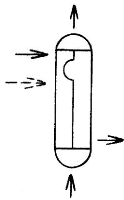

1) The sine wave expansion bend will be excessively large.   
2) Complicated tube supports/vibration problems or the introduction of a large ineffective volume.   
1) The fabrication of the U-bend is very difficult.   
2) Complicated tube supports/vibration problems or the introduction of a large ineffective volume.   
1) The fabrication of the U-bend is twice as difficult as the J tube unit.   
2) There is no reasonable way of avoiding the U-bend, vibration, built-up support problems.   
1) The fabrication is simplified compared with the other candidates but is still difficult.

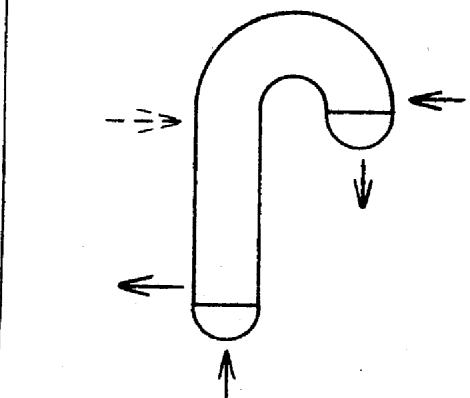

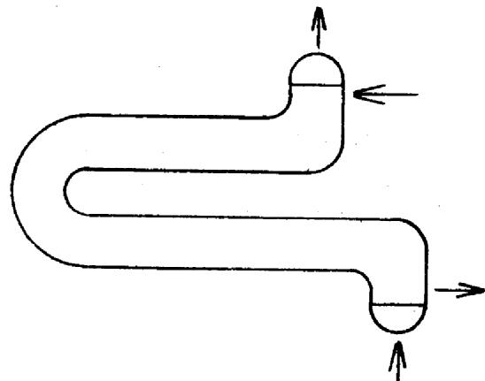

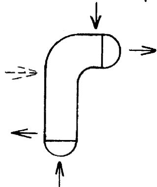

BY

APPROVED

NUCLEAR DEPARTMENT

LIVINGSTON, N. J.

<table><tr><td>CHARGE NO. 8-25-2431</td><td>DOCUMENT NO. ND/74/66</td><td>ISSUE 1</td><td>DATE 12/16/47</td></tr></table>

# U-BEND SHELL FABRICATION

1. Long shells are longitudinally split members.   
2. Long seam welding performed in situ.   
3. Weld distortion will cause the shells to go out of round.   
4. Subsequent re-preparation of circle seam welds requires special development.   
5. Clam shell members for the U-bend will be positioned and the long seam welded in situ. Circle seam welds will require re-preparation using similar special equipment.   
6. Final closure at each tubesheet will be done by the addition of transition pieces which are custom machined and include hand holes for completion of NDT procedures and repair if necessary.   
7. These problems are somewhat simplified when a small shell diameter are considered.

BY

APPROVED

PAGE 2-10

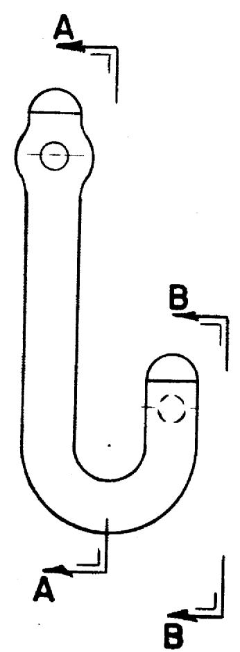

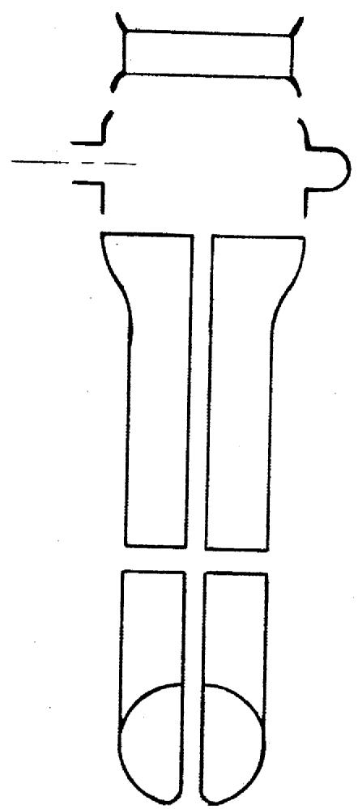  
SECT. A-A

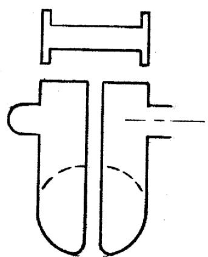  
SECT. B-B

U-SHELL ASSEMBLY

CHARGE NO.8-25-2431

NO. 174/66

T

DATTE 12/16/7

NEULEAR DEPARTMENT

FOSTER WHEELER EXERGY COORPORATION

LIVINGSTON, N. J

NUCLEAR DEPARTMENT

LIVINGSTON, N. J.

<table><tr><td>CHARGE NO. 8-25-2431</td><td>DOCUMENT NO. ND/74/66</td><td>ISSUE 1</td><td>DATE 12/16/74</td></tr></table>

# ELBOW SHELL FABRICATION

1. The fabrication process utilizes shell sections without recourse to clam shells, thereby avoiding the problems of making and inspecting long seam welds in situ.   
2. The problems associated with supporting the tubes in the bend area is not considered any more difficult than in the case of the U-bend shell.   
3. The installation of the tube bundle will require threading of the tubes through the shell after the supports have been installed.

FOSTER WHEELER ENERGY CORPORATION   

<table><tr><td colspan="4"></td></tr><tr><td>CHARGE NO. 8-25-2431</td><td>DOCUMENT NO. ND/74/66</td><td>ISSUE 1</td><td>DATE 12/16/74</td></tr><tr><td colspan="4">ELBOW SHELL ASSEMBLY</td></tr><tr><td>CHARGE NO 8-25-2431</td><td>DOCUMENT NO. ND-74-66</td><td>ISSUE 1</td><td>DATE 12/16/74</td></tr><tr><td colspan="4">SECTION 3.0
MECHANICAL DESIGN REPORT
PRELIMINARY DESIGN
by
Charles H. Holdrith
Approved By:
J. Anelli
Supervisor, Mechanical Design</td></tr><tr><td>BY</td><td>APPROVED</td><td colspan="2">PAGE 3-1 OF</td></tr><tr><td colspan="4">TABLE OF CONTENTS
3.1 Design Description Summary
3.2 Steam Generator Design Data
3.3 Steam Generator Arrangement
3.4 Shell Assembly
3.4.1 Upper Shell Sub-Assembly
3.4.2 Middle Shell Sub-Assembly
3.4.3 Lower Shell Sub-Assembly
3.5 Bundle Assembly
3.6 Channel Assembly
3.7 Special Design Features
3.8 Steam Generator Drawings (Figure No.'s)</td></tr><tr><td>BY C.H.H.</td><td>APPROVED</td><td colspan="2">PAGE 3-2 OF</td></tr><tr><td>CHARGE NO 8-25-2131</td><td>DOCUMENT NO. ND-74-66</td><td>ISSUE 1</td><td>DATE 12/16/74</td></tr><tr><td colspan="4">LIST OF FIGURES</td></tr><tr><td colspan="4">3.1 General Arrangement. . . . . . . . . . . . . . . . . . . . . . . . . . . . . . . . . . . . . . . . . . . . . . . . . . . . . . . . . . . . . . . . . . . . . . . . . . . . . . . . . . . . . . . . . . . . . . . . . . . . . .
3.2 Head and Tubesheet. . . . . . . . . . . . . . . . . . . . . . . . . . . . . . . . . . . . . . . . . . . . . . . . . . . . . . . . . . . . . . . . . . . . . . . . . . . . . . . . . . . . . . . . . . . . . . . . . . ..
3.3 Shell Transition. . . . . . . . . . . . . . . . . . . . . . . . . . . . . . . . . . . . . . . . . . . . . . . . . . . . . . . . . . . . . . . . . . . . . . . . . . . . . . . . . . . . . . . . . . . ..
3.4 Inlet and Outlet Nozzle. . . . . . . . . . . . . . . . . . . . . . . . . . . . . . . . . . . . . . . . . . . . . . . . . . . . . . . . . . . . . . . . . . . . . . . . . . . . . . . . . . . . . . . . ..
3.5 Internal Shroud. . . . . . . . . . . . . . . . . . . . . . . . . . . . . . . . . . . . . . . . . . . . . . . . . . . . . . . . . . ..
3.6 Tube Support Plate. . . . . . . . . . . . . . . . . . . . . . . . . . . . . . . . . . . . . . . . . . . . .
3.7 Tube Vibration Suppressor. . . . . . . . . . . . . . . . . . . . . . . . . . . . . . . . . . . .
3.8 Tie Rod Turnbuckle. . . . . . . . . . . . . . . . . . . . . . . . . . . . . . .
.</td></tr><tr><td>BY C. H. H.</td><td>APPROVED</td><td colspan="2">PAGE 3-3 OF</td></tr><tr><td>CHARGE NO8-25-2131</td><td>DOCUMENT NO. NO-74=66</td><td>ISSUE 1</td><td>DATE 12/16/74</td></tr><tr><td colspan="4">3.0 Molten Salt Steam Generator Preliminary Design</td></tr><tr><td colspan="4">3.1 Design Description Summary</td></tr><tr><td colspan="4">The Foster Wheeler Steam Generator is a "L" shaped fixed tubesheet heat exchanger as shown in Figure 3.1. The steam generator design is based on a system of four units per loop. The steam generator has 1014 tubes which are attached at each end to a fixed tubesheet. The steam generator design is such that the flow of molten salt and super critical fluid through the unit is in the direction of natural circulation. Molten salt enters through an inlet nozzle (Figure 3.4), which is perpendicular to the tube bundle, changes direction 90° and decends approximately 100 feet before exiting through an outlet nozzle (Figure 3.4). Supercritical fluid enters through an inlet nozzle located in the center of the lower head (Figure 3.2) and rises through the heat transfer tubes and exits through an outlet nozzle in the center of the upper head. Vent nozzles are positioned at each tubesheet to shell juncture to prevent the possibility of trapped gases resulting in localized hot spots on the shell (Figures 3.1 and 3.2).</td></tr><tr><td>BY C.H.H.</td><td colspan="2">APPROVED</td><td>PAGE 3-4 OF</td></tr><tr><td>CHARGE NO 8-25-2431</td><td>DOCUMENT NO. ND-74-66</td><td>ISSUE 1</td><td>DATE 12/16/74</td></tr><tr><td colspan="4">3.2 Molten Salt Steam Generator Design Conditions
A.S.M.E. Section III Class I Pressure Vessel*</td></tr><tr><td colspan="4">Primary Side (Shell)</td></tr><tr><td>Design Temperature</td><td colspan="3">1150°F</td></tr><tr><td>Design Pressure</td><td colspan="3">300 P.S.I.G.</td></tr><tr><td>Joint Efficiency</td><td colspan="3">100%</td></tr><tr><td>Allowable Stress</td><td colspan="3">9500 PSI (Primary Membrane)</td></tr><tr><td>Shell Material</td><td colspan="3">Hastelloy-"N"</td></tr><tr><td>Shell·Inside Diameter</td><td colspan="3">39½"</td></tr><tr><td colspan="4">Secondary Side (Tube)</td></tr><tr><td>Design Temperature</td><td colspan="3">1120°F</td></tr><tr><td>Design Pressure</td><td colspan="3">3800 P.S.I.A.</td></tr><tr><td>Joint Efficiency</td><td colspan="3">100%</td></tr><tr><td>Allowable Stress</td><td colspan="3">11,600 PSI (Primary Membrane)</td></tr><tr><td>Number of Tubes</td><td colspan="3">1014</td></tr><tr><td>Tube Pitch</td><td colspan="3">1-1/8" Triangular</td></tr><tr><td>Tube Size</td><td colspan="3">3/4" O.D. x .125 min. wall</td></tr><tr><td>Effective Length</td><td colspan="3">140 ft.</td></tr><tr><td>Tube Material</td><td colspan="3">Hastelloy-"N"</td></tr><tr><td>Number of Tie Rods</td><td colspan="3">13</td></tr><tr><td colspan="4">* Designed to A.S.M.E. Section III Class I with Addenda thru Winter, 1973</td></tr><tr><td>BY C.H.H.</td><td colspan="2">APPROVED</td><td>PAGE 3-5 OF</td></tr><tr><td>CHARGE NO8-25-21431</td><td>DOCUMENT NO. ND-74-66</td><td>ISSUE 1</td><td>DATE 12/16/74</td></tr><tr><td colspan="4">3.3 Steam Generator Arrangement
The steam generator shown in Figure 3.1 consists of:
1. Upper Shell Assembly
2. Middle Shell Assembly
3. Lower Shell Assembly
4. Bundle Assembly
5. Channel Assembly
The steam generator is installed with the curved short section in the horizontal plane, and the long section in the vertical plane. Support lugs or saddles have not been considered at this time. A functional description of the steam generator can be found in Section 4.0 of this report.
3.4 Shell Assembly
3.4.1 Upper Shell Assembly
The upper shell sub-assembly consists of: expanded shell section, inlet nozzle, intershroud, baffle plate and a shell transition. The upper shell sub-assembly is welded to the tubesheet and the middle shell sub-assembly see Figure 3.1.
The expanded shell section is made from rolled and butt weld Hastelloy - "N" plate. A 20" molten salt inlet nozzle is located midway in this expanded region. This nozzle is a saddle type which was selected so that the nozzle to shell</td></tr><tr><td>BY</td><td>APPROVED</td><td colspan="2">PAGE 3-6 OF</td></tr><tr><td>CHARGE NO 8-25-2431</td><td>DOCUMENT NO. ND-74-66</td><td>ISSUE 1</td><td>DATE 12/16/74</td></tr><tr><td colspan="4">weld is removed from critically stressed shell to nozzle intersection. The use of a saddle type nozzle permits, with- out the use of special techniques, the radiography of the nozzle welds.
    Within the expanded shell section is a second cylinder which is the intershroud, its purpose is to channel the flow of molten salt to the heat transfer tubes. This intershroud has an impingement baffle which protects the heat transfer tubes from excess flow erosion. The shroud is perforated with holes to allow the molten salt to enter from the expanded shell section and descend through the unit as shown on Figure 3.1.
    The lower section of the intershroud and the shell transition are of single piece construction as shown in Figure 3.3.
    A single piece design is recommended to avoid the use of welds in the high stress area of the junction discontinuity.
    The upper baffle plate is positioned between the molten salt inlet nozzle and the tubesheet to act as a thermal barrier to prevent the tubesheet and the I. B. W. welds from being thermally shocked.
    3.4.2 Middle Shell Sub-Assembly
    The middle shell sub-assembly consists of rolled and butt welded sections of Hastelloy - "N" plate. The middle shell</td></tr><tr><td>BY</td><td>APPROVED</td><td colspan="2">PAGE 3-7 OF</td></tr><tr><td>CHARGE NO.8-25-2431</td><td>DOCUMENT NO. 74-66</td><td>ISSUE</td><td>DATE 12/16/74</td></tr><tr><td colspan="4">acts as a continuation of the intershroud which channels salt flow around the heat transfer tubes.</td></tr><tr><td colspan="4">3.4.3 Lower Shell Sub-Assembly
    The lower shell sub-assembly consists of: expanded shell section, outlet nozzle, intershroud, baffle plate and a shell transition. The lower shell sub-assembly is welded to the lower tubesheet and to middle shell sub-assembly.
    The expanded shell section is identical with that of the upper shell except the 20" nozzle is used as an outlet for the molten salt.</td></tr><tr><td colspan="4">3.5 Bundle Assembly
    The bundle assembly consists of (2) tubesheets, heat transfer tubes, tie-rods, support plates and vibration suppressors. The complete bundle assembly is welded to the shell assembly, for manufacturing sequences see section of this report.
    The tubesheets are 15" thick Vacuum Arc or Electroslag Remelt Forgings of Hastelloy - "N" material. The tubesheets are designed to meet the code requirements for stress in perforated plates. The outer rim of the tubesheet is machined to a countour which minimizes the thermal stress by having this rim respond more uniformly to thermal transients with</td></tr><tr><td>BY</td><td>APPROVED</td><td colspan="2">PAGE 3-8 OF</td></tr><tr><td colspan="4"></td></tr><tr><td>CHARGE NO8-25-2431</td><td>DOCUMENT NO. ND-74-66</td><td>ISSUE 1</td><td>DATE 12/16/74</td></tr><tr><td colspan="4">the tube hole ligaments. The lower face of each tubesheet is machined to provide spigots for welding of the heat transfer tubes as shown on Figure 3.2.
    The heat transfer tubes are full penetration welded to each tubesheet by using an Internal Bore weld technique. The heat transfer tubes are of Hastelloy - "N" material designed in accordance with A.S.M.E. tubing specifications. Allowances for manufacturing scratches, thinning and corrosion have been included in the tube wall thickness.
    The heat transfer tubes are supported in the vertical position by perforated tube support plates commonly used in heat-exchanger equipment. The support plates are of the "Drilled Plate" type as shown on Figure 3.6. This arrangement was chosen in order to provide circulation between the heat transfer tubes, thereby reducing possible stratification problems and preventing solid collection.
    The tube support plates and the vibration suppressor grids are supported by (13) 3/4" diameter tie-rods which are located in the tube pattern as shown on Figure 3.6 and 3.7.
    These tie-rods are threaded into the tube sheets, located at both ends of the unit.
    The tie-rods are threaded into the upper tubesheet. The support plates are spaced using sleeves which are 7/8" inside</td></tr><tr><td>BY</td><td>APPROVED</td><td colspan="2">PAGE 3-9 OF</td></tr><tr><td colspan="4">diameter. The sleeves are dimpled to assure the proper location concentric to the tie-rods. This type of assembly is joined in the curved region by a turnbuckle as shown on Figure 3.8. The curved region uses a vibration suppressor grid to properly position the tubes in this area. The function of the grid is to allow expansion of the tubes while restraining them against vibration as shown on Figure 3.7. The tie-rods are secured at the last suppressor grid by means of a heavy hex nut which is seal welded in place.
The vibration suppressor grid is comprised of an outer ring that is rolled thru the "Y" axis and is machined to accept a grid of flat bars as shown on Figure 3.7.
The turnbuckle used to join these grids is shown on Figure 3.8. Each turn buckle is positioned within the grid and accepts at each end a curved tie-rod. This threading assembly is made possible by use of a right and left hand thread within the turn-buckle.
The by-pass of liquid to the outside of the support plates and the suppressor grids is minimized by the manufacturing tolerances that can be maintained. The inside shell diameter can be manufactured to 39½" +3/16" -0" and the supports can be held to an outside diameter of 39 3/8" +1/16 -0.</td></tr></table>

<table><tr><td>BY</td><td>APPROVED</td><td>PAGE 3-10 OF</td></tr></table>

<table><tr><td>CHARGE NO8-25-2431</td><td>DOCUMENT NO. ND-74-66</td><td>ISSUE 1</td><td>DATE 12/16/74</td></tr></table>

# 3.6 Channel Assembly

The channel assembly is comprised of the bundle assembly (described in the preceding section) and the upper and lower hemispherical heads. Each head is joined to the tubesheet by means of a full penetration weld. Located in the center of each head is a 16" nozzle of the saddle type. This type of nozzle allows for full radiography of the closure weld. The 16 nozzle in the lower head serves as the inlet nozzle which carries supercritical fluid into the plenum chamber (lower hemi-head) and then through the heat transfer tubes. Upon exiting the tubes the high pressure steam is collected in the upper plenum (upper hemi-head) and allowed to exit through the 16" outlet nozzle as shown on Figure 3.2.

# 3.7 Special Design Features

# Saddle Nozzle

The saddle type nozzle offers two advantages not found in nozzles of a different design. First, the saddle nozzle permits the radiography of the nozzle to shell weld without the use of special techniques. Secondly, the saddle nozzle removes the weld from the critically stressed nozzle to shell intersection.

# Internal Bore Weld

The I.B.W. welding process allows design of a tubesheet

<table><tr><td>BY</td><td>APPROVED</td><td>PAGE 3-11 OF</td></tr></table>

<table><tr><td>CHARGE NO 8-25-2431</td><td>DOCUMENT NO. ND-74-66</td><td>ISSUE 1</td><td>DATE 12/16/74</td></tr><tr><td colspan="4">that eliminates the crevice created by the standard &quot;through&quot; tubesheet design. The I.B.W. weld is a full penetration weld that can be fully radiographed.
Minimal Flow By-Pass
    The close manufacturing tolerances that can be maintained during manufacture of the intershroud, shell cylinder and tube-supports minimizes the by-pass of molten salt to 2 percent of the total flow.</td></tr><tr><td>BY</td><td>APPROVED</td><td colspan="2">PAGE 3-12 OF</td></tr></table>

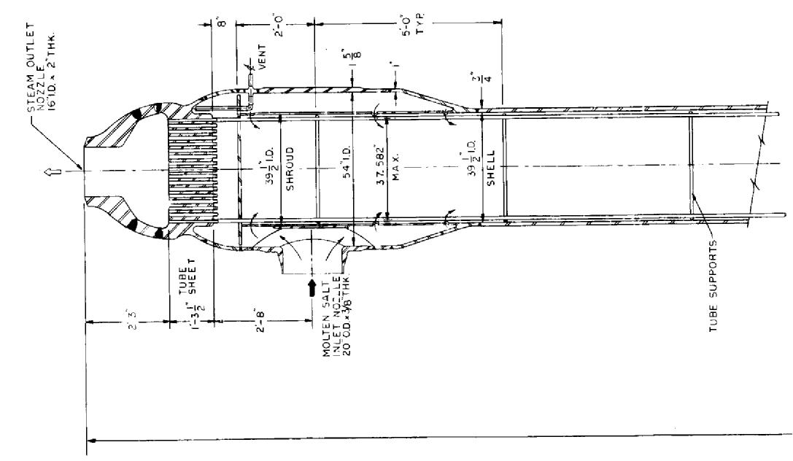

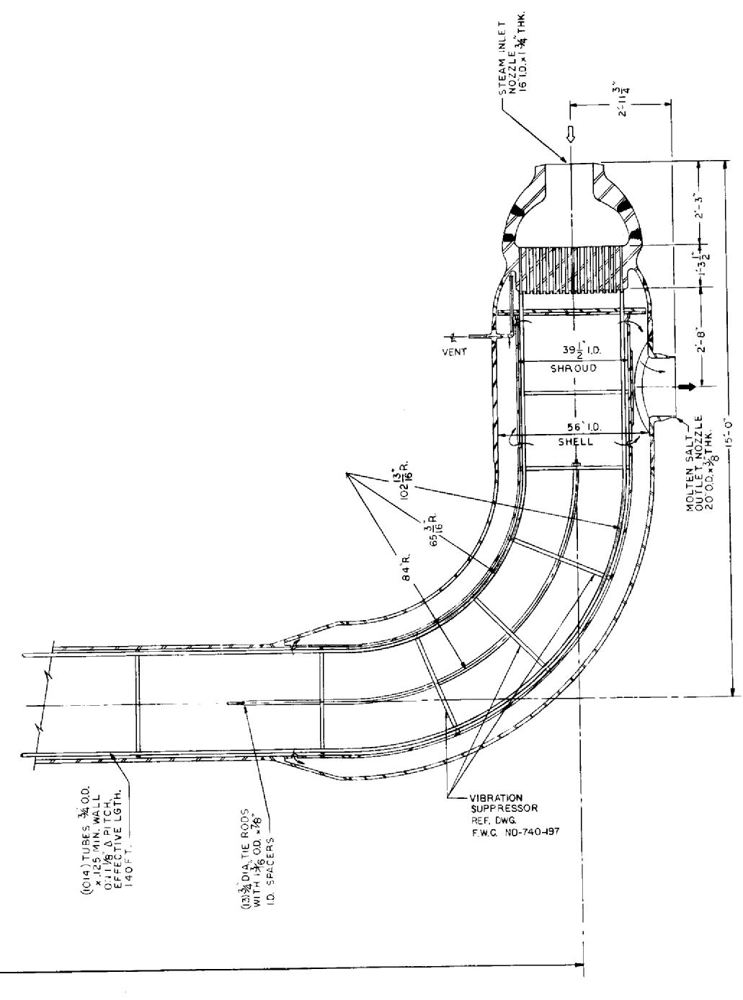

DWG.NO.   

<table><tr><td>MECHANICAL
DE SIGN</td><td>PROJECT
MANAGER</td></tr><tr><td>###</td><td>###</td></tr><tr><td>STRESS
ANALYSIS</td><td>MANUFACTURING
ENGINEER</td></tr><tr><td>###</td><td>###</td></tr></table>

<table><tr><td colspan="4">NO. OF TUBE SIZE 3/2 OD×25WALL
TUBE PITCH 1/8&quot;60°
EFF. LENGTH 14OFT.</td></tr><tr><td>B</td><td>10-17-2</td><td colspan="2">ADDED DESIGN DATA
1000 OD WOODS 8 SPACES
10. OF TUBE 114. 493/25
2-174&quot; w#d 2.6-
34/10. w#d 483/12.
1-34&#x27; TUBE SMT 485/14
125-1 w#d 484-40
32-382&#x27; Nodal 437-850
84-8 w#d 2530/8
23-364&#x27; Nodal 2778R
102-9/2&quot; w#d 455-288R
1&quot; TUBE 485-36&quot; TAK
EFF. LENGTH 1400 W#S 110&quot;</td></tr><tr><td>A</td><td>81570</td><td colspan="2">30/2&quot;10. WAS 36/2</td></tr><tr><td>LETTER</td><td>DATE ORI</td><td colspan="2">DESCRIPTION</td></tr><tr><td colspan="4">REVISIONS</td></tr><tr><td colspan="4">STEAM GENERATOR
GENERAL ARRANGEMENT
MOLLEN SALT</td></tr><tr><td colspan="2">DRAING NUMBER</td><td>SCALE</td><td>3/4 = 1:2</td></tr><tr><td>NO. OF TUBE &amp; APPLIED BY</td><td>INITIAL</td><td>DATE</td><td>CONT NO</td></tr><tr><td>ORIGINATION</td><td>L/N</td><td>DATE</td><td>ORDER NUMBERS</td></tr><tr><td>CRAFTNESS</td><td>L/N</td><td>DATE</td><td></td></tr><tr><td>EQUIPMENT</td><td>L/N</td><td>DATE</td><td></td></tr><tr><td>SPECIAL LEADER</td><td>L/N</td><td>DATE</td><td></td></tr><tr><td>SECTION HEAD</td><td></td><td></td><td></td></tr><tr><td>COST SUPPLY</td><td></td><td></td><td></td></tr></table>

THIS DRAWING SUPPLIEDS THIS DRAWING SUPPLIED BY

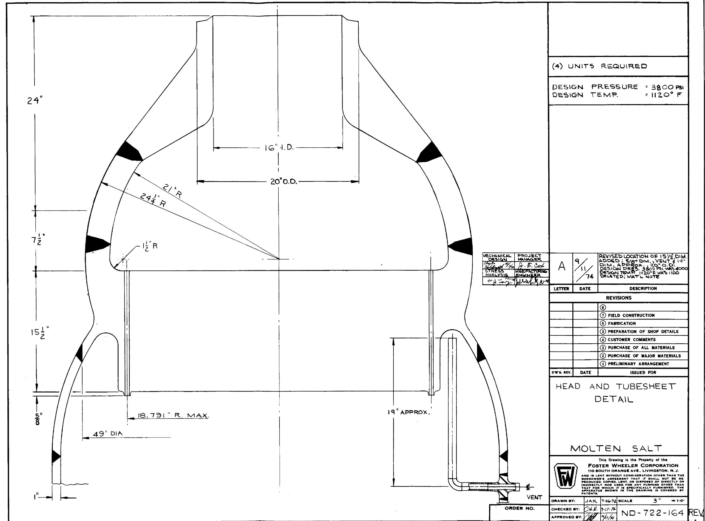  
Fig. 3.2

DWG. No.

THIS DRAWING SUPERSEDES

THIS DRAWING SUPERSEDED BY

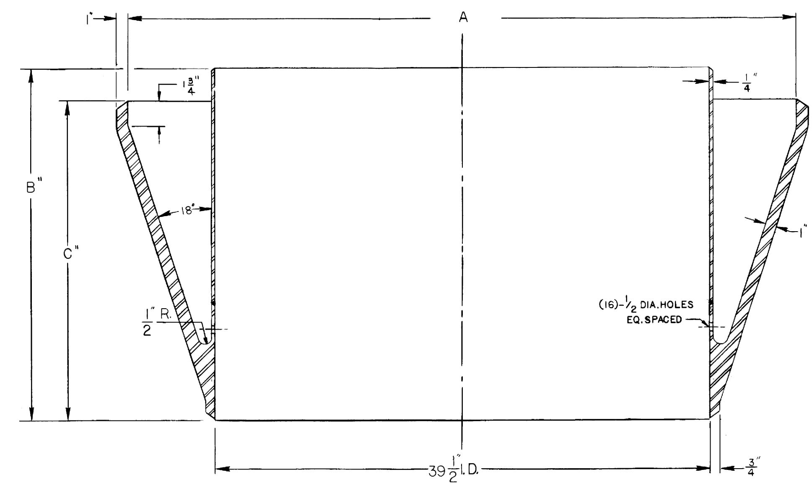

<table><tr><td>DIM</td><td>TOP TRANSITION</td><td>BOTTOM TRANSITION</td></tr><tr><td>A</td><td>54&quot;1.D.</td><td>56&quot;1.D.</td></tr><tr><td>B</td><td>28½&quot;</td><td>29½&quot;</td></tr><tr><td>C</td><td>26&quot;</td><td>27&quot;</td></tr><tr><td>NO.Req&#x27;D</td><td>4</td><td>4</td></tr></table>

<table><tr><td></td></tr><tr><td></td></tr><tr><td>DESIGN PRESSURE:300 PSI
DESIGN TEMPERATURE:1150°F</td></tr></table>

<table><tr><td>MECHANICAL DESIGN</td><td>PROJECT MANAGER</td></tr><tr><td>Chalcity
Alldred/10%</td><td>8 20x</td></tr><tr><td>STRESS ANALYSIS</td><td>MANUFACTURING ENGINEER</td></tr><tr><td>ng 2.1.1.5/m</td><td>###</td></tr></table>

<table><tr><td>B</td><td>9-18-74
LRS</td><td>REMOVED: MAT&#x27;L
ADDED: DIM. TABLE A 134&quot; DIM.
DESIGN TEMP: ISOF WAS100</td></tr><tr><td>A</td><td>10-12-72
J.W.N.</td><td>39½&quot; I.D. WAS 40&quot; I.D.
1&quot; THK. WAS &#x27;5/6&quot; THK.
1/2&quot; R. WAS 1½R.</td></tr><tr><td>LETTER</td><td>DATE</td><td>DESCRIPTION</td></tr></table>

<table><tr><td colspan="3">REVISIONS</td></tr><tr><td></td><td></td><td>⑧</td></tr><tr><td></td><td></td><td>⑦ FIELD CONSTRUCTION</td></tr><tr><td></td><td></td><td>⑥ FABRICATION</td></tr><tr><td></td><td></td><td>⑤ PREPARATION OF SHOP DETAILS</td></tr><tr><td></td><td></td><td>④ CUSTOMER COMMENTS</td></tr><tr><td></td><td></td><td>③ PURCHASE OF ALL MATERIALS</td></tr><tr><td></td><td></td><td>② PURCHASE OF MAJOR MATERIALS</td></tr><tr><td></td><td></td><td>① PRELIMINARY ARRANGEMENT</td></tr><tr><td>DWG. REV.</td><td>DATE</td><td>ISSUED FOR</td></tr></table>

SHELL TRANSITION

MOLTEN SALT

This Drawing is the Property of the FOSTER WHEELER CORPORATION 110 SOUTH ORANGE AVE., LIVINGSTON, N.J. AND IS LENT WITHOUT CONSIDERATION OTHER THAN THE BORROWER'S AGREEMENT THAT IT SHALL NOT BE REPRODUCED, COPIED, LENT, OR DISPOSED OF DIRECTLY OR INDIRECTLY NOR USED FOR ANY PURPOSE OTHER THAN THE APPARATUS WHICH IT IS SPECIFICALLY FURNISHED. THE APPARATUS SHOWN IN THE DRAWING IS COVERED BY PATENTS.

77 3" $= 1^{\prime}0^{\prime \prime}$ $= C H_{4}H$ 16/14 ND-722-167

ORDER NO.

DWG. No.

THIS DRAWING SUPERSEDES

THIS DRAWING SUPERSEDED BY

W

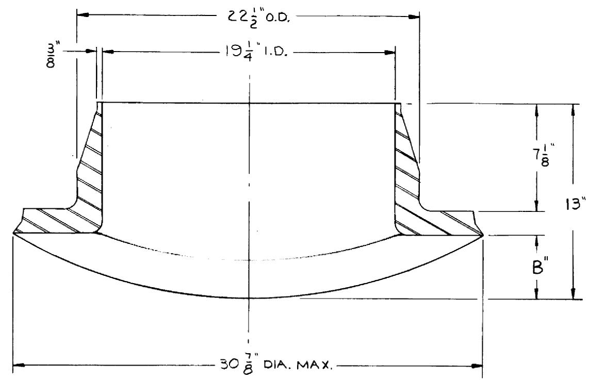

<table><tr><td>DIM</td><td>INLET NOZZLE</td><td>OUTLET NOZZLE</td></tr><tr><td>A</td><td>27&quot;</td><td>28&quot;</td></tr><tr><td>B</td><td>4 1/4&quot;</td><td>4 1/2&quot;</td></tr><tr><td>NO.Req&#x27;D</td><td>4</td><td>4</td></tr></table>

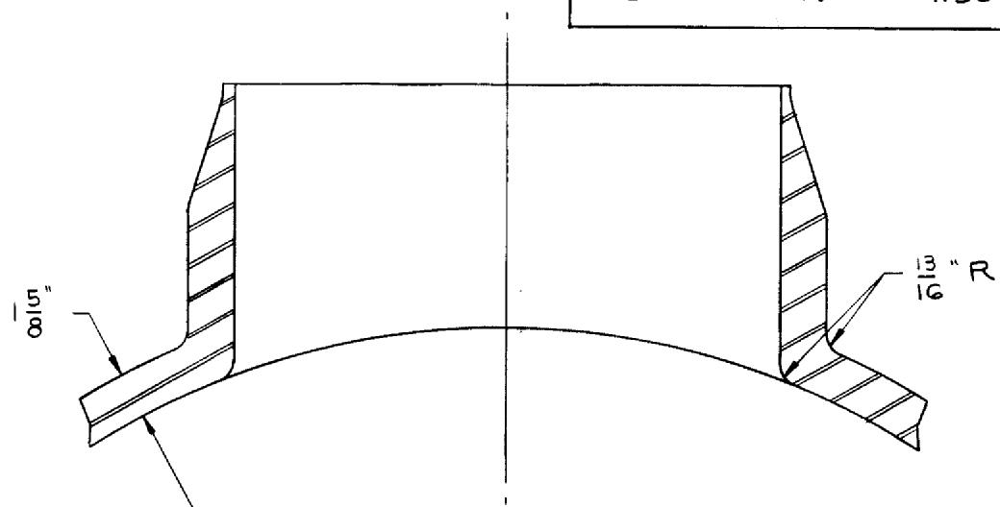

A"R.   

<table><tr><td>MECHANICAL
DESIGN</td><td>PROJECT
MANAGER</td><td rowspan="4">A</td><td rowspan="4">9-19-74
L.R.S.</td><td rowspan="4">ADDED: DIM. TABLE E LETTERS
REMOVED: MAT&#x27;L
DESIGN TEMP, 1150°F WAS1100</td></tr><tr><td>Chal
###</td><td>2 F COL</td></tr><tr><td>STRESS
ANALYSIS</td><td>MANUFACTURING
ENGINER</td></tr><tr><td>###</td><td>###</td></tr></table>

SALT INLET / OUTLET NOZZLE DETAIL   

<table><tr><td>LETTER</td><td>DATE</td><td>DESCRIPTION</td></tr><tr><td colspan="3">REVISIONS</td></tr><tr><td></td><td></td><td>⑧</td></tr><tr><td></td><td></td><td>⑦ FIELD CONSTRUCTION</td></tr><tr><td></td><td></td><td>⑥ FABRICATION</td></tr><tr><td></td><td></td><td>⑤ PREPARATION OF SHOP DETAILS</td></tr><tr><td></td><td></td><td>④ CUSTOMER COMMENTS</td></tr><tr><td></td><td></td><td>③ PURCHASE OF ALL MATERIALS</td></tr><tr><td></td><td></td><td>② PURCHASE OF MAJOR MATERIALS</td></tr><tr><td></td><td></td><td>① PRELIMINARY ARRANGEMENT</td></tr><tr><td>D&#x27;WG. REV.</td><td>DATE</td><td>ISSUED FOR</td></tr></table>

MOLTEN SALT

This Drawing is the Property of the

FOSTER WHEELER CORPORATION 110 SOUTH ORANGE AVE. LIVINGSTON, N.J.

AND IS LENT WITHOUT CONSIDERATION OTHER THAN THE BORROWER'S AGREEMENT THAT IT SHALL NOT BE REPRODUCED, COPIED, LET, OR DISPOSED OF DIRECTLY OR INDIRECTLY NOR USED FOR ANY PURPOSE OTHER THAN FOR WHICH IT IS SPECIFICALLY FURNISHED. THE APPARATUS SHOWN IN THE DRAWINGS IS COVERED BY PATENTS.

DRAWN BY: JAK 8.1.72 SCALE 3° = 1°

<table><tr><td rowspan="2">ORDER NO.</td><td>CHECKED BY:</td><td>C.H.H.</td><td>9-17-24</td><td rowspan="2">ND-722-165</td></tr><tr><td>APPROVED BY:</td><td>O.Y.</td><td>9-17-24</td></tr></table>

THIS DRAWING SUPERSEDES

THIS DRAWING SUPERSEDED BY

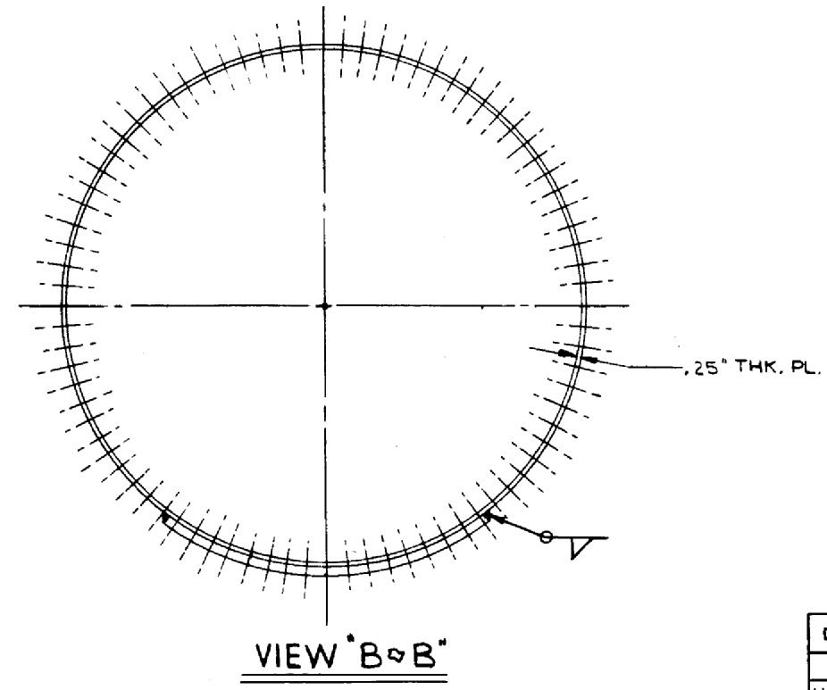

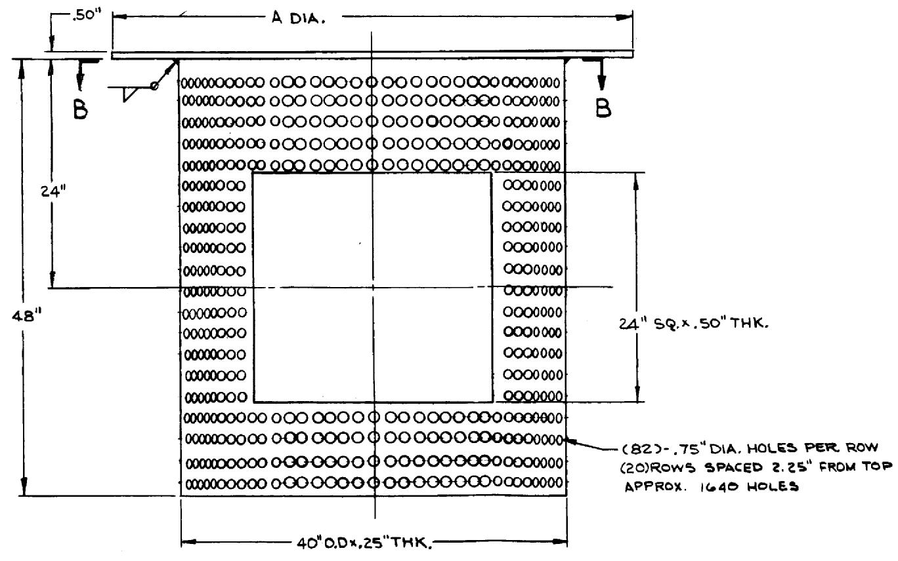

<table><tr><td>DIM.</td><td>TOP SHROUD</td><td>BOTTOM SHROUD</td></tr><tr><td>A</td><td>52&quot;</td><td>54&quot;</td></tr><tr><td>NO. REG&#x27;D</td><td>4</td><td>4</td></tr></table>

<table><tr><td>MECHANICAL
DESIGN</td><td>PROJECT
MANAGER</td></tr><tr><td>###</td><td>###</td></tr><tr><td>STRESS
ANALYSIS</td><td>MANUFACTURING
ENGINEER</td></tr><tr><td>####</td><td>###</td></tr></table>

<table><tr><td>LETTER</td><td>DATE</td><td>DESCRIPTION</td></tr><tr><td colspan="3">REVISIONS</td></tr><tr><td></td><td></td><td>⑧</td></tr><tr><td></td><td></td><td>⑦ FIELD CONSTRUCTION</td></tr><tr><td></td><td></td><td>⑧ FABRICATION</td></tr><tr><td></td><td></td><td>⑤ PREPARATION OF SHOP DETAILS</td></tr><tr><td></td><td></td><td>④ CUSTOMER COMMENTS</td></tr><tr><td></td><td></td><td>③ PURCHASE OF ALL MATERIALS</td></tr><tr><td></td><td></td><td>② PURCHASE OF MAJOR MATERIALS</td></tr><tr><td></td><td></td><td>① PRELIMINARY ARRANGEMENT</td></tr><tr><td>DWG. REY.</td><td>DATE</td><td>ISSUED FOR</td></tr><tr><td colspan="3">INTERNAL SHROUD
MOLTEX SALT</td></tr><tr><td colspan="3">This Drawing is the Property of the
FOSTER WHEELER CORPORATION
110 SOUTH ORANGE AVE., LIVINGSTON, N.J.
AND IS LENT WITHOUT CONSIDERATION OTHER THAN THE
BORROWER&#x27;S AGREEMENT THAT IT SHALL NOT BE RE-
PRODUCED, COPIED, LENT, OR DISPOSED OF DIRECTLY OR
INDIRECTLY NOR USED FOR ANY PURPOSE OTHER THAN
THAT FOR WHICH IT IS SPECIFICALLY FURNISHED. THE
APPARATUS SHOWN IN THE DRAWING IS COVERED BY
PATENTS.</td></tr><tr><td>DRAWN BY:</td><td>L.S.</td><td>% / %</td></tr><tr><td>CHECKED BY:</td><td>C. H.</td><td>% / %</td></tr><tr><td>APPROVED BY:</td><td>O. J.</td><td>% / %</td></tr></table>

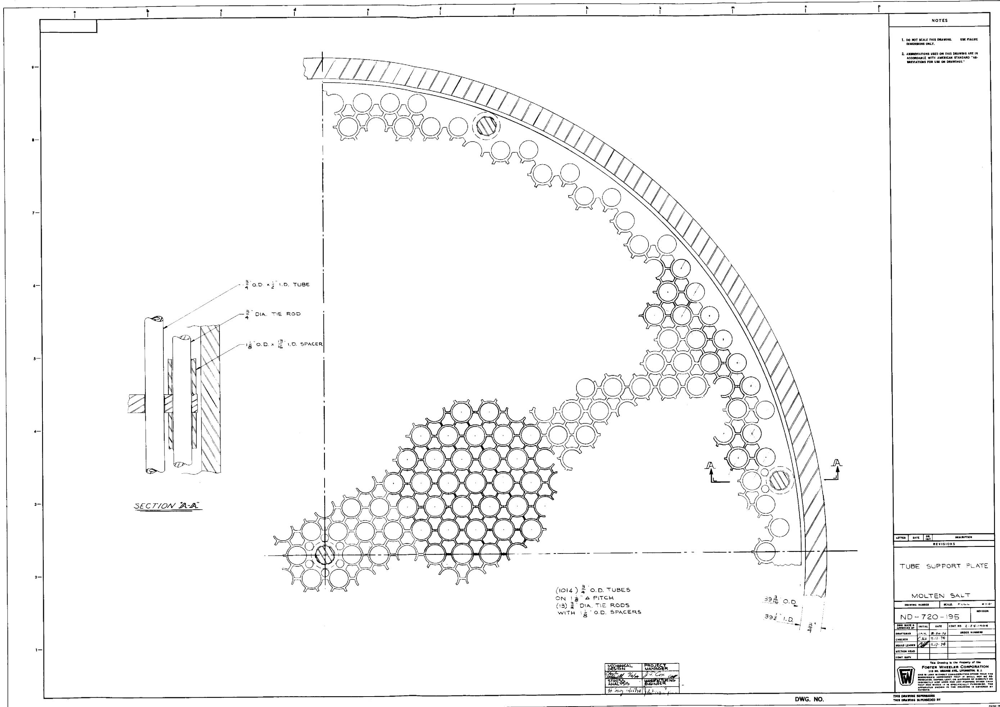

<table><tr><td>DWG. NO.</td><td></td></tr></table>

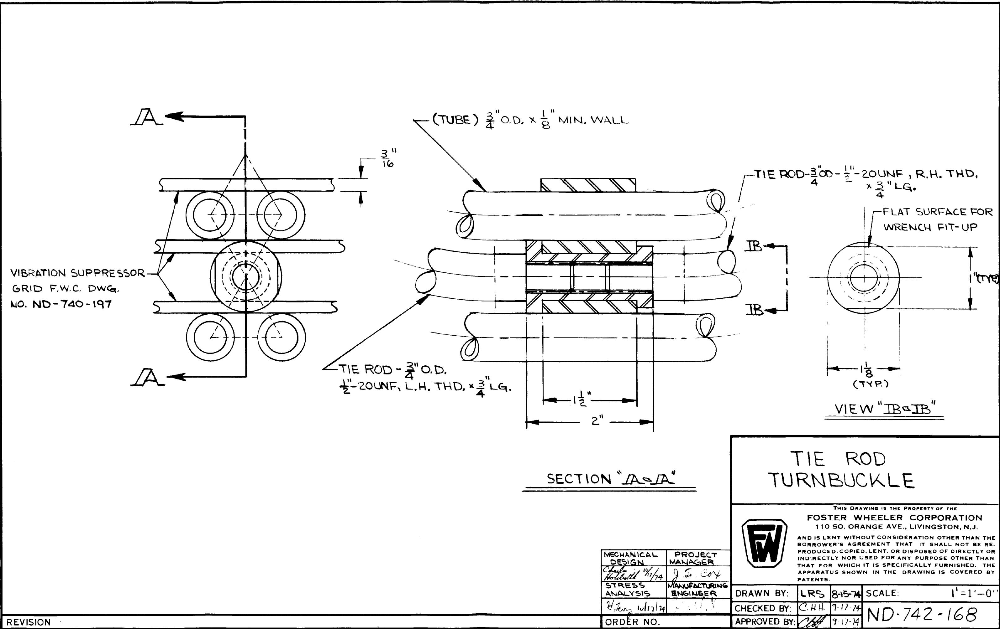

FOSTER WHEELER ENERGY CORPORATION   

<table><tr><td colspan="5"></td></tr><tr><td colspan="2">CHARGE NO. 8-25-2431</td><td>DOCUMENT NO. ND/74/66</td><td>ISSUE 1</td><td>DATE 12/16/74</td></tr><tr><td colspan="5">SECTION 4
THERMAL/HYDRAULIC DESIGN
BY
H. L. CHOU
H. L. CHOU
Thermal/Hydraulic Task Leader
Approved by
Dr. S. M. Cho
Manager
Thermal/Hydraulic Engineering</td></tr><tr><td>BY</td><td colspan="3">APPROVED</td><td>PAGE 4-a</td></tr></table>

NUCLEAR DEPARTMENT

LIVINGSTON, N. J.

<table><tr><td colspan="4">TABLE OF CONTENTS</td></tr><tr><td>4.0</td><td colspan="2">THERMAL/HYDRAULIC ANALYSIS</td><td>PAGES</td></tr><tr><td>4.1</td><td colspan="2">THERMAL PERFORMANCE</td><td>4-1</td></tr><tr><td>4.1.1</td><td colspan="2">OVERALL HEAT TRANSFER COEFFICIENT</td><td>4-2</td></tr><tr><td>4.1.2</td><td colspan="2">HEAT TRANSFER SURFACE REQUIREMENTS</td><td>4-6</td></tr><tr><td>4.1.2.1</td><td colspan="2">UNCERTAINTY ANALYSIS OF THERMAL PARAMETERS</td><td>4-7</td></tr><tr><td>4.1.2.2</td><td colspan="2">THERMAL DESIGN MARGIN</td><td>4-9</td></tr><tr><td>4.1.3</td><td colspan="2">DETAILED PERFORMANCE CALCULATIONS</td><td>4-9</td></tr><tr><td>4.1.4</td><td colspan="2">PART LOAD PERFORMANCE</td><td>4-18</td></tr><tr><td>4.1.4.1</td><td colspan="2">METHOD 1</td><td>4-19</td></tr><tr><td>4.1.4.2</td><td colspan="2">METHOD 2</td><td>4-20</td></tr><tr><td>4.2</td><td colspan="2">PRESSURE DROP CALCULATIONS</td><td>4-29</td></tr><tr><td>4.2.1</td><td colspan="2">STEAM/WATER SIDE PRESSURE DROP</td><td>4-29</td></tr><tr><td>4.2.2</td><td colspan="2">SALT SIDE PRESSURE DROP</td><td>4-33</td></tr><tr><td>4.3</td><td colspan="2">STABILITY</td><td>4-33</td></tr><tr><td>4.3.1</td><td colspan="2">STATIC STABILITY</td><td>4-36</td></tr><tr><td>4.3.2</td><td colspan="2">DYNAMIC STABILITY</td><td>4-39</td></tr><tr><td>4.4</td><td colspan="2">SYSTEMS RELATED TO STEAM GENERATOR</td><td>4-46</td></tr><tr><td>4.4.1</td><td colspan="2">START-UP SYSTEM AND WATER CHEMISTRY</td><td>4-46</td></tr><tr><td>4.4.1.1</td><td colspan="2">START-UP SYSTEM</td><td>4-46</td></tr><tr><td>4.4.1.2</td><td colspan="2">WATER CHEMISTRY</td><td>4-49</td></tr><tr><td>4.4.2</td><td colspan="2">PRESSURE RELIEF SYSTEM</td><td>4-50</td></tr><tr><td>4.5</td><td colspan="2">REFERENCES</td><td>4-55</td></tr></table>

NUCLEAR DEPARTMENT

LIVINGSTON, N. J.

CHARGE NO.8-25-2431

DOCUMENT NO. ND/74/66

ISSUE 1

DATE 12/16/74

# 4.0 THERMAL/HYDRAULIC ANALYSIS

It is the intent of this analysis to obtain a conceptual design of a steam generator which will operate with a molten salt system and a supercritical steam-power cycle. The steam generator design is of a once-through, counterflow, shell-and-tube type with salt flowing downward on the shell side and water/steam flowing upward in the tubes. Only one steam generator unit is intended for each of the four heat transport circuits which are connected, in parallel, to the Molten Salt Breeder Reactor.

An axial (or long) flow approach was utilized after several unsuccessful attempts of meeting the design criteria by a cross flow scheme. The difficulty of solving the problems of tube vibration and the excessive pressure drop on the shell side simultaneously, forced the cross flow approach to be abandoned. However, it is noted that the advantage of cross flow approach is not so significant in a supercritical unit, due to the fact that the thick tube wall, necessary for high pressure, becomes a dominant thermal resistance (about $50\%$ ) of over-all thermal performance.

The analyses of the basic thermal/hydraulic performances, design uncertainties, flow stabilities, and related systems have been performed and the results are presented in detail in the following sections.

NUCLEAR DEPARTMENT

LIVINGSTON, N. J.

CHARGE NO. 8-25-2431

DOCUMENT NO. ND/74/66

ISSUE 1

DATE 12/16/74

# 4.1 THERMAL PERFORMANCE

The thermodynamic and transport properties and thermal conductances of all heat transfer media were first determined in order to obtain the steady-state thermal performance of the steam generator.

# 4.1.1 OVERALL HEAT TRANSFER COEFFICIENT

The heat is transferred from the molten salt on shell side to the steam on tube side. The thermal conductances of molten salt, tube wall, supercritical steam and steam-side fouling were considered.

The molten salt side fouling effect was neglected at the direction of Oak Ridge National Laboratory. The Molten-Salt Reactor Experiment (MSRE) in 1960's denoted no evidence of fouling in the MSRE heat exchanger. However, the coolant mixture chosen for that application was $\mathrm{BF}_2$ with 66 mole % of LiF, and the coolant chosen for MSBR is NaF with 92 mole % of $\mathrm{NaBF}_4$ . Evidence of the corrosion product, $\mathrm{Na}_3\mathrm{CrF}_6$ , has been found in loops circulating sodium fluoroborate, and this corrosion/product is expected to deposit on the outside surface of the steam tubes if not removed by some means (Ref.1). The effect of molten salt side fouling on the thermal performance of the steam generator was reported in the FWEC Monthly Progress Report #10 (Ref. 2).

The steam side fouling coefficient of 6667 Btu/hr-ft $^2$ F was used and is considered to be a reasonable value for the single-phase flow and the five-year period of tube cleaning.

The design properties of the tube wall material, Hastelloy N (Nickel-Molybdenum-Chromium-Iron Alloy), are tabulated in Reference 3.

# A. Steam Side Coefficient

The correlation by H. S. Swenson (Ref.4) was recommended for super-critical water/steam flowing inside circular tubes exposed to heat flux at the wall. This correlation is expressed by

$$
\frac {h _ {i} D _ {i}}{K _ {i}} = 0. 0 0 4 5 9 \left(\frac {D _ {i} G}{\mu_ {i}}\right) ^ {0. 9 2 3} \left(\frac {H _ {i} - H _ {b}}{T _ {i} - T _ {b}} \quad \frac {\mu_ {i}}{K _ {i}}\right) ^ {0. 6 1 3} \left(\frac {v _ {b}}{v _ {i}}\right) ^ {0. 2 3 1}
$$

<table><tr><td>CHARGE NO. 8-25-2431</td><td>DOCUMENT NO. ND/74/66</td><td>ISSUE 1</td><td>DATE 12/16/74</td></tr><tr><td colspan="4">where
h_i = heat transfer coefficient inside tube, Btu/hr-ft^2 - F
D_i = inside diameter of tube, ft
K_i = thermal conductivity of fluid inside tube, Btu/hr-ft - F
G = mass velocity of fluid, lb/hr-ft^2
μ_i = viscosity of fluid at temperature of inside surface of tube, lb/hr-ft
H_i = enthalpy at temperature of inside surface of tube, Btu/lb
H_b = enthalpy at temperature of bulk fluid, Btu/lb
T_i = temperature of fluid at inside surface of tube, °F
T_b = temperature of bulk fluid, °F
v_b = specific volume of bulk fluid, ft^3/lb, and
v_i = specific volume of fluid at temperature of inside surface of tube ft^3/lb</td></tr><tr><td colspan="4">B. Salt Side Coefficient
The Dittus Boelter correlation was applied to determine the molten salt heat transfer coefficient. The correlation is expressed by
Nu = 0.023 (Re) ^0.8 (Pr) ^0.4
where Nu = h_o De / k_b
Re = G De / μ_b
Pr = Cp_b μ_b / K_b</td></tr></table>

NUCLEAR DEPARTMENT

LIVINGSTON, N. J.

<table><tr><td colspan="4"></td></tr><tr><td>CHARGE NO. 8-25-2431</td><td>DOCUMENT NO. ND/74/66</td><td>ISSUE 1</td><td>DATE 12/16/74</td></tr><tr><td colspan="4">h0= heat transfer coefficient of molten salt, Btu/hr-ft2-°F
De = equivalent diameter, ft
Kb = thermal conductivity of molten salt at bulk temperature, Btu/hr-ft-°F
G = mass velocity of molten salt, lb/hr-ft2
Mb = viscosity of molten salt at bulk temperature, lb/hr-ft
Cpb = specific heat at constant pressure of molten salt at bulk temperature, Btu/lb-°F
All the conductances of overall, steam side, molten salt side, tube wall, and steam side fouling at full load are plotted versus length of steam generator, as measured from cold end, in Fig. 4.1. The overall conductance was calculated based on outside surface of tube and maximum tube thickness (0.125&quot; + 7%) since the steam is in the super-critical thermodynamic state, special care must be taken to insure that the evaluations of thermodynamic and transport properties are accurate. For given load conditions, the tube length was divided into a sufficient number of sections, so that the specific heat, Cp, of steam in each section could be treated as a constant with negligible error, and the concept of logarithm mean temperature difference could be applied.
The length-averaged mean values were calculated for each conductance to determine the overall performance of the unit as full load conditions and are tabulated below. The method in Ref. 5 was utilized. The attributions to overall resistance of each are also shown.</td></tr><tr><td>BY</td><td>APPROVED</td><td>PAGE</td><td>l4-l4</td></tr></table>

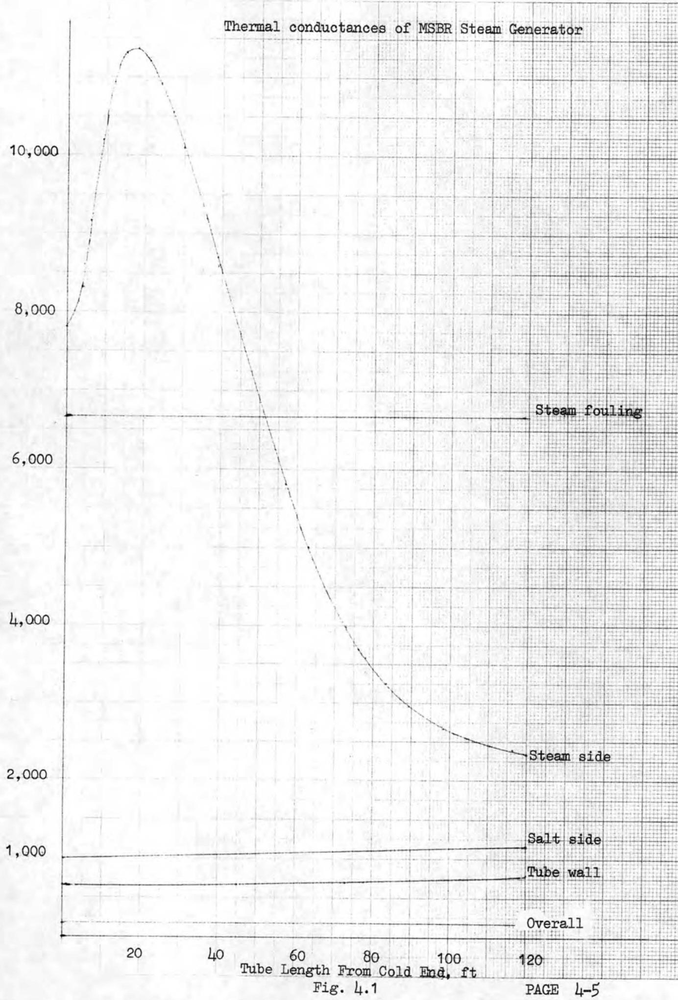  
othermal conductance Btu/hr-ft2

NUCLEAR DEPARTMENT

LIVINGSTON, N. J.

CHARGE NO. 8-25-2431

DOCUMENT NO. ND/74/66

ISSUE 1

DATE 12/16/74

Conductance Btu/hr-ft²

% of total resistance

Steam side

4401.41

12.0

Molten salt side

1079.21

31.50

tube wall

499.79

48.58

steam side fouling

6667.0

7.92

overall U

340

100

overall log mean temp. difference

205.67°F

# 4.1.2 HEAT TRANSFER SURFACE REQUIREMENTS

The design criteria at full load operating conditions are as follows:

<table><tr><td></td><td>Salt</td><td>Water/Steam</td></tr><tr><td>Inlet temperature, °F</td><td>1150</td><td>700</td></tr><tr><td>Outlet temperature, °F</td><td>850</td><td>1000</td></tr><tr><td>Flow rate, lb/hr</td><td>15,280,000</td><td>2,538,000</td></tr><tr><td>Inlet pressure, psia</td><td>235</td><td>---</td></tr><tr><td>Outlet pressure, psia</td><td>---</td><td>3600</td></tr><tr><td>Maximum pressure drop, psi</td><td>60</td><td>200</td></tr></table>

Thermal duty $= 483 \, \text{MW}(\text{t}) = 1.65 \times 10^{9} \, \text{Btu/hr}$ .

A basic thermal/hydraulic performance computer program was developed to calculate the sizing of steam generator using the correlations mentioned in Section 4.1.1. This resulted in the basic thermal/hydraulic design of the steam generator as 1000 tubes with length of 120 ft. The specifications of this basic design are summarized below:

NUCLEAR DEPARTMENT

LIVINGSTON, N. J.

<table><tr><td colspan="4"></td></tr><tr><td>CHARGE NO. 8-25-2431</td><td>DOCUMENT NO. ND/74/66</td><td>ISSUE 1</td><td>DATE 12/16/74</td></tr><tr><td colspan="2">No. of tubes per unit</td><td colspan="2">1000</td></tr><tr><td colspan="2">Total length, ft.</td><td colspan="2">120</td></tr><tr><td colspan="2">Tube O. D. in.</td><td colspan="2">0.75</td></tr><tr><td>Tube thickness, in.</td><td>max. wall</td><td colspan="2">0.13375</td></tr><tr><td>Tube I. D. in</td><td>min. ID</td><td colspan="2">0.4825</td></tr><tr><td>Transverse tube pitch, in</td><td colspan="3">1.125</td></tr><tr><td>Longitudinal pitch, in</td><td colspan="3">0.974</td></tr><tr><td>Heat transfer rate, Btu/hr</td><td colspan="3">1.646 x 109</td></tr><tr><td>Total effective surface area, ft2(based on tube OD)</td><td colspan="3">23561.8</td></tr><tr><td>Material</td><td colspan="3">Hastelloy N</td></tr><tr><td colspan="4">However, the uncertainties of heat transfer correlations, variation of tube thickness, flow by-pass, and even the fluctuations of flow rates will require surface margin to accommodate all the possible deviations from design conditions. This was best accomplished by statistical approach.</td></tr><tr><td colspan="4">4.1.2.1 UNCERTAINTY ANALYSIS OF THERMAL PARAMETERS</td></tr><tr><td colspan="4">In order to obtain an appropriate surface margin to maintain a high confidence level of the design, a statistical computer program, entitled SIMPAK, (Ref. 30), was utilized.</td></tr><tr><td colspan="4">SIMPAK is a package of subroutines which read in the date, draw random numbers, relate data to probability distributions, facilitate the Monte Carlo simulation, compute the mean and standard deviation of resultant probability distributions, and print out details of the probability distributions of a few variables of interest.</td></tr><tr><td colspan="4">Uncertainties were considered for heat transfer correlations used in the thermal sizing of the steam generator. For the steam conductance correlation, Swenson reports a standard deviation of +7.2% which leads to ±21.6% for 3σ-deviation. This deviation was used for this study. The steam side fouling conductance was assumed to have a range of ±25% (3σ-deviation).</td></tr><tr><td>BY</td><td>APPROVED</td><td colspan="2">PAGE 4-7</td></tr></table>

NUCLEAR DEPARTMENT

LIVINGSTON, N. J.

CHARGE NO. 8-25-2431

DOCUMENT NO. ND/74/66

ISSUE 1

DATE 12/16/7

The heat transfer data of molten salt obtained with the forced-convection loop FCL-2 are in good agreement with the empirical correlation of Sieder and Tate (Ref. 1). In Ref. 6, the Seider-Tate type correlation was developed for fuel salt as follows:

$$
\mathrm {N u} = 0. 0 2 3 4 \mathrm {R e} ^ {0. 8} \quad \mathrm {P r} ^ {1 / 3} \quad \left(\frac {\mu}{\mu_ {\mathrm {s}}}\right) ^ {0. 1 4}
$$

with a standard deviation of $6.2\%$ for $\mathrm{Re} > 12,000$ (18.6% for $3\sigma$ -deviation) and all the properties read at bulk temperature, except $\mu s$ at wall temperature. Since no better information is available, this Sieder-Tate correlation was compared with the Dittus-Boelter correlation, which was used in sizing the steam generator, to predict the uncertainty of coolant salt conductance computed in the performance computer program. It was found, within the temperature range of the shell side fluid, the conductance calculated by Sieder-Tate correlation was about $90.06\%$ of the one calculated by Dittus-Boelter correlation. Therefore, for this uncertainty analysis, the molten salt conductance obtained by Dittus Boelter correlation was first multiplied by 0.9006 and then assumed to have a standard deviation of $8\%$ for more conservation. For thermal conductivity of Hastelloy N, the data obtained from Haynes Stellite were about $4.4\%$ higher than the values used in the performance computer program, (Ref. 7). Therefore, the thermal conductivity of tube wall was first multiplied by 1.022 and then assigned a Standard deviation of $0.7167\%$ . All the above parameters were assumed to have normal distributions to simplify the statistical analysis. The variation of tube wall thickness was limited to the manufacture range of $0.125'' + 7\%$ .

-0%

The modeling method for overall performance of multi-stage heat exchangers used in Ref. 5 was adopted here to significantly reduce the Monte Carlo computation time. All the heat transfer correlations were included as part of the SIMPAK program so that the inter-dependent variables such as inside diameter of tube, flow rate, mass velocity, heat transfer coefficients, could be related to one another and computed simultaneously. The input data were uncertainties of heat transfer correlations, variation of tube wall thickness, and overall performance parameters of basic design at full load conditions. The SIMPAK did 500 Monte Carlo trials and the cumulative probability of the total surface area of steam generator, based on constant duty and

NUCLEAR DEPARTMENT

LIVINGSTON, N. J.

CHARGE NO. 8-25-2431

DOCUMENT NO. ND/74/66

ISSUE 1

DATE 12/16/74

temperature profile, was obtained as shown in Table 4.1 and Fig. 4.2. It is noted that the flow rates of salt and steam were held constant. When one considers the malfunctions of pumps, flow rates of salt and steam may fluctuate. Assuming $\pm 10\%$ variation of flow rates, a second calculation was made and the results are shown in Table 4.2 and Fig. 4.3. These results are only approximate in the sense that the large fluctuations of flow rates would eventually change the total duty and temperature distribution along the unit.

# 4.1.2.2 THERMAL DESIGN MARGIN

The above analysis indicates that the confidence level of the basic design of 1000 tubes with length of 120 ft (area = 23562 ft²) is about $40\%$ . This is considered to be too low a level of design confidence and therefore additional surface must be provided. For the case of constant flow rates (Table 4.1, Figure 4.2), the required surface to give the $99.9\%$ confidence level is 26002 ft² which is corresponding to 1014 tubes with length of 131 ft. For the case varying flow rates, the $99.9\%$ confidence level requires a surface area of 26611 ft² which corresponds to 1014 tubes with length of 134 ft. The flow by-pass on shell side being $1.2\%$ would require additional 1 ft long.

Therefore the reference design steam generator is designed to contain 1014 tubes, 140 ft. long, plus 13 tie rods. This design gives additional $18\%$ of surface area over the basic design, and has the highest confidence level $(99.9\%)$ to achieve the specified thermal duty and design criteria.

# 4.1.3 DETAILED PERFORMANCE CALCULATIONS

The heat transfer surface requirements shown in Section 4.1.2 were obtained by a performance computer code. This computer code could be easily modified for all the situations and was extensively used for the thermal hydraulic performances. Simulating the unit by this performance computer code, the unit was divided into 63 sections in length. For each section the thermodynamic properties, transport properties, pressure drops, and heat transfer coefficients were determined by iterations. From $700^{\circ}\mathrm{F}$ to $750^{\circ}\mathrm{F}$ of steam temperature in the inlet region, the change in steam enthalpy per section was limited to not more than 10 Btu/lb. From $750^{\circ}\mathrm{F}$ to final steam outlet temperature, the change in steam enthalpy per section did not exceed 20 Btu/lb. The 1967 ASME steam tables were used for all steam

Mean 23,756 ft²

Standard deviation 736

Table 4.1 Summary Statistics for Overall Surface Area of Steam Generator Flow Rates of Salt/Water are held constant   

<table><tr><td>Confidence level</td><td>0.0</td><td>0.10</td><td>0.20</td><td>0.30</td><td>0.40</td><td>0.50</td><td>0.60</td><td>0.70</td><td>0.80</td><td>0.90</td><td>1.00</td></tr><tr><td>Surface area, ft2</td><td>21,958</td><td>22,830</td><td>23,134</td><td>23,374</td><td>23,573</td><td>23,719</td><td>23,889</td><td>24,140</td><td>24,370</td><td>24,729</td><td>26,002</td></tr></table>

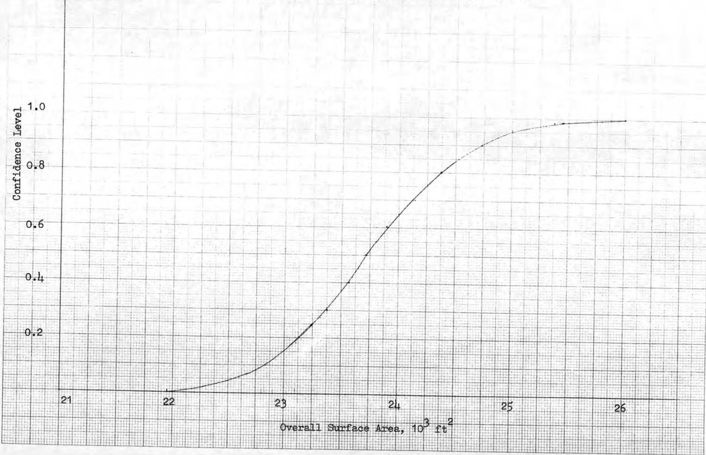  
Fig. 4.2 Overall Surface Area of Steam Generator vs. Confidence Level   
Flow Rate of Salt and Steam/Water are held constant

Mean 23762 ft²

Standard deviation 779

Table 4.2 Summary Statistics for Overall Surface Area of Steam Generator Each Flow Rate of Salt and Steam/Water entering Unit is Changed   

<table><tr><td>Confidence Level</td><td>0.0</td><td>0.10</td><td>0.20</td><td>0.30</td><td>0.40</td><td>0.50</td><td>0.60</td><td>0.70</td><td>0.80</td><td>0.90</td><td>1.00</td></tr><tr><td>Surface 2 Area, ft2</td><td>21,779</td><td>22,789</td><td>23,089</td><td>23,341</td><td>23,568</td><td>23,760</td><td>23,930</td><td>24,147</td><td>24,432</td><td>24,779</td><td>26,611</td></tr></table>

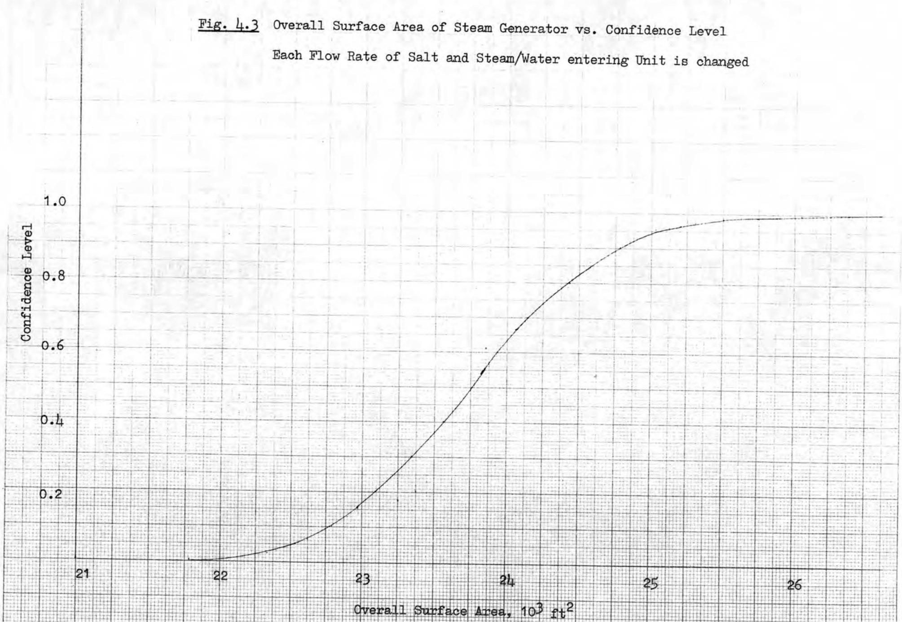  
E-L-7 00Vd

NUCLEAR DEPARTMENT

LIVINGSTON, N. J.

CHARGE NO. 8-25-2431

DOCUMENT NO. ND/71/66

ISSUE 1

DATE 12/16/74

properties.

This detailed performance analysis established the heat transfer surface requirement and pressure drops at full load operating conditions, in accordance with the design criteria (section 4.1.2).

The pressure drops at entrances, exits, tube support plates and vibration suppressors have minor effects on the thermal performance of the steam generator. Temperature and pressure profiles as a function of position in the steam generator for steady state operation at full load are shown in Figures 4.4 to 4.6. The results of the thermal/hydraulic analysis of basic design at full load conditions are also summarized below:

<table><tr><td></td><td>Salt</td><td>Water/Steam</td></tr><tr><td>Inlet temperature, °F</td><td>1150</td><td>700</td></tr><tr><td>Outlet temperature, °F</td><td>850.6</td><td>1000</td></tr><tr><td>Inlet pressure, psia</td><td>235</td><td>3770.5</td></tr><tr><td>Outlet pressure, psia</td><td>296</td><td>3600</td></tr><tr><td>Flow rate, lb/hr</td><td>15.28 x 10^6</td><td>2.538 x 10^6</td></tr><tr><td>Mass velocity, lb/hr-ft²</td><td>3.363 x 10^6</td><td>1.999 x 10^6</td></tr><tr><td>Static pressure difference, psi</td><td>-61</td><td>+170.5</td></tr><tr><td>Total net pressure loss, psi</td><td>40.2</td><td>158.1</td></tr><tr><td>Thermal duty = 1.646 x 10^9 Btu/hr</td><td></td><td></td></tr></table>

The pressure drop calculations are presented in Section 4.2.

There are two vent nozzles positioned at each tubesheet-to-shell juncture to vent trapped gases. These vent nozzles will also assist in preventing the salt from freezing at the juncture of the cold leg. The low feedwater temperature of $700^{\circ}\mathrm{F}$ and stagnation of salt at the corner of cold leg are the possible causes of salt-freezing. For the basic design, the salt temperature at the outside tube surface in the active heat transfer region near the lower tubesheet is about $800^{\circ}\mathrm{F}$ at full load conditions and is higher than $800^{\circ}\mathrm{F}$ at part loads. In the stagnant (inactive)

<table><tr><td>BY</td><td>APPROVED</td><td>PAGE L-1</td></tr></table>

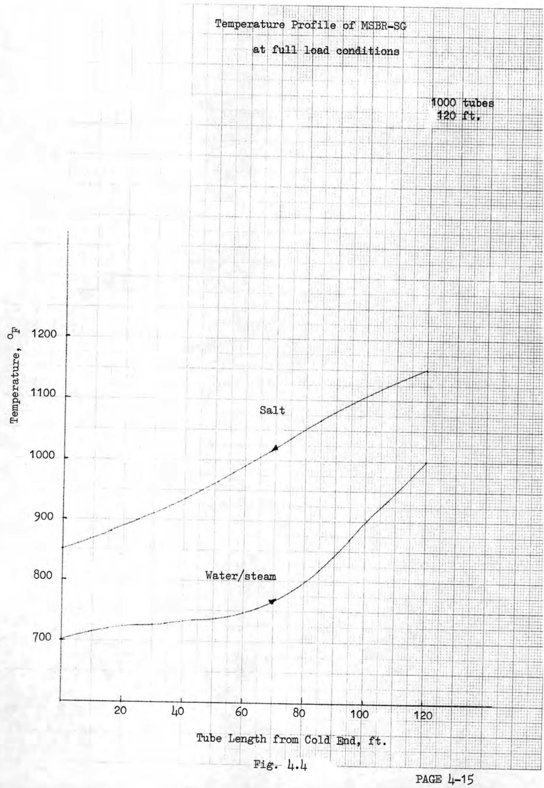

pressure profile of water/steam at full load conditions

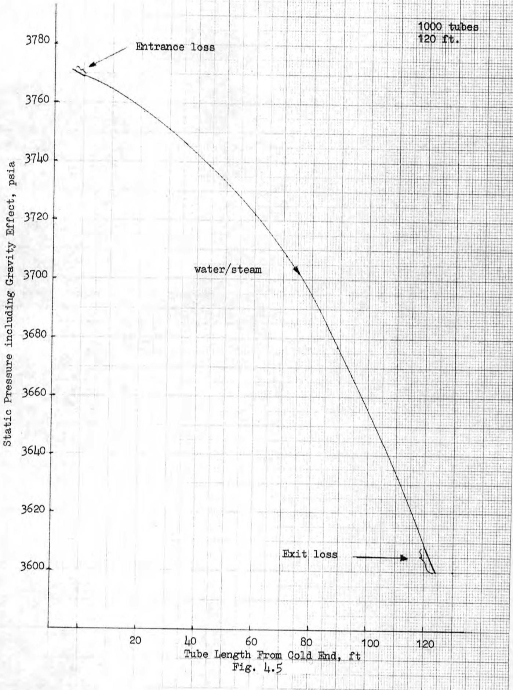

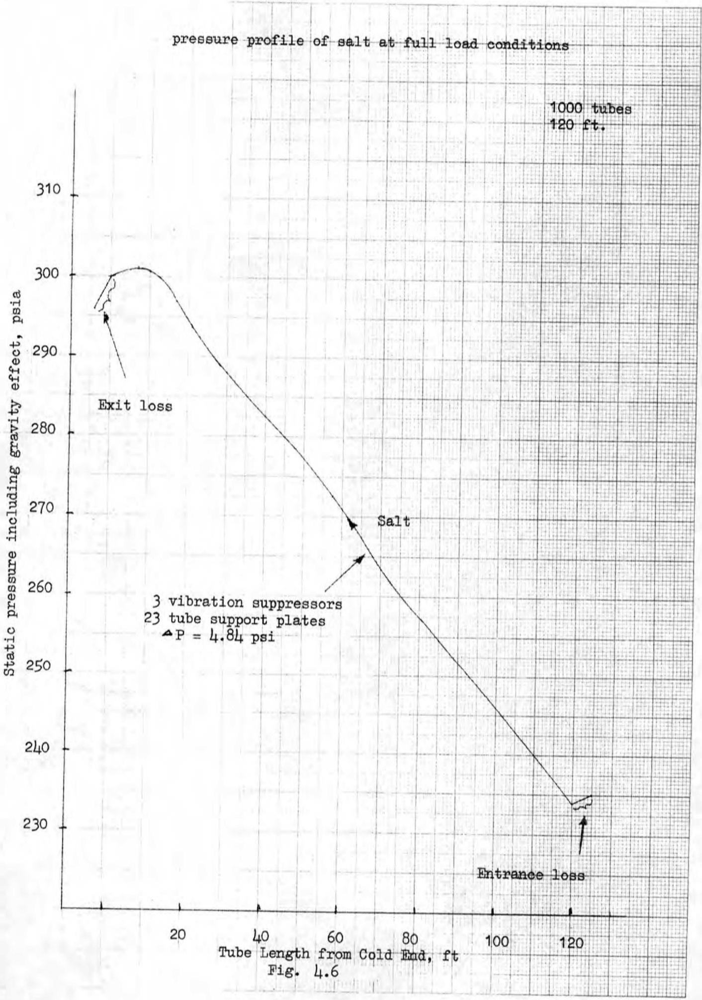

NUCLEAR DEPARTMENT

LIVINGSTON, N. J.

CHARGE NO. 8-25-2131

DOCUMENT NO. ND/74/66

ISSUE 1

DATE 12/16/74

region, the poor heat transfer coefficient on the salt side

might create a situation in which the salt-side tube wall temperature could be much higher.

temperature could be lowered below the salt freezing point of $725^{\circ}\mathrm{F}$ . However, the above passibility is

the fact that the steam generator call of the

building is maintained at temperature of $1000^{\circ}\mathrm{F}$ (Ref. 23 ) by external heat source . The salt at the

Juncture would absorb additional heat than the tubesheet-to-shell

from heated cell to the shell of stator

the salt temperature near the shell of steam generator. Therefore,

the salt freezing point of 725 $^\circ \mathrm{E}$ . The water

frequently vent out a small amount of cold to the

in motion (also for higher heat transfer coefficient : 1 ) :

of stagnant in this region. From the preceding , it

the unit will be free from a salt freezing problem.

Analysis was not undertaken of this problem in the present

but should be a part of future studies.

# 4.1.4 PART LOADPERFORMANCE

Partial load operation is defined as any condition between 20

and $100\%$ of full load thermal duty. The operation from zero

to $20\%$ load is designated as startup operation.

Two major limitations, of high priority, when the plant un

dergoes changes in load are: (a) turbine throttle temperature

to be held at 1000 F due to turbine limitations, and (b) the coolant salt temperature at $t_0$ .

sulfur salt temperature at steam generator outlet and fuelsalt temperature at reactor inlet to load the system

Temperature at reactor inlet to be held above the salt freezing points of 725 and $930^{\circ}\mathrm{F}$ , respectively, at all load. The prime fuel is:

The primary fuel salt system will operate at constant flow rate and constant temperature.

and constant reactor inlet temperature of $1050^{\circ}\mathrm{F}$ , with the re

actor outlet temperature controlled as a function of load . It was found that variati

was found that variation of secondary coolant salt flow would be necessary to maintain the

to necessarily to maintain the fuel salt reactor inlet temperature ,sufficiently above its freestanding

sufficiently above its freezing point during part load operations . If the coolant salt does not

reduced coolant salt flow rate would be

temperature at the steam generator outlet .

The danger of being lower than freezing point (Ref. 10). However,

If the reduction of the coolant salt flow is less than the reductiOn of load (percentor) ,

duction of load (percentagewise), there is a chance that the steam outlet temperature right now is

This indicates the difficulties of

indicates the difficulties of control during the part load operations.

FOSTER WHEELER ENERGY CORPORATION   

<table><tr><td>APPROVED</td><td>PAGE 4-19</td></tr></table>

NUCLEAR DEPARTMENT

LIVINGSTON, N. J.

CHARGE NO. 8-25-2431

DOCUMENT NO. ND/74/66

ISSUE

1 DATE

12/16/74

arrangement allows the superheaters to be designed with lower alloy steels and lower metal temperatures. Also, this arrangement provides rapid steam temperature control over a wide load range since the steam travel time between point of spraying and point where the temperature is being controlled (the other side of a stage of superheat) is small.

With the present reference design, there are two possible locations for a spray attemporator; (1) at the inlet of the steam generator and (2) at the outlet of the steam generator placing an attemporator at the inlet of the steam generator is not recommended because it would increase the probability of salt freezing at the cold end of the steam generator where the higher pressure (above 3800 psi), colder (below $700^{\circ}\mathrm{F}$ ) water would result.

Locating a spray attemporator at the outlet of the steam generator is quite practical. The inlet feedwater can then be used as a source of spray water with proper pressure head and temperature for this application. The calculations using this approach that are reported herein indicate that the spray flow quantities that would be required over the load range are reasonable and in line with values required on fossil fired steam generator.

It is noted that the change of moisture carry-over to the turbine that could damage the high pressure stages does not exist because of high steam temperatures (1000°F and above) and supercritical pressures (above 3600 psi). Another factor aiding this situation is the long length of piping that will undoubtedly be required between the steam generators and the turbine.

# 4.1.4.2 METHOD 2

Partial decoupling of the secondary coolant salt loop from the primary fuel salt loop could be accomplished by short-circuiting a fraction of the coolant salt around the primary heat exchanger. This would require a throttling device which is not presently developed. The present steam generator design is not based on this scheme, however, this method would provide useful information for control study.

In this study, the steam inlet and outlet temperatures were held constant at 700 and $1000^{\circ}\mathrm{F}$ , respectively, during part load operations for which steam flow rate changes linearly with load. The salt flow rate and salt inlet temperature which would maintain the salt outlet temperature at $850^{\circ}\mathrm{F} \pm 15^{\circ}$ were to be determined.

<table><tr><td colspan="5"></td></tr><tr><td colspan="2">CHARGE NO.8-25-2431</td><td>DOCUMENT NO. ND/74/66</td><td>ISSUE 1</td><td>DATE 12/16/74</td></tr><tr><td colspan="5">Table 4.3 Coolant Salt Temperatures and Coolant Salt flow with Varying load.</td></tr><tr><td>Load, %</td><td>Flow, %</td><td>Salt inlet Temperature, °F</td><td colspan="2">Salt outlet Temperature, °F</td></tr><tr><td>100</td><td>100.00</td><td>1150</td><td colspan="2">850</td></tr><tr><td>90</td><td>91.25</td><td>1147</td><td colspan="2">851</td></tr><tr><td>80</td><td>82.50</td><td>1144</td><td colspan="2">853</td></tr><tr><td>70</td><td>73.75</td><td>1139</td><td colspan="2">855</td></tr><tr><td>60</td><td>65.00</td><td>1134</td><td colspan="2">857</td></tr><tr><td>50</td><td>56.25</td><td>1127</td><td colspan="2">860</td></tr><tr><td>40</td><td>47.50</td><td>1117</td><td colspan="2">865</td></tr><tr><td>30</td><td>38.75</td><td>1106</td><td colspan="2">874</td></tr><tr><td>20</td><td>30.00</td><td>1091</td><td colspan="2">891</td></tr><tr><td colspan="5">Base on ORNL Reference Design Heat Exchanger and operation of the fuel salt system at constant reactor inlet temperature of 1050°F.</td></tr><tr><td>BY</td><td colspan="2">APPROVED</td><td colspan="2">PAGE 4-21</td></tr></table>

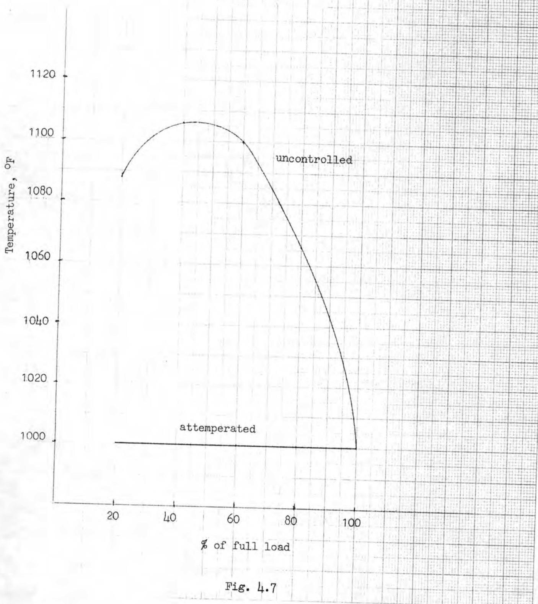

Percent of feedwater introduced through attemperator (over total steam entering turbine)

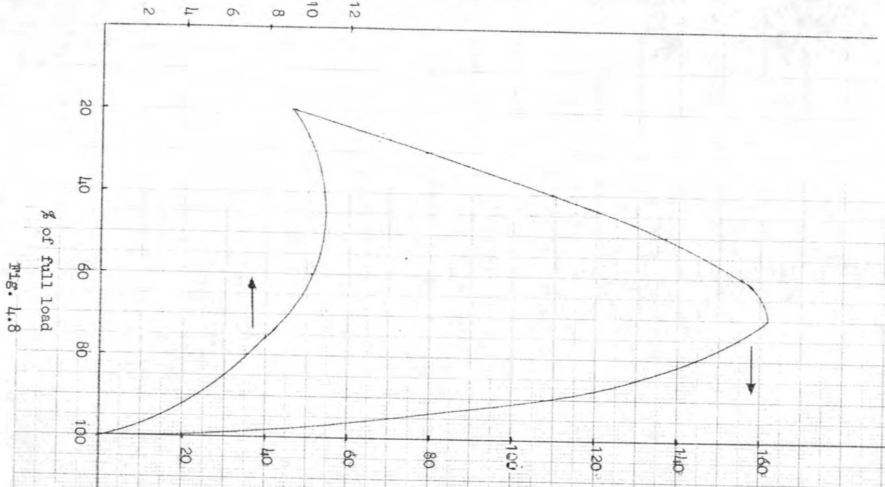  
peoI tueoeed shsraMolj Jotaeedwette Jo tounow

E2-7 45Vd

Amount of feedwater introduced through attemperator, $\times 10^{-3}$ lb/hr

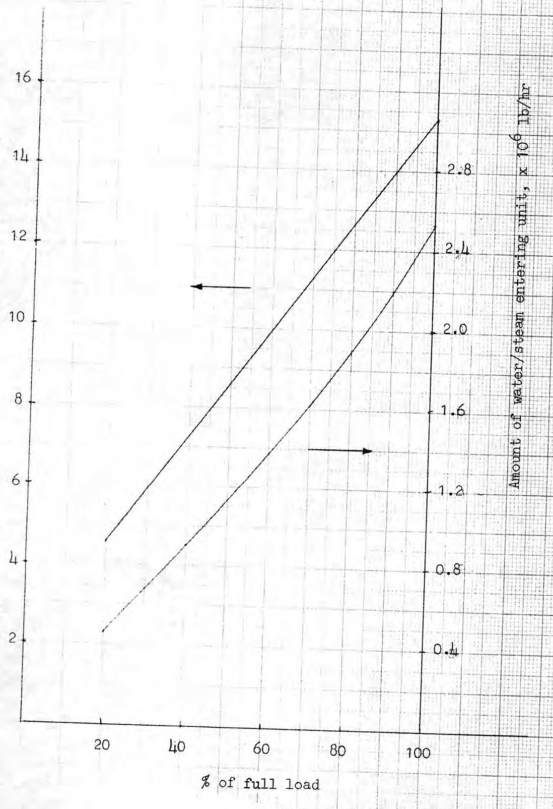  
Amount of coolant salt entering unit, in $10^{6}$ lb/hr   
Fig. 4.9

Temperature profiles of salt and water/steam

at 80, $60\%$ of rated load

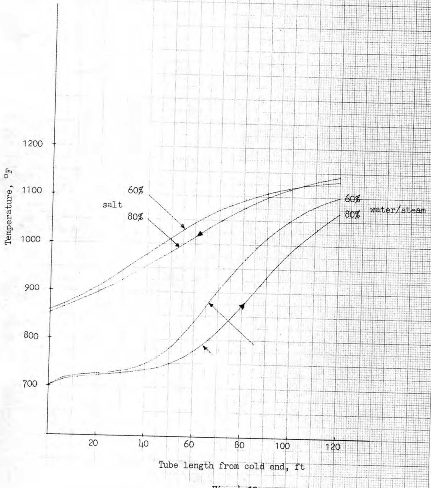  
Fig. 4.10

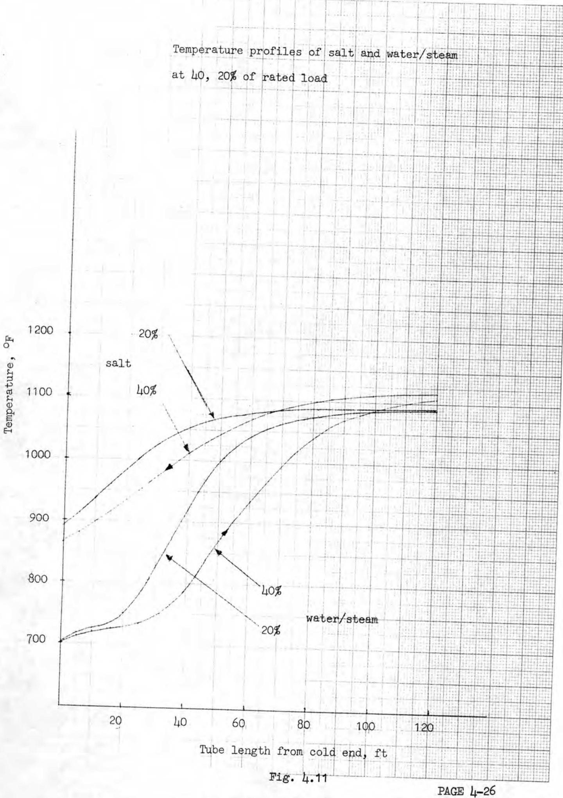

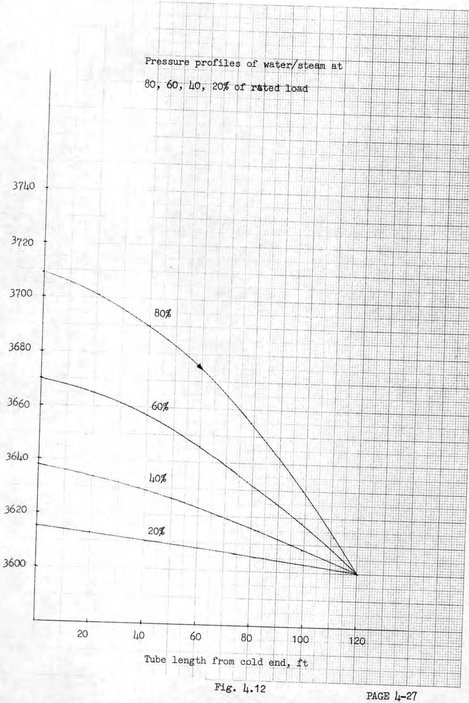

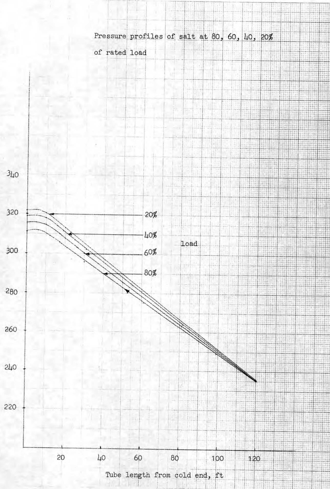  
Static pressure including gravity effects, psia   
Fig. 4.13

NUCLEAR DEPARTMENT

LIVINGSTON, N. J.

CHARGE NO. 8-25-2431

DOCUMENT NO. ND/74/66

ISSUE

1

DATE

12/16/74

Therefore, for each salt outlet temperature of 835, 850, $865^{\circ}\mathbf{F}$ , throughout the range of 20 to $110\%$ of rated load.

The results are summarized in Table 4.4 and plotted in Fig. 4.14 and Fig. 4.15. The constant salt inlet temperature lines pre- tended in Fig. 4.15 were generated from Table 4.4 by using a third order interpolation routine to provide valuable overall part load range of about $64$ to $97\%$ , with coolant salt inlet more than $1040$ to $1140^{\circ}\mathrm{F}$ , the steam generator would demand coolant salt outlet temperature above its full load value of $850^{\circ}\mathrm{F}$ . Therefore this method does not appear to be attractive from a control standpoint.

# 4.2 PRESSURE DROP CALCULATIONS

The performance computer program used in sizing the steam generator basic design surface requirement also calculated the shell and tube side pressure drops between two tubesheets, which included the effects of elevation head and velocity head, and head losses due to friction and fluid acceleration. The pressure drops between inlet/outlet nozzles, tube support plates and the active heat transfer region were added to estimate the nozzle-to-nozzle overall pressure differences for both shell and tube side fluids.

# 4.2.1 STEAM/WATER SIDE PRESSURE DROP

The absolute roughness, 0.00006 ft, and minimum inside diameter of tube, 0.4825", were used for tube side pressure drop calculation. Since the flow is in turbulent region (Re = 1.9 x 10⁷ to 1.0 x 10⁶), the friction factor was calculated by the Colebrook-White semiempirical formula (Ref. 11) which is expressed as:

$$
\frac {1}{\sqrt {f}} + 2 \log \left(\frac {k _ {s}}{D}\right) = 1. 1 4 - 2 \log (1 + 9. 3 5 \frac {D}{\operatorname {R e} \sqrt {f} K _ {s}})
$$

where f: friction factor

Ks: absolute roughness, ft

D: inside diameter of tube, ft

Re: Reynold number

FOSTER WHEELER ENERGY CORPORATION   

<table><tr><td colspan="2">CHARGE NO. 8-25-2431</td><td>DOCUMENT NO. ND/74/66</td><td>ISSUE 1</td><td>DATE 12/16/74</td></tr><tr><td colspan="5">Table 4.4 Part Load Performance - Method II
Salt Flow Rate and Salt Inlet Temperature</td></tr><tr><td>Salt Outlet
Temperature, °F</td><td>Salt Inlet
Temperature °F</td><td colspan="2">Salt Flow
Rate, %</td><td>Load, %</td></tr><tr><td rowspan="9">835°F</td><td>1001.8</td><td colspan="2">35.60</td><td>19.81</td></tr><tr><td>1005.9</td><td colspan="2">52.18</td><td>29.74</td></tr><tr><td>1013.8</td><td colspan="2">66.58</td><td>39.68</td></tr><tr><td>1026.3</td><td colspan="2">77.84</td><td>49.64</td></tr><tr><td>1045.2</td><td colspan="2">85.08</td><td>59.63</td></tr><tr><td>1071.0</td><td colspan="2">88.55</td><td>69.64</td></tr><tr><td>1104.1</td><td colspan="2">88.83</td><td>79.67</td></tr><tr><td>1145.6</td><td colspan="2">86.69</td><td>89.72</td></tr><tr><td>1193.2</td><td colspan="2">83.55</td><td>99.78</td></tr><tr><td rowspan="9">850°F</td><td>1001.3</td><td colspan="2">39.28</td><td>19.81</td></tr><tr><td>1004.2</td><td colspan="2">57.86</td><td>29.74</td></tr><tr><td>1009.7</td><td colspan="2">74.51</td><td>39.68</td></tr><tr><td>1019.1</td><td colspan="2">88.00</td><td>49.64</td></tr><tr><td>1033.3</td><td colspan="2">97.57</td><td>59.64</td></tr><tr><td>1053.3</td><td colspan="2">102.64</td><td>69.64</td></tr><tr><td>1079.8</td><td colspan="2">104.02</td><td>79.68</td></tr><tr><td>1113.0</td><td colspan="2">102.39</td><td>89.74</td></tr><tr><td>1152.6</td><td colspan="2">98.91</td><td>99.81</td></tr><tr><td rowspan="10">865°F</td><td>1000.9</td><td colspan="2">43.74</td><td>19.81</td></tr><tr><td>1002.9</td><td colspan="2">64.69</td><td>29.74</td></tr><tr><td>1007.0</td><td colspan="2">83.85</td><td>39.69</td></tr><tr><td>1014.1</td><td colspan="2">99.92</td><td>49.65</td></tr><tr><td>1025.0</td><td colspan="2">111.87</td><td>59.65</td></tr><tr><td>1040.5</td><td colspan="2">119.04</td><td>69.66</td></tr><tr><td>1061.6</td><td colspan="2">121.62</td><td>79.70</td></tr><tr><td>1088.4</td><td colspan="2">120.50</td><td>89.76</td></tr><tr><td>1121.5</td><td colspan="2">116.77</td><td>99.85</td></tr><tr><td>1160.2</td><td colspan="2">111.75</td><td>109.97</td></tr><tr><td colspan="5">Steam inlet temp. = 700°F</td></tr><tr><td colspan="5">Steam outlet temp. = 1000°F</td></tr><tr><td colspan="5">Steam flow rate = changes linearly with load</td></tr></table>

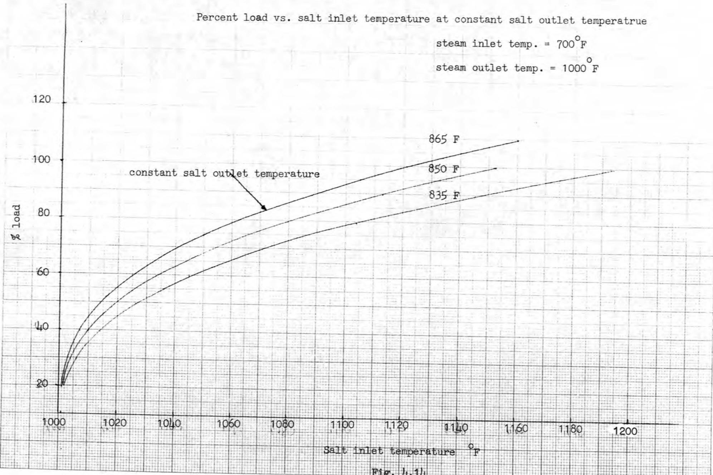

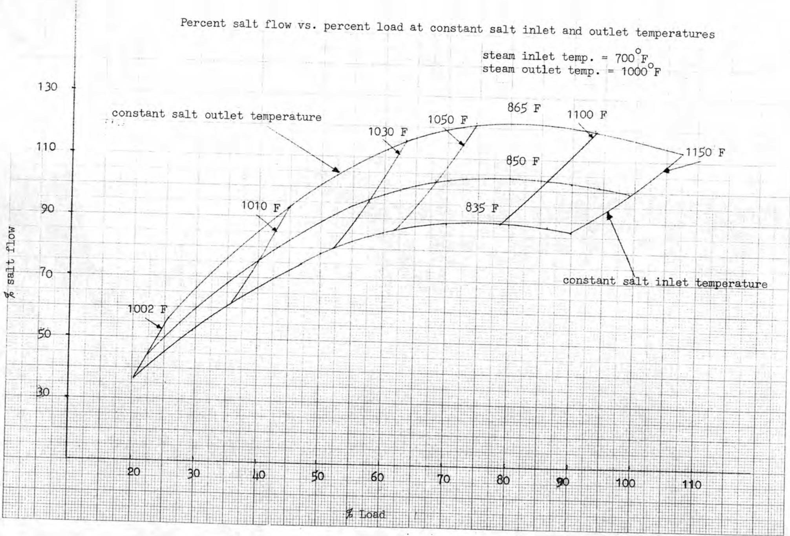

NUCLEAR DEPARTMENT

LIVINGSTON, N. J.

CHARGE NO. 8-25-2431

DOCUMENT NO. ND/74/66

ISSUE 1

DATE 12/16/74

The pressure losses occurred between the inlet nozzle and the lower tubesheet, and between the upper tubesheet and the exit nozzle were calculated per FWEC fluid flow formulas (Ref. 12). The results are summarized in Table 4.5, with hand calculation attached in Appendix B. Pressure profiles of steam generator at full and part loads are also presented in Section 4.1.4.

# 4.2.2 SALT SIDE PRESSURE DROP

There are 23 tube support plates in vertical and horizontal portions, three vibration suppressors in bend region, one shroud in inlet region and four shrouds in outlet region. The pressure drops occurred at nozzles, shrouds, tube support plates and vibration suppressors were hand-calculated per FWEC Standard Manual (Ref. 12). These values were added to the pressure drops calculated by the active heat transfer region performance code. The results are summarized in Table 4.6. Hand-calculations are attached in Appendix B.

The Colebrook-White formula was used for friction factor calculation. Unit pressure profiles in shell side are shown in Section 4.1.3 and 4.1.4.

# 4.3 STABILITY

Historically, the early studies of flow instability were developed from operational difficulties with fossil-fired boilers. A number of boiler-tube failures and thermal performance degradation were attributed to water/steam flow instability. Units designed in supercritical pressure region also suffered the same problem as well as in the subcritical region.

In boiling systems, fluctuations are always present because of variations of the rate of bubble formation and population, of flow regimes, of the heat transfer coefficient, etc. Consequently these fluctuations may induce the flow instabilities. In the supercritical region, rapid changes of thermophysical properties are observed in the vicinity of the critical point. The propagations of variations of properties, in particular of the density and of the enthalpy, through the system introduce time and space lags of transformation which under certain conditions can cause unstable flow.

Two major classifications of unstable phenomena are defined as static and dynamic instabilities. Both of them could be analyzed by conservation equations of mass, momentum, energy and the

<table><tr><td rowspan="2">BY</td><td colspan="8">Table 4.5 Steam-side Pressure and pressure drops</td><td rowspan="2">CHARGE NO.
8-25-2131</td></tr><tr><td>Load</td><td>Entrance
P. psia</td><td>△P at nozzle,
tubesheet,
psi</td><td>P. leaving
tubesheet,
psia</td><td>△P between
tubesheets,
psi</td><td>P. entering
tubesheet,
psia</td><td>△P at nozzle,
tubesheet,
psi</td><td>Exit
P. psia</td></tr><tr><td rowspan="6">APPROVED</td><td>100</td><td>3770.5</td><td>1.6</td><td>3768.9</td><td>160</td><td>3608.9</td><td>8.9</td><td>3600</td><td rowspan="5">DOCUMENT
NO. N/D/16/66</td></tr><tr><td>80</td><td>3715.5</td><td>1.1</td><td>3714.4</td><td>109</td><td>3605.4</td><td>5.4</td><td>3600</td></tr><tr><td>60</td><td>3673.7</td><td>0.6</td><td>3673.1</td><td>70</td><td>3603.1</td><td>3.1</td><td>3600</td></tr><tr><td>40</td><td>3639.7</td><td>0.3</td><td>3639.4</td><td>38</td><td>3601.4</td><td>1.4</td><td>3600</td></tr><tr><td>20</td><td>3615.5</td><td>0.1</td><td>3615.4</td><td>15</td><td>3600.4</td><td>0.4</td><td>3600</td></tr><tr><td colspan="9"></td></tr></table>

5

APPROVED

月

F 53

Table 4.6 Salt-side pressure and pressure drops   

<table><tr><td>Load</td><td>Entrance P. psia</td><td>△P at nozzle, shroud, psi</td><td>P entering tube bundle, psi</td><td>△P at tube support plates, psi</td><td>△P at tube bundle, psi</td><td>P leaving tube bundle, psia</td><td>△P at shroud, nozzle, psi</td><td>Exit P psia</td></tr><tr><td>100</td><td>235</td><td>1.1</td><td>233.9</td><td>4.8</td><td>-70.8</td><td>299.9</td><td>3.8</td><td>296.1</td></tr><tr><td>80</td><td>235</td><td>0.7</td><td>234.3</td><td>3.3</td><td>-76.2</td><td>307.2</td><td>2.4</td><td>304.8</td></tr><tr><td>60</td><td>235</td><td>0.5</td><td>234.5</td><td>2.1</td><td>-80.4</td><td>312.9</td><td>1.4</td><td>311.5</td></tr><tr><td>40</td><td>235</td><td>0.3</td><td>234.7</td><td>1.1</td><td>-84</td><td>317.6</td><td>0.6</td><td>317.0</td></tr><tr><td>20</td><td>235</td><td>0.1</td><td>234.9</td><td>0.4</td><td>-87</td><td>321.5</td><td>0.2</td><td>321.3</td></tr></table>

CHARGE NO.8-25-2137

NO. NO. 74/65

2

#

1

NUCLEAR DEPARTMENT

FOSTER WHEELER ENERGY CORPORATION

LIVINGSTON N. J

<table><tr><td colspan="5"></td></tr><tr><td colspan="2">CHARGE NO. 8-25-2431</td><td>DOCUMENT NO. ND/74/66</td><td>ISSUE 1</td><td>DATE 12/16/74</td></tr><tr><td colspan="5">proper equation of state. Static instability lies in the steady-state laws, while dynamic instability is time-variant phenomena.
Zuber (Ref. 13) described three mechanisms which could induce thermohydraulic oscillations at supercritical pressure. One is caused by the variation of the heat transfer coefficient at the pseudo critical point, which is defined as the point where Cp reaches its maximum value. The second is caused by the effects of large compressibility and the resultant low velocity of sound in the critical region. The third mechanism is caused by the large variation of flow brought about by density variations of the fluid during the heating process.
Both static and dynamic stabilities for the present steam generator are discussed in detail in the following sections.
4.3.1 STATIC STABILITY
4.3.1.1 INTRODUCTION
Static instability is an amplification of steady state disturbances which encompass tube circuit configuration, heating imbalances, flow rate perturbations, etc. The static instability of primary design importance in steam generators is the excursive instability, which at supercritical pressure, is the equivalent of the &quot;Ledinegg&quot; excursive instability in boiling steam at subcritical pressures. A flow is subjected to a static instability when the flow conditions, changed by a small perturbation, will not return to original steady state conditions (Ref 17).
The significance of the static stability is best analyzed by plotting the pressure drop-flow characteristic as schematically shown in Fig. 4.16. A system of many parallel heated tubes is considered with attention focused on only one tube where various levels of heat input are allowed. The quantity of heat input depends qualitatively on the situation of heating medium distribution among the heated tubes. Demand curves Q1, Q2, and Q3 denote increased levels of heating medium quantity surrounding the concerned heated tube. A constant inlet-to-outlet pressure difference is imposed as indicated by the horizontal line H. Intersections with curve Q1 showing the possible operating points for a constant pressure drop supply system (or any pump characteristics) are indicated by C, D or E. Operation at point D or E will be stable whereas that at point C will be unstable. For example, if at point</td></tr><tr><td>BY</td><td colspan="3">APPROVED</td><td>PAGE 4-36</td></tr></table>

<table><tr><td colspan="4"></td></tr><tr><td>CHARGE NO. 8-25-2431</td><td>DOCUMENT NO. ND/74/66</td><td>ISSUE 1</td><td>DATE 12/16/74</td></tr><tr><td colspan="4">either D or E the flow is perturbed to increase (decrease), the pressure drop of the heated tube increases (decreases), i.e., the demand of the system is larger (less) than the external supply, and consequently the flow will return to its original value. However, if the flow is perturbed to increase (decrease) at point C, the external system supplies more (less) than that required to maintain the flow. Consequently the flow rate will increase (decrease) until the new operating point E (D) is reached. Therefore, the shape of curve Q1, especially at point C, as shown in Fig. 4.6 should be avoided to insure static stability within the possible range of load operations (Ref. 21). Figure 4.16 also explains the sensitivity of flow maldistribution in the same system. For the sake of argument, assume the operating point is at E. With an increase in heating medium flow around the local tube to Q2, the flow decreases monotonically to point A. Pur-turbations in any of the system variables can cause a flow excursion or rapid deceleration to a stable point B. Further increase in heating medium surrounding the tube to Q3 results in operation at point F. Therefore, the heating imbalance among circuits will induce flow maldistribution in a system of many parallel heated tubes (Ref. 18). Another phenomenon which should be considered is the potential of flow reversal (Ref. 18). In a long, vertically-oriented unit, the large hydrostatic head of the steam column may lead to flow reversal. This can occur when the difference in hydraulic heads between two parallel downflow tubes exceeds the friction pressure drop. It has been recognized that a superheater with heated downcomers undergoes a potentially critical period during start-up, because at initial low flow the friction pressure drop may be less than the hydrostatic head (Ref. 20). However, the static head can be an important factor in stabilizing upward flow.</td></tr><tr><td colspan="4">4.3.1.2 ANALYSIS METHODFor a constant pressure drop supply system, the preceding introduction leads to the statement that the operating point is stable if the derivative of the pressure drop - flowrate curve is positive. The mathematical form is (Ref. 22)</td></tr><tr><td colspan="4">where W = flow rate lb/hr.P = pressure drop psi</td></tr></table>

NUCLEAR DEPARTMENT

LIVINGSTON, N. J.

CHARGE NO. 8-25-2431

DOCUMENT NO. ND/74/66

ISSUE

1 DATE 12/16/74

This criterion for the flow excursion stability is well known and the prediction techniques have been developed which are based on the solution of the steady-state conservation equations for mass, momentum, energy and the equation of state.

The static stability aspect of the reference design steam generator was analyzed for conditions at 100, 60 and $20\%$ load. At each load, the water/steam and molten salt inlet conditions were kept constant and the flow rate of water/steam was perturbed. The effect of flow maldistribution of molten salt, resulting in the variations of the heat input to the individual tube, was also considered. This investigated the flow sensitivity of water/steam flow maldistribution in a system of parallel heated tubes. The thermal hydraulic performance computer code and the "Steam and Water Pressure Drop Computer Program" (Ref. 14) were used to generate pressure drop-flow characteristics for each load. The potential of flow reversal was also examined. For the calculations of part-load conditions, Method 1 of Section 4.1.4.1 was applied.

# 4.3.1.3 RESULTS AND DISCUSSION

The results of static stability analysis are presented in Figures 4.17 to 4.20. Used in these figures is the relative flow rate which is the ratio of flow rate under perturbation to that at normal operating condition of a specified load. Curve Q denotes the condition of molten salt surrounding a local tube under the normal flow distribution condition, and curves Q+ and Q- denote the 110% and 90% of the normal molten salt distribution surrounding the tube under consideration respectively. Pressure drop was defined by calculating the pressure difference from normal water/steam inlet (bottom) to outlet (top) plenum's regardless of the flow direction. Fig. 4.20 is a continuation of Fig. 4.19, (20% load) to show the peak AP of 0.58 psi for the curve Q- of the reverse flow.

# 4.3.1.4 CONCLUSIONS

Based on the comparison of results with criteria of inception of static instability, the analysis leads to the conclusion that the reference design steam generator is statically stable.

NUCLEAR DEPARTMENT

LIVINGSTON, N. J.

<table><tr><td>CHARGE NO. 8-25-2431</td><td>DOCUMENT NO. ND/74/66</td><td>ISSUE 1</td><td>DATE 12/16/74</td></tr><tr><td colspan="4">The static stability is insured for the slopes of all the
curves are positive (δΔP/δW&gt;0). These curves also
indicate the unit is insensitive to the flow maldistribution
among the parallel circuits. The onset of flow reversal is
limited to very small pressure difference of 0.58 psi (Fig.
4.20). This possibility may not exist due to the fact that
the external pressure supply system is expected to prac-
tically always be operating at a much higher range.</td></tr><tr><td colspan="4">4.3.2 DYNAMIC STABILITY
The dynamic stability work was performed by Gulf General Atomic
in 1972 under a contract to FwC. The GGA report Ref (15) in
its original form is presented in the Appendix B for further
reference. An abstract of the GGA report is presented here.</td></tr><tr><td colspan="4">4.3.2.1 INTRODUCTION
Dynamic instability encompasses the possibility of small
density perturbations in the steam producing sustained and
growing disturbances within the steam generator. In this
regard, density wave perturbations are analogous to the
velocity perturbations in incompressible flow which can
give rise to sustained flow disturbances and eventually
produce a transition from laminar to turbulent flow. Since
the compressible flow of the steam is already turbulent,
unstable density wave perturbations will not lead to a flow
transition but will lead to other undesirable effects such
as mechanical vibration or thermal cycling of the tubes.
Because the perturbations and possible instabilities are
time variant phenomena, the instability is classified as
dynamic as opposed to static instability.</td></tr><tr><td colspan="4">4.3.2.2 ANALYSIS METHOD
The steam generator for the Molten-Salt Breeder Reactor has
been analyzed at approximately 100, 80, 60, 40 and 20 per-
cent of the rated load.
For this investigation an existing code, DYNAM, was modified
to permit analysis of the dynamic stability characteristics
in the supercritical region. The DYNAM code is based on a
method in which the governing equations are derived from
conservation principles for mass, momentum, and energy.
These time-dependent equations, simplified by considering
a single spatial coordinate along the tube axis, are</td></tr></table>

AP

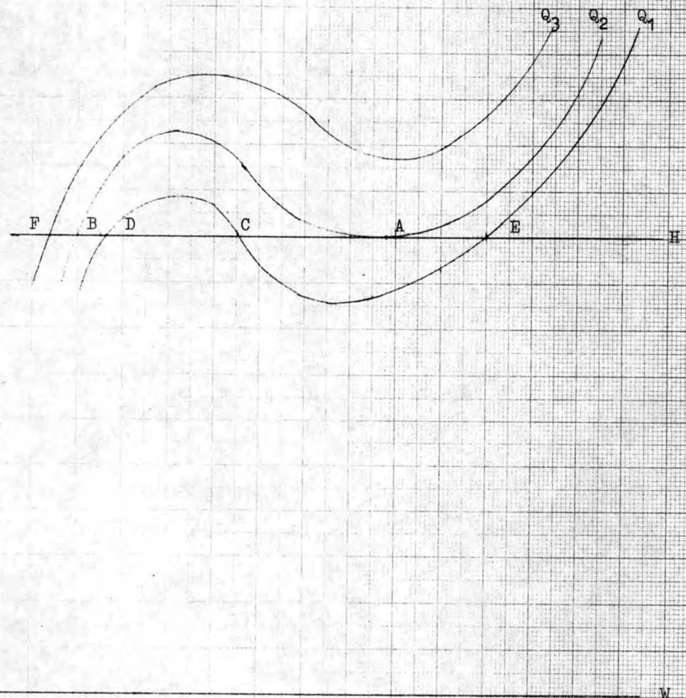  
Fig. 4.16 Pressure-Drop Flow Characteristic

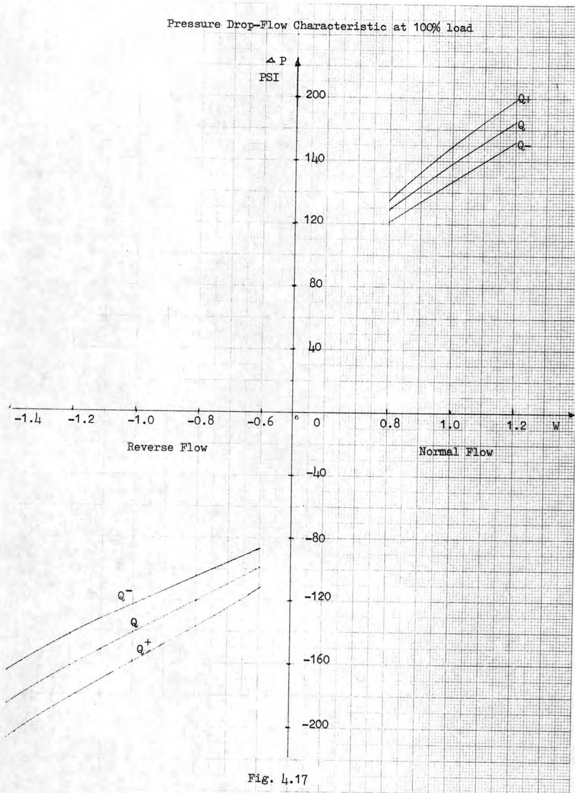  
PAGE L-41

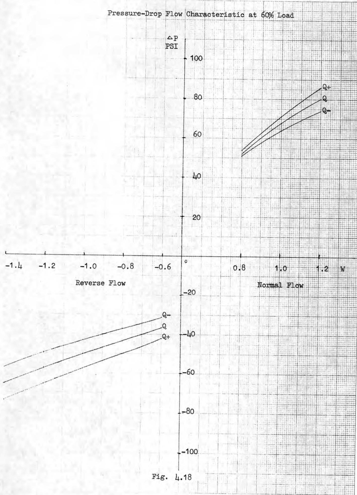

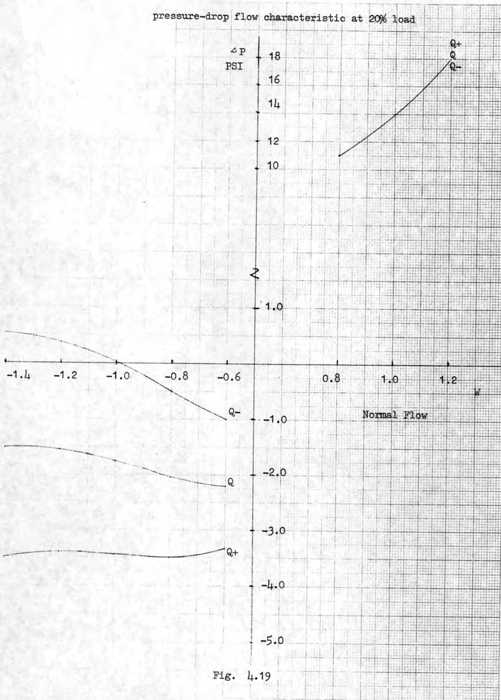

Continuation of Fig. 4.3.IV

#

PSI

3.0   
2.0   
1.0

-0.6

Reverse Flow

Fig. 4.20

NUCLEAR DEPARTMENT

LIVINGSTON, N. J.

FOSTER WHEELER ENERGY CORPORATION   

<table><tr><td colspan="4"></td></tr><tr><td>CHARGE NO. 8-25-2431</td><td>DOCUMENT NO. ND/74/66</td><td>ISSUE 1</td><td>DATE 12/16/74</td></tr><tr><td colspan="4">linearized, Laplace-transformed, and integrated over small spatial increments. The resultant linear perturbation equations are examined within the framework of feedback control theory to determine if the design is stable or unstable. Specifically, the Nyquist stability criterion has been used to predict the stability characteristics of the steam generator. The steps in this procedure were discussed fully in GGA report (Ref. 15).</td></tr><tr><td colspan="4">4.3.2.3 CONCLUSIONS AND RECOMMENDATIONS
The results of the GGA report indicate that the system is highly stable and will not amplify naturally occurring small scale perturbations. Analyses of the effects of inlet orificing, exit orificing, and pressure level indicate trends opposite to those observed in subcritical, two-phase systems. Stability is enhanced for this supercritical flow by increasing exit orificing, reducing system pressures toward the critical pressure, reducing flow rates and reducing heating rates. By comparison the stability of subcritical two-phase flows is enhances by increasing inlet orificing and increasing system pressures.
The results of the analysis tend to agree with the idea that stability can be qualitatively checked by considering the density ratio between the inlet and the outlet conditions as a function of the system pressure. In the supercritical region, an increasing density ratio with pressure tends toward instability and a decreasing density ratio toward stability. Below the critical point, the ratio of the density of saturated water at the inlet to the density of the saturated or super-heated steam at the outlet decreases with increasing pressure toward the critical point. Above the critical point, the ratio of the density of the supercritical steam at the inlet to the density of supercritical steam at the outlet increases with increasing pressure for a constant heat input. Hence the opposite trend of the effect of pressure on stability above and below the critical point is not surprising. Similar arguments can be made for the effects of other parameters by considering their effect upon the density ratio. Quantitatively, systems with density ratios less than 50, which correspond to the pressures greater than 600 psia for water (Ref. 16), are generally stable. In the present case, the density ratio is much lower than 50 and the system is highly stable.</td></tr></table>

FOSTER WHEELER ENERGY CORPORATION   

<table><tr><td colspan="5"></td></tr><tr><td colspan="2">CHARGE NO. 8-25-2431</td><td>DOCUMENT NO. ND/74/66</td><td>ISSUE 1</td><td>DATE 12/16/74</td></tr><tr><td colspan="5">Although both the quantitative analysis and the qualitative discussion indicate that the system is highly stable, it must be pointed out that experimental tests are required to confirm the system behavior. Test data are available on the behavior of subcritical systems, however data on supercritical systems are quite limited. It is recommended that tests in the supercritical region be performed in order to confirm the stability of the system as determined by the analysis.</td></tr><tr><td colspan="5">4.4 SYSTEMS RELATED TO STEAM GENERATOR</td></tr><tr><td colspan="5">4.4.1 START-UP SYSTEM AND WATER CHEMISTRY</td></tr><tr><td colspan="5">4.4.1.1 START-UP SYSTEM</td></tr><tr><td colspan="5">The freezing temperatures of the fuel and coolant salts are 930°F and 725°F respectively (Ref. 23). The start-up system must therefore provide for the initial coupling of the steam generator to the steam power system without freezing of salt and with a minimum imposition of thermal shock. The salt systems must be filled and circulating isothermally at 1000°F before heat withdrawal can be initiated by decreasing the coolant salt temperature. The temperature of the feedwater must reach 1000°F utilizing a startup boiling before entering the steam generator, and then it will vary between 1000°F at zero load and 700°F in the 5 to 100% load. The 5% initial load operation requires a startup boiler of some 225,000 lb/hr steam capacity and a further increase to a 10% initial load as presently envisioned by ORNL would require a 450,000 lb/hr capacity boiler (Ref. 24).</td></tr><tr><td colspan="5">Additional equipment is necessary to provide the feedwater conditions for starting, hot standby, and shutdown. This includes an auxiliary start-up boiler capable of producing 1000°F supercritical steam, an auxiliary boiler feedpump, a desuperheater and a steam dryer. The overall MSBR steam plant start-up and shutdown system is shown in Figure 4.21. The startup procedures for the salt and steam systems are outlined in the following sections.</td></tr><tr><td colspan="5">4.4.1.1.1 SALT SYSTEMS</td></tr><tr><td colspan="5">The primary and secondary cell electric heaters are turned on, and the primary and secondary circulation pumps are started to circulate helium in the salt systems. When the temperature of the secondary system reaches 850°F, the loop</td></tr></table>

NUCLEAR DEPARTMENT

LIVINGSTON, N. J.

<table><tr><td>Y</td><td>APPROVED</td><td>PAGE 4-47</td></tr><tr><td></td><td></td><td></td></tr></table>

NUCLEAR DEPARTMENT

LIVINGSTON, N. J.

<table><tr><td colspan="3">GENERATOR bypass flow is then decreased until the full auxiliary boiler flow passes through the steam generator.
When the steam system is ready to take on load, the control of reactor is adjusted as required to maintain the desire salt temperatures as the feedwater flow is increased. While the steam/water flow is being established in the steam generators, the temperature of the feedwater recirculaing to the condenser will be raised to 550°F at the discharge of the last high-pressure heater. The thermal load on the steam generator is then increased by lowering the feedwater inlet temperature from 1000°F to 700°F by mixing this feed-water from last heater and the 1000°F steam from the auxiliary boiler in the mixer. When the 700°F feedwater temperature is reached, the boiler feed booster pumps are started and the feedwater pressure to the steam generator is raised to about 3800 psia, which permits the use of the exit steam from the steam generator passing through reheat steam pre-heaters to heat the feedwater in the mixer instead of the auxiliary boiler. The auxiliary boiler system is then taken off line making the system self supporting.
The load is gradually increased and the reactor power is adjusted accordingly. At this point in the startup procedure, part of the steam generator output is going to the mixer via the reheat steam preheater, and the remaining steam is going through the boiler extraction valve (BE) to drive the main boiler feed pumps, etc. If the load is about 5%, the main turbines which have previously been warmed, can now be gradually brought up to speed and temperature, first using steam from the hot standby equipment (steam dryer). This steam will give a turbine valve opening equivalent to that at about 20% load with 3600 psia throttling conditions, so that the throttle pressure rise may occur without having to move the turbine control valves.
As the steam load is slowly increased, the reactor power is matched to the load, and salt temperatures are kept at the desired level. The load is held essentially constant until the system comes to equilibrium, at which point the reactor outlet temperature set point is adjusted to meet the requirements for subsequent load-following control.
As the load increases, the main turbines will use steam taken directly from the steam generator. The boiler-turbine valve (BTV), or a control-type bypass is gradually opened</td></tr><tr><td>BY</td><td>APPROVED</td><td>PAGE L-48</td></tr></table>

# FOSTER WHEELER ENERGY CORPORATION

NUCLEAR DEPARTMENT

LIVINGSTON, N. J.

<table><tr><td>CHARGE NO. 8-25-2431</td><td>DOCUMENT NO. ND/74/66</td><td>ISSUE 1</td><td>DATE 12/16/74</td></tr><tr><td colspan="4">while the feedwater flow is increased until, with a wide open boiler-turbine valve, the throttle pressure is 3600 psia and the load is about 20%. At this power level the normal control system regulates the reactor outlet temperature as a function of load, and the steam temperature controller holds the steam temperature at 1000°F.</td></tr><tr><td colspan="4">4.4.1.2 WATER CHEMISTRY
The steam power system of the MSBR plant will not require special water treatment. Aside from the steam generator, material of construction shall not differ from present-day fossil fueled supercritical cycles (Ref. 20) of startup boiler.
The recommended limits for feedwater conditions at the economizer inlet are given in the following table for normal operating conditions and during start-up (Ref. 25).</td></tr><tr><td colspan="4">Normal Operation Start-up</td></tr><tr><td>Total dissolved solids - ppb</td><td>50</td><td>-</td><td></td></tr><tr><td>Total iron - ppb</td><td>7</td><td>50</td><td></td></tr><tr><td>Total copper - ppb</td><td>5</td><td>20</td><td></td></tr><tr><td>Total silica - ppb</td><td>20</td><td>30</td><td></td></tr><tr><td>Dissolved oxygen - ppb</td><td>5</td><td>10</td><td></td></tr><tr><td>pH</td><td>9.3 - 9.7</td><td>9.3 - 9.7</td><td></td></tr><tr><td>Conductivity - mmhos</td><td>0.5</td><td>1.0</td><td></td></tr><tr><td colspan="4">During the start-up period, there will be variations in the concentrations of the various feedwater contaminants due to changes in temperature and flow conditions and placing into service of cycle components. The feedwater conductivity must be below 1.0 mmho before lighting the burners of the startup boiler. Also after firing has started, the fluid temperature at the roof outlet of the startup boiler must not be permitted to rise above 500 F until the iron content of the feedwater entering the economizer is less than 50 ppb. The limits given in the above table for the startup conditions are for continuous operation. Transient values higher than those given in the table may be tolerated for a short</td></tr></table>

NUCLEAR DEPARTMENT

LIVINGSTON, N. J.

<table><tr><td colspan="4"></td></tr><tr><td>CHARGE NO. 8-25-2431</td><td>DOCUMENT NO. ND/74/66</td><td>ISSUE 1</td><td>DATE 12/16/74</td></tr><tr><td colspan="4">time only, and if they do not decrease, firing rate and temperature may have to be reduced until satisfactory values are obtained.
There are two basic approaches to keep the various constituents to the levels below which they will not cause problems.
a. Minimize the corrosion that takes place within the system: This is accomplished by removal of oxygen and maintaining the pH of the condensate at the spec-cified level. Oxygen is removed by chemical scaven-ging with hydrazine and mechanicaldeaeration in the condenser. A nominal hydrazine residual of 0.020 ppm is maintained at the economizer inlet. Feedwater pH is controlled by adding ammonia or a volatile amine such as morpholine or cyclohexylamine.
b. Remove corrosion products and leakage salts from the system: Corrosion products, silicon and salts from condenser leakage are removed by the full flow condensate demineralizer. Both ionized and suspended matter are removed as the unit acts as a highly eff-icient filter as well as an ion exchanger.
4.4.2 PRESSURE RELIEF SYSTEM
The steam generator was designed to the specifications of the ASME Boiler and Pressure Vessel Code Section III, Nuclear Vessels for class A vessels. The design conditions are:
(Ref. 26)</td></tr><tr><td></td><td>shell side</td><td colspan="2">tube side</td></tr><tr><td>Design temperature, °F</td><td>1150</td><td colspan="2">1120</td></tr><tr><td>Design pressure, psia</td><td>300</td><td colspan="2">3800</td></tr><tr><td>Allowable stress, psi</td><td>9500</td><td colspan="2">11600</td></tr><tr><td colspan="4">There is no violent exothermic reaction between the coolant salt and steam, however, the mixture of salt and water is corrosive to the material of steam generator (Hastelloy N) (Ref. 1).
The pressure relief system was designed to protect the steam generator and coolant salt system from the overpressure and</td></tr></table>

Fig. 4.21   
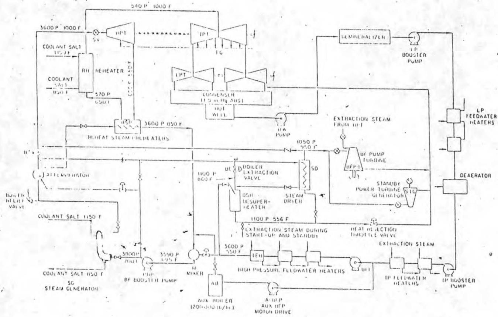  
MSBR steam plant startup and shutdown system.

Ref.(23)

CHARGE NO. 8-25-2431

DOCUMENT NO. ND/74/66

ISSUE 1

DATE 12/16/74

highly corrosive mixture, should steam tube suddenly rupture. It was assumed that the coolant salt system could withstand a continuous pressure of 220 psi without damage (Ref. 3).

The present ASME Code Section III, which governs because of emergency cooling consideration, accepts only relief valves as primary relief devices. However, the corrosive property of the mixture of salt and steam, requirement of rapid pressure relief, are against using relief valves as an appropriate primary relief device. A new subsection NH under Section III is in preparation for inclusion in the new edition of the Code which is expected to recognize rupture disks as primary relief devices for certain types of overpressure conditions (Ref. 27). The Molton-Salt steam generator would be listed as an over pressure condition to which the rupture disk or equivalent device is applicable.

There are three basic types of rupture disks; prebulged disk, reverse buckling assembly and the snap-over assembly. In addition, the rupture disk for the British PFR is a hinged plate supporting a nickel membrane, which serves as the sodium seal; the plate itself is held by a shear pin, designed to fail approximately twice the normal operating pressure (Ref. 28). However, it was learned that response time observed in testing the PFT design was about 10.25 milliseconds slower than with the prebulged disk. All of these four approaches are shown in Fig. 4.22 (Ref. 17). The evaluation and comparison of these four types were discussed in Ref. 27 and Ref. 29. The reverse buckling assembly was recommended and therefore used for this design. The reverse buckling disk has several advantages. It is under compression rather than tension, and the controlling factor, elastic modulus, is insensitive to environmental conditions. The reversing pressure can be predicted accurately, and collapse occurs within $\pm 2\%$ of the normal pressure rating. It has 10 - 15 times the life expectancy of, and is thicker than, the prebulged type. It can be used at system operating pressure up to $90\%$ of the rated burst pressure. It needs no vacuum support and withstands repeated pressure-vacuum cycles.

The reverse buckling disk, for a given geometry buckling, is controlled by elastic modulus of the material. Within the operating range (1150°F - 850°F) the elastic modulus of Hastelloy N varies only about 6%. Therefore the Hastelloy N, which is also, chemically, very compatible with coolant salt, could be suggested be the material for the reverse bulking disk.

NUCLEAR DEPARTMENT

FOSTER WHEELER ENERGY CORPORATION

LIVINGSTON, N. J.

CHARGE NO. 8-25-2431 DOCUMENT NO. ND/74/66 ISSUE 1 DATE 12/16/74

There will be no cover gases to protect structure members. The steam generator cell of the generating station building is maintained at about $1000^{\circ}\mathrm{F}$ to prevent salt from freezing (Ref. 23).

Reversed buckling disks can be used at system operating pressures up to $90\%$ of the rated burst pressure. The rated burst pressure was determined to be 350 psia. A 20 in. diameter disk (thickness = 0.08 in) would provide adequate relief area to dump the mixture of reaction products, thus preventing system from continuous pressure rise. One rupture disk assembly is recommended at each of the inlet and outlet salt piping.

Following a tube rupture, the block valves of water/steam side would be closed. The mixture would be dumped through the rupture disk to a dump tank. The connecting pipes would be of the same size of rupture disk. Each steam generator would have one dump tank of capacity of 2500 ft³ with ample freeboard to hold the mixture and vent out the steam. The tanks are essentially conventional tanks with internal spiral-guide vanes. These guide vanes cause the mixture to experience centrifugal forces that separate most of the liquid, or solid reaction products from the gaseous reaction products. The gaseous productions are discharged to the separator. The separator is usually installed to remove liquid/solid products from the gaseous discharge, and ensure no reaction products are discharged to the atmosphere.

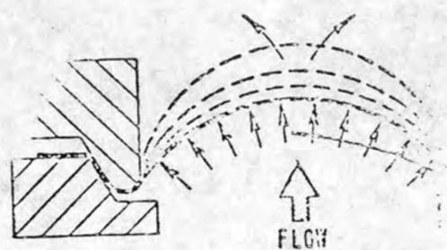  
Prebulged Disk Assembly

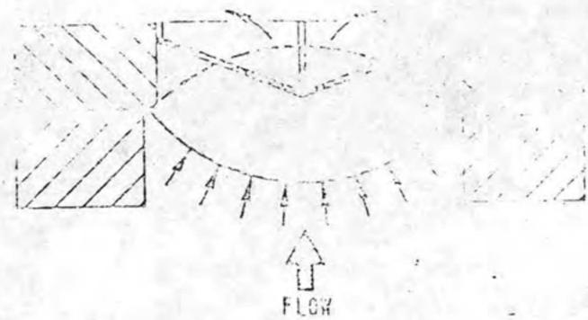  
Reverse Buckling Assembly

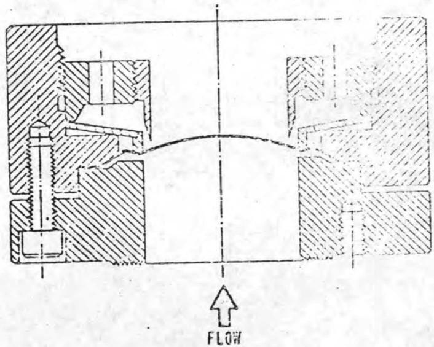  
Snap Over Assembly

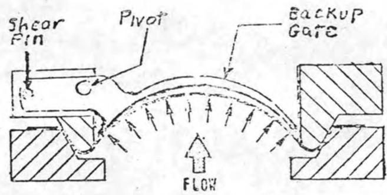  
Fig. 4.22

Shear Pin Concept

<table><tr><td>4.5</td><td>REFERENCES</td></tr><tr><td>1.</td><td>The Development Status of Molten-Salt Breeder Reactors, ORNL - 4812, August 1972, Oak Ridge National Laboratory.</td></tr><tr><td>2.</td><td>Design Studies of Steam Generator for Molten Salt Reactors Monthly Progress Report #10, August 1 - August 31, Foster Wheeler Corporation.</td></tr><tr><td>3.</td><td>Proposed Scope of Work and Requirements for Design Studies of Steam Generators for Molten Salt Reactors, Enclosure 2, Union Carbide Corporation, March 1971.</td></tr><tr><td>4.</td><td>Heat Transfer to Supercritical Water in Smooth - Bore Tubes, H. S. Swenson, J. R. Carver, C. R. Kakarala, Journal of Heat Transfer, November 1965.</td></tr><tr><td>5.</td><td>GGA - HTGR Steam Generator Evaluation of Surface Mismatch Using Probability Methods, L. Rianhard, R. M. Costello, P. J. Prabhu, W. T. Klamm, Foster Wheeler Corporation, July 1970.</td></tr><tr><td>6.</td><td>Molten-Salt Reactor Program, Semiannual Progress Report, Period ending August 31, 1972, ORNL - 4832, March 1973, Oak Ridge National Laboratory.</td></tr><tr><td>7.</td><td>Private communication from W. Apblett to J. Polcer on thermal conductivity data of Hastelloy N (6/20/74).</td></tr><tr><td>8.</td><td>Design study of steam generators for Molten Salt Reactors Monthly progress Report #8, May 20 - June 30, 1974, Foster Wheeler Corporation.</td></tr><tr><td>9.</td><td>Design study of steam generators for Molten Salt Reactors Monthly Progress Report #10, August 1 - August 31, .1974, Foster Wheeler Corporation.</td></tr><tr><td>10.</td><td>A general summary of the ORNL 1000 MW(e) Molten-Salt Breeder Reactor Reference Design, Enclosure 1, Union Carbide Corporation, November, 1970.</td></tr><tr><td>11.</td><td>Fluid Dynamics, J. W. Daily, D.R.F. Harleman, Addison-Wesley Publishing Company, Inc., 1966.</td></tr><tr><td>12.</td><td>Engineering Department Manual, Volume I, Basic Design, Foster Wheeler Corporation.</td></tr><tr><td>13.</td><td>An Analysis of Thermally Induced Flow Oscillations in the Near-critical and Super-critical Thermodynamic Region, Novak Zuber, General Electric Company, May 25, 1966.</td></tr></table>

NUCLEAR DEPARTMENT

LIVINGSTON, N. J.

<table><tr><td colspan="4"></td></tr><tr><td>CHARGE NO. 8-25-2431</td><td>DOCUMENT NO. ND/74/66</td><td>ISSUE 1</td><td>DATE 12/16/74</td></tr><tr><td colspan="4">14. Engineering Department Manual, Volume III, Computer Programs, Foster Wheeler Corporation.</td></tr><tr><td colspan="4">15. Analysis of Dynamic Flow Stability in Steam Generators for the Molten-Salt Breeder Reactor, B. E. Boyack, Gulf General Atomic, Gulf-GA - A12416, November, 1972.</td></tr><tr><td colspan="4">16. Lecture Series on Boiling and Two-phase Flow for heat transfer engineers, University of California, Berkeley, California, May 27-28, 1965.P.195</td></tr><tr><td colspan="4">17. Review of Two-Phase Flow Instability, J. A. Boure, A. E. Bergles, L. S. Tong, 71-HT-42, ASME</td></tr><tr><td colspan="4">18. Static and Dynamic Stability of Steam-Water Systems Part 1, Critical Review of the Literature, L. E. Efferding, General Dynamics, GA-5555, October 1964.</td></tr><tr><td colspan="4">19. Supercritical Furnace Design, Foster Wheeler Corporation.</td></tr><tr><td colspan="4">20. Recent Experiences with Radient Superheaters in Central Steam Generators and their Effect on Design Criteria, R. P. Welden, H. H. Pratt, FWC, American Power Conference, Volume XXIV, March, 1962.</td></tr><tr><td colspan="4">21. Test and Evaluation of Alco/BLH Prototype Sodium-Heated Steam Generator, S. M. Cho, etc., IMEC-Memo-70-20, January 1971, Liquid Metal Engineering Center.</td></tr><tr><td colspan="4">22. Performance Changes of a Sodium-Heated Steam Generator, S. M. Cho, K. A. Gardner, etc., 71-HT-15, ASME.</td></tr><tr><td colspan="4">23. Conceptual Design Study of a Single-Fluid Molten-Salt Breeder Reactor ORNL-4541, ORNL.</td></tr><tr><td colspan="4">24. Startup Steam ORNL 1000 MW(e) MSBR, C. R. Clark, Service Department, FWC, Inter Office Correspondence, September 29, 1972.</td></tr><tr><td colspan="4">25. Operating Instructions, Section 3, Feedwater and Cycle Cleanup, FWC.</td></tr><tr><td colspan="4">26. Design studies of Steam Generators for Molten Salt Reactors Monthly Progress Report #11, September 1 - September 30, 1974, FWC.</td></tr><tr><td>BY</td><td>APPROVED</td><td>PAGE</td><td>4-56</td></tr></table>

FOSTER WHEELER ENERGY CORPORATION   

<table><tr><td colspan="5"></td></tr><tr><td colspan="2">CHARGE NO. 8-25-2431</td><td>DOCUMENT NO. ND/74/66</td><td>ISSUE 1</td><td>DATE 12/16/74</td></tr><tr><td colspan="5">27. State-of-the-art of Rupture Disks for LMFBR Application, 
J. P. VerKamp, NEDM-13981, GE, July, 1973.</td></tr><tr><td colspan="5">28. Status of LMFBR Reheat in Western Europe - 1972, WASH-1219, 
AEC, March 1973.</td></tr><tr><td colspan="5">29. Evaluation and Procurement Guide For Three Types of Metallic 
Rupture Disk Assemblies, ORNL-TM-4046, ORNL, January, 1973.</td></tr><tr><td colspan="5">30. Computer Programs For The Analysis of Complex Decision 
Problems, Stanley I. Buchin, 8-171-070, EA-C-905, Harvard 
University, September, 1970.</td></tr><tr><td colspan="5"></td></tr><tr><td>Y</td><td colspan="3">APPROVED</td><td>PAGE 4-57</td></tr></table>

FOSTER WHEELER ENERGY CORPORATION   

<table><tr><td colspan="5"></td></tr><tr><td colspan="2">CHARGE NO. 8-25-2431</td><td>DOCUMENT NO. ND/74/66</td><td>ISSUE 1</td><td>DATE 12/16/74</td></tr><tr><td colspan="5">SECTION 5
STRUCTURAL FEASIBILITY ANALYSIS
BY
Dr. N. J. LEVY</td></tr><tr><td colspan="5">Approved by
C. F. Nash
Structural Analysis Section Manager</td></tr><tr><td>BY</td><td colspan="3">APPROVED</td><td>PAGE 5-a</td></tr></table>

NUCLEAR DEPARTMENT

LIVINGSTON, N. J.

FOSTER WHEELER ENERGY CORPORATION   

<table><tr><td colspan="4">TABLE OF CONTENTS</td></tr><tr><td colspan="3">5.1 Stress Analysis of the Salt Inlet Nozzle</td><td>Pages 5-1</td></tr><tr><td colspan="3">5.1.1 Introduction</td><td>5-1</td></tr><tr><td colspan="3">5.1.2 Summary and Conclusion</td><td>5-1</td></tr><tr><td colspan="3">5.1.3 Stresses Due to Pressure</td><td>5-6</td></tr><tr><td colspan="3">5.1.4 Stresses Due to Temperature Transients</td><td>5-8</td></tr><tr><td colspan="3">5.1.5 Simplified Inelastic Analysis</td><td>5-10</td></tr><tr><td colspan="3">5.1.6 Fatigue Analysis and Creep Fatigue Interaction</td><td>5-11</td></tr><tr><td colspan="3">5.2 Stress Analysis of the MSBR Tubesheet-Header Assembly</td><td>5-13</td></tr><tr><td colspan="3">5.2.1 Introduction and Summary</td><td>5-13</td></tr><tr><td colspan="3">5.2.2 Loading Conditions</td><td>5-16</td></tr><tr><td colspan="3">5.2.3 Some Details of the Finite Element Model</td><td>5-19</td></tr><tr><td colspan="3">5.2.4 Simplified Inelastic Analysis</td><td>5-30</td></tr><tr><td colspan="3">5.2.5 Fatigue Analysis and Creep Fatigue Interaction</td><td>5-33</td></tr><tr><td colspan="3">5.3 Stress Analysis of the MSBR Shell</td><td>5-35</td></tr><tr><td colspan="3">5.3.1 Introduction and Summary</td><td>5-35</td></tr><tr><td colspan="3">5.3.2 Shell Stresses at Location A</td><td>5-41</td></tr><tr><td colspan="3">5.3.3 Shell Stresses at Location B</td><td>5-42</td></tr><tr><td colspan="3">5.3.4 Shell-Shroud Juncture Stresses</td><td>5-43</td></tr><tr><td colspan="3">5.3.5 Simplified Inelastic Analysis</td><td>5-49</td></tr><tr><td colspan="3">5.3.6 Fatigue Analysis and Creep Fatigue Interaction</td><td>5-50</td></tr></table>

FOSTER WHEELER ENERGY CORPORATION   

<table><tr><td colspan="4">LIVINGSTON, N. J.</td></tr><tr><td>CHARGE NO. 8-25-2431</td><td>DOCUMENT NO. ND/74/66</td><td>ISSUE 1</td><td>DATE 12/16/74</td></tr><tr><td colspan="4">Pages</td></tr><tr><td colspan="2">5.4 Stress Analysis of the MSBR Tubes</td><td colspan="2">5-52</td></tr><tr><td colspan="2">5.4.1 Introduction and Summary</td><td colspan="2">5-52</td></tr><tr><td colspan="2">5.4.2 Tube Primary Stresses</td><td colspan="2">5-54</td></tr><tr><td colspan="2">5.4.3 Thermal Stresses</td><td colspan="2">5-59</td></tr><tr><td colspan="2">5.4.4 Flow Induced Vibration</td><td colspan="2">5-62</td></tr><tr><td colspan="2">5.4.5 Simplified Inelastic Analysis</td><td colspan="2">5-64</td></tr><tr><td colspan="2">5.4.6 Fatigue Analysis</td><td colspan="2">5-64</td></tr><tr><td colspan="2">5.5 Tube Rupture Analysis</td><td colspan="2">5-66</td></tr><tr><td colspan="4">APPROVED PAGE 5-c</td></tr><tr><td>CHARGE NO 8-25-2431</td><td>DOCUMENT NO. ND/74/66</td><td>ISSUE 1</td><td>DATE 12/16/74</td></tr></table>

# 5.1 STRESS ANALYSIS OF THE SALT INLET NOZZLE

# 5.1.1 INTRODUCTION

This report discusses the analysis of the molten salt inlet nozzle of the steam generator. During its service life, it is expected that the nozzle will be subjected to thermal transients which are no worse than those described in ORNL-TM-3767, HYBRID computer simulation of the MSBR. In the interest of conservatism, the transient shown in Figure 2, which is a combination of most severe up and down transient, was assumed for this analysis. Dead weight and thermal expansion loads due to the molten salt feed pipe were not included because they are not available at this time. Internal pressure loadings, however, were considered. Temperature distributions due to the assumed transient condition, and stresses due to these temperature distributions and pressure loads, were obtained by using Foster Wheeler's version of Wilson's Finite Element Program. The finite element model is shown in Figure 1. Inelastic strains were calculated using Bree's method & FWC's simplified elastic-plastic creep computer program.

# 5.1.2 SUMMARY AND CONCLUSION

The purpose of our analysis was to determine the feasibility of the sodium inlet nozzle under the severe thermal transients and other loads anticipated. Based upon analyses specified in Section III of the ASME Boiler and Pressure Vessel Code, and in Code Case 1331-5, it was concluded that both the nozzle and shell required a thermal liner. With the liner, stresses were calculated to be within the allowable limits. Table I summarizes the results. Based on the table, it is concluded the design is feasible. Final conclusions are dependent on the magnitude of the piping loads (which are presently unavailable).

<table><tr><td>BY</td><td>APPROVED</td><td>PAGE 5-1 OF</td></tr></table>

TABLE 1   

<table><tr><td>CHARGE NO 8-25-2431</td><td>DOCUMENT NO. ND/74/66</td><td>ISSUE 1</td><td>DATE 12/16/74</td></tr></table>

STRESS SUMMARY, MSBR MOLTEN SALT INLET NOZZLE WITH LINER   

<table><tr><td>Section (Location)</td><td>Stress Category</td><td>Calculated Stress Range (psi)</td><td>Allowable Stress Limit (psi)</td></tr><tr><td rowspan="3">1-1 (Shell)</td><td>Pm (design)</td><td>4043</td><td rowspan="3">S0=9500 @1150 F Smt=7500 @1150 F 30 yrs. 35m=67,500</td></tr><tr><td>Pm (operating)</td><td>3170</td></tr><tr><td>(PL+PL+Q)R</td><td>19019 (EL.19)</td></tr><tr><td rowspan="3">2-2 (Shell at nozzle)</td><td>Pm (design)</td><td>5100</td><td>9500</td></tr><tr><td>Pm (operating)</td><td>4000</td><td>7500</td></tr><tr><td>(PL+Pb+Q)R</td><td>26,480 (EL.158)</td><td>67,500</td></tr><tr><td rowspan="3">3-3 (Intersect. Shell &amp; Noz.)</td><td>Pm (design)</td><td>5360</td><td>9500</td></tr><tr><td>Pm (operating)</td><td>4200</td><td>7500</td></tr><tr><td>(PLPb+Q)R</td><td>33,396 (El.187)</td><td>67,500</td></tr><tr><td rowspan="3">4-4 (Nozzle at Shell)</td><td>Pm (design)</td><td>5236</td><td>9500</td></tr><tr><td>Pm (operating)</td><td>4100</td><td>7500</td></tr><tr><td>(PLPb+Q)R</td><td>19,108 (El.215)</td><td>67,500</td></tr><tr><td rowspan="3">5-5 (Nozzle at Start of Reduced Wall)</td><td>Pm (design)</td><td>2499</td><td>9500</td></tr><tr><td>Pm (operating)</td><td>1960</td><td>7500</td></tr><tr><td>(PLPb+Q)R</td><td>10,794 (El.258)</td><td>67,500</td></tr><tr><td rowspan="3">6-6 (Nozzle at Feed Pipe)</td><td>Pm (design)</td><td>6415</td><td>9500</td></tr><tr><td>Pm (operating)</td><td>5025</td><td>7500</td></tr><tr><td>(PLPb+Q)R</td><td>9,278 (El.336)</td><td>67,500</td></tr></table>

<table><tr><td>BY</td><td>APPROVED</td><td>PAGE 5-2 OF</td></tr></table>

FOSTER WHEELER CORPORATION   

<table><tr><td>CHARGE NO 8-25-2431</td><td>DOCUMENT NO. ND/74/66</td><td>ISSUE 1</td><td>DATE 12/16/74</td></tr></table>

TABLE 1 (CONT'D)   

<table><tr><td>Section (Location)</td><td>Stress Category</td><td>Calculated stress Range (psi)</td><td>Allowable Stress Limit (psi)</td></tr><tr><td rowspan="3">7-7 (Feed Pipe)</td><td>Pm (design)</td><td>7840</td><td>9500</td></tr><tr><td>Pm (operating)</td><td>6140</td><td>7500</td></tr><tr><td>(PLb+Q)R</td><td>does not control</td><td>----</td></tr><tr><td rowspan="3">8-8 (Shell)</td><td>Pm (design)</td><td>pr/2t = 2700</td><td>9500</td></tr><tr><td>Pm (operating)</td><td>2100</td><td>7500</td></tr><tr><td>(PLb+Q)R</td><td>does not control</td><td>----</td></tr></table>

Note: Allowables are at 1150 F   
See Section 5.1.6 for creep fatigue interaction and inelastic strain analysis   
See Appendix C-2 for material properties and allowables.

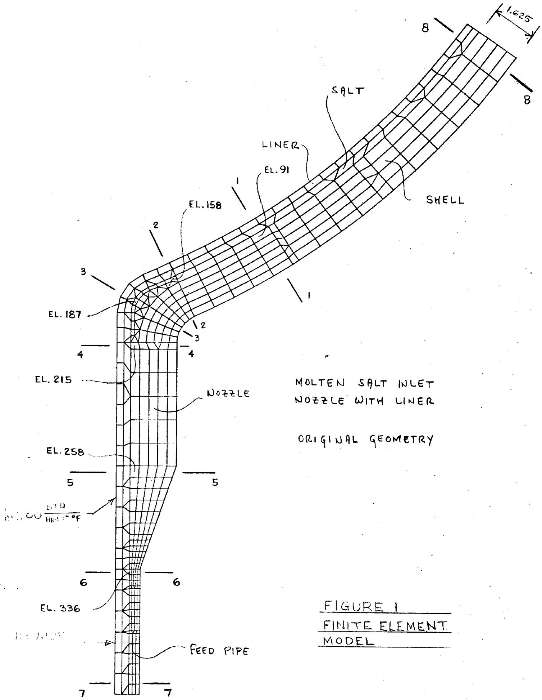  
FIGURE1 FINITE ELEMENT MODEL

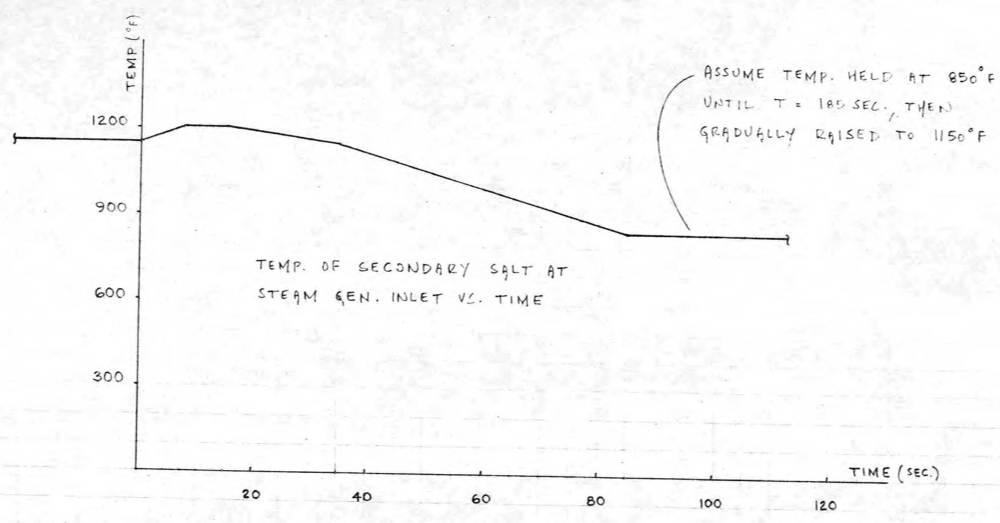  
FIGURE 2   
ASSUMED TRANSIENT LOAD CONDITION   
(STEADY STATE TEMP. $= {1150}^{ \circ  }$ F)

<table><tr><td colspan="5">5.1.3 STRESSES DUE TO PRESSURE
From the finite element computer program, stresses at various
locations of the nozzle due to a design pressure of 300 psi
were obtained. They are shown below. (Ref. 9)
Section 1-1</td></tr><tr><td>Element</td><td>σr</td><td>cz</td><td>σT</td><td>σrz</td></tr><tr><td>86</td><td>1692</td><td>701</td><td>4078</td><td>1137</td></tr><tr><td>87</td><td>1584</td><td>737</td><td>4003</td><td>1186</td></tr><tr><td>88</td><td>1508</td><td>740</td><td>3928</td><td>1209</td></tr><tr><td>89</td><td>1462</td><td>702</td><td>3850</td><td>1210</td></tr><tr><td>90</td><td>1459</td><td>629</td><td>3772</td><td>1194</td></tr><tr><td>91</td><td>1509</td><td>511</td><td>3693</td><td>1164</td></tr><tr><td>Avg.</td><td>1536</td><td>670</td><td>3887</td><td>1183</td></tr><tr><td colspan="5">Average principal stresses are</td></tr><tr><td colspan="5">∑1=2362S = 4043</td></tr><tr><td colspan="5">∑3=3887</td></tr><tr><td colspan="5">Section 2-2</td></tr><tr><td>Element</td><td>σr</td><td>cz</td><td>σT</td><td>σrz</td></tr><tr><td>126</td><td>3862</td><td>2146</td><td>6421</td><td>2430</td></tr><tr><td>127</td><td>2149</td><td>1594</td><td>5813</td><td>1443</td></tr><tr><td>128</td><td>1285</td><td>1032</td><td>5456</td><td>843</td></tr><tr><td>129</td><td>559</td><td>489</td><td>5143</td><td>396</td></tr><tr><td>130</td><td>-174</td><td>-2</td><td>4840</td><td>19</td></tr><tr><td>156</td><td>-701</td><td>-571</td><td>4547</td><td>-88</td></tr><tr><td>157</td><td>-1002</td><td>-773</td><td>4321</td><td>-583</td></tr><tr><td>158</td><td>-1683</td><td>-667</td><td>4198</td><td>-657</td></tr><tr><td>Avg.</td><td>537</td><td>405</td><td>5092</td><td>475</td></tr><tr><td>∑1=950</td><td>∑2=-8</td><td>∑3=5092</td><td></td><td></td></tr><tr><td>S = 5100</td><td></td><td></td><td></td><td></td></tr><tr><td colspan="2">CHARGE NO 8-25-2431</td><td>DOCUMENT NO. ND/74/66</td><td>ISSUE 1</td><td>DATE 12/16/74</td></tr><tr><td colspan="2">Section 3-3</td><td></td><td></td><td></td></tr><tr><td>Element</td><td>Ox</td><td>Oz</td><td>Oy</td><td>Oyz</td></tr><tr><td>141</td><td>1868</td><td>3841</td><td>6308</td><td>2112</td></tr><tr><td>142</td><td>1761</td><td>1875</td><td>5868</td><td>1123</td></tr><tr><td>143</td><td>1354</td><td>793</td><td>5592</td><td>545</td></tr><tr><td>144</td><td>900</td><td>71</td><td>5411</td><td>132</td></tr><tr><td>145</td><td>465</td><td>-453</td><td>5302</td><td>-163</td></tr><tr><td>184</td><td>62</td><td>-769</td><td>5237</td><td>-223</td></tr><tr><td>185</td><td>236</td><td>-812</td><td>5322</td><td>-448</td></tr><tr><td>186</td><td>-175</td><td>-934</td><td>5303</td><td>-398</td></tr><tr><td>187</td><td>-375</td><td>-988</td><td>5358</td><td>-352</td></tr><tr><td>Avg.</td><td>677</td><td>292</td><td>5522</td><td>259</td></tr><tr><td>U1=808</td><td>U2=162</td><td>O3=5522</td><td></td><td></td></tr><tr><td>S=5360</td><td></td><td></td><td></td><td></td></tr><tr><td colspan="2">Section 4-44</td><td></td><td></td><td></td></tr><tr><td>Element</td><td>Ox</td><td>Oz</td><td>Oy</td><td>Oyz</td></tr><tr><td>210</td><td>222</td><td>2701</td><td>5102</td><td>566</td></tr><tr><td>211</td><td>299</td><td>1686</td><td>4989</td><td>986</td></tr><tr><td>212</td><td>401</td><td>1174</td><td>5021</td><td>1083</td></tr><tr><td>213</td><td>146</td><td>632</td><td>4875</td><td>898</td></tr><tr><td>214</td><td>-47</td><td>30</td><td>4818</td><td>658</td></tr><tr><td>215</td><td>-253</td><td>-722</td><td>4725</td><td>235</td></tr><tr><td>Avg.</td><td>128</td><td>917</td><td>4922</td><td>738</td></tr><tr><td>U1=1360</td><td>O2=-314</td><td>O3=4922</td><td></td><td></td></tr><tr><td>S=5236</td><td></td><td></td><td></td><td></td></tr><tr><td colspan="2">Section 5-5</td><td></td><td></td><td></td></tr><tr><td>Element</td><td>Ox</td><td>Oz</td><td>Oy</td><td>Oyz</td></tr><tr><td>254</td><td>-60</td><td>-750</td><td>1698</td><td>-193</td></tr><tr><td>255</td><td>-34</td><td>26</td><td>2008</td><td>0</td></tr><tr><td>256</td><td>-63</td><td>948</td><td>2361</td><td>115</td></tr><tr><td>257</td><td>-131</td><td>1949</td><td>2746</td><td>137</td></tr><tr><td>258</td><td>-210</td><td>3056</td><td>3180</td><td>40</td></tr><tr><td>Avg.</td><td>-100</td><td>1046</td><td>2399</td><td>20</td></tr><tr><td>S=2499</td><td></td><td></td><td></td><td></td></tr></table>

<table><tr><td>CHARGE NO 8-25-2431</td><td>DOCUMENT NO. ND/74/66</td><td>ISSUE 1</td><td>DATE 12/16/74</td></tr><tr><td colspan="4">Section 6-6</td></tr><tr><td>Element</td><td>0r 6z</td><td>CT</td><td>6rz</td></tr><tr><td>332</td><td>182 5872</td><td>6772</td><td>207</td></tr><tr><td>333</td><td>76 4890</td><td>6509</td><td>3</td></tr><tr><td>334</td><td>-43 4223</td><td>6336</td><td>-120</td></tr><tr><td>335</td><td>-168 3645</td><td>6189</td><td>-149</td></tr><tr><td>336</td><td>-279 3051</td><td>6041</td><td>-84</td></tr><tr><td>Avg.</td><td>-46 4336</td><td>6369</td><td>-29</td></tr><tr><td colspan="4">S = 6415</td></tr><tr><td colspan="4">5.1.4 STRESSES DUE TO TEMPERATURE TRANSIENTS</td></tr><tr><td colspan="4">From the finite element computer program, stresses due to tempera-
ture transients at various locations of the nozzle were calculated
and are given below. Note that pressure stresses do not enter
into the stress intensity range calculation. (Ref. 10)</td></tr><tr><td colspan="4">Section 1-1</td></tr><tr><td rowspan="2">Down Trans</td><td>U_r 6z</td><td>O_T</td><td>O_uz</td></tr><tr><td>13570 4949</td><td>20490</td><td>8284</td></tr><tr><td>Up Trans</td><td>247 73</td><td>1361</td><td>351</td></tr><tr><td>Range</td><td>13323 14876</td><td>19129</td><td>7933</td></tr><tr><td>U1=18,090</td><td>U2=110</td><td>U3=19129</td><td></td></tr><tr><td colspan="4">S = 19019</td></tr><tr><td colspan="4">Section 2-2</td></tr><tr><td>Down Trans</td><td>18390 3625</td><td>25200</td><td>8870</td></tr><tr><td>Up Trans</td><td>-3016 -829</td><td>1351</td><td>-1299</td></tr><tr><td>Range</td><td>21406 1454</td><td>23849</td><td>10,169</td></tr><tr><td>U1=26,170</td><td>U2=-310</td><td>U3=23849</td><td></td></tr><tr><td colspan="4">S = 26480</td></tr><tr><td>BY</td><td>APPROVED</td><td colspan="2">PAGE 5-8 OF</td></tr></table>

<table><tr><td colspan="5"></td></tr><tr><td colspan="2">CHARGE NO 8-25-2431</td><td>DOCUMENT NO. ND/74/66</td><td>ISSUE 1</td><td>DATE 12/16/74</td></tr><tr><td colspan="5">SECTION 3-3</td></tr><tr><td></td><td>U_r</td><td>O_2</td><td>O_7</td><td>O_2z</td></tr><tr><td>DOWN TRANS</td><td>1859</td><td>9190</td><td>31300</td><td>4725 (153 SEC)</td></tr><tr><td>UP TRANS</td><td>-503</td><td>-1852</td><td>1787</td><td>-822 (33 SEC)</td></tr><tr><td>RANGE</td><td>2362</td><td>1042</td><td>29513</td><td>5546</td></tr><tr><td>U=7287</td><td>U_2=3883</td><td>O_3=29513</td><td></td><td></td></tr><tr><td>C=33,396</td><td></td><td></td><td></td><td></td></tr><tr><td colspan="5">SECTION 4-4</td></tr><tr><td>DOWN TRANS</td><td>-30</td><td>17030</td><td>21440</td><td>-564 (153 SEC)</td></tr><tr><td>UP TRANS</td><td>-191</td><td>-2060</td><td>2206</td><td>267 (33 SEC)</td></tr><tr><td>RANGE</td><td>161</td><td>19090</td><td>19234</td><td>-831</td></tr><tr><td>U_1=19126</td><td>U_2=126</td><td>O_3=19234</td><td></td><td></td></tr><tr><td>S=19108</td><td></td><td></td><td></td><td></td></tr><tr><td colspan="5">SECTION 5-5</td></tr><tr><td>DOWN TRANS</td><td>-167</td><td>9300</td><td>12180</td><td>-27</td></tr><tr><td>UP TRANS</td><td>-158</td><td>1677</td><td>1395</td><td>35</td></tr><tr><td>RANGE</td><td>-9</td><td>7623</td><td>10785</td><td>-62</td></tr><tr><td>U_1=7623</td><td>U_2=-9</td><td>O_3=10785</td><td></td><td></td></tr><tr><td>S=10,794</td><td></td><td></td><td></td><td></td></tr><tr><td colspan="5">SECTION 6-6</td></tr><tr><td></td><td>U_r</td><td>O_2</td><td>O_T</td><td>O_rz</td></tr><tr><td>DOWN TRANS</td><td>-73</td><td>10900</td><td>10460</td><td>-25</td></tr><tr><td>UP TRANS</td><td>-218</td><td>1478</td><td>3867</td><td>-52</td></tr><tr><td>RANGE</td><td>145</td><td>9422</td><td>6593</td><td>27</td></tr><tr><td>U_1=9423</td><td></td><td></td><td></td><td></td></tr><tr><td>U_2=145</td><td>S=9278</td><td></td><td></td><td></td></tr><tr><td>C=9422</td><td></td><td></td><td></td><td></td></tr></table>

<table><tr><td>CHARGE NO 8-25-2431</td><td>DOCUMENT NO. ND/74/66</td><td>ISSUE 1</td><td>DATE 12/16/74</td></tr></table>

# 5.1.5 SIMPLIFIED INELASTIC ANALYSIS

Inelastic strains were calculated by Bree's simplified method (see Chapter VI of the IMFBR Piping Design Guide). In the Bree analysis, it is assumed that there are a total of 200 severe thermal cycles (sum of load scrams and reactor scrams). With a 30-year design life, the time per cycle is 262,800/200 = 1314 hours.

The derivation of the creep law used in the Bree analysis is given in the tubesheet report. The Bree analysis has been computerized by Foster Wheeler, and the following results were obtained:

<table><tr><td>Location</td><td>Total Strain/Cycle</td><td>Total Strain</td></tr><tr><td>1-1</td><td>Negligible</td><td>Negligible</td></tr><tr><td>2-2</td><td>Negligible</td><td>Negligible</td></tr><tr><td>3-3</td><td>\( 1x10^{-4} \)</td><td>0.02%</td></tr><tr><td>4-4</td><td>Negligible</td><td>Negligible</td></tr><tr><td>5-5</td><td>Negligible</td><td>Negligible</td></tr><tr><td>6-6</td><td>\( 4x10^{-4} \)</td><td>0.08%</td></tr></table>

Ref.: Computer Run NHJLO9F

<table><tr><td>BY</td><td>APPROVED</td><td>PAGE 5-10 OF</td></tr></table>

<table><tr><td>CHARGE NO 8-25-2431</td><td>DOCUMENT NO. ND/74/66</td><td>ISSUE 1</td><td>DATE 12/16/74</td></tr></table>

# 5.1.6 FATIGUE ANALYSIS AND CREEP FATIGUE INTERACTION

A preliminary fatigue analysis was made with the aid of Code Case 1331-4. With a maximum stress range of 33.40 Ksi, or an alternating stress of 16.70 Ksi, the Code Case gives an infinite number of allowable cycles. Thus, fatigue should be no problem.

# CREEP FATIGUE INTERACTION

Foster Wheeler has developed a computer program which performs elastic-plastic-creep analysis of a cylinder subjected to time dependent pressure, temperature, and axial loads. To use the program, one constructs a histogram of the loading (see below). The user also supplies subroutines describing the creep, fatigue, and stress to rupture properties of the material. Creep properties were obtained from "Data for Nickel-Molybdenum-Chromium-Iron Alloy, Iron 8", June 1, 1961, while fatigue and stress to rupture properties were obtained from "Bases for Design of MSBR Systems for Temperatures to 1300 F", ORNL Central Files Number 73-1-23. The program automatically computes stresses and strains as a function of time, along with creep and fatigue damage. Creep and fatigue damage are computed in accordance with ASME Code Case 1331-5.

Section 3-3 proved to have the highest loading and only that section was analyzed. The nozzle was idealized as a cylinder with 1.625" wall thickness and approximately 9" inside radius. The loadings and histogram are shown below.

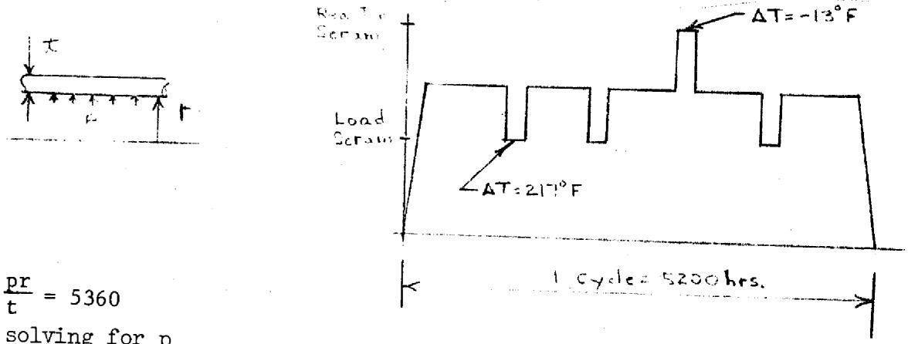

$$
\frac {\mathrm {p r}}{t} = 5 3 6 0
$$

$$
\text {s o l v i n g f o r p}
$$

$$
p = 9 5 0 p s i
$$

$$
\frac {\mathrm {E} \cdot \Delta \mathrm {T}}{2 (1 - 1)} = 3 1, 3 0 0 (\text {u p t r a n s i e n t})
$$

$$
\Delta \mathrm {T} = \begin{array}{l} 2 1 7 ^ {\circ} \mathrm {F} \\ - 1 3 ^ {\circ} \mathrm {F} \end{array}
$$

$$
w h e r e E = 2 6. 2 x 1 0 ^ {6}, \alpha = 7. 7 2 x 1 0 ^ {- 6}
$$

BY

APPROVED

<table><tr><td colspan="5"></td></tr><tr><td colspan="2">CHARGE NO 8-25-2431</td><td>DOCUMENT NO. ND/74/66</td><td>ISSUE 1</td><td>DATE 12/16/74</td></tr><tr><td colspan="5">PROGRAM RESULTS
There are a total of 50 cycles, each cycle consisting of 3 load
scrams and 1 reactor scram. The program was run for 5 cycles and
the strain for each of the remaining cycles was estimated by
taking the difference in strain between the fourth and fifth cycles.
Maximum total strain = 0.29 + 45 (0.01) = 0.74%
Creep damage = 0.00222 + 45 (0.048 x 10-2) = 0.0238
Maximum strain range = 0.248%
Fatigue Damage = 50/105 = 5 x 10-4(maximum temperature = 1150 F)
Ref: Computer run EBHJLO6C</td></tr><tr><td>BY</td><td colspan="2">APPROVED</td><td colspan="2">PAGE 5-12 OF</td></tr></table>

<table><tr><td>CHARGE NO 8-25-2431</td><td>DOCUMENT NO. ND/74/66</td><td>ISSUE 1</td><td>DATE 12/16/74</td></tr></table>

# 5.2 STRESS ANALYSIS OF MSBR TUBESHEET-HEADER ASSEMBLY

# 5.2.1 INTRODUCTION AND SUMMARY

The major tool in analyzing the tubesheet header assembly in Foster Wheeler Corporation's Finite Element Computer Program (Reference 1). A finite element model of the structure was made and is shown in Figure 1. This model was used to determine both pressure and thermal stresses. These stresses were compared to the allowables, using ASME Code Case 1331-5 as a guide.

As seen in Figure 1, the upper (header) side of the tubesheet is in contact with steam, while the lower portion of the tubesheet is in contact with molten salt. The severest thermal stresses occur during transients specified in Reference 2. The severest up and down transients were found to occur during a Ramp Change in Load Demand from 100 to $40\%$ in 3 seconds (Figure 2) and Insertion of Two Safety Rods (Figure 3), respectively. Outlet steam transients were found to be more severe than inlet. Therefore, because inlet and outlet tubesheet geometries are identical, only the outlet tubesheet was analyzed.

Eight locations of possible high stresses were analyzed and are shown in Figure 1. Primary membrane, local membrane plus primary bending, and local membrane plus bending plus secondary stress intensity ranges were obtained at 11 locations. The stress intensities obtained, together with allowables, are shown in Table 1. Except where indicated, primary stresses are due to a design pressure of 4000 psi. Allowables are based on operating (30 year life) conditions. This combination of loading and allowables is conservative.

Although, according to Code Case 1331-5 there is no limit on primary plus secondary stress intensity, the 3Sm limit of Section III of the ASME Code is given for reference purposes.

It is seen that all primary stress intensities are within the allowable limits, Inelastic strains, computed by Bree's simplified method, are also seen to be within allowable limits.

Computer plots of the stresses due to temperature transients are shown in Figures 5 to 13.

<table><tr><td>BY</td><td>APPROVED</td><td>PAGE 5-13 OF</td></tr></table>

TABLE 1   
STRESS SUMMARY - MSBR TUBESHEET - HEADER ASSEMBLY   

<table><tr><td>Location (Section)</td><td>Stress Category</td><td>Allowable Stress Limit (PSI)</td><td>Calculated Stress Range (PSI)</td><td>Maximu Temper,</td></tr><tr><td rowspan="3">1-1 (Center of T.S.) (Operating Pressure)</td><td>Pm</td><td>Smt=13,000</td><td>8,570</td><td>1075</td></tr><tr><td>PL+Pb</td><td>KSt=14,100</td><td>13,040</td><td></td></tr><tr><td>(PL+Pb+Q)R</td><td>3Sm=69,600</td><td>23,360</td><td></td></tr><tr><td rowspan="3">2-2 (Edge of T.S.)</td><td>Pm</td><td>13,000</td><td>12,160</td><td>1075</td></tr><tr><td>PL+Pb</td><td>13,200</td><td>8,080</td><td></td></tr><tr><td>(PL+Pb+Q)R</td><td>69,600</td><td>14,220</td><td></td></tr><tr><td rowspan="2">3-3 (T.S. - Shell Juncture)</td><td>Pm</td><td>8,000</td><td>6,150</td><td>1150</td></tr><tr><td>(PL+Pb+Q)R</td><td>67,500</td><td>49,810</td><td></td></tr><tr><td rowspan="2">4-4 (T.S. - Header Juncture)</td><td>Pm</td><td>19,000</td><td>6,550</td><td>1000</td></tr><tr><td>(PL+Pb+Q)R</td><td>71,500</td><td>20,310</td><td></td></tr><tr><td rowspan="2">5-5 (T.S. Header Juncture)</td><td>Pm</td><td>19,000</td><td>7,150</td><td>1000</td></tr><tr><td>(PL+Pb+Q)R</td><td>71,500</td><td>60,840</td><td></td></tr><tr><td rowspan="2">6-6 (Header Wall)</td><td>Pm</td><td>19,000</td><td>8,470</td><td>1000</td></tr><tr><td>(PL+Pb+Q)R</td><td>71,500</td><td>31,320</td><td></td></tr><tr><td rowspan="2">7-7</td><td>Pm</td><td>19,000</td><td>12,970</td><td>1000</td></tr><tr><td>(PL+Pb+Q)R</td><td>71,500</td><td>37,090</td><td></td></tr><tr><td rowspan="2">8-8</td><td>Pm</td><td>19,000</td><td>12,530</td><td>1000</td></tr><tr><td>(PL+Pb+Q)R</td><td>71,500</td><td>does not control</td><td></td></tr></table>

NOTE: 1. There are no primary bending stresses at Section 3-3 through 8-8   
2. See Section 5.2.5 for creep fatigue interaction.   
3. See Appendix C-2 for material properties and allowables.

*Primary plus secondary stress ranges conservatively include peak portions.

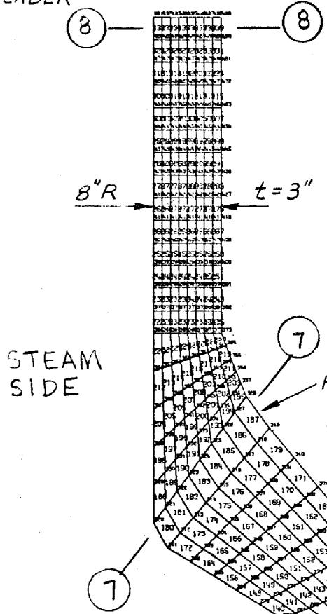  
FIGURE1   
FINITE ELEMENT MODEL OF   
TUBE SHEET-HEADER   
ASSEMBLY   
HEADER   
7）  
HEADER

  
TUBES SHEET   
(1)   
(4)

  
${13}/{14}$

  
5

  
：

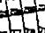  
${x}^{2} + {y}^{2} =  - \frac{1}{2}$

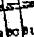  
1

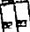  
${a}_{1} = 2\cos \theta$

  
2.2.1

  
(5)

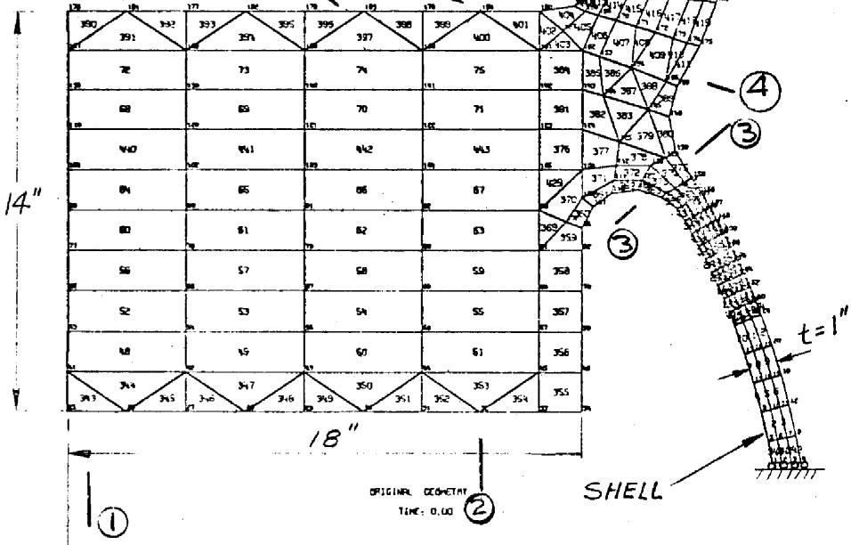  
(3)

<table><tr><td>CHARGE NO 8-25-2431</td><td>DOCUMENT NO. ND/74/66</td><td>ISSUE 1</td><td>DATE 12/16/74</td></tr></table>

# 5.2.2 LOADING CONDITIONS

The maximum operating pressure on the steam side of the tubesheet is 3600 psi, while that on the salt side is 175 psi. A design condition of 4000 psi on the steam side with zero pressure on the salt side was conservatively chosen. The primary stresses shown in Table 1 are due to a 4000 psi steam side pressure.

In order to establish the maximum ranges of primary plus secondary stress intensities at the various locations of possible high stress, the thermal transients of Reference 2 were examined. The following transients, shown on Figure 2 and 3, were determined to be the most severe areas:

Severest Up Transient: Ramp Change in Load Damage from 100 to $40\%$ in 3 Seconds (Load Scram)

Severest Down Transient: Insertion of Two Safety Rods (Reactor Scram)

The following load combinations were computed:

1) Pressure + reactor scram + steady state   
2) Pressure + load scram + steady state   
3) Pressure + reactor scram   
4) Pressure + load scram

With pressure always acting, the maximum primary plus secondary stress intensity range is established by one of the following:

A) Condition (1) minus condition (2)   
B) Condition (1) alone (or condition (2) alone)   
C) Condition (3) alone (or condition (4) alone)

Appendix C-1 includes the calculation for all 3 cases. However, in Table 1, only the highest case is reported.

FIGURE 2   
O u t l e t s t e a m t r a n s i e n t d u e t o c h a n g e o f l o a d f r o m 100% TO 40% IN 3 SECONDS, ALL CONTROLS OPERATING  
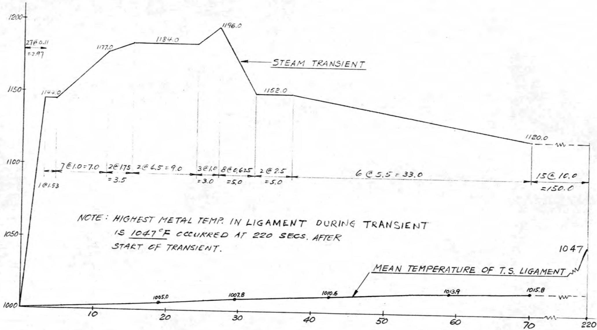  
TIME, SECONDS

TEMPERATURE, ${OF}$   
FIGURE 3 OUTLET HEADER STEAM TRANSIENT DUE TO REACTOR SCKAM   
WITH THERMAL LINEAR   
  
TIME, SECONDS

# FOSTER WHEELER CORPORATION

<table><tr><td colspan="4"></td></tr><tr><td>CHARGE NO 8-25-2431</td><td>DOCUMENT NO. ND/74/66</td><td>ISSUE 1</td><td>DATE 12/16/74</td></tr><tr><td colspan="4">5.2.3 SOME DETAILS OF THE FINITE ELEMENT MODEL
Figure 1 shows the finite element model of the tubesheet-header assembly. The model was used for both pressure and thermal analysis.
The liner (see Figure 4) was not modelled, as this would have made the number of elements very large and the model would have become costly to analyze. Instead, an equivalent film coefficient which simulated the thermal resistance of the liner was used.
The average temperature response of the perforated region of the tubesheet was determined from a separate finite element model of the ligament. The average ligament temperatures obtained from this model due to the load scram and reaction scram transients are shown in Figures 2 and 3, respectively. The elements in the perforated region of the complete finite element model (Figure 1) were &quot;forced&quot; to have the above temperature-time histories. Equivalent elastic constants were used (as determined from Section III of the ASME Code) in the perforated region of the tubesheet.</td></tr><tr><td colspan="4">APPROVED PAGE OF</td></tr></table>

  
FIGURE 4   
FILM COEFFICIENTS

MSBHRMDER-TUBESHEETASSEMBLY

USER: SHEFMAN IP DEPT. 156

P 25

#

  
FIGURE 5   
DESIGN PRESSURE STRESS INTENSITY

40.01 STRESS INTENSITY

TIM-6.00

FIGURE 6   
DESIGN PRESSURE STRESS   
INTENSITY CONTOUR   
  
0.01   
Time:0.00   
CONTURLELSA 0000-60000000000000000000  
120A130A140A150A160,0170-9180,-9190-A200-A210,A220,U230,V240,U250,Y260,Z270.

  
HEADER   
FIGURE 7   
DEFORMED SHAPE FOR   
DESIGN PRESSURE

  
FIGURE 8   
TEMPERATURE CONTROL  
END OF 230 SE C F RE ACTOR   
SCRAM TRANSIENT

STRESS INTENSITY FOR

OPERATING PRESSURE PLUS

REACTOR SCRAM TRANSIENT

#

  
FIGURE 9

#

# FIGURE10

STRESS INTENSITY CONTOURS FOR OPERATING

PRESSURE PLUS REACTOR SCRAM

TRANSIENT

38,900PSI.


TEMPERATURE CONTOUR AT

END OF 220 SE C. OF LOAD

SCRAM TRANSIENT

  
FIGURE II

MSB STEAM OUTLET HERO

  
FIGURE 12   
STRESS INTENSITY FOR   
OPERATING PRESSURE PLUS  
LOAD SCRAM TRANSIENT

  
A. HEADER

02.01*STAC3D INTNO57

105.158.90

# FIGURE13

STRESS INTENSITY CONTOURS

OPERATING PRESSURE PLUS

LOAD SCRAM TRANSIENT

HEAD


<table><tr><td>CHARGE NO 8-25-2431</td><td>DOCUMENT NO. ND/74/66</td><td>ISSUE 1</td><td>DATE 12/16/74</td></tr></table>

# 5.2.4 SIMPLIFIED INELASTIC ANALYSIS

Inelastic strains were calculated by Bree's simplified method (Reference 3). In the Bree Analysis, it is assumed that there are a total of 200 severe thermal cycles (sum of load scams and reactor scams). With a 30-year design life, the time per cycle is 262,800/200 = 1314 hours.

The derivation of the creep law used is given on the next page. The Bree Analysis of Reference 3 has been computerized by Foster Wheeler. The following results were obtained (Reference: Computer Output NHJLOST):

<table><tr><td>Location</td><td>Primary Stress, ksi</td><td>Secondary Stress, ksi</td><td>Total Strain/Cycle,%</td><td>Total Strain</td></tr><tr><td>1-1</td><td>8.57</td><td>23.36</td><td>10^-4</td><td>0.02%</td></tr><tr><td>2-2</td><td>12.16</td><td>14.22</td><td>10^-4</td><td>0.02%</td></tr><tr><td>3-3</td><td>6.15</td><td>49.81</td><td>5 x 10^-4</td><td>0.1%</td></tr><tr><td>4-4</td><td>6.55</td><td>20.31</td><td>0</td><td>0</td></tr><tr><td>5-5</td><td>7.15</td><td>60.84</td><td>8 x 10^-4</td><td>0.16%</td></tr><tr><td>6-6</td><td>8.47</td><td>31.32</td><td>2 x 10^-4</td><td>0.04%</td></tr><tr><td>7-7</td><td>12.97</td><td>37.09</td><td>8 x 10^-4</td><td>0.16%</td></tr></table>

<table><tr><td>BY</td><td>APPROVED</td><td>PAGE 5-30 OF</td></tr></table>

THE POWER LAW

$$
x _ {c} = A 0 ^ {- n}
$$

WHERE $\therefore {n}_{c} =$ CREEP RATE (ACCCUNTS O

FOR SECONDARY CREEP EFF

$$
J = S T E A D Y - S T A T E A P P L I E D
$$

$$
P R I M A R Y \angle O A D.
$$

$$
A, n = C R E E P C O N S T A N T S 0.
$$

MATERIAL AT TEMPERATC

REFER TO FIG.10 OF DATA FOR NICKEL-MOLYBDENUM-CHECMLUM-IRON ALLOY, INOR-S".

${EON} : {ENT} = {11}{C}_{0}^{2}{F}_{1}$

$$
\begin{array}{l} i c = 2 \times 1 0 ^ {- 8} = A (9. 9 5 \times 1 0 ^ {3}) ^ {2 1} \\ i _ {c} = 4 \times 1 0 ^ {- 7} = A (2 \times 1 0 ^ {4}) ^ {3 1} \tag {2} \\ \end{array}
$$

$$
S e c l a n G \subset (2)
$$

$$
2 0 = 2. 0 1 0 0 5 ^ {7}
$$

$$
2 1 = 4. 3
$$

$$
A = 1. 2 8 \times 1 0 ^ {- 2 5}
$$

$$
\begin{array}{l} F C K T E N F = 1 2 0 c ^ {\circ} F: \\ i _ {c} = 4 \times 1 0 ^ {- 7} = A (1 0 ^ {9}) ^ {2 1} \\ \frac {1}{1 0} = 4. 5 \times 1 0 ^ {- 5} = A (3 \times 1 0 ^ {6}) ^ {n} \\ \frac {1 0 ^ {- 2}}{1 . 1 2 5} = (\frac {1}{3}) ^ {2 1} \\ 0. 0 0 8 8 9 = 0. 3 3 3 4 ^ {n} \\ 1 1 \div 3 \\ A = \frac {4 \times 1 0 ^ {- 7}}{(1 0 ^ {4}) ^ {9 . 3}} = 2. 5 2 \times 1 0 ^ {- 2 4} \\ \end{array}
$$

$$
\begin{array}{l} F C \cdot T E M 1 = 1 3 0 0 F \\ \therefore c = 9 \times 1 0 ^ {- 8} = A (4 \times 1 0 ^ {3}) ^ {n} \\ ? / c = 9 \times 1 0 ^ {- 5} = A (2 \times 1 0 ^ {4}) ^ {4} \\ 1 0 ^ {- 3} = (\frac {1}{5}) ^ {2} \\ 0. 0 0 1 = 0. 2 ^ {1} \\ x = 4. 3 \\ A = \frac {9 \times 1 0 ^ {- 5}}{(2 \times 1 0 ^ {4}) ^ {2 . 3}} = \underline {{2 . 8 8 \times 1 0 ^ {- 2 3}}} \\ \end{array}
$$

<table><tr><td>CHARGE NO 8-25-2431</td><td>DOCUMENT NO. ND/74/66</td><td>ISSUE 1</td><td>DATE 12/16/74</td></tr></table>

# 5.2.5 FATIGUE ANALYSIS AND CREEP FATIGUE INTERACTION

A preliminary fatigue analysis was made with the aid of Code Case 1331-4. The following results were obtained. Allowable cycles were obtained at $1100^{\circ}\mathrm{F}$ .

<table><tr><td>Location</td><td>S Ksi</td><td>Ref. Page</td><td>Salt</td><td>N all</td></tr><tr><td>1-1</td><td>33.62</td><td>C-1-5</td><td>16.81</td><td>15000</td></tr><tr><td>2-2</td><td>22.76</td><td>C-1-9</td><td>11.38</td><td>∞</td></tr><tr><td>3-3</td><td>49.81</td><td>C-1-10</td><td>24.91</td><td>2,500</td></tr><tr><td>4-4</td><td>20.31</td><td>C-1-11</td><td>10.16</td><td>∞</td></tr><tr><td>5-5</td><td>60.84</td><td>C-1-13</td><td>30.42</td><td>1,300</td></tr><tr><td>6-6</td><td>31.32</td><td>C-1-15</td><td>15.66</td><td>20,000</td></tr><tr><td>7-7</td><td>37.09</td><td>C-1-16</td><td>18.55</td><td>10,000</td></tr></table>

With only 200 severe thermal cycles, maximum fatigue damage is 200/ $1300 = 0.15$ which occurs at location 5-5. This value is well below the allowable value of 1.0.

<table><tr><td>BY</td><td>APPROVED</td><td>PAGE 5-33 OF</td></tr></table>

<table><tr><td colspan="5"></td></tr><tr><td colspan="2">CHARGE NO 8-25-2431</td><td>DOCUMENT NO. ND/74/66</td><td>ISSUE 1</td><td>DATE 12/16/74</td></tr><tr><td colspan="5">CREEP FATIGUE INTERACTION
Creep fatigue interaction was performed by the method described in
the nozzle portion of this report. Location 7-7 proved to be the
most severely loaded section, and only that section was analyzed.
The section was idealized as a cylinder with 8" inside radius and
4" thickness. The following loading was applied:
pRm/t = p x 8/4 = 12970 x 3600/4000 (refer to Appendix C-1 for source
of 12,970)
solving for p, p = 5836 psi
E·ΔT /2 (1-ν) = 2218l/ -8362 ΔT = {156 -59
where E = 26.7 x 10^6, α = 7.43 x 10^-6
PROGRAM RESULTS
The same type of loading histogram was used for the tubesheet as
was used for the inlet nozzle. There are a total of 50 cycles,
each cycle consisting of 3 load scrams and 1 reactor scram. The
program was run for five cycles and the strain for each remaining
cycle was estimated by taking the difference in strains between
the fourth and fifth cycles.
Maximum total strength = 0.432 + 45 (0.01) = 0.88%
Creep damage = 0.0135 + 45 (.0026) = 0.13
Maximum strain range = 0.381%
Fatigue damage = 50/500 = 0.1
Total creep fatigue damage = 0.23&lt;1.
Ref: Computer Run EBHJLO6C</td></tr><tr><td colspan="5"></td></tr><tr><td>CHARGE NO 8-25-2431</td><td>DOCUMENT NO. ND/74/66</td><td>ISSUE 1</td><td colspan="2">DATE 12/16/74</td></tr><tr><td colspan="5">5.3 STRESS ANALYSIS OF THE MSBR SHELL</td></tr><tr><td colspan="5">5.3.1 INTRODUCTION AND SUMMARY</td></tr><tr><td colspan="5">The MSBR shell was analyzed for both pressure and thermal transient stresses. Three locations of possible high stresses were selected, and are shown in Figure 1.</td></tr><tr><td colspan="5">At locations A and B, pressure stresses were determined by hand calculation. Temperature distributions and thermal stresses were determined using the finite element models shown in Figure 2. At location C, the finite element model shown in Figure 3 was used to determine pressure stresses, temperature distributions, and thermal stresses.</td></tr><tr><td colspan="5">Table 1 gives a summary of the stresses obtained at the three locations. Primary stresses are due to a design pressure of 300 psi or an operating pressure of 235 psi, while primary plus secondary stress intensity ranges are due to an operating pressure of 235 psi, the severest up thermal transient, and the severest down thermal transient. Examination of Reference 1 indicates that a "Ramp Change in Load from 100% to 140% in 3 Seconds" (Load Scram) is the most severe up transient, while "Insertion of Two Safety Rods" (Reactors Scram) is the most severe down transient (Figure 4).</td></tr><tr><td colspan="5">The stresses in Table 1 are categorized in accordance with the rules of ASME Code Case 1331-5. Although the Code Case does not place a stress limit on the primary plus secondary stress intensity range, the 3Sm limit was calculated for reference purposes.</td></tr><tr><td colspan="5">The effect of the tube thermal expansion loads on the shell was calculated by hand and found to be negligible (&lt;200 psi).</td></tr><tr><td>BY</td><td>APPROVED</td><td colspan="3">PAGE 5-35 OF</td></tr><tr><td>CHARGE NO 8-25-2431</td><td>DOCUMENT NO ND/74/66</td><td>ISSUE 1</td><td colspan="2">DATE 12/16/74</td></tr></table>

TABLE I - STRESS SUMMARY - MSBR SHELL   

<table><tr><td colspan="2">Location</td><td>Stress Category</td><td>Calculated Stress Intensity</td><td>Allowable</td></tr><tr><td rowspan="6">DESIGN CONDITION</td><td rowspan="2">A</td><td>Pm</td><td>8.2</td><td>S0=9.5</td></tr><tr><td>PL+Pb</td><td>8.2</td><td>1.5S0=14.25</td></tr><tr><td rowspan="2">B</td><td>Pm</td><td>0.3</td><td>S0=9.5</td></tr><tr><td>PL+Pb</td><td>0.3</td><td>1.5S0=14.25</td></tr><tr><td rowspan="2">C</td><td>Pm</td><td>8.2</td><td>S0=9.5</td></tr><tr><td>PL+Pb</td><td>10.3</td><td>1.5S0=14.25</td></tr><tr><td rowspan="9">OPERATING CONDITION</td><td rowspan="3">A</td><td>Pm</td><td>6.4</td><td>Smt=7.5</td></tr><tr><td>PL+Pb</td><td>6.4</td><td>KSt=7.8</td></tr><tr><td>PL+Pb+Q</td><td>38.9</td><td>3Smt=67.5</td></tr><tr><td rowspan="3">B</td><td>Pm</td><td>.2</td><td>Smt=7.5</td></tr><tr><td>PL+Pb</td><td>.2</td><td>KSt=9.3</td></tr><tr><td>PL+Pb+Q</td><td>4.1</td><td>3Smt=67.5</td></tr><tr><td rowspan="3">C</td><td>Pm</td><td>6.4</td><td>Smt=7.5</td></tr><tr><td>PL+Pb</td><td>8.0</td><td>KSt=7.8</td></tr><tr><td>PL+Pb+Q</td><td>45.0</td><td>3Smt=67.5</td></tr></table>

NOTE: All allowable are at $1150^{\circ}\mathrm{F}$   
See Appendix C-2 for material properties and allowables.   
See Section 5.3.6 for creep fatigue interaction.

<table><tr><td>BY</td><td>APPROVED</td><td>PAGE 5-36 OF</td></tr></table>

  
FIGURE 1


  
FIGURE 2: FINITE ELEMENT MODELS


$\Rightarrow  \frac{y}{x} = \frac{z}{w}$

F1G OK A

COMBINED INLET SALT TRANSIENT DUE TO REACTOR SCRAM AND LOAD SCRAM

  
TIME, SECONDS

# DESIGN PRESSURE STRESS

$$
\begin{array}{l} \sqrt {2} = \frac {3 0 0 \times 1 9 . 7 5}{2 \times 0 . 7 5} = + 3 9 5 0 P S I. \\ J _ {T} = 2 \times 3 9 5 0 = + 7 9 0 0 P S l. \\ \sqrt {R} = - 3 0 0 P S l. (1. 5.) \\ S I = 8 2 0 0 p s i \\ \end{array}
$$


# TRANSPENT TEMPERATURE STRESSES

<table><tr><td></td><td>√R</td><td>√Z</td><td>√T</td><td>√RE</td><td>STRESS IN</td></tr><tr><td>Reaction SCRAM</td><td>90</td><td>15,800</td><td>31,690</td><td>-20</td><td>31,610</td></tr><tr><td>②Load SCRAM</td><td>-20</td><td>-3,780</td><td>-7,300</td><td>10</td><td>7,280</td></tr><tr><td>①+②+OPER.PRESS.</td><td>110</td><td>19,580</td><td>38,990</td><td>-30</td><td>38,880</td></tr></table>

$$
\sqrt {1}, \sqrt {2} = \frac {1}{2} (1 9, 5 8 0 + 1 1 0) \pm [ (\frac {1 9 , 5 8 0 - 1 1 0}{2}) ^ {2} + (- 3 0) ^ {2} ] ^ {\frac {1}{2}}
$$

$$
\begin{array}{l} = 9 8 4 5 \pm 9 7 3 5 \\ = 1 9. 5 8 0, 1 1 0 \\ \end{array}
$$

$$
T _ {3} = V _ {1} = 3 8, 9 9 0
$$

STRESS INTENSITY $= {38},{990} - {110} = {38},{880}$ PSI.

NOTE: MAX REACTOR SCRAM STRESS OCCURS AT END OF 85 SE C.

AFTER START OF SCRAM. ${\Delta T} = {171}^{ \circ  }F$ .

MAX. LOAD. SCRAM STRESS OCCURS AT END OF 15 SEC.

AFTER START OF SCRAM. ${4T} = {38}^{ \circ  }F$ .

5.3.3

SHELL STRESSES AT LOCATION "B"

DESIGN PRESSURE STRESS

$$
\sigma_ {T} = \sigma_ {z} = 0
$$

${v}_{R} =  - {300}\mathrm{{PSI}}.$ (AT THE SURFACES)

TRANSPENT TEMPERATURE STRESSES

<table><tr><td></td><td>TR</td><td>U2</td><td>OT</td><td>VRZ</td><td>STRESS</td></tr><tr><td>① REACTOR SCRAM</td><td>4</td><td>1538</td><td>2282</td><td>2</td><td>2278</td></tr><tr><td>② LOAD SCRAM</td><td>-3</td><td>-1267</td><td>-1837</td><td>-1</td><td>1833</td></tr><tr><td>①+②+OP.PRESS</td><td>7</td><td>2805</td><td>4119</td><td>3</td><td>4112</td></tr></table>

$$
\begin{array}{l} \sqrt {1}, \sqrt {2} = \frac {1}{2} (2 8 0 5 + 7) \pm [ (\frac {2 8 0 5 - 7}{2}) ^ {2} + (3) ^ {2} ] ^ {\frac {1}{2}} \\ = 1 4 0 6 \pm 1 3 9 9 \\ = 2 8 0 5, 7 \\ J _ {3} = J _ {T} = 4 1 1 9 \\ \end{array}
$$

STRESS INTENSITY $= {4119} - 7 = {4112}\mathrm{{PSI}}.$

NOTE: MAX. REACTION SCRAM STRESS CCURS AT END OF 67 SEC. AFTER START OF SCRAM. AT = 15°F

MAX. LCAO S C R A M STRESS OCCURS AT END OF 7.5 SE C. AFTER START OF SCRAM. ${AT} = {12}^{ \circ  }F$

# 5.3.4 SHELL SHELL SHELL JUNCTURE STRESSES

# I PRESERVE STRESSES

(Maximum STRESSES AT ELEMENTS (3 - 6)

FROM FIGURE 5 WE OBTAIN THE FOLLOWING

MEMBRANE STRESSES

$$
\sigma_ {r} ^ {m} = 0. 0 2 3 6 k s i
$$

$$
\sigma_ {z} ^ {m} = 4. 1 9
$$

$$
5 \pi^ {n} = 1 0. 3 1
$$

$$
S _ {r z} ^ {m} = 0. 3 6 1
$$

PRACTICAL STRESSES:

$$
\begin{array}{l} S _ {1} = 1 0. 3 k s i \\ x _ {2} = - 1. 2 2 1 \\ S _ {3} = - 0. 0 7 \\ \end{array}
$$

MAXIMUM STRESS INTENSITY $= {10.32}\mathrm{{ksi}} = {\mathrm{P}}_{\mathrm{L}}$

FROM FIGURE 5, WE OBTAIN THE MAXIMUM LINEARIZED BENDING STRESSES:

$$
T _ {F} ^ {b} = 0. 3 6 1
$$

$$
\sigma_ {z} ^ {2} = 4. 3 8
$$

$$
\overline {{S}} _ {t} = 1. 2 1
$$

$$
\sigma_ {r _ {2}} ^ {b} = 0. 6 6 8
$$

For THE DESIGN CONDITION (p = 300 psi)

$$
P _ {m} = 8. 2 k s i <   S _ {0} = 9. 5 k s i \quad @ 1 1 5 0 ^ {\circ} F
$$

$$
P _ {L} = 1 0. 3 2 <   1. 5 s = 1 4. 2 5 k S i
$$

FOR THE OPERATING CONDITION ( $p = {235}$ psi)

$$
P _ {m} = 6. 4 3 <   S _ {m x} = 8. 0 k s i
$$

$$
P _ {2} = 8. 0 7 <   k S _ {\pi} = 1. 2 5 \times 8 - 0. 2 5 \times 6. 4 3 = 8. 3 9
$$

II PRESURE + THERMAL STRESS

MAXIMUM STRESS INTENSITY RANGE (REF. 6)

ELEMENTS 63-68 (SEE FIG. S-G-7; LINEARIZED STRES

AREGIVENBELL

${S}_{t}$

<table><tr><td>113.</td><td>0.11</td></tr><tr><td>17 SEC.</td><td>-0.36</td></tr><tr><td>Range:</td><td>0.47</td></tr></table>

<table><tr><td>31.78</td><td>40.78</td><td>0.61</td></tr><tr><td>-13.62</td><td>-0.58*</td><td>-0.69</td></tr><tr><td>45.4</td><td>41.36</td><td>1.30</td></tr></table>

<table><tr><td>REACTOR SCRAM</td></tr><tr><td>LOAD SCRAM</td></tr><tr><td>45.0</td></tr></table>


# FOSTER WHEELER CORPORATION

110 SOUTH ORANGE AVE., LIVINGSTON, N.

BY DATE SUBJECT SHEET NO

CHKD. BY-DATE_____

  
FIGURE 6

THENAL STRESSES

ELEMENTS 63-68

TIME = 113 SECONDS

# FOSTER WHEELER CORPORATION

110 SOUTH ORANGE AVE., LIVINGSTON, 1

BY. DATE SUBJECT

SHEET NO. OF

CHKD BY DATE

JOB NO.

  
FIGURE 7   
THERNA-STRESSES   
ELEMENT 63-68   
TIME -17 SECONDS

<table><tr><td>CHARGE NO 8-25-2431</td><td>DOCUMENT NO. ND/74/66</td><td>ISSUE 1</td><td>DATE 12/16/74</td></tr></table>

# 5.3.5 SIMPLIFIED INELASTIC ANALYSIS

Inelastic strains were calculated by Bree's simplified method (Reference 3). In the Bree analysis, it is assumed that there are a total of 200 severe thermal cycles (sum of load scrams and reactor scrams). With a 30-year design life, the time per cycle is $262,800 / 200 = 1314$ hours.

The derivation of the creep law used in the Bree analysis is given in the tubesheet section of this report.

The Bree analysis of Reference 3 has been computerized. The following results were obtained:

<table><tr><td>Location</td><td>Primary Stress</td><td>Secondary Stress</td><td>Strain/Cycle%</td><td>Total Strain %</td></tr><tr><td>A</td><td>8200</td><td>38880</td><td>5x10-4</td><td>0.1&lt;1%</td></tr><tr><td>B</td><td>300</td><td>4112</td><td>0</td><td>0</td></tr><tr><td>C</td><td>8070</td><td>55000</td><td>8x10-4</td><td>0.16&lt;1%</td></tr></table>

Ref.: Computer Run NHJLO9J

<table><tr><td>BY</td><td>APPROVED</td><td>PAGE 5-49 OF</td></tr></table>

<table><tr><td colspan="4"></td></tr><tr><td>CHARGE NO 8-25-2431</td><td>DOCUMENT NO. ND/74/66</td><td>ISSUE 1</td><td>DATE 12/16/74</td></tr><tr><td colspan="4">5.3.6 FATIGUE ANALYSIS AND CREEP FATIGUE INTERACTION
A preliminary fatigue analysis was made using the fatigue curves
from Code Case 1331-4. The following results were obtained:
Location S, Ksi Salt Nall
A 38.9 19.5 6000
B 4.1 2.1 ∞
C 54.3 27.2 1500
With only 200 cycles of significatn stress, maximum fatigue damage
is 200/1500 = 0.13.
CREEP FATIGUE INTERACTION
Creep fatigue interaction was performed by the method described in
the nozzle section of this report. The load histogram is also
shown in that section. The shell shroud juncture had the highest
loadings, which are given below.
pr = 8.07; p = 0.75 x 8.07 = 0.31 Ksi
t 20
EaLT = 40.8 ΔT = 290 F (down transient)
2(1-v) -13.9 -97 F (up transient)
where E = 27.45 x 10^6 = 7.175 x 10^-6 (down transient)
E = 25.8 x 10^6 = 7.81 x 10^-6 (up transient)
In addition, aΔT of 20°F was applied to simulate the pressure bending
PROGRAM RESULTS
There are a total of 50 cycles, each cycle consisting of 3 load
scrams and l reactor scram. The program was run for five cycles
and the strain for each of the remaining cycles was estimated by
taking the difference in strains between the fourth and fifty cycles.
Maximum total strain = 0.487 + 45 (0.041) = 2.33%*
Creep damage = 0.0547 + 45 (0.0120) = 0.595
Maximum strain range = 0.3347</td></tr><tr><td colspan="4">Fatigue damage = 50/1000 = 0.05 at 1150 F
Total creep fatigue damage = 0.645&lt;1
Ref.: Computer Run EBHJLO1C
* Some slight thickening in the area of the shell shroud juncture may be necessary to reduce the total strain below the allowable value of 2%.</td></tr><tr><td>BY</td><td>APPROVED</td><td colspan="2">PAGE OF</td></tr><tr><td>CHARGE NO 8-25-2431</td><td>DOCUMENT NO. ND/74/66</td><td>ISSUE 1</td><td>DATE 12/16/74</td></tr></table>

# 5.4 STRESS ANALYSIS OF THE MSBR TUBES

# 5.4.1 INTRODUCTION AND SUMMARY

The MSBR tubes, constructed of Hastelloy material, were analyzed for pressure, radial temperature gradient, and restrained thermal expansion stresses. The temperature difference between the salt and steam is greatest during the steady state condition (rather than the transient condition) and, therefore, the highest radial gradient thermal stresses occur during steady state.

Restrained thermal expansion stresses occur in the tube because of the fact that the average shell temperature is different than the average tube temperature. These stresses were calculated with the aid of the computer program STRUDL.

Table 1 gives a summary of the results. Stresses were categorized in accordance with the rules of Code Case 1331-5. Design stresses are due to a 3600 psi design pressure and restrained thermal expansion. Operating stresses are due to a 3425 psi pressure differential, radial temperature gradients during steady state, and restrained thermal expansion. Although there is no limit on primary plus secondary stress intensity range in the Code Case, the $3S_{m}$ limit was calculated for reference purposes.

Natural frequencies in the bend area of the tubes, where flow induced vibrations are possible, were calculated. It was found that natural frequencies were at least $50\%$ higher than the vortex shedding frequencies, which is satisfactory.

<table><tr><td colspan="4"></td></tr><tr><td>CHARGE NO 8-25-2431</td><td>DOCUMENT NO. ND/74/66</td><td>ISSUE 1</td><td>DATE 12/16/74</td></tr></table>

TABLE 1 - SUMMARY OF RESULTS - MSBR TUBES   

<table><tr><td>Condition</td><td>Stress Category</td><td>Calculated Value (ksi)</td><td>Allowable (ksi)</td></tr><tr><td>Design</td><td>Pm</td><td>11.67</td><td>S = 11.8 @1120°F*</td></tr><tr><td></td><td>PL+Pb</td><td>11.67</td><td>1.5S0=17.7</td></tr><tr><td>Operating</td><td>Pm</td><td>11.4</td><td>Smt=11.8</td></tr><tr><td></td><td>PL+Pb</td><td>11.4</td><td>KSt=12.2</td></tr><tr><td></td><td>(PL+Pb+Q)R</td><td>29.3</td><td>3Sm=67.5</td></tr></table>

*Maximum average through the wall tube temperature.

See Section 5.4.6 for creep fatigue interaction.

See Appendix C-2 for material properties and allowable.

<table><tr><td>BY</td><td>APPROVED</td><td>PAGE 5-53 OF</td></tr></table>

# 54.2 TULIPRIMANY STINESSES

A) Pressure Stresses

$$
\begin{array}{l} P = 3 6 0 0 p s i (1 + 0. 0 5 m o x. T \in s t r o s s e s - w h i n a r e c o n s i d e r e d p r a m a r y). \\ r _ {1} = 0. 3 7 5 - 3 0 (0. 0 0 5 0) = 0. 3 6 0 = b \quad x = b - a = 0. 1 0 2 5 \\ r _ {1} = 0. 2 5 + 3 0 (1. 0 0 - 2 5) = 0. 2 5 7 5 = a b + a = 0. 6 1 7 5 \\ \end{array}
$$

$$
\begin{array}{l} r = - P \frac {a ^ {2} (b ^ {2} - 1)}{r ^ {2} (b ^ {2} - a ^ {2})} \quad \sigma_ {a} = P \frac {a ^ {2}}{b ^ {2} - a ^ {2}} \\ S _ {t} = P \frac {1 - (b ^ {2} + r ^ {2})}{r ^ {2} - (b ^ {2} - a ^ {2})} = O _ {2} = A V E R A G E S T R E S S \\ \end{array}
$$

$$
\begin{array}{l} \frac {1}{r} = \frac {- 1}{b - a} \int_ {a} ^ {b} \frac {P A ^ {-}}{b ^ {2} - a ^ {2}} \left(\frac {b ^ {2}}{r ^ {2}} - 1\right) d r \\ = \frac {- 1}{b - a} + \frac {1}{b ^ {2} - a ^ {2}} [ - b ^ {2} r ^ {- 1} - r ] _ {a} \\ = \frac {- 1}{b - a} \frac {b ^ {2}}{b ^ {2} + a ^ {2}} \left[ - b - b + \frac {b ^ {2}}{a} + a \right] = \frac {- p a ^ {2}}{(b - a) (b ^ {2} - a ^ {2})} \frac {b ^ {2} - 2 a b + a ^ {2}}{a} \\ = \frac {- 1 0 (b - a)}{b ^ {2} - a ^ {2}} = \frac {- 1}{b + a} \\ \end{array}
$$

$$
\begin{array}{l} \overline {{\frac {1}{a}}} = \frac {1}{b - a} \cdot \frac {1}{b ^ {2} - x ^ {2}} [ - 1 - r + r ] _ {a} ^ {b} \\ = \frac {1}{b - a} \frac {p a ^ {2}}{b ^ {2} - 1} [ \frac {b ^ {2}}{a} - a ] \\ = \frac {+ p}{b - a} \\ \end{array}
$$

$$
\overline {{\sigma}} _ {r} = \frac {- p (0 . 2 5 7 5)}{0 . 6 1 7 5} = - 0. 4 1 7 P
$$

$$
\overline {{S}} _ {e} = \frac {p (0 . 2 5 7 5)}{0 . 1 0 2 5} = 2. 5 1 2 p
$$

$$
\overline {{\tau}} _ {2} = \frac {p (0 . 2 5 7 5)}{0 . 3 6 ^ {2} - 0 . 2 5 7 5 ^ {2}} = 1. 0 4 8 p
$$

$$
I _ {r _ {m a x}} = - p \quad (a + r = a)
$$

$$
r = \frac {b ^ {2} - a ^ {2}}{b ^ {2} - a ^ {2}} = p \frac {0 . 1 9 5 g}{0 . 0 6 3 2 g} = 3. 0 9 5 p (r = a)
$$

$$
\alpha_ {2 m} = 1. 0 4 8
$$

$$
S _ {m} = 4. 0 1 s p = 4. 0 1 s \times 3. 8 = 1 5. 6 k s
$$

PHRIMM. MEMBRANE PRESSURE STRESSES

$$
\overline {{f}} _ {r} = - 0. 4 1 7 p
$$

$$
\overline {{u}} _ {1} = - 0. 5 1 2
$$

$$
x = 1. 0 + 8
$$

<table><tr><td colspan="4"></td></tr><tr><td>CHARGE NO 8-25-2431</td><td>DOCUMENT NO. ND/74/66</td><td>ISSUE 1</td><td>DATE 12/16/74</td></tr><tr><td colspan="4">(B) TUBE THEOAL EXPANSION STICKS:
Because of the temperature difference between the tubes and shell,
thermal expansion stresses will exist in the tubes. Below are
tabulated tube and shell temperatures.
Tube Shell AT
Inlet Temperature 1083 1150 67
Outlet Temperature 756 850 94
Average AT = 80.5°
A STRUDL model of a typical tube was prepared (Figure 1). Applying an
average temperature difference of 80.5 F between the tubes and shell,
a maximum stress (at joint 29) of 6400 psi was obtained.
Reference: FWC Computer Run EBEHLEVYC, July 8, 1974.</td></tr><tr><td>BY</td><td>APPROVED</td><td colspan="2">PAGE 5-56 OF</td></tr></table>

  
FIGURE1 STRVDL MODEL FOR TUBE

# DESIGN CONDITION

$$
\begin{array}{l} \begin{array}{r l} {\overline {{\sigma}} _ {r}} & {= - 0. 4 1 7 \times 3. 6 0 0 = - 1. 5 k s i} \\ {\overline {{\sigma}} _ {\theta}} & {= 2. 5 1 2 \times 3. 6 0 0 = 9. 0 4} \\ {\overline {{\sigma}} _ {z}} & {= 1. 0 4 8 \times 3. 6 0 0 + 6. 4 = 1 0.} \end{array} \\ M A X S I = 1 1. 6 7 \\ <   S _ {0} = 1 1. 8 k s i \circ 1 1 2 0 ^ {\circ} F \\ \end{array}
$$

# OPERATING CONDITION

$$
P _ {m} = (3. 6 - 0. 1 7 5) \times (1. 0 4 8 + 0. 4 1 7) + 6. 4 = 1 1. 4
$$

(1) For full load condition, time $= 3/4 \times  {30}$ years $= {1.97} \times  {10}^{5}\mathrm{{hrs}}$ . and maximum average voltage wall temperature $= {1075}^{ \circ  }\mathrm{F}$ .

$$
P _ {n} = 1 1. 4 <   S _ {m x} = 1 1. 8 k _ {1 1} a + 1 0 7 5 ^ {\circ} F a + 2 <   1 0 ^ {5} h r s.
$$

$\therefore F = {P}_{0} - T$ look condition, time $= 1/4 - {30}$ years $= {0.66} \times  {10}^{5}{hr}\mathrm{c}$ .

$$
P _ {n} = 1 1. 4 <   S _ {m x} = 1 2 k _ {1 1} \times T 1 1 2 0 ^ {\circ} F a d 0. 6 6 \times 1 0 ^ {5} h r s
$$

$- {h}_{0} < {l}_{1}$ ① ${S}_{\text{rect }\left( 0\right) } = \frac{1}{2} \cdot  {S}_{\text{rect }}$

$$
\frac {x _ {1}}{x _ {1 m}} + \frac {x _ {2}}{x _ {2 m}} = \frac {1 . 9 7 + 1 0 ^ {5}}{1 \times 1 0 ^ {6}} + \frac {0 . 6 6 - 1 0 ^ {5}}{2 \times 1 0 ^ {5}} = 0. 5 3 <   1
$$

5.3.3 THERMAL STRESSES

STeady state tube temperature distribution


$$
\begin{array}{r l} {T _ {i} ^ {\frac {1}{2}}} & {= 1 0 1 0 \quad (\mathrm {S T E A M O U T L E T})} \\ {T _ {i} ^ {\frac {5}{2}}} & {= 7 0 0 \quad (\mathrm {S T E A M I N L E T})} \end{array}
$$

$$
k = 1 1. 0 \circ 1 0 8 0 ^ {\circ} F   k = 9. 0 5 \circ 7 7 5 ^ {\circ} F
$$

$$
\begin{array}{r l} {T _ {2} ^ {5}} & {= 8 S O (S o d i u m a t L e T)} \\ {T _ {3} ^ {5}} & {= 1 1 S O (S o d i u m I n L e T)} \end{array}
$$

$$
\begin{array}{l} \begin{array}{r l} {h _ {i}} & {= 4 S + 1 \quad (\mathrm {S T E A M I N C L E T - S O D I U M O U T L E T})} \\ {h _ {i}} & {= 1 + 3 9 \quad (\mathrm {S T E A M O U T L E T - S O D I U M I N C L E T})} \end{array} \\ \begin{array}{r l} {h _ {0}} & {= 9 7 2 \quad (\mathrm {S T E A M I N C L E T - S O D I U M O U T L E T})} \\ {h _ {0}} & {= 1 1 3 4 \quad (\mathrm {S T E A M O U T L E T - S O D I U M I N C L E T})} \end{array} \\ \end{array}
$$

$$
\begin{array}{l} g = h _ {i} (= \pi r _ {i}) (T _ {i} - T _ {i} ^ {s}) = \frac {2 \pi k}{l n r _ {0} / r _ {i}} (T _ {0} - T _ {i}) = h _ {0} (2 \pi r _ {0}) (T _ {0} ^ {s} - T _ {0}) \\ T _ {i} - T _ {i} ^ {5} = \frac {8}{2 \pi h _ {i} r _ {i}} \\ T _ {0} - T _ {i} = \frac {8}{2 \pi k / l n r _ {i}} \\ T _ {0} ^ {\frac {1}{3}} - T _ {0} = \frac {8}{- \pi h _ {0} r _ {0}} \\ T _ {i} ^ {s} - T _ {i} ^ {s} = g \left[ \frac {1}{2 \pi h _ {i} r _ {i}} + \frac {\ln r _ {0} / r _ {i}}{2 \pi k} + \frac {1}{2 \pi h _ {0} r _ {0}} \right] \\ \end{array}
$$

$$
\begin{array}{l} g = 2 \pi [ T _ {0} ^ {3} - T _ {c} ^ {3} ] [ \frac {1}{h _ {c} r _ {c}} + \frac {1 n r _ {o} / r _ {c}}{k} + \frac {1}{h _ {o} r _ {o}} ] ^ {- 1} \\ T _ {i} = T _ {i} ^ {s} + [ T _ {i} ^ {s} - T _ {i} ^ {s} ] [ 1 + \frac {h _ {i} r _ {i}}{k} \ln \frac {r _ {0}}{r _ {i}} + \frac {h _ {i} r _ {c}}{h _ {0} r _ {0}} ] ^ {- 1} \\ T _ {1} = T _ {0} ^ {s} - [ T _ {1} ^ {s} - T _ {2} ^ {s} ] \left[ 1 + \frac {h _ {0} r _ {0}}{k} \ln \frac {r _ {0}}{r _ {i}} + \frac {h _ {0} r _ {0}}{h _ {i} r _ {i}} \right] ^ {- 1} \\ T _ {i} - T _ {i} = \left[ T _ {i} ^ {3} - T _ {i} ^ {8} \right] \left[ 1 + \frac {k}{h _ {i} r _ {i} \ln r _ {0} / r _ {i}} + \frac {k}{h _ {o} r _ {o} \ln r _ {0} / r _ {i}} \right] \\ \end{array}
$$

$$
T _ {0} = 1 1 5 0 - 1 4 0 [ 1 + \frac {1 1 3 4 - 0 . 3 5 / 1 2}{1 1 . 0} \ln 1. 5 + \frac {3}{2} \frac {1 1 3 4}{1 4 3 9} ] ^ {- 1}
$$

$$
T _ {0} = 1 1 1 0 ^ {\circ} F \quad T _ {\mathrm {m e a n}} = 1 0 8 3. 5
$$

$$
\begin{array}{l} g = 2 \pi [ T _ {0} ^ {3} - T _ {c} ^ {3} ] [ \frac {1}{h _ {c} r _ {c}} + \frac {1 n r _ {o} / r _ {c}}{k} + \frac {1}{h _ {o} r _ {o}} ] ^ {- 1} \\ T _ {i} = T _ {i} ^ {s} + [ T _ {i} ^ {s} - T _ {i} ^ {s} ] [ 1 + \frac {h _ {i} r _ {i}}{k} \ln \frac {r _ {0}}{r _ {i}} + \frac {h _ {i} r _ {c}}{h _ {0} r _ {0}} ] ^ {- 1} \\ T _ {1} = T _ {0} ^ {s} - [ T _ {1} ^ {s} - T _ {2} ^ {s} ] \left[ 1 + \frac {h _ {0} r _ {0}}{k} \ln \frac {r _ {0}}{r _ {i}} + \frac {h _ {0} r _ {0}}{h _ {i} r _ {i}} \right] ^ {- 1} \\ T _ {i} - T _ {i} = \left[ T _ {i} ^ {3} - T _ {i} ^ {8} \right] \left[ 1 + \frac {k}{h _ {i} r _ {i} \ln r _ {0} / r _ {i}} + \frac {k}{h _ {o} r _ {o} \ln r _ {0} / r _ {i}} \right] \\ F O _ {2} S T E + H N C l = S O _ {4} \uparrow \\ T _ {i} = 7 0 0 + 1 5 0 [ 1 + \frac {4 5 4 1 \times 0 . 2 5 / 1 2}{9 . 0 5} \ln 1. 5 + \frac {2}{3} \frac {4 5 4 1}{9 7 2} ] ^ {- 1} \\ T _ {c} = 7 1 8 F \\ T _ {2} = 8 5 0 - 1 5 0 [ 1 + \frac {9 7 2 \times 0 . 3 7 5 / 1 2}{9 . 0 5} \ln 1. 5 + \frac {3}{2} \frac {9 7 2}{4 5 4 1} ] ^ {- 1} \\ T _ {0} = 7 9 4 F \quad T _ {\min} = 7 5 6 ^ {\circ} F \\ T _ {0} - T _ {i} = 1 5 0 [ 1 + \frac {9 . 0 5 \times 1 2}{4 5 \times 1 \times 0 . 2 5 \ln 1 . 5} + \frac {9 . 0 5 \times 1 2}{9 7 2 \times 0 . 3 7 5 \ln 1 . 5} ] ^ {- 1} \\ T _ {0} - T _ {1} = 7 6 ^ {\circ} F \\ \sigma = \frac {E x}{2 (1 - v)} (T _ {0} - T _ {1}) = \frac {2 7 . 5 > 7 . 0 9}{1 . 4} (7 6) = 1 0, 6 0 0 p s i \\ F o r S T E x t i t {c l e t} - S u d n u m I n c l e t \\ T _ {i} = 1 0 1 0 + 1 1 0 [ 1 + \frac {1 4 3 9 \times 0 . 2 5 / 1 2}{1 1 . 0} \ln 1. 5 + \frac {2}{3} \frac {1 4 3 9}{1 1 3 4} ] ^ {- 1} \\ T _ {i} = 1 0 5 7 F \\ \end{array}
$$

$$
\begin{array}{l} T _ {1} - T _ {2} = 1 4 0 [ 1 + \frac {1 1 . 0 \times 1 2}{1 + 3 9 \times 0 . 2 5 \cdot \ln 1 . 5} + \frac {1 1 . 0 \times 1 2}{1 1 3 4 \times 0 . 3 7 5 \times \ln 1 . 5} ] ^ {- 1} \\ T _ {2} - T _ {1} = 5 0 ^ {\circ} F \\ f = \frac {E x}{2 (1 - z)} (T _ {c} - T _ {c}) = \frac {2 6 . 3 \times 7 . 6}{1 . 4} (5 2) = 7 4 2 0 p s; \\ \end{array}
$$

<table><tr><td>CHARGE NO 8-25-2431</td><td>DOCUMENT NO. ND/74/66</td><td>ISSUE 1</td><td>DATE 12/16/74</td></tr></table>

# 5.3.4 FLOW INDUCED VIBRATION

There is a possibility of flow induced vibration only in the bend area of the tubes. The direction of possible vibration is shown in Figure 2. Supports have been provided as shown, to increase the natural frequency to $50\%$ above the vortex shedding, and minimize the possibility of vibration.

The natural frequency is calculated below.


  
FiG.2: Tube and Sopp ts in Bend Area

$$
k _ {1} = \sqrt {\frac {E I _ {2}}{I _ {1}}} = \sqrt {\frac {2 6 . 3 - 1 5 ^ {6} - 0 . 0 1 2 4 6 , 3 8 6 . 4}{0 . 0 7 7 8}} = 4 0. 3 4 \times 1 0 ^ {3}
$$

$$
L = 5 + \pi / L E N G _ {+} = 1 0 3 - \pi / 8 = 4 0 - 1 5
$$

$$
F \sim A \sim P (1) \sim S (P) = E D B E A M
$$

$$
\omega = \frac {\pi}{2} k _ {1} = 3. 7 c p s
$$

$$
F _ {1} = F _ {2} + F _ {3} + B E F M
$$

$$
- 2 0 0 - 3 8. 7 = 8 6. 5
$$

$$
A E \sim A C,
$$

$$
= \frac {1}{2} (3 8. 7 + 9 4. 5) = 6 2. 0
$$

$$
\mathrm {F r e e} \times \mathrm {V o r t E} \times \mathrm {S H E D D} _ {\mathrm {P C}} \mathrm {F r e e} \times \mathrm {E n c} = 4 0 \mathrm {c P S}
$$

FREQUENCY, AN 50% HIGHT FORM (285).47

<table><tr><td>CHARGE NO 8-25-2431</td><td>DOCUMENT NO. ND/74/66</td><td>ISSUE 1</td><td>DATE 12/16/74</td></tr></table>

# 5.3.5 SIMPLIFIED INELASTIC ANALYSIS

Inelastic strains were calculated by Bree's simplified method (see Chapter VI of the IMFBR Piping Design Guide). In the Bree analysis, it is assumed that there are a total of 200 severe thermal cycles (sum of load scams and reactor scams). With a 30-year design life, the time per cycle is $262,800 / 200 = 1314$ hours.

The derivation of the creep law used in the Bree analysis is given in the tubesheet report.

The Bree analysis has been computerized by Foster Wheeler, and the following results were obtained.

$$
\frac {\mathrm {P} _ {\mathrm {m}}}{1 1 . 4 \mathrm {k s i}} \quad \frac {\mathrm {P} _ {\mathrm {L}} \mathrm {P} _ {\mathrm {b}} + \mathrm {Q}) _ {\mathrm {R}}}{1 1 . 4 + 1 0 . 6} = 2 2. 0 \quad \frac {\varepsilon / \text {cycle} \%}{3 \times 1 0 ^ {- 4}} \quad \frac {\varepsilon \%}{0.06 <  } 1 \%
$$

Ref: Computer Run NHJLO7P In computer run, input data is conservative.

# 5.3.6 FATIGUE ANALYSIS

A preliminary fatigue analysis was made with the aid of Code Case 1331-4. With a stress range of 22.0 Ksi, or an alternating stress of 11.0 Ksi, the Code Case gives an infinite number of allowable cycles. Thus, fatigue should be no problem.

<table><tr><td colspan="4"></td></tr><tr><td>CHARGE NO 8-25-2431</td><td>DOCUMENT NO. ND/74/66</td><td>ISSUE 1</td><td>DATE 12/16/74</td></tr></table>

# CREEP FATIGUE INTERACTION

Creep fatigue interaction was performed by the method described in the nozzle portion of the report. An internal pressure differential of 3425 psi was applied for the 30-year life of the unit. The steady state radial temperature gradient is $52^{\circ}\mathrm{F}$ . In addition, a 28 F radial AT was applied to simulate the tube thermal expansion stresses. During the transient conditions, the radial temperature gradients in the tubes are milder.

# PROGRAM RESULTS

Maximum total strain $= 0.65\%$

Creep damage = 0.095

Maximum strain range $= 0.258\%$

Fatigue damage = 0.05 (Maximum temperature = 1100 F)

Total creep fatigue damage $= 0.15 < 1.0$

Ref: Computer run EBHJLO1C

<table><tr><td colspan="4"></td></tr><tr><td>CHARGE NO 8-25-2431</td><td>DOCUMENT NO. ND/74/66</td><td>ISSUE 1</td><td>DATE 12/16/74</td></tr><tr><td colspan="4">5.5 TUBE RUPTURE ANALYSES
Tube rupture effect analyses were performed by the Gulf General
Atoms Company. Detailed descriptions of the analyses are contained
in Reference(8)which is included in its original form in Appendix
C-3 of this report.
The analyses covered two areas of concern: the effect of a tube
rupture on the shell cylinder and the adjacent tube. The effect
of a tube rupture on the shell was examined by modeling the shell
in a state of plane strain loaded by internal pressure of varying
profile. Numerical calculations were done by using the finite
difference code system, PISCES, developed by Physics International
Company. The bilinear stress-strain relation of Hastelloy N at
850°F was used. The results indicate a maximum stress of 42,900
psi which is well above the yield strength (27,600 psi), but only
one-half the ultimate strength (85,500 psi) of the shell material.
It also predicted an increase of 3.6" (or 9%) in the diameter of
the shell.
The effect of a tube rupture on the adjacent tube was examined by
modeling the adjacent tube as a lumped-mass continuous beam with
an appropriate elastic-plastic moment-curvature diagram derived from
the stress-strain curve of the tube material (Hastelloy N at 850°).
The loads acting on the beam model consisted of a transverse inertial
force and the resistive force of the molten-salt. The results
indicate that the ultimate strength is not exceeded and, therefore,
the adjacent tube would not rupture. However, a deflection of 24.5" 
was calculated which was about 40 percent of the length of the
span between two consecutive supports.
As indicated in Reference (8), the conclusion reached concerning
the shell response due to a tube rupture was conservative in that
the applied pressure was chosen as an upper bound of the data
available on ruptures. The assumption of a plane strain state
was also conservative in that the pressure load resulting from
the tube rupture was assumed to act along the entire axis of the
shell. However, for a more accurate prediction, much knowledge
concerning the pressure profile is needed experimentally and
analytically. On the other hand, the analysis concerning the
effect of a tube rupture on the adjacent tube is incomplete.
Due to the extremely large deflection calculated from the beam
model, it is felt that the applied loads have to be reexamined and
large deformation theory should be considered. In the presence
of large deflections, the analysis should also include the interaction
of adjacent tubes, and perhaps the associated problems of instability.</td></tr><tr><td colspan="4">5.6 REFERENCES
1. Foster Wheeler Computer Program R1015 by R. E. Nickell, revised by M. B. Hsu.
2. Hybrid Computer Simulation of the MSBR by O. W. Burke, ORNL-TM-3767.
3. LMFBR Piping Design Guide by C. F. Braun &amp; Company.
4. Bases for Design of MSBR Systems for Temperatures to 1300 F, ORNL-73-1-23.
5. Tubesheet computer runs EBMSER2A (pressure), EBMSBREC (steady state temperature), EBMSBRCF-1 (load reduction transient), EBMSBERCF-2 (reactor scram transient)
6. Shell computer runs, EBMSBR2C-1 (Pressure), EBMSBR2C-2 (thermal stress)
7. Data for Nickel - Molybdenum Chromium - Iron Alloy, Iron-8, June 1, 1961.
8. J. J. Johnson and D. A. Wesley, Tube Rupture Analysis of a Counter Flow Heat Exchanger, Gulf-GA-A 12414, Nov. 20, 1972, Prepared for Foster Wheeler Energy Corporation.
9. Nozzle computer runs - EBRSL56C (pressure), EBRSL56C-1 (temperature stresses)</td></tr><tr><td>BY</td><td>APPROVED</td><td colspan="2">PAGE 5-67 OF</td></tr></table>

FOSTER WHEELER ENERGY CORPORATION   

<table><tr><td colspan="5"></td></tr><tr><td colspan="2">CHARGE NO. 8-25-2431</td><td>DOCUMENT NO. ND/74/66</td><td>ISSUE 1</td><td>DATE 12/16/74</td></tr><tr><td colspan="5">SECTION 6
HASTELLOY N STEAM CORROSION
BY
George V. AMORUSO
GEORGE V. AMORUSO</td></tr><tr><td colspan="5">Approved by
C J MONTY
E. D. Montrone
Assistant Chief Metallurgist
W.R.Apblett, Jr.
Chief Metallurgist</td></tr><tr><td>BY</td><td>APPROVED</td><td>PAGE</td><td>6-a</td><td></td></tr></table>

LIVINGSTON, N. J.

FOSTER WHEELER ENERGY CORPORATION   

<table><tr><td colspan="5">TABLE OF CONTENTS</td></tr><tr><td>6.0</td><td colspan="3">REVIEW OF HASTELLOY N STEAM CORROSION</td><td>PAGES 6-1</td></tr><tr><td>6.1</td><td colspan="3">ABSTRACT</td><td>6-1</td></tr><tr><td>6.2</td><td colspan="3">SUMMARY</td><td>6-2</td></tr><tr><td>6.3</td><td colspan="3">INTRODUCTION</td><td>6-4</td></tr><tr><td>6.4</td><td colspan="3">DISCUSSION</td><td>6-5</td></tr><tr><td>6.4.1</td><td colspan="3">EARLY STUDIES</td><td>6-5</td></tr><tr><td>6.4.2</td><td colspan="3">OAK RIDGE NATIONAL LABORATORY STUDIES</td><td>6-11</td></tr><tr><td>6.4.2.1</td><td colspan="3">GENERAL CORROSION TESTS</td><td>6-11</td></tr><tr><td>6.4.2.2</td><td colspan="3">TUBE BURST TESTS</td><td>6-15</td></tr><tr><td>6.4.2.3</td><td colspan="3">DUPLEX TUBING TESTS</td><td>6-18</td></tr><tr><td>6.4.3</td><td colspan="3">CRITICAL REVIEW OF STEAM GENERATOR TUBING MATERIALS</td><td>6-21</td></tr><tr><td>6.4.3.1</td><td colspan="3">DESIGN REQUIREMENTS AND CRITERIA</td><td>6-21</td></tr><tr><td>6.4.3.2</td><td colspan="3">CORROSION RESISTANCE TO MOLTEN FLUORIDE SALTS</td><td>6-23</td></tr><tr><td>6.4.3.3</td><td colspan="3">CORROSION RESISTANCE TO SUPERCRITICAL STEAM</td><td>6-25</td></tr><tr><td>6.4.4</td><td colspan="3">CRITICAL REVIEW OF HASTELLOY N AND DUPLEX TUBING</td><td>6-26</td></tr><tr><td>6.4.4.1</td><td colspan="3">HASTELLOY N</td><td>6-26</td></tr><tr><td>6.4.4.2</td><td colspan="3">DUPLEX TUBING</td><td>6-27</td></tr><tr><td>6.5</td><td colspan="3">CONCLUSIONS/RECOMMENDATIONS</td><td>6-28</td></tr><tr><td>6.6</td><td colspan="3">REFERENCES</td><td>6-31</td></tr><tr><td>6.7</td><td colspan="3">TABLES 1-26 INCLUSIVE</td><td>6-43</td></tr><tr><td>6.8</td><td colspan="3">FIGURES 1-45 INCLUSIVE</td><td>6-71</td></tr></table>

FOSTER WHEELER ENERGY CORPORATION   

<table><tr><td colspan="5"></td></tr><tr><td colspan="2">CHARGE NO. 8-25-2431</td><td>DOCUMENT NO. ND/74/66</td><td>ISSUE 1</td><td>DATE 12/16/74</td></tr><tr><td>6.0</td><td colspan="4">REVIEW OF HASTELLOY N STEAM CORROSION</td></tr><tr><td>6.1</td><td colspan="4">ABSTRACT
The literature survey described herein included a review of high temperature water/steam material investigations published in Corrosion Abstracts, ASME Transactions, GEAP(1), ORNL(2), EURAEC(3) and miscellaneous technical papers concerning the corrosion behavior of various low alloy steels, ferritic and austenitic stainless steels and nickel base alloy subjected to water/steam environments at high temperatures and pressures.</td></tr><tr><td colspan="5">Particular attention was focussed on the corrosion behavior of Hastelloy N in high temperature steam service since the alloy is the preferred material of construction for the reactor vessel, piping and primary and secondary heat transfer equipment in the Molten Salt Breeder Reactor.
The literature search included a limited evaluation of alternate alloys or combinations of alloys that could be used for the steam generator tubing in the Molten Salt Breeder Reactor.
The survey indicates that there are no single commercial alloys or combinations of tubing alloys other than those presently under investigation at the Oak Ridge National Laboratory that can satisfy the tubing requirements for long term elevated temperature strength, stability, ductility, creep and corrosion resistance.
The data indicates there are several areas which require further investigation particularly with respect to the evaluation of Hastelloy N under constant stress and new duplex tubing processes used to provide increased corrosion protection to tubing surfaces.
(1)General Electric Atomic Power Equipment Department Vallecitos Atomic Laboratory, San Jose, California (Studies prepared for U.S. Atomic Energy Commission under Contract AT(04-3)-189 Project Agreement 13.
(2)Oak Ridge National Laboratory, Oak Ridge, Tenn. Studies prepared for U.S. Atomic Energy Commission under Contract W 7405-eng 26.
(3)Joint Europe Atomic Energy/U.S. Atomic Energy Commission studies performed under Contract # 089-62-7 RDB.</td></tr><tr><td colspan="5">6.2 SUMMARY
The literature survey shows there is insufficient data
presently available to properly assess or predict the
performance of Hastelloy N in high temperature/pressure
supercritical steam environments under constant and
cyclic loading conditions anticipated in Molten Salt
Breeder Reactor service.
The survey shows that aside from the data accumulated
in ORNL material evaluation programs conducted at two
steam corrosion test facilities located at TVA Bull
Run Steam Plant in Knoxville, Tenn. and the Bartow
Plant of the Florida Power Corp., little data exists
concerning the corrosion behavior of Hastelloy N in
high temperature water/steam environments.
The published data indicates that in pure(1) deoxygenated
(&lt; 1 ppb 02) supercritical steam environments at tempera-
tures of 1000°-1100°F and pressures of 3500 psi pressure,
unstressed standard and modified Hastelloy N alloys con-
taining titanium exhibit satisfactory general corrosion
resistance.
The average thickness of the oxide layer formed after
15,000 hours exposure varies from .01-.04 mils. The
extremely thin oxide formed is tenacious, and non
spalling containing complex oxides consisting primarily
of Ni02, Mo02, a spinel and small quantities of Cr203.
The alloy exhibits a proneness to the formation of
irregular localized oxidized nodular/blister type
penetrations varying from .4-.8 mil in depth which ORNL
investigators have attributed to possible iron particle
deposition resulting from mass transport from ferritic
tubing in the system.
However, in other short term studies (2,400 hours) con-
ducted in oxygenated (3-4 ppm) supercritical steam
environments @ 1022°F and 3000 psi, the presence of pits
having depths of 1.5 mils were noted after oxide layers
were electrolytically removed from the surfaces of
Hastelloy N test specimens indicating that larger sized
nodules may have been formed as a result of higher oxygen
contents in the supercritical steam.
(1)Pure steam as used in this text is actually high purity
steam normally used in commercial once-thru boilers.</td></tr></table>

NUCLEAR DEPARTMENT

LIVINGSTON, N. J.

<table><tr><td>CHARGE NO. 8-25-2431</td><td>DOCUMENT NO. ND/74/66</td><td>ISSUE 1</td><td>DATE 12/16/74</td></tr><tr><td colspan="4">The study also showed that unstressed modified Hastelloy N compositions containing low molybdenum (12%) and iron (.05%) contents exhibit deep localized intergranular oxide penetrations up to 10 mils after 10,000 hours exposure in pure deoxygenated supercritical steam environments. Intergranular penetrations of this type have not been observed in modified alloys of similar compositions to which additions of .5%-2.1% Titanium have been added. The published data indicates that constantly stressed Hastelloy N alloys may be prone to stress corrosion cracking in pure and impure supercritical steam environments. Some data shows that Hastelloy N in the ground and annealed condition is relatively immune to stress corrosion cracking processes when subjected to impure steam environments containing small quantities of oxygen and sodium chloride while tube burst tests conducted by ORNL at the Bull Run Steam Plant and General Electric at the Vallecitos Atomic Laboratory indicate that constantly stressed Hastelloy N material in the as received, and machined condition is susceptible to stress corrosion cracking in pure as well as impure steam environments. Evaluation of the published tube burst test data indicates that the erratic behavior may be due in part to the technique used to apply constant stresses to thinly machined (.010&quot;--.020&quot;) tube wall specimens and failure to consider the effects of residual stresses induced during tube cold drawing processes and/or the effects of macro/micro residual stresses superimposed by machining operations. Summarily, the data indicates that there is no single tubing material that can meet all prerequisite requirements to guarantee satisfactory material performance for long term service in molten salt/supercritical steam environments. The use of duplex tubing to provide increased corrosion protection to the outside and inside surfaces of the steam generator tubing appears to be a prudent compromise requiring further consideration and test evaluation.</td></tr></table>

NUCLEAR DEPARTMENT

LIVINGSTON, N. J.

<table><tr><td>CHARGE NO. 8-25-2431</td><td>DOCUMENT NO. ND/74/66</td><td>ISSUE 1</td><td>DATE 12/16/74</td></tr></table>

# 6.3 INTRODUCTION

A large amount of the technology incorporated in the present Molten Salt Breeder Reactor program was derived in numerous material investigations of developmental nature which were conducted during the Aircraft Nuclear Propulsion (ANP) and Molten Salt Reactor Experiment (MSRE) programs at the Oak Ridge National Laboratory (ORNL) in Oak Ridge, Tenn. during the 1950's and 1960's.

The thrust of these programs led to the development of INOR-8 (Hastelloy N) as the containment material for molten fluorides at service temperatures up to $1500^{\circ}\mathrm{F}$ . This alloy was also designed to meet other requirements for good oxidation resistance, moderate strength and ductility at high temperature; long term stability at service temperatures; ability to be melted and fabricated into complex shapes and ability to be joined by welding and brazing.

The satisfactory performance of the Hastelloy N alloy in the short term MSRE program led to its preferred status as the material of construction for the core vessel, heat-exchangers and the associated piping in the Molten Salt Breeder Reactor.

However it was recognized that a material with greater resistance to irradiation effects was required for those parts of the MSBR that would be subject to long term neutron irradiation during the 30 year design life.

Considerable improvement had been achieved by adding small amounts of titanium and/or hafnium or niobium to a slightly altered base material to obtain modified Hastelloy N of the range of compositions shown in Table 1.

The stress rupture life and the ductility of the modified Hastelloy N varies considerably with variations in treatment and in the amounts of some minor constituents. In general, studies had shown that irradiation also decreases the rupture life and ductility of the modified alloy, but, for irradiation fluences of about 1021 neutrons/cm $^2$ (fast and thermal) at temperatures to $1380^{\circ}\mathrm{F}$ , its properties were about equal to the standard alloy when unirradiated.

<table><tr><td>BY</td><td>APPROVED</td><td>PAGE 6-4</td></tr></table>

# FOSTER WHEELER ENERGY CORPORATION

NUCLEAR DEPARTMENT

LIVINGSTON, N. J.

<table><tr><td>CHARGE NO. 8-25-2431</td><td>DOCUMENT NO. ND/74/66</td><td>ISSUE 1</td><td>DATE 12/16/74</td></tr><tr><td colspan="4">On this basis, and on the assumption that the reactor
equipment would be made of modified Hastelloy N, the
extensive data on the properties of the unirradiated
Hastelloy N were used in ORNL design studies for the
reactor equipment. These properties are shown in
Table 2.
The maximum allowable stresses shown in Tables 3 and
4 were established and reviewed by the ASME Boiler and
Pressure Vessel Code Committee and stress values
approved for use under Case 1315 for Unfired Pressure
Vessels and under Case 1345 for Nuclear Vessels.
Since this alloy was developed exclusively for high
temperature molten salt service it possessed relatively
little other commercial value and was cursorily dis-
missed for steam tubing applications due to its high
cost, relatively unattractive fabrication/drawing pro-
perties and low chromium content.
Chromium has long been recognized as the principal
elemental constituent required to confer increased
oxidation and corrosion resistance to alloys subjected
to air and steam environments at low and particularly
at elevated temperatures.
In the Molten Salt Breeder Reactor the Hastelloy N
tubing must provide simultaneously maximum corrosion
resistance to high temperature coolant molten fluoride
salts (1150°F) on one side and supercritical steam at
temperatures of 1000°F and 3800 psi pressure on the
other.
A literature search was conducted to review details of
pertinent high temperature water/steam material investi-
gations in order to derive directly or indirectly
fundamental data useful in evaluating the performance
of Hastelloy N and to a limited extent other possible
alternate steam generator tubing materials for use
in the Molten Salt Breeder Reactor.
6.4 DISCUSSION
6.4.1 EARLY STUDIES
The earliest data involving the corrosion behavior of
Hastelloy N in high temperature water/steam environ-
ments was found in a material investigation conducted
at the Battelle Memorial Institute at the request of</td></tr></table>

NUCLEAR DEPARTMENT

LIVINGSTON, N. J.

<table><tr><td>CHARGE NO. 8-25-2431</td><td>DOCUMENT NO. ND/74/66</td><td>ISSUE 1</td><td>DATE 12/16/74</td></tr><tr><td colspan="4">the International Nickel Co. in early 1959. This
investigation was undertaken principally to evaluate
the cracking behavior of Inconel 600 reported earlier
by Coriou and his coworkers2 at the Center of Nuclear
Studies at Saclay, France in 1959.
In this study which involved the use of several other
nickel base alloys for comparative purposes, an
annealed INOR-8 (Hastelloy N) strip specimen was
stressed beyond its yield point by a three point jig
shown in Figure 1 and subjected in a five liter
capacity autoclave to high purity, neutral, degassed
water at a temperature of 662°F for 4000 hours.
Visual examination of the stressed Hastelloy N test
specimen after exposure showed the surfaces to be
frosty but free of any evidence of cracking.
Earlier in 1956, W. K. Boyd and H. A. Pray3 reported the
results of an investigation which was undertaken to
determine the corrosion resistance of twelve alloys (1)
subjected to degassed supercritical water at tempera-
tures ranging from 800°F-1350°F and pressures to
5000 psi.
While this investigation was concerned primarily with
corrosion properties of the various alloys in the
absence of applied stress, a few tests were conducted
to determine the effects of constant stress(2) on
two of the stainless steel alloys (316 and 347).
In this study, the constant stress samples consisted
of six inch lengths of 1/2&quot; O.D. tubing sealed in a
jig (Figure 2) so that the pressure differential at
temperature between the outside and inside of the tube
provided a constant load, By varying the wall thick-
nesses of the test specimens over a 2&quot; gauge length
the desired stress levels were attained.
The concept and tube jig configuration used by Boyd and
Pray to apply constant stress to evaluate material
behavior served as a model for other investigators in
future materials investigations.
(1)AMS 5616, 410, 302, 309, 310, 347, Armco 17-4PH,
Armco 17-7PH, Allegheny A 286, Inconel X, Hastelloy F and
Hastelloy X.
(2)Stress was 90% of stress necessary to cause rup-
ture in 1000 hours; 15,000 psi for 316 and 12,000 psi
for 347.</td></tr></table>

NUCLEAR DEPARTMENT

LIVINGSTON, N. J.

<table><tr><td colspan="4"></td></tr><tr><td>CHARGE NO. 8-25-2431</td><td>DOCUMENT NO. ND/74/66</td><td>ISSUE 1</td><td>DATE 12/16/74</td></tr><tr><td colspan="4">In a literature survey published in Jan. 1962 by C. N.
Spalaris and coworkers4 a review was made of avail-
able data concerning the corrosion behavior of ferritic,
austenitic steels and nickel base alloys in order to
select candidate alloys for use in high temperature
nuclear superheated steam environments.
In this review, a number of alloys were recommended for
further study for nuclear superheat applications. These
alloys included Incoloy, Inconel, modified 300 austeni-
tic series such as 310, 304 L types but with low
nitrogen and carbon, Hastelloy X, AISI 406, and RA 330.
Also recommended for preliminary screening tests because
of attractive high temperature mechanical properties
were Hastelloy N, Ni-o-nel (modified), IN 102, R-20,
Discaloy and 17-14 Cu-Mo.
In July 1963, F. A. Comprelli, and coworkers5 published
the results of the follow up materials investigation
conducted to evaluate the relative performance of
various alloys in actual and simulated superheated
steam environments.
The purpose of the investigation was to select sheath
or cladding materials for use in the design/fabrication
of fuel elements which would be subject in service to
nuclear superheat environments at temperatures of 550°F
to 1350°F; pressures up to 1500 psi; oxygen contents
in steam up to 20 ppm; stiochiometric hydrogen, high
velocity (200 ft/sec. max.) steam, containing moisture
up to 1% with small amounts of solid impurities; stress
levels up to the yield point (often applied cyclically)
and neutron fluxes up to 1022 nvt accumulated total.
In this study, unstressed and constantly stressed tubular
test specimens diagramically shown in Figure 3 were
placed in the CL-1 superheat test facility loop shown
in Figure 4 and exposed to 1050°F superheated steam
containing 20 ppm oxygen and flowing past the test
specimens at a velocity approximately 20 feet per second.
Additional stressed specimens coated with chloride salts
deposited on surfaces were inserted into the Auxiliary
Coupon Section (ACS), a low flow bleed off from the CL-1
steam supply. The specimens in this loop were exposed
to 1160°F static superheated steam environments contain-
ing levels of oxygen and hydrogen similar to the CL-1
steam supply.</td></tr><tr><td>BY</td><td>APPROVED</td><td colspan="2">PAGE 6-7</td></tr></table>

NUCLEAR DEPARTMENT

# FOSTER WHEELER ENERGY CORPORATION

LIVINGSTON, N. J.

<table><tr><td>CHARGE NO. 8-25-2431</td><td>DOCUMENT NO. ND/74/66</td><td>ISSUE 1</td><td>DATE 12/16/74</td></tr><tr><td colspan="4">The Hastelloy N. tubular test specimens containing
applied stresses of 19,300 and 21,850 psia were
exposed in both the CL-1 and ACS corrosion test loops
for up to 3000 hours. The examination after exposure
showed no indications that the applied stresses
exceeded the creep-rupture strength of the alloy.
However metallographic examination showed the constantly
stressed specimens subjected in the CL-1 test loop @
1050°F to flowing superheated steam exhibited localized
intergranular cracking extending to a depth of 4 mls
after 1000 hours exposure and a uniform scale penetr-
tion depth of .16 mils after 3000 hours exposure.
The examination of the constantly stressed specimen
coated with chloride deposits prior to subjection in
the ACS loop @ 1160°F static superheated steam exhibiti-
ted complete intergranular penetration after 266 hours
exposure and a uniform scale thickness of .4 mls after
the 266 hour exposure period. Another chloride deposit
coated unstressed specimen in the ACS test loop exhibited
intergranular penetrations to a maximum depth of 2.5
mls after 1119 hours exposure.
The localized intergranular penetrations of the Hastelloy
N specimens were attributed primarily to a highly pre-
ferential oxidation mechanism associated with the low
chromium content of the alloy rather than the applied
stress. The photomicrographs illustrating the appear-
ance of the intergranular cracking which occurred in
the failed Hastelloy N specimens are shown in Figure 5.
As a result of this behavior, Hastelloy N was eliminated
from further consideration as a material for Superheat
Fuel Sheaths.
The final selection of candidate alloys was made and
included the following alloys in order of preference:
Incoloy, Inconel (at low stresses) Hastelloy X, Ni-o-nel,
AISI 406 and 310 stainless steel. Other alloys elimin-
ated from further consideration in addition to Hastelloy
N were 2-1/4 Croloy and 5 Croloy Ti due to their
excessive scale buildup in 1050°F steam.
A summary of the various materials investigated and the
tests used to determine their relative performance is
shown in Table 5.</td></tr></table>

NUCLEAR DEPARTMENT

LIVINGSTON, N. J.

CHARGE NO. 8-25-2431

DOCUMENT NO. ND/74/66

ISSUE

DATE 12/16/74

This study established the basis for evaluating comparative material behavior in subsequent studies which ultimately led to the selection of Incoloy 800 as the reference fuel-cladding material for use in superheat reactor (SHR) systems.

In a paper published in 1963, H. J. Pessl of the General Electric Co. (HAPO) describes the results of autoclave corrosion testing of Hastelloy N and various iron and nickel base alloys after 100 days exposure to oxygenated $(3 - 4\mathrm{ppm}0_{2})$ superheated steam @ $550^{\circ}\mathrm{C}$ $(1022^{\circ}\mathrm{F})$ and 3000 psi pressure.

A graph excerpted from this paper and illustrating the relative behavior of the various materials subjected to the test environment is shown in Figure 6. The data shows that Hastelloy N test specimens exhibited an average oxide depth of penetration of approximately .16 mils and were pitted to depths of 1.5 mils.

In Nov. 1965, T. T. Claudson and R. E. Westerman of the Pacific Northwest Laboratory published12 the results of another investigation to evaluate the corrosion resistance of several high temperature alloys including Hastelloy N for nuclear applications.

The investigation consisted essentially of subjecting ten candidate alloys to short term (100-300 hours) screening tests involving exposure at temperatures of $815^{\circ}\mathrm{C} - 1150^{\circ}\mathrm{C}$ to low pressure water vapor (15 torrs in helium) to simulate corrosive environments in high temperature nuclear applications.

The results of the investigation which are summarized in Table 6 and graphically illustrated in Figures 7 to 9 show that the Hastelloy N alloy exhibited excellent short term high temperature corrosion behavior in an oxidizing environment.

Another paper, published in Nov. 1965 by T. T. Claudson and H. J. Pessl13 describes the results of an investigation conducted to evaluate various iron and nickel base alloys including Hastelloy N for medium and high temperature reactor applications.

FOSTER WHEELER ENERGY CORPORATION   

<table><tr><td colspan="4"></td></tr><tr><td>CHARGE NO. 8-25-2431</td><td>DOCUMENT NO. ND/74/66</td><td>ISSUE 1</td><td>DATE 12/16/74</td></tr><tr><td colspan="4">The investigation included extensive autoclave test-
ing of selected alloys in oxygenated and deoxygenated
superheated steam environments at temperatures of
1022°F and pressures of 1000, 3000 and 5000 psi for
2400 hours exposure.
This study established the following tentative group-
ing of alloys with increasing steam oxidation
resistance:
1. Type 304, 316, 406 and 430 SS showed weight gains
from about 50-300 mg/dm2or over .2 mils of penetr-
tion.
2. Fe-25 Cr-3Al-0.6Y, Hastelloy N, PDRL-102 and
Inconel X750 showed weight gains from about 8-75
mg/dm2or 0.1 to 0.2 mil penetration.
3. Incoloy 800, AISI 446 SS, Hastelloy X280, Hastelloy
R 235 and Fe-24 Cr-5Al showed weight gains below 15
mg/dm2or less than 0.1 mil penetration.
The oxygen content and the pressure of the steam
appeared to affect the various alloys in different
ways. While the ferritic stainless steels and the
Fe-Cr-Al base alloys seemed to offer better resis-
tance in oxygenated steam, the austenitic and
martensitic stainless steels and the nickel base
superalloys were more resistant to deoxygenated steam.
The weight gain data obtained for the iron and nickel
base alloys in superheated steam at 1022°F and 1000
and 3000 psi pressure are summarized in Table 7 and
graphically plotted in Figure 10 A. Barographs
illustrating the corrosion of various alloys after
100 days exposure in deoxygenated (&lt; 50 ppb) and
oxygenated (3-4 ppm) steam @ 1022°F and 3000 psi are
shown in Figure 11. Additional barographs illustrating
the descaled corrosion penetrations of the various
alloys after 100 days exposure in deoxygenated steam
@ 1022°F and 3000 and 5000 psi pressures are shown in
Figure 12.
A portion of the Hastelloy N to steam corrosion
described above was reviewed and summarized by H. E.
McCoy and J. R. Weir, Jr. in a report14 published in
June 1967. The summary is shown in Table 8.</td></tr></table>

NUCLEAR DEPARTMENT

LIVINGSTON, N. J.

<table><tr><td>6.4.2 OAK RIDGE NATIONAL LABORATORY STUDIES
6.4.2.1
GENERAL CORROSION TESTS
The need for advanced materials technology required in a proposed Molten Salt Breeder Reactor15 led to a series of material development programs one of which involved tests to determine the compatibility of Hastelloy N in supercritical steam.
In this service, the outside surfaces of the steam generating tubing material contacts the molten coolant salt while the inside surface contacts supercritical steam having a maximum temperature and pressure of 1000°F and 3800 psi respectively. Because of the higher pressure of the steam, tube failure results in steam being forced into the coolant salt circuit with deleterious effects arising therefrom.
The ORNL material evaluation programs involving Hastelloy N and other steam generators alloys are currently being conducted at two steam corrosion test facilities located at TVA&#x27;s Bull Run Steam Plant in Knoxville, Tenn. and at the Bartow Plant of the Florida Power Corp. in collaboration with Southern Nuclear Engineering (SNE) in Dunedin, Florida.
The TVA Bull Run Steam Plant Corrosion Test Loop Facility was designed primarily to evaluate the behavior of standard and modified Hastelloy N alloys and a number of other alloys in supercritical steam environments @ 1000°F and 3,500 psi pressure. The corrosion facility at Bartow was designed to evaluate (a) the corrosion behavior of weldments in conventional superheater alloys for advanced steam generator applications and (b) the general corrosion and stress corrosion cracking propensities of various steam generator alloys.
The TVA Bull Run Steam Plant16 is a coal fired plant with a supercritical steam cycle and a power generation capability of 980 MW. The facility is located approximately 18 feet upstream from the turbine. The</td></tr></table>

NUCLEAR DEPARTMENT

LIVINGSTON, N. J.

<table><tr><td>CHARGE NO. 8-25-2431</td><td>DOCUMENT NO. ND/74/66</td><td>ISSUE 1</td><td>DATE 12/16/74</td></tr><tr><td colspan="4">steam is extremely clean at this location containing
&lt; 1 ppb O2; &lt; 3 ppb Na; &lt; 5 ppb Cu; &lt; 15 ppb SiO2;
and &lt; 6 ppb Fe.
Hydrogen is added to scavenge oxygen and the Ph is con-
trolled at 9.40-9.45 with ammonia. The electrical
conductivity in the condensed steam is less than
3 x 10-7ohm-1cm-1.
In the test loop, which is schematically illustrated
in Figure 13 and shown photographically in Figure 14,
the steam enters the 4&quot; diameter schedule 160 type
316 stainless steel test chamber at a rate of approxi-
mately 16-17 lbs/min. flowing longitudinally past the
specimens, through the filter and the flow restricter,
and into the condenser. The steam pressure is
reduced to approximately 1 psig in the flow restricter.
A thermocouple well was installed in the specimen
holder to monitor temperature and this tube also
supports the sample holder. The Grayloc flange is
removable with the specimen holder. The specimens
are coupons made from sheet material of 0.010&quot;,
0.020&quot;, 0.035&quot;, and 0.060&quot; in thickness.
The corrosion test coupons are 0.5&quot; and 2.0&quot; with
0.1875&quot; holes at each end for mounting on the bolts
in the specimen holder. The working volume of the
facility is about 2&quot; x 2&quot; x 2&quot; and approximately 100
specimens were included in the first loading. This
was subsequently increased to 140. The velocity of
the steam across the specimens is approximately 20
ft/sec and the mass flow rate is about 1000 lb/hr.
Specimens from some commercial heats of standard air
melted and vacuum melted Hastelloy N and from several
two pound laboratory melts and larger commercial melts
of modified Hastelloy N were included in the first
loading of the facility which went on stream on 8/7/69.
The results of Hastelloy N behavior in the super-
critical steam corrosion tests were systematically
reported by B. McNabb and H. McCoy in ORNL MSR
Semiannual Progress reports.(17-26)</td></tr></table>

NUCLEAR DEPARTMENT

LIVINGSTON, N. J.

FOSTER WHEELER ENERGY CORPORATION   

<table><tr><td colspan="4">LIVINGSON, N. J.</td></tr><tr><td>CHARGE NO. 8-25-2431</td><td>DOCUMENT NO. ND/74/66</td><td>ISSUE 1</td><td>DATE 12/16/74</td></tr><tr><td colspan="4">The authors recently published27 a summary of the over-all general corrosion data obtained for various modified and standard unstressed air melted and vacuum melted Hastelloy N alloys as well as various low alloy ferritic and maraging steels; stainless steels; and nickel base alloys which were subjected to the super-critical steam at 1000°F and 3500 psi for exposure times up to 15,000 hours.
The general corrosion data indicates that unstressed air method and vacuum melted Hastelloy N alloys are compatible with steam and exhibit corrosion rates that vary from approximately .01 to &lt; .04 mil after 15,000 hours exposure.
The low corrosion rates are probably due to the low (&lt; 1 ppb) oxygen content of the superheated steam at the Bull Run Steam Plant Facility. It was noted that several specimens of similar heats exposed at 1100°F for 15,000 hrs. in the Bartow Plant Facility exhibited slightly higher corrosion rates which were equivalent to oxide penetration depths of .1 mil.
The previously reported work of Claudson and Pessl13 conducted @ 1050°F and 3000 psi pressure for 2400 hours showed that the Hastelloy N exhibited rates of .08 mil in deoxygenated (&lt; 50 ppb) steam and .16 mil in oxygenated (3-4 ppm) steam and pits extending to depths of 1.5 mils.
The chemical composition and pertinent fabrication data for all alloys tested is shown in Table 9 while the weight change data recorded for all alloys exposed to supercritical steam at temperatures of 1000°F and pressures of 3,500 psi are shown in Tables 10 to 21 inclusive.
Graphs illustrating (a) the weight changes of several heats of Hastelloy N and several alloys of Hastelloy N modified with titanium are shown in Figures 15 A, B; (b) the corrosion of various modified compositions of Hastelloy N exposed to supercritical steam @ 1000°F and 3,500 psi and similar alloys exposed to air at 1000°F are shown in Figures 16 A, B; (c) the effect of surface finish on the corrosion of Hastelloy N and the effects of cold work on the corrosion of Hastelloy N and type 201 stainless steel in steam at 1000 psi and 3,500 psi are shown in Figures 17 and 18 respectively.</td></tr></table>

NUCLEAR DEPARTMENT

LIVINGSTON, N. J.

<table><tr><td>CHARGE NO. 8-25-2431</td><td>DOCUMENT NO. ND/74/66</td><td>ISSUE 1</td><td>DATE 12/16/74</td></tr><tr><td colspan="4">LOW ALLOY FERRITE STEELS
For comparative purposes, the evaluation included
exposure of five low-alloy ferritic steels containing
chromium contents varying from 1.1% to 8.7% to super-
critical steam @ 1000°F and 3,500 psi for 14,000
hours. The data which is graphically illustrated in
Figures 19A, B, indicate the maximum and minimum weight
changes for this group of alloys may vary at any given
time by only a factor of 2.
The oxidation behavior of similar alloys in air is
quite different and is graphically illustrated in
Figure 20. The data shows that in an air environment,
approximately 8% chromium is required to prevent
spalling of the oxide.
STAINLESS STEELS/NICKEL BASE ALLOYS
A graph illustrating the general corrosion of the
Croloys (1-9%Cr) and several stainless steel and
nickel base alloys is shown in Figure 21.
METALLOGRAPHIC EXAMINATION
A photomacrograph illustrating the appearance of the
surface of a typical Hastelloy N specimen exposed to
supercritical steam for 4,000 hours is shown in
Figure 22. A photomicrograph illustrating the
chemical composition of surface and matrix consti-
tues of a standard Hastelloy N alloy exposed for
10,000 hours to supercritical steam is shown in
Figure 23A. The high iron content detected in oxide
nodules was attributed to iron mass transport from
low-alloy ferritic steel piping in the steam unit.
Composite photomicrographs shown in Figure 23B
illustrate the cross sectional appearances of nodule
blisters and intergranular penetrations observed in
several Hastelloy N alloys. It will be noted that
deep intergranular penetration occurs in a modified
Hastelloy N alloy having low molybdenum (12%) and
iron (.05%) content while no penetrations exist in a
similar alloy having 2.1% Titanium added.
The investigators indicate that the addition of con-
centrations as low as 0.5% Titanium prevent the deep
intergranular penetrations observed in Hastelloy N
alloys containing low molybdenum (12%) and iron (.05%) 
contents.</td></tr></table>

NUCLEAR DEPARTMENT

CHARGE NO. 8-25-2431

DOCUMENT NO. ND/74/66

ISSUE 1

DATE 12/16/74

6.4.2.2

# TUBE BURST TESTS

The earlier work of Comprelli and coworkers5 indicated that Hastelloy N exhibited a propensity to intergranular cracking when exposed to superheated steam environments in the constantly stressed condition below the yield point. In addition the results of preliminary studies conducted by J. Hammond at the Bartow plant indicated the alloy appeared to be susceptible to stress corrosion cracking when subjected to impure oxygenated steam environments containing small quantities of sodium chloride.

Since steam generator tubing is constantly stressed during unit operation, knowledge of Hastelloy N tubing material behavior in the stressed condition is essential.

In early 1971, after 6000 hours of operation, the sample chamber of the Bull Run Steam Plant Corrosion Test Loop was removed for modification to facilitate tests to observe the behavior of constantly stressed Hastelloy N specimens subjected to supercritical steam environments at temperatures of $1000^{\circ}\mathrm{F}$ and pressures of 3,500 psi. A schematic of the modified specimen chamber is shown in Figure 24.

The constant stress tubular burst specimens were double-walled with an annulus between the walls into which the inner tube would burst during the test. The annulus was connected to the steam condenser by a capillary tube and a thermocouple attached to the capillary to sense failure by an increase in temperature when steam is introduced into the annulus as a result of specimen failure.

The wall thicknesses of the tube specimen were machined to obtain the desired stress levels. The outer thick wall of the double walled specimen was designed so that it would not collapse into the annulus during operation in the 3,500 psi steam.

NUCLEAR DEPARTMENT

LIVINGSTON, N. J.

<table><tr><td colspan="5"></td></tr><tr><td colspan="2">CHARGE NO. 8-25-2431</td><td>DOCUMENT NO. ND/74/66</td><td>ISSUE 1</td><td>DATE 12/16/74</td></tr><tr><td colspan="5">Two of the group of four Hastelloy N tube burst test specimens failed prematurely. The highest stressed specimens (77,000 psi; 010" wall thickness) failed in one (1) hour and the next highest stressed specimen (52,500 psi; 0.015" wall thickness) failed in 3.7 hours.
These specimens which were removed after 1000 hours exposure were stressed considerably above the yield stress (40,000 psi) at 1000°F. The subsequent metallurgical examination of the failed specimen surfaces dis-counted causes of failure due to the presence of flaws, poor machining of gage sections or inaccuracies in measurement of wall thicknesses.
A photograph of the two tube burst specimens and a photomicrograph illustrating the cracking initiating from the inside surfaces (steam side) of one of the failed specimens are shown in Figures 25A, B.
The two failed tubular test specimens were subsequently replaced by two similar type tube specimens stressed @ 56,000 psi (0.014" wall) and 50,000 psi (0.016" wall).
Subsequently, four additional tube burst specimens were installed in the test facility in order to increase the rate of data accumulation. The specimen design was identical to the other double-wall tube burst specimens except that the annulus between the tubes was not connected to the outside of the chamber by capillary tubing for indication of failure. Internal diametral strains were measured periodically and rupture times estimated by comparison with the instrumented tests.
One of the specimens with the highest stress (58,000 psi) failed sometime during the first 1000 hours of exposure. A small crack developed in the inner tube and pressurized the annulus between the tubes. When the plant steam pressure was reduced, the pressure in the annular region collapsed the tube, as shown in Figure 26. The specimen had a hairline crack extending almost the entire length of the reduced section of the tube wall. Numerous cracks formed on the inside and outside surfaces of the tube.</td></tr><tr><td colspan="5"></td></tr><tr><td>CHARGE NO. 8-25-2431</td><td>DOCUMENT NO. ND/74/66</td><td>ISSUE 1</td><td colspan="2">DATE 12/16/74</td></tr><tr><td colspan="5">Examination of the plant records at the Bull Run Plant indicated that failure could have occurred when a pressure excursion to 3750 psig momentarily occurred, and as a result the pressure dropped to zero in about thirty (30) minutes. This 3750 psig would have been equivalent to a stress of 62,000 psi on the specimen. Assuming this was the case, the failure occurred after 792 hours exposure. The appearances of the numerous intergranular cracks formed in the failed sample are shown in Figure 27.
In the semiannual progress report 23 period ending 8/31/72, B. McNabb and H. McCoy indicated that ten instrumented tube burst specimens were in test at stresses varying from 28,000 to 72,000 psi (specimen wall thicknesses varying from 0.0108" to 0.0302").
Three additional specimens stressed at 66,000, 56,000 and 55,300 psi had failed at 4.0, 27.4 and 99.7 hours, respectively. The investigators reported that the two more highly stressed specimens had failed with considerable deformation while the latter specimen failed with less deformation.
The examination of the fractures showed that the specimen having the highest stress level exhibited the most ductile fracture, being almost shear while the specimen at the intermediate stress level had a mixed shear and intergranular fracture characteristic of high temperature failure.
The scatter in stress rupture data for tubes tested in argon/steam environments led to the conduct of additional tests to determine if flaws could be the cause of the scatter. Control specimens were ultrasonically inspected and compared with an electrical-discharge machined flaw 1 mil deep and 62 mils long.
Of forty-two specimens inspected eleven gave indications equal to or greater than the standard. Specimen wall machined thicknesses ranged from 0.011" to .020". With an applied pressure of 3500 psi, a decrease of 1 mil in the wall thickness would increase the stress in a 0.020" wall machined specimen by approximately 2000 psi and 6000 psi on a .011" wall machined specimen.</td></tr><tr><td colspan="5">A control tube burst test specimen was also tested at 1000°F at a constant stress of 40,300 psig in argon with an argon internal pressure of 3500 psig. This specimen failed after 565.2 hours which was considerably less than a similar specimen exposed to steam still in test after over 7000 hours.
The erratic behavior observed in test specimens was believed to be due in part to the presence of undetected flaws in the thinly machined tube walls and, as a consequence, no definite conclusions were drawn regarding the effects of pure steam on the stress rupture properties of Hastelloy N tubing material.
A photograph of the three Hastelloy N tube burst specimens which failed after short time exposure in the supercritical steam environment is shown in Figure 28 while photomicrographs taken of the failure areas of each of the specimens are shown in Figure 29. Photomicrographs illustrating the failure of the Hastelloy N specimen tested in argon @ 1000°F are shown in Figure 30. The investigators indicated the specimen was not ultrasonically inspected prior to testing and that the numerous cracks observed on specimen inside surfaces may have been present before testing.
A summary of the compiled tube burst test data is shown in Table 21.
6.4.2.3
DUPLEX TUBING TESTS
Tests were also conducted at the Oak Ridge National Laboratory to evaluate the properties of duplex tubing for steam generator service. The duplex tubing which was designed to provide each side of the tubing with increased corrosion resistance for the molten fluoride supercritical steam service was made by coextruding a Nickel 280 sleeve over a wrought Incoloy 800 tube.
(The Nickel 280 alloy is pure nickel with .05% Al2O3 added for grain size control required for long term elevated temperature service).</td></tr><tr><td>BY</td><td>APPROVED</td><td colspan="3">PAGE 6-18</td></tr></table>

# FOSTER WHEELER ENERGY CORPORATION

NUCLEAR DEPARTMENT

LIVINGSTON, N. J.

<table><tr><td>CHARGE NO. 8-25-2431</td><td>DOCUMENT NO. ND/74/66</td><td>ISSUE 1</td><td>DATE 12/16/74</td></tr><tr><td colspan="4">The study also included an evaluation of the mechanical and tube burst properties of the duplex tubing and individual components as well as auxiliary tests to evaluate the corrosion behavior of the Nickel 280 alloy alone in supercritical steam environments @ 1000°F and 3500 psi pressure.
A twelve inch piece of 0.75 inch diameter tubing was tensile tested @ 25°C at a displacement rate of 0.05 in/min. The test results indicated that the 0.2% offset yield stress was 37,600 psi; the ultimate tensile stress was 70,780 psi and the elongation, 50.5% in 2". The room temperature results indicated that in the ten-sile type test Nickel 280 and Incoloy 800 components contribute equally to material strength.
A tube burst specimen was also tested @ 1000°F in an argon atmosphere with an argon internal pressure and ruptured in 3263 hours.
The results indicated that the Nickel 280 clad contributed little to the strength of the tubing in this type test. (The rupture life of 3263 hours for a stress of 46,000 psi @ 1000°F is in agreement with data published in Inco Technical Bulletin (T-40) for the Incoloy 800 alloy).
A photograph illustrating the dye checked appearance of the failed duplex Nickel 280/Incoloy 800 tube burst specimen is shown in Figure 31A. A photomicrograph of the Nickel 280 cladding illustrating the extent and depth of cracking in the outer portions of the nickel clad is shown in Figure 31B.
A photomicrograph illustrating the cracking occurring on the inner Incoloy 800 tube and extending on through the Nickel 280 clad is shown in Figure 32A. (The inter-face between the two materials was metallurgically sound and the Incoloy alloy was not cracked around the circumference as was the Nickel 280 clad).
The nature of the profuse and preferential longitudinal cracking in the Nickel 280 clad material led to the conduct of additional mechanical tests to determine if the prior working direction influenced the cracking behavior.</td></tr><tr><td colspan="4"></td></tr><tr><td>CHARGE NO. 8-25-2431</td><td>DOCUMENT NO. ND/74/66</td><td>ISSUE 1</td><td>DATE 12/16/74</td></tr><tr><td colspan="4">Specimens from a Nickel 280 alloy sheet were cut longitudinally and transversely to the rolling direction and creep tested at temperatures of 1000°F and pressures of 2000 psi in argon. A plot of the percent elongation v.s. time for specimens tested in the as received condition is shown in Figure 32B. The data shows that the longitudinal specimen is slightly stronger with a longer rupture life and lower minimum creep rate. However, fracture strains were high for both specimens.
To observe the compatibility of Nickel 280 with steam in the event of a leak, sheet specimens were exposed to the supercritical steam @ 1000°F and 3500 psi for 2000 hours.
The specimens gained approximately 75 mg/cm2and appeared to be about completely oxidized indicating that Nickel 280 is not compatible with steam under the supercritical steam environments. A photograph of the oxidized specimen is shown in Figure 33.
Additional tube burst tests were conducted on the duplex tubing at 1000°F in an argon atmosphere with argon internal pressure. One specimen with a pressure corresponding to a stress of 46,000 psi on the Incoloy 800 (or 28,720 psi for the entire wall) ruptured at 3,263 hours with a diametral strain of 3.04%. The Nickel 280 clad exterior was cracked profusely.
Another tube burst specimen was stressed at 40,000 psi on the Incoloy 800 and was discontinued at 7075 hours with a diametral strain of 1.14%. The dye checked appearance of this clad specimen is shown in Figure 34. A photomicrograph illustrating the appearance of the cracking which occurs at relatively low diametral strain is shown in Figure 35.
A graph illustrating several creep curves for Nickel 280 sheet at 1000°F in argon is shown in Figure 36. The data indicates there is no clear cut effect of rolling direction or creep properties, as the longitudinal specimen had longer rupture times at the two higher stresses and the transverse specimen had a longer rupture life at 15,000 psi.</td></tr><tr><td>BY</td><td colspan="2">APPROVED</td><td>PAGE 6-20</td></tr></table>

NUCLEAR DEPARTMENT

LIVINGSTON, N. J.

<table><tr><td colspan="5"></td></tr><tr><td colspan="2">CHARGE NO. 8-25-2431</td><td>DOCUMENT NO. ND/74/66</td><td>ISSUE 1</td><td>DATE 12/16/74</td></tr><tr><td colspan="5">All the sheet specimens had rupture strains greater than 20% indicating much greater ductility than that shown by the Nickel 280 on the duplex tubing.Generally, the data indicates that the duplex tubing can be produced with a nickel layer that possesses good ductility.6.4.3 CRITICAL REVIEW OF STEAM GENERATOR TUBING MATERIALSThe literature search included a critical review of alternate alloys for possible use as steam generator tubing in Molten Salt Breeder Reactor service. This involved a study of fundamental selection criteria and review of all commercial and experimental alloys used in the previously cited material investigations as well as others described in the referenced literature.1-108.This also included technical discussions with tubing manufacturers regarding the selection and usage of commercial steam generator tubing materials; the behavior of various iron and nickel base alloys subject to long term exposure to high temperature supercritical and molten salt environments; and the new duplex tubing fabrication processes developed for special applications requiring increased corrosion protection for both the inside and outside surfaces of tubing.6.4.3.1DESIGN REQUIREMENTS AND CRITERIAThe steam generator is based on a 30 year plant life and the use of tubing having a minimum I.D. of 0.375&quot; and corrosion allowances of 0.5 mil/yr. on the salt side and 0.25 mil/yr. on the steam side.The design operational conditions to which the tubing will be subjected in service are summarized below:</td></tr><tr><td>BY</td><td colspan="3">APPROVED</td><td>PAGE 6-21</td></tr></table>

<table><tr><td colspan="4"></td></tr><tr><td>CHARGE NO. 8-25-2431</td><td>DOCUMENT NO. ND/74/66</td><td>ISSUE 1</td><td>DATE 12/16/74</td></tr><tr><td colspan="4">Coolant Salt Water/Steam</td></tr><tr><td>Inlet temperature, °F</td><td>1150</td><td>700</td><td></td></tr><tr><td>Outlet temperature, °F</td><td>850</td><td>1000</td><td></td></tr><tr><td>Flow rate, lb/hr.</td><td>15,280,000</td><td>2,517,000</td><td></td></tr><tr><td>Inlet pressure, psia</td><td>235</td><td>3800</td><td></td></tr><tr><td>Outlet pressure, psia</td><td>175</td><td>3600</td><td></td></tr><tr><td>Maximum pressure drop,psi</td><td>60</td><td>200</td><td></td></tr><tr><td colspan="4">The coolant salt consists of sodium fluoroborate and sodium fluoride salts having a eutectic composition of 92-8 mole % (NaBF4-NaF). The phase diagram shown below illustrates a liquidus temperature of 384°C (723°F) indicating the coolant system must operate above approximately 750°F.</td></tr></table>

NUCLEAR DEPARTMENT

LIVINGSTON, N. J.

<table><tr><td colspan="4">6.4.3.2
CORROSION RESISTANCE TO MOLTEN FLUORIDE SALTS
The best known alloy to contain molten fluoride salts
at temperatures up to 1500°F is Hastelloy N. This
alloy which was specifically developed for high
temperature molten fluoride service by ORNL as part of
the ANP program conducted during the mid 1950&#x27;s posses-
ses long term high temperature strength, thermal
stability, ductility, creep resistance and satisfactory
tube fabrication/joining properties.
In the early screening stages of alloy development
nickel base alloys were found to be the most promis-
ing and the commercial nickel-chromium group received
the most attention. However the alloys were subject
to selective chromium depletion processes which resulted
in the formation of subsurface voids illustrated in
Figure 37.
The corrosion mechanism consists of oxidation of alloy
constituents to their fluoride salts which are soluble
in the melt and therefore do not form passivating
protective films. This electrochemical type attack is
limited only by the thermodynamic potential for the
oxidation reaction and is more selective for chromium
since it is the least noble element in the alloy.
The possible corrosion reactions are expressed in the
equations below:
2HF + Cr = H2+ CrF2
NiF2 + Cr = Ni + CrF2
FeF2 + Cr = Ni + CrF2
The relative thermodynamic stabilities of the fluoride
composites are shown in Table 22 and illustrate that
molybdenum and nickel constituents are more stable and
more resistant to molten salt attack at high tempera-
tures.</td></tr><tr><td>BY</td><td>APPROVED</td><td colspan="2">PAGE 6-23</td></tr></table>

NUCLEAR DEPARTMENT

LIVINGSTON, N. J.

FOSTER WHEELER ENERGY CORPORATION   

<table><tr><td colspan="4"></td></tr><tr><td>CHARGE NO. 8-25-2431</td><td>DOCUMENT NO. ND/74/66</td><td>ISSUE 1</td><td>DATE 12/16/74</td></tr><tr><td colspan="4">In related developmental studies, Manley and coworkers28 reported that while chromium in the newly developed alloy was undesirable because of fused fluoride corrosion, the addition of at least 6% chromium was required for oxidation resistance for long time service at temperatures above 650°C (l200°F). The increased oxida-tion resistance conferred by 6-8% chromium to an 80-20 Ni-Mo alloy is shown in Figure 38A. Also shown in Figure 38B is a list of a number of alloys melted in the course of developing the Hastelloy N (INOR-8). A comprehensive review of the work conducted by ORNL and other participating laboratories which led to the 29 development of the Hastelloy N alloy was published in 1969 by H. E. McCoy.The results of corrosion tests obtained by ORNL in continuing studies involving the behavior of Hastelloy N and other materials subjected to various types of fuel, blanket, fertile fissile and coolant molten salts for various exposure times, temperatures, velocities, Δt&#x27;s in natural thermal convection loops (NCL) and forced circulating loops (FCL) are described in referenced ORNL MSR semiannual progress reports 30-38 and further discussion is beyond the scope of present study.Table 23 shows the status of the MSR program thermal convection loops (NCL) as of 8/31/72.Summarily the results of the continuing investigation indicate that the Hastelloy N alloy is the most suitable material for high temperature molten salt service having average corrosion rates of several tenths of a mil/yr.The corrosion rate of the Hastelloy N material is increased when the coolant salt (NaBF4-NaF, 92-8 mole %) is contaminated by the presence of impurities particularly oxygen and moisture which results in the formation of HF. However, analytical techniques are being used to determine and monitor the oxygen and water impurity levels while other techniques are being developed to remove these impurities from the coolant salt.</td></tr><tr><td>BY</td><td>APPROVED</td><td colspan="2">PAGE 6-24</td></tr></table>

NUCLEAR DEPARTMENT

LIVINGSTON, N. J.

<table><tr><td colspan="4"></td></tr><tr><td>CHARGE NO. 8-25-2431</td><td>DOCUMENT NO. ND/74/66</td><td>ISSUE 1</td><td>DATE 12/16/74</td></tr><tr><td colspan="4">The corrosion reactions in the impure sodium fluoro-borate salt mixture have not been well established but they are reasonably expressed by the following equations:
H2O + NaBF4 ⇌ NaBF3OH + HF,
NaBF3OH ⇌ NaBOF2 + HF,
6HF + 2Cr + 6 NaF ⇌ 2Na3CrF6 + 3H2 (and similar reactions with nickel and iron),
302 + 4Cr ⇌ 2Cr2O3,
Cr2O3 + 3NaBF4 + 6NaF ⇌ 2Na3CrF6 + 3NaBOF2,
FeF2 + Cr ⇌ CrF2 + Fe (and similar reactions with nickel and molybdenum fluorides).
Graphs illustrating the relative corrosion resistance of various alloys in a LIF-BeF2-THF4-UF4 molten salt are shown in Figure 39.</td></tr><tr><td colspan="4">6.4.3.3CORROSION RESISTANCE TO SUPERCRITICAL STEAMThe best commercial alloy found for the supercritical steam service is Incoloy 800. This alloy when exposed to superheated steam at temperatures of 1050°-1100°F forms a tenacious uniform and predictable oxide scale and possesses high temperature strength, ductility, creep resistance and thermal stability required for long term high temperature/pressure steam service.The alloy has been widely used for commercial steam generating applications particularly where increased strength and resistance to stress corrosion cracking processes are required. The maximum allowable stresses shown for the Incoloy 800 alloy in Table 25 were established and reviewed by the ASME Boiler and Pressure Vessel Code Committee and the stress values approved for use on 4/29/74 under Code Case 1592 for Nuclear Vessels.</td></tr><tr><td>BY</td><td>APPROVED</td><td colspan="2">PAGE 6-25</td></tr><tr><td>CHARGE NO. 8-25-2431</td><td>DOCUMENT NO. ND/74/66</td><td>ISSUE 1</td><td>DATE 12/16/74</td></tr><tr><td colspan="4">Also shown in Table 24 for comparison purposes, are the maximum allowable design stresses for 304 SS, 316 SS and 2 1/4Cr-1 Mo alloys. A graph illustrating manufacturers data on the relative strengths of Inconel 600, Incoloy 800 and Inconel 625 alloys are shown for comparison purposes in Figure 40.</td></tr><tr><td colspan="4">6.4.4 CRITICAL REVIEW OF HASTELLOY N AND DUPEX TUBING</td></tr><tr><td colspan="4">6.4.4.1 HASTELLOY N</td></tr><tr><td colspan="4">The dilemma concerning the use of Hastelloy N in the MSBR application is largely based on the fact that it has no prior commercial use in steam generating applications and that the present nuclear application requires the use of tubing that will be subjected to steam side service conditions substantially more severe than those previously encountered in conventional power plant operations.</td></tr><tr><td colspan="4">The recent work published by J. P. Hammond et al39 indicates that the surface condition and prior heat treatment has a pronounced effect upon the stress corrosion cracking proclivity of welded and non welded U-bend specimens subjected to impure, oxygenated steam environments containing small quantities of NaCl introduced during cyclic operation from saturated temperatures @ 544°F to superheat temperatures of 800-900°F.</td></tr><tr><td colspan="4">A photograph of the U-bend specimen holder with mounted specimens and two schematics illustrating specimens/environmental conditions during cyclic testing and the high pressure chloride SCC facility at the Bartow Florida Plant are shown in Figures 41 A, B, C.</td></tr><tr><td colspan="4">In these tests Hammond observed that the ground specimen surface condition promoted the highest susceptibility to cracking in a number of alloys including Hastelloy N while none of the ground and properly annealed Hastelloy N specimens failed in the severe test environment.</td></tr><tr><td>BY</td><td>APPROVED</td><td colspan="2">PAGE 6-26</td></tr></table>

NUCLEAR DEPARTMENT

LIVINGSTON, N. J.

<table><tr><td colspan="4"></td></tr><tr><td>CHARGE NO. 8-25-2431</td><td>DOCUMENT NO. ND/74/66</td><td>ISSUE 1</td><td>DATE 12/16/74</td></tr><tr><td colspan="4">These results which are summarized in the Table 25 indicate that the stress corrosion cracking susceptibility of the Hastelloy N material may be reduced or eliminated by proper annealing treatment prior to use. (The actual data as excerpted from references 26 and 39 are shown in Tables 26 and 27 respectively).The relief of high levels of residual stress existing in as received material may provide additional insight as to the behavior of the Hastelloy N tubing material used by Comprelli5 at GEAP and H. McCoy at ORNL in their constantly stressed tube burst tests.In addition, it appears that the concept of machining Hastelloy N specimen tube walls to thicknesses as low as .010&quot; to obtain required stress values should be reevaluated to assess the effects of the magnitude and distribution of macro/micro residual stresses superimposed by the machining operations. The magnitude of these stresses can be determined by X-ray diffraction techniques.</td></tr><tr><td colspan="4">6.4.4.2 DULEX TUBINGThe use of duplex tubing to provide increased corrosion protection to the outside and inside surfaces of the steam generator tubing appears to be a prudent com-promize requiring further consideration and test evaluation.In the duplex tube fabrication process developed by Huntington Alloys in Huntington, West Virginia, a Nickel 270 clad (pure nickel containing &lt;.01%C) sleeve made by powdered metallurgy techniques is placed over a section of wrought Incoloy 800 tubing.The composite is then sintered, coextruded and subjec-ted to conventional cold drawing tube processing operations to obtain required cladding thicknesses ranging from .010-.050&quot; over final size Incoloy 800 tubing.The duplex tubing section lengths vary from 85-120 feet in length depending upon the draw bench limitation of the mill.</td></tr><tr><td>BY</td><td>APPROVED</td><td colspan="2">PAGE 6-27</td></tr></table>

NUCLEAR DEPARTMENT

LIVINGSTON, N. J.

<table><tr><td colspan="5"></td></tr><tr><td colspan="2">CHARGE NO. 8-25-2431</td><td>DOCUMENT NO. ND/74/66</td><td>ISSUE 1</td><td>DATE 12/16/74</td></tr><tr><td colspan="5">The duplex tubing design strength is based on the ASME Code approved strength levels for Incoloy 800 material since the Nickel 270 clad does not contribute significantly to the strength of the duplex tube.
The vendor recommends that the duplex tubing can be welded by conventional standard welding practices using Inconel 82 filler metal for the Incoloy 800 tube weldments and Inconel 61 for the Nickel 270 clad weldments.
However, on the basis of the previously cited studies conducted by J. Hammond and coworkers39 at the Bartow Corrosion Test Facility it may be prudent to consider for test purposes the use of duplex tube test specimens containing Incoloy 800 tube weldments made from Inco A welding rod and/or combinations of Inco A welding rod and Inconel 82 filler metal since this combination appears to be more resistant to stress corrosion cracking processes when exposed to impure, oxygenated, supersaturated/superheated steam environments containing sodium chloride salts.
A vendor photograph illustrating a similar commercial duplex tube composite consisting of a sintered nickel shell on a Monel alloy 400 extrusion billet is shown in Figure 42. Also shown are cross sections of the clad tube sections at various processing stages.
Photomicrographs illustrating the transverse appearances of experimental Nickel 270 and Nickel 280 claddings over wrought Incoloy 800 tube sections are shown in Figure 43 in the unetched and macroetched conditions.
Photomicrographs taken of transverse sections of coextruded duplex tube sections illustrating the micro-structural appearance in the interfacial areas of the sound metallurgical bond between the Nickel 270 and 280 claddings on Incoloy 800 tube sections are shown in Figures 44 and 45.
6.5 CONCLUSIONS/RECOMMENDATIONS
On the basis of the literature survey described herein the following conclusions and recommendations are made:</td></tr><tr><td>BY</td><td colspan="3">APPROVED</td><td>PAGE 6-28</td></tr><tr><td colspan="5">1. There is insufficient published data to properly assess or predict the performance of Hastelloy N in high temperature/pressure supercritical steam environments under constant and cyclic loading conditions encountered in Molten Salt Breeder Reactors.
2. There is no known single commercial tubing alloy that can simultaneously provide the required long term corrosion resistance to molten fluoride salts on one side and supercritical steam on the other.
3. Standard and modified compositions of Hastelloy N provide the best corrosion resistance to molten fluoride salts than all other alloys. The corrosion resistance depends essentially on the following:
a) alloy composition.
b) coolant salt temperature and velocity.
c) coolant salt impurity levels particularly oxygen and water contents.
4. Published data concerning the performance of Hastelloy N tubing in commercial steam generating power plant applications is non existent.
5. Unstressed standard and modified Hastelloy N alloy compositions exhibit satisfactory general corrosion behavior in pure deoxygenated (&lt;1 ppb) supercritical' steam environments @ 1000°F and 3500 psi.
a) The oxide formed is a thin, tenacious non spalling type containing complex oxides consisting primarily of NiO2, MoO2, a spinel and small quantities of Cr2O3.
b) The average depth of oxide penetration varies from .01-.04 mil after 15,000 hrs. exposure. In oxygenated (3-4 ppm) environments @ 1022°F and 3000 psi, oxide depths of penetration of .16 mils were reported after 2400 hrs. exposure.
c) Hastelloy N alloys exhibit higher corrosion rates in steam with increasing surface roughness.
d) The corrosion resistance of standard Hastelloy N alloys is improved by the presence of .5-.6% Si.</td></tr><tr><td>BY</td><td colspan="3">APPROVED</td><td>PAGE 6-29</td></tr><tr><td colspan="5">e) The surfaces of standard Hastelloy N alloys are prone to the formation of localized nodular type intergranular penetrations possibly initiated and/or accelerated by iron particle deposition.
f) Nodule depths of .4-.8 mils reported after 10,000 hours in deoxygenated (&lt;1 ppb) supercritical steam environments.
g) Pit depths of 1.5 mils were reported after 2,400 hours in oxygenated (3-4 ppm) supercritical steam environments.
h) Modified Hastelloy N compositions containing low Mo (12%) and Fe (.05%) contents exhibit deep localized intergranular oxide penetrations up to 10 mils after 10,000 hours exposure in pure deoxygenated (&lt;1 ppb) supercritical steam environments. The intergranular penetrations are absent in similarly exposed modified Hastelloy N compositions containing .5%-2.1% Ti.
6. Material investigation indicates that the corrosion behavior of stressed standard and modified compositions of Hastelloy N under supercritical steam generating conditions is uncertain.
a) The alloy in the as received and stressed condition is prone to stress corrosion cracking processes when subjected to pure and impure supercritical steam environments containing small quantities of oxygen and NaCl.
b) The Hastelloy N alloy in the properly annealed condition exhibits immunity to stress corrosion cracking in impure supersaturated/superheated steam environments in the welded and non welded conditions.
7. The use of duplex tubing to provide increased corrosion protection to the outside and inside surfaces of the steam generator tubing appears promising and requires additional testing/evaluation.
8. Due to uncertainties of material performance under cyclic loading conditions, it is recommended that a cooperative test program be considered to evaluate the performance of Hastelloy N tubing material under commercial high temperature/pressure steam service conditions. The program should include the incorporation of selected sections of Hastelloy N tubing in the superheater sections of several commercial boilers.</td></tr></table>

NUCLEAR DEPARTMENT

LIVINGSTON, N. J.

<table><tr><td>CHARGE NO. 8-25-2431</td><td>DOCUMENT NO. ND/74/66</td><td>ISSUE 1</td><td>DATE 12/16/74</td></tr><tr><td colspan="4">REFERENCES</td></tr><tr><td colspan="4">1. STRESS CORROSION OF NICKEL-CHROMIUM ALLOYS IN 350°C HIGH PURITY WATER, Warren E. Berry, W. Stiegelmeyer and F. Fink. Special report prepared by Battelle Memorial Institute for the International Nickel Co., 9/22/61.</td></tr><tr><td colspan="4">2. STRESS CORROSION CRACKING OF INCONEL IN HIGH-TEMPERATURE WATER, H. Coriou, R. Grall, M. LeGall and S. Vettier, 3e Colloque De Metallurgie sur la Corrosion (1959), North Holland Publishing Co. (1960), pp 161-169.</td></tr><tr><td colspan="4">3. CORROSION OF STAINLESS STEELS IN SUPERCRITICAL WATER, W. K. Boyd and H. A. Pray. Corrosion 1956, 375t-384t.</td></tr><tr><td colspan="4">4. MATERIALS FOR NUCLEAR SUPERHEATED APPLICATIONS, C. N. Spalaris, F. A. Comprelli, D. L. Douglass and M. B. Reynolds. AEC Project Agreement #13 Contract AT(04-3)-189 GEAP 3875, Jan. 1962.</td></tr><tr><td colspan="4">5. MATERIALS FOR SUPERHEATED FUEL SHEATHS-RELATIVE PERFORMANCE OF ALLOYS IN SUPERHEATED STEAM ENVIRONMENTS, F. A. Comprelli, D. F. MacMillian and C. N. Spalaris, AEC Project Agreement #13 Contract AT(04-3)-189, GEAP 4351, July 1963.</td></tr><tr><td colspan="4">6. GENERAL CORROSION OF INCOLOY 800 IN SIMULATED SUPERHEATED REACTOR ENVIRONMENT, W. L. Pearl, E. G. Brush, G. G. Gaul and G. P. Wozadlo, GEAP 4495, March 1964.</td></tr><tr><td colspan="4">7. INCOLOY 800 FOR NUCLEAR FUEL SHEATHS (A MONOGRAPH), C. N. SPALARIS, GEAP 4633, July 1964</td></tr><tr><td colspan="4">8. STABILITY OF HIGH-NICKEL ALLOYS IN SUPERHEATED STEAM, F. A. Comprelli, U. E. Wolff, GEAP 4745, Nov. 1964.</td></tr><tr><td colspan="4">9. GENERAL CORROSION OF MATERIALS FOR NUCLEAR SUPERHEATED APPLICATIONS, W. L. Pearl, E. G. Brush, G. G. Gaul, G. P. Wozadlo, GEAP 4760, March 1965.</td></tr><tr><td colspan="4">10. GENERAL CORROSION OF INCONEL ALLOY 625 IN SIMULATED SUPERHEATED REACTOR ENVIRONMENT. W. L. Pearl, E. G. Brush, G. G. Gaul, and S. Leistikow, Nuclear Applications, Vol. 3, No. 7., p 418-432; July 1967, BTR.</td></tr><tr><td colspan="4">11. EFFECTS OF EXPOSURE TO SUPERHEATER - OXYGENATED STEAM OF 550°C (1022°F) AND 1000 - 3000 PSI PRESSURE UPON IRON AND NICKEL BASE ALLOYS, H. J. Pessl - TID, 7674; Proceedings of the Nuclear Superheat Meeting No. 8 3/20, 21, 22, 1963 Idaho Falls, Idaho.</td></tr></table>

NUCLEAR DEPARTMENT

LIVINGSTON, N. J.

<table><tr><td>CHARGE NO. 8-25-2431</td><td>DOCUMENT NO. ND/74/66</td><td>ISSUE 1</td><td>DATE 12/16/74</td></tr><tr><td colspan="4">12. AN EVALUATION OF THE CORROSION RESISTANCE OF SEVERAL HIGH TEMPERATURE ALLOYS FOR NUCLEAR APPLICATIONS, T. T. Claudson, R. E. Westerman, P. 26(1965) Nov. Contract AT (45-1)-1830. BNWL 155.</td></tr><tr><td colspan="4">13. EVALUATION OF IRON-AND-NICKEL-BASE ALLOYS FOR MEDIUM AND HIGH TEMPERATURE REACTOR APPLICATIONS, T. T. Claudson, H. J. Pessl, p. 60, (1965) November. Contract AT(45-1)-1830. BNWL 154.</td></tr><tr><td colspan="4">14. MATERIALS DEVELOPMENT FOR MOLTEN SALT BREEDER REACTORS, H. E. McCoy, J. R. Weir, Contract W-7405-eng 26, Oak Ridge National Laboratory Report ORNL-TM-1854, June 1967.</td></tr><tr><td colspan="4">15. DESIGN STUDIES OF 1000 Mu(e) MOLTEN-SALT BREEDER REACTOR; ORNL 3996 (8/66), P. R. Kasten, E. S. Betlis, and R. C. Robertson.</td></tr><tr><td colspan="4">16. Tennessee Valley Authority, The Bull Run Plant, TVA Technical Report 28, Knoxville, Tenn., 1967.</td></tr><tr><td colspan="4">17. MOLTEN SALT REACTOR PROGRAM, PERIOD ENDING 8/31/69, Contract W-74-5-eng 26 Oak Ridge National Laboratory Report, ORNL 4449, 8/31/69.</td></tr><tr><td colspan="4">18. MOLTEN SALT REACTOR PROGRAM SEMIANNUAL PROGRESS REPORT, PERIOD ENDING 2/28/70, Contract W-7405-eng 26, Oak Ridge National Laboratory Report, ORNL 4548, 8/70.</td></tr><tr><td colspan="4">19. FUELS AND MATERIALS DEVELOPMENT PROGRAM QUARTERLY PROGRESS REPORT PERIOD ENDING 3/31/70 (Advanced Materials In Steam Generators pp 275-280), Oak Ridge National Laboratory Report, ORNL 4560, 3/31/70.</td></tr><tr><td colspan="4">20. METALS AND CERAMICS ANNUAL PROGRESS REPORT PERIOD ENDING 6/30/70, Contract W-7405-eng 26, Oak Ridge National Laboratory Report ORNL 4570, 10/70.</td></tr><tr><td colspan="4">21. MOLTEN SALT REACTOR PROGRAM SEMIANNUAL PROGRESS REPORT PERIOD ENDING 2/28/71, Contract W-7405-eng 26, Oak Ridge National Laboratory Report, ORNL 4676, 2/28/71.</td></tr><tr><td colspan="4">22. MOLTEN SALT REACTOR PROGRAM SEMIANNUAL PROGRESS REPORT PERIOD ENDING 8/31/71, Contract W-7405-eng 26, Oak Ridge National Laboratory Report ORNL 4728, 8/31/71.</td></tr><tr><td colspan="4">24. CORROSION AND MASS TRANSFER CHARACTERISTICS OF Na BF4-NaF (92-8 mole %) IN HASTELLOY N, J. W. Koger, Contract W-7405-eng 26, Oak Ridge National Laboratory Report ORNL-TM-3866, 10/72.</td></tr><tr><td colspan="4">25. MOLten SALT REACTOR PROGRAM SEMIANNUAL PROGRESS REPORT, PERIOD ENDING 2/29/72, Contract W-7405-eng 26, H. E. McCoy, J. R. Weir, Oak Ridge National Laboratory Report ORNL 4782, 2/29/72.</td></tr><tr><td colspan="4">26. FUELS AND MATERIALS DEVELOPMENT PROGRAM QUARTERLY PROGRESS REPORT PERIOD ENDING 12/31/72, Contract W-7405-eng 26 Oak Ridge National Laboratory ORNL-TM-4105, 12/31/72.</td></tr><tr><td colspan="4">27. CORROSION OF SEVERAL IRON AND NICKEL BASE ALLOYS IN SUPER-CRITICAL STEAM AT 1000°F, H. E. McCoy and B. McNabb, 8/74, ORNL-TM 4552.</td></tr><tr><td colspan="4">28. METALLURGICAL PROBLEMS IN MOLten FLORIDE SYSTEMS, W. D. Manly, J. H. Cools, J. H. DeVan, D. A. Douglas, H. Inouye, P. Patriarca, T. K. Roche, and J. L. Scott, Geneva Confer-ence Paper (1958) p/1990, Reprinted from "Progress in Nuclear Energy, Series IV, Vol 2 - Technology, Engineering and Safety.</td></tr><tr><td colspan="4">29. THE INOR-8 STORY, H. E. McCoy, Review, Fall 1969, ORNL pp 35 - 49.</td></tr><tr><td colspan="4">30. METALS AND CERAMICS DIVISION ANNUAL PROGRESS REPORT FOR PERIOD ENDING 6/30/67, Contract W-7405-eng 26 Oak Ridge National Laboratory Report ORNL 4170, June 30, 1967.</td></tr><tr><td colspan="4">31. MATERIALS DEVELOPMENT FOR MOLten SALT BREEDER REACTORS, H. E. McCoy, J. R. Weir, Contract W-7405-eng 26, Oak Ridge National Laboratory Report ORNL-TM-1854, June 1967.</td></tr><tr><td colspan="4">32. MOLten SALT REACTOR PROGRAM, SEMIANNUAL PROGRESS REPORT FOR PERIOD ENDING 8/31/67, H. E. McCoy, Contract W-7405-eng 26, Oak Ridge National Laboratory Report ORNL 4191, Aug. 31, 1967.</td></tr><tr><td colspan="4">33. AN EVALUATION OF THE MOLten SALT REACTOR EXPERIMENT HASTELLOY IN SURVEILLANCE SPECIMENS-FIRST GROUP, H. E. McCoy, Contract W-7405-eng 26 Oak Ridge National Laboratory Report ORNL-TM-1997, Nov. 1967.</td></tr><tr><td colspan="4">34. TWO FLUID MOLTEN SALT BREEDER REACTOR DESIGN STUDY STATUS AS OF 1/1/68, Contract W-7405-eng 26, Oak Ridge National Laboratory Report ORNL 4528, 1/1/68.</td></tr><tr><td colspan="4">35. MOLTEN SALT REACTOR PROGRAM, PERIOD ENDING 2/29/68, Contract W-7405-eng 26, Oak Ridge National Laboratory Report ORNL 4254, Feb. 28, 1968.</td></tr><tr><td colspan="4">36. MOLTEN SALT REACTOR PROGRAM, PERIOD ENDING 8/31/68, Contract W-7405-eng 26, Oak Ridge National Laboratory Report ORNL 4344, 8/31/68.</td></tr><tr><td colspan="4">37. MOLTEN SALT REACTOR PROGRAM, PERIOD ENDING 2/28/69, Contract W-7405-eng 26, Oak Ridge National Laboratory Report, ORNL 4396, 2/28/69.</td></tr><tr><td colspan="4">38. MOLTEN SALT REACTOR PROGRAM, PERIOD ENDING 8/31/69, Contract W-74-5-eng 26, Oak Ridge National Laboratory Report, ORNL 4449, 8/31/69.</td></tr><tr><td colspan="4">39. CHLORIDE STRESS-CORROSION OF STEAM GENERATOR MATERIALS AND POST-TEST ANALYSIS OF AN INCOLOY 800 LOOP by J. P. Hammond, P. Patriarca and G. M. Slaughter of ORNL and W. A. Maxwell of SNE. Paper 51 presented at NACE Conference 3/74, Chicago, I11.</td></tr><tr><td colspan="4">40. CORROSION STUDIES IN WATER AND VAPOR AT HIGH TEMPERATURES, Contract 089-62-7 RDB Quarterly Report 1, 6/16-9/30/62, 10/62, EURAEC 474.</td></tr><tr><td colspan="4">41. STUDIES OF STEEL CORROSION IN HIGH TEMPERATURE WATER AND STEAM. Quarterly Report No. 2 Oct. 1 to Dec. 31, 1962, Societe d'Etudes, de Recherches et d'Applications pour l'Industrie, Jan. 30, 1963. Work performed under U.S.-Euratom Joint Res. and Dev. Program. A Translation. 1/30/62, EURAEC 552.</td></tr><tr><td colspan="4">42. DEVELOPMENT OF NIObIUM-BASE ALLOYS FOR USE IN A NUCLEAR SUPERHEATER. Quarterly Progress Report. January-March 1963. John A. DeMastry, Arthur A. Bauer and Frank A. Rough. Battelle Memorial Inst. April 1, 1963. Work performed under U.S.-Euratom Joint Res. &amp; Dev. Program, Contract W-7405-eng 92, 12 pp. 4/1/63 EURAEC-626.</td></tr><tr><td colspan="4">43. CORROSION TESTS IN STEAM. Quarterly Report No. 8, January-March 1964. Work performed under US-Euratom Joint Res. and Dev. Program, 27 pp (1964), Contract 067-62-4-RDF, 5/64, EURAEC-1062.</td></tr></table>

NUCLEAR DEPARTMENT LIVINGSTON, N. J.

<table><tr><td>CHARGE NO. 8-25-2431</td><td>DOCUMENT NO. ND/74/66</td><td>ISSUE 1</td><td>DATE 12/16/74</td></tr><tr><td colspan="4">44. STUDIES ON CORROSION OF STEELS IN HIGH-TEMPERATURE WATER AND STEAM. Quarterly Report No. 9, July-Sept. 1964. Euratom Joint Res. and Dev. Program, 48 pp (1964), Contract 089-62-7 RDB, 10/30/64, EURAEC-1237.</td></tr><tr><td colspan="4">45. DEVELOPMENT OF NIOBIUM ALLOYS RESISTANT TO SUPERHEATED STEAM. Robert D. Koester, John A. DeMastery, Warren E. Berry, Arthur A. Bauer, Frank A. Rough, Battelle Memorial Inst., Columbus, Ohio. Work performed under United States-Euratom Joint Res. and Dev. Program, 44 pp (1964), Contract W-7405-eng 92, 11/11/64 EURAEC-1285.</td></tr><tr><td colspan="4">46. CORROSION STUDIES ON STEELS IN WATER AND STEAM AT HIGH TEMPERATURE. Quarterly Progress Report No. 10, Oct.-Dec. 1964. Euratom Joint Res. and Dev. Program, 82 p., Contract 089-62-7 RDB, Jan. 1965, EURAEC-1308.</td></tr><tr><td colspan="4">47. STUDIES OF STEEL CORROSION IN HIGH TEMPERATURE WATER AND STEAM, Contract 089-62-7 RDB, Quarterly Report 13 7/1-10/31/65; 11/26/65, EURAEC-1500.</td></tr><tr><td colspan="4">48. DYNAMIC CORROSION TESTS ON CARBON AND STAINLESS STEELS IN PRESSURIZED WATER. M. Warzee, P. de Dorlodot, J. Waty, CFSTI, Contract 089-62-7-RDB (EUR-2688) 12/6/65, EURAEC-1546.</td></tr><tr><td colspan="4">49. STUDIES OF STEEL CORROSION IN HIGH TEMPERATURE WATER AND STEAM, Societe d'Etudes, de Recherches et d'Applications pour l'Industrie, Contract 089-62-7 RDB; 31 p. Dec. 1965, EURAEC-1581.</td></tr><tr><td colspan="4">50. STUDIES OF STEEL CORROSION IN HIGH TEMPERATURE WATER AND STEAM, Societe d'Etudes, Contract 087-66-ITEEB (RD). (EUR-2838) Dep. mn CFSTI (In Belgium), Apr. 1966, EURAEC-1625.</td></tr><tr><td colspan="4">51. CORROSION OF STAINLESS STEELS IN HIGH TEMPERATURE WATER AND STEAM. M. Warzee, W. R. Ruston, P. deDorlodot, J. Hennaut, J. - PH Berge; (Societe d'Etudes, de Recherches et d'Applications pour l'Industrie, Brussels (Belgium), Contract 089-62-7-RDB, 14 p. (EUR-2857. e; CONF-660514-3); Feb. 1966, EURAEC-1665.</td></tr><tr><td colspan="4">52. STUDIES OF STEEL CORROSION IN HIGH TEMPERATURE WATER AND STEAM, Quarterly Report No. 15, 4/16/30/66; 7/25/66, EURAEC-1689.</td></tr><tr><td colspan="4">53. STUDIES OF STEEL CORROSION IN HIGH TEMPERATURE WATER AND
STEAM, Societe d'Etudes, de Recherches et d'Applications
pour l'Industrie, Brussels (Belgium), (EUR-3304) 10/30/66,
Contract 087-66-1 TEEB(RD), 89 p EURAEC-1744.</td></tr><tr><td colspan="4">54. BEHAVIOR OF STAINLESS STEELS IN SUPERHEATED STEAM. G.
Chaudron; Contract 059-65-7-TEEB(RB); 18 p (EUR-3306);
Quarterly Report #5, 7/1-9/30/66; EURAEC-1749.</td></tr><tr><td colspan="4">55. INFLUENCE OF SURFACE TREATMENT ON CORROSION OR CARBON AND
STAINLESS STEELS IN HIGH TEMPERATURE WATER AND STEAM,
PART II. CORROSION EVALUATION THROUGH DETERMINATION OF
THE HYDROGEN FORMED IN THE REACTION. C. Sonnen, M. Warzee,
(Societe d'Etudes, de Recherches et d'Applications pour
l'Industrie, Brussels (Belgium); Contract 089-62-7 RD-B;
35 p; (EUR-3319) Dep. mn CFSTI Dec. 1966, EURAEC 1764.</td></tr><tr><td colspan="4">56. BEHAVIOR OF STAINLESS STEELS IN SUPERHEATED STEAM.
G. Chaudron; Contract 059-65-1 TEEB(RD): 18 p (EUR-3345);
Quarterly Report #16 10/1-12/31/66, EURAEC-1804.</td></tr><tr><td colspan="4">57. STUDIES OF STEEL CORROSION IN HIGH TEMPERATURE WATER AND
STEAM. Societe d'Etudes, Contract 087-1-TEEB(RD); 102 p
(EUR-3361); May 1967, EURAEC-1850.</td></tr><tr><td colspan="4">58. CORROSION OF STAINLESS STEEL AND HIGH NICKEL CONTENT
ALLOYS IN HIGH-TEMPERATURE SUPERHEATED STEAM. M. Warzee;
C. Sonnen; J. Cremer; Ph. Berge; (Societe d'Etudes,
(Belgium); Contract 087-1-TEEB(RD), 74 p. (EUR-3387);
July 1967, EURAEC-1895.</td></tr><tr><td colspan="4">59. OXIDATION OF SUPERHEATED MATERIALS IN STEAM: AUSTENITIC
STAINLESS STEEL, J. Board, G.Holyfield; J. Dalley (Atomic
Power Constructions Ltd., Hounslow, Eng.) pp 163-173 of
Journees Internationales d'Etude sur 1'Oxydation des Metaux
Brussels, Societe d'Etudes de Recherches et d'Applications
pour l'Industrie, (1965).</td></tr><tr><td colspan="4">60. NEW STUDIES OF THE ISOTHERMAL CORROSION OF INCOLOY 800 BY
SUPER-HEATED STEAM. S. Leistikow, Kernforschungszentrum,
Karlsruhe (West Germany) 5 p (1971) March.</td></tr><tr><td colspan="4">61. INVESTIGATIONS OF THE CORROSION BEHAVIOR OF AUSTENITIC
CrNi STEELS AND NICKEL ALLOYS IN SUPERHEATED STEAM.
S.Leistikow, 32 p (1972) (KFK-1463) (N72-25534) EUR
FNR 954.</td></tr></table>

NUCLEAR DEPARTMENT

LIVINGSTON, N. J.

<table><tr><td colspan="4"></td></tr><tr><td>CHARGE NO. 8-25-2431</td><td>DOCUMENT NO. ND/74/66</td><td>ISSUE 1</td><td>DATE 12/16/74</td></tr><tr><td colspan="4">62. INFLUENCE OF COLD WORK ON THE CORROSION RESISTANCE OF AUSTENITIC CrNi STEELS IN SUPERHEATED STEAM. 2. STATIC AUTOCLAVE STUDIES ON INCOLOY 800 IN DIFFERENT GRAIN SIZES. S. LEISTIKOW, E. Pott. (Kernforschungszentrum, Karlsruhe (West Germany). Institut fuer Material und Festkoerperforschung). 28 pp Dec. 1972 (KFK-1681). UERFNR 1061.</td></tr><tr><td colspan="4">63. INFLUENCE OF COLD WORK ON THE CORROSION RESISTANCE OF AUSTENITIC CrNi STEELS IN SUPERHEATED STEAM. Part 3. STATIC AUTOCLAVE INVESTIGATIONS ON MATERIAL 1.4301 (x 5 CrNi 18.9). S. Leistikow, E. Pott and W. Volz. (Kernforschungszentrum, Karlsruhe (West Germany). Institut fuer Material and Festkoerperforschung). 34 pp March 1973, EURFNR 1087.</td></tr><tr><td colspan="4">64. WATERSIDE CORROSION IN ADVANCED DESIGNS OF NUCLEAR STEAM GENERATORS, R. Garnsey, B. Hearn, G. M. W. Mann. Journal of the British Nuclear Energy Society, Vol II (1972) p. 65-70.</td></tr><tr><td colspan="4">65. METALLURGICAL PROBLEMS IN MOLTEN FLUORIDE SYSTEMS, W. D. Manly, J. H. Cools, J. H. DeVan, D. A. Doulas, H. Inouye, P. Patriarca, T. K. Roche and J. L. Scott. Pergamon Press reprinted from "Progress in Nuclear Energy". Series IV, Vol 2-Technology, Engineering and Safety, Geneva Conference Paper (1958) P/1990 pp 164-179.</td></tr><tr><td colspan="4">66. PROBLEMS DE CORROSION POSES PAR L'EMPLOI DES ACIERS DANS LA CONSTRUCTION DES GENERAEURS DE VAPEUR POUR REACTEURS NUCLEAIRES, H. Coriou, R. Darras, L. Grall, O. Konovalt-schikoff, M. Pelras, J. Sannier, R. Teraube. Fourth International Conference on the Peaceful Uses of Atomic Energy, Geneva, Switzerland, Sept. 6-16/71.</td></tr><tr><td colspan="4">67. MATERIALS FOR LIQUID METAL FAST BREEDER REACTORS VESSELS, PIPING, INTERVALS AND CLASSING, S. H. Bush, 5/24/72. Conf. 7211104 Pacific Northwest Lab. Div. of Battelle Memorial Institute.</td></tr><tr><td colspan="4">68. RELATIONION OF TUBE MANUFACTURING VARIABLES TO CORROSION AND CORROSION RELEASE RATES OF A NI-CR-FE ALLOY IN SIMULATED P.W.R. PRIMARY WATER, G. C. Bodine Jr., J. W. Carter, Paper #53 NACE 1974.</td></tr><tr><td colspan="4">69. PWR WATER: VARYING CHEMISTRY AND "HOT" CONTAMINANTS. W. D. Fletcher, Industrial Water Engineering. (1971) March.</td></tr><tr><td colspan="4">70. CORROSION IN WATER-COOLED NUCLEAR POWER REACTORS. P. J. Shirvington, Australasian Corrosion Engineering (1971) Jan-Feb.</td></tr><tr><td colspan="4">71. STAINLESS STEEL REACTOR PRESSURE VESSELS, 27786, P. J. Karnoski, Jr., (Brown and Root, Inc., Houston, Tex.), W. J. Fretague, U. Potapovs, and L. E. Steele, Nucl. Eng. Design, II, 347-67 (1970) April.</td></tr><tr><td colspan="4">72. OXIDATION RESISTANCE OF SOME STAINLESS STEELS AND NICKEL-BASED ALLOYS IN HIGH-TEMPERATURE WATER AND STEAM, S. Jansson, W. Huebner, G. Oestberg, M. Pourbaix, Brit. Corros. J., Vol. 4, 21-31 (1969) Jan.</td></tr><tr><td colspan="4">73. NEW DEVELOPMENTS IN MATERIALS FOR MOLTEN-SALT REACTORS, H. E. McCoy, R. L. Beatty, W. H. Cook, R. E. Gehlbach, C. R. Kennedy, J. W. Koger, A. P. Litman, C. E. Sessions and J. R. Weir, Nucl. Appl. Technol., Vol. 8, 156-69 (1970) Feb.</td></tr><tr><td colspan="4">74. CORROSION BEHAVIOR OF STAINLESS STEEL IN HIGH-TEMPERATURE WATER AND STEAM. T. Maekawa, and M. Kagawa, Nippon Kinzoku Gakkaishi, Vol. 31, 1213-19 (1967) Oct. (In Japanese).</td></tr><tr><td colspan="4">75. STRESS CORROSION CRACKING OF STAINLESS STEELS AND NICKEL BASE ALLOYS IN CHLORIDE CONTAINING WATER AND STEAM AT 200-300°C; W. Hubner, M. DePourbaix, and G. Ostberg, Paper presented at the 4th International Congress on Metallic Corrosion, Amsterdam, The Netherlands (1969) Sept.</td></tr><tr><td colspan="4">76. STUDY OF SEVERAL HIGH TEMPERATURE CORROSION PHENOMENA OF AUSTENITIC IRON-CHROME-NICKEL ALLOYS IN WATER AND SUPER-HEATED STEAM. H. Coriou, L. Grail, and M. Pelras, Presented at the 4th International Congress on Metallic Corrosion, Amsterdam, Netherlands, Sept. 7-14 (1969) Order from NACE, 2400 West Loop South, Houston, Tex. 77027.</td></tr><tr><td colspan="4">77. CORROSION AND FAILURE CHARACTERISTICS OF ZIRCONIUM ALLOYS IN HIGH-PRESSURE STEAM IN THE TEMPERATURE RANGE 400 TO 500° A. B. Johnson, Jr., 25 p (1969) Sept. Contract AT(45-1)-1830 CONF-681105-2 CFSTI From Application-Related Phenomenon of Zirconium and Hafnium Symposium, Philadelphia, Pa.</td></tr><tr><td>BY</td><td>APPROVED</td><td>PAGE</td><td>6-38</td></tr></table>

<table><tr><td colspan="5"></td></tr><tr><td colspan="2">CHARGE NO. 8-25-2431</td><td>DOCUMENT NO. ND/74/66</td><td>ISSUE 1</td><td>DATE 12/16/74</td></tr><tr><td colspan="5">78. EFFECT OF SOME ENVIRONMENTAL CONDITIONS ON STRESS CORROSION BEHAVIOR OF NI-CR-FE ALLOYS IN PRESSURIZED WATER. H. R. Copson and G. Economy; Corrosion 24(3), (1968).</td></tr><tr><td colspan="5">79. MECHANISMS OF SENSITIZATION AND STABILIZATION OF INCOLOY NICKEL IRON-CHROMIUM ALLOY 825, E. L. Raymond; Corrosion, 24(6), (1968).</td></tr><tr><td colspan="5">80. THE RESISTANCE OF VARIOUS IRON-CHROMIUM-NICKEL AUSTENITIC ALLOYS AND AN IRON-40 PERCENT ALUMINUM ALLOY TO SUPERHEATED STEAM. H. Coriou, L. Grall, C. Maniev and M. Pelras (A.T.B Metallurgie, 6(2), 79-85, 1966.</td></tr><tr><td colspan="5">81. CORROSION OF INCOLOY 800 AND NICKEL BASE ALLOY WELDMENTS IN STEAM. J. P. Hammond (Oak Ridge National Lab., TN); O. Patriarca, G. M. Slaughter, W. A. Maxwell and J. Weld (N.Y.); Vol. 52, No. 6, pp 268s-280s (1973) June.</td></tr><tr><td colspan="5">82. FLUORIDE SALT CORROSION AND MASS TRANSFER IN HIGH TEMPERATURE DYNAMIC SYSTEMS, J. W. Koger, Corrosion, Vol. 29, No. 3 (1974).</td></tr><tr><td colspan="5">83. STRESS CORROSION CRACKING OF SENSITIZED STAINLESS STEEL IN OXYGENATED HIGH TEMPERATURE WATER, Warren E. Berry, Earl L. White, and Walter K. Boyd, Corrosion, Vol. 29, No. 12, (1973).</td></tr><tr><td colspan="5">84. THE INTERGRANULAR STRESS CORROSION CRACKING OF NICKEL ALLOYS IN PRESSURIZED WATER. J. Weber and P. Sury (Sulzer Brothers, Ltd., Winterthur, Switzerland). Presented at Corrosion/74.</td></tr><tr><td colspan="5">85. STEAM GENERATOR AND HEAT EXCHANGER MATERIALS. (ORNL-TM-4105), pp. 2.1-2.52 (1973) May.</td></tr><tr><td colspan="5">86. INFLUENCE OF COLD WORK ON THE CORROSION RESISTANCE OF AUSTENITIC Cr-Ni STEELS IN SUPERHEATED STEAM. Part 3. STATIC AUTOCLAVE INVESTIGATIONS ON MATERIAL 1.4301 (x 5 CrNi 18.9). S. Leistikow, E. Pott, and W. Volz. (Kernforschungszentrum, Karlsruhe (West Germany). Institut fuer Material and Festkoerperforschung). 34 pp. (1973) March. Dep.</td></tr><tr><td colspan="5">87. INVESTIGATION INTO THE HOT STEAM CORROSION OF WELDED INCOLOY 800 PLATE. S. Leistikow and W. Scheibe. Werkstoffe u. Korrosion Vol. 24, p. 269-273 (1973).</td></tr><tr><td>BY</td><td>APPROVED</td><td>PAGE</td><td>6-39</td><td></td></tr></table>

<table><tr><td>CHARGE NO. 8-25-2431</td><td>DOCUMENT NO. ND/74/66</td><td>ISSUE 1</td><td>DATE 12/16/74</td></tr><tr><td colspan="4">88. RELATION OF TUBE MANUFACTURING VARIABLES TO CORROSION AND CORROSION PRODUCT RELEASE RATES OF A NiCrFe ALLOY IN SIMILATED PWR PRIMARY WATER, G. C. BODINE, JR., J. W. Carter, Paper # 53 NACE, 1974.</td></tr><tr><td colspan="4">89. CORROSION OF ADVANCED STEAM GENERATOR ALLOY WELDMENTS IN 1100 AND 1200°F (595 AND 650 C) STEAM. J. P. Hammond, P. Patriarca, G. M. Slaughter, and W. A. Maxwell, Proceedings of the 26th Conference of the National Association of Corrosion Engineers, Philadelphia, Pa., March 2-6, 1970, pp 277-91, Houston, Texas, National Association of Corrosion Engineers (1970) (CONF-700324-1) Paper No. 46.</td></tr><tr><td colspan="4">90. GENERAL CORROSION OF STAINLESS STEELS AND NICKEL BASE ALLOYS EXPOSED ISOTHERMALLY IN SUPERHEATED STEAM. G. P. Wozadlo and W. I. Pearl, Corrosion 21, No. 11 (1965) Nov.</td></tr><tr><td colspan="4">91. NUCLEAR SUPERHEATED PROJECT TWENTY-SECOND QUARTERLY REPORT, NOV. 1964 - JAN. 1965. W. L. Flock, General Electric Co., San Jose, Calif., Atomic Power Equipment Dept., 163 p. (1965) Feb. Contract AT(04-3)-189.</td></tr><tr><td colspan="4">92. CORROSION-RATE-LAW CONSIDERATIONS IN SUPERHEATED STEAM. E. G. Brush, Nucl. Appl., 1, 246-51 (1965) June.</td></tr><tr><td colspan="4">93. CORROSION OF CARBON STEEL IN SIMULATED BOILING WATER AND SUPERHEATED REACTOR ENVIRONMENTS. W. L. Pearl and G. P. Wozadlo, Corrosion, 21 No. 8(1965) August.</td></tr><tr><td colspan="4">94. CORROSION OF STEELS AND NICKEL ALLOYS IN SUPERHEATED STEAM. W. E. Ruther and S. Greenberg, Journal of the Electrochemical Society, 3, No. 10, 1116-1121 (1965) Oct.</td></tr><tr><td colspan="4">95. MATERIALS FOR BOILING WATER AND SUPERHEATED STEAM NUCLEAR POWER REACTORS. W. R. Smith, Sr., Materials Research and Standards, 4 No. 4, 170-174 (1964) April.</td></tr><tr><td colspan="4">96. ZIRCONIUM ALLOYS FOR USE IN SUPERHEATED STEAM. S.Greenberg, J. Nuclear Materials, 4, No. 3, 334-335 (1961) August/September.</td></tr><tr><td colspan="4">97. TESTING STEAM GENERATOR MATERIALS FOR PRESSURIZED WATER REACTOR PLANTS, John W. McGrew, Corrosion, 18, No. 1, 27t-32t (1962) Jan.</td></tr></table>

NUCLEAR DEPARTMENT

LIVINGSTON, N. J.

<table><tr><td colspan="5"></td></tr><tr><td colspan="2">CHARGE NO. 8-25-2431</td><td>DOCUMENT NO. ND/74/66</td><td>ISSUE 1</td><td>DATE 12/16/74</td></tr><tr><td colspan="5">98. STUDIES OF STEEL CORROSION IN HIGH TEMPERATURE WATER AND STEAM. Quarterly Report No. 6, Oct.-Dec. 1963. Euratom Joint Research and Development Program, 70 pp (1964) Jan. Contract 089 62-7 RDB, Order from OTS.</td></tr><tr><td colspan="5">99. STRESS CORROSION CRACKING OF AUSTENITIC STAINLESS STEEL IN SUPERCRITICAL STEAM. P. P. Snowden, Monthly Technical Bulletin of International Combustion Ltd., IV 17, Jan. 1963 pp 39-45.</td></tr><tr><td colspan="5">100. CORROSION BEHAVIOR OF STEELS AND NICKEL ALLOYS IN SUPERHEATED STEAM. W. E. Ruther, R. R. Schlueter, R. H. Lee, R. K. Hart, Presented at NACE 21st Conference in St. Louis, Missouri 3/14-19/65.</td></tr><tr><td colspan="5">101. REVIEW ARTICLE, THE AQUEOUS CORROSION OF REACTOR METALS, J. N. Wanklyn and P. J. Jones. UKAEA Metallurgy Division, Atomic Energy Research Establishment, Harwell, Didcot, Berks, U. K. Received 12 March 1962.</td></tr><tr><td colspan="5">102. METALLURGICAL EVALUATION OF SUPERHEATER TUBE ALLOYS AFTER SIX-MONTHS EXPOSURE AT TEMPERATURES OF 1100° to 1500°F., C. L. Clark, J. J. B. Rutherford, A. B. Wilder, M. A. Cordovi, Journal of Engineering for Power, Jan. 1960, pp 35-67.</td></tr><tr><td colspan="5">103. METALLURGICAL EVALUATION OF SUPERHEATER TUBE ALLOYS AFTER 12 AND 18 MONTHS EXPOSURE TO STEAM AT 1200, 1350, AND 1500°F. C. L. Clark, J. J. B. Rutherford, A. B. Wilder, M. A. Cordovi, Transactions of ASME, July 1962 pp 258-288.</td></tr><tr><td colspan="5">104. EFFECT OF ALLOY COMPOSITION ON STRESS CORROSION CRACKING OF FE-CR-NI BASE ALLOYS, R. W. Staehle, J. J. Royuela, T. L. Raredon, E. Serrate, R. V. Farrae, Corrosion, Nov. 1970 451-486.</td></tr><tr><td colspan="5">105. SCALING BEHAVIOR OF SUPERHEATER TUBE ALLOYS IN ASME HIGH TEMPERATURE STEAM RESEARCH TESTS AT 1100-1500°F; F. Eberle, C. H. Anderson; Journal of Engineering for Power, July 1962 pp 223-257.</td></tr><tr><td colspan="5">106. CORROSION PROBLEMS IN NUCLEAR REACTOR POWER STATIONS, W. Z. Friend, Reprint, Vol. XVIII Proceedings of the American Power Conference, 1956.</td></tr><tr><td colspan="5">107. STUDY OF SEVERAL HIGH TEMPERATURE CORROSION PHENOMENA OF AUSTENITIC IRON-CHROM-NICKEL ALLOYS IN WATER AND SUPER-HEATED STEAM. H. Coriou, L. Grall and M. Pebras, Presented at 4th International Congress on Metallic Corrosion, Amsterdam, Netherlands, Sept. 7-14 (1964).</td></tr></table>

NUCLEAR DEPARTMENT

LIVINGSTON, N. J.

FOSTER WHEELER ENERGY CORPORATION   

<table><tr><td colspan="5"></td></tr><tr><td colspan="2">CHARGE NO. 8-25-2431</td><td>DOCUMENT NO. ND/74/66</td><td>ISSUE 1</td><td>DATE 12/16/74</td></tr><tr><td colspan="5">108. PROBLEMES DE CORROSION POSES PAR L&#x27;EMPLOI DES ACIERS DANS LA CONSTRUCTION DES GENERAEURS DE VAPEUR POUR REACTEURS NUCLEAIRES. H. Coriou, R. Darras, L. Grall, O. Konovaltschikoff, M. Pelras, J. Sannier and R. Teraube, Presented at 4th U.N. International Conference on the Peaceful Uses of Atomic Energy, Geneva, Switzerland, Sept. 6-16, 1971.</td></tr><tr><td>BY</td><td colspan="3">APPROVED</td><td>PAGE 6-42</td></tr></table>

<table><tr><td colspan="3">TABLE 1 Nominal Chemical Composition
of Hastelloy N</td></tr><tr><td>Element</td><td>Standard Alloy11
(Much as Used
in MSRE)
(wt %)a</td><td>Modified Alloy9
Recommended for
MSBR&#x27;s
(wt %)</td></tr><tr><td>Nickel</td><td>Balance</td><td>Balance</td></tr><tr><td>Molybdenum</td><td>15-18</td><td>12</td></tr><tr><td>Chromium</td><td>6-8</td><td>7</td></tr><tr><td>Iron</td><td>5</td><td>0-4</td></tr><tr><td>Manganese</td><td>1</td><td>0.2-0.5</td></tr><tr><td>Silicon</td><td>1</td><td>0.1 max</td></tr><tr><td>Boron</td><td>0.01</td><td>0.001 max</td></tr><tr><td>Titanium</td><td></td><td>0.5-1.0</td></tr><tr><td>Hafnium or Niobium</td><td></td><td>0-2</td></tr><tr><td>Copper</td><td>0.35</td><td></td></tr><tr><td>Cobalt</td><td>0.2</td><td></td></tr><tr><td>Phosphorus</td><td>0.015</td><td></td></tr><tr><td>Sulfur</td><td>0.02</td><td>0.35</td></tr><tr><td>Carbon</td><td>0.04-0.08</td><td></td></tr><tr><td>Tungsten</td><td>0.5</td><td></td></tr><tr><td>Aluminum + Titanium</td><td>0.5</td><td></td></tr><tr><td colspan="3">aSingle values are maximum percentages unless otherwise
specified.</td></tr></table>

Table 2 Physical Properties of Hastelloy N   

<table><tr><td></td><td>80°F</td><td>500°F</td><td>1000°F</td><td>1300°F</td><td>1500°F</td></tr><tr><td>Density, lb/m3</td><td>0.320a</td><td></td><td></td><td></td><td></td></tr><tr><td>Density, lb/ft3</td><td>553.0</td><td></td><td></td><td></td><td></td></tr><tr><td>Thermal conductivity, But hr-1 ft-1°F-1</td><td>6.0</td><td>7.8</td><td>10.4</td><td>12.6</td><td>14.1</td></tr><tr><td>Specific heat, Btu lb-1°F-1</td><td>0.098</td><td>0.104</td><td>0.115a</td><td>0.136</td><td>0.153</td></tr><tr><td>Coefficient of thermal expansion per°Fb</td><td>5.7 × 10-6</td><td>7.0 × 10-6</td><td>8.6 × 10-6</td><td>9.5 × 10-6</td><td>9.9 × 10-6</td></tr><tr><td>Molecular elastance, Ib m-2</td><td>31 × 106</td><td>29 × 106</td><td>27 × 106</td><td>25 × 106</td><td>24 × 106</td></tr><tr><td>Tectical resistance, mohm/cm-2</td><td>120.5a</td><td>123.7</td><td>125.8</td><td>126.0a</td><td>124.1a</td></tr><tr><td>Temperature rise/decrease rate</td><td>115 (‰)</td><td>106 (‰)</td><td>95 (‰)</td><td>75 (‰)</td><td>55 (‰)</td></tr><tr><td>Air temperature change rate</td><td>25 (‰)</td><td>20 (‰)</td><td>17 (‰)</td><td>1500</td><td></td></tr><tr><td>Pressure drop rate</td><td>(0.9%)</td><td>7700</td><td>(4000)</td><td>(5577)</td><td></td></tr><tr><td>Operating temperature</td><td colspan="5">2470 - 2555</td></tr></table>

aTaken directly from ref. 10. All other values found from interpolation of plots of ref. 10 data. See this reference for more pre cise information. bAverage coefficient of expansion over 212 to $1832^{\circ}\mathrm{F}$ range is $8.6\times 10^{-6}$ per $\mathrm{f}.$ Ref. 11.

NUCLEAR DEPARTMENT

LIVINGSTON, N. J.

CHARGE NO.8-25-2431

DOCUMENT NO. ND/74/66

ISSUE 1

DATE 12/16/74

ASME BOILER AND VESSEL CODE

CODE CASE: 1315-2

SECTION VIII

Table 3—Maximum Allowable Stress Values   

<table><tr><td rowspan="2">Metal Temperatures Not Exceeding Deg. F.</td><td colspan="2">Maximum Allowable Stress Values, psi</td></tr><tr><td>All Material Other Than Bolting</td><td>Bolting</td></tr><tr><td>100</td><td>25,000</td><td>10,000</td></tr><tr><td>200</td><td>24,000</td><td>9,300</td></tr><tr><td>300</td><td>23,000</td><td>8,600</td></tr><tr><td>400</td><td>21,000</td><td>8,000</td></tr><tr><td>500</td><td>20,000</td><td>7,700</td></tr><tr><td>600</td><td>20,000</td><td>7,500</td></tr><tr><td>700</td><td>19,000</td><td>7,200</td></tr><tr><td>800</td><td>18,000</td><td>7,000</td></tr><tr><td>900</td><td>18,000</td><td>6,800</td></tr><tr><td>1000</td><td>17,000</td><td>6,600</td></tr><tr><td>1100</td><td>13,000</td><td>6,000</td></tr><tr><td>1200</td><td>6,000</td><td>6,000</td></tr><tr><td>1300</td><td>3,500</td><td>3,500</td></tr></table>

Tobie 4

Design Stress Intensity Values, $S_{m}$ in ksi

Temperature

100 26.7

200 25.3

500 24.2   
400 38.7

500 22.6

600 21.9

700 21.3

750 21.1

800 20.7

NOTE: Design stress intensity values are based on lesser of:

(1) $\frac{1}{3}$ Specified Minimum Tensile Strength   
(2) $\frac{1}{3}$ Tensile Strength @ Temperature   
(3) $2 / 3$ Specified Minimum Yield Strength   
(4) $\frac{1}{2}$ Yield Strength $\text{©}$ Temperature

ASME BOILER AND VESSEL CODE

CODE CASE: 1345-2

SECTION III

APPROVED 3/9/72

BY

APPROVED

图

APPROVED

6-45

<table><tr><td>Material</td><td>Irradiations</td><td colspan="2">Uniform Corrosion at 1050 F</td><td>Corrosion With Salts</td><td>Tensile Properties</td><td>Structure</td></tr><tr><td></td><td>6×1019nvt700-800 F</td><td>Unstressed</td><td>Constantly Stressed0.1% Creep in 1000 Hrs.</td><td>1075-1100 F70 μgm. Cl^- /in.^2</td><td>Effect of Exposure</td><td>Microstructural Changes</td></tr><tr><td>304</td><td>No deleterious effects</td><td>Normal scale growth</td><td>Some intergranular stress ruptures</td><td>Intergranular failures, stress-accelerated</td><td>Not tested</td><td>Not tested</td></tr><tr><td>Incoloy</td><td>No deleterious effects</td><td>Normal scale growth</td><td>No failures. normal scale</td><td>Normal scale formation</td><td>Reduction in ductility to 207°. Recovery after 3000 hours.</td><td>Sensitization and microstructural instability</td></tr><tr><td>Inconel</td><td>Not tested</td><td>Normal scale growth</td><td>Intergranular penetrations, stress ruptures</td><td>Intergranular failures, stress-accelerated</td><td>Slight changes in strength and ductility</td><td>Complete sensitization</td></tr><tr><td>310</td><td>Not tested</td><td>Normal scale growth</td><td>Normal scale formation</td><td>Embrittlement because of sigma phase. Normal scale.</td><td>Not tested</td><td>Not tested</td></tr><tr><td>316</td><td>No deleterious effects</td><td>Not tested</td><td>Not tested</td><td>Not tested</td><td>Not tested</td><td>Not tested</td></tr><tr><td>330</td><td>No deleterious effects</td><td>Not tested</td><td>Intergranular attack</td><td>Intergranular failure</td><td>Not tested</td><td>Not tested</td></tr><tr><td>347</td><td>No deleterious effects</td><td>Not tested</td><td>Normal scale formation</td><td>Not tested</td><td>Not tested</td><td>Not tested</td></tr><tr><td>AISI 406</td><td>Loss in uniform elongation from 11.4% to 4.4%</td><td>Large oxide layer formation</td><td>Large oxide layer formation</td><td>Large oxide formation, stress-rupture failure</td><td>No effect up to 2000 hours</td><td>No visible changes</td></tr><tr><td>Hastelloy-X</td><td>Not tested</td><td>Normal oxide layer formation</td><td>Normal scale formation</td><td>Normal scale formation</td><td>Reduction in ductility from 42° to 10° in 5200 hours</td><td>Continuous inter-granular precipitate network</td></tr><tr><td>Hastelloy-N</td><td>Not tested</td><td>Not tested</td><td>Intergranular failure</td><td>Intergranular failure</td><td>Not tested</td><td>Not tested</td></tr><tr><td>Ni-O-Nel</td><td>Not tested</td><td>Normal scale growth</td><td>Normal scale formation</td><td>Normal scale formation</td><td>Slowly decreasing ductility after 2000 hours</td><td>Intergranular precipitate network</td></tr><tr><td>21 Croloy</td><td>Not tested</td><td>Not tested</td><td>Excessive scale formation</td><td>Excessive scale formation</td><td>Not tested</td><td>Not tested</td></tr><tr><td>5 Croloy Ti</td><td>Not tested</td><td>Not tested</td><td>Excessive scale formation</td><td>Excessive scale formation</td><td>Not tested</td><td>Not tested</td></tr></table>

TABLE6   
AVERAGE WEIGHT GAINS FOR ALLOYS EXPOSED TO 15 TORR WATER VAPOR   
AT 315, 1030. AND 1160°C 104, 200, AND 500 hr   

<table><tr><td>Alloy</td><td>Test Temperature, ℃</td><td>Time, hr</td><td>Average Weight Change, mg/cm2</td><td>Alloy</td><td>Test Temperature, ℃</td><td>Time, hr</td><td>Average Weight Change, mg/cm2</td></tr><tr><td rowspan="9">Inconel 600</td><td rowspan="3">815</td><td>100</td><td>+ 0.1204</td><td rowspan="3">Hastelloy C</td><td rowspan="3">815</td><td>100</td><td>+ 0.1029</td></tr><tr><td>200</td><td>+ 0.1617</td><td>200</td><td>+ 0.1194</td></tr><tr><td>300</td><td>+ 0.1782</td><td>300</td><td>+ 0.1362</td></tr><tr><td rowspan="3">930</td><td>100</td><td>+ 0.3404</td><td rowspan="3"></td><td rowspan="3">930</td><td>100</td><td>+ 0.2730</td></tr><tr><td>200</td><td>+ 0.4892</td><td>200</td><td>+ 0.3792</td></tr><tr><td>300</td><td>+ 0.5052</td><td>300</td><td>+ 0.4502</td></tr><tr><td rowspan="3">1038</td><td>100</td><td>+ 0.9183</td><td rowspan="3"></td><td rowspan="3">1038</td><td>100</td><td>+ 0.5733</td></tr><tr><td>200</td><td>+ 1.2931</td><td>200</td><td>+ 0.6029</td></tr><tr><td>300</td><td>+ 1.4000</td><td>300</td><td>+ 0.7010</td></tr><tr><td rowspan="9">Inconel 625</td><td rowspan="3">815</td><td>100</td><td>+ 0.1650</td><td rowspan="3">Hastelloy N</td><td rowspan="3">815</td><td>100</td><td>+ 0.2931</td></tr><tr><td>200</td><td>+ 0.2244</td><td>200</td><td>+ 0.1023</td></tr><tr><td>300</td><td>+ 0.2650</td><td>300</td><td>+ 0.1097</td></tr><tr><td rowspan="3">930</td><td>100</td><td>+ 0.4552</td><td rowspan="3"></td><td rowspan="3">930</td><td>100</td><td>+ 0.2570</td></tr><tr><td>200</td><td>+ 0.8790</td><td>200</td><td>+ 0.2822</td></tr><tr><td>300</td><td>+ 1.1004</td><td>300</td><td>+ 0.3153</td></tr><tr><td rowspan="3">1038</td><td>100</td><td>+ 2.4905</td><td rowspan="3"></td><td rowspan="3">1038</td><td>100</td><td>+ 0.5276</td></tr><tr><td>200</td><td>+ 3.3270</td><td>200</td><td>+ 0.6295</td></tr><tr><td>300</td><td>+ 4.186</td><td>300</td><td>+ 0.7650</td></tr><tr><td rowspan="9">Inconel 702</td><td rowspan="3">815</td><td>100</td><td>+ 0.2561</td><td rowspan="3">Hastelloy R-235</td><td rowspan="3">815</td><td>100</td><td>+ 0.7130</td></tr><tr><td>200</td><td>+ 0.3838</td><td>200</td><td>+ 0.8013</td></tr><tr><td>300</td><td>+ 0.4896</td><td>300</td><td>+ 0.9543</td></tr><tr><td rowspan="3">930</td><td>100</td><td>+ 1.1435</td><td rowspan="3"></td><td rowspan="3">930</td><td>100</td><td>+ 2.1750</td></tr><tr><td>200</td><td>+ 1.5732</td><td>200</td><td>+ 3.0357</td></tr><tr><td>300</td><td>+ 1.8232</td><td>300</td><td>+ 3.5573</td></tr><tr><td rowspan="3">1038</td><td>100</td><td>+ 1.7439</td><td rowspan="3"></td><td rowspan="3">1058</td><td>100</td><td>+ 3.6658</td></tr><tr><td>200</td><td>+ 1.9241</td><td>200</td><td>+ 4.7437</td></tr><tr><td>300</td><td>+ 1.7500</td><td>300</td><td>+ 6.2150</td></tr><tr><td rowspan="9">Inconel 718</td><td rowspan="3">815</td><td>100</td><td>+ 0.2669</td><td rowspan="3">Hastelloy X-28</td><td rowspan="3">815</td><td>100</td><td>+ 0.0840</td></tr><tr><td>200</td><td>+ 0.3832</td><td>200</td><td>+ 0.0993</td></tr><tr><td>300</td><td>+ 0.4013</td><td>300</td><td>+ 0.0905</td></tr><tr><td rowspan="3">930</td><td>100</td><td>+ 0.9886</td><td rowspan="3"></td><td rowspan="3">930</td><td>100</td><td>+ 0.3085</td></tr><tr><td>200</td><td>+ 1.5872</td><td>200</td><td>+ 0.4151</td></tr><tr><td>300</td><td>+ 1.6162</td><td>300</td><td>+ 0.4155</td></tr><tr><td rowspan="3">1038</td><td>100</td><td>- 3.7996</td><td rowspan="3"></td><td rowspan="3">1038</td><td>100</td><td>+ 0.6791</td></tr><tr><td>200</td><td>- 5.0674</td><td>200</td><td>+ 0.9012</td></tr><tr><td>300</td><td>- 13.8400</td><td>300</td><td>+ 0.903</td></tr><tr><td rowspan="9">Incoloy 800</td><td rowspan="3">815</td><td>100</td><td>+ 0.3478</td><td rowspan="3">Haynes 25</td><td rowspan="3">815</td><td>100</td><td>+ 0.1793</td></tr><tr><td>200</td><td>+ 0.4837</td><td>200</td><td>+ 0.2147</td></tr><tr><td>300</td><td>+ 0.5327</td><td>300</td><td>+ 0.2461</td></tr><tr><td rowspan="3">930</td><td>100</td><td>+ 0.8788</td><td rowspan="3"></td><td rowspan="3">930</td><td>100</td><td>+ 0.5122</td></tr><tr><td>200</td><td>+ 1.2563</td><td>200</td><td>+ 0.7598</td></tr><tr><td>300</td><td>+ 1.4634</td><td>300</td><td>+ 0.7505</td></tr><tr><td rowspan="3">1038</td><td>100</td><td>+ 1.5593</td><td rowspan="3"></td><td rowspan="3">1038</td><td>100</td><td>+ 0.8255</td></tr><tr><td>200</td><td>+ 1.8669</td><td>200</td><td>+ 0.9939</td></tr><tr><td>300</td><td>+ 2.3700</td><td>300</td><td>+ 1.0470</td></tr></table>

C H E A G E NO. 8-25-2431 D O C T U R I N E N T NO. ND/74/66 I S S T E 1 D A L E 12/16/74   
$\left( {0 < x}\right) t + x < p - 1 < 1.$   
A   
#

LIVINGSTON, N. 3

TABLE7   
WEIGHT GAIN OF IRON- AND NICKEL- BASE ALLOYS IN SUPERHEATED STEAM, mg/dm. 2 AT 550 PC (1922) AND 1500 OJ/3000 mL   

<table><tr><td>EXPOSSURE JOURNS</td><td>72</td><td>76</td><td>59</td><td>103</td><td>174</td><td>262</td><td>335</td><td>340</td><td>589</td><td>678</td><td>720</td><td>984</td><td>1062</td></tr><tr><td>PRESSURE, psi</td><td>1000</td><td>3000</td><td>3000</td><td>1000</td><td>3000</td><td>3000</td><td>1000</td><td>3000</td><td>3000</td><td>3000</td><td>1000</td><td>3000</td><td>3000</td></tr><tr><td>ASTM A 212-B</td><td>260.0</td><td></td><td></td><td>305.0</td><td></td><td></td><td>730.0</td><td></td><td></td><td>915.0</td><td></td><td></td><td></td></tr><tr><td>AISI 304 SS</td><td>62.0</td><td>64.0</td><td></td><td>78.0</td><td>4.0</td><td></td><td>117.0</td><td>121.0</td><td></td><td>160.0</td><td>219.0</td><td></td><td>220.0**</td></tr><tr><td>AISI 430 SS</td><td>(141.)</td><td>124.0</td><td></td><td>(160.)</td><td>16.0</td><td></td><td>(200.)</td><td>177.0</td><td></td><td>195.0</td><td>(226.)</td><td></td><td>240.0</td></tr><tr><td>AISI 440 SS</td><td>3.2</td><td>5.3</td><td></td><td>4.1</td><td>7.6</td><td></td><td>6.3</td><td>9.4</td><td></td><td>10.6</td><td>6.7</td><td></td><td>11.0</td></tr><tr><td>FERRAL</td><td></td><td>124.0</td><td></td><td></td><td>16.0</td><td></td><td></td><td>250.0</td><td></td><td>342.0</td><td></td><td></td><td>583.0</td></tr><tr><td>AISI 404 SS (AL)</td><td>(155.)</td><td>121.0</td><td></td><td>(186.)</td><td>18.0</td><td></td><td>(259.)</td><td>167.0</td><td></td><td>185.0</td><td>(290.)</td><td></td><td>219.0</td></tr><tr><td>AISI 166 SS (Carp.)</td><td></td><td>45.0</td><td></td><td></td><td>12.0</td><td></td><td>113.0</td><td></td><td></td><td>143.0</td><td></td><td></td><td>190.0</td></tr><tr><td>Al-401 SS (Carp.) Wa</td><td></td><td>143.0</td><td></td><td></td><td>11.0</td><td></td><td>212.0</td><td></td><td></td><td>247.0</td><td></td><td></td><td>310.0</td></tr><tr><td>Fe-241CR-3.6 Al</td><td></td><td>2.2</td><td></td><td></td><td>3.5</td><td></td><td></td><td>5.0</td><td></td><td>10.0</td><td></td><td></td><td>(56.)</td></tr><tr><td>Fe-251CR-3 Al-0.6Y</td><td></td><td>22.0</td><td></td><td></td><td>14.0</td><td></td><td></td><td>43.0</td><td></td><td>52.0</td><td></td><td></td><td>73.0</td></tr><tr><td>Hastelloy X-230</td><td></td><td></td><td>4.5</td><td></td><td></td><td>6.0</td><td></td><td></td><td>9.0</td><td></td><td></td><td>13.0</td><td></td></tr><tr><td>Hastelloy N</td><td></td><td>8.0</td><td></td><td></td><td>12.0</td><td></td><td></td><td>16.0</td><td></td><td>51.0</td><td></td><td></td><td>57.0</td></tr><tr><td>Inconel X</td><td></td><td>9.0</td><td></td><td></td><td>11.0</td><td></td><td></td><td>14.0</td><td></td><td>13.0</td><td></td><td></td><td>26.0</td></tr><tr><td>Incoloy</td><td></td><td></td><td>6.4</td><td></td><td></td><td>8.4</td><td></td><td></td><td>11.0</td><td></td><td></td><td>14.0</td><td></td></tr><tr><td>PDRL-102</td><td></td><td>8.5</td><td></td><td></td><td>10.5</td><td></td><td></td><td>12.4</td><td></td><td>31.0</td><td></td><td></td><td>42.0</td></tr></table>

Table 8. Summary of Data on the Corrosion of Hastelloy N in Steam   

<table><tr><td rowspan="3">Environment and Test Conditions</td><td colspan="4">Test Results</td></tr><tr><td colspan="2">Weight Gain (mg/cm2)</td><td colspan="2">Oxide Penetration (mil)</td></tr><tr><td>Hastelloy N</td><td>Type 304L Stainless Steel</td><td>Hastelloy N</td><td>Type 304L Stainless Steel</td></tr><tr><td>Superheated steam, 1022°F, 3000 psi, 1062 hr</td><td>0.57</td><td>2.20</td><td></td><td></td></tr><tr><td>Deoxygenated steam, 932°F, 3000 psi, 2400 hr</td><td></td><td></td><td>0.08</td><td>3.3</td></tr><tr><td rowspan="2">932°F, 5000 psi, 2400 hr (&lt; 50 ppb), 1022°F, 3000 psi, 2400 hr</td><td></td><td></td><td>0.04</td><td>0.14</td></tr><tr><td></td><td></td><td>0.03</td><td>0.33</td></tr><tr><td>Oxygenated steam, (3 to 4 ppm), 1022°F, 3000 psi, 2400 hr</td><td></td><td></td><td>0.15</td><td>0.37</td></tr><tr><td>Helium plus 15 torrs water vapor, 1500°F, 300 hr, ~1 atm pressure</td><td>0.109</td><td></td><td></td><td></td></tr></table>

Table 9. Chemical Analyses of Test Materials   

<table><tr><td rowspan="2">Alloy</td><td colspan="18">Concentration, wt Z</td><td></td><td></td></tr><tr><td>Ni</td><td>Mo</td><td>Cr</td><td>Fe</td><td>Mn</td><td>C</td><td>Si</td><td>P</td><td>S</td><td>Cu</td><td>Co</td><td>V</td><td>W</td><td>Al</td><td>Ti</td><td>B</td><td>Nb</td><td>Hf</td><td>Zr</td><td>Other</td></tr><tr><td>Armco Iron®</td><td></td><td></td><td></td><td>Bal.</td><td>0.017</td><td>0.012</td><td></td><td>0.005</td><td>0.025</td><td></td><td></td><td></td><td></td><td></td><td></td><td></td><td></td><td></td><td></td><td></td></tr><tr><td>Low-alloy Ferritic</td><td></td><td></td><td></td><td></td><td></td><td></td><td></td><td></td><td></td><td></td><td></td><td></td><td></td><td></td><td></td><td></td><td></td><td></td><td></td><td></td></tr><tr><td>1.1 Cr</td><td>0.25</td><td>0.49</td><td>1.1</td><td>Bal.</td><td>0.42</td><td></td><td>0.64</td><td></td><td></td><td></td><td>&lt;0.05</td><td>&lt;0.02</td><td>&lt;0.05</td><td>&lt;0.05</td><td>&lt;0.02</td><td></td><td></td><td></td><td></td><td></td></tr><tr><td>1.9 Cr</td><td>0.20</td><td>0.54</td><td>1.9</td><td>Bal.</td><td>0.46</td><td></td><td>0.17</td><td></td><td></td><td></td><td></td><td></td><td></td><td></td><td></td><td></td><td></td><td></td><td></td><td></td></tr><tr><td>2.0 Cr</td><td>0.32</td><td>0.88</td><td>2.0</td><td>Bal.</td><td>0.40</td><td></td><td>0.25</td><td></td><td></td><td></td><td></td><td></td><td></td><td></td><td></td><td></td><td></td><td></td><td></td><td></td></tr><tr><td>4.2 Cr</td><td>0.36</td><td>0.47</td><td>4.2</td><td>Bal.</td><td>0.40</td><td></td><td>0.35</td><td></td><td></td><td></td><td></td><td></td><td></td><td></td><td></td><td></td><td></td><td></td><td></td><td></td></tr><tr><td>8.7 Cr</td><td>0.35</td><td>0.97</td><td>8.7</td><td>Bal.</td><td>0.44</td><td></td><td>0.50</td><td></td><td></td><td></td><td></td><td></td><td></td><td></td><td></td><td></td><td></td><td></td><td></td><td></td></tr><tr><td>12-3-3 Maraging</td><td>12.7</td><td>2.80</td><td>5.1</td><td>Bal.</td><td>0.05</td><td></td><td>0.10</td><td></td><td></td><td></td><td></td><td></td><td>-0.3</td><td></td><td></td><td></td><td></td><td></td><td></td><td></td></tr><tr><td>12-3-3 Maraging</td><td></td><td></td><td></td><td></td><td></td><td></td><td></td><td></td><td></td><td></td><td></td><td></td><td></td><td></td><td></td><td></td><td></td><td></td><td></td><td></td></tr><tr><td>Stainless Steels</td><td></td><td></td><td></td><td></td><td></td><td></td><td></td><td></td><td></td><td></td><td></td><td></td><td></td><td></td><td></td><td></td><td></td><td></td><td></td><td></td></tr><tr><td>Type 502®</td><td>0.5</td><td>5.0</td><td>Bal.</td><td>0.1</td><td></td><td></td><td></td><td></td><td></td><td></td><td></td><td></td><td></td><td></td><td></td><td></td><td></td><td></td><td></td><td></td></tr><tr><td>17-7 PH</td><td>7.10</td><td>17.0</td><td>Bal.</td><td>0.07</td><td></td><td></td><td></td><td></td><td></td><td></td><td></td><td>1.15</td><td></td><td></td><td></td><td></td><td></td><td></td><td></td><td></td></tr><tr><td>Type 201®</td><td>5.23</td><td>16.35</td><td>Bal.</td><td>7.28</td><td>0.076</td><td>0.54</td><td>0.34</td><td>0.006</td><td></td><td></td><td></td><td></td><td></td><td></td><td></td><td></td><td></td><td></td><td>0.059 N</td><td></td></tr><tr><td>Type 304®</td><td>8.0</td><td>18.0</td><td>Bal.</td><td>0.03</td><td></td><td></td><td></td><td></td><td></td><td></td><td></td><td></td><td></td><td></td><td></td><td></td><td></td><td></td><td></td><td></td></tr><tr><td>Type 305®</td><td>12.5</td><td>23.0</td><td>Bal.</td><td>0.1</td><td></td><td></td><td></td><td></td><td></td><td></td><td></td><td></td><td></td><td></td><td></td><td></td><td></td><td></td><td></td><td></td></tr><tr><td>Type 306®</td><td>20.5</td><td>25.0</td><td>Bal.</td><td>0.25</td><td>1.5</td><td></td><td></td><td></td><td></td><td></td><td></td><td></td><td></td><td></td><td></td><td></td><td></td><td></td><td></td><td></td></tr><tr><td>Type 316®</td><td>13.01</td><td>2.8</td><td>17.0</td><td>Bal.</td><td>0.027</td><td>0.65</td><td>0.016</td><td>0.017</td><td>0.10</td><td>0.15</td><td></td><td></td><td></td><td>0.4</td><td></td><td></td><td></td><td></td><td></td><td></td></tr><tr><td>Type 321®</td><td>10.5</td><td>18.0</td><td>Bal.</td><td>0.08</td><td></td><td></td><td></td><td></td><td></td><td></td><td></td><td></td><td></td><td></td><td></td><td></td><td></td><td></td><td></td><td></td></tr><tr><td>Type 347®</td><td>11.0</td><td>18.0</td><td>Bal.</td><td>0.08</td><td></td><td></td><td></td><td></td><td></td><td></td><td></td><td></td><td></td><td></td><td></td><td></td><td></td><td></td><td>0.4 T A</td><td></td></tr><tr><td>Type 406®</td><td>13.0</td><td>13.0</td><td>Bal.</td><td>0.15</td><td></td><td></td><td></td><td></td><td></td><td></td><td></td><td>4.0</td><td></td><td></td><td></td><td></td><td></td><td></td><td></td><td></td></tr><tr><td>Type 410®</td><td>12.5</td><td>12.5</td><td>Bal.</td><td>0.15</td><td></td><td></td><td></td><td></td><td></td><td></td><td></td><td></td><td></td><td></td><td></td><td></td><td></td><td></td><td></td><td></td></tr><tr><td>Type 446®</td><td>25.0</td><td>25.0</td><td>Bal.</td><td>0.20</td><td></td><td></td><td></td><td></td><td></td><td></td><td></td><td></td><td></td><td></td><td></td><td></td><td></td><td></td><td>0.25 N</td><td></td></tr><tr><td>Ni-280</td><td>Bal.</td><td>0.0002</td><td>0.002</td><td>&lt;0.003</td><td>&lt;0.001</td><td>&lt;0.34</td><td>0.005</td><td></td><td>&lt;0.001</td><td>0.002</td><td>&lt;0.0001</td><td>&lt;0.0001</td><td>0.03</td><td>&lt;0.0001</td><td>&lt;0.0001</td><td>&lt;0.0001</td><td>&lt;0.0001</td><td>&lt;0.0001</td><td>&lt;0.0001</td><td></td></tr><tr><td>Nonel®</td><td>60</td><td>3.5</td><td>3.5</td><td>3.5</td><td>0.5</td><td>0.5</td><td>0.02</td><td>9969</td><td></td><td></td><td></td><td></td><td></td><td></td><td></td><td></td><td></td><td></td><td></td><td></td></tr><tr><td>Copper®</td><td></td><td></td><td></td><td></td><td></td><td></td><td></td><td></td><td></td><td></td><td></td><td></td><td></td><td></td><td></td><td></td><td></td><td></td><td></td><td></td></tr><tr><td>Inconel 600</td><td>78.0</td><td>14.5</td><td>7.0</td><td>0.05</td><td></td><td></td><td></td><td></td><td></td><td></td><td></td><td></td><td></td><td></td><td></td><td></td><td></td><td></td><td></td><td></td></tr><tr><td>Inconel 601</td><td>60.5</td><td>23.0</td><td>14.1</td><td>0.5</td><td>0.05</td><td>0.25</td><td></td><td>0.007</td><td>0.25</td><td></td><td></td><td></td><td>1.35</td><td></td><td></td><td></td><td></td><td></td><td></td><td></td></tr><tr><td>Inconel 718</td><td>53.0</td><td>3.0</td><td>18.0</td><td>0.05</td><td></td><td></td><td></td><td></td><td></td><td></td><td></td><td>0.50</td><td>1.0</td><td></td><td>5.0</td><td></td><td></td><td></td><td></td><td></td></tr><tr><td>Incology 800</td><td>31.3</td><td>20.1</td><td>46.2</td><td>0.84</td><td>0.04</td><td>0.38</td><td></td><td>0.008</td><td>0.50</td><td></td><td></td><td>0.24</td><td>0.36</td><td></td><td></td><td></td><td></td><td></td><td></td><td></td></tr><tr><td>Hastelloy B</td><td>Bal.</td><td>27.0</td><td>&lt;0.2</td><td>5.2</td><td>0.96</td><td></td><td>0.3</td><td></td><td>0.48</td><td>0.2</td><td></td><td>&lt;0.05</td><td>&lt;0.01</td><td></td><td></td><td>&lt;0.05</td><td></td><td></td><td></td><td></td></tr><tr><td>Hastelloy C</td><td>Bal.</td><td>16.0</td><td>16.0</td><td>5.8</td><td>0.75</td><td></td><td>0.48</td><td></td><td>0.01</td><td>1.7</td><td>0.1</td><td>5.0</td><td>0.2</td><td>&lt;0.01</td><td></td><td></td><td>&lt;0.05</td><td></td><td></td><td></td></tr><tr><td>Hastelloy S</td><td>Bal.</td><td>14.7</td><td>0.90</td><td>0.04</td><td>0.007</td><td>&lt;0.01</td><td></td><td></td><td>0.22</td><td>1.0</td><td>0.30</td><td></td><td>0.2</td><td></td><td></td><td></td><td></td><td>0.01 B</td><td></td><td></td></tr><tr><td>Hastelloy X</td><td>60.0</td><td>25.0</td><td>5.0</td><td>5.5</td><td>0.08</td><td>0.60</td><td></td><td>0.02</td><td>2.0</td><td>0.05</td><td>0.5</td><td>0.2</td><td>&lt;0.01</td><td></td><td></td><td>&lt;0.05</td><td></td><td></td><td></td><td></td></tr><tr><td>Hastelloy X</td><td>8.6</td><td>22.0</td><td>19.0</td><td>0.64</td><td>0.60</td><td></td><td>0.02</td><td>2.0</td><td>0.05</td><td>0.5</td><td>0.2</td><td>&lt;0.01</td><td></td><td></td><td>&lt;0.05</td><td></td><td></td><td></td><td></td><td></td></tr><tr><td>Haynes Alloy 25</td><td>10.0</td><td>0.5</td><td>20.0</td><td>1.4</td><td>1.0</td><td>0.1</td><td>0.7</td><td>0.015</td><td>0.01</td><td>0.02</td><td>Bal.</td><td>&lt;0.02</td><td>15.2</td><td>0.1</td><td>0.02</td><td></td><td></td><td></td><td></td><td></td></tr><tr><td>Haynes Alloy 188</td><td>22.0</td><td>22.0</td><td>3.0</td><td>1.25</td><td>0.15</td><td></td><td></td><td></td><td></td><td></td><td></td><td></td><td></td><td></td><td></td><td></td><td></td><td></td><td></td><td></td></tr><tr><td>Rene 62</td><td>Bal.</td><td>9.0</td><td>15.0</td><td>22.0</td><td>0.25</td><td>0.05</td><td>0.25</td><td></td><td></td><td></td><td>1.25</td><td>2.5</td><td></td><td>2.25</td><td></td><td></td><td></td><td></td><td></td><td></td></tr><tr><td>Hastelloy N Modifications</td><td></td><td></td><td></td><td></td><td></td><td></td><td></td><td></td><td></td><td></td><td></td><td></td><td></td><td></td><td></td><td></td><td></td><td></td><td></td><td></td></tr><tr><td>185</td><td>Bal.</td><td>11.0</td><td>5.9</td><td>3.8</td><td>0.46</td><td>0.05</td><td>0.10</td><td></td><td></td><td>&lt;0.03</td><td>&lt;0.1</td><td>&lt;0.05</td><td>0.91</td><td></td><td></td><td>&lt;0.1</td><td>0.98</td><td></td><td></td><td></td></tr><tr><td>186</td><td>Bal.</td><td>10.0</td><td>5.4</td><td>3.5</td><td>0.45</td><td>0.05</td><td>0.09</td><td></td><td></td><td>&lt;0.03</td><td>&lt;0.1</td><td>0.84</td><td>0.88</td><td></td><td></td><td>&lt;0.1</td><td>&lt;0.05</td><td></td><td></td><td></td></tr><tr><td>188</td><td>Bal.</td><td>13.0</td><td>7.3</td><td>4.5</td><td>0.49</td><td>0.05</td><td>0.15</td><td></td><td></td><td>&lt;0.03</td><td>&lt;0.1</td><td>0.95</td><td>&lt;0.02</td><td></td><td></td><td>1.1</td><td>&lt;0.05</td><td></td><td></td><td></td></tr><tr><td>231</td><td>Bal.</td><td>12.0</td><td>7.0</td><td>4.2</td><td>0.03</td><td>0.05</td><td>0.12</td><td></td><td></td><td>&lt;0.03</td><td>&lt;0.05</td><td>&lt;0.02</td><td>&lt;0.05</td><td>&lt;0.05</td><td>&lt;0.05</td><td>1.3</td><td>&lt;0.05</td><td>1.2 Y</td><td></td><td></td></tr><tr><td>232</td><td>Bal.</td><td>13.0</td><td>8.0</td><td>4.5</td><td>&lt;0.02</td><td>0.05</td><td>0.12</td><td></td><td></td><td>&lt;0.03</td><td>&lt;0.05</td><td>&lt;0.02</td><td>&lt;0.05</td><td>&lt;0.05</td><td>&lt;0.05</td><td>1.2</td><td>&lt;0.05</td><td></td><td></td><td></td></tr><tr><td>234</td><td>Bal.</td><td>16.0</td><td>7.2</td><td>4.0</td><td>&lt;0.02</td><td>0.05</td><td>0.13</td><td></td><td></td><td>&lt;0.03</td><td>&lt;0.05</td><td>&lt;0.02</td><td>&lt;0.05</td><td>&lt;0.05</td><td>&lt;0.05</td><td>&lt;0.1</td><td>&lt;0.05</td><td></td><td></td><td></td></tr><tr><td>236</td><td>Bal.</td><td>11.0</td><td>7.0</td><td>4.0</td><td>0.5</td><td>0.05</td><td>0.13</td><td></td><td></td><td>&lt;0.03</td><td>&lt;0.05</td><td>&lt;0.02</td><td>&lt;0.05</td><td>&lt;0.05</td><td>&lt;0.05</td><td>&lt;0.05</td><td>&lt;0.5</td><td></td><td></td><td></td></tr><tr><td>237</td><td>Bal.</td><td>12.0</td><td>6.7</td><td>4.3</td><td>0.49</td><td>0.05</td><td>0.13</td><td></td><td></td><td>&lt;0.03</td><td>&lt;0.05</td><td>&lt;0.05</td><td>&lt;0.05</td><td>&lt;0.05</td><td>&lt;0.05</td><td>1.03</td><td>&lt;0.1</td><td></td><td></td><td></td></tr><tr><td>2477</td><td>Bal.</td><td>16.7</td><td>7.0</td><td>4.2</td><td>0.035</td><td>0.057</td><td>0.047</td><td>0.008</td><td>0.04</td><td>0.05</td><td>&lt;0.01</td><td>0.03</td><td>&lt;0.02</td><td>&lt;0.05</td><td>&lt;0.0002</td><td>&lt;0.0005</td><td>&lt;0.001</td><td>&lt;0.001</td><td></td><td></td></tr><tr><td>505</td><td>Bal.</td><td>16.5</td><td>7.1</td><td>4.0</td><td>0.57</td><td>0.07</td><td>0.58</td><td>0.005</td><td>0.004</td><td>0.007</td><td>0.15</td><td>&lt;0.01</td><td>&lt;0.01</td><td>&lt;0.01</td><td>&lt;0.01</td><td>&lt;0.01</td><td>&lt;0.1</td><td></td><td></td><td></td></tr><tr><td>5067</td><td>Bal.</td><td>17.2</td><td>7.4</td><td>4.0</td><td>0.48</td><td>0.06</td><td>0.43</td><td>0.005</td><td>0.007</td><td>0.01</td><td>0.09</td><td>0.30</td><td>0.6</td><td>&lt;0.01</td><td>&lt;0.01</td><td>&lt;0.01</td><td>&lt;0.04</td><td></td><td></td><td></td></tr><tr><td>5085</td><td>Bal.</td><td>17.0</td><td>7.0</td><td>3.6</td><td>0.64</td><td>0.66</td><td>0.65</td><td>0.004</td><td>0.003</td><td>0.01</td><td>0.15</td><td>0.20</td><td>0.07</td><td>&lt;0.01</td><td>&lt;0.01</td><td>&lt;0.04</td><td>&lt;0.05</td><td></td><td></td><td></td></tr><tr><td>21541</td><td>Bal.</td><td>11.6</td><td>7.3</td><td>0.04</td><td>0.16</td><td>0.05</td><td>0.017</td><td>0.001</td><td>0.002</td><td>0.01</td><td>&lt;0.10</td><td>&lt;1.98</td><td>0.03</td><td>0.005</td><td>0.007</td><td></td><td>&lt;0.05</td><td></td><td></td><td></td></tr><tr><td>21542</td><td>Bal.</td><td>12.1</td><td>7.21</td><td>0.041</td><td>0.16</td><td>0.06</td><td>0.014</td><td>0.001</td><td>0.004</td><td>0.01</td><td>&lt;0.10</td><td>2.05</td><td>&lt;0.10</td><td>&lt;0.10</td><td>&lt;0.10</td><td>&lt;0.05</td><td>&lt;0.05</td><td></td><td></td><td></td></tr><tr><td>21543</td><td>Bal.</td><td>12.4</td><td>7.31</td><td>0.038</td><td>0.08</td><td>0.05</td><td>0.019</td><td>&lt;0.001</td><td>0.004</td><td>0.01</td><td>&lt;0.10</td><td>&lt;1.10</td><td>&lt;1.10</td><td>&lt;0.10</td><td>&lt;0.10</td><td>&lt;0.10</td><td>&lt;0.05</td><td></td><td></td><td></td></tr><tr><td>21544</td><td>Bal.</td><td>12.6</td><td>7.3</td><td>&lt;0.10</td><td>0.13</td><td>0.06</td><td>&lt;0.03</td><td>&lt;0.01</td><td>&lt;0.01</td><td>&lt;0.10</td><td>&lt;1.10</td><td>&lt;1.10</td><td>&lt;1.10</td><td>&lt;1.10</td><td>&lt;1.10</td><td>&lt;0.10</td><td>&lt;0.10</td><td></td><td></td><td></td></tr><tr><td>21545</td><td>Bal.</td><td>12.8</td><td>7.18</td><td>0.29</td><td>0.29</td><td>0.05</td><td>0.015</td><td>&lt;0.001</td><td>&lt;0.02</td><td>&lt;0.10</td><td>&lt;1.10</td><td>&lt;1.10</td><td>&lt;1.10</td><td>&lt;1.10</td><td>&lt;1.10</td><td>&lt;0.10</td><td>&lt;0.11</td><td></td><td></td><td></td></tr><tr><td>21546</td><td>Bal.</td><td>12.4</td><td>7.39</td><td>0.16</td><td>0.16</td><td>0.09</td><td>0.091</td><td>&lt;0.001</td><td>&lt;0.02</td><td>&lt;0.10</td><td>&lt;1.10</td><td>&lt;1.10</td><td>&lt;1.10</td><td>&lt;1.10</td><td>&lt;1.10</td><td>&lt;0.11</td><td>&lt;0.11</td><td></td><td></td><td></td></tr><tr><td>21547</td><td>Bal.</td><td>12.4</td><td>7.39</td><td>0.16</td><td>0.16</td><td>0.065</td><td>0.01</td><td>&lt;0.04</td><td>&lt;0.02</td><td>&lt;0.10</td><td>&lt;1.10</td><td>&lt;1.10</td><td>&lt;1.10</td><td>&lt;1.10</td><td>&lt;1.10</td><td>&lt;0.11</td><td>&lt;0.11</td><td></td><td></td><td></td></tr><tr><td>21555</td><td>Bal.</td><td>12.4</td><td>7.18</td><td>0.16</td><td>0.16</td><td>0.052</td><td>0.008</td><td>&lt;0.001</td><td>&lt;0.02</td><td>&lt;0.10</td><td>&lt;1.10</td><td>&lt;1.10</td><td>&lt;1.10</td><td>&lt;1.10</td><td>&lt;1.10</td><td>&lt;1.11</td><td>&lt;1.11</td><td></td><td></td><td></td></tr><tr><td>M1566</td><td>Bal.</td><td>16.0</td><td>7.5</td><td>5.0</td><td>0.5</td><td>0.06</td><td></td><td></td><td></td><td>0.5</td><td></td><td></td><td></td><td></td><td></td><td></td><td></td><td></td><td></td><td></td></tr><tr><td>68688</td><td>Bal.</td><td>13.8</td><td>7.91</td><td>4.98</td><td>0.52</td><td>0.079</td><td>0.38</td><td>&lt;0.02</td><td>&lt;0.023</td><td>0.08</td><td></td><td></td><td></td><td>0.013</td><td>&lt;0.02</td><td>&lt;0.05</td><td>&lt;0.05</td><td></td><td></td><td></td></tr><tr><td>68689</td><td>Bal.</td><td>13.7</td><td>7.6</td><td>4.8</td><td>0.47</td><td>0.081</td><td>0.53</td><td>&lt;0.01</td><td>&lt;0.02</td><td>0.02</td><td></td><td></td><td></td><td>0.36</td><td>&lt;0.02</td><td>&lt;0.05</td><td>&lt;0.05</td><td></td><td></td><td></td></tr><tr><td>69344</td><td>Bal.</td><td>13.0</td><td>7.4</td><td>4.0</td><td>0.56</td><td>0.109</td><td>0.5</td><td>0.001</td><td>0.043</td><td>0.03</td><td>&lt;0.11</td><td>&lt;1.11</td><td>&lt;1.11</td><td>&lt;1.11</td><td>&lt;1.11</td><td>&lt;1.11</td><td>&lt;1.11</td><td></td><td></td><td></td></tr><tr><td>69345</td><td>Bal.</td><td>13.8</td><td>7.5</td><td>4.0</td><td>0.52</td><td>0.078</td><td>0.5</td><td>0.001</td><td>0.01</td><td>0.02</td><td>&lt;0.11</td><td>&lt;1.11</td><td>&lt;1.11</td><td>&lt;1.11</td><td>&lt;1.11</td><td>&lt;1.11</td><td>&lt;1.11</td><td></td><td></td><td></td></tr><tr><td>69644</td><td>Bal.</td><td>13.8</td><td>6.9</td><td>4.38</td><td>0.35</td><td>0.166</td><td>0.022</td><td>&lt;0.001</td><td>&lt;0.033</td><td>&lt;0.11</td><td>&lt;1.11</td><td>&lt;1.11</td><td>&lt;1.11</td><td>&lt;1.11</td><td>&lt;1.11</td><td>&lt;1.11</td><td>&lt;1.11</td><td></td><td></td><td></td></tr><tr><td>69788</td><td>Bal.</td><td>12.8</td><td>6.9</td><td>3.34</td><td>0.24</td><td>0.44</td><td>0.055</td><td>&lt;0.001</td><td>&lt;0.033</td><td>&lt;0.11</td><td>&lt;1.11</td><td>&lt;1.11</td><td>&lt;1.11</td><td>&lt;1.11</td><td>&lt;1.11</td><td>&lt;1.11</td><td>&lt;1.11</td><td></td><td></td><td></td></tr><tr><td>69714</td><td>Bal.</td><td>12.4</td><td>8.0</td><td>6.18</td><td>0.35</td><td>0.212</td><td>&lt;0.05</td><td>&lt;0.01</td><td>&lt;0.04</td><td>&lt;0.11</td><td>&lt;1.11</td><td>&lt;1.11</td><td>&lt;1.11</td><td>&lt;1.11</td><td>&lt;1.11</td><td>&lt;1.11</td><td>&lt;1.11</td><td></td><td></td><td></td></tr><tr><td>70727</td><td>Bal.</td><td>11.7</td><td>7.5</td><td>6.59</td><td>0.37</td><td>0.24</td><td>&lt;0.05</td><td>&lt;0.01</td><td>&lt;0.04</td><td>&lt;0.11</td><td>&lt;1.11</td><td>&lt;1.11</td><td>&lt;1.11</td><td>&lt;1.11</td><td>&lt;1.11</td><td>&lt;1.11</td><td>&lt;1.11</td><td></td><td></td><td></td></tr><tr><td>70785</td><td>Bal.</td><td>12.2</td><td>7.0</td><td>6.16</td><td>0.27</td><td>0.277</td><td>&lt;0.057</td><td>&lt;0.022</td><td>&lt;0.043</td><td>&lt;0.11</td><td>&lt;1.11</td><td>&lt;1.11</td><td>&lt;1.11</td><td>&lt;1.11</td><td>&lt;1.11</td><td>&lt;1.11</td><td>&lt;1.11</td><td></td><td></td><td></td></tr><tr><td>70786</td><td>Bal.</td><td>12.2</td><td>7.2</td><td>6.41</td><td>0.48</td><td>0.044</td><td>&lt;0.08</td><td>&lt;0.022</td><td>&lt;0.01</td><td>&lt;0.22</td><td>&lt;0.11</td><td>&lt;1.11</td><td>&lt;1.11</td><td>&lt;1.11</td><td>&lt;1.11</td><td>&lt;1.11</td><td>&lt;1.11</td><td></td><td></td><td></td></tr><tr><td>70787</td><td>Bal.</td><td>12.2</td><td>7.2</td><td>6.43</td><td>0.43</td><td>0.041</td><td>&lt;0.022</td><td>&lt;0.024</td><td>&lt;0.22</td><td>&lt;0.11</td><td>&lt;1.11</td><td>&lt;1.11</td><td>&lt;1.11</td><td>&lt;1.11</td><td>&lt;1.11</td><td>&lt;1.11</td><td>&lt;1.11</td><td></td><td></td><td></td></tr><tr><td>70788</td><td>Bal.</td><td>12.2</td><td>7.2</td><td>6.43</td><td>0.43</td><td>0.042</td><td>&lt;0.022</td><td>&lt;0.024</td><td>&lt;0.22</td><td>&lt;0.11</td><td>&lt;1.11</td><td>&lt;1.11</td><td>&lt;1.11</td><td>&lt;1.11</td><td>&lt;1.11</td><td>&lt;1.11</td><td>&lt;1.11</td><td></td><td></td><td></td></tr><tr><td>70789</td><td>Bal.</td><td>12.4</td><td>7.3</td><td>6.64</td><td>0.44</td><td>0.043</td><td>&lt;0.022</td><td>&lt;0.024</td><td>&lt;0.22</td><td>&lt;0.11</td><td>&lt;1.11</td><td>&lt;1.11</td><td>&lt;1.11</td><td>&lt;1.11</td><td>&lt;1.11</td><td>&lt;1.11</td><td>&lt;1.11</td><td></td><td></td><td></td></tr><tr><td>70797</td><td>Bal.</td><td>12.4</td><td>7.3</td><td>6.64</td><td>0.443</td><td>0.043</td><td>&lt;0.022</td><td>&lt;0.0243</td><td>&lt;0.223333333333333333333333333333333333333333333333333333333333333333333333333333333333333333333333333333</td><td></td><td></td><td></td><td></td><td></td><td></td><td></td><td></td><td></td><td></td><td></td></tr><tr><td>70798</td><td>Bal.</td><td>12.4</td><td>7.35</td><td>6.79</td><td>0.26</td><td>0.335</td><td>&lt;0.0223333333333333333333333333333333333333333333333333333333333333333333333333333333333333333333333333</td><td></td><td></td><td></td><td></td><td></td><td></td><td></td><td></td><td></td><td></td><td></td><td></td><td></td></tr></table>

Nominal composition, all others are actual analyses

All the alloys up to "Hastelloy N modifications" were commercial production heats. Heats 185 through 237 were 2-1b laboratory melts. Hastelloy N heats 21541 through 72604 were small 50- to 100-1b melts that were vacuum melted and fabricated by commercial vendors. Hastelloy N heats 2477, 5065, 5067, 5085 and M/566 were large commercial heats of standard Hastelloy N.

All alloys were rolled to 0.035-in.-thick sheet. The rolling was done cold with intermediate anneals for stress relief; the finish of the exposed sample surface was generally typical of cold-rolled sheet. Samples 1/2 in. wide x 2 in. long x 0.035 in. thick were sheared, cleaned, and annealed in argon for 1 hr at $1700^{\circ}$ F (the low-alloy ferritic steels), 1 hr at $1900^{\circ}$ F (the stainless steels), or 1 hr at $2150^{\circ}$ F (all other alloys).

Table 10. Weight Change Data for Specimens of Low-Alloy Ferritic and Maraging Steels   

<table><tr><td rowspan="2">Alloy</td><td rowspan="2">Specimen</td><td rowspan="2">Area (cm2)</td><td colspan="11">Weight Gain, mg/cm2at Various Times in hr</td></tr><tr><td>670</td><td>1000</td><td>2000</td><td>2482</td><td>4000</td><td>4482</td><td>6000</td><td>8000</td><td>10,000</td><td>13,000</td><td>14,000</td></tr><tr><td rowspan="2">Cr 1.1a</td><td>172</td><td>13.6924</td><td></td><td>3.14</td><td>3.78</td><td></td><td></td><td>5.12</td><td>6.00</td><td>6.47</td><td>6.80</td><td></td><td>9.12</td></tr><tr><td>173</td><td>13.6444</td><td></td><td>3.21</td><td></td><td></td><td></td><td></td><td></td><td></td><td></td><td></td><td></td></tr><tr><td rowspan="3">Cr 1.9a</td><td>205</td><td>13.6221</td><td>2.31</td><td></td><td></td><td>4.22</td><td>4.96</td><td></td><td>5.37</td><td>5.60</td><td>6.22</td><td>7.74</td><td></td></tr><tr><td>202</td><td>13.5654</td><td>3.97</td><td></td><td></td><td>6.30</td><td>7.98</td><td></td><td></td><td></td><td></td><td></td><td></td></tr><tr><td>208</td><td>13.6392</td><td>4.28</td><td></td><td></td><td>7.95</td><td>8.53</td><td></td><td>8.89</td><td>8.89</td><td>9.78</td><td>11.71</td><td></td></tr><tr><td rowspan="4">Cr 2.0a</td><td>163</td><td>13.6274</td><td></td><td>4.94</td><td></td><td></td><td></td><td></td><td></td><td></td><td></td><td></td><td>12.03</td></tr><tr><td>164</td><td>13.6355</td><td></td><td>4.93</td><td>5.98</td><td></td><td></td><td>7.57</td><td>8.90</td><td>9.31</td><td>9.81</td><td></td><td></td></tr><tr><td>166</td><td>13.6369</td><td></td><td>3.93</td><td></td><td></td><td></td><td></td><td></td><td></td><td></td><td></td><td></td></tr><tr><td>167</td><td>13.6287</td><td></td><td>3.40</td><td>4.32</td><td></td><td></td><td>5.80</td><td>6.93</td><td>7.37</td><td>7.63</td><td></td><td>9.60</td></tr><tr><td rowspan="4">Cr 4.2a</td><td>203</td><td>13.5638</td><td>2.90</td><td></td><td></td><td>4.63</td><td>5.91</td><td></td><td></td><td></td><td></td><td></td><td></td></tr><tr><td>209</td><td>13.5759</td><td>2.73</td><td></td><td></td><td>4.51</td><td>5.77</td><td></td><td>6.08</td><td>6.53</td><td>7.31</td><td>8.96</td><td></td></tr><tr><td>204</td><td>13.5999</td><td>3.76</td><td></td><td></td><td>6.14</td><td>7.74</td><td></td><td>8.07</td><td>8.64</td><td>9.97</td><td>11.88</td><td></td></tr><tr><td>169</td><td>13.6329</td><td></td><td>3.98</td><td>5.13</td><td></td><td></td><td>6.83</td><td>7.97</td><td>8.48</td><td>8.96</td><td></td><td>10.41</td></tr><tr><td rowspan="3">Cr 8.7a</td><td>170</td><td>13.5955</td><td></td><td>4.49</td><td>6.89</td><td></td><td></td><td></td><td></td><td></td><td></td><td></td><td></td></tr><tr><td>175</td><td>13.6411</td><td></td><td>3.77</td><td></td><td></td><td></td><td></td><td></td><td></td><td></td><td></td><td></td></tr><tr><td>176</td><td>13.6668</td><td></td><td>3.73</td><td>4.56</td><td></td><td></td><td>5.98</td><td>7.03</td><td>7.43</td><td>7.68</td><td></td><td></td></tr><tr><td rowspan="4">12-5-3b</td><td>206</td><td>13.6558</td><td>2.74</td><td></td><td></td><td>5.81</td><td>6.27</td><td></td><td>6.27</td><td>6.57</td><td>7.29</td><td>8.79</td><td></td></tr><tr><td>207</td><td>13.5928</td><td>3.97</td><td></td><td></td><td>6.61</td><td>8.91</td><td></td><td>9.73</td><td>10.22</td><td>11.33</td><td>13.99</td><td></td></tr><tr><td>178</td><td>13.5173</td><td></td><td>6.33</td><td></td><td></td><td></td><td></td><td></td><td></td><td></td><td></td><td></td></tr><tr><td>179</td><td>13.4833</td><td></td><td>6.16</td><td>7.37</td><td></td><td></td><td>9.48</td><td>11.04</td><td>11.77</td><td>12.13</td><td></td><td>15.48</td></tr></table>

aLow-alloy ferritic steel annealed 1 hr at $1700^{\circ}\mathrm{F}$ in argon.   
b 12-5-3 maraging steel annealed 1 hr at $1500^{\circ}\mathrm{F}$ in argon.

Table 11. Weight Change Data for Specimens of Stainless Steels   

<table><tr><td rowspan="2">Stainless Steel Type</td><td rowspan="2">Specimen</td><td rowspan="2">Conditiona</td><td rowspan="2">Area (cm2)</td><td colspan="5">Weight Gain, mg/cm2at Various Times in hr</td></tr><tr><td>1000</td><td>2000</td><td>3000</td><td>4000</td><td>5000</td></tr><tr><td>502</td><td>372</td><td>Annealed</td><td>13.7092</td><td>3.71</td><td>4.77</td><td>5.43</td><td>6.05</td><td></td></tr><tr><td>502</td><td>373</td><td>Annealed</td><td>13.0605</td><td>3.29</td><td>4.23</td><td>4.95</td><td>5.49</td><td></td></tr><tr><td>17-7PH</td><td>374</td><td>Annealed</td><td>13.9202</td><td>0.50</td><td>0.66</td><td>0.83</td><td>0.98</td><td></td></tr><tr><td>17-7PH</td><td>375</td><td>Annealed</td><td>13.8598</td><td>0.33</td><td>0.51</td><td>0.67</td><td>0.84</td><td></td></tr><tr><td>201</td><td>352</td><td>Annealed</td><td>13.5782</td><td>0.71</td><td>1.16</td><td>1.81</td><td>2.20</td><td></td></tr><tr><td>201</td><td>353</td><td>Annealed</td><td>13.5727</td><td>0.81</td><td>1.35</td><td>2.08</td><td>2.49</td><td></td></tr><tr><td>201</td><td>354</td><td>Cold worked 50%</td><td>13.6137</td><td>0.04</td><td>0.04</td><td>0.07</td><td>0.04</td><td></td></tr><tr><td>201</td><td>355</td><td>Cold worked 50%</td><td>13.7611</td><td>0.03</td><td>0.03</td><td>0.05</td><td>0.03</td><td></td></tr><tr><td>304</td><td>349</td><td>As received</td><td>13.6554</td><td>0.79</td><td>1.11</td><td>1.25</td><td>1.47</td><td>1.64</td></tr><tr><td>309</td><td>359</td><td>Annealed</td><td>13.7911</td><td>1.60</td><td>2.05</td><td>2.53</td><td>2.72</td><td></td></tr><tr><td>309</td><td>360</td><td>Annealed</td><td>13.4095</td><td>1.69</td><td>2.06</td><td>2.48</td><td>2.67</td><td></td></tr><tr><td>310</td><td>361</td><td>Annealed</td><td>13.5377</td><td>0.57</td><td>0.91</td><td>1.10</td><td>1.20</td><td></td></tr><tr><td>310</td><td>362</td><td>Annealed</td><td>13.5377</td><td>0.83</td><td>1.10</td><td>1.29</td><td>1.40</td><td></td></tr><tr><td>316</td><td>363</td><td>Annealed</td><td>13.5893</td><td>1.34</td><td>1.71</td><td>2.07</td><td>2.39</td><td></td></tr><tr><td>316</td><td>364</td><td>Annealed</td><td>13.1245</td><td>1.44</td><td>1.87</td><td>2.27</td><td>2.61</td><td></td></tr><tr><td>316</td><td>365</td><td>Cold worked 50%</td><td>13.5512</td><td>0.52</td><td>0.66</td><td>0.85</td><td>1.00</td><td></td></tr><tr><td>321</td><td>366</td><td>Annealed</td><td>13.4699</td><td>0.75</td><td>1.05</td><td>1.39</td><td>1.69</td><td></td></tr><tr><td>321</td><td>367</td><td>Annealed</td><td>13.4320</td><td>0.67</td><td>0.93</td><td>1.22</td><td>1.47</td><td></td></tr><tr><td>347</td><td>334</td><td>Annealed</td><td>13.2688</td><td>0.67</td><td>1.05</td><td>1.17</td><td>1.33</td><td>1.42</td></tr><tr><td>347</td><td>335</td><td>Annealed</td><td>13.3337</td><td>0.55</td><td>0.78</td><td>0.92</td><td>1.09</td><td>1.19</td></tr><tr><td>406</td><td>368</td><td>Annealed</td><td>13.7580</td><td>1.56</td><td>1.92</td><td>2.28</td><td>2.51</td><td></td></tr><tr><td>406</td><td>369</td><td>Annealed</td><td>13.6301</td><td>1.25</td><td>1.54</td><td>1.86</td><td>2.09</td><td></td></tr><tr><td>410</td><td>336</td><td>Annealed 1700°F</td><td>13.7768</td><td>2.39</td><td>2.80</td><td>3.03</td><td>3.48</td><td>3.80</td></tr><tr><td>410</td><td>337</td><td>Annealed 1700°F</td><td>13.5450</td><td>2.53</td><td>3.03</td><td>3.22</td><td>3.68</td><td>4.02</td></tr><tr><td>446</td><td>370</td><td>Annealed</td><td>12.8269</td><td>1.03</td><td>1.30</td><td>1.58</td><td>1.77</td><td></td></tr><tr><td>446</td><td>371</td><td>Annealed</td><td>14.0554</td><td>1.52</td><td>1.82</td><td>2.03</td><td>2.16</td><td></td></tr></table>

aAnnealed 1 hr in argon at $1900^{\circ}\mathsf{F}$ unless otherwise specified.

LIVINGSTON, N. J.

FOSTER WHEELER ENERGY CORPORATION   

<table><tr><td colspan="5">TABLE 12. Weight Change Data for Specimens of Nickel 280
Annealed 1 hr in Argon at 1470°F</td></tr><tr><td rowspan="2">Specimen</td><td rowspan="2">Area
(cm2)</td><td colspan="3">Weight Gain, mg/cm2at</td></tr><tr><td>400 hr</td><td>1518 hr</td><td></td></tr><tr><td>266</td><td>13.8262</td><td>4.44</td><td>54.43</td><td></td></tr><tr><td>267</td><td>13.8262</td><td>3.33</td><td>77.11</td><td></td></tr><tr><td>268</td><td>13.9680</td><td>4.30</td><td>72.95</td><td></td></tr><tr><td>269</td><td>13.7880</td><td>5.25</td><td>75.29</td><td></td></tr></table>

Table 13. Weight Change Data for Specimens of Various Metals and Alloys   

<table><tr><td rowspan="2">Material</td><td rowspan="2">Specimen</td><td rowspan="2">Conditiona</td><td rowspan="2">Area (cm2)</td><td colspan="7">Weight Gain, mg/cm2at Various Times in hr</td></tr><tr><td>1000</td><td>2000</td><td>3000</td><td>4000</td><td>5000</td><td>6000</td><td>9000</td></tr><tr><td rowspan="3">Armco Iron</td><td>356</td><td>Annealed 1700°F</td><td>13.6683</td><td>4.44</td><td>5.52</td><td>7.06</td><td>8.06</td><td></td><td></td><td></td></tr><tr><td>357</td><td>Annealed 1700°F</td><td>13.6241</td><td>4.33</td><td>5.37</td><td>6.88</td><td>7.87</td><td></td><td></td><td></td></tr><tr><td>358</td><td>Cold worked 50%</td><td>13.7063</td><td>4.66</td><td>5.68</td><td>7.22</td><td>8.24</td><td></td><td></td><td></td></tr><tr><td rowspan="2">Monel</td><td>332</td><td>Annealed 1470°F</td><td>13.6301</td><td>0.62</td><td>2.81</td><td>7.89</td><td>12.96</td><td>17.28</td><td></td><td></td></tr><tr><td>333</td><td>Annealed 1470°F</td><td>13.6301</td><td>1.19</td><td>4.59</td><td>9.50</td><td>14.42</td><td>18.54</td><td></td><td></td></tr><tr><td rowspan="2">Copper</td><td>466</td><td>Annealed 1470°F</td><td>13.5783</td><td>0.34</td><td>-0.13</td><td></td><td></td><td></td><td></td><td></td></tr><tr><td>467</td><td>Annealed 1470°F</td><td>13.5554</td><td>0.22</td><td>-0.18</td><td></td><td></td><td></td><td></td><td></td></tr><tr><td rowspan="2">Inconel 600</td><td>388</td><td>Annealed 2150°F</td><td>13.5130</td><td>0.26</td><td>0.30</td><td>0.41</td><td>0.46</td><td></td><td></td><td></td></tr><tr><td>389</td><td>Annealed 2150°F</td><td>13.5265</td><td>0.24</td><td>0.27</td><td>0.37</td><td>0.43</td><td></td><td></td><td></td></tr><tr><td rowspan="2">Inconel 601</td><td>316</td><td>Annealed 2150°F</td><td>13.7337</td><td>0.06</td><td>0.11</td><td>0.17</td><td>0.17</td><td>0.19</td><td>0.25</td><td>0.36</td></tr><tr><td>317</td><td>Annealed 2150°F</td><td>13.7611</td><td>0.07</td><td>0.12</td><td>0.20</td><td>0.22</td><td>0.24</td><td>0.31</td><td>0.40</td></tr><tr><td rowspan="4">Inconel 718</td><td>468</td><td>Cold worked 50%</td><td>13.7546</td><td>0.21</td><td></td><td></td><td></td><td></td><td></td><td></td></tr><tr><td>390</td><td>Annealed 2150°F</td><td>13.5644</td><td>0.05</td><td>0.01</td><td></td><td>0.01</td><td></td><td></td><td></td></tr><tr><td>391</td><td>Annealed 2150°F</td><td>13.7195</td><td>0.05</td><td>0.01</td><td>-0.01</td><td></td><td></td><td></td><td></td></tr><tr><td>412</td><td>Cold worked 50%</td><td>13.3954</td><td>0.12</td><td>0.13</td><td>0.15</td><td>0.18</td><td></td><td></td><td></td></tr></table>

aAnnealed 1 hr in argon at the indicated temperature.

Table 14. Weight Change Data for Specimens of Incoloy 800 and Hastelloys B and C   

<table><tr><td rowspan="2">Alloy</td><td rowspan="2">Specimen</td><td rowspan="2">Conditiona</td><td rowspan="2">Area (cm2)</td><td colspan="7">Weight Gain, mg/cm2at Various Times in hr</td></tr><tr><td>1000</td><td>2000</td><td>4482</td><td>6000</td><td>8000</td><td>10,000</td><td>13,000</td></tr><tr><td rowspan="5">Incoloy 800</td><td>198</td><td>Annealed 1900°F</td><td>13.6339</td><td>0.50</td><td>0.80</td><td>0.95</td><td></td><td></td><td></td><td></td></tr><tr><td>199</td><td>Annealed 1900°F</td><td>13.6200</td><td>0.41</td><td>0.71</td><td>0.81</td><td>0.81</td><td>0.84</td><td>0.90</td><td>0.92</td></tr><tr><td>200</td><td>Annealed 1900°F</td><td>13.6350</td><td>0.42</td><td>0.68</td><td>0.81</td><td>0.71</td><td>0.75</td><td>0.83</td><td>0.80</td></tr><tr><td>201</td><td>Annealed 1900°F</td><td>13.5310</td><td>0.51</td><td>0.81</td><td></td><td></td><td></td><td></td><td></td></tr><tr><td>469</td><td>Cold worked 50%</td><td>13.8543</td><td>0.17</td><td></td><td></td><td></td><td></td><td></td><td></td></tr><tr><td rowspan="3">Hastelloy B</td><td>376</td><td>Annealed 2150°F</td><td>12.6206</td><td>0.10</td><td>0.11</td><td>0.16</td><td>0.19</td><td></td><td></td><td></td></tr><tr><td>377</td><td>Annealed 2150°F</td><td>13.6480</td><td>0.12</td><td>0.16</td><td>0.21</td><td>0.25</td><td></td><td></td><td></td></tr><tr><td>407</td><td>Cold worked 50%</td><td>13.3631</td><td>0.16</td><td>0.29</td><td>0.49</td><td>0.62</td><td></td><td></td><td></td></tr><tr><td rowspan="3">Hastelloy C</td><td>378</td><td>Annealed 2150°F</td><td>13.5241</td><td>0.06</td><td>0.08</td><td>0.10</td><td>0.13</td><td></td><td></td><td></td></tr><tr><td>379</td><td>Annealed 2150°F</td><td>13.5621</td><td>0.04</td><td>0.06</td><td>0.07</td><td>0.08</td><td></td><td></td><td></td></tr><tr><td>408</td><td>Cold worked 50%</td><td>13.6220</td><td>0.15</td><td>0.17</td><td>0.21</td><td>0.21</td><td></td><td></td><td></td></tr></table>

aAnnealed 1 hr in argon at the indicated temperature.

Table 15. Weight Change Data for Specimens of Various Superalloys   

<table><tr><td rowspan="2">Alloy</td><td rowspan="2">Specimen</td><td rowspan="2">Conditiona</td><td rowspan="2">Area (cm2)*</td><td colspan="4">Weight Gain, mg/cm2at Various Times in hr</td></tr><tr><td>1000</td><td>2000</td><td>3000</td><td>4000</td></tr><tr><td rowspan="2">Hastelloy S</td><td>417</td><td>Annealed</td><td>13.7229</td><td>0.09</td><td>0.14</td><td>0.15</td><td></td></tr><tr><td>418</td><td>Annealed</td><td>13.7229</td><td>0.09</td><td>0.12</td><td>0.15</td><td></td></tr><tr><td rowspan="3">Hastelloy W</td><td>380</td><td>Annealed</td><td>12.8533</td><td>0.04</td><td>0.05</td><td>0.09</td><td>0.10</td></tr><tr><td>381</td><td>Annealed</td><td>13.2794</td><td>0.04</td><td>0.06</td><td>0.09</td><td>0.07</td></tr><tr><td>409</td><td>Cold worked 50%</td><td>13.3134</td><td>0.11</td><td>0.16</td><td>0.20</td><td>0.23</td></tr><tr><td rowspan="3">Hastelloy X</td><td>382</td><td>Annealed</td><td>13.8476</td><td>0.06</td><td>0.06</td><td>0.09</td><td>0.11</td></tr><tr><td>383</td><td>Annealed</td><td>13.7953</td><td>0.04</td><td>0.04</td><td>0.05</td><td>0.05</td></tr><tr><td>410</td><td>Cold worked 50%</td><td>13.7063</td><td>0.12</td><td>0.14</td><td>0.17</td><td>0.21</td></tr><tr><td rowspan="2">Haynes 25</td><td>384</td><td>Annealed</td><td>13.4209</td><td>0.03</td><td>0.01</td><td>0.10</td><td>0.16</td></tr><tr><td>385</td><td>Annealed</td><td>13.5889</td><td>0.07</td><td>0.08</td><td>0.18</td><td>0.23</td></tr><tr><td rowspan="2">Haynes 188</td><td>386</td><td>Annealed</td><td>13.2926</td><td>0.03</td><td>0.01</td><td>0.05</td><td>0.08</td></tr><tr><td>387</td><td>Annealed</td><td>14.0295</td><td>0.04</td><td>0.04</td><td>0.07</td><td>0.11</td></tr><tr><td rowspan="4">Rene 62</td><td>413</td><td>Cold worked 50%</td><td>13.7684</td><td>0.23</td><td>0.27</td><td>0.30</td><td>0.33</td></tr><tr><td>392</td><td>Annealed</td><td>13.6678</td><td>0.18</td><td>0.16</td><td>0.19</td><td>0.22</td></tr><tr><td>393</td><td>Annealed</td><td>13.8791</td><td>0.15</td><td>0.14</td><td>0.17</td><td>0.18</td></tr><tr><td>411</td><td>Cold worked</td><td>13.7580</td><td>0.15</td><td>0.16</td><td>0.20</td><td>0.24</td></tr></table>

aAnneals are for 1 hr in argon at $2150^{\circ}\mathrm{F}$

Table 16. Weight Change Data for Specimens of Modified Hastelloy N Laboratory Heats ${}^{a}$   

<table><tr><td rowspan="2">Heat</td><td rowspan="2">Specimen</td><td rowspan="2">Area (cm2)</td><td colspan="7">Weight Gain, mg/cm2at Various Times in hr</td></tr><tr><td>1000</td><td>2000</td><td>4482</td><td>6000</td><td>8000</td><td>10,000</td><td>15,000</td></tr><tr><td>185</td><td>87</td><td>13.6149</td><td>0.14</td><td></td><td></td><td></td><td></td><td></td><td></td></tr><tr><td>185</td><td>88</td><td>13.6431</td><td>0.21</td><td>0.29</td><td>0.49</td><td>0.54</td><td>0.59</td><td>0.65</td><td>0.74</td></tr><tr><td>185</td><td>89</td><td>13.6603</td><td>0.20</td><td>0.32</td><td></td><td></td><td></td><td></td><td></td></tr><tr><td>185</td><td>90</td><td>13.6048</td><td>0.12</td><td>0.24</td><td>0.41</td><td>0.55</td><td>0.53</td><td>0.58</td><td></td></tr><tr><td>186</td><td>91</td><td>13.5903</td><td>0.21</td><td>0.24</td><td></td><td></td><td></td><td></td><td></td></tr><tr><td>186</td><td>92</td><td>13.6285</td><td>0.12</td><td>0.21</td><td>0.36</td><td>0.49</td><td>0.48</td><td>0.59</td><td></td></tr><tr><td>188</td><td>37</td><td>13.6213</td><td>0.29</td><td>0.40</td><td>0.62</td><td>0.57</td><td>0.68</td><td>0.71</td><td>0.78</td></tr><tr><td>188</td><td>38</td><td>13.5819</td><td>0.09</td><td>0.19</td><td>0.32</td><td>0.32</td><td>0.40</td><td>0.46</td><td></td></tr><tr><td>231</td><td>35</td><td>13.6267</td><td>0.12</td><td>0.21</td><td>0.28</td><td>0.29</td><td></td><td></td><td></td></tr><tr><td>231</td><td>36</td><td>13.6386</td><td>0.26</td><td>0.43</td><td></td><td></td><td></td><td></td><td></td></tr><tr><td>231</td><td>105</td><td>12.5198</td><td>0.27</td><td>0.38</td><td>0.58</td><td>0.62</td><td>0.65</td><td>0.69</td><td>0.72</td></tr><tr><td>232</td><td>103</td><td>13.5416</td><td>0.18</td><td>0.22</td><td>0.39</td><td>0.43</td><td>0.44</td><td>0.47</td><td>0.55</td></tr><tr><td>232</td><td>104</td><td>13.5230</td><td>0.21</td><td>0.24</td><td>0.39</td><td>0.46</td><td>0.47</td><td>0.50</td><td></td></tr><tr><td>236</td><td>101</td><td>13.6424</td><td>0.11</td><td>0.17</td><td>0.35</td><td>0.41</td><td>0.45</td><td>0.52</td><td>0.60</td></tr><tr><td>236</td><td>102</td><td>13.6070</td><td>0.18</td><td>0.26</td><td>0.43</td><td>0.46</td><td>0.49</td><td>0.54</td><td></td></tr><tr><td>237</td><td>99</td><td>13.6422</td><td>0.10</td><td>0.15</td><td>0.24</td><td>0.28</td><td>0.29</td><td>0.33</td><td>0.38</td></tr><tr><td>237</td><td>100</td><td>13.6359</td><td>0.10</td><td>0.14</td><td>0.23</td><td>0.32</td><td>0.26</td><td>0.32</td><td></td></tr></table>

aAnnealed 1 hr in argon at $2150^{\circ}\mathrm{F}$

Table 17. Weight Change Data for Specimens of Standard Hastelloy N Large Commercial Heats   

<table><tr><td rowspan="2">Heat</td><td rowspan="2">Specimen</td><td rowspan="2">Conditiona</td><td rowspan="2">Thickness (in.)</td><td rowspan="2">Area (cm2)</td><td colspan="7">Weight Gain, mg/cm2at Various Times in hr</td></tr><tr><td>1000</td><td>2000</td><td>4482</td><td>6000</td><td>8000</td><td>10,000</td><td>15,000</td></tr><tr><td>2477</td><td>23</td><td></td><td>0.035</td><td>13.6662</td><td>0.15</td><td>0.21</td><td>0.34</td><td>0.33</td><td>0.38</td><td>0.41</td><td>0.48</td></tr><tr><td>2477</td><td>24</td><td></td><td>0.035</td><td>13.5224</td><td>0.13</td><td>0.25</td><td></td><td></td><td></td><td></td><td></td></tr><tr><td>2477</td><td>55</td><td></td><td>0.010</td><td>12.9177</td><td>0.07</td><td>0.12</td><td>0.22</td><td>0.26</td><td>0.23</td><td>0.27</td><td>0.29</td></tr><tr><td>2477</td><td>56</td><td></td><td>0.010</td><td>12.7622</td><td>0.09</td><td>0.14</td><td>0.24</td><td>0.29</td><td></td><td></td><td></td></tr><tr><td>2477</td><td>57</td><td></td><td>0.010</td><td>12.6151</td><td>0.10</td><td>0.17</td><td></td><td></td><td></td><td></td><td></td></tr><tr><td>2477</td><td>58</td><td></td><td>0.010</td><td>12.4519</td><td>0.07</td><td>0.13</td><td>0.18</td><td>0.26</td><td>0.22</td><td>0.26</td><td></td></tr><tr><td>2477</td><td>59</td><td></td><td>0.010</td><td>12.7940</td><td>0.07</td><td>0.09</td><td>0.25</td><td>0.26</td><td></td><td></td><td></td></tr><tr><td>2477</td><td>60</td><td></td><td>0.010</td><td>12.6220</td><td>0.11</td><td>0.13</td><td></td><td></td><td></td><td></td><td></td></tr><tr><td>2477</td><td>61</td><td>Cold worked 50°</td><td>0.010</td><td>12.6409</td><td>0.13</td><td>0.15</td><td>0.27</td><td>0.31</td><td>0.36</td><td>0.42</td><td>0.50</td></tr><tr><td>2477</td><td>62</td><td>Cold worked 50°</td><td>0.010</td><td>12.9948</td><td>0.15</td><td>0.18</td><td></td><td></td><td></td><td></td><td></td></tr><tr><td>2477</td><td>63</td><td>Cold worked 50°</td><td>0.010</td><td>12.9303</td><td>0.13</td><td>0.20</td><td>0.33</td><td>0.39</td><td></td><td></td><td></td></tr><tr><td>2477</td><td>64</td><td>Cold worked 50°</td><td>0.010</td><td>12.5853</td><td>0.10</td><td>0.17</td><td>0.28</td><td>0.36</td><td>0.36</td><td>0.45</td><td>0.52</td></tr><tr><td>5065</td><td>1</td><td></td><td>0.010</td><td>12.5543</td><td>0.14</td><td>0.20</td><td>0.29</td><td>0.32</td><td>0.29</td><td>0.33</td><td></td></tr><tr><td>5065</td><td>2</td><td></td><td>0.010</td><td>12.5932</td><td>0.10</td><td>0.14</td><td>0.33</td><td>0.28</td><td>0.30</td><td>0.33</td><td>0.36</td></tr><tr><td>5065</td><td>3</td><td></td><td>0.020</td><td>12.9448</td><td>0.15</td><td>0.20</td><td>0.30</td><td>0.32</td><td>0.35</td><td>0.37</td><td>0.41</td></tr><tr><td>5065</td><td>4</td><td></td><td>0.020</td><td>12.9558</td><td>0.14</td><td>0.22</td><td>0.33</td><td>0.35</td><td>0.33</td><td>0.36</td><td>0.41</td></tr><tr><td>5065</td><td>5</td><td></td><td>0.035</td><td>13.4914</td><td>0.16</td><td>0.22</td><td>0.33</td><td>0.33</td><td>0.33</td><td>0.36</td><td>0.39</td></tr><tr><td>5065</td><td>6</td><td></td><td>0.035</td><td>13.5692</td><td>0.15</td><td>0.22</td><td>0.34</td><td>0.35</td><td>0.37</td><td>0.41</td><td>0.45</td></tr><tr><td>5065</td><td>7</td><td></td><td>0.060</td><td>14.5614</td><td>0.14</td><td>0.24</td><td>0.36</td><td>0.40</td><td>0.41</td><td>0.45</td><td>0.55</td></tr><tr><td>5065</td><td>8</td><td></td><td>0.060</td><td>14.5693</td><td>0.14</td><td>0.21</td><td>0.33</td><td>0.36</td><td>0.38</td><td>0.42</td><td>0.47</td></tr><tr><td>5065</td><td>9</td><td></td><td>0.035</td><td>13.5302</td><td>0.18</td><td>0.22</td><td>0.33</td><td>0.33</td><td>0.33</td><td>0.34</td><td>0.38</td></tr><tr><td>5065</td><td>10</td><td></td><td>0.035</td><td>13.6351</td><td>0.15</td><td>0.22</td><td>0.31</td><td>0.32</td><td>0.37</td><td>0.40</td><td>0.43</td></tr><tr><td>5065</td><td>11</td><td>Abraded</td><td>0.035</td><td>13.5960</td><td>0.29</td><td>0.40</td><td>0.56</td><td>0.60</td><td>0.63</td><td>0.70</td><td>0.81</td></tr><tr><td>5065</td><td>12</td><td>Abraded</td><td>0.035</td><td>13.5079</td><td>0.25</td><td>0.39</td><td>0.55</td><td>0.60</td><td>0.64</td><td>0.69</td><td>0.78</td></tr><tr><td>5065</td><td>13</td><td>Electropolished</td><td>0.035</td><td>13.3979</td><td>0.04</td><td>0.08</td><td>0.13</td><td>0.16</td><td>0.14</td><td>0.18</td><td>0.22</td></tr><tr><td>5065</td><td>14</td><td>Electropolished</td><td>0.035</td><td>13.2262</td><td>0.03</td><td>0.09</td><td>0.15</td><td>0.15</td><td>0.18</td><td>0.22</td><td>0.29</td></tr><tr><td>5065</td><td>15</td><td></td><td>0.010</td><td>12.5496</td><td>0.08</td><td>0.37</td><td>0.29</td><td>0.29</td><td></td><td></td><td></td></tr><tr><td>5065</td><td>16</td><td></td><td>0.010</td><td>12.5359</td><td>0.07</td><td>0.18</td><td></td><td></td><td></td><td></td><td></td></tr><tr><td>5065</td><td>17</td><td></td><td>0.010</td><td>12.5742</td><td>0.14</td><td>0.22</td><td>0.34</td><td>0.32</td><td></td><td></td><td></td></tr><tr><td>5067</td><td>18</td><td></td><td>0.035</td><td>13.3301</td><td>0.14</td><td>0.22</td><td>0.30</td><td>0.31</td><td></td><td></td><td></td></tr><tr><td>5065</td><td>19</td><td></td><td>0.010</td><td>12.4907</td><td>0.10</td><td>0.22</td><td>0.26</td><td>0.34</td><td></td><td></td><td></td></tr><tr><td>5067</td><td>20</td><td></td><td>0.035</td><td>13.3419</td><td>0.12</td><td>0.21</td><td>0.30</td><td>0.30</td><td>0.31</td><td>0.35</td><td>0.40</td></tr><tr><td>5067</td><td>67</td><td></td><td>0.035</td><td>13.2601</td><td>0.12</td><td>0.20</td><td></td><td></td><td></td><td></td><td></td></tr><tr><td>5067</td><td>68</td><td></td><td>0.035</td><td>13.1974</td><td>0.06</td><td>0.11</td><td>0.23</td><td>0.28</td><td>0.26</td><td>0.32</td><td></td></tr><tr><td>5085</td><td>21</td><td></td><td>0.035</td><td>13.6078</td><td>0.12</td><td>0.23</td><td>0.32</td><td>0.32</td><td>0.32</td><td>0.37</td><td>0.44</td></tr><tr><td>5085</td><td>22</td><td></td><td>0.035</td><td>13.5278</td><td>0.13</td><td>0.18</td><td>0.34</td><td>0.34</td><td></td><td></td><td></td></tr><tr><td>5085</td><td>65</td><td></td><td>0.035</td><td>13.7014</td><td>0.11</td><td>0.17</td><td>0.34</td><td>0.36</td><td>0.37</td><td>0.43</td><td></td></tr><tr><td>5085</td><td>66</td><td></td><td>0.035</td><td>13.5821</td><td>0.13</td><td>0.18</td><td></td><td></td><td></td><td></td><td></td></tr><tr><td>M1566</td><td>394</td><td></td><td>0.035</td><td>13.6297</td><td>0.09</td><td>0.09</td><td>0.15b</td><td>0.18c</td><td></td><td></td><td></td></tr><tr><td>M1566</td><td>395</td><td></td><td>0.035</td><td>13.6678</td><td>0.11</td><td>0.12</td><td>0.17b</td><td>0.22c</td><td></td><td></td><td></td></tr></table>

a Unless otherwise specified, annealed 1 hr at $2150^{\circ}F$ in argon. tested with the surface in the same test.   
b 3000 hr.   
4000 hr.

Table 18. Weight Change Data for Specimens of Modified Hastelloy N Commercial Heatsa   

<table><tr><td rowspan="2">Heat</td><td rowspan="2">Specimen</td><td rowspan="2">Area (cm2)</td><td colspan="7">Weight Gain, mg/cm2at Various Times in hr</td></tr><tr><td>1000</td><td>2000</td><td>4482</td><td>6000</td><td>8000</td><td>10,000</td><td>14,000</td></tr><tr><td>21545</td><td>27</td><td>13.4661</td><td>0.19</td><td></td><td></td><td></td><td></td><td></td><td></td></tr><tr><td>21545</td><td>28</td><td>13.4492</td><td>0.25</td><td>0.34</td><td>0.42</td><td>0.43</td><td>0.43</td><td>0.48</td><td></td></tr><tr><td>21545</td><td>97</td><td>13.3940</td><td>0.13</td><td>0.22</td><td></td><td></td><td></td><td></td><td></td></tr><tr><td>21545</td><td>98</td><td>13.4485</td><td>0.15</td><td>0.19</td><td>0.34</td><td>0.42</td><td></td><td></td><td></td></tr><tr><td>21546</td><td>25</td><td>13.5637</td><td>0.23</td><td>0.31</td><td>0.40</td><td>0.37</td><td>0.41</td><td>0.44</td><td></td></tr><tr><td>21546</td><td>26</td><td>13.5364</td><td>0.18</td><td></td><td></td><td></td><td></td><td></td><td></td></tr><tr><td>21546</td><td>95</td><td>13.6380</td><td>0.23</td><td>0.29</td><td>0.40</td><td>0.45</td><td></td><td></td><td></td></tr><tr><td>21546</td><td>96</td><td>13.5981</td><td>0.25</td><td>0.31</td><td></td><td></td><td></td><td></td><td></td></tr><tr><td>21554</td><td>83</td><td>13.5252</td><td>0.21</td><td>0.31</td><td>0.49</td><td>0.59</td><td></td><td></td><td></td></tr><tr><td>21554</td><td>84</td><td>13.5208</td><td>0.22</td><td>0.33</td><td></td><td></td><td></td><td></td><td></td></tr><tr><td>21554</td><td>85</td><td>13.5629</td><td>0.19</td><td>0.28</td><td>0.43</td><td>0.56</td><td>0.52</td><td>0.60</td><td></td></tr><tr><td>21554</td><td>86</td><td>13.5674</td><td>0.27</td><td></td><td></td><td></td><td></td><td></td><td></td></tr><tr><td>21555</td><td>79</td><td>13.4514</td><td>0.25</td><td></td><td></td><td></td><td></td><td></td><td></td></tr><tr><td>21555</td><td>80</td><td>13.5829</td><td>0.13</td><td>0.22</td><td>0.35</td><td>0.46</td><td></td><td></td><td></td></tr><tr><td>21555</td><td>81</td><td>13.5219</td><td>0.11</td><td>0.18</td><td>0.29</td><td>0.35</td><td>0.36</td><td>0.41</td><td></td></tr><tr><td>21555</td><td>82</td><td>13.4692</td><td>0.29</td><td>0.39</td><td></td><td></td><td></td><td></td><td></td></tr><tr><td>68688</td><td>75</td><td>13.6022</td><td>0.12</td><td>0.18</td><td></td><td></td><td></td><td></td><td></td></tr><tr><td>68688</td><td>76</td><td>13.5285</td><td>0.10</td><td>0.14</td><td>0.24</td><td>0.33</td><td></td><td></td><td></td></tr><tr><td>68688</td><td>77</td><td>13.5245</td><td>0.04</td><td>0.13</td><td>0.24</td><td>0.30</td><td>0.27</td><td>0.33</td><td></td></tr><tr><td>68688</td><td>78</td><td>13.5056</td><td>0.10</td><td></td><td></td><td></td><td></td><td></td><td></td></tr><tr><td>68688</td><td>194</td><td>13.1127</td><td>-0.01</td><td>0.13</td><td>0.25</td><td>0.19</td><td>0.19</td><td>0.24</td><td>0.26b</td></tr><tr><td>68689</td><td>71</td><td>13.2735</td><td>0.12</td><td>0.18</td><td>0.31</td><td>0.41</td><td></td><td></td><td></td></tr><tr><td>68689</td><td>72</td><td>13.5373</td><td>0.10</td><td>0.18</td><td>0.30</td><td>0.41</td><td>0.40</td><td>0.44</td><td></td></tr><tr><td>68689</td><td>73</td><td>13.4412</td><td>0.13</td><td>0.19</td><td></td><td></td><td></td><td></td><td></td></tr><tr><td>68689</td><td>74</td><td>13.4479</td><td>0.14</td><td></td><td></td><td></td><td></td><td></td><td></td></tr><tr><td>68689</td><td>195</td><td>12.9800</td><td>0.03</td><td>0.13</td><td>0.25</td><td>0.17</td><td>0.18</td><td>0.26</td><td>0.29b</td></tr><tr><td>69641</td><td>160</td><td>13.4860</td><td>0.10</td><td></td><td></td><td></td><td></td><td></td><td></td></tr><tr><td>69641</td><td>161</td><td>13.5752</td><td>0.09</td><td>0.12</td><td>0.24</td><td>0.22</td><td>0.25</td><td>0.39</td><td>0.40</td></tr><tr><td>69641</td><td>196</td><td>13.5937</td><td>0.04</td><td>0.17</td><td>0.18</td><td>0.21</td><td>0.27</td><td>0.32</td><td>0.38</td></tr><tr><td>69648</td><td>157</td><td>13.5881</td><td>0.12</td><td>0.14</td><td>0.26</td><td>0.34</td><td>0.32</td><td>0.36</td><td>0.52</td></tr><tr><td>69648</td><td>158</td><td>13.5307</td><td>0.10</td><td></td><td></td><td></td><td></td><td></td><td></td></tr><tr><td>69648</td><td>197</td><td>13.6013</td><td>0.03</td><td>0.18</td><td>0.26</td><td>0.24</td><td>0.29</td><td>0.36</td><td>0.45</td></tr></table>

aAnnealed 1 hr in argon at $2150^{\circ}F$   
b13,000 hr.

Table 19 . Weight Change Data for Specimens of Modified Hastelloy N Commercial Heats ${}^{a}$   

<table><tr><td rowspan="2">Heat</td><td rowspan="2">Specimen</td><td rowspan="2">Area (cm2)</td><td colspan="7">Weight Gain, mg/cm2at Various Times in hr</td></tr><tr><td>1000</td><td>2000</td><td>3000</td><td>4000</td><td>5000</td><td>6000</td><td>9000</td></tr><tr><td>21541</td><td>314</td><td>13.6926</td><td>0.12</td><td>0.14</td><td>0.19</td><td>0.22</td><td>0.18</td><td>0.20</td><td>0.26</td></tr><tr><td>21541</td><td>315</td><td>13.7063</td><td>0.11</td><td>0.18</td><td>0.20</td><td>0.23</td><td>0.20</td><td>0.20</td><td>0.30</td></tr><tr><td>21542</td><td>312</td><td>13.6926</td><td>0.02</td><td>0.06</td><td>0.09</td><td>0.13</td><td>0.12</td><td>0.12</td><td>0.18</td></tr><tr><td>21542</td><td>313</td><td>13.8022</td><td>0.10</td><td>0.12</td><td>0.16</td><td>0.17</td><td>0.16</td><td>0.19</td><td>0.21</td></tr><tr><td>21543</td><td>310</td><td>13.7611</td><td>0.09</td><td>0.12</td><td>0.15</td><td>0.15</td><td>0.14</td><td>0.15</td><td>0.22</td></tr><tr><td>21543</td><td>311</td><td>13.7748</td><td>0.12</td><td>0.14</td><td>0.17</td><td>0.19</td><td>0.16</td><td>0.17</td><td>0.24</td></tr><tr><td>21544</td><td>308</td><td>13.7200</td><td>0.24</td><td>0.35</td><td>0.36</td><td>0.31</td><td>0.19</td><td>0.23</td><td>0.36</td></tr><tr><td>21544</td><td>309</td><td>13.7959</td><td>0.17</td><td>0.26</td><td>0.31</td><td>0.36</td><td>0.28</td><td>0.27</td><td>0.41</td></tr><tr><td>21545</td><td>343</td><td>13.4363</td><td>0.19</td><td>0.25</td><td>0.27</td><td>0.31</td><td>0.31</td><td></td><td></td></tr><tr><td>21546</td><td>344</td><td>13.6956</td><td>0.27</td><td>0.34</td><td>0.34</td><td>0.39</td><td>0.41</td><td></td><td></td></tr><tr><td>21554</td><td>345</td><td>13.6301</td><td>0.13</td><td>0.17</td><td>0.20</td><td>0.27</td><td>0.31</td><td></td><td></td></tr><tr><td>21555</td><td>346</td><td>13.3827</td><td>0.07</td><td>0.12</td><td>0.13</td><td>0.19</td><td>0.25</td><td></td><td></td></tr><tr><td>70727</td><td>342</td><td>14.1173</td><td>-0.05</td><td>-0.04</td><td>-0.05</td><td>-0.03</td><td>-0.03</td><td></td><td></td></tr><tr><td>70785</td><td>306</td><td>13.7337</td><td>0.05</td><td>0.11</td><td>0.17</td><td>0.23</td><td>0.18</td><td>0.19</td><td>0.30</td></tr><tr><td>70785</td><td>307</td><td>13.7063</td><td>0.12</td><td>0.12</td><td>0.18</td><td>0.20</td><td>0.21</td><td>0.23</td><td>0.26</td></tr><tr><td>70786</td><td>304</td><td>13.7063</td><td>0.07</td><td>0.11</td><td>0.16</td><td>0.20</td><td>0.20</td><td>0.20</td><td>0.33</td></tr><tr><td>70786</td><td>305</td><td>13.7474</td><td>0.09</td><td>0.09</td><td>0.14</td><td>0.15</td><td>0.17</td><td>0.21</td><td>0.33</td></tr><tr><td>70787</td><td>302</td><td>13.7337</td><td>0.10</td><td>0.15</td><td>0.24</td><td>0.25</td><td>0.27</td><td>0.28</td><td>0.44</td></tr><tr><td>70787</td><td>303</td><td>13.6926</td><td>0.07</td><td>0.15</td><td>0.23</td><td>0.26</td><td>0.23</td><td>0.25</td><td>0.38</td></tr><tr><td>70788</td><td>300</td><td>13.7337</td><td>0.09</td><td>0.10</td><td>0.15</td><td>0.15</td><td>0.17</td><td>0.18</td><td>0.30</td></tr><tr><td>70788</td><td>301</td><td>13.7885</td><td>0.01</td><td>0.01</td><td>0.06</td><td>0.05</td><td>0.07</td><td>0.08</td><td>0.18</td></tr><tr><td>70795</td><td>298</td><td>13.6515</td><td>0.03</td><td>0.08</td><td>0.14</td><td>0.20</td><td>0.18</td><td>0.18</td><td>0.27</td></tr><tr><td>70795</td><td>299</td><td>13.6789</td><td>0.01</td><td>0.06</td><td>0.08</td><td>0.16</td><td>0.16</td><td>0.16</td><td>0.28</td></tr><tr><td>70796</td><td>296</td><td>13.8323</td><td>0.06</td><td>0.10</td><td>0.17</td><td>0.20</td><td>0.15</td><td>0.13</td><td>0.25</td></tr><tr><td>70796</td><td>297</td><td>13.8296</td><td>0.09</td><td>0.12</td><td>0.17</td><td>0.23</td><td>0.13</td><td>0.12</td><td>0.28</td></tr><tr><td>70797</td><td>294</td><td>13.7666</td><td>0.03</td><td>0.04</td><td>0.09</td><td>0.14</td><td>0.12</td><td>0.12</td><td>0.19</td></tr><tr><td>70797</td><td>295</td><td>13.7611</td><td>0.04</td><td>0.07</td><td>0.10</td><td>0.13</td><td>0.13</td><td>0.12</td><td>0.20</td></tr><tr><td>70798</td><td>292</td><td>13.7081</td><td>0.03</td><td>0.03</td><td>0.09</td><td>0.12</td><td>0.09</td><td>0.09</td><td>0.16</td></tr></table>

CHARGE NO. 8-25-2431 DOCUMENT NO. ND/74/66 ISSUE 1 DATE 12/16/74

K

APPROVED

P

6 0

Table 19. (Continued)   

<table><tr><td rowspan="2">Heat</td><td rowspan="2">Specimen</td><td rowspan="2">Area (cm2)</td><td colspan="7">Weight Gain, mg/cm2at Various Times in hr</td></tr><tr><td>1000</td><td>2000</td><td>3000</td><td>4000</td><td>5000</td><td>6000</td><td>9000</td></tr><tr><td>70798</td><td>293</td><td>13.6877</td><td>0.04</td><td>0.08</td><td>0.12</td><td>0.16</td><td>0.15</td><td>0.15</td><td>0.25</td></tr><tr><td>70835</td><td>290</td><td>13.9187</td><td>0.05</td><td>0.02</td><td>0.06</td><td>0.08</td><td>0.07</td><td>0.07</td><td>0.09</td></tr><tr><td>70835</td><td>291</td><td>13.7819</td><td>0.04</td><td>0.04</td><td>0.09</td><td>0.09</td><td>0.09</td><td>0.08</td><td>0.14</td></tr><tr><td>71114</td><td>338</td><td>13.7502</td><td>0.10</td><td>0.17</td><td>0.17</td><td>0.23</td><td>0.28</td><td></td><td></td></tr><tr><td>71114</td><td>339</td><td>13.4699</td><td>0.10</td><td>0.15</td><td>0.15</td><td>0.20</td><td>0.23</td><td></td><td></td></tr><tr><td>71583</td><td>340</td><td>13.6410</td><td>0.08</td><td>0.11</td><td>0.13</td><td>0.20</td><td>0.25</td><td></td><td></td></tr><tr><td>71583</td><td>341</td><td>13.5512</td><td>0.08</td><td>0.13</td><td>0.15</td><td>0.21</td><td>0.26</td><td></td><td></td></tr><tr><td>72115</td><td>396</td><td>13.7987</td><td>0.18</td><td>0.23</td><td>0.34</td><td>0.44</td><td></td><td></td><td></td></tr><tr><td>72115</td><td>397</td><td>13.7606</td><td>0.17</td><td>0.20</td><td>0.31</td><td>0.41</td><td></td><td></td><td></td></tr><tr><td>72115</td><td>414b</td><td>13.7200</td><td>0.18</td><td>0.29</td><td>0.42</td><td>0.51</td><td></td><td></td><td></td></tr><tr><td>72503</td><td>398</td><td>13.8469</td><td>0.12</td><td>0.14</td><td>0.22</td><td>0.27</td><td></td><td></td><td></td></tr><tr><td>72503</td><td>399</td><td>13.9060</td><td>0.11</td><td>0.12</td><td>0.20</td><td>0.27</td><td></td><td></td><td></td></tr><tr><td>72503</td><td>415b</td><td>13.7870</td><td>0.04</td><td>0.02</td><td>0.02</td><td>0.04</td><td></td><td></td><td></td></tr><tr><td>72604</td><td>400</td><td>14.0059</td><td>0.39</td><td>0.40</td><td>0.47</td><td>0.54</td><td></td><td></td><td></td></tr><tr><td>72604</td><td>401</td><td>13.9300</td><td>0.34</td><td>0.34</td><td>0.39</td><td>0.46</td><td></td><td></td><td></td></tr><tr><td>72604</td><td>416</td><td>12.4655</td><td>0.15</td><td>0.23</td><td>0.36</td><td>0.44</td><td></td><td></td><td></td></tr></table>

a Unless otherwise specified, annealed 1 hr at $2150^{\circ}\mathrm{F}$ in argon.   
bCold worked 50%.

CHARGE NO. 8-25-2431

DOCTUENT NO. ND 74/66

T

DATTE 12/16/74

1

NELEAR DEPARTMENT

FOSTER WHEELER ENEIGY COBORATION

LIVINGSTON, N. L

Table 20. Weight Change Data for Specimens of Modified Hastellov N Commercial Heats ${}^{a}$   

<table><tr><td rowspan="2">Heat</td><td rowspan="2">Specimen</td><td rowspan="2">Area (cm2)</td><td colspan="7">Weight Gain, mg/cm2at Various Times in hr</td></tr><tr><td>1812</td><td>3330</td><td>4330</td><td>5330</td><td>6330</td><td>8330</td><td>12,330</td></tr><tr><td>69344</td><td>258</td><td>13.6713</td><td>0.21</td><td>0.17</td><td>0.19</td><td>0.21</td><td>0.23</td><td>0.22</td><td>0.26</td></tr><tr><td>69344</td><td>259</td><td>13.6708</td><td>0.12</td><td>0.20</td><td>0.24</td><td>0.21</td><td>0.25</td><td>0.25</td><td>0.28</td></tr><tr><td>69345</td><td>260</td><td>13.6722</td><td>0.18</td><td>0.13</td><td>0.16</td><td>0.20</td><td>0.26</td><td>0.21</td><td>0.26</td></tr><tr><td>69345</td><td>261</td><td>13.6106</td><td>0.15</td><td>0.20</td><td>0.19</td><td>0.19</td><td>0.23</td><td>0.21</td><td>0.26</td></tr><tr><td>69714</td><td>262</td><td>13.6283</td><td>0.16</td><td>0.22</td><td>0.20</td><td>0.21</td><td>0.23</td><td>0.24</td><td>0.31</td></tr><tr><td>69714</td><td>263</td><td>13.6248</td><td>0.16</td><td>0.20</td><td>0.18</td><td>0.21</td><td>0.30</td><td>0.28</td><td>0.34</td></tr><tr><td>70727</td><td>264</td><td>13.6558</td><td>0.19</td><td>0.24</td><td>0.27</td><td>0.29</td><td>0.39</td><td>0.37</td><td></td></tr><tr><td>70727</td><td>265</td><td>13.6675</td><td>0.19</td><td>0.20</td><td>0.18</td><td>0.20</td><td>0.27</td><td>0.26</td><td>0.33</td></tr></table>

aAnnealed 1 hr at $2150^{\circ}\mathrm{F}$ in argon.

FOSTER WHEELER ENERGY CORPORATION

NUCLEAR DEPARTMENT

LIVINGSTON, N. J.

TABLE 21   

<table><tr><td>CHARGE NO. 8-25-2431</td><td>DOCUMENT NO. ND/74/66</td><td>ISSUE 1</td><td>DATE 12/16/74</td></tr></table>

SUMMARY OF TUBE BURST TEST DATA   

<table><tr><td>Date of Placement (1)</td><td>Heat No.</td><td>Stress (PSI)</td><td>Diametral Strain %</td><td>Exposure Time (Hrs)</td><td>Failure (Hrs)</td><td>Machined Tube Wall Thickness (Inches)</td></tr><tr><td>2/28/71</td><td>N25095*</td><td>77,000</td><td>-</td><td>1,000</td><td>1</td><td>0.010</td></tr><tr><td>2/28/71</td><td>N25095*</td><td>52,500</td><td>-</td><td>1,000</td><td>3.7</td><td>0.015</td></tr><tr><td>2/28/71</td><td>N15095</td><td>40,250</td><td>0.71</td><td>5,000</td><td>None</td><td>-</td></tr><tr><td>2/28/71</td><td>N15095</td><td>28,000</td><td>0.19</td><td>5,000</td><td>None</td><td>0.0302*</td></tr><tr><td>8/31/71</td><td>N25101</td><td>56,000</td><td>0.57</td><td>4,000</td><td>None</td><td>0.014</td></tr><tr><td>8/31/71</td><td>N25101</td><td>50,000</td><td>0.33</td><td>4,000</td><td>None</td><td>0.016</td></tr><tr><td>2/29/72</td><td>N15095</td><td>58,000</td><td>-</td><td>1,000</td><td>792*</td><td>-</td></tr><tr><td>2/29/72</td><td>N15095</td><td>53,000</td><td>0.25</td><td>1,000</td><td>None</td><td>-</td></tr><tr><td>2/29/72</td><td>N15095</td><td>42,502</td><td>0.24</td><td>1,000</td><td>None</td><td>-</td></tr><tr><td>2/29/72</td><td>N15095</td><td>42,400</td><td>0.14</td><td>1,000</td><td>None</td><td>-</td></tr><tr><td>(2)</td><td>-</td><td>72,000*</td><td>-</td><td>-</td><td>-</td><td>0.0108*</td></tr><tr><td>(2)</td><td>-</td><td>66,000</td><td>-</td><td>1,000</td><td>4.0</td><td>-</td></tr><tr><td>(2)</td><td>-</td><td>56,000</td><td>-</td><td>1,000</td><td>27.4</td><td>-</td></tr><tr><td>(2)</td><td>-</td><td>55,300</td><td>-</td><td>1,000</td><td>99.7</td><td>-</td></tr></table>

* Date Inferred

(1) ORNL 4676 Molten Salt Reactor Program, Semiannual Progress Report Period Ending, 2/28/71.  
ORNL 4728 Molten Salt Reactor Program, Semiannual Progress Report Period Ending, 8/31/71.  
ORNL 4782 Molten Salt Reactor Program, Semiannual Progress Report Period Ending, 2/29/72.  
ORNL 4832 Molten Salt Reactor Program, Semiannual Progress Report Period Ending, 8/31/72.   
(2) Between 2/29/72 and 8/31/72.

Table 22. Relative thermodynamic stabilities of fluoride compounds.   

<table><tr><td>CHARGE NO. 8-25-2431</td><td>DOCUMENT NO. ND/74/66</td><td>ISSUE 1</td><td>DATE 12/16/74</td></tr><tr><td></td><td>Element</td><td>Most Stable Fluoride Compound</td><td>Stability*</td></tr><tr><td rowspan="4">Structural Metals</td><td>chromium</td><td>CrF2</td><td>72</td></tr><tr><td>iron</td><td>FeF2</td><td>66</td></tr><tr><td>nickel</td><td>NiF2</td><td>59</td></tr><tr><td>molybdenum</td><td>MoF2</td><td>57</td></tr><tr><td rowspan="6">Carrier Salts</td><td>lithium</td><td>LiF</td><td>120</td></tr><tr><td>sodium</td><td>NaF</td><td>110</td></tr><tr><td>potassium</td><td>KF</td><td>108</td></tr><tr><td>beryllium</td><td>BeF2</td><td>103</td></tr><tr><td>zirconium</td><td>ZrF4</td><td>92</td></tr><tr><td>boron</td><td>BF3</td><td>86</td></tr><tr><td rowspan="3">Active Salts</td><td>uranium</td><td>UF1</td><td>92</td></tr><tr><td></td><td>UF3</td><td>93</td></tr><tr><td>thorium</td><td>ThF4</td><td>99</td></tr></table>

*Negative standard free energy of formation @ 800°C.

<table><tr><td colspan="4"></td></tr><tr><td>CHARGE NO. 8-25-2431</td><td>DOCUMENT NO. ND/74/66</td><td>ISSUE 1</td><td>DATE 12/16/74</td></tr><tr><td colspan="4"></td></tr></table>

Table 2.3 Status of MSR program thermal-convection loops through August 31, 1972   

<table><tr><td>Loop No.</td><td>Loop material</td><td>Specimens</td><td>Salt type</td><td>Salt composition (mole %)</td><td>Max. temp. (°C)</td><td>ΔT (°C)</td><td>Operating time (hr)</td></tr><tr><td>1258</td><td>Type 304L stainless steel</td><td>Type 304L stainless steela,b</td><td>Fuel</td><td>LiF-BeF2-ZrF4-UF4-ThF4 (70-23-5-1-1)</td><td>688</td><td>100</td><td>79,367</td></tr><tr><td>NCL-13A</td><td>Hastelloy N</td><td>Hastelloy N; Ti-modified Hastelloy N controlsb,c</td><td>Coolant</td><td>NaBF4-NaF (92-8) plus tritium additions</td><td>607</td><td>125</td><td>33,579</td></tr><tr><td>NCL-14</td><td>Hastelloy N</td><td>Ti-modified Hastelloy Nb,c</td><td>Cooland</td><td>NaBF4-NaF (92-8)</td><td>607</td><td>150</td><td>42,154</td></tr><tr><td>NCL-15A</td><td>Hastelloy N</td><td>Ti-modified Hastelloy N, Hastelloy N controlsb,c</td><td>Blanket</td><td>LiF-BeF2-ThF4(7.3-2-25)</td><td>677</td><td>55</td><td>35,416</td></tr><tr><td>NCL-16</td><td>Hastelloy N</td><td>Ti-modified Hastelloy N; Hastelloy N controlsb,c</td><td>Fuel</td><td>LiF-BeF2-UF4 (65.5-34.0-0.5)</td><td>704</td><td>170</td><td>37,942d</td></tr><tr><td>NCL-16A</td><td>Hastelloy N</td><td>Hastelloy N, one Te-coated Hastelloy Nb,c</td><td>Fuel</td><td>LiF-BeF2-UF4 (65.5-34.0-0.5)</td><td>704</td><td>170</td><td>1,729</td></tr><tr><td>NCL-17</td><td>Hastelloy N</td><td>Hastelloy N; Ti-modified Hastelloy N controlsb,c</td><td>Coolant</td><td>NaBF4-NaF (92-8) plus steam additions</td><td>607</td><td>100</td><td>27,817</td></tr><tr><td>NCL-18A</td><td>Hastelloy N</td><td>Hastelloy Nb,c</td><td>Fertile-fissile</td><td>LiF-BeF2-ThF4-UF4 (68-20-11.7-0.3)</td><td>704</td><td>170</td><td>672</td></tr><tr><td>NCL-19A</td><td>Hastelloy N</td><td>Hastelloy N; Ti-modified Hastelloy N controlsb,c</td><td>Fertile-fissile</td><td>LiF-BeF2-ThF4-UF4 (68-20-11.7-0.3) plus bismuth in molybdenum hot finger</td><td>704</td><td>170</td><td>22,203</td></tr><tr><td>NCL-20</td><td>Hastelloy N</td><td>Hastelloy N; Ti-modified Hastelloy N controlsb,c</td><td>Coolant</td><td>NaBF4-NaF (92-8)</td><td>687</td><td>250</td><td>19,928e</td></tr><tr><td>NCL-20A</td><td>Hastelloy N</td><td>Hastelloy N; Ti-modified Hastelloy N controlsb,c</td><td>Coolant</td><td>NaBF4-NaF (92-8)</td><td>687</td><td>250</td><td>1,682</td></tr><tr><td>NCL-21</td><td>Hastelloy N</td><td>Hastelloy Nb,c</td><td>MSRE fuel</td><td>LiF-BeF2-ZrF4-UF4 (65.4-29.1-5.1-0.5)</td><td>650</td><td>110</td><td>9,703</td></tr><tr><td>NCL-22</td><td>Type 316 stainless steel</td><td>Type 316 stainless steelb,c</td><td>Fertile-fissil</td><td>LiF-BeF2-ThF4-UF4 (68-20-11.7-0.3)</td><td>650</td><td>110</td><td>342</td></tr></table>

Table 24B.   

<table><tr><td>CHARGE NO. 8-25-2431</td><td colspan="2">DOCUMENT NO. ND/74/66</td><td>ISSUE 1</td><td>DATE 12/16/74</td></tr><tr><td colspan="5">Table 24A.
S0 - Maximum Allowable Stress
Intensity (ksi)
(For Design Condition Calculations)</td></tr><tr><td>Temp. °F</td><td>304 SS</td><td>316 SS</td><td>Ni-Fe-Cr
Alloy 800H
(Solution
Annealed)</td><td>2½ Cr - 1 Mo</td></tr><tr><td>700</td><td></td><td></td><td></td><td>15.0</td></tr><tr><td>750</td><td></td><td></td><td></td><td>15.0</td></tr><tr><td>800</td><td>15.1</td><td>15.8</td><td>15.3</td><td>15.0</td></tr><tr><td>850</td><td>14.9</td><td>15.7</td><td>15.1</td><td>14.4</td></tr><tr><td>900</td><td>14.6</td><td>15.5</td><td>14.8</td><td>13.1</td></tr><tr><td>950</td><td>14.3</td><td>15.4</td><td>14.6</td><td>14.0</td></tr><tr><td>1000</td><td>13.7</td><td>15.3</td><td>14.4</td><td>7.8</td></tr><tr><td>1050</td><td>12.1</td><td>14.5</td><td>13.7</td><td>5.8</td></tr><tr><td>1100</td><td>9.7</td><td>12.4</td><td>13.5</td><td>4.2</td></tr><tr><td>1150</td><td>7.7</td><td>9.8</td><td>11.2</td><td>3.0</td></tr><tr><td>1200</td><td>6.0</td><td>7.4</td><td>8.1</td><td>1.6</td></tr><tr><td>1250</td><td>4.7</td><td>5.4</td><td>6.9</td><td></td></tr><tr><td>1300</td><td>3.7</td><td>4.1</td><td>5.4</td><td></td></tr><tr><td>1350</td><td>2.9</td><td>3.0</td><td>4.5</td><td></td></tr><tr><td>1400</td><td>2.3</td><td>2.2</td><td>3.6</td><td></td></tr><tr><td>1450</td><td>1.8</td><td>1.7</td><td></td><td></td></tr><tr><td>1500</td><td>1.4</td><td>1.2</td><td></td><td></td></tr></table>

Ni-Fe-Cr (Alloy 800H), Smit Allowable Stress Intensity Values, ksi   
Table 24C.   

<table><tr><td>Temp. F</td><td>1 hr</td><td>10 hr</td><td>30 hr</td><td>100 hr</td><td>300 hr</td><td>1000 hr</td><td>3000 hr</td><td>10,000 hr</td><td>30,000 hr</td><td>100,000 hr</td><td>300,000 hr</td></tr><tr><td>850</td><td>15.1</td><td>15.1</td><td>15.1</td><td>15.1</td><td>15.1</td><td>15.1</td><td>15.1</td><td>15.1</td><td>15.1</td><td>15.1</td><td>15.1</td></tr><tr><td>900</td><td>14.8</td><td>14.8</td><td>15.9</td><td>14.8</td><td>14.8</td><td>14.8</td><td>14.8</td><td>14.8</td><td>14.8</td><td>14.8</td><td>14.8</td></tr><tr><td>950</td><td>14.6</td><td>14.6</td><td>14.6</td><td>14.6</td><td>14.6</td><td>14.6</td><td>14.6</td><td>14.6</td><td>14.6</td><td>14.6</td><td>14.6</td></tr><tr><td>1000</td><td>14.1</td><td>14.4</td><td>14.1</td><td>14.4</td><td>14.4</td><td>14.4</td><td>14.4</td><td>14.4</td><td>14.4</td><td>14.4</td><td>14.4</td></tr><tr><td>1050</td><td>14.3</td><td>14.3</td><td>14.3</td><td>14.3</td><td>14.3</td><td>14.3</td><td>14.3</td><td>14.3</td><td>14.3</td><td>14.3</td><td>13.4</td></tr><tr><td>1100</td><td>14.1</td><td>14.1</td><td>14.1</td><td>14.1</td><td>14.1</td><td>14.1</td><td>14.1</td><td>14.1</td><td>13.6</td><td>11.7</td><td>10.3</td></tr><tr><td>1150</td><td>13.9</td><td>13.9</td><td>13.9</td><td>13.9</td><td>13.9</td><td>13.9</td><td>13.9</td><td>12.0</td><td>10.5</td><td>9.1</td><td>8.0</td></tr><tr><td>1200</td><td>13.8</td><td>13.8</td><td>13.8</td><td>13.8</td><td>13.8</td><td>12.5</td><td>10.9</td><td>9.4</td><td>8.2</td><td>7.2</td><td>6.4</td></tr><tr><td>1250</td><td>13.5</td><td>13.5</td><td>13.5</td><td>13.5</td><td>11.5</td><td>9.8</td><td>8.6</td><td>7.5</td><td>6.6</td><td>5.8</td><td>5.1</td></tr><tr><td>1300</td><td>13.2</td><td>13.2</td><td>12.4</td><td>10.5</td><td>9.1</td><td>7.9</td><td>6.9</td><td>6.0</td><td>5.3</td><td>4.6</td><td>4.1</td></tr><tr><td>1350</td><td>12.0</td><td>11.4</td><td>9.9</td><td>8.4</td><td>7.4</td><td>6.4</td><td>5.6</td><td>4.9</td><td>4.3</td><td>3.7</td><td>3.3</td></tr><tr><td>1400</td><td>11.0</td><td>9.2</td><td>8.0</td><td>6.8</td><td>6.0</td><td>5.2</td><td>4.6</td><td>4.0</td><td>3.5</td><td>3.0</td><td>2.6</td></tr></table>

Ni-Fe-Cr (Alloy 800H) $S_{t}$ - Allowable Stress Intensity Values ksi   

<table><tr><td>Temp.2F</td><td>1 hr</td><td>10 hr</td><td>30 hr</td><td>100 hr</td><td>300 hr</td><td>1000 hr</td><td>3,000 hr</td><td>10,000 hr</td><td>30,000 hr</td><td>100,000 hr</td><td>300,000 hr</td></tr><tr><td>850</td><td>20.0</td><td>20.0</td><td>20.0</td><td>20.0</td><td>20.0</td><td>20.0</td><td>20.0</td><td>20.0</td><td>20.0</td><td>20.0</td><td>20.0</td></tr><tr><td>900</td><td>19.8</td><td>19.8</td><td>19.8</td><td>19.8</td><td>19.8</td><td>19.8</td><td>19.8</td><td>19.8</td><td>19.8</td><td>19.7</td><td>19.6</td></tr><tr><td>950</td><td>19.6</td><td>19.6</td><td>19.6</td><td>19.6</td><td>19.6</td><td>19.6</td><td>19.6</td><td>19.5</td><td>19.3</td><td>19.2</td><td>19.1</td></tr><tr><td>1000</td><td>19.4</td><td>19.4</td><td>19.4</td><td>19.4</td><td>19.4</td><td>19.3</td><td>19.1</td><td>18.9</td><td>18.6</td><td>18.5</td><td>17.0</td></tr><tr><td>1050</td><td>19.3</td><td>19.3</td><td>19.3</td><td>19.3</td><td>19.3</td><td>18.9</td><td>18.7</td><td>18.4</td><td>17.4</td><td>15.3</td><td>13.4</td></tr><tr><td>1100</td><td>19.1</td><td>19.1</td><td>19.0</td><td>18.6</td><td>18.4</td><td>18.0</td><td>17.8</td><td>15.7</td><td>13.6</td><td>11.7</td><td>10.3</td></tr><tr><td>1150</td><td>18.6</td><td>18.5</td><td>18.4</td><td>18.1</td><td>17.7</td><td>16.3</td><td>14.0</td><td>12.0</td><td>10.5</td><td>9.1</td><td>8.0</td></tr><tr><td>1200</td><td>18.2</td><td>17.6</td><td>17.3</td><td>16.0</td><td>14.7</td><td>12.5</td><td>10.9</td><td>9.4</td><td>8.2</td><td>7.2</td><td>6.4</td></tr><tr><td>1250</td><td>17.7</td><td>16.6</td><td>15.8</td><td>13.3</td><td>11.5</td><td>9.8</td><td>8.6</td><td>7.5</td><td>6.6</td><td>5.8</td><td>5.1</td></tr><tr><td>1300</td><td>16.6</td><td>14.5</td><td>12.4</td><td>10.5</td><td>9.1</td><td>7.9</td><td>6.9</td><td>6.0</td><td>5.3</td><td>4.6</td><td>4.1</td></tr><tr><td>1350</td><td>14.9</td><td>11.4</td><td>9.9</td><td>8.4</td><td>7.4</td><td>6.4</td><td>5.6</td><td>4.9</td><td>4.3</td><td>3.7</td><td>3.3</td></tr><tr><td>1400</td><td>12.6</td><td>9.2</td><td>8.0</td><td>6.8</td><td>6.0</td><td>5.2</td><td>4.6</td><td>4.0</td><td>3.5</td><td>3.0</td><td>2.6</td></tr></table>

TABLE 25   

<table><tr><td>CHARGE NO. 8-25-2431</td><td>DOCUMENT NO. ND/74/66</td><td>ISSUE 1</td><td>DATE 12/16/74</td></tr></table>

PERFORMANCE OF HASTELLOY N SPECIMENS IN HIGH PRESSURE CHLORIDE SCC FACILITY*  

<table><tr><td rowspan="2">Alloy</td><td colspan="2">Specimen Type</td><td rowspan="2">Specimen Condition</td><td rowspan="2">No. of Specimens</td><td rowspan="2">No. of Failures</td></tr><tr><td>Weld</td><td>Non Weld</td></tr><tr><td>Hastelloy N</td><td>✓</td><td>-</td><td>AR(1)</td><td>3</td><td>3</td></tr><tr><td>Hastelloy N</td><td>✓</td><td>-</td><td>Ground(2) Annealed</td><td>3</td><td>0</td></tr><tr><td>Hastelloy N</td><td>-</td><td>✓</td><td>Ground</td><td>3</td><td>3</td></tr><tr><td>Hastelloy N</td><td>-</td><td>✓</td><td>AR(1)</td><td>3</td><td>3</td></tr><tr><td>Hastelloy N</td><td>-</td><td>✓</td><td>Anneal 1 (3)</td><td>3</td><td>0</td></tr><tr><td>Hastelloy N</td><td>-</td><td>✓</td><td>Anneal 2 (3)</td><td>3</td><td>3</td></tr><tr><td>Hastelloy N</td><td>-</td><td>✓</td><td>Anneal 3 (3)</td><td>3</td><td>0</td></tr><tr><td>Hastelloy N</td><td>-</td><td>✓</td><td>Anneal 4 (3)</td><td>3</td><td>0</td></tr></table>

*Compiled from data reported in Ref. 39

(1) AR - As Received, Solution Annealed 2150°F.   
(2) Annealed in accordance with supplier of alloy.   
(3) Anneal 1 - Ground and heated 1 hour at $2150^{\circ}\mathrm{F}$ ; air cooled.  
Anneal 2 - Ground and heated 10 min. at $1600^{\circ}\mathrm{F}$ ; air cooled.  
Anneal 3 - Ground and heated 1 hour at $1600^{\circ}\mathrm{F}$ ; air cooled.  
Anneal 4 - Ground and heated 6 hours at $1600^{\circ}\mathrm{F}$ ; air cooled.

Preliminary Results for Run 9 in the Chloride Injection Loop

Exposure consisted of 10 weeks of thermal cycling between the superheated $(700^{\circ}\mathrm{F})$ and saturated $(540^{\circ}\mathrm{C})$ states, holding 24 hr at the latter 3 times per week; 7 ppm O was injected continuously and 7 ppm NaCl during the $540^{\circ}\mathrm{C}$ sojourns.

<table><tr><td>Group</td><td>Materialsa</td><td>Material Conditionsb</td><td>Resultsc</td></tr><tr><td>1</td><td>Inconel 625 and Inconel 625 welded with itself.</td><td>As-furnished As-furnished and welded. Ground and welded. Ground, welded, and annealed. As-furnished, welded, and pickled.</td><td>No cracking either at top or bottom location.</td></tr><tr><td>2</td><td>Hastelloy X and Hastelloy X welded with itself.</td><td>As-furnished. As-furnished and welded. Ground and welded. Ground, welded, and annealed. As-furnished, welded, and pickled.</td><td>No cracking either at top or bottom location.</td></tr><tr><td>3</td><td>Hastelloy N and Hastelloy N welded with itself.</td><td>As-furnished. As-furnished and welded. Ground and welded. Ground, welded, and annealed. As-furnished, welded, and pickled.</td><td>All cracked to varying degrees except for those of ground, welded, and annealed condition.</td></tr><tr><td>4</td><td>Inconel 600 and Inconel 600 welded with Inconel 600.</td><td>As-furnished. As-furnished and welded. Ground and welded. Ground, welded, and annealed. As-furnished, welded, and pickled.</td><td>No cracking except for one suspect specimen of the welded and pickled group located at the upper position.</td></tr><tr><td>5</td><td>Incoloy 800 and Incoloy 800 welded with Inconel 82.</td><td>As-furnished. As-furnished and welded. Ground and welded. Ground, welded, and annealed. As-furnished, welded, and pickled.</td><td>No cracking either at top or bottom location.</td></tr><tr><td>6</td><td>Type 316 stainless steel and type 316 stainless steel welded with itself.</td><td>As-furnished. As-furnished and welded. Ground and welded. Ground, welded, and annealed. As-furnished, welded, and pickled.</td><td>No cracking except for one suspect specimen of the welded and pickled group located at the bottom location.</td></tr><tr><td>7</td><td>Type 304 stainless steel and type 304 stainless steel welded with type 308.</td><td>As-furnished. As-furnished and welded. Ground and welded. Ground, welded, and annealed. As-furnished, welded, and pickled.</td><td>No cracking except for one suspect specimen of the welded and pickled group at the bottom position.</td></tr><tr><td>8</td><td>26 Cr-1 Mo-Ti (electron-beam melted) welded with itself.</td><td>Ground and welded. Ground, welded, and pickled.</td><td>All cracked severely within 4 weeks.</td></tr><tr><td>9</td><td>18 Cr-2 Mo-Ti steel and 18 Cr-2 Mo steel welded with itself.</td><td>As-furnished. As-furnished and welded. Ground and welded. Ground, welded, and annealed optimally.</td><td>No cracking either at top or bottom location.</td></tr></table>


TABLE 26 (Cont d)   

<table><tr><td>Group</td><td>Materialsa</td><td>Material Conditionsb</td><td>Resultsc</td></tr><tr><td>10</td><td>Super L2 Cr steel (HT-9) and super L&#x27;Cr steel welded with itself.</td><td>As-furnished.
Ground, welded, and annealed optimunly.
Ground, welded, and annealed in temper brittleness range.</td><td>All cracked severely within 4 weeks of those annealed in the temper brittleness range.</td></tr><tr><td>11</td><td>9 Cr-1 Mo steel and 9 Cr-1 Mo steel welded with itself.</td><td>As-furnished.
As-furnished and welded.
Ground and welded.
Ground, welded, and annealed optimunly.
Ground, welded, and annealed in temper brittleness range.</td><td>All cracked severely within 4 weeks of those as-furnished and welded and those ground and welded.</td></tr><tr><td>12</td><td>9 Cr-1 Mo-Ti steel and 9 Cr-1 Mo-Ti steel welded with itself.</td><td>Ground, welded, and annealed in temper brittleness range.</td><td>No cracking either at top or bottom location.</td></tr><tr><td>13</td><td>5 Cr-1/2 Mo steel and 5 Cr-1/2 Mo steel welded with itself.</td><td>As-furnished.
As-furnished and welded.
Ground and welded.
Ground, welded, and annealed optimunly.</td><td>No cracking either at top or bottom location.</td></tr><tr><td>14</td><td>5 Cr-1/2 Mo Ti steel and 5 Cr-1/2 Mo-Ti welded with itself.</td><td>As-furnished.
As-furnished and welded.
Ground and welded.
Ground, welded, and annealed optimunly.
Ground, welded, and annealed in temper brittleness range.</td><td>No cracking except one in the ground and welded conditions each at top and bottom location; one in ground and welded conditions at bottom location.</td></tr><tr><td>15</td><td>1/4 Cr-1 Mo steel and 1/4 Cr-1 Mo steel welded with itself.</td><td>As-furnished.
As-furnished and welded.
Ground and welded.
Ground, welded, and annealed optimunly.</td><td>No cracking either at top or bottom location.</td></tr><tr><td>16</td><td>1/4 Cr-1 Mo-Nb steel (HT8X6) and 1/4 Cr-1 Mo-Nb welded with itself.</td><td>As-furnished.
As-furnished and welded.
Ground and welded.
Ground, welded, and annealed optimunly.
Ground, welded, and annealed in temper brittleness range.</td><td>No cracking either at top or bottom location except for ground and welded condition for which two cracked severely in 2 weeks at top position and one at bottom position.</td></tr></table>

Specimens were of the C-configuration type prepared from 3/4-in. $-\mathrm{OD} \times 1 / 16$ -in. wall tubing. They were strained $0.88\%$ on the bore side incident to mounting.  
The Inconels, Hastelloy, Incoloy 800, and 300 series stainless steels were annealed by heating 10 min at $1300^{\circ}\mathrm{F}$ and rapid cooling; 26 Cr-1 Mo, 18 Cr-2 Mo-Ti, and super 12 Cr were annealed optimally by heating 45 min at $1400^{\circ}\mathrm{F}$ and 5 Cr-1 Mo, heating 45 min at $1350^{\circ}\mathrm{F}$ (all cooled $80^{\circ}\mathrm{F/hr}$ ); super 12 Cr, 9 Cr-1 Mo-Ti, and 9 Cr-1 Mo were exposed to the upper temper brittleness range by heating 45 min at $1000^{\circ}\mathrm{F}$ and 5 Cr-1/2 Mo-Ti and 2 l/4 Cr-1 Mo-Nb were exposed to the upper temper brittleness range by heating 45 min at $900^{\circ}\mathrm{F}$ (all cooled $80^{\circ}\mathrm{F/hr}$ ). The Inconels, pickled were heated in air 10 min at $2200^{\circ}\mathrm{F}$ just prior to pickling to simulate a loss of purge gas (welding) incident.   
Specimens were tested in triplicate for each surface condition and location in the autoclaves.

TABLE 27   
Cracking Results on Stress Correlation Cracking Specimens Tested in Runs 6 Through 8   

<table><tr><td rowspan="2">Specimen
Group
No.a</td><td rowspan="2">Base Metal</td><td rowspan="2">Filler Metalb</td><td rowspan="2">Surface
Conditionc</td><td rowspan="2">Number
of
Failures</td><td rowspan="2">Crack
Initiation
Time
(d)
(weeks)</td><td colspan="2">Crack Size, in.</td><td rowspan="2">Crack
Location</td></tr><tr><td>Initialc</td><td>Final</td></tr><tr><td>1</td><td>Type 304 SSG</td><td>Type 308 SS</td><td>Ground</td><td>3 of 3</td><td>1-2</td><td>1/2</td><td>1/2</td><td>HAZ into WD</td></tr><tr><td></td><td></td><td></td><td>Ground</td><td>3 of 3</td><td>6</td><td>1/2</td><td>1/2</td><td>HAZ into WD</td></tr><tr><td></td><td></td><td></td><td>Ground and annealed</td><td>6 of 6</td><td>11</td><td>1/2</td><td>1/2</td><td>HAZ into WD</td></tr><tr><td></td><td></td><td></td><td>Ground, annealed, and pickled</td><td>3 of 3</td><td>3-10</td><td>1/2</td><td>1/2</td><td>RM, HAZ into WD</td></tr><tr><td>2</td><td>Type 410 SSG,h</td><td>Type 410 SS</td><td>Ground</td><td>0 of 6</td><td></td><td></td><td></td><td></td></tr><tr><td></td><td></td><td></td><td>Ground and annealed</td><td>0 of 3</td><td></td><td></td><td></td><td></td></tr><tr><td></td><td></td><td></td><td>Ground, annealed, and pickled</td><td>0 of 6</td><td></td><td></td><td></td><td></td></tr><tr><td>3</td><td>Incoloy 800K</td><td>Inconel 82</td><td>Ground</td><td>3 of 3</td><td>1-7</td><td>1/16-3/16</td><td>7/16</td><td>HAZ into FL</td></tr><tr><td></td><td></td><td></td><td>Ground</td><td>3 of 3</td><td>6</td><td>1/16</td><td>1/8-1/4</td><td>HAZ, HAZ into FL</td></tr><tr><td></td><td></td><td></td><td>Ground and annealed</td><td>1 of 3</td><td>7</td><td>3/16</td><td>1/4</td><td>HAZ into FL</td></tr><tr><td></td><td></td><td></td><td>Ground and annealed</td><td>3 of 3</td><td>6-12</td><td>1/16-1/8</td><td>1/4</td><td>HAZ</td></tr><tr><td></td><td></td><td></td><td>Ground, annealed, and pickled</td><td>1 of 3</td><td>6</td><td>1/16</td><td>1/8</td><td>HAZ</td></tr><tr><td>4</td><td>Inconel 600K</td><td>Inconel 82</td><td>Ground</td><td>2 of 3</td><td>1-4</td><td>1/8-3/16</td><td>3/8-7/16</td><td>HAZ</td></tr><tr><td></td><td></td><td></td><td>Ground</td><td>2 of 3</td><td>5-12</td><td>1/16-1/8</td><td>1/8-5/16</td><td>HAZ</td></tr><tr><td></td><td></td><td></td><td>Ground and annealed</td><td>0 of 6</td><td></td><td></td><td></td><td></td></tr><tr><td></td><td></td><td></td><td>Ground, annealed, and pickled</td><td>0 of 3</td><td></td><td></td><td></td><td></td></tr><tr><td>5</td><td>Inconel 625K</td><td>Inconel 625</td><td>Ground</td><td>0 of 6</td><td></td><td></td><td></td><td></td></tr><tr><td></td><td></td><td></td><td>Ground and annealed</td><td>0 of 6</td><td></td><td></td><td></td><td></td></tr><tr><td></td><td></td><td></td><td>Ground, annealed, and pickled</td><td>0 of 3</td><td></td><td></td><td></td><td></td></tr><tr><td>6</td><td>IN-102K</td><td>IN-102</td><td>Ground</td><td>3 of 3</td><td>2-5</td><td>1/2</td><td>1/2</td><td>HAZ into WD</td></tr><tr><td></td><td></td><td></td><td>Ground</td><td>3 of 3</td><td>8-16</td><td>1/16-1/8</td><td>1/16-1/8</td><td>HAZ into WD</td></tr><tr><td></td><td></td><td></td><td>Ground and annealed</td><td>3 of 6</td><td>5-12</td><td>1/8-1/4</td><td>1/4</td><td>HAZ and WD</td></tr><tr><td>7</td><td>Hastelloy XK</td><td>Hastelloy X</td><td>Ground</td><td>3 of 3</td><td>1</td><td>1/4-5/16</td><td>1/2</td><td>HAZ into WD, WD</td></tr><tr><td></td><td></td><td></td><td>Ground</td><td>3 of 3</td><td>1-6</td><td>1/8-1/4</td><td>1/4-1/2</td><td>HAZ into WD, WD</td></tr><tr><td></td><td></td><td></td><td>Ground and annealed</td><td>0 of 6</td><td></td><td></td><td></td><td></td></tr><tr><td></td><td></td><td></td><td>Ground, annealed, and pickled</td><td>0 of 3</td><td></td><td></td><td></td><td></td></tr><tr><td>8</td><td>Hastelloy NK</td><td>Hastelloy N</td><td>Ground</td><td>3 of 3</td><td>4-11</td><td>1/2</td><td>1/2</td><td>HAZ into WD, WD</td></tr><tr><td></td><td></td><td></td><td>Ground and annealed</td><td>0 of 3</td><td></td><td></td><td></td><td></td></tr><tr><td>9</td><td>Type 104 SSI</td><td>No weld</td><td>Ground</td><td>3 of 6</td><td>3-9</td><td>1/32-1/8</td><td>1/16-1/4</td><td>E, (many)</td></tr><tr><td></td><td></td><td></td><td>Ground and solution annealed</td><td>6 of 6</td><td>3-18</td><td>1/64-1/8</td><td>1/64-1/8</td><td>E, I (many, superficial)</td></tr><tr><td>10</td><td>Type 304N SSI</td><td>No weld</td><td>Ground</td><td>6 of 6</td><td>5-9</td><td>1/64-3/16</td><td>1/32-1/4</td><td>F, I (many, superficial)</td></tr><tr><td></td><td></td><td></td><td>Ground and solution annealed</td><td>3 of 6</td><td>1A</td><td>1/16-3/16</td><td>1/16-3/16</td><td></td></tr></table>

(Continued)   

<table><tr><td rowspan="2">Specimen
Group
No.a</td><td rowspan="2">Base Metal</td><td rowspan="2" colspan="2">Filler Metalb</td><td rowspan="2">Surface
Conditionc</td><td rowspan="2">Number
of
Failures</td><td rowspan="2">Crack
Initiation
Timed
(weeks)</td><td colspan="2">Crack Size, in.</td><td rowspan="2">Crack
Location f</td></tr><tr><td>Initiale</td><td>Final</td></tr><tr><td rowspan="2">11</td><td rowspan="2">18-18-2 55f</td><td rowspan="2">No weld</td><td>Ground</td><td>3 of 3</td><td>8</td><td>1/4-1/2</td><td>1/2</td><td></td><td></td></tr><tr><td>Ground and soluon annealed</td><td>3 of 3</td><td>6-8</td><td>1/16-1/2</td><td>7/16-1/2</td><td>E</td><td></td></tr><tr><td rowspan="2">12</td><td rowspan="2">18-3 Mnf</td><td rowspan="2">No weld</td><td>Ground</td><td>3 of 3</td><td>5-16</td><td>1/8-3/8</td><td>3/8-1/2</td><td>E</td><td></td></tr><tr><td>As received</td><td>3 of 3</td><td>5-18</td><td>1/16-5/16</td><td>1/16-1/2</td><td>E, I</td><td></td></tr><tr><td rowspan="2">13</td><td rowspan="2">X20-6f</td><td rowspan="2">No weld</td><td>Ground</td><td>3 of 3</td><td>18</td><td>1/64-1/16</td><td>1/64-5/16</td><td>E (many)</td><td></td></tr><tr><td>As received</td><td>3 of 3</td><td>18</td><td>1/64-1/16</td><td>1/64-1/16</td><td>E (many)</td><td></td></tr><tr><td rowspan="2">14</td><td>26 Cr-1 Mo1</td><td rowspan="2">No weld</td><td>Ground</td><td>3 of 3</td><td>1-2</td><td>1/2</td><td>1/2</td><td></td><td></td></tr><tr><td>(18 melted)</td><td>As received</td><td>3 of 3</td><td>2-4</td><td>1/2</td><td>1/2</td><td></td><td></td></tr><tr><td rowspan="3">15</td><td rowspan="3">Type 410 SSf</td><td rowspan="3">No weld</td><td>Ground</td><td>0 of 3</td><td></td><td></td><td></td><td></td><td></td></tr><tr><td>Ground and annealed</td><td>0 of 3</td><td></td><td></td><td></td><td></td><td></td></tr><tr><td>Ground, annealed, and pickled</td><td>0 of 3</td><td></td><td></td><td></td><td></td><td></td></tr><tr><td rowspan="2">16</td><td>Super 12 Crf</td><td rowspan="2">No weld</td><td>Ground</td><td>0 of 3</td><td></td><td></td><td></td><td></td><td></td></tr><tr><td>(HT-9)</td><td>Ground and annealed</td><td>0 of 3</td><td></td><td></td><td></td><td></td><td></td></tr><tr><td rowspan="2">17</td><td>9 Cr-1 Mok</td><td rowspan="2">No weld</td><td>Ground</td><td>0 of 3</td><td></td><td></td><td></td><td></td><td></td></tr><tr><td>(SA-213f9)</td><td>Ground and annealed</td><td>0 of 3</td><td></td><td></td><td></td><td></td><td></td></tr><tr><td rowspan="2">18</td><td>5 Cr-1/2 MoK</td><td rowspan="2">No weld</td><td>Ground</td><td>0 of 3</td><td></td><td></td><td></td><td></td><td></td></tr><tr><td>(SA-213f5)</td><td>Ground and annealed</td><td>0 of 3</td><td></td><td></td><td></td><td></td><td></td></tr><tr><td rowspan="2">19</td><td>2-1/4 Cr-1 MoK</td><td rowspan="2">No weld</td><td>Ground</td><td>0 of 3</td><td></td><td></td><td></td><td></td><td></td></tr><tr><td>(SA-213f72)</td><td>Ground and annealed</td><td>0 of 3</td><td></td><td></td><td></td><td></td><td></td></tr><tr><td rowspan="3">20</td><td rowspan="3">Incoloy HOOf</td><td rowspan="3">No weld</td><td>Ground</td><td>3 of 3</td><td>16-18</td><td>1/16-5/32</td><td>5/32-3/8</td><td>E, I</td><td></td></tr><tr><td>Ground</td><td>3 of 3</td><td>16</td><td>1/8-3/16</td><td>1/8-3/16</td><td>I, E</td><td></td></tr><tr><td>Ground and annealed</td><td>1 of 6</td><td>16</td><td>1/16</td><td>1/16</td><td>E</td><td></td></tr><tr><td rowspan="2">21</td><td rowspan="2">20 Cr-45 Ni-5 Mn1</td><td rowspan="2">No weld</td><td>Ground</td><td>3 of 3</td><td>1-15</td><td>3/16-1/4</td><td>1/4-1/2</td><td>E</td><td></td></tr><tr><td>Ground and annealed</td><td>3 of 3</td><td>4-16</td><td>1/32-1/8</td><td>1/32-7/32</td><td>E, I</td><td></td></tr><tr><td rowspan="3">22</td><td rowspan="3">Inconel 600f</td><td rowspan="3">No weld</td><td>Ground</td><td>1 of 3</td><td>16</td><td>3/32</td><td>3/32</td><td>E</td><td></td></tr><tr><td>Ground and annealed</td><td>0 of 3</td><td></td><td></td><td></td><td></td><td></td></tr><tr><td>As received</td><td>1 of 3</td><td>5</td><td>1/8</td><td>5/16</td><td>E</td><td></td></tr><tr><td rowspan="2">23</td><td rowspan="2">Inconel 601f</td><td rowspan="2">No weld</td><td>Ground</td><td>0 of 6</td><td></td><td></td><td></td><td></td><td></td></tr><tr><td>Ground and annealed</td><td>0 of 6</td><td></td><td></td><td></td><td></td><td></td></tr><tr><td rowspan="2">24</td><td rowspan="2">Inconel 625f</td><td rowspan="2">No weld</td><td>Ground</td><td>0 of 6</td><td></td><td></td><td></td><td></td><td></td></tr><tr><td>Ground and annealed</td><td>0 of 6</td><td></td><td></td><td></td><td></td><td></td></tr></table>

TABLE27 (Cont'd)   

<table><tr><td rowspan="2">Specimen Group No.1</td><td rowspan="2">Bone Metal</td><td rowspan="2">Filler Metalb</td><td rowspan="2">Surface Conditionc</td><td rowspan="2">Number of Failures</td><td rowspan="2">Crack Initiation Time (weeks)</td><td colspan="2">Crack Size, in.</td><td rowspan="2">Crack Locationf</td></tr><tr><td>Initiale</td><td>Final</td></tr><tr><td rowspan="2">25</td><td rowspan="2">Inconel 6901(10 Fe-60 Ni-30 Cr)</td><td rowspan="2">No weld</td><td>Ground</td><td>0 of 3</td><td></td><td></td><td></td><td></td></tr><tr><td>As received</td><td>0 of 3</td><td></td><td></td><td></td><td></td></tr><tr><td rowspan="4">26</td><td rowspan="4">36 Fe-32 Ni-32 Cr1</td><td rowspan="4">No weld</td><td>Microduplexed and ground (100 mesh)</td><td>0 of 3</td><td></td><td></td><td></td><td></td></tr><tr><td>Microduplexed</td><td>0 of 3</td><td></td><td></td><td></td><td></td></tr><tr><td>Macroduplexed and ground (100 mesh)</td><td>0 of 3</td><td></td><td></td><td></td><td></td></tr><tr><td>Macroduplexed</td><td>0 of 3</td><td></td><td></td><td></td><td></td></tr><tr><td rowspan="4">27</td><td rowspan="4">Incoloy 809E (19 Fe-44 Ni-37 Cr)</td><td rowspan="4">No weld</td><td>Microduplexed and ground (100 mesh)</td><td>0 of 3</td><td></td><td></td><td></td><td></td></tr><tr><td>Microduplexed</td><td>0 of 3</td><td></td><td></td><td></td><td></td></tr><tr><td>Macroduplexed and ground (100 mesh)</td><td>0 of 3</td><td></td><td></td><td></td><td></td></tr><tr><td>Macroduplexed</td><td>0 of 3</td><td></td><td></td><td></td><td></td></tr><tr><td rowspan="2">28</td><td rowspan="2">Hastelloy X1</td><td rowspan="2">No weld</td><td>Ground</td><td>0 of 3</td><td></td><td></td><td></td><td></td></tr><tr><td>As received</td><td>2 of 3</td><td>12</td><td>1/16-3/32</td><td>1/16-3/32</td><td>E (several)</td></tr><tr><td rowspan="2">29</td><td rowspan="2">Hastelloy C-276i</td><td rowspan="2">No weld</td><td>Ground</td><td>0 of 3</td><td></td><td></td><td></td><td></td></tr><tr><td>As received</td><td>0 of 3</td><td></td><td></td><td></td><td></td></tr><tr><td rowspan="2">30</td><td rowspan="2">Hastelloy G1</td><td rowspan="2">No weld</td><td>Ground</td><td>0 of 3</td><td></td><td></td><td></td><td></td></tr><tr><td>As received</td><td>0 of 3</td><td></td><td></td><td></td><td></td></tr><tr><td rowspan="6">31</td><td rowspan="6">Hastelloy N1</td><td rowspan="6">No weld</td><td>Ground</td><td>3 of 3</td><td>1</td><td>1/2</td><td>1/2</td><td>(Many smaller ones)</td></tr><tr><td>As received</td><td>3 of 3</td><td>1-2</td><td>1/2</td><td>1/2</td><td></td></tr><tr><td>Anneal 1</td><td>0 of 3</td><td></td><td></td><td></td><td></td></tr><tr><td>Anneal 2</td><td>3 of 3</td><td>7-14</td><td>1/16-1/8</td><td>1/4-1/2</td><td>E</td></tr><tr><td>Anneal 3</td><td>0 of 3</td><td></td><td></td><td></td><td></td></tr><tr><td>Anneal 4</td><td>0 of 3</td><td></td><td></td><td></td><td></td></tr></table>

Specimens measured 3 1/4 × 1/2 × 1/16 in. and were bent to a 1/2-in. radius (6.2% maximum strain) incident to mounting.   
Weldwants were prepared by an automated gas tungsten-arc process.   
Ground = surfaces ground on a 100-mesh-grit belt.   
Ground and annealed = ground on 100-mesh belt and heated 10 min at $1800^{\circ}\mathrm{F}$ and cooled $100^{\circ}\mathrm{F} / \mathrm{min}$ except for ferritic steels, which were ground and heated just below their lower critical temperature (1400°F for type 410 SS, super 12 Cr, and 9 Cr-1 Mo steel, and 1350°F for 5 Cr-1/2 Mo and 2 1/4 Cr-1 Mo) for 1 hr and gas cooled.

(Cont Inued)

Ground, annealed, and pickled - given the preceding treatment and then pickled by the procedure recommended by supplier of alloy. Ground and solution annealed - ground and heated 1/2 hr at $1950^{\circ}$ F and cooled rapidly.   
Ag received = solution annealed (2150°F for Hastelloy S, G, and N; 2050°F for Hastelloy C-276; 1950°F for 18-3 Mn, 1900°F for X20-6; 1850°F for Inconel 600, and 1725°F for Inconel 690) or normalized and tempered for ferritic alloys (except annealed at 1450°F and water quenched for 26 Cr-1 Mo).   
Anneal 1 = ground and heated 1 hr at $2150^{\circ}\mathrm{F}$ , air cooled; and Anneal 2 = ground and heated 10 min at $1600^{\circ}\mathrm{F}$ , air cooled; Anneal 3 = ground and heated 1 hr at $1600^{\circ}\mathrm{F}$ , air cooled; Anneal 4 = ground and heated 6 hr at $1600^{\circ}\mathrm{F}$ , air cooled.   
Microduplexed = annealed at 1750°F and air cooled for 32 Cr-32 Ni-36 Fe alloy and at 1800°F and air cooled for 37 Cr-44 Ni-19 Fe alloy (5-μm and 3-μm grain sizes, respectively).   
Macroduplexed = heated at 2300°F and water quenched plus annealed at 1750°F and air cooled for 32 Cr-32 Ni-36 Fe alloy and heated at 2300°F and water quenched plus annealed at 1800°F and air cooled for 37 Cr-44 Ni-19 Fe alloy (300-μm and 100-μm grain sizes, respectively).   
Crack distance in a lateral direction at the time first observed (specimens were inspected at one-week intervals).   
e Crack distance in a lateral direction at the termination of tent (after 16 or 18 weeks).   
HAZ = heat affected zone, WD = weld deposit, BM = base metal, FL = fusion line, E = edge of specimen, and I = inside.   
Hot-rolled and descaled plate stock of 1/2-in. thickness.   
In preing wldment, 400F proheing (conned throug multipw welding) and a 1250F postweld treament was emoied.   
1Annealed sheet or strip stock of 1/16-in. thickness.   
Prepared as 1/16-in. strip by hot flattening a tube, austenitizing at $1925^{\circ}\mathrm{F}$ (air cooled), tempering at $1435^{\circ}\mathrm{F}$ (air cooled), and machining.   
${}^{\mathrm{k}}$ Furnished by supplier of tubes as special strip sample (annealed).   
Prepared as 1/16-in. strip by hot flattening a tube, and solution annealing at $1750^{\circ}$ F (water quench).

NUCLEAR DEPARTMENT

LIVINGSTON，N.J.

FOSTER WHEELER ENERGY CORPORATION   

<table><tr><td colspan="5"></td></tr><tr><td colspan="2">CHARGE NO. 8-25-2431</td><td>DOCUMENT NO. ND/74/66</td><td>ISSUE 1</td><td>DATE 12/16/74</td></tr><tr><td colspan="5">1X C1454
FIGURE1 APPEARANCE OF TYPICAL SPECIMENS STRESSED
BY 3-POINT LOADING (BATTELLE JIGS) AND
EXPOSED 4000 HOURS TO 350°C WATER</td></tr><tr><td>BY</td><td colspan="3">APPROVED</td><td>PAGE 6-71</td></tr></table>

FOSTER WHEELER ENERGY CORPORATION   

<table><tr><td colspan="5"></td></tr><tr><td colspan="2">CHARGE NO. 8-25-2431</td><td>DOCUMENT NO. ND/74/66</td><td>ISSUE 1</td><td>DATE 12/16/74</td></tr><tr><td></td><td></td><td></td><td></td><td></td></tr><tr><td></td><td></td><td></td><td></td><td></td></tr><tr><td></td><td></td><td></td><td></td><td></td></tr><tr><td></td><td></td><td></td><td></td><td></td></tr><tr><td></td><td></td><td></td><td></td><td></td></tr><tr><td></td><td></td><td></td><td></td><td></td></tr><tr><td></td><td></td><td></td><td></td><td></td></tr><tr><td></td><td></td><td></td><td></td><td></td></tr><tr><td></td><td></td><td></td><td></td><td></td></tr><tr><td></td><td></td><td></td><td></td><td></td></tr><tr><td></td><td></td><td></td><td></td><td></td></tr><tr><td></td><td></td><td></td><td></td><td></td></tr><tr><td></td><td></td><td></td><td></td><td></td></tr><tr><td></td><td></td><td></td><td></td><td></td></tr><tr><td></td><td></td><td></td><td></td><td></td></tr></table>

NUCLEAR DEPARTMENT

LIVINGSTON, N. J.

FOSTER WHEELER ENERGY CORPORATION   

<table><tr><td colspan="5"></td></tr><tr><td>CHARGE NO. 8-25-2431</td><td>DOCUMENT NO. ND/74/66</td><td>ISSUE 1</td><td>DATE 12/16/74</td><td></td></tr><tr><td rowspan="5">3&#x27;&#x27;</td><td rowspan="5">WELDS</td><td></td><td></td><td></td></tr><tr><td colspan="3">INNER CHAMBER FILLED
WITH HELIUM AT ROOM
TEMPERATURE AND PRESSURE</td></tr><tr><td colspan="3">OUTER SHROUD -
5 8&#x27;&#x27; O.D. x 0.032&#x27;&#x27; WALL</td></tr><tr><td colspan="3">TEST SPECIMEN -
DIAMETER AND WALL
THICKNESS DETERMINED BY
TEST CONDITIONS</td></tr><tr><td colspan="3">SPACER-END PLUGS</td></tr><tr><td>5/8&#x27;&#x27;</td><td>5/8&#x27;&#x27;</td><td colspan="3">Figure 3. Constantly Stressed Coupon</td></tr><tr><td>BY</td><td>APPROVED</td><td colspan="3">PAGE 6-73</td></tr></table>

NUCLEAR DEPARTMENT

LIVINGSTON, N. J.

FOSTER WHEELER ENERGY CORPORATION   

<table><tr><td colspan="2">CHARGE NO. 8-25-2431</td><td>DOCUMENT NO. ND/74/66</td><td>ISSUE 1</td><td>DATE 12/16/74</td></tr><tr><td colspan="5">HEAT TRANSFER SECTIONS</td></tr><tr><td colspan="5">SUPERHEATED STEAM 1050°F</td></tr><tr><td colspan="5">SUPERHEATED STEAM
COUPON SECTIONS</td></tr><tr><td rowspan="3">HEAT TRANSFER
SECTION</td><td rowspan="3">SUPERHEATED STEAM 1150°F</td><td colspan="3">500 LB HR
SATURATED STEAM
AT 5469°F AT 1000 PSIG</td></tr><tr><td colspan="3">PRIMARY STEAM
DRUM</td></tr><tr><td colspan="3">RECIRCULATION TO BOILERS</td></tr><tr><td>FROM BOILERS</td><td>DESUPERHEATER-REFLUX
STEAM GENERATOR</td><td colspan="3">1700-1</td></tr><tr><td colspan="5">TO CONDenser</td></tr><tr><td colspan="5">Figure 4 Superheat Corrosion Facility</td></tr><tr><td>BY</td><td colspan="2">APPROVED</td><td colspan="2">PAGE 6-74</td></tr></table>

  
CHARGE

750X

Hastelloy-N Exposed For 1000 Hours In Steam At 1050 F

  
Figure 5 Hastelloy-N Exposed For 266 Hours In ACS At 1160 F

500X

<table><tr><td>BY</td><td>APPROVED</td><td>PAGE 6-75</td></tr></table>

FOSTER WHEELER ENERGY CORPORATION

LIVINGSTON, N. J.

<table><tr><td>BY</td><td>APPROVED</td><td>PAGE 6-76</td></tr><tr><td>0.1</td><td>0.2</td><td>0.3</td></tr><tr><td colspan="3">406 SS (Weldrawn Tubing)</td></tr><tr><td colspan="3">304-L SS</td></tr><tr><td colspan="3">430 SS</td></tr><tr><td colspan="3">406 SS (Allegheny Ludlum Steel Co.)</td></tr><tr><td colspan="3">Hastelloy &quot;N&quot;*</td></tr><tr><td colspan="3">406 SS (Carpenter Steel Co.)</td></tr><tr><td colspan="3">17-4 PH SS</td></tr><tr><td colspan="3">Fe-24 Cr-6 Al</td></tr><tr><td colspan="3">Fe-25 Cr-3 Al-0.6 Y</td></tr><tr><td colspan="3">PDRL-102</td></tr><tr><td colspan="3">Inconel X</td></tr><tr><td colspan="3">Incoloy</td></tr><tr><td colspan="3">Hastelloy X</td></tr><tr><td colspan="3">446 SS</td></tr></table>

NUCLEAR DEPARTMENT

LIVINGSTON, N. J.

<table><tr><td colspan="4"></td></tr><tr><td>CHARGE NO. 8-25-2431</td><td>DOCUMENT NO. ND/74/66</td><td>ISSUE 1</td><td>DATE 12/16/74</td></tr><tr><td colspan="4"></td></tr></table>

  
FIGURE7

Oxidation of High Temperature Alloys Exposed to 15 Torr Water Vapor in Helium Flowing at $1\mathrm{ft}^3/\mathrm{min}$ at $815^{\circ}\mathrm{C}$

<table><tr><td>BY</td><td>APPROVED</td><td>PAGE 6-77</td></tr></table>

NUCLEAR DEPARTMENT

LIVINGSTON, N. J.

<table><tr><td colspan="5"></td></tr><tr><td colspan="2">CHARGE NO. 8-25-2431</td><td>DOCUMENT NO. ND/74/66</td><td>ISSUE 1</td><td>DATE 12/16/74</td></tr><tr><td colspan="5"></td></tr><tr><td rowspan="8">Weight Gain, mg/cm2</td><td rowspan="4">4.0</td><td>Hasteiloy R-235</td><td>+ Inconel 025</td><td>△ Hastelloy X-280</td></tr><tr><td>Inconel 702</td><td>× Haynes 25</td><td>○ Hastelloy N</td></tr><tr><td>Inconel 718</td><td>* Inconel 600</td><td></td></tr><tr><td>Incoley 800</td><td>▼ Hastelloy C</td><td></td></tr><tr><td>3.0</td><td></td><td></td><td></td></tr><tr><td>2.0</td><td></td><td></td><td></td></tr><tr><td>1.0</td><td></td><td></td><td></td></tr><tr><td>0</td><td>100</td><td>200</td><td>300</td></tr></table>

# FIGURE8

Oxidation of High Temperature Alloys Exposed to 15 Torr Water Vapor in Helium Flowing at 1 ft³/min at 930 °C

FIGURE 9   
  
Oxidation of High Temperature Alloys Exposed to 15 Torr Water Vapor in Helium Flowing at 1 ft³/min at 1038 °C

A

A

FIGURE O A   
  
Weight Gain of Iron- and Nickel-Base Alloys in Superheated Steam of $550^{\circ}\mathrm{C}$ and (1000), 3000 psi Pressure $(\mathrm{mg} / \mathrm{dm}^{2})$

N NOJSSNIAT INNNN NNOIINIOOENNEEEMREELSO   
  
Weight Gain of Iron- and Nickel-Base Alloys in Oxygenated, and Oxygen Free, Superheated Steam of $650^{\circ}\mathrm{C}$ and 600 psi Pressure $(\mathrm{mg} / \mathrm{dm}^{2})$   
7/91/2I ENVI I INSSI 99/74/DN \*ON JINNEANOOI I84Z-5Z-8 \*ON EHHH

FIGURE 10

NUCLEAR DEPARTMENT

LIVINGSTON, N. J.

<table><tr><td colspan="5"></td></tr><tr><td>CHARGE NO. 8-25-2431</td><td>DOCUMENT NO. ND/74/66</td><td>ISSUE 1</td><td>DATE 12/16/74</td><td></td></tr><tr><td>AISI 304L SS</td><td></td><td></td><td></td><td></td></tr><tr><td>AISI 406 SS (Vendor B)</td><td></td><td></td><td></td><td></td></tr><tr><td>AISI 406 SS</td><td></td><td></td><td></td><td></td></tr><tr><td>AISI 406 SS (Vendor A)</td><td></td><td></td><td></td><td></td></tr><tr><td>25% Cr-5 Ni-0.5 Y-Fe</td><td></td><td></td><td></td><td></td></tr><tr><td>24 Cr-5 Al-Fe</td><td></td><td></td><td></td><td></td></tr><tr><td>AISI 17-1TH SS</td><td></td><td></td><td></td><td></td></tr><tr><td>Hastelloy N</td><td></td><td></td><td></td><td></td></tr><tr><td>R-27</td><td></td><td></td><td></td><td></td></tr><tr><td>TDRG-102</td><td></td><td></td><td></td><td></td></tr><tr><td>Nichrome V</td><td></td><td colspan="3">Deoxygenated (&lt;50 ppb)</td></tr><tr><td>Hastelloy X</td><td></td><td colspan="3">Oxygenated (3-4 ppm)</td></tr><tr><td>AISI 406 SS</td><td></td><td></td><td></td><td></td></tr><tr><td>Inconel X</td><td></td><td></td><td></td><td></td></tr><tr><td>Incoloy</td><td></td><td></td><td></td><td></td></tr><tr><td>0.1</td><td>0.2</td><td>0.3</td><td>0.4</td><td></td></tr><tr><td colspan="5">Penetration, mils
FIGURE |</td></tr><tr><td colspan="5">Corrosion of Various Alloys
Following 100 Days in 550 °C - 3000 psi Steam</td></tr><tr><td>BY</td><td>APPROVED</td><td colspan="3">PAGE 6-81</td></tr></table>

NUCLEAR DEPARTMENT

LIVINGSTON, N. J.

<table><tr><td colspan="5"></td></tr><tr><td colspan="2">CHARGE NO. 8-25-2431</td><td>DOCUMENT NO. ND/74/66</td><td>ISSUE 1</td><td>DATE 12/16/74</td></tr><tr><td colspan="2">AISI 430 SS</td><td></td><td></td><td></td></tr><tr><td colspan="2">AISI 406 SS (Vendor E)</td><td></td><td></td><td></td></tr><tr><td colspan="2">AISI 406 SS (Vendor A)</td><td></td><td></td><td></td></tr><tr><td colspan="2">AISI 316L SS</td><td></td><td></td><td></td></tr><tr><td colspan="2">AISI 304L SS</td><td></td><td></td><td></td></tr><tr><td colspan="2">17-4PH SS</td><td></td><td></td><td></td></tr><tr><td colspan="2">25% CNT = Al=0.5% Y-Fe</td><td></td><td></td><td></td></tr><tr><td colspan="2">Nichrome V</td><td></td><td></td><td></td></tr><tr><td colspan="2">AISI 446 SS</td><td></td><td></td><td></td></tr><tr><td colspan="2">R-2</td><td></td><td></td><td></td></tr><tr><td colspan="2">Hastelloy N</td><td></td><td>3000 psi</td><td></td></tr><tr><td colspan="2">R-235</td><td></td><td>5000 psi</td><td></td></tr><tr><td colspan="2">PDRL-102</td><td></td><td></td><td></td></tr><tr><td colspan="2">Inconel X</td><td></td><td></td><td></td></tr><tr><td colspan="2">Hastelloy X</td><td></td><td></td><td></td></tr><tr><td colspan="2">Incoloy</td><td></td><td></td><td></td></tr><tr><td>0</td><td>0.1</td><td>0.2</td><td>0.3</td><td>0.4</td></tr><tr><td colspan="5">Penetration, MilS
FIGURE 12
Descaled Corrosion Penetrations of Various Alloys
Following: 100 Days in 3000 psi and 5000 psi 500 °C Deoxygenated Steam</td></tr><tr><td>BY</td><td colspan="3">APPROVED</td><td>PAGE 6-82</td></tr></table>

FOSTER WHEELER ENERGY CORPORATION   

<table><tr><td colspan="5"></td></tr><tr><td colspan="2">CHARGE NO. 8-25-2431</td><td>DOCUMENT NO. ND/74/66</td><td>ISSUE 1</td><td>DATE 12/16/74</td></tr><tr><td colspan="5">ORNL-DWG 68-3995R
STEAM SUPPLY
3500 psig, 1000 °F,
16-17 lbs/min
SAMPLE VESSEL
FILTER
RELIEF
VALVE
VENT
WATER OUT
CONDenser
WATER IN
RETURN TO CONDENSATE STORAGE
Fig.13 Steam Corrosion Facility at Bull Run Steam Plant.
to steam. These cannot be viewed as control tests, but comparisons of the
behavior in air and steam are useful in some instances.</td></tr><tr><td>BY</td><td colspan="3">APPROVED</td><td>PAGE 6-83</td></tr></table>

NUCLEAR DEPARTMENT

LIVINGSTON, N. J.

<table><tr><td colspan="4"></td></tr><tr><td>CHARGE NO. 8-25-2431</td><td>DOCUMENT NO. ND/74/66</td><td>ISSUE 1</td><td>DATE 12/16/74</td></tr><tr><td colspan="4"></td></tr></table>

  
Fig. 4 Photograph of the Steam Corrosion Facility Before Installation. The valve ties into the steam supply. The flange has been unbolted to allow removal of the sample holder and the filter.

<table><tr><td>BY</td><td>APPROVED</td><td>PAGE 6-84</td></tr></table>

NUCLEAR DEPARTMENT

LIVINGSTON, N. J.

CHARGE NO. 8-25-2431 DOCUMENT NO. ND/74/66 ISSUE 1 DATE 12/16/74

  
Fig. 15A Weight Changes of Several Heats of Hastelloy N Exposed to Supercritical Steam at $1000^{\circ}\mathrm{F}$ and 3500 psi.

  
Fig. 153 Weight Changes of Several Alloys of Hastelloy N Modified with Titanium and Exposed to Supercritical Steam at $1000^{\circ}\mathrm{F}$ and 3500 psi

<table><tr><td>BY</td><td>APPROVED</td><td>PAGE 6-85</td></tr></table>

FOSTER WHEELER ENERGY CORPORATION   

<table><tr><td colspan="4">NUCLEAR DEPARTMENT LIVINGSTON, N. J.</td></tr><tr><td>CHARGE NO. 8-25-2431</td><td>DOCUMENT NO. ND/74/66</td><td>ISSUE 1</td><td>DATE 12/16/74</td></tr></table>

  
Fig. /6A Corrosion of Various Modified Compositions of Hastelloy N in Steam at $1000^{\circ}\mathrm{F}$ and 3500 psi.


  
Fig.163 Corrosion of Various Modified Co positions of Hastelloy N in Air at $1000^{\circ}\mathrm{F}$ .

NUCLEAR DEPARTMENT

LIVINGSTON, N. J.

FOSTER WHEELER ENERGY CORPORATION   

<table><tr><td>CHARGE NO. 8-25-2431</td><td>DOCUMENT NO. ND/74/66</td><td>ISSUE 1</td><td>DATE 12/16/74</td></tr></table>

  
Fig. /7 Effect of Surface Finish on the Corrosion of Hastelloy N (Heat 5065) in Steam at $1000^{\circ}\mathrm{F}$ and 3500 psi.

NUCLEAR DEPARTMENT

LIVINGSTON, N. J.

<table><tr><td colspan="5"></td></tr><tr><td colspan="2">CHARGE NO. 8-25-2431</td><td>DOCUMENT NO. ND/74/66</td><td>ISSUE 1</td><td>DATE 12/16/74</td></tr><tr><td colspan="5">ORNL-DWG 73-4134</td></tr><tr><td>2
0.5
0.2
0.1
0.05
0.02
0.01
103</td><td>ΔW=K+0.77
ΔW=K+0.50
ΔW=K+0.50
ΔW=K+0.50
ΔW=K+0.50
ΔW=K+0.50
ΔW=K+0.50
ΔW=K+0.50
ΔW=K+0.50
ΔW=K+0.50
ΔW=K+0.50
ΔW=K+0.5</td><td></td><td></td><td></td></tr><tr><td colspan="5">TIME (hr)</td></tr><tr><td colspan="5">Fig. /8 Effect of Cold Work on the Corrosion of Hastelloy N (Heat 2477) and Type 201 Stainless Steel in Steam at 1000°F and 3500 psi.</td></tr><tr><td>BY</td><td colspan="3">APPROVED</td><td>PAGE 6-88</td></tr></table>

<table><tr><td>CHARGE NO. 8-25-2431</td><td>DOCUMENT NO. ND/74/66</td><td>ISSUE 1</td><td>DATE 12/16/74</td></tr></table>

  
Fig. 19A Oxidation of Chromium Steels in a Steam Environment at $538^{\circ}\mathrm{C}$ and $3500\mathrm{psi}$ . The chromium concentration is shown by each symbol

  
Fig.9 Weight Changes of Low-Alloy Ferritic Steels in Supercritical Steam at $1000^{\circ}\mathrm{F}$ and 3500 psi.

NUCLEAR DEPARTMENT

LIVINGSTON, N. J.

<table><tr><td>CHARGE NO. 8-25-2431</td><td>DOCUMENT NO. ND/74/66</td><td>ISSUE 1</td><td>DATE 12/16/74</td></tr><tr><td colspan="4">ORNL-DWG 70-6788R
Weight CHANGE (mg/cm2)
4
2
Cr 1.10
0
0
Cr 1.90
-4
-8
-10
0
400
TIME (hr)</td></tr><tr><td></td><td></td><td></td><td></td></tr></table>

  
Fig. 23A Photomicrograph of Hastelloy N (Heat 2477) Oxidized in Steam at $1000^{\circ}\mathrm{F}$ and 3500 psi for 10,000 hr. The results of electron microprobe analysis are shown at the left. $500\times$

  
Heat 5065, 10,000 hr


  
Heat 21546, 10,000 hr


  
Heat 70-727,7,330 hr

  
Fig.23B Photomicrograph of Three Hastelloy N Specimens Following Exposure to Steam at $1000^{\circ}\mathrm{F}$ and 3500 psi.

<table><tr><td>$100</td><td>100&#x27;0&gt;</td><td>10&#x27;0&gt;</td><td>10&#x27;0&gt;</td><td>90000&#x27;0</td><td>1&#x27;2</td><td>$00&gt;</td><td>10&#x27;0&gt;</td><td>10&#x27;0&gt;</td><td>10&#x27;0&gt;</td><td>10&#x27;0&gt;</td><td>$0&#x27;0&gt;</td><td>10&#x27;0&gt;</td><td>$0&#x27;0&gt;</td><td>10&#x27;0&gt;</td><td>$0&#x27;0&gt;</td><td>10&#x27;0&gt;</td><td>10&#x27;0&gt;</td><td>10&#x27;0&gt;</td></tr><tr><td>$00&#x27;0</td><td>$00&#x27;0</td><td></td><td></td><td>2000&#x27;0</td><td>0&#x27;10</td><td>20&#x27;0</td><td>0&#x27;10&#x27;0&gt;</td><td>0&#x27;10&#x27;0&gt;</td><td>0&#x27;10&#x27;0&gt;</td><td>10&#x27;0</td><td>600&#x27;0</td><td>50&#x27;0</td><td>91&#x27;0</td><td>95&#x27;0&#x27;0</td><td>8&#x27;8&#x27;0</td><td>8&#x27;8&#x27;0</td><td>9&#x27;8&#x27;0</td><td>9&#x27;8&#x27;0</td></tr><tr><td>$00&#x27;0&gt;</td><td>100&#x27;0&gt;</td><td>100&#x27;0&gt;</td><td>$000&#x27;0&gt;</td><td>2000&#x27;0</td><td>20&#x27;0</td><td>$0&#x27;0</td><td>$0&#x27;0</td><td>10&#x27;0&gt;</td><td>$0&#x27;0</td><td>10&#x27;0</td><td>$0&#x27;0</td><td>$0&#x27;0</td><td>$0&#x27;0</td><td>$0&#x27;0</td><td>1&#x27;4</td><td>6&#x27;9</td><td>0&#x27;91</td><td>1&#x27;4&#x27;2</td></tr><tr><td>$00</td><td>1&#x27;0&gt;</td><td>1&#x27;0&gt;</td><td>$0&#x27;0&gt;</td><td>100&#x27;0</td><td>10&#x27;0&gt;</td><td>$0&#x27;0&gt;</td><td>1&#x27;0</td><td>£2&#x27;0</td><td>£0&#x27;0</td><td>10&#x27;0</td><td>£5&#x27;0</td><td>90&#x27;0</td><td>$5&#x27;0</td><td>$5&#x27;0</td><td>0&#x27;4</td><td>1&#x27;4</td><td>0&#x27;91</td><td>$90&#x27;0</td></tr><tr><td>$N</td><td>1Z</td><td>JH</td><td>QD</td><td>B</td><td>IV</td><td>A</td><td>A</td><td>C</td><td>D</td><td>E</td><td>F</td><td>G</td><td>H</td><td>I</td><td>J</td><td>K</td><td>L</td><td>M</td></tr><tr><td></td><td></td><td></td><td></td><td></td><td></td><td></td><td></td><td></td><td></td><td></td><td></td><td></td><td></td><td></td><td></td><td></td><td></td><td>ON</td></tr></table>

NUCLEAR DEPARTMENT

LIVINGSTON，N.J.

  
Fig. 24 Schematic of steam corrosion facility at Bull Run Steam Plant showing modifications for dynamically stressed tubes.

BY

APPROVED

PAGE

CHARGE NO. 8-25-2431

DOCUMENT NO. ND/24/66

ISSUE 1 DATE 12/16/74

Y-108427


HASTELELOY N TUBE BURST SPECIMEN

FAILED IN 1.0 hr IN STEAM AT 77,000 psi

HASTELLOY N TUBE BURST SPECIMEN

FAILED IN 3.7 hr IN STEAM AT 52,500 p

  
Fig. 25A Hastelloy N tube burst specimens removed from the Bull Run Steam Plant after failure. The small tube in the te section was exposed to steam at $538^{\circ}\mathrm{C}$ and $3500\mathrm{psi}$ .   
Fig. 25. Photonicrograph of Hastelloy N tube burst specimen. Failure occurred after exposure to steam for 3.7 hr at 52,500 psi at $538^{\circ}\mathrm{C}$ . Steam was on the inside of the tube.

NUCLEAR DEPARTMENT

LIVINGSTON，N.J.

<table><tr><td colspan="5"></td></tr><tr><td colspan="2">CHARGE NO. 8-25-2431</td><td>DOCUMENT NO. ND/74/66</td><td>ISSUE 1</td><td>DATE 12/16/74</td></tr><tr><td colspan="5">Y-111910</td></tr><tr><td></td><td></td><td></td><td></td><td></td></tr><tr><td></td><td></td><td></td><td></td><td></td></tr><tr><td></td><td></td><td></td><td></td><td></td></tr><tr><td></td><td></td><td></td><td></td><td></td></tr><tr><td></td><td></td><td></td><td></td><td></td></tr><tr><td></td><td></td><td></td><td></td><td></td></tr><tr><td></td><td></td><td></td><td></td><td></td></tr><tr><td></td><td></td><td></td><td></td><td></td></tr><tr><td></td><td></td><td></td><td></td><td></td></tr><tr><td></td><td></td><td></td><td></td><td></td></tr><tr><td></td><td></td><td></td><td></td><td></td></tr><tr><td></td><td></td><td></td><td></td><td></td></tr><tr><td></td><td></td><td></td><td></td><td></td></tr><tr><td></td><td></td><td></td><td></td><td></td></tr><tr><td></td><td></td><td></td><td></td><td></td></tr></table>

<table><tr><td colspan="4"></td></tr><tr><td>CHARGE NO. 8-25-2431</td><td>DOCUMENT NO. ND/74/66</td><td>ISSUE 1</td><td>DATE 12/16/74</td></tr></table>


  
Fig.27 . Photomicrographs of the inner tube shown in Fig. 14.30. Intergranular fractures occurred on both sides of the tube because of the unusual loading sequence. (a) Cracks from the OD, (b) cracks from the ID, (c) cracks from the ID. Etched with glyceria regia. Reduced $33\%$ .

<table><tr><td>BY</td><td>APPROVED</td><td>PAGE 6-97</td></tr></table>

NUCLEAR DEPARTMENT

LIVINGSTON, N. J.

<table><tr><td colspan="4"></td></tr><tr><td>CHARGE NO. 8-25-2431</td><td>DOCUMENT NO. ND/74/66</td><td>ISSUE 1</td><td>DATE 12/16/74</td></tr></table>

Y-114994


HASTELLOYN TUBE BURST SPECIMENLED IN 4.0 BY IN STEAM AT 66,000

01.0VvI 11111

HASTECY N TUBE BURST SPECIMENI EATED IN 27.4 h IN STEAM AT 56,000 psi


  
Fig. 28 Photograph of Hastelloy N tube-burst specimens stressed in steam at $538^{\circ}\mathrm{C}$ . The inner annulus of the concentric tube assembly is exposed to the steam.

HANETICY NITUBE BURST SPECIALL failed in 99.7 h IN STEAM AT 55,300 psi


  
Fig. 29. Photomicrographs of the fractures of Hastelloy N tube-burst samples exposed to steam at $538^{\circ}\mathrm{C}$ . (a) Stressed at 66,000 psi and failed in 4.0 hr, (b) stressed at 56,000 psi and failed in 27.4 hr, and (c) stressed at 55,300 psi and failed in 99.7 hr. As polished.

NUCLEAR DEPARTMENT

LIVINGSTON, N. J.

FOSTER WHEELER ENERGY CORPORATION   

<table><tr><td>CHARGE NO. 8-25-2431</td><td>DOCUMENT NO. ND/74/66</td><td>ISSUE 1</td><td>DATE 12/16/74</td></tr></table>

  
0 035 INCHES

  
035 INCHES 100X   
Fig. 30 Photomicrographs of a Hastelloy N sample tested in argon at $538^{\circ}\mathrm{C}$ and 40,300 psi and failed in 565 hr. (a) Fracture (b) friction away from fracture showing frequent cracks on the inside diameter of the tube. As polished.

<table><tr><td>BY</td><td>APPROVED</td><td>PAGE 6-100</td></tr></table>

NUCLEAR DEPARTMENT

LIVINGSTON, N. J.

FOSTER WHEELER ENERGY CORPORATION   

<table><tr><td>CHARGE NO. 8-25-2431</td><td>DOCUMENT NO. ND/74/66</td><td>ISSUE 1</td><td>DATE 12/16/74</td></tr></table>

Y-106620


  
INCHES   
Fig. 3/A. Specimen of duplex Incoloy 800-Ni 280 tubing tested at $538^{\circ}\mathrm{C}$ and 46,000 psi hoop stress in the Incoloy 800. The specimen failed in 3263 hr with $2.3\%$ diametral strain. The longitudinal markings are due to dye penetrant that was absorbed by the cracks.

  
Fig. 3/3. Photomicrograph of the Ni 280 from the specimen in the previous figure. As polished.

<table><tr><td>BY</td><td>APPROVED</td><td>PAGE 6-101</td></tr></table>

NUCLEAR DEPARTMENT

LIVINGSTON, N. J.

<table><tr><td colspan="4"></td></tr><tr><td>CHARGE NO. 8-25-2431</td><td>DOCUMENT NO. ND/74/66</td><td>ISSUE 1</td><td>DATE 12/16/74</td></tr><tr><td colspan="4"></td></tr></table>

  
Fig. 32A Photomicrograph of the primary failure region in the tube in Fig. 13.32. Incoloy 800 is on the inside and the Ni 280 on the outside. As polished, Magnification $35\times$ .

  
Fig. 32.8 Comparative creep curves of Ni 280 sheet at $538^{\circ}\mathrm{C}$ and 20,000 psi in an argon atmosphere. Samples taken from longitudinal and transverse orientation.

NUCLEAR DEPARTMENT

LIVINGSTON, N. J.

FOSTER WHEELER ENERGY CORPORATION   

<table><tr><td>CHARGE NO. 8-25-2431</td><td>DOCUMENT NO. ND/74/66</td><td>ISSUE 1</td><td>DATE 12/16/74</td></tr></table>

Y-106551

  
266

  
267

  
268

  
269

  
Fig. 33. Samples of Ni 280 exposed to steam for 2000 hr at $538^{\circ}\mathrm{C}$ and 3500 psi.

NUCLEAR DEPARTMENT

LIVINGSTON, N. J.

FOSTER WHEELER ENERGY CORPORATION   

<table><tr><td colspan="4"></td></tr><tr><td>CHARGE NO. 8-25-2431</td><td>DOCUMENT NO. ND/74/66</td><td>ISSUE 1</td><td>DATE 12/16/74</td></tr><tr><td colspan="4">Y-111626</td></tr></table>

Fig. 34 Photograph of duplex tube-burst specimen discontinued after being stressed for 7075 hr at 40,000 psi at $538^{\circ}\mathrm{C}$ . The tube had a diametral strain of $1.14\%$ , and the dye penetrant clearly reveals cracks in the outer nickel 280 layer.

<table><tr><td>BY</td><td>APPROVED</td><td>PAGE 6-104</td></tr></table>

NUCLEAR DEPARTMENT LIVINGSTON, N. J.

FOSTER WHEELER ENERGY CORPORATION   

<table><tr><td colspan="4"></td></tr><tr><td>CHARGE NO. 8-25-2431</td><td>DOCUMENT NO. ND/74/66</td><td>ISSUE 1</td><td>DATE 12/16/74</td></tr></table>

  
Fig. 35 Photomicrograph of the cross section of the specimen shown in Fig. 34. The nickel 280 is on the outside, and numerous cracks are present. The Incoloy 800 is on the inside and is not cracked. As polished.

(b)

BY APPROVED PAGE 6-105

NUCLEAR DEPARTMENT

LIVINGSTON, N. J.

FOSTER WHEELER ENERGY CORPORATION   

<table><tr><td>CHARGE NO. 8-25-2431</td><td>DOCUMENT NO. ND/74/66</td><td>ISSUE 1</td><td>DATE 12/16/74</td></tr><tr><td></td><td></td><td></td><td></td></tr></table>

NUCLEAR DEPARTMENT

LIVINGSTON, N. J.

<table><tr><td colspan="5"></td></tr><tr><td colspan="2">CHARGE NO. 8-25-2431</td><td>DOCUMENT NO. ND/74/66</td><td>ISSUE 1</td><td>DATE 12/16/74</td></tr><tr><td colspan="5">Figure 37 Photomicrograph of a sample of INCONEL 600 (20% Ni-15% Cr-5% Fe) after exposure to fluoride salt in a pumped loop for 15,000 hours at 1300 F. Voids near the surface are formed as chromium is removed selectively by the salt.</td></tr><tr><td>BY</td><td colspan="3">APPROVED</td><td>PAGE 6-107</td></tr></table>

CHARGE NO.8-25-2431 DOCUMENT NO.ND/74/66 ISSUE 1 DATE 12/16/74

  
Figure 38A Variation of the rate of oxidation of an $80\%$ Ni-20% Mo alloy with chromium content. Note the very sharp decrease in rate at chromium levels of 5 to $7\%$ .

Composition, % by weight (Base: Ni)   
FIGURE 38B Several promising nickel base alloys melted in the course of developing INOR-8.   

<table><tr><td>Alloy</td><td>Mo</td><td>Cr</td><td>Fe</td><td>Ti</td><td>Al</td><td>Nb</td><td>W</td></tr><tr><td>INOR-1</td><td>20</td><td></td><td></td><td></td><td></td><td></td><td></td></tr><tr><td>INOR-2</td><td>16</td><td>5</td><td></td><td></td><td></td><td></td><td></td></tr><tr><td>INOR-3</td><td>16</td><td></td><td></td><td>1.5</td><td>1</td><td></td><td></td></tr><tr><td>INOR-4</td><td>16</td><td></td><td></td><td>1.5</td><td>2</td><td></td><td></td></tr><tr><td>INOR-5</td><td>15</td><td></td><td></td><td></td><td></td><td>2</td><td>2</td></tr><tr><td>INOR-6</td><td>16</td><td>5</td><td></td><td>1.5</td><td>1</td><td></td><td></td></tr><tr><td>INOR-7</td><td>16</td><td>6</td><td></td><td></td><td>1</td><td>1</td><td></td></tr><tr><td>INOR-8</td><td>16</td><td>6</td><td>5</td><td></td><td></td><td></td><td></td></tr><tr><td>INOR-9</td><td>17</td><td></td><td>5</td><td></td><td></td><td>3</td><td></td></tr></table>

NUCLEAR DEPARTMENT

LIVINGSTON, N. J.

<table><tr><td colspan="5"></td></tr><tr><td colspan="2">CHARGE NO. 8-25-2431</td><td>DOCUMENT NO. ND/74/66</td><td>ISSUE 1</td><td>DATE 12/16/74</td></tr><tr><td></td><td></td><td></td><td></td><td></td></tr></table>

FOSTER WHEELER ENERGY CORPORATION   

<table><tr><td colspan="4">LIVINGSTON, N. J.</td></tr><tr><td>CHARGE NO. 8-25-2431</td><td>DOCUMENT NO. ND/74/66</td><td>ISSUE 1</td><td>DATE 12/16/74</td></tr><tr><td colspan="4">Maximum Allowable Stress Values In Tension, psi
HIGHR-TEMPERATURE
APPLICATIONS
900 to 1500 F
FIGURE 40</td></tr><tr><td>APPROVED</td><td colspan="3">PAGE 6-110</td></tr></table>

NUCLEAR DEPARTMENT

LIVINGSTON, N. J.

<table><tr><td colspan="4"></td></tr><tr><td>CHARGE NO. 8-25-2431</td><td>DOCUMENT NO. ND/74/66</td><td>ISSUE 1</td><td>DATE 12/16/74</td></tr><tr><td colspan="4"></td></tr></table>

  
FiA U-Bend SCC Specimen Holder with Mounted Specima.

  
Schematic of High Pressure Chloride SCC Facility

Fig. 418 Schematic of High-Pressure Chloride SSC Facility.

  
Fig.41C Schematic Showing Specimen and Environmental Conditions During Cyclic Test. Continuous injection of $20~\mathrm{ppm}~0_2$ ; 10 ppm $\mathbb{C}\mathbb{I}^{\text{一}}$ (an NaCl) injected only during saturation phase (24 hr at $540^{\circ}\mathrm{F}$ three times per week).


Negative No. 3055

Sintered nickel shell on MONEL alloy 400

extrusion billet.

  
FIGURE 42

Negative No. 3091

Cross sections of nickel clad MONEL tubing at various processing steps. From left to right

the samples are:

As-Extruded 2.500" O.D. x 0.312

As-Extruded 10

Tube reduced 1.250" O.D. x 0.695" w

Cold Drawn 1.000'' O.D. x 0.077'' wall

Cold drawn 1.000 O.D. x 0.065" wall

Cold Drawn 0.875" O.D. x 0.065 walk


  
FIGURE 43

LEFT(TOP,BOTTM) PHOTOMACROGRAPH 3X MAGNIFICATION AS RECEIVED   
RIGHT(TOP,BOTTM) PHOTOMACROGRAPH 6X MAGNIFICATION MACROETCHED

Photomacrographs at top (left and right) illustrate the appearances of clad Ni 270/Incoloy 800 tubing at different magnifications in the as received and macroetched conditions.

Photomacrographs at bottom (left and right) illustrate the appearances of clad Ni 280/Incoloy 800 tubing at different magnifications in the as received and macroetched conditions. Page 6-113

FOSTER WHEELER ENERGY CORPORATION

NUCLEAR DEPARTMENT

LIVINGSTON，N.J.

  
FIGURE 44

TOP: PHOTOMICROGRAPH 100X MAGNIFICATION 10% ELECT. OXALIC ACID ETCH
BOTTOM: PHOTOMICROGRAPH 1000X MAGNIFICATION 10% ELECT. OXALIC ACID ETCH

Photomicrographs taken of a transverse section illustrate the microstructural appearances of the nickel 270 clad and Incoloy 800 materials in the metallurgically bonded areas.

<table><tr><td>BY</td><td>APPROVED</td><td>PAGE 6-114</td></tr></table>

NUCLEAR DEPARTMENT

LIVINGSTON, N. J.

  
FIGURE 45

TOP: PHOTOMICROGRAPH 100X MAGNIFICATION 10% ELECT, OXALIC ACID ETCH

BOTTOM: PHOTOMICROGRAPH 1000X MAGNIFICATION 10% ELECT. OXALIC ACID ETCH

Photomicrographs taken of a transverse section illustrate the

crostructural appearances of the nickel 280 clad and Incoloy 800 materials in the metallurgically bonded areas.

<table><tr><td>BY</td><td>APPROVED</td><td>PAGE 6-115</td></tr></table>

FOSTER WHEELER ENERGY CORPORATION   

<table><tr><td colspan="4">LIVINGSTON, N. J.</td></tr><tr><td>CHARGE NO. 8-25-2431</td><td>DOCUMENT NO. ND/74/66</td><td>ISSUE 1</td><td>DATE 12/16/74</td></tr></table>

SECTION 7

MANUFACTURING ENGINEERING


Approved by

1.

M. J. Kraje

Manager, Manufacturing Engineering

<table><tr><td>BY</td><td>APPROVED</td><td>PAGE 7-a</td></tr></table>

FOSTER WHEELER CORPORATION   

<table><tr><td>CHARGE NO 8-25-2431</td><td>DOCUMENT NO. ND/74/66</td><td>ISSUE 1</td><td>DATE 12/16/74</td></tr><tr><td colspan="4">TABLE OF CONTENTS
7.0 Manufacturing Engineering
7.1 Maintenance Procedure
7.2 Sequences of Operations For Manufacture Of
Molten Salt Steam Generator</td></tr></table>

# FOSTER WHEELER CORPORATION

<table><tr><td colspan="4"></td></tr><tr><td>CHARGE NO 8-25-2431</td><td>DOCUMENT NO. ND/74/66</td><td>ISSUE 1</td><td>DATE 12/16/74</td></tr><tr><td colspan="4">7.0 MANUFACTURING ENGINEERING
A. The manufacturing engineering responsibility is to review the drawings of the project and determine the manufacturing feasibility of the design as it is presented; and make suggestions that will enable the product to be manufactured and assembled to all controlling codes and specifications within the ability of the shops to produce.
B. The following assumptions have been made in order to make a continuous review of the proposed steam generator.
1. The size of this unit precludes the shipment by rail, so it must be shipped by barge. This can be accomplished at our Panama City, Florida plant.
2. Our experience in internal bore welding and excellent intrep-
tation of the gamma ray film should allow us to mass spectrometer test the completed unit and void the requirement for helium leak testing each individual tube.
3. The ability of Foster Wheeler to develop the internal bore welding in the "5G" position is only a matter of time as demonstrated by the test welds made in our Mountaintop lab.
4. That the hastelloy-N tubes will be able to be produced by welding two short straight sections together and to bend the tubes so they are defect free.
5. There will be no cladding of the tube sheet.
6. That the radius shell section can be purchased completely fabri-
cated except for girth seam welding by Foster Wheeler.
7. The parts of the shell will be manufactured of plates and forgings.
8. Supports at the curved portion of the shell will be made up in pieces.
9. Stress relieving will not be required.
C. The summary of the results are detailed in section 7.2 where the assembly procedure is presented.</td></tr><tr><td>BY</td><td>APPROVED</td><td colspan="2">PAGE 7-1 OF</td></tr><tr><td colspan="4">7.1 MAINTENANCE PROCEDURE
The following is an outline for detecting the leaking tube and the pro-
cedure for plugging it.
To find the tube that is leaking, it will be necessary to remove the unit
from the system.
The unit may be removed by cutting the inlet and outlet steam pipes and
the salt inlet and outlet piping. The piping should be removed by cut-
ting through the field welds that were made to seal the piping to the unit.
By pressurizing the salt side of the unit with helium and "sniffing" the
tubes at the face of the tube sheet (steam/water side) the leaking tube
can be found.
When the leaking tube has been identified and marked the following pro-
cedure will be used to plug the tube. This procedure starts when access
to both tube sheets has been obtained. The procedure is based on the
following:
1. The tube sheets are accessible to allow the insertion and weld-
ing of the plugs.
2. The unit has been decontaminated and cleaned making hands on main-
tenance possible.
7.1.1 Operational Procedure for Plugging the Tubesheet Tube Holes after
the Leaky Tubes Have Been Identified
1. Insert expandable plugs into both ends of the failed tube to pre-
vent foreign matter from entering the unit. These plugs must be in-
serted far enough to allow the various preparatory tube plugging oper-
ations to proceed. These temporary plugs are to be designed for con-
venient removal.
2. Plug both ends of the tubes of two adjacent rows surrounding the
failed tube with expandable plugs to avoid contamination. Inventory
plugs and record data. See sketch on page 7-17. for typical pattern
of tubes to be plugged with expandable plugs.
3. Cover the balance of the tubesheet holes on both tubesheets with
clean polyethylene and seal with tape.
4. Clean both ends of the failed tube hole, inside and adjacent sur-
faces with a clean stainless brush and acetone, then vacuum all sur-
faces clean.
5. P.T. area to be welded
6. Clean
7. Remove expandable plug prior to inserting permanent plug.</td></tr><tr><td>BY</td><td>APPROVED</td><td colspan="2">PAGE 7-2 OF</td></tr></table>

<table><tr><td colspan="2">8. Insert permanent plug as shown on sketch
9. Weld plug complete using filler rings.
10. Inspect between each pass.
11. Clean after welding.
12. Cleanliness inspect.
13. Repeat operations 7.1.1-5 to 12 for other end of failed tube.
14. Remove plugs installed in para. 7.1.1-2 and polyethylene seal
installed in para 7.1.1-3.
15. When the tube sheets have been exposed to plug a leaking tube,
the rest of the tubes can be checked for erosion by the use
of U.T.
Each tube is U.T. examined at the time the unit is being
assembled and the wall thickness pattern is recorded. The
tubes that have been in service are reexamined by U.T. and
the wall-thickness pattern is recorded. The records of the
in service tubes are compared to the records of the tubes at
the time of unit assembly and the errosion determined by the
difference in these records.</td></tr></table>

<table><tr><td>CHARGE NO 8-25-2431</td><td>DOCUMENT NO. ND/74/66</td><td>ISSUE 1</td><td>DATE 12/16/74</td></tr><tr><td colspan="4">7.2 SEQUENCES OF OPERATIONS FOR MANUFACTURE OF MOLTEN SALT STEAM GENERATOR</td></tr><tr><td colspan="4">7.2.1 Purpose
To establish a preliminary procedure for fabricating the Molten Salt Steam Generator.
7.2.2 General
Certain Assumptions were made in order to fabricate these Hastalloy "N" Steam Generators and these are:
2.1 Tube Sheets will not be clad.
2.2 Tube to Tube sheet weld will be performed in the 2g and 5g position respectively.
2.3 We can purchase the radius shell section completely fabricated except for girth seam welding by Foster Wheeler.
2.4 The parts of the shell will be made from plates and forgings.
2.5 Supports at the curved portion of shell will be made up in pieces.
2.6 Stress relieving will not be required.
7.2.3 Plan
Listed below is an index of procedures for component sub-assemblies and final assembly identifying the overall plan to fabricate the Molten Salt Steam Generator. Refer to sketches shown on Pages 7-24 and 7-25 to assist in understanding these procedures.
3.1 Straight Shell Course Subassembly "A"
3.2 Shell Section "B"
3.3 Inner Shroud Section "C"
3.4 Thermal Sleeve Forging "D"
3.5 Straight Shell Section "A" through "D" Subassembly.
3.6 Straight Shroud Section "E"
3.7 Radius Shroud Section "F".</td></tr><tr><td colspan="4">7.2.3 Plan (continued)3.8 Radius Shell Section "G"3.9 Shell Section "H"3.10 Tube Sheets "K"3.11 Tubes "L"3.12 Adapter Ring "M"3.13 Steam Nozzle "N"3.14 Bundle Assembly:··········································································································································································································.
BY APPROVED PAGE 7-5 OF</td></tr><tr><td colspan="4"></td></tr><tr><td>CHARGE NO 8-25-2431</td><td>DOCUMENT NO. ND/74/66</td><td>ISSUE 1</td><td>DATE 12/16/74</td></tr><tr><td colspan="4">7.2.3.1 Straight Shell Course Subassembly "A"The shell sections will be made in a number of courses, each with one longitudinal seam and joined by girth seams.1. Layout and machine the weld preparations on each of four edges in the flat.2. Penetrant Inspect Weld Preparations.3. Roll to required inside diameter.4. Set up and weld longitudinal seam.5. Dress longitudinal weld inside and outside.6. Check circularity and reround.7. Radiograph longitudinal seam.8. Repeat sequences #1 through #7 as required for each course.9. Set up for circle seam welding.10. Weld circle seam.11. Dress inside and outside girth seam.12. Radiograph girth seam.13. Repeat sequences #9 through #12 as required.7.2.3.2 Shell Section "B"The shell section will be made in one course with one longitudinal seam.1. Layout and machine weld preparations on each of three edges in the flat. (Finish machine three edges.) Don't machine edge that butts to adapter ring.2. Penetrant inspect weld preparations.3. Roll to required inside diameter.4. Set up and weld longitudinal seam.5. Dress longitudinal seam inside and outside.6. Check circularity and reround..</td></tr><tr><td colspan="4">7. Install roundness retaining rings.
8. Machine cutout and weld groove for inlet nozzle.
9. Dress balance of weld preparation.
10. Penetrant inspect weld preparations.
11. Weld nozzle to shell.
12. Dress inside and outside weld seams.
13. Radiograph longitudinal shell seam and nozzle to shell seams welds.
14. Set up V.B.M. and machine girth seam weld preparation for "EB"
insert weld @ adapter ring. It may be necessary to weld build up this section before machining.
15. Penetrant inspect girth edge preparation.
7.2.3.3 Inner Shroud Section "C"
The shroud section will be made in one course with one longitudinal seam from perforated plate.
1. Layout and machine weld preparations on each of three edges in the flat.
2. Penetrant inspect weld preparations.
3. Roll to required inside diameter.
4. Set up and weld longitudinal seam.
5. Grind longitudinal seam inside and outside.
6. Check circularity and reround.
7. Penetrant inspect longitudinal seam.
7.2.3.4 Thermal Sleeve Forging "D"
The thermal sleeve will be purchased as a rough forging.
1. Layout and identify centerlines.
2. Set up on FBM and machine to configuration.
3. Penetrant inspect weld preparations.</td></tr><tr><td>CHARGE NO 8-25-2431</td><td>DOCUMENT NO. ND/74/66</td><td>ISSUE 1</td><td>DATE 12/16/74</td></tr><tr><td colspan="4">7.2.3.5 Straight Shell Section "A" through "D" Subassembly
1. Set up for welding of shell course subassembly to thermal
sleeve forging "D".
2. Weld girth seams.
3. Radiograph inspect shell to forging girth seams.
4. Set up for welding Shell "B" to subassembly from sequence #3.
5. Weld girth seam and grind inside end outside.
6. Radiograph inspect girth seam.
7. Set up for welding inner Shroud "C" to subassembly from
sequence #6.
8. Weld girth seam and grind inside.
9. Penetrant inspect shroud to forging girth seam.
7.2.3.6 Straight Shroud Section "E"
The shroud section will be fabricated as two half shells from plate.
1. Layout and machine weld preparation on each of four edges
in the flat.
2. Penetrant inspect weld preparations.
3. Roll half shells to required inside diameter.
4. Trial fit the two half shells.
7.2.3.7 Radius Shroud Section "F"
The radius shroud section will be fabricated from purchased formed
half elbows with all machined weld preparations.
1. Penetrant inspect weld preparations.
2. Set up for welding smaller radius half elbow sections together.
3. Weld girth seam.
4. Grind inside and outside girth seam.
5. Penetrant inspect girth seam.
...</td></tr><tr><td colspan="4"></td></tr><tr><td>CHARGE NO 8-25-2431</td><td>DOCUMENT NO. ND/74/66</td><td>ISSUE 1</td><td>DATE 12/16/74</td></tr><tr><td colspan="4">6. Repeat sequences #1 through #5 as required to make complete small radius section.
7. Set up for welding subassembly from sequence #6 to half shroud "E" from #3.6.
8. Weld girth seam.
9. Grind inside and outside girth seam.
10. Penetrant inspect girth seam.
11. Repeat sequence through #10 to make up complete separate larger radius shroud section.
7.2.3.8 Radius Shell Sections "G"
The radius shell sections will be fabricated from two purchased elbows with the girth edges machined for "EB" insert welding.
1. Penetrant inspect weld preparations.
7.2.3.9 Shell Section "H"
The shell section will be made in one course with one longitudinal seam.
1. Layout and machine weld preparations on each of two edges in the flat. (Finish machine two edges - Don't machine girth seam edges.)
2. Penetrant inspect weld preparations.
3. Roll to required inside diameter.
4. Set up and weld longitudinal seam.
5. Grind longitudinal seam inside and outside.
6. Check circularity and reround.
7. Install roundness retaining rings.
8. Machine cutout and weld groove for outlet nozzle.
9. Grind balance of weld preparations.
10. Penetrant inspect weld preparations.
11. Weld nozzle to shell seam.
...</td></tr></table>

<table><tr><td>BY</td><td>APPROVED</td><td>PAGE 7-10 OF</td></tr></table>

<table><tr><td colspan="4"></td></tr><tr><td>CHARGE NO 8-25-2431</td><td>DOCUMENT NO. ND/74/66</td><td>ISSUE 1</td><td>DATE 12/16/74</td></tr><tr><td colspan="4">7. Set up bending machine for bending tubes.8. Bend smallest radius row of tubes.9. Trim tubes to length and machine weld prep.10. P.T. ends and inspect.7.2.3.12 Adapter Rings &quot;M&quot;.The adapter rings will be purchased as forgings and machined at final assembly after welding Handhole nozzles.7.2.3.13 Steam Nozzles &quot;N&quot;The nozzles will be purchased as forgings.1. Set up on VBM and machine complete.2. Penetrant inspect weld preparations.7.2.3.14 Bundle Final Assembly1. Set up for welding straight shell subassembly &quot;D&quot; to small radius shroud half &quot;F&quot;.2. Weld girth seam.3. Grind girth seam.4. Penetrant inspect girth seam.5. Set up bundle assembly fixture and attach inlet and outlet tube sheets &quot;K&quot;.6. Insert guide rods through steam outlet tube sheet into shell and install full supportplates using the guide rods for alignment purposes.7. Set up and install segmented support parts in the small radius shroud for the smallest radius row of tubes.8. The guide rods will be attached to the longer tube leg and with-drawn as the tube is inserted into the bundle. This will insure that the tube passes through the proper hole in the support plate.9. Thread the-tube using the rod, if required, and spring the tube against tube sheets.</td></tr></table>

<table><tr><td>BY</td><td>APPROVED</td><td>PAGE 7-11 OF</td></tr></table>

CHARGE NO8-25-2431

DOCUMENT NO. ND/74/66

ISSUE 1

DATE 12/16/74

10. IBW weld tube to tube sheets for the smallest radius row of tubes.   
11. Clean tube to tube sheet welds.   
12. Radiograph inspect.   
13. Install segmented support parts for assembly of the next larger radius row of tubes.   
14. Repeat sequences #8 through #14 until all tubes have been installed.   
15. Inspect and check bundle for cleanliness.   
16. Set up and weld larger radius shroud assembly to bundle.   
17. Grind welds outside.   
18. Penetrant inspect longitudinal and girth welds.   
19. Slide shell sections "G" and "H" over shroud.   
20. Weld girth weld of the shell to thermal sleeve and shell course to shell course.   
21. Grind outside girth welds.   
22. Radiograph girth welds.   
23. Determine finished measurement of distance between tube sheet and shell for adapter ring.   
24. Set up adapter ring "M" on VBM and machine to suit.   
25. Penetrant inspect weld preparations on adapter ring.   
26. Slide adapter rings over tube sheet and weld adapter to tube sheets and shells.   
27. Grind girth seams.   
28. Radiograph girth welds.   
29. Install test caps and test shell side.   
30. Set up and weld steam nozzles to tube sheets.   
31. Grind girth welds.

<table><tr><td>CHARGE NO 8-25-2431</td><td>DOCUMENT NO. ND/74/66</td><td>ISSUE 1</td><td>DATE 12/16/74</td><td></td></tr><tr><td colspan="4">32. Penetrant inspect inside girth welds.</td><td></td></tr><tr><td colspan="4">33. Radiograph girth welds.</td><td></td></tr><tr><td colspan="4">34. Install test caps and test tube side.</td><td></td></tr><tr><td colspan="4">35. Pressurize unit and prepare for shipment.</td><td></td></tr><tr><td colspan="4"></td><td></td></tr><tr><td colspan="4"></td><td></td></tr><tr><td colspan="4"></td><td></td></tr><tr><td colspan="4"></td><td></td></tr><tr><td colspan="4"></td><td></td></tr><tr><td colspan="4"></td><td></td></tr><tr><td colspan="4"></td><td></td></tr><tr><td colspan="4"></td><td></td></tr><tr><td colspan="4"></td><td></td></tr><tr><td colspan="4"></td><td></td></tr><tr><td colspan="4"></td><td></td></tr><tr><td colspan="4"></td><td></td></tr><tr><td colspan="4"></td><td></td></tr><tr><td colspan="4"></td><td></td></tr><tr><td colspan="4"></td><td></td></tr><tr><td colspan="4"></td><td></td></tr><tr><td colspan="4"></td><td></td></tr><tr><td>BY</td><td>APPROVED</td><td colspan="2">PAGE 7-13 OF</td><td></td></tr></table>

<table><tr><td colspan="4"></td></tr><tr><td>CHARGE NO 8-25-2431</td><td>DOCUMENT NO. ND/74/66</td><td>ISSUE 1</td><td>DATE 12/16/74</td></tr><tr><td colspan="4">SEQUENCE-1</td></tr><tr><td rowspan="2">STRAIGHT
SHELL ASS'Y
GUIDE
ROD</td><td rowspan="2">SMALL RADIUS
SHROUD HALF
FULL "TUBE"
" SUPPORT"
PARTS</td><td colspan="2">TUBE
SHEET</td></tr><tr><td colspan="2">FIXTURE</td></tr><tr><td colspan="4">SEQUENCE-6</td></tr><tr><td></td><td></td><td colspan="2">" L"
TUBE
"TUBE"
" SUPPORT"
PARTS</td></tr><tr><td colspan="4">SEQUENCE-9</td></tr><tr><td>BY</td><td>APPROVED</td><td colspan="2">PAGE 7-14 OF</td></tr><tr><td colspan="4">LARGE RADIUS
SEQUENCE-23</td></tr><tr><td colspan="4">OUTLET NOZZLE "N"
ADAPTER "M"
SEQUENCE-36</td></tr><tr><td colspan="4"></td></tr><tr><td>BY</td><td>APPROVED</td><td>PAGE</td><td>7-15 OF</td></tr></table>

FWC FORM 172 - 4

NOTATIONS IN THIS COLUMN INDICATE WHERE CHANGES HAVE BEEN MADE

<table><tr><td colspan="5"></td></tr><tr><td colspan="2">CHARGE NO 8-25-2431</td><td>DOCUMENT NO. ND/74/66</td><td>ISSUE 1</td><td>DATE 12/16/74</td></tr><tr><td colspan="5">SK-3
STRAIGHT SHOULDER PLUG</td></tr><tr><td></td><td></td><td></td><td></td><td></td></tr></table>

  
FWC FORM 172 - 4   
NOTATIONS IN THIS COLUMN INDICATE WHERE CHANGES HAVE BEEN MADE

NUCLEAR DEPARTMENT

LIVINGSTON, N. J.

FOSTER WHEELER ENERGY CORPORATION   

<table><tr><td colspan="2">CHARGE NO. 8-25-2431</td><td>DOCUMENT NO. ND/74/66</td><td>ISSUE 1</td><td>DATE 12/16/74</td></tr><tr><td colspan="5">APPENDIX A
Mechanical Design Calculations
Contents:
(A-1) Shell and Head
(A-2) Approximate Weight
(A-3) Tube Expansion
(A-4) Tube Vibration</td></tr><tr><td>BY</td><td colspan="3">APPROVED</td><td>PAGE</td></tr></table>

DES/GO

P （SH）

DESIGN TFR 1150 F   
DESIG PRSS. 220 P81A   
EFF % 100   
fow.SFSS 9,500 Ps.l.   
I.D SHELC 39%   
SHELC/NTC HsT.N

CODE: A.S.M.E.

Seconon 7 (r)

DESIGN:1120° F DESIGN PRESS. 100% EFF. 8 100% Below Stress 11,600 P.S.I. No.of TUBE 1052 1014 TOBES PITCH 1/3 TOBES SIZE 3/4 (2.DV./2.EWACC) EFFECTIVE LENGTH 114.FT. 140ft. TOBES MATERIAL HASTN

PRESURE BOUNDARY

A 16. "NozzLE (rppoc)   
HEAO(TYPICAL)   
C TUBE SHEER (TYPIC)   
SNECC LORGE O.D.(749)   
F 20 Nozzle (TPP104)   
G


HECC (SMPCC 1D)

$$
\begin{array}{l} t = \frac {P R}{S E - 0 . 6 P} \\ t = \frac {(2 2 0) (1 9 . 7 5)}{(9 , 5 0 0) (1 . 0) \cdot (0 . 6) (2 2 0)} \\ t = \frac {4 3 4 5}{9 3 6 8} \\ t = . 4 6 4 ^ {\prime \prime} s y r 1 / 2 ^ {\prime \prime} t \\ \end{array}
$$

1

$$
\begin{array}{l} t = \frac {P L}{Z S E - . 2 P} \\ t = \frac {(3 8 0 0) (2 1)}{(2) (1 1 , 6 0 0) (1 . 0) - (2) (3 8 0 0)} \\ t = \frac {7 9 8 0 0}{2 2 4 4 0} \\ t = 3. 5 5 6 ^ {\prime \prime} \\ \end{array}
$$

S

$$
\begin{array}{l} t = \frac {P R}{S E - . 0 6 P} \\ t = \frac {(2 2 0) (2 8)}{(9 5 0 0) (1 . 0) - (6) (2 2 0)} \\ = \frac {6 1 6 0}{9 3 6 8} \\ t = . 6 5 8 ^ {\prime \prime} s t r y \\ \end{array}
$$

Sae SHEET / FoR DESIGN COoNDIOns

# Heade TUBE SHEET


TOTAL WEIGHTS:  

<table><tr><td>solld(7.5)</td><td>with Ho1gs</td></tr><tr><td>11952#</td><td>9933#</td></tr></table>

① CONE 3 $A = {1.5708}\mathrm{\;s}\left( {\mathrm{D} \cdot  \mathrm{d}}\right)$

$$
D = 3. 7 5 F C, d = 1. 6 0 6 6 F T
$$

$$
s = 1. 7 2 2, c ^ {2} = a ^ {2} + b ^ {2}
$$

$$
= 2. 3 9 2 F t
$$

$$
A = 2 0, 3 4 9 F t ^ {2}
$$

② RING 8. $A = {.7854}\left( {{D}^{2} - {C}^{2}}\right)$

$$
\begin{array}{l} = 1 7 8 5 4. (1 6. 3 3 5 - 1 2. 2 5) \\ = 1. 7 8 5 4 (4. 0 8 5) \\ = 3. 2 0 8 F t ^ {2} \\ \end{array}
$$

⑤ BAR A = .7854 (D²)

$$
\begin{array}{l} = 7 8 5 4 (1 6. 3 3 5) \\ = 1 2. 8 3 2 F t ^ {2} S o l i d \\ \end{array}
$$

$$
w i t h \mathrm {t u b e} \mathrm {h o l e s}
$$

$$
\begin{array}{l} A = 1 2, 8 3 2 - 3. 1 5 \\ = 9. 6 8 2 \times t ^ {2} \\ \end{array}
$$

${W}_{t}$ ② ${3.25}^{\prime \prime } = {184.362}{\% }^{2}$

$$
V H = (3 4. 3 6 2 \times 2 0. 3 4 9)
$$

$$
W _ {T} = 2. 1 3 A \neq
$$

${W}_{T}@.{71}\frac{1}{2} = {310.065}$

$$
W _ {T} = (3 1 0. 0 6 5) (3. 2 0 8)
$$

$$
W _ {T} = 9 9. 5
$$

${W}_{T} \cdot  \left( {{15}\frac{1}{2}}\right)  = {640.801}\frac{\pi }{7}$

$$
W _ {T} = (6 4 0. 8 0 1) (1 2. 8 3 2)
$$

$$
W _ {T} = 8 2. 2 \times 3 ^ {7} \mathrm {s o l u d}
$$

$$
W _ {T} = (9. 6 8 3) (6 4 0, 8 0 1)
$$

$$
w _ {7} = 6. 2 0 4 ^ {\#}
$$

# TUBE SHEET EXTENSION


$$
s = \sqrt {(1 2 . 5) ^ {2} + (2 . 5) ^ {2}}
$$

$$
= 1 2. 7 5 ^ {\prime \prime} o l o. 1. 0 6 2 5 F t
$$

$$
A _ {(\mathrm {c o n e})} = 1. 5 7 0 8. 5 (D + d)
$$

$$
D = 5 6 ^ {\circ} \therefore A, B, C F E
$$

$$
d = 5 1 ^ {\prime \prime} \odot 2. 2 3 F C
$$

$$
\begin{array}{l} A _ {(\mathrm {c o n s})} = (1. 5 7 0 8) (1. 0 6 2 5) (8. 9 1) \\ = 1 4. 8 7 F \approx^ {2} \\ \end{array}
$$

$$
\begin{array}{l} W _ {T} @ 1 ^ {\prime \prime} = 4 1. 3 4 2 \\ W _ {T} = (4 1. 3 4 2) (1 4. 8 7) \\ = 6 1 5 ^ {\#} \\ \end{array}
$$


①

$$
C = \pi D = (3. 1 4 1 6) (5 5. 6 2 5") = \frac {1 7 4 . 7 5 1 5}{1 2 "} = 1 4. 5 6 2 6 F t
$$

$$
A = L \times \omega = (2. 5 7 3 ^ {\prime}) (1 4. 5 8 3 ^ {\prime}) = 3 7. 4 7 F t ^ {2}
$$

$$
\begin{array}{l} A _ {C u T O u t} = \pi \frac {D ^ {2}}{4} = 7 8. 5 4 D ^ {2} = (7 8. 5 4) (2. 5 7 3 ^ {2}) \\ = 5. 2 0 = t ^ {2} \\ \end{array}
$$

$$
A (\mathrm {t o t a l}) = 3 7. 4 7 F c ^ {2} = 5. 2 0 F c ^ {2} = 3 2. 2 7 F t ^ {2}
$$

$$
W _ {T} @ 1 \frac {5}{8} = 6 7. 1 8 1.
$$

$$
W _ {7} = (4 7. 1 8 1) (3 2. 2 7) = 2 1 6 8 \neq
$$

(2)

$$
C = \pi D = (3. 1 4 1 6) (5 5") = \frac {1 7 2 . 7 8 8 ^ {\prime \prime}}{1 2} = 1 4. 3 9 9 F e
$$

$$
A = L \times \omega = (1 4. 3 9 9 F t) (0. 7 1 3 5 F t) = 1 0. 2 7 F t ^ {2}
$$

$$
W _ {T} \approx 1 ^ {\prime \prime} = 4 1. 3 4 2
$$

$$
W _ {T} = (4 1. 3 4 2) (1 0. 2 7) = 4 2. 5 ^ {\pm 1} \quad 3, 2 \times 4 2. 5 ^ {\pm} = 8 5 0 ^ {\pm}
$$

$$
W _ {T (T O T A L)} = 2 1 6 8 ^ {\#} + 8 5 0 ^ {\#} = 3 0 1 8 ^ {\#}
$$

BY L. S. DATE 8-1-74 SUBJECT APPROX.WT.SAL SHEET NO. OF.CHKD BY DATE MOULTEN SALT (S.G.) JOE NO

INLET/OUTLEFT NOZZIE


① $R$ I n g 8 $A = \pi \left( {\frac{{D}_{2}^{2}}{4} - \frac{{D}_{1}^{2}}{4}}\right)$

$$
\begin{array}{l} = \pi (\frac {2 . 5 7 3 ^ {2}}{4} - \frac {1 . 6 0 9 ^ {2}}{4}) \\ = \pi (1. 0 1 2) \\ = 3. 1 7 9 F t ^ {2} \\ \end{array}
$$

$$
\begin{array}{l} W T, \angle 2 = 2 \frac {7}{8} = 1 1 8. 8 5 9 ^ {\circ} \\ W T _ {1} = (1 1 8. 8 5 9) (3. 1 7 9) \\ \end{array}
$$

$$
w _ {7} = 3 7 8 ^ {\circ}
$$

② ${CYL},\;A = \pi \left( {\frac{{D}_{3}^{2}}{{a}_{1}} - \frac{{D}_{4}^{2}}{{a}_{2}}}\right)$

$$
\begin{array}{l} = \pi (\frac {1 . 8 7 5 ^ {2}}{4} - \frac {1 . 6 0 4 ^ {2}}{4}) \\ = . 7 3 8 F t ^ {2} \\ \end{array}
$$

$$
\begin{array}{l} W _ {T} @ 7 \frac {1}{8} = 2 9 4. 5 6 \\ W _ {T} = (2 9 4. 5 6) (7 3 8) \\ \end{array}
$$

$$
W _ {T} = 2 1 7
$$

TOTAL APPROX Wt.

$$
\frac {5 9 5 ^ {*}}{1}
$$

  
SHELL TRANSITION

CYLENDEER ①

$$
C = \pi D = \pi (3, 3 3)
$$

$$
C = 1 0, 4 7 1 \dots F t
$$

$$
L = 2. 3 7 5 F t
$$

$$
A = C \times L = 2 4. 8 6 8 F m ^ {2}
$$

$$
W _ {r} @ 1 4 = 1 0. 8 3 6
$$

$$
W _ {T} = (0. 3 3 4 \times 2 4. 8 6 8)
$$

$$
w _ {T} \approx 2 5 7 \#
$$

CONG

$$
A = 1. 5 7 0 8 3 (D + d)
$$

$$
D = 5 1 0 ^ {\prime \prime} \mathrm {o r} 4, 4 1 0 6 F e
$$

$$
d = 4 2 \mathrm {t} \mathrm {o r} 3. 5 0 \mathrm {f t}
$$

$$
A = 1. 5 7 0 8 (1. 8 8 7) (8. 1 6 6) =
$$

$$
A = 2 4. 2 0 F t ^ {2}
$$

$$
W _ {r} = 1 ^ {\prime \prime} = 4 1. 3 4 2 \frac {1}{f t ^ {2}}
$$

$$
W _ {T} \approx (4 1. 3 4 2) (2 4. 2) =
$$

$$
W _ {T} \approx 1 0 0 0. ^ {\#}
$$

$$
\begin{array}{l} \sin 1 8 ^ {\circ} = \frac {7}{8} \\ S = \frac {7}{\sin 1 8 ^ {\circ}} = 2 2. 4 5 2 ^ {\prime \prime} \\ = 1. 8 8 7 F t \\ \end{array}
$$

TOTAL APPROX,WT.

1257


$$
\begin{array}{l} C = \pi D = (3. 1 4 1 6) (3. 3 1 2 F t) = 1 0. 4 a _ {6} F t \\ A = 4 \times w = (1 0. 4 0 6 F t) (3. 7 9 2 F t) = 3 9. 4 5 9 F t ^ {2} \\ W _ {T} = \frac {1}{4} = 1 0. 3 3 6 \\ W _ {T} = (1 0, 3 3 4) (3 9, 4 5 9) = 4 0 8 ^ {\#} \\ \end{array}
$$


$$
\begin{array}{l} w _ {T} \circ \frac {3}{4} D A = 1. 5 1 \\ W _ {T} = (1. 5 1) (1. 4 0) \\ = 2. 1 1 \\ \end{array}
$$

$$
W _ {T} = 1, 6 8 8 / 8 \mathrm {T i e R o d s}
$$


$$
\begin{array}{l} a = \pi D = 3. 1 4 1 6 (3. 3 5 4 ^ {\prime}) = 1 0. 5 3 7 F t \\ \Delta = L \times W = 1 1 5. 8 4 6 F t \times 1 0. 3 7 F t \\ A = 1 2 1 7. 5 1 \mathrm {F e} ^ {2} \\ W _ {T} @ \frac {3}{4} ^ {\prime \prime} = 3 1. 0 0 7 \frac {\pi}{F t ^ {2}} \\ W _ {T} (s h e l l) = (2. 1 7, 5 1, F t ^ {2}) (3 1. 0 0 7 \\ = 3 7, 7 5 1 \# \\ \end{array}
$$


$$
\begin{array}{l} c = \frac {\pi D}{4} = 7. 8 5 4 D \\ = (7. 8 5 4) (1 4 F a) \\ = 1 0. 9 9 5 \\ \end{array}
$$

$$
\begin{array}{l} 0 = \pi D = 3. 1 4 1 6 (\frac {5 7}{1 2}) \\ = 3. 1 4 1 6 (4. 7 5 ^ {1}) \\ = 1 4, 9 2 3 \div = \\ \end{array}
$$

$$
\begin{array}{l} A = L \times W = (1 4. 9 2 3) (1 0. 9 9 5) \\ = 1. 6 4 4. 5 \in \frac {2}{3} \\ \end{array}
$$

$$
W _ {T} @ 1 ^ {\prime \prime} = 4 1. 3 4 2
$$

$$
\begin{array}{l} W _ {T} = (4, 3 4 2) (1 6 4) \\ = 6, 7 8 0 \\ \end{array}
$$

  
SHELL TRANSITION EXTENSION $= {39}\frac{1}{2}{1.0}$

$$
c = \frac {\pi D}{A} = . 7 8 5 A D = . 7 8 5 4 (1 4) = 1 2. 9 9 5 F a
$$

$$
c = \pi D = 3. 1 4 1 6 (3, 3 1 1 ^ {\prime}) = 1 0, 4 0 F e
$$

$$
A = 4 \times \omega = (1 0. 9 9 5) (1 0. 4 0) = 1 1 4. 3 5 F t ^ {2}
$$

$$
W _ {T} @ \frac {1}{4} = 1 0. 3 3 6
$$

$$
W _ {t} = (1 0. 3 3 6) (1 1 4, 3. 5) = 1, 1 8 2
$$

# COVERPLATE


$$
A _ {H O L E} = . 7 8 5 \mathrm {g} D ^ {2}
$$

$$
\begin{array}{l} = 7 8 5 4 (0. 6 2 5 F e) ^ {2} \\ = 1. 7 8 5 4 (0 0 3 9 F t) \\ = . 0 0 3 1 F t ^ {2} / H o l \\ \end{array}
$$

$$
\dots 0 0 3, 1 \times 1 0 2 7
$$

$$
A _ {\mathrm {H O L E S}} = 3. 1 8 \mathrm {F t} ^ {2}
$$

56° $O.D.$

$$
A = 7 8 5 4 D ^ {2} = 1. 7 8 5 4 (4. 6 1) ^ {2} = 7 8 5 4 (2 1. 7 2 ^ {\prime} F t ^ {2})
$$

$$
A = 1 7. 0 6 F t ^ {2}
$$

$$
A _ {T O T A L} = 1 7. 0 6 F t ^ {2} - 3. 1 8 F t ^ {2} = 1 3. 8 8 F t ^ {2}
$$

$$
W _ {T} @ 3 / 4 = 3 1. 0 0 7
$$

$$
W _ {T} = (3 1. 0 0 7 \neq F t ^ {2}) (1 3. 8 8 F t ^ {2}) = 4 3 0 ^ {\#}
$$

54° $O$ .D.

$$
A = . 7 8 5 4 D ^ {2} = . 7 8 5 4 (4. 5 \mathrm {F t}) ^ {2} = . 7 8 5 4 (2 0. 2 5 \mathrm {F t} ^ {2})
$$

$$
A = 1 5, 9 0, F t ^ {2}
$$

$$
A T O T A L = 1 1 5. 9 0 F t ^ {2} - 3. 1 8 F t ^ {2} = 1 2. 7 2 F t ^ {2}
$$

$$
W _ {T} @ 3 / 4 ^ {\prime \prime} = 3 1. 0 0 7 \frac {t}{f t ^ {2}}
$$

$$
W _ {T} = (3 1. 0 0 7 \# / F t ^ {2}) (1 2. 7 2 F t ^ {2}) = 3 9 4
$$

# TUBE

  
APPROX. LENGTH FOR MIDDLE TUBE

$$
W _ {T} @. 1 2 0 W A L = . 8 0 7 4 \frac {d}{F t}
$$

$$
W _ {T} = (8 0 7 4) \cdot (1. 4 d)
$$

$$
1 1, 1 2 = 1 1 3. 0 4 ^ {\#} / T u b e
$$

${W}_{T}$ . TOTAL OF TUBE S

$$
\approx (1 1 3, 0 4 ^ {\pm}) (1 0 2 7 \mathrm {T u b e s})
$$

$$
\approx . 1 1 6, 0. 9 2: \#
$$

# Tube SUPPORT PLATE (sOLID)


$$
A = 7 8 5 4 (D ^ {2})
$$

$$
A _ {1 2} = B. 3 5 F t ^ {2}
$$

$$
T O T A L \quad A R E A = \Delta_ {T U B E} - \Delta_ {H O L E S}
$$

$$
A _ {H} = 7 8 5 4 (0 ^ {2}) = (1 8 5 4) (0 0 3 9)
$$

$$
\therefore 0 0 3 1 \cdot F t ^ {2} / H O L E \times 1 0 2 7
$$

$$
A _ {H} = 3. 1 B F t ^ {2}
$$

$$
\begin{array}{l} A _ {t o t n} (t _ {2}) = 8. 3 5 - 3. 1 8 \\ = 5. \dot {1} 7. F t ^ {2} \\ \end{array}
$$

$$
W = 1 ^ {\prime \prime} = 4 1. 3 4 2
$$

$$
W _ {T} = (5, 1. 7) (4 1, 3 4 2)
$$

FORM 1205.47

$$
= 2. 1. 4, \# / T u b e S u p p o r t
$$

# STRAIGHT STRIP TUBE SUPPORT


AREA OF RING


STRIP

[\therefore \log \left( {n + 1}\right)  \cdot  {\log }_{n}\left( n\right)  = {\log }_{n}\left( n\right)  \cdot  {\ln }_{n}\left( 1\right) ]

[\text{TK} \in  \left( {1,5,5}\right) , = {1875}]

${a}_{4} = {1.5}$

[\left( {S\left( {R \cup  P}\right) }\right)  = 1 - x\omega ]

$$
\begin{array}{l} = (2 2, 6 2 4) (1, 5) \\ = 3 3. 9 3 6 \mathrm {n} ^ {2} \\ \propto \frac {3 3 . 9 3 6 \cdot N ^ {2}}{1 4 4 \cdot N ^ {2}} \\ = 2 3 5. F e ^ {2} \\ \end{array}
$$

${W}_{t}$ ② ${y}_{0} = {7.152}\% {F}_{t}^{2}$

$$
A = . 7 8 5 4 (D ^ {2} - d ^ {2})
$$

$$
W _ {T} = (2. 7 5) (7. 7 5 z)
$$

$$
\begin{array}{l} = . 7 8 5 4 (1 5 3 0. 7 6 \cdot 1 N ^ {2} - 1 4 7 4. 6 4 \cdot 1 N ^ {2}) \\ = 2 = / S T R I P \\ \end{array}
$$

$$
\begin{array}{l} = 7 8 5 4 (5 8, 1 2) \\ = 4 5. 6 4 7 \cdot N ^ {2} \mathrm {o r} \frac {4 5 . 6 4 7}{N ^ {2}} = 3 1 7 F t ^ {2} \\ \begin{array}{l} {W _ {T}} \\ {(R _ {1} + q)} \end{array} @ 1 ^ {\prime \prime} = 4 1. 3 4 2 \frac {1 N ^ {2}}{F t ^ {2}} \\ W _ {T} = (4 1. 3 4 2) (3 1 7) = 1 3 5 \\ \end{array}
$$

$$
w _ {T (T O T A L)} = - 9. 3 \#
$$

OUTER TUBE


SEE J. Cox TAB. 2, GRAPH

HasteLLoy N TUBE S SHELL

$$
e (9 0 0 - 1 1 5 0) = 7. 4 3 \times 1 0 ^ {- 6} \frac {1 0}{1 N} / ^ {\circ} F
$$

# TUBE EXPANSION

EACH BANK 5,7FT LONG

SEE TAB.SHT FOR AVG AT FOR EACH BANK

$$
7. 1 3 \times 1 0 ^ {- 6} (5. 7) = 4. 2 3 5 \times 1 0 ^ {- 5}
$$

<table><tr><td>BANK</td><td>AVG
△T</td><td>EXP(FT×10-5)</td><td>TOTAL EXP (IN.)</td></tr><tr><td>1</td><td>78.5</td><td>332.447</td><td></td></tr><tr><td>2</td><td>83.35</td><td>352.987</td><td></td></tr><tr><td>3</td><td>93.35</td><td>375.337</td><td></td></tr><tr><td>4</td><td>103.7</td><td>439.169</td><td></td></tr><tr><td>5</td><td>113.65</td><td>481.307</td><td></td></tr><tr><td>6</td><td>123.0</td><td>520.905</td><td></td></tr><tr><td>7</td><td>131.35</td><td>554.247</td><td></td></tr><tr><td>8</td><td>137.65</td><td>582.947</td><td></td></tr><tr><td>9</td><td>141.65</td><td>597.964</td><td></td></tr><tr><td>10</td><td>145.0</td><td>605.605</td><td></td></tr><tr><td>11</td><td>142.0</td><td>601.370</td><td></td></tr><tr><td>12</td><td>138.75</td><td>587.604</td><td></td></tr><tr><td>13</td><td>133.75</td><td>566.451</td><td></td></tr><tr><td>14</td><td>127.65</td><td>540.577</td><td></td></tr><tr><td>15</td><td>121.05</td><td>572.646</td><td></td></tr><tr><td>16</td><td>114.45</td><td>484.695</td><td></td></tr><tr><td>17</td><td>108.0</td><td>457.340</td><td></td></tr><tr><td>18</td><td>101.95</td><td>BEND 431.75% 9.0189×10-2</td><td>1.0858</td></tr><tr><td>19</td><td>96.9</td><td>BEAD 410.371</td><td>1.0858</td></tr><tr><td>20</td><td>93.05</td><td>BEND 394.066 9.8533×10-2</td><td>1.1824</td></tr><tr><td>21</td><td>93.05</td><td>EAD 391.066 10.2473×10-2</td><td>1.2294</td></tr></table>

T. S.

求水 NOT IN ORIG.CALCS

$$
D I S P L A C E H E N T
$$

$$
\cos \alpha_ {1} = \frac {1 0 3 . 6 7 7}{1 0 3 . 7 6 7 5} = . 9 9 9 1 2
$$

$$
\begin{array}{l} \therefore 1 = 2 ^ {3} - 2 A ^ {\prime} \\ x _ {1} = 1 0 3. 6 7 7 \sin 2. 4 ^ {\circ} \\ x _ {1} = 3. 7 9 9 ^ {\prime} \\ \end{array}
$$

SINCE DISPLACEMENT $x_{1}$ HIGH ASSOCI

FLEXING IN $L_{2}$ SUFFICIENT FOR EXP,OF $L_{1}$

$\Rightarrow$ FLEXING IN ${L}_{1}$ SUFFICIENT FOR EXP. OF ${L}_{2}$

TOTAL GROWTH BEND REGION

$$
\begin{array}{l} \Delta = . 0 9 6 6 ^ {\prime \prime} \\ C _ {c o l o} = 2 \pi R = 6. 2 8 (9 2, 8 7 5) = 5 8 3. 2 5 5 ^ {\prime \prime} \\ C _ {H O T} = 5 8 3. 2 5 5 + 4 (0. 9 6 6) = 5 8 3. 6 4 1 4 \\ R _ {1 0 7} = \frac {5 8 3 . 6 4 1 4}{2 (3 . 1 4)} = 9 2. 9 3 6 5 ^ {\prime \prime} \\ \Delta_ {R} = 9 2. 9 3 6 5 - 9 2. 8 7 5 = . 0 4 1 5 ^ {\prime \prime} \\ \end{array}
$$

Cheet K A cT U N L D I F F. G R O U T H

OF INDEE OUTER TUTSO

$$
\mathrm {I N O N E R} \quad R _ {1} = 5 7
$$

$$
\Delta T = 2 5 ^ {\circ} F
$$

$$
0 0 \pi R _ {2} = 9 2
$$

$$
c _ {1}: 3 6 3. 4 5 5
$$

$$
\Delta L = 7. 1 3 \times 1 0 ^ {- 4} (9 5) (3. 3, 1 3 5) / 4 = 0. 4 1 3 4
$$

$$
C _ {2} = 5 8 5. 2 5 5
$$

$$
\Delta L = 7. 4 3 \times 1 0 ^ {- 6} (7 5) (5 8 3, 2 5 9) / 4 = 1 0 2 9 2 2
$$

$$
R _ {1 \mu} = \frac {C _ {1 \mu}}{2 \pi} = \frac {3 6 3 . 7 1 1}{6 . 2 5} = 5 7. 9 1 5 8 ^ {\prime \prime}
$$

$$
\Delta_ {R _ {1}} = . 0 4 0 8 \mathrm {J}. 0 2 4 7 ^ {\prime \prime}
$$

$$
R _ {2 H} = \frac {C _ {2 H}}{2 \pi} = \frac {5 8 3 . 6 6 6}{6 . 2 8} = 9 2. 9 4 0 5 ^ {\prime \prime}
$$

$$
A _ {R _ {2}} = 0. 6 5 5 \text {F O R M (2 8 5) - 4}
$$

$$
P a g e A - 3 - 3
$$

TUBE EXP. COND


Unceess shroud is HNOF, eecntRc, TIO MINIMUM QUARAA OAS REQID = 1% FOR THE DIFF. EXP. OF TOBES VS SHEUL


$$
l _ {3} 3 4 ^ {\#} / j ^ {3} - 5 ^ {\#} / j ^ {3}
$$


MOLTHEN SALT-SG

Plot of DEFLECTION

JHYDRAULIC DAHETEK

FOR VARIOUS 501

PART SPAN IN FAKAE

$\angle {ELC}$ USING BUBICK REYN'S

Method AND 400

0.102 WILL L HASTEL

$\angle {ORN} = {90}^{ \circ  }{1000}^{ \circ  }F$

IN MELTEN SALT


BY. TICHII'EN DATE 6:26:22 SUBJECT FIGURE SHEET NO. OF1Z CHKD.BY. DATE . . . . . . . . . . . . . . . . . . . . . . . . . . . . . . . . . . . J0B NO

$$
\begin{array}{l} f _ {5} = \frac {N _ {2} V}{D _ {0}} \\ f _ {5} = \left(\frac {0 . 4}{7 5 / 1 2}\right) V \\ f _ {S} = 6. 4 0 V \\ \end{array}
$$

$$
\begin{array}{l} / / s = N O N - D I H E N S I O N A L S T R C O U H A L N u M b e r \\ f _ {3} = \text {V O R T E X . S H E D D I N G F R E Q U E N C Y (C P S)} \\ D _ {0} = \mathrm {T u d e C o v i s i d e D i a m e t e r} (F I) \\ V = \text {T R A N S V E R S E F l o r v i e l o c i t y} F / \mathrm {s e e} \\ \end{array}
$$

  
TRANSVERSE SPACING RATIO

$$
x _ {0} = 7 / 1 0 = \frac {1 . 1 2 5}{0 . 7 5} = 1. 5 0
$$

$$
x _ {2} = 4 / 2 = 1. 8 4
$$

<table><tr><td></td><td>fs</td><td>N5/0c</td><td>V</td></tr><tr><td>24.0</td><td>32.0</td><td>6.4E-1</td><td>5</td></tr><tr><td>48.0</td><td>64.0</td><td>4.80</td><td>10</td></tr><tr><td>72.0</td><td>96.0</td><td></td><td>15</td></tr><tr><td>96.0</td><td>128.0</td><td></td><td>20</td></tr><tr><td>120.0</td><td>160.0</td><td></td><td>25</td></tr><tr><td>144.0</td><td>192.0</td><td></td><td>30</td></tr><tr><td>168.0</td><td>224.0</td><td></td><td>35</td></tr><tr><td>192.0</td><td>256.0</td><td></td><td>40</td></tr></table>

$$
\begin{array}{l} f _ {s} = \frac {1 / s}{\mu_ {1}} \\ = \left(\frac {0 . 3}{\cdot \pi / 1 0}\right) V \\ f _ {3} = 4. 8 V \\ \end{array}
$$


MOL TEN SULT - S G

FLOT OF DEFLECTION

6/HyDRAULIC DIAMETER

FOR VARIOUS SCFKT

SPAN IN ICALEL USING

Sueen's PrrnD PND

${CD} \times  0.\because {CQ} = {DE}$

LORN AR 1000F IN

NOLTEN SALT

  
FORM (285).47

$$
\left(\frac {5}{h}\right) ^ {1. 3} = \cdot 8 3 \times 1 0 ^ {- 1 0} K _ {1} \gamma^ {\frac {1}{2}} \Omega
$$

$$
T = \frac {C V ^ {2} L ^ {4}}{E I}
$$

FOR UNIFORH BEM

SINHLY SUPPORTED

$$
\therefore = 5
$$

$$
\Omega = \frac {\rho v ^ {2}}{\mu w}
$$

$$
= 8 3 \times 1 0 ^ {- 1 6} \times k _ {1} \left(\frac {\varepsilon V ^ {2} L ^ {4}}{E I}\right) ^ {\frac {1}{2}} \left(\frac {\varepsilon^ {2} V ^ {2}}{\mu / 1 0}\right)
$$

$$
[ 4. 1 5 \times 1 0 ^ {- 1 0} (\frac {e ^ {3 / 2}}{\mu t}) (\frac {1}{E I}) ^ {\frac {1}{2}} V ^ {3} ] \frac {L ^ {2}}{\omega}
$$

$$
\left[ 4. 1 5 \times 1 0 ^ {- 1 0} \left(\frac {1 2 0 \sqrt {1 2 0}}{2 . 6}\right) \sqrt {\frac {1}{2 9 . 1 + 1 0}} \times (1 7 2 8) \right] \frac {L ^ {2}}{\omega} \checkmark
$$

[\left( {3,1}\right) ]

①

CROSS F2v V

12.0

C. V

7.49

②

L

12

18

24

36.

12

/

24

36

(3)

L

14

32

58

1296

14

324

58

129

(4)

ω

6.

34

97

5

06

3

9

53

(5)

：

4

5.

5

7

1.

#

$\therefore A$

(6)

4   
，  
$\therefore m = \frac{3}{11}$   
中  
  
.   
  
  
  
1

（）

2

2   
58   
${12}/{14}$   
60   
4   
7

（）

C   
$1.245 \times  {10}^{-6}$

1 DETERMINE TUBE VIBRATION FREQUENCY

$$
1 f _ {n} = 4. 9 4 4 \times 1 0 ^ {- 6} C \sqrt {\frac {E [ g ]}{W _ {e} L}}
$$

$$
W _ {c} = W _ {t} + W _ {c} + W _ {a}
$$

$$
f _ {n} = \frac {1}{2} A
$$

$$
\begin{array}{l} A = 4. 9 4 4 \times 3 1. 7 3 \times 1. 9 6 \times 1. 6 5 \times 1 0 ^ {2} \\ = 5. 0 \times 1 0 ^ {4} \\ \end{array}
$$

2 DETERHINE AVERAGE SHALL VIOOUTY

2 $V = W/A\left( {3.6 \times  {10}^{3}}\right)$

$$
\begin{array}{l} = \left(\frac {1 5 . 2 8 \%}{1 . 2 ^ {\frac {1}{2}} / 3 ^ {3} \times 3 ^ {7} \cdot 2 ^ {2} \times 3 . 6 S E C / h R}\right) \\ = 1 2. 0 F T / S E C \\ \end{array}
$$

3 DETERMINE VORTEX SHEDPING

$$
\begin{array}{l} 3 \cdot f _ {5} = N _ {5} V / 1 0 0 \\ = \left(\frac {0 . 4 \times 1 2 . 0}{0 . 7 5 / 1 2}\right) = 7 7 5 / s   5 7. 6 c / s \\ \end{array}
$$

$$
f _ {s} \vee s 3 f _ {n} \quad \checkmark
$$

$$
\begin{array}{l} C = T A B L A T E D V A L U E \times 1 0 ^ {4} \\ E 4. 1 0 0 0 ^ {\circ} F = 2 6 \times 1 0 ^ {6} P S I \\ I = I N E T I A ^ {\prime} \quad I N ^ {4} \\ 9 = 5 8 6 \quad 4 / 5 \\ \angle = \sin \angle E N G T H B E T W E E N \\ S i c h e r t s \\ W _ {t} = T \cos i n G W G - \frac {1}{N} \\ W _ {c} = \text {I N T E N N L} \frac {F C D W}{T} \\ W _ {G} = E X T E R N I L F L U D W G T \\ \end{array}
$$

$$
\begin{array}{l} W = H A S S \cdot F L O W \cdot N A T E \cdot T H A U. \\ H E N T E X C H I N G I E R S U F F L L \\ \end{array}
$$

$$
\begin{array}{l} \# / _ {i r} \\ l = S H E L L S i d e F L U P \\ D E N S I T Y \\ \end{array}
$$

$$
\begin{array}{l} A = M E N C R O S S F L C W \\ \text {I R E A W I T H N T U S E} \\ B E W N L E B E T W E E N \\ B A E = \sin \angle C H S = F T ^ {2} \\ \end{array}
$$

FREQUENCY

$$
\begin{array}{l} N _ {S} = N N - D H E N S I N N A L S T R C O U H A L \\ N u m b e r \\ f _ {S} = \mathrm {V O R T E X S H E D D I N G} \\ \overline {{A}} \equiv \frac {E _ {1} E _ {2} E _ {3}}{c / s} \\ V = \pi m N s V E R S E F L W \\ V E L O C I T Y F I T / S E C \\ \end{array}
$$

$$
\left(\frac {5}{k}\right) ^ {1 / 3} = 8 3 + 1 0 ^ {- 1 0} k _ {1} \gamma^ {\frac {1}{2}} \Omega
$$

F 0111H

$$
S _ {H P L Y} = \frac {1}{2} \times 1 0
$$

$$
T = \frac {p V ^ {2} \angle 4}{E I}
$$

$$
k _ {1} = 5
$$

$$
= \cdot 8 3 + 1 0 ^ {- 1 0} k _ {1} \left(\frac {c ^ {2} v ^ {2} l ^ {4}}{E I}\right) ^ {\frac {1}{2}} \left(\frac {c ^ {2} v ^ {2}}{\mu l \omega}\right)
$$

$$
\Omega = \frac {c ^ {2} V ^ {2}}{\mu \omega}
$$

$$
[ 4. 1 5 \times 1 0 ^ {- 1 0} (\frac {1 2 0 \sqrt {1 2 0}}{2 . 6}) (\frac {1}{2 9 . 1} \times 1 0 ^ {- 4}) ^ {\frac {1}{2}}, V ^ {3} ] \frac {L ^ {2}}{\omega}
$$

$$
= (4. 1 5 \times 5. 0 5 5 9 \times 1. 8 6 \times 5. 8 3 5) 1 0 ^ {- 8}
$$

<table><tr><td>V(SPS)</td><td>∠(INS)</td><td>L2/(N2)</td><td>4/ω</td><td>f_n</td><td>ω=2πfn</td><td>5/23=0.2%</td><td>C</td></tr><tr><td rowspan="6">18</td><td>12</td><td>144</td><td>0.066</td><td>347.0</td><td>2180.0</td><td>1.5×10-1</td><td rowspan="6">2.268×10-6</td></tr><tr><td>18</td><td>324</td><td>0.354</td><td>154.0</td><td>970.0</td><td>7.58×10-7</td></tr><tr><td>24</td><td>587</td><td>1.097</td><td>85.0</td><td>535.0</td><td>24.75×10-7</td></tr><tr><td>36</td><td>1296</td><td>5.355</td><td>38.5</td><td>242.0</td><td>121.0×10-7</td></tr><tr><td>48</td><td>2304</td><td>17.200</td><td>21.7</td><td>136.0</td><td>390.0×10-7</td></tr><tr><td>60</td><td>3600</td><td>38.600</td><td>14.9</td><td>93.0</td><td>880.0×10-7</td></tr></table>

$$
4, 8
$$

$$
\frac {1 2}{5 7 \cdot 6}
$$

$$
\frac {3}{1 7 2 . 8}
$$


$$
\begin{array}{l} \begin{array}{l} {P = 1. 2 5 D} \\ {N A = (N P ^ {2} \times . 8 6 6)} \end{array} \quad \begin{array}{l} {A = P (P \times . 8 6 6)} \\ {P = (D + 1. 2 5) ^ {2} \times . 8 6 6} \end{array} \quad \begin{array}{l} {D ^ {2} / 4 = A} \\ {D = (\frac {4}{7} \pi A) ^ {\frac {1}{2}}} \end{array} \\ T _ {O E} B u n i l e D I A = 1. 0 5 [ N + 8 6 6 (1. 2 5 0) ^ {2} \frac {4}{7} ] ^ {\frac {1}{2}} \\ = 1. 0 5 N ^ {\frac {1}{2}} + 1. 4 5 D \\ \end{array}
$$

<table><tr><td>D</td><td>N</td><td>N½</td><td>1.45D</td><td>TUBE BOUND OD</td></tr><tr><td>3/4&quot;</td><td>400</td><td>20.00</td><td>1.09</td><td>23.90</td></tr><tr><td></td><td>800</td><td>28.25</td><td></td><td>32.60</td></tr><tr><td></td><td>1200</td><td>34.60</td><td></td><td>39.00</td></tr><tr><td></td><td>1600</td><td>40.00</td><td></td><td>46.00</td></tr><tr><td></td><td>2000</td><td>45.25</td><td></td><td>52.00</td></tr><tr><td>1&quot;</td><td>400</td><td>20.00</td><td>1.45</td><td>30.60</td></tr><tr><td></td><td>800</td><td>28.25</td><td></td><td>42.75</td></tr><tr><td></td><td>1200</td><td>34.60</td><td></td><td>53.00</td></tr><tr><td></td><td>1600</td><td>40.00</td><td></td><td>61.00</td></tr><tr><td></td><td>2000</td><td>45.25</td><td></td><td>69.00</td></tr><tr><td></td><td>400</td><td>20.00</td><td>1.82</td><td>38.50</td></tr><tr><td></td><td>800</td><td>28.25</td><td></td><td>53.00</td></tr><tr><td></td><td>1200</td><td>34.60</td><td></td><td>66.00</td></tr><tr><td></td><td>1600</td><td>40.00</td><td></td><td>76.50</td></tr><tr><td></td><td>2000</td><td>45.25</td><td></td><td>86.50</td></tr><tr><td>1.50&quot;</td><td>400</td><td>20.00</td><td>2.18</td><td>45.60</td></tr><tr><td></td><td>800</td><td>28.25</td><td></td><td>64.50</td></tr><tr><td></td><td>1200</td><td>34.60</td><td></td><td>79.50</td></tr><tr><td></td><td>1620</td><td>40.00</td><td></td><td>91.20</td></tr><tr><td></td><td>2000</td><td>45.25</td><td></td><td>104.00</td></tr><tr><td>2&quot;</td><td>400</td><td>20.00</td><td>2.90</td><td>61.00</td></tr><tr><td></td><td>800</td><td>28.25</td><td></td><td>86.00</td></tr><tr><td></td><td>1200</td><td>34.60</td><td></td><td>106.00</td></tr><tr><td></td><td>1600</td><td>40.00</td><td></td><td>122.00</td></tr><tr><td></td><td>2000</td><td>45.25</td><td></td><td>138.00</td></tr><tr><td>3&quot;</td><td>400</td><td>20.00</td><td>4.35</td><td>91.00</td></tr><tr><td></td><td>800</td><td>28.25</td><td></td><td>128.00</td></tr><tr><td></td><td>1200</td><td>34.60</td><td></td><td>159.00</td></tr><tr><td></td><td>1600</td><td>40.00</td><td></td><td>182.00</td></tr><tr><td></td><td>2000</td><td>45.25</td><td></td><td>207.00</td></tr></table>

TUBE BUNDLE OD

VS TUBE QUANTITY

FOR TOBES

SIZE


<table><tr><td colspan="4"></td></tr><tr><td>CHARGE NO. 8-25-2431</td><td>DOCUMENT NO. ND/74/66</td><td>ISSUE 1</td><td>DATE 12/16/74</td></tr><tr><td colspan="4">APPENDIX B
Thermal/Hydraulic Calculations
Contents:
(B-1) Steam side pressure drops at inlet nozzle and tubesheet
(B-2) Steam side pressure drops at exit nozzle and tubesheet
(B-3) Molten salt pressure drops at tube support plates and vibration suppressors
(B-4) Molten salt pressure drops at inlet nozzle and shrouds
(B-5) Molten salt pressure drops at outlet nozzle and shrouds
(B-6) Analysis of dynamic flow stability in steam generators for the molten-salt breeder reactor
B. E. Boyack, Gulf-GA-A12416
Gulf General Atomic
November 20, 1972</td></tr><tr><td>BY</td><td>APPROVED</td><td colspan="2">PAGE</td></tr></table>

110 SOUTH ORANGE AVE., LIVINGSTON, BY. HUC DATE 10/114 SUBJECT:STEAM side pressure drop of SHEET NO. OF... CHKD. BY. DATE. Enronca Nozzle and tube sheet JOB NO

$$
B - 1
$$

Objective: Calculate the inlet steam side pressure drop through no. 30 and tube sheet at 100, 80, 60, 40 and 20% load conditions

Reference : (1) Engineering Department Manual , Volume I , FwC

(2)Thermal hydraulic performance computer code output   
3) stnrm Generator General Arrangement

Dra ng pe. 1720-153 B. F W C

(4) 1967 ASME Steam Tables

(I) ${100}\%$ load

$\therefore m = 2,{538} \times  {10}^{6}$ 题

From conjugate, coset out put, the temperature

and pascuare at por 0 are

$$
T _ {D} = 7 0 0 ^ {\circ} F
$$

$$
p _ {2} = 3. 6 3. 8 6 7 1 p s i a
$$

(a) ${\Delta P}$ at ${tul}\mathrm{a}$ sheeft

The length of tube shat $L = {15.5} = {1.29175t}$

法一：设 ${BE} = x,\because {AB} = 1$

mass velocity $G = \frac{m}{A} = \frac{{2.538} \times  {10}^{6}}{1.2698} = {1998739.36}\;\frac{16}{{t}_{c}^{2}} - {r}_{v}$

$$
= 5 5 5. 2 0 5 5 \frac {1 6}{3 t ^ {2} - 8 c}.
$$


$$
M = 0. 1 2 6 1 \frac {1 5}{k _ {x} - t _ {z}}
$$

$$
R _ {e} = \frac {G D}{M} = \frac {1 9 9 8 1 3 9 . 9 6 \times \frac {0 . 4 3 \times 5}{1 2}}{0 . 2 6 1} = 6 3 7 3 1 9. 6)
$$

$$
\mathrm {r o u g h n e s s} \frac {E}{D} = \frac {0 . 0 0 0 6}{0 . 4 8 4 5} = 0. 0 0 1 2 4 4
$$

$$
\mathrm {F r o m M o d y s} \quad \mathrm {d i g r a m} \quad f = 0. 0 1 4 5
$$

$$
A s s u m e: P _ {c} = 3 7 6 9. 3 2 4 0 \quad p s i a
$$

$$
T _ {1} = 1 0 0 ^ {\circ} F
$$

$$
\therefore V _ {c} = 0. 0 2 9 5 \frac {f t ^ {3}}{1 6}
$$

$$
\begin{array}{l} \angle P _ {t} = f \frac {G ^ {2}}{2 g} \approx \frac {L}{D} \\ = 0. 0 1 4 5 \times \frac {5 5 5 . 2 0 5 5 ^ {2}}{2 \times 3 2 . 2} \times 0. 0 2 9 5 \times \frac {1 . 2 9 1 7}{\frac {0 . 4 8 2 5}{1 2} \times 1 4 4} \\ = 0. 4 5 6 9 \\ \end{array}
$$

$$
\begin{array}{l} P _ {c} = 3 7 6 8. 8 6 7 1 + 0. 4 5 6 9 = 3 7 6 9. 3 2 4 0 \mathrm {p s i} \\ T _ {c} = 1 0 0 ^ {\circ} F \\ x = 0. 0 2 9 5 \\ \end{array}
$$

$$
(6) \mathrm {S u d d e n c o n t e n t i o n}
$$

$$
A _ {2} = 1. 2 6, 8, 1 6 ^ {2}
$$

$$
A _ {1} = \frac {1}{4} \pi (\frac {9 2}{1 2}) ^ {2} = 9. 6 2 1 1 \quad + 6 \quad \frac {A _ {2}}{A _ {1}} = 0. 1 3 2 0
$$

$$
\begin{array}{l} k _ {2} = 1. 5 - 0. 6 4 8 \left(\frac {A _ {2}}{A _ {1}}\right) - 0. 8 5 2 \left(\frac {A _ {2}}{A _ {1}}\right) ^ {2} (R e g. 1) \\ = 1 5 - 0. 6 4 8 \times 0. 1 3 2 0 - 0. 8 5 2 \times 0. 1 3 2 0 ^ {2} \\ = 1. 3 + 3 b \\ - P _ {b} = k _ {2} \cdot (V _ {h}) _ {2} \\ = 1. 3 9 9 6 \times \frac {1}{2 g} V _ {c} ^ {2} \\ = 1. 3 9 3 6 \times \frac {1}{6 . 4 . 4} \times 0. 0 2 9 5 \times 5 5 5. 2 0 5 5 ^ {2} \times \frac {1}{1 4 4} \\ = 1. 3 7 2 4 \\ \end{array}
$$

$$
\begin{array}{l} \therefore P _ {B} = 3 7 6 9. 3 2 4 0 + 1. 3 7 2 4 = 3 7 7 0. 6 8 6 4 \mathrm {P S i a .} \\ T _ {B} = 2 0 0 F \\ \end{array}
$$

$$
(c) S u d e l i n E x p a n s i o n
$$

$$
A _ {1} = \frac {\pi}{4} (\frac {1 6}{\pi}) ^ {2} = 1. 3 9 6 3 + t ^ {2}
$$

$$
A _ {2} = 3. 6 2 1 1 + t ^ {2}
$$

$$
N _ {2} = 2 \left[ 1 - \frac {A _ {2}}{A _ {1}} \right] = 2 \left[ 1 - \frac {9 . 6 - 1 1}{1 . 3 8 6 3} \right] = - 1 1. 7 8 0 8
$$

$$
G _ {B} = \frac {m}{A _ {B}} = \frac {2 . 5 3 8 \times 1 0 ^ {6}}{7 . 6 2 1 1 \times 3 6 0 0} = 7 3. 2 7 6 4 \frac {1 6}{5 t ^ {2} - s c}
$$

$$
\Delta P _ {t} = N _ {2} (V _ {n}) _ {2}
$$

$$
\begin{array}{l} \therefore \angle F _ {b} = - 1 1 7 8. 8 \times \frac {1}{6 4 . 4} \times 0. 0 2 9 5 \times (7 3. 2 7 6 4) ^ {2} \times \frac {1}{1 4 4} = - 0. 2 0 1 2 \\ P _ {A} = 3 7 7 0, 6 5 6 4 - 0. 2 0 1 2 = 3 7 7 0. 4 9 5 2 P S i a \\ \end{array}
$$

$\left( P\right) A = B,C = I,{l}_{1} = l$

$$
\begin{array}{l} G = \frac {2 . 5 5 3 \times 1 0 ^ {6}}{1 . 3 9 6 3} = 1 8 1 7 6 6 0. 2 6 \frac {1 6}{\pi r \cdot 5 t ^ {2}} \\ = 5 0 4. 9 0 5 8 \frac {1 6}{f t ^ {2}} s e c \\ \end{array}
$$

$$
R _ {x} = \frac {G D}{u} = \frac {1 8 1 7 6 6 0 . 9 6 \times \frac {1 6}{1 2}}{0 . 1 2 6 1} = 1. 9 2 2 \times 1 0 ^ {7}
$$

$$
\frac {E}{D} = \frac {0 . 0 0 1 3 7 5}{1 \%} = 0. 0 0 1 3 7 5
$$

$$
f = 0. 0 0 x
$$

$$
\begin{array}{l} \angle P _ {5} = 0. 0 8 \times \frac {5 0 4 . 8 0 3 8 ^ {2}}{6 4 . 4} \times 0. 0 2 9 5 \times \frac {1}{1 . 3 3 3 3 \times 1 4 4} = 0. 0 0 4 9 \\ \therefore P _ {\mathrm {a t}} \text {e n t r a} = 3 7 0. 4 9 5 2 + 0. 0 0 4 9 = 3 7 0. 5 0 1 \\ \end{array}
$$

Total praisala drop $= {3470.5001} - {3468.8691}$

$$
= 1. 6 3 3 p s
$$

(II) 点 ${60}$

$$
1 0 0 = 2 0 3 0 4 0 0
$$

$$
T _ {0} = 7 0 0 F
$$

$$
P _ {0} = 3 7 1 4. 4 2 2 9 \quad P 5. a
$$

$$
V _ {D} = 0. 0 2 \pi + t ^ {3}
$$

(a) $\Rightarrow  p$ at full shat

$$
L = 1. 4 9 1 7 \mathrm {f t}
$$

$$
\begin{array}{l} G = \frac {2 0 3 0 + 4 0 0}{1 . 2 6 1 8} = 1 5 9 8 9 9 1. 9 7 \frac {1 6}{f t ^ {2} - f _ {0}} \\ = 4 4 4. 1 6 \frac {1 6}{7 6 - 8 6} \\ \end{array}
$$

$$
\begin{array}{l} u = 1 0. 8 \times 1 0 ^ {- 7} \times 1 1 5 8 2 6 \times 5 7 5 = 0. 1 2 5 1 \frac {1 b _ {m}}{R _ {r} - t E} \\ R _ {2} = \frac {1 5 8 1 9 1 . 3 7 \times \frac {0 . 4 8 2 5}{1 2}}{0 . 1 2 5 1} = 5 1 3 9 3 1. 2 7 \\ \frac {E}{D} = 0. 0 0 1 2 4 4 \\ f = 0. 0 1 4 7 \\ \Delta P _ {f} = 0. 0 1 4 9 \times \frac {4 4 4 . 1 6 ^ {2}}{6 4 . 4} \times 0. 0 2 9 7 \times \frac {1 . 2 9 1 7}{\frac {0 . 4 8 2 5}{1 2} \times 1 4 4} = 0. 2 9 8 4 \\ P _ {c} = 3 7 1 4. 4 2 2 9 + 0. 2 9 8 4 = 3 7 1 4. 7 2 1 3 p s i a \\ \end{array}
$$

(b)

$$
k = 1. 3 9 5 6
$$

$$
\begin{array}{l} \Delta P _ {b} ^ {3} = 1. 3 7 3 6 \times \frac {1}{6 4 4} \times 0. 2 1 7) \times 4 4 4. 1 6 ^ {2} \times \frac {1}{1 4 4} = 0. 8 8 4 3 \\ P _ {6} = 3 2 1 4. 7 2 1 3 + 0. 8 8 4 3 = 3 7 1 5. 6 0 5 6 \\ \end{array}
$$

(c) $\overrightarrow{E{P}^{2}}$ .

$$
\begin{array}{l} N _ {2} = - 1. 7 8 = 8 \\ G _ {1 8} = \frac {2 0 3 0 4 0 0}{9 . 6 2 1 1 \times 3 6 0 0} = 5 8. 6 2 1 2 \\ \Delta P _ {b} = - 1 1. 3 8 \cdot 8 \times \frac {1}{6 4 4} \times 0. 2 9 7 \times (5 8. 6 2 1 2) ^ {2} \times \frac {1}{1 4 4} = - 0. 1 2 9 7 \\ P _ {A} = 3 7 1 5 6 0 5 6 - 0. 1 2 9 7 = 3 7 1 5. 4 3 5 9 \\ \end{array}
$$

$\left( D\right) N$ Alike in left

$$
\begin{array}{l} G = \frac {2 0 3 0 4 0 0}{1 . 3 9 6 3} = 1 4 5 4 1 2 8. 7 7 \frac {1 6}{5 t ^ {2} - t} \\ = 4 0 3. 9 2 \frac {1 6}{t ^ {2} - x} \\ \end{array}
$$

$$
\begin{array}{l} R e = \frac {1 4 5 4 1 2 8 . 7 7 \times \frac {1 6}{1 2}}{6 1 2 5 1} = 1 5 4 9 8 3 0 8. 2 3 \\ \frac {E}{D} = 0. 0 0 \cdot 3 7 5, f = 0. 0 0 8 s \\ \end{array}
$$

110 SOUTH ORANGE AVE., LIVINGSTON, BY. DATE. SUBJECT. SHEET NO. OF. CHKD. BY. DATE. JOB NO.

$$
\angle P _ {f} = 0. 0 8 3 \times \frac {4 0 3 . 9 2 ^ {2}}{6 4 . 4} \times 0. 0 2 9 7 \times \frac {1}{1 . 3 3 3 3 \times 1 4 4} = 0. 0 0 3 3
$$

$$
\therefore P _ {\mathrm {c h a n e}} = 3 7 1 5. 4 7 5 9 + 0. 0 0 3 3 = 3 7 1 5. 4 7 9 2
$$

Total pressure drop $= {3715.4\pi }{92} - {3714.42}$

$$
= 1. 0 5 6 3
$$

(III) $60 \%$ Load

$$
\begin{array}{l} M = 1 5 2 2 8 0 0 \frac {1 6}{h r} \\ T _ {D} = 7 0 0 ^ {\circ} F \\ P _ {0} = 3 6 7 3. 1 1 1 3 \\ v _ {D} = 0. 0 2 9 g \frac {f t ^ {2}}{1 6 m} \\ u = 1 0. 6 \times 1 0 ^ {- 9} \times 1 1 \times 8 = 6. 5 1 5 = 0. 1 2 2 8 \frac {1 6}{\pi - 5 t} \\ \end{array}
$$

(a) $\angle {P}_{\alpha }$ at ${t}_{ab}$ shunt

$$
\begin{array}{l} C _ {T} = \frac {1 5 2 2 8 c o}{1 . 2 6 9 8} = 1 1 9 9 2 4 3. 9 8 \frac {1 6}{f t ^ {2} - h r} \\ = 3 3 3. 1 2 \frac {1 6}{x ^ {2} - x c} \\ \end{array}
$$

$$
\begin{array}{l} R _ {e} = \frac {1 1 9 9 2 4 3 . 7 8 \times \frac {0 . 4 8 5}{1 2}}{0 . 1 2 2 8} = 3 9 2. 6 6 7. 7 7 \\ \frac {c}{p} = 0. 0 0 1 2 4 4 \\ \end{array}
$$

$$
f = 0. 0 1 5
$$

$$
\Delta f _ {3} = 0. 0 1 5 \times \frac {3 3 3 . 1 2 ^ {2}}{6 4 . 4} \times 0. 0 2 9 9 \times \frac {1 . 2 9 1 7}{\frac {0 . 4 8 2 5}{1 2} \times 1 4 4} = 0. 1 7 2 4
$$

$$
\therefore P _ {c} = 3 6 7 3. 2 8 3 7 \mathrm {p s i a}
$$

(6)contraction

$$
\angle F _ {b} = 1. 3 9 9 6 \times \frac {1}{6 4 . 4} \times 0. 0 2 9 9 \times 3 3 3. 1 2 ^ {2} \times \frac {1}{1 4 4} = 0. 5 0 0 8
$$

$$
\therefore P _ {B} = 3 6 1 3. 7 8 + 5 \quad \mathrm {P S i}
$$

(c) $E$ x:pairs

$$
C _ {T B} = \frac {1 2 0 0 0}{3 . 6 2 1 1 \times 3 6 0 0} = 4 3. 9 6 5 9
$$

$$
\Delta P _ {b} = - 1 1. 7 8 \times \frac {1}{6 4 . 4} \times 0. 0 2 9 9 \times 4 3. 9 6 5 9 ^ {2} \times \frac {1}{1 4 4} = - 0. 0 7 3 4
$$

$$
P _ {A} = 3 6. 7 3. 2 m l \quad P S i a.
$$

$\left( B\right) \;{N}_{3}{S}_{4}$ in $A + 1$

$$
\begin{array}{l} G = \frac {1 5 2 2 8 0 0}{1 . 3 9 6 3} = 1 0 9 0 5 3 6. 5 8 \frac {1 6}{4 5 ^ {2}} \\ = 3 0 2. 9 4 3 5 \frac {1 6}{f t ^ {2} - s e c} \\ \end{array}
$$

$$
R e = \frac {1 0 9 0 5 5 6 . 5 8 \times \frac {1 6}{1 2}}{1 0 . 1 2 2 8} = 1 1 8 4 1 + 3 9. 5 2
$$

$$
\begin{array}{l} \frac {c}{D} = 0. 0 0 8 5 \\ \cdot P _ {f} = 0. 0 0 8 5 \times \frac {3 0 2 . 8 4 3 5 ^ {2}}{6 4 4} \times 0. 0 2 9 9 \times \frac {1}{1 . 3 3 3 3 \times 1 4 4} = 0. 0 0 1 9 \\ P _ {\mathrm {e n t r o u}} = 3 6 7 3. 7 1 3 0 \quad \mathrm {p s i} a \\ \end{array}
$$

Total Peason ${D}_{\text{op }} = {3673.7130} - {3673.113}$

$$
= 0. 6 0 \ln P S i
$$

(Ⅱ) 4% Load

$$
m = 1 0 1 5 2 0 = \frac {1}{R _ {r}}
$$

$$
P _ {0} = 3 6 3 9. 4 4 \dot {1} P i a
$$

$$
T _ {D} = 1 0 0 F
$$

$$
v _ {D} = 0. 3 \times 1 0 ^ {3}
$$

$$
u = 0. 1 = 1 b \frac {1 b}{b _ {1} + b}
$$

(a) $\angle {PAD}$ (b) $\angle {QNA}$

$$
\begin{array}{l} G = \frac {1 0 1 8 2 0 0}{1 . 2 6 9 8} = 7 9 9 4 8 5. 9 8 3 6 \frac {1 6}{f t ^ {2}} h r \\ = 2 2 2. 0 8 2 2 \frac {1 6}{5 t ^ {2} - s e c .} \\ \end{array}
$$

$$
R _ {2} = \frac {9 9 9 4 7 5 . 3 8 3 6 \times \frac {0 . 4 8 \cdot 5}{1 2}}{0 . 1 2 1 6} = 2. 6 4 3 6 1. 8 5
$$

$$
\begin{array}{l} \frac {c}{p} = 0. 0 0 1 2 4 4 \\ f = 0. 1 6 2 \\ \Delta P _ {f} = 0. 0 1 6 2 \times \frac {2 2 2 . 0 8 2 2 ^ {2}}{6 4 . 4} \times 0. 0 3 \times \frac {1 . 2 9 1 7}{\frac {0 . 4 8 2 5}{1 2} \times 1 4 4} = 0. 0 8 3 0 \\ P _ {c} = 3 6 5 7. 5 2 4 P S i a \\ \end{array}
$$

(6) ${C}_{n} + {a}_{n} = {C}_{1} + {a}_{1}$

$$
\begin{array}{l} \Delta P _ {6} = 1. 3 9 9 6 \times \frac {1}{6 4 . 4} \times 0. 0 3 \times 2 2 2, 0 8 2 2 ^ {2} \times \frac {1}{1 4 4} = 0. 2 2 3 3 \\ P _ {B} = 3 6 5 9. 7 4 7 4 p s i a \\ \end{array}
$$

(c) Gx purnic

$$
\begin{array}{l} G _ {B} = \frac {1 0 1 5 2 0 0}{9 . 6 2 1 1 \times 3 6 0 0} = 2 9. 3 1 0 6 \\ - P _ {b} = - 1 1. 9 8 0 8 \times \frac {1}{6 4 . 4} \times 0. 0 3 \times 2 9. 3 1 0 6 ^ {2} \times \frac {1}{1 4 4} = - 0. 0 3 2 7 \\ \therefore P _ {A} = 3 6 5 9. 7 1 4 9 p s i a \\ \end{array}
$$

$\left( D\right)$ No ${2k}$ in ${lct}$

$$
\begin{array}{l} G = \frac {1 0 1 5 2 0 0}{1 . 3 9 6 3} = 7 2 7. 6 4. 3 8 \frac {1 2}{3 t ^ {2}} \\ = 2 0 1. 9 6 2 3 \frac {1 6}{5 t ^ {2} - 8 c}. \\ \end{array}
$$

$$
R _ {x} = \frac {7 2 7 0 6 4 3 8 \times \frac {1 5}{1 2}}{0 . 1 2 1 6} = 7 9 7 2 1 3 7. 1 5
$$

$$
\frac {E}{D} = 0. 0 0 0 2 5 7 5
$$

$$
f = 0. 0 0 8 g
$$

$$
\begin{array}{l} \Delta y _ {f} = 0. 0 0 8 9 \times \frac {2 0 1 . 9 6 2 3 ^ {2}}{6 4 . 4} \times 0. 0 3 \times \frac {1}{1 . 3 3 3 3 \times 1 4 4} = 0. 0 0 9 \\ P _ {\mathrm {a n t h m a x}} = 3 6 3 9. 7 1 5 6 \quad \mathrm {p s i} \\ \end{array}
$$

$$
\mathrm {T o t a l p r e s s u r e P r i g} = 0. 2 1 4 5 \mathrm {p s i}
$$

# $\left( \mathrm{I}\right) 20\%$ load

$$
\begin{array}{l} m = 5 0 7 6 0 0 \\ P _ {D} = 3 6 1 5. 4 3 0 3 P > i a \\ T _ {1} = 7 0 0 F \\ v _ {p} = 0. 0 3 0) + t ^ {3} / 1 6 \\ u = 1 0. 1 2 1 6 \quad t - r _ {t} \\ \end{array}
$$

# $\Rightarrow  P$ at tube shct

$$
\begin{array}{l} C _ {1} = \frac {5 0 9 6 0 0}{1 . 2 6 1 x} = 3 7 9 2 4 7. 9 9 1 8 \frac {1 6}{x ^ {2}} \\ = 1 1 1. 0 4 1 1 \frac {1 6}{3 5} - 5 6 \\ \end{array}
$$

$$
R _ {c} = \frac {3 4 9 7 4 2 . 9 9 1 8 \times \frac {0 . 4 8 - 5}{1 2}}{0 . 1 2 1 6} = 1 3 2 1 8 0. 9 2 5 2
$$

$$
\frac {E}{D} = 0. 0 0: 1 2 4 4
$$

$$
- 1 = 0. 0 1 8
$$

$$
\begin{array}{l} \Delta P _ {+} ^ {2} = 0. 9 1 8 \times \frac {1 1 1 . 0 4 1 1 ^ {2}}{6 4 . 4} \times 0. 0 3 0 1 \times \frac {1 . 2 9 1 7}{\frac {0 . 4 8 2 5}{1 2} \times 1 4 4} = 0. 0 2 3) \\ P _ {c} = 3 6 1 5. 4 5 3 4 \mathrm {p s i} \\ \end{array}
$$

(6)cofactor

$$
\begin{array}{l} \angle P _ {6} = 1 5 3 5 6 \times \frac {1}{6 4 4} \times 0. 0 5 0 1 \times 1 1 1. 0 4 1 1 ^ {2} \times \frac {1}{1 4 4} = 0. 0 5 6 0 \\ P _ {B} = 3 6 1 5. 5 0 3 4 \quad P S i a \\ \end{array}
$$

$\left( c\right) \frac{\left( {x + 1}\right) \left( {x + 2}\right) }{x + 3} = 0$

$$
\begin{array}{l} G _ {B} = \frac {5 0 9 6 0 0}{7 . 6 2 1 1 \times 3 6 0 0} = 1 4. 6 5 5 3 \\ \Delta P _ {6} = - 1 1. 7 8 \times x \times \frac {1}{6 4 4} \times 0. 0 3 0 1 \times 1 4. 6 5 5 3 ^ {2} \times \frac {1}{1 4 4} = - 0. 0 0 8 2 \\ P _ {A} = 3 6 1 5, 5 0 1 2 P _ {B} a \\ \end{array}
$$

$\left( P\right)  = {N}_{3}{S}_{2}$ . 计算

$$
C F = \frac {5 0 0 6 0 0}{1 . 3 9 6 3} = 3 6 3 5 3 2. 1 9 2 2 \quad \frac {1 6}{5 t ^ {2} - t _ {1}} = 1 0 0. 9 8 1 2 \frac {1 6}{5 t ^ {2} - t _ {1}}
$$

110 SOUTH ORANGE AVE., LIVINGSTON, BY. DATE. SUBJECT SHEET NO. OF CHKD. BY. DATE . . . . . . . . . . . . . . . . . . . . . . . . . . . . . . . . . . . . . . J0B NO.

$$
\begin{array}{l} R _ {c} = \frac {3 6 3 5 5 2 , 1 9 2 2 \times \frac {1 1}{1 2}}{0 . 1 2 1 6} = 3 9 8 6 0 9 8. 5 9 9 \\ \frac {2}{1 0} = 0. 0 0 5: 3 7 5 \\ f = 0. 0 2 1 5 \\ \therefore P _ {5} = 0. 0 0 7 5 \times \frac {1 0 ^ {2 . 3 8 1 2 ^ {2}}}{6 4 . 4} \times 0. 0 5 0 1 \times \frac {1}{1 . 3 3 3 3 \times 1 4 4} = 0. 0 0 2 \\ P _ {\mathrm {e n t r a}} = 3 6 1 5. 5 0 1 4 \quad \mathrm {p s i} \\ \end{array}
$$

Total Passuay Drop = 0.0711 psu

FOSTER WHEELER CORPORATION 110 SOUTH ORANGE AVE., LIVINGSTON, BY. HLC DATE ${}^{10/3/4}$ SUBJECT: Steam side Propat SHEET NO. . OF CHKD. BY. DATE. Exit Nozzle and fume sheet JOB NO

$B - 2$

Objective Calculate the outlet steam side pressure drop through no8

and tuba shot at 100,80,60,40 and 20% load conditions

Reference (1) Engineering Department Manual, Volume I. FwC

(2)Thermal hydraulic performance computer code output   
(3) stnrm General Arrangement

Drawing $N$ O: ND-720-153 B

$\left( 4\right) \;{1967}$ ASME ${Sta}{k}_{3}$ Table

(I) $1\cos \%$ Local

$\left( a\right)  \rightarrow  P$ at $E \times   + \cos \lambda  < {P}_{A - B}$

$$
\begin{array}{l} P _ {A} = 3 0 0, P _ {A} \cdot T _ {A} = 1 0 0 0 ^ {\circ} F \\ v _ {A} = 0. 1 9 9 6 + \frac {3}{1 6} \\ \mu_ {A} = 0. 0 8 1 0 8 \frac {1}{b _ {1} - 5 t} \\ \end{array}
$$

$$
\begin{array}{l} P _ {A} = 3 0 0, P _ {A} \cdot T _ {A} = 1 0 0 0 ^ {\circ} F \\ v _ {A} = 0. 1 9 9 6 + \frac {3}{1 6} \\ \mu_ {A} = 0. 0 8 1 0 8 \frac {1}{b _ {1} - 5 t} \\ \mathrm {t r o u g k r i t s (a b s o l u t e)} = 0. 0 0 0 6 \mathrm {i n} \\ D _ {A} = 1 6 \\ \frac {S}{D A} = 0. 0 0 0: 0. 7 5 \\ A _ {k} a + A = A _ {A} = 1 3 9 6 3 5 t ^ {2} \\ l _ {- A} = 1 s i \\ \end{array}
$$


$$
\therefore c = 2. 5 3 8 \times 1 0 ^ {4}
$$

$$
\begin{array}{l} G _ {A} = \frac {2 . 5 3 8 \times 1 0 ^ {6}}{1 . 3 9 6 3} = 1 8. 1 7 6 6 0. 9 6 \frac {1 6}{r r - f t ^ {2}} \\ = 5 0 4. 9 0 2 8 \frac {1 7}{t - s c} \\ \end{array}
$$

$$
R _ {x} = \frac {G D}{\mu} = 2. 9 8 7 6 \times 1 0 ^ {7}
$$

$$
f = 0. 0 7
$$

$$
\begin{array}{l} \Delta P _ {t} = \frac {t}{D} \frac {1}{2 g} v G ^ {2} \\ = \frac {0 . 0 0 9 \times 1}{1 . 3 3 3 3} \times \frac {1}{6 4 . 4} \times 0. 1 9 9 6 \times 5 0 4. 9 0 5 8 ^ {2} \times \frac {1}{1 4 4} = 0. 0 2 8 8 \\ \end{array}
$$

$\therefore {PQ} = 2 - 1 = 1 - 1$

$$
\therefore \angle P _ {A B} = 0. 2 8 8 + 0. 3 4 8 = 0. 6 3 6
$$

$$
\therefore P _ {B} = 3 6 0 0 = 6 3 6
$$

$$
T _ {B} = 1 0 0 0 ^ {\circ} F
$$

$$
v _ {B} = 0. 1 9 9 6
$$

(b) $E{xt}\min  = {P}_{B}$ .

$$
A _ {2} = 9. 6 2 1 1 + t ^ {2}
$$

$$
\Delta P _ {B C} = N _ {2} (v _ {h}) _ {2}
$$

$$
A _ {2} = 1. 5 - 0. 6 4 x \left[ \frac {A _ {2}}{A _ {1}} \right] - 0. 8 5 = \left[ \frac {A _ {2}}{A _ {1}} \right] ^ {2}
$$

$$
\frac {A _ {2}}{A _ {1}} = \frac {A _ {5}}{A _ {4}} = \frac {1 . 3 9 6 3}{9 . 6 - 1 1}
$$

$$
N _ {2} = 1 3 8 0
$$

$$
I _ {B - C} = 1. 3 8 \times c \times \frac {1}{6 . 4} \times 0. 1 9 9 6 \times 5 0 4. 9 0 5 8 ^ {2} \times \frac {1}{1 4 4} = 7. 3 4 1 6
$$

$$
\begin{array}{l} P _ {2} = 3 6 0 0. 0 6 3 6 + 7. 3 4 1 6 = 3 6 0 3. 4 0 5 2 \\ 1 c = 1 2 \times 1 0 ^ {3} F \\ i _ {2} = 0. 1 1 9! \\ \end{array}
$$

$$
\frac {(c)}{e ^ {x} + a _ {1}} = \frac {f _ {c} (0)}{1}
$$

$$
G _ {c} = \frac {2 . 5 8 8 x ^ {6}}{9 . 6 2 1 1 x ^ {- 6} k _ {c}} = 1 3. 2 7 1 4 \frac {1 6}{4 t ^ {2} - s c}
$$

$$
A _ {D} = - 6 9 8 3 + ^ {\circ}
$$

$$
\cos \theta_ {2 - 1} = n _ {2} \cdot (v h)
$$

$$
\begin{array}{l} N = \frac {1}{2} [ 1 - \frac {A _ {2}}{A _ {1}} ] \\ 3 [ 1 - \frac {A C}{A O} ] = 2 [ 1 - \frac {7 . 6 2 1 1}{1 = 6 9 8} ] = - 1 3. 1 5 3 7 \\ \end{array}
$$

$$
\begin{array}{l} \cdot P _ {2 6} = - 1. 1 8 5 7 \times \frac {1}{6 4 4} \times 0. 1 9 3 1 \times (0. 3. 2 6 4) ^ {2} \times \frac {1}{1 4 4} = - 1. 5 1 6 4 \\ \therefore P = 3 6 + 4 0 5 2 - 1. 5 1 6 4 = 3 6 0 5. 8 8 8 8 \\ P = 1 0 1 1 \mathrm {年} \\ \end{array}
$$

$$
F _ {t h e} = 5 \mathrm {t i b e} \cdot \mathrm {h m} ^ {2}
$$

$$
\therefore \angle C = 1 2 0 ^ {\circ} + \frac {1}{2} t
$$

110 SOUTH ORANGE AVE., LIVINGSTOK

$$
\begin{array}{l} G _ {P} = 1 9 9 8 7 3 9. 9 6 \frac {1 6}{5 . 4 ^ {2}} \\ 5 5 5. 1 0 5 5 \frac {1 6}{f t ^ {2} - s e c} \\ \end{array}
$$

$$
P = 0. 4, s = 0. 4 0 2 - \frac {1}{2} t
$$

$$
1 1 = c. 0 8 1 0; \frac {1 6}{x - t}
$$

$$
k _ {1} = \frac {G _ {1 2}}{k _ {1}} = \frac {1 3 5 8 0 3 9 . 9 6 \times 0 . 0 4 0 2}{0 . 0 8 1 0 8} = 9 8. 9 8 8. 4 9
$$

$$
\frac {1}{i} = \frac {0 . 0 0 0 0 5}{0 . 0 4 1 2} = 0. 0 0 0 1 2 4 \downarrow
$$

$$
f = 0. 1 3 7 \quad A _ {\mathrm {o u t}} P _ {E} = 3 1 0 8. 8 6 9 9 \quad \therefore V _ {E} = 0. 1 9 9 0 \quad V = \frac {1}{2} (0. 1 9 9 0 + 0. 1 8 9 0) = 0. 1 9 9 1
$$

$$
- 1 4 = 0. 5 (x) \times \frac {1 . 2 9 1 7}{3 . 0 4 0 2} \times \frac {1}{6 . 4 4} \times 0. 1 9 9 1 \times (5 5 5, 2 0 5 5) ^ {2} \times \frac {1}{1 4 4} = 0. 9 1 3 3
$$

$$
\Rightarrow \Gamma_ {g} = \frac {1 2 9 1 7}{0 . 4 5 \times 1 4 9} = 0. 4 5)
$$

$$
\mathrm {f} _ {\mathrm {a}} = \text {o c c o l i n t}, \mathrm {m} \neq \mathrm {p}
$$

$$
1 a = \frac {- 1 9 9 2 - 0 . 1 9 9 0) \times \frac {5 5 5 . 2 0 5 1 ^ {2}}{6 4 4} \times 3}{1 4 4} = 0. 0 1 9 9
$$

$$
4 1 = 2 0 1 3 + 4. 4 5 \div 2 0 1 9 9 = 2 8 7 8 3
$$

$$
E = 3 6 0 5. 8 0 1 s + 2. 9 2 8 s = 3 6 0 8. 8 6 7) \quad p s i a.
$$

$$
\tau_ {E} = 1. 2 0 \quad F
$$

$$
\therefore \angle 1 = \angle 2
$$

$$
\begin{array}{l} \lim _ {x \to 1} \frac {\sin x}{x} = \int_ {x + 1} ^ {x} \frac {1}{x} d x \\ = 8. 2 6 7) p s i \\ \end{array}
$$


$$
\therefore \angle 1 + \angle 2 = 9 0 ^ {\circ}
$$

$$
P _ {A} = 3 6 0 0 p i a
$$

$$
T A = 1 0 \cdot 6 ^ {\circ} F
$$

$$
v _ {A} = 0. 2 1 6 7 + t
$$

$$
A = 0. 0 8 4 5 5
$$

$$
\therefore = 1 8 8 > 3 0
$$

$$
\begin{array}{l} G _ {A} = \frac {1 8 8 5 7 3 c}{1 . 3 9 6 3} = 1 3 5 0 5 1 9. 2 3 \frac {1 6}{5 t ^ {2}} \\ = 3 7 5. 1 4 4 2 \frac {1 6}{f t - x c} \\ \end{array}
$$

$$
\begin{array}{l} R _ {2} = \frac {1 3 5 0 5 1 5 . 4 3 \times 1 . 3 3 3 3}{0 . 0 8 4 . 5 5} = 2. 1 2 9 7 \times 1 0 ^ {7} \\ \frac {c}{D} = 0. 0 4 \dots 3 7 5 \\ f = 0. 0 1 7 6 \\ = P _ {t} = \frac {0 . 0 0 7 6 \times 1}{1 . 3 3 3 3} \times \frac {1}{6 4 4} \times 0. 2 1 6 9 \times 3 2 5. 1 4 4 ^ {2} \times \frac {1}{1 4 4} = 0. 0 1 8 8 \\ \Delta P _ {3} = \frac {1}{0 . 2 1 6 9 \times 1 4 4} = 0. 0 3 2 0 \\ = P _ {n} = 0 \\ \Delta f = 0. 0 1 8 8 + 0. 0 5 2 0 = 0. 0 2 0 8 \\ \end{array}
$$

$$
P _ {R} = 3 6 0 0. 0 5 0 8 P s i, \quad V _ {R} = 0. 2 1 6 9
$$

(1) $\operatorname{Ext}\left( {\operatorname{Hom}\Delta }\right)  = 0$

$$
\begin{array}{l} N _ {2} = 1. 3 8 6 0 \\ - p _ {B _ {2}} = 1. 3 3 8 \times \frac {1}{(4 4)} \times (2 1 6 9 \times 3) 5. 1 4 4 2 ^ {2} \times \frac {1}{(4 4)} = 4. 4 0 4 2 \\ f _ {1} = 3 6 0 0. 0 5 0 8 + 4. 4 0 4 2 = 3 6 0 4. 4 5 5 0 \\ v _ {c} = 0. 2 1 6 6 \\ G _ {C} = \frac {1 8 . 8 5 9 3 0}{1 . 6 - 1 1 \times 3 6 0 0} = 5 4. 4 4 4 3 \frac {1 b}{f t ^ {2}} \\ \end{array}
$$

(1) $\operatorname{Exp}\left( {x + 1}\right)  = x + 1$

$$
N _ {2} = - 1 5. (5 3)
$$

$$
\begin{array}{l} \Delta P _ {C D} = - 1 3 1 5 3 7 \times \frac {1}{6 4 . 4} \times 0. 2 1 6 6 \times (5 4. 4 4 4 3) ^ {2} \times \frac {1}{1 4 4} = - 0. 9 1 0 7 \\ \therefore P _ {D} = 3 6 0 4. 4 5 5 0 - 0. 9 1 0) = 3 6 0 3. 5 4 4 3 \\ v _ {D} = 0 - 1 6 7 \\ \end{array}
$$

$\Rightarrow  {P}_{DE}$ at table short

$$
\begin{array}{l} C _ {1 0} = \frac {1 8 8 5 7 3 0}{1 . 2 6 3 x ^ {2}} <   1 4 8 5 0 6 0. 6 3 9 \frac {1 b}{4 r + t ^ {2}} \\ = 4 1 2. 5 1 6 8 \frac {1 6}{4 t ^ {2} - 8 t} \\ \end{array}
$$

$$
\begin{array}{l} D = 0. 6 4 \Omega + t \\ u = 0. 4 5 \mathrm {s} \\ \end{array}
$$

BY DATE

SUBJECT.

SHEET NO.7 OF

CHKD BY DATE

…………

JOB NO.

$$
\begin{array}{l} k _ {2} = \frac {1 4 8 5 0 6 0 , 6 3 7 \times 0 . 0 4 0 2}{0 . 0 8 4 5 5} = 7 0 6 0 8 4. 4 2 \\ \frac {c}{D} = 0. 0 0 1 2 4 4 \\ f = 0. 0 1 4 3 \\ \end{array}
$$

$$
\begin{array}{l} A S _ {\Delta} = 3 6 \cdot 5. 4 \cdot 8 ^ {7} \\ \frac {E}{E} = 0. 2 1 6 5 \\ \end{array}
$$

$$
\because v = \frac {1}{2} (V _ {c} + V _ {0}) = 0. 2 1 6 6
$$

$$
\begin{array}{l} \Delta P _ {f} = 0. 0 1 4 3 \times \frac {1 . 2 9 1 7}{0 . 0 4 . 0 2} \times \frac {1}{6 4 . 4} \times 0. 2 1 6 6 \times 4 1 2. 5 1 6 8 ^ {2} \times \frac {1}{1 4 4} = 1. 8 2 6 2 \\ \Delta F _ {8} = \frac {(1 . 2 9 1)}{0 . 2 1 6 6 \times 1 4 4} = 0. 0 4 1 4 \\ \therefore P _ {1} = \frac {(0 . 2 1 6 7 - 0 . 2 1 6 3) \times \frac {4 1 2 . 5 1 6 8 ^ {2}}{6 4 . 4} \times 3}{1 4 4} = 0. 0 1 1 0 \\ \end{array}
$$

$$
\begin{array}{l} \therefore \Delta P = 1 8 2 6 2 + 0. 4 1 4 + 0 0 1 1 0 = 1. 8 7 8 6 \\ P E = 3 6 0 3. 5 4 4 3 + 1 8 9 8 6 = 3 6 0 5. 4 2 2 9 \\ T _ {E} = 1 0 6 6 ^ {\circ} F \\ = 0. 2 1 6 5 \\ \end{array}
$$

$$
\begin{array}{l} \mathrm {T o t a l p r e s s u r e D r i p} \quad \Delta P _ {\mathrm {t o t a l}} = 3 6 0 5. 4 2 2 9 - 3 6 0 0 \\ = 5. 4 2 2 9 p s \\ \end{array}
$$

# (II) ${60}\%$ Load

(1) $\because P$ 与 ${E}_{x} + {w}_{0} = 1,k < P$ ,故

$$
P _ {A} = 3 6 \cdot p s i a
$$

$$
T _ {A} = 1 0 ^ {\circ} 3. 7 ^ {\circ} F
$$

$$
v _ {A} = 0. 2 2 5 1
$$

$$
u _ {A} = 0. 0 5 s > 1
$$

$$
\begin{array}{l} C T A = \frac {1 3 6 7 2 2 . 0}{1 . 3 3 6 3} = 9 7 9 1 7 3. 5 3 \frac {1 6}{3 t ^ {2}} \\ = 2 1 1. 1 9 2 6 \frac {1 6}{5 t ^ {2} - s c} \\ \end{array}
$$

$$
\begin{array}{l} R _ {2} = \frac {9 9 9 1 0 3 . 5 3 \times 1 . 3 3 3 3}{0 . 8 5 7 1} = 1. 5 2 3 2 \times 1 0 ^ {7} \\ \frac {2}{0} = 0. 0 0 0 + 3 7 5 \\ f = 0. 0 - 8 \\ \phi_ {f} = \frac {0 . 0 9 \times 1}{1 . 3 3 3 3} \times \frac {1}{6 4 . 4} \times 0. 2 2 5 1 \times 2 7 1. 9 8 2 6 ^ {2} \times \frac {1}{1 4 4} = 0. 0 1 0 8 \\ \Delta P _ {g} = \frac {1}{0 . 2 2 5 1 \times 1 4 9} = 0. 0 3 0 9 \\ - P _ {n} = 0 \\ \end{array}
$$

$$
\therefore \Delta P = 0. 1 0 x + 0. 0 3 0 y = 0. 0 4 1 7
$$

$$
: P _ {B} = 3 6 0 0. 0 4 1 7 \quad V _ {B} = 0. 2 2 5 1
$$

$$
\begin{array}{l} \therefore E x t i a t i o n = P _ {a c} \\ N _ {2} = 1. 3 \times 8 0 \\ \Delta P _ {B C} = 1. 3 8 8 \times \frac {1}{1 4 . 4} \times 0. 2 2 5 1 \times 2 0 1. 9 5 2 6 ^ {2} \times \frac {1}{1 4 4} = 2. 4 9 2 5 \\ \pi_ {2} = 3 6 0. 8 4 1 7 + 2. 4 9 2 5 = 3 6 0. 5 3 4 2 \\ = 0. 2 2 4 9 \\ G _ {c} = \frac {1 3 6 7 2 2 0}{9 . 6 2 1 1 \times 3 6 0 0} = 3 9. 4 7 4 0 \frac {1 2}{f t ^ {2} - s e c} \\ \end{array}
$$

$\therefore {p}^{a + 1} \mid  {x}^{p} - {y}^{p}.$

$$
N _ {2} = - 1 3. 1 5 3 7
$$

$$
P _ {C D} = - 1 3. 1 5 3 7 \times \frac {1}{1 4 . 4} \times 0. 2 2 4 9 \times (3 9. 4) 4 0) ^ {2} \times \frac {1}{1 4 4} = - 0. 5 1 1 5
$$

$$
1 0 = 3 6 0 2. 5 8 9 2 - 0. 5 1 1 5 = 3 6 0 2. 0 2 2 7
$$

$$
D = 0. 2 2 5 0
$$

$\therefore P$ 为 ${AQ} + \frac{4}{5}{k}_{2}{Sb} - \frac{4}{5}{k}_{2}{Sb}$

$$
\begin{array}{l} C _ {1 0} = \frac {1 3 6 7 2 0}{1 - 6 4 ^ {2}} = 1 0 7 6 7 2 0. 7 4 \frac {1 6}{4 t ^ {2} - r} \\ = 2 3 9, 0. 8 9 1 \cdot \frac {1 5}{5 t ^ {2} - 8 t} \\ \end{array}
$$

$$
u = 0. 0 8 5 7
$$

$$
\begin{array}{l} R _ {2} = \frac {1 0 7 6 7 6 4 \times 0 . 0 + 0 . 2}{0 . 0 8 5 7 1} = 5 0 5 0 0 7. 2 8 \\ \frac {c}{1 0} = c \cdot 0 - 1 2 4 4 \\ \frac {1}{2} = 1 - \frac {1}{2} x \\ \end{array}
$$

$$
\begin{array}{l} A S S L M E \quad F _ {E} = 3 6 0 \times 7 2 2 7 \\ \mathrm {T} _ {\mathrm {E}} = 0. 2 2 4 \mathrm {g} \\ = \frac {1}{2} (V _ {E} + V _ {D}) = 0. 2 2 4 9 \\ = 0. 0 1 3 \times \frac {1 . 2 5 1 7}{0 . 6 4 0 2} \times \frac {1}{6 4 4} \times 0. 2 2 4 9 \times 2 8 8. 0 8 9 1 ^ {2} \times \frac {1}{1 4 4} = 1. 0 4 5 6 \\ \therefore P _ {j} = \frac {1 2 j 1 7}{0 . 2 2 4 9 \times 1 4 4} = 0. 0 3 9 \\ \Delta f _ {1} = \frac {(0 . 2 2 5 0 - 0 . 2 4 8) \times \frac {4 9 9 . 0 8 5 1 ^ {2}}{6 4 . 4} \times 3}{1 4 4} = 0. 0 0 5 8 \\ \Delta P = 1. 0 4 5 6 + 0. 0 5 9 7 + 0. 0 5 8 = 1. 0 9 1 3 \\ \end{array}
$$

$$
\frac {1}{2} = 3 6. 2 (0. 2 7 + 1. 0 9) = 3 6 0 3. 1 4 0
$$

$$
v _ {t} = 0, 2 2 4
$$

$$
\begin{array}{l} \Delta f _ {1} = 4 0 \\ = 0. 0 5 9 9 \\ \rightarrow \left\{\begin{array}{l l}1&\\0&\end{array}\right. \\ \therefore p = 1 0 8 6 \\ P _ {c} = 3 6 0. 2 0 2 7 + 1. 2 8 8 6 = 3 6 0 3. 1 1 1 3 \\ = 0. 2 2 4 \\ \end{array}
$$

$\therefore$ Total pressure ${D}_{\text{stop }} = {3.113}\mathrm{{psi}}$

(II)

$$
P _ {A} = 3 6 0 0 P a
$$

$$
T _ {A} = 1 0 6. + ^ {\circ} F
$$

$$
v _ {A} = 0. 2 2 6 8 \times 1
$$

$$
u = 0. 0 8 \times 1 7) \quad b r - t
$$

$$
\begin{array}{l} G _ {1 3} = \frac {9 0 5 2 6 0}{1 3 9 6 3} = 6 4 8 5 4 2. 5 8 \frac {1 6}{4 1 ^ {2}} = R _ {1} \\ = 1 8 0. 1 5 0 7 \frac {1 6}{5 c ^ {2} - 2 c} \\ \end{array}
$$

$$
\begin{array}{l} R _ {2} = \frac {6 4 . 8 \times 4 2 . 5 8 \times 1 . 3 3 3}{0 . 0 8 = 0)} = 1. 0 0 8 9 \times 1 0 ^ {7} \\ + = 0. 0 0 8 s \\ \angle P _ {3} = \frac {0 . 0 0 8 \times 1}{1 . 3 3 3 3} \times \frac {1}{6 + 4} \times 0. 2 2 6 8 \times 1 8 0. 1 5 0 7 ^ {2} \times \frac {1}{1 4 4} = 0. 0 0 5 \\ \angle P g = \frac {1}{0 . 2 6 8 \times 1 4 4} = 0. 0 3 0 6 \\ <   P _ {a} = 0 \\ <   P = 0. 0 5 s + 0. 0 3 0 6 = 0. 0 3 5 \\ \end{array}
$$

$$
\begin{array}{l} f _ {B} = 3 6 0. 0 3 5 7 p s a \\ = 0. 2 2 6 8 \\ \end{array}
$$

$$
\begin{array}{l} \therefore C o n t a c t h e r e f l o w \\ N _ {2} = 1. 3 a j \\ \therefore P _ {b c} = 1. 3 8 6 0 \times \frac {1}{6 + 4} \cdot 0. 2 2 6 8 \times 1 8 0. 1 \times 7 ^ {2} \times \frac {1}{1 + 4} = 1. 1 0 1 9 \\ P _ {1} = 3 6 0 \times 3 2 + 1. 1 0 1 7 = 3 6 0 1. 1 3 4 \\ \therefore c = 0. 2 2 6 7 \div \frac {1}{1 6} \\ G _ {c} = \frac {1 0 5 5 6 0}{9 . 6 2 1 1 \times 3 6 0 0} = 2 6. 1 4 5 1 \frac {1 6}{x c - f t ^ {2}} \\ \end{array}
$$

${a}_{1} = \frac{1}{2} + \frac{1}{3} + \cdots  + \frac{1}{n + 1}$

$$
N _ {2} = - 1 3. 1 5 3 9
$$

$$
\begin{array}{l} \therefore P _ {1 2} = - 1 3. 1 3 3 7 \times \frac {1}{6 4 4} \times 0. 2 2 6 7 \times (2 6. 1 4 5 1) ^ {2} \times \frac {1}{1 4 4} = - 0. 2 1 9 8 \\ I _ {2} = 3 6 0 + 1 5 9 4 - 0. 2 1 9 8 = 3 6 0 0. 9 1 7 6 \\ v = 0. 2 6 7 \\ \end{array}
$$

(1) ${I}_{r}$ ctio $n\;$ tuba

$$
\begin{array}{l} \frac {1 0}{1 2 6 7 8} = 7 1 3 1 5 1. 6 7 2 4 \\ = 1 9 8. 0 9 5 9 \frac {1 6}{f l ^ {2} - s i} \\ \end{array}
$$

$$
i = 0. 0 8 3 7 1
$$

$$
R _ {2} = \frac {9 1 3 1 5 1 . 6 0 0 4 \times 0 . 0 4 0 2}{0 . 0 3 5 7 1} = 3. 4 4 8 4. 8 6
$$

110 SOUTH ORANGE AVE., LIVINGSTONE BY. DATE SUBJECT SHEET NO. OF CHKD. BY. DATE . . . . . . . . . . . . . . . . . . . . . . . . . . . . . . . . . . . . . . . . . . JOB NO.

$$
\frac {4}{1 2} = 0. 0 0 3 1 2 4 4
$$

$$
f = 0. 0 1 5 7
$$

$$
A S _ {n m} ^ {2} = 3 6 0 2. 8 1 9 6
$$

$$
\therefore c = 0. 2 1 6 b
$$

$$
\therefore \frac {1}{2} (\dot {z} + \dot {v} _ {\hat {b}}) = 0. 2 2 6 6 5
$$

$$
\Rightarrow P _ {1} = 0. 0 1 5) \times \frac {1 . 2 9 1 7}{0 . 0 4 0 2} \times \frac {1}{6 4 . 4} \times 0. 2 2 6 6 5 \times 1 9 8. 0 9 7) ^ {2} \times \frac {1}{1 4 4} = 0. 4 8 3 8
$$

$$
\angle \frac {1}{2} \frac {9}{5} = \frac {1 2 9 1 7}{0 . 2 6 6 6 5 \times 1 + 4} = 0. 0 3 9 6
$$

$$
= P _ {2} = \frac {(0 . 2 2 6) - 0 . 2 2 6 6) \times \frac {1 9 8 . 0 9 3 7 ^ {2}}{6 4 . 4} \times 3}{1 4 4} = 0. 0 0 1 3
$$

$$
\therefore P = 0. 4 8 3 8 + 0. 0 3 9 6 + 0. 0 1 3 = 0. 5 2 4 7
$$

$$
A S _ {1 0 m} R = 3 6 0. 9 1 2 6 + 0. 5 2 \dot {v} \dot {v} = 3 6 0 1. 4 4 2 3
$$

$$
\therefore \angle E = 0. 2 4 6
$$

$$
r = 0. 2 > 6)
$$

$$
0. 4 8 3 9
$$

$$
\cdot P _ {y} = 0 <   3 9 6
$$

$$
\therefore P _ {n} = 0
$$

$$
\therefore p = 0. 5 2 3 5
$$

$$
\therefore \sqrt {c} = 3 6 0 0. 1 1 7 6 + 0. 5 2 3 5 = 3 6 0 1. 4 4 1 1
$$

$$
E = 0. 2 2 6 7
$$

Total pressure drop $\Delta {P}_{\text{tot }} = {1.44}\mathrm{\;{kJ}} \cdot  {\mathrm{{mol}}}^{-1}$

(%) 20% Load

$$
P _ {A} = 3 6 0 0 \mathrm {p s i a}
$$

$$
T A = 1 0 0 0 s ^ {\circ} F
$$

$$
v _ {A} = 0. 2 2 2 4
$$

$$
U = 0. 0 8 \sin
$$

$\Rightarrow  {P}_{\Delta AOB} = {P}_{\Delta AAT} + {P}_{\Delta ACD}$

$$
G _ {x} = \frac {4 6 0 9 0}{1 . 3 9 6 3} = 3 3 0 0 8 6. 6 6 \quad \frac {1 6}{4 6 ^ {2} - x}   <   3 1. 6 9 0 7 \quad \frac {1 6}{5 t ^ {2} - x}
$$

$$
R _ {c} = \frac {3 3 0 0 8 6 . 6 6 \times 1 . 3 3 3 3}{0 . 0 8 5 7 1} = 5. 1 3 4 8 \times 1 0 ^ {6}
$$

$$
\frac {E}{D} = 0. 0 0 0 0 0 3 7 5
$$

$$
y = 1 0 0 9 3
$$

$$
\Delta P _ {f} = 0. 0 0 1 3 \times \frac {1}{1 . 3 3 3 3} \times \frac {1}{6 4 . 4} \times 0. 2 2 2 4 \times 9 1. 6 9 0 7 ^ {2} \times \frac {1}{1 4 4} = 0. 0 0 1 4
$$

$$
P g = \frac {1}{0 . 2 2 4 \times 1 4 4} = 0. 0 3 1 2
$$

$$
\rightarrow P _ {u} = 0
$$

$$
\therefore \Delta P = 0. 0 3 1 4 + 0. 0 3 1 2 = 0. 0 3 2 6
$$

$$
\sqrt {a} = 3 6 0 0. 0 5 2 6 P a
$$

$$
r = 0. 2 2 2 4 + t ^ {3}
$$

左向右异

$$
\begin{array}{l} f _ {2} = 1 > 8 8 0 \\ P _ {3, 2} = 1. 8 8 \times \frac {1}{6 4 . 4} \times 0. 2 2 2 4 \times 9 1. 6 9 0 7 ^ {2} \times \frac {1}{1 4 4} = 0. 2 7 9 9 \\ f _ {c} = 3 6 0 0. 0 5 \div 6 + 0. 2 7 9 9 = 3 6 0 0. 3 1 2 5 \\ v _ {c} = 0. 2 2 2 4 \\ G _ {C} = \frac {4 6 0 9 0 0}{9 6 2 1 1 \times 3 6 0 0} = (3. 3 0) 0 \quad \frac {1 6}{4 6 ^ {2} - 8 c} \\ \end{array}
$$

$\left( 4\right) \frac{\exp n}{1 - x} = \frac{1}{x}$

$$
N _ {2} = - 1 3. 1 5 3 7
$$

$$
\begin{array}{l} \angle P _ {C O} = - 1 3. 1 5 3 7 \times \frac {1}{6 . 4 4} \times 0. 2 0 4 \times 1 3. 3 0 7 0 ^ {2} \times \frac {1}{1 4 4} = - 0. 0 5 5 9 \\ I _ {D} = 3 6 0 0. 5 1 2 s - 0. 0 5 5 9 = 3 6 0 0. 2 5 6 6 \\ C D = 0. 2 m \\ \end{array}
$$

(1) ${F}_{1}{x}_{1}$ in a line $l$ at $A{P}_{1}$

$$
\begin{array}{l} G _ {D} = \frac {4 6 0 9 0 0}{1 2 6 9 8} = 3 6 2 9 7 0. 5 5 \frac {1 6}{5 + ^ {2}} \\ = 1 0 0. 8 2 5 2 \frac {1 6}{f t ^ {2}} x c \\ \end{array}
$$

$$
i = 0. 0 8 5 7 1
$$

$$
R _ {2} = \frac {3 6 2 9 1 0 . 5 5 \times 0 . 0 4 0 2}{e \cdot 8 5 7 1} = 1 7 0 2 4 1. 7
$$

$$
\begin{array}{l} \frac {\varepsilon}{0} = 0. 0 0 1 2 4 4 \\ + = 0. 0 1 7 \\ \end{array}
$$

$$
\begin{array}{l} A _ {S S M} P _ {C} = 3 6 0 0. 5 5 6 6 \\ v _ {C} = 0. 2 0 4 \\ \therefore \angle 2 = 4 \\ \end{array}
$$

$$
\begin{array}{l} \Delta P _ {f} = 0. 0 1 7 \times \frac {1 . 2 9 1 1}{0 . 0 4 0 2} \times \frac {1}{6 4 4} \times 0. 2 2 2 4 \times 1 0 0. 8 2 5 2 ^ {2} \times \frac {1}{1 4 4} = 0. 1 3 3 2 \\ \angle P g = \frac {1 . 2 9 1 7}{0 . 2 2 2 4 \times 1 4 4} = 0. 0 4 0 3 \\ \therefore \int_ {1} ^ {2} = 0 \\ \Delta f = 0. 1 3 5 2 + 0. 0 4 0 3 = 0. 1 7 3 5 \\ \end{array}
$$

$$
\begin{array}{l} \therefore P _ {E} = 3 6 0 0 \times 5 6 6 + 0. 1 3 5 = 3 6 0 0. 4 3 0 1 P S i a \\ v _ {E} = 0. 2 2 2 4 \frac {1 t ^ {3}}{1 6} \\ \end{array}
$$

$$
\mathrm {T o t a l p r e s s u r e D r o p} \quad \Delta P _ {\mathrm {t o t a l}} = 0. 4 3 0 1 \quad \mathrm {p s i},
$$

# [\text{B} - 3]

objie: ciicui+ the pssuie drops of molten sait passing   
tivee iiei iiei iiei ie iiei ie iiei ie iiei ie iiei ie iiei ie iiei ie iiei ie iiei ie iiei ie iiei ie iiei ie iiei ie iiei ie iiei ie iiei ie iiei ie iiei ie iiei ie iiei ie iiei ie iiei ie iiei ie iiei ie iiei ie iiei

Sequent 1 Engineering Lipaunt Manual, volume I, FwC   
10. thermal hydraulic performance computer code output   
[31] Tibe suppor plate Drawing. $N D - 720 - 195$   
H) Tube vithatm suppressor ,Draing no. ND-240-199   
(3) 1967 AsnE stam Tabls

(2) ${100} \times$ lo

$\Rightarrow  {a}^{x} =  - {p}^{x} + q{t}^{x} + {r}^{x}$

basid on basic design 1000 tabls, 120 ft long. 13 tie rods

$$
\therefore e _ {1} \cdot t h e U = 3 4 s ^ {\prime \prime}
$$

$$
\mathrm {c h i n e :} = \frac {3}{3 2}
$$

[\left| {{A}_{1} \cup  {A}_{2}}\right|  = \frac{1}{2}\left| {{A}_{1} \cup  {A}_{2}}\right| ]

Free flow man at to be impor $A = {0.003119} \times  {1000} + {A}_{2}$

$$
= 3. 1 9 9 2 1 4 \mathrm {f t} ^ {2}
$$

Fiu fui uan at tabl bundle

$$
\begin{array}{l} A = \frac {1}{4} \pi (\frac {3 9 . 5}{1 2}) ^ {2} - 1 0 0 0 \times \frac {1}{7} \pi (\frac {0 . 2 5}{1 2}) ^ {2} - 1 3 \times \frac {1}{4} \pi (\frac {1 9 . 6}{1 2}) ^ {2} \\ = 1. 0 9 8 4 4 - 3. 0 1 7 9 6 2 - 0. 0 9 9 8 6 \\ = 5. 3 4 1. 6 5 6 + t ^ {2} \\ \end{array}
$$

$$
\begin{array}{l} \frac {A _ {1}}{A} = \frac {3 1 9 9 2 4}{5 . 3 4 1 8 9 6} = 0. 5 9 8 8 9 1 = (\frac {D _ {1}}{D}) ^ {2} \\ \frac {D _ {1}}{D} = 0. 9 4 \\ \end{array}
$$

$$
k = 0. 3 2 3
$$

$$
\Delta P = k \frac {1}{2 g _ {2}} \times \frac {1}{5} G ^ {2}
$$

$$
\begin{array}{l} C _ {1} = \frac {1 5 . 2 8 \times 1 0 ^ {6}}{5 . 3 4 1 8 9 1} = 2 8 6. 4 0 7. 6 2 \frac {1 6}{k r - 5 t ^ {2}} \\ = 1 9 4. 5 \times 7 7 \frac {1 6}{5 t ^ {2} \times c} \\ \end{array}
$$

From thu amput ctput, the temperature at each tube support plate is tablsted below. Location of tube support plate is measured from a

<table><tr><td>88000</td><td>95%</td><td>100%</td></tr><tr><td>88000</td><td>95%</td><td>100%</td></tr><tr><td>88000</td><td>95%</td><td>100%</td></tr><tr><td>88000</td><td>95%</td><td>100%</td></tr><tr><td>88000</td><td>95%</td><td>100%</td></tr><tr><td>88000</td><td>95%</td><td>100%</td></tr><tr><td>88000</td><td>95%</td><td>100%
100%</td></tr><tr><td>88000</td><td>95%</td><td>100%
100%</td></tr><tr><td>88000</td><td>95%</td><td>100%
100%</td></tr><tr><td>88000</td><td>95%</td><td>100%
100%</td></tr><tr><td>88000</td><td>95%</td><td>100%
100%</td></tr><tr><td>88000</td><td>95%
95%</td><td>100%
100%</td></tr></table>

$$
\begin{array}{l} \angle F _ {1} = 0. 3 2 5 \times \frac {1}{6 . 4 4} \times 0. 0 8 3 \times 7 9 4. 5 5 1 7 ^ {2} \times \frac {1}{1 4 4} = 0. 1 8 3 6 \\ \angle P _ {2} = 0. 3 2 5 \times \frac {1}{6 4 4} \times 0. 0 0 8 4 \times 7 3 4. 5 5 7 7 ^ {2} \times \frac {1}{1 4 4} = 0. 1 8 5 9 \\ \angle 1 ^ {\prime} = 0. 5 2 5 \times \frac {1}{6 4 4} \times 0. 0 8 3 2 \times 7 5 4. 5 5 7 ^ {2} \times \frac {1}{1 4 4} = 0. 1 8 8 1 \\ \angle F _ {4} = 0. 3 7 5 \times \frac {1}{6 4 4} \times 0. 0 8 6 \times 7 9 4. 5 \sin^ {2} \times \frac {1}{1 4 4} = 0. 1 9 0 3 \\ \angle P _ {5} = 0. 3 2 5 \times \frac {1}{1 4 4} \times 0. 0 0 6 7 \times 7 8 4. 5 5 m ^ {2} \times \frac {1}{1 4 4} = 0. 1 9 2 5 \\ \angle P _ {0} = 0. 3 2 5 \times \frac {1}{6 4 . 4} \times 0. 0 0 8 8 \times 7 9 4. 5 3 0 7 ^ {2} \times \frac {1}{1 4 4} = 0. 1 9 4 9 \\ \end{array}
$$

: Paccsss ocnpoccced at hse support platos

$$
\begin{array}{l} \Delta P = 2 \Delta P _ {1} + 5 \Delta P _ {2} + 4 \Delta P _ {3} + 3 \Delta P _ {4} + 4 \Delta P _ {5} + 5 \Delta P _ {6} \\ = 4. 3 6 \dot {3} 5 p s \\ \end{array}
$$

(b) $\Leftrightarrow  {P}_{1} \vee  {k}_{1}{l}_{10} \cong  {P}_{2} \vee  {k}_{2}{l}_{20} \cong  {P}_{3} \vee  {k}_{3}{l}_{30}$

$$
\begin{array}{l} C h i a r n e = 3. 2 ^ {\prime} \\ I D \text {o f} \mathrm {s h i l l} \text {a f v i b i n t o m s u p p r e s s o r s} = 3 9. 5 - 2 \times \frac {3}{3 2} = 3 9. 3 1 7 5 ^ {\prime \prime} \\ \mathrm {C l e m m a c a r e a} A _ {2} = 4 \pi \left[ (\frac {3 9 . 3 1 v s}{1 2}) ^ {2} - (\frac {3 9 . 1 v s}{1 2}) ^ {2} \right] = 0. 0 8 0 2 1 4 t ^ {2} \\ \end{array}
$$

to hll flow area at tablc support

$$
\begin{array}{l} A _ {1} = \mp \pi \left[ (\frac {3 9 . 5 + 5}{1 2}) ^ {2} \right] - 1 3 \times \frac {1}{4} \pi \left(\frac {1 9 \times 6}{1 2}\right) ^ {2} - b a r a r e a - 1 0 0 0 \times \frac {\pi}{4} \left(\frac {0 . 3 5}{1 2}\right) ^ {2} \\ = 8. 4 \div 9. 4 6 - 0. 1 9 5 8 6 - 1. 8 6 5 3 4 - 3. 0 6 1 9 6 2 \\ = 5. 3 5 7 8 4 5 6 ^ {2} \\ \end{array}
$$

Free flow on intable bundle $A = {5.341896}\;{ft}^{2}$

$$
\begin{array}{l} \frac {A _ {1}}{A} = \frac {3 4 5 3 4}{5 . 3 4 1 8 9 6} = 0. 6 3 5 7 2 6 = (\frac {D _ {1}}{P}) ^ {2} \\ \frac {P _ {1}}{D} = 0. 9 8 7 \\ \end{array}
$$

$$
b _ {1} = 0. 2 a
$$

$$
\begin{array}{l} \angle P = h \frac {1}{2 j _ {2}} \times \frac {1}{5} G ^ {2} \\ = 0. 2 8 \times \frac {1}{6 4 . 4} \times 0. 0 0 8 3 \times 1 9 4. 5 \times 7 7 ^ {2} \times \frac {1}{1 4 . 4} = 0. 1 5 8 2 \\ \end{array}
$$

${T}_{a} \leq  {3v}{h}_{a}\min  = {v}_{a}$ (草图) $\Rightarrow  \Delta  = 3 \times  {0.1582} = {0.4746}$

$\therefore$ total pressure drops though tube support plates and vibration suppressors

$$
\begin{array}{l} \Delta P _ {t + t _ {1}} = 4. 3 6 3 5 + 0. 4 7 4 6 \\ = 4. 8 3 8 1 p s i \\ \end{array}
$$

$\left( \mathrm{{II}}\right) 80\%$ load

As $n$ 100% load case, ${t}_{\text{impaction }}$ at each tab support phtks

<table><tr><td rowspan="5">88000000</td><td>1234567890000000000000000000000000000000000000000000000000000000000000000000000000000000000000000000000000000</td><td></td></tr><tr><td>2234567890000000000000000000000000000000000000000000000000000000000000000000000000000000000000000000</td><td></td></tr><tr><td>5991111111111111111111111111111111111111111111111111111111111111111111111111111111111111111111111111111</td><td></td></tr><tr><td>59911111111111111111111111111111111111111111111111111111111111111111111111111111111111111111111</td><td></td></tr><tr><td>59999999999999999999999999999999999999999999999999999999999999999999999999999999999999999999999999999</td><td></td></tr></table>

$$
G = \frac {1 2 0 0 6 0 0}{5 . 3 4 1 8 9 6 \times 3 6 0 0} = 6 5 5. 5 1 0 1 \frac {1 6}{3 1 ^ {2}}
$$

$$
\begin{array}{l} \angle P _ {1} = 0. 3 7 5 \times \frac {1}{6 4 . 4} \times 0. 0 0 8 3 \times 6 5 5. 5 1 0 1 ^ {2} \times \frac {1}{1 4 4} = 0. 1 2 5 0 \\ \therefore P _ {2} = 0. 3 7 5 \times \frac {1}{6 4 4} \times 0. 1 8 9 \times 6 5 5. 5 1 0 ^ {2} \times \frac {1}{1 4 4} = 0. 1 2 6 5 \\ = 1 5 = 0. 3 2 5 \times \frac {1}{6 4 . 4} \times 0. 0 0 8 5 \times 6 5 5 5 1 0 ^ {2} \times \frac {1}{(1 4 . 4)} = 0. 1 2 8 0 \\ 1 4 = 0. 3 2 5 \times \frac {1}{6 4 . 4} \times 0. 0 8 6 \times (6 5 3. 5 1 0) ^ {2} \times \frac {1}{1 4 4} = 0. 1 2 9 5 \\ \therefore P _ {5} = 0. 3 2 3 \times \frac {1}{6 4 . 4} \times 0. 0 0 8 ^ {7} \times 6 5 5. 5 1 0 1 ^ {2} \times \frac {1}{1 4 4} = 0. 1 3 1 0 \\ \Delta P _ {6} = 0. 3 \times 5 \times \frac {1}{6 4 4} \times 0. 0 2 8 8 \times 6 5 5. 5 1 0 1 ^ {2} \times \frac {1}{1 4 4} = 0. 1 3 2 5 \\ \end{array}
$$

Pliocene drops occured at tube support places

$$
\begin{array}{l} \Delta P = 2 \Delta P _ {1} + 4 \Delta P _ {2} + 4 0 P _ {3} + 3 \Delta P _ {4} + 5 0 P _ {5} + 5 0 P _ {6} \\ = 2. 9 7 4 0 \\ \end{array}
$$

$\Delta  = {P}_{0}t$ vortr cypressors

$$
\begin{array}{l} \Delta f = 1. 2 8 \times \frac {1}{6 4 4} \times 0. 0 2 8 3 \times 6 5 5. 5 1 0 1 ^ {2} \times \frac {1}{1 4 4} = 0. 1 0 7 7 \\ 3 \cdot 1 p = 0. 1 0 7 9 \times 3 = 0. 3 2 5 0 \\ \end{array}
$$

: Total cost through tubi support plants and vibration suppressors

$$
\angle F _ {\mathrm {t o t a l}} = 5. 3 2 5 0 + 2. 9 7 4 = 3. 2 9 7 6 \quad P C E
$$


<table><tr><td>Location, ft</td><td>\( \pi -p.^{2} \)</td><td>Specific value of loam
31/26</td></tr><tr><td>2.67</td><td>861</td><td>0.0083</td></tr><tr><td>4.67</td><td>366</td><td>0</td></tr><tr><td>1.21</td><td>872</td><td>0</td></tr><tr><td>9.76</td><td>879</td><td>0.0084</td></tr><tr><td>1.71</td><td>880</td><td>0</td></tr><tr><td>1.33</td><td>900</td><td>0</td></tr><tr><td>2.33</td><td>314</td><td>0</td></tr><tr><td>27.33</td><td>930</td><td>0</td></tr><tr><td>32.33</td><td>946</td><td>0.0085</td></tr><tr><td>1.53</td><td>964</td><td>0</td></tr><tr><td>42.53</td><td>981</td><td>0</td></tr><tr><td>42.53</td><td>975</td><td>0.0086</td></tr><tr><td>82.53</td><td>112</td><td>0</td></tr><tr><td>82.53</td><td>1031</td><td>0</td></tr><tr><td>82.53</td><td>1045</td><td>0.0087</td></tr><tr><td>67.53</td><td>1057</td><td>0</td></tr><tr><td>72.53</td><td>1069</td><td>0</td></tr><tr><td>72.53</td><td>1082</td><td>0</td></tr><tr><td>82.53</td><td>1090</td><td>0</td></tr><tr><td>82.53</td><td>1099</td><td>0</td></tr><tr><td>82.53</td><td>1107</td><td>0.0088</td></tr><tr><td>82.53</td><td>1112</td><td>0</td></tr><tr><td>102.53</td><td>1118</td><td>0</td></tr><tr><td>102.53</td><td>1123</td><td>0</td></tr><tr><td>102.53</td><td>1126</td><td>0</td></tr><tr><td>102.53</td><td>1134</td><td>0</td></tr></table>

[\left\{  {v.b{r}_{\text{from }}.\text{soppnoss}}\right. ]

$$
\begin{array}{l} T = \frac {9 3 . 2 0 0 0}{5 . 3 4 1 \times 1 6 \times 3 6 0 0} = 5 1 6. 4 6 \mathrm {V} \quad \frac {1 6}{4 t ^ {2}} \mathrm {u c} \\ \therefore p _ {1} = 0. 3 2 5 \times \frac {1}{6 4 . 4} \times 0. 0 0 8 3 \times 5 1 6. 4 6 v s ^ {2} \times \frac {1}{1 4 4} = 0. 0 7 7 6 \\ = p _ {2} = 0. 3 2 5 \times \frac {1}{6 4 4} \times 0. 0 8 4 \times 5 1 6. 4 6 2 5 ^ {2} \times \frac {1}{1 4 4} = 0. 0 7 8 5 \\ \Delta P _ {3} = 0. 5 7 5 \times \frac {1}{1 4 4} \times 0. 0 0 8 x \times 5 1 6 4 6 2 5 ^ {2} \times \frac {1}{1 4 4} = 0. 0 7 9 5 \\ = 4 = 0. 3 \times 2 \times \frac {1}{6 4 . 4} \times 0. 0 0 \times 6 \times 5 1 6. 4 6 \times 5 ^ {2} \times \frac {1}{1 4 4} = 0. 2 8 0 4 \\ P _ {5} = 0. 3 v s \times \frac {\dot {1}}{6 4 4} \times 0. 0 0 8 7 \times 5 1 6. 4 6 v s ^ {2} \times \frac {1}{1 4 4} = 0. 0 8 1 3 \\ P _ {0} = 1. 5 \times 2 \times \frac {1}{6 4} \times 0. 0 0 8 \times 5 1 6. 4 6 2 5 ^ {2} \times \frac {1}{1 4 4} = 0. 0 8 2 3 \\ \end{array}
$$

$$
\begin{array}{l} - p = 2 \angle P _ {1} + 3 \angle P _ {2} + 3 \angle P _ {3} + 3 \angle P _ {4} + 6 \angle P _ {5} + 6 \angle P _ {6} \\ = 1. 2 \times 2 - 0 \\ \end{array}
$$

$$
\begin{array}{l} \text {b i n f i e n c o p p a t i s o r s} \end{array}
$$

$$
\begin{array}{l} \therefore y _ {1} = 0. 2 x \times \frac {1}{6 4 4} \times 0. 0 5 3 \times 5 1 6. 4 6 x ^ {2} \times \frac {1}{1 4 4} = 0. 0 6 6 x \\ \therefore P _ {2} = 0. 4 8 \times \frac {1}{6 4 . 4} \times 0. 0 0 8 4 \times 5 1 6. 4 6 r s ^ {2} \times \frac {1}{1 4 4} = 0. 0 6 3 6 \\ \end{array}
$$

$$
\begin{array}{l} \therefore P = 0, + 2 0 \vert_ {2} = 0. 2 0 2 1 \\ \cdot P _ {\mathrm {t o t a l}} = 0. 2 0 1 2 + 1. 8 5 2 0 = 2. 0 5 4 1 g s ^ {3} \\ \end{array}
$$

$\therefore {t}_{\Delta AOB} = {t}_{\Delta AOD} = 2$

<table><tr><td>88000</td><td>88000</td><td>88000</td><td>88000</td><td>88000</td><td>88000</td><td>88000</td><td>88000</td><td>88000</td><td>88000</td><td>88000</td><td>88000</td><td>88000</td><td>88000</td><td>88000</td><td>88000</td><td>88000</td><td>88</td></tr><tr><td>48000</td><td>48000</td><td>48000</td><td>48000</td><td>48000</td><td>48000</td><td>48000</td><td>48000</td><td>48000</td><td>48000</td><td>48000</td><td>48000</td><td>48000</td><td>48000</td><td>48000</td><td>48000</td><td>48000</td><td>48</td></tr><tr><td>98000</td><td>98000</td><td>98000</td><td>98000</td><td>98000</td><td>98000</td><td>98000</td><td>98000</td><td>98000</td><td>98000</td><td>98000</td><td>98000</td><td>98000</td><td>98000</td><td>98000</td><td>98000</td><td>98000</td><td>98</td></tr><tr><td>50000</td><td>50000</td><td>50000</td><td>50000</td><td>50000</td><td>50000</td><td>50000</td><td>50000</td><td>50000</td><td>50000</td><td>50000</td><td>50000</td><td>50000</td><td>50000</td><td>50000</td><td>50000</td><td>50000</td><td>50</td></tr></table>

#

$$
G = \frac {1 2 5 8 0 0 0}{5 . 3 4 1 8 3 6 \times 3 6 0 0} = 3 7 7. 4 1 4 9 \frac {1 6}{5 t ^ {2} - 8 t c}
$$

$$
= P _ {1} = 0. 2 7 3 \times \frac {1}{6 4 4} \times 0. 0 9 3 \times 3 7 7 + 1 4 9 ^ {2} \times \frac {1}{1 4 4} = 0. 0 4 1 4
$$

$$
\Delta p _ {2} = 0. 3 7 5 \times \frac {1}{6 4 . 4} \times 0. 0 0 8 4 \times 3 7 7. 4 4 9 ^ {2} \times \frac {1}{1 4 4} = 0. 0 4 1 9
$$

$$
\angle 3 ^ {\prime} = 0. 5 2 5 \times \frac {1}{6 4 4} \times 0. 0 1 \times 5 \times 3 7 7. 4 1 4 9 ^ {2} \times \frac {1}{1 4 4} = 0. 0 4 2 4
$$

$$
= P _ {4} = 0. 5 \times x \frac {1}{6 4 . 4} \times 0. 0 8 \times 6 \times 3 7 7. 4 1 4 9 ^ {2} \times \frac {1}{1 4 4} = 0. 0 4 2 9
$$

$$
\geq \sqrt {5} = 0. 3 2 5 \times \frac {1}{6 4 4} \times 0. 0 8 7 \times 3 2 4 4 9 ^ {2} \times \frac {1}{1 2 4} = 0. 0 4 3 4
$$

$$
- \Gamma_ {6} = 0. 5 0 2 \times \frac {1}{4 9 4} \times 0. 0 0 8 x \times 3 7 1. 4 4 9 ^ {2} \times \frac {1}{1 0 4} = 0. 0 4 3 9
$$

$$
\begin{array}{l} \Delta P = \Delta P _ {1} + 2 \Delta P _ {2} + 3 \Delta P _ {3} + 3 \Delta P _ {4} + 7 \Delta P _ {5} + 7 \Delta P _ {6} \\ = a. 1 9 2 2 \\ \end{array}
$$

$$
\begin{array}{l} \rightarrow p ^ {2} \rightarrow u b r a t i o n \rightarrow p p l e s s 3 \\ 2 5 = 0. 2 8 \times \frac {1}{6 4 . 4} \times 0. 0 8 4 \times 3 7 7. 4 1 + 5 ^ {2} \times \frac {1}{1 4 4} = 0. 0 3 6 1 \\ \left. \right.\left. \right.\left. \right.\left. \right.\left.\left.\left.\left.\left.\left.\left.\left.\left.\left.\left.\left.\left.\left.\left.\left.\left.\left.\left.\left.\left.\left.\left.\left.\left.\left.\left.\left.\left.\left.\right.\right.\right.\right.\right.\right.\right.\right.\right.\right.\right.\right.\right.\right.\right.\right.\right.\right.\right.\right.\right.\right.\right.\right.\right.\right.\right.\right.\right.\right. \\ \end{array}
$$

$$
\therefore \int_ {\mathrm {t o t a l}} ^ {p} = 0. 1 0 \times 4 + 0. 3 9 2 2 = 1. 1 0 0 6 p s i
$$

(II) 20% Looi

<table><tr><td>Locus Tag</td><td>Tetra-F</td><td>Specific U-Imine</td></tr><tr><td>4.67</td><td>903</td><td></td></tr><tr><td>7.51</td><td>912</td><td></td></tr><tr><td>9.96</td><td>933</td><td></td></tr><tr><td>(2.77)</td><td>946</td><td></td></tr><tr><td>(7.33)</td><td>959</td><td></td></tr><tr><td>(2.33)</td><td>960</td><td></td></tr><tr><td>(2.93)</td><td>968</td><td></td></tr><tr><td>(3.23)</td><td>1000</td><td></td></tr><tr><td>(3.23)</td><td>1000</td><td></td></tr><tr><td>(3.23)</td><td>1000</td><td></td></tr><tr><td>(3.23)</td><td>1000</td><td></td></tr><tr><td>(3.23)</td><td>1000</td><td></td></tr><tr><td>(3.23)</td><td>1000</td><td></td></tr><tr><td>(3.23)</td><td>1000</td><td></td></tr><tr><td>(3.23)
(3.23)</td><td>1000</td><td></td></tr><tr><td>(3.23)
(3.23)</td><td>1000</td><td></td></tr><tr><td>(3.23)
(3.23)</td><td>1000</td><td></td></tr><tr><td>(3.23)
(3.23)</td><td>1000</td><td></td></tr><tr><td>(3.23)
(3.23)</td><td>1000</td><td></td></tr><tr><td>10.89</td><td>10.89</td><td>10.89</td></tr></table>

#

$$
G = \frac {4 5 8 4 0 0 c}{5 . 3 4 1 \times 9 6 \times 3 6 0 0} = 2 3 8. 3 6 7 3 \frac {1 6}{5 t ^ {2} - 8 c}
$$

$$
\Delta P _ {1} = 0. 3 2 5 \times \frac {1}{6 4 . 4} \times 0. 0 3 4 \times 2 3 8. 3 6 7 3 ^ {2} \times \frac {1}{1 4 4} = 0. 0 1 6 7
$$

$$
\therefore P _ {2} = 0. 3 2 5 \times \frac {1}{6 4 . 4} \times 0. 0 6 5 \times 2 8. 3 6 3 3 ^ {2} \times \frac {1}{1 4 4} = 0. 0 1 6 9
$$

$$
\Delta P _ {3} = 0. 5 2 5 \times \frac {1}{6 4 . 4} \times 0. 0 0 8 6 \times 2 3 8. 3 6 9 3 ^ {2} \times \frac {1}{1 4 4} = 0. 0 1 7 1
$$

$$
\Delta P _ {4} = 0. 3 2 5 \times \frac {1}{6 4 . 4} \times 0. 0 0 8 7 \times 2 3 8. 3 6 9 3 ^ {2} \times \frac {1}{1 4 4} = 0. 1 7 3
$$

$$
\begin{array}{l} \Delta P = 2 0 P _ {1} + 4 P _ {2} + 3 0 P _ {3} + 1 7 0 P _ {4} \\ = 0. 3 9 5 7 \\ \end{array}
$$

vibration suppressions.

$$
\begin{array}{l} \angle P _ {1} = 0. 2 8 \times \frac {1}{6 4 . 4} \times 0. 0 8 4 \times 2 3 8. 3 6 7 3 ^ {2} \times \frac {1}{1 4 4} = 0. 0 1 4 4 \\ \Delta P _ {2} = 0. 2 8 \times \frac {1}{6 + 4} \times 0. 0 0 8 5 \times 2 3 8. 5 6 7 3 ^ {2} \times \frac {1}{1 4 4} <   0. 0 1 4 6 \\ \end{array}
$$

$$
\begin{array}{l} \Delta P = 2 \Delta P _ {1} + \Delta P _ {2} \\ = 0. 0 4 3 4 \\ \end{array}
$$

$$
\therefore \angle P _ {\mathrm {f o r e l}} = 0. 3 9 5 7 + 0. 0 4 3 4 = 0. 4 3 9 1 ^ {\circ}
$$

# $B - 4$

objective: Calculate the molten salt pressure drops through in k

(1) Engineering Department manual, volume I. FwC   
(2)Thermal hydrauli performance compuix code output   
$\left( 8\right) \sin t$ in $t$ out ${t}_{2} + \sin t$ . ND-722-165   
(4) Internal shoul ${ND} - {142} - {171}$   
(5) 1767 ASME Stiarn Tablis

$\left( I\right) {100}\%$ Load

10] In 15 vovelt

$$
\therefore 8 \div 1 0 = 1 9. 2 5 = 1. 6 0 4 2 + t
$$

$$
\therefore \lg L _ {\mathrm {l o n g t h}} = 1 3 ^ {\prime} - 4. 2 5 ^ {\prime \prime} = 8. 2 5 ^ {\prime \prime} = 0. 7 2 9 2 + t
$$

$$
A _ {0} = \frac {1}{4} \pi (1. 6 0 4 2) ^ {2} = 2. 0 2 1 2 \mathrm {f t} ^ {2}
$$

$$
I _ {0} k t T = 1 1 s ^ {\circ} F
$$

$$
p = 2 3 5 p s i
$$

$$
f = 1 4 1. 4 - 0. 0 2 9) T (\dot {r}) = 1 1 3. 0 \frac {1 6}{5} t ^ {3}
$$

$$
u = 0. 2 1 2 1 e ^ {\frac {+ \frac {3 2}{T (R)}}{T}} = 2. 6 0
$$


$$
\begin{array}{l} C _ {1 3} = \frac {1 8 \times 2 8 \times 1 0 ^ {6}}{2 . 0 2 1 2} = 7 5 5 9 8 6 5. 4 3 \frac {1 4}{5 6 ^ {2} - k _ {1}} \\ = 2 0 9. 4 6 2 t \frac {1 6}{5 t ^ {2} - 8 c} \\ \end{array}
$$

$$
\begin{array}{l} R _ {2} = \frac {G D}{\mu} = \frac {7 5 5 9 8 6 5 4 3 \times 1 6 0 4 2}{2 . 6 c} = 4. 6 6 4 4 \times 1 0 ^ {6} \\ \frac {2}{D} = \frac {6 0 0 0 0 5}{1 . 6 0 4 2} = 0. 0 0 0 0 3 \\ f = 0. 0 0 8 3 \\ \Delta P _ {f} = 0. 0 9 3 \times \frac {0 . 7 2 9 2}{1 . 6 0 4 2} \times \frac {1}{6 4 4} \times \frac {1}{1 1 3 . 0} \times 2 0 9 8. 3 6 4 6 ^ {2} \times \frac {1}{1 4 4} = 0. 0 1 7 8 \\ \end{array}
$$

$$
P _ {2} = 2 3 5 - 0. 0 1 9 8 = 2 3 4. 8 8 2 2
$$

Consider horizontal spreading only

$$
\mathrm {L i n s t h o f s h o w e l} \quad L = 4 8 ^ {\prime \prime} = 4. 5 t
$$

The gap between shell a.d. shroud $= \frac{1}{2}\left( {{54}^{\prime } - {40}^{\prime }}\right)  = {\gamma }^{\prime } = {0.5833} + t$

$\therefore A{H}_{1} = 0$ 或 $A{H}_{2}$

$$
i i _ {I I} = \frac {1}{2} (1 5. 2 8 \times 1 0 ^ {6}) = 3. 6 4 \times 1 0 ^ {6}
$$

${4t} = \frac{{264} \times  {10}^{4}}{4.333} = {32.74285.12}\frac{11}{4.8} - 5{t}^{2}$

$$
= 9 0 9, 5 2 3 8 \frac {1 6}{f t ^ {2} - s e c}
$$

$$
\begin{array}{l} (h _ {1}) _ {0 - 1} = (V h) _ {0} [ 1 + 0. 8 (\frac {G _ {1}}{G _ {0}}) ^ {2} - 0. 4 2 (\frac {G _ {1}}{G _ {0}}) ] \\ 1 + 0. 8 (\frac {G _ {1}}{C _ {1 2}}) ^ {2} - 0. 4 2 (\frac {G _ {1}}{G _ {1 0}}) \\ = 1 + 0. 8 \left(\frac {9 0 9 . 5 2 3 8}{2 0 9 9 . 9 6 2 6}\right) ^ {2} - 0. 4 2 \left(\frac {9 0 9 . 5 2 3 8}{2 0 9 9 . 9 6 2 6}\right) \\ = 0. 6 8 2 \\ \end{array}
$$

$$
\begin{array}{l} \Delta P _ {0 1} = 0. 9 6 8 \times \frac {1}{6 4 4} \times \frac {1}{3} G _ {0} ^ {2} \times \frac {1}{1 4 4} + \frac {1}{6 4 4} \times \frac {1}{5} [ G _ {\pi} ^ {2} - G _ {0} ^ {2} ] \times \frac {1}{1 4 4} \\ = 0. 9 6 8 2 \times \frac {1}{6 4 . 4} \times \frac {1}{1 1 3 . 0} \times 2 0 3 9. 9 6 2 6 ^ {2} \times \frac {1}{1 4 4} + \frac {1}{1 4 4} \times \frac {1}{1 1 3} \times [ 9 0 9. 5 2 3 8 ^ {2} - 2 0 9 9. 9 6 2 6 ^ {2} ] \times \\ = 4. 0 7 4 2 - 3. 4 1 8 8 \\ = 0. 6 5 5 4 p s \\ \end{array}
$$

$$
P _ {\mathrm {I I}} = 2 3 4. 3 8 2 2 - 0. 6 5 5 4 = 2 3 4. 3 2 6 8 \sqrt {3} a
$$

$$
D _ {2} = \frac {4 A}{P} = \frac {4 \times 2 . 3 3 3 3}{2 \times (4 + 0 . 5 8 3 3)} = 1. 0 1 8 2 5 t
$$

$$
\begin{array}{l} R = \frac {1}{2} (1 0 1 8) + \frac {2 0}{1 2} \\ = 2 1 7 8 - 3 + \\ \end{array}
$$

$$
\frac {R}{D e} = \frac {2 1 7 5 x}{1 0 1 8 -} = 2. 1 3 6 9
$$

$$
\therefore k _ {b} = 0 + 6
$$

$$
\angle P _ {6} = 0. 4 6 \times \frac {1}{6 4 . 4} \times \frac {1}{1 1 . 3} \times 9 0 9. 5 2 3 8 ^ {2} \times \frac {1}{1 4 4} = 0. 3 6 3
$$

$$
R _ {2} = \frac {G D _ {4}}{u} = \frac {3 2 . 1 4 2 8 5 . 7 2 \times 1 . 0 1 8 2}{2 . 6} = 1. 2 8 2 2 6 \times 1 0 ^ {6}
$$


$$
\begin{array}{l} \frac {c}{D} = \frac {0 . 0 0 0 5}{1 . 0 1 8 2} = 0. 0 0 0 2 4 9 1 1 \\ f = 0 - 1 1 \\ \mathrm {L i n g t h} f \mathrm {a r c} = \frac {1}{4} \pi R = \frac {1}{4} \pi \times 3. 1 7 5 8 = 1. 7 0 8 9 \mathrm {f t} \\ \therefore P _ {5} = 0. 0 1 1 \times \frac {1 9 0 8 9}{1 . 0 1 8 2} \times \frac {1}{6 4 4} \times \frac {1}{1 1 3} \times 9 0 9. 5 2 3 8 ^ {2} \times \frac {1}{1 4 4} = 0. 0 1 4 6 \\ \Delta P = 0. 3 m n p s \\ \end{array}
$$

$\therefore$ Pressure before entering shock $= {234.3268} - {0.3777}$

$$
= 2 3 3. 8 4 9 1 p s a.
$$

(b) Shroud

$$
1 6 4 0 k _ {0} l _ {2} o f 0. 7 5 ^ {\prime} D
$$

$$
\mathrm {T o t a l a r e a o f} k _ {\mathrm {o l s}} = 1 6 4 0 \times \frac {1}{4 \pi} (\frac {0 . 5 5}{1 2}) ^ {2} = 5. 0 3 1 5 \quad \mathrm {f t} ^ {2} = A _ {0}
$$

$$
\mathrm {T o t a l a r e n o f s h r o u d} = \pi \times (\frac {4 0}{1 2}) \times 4 = 4 1. 8 8 7 9 5 t ^ {2} = A _ {t}
$$

$$
\frac {A _ {0}}{A _ {t}} = \frac {5 . 0 3 1 s}{4 1 . 8 8 9 g} = 0. 1 2 0 1 = (\frac {D O}{D t}) ^ {2}
$$

$$
\begin{array}{l} = \frac {D _ {0}}{D t} = 0. 3 4 6 6 \\ k = 1, 1 6 \\ \end{array}
$$

$$
\begin{array}{l} G _ {c} = \frac {1 5 . 2 8 \times 1 0 ^ {6}}{4 1 . 8 8 7 9 \times 3 6 0 0} = 1 0 1. 3 2 8 7 \frac {1 6}{4 t ^ {2} - s c} \\ \therefore P = 1 1 6 \times \frac {1}{1 4 . 4} \times \frac {1}{1 1 3} \times 1 0 1. 3 2 \times 7 ^ {2} \times \frac {1}{1 4 4} = 0. 1 1 3 \\ \end{array}
$$

- Pressure entailing tabl braid $= {233.9491} - {0.0113} = {233.9378}$ psia

${P}_{\text{total }} = {235} - {233.9415} = {10622}\;{p}_{s} = 2$

$\frac{1}{2}x - 1 > 3 - \frac{3}{2}x$

$$
T = 1 4 2. 6 ^ {\circ} F = 1 6 0 2. 6 ^ {\circ} R
$$

$$
1 = 2 \times 5 p s
$$

$$
\{= 1 1. 1 \} = 1 1
$$

$$
a = a b 3 \quad \text {中}
$$

$$
\begin{array}{l} C _ {1 0} = \frac {1 2 6 6 6 6}{4 0 0 0 1 2} = 6. 2 5 6 8 8 8. 9 8 \quad k r. t ^ {2} \\ = 1. 7 \div 2. 4 7 \frac {1}{5} \times 2 \\ \end{array}
$$

$$
\begin{array}{l} R _ {2} = \frac {8 . 2 3 6 \times 8 8 . 5 8 \times 1 . 6 0 2}{2 . 6 5} = 3. 8 + 4 2 1. 5. 1. 5 \\ \frac {c}{D} = 0 \text {e v e n} y \\ f = 0. 0 1 9 s \\ \end{array}
$$

$$
\therefore P _ {3} > 0. 1 7 5 \times \frac {1 4 2 1 2}{1 6 0 4 4} \times \frac {1}{6 4 . 4} \times \frac {1}{1 1 3 . 1 8} \times 1 7 3 2. 4 7 ^ {2} \times \frac {1}{1 4 4} = 0. 0 1 2 7
$$

$$
\begin{array}{l} P _ {T} = 2 3 5 - 0. 0 1 2 7 = 2 3 4 9 8 0 3 \\ \sin \pi = \frac {1}{2} (1 2 0 6 0) = 6 3 0 8 \dots \\ G _ {\text {正}} = \frac {6 5 0 5 0 0}{4 . 5 3 3} = 2 1 7 0 1 3 2 4. 3 0 5 \quad \frac {1 6}{4 ^ {2}} \\ = (1 5 0. 3 6) ^ {1 6} \frac {1 6}{4 t ^ {2}} s e c \\ \end{array}
$$

$$
f _ {x} = 0, k x _ {2}
$$

$$
\begin{array}{l} \Delta f _ {0 1} = 0. 5 6 8 2 \times \frac {1}{6 + 4} \times \frac {1}{1 1 3 . 1 8} \times 1 7 3 2. 4 9 ^ {2} \times \frac {1}{1 4 4} + \frac {1}{6 4 . 4} \times \frac {1}{1 1 3 . 1 8} [ 7 5 0. 3 6 7 9 ^ {2} - (1 7 3 2. 4) ^ {2} ] \\ = 2. 7 6 8 0 - 2. 3 2 3 2 \\ = 0. 4 4 5 5 \\ \end{array}
$$

$$
\begin{array}{l} \Delta f _ {0 1} = 0. 5 6 8 2 \times \frac {1}{6 + 4} \times \frac {1}{1 1 3 . 1 8} \times 1 7 3 2. 4 9 ^ {2} \times \frac {1}{1 4 4} + \frac {1}{6 4 . 4} \times \frac {1}{1 1 3 . 1 8} [ 7 5 0. 3 6 7 9 ^ {2} - (1 7 3 2. 4) ^ {2} ] \\ = 2. 7 6 8 0 - 2. 3 2 3 2 \\ = 0. 4 4 5 5 \\ P _ {I I} = 2 3 4. 1 8 \times 5 - 0. 4 4 5 s = 2 3 4. 5 4 1 8 \\ k _ {b} = 4. 6 \\ \cdot \left| _ {6} ^ {2} = 0. 4 6 \times \frac {1}{6 4 4} \times \frac {1}{1 3 . 1 8} \times 0. 5 0, 3 6 7 9 ^ {2} \times \frac {1}{1 4 4} = 0. 2 4 6 8 \right. \\ R _ {2} = \frac {2 7 0 1 4 . 5 0 5 \times 1 0 ^ {1 8} J}{2 . 6 3} = 1. 0 4 5 8 \times 1 0 ^ {6} \\ \frac {E}{D} = 1 0 0 0 0 4 9 + \\ f = \therefore 0. 1 2 \\ \therefore P _ {i} = 0. 1 2 \times \frac {1 . 0 0 x ^ {3}}{1 . 0 1 8 2} \times \frac {1}{6 4 . 4} \times \frac {1}{1 1 3 . 1 8} \times 0. 5 0. 3 6 0 9 ^ {2} \times \frac {1}{1 4 4} = 0. 0 1 0 8 \\ \Delta P = - 2 \times 5 7 6 \\ \end{array}
$$

$$
\mathrm {P r o s t e n c i e n g h a r d} = 2 3 4. 5 4 8 - 0. 2 5 7 6 = 2 3 4. 2 8 4 2
$$

$$
k = 1, 1 6
$$

$$
G _ {2} = \frac {1 2 . 6 0 b e v}{4 1 . 8 6 7 9 A h e v} = 8 3. 5 1 6 1 \quad
$$

$$
= 1. 1 6 \times \frac {1}{1 6 4} \times \frac {1}{1 1 3 . 1 8} \times 8 3. 5 9 6 1 ^ {2} \times \frac {1}{1 4 4} = 0. 0 0 7
$$

$$
\mathrm {p r e s s u r e c o n t r i n g t h e l a w b a d d l y} = 2 3 4. 2 8 4 2 - 0. 0 0 7 9 = 2 3 4. 2 7 6 5
$$

$$
t o t a l \quad p i a n u s e \quad d r i v e \quad \Delta P _ {t o t a l} = 0. 7 2 3 5 p s i
$$


$$
\begin{array}{l} T = 1 1 3 2. 2 ^ {\circ} F = 1 5 \mathrm {i} 2. 2 0 ^ {\circ} R \\ \mathrm {p} = 2. 5 \quad \mathrm {p s i} \\ 5 = 1 1 5. 4 5 \frac {1 5}{1 1} \\ u = 2 k r \quad \frac {1}{k} - k r \\ \end{array}
$$

$$
\begin{array}{l} G _ {0} = \frac {1 3 2 0 0}{0 . 2 1 2} = + 9 1 3 9 1 2. 5 3 \frac {1 6}{k ^ {2}} k r \\ = 1 5 6 4. 8 \frac {1}{\pi^ {2} \cdot \pi} \\ \end{array}
$$

$$
k _ {2} = \frac {4 8 1 3 9 1 2 . 5 3 \times 1 6 0 4 2}{+ 6 7} > 2 9 5 2 3 9 6. 4 4
$$

$$
\frac {1}{\pi} = 1. 0 5 \times 1 0 ^ {- 3}
$$

$$
\frac {1}{2} = 0. 0 4 5
$$

$$
P _ {3} = 0. 4 5 \times \frac {1 2 9 2}{1 . 6 4 4 2} \times \frac {1}{6 + 4} \times \frac {1}{1 1 3 4 3} (1 3 6 4. 3 x) ^ {2} \times \frac {1}{1 + 4} = 0. 0 (1 7
$$

$$
P _ {3} = 2 3 5 - 0. 0 1 7 = 2 3 4. 9 8 8 3 p s i a
$$

$$
\mathrm {机} _ {\pm} = \frac {1}{2} (7 2 0 0 0) = 4 8 6 0 0 0
$$

$$
\begin{array}{l} G _ {\pm} = \frac {4 9 6 6 . . .}{4 . 5 3 3 3} = 2 1 2 8 3 1 6. 1 2 \\ = 5 9 1. 1 8 8 9 \frac {1}{4} t ^ {2} - 2 \\ \end{array}
$$

$$
N = 0. 1 6 8 2
$$

$$
\begin{array}{l} = P _ {0} = 1 6 \times 2 \times \frac {1}{1 4} \times \frac {1}{1 5 . 4 3} \times 1 6 4. 9 x ^ {2} \times \frac {1}{1 4 4} + \frac {1}{6 4 4} \times \frac {1}{1 1 3 . 4 3} [ 5 9 1. 1 9 8 9 ^ {2} - 1 3 6 4. 9 8 ^ {2} ] \frac {1}{1 4 4} \\ = 1. 7 1 + 3 - 1 + 3 \times 1 = 0. 2 9 5 \\ \end{array}
$$

$$
\therefore P _ {\pi} = 2 3 4. 9 8 3 - 0. 2 1 5 9 = 2 3 4. 7 1 2 4 p s i a
$$

$$
k _ {6} = 0. 4 6
$$

$$
\therefore P _ {b} = 0. 4 6 \times \frac {1}{1 4 4} \times \frac {1}{1 1 3 . 4 3} \times 5 9 1. 1 9 8 3 ^ {2} \times \frac {1}{1 4 4} = 0. 1 5 2 8
$$

$$
R e = \frac {2 1 2 8 3 1 6 . 1 2 \times 1 . 0 1 8 c}{4 . 6 7} = 8 1 1 6 2 9. 2 7
$$

$$
\frac {E}{P} = 0. 0 0 0 0 4 9 1 1
$$

$$
+ = 0. 0 1 2 2
$$

$$
- P _ {5} = 0. 1 2 2 \times \frac {1 . 7 0 8 9}{1 . 0 1 8 4} \times \frac {1}{6 4 . 4} \times \frac {1}{1 1 3 . 4 3} \times 5 9 6. 1 9 8 9 ^ {2} \times \frac {1}{1 4 4} = 0. 0 0 6 8
$$

$$
\Delta P = 0. 1 \times 9 6
$$

$$
\mathrm {P a s i s t e} \quad \mathrm {e n t r a g} \quad \mathrm {S h r o a d} = 2 3 4. 5 5 - 8
$$

$$
k = 1. 1 6
$$

$$
G _ {e} = \frac {8 9 . 2 0 0}{4 1 . 8 8 0 9 \times 3 . 6 0 0} = 6 5. 8 6 3 6 \frac {1 6}{4 t ^ {2}}
$$

$$
\Delta P = 1 1 6 \times \frac {1}{1 4 4} \times \frac {1}{1 3 . 4 3} \times 6 5. 8 6 3 6 ^ {2} \times \frac {1}{1 4 4} = 0. 0 0 4 8
$$

$$
\mathrm {P r e s s u r e} \quad \mathrm {e n t e r n i n g} \quad \mathrm {t u b l} \quad \mathrm {b u n d l e} = 2 3 4. 5 5 2 8 - 0. 0 0 4 8 = 2 3 4. 5 4 8 0
$$

$$
\therefore \Delta P _ {t o t} = 0. 4 5 2 0 p s
$$

(五) $\therefore k = 1,j$

$$
\begin{array}{l} T = 1 0. 7 ^ {\circ} F = 1 0 5. 9 ^ {\circ} K \\ P = \dots p _ {n} \\ \frac {1}{2} x - 1 = \frac {1}{2} x + 4 \\ x = 2 4 \frac {1 3}{4} k r \\ \end{array}
$$

$$
\begin{array}{l} 1 0 = \frac {1 2 3 x _ {1 0 0}}{0 . 0 2 1 2} = 3 5 9 0 9 3 6 \\ = 9 9 7. 4 \times 2 2 \frac {1}{1} t ^ {2} y _ {2} \\ \end{array}
$$

$$
\begin{array}{l} \therefore = \frac {5 1 0 3 6 \times 1 0 0}{2 . 4} = 2. 1 8 2 4 \times 1 0 ^ {6} \\ \frac {1}{2} \geq 0. 5, (m) \\ f \circ \circ \circ \circ \circ \\ = P _ {A} = 1 0 0 6 \times \frac {1}{1 + 4 .} \times \frac {1}{1 + 4} \times \frac {1}{1 + 5 4} \times (9 8 7. 4 3 2 2) ^ {2} \times \frac {1}{1 4 4} = 0. 0 0 4 5 \\ \end{array}
$$

$$
i _ {2} = \dots + 4 5 = 2 3 4. 8 9 5 8 p s i a
$$

$$
m = \frac {1}{2} (x - 3) = 6 2 1 0
$$

$$
i _ {2} = \frac {6 6 0 + 1}{+ 3 0 0} - 1 > 5 5 5 0 7. 9 3 \quad \frac {1}{i - t _ {1}} = 4 3 2. 0 3 \quad \frac {1 6}{t ^ {2} \times c}
$$

$$
1 0 = \sqrt {3} k x _ {2}
$$

$$
\begin{array}{l} - P _ {2 1} = 0. 5 6 \times 2 \times \frac {1}{1 3 . 8 4} \times (9 7. 4 8 2 2) ^ {2} \times \frac {1}{1 6 4} + \frac {1}{6 4 4} \times \frac {1}{1 3 . 8 4} [ 4 3 2. 0 3 ^ {2} - 9 8 7. 4 8 2 2 ^ {2} \\ x = \frac {1}{1 4} \\ \end{array}
$$

$$
\therefore P _ {1} = \frac {1}{2} P _ {2} = 2 0 1 9 p l
$$

$$
\begin{array}{l} 1 5 = - + 3 9 5 5 - 0. 2 0 7 7 \\ = 2 \div 4 = 7. 8 9 8 \\ \end{array}
$$

$$
\begin{array}{l} 1 1 = 4 6 \\ \therefore \left| f _ {b} \right| = 0. 6 \times \frac {1}{0 . 4 9 4} \times \frac {1}{1 1 5 . 2 4 8} \times 4. 2 0 3 ^ {2} \times \frac {1}{1 4 4} = 0. 2 8 1 3 \\ \end{array}
$$

$$
\begin{array}{l} f _ {2} = \frac {\left(1 5 8 - 7 9\right) \times 1 0 1 5}{3 0 4} = 5 9 9 <   6 1. 5 <   3 8 \\ \frac {1}{D} = 2 \times 0. 5 + 0. 5 + 0. 5 \\ \end{array}
$$

$$
+ = - 1 5
$$

$$
\begin{array}{l} \angle F _ {4} = 0. 1 5 \times \frac {1 9 7 8 1}{1 0 1 2 4} \times \frac {1}{6 9 4} \times \frac {1}{1 3 . 3 4} \times 4. 2 0 5 ^ {2} \times \frac {1}{1 4 4} = 0. 0 0 5 9 \\ \leq p = 1 0. 1 5 2 \\ \therefore \lim _ {x \to 1} \frac {\tan {x}}{x + 3} \cdot \sin {x} = 2 3 4. 1 8 3 8 - 0. 8 5 2 = 2 3 4. 7 0 2 6 \\ W = 1 + k \\ \end{array}
$$

$$
\begin{array}{l} G _ {3} = \frac {1 2 . 5 x + 2}{4 8 . 8 5 n \times 1 0} = 4 8. 1 5 1 1 \frac {1 6}{n ^ {2} - 8 c} \\ - 1 = 1 + x \frac {1}{1 0 - 4} + \frac {1}{1 1 2 . 1 4} \times 4. 8, 1 3. 1 1 ^ {2} \times \frac {1}{1 6 9} = 0. 0 0 2 5 \\ \end{array}
$$

$$
\begin{array}{l} \therefore \lim _ {h \to 0} \frac {\sin h}{h} = 2 3 4. 0 0 6 - 2 3 4. 0 0 1 \\ \Delta P _ {\mathrm {t e t n l}} = 0. 2 9 9 9 9 p s i \\ \end{array}
$$

$$
\begin{array}{l} \left\{ \begin{array}{l} \text {L i n e d} \\ \text {L i n e d} \end{array} \right. \\ T = 1. 2 7 3 F = 1 8 4 9 ^ {3} k \\ \left| \begin{array}{l l l} a & - b + c & 4 \\ 0 & 0 & 1 \end{array} \right| \\ 1 + 4 8 = \frac {1}{3} \\ \therefore \quad 2 = 3 b \\ \end{array}
$$

$$
\begin{array}{l} \frac {1}{2} = \frac {6 0 8 + 1 0 0}{3 0 0 0} - 2 0 0 0 0 0 0 0 0 0 0 0 0 0 0 0 0 0 0 0 0 0 0 0 0 0 0 0 0 0 0 0 0 0 0 0 0 0 0 0 0 0 0 0 0 0 0 0 0 0 0 1, b b b b b b b b b b b b b b b b b b b b b b b b b b b b b b b b b b b b b b b b b b b b b b b b b b b b b b b b b b b b b b b b b b b b b b b b \\ = 6 + 1 9 \times 5 0 = 1 5 \\ \end{array}
$$

$$
\begin{array}{l} R _ {2} = \frac {\frac {1 0 7 7 + 1 . 1 5 \times 1 . 6 + 2}{0 . 8 3 6} = 1 2 7 + (1 . 7) S}{0 . 8 3 6} \\ \text {中} = \mathrm {c o v e} 3 \\ f = \operatorname {c o l l} \\ = P _ {2} = 0. 0 1 \times \frac {1 4 . 5}{1 4 . 5} \times \frac {1}{1 4 4} \times \frac {1}{1 4 4} \times (6 - 9. 9 \times 8) ^ {2} \times \frac {1}{1 4 4} = 0. 0 0 1 9 \\ 1 4 = 3 5 0 + 1 9 = 2 6 4 1 8 \times 1. 5 \mathrm {m} \\ \left| \lambda_ {2} \right| = \frac {1}{4} (4. 7 9 0) = 2 2 9 0 \\ \frac {1}{2} = \frac {3 0 0 0}{4 0 0 0} + 9 8. 2 \times 1 0 ^ {- 4 0 0 1} \times 1 0 ^ {6} t _ {1} = 2 7 2 8 6 1 0 \frac {1 6}{3 2} - 5 0 \\ \mathrm {f} _ {\mathrm {p}} = \mathrm {o} _ {\mathrm {p}} \mathrm {i p}. \\ = 1 0 7 4 \times \frac {1}{6 7 4} \times \frac {1}{1 1 4 . 4 9} \times 1, 2 5. 3 8 8 8 \times \frac {1}{1 4 9} + \frac {1}{(4 7 . 4)} \times \frac {1}{1 1 4 . 4 9} \left[ 2 7 2. 8 6 1 ^ {2} - 6 2 9. 9 8 8 ^ {2} \right] \\ \therefore \quad \text {i n} \quad \mathrm {b i t s} \quad 0, \mathrm {如} - 1 \\ \therefore \quad C, V \text {上} N \\ \end{array}
$$

$$
\begin{array}{l} z = 3 + 4 \times 1 - 0. 8 5, = 2 3 4. 9 3 7 7 \text {修} a \\ \mathrm {i} _ {\mathrm {t}} = \mathrm {e} ^ {- \mathrm {i} \omega_ {\mathrm {t}} t} \\ \therefore \frac {1}{i + 1} = \frac {1}{i + 1} \times \frac {1}{i + 1} \times 1. 0 2, 3 0 1 0 ^ {2} \times \frac {1}{i + 4} = 0. 8 2 3 \\ h _ {k} = \frac {\sum_ {i = 1} ^ {n} \left(\sum_ {j = 1} ^ {m} \left(x _ {i j} + x _ {i j}\right) ^ {2}\right)}{2 \cdot \delta h} = 3 4 7 1 2. 4 5 \\ \frac {1}{\text {数}} \text {建} ^ {- 1} (x) + 1 \\ \text {中} = 0. 1 4 \\ \frac {1}{1 0 0} \times 2. 4 \times \frac {1 0 0 0}{1 0 0 0} \times \frac {1}{1 0 0 0} \times \frac {1}{1 0 4 4} \times 2 7 2 \times 6 1 ^ {2} \times \frac {1}{1 4 4} = 0. 0 1 6 \\ \lim  _ {n \rightarrow \infty} \frac {1}{n ^ {2}} = - \frac {1}{n ^ {2}} \\ \frac {1}{2} \times 3 4. 9 5 9 = 0. 0 3 9 = 2 3 4. 9 6 0 \\ k _ {i} = \text {一} i. \\ i _ {7} = \frac {4 5 3 4}{4 1 . 8 8 7 9 ^ {x + 2 0 0}} = 1 0. 3 1 8 6 \quad \frac {1 0}{4 t} s x \\ = 1 + 1 \times \frac {1}{1 + 4} \times \frac {1}{1 + 4} \times 0. 5 7 \times 6 ^ {2} \times \frac {1}{1 4 4} = 0. 0 1 0 \\ \therefore \lim _ {b \to 0} f _ {\left| b \right|} = 2. 3 4 9 1 6 - 0. 0 1 6 = 2. 3 4 9 0 5 0 \\ \Delta f _ {t + 1, t} = \left(1, 0. 5, - p s ^ {2}\right) \\ \end{array}
$$

$$
\begin{array}{c c} \hline & \\ \hline & \\ \hline & \\ \hline & \\ \hline & \\ \hline & \\ \hline & \\ \hline & \\ \hline & \\ \hline & \\ \hline & \\ \hline & \\ \hline & \\ \hline & \\ \hline & \\ \hline & \\ \hline & \\ \hline & \\ \hline & \\ \hline & \\ \hline & \end{array}
$$

i 1

$$
\left. \cdot , \right| _ {1} ^ {\infty},
$$

E

T

1. $\left( {n - {2k}}\right)  + {2k} = n + k$

1. 7.1c...1 hua 10-242-121

$\therefore {OE}\bot {BC},{E}_{1}{AE} = {E}_{2}{AE}$

1 1

$$
\mathrm {T} \quad \mathrm {R} \quad \mathrm {S} \quad \mathrm {F}
$$

$$
\mathrm {P} = 2 \cdot \mathrm {P} _ {\mathrm {t}} \cdot \frac {\mathrm {P} _ {\mathrm {t}}}{\mathrm {P} _ {\mathrm {t}}}
$$

$$
\frac{1}{2} +\frac{1}{2}\times \frac{3}{4} = 2\%
$$

$$
\therefore \text {中} = 1. 8 6 \quad \text {华}
$$

1

$$
\mathrm {i} \quad \mathrm {i} \quad \mathrm {i}
$$

1

$$
= 1 0 1 \cdot 2 \times 4 = 6 0
$$

$$
\frac {1}{2} \times \frac {1}{3 0} \times \frac {1}{5 0} \times \frac {1}{7 0} \times \frac {1}{9 0} = 0. 0 (c m)
$$

$$
\begin{array}{l} \therefore \mathrm {P} _ {\mathrm {s}} = 2 9 9. 8 9 9 7 - 0. 0 1 0 7 = 2 9 9. 8 8 1 0 \\ A = \frac {1}{4} \pi \left[ (1 \frac {6}{1 2}) ^ {2} - (1 \frac {5 0}{1 2}) ^ {2} \right] = 8. 3 3 0 6 4 t ^ {2} \\ G _ {1} = G _ {2} = \frac {\frac {1}{2} (1 5 . 2 5 \times 1 0 ^ {6})}{8 . 7 7 6} = 1 1 1 5 5. 6 5 \quad \frac {1 6}{t ^ {2}} h _ {1}   = 2 5. 3 2 1 0 \quad \frac {1 1}{t ^ {2}} - 5 0 \\ (7 0) = \frac {1 5 . 2 8 \times 1 0 ^ {6}}{3 . 0 2 1 2} = 1 5 5 9 8 6 5. 4 3 \quad \frac {1 5}{1 5 ^ {2} - t _ {1}}   = 2 0 5 9. 9 6 2 6 \quad \frac {1 1}{5 t ^ {2} - t c} \\ N = 0. 3 5 2 4 \\ \Delta f = 4 3 5 7 4 \times \frac {1}{6 4 4} \times \frac {1}{1 2 0 3 9 0 2} \times 2 0 9 9. 9 6 2 6 ^ {2} \times \frac {1}{1 4 4} = 3. 7 6 1 9 \\ f (x) = \sin^ {2} x + \cos^ {2} x = 1 + f _ {0} = 2 9 8. 8 8 5 0 - 3. 0 6 1 9 = 2 9 6. 1 2 7 1 \\ R _ {1} = \frac {7 5 5 3 8 6 2 . 4 - 0 . 1 0 4 2}{4 . 5 9 8 1} = 2 6 3 7 2 0 3. 5 3 \\ \frac {1}{2} = 0. 0 5 \times 1 0 ^ {- 3} \\ \frac {1}{2} = 0. 0 1 0 2 \\ - P _ {4} = 0. 9 1 0 2 \times \frac {0 . 7 9 9 2}{1 . 6 4 4} \times \frac {1}{6 4 4} \times \frac {1}{1 0 0 . 5 8 0 2} \times 2 0 9 9. 9 6 2 6 ^ {2} \times \frac {1}{1 4 4} = 0. 0 1 8 3 \\ \therefore \widehat {F} _ {\Delta A B} = 2 5 6. 1 0 7 - 0. 0 1 8 3 = 2 9 6. 1 0 8 8 \\ + \int_ {1 0 ^ {2}} ^ {1} = 3. 4 8 0 9 p s \\ \end{array}
$$

$$
\begin{array}{l} \frac {1}{2} \times 0. 2 = 0. 4 \\ T = 8 s 3 ^ {\circ} F \\ = 3 0 6. 9 9 \times p s i \\ f = 1 0. 5 \times 1 0 ^ {4} \\ x = 4. 5 1 2 x \frac {1}{x} - t \\ \end{array}
$$

$$
\begin{array}{l} (1) = \frac {3 8 \times 2 \times 2 \times 1 0 ^ {4}}{4 \times 3 9 9} = 2 9 1 8 2 6. 5 1 7 9 \frac {1 6}{3 5 ^ {2}} \\ = 8 1. 0 6 \div \frac {1 6}{5 t ^ {2} - 3 0} \\ \end{array}
$$

$$
\begin{array}{l} = p = 1 1 6 \times \frac {1}{1 . 4 . 9} \times \frac {1}{1 2 0 . 3 5 9} \times 8 1. 0 6 2 9 ^ {2} \times \frac {1}{1 4 4} = 0. 0 0 6 8 \\ \int_ {a} = 3 0 6. 9 (2) P S \cdot a \\ \end{array}
$$

$$
\begin{array}{l} (1) = \frac {4 8 \times 1 5 \times 1 8 \times 1}{2 . 0 2 1 2} = 6. 4 9 8 8 2. 3 6 \frac {1 1}{3} e r \\ = 1 6 3 9. 8 4 0 1 \frac {1 6}{4 t ^ {2} - x c} \\ \end{array}
$$

$$
\begin{array}{l} \Delta P = 0. 5 2 4 \times \frac {1}{6 + 4} \times \frac {1}{1 0 0 0 0} \times 1 6 3 9. 9 7 0 1 ^ {2} \times \frac {1}{1 4 4} = 2. 4 0 8 8 \\ P = 0. 4, 6 6 3 9 \quad P \sin \\ \end{array}
$$

$$
\begin{array}{l} R _ {2} = \frac {6 (4 7) \times 1 2 . 3 6 \times 1 6 0 9 2}{4 . 8 7 2 8} = 2 1 2 1 6 8 2. 3 \\ \frac {t}{5} = \sin s \\ \frac {1}{2} = 0. 0 (0) \\ \end{array}
$$

$$
\begin{array}{l} P _ {4} = 1. 0 1 0 7 \times \frac {0 . 7 2 8 2}{1 6 9 4 7} \times \frac {1}{6 9 . 4} \times \frac {1}{(2 0 . 3 5 0)} \times 1 6 7 9. 9 7 0 ^ {2} \times \frac {1}{1 4 4} = 0. 0 1 2 3 \\ = F _ {2, 4} = 8. 4. \approx 6 \\ = P _ {f o l d} = 2. 4 2 0 9 \quad p s i \\ \end{array}
$$

H0x L2.1

$$
T = 8 \approx 1 ^ {\circ} F
$$

$$
s = 1 2 0, 2 3 2 1 \frac {1 6}{5} t ^ {3}
$$

$$
1 = 3 1 2 + 5 3 \div P - a
$$

$$
u = 4. 5 3 0 4 \frac {1 b}{f t - h r}
$$

$$
G = \frac {0 . 6 \times 1 5 - 2 8 \times 1 0 ^ {6}}{4 1 . 8 6 7 8 \times 3 6 0 0} = 6 0, 7 9 9 2 \frac {1 6}{5 t ^ {2} - s c}
$$

$$
\Delta f = 1. 1 6 \times \frac {1}{6 4 4} \times \frac {1}{1 2 0 . 2 3 2 1} \times 6 0. 7 9 3 2 ^ {2} \times \frac {1}{1 4 4} = 0. 0 3 8
$$

$$
1 _ {2} ^ {\prime} = 3 1 2. 3 9 0 1 \quad p s i
$$

$$
\begin{array}{l} C _ {1 0} = \frac {0 . 6 \times 1 5 . 2 8 \times 1 0 ^ {6}}{2 . 0 2 1 2} = 4 5 3 5 8 1 9. 2 5 8 \quad \frac {1 1}{5 t ^ {2}} \\ = 1 2 5 3. 3 9 6 \quad 5 t ^ {2} - x \\ \end{array}
$$

$$
\begin{array}{l} \angle P = 0. 5 \times 2 4 \times \frac {1}{6 + 4} \times \frac {1}{1 2 0 - 3 2 1} \times 1 2 8 9. 8 7 7 6 ^ {2} \times \frac {1}{1 4 4} = 1. 3 5 6) \\ P _ {2} = 3 1 1 6 \cdot a \cdot P _ {2} a \\ R _ {2} = \frac {4 5 3 8 . 1 1 9 0 2 5 7 \times 1 6 0 4 2}{4 . 5 3 0 4} = 1. 6 0 6 1 s \times 1 0 ^ {6} \\ \frac {c}{D} = 0. 0 0 0 0 3 \quad f = 0. 0 1 \\ \therefore P _ {4} = 1. 0 1 1 \times \frac {1 7 2 9}{1 6 0 4 2} \times \frac {1}{6 4 . 4} \times \frac {1}{1 2 0 2 3 2 1} \times 1 2 5 9. 9 0 0 6 ^ {2} \times \frac {1}{1 4 4} <   0. 0 0 7) \\ P _ {m n} = 5 1 1. 6 2 6 g, P S i C \\ \because P _ {t o t} = 1. 5 6 0 0 p > 1 \\ \end{array}
$$

$$
\begin{array}{l} \frac {1}{2} \times 4 \% = 10 \% \\ T = 3 1. 5 ^ {\circ} F f = 1 2 0. 0 5 4 5 \frac {1}{4} t ^ {3} \\ \therefore \angle C B A = 1 8 0 ^ {\circ} + \frac {1}{2} \angle C B A + \frac {1}{2} \angle C B A \\ \end{array}
$$

$$
\frac {4 1 . 3 7 5 x}{4 1 . 3 7 5} = 4 0. 2 1 5 \quad \frac {1 4}{4 1} x <
$$

$$
\begin{array}{l} = 1. 5 \times \frac {1}{6 0 4} \times \frac {1}{1 0 0 . 0 5 9 5} \times 4 0. 5 3 1 5 ^ {2} \times \frac {1}{1 4 4} = 0. 0 0 1 7 \\ \text {F} _ {1} = 3. 0 5 \times 1 0 ^ {4} \quad p. m. \\ \frac {1}{\frac {1}{2} + 1 1} = 3 0 + 3 7 4 6, 1 7 2 \quad \frac {1}{5} \\ \cdot \quad x, 1, 9 3 2 0 \quad \frac {1}{x} = \frac {1}{x} \\ \end{array}
$$

$$
\begin{array}{l} \therefore \frac {1}{2} = 0. 6 0 3 7 \\ \int_ {1} ^ {2} = 5 6 \text {分} 4 1 - p x \\ \therefore \frac {y _ {2} + 3 y _ {1} + 7 x + 3 y _ {2}}{4 4 0 ^ {\prime \prime}} = 1. 6 (c) \times 1 0 ^ {- 6} \\ \frac {1}{2} = \frac {1}{2} + \frac {1}{2} \\ \frac {1}{1 4} = 0. 0 4 2 \times \frac {1 9 5 0 ^ {2}}{1 4 4} \times \frac {1}{6 4 4} \times \frac {1}{1 2 0 . 1 + 8} \times 8 3) \cdot 1 8 5 0 ^ {2} \times \frac {1}{1 4 4} = 0. 0 0 4 2 \\ \begin{array}{l} \text {T} \\ \text {T} \end{array} = \text {H}, \text {X} \text {H} \\ \frac {1}{\text {中} _ {i}} \frac {1}{\text {中} _ {i}} = 0. 6 8 5 \frac {1}{1} \\ \end{array}
$$

$$
(\Sigma) \quad \therefore s / L _ {e r} d
$$

$$
T = \lambda \eta^ {4} F
$$

$$
f = 1 1 9. 3 9 2 3 \frac {1 6}{4}
$$

$$
p = 1. 4 \times 1 0 ^ {3}
$$

$$
u = 4. 1 9 4 4 \frac {1 h}{h r . 5 t}
$$

$$
= \frac {1 0 0 \times 1 5 \times 2 5 \times 1 0 ^ {6}}{3 1 \times 8 7 1 9 \times 6 0 0} = 2 0. 2 6 s ^ {7} \quad \% ^ {2} - s c
$$

$$
\left| \right| = 1. 5 \times \frac {1}{4 4 4} \times \frac {1}{(1 9 3 0)} \times 2 0. 2 6 7 ^ {2} \times \frac {1}{1 4 4} = 0. 0 0 +
$$

$$
f _ {s} = 4. 4 6 s, \quad r s = 1 0
$$

$$
\begin{array}{l} = \frac {1 5 1 1 9 2 3 . 0 8 s}{\sqrt {2}} \\ = 4 1 3 7 5 2 s \frac {1}{4} t ^ {2} 8 c \\ \end{array}
$$

$$
\frac {1}{4} + \dots > 4 \times \frac {1}{6 4 4} \times \frac {1}{1 9 . 0 0 3} \times 4 1. 9 7 7 \times 2 ^ {2} \times \frac {1}{1 4 4} = 0. 1 5 1 7
$$

$$
f _ {0} = 3 2 1, 3 1 6 8 \quad p s i a
$$

$$
R _ {1} = \frac {\left[ S P H \times 0. 5 \times 0. 6 + 4 \right]}{4 4 9 4} = 5 4 5 3 4 6. 4 4 9 8
$$

$$
\frac {1}{2} = 0. 0 1
$$

$$
\Delta P _ {3} = 0. 4 1 \times \frac {0 . 0 2 5}{1 . 6 0 4 2} \times \frac {1}{6 4 4} \times \frac {1}{1 1 9 . 3 9 2 5} \times 4 1 9. 3 9 2 5 ^ {2} \times \frac {1}{1 4 4} = 0. 0 0 9
$$

$$
P _ {i, t} = \sum_ {j} \sin \beta_ {i j}
$$

$$
\frac {D}{\sin \theta} = 0. 1 5 6 0 p s
$$

APPENDIX B-6

GULF GENERAL ATOMIC

REPORT GULF-GA-A12416

# GULF GENERAL ATOMIC

Gulf-GA-A12416

FINAL REPORT

ANALYSIS OF DYNAMIC FLOW STABILITY IN STEAM

GENERATORS FOR THE MOLTEN-SALT BREEDER REACTOR

by

B. E. Boyack

Prepared under

P.O. N24013

Project No. 0540.0000

for

Foster Wheeler Corporation

under

Union Carbide Corporation, Nuclear Division

Subcontract No. 91X-88070C

under

Prime Contract No. W-7405-eng-26

with the

U.S. Atomic Energy Commission

Gulf General Atomic Project 0540

November 20, 1972

# LIST OF SYMBOLS

A Cross sectional flow area of a steam generator tube, ft²   
D Tube inside diameter, ft   
f Darcy friction factor   
g Local gravitational acceleration, ft/hr²   
Newton constant relating force and mass, 1bm-ft/1bf-hr   
H Steam enthalphy, Btu/1bm   
△H Change in steam enthalphy, Btu/1bm   
N Number of tube segments   
p Static pressure, 1bf/ft²   
$\overline{\mathbb{P}}$ Normalized heat flow distribution   
S Complex variable replacing time   
t Time,sec   
W Mass flow rate per tube, 1bm/hr   
z Spatial coordinate along axis of tube, ft

# Greek Symbols

Tube inclination from vertical, degree   
Steam density, 1bm/ft3   
$\phi$ Time-dependent heat input, Btu/ft-hr   
$\omega$ Circular frequency, rad/sec

# Subscripts

exit exit from steam generator tube

inlet inlet to steam generator tube

j th tube segment

# TABLES

# Page

2-1. Steady-state operating conditions for the MSBR steam generator reference design 5   
2-2. Design properties for nickel-molybdenum-chromium-iron alloy (Hastelloy N). 6   
3-1. Open loop frequency response of reference design steam generators for an MSBR operating at $99.68\%$ of rated loads. 20   
3-2. Open loop frequency response of reference design steam generators for an MSBR operating at $79.95\%$ of rated loads. 21   
3-3. Open loop frequency response of reference design steam generators for an MSBR operating at $59.97\%$ of rated loads. 22   
3-4. Open loop frequency response of reference design steam generators for an MSBR operating at $39.89\%$ of rated loads. 23   
3-5. Open loop frequency response of reference design steam generators for an MSBR operating at $19.94\%$ of rated loads. 24   
3-6. Open loop frequency response of reference design steam generators for an MSBR operating at $99.68\%$ of rated load. Tube length divided into 23 segments 27   
3-7. Open loop frequency response of reference design at full load, inlet orifice $K = 120$ 29   
3-8. Open loop frequency response of reference design at full load, exit orifice $K = 20$ 30

# 1. INTRODUCTION

Design procedures for steam generators must include the analysis of instability phenomena in heated tubes. The physical damage and performance degradation associated with flow instabilities such as system control problems, mechanical vibration or thermal cycling of steam generator tubes can be serious and must be avoided or reduced to minimize their effects. Experimental prototype testing of each steam generator design is prohibitive, and the complexity of the physical phenomena precludes simulation through model testing. Consequently, analytical techniques are useful in evaluating or predicting the onset of instability phenomena for conceptual and design studies. A liquid flowing through a heated channel is susceptible to a variety of destabilizing phenomena. It is useful to categorize these phenomena at the outset in order to define the scope of this study. Following Bouré, et al. (Ref. 1), two major classifications may be defined: static instabilities and dynamic instabilities. Static instabilities include the flow excursion or Ledinegg instability, boiling crisis due to ineffective removal of heat from the heated surface, flow pattern transition instability and the compound relaxation instabilities described as bumping, geysering and chugging. The fundamental dynamic instabilities are acoustic oscillations and density wave oscillations.

The static instability of primary design importance in steam generators is the excursive instability. The criterion for onset of the flow excursion instability is well known (Ref. 1), and prediction techniques have been developed which are based on the solution of the steady-state conservation equations for mass, momentum and energy.

Dynamic instabilities are associated with the physics of wave phenomena, density waves for density wave oscillations and pressure (acoustic) waves for acoustic phenomena. In any real system, both kinds of waves are present and interact, but their velocities differ in general by one or two orders of magnitude, thus allowing one to distinguish between the two types of instabilities. The acoustic or pressure wave oscillations are characterized by a high frequency, the period being of the same order of magnitude as the time required for a pressure wave to travel through the system. Acoustic waves are not the subject of the present investigation and will not be discussed further.

Density wave oscillations are common in a variety of equipment and have been extensively studied during the past fifteen years. These are low frequency oscillations in which the period is approximately the order of magnitude of the time required for a density wave to travel through the tube. The instability can be initiated by a temporary reduction or perturbation of inlet flow to the heated channel, producing thereby an increase in the rate of enthalpy rise and a reduction in the average density. The disturbance affects the pressure drop as well as the heat transfer behavior. For certain geometrical arrangements, operating conditions, and boundary conditions, the perturbations can require appropriate phases and become self-sustaining.

Several computer codes exist which can be used to predict the onset of density wave oscillations in heated channels. Codes developed prior to 1965 were reviewed in a comprehensive testing program by Neal and Zivi (Ref. 2). The STABLE-3 code of Jones (Ref. 3) was found to be the most reliable, predicting the threshold of instability for loop experiments within 20 percent for about 70 percent of the tests. It should be noted

that the study of Neal and Zivi was restricted to low quality steam systems, the highest exit quality being approximately 0.2. The STABLE-4 program, modified to permit analysis of boiling tubes with superheat and renamed DYNAM (Ref. 4), is in use at Gulf General Atomic Company (GGA). To the author's knowledge, no computer codes have previously been developed to permit analysis of forced circulation loops containing supercritical steam.

A conceptual design has been developed for a single-fluid 1000-MW(e) Molten-Salt Breeder Reactor (MSBR) power station by Oak Ridge National Laboratory (ORNL). In a single-fluid MSBR the nuclear fuel is carried in a fuel salt, a molten-salt mixture at temperatures above $\sim 930^{\circ}\mathrm{F}$ . Four primary shell-and-tube heat exchangers transfer heat from the fuel salt to a primary coolant salt. Also contained in the primary coolant loop are steam generators, receiving controlled flow rates of the primary coolant salt to provide $1000^{\circ}\mathrm{F}$ outlet steam temperatures. The steam generators operate on a supercritical pressure steam cycle which was selected because it affords a high thermal efficiency and also permits steam to be directly mixed with high pressure feedwater to raise its temperature to $\sim 700^{\circ}\mathrm{F}$ and thereby guard against freezing of the primary coolant salt in the steam generators. Foster Wheeler Corporation has been awarded a contract for the conceptual design of the steam generators for the MSBR.

For this study, the reference design proposed by the Foster Wheeler Corporation for the steam generators of a MSBR was analyzed to determine stability with respect to density wave oscillations. This report describes the method of analysis and summarizes the predicted dynamic stability characteristics of the MSBR steam generator at 100, 80, 60, 40 and 20 percent of full-rated load. Several parameters including inlet orificing, exit orificing, and pressure level have been varied to determine their overall relationship to the steam generator stability.

# 2. ANALYSIS

# 2.1 PROBLEM DESCRIPTION

The conceptual design of a steam generator for the ORNL 1000-MW(e) reference steam cycle has been developed by the Foster Wheeler Corporation. The unit, roughly the shape of an "L," is vertically oriented with moltens salt flowing on the tube side and steam in the supercritical state on the tube side. Steady-state operating conditions for a single representative tube have been prepared by Foster Wheeler (Ref. 5). The steam inlet and exit conditions at the full and partial loads for which stability calculations have been made are presented in Table 2-1. The tube material is Hastelloy N having the properties outlined in Ref. 6 and reproduced here in Table 2-2. Neither the properties of the moltens salt nor details of the tube layout are presented herein. The analytical technique used to predict the onset of density wave oscillations considers a representative tube only and does not explicitly require data describing overall steam generator geometry or shell-side interactions.

# 2.2 LITERATURE SURVEY

The prediction of the onset of density wave oscillations in heated channels or tubes containing two-phase flow has been reviewed in Ref. 1. Previous studies have included both analytical and experimental investigations to enable the prediction of the onset of the instability. As part of this investigation a literature survey was conducted for the purpose of determining if previous investigations have been conducted to investigate the onset of density wave oscillations in systems containing a fluid in the supercritical thermodynamic state. It is emphasized that the literature survey conducted was limited and should not be considered to be complete.

TABLE 2-1 STEADY-STATE OPERATING CONDITIONS FOR THE MSBR STEAM GENERATOR REFERENCE DESIGN  

<table><tr><td rowspan="2" colspan="2"></td><td colspan="5">Percent of Rated Load</td></tr><tr><td>99.68</td><td>79.95</td><td>59.97</td><td>39.89</td><td>19.94</td></tr><tr><td colspan="2">Flow Rate/Tube (1bm/hr)</td><td>2538.</td><td>1900.4</td><td>1378.1</td><td>910.6</td><td>463.1</td></tr><tr><td colspan="2">Inlet Pressure (psi)</td><td>3730.</td><td>3690.</td><td>3658.</td><td>3632.</td><td>3613.</td></tr><tr><td colspan="2">Exit Pressure (psi)</td><td>3599.1</td><td>3599.9</td><td>3600.</td><td>3599.7</td><td>3599.8</td></tr><tr><td colspan="2">Inlet Enthalpy (Btu/lbm)</td><td>770.5</td><td>771.8</td><td>772.9</td><td>773.9</td><td>774.6</td></tr><tr><td colspan="2">Exit Enthalpy (Btu/lbm)</td><td>1418.5</td><td>1466.</td><td>1490.9</td><td>1496.7</td><td>1485.</td></tr></table>

TABLE 2-2 DESIGN PROPERTIES FOR NICKEL-MOLYBDENUM-CHROMIUM-IRON ALLOY (HASTELLOY N)  

<table><tr><td>Temperature (°F)</td><td>Allowable Stress (psi)</td><td>Modulus of Elasticity (psi)</td><td>Mean Coefficient of Expansion (in./in.-°F)</td><td>Thermal Conductivity (Btu/ft-hr-°F)</td></tr><tr><td></td><td></td><td>X 10-6</td><td>X 106</td><td></td></tr><tr><td>100</td><td>25,000</td><td>31.3</td><td></td><td>6.6</td></tr><tr><td>200</td><td>24,000</td><td>30.6</td><td></td><td></td></tr><tr><td>300</td><td>23,000</td><td>30.0</td><td></td><td></td></tr><tr><td>400</td><td>21,000</td><td>29.5</td><td>6.45</td><td>7.4</td></tr><tr><td>500</td><td>20,000</td><td>29.0</td><td></td><td></td></tr><tr><td>600</td><td>20,000</td><td>28.5</td><td>6.76</td><td>8.3</td></tr><tr><td>700</td><td>19,000</td><td>28.1</td><td></td><td></td></tr><tr><td>800</td><td>18,000</td><td>27.7</td><td>7.09</td><td>9.2</td></tr><tr><td>900</td><td>18,000</td><td>27.2</td><td></td><td>9.3</td></tr><tr><td>1000</td><td>17,000</td><td>26.7</td><td>7.43</td><td>10.4</td></tr><tr><td>1050</td><td></td><td>26.4</td><td></td><td></td></tr><tr><td>1100</td><td>13,000</td><td>26.3</td><td></td><td>11.1</td></tr><tr><td>1150</td><td></td><td>26.1</td><td></td><td>12.1</td></tr><tr><td>1200</td><td>6,000</td><td>25.7</td><td>7.81</td><td>11.7</td></tr></table>

Density, 0.317 lb/in. $^{3}$ at room temperature   
Specific heat, 0.095 Btu/lb ${}^{\circ}\mathbf{F}$ at room temperature;   
0.139 Btu/1b ${}^{\circ}\mathbf{F}$ at $1200^{\circ}\mathbf{F}$

A considerable body of literature has been developed which describes the extreme property variations which occur near the critical point. A recent review has been presented by Hall (Ref. 7). As the critical point is approached large changes in density, specific heat, viscosity and thermal conductivity are observed. It is precisely these variations which have been postulated as forming the initiating agency for thermo-hydraulic flow oscillations observed during several experimental investigations.

Mechanized (computer) literature searches were obtained from two sources. The searches were conducted by the Nuclear Safety Information Center (NSIC) located at Oak Ridge National Laboratory and the Heat Transfer and Fluid Flow Service (HTFS) of the British Atomic Energy Research Establishment, Harwell. Citations of publications dealing with density wave oscillations in channels or tubes containing steam in the supercritical state were requested. Both mechanized surveys indicated that the available data are very limited.

A series of studies have been conducted at Oklahoma State University to investigate instabilities encountered during heat transfer to a supercritical fluid. Although experimental programs at Oklahoma State University have concentrated on natural circulation loops, associated literature surveys have been more broadly directed to include both forced and natural circulation test programs. Many fluids, including steam, helium, hydrogen, etc., have been considered. Cornelius (Ref. 8) has conducted an extensive review of the literature available prior to 1965 and reports that the literature contains reference to two modes of oscillations. The first is an acoustic oscillation while the second, having a frequency several orders of magnitude less than the acoustic oscillations, is attributed to a "boiling like" phenomenon. The nature of this second oscillation is clarified by Walker and Hardon (Ref. 9), who focused on the prediction of the threshold of these oscillations assuming that the "density effect" is the sole driving mechanism for the oscillations. They assumed the

density effect is the consequence of the non-linear physical relationship between the enthalpy and density of the fluid. The density effect model formulated by Bouré (Ref. 10) was used to predict the flow instability threshold, and excellent agreement with experiment was obtained on a natural circulation loop with Freon-114 as the working fluid.

A similar investigation was reported by Zuber (Ref. 11) in 1966. Zuber's report contains an extensive literature survey and describes an analysis to predict the onset of oscillations in flow systems containing fluid in the supercritical state. The method also follows Bouré (Ref. 10) in that similar assumptions and formulations are used. The problem is analyzed by perturbing the inlet flow, linearizing the set of governing equations (conservation of mass, momentum and energy plus an equation of state) and integrating them along the channel to obtain the characteristic equation. Zuber describes three mechanisms which can induce thermo-hydraulic oscillations at supercritical pressures. One is caused by the variation of the heat transfer coefficient at the pseudo-critical point. The second is caused by the effects of large compressibility and the resultant low velocity of sound in the critical region. The third mechanism is caused by the large variation of flow characteristics brought about by density variations of the fluid during the heating process.

# 2.3 METHOD

# 2.3.1 General

The analysis of density wave oscillations in heated tubes can proceed along one of several paths, depending upon the type and detail of information required. A requirement for extensive information concerning the time-dependent physical processes associated with the instability would require the simultaneous solution of a coupled set of non-linear, time-dependent partial differential equations. Generally, such detail is not necessary and only an answer as to whether an instability can occur under specified operating conditions is required. If an instability is predicted, the design is adjusted to eliminate such an occurrence.

For this analysis only a yes or no answer to the question of the possible occurrence of density wave oscillations in the steam generators of the MSBR is sought. The classical method of stability analysis is employed whereby the governing equations are linearized and the behavior of the resulting equations to small perturbations is determined (Ref. 12). The mathematical model used to define steam generator instabilities is based on a single steam tube located in an array of tubes connected in parallel between headers. It is assumed that a flow perturbation might occur in this single tube while the remaining tubes operate normally. Therefore, the pressure drop across the tube under investigation will be constant since it is established by the steady flow through the remaining tubes and all are connected to common headers. In an actual steam generator it may be expected that once a reasonable magnitude flow oscillation starts in one tube, others will be affected and the mode of oscillation may be very complex owing to the many degrees of freedom in the complete system.

The question of accuracy naturally arises when linearization is performed on a set of equations to obtain a solution. In this case the linearization leads to a conservative answer from the standpoint of safe performance. The linearized analysis will predict the threshold of an instability due to a small system perturbation. In the physical case, small perturbations tend to be damped or lead to small limit cycle oscillations which are often difficult to detect without precision instrumentation.

There are several methods for determining the stability of a system described by a set of linear differential equations. A particularly useful method is based on feedback control theory, and only a small part of this highly developed field need be used for solving the problem of density wave oscillations in steam generators. The primary reasons for choosing feedback control theory are the completely systematized nature of the procedure and because the method reduces the set of partial differential equations to ordinary differential equations, a significant reduction in complexity for numerical analysis.

The steps in the solution of the density wave oscillation problem are:

1. The equations expressing the conservation of mass, momentum, and energy and the equation of state are written in terms of suitable variables.

2. The governing equations are linearized by assuming each variable to be composed of a part which is at most a function of position plus a perturbation term which is a function of position and time.

3. The Laplace transform of the equations is taken, which has the effect of transforming the original partial differential equations into ordinary differential equations by replacing the time derivative with a complex frequency variable.

4. The resulting ordinary differential equations are integrated over small increments of length by assuming the system parameters are constant over these small increments of length. It is presumed that the steady state solution for the steam generator is known since parameters from the state of equilibrium are required to determine the transient behavior. Accuracy increases as the length of the segment decreases.

5. The feedback control system representation of the steam generator is set up. For the density wave oscillation problem, the selection of input and output variables is arbitrary but certain choices of these quantities turn out to be more convenient than others. Specifically, pressure perturbations are used in this study. The feedforward and feedback transfer functions are defined, as is the open loop transfer function.

6. The magnitude and phase angle of the open loop transfer function is calculated as a function of the input variable which is assigned a magnitude of unity and frequencies ranging from zero to a value considerably above the expected frequency of density wave oscillations.

7. The values for the open loop transfer function are plotting in polar form (Nyquist diagram) and the Nyquist criterion is used as the basis for assessing stability.

# 2.3.2 Method Development for Molten-Salt Steam Generators

Gulf General Atomic has developed a computer code which is used for prediction of the onset of density wave oscillations in once-through steam generators containing liquid, two-phase and superheated steam. The GGA code is a modified and extended version of the series of STABLE codes developed at Knolls Atomic Power Laboratory (Ref. 3). The STABLE codes are applicable only to the analysis of boiling channels containing single-phase liquid and two-phase steam. The STABLE-IV code was extended at GGA to permit analysis of steam generators with superheated steam and the modified code designated as DYNAM (Ref. 4).

In order to use DYNAM to predict the dynamic stability characteristics of the reference design steam generators of the MSBR, a modified version of the code, hereafter referred to as the DYMSBR code, was developed. The significant elements in the modification program are described in the following sections.

# 2.3.3 DYMSBR Code Structure

For the purpose of this analysis, the significant features of the tube-side supercritical steam are that the fluid is compressible and can be described as consisting of a single phase. The analytical formulation of the DYNAM code permits analysis of steam generators having a single-phase

liquid at the tube inlet, two-phase flow through an intermediate region of the heated tube and superheated steam at the exit. Thus, of the three flow regimes only the superheat regime is a single-phase compressible fluid.

In order to develop an orderly code structure, that portion of the DYNAM code associated with the superheat regime was extracted from DYNAM and modified to include new input and output routines. As previously indicated, the revised code was named DYMSBR and can be used to predict the dynamic stability characteristics of a steam generator using supercritical steam on the tube side.

# 2.3.4 Governing Equations

The equations governing the thermodynamic and hydrodynamic processes occurring in a steam generator can be derived from the principles of conservation of mass, momentum and energy. An additional equation, the equation of state, is required if a compressible fluid is being analyzed. If the time-varying flow processes are considered to be one-dimensional in space, considerable simplification of the governing equation is possible. The resultant conservation equations are presented below:

$$
\begin{array}{l} \frac {\partial p}{\partial t} + \frac {1}{A} \frac {\partial W}{\partial z} = 0 (2-1) \\ - \frac {\partial p}{\partial z} = \frac {1}{g _ {c} A} \frac {\partial W}{\partial t} + \frac {1}{g _ {c} A ^ {2}} \frac {\partial}{\partial z} \left(\frac {W ^ {2}}{\rho}\right) + \frac {f}{2 g _ {c} D A ^ {2}} \left(\frac {W ^ {2}}{\rho}\right) + \frac {g}{g _ {c}} \rho \cos \theta (2-2) \\ A \rho \frac {\partial H}{\partial t} + W \frac {\partial H}{\partial z} = \phi (2-3) \\ \end{array}
$$

Equations 2-1, 2-2, and 2-3 are derived from the principles of conservation of mass, momentum and energy, respectively. The variables W, $\rho$ , p, and H are mass flow rate per tube, density, pressure and enthalpy of the steam flow. The variables z and t are the distance along the heated tube and time, A is the tube cross-sectional area and D the tube inside diameter. The angle $\theta$ is the tube inclination from the vertical, f is the Darcy friction factor and $\phi$ is the heat input per unit length of tube. For this analysis the equation of state considers the density to be a function of enthalpy only, thus eliminating consideration of acoustic effects.

The procedure for deriving the final equation forms has been outlined in Section 2.2.1. The equations are first linearized, the Laplace transform is taken, and the resultant equations are integrated over small spatial increments. The final equations obtained are identical to those reported in Ref. 4. The final equation forms are algebraically complex and thus are not repeated here. The final dependent variables are the perturbation quantities for pressure, mass flow rate and density. The coefficients in the perturbation equation consist of combinations of variables which include geometry factors, tube material properties, and steady-state flow distributions. To this point analyses of channels containing superheated steam and supercritical steam are identical. However, the evaluation of the steady-state flow distributions and coefficients in the perturbation equations marks the separation of the two analyses.

# 2.3.5 Steady-State Flow Distributions

A steady-state solution is required for evaluation of coefficients appearing in linear perturbation forms of the governing equations. Several features of the steady-state solution require comment. Since the tube-side fluid in the steam generator is steam in the supercritical thermodynamic state, special care must be taken to insure that the evaluations of thermodynamic and transport properties are accurate. For this investigation a set of computer routines published by the ASME (Ref. 13) were used. These

subroutines are based on the 1967 IFC Formulations which are described in the 1967 ASME Steam Tables (Ref. 14). The effective film coefficient for supercritical steam has been evaluated following the formulation of Ref. 15. The friction factor for supercritical steam has been evaluated using Deissler's formulation (Ref. 16).

For a given steady-state calculation the tube is divided into a number of segments. For each segment the following parameters are determined:

1. Thermodynamic properties: enthalpy, temperature, pressure, and specific volume.   
2. Transport properties: viscosity, thermal conductivity, and specific heat at constant pressure.   
3. Pressure drop components: elevation, friction, momentum and orifices losses.   
4. Convective film coefficient, wall temperature.

The procedure for obtaining the steady-state solution is direct when mass flow rate, inlet pressure, heat flow distribution, and enthalpy at inlet and exit are specified. The enthalpy rise across the $j^{\text{th}}$ tube segment can be calculated from

$$
\Delta H _ {j} = \frac {\overline {{P}} _ {j} \left(H _ {\text {e x i t}} - H _ {\text {i n l e t}}\right)}{N} \tag {2-4}
$$

where $\overline{\mathbf{P}}_j$ is the normalized heat flow distribution and $\mathbf{N}$ is the number of tube segments. To eliminate the need for an extensive iterative solution, thermodynamic and transport properties are calculated using the enthalpy at the midpoint of the $j^{\text{th}}$ segment and the pressure at the exit of the $j-1$ segment. The wall temperature at the segment midpoint is calculated by an iterative procedure which begins with the evaluation of the convective film coefficient using values of wall temperature from the previous iteration. The heat transfer is calculated and compared to the known heat transfer, and, if necessary, the wall temperature adjusted to start the next iteration. Once calculated, the wall temperature is used to calculate the friction factor, permitting evaluation of the friction pressure drop across the $j^{\text{th}}$ segment. The procedure is repeated for each segment, and the required steady-state distributions are stored for later use in calculating coefficients for the perturbation equations.

Specific parameters from the steady-state solution required for coefficient evaluation are the convective film coefficient, the derivative of the specific volume with respect to enthalpy, specific volume, pressure drop due to friction, specific heat, viscosity, thermal conductivity and enthalpy.

# 2.3.6 Frequency Response Analysis

As previously indicated, once the governing linear perturbation equations have been derived, a feedback control representation of the steam generator is set up. An open loop transfer function is determined which depends only on the parameters of the system (e.g., steady-state distributions, tube geometry and physical properties, etc.) and is not related to either the initial conditions or the forcing function. Since the transfer function is a complex variable quantity, the output generally differs from the input in both magnitude and phase.

A steam generator is stable if the system will return to equilibrium conditions after being perturbed by some external excitation. The stability of a system can be completely determined from the transfer function by the following rule: for a system to be stable, the transfer function cannot have infinities (poles) in the right half of the complex S-plane. It is noted that when Laplace transforms are taken of the original time-dependent partial differential equations governing the flow of supercritical steam through the steam generator, the independent variable time is replaced by the complex variable S. The utility of the transfer function methodology is based on the above rule since it is only necessary to determine the poles of the transfer function to decide if a system is stable, rather than completely finding the solution of the governing equations.

Several methods are available for determining system stability using the rule described above. The method of Nyquist is the simplest and most direct method for determining system stability. However, a description of the criterion and its relation to the transfer function representation of the system of governing perturbation equation for a steam generator is beyond the scope of this report. A simplified description of the method and its application to steam generators is given in Ref. 12. The specific application of the method to the system of equations solved in this analysis is presented in Ref. 4.

In brief, the procedure for determining system stability is as follows:

1. Let $S = i\omega$ with $\omega$ the circular frequency and make a polar plot of the open loop response as $\omega$ takes on values from $-\infty$ to $+\infty$ .   
2. Determine if a vector from the -1 point on the real axis to the trace of the open loop transfer function makes one or more complete revolutions as the trace of the open loop transfer function is developed.   
3. The system is unstable if the vector makes one or more clockwise revolutions as $\omega$ proceeds from $-\infty$ to $+\infty$ .   
4. In many cases system stability can be evaluated simply by determining where the trace of the open loop transfer function crosses the real axis. If the trace crosses the real axis to the left of the -1 point the system is unstable, and if to the right of -1 the system is stable.

Example Nyquist diagrams are presented in Fig. 2-1 for the trace of the open loop transfer function and $0 < \omega < +\infty$ .

It is emphasized that if there is any question about stability when determined by the above rules, the complete Nyquist criterion must be used. For each of the cases examined in this investigation, it was possible to determine system stability using the simplified procedures listed above.

  
Figure 2-1. Example Nyquist diagrams for polar plots of the open loop transfer function

# 3. RESULTS

The stability of the reference design steam generators for the Molten Salt Breeder Reactor has been analyzed at 99.68, 79.95, 59.97, 39.89 and $19.94\%$ of full rated load. Operating conditions and design parameters have been provided by Foster Wheeler Corporation in Refs. 5 and 6. Individual steam generator tubes are made of Hastelloy N having design properties listed in Table 2-2. Tube length is 114 ft, tube inner diameter is 0.5 in., and tube wall thickness is 0.125 in. Inlet and exit orifice pressure losses are taken equal to one velocity head or 0.85 psia at the inlet and 5.8 psia at the exit. Steady-state operating conditions for the reference design at each load rating are listed in Table 2-1. The heating distribution along the tube for each load rating is given in Ref. 5.

# 3.1 TUBE-SIDE DYNAMIC STABILITY AT FULL AND PART LOAD

The open loop frequency response of the reference design is presented in Tables 3-1 through 3-5 for 99.68, 79.95, 59.97, 39.89 and $19.94\%$ of rated load, respectively. In each case the reference design is stable with respect to density wave oscillations as measured by the Nyquist stability criterion. Nyquist plots are presented in Fig. 3-1 for the reference design at 99.68 and $19.94\%$ of rated load. It is clear that the system is highly stable as the trace of the open loop transfer function does not approach the region of the imaginary axis. Further, at reduced flow and heating rates the trace of the open loop transfer function is shifted along the real axis away from the -1 point, indicating an increase in stability at the lower flow and heat rates. However, it is emphasized that the system is very stable and that the above effects are not significant for the reference design.

TABLE 3-1 OPEN LOOP FREQUENCY RESPONSE OF REFERENCE DESIGN STEAM GENERATORS FOR AN MSBR OPERATING AT $99.68\%$ OF RATED LOAD  

<table><tr><td></td><td colspan="2">Open Loop Response(a)</td></tr><tr><td>Frequency (radians/sec)</td><td>Real Part</td><td>Imaginary Part</td></tr><tr><td>.0000</td><td>.4105+04</td><td>.0000</td></tr><tr><td>.2500+00</td><td>.2650+04</td><td>.1680+00</td></tr><tr><td>.5000+00</td><td>.2650+04</td><td>.3360+00</td></tr><tr><td>.1000+01</td><td>.2650+04</td><td>.6719+00</td></tr><tr><td>.5000+01</td><td>.2650+04</td><td>.3360+01</td></tr><tr><td>.1000+02</td><td>.2650+04</td><td>.6718+01</td></tr><tr><td>.2500+02</td><td>.2650+04</td><td>.1678+02</td></tr><tr><td>.5000+02</td><td>.2652+04</td><td>.3345+02</td></tr><tr><td>.7500+02</td><td>.2656+04</td><td>.4989+02</td></tr><tr><td>.1000+03</td><td>.2660+04</td><td>.6600+02</td></tr><tr><td>.1500+03</td><td>.2674+04</td><td>.9681+02</td></tr><tr><td>.2000+03</td><td>.2691+04</td><td>.1251+03</td></tr><tr><td>.5000+03</td><td>.2860+04</td><td>.2143+03</td></tr><tr><td>.1000+04</td><td>.3109+04</td><td>.7495+02</td></tr></table>

(a) Tube length divided into 60 segments

TABLE 3-2 OPEN LOOP FREQUENCY RESPONSE OF REFERENCE DESIGN STEAM GENERATORS FOR AN MSBR OPERATING AT $79.95\%$ OF RATED LOAD  

<table><tr><td></td><td colspan="2">Open Loop Response(a)</td></tr><tr><td>Frequency (radians/sec)</td><td>Real Part</td><td>Imaginary Part</td></tr><tr><td>.0000</td><td>.4876+04</td><td>.0000</td></tr><tr><td>.2500+00</td><td>.3119+04</td><td>.4114+00</td></tr><tr><td>.5000+00</td><td>.3119+04</td><td>.8228+00</td></tr><tr><td>.7500+00</td><td>.3119+04</td><td>.1234+01</td></tr><tr><td>.1000+01</td><td>.3119+04</td><td>.1646+01</td></tr><tr><td>.1500+01</td><td>.3119+04</td><td>.2468+01</td></tr><tr><td>.2000+01</td><td>.3119+04</td><td>.3291+01</td></tr><tr><td>.5000+01</td><td>.3119+04</td><td>.8227+01</td></tr><tr><td>.7500+01</td><td>.3119+04</td><td>.1234+02</td></tr><tr><td>.1000+02</td><td>.3119+04</td><td>.1645+02</td></tr><tr><td>.1500+02</td><td>.3120+04</td><td>.2466+02</td></tr><tr><td>.2000+02</td><td>.3120+04</td><td>.3287+02</td></tr><tr><td>.5000+02</td><td>.3128+04</td><td>.3156+02</td></tr><tr><td>.1000+03</td><td>.3155+04</td><td>.1589+03</td></tr></table>

(a) Tube length divided into 66 segments

TABLE 3-3 OPEN LOOP FREQUENCY RESPONSE OF REFERENCE DESIGN STEAM GENERATORS FOR AN MSBR OPERATING AT $59.97\%$ OF RATED LOAD  

<table><tr><td></td><td colspan="2">Open Loop Response(a)</td></tr><tr><td>Frequency (radians/sec)</td><td>Real Part</td><td>Imaginary Part</td></tr><tr><td>.0000</td><td>.5698+04</td><td>.0000</td></tr><tr><td>.2500+00</td><td>.3533+04</td><td>.1030+01</td></tr><tr><td>.5000+00</td><td>.3533+04</td><td>.2059+01</td></tr><tr><td>.7500+00</td><td>.3533+04</td><td>.3089+01</td></tr><tr><td>.1000+01</td><td>.3533+04</td><td>.4119+01</td></tr><tr><td>.1500+01</td><td>.3533+04</td><td>.6178+01</td></tr><tr><td>.2000+01</td><td>.3533+04</td><td>.8237+01</td></tr><tr><td>.5000+01</td><td>.3533+04</td><td>.2059+02</td></tr><tr><td>.7500+01</td><td>.3534+04</td><td>.3088+02</td></tr><tr><td>.1000+02</td><td>.3534+04</td><td>.4116+02</td></tr><tr><td>.1500+02</td><td>.3536+04</td><td>.6169+02</td></tr><tr><td>.2000+02</td><td>.3538+04</td><td>.8216+02</td></tr><tr><td>.5000+02</td><td>.3563+04</td><td>.2026+03</td></tr><tr><td>.1000+03</td><td>.3647+04</td><td>.3860+03</td></tr></table>

(a) Tube length divided into 69 segments

TABLE 3-4 OPEN LOOP FREQUENCY RESPONSE OF REFERENCE DESIGN STEAM GENERATORS FOR AN MSBR OPERATING AT $39.89\%$ OF RATED LOAD  

<table><tr><td></td><td colspan="2">Open Loop Response(a)</td></tr><tr><td>Frequency (radians/sec)</td><td>Real Part</td><td>Imaginary Part</td></tr><tr><td>.0000</td><td>.6653+04</td><td>.0000</td></tr><tr><td>.2500+00</td><td>.4438+04</td><td>.2058+01</td></tr><tr><td>.5000+00</td><td>.4438+04</td><td>.4116+01</td></tr><tr><td>.7500+00</td><td>.4438+04</td><td>.6174+01</td></tr><tr><td>.1000+01</td><td>.4438+04</td><td>.8232+01</td></tr><tr><td>.1500+01</td><td>.4438+04</td><td>.1235+02</td></tr><tr><td>.2000+01</td><td>.4438+04</td><td>.1646+02</td></tr><tr><td>.5000+01</td><td>.4439+04</td><td>.4115+02</td></tr><tr><td>.7500+01</td><td>.4440+04</td><td>.6169+02</td></tr><tr><td>.1000+02</td><td>.4441+04</td><td>.8219+02</td></tr><tr><td>.1500+02</td><td>.4446+04</td><td>.1230+03</td></tr><tr><td>.2000+02</td><td>.4453+04</td><td>.1636+03</td></tr><tr><td>.5000+02</td><td>.4530+04</td><td>.3951+03</td></tr><tr><td>.1000+03</td><td>.4777+04</td><td>.6997+03</td></tr></table>

(a) Tube length divided into 74 segments

TABLE 3-5 OPEN LOOP FREQUENCY RESPONSE OF REFERENCE DESIGN STEAM GENERATORS FOR AN MSBR OPERATING AT $19.94\%$ OF RATED LOAD  

<table><tr><td></td><td colspan="2">Open Loop Response(a)</td></tr><tr><td>Frequency (radians/sec)</td><td>Real Part</td><td>Imaginary Part</td></tr><tr><td>.0000</td><td>.8092+04</td><td>.0000</td></tr><tr><td>.2500-01</td><td>.6610+04</td><td>.4106+00</td></tr><tr><td>.5000+00</td><td>.6610+04</td><td>.8212+01</td></tr><tr><td>.1000+01</td><td>.6610+04</td><td>.1642+02</td></tr><tr><td>.5000+01</td><td>.6614+04</td><td>.8194+02</td></tr><tr><td>.1000+02</td><td>.6627+04</td><td>.1628+03</td></tr><tr><td>.2500+02</td><td>.6716+04</td><td>.3887+03</td></tr><tr><td>.5000+02</td><td>.6990+04</td><td>.6602+03</td></tr><tr><td>.7500+02</td><td>.7331+04</td><td>.7561+03</td></tr><tr><td>.1000+03</td><td>.7637+04</td><td>.6931+03</td></tr><tr><td>.1500+03</td><td>.7964+04</td><td>.3466+03</td></tr><tr><td>.2000+03</td><td>.7992+04</td><td>.3425+02</td></tr><tr><td>.5000+03</td><td>.7626+04</td><td>-.5160+03</td></tr><tr><td>.1000+04</td><td>.7156+04</td><td>-.7167+03</td></tr></table>

(a) Tube length divided into 86 segments

S-PLANE


  
Figure 3-1. Nyquist diagrams of the open loop transfer function for MSBR steam generators, reference design

In density wave oscillations, disturbances travel with the same velocity as the fluid in contrast to acoustic type oscillations where disturbances travel with the local speed of sound in the medium. The period of a density wave oscillation in a steam tube can be roughly estimated by dividing the tube length by the mean velocity of the steam in the tube. For the full and partial loads listed above, density wave oscillations, if they exist, are estimated to have a frequency varying from approximately 0.5 radians/sec at full load to 2.0 radians/sec at $20\%$ of full load. Thus, the frequency ranges as presented in Tables 3-1 through 3-5 clearly encompass the possible frequencies of density wave oscillations.

# 3.2 SUPPORTING CALCULATIONS

The accuracy of the analysis is dependent upon the number of segments into which the total tube length is divided. As the number of segments becomes large, or conversely as the length of each segment becomes very small, the accuracy of the method is expected to improve. The results reported in Section 3.1 were obtained by specifying non-uniform segment lengths identical to those reported by Foster Wheeler in Ref. 5. The total number of segments used for the 99.68, 79.95, 59.97, 39.89 and $19.94\%$ of rated load cases were 60, 66, 69, 74, and 86, respectively. These tube divisions were determined by Foster Wheeler Corporation to yield highly accurate steady-state solutions. The effect of segment length on accuracy was investigated by examining the $99.68\%$ of rated load case with tube length divided into 23 segments. The resultant frequency response is presented in Table 3-6. It can be seen that the effect of the larger segment length was to shift the trace of the frequency response curve along the real axis away from the -1 point. Clearly accuracy is a second-order effect when compared to the increased stability predicted as flow and heating rates decrease. Further investigation of the effect of segment

TABLE 3-6   
OPEN LOOP FREQUENCY RESPONSE OF REFERENCE DESIGN STEAM GENERATORS FOR AN MSBR OPERATING AT 99.68% OF RATED LOAD. TUBE LENGTH DIVIDED INTO 23 SEGMENTS  

<table><tr><td></td><td colspan="2">Open Loop Response</td></tr><tr><td>Frequency (radians/sec)</td><td>Real Part</td><td>Imaginary Part</td></tr><tr><td>.0000</td><td>.4129+04</td><td>.0000</td></tr><tr><td>.2500+00</td><td>.2789+04</td><td>.1003+00</td></tr><tr><td>.5000+00</td><td>.2789+04</td><td>.2006+00</td></tr><tr><td>.7500+00</td><td>.2789+04</td><td>.3010+00</td></tr><tr><td>.1000+01</td><td>.2789+04</td><td>.4013+00</td></tr><tr><td>.1500+01</td><td>.2789+04</td><td>.6019+00</td></tr><tr><td>.2000+01</td><td>.2789+04</td><td>.8025+00</td></tr><tr><td>.5000+01</td><td>.2789+04</td><td>.2006+01</td></tr><tr><td>.7500+01</td><td>.2789+04</td><td>.3009+01</td></tr><tr><td>.1000+02</td><td>.2789+04</td><td>.4012+01</td></tr><tr><td>.1500+02</td><td>.2789+04</td><td>.6016+01</td></tr><tr><td>.2000+02</td><td>.2789+04</td><td>.8017+01</td></tr><tr><td>.5000+02</td><td>.2791+04</td><td>.1994+02</td></tr><tr><td>.1000+03</td><td>.2797+04</td><td>.3913+02</td></tr></table>

length on accuracy was not deemed necessary since the effect of increased segment length was to indicate a more stable system. Also, the segment lengths reported by Foster Wheeler (Ref. 5), and used in this study, have been found by Foster Wheeler to be adequate.

Although tube-side dynamic instabilities are not predicted for the reference design, several brief parameter studies were run to determine the effect of inlet and exit orificing and the effect of system pressure level on system stability. The results for an inlet orifice resistance coefficient $K = 120$ are presented in Table 3-7 and has an exit orifice resistance coefficient of $K = 20$ are presented in Table 3-8. The corresponding pressure decreases across the inlet and exit orifices are 102 psia and 116 psia, respectively. It can be seen that the effect of inlet orificing is to make the system less stable while the effect of the exit orificing is to make the system more stable. This trend is just opposite the observed stability trends for two-phase flows where inlet orificing tends to stabilize and exit orificing makes the system less stable. An additional calculation was made with an inlet orifice value $K = 180$ (a pressure decrease of approximately 153 psia), and the minimum real value of the open loop transfer function was 15.64. Although the margin of stability has been decreased by the inlet orificing, the reference design remains very stable with respect to density wave oscillations.

Zuber (Ref. 11) in his analytical investigation of thermally induced flow oscillations in the supercritical thermodynamic region predicts similar trends for two-phase and supercritical regimes. Thus, inlet orificing is reported as stabilizing the flow and frictional pressure losses and exit orificing leads to a less stable flow. Zuber further notes that his conclusions and results are new and have not yet been verified against experimental data.

TABLE 3-7 OPEN LOOP FREQUENCY RESPONSE OF REFERENCE DESIGN AT FULL LOAD, INLET ORIFICE K=120   

<table><tr><td></td><td colspan="2">Open Loop Response(a)</td></tr><tr><td>Frequency (radians/sec)</td><td>Real Part</td><td>Imaginary Part</td></tr><tr><td>.0000</td><td>.3480+02</td><td>.0000</td></tr><tr><td>.2500+00</td><td>.2339+02</td><td>.8505-03</td></tr><tr><td>.5000+00</td><td>.2339+02</td><td>.1701-02</td></tr><tr><td>.7500+00</td><td>.2339+02</td><td>.2552-02</td></tr><tr><td>.1000+01</td><td>.2339+02</td><td>.3402-02</td></tr><tr><td>.1500+01</td><td>.2339+02</td><td>.5103-02</td></tr><tr><td>.2000+01</td><td>.2339+02</td><td>.6804-02</td></tr><tr><td>.5000+01</td><td>.2339+02</td><td>.1701-01</td></tr><tr><td>.7500+01</td><td>.2339+02</td><td>.2551-01</td></tr><tr><td>.1000+02</td><td>.2339+02</td><td>.3401-01</td></tr><tr><td>.1500+02</td><td>.2339+02</td><td>.5100-01</td></tr><tr><td>.2000+02</td><td>.2340+02</td><td>.6797-01</td></tr><tr><td>.5000+02</td><td>.2341+02</td><td>.1690-00</td></tr><tr><td>.1000+03</td><td>.2347+02</td><td>.3317-00</td></tr></table>

(a) Tube length divided into 23 segments

TABLE 3-8 OPEN LOOP FREQUENCY RESPONSE OF REFERENCE DESIGN AT FULL LOAD, EXIT ORIFICE $\mathbf{K} = 20$   

<table><tr><td></td><td colspan="2">Open Loop Response(a)</td></tr><tr><td>Frequency (radians/sec)</td><td>Real Part</td><td>Imaginary Part</td></tr><tr><td>.0000</td><td>.8294+04</td><td>.0000</td></tr><tr><td>.2500+00</td><td>.5303+04</td><td>.3678+00</td></tr><tr><td>.5000+00</td><td>.5303+04</td><td>.7356+00</td></tr><tr><td>.7500+00</td><td>.5303+04</td><td>.1103+01</td></tr><tr><td>.1000+01</td><td>.5303+04</td><td>.1471+01</td></tr><tr><td>.1500+01</td><td>.5303+04</td><td>.2207+01</td></tr><tr><td>.2000+01</td><td>.5303+04</td><td>.2942+01</td></tr><tr><td>.5000+01</td><td>.5303+04</td><td>.7356+01</td></tr><tr><td>.7500+01</td><td>.5303+04</td><td>.1103+02</td></tr><tr><td>.1000+02</td><td>.5303+04</td><td>.1471+02</td></tr><tr><td>.1500+02</td><td>.5303+04</td><td>.2206+02</td></tr><tr><td>.2000+02</td><td>.5304+04</td><td>.2939+02</td></tr><tr><td>.5000+02</td><td>.5310+04</td><td>.7309+02</td></tr><tr><td>.1000+03</td><td>.5333+04</td><td>.1434+03</td></tr></table>

(a) Tube length divided into 23 segments

Finally the effect of system pressure level on the stability of the reference design was examined. It was found that the reference design was less stable at lower pressures (3530 psia) than at higher pressures (3930 psia), but that the effect was of second-order importance when compared to the effect of either orificing or reducing flow and heating rates.

# 4. SUMMARY AND CONCLUSION

The DYNAM computer code has been modified to permit the analysis of dynamic instabilities, specifically density wave oscillations, in the reference design steam generator for the Molten-Salt Breeder Reactor. Since the analysis is based on the solution of linear perturbation forms of the conservation equations for mass, momentum, and energy, the primary result of the analysis is to indicate by a 'yes' or 'no' result whether the reference design is stable or unstable with respect to density wave oscillations.

It is emphasized that the available experimental data and analytical studies are very limited. Thus, it has not been possible to verify the solution against either test data or other analyses.

The reference design appears to be highly stable. Analyses of the effect of inlet orificing, exit orificing, and pressure level indicate trends opposite to those observed in two-phase systems. For the reference design, increased inlet orificing and increased pressure level have been found to decrease the stability margin. Exit orificing, reduced pressure level or reduced flow and heating rates appear to increase system stability.

# REFERENCES

1. Bouré, J. A., Bergles, A. E., and Tong, L. S., "A Review of Two-Phase Flow Instability," ASME paper 71-HT-42, ASME-AICHE Heat Transfer Conference, Tulsa, Oklahoma, Aug. 1971.   
2. Neal, L. G., and Zivi, S. M., "The Stability of Boiling-Water Reactors," Nuc. Sci. Eng., 30, 25 (1967).   
3. Jones, A. B., "Hydrodynamic Stability of a Boiling Channel," Knolls Atomic Power Laboratory reports Part I, KAPL-2170, Oct. 2, 1961; Part II, KAPL-2280, Apr. 20, 1962; Part III, KAPL-2290, June 28, 1963; Part IV, KAPL-3070, Aug. 18, 1964.   
4. Efferding, L. E., "DYNAM - A Digital Computer Program for Study of Dynamic Stability of Once-Through Boiling Flow and Steam Superheat," USAEC Report GAMD-8656, Gulf General Atomic, 1968.   
5. Cox, J. F., Foster Wheeler Corporation, "Full and Part-Load Operating Conditions for the Reference Design Molten-Salt Steam Generator," unpublished data.   
6. Cox, J. F., Foster Wheeler Corporation, "Properties of Materials Used in Reference Design Molten-Salt Steam Generator," unpublished data.   
7. Hall, W. B., "Heat Transfer Near the Critical Point," in Advances in Heat Transfer, Irvine, T. F., Jr. and Hartnett, J. P. (ed.), Academic Press, New York, 1971, p. 1.   
8. Cornelius, A. J., "An Investigation of Instabilities Encountered During Heat Transfer to a Supercritical Fluid," Argonne National Laboratory Report ANL-7032, April 1965.   
9. Walker, B. J., and Harden, D. G., "The Density Effect Model: Prediction and Verification of the Flow Oscillation Threshold in a Natural-Circulation Loop Operating Near the Critical Point," ASME paper 67-WA/HT-23, ASME Winter Annual Meeting, Pittsburgh, Pennsylvania, November 1967.   
10. Bouré, J. A., "The Oscillatory Behavior of Heated Channels," Part I and II, French Report CEA-R 3049, Grenoble, France, 1966.   
11. Zuber, N., "An Analysis of Thermally Induced Flow Oscillations in the Near-Critical and Supercritical Thermodynamic Region," National Aeronautics and Space Administration, Marshall Space Flight Center Report No. NAS 8-11422, May 25, 1966.   
12. Katz, R., "The Analysis of Density Wave Oscillations in Steam Generators by Means of Feedback Control Theory," Gulf General Atomic Report Gulf-GA-A12228, Aug. 1, 1972.

13. McClintock, R. B., and Silvestri, G. J., "Formulations and Iterative Procedures for the Calculation of Properties of Steam," ASME Publication H-17, American Society of Mechanical Engineers, New York, New York, 1968.   
14. Mayer, C. A., et al., "1967 ASME Steam Tables - Thermodynamic and Transport Properties of Steam Comprising Tables and Charts for Steam and Water," American Society of Mechanical Engineers, New York, New York, 1967.   
15. Swenson, H. S., Carver, J. S., and Kakarala, C. R., "Heat Transfer to Supercritical Water in Smooth-Core Tubes," ASME paper 64-WA/HT-25, Winter Annual Meeting, New York, Sept. 1964.   
16. Deissler, R. G., "Heat Transfer and Fluid Friction for Fully Developed Turbulent Flow of Air and Supercritical Water with Variable Fluid Properties," Transactions of the ASME, Jan. 1954, pp. 73-85.

APPENDIX C-1

TUBESHEETHEADER ASSEMBLY

STRESSES AT SECTIONS 1-1 THROUGH 7-7

(FOREDESIGNPRESSURE， $\mathfrak{p} = 4000$ PSI)  

<table><tr><td>Element</td><td>σr</td><td>στ</td></tr><tr><td>391</td><td>-4780</td><td>-5111</td></tr><tr><td>72</td><td>-3822</td><td>-3826</td></tr><tr><td>68</td><td>-2432</td><td>-2440</td></tr><tr><td>440</td><td>-418</td><td>-439</td></tr><tr><td>64</td><td>435</td><td>424</td></tr><tr><td>60</td><td>1410</td><td>1397</td></tr><tr><td>56</td><td>2408</td><td>2396</td></tr><tr><td>52</td><td>3490</td><td>3480</td></tr><tr><td>48</td><td>4731</td><td>4733</td></tr><tr><td>344</td><td>5616</td><td>5946</td></tr></table>


PLOT OF STRESS THROUGH TUBESHEET $(\mathrm{P_m + P_b})$   

<table><tr><td>σr(TOP) = -5700 psi</td></tr><tr><td>σr(Bottom) = 6700 psi</td></tr><tr><td>σr(AVG.) = 1/2(6700-5700) = 500 psi</td></tr><tr><td>σb&#x27; = ± (5700 + 500) = ± 6200 psi</td></tr></table>

<table><tr><td>ΘT(TOP) = -5900 psi</td></tr><tr><td>ΘT(Bottom) = 6900 psi</td></tr><tr><td>ΘT(AVG.) = 1/2(6900-5900) = .500 psi</td></tr><tr><td>Θb = ±(5900 + 500) = ± 6400 psi</td></tr></table>

(A) PRIMARY GENERAL MEMBRANE STRESS INTENSITY (SECTION 1-1) (AT T.S. CENTER FOR DESIGN p=4000 PSI)

$$
\begin{array}{l} S _ {1} = P / h \sqrt {\left(\Delta P x R / t\right) ^ {2} + \left(\bar {\sigma_ {r}}\right) ^ {2}} \\ S _ {2} = P / 2 h \left[ \sqrt {\left(\Delta p x R / t\right) ^ {2} + \left(\bar {\sigma} _ {r}\right) ^ {2}} + \bar {\sigma} _ {r} + 2 p _ {i} h / p \right. \\ \end{array}
$$

Use the larger of $S_1$ or $S_2$ .

where: $\mathrm{p / h} =$ reciprocal of ligament eff. $= 1.0 / 0.476 = 2.10$

$\triangle p =$ differential press.across plate $= 4000$ psi

$\mathbf{p_i} =$ pressure inside tube hole $= 4000$ psi

$\mathbf{R} =$ radial distance from centerline plate to section of interest $= 2.063''$

t = plate thickness = 14"

$\overline{\sigma}_{\mathrm{r}} =$ radial stress averaged through the depth of the equivalent solid plate

$$
\begin{array}{l} = \sigma_ {r} (\text {A V G .}) + h / p (p - h) / h) p _ {j} \\ = 5 0 0 + 2 0 9 6 \\ = 2 5 9 6 p s i \\ \end{array}
$$

$$
S _ {1} = 2. 1 \sqrt {3 4 . 7 4 x 1 0 ^ {4} + 6 7 3 . 9 2 x 1 0 ^ {4}} = 5 5 9 0 p s i
$$

$$
S _ {2} = 1. 0 5 [ 2 6 6 2 + 2 5 9 6 + 3 8 0 8 ] = 9 5 2 0 p s i
$$

Maximum Average Plate Temperature $< 1075^{\circ}\mathrm{F}$

(B) PRIMARY MEMBRANE PLUS BENDING STRESS INTENSITY (SECTION 1-1) (AT T.S. CENTER FOR DESIGN p=4000 PSI)

$$
S = k p / h \mathcal {G} _ {1}
$$

where: $\mathbf{K} =$ stress intensity factor for top of t.s., $\beta = \sigma_{\mathrm{r}} / \sigma_{\mathrm{T}} = 5700 / 5900 = .97,$ $\mathbf{K} = 1.0$ for bottom of t.s., $\beta = 6700 / 6900 = .97,$ $\mathbf{K} = 1.0$ $\sigma_{\mathrm{l}} = \sigma_{\mathrm{r}}$ or $\sigma_{\mathrm{T}}$ , whichever is larger.

$$
S = 1. 0 x 2. 1 x 5 9 0 0 = 1 2, 3 9 0 p s i (T O P)
$$

$$
S = 1. 0 \times 2. 1 \times 6 9 0 0 = 1 4, 4 9 0 p s i (B O T T O M)
$$

(C) PRIMARY PLUS SECONDARY STRESS INTENSITY (SECTION 1-1) (AT CENTER OF T.S.)

For Reactor Scram Transient Plus Operating Pressure:

$$
S = K p / h \tilde {c} _ {1}
$$

where $\mathrm{K} =$ stress intensity factor

$$
\text {f o r} \quad t. s., \beta = - 5 2 0 / - 7 8 0 = 0. 6 7, K = 1. 0 1 5 \tag {E1.#390}
$$

$$
\text {f o r b o t t o m o f} \quad \text {t . s . ,} \quad \beta = 4 2 2 0 / 4 3 7 0 = 0. 9 7, \quad K = 1. 0 \tag {E1. #343}
$$

$$
\mathcal {S} _ {1} = \mathcal {S} _ {\mathrm {r}} \text {o r} \mathcal {S} _ {\mathrm {T}}, \text {w h i c e v e r i s l a r g e r}.
$$

$$
S = 1. 0 1 5 x 2. 1 x 7 8 0 = 1 6 6 0 p s i (T O P)
$$

$$
S = 1. 0 x 2. 1 x 4 3 7 0 = 9 1 8 0 p s i (B O T T O M)
$$

For Load Reduction Transient plus operating pressure:

$$
\text {T o p} \quad \text {E 1 . # 3 9 0}), \beta = (\quad - 6 3 8 0 \quad) / (\quad - 6 3 6 0 \quad) \approx 1. 0, K = 1. 0
$$

$$
\text {B o t t o m} \quad \text {T . S . , (E 1 . # 3 4 3) ,} \beta = (\quad 6 7 1 0 \quad) / (\quad 6 7 4 7 \quad) \approx 1. 0, K = 1. 0
$$

$$
S = 1. 0 x 2. 1 x 6 4 2 0 = 1 3, 4 8 0 p s i (T O P)
$$

$$
S = 1. 0 \times 2. 1 \times 6 7 5 0 = 1 4, 1 8 0 p s i (B O T T O M)
$$

$$
S _ {r a n g e} = 9. 1 8 + 1 4. 1 8 = 2 3. 3 6 \mathrm {k s i}
$$

# (D) PEAK STRESS INTENSITY

(AT CENTER OF T.S.)

FOR TRANSIENTS DUE TO REACTOR SCRAM AND LOAD CHANGE PLUS OPERATING PRESSURE.

$$
\mathrm {S} = \mathrm {Y} _ {\max } \quad \frac {\mathrm {P}}{\mathrm {h}} \quad \sigma_ {1} + \quad \mathrm {P} _ {\mathrm {s}}
$$

WHERE: $\mathbf{Y}_{\max} =$ STRESS MULTIPLIER

$$
\begin{array}{l} \mathbf {P} _ {\mathbf {S}} = \text {P R E S S U R E O N T H E S U R F A C E W h e r e T H E} \\ \text {S T R E S S I S B E I N G C O M P U T E D} \end{array}
$$

$$
\sigma_ {1} = \begin{array}{l} \text {P R I N C I P A L S T R E S S H A V I N G T h e L A R G E R} \\ \text {A B S O L U T E V A L U E I N T H E P L A N E O F T H E} \\ \text {E Q U I V A L E N T S O L I D P L A T E} \end{array}
$$

FOR TOP OF T.S., $\frac{3}{-780 - 6360} = \frac{6900}{7140} = 0.97, Y_{\max} = 1.43$ (EL. #390)

FOR BOTTOM OF T.S., $= \frac{4220 + 6710}{4370 + 6747} = \frac{10,930}{11,120} = 0.98$ , $Y_{\max} = 1.43$ (EL. #343)

$$
S = 1. 4 3 \times 2. 1 \times 7 1 4 0 + 3 6 0 0 = 2 5. 0 4 0 P S I (T O P)
$$

$$
S = 1. 4 3 x 2. 1 x 1 1, 1 2 0 + 2 3 0 = 3 3, 6 2 0 P S I (B O T T O M)
$$

NOTE: FOR REACTOR SCRAM TRANSIENT ALONE PLUS OPERATING PRESSURE WE HAVE FOLLOWING RESULT:

$$
\text {T O P} \quad \text {T . S .}, \quad \beta = \frac {- 5 2 0}{- 7 8 0} = 0. 6 7, \mathrm {Y} _ {\max .} = 1. 6 8
$$

$$
\text {B O T T O M O F T . S . ,} \quad 3 = \frac {4 2 2 0}{4 3 7 0} = 0. 9 7, \mathrm {Y} _ {\max .} = 1. 4 3
$$

$$
S = 1. 6 8 \times 2. 1 \times 7 8 0 + 3 6 0 0 = 6 3 5 0 P S I (T O P)
$$

$$
S = 1. 4 3 \times 2. 1 \times 4 3 7 0 + 2 3 0 = 1 3, 3 5 0 P S I (B O T T O M)
$$

<table><tr><td>Element</td><td>Sr</td><td>σr</td></tr><tr><td>400</td><td>-858</td><td>-2661</td></tr><tr><td>75</td><td>-91</td><td>-1119</td></tr><tr><td>71</td><td>145</td><td>-217</td></tr><tr><td>443</td><td>1211</td><td>1476</td></tr><tr><td>67</td><td>991</td><td>1368</td></tr><tr><td>63</td><td>1349</td><td>1799</td></tr><tr><td>59</td><td>1295</td><td>2128</td></tr><tr><td>55</td><td>1091</td><td>2319</td></tr><tr><td>51</td><td>946</td><td>2559</td></tr><tr><td>353</td><td>861</td><td>2823</td></tr></table>

  
PLOT OF STRESS THROUGH TUBESHEET $(\mathrm{P_m + P_B})$

$$
\sigma_ {r} (T O P) = - 1 4 0 0 p s i
$$

$$
\delta_ {r} (\text {B O T T O M}) = 7 2 0 p s i
$$

$$
\delta_ {r} (\text {A V G .}) = 6 9 4 \text {p s i}
$$

$$
P _ {b} = \frac {1}{2} (1 4 0 0 + 7 2 0) = \pm 1 0 6 0 p s i
$$

$$
\mathcal {O} _ {\mathrm {T}} (\mathrm {T O P}) = - 3 7 0 0 \mathrm {p s i}
$$

$$
\mathcal {O} _ {\mathrm {T}} (\text {B O T T O M}) = 2 9 5 0 \text {p s i}
$$

$$
\mathcal {S} _ {\mathrm {T}} (\text {A V G .}) = 1 0 4 8 \text {p s i}
$$

$$
P _ {b} = \frac {1}{2} (3 7 0 0 + 2 9 5 0) = \pm 3 3 2 5 p s 1
$$

$$
\text {M a x i m u m A v e r a g e P l a t e T e m p e r a t u r e} <   1 0 7 5 ^ {\circ} \mathrm {F}
$$

(A) PRIMARY GENERAL MEMBRANE STRESS INTENSITY (EDGE OF T.S.)

$$
\bar {\sigma} _ {r} = 6 9 4 + 2 0 9 6 = 2 7 9 0 p s i
$$

$$
S _ {1} = 2. 1 \sqrt {1 . 7 0 1 7 \times 1 0 ^ {7} + 7 7 8 . 4 1 \times 1 0 ^ {4}} = 1 0, 4 6 0 p s i
$$

$$
S _ {2} = 1. 0 5 [ 4 9 8 0 + 2 7 9 0 + 3 8 0 8 ] = 1 2, 1 6 0 p s i
$$

(B) PRIMARY MEMBRANE PLUS BENDING STRESS INTENSITY (EDGE OF T.S.)

$$
\text {T o p} \quad T. S., \quad \left(> = 6 _ {r} / 6 _ {T} = - 1 4 0 0 / - 3 7 0 0 = 0. 3 7 8, K = 1. 0 4 \right.
$$

$$
\text {B o t t o m} \mathrm {T . S .}, \beta = 7 2 0 / 2 9 5 0 = 0. 2 4 4, \mathrm {K} = 1. 0 6
$$

$$
S = 1. 0 4 x 2. 1 x 3 7 0 0 = 8 0 8 0 p s i
$$

$$
S = 1. 0 6 x 2. 1 x 2 9 5 0 = 6 5 7 0 p s i
$$

(C) PRIMARY PLUS SECONDARY STRESS INTENSITY

<table><tr><td></td><td>Top(E1. 401)</td><td>Bott(E1. 354)</td><td>Top(E1. 401)</td><td>Bott(E1. 354)</td></tr><tr><td>Op.P. + R. Scram</td><td>6105</td><td>-581</td><td>3984</td><td>1524</td></tr><tr><td>Op.P. + Load Change</td><td>- 275</td><td>268</td><td>-2398</td><td>2592</td></tr><tr><td>Steady-State</td><td>506</td><td>-2272</td><td>710</td><td>-2890</td></tr></table>

$$
(P + R. S.) - (P + L. C.)
$$

<table><tr><td>TOP</td><td>BOTT</td><td>TOP</td><td>BOTT</td></tr><tr><td>6380</td><td>-849</td><td>6382</td><td>-1068</td></tr></table>

TOP OF T.S.:

$$
\beta = 6 3 8 0 / 6 3 8 2 \approx 1. 0, K = 1. 0
$$

$$
S = 1. 0 \times 2. 1 \times 6 3 8 2 = 1 3, 4 0 0 p s i (T O P)
$$

$$
\frac {\text {B O T T O M O F T . S .} :}{f ^ {3}} = - 8 4 9 / - 1 0 6 8 = 0. 7 9 \quad K = 1. 0 1
$$

$$
\mathfrak {S} = 1. 0 1 \times 2. 1 \times 1 0 6 8 = 2 2 7 0 \text {p s i (B O T T .)}
$$

LOADING CONDITION (b)

$$
\mathrm {P} + \mathrm {R}. \mathrm {S}. + \mathrm {S S}
$$

<table><tr><td>TOP</td><td>BOTT</td><td>TOP</td><td>BOTT</td></tr><tr><td>6611</td><td>-2853</td><td>4694</td><td>-1366</td></tr></table>

TOP OF T.S.:

$$
p = 4 6 9 4 / 6 6 1 1 = 0. 7 0 4, K = 1. 0 2
$$

$$
S = 1. 0 2 \times 2. 1 \times 6 6 7 1 = 1 4, 2 2 0 p s i (T O P)
$$

BOTTOM OF T.S.:

$$
\beta = - 1 3 6 8 / - 2 8 5 3 = 0. 4 0 \quad K = 1. 0 3
$$

$$
s = 1. 0 3 x 2. 1 x 2 8 5 3 = 6 1 7 0 p s i (B O T T)
$$

LOADING CONDITION (c)

$$
P + R. S.
$$

TOP OF T.S.:

$$
\beta = 3 9 8 4 / 6 1 0 5 = 0. 6 5, K = 1. 0 1 5
$$

$$
S = 1. 0 1 5 \times 2. 1 \times 6 1 0 5 = 1 3, 0 1 0 p s i (T O P)
$$

BOTTOM OF T.S.:

$$
3 = - 5 8 1 / 1 5 2 4 = - 0. 3 8, K = 1. 4 5
$$

$$
S = 1. 4 5 x 2. 1 x 1 5 2 4 = 4 6 4 0 p s i (B O T T)
$$

PEAK STRESS INTENSITY

(at edge of tube sheet)

For transients due to reactor scram and load change plus operating pressure.

For top of T.S., $\beta = 1.0$ : Ymax = 1.43

For bottom of T.S., $\beta = 0.79$ : Ymax = 1.50

$$
S = Y \max  (\frac {P}{h}) \sigma_ {1} + P s
$$

$$
S = 1. 4 3 x 2. 1 x 6 3 8 0 + 3 6 0 0 = 2 2 7 6 0 \quad (T o p)
$$

$$
S = 1. 5 0 x 2. 1 x 6 3 8 2 + 2 3 0 = 2 0 3 3 3 \quad (B o t t o m)
$$

SECTION 3-3 PRIMARY MEMBRANE   

<table><tr><td>Element</td><td>01</td><td>52</td><td>σT</td><td>σr2</td></tr><tr><td>364</td><td>71</td><td>-1578</td><td>2085</td><td>419</td></tr><tr><td>365</td><td>-846</td><td>-3897</td><td>891</td><td>1537</td></tr><tr><td>366</td><td>-1269</td><td>-3658</td><td>779</td><td>2490</td></tr><tr><td>367</td><td>-1626</td><td>-5858</td><td>-236</td><td>3100</td></tr><tr><td>368</td><td>-2664</td><td>-7190</td><td>-1144</td><td>4141</td></tr><tr><td>Avg.</td><td>-1267</td><td>-4436</td><td>475</td><td>2337</td></tr></table>

$$
\begin{array}{l} 1 = - 2 8 \\ \mathrm {O} _ {2} = - 5 6 7 6 \quad \mathrm {S} = 6 1 5 0 = \mathrm {P} _ {\mathrm {L}} \quad (\text {A s s u m e A l s o P} _ {\mathrm {m}}) \\ 6 3 = 4 7 5 \\ \end{array}
$$

PRIMARY PLUS SECONDARY STRESSES   

<table><tr><td colspan="2">ELEMENT 364</td><td>σr</td><td>σz</td><td>στ</td><td>σr-z</td></tr><tr><td>1)</td><td>OP. P. + R.S.</td><td>8645</td><td>3879</td><td>-6760</td><td>-5997</td></tr><tr><td>2)</td><td>OP. P. + L.S.</td><td>-1546</td><td>-2398</td><td>3543</td><td>1572</td></tr><tr><td>3)</td><td>S.S.</td><td>11710</td><td>6986</td><td>-11540</td><td>-9174</td></tr></table>

CONDITION ① - ②

$$
\begin{array}{l} \mathcal {I} _ {1} = 1 6 0 5 2 \quad \sigma_ {2} = 4 1 6 \quad \sigma_ {3} = - 1 0 3 0 3 \\ s = 2 6 3 6 0 \\ \end{array}
$$

CONDITION $\boxed{\mathsf{b}}$ 1+3

$$
\sigma_ {1} = 3 1 5 0 6 \quad \sigma_ {2} = - 2 8 6 \quad \sigma_ {3} = - 1 8 3 0 0
$$

$$
s = 4 9, 8 1 0
$$

Maximum Temperature $< 1150^{\circ}\mathrm{F}$

SECTION 4-4 PRIMARY STRESSES   

<table><tr><td>Element</td><td>Sr</td><td>Ox</td><td>Oy</td><td>Orz</td></tr><tr><td>384</td><td>-406</td><td>2027</td><td>-404</td><td>5013</td></tr><tr><td>385</td><td>-1098</td><td>4791</td><td>198</td><td>4467</td></tr><tr><td>386</td><td>-1847</td><td>4450</td><td>-205</td><td>2831</td></tr><tr><td>387</td><td>-1185</td><td>3698</td><td>84</td><td>2929</td></tr><tr><td>388</td><td>-1107</td><td>1144</td><td>-795</td><td>792</td></tr><tr><td>389</td><td>+106</td><td>-508</td><td>-684</td><td>534</td></tr><tr><td>Avg.</td><td>-922</td><td>2600</td><td>-301</td><td>2761</td></tr><tr><td>σ1= 4114</td><td colspan="2">σ2= -2436</td><td colspan="2">σ3= -301</td></tr></table>

$$
S = 6 5 5 0
$$

SECTION 4-4 PRIMARY PLUS SECONDARY STRESSES   

<table><tr><td></td><td>σr</td><td>σz</td><td>στ</td><td>σr2</td></tr><tr><td>1 OP. P + R.S.</td><td>-678</td><td>1254</td><td>-11140</td><td>5264</td></tr><tr><td>2 OP. P + L.S.</td><td>-609</td><td>4377</td><td>1948</td><td>3974</td></tr><tr><td>3 S.S.</td><td>1363</td><td>1302</td><td>-1071</td><td>1141</td></tr></table>

Condition (a) (1) - (2)

-69 -3123 -13088 1290 $\sigma_{1} = -3595$ $\sigma_{2} = 403$ $\sigma_{3} = -13088$ S = 13490

Condition $\boxed{b}\boxed{1} + \boxed{3}$

685 2556 -12211 6405 $0_{1} = 8094$ $\sigma_{2} = 4852$ $\sigma_{3} = 12211$

$$
S = 2 0, 3 1 0
$$

Maximum Temperature $1000^{\circ}\mathrm{F}$

<table><tr><td>E1.</td><td>\( {\sigma }_{\mathrm{R}} \)</td><td>\( {\sigma }_{z} \)</td><td>\( {\sigma }_{\mathrm{T}} \)</td><td>\( {\sigma }_{\mathrm{{Rz}}} \)</td></tr><tr><td>420</td><td>5492</td><td>24660</td><td>7066</td><td>10250</td></tr><tr><td>421</td><td>3636</td><td>14480</td><td>3449</td><td>5126</td></tr><tr><td>422</td><td>2891</td><td>9002</td><td>1611</td><td>3000</td></tr><tr><td>423</td><td>1821</td><td>6679</td><td>689</td><td>1186</td></tr><tr><td>424</td><td>2126</td><td>4590</td><td>102</td><td>2404</td></tr><tr><td>425</td><td>1397</td><td>3811</td><td>- 240</td><td>460</td></tr><tr><td>426</td><td>1116</td><td>1778</td><td>- 931</td><td>850</td></tr><tr><td>427</td><td>379</td><td>- 684</td><td>-1821</td><td>253</td></tr><tr><td>428</td><td>81</td><td>- 2693</td><td>-2446</td><td>- 264</td></tr><tr><td>AVG.</td><td>+2104</td><td>+6847</td><td>+ 831</td><td>+ 2585</td></tr></table>

$$
\begin{array}{l} \int_ {1}, \int_ {2} = \frac {1}{2} (2 1 0 4 + 6 8 4 7) \pm \left[ ((6 8 4 7 - 2 1 0 4) / 2) ^ {2} + 2 5 8 5 ^ {2} \right] ^ {\frac {1}{2}} \\ = 4 4 7 6 \pm 3 5 0 8 \\ = 7 9 8 4, 9 6 8 \\ \end{array}
$$

$$
\sigma_ {3} = \sigma_ {\mathrm {T}} = 8 3 1
$$

Stress intensity, $S = 7984 - 831 = 7150$ psi

Maximum Temperature $< 1000^{\circ}\mathrm{F}$

SECTION 5-5 PRIMARY PLUS SECONDARY STRESSES   

<table><tr><td></td><td>Cr</td><td>Oz</td><td>O1</td><td>Orz</td></tr><tr><td>1 OP. P. + R.S.</td><td>41110</td><td>21020</td><td>20320</td><td>24,430</td></tr><tr><td>2 OP. P. + L.S.</td><td>9040</td><td>4640</td><td>-240</td><td>8420</td></tr><tr><td>3 S.S.</td><td>5603</td><td>3397</td><td>1374</td><td>3874</td></tr><tr><td colspan="5">Condition a 1 - 2</td></tr><tr><td></td><td>32070</td><td>16380</td><td>20560</td><td>16010</td></tr><tr><td>1 = 41,054</td><td colspan="2">O2= 6396</td><td colspan="2">O3= 20560</td></tr><tr><td>S = 34,658</td><td></td><td></td><td></td><td></td></tr><tr><td colspan="5">Condition b 1 + 3</td></tr><tr><td></td><td>46713</td><td>24417</td><td>21694</td><td>28304</td></tr><tr><td>1 = 65985</td><td colspan="2">O2= 5145</td><td colspan="2">O3= 21694</td></tr><tr><td colspan="5">S = 60,840</td></tr><tr><td>E1.</td><td>\( {\sigma }_{\mathrm{R}} \)</td><td>\( {\sigma }_{z} \)</td><td>\( {\sigma }_{\mathrm{T}} \)</td><td>\( {\sigma }_{\mathrm{{Rz}}} \)</td></tr><tr><td>108</td><td>-2550</td><td>4667</td><td>3805</td><td>-3214</td></tr><tr><td>109</td><td>-2236</td><td>5248</td><td>3990</td><td>-2946</td></tr><tr><td>110</td><td>-1773</td><td>5621</td><td>4166</td><td>-2696</td></tr><tr><td>111</td><td>-1271</td><td>5840</td><td>4320</td><td>-2485</td></tr><tr><td>112</td><td>- 748</td><td>5974</td><td>4469</td><td>-2344</td></tr><tr><td>113</td><td>- 214</td><td>6070</td><td>4623</td><td>-2291</td></tr><tr><td>114</td><td>317</td><td>6165</td><td>4788</td><td>-2336</td></tr><tr><td>115</td><td>833</td><td>6300</td><td>4971</td><td>-2477</td></tr><tr><td>AVG.</td><td>- 955</td><td>5736</td><td>4392</td><td>-2599</td></tr></table>

$$
\begin{array}{l} 1, \text {的} _ {2} = \frac {1}{2} (5 7 3 6 - 9 5 5) \pm [ (5 7 3 6 + 9 5 5 / 2) ^ {2} + (- 2 5 9 9) ^ {2} ] ^ {\frac {1}{2}} \\ = 2 3 9 1 \pm 4 2 3 6 \\ = 6 6 2 7, - 1 8 4 5 \\ \end{array}
$$

$$
\sigma_ {3} = \delta_ {\mathrm {T}} = 4 3 9 2
$$

Stress Intensity, $S = 6627 + 1845 = 8470$ psi (Section A-A)

Maximum Temperature $< 1000^{\circ}\mathrm{F}$

Stresses due to R.S. and L.S. alone are given below:

<table><tr><td></td><td>\( \underline{\mathbf{O}}_{\mathbf{r}} \)</td><td>\( \underline{\mathbf{O}}_{\mathbf{z}} \)</td><td>\( \underline{\mathbf{O}}_{\mathbf{T}} \)</td><td>\( \underline{\mathbf{O}}_{\mathbf{rz}} \)</td><td>\( \underline{\mathbf{S}}\mathbf{I} \)</td></tr><tr><td>R.S.</td><td>3670</td><td>11130</td><td>23330</td><td>-5020</td><td>22184</td></tr><tr><td>L.S.</td><td>-1370</td><td>-4150</td><td>-8800</td><td>1860</td><td>8362</td></tr></table>

<table><tr><td></td><td>σr</td><td>σz</td><td>σT</td><td>σrz</td></tr><tr><td>1 OP. P. + R.S.</td><td>-1311</td><td>24810</td><td>19120</td><td>-6673</td></tr><tr><td>2 OP. P. + L.S.</td><td>-3568</td><td>1139</td><td>-5242</td><td>-561</td></tr><tr><td>3 S.S.</td><td>98</td><td>1968</td><td>-262</td><td>-354</td></tr><tr><td colspan="5">Condition (a) (1) - (2)</td></tr><tr><td></td><td>2257</td><td>23671</td><td>24362</td><td>-6112</td></tr><tr><td>δ1 = 25293</td><td></td><td>δ2 = 635</td><td>δ3 = 24362</td><td></td></tr><tr><td colspan="5">SI = 24658</td></tr><tr><td colspan="5">Condition (b) (1) + (3)</td></tr><tr><td></td><td>-1213</td><td>26778</td><td>18858</td><td>-7027</td></tr><tr><td>1 = 28444</td><td></td><td>δ2 = -2878</td><td>δ3 = 18858</td><td></td></tr><tr><td>SI = 31322</td><td></td><td></td><td></td><td></td></tr></table>

SECTION 7-7 PRIMARY STRESSES   

<table><tr><td>Element</td><td>Sr</td><td>σz</td><td>σ7</td><td>σr</td></tr><tr><td>180</td><td>-3144</td><td>-3264</td><td>13090</td><td>-333</td></tr><tr><td>181</td><td>-2059</td><td>-2809</td><td>12320</td><td>-475</td></tr><tr><td>182</td><td>-1129</td><td>-2265</td><td>11710</td><td>-687</td></tr><tr><td>183</td><td>-369</td><td>-1656</td><td>11200</td><td>-917</td></tr><tr><td>184</td><td>221</td><td>-991</td><td>10760</td><td>-1125</td></tr><tr><td>185</td><td>639</td><td>-281</td><td>10360</td><td>-1279</td></tr><tr><td>186</td><td>887</td><td>468</td><td>9962</td><td>-1353</td></tr><tr><td>187</td><td>964</td><td>1267</td><td>9571</td><td>-1328</td></tr><tr><td>Avg.</td><td>-499</td><td>-1191</td><td>11122</td><td>-937</td></tr></table>

$$
\mathcal {S} _ {1} = 1 5 4
$$

$$
\mathrm {O} _ {2} = 1 8 4 4 \quad \mathrm {S} = 1 2 9 7 0
$$

$$
\hat {O} _ {3} = 1 1, 1 2 2
$$

Maximum Operating Temperature $< 1000^{\circ}\mathrm{F}$

SECTION 7-7 PRIMARY PLUS SECONDARY STRESSES   

<table><tr><td></td><td>σr</td><td>σz</td><td>σγ</td><td>σrγ</td><td>SI</td></tr><tr><td>1</td><td>0.P. + R.S.</td><td>843</td><td>8181</td><td>35140</td><td>-5325</td></tr><tr><td>2</td><td>0.P. + L.S.</td><td>-4228</td><td>-7165</td><td>2680</td><td>1576</td></tr><tr><td>3</td><td>S.S.</td><td>-19</td><td>-50</td><td>-189</td><td>24</td></tr></table>

$$
\text {C o n d i t i o n} (\mathrm {a}) (1) - 2
$$

5071 15346 32460 -6901

$$
\sigma_ {1} = 1 8, 8 1 2 \quad \sigma_ {2} = 1 6 0 6 \quad \sigma_ {3} = 3 2 4 6 0
$$

$$
S = 3 0, 8 5 0
$$

Condition (b) does not control

Condition c S = 37,090 (max.)

# SECTION 8-8

Primary stresses (due to design pressure of 4000 psi)

<table><tr><td>Element</td><td>σr</td><td>σz</td><td>σT</td><td>σrz</td></tr><tr><td>332</td><td>-3629</td><td>4515</td><td>12300</td><td>-3.6</td></tr><tr><td>333</td><td>-2941</td><td>4501</td><td>11620</td><td>11.1</td></tr><tr><td>334</td><td>-2331</td><td>4495</td><td>11020</td><td>20.2</td></tr><tr><td>335</td><td>-1788</td><td>4490</td><td>10500</td><td>24.4</td></tr><tr><td>336</td><td>-1305</td><td>4485</td><td>10040</td><td>24.0</td></tr><tr><td>337</td><td>-874</td><td>448-</td><td>9627</td><td>19.5</td></tr><tr><td>338</td><td>-492</td><td>4476</td><td>9259</td><td>11.2</td></tr><tr><td>Average</td><td>-1908</td><td>4491</td><td>10623</td><td>Negligible</td></tr></table>

$$
\delta_ {1} = - 1 9 0 8
$$

$$
J _ {2} = 4 4 9 1 \quad S = 1 2 5 3 1 p s i
$$

$$
O _ {3} = 1 0 6 2 3
$$

# APPENDIX C-2

# HASTELLOY N MATERIAL PROPERTIES

A) ALLOWABLE STRESSES (REFERENCE 4)

<table><tr><td rowspan="2">Temp.</td><td rowspan="2">0 hr</td><td colspan="6">St</td><td colspan="6">Smt</td><td rowspan="2">So</td><td rowspan="2">Sm</td></tr><tr><td>10 hr</td><td>102hr</td><td>103hr</td><td>104hr</td><td>105hr</td><td>10 hr</td><td>102hr</td><td>103hr</td><td>104hr</td><td>105hr</td><td>108hr</td><td>109hr</td></tr><tr><td>70</td><td>26,600</td><td></td><td></td><td></td><td></td><td></td><td></td><td></td><td></td><td></td><td></td><td></td><td></td><td>25,000</td><td>26,600</td></tr><tr><td>400</td><td>26,600</td><td></td><td></td><td></td><td></td><td></td><td></td><td></td><td></td><td></td><td></td><td></td><td></td><td>21,000</td><td>26,600</td></tr><tr><td>600</td><td>26,600</td><td></td><td></td><td></td><td></td><td></td><td></td><td></td><td></td><td></td><td></td><td></td><td></td><td>20,000</td><td>26,600</td></tr><tr><td>800</td><td>25,200</td><td></td><td></td><td></td><td></td><td></td><td></td><td></td><td></td><td></td><td></td><td></td><td></td><td>18,000</td><td>25,200</td></tr><tr><td>1000</td><td>23,850</td><td></td><td></td><td></td><td></td><td></td><td></td><td></td><td></td><td></td><td></td><td></td><td></td><td>17,000</td><td>23,850</td></tr><tr><td>1100</td><td>22,950</td><td>48,000</td><td>34,000</td><td>24,000</td><td>17,160</td><td>12,000</td><td>22,950</td><td>-</td><td>-</td><td>17,160</td><td>12,000</td><td>13,000</td><td>22,950</td><td></td><td></td></tr><tr><td>1200</td><td>22,050</td><td>34,670</td><td>24,000</td><td>16,000</td><td>12,000</td><td>7,260</td><td>22,050</td><td>-</td><td>16,000</td><td>12,000</td><td>7,260</td><td>6,000</td><td>22,050</td><td></td><td></td></tr><tr><td>1300</td><td>19,300</td><td>24,000</td><td>16,000</td><td>10,000</td><td>6,250</td><td>3,500</td><td>19,300</td><td>16,000</td><td>10,000</td><td>6,250</td><td>3,500</td><td>3,500</td><td>19,300</td><td></td><td></td></tr><tr><td>1400</td><td>16,600</td><td>12,000</td><td>7,670</td><td>5,070</td><td>3,330</td><td>2,000</td><td>12,000</td><td>7,670</td><td>5,070</td><td>3,330</td><td>2,000</td><td></td><td>16,600</td><td></td><td></td></tr></table>

B) OTHER PROPERTIES (REFERENCE 7 )

<table><tr><td>Temperature (°F)</td><td>Modulus of Elasticity (psi)</td><td>Mean Coefficient of Expansion in./in.-°F (70° - T)</td><td>Thermal Conductivity (Btu/ft-hr-°F)</td></tr><tr><td></td><td>X 10-6</td><td>X 106</td><td></td></tr><tr><td>100</td><td>31.3</td><td></td><td>6.6</td></tr><tr><td>200</td><td>30.6</td><td></td><td></td></tr><tr><td>300</td><td>30.0</td><td></td><td></td></tr><tr><td>400</td><td>29.5</td><td>6.45</td><td>7.4</td></tr><tr><td>500</td><td>29.0</td><td></td><td></td></tr><tr><td>600</td><td>28.5</td><td>6.76</td><td>8.3</td></tr><tr><td>700</td><td>28.1</td><td></td><td></td></tr><tr><td>800</td><td>27.7</td><td>7.09</td><td>9.2</td></tr><tr><td>900</td><td>27.2</td><td></td><td>9.3</td></tr><tr><td>1000</td><td>26.7</td><td>7.43</td><td>10.4</td></tr><tr><td>1050</td><td>26.4</td><td></td><td></td></tr><tr><td>1100</td><td>26.3</td><td></td><td>11.1</td></tr><tr><td>1150</td><td>26.1</td><td></td><td>12.1</td></tr><tr><td>1200</td><td>25.7</td><td>7.81</td><td>11.7</td></tr></table>

APPENDIX C-3

GULF GENERAL ATOMIC

REPORT GULF-GA-A 12414

# GULF GENERAL ATOMIC

Gul f-GA-A12414

FINAL REPORT

TUBE RUCTURE ANALYSIS OF A

COUNTERFLOW HEAT EXCHANGER

by

J. J. Johnson and D. A. Wesley

Prepared under

P.0.N24013

Project No. 0540.0000

for

Foster Wheeler Corporation

under

Union Carbide Corporation, Nuclear Division

Subcontract No. 91X-88070C

under

Prime Contract No. W-7405-eng-26

with the

U.S. Atomic Energy Commission

Gulf General Atomic Project 0540

November 20, 1972

# ABSTRACT

The structural integrity of a counterflow heat exchanger subjected to a steam tube failure was examined. The scope of the investigation was limited to two areas of concern. The effect of the burst on the containment vessel was treated as a plane strain problem, and the results indicated that the shell could withstand the accident without failure. Stresses well above the yield strength of the shell result, however, and an increase in the diameter of the shell of the order of 4.0 inches may be anticipated for the worst case of failure of a tube immediately adjacent to the shell.

The integrity of a tube adjacent to the ruptured tube was considered using a discrete method of analysis modeling the tube as a continuous beam. The results obtained for the response of the adjacent tube indicate that although very large beam deformations are predicted, rupture will not occur, even for the very conservative assumption of no support from surrounding tubes. While this is physically an unrealistic case, it may be considered an upper bound on maximum tube response.

# CONTENTS

Page

ABSTRACT 1

LIST OF FIGURES iv

1. INTRODUCTION 1   
2. ANALYSIS 3

2.1 Effect of a Tube Rupture on the Shell 3

2.1.1 General Remarks 3   
2.1.2 Models of the Problem 5

2.1.2.1 Model I 5   
2.1.2.2 Model II 5

2.2 Effect of a Tube Rupture on an Adjacent Tube 11

3. RESULTS AND DISCUSSION 16

3.1 Effect of a Tube Rupture on the Shell 16   
3.2 Effect of a Tube Rupture on an Adjacent Tube 16

4. CONCLUSIONS 33

REFERENCES 34

# LIST OF FIGURES

1. Idealized stress-strain curve for Hastelloy N at $850^{\circ}\mathrm{F}$ 4   
2. Grid plot for Model I of the shell analysis 6   
3. Enlarged grid plot of tube rupture area of Model I 7   
4. Pressure-time history of the steam after tube rupture 9   
5. Grid plot for Model II of the shell analysis 10   
6. Pressure profiles applied to the shell 12   
7. Points of application of the pressure profile-Model II of the shell analysis 13   
8. Idealized moment-curvature relationship of a tube 15   
9. Effective stress-time history in Zone 1 17   
10. Effective stress-time history in Zone 2 18   
11. Effective stress-time history in Zone 3 19   
12. Effective stress-time history in Zone 4 20   
13. Grid plot of the shell, time = 0 sec 21   
14. Grid plot of the shell, time = 50 $\mu$ sec 22   
15. Grid plot of the shell, time $= 254$ sec 23   
16. Grid plot of the shell, time $= 551$ msec 24   
17. Grid plot of the shell, time $= 754$ sec 25   
18. Grid plot of the shell, time = 1 millisecond 26   
19. Grid plot of the shell, time = 1.25 millisecond 27   
20. Grid plot of the shell, time $= 1.5$ millisec 28   
21. Circumferential stress-time history in Zone 1 29   
22. Model and loading of a tube adjacent to the rupture 30   
23. Maximum moment-time history in the tube 34

# 1. INTRODUCTION

A history and general description of the molten-salt breeder reactor are contained in Refs. 1 and 2 along with numerous references to more detailed information on the individual components and the development of new materials for their construction. The purpose of this study was to evaluate the structural integrity of one such component under a specified accident condition. This involved investigation of the effects of a tube rupture on a counterflow heat exchanger. The vessel is a cylindrical shell 114.83 feet in height, 41 inches in outside diameter, and .75 inch wall thickness. It contains 1032 tubes of .75 inch outside diameter and .125 inch wall thickness which are supported by tube sheets at 5 foot intervals (Ref. 6). The shell-side fluid is molten-salt and the tube-side fluid is supercritical steam. The inlet and outlet conditions of the steam and molten-salt are specified in Ref. 3. Both the shell and tubes are constructed of a nickel-base alloy, Hastelloy N, with temperature dependent material properties specified in Refs. 3-6.

The rigorous treatment of a steam tube burst on the structural integrity of its containment vessel and the adjacent tubes is a complex hydrodynamic problem. A mechanized literature survey obtained from the Nuclear Safety Information Center at Oak Ridge, Tennessee, and one performed by the authors verified the lack of completely general solution techniques available for the indicated problem. Since inadequate time was available to develop methods of analysis, it was concluded that the problem must be simplified considerably and its solution sought by an appropriate available technique. The basic philosophy of all such idealizations is to model the phenomena as accurately as possible, using a conservative representation of the problem where necessary. This allows one to qualitatively discuss the results with a reasonable degree of confidence.

The scope of this investigation was limited to two areas of concern. These were the effects of a tube rupture on the structural integrity of the shell and the integrity of an adjacent tube. The shell was treated as a plane strain problem using the PISCES 2DL computer code. This is a finite-difference program which is capable of treating hydrodynamic/structural shock problems. The response of a tube adjacent to the rupture was obtained from a lumped-mass model of a continuous beam. Due to reduction of effort allowed, the treatment of effects of adjoining tubes was not included, either in the overall beam response of the tube or the localized response due to impact, nor was any consideration of scattering of the wave possible. The analysis and models are discussed in detail in subsequent sections.

# 2. ANALYSIS

# 2.1 EFFECT OF A TUBE RUCTURE ON THE SHELL

# 2.1.1 General Remarks

The rupture of a tube adjacent to the wall of the shell was studied by considering a typical transverse section through the shell and analyzing it as a plane strain problem. Average values of temperature, $850^{\circ}\mathrm{F}$ , pressure in the steam, 3700 psi, and pressure in the molten-salt, 206 psi, were assumed. This assumption removes the longitudinal flow of the molten-salt from consideration, which is reasonable in the time span being considered. The problem was subsequently analyzed using a hydrodynamic computer code named PISCES 2DL.

A series of computer programs identified by the name PISCES have been developed by the Physics International Company (Ref. 7) and are marketed through the Control Data Corporation. The program PISCES 2DL is a two-dimensional hydrodynamic code which utilizes the Lagrangian formulation (Refs. 8 and 9) with a finite-difference approach. The programs contain specific provisions for treating shocks and they allow fluid-solid interaction, a wide variety of equations of state, and non-linear stress-strain models. The standard elastic-plastic model in PISCES is bi-linear and uses the von Mises yield criterion with a Prandtl-Reuss flow rule. This model was used in the present study for the idealized stress-strain curve of Hastelloy N at $850^{\circ}\mathrm{F}$ shown in Fig. 1.

The actual computer runs were made at Lawrence Berkeley Laboratory at a considerable reduction in cost over the Control Data Corporation's version. The computer models were established after consultation with the staff of Physics International Company since they were most familiar with the capabilities and restrictions of the code.

  
Fig. 1. Idealized stress-strain curve for Hastelloy N at $850^{\circ}\mathrm{F}$

# 2.1.2 Models of the Problem

2.1.2.1 Model I. The first attempt at modeling the shell included the molten-salt, four steam zones (modeling the steam as an ideal gas), and four artificially dense zones (representing the tube) to direct the flow of steam. An overall view of the grid is shown in Fig. 2 and an enlargement of the area containing the steam and artificially dense zones is shown in Fig. 3. Several runs were made with this model for varying boundary conditions in the steam. An accurate representation of the problem was not possible using this configuration and an increase in the number of zones near the rupture was indicated. Although this refinement would not significantly increase the total number of zones, the corresponding reduction in the timestep necessary to assure convergence made it economically infeasible. Also, an initial increase in resolution of the mesh at the rupture did not guarantee the solution and a further reduction may have been necessary.

2.1.2.2 Model II. The alternative to this situation was to model the shell excluding the molten-salt and the directed flow of steam from the tube. The disturbance then had to be applied to the shell as a pressure distribution with a specified time and spatial variation.

Quantitative results on tube ruptures are infrequent in the literature. A comprehensive study was recently completed by Eiber et al. of Battelle Columbus Laboratories, Columbus, Ohio (Ref. 10) in which a series of experiments were performed on cylindrical pressure vessels with through-wall and surface flaws to investigate the many facets of a rupture. The failure reported by Eiber propagated along the length of the vessel in contrast to the mode of failure specified by Foster Wheeler Corporation (Ref. 12), i.e., a "fish mouth" type opening in the tube. This difference may be attributed to several factors such as the initiation of failure in the tube and the fact that the tube is a thick-walled cylinder compared to the thin-walled cylinders tested by Eiber.

  
Fig. 2. Grid plot of Model I for the shell analysis

  
Fig. 3. Enlarged grid plot of tube rupture area of Model I

The pressure-time history shown in Fig. 4 was selected for the present study. The initial tube pressure was allowed to act for 1.5 milliseconds to reflect the aforementioned discrepancy in the mode of failure. The final pressure was estimated from the results of a shock tube analysis assuming interaction of two fluids with the pressure and other properties of the molten-salt and steam, respectively (Ref. 16). The basic pulse shape and duration are consistent with the measurements made by Eiber as well as those utilized by Gulf General Atomic (Ref. 11) for the analysis of a double-ended steam tube failure. In both cases, the pressure profile of Fig. 4 is an upper bound.

The source of the disturbance is assumed to act at a point 19.175 inches from the center of the shell, Fig. 5, which corresponds to the inside edge of the tube nearest the wall (Ref. 6). The disturbance is naturally modified as it travels through the molten-salt and interacts with the shell. Two phenomena define the character of the pulse experienced by the shell: divergence of the wave as it travels through the salt, and reflection of the disturbance at the interface of the shell and molten-salt. In close proximity to the source, the impedance difference of the molten-salt and shell governs the definition of the disturbance. As the distance from the source increases, spherical divergence plays an increasingly important role.

It is not difficult to verify that the shell is a relatively fixed surface compared to the molten-salt; i.e., a reflected wave of amplitude approaching the amplitude of the incident wave would be generated upon normal incidence (Ref. 13). The maximum amplitude of the reflected disturbance is thus equal to the amplitude of the incident disturbance and occurs at a fixed boundary. This value was conservatively assumed in the present case. This magnification of the pulse due to reflection decreases rapidly as one proceeds along the shell due to the rapidly decreasing angle of incidence.

  
Fig. 4. Pressure-time history of the steam after tube rupture

  
Fig. 5. Grid plot for Model II of the shell analysis

The effect of spherical divergence is two-fold: the disturbance is "spread out" in time, i.e., an increasing rise time with increasing distance from the source, and a decrease in the magnitude of the disturbance occurs (Ref. 13).

Several one-dimensional runs were made with PISCES 1DL (Refs. 14 and 15) in both spherical and plane symmetry to verify and quantify the preceding observations. The results obtained led to the pressure profiles shown in Fig. 6 with the corresponding zones of application depicted in Fig. 7. The duration of the maximum pressure corresponds to the travel time of a signal through the thickness of the shell. At points more remote from the source, the rise time of the disturbance was assumed to increase as the square of its distance from the source and subsequently follow the pressure profile of Fig. 5. The loadings were time lagged by the travel time through the molten-salt.

The results of this analysis are discussed in Section 3.1.

# 2.2 EFFECT OF A TUBE RUCTURE ON AN ADJACENT TUBE

In addition to the treatment of the shell, the effect of a tube rupture on an adjacent tube was considered. Those properties deemed important to the phenomena were studied and modeled appropriately. In the present case, the elastic-plastic properties of the tube together with the presence of the molten-salt are necessary to accurately represent the physical problem. Thus, as in the previous case, a discrete method of analysis was required.

The tube was modeled as a beam, continuous over four supports, and divided into a discrete number of elements with concentrated mass and stiffness properties. The solution technique used is described by Biggs (Ref. 17). In general, at each time step, an element is acted on by the applied load, shearing forces (derived from the moments at the ends of the segment), an inertial force, and a drag force which approximately represents the resistive force of the molten-salt. The acceleration of the mass is then determined from the equation of motion and integrated to obtain the velocity and displacement of the mass. The moments are determined from a moment-curvature


  
Fig. 6. Pressure profiles applied to the shell. Zone numbers refer to Fig. 7. The pressure profiles follow Fig. 4 for times exceeding 56 sec.

  
Fig. 7. Zones of application of the pressure profiles - Model II of the shell analysis

relation where the curvature is defined as the second central difference of the displacements. An elastic-plastic moment-curvature diagram was derived for the tube from the stress-strain diagram of Fig. 1 assuming a linear distribution of strain through the cross section of the tube. The result is shown in Fig. 8. The drag force was defined as in Ref. 18 with a minimum value of the drag coefficient assumed $(C_D = 1.0)$ . Several loading cases were considered.

  
Fig. 8. Idealized moment-curvature relationship of a tube

# 3. RESULTS AND DISCUSSION

# 3.1 EFFECT OF A TUBE RUCTURE ON THE SHELL

The pressure profile discussed in the previous section was applied to the shell and the solution obtained for 1.5 milliseconds. Effective stress-time histories are plotted in Figs. 9-12 for the first four zones along the circumference of the shell. The maximum stress (42,900 psi) occurs at 1.5 milliseconds and is one-half the ultimate strength of Hastelloy N at $850^{\circ}\mathrm{F}$ . The computer solution was terminated at this point for several reasons. The initial disturbance has made over two complete circumferential transits of the shell and the remaining pressurization of the shell is slow in comparison. At 1.5 milliseconds, the pressure profile of Fig. 5 begins to decrease, approaching a quasi-static pressurization of the shell at a considerably smaller pressure.

Grid plots of the shell at various times in the solution are depicted in Figs. 13-20. Figure 21 is a computer plotted time history of the circumferential stress in the first zone of the shell. An increase in the diameter of the shell of 3.6 inches has occurred at 1.5 milliseconds.

# 3.2 EFFECT OF A TUBE RUCTURE ON AN ADJACENT TUBE

Several loading cases were considered for both a single span, simply supported beam and a three span continuous beam. The model and loading case reported here are shown in Fig. 22. A plot of the maximum moment-time history for the beam is shown in Fig. 23. The simple tube model considered would not rupture. However, the results of the analysis exceed the applicability of beam theory because very large deformations occur; e.g., a maximum mid-span deflection of 24.5 inches was calculated. Furthermore, the geometry of the heat exchanger also limits the applicability of the model,

  
Fig. 9. Effective stress-time history in Zone 1

  
Fig. 10. Effective stress-time history in Zone 2

  
Fig. 11. Effective stress-time history in Zone 3

  
Fig. 12. Effective stress-time history in Zone 4

#

  
Fig. 13. Grid plot of the shell, time = 0 seconds

  
乙乙  
Fig. 14. Grid plot of the shell, time = 50 $\mu$ sec

  
Fig. 15. Grid plot of the shell, time = 254 $\mu$ sec

  
Fig. 16. Grid plot of the shell, time = 551 $\mu$ sec

  
Fig. 17. Grid plot of the shell, time = 754 $\mu$ sec

  
Fig. 18. Grid plot of the shell, time = 1 millisecond

  
Fig. 19. Grid plot of the shell, time = 1.25 millisecond

  
Fig. 20. Grid plot of the shell, time = 1.5 millisecond

  
Fig. 21. Circumferential stress-time history in Zone 1

  
(a) Force applied to Node 22

  
(b) Force applied to Nodes 21 and 23. Time lagged with a rise time of 0.2 milliseconds.

  
(c) Model of tube   
Fig. 22. Model and loading of a tube adjacent to the rupture

  
Fig. 23. Maximum moment-time history in the tube

since after a very small amount of deformation, the tube would hit another tube. This would increase its resistance to deformation (at least until the combination of the pressure disturbance and impact loading of the adjacent tubes results in essentially equal velocities). Also, localized stress concentration at the points of impact would occur. Inadequate time was available to consider these facets of the problem.

# 4. CONCLUSIONS

The analysis of a counterflow heat exchanger under a specified accident condition, i.e., a steam tube rupture, was performed in this investigation. The results of the analysis indicate that the containment vessel will not fail due to a tube failure. The analysis was a conservative one in several regards. The applied load was chosen as an upper bound of the data available on ruptures and, due to the idealization of the shell in two dimensions, was assumed to act along the entire axis of the shell. This latter assumption neglects the increase in strength due to axial stresses in the region of the rupture.

The results of the analysis of a tube adjacent to the rupture are less conclusive. A more sophisticated analysis is required including the interaction of several tubes and perhaps large deformation considerations. However, several observations can be made from the results of the present analysis. The most significant one concerns the amount of deformation sustained by the tube without failure. This is due to the stress-strain relation of Hastelloy N and is an essential factor in this and any subsequent analysis. Similarly, the effect of the molten-salt must be included in the analysis.

Scattering of the disturbance, while not investigated, is believed to be a beneficial effect reducing the intensity of the disturbance. Inadequate time did not permit a detailed consideration of the phenomenon.

This investigation identified the need for greater research and understanding of the mechanisms of failure and related phenomena, e.g., a measure of rupture area and pressure as a function of time. Only after such research is completed will more sophisticated and accurate methods of analysis be available.

# REFERENCES

1. Nuclear Applications & Technology 8, 2, 105-219 (February 1970).   
2. Robertson, R. C., ed., Conceptual Design Study of a Single-Fluid Molten-Salt Breeder Reactor, ORNL-4541 (June 1971).   
3. Cox, J. F., Foster Wheeler Corporation, "Basic Information - Reference Design Molten-Salt Steam Generator," unpublished data.   
4. Cox, J. F., Foster Wheeler Corporation, "Properties of Materials Used in the Reference Design Molten-Salt Steam Generator," unpublished data.   
5. Cox, J. F., Foster Wheeler Corporation, "Bulk Modulus of Molten-Salt and High Temperature Properties of Hastelloy N," unpublished data.   
6. Cox, J. F., Foster Wheeler Corporation, "Final Drawings Steam Generator," unpublished data.   
7. Physics International Company, An Introduction to the PISCES System of Continuum Mechanics Codes (October 1971).   
8. Physics International Company, PISCES 2DL-General Description and Finite-Difference Equations (1972).   
9. Physics International Company, PISCES 2DL - Input Manual (1972).   
10. Eiber, R. J., et al., "Investigation of the Initiation and Extent of Ductile Pipe Rupture," Battelle Columbus Laboratories Report BMI-1908 (June 1971).   
11. Jones, D. J., (Gulf General Atomic), private communication.   
12. Cox, J. F., Foster Wheeler Corporation, "Specification of Rupture Area in a Tube," unpublished data.

# REFERENCES (Continued)

13. Ewing, W. M., W. S. Jardetzky and F. Press, Elastic Waves in Layered Media, McGraw-Hill Book Company, New York, 1957.   
14. Physics International Company, PISCES IDL - General Description and Finite-Difference Equations (1971).   
15. Physics International Company, PISCES IDL - Input Manual (1971).   
16. Liepmann, H. W. and A. Roshko, Elements of Gasdynamics, John Wiley and Sons, New York, 1962.   
17. Biggs, J. M., Introduction to Structural Dynamics, McGraw-Hill Book Co., New York, 1964, pp. 192-195.   
18. Daily, J. W., and D. R. F. Harleman, *Fluid Dynamics*, Addison-Wesley Publishing Co., Reading, Mass., 1966, pp. 376-385.