# Symposium on

# REPROCESSING OF NUCLEAR FUELS

Sponsored by

Nuclear Metallurgy Committee

Institute of Metals Division

The Metallurgical Society of AIME

and

Ames Laboratory

U. S. Atomic Energy Commission

P2117

U. S. ATOMIC ENERGY COMMISSION/Division of Technical Information

# LEGAL NOTICE

This report was prepared as an account of Government sponsored work. Neither the United States, nor the Commission, nor any person acting on behalf of the Commission:

A. Makes any warranty or representation, expressed or implied, with respect to the accuracy, completeness, or usefulness of the information contained in this report, or that the use of any information, apparatus, method, or process disclosed in this report may not infringe privately owned rights; or   
B. Assumes any liabilities with respect to the use of, or for damages resulting from the use of any information, apparatus, method, or process disclosed in this report.

As used in the above, "person acting on behalf of the Commission" includes any employee or contractor of the Commission, or employee of such contractor, to the extent that such employee or contractor of the Commission, or employee of such contractor prepares, disseminates, or provides access to, any information pursuant to his employment or contract with the Commission, or his employment with such contractor.

# DISCLAIMER

This report was prepared as an account of work sponsored by an agency of the United States Government. Neither the United States Government nor any agency Thereof, nor any of their employees, makes any warranty, express or implied, or assumes any legal liability or responsibility for the accuracy, completeness, or usefulness of any information, apparatus, product, or process disclosed, or represents that its use would not infringe privately owned rights. Reference herein to any specific commercial product, process, or service by trade name, trademark, manufacturer, or otherwise does not necessarily constitute or imply its endorsement, recommendation, or favoring by the United States Government or any agency thereof. The views and opinions of authors expressed herein do not necessarily state or reflect those of the United States Government or any agency thereof.

# DISCLAIMER

Portions of this document may be illegible in electronic image products. Images are produced from the best available original document.

# NUCLEAR METALLURGY, VOLUME 15

# SYMPOSIUM ON

# REPROCESSING OF NUCLEAR FUELS

Edited by P CHIOTTI

Containing papers presented August 25, 26, 27, 1969

at Iowa State University, Ames, Iowa

Jointly sponsored by

# NUCLEAR METALLURGY COMMITTEE

# INSTITUTE OF METALS DIVISION

# THE METALLURGICAL SOCIETY

American Institute of Mining, Metallurgical, and Petroleum Engineers, Inc.

J T. Waber, Committee Chairman

and

AMES LABORATORY of the

U.S. ATOMIC ENERGY COMMISSION

R S HANSEN, Director

U. S. Atomic Energy Commission / Division of Technical Information

Available as CONF-690801 from

Clearinghouse for Federal Scientific and Technical Information

National Bureau of Standards, U. S. Department of Commerce

Springfield, Virginia 22151 $3.00

Printed in the United States of America

USAEC Division of Technical Information Extension

Oak Ridge, Tennessee 37830

August 1969

# THE METALLURGICAL SOCIETY

Paul Queneau, President  
Michael Tenenbaum, Past President  
William J. Harris, Jr., Vice President  
Carleton C. Long, Treasurer  
Jack V. Richard, Secretary

# INSTITUTE OF METALS DIVISION

John H. Rizley, Chairman  
Donald J. McPherson, Past Chairman  
F. Lincoln Vogel, Jr., Vice Chairman  
William C. Leslie, Vice Chairman  
C. F. Stewart, Jr., Secretary-Treasurer

# 1969 NUCLEAR METALLURGY COMMITTEE SYMPOSIUM ON

# REPROCESSING OF NUCLEAR FUELS

P. Chiotti, Chairman  
J. F. Watson, Co-chairman  
E. N. Aqua, Co-chairman

# CONFEERENCE SESSION CHAIRMEN

D.E.Ferguson,Technology and Economics of Aqueous Processing   
R.C.Vogel,Technology and Economics of Nonaqueous Processing   
S.H.Smiley, Halide Volatility Processes   
W.R.Grimes,Fused Salt-Liquid Metal Systems   
J.F.Smith,Basic Data and Thermodynamic Properties, I   
Irving Johnson,Basic Data and Thermodynamic Properties,II   
Morton Smutz,Chairman of Panel Discussion


# ACKNOWLEDGEMENTS

The organization and the successful conclusion of this symposium were the result of the efforts of many individuals. The Symposium Committee wishes to express appreciation for the advice and guidance of the members of the Nuclear Metallurgy Committee of The Metallurgical Society; W. F. Sheely and J. T. Waber, Chairmen during the period of organization and completion of the symposium; Hurd Hutchins, Jr., Editor, TMS; J. V. Richard, Secretary, and C. F. Stewart, Jr., Assistant Secretary, TMS. Many members of the Ames Laboratory rendered valuable assistance in planning details, scientific and technical editing of the symposium papers and in secretarial work. Special thanks are due to Morton Smutz, Deputy Director of the Laboratory; W. E. Dreeszen, Head, Information and Security Department; J. F. Smith, Chairman, Metallurgy Department; W. H. Smith for invaluable editorial assistance; and Verna J. Thompson for most of the typing and secretarial work.

We also wish to acknowledge gratefully the cooperation of R. C. Dreyer and other members of the Division of Technical Information Extension, Oak Ridge, Tenn., for making the volume available in time for the symposium and the cooperation of the many authors who made this symposium possible. Unfortunately a few papers, for good and sufficient reasons, were not ready in time to be included in the symposium volume.

# PREFACE

The purpose of this symposium is to review and bring into focus experience, progress and basic information on nuclear fuel reprocessing methods. The principal emphasis is on nonaqueous methods.

To lend perspective and orientation, one session is devoted to the technology and economics of the more conventional and well-established aqueous processing methods. This session is followed by a series of papers describing pyrometallurgical or nonaqueous methods. Much progress has been made in the development of processes based on halide volatility and on oxidation-reduction reactions in metal-oxide and fused salt-liquid metal systems. This is a very broad and potentially fertile area of research which extends beyond the area of fuel reprocessing. Fused salt-liquid metal systems also are of interest in such areas as the development of fuel cells, application of wear or corrosion resistance coatings or cases on metals, methods for inorganic as well as organic synthesis, etc.

The last two sessions are devoted to basic data and thermodynamic properties. Phase relations and thermodynamic data are particularly helpful in the design of new and better reprocessing methods or in the improvement of existing methods. Often the necessary data are not available and special emphasis has been placed on the evaluation or estimation of thermodynamic data from phase diagrams.

The papers on thermodynamics have been contributed by individuals from various disciplines and backgrounds. It is apparent from these papers that there is a dire need for standardization of the nomenclature employed for the thermodynamic description of solutions. Time did not permit the adoption of a common nomenclature for the papers published in this volume. The interested reader must bear the burden of deciphering the symbolism employed not only in this volume but in the published literature in general. Hopefully the various disciplines will eventually adopt a common formalism.


# CONTENTS

# TECHNOLOGY AND ECONOMICS OF AQUEOUS PROCESSING

APPLICATION OF AQUEOUS REPROCESSING TO LIQUID METAL FAST BREEDER REACTOR FUEL W. E. Unger, R. E. Blanco, A. R. Irvine, D. J. Crouse and C. D. Watson

AQUEOUS REPROCESSING OF THORIUMCONTAINING NUCLEAR FUEL ELEMENTS G. Kaiser, E. Merz and H. J. Riedel 25

PROGRESS IN TECHNOLOGY AND ECONOMICAL ASPECTS OF AQUEOUS PROCESSING P. Michel 37

FUEL REPROCESSING IN INDIA - TECHNOLOGY AND ECONOMICS H. N. Sethna and N. Srinivasan 39

# TECHNOLOGY AND ECONOMICS OF NONAQUEOUS PROCESSING

MELT REFINING OF ERB-II FUEL D. C. Hampson, R. M. Fryer and J. W. Rizzle

REMOTE REFABRICATION OF ERB-II FUELS 77  
M. J. Feldman, N. R. Grant, J. P.  
Bacca, V. G. Eschen, D. L. Mitchell  
and R. V. Strain

PREPARATION AND PROCESSING OF MSRE FUEL 97  
J. M. Chandler and R. B. Lindauer

ENGINEERING DEVELOPMENT OF THE MSBR  
FUEL RECYCLE  
M. E. Whatley, L. E. McNeese,  
W. L. Carter, L. M. Ferris and  
E. L. Nicholson

EXPERIMENTS ON PYROCHEMICAL REPROCESSING OF URANIUM CARBIDE FUEL G. E. Brand and E. W. Murbach 123


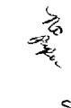

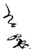

TECHNOLOGICAL AND ECONOMICAL ASPECTS OF IRRADIATED FUEL REPROCESSING BY FLUORIDE VOLATILITY METHODS IN FRANCE

G. Manevy and Y. Rochedereux

141

SIZING THE CHEMICAL REACTORS FOR FLUORIDE VOLATILITY PROCESSING OF FAST REACTOR FUEL

G. J. Spaepen

143

REPROCESSING OF THTR FUEL ELEMENTS BY HIGH TEMPERATURE TREATMENT

159

J. Hartwig and K. H. Ulrich

# HALIDE VOLATILITY PROCESSES

PILOT PLANT EXPERIENCE ON VOLATILE FLUORIDE REPROCESSING OF PLUTONIUM

163

M. A. Thompson, R. S. Marshall and

R. L. Standifer

LABORATORY-DEVELOPMENT OF THE FLUORIDE VOLATILITY PROCESS FOR OXIDIC NUCLEAR FUELS

177

M. J. Steindler, L. J. Anastasia, L. E.

Trevorrow and A. A. Chilenskas

ENGINEERING-SCALE FLUORIDE VOLATILITY STUDIES ON PLUTONIUM-BEARING FUEL MATERIALS

211

N. M. Levitz, E. L. Carls,

D. Grosvenor, G. J. Vogel and

I. Knudsen

THE POTENTIAL OF THE FLUORIDE VOLATILITY PROCESS FOR FAST BREEDER REACTOR FUELS

231

A. A. Jonke, N. M. Levitz and

M. J. Steindler

CHLORINATION-DISTILLATION PROCESSING OF IRRADIATED URANIUM DIOXIDE

241

K. Hirano and T. Ishihara

DIRECT CHLORINATION VOLATILITY PROCESSING OF NUCLEAR FUELS-LABORATORY STUDIES

261

A. V. Hariharan, S. P. Sood, R. Prasad,

D. D. Sood, K. Rengan, P. V. Balakrishnan and M. V. Ramaniah


FUSED-SALT FLUORIDE-VOLATILITY PROCESS

FOR RECOVERING URANIUM FROM

THORIA-BASED FUEL ELEMENTS

W. Bannasch, H. Jonas and

E. Podschus

# FUSED SALT-LIQUID

# METAL SYSTEMS

/EBR-II SKULL RECLAMATION PROCESS 297

I. O. Winsch, R. D. Pierce,

G. J. Bernstein, W. E. Miller

and L. Burris, Jr.

STATUS OF THE SALT TRANSPORT PROCESS

FOR FAST BREEDER REACTOR FUELS 325

R. K. Steunenberg, R. D. Pierce

and I. Johnson

JURANIUM AND PLUTONIUM PURIFICATION BY

THE SALT TRANSPORT METHOD 337

J. B. Knighton, I. Johnson and

R. K. Steunenberg

THE REDUCTIVE EXTRACTION OF PROTACTINIUM

AND URANIUM FROM MOLTEN LiF-BeF2-ThF4 MIXTURES INTO BISMUTH 363

R. G. Ross, W. R. Grimes, C. J. Barton,

C. E. Bamberger and C. F. Baes, Jr.

THE REDUCTIVE EXTRACTION OF RARE EARTHSH

FROM MOLTEN LiF-BeF 2-ThF4 MIXTURES INTO BISMUTH 375

J. H. Shaffer, D. M. Moulton

and W. R. Grimes

THE MOLTEN SALT EXTRACTION OF AMERICIUM

FROM PLUTONIUM METAL 385

J. L. Long and C. C. Perry

# BASIC DATA AND

# THERMODYNAMIC PROPERTIES, I

COMPATIBILITY AND PROCESSING PROBLEMS IN

THE USE OF MOLTEN URANIUM CHLORIDE-ALKALI CHLORIDE MIXTURES AS REACTOR FUELS 405

B. R. Harder, G. Long

and W. P. Stanaway


# TECHNOLOGY AND ECONOMICS OF AQUEOUS PROCESSING

Chairman: Don E. Ferguson

Oak Ridge National Laboratory

Oak Ridge, Tennessee, U.S.A.

WELCOME ADDRESS

Robert S. Hansen

Director, Ames Laboratory, USAEC

Iowa State University

Ames, Iowa

U.S.A.

INTRODUCTORY REMARKS

Stephen Lawroski

Argonne National Laboratory

Argonne, Illinois

U.S.A.


# APPLICATION OF AQUEOUS REPROCESSING TO LIQUID METAL FAST BREEDER REACTOR FUEL*

W. E. Unger, R. E. Blanco, A. R. Irvine, D. J. Crouse, C. D. Watson  
Oak Ridge National Laboratory  
Oak Ridge, Tennessee  
U. S. A.

# Abstract

The low-priced power that is one of the incentives for the development of the Liquid Metal Fast Breeder Reactor (LMFBR) depends in part on economic processing of spent fuel. Some form of the Purex Aqueous Solvent Extraction process is used by nearly every major fuel processing facility in existence, and it will be desirable to extend its application to include the processing of the LMFBR fuels. These fuels are inherently more difficult to process than present light-water reactor (LWR) fuels, owing to the fact that LMFBR fuels will operate at higher specific powers and for greater burnup and will contain more plutonium than the corresponding LWR fuels. The higher specific power and burnup produce heat dissipation problems during handling and transport of the spent fuel. The high plutonium content makes short cooling a significant economic incentive, and development work will be aimed at improving our technique for accommodating short-lived fission products to make short-cooled processing feasible.

# Introduction

This paper presents a description of the problems involved in the application of aqueous chemical processing technology to the reprocessing of spent Liquid Metal Fast Breeder Reactor (IMFBR) fuels. The present status of technology is also presented, based on the development program in progress at Oak Ridge National Laboratory and on technology available from private and AEC reprocessing installations. The objectives of the ORNL development program are: first, to reduce, with time, the uncertainties that exist in applying present aqueous processing technology to future IMFBR fuels; second, to provide the technology necessary to adapt IWR fuel processing plants to the processing of IMFBR fuels in the interim period before the IMFBR fuel load increases to the point that it can support a separate processing plant; and to provide the technology necessary for eventual commercial IMFBR fuel reprocessing plants. The latter, long-term approach is reserved for those problems that are occasioned by the economic incentive for short-decay processing and which are of such technical complexity as to require an extensive development period.

The first fuels to be reprocessed will be produced in the Fast Flux Test Reactor (FFTF) and the demonstration reactors now being proposed. The Atomic International Reference Oxide Reactor (NAA-SR-Memo-12604), has been selected as the reference reactor for the initial reprocessing development program, since it is representative of many of the new problems in reprocessing, which are not present or are not as significant with light water reactors (LWR) fuels. These problems are derived from four factors: (1) the desire to minimize inventory costs and reprocess the fuel as soon after discharges as possible, which causes higher thermal power, radiation level, and concentrations of important volatile fission products; (2) a high concentration of plutonium, which requires special consideration for criticality control; (3) the presence of liquid sodium on, or in, the fuel rods, and (4) the dimensions and method of fabrication of the fuel assemblies, which present problems in preparing, or disassembling, the fuel prior to reprocessing.

The present intention is to modify the current technology for shipping and reprocessing LWR fuels to the extent required for IMFBR fuels. The Purex solvent extraction process is used in all major fuel reprocessing facilities in existence and its important favorable features also apply to the processing of IMFBR fuels. The unexcelled separation efficiency, the process versatility, the ease of adaptation of the process to continuous high-capacity equipment, and the vast operating experience available from major processing facilities make the aqueous solvent extraction process an obvious choice for adaptation to reprocessing of IMFBR fuel.

# Purex Process

The Purex process, as applied to LWR oxide fuels (see Fig. 1) consists of fuel shearing to rupture the corrosion-resistant sheath and expose the fuel, dissolution in nitric acid, solvent extraction, and conversion of the uranium and plutonium nitrate product to oxides for refabrication into fuel elements. The spent fuel is transported from the reactor to the chemical processing plant in shielded casks, which are unloaded in a water-filled pool or canal. The fuel elements are transferred to a head-end cell, sheared into approximately $\frac{1}{2}$ in. lengths and the product leached with nitric acid in batch dissolvers. The residual sheared, leached hulls are disposed of as solid waste. The nitric acid solution of the fuel, containing uranium, plutonium, and nearly all of the fission products, is the feed solution for the solvent extraction process.

The solvent for the Purex process is an organic complexing compound, tributyl phosphate (TBP), in an inert hydrocarbon kerosene-like diluent such as dodecane. The solvent is brought into intimate countercurrent contact with the aqueous feed solution where the TBP extracts the uranium and plutonium into the organic phase, leaving the fission and corrosion products in the aqueous solution. The latter is stored as high-level radioactive waste. The organic solution is selectivity stripped of plutonium with dilute nitric acid by reducing the plutonium valence from $+4$ to $+3$ . The uranium is then stripped in a third contactor. The plutonium is further purified by additional extraction cycles or by ion exchange.

The uranium and plutonium may be precipitated from their dilute nitric acid solution and converted to oxides by thermal decomposition, or they may be directly converted to oxides by the sol-gel process, in which the nitric acid is removed from aqueous solutions of plutonium or uranium by extraction with an amine or heavy alcohol. In the sol-gel process the uranium or plutonium, as the acid extraction proceeds, gradually forms into a colloidal suspension or sol. This can be handled like a true solution. Progressive removal of water by evaporation or by extraction with a hygroscopic solvent converts the sol to a plastic gel. Sols of plutonium and uranium can be combined and gelled together to form an oxide in which the two elements are homogeneously dispersed. The gel when fired to $\sim 1200^{\circ}\mathrm{C}$ approaches theoretical density and is suitable for fabrication into reactor elements.(1,3) The sol-gel process is designed to couple easily with the Purex process for preparing plutonium for recycle. However, uranium from IMFBR fuels has little value and will probably be stored. Makeup uranium will be supplied from diffusion plant tailings for many decades.

# IMFBR Fuels

It is expected that oxide fuels sheathed in stainless steel will be a characteristic of the early IMFBR reactors, and, for this reason,


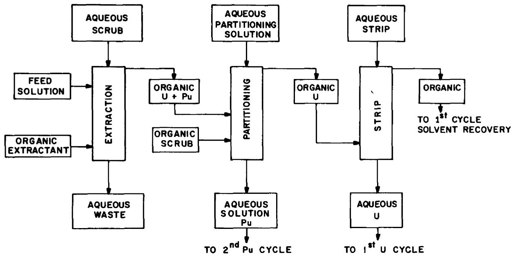  
1. Purex Flowsheet.

oxide fuels have been adopted as the reference fuel for initial processing studies. Advanced fuels, such as the carbides and nitrides, have attractive properties and may be of future interest. From early scouting experiments, it appears that carbides and nitrides are easily converted to oxides by heating in an oxidizing atmosphere.

The oxide core fuel element has three zones: the center section is the core containing uranium oxide plus about $20\%$ plutonium oxide as the fissionable material, and the two end sections contain depleted uranium oxide that form the axial blanket of the reactor (Fig. 2). While it is practicable to separate the core from the two end blanket sections and process them separately, there is no apparent advantage in doing so, and it has been assumed that they will be processed together. Elements of depleted uranium oxide that form the radial blanket surround the core section of the reactor.

The average burnup of the fast breeder fuel is expected to be approximately 80,000 Mwd/metric ton for the core, and about 33,000 Mwd/metric ton for the core and blanket mixture (see Table 1). This average burnup is about that expected for LWR fuels. Fast-breeder reactors will have a high fissionable plutonium inventory and the specific power will be about $150\mathrm{kw / kg}$ of fuel in the core compared to 35 for LWR's. This combination of high burnup and high specific power makes the decay heat of discharged core fuel from fast-breeder reactors about a factor of 5 higher than that of thermal reactors. There will also be a higher concentration of long-lived fission products in the IMFBR core fuel, roughly in proportion to the higher burnup. Fast-breeder fuels have a higher plutonium content than light-water fuels by about a factor of 10, which complicates the control of criticality, emphasizes the importance of plutonium chemistry, and may occasion the need for shielding for plutonium product handling operations to attenuate the neutrons generated by $\alpha$ -n reactions and spontaneous fissions. The value of the plutonium content of IMFBR fuel results in an economic incentive for minimizing the decay period before reprocessing.

# Interim Processing

During the interim period, before facilities designed specifically for short-cooled fast-breeder fuel are available, it should be possible to process the fuel from early fast-breeder reactors, the FFTF and demonstration reactors, in existing LWR processing facilities modified for this purpose. Such fuel could be cooled until shipment is possible (not necessarily optimum for commercial fast-breeder fuel but economically tolerable during the interim period) and then processed at about half normal capacity in an existing LWR plant altered to accommodate the greater length of the FFTF elements, deal with sodium contamination, and provide capacity for the higher plutonium content.


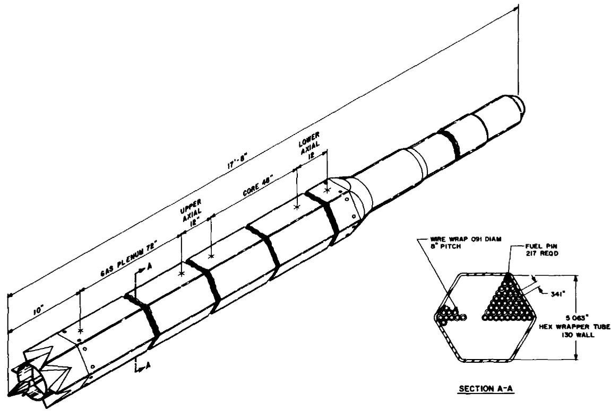  
2. AI Reference Oxide Fuel Core and Axial Blanket.

Table 1. Fuel Comparison: Light-Water Reactors and Future Fast Breeders   

<table><tr><td></td><td>Typical Fast Fuel</td><td>Typical LWR With Pu Recycle</td><td>Typical LWR With Enriched \( {\mathrm{{UO}}}_{2} \)</td></tr><tr><td colspan="4">Burnup, Mwd/metric ton</td></tr><tr><td>Core</td><td>80,000</td><td>34,000</td><td>20,000</td></tr><tr><td>Core and blanket, average</td><td>33,000</td><td></td><td></td></tr><tr><td>Specific power, kw/kg fuel in core</td><td>150</td><td>30-40</td><td>30-40</td></tr><tr><td colspan="4">Decay heat, w/kg fuel</td></tr><tr><td colspan="4">30-Day decay:</td></tr><tr><td>Core</td><td>200</td><td>50</td><td>47</td></tr><tr><td>(Core and blanket)</td><td>(80)</td><td></td><td></td></tr><tr><td colspan="4">150-Day decay:</td></tr><tr><td>Core</td><td>(76)</td><td>22</td><td>17</td></tr><tr><td>(Core and blanket)</td><td>(30)</td><td></td><td></td></tr><tr><td colspan="4">Plutonium content, g/kg fuel</td></tr><tr><td>Core</td><td>240</td><td>27</td><td>8</td></tr><tr><td>(Core and blanket, 72% Pu is fissile)</td><td>(100)</td><td></td><td></td></tr><tr><td>Iodine, curies/ton</td><td>30-Day 150-Day</td><td>150-Day 150-Day</td><td>150-Day 150-Day</td></tr><tr><td>Core</td><td>\( 14 \times 10^{5} \)</td><td>3</td><td>3</td></tr><tr><td>Core and blanket</td><td>\( 2 \times 10^{5} \)</td><td>5</td><td></td></tr><tr><td>Process containment factor for 1-ton/day capacity</td><td>\( \sim  {10}^{8} \)</td><td>\( \sim  {10}^{3} \)</td><td>\( \sim  {10}^{2} \)</td></tr></table>

A preliminary evaluation was made of the capacity of the NFS plant for the processing of IMFER fuel. Assuming a mixed core and blanket feed of 180 days decay, a throughput of 1/2 ton/day of IMFER fuel was found to be compatible with existing licensing agreements at NFS. Modifications in the front end receiving and mechanical head-end facilities, and in the plutonium tail-end ion-exchange equipment would be required. A flowsheet based on 15% TBP and subcritical feed concentrations would be dictated by the geometrically unrestricted equipment at NFS. A plant operating time of 40 days should accommodate the 20 tons of fuel discharged per year from a 1000-Mw(e) IMFER reactor. It was assumed that the capital modifications required would cost $5 million, the annual charges of which would be borne by the IMFER fuel processed, in addition to the plant operating cost of $31,300 per process day. On this basis the IMFER fuel reprocessing cost would be on the order of 0.4 mill/kwhr(e).

# Process Adaptation

The long-range economic success of the IMFBR concept is dependent upon a relatively cheap fuel cycle and it is necessary to establish chemical processing feasibility and acceptable processing costs if the IMFBR concept is to be attractive to commercial interests. The high plutonium content of IMFBR fuel represents a high dollar value, and the inventory penalty while the fuel is not producing power can become an appreciable fraction of the processing cost. At $12\%$ per annum, a month's storage is the economic equivalent of a $1\%$ process plutonium loss; and a 6 month preprocessing decay, required under present technology for the decay of fission product iodine, would constitute an inventory penalty approximately equal to the processing cost. The optimum preprocessing decay period cannot now be established, but the incentive for minimizing it is readily apparent. The problems of heat dissipation, radioactivity, and volatile fission product retention are an exponential function of the decay period.

# Shipping and Receiving:

LWR fuel has been shipped in casks safely over a number of years using only air as the primary coolant. Shipping IMFBR fuel in air-filled casks is not feasible at cooling time of less than one year. For this reason we are proposing that a liquid metal be used as the primary coolant. Sodium is an obvious choice, assuming that its loss during accident conditions can be prevented. All shipments of spent fuel are subject to the Department of Transportation (DOT) regulations which state that a cask must survive a 30 ft drop and a $1475^{\circ}\mathrm{F}$ fire of 30 min duration without excessive release of radioactive materials or reduction in shielding.(4) Mechanically reliable closures are commercially available that can probably be adapted to survive any of the postulated impact conditions of a major accident. We have made a conceptual design of a cask that uses steel for shielding. Approximately 20 in. of steel will be required and the cask can be


so rugged that its rupture during any postulated impact, particularly if fitted with an energy-absorbing exterior frame as shown in Fig. 3, is virtually not conceivable. The illustrated model survived the 30 ft fall and impact on an unyielding surface, with only superficial damage to the cask proper and no leakage of the seal.

The postulated fire test would not produce excessive temperatures in the fuel cavity owing to the heat capacity of the massive steel shield. This will require that the cask be at near-ambient temperature prior to the initiation of the fire, and a secondary coolant system is envisioned (see Fig. 4).

The conceptual design illustrated would accommodate 18 fuel elements, although a 36-element cask may be technically attainable. The major parameters were varied as a function of the ratio of weight of the cask to weight of fuel, $W_{S} / W_{F}$ (see Table 2). The cask design has not been optimized, but one restraint was the arbitrary acceptable maximum fuel-pin cladding temperature of $1300^{\circ} \mathrm{F}$ , its maximum operating temperature in the reactor. Graded shielding refers to the tapering of the ends of the carrier to the minimum required shielding to economize on weight.(5) Shortening the fuel by cropping the inactive fuel element ends (gas plenum and end fittings) is attractive from the shipping standpoint, in reducing the carrier size and weight, but the investment in cropping equipment at the reactor station for less than a 5000 Mw(e) station has been estimated to offset the saving in shipping cost.(6)

IMFBR fuels will be immersed in molten sodium during their irradiation, and probably during transit to the processing facility. There may be sodium inside the fuel pins, either as the result of failure of the tubes or by design (sodium bonding for heat transfer). The presence, or the threat of the presence, of sodium in the fuel pins will influence the method of handling and storage of IMFBR fuel at the reprocessing plant. The receiving facilities must be designed to withdraw the subassemblies from their sodium-filled container(s) into an inert atmosphere (see Fig(s). 5 and 6). Storage of the fuel will be in sodium, or, if it is to be cleaned before shearing, in inert gas with forced cooling. The possibility of failed, sodiumlogged pins makes storage in water unattractive.

# Head-End:

The preparation of the fuel element for subsequent chemical steps is complicated because of the need for efficient dissipation of large amounts of heat while performing remote operations. A core fuel element will exceed the maximum allowable temperature of $1300^{\circ}\mathrm{F}$ in about 20 minutes if not cooled.

The most attractive and versatile head-end step at present is the mechanical shearing of the fuel into short lengths. Melting of the

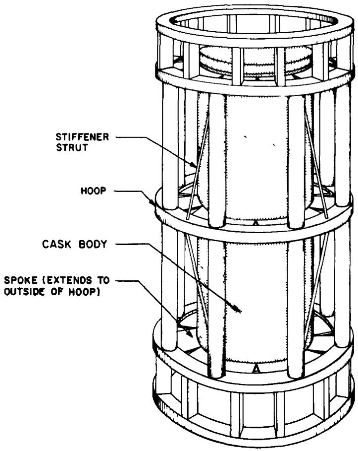  
3. Cask with Crash Frame.

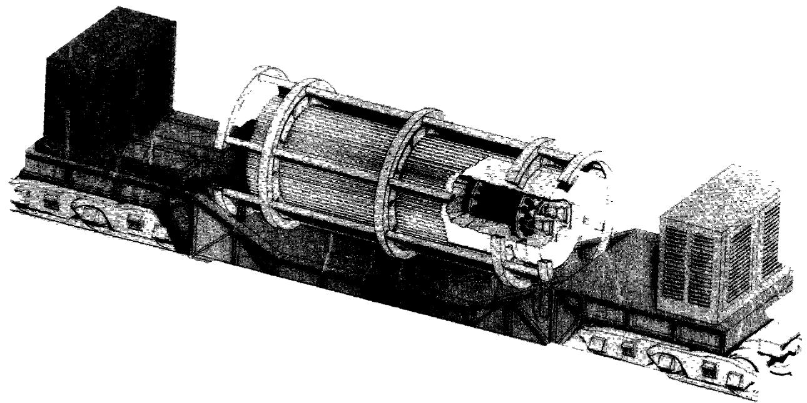

4. Conceptual IMFRR Spent Fuel Shipping Cask (18 Assemblies).

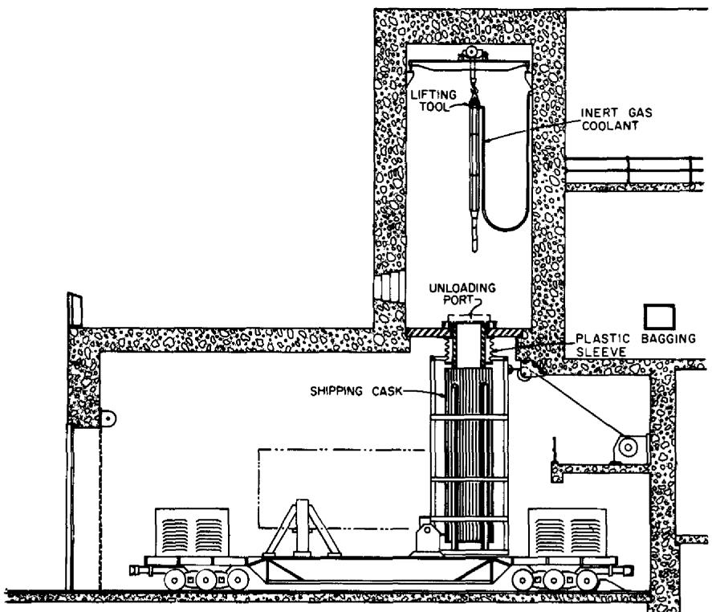  
5. Receiving and Handling.


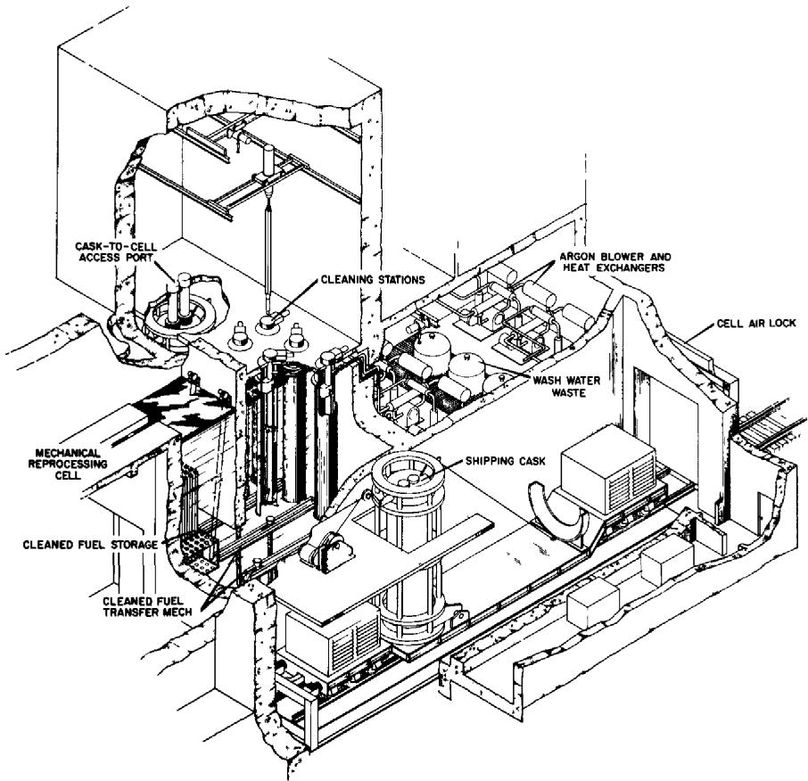

6. Central Reprocessing Plant for Spent IMFBR Fuel (Conceptual Fuel Receiving, Unloading, Cleaning, and Storage Facility).

Table 2. Effect of Parameter Variation on Fuel Shipping   

<table><tr><td rowspan="2">Variable</td><td rowspan="2">Basis for Comparison</td><td rowspan="2">Condition</td><td colspan="2">Temperatures (°F) After Fire Accident</td><td rowspan="2">Shielding-to-Fuel Ratio (Ws/Wf)</td></tr><tr><td>Outside Skin</td><td>Max. Pin</td></tr><tr><td rowspan="2">Decay time</td><td rowspan="2">36 subassemblies</td><td>20-day-cooled</td><td>710</td><td>1155</td><td>40</td></tr><tr><td>90-day-cooled</td><td>510</td><td>805</td><td>28</td></tr><tr><td rowspan="2">Excess hardware</td><td rowspan="2">18 subassemblies, 20-day-cooled</td><td>Full length (17 ft 8 in.)</td><td>555</td><td>895</td><td>56</td></tr><tr><td>Cropped (7 ft 8 in.)</td><td>800</td><td>1291</td><td>49</td></tr><tr><td rowspan="3">Shipment quantity</td><td rowspan="3">20-day-cooled</td><td>6 subassemblies</td><td>400</td><td>610</td><td>106</td></tr><tr><td>18 subassemblies</td><td>555</td><td>895</td><td>56</td></tr><tr><td>36 subassemblies</td><td>710</td><td>1155</td><td>40</td></tr><tr><td rowspan="2">Shielding design</td><td rowspan="2">18 subassemblies, 20-day-cooled</td><td>Uniform shielding</td><td>520</td><td>872</td><td>83</td></tr><tr><td>Graded shielding</td><td>555</td><td>895</td><td>56</td></tr></table>

Note: Unless otherwise noted, all shielding is graded and fuel subassemblies are shipped with all hardware intact.


cladding or dissolution of the cladding in molten metals such as zinc or antimony-copper alloy are interesting alternatives for some possible cladding materials, but both require the physical separation and recovery of the fuel oxides, a difficult step.

If it is practical to disassemble the fuel element into individual rods or small clusters, the heat dissipation problem is ameliorated and the mechanical shear can be small, relatively inexpensive, and easily maintained (see Fig. 7). Disassembly involves trimming the end fittings with an abrasive saw and slitting the shroud with a milling slitter. The wire-wrapped pins can then be handled in arrays of about 25 without exceeding the maximum temperature of $1300^{\circ}\mathrm{F}$ . If spring clip spacers are used in place of wire wrapping, an additional removal step to free the rods will be required.

The problem of the retention of $^{131}\mathrm{I}$ , encountered even in the processing of LWR fuels of 150 days decay, is an important problem with IMFBR fuels. Iodine retention factors are required that are in the range of $10^{3}$ for 150-day-cooled FFTF fuel (near the range of present practice) to $10^{8}$ for future IMFBR fuel processed after 30 days decay. The chemistry of iodine is complex and much more knowledge is needed of the behavior of iodine in the various conditions encountered in a fuel processing plant before a treatment system can be designed with the reliability required for IMFBR fuels. As an example, the presence of organic vapors and organic iodides in the off-gas system reduces the efficiency of iodine removal steps. Early studies indicate that the organic materials can be eliminated from the off-gas by conversion to $\mathrm{CO}_{2}$ , $\mathrm{H}_{2}\mathrm{O}$ , and $\mathrm{I}_{2}$ in a catalytic oxidizer using Hopcalite catalyst (oxides of copper and manganese) at 150 to $500^{\circ}\mathrm{C}$ . A catalytic-oxidizer-charcoal-adsorber system was tested in the Transuranium Processing Plant (TRU) at Oak Ridge National Laboratory and an iodine retention factor of about $10^{6}$ was demonstrated.

It has been found that fission gases interstitially trapped in oxide fuels can be volatilized and collected in a relatively small volume when oxide fuels are heated in oxygen at temperatures greater than $\sim 400^{\circ}\mathrm{C}$ . Similar volatilization is expected on oxidation of carbide or nitride fuels. Early studies show that nearly quantitative removal of noble gases and $>90\%$ removal of iodine and tritium is obtained on conversion of $\mathrm{UO_2}$ to $\mathrm{U}_3\mathrm{O}_8$ . The release of gases is more difficult when the fuel contains a high percentage of $\mathrm{PuO_2} (\sim 20\%)$ . However, $>90\%$ of the tritium and $20 - 98\%$ of the krypton have been removed from highly irradiated $20\% \mathrm{PuO_2 - UO_2}$ . The removal of iodine from $\mathrm{PuO_2 - UO_2}$ remains to be demonstrated.

The efficiency of iodine removal from off-gases should be much higher if it is contained in a small volume of gas after the fuel is sheared but before it reaches the dissolver. This should greatly reduce the problems attributed to removing iodine from dissolver off-gases in current processing experience. The oxidative heat

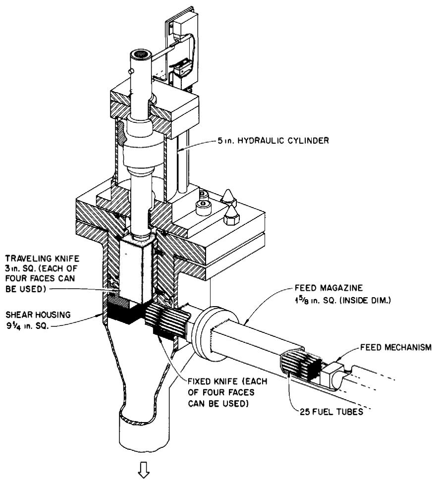


7. ORNL Semicontinuous Prototype Shear (5 x 5-in. Tube Bundle).

treatment may have other advantages as well. Sodium contamination (failed fuel rods) would be deactivated, and the oxidation of $\mathsf{UO_3}$ to $\mathsf{U}_3\mathsf{O}_8$ involves a phase change which tends to break the oxide into a fine granular form, making the physical separation of the oxides from the stainless steel cladding a possibility and providing for a faster dissolution of the fuel in nitric acid. This improvement is probable but whether it applies also to the mixed oxide is yet to be determined. The oxidation of uranium oxide before dissolution also decreases the evolution of nitrous oxides in the dissolver off-gas. The oxidation step may also be a useful means of converting the carbide and nitride advanced fuels to oxides. $^{(7,8)}$

# Dissolution:

The dissolution of solid solutions of $(\mathsf{Pu},\mathsf{U})\mathsf{O}_2$ proceeds quite readily in nitric acid and the use of fluoride as a catalyst does not appear to be required. IMFBR fuel samples irradiated to 100,000 Mwd/metric ton have been successfully dissolved in hot-cell tests at ORNL in $8\textbf{M}$ HNO3 in 4 to 8 hours.(9,10) Residues contained $< 0.2\%$ plutonium and consist mainly of ruthenium and rhodium and insoluble stainless steel.

Irradiated fuels prepared by the sol-gel, co-precipitation, and mechanical blending processes have been successfully dissolved. However, if a true solid solution has not been formed, the $\mathrm{PuO_2}$ may dissolve too slowly in nitric acid. The sol-gel and co-precipitation processes inherently produce intimate mixtures of $\mathrm{PuO_2}$ and $\mathrm{UO_2}$ . Care must be exercised to assure homogeneous blending of oxides if a solid solution is to be produced.

Elemental iodine is evolved rapidly from the hot nitric acid dissolving solution. Iodine present as the iodide oxidizes rapidly to elemental iodine, and that present as the iodate is reduced to elemental iodine by the nitrous acid formed during dissolution of $\mathrm{UO}_2$ . In small-scale tests at ORNL, $>99\%$ of the iodine has been removed during dissolution by a proper arrangement of the condenser system (to avoid refluxing iodine back to the dissolver) and by adding iodide and nitrite to the system at the end of the dissolving period. It is desirable to remove iodine before extraction because of the difficulty of containing iodine in the subsequent processing steps.

# Extraction:

Solvent extraction processes require organic extraction media, and organics are susceptible to radiation damage. However, radiation damage to the solvent, in spite of the high specific activity of the IMFER fuels, should not be a significant problem.

The estimated total single-cycle dose to the solvent in pulsed column operation is about 0.11 watt-hr/liter for the $15\%$ TBP flowsheet


and about 0.25 watt-hr/liter for the $30\%$ TBP flowsheet. These doses include an allowance of $20\%$ of the $\beta-\gamma$ dose obtained in the extraction-scrub section to cover alpha irradiation and irradiation from ${}^{131}\mathrm{I}$ (which may have accumulated in the solvent). The estimates are for columns operating in the organic-phase-continuous mode at $80\%$ of flooding with an efficiency corresponding to an HETS of 2.5 ft. $^{(9)}$ The British have demonstrated sustained solvent extraction where the single-cycle dose was about $1.4$ watt-hr/liter. $^{(11)}$ By using high-speed contactors, such as the centrifugal contactors in use at Savannah River, $^{(12)}$ the extent of solvent exposure to radiation can be held far below the limits that have already proved satisfactory in plant practice. $^{(13)}$ . These contactors also have high capacity and quick response and are applicable over a wide range of scale. On the bases of laboratory and hot-cell tests, we have concluded further that pulse columns, such as are currently used in many fuel processing plants, are adequate for IMFBR fuel processing.

Separation of plutonium from uranium is accomplished in the Purex process by reducing the plutonium to the three-valent state to selectively strip it from the solvent. Ferrous sulfamate is used as the reductant in U. S. processing plants. However, IMFBR reactor fuels have a much higher plutonium content and, consequently, the use of ferrous sulfamate could contribute relatively large amounts of iron and sulfate to the waste. The sulfate also would interfere severely with plutonium extraction in the second TBP cycle.

The use of ferrous nitrate, stabilized with a small concentration of a holding reductant such as hydrazine, has shown promise in small-scale cold tests.(14) Its use has the advantage of eliminating sulfate, although it still contributes iron to the waste (about as much iron as there is total weight of fission products). By appropriate control of the acid concentration, the partitioning can be accomplished using as little as $25\%$ of the stoichiometric amount of iron otherwise needed, reducing the iron contributed to the waste to about $20\%$ of the weight of the fission products.

Uranium(IV) has been studied extensively as a reductant by many investigators and is used on a production basis in France. It has the advantage of not adding metal contaminants to the waste. The U(IV) nitrate can be prepared by electrolytic reduction, by reduction with $\mathrm{H}_{2}$ in the presence of platinum catalyst, or by photoactivated reduction with formaldehyde. The reaction rate for reduction with U(IV) is slower than for Fe(II), which may be of importance if short-residence contactors are used.

Final purification of plutonium by extraction using secondary amines is an attractive alternative to anion exchange, the process used in present processing plants. A continuous countercurrent extraction process has obvious advantages over the batch ion exchange process, particularly where criticality considerations may be limiting and where the equipment must be remotely operated and maintained.

Shielding will probably be required, because of the $\alpha$ -n reactions and spontaneous fissions from the plutonium. In addition, extraction processes will couple readily to the preparation of reactor-grade oxides by the sol-gel process.

# Summary

The economic advantage of large-scale processing plants is so prominent that central processing facilities of capacities in the order of 5 tons/day or greater throughput are generally to be preferred to a proliferation of small (< 1 ton/day) facilities. The continued expansion of the power economy and the increasing technology of power transmission makes large central power parks, in the order of 20,000 Mw, a plausible concept. An on-site processing facility to serve this power park (~ 1 ton/day) begins to acquire favorable economics due to savings in fuel shipping and inventory costs. The essential processing problems are similar except for fuel transport.

It is expected that plant design trend will be in the direction of high-capacity, small-volume equipment; this is equivalent to minimizing the plant inventory of both reactor fuel and process reagents. Continuous equipment (as opposed to the batch operations characterizing the industry in the past), and perhaps parallel lines to ensure operational continuity, will be easier to maintain and cheaper to operate. Minimizing the in-process inventory will serve both safety and economy considerations.

Fuel casks are expensive but are most economical in large sizes (about 120 tons). Casks will be designed to ensure containment of the enclosed fuel throughout the postulated accidents that might occur during shipment. The cask seals will be designed to permit the carrier to be readily loaded and unloaded at the processing plant to minimize carrier turnaround time.

Present mechanical shears are designed to accept entire subassemblies, denuded only of their hardware. Were the fuel elements designed to be readily disassembled, preshipment disassembly might prove economical by decreasing the cask size and facilitating heat dissipation during shipment. Small, inexpensive, easily maintained, high-capacity shears will be especially attractive if the fuel is easily disassembled.

The most noxious problem facing processing plants of the future is that of the volatile fission products, especially $^{131}\mathrm{I}$ . The volatile fission products, iodine, the noble gases, xenon and krypton, and tritium, perhaps can be volatilized from oxide fuel at moderate temperatures (450 to $750^{\circ}\mathrm{C}$ ). If dilution by the cell atmosphere is minimized, the fission product gases can be very concentrated, making their capture and reduction to solid form efficient


and reliable.

The advantages of continuous leachers have always been recognized, but the simpler batch dissolvers were not only adequate but even preferred for small plants, particularly where process control relied upon chemical analysis. Continuous leachers are presently under active development, in response to the obvious advantages of their small physical volume from the standpoint of criticality control.

Countercurrent solvent extraction has been carried out in a variety of contactors: mixer-settlers and pulse columns and more recently in fast centrifugal contactors. The latter reduces radiation and chemical damage to the solvent, and reduces the solvent inventory (and therefore the fire hazards associated with the organics are also reduced). Centrifugal contactors are so responsive that automatic control can be used to simplify operation.

The cell ventilation and vessel off-gas systems are primary sources of routine and accidental radioactivity release. Recycle of cell off-gas is feasible and will minimize the volume of off-gas needing routine treatment. Recycle will probably be quite economical and the use of an inert cell atmosphere (necessary for the sodium-contaminated IMFBR fuel) will become practical. The use of inert cell atmosphere throughout the plant will practically eliminate the hazard of solvent fires.

In many cases the aqueous high-level radioactive wastes will continue to be stored for interim periods in tanks. However, the trend is toward solidification and immobilization of these wastes as soon as possible, as dictated by safety and economics. The technology of solidification of wastes is now in the final stages of development.[15,16]

# References

1. Chem. Technol. Div. Ann. Progr. Rept. May 31, 1968, ORNL-4272.   
2. Chem. Technol. Div. Ann. Progr. Rept. May 31, 1969, ORNL-4422.   
3. E. L. Nicholson, Preliminary Investigation of Processing Fast-Reactor Fuel in an Existing Plant, ORNL TM-1784 (May 1967).   
4. Code of Federal Regulations, Title 10, Part 71, as published in the Federal Register, Vol. 31, No. 141, July 22, 1966.   
5. A. R. Irvine, "Shipping Cask Design Considerations for Fast-Breeder-Reactor Fuel," Proceedings of the 16th Conference on Remote Systems Technology, Idaho Falls, Idaho, March 11-13, 1969.


6. B. C. Finney, R. S. Lowrie, and C. D. Watson, A Conceptual Design and Cost Estimate of an On-Site Facility for Cleaning, Disassembling, and Canning Short-Cooled IMFBR Fuel in Preparation for Shipment to a Central Reprocessing Plant, ORNL TM-205C (May 1968).   
7. J. R. Flanary et al., Nucl. Appl. 1, 219 (1965).   
8. C. Moreau and J. Phillipot, Compt. Rend. 256, 5366 (1963).   
9. W. E. Unger et al., Aqueous Processing of IMFBR Fuels Progress Report, March 1969, No. 1, ORNL TM-2552 (April 1969).   
10. W. E. Unger et al., Aqueous Processing of IMFBR Fuels Progress Report, April 1969, No. 2, ORNL TM-2585 (May 1969).   
11. R. H. Alardice, "Reprocessing of Fast Reactor Fuels by Aqueous Methods, Part 2. Second and Third Generation Fast Reactors," presented at Institutt for Atomenergi, Kjeller Research Establishment, Norway, August 1967.   
12. A. A. Kishbaugh, Performance of Multistage Centrifugal Contactor, DP-841 (October 1963).   
13. C. A. Blake, Jr., Solvent Stability in Nuclear Fuel Processing: Evaluation of the Literature, Calculation of Radiation Dose, and Effects of Iodine and Plutonium, ORNL-4212 (March 1968).   
14. D. E. Horner, The Use of Ferrous Nitrate as a Plutonium Reductant for Partitioning Plutonium and Uranium in Purex Processes, ORNL-4383 (February 7, 1969).   
15. J. O. Blomeke et al., "Estimated Costs of High-Level Waste Management," Proceedings of the Symposium on the Solidification and Long-Term Storage of Highly Radioactive Wastes, February 14-18, 1966, Richland, Washington, CONF-660208, pp. 830-43.   
16. K. J. Schneider, Status of Technology in the United States for Solidification of Highly Radioactive Liquid Wastes, BNWL-820 (October 1968).


# AQUEOUS REPROCESSING OF THORIUM-CONTAINING

NUCLEAR FUEL ELEMENTS

G. Kaiser, E. Merz and H.J. Riedel

Institut für Chemische Technologie

Kernforschungsanlage Jülich GmbH

Germany

# Abstract

The KFA-TBP 23/25-process is being developed for the aqueous reprocessing of thorium-containing fuel elements. In the proposed head-end, a rapid and complete dissolution of highly sintered $(\mathrm{Th},\mathrm{U})\mathrm{O}_2$ -particles is achieved by digestion in molten potassium pyrosulphate. Fertile material is isolated as potassium sulphatothorate in a concentration step and may be stored until most of the $^{228}\mathrm{Th}$ has decayed. $^{233}\mathrm{Pa}$ , the 27,4-day precursor of $^{233}\mathrm{U}$ , will be recovered by adsorption on powdered unfired Vycor. Uranium, consisting mainly of the isotopes $^{235}\mathrm{U}$ and $^{233}\mathrm{U}$ , is decontaminated by a TBP solvent-extraction procedure. A suitable flowsheet for an economical reprocessing of the sulphate-containing feed solution was developed and tested in cold runs.


Work performed under a joint project sponsored by the German Federal Ministry of Science

# Introduction

Computer calculations on the long-term potential of high-temperature gas-cooled reactors in the future compound network of the Federal Republic of Germany indicate that this reactor type will secure a considerable share of the generating capacity far beyond the year 2,000. The estimates for the year 1985 come up with a power output share of about 30,000 MW<sub>6</sub>, which should further increase to about 250,000 MW<sub>e</sub> in 2010 (1).

The first reactor generation is expected to be operable in the middle of the seventies. In order to guarantee a complete fuel cycle to the future reactor users, appropriate procedures for the reprocessing of spent fuel elements must be evolved in time.

In the Federal Republic of Germany the development of the technology for reprocessing spent HTGR-fuels began in 1966. The results and experience gained to date indicate that in the first reprocessing period only a wet chemical process such as solvent-extraction can satisfactorily separate the feed and/or bred material from the fission products. This conclusion is not surprising since in 25 years' of experience in reprocessing, only extraction processes have been practical on an industrial scale.

# KFA-TBP 23/25-Process

# Process-Philosophy

In planning the KFA-TBP 23/25-process we have been guided by the following considerations:

1. Fuel elements for high-temperature gas-cooled reactors consist of pyrolytic carbon coated uranium and/or thorium carbide or oxide particles dispersed in a graphite matrix. On a technical scale the removal of all of the carbon, that means the structural graphite as well as the coating, appears feasible only by burning.   
2. Mixed oxides should be preferable as the fuel partic- les because of cheaper production and better beha- viour under reactor conditions than the carbides. Their strong chemical resistance against the only known dissolving agent, $\mathbb{F}^{-}$ -catalysed nitric acid, may require the application of a technologically adv- vanced solubilizing procedure.


3. The main part of the process, the solvent-extraction, shall be a TBP-procedure. Only when using the "classic" extraction medium whose technology has already been thoroughly investigated, will the setting up of a total process line be possible in the near future.   
4. For the present, an isolation of decontaminated thorium can be renounced. The small share of the cost of the thorium on the complete fuel cycle costs makes it admissible to store the used thorium until most of the 228Th has decayed.   
5. The process should be capable of treating fuel elements after short cooling periods. Therefore, a process step for the recovery and purification of the relatively long-lived 233U-precursor, 233Pa, has to be provided. This point is particularly important with regard to the reprocessing of fuel elements from the pebble-bed reactor. The continuous loading and unloading of feed and bred elements has the highest economical efficiency only if the fuels can be reprocessed immediately after being discharged from the reactor.

# Outline of the Process

Based on the above considerations the flowsheet shown in figure 1 was developed.

In the first step the crushed fuel elements are burned in a fluidized-solids furnace at temperatures between 700 and $850^{\circ}\mathrm{C}$ .

The remaining thorium-uranium mixed oxide particles are then digested in a potassium pyrosulphate melt. After the reaction has been finished, the liquid melt will pneumatically be pushed out of the crucible and poured into the requisite amount of water necessary for dissolution.

Insoluble fission product sulphates, principally barium- and strontium sulphate, are separated by a cyclone separator or by filters and the clear solution is then passed over a vycorglass-column to remove the protactinium still present in equilibrium.

The resulting protactinium-free fuel solution of a now reduced specific activity level will be concentrated and adjusted to TBP-extraction conditions by adding nitric acid and aluminium nitrate. The uranium concentration of the feed solution amounts to $20\mathrm{g / l}$ ; it is

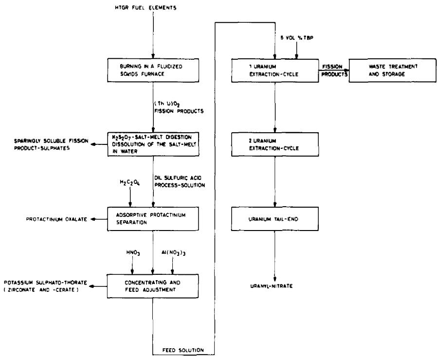  
Figure 1: KFA-TBP 23/25-Process; Schematic Process-Flow-sheet

nearly free of thorium, because sparingly soluble potassium sulphatothorate is precipitated in the concentration step. Also its content of zirconium and cerium should have decreased considerably compared to the initial product solution, because like thorium both elements form sparingly soluble double salts with potassium sulphate.

The extractive separation and decontamination of the uranium with a solution of 5 vol % tri-n-butylphosphate in Kerosene is achieved in the first extraction cycle following a flowsheet specially designed for the present feed conditions.

For the second uranium extraction cycle the application of the published flowsheet designed for the TBP 25-process is projected; the same is intended for the uranium tail-end purification (2).

# Experimental Results

# Head-End

# Burning

No thorough description of the burning step will be given here since most of the details are already known and partly published elsewhere (3). An essential difference of our approach compared to the other known methods is the fact that we are not using any alumina as a diluent and thermal transmitter in the fluidized bed. To avoid thermal hot spots close above the bottom flow plate, the burning gas is diluted by refluxing carbon dioxide. This method avoids the difficulties encountered in the dissolution of the ashes in the presence of alumina.

# Salt-Melt-Digestion

The knowledge of the most effective reaction temperature was of decisive importance for a rational carrying out of the pyrosulphate salt-melt dissolution. The temperature determines not only the kinetics of the reactions

$$
\mathrm {U O} _ {2} \quad + 2 \mathrm {K} _ {2} \mathrm {S} _ {2} \mathrm {O} _ {7} \longrightarrow \mathrm {U O} _ {2} \mathrm {S O} _ {4} + 2 \mathrm {K} _ {2} \mathrm {S O} _ {4} + \mathrm {S O} _ {2} \tag {1}
$$

$$
\mathrm {T h O} _ {2} \quad + 2 \mathrm {K} _ {2} \mathrm {S} _ {2} \mathrm {O} _ {7} \longrightarrow \mathrm {T h} (\mathrm {S O} _ {4}) _ {2} + 2 \mathrm {K} _ {2} \mathrm {S O} _ {4} \tag {2}
$$

$$
F P \left(o x i d e\right) + n K _ {2} S _ {2} O _ {7} \longrightarrow F P \left(s u l p h a t e\right) _ {n} ^ {+} n K _ {2} S O _ {4} \tag {3}
$$


but also the degree of thermal decomposition of the potassium pyrosulphate

$$
\mathrm {K} _ {2} \mathrm {S} _ {2} \mathrm {O} _ {7} \longrightarrow \mathrm {K} _ {2} \mathrm {S O} _ {4} + \mathrm {S O} _ {3} \tag {4}
$$

and thereby the minimum quantity of melt necessary per weight unit of mixed thorium-uranium oxide. Thorough investigations showed that the most favourable temperature range lies between 700 and $750^{\circ}\mathrm{C}$ . Under these conditions the pyrolysis of $\mathrm{K}_2\mathrm{S}_2\mathrm{O}_7$ is kept within tolerable limits and the reactions 1) to 3) proceed fast enough to guarantee a complete dissolution of 100 grams of fuel particles in the 4.5-fold quantity of melting material within 4 hours.

# Protactinium-Recovery

The method of the sorptive protactinium pre-isolation originates from investigations of American scientists some years ago. They succeeded in removing $97\%$ of the protactinium present in nitrate solutions by sorption on powdered unfired Vycor (4). Our own experiments have shown that this procedure can also be applied in the sulphate system since the process solution retained only $3 - 4\%$ of nonadsorbable protactinium (5). It should be pointed out that these data were obtained with tracer amounts of protactinium, however, we are quite optimistic regarding a separation of macro-quantities, since GOODE and MOORE have already confirmed their tracer results with mmol quantities of protactinium (6).

# Thorium-Isolation and Feed-Adjustment

With respect to the technical aspects of the process, the pyrosulphate salt-melt dissolution exhibits a certain disadvantage in that very dilute solutions are obtained. The reason for this is the poor solubility of thorium sulphate, which under the conditions in question permits only thorium concentrations of about $5\mathrm{g} / 1$ . Naturally, the content of fissile material is comparably low too, and amounts to approx. $1\mathrm{g} / 1$ with fuel particles having a thorium : uranium ratio of $5:1$ . Since the reprocessing of such dilute solutions may hardly be done in an economical way, we decided to introduce a concentrating step in order to end up with solutions of $20\mathrm{g} / 1$ after the feed adjustment. The uranium losses observed in connection with the quantitative thorium precipitation are rather small; the sulphatothorate isolated in experiments carried out so far contained always less than $0.1\%$ of the total uranium.

# First Uranium Extraction Cycle

The chemical flowsheet developed for the first extraction cycle is shown in figure 2.

# Extraction-Scrub Unit

The following operation conditions were chosen: feed solution with an uranium content of 20 g/l, 1 mol aluminium nitrate, 2.5 mol/l of free acid and a sulphate concentration of ≈ 0.5 mol/l. The exact sulphate concentration depends on the uranium to thorium ratio of the dissolved (Th,U)O₂-particles, it never exceeds however 0.5 mol/l.

The aluminium nitrate concentration employed is a compromise between economical aspects (minimum of solid waste, low costs of chemicals) and practical requirements (low stage values and an uranium concentration in the organic phase as high as possible in the feed input stage).

The acid concentration of 2.5 mol/l, which together with the acid from the scrub section results in a total acid concentration of 3 mol/l in the extraction section, was chosen to ensure a good ruthenium decontamination(7). This fission product requires special attention in the first extraction cycle. A partial pre-decontamination of some other unpleasant fission products like zirconium, niobium and cerium has already taken place during the concentrating step.

The number of theoretical stages necessary for a better than $99.99\%$ recovery of uranium may be deduced from figure 3.

As one can see, the necessary theoretical stages at a sulphate concentration of 0.5 mol/l amounts to 6. In practice about 8 stages are needed because of a $75\%$ efficiency of the individual stages. When the sulphate concentration is lower than 0.5 mol/l, the number of stages decreases, because the uranium distribution coefficients are increasing.

For scrubbing of extracted fission product activities, 5 molar nitric acid is used. Again the high acid concentration serves for a good ruthenium decontamination but it causes also a diminution of the zirconium-niobium and cerium content of the organic phase. As can be seen from figures 3 and 4 the operating line of the scrubbing section intersects the inherent uranium equilibrium line,


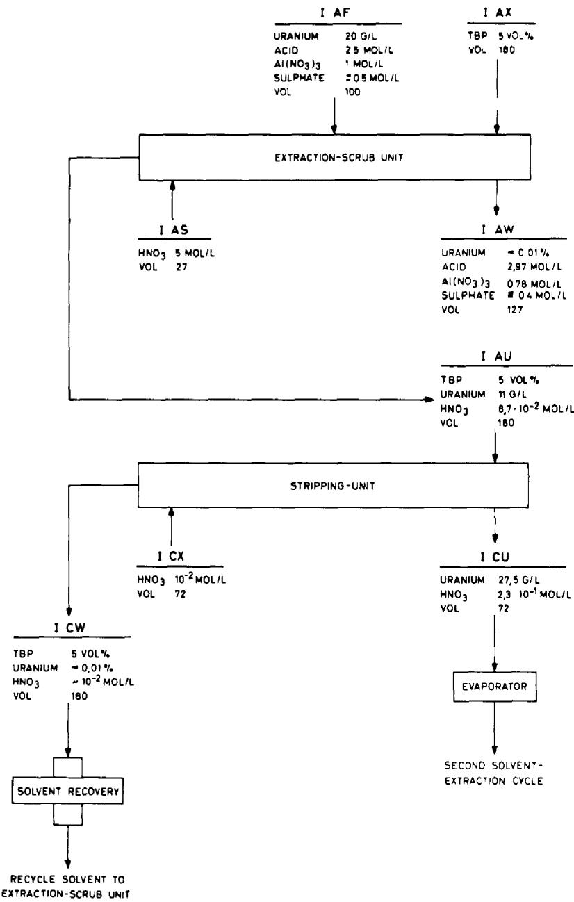  
Figure 2: KFA-TBP 23/25-Process; Chemical Flowsheet for First Uranium Solvent-Extraction Cycle


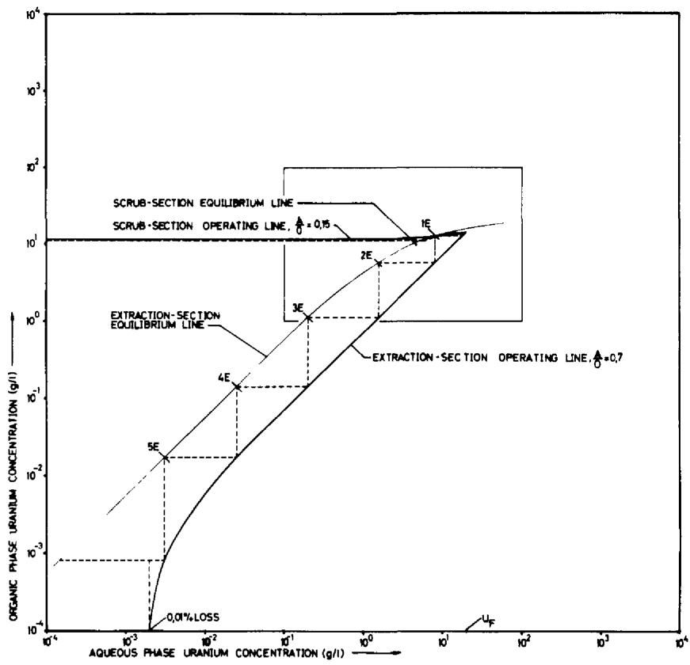  
Figure 3: KFA-TBP 23/25-Process; Theoretical McCabe-Thiele Diagram for Extraction-Scrub-Unit

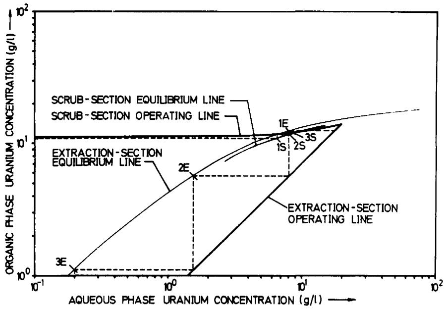  
Figure 4: KFA-TBP 23/25-Process; Theoretical McCabe-Thiele Diagram for Extraction-Scrub-Unit

i. e. a pinch-point operation is employed in this part of the extraction-scrub unit.

# Stripping Unit

Stripping of uranium is achieved using 0.01 molar nitric acid. Applying the flow conditions shown in figure 2, three theoretical stages, respectively four practical stages, are necessary to strip more than $99.99\%$ of the uranium out of the organic phase.

# Status of Development and Outlook

The laboratory studies of the individual process steps are nearly completed. Therefore we have initiated the planning of a small pilot plant with a daily throughput of approx. $1\mathrm{kg}$ (ThU)O, which will be processing spent fuel elements in the Hst Cells of the KFA-Julich by the end of 1970. The final judgement on the economy and the industrial applicability of the KFA-TBP 23/25-process awaits completion of these studies - both experimental and pilot plant operation.

# References

1. Kramer, H., Schulten, R. and Wagemann, K., Die langfristige wirtschaftliche Bedeutung des gasgekühnten Hochtemperaturreactors, Nukleonik, Vol. 11, 1968, pp. 44 - 53   
2. Flanary, J.R., Goode, J.H., Kibbey, A.H., Roberts, J.T., and Wymer, R.G., Chemical Development of the 25-TBP-Process, ORNL-1993 (Revision 2), 1956   
3. Witte, H.O., Survey of Head-End Processes for the Recovery of Uranium and Thorium from Graphite-Base Reactor Fuels, ORNL-TM-141f, 1966   
4. Moore, J.G. and Rainey, R.H., Separation of Protacti-nium from Thorium in Nitric Acid Solutions by Solvent Extraction with Tributylphosphat or by Adsorption on pulverized unfired Vycor Glass or Silica Gel, TID-7675, 1963   
5. Kaiser, G and Coenegracht, O., Aufarbeitung thorium-haltiger Kernbrennstoffe, zusammenfassender Bericht für den 1. Projektabschnitt 1966 - 1968, pp. 50 - 54   
6. Goode, J.H. and Moore, J.G., Adsorption of Protacti-nium: Final Hot-Cell Experiments, ORNL-3950, 1967   
7. Bruce, F.R., The Behaviour of Fission Products in Solvent Extraction Processes, Progress in Nuclear Energy, Series III, Process Chemistry, Vol. I, Pergamon Press, London 1956, pp. 130 - 146

# PROGRESS IN TECHNOLOGY AND ECONOMICAL ASPECTS

OF AQUEOUS PROCESSING

P. Michel

Centre D'Etudes Nucleaires

de Fontenay-Aux-Roses

92-Fontenay-Aux-Roses

France


H.N. Sethna* & N. Srinivasan**  
Bhabha Atomic Research Centre  
Trombay, Bombay (India)

# Abstract

The paper presents the approach to the establishment of reprocessing facilities in India in the context of the technological development and economic factors in a developing country. The impact of less expensive labour and construction costs and less developed transportation facilities on the size and distribution of reprocessing facilities is discussed briefly. The capital and operating costs for the Trombay demonstration plant and the estimated costs for a 500 Kg per day plant under construction for BWR and CANDU type fuels are included. The plans for reprocessing fast reactor fuels are also discussed.

* Director, BARC and Member for Research and Development, Indian Atomic Energy Commission.

**Head, Fuel Reprocessing Division, BARC.

# Introduction

The fuel reprocessing programme in India is developing in stages. The first demonstration plant (1) was set up in Trombay to reprocess the metallic uranium fuel irradiated in the CIRUS, a 40 MW heavy water moderated research reactor. This plant has been in operation since 1965(2). With the setting up of the power stations at Tarapur and Ranapratapsagar, a plant is under construction for the reprocessing of the BWR type fuel from the Tarapur power station and the Candu type fuel from the Ranapratapsagar power station. The third power station is under construction at Kalpakkam near Madras based on a Candu design. The Indian nuclear power programme also includes the setting up of a fast test breeder reactor at Kalpakkam. A reprocessing complex for the irradiated fuel from the Candu type power station as well as the fast test breeder reactor is planned for construction at Kalpakkam. The present paper attempts to outline the background to the decisions regarding the setting up of the fuel reprocessing plants in various locations in the country, the economics of the construction and operation of such facilities and the research and development programme pertaining to fuel reprocessing of thermal as well as fast reactor fuels.

The fuel reprocessing plant at Trombay operates on the conventional Purex process with a codecontamination cycle, a partition cycle, a third uranium purification cycle and an ion exchange cycle for the final purification and concentration of plutonium. The plant has seven solvent extraction columns of the pulsed perforated plate type, two ion exchange columns for the plutonium cycle and 100 vessels including 10 evaporators for the concentration of intercycle products and high and medium active wastes. The process equipment involved fabrication of 100 tonnes of stainless steel. The piping inside the cells is about 100,000 ft. The cells have heavy density concrete walls (220 lb per cft) with thickness ranging from 5 ft at the dissolver end to 3 ft at the product end. The plant was constructed during 1961-64 at which time the cost of heavy concrete complete with steel was Rs.17 per cft ($ 96* per cu. yard). The cost of fabrication of stainless steel equipment was Rs.7,500/-per tonne ($ 1550* per tonne). The over all capital costs of the plant were as follows:(1)

<table><tr><td></td><td>Rs. Million</td><td>($ Million)</td></tr><tr><td>Cost of equipment, piping and services (including erection)</td><td>19.0</td><td>(4.0)</td></tr><tr><td>Civil Engineering Works (including plumbing, drainage and site preparation etc.)</td><td>12.0</td><td>(2.5)</td></tr><tr><td>Electrical installation</td><td>2.5</td><td>(0.5)</td></tr><tr><td></td><td>Rs. Million</td><td>($ Million)*</td></tr><tr><td>Ventilation and airconditioning equipment</td><td>1.7</td><td>(0.3)</td></tr><tr><td>Charges towards plant and building design, supervision of fabrication, construction and installation</td><td>2.0</td><td>(0.4)</td></tr><tr><td></td><td>37.2</td><td>(7.7)</td></tr></table>

*Based Rs. 4.75 per $ prevalent when the plant was built.

The plant cost can also be broken up broadly as follows:

Rs. Million ($ Million)

<table><tr><td>Main Process Building complete with process equipment, utilities, general services and plutonium facility</td><td>25.5</td><td>(5.3)</td></tr><tr><td>Waste Treatment &amp; Storage Facilities</td><td>9.7</td><td>(2.0)</td></tr><tr><td>Engineering costs</td><td>2.0</td><td>(0.4)</td></tr><tr><td></td><td>37.2</td><td>(7.7)</td></tr></table>

The operation of the plant requires 200 persons. About $1/3$ of the plant is now being utilised for non-operational purposes, viz., for development work. The fixed charges are calculated at $12 - 1 / 2\%$ on Rs.26 million.

Labour & Supervision Rs. 1.50 million

Overheads Rs. 0.45

Equipment & Stores Rs. 1.00

Power, water & other services Rs. 0.40

Fixed charges Rs. 3.25

Rs. 6.60 million

For the nominal capacity of 30 tonnes uranium per year the cost of reprocessing works out as Rs.220/-(\\( 29) per kg uranium. For fuel irradiated to 1000 MWd tonne, the cost of processing with


respect to plutonium is Rs. 275 (\(37) per gm upto its conversion to plutonium oxide. The operation of the plant has shown that a more economical plant with 6 solvent extraction columns (1A, 1S, 1BX, 1C, 2D & 2E), 2 ion exchange columns, 50 process vessels and 50,000 ft of piping with half the cell volume of the Trombay Plant can be constructed for efficient operation with an O & M strength of 150 persons. Capital cost of such a plant at today's wages and prices would be about Rs. 34 million (\)4.6 million - 1968). If such a plant is built now it would not use heavy concrete for cells nor would the thickness of the cell-walls be as high as has been used for the Trombay Plant. The cost of conventional concrete assumed is Rs. 12 per cft (\(43 per cubic yard) for cell walls. At today's prices the cost of fabrication of stainless steel equipment would be Rs. 12,000 per tonne (\)1600 per tonne). The cost of reprocessing in such a plant would work out as Rs. 200/kg (\(27 per kg) of uranium and corresponding cost of Rs. 250/gm with respect to plutonium.

The experience in the operation of the plant has provided not only the knowhow for the design of future bigger plants but has indicated the fruitful areas of research and development for efficient utilisation of the resources allocated for the purpose.

# Power Reactor Fuel Reprocessing

The first power station which is expected to go in full operation by the middle of 1969 is at Tarapur, 60 miles north of Bombay. This has two boiling water reactors of nett output 380 MWe using uranium oxide of initial enrichment varying from $1.8\%$ to $2.5\%$ U<sup>255</sup>. The second power station of the Candu type is under construction at Ranapratapsagar near the city of Kota in Rajasthan. The first unit of 200 MWe will deliver power in 1970/71 and the second unit two years thereafter. The third power station which will also be of Candu type is under construction at Kalpakkam, 50 miles south of Madras. The first unit will deliver 200 MWe in 1973. The capacity of the second unit on this location is likely to be 200/300 MWe and the time schedule for this unit calls for completion in -1974/75. The power programme of the Indian Atomic Energy Commission visualises the addition of 200 to 500 MWe nuclear power every year in the form of Candu type of reactors.

The approach to the reprocessing of irradiated fuel from power reactors is conditioned by non-availability of highly enriched uranium and the consequent urgent need for plutonium for the fast reactor programme to utilise the vast thorium reserves in the country, the variation in capital investment and operating costs of reprocessing plants compared with more advanced countries and the problems involved in transporting large quantities of radioactive material over long distances in the country in the background of the development of rail and road transport. The location of power stations is based on the demand for power and the economics of nuclear power generation vis-a-vis conventional power stations. The scope for


the sizing and siting of reprocessing plants extends from small plants attached to each power station to a large scale central plant catering to many power stations. It is not always found feasible to have package plants in every reactor location on account of the limitations associated with the capacity of the environments to accept discharge of liquid and gaseous wastes from reprocessing plants in addition to those generated from the nuclear power stations. While India has a fairly extensive railway net work the existence of two different gauges of railways and the already heavy goods and passenger traffic on the existing railway lines impose limitations for rail transport of irradiated fuels in some sectors. Roadways are not uniformly developed all over the country and in each instance a decision has to be taken about the feasible mode of transport. These factors coupled with the longterm nature of the decisions regarding the locations of future power stations preclude the possibility of a large size central reprocessing plant. The compromise of setting up regional reprocessing plants near suitable nuclear power stations appears to be the solution, transporting irradiated fuel from nearby nuclear power stations wherever transportation by road or rail of irradiated fuel is safe and feasible. The first reprocessing plant for power reactor fuels, under construction at Tarapur, is based on this principle and will reprocess fuels from the boiling water reactor station which is only a kilometer away and from the Candu power station in Rajasthan 500 miles away from where a combination of transportation by road and rail is felt to be feasible.

In the context of the economics of setting up of reprocessing plants in India the influence of size is not considerable above 1 tonne per day capacity, according to present day prices and skilled labour costs. Fig. 1 gives the estimated cost for construction of reprocessing plants in India for treating Candu type fuel elements irradiated to 8000 - 10000 MW days per tonne, the plant operating for 250 days. Approximately the capital investment for plant follows the relation Rs. $75 \times 10^{6} (\text{MT/day})^{0.4}$ .

In this connection a comparison of capital costs and reprocessing costs estimated in India with those estimated for more advanced countries say U.S.A., is revealing. The basic differences in the capital as well as the operating costs arises out of the wide differences in the skilled labour cost which is lower in India by a factor 10 to 15 and the appreciable difference in construction costs. For instance, the cost of a cubic yard of concrete is reported to be $ 100 in the USA(3), against Rs. 12 per cft ($ 43 per cubic yard) in India. Similarly the cost of construction of a plant building complete with normal services in U.S.A. is estimated as $ 2.5 to 3 per cft(3) as against Rs. 7 per cft in India ($ 0.95 per cft). Engineering and commissioning costs for such plants form about 12% of the total cost of construction in India whereas the figure mentioned for U.S.A. is above 20%. Applying suitable weightage factors for reduced complement of labour due to mechanised construction in the advanced countries one can estimate that a plant for 1 tonne a day that can be

set up in India for Rs. 75 million ($ 10 million) would cost $ 27 million in North America with no change in design. In the developed countries perforce it becomes necessary to incorporate instrumentation and automation to reduce the labour costs for operation. Thus a plant of 1 tonne a day may cost $ 28 to 30 million in North America. This estimate is close to the reported cost of the NFS plant(4). Fig. 1 gives the comparison of costs for different capacities, based on published information(5) and estimates for plants in India.

A similar effect is seen in the operating costs as well. Fifteen per cent charges on investment are reported for Canadian conditions (5) as against 12.5% adopted for computation of Indian processing cost. Reprocessing cost in a tonne a day plant operating for 250 days a year in India is estimated at Rs. 66 ($ 8.8) per kg uranium as against Rs. 210 ($ 28) per kg in North America based on labour costs ratios with suitable weightage for decreased number of O & M staff and assuming all other charges like chemicals, consumables, spares, maintenance materials, power, water, etc., to be the same in both countries. Fig. 2 gives the estimated operating costs in India and Canada (5) and compares the operating costs with respect to the major components. It is seen that cost of re-processing one kg uranium in India follows approximately the relation Rs. 66 (MT/day) x 'x' being nearer minus 0.6 below 1 MT/day and nearer minus 0.45 above 1 MT/day. Incidence of fuel reprocessing costs on power costs in India decreases rapidly from 0.45 p/Kwh to 0.17 p/Kwh when the capacity is increased from 100 kg to 500 kg per day. Thereafter the decrease is marginal; 0.12 p/Kwh for a 1 tonne a day plant and 0.06 p/Kwh for a 5 tonne a day plant (Fig. 3).

From the above it will be clear that the considerations that govern the decisions regarding the capacity of reprocessing plants are quite different at least for the time being between India and the more advanced countries like U.S.A. and Canada. The unit reprocessing cost obtained in India with a $500\mathrm{Kg}$ a day plant is obtainable only with a plant of 3 to 4 tonnes a day in developed countries. It is expected that for the next decade with the pressing demand on finance for capital investment it will not be economical nor technically advantageous to set up reprocessing plants larger than 0.5 to 1 tonne a day in India.

The Indian Nuclear Power Programme is based on the production of plutonium in natural uranium reactors and utilising the plutonium for conversion of thorium into uranium-233 ultimately leading to the uranium-233 - thorium cycle. This is necessitated by the limited resources of uranium and vast reserves of thorium. The two reactor systems of interest for the utilisation of plutonium are the Fast Breeder and the Molten Salt Breeder reactors. The need for separating enough plutonium for going over to these systems influences the decisions regarding the setting up of fuel reprocessing facilities. Normally, one would optimise the timing and the sizing of the reprocessing plants to ensure maximum load factor.


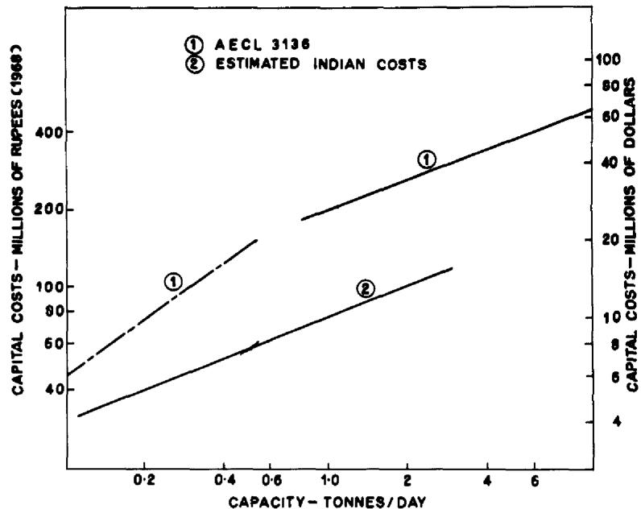

1. Comparison of estimated capital costs for reprocessing plants for Candu type fuel.

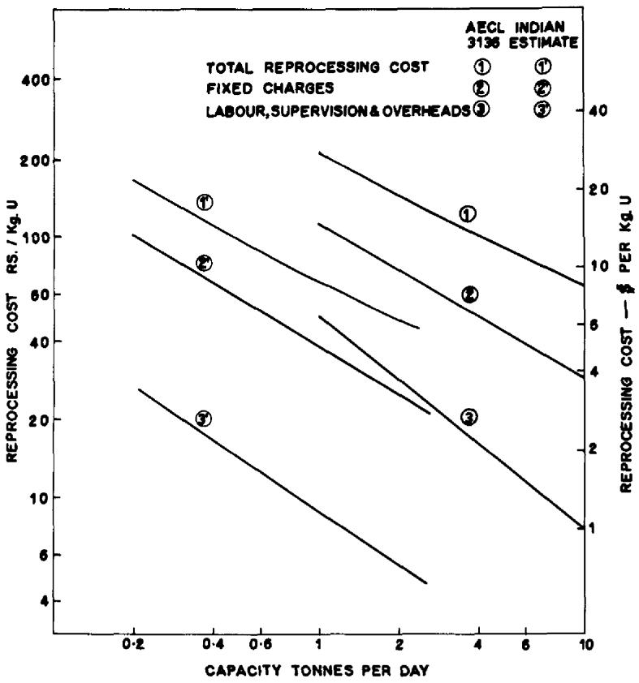  
2. Comparison of reprocessing costs Candu type fuel - Purex process.


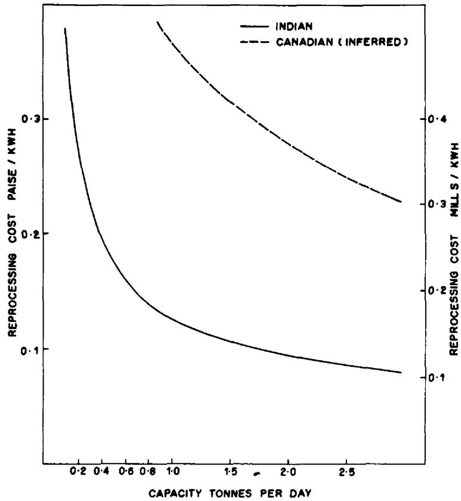

3. Reprocessing cost/Kwh (8000 MWD/Te) 30% efficiency.

The initial slow pace of development of nuclear power, the setting up of our first few nuclear power stations in locations far apart over a vast country like India and the necessity for setting up regional processing plants do not, as discussed earlier, permit to avail of full load factor. The object essentially is to ensure that all plutonium produced in nuclear power stations is recovered as quickly as possible. The regional reprocessing plants are sized in a fashion that they can absorb the load from nuclear power stations in the region as and when they are set up. For instance the Tarapur Reprocessing Plant has been designed for a capacity of half a tonne uranium per day though the minimum load available is from the Tarapur Boiling water power station (25 tonnes a year) and the two units of the Ranapratapsagar power station (50 tonnes a year). This plant can very likely absorb additional load from another Candu type 400 MWe station in a location from where transportation of fuel should be feasible. By the present analysis, transportation to this plant should be feasible from a power station accessible by road from a railhead in Central or Northern India. Similarly transportation of irradiated fuel should be possible from many of the southern parts of the country to the Fuel Reprocessing Plant proposed to be set up at Kalpakkam near Madras. Between these two reprocessing plants fuel from nuclear power stations of the Candu type upto a total of 2,000 MWe installed capacity can be processed.

# The Tarapur Fuel Reprocessing Plant

The design of this plant is based on the Purex Process. A codecontamination cycle followed by partition cycle and two separate purification cycles for the uranium and plutonium are visualised. Purification cycle for plutonium will be chosen from among a TBP process and TLA process. The boiling water reactor fuel element is about 14 ft long and contains massive pieces of zircaloy and also various minor materials of construction other than zircaloy. The fuel element from the Rajasthan Power Station is only $19^{\prime \prime}$ long and does not contain any material other than zircaloy. The end pieces are also not very thick. Because the plant would be treating boiling water reactor fuel elements a decision in favor of chop-leach process was taken. In the Kalpakkam (Madras) Reprocessing Plant it is quite likely that if all fuel to be reprocessed in this facility is of the Candu type chop leach process would not be favoured and a chemical decladding process would be adopted. The choice lies among the Zirflex process, the Thermox process and sulfuric acid dissolution. Information available on the Thermox process $^{(6)}$ and the few experiments carried out in Trombay on the oxidation of the zircaloy and separation of the insoluble oxide from the dissolver solution are quite encouraging for the adoption of the process. In fact an extension of this process to a "chemical chop" concept $^{(7)}$ would reduce the fine oxide to be handled and would leave a large portion of the zircaloy in compact solid form.


The Plant will have 11 to 14 columns depending on the plutonium purification procedure decided upon. The use of TLA appears attractive on account of the fewer solvent extraction contactors involved, and hence a decrease in the cost of equipment. Experiments are being carried out in Trombay on the use of TLA for the final purification $^{(8)}$ as well as on the use of uranous nitrate $^{(9)}$ for the partition and in the final purification cycle using TBP solvent extraction process. In any case, for partition, enough experience has been built up in Trombay on the use of ferrous sulphamate which can be used in the event of any difficulties in the use of uranous nitrate. The plutonium purification cycle at the Trombay plant uses ion exchange process. The performance with respect to decontamination as well as the capacity of the resin has been quite satisfactory. However, the final concentrations of the plutonium product have not been as good as reported. The concentrations obtained in plant scale operation are invariably lower by a factor upto 2 or 3 than those obtained in laboratory experiments under identical conditions. This experience has led to the exploration of the possibilities of other methods.

Based on the results of experiments in progress, provision will be made for recovery of neptunium-237 from the third uranium cycle raffinate. The plant is proposed to be operated on high acid flowsheet for the first two cycles and at lower acidity in the third uranium cycle.

For the reconversion of plutonium nitrate to plutonium oxide experiments are being conducted on continuous precipitation and continuous calcination. Experiments on the residence time indicated the possibility of designing criticality safe equipment for throughput of the order of 500 to 600 grams plutonium per hour.

# Fast Reactor Fuel Reprocessing

It is generally contended that the economics of power generation by fast breeder requires reduction in inventory of fissile material and hence can admit only a very short cooling period before the irradiated fuel is reprocessed. This contention is basically valid, but there are other areas of fuel cycle which contribute more significantly to fuel cycle costs. The proponents of short cooling time are of the view that reduction in fuel cycle cost by decreasing cooling time is far easier than reduction of cost in other areas of the fuel cycle. One has however to balance this with the problems involved in processing short cooled fuel elements and the context of such processing.

The choice for fast reactor reprocessing lies between aqueous and non-aqueous methods. The handicaps adduced to aqueous processes are the degradation of the solvent and the consequent effects on reprocessing efficiency and decontamination factors, criticality problems and the problem of iodine accumulation and release.

Chemical solutions appear to be in sight for minimising the impact of solvent degradation on efficiency of fuel reprocessing by aqueous process.(10). This and the development of short residence time solvent extraction equipment will remove the limitations on aqueous processing due to solvent degradation. Criticality problems especially with respect to the dissolver generally appear to be not insurmountable and can essentially be solved by proper designs and use of built in poisons in equipment. The iodine problem however remains to be properly understood and solved.

The non-aqueous processes, both the volatility method as well as the reductive salt transfer method using metal alloys, show great promise. The technological problems associated with such processes are not insurmountable in small scale units. It appears therefore that both the processes should be competitive for close coupled systems whereas aqueous methods have potential for larger units. The problems associated with the transport of short cooled fuel may necessitate the setting up of close coupled plants in any case and the economics of aqueous versus non-aqueous methods will have to be worked out in this context.

The process and technological problems associated with the fluidised bed fluoride volatility process are the behaviour of plutonium, the efficiency of conversion of plutonium to its hexa-fluoride, the decontamination factors with respect to the ruthenium, the quantitative separation of plutonium from uranium and their mutual contamination factors, the clogging of off gas filters during decladding of zircaloy clad fuel by hydrochlorination or hydrofluorination and the heat removal during the fluorination. As mentioned earlier these problems can probably be solved if equipment used are not complicated in shape and design and the capacity is limited. The fluidised bed fluoride volatility process is essentially suitable for uranium-235 systems and the introduction of plutonium into such a system perforce introduces some problems. While the number of pieces of equipment required for fluoride volatility system is less than what is required for an aqueous process, the materials of construction are more expensive and the problems of fabrication greater in the light of very stringent requirements of corrosion resistance to fluorides at high temperatures.

A difference in capital investment by a ratio of $3:2$ is expected between aqueous and volatility processes in a plant close coupled to a 1000 MWe fast reactor station.(11) A reduction in operating costs by $50\%$ is also estimated. Such significant advantage in capital costs may not be available in the Indian context of lower unit costs of fabrication of equipments and installation of piping. Similarly the major contribution to decrease in operating costs is from reduced labour force required. The already low labour costs in a developing country dilutes the impact of this aspect of cost reduction.

# Madras Fuel Reprocessing Complex

As mentioned earlier, a reprocessing plant for treating irradiated fuel from 1000 MWe of installed power in the form of Candu reactors is planned at Kalpakkam near Madras. A Fast Test Breeder Reactor is also planned for being set up at Kalpakkam. Considerable amount of development work still remains to be done in India on the various methods of reprocessing in general and the reprocessing of fast reactor fuel in particular. Therefore the fuel reprocessing complex planned at Kalpakkam will consist of facilities for reprocessing half a tonne a day of Candu type fuel elements and research and development laboratories in the field of reprocessing. In this complex, facilities will exist for development work and plant scale operation for the separation of uranium 233 from thorium irradiated from the fast or thermal reactors and for developmental work and pilot plant operations of the different non-aqueous processes. All the production facilities are planned under one roof to provide for flexibility in the utilisation of personnel and for economies in common services. The cells and process equipment will however be different and separate.

The thermal reactor reprocessing facility would be quite similar to the one proposed at Tarapur except that the head-end might be restricted to a chemical chop (Zirflex or Thermox) process. The other difference visualised would be the use of mixer settlers for the partition and final purification cycles, in order to reduce the height of the cells. This will provide the necessary plant scale experience in the use of mixer settlers.

The demonstration facility for reprocessing fast reactor fuel will have a capacity as mentioned above of $1.6\mathrm{kg}$ plutonium a day. The fuel is received in the form of disassembled fuel pins of $\mathrm{UO}_2$ - $\mathrm{PuO}_2$ clad in stainless steel approximately $5\mathrm{mm}$ in outer diameter. A simple cutting procedure is preferred for cutting the fuel into small pieces. A dissolver with product at $90\mathrm{g}$ uranium and plutonium per litre is visualised. This will be diluted with nitric acid to 25 to $30\mathrm{g}$ uranium and plutonium per litre and $3\mathrm{M}$ in nitric acid.

The fast fuel reprocessing line will have three cycles of decontamination without the separation of uranium and plutonium. The first cycle extraction contactor will be a 3 cm diameter pulsed perforated plate column. All subsequent contactors will be mixer settlers. The product from the first solvent extraction cycle is expected to be 30 to $35\mathrm{g}$ of uranium and plutonium per litre. After adjusting acidity this will be fed to the second cycle which will operate under the same conditions as the first cycle. The third cycle will also be a repetition of the first cycle with adjustment of acidity based on the nature of the residual fission products. Evaporation for concentration of aqueous products as well as high active wastes would be avoided. Provision will be made for recovery of neptunium-237 to minimise build up of


plutonium-238. The uranium and plutonium in the final decontaminated product would be separated if acquired either by TLA process of if experiments prove successful by reduction with hydrogen in presence of platinum catalyst. The uranium product will be stored to allow the decay of uranium 237 and plutonium will be precipitated as plutonium oxide for recycle. When the development work on centrifugal contactors and stacked clone contactors prove successful the first solvent extraction column will be replaced by the equipment which proves most successful in trials.

The production facilities are expected to cost Rs. 75 million ( $10 million) of which Rs. 45 million can be assigned to the Candu type fuel reprocessing and Rs. 30 million for fast breeder fuel re-processing. The research and development laboratory to be set up separately is expected to cost about Rs. 15 million ($ 2 million). The approximate cost of reprocessing is expected to be Rs. 125 ( $17) per kg of uranium in the Candu type fuel and Rs. 30,000 ($ 4000) per kg plutonium in fast reactor fuel. These estimates for capital costs and reprocessing costs are perforce precise only to an order of magnitude as more details remain to be worked out. Lack of familiarity with reprocessing high burn-up high plutonium fuel has introduced an element of cautious conservatism in the cost estimates for the fast reactor fuel reprocessing.

# Conclusion

The figures presented for comparison of costs cannot be assumed to have long term relevance with respect to absolute values. It is only recently it has been possible to attempt extrapolation of available data on the economics of reprocessing for long term planning. The results of the preliminary studies have brought out the interesting features with respect to Indian conditions. With the setting up and operation of the Tarapur Plant, the data will acquire better precision. The trend of increase in labour costs in India will have a significant impact on the construction and operating costs in the future on account of the appreciable labour component. The size of the optimum plant will thereby increase and this trend will be supported by an increase in the size of nuclear power stations and improvements in transportation by rail and road.

It is foreseen that for sometime to come fast reactor fuels are best reprocessed in close-coupled plants, avoiding thereby the additional technological problems of safe transportation of high burn-up plutonium bearing fuel. Aqueous reprocessing with modifications and refinements has become the universal method for thermal reactor fuels on account of the proved performance with respect to economics as well as process efficiency. For fast reactor fuels the choice will remain open for quite sometime. While aqueous methods do not have insurmountable problems for extension to high burn up short cooled fuels, non aqueous

methods offer an attractive alternative, especially for reprocessing plants coupled to fast reactors upto about 1000 MWe. The Indian programme visualises development work in the various non aqueous processes as well as on short residence solvent extraction contactors for aqueous processing in connection with the reprocessing of irradiated fuel from fast reactors.

# References

1. H.N. Sethna and N. Srinivasan, "Fuel Reprocessing Plant at Trombay" Proceedings of the Third United Nations Conf. on Peaceful Uses of Atomic Energy, Geneva, 1964.   
2. H.N. Sethna and N. Srinivasan, "Operating experience with the fuel reprocessing plant at Trombay" presented at the A.I.Ch.E. Symposium on Recent Advances in Re-processing of Irradiated Fuels, New York City, Nov. 1967.   
3. W.E. Unger, et al, On site fuel processing and recycle plant-ORNL 3959.   
4. T.C. Runion and W.H. Lewis, "Construction and Operation of the West Valley Reprocessing Plant" presented at the A.I.Ch.E. Symposium on Recent Advances in Reprocessing of Irradiated Fuels, New York City, November 1967.   
5. D.D. Stewart, "The Canadian incentive for fuel reprocessing and plutonium recycle" - AECL 3136 (Canada)   
6. O. Tijalldin, "The Thermox Process" AE-120 (Sweden)   
7. T.J. Barendregt, "Chemical decanning of fuel" Kjeller Report - KR 126.   
8. N. Srinivasan, et al, Trilaurylamine as extracting agent for the final purification of plutonium - BARC 374 (India)   
9. N. Srinivasan, et al., Studies on the use of uranium IV as a reductant for plutonium in purex process - BARC - 375 (India)   
10. G. Lefort et al, Rapport Semestriel du Département de Chimie Dec 67 - May 68 Section 7.2 SGCR, CEA-N-1044.   
11. M. Levenson, et al, Comparative cost study of the processing of oxide, carbide, and metal fast breeder reactor fuels by aqueous volatility and pyrochemical methods - ANL-7137


# TECHNOLOGY AND ECONOMICS OF NONAQUEOUS PROCESSING

Chairman: Richard C. Vogel

Argonne National Laboratory

Argonne, Illinois, U.S.A.


# MELT REFINING OF EBR-II FUEL*

D.C.Hampson，R.M.Fryer,andJ.W.Rizzie

Argonne National Laboratory,

Idaho Falls, Idaho

U.S.A.

Melt refining is the name given to the process of selective removal of fission products from highly irradiated metallic reactor fuel by a high-temperature oxidation step in which the ceramic crucible is the source of oxygen. Volatilization of fission products contributes to the overall fission-product removal. Data obtained from four years of totally remote operation with irradiated fuel has, in general, confirmed theoretical and laboratory-obtained results. The purified metal is remotely refabricated into fuel elements for reinsertion in the reactor (EBR-II).

*Work performed under the auspices of the United States Atomic Energy Commission.

# I. Introduction

Experimental Breeder Reactor II (EBR-II) is an unmoderated, heterogeneous, sodium-cooled fast breeder reactor with a power output of 62.5 megawatts of heat (1). The energy produced in the reactor is converted to 20 megawatts of electricity through sodium-to-water heat exchangers and a conventional steam cycle. The plant was built under the auspices of the USAEC as a demonstration central-station fast breeder reactor.

The nuclear driver fuel of EBR-II currently consists of metallic uranium enriched to $52.18\%$ in the U235 isotope and alloyed with $5\%$ fission. When approximately 1.2 to 2 atom percent of the uranium in the fuel has fissioned, the fuel is discharged from the reactor and processed to remove fission products, re-enrich the alloy, and restore its original metallurgical and nuclear properties. Processing is accomplished by melt refining in the directly adjoining Fuel Cycle Facility (2,8) which is an integral part of the EBR-II complex.

The Fuel Cycle Facility consists of a conventional rectangular air-atmosphere hot cell and a circular argon-atmosphere cell (Fig. 1). The two cells are joined by a lock system. All process operations that expose fuel directly to the atmosphere take place in the argon cell. Operations involving fuel that is protected by a stainless steel jacket or cladding are accomplished in the air-atmosphere cell. Since the process does not remove all classes of fission products from the fuel, all processing operations are totally remote.

Feed for the process is an irradiated fuel subassembly from the reactor. The product is a newly reconstituted and re-enriched fuel subassembly ready for insertion in the reactor.

A pyrochemical process was chosen for EBR-II because of its promise of reducing the reprocessing cost associated with nuclear power. The principal characteristics of the process which promise reduced costs are its simplicity, compactness, low volume of dry active wastes, and capability for handling short-cooled fuels with


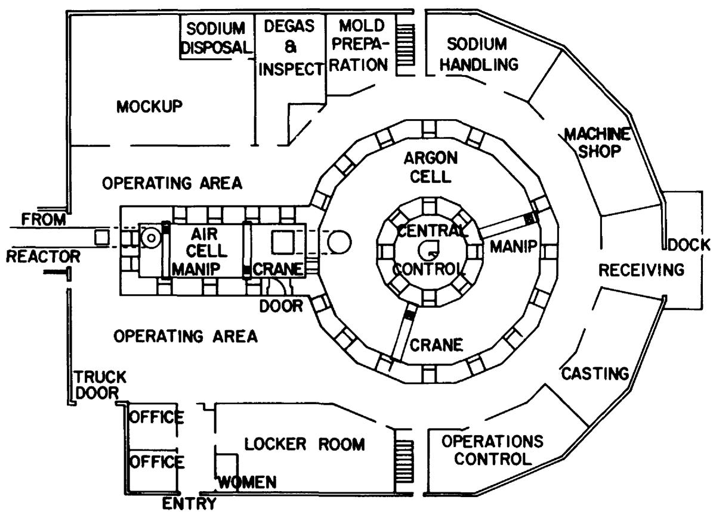  
1. Plan of Fuel Cycle Facility

an attendant reduction in fuel inventories. Another advantage is the reduced criticality problem associated with small volumes of metallic fuels in the absence of nuclear moderators(2). No attempt will be made to evaluate the economics of the overall process, since this paper is concerned only with the results produced by melt refining.

Melt refining was chosen as the specific pyrochemical demonstration process for the metallie fuel of EBR-II. A large number of parametric studies (3) were made to aid in predicting the disposition and interactions of individual fission products and to define the physical specifications for the process. These studies were made on a small scale with either inactive or tracer-level materials. However, some of the variables, such as buildup of isotopes of uranium with continual recycle, could not be verified in small-scale runs. Two of the primary objectives for the operation of the melt refining process in the Fuel Cycle Facility were to evaluate the veracity of the small-scale experiments relative to full-scale (both size and activity level) runs, and to demonstrate that a pyrochemical process could be operated on a full-plant scale by totally remote means for a meaningful period of time. With regard to the chemistry of the process, the full-scale runs confirmed the experimental and theoretical predictions. With regard to the time period, the successful operation for more than four years by totally remote means exceeded the original design specifications for the demonstration of this process.

# II. Head-End Processing Steps

The fuel subassemblies are 92 in. long, are hexagonal in shape, and contain 91 enriched uranium-alloy fuel elements (clad pins). The fuel pins are 13.5 in. long by 144 mils in diameter, and are sealed in a stainless steel can (9 mil wall) which is 18 in. long. The 6-mil annulus between the fuel pin and the cladding wall is filled with sodium which acts as a heat transfer medium during power operation.

The external surfaces of a subassembly (Fig. 2) are covered with residual sodium after removal from the reactor. The sodium is removed from the subassembly in the interbuilding coffin (2) by an oxidation and water-dissolution procedure. After sodium removal, the subassembly is transferred to the air cell for mechanical dismantling. Individual fuel elements are transferred to the argon cell, where they are mechanically decanned and chopped into 1.5 in. sections for ease of handling (2, 8). The chopped, sodium-coated fuel is ready for melt refining. Refabrication of new fuel elements from the melt-refined fuel is described in an accompanying paper (10).


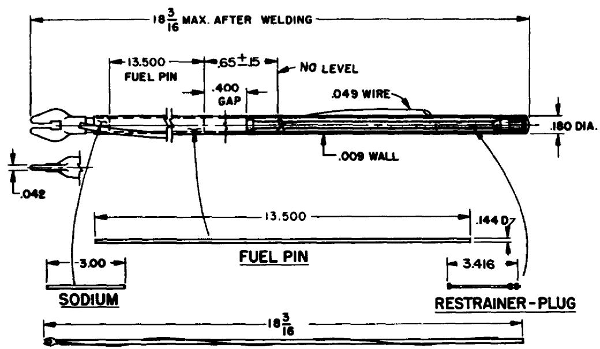

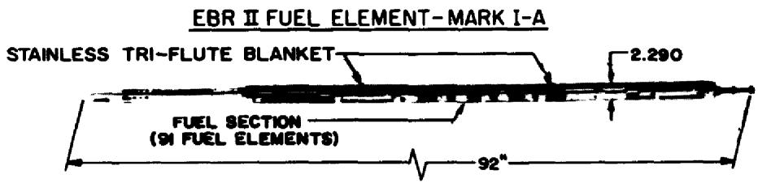  
2. EBR-II Driver Fuel Subassembly

# III. Description of Melt Refining

The irradiated, chopped fuel and a precalculated quantity of re-enrichment uranium is charged to a lime-stabilized zirconium oxide crucible.\* Zirconium oxide was preferred to other ceramics because contamination of the melt by the substrate metal $(\mathbf{Z}\mathbf{r})$ is negligible, and pouring yields from $\mathrm{ZrO_2}$ crucibles were somewhat better than those from the other ceramics considered (3). In addition, zirconia provided better cerium removal.

The crucible is placed in a sealed furnace (2), and the fuel alloy is melted and liquated for 3 hrs at $1400^{\circ}\mathrm{C}$ under an inert argon atmosphere. During the run, the crucible is covered with a ceramic-fiber fume trap which has been shown effective in trapping cesium and iodine (CsI)(6). After purification, the fuel alloy is chillcast into a graphite ingot mold. This process is termed melt refining (2,3).

Melt refining removes three classes of fission products from the fuel, and these represent about two-thirds of the total fission yield. The chemically inert fission gases xenon and krypton are evolved on melting (3). Fission products such as bromine, iodine, and cesium, which have high vapor pressure at $1400^{\circ}\mathrm{C}$ , are volatilized and trapped by the fume trap (3,5,6). Chemically reactive fission products, such as yttrium, strontium, barium, lanthanum, and the lanthanide elements, react with the oxygen in the zirconia crucible to form oxides. These oxides remain with the crucible when the alloy is poured into the mold, Fig. 3 (3,5).

One group of fission products, atomic numbers 40 through 46, are not removed by the melt refining process. Zirconium, atomic number 40, has exhibited fractional removals, but this is attributed to reaction with carbon and other impurities in the alloy rather than to the oxidative process. These fission products constitute the so-called fissium elements. For the first core loading of EER-II, it was felt advisable not to start with a pure uranium fuel, which has undesirable metallurgical and radiation-stability characteristics, and would be subject to compositional changes during each reactor-processing pass. Instead, the steady-state concentrations of fissium metals in recycled fuel were calculated as a function of fission yield, percent burnup, melt refining reactions, dross (skull) purification and recycle (7), and pouring yields. This calculated composition was chosen as the alloy for the first core loading of EER-II (4) (see footnote p.1).

# APPROXIMATE DISTRIBUTION OF ELEMENTS IN MELT REFINING PROCESS


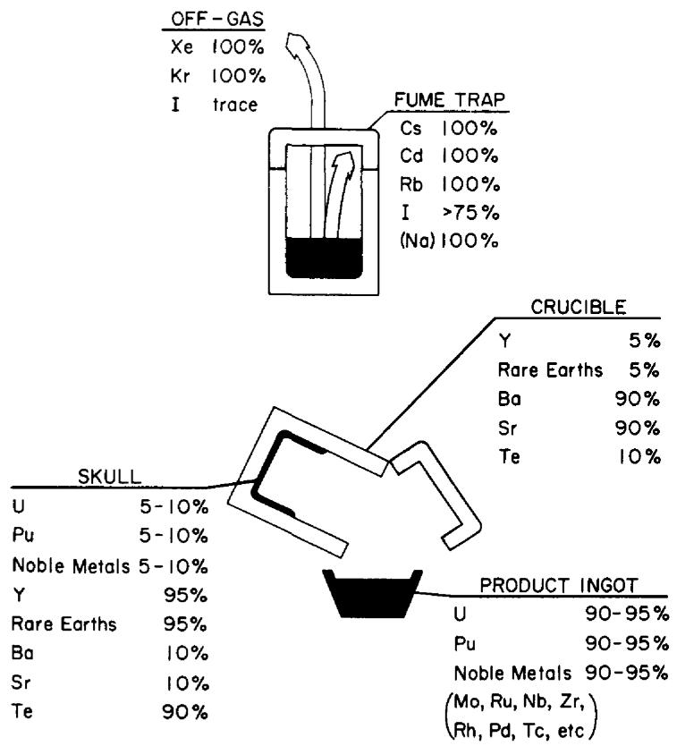  
3. Fission Product Removal in Melt Refining

# 1. Fission Product Removals

Considerable preoperational research was done on the behavior of many of the fission products during melt refining (3). For direct comparison with current work, the most important work was that of Trice and Steunenberg (5). They completed a series of small-scale melt refining experiments (400-g charges) with highly irradiated EBR-II-type fuel and determined fission product distributions as well as removals. From these experiments, it was concluded that uranium, molybdenum, and ruthenium show no preference for the ingot or skull, and distribute directly according to the pouring yield. The removals of rare earths, tellurium, iodine, cesium, and barium-strontium were generally $99\%$ or better. The single determination on plutonium hinted at a very slight partition to the oxide.

Plant-scale runs typically involve 10- to 12-kg charges of irradiated fuel plus makeup enriched uranium. The melt refining crucible is 9-1/2 in. high by 6-3/8 in. in diameter, and is covered by a Fiberfrax\* (2) fume trap with dimensions of 10 in. in diameter by 5-1/4 in. high. Because of the large size of these components and the high levels of activity involved, sampling of these components was difficult and complete fission-product distributions were not obtained for plant operation.

For the same reasons, and because of the heavy analytical load of routine fuel analyses (uranium, plutonium, noble metals, and trace impurities), complete fission-product analyses were not obtained for each run. Certain fission products were selected as representative of major classes.

Cesium and iodine were selected as representative of those elements having high volatility. Barium, lanthanum and cerium were selected as representative of the chemically reactive group, with cerium as a representative for rare earths. The behavior of the gaseous fission products (xenon, krypton) was so well established that they were not checked.

For plant startup, $1400^{\circ}C$ and 3 hrs of liquation were chosen as the initial melt-refining parameters. These runs were made primarily to confirm that plant-scale results would agree with laboratory-scale results. Accordingly, removals for these conditions are presented first. The removals for the volatile and the chemically reactive groups were generally $98.5\%$ or better.


Plutonium exhibited a slight preference for the skull, showing approximately $5\%$ removal from the refined alloy. The noble metals distributed directly according to pouring yield.

Data obtained from these early runs confirmed that 3 hrs and $1400^{\circ}\mathrm{C}$ are adequate conditions for acceptable fission product removals. They essentially duplicate the data from the small-scale experiments (5). The results also confirm that technetium may be considered a noble metal. The stability of the noble metals is more clearly presented in the next section (IV-3). The data for plutonium are at low concentration levels, but they confirm previous work (3).

Off-gases from the melt refining furnace pass first through the in-cell filter containing a 2-in. layer of activated carbon and a high-efficiency glass filter medium, then through a vacuum pump and an oil separator to a shielded holdup tank (500 cu ft) containing 1000 lb of activated carbon. When meteorological conditions are favorable, the gas in the holdup tank is discharged through a heated $(430^{\circ}\mathrm{F})$ bed of silver-nitrate-coated packing (silver nitrate tower), through a bank of high-efficiency filters for removal of submicron particles, and through a 200-ft high stack to the atmosphere.

Prior to plant startup, two experiments were performed in the plant furnaces to evaluate the behavior and distribution of iodine. In one of these experiments, one wire of $I^{131}$ (as palladium iodide which decomposes at $350^{\circ}\mathrm{C}$ ) was added to $8\mathrm{kg}$ of fuel and melt refined at $1400^{\circ}\mathrm{C}$ for 3 hrs. During refining, the charge contained in the $\mathrm{ZrO_2}$ crucible is covered by the fume trap. The fume trap collected $\sim 80\%$ of the $I^{131}$ , $\sim 20\%$ distributed to metallic surfaces in the furnace assembly, and the crucible and skull retained approximately $2\%$ . Of the small amount that reached the in-cell filter (0.3 mCi), only $0.3\%$ passed through it (as is typical of most radiochemical determinations, the material balance is not perfect). Very minor amounts (0.1%) of the original iodine eventually appeared in the cell atmosphere.

In a companion experiment, 1 Ci of elemental iodine was introduced into the pipe entering the off-gas delay tank at a point downstream of the in-cell filter and the exhaust pumps. Approximately $25\%$ of the charge (250 mCi) reached the tank. Three successive pumpouts (following backfilling with argon) resulted in a total of 0.14 μCi of 131 being extracted from the tank. The percentage passed by the tank charcoal was thus 6 x $10^{-5}\%$ (11).

Following the confirmation of the initial parameters, data were obtained to ascertain the effect of liquation time while maintaining the $1400^{\circ}\mathrm{C}$ liquation temperature. Table 1 presents these data.

During a typical melt-refining run, 2 hrs elapses between the start of the run and the time at which $1400^{\circ}\mathrm{C}$ is reached. The EBR-II fission alloy melts in the range 1030 to $1080^{\circ}\mathrm{C}$ , so the alloy has normally been molten for 20 to 30 min before $1400^{\circ}\mathrm{C}$ is reached. From the data of Table 1, it is concluded that cesium and barium-lanthanum are effectively removed from the bulk alloy upon reaching $1400^{\circ}\mathrm{C}$ . Iodine is also effectively removed in relatively short liquation time at $1400^{\circ}\mathrm{C}$ (it has been shown that the iodine is normally deposited after volatilization as an iodide, primarily CsI (6)).

Table 1   
Effect of Liquation Time on Fission-Product Removals at $1400^{\circ}\mathrm{C}$   

<table><tr><td rowspan="2">Liquation Time (hr)</td><td colspan="3">Average Percent Removal</td><td rowspan="2">No. of Runs on Which Average is Based</td></tr><tr><td>Cesium</td><td>Barium-Lanthanum</td><td>Cerium</td></tr><tr><td>4</td><td>&gt;99</td><td>&gt;99</td><td>99</td><td>1</td></tr><tr><td>3</td><td>&gt;99</td><td>&gt;99</td><td>98.5</td><td>Many</td></tr><tr><td>2</td><td>&gt;99</td><td>&gt;99</td><td>95.5</td><td>3</td></tr><tr><td>1.5</td><td>&gt;99</td><td>&gt;99</td><td>90</td><td>1</td></tr><tr><td>0.5</td><td>&gt;99</td><td>&gt;99</td><td>73</td><td>1</td></tr><tr><td>0.25</td><td>&gt;99</td><td>&gt;99</td><td>69</td><td>2</td></tr></table>

The removal of cerium, and presumably the other rare earths, on the other hand, is strongly time-dependent at $1400^{\circ}\mathrm{C}$ . The cerium data are plotted in Fig. 4 for illustration. This time dependency was not observed in the small-scale runs where the time was varied between 1 and 3 hrs. However, this is not unexpected, since the crucible contact-surface-to-volume ratio of the small-scale runs was a factor of three larger than for the plant-scale runs. It has been shown that diffusion through the reaction zone is probably the controlling process for cerium removal (3, 9, 10). Thus, it is reasonable that a 1-hr liquation in small-scale geometry should produce the same results as a 3-hr liquation in the plant-scale crucible. Either of them would essentially effect quantitative $(98 - 99\%)$ removal of cerium, and additional liquation time would not produce a significant increase in removal of cerium.

Some data were obtained to assess the effect of temperature on fission-product removals. Because of plant operational requirements, however, the determinations were over relatively narrow temperature ranges.

At 3 hrs, no effect of temperature was discernible within the accuracy of analytical results for Cs, Ba-La, or Ce. In order to accentuate any change that may have occurred, the tests with 2-hr

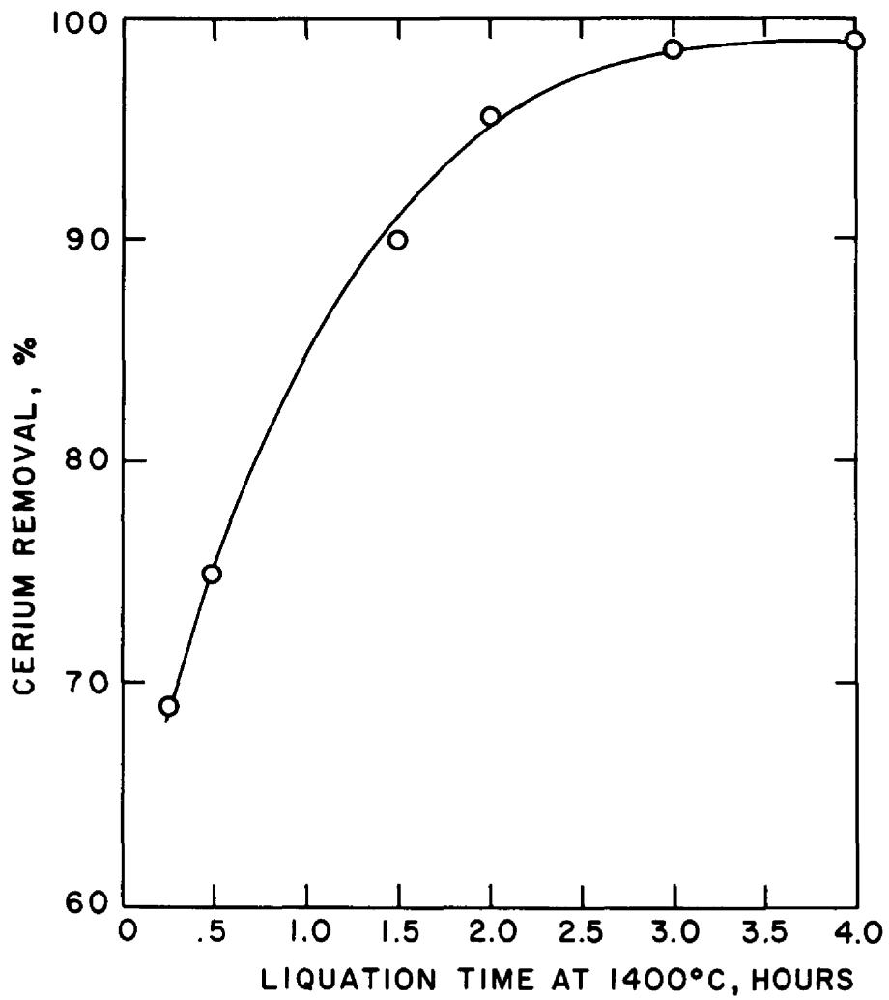  
4. Cerium Removal as a Function of Liquation Time

liquation time were made. These results are shown in Table 2.

Table 2   
Effect of Liquefaction Temperature On Fission Product Removals   

<table><tr><td colspan="4">3-Hour Liqueation</td><td colspan="3">2-Hour Liqueation</td></tr><tr><td>Temperature (°C)</td><td>Element</td><td>Average Removal(%)</td><td>No.of Runs</td><td>Temperature (°C)</td><td>Average Removal(%)</td><td>No.of Runs</td></tr><tr><td rowspan="3">1400</td><td>Cesium</td><td>&gt;99</td><td>4</td><td>1400</td><td>&gt;99</td><td>3</td></tr><tr><td>Ba-La</td><td>&gt;99</td><td>2</td><td></td><td>&gt;99</td><td>3</td></tr><tr><td>Cerium</td><td>98.5</td><td>5</td><td></td><td>95.5</td><td>3</td></tr><tr><td rowspan="3">1350</td><td>Cesium</td><td>&gt;99</td><td>1</td><td>1350</td><td>&gt;99</td><td>2</td></tr><tr><td>Ba-La</td><td>&gt;99</td><td>1</td><td></td><td>&gt;99</td><td>2</td></tr><tr><td>Cerium</td><td>98.5</td><td>1</td><td></td><td>92.5</td><td>2</td></tr><tr><td rowspan="3">1300</td><td>Cesium</td><td>&gt;99</td><td>2</td><td>1300</td><td>&gt;99</td><td>1</td></tr><tr><td>Ba-La</td><td>&gt;99</td><td>2</td><td></td><td>96.5</td><td>1</td></tr><tr><td>Cerium</td><td>98.5</td><td>2</td><td></td><td>77</td><td>1</td></tr></table>

Cesium shows no temperature effect over the range considered. The data for $I^{131}$ are too incomplete to allow conclusions. Previous work had shown complete removal at $1400^{\circ}\mathrm{C}$ and at least $90\%$ removal at $1300^{\circ}\mathrm{C}$ (3). Barium-lanthanum was removed quantitatively during all the 3-hr runs checked, but it did exhibit a slight lowering of removal for a 2-hr liquation at $1300^{\circ}\mathrm{C}$ . Extension of the temperature range would probably amplify this effect, considering the chemical similarity of barium, lanthanum and cerium.

The data for cerium are interesting. No apparent temperature dependence is exhibited for 3-hr liquations, but there appears a fairly strong dependence for 2-hr liquations. To correctly estimate the magnitude, the time effect must be subtracted out before the temperature dependence is established. The data are too meager, however, to allow this separation.

The final conclusion about the cerium behavior is that there exists a combined time-temperature dependence that would allow some parametric juggling in the operation of a melt-refining processing plant. In general, the data for the elements investigated confirm laboratory and theoretical estimates, and appropriate choice of parameters will provide adequate fission-product removals.

# 2. Gross Gamma Activity Distribution

Gross radiation distribution measurements were taken for one of the early melt refining runs (all readings are at 1 ft). The feed materials (corrected for decay) showed an input to the run of $7 \times 10^{4} \, \text{R/hr}$ (12). After being refined, the activity distribution on the various components showed the following:

<table><tr><td></td><td>Reading (R/hr)</td><td>Percentage of Total</td></tr><tr><td>Refined Ingot</td><td>4.5 x 103</td><td>8</td></tr><tr><td>Crucible (1.5 x 104) + Skull (3.5 x 104)</td><td>5.0 x 104</td><td>84</td></tr><tr><td>Fume Trap</td><td>4.0 x 103</td><td>8</td></tr><tr><td>Ingot Mold</td><td>3</td><td>---</td></tr><tr><td>Total</td><td>6 x 104</td><td>100</td></tr></table>

The charge for this run averaged 0.4 a/o (atom percent) burnup. At 1 a/o burnup, localized radiation readings would fall in the range of $10^{5} - 10^{6}\mathrm{R/hr}$ . The difference between charge and product can be attributed to self-shielding in the ingot and gas evolution from the refined alloy. The subsequent high radiation background within the shielded cells precluded repeating this experiment with fuel containing a higher activity level.

# 3. Alloy Compositional Stability and Plutonium Buildup

As noted previously, the initial "equilibrium" core loading for EBR-II was calculated from knowledge of the behavior of the various fission products in the melt refining process. Compositional variations were later followed in one batch of fuel that was recycled five times between the reactor and the processing-refabrication cycle. The fuel received 1 to $1.2\mathrm{a / o}$ burnup each cycle in the reactor. None of this fuel was intermixed with other batches during this experiment and the only compositional adjustments made were to add sufficient U-235 each cycle to compensate for that consumed in the reactor.

After five cycles, the composition of the fuel had not changed (within analytical accuracy) except for zirconium, silicon, plutonium, technicium, and U-234 plus U236. These starting concentrations for these elements and the concentrations after five cycles are shown in Table 3.

Table 3   
EBR-II Fuel-Alloy Composition Changes   

<table><tr><td>Element</td><td>Initial Composition (w/o)</td><td>Composition After Five Processing Cycles (w/o)</td></tr><tr><td>Uranium-236</td><td>0.09</td><td>0.52</td></tr><tr><td>Plutonium</td><td>None</td><td>0.12</td></tr><tr><td>Technecium</td><td>None</td><td>0.05</td></tr><tr><td>Zirconium</td><td>0.10</td><td>0.09</td></tr><tr><td>Silicon</td><td>0.01</td><td>0.07</td></tr></table>

The concentrations of plutonium and technicium increased because they are formed in the reactor and are not selectively removed in melt refining. Neither of them was present in the initial alloy composition. A slight increase in U-236 is also apparent. This isotope is formed in the reactor as a result of the n, reaction on U-235. No separation of uranium isotopes results from melt refining.

The increase in silicon concentration comes from small amounts of the Vycor (quartz) molds that enter the melt during the subsequent injection-casting operation. Continued recycle of the metal resulted in a steady increase of silicon. No attempt was made to remove silicon, since postirradiation surveillance of the fuel showed that fuel with silicon contents in the range of 200-800 ppm exhibited less radiation damage than the fuel containing the original concentration of silicon (50-100 ppm).

The total fission yield of zirconium is greater than that of any other noble metal in the alloy. If zirconium were not removed from the alloy by some mechanism, it would grow at the expense of the other noble-metal concentrations. The current alloy compositions show that, if anything, zirconium has slowly decreased in concentration. The analytical data for zirconium typically exhibit wide variance, and no estimate of the percentage of removal is attempted. The removal of zirconium has been correlated with the presence of carbon and cerium in the alloy (3). The stability of the alloy is readily apparent and confirms original estimates of the behavior of the process.

# 4. Silicon Addition

As mentioned above, it was desirable to increase the silicon

concentration of the alloy to about $400~\mathrm{ppm}$ . Other investigators who attempted to add silicon to uranium melts noted that quantitative alloying was difficult to achieve; several experiments were therefore conducted at FCF to determine the best way to add silicon to EBR-II driver fuel. The methods that were considered were: (1) direct addition of silicon metal to uranium-fissium-alloy melts, (2) direct addition of a uranium-silicon master alloy to the uranium-fissium-alloy melts, (3) direct addition of fissium silicides to uranium-fissium-alloy melts, and (4) direct addition of silicon dioxide to uranium-fissium-alloy melts.

Table 4 shows the results of initially adding silicon metal to the charge (uranium and uranium - 5 w/o fissium) before alloying at $1400^{\circ}\mathrm{C}$ .

Table 4   
Direct Addition of Silicon Metal to Uranium And Uranium - 5 w/o Fissium Melts at $1400^{\circ}\mathrm{C}$   

<table><tr><td rowspan="2">Type of Melt</td><td colspan="2">Charge(g)</td><td rowspan="2">Stoichiometric Silicon Concentration</td><td rowspan="2">Actual Concentration</td></tr><tr><td>U</td><td>Si</td></tr><tr><td>Uranium</td><td>11,501</td><td>253</td><td>2.15 w/o</td><td>1.95 w/o</td></tr><tr><td>Uranium</td><td>10,351</td><td>211</td><td>2.01 w/o</td><td>1.85 w/o</td></tr><tr><td>Uranium</td><td>7997</td><td>163</td><td>2.00 w/o</td><td>1.86 w/o</td></tr><tr><td>U-5 w/o</td><td></td><td></td><td></td><td></td></tr><tr><td>Fissium</td><td>10,941</td><td>* 3.8</td><td>~350 ppm</td><td>300 ppm</td></tr><tr><td>U-5 w/o</td><td></td><td></td><td></td><td></td></tr><tr><td>Fissium</td><td>11,166</td><td>* 3.8</td><td>~340 ppm</td><td>290 ppm</td></tr><tr><td>U-5 w/o</td><td></td><td></td><td></td><td></td></tr><tr><td>Fissium</td><td>11,213</td><td>* 3.8</td><td>~340 ppm</td><td>290 ppm</td></tr></table>

*5 w/o Fissium

An interesting point that resulted from the experiment is that $86.5 \pm 1.5\%$ of the silicon initially charged remained with the product for each case.

Two experiments were conducted where silicon was added to a uranium - 5 w/o fissium melt through a master alloy. The master alloy was composed of U-238 and silicon (1.86 w/o Si). The desired final composition was $400 \, \text{ppm}$ Si. Results indicate that a near-perfect stoichiometric silicon pickup is possible when silicon is added by the master alloy method. This method is presently being used at the Fuel Cycle Facility for silicon addition to alloy melts.

Zirconium disilicide was added directly to an alloy preparation charge as a means of adding zirconium and silicon to the fission alloy. Results indicated that $100\%$ of the silicon and $85\%$ of the zirconium alloyed with the product.

Vycor glass tubing $(99.9\% \mathrm{SiO}_2)$ was added to a depleted-uranium charge. The oxygen introduced as SiO2 reduced the melt yield; therefore, this technique was not used for adding silicon to the fuel alloy.

# 5. Melt-Refining Pour Yields and Throughput

The yield of one melt refining operation is defined as the ratio of the weight of the chill-cast ingot to the total weight of spent fuel, enrichment adjustments (U-235 and U-238), and fissium elements charged to the furnace before the melt. The throughput at melt refining is defined as the total weight of alloy processed per week in the melt refining furnaces (there are two furnaces in the EBR-II, FCF). The throughput is directly related to the yield of each melt refining operation.

The pouring yield in melt refining is dependent on a number of conditions, such as charge size and geometry, furnace atmosphere, and crucible material. These conditions were not varied for the melt refining runs. The conditions that were investigated were the effect of liquation time, liquation temperature, and fission product concentration (percent burnup).

For what were defined as standard operating conditions, i.e., 3 hrs of liquation in a zirconia crucible at $1400^{\circ}\mathrm{C}$ , the effect of burnup on pouring yield is shown in Fig. 5 The straight line is a least-squares fit of data points obtained.

The effect of liquation times or temperatures on pouring yield could not be separated from the effect of fission-product removal. Pouring yields are directly dependent on the quantity of dross produced. Lower temperatures and the resulting lower reaction rates would require longer reaction (liquation) times to produce the same fission-product removals. Previous work with unirradiated uranium showed that the dross consisted of 10 to $20\%$ oxidized metal and 80 to $90\%$ occluded metal. This work also showed that higher pouring temperatures resulted in higher yields. This is probably a result of a lower viscosity of the matrix metal at higher temperatures, which results in better "draining" of the occluded metal from the dross.

The highest temperature consistent with equipment limitations was selected, $1400^{\circ}\mathrm{C}$ . This resulted in a 3-hr liquation time which was consistent with a single shift (8 hrs) overall operating cycle for the melt refining furnace.

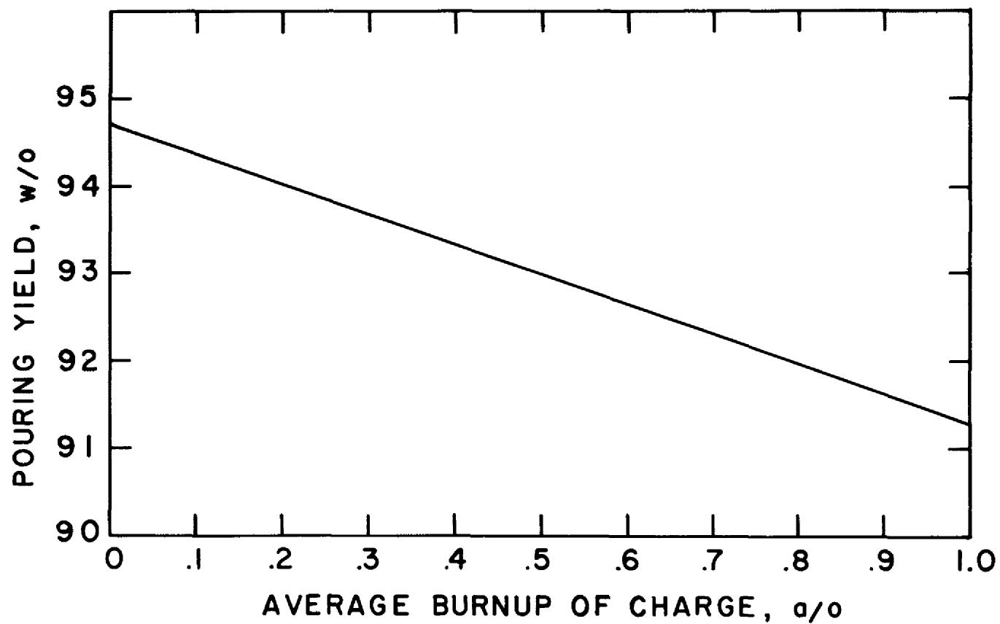  
5. Fouring Yield as a Function of Fuel Burnup

In addition to refining the spent fuel, one of the necessary jobs of the melt refining furnaces is to consolidate the recycle material being returned from the refabrication process. This material comes in two bulk forms, "heels" and "shards." An explanation of the sources of this material is given in an accompanying paper(10). A summary of the consolidation and melt refining operation carried out in the melt refining furnace is given in Table 5.

The average throughput of alloy per furnace during normal processing periods was $\approx 25$ kg per week. This included both spent and recycle fuel. The total amount of fuel refined in the Fuel Cycle Facility and the total weight processed through melt refining is shown in Table 5 (two furnaces).

Table 5   
Melt Refining Throughput and Yields   

<table><tr><td>Type</td><td>No. of Runs</td><td>Total Charge (kg)</td><td>Ave. Charge Burnup (a/o)</td><td>Total Refined Ingots (kg)</td><td>Ave. Pour Yield (w/o)</td></tr><tr><td>Irradiated Fuel</td><td>310</td><td>2279</td><td>0.825</td><td>2090</td><td>91.7</td></tr><tr><td>Recycle Runs</td><td>191</td><td>2117</td><td></td><td>1974</td><td>93.2</td></tr><tr><td>Alloy Preparation Runs</td><td>73</td><td>794</td><td></td><td>748</td><td>94.2</td></tr></table>

# Summary

In the work reported on in this paper, two areas are of particular interest. The first is that the melt refining process is the first demonstration of pyrochemical processing of reactor fuel on a full-plant scale. The second is that equipment can be designed to be operated by totally remote means on a productive schedule, and can maintain this schedule for over four years of continuous operation.

The data obtained from these operations essentially confirm data that had previously been obtained on unirradiated or small-scale runs. This is noteworthy and encouraging in that designers of future pyrochemical processes may continue to have confidence in data that were derived from laboratory or theoretical results. The melt refining furnaces were installed in the shielded cells in 1963. They were tested with unirradiated uranium melts, and in 1964 the first melts with irradiated fuel were conducted. During the $4-1/2$ years that the two melt-refining furnaces were in operation in the argon cell, a total of almost 600 runs of 10 to $12\mathrm{kg}$ each were made in these furnaces. The majority of the runs were made for purification of the reactor fuel. The remainder were made for blending of new (unirradiated) alloy or for consolidation of recycle material.

The modular design of the furnaces permitted remote repair or replacement of any components that had failed. The longevity of the equipment and the ease with which repairs could be made re-affirmed the desirability of proper design and preoperational testing of all equipment that must be operated remotely. The overall operating availability of both furnaces for the past four years exceeded $85\%$ of operating time.


# References

1. L. J. Koch, et al., "Hazards Summary Report, Experimental Breeder Reactor II (EBR-II)," ANL-5719, May 1957, and "Addendum to Hazard Summary Report, Experimental Breeder Reactor II (EBR-II)," ANL-5719 Addendum, June 1962, Argonne National Laboratory.   
2. J. C. Hesson, et al., "Description and Proposed Operation of the Fuel Cycle Facility for the Second Experimental Breeder Reactor (EBR-II)," ANL-6605, April 1963, Argonne National Laboratory.   
3. "The Melt Refining of Irradiated Uranium: Application to EBR-II Fast Reactor Fuel," A Series of Papers in Nucl. Sci. and Eng., Vol. 6, 1959, and Vol. 9, 1961.   
4. D. C. Hampson, "Preparation of Alloy for First Core Loading of EBR-II," ANL-6290, August 1961, Argonne National Laboratory.   
5. V. G. Trice, et al., "Small-Scale Demonstration of the Melt Refining of Highly Irradiated Uranium-Fissium Alloy," ANL-6696, August 1963, Argonne National Laboratory.   
6. N. R. Chellew, et al., "Laboratory Studies of Iodine Behavior in the EBR-II Melt Refining Process," ANL-6815, January 1964, Argonne National Laboratory.   
7. L. Burris, et al., "The EBR-II Skull Reclamation Process. Part I. General Process Description and Performance," ANL-6818, January 1964, Argonne National Laboratory.   
8. D. C. Hampson, et al., "Startup Experience for the EBR-II Fuel Cycle Facility. Part II. Fuel Processing," Proceedings of the 13th Conference on Remote Systems Technology, The American Nuclear Society, Hinsdale, Illinois, 1965, pp. 8-13.   
9. "A Mechanism Study of the Oxide-Drossing of Cerium Molten Uranium with Uranium Dioxide," NAA-SR-3090, 1958, North American Aviation, Inc.   
10. M. J. Feldman, et al., "Remote Fabrication of EBR-II Fuels," 1969 Nuclear Metallurgy Symposium, Reprocessing of Nuclear Fuels, Ames, Iowa, Vol. 15, August 1969.   
11. Chemical Engineering Division Semiannual Report, July-December 1964, ANL-6925, Argonne National Laboratory, pp. 69-72.   
12. L. Burris, et al., "Estimation of Fission Product Spectra in Discharged Fuel from Fast Reactors," ANL-5742, July 1957, Argonne National Laboratory.

# REMOTE REFABRICATION OF EBR-II FUELS*

M. J. Feldman, N. R. Grant, J. P. Bacca, V. G. Eschen, D. L. Mitchell, and R. V. Strain

Argonne National Laboratory, Idaho Falls, Idaho U.S.A.

The melt-refining process used for purifying the highly irradiated EBR-II metallic fuel does not remove all of the fission products, hence refabrication of the product fuel must be done remotely. The steps involved in refabrication of fuel elements and subassemblies are: injection casting, pin processing (shearing and inspection), loading into a sodium-filled jacket, welding the jacket closed and leak testing, bonding the sodium in the jacket, and assembling the completed elements into a subassembly. The subassemblies are reinserted into the reactor. Nearly 35,000 fuel pins and elements have been fabricated by totally remote processing to tolerances of one mil or less. Process variables and yields for each step of the process have been investigated.

*Work performed under the auspices of the United States Atomic Energy Commission.

# Introduction

The reprocessing of fuel from Experimental Breeder Reactor II (EBR-II) requires a system of sophisticated equipment operated remotely in two large cells of the Fuel Cycle Facility (FCF). The fuel itself is an alloy of $52\%$ -enriched uranium and 5 w/o fissium. The fissium consists of fission-product elements (molybdenium, rhodium, ruthenium, palladium, zirconium, and niobium) that are not removed by pyrometallurgical processing.(1) In the FCF the first series of operations includes fuel handling, decanning, and melt refining, as described in an accompanying paper.(1) The following series of operations, the refabrication steps, are described in this paper.

In the argon cell, the first step is that of melting the refined ingot and injection casting the uranium alloy into Vycor molds. Next, in the pin processing operation, the fuel pins are removed from the molds, sheared to length, and inspected for length, weight, diameter, and internal porosity. Acceptable pins are loaded into stainless steel jackets containing a precisely measured quantity of sodium. An end closure (restrainer) is inserted in the jacket and the final closure weld completed. These fuel elements are transferred to the air cell where the closure weld is leak tested. The final element operations are sodium bonding and sodium bond testing. Acceptable elements are fabricated into subassemblies, which, after final acceptance testing, are returned to the reactor.

Three other operations involved in fabrication are not accomplished by remote means. The stainless steel jackets are fabricated from purchased components, and each jacket is loaded with a carefully measured quantity of sodium. Other stainless steel components are purchased and fabricated into preassemblies, which when combined with 91 fuel elements, form a completed subassembly. A summary of operating experience in the FCF is presented at the end of the report.

# Injection Casting(2)

Two of the requirements for the reactor fuel were that the diameter (0.144 in.) had to be closely controlled, and the grain structure had to be randomly oriented. To combine these factors with remote operation, an essentially new process had to be developed. Using a casting process together with controlled cooling solved the random grain structure. The diameter problem was resolved by forcing the molten metal into tubes with a precision bore. After considerable development work, the injection-casting furnace shown in Fig. 1 was ready for use in FCF.(3,4) With minor modifications, the furnaces have been used to produce fuel pins in the argon cell since 1964. A production summary is given in Table I.

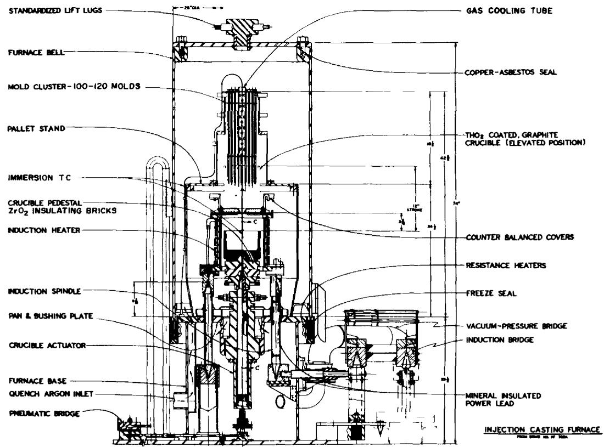  
1. Fuel Cycle Facility Injection Casting Furnace

The ingot from melt refining is placed in a thoria $(\mathrm{ThO_2})$ -coated graphite crucible, which is positioned on a zirconia insulation pedestal in the furnace. A pallet stand holds approximately 100 Vycor* molds above the crucible. The cylindrical molds are sealed at the top end, have a precision bore, and also are coated with thoria. Around the crucible (which also serves as a susceptor) is the induction heater. The induction coil is an uncooled, 3/8-in.-dia solid molybdenum coil, which is powered by a 10,000-cycle, 30-kW motor generator. Temperature control of the melt is obtained by using a platinum-rhodium immersion thermocouple sheathed in a sealed tantalum tube. The thermocouple passes through the center of the pallet to the crucible. There is a backup thermocouple located underneath the graphite crucible. A gastight chamber is formed by a furnace bell in combination with a Bi-Sn eutectic-alloy freeze seal (Cerro-tru).

After the furnace is charged and the seal frozen, a vacuum of 50-100 μ is obtained. The charge is heated to $1350^{\circ}$ C, and the automatic casting cycle is initiated. This raises the crucible into the elevated position so that the molds are immersed approximately 1-1/2 in. into the melt. Since the molds are relatively cold, a plug of metal forms in the tube. The molds are therefore held in the melt for a short time (8 sec) before the furnace is pressurized to 1.7 atmospheres (abs.). The pressure drives the molten metal up into the evacuated molds. After 2 sec, the metal begins to freeze in the molds, at which time the crucible is lowered to its original position and a flow of cooling is recirculated over the molds. The furnace is cooled for approximately 4 hrs (to a crucible temperature of less than $200^{\circ}$ C), the seal is melted, and the furnace is unloaded. The fuel pins in the Vycor molds are transferred to pin processing; the heel remaining in the crucible is broken and recycled to melt refining or rerun in the injection-casting furnace. One fuel pin has several small pieces cut from its center, and these samples are sent to an adjacent laboratory for chemical analysis.

# Pin Processing

The pin processing operation consists of several individual steps. $(4,5)$ Each step is performed by an equipment module that can be individually replaced. The equipment modules are supported on a cascade base that contains the necessary pneumatic and electrical connections. These service connections are automatically made when the module is placed into position on the base frame. A complete set of spare equipment modules is provided so that when repairs are required on a module, the spare module can be installed and the pin processing operation can continue.

*Vycor is the trade name for high-silica glasses from Corning Glass Works.


1. Demolding: Vycor glass molds are removed from the castings by placing the castings, one at a time, onto a slot formed by two parallel hard-faced bars spaced slightly closer than the mold diameter. A single flat-edge blade powered by a pneumatic ram pushes the mold between the parallel bars, breaking the glass from the fuel pin. The broken glass is collected in a metal container located underneath the demolder. The cast fuel pin falls downward to a pair of rails and rolls to the front face of the demolder.   
2. Shearing Station: The cast fuel pin is placed into the shear from the top, and drops into shearing position between spring-loaded pressure pads and the shear tools. One set of shear tools is stationary while the second set is mounted in a movable block which is actuated by a pneumatic cylinder. Both ends of the pin are simultaneously sheared to produce a 13.5-in. length when the movable blades slide past the stationary blades. The shear blades are fabricated of hardened tool steel (Super High Speed Coballoy), and have four cutting edges that can be rotated into position for shearing. Each cutting edge will normally shear 1000 to 1500 castings before failing.   
3. Length-Measuring and Weighing Station: After shearing, the fuel pin drops through the shear station and rolls down inclined rails below the shear to the length-measuring station. The length is measured by forcing the pin longitudinally against a dimension-measuring transducer by means of a pneumatically operated ram. When the ram is released, the pin rolls down inclined rails to the balance. The deflection of the balance is measured through a transducer system. A movable rail section on the top of the balance raises the pin off the balance and allows the pin to roll down to the diameter- and porosity-checking station.   
4. Diameter and Porosity: From the previous station, the fuel pin falls onto a longitudinal set of rails and is fed into an air gauge by means of a push-rod mechanism operated by an electric motor. The air gauge and an eddy-current coil are mounted inside a removable brass block, and the pin is pushed through the air gauge and the eddy-current coil simultaneously.   
5. Data Recording System: Signals from the in-cell pin- processing equipment are fed to a data recording and processing system located outside the cell in the operating annulus. The signals for length and weight are converted into numerical values and displayed on a digital voltmeter. Pin-diameter values are integrated over the pin length and used by the data system to calculate the pin volume. The signal from the eddy-current porosity coil is fed into a recorder which plots the results on a strip chart. The data system operates a key-punch machine which punches the casting-batch number, pin number (determined by pin sequence during processing), length, weight, and volume for each fuel pin on a data card. This data card then

becomes the permanent fabrication record for the fuel pin, and is used for accountability and criticality-control purposes in all subsequent fabrication steps.

The operator reviews the data as exhibited on the data recording system, and then makes a decision whether to accept or reject the pin. Rejects are transferred to a separate tray, chopped into segments, 3 to 4 in. long, and recycled to melt refining. The identity of accepted pins from this station forward throughout the balance of the operations is maintained with the data card by positioning the pins in specific locations of various receptacles.

# Table I

Summary of Injection-Casting and Pin-Processing Production, 1964 through 1969

Total Number of Casting Runs 518  
Total Weight of Alloy Charged 6074 kg  
Number of Castings Processed 44,080  
Number of Acceptable Fuel Pins 36,620  
Percentage of Acceptable Fuel Pins 83.1%

Reason for Rejection:

(a) Sheared Short 21.0%   
(b) Short Casting 27.2%   
(c) Low Weight 13.5%   
(d) Diameter or External Defects 5.0%   
(e) Internal Porosity 33.0%

# Jacket Fabrication

Long before the pins that will be loaded into the jackets are cast, the stainless steel components must be purchased and fabricated. Each jacket consists of four components: tube, tip, spacer wire, and restrainer. The first three are manufactured from Type 304L stainless steel, and the last from Type 304 stainless steel.

The tubing is of welded construction with an inside diameter of $0.1560 \pm 0.0005$ in. and a wall thickness of $0.0090 \pm 0.0005$ in. An extensive testing program is carried out on the tubing, including $100\%$ pulsed eddy-current inspection for wall defects. The maximum acceptable defect level is $10\%$ of the wall thickness. Acceptable tubing is cut to length and a bottom tip is heliarc-welded to each piece. The spacer wire, $0.049 \pm 0.0005$ in. in diameter, is heliarc-welded to the tip and wrapped around the tube with a 6-in. pitch. The top end of the wire is welded to the tube with a capacitor-discharge welder. The jackets are inspected and the internal

volume is determined as described in the next section. The restrainers, which are fabricated and inspected elsewhere, are cleaned and taken into the argon cell at the same time as the sodium-filled jackets.

# Sodium Loading

Sodium is employed in the 0.006-in.-thick annulus between the fuel pin and the element cladding to provide heat transfer from the fuel pin.(7) A precise amount of sodium is placed in each element so as to leave a maximum gas-plenum volume to accommodate irradiation swelling of the fuel and yet keep the fuel pin completely covered with sodium during reactor service. The sodium loading operation consists of two parts -- jacket preparation and sodium-charge preparation.

Jacket preparation consists of a visual inspection, leak testing, and measurement of the internal volume. The visual inspection is employed to detect damage which may have occurred during shipping, as well as to provide a double check for defective welds which may have been missed during the fabrication inspection. The jackets are leak tested by pressurizing the interior of the jacket with helium and analyzing air flow passing the exterior of the jacket with a mass spectrometer. The test is capable of detecting leak rates of $10^{-8}$ std cc/sec at a pressure difference of 4 atmospheres. The internal volume of each jacket is measured by utilizing a motorized air gauge coupled to an electronic integrating circuit. Each jacket is placed in one of ten classifications depending on its internal diameter. Each class varies from the next by 0.0001 in. in the range of 0.1555 to 0.1565 in.

Sodium-charge preparation consists of calculating the weight of sodium required, extruding sodium into wire, cutting and weighing lengths of the wire, and placing the charges in the jackets. The weight of sodium required for each element (0.65 to 0.85 g) is calculated by subtracting the average volume of the fuel pins of a casting batch from the average volume of the jacket class to be used. One of the factors that affects the sodium level is the volume reduction which accompanies the transformation of the uranium alloy from the gamma phase to the alpha phase during the bonding operation. Complete transformation of the entire fuel pin causes a volume decrease of about 0.035 cc (about $1\%$ of the original pin volume). Experience has shown that only about 0.026 cc (0.025 g) of sodium must be added to the calculated sodium charge to achieve the desired sodium level in the element, because the entire pin is not retained in the gamma phase during the injection-casting operation. The sodium charge is obtained by extruding sodium (obtained from the reactor's secondary sodium system) through a die at room temperature into 1/8-in.-dia.wire. The wire is cut to precise lengths by using a special cutter which permits variation of the


length of the wire with a micrometer adjustment. The lengths of sodium wire are weighed to check the accuracy of the cut and are placed in the jackets. All the operations requiring sodium handling are carried out in an argon-filled glovebox (impurity levels: $0_2 - 20$ to $60~\mathrm{ppm}$ ; $\mathrm{H}_2\mathrm{O} - 20$ to $60~\mathrm{ppm}$ ; $\mathrm{N}_2 - 0.5\%$ max).

Average values for pin volume and jacket volume are used for calculating the sodium charge for each element, so the final sodium levels of the individual elements vary slightly. Levels between 0.50 and 0.80 in. above the fuel pins are acceptable (Fig. 2). Less than $3\%$ of the elements fabricated have been rejected because of high or low sodium levels.

# Settling and Welding

The jackets containing the sodium charges are transferred to the argon cell in sealed polyethylene bags. The fuel pins are placed in the jackets and heated to allow the pins to displace the sodium and settle to the bottom of the jacket; then the combination fuel restrainer and end plug can be inserted into the top of the jacket. The restrainer's purpose is to prevent gross fuel movement during irradiation by ratcheting mechanisms. The restrainer is sealed to the top end of the element tubing by means of a capacitor discharge weld (Fig. 3). This method was developed to provide a reliable, remotely operated welding machine for very thin-wall tubing. The weld is accomplished by placing the top of the end plug of the element O.040 in. from a tungsten electrode, preheating the top of the element for 5 sec. with a high-frequency discharge, and discharging a O.17-farad capacitor bank charged to $150\mathrm{V}$ across the ionized path between the electrode and the end plug. The capacitor discharge fuses the end plug to the top of the jacket, thus sealing the element.

The primary reason for rejection of welds is improper alignment of the electrode with respect to the top of the end plug, which causes a misshaped weld with lack of fusion on one side of the element. There are two other causes of unacceptable welds that occur less frequently: (a) contamination of the lip of the jacket with sodium causes blowouts, and (b) improperly shaped (blunted) electrode tips cause misshaped welds. The overall acceptance rate for the closure weld is almost $97\%$ (see Table II).

Since the fuel pins and bonding sodium are now protected, the elements are moved to the air cell for subsequent operations.

# Leak Testing

The closure weld is tested for leaks by means of a pressure-decay leak-detecting device.(8) The device operates on the principle of

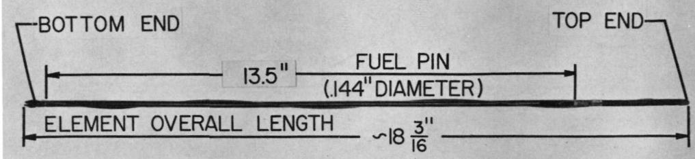  
EBR II MARK IA-TYPE FUEL ELEMENT

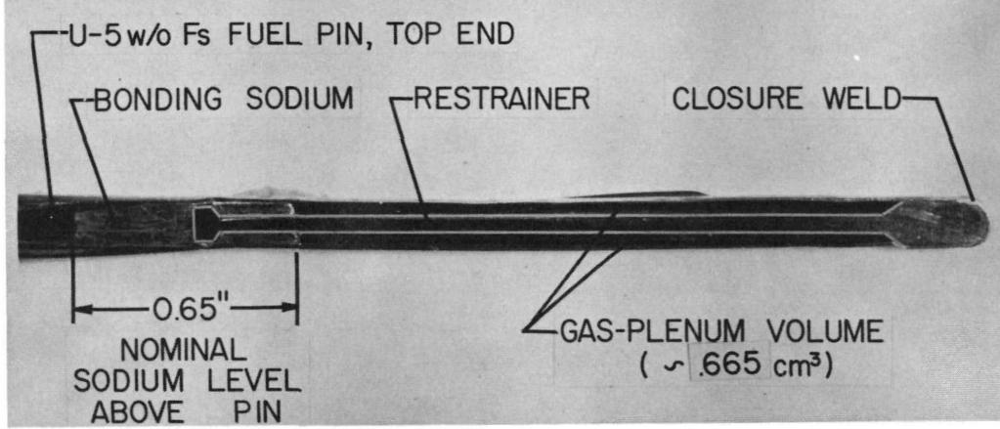  
2. EBR-II Mark IA-Type Fuel Element

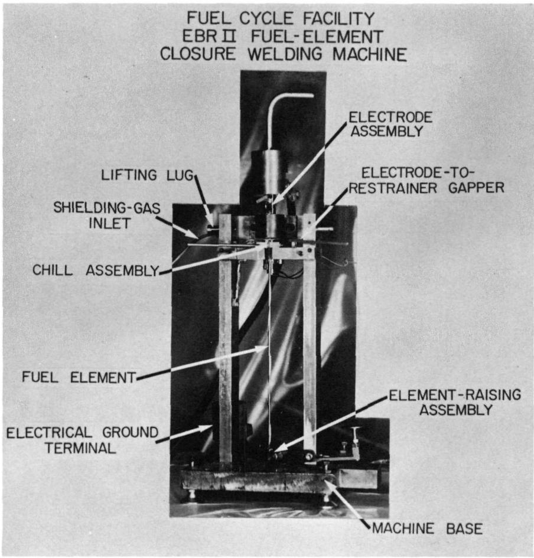

3. Fuel Cycle Facility EBR-II Fuel-Element Closure Welding Machine.


determining a leak rate by the loss of pressure from a very small volume over a period of time. The system has many advantages over more common methods of leak testing. Use of high pressures will break through a sodium oxide film covering a small hole; it has been demonstrated that other methods such as a mass spectrometer in a vacuum system will not detect that type of leak. Also, as discussed below, a system leak in the pressure-decay method will give a positive identification. The top weld of the element to be checked is sealed with a seal gland into a chamber of approximately 0.06 cc in volume. A metering chamber also 0.06 cc in volume is pressurized to 82 atmospheres from a helium gas cylinder. The metering chamber is then opened to the test chamber with the top end of the element sealed in it, producing a resultant pressure of about 41 atmospheres in the two chambers. If there is a leak in the weld, the gas is forced into the gas plenum region of the fuel element and the pressure is reduced to about 20 atmospheres. If a leak around the sealing gland exists, the pressure in the chamber approaches zero. Each weld is pressurized for 7 min. during the test. This duration in combination with the readout equipment presently in service results in a sensitivity of about $10^{-4}$ cc/sec. The lower sensitivity of this leak test compared to the one carried out on the tip-to-tube weld is acceptable, since the consequences of a leak in the gas plenum are much less serious than those of a leak near the bottom of the element during reactor operation.

Experience has shown that the capacitor-discharge welding technique produces very few slow leaks at the closure weld. Either the weld is good or the defect is large enough to allow high leak rates and rapid depressurization of the leak-detector head.

# Sodium Bonding

Following the completion of leak testing of the fuel-element closure weld, a sodium bonding operation is the next fabrication step for the element.(9,10) This operation is required in order to establish a high-quality heat transfer path in the 0.006-in.-thick sodium-filled annulus between the fuel pin and the jacket. The establishment of such a path will allow for the effective removal of heat from the fissioning fuel-pin material to its jacket and subsequent removal by the EBR-II primary-sodium coolant.

The impact-bonding technique employed consists of heating groups of 50 elements in a special magazine within an electrical resistance furnace to a temperature of $500^{\circ}\mathrm{C}$ (Fig. 4). When this temperature is attained, a vertically oriented mechanical impact is delivered simultaneously to the 50 fuel elements by means of a single-acting, spring-return pneumatic cylinder coupled to a hardened steel striking platen in the bonding machine. Bonding impacts are transmitted from the pneumatic cylinder's striking platen to the elements through hardened tool-steel transition pieces at a rate of approximately

BONDING MACHINE   
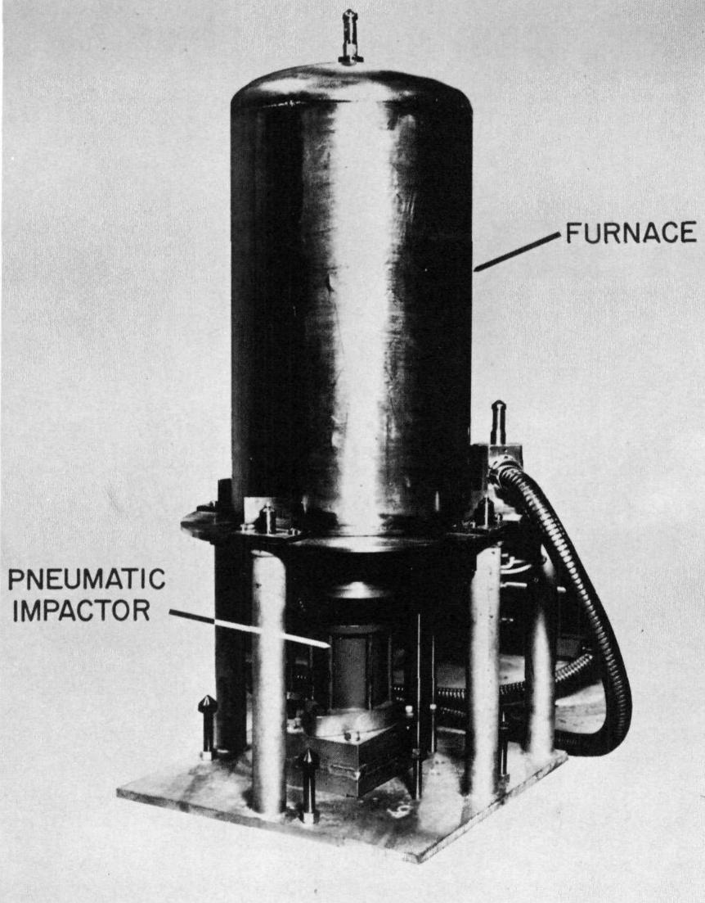  
4. Fuel Cycle Facility Bonding Machine.

100 impacts per minute. These impacts, usually 1000 in number in any bonding sequence, cause the fuel elements to move vertically upward in free flight for a distance of approximately 1 to $1\frac{1}{4}$ in. and return to their starting positions before the subsequent impact is initiated. Forces resulting from the impacts cause the gas entrapments in the sodium thermal-bond annulus of the fuel element to move upward out of the bond region and into the gas plenum at the top end of the element, thus leaving the bond itself free of gaseous defects. Defect removal is aided by high transient pressures that apparently result in the sodium near the element lower end during the impacting process and by small, but significant, movement of the fuel pin with respect to its jacket. This latter feature aids the upward travel of gas bubbles by a mechanical "wiping" action.

Following completion of the impacting procedure, a carefully controlled furnace cool-down is carried out for the elements in the bonding machine. This cooling procedure ensures that the bond sodium will reach the solid state (approximately $100^{\circ}$ C) progressively from the bottom ends of the elements toward their top ends. The controlled cooling eliminates shrinkage voids, tears, etc., which will develop in the sodium if top-to-bottom or otherwise uncontrolled rapid cooling is allowed to take place.

Experience has indicated that when recycling the bond rejects and using up to three bonding sequences (three operations, each of which utilizes 1000 impacts delivered while maintaining a temperature of $5000^{\circ}\mathrm{C}$ ), a $91\%$ acceptance rate has resulted (see Table II). The operation does cause some deformation of the tip, but this does not appear to be significant. Impacting the elements for more than three sequences may cause excessive damage. A bonding sequence for 50 driver elements requires approximately 4 hrs.

# Sodium Bond Testing

Following the completion of impact bonding, the same 50-element magazine used in the bonding operation is positioned in the sodium bond-testing machine (Fig. 5). This machine utilizes an encircling-type coil coupled with a pulsed eddy-current system to indicate the quality of the fuel-element sodium bond, the sodium level within the element, the fuel-pin overall length, and other less important interpretable features.(11)

The mechanical portion of the machine incorporates a pneumatically operated turntable which allows individual positioning of the 50 elements contained in the magazine at the proper test location. A pneumatic cylinder raises each element from the magazine, upward through the eddy-current coil to a position where it is grasped by an element drive mechanism. This drive mechanism raises the element upward through the eddy-current coil for the element's entire length,


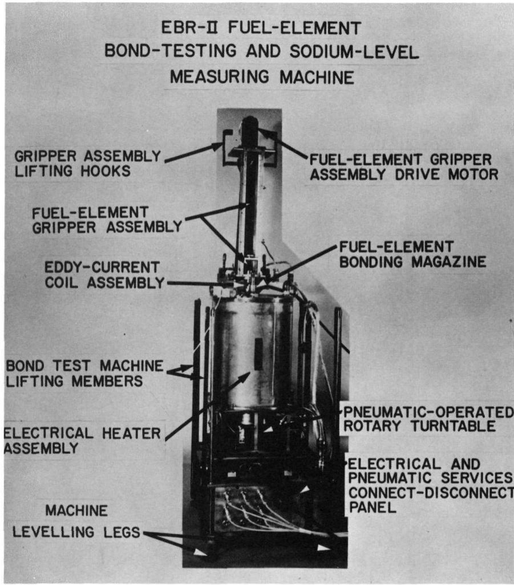

5. Fuel Cycle Facility EBR-II Fuel-Element Bond-Testing and Sodium-Level Measuring Machine.

then reverses its movement to downward, and returns the element to the magazine.

A strip-chart recorder is synchronized to the element drive system so that a one-to-one ratio results in the test recording. This recording provides duplicate indications of the element's sodium bond and sodium level; the first resulting from the upward travel of the element through the encircling eddy-current coil, and the second from its downward travel through the coil. Figure 6 presents a typical eddy-current recording for an EBR-II driver element.

The pulsed eddy-current system of the machine with its integral encircling coil is able to detect discontinuities (gas voids, tears, etc.) as small as 0.015 in. in diameter in the sodium-bond annuli of EBR-II driver elements. In addition, the system is capable of indicating the level of the sodium column in the fuel element to an accuracy of $\pm 0.020$ in. Sodium entrapment in the gas plenum regions, and gas pockets in the sodium column above the fuel pins, are also readily discernable.

Approximately 2 hrs. are required to bond test and level test a magazine of 50 elements. Although the machine has an integral electrical resistance furnace incorporated in its design for elevated-temperature sodium-bond testing, all production bond testing of EBR-II driver elements has been carried out at hot-cell temperatures, approximately 90 to $95^{\circ}$ F, at which the sodium is in the solid state.

# Table III

Summary of Element-Loading and Bonding Production

<table><tr><td>Number of Fuel Pins Loaded into Jackets</td><td>39,750*</td></tr><tr><td>Number of Elements Accepted by Leak Testing</td><td>38,415</td></tr><tr><td>Percentage of Accepted Welded Elements</td><td>96.6%</td></tr><tr><td>Number of Elements Bonded</td><td>38,337</td></tr><tr><td>Number of Elements Accepted by Bond Test</td><td>34,976</td></tr><tr><td>Percentage of Accepted Bonded Elements</td><td>91.2%</td></tr></table>

Reason for Rejection (Bond Test)

(a) Voids in sodium annulus 43.8%   
(b) Sodium traps in gas space 4.1%   
(c) Bubbles between fuel pin and restrainer 3.2%   
(d) Sodium level 33.3%   
(e) Damaged elements and other rejects 15.6%

*Includes supplemental fuel pins added to the system to increase production rates temporarily.

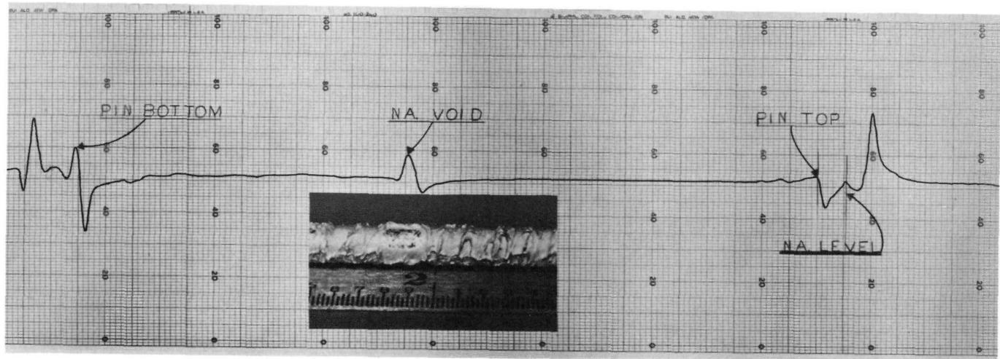

6. Sample Bond Test Trace of EBR-II Fuel-Element.


A subassembly, as furnished to EBR-II, is made of several parts (Fig. 7). Externally, it consists of a top-end fixture, a hexagonal tube, and a lower adapter. The top-end fixture has a stem that is used for all handling, both in FCF and in the reactor; the lower adapter supports the subassembly in the reactor and contains the orifice holes that maintain the desired coolant flow.

The internal portion of the subassembly has been changed three times during the history of the reactor. Originally, the regions above and below the fuel elements were depleted uranium blanket sections. Each section contained 18 sodium-bonded depleted uranium elements, two grids, and a tie bar. After approximately two years, the breeding ratios for the reactor had been determined, and the expensive blanket elements were replaced by solid stainless steel rods. However, even this design contained relatively expensive grids and required considerable assembly time, and was replaced by stainless steel shields. These shields are still in use at the present time; each consists of two trifluted sections, offset $60^{\circ}$ with a connecting pin. They provide approximately the same pressure drop as the blanket sections, and the offset reduces neutron streaming to the reactor components above and below the subassemblies.

All of the components are manufactured from Type 304 stainless steel. Acceptable components are fabricated into upper and lower pre-assemblies. The upper preassembly consists of the top-end fixture, the hex tube, and one shield. The lower preassembly consists of the lower adapter, one shield, and the "T" bar grid. The latter is an assembly of 11 T-shaped bars onto which the fuel elements are placed; the bars are welded to a short hexagonal tube.

The refabricated fuel elements must be assembled into a sub-assembly before they can be reinserted into the reactor core. This operation is performed on the assembly machine located in the FCF air cell.

The assembly operation consists of placing a new upper and lower preassembly in the assembly machine and performing the following operations. The 91 refabricated elements are fitted on the lower preassembly grid by using the master-slave manipulators. Each fuel element has an identity and must be placed in its proper position on the grid so that when the element is examined after irradiation, the pre- and postexamination data can be compared. The upper preassembly is then lowered over the 91 fuel elements and seated on the lower preassembly. Six tungsten inert-gas spot welders are then positioned at the lower end of the upper preassembly and six spot welds are made, joining the upper and lower preassemblies.


Top End Fixture

Upper Triflute Shield

91 Fuel Elements

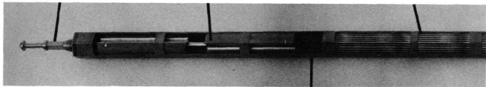  
Hex Tube

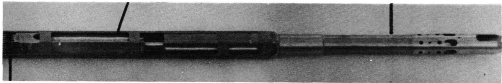  
Lower Triflute Shield   
Lower Adapter   
T-Bar Grid

7. EBR-II Fuel Subassembly, Core Type.

After the assembly is completed, it must be tensile tested to ensure sound welds. The tensile tester locks the upper and lower adapters of the subassembly into fixtures and applies a tensile force of 1800 lbs. The subassembly is then moved to the straightness tester. The subassembly is again held in position by the upper and lower adapters and the straightness of the six flat surfaces and the lower adapter are checked with prepositioned dial indicators. The maximum permissible bow is 0.040 in. If the subassembly passes these inspections, it is returned to the reactor via a 20-ton leadshielded cask.

# Summary

The remote fabrication process described in this paper represents a noteworthy accomplishment from two distinct viewpoints. The first is the production accomplishments of the process and the second is the ramifications of conducting a remote multistaged production operation.

In the period September 1964 to April 1969, the facility produced 353 subassemblies. This represents more than 5 reactor-core loadings of reprocessed and refabricated fuel. In accomplishing this, the facility received 445 subassemblies of spent fuel, refined 5984 kg of fuel, and cast 6074 kg of fuel. It produced 44,080 castings, of which $83.1\%$ were of adequate quality to process. The jacketing, welding, and leak-detection operations processed 39,750 units, of which $96.6\%$ were acceptable. The bonding and bond-testing operations processed 38,337 elements, of which 34,976 or $91.2\%$ were accepted as reactor grade.

It is noteworthy that of the over 40,000 elements that have seen reactor service, only one failed element has been detected. That one element appeared to have been defective in the final assembly operation (into a subassembly) and caused no serious difficulty during reactor operation.

The second salient accomplishment of the Fuel Cycle Facility has been the proof in operation of the basic assumptions of the initial design. These, in broad perspective, were the capability to continuously operate a remote facility and to provide remotely operated process equipment that could support a production type of effort.

The facilities used in these operations (air cell and argon cell) were last entered by personnel in March 1964. Continuous multistage facility operation without personnel entry for over five years is unprecedented in remote systems technology.

A relatively high availability rate for manipulators and process equipment is essential to the successful operation of any continuous remote production activity. For the 35 units which make up the manipulative capacity of the facility, the availability has ranged


between 61 and $99\%$ , with the average availability being $89\%$ . The 21 units of process equipment have had operational availabilities of between $80\%$ and $99\%$ with an average availability of $92.5\%$ .

The experience garnered in the past five years in pyrometallurgical processing and remote fabrication has provided a strong experience base for continued development of spent fuel processing that encompasses integration of reactor and plant, fast turnaround (low inventory), radioactive waste concentration, and remote fabrication.

# References

1. Hampson, D.C., Fryer, R. M., and Rizzie, J. W., "Melt Refining of EBR-III Fuel," to be presented at 1969 Metallurgy Symposium, Iowa State University, Ames, Iowa, August 25-27, 1969.   
2. Shuck, A.B., U.S. Patent No. 2952056 (September 13, 1960).   
3. Jelinek, H.F., and Iverson, G.M., "Equipment for Remote Injection Casting of EBR-II Fuel," Nuclear Science and Engineering, Vol. 12, March, 1962, pp. 405-411.   
4. Jelinek, H.F., Carson, N.J., Jr., and Shuck, A.B., "Fabrication of EBR-II, Core I Fuel Pins," ANL-6274, June, 1962.   
5. Carson, N.J., Jr., and Brak, S.B., "Equipment for the Remote Demolding, Sizing, and Inspection of EBR-II Cast Fuel Pins," Nuclear Science and Engineering, Vol. 12, March, 1962, pp. 412-418.   
6. Renken, C.J., "A Pulsed Electromagnetic Test System Applied to the Inspection of Thin-Walled Tubing," ANL-6728, March, 1964.   
7. Carson, N.J., Grant, N.R., Hessler, N.F., Jelinek, H.F., Olp, R.H., and Shuck, A.B., "Fabrication of EBR-II Core I Fuel Elements," ANL-6276, December, 1962.   
8. Grunwald, A.P., "Leak Testing of EBR-II Fuel Rods," Nuclear Science and Engineering, Vol. 12, March, 1962, pp. 419-423.   
9. Sowa, E.S., and Kimont, E.L., "Development of a Process for Sodium Bonding of EBR-II Fuel and Blanket Elements," ANL-6384, July, 1961.   
10. Cameron, T.C., and Hessler, N.F., "Assembling, Sodium Bonding, and Bond Testing of EBR-II Fuel Rods," Nuclear Science and Engineering, Vol. 12, March, 1962, pp. 424-431.   
11. Ono, K., and McGonnagle, W.J., "Pulsed Eddy-Current Instrument for Measuring Sodium Levels of EBR-II Fuel Rods," ANL-6278, July, 1961.

# PREPARATION AND PROCESSING OF MSRE FUEL*

J. M. Chandler and R. B. Lindauer

Chemical Technology Division

Oak Ridge National Laboratory

U.S.A.

# Abstract

The Molten Salt Reactor Experiment (MSRE) has been refueled with an enriching salt concentrate, ${}^{7}$ LiF- ${}^{233}$ UF ${}_{4}$ (73-27 mole %),which was prepared in a shielded cell in the Thorium-Uranium Recycle Facility at ORNL. The preparation process involved reducing ${}^{233}$ UO ${}_{3}$ ( ${}^{232}$ U content, 222 ppm) to ${}^{233}$ UO ${}_{2}$ by treatment with hydrogen, converting the ${}^{233}$ UO ${}_{2}$ to ${}^{233}$ UF ${}_{4}$ by hydrofluorination,and fusing the ${}^{233}$ UF ${}_{4}$ with ${}^{7}$ LiF.

The original MSRE fuel salt, which contained 220 kilograms of $235\mathrm{U} - 238\mathrm{U}$ , was fluorinated to volatilize the uranium as UF6. The UF6 was then absorbed on packed beds of NaF pellets. Essentially all of the uranium was recovered in six runs; less than 5 grams was lost to the caustic scrubber solution. To minimize corrosion, fluorination was discontinued before the uranium volatilization was complete (i.e., 130 grams of uranium was allowed to remain in the molten salt). The uranium was decontaminated from fission products by a factor of almost $10^{9}$ . Fluorine utilization varied from greater than $70\%$ initially to $13\%$ (average) for the final run, and averaged $39\%$ for all six runs. Corrosion products were removed from the barren carrier salt by reduction and filtration. Corrosion rates for surfaces exposed to fluorine during fluorination averaged 0.1 mil/hour for 47 hours.

*Research sponsored by the U. S. Atomic Energy Commission under contract with the Union Carbide Corporation.


# Introduction

The ORNL Molten Salt Reactor Experiment (MSRE) is an 8-megawatt circulating liquid fuel reactor operating at $1200^{\circ}\mathrm{F}$ . The original fuel contained 65 mole % LiF, 30 mole % BeF $_2$ , 5 mole % ZrF $_4$ , and 0.9 mole % $\frac{235 - 236}{UF_4}$ . The reactor first went critical on June 1, 1965, and began full-power operation in May 1966; prior to shutdown on March 26, 1968, the reactor had operated for slightly more than one equivalent full-power year (or 72,400 megawatt hours).

This paper describes the work done in 1968 at ORNL in preparation for the refueling of the MSRE with an enriching salt concentrate, $7_{\text{LiF}} - 233_{\text{UF}_4}$ (73-27 mole $\%$ ). This concentrate was prepared in the Thorium-Uranium Recycle Facility because the $^{233}\text{U}$ used contained 222 ppm of $^{232}\text{U}$ . The gamma emitting daughters of this $^{232}\text{U}$ produced a radiation level of 300 Rem/hour for a 450-gram can of the starting oxide and necessitated the use of heavy shielding and remote processing.

At the reactor plant, the uranium in the original MSRE fuel salt was removed as UF $_6$ by fluorination. The barren fuel carrier salt was purified by reduction and filtration.

# Preparation of $7_{\mathrm{LiF}} - 233_{\mathrm{UFL}}$ Concentrate

Three batches of $^{233}\mathrm{UO}_3$ , (1) each containing 12 kilograms of $^{233}\mathrm{U}$ , were required as starting material for preparing 63.4 kilograms of the fuel-enriching concentrate, $^{7}\mathrm{LiF}-^{233}\mathrm{UF}_4$ . This concentrate was to contain 39 kilograms of uranium (35.6 kilograms of $^{233}\mathrm{U}$ ). The first run began May 9, 1968, and the third run was completed July 30, 1968. The product was packaged in 45 enrichment capsules, four 7-kilogram shipping containers, and a six-can cluster comprised of shipping containers of miscellaneous sizes. The ten salt shipping containers and the 45 enrichment capsules were delivered to the MSRE as required in the reactor enrichment schedule.

# Process Equipment

The flowsheet shown in Figure 1 is a simplified presentation of the major equipment components required in the process. These components are: (1) the fuel decanning station, (2) the reaction or oxide treatment vessel, (3) the salt storage and transfer vessel, (4) various containers for shipping the product, (5) the off-gas scrubbers.

In addition, the process requires many other smaller items of equipment, such as: the oxide can preparation equipment, the in-cell titration assembly, furnaces for the vessels, the enrichment capsule drilling and weighing station, disconnect stations for electrical and instrument lines and process gas lines, work tables, and tool racks.

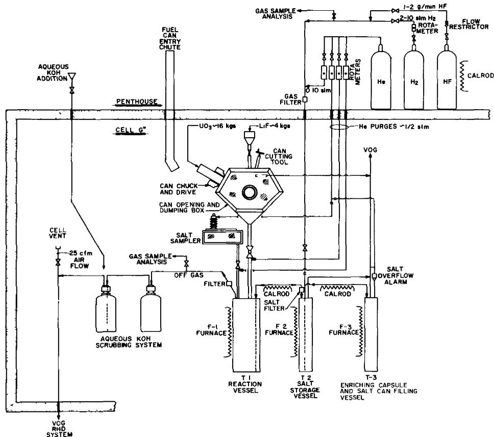  
1. Simplified Chemical and Engineering Flowsheet for Preparing 233U Fuel Salt.

All services and reagent sources are located in the penthouse outside the cell.

The reduction and conversion processes were monitored by a thermocouple array that was inserted into the powder in the reaction vessel and by measurements of hydrogen and HF utilization during the reduction step and the conversion step, respectively. Unfiltered and filtered samples of the melt were withdrawn for oxide, petrographic, and metal impurity analyses.

# Feed Materials

The $^{233}\mathrm{UO}_3$ had been prepared in batches by using $7\mathrm{M}$ $\mathrm{NH_4OH}$ (in excess) to precipitate hydrous uranium oxide from solutions that contained 10 to 40 grams of uranium per liter and were 1 M in $\mathrm{HNO}_3$ and $\mathrm{NH_4NO_3}$ . The uranium in the feed solution had been purified and isolated in 1964 and 1965 by a solvent extraction method, followed by ion exchange. These treatments decreased the concentrations of plutonium, thorium, fission products, and corrosion products (iron, nickel, and chromium) to acceptably low levels.

The hydrous oxide had been dried and packaged in nested aluminum cans. No spread of contamination or excessive radiation exposure to personnel occurred during the removal of the cans from the storage facility, during their transfer to TURF, or during their discharge from the carrier to cell G.

Figure 2 shows the chemical flowsheet used for the fuel preparation work.

# Reduction of $^{233}\mathrm{UO}_3$

Three separate operations were required to elongate the cans of $233_{\mathrm{UO3}}$ to the 9-1/2-inch length required for proper operation of the can opening box. These operations involved trueing the cans and cementing a 1-1/2-inch cap on the end of each. The elongated cans of oxide were opened, one at a time, in the decanning station, and dumped into the reaction vessel.

The bed of $^{233}\mathrm{UO}_3$ that had been dumped into the reaction vessel was expanded and then heated for 2 hours at $550^{\circ}\mathrm{C}$ in a helium atmosphere to remove, by pyrolysis, any traces of ammonium compounds or other volatiles remaining from the chemical processing.

The oxide bed was then cooled to $400^{\circ}\mathrm{C}$ before reduction with hydrogen was started. This temperature was sufficiently low to accommodate the temperature rise that would be expected from the exothermic reaction of hydrogen with $\mathrm{UO}_3$ :


OVERALL REACTION

$$
\mathrm {U O} _ {3} + \mathrm {H} _ {2} + 4 \mathrm {H F} \rightarrow \mathrm {U F} _ {4} + 3 \mathrm {H} _ {2} \mathrm {O} \uparrow
$$

$$
\mathrm {U F} _ {4} + \mathrm {L I F} \rightarrow \mathrm {U F} _ {4} \cdot \mathrm {L I F}
$$

27% - 73% EUTECTIC COMPOSITION

CHARGE $\mathsf{UO}_3^{\dagger}$

$\sim 13.2$ kg U AS $\mathrm{UO}_3$

HEAT TREAT $\mathsf{UO}_3\mathsf{t}$

3 TO 5 hr DIGESTION AT $550^{\circ}C_{i}$ COOL TO $400^{\circ}C$

HYDROGEN REDUCTION:

START $5\%$ $\mathsf{H}_2$ AT $400^{\circ}\mathsf{C}$ AND INCREASE TO $50\%$ $\mathsf{H}_2$ ; TEMPERATURE RISES TO $490^{\circ}\mathsf{C}$ ; TREAT AT $500 - 550^{\circ}\mathsf{C}$ AT $100\%$ USAGE OF $\mathsf{H}_2$ ; COOL TO $400^{\circ}\mathsf{C}$ .

$\mathsf{UO}_3\to \mathsf{UO}_2$

HYDROFLUORINATION:

$$
\mathrm {U O} _ {2} \rightarrow \mathrm {U F} _ {4}
$$

START $5\%$ HF IN $\mathsf{H}_2$ AT $400^{\circ}\mathsf{C}$ INCREASE TO $40\%$ HF IN $\mathsf{H}_2$ TEMPERATURE INCREASES TO $450^{\circ}\mathsf{C}$ WHEN HF USE DECREASES BELOW $80\%$ INCREASE THE TEMPERATURE TO $630^{\circ}C$ STEPWISE UNTIL HF USE BECOMES 0:COOL TO $150^{\circ}C$

EUTECTIC FORMATION:

ADD EXACT QUANTITY OF ${}^{7}$ LiF; MELT UNDER 30% H2; DIGEST AT ${850}^{ \circ  }\mathrm{C}$ FOR 3 TO 5 hr; COOL TO ${700}^{ \circ  }\mathrm{C}$ .

$$
\cup F _ {4} + \text {L I F} \rightarrow \cup F _ {4} \cdot \text {L I F}
$$

EUTECTIC PURIFICATION:

PURGE MELT 24 TO 30 hr AT $700^{\circ}\mathrm{C}$ WITH $20\%$ HF

MO + HF → MF + H2O

IN $\mathsf{H}_2$ TREAT WITH $\mathsf{H}_2$ FOR 75 TO 150 hr.

MF + H2 → M0 + HF

PRODUCT PURITY:

UNFILTERED SAMPLE ANALYZED FOR OXIDE CONTENT. FILTERED SAMPLE ANALYZED FOR METALLIC IMPURITIES.

2. Chemical Flowsheet for the Low-Temperature Process for Preparing the MSRE Fuel Concentrate.

$$
\mathrm {U O} _ {3} + \mathrm {H} _ {2} \rightarrow \mathrm {U O} _ {2} + \mathrm {H} _ {2} \mathrm {O} + 7 2, 0 0 0 \mathrm {c a l / g - m o l e}
$$

The concentration of hydrogen (in helium) was adjusted initially to 5 vol % and was gradually increased to 50 vol % during the first 4 hours of treatment. The temperatures rose in response to an increase in hydrogen concentration and then became constant.

Both the location of the reaction zone and the zone movement inside the 24-inch-high bed of $^{233}\mathrm{UO}_2$ were clearly defined by the temperature profile. As the reaction progressed, the reaction zone rose, in the form of a band, up through the powder bed.

After the temperature excursions resulting from the increases in hydrogen flow had subsided (approximately 12 hours), the temperature of the furnace was increased, at the rate of $30^{\circ}\mathrm{C}/\mathrm{hour}$ , until the bed temperature was $525 \pm 25^{\circ}\mathrm{C}$ . The reduction operation was continued at this temperature, with 50 vol $\%$ hydrogen--50 vol $\%$ helium, at a gas flow rate of 2 liters/minute, until 50 to $100\%$ excess over the stoichiometric amount of hydrogen had been passed through the bed. Overall reduction time was about 56 hours.

Hydrogen utilization within the bed was $100\%$ until the reaction zone approached the top of the powder bed; then a slight decrease was observed. Hydrogen usage was determined by a material balance of the gas outflow, as measured by the in-cell wet test meter.

Hydrofluorination of $^{233}\mathrm{UO}_2$

Upon completion of the oxide reduction step, the bed was allowed to cool to $400^{\circ}\mathrm{C}$ . The conversion of ${}^{233}\mathrm{UO}_2$ to ${}^{233}\mathrm{UF}_4$ by hydrofluorination, using HF gas diluted with hydrogen, began at $400^{\circ}\mathrm{C}$ and was completed at $625^{\circ}\mathrm{C}$ . A period of 5 to 7 days was required for the conversion.

The HF gas that was supplied to the process was withdrawn from the vapor space of a heated 100-pound HF cylinder. A differential-pressure transmitter across a capillary restrictor in the HF gas supply line was used to monitor the flow. The gas was passed through a maze of tightly packed nickel wire in a 2-inch-diameter nickel tube that was maintained at $625^{\circ}\mathrm{C}$ to remove sulfur from the stream. It was then mixed with a metered amount of dry hydrogen, filtered, and introduced to the reaction vessel through a dip tube that extended to the bottom of the ${}^{233}\mathrm{UO}_2$ bed.

At the beginning of the hydrofluorination step, the composition of the gas used for hydrofluorination was 95 vol % hydrogen--5 vol % HF; the flow rate of the mixture was 2 standard liters/minute. Over a period of 3 to 4 hours, the HF concentration was incrementally increased to 40 vol % as the exothermic reaction caused the bed temperature to rise from 400 to $450^{\circ}\mathrm{C}$ . During these initial hours, the

temperature within the bed was constantly monitored to determine when the temperature excursion resulting from each HF flow adjustment had ceased and when another adjustment could be made.

After the HF concentration of the hydrofluorinating mixture had reached 40 vol %, the reaction zone traveled, in the form of a band, up through the bed (in a manner similar to that observed during the hydrogen reduction) as the $233\mathrm{UO}_2$ was converted to $233\mathrm{UF}_4$ . The reaction

$$
U O _ {2} + 4 H F \rightarrow U F _ {4} + 2 H _ {2} O + 1 4 4, 0 0 0 \mathrm {c a l / g - m o l e}
$$

is more exothermic than the reduction reaction, but it does not have as great a tendency to cause thermal excursions. Probably, this is the result of differences between $\mathrm{UO}_3$ , $\mathrm{UO}_2$ , and $\mathrm{UF}_4$ with respect to bed permeability and thermal properties. The reaction-zone temperatures for the three production runs were plotted as a function of time, as a control measure.

The progress of the hydrofluorination reaction was also followed by obtaining a material balance of the HF in the system. The HF utilization was essentially $100\%$ for the first five days and then decreased sharply as the reaction zone reached the top of the bed. Then the temperature of the bed was increased to $625^{\circ}\mathrm{C}$ , where it was held for two days to ensure completeness of the reaction. The HF utilization did not increase at the higher temperature; instead, it continued to decrease, suggesting that the reaction had been complete at the end of the fifth day of hydrofluorination.

A total of 13.5 kilograms of uranium, as $^{233}\mathrm{UO}_2$ , was converted to $^{233}\mathrm{UF}_4$ in each of three runs; only very minor differences in the runs were noted.

# Formation of the Eutectic Salt

The eutectic mixture $^{233}\mathrm{UF}_{4} - 7\mathrm{LiF}$ (27-73 mole %) was formed by adding the stoichiometric quantity of lithium fluoride powder to the uranium tetrafluoride powder and fusing the mixture.

The temperature of the reaction vessel containing the stratified $233_{\mathrm{UF_4}}$ and ${}^7\mathrm{LiF}$ powders was increased to $855^{\circ}\mathrm{C}$ in order to melt the lithium fluoride (melting point, $835^{\circ}\mathrm{C}$ ). The melt was digested at this temperature for 3 hours while it was sparged with hydrogen (at a flow rate of 0.2 liter/minute) to reduce any extraneous compounds that might have been introduced during the LiF addition.

Differences, with regard to conditions during initial meltdown, were noted in the runs. In runs 1 and 3, the $^{233}\mathrm{UF}_4$ and $^{233}\mathrm{LiF}$ had to be heated to about $850^{\circ}\mathrm{C}$ before melting occurred. In run 2, initial melting occurred at $650^{\circ}\mathrm{C}$ , nearly $200^{\circ}\mathrm{C}$ below the melting point of the lithium fluoride. The low-temperature initial melting must


have resulted from the presence of a sizable heel of salt (melting point, $490^{\circ}\mathrm{C}$ ) that remained in the reaction vessel from run 1. Probably, this heel acted as a "seed" to permit fusing of the $^{233}\mathrm{UF}_4$ and ${}^{1}\mathrm{LiF}$ powders at the lower temperature.

The 9-inch-deep pool of eutectic salt (melting point, $490^{\circ}\mathrm{C}$ ) was treated with 20 vol $\%$ HF--80 vol $\%$ hydrogen (flow rate, 2.4 liters/minute) for 24 hours at a temperature of $700^{\circ}\mathrm{C}$ to remove the last traces of oxide from the salt prior to the hydrogen purification procedure. At the conclusion of this treatment, an unfiltered sample of the salt was withdrawn and analyzed for oxide content. (A 1/2-inch-OD x 2-1/4-inch-long nickel cup was immersed in the salt to withdraw a 25-gram sample.) A 1-inch-long section cut from the center of the sample was analyzed petrographically and chemically for the presence of $\mathrm{UO}_2$ . The remaining portion of the sample was submitted for a complete chemical analysis.

The more rapidly obtained petrographic results were used to determine whether hydrofluorination should be resumed or whether hydrogen purification of the melt should be continued. In each of the three runs, the $\mathrm{UO}_2$ content was reported to be less than the lower limit of accuracy (220 ppm) for the petrographic appraisal; thus, subsequent HF treatment was unnecessary. Chemical analyses of the same samples showed oxide contents (in the product salts) of 62, 34, and 32 ppm for runs 1, 2, and 3, respectively.

# Purification of the Eutectic Salt

The eutectic salt was purified by bubbling pure hydrogen gas (3 to 10 ppm $\mathbf{H}_2\mathbf{O}$ ), at a flow rate of 2 standard liters/minute, through the 10-inch-deep eutectic salt melt. The temperature of the molten salt during this reaction,

$$
\mathrm {M F} + 1 / 2 \mathrm {H} _ {2} \rightarrow \mathrm {H F} + \mathrm {M} ^ {\circ},
$$

was $700^{\circ}\mathrm{C}$ . The progress of the reaction was followed by titrating the effluent gas with the in-cell titration assembly. The end point of the purification was evident from the leveling off of the HF evolution rate at 0.025 milliequivalent per liter of hydrogen. The hydrogen flow rate was increased on several occasions during the process, and the reaction rate seemed to be almost independent of the hydrogen concentration.

The chromium concentration in the melt was not affected by the hydrogen treatment. The levels to which the iron (100 ppm) and nickel (75 ppm) concentrations were decreased are believed to be near the limit of accuracy of the sampling system and the laboratory analyses.

During each of the three runs, the reaction vessel was exposed for 20 days to 40 vol $\%$ HF--60 vol $\%$ hydrogen at temperatures ranging

from 400 to $850^{\circ}\mathrm{C}$ . Approximately 5 grams of nickel (from the nickel liner of the reaction vessel) was lost to each melt. This corresponds to a uniform corrosion rate of slightly less than 0.001 inch/year - a low rate for this type of process.

# Transfer of the Fuel Concentrate

Eight operations were necessary to transfer the three 13.5-kilogram batches of eutectic salt mixture from the reaction vessel to the intermediate transfer vessel and then to the various shipping container assemblies. The transfers ranged in size from the 13.5 kilograms of uranium (4.7 liters of salt) in the production batches to the 4.3 kilograms of uranium (1.5 liters of salt) that was required to fill the array of 45 enrichment capsules. The transfer operations were conducted at a salt temperature of $600^{\circ}\mathrm{C}$ . (This temperature had been arbitrarily selected, and the containers had been fabricated to contain the desired quantity of fuel at this temperature.)

# Shipping Containers

The shipping containers were arranged in three arrays for the filling operations. Later, upon completion of the filling operation and freezing of the salt, each array was disassembled into individual containers (at TURF) for shipment to the MSRE.

The first array (Figure 3) consisted of 45 enrichment capsules, each of which was $\frac{3}{4}$ inch in diameter and 6 inches long and designed to contain 96 grams of uranium. The capsules were connected in series and arranged in three 15-capsule decks.

The second array (Figure 4) consisted of four $2 - 1 / 2$ -inch-diameter by $3^{4}$ -inch-long cans connected in series for filling operations. Each was designed to contain 7 kilograms of uranium and had an instrumented overflow pot. They were shipped, one at a time, to the MSRE, and charged to the drain tank. In this tank, the salt melts and runs out of the container.

The third array (Figure 5) contained a group of six $2 - 1 / 2$ -inch-diameter variable-length cans that were similar in design and arrangement to those in the second array. One of these cans was used to store excess product material that was blown back from the other five cans after they had been filled to overflow. The latter cans were designed to contain 0.5 to 3 kilograms of uranium (two cans, 0.5 kilogram each; one can, 1 kilogram; one can, 2 kilograms; and one can, 3 kilograms).


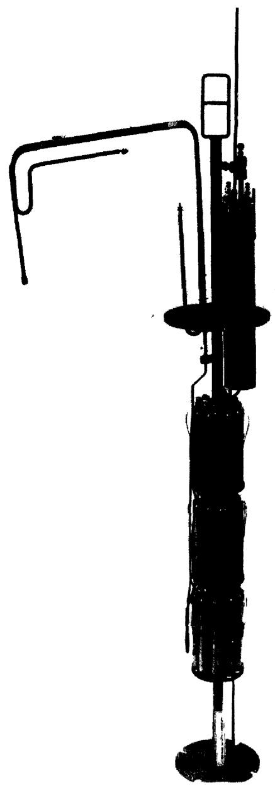

3. Filling Array Consisting of 45 Capsules.

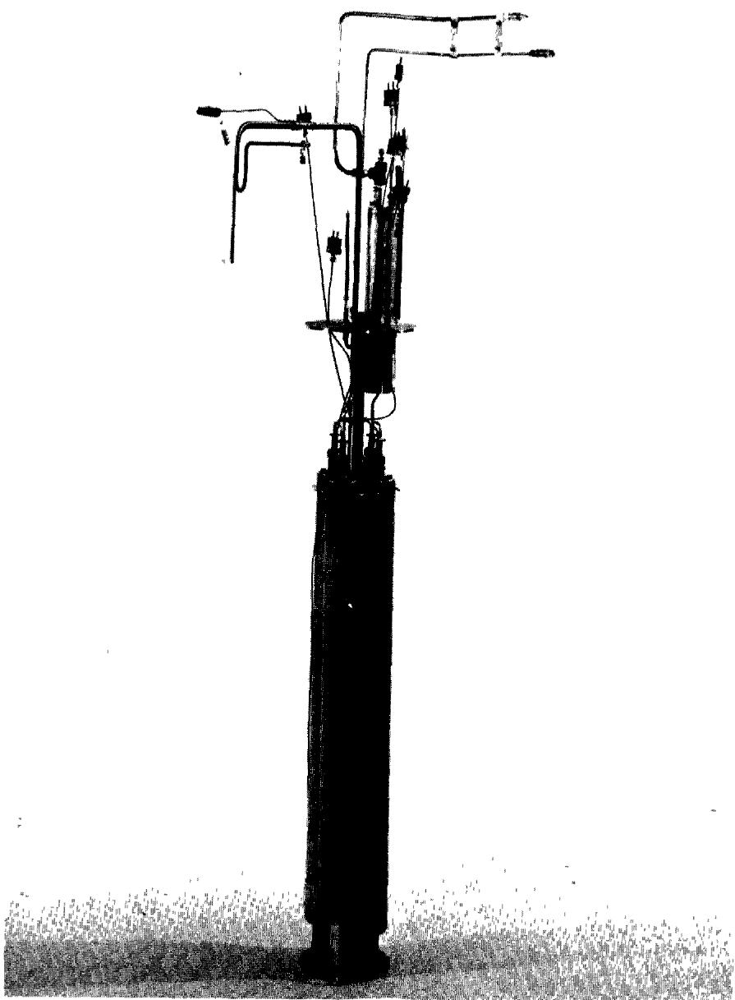  
4. Second Filling Array: Four Cans, Each Containing 7 Kilograms of Uranium.

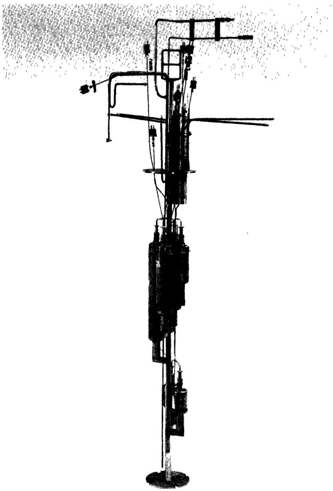  
5. Third Filling Array Containing Six Shipping Containers of Miscellaneous Sizes.

The MSRE Fuel Processing Facility $^{(2)}$ was constructed in a small cell in the reactor building for two purposes: (a) to remove any accumulated oxides in the fuel or flush salt by $\mathsf{H}_2$ -HF sparging, and (b) to recover the original uranium charge from the fuel carrier salt in order to allow the $^{233}\mathrm{U}$ fuel concentrate to be added for the second phase of reactor operation. This facility had been operated previously, in 1965, to remove $115~\mathrm{ppm}$ of oxide from the flush salt before the reactor went critical.

A LiF-BeF $_2$ (66-34 mole %) salt that had been used to flush the reactor seven times was used for a final test of the uranium recovery process. The uranium that had accumulated (6.5 kilograms) in this salt was recovered without incident in less than 7 hours.

The recovery process consisted of fluorine sparging the salt to volatilize the uranium, followed by decontamination of the gas stream with a $750^{\circ}\mathrm{F}$ NaF bed and absorption of the UF $_6$ on $200^{\circ}\mathrm{F}$ NaF. The excess fluorine was removed by an aqueous scrubber. The corrosion product fluorides were reduced to the metals, which were filtered from the salt.

Using this process, approximately 216 kilograms of uranium was recovered from the fuel salt batch in 46.5 hours. Corrosion of the fuel processing tank during fluorination of the fuel salt averaged about 0.1 mil/hour. Fluorine utilization averaged $7.7\%$ during fluorination of the flush salt and $39\%$ during fluorination of the fuel salt.

Reduction and filtration produced a carrier salt with less impurities than the original salt. The recovered uranium was decontaminated from fission products by factors of $8.6 \times 10^{8}$ (gross gamma) and $1.2 \times 10^{9}$ (gross beta). Identifiable uranium losses were less than $0.1\%$ .

# Description of the Process

Fluorination. - The flowsheet used in processing the flush salt and the fuel salt is shown in Figure 6. The molten salt was forced, under pressure, through a freeze valve in the drain tank cell, through a metallic filter (backflow), and another freeze valve in the processing cell to the fuel storage tank. The transfer was made at 1000 to $1100^{\circ}\mathrm{F}$ , a temperature that is well above the freezing point of the salt but not hot enough to reduce the strength of the metallic filter element below a safe limit.

After being cooled to $475^{\circ}\mathrm{F}$ , to minimize corrosion and fission product volatilization during fluorination, the salt was sparged with pure fluorine or a fluorine-helium mixture at a relatively high flow


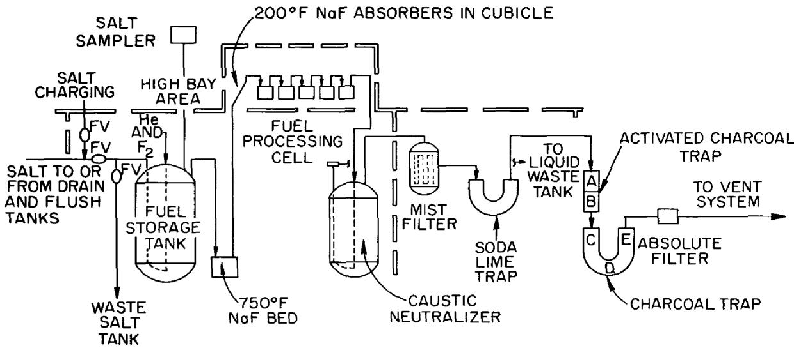  
6. MSRE Fuel Processing System.

rate (approximately 40 liters/minute) to convert the $\mathbf{U}\mathbf{F}_{\uparrow}$ to $\mathbf{U}\mathbf{F}_{5}$ . When all the $\mathbf{U}\mathbf{F}_{\uparrow}$ had been converted to $\mathbf{U}\mathbf{F}_{5}$ , $\mathbf{U}\mathbf{F}_{6}$ began to form and volatilize, as indicated by a temperature rise in the first absorber. When this occurred, the fluorine flow rate was reduced to 15 to 25 liters/minute to increase the absorber residence time and, in turn, to permit more efficient absorption and to increase the fluorine utilization.

The gas leaving the fuel storage tank was composed of UF $_6$ , excess fluorine, helium, MoF $_6$ and some CrF $_5$ from corrosion, IF $_7$ , and other fission product fluorides. It passed through a $750^{\circ}$ F NaF trap, where the chromium fluoride and most of the volatilized fission products, except iodine and tellurium, were retained. After being routed through the NaF trap, the gas stream, which now consisted of UF $_6$ , fluorine, helium, MoF $_6$ , IF $_7$ , TeF $_6$ , and a trace of other fission product fluorides, exited from the shielded cell and passed through five NaF absorbers in a sealed cubicle in the operating area. These absorbers were heated to 200 to $250^{\circ}$ F to increase the reaction rate and to minimize MoF $_6$ absorption. As the UF $_6$ began to load on a particular absorber and the temperature started to rise, cooling air was supplied to the absorber to limit its temperature to a maximum of $350^{\circ}$ F. High temperatures tended to decrease the uranium loading by promoting surface absorption and reducing the penetration of the UF $_6$ to the inside of the pellets. The final absorber was operated below $250^{\circ}$ F, where the partial pressure of UF $_6$ over the UF $_6$ -2NaF complex would allow only a negligible amount of uranium to reach the caustic scrubber. The caustic scrubber was charged with 1300 liters of 2 M KOH--0.33 M KI, along with 0.2 M K $_2$ B $_4$ O $_7$ , which was added as a soluble neutron poison. The reaction occurring in the scrubber was:

$$
6 \mathrm {F} _ {2} + 1 2 \mathrm {K O H} + \mathrm {K I} \rightarrow 1 2 \mathrm {K F} + 6 \mathrm {H} _ {2} \mathrm {O} + 3 / 2 \mathrm {O} _ {2} + \mathrm {K I O} _ {3}
$$

The scrubber solution was replaced with fresh solution before one-half of the KOH had been consumed, as determined by fluorine flow and calculated utilization. (Dip tube corrosion increased when the $\mathrm{OH}^-$ concentration was less than 1 M.) Laboratory development of the fluorine disposal system is described in reference (3). In addition to fluorine, most of the molybdenum and iodine were removed in the scrubber.

A high-surface-area filter located downstream of the scrubber removed any particulate matter that was retained by the scrubber. During test runs, hydrated oxides of molybdenum collected at sharp bends in the line from the scrubber. A soda lime trap (a mixture of sodium and calcium hydrates) provided a detector for fluorine and a means for removing traces of fluorine from the scrubber off-gas before it reached the charcoal absorbers.

Activated impregnated charcoal traps sorbed any iodine not removed in the caustic scrubber. The gas exiting from the charcoal traps contained only helium and oxygen (that was produced in the


caustic scrubber). This gas flowed through an absolute filter and was monitored for gamma activity and for iodine before being mixed with the remainder of the building exhaust gas, which passed through additional filters and was finally discharged from a 100-foot-tall stack.

When there was no longer any evidence of absorber heating, the flow of fluorine was discontinued, and the salt was sampled and analyzed. The uranium concentration in the salt was expected to be less than 50 ppm at this time.

Reduction. - Before the fuel carrier salt could be returned to the reactor system, the $\mathrm{NiF}_2$ , $\mathrm{FeF}_2$ , and $\mathrm{CrF}_2$ (produced by corrosion of the Hastelloy-N fuel storage tank) had to be removed from it ( $\mathrm{MoF}_6$ is volatile). Because of the high concentration of nickel in Hastelloy-N, the $\mathrm{NiF}_2$ concentration in the salt was also high. Since nickel is more noble than iron or chromium, it is reduced by hydrogen sparging at $1225^{\circ}\mathrm{F}$ . After the $\mathrm{NiF}_2$ was reduced, as indicated by filtered salt samples, pressed zirconium metal shavings were added to the salt, and hydrogen sparging was continued to reduce the $\mathrm{FeF}_2$ and $\mathrm{CrF}_2$ to the metal form. The metals subsequently formed were then removed by a fibrous metal filter, and the efficiency of the filtration was verified by sampling of the filtered salt.

# Description of the Equipment

Plant Layout. - Most of the processing equipment is located in a 13 x 13 x 17-foot-deep cell (Figure 7) located adjacent to the reactor drain tank cell. This cell contains the fuel storage tank (fluorinator), the $750^{\circ}\mathrm{F}$ sodium fluoride trap, the caustic scrubber, two remotely-operated air valves, and three salt freeze-valves.

An adjacent cell of the same size contains the off-gas equipment-- the mist filter, the soda-lime trap, charcoal traps, and the off-gas filter--that is located downstream of the caustic scrubber.

The plant is operated from the high-bay area over the two cells just described. This area contains the absorber cubicle, the instrument cubicle, the instrument panelboard, the sampler and sampler panelboard, hydrogen and oxygen monitors, and radiation detection instruments.

The gas supply station is situated outside the building. The fluorine manifold (where two 15,000-liter fluorine tanks mounted on trailers can be connected), the hydrogen manifold, and the pressure and flow instrumentation associated with these two gases are also located here. The helium for purging and sparging comes from the reactor system supply.

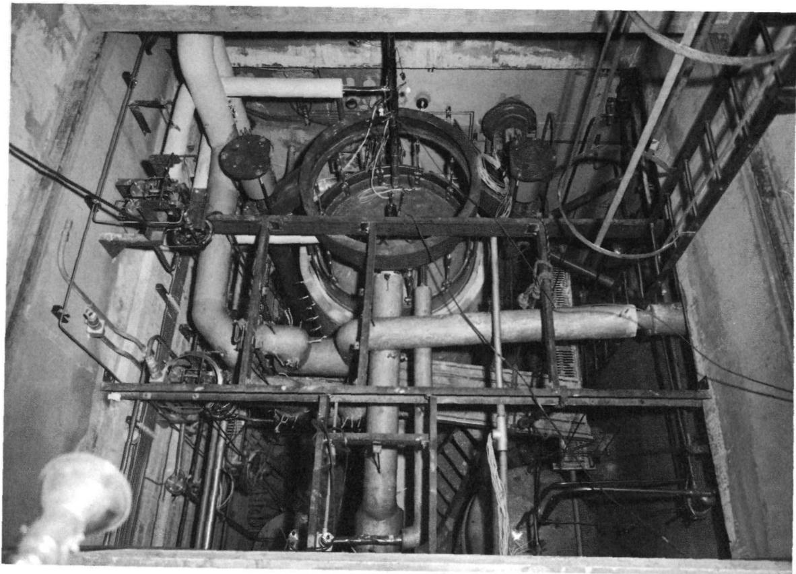  
7. Photograph of Fuel Processing Cell.

Fuel Storage Tank. - The fuel storage tank, or fluorinator, is a 50-inch-diameter, 10-foot-tall Hastelloy-N tank with about $30\%$ free-board to minimize salt carryover during gas sparging. There is no provision for cooling since the heat loss will limit the temperature to less than $1200^{\circ}\mathrm{F}$ after a two-week decay period. During the $\mathrm{UF}_4$ to $\mathrm{UF}_5$ conversion period, when the fluorine utilization is high, the heat of reaction and the afterheat maintain the temperature of the salt at $850^{\circ}\mathrm{F}$ . About 12 kilowatts of electrical heat is required during the reduction operation at $1225^{\circ}\mathrm{F}$ . The gas inlet line has a normal submergence of 64 inches, and the differential pressure between this line and the gas space provides an indication of liquid level in addition to that indicated by weigh cells. The tank is also equipped with an ultrasonic probe to verify the weigh cell calibration during the filling and emptying operations.

NaF Trap. - The NaF trap is a 20-inch-diameter by 18-inch-high Inconel vessel that is operated at $750^{\circ}\mathrm{F}$ . At this temperature, volatile ruthenium, niobium, antimony, and chromium fluorides are absorbed, and uranium and molybdenum hexafluorides pass through. This trap was designed to be replaceable because of its susceptibility to becoming plugged with volatilized chromium fluorides. Rather extensive chromium fluoride volatilization was expected during the processing of the fuel salt as the uranium concentration in the salt decreased; however, no pressure drop was detected.

Caustic Scrubber. - The caustic scrubber, which is used for disposing of excess fluorine and of the HF produced during $\mathsf{NiF}_2$ reduction, is a 42-inch-diameter by 84-inch-high Inconel tank with two dip lines, each with 3-3/8-inch holes. The dip lines have shutoff valves with extension handles for alternating dip lines when plugging occurs. This plugging, which is caused by the buildup of corrosion products in the dip line, can be eliminated in 5 or 10 minutes after use of the plugged line has been discontinued.

$\mathbf{U}\mathbf{F}_{6}$ Absorbers. - Five absorbers, piped in series, are located in a sealed cubicle in the operating area situated above the processing cell. The absorbers, 14 inches in diameter and 12 inches high, are made of carbon steel. When loaded to within $1/2$ inch of the top, each absorber holds about 25 kilograms of NaF. Each absorber is mounted in an insulated can and provided with an air cooling coil and an electric heater.

Salt Filter. - The salt filter(4) consists of two 4-foot-long concentric fibrous metal cylinders with a total filter area of 8.65 square feet. During the filtration of flush and fuel salts, there was no detectable pressure drop across the filter even when salts containing about 10 kilograms of reduced corrosion products were filtered. It is not known how much of these metals remained behind in the fuel storage tank. Filtration of each of the two batches required about 2 hours.

# Processing Results

Recovery of Uranium. - The amount of uranium that was recovered has been determined from the weight increase of the absorbers. Some MoF $_6$ , which was also absorbed, had to be subtracted in order to obtain an accurate value. Although the total amount of absorbed molybdenum is not accurately known, random samples showed a correlation between the percentage of molybdenum on the NaF and the amount of UF $_6$ that passed through the NaF. However, such a correlation provides only an approximate value for the absorbed MoF $_6$ because other factors, such as flow rate, temperature, and type of NaF, also affect the MoF $_6$ loading.

Based on the correlation, a total of 1600 grams of molybdenum was absorbed. Subtracting this value from the increase in absorber weight yields a uranium recovery of 216.0 kilograms. This value is in good agreement with the amount (218.0 kilograms) which was calculated to be present from the uranium charged to the reactor, the burnup, and the number of samples removed, etc. Since 0.13 kilogram of uranium remained in the salt when fluorination was discontinued, and since less than 1 gram of uranium was found in the scrubber solutions, 1.87 kilograms, or $0.85\%$ of the total uranium, is unaccounted for.

Purity of the Uranium Product. - The NaF at the inlet of the first absorber in each run was analyzed for beta and gamma emitters about 12 days after fluorination. Analyses of feed salt samples showed $2.66 \times 10^{13}$ gross gamma counts per minute and $3.8 \times 10^{13}$ gross beta counts per minute per gram of uranium, respectively. The average gross beta and gamma decontamination factors (DF's) for the six absorbers analyzed (corrected for uranium daughters) were $1.2 \times 10^{9}$ and $8.6 \times 10^{8}$ , respectively. Only the gamma radioactivity levels in the first and second (of a total of six) runs were appreciably above background.

The only radioactive material collected in any measurable amount on the NaF absorbers with the UF $_6$ was $^{95}\mathrm{Nb}$ . Most of this material was probably carried from the salt into the piping and equipment located between the fuel storage tank and the metallic filter upstream of the absorbers at the end of the salt transfer operation when the pressure of the transfer gas was released. Because of this deposition of material, the calculated decontamination factor for $^{95}\mathrm{Nb}$ ( $\frac{\mathrm{dpm per gram of U in salt}}{\mathrm{dpm per gram of U on absorber}}$ ) is low. The calculated DF was lower at the start of run 1 when most of the niobium between the NaF trap and the absorbers was fluorinated and collected on the first absorber. The calculated DF's varied from $5 \times 10^5$ at the start to $1 \times 10^{10}$ at the end of fluorination. Therefore, notwithstanding the piping contamination, a considerably higher niobium DF was obtained in these studies than was obtained ( $5 \times 10^7$ ) in the ORNL Volatility Pilot Plant work using 30-day-decayed uranium.


Fluorine Utilization. - The efficiency of the fluorination reaction is measured by the percentage of fluorine (after the fluorine that is consumed by corrosion is subtracted) that reacts with the uranium in the salt. Fluorine utilization is a function of melt temperature, fluorine flow rate, uranium concentration, and dip tube submergence. Laboratory tests had shown a decrease in fluorine utilization from $8.0\%$ to $3.8\%$ as the temperature was reduced from $930^{\circ}\mathrm{F}$ to $840^{\circ}\mathrm{F}$ . Fluorine utilizations are shown in Table I. The higher utilization (average, $39\%$ ) during the fuel salt processing was probably due both to lower gas velocities and greater dip tube submergence than were used in the laboratory tests. Utilization was very high before the start of $\mathrm{UF}_6$ volatilization (average, $71\%$ ) and then seemed to become relatively insensitive to uranium concentration until nearly all the uranium was volatilized.

Until 90 minutes before the start of $\mathrm{UF}_6$ volatilization, the readings on the absorber inlet and outlet mass flowmeters were the same, indicating the absence of any absorbable constituents in the gas stream. These reading were used to calculate the fluorine utilization. The utilization decreased when the fluorine flow rate was increased and also when $\mathrm{MoF}_6$ and $\mathrm{UF}_6$ began to be vaporized. It was assumed that, if the fluorine flow rate is steady, the fluorine utilization does not change until volatilization of some component begins. During the $\mathrm{MoF}_6$ volatilization period (before $\mathrm{UF}_6$ was volatilized), the fluorine utilization was calculated by difference, using data obtained in the two previous periods and assuming that all the $\mathrm{UF}_4$ was converted to $\mathrm{UF}_5$ before the volatilization of $\mathrm{UF}_6$ began. During the volatilization of $\mathrm{UF}_6$ , the utilization was calculated from the increase in absorber weights. The inlet mass flowmeter indicated a high utilization toward the end of each run because of the accumulation of $\mathrm{UF}_6$ in the fuel-storage-tank gas space. This caused a higher $\mathrm{UF}_6$ concentration in the exit gas stream near the end of the run.

Corrosion. - Corrosion of the Hastelloy-N fuel storage tank during fluorination was one of the major difficulties encountered during the processing of the flush and fuel salts. Tests of Hastelloy-N coupons in the Volatility Pilot Plant and at Battelle Memorial Institute had shown this alloy to be superior to nickel (mainly because of the absence of intergranualr corrosion) and to be as resistant as any other material tested. The corrosion rate, calculated from the increase in chromium, iron, and nickel contents of the salt and from the amount of $\mathsf{MoF}_6$ volatilized, averaged 0.1 mil/hour for the total fluorination period (i.e., 47 hours).

Fission Product Behavior. - The principal fission products that form volatile fluorides are iodine, tellurium, molybdenum, ruthenium, antimony, and niobium. Iodine volatilizes as $\mathbf{IF}_7$ and passes through the two NaF beds; it is removed by the caustic scrubber both by reaction with KOH and by exchange with KI. At the start of processing, we calculated that $404\mathrm{mc}$ of $^{131}\mathrm{I}$ should be present in the fuel salt. Actual analysis of the caustic scrubber solutions showed that

ruthenium and molybdenum are formed directly by fission, and radioactive antimony has no long-lived precursors, the amounts of these isotopes in the processed salt are small as compared with niobium, which grows in from nonvolatile ${}^{95}\mathrm{Zr}$ . No ruthenium or antimony was detected on the uranium absorbers or in the scrubber solutions. Based on the lack of heat generation in the NaF trap, we believe that the volatilized niobium constituted less than $10\%$ of the total amount of niobium ( $9 \times 10^{4}$ curies) which would have grown in after reactor shutdown. Most of the niobium apparently was removed from the salt by deposition in the drain tank or in backflowing through the salt filter during salt transfer. At the end of this transfer operation, the transfer gas blowthrough carried a small amount of metallic niobium to the absorber filter. Although this filter was decontaminated prior to fluorination, some of the niobium deposited on it was undoubtedly carried to the upstream piping. During fluorination, this niobium would be converted to volatile $\mathrm{NbF}_{5}$ and would collect on the UF6 absorbers (any niobium upstream of the NaF trap should be absorbed on the trap).

Two days after the end of the fluorination operation (i.e., at the start of hydrogen reduction), a larger amount of niobium, estimated to be 10 to 15 curies, was found on the absorber filter. Since $^{95}\mathrm{Nb}$ should have grown in at the rate of approximately 1000 curies per day, it is apparent that less than $1\%$ of the niobium in the salt was carried to the absorber cubicle. The only definite peak in a gamma scan made of the filter was that of $^{95}\mathrm{Nb}$ at 0.77 Mev.

Uranium Absorption. - Two types of NaF were used to absorb the volatilized UF $_6$ : a high-surface-area (HSA) material (1 m²/gram) prepared by heating NaHF $_2$ pellets, and a low-surface-area (LSA) material (0.063 m²/gram) prepared from NaF powder and water, and subsequently sintered at 700°C. The LSA material was originally specified for the plant because of its higher capacity for both CrF $_5$ (on the 750°F NaF trap) and UF $_6$ . This higher capacity results from the slower surface reaction and the greater penetration to the inside of the LSA pellets. The low MoF $_6$ retention shown during preoperational tests suggested that the reaction rate with UF $_6$ might be too slow for complete uranium absorption under the planned operation conditions. Subsequent laboratory tests (3) confirmed the much slower reaction rate of UF $_6$ with the LSA material. The absorbers were, therefore, heated to increase the reaction rate, and the LSA NaF was restricted to the No. 1 and No. 2 positions of the group of five absorbers.

A comparison of the two types of NaF is shown in Figure 8. Three absorbers loaded with each type of material were used in the first position, and three of each type in the second position, during six runs. In the first position, the NaF was exposed to a higher UF concentration, which resulted in a lower loading than in the second position where the slower reaction rate with the lower UF concentration permitted deeper penetration of the pellets. Except in one

Table I. Fluorine Utilization   

<table><tr><td>Run</td><td>Corrected F2Flow Rate
(std liters/min)</td><td>Percentage
F2Utilization</td></tr><tr><td>Flush Salt</td><td>19.8</td><td>7.7</td></tr><tr><td>Fuel Salt, Overall</td><td>18.8</td><td>39</td></tr><tr><td>1 - Before MoF6Volatilization</td><td>17.1</td><td>98</td></tr><tr><td>Before MoF6Volatilization</td><td>36.0</td><td>77</td></tr><tr><td>During MoF6Volatilization</td><td>31.5</td><td>43</td></tr><tr><td>During UF6Volatilization</td><td>26.2</td><td>32</td></tr><tr><td>2 - During UF6Volatilization</td><td>15.3</td><td>31</td></tr><tr><td>3 - During UF6Volatilization</td><td>16.7</td><td>29</td></tr><tr><td>4 - During UF6Volatilization</td><td>16.2</td><td>31</td></tr><tr><td>5 - During UF6Volatilization</td><td>13.5</td><td>33</td></tr><tr><td>6 - During UF6Volatilization</td><td>16.9</td><td>13</td></tr></table>

288 mc and 10 mc were collected during run 1 and run 2, respectively. This analysis provided a reasonable check on the iodine accountability in the fuel salt during reactor operation. However, the amount actually found was always less than the calculated amount because of the loss of the iodine precursor, $^{131}\mathrm{Te}$ , before decay. There was no indication that iodine deposited on the charcoal beds downstream of the scrubber.

Tellurium exists primarily in the metallic state during reactor operation and is essentially removed from the fuel salt in this form by deposition and carryover to the off-gas stream; results of analyses showed that less than $1\%$ remained in the salt. This residual tellurium would be converted to volatile $\mathrm{TeF}_6$ during fluorination. Tellurium hexafluoride is not absorbed on NaF at any temperature, and is not removed in the caustic scrubber very efficiently. However, since analysis indicated that the scrubber solutions contained no tellurium (i.e., the tellurium content was below the limit of detection), it is probable that the fuel salt did contain less than $1\%$ of the tellurium at reactor shutdown. Any tellurium passing through the scrubber would have been removed by the activated alumina in the soda lime trap.

Molybdenum, ruthenium, niobium, and antimony also exist as metals during reactor operation, and as such, are continuously removed by deposition or by carryover to the off-gas stream. Since radioactive


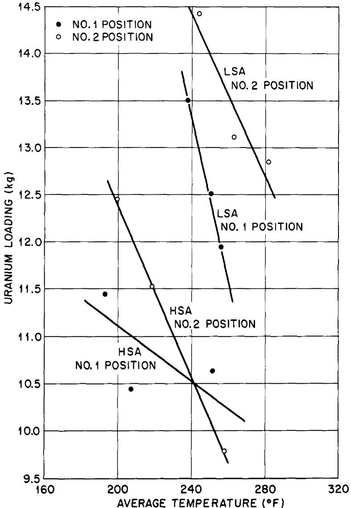  
8. Comparison of LSA and HSA NaF Loading.

case, higher loadings were obtained at lower temperatures. In that particular case the absorber had been used in a previous run where a small amount of uranium was absorbed.

In spite of the fact that the ISA absorbers were operated at higher temperatures (to compensate for the slower reaction rate), the total loading was 13 to $14\%$ higher than with the HSA material.

# References

1. Chandler, J. M. and S. E. Bolt, "Preparation of Enriching Salt 7LiF-233UF4 for Refueling the Molten Salt Reactor," ORNL-4371, March 1969, Oak Ridge National Laboratory, Oak Ridge, Tenn.   
2. Lindauer, R. B., "Processing of the MSRE Flush and Fuel Salts," ORNL-TM-2578, (in preparation), Oak Ridge National Laboratory, Oak Ridge, Tenn.   
3. Cathers, G. I. et al., "MSR Program Semiannual Progress Report for Period Ending August 31, 1968," ORNL-4344, October 1968, p. 325, Oak Ridge National Laboratory, Oak Ridge, Tenn.   
4. Lindauer, R. B. and C. K. McGlothlan, "Design, Construction, and Testing of a Large Salt Filter," ORNL-TM-2478, March 1969, Oak Ridge National Laboratory, Oak Ridge, Tenn.


# ENGINEERING DEVELOPMENT OF THE MSBR FUEL RECYCLE*

M. E. Whatley, L. E. McNeese

W. L. Carter, L. M. Ferris, E. L. Nicholson

Oak Ridge National Laboratory

Oak Ridge, Tennessee

U.S.A.

# Abstract

The molten salt breeder reactor concept being developed at ORNL requires continuous chemical processing of the fuel salt, which is $7\text{LiF - BeF}_2\text{-ThF}_4$ (72-16-12 mole %) containing about 0.3 mole $\%$ $^{233}\text{UF}_4$ . In order to minimize fuel inventory, the reactor and the processing plant are planned as an integral system. The main functions of the processing plant are to isolate the $^{233}\text{Pa}$ (which is an intermediate in the production of $^{233}\text{U}$ from $^{232}\text{Th}$ ) from the neutron flux and to remove the rare earth fission products, which constitute the major class of neutron poisons that are soluble in the salt. (The noble gases and noble metal fission products are not soluble in the salt.) The processing method being evaluated involves the selective chemical reduction of the various components into liquid bismuth solutions at about $600^{\circ}\text{C}$ , utilizing multistage countercurrent extraction operations. Protactinium, which is easily separated from uranium, and from thorium and the rare earths, would be trapped in the salt phase in a storage tank located between two extraction contactors and allowed to decay to $^{233}\text{U}$ . Fluorination of the $^{233}\text{U}$ from the salt entering this tank would be used as a process control method. Rare earths would be separated from thorium by a similar reductive extraction method; however, this operation will not be as simple as the protactinium isolation because the rare-earth-thorium separation factors are only 1.3 to 3.5. The proposed process employs electrolytic cells

to simultaneously generate reductant to the bismuth phase at the cathode and to return extracted materials to the salt phase at the anode. The practicability of the reductive extraction process depends on the successful development of salt-metal contactors, the electrolytic cells, and a suitable material of construction.

# EXPERIMENTS ON PYROCHEMICAL REPROCESSING

OF URANIUM CARBIDE FUEL*

Glenn E. Brand Supervisor, Analytical Chemistry

and

E. Wesley Murbach Supervisor, Sodium Chemistry

Atoms International, A Division of North American Rockwell Corporation

U.S.A.

# Abstract

A summary of the experiments carried out at Atomics International on pyrochemical reprocessing of uranium carbide fuel is described. Three processes were investigated; 1) the CARBOX process which is based on oxidation-carbothermic reduction; 2) a nitride-carbide cycle in which UC is converted to a nitride and then reconverted to the carbide; and 3) a fused-salt electrolysis process in which UC is anodized in a KCl-LiCl salt bath and the uranium cathode deposit is dissolved in mercury and converted to UC by reaction with propane at $350$ to $600^{\circ}\mathrm{C}$ .

Decontamination by all three processes was studied with lightly irradiated UC (nvt ~10^17). The CARBOX and nitride processes remove about 75 per cent of the fission products, but plutonium losses are high. The electrolysis process removes most (98-99.9 per cent) fission products except zirconium. A 100 gram scale oxidation experiment was carried out using UC irradiated to 15,000 Mwd/MTU. Batches of unirradiated UC up to 10kg were processed in scale up studies using a rotary kiln. Oxidative decladding studies were carried out in an apparatus capable of decladding 3 foot lengths of stainless steel clad fuel.

Cost studies indicate a savings of about 0.2 mil/kwh over aqueous reprocessing for a 1000-Mwe sodium cooled power reactor using a burn-up of 20,000 Mwd/MTU.

*Work performed under the auspices of United States Atomic Energy Commission Contract AT(11-1)-GEN-8.


# Introduction

A program was carried out at Atomics International to investigate the potential of pyrochemical reprocessing to help achieve lower fuel cycle costs for uranium carbide fuels.

It was hoped that a simpler method than the aqueous process developed for the recovery of weapons-grade fissile material would be feasible. With aqueous reprocessing, decontamination factors of $10^6$ to $10^8$ were achieved and refabrication of low burnup fuels was carried out by direct methods. The build-up of heavy isotopes in high burnup recycled fuel will produce sufficient radiation even with complete decontamination to require special methods of handling during refabrication.[1] This requirement suggests the consideration of simpler processes[2,3] which do not completely decontaminate the fuel.

Three processes were emphasized in the present work; (4) 1) oxidation of the carbide to the oxide and then reduction with carbon to the carbide (CARBOX); 2) conversion to the nitride with nitrogen and reconversion to the carbide by heating in vacuum; and 3) molten salt electrolysis.

# Oxidation Carbothermic Reduction (CARBOX)

The first step in the CARBOX process $^{(4)}$ (CARBothermic-reduction OXidation) is decladding of the fuel by oxidation. The resulting $\mathrm{UO}_2$ is then oxidized to $\mathrm{U}_x\mathrm{O}_8$ , re-enriched by addition and reduced with carbon in a two step process to UC. The reactions involved can be represented by:

$$
\begin{array}{l} U C + 2 0 _ {2} \xrightarrow {3 7 5 ^ {\circ} C} U O _ {2} + C O _ {2} \uparrow \\ 3 U O _ {2} + O _ {2} \xrightarrow {4 0 0 ^ {\circ} C} U _ {3} O _ {8} \\ U _ {3} O _ {8} + C \xrightarrow {8 5 0 ^ {\circ} C} 3 U O _ {2} + C O _ {2} \uparrow \\ 3 U O _ {2} + 9 C \xrightarrow {1 1 0 0 - 1 7 5 0 ^ {\circ}} 3 U C + 6 C O \uparrow \\ \end{array}
$$

# Decladding

A series of experiments was carried out to determine the feasibility of adapting the oxidative decladding method developed for $\mathrm{UO}_2$ fuels.(5) In this method the cladding is punctured at 1 inch intervals along its length and exposed to air at $\sim 400^{\circ}\mathrm{C}$ or steam at $\sim 120^{\circ}\mathrm{C}$ . The UC reacts to form $\mathrm{UO}_2$ , which results in about a 30 per cent increase in volume, causing the cladding to split and the resultant

finely divided $\mathrm{UO}_2$ to fall out of the cladding. Typical specimens are illustrated in Figure 1.

An apparatus was constructed which was capable of decladding three foot lengths. In one experiment 750 grams of UC clad in 0.723 inch OD-stainless steel, 0.010 inch wall thickness was punctured at one inch intervals and heated at $400^{\circ}\mathrm{C}$ in air. The rod was completely declad in 12 hours.

In similar experiments using sodium bonded UC, the cladding was pierced and heated in vacuum to $600^{\circ}\mathrm{C}$ for three hours. The sodium was effectively removed and the exposed fuel was oxidized by steam at $120^{\circ}\mathrm{C}$ . Experiments using UC irradiated to 15,000 Mwd/MTU indicated the applicability of the process.[6] An obvious modification is to chop the elements into short lengths followed by exposure to oxygen or steam.

# Oxidation of UC

A series of small scale experiments was carried out to study the oxidation of UC with oxygen, $\mathrm{CO}_{2}$ and steam. It was found that the oxidation rate, and also the rate of reaction with nitrogen, was highly dependent upon the previous history of the UC. Uranium carbide which has been recently melted oxidized very slowly below about $600^{\circ} \mathrm{C}$ while aged (reactive) UC ignited in oxygen at about $300^{\circ} \mathrm{C}$ . It was shown that freshly arc melted UC was converted to the reactive form by exposing the moist air for a few days. Large slugs of hypostiochio-metric UC were more difficult to activate.

The examination of both forms of UC showed no difference in photomicrographs, x-ray diffraction patterns, and chemical analysis for uranium, carbon, and oxygen. There was some increase in hydrogen on aging but this was in the several ppm range. The only physical difference noted was a large increase in surface area (as measured by B.E.T.) on activation. In a typical sample the surface area increased from a few $\mathrm{cm}^2/\mathrm{g}$ to $219\mathrm{~cm}^2/\mathrm{g}$ on activation.

Oxidation experiments were carried out with irradiated UC to determine if it would behave similarly to the unirradiated material. In one experiment UC irradiated to 15,000 Mwd/MTU was used. The material was reactive. It was oxidized for one hour at $310^{\circ}\mathrm{C}$ , then heated to $600^{\circ}\mathrm{C}$ and reduced with forming gas (85 per cent $\mathbf{N}_2$ , 15 per cent $\mathbf{H}_2$ ). There was a peak of radioactivity in the effluent gas when the temperature reached $500^{\circ}\mathrm{C}$ . The oxide was maintained at $600^{\circ}\mathrm{C}$ in a reducing atmosphere for 2.3 hours. The results of this experiment are shown in Table 1.

A series of small scale experiments was carried out to study the reaction of "reactive" UC with oxygen and air in a thermobalance.(7) Ignition occurred at about $300^{\circ}\mathrm{C}$ in oxygen and about $350^{\circ}\mathrm{C}$ in air,


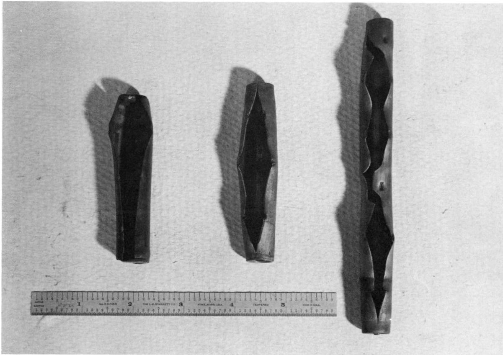  
1. Cladding from which UC has been Removed by Reaction with Steam.

and combustion was sustained until the reaction was almost complete. The rate then decreased and heat was required to complete the reaction. The time of completion varied from 15 to 60 minutes.

Table 1. Screen Analyses for Processed 15,000 Mwd/MTU UC, BMI 23-3   

<table><tr><td rowspan="2">Screen Fraction</td><td colspan="2">1 Ox-Red Cycle</td></tr><tr><td>Weight (g)</td><td>%</td></tr><tr><td>+8</td><td>0.7</td><td>0.6</td></tr><tr><td>-8 +200</td><td>7.4</td><td>6.7</td></tr><tr><td>-200</td><td>101.9</td><td>92.7</td></tr><tr><td>Total</td><td>110.0</td><td></td></tr><tr><td>Weight Increase</td><td>8.3</td><td>8.2</td></tr></table>

A similar series of experiments was carried out to study the reaction of UC with $\mathrm{CO}_{2}$ . The reaction is initiated at about $350^{\circ} \mathrm{C}$ and ignition occurs at about $525^{\circ} \mathrm{C}$ . Below about $670^{\circ} \mathrm{C}$ the reaction can be represented by:

$$
\mathrm {U C} ^ {*} + 2 \mathrm {C O} _ {2} \longrightarrow \mathrm {U O} _ {2} + \mathrm {C} ^ {*} + 2 \mathrm {C O} \uparrow
$$

where $C^*$ is the carbon initially combined with uranium. Above this temperature the react on can be represented by:

$$
\mathrm {U C} + 3 \mathrm {C O} _ {2} \longrightarrow \mathrm {U O} _ {2} + 4 \mathrm {C O} \uparrow
$$

Below $525^{\circ}C$ the react on is kinetically first order, above this temperature it is zero order.

A series of experiments was carried out to investigate scale up of the oxidation process.[9] These experiments were carried out in a rotary kiln 16 inches in diameter by 21 inches long made of stainless steel. It was rotated at 8 to 10 rpm. The kiln was heated electrically by movable clamshells. Reaction rates were controlled by controlling the temperature and flow of air. Several kilogram batches of arc cast UC slugs were oxidized at a rate of 2 to $2\frac{1}{2}$ kg per hour. The results of some of these experiments are shown in Table 2. As expected, unreactive material was difficult to oxidize. Some batches were converted to the reactive form by exposure to air at room temperature and oxidized readily.

# Carbothermic Reduction

A series of small scale experiments was carried out to study the reconversion to UC.(10) Two methods were investigated. In the first


method the oxidized product, primarily $\mathrm{U}_{3}0_{8}$ , was reduced with hydrogen to $\mathrm{UO}_{2}$ . The $\mathrm{UO}_{2}$ was then reacted with carbon to product UC. In the second method the $\mathrm{U}_{3}0_{8}$ was reacted directly with carbon.

Table 2. Oxidation of Uranium Carbide in a Rotary Kiln   

<table><tr><td rowspan="2">Run</td><td rowspan="2">Charge Weight (kg)</td><td rowspan="2">Carbon (wt %)</td><td rowspan="2">Temperature (°C)</td><td colspan="2">Sieve Analysis %</td></tr><tr><td>-50 +200</td><td>-200</td></tr><tr><td>1</td><td>1.02</td><td>5.2</td><td>400</td><td>2</td><td>98</td></tr><tr><td>2</td><td>2.25</td><td>5.2</td><td>400</td><td>2</td><td>98</td></tr><tr><td>3</td><td>5.00</td><td>5.2</td><td>520</td><td>1</td><td>98</td></tr><tr><td>4</td><td>4.95*</td><td>4.6-4.7</td><td>550</td><td>10</td><td>89</td></tr><tr><td>5</td><td>4.92</td><td>4.6-4.7</td><td>550</td><td>12</td><td>86</td></tr><tr><td>6</td><td>4.96*</td><td>4.6-4.7</td><td>550</td><td>5</td><td>81</td></tr><tr><td>9</td><td>8.08</td><td>4.6-4.7</td><td>550</td><td>12</td><td>75</td></tr><tr><td>10</td><td>10.01</td><td>4.6-4.7</td><td>550</td><td>10</td><td>90</td></tr><tr><td>12</td><td>9.95</td><td>4.6-4.7</td><td>550</td><td>3</td><td>84</td></tr><tr><td>14</td><td>10.73</td><td>4.6-4.7</td><td>550</td><td>9</td><td>79</td></tr></table>

*The UC was only partially activated so was treated in the kiln for further activation; results are a total of three oxidation treatments.

Experiments with $\mathsf{UO}_2$ utilized powdered mixtures of $\mathsf{UO}_2$ and graphite. In some experiments the mixture was pelletized using methyl methacrylate or stearic acid as a binder. The mixture was outgassed below $1200^{\circ}\mathrm{C}$ and then heated above $1300^{\circ}\mathrm{C}$ . The reaction rates followed the second order equation

$$
\frac {x}{1 - x} = k t
$$

where $x$ is the fraction reacted in time (t) and $k$ is the rate constant. The rate constants followed the equation

$$
\log k = 9. 8 - \frac {1 6 0 0 0}{T}
$$

where $T$ is the temperature $(^{\circ}K)$

It was found that in the experiments using pelletized mixtures some carbon was contributed by the binder and a correction was applied to the amount of carbon added.

Early attempts to prepare UC directly from $\mathrm{U}_{3} \mathrm{O}_{8}$ according to the equation

$$
U _ {3} O _ {8} + 1 1 C \longrightarrow 3 U C + 8 C O
$$

resulted in a high and variable carbon content.(10) This was attributed to the fact that both CO and $\mathrm{CO}_{2}$ were produced and that the amounts depended on many variables. It was found that by carrying out the reduction in two steps the stoichiometry could be controlled. The reactions are represented by the following equations:

$$
U _ {3} 0 _ {8} + C \xrightarrow {8 5 0 ^ {\circ} C} 3 U O _ {2} + C O _ {2} \uparrow
$$

$$
3 \mathrm {U O} _ {2} + 9 \mathrm {C} \xrightarrow {1 3 0 0 ^ {\circ} \mathrm {C}} 3 \mathrm {U C} + 6 \mathrm {C o t}
$$

The temperature was maintained below $900^{\circ}\mathrm{C}$ until the first reaction was completed. The temperature was then raised to above $1300^{\circ}\mathrm{C}$ . Reaction rates were more rapid than observed for $\mathrm{UO}_2$ as the starting material. Also the reaction rates were correlated by a $3/2$ order rate equation.(11)

Several scale up experiments were carried out to study the reaction of $\mathrm{U}_{\mathrm{Z}}\mathrm{O}_{\mathrm{g}}$ with UC. In these experiments the charge was ball milled, mixed with 1.15 wt per cent polyvinyl alcohol as a binder, and agglomerated. The mixture was then heated in an induction vacuum furnace. These experiments were directed primarily toward the preparation of hypostoichiometric UC. The results are shown in Table 3.

Table 3. Scale up Results on Carbothermic Reduction of ${\mathrm{U}}_{30}$   

<table><tr><td rowspan="2">Weight Charge (kg)</td><td rowspan="2">Temperature (°C)</td><td colspan="2">Carbon (wt %)</td></tr><tr><td>Theoretical</td><td>Analytical</td></tr><tr><td>20</td><td>2000</td><td>4.66</td><td>4.62*</td></tr><tr><td>16</td><td>2000</td><td>4.68</td><td>4.74*</td></tr><tr><td>1.5</td><td>1750</td><td>4.51</td><td>4.73</td></tr><tr><td>0.12</td><td>1750</td><td>4.60</td><td>4.54</td></tr><tr><td>0.12</td><td>1750</td><td>4.59</td><td>4.66</td></tr><tr><td>0.14</td><td>1900</td><td>4.48</td><td>4.81</td></tr><tr><td>1.3</td><td>1750</td><td>5.35</td><td>5.15</td></tr><tr><td>1.5</td><td>1750</td><td>4.69</td><td>4.92</td></tr></table>

*As-reacted. Other samples arc-melted before analysis.

# Fission Product Behavior

Experiments with UC irradiated up to 15,000 Mwd/MTU showed that no fission products except rare gases and ruthenium are removed by decladding and oxidation-hydrogen reduction to $\mathrm{UO}_2$ . (6) Appreciable ruthenium removal can be achieved by increasing the oxidation temperature. (12)

In another series of experiments three mixtures of irradiated $\mathrm{UO}_2$ (nvt $\sim 10^{17}$ ) and carbon were prepared which would produce hypostoichiometric, stoichiometric, and hyperstoichiometric UC. These mixtures were heated at three temperatures in a vacuum induction furnace and another set was arc melted. The results are shown in Table 4.

Table 4. Behavior of Fission Products and Plutonium During Carbothermic Reduction   

<table><tr><td rowspan="2">Element</td><td rowspan="2">C:UO2</td><td colspan="4">Removal (%)</td></tr><tr><td>1560°C</td><td>1760°C</td><td>1940</td><td>Arc-Melted</td></tr><tr><td rowspan="3">Pu</td><td>3.17</td><td>6</td><td>-</td><td>17</td><td>80</td></tr><tr><td>3.00</td><td>6</td><td>-</td><td>33</td><td>94</td></tr><tr><td>2.88</td><td>14</td><td>38</td><td>46</td><td>98</td></tr><tr><td rowspan="3">Ce</td><td>3.17</td><td>22</td><td>-</td><td>30</td><td>84</td></tr><tr><td>3.00</td><td>14</td><td>-</td><td>44</td><td>97</td></tr><tr><td>2.88</td><td>17</td><td>37</td><td>71</td><td>98</td></tr><tr><td rowspan="3">Sr</td><td>3.17</td><td>98+</td><td>-</td><td>99+</td><td>99.9+</td></tr><tr><td>3.00</td><td>98+</td><td>-</td><td>99+</td><td>99.9+</td></tr><tr><td>2.88</td><td>94+</td><td>99+</td><td>99+</td><td>99.9+</td></tr><tr><td rowspan="3">Cs</td><td>3.17</td><td>97+</td><td>-</td><td>99+</td><td>99+</td></tr><tr><td>3.00</td><td>97+</td><td>-</td><td>99+</td><td>99+</td></tr><tr><td>2.88</td><td>97+</td><td>98+</td><td>99+</td><td>99+</td></tr></table>

In another experiment $\mathrm{UO}_2$ was mixed with oxides of cerium, samarium and neodymium and reduced with carbon. With a mixture which produced hypostiochiometric UC, essentially all rare earths were removed at $1800^{\circ}\mathrm{C}$ . With a hyperstoichiometric mixture 75 per cent of the samarium was removed below $1600^{\circ}\mathrm{C}$ . Heating to $1800^{\circ}\mathrm{C}$ removed essentially all the samarium, 30 per cent of the neodymium, and 15 per cent of the cerium.

Calculations on the effect of scale up indicate that plutonium losses would not be serious on production scale carbothermic reduction, but that the losses during arc-melting would be prohibitive. The most promising refabrication method would seem to be pressing and

sintering.

# Comparative Costs

A study was carried out to compare fuel cycle costs for reprocessing by CARBOX with a conventional aqueous plant.(14) Fuel cycle costs were computed for fuel recycled through a 360-Mwe sodium cooled power reactor. Calculations were carried out through nine cycles of 20,000 Mwd/MTU with reprocessing and re-enrichment between each cycle. Fuel reactivity was adjusted by the addition of an amount of enriched uranium so that the reactivity of the fuel at discharge was constant for each irradiation cycle. Burnup and re-enrichment requirements were made using the computer code AIMFIRE.(15) The results of these calculations are shown in Table 5.

Table 5. Cyclic ${}^{235}\mathrm{U}$ Burnup Requirements for Recycled UC Fuel in the Reference SCR (Burnup per Cycle = 20,000 Mwd/MTU)   

<table><tr><td rowspan="2">Cycle</td><td colspan="2">100% Decontamination Process</td><td colspan="2">Decontamination by CARBOX Process</td></tr><tr><td>Initial 235U g/kg</td><td>Burned 235U g/kg</td><td>Initial 235U g/kg</td><td>Burned 235U g/kg</td></tr><tr><td>1</td><td>33.94</td><td>19.04</td><td>33.94</td><td>19.04</td></tr><tr><td>2</td><td>27.89</td><td>14.50</td><td>30.18</td><td>15.12</td></tr><tr><td>3</td><td>26.40</td><td>13.54</td><td>29.40</td><td>14.28</td></tr><tr><td>4</td><td>26.04</td><td>13.33</td><td>29.22</td><td>14.05</td></tr><tr><td>5</td><td>26.00</td><td>13.31</td><td>29.20</td><td>14.00</td></tr><tr><td>6</td><td>26.03</td><td>13.33</td><td>29.22</td><td>14.01</td></tr><tr><td>7</td><td>26.08</td><td>13.37</td><td>29.26</td><td>14.04</td></tr><tr><td>8</td><td>26.13</td><td>13.41</td><td>29.31</td><td>14.07</td></tr><tr><td>9</td><td>26.18</td><td>13.45</td><td>29.36</td><td>14.11</td></tr><tr><td>Average</td><td>27.19</td><td>14.14</td><td>29.90</td><td>14.75</td></tr></table>

The recycle of neutron absorbing fission products in fuels reprocessed by the CARBOX process increases the consumption of fissile material but comparative fuel cycle costs indicate the burnup penalty is less expensive than the savings realized via the simpler fuel cycle. The costs are shown in Table 6.

The CARBOX reprocessed fuel requires remote fabrication, but since high burnup fuels will contain isotopic impurities of the fertile and fissile materials, direct fabrication may not be feasible even with completely decontaminated fuel. Fabrication costs and reprocessing costs were combined for the CARBOX process. The potential savings of $\sim 0.2$ mill/kwh represents a savings of $3.5 million/yr for a 1000-Mwe installation.


Table 6. Comparative Fuel Costs   

<table><tr><td rowspan="2">Charges</td><td rowspan="2">AEC Ref. 
Aqueous Plant 
(mill/kwh)</td><td colspan="2">On-Site - 3-Reactor 
Capacity</td></tr><tr><td>Aqueous 
(mill/kwh)</td><td>CARBOX 
(mill/kwh)</td></tr><tr><td>Burnup</td><td>0.806</td><td>0.806</td><td>0.856</td></tr><tr><td>Use</td><td>0.136</td><td>0.141</td><td>0.142</td></tr><tr><td>Loss</td><td>0.037</td><td>0.037</td><td>0.043</td></tr><tr><td>Conversion</td><td>0.125</td><td>0.125</td><td>0.019</td></tr><tr><td>Fabrication (SS clad)</td><td>0.350</td><td>0.350</td><td>0.479</td></tr><tr><td>Reprocessing</td><td>0.130</td><td>0.370</td><td></td></tr><tr><td>Shipping</td><td>0.113</td><td>0.041</td><td>0.011</td></tr><tr><td>Total</td><td>1.70</td><td>1.87</td><td>1.55</td></tr></table>

# Nitride-Carbide Cycle

The first step in the carbide-nitride cycle is the conversion of UC to the nitride. (4) When UC is heated at 800 to $900^{\circ}\mathrm{C}$ in a nitrogen atmosphere the reaction can be represented by

$$
4 \mathrm {U C} + 3 \mathrm {N} _ {2} \longrightarrow 2 \mathrm {U} _ {2} \mathrm {N} _ {3} + 4 \mathrm {C}
$$

the carbide is pulverized during the process.

The nitride is then reconverted to the carbide by heating in vacuum to 1300 to $2100^{\circ}\mathrm{C}$ . The reaction is reversed

$$
2 \mathrm {U} _ {2} \mathrm {N} _ {3} + 4 \mathrm {C} \longrightarrow 4 \mathrm {U C} + 3 \mathrm {N} _ {2} \uparrow
$$

The UC can then be refabricated by arc casting or pressing and sintering.

Conversion to the Nitride

Preliminary experiments were carried out using a thermobalance to study the rate of reaction of UC with nitrogen.

The reaction rate of UC with nitrogen, as previously described for oxidation, was found to be highly dependent on the previous treatment of the carbide.

Arc melted UC (even $-16 + 30$ mesh) which has been recently prepared was unreactive to nitrogen at $800^{\circ}\mathrm{C}$ . After about 40 days exposure to laboratory air the UC became reactive. As with many solid-gas

reactions the mechanism appeared to be quite complex.(16) A large number of experiments were carried out in which nitrogen was reacted with UC in a thermobalance. The reaction rates were correlated by

$$
\frac {\mathrm {d} \mathbf {x}}{\mathrm {d} t} = K (1 - \mathbf {x}) ^ {7 / 4}
$$

where $K, t,$ and $x$ are rate constant, time and fraction reacted.

The rate of reaction varied with time after arc melting, initial particle size, UC composition, nitrogen pressure, and temperature. The maximum rate occurs in the range of $900^{\circ}\mathrm{C}$ . The reaction goes virtually to completion in a few hours and the product is a finely divided powder which consists of a mixture of $\mathbf{U}_{2} \mathbf{N}_{3}$ and carbon.

Reconversion to the Carbide

The reconversion of the nitride to th. carbide appears to take place in two steps.(17) The first step w. ich converts the $\mathrm{U}_2\mathrm{N}_3$ to UN

$$
2 U _ {2} N _ {3} \longrightarrow 4 U N + N _ {2}
$$

occurs at a linear rate.

The second step in which the UN is converted to the carbide

$$
2 \mathrm {U N} + 2 \mathrm {C} \longrightarrow 2 \mathrm {U C} + \mathrm {N} _ {2} \uparrow
$$

follows a parabolic rate.

Removal of nitrogen depends on temperature and carbon content.(18) If the material contains less than 4.8 wt per cent carbon (hypo-stoichiometric) sufficient nitrogen is retained to combine with the excess uranium. If the material contains 4.8 wt per cent or more carbon, the nitrogen can be reduced to a few hundred ppm at $1900^{\circ}\mathrm{C}$ . Arc melting usually reduced the nitrogen content somewhat and samples exposed to laboratory air lost carbon, presumably caused by the reaction with oxygen.

Fission Product Behavior

Experiments were carried out on the gram scale using lightly irradiated UC (nvt ≈ 10 $^{17}$ ) to study the behavior of fission products. No fission product removal was found after the conversion to the nitride, although undoubtedly some rare gases were released. The material was then converted to the carbide. The results are shown in Table 7.


Table 7. Fission Product Removal in the Reconversion Step   

<table><tr><td rowspan="2">Run No.</td><td rowspan="2">Maximum Temperature (°C)</td><td rowspan="2">Time at Temperature (hr)</td><td rowspan="2">Product Composition (wt %) nitrogen</td><td colspan="7">Removal %</td></tr><tr><td>Cs</td><td>Ce</td><td>Sr</td><td>Zr-Nb</td><td>Ru</td><td>Pu</td><td>Rare Earths Excluding Ce</td></tr><tr><td>1</td><td>1700</td><td>5</td><td>0.019</td><td>97</td><td>27</td><td>97</td><td>2</td><td>5</td><td>6</td><td>51</td></tr><tr><td>2</td><td>1700</td><td>2 1/2</td><td>0.086</td><td>90</td><td>19</td><td>91</td><td>0</td><td>0</td><td>2</td><td>39</td></tr><tr><td>3</td><td>1850</td><td>3</td><td>0.009</td><td>97</td><td>47</td><td>98</td><td>7</td><td>15</td><td>40</td><td>68</td></tr><tr><td>4</td><td>1850</td><td>1 1/2</td><td>0.033</td><td>91</td><td>25</td><td>93</td><td>4</td><td>13</td><td>34</td><td>53</td></tr><tr><td>5</td><td>1950</td><td>2</td><td>0.010</td><td>98</td><td>60</td><td>99</td><td>15</td><td>30</td><td>46</td><td>69</td></tr><tr><td>6</td><td>1950</td><td>1</td><td>0.009</td><td>99</td><td>53</td><td>99</td><td>17</td><td>-</td><td>45</td><td>73</td></tr></table>

The product was then aro melted, and the results are shown in Table 8.

Table 8. Fission Product Removal in the Nitride-Carbide Cycle Including Arc-Melting   

<table><tr><td rowspan="2">Run No.</td><td rowspan="2">Time Liquid (min)</td><td colspan="2">Product Composition %</td><td colspan="7">Removal %</td></tr><tr><td>Nitrogen</td><td>Carbon</td><td>Cs</td><td>Ce</td><td>Sr</td><td>Zr-Nb</td><td>Ru</td><td>Pu</td><td>Rare Earths Excluding Ce</td></tr><tr><td>1</td><td>6</td><td>0.009</td><td>5.20</td><td>&gt;99</td><td>87</td><td>&gt;99</td><td>36</td><td>27</td><td>84</td><td>95</td></tr><tr><td>2</td><td>2</td><td>0.030</td><td>4.75</td><td>&gt;99</td><td>64</td><td>&gt;99</td><td>15</td><td>17</td><td>65</td><td>85</td></tr><tr><td>3</td><td>2</td><td>0.008</td><td>5.55</td><td>&gt;99</td><td>70</td><td>&gt;99</td><td>42</td><td>22</td><td>66</td><td>86</td></tr><tr><td>4</td><td>6</td><td>0.008</td><td>5.25</td><td>&gt;99</td><td>82</td><td>&gt;99</td><td>40</td><td>-</td><td>78</td><td>92</td></tr><tr><td>5</td><td>2</td><td>0.007</td><td>6.60</td><td>&gt;99</td><td>60</td><td>&gt;99</td><td>41</td><td>30</td><td>53</td><td>70</td></tr><tr><td>6</td><td>6</td><td>0.005</td><td>6.45</td><td>&gt;99</td><td>73</td><td>&gt;99</td><td>31</td><td>31</td><td>72</td><td>84</td></tr></table>

Unless a way can be found to lower plutonium losses, arc melting would not be a satisfactory method for refabrication.

# Molten Salt Electrolysis

A method for reprocessing uranium carbide based on molten salt electrolysis has been studied by Hansen.(19) This process is shown schematically in Figure 2. It consists of three steps; 1) electrolysis. Uranium carbide is dissolved at the anode and uranium metal is formed as a dendritic mass at the carhode; 2) dissolution in mercury. The cathode deposit is immersed in hot mercury. The uranium readily reacts to form a quasi-amalgam which separates from the occluded salt

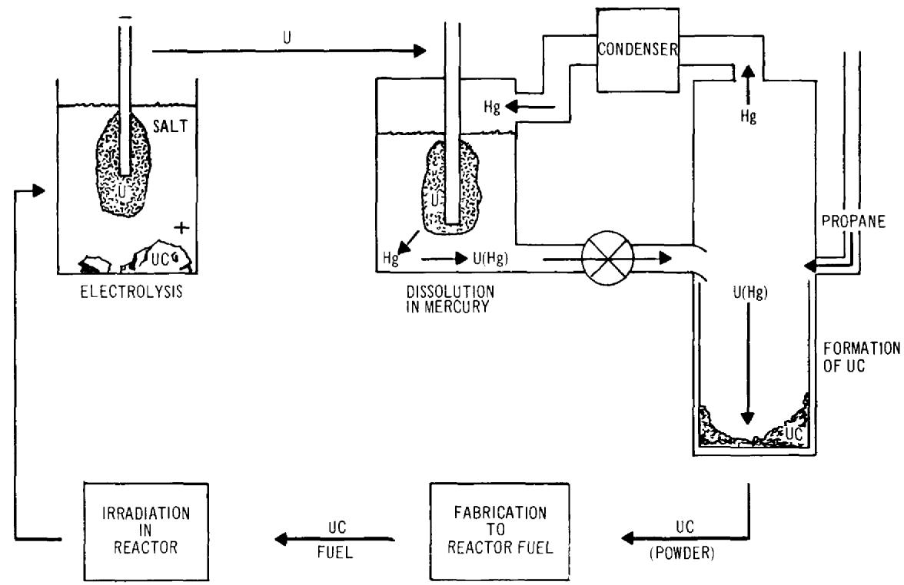  
2. Flow Sheet for Reprocessing of UC by Molten Salt Electrolysis.

phase; and 3) formation of UC. The quasi-amalgam is heated in an atmosphere of propane. The uranium reacts readily to form stoichiometric UC and the mercury is distilled away.

Although in theory any alkali or alkaline earth halide can be used in the molten salt bath, the KCl-LiCl eutectic was chosen because of its low melting point, $352^{\circ}\mathrm{C}$ which is below the boiling point of mercury. The occluded salt readily melts when the cathode is immersed in hot mercury and can be conveniently separated.

In the experiments, the bath was prepared by adding approximately 10 per cent of either $\mathrm{UCl}_3$ or $\mathrm{UF}_4$ to the KCl-LiCl eutectic and purified by bubbling chlorine through the molten mixture. The anode consisted of wafers cut from cast UC and supported by a molybdenum wire or contained in a graphite crucible immersed in the bath. The UC dissolved while the graphite remained inert. The reaction can be represented as

$$
U C \longrightarrow U ^ {+ 3} + C + 3 e ^ {-}
$$

The uranium metal was deposited on a molybdenum cathode as a dentritic mass which contained appreciable quantities of occluded salts. After a few preliminary runs, current efficiencies of from 50 to 60 per cent were obtained.

The uranium deposit was immersed in mercury which was at a higher temperature than the melting point of the occluded salt. The salt melted and the freshly deposited uranium rapidly dissolved in the mercury. The amalgam was cooled and poured through a cone filter with a small hole in the bottom. The amalgam passed through the hole and the frozen salt remained behind.

The salt free amalgam was heated to $350^{\circ}\mathrm{C}$ and contacted with a hydrocarbon gas such as propane. The reaction is

$$
3 U (H g) + C _ {3} H _ {8} \longrightarrow 3 U C + H g + 4 H _ {2} \uparrow
$$

The mercury was then distilled away leaving stoichiometric UC as indicated by x-ray analysis. No detectable mercury remained.

In an experiment carried out to determine fission product behavior during electrolysis, ten grams of irradiated UC ( $\sim 10^{17}$ nvt) was mixed with $90\mathrm{g}$ of unirradiated UC to form the anode material. Six deposits were collected and each deposit was dissolved in mercury and converted to carbide by distillation in a propane atmosphere. The results of this experiment are shown in Table 9. These results show that appreciable decontamination from most of the fission products can be achieved but remote refabrication would be required. The effect of the remaining fission products on nuclear reactivity should be negligible. The behavior of plutonium was not determined due to difficulties with analysis.

Table 9. Observed Decontamination Factors for UC Electrolysis   

<table><tr><td rowspan="2">Element</td><td colspan="6">Deposits</td></tr><tr><td>1</td><td>2</td><td>3</td><td>4</td><td>5</td><td>6</td></tr><tr><td>Ba</td><td>2.1 x 103</td><td>2.0 x 103</td><td>3.3 x 103</td><td>5.8 x 103</td><td>2.0 x 103</td><td>4.2 x 103</td></tr><tr><td>Sr</td><td>7 x 103</td><td>6.7 x 102</td><td>5.4 x 102</td><td>-</td><td>3.0 x 103</td><td>5.2 x 103</td></tr><tr><td>RE</td><td>1.1 x 103</td><td>5.9 x 102</td><td>4.1 x 102</td><td>5.6 x 102</td><td>8.5 x 102</td><td>4.3 x 102</td></tr><tr><td>Ce</td><td>85</td><td>65</td><td>53</td><td>58</td><td>86</td><td>51</td></tr><tr><td>Ru</td><td>-</td><td></td><td>6 x 102</td><td>-</td><td>8 x 102</td><td>1.1 x 103</td></tr><tr><td>Zr</td><td>1</td><td>1</td><td>1</td><td>3</td><td>2</td><td>3</td></tr></table>

In an attempt to eliminate the dissolution step a series of experiments was carried out to determine the feasibility of using a molten metal as the cathode.(20) The uranium dissolved in the molten metal as it was electrolyzed. Two requirements of the metal are that it have a low melting point and be compatible with the LiCl-KCl-UCl₃ salt bath. Lead, zinc, bismuth, and cadmium were used as cathodes. Because of potential problems with vaporization, mercury was not used. The metal cathode was stirred with a tantalum rod, and the salt bath was agitated by bubbling argon. These experiments were carried out at 450 to $500^{\circ}\mathrm{C}$ . A summary of some of the results is presented in Table 10.

Table 10. Electrolysis of UC Using Liquid Metal Cathodes   

<table><tr><td rowspan="2">Run No.</td><td rowspan="2">Cathode</td><td colspan="2">U Content of Salt (wt %)</td><td rowspan="2">Cathode Efficiency %</td></tr><tr><td>Initial</td><td>Final</td></tr><tr><td>7</td><td>Cd</td><td>2.4</td><td>4.4</td><td>21</td></tr><tr><td>8</td><td>Zn</td><td>4.4</td><td>3.6</td><td>69</td></tr><tr><td>9</td><td>Zn</td><td>3.6</td><td>0.5</td><td>88</td></tr><tr><td>10</td><td>Zn</td><td>2.2</td><td>2.4</td><td>91</td></tr><tr><td>12</td><td>Cd</td><td>9.4</td><td>9.3</td><td>29</td></tr><tr><td>14</td><td>Cd</td><td>15.3</td><td>18.0</td><td>0.1</td></tr><tr><td>15</td><td>Bi</td><td>8.1</td><td>7.6</td><td>49</td></tr><tr><td>16</td><td>Pb</td><td>6.0</td><td>4.1</td><td>86</td></tr><tr><td>19</td><td>Zn</td><td>13.4</td><td>12.5</td><td>34</td></tr></table>

The results show the adverse effect of over 10 wt per cent U in the salt bath. Apparently, due to cyclic processes involving $\mathrm{U}^{+3}$ , $\mathrm{U}^{+4}$ and $\mathrm{UO}_{2}^{++}$ .


# Conclusion

Three $\nu$ -ential methods for reprocessing UC have been demonstrated. It appears that arc-meltin -casting would not be satisfactory for refabrication unless plutc um losses can be controlled. The electrolysis process offers stantial decontamination. The CARBOX process offers a potential saving of $\sim 0.2$ mill/kwh when compared to an on-site aqueous reprocessing plant.

# References

1. Zebroski, E. L., H. W. Alter and G. E. Collins, "Plutonium Fuel Fabrication and Reprocessing for Fast Ceramic Reactors," GEAP-3876, February 1962.   
2. Burris, L., Jr. et al., "Pyrometallurgical and Pyrochemical Fuel Processing," presented at the Third United Nations International Conference on the Peaceful Uses of Atomic Energy, Geneva, Switzerland, August 31 - September 9, 1964.   
3. Sinizer, D. I., et al., "Terminal Status Report for the Processing Refabrication Experiment," NAA-SR-3269, November 1959.   
4. Murbach, E. W. and G. E. Brand, "Pyrochemical Reprocessing of Uranium Carbide Summary Report," NAA-SR-11340, August 1965.   
5. Bodine, J. E., I. J. Groce, J. Guon and L. A. Hanson, "Oxidative Decladding of Uranium Dioxide Fuels," Nuclear Science and Engineering, Vol. 19, No. 1, May 1964, pp. 1-7.   
6. Bodine, J. E., J. Guon, R. J. Sullivan and F. W. Gandolfo, "Reprocessing Studies on Irradiated Uranium Carbide Reactor Fuel," NAA-SR-7511, December 1962.   
7. Murbach, E. W., "The Oxidation of 'Reactive' Uranium Carbide," Transactions of the Metallurgical Society of AIME, Vol. 227, 1963, pp. 488-451.   
8. Murbach, E. W. and W. D. Turner, "Oxidation of Uranium Carbide by Carbon Dioxide," NAA-SR-7482, December 1962.   
9. Strausberg, S., "A Rotary Kiln for the Controlled Oxidation of UC," NAA-SR-10485, June 1965.   
10. Smiley, W. G., "Oxidation-Reduction Reprocessing of Uranium Carbide Reactor Fuel I. Carbothermic Reduction of $\mathsf{U}\mathsf{O}_2$ ," NAA-SR-6976, March 1962.   
11. Murbach, E. W. and S. Strausberg, "Preparation of Uranium Monocarbide from $\mathrm{U}_{7} \mathrm{O}_{8}$ ," *Nuclear Metallurgy*, Vol. X, Compounds of Interest in Nuclear Reactor Technology, 1964.


12. Colby, L. J., Jr., "Ruthenium Removal from Irradiated $\mathsf{UO}_2$ by Reaction with Oxygen to $1300^{\circ}\mathsf{C}$ ," NAA-SR-Memo-6107, February 1961.   
13. Smiley, W. G., "Oxidation-Reduction Reprocessing of Uranium Carbide Reactor Fuel II. Behavior of Plutonium and Fission Products," NAA-SR-10738, June 1965.   
14. Pattern, K. L. and L. J. Colby, Jr., "Comparative Fuel Cycle Evaluations, Low Decontamination Pyroprocessing, and Aqueous Reprocessing Part II. UC Fuel in a Thermal Reactor," NAA-SR-9335, February 1965.   
15. Blaine, R. A., "AIMFIRE, A Fuel Economics Code," NAA-SR-6706, October 1961.   
16. Hanson, L. A., "Reprocessing of Uranium Carbide by a Nitride - Carbide Cycle I. Kinetics of Nitride Formation," NAA-SR-8388, October 1963.   
17. Hanson, L. A., "Reprocessing of Uranium Carbide by a Nitride - Carbide Cycle II. Kinetics of Nitride Conversion to Carbide," NAA-SR-9161, October 1964.   
18. Hanson, L. A., "Reprocessing of Uranium Carbide by a Nitride - Carbide Cycle III. Complete Cycle and Fission Product Study," NAA-SR-9278, October 1964.   
19. Hansen, W. N., "Reprocessing of Uranium Carbide by Molten Salt Electrolysis," NAA-SR-7660, March 1963.   
20. Iverson, M. L. and R. J. Sullivan, "Electrolysis of Uranium Carbide in Fused Salt Using Molten Metal Cathodes," NAA-SR-10737, June 1965.


# TECHNOLOGICAL AND ECONOMICAL ASPECTS OF IRRADIATED FUEL REPROCESSING BY FLUORIDE VOLATILITY METHODS IN FRANCE

G. Manevy and Y. Rochedereux  
Centre D'Etudes Nucleaires de Fontenay-Aux-Roses  
92-Fontenay-Aux-Roses France


# SIZING THE CHEMICAL REACTORS FOR FLUORIDE VOLATILITY PROCESSING OF FAST REACTOR FUEL*

Gustaaf J. Spaepen  
Head of Chemical Technology, SCK-CEN Mol, Belgium

# Abstract

The choice of the type and size of the fluorinator in fluoride volatility processing depends on many factors such as heat dissipation, criticality, capacity and mass transfer. An outline is given of the present state of development studies at SCK-CEN, Mol for the experimental determination of the main factors for design and operation of an industrial unit. The project is aimed at the reprocessing of the fuel of one 1000 MWe fast breeder reactor.

# Introduction

The fluoride volatility processing method is considered to be a total or partial alternative to other processing methods for fast reactor fuel. The present R and D program along this line in the SCK-CEN laboratories at Mol is based on the earlier work of J. Schmets and col.(1). The goal of our program is the accumulation of the data, necessary to evaluate a prototype reprocessing facility based on FVP. Use of one or more volatility steps in an aqueous reprocessing scheme is considered to be likely and hence smaller programs are set up at the side, in order to evaluate the hybrid possibilities after completion of a major FVP-step.

The all-volatility line will be composed of a number of steps including transport, reaction, absorption, condensation.. of gases and solids. These operations will have to be performed on solids of as yet unknown reactivity, impurity content, physical properties, etc. The gases to be used in the flowsheet are better known. Fluorine is the only gas to volatilize the Pu-compounds while the advantages of different chlorine- and bromine-fluorides for the UF6-volatilization have been widely discussed (2, 3, 4).

Furthermore, a high heat load in the process is to be reckoned with because of radioactivity after short cooling times and exothermicity of most of the chemical reactions. Recovery of the valuable plutonium should be virtually complete.

Like most of the laboratories working on FVP, we have chosen the fluidized bed as the main equipment of the flow-sheet. Development of its technology is seen in the frame of continuously feeding powdered fuel of core and axial blanket to the UF $_6$ -reactors. Countercurrent flow of fluorine and/or ClF/ClF $_3$ is provided with intermittent condensation of PuF $_6$ and dilution with $\mathbf{N}_2$ . A schematic drawing is given in fig.1.

# General Reactor Conditions

Most applications of continuous fluidization in non-nuclear industries have the following features in common:

- beds of large diameters and large production rates   
- bed composition of standardized grain sizes and bulk densities   
recycling of the reactant gas   
- cyclone recuperation of elutriated fines   
- high linear gas velocities (10 - 100 $\mathbf{v}_{\mathrm{sr}}$ )   
usually only one fluidized bed in the circuit.

The situation of a FVP-plant based on fluidization will be radically different:

beds of small cross-section and moderate out-put   
- bed composition of varying grain sizes and containing solids of widely different densities   
recycling should be kept to a minimum because of costly purification devices in the secondary lines   
- large quantities of elutriated fines and necessity of complete recuperation hence use of "absolute" dust filters   
- linear gas velocities as low as possible to minimize elutriation   
several beds in series.


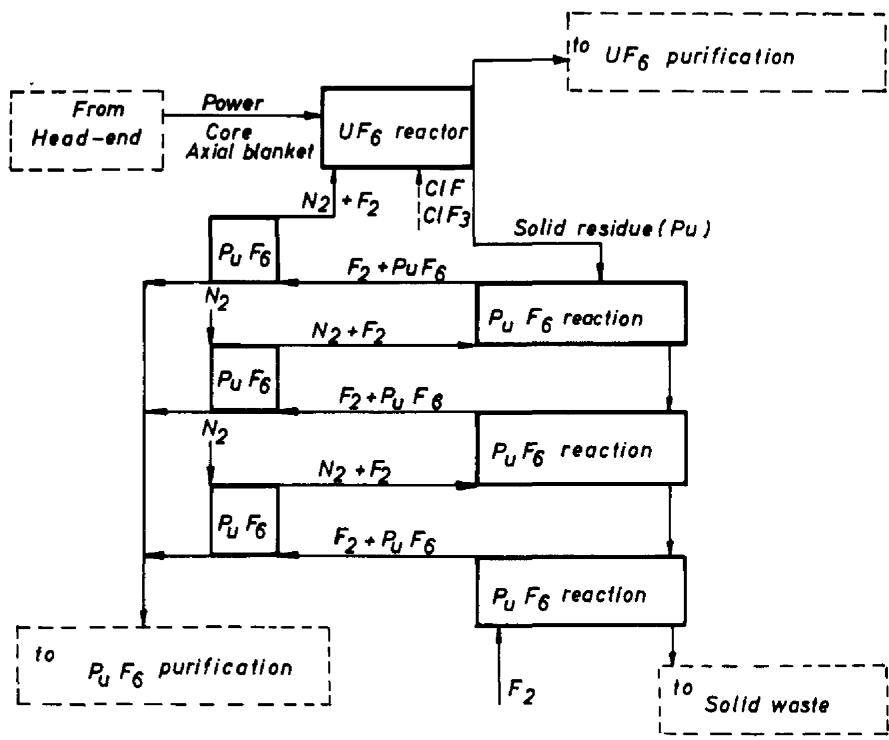

1. Scheme for Fluoride Volatility Processing (FVP) of fast reactor fuel.

Moreover, because of the high heat load and the presence of low melting compounds in the bed, accidental loss of fluidization would lead to caking of the bed and destruction of the equipment. Since linear velocities will be low, close fluidization control by sensors is essential.

According to these general conditions for the use of fluid beds in FVP and because of the unknown characteristics of the high burn-up fuel of the future, several ground rules for the development program at Mol were chosen :

- determination of the fuel powder particle size distribution as a function of the fuel type and the milling characteristics   
- determination of the microkinetics of the different fuel powders by thermogravimetry   
- confirmation of the microkinetics in batch type fluidized beds of laboratory scale (macrokinetics)   
- determination of minimum fluidization velocities, fluidization stability and heat transfer coefficients for mixtures of extremely variable grain sizes and densities   
elutriation behaviour of the same mixtures for linear velocities between 1.2 and 1.8 v.   
- demonstration of reactors in series with solids transport by air-lift and with representative on-line sampling of solids and gases, leading to residence time determinations for both   
development of a fluidization sensor for linear velocities between 1.2 and 1.8 $\mathbf{v}_{\mathrm{mf}}$ and of recuperation devices other than porous filters.

# Development Program

The resulting development program is summarized in fig.2. Only those tasks related to the development of the main reactors for UF $_6$ and PuF $_6$ are indicated in this diagram. The knowledge thus gained on fluidized beds of unusual operating conditions, can directly be applied to the purification circuits which consist primarily of less critical absorption units, decomposers and UF $_6$ -UO $_2$ converters.

Before giving some illustrative results, we first indicate briefly the progress made in our program. All the batch-type units are in full operation including:

- thermal balance for unirradiated and for short-cooled, high burn-up fuel   
- a 100 kg UF $_6$ -reactor automatically operated, with on-line gas resistivity cells, UF $_6$ -condensation and absorption units and scrubber   
- a 10 kg UF $_6$ -reactor, remotely controlled, for low activity fuel - an on-line gamma spectrometer is installed

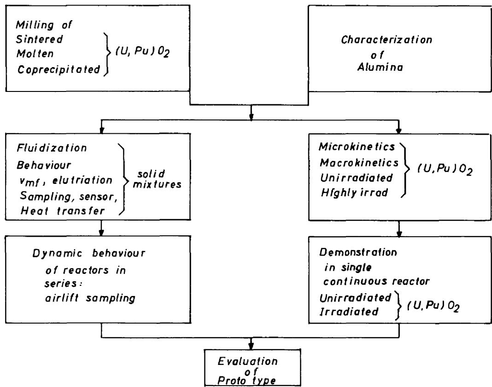

2. Development program at SCK-CEN, Mol.

- two $\mathsf{PuF}_6$ -reactors, of 500 g each, with continuous solid sampling during operation   
- a hot cell for conditioning and sampling with instruments for fission gas release   
- a demonstration of continuous slab reactor with airlift transport of solids   
- a cold fluidization laboratory including units for macrokinetics, a low temperature microwave and cyclone equipment.

Descriptions of most of the equipment and installations have been published (5, 6, 7, 8).

The microkinetics of the reactions of $\mathbf{F}_2$ , ClF and $\mathrm{ClF}_3$ on $\mathrm{UO}_2$ and on simulated fast reactor core fuel are well established. The relation to the macrokinetics in fluidized bed is completed for $\mathrm{UO}_2$ and underway for core fuel with simulated high burn-up. The same holds for the determination of the fluidization behaviour while the dynamics of slabs in series as well as the construction of continuous single reactors is scheduled for the end of 1969 and early 1970.

# Results

In order to illustrate the respective studies already completed in our program a selection of typical results is presented. More details can be found in the cited references or in SCK-CEN progress reports, which can be made available on request.

# Microkinetics (9)

The microkinetics of fluorinating gases on pure $\mathsf{UO}_2$ -grains fit the rate equation, according to the decreasing sphere model: $(1 - F)^{1/3} = 1 - R't$ . Although physically speaking, this model is meaningless for $(\mathsf{U}, \mathsf{Pu})\mathsf{O}_2$ and $\mathsf{F}_2$ , the same expression can be used: $(1 - c)^{1/3} = 1 - R't$ (table I). In fig. 3 the dependence of this $R''$ on $\mathsf{F}_2$ -concentration is given for $(\mathsf{U}, 20\mathsf{Pu})\mathsf{O}_2$ obtained by melting, hence with $\mathsf{Pu}$ in solid solution. The texture of the $(\mathsf{U}, \mathsf{Pu})\mathsf{O}_2$ solid solution after volatilization of only part of the $\mathsf{UO}_2$ is shown in fig. 4. As could be expected, the cracked grains splinter into small fragments by the mechanical action in a fluidized bed. Consequently the macrokinetic results for this case of "molten" fuel differ very much from the thermogravimetric results, although it still seems possible to relate one another.

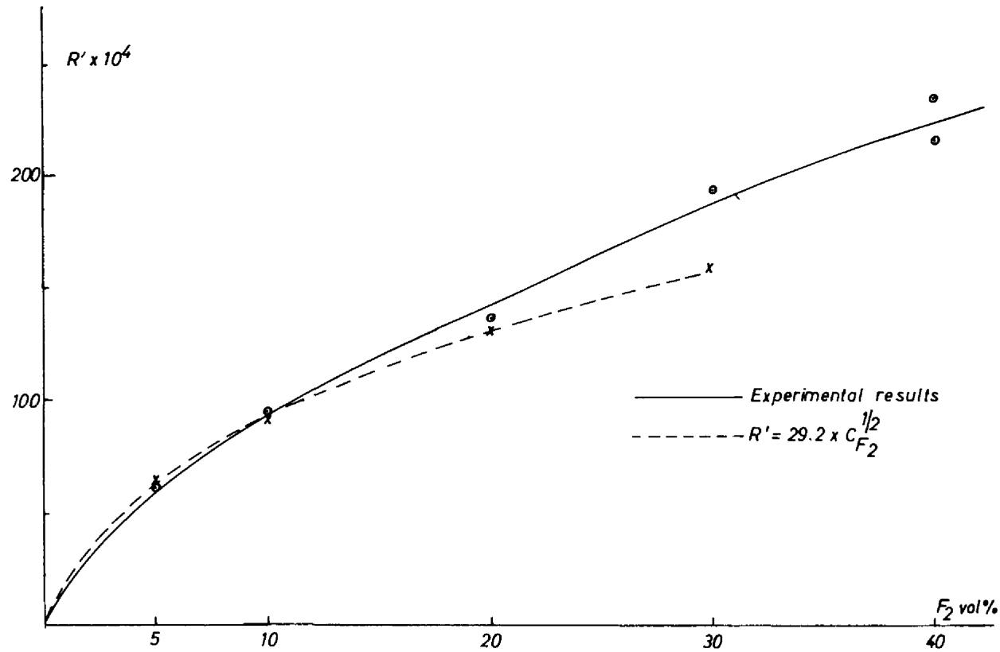  
3. Influence of $\mathbf{F}_2$ concentration on the rate constant $R'$ in the reaction $(\mathbf{U}, \mathbf{Pu})\mathbf{O}_2$ with $\mathbf{F}_2$ .

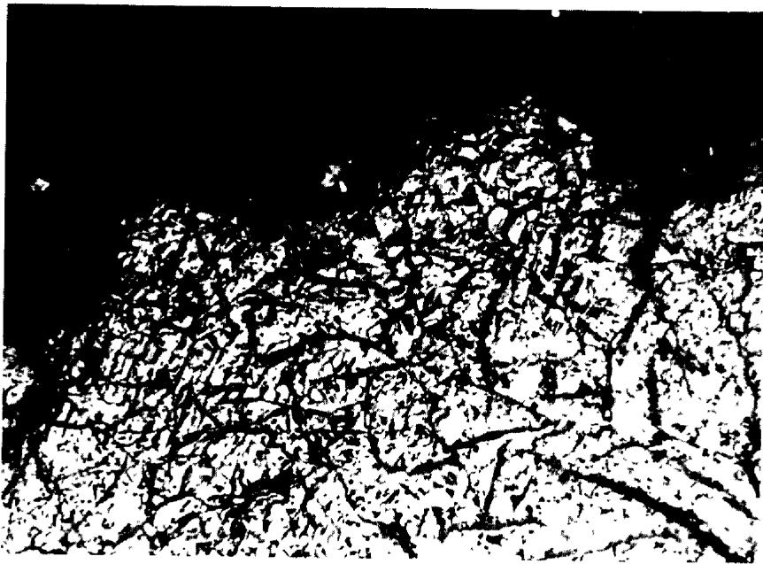

4. Micrograph (x450) of $(U, Pu)O_2$ at 50 wt. % reaction with $F_2$ .


Table I. Reaction of (U, Pu)O₂ (22 % PuO₂) with F₂   
(a) Influence of temperature   
$(U, Pu)O_{2}87 \mu m; 20 \text{ vol.}\% F_{2} \text{ in argon};$ linear gas velocity: $10.5 \text{ cm}^{-1}$   
(b) Influence of grain size   

<table><tr><td>Run</td><td>°C</td><td>R&#x27; x 104</td><td>- log R&#x27;</td><td>103t-1</td></tr><tr><td>UPO 281</td><td>450</td><td>383</td><td>1.417</td><td>1.38</td></tr><tr><td>UPO 282</td><td>420</td><td>242</td><td>1.616</td><td>1.44</td></tr><tr><td>UPO 190 I</td><td>400</td><td>136</td><td>1.863</td><td>1.49</td></tr><tr><td>UPO 190 II</td><td>400</td><td>138</td><td>1.860</td><td>1.49</td></tr><tr><td>UPO 283</td><td>350</td><td>45</td><td>2.347</td><td>1.60</td></tr></table>

400 °C ; 20 vol. % F₂ ; 10.5 cm min⁻¹   
(c) Influence of F2 concentration   

<table><tr><td>Run</td><td>Grain size μ</td><td>R&#x27; x 10^4</td></tr><tr><td>UPO 191</td><td>48</td><td>207</td></tr><tr><td>UPO 190 I and II</td><td>87</td><td>137</td></tr></table>

(U, Pu)O₂ 87 μm ; 400 °C ; 10.5 cm min⁻¹   

<table><tr><td>Run</td><td>F2vol. %</td><td>R&#x27; x 104</td></tr><tr><td>UPO 286</td><td>5</td><td>61</td></tr><tr><td>UPO 284</td><td>10</td><td>95</td></tr><tr><td>UPO 190 I and II</td><td>20</td><td>137</td></tr><tr><td>UPO 285</td><td>30</td><td>194</td></tr><tr><td>UPO 189 I</td><td>50</td><td>245</td></tr><tr><td>UPO 189 II</td><td>50</td><td>261</td></tr></table>

(U，Pu)O248μm；400℃；10.5cmmin   

<table><tr><td>Run</td><td>F2vol. %</td><td>R&#x27; x 104</td></tr><tr><td>UPO 191</td><td>20</td><td>207</td></tr><tr><td>UPO 280</td><td>50</td><td>368</td></tr></table>

# Macrokinetics (9)

The macrokinetic relationship for $\mathrm{UO}_2$ in $\mathrm{ClF}_3$ and $\mathbf{F}_2$ still follows the same rule: $(1 - F) / 3 = 1 - k't$ . Formation of intermediates $\mathrm{UO}_2\mathrm{F}_2$ and $\mathrm{UF}_4$ lead however to an induction period which was not observed in microkinetics. The chosen example (fig. 5) shows almost constant fluorine efficiencies in the linear part of the curve and an abrupt decrease towards the tail. Since the curve was obtained in a batch experiment it is clear that fluidization of the mixture changed too much with increasing proportion of fines. The shown curve is in fact a function (U - concentration, time) and sets of curves for varying fluidization parameters were used to extrapolate to continuous operation. The model was also used to estimate the operation conditions for the $100\mathrm{kg}$ demonstration unit for $\mathrm{UF}_6$ -production.

# Plutonium mass balance in the semi-pilot installation

The results of the last step ( $F_{2}$ on Pu - containing residue) of a series of experiments in the plutonium semi-pilot are summarized in table II. These experiments on macrokinetics were carried out according to a fractional factorial design (10). $ClF_{3}$ was used for the UF6 volatilization and $F_{2}$ for the PuF6-step. Table II lists the observations during the PuF6-formation and the over-all mass-balance of the experiments.

# Fluidization behaviour

Fig.6 is illustrative of the fluidization behaviour when fines are present in the bed. Fluidization has been followed visually, by pressure drop measurements and by the microwave technique. Three regions can be observed as indicated on the graph. It is worth mentioning that the experimental results are very reproducible but differ greatly from the values calculated according to literature data (11).

# Powder characteristics

The results of milling experiments on different types of fuel are summarized in table III. In combination with the correct choice of alumina the fuel powder is directly fluidizable. However, a better specification of the fraction $(\pm 37\mu)$ is of importance with regard to elutriation losses and cyclone or filter performance. Particle size measurements are therefore scheduled using a sedimentation balance technique.

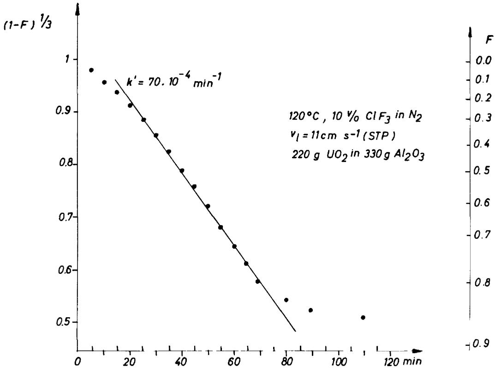  
5. Decreasing sphere model applied to over-all reaction rate in fluidized bed.

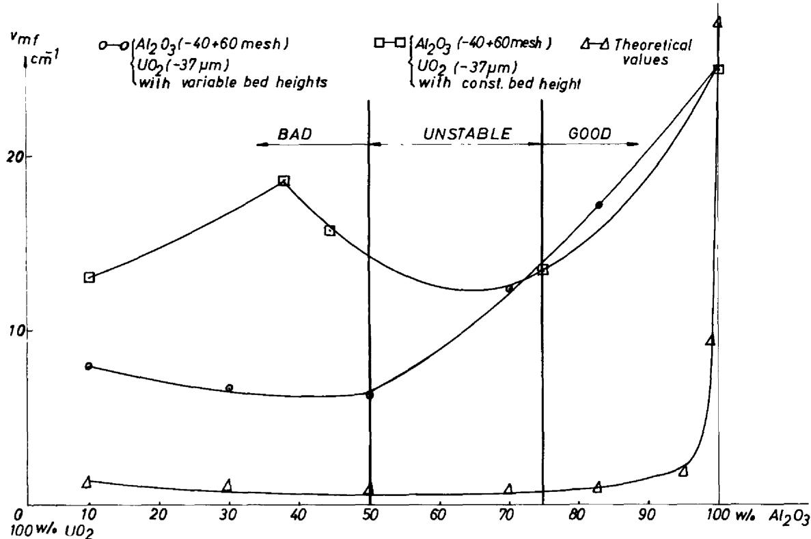  
6. Fluidization behaviour with fines.

Table II. Plutonium mass balance in the semi-pilot installation   

<table><tr><td>Experiment No.</td><td>Time h</td><td>Pu- concentration Last step mg g-1</td><td>Pu- absorption on NaF % init. Pu</td><td>Sampling during the expe- riment % init.Pu</td><td>Pu- concentration in reactor residue wt.%</td><td>Pu mass- balance Total %</td><td>Remarks</td></tr><tr><td>SPu-26 F2</td><td>11</td><td>44.29 FP + CsF (1 wt.%)</td><td>70.55</td><td>25.72</td><td>0.152</td><td>98.91</td><td>Sintered bed</td></tr><tr><td>SPu-27 F2</td><td>11</td><td>44.47</td><td>33.37</td><td>1.68</td><td>0.034</td><td>36.82</td><td>Filter failure</td></tr><tr><td>SPu-28 F2</td><td>8</td><td>44.47</td><td>92.29</td><td>4.66</td><td>0.022</td><td>97.62</td><td>-</td></tr><tr><td>SPu-29 F2</td><td>8</td><td>44.29 FP + CsF (1 wt.%)</td><td>56.00</td><td>5.74</td><td>0.063</td><td>63.44</td><td>Filter failure No sintering</td></tr></table>

Table III. Size analysis data of the different UO2 lots   

<table><tr><td rowspan="2" colspan="2"></td><td colspan="2">Particle size range μm</td><td rowspan="2">+74-125</td><td rowspan="2">+125-149</td><td rowspan="2">+149-177</td><td rowspan="2">+177-250</td><td rowspan="2">+250</td><td rowspan="2">Average particle diameter 1/Σ(W/D) μm</td></tr><tr><td>-37</td><td>+37-74</td></tr><tr><td colspan="10">Weight percent W</td></tr><tr><td rowspan="5">156</td><td>Lot 1 a sintered UO2</td><td>8</td><td>21</td><td>25.5</td><td>6.9</td><td>9.8</td><td>13.3</td><td>15.5</td><td>77</td></tr><tr><td>Lot 1 b idem-other milling parameters</td><td>26</td><td>15</td><td>13</td><td>5.1</td><td>5.5</td><td>13</td><td>23</td><td>50</td></tr><tr><td>Lot 2 idem-20 experiments</td><td>26</td><td>24</td><td>12.9</td><td>6.4</td><td>5.7</td><td>11.6</td><td>13.3</td><td>46</td></tr><tr><td>Lot 3 &quot;molten&quot;UO2</td><td>36</td><td>23.5</td><td>19</td><td>5</td><td>6</td><td colspan="2">recycled</td><td>-</td></tr><tr><td>Lot 4 &quot;molten&quot; UO2-20PuO2</td><td>36</td><td>21.5</td><td>18.5</td><td>5.5</td><td>7.5</td><td colspan="2">recycled</td><td>-</td></tr></table>

# Conclusions

The outlined program was chosen to lead directly to operating conditions for a pilot unit. It is worth mentioning that scale-up is not a matter of extrapolating the data for small diameter beds to very large diameter beds. Instead, the concept leads to a slab reactor of small width but considerable length which is divided into compartments of about "laboratory"-scale. Once the system of fluidized beds in series is under control, this concept avoids the presently too complicated scaling-up of rather unusual bed composition.

Parallel to the technological development work, a theoretical group is working on modified mathematical models for our fluid beds in order to evaluate the fresh data on mixtures for potential applications outside the scope of the program.

# References

1. Schmets, J. and col., "Retraitement par fluoration de combustibles à base de bioxydes mixtes", Colloque sur l'emploi du plutonium comme combustible nucléaire, Bruxelles, 13-17, 1967, I.A.E.A.   
2. Henrion, P., Camozzo, G., Fontaine, J., Leurs, A., Schmets, J., Stynen, A., "Réactions entre quelques composés plutonifères et le trifluorude de chlore", communication pour la Journée Nucléaire du 10 février 1968, Bruxelles.   
3. Henrion, P., Camozzo, G., Coenen, F., Schmets, J., "Réactions entre l'uranium et le trifluorude de chlore", communication pour la Journée Nucléaire du 10 février 1968, Bruxelles.   
4. Breton, D.L. and col., "A Conceptual Study of a Fluoride Volatility Plant for Reprocessing Light Water Reactor Fuels", ORGDP K-1759, Dec. 24, 1968.   
5. Broothaerts, J., De Coninck, A., Heremans, R., "Le circuit de ventilation et son système d'épuration de l'air, dans les laboratoires chauds pour l'étude du retraitement par volatilisation des fluorures", XXXVII° Congrès International de Chimie Industrielle, 4-12.11.1967, Madrid.


6. Heremans, R., Lambiet, C., "Manipulations et transferts d'échantillons dans les installations chaudes du programme de recherche sur le retraitement des combustibles par volatilisation des fluorures," 14th Meeting of the Euratom Hot Laboratory, Karlsruhe 20-23th Sept. 1967.   
7. Goossens, W., Heremans, R., "Semi-pilot installation for fluoride volatility reprocessing", Symposium on Dry Reprocessing, European Atomic Energy Society, 28-29th October 1968, Mol.   
8. Vandersteene, J., Camozzo, G., Heremans, R., "Un laboratoire pour l'étude de la récapération du plutonium dans un procédé de retraitement de combustibles nucléaires par voie sèche", Industrie Chimique Belge - T.33 - No.7-8, 1968.   
9. S.C.K.-C.E.N., "Quarterly Report No. 35" R.2479, October 1 to December 31, 1968.   
10. Vandersteene, J., Parthey, H., Spaepen, G., "On Fluorination of $\mathsf{UO}_2 - 2$ wt. $\%$ $\mathsf{PuO}_2$ Pellets by Chlorine Trifluoride", S.C.K.-C.E.N. Internal Report 1969.   
11. Venkitakrishnan, G.R., and Bhat, G.N., "Minimum Velocity for the Gaseous Fluidization of Dissimilar Materials", Indian Chemical Engineer, July, 1965.

# REPROCESSING OF THTR FUEL ELEMENTS BY HIGH TEMPERATURE TREATMENT

AND CHLORINATION

Jürgen Hartwig and Klaus H. Ulrich

Fried. Krupp GMBH, Central Institute for Research and Development

Germany

For the reprocessing of irradiated nuclear fuel elements containing the fuel in form of coated particles, a process has been developed by which the coating is destroyed at high temperatures to such a degree that the fuel can be extracted from the fuel element or from a capsule containing the coated particles by chlorination. Coated particles with metal carbide intercalations of SiC, for instance, can also be handled without difficulty. The gas mixture composed of volatile fuel chlorides and, possibly, of fertile and fission product chlorides can be cooled and further treatment of the condensed chlorides can take place in an aqueous solution process. If development work is continued along the present lines, fractional distillation and revolatilization appear sufficient to permit the fractionating of halides as well.

The investigated synthetic fuel elements of the THTR types contained the fuel and fertile material in the form of particles coated with pyrolitic graphite or with a combination of graphite and silicon carbide. The coated particles themselves were embedded in a graphite matrix of normal porosity (approx. 20-25%). The fuel elements were exposed to temperatures of 2400-3000 deg. C in a high-temperature furnace having an argon atmosphere. This caused the coating of the particles having a carbide core to be destroyed by decomposition of the carbon and by the formation of intercalation compounds. Polished sections show that after this high-temperature treatment, the carbide fuel is freely exposed in the porous graphite matrix so that it can be extracted via the gas phase. This unlocking does not have the effect of changing the original shape of the fuel elements. In the case of elements containing the fuel or fissile material in the form of coated particles with cores of


U-Th-mixed oxide of the composition U-Th-02, this mixed oxide is reduced upon high-temperature treatment to a mixed carbide by the carbon of the coatings.

$$
(\mathrm {U T h}) \mathrm {O} _ {2} + (\mathrm {x} + 2) \mathrm {C} = (\mathrm {U T h}) \mathrm {C} _ {\mathrm {x}} + 2 \mathrm {C O}
$$

At a temperature of 2900 deg. C the resultant CO-equilibrium pressures are sufficient to cause the particle coatings to burst, the matrix of the fuel elements disintegrating at the same time.

Upon subsequent extraction of the chloride, more than $99\%$ of the uranium was recovered. Kinetic investigations were carried out and condensation equilibria measured. The pore space of the graphite matrix and the distribution of the pores were determined. The optimum flow velocity of the chlorine was determined by gravimetric observation of the chlorination rate. The temperature dependence of the chlorination process and the extraction of the chlorides formed were investigated at temperatures between 200 and 1100 deg. C. The apparent energy of activation was found to be 4.5 kcal/mol. This, like the resultant $T^{3/2}$ dependence, suggest that gas diffusion through the matrix graphite is a step determining the rate of reaction. Separate condensation of uranium, thorium, and fission product chlorides was investigated at different temperatures.

Process design and plant layout for the continuous operation of this process are outlined.

# HALIDE VOLATILITY PROCESSES

Chairman: S. H. Smiley

Nuclear Materials and Equipment Corporation

Apollo, Pennsylvania, U.S.A.


PILOT PLANT EXPERIENCE ON VOLATILE FLUORIDE

REPROCESSING OF PLUTONIUM

M. A. Thompson, R. S. Marshall and R. L. Standifer

The Dow Chemical Company, Rocky Flats Division, Golden, Colorado U.S.A.

# ABSTRACT

A pilot plant fluoride volatility system for the recovery of plutonium from impure oxide and residues has been built at the Rocky Flats plant of The Dow Chemical Company. Studies have been continuing for about one and one-half years. The results obtained from this system have been encouraging and indicate that plutonium recovery and purification from impure oxide is feasible. Several significant chemical and engineering problems have been encountered and resolved. Optimization and scale up of the process will require further studies.

A Prime Contractor for the U. S. Atomic Energy Commission Contract AT(29-1)-1106


# INTRODUCTION

The Dow Chemical Company operates the Rocky Flats plant, near Denver, for the Atomic Energy Commission. The plant is part of the AEC's Albuquerque Operations Office, which is charged with major responsibilities for research, development, production and storage of nuclear components. The work performed at the plant includes phases of fabrication and assembly of plutonium parts. During the fabrication phases of the operation, plutonium scrap is generated. Because of the value and the radioactive properties of the plutonium, it is necessary to recover the plutonium and recycle it through the fabrication processes rather than discard it.

The present plutonium recovery operation at Rocky Flats is an aqueous process using nitric-hydrofluoric acid solutions and ion exchange for purification. The process is well known and has been successfully used at Rocky Flats for 15 years; however, it does have significant disadvantages including a high recycle rate, major corrosion of process equipment, many process steps and hand operations, and a high generation rate of aqueous and solid wastes requiring further processing.

Because of the high corrosion rate of the process equipment, major replacement is required every five to 10 years. Volatile fluoride reprocessing of plutonium has been investigated at Rocky Flats for the past five years as a possible replacement for the present aqueous recovery system. Potential advantages of a volatile fluoride process to Rocky Flats operations appear to be:

1. Fewer process steps and less hand operations should result in lower operating costs and less exposure of personnel to radiation.   
2. More complete plutonium recovery from oxides and possibly from other residues should be obtained.   
3. A lower generation rate of aqueous and solid wastes requiring further processing.   
4. A more continuous and remote system should lower costs and allow increased shielding to minimize radiation exposure of operating personnel.

Studies were started on a gram-quantity static bed system<sup>1,2</sup> and were based largely on earlier work carried out at Argonne<sup>3,4,5</sup> and Oak Ridge National Laboratories. These studies indicated that the process is feasible to separate plutonium from impurities normally found in the Rocky Flats process streams.

A 1-kg-scale pilot plant, utilizing a fluid bed, was therefore designed and built, and plutonium experiments were started in December, 1967. The purpose of the pilot plant is to determine the feasibility of the process on a larger scale, to test the design and operation of major process equipment on a larger scale and to obtain operating and design data to be applied to a larger (12 kg) production prototype system planned for operation in 1970.

# PILOT PLANT

Figure 1 is a flow sheet of the pilot plant system. The fluid bed is a 2-in.-diameter vessel, 4 ft high, with a 5-in.-diameter disengaging section. The bed is heated by a three-zone muffle furnace. Prior to entry into the bed, the fluidizing gas passes through a preheater capable of heating the gas to $550^{\circ}\mathrm{C}$ .

Additional heaters are installed on the lower part of the bed for more complete temperature control. Dual nickel fiber filters in the disengaging section prevent particle removal from the bed. Blowback of the filters during the bed operation is possible to prevent filter plugging and excessive pressure drops across the filters.

The cold traps are 4-in.-diameter vessels approximately 4 ft long. The cooling surface in one trap is longitudinal and in the other, transverse. Each trap has 12 sq ft of heat transfer surface. Cooling of the traps is provided either by a refrigeration unit capable of cooling the system to $-40^{\circ}\mathrm{C}$ or by liquid nitrogen capable of $-70^{\circ}\mathrm{C}$ . Strip heaters permit raising the temperature of the traps to $300^{\circ}\mathrm{C}$ for removal of $\mathrm{PuF}_4$ (by refluorination) deposited by the radiolytic decomposition of $\mathrm{PuF}_6$ . This decomposition is equal to about 1.5 percent of the $\mathrm{PuF}_6$ present per day.

The traps are piped so that they can be used either in series or parallel.

The hydrogen reductor is 2 in. in diameter by 18 in. long. It is designed in such a way that different techniques can be tested to reduce $\mathsf{PuF}_6$ to $\mathsf{PuF}_4$ . Methods that have been evaluated include a hydrogen-thermal reduction using a hydrogen-fluorine flame for heat, hydrogen-thermal reduction using external resistance heaters, and thermal decomposition on a static bed of $\mathsf{PuF}_4$ or $\mathsf{PuO}_2$ . Thermal decomposition on a fluid bed of $\mathsf{PuF}_4$ or $\mathsf{PuO}_2$ was also tested. The most successful method to date has been a hydrogen-thermal reduction using external heaters.

Packed bed sodium fluoride traps are used to trap any $\mathsf{PuF}_6$ escaping through the cold traps or the reductor. The traps are heated at $150^{\circ}\mathrm{C}$ during operation by external strip heaters.


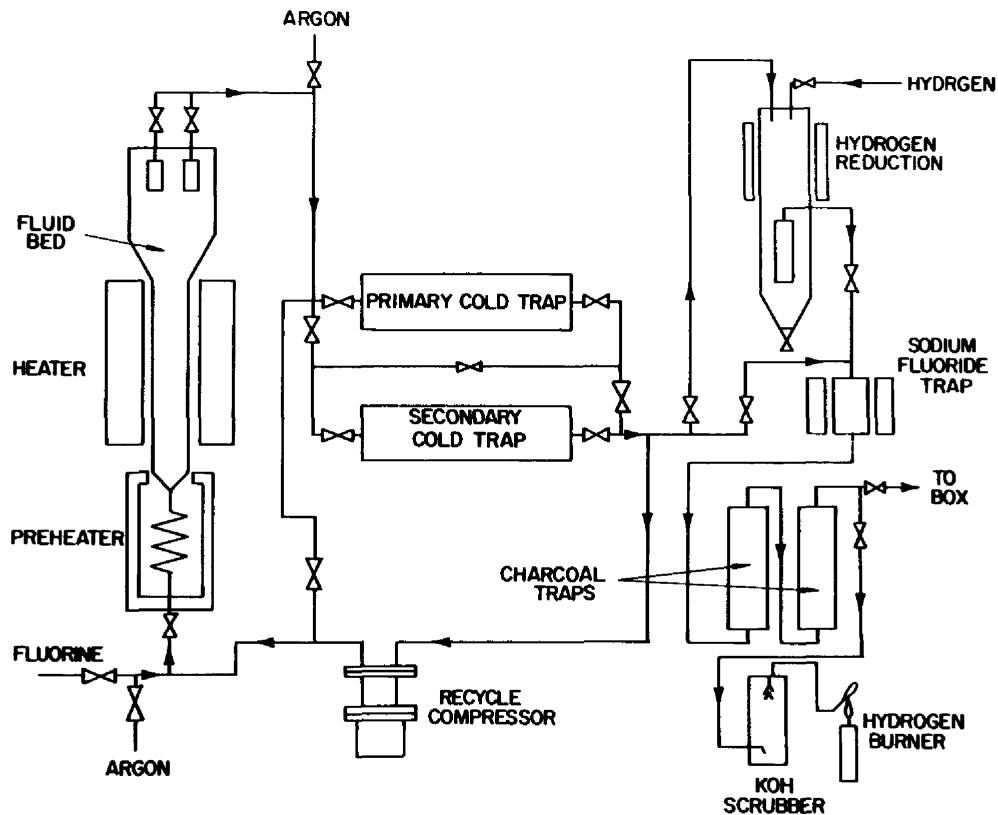  
Figure 1. Fluoride Volatility Pilot Plant Flow Sheet


Charcoal traps are used to dispose of any unused fluorine. These traps are externally air cooled to dissipate the heat from the exothermic carbon-fluorine reaction and are maintained at no more than $200^{\circ}\mathrm{C}$ .

A potassium hydroxide scrubber removes HF formed during the hydrogen reduction of $\mathsf{PuF}_6$ . The scrubber is a 5-in.-diameter Raschig ring-filled vessel. A canned centrifugal pump recirculates the solution. Excess hydrogen is burned and any remaining off-gases pass through a water scrubber and into the building exhaust system.

The fluid bed, cold traps, and reductor are fabricated from nickel 200. All lines are $3/8$ -in. Monel tubing with compression fittings. All lines used to transfer $\mathsf{PuF}_6$ are equipped with heating tape to preclude $\mathsf{PuF}_6$ condensation and subsequent line plugging. The 120 valves in the system are all Monel bellows-sealed globe valves with metal seats. About half of the valves are air operated and half hand operated. The fluorine recycle compressor is a remote head, reciprocating diaphragm compressor with an intermediate chamber filled with a fluorinated oil. The process end diaphragm is Monel. A variable speed drive unit provides flow rate adjustments.

The entire system, except the compressor drive, is enclosed in a glovebox in order to contain the contamination. The exhaust air from the glovebox passes through a water scrubber to remove any fluorine that may have leaked from the system into the box.

About 30 separate experimental runs have been made, including four initial runs using uranium to check out the system. Each run has been designed to obtain specific data on one or more steps of the operation. Therefore, no extended production-type runs to test the potential capacity of such a system have been made. The reliability and service life of the equipment have also not been established because of the limited running time to date. In some cases, extensive modification of the system was made between runs.

# RESULTS

Preliminary runs on the pilot plant system were made using depleted uranium in order to check out the equipment and make any final changes before introducing plutonium contamination. After several runs and some equipment modification, satisfactory performance was achieved and plutonium studies were started. To date a total of about 20 kg of plutonium has been put through the entire system.

Figures 2 and 3 show the original designs of the fluid bed. The original gas distribution system, as seen in Figure 2, was a nickel ball. The plutonium oxide, having a bulk density of $4.8\mathrm{g / cc}$ , was mixed with an equal weight of $-40$ to $+100$ mesh aluminum oxide. The alumina was to act as a thermal conductivity media and as a diluent. With this system, difficulties were experienced with rapid and excessive temperature increases from 450 to $800^{\circ}\mathrm{C}$ due to the exothermic $\mathrm{PuO_2}$ to $\mathrm{PuF_4}$ reaction. This temperature spike caused a sintering of the $\mathrm{PuO_2}$ to a density of $6.7\mathrm{g / cc}$ and a plugging of the bed. In some cases, severe corrosion of the nickel ball resulted. By adding a vibrator to the bed, some uniformity in the depletion rate was observed, but generally the results were poor; sintering or packing occurred, the total depletion and depletion rate were poor, and there was severe fluorine attack on the nickel ball.

The distributor arrangement was then changed as shown in Figure 3. A layer of 20-mesh nickel spheres, which extended into the heated zone, was used as the distribution system. Glass column tests indicated that the alumina was of little benefit, because the $\mathrm{PuO_2}$ segregated from the alumina after short periods of bed operation. Therefore, alumina was eliminated in subsequent runs. Temperature excursions continued to unpredictably occur. In one case, the temperature increased from 550 to $1200^{\circ}\mathrm{C}$ in 30 seconds, causing the nickel distribution spheres to fuse and form a solid plug. By carefully controlling the temperature, the gas flow rate, the filter blowback cycle, and by vibrating the bed, the temperature excursions could be minimized. Depletion rates of 70 g/hr were achieved; however, a small static layer of $\mathrm{PuO_2}$ was observed at the nickel interface.

Further studies were made on various gas distribution and bed designs using a glass column. It was found that a cone with a 2-degree taper provided complete agitation of all of the bed material and was much less sensitive to particle size distribution. It was further observed that the velocity of the gas at the bed inlet was sufficiently high to prevent the material in the fluid bed from dropping into the inlet line. Using this information, the fluid bed was modified as shown in Figure 4. This is the current design of the bed and 12 runs have been made with this system. The bed has functioned well using the 2-degree taper. The runs have proceeded to depletion without temperature excursions or sintering using $\mathrm{PuO_2}$ as feed material. A vibrator was installed on the bed and a depletion rate of 160 g/hr was achieved at a fluorine velocity of 2.3 ft/second. Increasing the velocity resulted in a decrease in depletion rate, accompanied by an inability to reduce the filter pressure drop by backblowing. An increase in depletion rate with increased

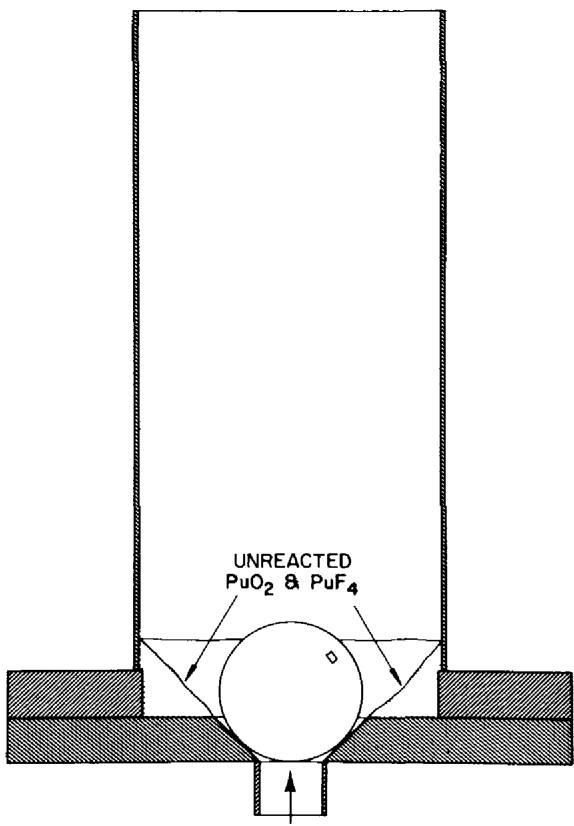  
Figure 2. Fluid Bed Distributor (Ball and Tapered Seat)

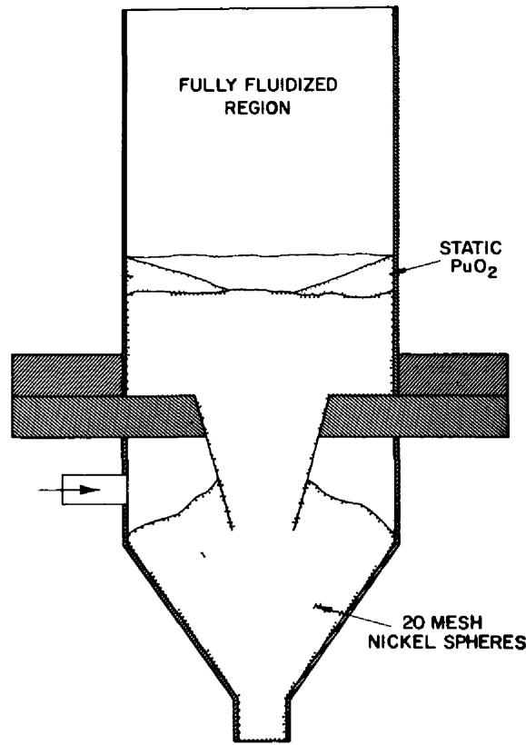  
Figure 3. Fluid Bed Distributor (20-Mesh Nickel Spheres)

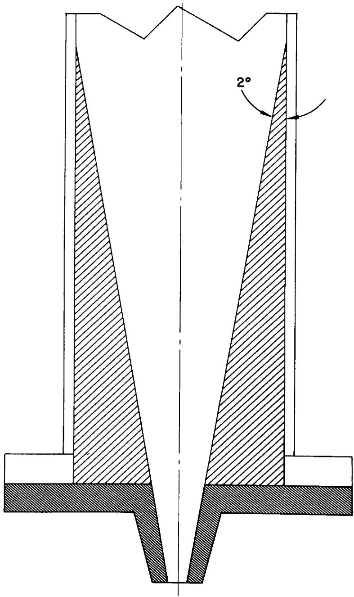  
Figure 4. Two-Degree Tapered Cone

gas velocity above 1 ft/sec was not attained without external vibration of the bed. Table I shows the results of the fluid bed runs using the three bed designs.

TABLEI   
SUMMARY OF FLUID BED RUNS   

<table><tr><td>Distributor Design</td><td>Max. Depletion Rate</td><td>Avg Depletion Rate</td><td>Avg % Depletion</td></tr><tr><td>Ball and tapered seat</td><td>56</td><td>49</td><td>39</td></tr><tr><td>Nickel spheres</td><td>93</td><td>81</td><td>56</td></tr><tr><td>2-degree tapered cone</td><td>160</td><td>93</td><td>98</td></tr></table>

Present studies are concerned with the design and operation of a continuous feeding system for the fluid bed.

# Purification

Analytical data of impurities in the feed and product indicates that good purification factors are achieved for common impurities found in the Rocky Flats process stream. In one run, 1000 ppm each of 13 common impurities were added to the feed material. Table II shows the purification achieved on this run in the 2-degree tapered bed. In early runs, prior to passivation of the equipment, some copper and nickel contamination was picked up from the Monel and nickel surfaces. In later runs this has not been a problem.

TABLE II   
PLUTONIUM PURIFICATION   

<table><tr><td>Element</td><td>Feed Analysis ppm</td><td>Product Analysis ppm</td><td>Purification Factor</td></tr><tr><td>Al</td><td>1000</td><td>226</td><td>&gt;38</td></tr><tr><td>Cr</td><td>1000</td><td>96</td><td>10</td></tr><tr><td>Cu</td><td>1000</td><td>&lt;3</td><td>338</td></tr><tr><td>Fe</td><td>1000</td><td>31</td><td>32</td></tr><tr><td>Ga</td><td>1000</td><td>12</td><td>83</td></tr><tr><td>Mo</td><td>1000</td><td>50</td><td>20</td></tr><tr><td>Ni</td><td>1000</td><td>10</td><td>100</td></tr><tr><td>Si</td><td>1000</td><td>32</td><td>31</td></tr></table>


<table><tr><td>Sn</td><td>1000</td><td>3</td><td>333</td></tr><tr><td>Ta</td><td>1000</td><td>&lt;100</td><td>&gt;10</td></tr><tr><td>Ti</td><td>1000</td><td>2.5</td><td>40</td></tr><tr><td>W</td><td>1000</td><td>&lt;50</td><td>&gt;20</td></tr><tr><td>Zn</td><td>1000</td><td>&lt;10</td><td>&gt;100</td></tr></table>

# Trapping

Two types of cold traps were tested for their efficiency in collecting the $\mathsf{PuF}_6$ . One type has transverse cooling fins and the second has longitudinal cooling fins. Cooling was by refrigeration or liquid nitrogen. Both cold trap configurations trapped over $1\mathrm{kg}$ of $\mathsf{PuF}_6$ at an efficiency of $99.5\%$ or better. Because liquid nitrogen cooling reduces the losses through the traps to virtually nothing, the best combination for trapping on a production scale presently appears to be a trap with longitudinal fins and liquid nitrogen for cooling.

# $\mathbf{\underline{PuF}_6}$ Reduction

Different techniques have been investigated for the reduction of $\mathrm{PuF_6}$ to $\mathrm{PuF_4}$ or directly to metal. Table III is a summary of the methods studied and an indication of the results. To date the most successful method has been the thermal-hydrogen reduction to $\mathrm{PuF_4}$ . Figure 5 shows the latest design for this type of reduction. The $\mathrm{PuF_6}$ is swept from the cold traps with nitrogen or argon, preheated to about $300^{\circ}\mathrm{C}$ , and reacted with hydrogen in the reductor. With extended runs using this concept, essentially complete decomposition of the $\mathrm{PuF_6}$ was achieved. Some caking on the filters results; therefore blowback provisions are provided. Several batches of $\mathrm{PuF_4}$ prepared by the fluorination of $\mathrm{PuO_2}$ and subsequent reduction to the tetrafluoride have been reduced to the metal by calcium reduction. In all cases the reductions proceeded smoothly and efficiently.

TABLE III   
PuF6 REDUCTION   

<table><tr><td>Method</td><td>Product</td><td>Results</td></tr><tr><td>H2-thermal</td><td>PuF4</td><td>Good</td></tr><tr><td>Thermal on PuF4bed</td><td>PuF4</td><td>Good with proper control</td></tr><tr><td>H2-F2flame</td><td>PuF4</td><td>Difficult to control</td></tr><tr><td>Ca-thermal</td><td>Pu</td><td>Fine particles</td></tr></table>

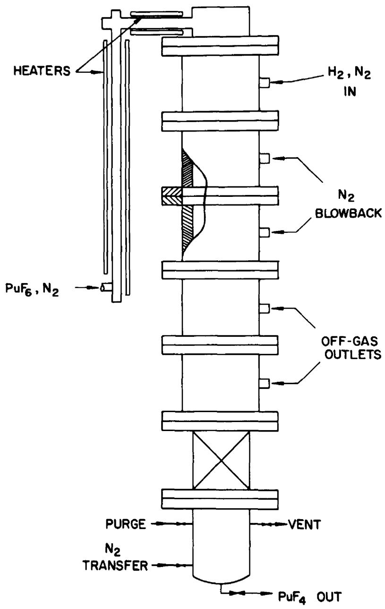  
Figure 5. $\mathsf{PuF}_6$ Reductor

If $\mathsf{PuF}_6$ could be reduced directly to metal, one process step could be eliminated. Small-scale studies were made on the calcium reduction of $\mathsf{PuF}_6$ . The studies indicated that the reduction could be made at $25^{\circ}\mathrm{C}$ or lower; however, the resulting plutonium was in the form of fine powder rather than a single button. This would cause potential problems with further handling and fabrication of the plutonium because of the pyrophoric nature of the fine metal powder--additional laboratory studies could probably resolve this problem.

# Material Balance

Table IV shows the material balance for five typical runs. The high $\mathsf{PuF}_4$ decomposition in the cold trap in the first runs reflects the large quantity of $\mathsf{PuF}_6$ collected and the period of time (up to two weeks) held in the trap. The results of the second through fifth run reflect the high efficiency of plutonium removal by the cold trap and the completeness of decomposition in the reductor.

# Residue Processing

Studies have started on the recovery of plutonium from residues by the volatility process. Initial studies on plutonium containing electrotefining salts (KCl-NaCl-MgCl₂) indicate that a double fluoride salt containing plutonium is formed rather than the volatile $\mathsf{PuF}_6$ . If this cannot be overcome, then plutonium in residue salts from molten salt processes cannot be recovered directly by fluoride volatility.

Other studies are underway on calcium fluoride slag formed during the reduction of $\mathrm{PuF_4}$ with calcium. This slag contains some plutonium which must be recovered. Studies to date indicate that the plutonium can be volatilized and removed from the slag; however, an unpredictable and significant temperature rise often occurs during the fluorination. This is thought to be due to the highly exothermic reaction of fluorine with calcium or impurities contained in the slag. This reaction can be controlled by a preoxidation of the slag and by insuring that no impurities are introduced into the slag prior to fluorination.

# SUMMARY AND CONCLUSIONS

It has been demonstrated on a $1\text{-kg}$ scale pilot plant that the volatile fluoride process is feasible for the recovery and purification of plutonium from impure oxide. Based on the pilot plant studies, the process appears economically favorable when compared to the present aqueous process. Studies are continuing on

TABLE IV   
MATERIAL BALANCE   

<table><tr><td></td><td>Run</td><td>g
Net Pu
Charge</td><td>g
Pu Prod</td><td>g
Pu in
Bed Res</td><td>g
Pu in
Cold Traps</td><td>g
Pu in
NaF Trap</td><td>g
Pu, Unac-
counted For</td><td>% 
Run 
Balance</td><td>g
Cum. Unac-
counted For</td><td>% 
Cum. 
Bal.</td></tr><tr><td></td><td>1</td><td>830</td><td>497</td><td>235</td><td>46</td><td>36</td><td>+16</td><td>98.2</td><td>+16</td><td>98.2</td></tr><tr><td></td><td>2</td><td>1366</td><td>1005</td><td>208</td><td>130</td><td>5</td><td>+18</td><td>98.8</td><td>+34</td><td>98.5</td></tr><tr><td>g=1</td><td>3</td><td>630</td><td>343</td><td>270</td><td>10</td><td>2</td><td>+5</td><td>99.3</td><td>+39</td><td>98.7</td></tr><tr><td></td><td>4</td><td>270</td><td>255</td><td>20</td><td>7</td><td>2</td><td>-14</td><td>105.2</td><td>+25</td><td>99.4</td></tr><tr><td></td><td>5</td><td>530</td><td>518</td><td>10</td><td>5</td><td>1</td><td>-4</td><td>100.8</td><td>+21</td><td>99.6</td></tr></table>

optimizing the process and on further developing it so that plutonium can be recovered from various residues.

Future plans call for the construction of a 12-kg production prototype system to prove the process on a production scale. It is hoped to have this system operational by March, 1970.

# REFERENCES

1. Static Reactor Reduction of Plutonium Hexafluoride with Iodine and Hydrogen, J. D. Navratil, R. O. Wing and J. D. Moseley, RFP-993, Sept. 6, 1968.   
2. Impurity Removal by Fluorination of Plutonium Dioxide Between 28 and $300^{\circ}\mathrm{C}$ , J. D. Navratil and R. O. Wing, RFP-1052, Sept. 5, 1968.   
3. Laboratory Investigation in Support of Fluid Bed Fluoride Volatility Processes, M. J. Steindler, ANL-6753.   
4. Engineering Development of Fluid Bed Fluoride Volatility Processes, C. J. Vogel, E. L. Carl, W. J. Mecham   
5. Argonne National Laboratory, Chemical Engineering Division Summary Reports, 1958 to 1963.   
6. Oak Ridge National Laboratory, Chemical Engineering Division Annual Progress Report for Period Ending June 30, 1962 (and each year through 1967).

# PROCESS FOR OXIDIC NUCLEAR FUELS*

M. J. Steindler, L. J. Anastasia, L. E. Trevorrow, and A. A. Chilenskas

Chemical Engineering Division, Argonne National Laboratory, Argonne, Illinois

U.S.A.

# ABSTRACT

Selected aspects of laboratory studies on the fluoride volatility process for spent reactor fuels are reviewed. Results obtained in studies of the fluorination of simulated oxidic fuel in a 2-in. diameter fluidized bed are outlined with emphasis on the behavior of uranium and plutonium. The described experiments include the use of $\mathrm{BrF}_5$ and fluorine as well as fluorine alone as the fluorinating agent to convert product oxides to volatile fluorides. Results are summarized on the behavior of fission product ruthenium in separations steps, on the fluorination of neptunium compounds to $\mathrm{NpF}_6$ and the reaction of $\mathrm{NpF}_6$ with bromine and NaF, and on process studies with irradiated fuel.

*Work performed under the auspices of the U.S. Atomic Energy Commission.

# INTRODUCTION

A discussion of the fluoride volatility process must be oriented to the chemical and radiochemical properties of the fuel to be processed. This review includes selected aspects of a laboratory-scale program in which the processing of both LWR and LMFBR fuels was studied.

Figure 1 shows the fission product content of an oxidic LWR fuel irradiated to 10,000 MWd/T and cooled 30 days. This fuel contains primarily $\mathrm{UO}_2$ , slightly enriched in $^{235}\mathrm{U}$ , and $\sim 10$ kg fission products and $\sim 4^{\prime}$ kg plutonium per ton of fuel. A little less than $40\%$ of the 4 megacuries of activity per ton of fuel is emitted by those fission products having volatile fluorides.

Figure 2 shows similar information for a LMFBR fuel containing axial blanket and core fuel sections as they are likely to be combined in large LMFBR reactors. The data were calculated assuming a core burnup of 100,000 MWD/T and a 30-day cooling period. The blanket fuel contains depleted uranium oxide and $2\%$ plutonium oxide, while the core fuel, which represents the major fraction of the total, contains $\sim 20\%$ plutonium oxide together with uranium oxide and fission products. The fraction of the total curies represented by fission products whose fluorides are volatile is not very different from that shown in Figure 1 but the total curies per ton is significantly greater in LMFBR fuel than in LWR fuel.

The LWR and LMFBR oxide fuels to be processed, therefore, contain plutonium at concentrations of 0.5 to $20\%$ , fission products at concentrations between 1 and $10\%$ , and depleted uranium as the balance of the metallic fuel constituents. Although cladding is not an important concern of the present discussion, LWR fuels are generally clad in Zircaloy and LMFBR fuels are clad in a 300 series stainless steel.

The processing steps of the fluoride volatility process include a head-end operation, which removes the massive hardware from the ends of a subassembly, a step that separates the oxide fuel from the cladding, one or more steps that convert the oxides to fluorides, and several process steps in which the actinide fluorides are separated from each other and purified from fission product contamination. This paper will include descriptions of laboratory studies on the conversion of oxide to fluoride carried out in a fluidized bed, a description of selected results on the chemistry of ruthenium and neptunium, and a summary of small-scale experiments on irradiated oxidic fuels.


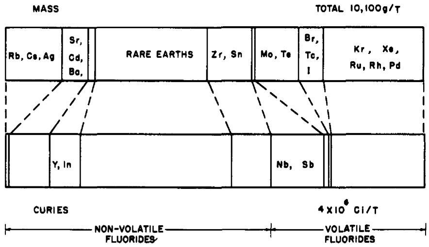

1. Fission Product Content of a Thermal Power Reactor Fuel (BWR) Irradiated to 10,000 MWd/T and Cooled 30 Days.

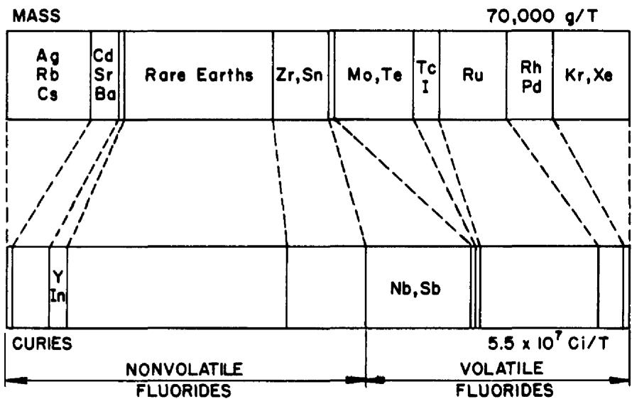

2. Fission Product Content of IMFBR Core and Axial Blanket Fuel; Core Burnup 100,000 MWd/T with 30 Day Cooling.

A fluoride volatility process with $\mathsf{BrF}_5$ and fluorine as fluorinating agents was studied in a 2-in. diameter fluidized-bed reactor with sintered alumina as the inert bed material and a feed of $\mathsf{UO}_2\text{-PuO}_2$ pellets containing nonradioactive oxides of elements formed in fission. The pellets, together with oxides added separately to the alumina bed, simulated the processing of spent low-enrichment $\mathsf{UO}_2$ fuel at burnups of 10,000 and 30,000 MWd/T. The processing of simulated fast reactor fuel (100,000 MWd/T) was also studied, using a feed of $\mathsf{UO}_2\text{-20 wt}\% \mathsf{PuO}_2$ powder (-325 mesh) and nonradioactive fission product oxides. The objective of the studies was the determination of operating conditions to minimize residual uranium and plutonium in the fluidized bed, which is discarded as waste from the process.

A typical experiment consisted of oxidation of the pellets or powder at $450^{\circ}\mathrm{C}$ with 20 vol $\%$ $\mathsf{O}_2$ , fluorination of most of the uranium with dilute (10 to 20 vol $\%$ BrF $_5$ or fluorine at 200 to $400^{\circ}\mathrm{C}$ , and fluorination of the plutonium with concentrated recycled fluorine (90 vol $\%$ ) at temperatures ranging from 300 to $550^{\circ}\mathrm{C}$ . A typical charge to the reactor consisted of 1100 g of sintered alumina (40 to 170 mesh) as the fluidized bed and 650 g of pellets containing, in the case of the LWR fuel, 560 g uranium and 2.8 to 3.2 g plutonium and, for the fast reactor fuel, 460 g uranium and 115 g plutonium. The major components of the experimental apparatus are the 2-in. dia fluidized-bed reactor, a remote-head diaphragm pump for gas recycle, soda lime traps for disposal of excess chemical reagents and UF $_6$ produced during the BrF $_5$ step, activated-alumina traps for the disposal of excess fluorine reagent, and sodium fluoride traps for the collection of PuF $_6$ produced during the recycle-fluorination step. Detailed descriptions of these components and of the experimental procedures have been reported elsewhere.(1,2)

# Fluorination of Low-Enrichment $\mathrm{UO}_2$ Fuels with BrF $_5$ and Fluorine

To verify that selective fluorination of uranium from plutonium had occurred during the $\mathsf{BrF}_5$ step at $400^{\circ}\mathsf{C}$ , samples from the soda lime traps used for disposal of the UF, unreacted $\mathsf{BrF}_5$ , and bromine reaction product were analyzed for plutonium. These samples contained $4\times 10^{-5}$ to $9\times 10^{-5}$ wt $\%$ Pu which, from experience with the equipment used in sampling and grinding the soda lime in preparation for analysis, is known to be within the background level of cross-contamination. These results indicate that essentially none of the plutonium is converted to volatile $\mathsf{PuF}_6$ during fluorination with $\mathsf{BrF}_5$ . An average of approximately $0.7\%$ of the uranium charged remained in the fluidized bed after fluorination with $\mathsf{BrF}_5$ . Of this amount, $96\%$ was fluorinated during


the subsequent recycle-fluorination with fluorine so that only about $0.025\%$ (0.14 g) of the original uranium remained in the final alumina bed. (3)

The operating conditions used during the $\mathrm{BrF}_5$ step (when most of the uranium is fluorinated) and during the recycle-fluorination step (when plutonium is fluorinated) appear to affect the fluorination of plutonium from the fluidized bed. For example, the data shown in Fig. 3 depict the plutonium concentrations in the fluidized bed during recycle fluorination following fluorination of uranium with $\mathrm{BrF}_5$ at 200, 300, and $400^{\circ}\mathrm{C}$ . From the relative rates of plutonium removal and the final plutonium concentrations in the fluidized bed, it appears that the temperature at which uranium is fluorinated with $\mathrm{BrF}_5$ affects the subsequent plutonium fluorination and that the uranium should be fluorinated at temperatures below $400^{\circ}\mathrm{C}$ . Additional experiments in which the $\mathrm{BrF}_5$ step was carried out at 250 and $350^{\circ}\mathrm{C}$ showed that plutonium fluorination was similar to the curve shown after a $300^{\circ}\mathrm{C}$ $\mathrm{BrF}_5$ step; consequently, the fluorination of uranium with $\mathrm{BrF}_5$ should be carried out at temperatures from 250 to $350^{\circ}\mathrm{C}$ to minimize the effects of this fluorination step on the subsequent fluorination of plutonium. Hence, most experiments were completed with the $\mathrm{BrF}_5$ step at $300^{\circ}\mathrm{C}$ .

The procedure used in the fluorination of plutonium also affects the final concentration of plutonium in the fluidized bed as shown in Fig. 4. These data were obtained from experiments in which uranium was previously fluorinated with $\mathrm{BrF}_5$ at $300^{\circ}\mathrm{C}$ . Temperature Sequence A (Figure 4) represents a fluorination scheme of 1 hr at $450^{\circ}\mathrm{C}$ followed by 3 hr at $500^{\circ}\mathrm{C}$ and 8 hr at $550^{\circ}\mathrm{C}$ . Sequence B is similar except that in this experiment the initial period of 3 hr at $300^{\circ}\mathrm{C}$ was followed by a gradual increase in temperature from 300 to $550^{\circ}\mathrm{C}$ for 5 hr and then an additional 2 hr at $550^{\circ}\mathrm{C}$ . The reaction of plutonium appears to be significantly different in these two schemes, but the mechanisms responsible for this difference are not clear.(3,4) However, low residual plutonium concentrations in the bed can be achieved by performing the $\mathrm{BrF}_5$ step at 250 to $350^{\circ}\mathrm{C}$ and by starting the subsequent fluorine step at about $300^{\circ}\mathrm{C}$ and increasing the temperature gradually to $550^{\circ}\mathrm{C}$ .(3,4)

For a typical experiment with a $\mathrm{BrF}_5$ step at $300^{\circ}\mathrm{C}$ and a plutonium fluorination step as shown in Figure 3, about $3\%$ of the plutonium charged remains in the fluidized bed. The fraction of the plutonium charge remaining in the bed can be reduced if several batches of pellets could be processed with a single alumina bed without an increase in plutonium concentration. To demonstrate the reuse of an alumina bed, two sets of experiments were completed, each set using a single bed of alumina to process three batches of fuel pellets at simulated burnups of 10,000 MWd/T for one set and 30,000 MWd/T for the other.(4) These experiments

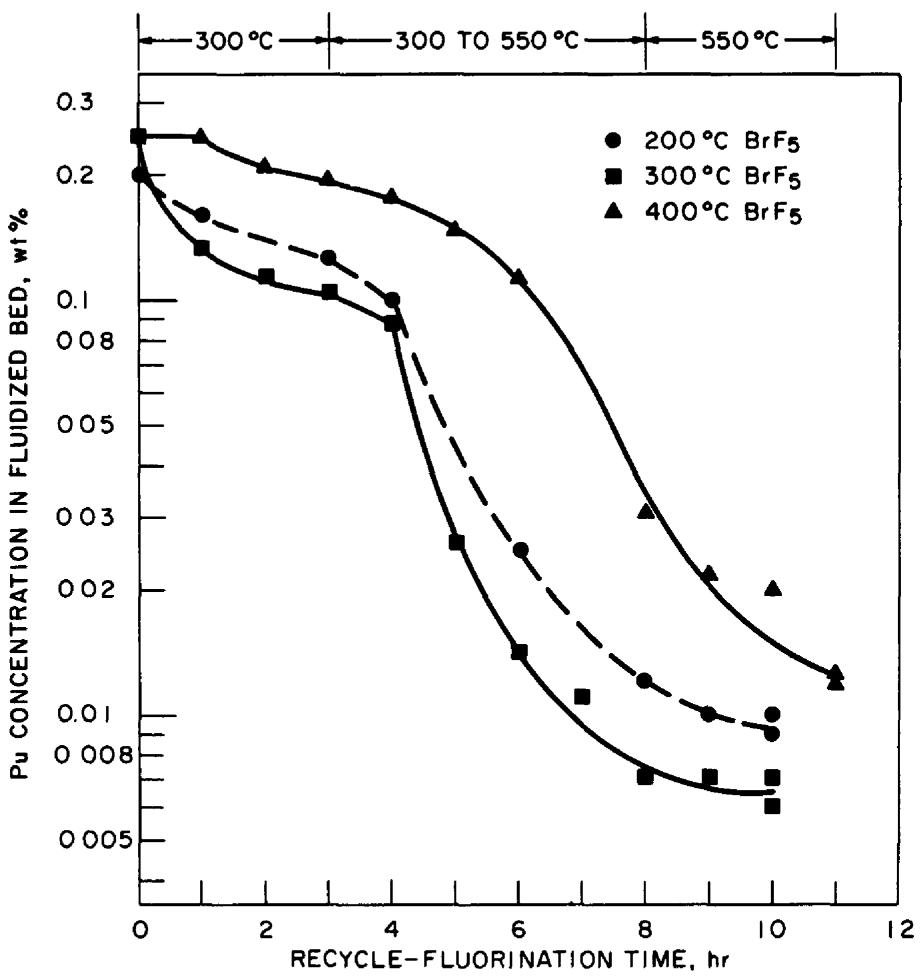  
3. Fluorination of Plutonium with Fluorine After Reaction of Uranium with $\mathsf{BrF}_5$ at Several Temperatures.

# URANIUM FLUORINATED WITH BrF $_5$ AT 300°C

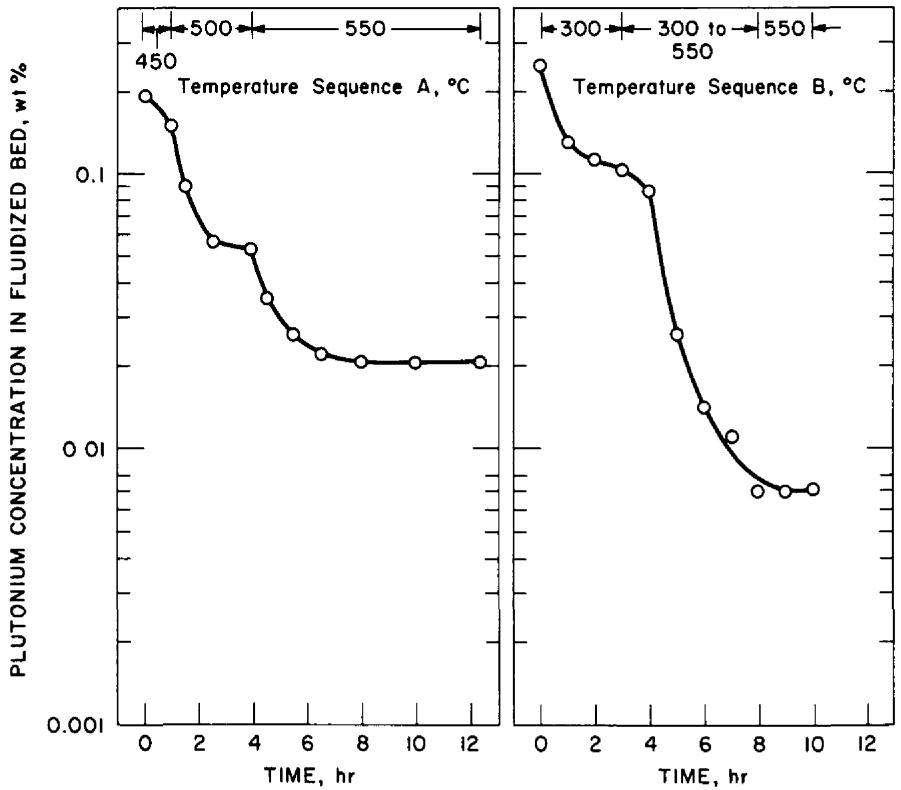  
4. Effect of Temperature Sequence on the Fluorination of Plutonium with Fluorine.

were carried out by repeating part of the reaction cycle, i.e., the oxidation and $\mathsf{BrF}_5$ steps, allowing the plutonium to accumulate, and then fluorinating the accumulated plutonium in a single fluorination step with fluorine. The progress of reaction during the oxidation and fluorination steps for the low-burnup fuel is shown in Figure 5. The fluoride content of the final bed was $3.5\mathrm{wt}\%$ which corresponded to fluorination of $2.7\%$ of the original alumina bed. Similarly, the final bed contained $0.003\mathrm{wt}\%$ U and $0.009\mathrm{wt}\%$ Pu, corresponding to $\sim 0.01\%$ and $1.3\%$ of the total charge of uranium and plutonium, respectively. Figure 6 shows changes in the fluidized-bed composition as the accumulated plutonium was fluorinated for the higher burnup fuel. The fluoride content of the final bed was $10.4\mathrm{wt}\%$ indicating that $8.8\%$ of the original alumina had been fluorinated to $\mathsf{AlF}_3$ . The final bed also contained $0.012\mathrm{wt}\%$ U and $0.009\mathrm{wt}\%$ Pu, corresponding to $< 0.01\%$ of the total uranium and $0.75\%$ of the total plutonium charged to the reactor.

# Fluorination of Low-Enrichment UO, Fuels with Only Fluorine

In pilot-plant studies $^{(5,6)}$ with $\mathrm{UO}_2$ pellets, a two-zone method of simultaneously oxidizing and fluorinating a batch of fuel pellets in a fluidized-bed reactor was demonstrated under controlled temperature conditions to yield high $\mathrm{UF}_6$ production rates, and high fluorine utilization. When this processing scheme was applied to pellets containing plutonium, approximately 80 to $100\%$ of the uranium and 50 to $70\%$ of the plutonium charged in the pellets was reacted in 3 hr of operation. $^{(1,2)}$ However, cesium, added to the bed as finely powdered CsF, appeared to influence plutonium fluorination and to increase the residual plutonium concentration in the bed. The effects of the added cesium were largely overcome $^{(1,2)}$ with a stepwise oxidation and fluorination procedure. In particular, fluorination of uranium at $350^{\circ}\mathrm{C}$ , followed by recycle-fluorination in the temperature range $350^{\circ}$ to $550^{\circ}\mathrm{C}$ , was effective in reducing residual plutonium in the alumina bed to 0.009 wt $\%$ , corresponding to the retention of $3.5\%$ of the plutonium charge. As shown in Figure 7, the relative plutonium retained by the alumina bed was reduced further by reusing a single bed to process three batches of fuel pellets with this reaction sequence. The uranium and plutonium concentration in the final alumina bed were both 0.009 wt $\%$ , corresponding to the retention of $\sim 0.01\%$ of the uranium and $1.2\%$ of the plutonium in the pellet charge.

The alumina bed was not significantly altered mechanically or chemically in the sets of alumina-reuse experiments reported here, and it is concluded that a single batch of alumina can be used to process three batches of fuel pellets at simulated burnups of 10,000 and 30,000 MWd/T to effectively reduce plutonium losses for a fluidized-bed fluoride volatility process.(7)


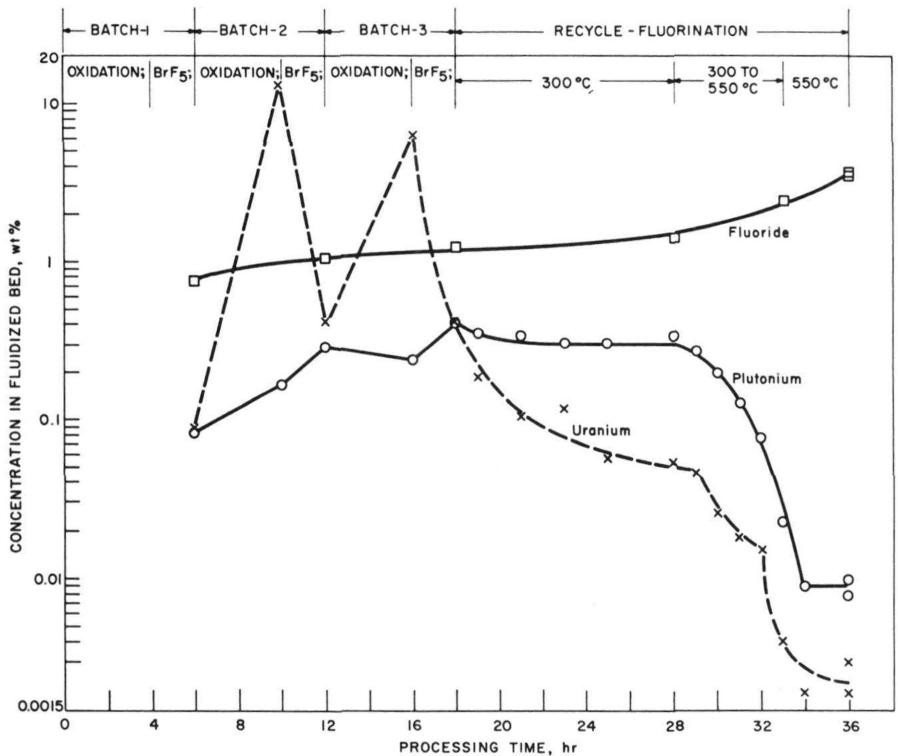  
5. Uranium, Plutonium, and Fluoride Content of a Fluidized Bed During Alumina Reuse Experiments with Simulated 10,000 MWd/T Spent Fuel.

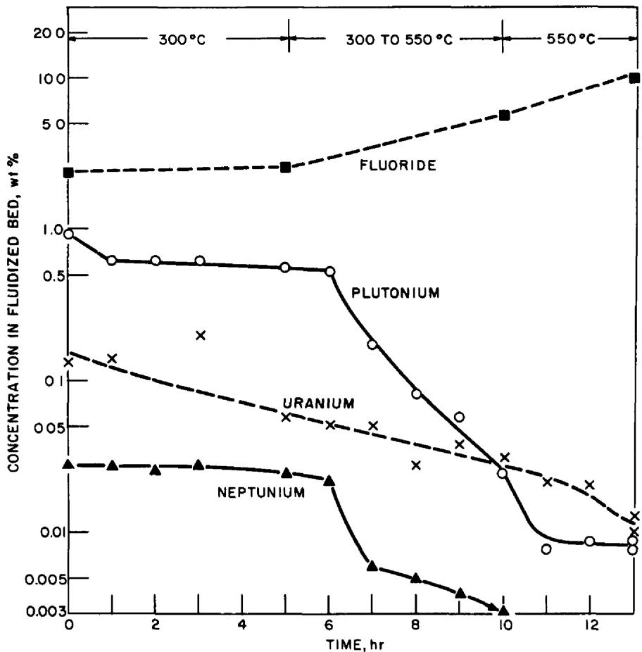  
6. Progress of Reactions During Fluorination of Plutonium Accumulated from Three Batches of Simulated 30,000 MWd/T Spent Fuel.

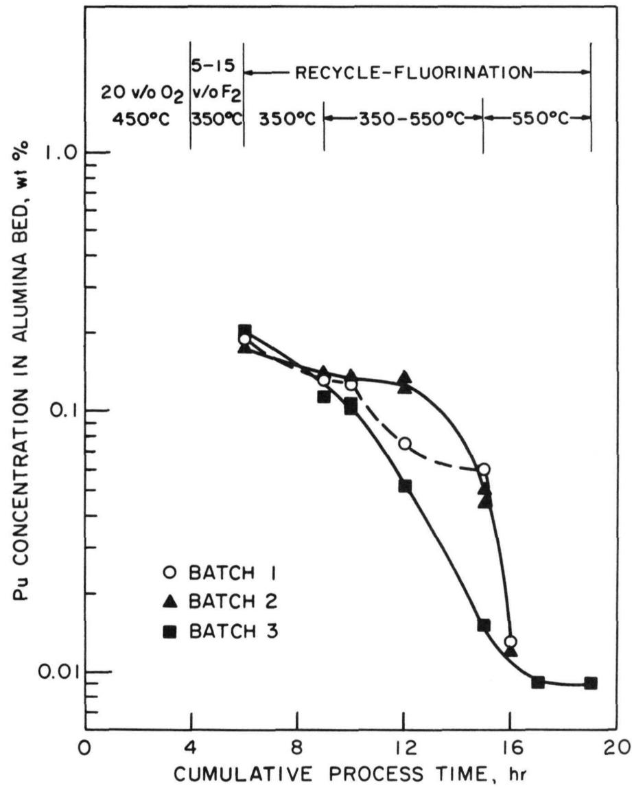  
7. Plutonium Concentration in the Fluidized Alumina Bed During Alumina Reuse Experiments.


Fast breeder fuels were simulated using a solid solution $\mathsf{UO}_2$ - $\mathsf{PuO}_2$ powder (mean particle size $\sim 5 \mu \mathrm{m}$ ) containing 17.8 wt % plutonium and 70.3 wt % uranium. This powder, together with a mixture of nonradioactive oxides of the elements formed in fission, was proportioned to simulate FBR fuel with a burnup of 100,000 MWd/T.

The initial scoping experiments consisted of a fractional factorial series of five experiments to determine the effects on plutonium in the final fluidized bed for (1) two levels of fuel-to-alumina ratio (0.3 and 0.6), (2) fluorination temperature (350 and $450^{\circ}\mathrm{C}$ ) with 10 vol $\%$ $\mathbf{F}_2$ for uranium fluorination, and (3) recycle-fluorination time (10 and 20 hr) for plutonium fluorination. The 20-hr recycle-fluorination sequence consisted of 4 hr at $300^{\circ}\mathrm{C}$ , 3 hr each at 350, 400, 450, and $500^{\circ}\mathrm{C}$ , and 4 hr at $500^{\circ}\mathrm{C}$ while the 10-hr sequence incorporated 3 hr at $450^{\circ}\mathrm{C}$ , 3 hr at $500^{\circ}\mathrm{C}$ , and 4 hr at $550^{\circ}\mathrm{C}$ . This latter sequence was chosen in an effort to obtain high fluorination rates for plutonium.

For the five experiments, the fraction of charged plutonium in the final bed ranged from 0.51 to $3.19\%$ with only one experiment significantly above $1\%$ of the plutonium charge in the final bed. The conclusions drawn from the statistical analysis are that an increase in the fuel/alumina ratio from 0.3 to 0.6 and an increase in the temperature of fluorination with dilute fluorine from 350 to $450^{\circ}\mathrm{C}$ will increase the fraction of plutonium charge remaining in the fluidized bed; conversely, increasing the recycle-fluorination time from the 10-hr to the 20-hr sequence will reduce the fraction of plutonium charge remaining in the bed.

The highest rates of plutonium fluorination were obtained during the initial part of recycle-fluorination sequence except in one experiment when low rates during this period apparently resulted from an initial recycle fluorination temperature of $300^{\circ}\mathrm{C}$ which followed fluorination with dilute fluorine at $450^{\circ}\mathrm{C}$ . For the remaining experiments, the production rate for $\mathsf{PuF}_6$ averaged 1.2 to 3.0 lb/(hr) (ft $^2$ ) while the reactor operated at 17.2 to 55.4% of equilibrium for the reaction $\mathsf{PuF}_4(s) + \mathsf{F}_2(g) \rightleftharpoons \mathsf{PuF}_6(g)$ . As had been found for the fluorination of uranium, (8) the diminishing-sphere reaction model was tested and appeared to correlate the data for plutonium fluorination during the initial recycle-fluorination period. Rate constants of 0.7 x $10^{-3}$ min $^{-1}$ at $300^{\circ}\mathrm{C}$ and 4.4 x $10^{-3}$ min $^{-1}$ at $450^{\circ}\mathrm{C}$ (i.e., average result for 3 experiments) correspond to an apparent activation energy of 10 kcal/mole.

In summary, fluorination of simulated LWR fuel using $\mathsf{BrF}_5$ followed by elemental fluorine or using dilute fluorine followed by concentrated fluorine converted a large fraction of uranium and plutonium to their volatile hexafluorides, which volatilized

from the fluidized bed. The temperature of initial fluorination was shown to affect subsequent plutonium removal from the bed. Reuse of the alumina bed to process three fuel charges reduced the fractional loss of plutonium to the alumina to $\sim 1\%$ . Corresponding experiments with simulated FBR fuel indicated that low plutonium losses can be obtained in a single use of the alumina bed.

# BEHAVIOR OF FISSION PRODUCTS AND NEPTUNIUM

Recent experimental work to elucidate the behavior of fission products and neptunium has been concerned mainly with behavior during two process operations: the fluorination operation, in which actinides are separated from nonvolatile fission product fluorides and some subsequent operations in which actinides are separated from volatile fission product fluorides. A fuel recovery process will include a separation of neptunium from uranium and plutonium regardless of whether the neptunium is treated as a by-product to be recovered or as an impurity to be discarded.

# Behavior of Neptunium in Fluorination Processes

The behavior of neptunium in the fluorination operation has been investigated both in small-scale boat-reactor experiments(9) and in the 2-in. diameter fluid-bed experiments.(3,4) Reactions of $\mathrm{NpF}_4$ with gaseous $\mathrm{BrF}_3$ , $\mathrm{BrF}_5$ , and $\mathbf{F}_2$ in the boat reactor were carried out at $300 - 400^{\circ}\mathrm{C}$ . The neptunium product of the reaction was $\mathrm{NpF}_6$ with each fluorinating agent; bromine was also produced in fluorinations with $\mathrm{BrF}_5$ and $\mathrm{BrF}_3$ .

The fluorination of $\mathrm{NpO_2}$ by either fluorine or $\mathrm{BrF_5}$ was found to proceed through the formation of the intermediate $\mathrm{NpF_4}$ (identified by X-ray diffraction analysis). The mechanism of fluorination of $\mathrm{NpO_2}$ , therefore, parallels that of $\mathrm{PuO_2}$ (which proceeds through the intermediate $\mathrm{PuF_4}$ ), but differs from the fluorination of $\mathrm{UO_2}$ , which proceeds through the intermediate $\mathrm{UO_2F_2}$ . Apparent rate constants were obtained for both the boat reactor and fluid-bed experiments from correlation of the data by the rate law that assumes reaction occurs at a continuously diminishing spherical interface. The apparent rate constants obtained in the boat reactor experiments were correlated by the Arrhenius equation to yield an activation energy of 20 kcal/mol for the reaction of $\mathrm{NpF_4}$ with elemental fluorine. An independent study(10) of the rate of reaction of $\mathrm{NpF_4}$ with fluorine yielded the same activation energy.

The fluorination of $\mathbf{NpO}_2$ from mixtures with simulated oxide fuel pellets was demonstrated with both $\mathbf{BrF}_5$ and fluorine in the 2-in. diameter fluidized-bed reactor. The $\mathbf{NpF}_6$ product was distributed about equally between the $\mathbf{UF}_6$ produced during


reaction with $\mathsf{BrF}_5$ and the $\mathsf{PuF}_6$ produced in the subsequent reaction with fluorine. The amount of neptunium added to the simulated fuel was a factor of 40 more than would be expected in $650\mathrm{g}$ of spent fuel irradiated to $10,000\mathrm{MWd / T}$ . Excess neptunium was provided so that its concentration in the bed samples would be above the limit of analytical detection, which was affected by the plutonium concentration. After $2\mathrm{hr}$ of fluorination with $\mathsf{BrF}_5$ $(10_{\mathrm{c}}\mathrm{vol}\%)$ , an average of $46\%$ of the original neptunium remained in the fluidized bed. This result corresponded to a reaction rate constant for the diminishing-sphere model of $2\times 10^{-3}\mathrm{min}^{-1}$ , a factor of 10 higher than the rate constant obtained in the boat reactor tests with $33 - 35\mathrm{vol}\% \mathsf{BrF}_5$ . The difference-in rate constants may be attributed to a more highly reactive $\mathsf{NpF}_4$ being formed by reaction of $\mathsf{NpO}_2$ and $\mathsf{BrF}_5$ in the fluidized-bed since the $\mathsf{NpF}_4$ used in the boat reactor experiments was obtained by reaction of $\mathsf{NpO}_2$ with HF and oxygen at $500^{\circ}\mathrm{C}$ . The apparent rate constant is inversely proportional to both the particle size and the bulk density of the initial reactant. Higher specific surface areas and lower bulk densities may have been obtained in the fluidized-bed experiments. Other factors promoting higher apparent reaction rates in the fluidized bed are better gas-solids contacting and the influence of elutriation.

After the subsequent fluorination with fluorine, neptunium concentration in the fluidized bed was below the limit of analytical detection, indicating that less than $7\%$ of the original neptunium remained in the final alumina bed. It is important to note that in a fluidized-bed fluoride volatility process which utilizes both $\mathrm{BrF}_5$ and fluorine, volatile $\mathrm{NpF}_6$ is formed in both fluorination steps, and about one-half of the original neptunium will accompany each of the $\mathrm{UF}_6$ and the $\mathrm{PuF}_6$ products. The removal of neptunium from the fluidized bed by fluorination is represented graphically in Figure 8 for fluorination of the fuel by $\mathrm{BrF}_5$ and by fluorine and is illustrated in Figure 6 for the recycle fluorination of plutonium with fluorine.

# Reaction of NpF6 with Br2 (11)

In the experiments described above, the reaction of $\mathrm{NpF}_4$ with either $\mathrm{BrF}_5$ or $\mathrm{BrF}_3$ in a gas-flow environment with continuous removal of products from the reaction site resulted in a net production of $\mathrm{NpF}_6$ . A reaction was observed to occur, however, in the traps in which the products of the boat reactor fluorination of $\mathrm{NpF}_4$ with either $\mathrm{BrF}_5$ or $\mathrm{BrF}_3$ had been condensed. These reactions started at temperatures in the range -78 to $+30^{\circ}\mathrm{C}$ , indicating that $\mathrm{NpF}_6$ must be readily reduced by bromine. Additional experiments in which bromine was condensed onto $\mathrm{NpF}_6$ at $-78^{\circ}\mathrm{C}$ , then warmed to $+30^{\circ}\mathrm{C}$ confirmed these indications. For the gas-phase reaction of $\mathrm{NpF}_6$ with bromine at $+80^{\circ}\mathrm{C}$ , the measured pressure change was consistent with the stoichiometry of the equation:


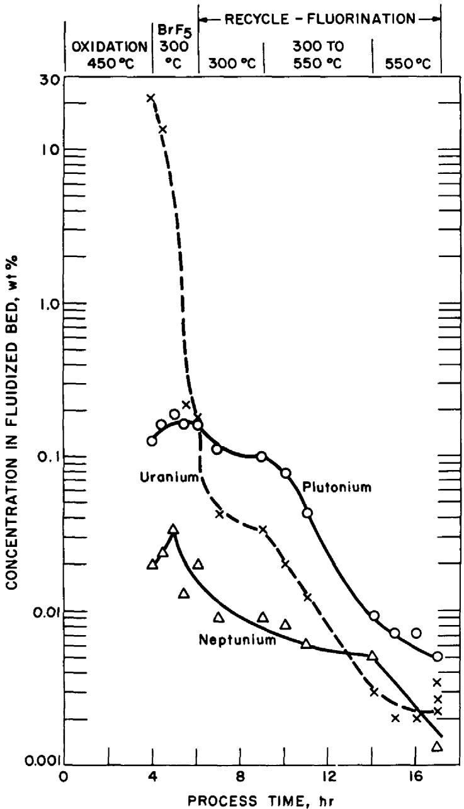  
8. Fluorination of Actinide Elements in a Fluidized Bed Using BrF $_5$ and F $_2$ as Reagents.

$3\mathsf{NpF}_{6}(\mathsf{g}) + \mathsf{Br}_{2}(\mathsf{g}) \neq 3\mathsf{NpF}_{4}(\mathsf{s}) + 2\mathsf{BrF}_{3}(\mathsf{g})$ The product $\mathsf{BrF}_3$ was identified by its infrared absorption spectrum.

Since $\mathbf{U}\mathbf{F}_{6}$ is not reduced by bromine, the reaction with bromine offers a means of separating $\mathbf{U}\mathbf{F}_{6}$ from $\mathbf{NpF}_{6}$ . This separation process was demonstrated experimentally. Stoichiometric excesses of bromine were condensed onto 1:1 mixtures of $\mathbf{U}\mathbf{F}_{6}$ and $\mathbf{NpF}_{6}$ at $-78^{\circ}C$ . After a reaction period at a higher temperature, the volatile materials were distilled away from the reaction mixture, and both the volatile and nonvolatile fractions were analyzed for neptunium and uranium. Table I shows that at $30^{\circ}C$ the reaction did not go to completion even after several hours, but that after reaction at $75^{\circ}C$ for one hour, $99.9\%$ of the neptunium found by analysis was in the nonvolatile fraction.

# Reaction of NpF with NaF (12)

The removal of volatile metallic fluorides from gas streams by reaction with solid NaF to form solid complex compounds has been frequently included in volatility process schemes. The reaction of solid NaF with gaseous $\mathrm{NpF}_{6}$ was studied to obtain information on the stoichiometry of the reaction and the identity and stability of the product in order to assess the feasibility of using solid NaF to remove $\mathrm{NpF}_{6}$ from gaseous mixtures.

Table I Separation of UF6-NpF6 Mixturesa by Reaction with Br2   

<table><tr><td>Reaction Temp. (°C)</td><td>Reaction Time (min)</td><td>Neptunium in Nonvolatile Fraction (% of Total Np Found by Analysis)</td></tr><tr><td>30</td><td>30</td><td>98.6</td></tr><tr><td>30</td><td>30</td><td>50.3</td></tr><tr><td>30</td><td>40</td><td>35.5</td></tr><tr><td>30</td><td>960</td><td>87</td></tr><tr><td>30</td><td>2400</td><td>96</td></tr><tr><td>25b</td><td>60</td><td>53</td></tr><tr><td>75</td><td>60</td><td>99.9</td></tr><tr><td>75</td><td>60</td><td>99.9</td></tr><tr><td>75</td><td>60</td><td>99.9</td></tr></table>


It was observed that, at temperatures $>150^{\circ}\mathrm{C}$ , powdered NaF reacts readily with gaseous $\mathrm{NpF}_6$ with the formation of a violet solid product. The equation $3\mathrm{NaF(s)} + \mathrm{NpF}_6(g) \neq 3\mathrm{NaF} \cdot \mathrm{NpF}_5(s) + 1/2\mathrm{F}_2(g)$ was found to represent the equilibrium involved in the reaction of $\mathrm{NpF}_6$ with NaF at 250 to $400^{\circ}\mathrm{C}$ . The partial pressures of fluorine and $\mathrm{NpF}_6$ in equilibrium with the solid phase formed by reaction of $\mathrm{NpF}_6$ with NaF were obtained by measurements of total pressure and ultraviolet absorbance of the gas phase. At a fixed temperature $(350^{\circ}\mathrm{C})$ over a 10-fold variation of fluorine pressure, the value of log $(\mathrm{PnF}_6)$ was found to depend linearly on $\log (\mathrm{P}_{\mathrm{F}_2})$ with a proportionality coefficient of 0.49, comparable to the value of 1/2 expected from the equation. Equilibrium constants, $\mathbf{K}_0 = (\mathrm{P_{NpF_6}}) / (\mathrm{P_{F_2}})^{1/2}$ , for the reaction at 250 to $400^{\circ}\mathrm{C}$ , are expressed by the equation:

$$
\log K _ {p} \left(\text {a t m} ^ {1 / 2}\right) = - 3. 1 4 7 \times 1 0 ^ {3} / T (^ {\circ} K) + 2. 7 8 4
$$

The equilibrium constants given by the above relation were used to calculate the extent of removal of $\mathrm{NpF}_6$ from mixtures with $\mathrm{UF}_6$ in a proposed operation at the following conditions:

(1) Gaseous UF $_6$ -NpF $_6$ mixtures, with no initial fluorine, would be passed through a bed of NaF pellets with the intention of maximum fixation of neptunium and minimum fixation of uranium by the solid phase.   
(2) The residence time would be sufficient to allow the reaction of $\mathbf{NpF}_6$ with NaF to reach equilibrium.   
(3) The partial pressure of $\mathbf{U}\mathbf{F}_{6}$ in the mixture would be less than the dissociation pressure of either of the complexes formed between NaF and UF $_6$ (NaF·UF $_6$ and 2NaF·UF $_6$ ).

The stoichiometry of the equation describing the equilibrium leads to the expressions:

$$
\frac {p _ {N p F _ {6 1}}}{p _ {N p F _ {6 r}}} = 1 / 2 \pm \sqrt {\frac {(K _ {p}) ^ {2} + 8 (p _ {N p F _ {6 1}})}{2 K _ {p}}}
$$

and $\% \mathrm{NpF}_6$ removed from gas $= 100(1 - \frac{\mathrm{p}_{\mathrm{NpF}_{6\mathbf{i}}}}{\mathrm{p}_{\mathrm{NpF}_{6\mathbf{i}}}})$

where $\mathfrak{p}_{\mathbf{NpF}_{61}} =$ initial pressure of $\mathrm{NpF}_6$

$\mathbf{p}_{\mathbf{NpF}_{6\mathbf{r}}} =$ pressure of $\mathbf{NpF}_6$ remaining at equilibrium,


$\mathbf{K}_{\mathfrak{p}}$ = equilibrium constant.

The initial $\mathsf{NpF}_6$ pressures were fixed by chosen concentrations of $\mathsf{NpF}_6$ in $\mathsf{UF}_6$ and the dissociation pressures of $2\mathsf{NaF}\cdot \mathsf{UF}_6$ calculated from the data of Katz, (13) indicating the pressure below which the $\mathsf{UF}_6$ must be maintained to avoid formation of $2\mathsf{NaF}\cdot \mathsf{UF}_6$ .

Figure 9 presents the results of calculations of the maximum percentage of $\mathsf{NpF}_6$ that would be removed by one equilibrium stage for concentrations of $\mathsf{NpF}_6$ in UF $^6$ varying from 10 to 1000 ppm at temperatures of 250, 300, 350, and $409^{\circ}\mathrm{C}$ . Figure 10 presents similar information for two equilibrium stages (equilibration of gas mixture with NaF, removal of fluorine formed in the reaction of $\mathsf{NpF}_6$ with NaF, and equilibration of the residual gas mixture with a second NaF trap). Two-stage operation would be realized, for example, if the UF $^6$ stream passed in sequence through a NaF trap, a distillation column, and then a second NaF trap. In general, the fraction of $\mathsf{NpF}_6$ removed increases as the initial concentration of $\mathsf{NpF}_6$ increases; the percentage of $\mathsf{NpF}_6$ removed also increases as the temperature of the NaF bed decreases. Since the probable initial concentration of $\mathsf{NpF}_6$ in the UF $^6$ process stream is low ( $\sim 100\mathrm{ppm}$ ), the extent of removal in a single equilibrium stage is not high. Calculations were performed at $409^{\circ}\mathrm{C}$ since the temperature of a NaF trap must be kept above this value to pass UF $^6$ vapor at 1.75 atm, a favored process pressure, without formation of $2\mathsf{NaF} \cdot \mathsf{UF}_6$ . At these conditions, the calculations shown in Figures 9 and 10 indicate that about $46\%$ of the neptunium would be removed by one equilibrium stage and that about $70\%$ of the neptunium would be removed by two equilibrium stages.

# Behavior of Volatile Fission Product Fluorides in the Fluorination Operation

Experiments (4) determining fission product behavior during fluorination of simulated oxide fuel in the 2-in. diameter fluidized bed were limited to elements forming volatile fluorides. To aid in following ruthenium in the various processing steps, $106_{\text{Ru}}$ was added to the alumina bed in an experiment in which the $\text{BrF}_5$ step was carried out at $300^{\circ}\text{C}$ . Additionally, a spark source mass spectrometric analysis was used to determine the distribution of ruthenium, molybdenum, and rhodium in experiments with the $\text{BrF}_5$ step at 250 and $350^{\circ}\text{C}$ . The results indicate that volatilization of most of the ruthenium takes place during fluorination with $\text{BrF}_5$ at $300^{\circ}\text{C}$ followed by only minor fluorination of ruthenium during the recycle-fluorination with fluorine at 300 to $550^{\circ}\text{C}$ . These results are in agreement with those obtained in boat reactor tests with $106_{\text{Ru}}$ tracer and in fluidized-bed tests with irradiated fuel. Table II gives the results of spark source mass spectrometric analyses of fluidized-bed and sodium fluoride samples for experiments with the $\text{BrF}_5$ step at 250 and $350^{\circ}\text{C}$ .


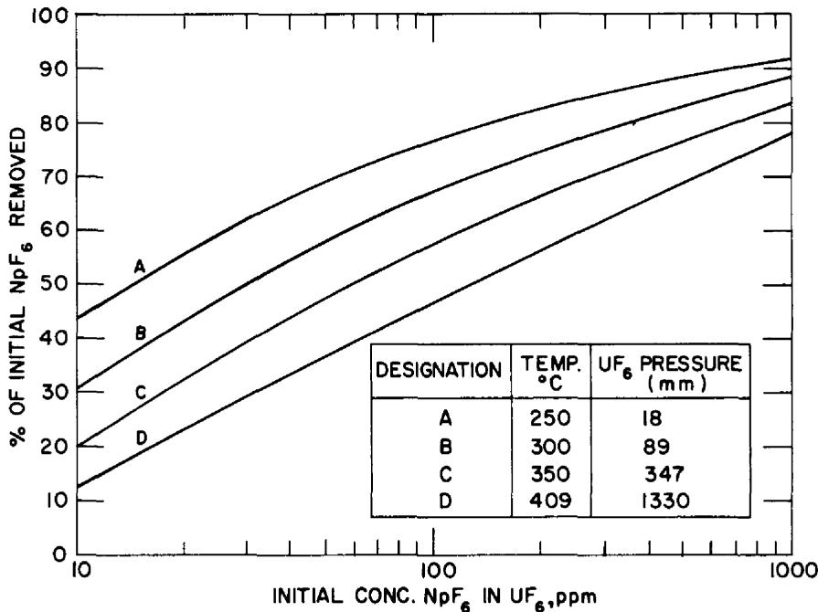  
9. Calculated Maximum Percent of Initial NpF $_6$ Removed From Gaseous Mixture with UF $_6$ by Reaction with NaF in One Equilibrium Stage.

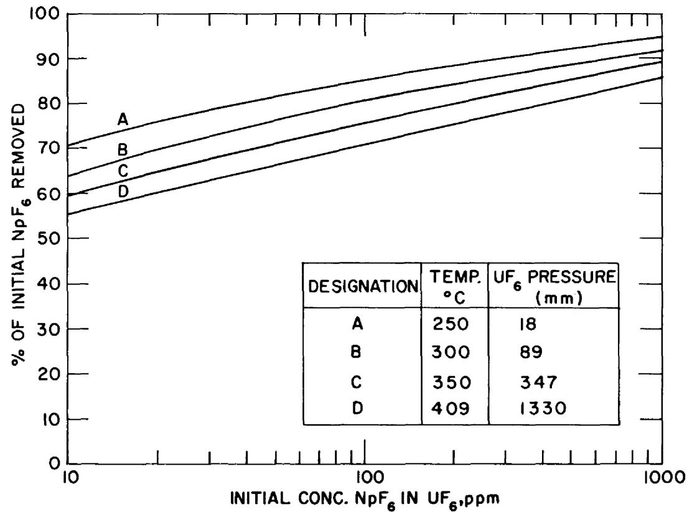  
10. Calculated Maximum Percent of Initial NpF Removed from Gaseous Mixture with UF $_6$ by Reaction with NaF in Two Equilibrium Stages.

Table II   
Spark Source Mass Spectrometric Analyses of Alumina (4)   

<table><tr><td colspan="2">Source of Sample</td><td>Mo(ppm)</td><td>Ru(ppm)</td><td>Rh(ppm)</td></tr><tr><td rowspan="5">I.</td><td>BrF5Step at 250°C</td><td></td><td></td><td></td></tr><tr><td>Alumina bed after oxidation of pellets</td><td>800</td><td>230</td><td>100</td></tr><tr><td>Alumina bed after fluorination with BrF5at 250°C</td><td>34</td><td>70</td><td>150</td></tr><tr><td>Alumina bed after fluorination with F2from 300 to 550°C</td><td>&lt;5</td><td>39</td><td>90</td></tr><tr><td>Sodium fluoride (PuF6product collector)</td><td>35</td><td>0.7</td><td>&lt;0.3</td></tr><tr><td rowspan="5">II.</td><td>BrF5Step at 350°C</td><td></td><td></td><td></td></tr><tr><td>Alumina bed after oxidation of pellets</td><td>800</td><td>230</td><td>100</td></tr><tr><td>Alumina bed after fluorination with BrF5at 350°C</td><td>19</td><td>60</td><td>300</td></tr><tr><td>Alumina bed after fluorination with F2from 300 to 550°C</td><td>&lt;5</td><td>19</td><td>200</td></tr><tr><td>Sodium fluoride (PuF6product collector)</td><td>32</td><td>0.7</td><td>&lt;0.1</td></tr></table>

Analyses of replicate samples varied by a factor of three except for rhodium where the variations in the spark source analyses were not significant. Within these limitations, the spark source data indicate that 70 to $80\%$ of the ruthenium and more than $95\%$ of the molybdenum fluorinates during the $\mathrm{BrF}_5$ step at 250 to $350^{\circ}\mathrm{C}$ . While the bulk of the molybdenum and ruthenium are fluorinated during the $\mathrm{BrF}_5$ step, additional fluorination also occurs during the fluorine step. A similar distribution of molybdenum and ruthenium was observed with irradiated spent fuel pellets, also without significant variations in the spark source analyses for rhodium.

# Separation of Ruthenium from PuF

Recent experimental studies of the separation of volatile fission product fluorides from $\mathsf{PuF}_6$ have centered on $\mathsf{PuF}_6$ -ruthenium fluoride mixtures since past experience showed that this separation might prove difficult. The behavior of plutonium-ruthenium mixtures was tested in bench-scale experiments. The general procedure consisted of (a) fluorinating mixtures of 200-400 mg of $\mathsf{PuF}_4$ and 15-20 mg of ruthenium metal (containing $106_{\mathsf{Ru}}$


to permit radiochemical analysis), (b) transporting the resulting gaseous mixture by gas flow through a train of vessels, each simulating a process vessel and corresponding process operation, and (c) determining the final distribution of plutonium and ruthenium in the train. Early results caused a shift in the main point of attention to the operation in which ruthenium and plutonium fluorides were to be separated by preferential condensation at $-10^{\circ}\mathrm{C}$ . At this temperature, the vapor pressure of pure $\mathsf{PuF}_6$ is 7.89 Torr, which is greater than the partial pressure of $\mathsf{PuF}_6$ in the effluent gas stream of the fluorination operation. The vapor pressure of $\mathsf{RuF}_5$ at $-10^{\circ}\mathrm{C}$ is $2.6 \times 10^{-6}$ Torr, suggesting that passage of the gases formed by fluorination of ruthenium-plutonium mixtures through a trap at $-10^{\circ}\mathrm{C}$ should result in condensation of only $\mathsf{RuF}_5$ .

The results, presented in Table III, indicate that, although the amounts of ruthenium penetrating the traps at $-10^{\circ}\mathrm{C}$ are small fractions of the total ruthenium charged to the reactor, they are orders of magnitude greater than the calculated amounts that should penetrate the trap on the basis that the solid phase in the traps is $\mathsf{RuF}_5$ .

The quantities of ruthenium penetrating the traps at $-78^{\circ}\mathrm{C}$ are of special interest, since at this temperature, the vapor pressures of any ruthenium species are sufficiently low that only a small quantity of any species is required to form a solid phase in the trap. The comparison of observed amounts of ruthenium transpiring through the trap with theoretical amounts calculated from the vapor pressures of various ruthenium species could, therefore, identify the solid species in the trap. The agreement of theoretical and observed moles of $\mathsf{PuF}_6$ penetrating the $-78^{\circ}\mathrm{C}$ trap had shown that the trap is efficient for $\mathsf{PuF}_6$ .

Five of the seven results in Table III show that the quantities of ruthenium transpiring at $-78^{\circ}\mathrm{C}$ are the same order of magnitude as the quantities calculated for $\mathsf{RuO}_4$ . If $\mathsf{RuO}_4$ is indeed formed, the question of the source of oxygen arises. The formation of very small quantities of $\mathsf{RuO}_4$ might be explained by the presence of traces of moisture in the system or by the presence of an oxide film on the ruthenium metal powder.

The results of the entire set of experiments listed in Table III can be summarized as follows: (1) A small fraction of the total ruthenium charged to the system formed a compound more volatile than $\mathsf{RuF}_5$ in the reaction of fluorine at $500^{\circ}\mathrm{C}$ with ruthenium metal, ruthenium metal-alumina mixtures, or ruthenium metal- $\mathsf{PuF}_4$ mixtures. (2) In five of seven experiments, the observed quantities of ruthenium transpiring at $-78^{\circ}\mathrm{C}$ were the same order of magnitude as the quantities calculated for $\mathsf{RuO}_4$ . (3) This set of experiments indicates no consistent difference between the volatility of ruthenium compounds produced by


Table III   
Comparison of Observed and Theoretical Transpiration of Ruthenium Compounds   

<table><tr><td rowspan="2">Material Fluorinated</td><td rowspan="2">Initial Moles Ru</td><td colspan="2">Moles Transpired at -10°C</td><td colspan="5">Moles Transpired at -78°C</td></tr><tr><td>Ru(obs)</td><td>RuF5(th)</td><td>Ru(obs)</td><td>RuF5(th)</td><td>RuF6(th)</td><td>RuO4(th)</td><td>RuOF4(th)</td></tr><tr><td>Ru-PuF4</td><td>17x10-5</td><td>1.3x10-5</td><td>3.7x10-9</td><td>1.7x10-6</td><td>6.8x10-16</td><td>3.1x10-5</td><td>1.1x10-7</td><td>4.9x10-9</td></tr><tr><td>Ru-PuF4</td><td>15x10-5</td><td>1.9x10-5</td><td>3.2x10-9</td><td>2.7x10-6</td><td>6.3x10-16</td><td>2.8x10-5</td><td>0.98x10-7</td><td>4.6x10-9</td></tr><tr><td>Ru Only</td><td>14x10-5</td><td>2.4x10-6</td><td>3.7x10-9</td><td>1.5x10-7</td><td>6.8x10-16</td><td>3.1x10-5</td><td>1.1x10-7</td><td>4.9x10-9</td></tr><tr><td>Ru-Alumina</td><td>15x10-5</td><td>3.8x10-7</td><td>3.2x10-9</td><td>2.0x10-7</td><td>6.3x10-16</td><td>2.8x10-5</td><td>0.98x10-7</td><td>4.6x10-9</td></tr><tr><td>Ru-PuF4</td><td>17x10-5</td><td>2.0x10-6</td><td>3.2x10-9</td><td>4.8x10-7</td><td>6.3x10-16</td><td>2.8x10-5</td><td>0.98x10-7</td><td>4.6x10-9</td></tr><tr><td>Ru Only</td><td>14x10-5</td><td>9.4x10-7</td><td>3.2x10-9</td><td>2.9x10-7</td><td>6.3x10-16</td><td>2.8x10-5</td><td>0.98x10-7</td><td>4.6x10-9</td></tr><tr><td>Ru-PuF4</td><td>16x10-5</td><td>5.8x10-7</td><td>3.2x10-9</td><td>1.6x10-7</td><td>6.3x10-16</td><td>2.8x10-5</td><td>0.98x10-7</td><td>4.6x10-9</td></tr></table>

fluorination of ruthenium in the presence of $\mathsf{PuF}_4$ and the volatility of ruthenium compounds produced by fluorination of ruthenium in the absence of $\mathsf{PuF}_4$ .

# BENCH-SCALE STUDIES WITH IRRADIATED FUELS

Eleven experiments using fluidized-bed fluoride volatility techniques to process irradiated metal alloy and oxide fuels were performed in a hot cell facility. The principal objectives of these experiments were:

1. to establish whether fission products or radiation fields have a significant effect upon the recovery of the fissionable values in the fuel;   
2. to determine actinide and fission element distribution from irradiated fuels and for the various process steps;   
3. to determine product decontamination from the fission elements for established process steps and to test other schemes having process potential.

Of the six experiments run with alloys, two were with uranium-Zircaloy irradiated to $\sim 40\%$ burnup of the $235\mathrm{U}$ originally present and cooled 5 yr, and four experiments were with uranium-aluminum irradiated to $\sim 50\%$ burnup and cooled either 3 or 7 months. Five experiments were performed with uranium oxide fuel irradiated to a burnup of $\sim 33,000\mathrm{MWd / T}$ and cooled 1 to $1\frac{1}{2}$ yr.

# Tests with Irradiated Uranium Alloy Fuels

The process, which has been described in detail,(14,15,16) involves the use of a fluidized bed of alumina to provide gas contacting of the fuel. Hydrogen chloride gas separates the zirconium or aluminum matrix from the uranium by forming volatile chlorides with the zirconium or aluminum while converting the uranium to a nonvolatile chloride. A filter bed of packed alumina particles downstream of the fluid-bed reactor prevents uranium loss from the fluidized-bed. Elemental fluorine removes the uranium from the bed by converting it to gaseous UF<sub>6</sub>. Sodium fluoride beds and a cold trap operating at -78°C collect and decontaminate the UF<sub>6</sub>.

An equipment flowsheet is shown in Figure 11. The hydrochlorination step is performed with valve V1 closed and valve V2 open. The gas mixture flows from the packed-bed filter to the condenser, through the disposable filter to the scrubber, and then to the atmosphere through the cave stack. The $\mathrm{ZrCl}_4$ (or $\mathrm{AlCl}_3$ ) generated in the reactor is removed from the gas stream


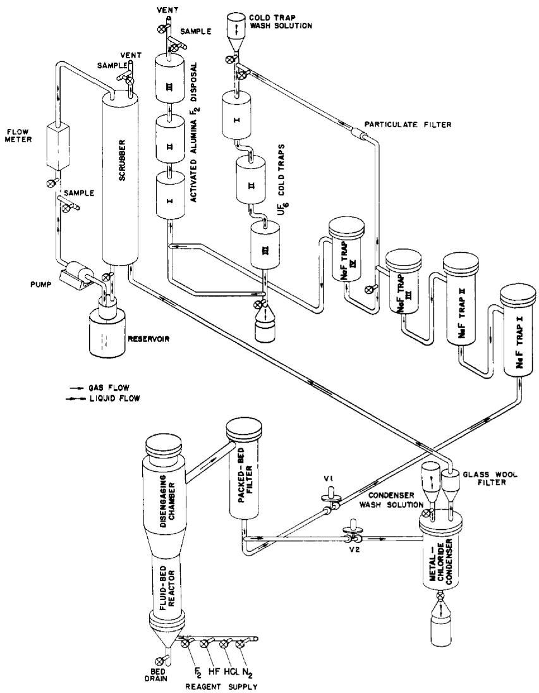  
11. Equipment Flowsheet for Studies on Irradiated Uranium Alloy Fuels.

by a condenser cooled by natural convection. Experience with the unirradiated fuels showed that a filter is required after the condenser to remove chloride fines, which would otherwise cause plugging of the line to the scrubber. The filter is a small section of pipe, packed with glass wool, which can be removed and replaced remotely for each run. Excess HCl is scrubbed from the nitrogen gas stream by continuously recirculated $\mathrm{H}_2\mathrm{O}$ , $\mathrm{NaOH}$ , or KOH solution before discharge of the gas to the cave exhaust duct.

When the hydrochlorination step is complete, the high-temperature valves are reversed (V1 opened, V2 closed) and the fluorination step begun. During the fluorination step, $\mathbf{U}\mathbf{F}_{6}$ is generated in the fluidized-bed reactor, passes through traps NaF-1 and NaF-2 (maintained at $400^{\circ}\mathrm{C}$ to remove certain fission products), and is collected on trap NaF-3 (maintained at 100 to $150^{\circ}\mathrm{C}$ ). A fourth NaF trap (at room temperature) serves as a backup for the NaF-3 trap. The gas flow continues to a fluorine absorption tower containing 1/4-in. diameter activated alumina spheres and then to the cave exhaust. During several experiments, trap NaF-3 was heated to $400^{\circ}\mathrm{C}$ and the $\mathbf{U}\mathbf{F}_{6}$ was desorbed in a stream of fluorine and then collected in cold traps cooled by dry ice. The $\mathbf{U}\mathbf{F}_{6}$ was removed from the cold traps by hydrolysis with 20 vol % nitric acid.

# Distribution of Fission Products Following Hydrochlorination Step

The activities found to be essentially nonvolatile during the hydrochlorination step with the alloy fuels were cerium, cesium, and ruthenium. Trace amounts of cerium and cesium found in the condenser and scrubber following the runs with 5-yr-cooled uranium-Zircaloy are believed to be due to entrainment in the gas stream leaving the reactor and incomplete removal by the packed-bed filter. Cerium and cesium activities were not detected in the condenser or scrubber by gamma spectrometry following the runs with short-cooled uranium-aluminum, probably because of the masking effect of the large amounts of $^{95}\mathrm{Zr}$ and $^{95}\mathrm{Nb}$ present.

The activities that were slightly volatile during hydrochlorination were Sb, Mo, Tc, and Te. The amounts of these activities that volatilized and were collected downstream of the packed-bed filter ranged from about 0.3 to $10\%$ of the charge activity.

The activities that were predominantly volatile during hydrochlorination were Zr, Nb, Kr, and I. Some partition of zirconium and niobium during hydrochlorination appears to occur from a consideration of the large amount of niobium collected during fluorination. An indication of the release of krypton during both process steps was obtained by the use of a beta monitor located in the cave stack.


This monitor had been calibrated previously by releasing known amounts of $85\mathrm{Kr}$ to the cave atmosphere. The results of the measurements made during the six hot runs showed that essentially $100\%$ of the available krypton is released to the stack during the hydrochlorination step. During the fluorination, the activity level in the stack returned to the normal background level.

Two runs were made with 3-month-cooled fuel to follow radioactive $^{131}\mathrm{I}$ . Of the iodine charged to the reactor, $66\%$ was collected in the scrubber following the HCl step of the first run and $93\%$ in the second run. A trace amount of $^{131}\mathrm{I}$ was found in the activated alumina following the fluorination step. Stack-gas monitoring showed that $<1\%$ of the $^{131}\mathrm{I}$ was released to the stack during both the HCl step and also during the fluorination step. These results lead to the conclusion that the bulk of the iodine is released during hydrochlorination and can be removed efficiently by a caustic scrubber. A small amount remained in the reactor following hydrochlorination.

# Fission Product Distribution Following the Fluorination Step

The work with the irradiated fuels showed that only trace quantities of cesium and cerium were found downstream of the packed-bed filter. The bulk of the strontium charged was recovered with the reactor and filter beds.

Ruthenium. Ruthenium (Table IV) appears to be only slightly volatile under the fluorination conditions. The amount volatilized for the first four runs ranged from 0.2 to $0.6\%$ of that charged to the reactor. The small amount of ruthenium that did volatilize was almost entirely collected by the $400^{\circ}\mathrm{C}$ NaF pellet traps.

Antimony. About $90\%$ or more of the antimony remained in the reactor bed following hydrochlorination. Most of this residue was volatilized during the fluorination step and was almost completely retained by the $400^{\circ}\mathrm{C}$ NaF trap. A small residue (3 to $16\%$ ) remained in the reactor and filter beds following fluorination.

Zirconium and Niobium. As noted, the bulk of the zirconium and niobium was removed before fluorination during the hydrochlorination step, only 2 to $4\%$ of the zirconium being downstream of the packed-bed filter. This amount of activity, which must pass through the packed-bed filter, raises a question as to whether the zirconium is present as a particulate solid or as a gas. If the vapor pressure of $\mathrm{ZrF}_4$ in the gas leaving the reactor is $\sim 4\%$ of its saturation value at $550^{\circ}\mathrm{C}$ , sufficient $95\mathrm{Zr}$ would be volatilized to account for the zirconium activity collected by the $400^{\circ}\mathrm{C}$ NaF trap. It appears likely that the zirconium movement is due to volatilization; hence, its separation from volatile uranium hexa

# Table IV

# Fission Products Volatilized and Collected Downstream of Packed-Bed Filter (16)

<table><tr><td rowspan="2">Element</td><td colspan="4">HCl Step, Percent of Charge</td><td rowspan="2">Element</td><td colspan="3">Fluorine Step, Percent of Charge</td></tr><tr><td>Runs 1 and 2</td><td>Run 3</td><td>Run 4</td><td>Runs 5 and 6</td><td>Runs 1 and 2</td><td>Run 3</td><td>Run 4</td></tr><tr><td>Sb</td><td>2.8</td><td>5.7</td><td>9.7</td><td>c</td><td>Sb</td><td>37.5</td><td>31</td><td>93</td></tr><tr><td>Ru</td><td>\( \text{nil}^{\text{a}} \)</td><td>\( \text{nil}^{\text{a}} \)</td><td>\( \text{nil}^{\text{a}} \)</td><td>c</td><td>Ru</td><td>0.45</td><td>0.23</td><td>0.6</td></tr><tr><td>Zr</td><td>b</td><td>48.7</td><td>64</td><td>c</td><td>Zr</td><td>b</td><td>2.2</td><td>4.4</td></tr><tr><td>Nb</td><td>b</td><td>44.8</td><td>61</td><td>c</td><td>Nb</td><td>b</td><td>4.8</td><td>30</td></tr><tr><td>Mo</td><td>c</td><td>1.8</td><td>2.3</td><td>c</td><td>Mo</td><td>43.5</td><td>c</td><td>c</td></tr><tr><td>Tc</td><td>2.7</td><td>c</td><td>c</td><td>c</td><td>Tc</td><td>77</td><td>64.5</td><td>35</td></tr><tr><td>Te</td><td>c</td><td>0.34</td><td>0.85</td><td>c</td><td>Te</td><td>c</td><td>50</td><td>57</td></tr><tr><td>I</td><td>c</td><td>c</td><td>c</td><td>79</td><td></td><td></td><td></td><td></td></tr></table>

${}^{a}$ Not detected by gamma spectrometric analysis.   
Insufficient present in charge for analysis.   
cNot determined.

fluoride depends upon efficient sorption rather than filtration.

About $30\%$ of the niobium volatilized during fluorination and was collected by the $400^{\circ}\mathrm{C}$ NaF trap. The reactor-bed analysis following fluorination showed that $< 1\%$ of the zirconium and niobium remained. These two results suggest that a partition between zirconium and niobium occurs during the HCl step; i.e., a smaller amount of the niobium forms a volatile chloride. The niobium that remains following chlorination readily forms a volatile fluoride and is almost entirely removed during fluorination.

Technetium. Technetium closely follows uranium in the processing steps. Only $3\%$ of the technetium volatilized during the hydrochlorination step. Following fluorination, the bulk of the technetium was collected with the UF in the $100^{\circ}\mathrm{C}$ NaF traps. Little or no technetium was removed from the gas stream by the $400^{\circ}\mathrm{C}$ NaF trap.

Molybdenum. Less than $3\%$ of the molybdenum was removed from the fluidized-bed reactor during hydrochlorination. The work with uranium-Zircaloy showed that the bulk of the molybdenum volatilized during fluorination and was distributed largely between the $100^{\circ}\mathrm{C}$ NaF trap and the $25^{\circ}\mathrm{C}$ NaF trap. Results of a run with uranium-Zircaloy showed that about $20\%$ of the molybdenum was trapped with the uranium in the $100^{\circ}\mathrm{C}$ NaF trap. About $2\%$ was collected with the uranium when an additional desorption step was employed following collection on $150^{\circ}\mathrm{C}$ NaF. About $12\%$ was found in the reactor and filter beds, indicating that the removal of molybdenum is not complete under these processing conditions.

Tellurium. Less than $1\%$ of the tellurium volatilized during the hydrochlorination step. The bulk volatilized during fluorination, passed through the $400^{\circ}\mathrm{C}$ NaF, $100/150^{\circ}\mathrm{C}$ NaF, and $25^{\circ}\mathrm{C}$ NaF traps, and collected on the activated-alumina trap. This trap was used principally to remove the excess fluorine from the process off-gas before its discharge to the cave stacks. Stack-gas monitoring showed that only trace amounts of tellurium were present, indicating that the alumina was highly efficient for the removal of tellurium. Only small amounts of tellurium collected with the uranium. About $0.14\%$ of the tellurium was collected with the uranium when a $100^{\circ}\mathrm{C}$ NaF trap was employed; $0.0016\%$ was retained with the uranium when a desorption step was employed.

Neptunium. Complete neptunium analyses were not performed, but uranium-product analyses for the last two runs showed that $\sim 21\%$ of the neptunium charged was collected with the uranium.


The equipment used for the experiments with irradiated uranium alloy fuels was modified by the addition of other traps and the installation of a sintered nickel filter in the fluidized bed reactor.(17)

In each experiment, $\sim 100\mathrm{g}$ of irradiated $\mathrm{UO}_2$ (previously declad) were added to a bed of refractory alumina in the fluidized-bed reactor. The $\mathrm{UO}_2$ pellets were converted to $\mathrm{U}_3\mathrm{O}_8$ - $\mathrm{PuO}_2$ fines at $450^{\circ}\mathrm{C}$ in the fluidized bed by reaction with $20\mathrm{vol}\%$ oxygen in nitrogen. The sintered nickel filter prevented elutriation of uranium oxides and bed material from the reactor. The process off-gas passed through two traps containing activated charcoal to remove any volatile products prior to discharge to the cave exhaust.

In the uranium volatilization step, the uranium was separated as $\mathrm{UF}_6$ from plutonium and from most of the fission products by the use of $\mathrm{BrF}_5$ as a selective fluorinating agent. The process off-gas leaving the nickel filter contained $\mathrm{UF}_6$ , $\mathrm{Br}_2$ , $\mathrm{BrF}_5$ , and volatile fission-product fluorides in $\mathbf{N}_2$ diluent. The off-gas was passed through the uranium cleanup trap where a selective sorbent, NaF at $400^{\circ}\mathrm{C}$ , was tested for decontamination capability. The gases continued through three additional traps in series, which removed the $\mathrm{UF}_6$ , $\mathrm{Br}_2$ , $\mathrm{BrF}_5$ , and the remaining volatile fission-product fluorides. The first of these three traps contained activated alumina, which removed $\mathrm{UF}_6$ and some fission-product fluorides and reacted with excess $\mathrm{BrF}_5$ to give free bromine. The next trap, which contained soda lime at $\sim 300^{\circ}\mathrm{C}$ , removed the bromine and some fission-product fluorides. The last trap contained activated alumina to remove moisture released by the soda lime.

In the last step, plutonium was volatilized from the fluidized bed by fluorine and was collected as $\mathsf{PuF}_6$ in the product cold trap. The off-gas from the fluidized bed reactor first passed through a precooler at $0^{\circ}\mathrm{C}$ where high-boiling fission-product fluorides were collected. A cold-trap backup containing NaF pellets at $350^{\circ}\mathrm{C}$ was used to remove trace quantities of $\mathsf{PuF}_6$ passing through the cold trap. The fluorine in the off-gas was removed by four traps in parallel containing activated alumina; parallel arrangement allowed limiting the flow of fluorine through each trap to $\sim 1$ liter/min to avoid caking of trap contents. The off-gas cleanup trap following the fluorine-removal traps was filled with NaF pellets at $\sim 400^{\circ}\mathrm{C}$ to remove trace amounts of volatile fission products.

For three experiments in which other plutonium decontamination schemes were examined, the $\mathsf{PuF}_6$ collected in the cold trap was sublimed at $0^{\circ}\mathsf{C}$ and transported in a nitrogen stream to additional


traps where the $\mathsf{PuF}_6$ was either adsorbed by NaF pellets at $350^{\circ}\mathrm{C}$ or thermally decomposed to $\mathsf{PuF}_4$ in beds of refractory alumina at $300^{\circ}\mathrm{C}$ .

# The Distribution of Actinides and Fission Products

The ranges of values for the volatile products collected during the five runs are shown in Table V. The results of the runs show the following:

1. The principal activities that volatilize during the oxidation step (for fuel cooled 1 year or more) are krypton and ruthenium; $< 27\%$ of the total krypton and $< 3.3\%$ of the ruthenium charged were volatilized. Small amounts of ruthenium and tellurium, well below the recommended limiting concentrations, were found in the process off-gas discharged to the atmosphere. No attempt was made to trap krypton, and its discharge to the atmosphere was safely accomplished by dilution with 2000 cfm cell ventilation air.   
2. Up to $\sim 13\%$ of the total beta and gamma activity was volatilized with the uranium during the BrF $_5$ step. The principal gamma activity that accompanied the uranium was ruthenium. In addition, up to $76\%$ of the molybdenum, $2.7\%$ of the antimony, $0.24\%$ of the zirconium, and $1.9\%$ of the niobium were also volatilized with the uranium. Analyses to determine the amounts of tellurium, technetium, and neptunium were not completed.

Table V   
Volatiles Collected in Traps During Processing of Irradiated $\mathrm{UO}_2$   

<table><tr><td rowspan="2">Activity</td><td rowspan="2">Oxidation Step</td><td colspan="2">Percent of Charge</td></tr><tr><td>Uranium Volatilization Step</td><td>Plutonium Volatilization Step</td></tr><tr><td>U</td><td>\( NA^a \)</td><td>71-112</td><td>0.05-0.33</td></tr><tr><td>Pu</td><td>\( NA^a \)</td><td>0.025-0.95</td><td>31-63</td></tr><tr><td>β</td><td>&lt;0.0001-0.05</td><td>7.7-13.7</td><td>0.7-0.84</td></tr><tr><td>γ</td><td>&lt;0.0001-0.5</td><td>6.9-11.7</td><td>0.5-2.3</td></tr><tr><td>Zr</td><td>0</td><td>0-0.24</td><td>0-0.21</td></tr><tr><td>Nb</td><td>0-&lt;0.0001</td><td>0.1.9</td><td>0-5.8</td></tr><tr><td>Ru</td><td>&lt;0.0001-3.3</td><td>44-71</td><td>3.2-14</td></tr><tr><td>Sb</td><td>\( NA^a \)</td><td>&lt;0.001-&lt;2.7</td><td>&lt;0.12-1.2</td></tr><tr><td>Mo</td><td>\( NA^a \)</td><td>&lt;51-76</td><td>&lt;6-38</td></tr><tr><td>Te</td><td>0-0.08</td><td>\( NA^a \)</td><td>\( NA^a \)</td></tr></table>

$\mathbf{a}_{\mathrm{NA}} = \mathrm{not}$ analyzed.


More than $99.5\%$ of the uranium and an average of $< 0.5\%$ of the plutonium volatilized during the $\mathsf{BrF}_5$ step. Other workers(18) have shown that even less plutonium ( $\sim 0\%$ ) may be expected to volatilize during this step. Up to $87\%$ of the krypton accounted for was released to the process off-gas during this step. Small amounts of ruthenium and tellurium, well below the recommended limiting concentrations, were also found in the stack gas.

3. During volatilization of plutonium with fluorine, up to $\sim 2\%$ of the gross beta-gamma activity was transported concurrently. The principal gamma activity transported was ruthenium (3 to $14\%$ ), and up to $38\%$ of the molybdenum and small amounts of zirconium ( $< 0.21\%$ ), niobium ( $< 5.8\%$ ), and antimony ( $< 1.2\%$ ) were also volatilized. Analyses for other possible contaminants such as tellurium, technetium, and neptunium were not completed.

A small amount of krypton was found in the off-gas during the fluorine step of three of the five runs, suggesting that a small residue of uranium oxide remained in the reactor after the $\mathrm{BrF}_5$ step. The largest value for the krypton release was $9.6\%$ . In addition to a small amount of ruthenium ( $<0.01\%$ ), a variable amount of tellurium (up to $40\%$ of that charged) was found in the process off-gas.

The results of this work can be summarized as follows:

1. The presence of fission products and a radiation field was shown to have little or no important effect upon product recovery from the fluidized bed of alumina.   
2. In general, the distribution of the actinides and fission elements was found to be in accordance with expected distributions based upon the volatilities of the compounds formed. In some important instances, as exemplified by ruthenium, assignment of the compound formed is difficult since the experimental evidence suggests that more than one compound may be involved.   
3. The uranium decontamination levels for the metal alloy fuels were high enough that the preponderant gamma activity was due to the uranium isotope $^{235}\mathrm{U}$ . Gross decontamination from gamma activity was $>10^{7}$ and that from beta activity was $>10^{6}$ .   
4. Plutonium decontamination levels from gamma activity of up to 3200 were achieved for the oxide fuel studies. The preponderant contaminant was shown to be ruthenium.


# References

1. Anastasia, L. J., P. G. Alfredson, M. J. Steindler, G. W. Redding, J. G. Riha, and M. Haas, "Laboratory Investigations in Support of Fluid-Bed Fluoride Volatility Processes, Part XVI. The Fluorination of $\mathrm{UO}_2$ - $\mathrm{PuO}_2$ -Fission Product Oxide Pellets with Fluorine in a 2-inch-Diameter Fluid-Bed Reactor," USAEC Report ANL-7372 (1967).   
2. Anastasia, L. J., P. G. Alfredson, and M. J. Steindler, "Fluidized-Bed Fluorination of $\mathsf{UO}_2$ - $\mathsf{PuO}_2$ Fission Product Fuel Pellets with Fluorine," Nucl. Appl. 4, 320 (1968).   
3. Anastasia, L. J., P. G. Alfredson, and M. J. Steindler, "Fluidized-Bed Fluorination of $\mathsf{UO}_2$ - $\mathsf{PuO}_2$ -Fission Pellets with $\mathsf{BrF}_5$ and Fluorine, Part 1. The Fluorination of Uranium, Neptunium, and Plutonium," submitted to Nucl. Appl.   
4. Anastasia, L. J., P. G. Alfredson, and M. J. Steindler, "Fluid-Bed Fluorination of $\mathsf{UO_2 - PuO_2}$ Fission Product Pellets with BrF and Fluorine, Part 2. Process Applications," submitted to Nucl. Appl.   
5. Anastasia, L. J., and W. J. Mecham, Ind. Eng. Chem., Process Design Develop. 4, 338-344 (1965).   
6. Anastasia, L. J., J. D. Gabor, and W. M. Mecham, "Engineering Development of Fluid-Bed Fluoride Volatility Processes. Part 3. Fluid-Bed Fluorination of Uranium Dioxide Fuel Pellets," USAEC Report ANL-6898 (1965).   
7. Anastasia, L. J., P. G. Alfredson, and M. J. Steindler, "Fluidized-Bed Fluoride Volatility Processing of $\mathsf{UO}_2$ - $\mathsf{PuO}_2$ Fuels with Simulated Burnups of 10,000 and 30,000 MWD/T," Trans. Amer. Nucl. Soc. 11, 447 (1968).   
8. Anastasia, L. J., P. G. Alfredson, and M. J. Steindler, "Fluorination of Uranium Oxides in Fluidized-Bed Reactors," 1968 Tripartite Chemical Engineering Conference, Montreal, Canada (Sept. 1968).   
9. Trevorrow, L. E., T. J. Gerding, and M. J. Steindler, "Laboratory Investigations in Support of Fluid-Bed Fluoride Volatility Processes, Part XVII. Fluorination of Neptunium(IV) Fluorice and Neptunium(IV) Oxide," USAEC Report ANL-7385 (1968).   
10. Centre d'Etudes Nucleaires de Fontenay-aux-Roses, RapportSemestriel Du Departement De Chimie, Dec. 1967-May 1968,CEA-N-1044,p.255.

11. Trevorrow, L. E., T. J. Gerding, and M. J. Steindler, in "Chemical Engineering Division Semiannual Report, Jan.-June 1967," USAEC Report ANL-7375 (1967).   
12. Trevorrow, L. E., T. J. Gerding, and M. J. Steindler, Inorg. Chem. 7, 2226 (1968).   
13. Katz, S., Inorg. Chem. 3, 1598 (1964).   
14. Ramaswami, D., et al., "Engineering Development of a Fluid-Bed Fluoride Volatility Process, Part 1. Bench-Scale Studies," Nucl. Appl. 1, 293 (1965).   
15. Holmes, J. T., et al., "Engineering Development of a Fluid-Bed Fluoride Volatility Process, Part 2. Pilot-Scale Studies," Nucl. Appl. 1, 301 (1965).   
16. Chilenskas, A. A., et al., "Bench-Scale Studies on Irradiated Highly Enriched Uranium-Alloy Fuels," USAEC Report ANL-6994 (1967).   
17. Chilenskas, A. A., "Fluidized-Bed Fluoride Volatility Processing of Irradiated $\mathrm{UO}_2$ Fuels," Nucl. Appl. 5, 11 (1968).   
18. "Chemical Engineering Division Semiannual Report, July-December 1965," USAEC Report ANL-7125, p. 68 (1966).


ENGINEERING-SCALE FLUORIDE VOLATILITY STUDIES

ON PLUTONIUM-BEARING FUEL MATERIALS*

N. M. Levitz, E. L. Carls, D. Grosvenor, G. J. Vogel, I. Knudsen†  
Argonne National Laboratory, Argonne, Illinois

U.S.A.

# ABSTRACT

Plutonium-bearing fuel materials were processed in an engineering-scale alpha facility as part of a program aimed at advancing the applicability of fluoride volatility methods to processing light-water-reactor fuels. A successful program of fluidized-bed fluorination and thermal-decomposition studies was carried out on non-irradiated $\mathrm{UO}_2$ - $\mathrm{PuO}_2$ pellet materials and $\mathrm{PuF}_4$ powder charges in a study of key steps of flowsheets of current interest. Overall, kilogram quantities of plutonium hexafluoride were produced, transported, and collected satisfactorily. The results of the work are expected to find application in developing recovery processes for high-plutonium materials such as fast-breeder-reactor fuels and plutonium scrap materials.

# INTRODUCTION

Development work conducted in an engineering-scale alpha facility(1) on fluidized-bed fluoride volatility processes for the recovery of uranium and plutonium from spent uranium dioxide fuels is described. The program of studies was directed primarily at developing a flow-sheet for processing light water reactor (LWR) fuel typified by low-enrichment $\mathrm{UO}_2$ pellets clad in Zircaloy. The results, however, have more far-reaching significance, being pertinent to reprocessing schemes(2) for high-plutonium liquid metal fast breeder reactor (LMFBR) fuels and plutonium scrap recovery processes(3) as well.

Two flowsheets for LWR fuels have received major attention to date: an all-fluorine flowsheet(4) and an interhalogen flowsheet.(5) Both have similar processing sequences: decladding with anhydrous HCl, fluorination of uranium and plutonium to their respective hexafluorides, separation of uranium from plutonium, purification of the hexafluorides, and finally, reconversion to the oxides. Extensive use is made of fluidized beds, taking full advantage of their excellent heat-transfer and solids-mobility characteristics. Both schemes have as goals high (99%) recovery of uranium and plutonium. The major difference between them is in the method of fluorinating the actinides. The interhalogen flowsheet uses $\mathsf{BrF}_5$ as a selective fluorinating agent for the uranium, followed by fluorine for separate recovery of the plutonium. In the all-fluorine scheme, a partial separation of the uranium from the plutonium can be effected by appropriate choice of fluorination conditions (temperature and reagent concentration); generally higher temperatures and high fluorine concentrations are used to recover the plutonium.

The major emphasis of work in the alpha facility was on the fluorination of plutonium-bearing fuel materials, demonstrating the feasibility of producing and transporting practical quantities of $\mathsf{PuF}_6$ . Nonirradiated materials were used in all cases. Experiments were conducted on several aspects of the process:

1. Two-zone oxidation-fluorination of $\mathrm{UO}_2 - 0.5$ wt $\%$ $\mathrm{PuO}_2$ pellets containing simulated fission product oxides.   
2. Thermal decomposition as a means of separating plutonium as $\mathsf{PuF}_4$ from UF- $\mathsf{PuF}_6$ mixtures produced in the two-zone oxidation-fluorination studies; decontamination from selected volatile fission products was also examined in these studies.   
3. Fluorination of plutonium-containing materials remaining after oxidation and interhalogen $(\mathsf{BrF}_5)$ reactions on $\mathsf{UO}_2 - 0.5$ wt $\%$ $\mathsf{PuO}_2$ pellets containing simulated fission product oxides.


4. Fluorination of $\mathsf{PuF}_4$ powder in campaign-type experiments.

Each set of experiments is discussed separately in the above order. Also, sets 1 and 2 are treated as a unit in a discussion on material balances and the recovery of residual quantities of plutonium from the equipment by a cleanup fluorination treatment. Experimental sets 1, 2, and 3 are described in detail in Reference 6; set 4 is described in Reference 7.

The alpha facility comprises two large alpha boxes for the containment of plutonium, one containing process equipment and the other containing equipment for scrubbing and filtration of ventilation air and process exhaust gases. The process equipment in the large alpha box, shown schematically in Figure 1, includes a fluidized-bed fluorinator for fluorinating mixed-oxide fuel to $\mathrm{UF}_6$ and $\mathrm{PuF}_6$ , a converter reactor for converting $\mathrm{PuF}_6$ to $\mathrm{PuF}_4$ by thermal decomposition, and a system of condensers and chemical traps for collecting hexafluoride products. A 200-point data logger system was used to collect and process operating data.

The fluidized-bed fluorinator has a 3-in. dia., 4-ft tall reaction section and is about 9 ft tall overall, with a disengaging section that expands to 15 in., and sintered-metal filters located above the bed. The fluorinator and associated process items are of nickel.

The fluidized-bed thermal decomposer consists of a 2-in. dia., 2-ft tall reaction section topped by a 4-in. dia., 2-ft tall cooling and filtering section, all of Inconel. Both sintered Inconel and nickel filters were used in this unit.

Both fluidized-bed reactors have inverted-cone bottoms with a single inlet at the apex for gas entrance. Solids were batch-charged through a top opening, in the case of the fluorinator, and through a side opening near the top, in the case of the thermal decomposer. Solids were generally removed from the bottom in both cases.

# TWO-ZONE OXIDATION-FLUORINATION STUDIES

These studies simulated the primary actinide recovery step of the all-fluorine flowsheet. Batches of synthetic oxide fuel pellets were processed to a UF $_6$ -PuF $_6$ product; the hexafluorides were collected in cold traps and then vapor-transferred to product receivers. The fluorination equipment, except for the product receivers, is shown in Figure 2. Information on rates of UF $_6$ production and extent of removal of plutonium from the alumina bed and valuable operating experience were obtained in this first series of experiments on plutonium-containing materials.

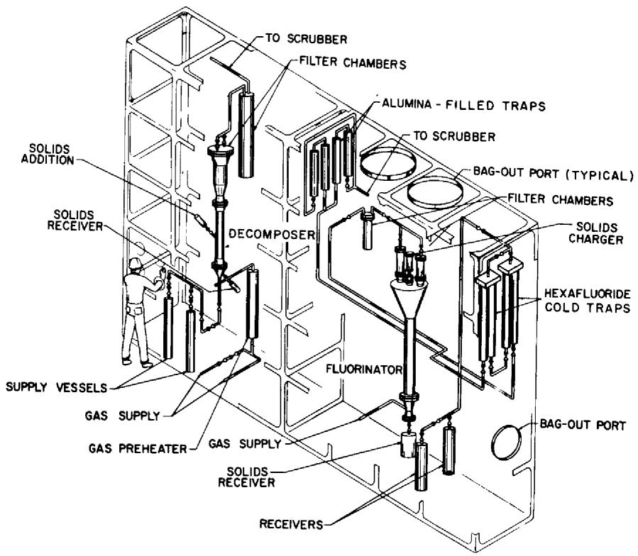  
1. Engineering-Scale Alpha Facility.


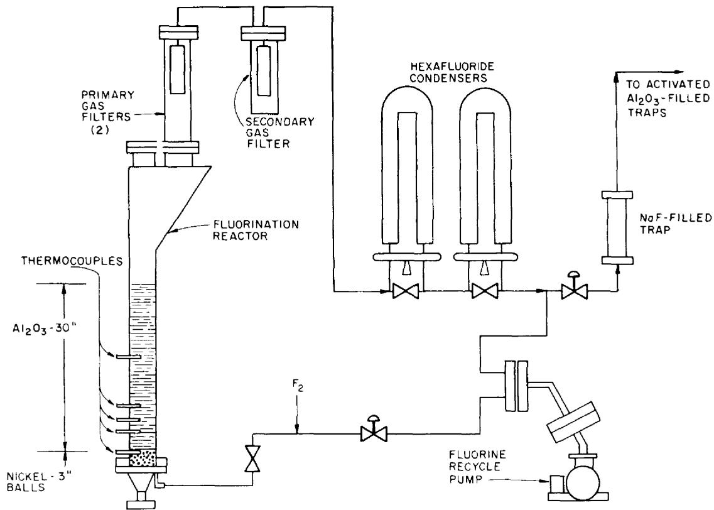  
2. Fluorination Process Equipment.

Each charge consisted of $8.8\mathrm{kg}$ of $\mathrm{UO}_2 - 0.5$ wt $\%$ $\mathrm{PuO}_2$ as $1/2$ -in. by $1/2$ -in. right-cylinder pellets containing some 19 fission product oxides to correspond to 10,000 MWd/ton fuel. About $6.5\mathrm{kg}$ of alumina (Alcoa Tabular T-61, nominal 48-100 mesh) comprised the bed, which was reused for this set of three experiments.

In effecting the recovery of the uranium and plutonium, the fluidized-bed fluorinator was operated first with two reaction zones and then with a single reaction zone. Initially, the pellets reside in the alumina bed in the lower portion of the reactor in the packed fluidized-bed mode.(8) The alumina was fluidized in the voids of the pellet bed, but also extended about 2 ft above the pellet zone, providing a second fluidized bed reaction zone.

Oxidative pulverization of the pellets was effected in the lower zone at a temperature of $400 - 450^{\circ}\mathrm{C}$ with about $20\%$ oxygen in nitrogen. Fluorine was admitted continuously via a side inlet to the zone above the pellets as the fluorinating agent for the $\mathrm{U}_{3}\mathrm{O}_{8} - \mathrm{PuO}_{2}$ fines, which were carried up from the pellet zone by the gas stream and the mixing action of the alumina. About $10\%$ fluorine was used during the two-zone operating period with the fluorination zone at $450^{\circ}\mathrm{C}$ . Under these conditions, the bulk of the uranium was converted to $\mathrm{UF}_{6}$ , while the plutonium was mainly converted to $\mathrm{PuF}_{4}$ . Thermal conductivity cells were used to monitor the fluorine concentration in the off-gas.(9) Continuous weight readout of the cold traps provided a monitor of the $\mathrm{UF}_{6}$ production rate.

After about $85\%$ of the pellets were reacted, the operating mode was changed to single reaction zone operation by admitting the fluorine at the bottom of the reactor; oxygen flow was stopped at this point. Also, the gas flow that had been on a once-through basis was now put on recycle to conserve fluorine. The fluorine concentration was gradually increased to $80 - 90\%$ , and the bed temperature was gradually raised to $550^{\circ}\mathrm{C}$ and maintained there for a given period (3 to 5 hr) to complete the recovery of the plutonium.

Results and Discussion of Two-Zone Oxidation-Fluorination Studies. Success of these experiments was judged primarily upon the completeness with which the plutonium was removed from the alumina bed. The extent of removal was determined by analysis of grab and final bed samples. Analytical data on plutonium content of grab samples for the three experiments are plotted in Figure 3 as a function of the duration of the plutonium fluorination period (designated Fluorination Cleanup Period).

Residual levels of plutonium equivalent to a maximum loss of about $1\%$ were desired. This loss level was essentially achieved by using a single alumina bed for the three experiments, whereas the loss for a single use of the bed was perhaps as much as $5\%$ . Percentage loss, of course, was a function of throughput, so the


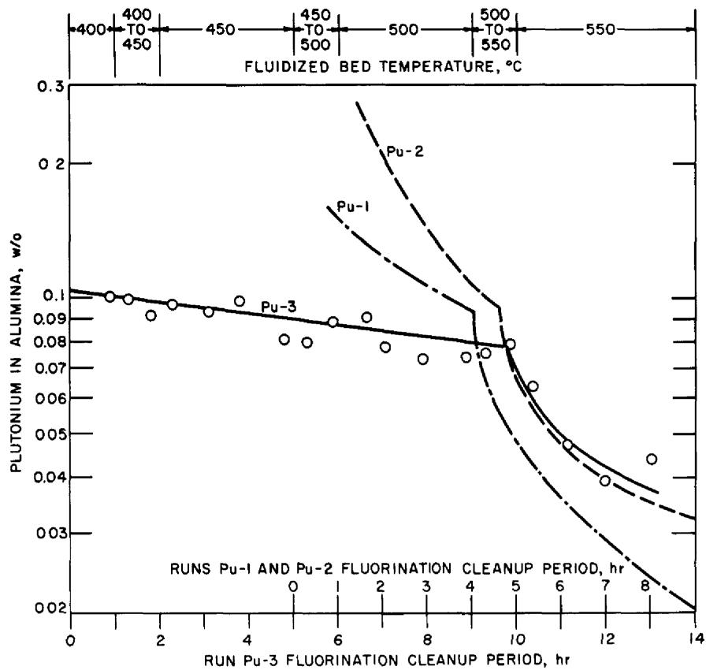  
3. Percent Plutonium in Alumina Grab Samples Removed from the Fluorinator During the Fluorination Cleanup Period.

above results should be considered preliminary.

High (near $100\%$ ) uranium removal was sustained in each experiment. Peak $\mathrm{UF}_6$ production rates to 110 lb/(hr) $(\mathrm{ft}^2)$ were noted; average production rates for the three experiments were 41, 51, and 24 lb/(hr) $(\mathrm{ft}^2)$ . Corresponding average fluorine utilization values were 55, 66, and $26\%$ . Data indicated fluorine utilization might be optimized by automatic control of reagents, which should be implemented in future studies.

Elutriation of some plutonium (most likely as $\mathrm{PuF}_{4}$ ) from the bed by the fluidizing gas and subsequent deposition and holdup of this material in the upper regions of the column were experienced. Normal blowback of the filters and mechanical vibration by a pneumatically operated hammer was not completely effective in returning this material to the bed during the run. When the gas flow was stopped, however, at the end of a run, a portion of this material did fall back into the bed and gave higher values for plutonium content than did final grab samples. Caution must, therefore, be exercised in evaluating results of a given experiment. This holdup, of course, does not represent a loss but, rather, inventory that is recoverable by a cleanup-fluorination procedure, as was demonstrated later (see below).

Subsequent experience indicated that the quantity of material retained in the upper part of the reactor reached a steady-state value and was probably a function of column design (relative surface area and geometry of these surfaces). This is a factor to be considered in the design of new equipment. In the present system, holdup was on the order of $10 - 20\mathrm{g}$ of plutonium. In these initial experiments, even the lowest value represented a very significant fraction of a single charge; thus yield could not be used in evaluating the results. In later experiments, with $600\mathrm{g}$ of plutonium, this amount was a negligible percentage, and $\mathsf{PuF}_6$ production was an important parameter.

These initial studies also provided some insight into prefluorination requirements for experimental systems. It was concluded that interaction between $\mathsf{PuF}_6$ and nickel surfaces still occurred even after a vigorous prefluorination treatment with fluorine and accounted for a part of the $\mathsf{PuF}_4$ holdup in the cold traps and other parts of the nickel equipment train. This holdup, on the order of grams of material, was recoverable by the cleanup-fluorination treatment.

A pretreatment with $\mathrm{ClF}_3$ was also used in two experiments, particularly to remove adsorbed moisture that might have entered the system when the reactor was opened to the air during charging. This would not be a problem with continuously operated units.


Thermal decomposition provides a means to separate $\mathsf{PuF}_6$ from UF $_6$ - $\mathsf{PuF}_6$ mixtures, e.g., as an intermediate step in an all-fluorine flowsheet, or a means to effect some degree of purification of a $\mathsf{PuF}_6$ stream from volatile fluoride fission products or other impurities that are more stable than $\mathsf{PuF}_6$ . On the basis of laboratory work performed by Trevorrow, $^{(10)}$ thermal decomposition requires the appropriate combination of residence time for the gas and a temperature that favors the formation of $\mathsf{PuF}_4$ in the absence of significant quantities of fluorine, considering the equilibrium $\mathsf{PuF}_6 \rightleftharpoons \mathsf{PuF}_4 + \mathsf{F}_2$ .

A fluidized-bed concept was selected for this study since the bed provides a large surface on which the reaction can occur, and isothermal conditions can be maintained for evaluation of the effect of temperature.

The 10-kg batches of UF $_6$ -PuF $_6$ produced in the two-zone-reactor fluorination studies served as feed for these decomposition studies. Because of the low plutonium yield in the fluorination experiments, additional PuF $_6$ was spiked into the final batch of mixed hexa-fluoride feed to make a total of about $30\mathrm{g}$ of plutonium for the three experiments. Some volatile ruthenium and molybdenum fluoride species (speculated to be $\mathsf{RuF}_5$ and $\mathsf{MoF}_6$ ) were present in this material and provided preliminary information on fission product behavior in this system.

A relatively fine (-100 mesh) alumina material was used as the bed so that a low fluidization velocity could be used, maximizing gas residence time. The 2-kg bed gave about a 12-in. depth (when static), and with a superficial fluidization velocity of 0.15 ft/sec, a nominal gas residence time of 10 sec was achieved. The feed was heated to about $80^{\circ}\mathrm{C}$ and fed as a $40\%$ hexafluoride- $60\%$ nitrogen mixture. With the hexafluoride feed rate at about $20~\mathrm{g / min}$ , a $10 - \mathrm{kg}$ batch of feed was processed in about 8 hr. Experiments were conducted at $350^{\circ}\mathrm{C}$ and $300^{\circ}\mathrm{C}$ .

Results and Discussion of Thermal Decomposition Studies. The extent of separation of plutonium from the feed was determined from data obtained by analysis of feed (liquid and vapor) hexafluoride samples, bed samples, overhead grab $\left(\mathrm{UF}_{6}\right.$ product) gas samples, and samples from the final $\mathrm{UF}_{6}$ product receivers. Although there was considerable scatter in a given set of $\mathrm{UF}_{6}$ product samples, the plutonium levels were always low enough to indicate that good separation had been achieved. Separations efficiencies ranged from 99.2 to $99.99\%$ , indicating the feasibility of this fluidized-bed separation technique.

Analysis of grab samples from the bed over the course of the three experiments showed a gradual buildup of plutonium to about


1.46 wt %. The final bed, unexpectedly, also contained about 0.19 wt % uranium. The reason for uranium deposition is uncertain; it may be a result of reaction with "untreated (unfluorinated) sites" on bed particle surfaces. Less uranium codeposition occurred at the lower $(300^{\circ}\mathrm{C}$ vs $350^{\circ}\mathrm{C})$ bed temperature.

The deposition of $\mathsf{PuF}_4$ appeared to occur preferentially on the surface of the bed particles rather than in the gas phase. Thus, after a short period, the bed simulated a $\mathsf{PuF}_4$ bed. Assuming appropriately sized $\mathsf{PuF}_4$ could be obtained as a starting material in an actual application, a readily transportable product is made. The nature of the $\mathsf{PuF}_4$ coating on the alumina was not studied.

Encouraging decontamination data for ruthenium and molybdenum were also obtained. Analysis of bed samples by a spark source mass spectrometric method showed ruthenium values of 0.2 ppm. The ruthenium throughput was about $5\mathrm{g} \pm 2.5\mathrm{g}$ , giving decontamination factors in the range $10^{3}$ to $10^{4}$ . An accounting of molybdenum gave a decontamination factor of greater than $10^{2}$ . The data showed $23\mathrm{g}$ of molybdenum in the overhead $\mathrm{UF}_{6}$ product and about $0.2\mathrm{g}$ in the bed (the bed analysis showed $<0.01$ wt $\%$ , the limit of the analytical method used). Further studies in this area are recommended.

# MATERIAL BALANCES

To examine the disposition of plutonium in the equipment in the work to this point, an attempt was made to account for the overall quantity of plutonium introduced into the fluorinator and thermal decomposer in the course of the above-described experiments. Virtually all equipment exposed to $\mathsf{PuF}_6$ was given a fluorination cleanup treatment, which consisted of recirculating $90\%$ fluorine at about $300^{\circ}\mathrm{C}$ . Recovered $\mathsf{PuF}_6$ was trapped on sodium fluoride, which is regarded as being $100\%$ efficient as a sorbent for $\mathsf{PuF}_6$ . Sodium fluoride traps were placed in such a way that the amount of plutonium recovered from a given section of the equipment train could be determined. For example, one trap was placed just downstream of the fluorinator; other traps were used downstream of each of the main cold traps. Lines and product receivers were treated similarly.

The NaF used for sorption of $\mathsf{PuF}_6$ was in the form of 1/8-in. by 1/8-in. right cylinders. Following $\mathsf{PuF}_6$ recovery, the trap contents were ground individually, the resulting powder riffled to split out a representative sample, and these samples analyzed for plutonium content. The residual deposits of plutonium in the equipment were found to be distributed as follows:

1. Small (or less) quantities of plutonium were deposited in the lines and secondary filter between the fluorinator and the cold traps;


2. several-gram quantities of plutonium were deposited in product receivers and on the primary fluorinator filters (a part of the interim holdup discussed earlier); and   
3. decagram quantities of plutonium were deposited in the cold traps.

Mechanisms for deposition include radiation decomposition ( $\sqrt{1 - 2\%}$ per day in the condensed phase), thermal decomposition, and reaction with nickel and other surfaces and with minor constituents of the system (e.g., a number of fission products were in the oxide pellets).

Overall, a material balance of $88\%$ was obtained for this initial series of experiments, assuming the input pellets were approximately 0.5 wt $\%$ $\mathrm{PuO}_2$ as indicated by the manufacturer. Some question remained as to the reliability of this input value. Nevertheless, the initial purpose of this program had been fulfilled in that operation of pilot-scale fluoride volatility systems with plutonium materials was shown to be feasible. Insight into the behavior of $\mathrm{PuF}_6$ in these systems was gained such that more definitive experiments might be planned.

# STUDIES SIMULATING THE PLUTONIUM RECOVERY STEP OF THE INTERHALOGEN FLOWSHEET

The interhalogen flowsheet proposes oxidation of oxide-pellet fuel to $\mathrm{U}_{3}0_{8}-\mathrm{PuO}_{2}$ fines, followed by separate fluorination of the uranium and plutonium to hexafluorides, using first $\mathrm{BrF}_{5}$ as a selective fluorinating agent for the uranium, then fluorine to recover the plutonium. The reactions would be conducted sequentially in a single reactor.

A brief program of plutonium fluorination studies was carried out to simulate the plutonium fluorination step of this flowsheet. Four experiments were made using 135-g charges of fine $\mathsf{PuF}_4$ powder (-325 mesh) and fresh alumina beds. Two experiments involved $\mathsf{PuF}_4$ -fission product residues in alumina, which remained after oxidation and $\mathsf{BrF}_5$ steps were conducted on 650-g charges of $\mathsf{UO}_2$ - $\mathsf{PuO}_2$ -fission product pellets in the laboratory fluidized-bed unit (see paper by M. Steindler, this volume); oxidation had been carried out for 4 hr at $450^{\circ}\mathsf{C}$ with about $20\%$ oxygen (in nitrogen); uranium fluorination had been carried out at $300^{\circ}\mathsf{C}$ for 2 hr with about $10\%$ $\mathsf{BrF}_5$ (in nitrogen). About $20\mathrm{g}$ of plutonium and about $10\mathrm{g}$ of uranium remained in the bed to be processed, following fluorination, in each of these two cases.

Yield data on the production of $\mathsf{PuF}_6$ was obtained in two ways: by direct sorption on NaF and by direct weight of $\mathsf{PuF}_6$ . In the latter case, the $\mathsf{PuF}_6$ was initially collected in the large primary traps and then vapor-transferred to a smaller cold trap that could

be weighed accurately. The small cold trap also had a NaF trap as a backup.

Portable neutron survey meters $\left(\mathrm{BF}_{3}\right.$ type) were positioned at the $\mathrm{PuF}_{6}$ collection points and provided information on the accumulation of $\mathrm{PuF}_{6}$ as a function of time and temperature. Starting fluorination temperatures were $200^{\circ} \mathrm{C}$ and $300^{\circ} \mathrm{C}$ , but the temperatures were programmed to increase to $550^{\circ} \mathrm{C}$ (with $25^{\circ} \mathrm{C}$ incremental changes) in response to the data provided by the neutron monitors. The characteristic response of the neutron monitor was an increase in count rate immediately following a rise in temperature, followed by a plateauing of the count rate. The temperature was raised after plateauing was observed.

Grab and final bed samples were also taken to follow the removal of plutonium from the alumina.

Results of Interhalogen Flowsheet-Related Studies. Plutonium removal from alumina to residual values of 0.005 wt % and 0.015 wt % in the bed was achieved in the $\mathrm{PuF}_4$ and interhalogen residue experiments, respectively. Both values were satisfactory from an overall process standpoint, the former being equivalent to 99.7% removal and the latter being equivalent to 98.7% removal. In the case of the latter, a total of some 75 g of plutonium had been processed using a single alumina bed. In general, somewhat greater retention of plutonium has been experienced when compounds of fission product elements were present, although the exact retention mechanism is not understood.

Residual uranium levels were very low, 0.003 wt $\%$ ,equivalent to $99.9\%$ removal.

Yield results on $\mathsf{PuF}_6$ were consistently good, up to $99\%$ , in the present series of experiments, indicating production and transport of $\mathsf{PuF}_6$ was feasible. The later series of campaign-type experiments (see below) conclusively demonstrated this.

Poor agreement between analytical data on bed grab samples taken early in a run and the expected values on the basis of known charges of plutonium was again evidence of the problem of elutriation and served to emphasize the point that greater attention must be given to mixing characteristics of fine materials and relatively coarse (48-100 mesh) alumina. Effects of these operating variables on overall reactor efficiency needs further study.

# FLUORINATION OF KILOGRAM QUANTITIES OF $\mathsf{PuF}_4$

A very significant series of campaign-type experiments were next performed, which firmly established the feasibility of producing and transporting $\mathsf{PuF}_6$ in engineering-scale equipment and collecting


it quantitatively. Information on the rates of fluorination of $\mathsf{PuF}_4$ from an alumina bed for scale-up purposes was also obtained.

Three campaigns were conducted. Each campaign consisted of three successive experiments in which $\mathsf{PuF}_4$ was fluorinated to $\mathsf{PuF}_6$ with fluorine, followed by a cleanup-fluorination experiment, which included fluorination of the primary filter region and a separate cleanup of the lines and other equipment (secondary filter section and cold traps) to recover $\mathsf{PuF}_4$ deposited as a result of alpha decomposition of $\mathsf{PuF}_6$ (or other interaction mechanisms). A single bed consisting of about $6500\mathrm{g}$ of 48-100 mesh prefluorinated alumina was used in each campaign.

The effect of the starting temperature of the fluorination on plutonium behavior, i.e.g., retention by alumina and overall recovery, was investigated. Starting temperatures were 300, 375, and $450^{\circ}\mathrm{C}$ in the three successive campaigns.

Each experiment involved the fluorination of $200\mathrm{g}$ of plutonium (charged as $-325$ mesh $\mathsf{PuF}_4$ ). Thus, almost $2\mathrm{kg}$ of plutonium was involved in this program, compared with a total of about $600\mathrm{g}$ of plutonium used in some 15 experiments up to this time. The restriction of $200\mathrm{g}$ of plutonium per run was self-imposed because of the direct connection of the large glovebox to a non-critically-safe aqueous scrubber. More specifically, only $200\mathrm{g}$ of plutonium, as $\mathsf{PuF}_6$ , was to be contained in a single vessel, whereas up to $2000\mathrm{g}$ of plutonium in nonvolatile forms was allowed. For long range work, use of fixed or soluble poisons, boron Raschig rings or boron in solution should be considered in making the scrubber critically safe.

The procedure for each experiment was as follows: The bed was brought to the starting temperature while fluidized with nitrogen; the gas stream was then put on total recycle, and fluorine flow was started at a rate equivalent to about $20\%$ of the total gas flow rate. This quantity of gas was bled off at the same rate to maintain the system pressure constant. The ratio of fluorine flow rate to nitrogen (purge and filter blowback gas) flow rate was such that a steady-state fluorine concentration of about $85\%$ was attained. In each experiment the temperature was increased incrementally, $25^{\circ}\mathrm{C}$ every 15 min, until the final temperature of $550^{\circ}\mathrm{C}$ was reached. The total time for fluorination was 5 hr for each experiment in Campaigns 1 and 2. The fluorination time was reduced to 3 hr in each experiment of Campaign 3.

The $\mathsf{PuF}_6$ was collected in the two in-series cold traps used in the earlier experiments. The cold traps were operated at about $-65^{\circ}\mathrm{C}$ . The $\mathsf{PuF}_6$ was subsequently transferred with an inert-gas purge to NaF sorption traps. In two instances during high $\mathsf{PuF}_6$ production periods, the $\mathsf{PuF}_6$ was trapped directly on NaF to obtain information on fluorine utilization and production rates and to

determine how close to equilibrium the system was operating.

Samples from these NaF traps and from the alumina beds provided the basis for analysis of the experiments. Separate cleanup fluorinations (2 hr of fluorination with fluorine at $300^{\circ}\mathrm{C}$ ) were conducted on the primary fluorinator filters and remaining process equipment (cold traps, lines, secondary filter), and the amount and location of plutonium deposits in the equipment were determined. This information was useful not only for material balance purposes but also for studying the basic question of plutonium holdup as a function of plutonium throughput. If the plutonium is recoverable, this interim holdup does not represent a process loss, but merely reflects the need for an additional operating period for cleanup.

Results and Discussion of FuF Campaign-Type Experiments. Very encouraging results were obtained, as may be seen in the summary of data presented in Table 1. The low residual concentrations of plutonium in the three final alumina beds, 0.010, 0.029, and 0.022 wt %, represent a total loss of only about 0.25% of the plutonium charged. The reduction in run time from 5 hr in Campaigns 1 and 2 to 3 hr in Campaign 3 had no adverse effect on plutonium removal from alumina.

# Table 1

# Summary of Fluorination Campaign Experiments

Operating Conditions:

Campaign 1: $592\mathrm{g}$ Pu, $300 - 550^{\circ}\mathrm{C}$ , 5-hr experiments

Campaign 2: 587 g Pu, $375 - 550^{\circ}C$ , 5-hr experiments

Campaign 3: 578 g Pu, 450-550°C, 3-hr experiments

<table><tr><td>Campaign</td><td>Residual Plutonium Concentration in Alumina (w/o)</td><td>PuF6 Production Rate [1b/(hr) (ft2)]</td><td>Average Fluorine Utilization Efficiencya (%)</td><td>Plutonium Material Balance (%)</td></tr><tr><td>1</td><td>0.010</td><td>2.4</td><td>22</td><td>97</td></tr><tr><td>2</td><td>0.029</td><td>2.4</td><td>17</td><td>101</td></tr><tr><td>3</td><td>0.022</td><td>4.1</td><td>28</td><td>99</td></tr></table>

${}^{a}$ Calculated as the amount of ${\mathrm{{PuF}}}_{6}$ produced during the total run time compared with the amount of ${\mathrm{{PuF}}}_{6}$ that could be produced at equilibrium $\left( {{\mathrm{{PuF}}}_{4} + {\mathrm{F}}_{2} \neq  {\mathrm{{PuF}}}_{6}}\right)$ ; the change in fluorine requirement with temperature was considered in this calculation.


The reduced operating time gave overall higher average $\mathsf{PuF}_6$ production rates, and fluorine utilization efficiencies were higher in the third campaign than in the earlier campaigns. The improvement was also directly related to the amount of plutonium in the fluidized bed at a given time as shown in Table 2. For example, during the first half-hour of Run 2 of Campaign 3, the average quantity of plutonium in the bed was $204\mathrm{g}$ , and a fluorine efficiency of $98\%$ was achieved. During the next half-hour, the average plutonium content was only $154\mathrm{g}$ , and the efficiency dropped to $51\%$ . As the plutonium content diminished during the final two hours, a further significant drop in efficiency occurred. It is likely that similar characteristics prevailed during the final period of the earlier 5-hr runs. The higher efficiencies and $\mathsf{PuF}_6$ production rates observed in Run 2 of Campaign 3 over those achieved in Run 1 also reflect the effect of plutonium content, the second run having started with a fresh charge of $\mathsf{PuF}_4$ plus a heel of $\mathsf{PuF}_4$ from the first run equivalent to about $1/6$ of a charge.

Fluorine efficiencies near $100\%$ and production rates up to 6.5 lb $\mathrm{PuF}_{6} / (\mathrm{hr})(\mathrm{ft}^{2})$ were obtained in the initial period of the second run. These data were obtained by collecting the $\mathrm{PuF}_{6}$ directly on NaF traps and changing traps at 30-min intervals. The observed high production rate is not a limit and further improvement in production rate could have been realized by starting with a high concentration of fluorine in the fluidizing gas; in the current procedure, the fluorine concentration is gradually increased from 0 to $95\%$ in the course of gas recycle. Higher rates could also probably have been achieved by operating at a higher initial fluorination temperature, and by passing more fluorine through the bed by increasing the gas velocity and the fluorinator pressure. These results emphasize the benefits that might be realized by a continuous process, in which the required steady-state concentration of plutonium would be maintained to give a sustained high production rate for $\mathrm{PuF}_{6}$ . This was the concept considered in the design concept study (29) for reprocessing LMFBR fuels.

The material balance values, 97-101% (Table 1), lie within the range expected on the basis of a statistical sampling experiment. Sample treatment included milling (coarse grinding in a disk mill), sample splitting by riffling, and fine grinding steps, followed by chemical analysis. Gross sampling error proved to be about ±4%.

A complete plutonium material balance for one of the campaigns (Campaign 2) is presented in Table 3. These data show that about $99\%$ of the $\mathrm{PuF}_4$ charge was fluorinated to $\mathrm{PuF}_6$ and collected in the two cold traps during the main fluorination period. The cold traps were quite efficient at the current operating temperature of about $-65^{\circ}\mathrm{C}$ . Since the small loss $(0.7\%)$ sustained is about equivalent to the quantity represented by vapor-pressure considerations alone increased efficiency may only be achieved by operating at lower temperatures.

Table 2   
Fluorine Efficiencies and $\mathsf{PuF}_6$ Production Rates   
During First and Second Runs of Campaign 3   
26   

<table><tr><td rowspan="3">Time Period</td><td colspan="2">Operating Conditions in Period</td><td colspan="3">Run 1</td><td colspan="3">Run 2</td><td rowspan="2" colspan="2">Average PuF6 Production Rate [lb/(hr) (ft2)]</td></tr><tr><td rowspan="2">Fluorine Conc. in Fluorinator (%)</td><td rowspan="2">Fluidized Bed Temp. (℃)</td><td colspan="2">Amount of Plutonium in Fluorinator (g)</td><td rowspan="2">Fluorine Efficiency (%)</td><td colspan="2">Amount of Plutonium in Fluorinator (g)</td><td rowspan="2">Fluorine Efficiency (%)</td></tr><tr><td>Beginning of Period</td><td>End of Period</td><td>Beginning of Period</td><td>End of Period</td><td>Run 1</td><td>Run 2</td></tr><tr><td>First half-hour</td><td>Increasing 6 → 91</td><td>Increasing 450 → 525</td><td>194.3</td><td>145.1</td><td>77</td><td>228.0</td><td>180.0</td><td>98</td><td>5.20</td><td>6.53</td></tr><tr><td>Second half-hour</td><td>91 → 95</td><td>525 → 550</td><td>145.1</td><td>108.1</td><td>42</td><td>180.0</td><td>129.4</td><td>51</td><td>4.70</td><td>6.41</td></tr><tr><td>Final two hours</td><td>95</td><td>550</td><td>108.3</td><td>33.7</td><td>17</td><td>129.4</td><td>35.7</td><td>20</td><td>2.25</td><td>2.97</td></tr></table>

Table 3   
Plutonium Material Balance--Campaign 2   

<table><tr><td></td><td colspan="2">Plutonium</td></tr><tr><td></td><td>(g)</td><td>% of Charge</td></tr><tr><td>Charge</td><td>587.1</td><td>100.0</td></tr><tr><td>Processed to PuF6</td><td></td><td></td></tr><tr><td>Recovered from cold trap 1</td><td>566.4</td><td>96.5</td></tr><tr><td>Recovered from cold trap 2</td><td>7.6</td><td>1.3</td></tr><tr><td>Recovered from cold traps and lines during cleanup fluorination</td><td>8.0</td><td>1.4</td></tr><tr><td>Loss through cold traps</td><td>4.0</td><td>0.7a</td></tr><tr><td>Subtotal</td><td></td><td>99.9</td></tr><tr><td>Recovered from Primary Sintered Metal Filters during Cleanup Fluorination</td><td>4.1</td><td>0.7</td></tr><tr><td>Unprocessed and Lost</td><td></td><td></td></tr><tr><td>Grab samples and reactor cleanout</td><td>0.7</td><td>0.1</td></tr><tr><td>Final bed (loss)</td><td>1.9</td><td>0.3</td></tr><tr><td>Total Accounted for</td><td>592.7</td><td>101.0</td></tr></table>

${}^{a}$ Assumed to be recoverable by using a lower cold trap temperature.

The problem of holdup of plutonium on the primary filters appears to diminish with increased plutonium throughput. The fraction retained on the filters during Campaign 2, $0.7\%$ of the charge, was rather insignificant in terms of the quantity of material processed. In earlier studies with plutonium charges ranging from 20 to $100\mathrm{g}$ , filter holdup represented as much as $15\%$ of the charge. Holdup, of course, is a function of total available filter area and is responsive to the filter blowback system.

The recovery of material retained on filters is dependent on the ability to expose the filters to concentrated fluorine at $300^{\circ}\mathrm{C}$ (conditions required for cleanup). Examination of the filters after a total exposure at $300^{\circ}\mathrm{C}$ of about 30 hr disclosed no obvious deterioration. Much more testing will be needed, however, before conclusions about filter life can be made.

The only nonrecoverable loss is probably represented by the quantity of plutonium retained by the alumina bed, about $2\mathrm{g}$ or $0.3\%$ of

the charged plutonium. This value represents the loss sustained when the bed is used in only one campaign. Losses may be further reduced by using the same bed for several campaigns, if this technique is feasible in practice. Studies, to date, do not indicate the exact nature of the retention mechanism; this remains a subject of interest for future study.

# EXPERIENCE WITH NEUTRON COUNTERS AS PLUTONIUM MONITORS

The use of neutron counting equipment was exploited rather widely in plutonium monitoring applications in the current program. Standard neutron survey instruments with either 2.5-in. long or 10-in. long $\mathrm{BF}_3$ probes were mounted at strategic locations (cold traps and NaF traps) and coupled to scalers and recording instruments to record the movement of $\mathrm{PuF}_6$ from the reactor to the cold traps during fluorination and from the cold traps to the NaF traps during $\mathrm{PuF}_6$ transfer operations. Operating procedures, such as the time-temperature program used in the fluorination experiments, were selected on the basis of the data obtained during $\mathrm{PuF}_6$ collection in the cold traps. Similarly, the decision to reduce the fluorination period from 5 to 3 hr was based on these data.

Neutron response curves obtained during the first fluorination experiment of Campaign 3, which were typical of the curves obtained in all three campaigns, are shown in Fig. 4. Figure 4a shows $\mathsf{PuF}_6$ sorption on NaF (Trap 1) during the first 3 hr of this experiment. The observed change in activity level during the first hour was in response to the collection of $86\mathrm{g}$ of plutonium. During the second and third hours, the $\mathsf{PuF}_6$ was fed directly to the cold traps. As seen by the plateauing in Fig. 4b, fluorination was essentially complete after the second hour. The transfer of $\mathsf{PuF}_6$ out of the cold trap and the corresponding sorption of this material onto NaF (Trap 2) is shown in Fig. 4c. Approximately $74\mathrm{g}$ of plutonium was transferred in about 1 hr.

Use of these instruments for more quantitative measurements is limited, in large part, by equipment geometry. In addition, above about $40^{\circ}\mathrm{C}$ , these detectors are sensitive to temperature. Nevertheless, their value has been proved, and further efforts to extend their use to more quantitative applications appear to be warranted.

# CONCLUSIONS

Fluidized-bed fluorination studies on sintered $\mathrm{UO}_2$ - $\mathrm{PuO}_2$ pellet materials and $\mathrm{PuF}_4$ -alumina mixtures established the feasibility of processing plutonium-bearing materials by fluoride volatility methods. Overall, some $3.5\mathrm{kg}$ of $\mathrm{PuF}_6$ was produced, transported and recovered from the engineering-scale process equipment. Fluorination rates for both uranium and plutonium were shown to


be practical, and fluorination efficiencies high using recycle fluorination techniques. Neutron survey meters proved useful as plutonium monitors in the collection and transfer of $\mathsf{PuF}_6$ .

Thermal decomposition, using fluid-bed techniques, was shown to be feasible as an efficient means of separating plutonium as $\mathrm{PuF}_4$ from $\mathrm{PuF}_6$ - $\mathrm{UF}_6$ mixtures. Some decontamination from selected fission products that form volatile fluorides, such as ruthenium and molybdenum, was also demonstrated in this work. The method can be made continuous, which is a process advantage.

The results of these studies are pertinent to the development of reprocessing methods for light water reactor and fast breeder reactor fuels as well as scrap recovery processes.

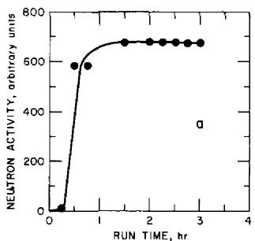

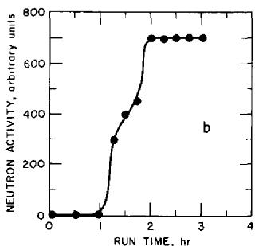

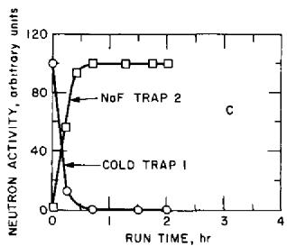

4. Neutron Activity in NaF Traps and Cold Trap During First Fluorination of Campaign 3. a. $\mathsf{PuF}_6$ Sorption on NaF (Trap 1) During Fluorination; b. $\mathsf{PuF}_6$ Collection in Cold Trap 1 During Fluorination; and c. $\mathsf{PuF}_6$ Transfer from Cold Trap to NaF (Trap 2).

# References

1. G. J. Vogel, E. L. Carls, and W. J. Mecham, "Engineering Development of Fluid-Bed Fluoride Volatility Processes, Part 5. Description of a Pilot-Scale Facility for Uranium Dioxide-Plutonium Dioxide Processing Studies," USAEC Report ANL-6901 (December 1964).   
2. N. M. Levitz et al., "Fluoride Volatility Plant Design Concept Study for LMFBR Fuels, (In preparation).   
3. R. L. Standifer, "A Fluid Bed Fluoride Volatility Pilot Plant for Plutonium Purification," Paper 46e presented at the 64th National Meeting of the AICHe, New Orleans, March 17-20, 1969.   
4. "Chemical Engineering Division Research Highlights, May 1964-April 1965," USAEC Report ANL-7020, pp. 100-101.   
5. "Chemical Engineering Division Research Highlights, May 1966-April 1967," USAEC Report ANL-7350, p. 21.   
6. N. M. Levitz et al., "Engineering Development of Fluid-Bed Fluoride Volatility Processes, Part 14. Processing Experience in Fluorinating Plutonium Materials and Thermal Decomposition Studies in an Engineering-Scale Alpha Facility," USAEC Report ANL-7473 (in preparation).   
7. N. M. Levitz et al., "Engineering Development of Fluid-Bed Fluoride Volatility Processes, Part 15. Material Balance Demonstrations, Production Rates, and Fluorine Utilizations in Fluorination of Kilogram Quantities of $\mathsf{PuF}_6$ to $\mathsf{PuF}_6$ with Elemental Fluorine in a Fluid-Bed Reactor," USAEC Report ANL-7468 (July 1968).   
8. J. D. Gabor and W. J. Mecham, "Engineering Development of Fluid-Bed Fluoride Volatility Processes, Part 4. Fluidized-Packed Beds: Studies of Heat Transfer, Solids-Gas Mixing, and Elutriation," USAEC Report ANL-6859 (March 1965).   
9. D. Ramaswami et al., "Engineering Development of Fluid-Bed Fluoride Volatility Processes, Part 11. Off-Gas Analysis," USAEC Report ANL-7339 (July 1968).   
10. L. Trevorrow, J. Fischer, and J. Riha, "Laboratory Investigations in Support of Fluid-Bed Fluoride Volatility Processes, Part III. Separation of Gaseous Mixtures of Uranium Hexafluoride and Plutonium Hexafluoride by Thermal Decomposition," USAEC Report ANL-6762 (August 1963).


# FOR FAST BREEDER REACTOR FUELS*

A. A. Jonke, N. M. Levitz, and M. J. Steindler

Chemical Engineering Division, Argonne National Laboratory, Argonne, Illinois.

U.S.A.

# ABSTRACT

At the direction of the AEC, a high priority has been given to a study to define the potential of fluoride volatility reprocessing for application to fast breeder reactor fuels. To provide the needed information, a conceptual design of a volatility reprocessing plant has been prepared, together with an extensive critique of the process. The study included the selection of a process flowsheet, preliminary equipment design, rough plant layout, and a discussion of the uncertainties associated with the process. The results of the study indicate that fluoride volatility processing of fast reactor fuels has significant potential advantages, but that the development task may be as great as for other potential methods of reprocessing.

*Work performed under the auspices of the U.S. Atomic Energy Commission.


# INTRODUCTION

In order to make fast breeder reactors competitive with other forms of energy generation, it is anticipated that fuel-cycle costs of about 1/2 to 1 mill/kw hr will be required. To reduce costs to this level, considerable improvement in all parts of the fuel cycle--including reprocessing--will be required. Reprocessing technology for fast breeder fuels might evolve through the development of advanced aqueous processes or, alternatively, by the introduction of new nonaqueous processes. To insure that a suitable reprocessing technology is available to achieve the long range fuel cycle cost objectives, it seems prudent to investigate more than one approach to the reprocessing of fast breeder fuels.

In 1968, the USAEC requested that Argonne National Laboratory conduct a study to help define the potential of the fluoride volatility process for application to liquid-metal-cooled fast breeder reactor (LMFBR) fuels. The objectives of the study were to present the current technological basis for a volatility processing plant in the form of process and engineering flowsheets and to define process uncertainties. The uncertainties were to be translated into key problem areas in order to provide insight into the magnitude of the development task associated with establishing the volatility technology for LMFBR fuels. Economic estimates were not included in this study.

A conceptual design of a volatility reprocessing plant has been prepared, together with an extensive analysis of the process. In addition to process and engineering flowsheets, the study includes preliminary design of major equipment items, and basic layouts of the processing cells and the overall plant.

The ground rules for the study were set up in advance. The conceptual reprocessing plant was to be a large central plant serving nuclear power reactors with a total capacity of 15,000 MW(e). The processing plant capacity corresponds roughly to a fuel load of one ton per day. The plant would process core, axial blanket, and radial blanket with a decontamination factor of $10^{6}$ to $10^{7}$ and an overall minimum recovery of $99\%$ of the uranium and plutonium.

The reference core fuel element was based on an Atomics International preliminary design. Some of the characteristics of this fuel design are given in Table 1. The specific power of the core fuel was taken to be $200\mathrm{MW(t)}/$ metric ton and the burnup 100,000 MWd/metric ton. A fuel cooling time of 30 days before processing was chosen to help provide low out-of-reactor plutonium inventory costs.


# Table 1

# Reference LMFBR Core Fuel Element

<table><tr><td>Fuel pin diameter:</td><td>0.25 in.</td></tr><tr><td>Clad thickness:</td><td>0.015 in. SS</td></tr><tr><td>Core active height:</td><td>4.0 ft</td></tr><tr><td>Axial blanket lenght:</td><td>1.0 ft each end</td></tr><tr><td>No. of fuel pins per element:</td><td>217</td></tr><tr><td>Spacing between pins:</td><td>0.05 in.</td></tr><tr><td rowspan="2">Smeared fuel density:</td><td>80% T.D. (Core)</td></tr><tr><td>93% T.D. (Axial Blanket)</td></tr><tr><td>Fission-gas handling:</td><td>nonvented</td></tr><tr><td>Element shape:</td><td>hexagonal, 5.4 in. across flats</td></tr><tr><td>Shroud thickness:</td><td>0.17 in. SS</td></tr><tr><td>Cladding length:</td><td>144 in. (includes fission gas plenum)</td></tr></table>

# PROCESS FLOWSHEET

The process flowsheet was selected on the basis of existing knowledge and conservative extrapolation for process steps not clearly demonstrated. The choice of process steps rested on their high potential for successful development. The flowsheet was not optimized in any sense. A simplified version of the conceptual flowsheet is shown in Fig. 1, and some of the details are shown in Figs. 2, 3, and 4.

The mechanical head-end scheme includes mechanical disassembly of the fuel elements, chopping of the fuel pins, and a step to separate the cladding and convert the oxide to a powder. The homogeneous powder can be sampled for input accountability and fuel burnup determinations. Details of the mechanical method for separating fuel and cladding segments are a little indefinite at present, since only a limited amount of experimental data is available on which to base this operation. One concept involves tumbling the chopped fuel segments in a ball-mill to separate the fuel powder, but other alternatives also appear possible.

The powdered fuel oxide is next fed along with powdered alumina to the first of two in-series fluid-bed fluorination units, which provide bulk separation of the uranium and plutonium as well as partial decontamination. The bulk of the uranium is removed as volatile $\mathrm{UF}_6$ from the first reactor, and the bulk of the plutonium is removed as volatile $\mathrm{PuF}_6$ from the second reactor, a two-stage unit. Continuous operation and staging appear feasible on the basis of the current status of fluidization technology.

Fluorine gas is the only fluorinating agent used in the conceptual process. Fluorination at $350^{\circ}\mathrm{C}$ with $\sim 20\%$ fluorine-oxygen in the first reactor converts the bulk of the uranium to $\mathrm{UF}_6$ and


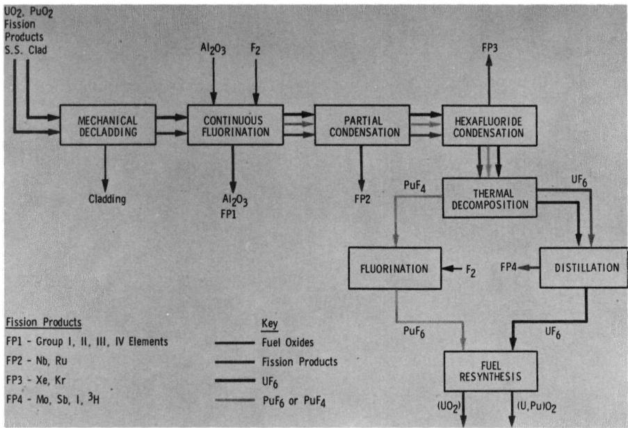  
1. Fluoride Volatility Process for Fast Reactor Fuels.

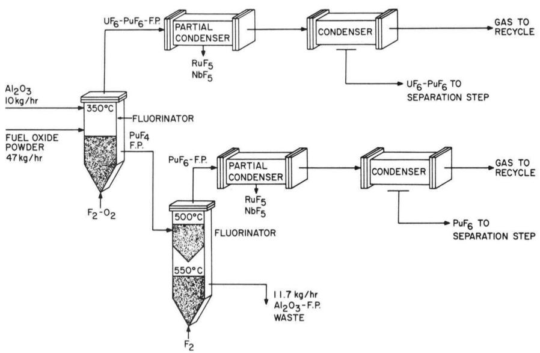  
2. Continuous Fluorination Step.

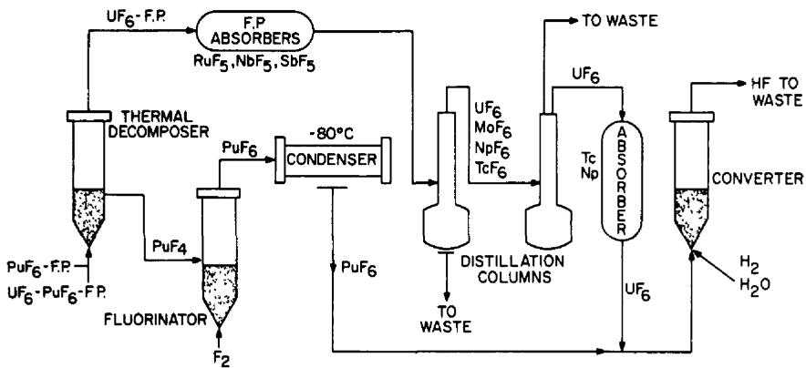  
3. Product Purification.

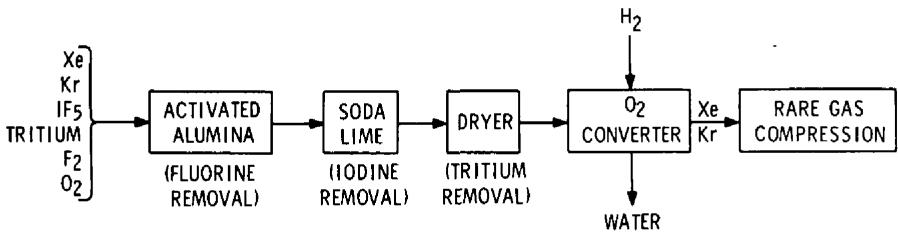  
4. Off-Gas Treatment.

less than $5\%$ of the plutonium to $\mathsf{PuF}_{6}$ . The UF production rate is approximately 100 lb/(hr) $(\mathsf{ft}^{2})$ . During fluorination with undiluted fluorine gas at $500^{\circ}\mathsf{C}$ and $550^{\circ}\mathsf{C}$ in the upper and lower stages of the second reactor, the $\mathsf{PuF}_{6}$ production rate is about 13 lb/(hr) $(\mathsf{ft}^{2})$ .

The alumina stream, which cascades through the fluorination reactors and finally to waste receivers, represents the main solid waste stream, providing a vehicle for the disposal of those fission products in the feed that do not form volatile fluorides.

The gas streams from each of the two fluid-bed fluorination units pass through a fission product trap (partial condenser) and a hexafluoride-collection cold trap, where separation from some fission products occurs. The $\mathrm{UF}_6$ product stream may contain sufficient plutonium to warrant recovery of $\mathrm{PuF}_6$ from this stream. This is accomplished in the present flowsheet by recombining the hexafluoride product steams and carrying out a more nearly quantitative separation in a fluid-bed thermal decomposition step, where $\mathrm{PuF}_6$ is converted to solid $\mathrm{PuF}_4$ . This step also gives further purification of the plutonium from remaining volatile fission products. The $\mathrm{UF}_6$ stream passes overhead and is purified by a combination of fractional distillation and sorption traps.

The $\mathrm{PuF}_4$ produced by thermal decomposition is subsequently refluorinated to $\mathrm{PuF}_6$ with concentrated fluorine ( $\sim 100\%$ ) at $500^{\circ}\mathrm{C}$ and combined with the desired proportion of pure $\mathrm{UF}_6$ . The mixture is fed to a fluid-bed converter, where a dense homogeneous $\mathrm{PuO}_2 - \mathrm{UO}_2$ particulate solid is produced by simultaneous reaction of the hexafluorides with steam and hydrogen. The conversion process is based on work conducted earlier on $\mathrm{UF}_6$ alone. Excess $\mathrm{UF}_6$ may be converted to the oxide for use in other reactors.

# PLANT DESIGN

The daily load of fuel to the plant is shown in Table 2. Because of the short cooling time, the heat-load from fission product decay is very large. It is assumed, therefore, that the fuel will be transported to the reprocessing plant in sodium-filled containers inside of shielded casks, or by some similar method which allows for removal of heat during transport.

The removal of heat from the reaction vessels required very careful consideration in the equipment design. Heat loads are most severe in the main fluorination vessels, which have large inventories of fission products, and particularly in the uranium fluorinator, which has a large chemical heat load in addition. Maximum heat fluxes are on the order of 11,000 Btu/hr ft², and calculations show that satisfactory heat removal can be achieved with air cooling of a finned reactor surface. The slab design for the fluorination vessel offers several advantages with regard to


# Table 2

# Daily Processing Load

<table><tr><td>Plant Capacity:</td><td>15,000 MW(e) equivalent</td></tr><tr><td rowspan="6">Daily Load:</td><td>6 core fuel assemblies</td></tr><tr><td>4 blanket fuel assemblies</td></tr><tr><td>875 kg uranium</td></tr><tr><td>83.5 kg plutonium</td></tr><tr><td>39 kg fission products</td></tr><tr><td>2 x 107curies fission products</td></tr><tr><td>Heat Load:</td><td>13.2 kW per core assembly</td></tr></table>

the heat problem. It provides a greater surface for heat transfer than would a cylindrical vessel of comparable volume and in addition presents a small dimension across which the heat must be transferred. Thus, in the event of a loss of fluidization in these vessels, heat removal by conduction should avoid any serious consequences due to high temperatures at the center of the vessel.

On the basis of known or estimated reaction rates and other information, the equipment sizes for the conceptual plant were calculated. The sizes of the major equipment items are shown in Table 3.

Overall plant problems such as criticality, accountability, and plant safety in the event of hexafluoride release have been considered in this preliminary evaluation. The approach to criticality control adopted for this volatility-plant concept is one that avoids neutron moderation and minimizes neutron reflection to obtain a low reactivity per unit mass of plutonium in the process system. All vessels expected to contain significant quantities of plutonium are of a slab design which lends itself to safe-by-shape geometry. Preliminary criticality calculations indicate that $100\mathrm{kg}$

Table 3   
Major Plant Equipment   

<table><tr><td>Item</td><td>Size and Shape</td></tr><tr><td>Fluorinator A</td><td>Slab - 4&#x27;&#x27; x 48&#x27;&#x27; x 10&#x27;</td></tr><tr><td>Fluorinator B</td><td>Slab - 4&#x27;&#x27; x 30&#x27;&#x27; x 10&#x27;</td></tr><tr><td>Thermal Decomposer</td><td>Slab - 4&#x27;&#x27; x 31&#x27;&#x27; x 7&#x27;</td></tr><tr><td>Distillation Column A</td><td>Cylinder - 4&#x27;&#x27; x 15&#x27;</td></tr><tr><td>Distillation Column B</td><td>Cylinder - 3.5&#x27;&#x27; x 25&#x27;</td></tr><tr><td>Converter</td><td>Slab - 4&#x27;&#x27; x 14&#x27;&#x27; x 7&#x27;</td></tr><tr><td>Cold Traps</td><td>Slab - 4&#x27;&#x27; x 24&#x27;&#x27; x various</td></tr><tr><td>or</td><td>Slab - 4&#x27;&#x27; x 48&#x27;&#x27; x various</td></tr></table>


of plutonium could be safely contained in a 4-in. thick slab reactor of nickel, 48 in. wide containing $\mathsf{PuF}_4$ at its theoretical density (7 g/cc) and reflected top and bottom by alumina bed material. The normal operating inventory in the present flowsheet is below $50\mathrm{kg}$ of plutonium. Water is excluded from the process, both internally and externally to preclude neutron moderation. For both normal and credibly abnormal situations, an acceptable factor of safety is predicted.

Accountability and burnup analyses are accomplished by sampling the fuel before it is fed into the first chemical process stage and by sampling the final waste streams (which establishes loss levels). Weights and analyses of the final products (the mixed $\mathrm{PuO}_2\text{-}\mathrm{UO}_2$ product of the conversion step) provide the remaining necessary information for accountability.

Waste disposal is accomplished by converting all wastes to solid form. The principal high level wastes are: (1) the alumina waste containing all of the nonvolatile fission products and (2) the ruthenium-niobium pentafluoride from the partial condensers. The alumina containing the nonvolatile fission products is discharged to waste storage cylinders. Aluminum shot or coarse powder is added to the waste as it is transferred to the storage cylinder to promote the transfer of heat from the center of the cylinder to the walls and thus lower the centerline temperature. These cylinders are stored under water in a storage canal to permit partial decay of fission products. The ruthenium-niobium fluorides collected in the partial condensers are removed periodically by warming the condenser and transferring the volatile fluorides in a gas stream to a bed of sodium fluoride where the fission products are sorbed. This NaF is then transferred to storage cylinders like those used for the alumina waste. A total of about 200 cylinders are required per year, each cylinder being 2 ft in diameter by 9 ft tall. Less than half of these waste containers require interim storage for decay of radioactivity to a level which will permit dry storage.

Considerable design and layout work would be needed to estimate the size of the radiochemical processing cells and the total plant with any appreciable degree of accuracy. This is beyond the scope of the present study, which is only intended to determine process feasibility. Nevertheless, a very preliminary layout of plant equipment was made and from this, the processing cells and the building appear to be of practical sizes. Remote maintenance was selected for the most radioactive sections. Major repair work will be done in a separate maintenance area located in a sublevel equipped with shielding windows and manipulators.

# CONCLUSIONS

The application of fluoride volatility processing to LMFER fuels is supported by a substantial body of basic and technological information, which has been generated in reprocessing development work on other nuclear fuel materials and in various related commercial processes. Among the most pertinent areas of earlier work are: (1) commercial refining of uranium in the Allied Chemical Corp. plant at Metropolis, Illinois; (2) extensive development work on fluoride volatility processing of several types of irradiated fuels; (3) basic and pilot (kilogram) scale work on the preparation and transport of $\mathsf{PuF}_6$ ; (4) plant-scale experience with the fluid-bed calcination of radioactive waste solutions at the Idaho Chemical Processing Plant; (5) the first planned commercial application of volatility processing to irradiated fuels in the General Electric Midwest Fuel Recovery Plant.

The potential of fluoride volatility for processing LMFBR fuels may be measured by evaluating the feasibility of the process design and reference plant concept developed in this study. The conceptual plant has a practical size. Most of the steps of the conceptual process have reasonably sound bases in current technology. The techniques employed--continuous fluid-bed fluorination, hexafluoride cold trapping, fractional distillation, and pneumatic-conveying of solids--are basically the same as those used in the earlier work cited above. It is in the extension of their use to highly radioactive, high-plutonium fuel that uncertainty arises.

Our analysis of the conceptual process has defined several key problems as follows:

1. Mechanical decladding of fuel involves difficulties from the high rate of radioactive decay heat generation; also, it may be difficult to insure that all fuel oxide has been removed from the fuel hulls by the conceptual ball milling procedure; supplementary cleanup of hulls may be required.   
2. Continuous fluorination will require the development of reliable solids feeding devices and unique equipment such as slab-shaped fluorinators and dual-stage reaction vessels. Plutonium losses in the alumina waste from the fluorination steps must be low.   
3. Further development and testing is needed to insure that plutonium decontamination will meet requirements.   
4. The transport and handling of solid materials in a processing plant operating with a high on-stream factor needs development and verification.


5. Adequate containment of process wastes gases is an essential requirement; this needs substantial study and development.   
6. Further work is needed to insure that criticality safety and containment of $\mathsf{PuF}_6$ will meet all requirements.   
7. The role of sodium (introduced into the process through leaking fuel pins) and its potential effect on plutonium losses will require additional study, since it is known that sodium fluoride forms complexes with $\mathsf{PuF}_6$ , causing plutonium to be irreversibly sorbed.

Although these key problems have been defined by analysis of the reference process selected for this study, the problems are also representative of those existing in alternative flowsheets, which were considered briefly. Solutions to these problems cannot be considered simple; but none of them appears to be insoluble, nor unduly complex when compared to similar problems for other processing methods. Finding solutions to these key problems would be the first stage of a development program on fluoride volatility.

We believe that the conceptual design study provided the desired insight into the magnitude of the development task required to establish the volatility technology for LMFBR fuels. This result, however, cannot easily be expressed in quantitative terms. It is possible to state that an extensive development program would undoubtedly be required, but it cannot be said that the magnitude of the task would be either greater or smaller than that required for development of any other method of reprocessing LMFBR fuels.


# CHLORINATION-DISTILLATION PROCESSING OF

# IRRADIATED URANIUM DIOXIDE

Kenmei Hirano  
Division of Chemistry, Tokai Research Establishment, Japan Atomic Energy Research Institute, Ibaraki-ken, Japan

Takehiko Ishihara  
Office of Planning, Japan Atomic Energy Research Institute, Tokyo, Japan  
(formerly Division of Fuel Research and Development, Tokai Research Establishment)

# Abstract

Using the difference in vapor pressure between the chlorides of uranium and those of fission products, a chlorination-distillation process of irradiated uranium dioxide fuel was investigated. Uranium recovery and decontamination were poor on a single distillation. After various improvements of the process, very high decontamination was achieved by using barium chloride as a sorption-desorption medium for the vapor of uranium chlorides. The most promising process was as follows: Irradiated uranium dioxide pellets were pulverized through an oxidation-reduction cyclic process and chlorinated by the mixed gas of argon (60%) and carbon tetrachloride vapor (40%) at about $580^{\circ}\mathrm{C}$ . The gas containing the vapor of the chlorides of uranium and some fission products formed was passed through the barium chloride bed in the temperature range from about $500^{\circ}$ to $100^{\circ}\mathrm{C}$ , and the vapor of uranium chlorides was sorbed on the bed. After the high vapor pressure fission product chlorides which were sorbed with uranium chlorides were preferentially desorbed by heating the bed to the temperatures of about $460^{\circ}$ to $480^{\circ}\mathrm{C}$ in the gas stream of argon (90%) and carbon tetrachloride vapor (10%), the uranium chlorides were desorbed as the vapor of higher uranium chlorides by heating the bed to the temperatures of about $500^{\circ}$ to $550^{\circ}\mathrm{C}$ in the mixed gas stream of argon (15%), chlorine (70%) and carbon tetrachloride vapor (15%). The vapor was trapped and uranium was recovered. After repeating the sorption-desorption process twice or three times, it was possible to attain decontamination factors to gamma emitters of $5.3 \times 10^{3}$ or $6.5 \times 10^{4}$ , respectively, and uranium recovery of $96\%$ or $94\%$ , respectively, compared to the single treatment value of $1.0 \times 10^{2}$ and $98\%$ .


# Introduction

The chloride volatility process has been applied to the processing of irradiated nuclear fuel by some research groups. Gens(1) applied it to the processing of irradiated uranium dioxide fuel. Naumann(2) applied it to the separation of uranium and plutonium in the processing of irradiated uranium dioxide-plutonium dioxide fuel. Speegaert(3) was concerned about the application of the chloride process to irradiated nuclear fuel, and applied it to the processing of irradiated metallic and ceramic fuels.

The authors applied the process to separate uranium from irradiated uranium dioxide using carbon tetrachloride vapor as the chlorination agent(4-6), and experimented on decontamination of uranium chlorides by a sorption-desorption process on a barium chloride bed.

# Preliminary Test

The major components formed by chlorinating $\mathsf{UO}_2$ with $\mathsf{CCl}_4$ vapor are UCl4, UCl5 and UCl6, and the quantity of UCl5 and UCl6 increases as the chlorination temperature rises. However, UCl5 and UCl6 are relatively unstable, particularly UCl5. They rapidly decompose to UCl4 and Cl2 by cooling in an atmosphere which does not contain free chlorine gas. They are formed by heating UCl4 in an atmosphere containing large quantities of free chlorine gas.

This behavior was applied to decontaminate uranium chlorides. The vapor of the chlorides of uranium formed by chlorinating unirradiated $\mathrm{UO_2}$ powder in a gas stream of Ar-CCl4 vapor were passed through a bed of anhydrous CaCl2, SrCl2 or BaCl2. Then, sorbed uranium chlorides were desorbed as higher chloride vapors by heating in a gas stream of Ar-Cl2-CCl4.

Experimental results are given in Table 1. $\mathsf{BaCl}_2$ is evidently the most promising.

# Experimental

# Materials

Uranium Dioxide - Uranium dioxide powder in sizes from 5 to $10\mu$ was used for unirradiated samples. The irradiated samples used were uranium dioxide pellets of $7.5\mathrm{mm}$ both in diameter and in height. They were irradiated to an integrated thermal neutron flux of about $1x10^{18}n/cm^2$ in the Japan Research Reactor-2. After letting the activity decay for a period of about 200 days or 400 days, they were chemically pulverized by oxidation $(400^{\circ}C$ , with air)-reduction $(800^{\circ}C$ , with hydrogen gas) cyclic process. The sample used in one run ranged in weight between 0.05 and $0.5\mathrm{gm}$ .


Table 1. Experimental Results of Preliminary Tests   

<table><tr><td colspan="2">Temperature(℃)</td><td colspan="3">State of Sorption</td></tr><tr><td>Chlori-nation</td><td>Sorption</td><td>CaCl2Bed</td><td>SrCl2Bed</td><td>BaCl2Bed</td></tr><tr><td>600</td><td>100</td><td>Almost sorbed</td><td>Perfectly sorbed</td><td>Perfectly sorbed</td></tr><tr><td>600</td><td>200</td><td>Passed a little</td><td>Perfectly sorbed</td><td>Perfectly sorbed</td></tr><tr><td>600</td><td>300</td><td>Fairly passed</td><td>Passed a little</td><td>Almost sorbed</td></tr><tr><td>600</td><td>400</td><td>Almost passed</td><td>Passed a little</td><td>Passed a little</td></tr><tr><td colspan="2">Desorption</td><td colspan="3">State of Desorption</td></tr><tr><td colspan="2">Temperature(℃)</td><td>CaCl2Bed</td><td>SrCl2Bed</td><td>BaCl2Bed</td></tr><tr><td colspan="2">300</td><td>Almost desorbed</td><td>Almost retained</td><td>Perfectly retained</td></tr><tr><td colspan="2">400</td><td>Almost desorbed</td><td>Almost retained</td><td>Perfectly retained</td></tr><tr><td colspan="2">500</td><td>—</td><td>Fairly retained</td><td>Perfectly desorbed</td></tr><tr><td colspan="2">600</td><td>—</td><td>Fairly retained</td><td>Almost desorbed</td></tr></table>

Barium Chloride - The $\mathsf{BaCl}_2$ consisted of anhydrous granules screened in four sizes of $-4 + 5$ , $-5 + 6$ , $-6 + 7$ and $-7 + 10$ mesh with Tyler sieves. The void fraction of the $\mathsf{BaCl}_2$ filled in a reaction tube was about $50\%$ .

Sodium Chloride - The NaCl was coarse powder of reagent grade.

Gases - Reagent grade carbon tetrachloride and market grade chlorine gas were used. Argon gas was used for dilution of the $\mathrm{CCl}_4$ vapor and for sweeping of the gas in a reaction tube assembly. Air and hydrogen were used respectively for oxidation and reduction of the $\mathrm{UO}_2$ pellets. Trace oxygen which remained in the argon or hydrogen was removed by passing through copper gauze heated to about $400^{\circ}\mathrm{C}$ , and dried through a silica-gel column.

# Apparatus

The experimental apparatus shown in Fig. 1 consists of a tubular furnace, which is $35\mathrm{mm}$ in internal diameter and $450\mathrm{mm}$ in length, and several reaction tubes. The furnace is of horizontal type and electrically heated by nichrome wire. The temperature in the furnace is controlled automatically. All the reaction tubes were made of transparent quartz glass and their dimensions are given in Table 2.


In the case of unirradiated samples, the desorption of uranium chlorides was carried out by heating the $\mathrm{BaCl}_2$ bed to the temperatures of $400^{\circ}$ to $580^{\circ}\mathrm{C}$ in the mixed gas stream of $15\%$ Ar- $70\%$ Cl $_2$ - $15\%$ CCl $_4$ vapor with the flow rate of 300 cc/min at $25^{\circ}\mathrm{C}$ . The desorbed chlorides were sorbed on the NaCl bed in the tube 4-B. Then, uranium in each reaction tube was analyzed chemically.

In the case of irradiated samples, the desorption of chlorides of fission products was carried out by heating to the temperatures of $450^{\circ}$ to $550^{\circ}$ C in the mixed gas stream of $60\%$ Ar- $40\%$ CCl₄ vapor or $90\%$ Ar- $10\%$ CCl₄ vapor with the flow rate of 95 cc/min. at $25^{\circ}$ C, and the desorbed chlorides of fission products and uranium were sorbed on the NaCl bed in the reaction tube 4-B. The fission products and uranium in the reaction tube 4-B were analyzed radiochemically or chemically. The desorption of the sorbed uranium chlorides was carried out in the mixed gas stream of $15\%$ Ar- $70\%$ Cl₂- $15\%$ CCl₄.

# Results

Sorption of Uranium Chlorides

Effects of Gas Flow Rate and Chlorination Temperature - Granular BaCl $_2$ of $-6 + 7$ mesh size was used. Chlorination-gas flow rates of 80 to $110~\mathrm{cc / min}$ . at $25^{\circ}\mathrm{C}$ , and various chlorination temperatures were investigated. From the results obtained the optimum temperature and gas flow rate were determined to be $580^{\circ}\mathrm{C}$ and $95~\mathrm{cc / min}$ . respectively.

Effect of Size of Granular $\mathsf{BaCl}_2$ - With a fixed gas flow rate of 95 cc/min experiments were conducted with $\mathsf{BaCl}_2$ granules of $-4 + 5 - 5 + 6$ , $-6 + 7$ and $-7 + 10$ mesh. With $-4 + 5$ and $-5 + 6$ mesh granules and a chlorination temperature of 540 to $620^{\circ}\mathsf{C}$ the uranium chlorides sorbed on the granules extending from the hot zone to the colder region where the temperature was about $170^{\circ}\mathsf{C}$ . With $-6 + 7$ and $-7 + 10$ mesh granules and a chlorination temperature of 540 to $580^{\circ}\mathsf{C}$ the uranium chlorides were all adsorbed on a much narrower region of the bed or on that part of the bed which extended from the hot zone to the region where the temperature was about $300^{\circ}\mathsf{C}$ .

Effect of Length of BaCl2 Bed - The effect of the length of the BaCl2 bed in the furnace on the distribution of the uranium chlorides sorbed on the bed was investigated. The lengths used were 4, 5, 6, 7 and 8 cm. The chlorination temperature, the flow rate of the chlorination gas at $25^{\circ}\mathrm{C}$ and the size of the granular BaCl2 were fixed to $580^{\circ}\mathrm{C}$ , 95 cc/min and $-6 + 7$ mesh, respectively.

Experimental results are shown in Fig. 2. With a $4\mathrm{cm}$ bed, uranium chlorides condensed in the empty reaction tube I-A where the temperature was above $400^{\circ}\mathrm{C}$ , which was the temperature of the hot end of the $\mathrm{BaCl}_2$ bed. However, this phenomenon was not observed

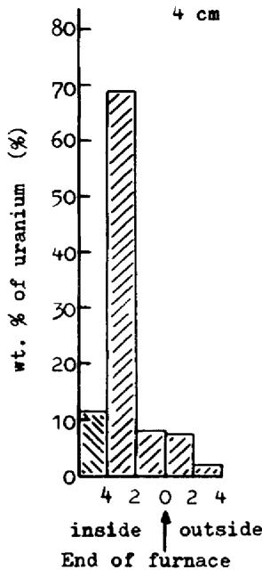  
Bed length in furnace

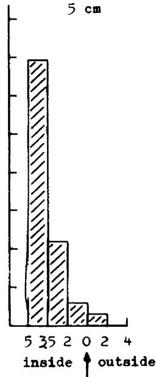

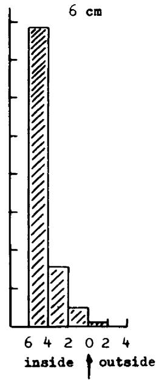

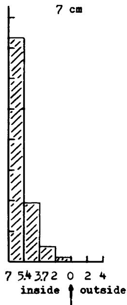

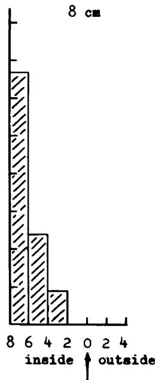  
Location in reaction tube assembly

2. Effect of Bed Length on Distribution of Uranium Chlorides sorbed on $\mathsf{BaCl}_2$ Bed (Sample: $U O_{2}$ powder 1g; gas flow rate at $25^{\circ}C:95cc / min$ size of granular $\mathsf{BaCl}_2:\mathsf{-6 + 7}$ mesh ; chlorination temperature : $580^{\circ}C)$

with a 5 cm bed, when the temperature of the hot end was about $440^{\circ}\mathrm{C}$ . Thus, the highest condensation temperature of the vapor or uranium chlorides in the reaction tube with no bed was estimated to be between about $400^{\circ}\mathrm{C}$ and $440^{\circ}\mathrm{C}$ .

With 4, 5, and 6 cm beds the sorbed band of uranium chlorides extended to regions of the bed where the temperature was below $170^{\circ}\mathrm{C}$ . With a 7 cm bed it extended to $170^{\circ}\mathrm{C}$ and with an 8 cm bed it was limited to regions of the bed where the temperature was $300^{\circ}\mathrm{C}$ or above.

In the following experiments, the reaction tube 2, the chlorination temperature, the flow rate of the chlorination gas at $25^{\circ}\mathrm{C}$ and the size of the granular BaCl $_2$ were fixed to C, $580^{\circ}\mathrm{C}$ , 95 cc/min and $-6 + 7$ mesh, respectively.

# Desorption of Uranium Chlorides

Effect of Bed Temperature - Experimental results are shown in Fig. 3. Good results were obtained when the bed temperature was from $480^{\circ}$ to $560^{\circ}\mathrm{C}$ . The effective temperature range when the reaction time was one hour was slightly wider than when it was 30 minutes.

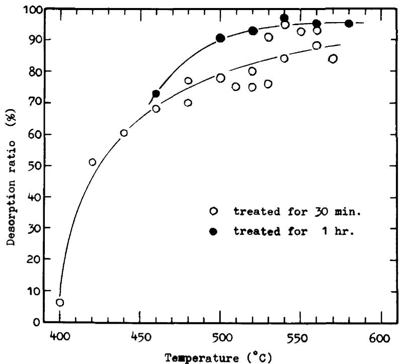

3. Effect of Bed Temperature on Desorption of Uranium Chlorides in Mixed Gas Stream of $15\%$ Ar-70% $\mathrm{Cl}_2 - 15\%$ $\mathrm{CCl}_4$ Vapor.


Effect of Reaction Time - The bed temperature was fixed to $500^{\circ}$ and $540^{\circ}\mathrm{C}$ . The desorption of the uranium chlorides reached $99\%$ after 90 minutes reaction for $0.5\mathrm{gm}$ sample, and after 2 hours reaction for $1\mathrm{gm}$ sample. All the uranium chlorides were desorbed after 2 hours reaction when the sample weight did not exceed $1\mathrm{gm}$ .

# Sorption of Chlorides of Fission Products

Samples were allowed to decay for about 200 days after irradiation before they were processed. Experimental results are shown in Fig. 4. The nuclides detectable, as shown in the figure, were $95\mathrm{Zr - }95\mathrm{Nb}$ , $103\mathrm{Ru}$ , $106\mathrm{Ru - }106\mathrm{Rh}$ , $141\mathrm{Ce}$ and $144\mathrm{Ce}$ . Their percentages are given in Table 3. All the chlorides of zirconium, niobium and ruthenium were volatilized through the chlorination process and sorbed on the $\mathrm{BaCl}_2$ bed. Although most of the cerium chlorides remained in the boat without volatilization, a small fraction of them was volatilized and sorbed on the $\mathrm{BaCl}_2$ . The uranium chlorides formed were volatilized and completely sorbed on the bed.

Table 3. Distribution of Main Fission Products after Chlorination-Sorption   

<table><tr><td rowspan="2"></td><td colspan="3">Percentage of Y-emitting Fission Products</td></tr><tr><td>141Ce &amp; 144Ce</td><td>103Ru &amp; 106Ru-106Rh</td><td>95Zr-95Nb</td></tr><tr><td>Not volatilized</td><td>91</td><td>0</td><td>0</td></tr><tr><td>Sorbed on BaCl2bed</td><td>9</td><td>60*</td><td>100</td></tr><tr><td>Passed through BaCl2bed</td><td>0</td><td>0</td><td>0.2</td></tr></table>

*About 40% of $^{103}\mathrm{Ru}$ and $^{106}\mathrm{Ru}-^{106}\mathrm{Rh}$ were already separated through chemical pulverization of irradiated $\mathrm{UO}_{2}$ pellets by oxidation-reduction cyclic process.

Desorption of Uranium Chlorides in the Mixed Gas Stream of Argon and $\mathrm{CCl_4}$ Vapor

Attempts were made to desorb the chlorides of fission products and not desorb the uranium chlorides in the mixed gas stream composed of argon and $\mathrm{CCl}_4$ vapor. At first, the desorption of the uranium chlorides sorbed on the $\mathrm{BaCl}_2$ bed was investigated in the mixed gas stream. The desorption temperatures tried were $450^{\circ}$ , $470^{\circ}$ , $480^{\circ}$ , $490^{\circ}$ , $510^{\circ}$ , $530^{\circ}$ and $550^{\circ}\mathrm{C}$ . The flow rate of the desorption gas at $25^{\circ}\mathrm{C}$ and the desorption time were fixed to 95 cc/min and 30 minutes, respectively.


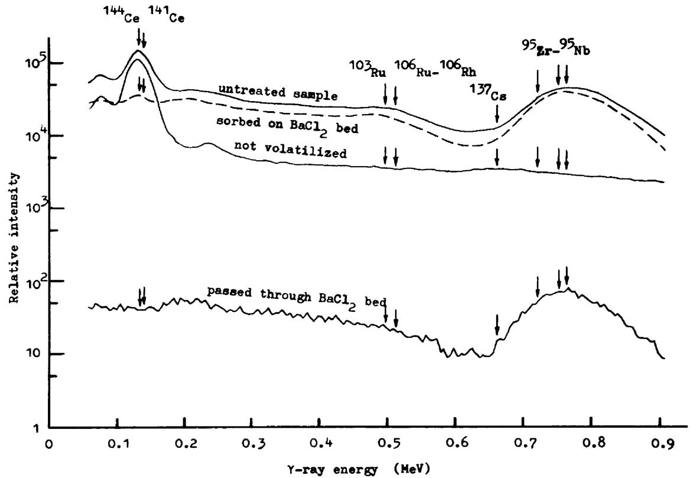  
4. Distribution of $\gamma$ -emitting Nuclides after Chlorination-Sorption.

Experimental results are shown in Fig. 5. The highest temperature where the uranium chlorides did not desorb varied slightly with the concentration of $\mathrm{CCl}_4$ vapor in the gas. The temperature was $490^{\circ}$ and $480^{\circ}\mathrm{C}$ with 10 and $40\% \mathrm{CCl}_4$ in the gas, respectively. The desorption rate of uranium chlorides was increased linearly with the bed temperature rising.

# Desorption of chlorides of fission products

It was confirmed that the uranium chlorides sorbed on the $\mathsf{BaCl}_2$ bed were not desorbed in the mixed gas stream of $60\%$ Ar- $40\%$ $\mathsf{CCl}_4$ vapor or $90\%$ Ar- $10\%$ $\mathsf{CCl}_4$ vapor at temperatures of $480^{\circ}\mathsf{C}$ or below. The desorption of the chlorides of fission products was investigated under the same experimental conditions as the desorption of uranium chlorides in the mixed gas stream of $90\%$ Ar- $10\%$ $\mathsf{CCl}_4$ vapor.

Experimental results are given in Table 4. Retention ratio and residual ratio of a nuclide A were respectively defined as follows: Retention ratio of a nuclide A

Y-activity of A retained on the bed after desorption Y-activity of A in irradiated $\mathrm{UO}_2$ pellet and

Residual ratio of a nuclide A

Y-activity of A retained on the bed after desorption (2) Y-activity of A on the bed before desorption

As shown in Table 4, $99\%$ of zirconium and niobium chlorides sorbed were desorbed after 30 minutes reaction at $480^{\circ}\mathrm{C}$ . More than $70\%$ of ruthenium chlorides sorbed were retained on the bed. Cerium chlorides sorbed were nearly $100\%$ -retained on the bed without desorption.

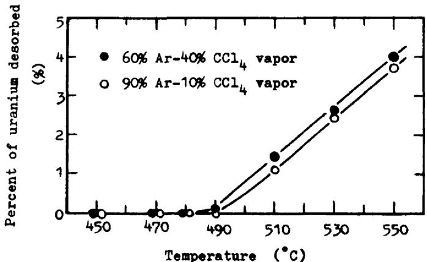

5. Effect of Bed Temperature on Desorption of Uranium Chlorides in Mixed Gas Stream of Ar-CCl₄ Vapor.


Table 4. Behavior of Fission Products through Sorption-Desorption Process   

<table><tr><td rowspan="2">Temp. (°C)</td><td rowspan="2">Time (min)</td><td colspan="7">95Zr-95Nb 103Ru &amp; 106Ru-106Rh 137Cs</td><td rowspan="2">141Ce &amp; 144Ce (%)</td></tr><tr><td>RtR* (%)</td><td>RsR** (%)</td><td>RtR* (%)</td><td>RsR** (%)</td><td>RtR* (%)</td><td>RsR** (%)</td><td>RtR* (%)</td></tr><tr><td colspan="2">Not desorbed</td><td>100</td><td>100</td><td>60</td><td>100</td><td>—</td><td>—</td><td>8</td><td>100</td></tr><tr><td>440</td><td>15</td><td>12</td><td>12</td><td>56</td><td>93</td><td>53</td><td>—</td><td>7.5</td><td>94</td></tr><tr><td>440</td><td>30</td><td>2.3</td><td>2.3</td><td>42</td><td>70</td><td>53</td><td>—</td><td>5.3</td><td>66</td></tr><tr><td>440</td><td>60</td><td>2.5</td><td>2.5</td><td>57</td><td>95</td><td>70</td><td>—</td><td>7.8</td><td>98</td></tr><tr><td>460</td><td>15</td><td>7.6</td><td>7.6</td><td>63</td><td>105</td><td>75</td><td>—</td><td>7.9</td><td>99</td></tr><tr><td>460</td><td>30</td><td>1.8</td><td>1.8</td><td>42</td><td>70</td><td>42</td><td>—</td><td>7.3</td><td>91</td></tr><tr><td>460</td><td>60</td><td>0.5</td><td>0.5</td><td>40</td><td>67</td><td>51</td><td>—</td><td>6.6</td><td>83</td></tr><tr><td>480</td><td>15</td><td>4.5</td><td>4.5</td><td>64</td><td>107</td><td>69</td><td>—</td><td>8.4</td><td>105</td></tr><tr><td>480</td><td>30</td><td>0.9</td><td>0.9</td><td>56</td><td>93</td><td>70</td><td>—</td><td>7.7</td><td>96</td></tr><tr><td>480</td><td>60</td><td>0.2</td><td>0.2</td><td>46</td><td>77</td><td>58</td><td>—</td><td>13</td><td>163</td></tr></table>

* RtR : Retention ratio   
**R&R: Residual ratio

Although data for the volatilization of $^{137}\mathrm{Cs}$ through the oxidation-reduction cyclic process were not obtained, the cesium chloride formed by chlorination was almost completely volatilized and sorbed on the $\mathrm{BaCl}_2$ bed, and retained on the bed without desorption.

It was confirmed from these results that zirconium and niobium chlorides were almost perfectly desorbed, and ruthenium, cesium and cerium chlorides were almost perfectly retained on the $\mathsf{BaCl}_2$ bed when the bed was maintained at the temperatures of $460^{\circ}$ to $480^{\circ}$ C in the mixed gas stream of argon and $\mathsf{CCl}_4$ vapor.

The uranium chlorides sorbed were not desorbed through these steps in the process.

# Processing of Irradiated Uranium Dioxide

A flowsheet proposed on the basis of the experimental results is reproduced as Fig. 6. Irradiated $\mathsf{UO}_2$ pellets are pulverized through the oxidation-reduction cyclic process and chlorinated by the mixed gas of $60\%$ Ar- $40\%$ CCl₄. The vapor of the chlorides formed is sorbed on the BaCl₂ bed. After the high vapor pressure chlorides of fission products are preferentially desorbed by heating the bed to temperatures of $460^{\circ}$ to $480^{\circ}$ C in the mixed gas stream of $90\%$ Ar- $10\%$ CCl₄ vapor, the uranium chlorides are desorbed as the vapor of UCl₅ and UCl₆ by heating the bed to temperatures of $500^{\circ}$ to $550^{\circ}$ C in the mixed gas stream of $15\%$ Ar- $70\%$ Cl₂- $15\%$ CCl₄ vapor.


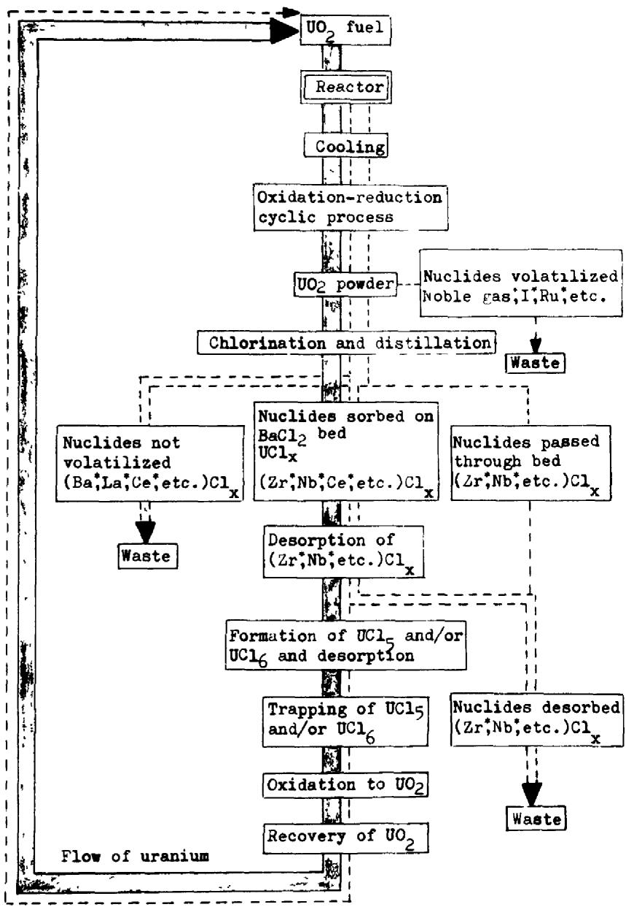  
Flow of fission products   
Fission products

6. Flowsheet of Reprocessing of $\mathsf{UO}_2$ Fuel containing Sorption-Desorption on BaCl $_2$ Bed.

About $1 \times 10^{18} \, \text{n/cm}^2$ irradiated and about 400 days decayed $\mathsf{UO}_2$ pellets were processed according to the above mentioned scheme. Longer decay time was adopted to study the behavior of $137\text{cs}$ .

The effect of temperature on the preferential desorption of the sorbed chlorides of fission products was investigated and is shown in Fig. 7. The decontamination factor of $\gamma$ -activity was gradually increased as the temperature was raised from $350^{\circ}$ to $460^{\circ}$ C, and then saturated. The zirconium and niobium chlorides which remained after the preferential desorption were treated by the mixed gas stream of Ar-Cl2-CCl4 vapor, desorbed and trapped with UCl5 and UCl6. The cesium chloride was also desorbed and trapped with the uranium chlorides. The ruthenium and cerium chlorides were almost completely retained on the BaCl2. These results are shown in Fig. 8. The uranium recovery was not affected by the desorption temperature ranging from 350 to $480^{\circ}$ C. The main $\gamma$ -emitting fission product remaining in the uranium was $137$ Cs.

Improvement of the decontamination was attained by repeating the sorption-desorption process as given in Table 5. Corrected decontamination factor in Table 5 means the decontamination factor that was corrected by subtracting $\gamma$ -activity of natural uranium from $\gamma$ -activity of untreated samples and that of recovered uranium. When the sorption-desorption process was repeated twice and three times,

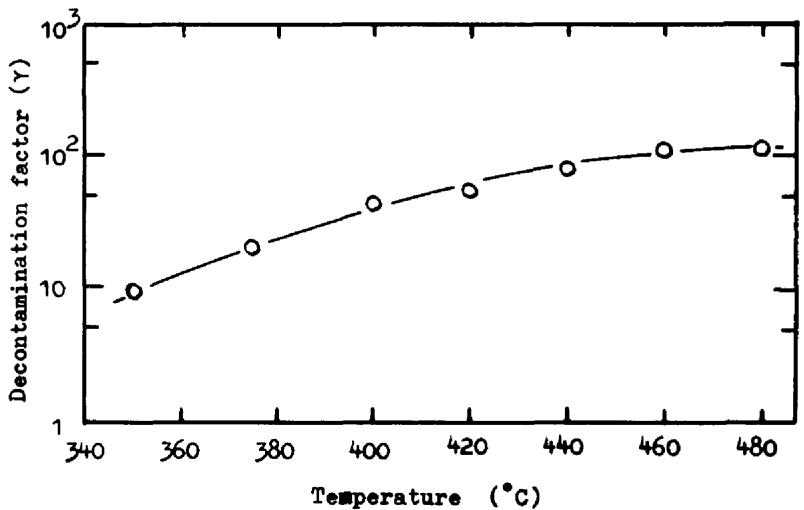  
7. Effect of Preferential Desorption Temperature of Chlorides of Fission Products on Decontamination Factor of Uranium.


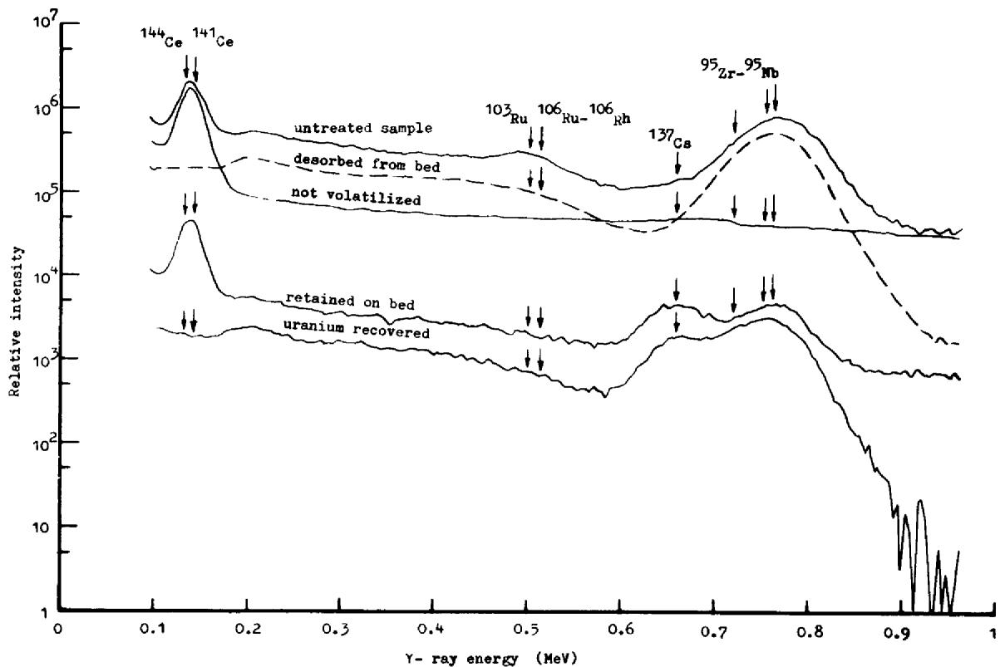  
Fig. 8. Distribution of $\gamma$ -emitting Nuclides after Sorption-Desorption on $\mathrm{BaCl}_2$

the corrected decontamination factor was increased from the value of $4.7 \times 10^{3}$ to that of $6.3 \times 10^{3}$ and infinity, respectively. The infinity means that the Y-activity of recovered uranium was less than the Y-activity of natural uranium. This phenomenon was caused by the fact that daughters of $235\mathrm{U}$ and $238\mathrm{U}$ were decontaminated and not yet arrived at radioactive equilibrium.

Table 5. Recovery and Decontamination Factor (Y) of Uranium Recovered after Repeating Sorption-Desorption by $\mathrm{BaCl}_2$ Bed Once, Twice or Three Times   

<table><tr><td colspan="7">Chlorination- sorption</td></tr><tr><td colspan="2">Chlorination temp. (°C)</td><td>580</td><td>580</td><td>580</td><td>580</td><td>580</td></tr><tr><td colspan="2">Sorption temp. (°C)</td><td>500-</td><td>500-</td><td>500-</td><td>500-</td><td>500-</td></tr><tr><td colspan="2">Time (min)</td><td>100</td><td>100</td><td>100</td><td>100</td><td>100</td></tr><tr><td colspan="7">Desorption of chlorides of fission products</td></tr><tr><td rowspan="2">First</td><td>Temp. (°C)</td><td>460</td><td>460</td><td>460</td><td>460</td><td>460</td></tr><tr><td>Time (min)</td><td>60</td><td>240</td><td>60</td><td>240</td><td>60</td></tr><tr><td rowspan="2">Second</td><td>Temp. (°C)</td><td></td><td></td><td>460</td><td>460</td><td>460</td></tr><tr><td>Time (min)</td><td></td><td></td><td>60</td><td>60</td><td>60</td></tr><tr><td rowspan="2">Third</td><td>Temp. (°C)</td><td></td><td></td><td></td><td></td><td>460</td></tr><tr><td>Time (min)</td><td></td><td></td><td></td><td></td><td>60</td></tr><tr><td colspan="7">Desorption of uranium chlorides</td></tr><tr><td rowspan="2">First</td><td>Temp. (°C)</td><td>500</td><td>500</td><td>500</td><td>500</td><td>500</td></tr><tr><td>Time (min)</td><td>20</td><td>20</td><td>20</td><td>20</td><td>20</td></tr><tr><td rowspan="2">Second</td><td>Temp. (°C)</td><td></td><td></td><td>500</td><td>500</td><td>500</td></tr><tr><td>Time (min)</td><td></td><td></td><td>20</td><td>20</td><td>20</td></tr><tr><td rowspan="2">Third</td><td>Temp. (°C)</td><td></td><td></td><td></td><td></td><td>500</td></tr><tr><td>Time (min)</td><td></td><td></td><td></td><td></td><td>20</td></tr><tr><td colspan="2">Uranium recovery (%)</td><td>97.6</td><td>97.7</td><td>95.8</td><td>95.7</td><td>93.9</td></tr><tr><td colspan="2">DF(γ)</td><td>1.0x102</td><td>7.9x102</td><td>5.3x103</td><td>4.2x103</td><td>6.5x104</td></tr><tr><td colspan="2">Corrected DF(γ)</td><td>1.1x102</td><td>8.1x102</td><td>6.3x103</td><td>4.7x103</td><td>∞</td></tr></table>

$103_{\text{Ru}}$ , $106_{\text{Ru}}$ - $106_{\text{Rh}}$ , $141_{\text{Ce}}$ and $144_{\text{Ce}}$ were almost perfectly decontaminated through the first sorption-desorption process, and $95_{\text{Zr}}$ - $95_{\text{Nb}}$ and $137_{\text{Cs}}$ were decontaminated through the second and third sorption-desorption process. The decontamination factor of $\gamma$ -activity of uranium recovered were of the order of $10^{2}$ , $10^{3}$ and $10^{4}$ after repeating the sorption-desorption process once, twice and three times, respectively. The uranium recovered was about 98, 96 and $94\%$ after repeating the process once, twice and three times, respectively.

# Discussion

The equilibrium state diagram of UCl4-BaCl2 system has been determined by Kuroda and Suzuki (8). In this system, the double salt, Ba2UCl8 $(\mathrm{UCl}_4\cdot 2\mathrm{BaCl}_2)$ , is formed and the peritectic reaction temperature is $583^{\circ}\mathrm{C}$ . The composition and the temperature of the eutectic point of UCl4-Ba2UCl8 system are 58 mol % UCl4 and $434^{\circ}\mathrm{C}$ , respectively.

The vapor of uranium chlorides formed by chlorination in the present experiment was passed through a $\mathsf{BaCl}_2$ bed with a temperature range from about $500^{\circ}$ to $100^{\circ}\mathrm{C}$ and cooled down. Higher uranium chlorides are relatively unstable when the temperature is lower than about $400^{\circ}\mathrm{C}$ and no free chlorine gas exists in the atmosphere. They are decomposed into $\mathsf{UCl}_4$ and $\mathsf{Cl}_2$ , and the $\mathsf{UCl}_4$ formed is sorbed on the bed and $\mathsf{Ba}_2\mathsf{UCl}_8$ is formed. When the bed is heated in the gas stream loaded with chlorine gas, $\mathsf{UCl}_4$ in the $\mathsf{Ba}_2\mathsf{UCl}_8$ reacts with chlorine gas and $\mathsf{UCl}_5$ and/or $\mathsf{UCl}_6$ are formed and desorbed from the bed as vapor.

The reason why uranium chlorides sorbed on the $\mathrm{BaCl}_2$ bed are desorbed in the mixed gas of Ar-CCl4 vapor at temperatures above $490^{\circ}\mathrm{C}$ is explained as follows: The change, $\Delta F$ , in standard free energy of formation of $\mathrm{CCl}_4$ vapor by the reaction

$$
c (s) + 2 c l _ {2} (g) = c c l _ {4} (g) \tag {3}
$$

is given by the equation

$$
\Delta F = - 2 6, 2 6 0 - 5. 1 6 T \log T + 4 9. 3 2 T \quad \text {c a l / m o l} \quad \text {C C l} _ {4} ^ {(9)} (4)
$$

where $T$ means an absolute temperature.

When $T = 762\mathrm{K}$ , $489^{\circ}\mathrm{C}$ , $\Delta F = 0$ in Eq. (4). Therefore, the quantity of chlorine gas formed by decomposition of CCl4 vapor increases rapidly at temperatures above $489^{\circ}\mathrm{C}$ . The lowest desorption temperature of uranium chlorides in the mixed gas stream of Ar-CCl4 vapor is $490^{\circ}\mathrm{C}$ and is nearly equal to the temperature $489^{\circ}\mathrm{C}$ . As the concentration of chlorine in the mixed gas increases at temperatures


above $490^{\circ}C$ , lower uranium chlorides are expected to be chlorinated to higher chlorides, and then desorbed from the bed.

Zirconium, niobium, ruthenium and cerium which form chlorides of higher or lower vapor pressure than that of UCl4 are easily separated from UCl4, but cesium which forms a chloride whose vapor pressure does not differ greatly from that of UCl4 is rather difficult to separate. The vapor of CsCl combines with UCl4 on the BaCl2 bed and forms a double salt. This is stable in the atmosphere containing no free chlorine, and so CsCl is not desorbed in the mixed gas stream of Ar-CCl4 vapor. The salt is unstable in the atmosphere containing free chlorine, and CsCl is desorbed in the mixed gas stream of Ar-Cl2-CCl4 vapor. Thus, CsCl is not desorbed with the chlorides of zirconium and niobium. And the double salt is decomposed through the desorption process of uranium chlorides and CsCl is desorbed with higher uranium chlorides.

# Conclusions

On the basis of the experimental results and the discussion mentioned above, following conclusions were obtained.

(1) By applying a sorption-desorption process with a $\mathsf{BaCl}_2$ sorption bed, the decontamination of fission products from uranium was greatly improved.   
(2) The optimum desorption conditions of the chlorides of the fission products with high vapor pressure and uranium chlorides were at the temperatures of about $460^{\circ}$ to $480^{\circ}$ C in the mixed gas stream of argon and $\mathrm{CCl}_4$ vapor, and at the temperatures of about $500^{\circ}$ to $550^{\circ}$ C in the mixed gas stream of argon, chlorine and $\mathrm{CCl}_4$ vapor, respectively.   
(3) The decontamination factor of Y-activity of uranium recovered after repeating the sorption-desorption process once, twice and three times were of the order of $10^{2}$ , $10^{3}$ and $10^{4}$ , respectively.


# References

1. Gens, T. A., "Chloride Volatility Experimental Studies: The Reaction of $\mathsf{U}_{\mathsf{z}}\mathsf{O}_{\mathsf{8}}$ with Carbon Tetrachloride and Mixtures of Carbon Tetrachloride and Chlorine", USAEC Report ORNL-TM-1258, Oak Ridge National Laboratory, August 1965.   
2. Naumann, D., "Laborstudie zur Chlorierenden Aufarbeitung Neutronenbestrahlter Urankernbrennstoffe, 1. Mitteilung", Kernenergie, Vol. 5, No. 2, February 1962, pp. 118-119.   
3. Schmets, J., Broothaerts, J., Camozzo, G., Coenen, F., Francesconi, A., Haegeman, M., Harnie, R., Heremans, R., Lambiet, C., Leur, A., Pierini, G., Speeckaert, P. and Vanderateene, J., "Retraitement des Combustibles Irradies par Volatilisation, Report EURAEC No. 998 prepared by CEN-Mol, Belgium, August 1965.   
4. Ishihara, T., Hirano, K., and Honda, T., "Processing of Uranium Dioxide Fuel by Chloride Fractional Distillation", J. Atomic Energy Soc. Japan, Vol. 4, No. 4, April 1962, pp. 231-239.   
5. Ishihara, T. and Hirano, K., "Processing of Irradiated Uranium Dioxide Fuel by Chlorination-distillation", J. Atomic Energy Soc. Japan, Vol. 5, No. 7, July 1963, pp. 549-554.   
6. Ishihara, T. and Hirano, K., "Chlorination-Distillation Processing of Irradiated Uranium Dioxide and Uranium Dicarbide", Proceedings of the Third International Conference on the Peaceful Uses of Atomic Energy, United Nations, New York, 1965, Vol. 10, pp. 530-537.   
7. Katz, J. J. and Rabinowitch, E., "The Chemistry of Uranium: The Element, Its Binary and Related Compounds", dover Publications, Inc., New York, 1961, p. 493.   
8. Kuroda, T. and Suzuki, T., "The Equilibrium State Diagram of UCl₄-NaCl, UCl₄-KCl, UCl₄-CaCl₂ and UCl₄-BaCl₂ Systems", Denkikagaku (Electrochemistry and Industrial Physical Chemistry, Japan), Vol. 26, No. 9, September 1958, pp. 416-418.   
9. Kubaschewski, O. and Evans, E. Ll., "Metallurgical Thermochemistry", Pergamon Press Co., London, 1956, p. 331.


# DIRECT CHLORINATION VOLATILITY PROCESSING

OF NUCLEAR FUELS - LABORATORY STUDIES

A.V. Hariharan, S.P. Sood, Rajendra Prasad, D.D. Sood, K. Rengan, P.V. Balakrishnan and M.V. Ramaniah Radiochemistry Division Bhabha Atomic Research Centre Trombay, Bombay-85 India

# Abstract

Direct chlorination volatility processing schemes that are applicable to the reprocessing of a variety of thorium-based and uranium-based nuclear reactor fuel systems are discussed. Laboratory investigations have centered on the application of such a non-aqueous reprocessing method for the processing of $\mathrm{ThO_2 - UO_2}$ and $\mathrm{UO_2 - PuO_2}$ type reactor fuel materials.

The oxidic fuel compositions are converted to chlorides by reaction at elevated temperatures with chlorine gas saturated with carbon tetrachloride. Separation of fuel, fertile and fission product chlorides is achieved by selective volatilisation and utilising the high volatility of higher uranium chlorides, UCl₅ and UCl₆. The use of heated refractory alumina filter beds to facilitate condensation and filtration of intermediate volatility chlorides in the separation process is described. An important aspect of the process flow sheet is the use of heated NaCl bed to selectively and quantitatively absorb volatile uranium chlorides. Such a medium permits a variety of gas-solid reactions in the secondary purification of the uranium fraction.

# Introduction

Non-aqueous methods for reprocessing of irradiated nuclear fuels are under development in various laboratories as economic alternatives to conventional aqueous reprocessing methods. Of these, fluoride volatility processes are in advanced stage of development for application to a variety of uranium-based fuels used in power reactors[1-3]. An important category of nuclear fuels is that incorporating thorium either as metal, oxide or carbide in thermal or fast breeder reactors operating on $\mathrm{Th}^{232}\mathrm{U}^{233}$ fuel cycle. Re-processing of such fuels by fluoride volatility methods is not feasible because thorium fluoride is relatively non-volatile and its separation from other non-volatile fission product fluorides is difficult. Other pyrochemical methods also have not been extended for application to thorium-based fuels.

Methods based on the volatility characteristics of uranium chlorides have been explored briefly for their application to fuel reprocessing. Laboratory investigations on chlorination processing of uranium dioxide, uranium carbide and $\mathrm{UO_2 - PuO_2}$ fuel materials have been reported(4-11). Chlorination processes for the recovery of uranium and thorium from graphite-based fuels have been investigated(12-13). These studies have made use of the volatility of uranium tetrachloride, thorium tetrachloride and to a limited extent volatility of uranium hexachloride to effect the desired separation. Gens(6,11), Good(7) and Warren Ferris(8) have studied the volatility of plutonium tetrachloride for the recovery of plutonium in chloride volatility processes. These investigations indicate that, inspite of the fast kinetics for the conversion of plutonium trichloride to plutonium tetrachloride vapour, the recovery of plutonium is difficult because of the large quantity of chlorine required for the process. A complete fuel reprocessing scheme exploiting the volatility characteristics of higher chlorides of uranium has not been reported.

Chlorination and hydrochlorination are employed as a head-end step for the removal of cladding and structural materials from many of the uranium-based fuel systems prior to the application of fluoride volatility reprocessing to such fuel materials(14,15). In "Zircex Process" for reprocessing zircaloy clad $\mathrm{UO}_2$ fuels, a hydrochlorination step is used for decladding prior to reprocessing of the fuel by aqueous methods(16). Such head-end treatments make use of the high volatility of chlorides of aluminium, zirconium and iron, at operating temperatures of practical interest.

Literature data on the stability and volatility of the chlorides of thorium, uranium, protactinium, plutonium and fission products indicated that it should be possible to work out a chlorination volatility process for thorium-based and uranium-based fuels(17).


Feasibility of such a process was demonstrated by the present laboratory scale investigations on $\mathrm{ThO_2 - UO_2}$ and $\mathrm{UO_2 - PuO_2}$ type fuel materials.

This paper describes, in brief, the results of the experimental work carried out for the study. The investigation and the results are reported in more detail elsewhere(17-20).

Chlorination volatility processing methods would be amenable to short cooled reactor fuels with consequent reduction in in-plant fissile material inventory, as the processing reagents have low susceptibilities to deleterious radiation damage. Criticality problems would also be less in the process owing to the absence of neutron moderating environments. A chlorination volatility process, in addition, would have the unique advantage of utilizing the same process media-chlorine containing gas - for the head-end and re-processing stages.

# Process Chemistry

Actinide elements, rare earths and alkaline earth metals form the most stable oxides known. The free energy of formation at $298^{\circ}\mathrm{K}$ for all these oxides ranges between $-120$ and $-140\mathrm{kcal}$ per gram atom oxygen(17,21-23). Very strong chlorinating agents like carbon dioxide-carbon tetrachloride or chlorine - carbon tetrachloride gas mixtures are required for the conversion of these oxides to chlorides. Also a temperature of $500 - 600^{\circ}\mathrm{C}$ is necessary for chlorination of $\mathrm{ThO}_2$ , $\mathrm{UO}_2$ and $\mathrm{PuO}_2$ at reasonable rates. Under such conditions it is expected that majority of the fission products present in irradiated fuel would also be converted to chlorides. As the scheme visualises the use of volatility characteristics of higher chlorides of uranium for the separation process, it is necessary that the chlorinating gas be oxidising in nature. This is achieved by having chlorine as one of the constituents of the chlorinating gas. Under such conditions the highest chlorides of the various constituents, stable at chlorinating temperatures, would be expected to be present. Large differences in the volatility of the various chlorides formed can be the basis for a separation procedure. Boiling points and vapor pressures at $700^{\circ}\mathrm{C}$ , $500^{\circ}\mathrm{C}$ and $300^{\circ}\mathrm{C}$ for some of the pertinent chlorides are presented in Table I(17,24,25). It is seen from the data in Table I that major fission products may be divided into three distinct groups as regards the volatility of the chlorides compared to UCl₅-UCI₆.

1. High volatility fission product chlorides: $\mathbf{ZrCl}_4$ , MoCl5, NbCl5, InCl3.   
2. Intermediate volatility fission product chlorides: CsCl, RuCl₃.   
3. Non-volatile fission product chlorides : Rare earth chlorides BaCl2, SrCl2.


Table I. Vapor Pressure of Chlorides   

<table><tr><td rowspan="2">Chloride</td><td rowspan="2">Boiling/sublimation point °C</td><td colspan="3">Vapor Pressure in mm Hg</td></tr><tr><td>700°C</td><td>500°C</td><td>300°C</td></tr><tr><td>ThCl4</td><td>922</td><td>10.8</td><td>4.0x10-3</td><td>5.9x10-9</td></tr><tr><td>PaCl5</td><td>527</td><td>&gt;760</td><td>520</td><td>4.0</td></tr><tr><td>UCl5</td><td>527</td><td>&gt;760</td><td>510</td><td>4.6</td></tr><tr><td>UCl6</td><td>277</td><td>&gt;760</td><td>&gt;760</td><td>&gt;760</td></tr><tr><td>PuCl3</td><td>1730</td><td>1.1x10-3</td><td>2.0x10-8</td><td>7.9x10-15</td></tr><tr><td>ZrCl4</td><td>331</td><td>&gt;760</td><td>&gt;760</td><td>225</td></tr><tr><td>NbCl5</td><td>247</td><td>&gt;760</td><td>&gt;760</td><td>&gt;760</td></tr><tr><td>MoCl5</td><td>268</td><td>&gt;760</td><td>&gt;760</td><td>&gt;760</td></tr><tr><td>InCl3</td><td>498</td><td>&gt;760</td><td>&gt;760</td><td>0.11</td></tr><tr><td>CsCl</td><td>1300</td><td>0.70</td><td>2.0x10-3</td><td>6.5x10-8</td></tr><tr><td>RuCl3</td><td>decomposes</td><td>0.30</td><td>3.1x10-5</td><td>3.4x10-12</td></tr><tr><td>RhCl3</td><td>decomposes</td><td>2.0x10-4</td><td>3.7x10-9</td><td>2.5x10-17</td></tr><tr><td>SrCl2</td><td>2027</td><td>3.5x10-7</td><td>2.5x10-12</td><td>2.3x10-18</td></tr><tr><td>BaCl2</td><td>2100</td><td>1.5x10-5</td><td>1.6x10-9</td><td>1.8x10-16</td></tr><tr><td>CeCl3</td><td>1730</td><td>1.7x10-4</td><td>6.8x10-9</td><td>1.0x10-16</td></tr><tr><td>GdCl3</td><td>1580</td><td>1.7x10-3</td><td>1.5x10-7</td><td>8.3x10-15</td></tr></table>

Among the actinide chlorides of interest, $\mathrm{PaCl}_5$ is very volatile $\mathrm{ThCl}_4$ has intermediate volatility and $\mathrm{PuCl}_3$ can be classified as non-volatile. The date indicate that uranium can be separated from a large number of fission products and from thorium in thorium-based fuels and from plutonium in uranium-based fuels. The separation can be achieved either by simple distillation procedures or by the use of inert, high surface area, packed bed filters at high temperatures, which can effectively retain chlorides of lower volatility from the vapor stream while allowing the highly volatile chlorides to pass through. The latter method, with refractory alumine as filter medium, was used in the present investigation. By a proper selection of filter beds at temperature gradient, it would be possible to separate $\mathrm{ThCl}_4$ from majority of the fission product chlorides, and $\mathrm{UCl}_5\mathrm{-UCl}_6$ from all but the most volatile chlorides. Further, since no fission product chlorides have volatility characteristics very similar to $\mathrm{ThCl}_4$ , it would be possible to get essentially pure $\mathrm{ThCl}_4$ , by the use of these methods, in a


secondary purification.

The possibility of a secondary purification of uranium chlorides by such simple physical methods is not indicated, because a number of fission product chlorides and $\mathrm{PaCl}_5$ have similar volatility characteristics. Decrease in volatility of some of these chlorides, either by reduction to lower chlorides or by formation of stable binary compounds in some chemically active sorption beds, could be a possible separation procedure. In the present investigation it was found that chlorides of uranium react with sodium chloride to form some stable binary compounds(18). Uranium present in the form of UCl $_5$ -UCl $_6$ vapors in the chlorinating gas stream was quantitatively retained in a sodium chloride bed at $250 - 300^{\circ}\mathrm{C}$ , as a sharp orange red band. At lower (100 to $200^{\circ}\mathrm{G}$ ) and higher (350 to $450^{\circ}\mathrm{C}$ ) temperatures of sodium chloride bed, an increasing amount of uranium leaked out of the bed. The valency of uranium in this orange red compound was found to be five by chemical analysis. UCl $_5$ is reported to form compounds of the type CsUCl $_6$ (26); probably the sorption of uranium chloride proceeds through the formation of NaUCl $_6$ . In another series of experiments where chlorination of $\mathrm{U}_{3}\mathrm{O}_{8}$ in presence of NaCl was being tried it was observed that no volatile species of uranium are formed up to $600^{\circ}\mathrm{C}$ inspite of the highly chlorinating condition. Uranium formed a green compound with sodium chloride and remained in the reaction zone. This compound must be UCl $_1$ .2NaCl as reported in the uranium tetrachloride - sodium chloride phase diagram(27). Apparently the activity of UCl $_1$ in this compound is very low even at temperatures as high as $600^{\circ}\mathrm{C}$ . It was decided to try to use these data for separation of uranium from fission products having volatile chlorides.

Chlorination of $\mathrm{UO}_{2} - \mathrm{PuO}_{2}$ fuels is complicated by the reaction indicated by equation (1).

$$
\mathrm {P u C l} _ {3} (\mathrm {s}) + \frac {1}{2} \mathrm {C l} _ {2} (\mathrm {g}) \quad \text {P u C l} _ {4} (\mathrm {g}) \tag {1}
$$

According to Benz(28) the equilibrium constant for this reaction is given by equation (2)

$$
\log k = 6. 1 8 - \frac {8 2 1 0}{T} \quad (6 7 0 - 1 0 5 0 ^ {\circ} K) \tag {2}
$$

The value of the equilibrium constant is approximately $5 \times 10^{-5}$ at $500^{\circ} \mathrm{C}$ . This means that $0.15 \, \text{mg}$ plutonium will be carried as $\mathsf{PuCl}_{\underline{L}}$ by $l$ mole of chlorine. It has been found that the actual amount of plutonium carried while chlorinating uranium oxide - plutonium oxide mixtures is more than this value(20). It is difficult to recover this part of plutonium and also it contaminates the uranium fraction. To overcome this difficulty it was decided to carry out the chlorination experiments at much lower temperature where $\mathsf{PuCl}_{\underline{L}}$ is less stable. It is not possible

to chlorinate $\mathsf{UO}_2$ at satisfactory rates below $500^{\circ}\mathsf{C}$ , however $\mathsf{U}_{3}\mathsf{O}_{8}$ can be easily chlorinated even at $350^{\circ}\mathsf{C}(18,20)$ . As $\mathsf{UO}_2$ - $\mathsf{PuO}_2$ solid solutions having less than 20 wt pct $\mathsf{PuO}_2$ can be easily oxidised to $\mathsf{U}_{3}\mathsf{O}_{8}$ - $\mathsf{PuO}_2$ mixtures, it was decided to work out a separation procedure using $\mathsf{U}_{3}\mathsf{O}_{8}$ - $\mathsf{PuO}_2$ mixtures[8].

# Experimental Procedure

# Materials

Simulated $\mathsf{ThO}_2\mathsf{-UO}_2$ fuel was prepared from coprecipitated $\mathsf{Th}(\mathsf{IV}) - \mathsf{U}(\mathsf{IV})$ oxalates. Oxalates were calcined to solid solution oxides at $900^{\circ}\mathsf{C}$ and then pelletised and sintered in hydrogen at $1650^{\circ}$ to $1700^{\circ}\mathsf{C}$ . The pellets contained 7.46 wt pct $\mathsf{UO}_2$ . The pellets were crushed to powder and approximately one gram sample used for each experiment. $\mathsf{U}_3\mathsf{O}_8$ was prepared by oxidising sintered $\mathsf{UO}_2$ pellets at $450^{\circ}\mathsf{C}$ in air. $\mathsf{PuO}_2$ was obtained by calcination of plutonium(IV) oxalate at $500^{\circ}\mathsf{C}$ in air. Aluminium oxide, which was used in this work as high temperature packed-bed filter material, was granular 60 mesh type-RR refractory fused $\mathsf{Al}_2\mathsf{O}_3$ . Sodium chloride which was used as sorption bed for uranium chlorides was of analytical grade sieved to + 52 mesh.

To study fission product behaviour, a typical representative mixture of fission product elements (inactive) was prepared from pure constituents either as oxide or chlorides.

Irradiation of $\mathrm{ThO_2 - UO_2}$ and $\mathrm{U}_{3}\mathrm{O}_{8}$ was carried out at a flux of $5\times 10^{12}\mathrm{n / sec / cm}^2$ for 24 hours.

# Apparatus

The apparatus consisted of a 35 mm Vycor reaction tube, 90 cm long and was heated by a four-zone electric furnace. A demountable sleeve tube fabricated out of vycor and positioned suitably in down flow line of the main reaction tube contained the filter beds and the sorption bed. The arrangement permitted the isolation, and control of temperature, of the individual zones. A gas handling manifold and a gas disposal set up completed the experimental equipment. A schematic drawing of chlorination apparatus is shown in Figure 1. For experiments with $\mathrm{U}_{2}\mathrm{O}_{8} - \mathrm{PuO}_{2}$ only a three zone equipment was necessary. Also the entire assembly, except the gas handling system, was kept in a glove box.

# Procedure

The apparatus was assembled with alumina filter beds and sodium chloride sorption bed in the proper heating zones and then the sample loaded into the system. The equipment was flushed with $\mathrm{N}_2\text{-Cl}_2$ stream at $600^{\circ}\mathrm{C}$ after which the temperatures of the various zones were adjusted to desired values. Chlorination was then

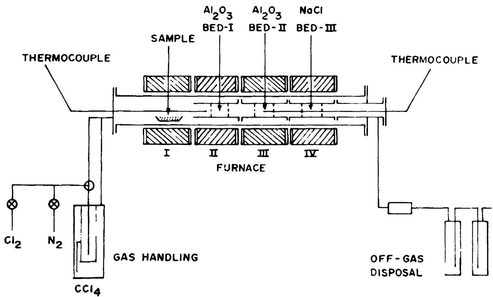  
1. Schematic Apparatus for Chlorination of $\mathsf{ThO}_2\mathsf{-UO}_2$

started by passing a mixture of $\mathrm{Cl}_2\text{-CCl}_4\text{-N}_2$ over the sample. Normal chlorination time was four hours, at the end of which the apparatus was cooled while passing a stream of nitrogen. Various zones were then analysed to determine degree of chlorination and separation factors. In experiments incorporating simulated fission product materials and those with irradiated solids, the fission product analysis was carried out by radiochemical separations and gamma spectrometry.

# Results and Discussion

# $\mathsf{ThO}_2\text{-}\mathsf{UO}_2$ Process

A $\mathrm{Cl}_2\text{-CCl}_4\text{-N}_2$ mixture in the ratio of 4:1:1 was found to be an efficient and clean chlorinating gas for the oxidic fuel materials. Complete chlorination of $\mathrm{ThO}_2\text{-UO}_2$ was achieved at a temperature $700 - 750^{\circ}\mathrm{C}$ . On chlorination $\mathrm{ThCl}_4$ and $\mathrm{UCl}_5\text{-UCl}_6$ vapours were formed which volatilised out of the chlorination zone. $\mathrm{ThCl}_4$ , from the gaseous stream, was filtered off by a refractory alumina down-flow filter at $300 - 350^{\circ}\mathrm{C}$ . A protective alumina filter at $200^{\circ}\mathrm{C}$ prevented any mechanical carry-over of $\mathrm{ThCl}_4$ particles with uranium chloride gas stream. Uranium chloride vapors were quantitatively retained in the packed bed of sodium chloride held at $250 - 300^{\circ}\mathrm{C}$ . Separation factors after this primary separation procedure were 25 for uranium in thorium (Bed I, $\mathrm{Al}_{2}\mathrm{O}_{3}$ filter bed) and $5\times 10^{3}$ for thorium in uranium (Bed III, NaCl sorption bed).

Fission product behaviour in the process was investigated in a series of experiments in which approximately ten milligrams of simulated fission product mixture (inactive), tagged with tracer activity, was chlorinated under conditions described above. At a chlorinating temperature of $750^{\circ}\mathrm{C}$ , the chlorides of rare earths, Ba, Sr, etc., remained as residues in the sample boat. Cesium and ruthenium chlorides were held up in $\mathrm{Al}_{2} \mathrm{O}_{3}$ filter bed at $300 - 350^{\circ}\mathrm{C}$ . $\mathrm{ZrCl}_{4}$ , $\mathrm{MoCl}_{5}$ and $\mathrm{NbCl}_{5}$ passed through the $\mathrm{Al}_{2} \mathrm{O}_{3}$ filter beds at $300 - 350^{\circ}\mathrm{C}$ and $200 - 250^{\circ}\mathrm{C}$ , onto the sodium chloride sorption bed at $250 - 300^{\circ}\mathrm{C}$ . $\mathrm{NbCl}_{5}$ and $\mathrm{MoCl}_{5}$ were found to have very low retention in NaCl at $250 - 300^{\circ}\mathrm{C}$ . This indicates that compounds of $\mathrm{NbCl}_{5}$ and $\mathrm{MoCl}_{5}$ with NaCl are not very stable at these temperatures. In the case of $\mathrm{ZrCl}_{4}$ it was found that while quantitative retention takes place with the sorption bed at $250^{\circ}\mathrm{C}$ , more than half of the $\mathrm{ZrCl}_{4}$ leaks out at a sorption bed temperature of $300^{\circ}\mathrm{C}$ . The vapor pressure of $\mathrm{ZrCl}_{4}$ over $\mathrm{NaCl - Na}_{2} \mathrm{ZrCl}_{6}$ as measured by Korshunov and Gregory(29) is $0.034\mathrm{mm}$ at $300^{\circ}\mathrm{C}$ . Assuming ideal transpiration conditions, this is nearly the value of vapor pressure calculated from our observations. Protactinium behaviour was checked by chlorination of $\mathrm{Pa}^{2330}_{2}$ , precipitated with various carriers such as Nb, Zr, Ce, Th and U, under similar conditions. With chlorination zone at $750^{\circ}\mathrm{C}$ , filter bed I at $350^{\circ}\mathrm{C}$ and

filter bed II at $250^{\circ}\mathrm{C}$ essentially all protectinium transpired as $\mathsf{PaCl}_5$ onto the sorption zone and was quantitatively retained in NaCl bed at $250^{\circ}\mathrm{C}$ to $300^{\circ}\mathrm{C}$ . This indicates that the compound $\mathsf{PaCl}_5$ . NaCl is also fairly stable at these temperatures. Decrease in temperature of $\mathsf{Al}_{2}\mathsf{O}_{3}$ filter beds I and II, to $300^{\circ}\mathrm{C}$ and $200^{\circ}\mathrm{C}$ respectively, resulted in a partial hold-up of $\mathsf{PaCl}_5$ in these beds.

Based on the above observations the experiments with irradiated $\mathsf{ThO}_2\mathsf{-UD}_2$ materials was carried out with chlorination zone at $750^{\circ}\mathrm{C}$ , $\mathsf{Al}_{2}\mathsf{O}_{3}$ filter bed I at $350^{\circ}\mathrm{C}$ , $\mathsf{Al}_{2}\mathsf{O}_{3}$ filter bed II at $250^{\circ}\mathrm{C}$ and the sodium chloride sorption bed at $250^{\circ}\mathrm{C}$ . Over 99 pct thorium collected as crystalline $\mathsf{ThCl}_4$ at the entrance of filter bed I. This thorium had a gamma decontamination factor of 200. About 90 pct uranium collected in sodium chloride sorption bed. Uranium had appreciable gamma activity consisting mainly of $\mathsf{Pa}^{233}$ . Decontamination factors from selected fission products both for uranium and thorium are given in Table II. The thorium and uranium chlorides separated in primary chlorination volatility process were subjected to a second purification step to improve decontamination from fission products and protactinium.

The second purification of thorium fraction was carried out by distillation at 675 to $700^{\circ}\mathrm{C}$ in a stream of chlorinating gas. The gas containing $\mathrm{ThCl}_4$ was passed through two alumina filter beds kept at $700^{\circ}\mathrm{C}$ and $500^{\circ}\mathrm{C}$ . $\mathrm{ThCl}_4$ collected in filter bed at $500^{\circ}\mathrm{C}$ . The distillation zone and filter bed at $700^{\circ}\mathrm{C}$ were found to be slightly active, whereas the exit zone had appreciable activity. The distilled $\mathrm{ThCl}_4$ was practically inactive and analysis showed a gross gamma decontamination factor of $4\times 10^{4}$ .

Table II. Decontamination Factors for Thorium and Uranium in $\mathsf{ThO}_2\mathsf{-UO}_2$ processing   

<table><tr><td rowspan="2">Activity</td><td colspan="2">Thorium Fraction</td><td colspan="2">Uranium Fraction</td></tr><tr><td>Primary Separation</td><td>Distillation Purification</td><td>Primary Separation</td><td>Bechlorination purification</td></tr><tr><td>Gross Gamma</td><td>\( 2x10^2 \)</td><td>\( 4x10^4 \)</td><td>-</td><td>34</td></tr><tr><td>Gross Beta</td><td>20</td><td>\( 4x10^3 \)</td><td>-</td><td>69</td></tr><tr><td>Ce</td><td>1.6</td><td>\( 9x10^2 \)</td><td>\( &gt;10^4 \)</td><td>\( &gt;10^4 \)</td></tr><tr><td>Ba</td><td>\( 1x10^2 \)</td><td>\( &gt;10^3 \)</td><td>\( &gt;10^3 \)</td><td>\( &gt;10^4 \)</td></tr><tr><td>Ru</td><td>1.3</td><td>\( &gt;10^3 \)</td><td>20</td><td>-</td></tr><tr><td>Zr</td><td>\( 6x10^2 \)</td><td>\( &gt;10^4 \)</td><td>3.8</td><td>\( 3.2x10^2 \)</td></tr><tr><td>Nb</td><td>\( 3x10^2 \)</td><td>\( &gt;10^4 \)</td><td>50</td><td>\( &gt;10^3 \)</td></tr><tr><td>Pa</td><td>\( 2x10^2 \)</td><td>\( &gt;10^4 \)</td><td>1.5</td><td>51</td></tr><tr><td>U</td><td>25</td><td>\( &gt;10^3 \)</td><td>-</td><td>-</td></tr><tr><td>Th</td><td>-</td><td>-</td><td>\( 5x10^3 \)</td><td>\( 5x10^3 \)</td></tr></table>


Secondary purification procedures for uranium fraction aimed at the formation of UCl₄.2NaCl from UCl₅. NaCl. In one method, this was done by passing hydrogen gas at 500-600°C. Further chlorination of this bed with Cl₂-CCl₄-N₂ at 600°C resulted in the removal of essentially all ZrCl₄ and PaCl₅, and the remaining NbCl₅ and MoCl₅. Purified uranium was left behind as green UCl₄.2NaCl. In the second method UCl₅ in the NaCl bed was converted to uranium oxide by pyrohydrolysis at 300°C and further oxidation at 500°C. The oxidised material was rechlorinated using the chlorinating gas at 500°C for 3 hours. Uranium oxide got converted to UCl₄.2NaCl while ZrCl₄, PaCl₅, MoCl₅, and NbCl₅ were volatilized away from the reaction zone. The overall gamma decontamination factor was 34. This is because of the 2-5% protactinium left in the purified uranium. Decontamination factors after the second, purification are also listed in Table II.

The conceptual flow sheet for reprocessing $\mathsf{ThO_2 - UO_2}$ type fuel materials by direct chlorination volatility processing is given in Figure 2. Adaptation of the scheme for other thorium based fuels such as Th-U alloys, $\mathsf{ThC_2 - UC_2}$ and dispersion of oxide or carbide in graphite appear practicable. Th-U metallic fuels would react with hydrogen chloride during decladding to form $\mathsf{ThCl}_l$ and $\mathsf{UCl}_3$ which are practically non-volatile at temperatures that are commonly employed for hydrochlorination. With carbide type fuels, a preliminary oxidation step to remove matrix materials may be advantageous.

# U3O8-PuO2 Processing

Preliminary experiments on the chlorination of $\mathrm{U}_{3}\mathrm{O}_{8}-\mathrm{RuO}_{2}$ adopted the optimised reaction conditions developed for $\mathrm{U}_{3}\mathrm{O}_{8}^{3-}$ (18). In these, chlorination, filtration and sorption zones were kept at $450^{\circ}\mathrm{C}$ , $300^{\circ}\mathrm{C}$ and $300^{\circ}\mathrm{C}$ respectively. Pure $\mathrm{PuO}_{2}$ powder did not get chlorinated at $450^{\circ}\mathrm{C}$ . However in $\mathrm{U}_{2}\mathrm{O}_{8}$ samples having O.O8 wt pct $\mathrm{PuO}_{2}$ essentially all plutonium got chlorinated and the volatile plutonium species distributed between the $\mathrm{Al}_{2}\mathrm{O}_{3}$ filter bed and NaCl sorption bed. At a chlorination temperature of $350^{\circ}\mathrm{C}$ , the amount of $\mathrm{PuO}_{2}$ chlorinated and transpired along with uranium chlorides could be brought down appreciably. $\mathrm{Al}_{2}\mathrm{O}_{3}$ filter bed at $200^{\circ}\mathrm{C}$ was found to effectively decompose $\mathrm{PuCl}_{4}$ vapor to $\mathrm{PuCl}_{3}$ solid. There was a slight retention of uranium in the filter bed at this temperature but the decontamination factor of Pu in uranium had very much improved and it was decided to standardise at this temperature. In experiments with $\mathrm{U}_{3}\mathrm{O}_{8}-1$ wt pct $\mathrm{PuO}_{2}$ , $\mathrm{U}_{3}\mathrm{O}_{8}$ was completely chlorinated in four hours and passed onto NaCl sorption bed. Only $5 \%$ $\mathrm{PuO}_{2}$ (on 10 mg basis) was converted to $\mathrm{PuCl}_{3}$ and reacted with chlorine to form volatile $\mathrm{PuCl}_{4}$ , which was effectively retained in $\mathrm{Al}_{2}\mathrm{O}_{3}$ filter bed. Only 4 to $5 \mu \mathrm{g}$ out of 10 mg of plutonium transpired along with uranium chloride

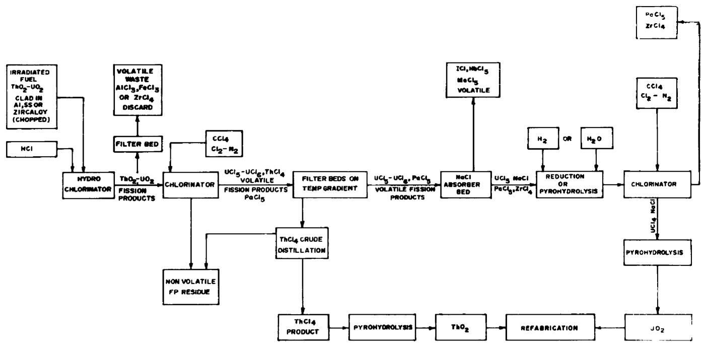  
2. Flow Sheet for Reprocessing $\mathsf{ThO}_2\text{-}\mathsf{UO}_2$ Fuel Materials

and was collected in NaCl bed. An overall separation factor of 2,000 for plutonium in uranium was achieved.

Chlorination volatility processing of mixtures containing 1 to 17 wt pct $\mathsf{PuO}_2$ in $\mathsf{U}_{3}\mathsf{O}_{8} - \mathsf{PuO}_2$ was studied. It was found that with increasing percentage of $\mathsf{PuO}_2$ , the amount of $\mathsf{PuO}_2$ converted to $\mathsf{PuCl}_3$ and transpired onto $\mathsf{Al}_{2}\mathsf{O}_{3}$ bed as $\mathsf{PuCl}_3$ decreased from 4 wt pct to 0.5 wt pct. However separation factors for plutonium in uranium did not improve.

In experiments with irradiated $\mathrm{U}_{3}\mathrm{O}_{8}$ , mixed with $\mathrm{PuO}_{2}$ and inactive fission products material, the behaviour of fission products was similar to that in $\mathrm{ThO}_{2}-\mathrm{UO}_{2}$ experiments. All fission products except Nb, Mo and Zr stayed in the sample boat with plutonium. $\mathrm{NbCl}_{5}$ , $\mathrm{MoCl}_{5}$ , $\mathrm{ZrCl}_{4}$ accompanied UCl $_{5}-\mathrm{UCl}_{6}$ onto NaCl sorption bed. The gross gamma decontamination factor after primary purification was 6.7. Secondary purification of uranium, as described earlier, improved the gamma decontamination factor to 470.

The decontamination factors from individual fission products after primary and secondary purification are listed in Table III.

Recovery and purification of plutonium fraction by chlorination volatility was not tried. It is suggested that fluoride volatility procedures be used for the recovery and purification of plutonium residues. This step would be easier and practical in view of the fact that $\mathsf{PuO}_2$ residues do not contain any significant quantities of uranium and fission products that form volatile fluorides.

The conceptual flow sheet for the direct chlorination volatility processing of the low enrichment $\mathrm{UO}_2\text{-PuO}_2$ type fuels is presented in Figure 3. The scheme may not be applicable to fuels with more than 20 wt pct $\mathrm{PuO}_2$ because they cannot be oxidised to $\mathrm{U}_{3}\mathrm{O}_{8}\text{-PuO}_2$ mixtures.

Table III. Decontamination Factor for Uranium in ${\mathrm{U}}_{3}{\mathrm{O}}_{8} - {\mathrm{{PuO}}}_{2}$ Processing   

<table><tr><td>Activity</td><td>Primary Separation</td><td>Rechlorination Purification</td></tr><tr><td>Gross Gamma</td><td>6.7</td><td>4.7x102</td></tr><tr><td>Gross Beta</td><td>-</td><td>2.8x102</td></tr><tr><td>Zr</td><td>14</td><td>2.1x103</td></tr><tr><td>Ce</td><td>1.4x103</td><td>5.1x103</td></tr><tr><td>Ru</td><td>2.7</td><td>69</td></tr><tr><td>Pu</td><td>2.0x103</td><td>2.0x103</td></tr></table>

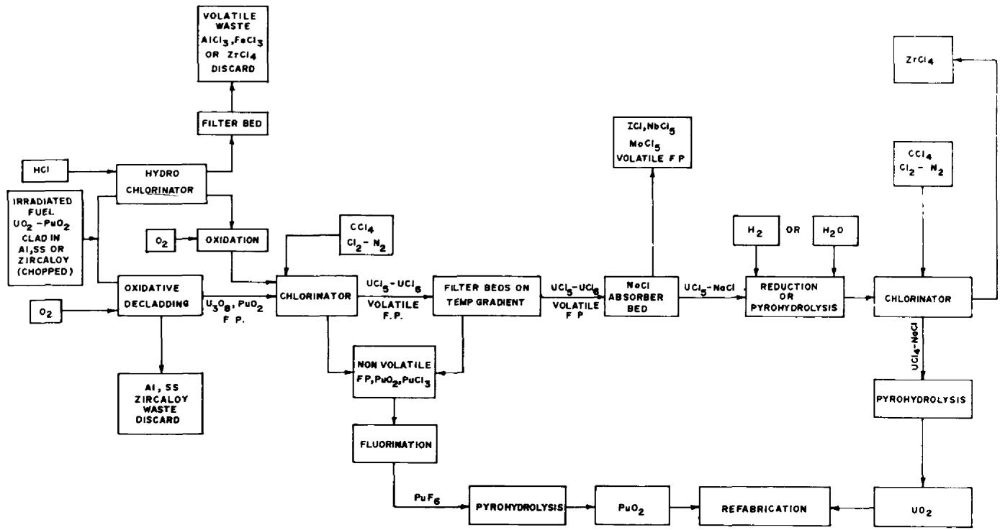  
3. Flow Sheet for Reprocessing $\mathsf{U}\mathsf{O}_2\text{-Pu}\mathsf{O}_2$ Fuel Materials

Decladding of $\mathsf{UO_2}$ -based fuels can either be done by hydrochlorination or by "oxidative decladding" (30). In the latter method slotted fuel elements are heated in air at $450^{\circ}\mathsf{C}$ . As $\mathsf{UO_2}$ gets oxidised to $\mathsf{U}_3\mathsf{O}_8$ , it expands, and cracks the cladding tube along the slots. $\mathsf{U}_3\mathsf{O}_8 = \mathsf{PuO}_2$ powders are released which can be sent to the chlorinator.

Even though the flow sheet is shown for low enrichment $\mathsf{UO}_2\text{-PuO}_2$ fuels, application to reactor fuels of the type U-Pu alloy and uranium carbide appears possible.

# Conclusion

It is seen from Tables II and III that reasonable decontamination factors can be obtained by chlorination volatility processing of irradiated fuels. It is expected that the decontamination factors will improve in scaled-up experiments. It is suggested that fluidised bed techniques be used for the entire process(31). Using a column of refractory alumina particles, a number of gas-solid reactions of the type envisaged in the chlorination volatility process can be carried out with proper process control. Such techniques can be easily adapted in the case of $\mathrm{UO_2 - PuO_2}$ fuels, as the technology for the moderate temperatures involved is already existing. However in the case of $\mathrm{ThO_2 - UO_2}$ type fuels, container and process material development would be necessary before the scheme can be put into practice.

# Acknowledgement

The authors are grateful to Mr N. Srinivasen, Head, Fuel Reprocessing Division, Bhabha Atomic Research Centre for his interest in this work.

# References

1. Steunenberg, R.K. and R.C. Vogel, "Fluoride and Other Volatility Processes", Reactor Handbook II, Fuel Reprocessing, Interscience Inc., New York, 1961, pp. 250-307.   
2. Vogel, R.C., Carr, W.H., Cathers, G.I., Fisher, J., Hatch, L.P., Horton, R.W., Jonke, A.A., Milford, R.P., Reilly, J.J. and G. Strickland, "Fluoride Volatility Processes For the Recovery of Fissionable Material From Irradiated Reactor Fuels", A.Conf.28/1, Vol. 10, 1964, pp. 491-500.   
3. Jonke, A.A., "Reprocessing of Nuclear Reactor Fuels by Process Based on Volatilization, Fractional Distillation and Selective Adsorption", Atomic Energy Review, Vol. 3, No.1, 1965, pp. 3-60.


4. Speeckaert, Ph., "A Method For Processing Irradiated Uranium and Uranium Compounds by Fractional Sublimation of Their Chlorides", Chemical Engineering Progress Symposium Series, Vol. 60, No.47, 1964, pp. 48-55.   
5. Ishihare, T. and K. Hirano, "Chlorination Distillation Processing of Irradiated Uranium Dioxide and Uranium Dicarbide", A/Conf.28/1, Vol. 10, 1964, pp. 530-537.   
6. Gens, T., "Chloride Volatility Processing of Nuclear Fuels", Chemical Engineering Progress Symposium Series, Vol. 60, No.47, 1964, pp. 37-47.   
7. Goode, J.H., "A Laboratory Study of Separation of and Recovery of Uranium and Plutonium From Fission Products by Chloride Volatility", USAEC Report ORNL-TM-828, 1964.   
8. Warren, K.S. and L.M. Ferris, "Oxidation and Chlorination of $\mathrm{UO}_2\text{-PuO}_2$ ", USAEC Report CENL-3977, 1966.   
9. Nauman, D., "Laborstudie zur Chlorierenden Aufarbeitung Neutronenbestrahlter Urankarnbrennstoffe, Plutonium Ibtrunnung" Kernergie, Vol. 6, No.3, 1963, pp. 116-21.   
10. Schmets, J., Csmozzo, G., Francesconi, A., Godrie, P., Heremens, R., Pierini, G. and P. Speeckaert, "Retraitement de Combubibles Nucleaires par Volatilitisation", A/Conf.28/1, Vol. 10, 1964, pp. 520-529.   
11. Gens, T.A., "Thermodynamic Calculation Relating to Chloride Volatility Processing of Nuclear Fuels. II. The Capacity of Chlorine for Transferring PuCl₄ Vapor During Reaction of U₃O₈-Pu₂ with CCl₄", USAEC Report BRNL-3693, 1964.   
12. Bradcly, M.L. and L.M. Ferris, "Recovery of Uranium and Thorium From Graphite Fuels. I. Laboratory Development of Grind Leach Process", USAEC Report ORNL-2761, 1960, pp. 29-36.   
13. Cook, J.L. and R.L. Hammer, "Removal of Uranium and Thorium from Fuelled - Graphite Materials by Chlorination", USAEC Report CRNL-3586, 1964.   
14. Ramaswamy, D., Levitz, N.M., Holmes, J.T. and A.A. Jonke, "Engineering Development of Fluid-bed Fluoride Volatility Process. Part I. Bench-Scale Investigation of a Process For Zirconium-Uranium Alloy Fuel", USAEC Report ANL-6829, 1964, pp. 14-21.   
15. Levitz, N.M., Barghusen, J.J., Holmes, J.T. and A.A. Jonke, "Halogenation Studies on Nuclear-Fuel Element Materials in a Two-Zone Fluid-Bed Reactor", Chemical Engineering Progress Symposium Series Vol. 60, No.47, 1964, pp. 84-89.

16. Blanco, R.E., "Preparation of Power Reactor Fuels For Processing by Solvent Extraction", Progress in Nuclear Energy Series III, Process Chemistry, Vol. 2, 1958, pp. 240-243.   
17. Sood, D.D., and A.V. Hariharan, "Laboratory Investigations on Direct Chlorination Volatility Processing of Nuclear Fuels," Part I. Process Flow Sheets, Thermochemical and Volatility Data on Chlorides", BARC Report BARC-397, 1969.   
18. Sood, S.P., Balakrishnan, P.V., Rajendra Prasad and A.V. Hariharan, "Laboratory Investigation on Direct Chlorination Volatility Processing of Nuclear Fuels. Part II. Chlorination of Uranium Oxides", BARC Report BARC-4O4, 1969.   
19. Sood, S.P., Sood, D.D., Rengan, K. and A.V. Hariharan, "Laboratory Investigation on Direct Chlorination Volatility Processing of Nuclear Fuels. Part III. Separation of Thorium and Uranium From ThO₂-UO₂ and Processing Irradiated Fuel Materials", BARC Report BARC-405, 1969.   
20. Rajendra Prasad, Rengan, K. and A.V. Hariheran, "Laboratory Investigations on Direct Chlorination Volatility Processing of Nuclear Fuels. Part IV. Separation of Uranium and Plutonium From $\mathrm{UO}_2\text{-PuO}_2$ and Processing Irradiated Fuel Materials", BARC Report BARC-406, 1969.   
21. Glassner, Alvin., "The Thermochemical Properties of the Oxides, Fluorides and Chlorides to 2500 K", USAEC Report ANL-5750.   
22. Rand, M.H. and O. Kubaschewski, "The Thermodynamic Properties of Uranium Compounds", Interscience Publishers Inc., New York, 1963.   
23. Kubaschewski, O., "Plutonium Physico-Chemical Properties of Its Compounds and Alloys", Atomic Energy Review, Vol. 4, Sp. Issue 1, 1966.   
24. Kubaschewski, U. and E.LL. Evans, "Thermochemical Data", Metallurgical Thermochemistry, Pergmon Press, New York, 1958, pp. 286-309.   
25. Brewer, L., "The Fusion and Vaporisation Date of Halides", The Chemistry and Metallurgy of Miscellaneous Materials. Thermodynamics, National Nuclear Energy Series IV, 198 McGraw-Hill Book Co. Inc., New York, 1950.   
26. Bagnal, K.W., Brown, D. and J.G.H. du Preeze, "Some Chlorouranate (V) and Chlorotungstate(V) compounds", Journal of the Chemical Society, 1964, pp. 2603-2608.   
27. Barton, C.J., Sheil, R.J., Wilkerson, A.B. and W.R. Grimes, "The System NaCl-UC1", Phase Diagrams of Nuclear Materials, USAEC Report ORNL-2543, 1954, pp. 134.


28. Benz, R., "Thermodynamics of PuCl from Transpiration Data", Journal of Inorganic and Nuclear Chemistry, Vol. 24, 1962 pp. 1191-1195.   
29. Korshunov, B.G. and N.W. Gregory, "Vapor Pressure of Zirconium Tetrachloride Above Sodium Chloride and Sodium Hexachlorozirconate(IV)", Inorganic Chemistry, Vol. 3, 1964, pp. 451-452.   
30. "Processing of Nuclear Fuels of Low Enrichment. a. Separation of Fuel From Cladding", Chemical Engineering Division Research Highlights USAEC Report ANL-6875, 1964, pp. 84-87.   
31. Reilly, J.J., Regan, W.H., Wirsing, K. and L.P. Hatch, "Reprocessing of Reactor Fuels by Voletilization Through the Use of Inert Fluidised Beds", USAEC Report BNL-663, 1961.


FUSED-SALT FLUORIDE-VOLATILITY PROCESS FOR RECOVERING URANUM FROM THORIA-BASED FUEL ELEMENTS $^{+)}$

W. Bannasch, H. Jonas, E. Podschus

Farbenfabriken Bayer AG, Leverkusen, Western Germany

# Abstract

Laboratory studies have been made on the Fused-Salt Fluoride-Volatility Process (FSFVP) applied to thorium-uranium oxide or carbide particles in a manner analogous to the application of FSFVP to metallic fuel elements. Systematic investigation of hydrofluorination and fluorination established that the most favourable composition of the fused salt was LIF-NaF-ZrF4 = 25-25-50 mol/o. It was also found that corrosion of the reaction vessel (Ni or Ni-rich alloys) decreased with increasing ZrF4 in the melt. Volatilisation yields ranged up to 99,8% even when ThF4 was present as a precipitate. In view of this high yield it should be possible to apply this process to these oxide fuels provided further steps in the process do not give rise to major difficulties.

# Introduction

This paper deals with work performed in a joint development program carried out by several industrial firms in cooperation with the Kernforschungsanlage Jülich. The object of this work is to investigate several possible methods of processing irradiated fuel elements containing thorium, especially those of the AVR and THTR reactor of the pebble bed type.

The fuel element contains the fuel in the form of coated particles uniformly distributed in a graphite matrix, with an inner fuel zone of the element being enclosed by a fuel-free graphite zone. The coated particles under investigation contain the fuel in the form of carbides $(\mathsf{UC}_2 - \mathsf{ThC}_2)$ or oxides $(\mathsf{UO}_2 - \mathsf{ThO}_2)$ .

# Fundamentals

The concept under discussion deals with the attempt, to apply the known Fused-Salt Fluoride-Volatility Process (1-4) to thorla based THTR fuel elements. This process, in the following called FSFVP for simplicity, originated in the early fliffies, when in the first instance it was developed by the ANL for the recovery of enriched uranium metal and uranium alloys on a laboratory scale. The introduction of homogeneous molten salt reactors (5) led to an intensified further development of this process culminating in a pilot plant at the ORNL (6-8) In which several types of fuels with different cladding and structural materials could be processed successfully. A complete core loading, processed by a non-aqueous procedure, was demonstrated for the first time in 1958/59 by the FSFVP at the Aircraft-Reactor-Experiment. (9)

In the FSFVP the fuel material is dissolved by hydrofluorination in a fused fluoride bath for conversion from a solid to a liquid state. The resulting melt is fluorinated with fluorine to volatilise the uranium as the hexafluoride, which is finally purified in an adsorption-desorption step by use of NaF or by distillation.

The application of the FSFVP to oxide type fuels was demonstrated only in the case of short-cooled $\mathsf{UO}_2^{(10)}$ , and some experiments have been performed to investigate the applicability to refractory oxide fuels containing $\mathsf{BeO}_2$ , $\mathsf{ThO}_2$ or $\mathsf{ZrO}_2$ at laboratory scale[11]. But nothing has been published about processing of thoria-based fuels from THTR-type reactors with high thorium contents by a FSFVP.

Consequently the first problem of the applicability to oxide-type THTR-fuels consists in the dissolution step, i.e. the conversion of the oxides $(\mathrm{UO}_2, \mathrm{U}_3\mathrm{O}_8 - \mathrm{ThO}_2)$ into the tetrafluorides in a salt melt. The proposed head end process, consisting of the combustion of the graphite balls, is used to generate the oxide mixture above. The chosen salt melt must satisfy certain specifications: the conversion must proceed at temperatures as low as possible, with an adequate


reaction rate, to diminish the corrosion problem. The salt melt must exhibit at these temperatures a sufficiently high solubility for the tetrafluorides. These requirements must be investigated for every new combination of fuel-molten salt, in order to find the most favourable conditions.

# Hydrofluorination

It is known that the reaction of oxides with HF in fluoride melts is only possible in the presence of acidic fluorides, e.g. $\mathrm{BeF}_2$ or $\mathrm{ZrF}_4$ . This fact may be explained by metathesis. The oxyfluoride mixture obtained in this way is apparently able to react quickly with HF to form the tetrafluorides, in contrast to the oxides:

$$
\begin{array}{l} \mathrm {T h O} _ {2} + \mathrm {Z r F} _ {4} + \mathrm {T h O F} _ {2} + \mathrm {Z r O F} _ {2} \\ \mathrm {T h O F} _ {2} + \mathrm {Z r O F} _ {2} + 4 \mathrm {H F} + \mathrm {T h F} _ {4} + \mathrm {Z r F} _ {4} + 2 \mathrm {H} _ {2} \mathrm {O} \\ \end{array}
$$

Since zirconium-bearing systems showed favourable properties in relation to corrosion, the three component system LiF-NaF-ZrF4, which is already well-known(13), was chosen for the investigation.

Diagram 1 shows this system leading to the following requirements: if $5000 \, \text{ls}$ desired as a reaction temperature, salt compositions near the equimolar point (LiF-NaF-ZrF $_4$ = 33-33-34 mol/o) should be chosen. Raising the temperature to the range of about 550 to $600^{\circ}\text{C}$ permits sufficient freedom for the choice of the composition. The possibility of working with these high temperatures is limited by the possible degree of corrosion.

The dissolution step for $\mathrm{ThO_2 / UO_2}$ particles with the molar ratio 5/1 and 20/1 has been investigated as a function of the following parameters in the presence of HF:

1. $\mathsf{ZrF}_4$ -content at constant temperature   
2. temperature

and without applying HF as a function of

3. ZrF4-content   
4. LiF-NaF molar ratio

# 1. Influence of the $\mathsf{ZrF_4}$ -content

Diagram 2 shows the reaction rate of $\mathsf{ThO_2 / UO_2}$ -particles at $650^{\circ}C$ at different $\mathsf{ZrF_4}$ -contents in the melt. Each single diagram shows the percentage of reacted material as a function of the reaction time for definite $\mathsf{ZrF_4}$ -contents, which have been increased from 3 to 47 mol/o. All values have been obtained by analysis of small samples, which were taken at definite (the plotted) times. It can be stated that the reaction rate is increased with increasing $\mathsf{ZrF_4}$ -content in the melt.

Diagram 3 shows more clearly the reacted oxide fraction at certain


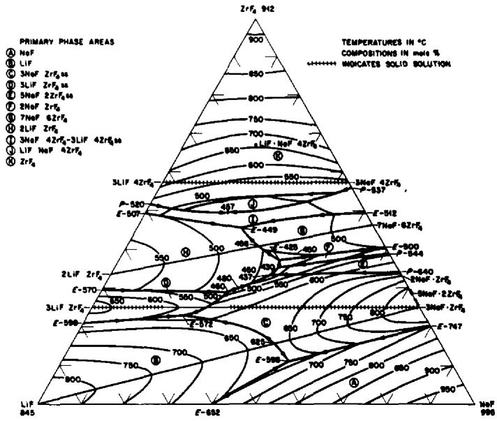  
1. The System LiF-NaF-ZrF<sub>4</sub>

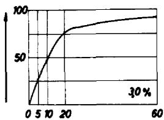  
% Oxide reacted as a Function of the Zirconium tetrafluoride -Content (Mol%)

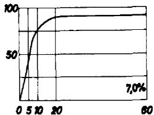

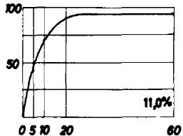

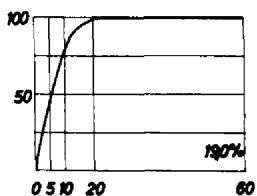

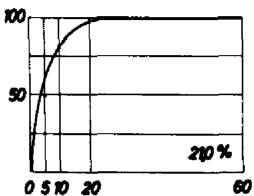

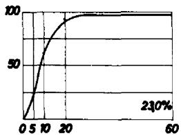

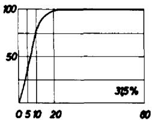

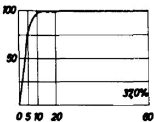

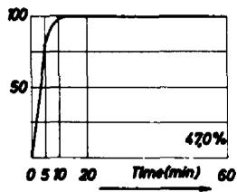  
2. Reaction Rate of Oxides for 9 $\mathsf{ZrF}_4$ -Contents


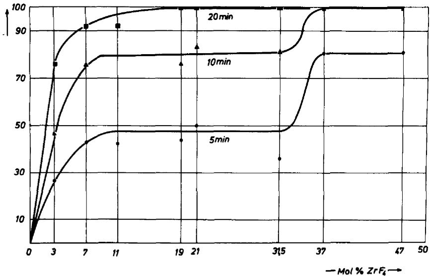  
$\%$ Oxide reacted as a Function of the $\mathsf{ZrF_4}$ -Content at various Reaction Times   
3. Reaction Rate of Oxides as a Function of $\mathsf{ZrF_4}$ Content

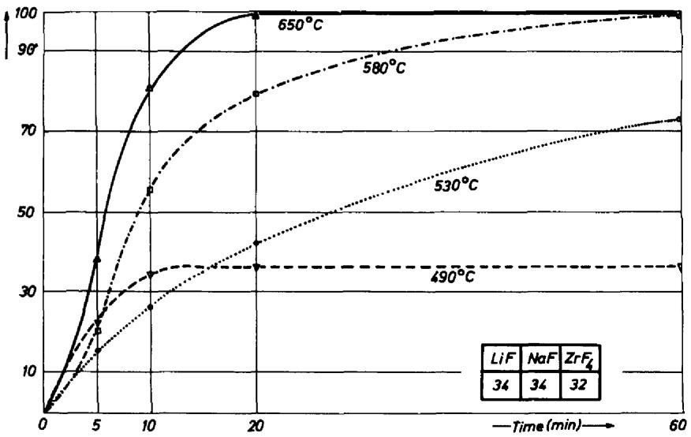  
$\%$ Oxide reacted as a Function of the Temperature and the $\mathsf{ZrF_4}$ -Content   
4. Reaction Rate as a Function of the Temperature


times (after 5, 10, and 20 min), plotted as a function of the $\mathsf{ZrF_4}$ content. At 20 mol/o $\mathsf{ZrF_4}$ for example the reaction is complete after 20 min. (Ratio oxide/melt, $10\%$ g/g)

# 2. Influence of the temperature

The dissolution step was investigated only at temperatures lower than $650^{\circ}\mathrm{C}$ , corrosion being too heavy at higher temperatures. As can be seen from diagram 4, at the lowest possible temperature of $450^{\circ}\mathrm{C}$ (ref. diagr. 1) the reaction rate is too slow and the reaction incomplete. 600 to $650^{\circ}\mathrm{C}$ will be necessary for this step, in order to achieve a satisfactory rate of reaction.

# 3. Influence of $\mathsf{ZrF_4}$ without HF-application

As mentioned earlier, $\mathrm{ZrF_4}$ is able to react with $\mathrm{ThO_2 / UO_2}$ resulting in breakdown of the crystal lattice without application of HF, generating an oxyfluoride mixture.

Diagram 5 shows the results of this reaction type without use of HF. The time needed for complete destruction of the particles was measured as a function of the $\mathrm{ZrF_4}$ -content. The LiF-NaF molar ratio was kept constant during this series. Hence at 50 molar $\%$ $\mathrm{ZrF_4}$ there is a maximum rate. In order to study the Influence of the LiF-NaF molar ratio, a subsequent investigation was carried out, in which this ratio was changed, keeping the $\mathrm{ZrF_4}$ -content constant.

# 4. Influence of the LIF-NaF molar ratio

The results of this series of tests are given in diagram 6, which makes it clear, that the fastest rate is achieved, when LiF and NaF are present in equimolar proportions, thereby fixing the most convenient composition for the dissolution step:

$$
\mathrm {L i F} - \mathrm {N a F} - \mathrm {Z r F} _ {4} = 2 5 - 2 5 - 5 0 \mathrm {m o l} / \mathrm {o}
$$

Simultaneously it was found that the following hydrofluorination of these oxyfluorides to the tetrafluorides takes less time than hydrofluorination of the oxide particles.

# 5. Solubility tests

The next important question is the solubility of the tetrafluorides in the given melt. Tests concerning the solubility of $\mathsf{ThF_4}$ in a melt of the above mentioned composition indicate that the simpler three component system NaF-ZrF4-ThF4, which has already been investigated, may be used as shown in diagram 7(14). Even at temperatures as high as $650^{\circ}C$ the solubility for $\mathsf{ThF_4}$ is not very high. Approximately 5 molar $\%$ $\mathsf{ThF_4}$ are soluble.


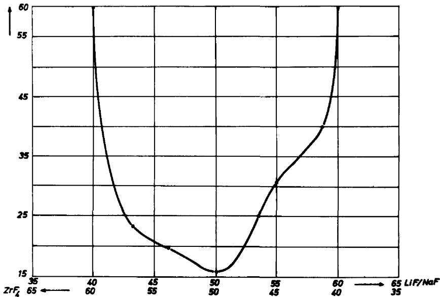  
Time(min) Reaction without HF-Application as a Function of the ZrF<sub>2</sub>-Content at LIF:NaFe=1:1

5. Reaction Rate without HF as a Function of the $\mathsf{ZrF}_4$ Content Time(min) Reaction without HF-Application as a Function of the LiF/NaF Molar Ratio at 50Mol% ZrF4   
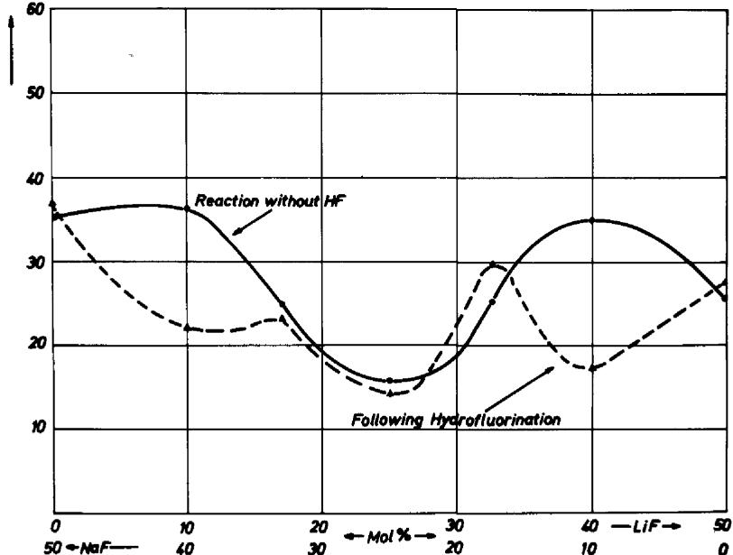  
6. Reaction Rate without HF as a Function of the LiF/NaF Molar Ratio

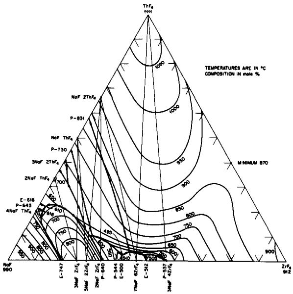  
7. The System NaF-ZrF₄-ThF₄

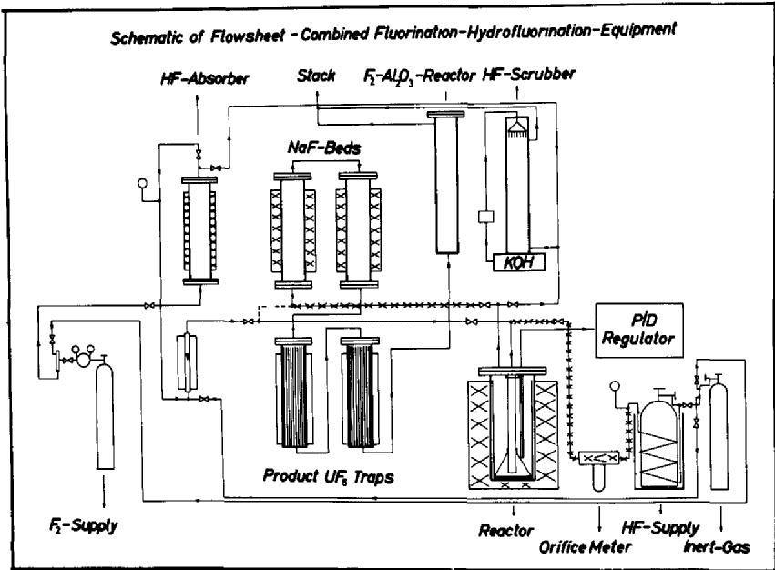  
8. Schematic Drawing of the used Fluorination Equipment

# Fluorination - UF6 - Volatillisation

From Information published by the ORNL(15) there should be no difficulty in volatilising the uranium with elementary fluorine if the uranium is dissolved homogeneously in the melt.

Diagram 8 shows schematically the flowsheet of the combined fluorination-hydrofluorination-equipment, which was used in this investigation. As may be seen from the diagram, attempts were made to carry out both reactions in the same reactor as a "single vessel" reaction.

# General procedure

For the investigation of the volatilisation rate of $\mathsf{UF}_6$ , expressed as the percentage of uranium volatilised as a function of the fluori-nation time, the conditions have been standardised to enable comparison to be made:

All series of tests were performed with the same fluorination equipment, consisting of crucibles of nickel or nickel-rich alloys of the Hastelloy type, which had been inserted into resistance heated furnaces. The amount of the starting melt was 100 or $150\mathrm{g}$ , which enabled a reaction to take place between 10 or $15\mathrm{g}$ $\mathrm{ThO_2 / UO_2}$ particles and fluorine-nitrogen mixtures, as desired.

After ascertaining that the UF6-volatillisation itself did not cause any major difficulties, the scale has been enlarged to a 3 kg fluorinator, which is capable of taking from 250 to 300 g of particles. Later, experiments in a hot cell will be performed on this scale also.

Figure 9 shows a picture of the arrangement used on a laboratory scale. The fluorination reactor is shown together with the absorption beds which were operated at 100 or $400^{\circ}C$ , respectively. To improve the heterogeneous reaction of the gaseous fluorine with the liquid melt it was agitated by means of a percolator tube (draft tube). This construction is shown in diagram 10.

# Results

The fluorination reaction is influenced by the following parameters:

1. geometry of the reaction vessel and its fittings   
2. gas velocity   
3. concentration of fluorine   
4. presence of ThF<sub>4</sub>

Using the arrangement shown, it was found that the following conditions will achieve good results: the ratio of length/diameter of the crucible or the furnace which contains the melt should be not less than 4/1. In the case of a 150 g batch size this configuration


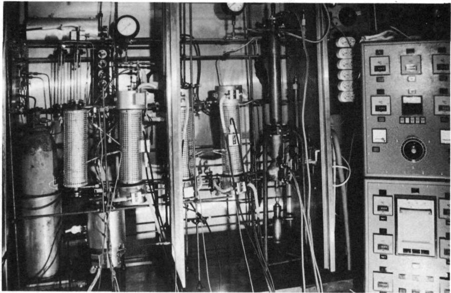  
9. Photograph of the Laboratory-Installations

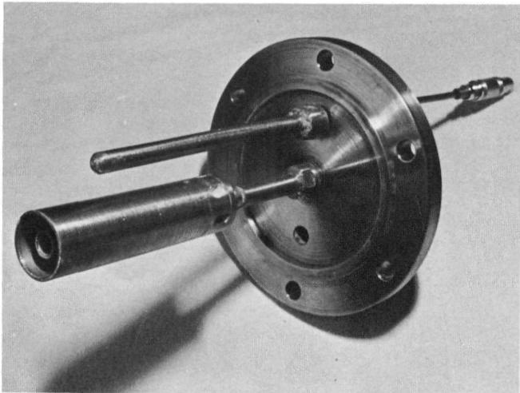  
10. Photograph of the Draft Tube

postulates a gas velocity of 12 l/h. The application of pure undiluted fluorine is not necessary, since mixtures of fluorine with e.g. nitrogen can achieve comparably good results; but as it can be seen from diagram 11, a dilution of the fluorine to less than 1/1 decreases the volafillisation rate markedly.

Diagram 12 shows four typical volatillisation curves with different ThF4-contents. The presence of ThF4 does not influence the volatilisation; but it is remarkable that ThF4 may be present additionally as a precipitate without appreciably decreasing the volatillisation yields. Furthermore a common induction period of about 40 to 60 min can be observed before any UF6 is volatillised at all. This could not be detected in the absence of ThF4.

# Other Process Variants

In the experiments described so far, both single reactions "hydrofluorination" and "fluorination" were carried out in a salt melt. Kali-Chemie Hannover, another participant of the joint project, studied possibilities for the conversion of the oxides into the tetrafluorides by reaction with HF in a fixed or fluidised bed reactor at $450^{\circ}\mathrm{C}$ . If this step is performed without a salt melt, the corrosion in the FSFVP can possibly be diminished. The corrosion at the liquid-gas interface is believed to be caused by the water generated after the reaction of HF with the oxides.

Consequently there are 4 possible variants:

1. Hydrofluorination with subsequent fluorination in $\mathsf{ZrF}_4$ -bearing melts.   
2. Reaction to the oxyfluorides without hydrofluorination in $\mathsf{ZrF_4}$ -bearing systems with subsequent fluorination.   
3. Dry hydrofluorination leading to a $\mathsf{UF}_4 / \mathsf{UO}_2\mathsf{F}_2$ -ThF4 mixture which can be fused with alkali fluorides (LiF-NaF-ThF4) with subsequent fluorination. (Proposed by Kali Chemle)   
4. Fusing the $\mathsf{UF}_4 / \mathsf{UO}_2\mathsf{F}_2 = \mathsf{ThF}_4$ mixture with a $\mathsf{ZrF}_4$ -bearing system with subsequent fluorination.

All four possibilities have been investigated systematically, especially concerning the corrosive properties. Considering these variants, two main features can be pointed out:

ZrF₄-bearing systems exhibit, in fact, only a limited solubility for ThF₄, but are on the other hand quite superior in relation to the corrosive attack on the construction material. Hydrofluorinations at 650°C in ZrF₄-rich melts caused only a slight increase in the nickel content of the melt.

ZrF4-free systems allow appreciably greater amounts of ThF4, since ThF4 is itself a component of the three component system LIF-NaF-ThF4; but it was observed that this system leads to a corrosion hardly


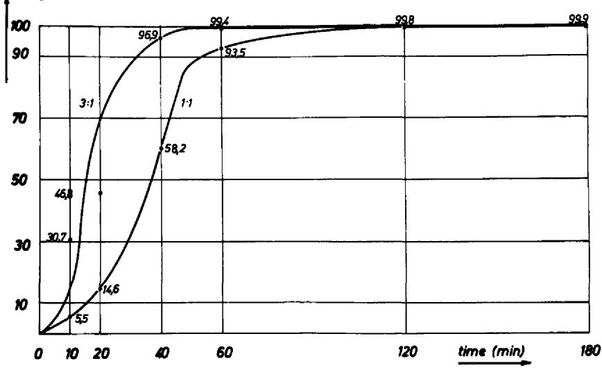  
$\%$ $U_{5}^{2}$ volutilised as a function of the $F_{2}:N_{2}$ ratio   
11. Volatilisation Rate as a Function of the Fluorine Concentration

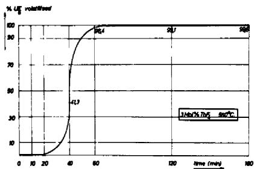

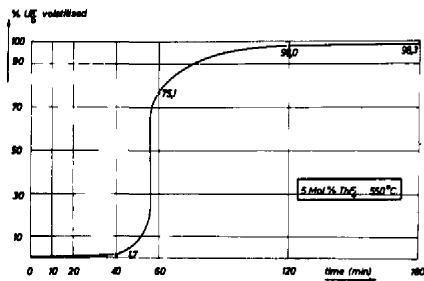

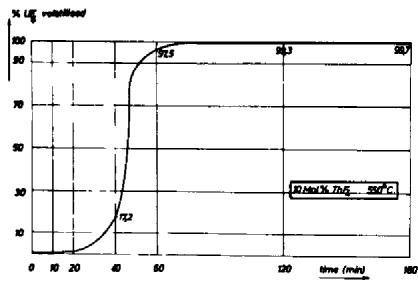

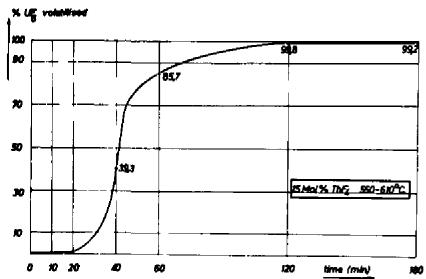  
12. Volatilisation of UF<sub>6</sub> in the Presence of ThF<sub>4</sub>

tolerable in connection with intergranular attack.

# Corrosion Studies

During the investigations into $\mathsf{ZrF_4}$ -free systems (variant 3) a severe corrosion was observed in contrast to the $\mathsf{ZrF_4}$ -bearing systems (variants 1, 2 and 4). The nickel content in the melt increased so rapidly, that the viscosity became too high, thereby terminating the fluorination before all uranium had been volatilised. These observations made it necessary to undertake a somewhat more systematic corrosion study. But restrictively it must be stated that all results reported here refer to the nickel content of the melt which was analysed by direct X-ray excitation, and no work could be performed using ultrasonic or vidlgage techniques.

As is shown in diagram 13, corrosion is unequivocally influenced by the $\mathsf{ZrF_4}$ -content of the melt. This investigation is based on the hydrofluorination step, and shows additionally that nickel-rich alloys of the Hastelloy type exhibit a much higher resistivity to attack.

Corrosion during fluorination does not make the FSFVP unworkable, but it is necessary to use only melts with high $\mathsf{ZrF_4}$ -contents in order to avoid excessive corrosion. Whereas the amount of dissolved nickel in $\mathsf{ZrF_4}$ -free systems is increased under the chosen conditions (3 h, F₂ at 550°C) by a factor of 30 to 40, corrosion is decreased to such an extent, when $\mathsf{ZrF_4}$ is added, that the factor will become only 1, 5 to 2, proving thereby the superiority of the latter system.

Consequently it seems favourable to combine the "dry hydrofluorination" with the UF- volatillisation out of $\mathsf{ZrF_4}$ -bearing melt systems, since the volatilisation yields in a melt are higher than those obtained by dry fluorination in a fixed or fluidised bed. Dry fluorination is still under investigation by Kali-Chemie, who have found that UF- volatillisation yields can be increased by introducing an additional Intermediary step of pyrohydrolysis. The complete process of dry fluorination would then consist of the following steps: hydrofluorination, fluorination, pyrohydrolysis, hydrofluorination, fluorination.

# Sorption Studies of UF6 on NaF

It is known that a separation of $\mathsf{UF}_6$ from some other volatile fission product fluorides can be accomplished by adsorption-desorption on NaF(16-18). $150^{\circ}\mathrm{C}$ had already proved to be a feasible temperature for the separation of MoF $_6$ from UF $_6$ (19-20). Before beginning investigations on the behaviour of MoF $_6$ , the sorption characteristics of UF $_6$ on NaF pellets were determined. Taking the proposed $150^{\circ}\mathrm{C}$ as an appropriate temperature for separation, in order to make further use of this sorption technique, it can be said that the adsorption of UF $_6$ , even at this temperature, is still quantitative. On the other hand, it is impossible to desorb any UF $_6$ out of the complex $\mathsf{Na}_2[\mathsf{UF}_8]$


% Nickel after 80min Hydrofluorination at $650^{\circ}C$   
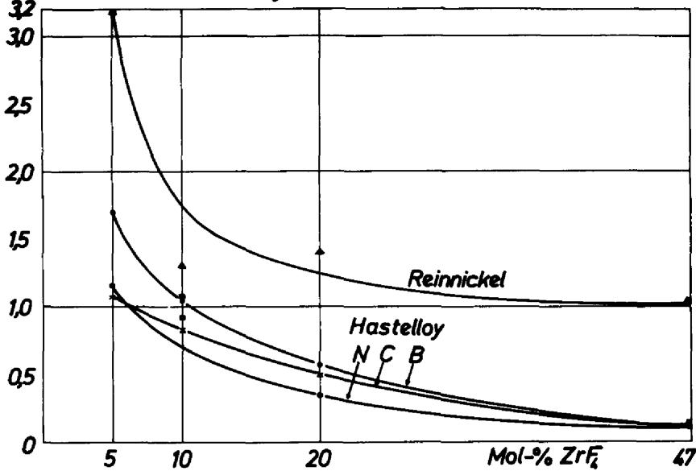  
13. Corrosion as a Function of $\mathsf{ZrF}_4$ Content

at this temperature. This leads to the conclusion that it should be possible to separate both hexafluorides.

Studies in connection with the lifetime of NaF-pellets from the Harshaw Chem. Co. led to the result that this product can be used at least ten times for clean, non-contaminated UF $_6$ in a cyclic process; even after the tenth cycle the uranium remained fixed in a small, limited band.

# Conclusion

By demonstrating that the first two main steps of the FSFVP, i.e. hydrofluorination and fluorination, do not cause any major difficulties, it should be possible to apply this process to oxide type THTR-fuels also, provided that the next step, the further decontamination of the volatilised UF $_6$ on NaF-beds, can be solved successfully. Furthermore, there is another fact in favour of this process: the absence of plutonium, since the fuel elements now under investigation contain thorium as breed material and highly enriched uranium as fuel.

# References

1. Argonne Nat. Lab. III."Chemical Engineering Division Summary Report for July, August, and September 1955, ANL-5494 (Del) 2.Nov. 1955.   
2. dto for July, August, September 1959, ANL-5924, Dec. 1958.   
3. dto for October, November, December 1959, ANL-6101, Febr.1960.   
4. dto for April, May, June 1960, ANL-6183.   
5. D.O.Campbell, G.I.Cathers "Processing of Molten Salt Power Reactor Fuels", Ind. Eng. Chem. 52, No.1 (1960), pp.41-44.   
6. Oak Ridge Nat. Lab., Ten. Chemical Technology Division, Annual Progress Report for Period ending 31. August 1960, Fused-Salt Fluoride-Volatility Process, ORNL-2993, 1960.   
7. dto for Period ending 30 June 1962, ORNL-3314, 1962.   
8. dto for Period ending 31. May 1963, ORNL-4352, 1963.   
9. W.H.Carr, "Volatility Processing of the ARE Fuel", Chem. Eng. Progr. Symp. Ser. 56, No. 28 (1960), pp. 57-61.   
10. G.I.Cathers, R.L.Jolly, E.C.Moncrief, "Use of FSFVP with Irradiated Urania, Decayed 15-30 Days", ORNL-Report 3280, Sept. 1962.


11. see 7; and G.I.Cathers, M.R.Bennett, R.L.Jolly, "Application of Fused-Salt Fluoride-Volatility Processing to Various Reactor Fuels", Chem. Eng. Progr. Symp. Ser. No.47, Vol. 60 (1964), pp.31-36.   
12. ORNL, Chem. Techn. Division, Annual Prog. Rep. Period ending Aug. 31, 1960, ORNL-2993.   
13. R.E.Thoma, H. Insley, A.A.Friedman, G.M.Hebert, "The Condensed System LiF-NaF-ZrF4. Phase Equilibria and Crystallographic Data", J. Chem. Eng. Data 10, No.3 (1965), pp.219-230; J. Phys. Chem. 62 (1958), pp.665-676; J. Am. Ceram. Soc. 46 (1963), pp.37.42.   
14. R.E.Thoma, "Phase Diagrams of Nuclear Reactor Materials", ORNL-Report 2548 (1959).   
15. see 5-11.   
16. Houdry Process Corp., "Kinetics of Uranium and Fission Product Fluoride Adsorption by Sodium Fluoride", 60 OCR-1, Jan. 1959; Report TID 11398.   
17. L.E.McNeese, "An Experimental Study of Sorption of UF6 by NaF" Report ORNL-3494, Nov. 29., 1963.   
18. ORNL-Report, ORNL-TM-522.   
19. S. Katz, "Use of High-Surface-Area NaF to Prepare $\mathsf{MF}_6\cdot 2$ NaF Complexes with U, W and Mo Hexafluorides", Inorg. Chem. 3, No.11 (1964), pp.1598-1600.   
20. see ref. 8; and G.l.Cathers, R.L.Jolly, E.C.Moncrief, "Laboratory-Scale Demonstration of the FSFVP", ORNL-TM-80 (Dec.6, 1961).


# FUSED SALT- LIQUID METAL SYSTEMS

Chairman: W. R. Grimes

Oak Ridge National Laboratory

Oak Ridge, Tennessee, U.S.A.


# EBR-II SKULL RECLAMATION PROCESS*

I. O. Winsch, R. D. Pierce, G. J. Bernstein, W. E. Miller and L. Burris, Jr. Chemical Engineering Division Argonne National Laboratory Argonne, Illinois 60439 U.S.A.

# Abstract

A pyrochemical process has been developed for the recovery of enriched uranium from residual crucible skulls that result from the EBR-II melt refining process. The process involves: (1) oxidation of the skulls to liberate them from the crucible as a free-flowing powder; (2) addition of the powder to a halide salt and extraction of 75 to $95\%$ of the nobler fission product elements from the oxide with liquid zinc at $800^{\circ}\mathrm{C}$ ; (3) reduction of the uranium oxide by contacting the salt with a Mg-17 at. $\%$ Zn alloy at $800^{\circ}\mathrm{C}$ ; (4) removal of $95\%$ or more of the remaining fission products by transferring away the molten salt and the metal alloy in which the metallic uranium is insoluble; (5) dissolution of the uranium in a Zn-29 at. $\%$ Mg alloy; and (6) recovery of the uranium product by retorting and melting. The Skull Reclamation Process was developed and tested on a pilot and a prototype plant scale in the Chemical Engineering Division of Argonne National Laboratory. However, a change in the EBR-II reactor status from an experimental to a test reactor precluded the installation of Skull Reclamation Process equipment in the EBR-II Fuel Cycle Facility.

*Work performed under the auspices of the United States Atomic Energy Commission.

# Introduction

The concept of on-site recovery and recycle of discharged reactor fuel has been established in Argonne's EBR-II reactor complex. Processing of spent reactor fuel and refabrication of new fuel are carried out in the EBR-II Fuel Cycle Facility.(1) Fuel processing is carried out by remote pyrochemical methods. A simplified fuel cycle flowsheet is shown in Figure 1.

Although the EBR-II reactor may ultimately employ plutonium alloys, an enriched uranium alloy is now used as the fuel in the core loading. The core is an assembly of 0.144 inch pins which are clad with stainless steel and thermally bonded with sodium. A process known as melt refining $^{(2,3)}$ was developed and has been used successfully for five years to recover EBR-II fuel in the Fuel Cycle Facility. A closed fuel cycle melt refining and refabrication of fuel remotely has been successfully demonstrated. However, because of the small scale of operation, continued operation is not justifiable economically, and so recovery of EBR-II fuel by pyrometallurgical methods in the Fuel Cycle Facility was discontinued early in 1969.

In the melt-refining process the fuel pins are declad mechanically, chopped to convenient lengths, and charged along with makeup uranium to a lime-stabilized zirconia crucible. The charge is melted, heated to $1400^{\circ}\mathrm{C}$ , held at this temperature for about 3 hr, and then poured into a mold to form an ingot. This treatment removes about two-thirds of the fission products through volatilization of some fission elements and selective oxidation of others by interaction with the zirconia crucible. The nobler fission products such as molybdenum, ruthenium, and zirconium are not removed by melt refining. The recycled fuel is an alloy of uranium and "fissium".* To avoid an alloy of changing composition, inactive noble metals were alloyed with the initial fuel in their approximate equilibrium concentrations based on an auxiliary removal of about $7\%$ of the noble metals during each cycle for $2\%$ burnup fuel. Experience has shown that the presence of noble metals enhances the irradiation stability of uranium.

The product ingot is used to refabricate new fuel pins by injection casting. The fuel pins are inserted into stainless steel cans, welded, and assembled into new fuel subassemblies for recharging to the EBR-II reactor. In the melt refining process, inorganic, radiation-stable materials are used which permit processing of short-cooled, high-burnup metal and ceramic fuels.


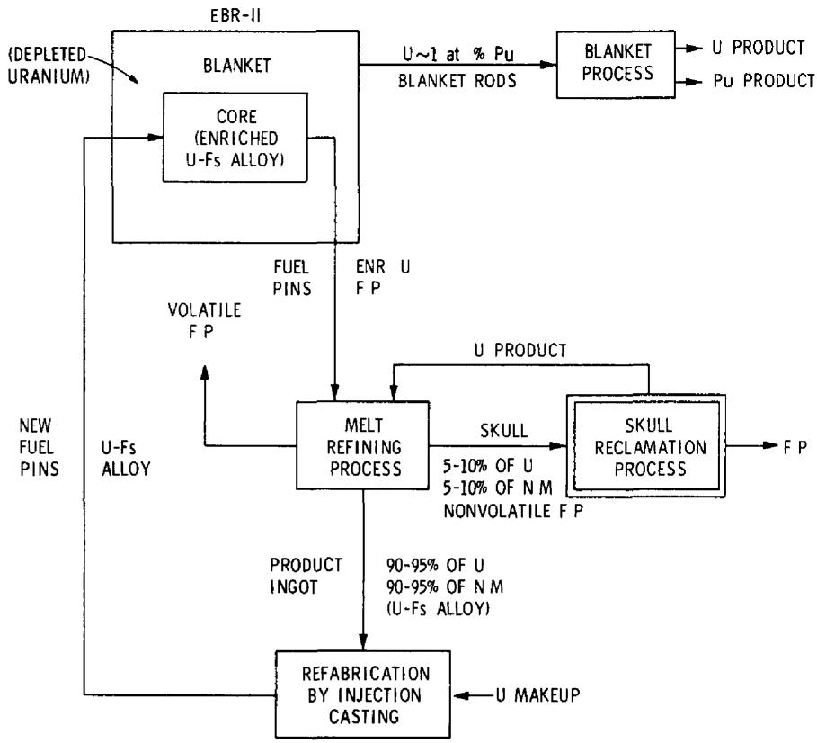  
F P - fission products N M - noble metals Fs - fissium

1. Simplified Fuel Processing Flow Sheet

The rapid recycle of the fuel results in reduction of fuel inventories outside of the reactor. Other advantages of the process over an aqueous process are the small volumes resulting in compact processing equipment, direct production of solid wastes, and the elimination of criticality problems associated with aqueous solutions.

When the product ingot is poured in the melt refining process, about $7\%$ of the uranium remains in the crucible as a skull which consists of a mixture of dross and unpoured metal. In addition to uranium, the skull contains about $7\%$ of the original noble metal content and nearly all of the more electropositive fission product metals, Ba, Sr, Y, and the rare earths.

A liquid metal process, called the Skull Reclamation Process, was developed for processing the melt refining skulls.(4) This process has three objectives: (1) recovery of the uranium, (2) removal of the electropositive fission products, which have been concentrated in the skull, and (3) removal of noble and refractory metal fission products which are not removed in the melt refining process. Since about $93\%$ of the fuel material is recovered in the melt refining process, a recovery of about $95\%$ of the fuel in the melt refining skull will result in overall fuel recovery of at least $99.5\%$ . Decontamination requirements are modest since in a fast reactor, neutron poisoning is minimal and all fuel refabrication is done remotely behind heavy shielding. It is necessary to remove only amounts sufficient to avoid excessive dilution of the fuel. Fission product removals of 60 to $90\%$ are entirely adequate for this reactor.

A pyrochemical blanket process (as indicated in Figure 1) was also developed. The basic equipment and operations are similar to those employed in the Skull Reclamation Process and will not be discussed further in this report.

In developing the Skull Reclamation Process flowsheet, equipment, and techniques, a total of 36 skull-reclamation runs were made in the pilot plant equipment and 18 runs were made in the prototype plant equipment. During the development period, changes were made in the process to simplify the operations and reduce the overall run time from 32 hr to about 11 hr. The final Skull Reclamation Process flowsheet resulting from this work is shown in Figure 2.

The primary steps in the process may be described briefly as follows:

Skull Oxidation: The skull in the melt refining crucible is burned at a controlled rate in an $O_2$ - $20\%$ Ar atmosphere at $700^{\circ}C$ . The skull is converted into a free-flowing oxide powder which is removed from the crucible and charged to the noble metal extraction

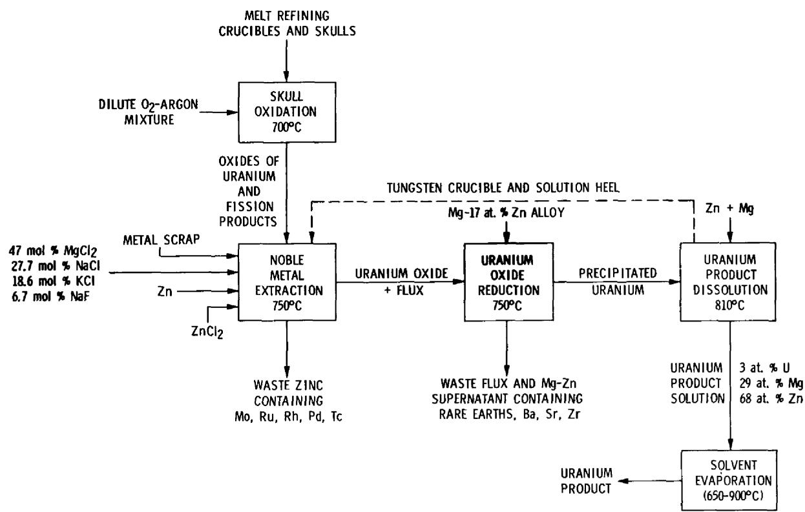  
2. Skull Reclamation Flow Sheet

step of the process.

Noble Metal Extraction: This step is designed to separate the relatively noble metal fission products from uranium. These noble metals include molybdenum, technecium, ruthenium, rhodium, palladium, silver, indium, and antimony. To effect the desired separation (at least $50\%$ removal), the finely divided oxides are suspended in a molten halide salt. The noble metals are reduced by contacting the oxides with zinc, and the metals are extracted into the zinc, which is then removed and discarded.

It is not essential that the reduced noble metal fission products dissolve in the zinc phase. Some of these elements have very low solubilities and it would be unrealistic to use sufficient zinc to dissolve them completely. Mild agitation of the zinc phase during transfer is sufficient to maintain in suspension those elements whose solubility is exceeded.

Reduction: The reduction of $\mathrm{UO}_2$ by liquid Mg-Zn alloy can be represented by the following overall equation:

$$
\mathrm {U O} _ {2} (\text {s a l t}) + 2 \mathrm {M g} (\mathrm {Z n}) + 2 \mathrm {M g O} (\text {s a l t}) + \mathrm {U} + (\mathrm {Z n} - \mathrm {M g})
$$

The uranium oxide, which is dispersed in the salt phase $(\mathrm{MgCl}_2 - \mathrm{CaCl}_2 - \mathrm{CaF}_2)$ as a solid, is reduced by the magnesium in the metal phase. The MgO collects in the salt phase and the uranium, which has a solubility of only 0.1 at. $\%$ in the Mg-17 at. $\%$ Zn alloy at $700^{\circ}\mathrm{C}$ , precipitates from solution.

The experimental work of Knighton et al(6) and Martin et al(7) showed that molten halide salts offer advantages in the reduction of uranium oxides by molten metals. The salt promotes more complete reductions and scavenges the MgO by-product of the reaction away from the product in the metal phase.

The Mg-Zn and the salt containing rare earths, barium, strontium, and zirconium are pressure-siphoned from the crucible and treated as waste.

Uranium Product Dissolution: The uranium precipitate is dissolved in a Zn-30 at. $\%$ Mg alloy at $810^{\circ}\mathrm{C}$ . The solubility of uranium in this alloy at $800^{\circ}\mathrm{C}$ is about 4.0 at. $\%$ . However, dissolutions are made with an excess of Zn-Mg alloy to provide about a 3.0 at. $\%$ uranium solution.

Solvent Evaporation: The Zn-Mg-U product ingot is charged to a beryllia crucible and subjected to a low-pressure retorting operation (750°C, 10-micron pressure) to remove the magnesium and zinc. The condensed magnesium-zinc vapors are discarded as waste, and the uranium is consolidated into an ingot by heating the crucible to about $1200^{\circ}\mathrm{C}$ . This ingot is suitable for recycle to the melt refining operation.

# Pilot Plant Equipment

The equipment used in the pilot plant studies consisted essentially of two large bell-jar furnaces heated inductively and containing tungsten processing crucibles. This equipment was located inside a glovebox whose dimensions were about 13.3 ft long by 8.5 ft high by 3.3 ft wide. A dry $\mathbf{N}_2$ -Ar atmosphere was maintained in the enclosure and in the furnaces to protect the reagents against oxidation and moisture. Figure 3 shows the glovebox, furnaces, and control panelboard before closure of the glovebox with gloveport panels. A heated transfer line is shown in position for transferring molten metal from one furnace to the other. (Two furnaces were used in the early process flowsheets. In the final flowsheet only one furnace was used and all transfers were made to a waste or product receiver.) Transfers of molten materials were made by pressurizing one of the furnaces with argon. The bell jar covers had three nozzles, one of which was used for an agitator shaft, the other two for insertion of transfer tubes and other equipment used for sampling, liquid-level measurement, and temperature measurement.

In addition to the bell jar itself, the service nozzles in the top of the jar were water cooled to prevent damage to rubber gaskets. The temperature of the rubber gaskets was $40^{\circ}\mathrm{C}$ when the furnaces were at $800^{\circ}\mathrm{C}$ which is well below their permissible operating temperature of $150^{\circ}\mathrm{C}$ . During the runs, a continuous argon gas purge (5 cfh) into the three bell-jar nozzles inhibited the accumulation of condensed metals and salt around the agitator shaft, the sample port, and the transfer tube.

Tungsten crucibles were used to contain the molten salts and metals.(8) Figure 4 shows a pressed-and-sintered tungsten crucible (12 in. O.D. x 20 in. high) with integral mixing baffles. This is one of three such crucibles fabricated by Union Carbide Nuclear Corporation, Oak Ridge, Tennessee. The density of the crucible material is about 92 to $94\%$ of theoretical, and the weight of each crucible is about 500 lb. The crucible is shown suspended from its lifting yoke. Below the crucible is the graphite secondary container and susceptor, an insulating sleeve and the flat strip copper induction coil. The coil was powered by a 30 kW-10,000 Hz induction unit. Surface temperature of the coil was about $300^{\circ}\mathrm{C}$ when the operating temperature of the crucible was $900^{\circ}\mathrm{C}$ .

Two other tungsten crucibles of approximately the same size were fabricated, one by arc-welding rolled tungsten sections, and the other by shear forming. The welded crucible failed at the bottom weld after three process runs. The shear-formed crucible was not used in Skull Reclamation Process runs but gave excellent service in other pyrochemical process studies using halide salts, Cu-Mg-U alloys, Zn-Mg alloys, and zinc at temperatures up to $900^{\circ}\mathrm{C}$ .


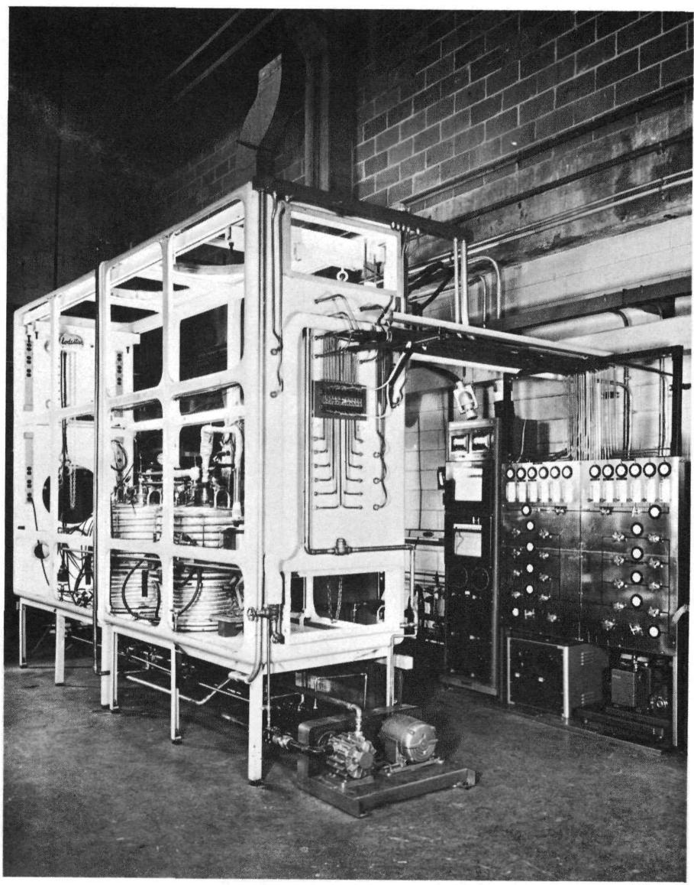  
3. Pilot Plant Glove Box

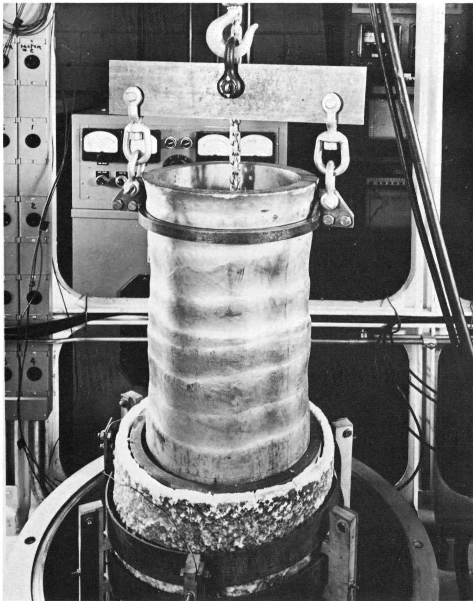  
4. Tungsten Crucible

Internal components of the furnace that required machining were generally fabricated from Mo-30 wt % W alloy. These components included the mixer shaft and blades, small heat shields for the shaft bearing assembly and a large heat shield, which covered the crucible. An additional heat shield made of Hastelloy-X was located in the upper portion of the furnace bell jar.

Waste and product streams were removed from the tungsten process crucible through Mo-30 wt % W transfer tubes formed in the shape of an inverted "J".(9) The initial transfer tubes were fabricated of 5/8 in. O.D. by 5/16 in. I.D. gun-drilled Mo-30 wt % W alloy rod, which was assembled by means of threaded elbows. Continuous development resulted in an improved design: two lengths of gun-drilled rod (3/4 in. O.D. by 3/8 in. I.D.) were coupled together to form a single tube 78 in. long. In place of threaded elbows, the bends were made by hot-forming. The tube was heated to a temperature of $800^{\circ}\mathrm{C}$ by means of a number of 600-watt magnesium-insulated, stainless-steel sheathed, 1/8 in. O.D. heating cables, which were wound on the tube. The heaters were covered with insulation and then canned with a stainless steel enclosure. The enclosure protected the insulation and heaters during handling, and the annular space evacuated and filled with argon to prevent oxidation of the Mo-30 wt % W tube.

The material discharged from the process crucibles was collected in a graphite mold suspended from a dial scale. This arrangement permitted control over the quantity of material removed in any transfer by close observation of the scale.

# Prototype Plant Equipment

Prototype plant equipment for the Idaho EBR-II Fuel Cycle Facility (FCF) was designed, fabricated, and tested at Argonne National Laboratory by personnel of the Chemical Engineering Division.

The equipment was operated in a large argon-atmosphere enclosure equipped with gas purification and refrigeration systems. All mechanical manipulations were carried out by use of a small crane or by various hand tools operated through gloveports. These operations were performed in a manner that simulated completely remote operation in the FCF. Figure 5 shows the interior of the enclosure as well as the furnaces used in the oxide reduction and retorting steps.

The primary components of the skull-oxide processing equipment are a skull-oxidation furnace, skull-oxide-reduction-and-purification furnace, transfer tube, transfer receiver equipment, and retorting furnace for recovery of the uranium product.

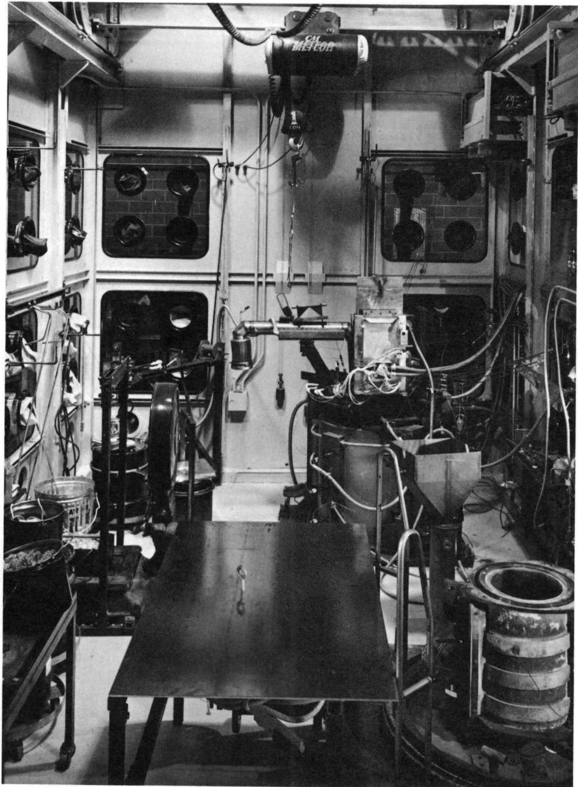  
5. Interior of Inert Atmosphere Enclosure

Figure 6 is a drawing of the skull oxidation furnace which was developed at Argonne and is installed in the EBR-II Fuel Cycle Facility.(10) An earlier version of that furnace was used in the inert atmosphere enclosure to prepare skull oxides for the Skull Reclamation Process studies with prototype plant equipment.

Figure 7 is a vertical section through the skull-oxide-reduction-and-purification furnace. The furnace body is made of Hastelloy C to withstand operating temperatures up to $900^{\circ}\mathrm{C}$ . The pressed-and-sintered tungsten crucible was fabricated without internal baffles but had a dished bottom to increase the mixing turbulence from the offset agitator. A second impeller and a baffle cage were added at a later date to enhance mixing intensity.

The agitator shaft was driven by a 3 hp D.C. motor at speeds up to 1000 rpm through an open gear-and-pinion assembly. The gears were lubricated with an adherent dressing of APL grease to which molydisulfide powder had been added. The shaft seal contained a special high-temperature molydisulfide lubricated packing. A constant low-rate argon purge below the shaft seal prevented entrance of fumes into the packing section.

The external resistance heaters (20 kW) were arranged to be opened by pneumatic cylinders to increase the rate of cooling should that prove desirable. The insulated cover as well as the transfer tube, shaft seal assembly and charging port were all sealed by fusible-metal seals.(11)

The heated transfer tube was constructed in a manner similar to that used in the pilot plant equipment.(9) The bore was larger (1/2 vs. 3/8 in. I.D.) to increase capacity, and braided heaters were used in place of swaged heaters to reduce the number of heater circuits by permitting longer heater sections. Since the transfer tube was designed for use in an inert atmosphere, a sealed protective enclosure was not required. Construction details are shown in Figure 8.

During the initial stages of equipment development a potential operating difficulty was encountered with salt and metal fumes that were released when materials were charged to or transferred out of the hot furnace. Charging difficulties were resolved by installing on the furnace a permanent hopper, which was closed by a simple 4-in. ball valve. The transfer receiver (which is mounted on a platform scale to indicate the quantity of material transferred) was placed in an enclosure from which the fumes were exhausted through a filter chamber containing high-temperature AEC filters.

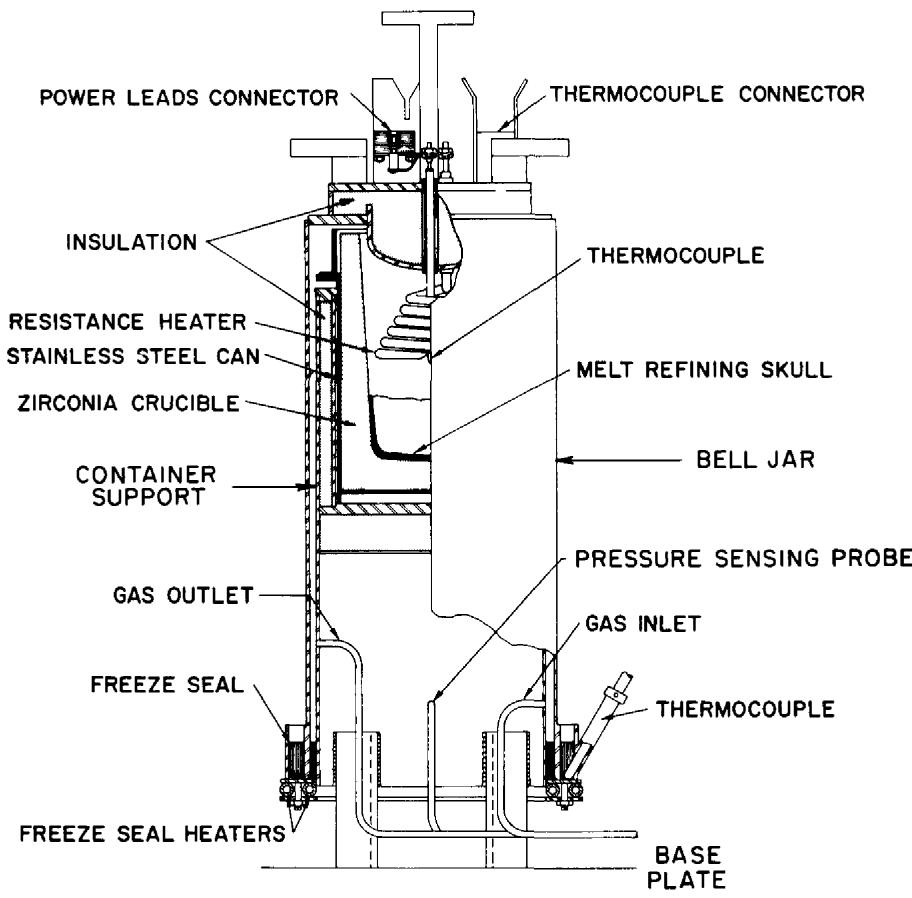  
6. Skull Oxidation Furnace

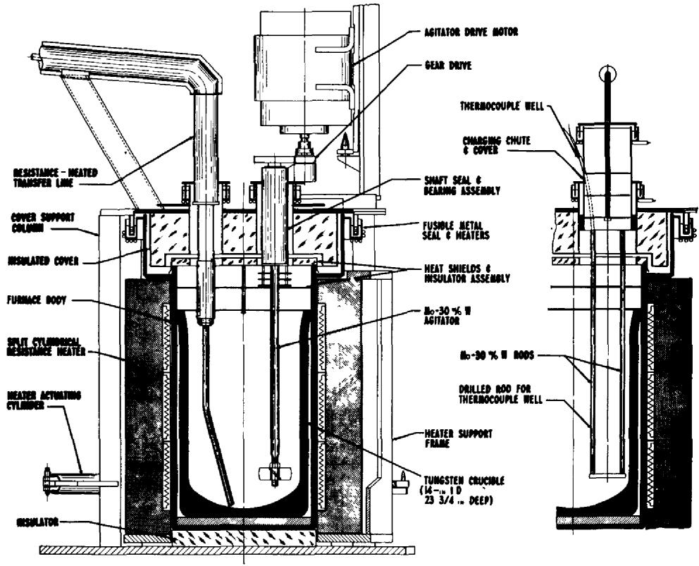  
7. Oxide Reduction Furnace

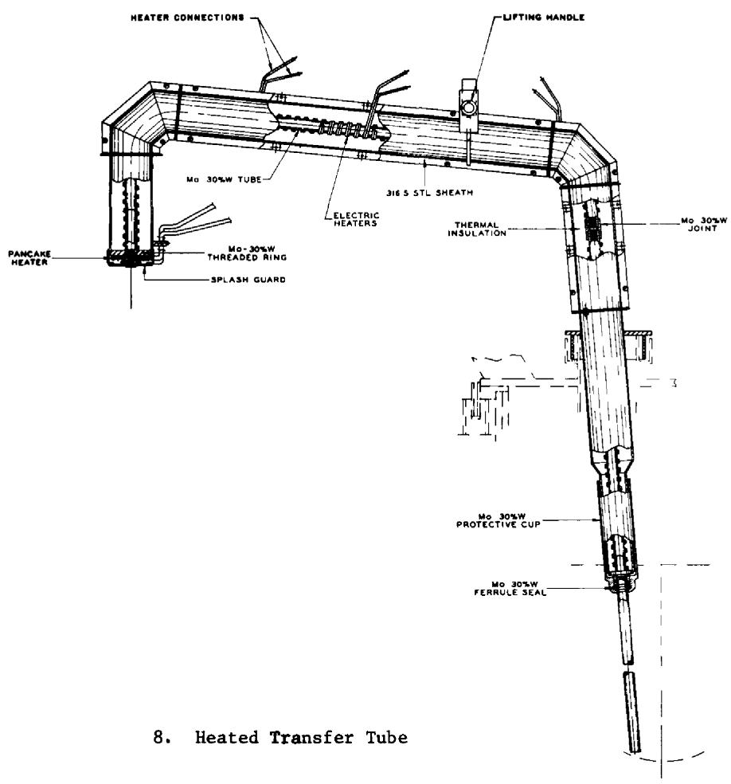

As shown in Figure 2, the uranium resulting from the oxide-reduction-and-purification step is removed from the furnace by dissolution in a magnesium-zinc alloy which is cast into an ingot. The final step in the Skull Reclamation Process is the recovery of the uranium from a Zn-29 at. $\%$ Mg-3 at. $\%$ U ingot by evaporating the Zn-Mg.(12) This operation is carried out in a compact combination still pot, condenser and collector shown in Figure 9. The assembly is located inside a bell-jar furnace to permit operation under low pressure (v10 torr). The still pot is heated inductively with about $7.5\mathrm{kW}$ power output from a $10,000\mathrm{Hz}$ generator. A thixotropically-cast beryllia crucible with interior hemispherical bottom is used to contain the metals during the retorting operation. A graphite secondary container is used to support the beryllia crucible and acts as an induction-heating susceptor.

Proper performance of the equipment requires close control of power input to avoid surging or bumping. The furnace was equipped with a seismic vibration detector and a contact microphone to warn of the approach of excessive boilup.

# Pilot Plant Operating Experience

Mechanical Performance. In developing the process some changes were made in the skull-oxide processing flowsheet shown in Figure 2. These changes were primarily in the relative quantities of reagents used. Operating conditions employed in the final pilot plant runs are shown in Figure 10.

Mechanical performance of the equipment was generally satisfactory. The pressed-and-sintered tungsten crucible and the Mo-30 wt % W agitator shaft and impeller showed excellent corrosion resistance. The improved design of the heated transfer line gave excellent service in conjunction with techniques for close control of solution-transfer operations. The transfer line was fixed in the furnace with its inlet point about 1/2 in. above the crucible bottom. All transfers were made by pressurizing the furnace with argon. When relatively complete transfers were desired, e.g., transfer of salt and magnesium-zinc after the reduction step or transfer of uranium product solution, the furnace was kept pressurized until excess argon pressure vented through the empty transfer line. In such cases approximately $95\%$ of the available molten material was transferred. When only the metal phase was to be transferred, e.g., the zinc phase following the noble-metal-extraction step, the metal transfer was initiated by pressurizing the furnace. When the desired amount of metal had been removed (as indicated by the weight of the receiver), the gas pressure was vented through a relief valve and the transfer abruptly stopped. These transfers were controlled at $90\%$ removal of the zinc to avoid inadvertent transfer of the molten salt in which

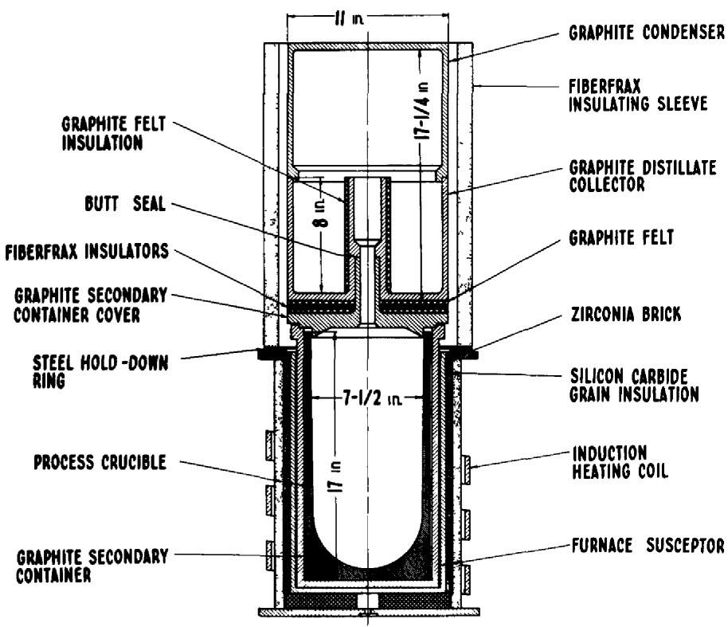  
9. Retort Assembly

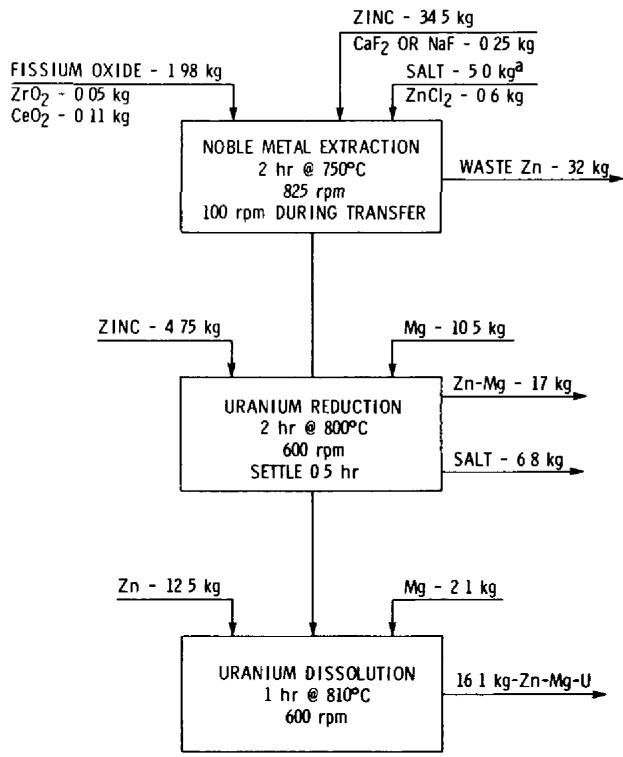  
aSalt used was $\mathsf{MgCl}_2 - \mathsf{CaCl}_2$   
10. Operating Conditions for Pilot Plant Skull Oxide Reclamation Runs

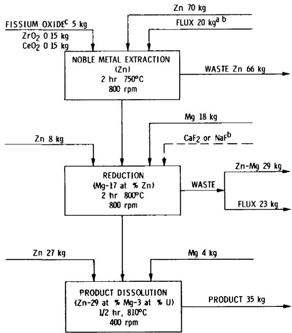  
aOne of these fluxes was used (A) 50 mol $\%$ MgCl2, 50 mol $\%$ CaCl2, (B) 50 mol $\%$ MgCl2, 30 mol $\%$ NaCl, 20 mol $\%$ KCl, (C) 50 mol $\%$ MgCl2, 50 mol $\%$ NaCl   
bFluoride ion as $\mathrm{CaF_2}$ or NaF was added either before the noble metal extraction step or before the reduction step None was used in run 11. cObtained from 5 wt % fsiium   
11. Operating Conditions for Plant Scale Skull Oxide Reclamation Runs

skull oxide is suspended.

The presence of moisture in the salt constituted a major problem during the early development phases of the process. The salt is highly hygroscopic and absorbs moisture from even a relatively dry atmosphere (e.g., 750 ppm water). Reaction of this moisture with molten magnesium results in evolution of hydrogen, which can cause the molten salt to foam out of the crucible. This difficulty was resolved by pretreating the salt before it was used in the furnace. Pretreatment consisted of melting the salt and contacting it with a molten Mg-Ca alloy. The MgO and CaO formed as a result of reaction with moisture in the salt was removed by hot filtration. The dry inert atmosphere in the glovebox prevented absorption of water during subsequent operations.

# Fission-Product Removal

Ruthenium and molybdenum are soluble in the noble-metal zinc extract to about 0.33 at. % and 0.15 at. %, respectively, at $700^{\circ}\mathrm{C}$ . The waste zinc supernatant is transferred while the zinc is stirred at a speed of about 100 rpm to suspend the molybdenum. Table I shows fission product removals in four pilot plant runs made in accordance with the flowsheet shown in Figure 10. The removal of molybdenum varied between 19 and $33\%$ . Ruthenium removals were good and ranged from 75 to $85\%$ . As noted in the table, zirconium removal in the Mg-17 at. % Zn supernatant after the uranium reduction-precipitation step varied from 30 to $41\%$ and the waste salt showed zirconium removals of 6 to $25\%$ . Cerium removals in the Mg-Zn supernatant and waste salt were 27 to $36\%$ and 30 to $43\%$ , respectively.

Fission-Product Material Balances\* in Skull Reclamation Process Runs   
(See Figure 10 for operating conditions)   

<table><tr><td rowspan="2">Run No.</td><td colspan="2">Noble Metal Extract</td><td colspan="2">Mg-17 at.% Zn Waste</td><td colspan="2">Waste Salt</td><td colspan="4">Product Solution</td><td colspan="4">Total Accounted for</td></tr><tr><td>Mo</td><td>Ru</td><td>Ce</td><td>Zr</td><td>Ce</td><td>Zr</td><td>Mo</td><td>Ru</td><td>Ce</td><td>Zr</td><td>Mo</td><td>Ru</td><td>Ce</td><td>Zr</td></tr><tr><td>SKR-29</td><td>33</td><td>75</td><td>36</td><td>31</td><td>37</td><td>8</td><td>47</td><td>13</td><td>7</td><td>51</td><td>80</td><td>88</td><td>75</td><td>90</td></tr><tr><td>SKR-30</td><td>35</td><td>85</td><td>36</td><td>32</td><td>39</td><td>25</td><td>51</td><td>13</td><td>5</td><td>50</td><td>86</td><td>98</td><td>76</td><td>107</td></tr><tr><td>SKR-31</td><td>19</td><td>82</td><td>29</td><td>41</td><td>43</td><td>6</td><td>11</td><td>37</td><td>7</td><td>37</td><td>30</td><td>119</td><td>91</td><td>84</td></tr><tr><td>SKR-32</td><td>22</td><td>79</td><td>27</td><td>30</td><td>41</td><td>13</td><td>6</td><td>13</td><td>7</td><td>35</td><td>28</td><td>92</td><td>78</td><td>78</td></tr></table>

*Values shown represent percent of fission product concentration in oxide starting material.

In the development of the plant-scale retorting furnace, a number of pilot-scale runs were conducted using the U-Mg-Zn products recovered from the pilot-plant reduction-furnace runs. Since the equipment very closely resembled the plant-scale retorting equipment (to be discussed later), details of pilot scale operations will not be reported. Briefly, the pilot runs demonstrated that beryllia crucibles were satisfactory retort containers; that the Zn-Mg alloy could be evaporated and condensed with little loss; that entrainment of uranium in the distillate was negligible (<0.01%); and that the uranium product could be consolidated into a recoverable ingot. Analyses of fission elements in the final uranium product ingot confirmed the acceptable level of decontamination shown in analyses of product solutions in the reduction furnace.

# Prototype Plant Equipment Performance

Skull-Oxidation Equipment. The skull oxidation equipment (Figure 6) was tested by oxidizing separately six skulls from the melt refining of unirradiated uranium-fissium alloy and dumping the resulting skull oxide powders. The procedure involved charging the furnace with a melt-refining crucible and skull and sealing the furnace with the molten metal seal. All these operations were carried out remotely using an electromechanical manipulator similar to the type used in the Fuel Cycle Facility.

Burning was initiated by turning on the control panel which automatically regulated the burning operation. The operation of the furnace control system is fairly complex and is explained in detail in ref. 11. In essence, the system operated on a "demand cycle". Consumption of oxygen in the furnace resulted in a drop in furnace pressure, which initiated a pump-down cycle to reduce the pressure to a slightly lower level. Oxygen was then admitted to raise the pressure and continue the burning operation. This cycle was repeated, with a slight enrichment of oxygen taking place at each cycle, until all of the metal had been converted to oxide. At that point no further drop in pressure took place and a timer control initiated a purge cycle to turn off the heater and pump out the residual oxygen.

The container holding the crucible and oxide powder was then transferred to a remotely operated dumper from which the oxide was discharged into a receiver. The furnace and its control system performed in a highly satisfactory manner in these tests and in the Fuel Cycle Facility.

Oxide Reduction Equipment. Eighteen plant-scale ( $\approx 5$ kg skull oxide) runs were performed in the prototype oxide reduction furnace. The first ten runs (SRR-1 through SRR-10) were made with the furnace configuration essentially as shown in Figure 7.

Preliminary analytical results suggested that contacting conditions were not sufficiently vigorous and several changes were made in the equipment as well as the operating conditions. An additional impeller was placed on the agitator shaft; a temporary three-bar mixing baffle cage was installed in the crucible; operating temperatures, and duration of operating steps were increased slightly. The plant-scale operating flowsheet shown in Figure 11 was used for test Runs SRR-11 through SRR-18.

A specific difference to be noted between this flowsheet and the flowsheet in Figure 10 is the absence of $\mathrm{ZnCl}_2$ in the salt of the noble metal extraction step. The process is designed to operate on a sequential basis. New batches of salt and skull oxide are charged to the crucible, which contains the U-Mg-Zn heel from the preceding product-transfer operation. If excessive magnesium is present, some reduction of the oxide from $\mathrm{U}_{3}\mathrm{O}_{8}$ to uranium could take place. This uranium would be lost in the zinc extractant. In the flat-bottom crucible used in the pilot plant, the heel was large enough to require the addition of $\mathrm{ZnCl}_2$ to react with the excess magnesium. In the dished-bottom crucible used in the plant-scale equipment the relative size of the heel was smaller. Conversion of the magnesium to oxide was accomplished by the excess oxidizing power of the uranium oxide $(\mathrm{U}_{3}\mathrm{O}_{8} \rightarrow \mathrm{UO}_{2})$ and the fission product oxides and no $\mathrm{ZnCl}_2$ was needed.

Because of the variety of salts and operating conditions employed in these runs, consistently reproducible results were not obtained. However, certain general conclusions can be made regarding the performance of the equipment under these different operating conditions.

Mechanical performance of the equipment was generally good. Control of furnace temperatures and transfer-line temperatures was readily achieved. Automatic thermocouple-regulated temperature controllers were used in the furnace heaters, and manual rheostats were used in the transfer-line heaters.

Samples of salt and metal phases were taken by means of tantalum dip tubes inserted through the charging port. This operation was carried out in a manner that could be adapted readily to remote operation with an electromechanical manipulator.

All metal freeze seals including the main cover seal and the auxiliary port seals worked very successfully and would be particularly suitable for high temperature applications in a radioactive environment.(11)

The improvement in process performance that could be attributed to the use of the mixing baffle cage, the double impeller, the higher temperatures and longer duration of operating steps was relatively modest. Of the changes made, only the

installation of the mixing battle cage represented a significant problem with respect to costs and fabrication. Pressed-and-sintered tungsten crucibles of this size are difficult to fabricate even without mixing baffles. It, therefore, does not appear to be expedient to use baffles in a crucible-and-agitator combination such as was employed in this furnace. All the other changes are worth retaining.

In Run SRR-8 and -9, a $\mathrm{MgCl}_2$ -50 mol % $\mathrm{CaCl}_2$ salt was used and in Run SRR-10 the salt composition was $\mathrm{MgCl}_2$ -30 mol % NaCl-20 mol % KCl. These changes were made to avoid the carryover of $\mathrm{Ca}^{++}$ and $\mathrm{F}^{-}$ ions in the small amount of flux that is transferred with the final U-Zn-Mg solution produced in the reduction furnace. The presence of $\mathrm{Ca}^{++}$ and $\mathrm{F}^{-}$ was thought to be deleterious to the beryllia crucible used in the subsequent retorting step. In the absence of fluoride ion, the removals of molybdenum, ruthenium, and zirconium, as determined by product-solution analyses, appeared to be significantly enhanced (80-90% removal vs. $\sim 50\%$ removal). However, the absence of fluoride in the salt mixtures resulted in high uranium losses ( $\sim 14\%$ ) in the waste salt from the reduction step, indicating that fluoride ion is necessary to achieve a high degree of reduction of uranium oxide. Since fluoride salt was necessary to the reduction step, a simple mechanical technique was adopted to prevent the carryover of salt with the final product. A cup-shaped trap, fabricated of alumina-silica fiber, was positioned above the graphite mold into which the U-Mg-Zn product solution was transferred. The metal drained through small holes in the bottom of the trap, while the salt preferentially wet the walls of the trap and was retained.

The results of the final eight runs are summarized in Table II. In general, the three fluxes tested performed equally well with respect to uranium reduction and fission product removals. The primary factor in achieving high uranium reduction ( $\sim 99\%$ ) was the presence of $10 \, \text{mol}\%$ fluoride ion, which is shown in comparing results of Runs SRR-11 and -12 with those of subsequent runs.

The effect of fluoride ion in the noble metal extraction step upon removal of molybdenum and ruthenium was not clearly defined. In Runs SRR-15 and -16 with the presence of $10\mathrm{mol}\%$ fluoride ion in the noble metal extraction step, analyses of the product solutions showed only about $35\%$ removal of molybdenum. In runs SRR-13, -14, and -18, in the absence of fluoride ion in the salt, about $70\%$ molybdenum removal was achieved. However, in SRR-17 where fluoride ion (10 mol $\%$ ) was present in the noble metal extraction step, removal of molybdenum was also about $70\%$ . The inconsistent behavior of molybdenum may possibly be due to the fact that the concentration of molybdenum normally exceeds its solubility in the zinc noble metal extract. Accordingly, the zinc transfer is made while the solution is moderately agitated ( $\sim 100\mathrm{rpm}$ ). To prevent loss of salt with the zinc, the agitation


Table II   
Summary of Plant-Scale Skull-Oxide-Reduction Runs SRR-11-18   

<table><tr><td rowspan="2">Run</td><td rowspan="2">Fluxa</td><td rowspan="2">Fluoride,at.%</td><td rowspan="2">Percent UReduced</td><td colspan="2">Percent of Charge inDischarged</td><td colspan="2">Product</td><td>Solution</td></tr><tr><td>U</td><td>Mo</td><td>Ru</td><td>Ce</td><td>Zr</td></tr><tr><td>11</td><td>B</td><td>None</td><td>92.2</td><td>81.1</td><td>27</td><td>10</td><td>5</td><td>23</td></tr><tr><td>12</td><td>B</td><td>2</td><td>96.2</td><td>96.9</td><td>28</td><td>16</td><td>4</td><td>30</td></tr><tr><td>13</td><td>A</td><td>10</td><td>98.6</td><td>91.6</td><td>31</td><td>16</td><td>3</td><td>34</td></tr><tr><td>14</td><td>A</td><td>10</td><td>99.0</td><td>95.2</td><td>34</td><td>15</td><td>2</td><td>41</td></tr><tr><td>15</td><td>B</td><td>10</td><td>99.3</td><td>88.5</td><td>NA</td><td>21</td><td>NA</td><td>27</td></tr><tr><td>16</td><td>B</td><td>10</td><td>99.0</td><td>86.5</td><td>64</td><td>16</td><td>3</td><td>55</td></tr><tr><td>17</td><td>C</td><td>10</td><td>99.3</td><td>90.9</td><td>29</td><td>19</td><td>3</td><td>46</td></tr><tr><td>18</td><td>C</td><td>10</td><td>94.5</td><td>84.4</td><td>27</td><td>12</td><td>2</td><td>26</td></tr></table>

aFlux compositions: A MgCl2, 50 at. % CaCl2   
B MgCl $_2$ , 30 at. % NaCl, 20 at. % KCl   
Na - Not available C MgCl2, 50 at. % NaCl

is stopped before the zinc transfer is completed. Differences in mixing speeds employed or premature termination of the stirring could result in significant differences in the amount of molybdenum transferred even though essentially equal reductions of molybdenum oxide could have occurred.

Removals of ruthenium ranged from 80 to $90\%$ . Ruthenium removals in the absence of fluoride salt in the noble metal extraction step were slightly better than in the presence of fluoride but the differences are not considered significant. Cerium removals were consistently high at about $97\%$ . Removals of zirconium showed a considerable range between $45\%$ and $75\%$ . However, an average removal of $65\%$ was considered adequate for the process.

Recovery of uranium in the product solution varied from 81 to $97\%$ based upon analysis of product solution samples. Operational errors in Runs SRR-15, -16, and -18 led to high uranium losses in the waste streams and low uranium recoveries. The results of runs SRR-13, -14, and -17, which were made under conditions considered reproducible and consistent with flowsheet requirements, showed an average uranium recovery of $92.6\%$ . Since pouring yields for the melt refining process averaged about $93\%$ , a recovery greater than $90\%$ in the skull reclamation process would provide an overall uranium recovery exceeding $99\%$ .


Retorting Equipment. Forty-five runs were completed in the prototype plant-scale retorting unit.(12) Pertinent distillation data from a number of these runs are shown in Table III. The furnace charge consisted of the Zn-Mg-U ingot formed in the transfer of the product solution from the reduction furnace. All runs were conducted at a nominal pressure of 10 Torr. The bulk of the volatile zinc and magnesium present in the charge was distilled at temperatures of 650 to $750^{\circ}\mathrm{C}$ . Vaporization of the remaining volatile material and liquation of the uranium product were achieved by increasing the temperature to $1150 - 1200^{\circ}\mathrm{C}$ for about 45 min. The resulting ingot was readily dumped from the crucible. Analyses of the ingots from the plant scale retorting furnace runs confirmed the fission product removals that were indicated by analyses of reduction furnace product samples.

Satisfactory containment of the Zn-Mg distillate vapors within the graphite retorting enclosure was achieved in 43 of the 45 runs (see Fig. 9). In the two other runs, excessively high distillation rates caused turbulent vaporization of the melt, which resulted in appreciable loss of the vapors from the enclosure. The use of the seismic vibration detector and the contact microphone referred to earlier prevented such loss in subsequent runs.

Beryllia was the only crucible material found that would retain the molten Zn-Mg-U and yet release the final uranium ingot. Thixotropically cast beryllia crucibles manufactured by the Brush Beryllium Company of Elmore, Ohio were used in the retorting step. Four beryllia retorting crucibles were tested in these runs and each performed satisfactorily for at least 10 runs. However, after each run about $25\mathrm{g}$ of uranium was found in the annulus between the beryllia crucible and the graphite secondary container. This loss of uranium was attributed to seepage of the Zr-Mg-U solution through the crucible wall. Efforts were made by the manufacturer to improve the performance of the crucibles, but high resistance to seepage could be achieved only at the sacrifice of resistance to thermal shock. Since the crucibles are expensive, the very small loss of uranium was considered an acceptable penalty for achieving a high use factor.

The operating experience with pilot plant and full plant scale equipment demonstrated that all the steps of the Skull Reclamation Process could be successfully performed. Although the desired levels of uranium recovery and fission product decontamination were not consistently obtained, those levels achieved were generally adequate. Improvements in overall performance could be anticipated with increased experience.

Some problems were encountered in procurement of materials and process equipment which are resistant to the high temperatures of the process and corrosion by the molten salts and metals. Tungsten, molybdenum-tungsten alloy and beryllia proved to be

Nominal pressure: 10 Torr

Distillation temperature: $650 - 750^{\circ}\mathrm{C}$ , increased to $1150 - 1200^{\circ}\mathrm{C}$ for final 45 min.

Table III   
Distillation Runs conducted in Plant-Scale Retorting Apparatus   

<table><tr><td>Retorting Run No.</td><td>Weight of Retorting Chargeb(kg)</td><td>Average Distillation Rate (g/min)</td><td>Weight of Uranium in Chargec(kg)</td><td>Weight of Retorted Uranium Productd(kg)</td></tr><tr><td>PSR-7</td><td>34.45</td><td>55</td><td>2.89</td><td>3.00</td></tr><tr><td>PSR-8</td><td>34.30</td><td>53</td><td>3.53</td><td>3.80</td></tr><tr><td>PSR-9</td><td>34.15</td><td>51</td><td>3.89</td><td>3.90</td></tr><tr><td>PSR-10</td><td>33.75</td><td>42</td><td>3.64</td><td>3.75</td></tr><tr><td>PSR-11</td><td>15.90</td><td>35</td><td>1.56</td><td>1.58</td></tr><tr><td>PSR-12</td><td>33.35</td><td>51</td><td>3.84</td><td>3.90</td></tr><tr><td>PSR-13</td><td>33.85</td><td>46</td><td>3.45</td><td>3.50</td></tr><tr><td>PSR-14</td><td>35.45</td><td>44</td><td>4.08</td><td>4.20</td></tr><tr><td>PSR-15</td><td>30.60</td><td>41</td><td>3.49</td><td>3.45</td></tr><tr><td>PSR-16</td><td>34.40</td><td>52</td><td>3.37</td><td>3.20</td></tr><tr><td>PSR-17</td><td>15.80</td><td>35</td><td>1.36</td><td>1.40</td></tr><tr><td>PSR-18</td><td>35.80</td><td>47</td><td>2.51</td><td>2.55</td></tr><tr><td>PSR-19</td><td>34.10</td><td>50</td><td>3.00</td><td>3.05</td></tr><tr><td>PSR-20</td><td>35.15</td><td>47</td><td>1.97</td><td>2.10</td></tr><tr><td>PSR-21</td><td>36.30</td><td>46</td><td>3.25</td><td>3.35</td></tr><tr><td>PSR-22</td><td>13.15</td><td>33</td><td>1.09</td><td>1.15</td></tr><tr><td>PSR-23</td><td>12.75</td><td>35</td><td>0.94</td><td>0.95</td></tr><tr><td>PSR-24</td><td>15.30</td><td>36</td><td>1.27</td><td>1.30</td></tr><tr><td>PSR-25</td><td>36.60</td><td>46</td><td>3.00</td><td>3.00</td></tr></table>

aApparatus sized for full-scale (about 4.0 to $4.5\mathrm{-kg}$ uranium basis), operation in the EBR-II Fuel Cycle Facility in Idaho.   
bNominal composition: Zn-29 at. $\%$ Mg-2 to 3 at. $\%$ U.   
Based on uranium analysis of the product solutions prior to its transfer from the reduction furnace.   
dProduct is essentially uranium with 1 to 2 wt % residual fission product elements.

suitable materials. Although fabrication of large tungsten and beryllia crucibles was difficult and expensive, these items could be made and they gave satisfactory service. Improvement in fabrication technology would be necessary to construct crucibles significantly larger than those used in the plant scale equipment. The heated transfer lines fabricated out of gun-drilled molybdenum-tungsten alloy gave very good service in the transfer of both molten metals and molten salts. The overall mechanical performance was good and demonstrated that the equipment could be adapted to the remote operation required in a processing plant. The equipment and techniques employed in the Skull Reclamation Process are directly transferable to other pyrochemical processes. Some of the techniques are currently being employed at Argonne in the Plutonium Salt Transport Process for oxide fuels.(13)

# Acknowledgments

The authors wish to acknowledge the contributions of: D. E. Grosvenor, J. F. Lenc, J. H. Schraidt, J. Wolkoff in the development of the Skull Reclamation Process Equipment and the following members of the Chemical Engineering Division for construction of equipment and performance of experiments: T. F. Cannon, A. L. Chandler, P. J. Mack, K. Nishio, R. C. Paul, and K. R. Tobias. They also acknowledge the contribution of R. J. Meyer and L. E. Ross for their direction of the chemical analytic work.

# References

1. Hesson, J. C., M. J. Feldman and L. Burris, Jr., "Description and Proposed Operation of the Fuel Cycle Facility for the Second Experimental Breeder Reactor (EBR-II) ", ANL-6605, April 1963.   
2. Burris, L., Jr. et al., "The Melt Refining of Irradiated Uranium: Application to EBR-II Fast Reactor Fuel", Nuclear Science and Engineering, 6, 493 (1959).   
3. Trice, V. G., Jr. and R. K. Steunenberg, "Small Scale Demonstration of the Melt Refining of Highly Irradiated Uranium-Fissium Alloy", ANL-6696 (1963).   
4. Burris, L., Jr., I. G. Dillon and R. K. Steunenberg, "The EBR-II Skull Reclamation Process, Part I. General Process Description and Performance", ANL-6818 (1964).   
5. Johnson, T. R., R. D. Pierce, L. Burris, Jr. and R. K. Steunenberg, "The EBR-II Skull Reclamation Process, Part II. Oxidation of Melt Refining Skulls", ANL-6874 (1964).   
6. Knighton, J. B., L. Burris, Jr. and H. M. Feder, "Purification of Reactor Fuels Using Liquid Zinc", ANL-6223, January 1961.   
7. Martin, A. E., R. D. Pierce, J. C. Hesson, T. R. Johnson and A. Schneider, Argonne National Laboratory, unpublished results.   
8. Winsch, I. O., M. L. Kyle, R. D. Pierce and L. Burris, Jr., "Tungsten Crucibles in Pyrochemical Processing of Nuclear Fuels", Nuclear Applications, Vol. 3, April 1967, pp. 245-251.   
9. Grosvenor, D. E., I. O. Winsch, W. E. Miller, G. J. Bernstein and R. D. Pierce, "Corrosion-Resistant Heated Transfer Tubes for Molten Metals and Salts", Nuclear Applications, Vol. 5, November 1968, pp. 329-332.   
10. Miller, W. E., G. J. Bernstein, R. F. Malecha, M. A. Slawecki, R. C. Paul and R. F. Fryer, "EBR-II Plant Equipment for Oxidation of Melt Refining Skulls", Proc. 15th Conf. on Remote Systems Technology, 1967, pp. 43-51.   
11. Miller, W. E., G. J. Bernstein, D. C. Hampson, R. F. Malecha and M. A. Slawecki, "Fusible Metal Seals in Process Equipment", Proc. 14th Conf. on Remote Systems Technology, Pittsburgh, Oct.-Nov. 1966, Am. Nucl Soc., Hinsdale, Ill., 213-218 (1966).

12. Lenc, J., W. E. Miller, G. J. Bernstein, A. Chandler, R. C. Paul and T. R. Johnson, "Retorting Unit for Recovery of Uranium from Zinc-Magnesium Solutions", ANL-7503, October 1968.   
13. Steunenberg, R. K., R. D. Pierce and I. Johnson, "Status of the Salt Transport Process for Fast Breeder Reactor Fuels", This Symposium.

# STATUS OF THE SALT TRANSPORT PROCESS

# FOR FAST BREEDER REACTOR FUELS*

R. K. Steunenberg, R. D. Pierce and I. Johnson

Chemical Engineering Division

Argonne National Laboratory

Argonne, Illinois 60439

U.S.A.

# Abstract

The Salt Transport Process currently being developed at Argonne is a pyrochemical scheme for the recovery of fast breeder reactor fuels. The process objectives are to be able to accommodate short-cooled fuels and to provide plutonium and uranium recoveries of $99\%$ with fission product decontamination factors of $10^{6}$ or higher. Stainless steel cladding is removed from the oxide fuel by dissolution in liquid zinc. The oxides are then reduced by a Cu-Mg-Ca alloy in the presence of a $\mathrm{CaCl}_2$ - $\mathrm{CaF}_2$ flux. The subsequent plutonium-uranium-fission product separations are achieved through a series of liquid metal-molten salt extraction steps. The metallic plutonium and uranium products, which are recovered by vacuum distillation of the solvent metals, are reconverted to oxide fuel by oxidation with $\mathrm{CO}_2$ in a fluidized bed reactor. The basic chemistry of the process separations has been investigated and the major emphasis is now on the engineering aspects. Although the development effort is oriented toward a complete process for fast breeder reactor fuels, the initial steps show promise as a head-end treatment for aqueous processing.

# Introduction

During the early development of high-temperature, nonaqueous fuel reprocessing methods, various investigators became interested in simple purification procedures in which the fuel remains in the metallic state throughout the process. Because these procedures were usually typical of those used by the metallurgical industry and were aimed specifically at metallic fuels, they came to be known as "pyrometallurgical" processes. The main objectives were to repair irradiation damage and to restore the reactivity of the fuel. Most of the proposed pyrometallurgical processes involved simple operations that could be performed in a small, on-site plant to provide rapid recycle of the fuel to the reactor. Because only modest fission product removals could be achieved by these methods, they would require fully remote refabrication of the fuel.

A major achievement in the area of pyrometallurgical fuel reprocessing was the successful use of melt refining to process the enriched uranium alloy core fuel of the Second Experimental Breeder Reactor (EBR-II).<sup>(1-2)</sup> Melt refining consists of melting and liquating the chopped fuel pins in a lime-stabilized zirconia crucible for one to three hours at $1300 - 1400^{\circ}\mathrm{C}$ under a high purity argon atmosphere. The liquid alloy is then poured into a mold to form an ingot. During the ligation period, approximately two-thirds of the fission products are removed through volatilization and selective oxidation by the crucible. Melt refining is an integral part of a closed, on-site fuel cycle in which the fuel is discharged from EBR-II, reprocessed, refabricated, and returned to the reactor, using fully remote operations. The EBR-II fuel cycle, including melt refining, was in routine operation for over four years.

Although melt refining has been successfully demonstrated and has made it possible to continue the operation of EBR-II in its present mission as a fast flux test facility, it is not a complete process in the sense that auxiliary means are required to recover the unpoured metal and oxide that remain in the crucible as a skull after the pouring step. The skull is, in effect, a side stream which can be processed to remove noble metals, as well as other fission products, from the uranium and thereby maintain the desired concentration of fissium* in the fuel alloy. Approximately 7% of the uranium in the original melt refining charge appears in the skull. An auxiliary "Skull Reclamation Process"(3) was developed to recover this material, but the process equipment was not installed in the EBR-II Fuel Cycle Facility because of other priorities. Nonetheless, the development effort on the Skull Reclamation Process contributed substantially to the technology of the pyrochemical processes currently under development.


Pyrochemical processes are distinguished from the earlier pyrometallurgical processes primarily by the fact that the major fuel constituents (e.g., uranium, plutonium, thorium) are subjected to oxidation-reduction reactions, usually in liquid metal and salt solvents. Separations of fissile, fertile and fission product elements are effected by techniques such as volatilization, precipitation, liquid metal-molten salt extraction and electrolysis. Although these processes tend to be more complex, they offer the possibility of much greater versatility and higher performance in terms of recoveries and fission product removal.

The Salt Transport Process, which is currently under development at Argonne,\* is aimed at stainless steel-clad, uranium-plutonium oxide LMFBR\* fuels. The process is expected to accommodate both core and blanket material and to provide a plutonium recovery of at least $99\%$ . Because of the relatively low value of the natural or depleted uranium used in LMFBR fuels, there may be little economic incentive for immediate decontamination and recovery of the uranium. It appears, however, that $99\%$ uranium recovery can be achieved by the process. With a modest amount of multiple staging, fission product decontamination factors of $10^6$ or greater should be possible.

# Salt Transport Process

A schematic illustration of the proposed Salt Transport Process flowsheet is shown in Fig. 1. The process begins with fuel de-cladding and includes the subsequent steps through resynthesis of the oxide fuel material.

# Decladding

Stainless steel cladding is removed from the fuel by selective dissolution in liquid zinc, which does not react with the uranium and plutonium oxides. Fuel assemblies are immersed in the liquid zinc at about $850^{\circ}\mathrm{C}$ . A layer of molten $\mathrm{CaCl}_2$ -20 at. $\%$ $\mathrm{CaF}_2$ is maintained on top of the zinc to inhibit its vaporization and to provide a liquid heat transfer medium when the zinc-stainless steel solution is transferred away from the oxide. The release of some gaseous fission products (Kr, Xe, I, ${}^{3}\mathrm{H}$ ) is anticipated during the decladding step. These are collected in the argon cover gas, which is confined for decay and further processing. Any residual zinc from the decladding step can be removed by vaporization; the stainless steel in the residual zinc is removed in the subsequent process steps.

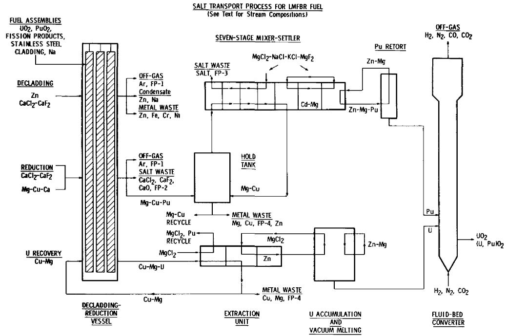  
Figure 1. Salt Transport Process for LMFBR Fuel

KEY TO FISSION PRODUCTS

FP-1 Kr, Xe, 3H, (1)   
FP-2 Rb, Cs, Sr, Ba, Sm, I   
FP-3 Y, RARE EARTH   
FP-4 Zr, Nb, Mo, Tc, Ru, Rh, Pd

# Oxide Reduction

The oxide reduction step is performed in the same vessel as the decladding step. To carry out the reduction, additional $\mathrm{CaCl}_2$ -20 at. $\% \mathrm{CaF}_2$ salt is charged to the vessel and the mixture of salt and oxide fuel is contacted vigorously at $800^{\circ}\mathrm{C}$ with a liquid Mg-29 at. $\% \mathrm{Cu}-34$ at. $\%$ Ca alloy. The uranium and plutonium oxides are reduced to the metals by the calcium and the CaO by-product of the reaction is taken up by the salt. The alkali and alkaline earth fission products also appear in the salt, which is discarded as a waste. The remaining gaseous fission products should be released during the reduction reaction. The argon cover gas is handled in the same manner as that from the decladding step. When the reduction is completed, the metallic plutonium is in solution in the liquid metal phase and the uranium, which has a solubility of about 50 ppm, forms a bed of precipitated metal.

# Plutonium-Rare Earth Separation

Because of the chemical similarity between plutonium and the rare earths in pyrochemical systems, the separation of yttrium and rare earth fission products is a key step in the process. The principal reason for selecting a Cu-Mg alloy as the liquid metal solvent is that it provides the highest plutonium-rare earth separation factor of any system that was investigated. The supernatant Cu-Mg-Pu alloy, including Cu-Mg wash solution, goes to a semicontinuous mixer-settler battery. Figure 1 shows a seven-stage mixer-settler, in which the first four stages are used to extract rare earths from the Cu-Mg-Pu alloy with a $\mathrm{MgCl}_2$ -30 mol % NaCl-20 mol % KCl-3 mol % $\mathrm{MgF}_2$ salt phase. The $\mathrm{MgCl}_2$ is necessary to provide the required distribution coefficients for a practical separation. The NaCl and KCl serve as diluents to lower the melting point of the salt well below the desired operating temperature of about $650^{\circ}\mathrm{C}$ . The small amount of fluoride is used to promote disengagement of the liquid salt and metal. Under practical conditions it appears that a plutonium-rare earth decontamination factor of approximately 100 can be achieved in each stage. Each of the four stages is operated with a captive salt phase and the Cu-Mg-Pu alloy is a transient phase. After each batch of fuel is processed, the salt from the first stage is discarded as waste, the salt in the second, third and fourth stages is moved ahead one stage, and new salt is added to the fourth stage.

# Plutonium Salt Transport Separation

In the last three stages of the mixer-settler as it is shown in Fig. 1, the plutonium is recovered from the Cu-Mg alloy, which retains the more noble fission products (Zr, Nb, Mo, Tc, Ru, Rh, Pd...). A molten salt of the composition mentioned previously $(\mathrm{MgCl}_2 - 30\mathrm{mol}\% \mathrm{NaCl} - 20\mathrm{mol}\% \mathrm{KCl} - 3\mathrm{mol}\% \mathrm{MgF}_2)$ is used as a carrier

to transport the plutonium from the fifth stage through the sixth stage to the last stage. In this operation the plutonium is extracted from the Cu-Mg "donor" alloy into the salt and then extracted from the salt into a Zn-30 at. $\%$ Mg "acceptor" alloy which has a high affinity for plutonium. In the sixth stage the salt is contacted with a captive Mg-20 at. $\%$ Mg alloy to remove any residual noble metal fission products and any Cu-Mg alloy that might be entrained in the salt. The plutonium salt transport step is carried out simultaneously with the rare earth extraction step. During this operation the plutonium is removed continuously from the Cu-Mg alloy cycling through the first five stages of the mixer-settler and is transported to the Zn-Mg acceptor alloy. After the plutonium is removed, the Cu-Mg alloy is recycled to the oxide reduction step for the next batch of fuel. Since only traces of noble metal fission products and entrained Cu-Mg alloy reach the Cd-Mg alloy in the sixth stage, this latter alloy can be used for many batches of fuel before it is discarded as waste. The plutonium salt transport step is expected to provide a decontamination factor of $10^{6}$ or greater for the noble metal fission products.

# Plutonium Recovery

The Zn-Mg-Pu alloy from the last stage of the mixer-settler is transferred to a retorting vessel where the zinc and magnesium are removed by vacuum distillation. After retorting, the plutonium metal product is recovered as an ingot.

# Uranium Salt Transport Separation

The metallic uranium precipitate in the decladding-reduction vessel is dissolved in a Cu-6 at. $\%$ Mg alloy in which the solubility of uranium is about 4 at. $\%$ (14 wt $\%$ ) at $900^{\circ}\mathrm{C}$ . This stream is fed to a four-stage salt-metal extraction. Although it has been shown that plutonium does not coprecipitate with uranium in the oxide reduction step, a small amount (up to about $1\%$ ) may be trapped physically in the uranium bed. The first stage of the uranium treatment is used to extract any plutonium from the Cu-Mg-U alloy with a $\mathrm{MgCl}_2$ salt phase, which is recycled to the next batch of fuel. The other three stages are a uranium salt transport separation which is identical in principle to the plutonium salt transport step, but which operates under somewhat different conditions. A Mg-17 at. $\%$ Zn acceptor alloy is used, the intermediate alloy between the Cu-Mg donor and the Zn-Mg acceptor is zinc or cadmium, the salt phase is $100\%$ $\mathrm{MgCl}_2$ , and the operating temperature is about $850^{\circ}\mathrm{C}$ . The first three contacts are made in a mixer-settler unit and the fourth stage is a vessel in which the uranium, which has a low solubility in the Zn-Mg alloy, is accumulated as a precipitate. A portion of the Cu-Mg alloy from the uranium salt transport separation becomes a waste containing the noble metal fission products and the remainder is recycled.

If the uranium is to be stored for deferred recovery, it could be alloyed with a small amount of another metal such as iron to form a liquid phase that could be transferred out of the decladding-reduction vessel and cast into ingots.

# Uranium Recovery

The liquid salt and metal are transferred away from the precipitated uranium bed in the uranium accumulation vessel. The bed is then vacuum-melted to form a product ingot.

# Fuel Resynthesis

The metallic uranium and plutonium products are alloyed in the appropriate proportions, charged to a fluidized-bed reactor, and then hydrided and dehydrided to form a fluidizable powder. The powdered metal is first nitrided and then converted to mixed $\mathrm{UO}_2\text{-PuO}_2$ by treatment with $\mathrm{CO}_2$ .

# Status of the Process Development

Most of the laboratory studies that were needed to select appropriate solvent systems for the Salt Transport Process have been completed. This work has resulted in a substantial body of data on phase diagrams, solubilities, distribution coefficients and thermodynamic properties for various metal and salt systems. This information is useful not only as a basis for the Salt Transport Process, but also for new pyrochemical process applications that might be envisioned. The chemical feasibility of all of the major separations has been established in laboratory-scale experiments. However, more detailed studies are needed on some items such as the mechanism of oxide reduction, the morphology and physical nature of metallic precipitates, possible radiolytic effects in the salt solvents, and the behavior of minor fission products and by-products such as curium and neptunium.

Engineering investigations have been in progress for some time on general pyrochemical operations such as mixing of metals and salts, phase separations and transfers, fluidization techniques and retorting. Although the major effort is being devoted to mixer-settlers for contacting liquid salts and metals, studies have also been conducted on stirred tanks and packed columns.

Small-scale tests have been performed with mock fuel assemblies consisting of 13 type 304 stainless steel tubes with a 35-mil wall and three 1/4-in. thick spacer plates. Each tube contained 12 high-fired $\mathrm{UO}_2$ pellets and one pellet that had been ground to a fine powder. At $800^{\circ}\mathrm{C}$ , the zinc dissolved the tubing in less than 30 min and the spacers in 3 to 4 hr. It was found that over $95\%$ of the

zinc could be transferred out of the vessel without entraining more than about $0.2\%$ of the oxide. Other studies of the decladding procedure showed that the 310 series stainless steels, zircaloy and irradiated 304 stainless steel all dissolve more rapidly than the unirradiated 304 stainless steel.

In various laboratory and bench-scale engineering tests it has been shown that both powders and high-fired forms of $\mathrm{UO}_2$ , $\mathrm{UO}_2 - \mathrm{PuO}_2$ and $\mathrm{PuO}_2$ can be reduced completely by the proposed method. The reduction procedure has been carried out on a scale of up to about $5\mathrm{kg}$ of $\mathrm{UO}_2$ pellets.

A series of runs were made in which the oxide reduction, plutonium-rare earth separation, plutonium salt transport and plutonium retorting steps were performed in sequence with about $200\mathrm{g}$ of plutonium, $800\mathrm{g}$ of uranium and $100\mathrm{g}$ of inactive fission product elements. The results were in good agreement with the process performance predicted on the basis of the laboratory data.

The removal of the nobler fission products from uranium was also demonstrated in separate salt transport experiments involving about 2 to $5\mathrm{kg}$ of uranium. The recovery of uranium from $\mathrm{Zn - Mg}$ alloys had been investigated earlier during the development of the EBR-II Skull Reclamation Process.

Only a minor amount of work has been done on the fuel resynthesis step. Uranium metal was converted to $\mathrm{UO}_2$ by the hydriding and $\mathrm{CO}_2$ -hydrogen treatments in a fluidized bed, but achieving close control of the stoichiometry together with a low carbon content of the product proved to be difficult. A few exploratory tests have indicated that hydriding followed by nitridation with nitrogen gas and conversion of the nitride to $\mathrm{UO}_2$ by $\mathrm{CO}_2$ is a more promising method.

Most of the engineering effort is currently devoted to the construction of a glovebox facility in which all the steps of the Salt Transport Process can be performed sequentially on a scale of about $1\mathrm{kg}$ of plutonium, $4\mathrm{kg}$ of uranium, and $1\mathrm{kg}$ of fission products (non-radioactive). High temperature mixer-settlers for the multistage plutonium decontamination steps are being developed for this facility.[4] Although no provision is being made for handling irradiated fuels in the facility, engineering techniques which have been, or could be developed for remote operation are being employed in many instances.

A continuing effort is made to test and select materials that are suitable for use in pyrochemical process equipment. This work, which is concerned mostly with refractory metals and ceramic materials, is the subject of a separate paper in this symposium.(5)


Some preliminary studies have been made on a conceptual design of a Salt Transport Process with a capacity of one tonne/day of LMFBR core and blanket fuel (equivalent to about 15,000 MWe). It appears that two decladding vessels about 7 ft tall and 18 in. in diameter would be required with three fuel assemblies being declad at a time in each vessel. These vessels would most likely be made of tungsten or have a tungsten lining. The oxide reduction operation would be done in the same vessels. The mixer-settler bank for rare earth removal and plutonium salt transport would be about $20 \times 24$ in. and about 6 ft long. Niobium appears to be a suitable material for this unit, except in the last stage where tantalum or a tantalum lining might be used. In the plutonium retorting step, criticality considerations probably would require three units of slab geometry about $20 \times 30$ in. by 1-1/2 in. thick, although a single unit may be feasible. The three-stage mixer-settler for uranium decontamination would be about $10 \times 20$ in. and 2 ft long. This equipment and the plutonium retort would both be made of a refractory metal, such as tungsten. The uranium accumulation vessel could be made of graphite and would be about 18 in. in diameter and 5 ft tall. For fuel resynthesis, two 8-in. dia and two 24-in. dia fluidized bed reactors about 6 ft tall would be used for core and blanket material, respectively. Stainless steel would be a suitable material for these units. In addition to the major process equipment, various other vessels would be required for making up and charging solvents, holding process solutions and disposing of waste streams. Nevertheless, it appears that a plant of this type would be quite compact.

# Discussion

For the near term at least, LMFBR fuels will most likely be oxide, clad with stainless steel. The core fuel is expected to consist of natural or depleted $\mathrm{UO}_2$ and about $15 - 20\%$ $\mathrm{PuO_2}$ . The core may be operated at a specific power as high as $200\mathrm{kW / kg}$ $(\mathrm{U} + \mathrm{Pu})$ and reach a burnup of 100,000 MWd/tonne. The blanket, initially natural or depleted $\mathrm{UO}_2$ , may contain up to about $4\%$ plutonium at discharge and reach a burnup of around 15,000 MWd/tonne. In most of the proposed LMFBR designs, the core fuel and axial blanket are included in the same assemblies and the radial blanket consists of separate assemblies.

The present practice in the commercial reprocessing of light water reactor (LWR) fuels is to cool the fuel for about six months to alleviate the problems of fission product heat removal, iodine release and radiation decomposition of process solvents. However, the high plutonium content of LMFBR core fuel results in a large capital investment and a correspondingly strong incentive to minimize the out-of-reactor fuel inventory. Therefore, it is highly desirable, if possible, to decrease the cooling time to 30 days or

less. This short cooling time, together with the high burnup and specific power of LMFBR fuel, poses some difficult problems in fuel reprocessing. In a typical LMFBR fuel assembly containing $60\mathrm{kg}$ of fuel, the rate of heat generation from fission product decay after 30 days of cooling would be about $13\mathrm{kW}$ or 44,000 Btu/hr. It is apparent that provisions must be made to handle very high levels of heat and radioactivity. For example, it would be necessary to dilute 30-day-cooled LMFBR core fuel by a factor of about 50 to reach the same heat and radiation levels as those encountered in the processing of six-month-cooled LWR fuels. A particularly troublesome problem that is anticipated with short-cooled LMFBR fuels is the large amount of radioactive fission gases that are present (mainly $\mathbf{131I}$ and $\mathbf{133Xe}$ ). The activity of these gases in 30-day-cooled LMFBR fuel is expected to be about $10^{5}$ times greater than that in the LWR fuels currently being processed.

It appears that a pyrochemical process for LMFBR fuels could provide attractive solutions to many of these problems. The proposed zinc decladding procedure replaces the mechanical dis-assembly and chopping steps conventionally used in aqueous processing. A prior sodium removal step, other than simply allowing adhering sodium to drain off, should not be necessary, nor would sodium-logged fuel pins be expected to create a problem. The removal of fission product decay heat may be considerably simplified by the high operating temperatures and the presence of liquid metal and salt solvents. The gaseous fission products are collected in a small volume of inert gas and most of the iodine activity is ex-pected to remain in the salt waste. The process wastes are produced directly as solidified salts and metals. The process appears to be capable of handling high-fired $\mathrm{UO_2}$ , $\mathrm{PuO_2}$ and either mixed or solid-solution $\mathrm{UO_2 - PuO_2}$ .

Although the Salt Transport Process is being developed on a long-range basis as a complete process for future LMFBR fuels, it might prove attractive to use the initial steps as a head-end procedure for aqueous processing of interim LMFBR fuels in existing plants. This head-end process might include decladding, oxide reduction, a plutonium-uranium separation and partial decontamination, depending on the requirements of the aqueous plant. It is felt that this possibility deserves further consideration.

# References

1. Hampson, D. C., R. M. Fryer and J. W. Rizzle, 'Melt Refining of EBR-II Fuel', This Symposium.   
2. Feldman, M. J., N. R. Grant, J. P. Bacca, V. G. Eschen, D. L. Mitchell and R. V. Strain, "Remote Fabrication of EBR-II Fuels", This Symposium.   
3. Winsch, I. O., R. D. Pierce, G. J. Bernstein, W. E. Miller and L. Burris, Jr., "EBR-II Skull Reclamation Process", This Symposium.   
4. Pierce, R. D., W. E. Miller, J. B. Knighton and G. J. Bernstein, "Multistage Contactors for Liquid Metal-Salt Extraction", This Symposium.   
5. Kyle, M. L., R. D. Pierce and V. M. Kolba, "Containment Materials for Pyrochemical Processes", This Symposium.


URANIUM AND PLUTONIUM PURIFICATION BY THE SALT TRANSPORT METHOD*

J. B. Knighton, I. Johnson and R. K. Steunenberg

Chemical Engineering Division

Argonne National Laboratory

Argonne, Illinois 60439

U.S.A.

# Abstract

Uranium and plutonium may be separated from each other and from nobler metal impurities by the salt transport method in which a solute is transferred selectively from one liquid alloy (donor) to another (acceptor) by cycling a molten salt between the two alloys. Data have been obtained on the solubilities of uranium and plutonium in liquid alloys of magnesium with copper, zinc and cadmium and on their distribution behavior between these alloys and salts containing $\mathrm{MgCl}_2$ . The chemical basis for the partitioning of plutonium, uranium and impurity elements between the salt and metal phases is discussed and the factors that enter into a salt transport separation are described. It has been shown by laboratory and bench-scale engineering experiments that the transport of plutonium and uranium takes place as predicted from the solubility and distribution coefficient relationships. Although the salt transport procedure is being developed for the reprocessing of nuclear fuels, it has potential application to the separation and purification to other metals, as well as plutonium and uranium.

*Work performed under the auspices of the United States Atomic Energy Commission.

# Introduction

The term "salt transport" has been applied to a purification technique whereby a metallic solute is transferred selectively from one liquid alloy (donor) to another liquid alloy (acceptor) by circulating a molten salt between the two alloys. The transfer takes place through oxidation of the solute by the salt at the donor alloy and its subsequent reduction by the acceptor alloy. The objective of the present studies was to investigate the chemical aspects of plutonium and uranium salt transport purification steps that could be incorporated into a pyrochemical process for fast breeder reactor fuels.

Various survey papers have been published on high-temperature liquid metal-molten salt extraction methods for the processing of nuclear reactor fuels.(1-8) Certain investigations that were carried out earlier at Brookhaven National Laboratory and at Ames Laboratory are particularly relevant to salt Transport separations. The Brookhaven work involved a process that was being developed for the fuel of the proposed LMFR (Liquid Metal Fuel Reactor).(9-12) This process employed a procedure in which $\mathrm{UCl}_3$ in a molten salt phase was reduced selectively by a Bi-Mg alloy to separate uranium from rare earth fission products. The uranium was then re-oxidized by a new salt stream and reduced again by Bi-Mg to form a Bi-Mg-U fuel alloy. At Ames Laboratory, Chiotti(13) patented a salt transport method for removing rare earth fission products from a Th-Mg alloy. The rare earths were selectively oxidized by $\mathrm{MgCl}_2$ and subsequently removed from the $\mathrm{MgCl}_2$ by reduction with a Zn-10 at. $2\%$ Mg alloy. This work was extended by Chiotti and Klepfer,(14) who developed a salt transport separation employing liquid Th-Mg and Zn-Mg alloys in mutual contact with a salt.

In the present studies, magnesium alloys of zinc, cadmium, and copper were investigated as potential donor and acceptor alloys for the purification of plutonium and uranium from the fission product elements more noble than uranium by the salt transport process. These studies included measurements of the solubility of plutonium and uranium in the liquid alloys and measurements of the distribution coefficient for plutonium and uranium between liquid magnesium alloys and molten salt mixtures containing $\mathrm{MgCl}_2$ .

# Chemical Basis of Salt Transport Separations

Partition of Solutes between Liquid Metals and Salts

The salt transport separation of plutonium and uranium from each other and from the more noble impurity elements depends primarily upon differences in the distribution of uranium, plutonium, and impurity elements between liquid metal and salt solvents. In general terms, a metal, M, partitions between a

liquid magnesium alloy and a molten salt phase containing $\mathsf{MgCl}_2$ by the following reaction:

$$
M (\text {a l l o y}) + \frac {n}{2} M g C l _ {2} (\text {s a l t}) \stackrel {\pm} {\leftarrow} M C l _ {n} (\text {s a l t}) + \frac {n}{2} M g (\text {a l l o y}) \tag {1}
$$

The thermodynamic (activity) equilibrium constant, $\mathbf{K}_{\mathrm{a}}$ , can be expressed in terms of mole (or atom) fraction, $\mathbf{x}$ , and activity coefficient, $\gamma$ , of the reactants and products as follows:

$$
K _ {a} = \frac {x _ {M C 1} n \cdot x _ {M g} ^ {n / 2}}{x _ {M} \cdot x _ {M g C l _ {2}} ^ {n / 2}} \cdot \frac {\gamma_ {M C 1} n \cdot \gamma_ {M g} ^ {n / 2}}{\gamma_ {M} \cdot \gamma_ {M g C l _ {2}} ^ {n / 2}} \tag {2}
$$

The distribution coefficient, D, for the metal, M, is defined as the ratio of the mole fraction of $\mathsf{MCl}_n$ in the salt to the atom fraction of M in the alloy:

$$
D = \frac {x _ {M C 1} n}{x _ {M}} \tag {3}
$$

The equilibrium constant, $\mathbf{K}_{\mathrm{a}}$ , is related to the standard free energy change, $\Delta G^{\circ}$ , for Reaction 1 by the equation

$$
- \mathrm {R T} \ln \mathrm {K} _ {\mathrm {a}} = \Delta G ^ {\circ} = \Delta \mathrm {G f} _ {\mathrm {M C l} _ {\mathrm {n}}} ^ {\circ} - \frac {\mathrm {n}}{2} \Delta \mathrm {G f} _ {\mathrm {M g C l} _ {2}} ^ {\circ} \tag {4}
$$

where $\Delta G_{\mathrm{MCl}_n}^{\circ}$ and $\Delta G_{\mathrm{MgCl}_2}^{\circ}$ are the standard free energies of formation of $\mathrm{MCl}_n$ and $\mathrm{MgCl}_2$ , respectively. Equation 4 indicates that metals whose chlorides have larger negative free energies of formation than that of $\mathrm{MgCl}_2$ (on a per mole of chlorine basis) will tend to distribute predominantly to the salt phase ( $K_a > 1$ ). When the free energy of formation of $\mathrm{MCl}_n$ has a lower negative value than that of $\mathrm{MgCl}_2$ ( $K_a < 1$ ), the metal, M, will tend to distribute to the alloy phase.

By substitution and rearrangement, the distribution coefficient may be expressed in logarithmic form as

$$
\log D = \frac {\Delta G ^ {\circ}}{2 . 3 R T} + \left(- \frac {n}{2} \log a _ {M g} + \log \gamma_ {M}\right) - \left(- \frac {n}{2} \log a _ {M g C l _ {2} ^ {+}} \log \gamma_ {M C l _ {n}}\right) \tag {5}
$$

where three groups of terms are shown in the right-hand side. The first group, the single term $\Delta G^{\circ} / 2.3\mathrm{RT}$ , depends both on the value of the free energy of formation of $\mathsf{MCl}_n$ relative to the value for $\mathsf{MgCl}_2$ and on the temperature. The second group of terms, $-\frac{n}{2}\log a_{\mathsf{Mg}} + \log \gamma_{\mathsf{M}}$ , depends on the composition of the liquid magnesium alloy and on the temperature; it is independent of the salt composition. The third group of terms, $-\frac{n}{2}\log a_{\mathsf{MgCl}_2} + \log \gamma_{\mathsf{MCl}_n}$


depends on the composition of the salt and on the temperature. In general, the distribution coefficients of various elements fall in the same order as the free energies of formation of their chlorides. However, large differences occur in the distribution coefficients because of solvent effects. For example, the values of the distribution coefficient at $600^{\circ}\mathrm{C}$ for praseodymium, cerium, and plutonium are lowered several orders of magnitude when Zn-low Mg or Al-low Mg alloys are substituted for Cu-Mg alloys.

Examination of the free energies of formation of fission product metals and structural materials (Table I) shows that the salt transport process should be particularly useful for the separation of plutonium and uranium from more noble fission product metals (Zr, Nb, Mo, Tc, Ru, Rh and Pd) and from metals such as Fe, Cr and Ni, which are typical constituents of alloys used to clad nuclear reactor fuel elements. These free energies of formation suggest that zirconium would be most difficult of these elements to separate from uranium and plutonium by partitioning between salt and metal phases.

Several attempts to measure the distribution coefficient of zirconium between molten salts containing $\mathrm{MgCl}_2$ and liquid magnesium alloys resulted in values of $10^{-4}$ or less in all cases. The actual value may be even smaller, since it is difficult to avoid slight contamination of the salt samples by the alloy. Thus, zirconium and all the elements below it in Table I should be separated readily from uranium and plutonium by a process in which the uranium and plutonium are extracted into a molten salt.

The difference in the distribution behavior of two elements, $\mathbf{M}_{\mathbf{a}}$ and $\mathbf{M}_{\mathbf{b}}$ , is expressed as a separation factor, $\alpha$ :

$$
\alpha = \frac {D _ {M a}}{D _ {M b}} \tag {6}
$$

The separation factor is strongly dependent on the composition of the liquid alloy, and to a lesser extent on the temperature and on the composition of the molten salt.

# Salt Transport Separations

A salt transport procedure for uranium is illustrated schematically in Fig. 1. Metallic uranium, which is initially present in the donor alloy, is oxidized and extracted into the transport salt. The nobler metals and structural metals remain in the donor alloy

$$
\mathrm {U} (\text {d o n o r a l l o y}) + \frac {3}{2} \mathrm {M g C l} _ {2} (\text {s a l t}) \rightarrow \mathrm {U C l} _ {3} (\text {s a l t}) + \frac {3}{2} \mathrm {M g} (\text {d o n o r a l l o y}) \tag {7}
$$

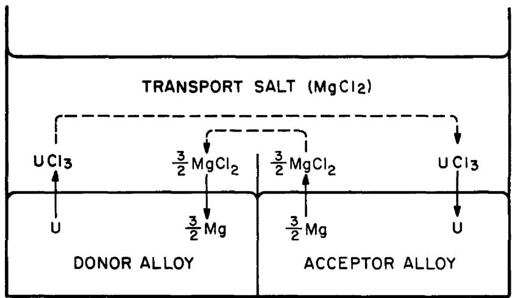  
1. Schematic Representation of the Salt Transport Process

Table I   
Standard Free Energies of Formation of Chlorides and Thermodynamic Equilibrium Constants $\mathbf{K}_{\mathrm{a}}$ for the Reaction   

<table><tr><td colspan="3">M + n/2 MgCl2 ⇌ MCln + n/2 Mg at 1000°C</td></tr><tr><td>MCln</td><td>-ΔG°(kcal/g-equiv. Cl)</td><td>Ka</td></tr><tr><td>BaCl2</td><td>83.4</td><td>1.7 10^11</td></tr><tr><td>KCl</td><td>81.4</td><td>1.5 10^5</td></tr><tr><td>RbCl</td><td>81.2</td><td>1.4 10^5</td></tr><tr><td>SrCl2</td><td>81.0</td><td>1.5 10^10</td></tr><tr><td>CsCl</td><td>80.0</td><td>7.5 10^4</td></tr><tr><td>SmCl2</td><td>80.0</td><td>5.6 10^9</td></tr><tr><td>LiCl2</td><td>78.8</td><td>4.1 10^4</td></tr><tr><td>CaCl2</td><td>77.9</td><td>6.8 10^8</td></tr><tr><td>NaCl2</td><td>75.7</td><td>8.6 10^3</td></tr><tr><td>LaCl3</td><td>67.0</td><td>1.3 10^6</td></tr><tr><td>PrCl3</td><td>66.3</td><td>4.4 10^5</td></tr><tr><td>CeCl3</td><td>66.3</td><td>4.4 10^5</td></tr><tr><td>ThCl3</td><td>65.3</td><td>9.6 10^4</td></tr><tr><td>NdCl3</td><td>64.2</td><td>1.8 10^4</td></tr><tr><td>YCl3</td><td>61.2</td><td>2.0 10^2</td></tr><tr><td>PuCl3</td><td>58.9</td><td>6.1</td></tr><tr><td>MgCl2</td><td>57.7</td><td>1.00</td></tr><tr><td>UCl3</td><td>54.0</td><td>3.8 10^-3</td></tr><tr><td>ZrCl2</td><td>49.2</td><td>1.9 10^-4</td></tr><tr><td>MnCl2</td><td>42.3</td><td>1.9 10^-7</td></tr><tr><td>ZnCl2</td><td>35.0</td><td>1.2 10^-10</td></tr><tr><td>CrCl2</td><td>31.9</td><td>5.3 10^-12</td></tr><tr><td>CdCl2</td><td>30.4</td><td>1.2 10^-12</td></tr><tr><td>FeCl2</td><td>26.6</td><td>2.5 10^-14</td></tr><tr><td>NbCl5</td><td>24.6</td><td>6.8 10^-37</td></tr><tr><td>CuCl5</td><td>22.0</td><td>1.6 10^-8</td></tr><tr><td>NiCl2</td><td>20.0</td><td>3.3 10^-17</td></tr><tr><td>MoCl2</td><td>8.0</td><td>1.9 10^-22</td></tr><tr><td>TcCl3</td><td>7.0</td><td>5.7 10^-34</td></tr><tr><td>RhCl</td><td>5.8</td><td>4.5 10^-12</td></tr><tr><td>PdCl2</td><td>3.8</td><td>2.8 10^-24</td></tr><tr><td>RuCl2</td><td>1.4</td><td>1.2 10^-37</td></tr></table>

When the transport salt containing the $\mathrm{UCl}_3$ is contacted with the acceptor alloy, the reverse reaction takes place:

$$
\mathrm {U C l} _ {3} (\text {s a l t}) + \frac {3}{2} \mathrm {M g} (\text {a c c e p t o r a l l o y}) \rightarrow \mathrm {U} (\text {a c c e p t o r a l l o y}) + \frac {3}{2} \mathrm {M g C l} _ {2} (\text {s a l t}) \tag {8}
$$

Therefore, the net reaction is

$$
\mathrm {U} (\text {d o n o r a l l o y}) + \frac {3}{2} \mathrm {M g} (\text {a c c e p t o r a l l o y}) \rightarrow \mathrm {U} (\text {a c c e p t o r a l l o y}) + \frac {3}{2} \mathrm {M g} (\text {d o n o r a l l o y}) \tag {9}
$$

Magnesium chloride consumed at the donor alloy by oxidation of uranium and plutonium is regenerated at the acceptor alloy by magnesium reduction of $\mathrm{UCl}_3$ or $\mathrm{PuCl}_3$ . Thus, the salt composition remains constant throughout the salt transport operation. For each mole of uranium transferred from the donor alloy to the acceptor alloy, 1.5 moles of magnesium are transferred in the opposite direction. The increasing concentration of magnesium in the donor alloy and magnesium depletion in the acceptor alloy must be taken into account in the design of a practical process.

When Reaction 9 has reached equilibrium, both alloys are in equilibrium with the transport salt, and the ratio, R, of uranium in solution in the acceptor and donor alloys is equal to the ratio of the distribution coefficients of uranium for each alloy and the salt:

$$
R = \frac {a t . \% U i n a c c e p t o r a l l o y}{a t . \% U i n d o n o r a l l o y} = \frac {D (d o n o r a l l o y)}{D (a c c e p t o r a l l o y)} \tag{10}
$$

The transfer of a solute (e.g., uranium or plutonium) from the donor alloy to the acceptor alloy is achieved by circulating the transport salt between the two liquid alloys. Although a variety of methods may be used to circulate the transport salt between the two alloys, all are basically similar in that a quantity, $\mathbf{n}_{\mathrm{S}}$ (moles), of transport salt is contacted with a quantity, $\mathbf{n}_{\mathrm{D}}$ , of donor alloy to transfer the solute to the transport salt. A fraction, $\mathbf{x}$ , of this transport salt and, under some conditions (i.e., if entrainment of liquid metal occurs), a small fraction, $\mathbf{Z}$ , of the donor alloy is contacted with a quantity, $\mathbf{n}_{\mathrm{A}}$ , of the acceptor alloy to transfer the solute from the transport salt to the acceptor alloy. The transport salt is then returned to the donor alloy to complete the cycle. The fraction, $\mathbf{F}_{\mathrm{D}}$ , of the uranium or plutonium present in the transport salt-donor system that transfers to the transport salt-acceptor alloy system is

given by

$$
F _ {D} = \frac {D _ {D} \frac {n _ {S}}{n _ {D}} x + z}{D _ {D} \frac {n _ {S}}{n _ {D}} + 1} \tag {11}
$$


and the fraction, $\mathbf{F}_{\mathbf{A}}$ , in the transport salt-acceptor alloy system transferred back to the transport salt-donor alloy system is given by

$$
F _ {A} = \frac {D _ {A} \frac {n _ {S}}{n _ {A}} X + Z}{D _ {A} \frac {n _ {S}}{n _ {A}} + 1} \tag {12}
$$

where $D_{D}$ and $D_{A}$ are the distribution coefficients of the solute for the transport salt-donor alloy and transport salt-acceptor alloy systems, respectively. It may be shown that after s cycles, corresponding to the circulation of a quantity, $\mathsf{sn}_{\mathsf{s}}\mathsf{X}$ , of transport salt, that the fraction, $\Phi$ , of the solute initially present in the transport salt-donor system transferred to the transport salt-acceptor alloy system is given by

$$
\Phi = (1 - \frac {F _ {A}}{1 - F}) (1 - F ^ {S}), \tag {13}
$$

where $\mathbf{F} = (1 - \mathbf{F}_{\mathrm{D}})(1 - \mathbf{F}_{\Delta})$ (if it is assumed that none of the solute is present initially in the acceptor alloy). Equation 13 indicates that the fraction transferred approaches a limiting value (given by the first factor) as the number of cycles, or the quantity of salt cycles, is increased. The maximum possible fraction, $\Phi_{\max}$ , transferred is given by

$$
\Phi_ {\max } = 1 - \frac {F _ {A}}{1 - F} \simeq 1 - \frac {D _ {A} n _ {D}}{D _ {D} n _ {A}}. \tag {14}
$$

where the approximation is good to about $1\%$ .

Equation 14 indicates that if the ratio $\frac{n_A}{n_D}$ is unity, then, for a 99% transfer, $D_D$ should be about 100 times $D_A$ . The number of cycles, or the quantity of transport salt cycled to achieve a given percentage of the maximum possible transfer, is dependent only on the value of $F$ . For example, to reach 99% of the maximum possible transfer when $F = 0.5$ requires about seven cycles; whereas, when $F = 0.7$ , 13 cycles are required. Large values of $D_D$ favor rapid transfer.

Equations 11 to 14 are derived on the assumption that all the uranium or plutonium present in the transport salt-donor alloy or transport salt-acceptor alloy systems is in solution, either in the alloys or the transport salt. However, uranium and plutonium have limited solubilities in several usable alloys. If, for example, the uranium present in the transport salt-donor alloy system is not all in solution, then the fraction of the total uranium present that is transferred to the acceptor alloy during each cycle of the transport salt would be less than would be the case if all the uranium present were in solution. Therefore, limited solubility of uranium in the donor alloy increases the number of cycles of

transport salt required to transfer a given fraction of the uranium to the acceptor alloy. The quantity of uranium transferred from the donor alloy to the acceptor alloy during each cycle will be constant (assuming equilibrium is established) until sufficient uranium has been transferred so that the amount remaining is completely in solution.

If the uranium has a limited solubility in the acceptor alloy, the acceptor alloy will become saturated after a few cycles of the transport salt and the amount of uranium back-transferred to the donor alloy will reach a constant value. This constant value is lower with a saturated acceptor alloy than it would be if the amount of uranium in solution in the acceptor increased with each cycle of the transport salt. The overall effect of limited solubility in the acceptor alloy is to decrease the number of transport salt cycles needed to transfer a given fraction of uranium. The maximum possible fraction transferred may also be increased by limiting the uranium solubility in the acceptor alloy. Thus, in Eq. 14, the term $(\mathrm{DA}^{\mathrm{nD}}) / (\mathrm{D}^{\mathrm{nA}})$ is multiplied by the solubility of uranium in the acceptor alloy expressed as a fraction of the uranium initially charged to the system. A low solubility of uranium in the acceptor alloy can be used to compensate for a large value of the distribution coefficient, $\mathrm{DA}$ .

The fraction of the uranium initially present in the transport salt-donor alloy system that may be transferred to the acceptor alloy may be increased if the uranium present initially exceeds the solubility. For example, in a system in which a maximum transfer of $97\%$ is possible when the donor alloy is initially just saturated, the amount transferred may be increased to $99\%$ by increasing the amount of uranium present to five times the solubility limit. However, the number of transport salt cycles required is increased from about 13 for the case of $97\%$ transfer to about 21 for $99\%$ transfer.

The same principles that govern the rate of transfer of uranium and plutonium apply to the impurities that are present in the donor alloy. Impurities for which the value of $\mathbf{F}_{\mathrm{D}}$ (Eq. 11) is small compared with the value of $\mathbf{F}_{\mathrm{D}}$ for uranium or plutonium are separated by the salt transport process. Generally these impurities are those for which the value of $\mathbf{D}_{\mathrm{D}}$ is several orders of magnitude smaller than the value of $\mathbf{D}_{\mathrm{D}}$ for uranium or plutonium. An estimate of the decontamination factor, D.F., possible with the salt transport process can be obtained from the expression

$$
D. F. = \frac {\Phi (\text {u r a n i u m o r p l u t o n i u m})}{\Phi (\text {i m p u r i t y})} \tag {15}
$$

The fraction of uranium or plutonium transferred, $\Phi$ (uranium or plutonium), will be approximately unity, i.e., essentially all will be transferred. For small values of $F_{D}$ , the quantity $\Phi$

(impurity) (Eq. 13) is approximately equal to $sF_{D}^{\prime}$ , where $s$ is the number of cycles needed to transfer the desired fraction of uranium or plutonium, and $F_{D}^{\prime}$ is the fraction of impurity transferred from the donor. Substitution in Eq. 15 gives

$$
D. F. \approx \frac {1}{s \left(D _ {D} ^ {\prime} \frac {n _ {S}}{n _ {D}} x + z\right)} \tag {16}
$$

which summarizes most of the important factors that influence the degree of decontamination obtainable with the salt transport process. The D.F. is inversely proportional to the number of transport salt cycles, s, or the amount of salt circulated, to achieve the desired uranium or plutonium transfer. It is also seen that the fraction of donor alloy entrained with the transport salt must be smaller than $\mathrm{D}_{\mathrm{D}}^{\prime}$ NS X if the maximum possible decontamination is to be achieved. The small values of $\mathrm{D}_{\mathrm{D}}^{\prime}$ for the nobler fission products (see $\mathbf{K}_{\mathbf{a}}$ values in Table I) indicate that the decontamination factor in practical systems will depend upon the extent to which entrainment of the donor alloy with the transport salt can be eliminated.

# Molten Salt-Liquid Alloy Systems for the Salt Transport of Uranium and Plutonium

As indicated earlier, the rate of uranium or plutonium transport from a donor alloy to an acceptor alloy depends upon (1) their distribution coefficients between each alloy and the transport salt and (2) their solubilities in the two alloys. Therefore, distribution coefficients and solubilities of uranium and plutonium in various systems of process interest were investigated experimentally. The distribution coefficients of uranium and plutonium between molten $\mathrm{MgCl}_2$ and liquid Cu-Mg and Zn-Mg alloys at $800^{\circ}\mathrm{C}$ and molten $\mathrm{MgCl}_2 - 30\mathrm{mol}\% \mathrm{NaCl} - 20\mathrm{mol}\% \mathrm{KCl}$ and liquid Cu-Mg, Cd-Mg and Zn-Mg alloys at $600^{\circ}\mathrm{C}$ are shown in Figs. 2 and 3, respectively. In general, as the magnesium content of the alloy is increased from a near-zero initial value, the distribution coefficients decrease at first, pass through a minimum, and then increase. An exception to this generalization is the distribution of plutonium between the ternary salt mixture and Cu-Mg alloys at $600^{\circ}\mathrm{C}$ . The values of the distribution coefficients shown in Figs. 2 and 3 are nearly independent of the plutonium or uranium concentration in the alloy. A discussion of the dependence of the distribution coefficient on the magnesium content of the alloy has been presented elsewhere.(15)

The solubilities of uranium in liquid Cu-Mg and Zn-Mg alloys and plutonium in liquid Zn-Mg alloys at 800 and $600^{\circ}\mathrm{C}$ , respectively, are shown as a function of the magnesium content of the liquid alloy

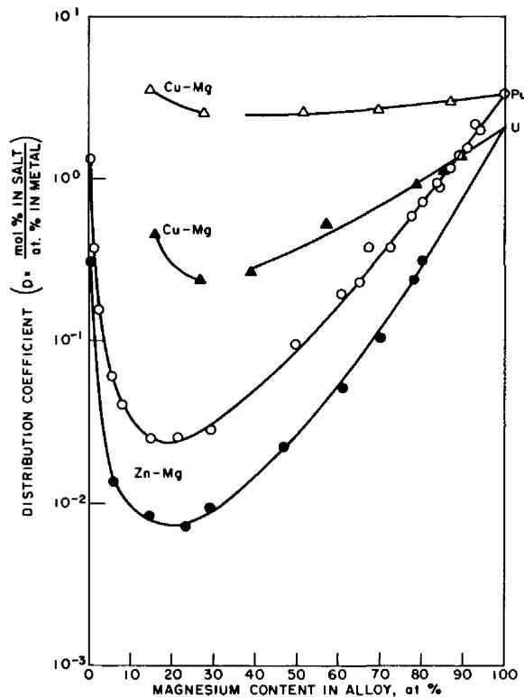  
2. Distribution of U and Pu between $\mathbf{MgCl}_2$ Salt and Cu-Mg and Zn-Mg Alloys at $800^{\circ}\mathrm{C}$

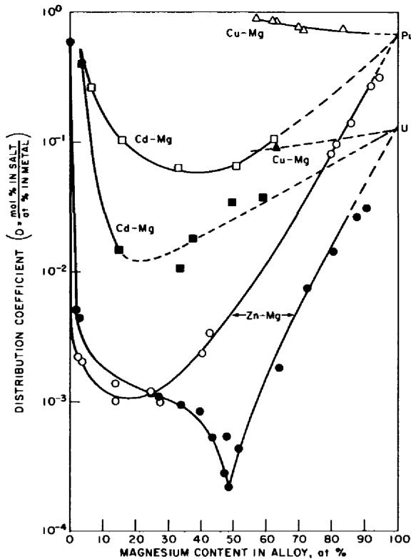  
3. Distribution of U and Pu between 50 mol $\%$ MgCl $_2$ -30 mol $\%$ NaCl-20 mol $\%$ KCl Salt and Cu-Mg, Cd-Mg, and Zn-Mg Alloys at $600^{\circ}$ C.

in Figs. 4 and 5. The solubility of uranium in liquid Cd-Mg alloys at $600^{\circ}\mathrm{C}$ is also shown in Fig. 5. Values of the solubility of plutonium in liquid Cu-Mg alloys(16) are so large that solubility is not an important factor in limiting the use of Cu-Mg alloy as a donor for plutonium. A discussion of the dependence of the solubility of uranium and plutonium in liquid magnesium alloys appears elsewhere.(17)

The amount of uranium or plutonium that can be transferred in each cycle of the transport salt between the donor and acceptor alloys depends upon the amount of salt transferred and the uranium or plutonium content of the salt. At equilibrium, the uranium or plutonium content of the transport salt is the product of the uranium or plutonium content of the alloy and the distribution coefficient.

$$
\mathrm {mol} \% \mathrm {M} (\text {salt}) = \text {at.} \% \mathrm {M} (\text {metal}) \times \mathrm {D} \tag{11}
$$

To obtain a large uranium or plutonium content in the salt equilibrated with the donor alloy, both the solubility and distribution coefficients in the donor alloy-salt system should have large values. Conversely, to obtain a small uranium or plutonium content in the salt equilibrated with the acceptor alloy, both the solubility and distribution coefficients in the acceptor alloy-salt system should have small values. Mass transfer of uranium or plutonium and magnesium between the donor and acceptor alloy stops when the equilibrium uranium or plutonium content of the transport salt is the same above both alloys.

The maximum uranium and plutonium content of (1) molten $\mathrm{MgCl}_2$ in equilibrium with saturated liquid Cu-Mg and Zn-Mg alloys at $800^{\circ}\mathrm{C}$ and (2) $\mathrm{MgCl}_2 - 30\mathrm{mol}\%$ Nacl-20 mol $\%$ KCl in equilibrium with saturated liquid Cu-Mg, Zn-Mg and Cd-Mg alloys at $600^{\circ}\mathrm{C}$ is shown in Figs. 6 and 7, respectively. These curves may be used to determine the compositions of donor and acceptor alloys for uranium and plutonium. For example, at $800^{\circ}\mathrm{C}$ , only a low magnesium ( $\sim 16$ at. %) content Cu-Mg alloy would be a practical donor for uranium, while Zn-Mg alloys with either low ( $\sim 15$ at. %) or high ( $>60$ at. %) magnesium contents would be practical acceptor alloys for uranium. The compositions of the most promising donor and acceptor alloys of those studied for uranium and plutonium are summarized in Table II. At $800^{\circ}\mathrm{C}$ the Cu-16 at. $\%$ Mg alloy is a donor for both uranium and plutonium, the Mg-20 at. $\%$ Zn alloy is a donor for plutonium and an acceptor for uranium, while the Zn-10 at. $\%$ Mg alloy in an acceptor for both uranium and plutonium. At $600^{\circ}\mathrm{C}$ none of these systems is a very good uranium donor, but both the Cu-43 at. $\%$ Mg and the Mg-20 at. $\%$ Cd alloys are plutonium donors while the Zn-15 at. $\%$ Mg alloy is an acceptor for both uranium and plutonium. It is also evident from Table II that the plutonium donor alloys are more effective donors than the uranium donor because of the relatively low solubility of uranium.

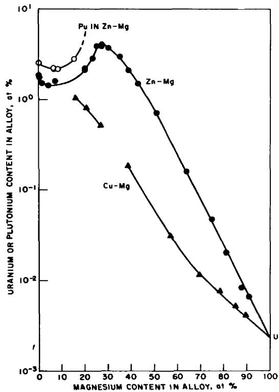  
4. Solubility of U and Pu in Cu-Mg and Zn-Mg Alloys at $800^{\circ}\mathrm{C}$

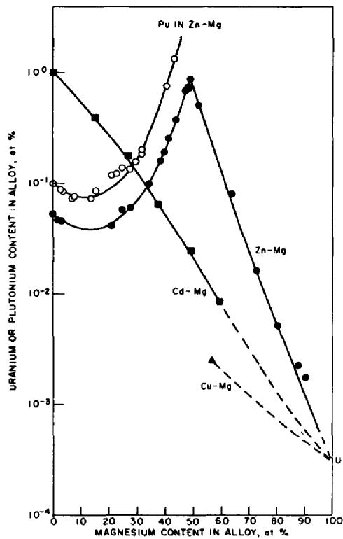  
5. Solubility of U and Pu in Cu-Mg, Cd-Mg, and Zn-Mg Alloys at $600^{\circ}\mathrm{C}$

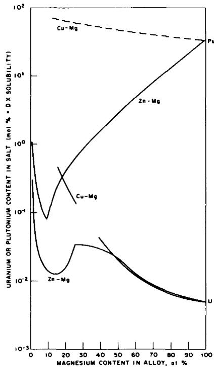  
6. Maximun Concentration of U and Pu in $\mathbf{MgCl}_2$ Salt in Equilibrium with U or Pu Saturated Cu-Mg and Zn-Mg Alloys at $800^{\circ}\mathrm{C}$

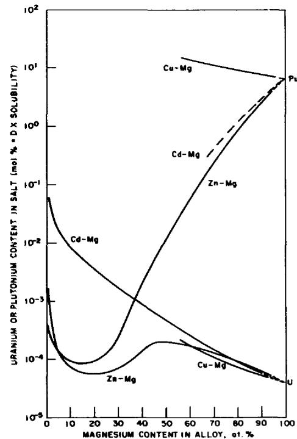  
7. Maximum Concentration of U and Pu in 50 mol $\%$ MgCl $_2$ -30 mol $\%$ NaCl-20 mol $\%$ KCl Salt in Equilibrium with U or Pu Saturated Cu-Mg, Cd-Mg, and Zn-Mg Alloys at $600^{\circ}\mathrm{C}$ .

Table II   
Composition of Donor and Acceptor Alloys for Uranium and Plutonium Salt Transport   

<table><tr><td colspan="5">MgCl2(800°C)</td><td colspan="4">Maximum Content</td></tr><tr><td rowspan="2">Alloy</td><td colspan="2">D</td><td colspan="2">Sol.(at.%)</td><td colspan="2">in salt (mol%)</td><td colspan="2">Classificationc</td></tr><tr><td>Pu</td><td>U</td><td>Pu</td><td>U</td><td>PuCl3</td><td>UCl3</td><td>Pu</td><td>U</td></tr><tr><td>Cu-16 at. % Mg</td><td>3.5</td><td>0.45</td><td>high</td><td>1.05</td><td>high</td><td>0.46</td><td>Donora</td><td>Donor</td></tr><tr><td>Mg-20 at. % Zn</td><td>0.71</td><td>0.30</td><td>high</td><td>0.025</td><td>high</td><td>0.0075</td><td>Donora</td><td>Acceptor</td></tr><tr><td>Zn-10 at. % Mg</td><td>0.035</td><td>0.0094</td><td>2.3</td><td>1.5</td><td>0.080</td><td>0.014</td><td>Acceptor</td><td>Acceptor</td></tr><tr><td colspan="5">50 mol % MgCl2-30 mol % NaCl-20 mol % KCl (600°C)</td><td colspan="2">Maximum Content</td><td></td><td></td></tr><tr><td rowspan="2">Alloy</td><td colspan="2">D</td><td colspan="2">Sol.(at.%)</td><td colspan="2">in salt (mol%)</td><td colspan="2">Classificationb,c</td></tr><tr><td>Pu</td><td>U</td><td>Pu</td><td>U</td><td>PuCl3</td><td>UCl3</td><td>Pu</td><td>U</td></tr><tr><td>Mg-43 at. % Cu</td><td>0.89</td><td>0.088</td><td>high</td><td>0.0025</td><td>high</td><td>0.00022</td><td>Donora</td><td>Acceptor</td></tr><tr><td>Mg-20 at. % Cd</td><td>0.23</td><td>0.065</td><td>high</td><td>0.0013</td><td>high</td><td>0.000084</td><td>Donora</td><td>Acceptor</td></tr><tr><td>Zn-30 at. % Mg</td><td>0.0014</td><td>0.0010</td><td>0.18</td><td>0.071</td><td>0.00025</td><td>0.000071</td><td>Acceptor</td><td>Acceptor</td></tr></table>

The donor and acceptor alloys listed in Table II may be used in various combinations to permit (1) selective separation of plutonium from the nobler metal fission products and uranium, (2) separation of uranium from the nobler metal fission products, (3) simultaneous separation of plutonium and uranium from the nobler metal fission products and (4) separation of plutonium and uranium from each other and from the nobler fission product elements.

# Plutonium Purification and Recovery

In the Salt Transport Process for fast breeder reactor (LMFBR) fuels, (18) plutonium is first separated from uranium and the nobler metal fission products and then the uranium is separated from these fission products in a subsequent step. The plutonium separation employs a salt transport step with a Mg-43 at. $\%$ Cu donor alloy and a $\mathrm{MgCl}_2 - 30\mathrm{mol}\% \mathrm{NaCl} - 20\mathrm{mol}\% \mathrm{KCl} - 3\mathrm{mol}\% \mathrm{MgF}_2$ transport salt at $600^{\circ}\mathrm{C}$ . To remove any entrained Mg-Cu donor alloy from the salt and to increase the degree of decontamination of plutonium from the nobler metal fission products, the transport salt is contacted with an intermediate Cd-50 at. $\%$ Mg alloy before it reaches the Zn-30 at. $\%$ Mg acceptor alloy. The intermediate alloy is a plutonium donor and an acceptor for the metals more noble than plutonium. The following is a schematic illustration of the process.

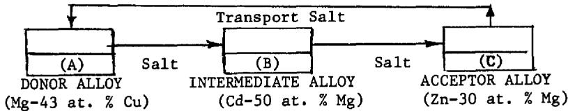

Since the solubility of uranium is only about 0.0025 at. % in the Mg-43 at. $\%$ Cu alloy at $600^{\circ}\mathrm{C}$ , very little uranium is extracted into the transport salt. Entrainment of the donor alloy in the transport salt is likely to be a more significant source of plutonium contamination by uranium and the nobler metal fission products (see Eq. 16). The intermediate alloy is expected to remove most of the entrained donor alloy from the salt. Since this intermediate alloy is not as effective a plutonium donor as the Mg-Cu alloy, there is a tendency for some plutonium to build up during the first few cycles of the transport salt. As the number of cycles is increased, however, this plutonium is transferred to the acceptor alloy. The fraction of the plutonium in each alloy was

calculated as a function of the number of cycles. After 10 cycles of the salt, about $92\%$ of the plutonium would be in the acceptor alloy, about $8\%$ would remain in the intermediate alloy and the amount in the donor alloy would be negligible. The plutonium in the intermediate alloy represents an inventory, which is recovered as the next batch of fuel is processed. When, after many cycles of operation, it becomes necessary to replace the intermediate alloy because of the gradual buildup of donor alloy and fission products, the residual plutonium can be recovered by additional cycles of the transport salt.

When the amount of plutonium in the acceptor alloy exceeds the solubility limit (0.07 at. % at $600^{\circ}\mathrm{C}$ ), it precipitates as a plutonium-zinc intermetallic compound (probably $\mathrm{Pu}_{2}\mathrm{Zn}_{17}$ ). This occurs after only a few salt transport cycles. If the equipment that is used to contact the transport salt with the acceptor alloy can accommodate the metallic precipitate, several batches of plutonium would be transferred to the acceptor alloy. The purified plutonium is recovered as the metal by vaporization of the zinc and magnesium at reduced pressure. If the contacting equipment cannot handle the precipitated metal, continuous means will be required for removing the acceptor alloy from the contactor, vaporizing the zinc and magnesium and returning them to the contactor. The optimum composition of the acceptor alloy depends somewhat upon the mode of operation of the contactor, since the magnesium content of the alloy decreases as plutonium is transferred. However, this effect (see Eq. 8) is not large enough to interfere seriously with the operation if provisions are made for periodic additions of magnesium to the acceptor alloy.

# Uranium Purification and Recovery

In the Salt Transport Process for LMFBR fuels, $^{(18)}$ uranium is separated from the nobler metal fission product elements by the use of a Cu-16 at. $\%$ Mg donor alloy, a molten $\mathrm{MgCl}_2$ transport salt, and a Mg-17 at. $\%$ Zn acceptor alloy at a temperature of 800 to $900^{\circ}\mathrm{C}$ . The operation of this donor alloy may be illustrated by referring to the copper-rich region of the Cu-Mg-U system as shown in Fig. 8. This representation must be regarded as tentative as it was constructed from the Cu-U and Cu-Mg binary diagrams and limited data from the Cu-Mg-U ternary system. Point M is an eutectic in the Cu-U binary alloy. Point C is an eutectic in the Cu-Mg binary alloy. Point N is estimated to be the ternary Cu-Mg-U eutectic. Hence, the curve M-C-N describes an eutectic valley. Point D is the composition of the liquidus of the Cu-Mg binary at $800^{\circ}\mathrm{C}$ . Point C is the $800^{\circ}\mathrm{C}$ liquidus on the eutectic valley, and C-D is the $800^{\circ}\mathrm{C}$ liquidus isotherm between the eutectic valley and the Cu-Mg binary. Line A-B is an operating line that is the path that the bulk composition of the donor alloy will

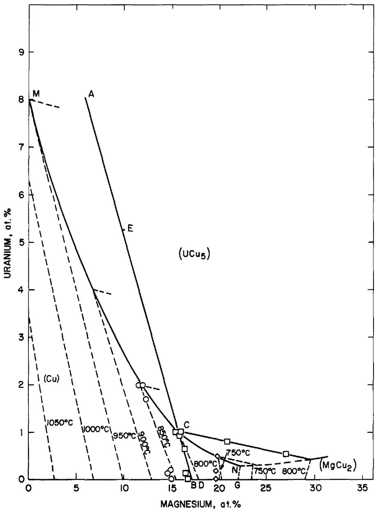  
8. Tentative Liquidus Surface for the Copper-rich Region of the Cu-Mg-U Phase Diagram


follow as the transport of uranium takes place. The line represents the change in bulk composition that results from depletion of the uranium by $\mathrm{MgCl}_2$ oxidation and the resultant buildup of magnesium in the donor alloy. These composition changes are related by the equation

$$
\mathrm {U} + 3 / 2 \mathrm {M g C l} _ {2} \rightarrow \mathrm {U C l} _ {3} + 3 / 2 \mathrm {M g} \tag {18}
$$

which indicates that 1.5 moles of magnesium are introduced into the donor alloy for each mole of uranium removed. Any point, E, lying on the operating line represents an initial bulk composition of the donor alloy. Point B is the bulk composition of the donor alloy upon completion of uranium transport. At point E the equilibrium phases present are (1) a solid phase containing uranium, which is believed to be the intermetallic compound, $\mathrm{UCu}_{5}$ , (2) a Cu-Mg solid solution, and (3) a liquid phase of composition C.

As uranium transport proceeds, the bulk alloy composition moves along the operating line, A-B, from point E toward point C. The compound $\mathrm{UCu}_5$ dissolves, replacing the uranium extracted from the liquid donor alloy by the transport salt:

$$
\mathrm {U C u} _ {5} (\text {s o l i d}) \rightarrow \mathrm {U} (\mathrm {C u} - \mathrm {M g} 1 \text {l i q u i d}) + 5 \mathrm {C u} (\mathrm {C u} - \mathrm {M g} 1 \text {l i q u i d}) \tag {19}
$$

The copper released by dissolution of $\mathrm{UCu}_5$ and $\mathrm{Cu - Mg}$ solid solution combines with the magnesium that is introduced by uranium reduction of $\mathrm{MgCl}_2$ to produce additional liquid of the eutectic composition (point C) at the operating temperature

$$
\mathrm {C u} (\text {s o l i d s o l u t i o n}) + \mathrm {M g} (\mathrm {C u} - \mathrm {M g} \text {l i q u i d}) \rightarrow \mathrm {C u} - \mathrm {M g} (\mathrm {C u} - \mathrm {M g} \text {e u t .}). \tag {20}
$$

Thus, the composition of the liquid phase remains constant as the ratio of the liquid to solids increases.

When point C is reached, all of the solids are consumed. As the transport of uranium continues, the bulk composition follows the operating line from point C to point B, and Cu-Mg solid solution is formed. The composition of the liquid phase in equilibrium with the Cu-Mg solid solution is represented by the $800^{\circ}\mathrm{C}$ liquidus isotherm, C-D. During this last phase of uranium transport, all of the uranium in the donor alloy is in solution.

To control the magnesium buildup in the donor alloy during uranium transport, the operating line should pass through the liquidus on the eutectic valley at the operating temperature. This liquidus composition on the eutectic valley is the composition the liquid phase will have as $\mathrm{UCu}_5$ and Mg-Cu solid solution dissolve. Under the above conditions the system provides (1) control of magnesium buildup in the donor and (2) operation at optimum donor compositions. The optimum donor compositions provide maximum uranium solubility and the highest uranium distribution coefficient at the

specified operating temperature during the transport of uranium.

# Multiple Separations

It is possible in principle to effect multiple separations by using three or more liquid alloys in combination with the transport salt. For example, plutonium, uranium and the nobler metals might be separated from one another by a salt transport procedure in which the plutonium and uranium are collected in separate acceptor alloys. This separation can be accomplished by using (1) a Cu-low Mg donor alloy, (2) a Cd-high Mg plutonium donor-uranium acceptor alloy. At $800^{\circ}\mathrm{C}$ the values of the plutonium solubility and distribution coefficient are such that the plutonium content of the recycled transport salt leaving the Zn-Mg acceptor alloy is undesirably large. It is possible, however, to lower the melting point of the donor alloy by the addition of cadmium (i.e., Cu-15 at. $\%$ Cd-1.5 at. $\%$ Mg) and to use a $\mathsf{MgCl}_2 - 22\mathsf{mol}\% \mathsf{MgF}_2$ (m.p. $626^{\circ}\mathrm{C}$ ) transport salt instead of $\mathsf{MgCl}_2$ (m.p. $716^{\circ}\mathrm{C}$ ) to permit operation at $700^{\circ}\mathrm{C}$ .

The Cu-Cd-Mg alloy is a satisfactory donor for both plutonium and uranium and it retains the nobler metals. The Cd-Mg alloy is a plutonium donor, but it is an acceptor for uranium, primarily because of its low solubility. At $700^{\circ}\mathrm{C}$ , beta uranium metal is precipitated in this alloy. The plutonium collects in the Zn-Mg acceptor alloy, and if its solubility is exceeded it precipitates as a plutonium-zinc intermetallic compound.

Multiple donor and acceptor alloys can also be used to increase the number of stages of a salt transport separation. In the Salt Transport Process for LMFBR fuels the use of an additional donor alloy in the plutonium salt transport step greatly increases the decontamination of plutonium from the nobler metal fission products.

# Experimental Investigations of Salt Transport Separations

Several laboratory-scale experiments were performed to investigate the feasibility of salt transport separations. The apparatus consisted of two adjacent cylindrical tantalum crucibles which were welded together with a low common wall (Fig. 9) so that the transport salt could be poured back and forth between the donor and acceptor alloys. Dams at the upper edges of the crucibles prevented overflow of the salt when the crucible was tilted to pour the salt from one side to the other. The charge to the donor crucible was $87.0\mathrm{g}$ of copper shot, $43.0\mathrm{g}$ of magnesium rod and $20.92\mathrm{g}$ of plutonium metal. The initial charge in the acceptor crucible was $178.6\mathrm{g}$ of zinc and $12.5\mathrm{g}$ of magnesium rod. The transport salt, $178.6\mathrm{g}$ of purified $\mathrm{MgCl}_2 - 30$ mol $\%$ NaCl-20 mol $\%$

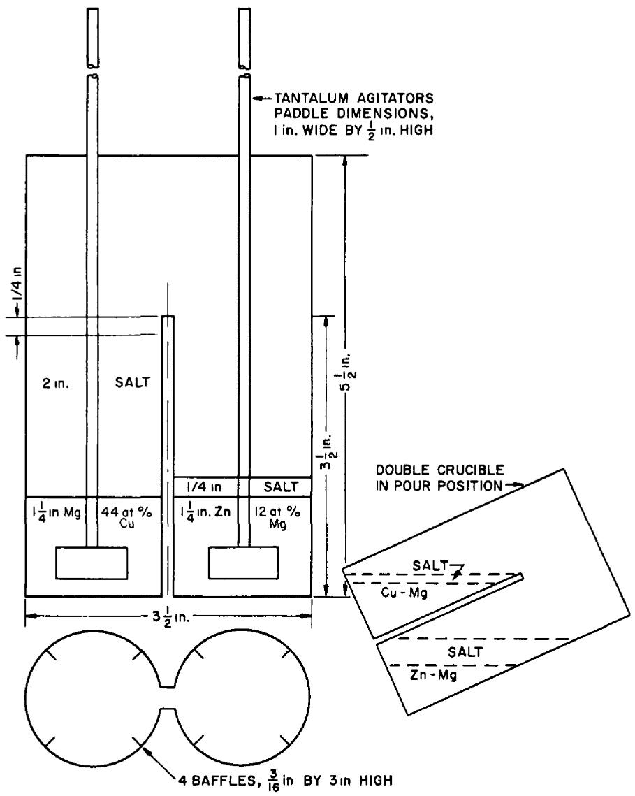  
9. Dual Crucible Used in Salt Transport Experiments

KCl, was charged to the acceptor vessel.

The system was heated to $600^{\circ}\mathrm{C}$ and the salt was poured from the acceptor side to the donor side and back again a total of 20 times. The salt and metal phases were equilibrated for 30 min, at an agitation rate of 500 rpm and allowed to settle 15 min. before the salt was poured. After 20 cycles of the salt, the plutonium concentration in the donor alloy was 0.181 wt $\%$ , or about $1\%$ of the total plutonium, which indicates that about $99\%$ had been transferred to the acceptor alloy. The plutonium content of the salt was negligible. Some copper ( $\sim 0.1$ wt $\%$ ) was found in the acceptor alloy, probably as a result of donor alloy entrained in the salt. These results showed that plutonium can be transported satisfactorily.

The salt transport concept was also tested in a laboratory experiment in which irradiated cerium was used as a stand-in for plutonium.(19) The donor alloy was $60\mathrm{g}$ of $\mathrm{Mg - 44}$ at. $\%$ Cu containing $2.5\mathrm{g}$ of irradiated cerium and the acceptor alloy was $100\mathrm{g}$ of Zn-12.4 at. $\%$ Mg. The transport salt, $180\mathrm{g}$ of $\mathrm{MgCl_2 - }$ $30\mathrm{mol}\%$ NaCl-20 mol $\%$ KCl, was added to the donor alloy initially. The dual crucible technique was used at a temperature of $600^{\circ}\mathrm{C}$ . The metal and salt phases were contacted for $60\mathrm{min}$ with agitation at $300\mathrm{rpm}$ and allowed to settle $30\mathrm{min}$ . In each cycle, $60\%$ of the salt was transferred. Five cycles of the transport salt resulted in $89\%$ transfer of the cerium. The significance of this experiment is that the rate of cerium transport was in agreement with that predicted from equilibrium values of the solubilities and distribution coefficients.

Five larger-scale experiments were performed to investigate the behavior of uranium in a salt transport separation.(20) The feed charges, containing from 2 to $5\mathrm{kg}$ of uranium, were prepared either by reducing unirradiated oxides of uranium and nobler metal elements (Zr, Mo, Pd, Ru, and Nb) with Cu-Mg alloy or by direct addition of these metals to the Cu-Mg alloy at $925^{\circ}\mathrm{C}$ . In either case, most of the uranium at the operating temperature of $845^{\circ}\mathrm{C}$ was present as a finely divided precipitate. The donor alloy was Cu-12 at. $\%$ Mg, the acceptor was Zn-83 at. $\%$ Mg and $\mathrm{MgCl}_2$ was used as the transport salt. Both alloys were contained in tungsten crucibles and the salt was cycled between the alloys by pressure-siphoning through a heated transfer line. Prior to each salt transfer the salt and metal phases were mixed for 4 to 6 min. and then permitted to settle for 5 to 10 min. After about $99\%$ of the uranium had transferred to the acceptor alloy, the supernatant liquid alloy was transferred away from the precipitated uranium bed, and the bed was washed with Mg-14 at. $\%$ Zn alloy. A uranium recovery of about $99\%$ was achieved after 27 cycles of the salt. The overall removals of the nobler metals were $99.7\%$ for zirconium and $99.9\%$ or more for the others.

A separation of plutonium from uranium and the nobler metal

fission product elements was demonstrated in a study in which the steps of the Salt Transport Process for LMFBR fuels were performed in sequence.(21) The original feed to the series of process steps was $199\mathrm{g}$ of plutonium as $\mathrm{PuO_2}$ , $400\mathrm{g}$ of uranium as $\mathrm{UO_2}$ and oxides of 24 representative fission product elements. In the salt transport step the plutonium was transferred at $600^{\circ}\mathrm{C}$ from a Mg-44 at. $\%$ Cu donor alloy to a Zn-5.2 at. $\%$ Mg acceptor alloy, using a $\mathrm{MgCl_2}$ -30 mol $\%$ NaCl-20 mol $\%$ KCl transport salt. The pressure-siphoning technique was used to cycle the salt. After 14 cycles, $99.3\%$ of the plutonium had been transported.

Various other salt transport experiments have been conducted, including ones in which the salt was cycled continuously between donor and acceptor alloys.(22) On the basis of mass-transfer rates, stage efficiencies and salt-metal phase disengagement results that have been obtained, further technological development of the salt transport procedure is expected.

# Conclusions

The salt transport technique is being developed primarily as a means of separating plutonium, uranium and the nobler metal fission products in a pyrochemical process for the recovery of LMFBR fuels. To provide a basis for selecting suitable liquid metal and salt solvents, basic chemical data were obtained on the solubilities of plutonium and uranium in liquid alloys of magnesium with copper, zinc and cadmium and on their partitioning behavior between these alloys and molten salts containing $\mathrm{MgCl}_2$ . It was found in both laboratory and bench-scale engineering experiments that the equilibrium solubility and distribution data can be used reliably to predict the behavior of a practical salt transport system for plutonium or uranium. Preliminary engineering studies have indicated that the procedure shows promise for technological development and it has been incorporated into the engineering investigations for the Salt Transport Process for LMFBR fuels.

Although the current development of salt transport separations is concerned mainly with fuel reprocessing, there are numerous other applications of potential interest. For example, some work has been done on a process of this type for the recovery and purification of plutonium-238 from recycle scrap material.(23) It might also be applied to the processing of other high-value actinide metals (e.g., neptunium and curium) as well as other more conventional metals such as the rare earths.


# Acknowledgments

The authors wish to acknowledge the technical assistance of J. W. Walsh, K. R. Tobias, R. Tiffany, R. D. Wilson and J. D. Schilb. Dr. R. P. Larsen and his associates provided valuable consultations and supporting analytical work.

# References

1. Feder, H. M. and I. G. Dillon, "Pyrometallurgical Processes", in Reactor Handbook, Vol. 2, Fuel Reprocessing, 2nd ed., p. 313, S. M. Stoller, R. B. Richards (eds.), Interscience Publishers, Inc., New York (1961).   
2. Motta, E. et al., "Pyrometallurgical Processes: Process and Equipment Development", TID-7534 (2), p. 719 (1957).   
3. Schraidt, J. H. and M. Levenson, "Developments in Pyrometallurgical Processing", in Progress in Nuclear Energy, Series III, Process Chemistry, Vol. 3, p. 329, F. R. Bruce, J. M. Fletcher, H. H. Hyman (eds.), Pergamon Press, New York (1961).   
4. Martin, F. S. and G. L. Myles, "The Principles of High-Temperature Fuel Processing", in Progress in Nuclear Energy, Series III, Process Chemistry, Vol. 1, p. 291, Pergamon Press, New York (1956).   
5. Burris, L., Jr. et al., "Recent Advances in Pyrometallurgical Processes", Trans. Amer. Nucl. Soc. 4 (2), 192 (1961).   
6. Lawroski, S. and L. Burris, Jr., "Processing of Reactor Fuel Materials by Pyrometallurgical Methods", At. Energy Rev. 2 (3), 3 (October 1964).   
7. Pierce, R. D. and L. Burris, Jr., "Pyroprocessing of Reactor Fuels, Reactor Technology, Selected Reviews", L. E. Link, Ed., TID-8540, p. 711 (1964).   
8. Burris, L., Jr., et al., "Pyrometallurgical and Pyrochemical Fuel Processing", in Proceedings of 3rd International Conference on Peaceful Uses of Atomic Energy, Vol. 10, p. 501, International Atomic Energy Agency, Geneva (1965).   
9. Dwyer, O. E., "Process for Fission Product Removal from Uranium-Bismuth Reactor Fuels by Use of Fused Salt Extraction", J. AIChE 2, 163 (1956).

10. Bareis, D. W., R. H. Wiswall and W. E. Winsche, "Processing of Liquid Bismuth Alloys by Fused Salts", Chem. Eng. Progr. Symp. Ser. 50, 228 (1954).   
11. Dwyer, O. W., R. J. Teitel and R. H. Wiswall, "High Temperature Processing Systems for Liquid Metal Fuels and Breeder Blankets", in Proceedings of International Conference on Peaceful Uses of Atomic Energy, Vol. 9, p. 604, IAEA, Geneva (1955).   
12. Wiswall, R. H. et al., "Recent Advances in Chemistry of Liquid Metal Fuel Reactors", in Proceedings of 2nd International Conference on Peaceful Uses of Atomic Energy, 17 428 (1958). Vol. 17, p. 428, IAEA, Geneva (1958).   
13. Chiotti, P., Regeneration of Fission-Product-Containing Magnesium-Thorium Alloys, U. S. Patent 3, 120, 435, Feb. 4, 1964.   
14. Chiotti, P. and J. S. Klepfer, "Transfer of Solutes Between Liquid Alloys in Mutual Contact with Fused Salt. Application to Fuel Reprocessing", Ind. Eng. Chem. Process Design Develop. 4 (2), 232 (1965).   
15. Johnson, I., "Partition of Metals between Liquid Metal Solutions and Fused Salts", in Applications of Fundamental Thermodynamics to Metallurgical Processes, G. R. Fitterer, Editor, Gordon and Breach Science Publ., New York, 1967, pp. 153-177.   
16. Knoch, W., Argonne National Laboratory, Private Communication.   
17. Johnson, I., "The Solubility of Uranium and Plutonium in Liquid Alloys", This Symposium.   
18. Steunenberg, R. K., R. D. Pierce and I. Johnson, "Status of the Salt Transport Process for Fast Breeder Reactor Fuels", This Symposium.   
19. Knighton, J. B. and P. J. Mack, "Salt Transport Studies", Chemical Engineering Division Semiannual Report, January-June 1967, ANL-7375 (October 1967), p. 20.   
20. Walsh, W. J. et al., "Engineering Studies of Salt Transport Separations", Chemical Engineering Division Semiannual Report, July-December 1966, ANL-7325 (April 1967), p. 26.

21. Winsch, I. O., W. J. Walsh and T. F. Cannon, "Exploratory Plutonium Experiment", Chemical Engineering Division Semi-Annual Report, July-December 1967, ANL-7425 (May 1968), p. 30.   
22. Pierce, R. D., "Liquid Metal-Molten Salt Contactors", Reactor Development Program Progress Report, January 1969, ANL-7548 (February 1969), p. 109.   
23. Nelson, P. A. et al., "Pyrochemical Purification of Plutonium-238", Chemical Engineering Division Annual Report, 1968, ANL-7575, (April 1969).

# THE REDUCTIVE EXTRACTION OF PROTACTINIUM AND URANIUM

FROM MOLTEN LiF-BeF $_2$ -ThF $_4$ MIXTURES INTO BISMUTH*

R. G. Ross, W. R. Grimes, C. J. Barton,

C. E. Bamberger and C. F. Baes, Jr.

Reactor Chemistry Division, Oak Ridge National

Laboratory, Oak Ridge, Tennessee

U.S.A.

# Abstract

Previous studies of the reductive extraction of protactinium and uranium from molten fluoride mixtures into liquid bismuth containing thorium gave results which suggested this as a feasible method for processing MSBR fuels. Additional studies have been undertaken to confirm the equilibrium quotients for the extraction reactions

$$
\begin{array}{l} \mathrm {P a} _ {\left(\mathrm {F}\right)} ^ {4 +} + \mathrm {T h} _ {\left(\mathrm {B i}\right)} ^ {\circ} \Rightarrow \mathrm {P a} _ {\left(\mathrm {B i}\right)} ^ {\circ} + \mathrm {T h} _ {\left(\mathrm {F}\right)} ^ {4 +}; \mathrm {Q} _ {\mathrm {T h}} ^ {\mathrm {P a}} = \mathrm {D} _ {\mathrm {P a}} / \mathrm {D} _ {\mathrm {T h}} (1) \\ 4 U _ {(F)} ^ {3 +} + 3 \mathrm {T h} _ {(B 1)} ^ {o} \rightleftharpoons 4 U _ {(B 1)} ^ {o} + 3 \mathrm {T h} _ {(F)} ^ {4 +}; Q _ {\mathrm {T h}} ^ {U} = D _ {U} ^ {4} / D _ {\mathrm {T h}} ^ {3}, (2) \\ w h e r e \mathrm {D} _ {\mathrm {M}} = \mathrm {X} _ {\mathrm {M} (\mathrm {B i})} / \mathrm {X} _ {\mathrm {M} (\mathrm {F})}, \\ \end{array}
$$

and to determine whether these equilibrium quotients depend significantly on the concentration of $\mathsf{Pa}^{\mathsf{o}}$ and/or $\mathsf{U}^{\mathsf{o}}$ in the bismuth phase.

Experiments have been conducted at $625^{\circ}\mathrm{C} \pm 5^{\circ}$ in molybdenum-lined nickel containers using bismuth and single-region MSBR fuel carrier salt (LiF-BeF $_2$ -ThF $_4$ , 72-16-12 mole %) with up to 0.3 mole % of UF $_4$ and >100 ppm 231Pa. Thorium, uranium, and protactinium were added incrementally in order to duplicate, as nearly as possible, the varied concentrations that would exist in an extraction column such as might be used for the process.

The experiments have yielded data which show a correlation of $\log D_{\mathrm{pa}}$ vs $\log D_{\mathrm{U}}$ which would be expected from the stoichiometry of reactions (1) and (2). This seems conclusive proof that $\mathrm{Th}^{+4}$ , $\mathrm{Pa}^{+4}$ and $\mathrm{U}^{+3}$ are the important species, and that there are no significant interactions of $\mathrm{U}^{\circ}$ and $\mathrm{Pa}^{\circ}$ under the reducing conditions of these experiments.

*Work sponsored by the U.S. Atomic Energy Commission under contract with Union Carbide Corporation.

# Introduction

The potential advantages of molten-salt-fueled reactors have been recognized for some time, and their characteristics have been reviewed by Briant, Weinberg, MacPherson, Grimes and others.(1-4) This type of reactor has been fully demonstrated at Oak Ridge National Laboratory with the successful operation for more than 10,000 equivalent full power hours of the 8 megawatt Molten-Salt Reactor Experiment.

One of the principal advantages of molten-salt fuels is their adaptability to continuous reprocessing without the attendant high cost of refabrication of solid fuel elements. Thus, molten-salt-fueled reactors are particularly attractive as breeder reactors when it is desired to continuously recover $233\mathrm{U}$ and $233\mathrm{Pa}$ bred into the fuel from 232Th.

Previous studies by Shaffer, Barton, and Ferris(5-8) of the reductive extraction of protactinium and uranium from molten fluoride mixtures into liquid bismuth gave results which suggested reductive extraction as a feasible method for processing MSBR (Molten-Salt Breeder Reactor) fuels. A flowsheet proposed by Whatley and McNeese(9) for such processing includes an extraction column for reducing protactinium and uranium from the fuel salt. In this system the salt stream enters the bottom of the column and flows counter-currently to a bismuth stream containing thorium and the reduced metals. Since protactinium is intermediate in nobility between uranium and thorium, the protactinium refluxes in the middle of the column where the salt builds up the highest protactinium concentration. At this point in the column a hold-up tank is provided in order to allow the $233\mathrm{Pa}$ to decay to $233\mathrm{U}$ in a region away from the neutron flux of the core. Thus, high protactinium concentrations in the core which would adversely affect the breeding ratio are avoided.

While the feasibility of such a process had been indicated, (5-8) it was necessary to confirm the equilibrium quotients for the extraction reactions, and to determine also whether these equilibrium quotients depend significantly on the concentrations of $\mathsf{Pa}^{\mathsf{o}}$ and/or $\mathsf{U}^{\mathsf{o}}$ in the bismuth phase.

# Theory

The extraction reactions are of the general type

$$
n _ {2} M _ {1 (F)} ^ {+ n _ {1}} + n _ {1} M _ {2 (B i)} ^ {o} \rightleftharpoons n _ {2} M _ {1 (B i)} ^ {o} + n _ {1} M _ {2 (F)} ^ {+ n _ {2}} \tag {1}
$$

Assuming constant activity coefficients, the equilibrium quotient, $Q$ , may be represented as

$$
\mathrm {Q} _ {\mathrm {M} _ {2}} ^ {\mathrm {M} _ {1}} = \frac {[ \mathrm {X M} _ {1} ^ {\mathrm {o}} ] ^ {\mathrm {n} 2}}{[ \mathrm {X M} _ {1} ^ {+ \mathrm {n} 1} ] ^ {\mathrm {n} 2}} \frac {[ \mathrm {X M} _ {2} ^ {+ \mathrm {n} 2} ] ^ {\mathrm {n} 1}}{[ \mathrm {X M} _ {2} ^ {\mathrm {o}} ] ^ {\mathrm {n} 1}} \quad , \tag {2}
$$

$$
\mathrm {Q} _ {\mathrm {M} _ {2}} ^ {\mathrm {M} _ {1}} = \frac {\left(\mathrm {D} _ {\mathrm {M} _ {1}}\right) ^ {\mathrm {n} _ {2}}}{\left(\mathrm {D} _ {\mathrm {M} _ {2}}\right) ^ {\mathrm {n} _ {1}}} \tag {3}
$$

where

$$
D _ {M} = \frac {X M (B i)}{X M (F)} = D i s t r i b u t i o n C o e f f i c i e n t.
$$

X denotes mole fraction, and subscripts F and Bi denote fluoride and bismuth phases, respectively. The assumption of constant activity coefficients seems reasonable since the species involved are present in the bismuth phase at very low concentrations and are in the fluoride phase as either low concentration solutes or major components whose concentrations would not be affected significantly by the extraction equilibria.

When the distribution coefficients are known, $Q$ may be calculated from the relationship in Eq. (3) if the valence states of the species in the fluoride phase are known, or by using the log form,

$$
\log \mathrm {D} _ {\mathrm {M} _ {1}} = \frac {\mathrm {n} _ {1}}{\mathrm {n} _ {2}} \log \mathrm {D} _ {\mathrm {M} _ {2}} + \mathrm {C}, \tag {4}
$$

the ratio of the valence states may be determined from the slope of a log-log plot of the distribution coefficients. Experiments were conducted in which the distribution coefficients were determined at various metal specie concentrations.

# Experimental

The general experimental technique involved equilibrating a molten fluoride mixture (LiF-BeF $_2$ -ThF $_4$ ) containing Pa and/or uranium with bismuth containing thorium. Since Pa concentrations greater than 100 ppm were involved in these experiments, $^{231}\mathrm{Pa}$ was used in order to avoid the high gamma radiation level associated with $^{233}\mathrm{Pa}$ . However, the $^{231}\mathrm{Pa}$ , being an alpha emitter similar in toxicity to $^{239}\mathrm{Pu}$ , required glove box containment for the experiments. The glove boxes used have been described in detail by Barton(6).

The materials were purified prior to thorium addition by prolonged (24 hours) treatment with $\mathrm{H}_2$ -HF (10:1) followed by reduction with $\mathrm{H}_2$ alone. The $\mathrm{H}_2$ was stripped out, and equilibration was affected in an argon atmosphere. A schematic diagram of the equilibration system is shown in Figure 1. The major components of the system are a diaphragm type circulation pump, a flowmeter for


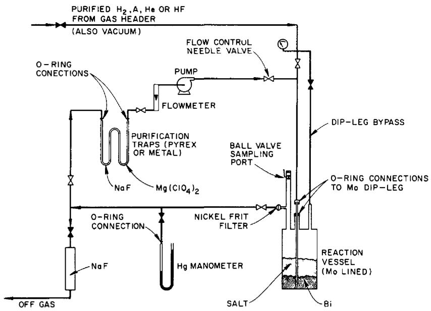

1. Schematic Diagram of Molten Salt-Bismuth Equilibration System with Gas Recirculation.

monitoring the rate, the reaction vessel, and traps containing sodium fluoride and magnesium perchlorate to remove any traces of HF and water which may be present. During the normal course of an experiment, the valves from the supply header and to the off-gas were closed. High-purity argon was recirculated thru the dip-leg. The dip-leg by-pass was open at times such as during sampling or additions in order to avoid the possibility of forcing melt up the dip-leg.

A schematic detail of the reaction vessel is shown in Figure 2. In a typical experiment this vessel contained about 200 grams each of salt and bismuth. The carrier salt used in all experiments reported here was a $72 - 16 - 12\mathrm{m / o}$ mixture of $\mathrm{LiF - BeF_2 - ThF_4}$ , which is being considered as the fuel carrier for a single-region MSBR. The bismuth was of six-nine purity, according to the manufacturer's analysis. The mixture was contained in a molybdenum lined nickel or steel vessel at a temperature of $625^{\circ}\mathrm{C} + 5^{\circ}$ . The molybdenum dipleg was designed to lift the bismuth and discharge it into the salt phase, since bench tests conducted in silica apparatus revealed that simple gas bubbling merely rocked the salt-bismuth interface.

An assembled reaction vessel, along with a sampler of the type used is shown in Figure 3. The vessel is 1-1/2 inches in diameter and 8 to 12 inches high. The total length from the ball valve is about 20 inches. Samplers of this length containing a sintered metal frit in the bulb were fabricated from copper, molybdenum or steel.

These samplers were inserted thru a teflon seal secured above the ball valve, and the experiment was sampled as desired. The material was removed from the sampler, weighed, placed in a vial, and brought out of the glove box train thru a bag-out port. The vial dropped into a plastic tube which was sealed with a thermal sealer. The alpha contaminated sample could then be safely handled outside the glove box. It was gamma scanned for $^{233}\mathrm{Pa}$ tracer or transmitted to analytical for other analyses.

# Procedure and Data

Equilibrium distribution data were obtained in two slightly different types of experiments. In the first type, purified carrier salt containing $\mathrm{PaF_4}$ and $\mathrm{UF_4}$ was brought into contact with bismuth containing enough thorium to reduce all the protactinium and uranium and leave about 1500 ppm thorium in the bismuth. The initial salt concentrations were: $\mathrm{UF_4} - 0.2$ to $0.3\mathrm{mole}\%$ and $\mathrm{Pa^{+4}}$ about 90 to 125 ppm. The distribution of these solutes and thorium between the salt and bismuth phases was determined by analysis of filtered samples of the two phases. Figure 4 shows protactinium and thorium concentrations for an experiment of this type as a function of contact time. This experiment was extended for about

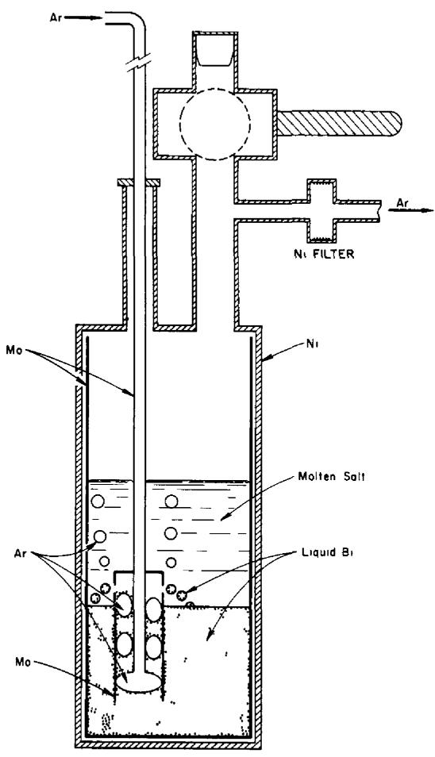  
2. Schematic Detail of Molten Salt-Bismuth Reaction Vessel.

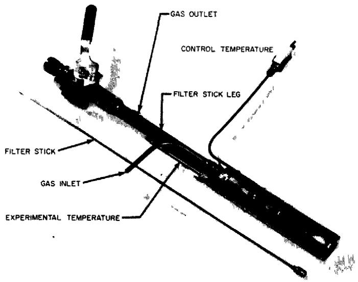  
3. Photo of Reaction Vessel Assembly with Sampler.

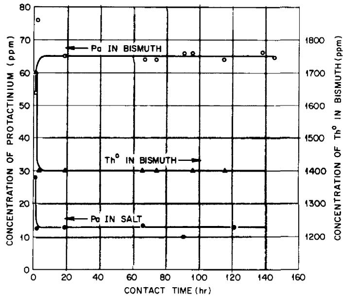  
4. Protactinium and Thorium Concentrations as a Function of Contact Time Between LiF-BeF $_2$ -ThF $_4$ (72-16-12 m/o) and Bismuth at $625^{\circ}\mathrm{C}$ .

one week in order to demonstrate the stability of the system. The concentrations held essentially constant for this period. The uranium distribution is not shown on the plot; however, it stayed constant with about $98\%$ of the uranium in the bismuth and less than $2\%$ in the salt. The material balances in this experiment were about $100\%$ for uranium and $95\%$ for protactinium.

The second type of experiment involved initial purification of the salt and bismuth together. The protactinium and/or uranium were added prior to hydrofluorination of the melt. Crystal bar thorium was then added in small increments after sparging with $\mathsf{H}_2$ and stripping with argon. By sampling the phases after each thorium addition, distribution data were obtained at various concentration levels. Figure 5 shows data obtained in an experiment of this type. The protactinium concentration is plotted as a function of thorium added. Uranium was also present in this experiment, and during the early thorium additions uranium was being reduced while the protactinium concentration held constant. Toward the end of the experiment thorium saturation of the bismuth was indicated by loss of protactinium from the bismuth on further addition of thorium. Co-precipitation of thorium-protactinium bismuthide probably occurred. This was indicated by the thorium analysis and by the fact that the protactinium reappeared in the bismuth phase when the temperature was raised to $805^{\circ}\mathrm{C}$ .

In some of these "titration" type experiments, in which the reductant was added incrementally, protactinium was reduced in the absence of uranium. These data are included in Figure 6 where protactinium distribution is plotted as a function of thorium concentration in the bismuth. Plots of thorium concentration are equivalent to plots of thorium distribution, since thorium in the salt is essentially constant. The data are plotted on a linear scale in this case in order to minimize the effect of analytical scatter at very low thorium concentration.

The closed circles show data obtained in the absence of uranium. The $805^{\circ}\mathrm{C}$ line was drawn to the single point obtained when the temperature was raised as mentioned previously. The $625^{\circ}\mathrm{C}$ data for protactinium and thorium are represented very well by a straight line; uranium concentration has no apparent effect on the distribution. The failure of the representative line to pass thru zero is attributed to trace amounts of oxidizing impurities which reacted with some of the thorium.

Figure 7 shows the $625^{\circ}\mathrm{C}$ for protactinium and uranium distribution. In this case a log-log plot is used, and a straight line representative of this data has a slope of $4/3$ .

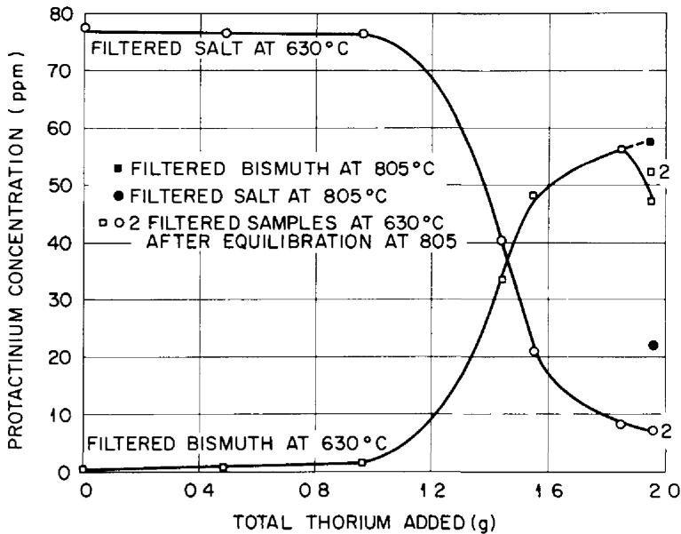  
5. Protactinium Concentration as a Function of Total Thorium Added to LiF-BeF $_2$ -ThF $_4$ (72-16-12 m/o) and Bismuth Solutions.

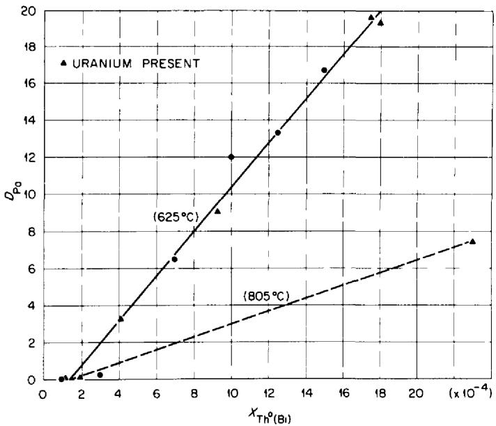  
6. Distribution of Protactinium and Thorium Between LiF-BeF $_2$ -ThF $_4$ (72-16-12 m/o) and Bismuth Solutions at $625^{\circ}\mathrm{C}$ .

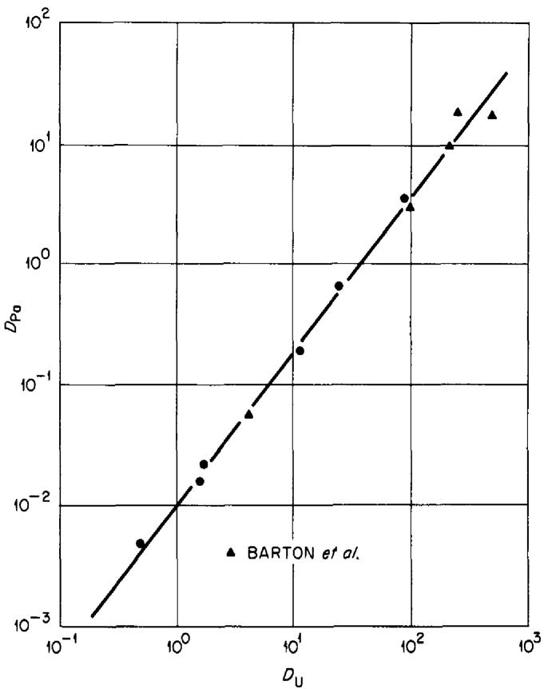  
7. Distribution of Protactinium and Uranium Between LiF-BeF $_2$ -ThF $_4$ (72-16-12 m/o) and Bismuth Solutions at $625^{\circ}\mathrm{C}$ .

# Discussion

On the basis of data shown in Figure 6 and Figure 7, the following extraction stoichiometry is indicated:

$$
\mathrm {P a} _ {(\mathrm {F})} ^ {+ 4} + \mathrm {T h} _ {(\mathrm {B i})} ^ {\circ} \rightleftharpoons \mathrm {P a} _ {(\mathrm {B i})} ^ {\circ} + \mathrm {T h} _ {(\mathrm {F})} ^ {+ 4} \tag {5}
$$

$$
4 \mathrm {U} _ {(\mathrm {F})} ^ {+ 3} + 3 \mathrm {P a} _ {(\mathrm {B i})} ^ {\circ} \rightleftharpoons 4 \mathrm {U} _ {(\mathrm {B i})} ^ {\circ} + 3 \mathrm {P a} _ {(\mathrm {F})} ^ {+ 4} \tag {6}
$$

$$
4 \mathrm {U} _ {(\mathrm {F})} ^ {+ 3} + 3 \mathrm {T h} _ {(\mathrm {B i})} ^ {\circ} \rightleftharpoons 4 \mathrm {U} _ {(\mathrm {B i})} ^ {\circ} + 3 \mathrm {T h} _ {(\mathrm {F})} ^ {+ 4} \tag {7}
$$

The plot of protactinium-thorium distribution (Fig. 6) was linear, indicating a 1 to 1 ratio of their valences in the salt as shown in reaction (5). The 4/3 slope of the log-log protactinium-uranium distribution plot (Fig. 7) indicates the valences shown in reaction (6). It follows that the uranium-thorium reaction would be as shown in reaction (7).

It seems conclusive that under the conditions of these experiments, both protactinium and thorium were in the $+4$ state and uranium in the $+3$ state when reduction into the metal occurred. Using these valences and the experimentally obtained distribution data, the equilibrium quotients may be calculated from the relationship as shown in Eq. (3). At $625^{\circ}C$

$$
Q _ {P a} ^ {U} = D _ {U} ^ {4 / 3} / D _ {P a} = 1 2 0,
$$

$$
Q _ {\text {T h}} ^ {P a} = D _ {P a} / D _ {T h} = 1 5 0 0,
$$

These quotients may be used to obtain separation factors

$\left(\alpha_{M_2}^{M_1} = D_{M_1} / D_{M_2}\right)$ at a particular thorium concentration. For a thorium concentration of 1800 ppm in the bismuth, the separation factors are

$$
\alpha_ {\text {T h}} ^ {\text {P a}} \cong 1, 5 0 0 ,
$$

$$
\alpha_ {\mathrm {T h}} ^ {\mathrm {U}} \cong 3 0, 0 0 0
$$

$$
\alpha_ {\mathrm {P a}} ^ {\mathrm {U}} \cong 2 0.
$$

These separation factors are considered adequate for the MSBR fuel reprocessing scheme mentioned previously(9), and pilot plant mock-up should be forthcoming soon.


The ease with which molten-fluoride fuels can be reprocessed, coupled with the extremely successful MSRE, should lead to the early operation of a Molten-Salt Breeder Reactor.

# References

1. R. C. Briant and Alvin M. Weinberg, "Molten Fluorides as Power Reactor Fuels," Nucl. Sci. Eng., 2: 797 (1957).   
2. Alvin M. Weinberg, "Some Aspects of Fluid Fuel Reactor Development," Nucl. Sci. Eng., 8: 346 (1960).   
3. H. G. MacPherson, "Molten-Salt Reactors," p. 567, Fluid Fuel Reactors, ed. by J. A. Lane, H. G. MacPherson and F. Maslan, Addison-Wesley, Reading, Mass., 1958.   
4. W. R. Grimes, D. R. Cuneo and F. F. Blankenship, "Fused-Salt Systems," p. 801, Reactor Handbook Engineering, USAEC, McGraw-Hill, New York, 1955.   
5. J. H. Shaffer et al., "Removal of Protactinium from Molten Fluorides by Reduction Processes," in USAEC Report ORNL-3913, p. 42, Oak Ridge National Laboratory, March 1966.   
6. C. J. Barton and H. H. Stone, "Protactinium Studies in the High-Alpha Molten-Salt Laboratory," in USAEC Report ORNL-4076, p. 39, Oak Ridge National Laboratory, March 1967.   
7. J. H. Shaffer et al., "Removal of Protactinium," in USAEC Report ORNL-3936, p. 147, Oak Ridge National Laboratory, June 1966.   
8. L. M. Ferris et al., "Isolation of Protactinium from Single-Fluid Molten-Salt Breeder Reactor Fuels by Selective Extraction into Li-Th-Bi Solutions," presented at the Third International Protactinium Conference, Mittenwald, Germany, April 14-19, 1969.   
9. L. E. McNeese and M. E. Whatley, "Protactinium Removal from a Single-Fluid MSBR," in USAEC Report ORNL-4252, p. 248 Oak Ridge National Laboratory, August 1968.

# THE REDUCTIVE EXTRACTION OF RARE EARTH'S FROM MOLTEN

LiF-BeF2-ThF4 MIXTURES INTO BISMUTH*

J. H. Shaffer, D. M. Moulton, and W. R. Grimes

Reactor Chemistry Division  
Oak Ridge National Laboratory  
Oak Ridge, Tennessee  
U.S.A.

# Abstract

Chemical and engineering development studies of fuel reprocessing schemes for the Molten Salt Breeder Reactor Program at the Oak Ridge National Laboratory are based on the extraction of protactinium-233, fissionable uranium, and certain fission product species from the fluoride fuel mixture upon reduction into bismuth. As a part of this experimental program, the reductive extraction of rare earths, the major soluble poison fraction in an MSBR, from selected salt mixtures in the LiF-BeF $_2$ -ThF $_4$ ternary system into bismuth was investigated. The distributions of cerium, neodymium, samarium, lithium, and thorium between the two liquid phases were calculated as reaction equilibrium constants, distribution coefficients, and separation factors and were related to variations in salt composition. The magnitudes of these values establish the chemical feasibility of the extraction method for rare earth removal from MSBR fuels by multistage processing techniques.

*Research sponsored by the U. S. Atomic Energy Commission under contract with the Union Carbide Corporation.

# Results

Analytical results of samples taken during the extraction experiments with cerium were calculated as equilibrium quotients according to equation (3). A least squares evaluation of each data set by the expression,

$$
\log \mathrm {D} _ {\mathrm {C e}} = \frac {\mathrm {x}}{4} \log \mathrm {D} _ {\mathrm {T h}} + \frac {1}{4} \log \mathrm {K} _ {\mathrm {Q}}, \tag {6}
$$

yielded good agreement with the theoretical slope for $x = 3$ . Average values for $K_{Q}$ were then evaluated for slope $= .75$ and the standard deviation of $\log K$ determined. These values together with similar evaluations for the reduction of lithium by thorium and by cerium are summarized in Table I. Distribution coefficients and separation factors at reported values for thorium saturation in bismuth at $600^{\circ}C$ were calculated from these values for $K_{Q}$ and are listed in Table II(9).

Table II. Reductive Extraction of Cerium, Lithium, and Thorium from LiF-BeF $_2$ -ThF $_4$ Mixtures into Bismuth at $600^{\circ}$ C   

<table><tr><td colspan="3">Salt Composition (mole %)</td><td colspan="3">Distribution Coefficients</td><td colspan="3">Separation Factors</td></tr><tr><td>LiF</td><td>BeF2</td><td>ThF4</td><td>DCe</td><td>DLi</td><td>DTh</td><td>DCe/DTh</td><td>DCe/DLi</td><td>DTh/DLi</td></tr><tr><td>72</td><td>16</td><td>12</td><td>.077</td><td>.0024</td><td>.021</td><td>3.67</td><td>32.1</td><td>8.75</td></tr><tr><td>65</td><td>23</td><td>12</td><td>.033</td><td>.00098</td><td>.021</td><td>1.57</td><td>33.7</td><td>21.4</td></tr><tr><td>64</td><td>30</td><td>6</td><td>.088</td><td>.00105</td><td>.042</td><td>2.10</td><td>83.8</td><td>40.0</td></tr><tr><td>70</td><td>21</td><td>9</td><td>.081</td><td>.00161</td><td>.028</td><td>2.89</td><td>50.3</td><td>17.4</td></tr><tr><td>68</td><td>20</td><td>12</td><td>.049</td><td>.00153</td><td>.021</td><td>2.33</td><td>32.0</td><td>13.7</td></tr><tr><td>75</td><td>16</td><td>9</td><td>.133</td><td>.0032</td><td>.028</td><td>4.75</td><td>41.6</td><td>8.75</td></tr><tr><td>74</td><td>20</td><td>6</td><td>.243</td><td>.0028</td><td>.042</td><td>5.79</td><td>86.8</td><td>15.0</td></tr></table>

Since the important fission product neutron poisons are within the first six members of the lanthanide series, additional experiments with neodymium and samarium were considered as representative of this group. On the basis of preceding results with cerium, these experiments were conducted with the fluoride solvent, $\mathrm{LiF - BeF_2 - ThF_4}$ (72-16-12 mole %) at 600 and $700^{\circ}\mathrm{C}$ . The results are summarized in Table III. Values for the maximum distribution of thorium in the system were also based on Reference 1.

Table III. Reductive Extraction of Neodymium and Samarium from LiF-BeF $_2$ -ThF $_4$ (72-16-12 mole %) into Bismuth at 600 and $700^{\circ}\mathrm{C}$   

<table><tr><td rowspan="2">Rare Earth</td><td colspan="3">600°C</td><td colspan="3">700°C</td></tr><tr><td>KQ</td><td>DLn</td><td>DLn/DTh</td><td>KQ</td><td>DLn</td><td>DLn/DTh</td></tr><tr><td>Neodymium</td><td>0.73</td><td>0.051</td><td>2.43</td><td>2.73</td><td>0.142</td><td>2.68</td></tr><tr><td>Samarium*</td><td>0.096</td><td>0.045</td><td>2.14</td><td>0.127</td><td>0.082</td><td>1.55</td></tr><tr><td colspan="7">*KQ calculated for divalent samarium.</td></tr></table>

# Discussion

The sequence of experiments was chosen first to evaluate salt solvent effects on the extraction system and then to establish the comparative extractability of other rare earths of interest. Although cerium is not an important fission product, it was used for the first phase of this program to simplify analytical procedures. Neodymium and samarium also have gamma emitting isotopes, but their energy spectra at low levels in bismuth are more difficult to resolve in the presence of extractable thorium daughter activities than is the case for cerium. Analyses for cerium-144 were obtained using a conventional sodium iodide scintillation crystal while analyses for neodymium-147 were obtained with a lithium-drifted germanium diode. Samarium analyses required neutron activation of enriched samarium-152 to obtain reasonable results.

Some effect of salt composition on the extraction system was expected on the basis of earlier work. The formulation of compounds in molten alkali fluoride- $\mathsf{BeF}_2$ and alkali fluoride- $\mathsf{MF}_4$ binary mixtures inferred the existence of $\mathsf{BeF}_4^{2 - }$ and $\mathsf{MIVF}_7^{3 - }$ as anionic species in the melt and suggested a fluoride bridging concept(10). These ions were the basis of an empirical correlation of solvent effects on HF solubility in these binary salt systems(11). Equilibrium crystallization by mixtures of LiF, $\mathsf{BeF}_2$ , and $\mathsf{ThF}_4$ in composition regions near that of the proposed MSBR fuel solvent produce as final products the two crystal phases, 2LiF- $\mathsf{BeF}_2$ and 3LiF- $\mathsf{ThF}_4$ SS(12). Formulation of these compounds suggested an analogous empirical correlation to describe salt solvent effects on the reductive extraction equilibria(13). This concept was based on the assumption of equal affinity of fluoride ion for beryllium and thorium and their coordination by the number of fluoride ions in the solid compounds $\mathsf{Li}_2\mathsf{BeF}_4$ and $\mathsf{Li}_3\mathsf{ThF}_7$ . An excess or deficit of "free fluoride" concentration was defined by the relation,

$$
\text {F r e e f l u o r i d e} = \mathrm {M} \% \text {L i F - 2} (\mathrm {M} \% \text {B e F} _ {2}) - 3 (\mathrm {M} \% \text {T h F} _ {4}). \tag{7}
$$

Deficits in "free fluoride" ion are then expressed as negative quantities. As shown by Fig. 1, the equilibrium quotients for the reduction of cerium by thorium at $600^{\circ}\mathrm{C}$ can be reasonably correlated

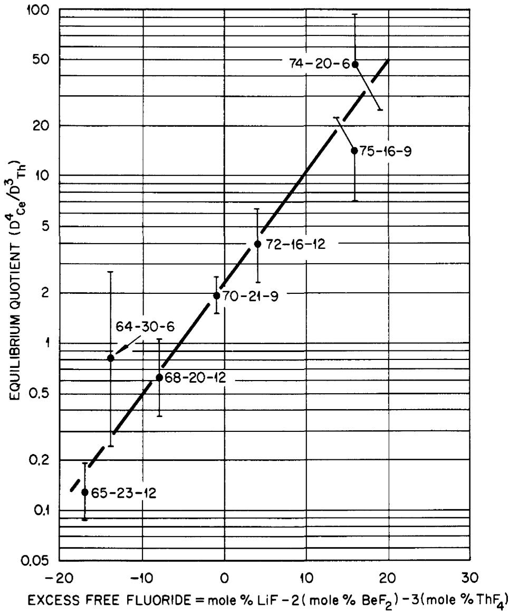  
1. Effect of Salt Composition on the Equilibrium Reduction of Cerium by Thorium from $\mathrm{LiF - BeF_2 - ThF_4}$ Mixtures into Bismuth at $600^{\circ}C$

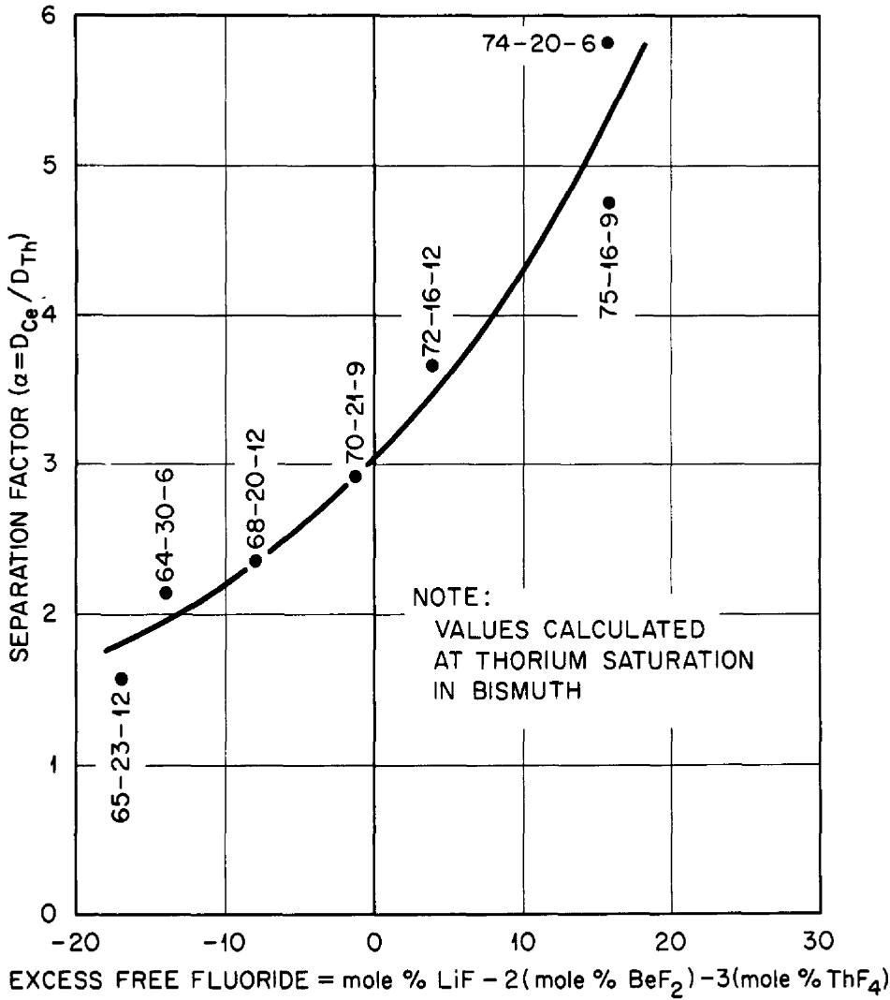  
2. Effect of Salt Composition on the Separation of Cerium from Thorium During Reductive Extraction of Cerium from $\mathsf{LiF - BeF_2 - ThF_4}$ Mixtures into Bismuth at $600^{\circ}C$

to the "free fluoride" concept as a semilogarithmic function. However, within the precision of the data, similar plots of equilibrium quotients for the reduction of lithium by thorium and by cerium yielded discontinuous functions.

Although the experimental data cannot be adequately correlated by this simple function of salt composition, the free fluoride concept does provide a basis for estimating the extractability of rare earths and, as shown by Fig. 2, their separation from thorium over the salt composition ranges of interest to the MSBR program. These data were considered in the present selection of the fuel solvent composition, $\mathrm{LiF - BeF_2 - ThF_4}$ (72-16-12 mole %). Contributing data for the extraction of neodymium and samarium from this solvent into bismuth further confirmed the chemical feasibility of this fuel reprocessing method.

# References

1. Rosenthal, M. W., "Molten Salt Reactors," submitted for publication in Nuclear Applications.   
2. Bettis, E. S. and R. C. Robertson, "MSBR Design Features and Performance," submitted for publication in Nuclear Applications.   
3. Perry, A. M., "MSBR Reactor Physics," submitted for publication in Nuclear Applications.   
4. Whatley, M. E. et al., "Engineering Development of MSBR Fuel Recycle," submitted for publication in Nuclear Applications.   
5. Grimes, W. R., "Molten Salt Reactor Chemistry," submitted for publication in Nuclear Applications.   
6. Shaffer, J. H. et al., Reactor Chemistry Div. Ann. Prog. Rept., Dec. 31, 1966, ORNL-4076, pp. 34-36.   
7. Shaffer, J. H. et al, MSR Program Semiann. Prog. Rept., Feb. 29, 1968, ORNL-4254, pp. 152-155.   
8. Ferris, L. M. et al., MSR Program Semiann. Prog. Rept., Feb. 29, 1968, ORNL-4254, pp. 241-247.   
9. Bryner, J. S. and M. B. Brodsky, Proc., 2nd Int. Conf. on Peaceful Uses of At. Energy, Vol. 7, 1958, p. 209.   
10. Blankenship, F. F., Personal Communication, 1958.   
11. Shaffer, J. H., Reactor Chemistry Div. Ann. Prog. Rept., Jan. 31, 1960, ORNL-2931, p. 32.   
12. Thoma, R. E. et al., J. Phys. Chem., Vol. 64, 1960, p. 865.   
13. Bredig, M. A., Personal Communication, April 26, 1968.

# THE MOLTEN SALT EXTRACTION OF AMERICUM

FROM PLUTONIUM METAL

J. L. Long and C. C. Perry

The Dow Chemical Company, Rocky Flats Division Golden, Colorado

U.S.A.

# ABSTRACT

The removal of americium from molten plutonium metal with molten salt mixtures was investigated. A process was developed and put into production operation. Approximately $90\%$ of the americium is removed from plutonium metal initially containing in excess of 1000 ppm of americium with two extractions, using equal weights of metal and NaCl-KCl-2.5 w/o $\mathrm{MgCl}_2$ . The average cost of the production molten salt extraction step was 3.1 man-hours per kilogram of product metal.

*Work performed under the auspices of the United States Atomic Energy Commission, Contract AT(29-1)-1106.

# INTRODUCTION

Americum-241 grows in plutonium by the beta decay of $^{241}\mathrm{Pu}$ . The separation of americium from plutonium can be of interest either for obtaining americium or for purifying the plutonium, or both. As an example of purification needs, suppose that a purity specification of 1000 ppm exists. Also, suppose that plutonium metal is available which contains 950 ppm impurities. If the plutonium contains $0.5\%$ $^{241}\mathrm{Pu}$ , then the purity specification will be exceeded in three months. Another example of the need to remove americium from plutonium is in the fabrication of ZPFR fuel elements. At the casting temperatures used for ZPFR fuel elements, americium distilled away from the plutonium to the top of the furnace and created a health physics exposure problem. The removal of the americium prior to casting would have eliminated the problem. At Rocky Flats, some of the plutonium metal requires only the removal of americium. Thus, a direct separation would be advantageous.

Extensive information has been reported in the past few years on molten metal-molten salt systems. The work which was done at Los Alamos Scientific Laboratory and Argonne National Laboratory has had the most influence on our work in the molten salt-molten metal area. This was particularly true in the molten salt electrorefining of plutonium, which was initially patterned closely after the work at Los Alamos. The equipment now used for the production molten salt extraction operation was designed for electrorefining, but since the time cycle is much shorter for molten salt extraction, the equipment has been put to that use. Fortunately, the electrorefining cells are versatile enough to permit reasonable, but not optimum, production rates.

# Simplified Theory

Americium is a thermodynamically active metal<sup>1</sup>. Therefore, reactions of the type

$$
n A m ^ {o} + (2 \text {o r} 3) M ^ {+ n} \longrightarrow n A m (+ 2 \text {o r} + 3) + (2 \text {o r} 3) M ^ {o}
$$

are expected to occur to a degree of completeness largely dependent upon how active americium is as compared to M. Plutonium is also an active metal, but not as active as americium<sup>1</sup>. Thus, if a separation is to be made, based upon oxidation reduction reactions, one important factor is the relative activity of americium, plutonium, and the metal M. Another important factor could be the rates of reaction between americium and plutonium with $\mathbf{M}^{\mathrm{in}}$ . Other factors which could influence the separation are complexing of reaction products or actually removing reaction products from the reaction vessel.

# EXPERIMENTAL

Our first molten salt extraction experiments were completed in 1963. The general approach was suggested by earlier work which showed that an appreciable amount of plutonium entered the salt phase as an ionic species when molten plutonium metal was stirred with a molten salt composed of sodium chloride and potassium chloride. Similar behavior was expected for americium because of it's reactivity. In essence, what is required for molten salt extraction is illustrated in Figure 1 where the cut-away drawing shows a molten salt phase and a molten plutonium metal phase being agitated. The cell is surrounded by an argon atmosphere. One of the initial americium extraction experiments with NaCl-KCl indicated that the reaction was diffusion controlled if the metal phase was not stirred, since the rate of appearance of americium in the salt phase followed a parabolic rate law as shown in Figure 2. Other experiments with the same salt mixture showed that about $50\%$ of the americium could be extracted in approximately 10 hours if both phases were stirred (Table I). The americium concentration in the salt phase increased almost linearly during the period of stirring between 2 hours and 12 hours for experiments 1 and 2. The rate was approximately 75 ppm/hour.

The percent of americium extracted was calculated in two ways whenever possible: one was based on the metal phase before and after extraction, and the other based on the metal phase before and the salt phase after extraction. The calculated values were averaged and the variability from the average was determined. The plus or minus variability is a reflection of the variability in the americium material balance.

All subsequent work was done with magnesium chloride added to the equimolar sodium chloride-potassium chloride mixture. The removal of fission products from a fissium alloy with this salt system has been reported<sup>2</sup>. The salt was premelted and sparged with dry HCl gas for 20 minutes. After this treatment, the amount of magnesium present in the oxide form was less than $2\%$ of the total magnesium added as the chloride. The effect of the addition of $6\mathrm{w/o}$ magnesium chloride on the extraction is shown in Figure 3 where the concentration of americium in the salt phase is plotted versus time. The initial americium concentration in the metal was $130~\mathrm{ppm}$ . The americium extracted was $74 \pm 1\%$ within the first hour and this did not appear to change appreciably within the next five hours as evidenced by the curve in Figure 3. The behavior of magnesium chloride and plutonium chloride in the salt phase is shown in Figure 4. As with the americium, the greatest change in plutonium concentrations took place in the first hour in the presence of an excess of magnesium chloride. The data in Figure 4 can be converted to $0.97\mathrm{w/o}$ plutonium in the salt phase after a stirring time of one hour.


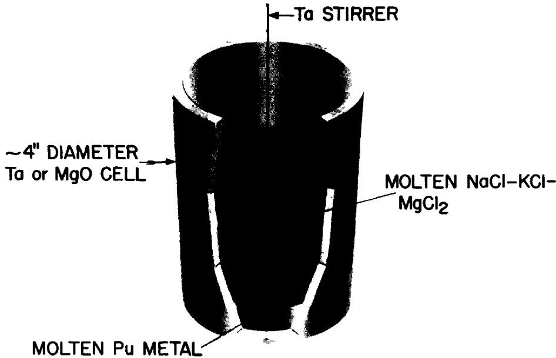  
MOLTEN SALT EXTRACTION OF AMERICIUM   
Figure 1 - Cut-away drawing of molten salt extraction cell.

TABLEI   
NaCl-KCl Extraction Experiments   

<table><tr><td>Experiment No.</td><td>Weight of Pu Metal Charge grams</td><td>PPM Am in Pu Metal Charge</td><td>Initial Weight NaCl-KCl, grams</td><td>Temp., °C</td><td>Stirring Time, Hours</td><td>% Am Extracted from Pu Metal</td></tr><tr><td>1</td><td>1499</td><td>1387</td><td>749</td><td>700</td><td>81/4</td><td>48 ± 7</td></tr><tr><td>2</td><td>1406</td><td>637</td><td>641 From Exp. 1</td><td>750</td><td>9 (17½ total)</td><td>60 ± 7*</td></tr><tr><td>3</td><td>2843</td><td>1387</td><td>1299</td><td>745</td><td>10</td><td>43 ± 8</td></tr><tr><td>4</td><td>1202</td><td>691</td><td>1099 From Exp. 3</td><td>700</td><td>12½ (22½ total)</td><td>68 ± 15*</td></tr></table>

*Percent americium extracted is cumulative for pairs of experiments 1, 2 and 3, 4.

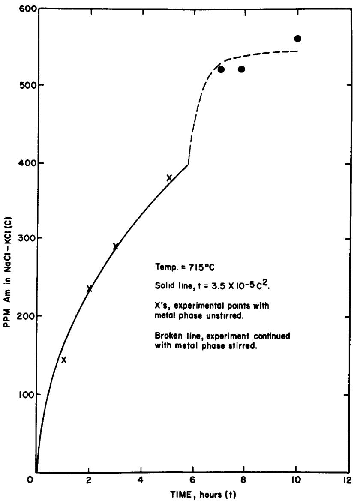  
Figure 2 - Extraction and Effective Stirring

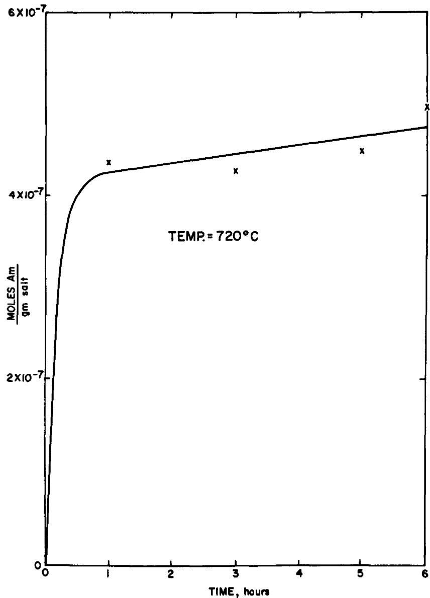  
Figure 3 - Concentration of Americium in the Salt Phase vs. Time.

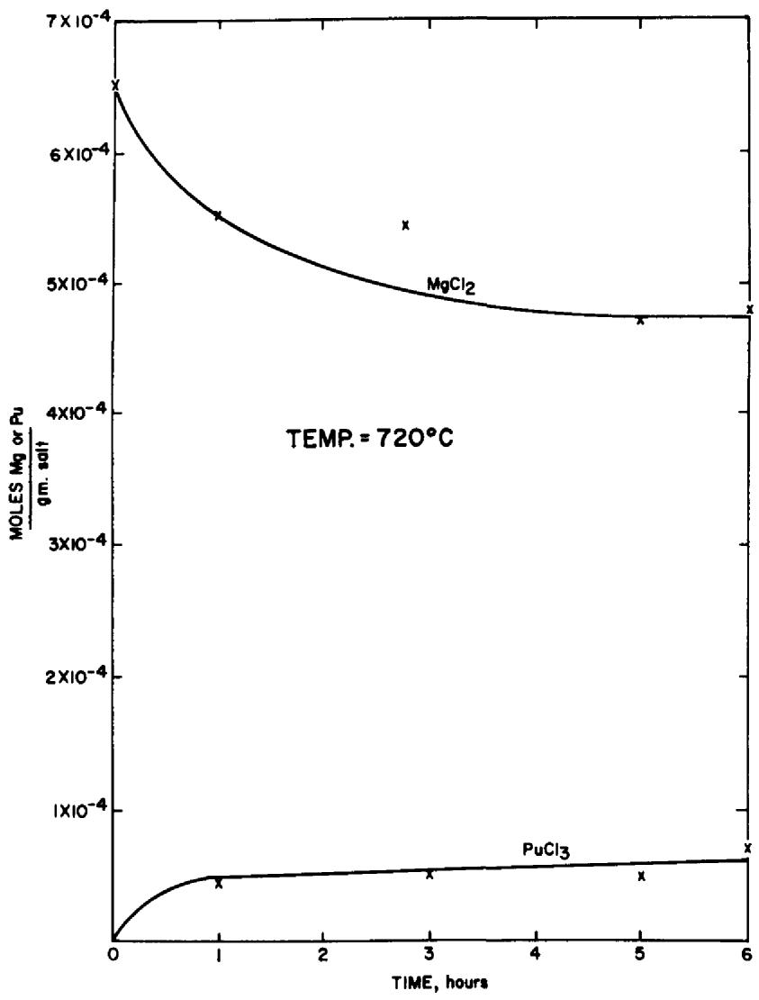  
Figure 4 - MgCl $_2$ and PuCl $_3$ in Salt Phase vs. Time.

Experiments 1, 2, and 3 in Table II indicate trends in the extraction efficiency brought about by variation in magnesium chloride concentrations and by variations in salt-to-metal weight ratios. Comparison of the first two experiments indicates that the lower percent extraction in the first experiments is due to the lower magnesium chloride concentration. Comparison of experiments 2 and 3 indicates that increased extraction efficiency was obtained with the larger salt-to-metal weight ratio for experiment 3.

Experiments 79-7 and 79-8 in Table II show the extraction obtained with an initial magnesium chloride concentration of 2.5 w/o and a salt-to-metal weight ratio of 1.0 with a relatively high concentration of americium in the feed metal. There was no significant difference in extraction with stirring times of 2 or 3 hours. The plutonium concentration in the salt phase increased with time.

The data in Table III show the extraction obtained, and the plutonium found in the salt phase at $800^{\circ}\mathrm{C}$ with 2.5 w/o magnesium chloride and a stirring time of 1 hour. The extraction appears to be slightly greater than that obtained at $730^{\circ}\mathrm{C}$ (Table II), but the total plutonium concentration in the salt phase increased by a factor of more than two and apparently included substantial quantities of metallic plutonium.

An equation was developed to relate the percent americium extracted to the metal-to-salt weight ratio with temperature and $\mathrm{MgCl_2}$ concentration held constant. The equation is

$$
\% \text {Am extracted} = \frac {\mathrm {K} _ {\mathrm {Am}}}{\mathrm {R} + \mathrm {K} _ {\mathrm {Am}}} \times 100
$$

where R is the metal-to-salt weight ratio and $\mathbf{K}_{\mathrm{Am}}$ is defined as the concentration of americium in the salt phase divided by the concentration of americium in the metal phase, after extraction. $\mathbf{K}_{\mathrm{Am}}$ is assumed to be constant, at least over a limited range of americium concentrations. A plot of three calculated curves is shown in Figure 5 along with three experimental points<sup>3</sup>. The feed metal in each case contained $1543~\mathrm{ppm}$ of americium. The salt phase initially contained $2.5\mathrm{w / oMgCl_2}$ . The extractions were carried out at $745^{\circ}\mathrm{C}$ . The stirring time was 1 hour.

# DISCUSSION

The reactions responsible for transferring americium and plutonium to the salt phase are assumed to be oxidation-reduction reactions between americium and plutonium in the metal phase and either sodium chloride (when no magnesium chloride is present) or magnesium chloride in the salt phase. In fact, visual observation and analytical data supported the conclusion that sodium metal and magnesium metal were products of the reactions in the respective salt mixtures. The

# TABLE II

# NaCl-KCl-MgCl Extraction Experiments

<table><tr><td>Experiment No.</td><td>Weight of Pu Metal Charge, grams</td><td>PPM Am in Pu Metal Charge</td><td>Initial Weight NaCl-KCl-MgCl2, grams</td><td>Concentration of Pu in the Salt Phase after Extrac-tion, %</td><td>Temp., °C</td><td>Stirring Time Hours</td><td>% Am Extracted from Pu Metal</td></tr><tr><td>1</td><td>1287</td><td>886</td><td>375, 0.56 w/o MgCl2</td><td>----</td><td>760</td><td>2</td><td>40 ± 11</td></tr><tr><td>2</td><td>1357</td><td>699</td><td>426, 6.10 w/o MgCl2</td><td>----</td><td>700</td><td>2</td><td>52 ± 3</td></tr><tr><td>3</td><td>1343</td><td>130</td><td>1205, 6.08 w/o MgCl2</td><td>----</td><td>720</td><td>1</td><td>74 ± 1</td></tr><tr><td>79-7</td><td>149.0</td><td>1557</td><td>148.5, 2.5 w/o MgCl2</td><td>1.27</td><td>730</td><td>2</td><td>77.4 ± 1.5</td></tr><tr><td>79-8</td><td>147.5</td><td>1557</td><td>149.5, 2.5 w/o MgCl2</td><td>1.64</td><td>730</td><td>3</td><td>78.5 ± 1.7</td></tr></table>

# TABLE III

# Molten Salt Extraction, $800^{\circ} \mathrm{C}$

The initial Am concentration was 1374 ppm.

The salt composition was equimolar NaCl-KCl containing 2.5 w/o MgCl $_2$ .

<table><tr><td>Experiment No.</td><td>Initial Weight Salt grams</td><td>Initial Weight Pu grams</td><td>Stirring Time Hours</td><td>Concentration of Pu Metal in the Salt Phase after Extraction, %</td><td>Concentration of Non-metallic Pu in the Salt Phase after Extraction, %</td><td>% Am Extracted</td></tr><tr><td>79-1</td><td>150.0</td><td>150.0</td><td>1</td><td>4.8</td><td>2.82</td><td>78.3 ± 0.4</td></tr><tr><td>79-2</td><td>150.0</td><td>150.0</td><td>1</td><td>5.4</td><td>3.28</td><td>79.2 ± 0.2</td></tr><tr><td>79-3</td><td>150.0</td><td>150.0</td><td>1</td><td>1.4</td><td>2.86</td><td>81.5 ± 2.7</td></tr></table>

AVERAGE $= 79.7$

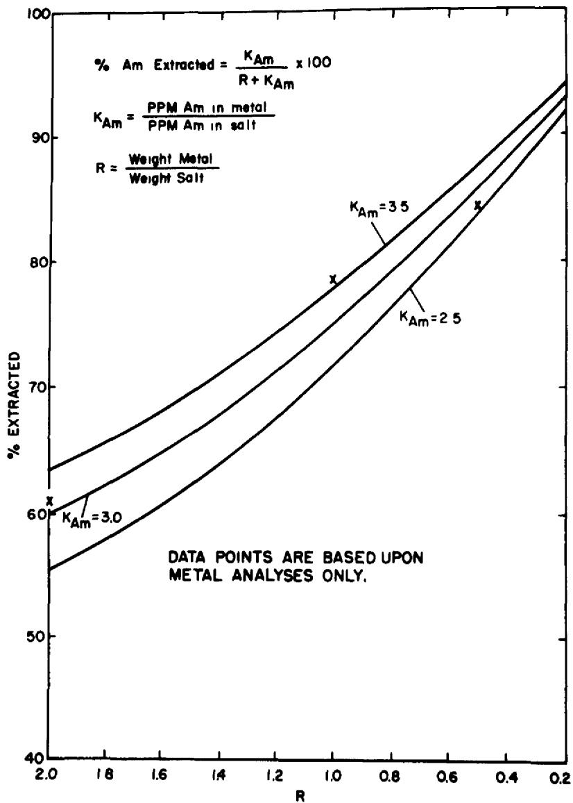  
Figure 5 - Extraction vs. Metal-to-Salt Ratio Based on Laboratory Experiments

oxidation state of the americium in the salt phase has not been determined, but is assumed to be the trivalent state. However, an investigation at Los Alamos of the system NaCl-KCl-PuCl₃-Am in plutonium metal supported a divalent state for americium and it is entirely possible that the divalent state is involved in this work. Although the conditions are different, the observation that americium favors the salt phase in comparison to plutonium is found to be in line with the distribution data obtained at Argonne.

# Extraction Variability

The extraction data in Tables I and II show a much greater range in the plus or minus variability for those experiments made without magnesium chloride in the salt phase as compared to the experiments in which substantial concentrations of magnesium chloride were present. The reason for this was not determined, but non-representative sampling due to salt phase inhomogeneity was suspected.

The proper combination of analytical errors and weighing errors for the extraction data in Tables II and III would permit a plus or minus variability of approximately 3, i.e., the percent extracted would be written as $\mathrm{XY} \pm 3$ . All of the variability values fall within this approximation except for experiment No.1, Table II in which the magnesium chloride concentration was low.

# Salt, Phase Inhomogeneity

Salt phase inhomogeneity effects were eliminated from the 150-gram scale experiments by using the entire salt phase for the sample. Salt phases from six 150-gram scale experiments were submitted for analyses in three portions per experiment. No inhomogeneity was detected within analytical error. However, the plutonium concentration between portions frequently varied by a factor of 2. This could have been due to the presence of plutonium oxide which would not be distributed uniformly in the salt phase. Approximately 0.5 gram of plutonium in the oxide form concentrated in one salt portion would have been sufficient to cause most of the observed variations.

# Weight Changes

In general, weight lost by the metal phase and weight gained by the salt phase in any given experiment amounted to less than $2\%$ of the initial weight of each phase. Notable exceptions were observed for the experiments carried out at $800^{\circ}\mathrm{C}$ (Table III). Weight losses and gains of greater than $6\%$ were found for experiments 79-1 and 79-2. Also, substantial quantities of metallic plutonium were apparently detected in the salt phases by hydrogen evolution analyses as shown in Table III. These analyses could be erroneously high if magnesium metal was present in the salt phase, but this does not seem probable because of the high vapor pressure of magnesium metal at $800^{\circ}\mathrm{C}$ .


Thus, plutonium metal probably existed in the salt phase, but the mechanism responsible has not been determined.

# Extraction Equation

The usefulness of the equation used to generate the calculated curves in Figure 5 obviously depends upon $\mathbf{K}_{\mathbf{Am}}$ reaching or approaching a constant value. Although a true equilibrium condition cannot be claimed, the extraction versus time data in Figure 3 and in Table II do indicate that the extraction, and hence the ratio of the americium concentrations in the salt and metal phases approaches a constant value. The equation may be easily transformed into the expression

$$
\% E = \frac {\text {ppm Am in salt x wt . salt}}{\text {ppm Am in metal x wt . metal + ppm Am in salt x wt . salt}} \times 100
$$

The variation (if any) of $\mathbf{K}_{\mathbf{Am}}$ with varying concentrations of americium in the plutonium metal feed has not been determined.

An investigation to obtain additional information on process variables is currently underway, but a process was proposed and put into pilot plant operation based on the data presented here.

# PILOT PLANT RUNS

Pilot plant runs provided additional data on the effect of metal-to-salt weight ratio as shown in Figure 6. The trend shown by the data points tends to support the calculated curve, but the value of $\mathrm{K}_{\mathrm{AM}}$ which might be inferred from the data points could be in error because of probable stirring deficiencies during the pilot plant runs. The stirring system was redesigned prior to production operation.

# PRODUCTION RUNS

Two types of crucible material were proven to be satisfactory - magnesium oxide and tantalum metal. Because of the subsequent problems in recovering the plutonium from the discarded magnesium oxide crucibles, the majority of the production work was done in tantalum crucibles.

The conditions established for a large scale production throughput are shown in Table IV. The temperature within the production cells was not measured directly. Thus, there could have been temperature variations of up to $50^{\circ}$ from cell to cell.

During one three month period, a total of $414\mathrm{kg}$ of plutonium metal was obtained as product from molten salt extraction. Each batch of plutonium metal feed was contacted twice with an equal weight of salt. The feed metal contained an average of 1380 ppm americium. Random samples of the plutonium metal product, after

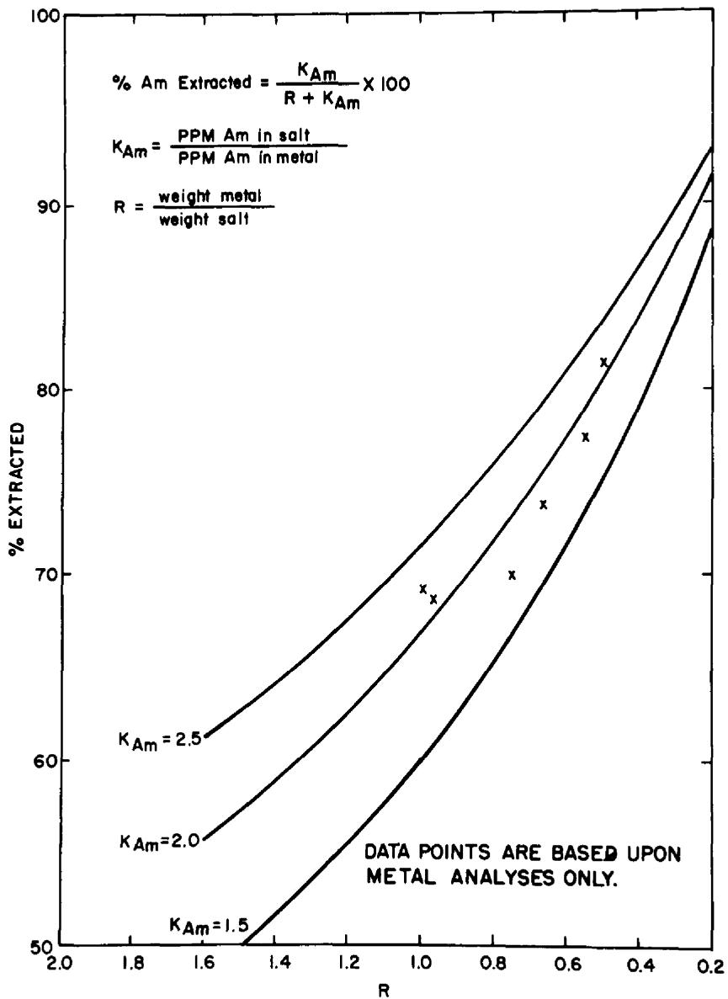  
Figure 6 - Extraction vs. Metal-to-Salt Ratio Based on Pilot Plant Data

# TABLE IV

# CONDITIONS FOR THE PRODUCTION PROCESS

1. Metal charge weight 2.5 kg per cell.   
2. Salt charge weight 2.5 kg per cell.   
3. Temperature $700^{\circ} \mathrm{C}$ to $750^{\circ} \mathrm{C}$ .   
4. Stirring time =1 hour.   
5. Cycle time $\approx 9$ hours.   
6. Two passes (i.e., one charge weight of metal contacted with two charge weights of salt).

(Six Cell Plant)

TABLE V   
Production Results   

<table><tr><td>Month</td><td>kg of Usable Product</td><td>Cost (Man-hours per kg)#</td></tr><tr><td>November</td><td>100</td><td>3.8</td></tr><tr><td>December</td><td>144</td><td>3.15</td></tr><tr><td>January</td><td>170</td><td>~2.6</td></tr></table>

*The cost does not include man-hours for salt processing.

casting into ingots, averaged 140 ppm of americium, for an extraction efficiency of $90\%$ . The average loss of plutonium into the salt phase was 0.6 w/o for each molten plutonium metal-to-salt contact. The plutonium lost to the salt phase is being recovered by an aqueous chemical process. Due to the sampling methods used during the production operation and the growth rate of americium, the feed metal average was actually higher than 1380 ppm and the product metal was actually lower than 140 ppm. Thus, the percent extraction was higher than $90\%$ . No correction can be made to account for the americium growth because of lack of knowledge of the dates of growth.

The weighted average cost of obtaining $414\mathrm{kg}$ of metal product from molten salt extraction was 3.1 man-hours of direct labor per kilogram. This figure does not include processing of the salt residues generated. The cost breakdown, by month, is shown in Table V.

# CONCLUSIONS

Although production cost data are not yet available on the processing of salt residues generated by molten salt extraction, estimates made from the processing of similar residues indicate that the total cost of molten salt extraction (double pass operation) should be about one-half the cost of aqueous processing of metal via the peroxide process. Obviously, the aqueous process removes impurities other than americium, but for plutonium metal in which americium is the only undesirable impurity, the processing cost advantage lies with molten salt extraction.

# REFERENCES

1. Glassner, A., "The Thermochemical Properties of the Oxides, Fluorides, and Chlorides to $2500^{\circ}\mathrm{K}$ ", ANL-5750, 1959.   
2. Mullins, L. J., Leary, J. A., and Maraman, W. J., "Removal of Fission Product Elements by Slagging", Industrial and Engineering Chemistry, Vol. 52, No. 3, March 1960, pp. 227-230.   
3. Strickland, W.R., The Dow Chemical Company, Rocky Flats Plant, unpublished data.   
4. Hulins, L. J., Beaumont, A. J., and Leary, J. A., "Distribution of Americium Between Liquid Plutonium and a Fused Salt. Evidence for Divalent Americium", Journal of Inorganic and Nuclear Chemistry, Vol. 30, No. 1, 1968, pp. 147-156.   
5. Knighton, J. B., Schilb, J. D., and Walsh, J. W., "Separation of Rare Earths from Uranium and Plutonium by Molten Salt Extraction", ANL-6569, 1962, pp. 39-41.

# BASIC DATA AND

# THERMODYNAMIC PROPERTIES, I

Chairman: J. F. Smith

Ames Laboratory

Ames, Iowa, U.S.A.


COMPATIBILITY AND PROCESSING PROBLEMS IN THE USE OF MOLTEN

URANIUM CHLORIDE-ALKALI CHLORIDE MIXTURES AS REACTOR FUELS

B. R. Harder, G. Long and W. P. Stanaway

U.K.A.E.A. Atomic Energy Research Establishment, Harwell, England.

# Abstract

In a programme designed to explore the chemical feasibility of using molten chloride mixtures as fuels for a fast reactor, experiments have been carried out on a molten mixture of NaCl and UCl₃ containing UCl₄, which would arise as a result of valency imbalance in the process of fission. Available thermodynamic data suggest that over a readily controllable range of UCl₄ concentrations the melt should be compatible with potential structural metals and be stable towards disproportionation of the trichloride. The measured stability of UCl₄ and preliminary corrosion tests show that in the melt UCl₄ is less corrosive than predicted.

The solubility of oxide has been measured over a range of temperature and $\mathrm{UCl}_4$ concentrations. The minimum solubility recorded is sufficiently high to avoid problems of oxide precipitation. Uranium dioxide has been shown to be the stable phase in contact with the melt under the conditions of interest.

# Introduction

The attractions of fluid-fuels for nuclear reactors have been recognised for many years. These arise particularly from their resistance under irradiation to physical damage, the possibility of continuous processing for the removal of fission products and the inherent nuclear stability arising from the large negative temperature coefficient of reactivity. Considerable effort has been devoted to the study of several possible fluid fuels, such as uranyl sulphate in heavy water for the H.A.R. and uranium metal in liquid bismuth for the L.M.F.R. In the long run, however, a fuel based on molten salts has proved to be the most successful. By selecting components with suitable properties a molten salt mixture can be produced which has, in addition to the features listed above, low corrosion of structural materials, low vapour pressure, low parasitic neutron capture and adequate solubilities of both fissile and fertile materials. The extensive work of the Oak Ridge National Laboratory on molten fluorides has culminated in the successful operation of the Molten Salt Reactor Experiment (M.S.R.E.)<sup>(1)</sup>.

In several respects a fuel based upon the uranium-plutonium cycle in a fast reactor is preferable to the thorium-uranium cycle in a thermal reactor. Several groups have considered the various ways in which the demonstrated advantages of molten salts may be applied in fuelling a fast reactor. This application would involve two fundamental changes from the fluoride solution of the M.S.R.E. Firstly, a higher density of fissile material would be required to achieve criticality and secondly, an alternative to fluoride would be required since the low atomic weight of fluorine would result in some moderation and a softening of the neutron spectrum, as in the epithermal system studied at Julich(2).

The high fuel density imposes limitations upon the possible methods of cooling the fuel. Cooling by circulation through external circuits would result in a substantial hold-up of salt and hence fuel - outside the core, with attendant cost penalties. Alternative methods of cooling have been suggested. Taube(3) proposed cooling the core by boiling a volatile component from the salt mixture. Nelson et al.(4) considered containing the molten salt in an assembly of metal thimbles and cooling the outer surface of the thimbles with a separate coolant such as sodium. Because of the low thermal conductivity of molten salts it would in this case be necessary to increase the rate of heat transfer in the salt by forced circulation. This would be achieved by a small external circuit of low hold-up. Bettis(5) has suggested an attractive novel method of cooling molten salt contained in a cylindrical tank which would comprise the core. A stream of lead drops injected in a spray round the periphery of the vessel would circulate the heated salt from the central core region into the lead spray. Here heat would be removed from the salt very efficiently because

of the high interfacial area between salt and lead, the relative velocity of lead and salt and the absence of a thermal barrier offered by cladding material. The potential of a fast reactor based upon this concept has been explored in a preliminary study made by the U.K.A.E.A.(6)

Molten chlorides have been regarded as suitable fuels for the various proposals mentioned above, containing plutonium (as fuel) and uranium (as internal breeder) with some diluent chloride. The total heavy atom concentration (typically 20 to 50 mole $\%$ ) and the atom ratio U:Pu would be determined by the nuclear physics requirements of the particular system under consideration. Each of these possible applications of molten chlorides as a fast reactor fuel presents its own individual problems - mechanical and hydrodynamic - but common to all is the problem of the chemical behaviour of the chloride fuel salt at temperatures in the region of 550 to $750^{\circ}\mathrm{C}$ . Much of the considerable experience gained in the development of the M.S.R.E. on the behaviour of fluoride salts containing a low concentration of uranium (ca. 1 mole $\%$ ) is not applicable to chloride melts containing a much higher concentration of heavy elements (20 to 50 mole $\%$ ). It is therefore the purpose of this paper to discuss some of the chemical problems which would initially arise in considering a chloride melt as a fast reactor fuel. These may be grouped broadly in two categories, the compatibility of salt with potential container materials and the behaviour of oxide which may be present initially on surfaces in the system or introduced adventitiously during operation. For each of these aspects currently available data are used to make general predictions on the likely behaviour of the molten salt mixture and to define the important problem areas. The results of a preliminary chemical investigation are then presented and discussed.

# Predicted Behaviour of Molten Chloride Fuels

Compatibility with container materials

In general molten salts are excellent fluxes for halides and oxides. There is therefore little possibility of relying upon a protective layer to achieve low corrosion rates of structural materials. The primary requirement in achieving corrosion resistance must then be to ensure that melt constituents $\left(\mathrm{MCl}_x\right)$ and components of the container alloy (X) are selected so that all possible metathetical reactions result in only low concentrations of the corrosion product $\left(\mathrm{XCl}_y\right)$ . Even when this condition is fulfilled other processes such as direct dissolution of metal may give rise to further corrosion. Experience with the M.S.R.E. has, however, demonstrated that at least with fluorides other processes are not significant(7). The thermodynamic stability alone proves to be the most important factor in determining the extent of corrosion.

The reaction between a container metal and a multivalent component dissolved in the melt may be written in general terms:

$$
\operatorname {M C l} _ {\mathbf {x}} (\mathrm {d}) + \mathrm {X} (\mathrm {s}) = \operatorname {X C l} _ {\mathbf {y}} (\mathrm {d}) + \operatorname {M C l} _ {(\mathbf {x} - \mathbf {y})} (\mathrm {d}) \quad 1.
$$

When reduction of the melt component to metal occurs $x = y$ .

The thermodynamic equilibrium constant $(\mathbf{K}_{\mathrm{M}})$ for reaction 1 is expressed in terms of the activity, $a_{i}$ , of each component. Since at the temperatures of interest most chlorides are either molten or not far removed from the melting point, it is convenient to define the pure liquid salt as the standard state of unit activity. In practice the concentration of a species rather than the activity is of more practical importance. Experimental data are then conveniently correlated by an equilibrium quotient, $Q$ , expressed in terms of the mole fraction, $x_{i}$ , of each component. This is related to the activity by the activity coefficient, $\gamma_{i}$ , by $a_{i} = \gamma_{i} x_{i}$ . By definition, $\gamma_{i}$ is unity in the pure liquid chloride.

The thermodynamic equilibrium constant $\mathbf{K}_{\mathbf{M}}$ can be derived from the known free energies of formation of the chlorides involved in the reaction. Although the activity coefficient data which are required to derive the concentrations of corrosion product chlorides are largely unknown, the calculated values of $\mathbf{K}_{\mathbf{M}}$ do provide a useful initial guide to the relative importance of the various possible reactions. When considering the many combinations of components for both the salt and container a more useful graphical representation of the situation is obtained by considering that the corrosion reaction takes place in two hypothetical stages:

$$
\operatorname {M C l} _ {\mathbf {x}} (\mathrm {d}) = \operatorname {M C l} _ {(\mathbf {x} - \mathbf {y})} (\mathrm {d}) + \mathbf {y} / 2. \operatorname {C l} _ {2} (\mathbf {g}) \tag {2.}
$$

$$
\mathrm {a n d} \quad \mathrm {y} / 2. \mathrm {C l} _ {2} (\mathrm {g}) + \mathrm {X} (\mathrm {s}) = \mathrm {X C l} _ {\mathrm {y}} (\mathrm {d}) \quad 3.
$$

Expressing in general terms for either a container metal A or a melt component $\mathsf{ACl}_{\mathbf{z}}$

$$
1 / z. A (s) + \frac {1}{2} C l _ {2} (g) = 1 / z. A C l _ {z} (d) \quad 4.
$$

The condition for equilibrium in a multicomponent system is then that the partial pressure of chlorine, $\mathfrak{p}(\mathrm{Cl}_2)$ , for all possible reactions should be constant. This is related to the free energy of formation, $\Delta F^{\mathrm{r}}(\mathrm{ACl}_{\mathrm{z}})$ , per equivalent of $\mathrm{ACl}_{\mathrm{z}}$ through the equilibrium constant, $\mathrm{K}_{\mathrm{A}}$ , for reaction 4:

$$
- \Delta F ^ {f} \left(\mathrm {A C l} _ {z}\right) = \operatorname {R T l n} K _ {\mathrm {A}} = 1 / z. \operatorname {R T l n} \left(a _ {\mathrm {A C l} _ {z}} / a _ {\mathrm {A}}\right) = \frac {1}{2} \operatorname {R T l n} p \left(\mathrm {C l} _ {2}\right)
$$

The chlorine potential, defined as RTln $\mathfrak{p}(\mathsf{Cl}_2)$ , is then given by:

$$
\begin{array}{l} \operatorname {R T l n} p \left(\mathrm {C l} _ {2}\right) = 2 \Delta F ^ {\prime} \left(\mathrm {A C l} _ {z}\right) + 2 / z. \operatorname {R T l n} \left(\mathrm {a} _ {\mathrm {A C l} _ {z}} / \mathrm {a} _ {\mathrm {A}}\right) \\ = 2 \Delta F ^ {f} \left(A C l _ {z}\right) + 2 / z. R T \ln r _ {A C l _ {z}} + \\ 2 / z. R T \ln \left(x _ {A C l} / a _ {A}\right) \tag {5.} \\ \end{array}
$$

In Figure 1 the chlorine potential at $1000^{\circ}\mathrm{K}$ is plotted as a function of the ratio of the mole fraction of the chloride to the activity of the metal, assuming that $\gamma (\mathrm{ACl}_z) = 1.0$ . If this is less than unity the oxidised form is more stable in the melt than predicted and the chlorine potential at a given salt concentration is displaced to a more negative value. For redox reactions such as

$$
\mathrm {U C l} _ {3} (\mathrm {d}) + + \frac {1}{2} \mathrm {C l} _ {2} (\mathrm {g}) = \mathrm {U C l} _ {4} (\mathrm {d})
$$

the unit of the abscissa becomes the concentration ratio of the two species.

Sources of the free energy data were the compilations of Rand and Kubaschewski(8) for uranium compounds, of Rand(9) for plutonium compounds and of Glassner(10) for the remainder.

From the diagram the following conclusions may be drawn.

(i) Melts rich in UCl₄ will be highly corrosive both towards structural materials such as ferrous and nickel alloys and towards lead coolant. Even the refractory metals are corroded at the highest levels of UCl₄. Melts rich in UCl₃ rather than UCl₄ are therefore to be preferred, with a limiting chlorine potential at 1000⁰K of about -60 kcal.mole⁻¹. Some UCl₄ is however necessary to prevent the disproportionation of UCl₃ with deposition of uranium. This is especially favoured when there is present a metal, such as nickel or lead, which lowers the activity of uranium by compound formation. Attack of nickel alloy containers by formation of uranium alloys has indeed been reported with melts rich in UCl₃ (11). Nevertheless there is a large range of chlorine potential from about -90 to -60 kcal.mole⁻¹ over which corrosion of available structural metals should be acceptably low. During reactor operation it would therefore be necessary to control the chlorine potential within this range by, for example, adjusting the concentration ratio of UCl₄ and UCl₃. This is anticipated to lie in the range 0.003 to 5%. In this range of chlorine potential those chlorides suitable for use as diluents - such as alkali or alkaline earth chlorides - are very stable

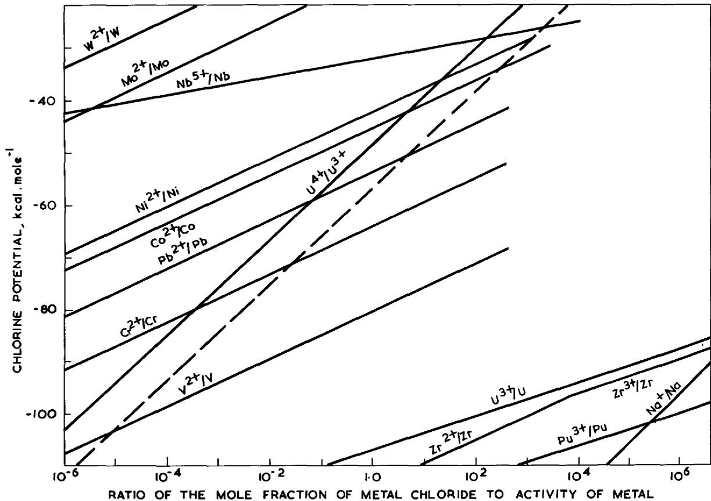  
1. Chlorine Potential Diagram at $1000^{\circ}\mathrm{K}$ .

towards reduction, even when due allowance is made for the possible dissolution of the metal in its own halide(12).

(ii) The stability of $\mathsf{PuCl}_3$ towards disproportionation is expected to be greater than that of $\mathsf{UCl}_3$ . In initial stability tests, melts containing additional $\mathsf{UCl}_3$ in place of $\mathsf{PuCl}_3$ may therefore be used, so avoiding in the early stages of investigation the complication of working with plutonium.   
(iii) The valency assumed by each of the important stable fission products at any chlorine potential may be predicted; a few examples are shown in Figure 1. The valency at $-70$ kcal.mole $^{-1}$ , along with the calculated yields $^{(43)}$ , is shown in Table 1. The nett valency of the stable fission products is rather less than the $+3$ of the fissioned nuclide, implying that as burnup proceeds the melt will become more oxidising.

Table 1. Chlorine Balance of the Major Stable Fission Products   

<table><tr><td>Fission Product</td><td>Yield(13), atoms per 100 fissions</td><td>Valency in NaCl:UCl3</td><td>Cl atoms reacted</td></tr><tr><td>Xe, Kr</td><td>25</td><td>0</td><td>0</td></tr><tr><td>Rb, Cs</td><td>19</td><td>1</td><td>19</td></tr><tr><td>Sr, Ba</td><td>10</td><td>2</td><td>20</td></tr><tr><td>Rare Earths</td><td>46</td><td>3</td><td>138</td></tr><tr><td>Zr</td><td>22</td><td>3</td><td>66</td></tr><tr><td>Nb, Mo</td><td>2</td><td>0</td><td>0</td></tr><tr><td>Te, I</td><td>6</td><td>0</td><td>0</td></tr><tr><td>Pd, Ru, Rh, 
Ag, Cd</td><td>61</td><td>0</td><td>0</td></tr><tr><td colspan="3">Total Cl atoms reacted out of 300 available</td><td>243</td></tr></table>

Since with properly chosen container materials the most easily oxidised material present in the system is UCl₃ the overall result would be an increase in the proportion of UCl₄ in the melt. A burnup of 10% of the heavy atoms would increase the ratio of UCl₄ to UCl₃ by 6%, which is at the predicted limit for the chlorine potential. Some method of reducing the UCl₄ content of the melt will thus be required. In the absence of an easily oxidisable constituent such as UCl₃ any excess chlorine - however introduced - would react with the container metal. The presence of the redox system UCl₃/UCl₄ therefore provides a buffer against large sudden changes in the chlorine potential and permits close control within the range of values in which corrosion of structural materials is minimised.

An initial experimental programme designed to provide data upon which an alloy corrosion testing programme would be based should therefore include:

(a) Development of methods of measuring chlorine potential in the chosen melt.   
(b) A measurement of the relative stabilities of UCl₃ and UCl₄ in the melt, so defining the position of the UCl₄/UCl₃ line on the Chlorine Potential Diagram. This would involve measuring the concentration ratio of the two species as a function of chlorine potential.   
(c) A similar measurement of the concentration of corrosion product chlorides for selected container metals as a function of chlorine potential.

# Oxide Behaviour

Oxide introduced inadvertently into the fuel salt might interfere with normal operation either by precipitating the oxide of some component of the salt mixture or by causing enhanced corrosion of container metals. Predictions of the behaviour of oxide in chloride melts are conveniently made by means of a modified Pourbaix Diagram similar to that suggested by Edleanu and Littlewood(14). In this diagram the abscissa is the activity of some convenient oxide - such as sodium oxide in melts containing sodium chloride - and the ordinate the chlorine potential; these may be regarded as independent variables. For any element the diagram is divided into areas in which one of the several possible phases is stable, e.g. metal at low chlorine potential and low oxide activity, the chloride at higher chlorine potential and the oxide at high oxide activity.

The metal-metal chloride boundary is defined by equations 4 and 5 and is independent of oxide activity but dependent upon the concentration of metal chloride.

The metal-metal oxide boundary is defined by the reaction:

$$
\frac {1}{2} \mathrm {C l} _ {2} (\mathrm {g}) + 1 / \mathrm {z} \cdot \mathrm {A} (\mathrm {s}) + \frac {1}{2} \mathrm {N a} _ {2} \mathrm {O} = 1 / \mathrm {z A O} _ {\mathrm {z} / 2} (\mathrm {s}) + \mathrm {N a C l} (\mathrm {d}) \quad 6.
$$

This boundary is dependent upon both chlorine potential and oxide activity, but is independent of the concentration of metal chloride. Its position is defined by the free energy change for reaction 6 ( $\Delta F_{6}$ ):

$$
\log a _ {N a _ {2} 0} = \frac {2 \Delta F _ {6}}{2 . 3 R T} + 2 \log a _ {N a C l} + 2 / z. \log \left(a _ {A O _ {z / 2}} / a _ {A}\right) = \log p \left(c l _ {2}\right)
$$

Finally the metal chloride - metal oxide boundary is defined by the reaction:

$$
1 / z \cdot A C l _ {z} (d) + \frac {1}{2} N a _ {2} O (s) = 1 / z \cdot A O _ {z / 2} (s) + N a C l (d) \quad 8.
$$

This boundary is independent of the chlorine potential but dependent upon the activity of the metal chloride $\mathsf{ACl}_z$ and is related to the free energy change of reaction 8 ( $\Delta F_8$ ) by:

$$
\log a _ {N a _ {2} 0} = \frac {2 \Delta F _ {8}}{2 . 3 R T} + 2 / z. \log a _ {A O _ {z / 2}} - 2 / z. \log a _ {A C l _ {z}} + 2 \log a _ {N a C l}
$$

In the same way boundaries for oxychlorides may be calculated. When an oxide or oxychloride is formed as a result of the oxidation of some species initially present in reduced form (eg $\mathrm{UO}_2$ from $\mathrm{UCl}_3$ ) the oxide - chloride boundary is clearly dependent upon chlorine potential.

In Figure 2 are plotted the boundaries for a selection of possible salt components and container materials. In drawing the diagram the activity of the oxide has been assumed to be unity, so that the metal - oxide and the chloride - oxide boundaries define the conditions under which the oxide will appear as a separate phase. In addition it was assumed that the activities of sodium chloride, the metal and the chloride were also unity. The manner in which the metal - chloride and the chloride - oxide boundaries move when the activity of the metal chloride is reduced by decade steps is indicated along the metal - oxide boundary.

As may be expected the diagram again illustrates the stability, already seen in the chlorine potential diagram, of container materials relative to their chlorides. The following deductions on the behaviour of oxide may be made:

(i) Oxide precipitation. The order in which the components of a salt mixture will precipitate when the oxide activity is increased at any given value of the chlorine potential is readily deduced. Of all the likely constituents of a fuel melt, uranium oxide or oxychloride will be the first to precipitate. No substantial increase in oxide activity is possible until the uranium has been removed from solution. The composition of the precipitating phase is expected to depend upon the chlorine potential. The boundary for UOCl is shown as a broken line since its stability is uncertain.

(ii) Flutonium behaviour. Even if UOCl proves to be less stable than indicated on the diagram, at all chlorine potentials greater than the lower limit of $-90$ kcal.mole $^{-1}$ imposed by the disproportionation of UCl $_3$ uranium is expected to precipitate in preference to plutonium. In this case also, in the initial

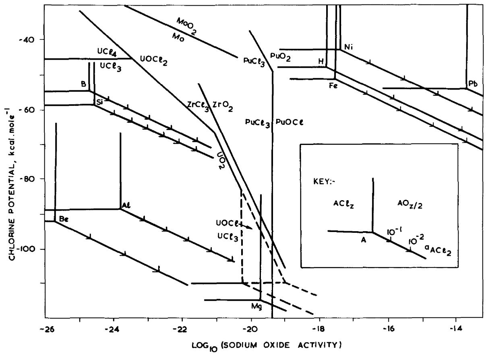  
2. Predicted Stability of Oxides, Chlorides and Metals at $1000^{\circ}\mathrm{K}$ .

experiments uranium may be substituted for plutonium in the melt.

(iii) Oxide removal. In fluoride melts containing uranium, any oxide impurity is very conveniently removed(15) - and indeed analysed - as water vapour by purging with a mixture of $\mathsf{H}_2$ and HF. In chloride melts the uranium oxide and $\mathsf{H}_2\mathsf{O} / \mathsf{HCl}$ boundaries are so remote that the removal of oxide with $\mathsf{HCl}$ is quite impractical. Indeed even with high overpressures of $\mathsf{HCl}$ the melts will be very prone to hydrolysis by any water vapour present in the system.

A possible alternative method of oxide removal is suggested by the diagram. The oxides of four elements - B, Si, Be and Al - are more stable relative to their chlorides than $\mathrm{UO_2}$ . Introducing one of these chlorides into the melt should therefore remove oxide by precipitation. All these chlorides are volatile (boiling points $15^{\circ}\mathrm{C}$ , $60^{\circ}\mathrm{C}$ , $520^{\circ}\mathrm{C}$ and $180^{\circ}\mathrm{C}$ respectively). The problems in introducing corrosive vapours into the melt, of maintaining an adequate concentration in the melt and of removing the excess reagent after filtration make the scheme unattractive but not impossible.

(iv) Protection of uranium from precipitation. In a melt containing the chlorides of both zirconium and uranium at comparable activity the two oxides are expected to precipitate at about the same oxide activity. A similar situation applies in the M.S.R.E. fluoride fuel salt, where prior precipitation of $\mathrm{ZrO}_2$ is ensured through the Mass Action Law by means of a substantial excess of $\mathrm{ZrF}_4(7)$ . With the high concentration of $\mathrm{UCl}_3$ required in the fast reactor chloride fuel salt such an artifice is not possible. The four halides discussed above would fulfil a similar function, but here also their volatility would present considerable problems in maintaining an adequate concentration in the melt.

(v) Corrosion. If oxide is added to a melt containing no chlorides which form stable oxides, the sodium oxide activity increases to a point - still far removed from saturation in sodium oxide - at which the oxide of one of the container metals, Ni, Fe, Mo etc., becomes the stable phase. Oxide impurity in such melts is notorious in causing corrosion of otherwise resistant metal containers. The presence of uranium, however, ensures that the activity of sodium oxide is held at such a low value that the activity of corrosion product oxides is also extremely low, far removed from separation as discrete phases. Corrosion of container metals by oxide formation is therefore expected to be negligible and the major single factor in determining the extent of corrosion remains the chlorine potential of the melt. Thus the presence of a substantial amount of uranium stabilises the melt against increases in the oxide activity as well as in chlorine potential.

(vi) Oxide solubility. While a uranium-containing phase is expected to be the first phase to precipitate on adding oxide to a chloride fuel salt, the actual concentration of oxide in the melt at saturation cannot be predicted. This is a most important aspect, since oxide will inevitably be introduced into the fuel salt during operation. The solubility of oxide then determines the rate at which the melt must be reprocessed to remove oxide for a given rate of oxygen ingress in order to avoid precipitation.

In the initial studies the determination of oxide solubility in the melt over a range of conditions of chlorine potential and temperature is therefore of prime importance.

# Experimental results and discussion

The composition, and in particular the concentrations of uranium and plutonium, of a chloride fuel salt would be determined by the details of the reactor design under consideration. For the present studies a melt of nominal composition NaCl 70 mole%, UCl₃ 30 mole% was selected as typical of the compositions which might be employed. The liquidus temperature at this composition is ca. 550°C, close to the single eutectic at 525°C and 33 mole% UCl₃ (16).

# Preparation and analysis of salt mixtures

Salt mixtures containing UCl₃ or UCl₄ are hygroscopic. In the absence of a convenient method of removing oxide from the melt, the constituents of salt mixtures were initially prepared so as to minimise the oxide content. Subsequent handling was carried out in a glove box flushed with argon dried over a molecular sieve. Experimental measurements on the molten salts were made in vacuum-tight vessels, normally of nickel, under a cover gas of either argon purified over hot uranium or hydrogen purified by diffusion through a palladium-silver membrane.

Sodium chloride was of analytical grade and, after drying by slowly heating to $400^{\circ}\mathrm{C}$ under vacuum, contained less than 10 ppm oxygen. Uranium tetrachloride was prepared in 50 g. batches by reaction of finely divided, low-fired $(400^{\circ}\mathrm{C})$ $\mathrm{UO}_2$ with $\mathrm{CCl}_4$ vapour at $450^{\circ}\mathrm{C}$ and purified by vacuum distillation in a horizontal silica tube at $600^{\circ}\mathrm{C}$ on to a liner of molybdenum foil located in the cooler part of the tube. In order to minimise the carry-over of oxide contamination it was found essential to insert a plug of silica wool, 1 cm. deep, close to the charge of $\mathrm{UCl}_4$ . After two distillations and handling in the dry box the oxide concentration was less than 0.1 wt.% This was determined either by inert gas fusion of 30 mg. samples or by weighing the residue of $\mathrm{UO}_2$ remaining after removing the $\mathrm{UCl}_4$ from a 1 g. sample by vacuum distillation at $600^{\circ}\mathrm{C}$ . Uranium trichloride was prepared by reducing the distilled $\mathrm{UCl}_4$ under hydrogen in batches of up to

200 g. in a nickel apparatus lined with molybdenum foil. The bulk of the reduction was effected at $550^{\circ}\mathrm{C}$ . The temperature was slowly raised to $650^{\circ}\mathrm{C}$ and maintained until the rate of evolution of HCl had dropped to negligible proportions, when the total HCl evolved corresponded to within $2\%$ of the stoichiometric amount. The oxide level, again determined by inert gas fusion or by vacuum distillation at $1000^{\circ}\mathrm{C}$ showed no significant increase over that of the $\mathrm{UCl}_4$ feed material.

Stability of UCl₄ in the NaCl:UCl₃ Melt

The stability of $\mathrm{UCl}_4$ with respect to $\mathrm{UCl}_3$ was measured by determining the chlorine potential in the melt as a function of the concentration ratio of the two species. The chlorine potential was measured in two ways, firstly by measurement of the equilibrium partial pressure of HCl produced when hydrogen was passed through the melt and secondly by measuring the potential of the $\mathrm{UCl}_4 / \mathrm{UCl}_3$ redox electrode against a reference electrode of known potential with respect to the standard chlorine electrode.

Hydrogen Equilibration Experiments. In these experiments uranium tetrachloride, dissolved in molten sodium chloride, was reduced by hydrogen to the trichloride according to the equation:

$$
\mathrm {U C l} _ {4} (\mathrm {d}) + \frac {1}{2} \mathrm {H} _ {2} (\mathrm {g}) = \mathrm {U C l} _ {3} (\mathrm {d}) + \mathrm {H C l} (\mathrm {g})
$$

From a measurement of the equilibrium partial pressure $(p_{\mathrm{HCl}})$ produced when hydrogen is passed through the melt containing known amounts of $\mathrm{UCl}_4$ and $\mathrm{UCl}_3$ the equilibrium quotient for the reduction reaction $(Q_R)$ is derived:

$$
Q _ {R} = \left(x _ {U C l _ {3}} / x _ {U C l _ {4}}\right) \left(p _ {H C l} / p _ {H _ {2}} ^ {\frac {1}{2}}\right) \tag {10.}
$$

Since the free energy of formation of HCl, $\Delta F^{f}(\mathrm{HCl})$ is well known(17) the difference in the partial molar free energies of formation of UCl and UCl3 in the melt, $\Delta F^{f}(UCl_{4}-UCl_{3})$ , is readily found:

$$
\Delta \overline {{F}} ^ {f} \left(U C l _ {4} - U C l _ {3}\right) = \Delta F ^ {f} (H C l) + R T \ln Q _ {R} \tag {11.}
$$

It is this free energy function measured in the melt, rather than the corresponding function for the pure liquids, which is more appropriately used in correlating the behaviour of $\mathrm{UCl}_4$ in the melt, as in Figures 1 and 2.

To measure the equilibrium quotient $Q_{R}$ , hydrogen was passed at a rate of ca. 30 ml.min $^{-1}$ through about 150 g. of melt (ca. 50 ml) contained in a nickel vessel, previously pickled, dried and fired

in hydrogen. The HCl content of the effluent gas from the reaction vessel was measured by passing the stream through a coulometric titration cell furnished with a glass pH electrode. At the same time the volume of hydrogen leaving the coulometric cell during the titration was accurately measured by means of a climbing soap-film gas burette. The partial pressure of HCl in the hydrogen was calculated by correcting to S.T.P., allowing for the saturated water vapour pressure in the gas burette and assuming ideal behaviour of HCl at the low partial pressures involved (less than $10^{-2}$ atm.).

Even with the dip-line at its maximum depth of 10 cm, the equilibrium pressure of HCl was not attained. A known partial pressure of HCl, measured in the usual way, was therefore introduced into the inlet gas stream by passing the hydrogen through a bed of ferrous chloride held at a predetermined temperature. From a series of four or more measurements with inlet HCl pressures both above and below the equilibrium value the required equilibrium partial pressure was interpolated graphically. The equilibrium pressures were constant over periods of tens of hours and reproducible after temperature cycling.

The composition of the salt mixture initially loaded into the reaction vessel was 70 mole % NaCl with 30 mole % of mixed UCl₃ and UCl₄, typically in the ratio 1.5:1.0. After equilibrium measurements had been made over a range of temperatures at a given composition, the UCl₄ content was reduced by a known amount by introducing into the melt under argon a weighed sample of uranium metal (0.5 to 1.0 g.) suspended on a molybdenum wire. A series of equilibrium measurements were thus obtained over a range of values of the concentration ratio of UCl₄:UCl₃, from which the equilibrium quotient was obtained from the slope of the plotted data, Figure 3. Within experimental error the plots at each temperature extrapolate to zero pHCl at the point anticipated from the initial composition of the melt.

The derived values of the equilibrium quotient $\mathbb{Q}_{\mathbb{R}}$ from two duplicate series of experiments are plotted logarithmically against reciprocal temperature in Figure 4 and summarised in Table 2. In the table are also summarised the difference in the partial molar free energies of formation of $\mathrm{UCl}_4$ and $\mathrm{UCl}_3$ and the ratio of their activity coefficients obtained by combining the partial molar free energy difference with the corresponding value for the pure liquids. Within experimental error the values of the function $\mathrm{RTln}\gamma (\mathrm{UCl}_4) / \gamma (\mathrm{UCl}_3)$ are independent of temperature with an average of $4.5 \pm 0.2 \, \text{kcal} \cdot \text{mole}^{-1}$ .

Electrochemical Measurement of the UCl<sub>4</sub>/UCl<sub>3</sub> Equilibrium. The e.m.f. of the cell:

$(=)$ Mo(Pb)/Uc14:Uc13 in NaCl//PbCl2 in NaCl/Pb(Mo)(+)

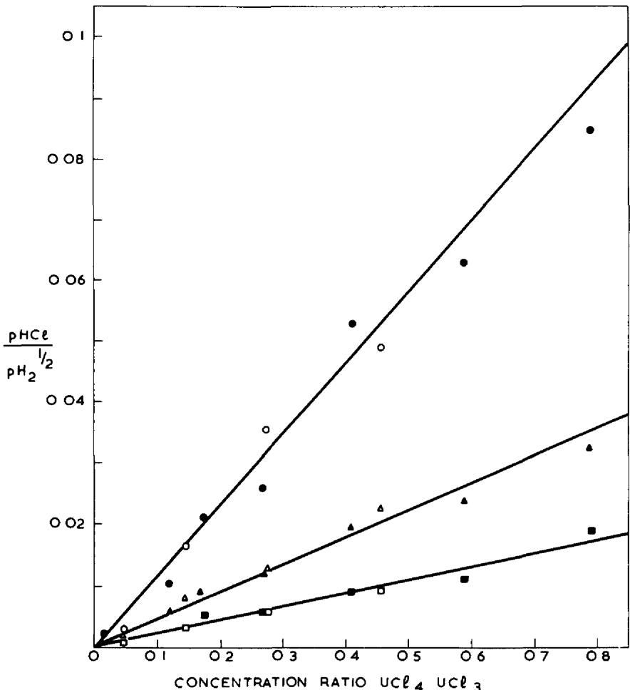  
SOLID POINTS FIRST SERIES; OPEN POINTS SECOND SERIES. 720C 650C 580C

3. Hydrogen Reduction of UCl₄ in NaCl:UCl₃. Plot of equilibrium pressure of HCl versus UCl₄:UCl₃ ratio' (Equation 10).

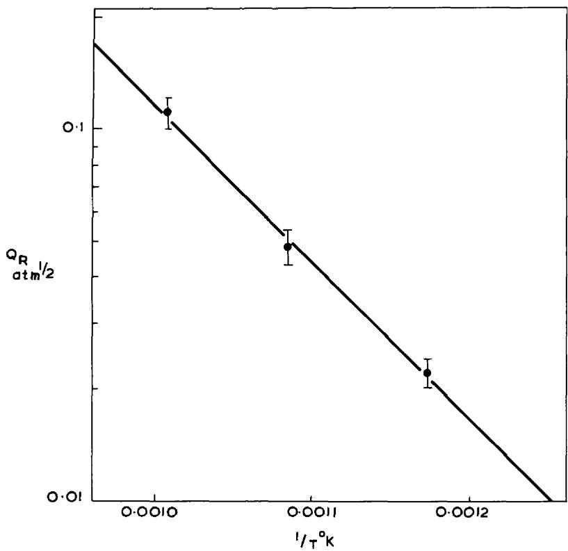  
4. Temperature Variation of the Equilibrium Quotient $Q_{R}$ for the Hydrogen Reduction of UCl<sub>4</sub> in NaCl:UCl<sub>3</sub>.

has been measured at temperatures of 614, 681, and $730^{\circ}\mathrm{C}$ over a range of values of the $\mathsf{UCl}_4$ : $\mathsf{UCl}_3$ concentration ratio.

Table 2. Equilibrium Quotients for the Hydrogen Reduction of UCl, in NaCl:UCl3 (70 mole % NaCl) and Derived Thermodynamic Data   

<table><tr><td>Temperature °C</td><td></td><td>580</td><td>650</td><td>720</td></tr><tr><td>102QR, atm1/2</td><td></td><td>2.1</td><td>4.8</td><td>10.9</td></tr><tr><td>RTln QR</td><td>kcal.mole-1</td><td>-6.5</td><td>-5.6</td><td>-4.4</td></tr><tr><td>ΔF(F(HCl))(17)</td><td>&quot;</td><td>-23.8</td><td>-23.9</td><td>-24.0</td></tr><tr><td>ΔF(F(UCl4-UCl3))</td><td>&quot;</td><td>-30.3</td><td>-29.5</td><td>-28.4</td></tr><tr><td>ΔF(F(UCl4-UCl3)(8))</td><td>&quot;</td><td>-25.8</td><td>-24.9</td><td>-24.1</td></tr><tr><td>RTln γ(UCl4)/γ(UCl3)</td><td>&quot;</td><td>-4.5</td><td>-4.6</td><td>-4.3</td></tr></table>

The redox electrode consisted of a closed silica or alumina tube $1.2\mathrm{cm}$ . in diameter containing a small bead of lead with a molybdenum contact wire. The compartment was filled, through a hole one millimetre in diameter drilled $6\mathrm{cm}$ . from the closed end, by immersion in a bath of melt contained in a nickel vessel. When filled the electrode compartment was raised so that the hole was about $5\mathrm{mm}$ . above the melt surface. This both defined the quantity of melt contained in the compartment and essentially prevented mixing of the melt in the compartment with that in the bulk. Adequate electrical conductivity was achieved through the film of melt adhering to the wall of the tube.

Changes in the concentration of UCl, in the compartment were produced by electrochemical oxidation or reduction, the total charge passing between the compartment and a nickel auxiliary electrode being measured by an integrating coulometer. Oxidation in dilute solution has been shown to proceed in two stages (18); electrochemical oxidation of the electrode followed by a homogeneous reaction of the oxidation product with UCl. In order to eliminate excessive loss of molybdenum and contamination of the melt with a molybdenum dispersion, current was passed into the melt through a small pool of lead during oxidation. Conversely, during reduction the molybdenum wire was removed from the lead to avoid dissolution of the deposited uranium.

The reference electrode consisted of liquid lead in contact with a molten mixture of NaCl and $\mathsf{PbCl}_2$ (40.0 mole $\%$ $\mathsf{PbCl}_2$ ). This was contained in a closed tube of Mullite in which sodium ions are mobile; the impedance of the electrode was less than 2.103 ohms. Electrical contact to the lead electrode was made through an insulated molybdenum wire, as in the redox electrode, so that the thermal e.m.f. was eliminated. The e.m.f. of the reference electrode against the standard chlorine electrode was

calculated from the free energy of formation of $\mathsf{PbCl}_2^{(17)}$ , the composition of the melt and the activity coefficient of $\mathsf{PbCl}_2$ in NaCl estimated by Lumsden from the phase diagram (19). This is in good agreement with the average value derived from electrochemical measurements (20) (0.84 and 0.73 respectively at $700^{\circ}\mathrm{C}$ ).

The whole cell was flushed continuously with pure argon at a pressure of $20~\mathrm{mm}$ . Hg above atmospheric pressure. Suitably placed holes ensured that the hydrostatic pressure was balanced through out the electrode compartments. The cell voltage was measured to +0.1 mV on a Solartron Digital Voltmeter and, for convenience, the output of a Vibron Electrometer was displayed on a strip recorder. The input impedances of both the instruments (>10⁷ ohm) far exceeded the impedance of the cell (2.10³ ohm.)

In initial tests the reversibility and stability of the redox electrode were confirmed using a pair of the electrodes in a concentration cell. After an oxidation or reduction, gentle agitation of the wire contact in the compartment produced a stable e.m.f. within a few minutes; this then remained stable to $+2\mathrm{mV}$ for periods of up to several hours. Measurements were normally made some 30 min. after a concentration change. As is to be expected under equilibrium conditions the e.m.f. was the same whether the Mo contact was immersed in or removed from the lead pool.

Attempts were made to measure the a.m.f. of the cell:

$$
\left(-\right) \mathrm {U} (\mathrm {M o}) / \mathrm {U C l} _ {3} \text {i n N a C l} / / \mathrm {P b C l} _ {2} \text {i n N a C l} / \mathrm {P b} (\mathrm {M o}) (+)
$$

by depositing electrochemically a few milligrams of uranium on the Mo wire which was either removed from the lead pool or, in separate tests, operated in a compartment free of lead. Here a stable e.m.f. persisted for only a short time, about 10 min., and the reproducibility was poor. Uranium is known to react rapidly with silica when both are in contact with a melt containing UCl₃(21).

In Figure 5 the observed cell e.m.f. is plotted against the logarithm of the UCl<sub>4</sub>:UCl<sub>3</sub> concentration ratio. The slopes of the plots are summarised and compared with the calculated values for a one-electron transfer in Table 3. Also summarised are the standard potentials extrapolated to equal concentrations of UCl<sub>4</sub> and UCl<sub>3</sub> and the data used in deriving the difference in partial molar free energies of formation and the activity coefficient ratio. Within experimental error the difference in excess free energy, RTln $\gamma(UCl_4)/\gamma(UCl_3)$ , is independent of temperature with an average of $2.6 \pm 0.3$ kcal.mole<sup>-1</sup>.

Discussion. Both methods of measurement show that $\mathrm{UCl}_4$ is less reactive in the NaCl:UCl $_3$ melt than in the pure liquid. The

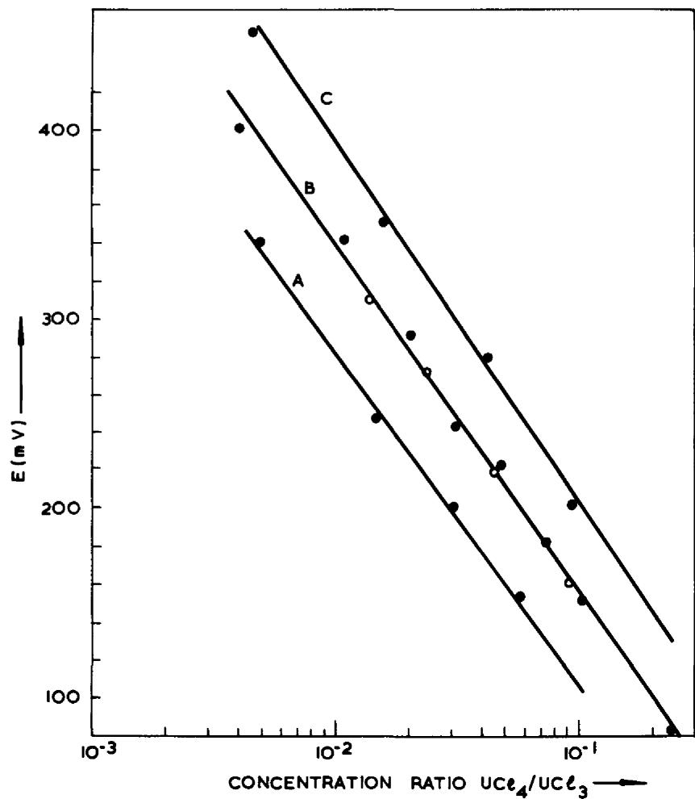  
A) 614°C   
B) 681oc  
c) $750^{\circ} \mathrm{C}$   
POINTS FOR A AND B DISPLACED BY -50mv AND +50mv RESPECTIVELY

5. Potential of the cell $\mathsf{Mo} / \mathsf{UCl}_4:\mathsf{UCl}_3$ in NaCl//PbCl2 in NaCl/Pb.

Table 3. Potential of the Mo/UCL, :UCL3 Electrode and Derived Thermodynamic Data   

<table><tr><td>Temperature °C</td><td></td><td>614</td><td>681</td><td>730</td></tr><tr><td rowspan="2">Nernst Slope, mv.</td><td>observed</td><td>174</td><td>188</td><td>195</td></tr><tr><td>calculated</td><td>176</td><td>188</td><td>199</td></tr><tr><td colspan="2">Cell Potential at (UCL₄) = (UCL₃), v.</td><td>-0.03</td><td>-0.03</td><td>-0.04</td></tr><tr><td colspan="2">Std. Potl. of Pb/FbCl₂ in NaCl, v.</td><td>-1.24</td><td>-1.21</td><td>-1.19</td></tr><tr><td colspan="2">Std. Potl. of UCL₄/UCL₃ in NaCl, v.</td><td>-1.21</td><td>-1.18</td><td>-1.15</td></tr><tr><td colspan="2">ΔFf(UCL₄-UCL₃) kcal.mole⁻¹</td><td>-28.0</td><td>-27.2</td><td>-26.6</td></tr><tr><td colspan="2">ΔFf(UCL₄-UCL₃)(8) ″</td><td>-25.4</td><td>-24.6</td><td>-24.0</td></tr><tr><td colspan="2">RTln γ(UCL₄)/γ(UCL₃) ″</td><td>-2.6</td><td>-2.6</td><td>-2.6</td></tr></table>

extent of stabilisation, as expressed by the excess partial molar free energy, is 4.5 kcal.mole $^{-1}$ from the hydrogen equilibration experiments and 2.6 kcal.mole $^{-1}$ from the electrochemical measurements. Remembering the uncertainties in the thermodynamic functions used in deriving these values the agreement is satisfactory. Since it is more directly derived, the former value is to be preferred.

The linearity of the plots of Figures 3 and 4 indicates that within experimental error the ratio of the activity coefficients of UCl₄ and UCl₃ is independent of melt composition, even though the molar ratios NaCl:UCl₃:UCl₄ ranged from 70:29.7:0.03 to 70:17:13.

From the experimentally determined activity coefficient ratio the activity coefficient of UCl<sub>4</sub> can be obtained from an estimate of that for UCl<sub>3</sub> in NaCl. This may be derived from the liquidus data for the NaCl:UCl<sub>3</sub> system<sup>(16)</sup> and estimated from the transient potentials of the U/UCl<sub>3</sub> electrode described above. In addition the coefficient for the similar trichlorides of cerium<sup>(20)</sup> and plutonium<sup>(22)</sup> in NaCl have been reported. The excess partial molar free energy of formation, RTln $\gamma (\mathrm{MCl}_3)$ , extrapolated where necessary to a mole fraction of the trichloride of 0.3 by assuming regular solution behaviour, are, in kcal.mole<sup>=1</sup>:

```txt
from UCl3 liquidus data from the U/Uc13 potential from the Pu/PuCl3 potential for CeCl3 Average value 
```

Over the temperature range 600 to $800^{\circ}\mathrm{C}$ the average value for the activity coefficient of $\mathsf{UCl}_3$ is therefore $0.25\pm 0.10$

Combining these data with the data of Table 2 yields $\text{RTln } \gamma(\text{UCl}_4) = -7.2 \pm 0.8 \, \text{kcal.mole}^{-1}$ , with an average value for the activity coefficient of $\text{UCl}_4$ between 600 and $800^{\circ}\text{C}$ of $0.025 \pm 0.010$ .

The low activity coefficient implies that melts containing UCl₄ will be considerably less oxidising than the simple analysis of Figure 1 suggests; the experimentally determined relationship is shown by the broken line. The UCl₄/UCl₃ concentration ratio at the upper limit of chlorine potential of -60 kcal.mole⁻¹ is an order of magnitude higher than the 6% predicted assuming ideal behaviour in the melt. Alternatively, the concentration of a divalent corrosion product at any concentration of UCl₄ is a hundred times less than predicted.

Furthermore the vapour pressure of $\mathrm{UCl}_4$ over the melt will be much less than that over the pure liquid. At $800^{\circ}\mathrm{C}$ this is ca. 900 mm. $\mathrm{Hg}(23)$ , while over the melt at a $\mathrm{UCl}_4 / \mathrm{UCl}_3$ concentration ratio of 0.1 it is estimated to be 0.7 mm Hg.

Corrosion of Metals

Qualitative observations of the condition of small nickel and molybdenum components after exposure to the melt under wide ranges of chlorine potential and oxide content are encouraging; no evidence of significant attack has been noted.

Measurements are at present being made of the equilibrium quotient, $Q_{C}$ , for the corrosion reaction between a series of metals, $M$ , and $UCl_{4}$ dissolved in the NaCl: $UCl_{3}$ melt:

$$
M (s) + y U C l _ {4} (d) = M C l _ {y} (d) + y U C l _ {3} (d); Q _ {C} = x _ {M C l _ {y}} \left(x _ {U C l _ {3}} / x _ {U C l _ {4}}\right) ^ {y}
$$

The equilibrium quotient, $Q_{c}(\mathrm{Ni})$ , has been measured by determining the concentration of $\mathrm{NiCl}_{2}$ in the melt at known values of the concentration ratio of $\mathrm{UCl}_{4} : \mathrm{UCl}_{3}$ . Preliminary data at $650^{\circ}\mathrm{C}$ yield $Q_{C}(\mathrm{Ni}) = 2.10^{+4}$ . This may be compared with the thermodynamic equilibrium constant, $K_{C}(\mathrm{Ni})$ , calculated from free energy data for the corresponding reaction involving pure liquid $\mathrm{UCl}_{1}$ and $\mathrm{UCl}_{3}$ and solid nickel chloride ( $\mathrm{NiCl}_{2}$ sublimes without melting); $K_{C}(\mathrm{Ni}) = 4.10^{+2}$ . Combining this with the measured activity coefficient ratio for $\mathrm{UCl}_{4}$ and $\mathrm{UCl}_{3}$ and assuming that $\gamma (\mathrm{NiCl}_{2}) = 1.0$ yields a calculated value of $Q_{C}(\mathrm{Ni}) = 3.10^{+4}$ , close to the experimental value. Nickel chloride is thus behaving almost ideally in the melt.

For lead, $Q_{C}(Pb)$ can be estimated from the reported composition(24) of an equimolar KCl:NaCl melt containing a total of 6% or

uranium chlorides in equilibrium with metallic lead; $\mathsf{Q}_{\mathsf{C}}(\mathsf{Pb}) = 10^{-2}$ , compared with the calculated thermodynamic constant, $\mathsf{K}_{\mathsf{C}}(\mathsf{Pb}) = 10$ . The activity coefficient ratio of $\mathsf{UCl}_4$ and $\mathsf{UCl}_3$ is probably less than the 0.1 observed in NaCl: $\mathsf{UCl}_3$ , which, with $\gamma (\mathsf{PbCl}_2) = 1.0$ , yields a calculated $\mathsf{Q}_{\mathsf{C}}(\mathsf{Pb})$ of $< 10^{-1}$ , consistent with the experimental value. In addition, in the electrochemical oxidation of $\mathsf{UCl}_3$ in the presence of lead the production of significant amounts of $\mathsf{PbCl}_2$ would have been shown by a change in the Nernst slope at high concentrations of $\mathsf{UCl}_4$ . No deviations were noted, implying that $\mathsf{Q}_{\mathsf{C}}(\mathsf{Pb}) < 10^{-1}$ , again consistent with the calculated value. Lead chloride also appears to be behaving ideally in the melt.

# Oxide Behaviour

The relationships between the various oxide and oxychloride species which may exist either in solution or as a solid phase in equilibrium with the melt are likely to be complex (Figure 2). Since the technologically significant parameter is the ability of the melt to carry oxide in solution, this has been measured as a function of temperature and chlorine potential. In separate experiments the stability of the various possible solid phases is being investigated.

Determination of Oxide Solubility. This has been carried out by two independent methods. In one, the first appearance of a precipitate was observed visually while oxide was slowly added to the melt as water vapour in a stream of hydrogen. In the other, small samples of oxide-saturated melt were removed through a nickel filter and analysed for oxygen by inert gas fusion.

For the controlled precipitation experiments direct observation of the precipitate is not possible, since the melt appears black except when viewed through a very thin section due to the intense absorption and high concentration of UCl₃. The point of precipitation was therefore observed by introducing a light-guide consisting of a silica rod 8 m.m. in diameter into the melt to within about 0.5 mm of the optical window which formed the bottom of the silica container. The precipitate then showed as a shadow against the burgundy red of the thin section of melt. With the light-guide raised, water vapour was introduced into the melt in a stream of hydrogen. The total amount of oxide introduced was found from both the quantity of water vapour passed into the melt and the amount of HCl produced by hydrolysis. In addition, the oxide content was confirmed by analysis of filtered samples of the saturated melt. No evidence for attack of the silica was found; over several weeks exposure the optically ground end of the light-guide retained its high finish and sharp edges.

In determining the solubility by sampling, about $150\mathrm{g}$ . of melt was contained in a nickel vessel similar to the one used for

the hydrogen purge experiments. Excess oxide was added as low- fired $\mathsf{UO}_2$ and the $\mathsf{UCl}_4$ content of the melt reduced to a low value by reduction with uranium suspended on a molybdenum support. At intervals through the experiment the $\mathsf{UCl}_4$ content was increased in appropriate steps by adding known amounts of $\mathsf{UCl}_4$ pre-fused with NaCl to maintain the correct ratio of U:Na. Samples of about 1 g. were removed by gentle suction applied to a nickel filter stick closed with a $1.4\mu$ filter. This was introduced into the vessel through an airlock system which also served to transport the sample to an argon dry-box without exposure to air. Weighed fragments, normally in triplicate, were analysed by inert gas fusion. A series of samples taken at intervals during steady conditions confirmed that equilibrium solubility had been achieved. Normally after changing the conditions constant values of the oxide content were obtained after 24 hours.

The data from both experiments showing the effect of the UCl₄ concentration at 650°C are presented in Figure 6a, where the solubility is seen to increase with increasing UCl₄ content. Were the dissolution process a simple ionisation of UO₂ to U⁺⁺ and O²⁻⁻ the addition of U⁺⁺ would, from the solubility product, depress the oxide solubility. Interaction between the ions is clearly stabilising the oxide ion in solution. The formation of a stable discrete UO²⁺ species in the melt can, however, be excluded, since this would bring about a much greater dependence of dissolved oxide on UCl₄ content, as indicated by the broken line of Figure 6a.

The effect of temperature on the solubility of oxide is illustrated in Figure 6b. Here the data points lying in the range of $\mathrm{UCl}_4 / \mathrm{UCl}_3$ concentration ratio from 0.0 to 0.15 have been normalised to a ratio of 0.05 with the aid of Figure 6a; data at higher concentrations of $\mathrm{UCl}_4$ are not included. The effect of temperature is small, and is obscured by the scatter of the data. A full line with a negative temperature coefficient is drawn between 570 and $650^{\circ}\mathrm{C}$ . Repeated observations of the appearance and disappearance of the precipitate during temperature cycling have clearly demonstrated a negative coefficient over this region for values of the concentration ratio of up to 0.1. Above $650^{\circ}\mathrm{C}$ the effect of temperature was found to be slight, and the sign of the coefficient could not be deduced.

The magnitude of the solubility even at the minimum is acceptably high for reactor operation. The weighted average of all values at $650^{\circ}\mathrm{C}$ and low UCl, content is 0.18 wt.% while the minimum recorded value is 0.09 wt.% With an oxygen in-leakage of 20 g. per day a reprocessing rate of 10 litres per day (representing 0.1% per day of the fuel salt in a typical reactor) would maintain the oxide concentration below 0.03 wt.% well below the solubility limit.

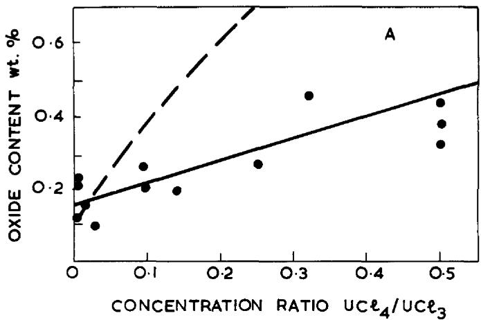

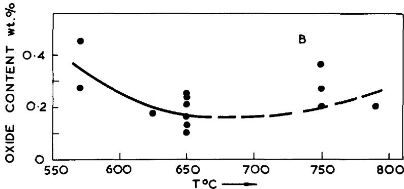

6. Solubility of Oxide in NcCl: UCl₃: UCl₄.

(30 mol % uranium chlorides)

A. Effect of UCl1/UCl3 Concentration ratio at 650°C.   
B. Effect of Temperature at $\mathrm{UCl}_{4} / \mathrm{UCl}_{3} = 0.05$ .

Phase Relationships. Experiments have been carried out which, when combined with free energy data, permit deductions to be made of the stability of the various possible oxygen-containing phases.

$\mathrm{UOCl}_2$ : Combining the extrapolated data on the decomposition pressure of $\mathrm{UCl}_4$ over $\mathrm{UOCl}_2^{(25)}$ with the vapour pressure over liquid $\mathrm{UCl}_4^{(23)}$ gives the thermodynamic equilibrium constant for the decomposition reaction. From this constant, the limiting $\mathrm{UCl}_4$ activity above which $\mathrm{UOCl}_2$ becomes the stable phase is estimated. Using the measured activity coefficient the corresponding limiting mole fraction of $\mathrm{UCl}_4$ in the melt is found to be 0.3 at $580^{\circ}\mathrm{C}$ and 0.9 at $800^{\circ}\mathrm{C}$ . Although in none of the oxide solubility experiments was the concentration of $\mathrm{UCl}_4$ sufficiently high to produce $\mathrm{UOCl}_2$ as a separate phase, the increased stability of $\mathrm{UOCl}_2$ in solution at the lower temperature could account for the observed negative temperature coefficient of solubility, (Figure 6b). The instability of solid $\mathrm{UOCl}_2$ has been confirmed in a series of experiments in which it was heated in contact with melt in silica ampoules at $650^{\circ}\mathrm{C}$ . Even with melts rich in $\mathrm{UCl}_4$ the major oxygen-containing phase found by X-ray analysis was $\mathrm{UO}_2$ .

UOCl: The formation of small quantities of UOCl in the residues after vacuum distillation of UCl₃ at 1000°C has been reported(26). Lattice parameters were reported but no indication of its stability at high temperatures was given. Gregory(25) has measured the pressure of HCl produced on heating UOCl₂ in hydrogen between 300 and 450°C. At 600°C we have measured a pressure of 5.5 10⁻² atm, in good agreement with 6.8 10⁻² atm. extrapolated from Gregory's data. If UOCl is assumed to be the reaction product its free energy of formation may be calculated; this formed the basis of the UOCl boundary in Figure 2. An alternative to complete reduction to UOCl is the more likely partial reduction to UO₂ and UCl₃. The HCl pressure calculated for partial reduction by combining data on the vapour pressure of UCl₄ over UOCl₂(25) and solid UCl₆ with the pressure of HCl in the reduction of UCl₄(23) is 6.5 10⁻², close to the experimental values. Furthermore X-ray examination gave no evidence for a UOCl phase after 20% reduction of the UOCl₂.

The UOCl phase is therefore less stable than indicated in Figure 2; in the solubility measurements no oxide phase other than $\mathrm{UO}_2$ has been observed by X-ray analysis of the precipitates.

# Conclusions

The results of the chemical investigations on molten NaCl:UCl₃ are most encouraging for the molten chloride reactor concept. Measurements of the stability of UCl₄ and the preliminary corrosion studies both show that in the melt UCl₄ is less corrosive than predicted from thermodynamic data. The range of permitted UCl₄ concentration is wide, so simplifying the control of chlorine potential in the fuel salt.

The solubility of oxide varies slightly with both temperature and $\mathrm{UCl}_4$ concentration. Even at the minimum, the solubility is sufficient to make it possible to prevent precipitation by processing the melt at an acceptable rate. At present, however, no method - other than complete reconstitution of the fuel salt - for removing oxide has been demonstrated.

# Acknowledgements

We are please to acknowledge the valuable contributions made by E. A. Terry, of Analytical Sciences Division, in performing the oxygen analyses, and by P. Hodgson, P. Harris and D. Stinchcombe during brief attachments as students in training. Fruitful discussions with colleagues, in particular H. K. Killingback of A. E. E., Winfrith, are gratefully acknowledged.

# References

1. Haubenreich, P. N., "Molten Salt Reactor Progress", Nuclear Engineering International, Vol. 14, No. 155, April 1969, pp. 325-329.   
2. Barthold, W. P., "The Concept of the Epithermal Molten Salt Reactor", Atomkernenergie, Vol. 12, No. 1/2, Jan./Feb. 1967, pp. 5-15.   
3. Taube, M., M. Mielcarski, S. Poturaj-Gutniak and A. Kowalew, "New Boiling Salt Fast Breeder Reactor Concepts", Nuclear Engineering and Design, Vol. 5, No. 2, March 1967, pp. 109-112.   
4. Nelson, P. A., D. K. Butler, M. G. Chasanov and D. Meneghetti "Fuel Properties and Nuclear Performance of Fast Reactors Fueled with Molten Chlorides", *Nuclear Applications*, Vol. 3, No. 9, Sept. 1967, pp. 540-547.   
5. Bettis, E. S. "Fused-salt Fueled, Molten-Metal-Cooled Power Breeder Reactor System", U.S. Patent No. 3, 262, 856, 1966.   
6. Moore, R. V. and S. Fawcett, "Present and Future Types of Fast Breeder Reactors", Evans, P.U. (Ed.). Fast Breeder Reactors, Pergamon Press, Oxford, 1967. pp. 110-112.   
7. Grimes, W. R., "Chemical Research and Development for Molten Salt Breeder Reactors", ORNL-TM-1853, 1967, Oak Ridge National Laboratory, Tennessee.   
8. Rand, M. H. and O. Kubaschewski, "The Thermochemical Properties of Uranium Compounds", Oliver and Boyd, Edinburgh, 1963.   
9. Rand, M. H. "Thermochemical Properties", Atomic Energy Review, International Atomic Energy Agency, Vienna, Vol. 4, Special Issue No. 1, 1966.   
10. Glassner, A., "A Survey of the Free Energies of Formation of the Fluorides, Chlorides and Oxides of the Elements to 2500K", ANL-5107, 1953. Argonne National Laboratory, Illinois.   
11. Thamer, B. J., "Corrosion Tests of Hastelloy N, Inconel 600 and Hymu-80 Exposed to UCl₃ - KCl at 900°C", LA-3476-MS, 1966, Los Alamos Scientific Laboratory, Los Alamos.   
12. Bredig, M. A., "Mixtures of Metals with Molten Salts", Blander M., (Ed.). Molten Salt Chemistry, John Wiley & Sons, New York, 1964, pp. 367-425.   
13. Taube, M., "Fused Plutonium and Uranium Chloride as Fuel for Fast Reactors", Report 414/V, 1963. Institute for Nuclear Research, Warsaw, Poland.

14. Edeleanu, C., and R. Littlewood, "Thermodynamics of Corrosion in Fused Chlorides", Electrochimica Acta, Vol. 3, No. 3, Oct. 1960, pp. 195-207.   
15. Matthews, A. L. and C. F. Baes, Jr., "Oxide Chemistry and Thermodynamics of Molten LiF - BeF₂ Solutions". Inorganic Chemistry, Vol. 7, No. 2, Feb. 1968. pp. 373-382.   
16. Thoma, R. E., (Ed.) "Phase Diagrams of Nuclear Reactor Materials", ORNL-2548, 1959, Oak Ridge National Laboratory, Tennessee, pp. 133.   
17. Kubaschewski, O., E. L. L. Evans and C. B. Alcock, "Metal-lurgical Thermochemistry", Pergamon Press, Oxford, 1967. pp. 324.   
18. Hill, D. L., Jeanne Perano and R. A. Osteryoung, "An Electrochemical Study of Uranium in Fused Chlorides", Journal of the Electrochemical Society, Vol. 107, No. 8, Aug. 1960, pp. 698-705.   
19. Lumsden, J., "Thermodynamics of Molten Salt Mixtures", Academic Press, London, 1966.   
20. Dijkhuis, C., R. Dijkhuis and G. J. Janz, "Molten Salt Electromotive Force Formation Cells", Chemical Reviews, Vol. 68, No.3, June, 1968. pp. 253-275.   
21. McIver, E. J., "Galvanic Cell for Measuring Uranium Activity in Carbides at High Temperatures", AERE-R-4983, 1966. Atomic Energy Research Establishment, Harwell, England.   
22. Silin, V. I., O. V. Skiba, M. V. Smirnov, G. N. Yakovlev and E. A. Prihodko, "Investigation of the Equilibrium between Metallic Plutonium and its Ions in Fused Chlorides. Atomnaya Energiya, Vol. 25, No. 1, June 1968, pp. 26-29.   
23. Katz, J. J., and E. Rabinowitch, "Uranium Chlorine Compounds", The Chemistry of Uranium. McGraw-Hill Book Company, Inc., New York, 1951, pp. 450-512.   
24. Karzhavin, S. V., I. F. Nichkov and S. P. Raspopin, "The Ionic Composition of Fused Mixtures of Sodium, Potassium, Lead and Uranium Chlorides", Ukrainskii Khimicheskii Zhurnal, Vol. 34, 1968. pp. 412-413.   
25. Katz, J. J. and E. Rabinowitch, "Uranium Oxylalides", The Chemistry of Uranium, McGraw-Hill Book Company, Inc., New York, 1951. pp. 564-599.   
26. Shchukarev, S. A., and A. E. Efirnov, "The Oxychloride of Trivalent Uranium", Russian Journal of Inorganic Chemistry, Vol. 2, No. 10, 1957, pp. 37-42. (A.E.C.-tr-4060.)

# CONTAINMENT MATERIALS FOR PYROCHEMICAL PROCESSES\*

M. L. Kyle, R. D. Pierce and V. M. Kolba

Chemical Engineering Division  
Argonne National Laboratory  
Argonne, Illinois 60439  
U.S.A.

# Abstract

Studies are being made of the corrosion resistance of potential containment materials to pyrochemical process solvents. Solvents of interest are alloys of copper, cadmium, zinc, and magnesium as well as salts of alkaline and alkaline earth halides at system temperatures from $500 - 900^{\circ}\mathrm{C}$ . The materials selection considerations and typical corrosion results are presented for broad classes of materials such as ferrous alloys, refractory metals, graphite and ceramics. Refractory metals are generally preferred because of their low corrosion rates and their inertness to process solutes.

*Work performed under the auspices of the United States Atomic Energy Commission.

# Introduction

A materials testing program is being conducted at Argonne National Laboratory in support of laboratory studies and the engineering development of compact pyrochemical processes. Corrosion resistant materials are required not only for eventual commercial application of these processes but also for engineering and laboratory studies so that meaningful experimental data can be obtained without significant effects from corrosion. This paper outlines the materials program and presents results obtained in specific systems of pyrochemical process interest.

The metal solvents of primary interest are copper, zinc, and cadmium commonly alloyed with a reducing agent such as magnesium. (Ternary alloys such as Cd-Mg-Zn are occasionally used because of desirable chemical properties.) The molten salt solvents are alkali metal and alkaline earth halides containing an oxidizing agent such as $\mathrm{MgCl}_2$ . Other salts are commonly added for specific purposes, such as melting point adjustment and production of clean metal/salt interfaces. References 1 and 2 outline in greater detail the reasons for selection of specific metal/salt systems.

# Criteria for Materials Selection

The criteria used in selecting structural materials for pyrochemical process application are somewhat different from those normally considered in materials selection and consequently require some amplification. The objective of nearly any materials program is the selection of a "corrosion resistant" material. The acceptance of a material as corrosion resistant is usually based more on intuition and judgment than on the basis of a set standard, such as $< 1$ mil per year (mpy) penetration under use conditions. In this program, for the purposes of our search, a corrosion resistant material was defined as a material which was attacked by the metal/salt systems at a sufficiently low rate to permit adequate service life. This nebulous definition properly implies that the materials are evaluated on the basis of their probable process use, as well as on the basis of the observed corrosion rate. For example, a process vessel, such as a mixer-settler, which is used in performing process separations will probably require a service life of the order of $4000\mathrm{hr}$ , and the reliability of this vessel is important because it will contain substantial amounts of plutonium and other fission products. In addition, this vessel will be used in a remote facility, so that maintenance or replacement will be expensive. Contrast this vessel with a process transfer line used to move molten metals and salts from location to location. Such a line will be used for short time intervals (minutes) during processing runs and will be put in place, used, removed, and stored until needed again. A failed

line will simply be replaced with a new one. Obviously, a much higher absolute corrosion rate is acceptable on this line than on the mixer-settler vessel.

A materials selection criterion somewhat unique to pyrochemical processing is commonly termed "solution stability", i.e., non-reaction of the material with solute plutonium, uranium, or other desired product. This criterion is often the basis for rejection of materials which otherwise possess good corrosion resistance. For example, graphite is not attacked by molten zinc-magnesium/halide salt systems. Yet, when solute uranium or plutonium metals are added, they have high activities in solution and react with the graphite to form carbides.(3) These carbide reaction products are not soluble in either the metal or salt phases and consequently are lost from the desired process streams. If a recovery process is not utilized this loss (since the carbides will now be contained in process waste streams) increases overall processing losses and, seriously affects the process economics.

In the economic evaluation of a particular type of processing vessel, many factors other than initial cost must be considered. These vessels will be used in a remote facility and consequently maintenance and replacement will be expensive. Disposal of equipment will not be routine because these vessels will have been used to contain highly radioactive materials. Decontamination and disposal of highly radioactive equipment is also a part of overall vessel operating cost. It can be seen then that vessel A, initially costing more than vessel B but with a longer service lifetime, could be more economical to the process.

The physical properties of the materials at elevated temperatures are obviously important since the materials will be used in the $600 - 900^{\circ}\mathrm{C}$ temperature range. Our experience has been, however, that strength of materials is seldom a serious problem since the process operates almost entirely at pressures near atmospheric and most vessel designs do not require high strength. More important are properties such as ductility and thermal expansion, which must be considered in vessel design. Stress corrosion has been troublesome on some materials because of the presence of the high temperature chloride salt and this factor should be considered in materials selection.

Another physical property consideration that is important, especially for ceramics, concerns both porosity and thermal shock resistance. For example, a corrosion resistant ceramic may be too porous to contain the molten salt at processing temperatures. Our experience with silicon carbide in this regard is worthy of mention. Tests of commercial silicon carbide indicated good corrosion resistance but unacceptable porosity since a molten

salt would "weep" through the crucible wall. A high density silicon carbide was obtained and, although it successfully contained the molten salt, its higher density rendered it susceptible to thermal shock failure, which did not occur in the lower density product.

One common feature of the solvent systems in use is that they are good solvents for a wide variety of materials and consequently are also corrosive to a wide variety of containment materials. This solubility must constantly be kept in mind because a vessel may perform well in laboratory experiments where the extent of corrosion is limited by the small volume of solvent but be attacked in process use when the solvents are constantly changed or replenished.

Mass transfer occurring under either a temperature or concentration gradient can also cause rapid vessel degradation, so the material selected must be resistant to these effects under process conditions.

The materials selected as a result of this investigation must eventually be fabricated into process equipment items. The methods that would be used in production of the final product should be tested in the materials program. Many materials, such as tungsten, molybdenum, alumina, calcia, beryllia, and vitreous carbon can be routinely fabricated into small vessels and parts suitable for laboratory studies. However, the production of large parts suitable for commercial application creates a large gamut of engineering problems. Therefore, in this program small equipment was often fabricated, not by the most efficient method for the particular vessel, but by a method ultimately applicable to larger sizes.

The final test of all materials selected for process application is their ability to perform well under actual process conditions. Consequently, the materials program initially measures corrosion rates, and investigates solution stability and mass transfer effects, but, ideally, each material selected is fabricated into prototype process vessels and tested under actual use conditions.

It would seem then, that with all these criteria, no material would meet all the requirements for economical process vessels but, fortunately, such is not the case, as we shall show in the subsequent sections. It is true, however, that a single material probably cannot be used for all applications so that a variety of materials would be used in any commercial application of these processes.

# Types of Corrosion Tests

In this program the five techniques used to obtain corrosion data at elevated temperatures were: (1) rotated isothermal capsules, (2) "corrosion agitators", (3) stirred crucibles (which include most of the solution stability tests), (4) thermal-convection loops, and (5) prototype vessel testing. Each technique will be described separately.

# Isothermal Capsule Tests

Rotated isothermal capsule tests are performed by exposing the material under test to an isothermal molten metal/salt system contained in a small tantalum capsule as shown in Figure 1. The tantalum capsule is then charged with a sample (usually cut from sheet material) and an appropriate quantity of the metal and salt of interest. After seal welding, the tantalum capsule is enclosed in a welded capsule (type 304 stainless steel) to protect the tantalum from air oxidation during testing. The welding of both capsules is done in argon to provide an inert atmosphere inside the capsules and also to obtain a sound weld in the tantalum capsule. Tantalum was selected as the material for the primary corrosion capsule because prior experience had shown it to be resistant to the metal/salt systems of interest. These tests showed, however, that tantalum is embrittled by exposure to the molten salt phase.

The tests are begun by placing 8 to 12 assembled capsules in a type 310 stainless steel secondary tube containing a static argon atmosphere. Two of these secondary tubes are then placed in resistance-heated furnaces assembled into a rocking furnace. The rocking furnace rotates $180^{\circ}$ and returns to its original position to expose the entire coupon to both metal and salt. The capsules are maintained for about 200 consecutive hours at the desired test temperature.

The isothermal capsule tests are used as preliminary screening tests because they are convenient and permit simultaneous testing of many samples. Effects such as high solubility of the potential construction materials and intergranular or transgranular attack are readily apparent. The results of these tests are not considered conclusive for those materials which appeared promising, however, because this type of test has several inherent weaknesses. Effects caused by a low sample material solubility are not apparent because of the small volume of corrodent since the corrodent saturates with the component and further dissolution ceases. This effect would be of importance if the material were used as a process vessel since the ratio of the volume of

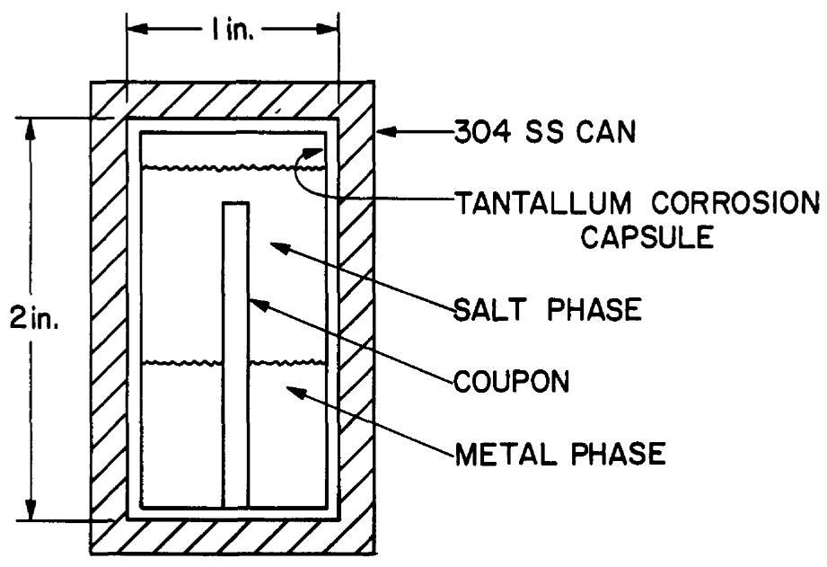  
Figure 1. Corrosion Capsule

corrodrant to surface area of the vessel would be higher. Other effects such as mass transport and solution stability are not tested in the capsule tests. Therefore, those materials which appeared promising after the isothermal capsule tests are subjected to "corrosion agitator tests" and later to solution stability tests.

# Corrosion Agitator Tests

A typical corrosion agitator is shown in Fig. 2. In these tests, coupons of the test material are affixed with tungsten wire to a molybdenum-30 wt % tungsten shaft (again chosen on the basis of experience). Four coupons are placed on the shaft so that each is exposed to a different condition in the system. One coupon is located in the metal phase, one at the initial (quiescent) location of the metal/salt interface, one in the salt phase, and one in the vapor phase. This agitator is rotated in the molten metal/salt system for varying times up to 200 hr. At the end of the test the metal and salt phases are poured off and the coupons are allowed to drip clean and cool before they are removed and examined. This type of test provides a dynamic system in which non-adherent reaction films are removed by local turbulence. Most of the promising materials are tested as corrosion agitators-- except materials such as graphite and ceramics whose physical properties do not lend themselves to this type test. These tests are usually indicative of the ultimate utility of a material of construction.

# Crucible Tests

Those materials which appear promising after the initial series of tests are fabricated into crucibles for testing under "simulated use" conditions in which they are tested in an environment approximating that expected in process application. Similar crucible tests are performed with graphite, cast iron and the other materials which do not lend themselves to coupon testing. Crucible tests are performed in a tilt-pour furnace which is shown in Fig. 3. The crucibles used are usually about 5 in. in diameter and 10 in. high. For these tests the metal and salt are loaded into a crucible, heated to the desired temperature, and agitated for times up to 200 hr. At the end of this period the agitator is withdrawn from the melt and the entire furnace assembly is tilted $90^{\circ}$ to allow the molten metal and salt to pour into a graphite mold. The furnace is disassembled to allow inspection of the now-empty crucible.

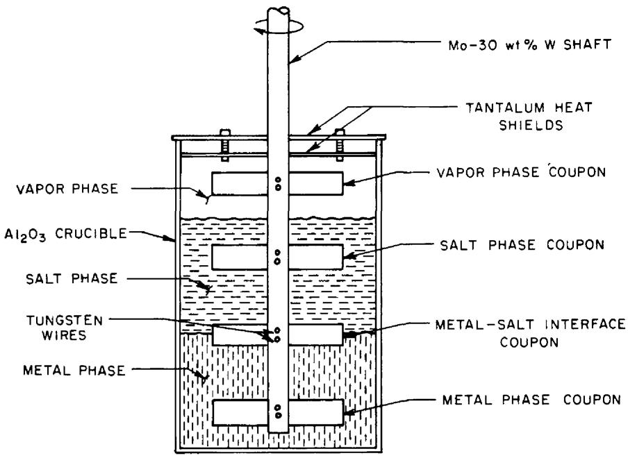  
Figure 2. Corrosion Agitator

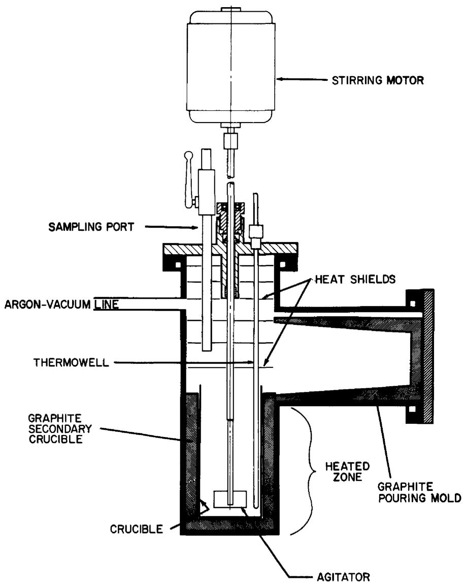  
Figure 3. Tilt-Pour Furnace

Materials which demonstrate acceptably low corrosion rates in the capsule, agitator and crucible tests are further tested to determine if the containment material is inert to the dissolved uranium and plutonium that would be contained under process conditions.

The material is normally fabricated into crucibles similar to those in the tests just described. The crucible is charged with an appropriate metal-salt mixture and heated to a constant temperature. The crucible contents are stirred for about 1 hr and, at that time, uranium or plutonium metal is added. The metal-salt mixture is then equilibrated, with stirring, for times of 50 to 200 hr, during which time filtered samples of both the metal and salt phases are taken for analysis of uranium or plutonium content. If the solutions are stable these analyses remain constant but, if a solution instability is present, the uranium or plutonium analyses decrease during the time of the run. If an instability exists, samples of precipitates and of the metal and salt phases at probable precipitate locations are taken at the end of the run to assist in identifying the probable cause. Additional details of the sampling procedures and precautions are contained in an article by Winsch(4).

# Thermal Convection Loop Test

Mass transfer effects under a thermal or concentration gradient are not adequately tested in isothermal capsule, corrosion agitator, or agitated crucible corrosion tests. In an effort to develop a test to provide this information a two-phase thermal convection loop was operated. This loop was constructed of type 304 stainless steel and was successfully operated to demonstrate the design, thermal control, and operation of a system which would provide mass transport information.

A schematic diagram of the loop is shown in Fig. 4. The general loop configuration is a "figure eight". The lower loop contains molten metal and the upper loop contains molten salt. The horizontal leg common to both the upper and lower loops contains both metal and salt which flow countercurrently during operation. The loop is charged with molten metal and salt from an overhead fill-tank. The location of the metal/salt interface in the horizontal leg was determined by X-ray pictures of the operating loop. This technique was not very satisfactory for determining the salt/ atmosphere interface; therefore, this interface was determined by a "dip-stick" technique.

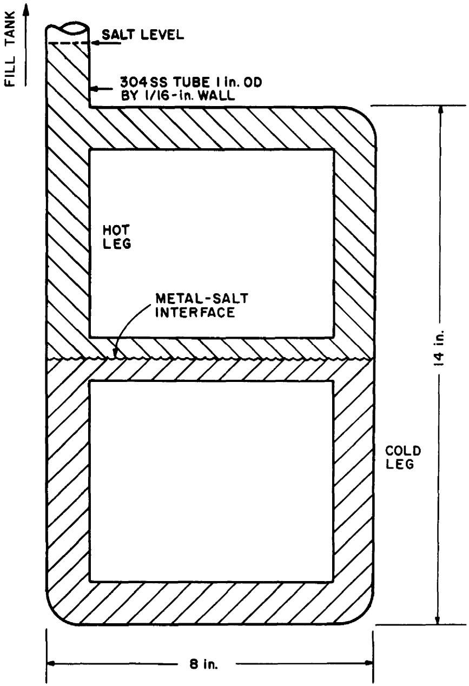  
Figure 4. Thermal Convection Loop

Temperature control was maintained by the use of four independent heater circuits. One circuit heated the metal loop and a second heated the salt loop to maintain the charge materials at a uniform temperature in the molten state. The other two circuits heated the metal and salt "hot" legs to elevated temperatures thereby providing the thermal gradients necessary for thermal convection flow. When the loop was in operation about $80\%$ of the power was introduced through the hot leg heaters. At the conclusion of the run the metal and salt were frozen in place and the loop was sectioned for metallographic and chemical examination.

# Prototype Vessel Testing

Materials which successfully complete all previous phases of testing are then fabricated into vessels which are used in laboratory and engineering investigations of the process.(5) At the completion of an experimental series these vessels are examined either destructively or non-destructively to determine their behavior under actual processing conditions.

# Corrosion Mechanisms

Most of the corrosion that occurs in metallic specimens exposed to these metal/salt systems is the result of dissolution of the material in the liquid metal. In most cases the material has some solubility in the liquid metal and slowly dissolves until an equilibrium condition is reached. Transgranular attack is relatively uncommon. Intergranular attack is not uncommon, however, and is usually the result of preferential solubility of elements concentrated at the grain boundaries or of metal phase reaction with grain boundary precipitates. Occasionally a metal phase inclusion, such as carbon, presents a desired location for attack.

The salt produces several different corrosion effects on metallic specimens. If the salt is not dry, materials such as oxychlorides, hydrogen and chlorine may be present and, at the high process temperatures, will cause serious corrosion. For this reason the salt used in these runs is purified by contact with a Mg-33.5 at.% Cd alloy at $600^{\circ}\mathrm{C}$ for 24 hr before use to remove any water present. This purification process is outlined in Ref. 6. The salt phase can also cause dissolution of soluble metallic specimens and, if the distribution coefficient favors transport of the material to the metal phase, this dissolution can continue beyond the apparent solubility limit.

The salt phase also causes corrosion by embrittlement of some

materials and alloys. The nature and cause of this embrittlement is largely unknown but has the effect of seriously reducing the ductility of some materials, especially the refractory metals. This same effect may be responsible for the few cases of stress corrosion that have been observed.

In addition to these effects, the presence of magnesium, a good reducing agent, in the metal phase is the cause of some corrosion, especially of ceramic materials, such as alumina, which can be reduced by magnesium. The presence of magnesium also accentuates some metallic corrosion especially in cases where corrosion resistance is normally obtained through the presence of a protective oxide film which is subsequently reduced in the presence of magnesium.

# Results of Tests Performed

The results obtained in this program are discussed in terms of general experience with different classes of materials rather than measured corrosion rates in specific systems, since these results are available elsewhere(7,8,9) and are not of great general interest. Typical results are presented to exemplify trends and indicate types of problems encountered.

The reported corrosion rates are conservative and are probably higher than those that would be experienced in actual service. These rates were obtained from data taken in short times (usually $\leq 200\mathrm{hr}$ ) and converted to an annual rate for presentation on a uniform basis. This resulted, therefore, in multiplying the observed corrosion by factors of 40 to 80. Small errors in experimental measurements would then result in large errors of annual corrosion rates. In taking the experimental data a conservative approach is used to prevent underestimating the annual corrosion rate. In samples of varying degrees of corrosion the "worst case" is usually taken, except for those cases in which this condition is obviously unrealistic. Other factors such as protective film formation or saturation of the metal/salt system with a soluble constituent also decrease the annual corrosion rate that would be obtained in actual service. Tests are also usually made at temperatures slightly higher ( $^\circ \mathrm{C}$ ) than those expected in process use in order to accentuate the corrosive effects of the solvent.

Several techniques are used to determine the extent of corrosion. These include: (1) metallographic examination of the specimens after exposure to the liquid metal/molten salt systems, (2) size changes of the metal coupons, (3) physical property measurements before and after exposure, (4) chemical analysis of the metal and

salt phases after sample exposure, and (5) electron-probe microscopy and X-ray diffraction analysis of reaction layers and precipitated solids.

# Ferrous Alloys

# Austenitic Stainless Steels

Austenitic stainless steels containing appreciable concentrations of nickel or manganese are not good containment materials for the systems studied. Nickel is soluble in copper, zinc, cadmium, and magnesium, and deterioration of the steel through nickel leaching occurs. These steels, however, are normally acceptable containment materials for a purified salt in the absence of a metal phase.

# Ferritic Stainless Steels

Those steels with a low nickel and high chromium content (such as type 405) are much more corrosion resistant to the proposed metal/salt systems than austenitic stainless steels. Neither chromium nor iron is highly soluble in the metal phases. In general the corrosion resistance increases with increased chromium content of the steel. Increased magnesium concentration in the molten metal usually makes the system less corrosive. Ferritic steels are acceptable containment materials for high magnesium content alloys and for the molten salts. Solution stability must be considered for process application utilizing these steels, however, since both $\mathrm{U}_{6}\mathrm{Fe}$ and $\mathrm{UFe}_2$ have been identified as forming in a Cu-20.8 at. $\%$ Mg-0.5 at. $\%$ U/MgCl $_2$ system exposed at $850^{\circ}\mathrm{C}$ to a CB-30 stainless steel crucible. The thermal convection loop studies also indicated a tendency for both chromium and iron to mass transport under a thermal gradient, and this tendency should be taken into consideration in proposed applications. The ferritic stainless steels are more difficult to fabricate than the austenitic stainless steels primarily because of poorer welding properties. Consequently, fabrication methods not requiring welding (such as casting) are recommended. Croloy* 16-1 is a ferritic steel available as pipe which has been used successfully as a transfer line in copper-magnesium systems.

# Cast Iron, Carbon Steel, and Low Alloy Steel

These materials are intermediate in corrosion resistance between the austenitic and ferritic stainless steels but, in many cases, do not possess sufficient strength for use at the elevated temperatures of process interest. They are also susceptible to

uranium-iron intermetallic compound formation, and a uranium phosphide (UP or $\mathrm{U}_3\mathrm{P}_4$ ) was found when cast iron was used to contain a Cu-20.8 at. $\%$ Mg-0.5 at. $\%$ U/MgCl $_2$ system at $850^{\circ}\mathrm{C}$ .

Table I presents typical corrosion rates obtained in capsule tests with various ferrous alloys.

# Table I

# Corrosion Rate of Ferrous Alloys

# in Pyrochemical Process Systems

Conditions:

Time: 200 hr

Salt Phase: MgCl $_2$ -30 mol % NaCl-20 mol % KCl

Rotated Capsule Tests

<table><tr><td rowspan="2">Metal Phase, at. %</td><td rowspan="2">Temp., °C</td><td colspan="3">Observed Corrosion Rate, mpy</td></tr><tr><td>Carbon Steel</td><td>405 S.S.</td><td>304 S.S.</td></tr><tr><td>27.7 Cu 72.3 Mg</td><td>600</td><td>&lt;5</td><td>&lt;5</td><td>&lt;5</td></tr><tr><td>77.5 Cu 22.5 Mg</td><td>600</td><td>5</td><td>&lt;5</td><td>&lt;5</td></tr><tr><td>27.7 Cu 72.3 Mg</td><td>800</td><td>39</td><td>&lt;5</td><td>&lt;5</td></tr><tr><td>77.5 Cu 22.5 Mg</td><td>800</td><td>35</td><td>65</td><td>57</td></tr><tr><td>67.0 Cd 3.9 Mg 29.1 Zn*</td><td>750</td><td>105</td><td>70</td><td>300</td></tr><tr><td>92.3 Cd 4.4 Mg 3.3 Zn*</td><td>750</td><td>&lt;17</td><td>&lt;8</td><td>---</td></tr></table>

\* No salt present

These results show that at temperatures as high as $600^{\circ}\mathrm{C}$ steels are only slowly corroded by $\mathrm{Cu - Mg}$ alloys but an increase in temperature to $800^{\circ}\mathrm{C}$ significantly increases the corrosion rate. Neither copper nor cadmium base systems are highly corrosive but the addition of zinc in appreciable concentrations precludes containment of these materials in ferrous alloys. In general the ferritic type 405 steel is the most corrosion resistant.

# Refractory Metals

The refractory metals tungsten, tantalum, niobium, molybdenum, rhenium and various alloy combinations, in general, possess good corrosion resistance to the proposed process systems. This corrosion resistance is a result of their low solubility in the process systems and is not directly related to their common

application of high temperature service. The problems most often encountered in their application concern (1) the fabrication of refractory metal parts and (2) embrittlement of the more ductile materials, tantalum and niobium, by the molten salts, hydrogen and oxygen. The discussions in this section are related to recent data obtained in the Cu-Mg system since this and the Cd-Mg system are very similar. The Zn-Mg system is substantially more corrosive to most of these materials and their utility in Zn-Mg systems was the subject of a previous paper.(7) Table 2 presents corrosion rates of refractory metals exposed to Cu-Mg/halide salt systems. These results were obtained from weight loss and metallographic examination studies. Although they indicate little corrosion, they do not present the entire corrosion picture. Both tantalum and niobium were embrittled by this exposure but this effect is not apparent from either of the forementioned tests. This embrittlement would be of significance in service application because process vessels would lose ductility, and the probability of failure through mechanical or thermal shock would increase. Table 3 presents the results of tests performed to obtain quantitative data on this embrittlement. The materials were exposed as corrosion agitators, at $650^{\circ}\mathrm{C}$ to a $\mathrm{MgCl}_2$ -30 mol % NaCl-20 mol % KCl salt for 196-197 hr. Tantalum appears to be more corrosion resistant to the molten salt than niobium but also appears more susceptible to embrittlement. The cause and quantitative effect of the embrittlement on the two metals is currently under investigation.

Table II   
Corrosion Resistance of Refractory Metals   
to Cu-Mg/Halide Salt Systems   
Conditions: Metal Phase: Mg-43.3 at. $\%$ Cu-0.2 at. $\%$ U Salt Phase: $\mathrm{MgCl_2 - 30 mol\% NaCl - 20 mol\% KCl}$ Length of Run: 150-200 hr Temperature: $750^{\circ}C$ Corrosion Agitator Tests   

<table><tr><td rowspan="2">Sample Location</td><td colspan="4">Observed Corrosion Rate, mpy</td></tr><tr><td>Nb</td><td>Ta</td><td>Mo</td><td>W*</td></tr><tr><td>Metal Phase</td><td>&lt;22</td><td>&lt;1</td><td>&lt;17</td><td>&lt;1</td></tr><tr><td>Metal/Salt Interface</td><td>&lt;22</td><td>&lt;1</td><td>17</td><td>&lt;1</td></tr><tr><td>Salt Phase</td><td>&lt;22</td><td>&lt;1</td><td>&lt;17</td><td>&lt;1</td></tr><tr><td>Vapor Phase</td><td>&lt;22</td><td>&lt;1</td><td>17</td><td>&lt;1</td></tr></table>

Temperature: $650^{\circ}C$

Salt: $\mathrm{MgCl}_2 - 30\mathrm{mol}\% \mathrm{NaCl} - 20\mathrm{mol}\% \mathrm{KCl}$

Table III   
Corrosion of Niobium and Tantalum   
by $\mathsf{MgCl}_2$ -NaCl-KCl Systems   

<table><tr><td>Test Material</td><td>Nb</td><td>Ta</td></tr><tr><td>Length of test, hr</td><td>197</td><td>196</td></tr><tr><td>Initial Hardness, 15T</td><td>73</td><td>60</td></tr><tr><td>Final Hardness, 15T</td><td></td><td></td></tr><tr><td>Sample 1</td><td>87.5</td><td>93</td></tr><tr><td>Sample 2</td><td>87.5</td><td>94</td></tr><tr><td>Sample 3</td><td>88</td><td>94</td></tr><tr><td>Sample 4</td><td>88</td><td>93</td></tr><tr><td>Corrosion Rate, mpy*</td><td></td><td></td></tr><tr><td>Sample 1</td><td>+2.1</td><td>+0</td></tr><tr><td>Sample 2</td><td>+1.3</td><td>+0</td></tr><tr><td>Sample 3</td><td>+1.9</td><td>+0</td></tr><tr><td>Sample 4</td><td>+2.9</td><td>+0</td></tr></table>

\*The plus $(+)$ sign indicates film formation.

Tungsten appears virtually corrosion resistant to this system and is routinely used in laboratory and engineering process investigations; no deleterious effects have been observed after 3 or 4 years of service of some vessels. Tungsten is difficult to fabricate into many desired shapes but crucibles as large as 10 in. ID x 20 in. high have been used. Various crucible fabrication techniques have been tried and these results are discussed elsewhere.(10) A fabrication technique applicable to a wide variety of shapes is now under investigation. This technique involves the vapor deposition of a tungsten coating on a graphite substrate and, to date, the results have been encouraging.

Molybdenum is also difficult to fabricate into intricate shapes and, since our results indicate that tungsten is more corrosion resistant, our effort has been directed primarily toward tungsten shapes. A notable exception is the Mo-30 wt % W alloy. This alloy is machinable and is routinely used for agitators, exposed

transfer line parts, and other applications requiring machined parts. The material is only slowly attacked in process service (perhaps about 20 mph) and has given excellent service.

# Graphite and Vitreous Carbon

Two major problems are encountered when graphite is used as a containment material for pyrochemical processes: (1) conventional grades of graphite are too porous to contain the molten salt and (2) solute uranium and plutonium react with graphite to form insoluble carbides. The porosity problem is easily solved by the use of premium grades of graphite with a higher density. It has been our experience that a graphite density of about $1.72 \, \text{g/cc}$ (theoretical density, $2.25 \, \text{g/cc}$ ) or higher is usually sufficient to contain the molten salt. Graphites of this density are commercially available at a modest increase in cost over conventional graphite.

Several attempts have been made to protect the graphite surface from reaction with the solute uranium and plutonium. The major problem encountered is matching thermal expansion of the coating with that of the graphite. The most successful attempts to date have been with tungsten and with silicon carbide, both of whose thermal expansion coefficients ( $\sim 2.2 \times 10^{-6}$ in./in./ $^{\circ}$ F) are very close to graphite ( $\sim 1$ to $4 \times 10^{-6}$ in./in. $^{\circ}$ F depending upon grain orientation of graphite). Care must be taken to obtain a graphite with an isotropic thermal expansion coefficient. A graphite crucible coated with a 0.030 in. coating of tungsten deposited by vapor deposition is now under test and results are encouraging. The coating applied by this technique is very nearly $100\%$ of theoretical density. A small crucible ( $\sim 1$ in. ID x 2 in. high) coated with flame-sprayed silicon carbide was also used very successfully; but, when attempts were made to produce a larger crucible (6 in. ID x 10 in. high), the coating was not dense enough to protect the graphite.

Vitreous carbon was used very successfully in small scale tests and was not generally wet by the metal/salt systems in times up to 200 hr. Attempts to scale these crucibles up to larger sizes were unsuccessful because of the fragile nature of the material and because the maximum available wall thickness was 0.1 in. Crucibles (about 4 in. ID x 8 in. high) were fabricated but were found to be easily broken in service.

# Silicon Carbide and Alumina

Silicon carbide is inert to the process solutions but is not usable because the density of fabricated parts is too low to

adequately contain the molten salts. A special high-density grade of silicon carbide was obtained and tested and, although its density was sufficient to contain the molten salt, three of three crucibles failed in services from what appeared to be thermal shock.

Alumina has been used in many experimental investigations but is not completely immune to attack. Alumina is reduced by molten magnesium but at our magnesium concentrations of interest, the kinetics of the reduction are slow and several hundred hours exposure are readily obtainable. The reduction of alumina can also cause solution stability problems. A metallic film adhering to the wall of an alumina crucible exposed to a Cu-20.8 at. $\%$ Mg-0.5 at. $\%$ U/MgCl $_2$ melt after 144 hr at $850^{\circ}\mathrm{C}$ was found to be nearly pure UAl $_2$ . Other ceramics such as boron nitride, whose $\mathsf{B}_2\mathsf{O}_3$ content is reduced by magnesium, and zirconia and magnesia, which are porous to the salt, have also proved unsuitable.

# Conclusions

Pyrochemical processes for the purification of discharged reactor fuels require suitable containment materials for a variety of molten metal and salt systems. Although the problems of meeting these requirements are difficult, materials are available for the systems of interest. Ferrous alloys are useful in process equipment in those steps where solute uranium and plutonium are not present and for applications requiring short-term exposure. Refractory metals, especially tungsten, tantalum, and niobium, are useful throughout the process. Tungsten presents fabrication problems but if the embrittlement problem with tantalum and niobium can be solved, they should be usable for nearly all process equipment. Ceramics have process utility, but their usefulness is limited to the higher density products that are resistant to molten magnesium.

# Acknowledgments

The authors wish to express their appreciation to Mr. L. F. Dorsey who ably performed much of the experimental work reported in this article. Dr. R. J. Meyer, Mr. R. V. Schablaske, and their coworkers in the Analytical Laboratory are responsible for the chemical analyses reported herein and were helpful in suggesting experiments to obtain needed chemical data.

# References

1. Johnson, I., "The Solubility of Uranium and Plutonium in Liquid Alloys", This Symposium.   
2. Knighton, J. B., I. Johnson and R. K. Steunenberg, "Uranium and Plutonium Purification by the Salt Transport Method", This Symposium.   
3. Petkus, E. J., T. R. Johnson and R. K. Steunenberg, "Uranium Monocarbide Preparation in a Liquid Metal", Nucl. Appl. 4, p. 388-393, June 1968.   
4. Winsch, I. O., K. R. Tobias, R. D. Pierce and L. Burris, Jr., "Sampling of Liquid Metals", Report ANL-7088, Argonne National Laboratory, Sept. 1965.   
5. Pierce, R. D., W. E. Miller, J. B. Knighton and G. J. Bernstein, "Multistage Contactors for Liquid Metal-Salt Extraction", This Symposium.   
6. Vogel, R. C., M. Levenson, J. H. Schraidt and J. Royal, "Chemical Engineering Division Semiannual Report, July-Dec. 1965", Report ANL-7125, Argonne National Laboratory, p. 35, May 1966.   
7. Nelson, P. A., M. L. Kyle, G. A. Bennett and L. Burris, Jr., "Corrosion of Refractory Metals by Zinc-Magnesium-Uranium and Halide Salt Systems", Electrochem. Tech., 3, p. 263-269, Sept.-Oct. 1965.   
8. Kyle, M. L., P. A. Nelson and L. Burris, Jr., "Corrosion of Steels and Tantalum by Molten Cadmium-Magnesium-Zinc Systems", Electrochem. Tech., 3, p. 258-262, Sept.-Oct. 1965.   
9. Kyle, M. L., R. D. Pierce, V. M. Kolba and L. F. Dorsey, "Containment of Copper-Magnesium-Uranium/Halide Salt Systems", Report ANL-7566, Argonne National Laboratory, 1969.   
10. Winsch, I. O., M. L. Kyle, R. D. Pierce and L. Burris, Jr., "Tungsten Crucibles in Pyrochemical Processing of Nuclear Fuels", Nucl. Appl., 3, p. 245-251, April 1967.

# CORROSION OF A LOW ALLOY STEEL

IN A SIMULATED LIQUID-METAL-FUEL REACTOR MIXTURE*

Roger L. Suchanek and George Burnet  
Institute for Atomic Research and Department of Chemical Engineering, Iowa State University, Ames, Iowa 50010 U.S.A.

# Abstract

An isothermal dynamic testing technique was used to investigate the corrosion of $21\%$ chromium - $1\%$ molybdenum alloy steel first by pure liquid lead-bismuth eutectic $(55.5\%)$ and then by zirconium-inhibited eutectic to which elements had been added to simulate those fission products which would be found in a liquid-metal fueled reactor.

When exposed to the eutectic alone the steel was found to be highly resistant to attack up to temperatures of about $700^{\circ}\mathrm{C}$ . Above $700^{\circ}\mathrm{C}$ the degree of attack increased with temperature until at $900^{\circ}\mathrm{C}$ only long fingers of ferrite remained at the metal surface in place of the original material.

In tests with the simulated reactor mixture inhibited with zirconium, the temperature was raised to about $800^{\circ}\mathrm{C}$ before corrosion was detected. The mixture consisted of the eutectic plus $\mathbf{Zr}$ , U, Mg, Mo, Ce, Nd, and La as additives. Above $800^{\circ}\mathrm{C}$ the same increase in attack with temperature as occurred with the pure eutectic was observed.

*Work performed in the Ames Laboratory of the United States Atomic Energy Commission. Contribution No. 2538.

# Introduction

Low-melting metals and alloys show promise as nuclear reactor coolants or fuel carriers because of their excellent heat transfer characteristics, low vapor pressure, frequent low neutron capture cross section and resistance to irradiation. Applications have been limited, however, because they corrode most container materials at elevated temperatures.

To overcome this limitation, investigators have turned to certain additives, termed inhibitors, which are effective in reducing corrosion through formation of impervious surface films on the container materials at the liquid metal interface. The use of such inhibitors to reduce corrosion has been investigated for many low-melting heavy metals such as mercury, lead, bismuth and the lead-bismuth eutectic. A pioneering effort was that of Nerad (1) and his associates at the General Electric Company when they developed the mercury boiler. It was found that as little as 1 ppm of titanium or zirconium added to the magnesium-deoxidized mercury reduced the attack of ferrous alloys to a negligible level.

More recently (1954) Gurinsky, et al. (2) reported that additions of Mg and Zr to uranium-bismuth solutions substantially reduced the corrosion of $2\frac{1}{2}\%$ Cr - $1\%$ Mo alloy steel. Later, in 1956, Miller and Weeks (3) discovered that Zr and Ti additions to liquid Bi inhibited the corrosion of steels by the formation of protective deposits of ZrN or TiN.

Inhibition of corrosion of low alloy steels by uranium-bismuth solutions through Zr addition and formation of a surface film of ZrN and/or ZrC was reported in 1960 by Weeks and Klamut (4). Whether a nitride or carbide film formed was determined by the relative activities of the carbon and nitrogen in the steel.

Romano et al. (5) summarized in 1963 the data obtained from more than 100 low alloy steel thermal convection loops which contained zirconium-inhibited bismuth and uranium-bismuth solutions. Their conclusions confirmed the corrosion resistance of the low alloy steels to zirconium-inhibited uranium-bismuth solutions.

Working in this Laboratory in 1958 Clifford (6) completed a series of experiments with the lead-bismuth eutectic which led to selection of $2 \frac{1}{2}\%$ Cr - $1\%$ Mo alloy steel and type 430 stainless steel as container materials most suitable up to $700^{\circ}\mathrm{C}$ . Above this temperature none of the ferritic steels examined were satisfactory. In 1960 Stachura (7) discovered that Zr concentrations as low as 50 ppm effectively inhibited corrosion of $2 \frac{1}{2}\%$ Cr - $1\%$ Mo steel by the eutectic. X-ray diffraction studies suggested the formation of a protective film of ZrN.

The purpose of this study was to corroborate the work of previous investigators who worked with the zirconium-inhibited eutectic and to determine how corrosion inhibition might be affected by those elements which would be present in the liquid metal if it were being used in a liquid metal fueled reactor.

# Testing Procedure

The corrosion tests were conducted in two spinner units such as that shown in Figure 1. The portion of each unit which contained the liquid metal bath was placed in the open core of a cylindrical resistance furnace. The alloy steel specimens used were 4-inch lengths of schedule 40 steel pipe. A specimen to be tested was mounted at the end of a shaft which was rotated at 200 rpm while the specimen was immersed about 2 inches in the liquid metal. Purified argon at 16 psia pressure was used as an inert cover gas.

Each unit was provided with an air lock through which a graphite sample crucible was lowered to withdraw samples of the liquid metal at 12-hour intervals throughout the 96-hour test period used in all runs. This period was found to be about the minimum required for buildup of a detectable level of corrosion products in the liquid metal in those cases where significant corrosion did occur. Figure 2 is a photograph of the two units as they were installed in the laboratory.

In all tests the metal bath samples were analyzed for Fe and Cr content. In addition each pipe specimen was cut perpendicular to the axis and examined metallographically. In the inhibited runs powder x-ray diffraction patterns were taken of the surface scrapings of the steel specimens in order to determine the presence of any surface films in which Zr or the other additives might be found.

The overall investigation consisted of two series of corrosion tests in which all pipe specimens were $2\frac{1}{2}\%$ Cr - $1\%$ Mo alloy steel. In the first series pure lead-bismuth eutectic ( $55.5\%$ ) was used as the corrodent; in the second the corrodent was a simulated reactor mixture inhibited with Zr. The mixture consisted of the eutectic plus 100 ppm Zr, 1000 ppm U, 300 ppm Mg, 1 ppm Mo, Nd and La, and 2 ppm Ce. The Mg served as a deoxidant to prevent Zr and the other additives from being oxidized from solution. The temperature $(600^{\circ}\mathrm{C} - 900^{\circ}\mathrm{C})$ was held constant throughout each run.

# Materials

Pipe Specimens

The chemical composition of the $2\frac{1}{2}\%$ Cr - $1\%$ Mo steel used is

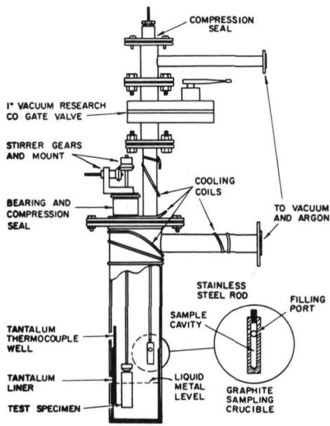  
1. Spinner Corrosion Test Unit.

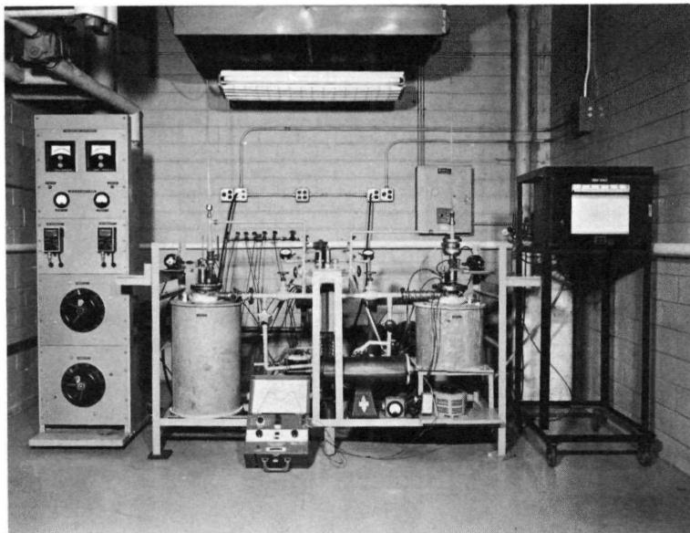  
2. Arrangement of Corrosion Test Apparatus.

given in Table I. All test specimens were 4-inch lengths of schedule 40 seamless round pipe, cold drawn and annealed.

# Liquid Metals

The Pb and Bi used to make up the eutectic for both the inhibited and uninhibited tests were of $99.99\%$ purity. The chemical analysis of both metals is given in Table II.

# Additives

The exact chemical analysis of the additives U, Zr, Mg, Mo, Ce, Nd and La is not known but the highest purity materials available were used. All were of at least $99\%$ purity.

Table I. Chemical Composition of $2\frac{1}{2}\%$ Cr - $1 \%$ Mo Test Specimens   

<table><tr><td>Element</td><td>Weight Per Cent</td></tr><tr><td>C</td><td>0.120</td></tr><tr><td>Mn</td><td>0.450</td></tr><tr><td>S</td><td>0.010</td></tr><tr><td>P</td><td>0.013</td></tr><tr><td>Si</td><td>0.310</td></tr><tr><td>Cr</td><td>2.220</td></tr><tr><td>Mo</td><td>0.960</td></tr></table>

Table II. Analysis of Eutectic Materials   

<table><tr><td>Impurity</td><td>Bi (ppm)</td><td>Pb (ppm)</td></tr><tr><td>Ag</td><td>1</td><td>&lt;1</td></tr><tr><td>As</td><td>0.5</td><td>0.1</td></tr><tr><td>Bi</td><td>Bal.</td><td>4</td></tr><tr><td>Cu</td><td>3</td><td>2</td></tr><tr><td>Fe</td><td>&lt;1</td><td>-</td></tr><tr><td>Ni</td><td>1</td><td>-</td></tr><tr><td>Pb</td><td>1</td><td>Bal.</td></tr><tr><td>Sb</td><td>&lt;2</td><td>0.2</td></tr><tr><td>Tl</td><td>-</td><td>1</td></tr></table>

# Results

Tests with the Lead-Bismuth Eutectic

The maximum Fe and Cr concentrations detected during the 96-hour tests in pure lead-bismuth eutectic are shown in Figure 3. The logarithm of corrosion product concentration is plotted against the reciprocal of absolute temperature. Each point represents one 96-hour run.

The selectivity of the lead-bismuth eutectic for Cr can be illustrated by comparing the fraction of Cr in the original alloy with the fraction of Cr as a corrosion product in the liquid melt. Referring to Figure 3, maximum amounts of Fe and Cr detected in the melt during an $800^{\circ}\mathrm{C}$ test are 62 and 6 ppm respectively. The weight fraction of Cr in the alloy is given in Table I as 0.022. If all corrosion products except Fe and Cr are neglected, the fraction of Cr in the corrosion products is 0.088. The ratio of the two fractions, Cr in the corrosion products to Cr in the steel is approximately 4.0. Since a value of unity would correspond to a transfer of Cr to the melt roughly proportional to its concentration in the steel, the selectivity for Cr by uninhibited lead-bismuth eutectic is readily evident.

Tests with the Simulated Reactor Mixture

The maximum Fe and Cr concentrations detected in the melt during the runs with the simulated reactor mixture are given in Table III, as are the corresponding concentrations for the pure eutectic. The effectiveness of Zr as an inhibitor in the simulated reactor mixture at temperatures less than $900^{\circ}\mathrm{C}$ can be illustrated by comparing the net corrosion product concentrations in the mixture with those in the pure eutectic. At $800^{\circ}\mathrm{C}$ approximately 30 times less Fe and at least 6 times less Cr were detected in the inhibited mixture than in the pure eutectic. Below $800^{\circ}\mathrm{C}$ the concentrations are too low to be meaningful and even at $800^{\circ}\mathrm{C}$ do not allow conclusions about the selectivity of the mixture for Cr.

At $900^{\circ}\mathrm{C}$ the corrosion product concentrations for the reactor mixture are essentially the same as those for the pure, uninhibited eutectic. This suggests that in the vicinity of $900^{\circ}\mathrm{C}$ there is some breakdown in the inhibiting effect of the zirconium. Metallographic examination was used to confirm this.

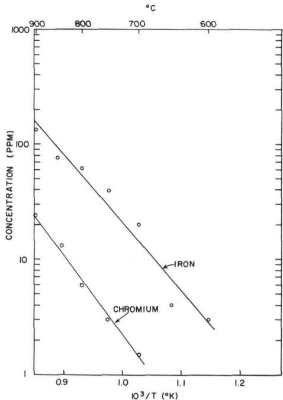

3. Effect of Temperature on Concentration of Fe and Cr (Removed from $2 \frac{1}{2}\%$ Cr - $1\%$ Mo Alloy Steel) in Lead-Bismuth Eutectic Melt After 96 Hours.

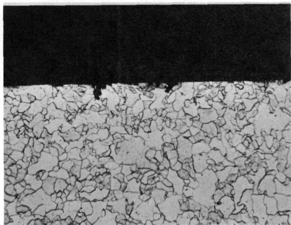

4. Surface Condition of $21/2\%$ Cr - $1\%$ Mo Alloy Steel Control Specimen (Outside Surface) Prior to Exposure to Liquid Metals. (250X, Nital Etch)

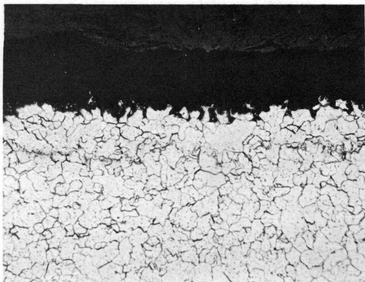

5. Attack of $21/4\%$ Cr - $1\%$ Mo Alloy Steel (Outside Surface) After Exposure for 96 Hours at $700^{\circ}\mathrm{C}$ to Uninhibited Lead-Bismuth Eutectic. (250X, Nital Etch)

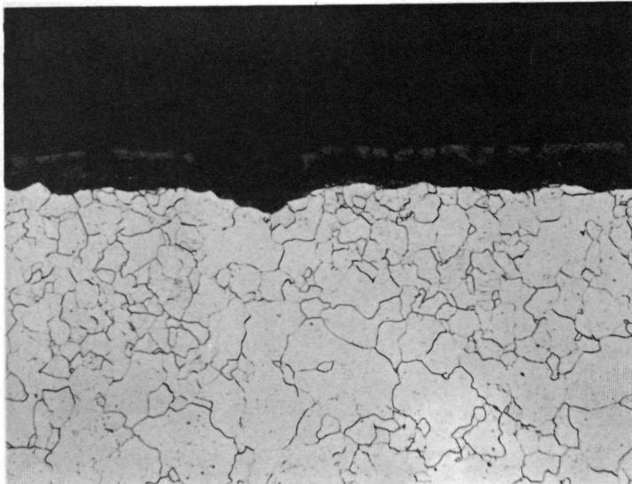

6. Attack of $21\%$ Cr - $1\%$ Mo Alloy Steel (Inside Surface) After Exposure for 96 Hours at $750^{\circ}\mathrm{C}$ to Uninhibited Lead-Bismuth Eutectic. (250X, Nital Etch)

Table III. Net Corrosion Product Concentrations in the Simulated Reactor Mixture and in Pure Lead-Bismuth Eutectic After 96 Hours   

<table><tr><td rowspan="2">Temperature (°C)</td><td colspan="2">Concentration in Pure Eutectic (ppm)</td><td colspan="2">Concentration in Reactor Mixture (ppm)</td></tr><tr><td>Fe</td><td>Cr</td><td>Fe</td><td>Cr</td></tr><tr><td>500</td><td>--</td><td>--</td><td>&lt;1</td><td>&lt;1</td></tr><tr><td>600</td><td>3</td><td>&lt;1</td><td>&lt;2</td><td>&lt;1</td></tr><tr><td>700</td><td>20</td><td>1.5</td><td>--</td><td>&lt;1</td></tr><tr><td>800</td><td>62</td><td>6</td><td>2</td><td>&lt;1</td></tr><tr><td>900</td><td>134</td><td>24</td><td>139</td><td>21</td></tr></table>

Metallographic Examination of the Test Specimens

Photomicrographs were prepared of the inside and outside edges of the pipe specimens which had been exposed to the pure lead-bismuth eutectic and to the simulated reactor mixture. They served to illustrate the mechanism of attack of the steel by the liquid metals and the increasing severity of attack with temperature.

Figure 4 is of the outside edge of a control specimen and shows the condition of the pipe surface prior to exposure to the liquid metals. Figure 5 is a corresponding photomicrograph of a specimen tested at $700^{\circ}\mathrm{C}$ in the pure eutectic. The microstructure is not appreciably altered except for some increase in grain size over that of the control specimen.

The first indication of intergranular attack by the pure eutectic appeared at $750^{\circ}\mathrm{C}$ as shown in Figure 6. At this temperature the attack is advanced to the point where whole grains are detached from the specimen surface. The increase in severity of attack with temperature $(850^{\circ}$ and $900^{\circ}\mathrm{C})$ is evident from Figures 7 and 8a. The portion of the specimens shown in these photomicrographs consists of ferrite (light areas) and bainite, containing small granules of carbide, and small regions of martensite (dark areas). These features are shown more clearly in greater magnification in Figure 8b. A decarburized zone at the surface of these higher temperature specimens is also evident. At $900^{\circ}\mathrm{C}$ (Figure 8a) the attack is so severe that only long fingers of ferrite remain at the surface in place of the original material.

The specimen tested at $700^{\circ}\mathrm{C}$ in the simulated reactor mixture is shown in Figure 9 and exhibits little alteration in microstructure.


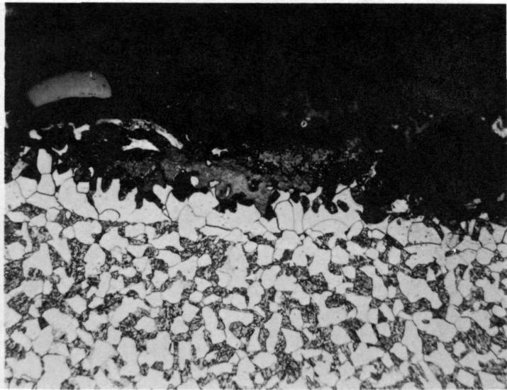

7. Attack of $21\%$ Cr - $1\%$ Mo Alloy Steel (Outside Surface) After Exposure for 96 Hours at $850^{\circ}\mathrm{C}$ to Uninhibited Lead-Bismuth tectic. (250X, Nital Etch)

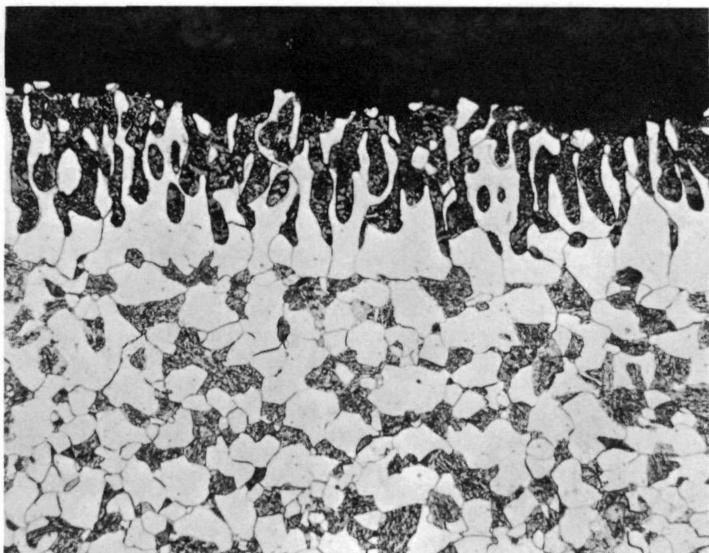

8. Attack of $21\%$ Cr - $1\%$ Mo Alloy Steel by Uninhibited Lead-Bismuth Eutectic (a) Inside Surface After Exposure for 96 Hours at $900^{\circ}\mathrm{C}$ . (250X, Nital Etch).

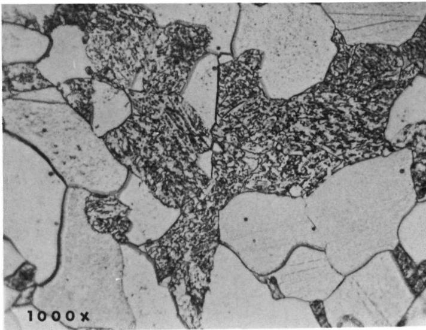

8. Attack of $21\%$ Cr - $1\%$ Mo Alloy Steel by Uninhibited Lead-Bismuth Eutectic (b) Interior After Exposure for 96 Hours at $900^{\circ}\mathrm{C}$ . (1000X, Nital Etch)

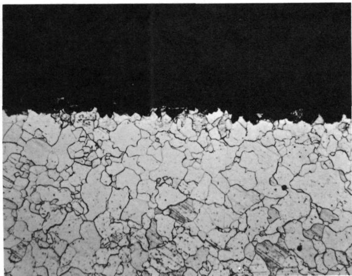

9. Attack of $21\%$ Cr - $1\%$ Mo Alloy Steel (Outside Surface) After Exposure for 96 Hours at $700^{\circ}\mathrm{C}$ to Simulated Reactor Mixture. (250X, Nital Etch)

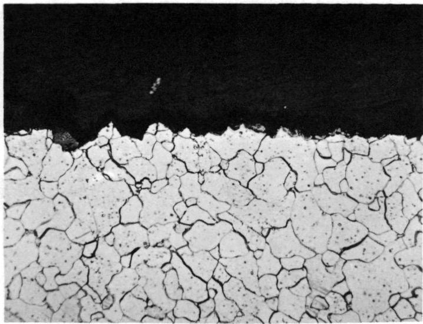

10. Attack of $2\frac{1}{2}\%$ Cr - $1\%$ Mo Alloy Steel (Outside Surface) After Exposure for 96 Hours at $800^{\circ}\mathrm{C}$ to Simulated Reactor Mixture. (250X, Nital Etch)

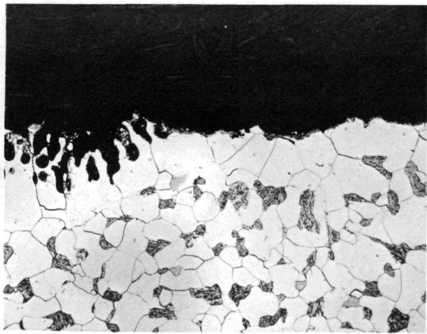

11. Attack of $2 \frac{1}{2}\%$ Cr - $1\%$ Mo Alloy Steel (Outside Surface) After Exposure for 96 Hours at $900^{\circ} \mathrm{C}$ to Simulated Reactor Mixture. (250X, Nital Etch)

At $800^{\circ}\mathrm{C}$ (Figure 10) no intergranular attack is evident as contrasted to Figure 6 where such attack is evident following exposure to the non-inhibited eutectic.

At $900^{\circ}\mathrm{C}$ (Figure 11) the specimen exposed to the mixture exhibits essentially the same microstructure as that tested at $900^{\circ}\mathrm{C}$ in the pure eutectic, as might have been predicted from the liquid metal bath analyses. At $900^{\circ}\mathrm{C}$ or between $800^{\circ}\mathrm{C}$ and $900^{\circ}\mathrm{C}$ some breakdown in the inhibition process occurs resulting in corrosive attack similar to that in the uninhibited case.

The authors feel that the increase in corrosion resistance in the steel in the simulated reactor mixture is likely due to the formation of impervious protective film such as ZrN or ZrC on the surface of the steel. The breakdown in the inhibition process could also be explained by a cracking or a spalling of this film, or dissolution of the film by the metal substrate at high temperatures. Such protective films have been reported by other investigators but could not be totally confirmed in this case by the x-ray diffraction technique used.

# Conclusions

Under dynamic isothermal conditions, Zr has been shown to be an effective inhibitor to corrosion of $21\%$ Cr - $1\%$ Mo alloy steel by a simulated lead-bismuth eutectic-based reactor mixture. Zirconium concentrations of 100 ppm are effective at temperatures up to about $800^{\circ}\mathrm{C}$ . The increase in corrosion resistance is thought to be due to the formation of a protective film of ZrN or ZrC on the steel surface.

The degree of attack increases with temperature and at about $900^{\circ}\mathrm{C}$ the $\mathbf{Zr}$ is no longer effective. The mechanism of attack at this temperature is the same in pure lead-bismuth eutectic and in the zirconium-inhibited simulated reactor mixture. The mechanism appears to consist of intergranular penetration coupled with a solution and reprecipitation phenomena such as that observed in a selective leaching process.

# References

1. Kammerer, O. F., J. R. Weeks, J. Sadofsky, W. E. Miller, and D. H. Gurinsky, "Zirconium and Titanium Inhibit Corrosion and Mass Transfer of Steels by Liquid Heavy Metals," Transactions of The Metallurgical Society of AIME, Vol. 212, February 1959, pp. 20-25.


2. Gurinsky, D. H., J. E. Atherton, O. F. Kammerer, C. Klamut, M. Silberberg, B. Turovlin, and J. Weeks, "Finding a Container Material for the Uranium-Bismuth Fuel System," Nucleonics, Vol. 12, No. 7, July 1954, pp. 40-42.   
3. Miller, W. E. and J. R. Weeks, "Reactions Between LMFR Fuel and Its Container Materials," U.S. Atomic Energy Commission Report BNL-2913, May 1956.   
4. Weeks, J. R. and C. J. Klamut, "Reactions Between Steel Surfaces and Zirconium in Liquid Bismuth," *Nuclear Science and Engineering*, Vol. 8, 1960, pp. 133-147.   
5. Romano, A. J., C. J. Klamut, and D. H. Gurinsky, "The Investigation of Container Materials for Bi and Pb Alloys. Part 1. Thermal Convection Loops," U.S. Atomic Energy Commission Report BNL-811(T-313), 1963.   
6. Clifford, J. C. and G. Burnet, "Attack of Ferritic Steels by the Eutectic Melt of Lead Bismuth," Chemical Engineering Progress Symposium Series, No. 39, 58, 1962, pp. 67-73.   
7. Stachura, S. J., "Inhibiting Corrosion of Stainless Steel in Lead-Bismuth Eutectic at High Temperatures," Unpublished M.S. Thesis, Ames, Iowa, Library, Iowa State University of Science and Technology, 1960.

MASS TRANSFER AND TRANSPORT PROPERTIES IN FUSED

SALT AND LIQUID METAL SYSTEMS

D.R. Olander

Inorganic Materials Research Division of the

Lawrence Radiation Laboratory and the

Department of Nuclear Engineering of the

University of California, Berkeley, California

and

A.D. Pasternak

Lawrence Radiation Laboratory, Livermore, California

U.S.A.

The relevance of fundamental mass transfer studies of high temperature inorganic liquid-liquid extraction systems to the design of pyrochemical reprocessing contactors is discussed. Particular attention is paid to the applicability of theoretical models and correlations developed from low temperature aqueous-organic systems to liquid metals and fused salts. The measurement and prediction of viscosities and diffusivities in liquid metals are reviewed.

# I. Studies of Interphase Mass Transfer in Pyrochemical Systems

Development of a practical high temperature fuel reprocessing technique can be divided into three steps:

(1) Demonstration of thermodynamic feasibility   
(2) Analysis of the kinetic aspects of the process   
(3) Development of appropriate phase contacting devices

Since the beginning of interest in this field in the 1950's, an impressive quantity of information on the chemical and physical equilibria associated with a wide variety of high-temperature non-aqueous systems has been accumulated. As potential processes were identified, work on the development of contacting equipment was initiated(1). While device testing provides some information on the kinetics of the transfer process (e.g., heights of a transfer unit in fused salt-liquid metal packed columns), relatively little work has been performed on the fundamental aspects of mass transfer in non-aqueous systems. This situation is reversed in the broader field of chemical engineering separations in predominantly aqueous systems, where interest in the fundamentals of interphase mass transfer remains high.

Fundamental mass transfer experiments in pyrochemical systems are conducted in devices which offer the best possibility of elucidating each of the stages of the overall transfer process. High transfer rates are not the objective, as they are in the development of an efficient contactor for a practical separation. Instead, mass transfer studies seek to understand the various steps in the overall process, which include transport in the fluid phases and transfer across the phase boundary. The ultimate goal of these studies is to provide a sound basis for predicting transfer rates and the slow step in the interphase transfer process in complex equipment such as mixer-settlers, packed columns or spray towers, which have been considered as potential contactors for pyrochemical reprocessing flow sheets.

Since the types of contactors contemplated for use in high temperature fluid-fluid reprocessing schemes are quite similar to the devices which have been utilized for decades in the chemical separations industry, an important question arises: To what extent can the substantial theoretical information and empirical correlations developed for low temperature aqueous-organic separations technology be applied to high-temperature reprocessing?

There are reasons for suspecting that such information

is immediately applicable. Most mass transfer correlations developed for common contactors are couched in terms of dimensionless groups, such as a relation between the Sherwood number (kd/D, where k = mass transfer coefficient, d = characteristic length, D = diffusion coefficient), the Reynolds number and the Schmidt number. Provided only that the fluids involved in the high temperature process are Newtonian (which they are) and no unexpected interfacial reaction occurs, the same correlations should apply equally well at low or high temperatures, to fused salts and liquid metals as well as to water and organic solvents.

There are, however, valid reasons for questioning the applicability of information obtained from low temperature aqueous-organic systems to high temperature inorganic systems. Applying correlations developed for the former to the latter systems often requires extending the correlation far beyond the range for which it was empirically determined. For example, the density differences and interfacial tensions between immiscible liquid metals may be as much as an order of magnitude greater than any aqueous-organic system. Such a direct extension of heat transfer correlations of ordinary fluids in pipes to liquid metal heat transfer, for example, is invalid because of the very low Prandtl numbers of liquid metals.

Furthermore, although interfacial resistance is rarely important in clean aqueous-organic solvent extraction, the radically different chemical nature of the phases in liquid metal-fused salt systems may be more conducive to interfacial resistance, just as many studies of liquid metal heat transfer have shown evidence of an anomalous resistance at the liquid-solid boundary.

Consequently, our object here is to review some of the experimental studies of interphase mass transfer in high temperature inorganic systems, in order to determine whether such systems present unique problems, or whether they can be considered simply as extensions of aqueous-organic systems. We will consider transfer between two immiscible liquid phases exclusively, emphasizing extraction between two liquid metals and liquid metal-fused salt extraction. The kinetics of gas-solid reactions, which are important in fluidized bed reprocessing or gas-fused salt systems important in some volatility processes, will not be treated.

Mass transfer between solid metals and liquid metals appears to follow the same patterns as ordinary fluid-solid systems. Dunn et al(2) have studied natural convective mass transfer of tin, cadmium, zinc and lead cyl-

inders into mercury and forced convection mass transfer of zinc from the walls of zinc tubes into flowing mercury. Kassner(3) has shown that the dissolution rate of a rotating disk of tantalum into liquid tin is fluid diffusion controlled and that the rate can be predicted from the solutions of the flow and diffusion equations for this geometry.

Interphase Mass Transfer Between High Temperature Immiscible Liquids

# Theory

In the absence of a resistance at the phase boundary, mass transfer between immiscible liquid phases is governed by the transfer coefficients in each phase and the thermodynamic equilibrium conditions at the interface. In keeping with the objectives of fundamental studies of the mass transfer process, it is important that the contacting methods permit theoretical or empirical estimation of the diffusional resistances in each phase for comparison with experiment. It must be possible to establish the expected diffusion controlled rate, since any deviation of the experimental results may be an indication of an interfacial resistance.

Studies of this type in aqueous-organic systems can be conducted with relatively complex equipment, in order to allow precise calculation of the individual film resistances. Such devices include laminar jets of one liquid in another, co-current stratified flow of the two liquids in a duct, or wetted wall columns in which the central fluid is liquid. With fused salts and liquid metals at temperatures in excess of $500^{\circ}\mathrm{C}$ , however, the experimental problems involved in using sophisticated contacting devices are insurmountable. Consequently, all studies of liquid-liquid extraction kinetics in high temperature inorganic systems have utilized the classic method of falling drops.

There is an extensive literature on the theory and measurement of the mass transfer coefficients outside of falling drops (the external coefficient) and on the inside of the drop (the internal coefficient) to which the high temperature experimental results can be compared.

Sideman and Shabtai(4) summarize thirty different correlations that have been employed for the analysis of external mass transfer in drop extraction. These correlations can be divided into those based upon assumption of a rigid drop and those based upon internal circulation within the drop.

The rigid drop models are extensions of the theory of transfer from a solid sphere, and lead to Sherwood number relations of the form:

$$
\mathrm {S h} _ {\mathrm {e}} = 2 + \mathrm {b S c} _ {\mathrm {e}} ^ {1 / 3} \sqrt {\mathrm {R e}} _ {\mathrm {e}} \tag {1}
$$

$$
\mathrm {S h} _ {\mathrm {e}} = \frac {\mathrm {k} _ {\mathrm {e}} \mathrm {d}}{\mathrm {D} _ {\mathrm {e}}} \quad \text {S h e r w o o d n u m b e r} \tag {2}
$$

$$
S c _ {e} = v _ {e} / D _ {e} \quad S c h m i d t n u m b e r \tag {3}
$$

$$
\mathrm {R e} _ {\mathrm {e}} = \mathrm {d u} / v _ {\mathrm {e}} \quad \text {R e y n o l d s n u m b e r} \tag {4}
$$

ke is the external mass transfer coefficient (cm/sec), d the drop diameter, De the diffusion coefficient of the transferring solute in the external (continuous) phase, $\nu_{e}$ the kinematic viscosity of the continuous phase and u the fall (or rise) velocity of the drop.

The constant term "2" on the right of Eq(1) represents the steady state rate of molecular diffusion in an infinite stagnant liquid surrounding the drop. The second term in Eq(1) accounts for the increased transfer rate due to the boundary layer (or "film") generated by the motion of the drop past the surrounding liquid. Although the coefficient $b$ has been found to vary from 0.4 to 0.9, values in the vicinity of 0.6 are most common.

Circulation within the drop increases transfer rates by reducing the external boundary layer. In the limit of no external boundary layer, the velocity field external to the drop can be approximated by potential flow and the resulting Sherwood number is given by:

$$
\mathrm {S h} _ {\mathrm {e}} = \frac {2}{\sqrt {\pi}} \sqrt {\mathrm {S c} _ {\mathrm {e}} \mathrm {R e} _ {\mathrm {e}}} = 2 \left(\frac {\mathrm {D} _ {\mathrm {e}} \mathrm {u}}{\pi \mathrm {d}}\right) ^ {1 / 2} \tag {5}
$$

Eq(5) is identical to Higbie's penetration theory (5) (unsteady state diffusion into the fluid adjacent to the drop) if the contact time is considered as the time required for the drop to fall one diameter.

Models of internal transfer which have been employed in aqueous-organic drop extraction studies are based on stagnant diffusion, internal circulation, a type of eddy diffusion, and explicit recognition of drop oscillation. Of these, the Handlos-Baron eddy diffusion model has been used most extensively. The original theoretical treatment of this model yielded:

$$
\mathrm {S h} _ {\mathrm {i}} = 0. 0 0 3 7 5 \frac {\mathrm {R e} _ {\mathrm {i}} \mathrm {S c} _ {\mathrm {i}}}{1 + \mu_ {\mathrm {i}} / \mu_ {\mathrm {e}}} \tag {6}
$$

$$
\mathrm {S h} _ {i} = \mathrm {k} _ {i} \mathrm {d} / \mathrm {D} _ {i} \tag {7}
$$

$$
\mathrm {S c} _ {\mathbf {i}} = v _ {\mathbf {i}} / D _ {\mathbf {i}} \tag {8}
$$

$$
\mathrm {R e} _ {i} = \mathrm {d u} / \mathrm {v} _ {i} \tag {9}
$$

The subscript $i$ denotes properties of the drop and $\mu$ is the absolute viscosity. Several modifications of Eq(6), required to rectify some mathematical deficiencies of the model, have been developed by Olander(11) and Patel and Wellek(12).

The stagnant drop model of internal mass transfer utilizes the solution of the molecular diffusion equation in a sphere. Transient solutions of this type do not yield an internal mass transfer coefficient directly. Instead, the fraction of the solute initially present in the drop which has been removed is specified as a function of contact time. The fraction extracted is related to the internal mass transfer coefficient by:

$$
k _ {i} = - \frac {d}{6 t} \ln (1 - f) \tag {10}
$$

where $f$ is the fraction extracted and $t$ is the contact time. For the solution of the stagnant diffusion model by Newman(6), the fraction extracted is:

$$
f = 1 - \frac {6}{\pi^ {2}} \sum_ {n = 1} ^ {\infty} \frac {1}{n ^ {2}} \exp \left[ - n ^ {2} \pi^ {2} \tau \right] \tag {11}
$$

where $\tau$ is a dimensionless contact time, defined by:

$$
\tau = \frac {4 D _ {i} t}{d ^ {2}} \tag {12}
$$

Eq(11) is inconvenient to use when the contact time is short because many terms of the sum are needed. The alternate expression:

$$
f = \frac {6}{\sqrt {\pi}} \sqrt {\tau} - 3 \tau \tag {13}
$$

is satisfactory for nearly all applications of this model to extraction data. Because of the explicit dependence of the mass transfer coefficient on contact time in the

stagnant drop model, the concept of a mass transfer coefficient loses some of its convenience.

For extraction systems in which external and internal resistances are important, the transfer rate is controlled by the overall mass transfer coefficient:

$$
\frac {1}{K} = \frac {1}{k _ {i}} + \frac {1}{m k _ {e}} \tag {14}
$$

where $m$ is the equilibrium ratio of the solute concentration on the external phase side of the interface to the concentration on the drop side of the interface. This relation is useful only if the quantity $m$ is independent of concentration.

# Interfacial Equilibrium

If there are no extraneous resistances at the phase boundary, the concentrations of the transferring solute on the two sides are fixed by thermodynamic considerations. Three types of interfacial equilibria have been investigated in high temperature extraction systems.

l) Physical Equilibrium. When the two phases are immiscible liquid metals, the coefficient m in Eq(14) is the equilibrium distribution coefficient of the transferring solute between the two solvent metals. If the diffusing species is solvent 1 transferring to an immiscible liquid 2 which is unsaturated with respect to liquid 1, the coefficient m is the solubility of 1 in 2.   
2) Chemical Equilibrium. In fused salt-liquid metal transfer, the metal phase generally contains a solute metal which can be oxidized by an extracting agent $\mathsf{B}^{+n}$ in the salt phase. Equilibrium at the interface is governed by the law of mass action applied to the exchange reaction:

$$
S _ {i} (m) + B _ {i} ^ {+ n} (s) = B _ {i} (m) + S _ {i} ^ {+ n} (s) \tag {15}
$$

for which

$$
\mathrm {K} _ {\mathrm {e q}} = \frac {\mathrm {B} _ {\mathrm {i}} \mathrm {S} _ {\mathrm {i}} ^ {+ n}}{\mathrm {S} _ {\mathrm {i}} \mathrm {B} _ {\mathrm {i}} ^ {+ n}} \tag {16}
$$

For simplicity, the valences of the two cations S and B have been taken to be equal. The concentrations in Eq(16) have been written in terms of molar concentrations, since these are the appropriate units for describing the diffu

sional transfer step. The subscript i denotes a value at the phase boundary. The activity coefficient ratios which normally appear on the right hand side of Eq(16) have been assumed constant and incorporated into the equilibrium constant.

The simple overall mass transfer coefficient concept of Eq(14) is inconvenient to use in the present case, since Eq(16) renders the interfacial equilibrium condition non-linear. Instead, it is easier to relate the parameters of the problem (initial concentration, equilibrium constant and mass transfer coefficients) directly to the fraction of the solute extracted from the drop phase. Generally, the metal phase is dispersed in the continuous salt phase. A metal drop falling through the salt will at all times be exposed to the same concentration of extractant in the salt, or $\mathrm{B}^{+n} =$ constant. The concentration of the solute in the drop decreases from an initial value of $S_{0}$ to some value $S$ while the product metal in the bulk of the drop increases from zero to $B$ . Since this particular exchange reaction is equimolar, $S_{0} = S + B$ . Typical concentration profiles near the interface are depicted schematically in Fig. 1.

The individual film mass transfer coefficients are defined in terms of the molar fluxes per unit interfacial area and the molar concentration driving forces:

$$
\mathrm {N} _ {\mathrm {B}} = \mathrm {k} _ {\mathrm {e}} ^ {\mathrm {B}} (\mathrm {B} ^ {+ \mathrm {n}} - \mathrm {B} _ {\mathrm {i}} ^ {+ \mathrm {n}}) = \mathrm {k} _ {\mathrm {i}} ^ {\mathrm {B}} (\mathrm {B} _ {\mathrm {i}} - \mathrm {B}) \tag {17}
$$

$$
\mathrm {N} _ {\mathrm {S}} = \mathrm {k} _ {\mathrm {e}} ^ {\mathrm {S}} \mathrm {S} _ {\mathrm {i}} ^ {+ \mathrm {n}} = \mathrm {k} _ {\mathrm {i}} ^ {\mathrm {S}} (\mathrm {S} - \mathrm {S} _ {\mathrm {i}}) \tag {18}
$$

For the reaction stoichiometry considered in this example, $N_B = N_S = N$ . The mass transfer coefficients of the two species in a given phase differ only if the diffusion coefficients differ. Since the mass transfer coefficients vary approximately as the square root or the 2/3 power of the diffusion coefficient, and since the diffusivities of similar species in the same solvent are nearly equal, it is appropriate to make the approximations:

$$
k _ {e} ^ {B} = k _ {e} ^ {S} = k _ {e} \quad a n d \quad k _ {i} ^ {B} = k _ {i} ^ {S} = k _ {i}.
$$

Eqs(16), (17), and (18) must be solved simultaneously to eliminate all interfacial concentrations and to obtain an expression for the flux $N$ in terms of the bulk concentrations $S$ , $S_0$ , and $B^{+n}$ , the mass transfer coefficients $k_e$ and $k_i$ , and the equilibrium constant $K_{eq}$ . In general,

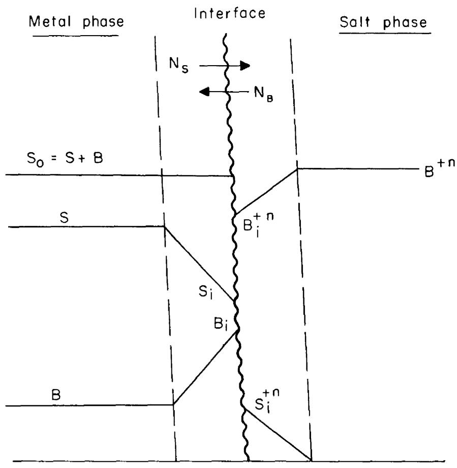  
1. Concentration profiles near interface in fused salt-liquid metal extraction.

the flux depends upon the concentration $S$ in a non-linear manner.

A significant simplification in the analysis with exchange occurs if the equilibrium constant of Eq(16) is very large (this situation is usually called an "irreversible" reaction in the literature on mass transfer with chemical reaction). If $\mathrm{K_{eq}} \rightarrow \infty$ , either $S_{i}$ or $\mathbf{B}_{\mathrm{i}}^{+n}$ must be zero. If $S_{\mathrm{i}} \rightarrow 0$ , Eq(18) indicates that the flux is given by $N = k_{i}S$ , which is the condition of transfer completely controlled by resistance within the drop. On the other hand, if $\mathbf{B}_{\mathrm{i}}^{+n} \rightarrow 0$ , transfer is controlled completely by diffusion in the salt phase, and by Eq(17), $N = k_{e}B^{+n}$ . The actual controlling mechanism is the one which yields the smaller rate. In a drop extraction experiment, where the concentration in the metal drop $S$ decreases with contact time, the rate may be controlled by external transfer in the top of the column and by internal transfer at the end of fall. The two mechanisms participate in the determination of the amount extracted in a consecutive fashion instead of by the series manner implied in the overall coefficient of Eq(14).

If $\mathbf{K}_{\mathbf{eq}}$ is finite, Eqs(16) - (18) can be solved for $S_1^{+n}$ which is determined by solution of:

$$
\begin{array}{l} \left(\mathrm {K} _ {\mathrm {e q}} - 1\right) \gamma \left(\mathrm {S} _ {i} ^ {+ n}\right) ^ {2} - \left[ \mathrm {K} _ {\mathrm {e q}} \left(\gamma \mathrm {B} ^ {+ n} + \mathrm {s}\right) + \left(\mathrm {S} _ {o} - \mathrm {s}\right) \right] \left(\mathrm {S} _ {i} ^ {+ n}\right) \\ + \mathrm {K} _ {\mathrm {e q}} \mathrm {S B} ^ {+ n} = 0 \tag {19} \\ \end{array}
$$

where $\gamma$ is the ratio $k_{e} / k_{i}$ .

The decrease in the concentration of the solute in the metal phase as the drop falls through the salt is given by the material balance:

$$
\frac {\mathrm {d} S}{\mathrm {d} t} = - \frac {6}{\mathrm {d}} N \tag {20}
$$

With $N = k_{e}(S_{i}^{+n})$ from Eq(18), the concentration $S$ after a contact time is determined from:

$$
\int_ {S _ {0}} ^ {S} \frac {\mathrm {d} S}{\left(S _ {i} ^ {+ n}\right)} = - \frac {6 k _ {\mathrm {e}}}{\mathrm {d}} t \tag {21}
$$

where $S_{i}^{+n}$ is the solution of Eq(19). In general, the integral on the left of Eq(21) cannot be performed analyt-

ically. The quantity usually measured in the experiment is the fraction of the solute extracted from the drop after falling through a length $L$ of salt:

$$
f = 1 - S / S _ {o} \tag {22}
$$

where the contact time is $t = L / u$ .

If the internal resistance to mass transfer is negligible ( $\gamma = 0$ ), Eq(19) can be solved. The fraction extracted is given by:

$$
- \ln (1 - f) + \left(\mathrm {K} _ {\mathrm {e q}} - 1\right) f = \frac {6 t}{d} \mathrm {K} _ {\mathrm {e q}} k _ {\mathrm {e}} \left(\frac {\mathrm {B} ^ {+ n}}{\mathrm {S} _ {\mathrm {o}}}\right) \tag {23}
$$

3) Isotopic Equilibrium. If the species S and B in the salt-metal exchange reaction are isotopes of the same metal species, the equilibrium constant of Eq(16) is identically unity. Eq(19) can be solved and the flux written as:

$$
N = \left[ \frac {k _ {e} \left(B ^ {+ n} / S _ {o}\right)}{1 + \left(B ^ {+ n} / S _ {o}\right) Y} \right] S \tag {24}
$$

The bracketed term in this expression is an overall mass transfer coefficient of the type given by Eq(14). The "distribution coefficient" $m$ is identified with the concentration ratio $(\mathrm{B}^{+n} / \mathrm{S}_0)$ . Isotope exchange has the capability of covering the entire range from complete internal control to complete external control simply by adjusting the ratio $(\mathrm{B}^{+n} / \mathrm{S}_0)$ .

# Slow Interfacial Chemical Reaction

If the chemical exchange reaction, Eq(15), proceeds at a rate comparable to the diffusion rates, equilibrium between the two phases at the interface cannot be attained. If the chemical reaction mechanism is the same as the overall reaction, the interface condition of Eq(16) is replaced by:

$$
N = k _ {r} \left(B _ {i} S _ {i} ^ {+ n} - \frac {1}{K _ {e q}} S _ {i} B _ {i} ^ {+ n}\right) \tag {25}
$$

Eq(16) is seen to be a special case of Eq(25) which is approached as the chemical rate constant $\mathbf{k}_{\mathrm{r}}$ becomes very large.

# Drop Fall Velocity

In order to determine the contact time in a drop extraction process, the fall velocity of the drop must be known. These velocities have rarely been measured in high temperature systems, and the fall velocity is usually computed by assuming that the Hu-Kintner correlation(14), which was developed for aqueous-organic systems, applies.

# Comparison With Experiment

Drop extraction experiments provide information on the variation of the fraction extracted $f$ for variations of the controllable parameters $d$ (drop diameter), $t$ (contact time, varied by adjusting the height of the salt column) and in chemical or isotopic exchange experiments, by altering the concentration ratio $(B^{+n} / S_{o})$ . Generally the temperature is maintained constant at some convenient value. The experimental results are compared to a theoretical model such as one of those discussed above. Lack of agreement between theory and experiment can be attributed to one of the following reasons:

1) The theoretical or empirical expressions for $k_{i}$ or $k_{e}$ (usually taken from investigations of aqueous-organic systems) do not apply to the high temperature system.   
2) A slow chemical step occurs at the interface (i.e., $\mathbf{k}_{\mathbf{r}}$ of Eq(25) is not very large.   
3) There is an additional resistance at the interface, due perhaps to impurities (lack of intimate phase contact due to non-wetting is very unusual in liquid-liquid systems).   
4) Even if equilibrium prevails at the interface, the dynamic data $(\mathrm{K}_{\mathrm{eq}}$ or m) upon which the interface condition is based are in error.   
5) The transport properties may not have been measured or are poorly estimated from correlations.

A review of several experiments on high temperature liquid-liquid extraction will indicate the degree with which such experiments agree with drop extraction theory.

# Drop Extraction Experiments

The first experiments specifically designed to investigate the kinetics of drop extraction with high temperature reprocessing in view were those reported by Bonilla at the First Geneva Conference(15).

To minimize the problems associated with containing reactive metals at elevated temperatures, the lead-zinc

system was studied at $450^{\circ}\mathrm{C}$ . The two partially miscible solvents were initially free of the other component. The sealed pyrex tube containing the two solvents was brought to temperature in the position shown by the solid diagram in Fig. 2. The tube was then tilted by $105^{\circ}$ so that the lead fell through the zinc and the zinc rose to the top. After rapid solidification, the concentrations of zinc in the lead and lead in the zinc were measured. It was hoped that the zinc would rise through the lead as a single large drop, thus permitting comparison of the external mass transfer coefficient in the lead phase and the internal coefficient in the zinc drop with drop extraction theory. However, the measured external coefficient was 30 times greater than the value computed from Eq(5), probably because the zinc phase had broken up into many small drops instead of rising as a single sphere.

Internal coefficients in a fused salt-liquid metal extraction were measured by Bonilla in the drop rise experiment shown in Fig. 3. The LiCl-KCl eutectic contained in compartment A of the pyrex apparatus was fed by inert gas pressure through tube E into the cadmium resevoir B. By forcing the salt through nozzle C, drops of $3\mathrm{mm}$ diameter were produced. Since cadmium is slightly soluble in the salt, but the salt is insoluble in cadmium, only cadmium transfer into the salt drops occurred. The mass transfer coefficient inside the salt drops was obtained from the terminal cadmium concentrations in the collected salt. However, the data were compared to the predictions of the Higbie model (which applies to external mass transfer) rather than to one of the internal mass transfer models.

The first salt-metal kinetic experiment which considered an exchange reaction at the interface was reported by Katz, Hill, and Speirs in 1960(16). They studied the transfer of Sm from a bismuth phase to a NaCl-KCl-MgCl $_2$ salt phase by the Sm-MgCl $_2$ exchange reaction. Metal drops of $2.2 \mathrm{~mm}$ diameter were introduced into the salt phase in the Vycor device shown in Fig. 4. Smooth drop entry was accomplished by moving the notch in the central rod up to the bismuth reservoir in the upper compartment, then lowering the rod into the salt phase so that the small amount of metal contained in the notch fell through the salt. In order to minimize the continued extraction from the puddle of metal at the bottom of the column, the constriction shown in the bottom of the apparatus was provided to reduce diffusion to and from the collected metal. The fraction extracted was determined by analysis of the salt after 15 drops had been released in this fashion. The con

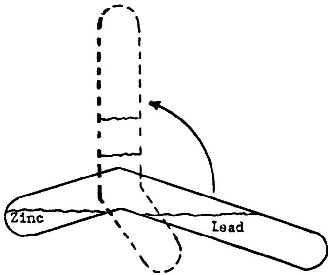

2. Apparatus used by Bonilla for extraction measurements in a two-immiscible liquid metal system (15).

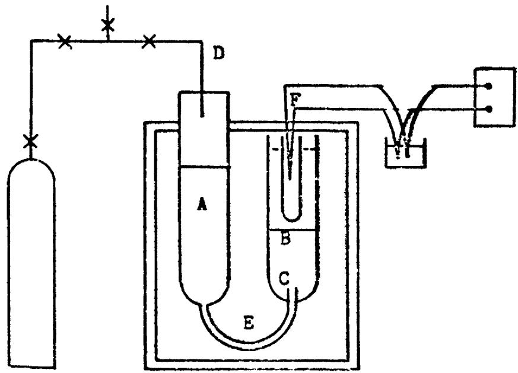

3. Apparatus used by Bonilla for investigation of fused salt-liquid metal extraction (15).

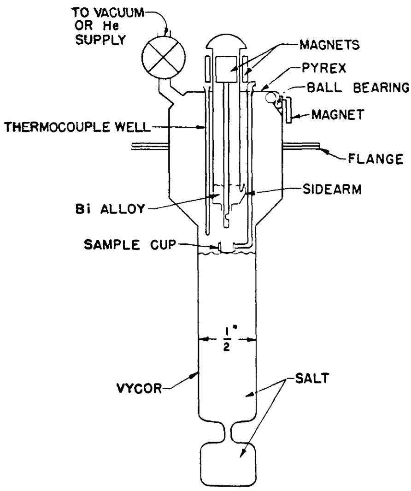  
4. Extraction apparatus of Katz et al (16).

tact time was varied by using salt columns varying from 7 to $25~\mathrm{cm}$ in height. Because the equilibrium constant strongly favored accumulation of samarium in the salt phase (equivalent to a large value of m in Eq(14)), external resistance to mass transfer was small compared to resistance within the falling drop. The extraction rates were satisfactorily represented by the Handlos-Baron internal mass transfer coefficients (Eq(6)).

Both chemical and isotopic exchange in a fused salt-liquid metal system were investigated by Olander(17). Chemical exchange involved extraction of zinc from a zinc-lead alloy by reaction with lead chloride in the LiCl-KCl eutectic:

$$
Z n (m) + P b ^ {+ 2} (s) = P b (m) + Z n ^ {+ 2} (s) \tag {26}
$$

The apparatus used is shown in Fig. 5. Metal drops of diameters ranging from 1 to $5\mathrm{mm}$ were introduced into the top of the column. As in the experiments of Katz et al(16), precautions were taken to minimize extraction during drop entry and after drop fall had been completed. Elimination of these end effects is essential if the extraction data are to be compared to the theoretical models described previously, all of which are based upon mass transfer only during free fall of the drop.

Mass transfer during introduction of the drop into the salt was minimized (but not eliminated) by using one of the two entry techniques shown in Fig. 6. In the rod entry method, the drop was speared on the tip of a pyrex rod and lowered into a layer of solute-free salt which had been carefully poured on top of the extracting salt in the column. In the dropper entry method, drop fall was initiated by removing the plunger from the funnel stem shown in Fig. 6b. The molten metal pellet then fell first through a solute free layer and then into the extracting salt.

Reduction of the bottom end effect was accomplished in the following manner. Just prior to drop release, the temperature at the bottom of the salt column was reduced below the freezing point of the salt. The falling drop encountered an advancing solidification front as it reached the end of its fall, and continued extraction was prevented by enveloping the drop in solid salt.

Isotope exchange was studied by replacing lead chloride in the salt phase by zinc chloride. The tracer zinc-65 in the metal phase exchanged with natural zinc in the salt phase.

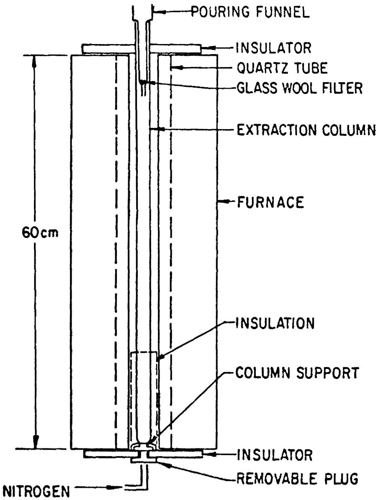  
5. Extraction column for fused salt-liquid metal systems used by Olander (17).

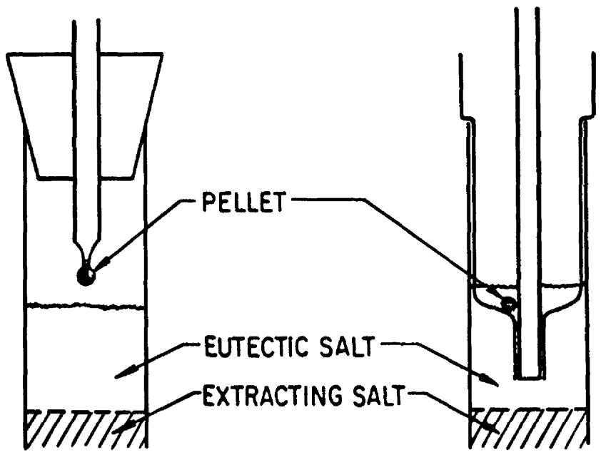


# ROD ENTRY


# DROpper ENTRY

6. Methods of introducing metal drop into extraction column (17).

The fractions extracted were the same for both chemical and isotopic exchange, and both varied linearly with the ratio of the concentration of extractant in the salt to the concentration of zinc in the metal. These two observations suggested complete control of the extraction process by external (salt phase) mass transfer. The external mass transfer coefficients obtained from the data were in rough accord with those predicted by the rigid drop model (Eq(1)).

There were indications that the mechanism of the interfacial reaction did not follow the overall reaction of Eq(26) for all conditions. When pure zinc drops were contacted with lead chloride solutions, the recovered drop was partially encased by a black crust, which consisted primarily of tiny spheres of metal. It was hypothesized that the primary rapid reaction at the interface was:

$$
\mathrm {P b} ^ {+ 2} (\mathrm {s}) + 2 \mathrm {Z n} (\mathrm {m}) = \mathrm {P b} (\mathrm {m}) + \mathrm {Z n} _ {2} ^ {+ 2} (\mathrm {s}) \tag {27}
$$

The zinc subchloride begins diffusing towards the bulk of the salt but produces finely dispersed metal particles in the boundary layer by one of the following reactions:

$$
Z n _ {2} ^ {+ 2} (s) = Z n \downarrow + Z n ^ {+ 2} (s) \tag {28}
$$

or

$$
Z n _ {2} ^ {+ 2} (s) + P b ^ {+ 2} (s) = P b + 2 Z n ^ {+ 2} (s) \tag {29}
$$

This model predicts that when interfacial reaction is governed by Eq(27) rather than by Eq(26), twice as much zinc should be extracted for the same lead chloride bulk concentration (since each $\mathsf{Pb}^{+2}$ reaching the metal drop moves two zinc atoms by reaction (27) but only one by reaction (26)). This feature of the subchloride model was qualitatively confirmed by the extraction data.

The results for this system suggested that a number of forms of rate-enhancing interfacial turbulence, which have also been observed in aqueous-organic systems, may be important in high temperature inorganic systems as well. Drop oscillation was observed, and some experiments suggested accelerated transfer due to a Marangoni-type interfacial motion.

Mass transfer and drop fall velocities were measured in an immiscible liquid metal extraction system by Pasternak and Olander[13]. Lanthanum-140 and barium 140 were transferred from 2-4 mm diameter drops of the uranium-

chromium eutectic alloy freely falling through a column of molten magnesium at $1000^{\circ}\mathrm{C}$ . The all-graphite extraction column shown in Fig. 7 was employed. At this temperature (which is $500^{\circ}\mathrm{C}$ higher than the three salt-metal experiments discussed above), not even the modest refinements in drop entry methods used in the salt-metal studies were feasible. The reactor-irradiated U-Cr drop was simply suspended from a tungsten wire and lowered into the molten magnesium. After melting, it detached from the wire and fell through the column. The progress of the drop down the column was followed by the response of three collimated scintillation detectors placed at intervals along the length of the column. To minimize continued extraction before the system was frozen after an experiment, a puddle of molten $\mathrm{BaCl}_2$ was placed at the bottom of the column to receive the falling drop and remove it from direct contact with the magnesium extractant.

The drop terminal velocities measured from the responses of the three detectors were in good agreement (15%) with the Hu-Kintner relation(14), despite density differences, interfacial tension, and viscosities far beyond the range of this aqueous-organic based correlation.

Mass transfer coefficients of lanthanum were measured directly by determination of La-140 activity pick-up in the magnesium ingot. By following the decay of the La-140 activity in the ingot for about three weeks after the experiment and utilizing the radiochemical decay properties of the two member Ba-140-La-140 chain, the mass transfer coefficient of barium was determined as well.

Since the distribution coefficient (Mg-to-U-Cr) of lanthanum was approximately 50 times that of barium, lanthanum extraction was expected to be controlled by transport within the drop and barium extraction by transfer in the external magnesium phase. These predictions were borne out by the data. To within the precision of the data, lanthanum extraction followed the stagnant diffusion model of internal transfer (Eq(13)), while barium transfer agreed with the Higbie model.

# Conclusions

Because of the rather forbidding array of problems associated with working with reactive liquid metals at elevated temperatures, very few high temperature $(>500^{\circ}\mathrm{C})$ liquid-liquid extraction experiments have been performed. Equilibrium measurements with the same systems of course encounter identical stringent restrictions on container materials and system cleanliness, but the kinetic experi

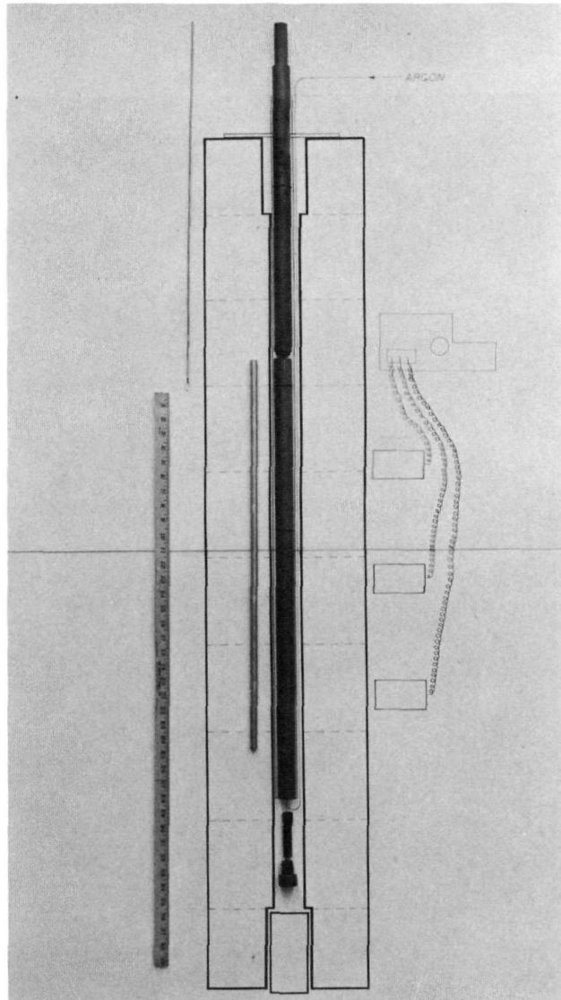

7. Apparatus for liquid metal extraction at $1000^{\circ}\mathrm{C}$ (18). The furnace and radiation detectors are sketched. The magnesium charge is shown alongside the graphite extraction column. The top section of the column is a magnesium condenser. At the upper left is the stick and wire for introducing the pellet into the column; a pellet is attached to the wire.

ments have the additional requirement of moving one phase relative to the other in a manner which permits theoretical determination of the flow patterns and hence the mass transfer coefficients. In addition, the kinetic experiments require reliable equilibrium data (in the form of distribution coefficients, solubilities, or two-phase equilibrium constants) in order to interpret the extraction data. Often, the lack of good thermodynamic or transport property data may be the greatest impediment to obtaining reliable mass transfer information. Where such data are available, the mass transfer studies have shown that the liquid metal-fused salt extraction kinetics are adequately described by one of the many mass transfer correlations developed for low temperature aqueous-organic systems. The extension of these empirical correlations for physical properties and temperatures far beyond the range in which they were developed appears justified.

Although aqueous-organic correlations appear to adequately describe the results of the relatively crude high temperature kinetic measurements, there is no agreement as to which correlation is applicable for a particular set of conditions. For example, the metal phase internal coefficients determined by Katz et al(16) fit the Handlos-Baron model, while Pasternak and Olander(18) found that the metal phase transfer coefficients agreed best with the stagnant diffusion model. The applicability of these two models (which differ quantitatively by a factor of five under these conditions) may depend upon the nature of the external phase; in the former, the continuous phase was a fused salt while in the latter, it was another liquid metal. As another example, the salt-metal experiments of reference 17 showed external transfer coefficients comparable to those expected for a rigid drop, yet the external coefficients determined by the metal-metal experiments of reference 18 were of the order expected from the Higbie model. These two models predict external coefficient an order of magnitude apart.

Retardation of mass transfer due to interfacial resistance has not been observed in any experiments. If slow chemical reaction is the form of interface resistance, this observation is not surprising. Chemical rate constants increase much more rapidly with temperature than mass transfer coefficients, and one would have to search diligently for a reaction between two fluid phases which was slower than diffusion in the temperature range from $500 - 1000^{\circ}\mathrm{C}$ .

It is somewhat surprising, however, that inhibition of

extraction due to interface-seeking impurities have not been reported, particularly since these effects have been reported in aqueous-organic systems. Since most liq-quid metals at these temperatures will react readily with impurities in the cover gas, in the solvent phases proper, or with the container material, there should have been a much more severe contamination problem than in relatively non-reactive low temperature aqueous-organic systems.

The mass transfer studies of high temperature liquid-liquid systems have not yet demonstrated unequivocally that prediction methods based upon experience with aqueous-organic systems are directly applicable to pyrochemical reprocessing systems. They have shown, however, that for devices such as spray columns and mixer settlers, the liquid metal-fused salt and immiscible liquid metal results at least fall in the range of the common aqueous-organic correlations. So far, no rate-limiting phenomena peculiar to high temperature inorganic species have been uncovered. However, problems unique to liquid metals may appear in other contacting devices such as packed columns where phase contact involves a third solid phase. In this case, the degree of wetting of the packing by one or both of the immiscible liquid phases may be important.

# II. Transport Properties of Liquid Metals

Interpretation of mass transfer experiments in liquid metal-fused salt systems requires a knowledge of solvent viscosities and solute diffusivities. The dimensionless Sherwood, Schmidt, and Reynolds numbers, which are used to correlate mass transfer coefficients, depend upon these transport properties. In order to apply the correlations, measurements or estimates of viscosity and diffusivity for the particular system of interest are required.

In recent years, considerable effort has been devoted to measuring the viscosity of pure liquid metals and liquid metal alloys and also to the measurement of diffusion coefficients in liquid metal systems. Many of these experiments have been on systems of particular importance in nuclear reactor and pyrochemical fuel processing technology.

In addition to experimental measurements, methods for estimating viscosities and diffusivities have been developed. These methods involve semi-empirical correlations in which the value of an adjustable parameter is determined by the existing data. Assuming that liquid metals all show similar behavior with respect to the adjustable parameter, the correlation can then be applied to systems for which data are not yet available.

# Viscosity Correlations

Two methods for estimating liquid metal viscosities are those of Grosse(19) and Chapman(20). Grosse's method assumes an exponential dependence of viscosity on temperature:

$$
\eta = a \exp \left[ H _ {\eta} / R T \right] \tag {30}
$$

where $\eta$ is the viscosity in poises, $H_{\eta}$ is the activation energy of viscous flow in cal/g-atom, $R$ is the gas constant in cal/g-atom- $^\circ K$ , and $T$ is the absolute temperature in $^\circ K$ . Andrade's expression (21,22), is used to estimate viscosity at the melting point.

$$
n _ {m} = 5. 7 x 1 0 ^ {- 4} \frac {\left(\mathrm {A T} _ {m}\right) 1 / 2}{\mathrm {V} ^ {2 / 3}} \tag {31}
$$

where $A$ is the atomic weight, $T_{\mathrm{m}}$ the melting point, and $V$ is the atomic volume at the melting point in cc/g-atom. Grosse finds the following empirical correlation between

$H_{\eta}$ and the melting point, $T_{m}$ .

$$
\log_ {1 0} \mathrm {H} _ {\eta} = 1. 3 4 8 \log_ {1 0} \mathrm {T} _ {\mathrm {m}} - 0. 3 6 6 \tag {32}
$$

From Eqs(31) and (32), the pre-exponential factor, $a$ , in (30) can be determined. Eq(30) can then be used to estimate viscosity over the entire liquid range.

Chapman(20) uses the radial distribution function concept of the liquid state to establish a functional relationship between reduced viscosity, reduced volume, and reduced temperature. These quantities are reduced with a distance parameter (the Goldschmidt atomic diameter) and an energy parameter. Energy parameters for the liquid metals are empirically found to be about $5.2\mathrm{kT}_{\mathrm{m}}$ . Grosse's correlation requires the molecular weight, melting point, and density at the melting point; Chapman's correlation requires the molecular weight, melting point, density over the temperature range of interest, and Goldschmidt atomic diameter.

# Viscosities of the Actinides

The only experimental determination of the viscosity of plutonium is that of Jones, Ofte, Rohr and Wittenberg(23) whose measurements cover the range from $645 - 950^{\circ}\mathrm{C}$ . Ofte(24) has also measured the viscosity of uranium contained in sub-stoichiometric zirconia crucibles from 1141-1248°C. The viscosity of uranium has also been measured recently by Finucane and Olander(25) in both tantalum and beryllia crucibles. Their measurements cover the range from the melting point to $1532^{\circ}\mathrm{C}$ . All of these measurements employ the oscillating crucible technique, which is an absolute method requiring no calibration with a liquid of known viscosity. The data for these three measurements are shown in Figure 8 along with values predicted by the Grosse and Chapman correlations. All of the measured viscosities are higher than the predicted values, and it may be that the actinide metals behave as a class apart from other metals.

The data of Finucane and Olander for uranium show greater precision over a wider temperature range than do those of Ofte. However, the $\sim 35\%$ discrepancy between the two sets of data will have to be resolved by a third measurement.

# Viscosities of the Rare Earths

Viscosities and densities of the molten rare earths lanthanum, cerium and praseodymium have been measured by

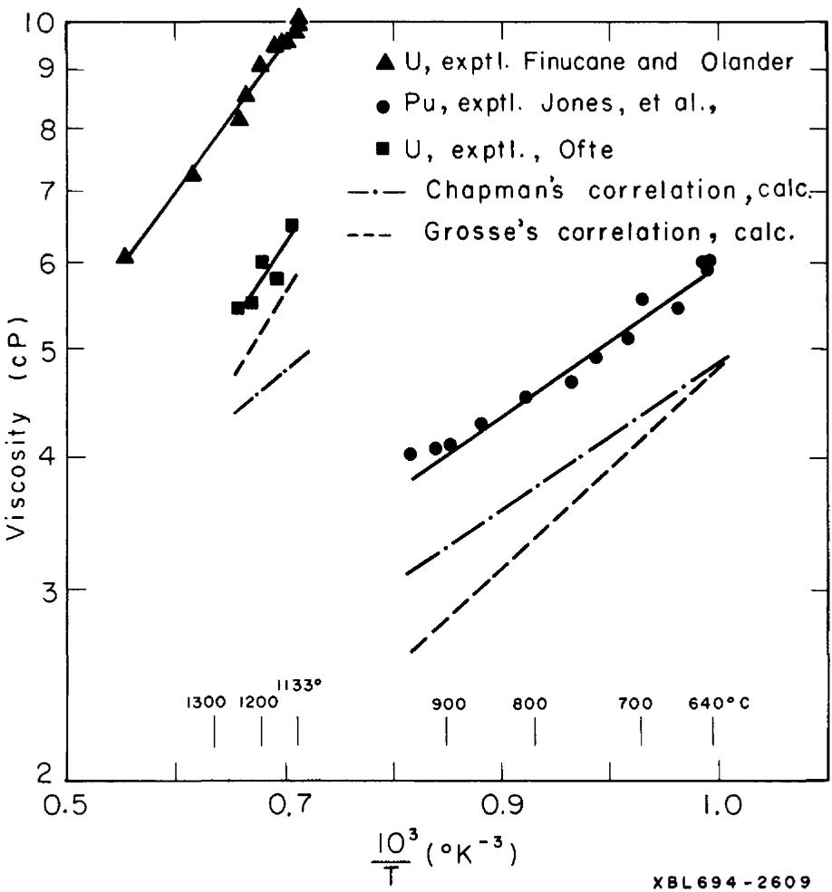  
8. Viscosity of uranium and plutonium.

Wittenberg, Ofte and Rohr(26,27) in the temperature range from the melting point to over $1000^{\circ}\mathrm{C}$ . Figure 9 compares the data with Grosse's and Chapman's correlations. Both correlations fall within the scatter of experimental data for all three metals. It should be noted, however, that the activation energy from the least squares fit is much smaller than that predicted by either of the two correlations. Therefore, extrapolation of the data to higher temperatures may involve considerable error.

# Viscosities of Plutonium Alloys

Since the early 1960's, the viscosities of several plutonium alloys have been measured at the Mound Laboratory. These alloy systems are Pu-Ce-Co(23), Pu-Ce(28), Pu-Fe(29), Pu-U(30) and Pu-Ga(30). These alloys are of interest as possible reactor liquid fuels. In all cases, the addition of alloying elements to plutonium produces a viscosity increase. The effect is most pronounced in the case of Ga where a 3.3 atom percent addition causes a $50\%$ rise above the viscosity for pure plutonium. In the Pu-U system, there is a relative viscosity maximum, apparent in all isotherms up to $800^{\circ}\mathrm{C}$ , at a composition of 10.8 atomic percent uranium. This is the composition of the lowest melting alloy in the system, $620^{\circ}\mathrm{C}$ . Viscosity isotherms for the Pu-Fe system show a maximum at the eutectic composition of 9.5 atomic percent iron. Viscosity isotherms for the Pu-Ce system are the most unusual of all. Additions of Ce produce a rise in viscosity to a maximum at 5 atomic percent cerium. Viscosity then decreases to a minimum at 14 atomic percent cerium followed by a slight rise at the eutectic composition, 16.5 atomic percent cerium. There is no theory to adequately explain or predict the wide variety of viscosity behavior in liquid metal alloys. Some systems show a viscosity minimum at the eutectic point. For such a frequently studied system as the lead-tin pair there is disagreement in the literature. Fisher and Phillips(32) observe a viscosity minimum at the eutectic point; Kanda and Colburn(33) observe linear viscosity isotherms over the complete composition range from pure tin to pure lead. Some Russian investigators have applied thermodynamic (heat of mixing) data to the study of alloy viscosity behavior. Burylev(34) has shown a relationship between viscosity isotherms for Cu-Ag alloys (which have a minimum) and thermodynamic data. Eretnov and Lyubimov(35) have investigated the relation-ship between viscosity isotherms for several copper alloy systems which have maxima and heat of mixing data, while for other systems(36) volume changes on mixing are more important.

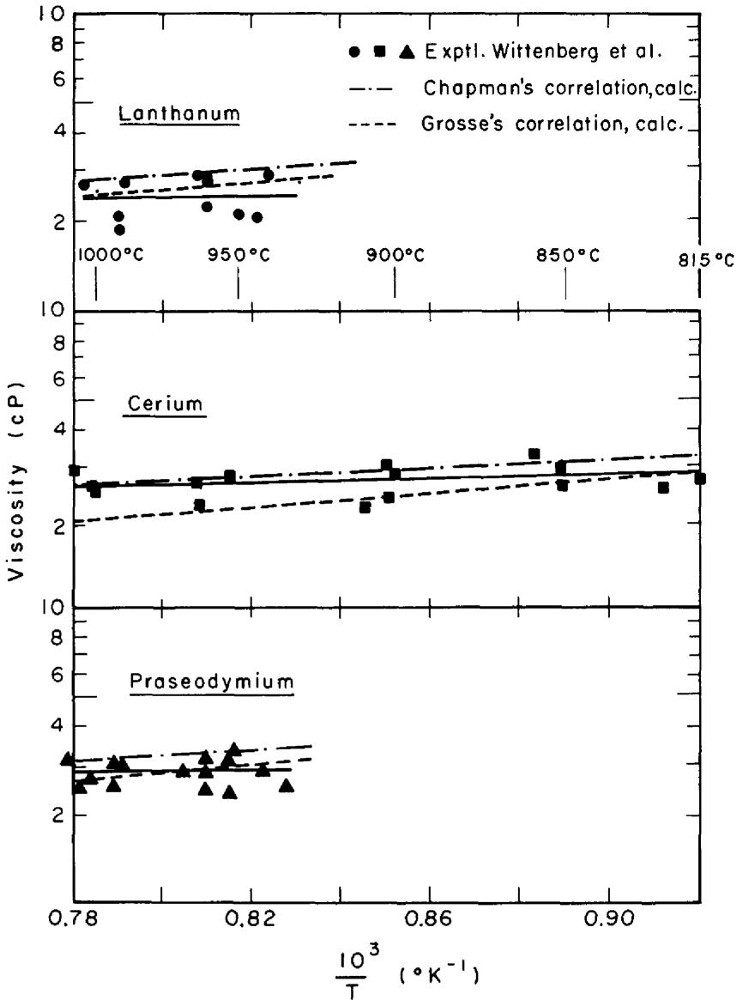  
9. Viscosity of lanthanum, cerium and praseodymium.

# Diffusivity Correlations

Mutual diffusion coefficients in a number of dilute liquid metal solutions have been correlated by Pasternak and Olander $^{(37)}$ using a modified form of absolute rate theory. The theory was developed by Olander $^{(38)}$ to correlate mutual diffusion data in dilute organic systems, and uses viscosity data for both pure solvent and pure solute to estimate the difference between the free energies of activation of the viscous and diffusive processes. The correlation for liquid metals is shown in Figure 10; the dashed lines represent $25\%$ deviation from the best line. The dimensionless group Y and the parameter f are defined by:

$$
\begin{array}{l} \mathrm {Y} = \left(\frac {\mathrm {d} \eta}{\mathrm {T}}\right) \left(\frac {5 . 3 1}{\mathrm {k}}\right) \left(\frac {\mathrm {V}}{\mathrm {N}}\right) ^ {1 / 3} = \exp [ 0. 5 \delta ] (32) \\ \delta = \left(\frac {\Delta F _ {A A} ^ {*}}{\overline {{R T}}}\right) \left[ 1 - \left(\frac {\Delta F _ {B B} ^ {*}}{\Delta F _ {A A} ^ {*}}\right) ^ {1 / 2} \right] (33) \\ \end{array}
$$

where $k$ is the Boltzmann constant, $N$ is Avogadro's number, and $\Delta F_{AA}^{*}$ and $\Delta F_{BB}^{*}$ are the free energies of activation for viscosity for pure solvent and pure solute respectively. Free energies of activation are obtained from viscosity data by the expression

$$
\eta = \frac {\mathrm {N h}}{\mathrm {V}} \exp [ \Delta \mathrm {F} ^ {*} / \mathrm {R T} ] \tag {34}
$$

where $h$ is Planck's constant.

For systems where the diffusing solute is a solid at the temperature of measurement, $\Delta F_{BB}^{*}$ is obtained by a linear extrapolation of $\Delta F_{BB}^{*}$ values obtained in the liquid region according to:

$$
\Delta F ^ {*} = \Delta H ^ {*} - T \Delta S ^ {*} \tag {35}
$$

where $\Delta H^{\star}$ and $\Delta S^{\star}$ are the entholpy and entropy of activation of viscosity obtained for pure solute metal above its melting point.

Liquid metal diffusion coefficients have often been estimated by the Stokes-Einstein equation:

$$
D = \frac {k T}{6 \pi r n} \tag {36}
$$

where $r$ is a characteristic radius of the diffusing solute

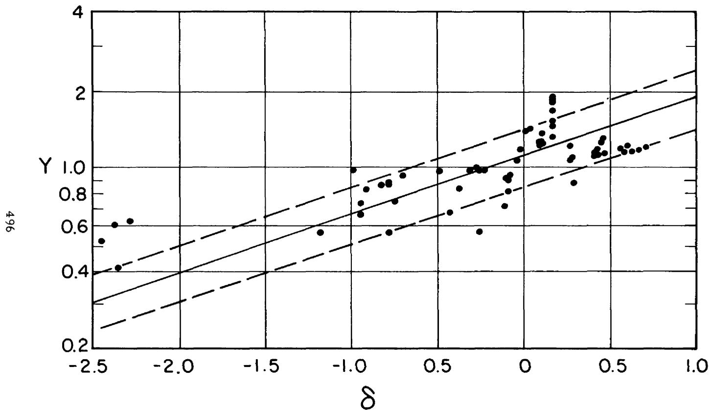  
10. Modified absolute rate theory correlation of mutual diffusion coefficients in liquid metals.

atom. The Stokes-Einstein equation is based on a hydrodynamic model of a large solute atom moving through a continuous fluid with a "no-slip" condition at the solute atom surface. For liquid metals, the size parameter $r$ in Eq(37) is usually taken as the ionic rather than the atomic radius of the solute atom. Based on a study of viscosities in liquid metals, Eyring(39) concludes that the unit of flow is probably the metal ion stripped of its valence electrons.

For self-diffusion, $\delta = 0$ and $Y = 1$ in Eqs(32) and (33). Therefore, if the self-diffusion coefficient for the pure solvent $D_{AA}$ is known, the mutual diffusion coefficient for the solute B in solvent A, $D_{AB}$ , can be related to $D_{AA}$ by Eq(35):

$$
\frac {D _ {A B}}{D _ {A A}} = \exp [ 0. 5 \delta ] \tag {37}
$$

The ratio of mutual to self-diffusion in a particular solvent according to the Stokes-Einstein equation is:

$$
\frac {\mathrm {D} _ {\mathrm {A B}}}{\mathrm {D} _ {\mathrm {A A}}} = \frac {\mathrm {r} _ {\mathrm {A}}}{\mathrm {r} _ {\mathrm {B}}} \tag {38}
$$

Data for a series of solutes in liquid silver(40,41,42) is presented in Table 1. Here the Stokes-Einstein estimate using Goldschmidt ionic radii of the diffusing solute and solvent molecules shows better agreement with the data than the same estimate using atomic radii.

# Diffusivity of Uranium in Liquid Metals

Figures 11 and 12 present diffusivity data for uranium in bismuth, zinc, cadmium and aluminum. Data for all four systems were obtained by Hesson, Hootman, and Burris (43) The aluminum data of Mitamura (44) are also included. The modified absolute rate theory of Eqs (32) and (33) shows a better agreement with the data than the Stokes-Einstein equation (36), although except for bismuth, both prediction methods are high.

# Diffusivity of the Rare Earths in Molten Uranium

The extraction of rare earth fission products from uranium fuel is an important part of some liquid metal

D $(10^{-5}cm^{2} / sec)$   
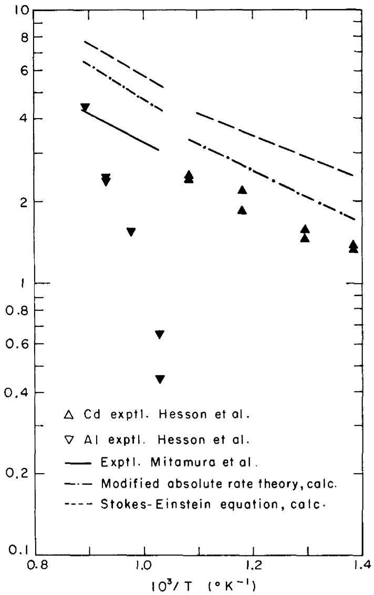  
11. Diffusivity of uranium in cadmium and aluminum.

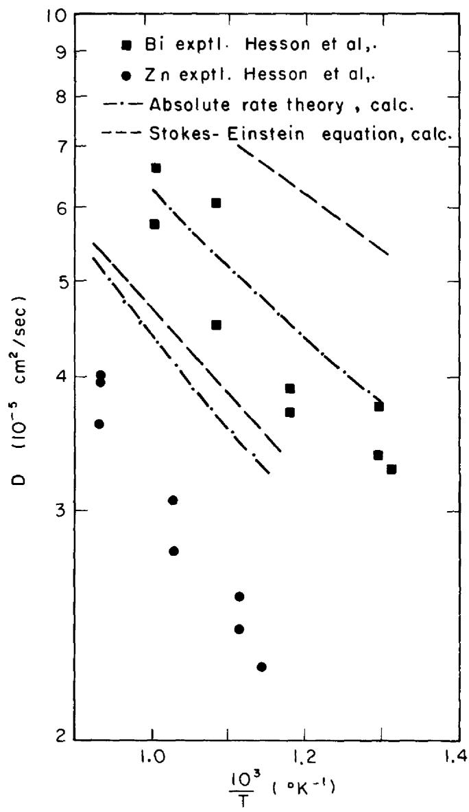  
12. Diffusivity of uranium in bismuth and zinc.

Table 1. Comparison of Calculated and Experimental Mutual to Self-Diffusion Coefficient Ratios for Various Solutes in Silver at ${1200}^{ \circ  }\mathrm{C}$   

<table><tr><td rowspan="2">Solute in Silver</td><td rowspan="2">Exp.a</td><td rowspan="2">DAB/DAA 
Modified 
Absolute Rate 
(Eq. 37)</td><td colspan="2">Stokes-Einstein(Eq.38)</td></tr><tr><td>using 
Atomic 
Radii b</td><td>using 
Ionic 
Radii b</td></tr><tr><td>Gold</td><td>0.97</td><td>0.90</td><td>1.00</td><td>0.82</td></tr><tr><td>Tin</td><td>1.32</td><td>1.26</td><td>0.91</td><td>1.53</td></tr><tr><td>Indium</td><td>1.35</td><td>1.36</td><td>0.92</td><td>1.23</td></tr><tr><td>Antimony</td><td>1.37</td><td>1.23</td><td>0.90</td><td>1.26</td></tr></table>

a From equations representing data (40,41,42).

b Taken from C. Smithell's "Metals Reference Book", 4th Ed., Plenum (1967).

reprocessing schemes. It is therefore desirable to have available data for the diffusivity of rare earth metals in molten uranium. The only data in the literature are those of Smith(45) who measured the diffusivity of cerium in uranium over the temperature range $1170 - 1480^{\circ}\mathrm{C}$ . The experiments were carried out in fairly large tantalum crucibles (7 mm. diameter). According to the author, convection at the higher temperatures due to the large diameter increased the uncertainty of the results in the range $1400 - 1480^{\circ}\mathrm{C}$ . The value determined at the melting point of uranium, $D = 8.8 \times 10^{-5} \, \mathrm{cm}^2/\mathrm{sec}$ , seems somewhat high also. The value calculated by the Stokes-Einstein equation is $1.5 \times 10^{-5} \, \mathrm{cm}^2/\mathrm{sec}$ . The modified absolute rate method gives $2.5 \times 10^{-5} \, \mathrm{cm}^2/\mathrm{sec}$ .

The modified absolute rate method for calculating diffusivities is convenient to use since it requires only viscosity data for the pure solvent and pure solute. The Stokes-Einstein equation involves an uncertainty as to the correct radius to assign the diffusing solute atom, although most workers use the ionic radius. In general, the modified absolute rate method is more accurate. When applied to common binary metal systems, the Fig. 10 experimental data are correlated to within $\pm 25\%$ . For uranium as solute, good agreement is obtained only with bismuth. The $50\%$ discrepancy in zinc, cadmium and aluminum may indicate that the diffusing amount is larger than a single uranium atom, and may be an intermetallic compound of uranium and the solvent.

# Measurement of Liquid Metal Transport Properties

The measurement of the coefficients of viscosity and diffusivity in liquid metals is subject to the same experimental problems as the mass transfer studies discussed earlier. Because of the high temperatures involved, construction material and equipment complexity are severely restricted (at least within the hot zone of the furnace). The generation of a prescribed flow field in the liquid metal is all-important in both viscosity and diffusivity measurements. In the former, the fluid mechanics of the device must be known because the relation between the shear stress and velocity gradients in the fluid establishes the coefficient of viscosity. In diffusion measurements, all fluid velocities should be zero.

# Viscosity

The various methods which have been used to measure liquid metal viscosities have been reviewed by Thresh(46).

In the capillary method, the liquid is forced through a narrow tube by inert gas pressure or by the hydrostatic head of the moving fluid itself. The use of an inert gas is often incompatible with the vacuum system required to insure fluid cleanliness. Surface tension effects may inhibit flow in the capillary. A rather large hot zone is necessary and the mechanical complexity of the open flow renders this method unsuitable for high melting reactive metals.

In rotational viscometers, the liquid metal is contained as an annular ring formed by a central cylinder rotating at a constant speed and a stationary outer cylinder. The viscosity can be determined by the torque on the outer cylinder. The problems of driving the inner cylinder and of measuring the torque on the outer cylinder are difficult in high temperature vacuum systems. In addition, accumulation of slag (due to impurities) at the rather small annular liquid surface between the two cylinders significantly affects the measurements.

Oscillating crucible viscometers have been used almost exclusively for viscosity measurements above $1000^{\circ}\mathrm{C}$ . In this method, a specimen of metal is sealed in a cylindrical crucible suspended in the hot zone of a furnace by a torsion wire. The pendulum is given an initial twist and the damping of the torsional oscillations is directly related to the viscosity. The amount of metal used is quite modest: specimens are $\sim 2$ cm diameter by $\sim 7$ cm high, and of an easily machinable shape. The simple geometry also permits fabrication of nearly any high temperature container material for the crucible. The crucible (or an outer refractory metal sheath) can be vacuum sealed by electron beam welding, thereby permitting complete isolation of the melt from the vacuum environment and attainment of temperatures at which the vapor pressure of the liquid would otherwise be unacceptably high for the vacuum system. The only motion required is simple torsional oscillation, which can be initiated from outside the vacuum system. No measurements within the vacuum system are required; the temperature can be measured with an optical pyrometer and the period and damping constant of the oscillation are determined by the motion of a light beam reflected from the part of the pendulum outside of the furnace. The liquid metal surface is relatively large ( $2$ cm diameter), thereby reducing the effects of surface tension and slag-wall interactions.

The apparatus depicted in Fig. 13 is currently in use in our laboratory, but is typical of the design of most high temperature vacuum oscillating crucible viscometers.

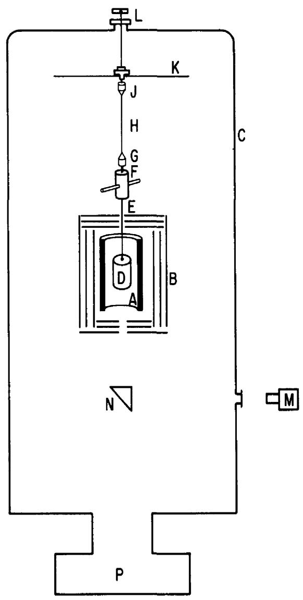

13. Oscillating crucible vacuum viscometer (25).

The furnace heater element (A) is surrounded by a series of tungsten radiation shields (B). The entire system is contained within a vacuum system (C).

The torsion pendulum consists of three primary parts: the crucible (D) which contains the metal specimen; a rod (E) which rigidly connects the crucible with the part of the pendulum outside of the hot zone; and the external portion of the pendulum (F) which has a polished surface to reflect a beam of light by which the motion of the pendulum is monitored. A hole is drilled through the pendulum perpendicular to its axis of rotation into which rods may be inserted and fixed such that the moment of inertia of the pendulum may be varied. The small chuck at (G) attaches the pendulum to the torsion wire. A picture of the entire pendulum in shown in Fig. 14.

The torsion wire (H) extends from the pendulum to a second chuck which is attached to a rotatable holder (J) which rests on a support plate (K). The holder is attached mechanically to a rotary feedthrough (L) by which the rotary motion of the pendulum may be initiated from outside the vacuum system.

The temperature within the furnace region is measured by an optical pyrometer (M) which is sighted through a right angle prism (N) into a hole, 1/8 inch in diameter, drilled through the bottom shield pack into the inner furnace region.

# Diffusion Coefficients

Most liquid metal diffusivity measurements are performed in "capillary" cells. In room temperature measurements on aqueous or organic solutions, diffusion occurs along the length of narrow bore tubing, and the concentration profile can be directly measured by optical methods. With liquid metals, however, the capillary is more aptly described as a tube, since diameters up to 7 mm have been used. The concentration profile cannot be measured in situ; rather the final profile is determined by freezing the system and sectioning the capillary for analysis by chemical or radiochemical means. Application of the common capillary methods to liquid metals has been discussed by Niwa et al(47).

For low melting metals, a U-tube containing the pure solvent is lowered into an alloy bath. After a definite diffusion time, the U-tube is withdrawn from the bath, quenched and sectioned for analysis. Because of the very uniform temperature of the alloy bath into which the U-

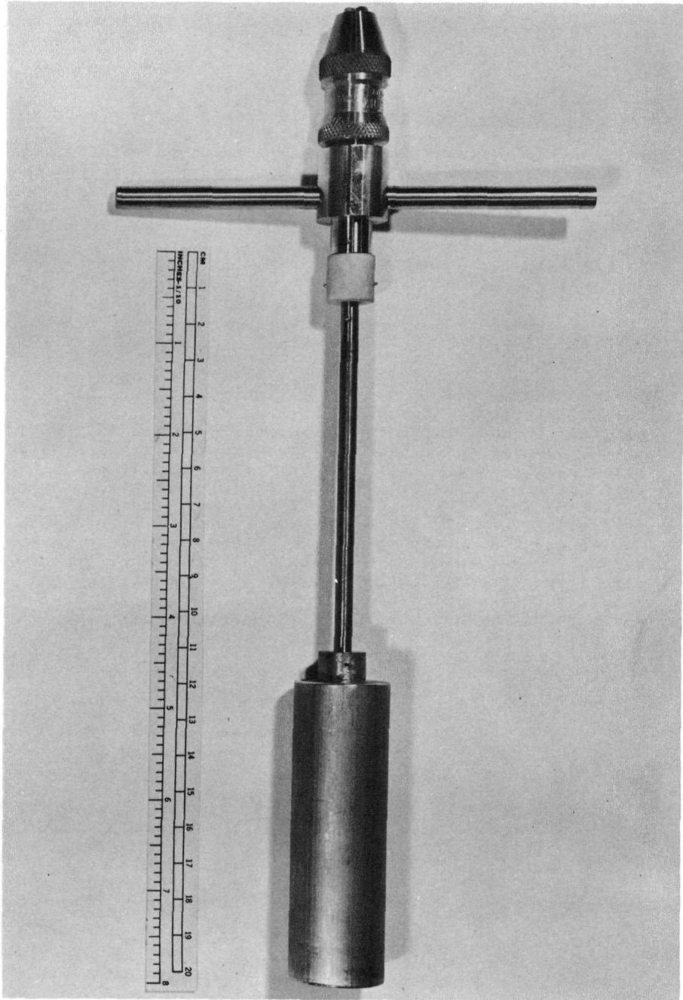  
14. Viscometer pendulum (25).

tube is placed, temperature variations and the resulting natural convection in the diffusion region are virtually eliminated. However, the method is inconvenient for high temperature vacuum environments because of the rather substantial amount of metal required for the alloy bath and because of the complications involved in raising and lowering the U-tube into and out of the hot zone.

The bath-less capillary method utilized by Smith(45) for measurements of diffusion in uranium is suitable for reactive liquid metals at temperatures above $1000^{\circ}\mathrm{C}$ . Smith's apparatus is shown in Fig. 15. In this arrangement, both components are placed in the cylindrical crucible which serves as the diffusion "capillary". Care must be taken to avoid convective mixing of the two components (which may or may not be immiscible when liquid) during melting. This method is more susceptible to natural convection mixing due to temperature gradients than is the bath method. Natural convection can be reduced by using specimens of large length-to-diameter ratios, although this geometry accentuates the effect of getting of the diffusing solute by reaction with the container wall. The effects of vertical and horizontal temperature gradients on induced convective motion have been analyzed by Verhoeven(48) and found to be an unlikely source of systematic error (theoretically at least). The mixing which occurs during melting and freezing of the sample, however, can undoubtedly contribute to high apparent diffusion coefficients.

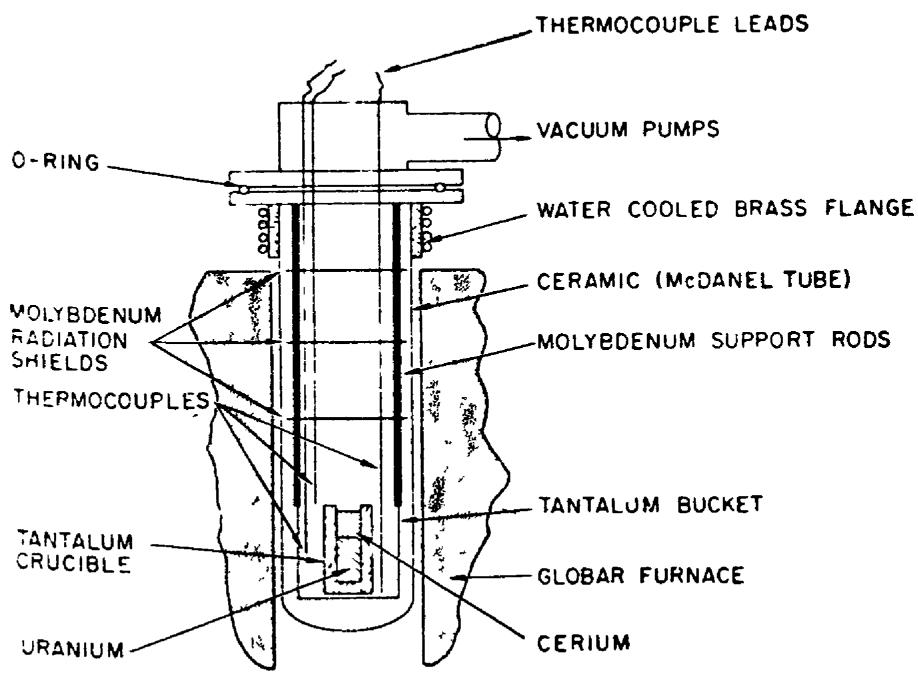  
15. Diffusion apparatus of Smith (45).

# References

1. ANL 7548, p. 109 (1969).   
2. Dunn, W.E., C.F. Bonilla, C. Ferstenberg, and B. Gross, A.I.Ch.E. Journal, 2, 184 (1956).   
3. Kassner, T.F., J. Electrochem. Soc., 114, 689 (1967).   
4. Sideman, S. and H. Shabtai, Can. J. Chem. Eng., 42, 107 (1964).   
5. Higbie, R., Trans. Am. Inst. Chem. Engrs., 31, 365 (1935).   
6. Newman, A.B., Trans. Am. Inst. Chem. Engrs., 27, 203 (1931).   
7. Kronig, R. and J.C. Brink, Appl. sce. Res., A2, 142 (1950).   
8. Handlos, A.E. and T. Baron, A.I.Ch.E. Journal 3, 129 (1957).   
9. Angelo, J.B., E.N. Lightfoot and D.W. Howard, A.I. Ch.E. Journal, 12, 751 (1966).   
10. Rose, D.M. and R.C. Kintner, A.I.Ch.E. Journal, 12, 530 (1966).   
11. Olander, D.R., A.I.Ch.E. Journal, 12, 1018 (1966).   
12. Patel, J.M. and R.M. Wellek, A.I.Ch.E. Journal, 13, 384 (1967).   
13. Pasternak, A.D., UCRL-16108 (1966).   
14. Hu, C. and R.C. Kintner, A.I.Ch.E. Journal, 1, 42 (1955).   
15. Bonilla, C.F., First Int'l Conf. on Peaceful Uses of At. Energy, United Nations, Geneva, 9, paper no. 122, pp. 331-40 (1955).   
16. Katz, H.M., F.B. Hill and J.L. Speirs, Trans. Met. Soc. AIME, 218, 770 (1960).   
17. Olander, D.R., Nuc. Sci. Eng., 31, 1 (1968).   
18. Pasternak, A.D. and D.R. Olander, A.I.Ch.E. Journal, 14, 235 (1968).

19. Grosse, A.V., J. Inorg. and Nucl. Chem., 25, 317 (1963).   
20. Chapman, T.W., A.I.Ch.E. Journal, 12, 395 (1966).   
21. Andrade, E.E., Phil. Mag., 17, 698 (1934).   
22. Andrade, E.W., Phil. Mag., 17, 497 (1934).   
23. Jones, L.V., D. Ofte, W.G. Rohr, and L.J. Wittenberg, Trans. of the ASM, 55, 819 (1962).   
24. Ofte, D., J. Nucl. Mater. 22, 28 (1967).   
25. Finucane, J. and D. Olander, unpublished data.   
26. Wittenberg, L.J., D. Ofte, and W.G. Rohr, *Rare Earth Research*, Vol. II, ed. by K.S. Vorres, Gordon and Breach, New York, 1964, pp. 257-275.   
27. Rohr, W.G., J. Less-Common Metals, 10, 389 (1966).   
28. Ofte, D., W.G. Rohr, and L.J. Wittenberg, Plutonium 1965, Proc. of the 3rd Internat'1 Conf. on Plutonium, London, 1965, ed. by A.E. Kay and M.B. Waldron, Chapman and Hall, London (1965), pp. 405-419.   
29. Ofte, D. and L.J. Wittenberg, Trans. ASM, 57, 917 (1964).   
30. MLM-1402, Reactor Fuels and Materials Development Plutonium Research: 1966 Annual Report, October 16, 1967, pp. 40-44.   
31. Ofte, D. and W.G. Rohr, J. Nucl. Mater., 15, 231 (1965).   
32. Fisher, H.J. and A. Phillips, J. of Metals, 1060 (1954).   
33. Kanda, F.A. and R.P. Colburn, Phys. and Chem. of Liquids, 159 (1968).   
34. Burylev, B.P. translated in Russian Journal of Physical Chemistry, 41, 53 (1967).   
35. Eretnov, K.I. and A.P. Lyubimov, Ukr. Ziz. Zhur., 12, 214 (1967).   
36. Gvozdeva, L.I. and A.P. Lyubimov, Ukr. Ziz. Zhur., 12, 208 (1967).

37. Pasternak, A.D. and D.R. Olander, A.I.Ch.E. Journal, 13, 1052 (1967).   
38. Olander, D.R., A.I.Ch.E. Journal, 9, 207 (1963).   
39. Glasstone, S., K.J. Laidler, and H. Eyring, Theory of Rate Processes, McGraw-Hill, New York (1941).   
40. Swalin, R.A. and V.G. Leak, Acta. Met., 13, 471 (1966).   
41. Gupta, Y.P., Acta. Met., 14, 297 (1966).   
42. Leak, V.G. and R.A. Swalin, Trans. Met. Soc. AIME, 230, 426 (1964).   
43. Hesson, J.C., H.E. Hootman, and L. Burris, Jr., J. Electrochem. Tech., 3, 240 (1965).   
44. Mitamura, N. Nippon Genshiryoku Gakkaishi, 5, 467 (1963). (Data from NSA 17, 32500).   
45. Smith, T., J. Electrochem. Soc., 106, 1046 (1959).   
46. Thresh, H.R., Trans. ASM, 55, 790 (1962).   
47. Niwa, K., M. Shimaji, S. Kado, Y. Watanabe, and T. Yokukawa, Trans. AIME, 209, 96 (1957).   
48. Verhoeven, J.E., Trans. AIME, 242, 1937 (1968).

# MULTISTAGE CONTACTORS FOR LIQUID METAL-SALT EXTRACTION

R. D. Pierce, W. E. Miller, J. B. Knighton and G. J. Bernstein Chemical Engineering Division Argonne National Laboratory Argonne, Illinois 60439 U.S.A.

# Abstract

Investigations of the chemistry of plutonium, uranium, and fission products in liquid metal-molten salt systems show that good recovery of purified plutonium is possible by liquid metal-molten salt extraction. The application of a semi-continuous mixer-settler for such extractions is under development. The flowsheet involves the selective extraction of rare earths from a Mg-Cu-Pu-fission products alloy into a series of salts at $650^{\circ}\mathrm{C}$ , selective extraction of plutonium into another salt away from the nobler elements and uranium, and re-extraction and concentration of the purified plutonium in another alloy. The design specification is recovery of $99.8\%$ of the plutonium with a decontamination factor of $10^{6}$ .

During a run, some of the fluid phases flow continuously between stages, and the feed alloy is recirculated through the extractor several times. Other phases are only moved batchwise between runs. The resultant flow pattern makes application of conventional designs unattractive or impossible. The design selected consists of a modular assembly of mixer and settler chambers. A simple agitator-pump moves the fluids out of each mixing chamber to a settling chamber. The separated phases flow to adjacent mixing chambers through overflow spouts.

Pumping and mixing performance has been investigated for various designs. A reference design has been selected, and extraction runs are ready to begin.

*Work performed under the auspices of the United States Atomic Energy Commission.

# Introduction

The Salt Transport Process under development at Argonne incorporates multistage liquid metal-salt extraction for the purification of plutonium from fast reactor fuels. This paper is a report on the status of the development of equipment for the plutonium purification step. The complete Salt Transport Process flowsheet is presented in another paper in this symposium.(1)

The feed to the extraction step is a liquid alloy of Mg-42 at. $\%$ Cu-2 at. $\%$ Pu-1 to 2 at. $\%$ fission products. Many of the fission products and most of the uranium are separated from plutonium during the decladding and reduction steps that precede the extraction step. The objective of the extraction step is to remove yttrium and the rare earth elements for disposal and to recover plutonium selectively from uranium, nobler fission elements (zirconium, niobium, ruthenium, molybdenum, technetium, and palladium), and residual cladding elements (iron, chromium, and nickel). These separations are accomplished by selective extraction of yttrium and the rare earths into a molten chloride salt, and subsequent selective extraction of plutonium into another chloride salt. The purified plutonium is concentrated by extraction back into an alloy. Neptunium and curium follow plutonium through the extraction, but the other transuranium elements are removed with the rare earths.

The metal-salt extractions are the results of the equilibrium reactions,

$$
A _ {(a l l o y)} + \frac {n}{2} M g C l _ {2 (s a l t)} \stackrel {\rightarrow} {\leftarrow} A C l _ {n (s a l t)} + \frac {n}{2} M g _ {(a l l o y)}, \tag {1}
$$

where $A$ is an element under consideration,

n is the valence of A.

The extractions that can be effected are evaluated from the distribution coefficients attainable. The distribution coefficient, D, is defined as

$$
D _ {A} = \frac {y _ {A}}{x _ {A}} \tag {2}
$$

where $y_A$ is the concentration of the chloride of A in the salt (mol %),

$x_{A}$ is the concentration of A in the metal (at. $\%$

The extraction factor, R, is useful in process design. It is defined as the ratio of the amount of an element in the salt to the amount in the metal:

$$
R _ {A} = \frac {S y _ {A}}{M x _ {A}} = \frac {D A S}{M}, \tag {3}
$$

where $S$ is total quantity of salt (moles),

M is total quantity of metal (moles).

The separation factor, $\alpha$ , for two elements is defined as the ratio of their distribution coefficients:

$$
\alpha_ {A B} = \frac {D _ {A}}{D _ {B}}, \tag {4}
$$

where A and B are two different elements.

The magnitude of the distribution coefficients is dependent on the equilibrium constant for the reaction (equation 1), the activity coefficients for the components in the metal and salt phases, and the magnesium and magnesium chloride content of the metal and salt phases. The application and control of these variables in designing chemical separations is discussed in another paper in this symposium.(2) The metal and salt phases for the present separation operations were selected to optimize plutonium-rare earth separation and to provide distribution coefficients that allow workable extraction factors at convenient salt-to-metal ratios.

The selection of an extraction philosophy for the Salt Transport Process required consideration of many factors, such as composition specifications for product and wastes, plutonium inventory, criticality, waste volumes, materials of construction, process control, process flexibility, and phase transfer efficiency. The goal of the extraction step is recovery of $99.8\%$ of the plutonium with a decontamination factor of $10^6$ for fission product radioactivity. The waste streams are to be as small as compatible with decay heat removal.

Batchwise operation was rejected for the multistage extraction because of the many phase transfers that would be involved and because of the difficulty in performing the clean phase separations necessary to utilize the large separation factors available. Countercurrent columns were considered for the process (3) but are not being used in the current flowsheet because they are not compatible with the flow pattern selected. A semi-continuous procedure employing a battery of mixer-settlers has been adopted.

# Extraction Strategy

The first stages of the extraction step are designed to move rare earths from the feed solution into a waste salt phase without undue loss of plutonium. This might conventionally be performed in a series of stages as indicated in Figure 1. The scrubbing stages remove rare earths from the product, and the stripping stages prevent excessive plutonium losses. For the present metal-salt systems, a relatively small scrubbing section of 2 or 3 stages would be required, but about 8 more stages would be required for stripping. The semi-continuous mode of operation which has

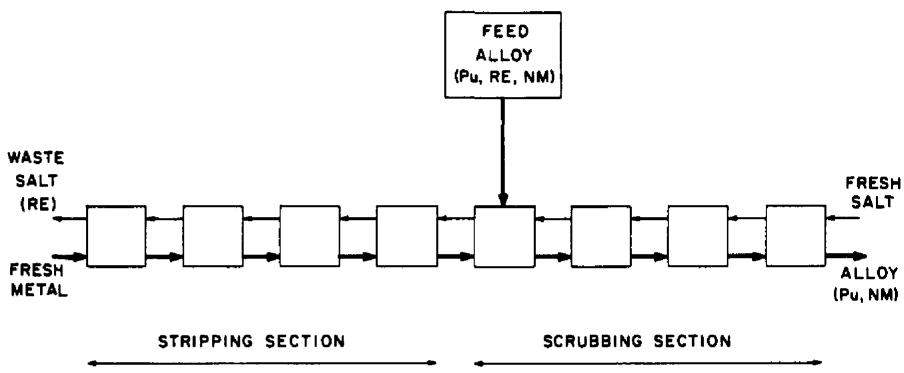  
RE RARE EARTH   
NM NOBLER METALS (MORE NOBLE THAN Pu & U)   
Figure 1. Countercurrent Extraction

been labeled "metal transport" has proved very attractive. Figure 2 is the flow diagram and illustrates the following operations:

(1) Alloy containing plutonium and fission products is contacted with salt in a series of stages to perform the scrubbing of rare earths. The salt is not circulated between stages but is "captive" in each stage. (2) Plutonium is extracted from the alloy in a "donor" stage in which the plutonium extraction factor is increased.   
(3) The alloy is recycled through the same captive salts to perform the stripping of plutonium from the salt until the level of plutonium in the stage 1 salt is sufficiently low for disposal. (4) Metal circulation is terminated. (5) The alloy is returned for reuse in earlier process steps and fresh feed is charged to the feed tank. (6) The salt in stage 1, containing most of the rare earths, is discarded. (7) The salt phases in stages 2, 3, and 4 are transferred to stages 1, 2, and 3, respectively. (8) Fresh salt is added to stage 4. (9) Processing of a new batch begins with circulation of the feed alloy.

Following the rare earth removal, the plutonium is selectively extracted from the nobler elements by a "salt transport" step.(2) Plutonium is extracted into a salt in the donor stage; this salt is scrubbed in the next stage with a captive alloy for further nobler metal removal and to minimize introduction of feed solvent to the product alloy; the salt is then contacted with a captive "acceptor" alloy which extracts the plutonium; the salt, which serves only as a transport medium, is recycled to the donor stage. At the conclusion of an extraction run, the acceptor alloy containing the purified plutonium is removed and fresh acceptor alloy is charged. The scrub alloy has capacity for many runs, but eventually it is discarded and replaced. In normal operation, nothing accumulates in the transport salt, and it can be used indefinitely. The level of uranium and nobler metals in the Mg-Cu alloy, which is reused, is controlled by their removal in the reduction step and by discarding a small portion of the Mg-Cu alloy before recycle to the reduction step.

The entire extraction step is illustrated schematically in Figure 3. The seven stages indicated are expected to provide the desired decontamination factor of $10^{6}$ , but one or two additional stages can be added if extraction experience indicates they are necessary. The composition of the process solvents are summarized in Table I, and some pertinent distribution coefficients are listed in Table II. The distribution coefficients are relatively constant over the range of solute concentrations to be encountered. From these distribution data the excellent separation factor of 1000 obtained between plutonium and cerium with the $\mathrm{Mg - Cu}$ solvent can be seen. The distribution coefficient for plutonium being unity allows extraction of plutonium in either direction depending on the salt-to-metal ratio (see equation 3). The scrub alloy has the desired low distribution coefficient for nobler metals (zirconium is the most difficult to separate) and a sufficiently

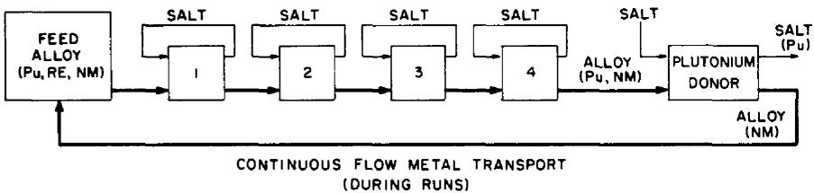

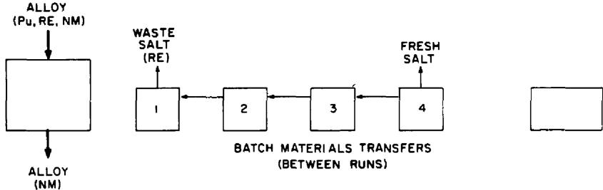  
RE - RARE EARTH   
NM = NOBLER METALS

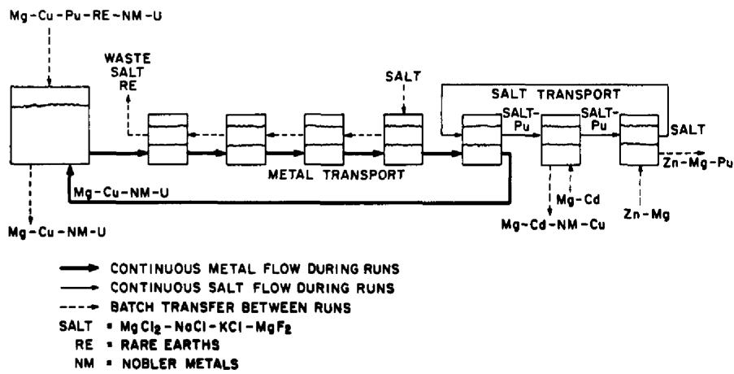  
Figure 2. Metal Transport   
Figure 3. Plutonium Purification Step of Salt Transport Process

Table I   
Table II   

<table><tr><td></td><td colspan="2">Process Solvents</td></tr><tr><td></td><td>Composition</td><td>Density at 650°C(g/cc)</td></tr><tr><td>Metal Transport - Donor Alloy</td><td>Mg-44 at. % Cu</td><td>3.5</td></tr><tr><td>Scrub Alloy</td><td>Mg-20 at. % Cd</td><td>2.8</td></tr><tr><td>Acceptor Alloy</td><td>Zn-30 at. % Mg</td><td>5.0</td></tr><tr><td>Metal Transport and Salt Transport Salts</td><td>MgCl2-30 mol % NaCl-20 mol %-KCl-3 mol % MgF2</td><td>1.7</td></tr></table>

Distribution Coefficients   

<table><tr><td colspan="5">Distribution Coefficient, D = mole fraction in salt/atom fraction in metal</td></tr><tr><td>Salt Solvent</td><td colspan="4">= MgCl2-30 mol % NaCl-20 mol % KCl-3 mol % MgF2</td></tr><tr><td>Temperature</td><td colspan="4">= 650°C</td></tr><tr><td></td><td>D Pu</td><td>D U</td><td>D Ce</td><td>D Zr</td></tr><tr><td>Metal Transport and Donor Stages</td><td>1</td><td>0.1</td><td>1x103</td><td>6x10-3</td></tr><tr><td>Scrub Stage</td><td>0.5</td><td>5x10-2</td><td>60</td><td>2x10-3</td></tr><tr><td>Acceptor Stage</td><td>1x10-3</td><td>5x10-4</td><td>0.2</td><td>1x10-9</td></tr></table>

high value for plutonium to minimize plutonium holdup in the scrub stage. The Zn-Mg acceptor alloy provides the low distribution coefficient necessary to extract plutonium out of the transport salt.

The interaction of many parameters are encountered in the proposed stages. These include metal to salt ratios, total volume of captive phases, hold-up times, number of metal and salt cycles, and the number of stages. A computer program was prepared and is used to calculate expected extraction performance for different combinations of parameters; however, extraction rate data are needed to permit optimization of other parameters.

# Selection of Contactor Configuration

Mixer-settler designs used in the chemical processing industry have been reviewed.(4-9) Probably the simplest and most versatile form is one in which mixing is done in one vessel and settling in

another. A variety of flow patterns of heavy and light phases may be employed with this equipment. Mixing and settling regions are incorporated inside of a single vessel in some designs. Arrangements have been made in which the stages are stacked vertically so that only one rotating shaft is used for agitation in all of the stages. Such an extractor forms a tower in which the heavy liquid enters at the top and leaves at the bottom, and the light liquid enters at the bottom and leaves at the top. Density difference between the two immiscible liquids causes the phases to separate in each settling region after mixing and causes the light liquid to flow up the tower. Another arrangement places the stages side by side. The stages are commonly in the shape of boxes which may be compartmentalized by baffles. Each mixing stage has its own agitator shaft. Such units are commonly known as the box-type mixer-settler.

Some mixer-settler designs were eliminated from consideration for a pyrochemical process because of the elevated temperature of operation and limitations in fabrication with suitable materials of construction. The unconventional flow patterns in the present process also eliminated some designs. A box-type mixer-settler was selected as the most appropriate.

In the conventional box-type mixer-settler, two liquids flow continuously and countercurrently through the stages. In the present system, multiple fluids are employed. The proposed flow patterns for a box-type mixer-settler are shown in plan view in Figure 4. In the metal transport stages (a "stage" consists of a mixing chamber and a settling chamber) the liquid metal flow is continuous through all stages, but the salt within each stage is captive and is recirculated within the stage. The salt in each of these stages is periodically withdrawn and moved one stage upstream (with reference to the direction of metal flow). In the salt transport stages, the first stage is conventional in the manner in which salt and metal move in, through, and out. However, in the remaining stages the salt moves continuously through while the metal phases are captive and are recirculated within each stage. Periodically the metal phases are removed and replaced with fresh metal.

Because of the special fluid movement requirements, an extractor concept employing a pump in each stage was chosen rather than one utilizing the pumping effects of the mixers as other designers have done.(4,7) The action of liquid in the pumps is similar to that in a vertical-bowl centrifuge which is charged on its axis at the bottom and discharges at the top. The pump tube is partially submerged in the fluid, and fluid enters an inlet in the bottom located on the axis. Centrifugal force lifts fluid up the wall of the pump to discharge openings near the top. The head which is developed is roughly proportional to the square of the internal radius of the cylinder and to the square of the rotational speed.

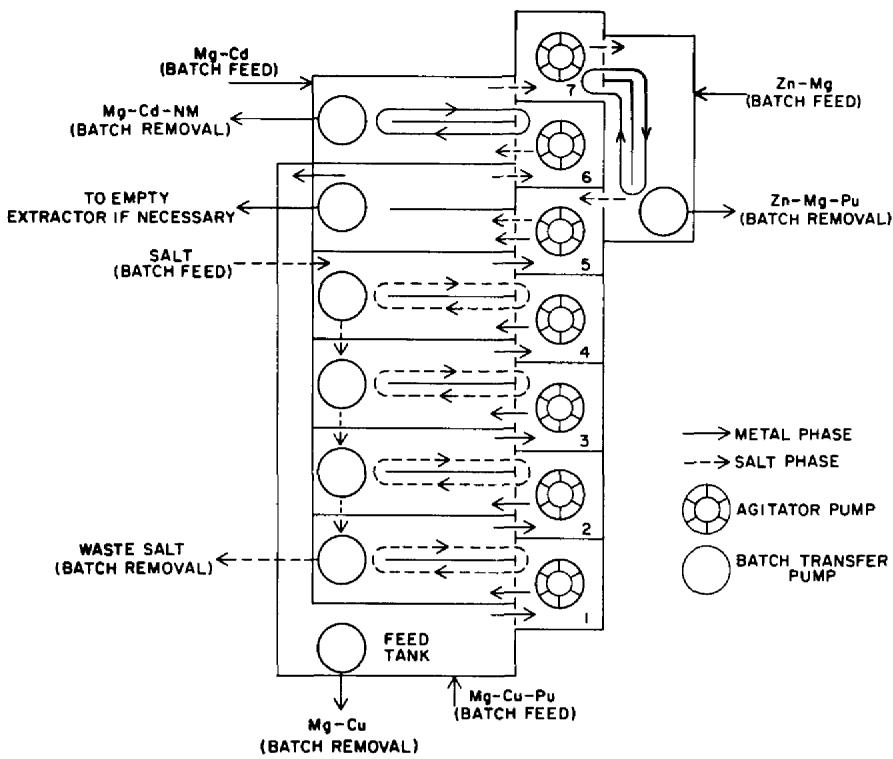  
Figure 4. Seven-Stage Mixer-Settler - Schematic Plan View

The rotating tube need not be cylindrical; a conical shape would be desirable but is more difficult to fabricate. The pumps are suspended by heavy shafts which are supported and sealed above the heated zone. Mixing blades are mounted on the mixer-pumps to promote agitation. Similar pumps, but without mixing blades, are used for the periodic removal of fluids from a settling region.

The discharge openings at the upper end of the tube consist of slots cut in the tube wall. The liquid collects in a chamber surrounding the top end of the tube and can be routed as required in the particular application. The flow out of the collecting chamber of an agitator-pump is directed into a settling chamber. The flow from a pump employed to transfer fluid from the settling region of one stage to another stage is directed to the settling region of the latter stage.

# Equipment Design and Performance

Design efforts have been concentrated on developing a universal mixer-settler stage that is applicable to operation with either metal or salt phase captive. In selecting a design, plastic mixer-settler models were built and tested with water and organic fluids. Acetylene tetrabromide in which xylene was dissolved to alter the density and water were used as the liquid phases in the early tests. One agitator-pump configuration was also operated with molten Mg-Cu alloy in a stainless steel mixing stage. The pumping characteristics were the same for each of the fluid systems; the volumetric flow rate was independent of the density of the pumped liquid. The more recent flow tests were made using water or water-carbon tetrachloride. Design characteristics sought include high stage efficiency, simple control of flow rates, variable interstage flow patterns, and confinement of metal fumes.

Figure 5 is a schematic section of the current stage design. The plastic model of this design is shown in Figure 6. This particular configuration was selected to provide a mixing chamber of about 1 liter volume and a mixer which would produce a high degree of agitation while reducing bypassing of solutions to an acceptably low level. The top baffle and sleeve prevent the entrainment of gas into the fluids as long as the liquid level above the baffle is at least 3 centimeters, resulting in more stable mechanical operation and higher power input at any given mixer speed.

In normal operation with a two phase system, both phases enter the zone above the mixing chamber and flow downward through the two zones of the mixing chamber. Here the phases are vigorously agitated and eventually enter the bottom of the pump through the inlet orifice. The phases then flow through the collecting chamber and into the settling chamber. The inverted cup surrounding

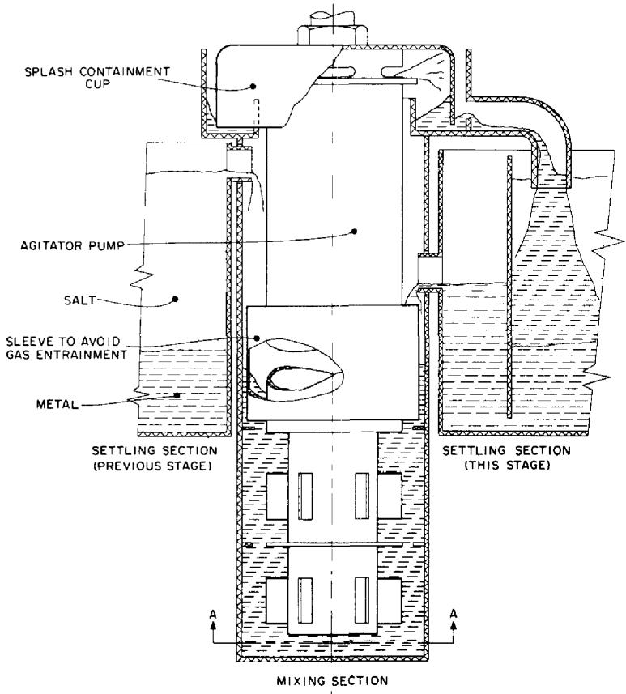

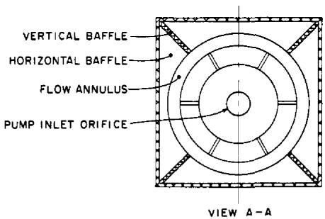  
Figure 5. Agitator-Pump in Captive-Metal Stage

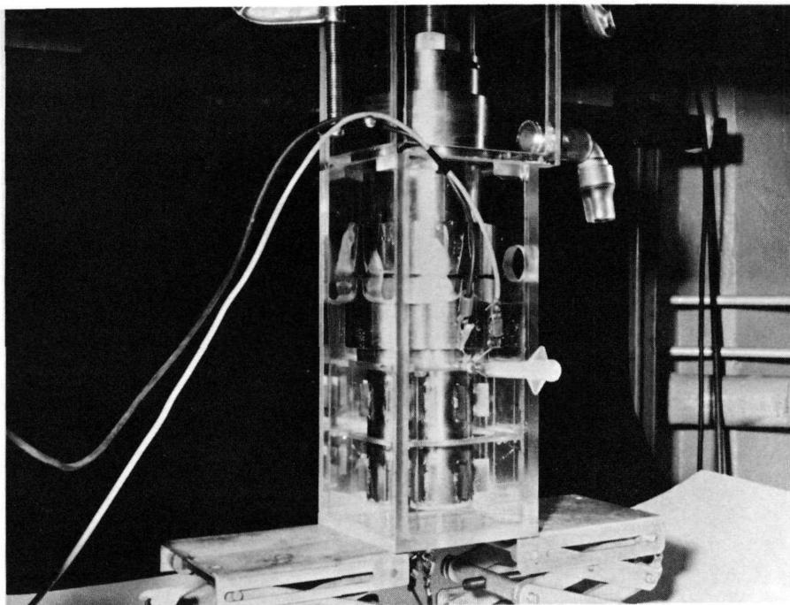  
Figure 6. Agitator-Pump in Plastic Mixing Section

the pump outlet (not present in Figure 6) eliminates splashing. In the settling chamber the fluids separate, the light (salt) phase flows out through an overflow spout, and the heavy (metal) phase flows under a baffle and through an overflow spout. The flow is either back to the mixing chamber or to the mixing chamber of an adjacent stage.

The settling and mixing chambers are separate vessels. This modular design was selected to increase the flexibility in mixer-settler arrangement, simplify fabrication, and ease maintenance. Fluid flows into modules through the spouts located above the liquid level as shown in Figure 5. The necessary lifting of the fluids is accomplished by the pumps.

The liquid levels in a settling chamber are fixed by the vertical position of the outlet spouts (see Figure 5). The volume of each liquid phase in the settling chamber is also fixed. In all stages but stage 5 in Figure 4, a constant quantity of captive phase is present. Since the quantity in transit in the pump and collecting ring is small and relatively constant, the amount of captive phase in the mixer can be controlled by selecting an appropriate total inventory of that phase in the stage. The flow capacity of the pump and the net flow rate of the other phase establish the salt to metal ratio and total holdup in the mixing chamber. For stage 5, the metal and salt flow rates establish the salt-to-metal ratio and, with the flow-to-lift characteristics of the pump at the operating speed, fix the mixing chamber holdup.

The pumps are designed so that the variation in total liquid holdup in a mixing stage will keep the liquid surface above the top horizontal baffle and below the inlet openings. The salt-to-metal ratios are selected to obtain favorable extraction factors (equation 3).

In arriving at the present design, many power input and pumping rate tests were conducted using water as a single phase. Mixing power was determined using a dynamometer which measures drive-motor torque.(10) Pumping rates were measured for different lifts, inlet orifice sizes, and rotational speeds. Results of three pumping runs are presented in Figure 7. As shown in the figure, the pumping rate increases and then levels off as the mixer speed increases. This condition permits a fairly stable pumping rate to be maintained without precise control of mixer speed and yet provides for a reasonable range of pumping rates. During these tests the water level was maintained about $6\mathrm{cm}$ above the top baffle. Variation of the height of water resulted in a moderate corresponding change in pumping rate. Thus the pump equipped with a $0.95\mathrm{cm}$ orifice and operating at $650~\mathrm{rpm}$ delivered 76, 81, and $89~\mathrm{ml / sec}$ when the water level was respectively 4.8, 6.0 and $8\mathrm{cm}$ above the baffle. This change in pumping rate corresponding to changes in liquid head would tend to stabilize the flow in a

Figure 7. Effect of Orifice Size and Mixing Speed on   
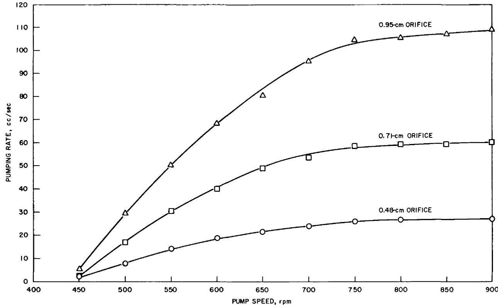  
Output of Agitator Pump (Net pumping lift = 16 cm)

multistage system.

The power input to the mixing chamber as related to mixer-pump speed is shown in Figure 8. This power input is nearly independent of pumping rate since the pumping power (less than 0.5 watt) is small compared to the mixing power.

Since the pumping rate and power input are both dependent upon agitator-pump speed, it would be desirable to have a mixing chamber and pump design in which power input increased more rapidly with mixing speed than did the pumping rate. Under such conditions the reduced residence time which results from increased throughput would be offset by increased mixing intensity. Figure 9 shows the relationship between power input and flow rate at various mixer speeds for the three different sizes of pump orifice presented in Figure 7. Over the range of probable operating speeds (i.e., 600-800 rpm) there is an increase in overall mixing intensity with increased pumping rate. Thus high stage efficiency is likely to be maintained as flow rates are increased.

In experiments involving batch extraction of cerium from Cd-Zn-Mg alloy into $\mathrm{MgCl}_2$ -NaCl-KCl at $600^{\circ}\mathrm{C}$ , about $95\%$ equilibrium composition was reached in about 4 minutes and $100\%$ in about 10 minutes.(11) Power input to the contactor was 1.3 watts/liter. Power input in the proposed mixing chamber design (see Figure 8) is 40 watts/liter when mixing water at 700 rpm. The power input under the same mixing speed and geometry will be nearly three times as high, or about 100 watts/liter, when mixing higher density molten salt and metal. This represents a power input which is almost 80 times as great as that used in the above batch test. Accordingly, it is estimated that $100\%$ equilibrium conditions would be reached in a few seconds if the phase contacting were being done under batch mixing conditions.

The multistage mixer-settler will operate under continuous flow conditions with a mean residence time of one minute or less. In a full backmix stage* the residence time of any infinitesimal unit of material varies from zero to infinity. When very high ( $\sim 99\%$ ) stage efficiency is desired, the mean residence time is far less significant than is the fraction of material exposed for short times. In the salt-metal systems of interest, the rates of extraction are known to be rapid, but have not been precisely defined. Therefore, the mixing chamber was designed to minimize the quantity of material leaving the chamber with a short residence time.

Figure 9. Power-to-Flow Ratio for Agitator Pump   
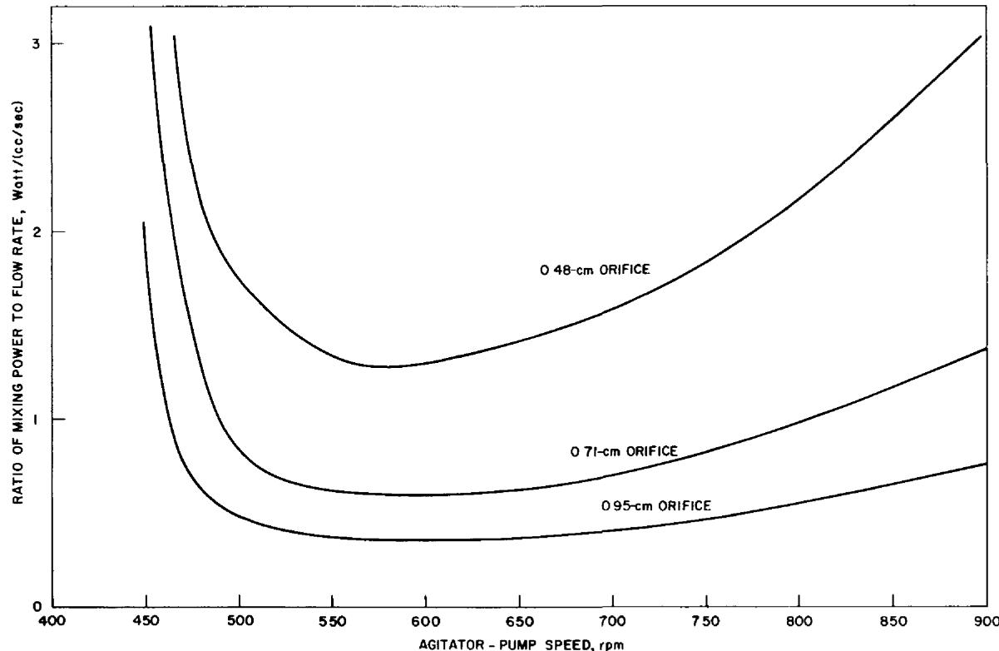  
(Pumping lift $= 16~\mathrm{cm}$ )

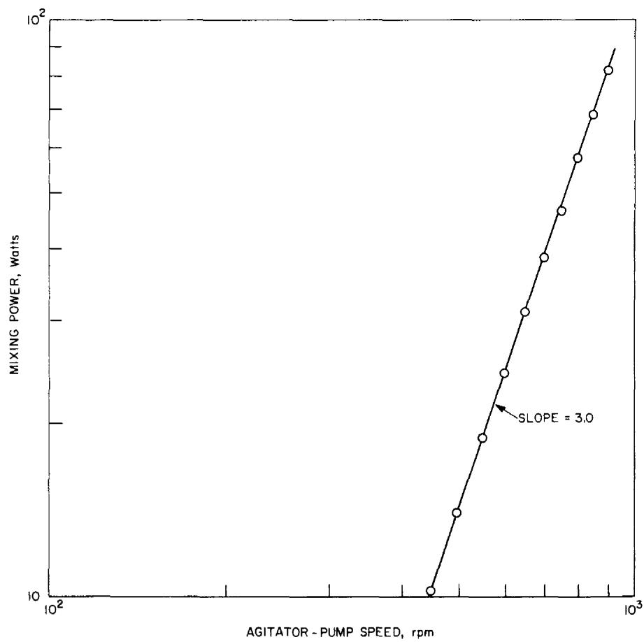  
Figure 8. Mixing Power for Operation of Agitator-Pump

In the present design of the mixing chamber, a fixed horizontal baffle with an 8.9 cm dia opening is positioned at about mid-elevation of the chamber. A horizontal disk, 7.6 cm OD, is mounted on the mixer-pump at the same elevation. Thus the mixing chamber is divided into two zones with a 0.65 cm annular connection. A model has also been tested in which the annular space is further restricted by the use of a smaller opening in the fixed baffle. These configurations are intended to reduce top-to-bottom mixing and approach the performance of two backmix stages operating in series.

A series of tests was conducted to determine the residence time distribution in the mixing chamber. The tests were conducted in a non-flow system with the pump inlet orifice closed. The tests were designed to measure the approach to equilibrium composition at the bottom of the mixing chamber after a small quantity of acid was injected just below the top horizontal baffle. A pair of platinum electrodes adjacent to the injection point signaled the start of injection and a pair of electrodes at the bottom of the mixing chamber (close to the normal pump orifice position) sensed the rise in solution conductivity at that point. A Midwest Model 1210 high speed recording oscillograph was used to record conductivity changes which could then be converted to molarity changes in accordance with a predetermined calibration. Figure 10 is a reproduction of a typical oscillograph chart tracing for one of these tests. This test was conducted at a mixer speed of $600~\mathrm{rpm}$ . As shown in the figure, the injection time is indicated by a sharp rise in conductivity at the upper electrodes. Following a delay of about 0.2 sec there is a continuous rise to equilibrium concentration at the bottom electrodes. On the basis of this test and similar tests conducted at various mixing speeds, the rate of approach to uniform composition was determined as shown for four runs in Figure 11. From these data it is possible to calculate a residence time distribution curve for any net flow through the mixing chamber.

If a reaction rate curve could be determined for a batch extraction run in a mixing chamber, mass transfer coefficients could be calculated. These coefficients could then be handled in accordance with existing correlations to predict the performance of alternative designs. The extraction is much too fast to determine by conventional sampling techniques; the phases equilibrate in about 4 seconds. Nevertheless, the shape of the reaction curve can be assumed, for example:

$$
F = 1 - e ^ {- K t} \tag {5}
$$

where F is fractional approach to equilibrium t is time K is a constant which may be evaluated as $\mathrm{K} = 2.303 / \tau$ $\tau$ is time to reach $90\%$ completion

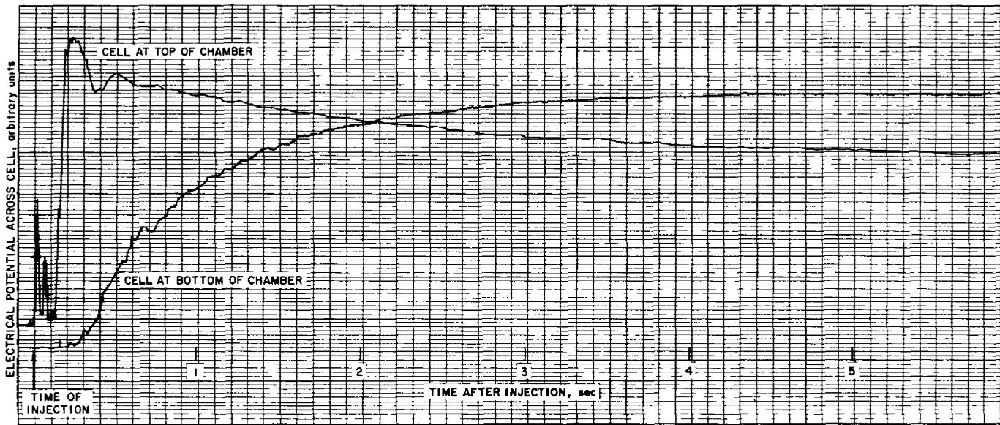  
Figure 10. Conductivity Cell Readings in Mixing Chamber

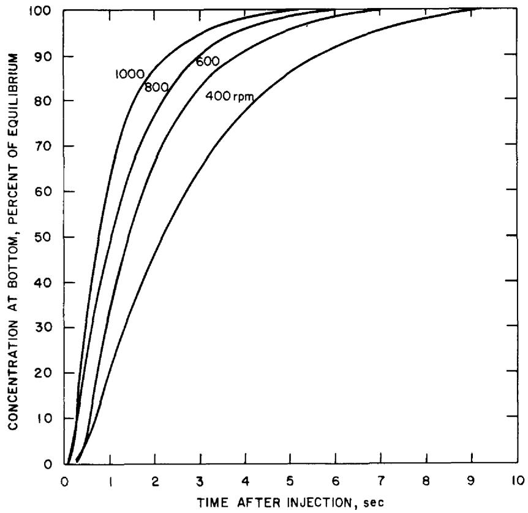  
Figure 11. Approach to Uniform Composition in the Mixing Chamber (Pump inlet closed; nitric acid injected into water near top of chamber; see configuration in Fig. 6)

On this basis it is possible to predict the stage efficiencies which can be expected under a variety of mixing conditions (residence time distributions) and for a range of reaction times (see Table III). It is anticipated that experiments planned with molten salt and metal will provide sufficient data to permit the calculation of a reaction rate curve of a form such as indicated in equation 5.

Evaluation of mechanical performance and determination of stage efficiency will be based upon tests to be conducted in a single stage unit using molten salt and metal at about $650^{\circ}\mathrm{C}$ . Components of the stage have been constructed of type 304 S.S. The mixing chamber configuration is identical to the design used in the plastic model tests; the mixer-pump is the same unit used in the plastic model tests.

Table III   
Reaction Rate Versus Stage Efficiency*   

<table><tr><td>Time to reach 90% of Equilibrium</td><td colspan="4">Efficiency for one minute mean holdup (percent)</td></tr><tr><td>-Batch Operation (seconds)</td><td>Backmixed Stage</td><td>2 Backmixed zones in Series</td><td>Reference Design</td><td>Reference Design with Restricted Annulus</td></tr><tr><td>60</td><td>70</td><td>78</td><td>71</td><td>72</td></tr><tr><td>10</td><td>93</td><td>98.4</td><td>94.7</td><td>96.1</td></tr><tr><td>5</td><td>96.5</td><td>99.5</td><td>97.8</td><td>98.6</td></tr><tr><td>1</td><td>99.3</td><td>99.98</td><td>99.81</td><td>99.92</td></tr></table>

\* Reaction rate curve is assumed to have the form, 1 - e-Kt

# Discussion

When the single-stage metal-salt extractor has been optimized and demonstrated, a multistage mixer-settler will be constructed. The multistage unit will be used in the Plutonium Salt Transport Experiment which will involve the investigation of the entire Salt Transport Process on a scale of $1\mathrm{kg}$ of plutonium. $^{(1)}$ It is expected that the multistage mixer-settler will be fabricated of niobium and tantalum, but the selection of materials is still underway. $^{(12)}$ The stability of the materials with respect to plutonium is as important as their resistance to corrosion by the molten salts and metals. For example, 300 and 400 series stainless

steels appear to have adequate resistance to chloride salts and Mg-Cu alloys, but appear to react with dissolved plutonium.

The seven-stage mixer-settler (including external drives and heaters) will be about 70 cm wide by 120 cm long by 150 cm high. This unit is as small as is practical because of clearances needed for agitator-pump drives and heaters. In the Plutonium Salt Transport Experiment, the extraction batch size will be about 40 kg of Mg-Cu-Pu-fission products alloy containing 1 kg of plutonium. This solution, which is intentionally dilute to provide a reasonable volume of feed solution, will be processed in about 4 hours. The extractor will have capacity for purifying about 30 kg of plutonium per day which is more than the expected average daily discharge of plutonium from fast reactors generating 5000 mW of electricity.

The acceptor stage of an extractor will contain the largest quantity of plutonium, and the criticality limitation for this stage will determine the maximum batch size.

The allowable quantity of plutonium is greatly increased by the selection of an acceptor alloy composition for which the solid plutonium phase in equilibrium with saturated solution is a Pu-Zn intermetallic compound rather than pure plutonium. It is expected that the acceptable batch size will be about 20 kilograms of plutonium. This limit might be increased if the acceptor alloy is replaced continuously or intermittently during a run.

# Acknowledgments

The authors thank G. N. Vargo for his aid in building and operating equipment and Drs. W. J. Walsh, T. R. Johnson and R. K. Steunenberg for their interest and suggestions.

# References

1. Steunenberg, R. K., R. D. Pierce and I. Johnson, "Status of the Salt Transport Process for Fast Breeder Reactor Fuels", This Symposium.   
2. Knighton, J. B., I. Johnson and R. K. Steunenberg, "Uranium and Plutonium Purification by the Salt Transport Method", This Symposium.   
3. Johnson, T. R., R. D. Pierce, F. G. Teats and E. F. Johnston, "Behavior of Countercurrent Liquid-Liquid Columns with a Liquid Metal", Dec. 1968, Preprint 24F, Sixty-first Annual Meeting of the AIChE, Los Angeles, California, Accepted for publication in AIChE Journal.   
4. Morello, V. S. and N. Poffenberger, "Commercial Extraction Equipment", Industrial and Engineering Chemistry, 1950, No. 6, Vol. 42, pp. 1021-1035.   
5. Akell, R. B., "Extraction Equipment Available in the U. S.", Chemical Engineering Progress, 1966, No. 9, Vol. 62, pp. 50-55.   
6. Benedict, M., T. H. Pigford; Nuclear Chemical Engineering 1st ed., pp. 237-250, McGraw-Hill, New York, 1957.   
7. Coplan, B. V., J. K. Davidson and E. L. Zebroski, "The Pump-Mix Mixer-Settler a New Liquid-Liquid Extractor", Chemical Engineering Progress, 1954, No. 8, Vol. 50, pp. 403-408.   
8. Graef, E. R. and S. P. Foster, "Design of Box-Type Countercurrent Mixer-Settler Units - Factors Affecting Capacity", Chemical Engineering Progress, 1956, No. 7, Vol. 52, pp. 293-298.   
9. Holmes, J. H. and A. C. Schafer, "Some Operating Characteristics of the Pump-Mix Mixer-Settler", Chemical Engineering Progress, 1956, No. 5, Vol. 52, pp. 201-204.   
10. Armstrong, D. R. and R. D. Pierce, "Power Requirements for Mixing Liquid Metals", ANL-6596, Argonne National Laboratory, Chemical Engineering Division Summary Report, Argonne, Illinois, pp. 84-87, 1962.   
11. Walsh, W. J. and T. R. Johnson, Argonne National Laboratory, Argonne, Illinois, Personal Communication.   
12. Kyle, M. L., R. D. Pierce and V. M. Kolba, "Containment Materials for Pyrochemical Processes", This Symposium.


# CONTRIBUTION TO THE PLUTONIUM-MAGNESIUM PHASE DIAGRAM\*

W. Knoch\*\*, J. B. Knighton and R. K. Steunenberg Chemical Engineering Division Argonne National Laboratory Argonne, Illinois 60439 U.S.A.

# Abstract

The region of liquid immiscibility in the binary Pu-Mg system was determined by chemical analyses of the equilibrium liquid phases. The magnesium content of the plutonium-rich phase ranged from 0.49 at. % at $650^{\circ}\mathrm{C}$ to 2.22 at. % at $900^{\circ}\mathrm{C}$ , while the plutonium content of the magnesium-rich phase varied from 10.5 at. % at $523^{\circ}\mathrm{C}$ to 11.5 at. % at $900^{\circ}\mathrm{C}$ . The consolute temperature is estimated to be $1040 \pm 10^{\circ}\mathrm{C}$ . Thermal analysis data are given for several solidus transition temperatures. The thermodynamic properties of liquid Pu-Mg alloys were estimated from the compositions of the equilibrium liquid phases assuming the alpha function $\left[\ln \gamma_{\mathrm{i}} / (1 - \mathrm{N}_{\mathrm{i}})^{2}\right]$ to be a linear function of $\mathbf{N}_{\mathbf{j}}$ . The estimated data are in agreement with previously reported thermodynamic data for dilute solutions of plutonium in liquid magnesium solutions.

# Introduction

In the course of pyrochemical process development studies data were obtained on the solubility of plutonium in liquid ternary Zn-Mg-Pu alloys. $^{(1),(2)}$ These solubility data indicated that the liquid phase immiscibility region of the binary Pu-Mg system extended well into the ternary system. However, discrepancies were found between extrapolated data for the compositions of the two immiscible liquid phases in the binary Pu-Mg system from plutonium solubility measurements in the ternary system and the estimated immiscibility curve for the binary system reported by Schonfeld and Ellinger. $^{(3)}$ The results of an experimental determination of the miscibility curve by chemical analyses of the liquid phases in the Pu-Mg system are reported below. The results of the determination, by thermal analysis, of the temperatures for several solidus transformations are also reported. Finally, the miscibility gap composition-temperature data were used to estimate the thermodynamic properties of liquid Pu-Mg alloys.

# Experimental

The purities of the magnesium and plutonium used in the investigation were greater than 99.95 and $99.9\%$ , respectively.

The Pu-Mg alloys were contained in a tantalum crucible (5 cm I.D.) with a tapered bottom inside a graphite liner. The crucible assembly was located inside a resistance-heated, stainless steel furnace tube which was equipped with a sampling port, a tantalum thermocouple well, a tantalum paddle stirrer, and gas inlet and outlet tubes. The furnace tube contained a purified helium atmosphere (one atmosphere pressure) and was located in a glovebox filled with purified nitrogen. The temperature was measured to $+0.5^{\circ}\mathrm{C}$ with calibrated chromel-alumel thermocouples.

An initial charge of $64\mathrm{g}$ of plutonium and $16\mathrm{g}$ of magnesium was added to the tantalum crucible. The furnace tube was then repeatedly evacuated and flushed with helium. After the furnace had been heated to the desired temperature, the system was allowed to equilibrate for two hours at constant temperature and a stirring rate of 200 rpm. At temperatures above $875^{\circ}\mathrm{C}$ the helium pressure in the furnace tube was increased to 2 atm to diminish the vaporization of magnesium. During the course of the experiment, more plutonium was added to produce an approximate composition of Pu-50 at. $\%$ Mg. Finally, magnesium was added to determine the liquidus line in the magnesium-rich region of the system.

The two liquid phases were sampled after the mixture had been equilibrated and allowed to settle for 15 min. The sampling device consisted of a tantalum tube 6 mm I.D. and 7 cm long, which

was closed at one end by a porous tantalum frit and at the other end by a threaded plug which could be attached to a stainless steel rod. The sample tube attached to the stainless steel rod was inserted into the furnace through a valve and gas seal on the sampling port. After a 5-min period the sample tube was lowered into one of the liquid metal phases and a sample was forced into the tube by pressurizing the system for 30 sec with 1 atm of additional helium pressure. The sample was then withdrawn and allowed to solidify quickly in the cool sampling port. The excess helium pressure was then released, and the sample tube, after it had cooled, was withdrawn into the nitrogen atmosphere. The frit and any material adhering to the outside of the sample tube were removed mechanically to avoid possible cross-contamination of the sample by the other liquid metal phase.

The plutonium was determined with a precision of $+2\%$ by hexone extraction and alpha counting. The magnesium was determined with $+1\%$ precision by EDTA titration after the plutonium had been removed by double precipitation.

Several cooling curves were determined by repeated temperature cycling of the system. The accuracy of transition temperatures obtained by this technique is estimated to be $+3^{\circ}\mathrm{C}$ .

# Results and Discussion

The results are given on a weight and atom percent basis in Table I and are plotted in Figure 1. The plutonium-rich phase contained very little magnesium (0.49 at. % at $650^{\circ}\mathrm{C}$ and 2.22 at. % at $900^{\circ}\mathrm{C}$ ). The composition of the magnesium-rich phase was almost independent of temperature between the monotectic point at $523^{\circ}\mathrm{C}$ and $900^{\circ}\mathrm{C}$ , where the plutonium concentrations were 10.5 and 11.5 at. %, respectively. The miscibility gap closes rapidly above $900^{\circ}\mathrm{C}$ , with an estimated consolute temperature of $1040 \pm 10^{\circ}\mathrm{C}$ . Because of the very low magnesium concentration in the plutonium-rich phase, no attempt was made to determine the monotectic point in this region. Such a determination would require accurate analyses of magnesium at concentrations of less than 0.01 wt %.

The thermal halts observed in several cooling curves indicate transition temperatures of $523 \pm 3^{\circ} \mathrm{C}$ for $\varepsilon + \theta \stackrel{*}{\rightarrow} \varepsilon + \mathrm{L}_{2}$ and $638 \pm 3^{\circ} \mathrm{C}$ for $\varepsilon + \mathrm{L}_{2} \stackrel{*}{\leftarrow} \mathrm{L}_{1} + \mathrm{L}_{2}$ . These transition temperatures differ somewhat from the tentative values given by Schonfeld and Ellinger.(1) The boundaries of the $\theta + \mathrm{L}_{2}$ field are only moderately well-defined. The solid solubility of plutonium in $\theta$ -magnesium is approximately 2 at. $\%$ at $550^{\circ} \mathrm{C}$ . The solid solubility of magnesium in $\varepsilon$ -plutonium has not been determined, but the indications are that any solid solution in this region would contain less than 0.5 at. $\%$ magnesium.

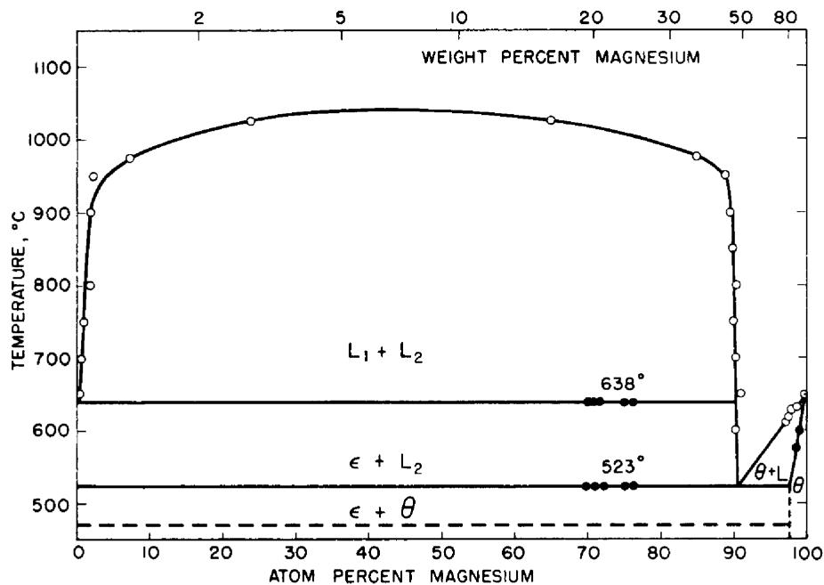  
Figure 1. Miscibility Gap in the Plutonium-Magnesium System

Table I   
Equilibrium Compositions of Liquid   
Plutonium-Magnesium Solutions   

<table><tr><td rowspan="3">Temp (°C)</td><td colspan="4">Plutonium Rich</td><td colspan="4">Magnesium Rich</td></tr><tr><td colspan="2">Pu*</td><td colspan="2">Mg</td><td colspan="2">Pu</td><td colspan="2">Mg*</td></tr><tr><td>wt%</td><td>at.%</td><td>wt%</td><td>at.%</td><td>wt%</td><td>at.%</td><td>wt%</td><td>at.%</td></tr><tr><td>Region L1+L2</td><td></td><td></td><td></td><td></td><td></td><td></td><td></td><td></td></tr><tr><td>649.8</td><td>-</td><td>-</td><td>-</td><td>-</td><td>48.0</td><td>8.58</td><td>52.0</td><td>91.42</td></tr><tr><td>649.6</td><td>99.95</td><td>99.51</td><td>0.05</td><td>0.49</td><td>-</td><td>-</td><td>-</td><td>-</td></tr><tr><td>701.0</td><td>-</td><td>-</td><td>-</td><td>-</td><td>51.6</td><td>9.78</td><td>48.4</td><td>90.22</td></tr><tr><td>700.0</td><td>99.93</td><td>99.32</td><td>0.07</td><td>0.68</td><td>-</td><td>-</td><td>-</td><td>-</td></tr><tr><td>750.5</td><td>-</td><td>-</td><td>-</td><td>-</td><td>52.1</td><td>9.96</td><td>47.9</td><td>90.04</td></tr><tr><td>749.3</td><td>99.88</td><td>99.32</td><td>0.12</td><td>0.68</td><td>-</td><td>-</td><td>-</td><td>-</td></tr><tr><td>800.1</td><td>-</td><td>-</td><td>-</td><td>-</td><td>51.4</td><td>9.71</td><td>48.6</td><td>90.29</td></tr><tr><td>800.0</td><td>99.78</td><td>97.88</td><td>0.22</td><td>2.12</td><td>-</td><td>-</td><td>-</td><td>-</td></tr><tr><td>851.0</td><td>-</td><td>-</td><td>-</td><td>-</td><td>53.3</td><td>10.4</td><td>46.7</td><td>89.6</td></tr><tr><td>891.3</td><td>-</td><td>-</td><td>-</td><td>-</td><td>54.5</td><td>10.9</td><td>45.5</td><td>89.1</td></tr><tr><td>900.7</td><td>-</td><td>-</td><td>-</td><td>-</td><td>54.2</td><td>10.8</td><td>45.8</td><td>89.2</td></tr><tr><td>899.0</td><td>99.77</td><td>97.78</td><td>0.23</td><td>2.22</td><td>-</td><td>-</td><td>-</td><td>-</td></tr><tr><td>949.9</td><td>-</td><td>-</td><td>-</td><td>-</td><td>55.4</td><td>11.2</td><td>44.6</td><td>88.8</td></tr><tr><td>950.9</td><td>99.75</td><td>97.60</td><td>0.25</td><td>2.40</td><td>-</td><td>-</td><td>-</td><td>-</td></tr><tr><td>975.1</td><td>-</td><td>-</td><td>-</td><td>-</td><td>63.6</td><td>15.1</td><td>36.3</td><td>84.9</td></tr><tr><td>975.4</td><td>99.2</td><td>92.65</td><td>0.8</td><td>7.36</td><td>-</td><td>-</td><td>-</td><td>-</td></tr><tr><td>1025.0</td><td>96.9</td><td>76.1</td><td>3.1</td><td>23.9</td><td>82.2</td><td>32.0</td><td>17.8</td><td>68.0</td></tr><tr><td>Region ε+L2</td><td></td><td></td><td></td><td></td><td></td><td></td><td></td><td></td></tr><tr><td>600.0</td><td>-</td><td>-</td><td>-</td><td>-</td><td>51.5</td><td>9.75</td><td>48.5</td><td>90.25</td></tr><tr><td>Region θ+L</td><td></td><td></td><td></td><td></td><td></td><td></td><td></td><td></td></tr><tr><td>609.9</td><td>-</td><td>-</td><td>-</td><td>-</td><td>21.4</td><td>2.69</td><td>78.6</td><td>97.31</td></tr><tr><td>616.1</td><td>-</td><td>-</td><td>-</td><td>-</td><td>19.4</td><td>2.39</td><td>80.6</td><td>97.61</td></tr><tr><td>630.2</td><td>-</td><td>-</td><td>-</td><td>-</td><td>15.2</td><td>1.79</td><td>84.8</td><td>98.21</td></tr><tr><td>632.0</td><td>-</td><td>-</td><td>-</td><td>-</td><td>11.5</td><td>1.30</td><td>88.5</td><td>98.70</td></tr></table>

* Values obtained by difference. The plutonium-rich phase was analyzed for magnesium and the magnesium-rich phase for plutonium.

The thermodynamic properties of liquid Pu-Mg alloys were estimated from the compositions of the equilibrium liquid phases using the method reported by Wriedt.(4) In this method the "sub-regular" model,(5) in which the alpha function is assumed to be a linear function of composition is used, i.e., if

$$
\alpha_ {i} = \frac {\ln \gamma_ {i}}{(1 - N _ {i}) ^ {2}} \tag {1}
$$

where $\gamma_{i}$ is the activity coefficient of the ith component at an atom fraction of $\mathbb{N}_1$ , then

$$
\alpha_ {i} = A + B (1 - N _ {i}) \tag {2}
$$

where A and B are temperature dependent empirical coefficients. From the necessary condition that the activities of each component be equal in the two equilibrium liquid phases, two independent relations involving A, B, and the compositions of the two liquid phases may be derived which may be used to compute values of A and B. The details are given by Wriedt.(4) This simple two-parameter equation was used in preference to the four-parameter Lumsden equation(6) which Sundquist(7) reported to give a better representation of the thermodynamic data for systems with miscibility gaps in view of the fact that the radius ratio parameter used in the Lumsden equation is approximately unity $(\mathbf{r}_{\mathrm{Pu}} + \mathbf{r}_{\mathrm{Mg}} = .993)$ for the Pu-Mg system.

For computational purposes, values of the composition for the liquids in equilibrium were read from a smooth curve drawn through the experimental data points at temperatures from $650^{\circ}\mathrm{C}$ to the consolute point. These values of the composition and the computed values for A and B are given in Table II. The activity coefficients for plutonium and magnesium computed from these values of A and B are given in Table III. The values marked with an asterisk in the table are for a hypothetical supercooled liquid which cannot be obtained in the laboratory.

It is of interest to note that the values of the activity coefficient for plutonium in the infinitely dilute solution $(\mathrm{N}_{\mathrm{Mg}} = 1)$ increase with temperature up to about $950^{\circ}\mathrm{C}$ and then decrease. This behavior is in agreement with the positive temperature dependence of the activity coefficient for plutonium in dilute magnesium solutions computed from molten salt-liquid alloy distribution data.(8) The values of the activity coefficient reported in the latter study are 11.5 and 12.2 at 700 and $800^{\circ}\mathrm{C}$ , respectively, which are in good agreement with the results of the present computation.

Computed values for the free energy of mixing for 700 to $1000^{\circ}\mathrm{C}$ as functions of composition are shown in Figure 2. Straight lines

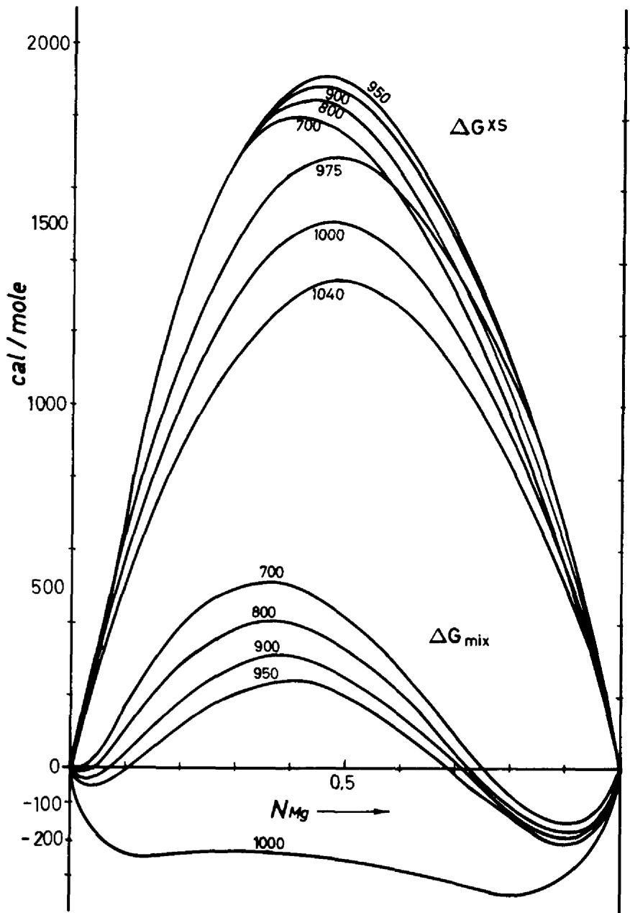  
Figure 2. Computed Values of $\Delta G_{\text{mix}}$ and $\Delta G^{\text{xs}}$ for the Plutonium-Magnesium System

Table II   
Values of the Parameters A and B as Function of Temperature   

<table><tr><td rowspan="2">Temp. °C</td><td colspan="2">L1</td><td colspan="2">L2</td><td rowspan="2">A</td><td rowspan="2">B</td></tr><tr><td>NPu</td><td>NMg</td><td>NPu</td><td>NMg</td></tr><tr><td>650</td><td>0.995</td><td>0.005</td><td>0.0975</td><td>0.9025</td><td>8.2899</td><td>-6.0260</td></tr><tr><td>700</td><td>0.9925</td><td>0.0075</td><td>0.0980</td><td>0.9020</td><td>7.4625</td><td>-5.1179</td></tr><tr><td>750</td><td>0.9895</td><td>0.0105</td><td>0.0990</td><td>0.9010</td><td>6.7977</td><td>-4.3961</td></tr><tr><td>800</td><td>0.9864</td><td>0.0136</td><td>0.1007</td><td>0.8993</td><td>6.3046</td><td>-3.8755</td></tr><tr><td>850</td><td>0.9827</td><td>0.0173</td><td>0.1026</td><td>0.8974</td><td>5.8618</td><td>-3.4034</td></tr><tr><td>900</td><td>0.9788</td><td>0.0222</td><td>0.1055</td><td>0.8945</td><td>5.3928</td><td>-2.9169</td></tr><tr><td>950</td><td>0.969</td><td>0.031</td><td>0.1125</td><td>0.8875</td><td>4.8180</td><td>-2.2950</td></tr><tr><td>975</td><td>0.9272</td><td>0.0728</td><td>0.150</td><td>0.850</td><td>3.6025</td><td>-1.1968</td></tr><tr><td>1000</td><td>0.870</td><td>0.130</td><td>0.215</td><td>0.785</td><td>3.0918</td><td>-0.9603</td></tr><tr><td>1025</td><td>0.759</td><td>0.241</td><td>0.350</td><td>0.650</td><td>2.6641</td><td>-0.7551</td></tr><tr><td>1040</td><td>~0.55</td><td>~0.45</td><td>~0.55</td><td>~0.45</td><td>2.390</td><td>-0.551</td></tr></table>

Table III   
Calculated Pu-Mg System Activity Coefficients   

<table><tr><td rowspan="2">\( {\mathrm{N}}_{\mathrm{{Mg}}} \)</td><td colspan="8">γMg</td></tr><tr><td>700</td><td>800</td><td>900</td><td>950</td><td>975</td><td>1000</td><td>1025</td><td>1040 °C</td></tr><tr><td>0</td><td>135</td><td>78.0</td><td>51.1</td><td>39.2</td><td>20.2</td><td>13.6</td><td>9.84</td><td>8.73</td></tr><tr><td>0.1</td><td>\( {35.0}^{ * } \)</td><td>25.2</td><td>19.1</td><td>16.2</td><td>10.3</td><td>7.67</td><td>6.00</td><td>5.58</td></tr><tr><td>0.2</td><td>11.97</td><td>9.99</td><td>8.54</td><td>7.81</td><td>5.87</td><td>4.70</td><td>3.92</td><td>3.78</td></tr><tr><td>0.3</td><td>5.20</td><td>4.82</td><td>4.48</td><td>4.31</td><td>3.66</td><td>3.22</td><td>2.74</td><td>2.71</td></tr><tr><td>0.4</td><td>2.79</td><td>2.76</td><td>2.71</td><td>2.69</td><td>2.48</td><td>2.23</td><td>2.04</td><td>2.05</td></tr><tr><td>0.5</td><td>1.80</td><td>1.84</td><td>1.86</td><td>1.88</td><td>1.83</td><td>1.70</td><td>1.61</td><td>1.63</td></tr><tr><td>0.6</td><td>1.34</td><td>1.39</td><td>1.42</td><td>1.44</td><td>1.44</td><td>1.39</td><td>1.34</td><td>1.36</td></tr><tr><td>0.7</td><td>1.13</td><td>1.16</td><td>1.19</td><td>1.20</td><td>1.22</td><td>1.19</td><td>1.17</td><td>1.18</td></tr><tr><td>0.8</td><td>1.033</td><td>1.05</td><td>1.066</td><td>1.08</td><td>1.09</td><td>1.08</td><td>1.07</td><td>1.08</td></tr><tr><td>0.9</td><td>1.0027</td><td>1.009</td><td>1.013</td><td>1.02</td><td>1.02</td><td>1.02</td><td>1.02</td><td>1.018</td></tr></table>

<table><tr><td rowspan="2">\( {\mathrm{N}}_{\mathrm{{Mg}}} \)</td><td colspan="8">γPu</td></tr><tr><td>700</td><td>800</td><td>900</td><td>950</td><td>975</td><td>1000</td><td>1025</td><td>1040 °C</td></tr><tr><td>0.1</td><td>1.072</td><td>1.061</td><td>1.052</td><td>1.047</td><td>1.035</td><td>1.030</td><td>1.026</td><td>1.024</td></tr><tr><td>0.2</td><td>1.294</td><td>1.248</td><td>1.212</td><td>1.190</td><td>1.144</td><td>1.123</td><td>1.106</td><td>1.096</td></tr><tr><td>0.3</td><td>1.705</td><td>1.588</td><td>1.496</td><td>1.450</td><td>1.339</td><td>1.287</td><td>1.245</td><td>1.225</td></tr><tr><td>0.4</td><td>2.379</td><td>2.214</td><td>1.966</td><td>1.866</td><td>1.648</td><td>1.542</td><td>1.459</td><td>1.425</td></tr><tr><td>0.5</td><td>3.408</td><td>2.981</td><td>2.674</td><td>2.503</td><td>2.119</td><td>1.921</td><td>1.771</td><td>1.719</td></tr><tr><td>0.6</td><td>4.860</td><td>4.194</td><td>3.711</td><td>3.451</td><td>2.824</td><td>2.473</td><td>2.217</td><td>2.147</td></tr><tr><td>0.7</td><td>6.693</td><td>5.822</td><td>5.165</td><td>4.823</td><td>3.875</td><td>3.272</td><td>2.848</td><td>2.768</td></tr><tr><td>0.8</td><td>8.630</td><td>7.795</td><td>7.084</td><td>6.740</td><td>5.435</td><td>4.423</td><td>3.738</td><td>3.675</td></tr><tr><td>0.9</td><td>9.62</td><td>9.831</td><td>9.409</td><td>9.291</td><td>7.733</td><td>6.312</td><td>4.990</td><td>5.008</td></tr><tr><td>1</td><td>10.41</td><td>11.41</td><td>11.89</td><td>12.46</td><td>11.08</td><td>8.424</td><td>6.747</td><td>6.990</td></tr></table>

$$
\begin{array}{l} \frac {\mathrm {N} _ {\mathrm {P u}} ^ {2}}{\log \gamma_ {\mathrm {M g}} = \frac {\mathrm {N} _ {\mathrm {P u}} ^ {2}}{2 . 3 0 2 6}} [ \mathrm {A} + \mathrm {B} (0. 5 + \mathrm {N} _ {\mathrm {M g}}) ] \\ \log \gamma_ {P u} = \frac {N _ {M g} ^ {2}}{2 . 3 0 2 6} \quad [ (A + B \cdot N _ {M g}) ] \\ \end{array}
$$

$$
N = \text {A t o m}
$$

$$
* = \text {i m m i s c i b l e}
$$

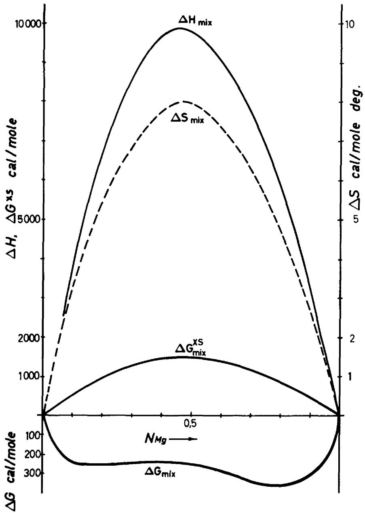  
Figure 3. Computed Values of $\Delta H_{\text{mix}}$ , $\Delta S_{\text{mix}}$ , $\Delta G_{\text{mix}}^{\text{xs}}$ and $\Delta G_{\text{mix}}$ for the Plutonium-Magnesium System at $1273^{\circ}\text{K}$

tangent to the $\Delta G_{\mathrm{mix}}$ curves in the regions of the two minima define the miscibility gap for each temperature. The rapid closing of the miscibility gap between 950 and $1000^{\circ}\mathrm{C}$ is related to a rapid decrease in the magnitude of the excess free energy between 950 and $1000^{\circ}\mathrm{C}$ , which is found to be related to unusually large values of the excess enthalpy and entropy of mixing as seen in Figure 3 for a temperature of $1273^{\circ}\mathrm{K}$ ( $1000^{\circ}\mathrm{C}$ ). However, it should be noted that these estimates of the thermodynamic functions are based on the experimental data for the miscibility gap; the large change in their values with temperature above $900^{\circ}\mathrm{C}$ is a result of the rapid closing of the miscibility gap. Unfortunately, this region of the phase diagram is not well established experimentally and, therefore, the indicated temperature dependence of the thermodynamic data should be accepted with reservations.

# Acknowledgments

The authors are indebted to Mr. J. D. Schilb, who assembled the apparatus and performed preliminary studies of the plutonium-magnesium system and to Mr. E. T. Kucera who performed the chemical analyses. The authors are also grateful to Dr. Irving Johnson for advice concerning the thermodynamics of this system.

# References

1. Knighton, J. B., I. Johnson and R. K. Steunenberg, "Uranium and Plutonium Purification by the Salt Transport Method", This Symposium.   
2. Knoch, W., "Solubility of Plutonium in Liquid Cu-Mg Alloys", ANL-7225 (1966) p. 30-31.   
3. Schonfeld, F. W. et al., "Plutonium Constitutional Diagrams", Progress in Nuclear Energy, Metallurgy and Fuels, H. M. Finniston and J. P. Howe, Eds., Pergamon Press, New York, 1959, Series V, Vol. 2, p. 587. Also note R. P. Elliot, "Constitution of Binary Alloys, First Supplement", McGraw-Hill Book Co., New York, 1965, p. 596-597.   
4. Wriedt, H. A., "Calculation of Activities in Binary Systems Having Miscibility Gaps", Trans. Met. Soc. AIME, 1961, Vol. 221, p. 377-383.   
5. Hardy, H. K., "A Sub-Regular Solution Model and Its Application to Some Binary Alloy Systems", Acta Met., 1953, Vol. 1, p. 202.   
6. Lumsden, J., Thermodynamics of Alloys, The Institute of Metals, London, 1952, p. 335.   
7. Sundquist, B. E., "The Calculation of Thermodynamic Properties of Miscibility-Gap Systems", Trans. Met. Soc. AIME, 1966, Vol. 236, p. 1111-1122.   
8. Johnson, I., J. B. Knighton and R. K. Steunenberg, "Thermodynamics of Dilute Solutions of Plutonium in Liquid Magnesium", Trans. Met. Soc. AIME, 1966, Vol. 236, p. 1242-1246.

THE SOLUBILITY OF URANIUM AND PLUTONIUM IN LIQUID ALLOYS*

Irving Johnson  
Chemical Engineering Division  
Argonne National Laboratory  
Argonne, Illinois 60439  
U.S.A.

# Abstract

A method is presented for the estimation of the solubility of uranium or plutonium in liquid ternary alloys. This method requires information on the phase relations and thermodynamics of the three binary systems. The method also may be used to determine the approximate stoichiometry of the solid phase in equilibrium with the liquid alloy. The method is illustrated by analyses of the experimental data for the solubility of uranium in liquid zinc-magnesium-uranium and plutonium in liquid zinc-magnesium-plutonium alloys.

*Work performed under the auspices of the United States Atomic Energy Commission.

# Introduction

Pyrochemical methods for the recovery and purification of uranium and plutonium have process steps whose effectiveness is determined by the values of the solubility of these actinides metals in liquid alloys. For example, the pyrochemical method(1) for the separation of plutonium from uranium depends on large differences in their solubility in certain liquid magnesium-rich alloys. Also, the effectiveness of the salt transport step for the recovery and purification of uranium and plutonium(2) depends in part on their solubilities in the donor and acceptor alloys. The importance of the solubilities of uranium and plutonium in liquid alloys to the development of pyrochemical processes led to the thermodynamic analysis which is the subject of this paper.

# Solubility

The solubility of uranium or plutonium in a liquid alloy is defined as the uranium or plutonium content of the liquid alloy, expressed in either weight percent (wt pct), atomic percent (at pct), or atom fraction, (at fct), when in equilibrium with a solid (or another liquid) uranium- or plutonium-rich phase. This definition of solubility, which differs from that commonly used by the chemist, was adopted as a practical expedient during the early pyrochemical studies when it was not feasible or necessary to completely characterize the equilibrium solid (or liquid) phase. We also believe that it is incorrect to state solubilities in liquid metallic solutions in terms of the formula for the solid phase in equilibrium with the solution, since the formula of any molecular entities (species) which may exist (if any do) in the metallic solutions would not be expected to be related in any simple way to the formula of the solid phase. However, it is not to be assumed that information concerning the composition and structure of the equilibrium solid (or liquid) phase is not needed for the complete specification of solubility equilibria, but only that this kind of information is not needed to derive a numerical value for the solubility which is extremely useful for practical process development. Indeed, the thermodynamic analysis of solubility equilibria, which will be presented, requires knowledge of the composition and thermodynamic properties of the solid (or liquid) phase in equilibrium with the liquid metallic solution.

# Binary Systems

Binary systems of uranium or plutonium with low-melting solvent metals, such as zinc, cadmium, magnesium, will be considered. For such systems we may represent solubility equilibria by the equation:

$$
\mathrm {M X} _ {\mathrm {m}} (\mathrm {s}) \stackrel {\rightarrow} {\leftarrow} \mathrm {M} (\text {s o l n}) + \mathrm {m X} (\text {s o l n}) \tag {1}
$$

where $\mathbf{M}\mathbf{X}_{\mathfrak{m}}$ is the formula for the solid phase in equilibrium with the binary liquid alloy of M(U or Pu) and X (Zn, Cd, Mg). The atom fraction of M in the saturated liquid phase, $x_{M}^{S}$ , is given by the equation: $\Delta Gf_{MX}^{0}$

$$
\ln x _ {M} ^ {s} = \frac {- m}{R T} - \ln y _ {M} ^ {s} - m \ln a _ {X} ^ {s} \tag {2}
$$

in which $\Delta G_{\mathrm{MX}}^{\circ}$ is the standard free energy of formation of $\mathbf{M}\mathbf{X}_{\mathfrak{m}}$ (per g-atom of M), $\gamma_{\mathrm{S}}^{\mathrm{s}}$ is the activity coefficient of M, and $a_{\mathrm{x}}^{\mathrm{s}}$ the activity of X in the saturated solution. The reference states for M and X used for $\Delta G_{\mathrm{MX}}^{\circ}$ , $\gamma_{\mathrm{M}}$ and $a_{\mathrm{x}}$ must be the same. Two special cases will be considered in detail: (1) when m=0, i.e., pure solid M is the equilibrium solid phase and, (2) when m is equal to a positive constant over an extended temperature range ("line" compound).

Equilibrium phase: Pure solid U or Pu. For this case, when pure solid uranium or plutonium is the equilibrium phase, Eq. (2) becomes

$$
\mathrm {x} _ {\mathrm {M}} ^ {\mathrm {S}} = 1 / \gamma_ {\mathrm {M}} ^ {\mathrm {S}} \tag {3}
$$

If the reference state for $\gamma_{\mathbf{M}}$ is pure super-cooled liquid M, then Eq. (3) may be written:

$$
\ln x _ {M} ^ {s} = \frac {- (\Delta G _ {f} + \bar {G} _ {M} ^ {x s (s)})}{R T} \tag {4}
$$

where $\Delta G_{\mathrm{f}}$ is the free energy of fusion and $\overline{G}_{\mathrm{M}}^{\mathrm{xs}(s)}$ the partial excess free energy of M in the liquid solution, both at temperature T. If the free energies are written in terms of the corresponding enthalpies and entropies, then Eq.(4) becomes:

$$
\ln x _ {M} ^ {S} = \frac {- (\Delta H _ {f} + \bar {H} _ {M} ^ {x s (s)})}{R T} + \frac {(\Delta S _ {f} + \bar {S} _ {M} ^ {x s (s)})}{(、) R}. \tag {5}
$$

Since, generally, the quantity $(\Delta H_{f} + \overline{H}_{M}^{xs(s)})$ is positive, the solubility is found to increase with increase in temperature. However, in the Cd-U system, (3) $\overline{H}_{M}^{xs(s)}$ is negative and has a larger absolute value than $\Delta H_{f}$ , thereby leading to a retrograde solubility of uranium in liquid cadmium (4) over part of the temperature range. (This is the only example of a retrograde solubility which has been reported for a liquid metallic solution.)

If the enthalpy and entropy terms are independent of temperature and composition, then a plot of the logarithm of the solubility vs the reciprocal of the absolute temperature may be fit by a straight line.

If the functional dependence of $\gamma_{\mathrm{M}}$ on at fct and temperature is known, then the solubility may be computed by solving Eq. (3) for $x_{\mathrm{M}}^{\mathrm{s}}$ ; alternatively, if the dependence of the solubility, $x_{\mathrm{M}}^{\mathrm{s}}$ , on temperature is known, then the dependence of $\gamma_{\mathrm{M}}$ on at fct and temperature may be determined provided the form of the functional relation is known. For example, if the Darken equation (5) is applicable to the binary system, then

$$
\mathbf {x} _ {\mathrm {M}} ^ {\mathrm {s}} = \frac {1}{\gamma_ {\mathrm {M}} ^ {\mathrm {o}}} \exp \alpha [ 1 - (1 - \mathbf {x} _ {\mathrm {M}} ^ {\mathrm {s}}) ^ {2} ] \tag {6}
$$

where $\gamma_{\mathsf{M}}^{\circ}$ is the activity coefficient of M in the infinitely dilute solution and $\alpha$ is a constant; both $\gamma_{\mathsf{M}}^{\circ}$ and $\alpha$ are temperature dependent. The reference state for $\gamma_{\mathsf{M}}$ in Eq. (6) is pure solid M. We were able to estimate the solubility of uranium in liquid cadmium over the temperature range where pure solid uranium is the equilibrium phase by the use of this technique;(3) computed values of the solubility and its retrograde temperature dependence were in excellent agreement with observed values.

Equilibrium phase: Intermetallic Compounds of U or Pu. For the case when an intermetallic compound of uranium or plutonium is the equilibrium phase, Eq. (2) may be modified in several ways. If the solubility is extremely small, then $a_{X}^{s}$ would be expected to be nearly unity and Eq. (2) reduces to the form

$$
\ln x _ {M} ^ {S} = \frac {\Delta H f _ {M X _ {m}} ^ {o} - \bar {H} _ {M} ^ {X S (s)}}{R T} - \frac {\Delta S f _ {M X _ {n}} ^ {o} - \bar {S} _ {M} ^ {X S (s)}}{R} \tag {7}
$$

where $\Delta Hf_{\mathrm{MX}}^{\circ}$ and $\Delta S_{\mathrm{MX}}^{\circ}$ are the enthalpy and entropy of formation of $\mathrm{MX}_{\mathrm{m}}$ , whereas $H_{\mathrm{M}}^{\circ}$ and $S_{\mathrm{M}}^{\circ}$ are the partial molar excess enthalpy and entropy of $\mathbf{M}$ in the saturated liquid solution. The forms of Eq. (7) and Eq. (5) are similar; a plot of the logarithm of the solubility vs the reciprocal of the absolute temperature is usually fit by a straight line, although curvature has been found in some cases. When curvature is observed it is not advisable to attempt to interpret empirical constants determined from the plot in terms of variations of the enthalpies or entropies with temperature or composition, in view of the approximations made in deriving Eq. (7).

An exact form of Eq. (2) is obtained by the substitutions

$$
\begin{array}{l} a _ {X} ^ {S} = x _ {X} ^ {S} \cdot \gamma_ {X} ^ {S} = (1 - x _ {M} ^ {S}) \cdot \gamma_ {X} ^ {S}: \\ \Delta G f _ {M X} ^ {\circ} = \frac {G x s (s) ^ {2}}{G M} - m G x s (s) \\ \ln x _ {M} ^ {S} \left(1 - x _ {M} ^ {S}\right) ^ {m} = \frac {m}{R T} \tag {8} \\ \end{array}
$$

hence $\Delta H f_{\text{MX}}^{\circ} - \overline{H}_{\text{M}}^{\text{xs}(s)} - m \overline{H}_{\text{X}}^{\text{xs}(s)}$ $\ln x_{\text{M}}^{\text{s}} (1 - x_{\text{M}}^{\text{s}})^{m} = \frac{\Delta H f_{\text{MX}}^{\circ} - \overline{H}_{\text{M}}^{\text{xs}(s)} - m \overline{H}_{\text{X}}^{\text{xs}(s)}}{RT}$

$$
\frac {\Delta \mathrm {S f} _ {\mathrm {M X} _ {\mathrm {m}}} ^ {\circ} - \bar {\mathrm {S}} _ {\mathrm {M}} ^ {\mathrm {x s} (\mathrm {s})} - \mathrm {m} \bar {\mathrm {S}} _ {\mathrm {X}} ^ {\mathrm {x s} (\mathrm {s})}}{\mathrm {R}} \tag {9}
$$

If $x_{M}^{S}$ is of the order of 0.01 or less (i.e., 1 at pct) the detection of differences between Eq. (9) and Eq. (7) will depend upon the accuracy of the solubility data. It is also to be noted

that since the excess quantities are, in general, composition dependent, caution should be used in the interpretation of the slope and intercept of linear plots of logarithm of solubility vs l/T in terms of differences in enthalpies and entropies. Nevertheless, plots of the logarithm of the solubility vs l/T are extremely useful for the detection of errors in experimental data and for interpolation. Abrupt changes in the slopes of such plots may usually be interpreted as evidence for changes in the composition of the equilibrium solid phase. Thus, transformation temperatures, such as peritectic temperatures, may be estimated from the temperature at which the line segments intersect. This technique is particularly useful in those systems in which the transformations may be sluggish and therefore difficult to determine accurately by the use of thermal analysis or alloy-annealing methods.

If the free energy of formation of the intermetallic phase and the dependence of the partial excess free energies on at fct are known as functions of temperature, the solubility may be computed. An example is given in Table I where results are given for the computation of the solubility of plutonium in liquid Cd-Pu solutions; these results were computed from thermodynamic data derived from galvanic cell studies $^{(6)}$ of the two intermetallics, $\mathrm{PuCd}_{11}$ and $\mathrm{PuCd}_6$ . In this system the partial excess free energy of plutonium was found to be fit by an equation of the form:

$$
\overline {{G}} _ {P u} ^ {x s} = \left(1 - x _ {P u}\right) ^ {2} (A + B x _ {P u}) \tag {10}
$$

where A and B are linear functions of the absolute temperature. The partial excess free energy of cadmium was derived from Eq. (10) using the Gibbs-Duhem equation. The free energy of formation of both $\mathrm{PuCd}_{11}$ and $\mathrm{PuCd}_6$ are also linear functions of temperature. These relations were substituted into Eq. (8) and the resulting transcendental equation solved for $x_{p\mu}$ at the temperatures shown in Table I. Good agreement between observed and calculated values of the solubility were obtained. These results are presented only as an example of the application of Eq. (8) to the computation of the solubility of an intermetallic compound; the good agreement between computed and observed values of the solubility was expected since the galvanic cells were operated with one of the electrodes a saturated liquid alloy. However, the concentration and temperature dependence of the excess free energy was determined from measurements made on cells with unsaturated liquid alloy electrodes.

# Ternary Systems

Ternary systems of uranium or plutonium with mixtures of two low-melting solvent metals such as magnesium-zinc or magnesium-cadmium will be considered. Only the solvent-rich region of the ternary systems will be treated, although the methods may, in

Comparison of Observed and Calculated Solubility of

Plutonium in Liquid Cadmium

Table I   

<table><tr><td rowspan="2">Temperature (°C)</td><td colspan="2">Solubility (at fct)</td><td rowspan="2">Solid Phase</td></tr><tr><td>Obsa</td><td>Calcb</td></tr><tr><td>335</td><td>0.00156</td><td>0.00152</td><td>PuCd11</td></tr><tr><td>351</td><td>0.00222</td><td>0.00223</td><td>PuCd11</td></tr><tr><td>388</td><td>0.00549</td><td>0.00500</td><td>PuCd11</td></tr><tr><td>408</td><td>0.00773</td><td>0.00680</td><td>PuCd6</td></tr><tr><td>443</td><td>0.0109</td><td>0.0101</td><td>PuCd6</td></tr><tr><td>504</td><td>0.0187</td><td>0.0181</td><td>PuCd6</td></tr><tr><td>554</td><td>0.0284</td><td>0.0275</td><td>PuCd6</td></tr><tr><td>603</td><td>0.0414</td><td>0.0402</td><td>PuCd6</td></tr><tr><td>632</td><td>0.0544</td><td>0.0501</td><td>PuCd6</td></tr></table>

$\mathbf{a}$ Reference 6.   
$\mathbf{b}_{\mathrm{Eq}}$ (8).

principle, be extended to the whole ternary system. In a ternary system, solubility equilibria may be represented by the following general equation:

$$
\mathrm {M X} _ {\mathrm {m} \cdot \mathrm {n}} (\mathrm {s}) \stackrel {\rightarrow} {\leftarrow} \mathrm {M} (\text {s o l n}) + \mathrm {m X} (\text {s o l n}) + \mathrm {n Y} (\text {s o l n}) \tag {11}
$$

where $\mathbf{M}\mathbf{X}\mathbf{Y}$ is the formula for the solid phase in equilibrium with the ternary liquid alloy of M (Pu or U), X and Y (Zn, Mg, Cd).

The atom fraction of M in the saturated liquid phase, $\mathbf{x}_{\mathrm{M}}^{\mathrm{s}}$ , is given by the equation:

$$
\ln x _ {M} ^ {s} = \frac {\sum_ {m} ^ {G T} _ {M X Y}}{R T} - \ln \gamma_ {M} ^ {s} - m \ln a _ {X} ^ {s} - n \ln a _ {Y} ^ {s} \tag {12}
$$

in which $\Delta G_{\mathrm{MX_mY_n}}^{\circ}$ is the standard free energy of formation of MX Y (per g-atom of M), $\gamma_{\mathrm{M}}$ the activity coefficient of M in the liquid solution, and aX and aY the respective activities of the solvent metals X and Y in the liquid alloy. The a priori calculation of values of the solubility using Eq. (12) for the general case, without the introduction of some simplifying assumptions, requires extensive thermodynamic data for the system and is not of great practical utility. Fortunately, in the case of the solubility of plutonium and uranium in mixtures of certain low-melting metals, a number of methods for the estimation of the required thermodynamic

data have been found. To illustrate these methods we shall discuss in detail the solubility of uranium and plutonium in liquid zinc-magnesium solvent mixtures.

Uranium Solubility in Liquid Zn-Mg Alloys. Experimental values of the solubility of uranium in liquid zinc-magnesium alloys are shown in Fig. 1 as a function of the at fct of magnesium in the liquid for temperatures of 600, 700 and $800^{\circ}\mathrm{C}$ . The experimental data are from the work of A. E. Martin(7), J. B. Knighton(8) and coworkers. It is seen that the solubility of uranium decreases initially, passes through a minimum value, increases to a sharp maximum and then decreases smoothly with increase in the at fct of magnesium in the liquid solution. The sharp maximum in the solubility is seen to move toward smaller values of the at fct of magnesium as the temperature is increased. The region to the left of the sharp break corresponds to a part of the ternary system in which the equilibrium uranium-rich solid phase is a uranium-zinc intermetallic compound, whereas in the region to the right of the break the equilibrium uranium-rich solid phase is pure metallic uranium. The sharp break corresponds to the peritectic reaction

$$
\mathrm {U Z n} _ {\mathrm {n}} (\mathrm {s}) \stackrel {\rightarrow} {\leftarrow} \mathrm {U} (\mathrm {s}) + \mathrm {n Z n} (\text {s a t} ^ {\prime} \mathrm {d} \text {s o l n}). \tag {13}
$$

Since the liquid phase is in equilibrium with pure metallic uranium, the activity of uranium is equal to unity both at the maximum and along the solubility line to the right. As the temperature is increased, the stability of the uranium-zinc intermetallic compound is decreased and, therefore, the equilibrium represented by Eq. (13) occurs at greater zinc concentrations, i.e., lower at fct of magnesium.

The equilibrium corresponding to the solubility line to the left of the break point is

$$
U Z n _ {n} (s) \stackrel {\vdash} {=} U (\text {s o l n}, x _ {U} ^ {s}) + n Z n (\text {s o l n}, x _ {Z n}) \tag {14}
$$

where $\mathbf{x}_{\mathrm{U}}^{\mathrm{S}} + \mathbf{x}_{\mathrm{Zn}} + \mathbf{x}_{\mathrm{Mg}} = 1$ and $\mathbf{x}_{\mathrm{Mg}} < \mathbf{x}_{\mathrm{Mg}}'$ , $(\mathbf{x}_{\mathrm{Mg}}' = \mathrm{at}$ fct of Mg at the break point). The dranium solubility, $\mathbf{x}_{\mathrm{U}}^{\mathrm{S}}$ , is given by:

$$
\ln x _ {U} ^ {s} = \frac {\Delta G f _ {U Z n _ {n}} ^ {a}}{R T} - \ln \gamma_ {U} ^ {s} - n \ln a _ {Z n} ^ {s} \tag {15}
$$

where $\Delta Gf_{\mathrm{UZn}}^{\circ}$ is the standard free energy of formation of UZn and, $\gamma_{\mathrm{U}}^{\mathrm{s}}$ and $a_{\mathrm{Zn}}^{\mathrm{s}}$ are the activity coefficient of uranium and the activity of zinc, respectively, in the equilibrium liquid zinc-magnesium-uranium solution. The solubility line to the right of the break point corresponds to the equilibrium

$$
\left. \mathrm {U} (\mathrm {s}) \stackrel {\rightarrow} {\left. \mathrm {U} (\text {s o l n}, x _ {\mathrm {U}} ^ {\mathrm {S}}) \right]}\right. \tag {16}
$$

hence

$$
\ln x _ {U} ^ {S} = - \ln y _ {U} ^ {S} \tag {17}
$$

since $a_{U}^{s} = 1$ .

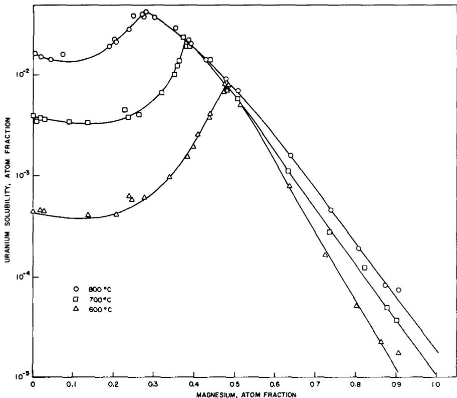  
1. Solubility of Uranium in Liquid Zn-Mg-U Alloys at 600, 700 and $800^{\circ}\mathrm{C}$ . Data from Ref. 8.

We have found that the solubility of uranium in liquid zinc-magnesium-uranium solutions may be estimated by assuming that (1) the activity coefficient of uranium in the solution is the geometric mean of the values for zinc-uranium and magnesium-uranium solutions and that (2) the activity of zinc in the solution is equal to the value for a binary zinc-magnesium solution of the same zinc concentration. The first assumption may be written

$$
\ln \gamma_ {U} ^ {S} = x _ {Z n} \ln \gamma_ {U, Z n} + x _ {M g} \ln \gamma_ {U, M g} \tag {18}
$$

where $\gamma_{\mathrm{U},\mathrm{Zn}}$ and $\gamma_{\mathrm{U},\mathrm{Mg}}$ are the activity coefficients of uranium in binary zinc-uranium solutions, respectively. The solubility of uranium in liquid zinc-magnesium solutions was estimated using Eq. (15), (17) and (18). The standard free-energy of formation of the uranium-zinc intermetallic compound, $\Delta Gf_{\mathrm{UZn}}^{\circ}$ , was computed from the results of high temperature galvanic cell studies.(9) The results from these same galvanic cell studies were used to compute the activity coefficient of uranium, $\gamma_{\mathrm{U},\mathrm{Zn}}$ , in liquid binary zinc-uranium solutions. The activity coefficient of uranium in liquid magnesium-uranium solutions, $\gamma_{\mathrm{U},\mathrm{Mg}}$ , was computed from the data for the solubility of uranium in liquid magnesium.(10) The zinc activities were computed from the equation reported by Chiotti and Stevens(11) for the Zn-Mg system.

Unfortunately, the formula for the intermetallic phase has not been unambiguously established. Studies of the zinc-uranium system at Argonne National Laboratory(12) have established the existence of two or more intermetallic compounds whose formulae probably range from $\mathrm{UZn}_{12}$ to $\mathrm{UZn}_{8.5}$ . These compounds appear to differ only slightly in stability and, therefore, it has not been possible to determine exactly the formula of the equilibrium solid phase (in the binary zinc-uranium system) as a function of temperature. The galvanic cell studies (9) of the temperature dependence of the free energy of formation of the intermetallic compound in equilibrium with the liquid phase, which ranged from just above the melting point of zinc $(420^{\circ}\mathrm{C})$ to about $700^{\circ}\mathrm{C}$ , did not indicate significant changes. Sharp changes in the temperature dependence would be expected if there had been different equilibrium intermetallic phases present which differed significantly in stability. To compute the solubility we have tried values of n between 8.5 and 12; the best agreement between observed and calculated values of the solubility was obtained with values of n between 8.5 and 9.5. It should be noted that it is possible, and highly probable, that the formula of the equilibrium solid intermetallic phase will depend on the zinc activity in the liquid solution. We would expect this variation of the formula to take place in discrete steps, with the value of n decreasing as the activity of zinc in the solution is decreased. Consequently, the value of n which is found to correspond to the best fit to the solubility data may be an average of the values for the several intermetallics involved.

The results of computations of the solubility of uranium at $600^{\circ}\mathrm{C}$ in liquid zinc-magnesium-uranium solutions are shown in Fig. 2. It is seen that the best agreement between computed and observed values of the solubility is obtained for a value of n between 8.5 and 8.75. The greatest differences between computed and observed values occur in the regions of the minimum and the sharp maximum in the solubility. The difference in the region of the minimum is probably mostly caused by the use of a value of n too small for the region of high zinc activity. To correct for this difference would require the computation of the initial part of the solubility using one value of n and the latter part using a second value of n. The obvious scatter of the experimental data (probably caused in part by a lack of equilibrium between the solid phase and the liquid phase when the latter was sampled for analysis in the solubility measurements) makes a meaningful computation of this type impossible. The overestimate of the solubility in the region of the sharp maximum is believed due to the failure of Eq. (18) to accurately predict the activity coefficient of uranium in the liquid solution. It is, in fact, surprising that this simple equation works as well as it does. A somewhat better estimate of the solubility can be made by using the approximation first suggested by Darken(13) and later by Alcock and Richardson(14) for the activity coefficient:

$$
\ln \gamma_ {U} ^ {S} = x _ {Z n} \ln \gamma_ {U, Z n} + x _ {M g} \ln \gamma_ {U, M g} - \frac {\Delta G _ {Z n - M g} ^ {x s}}{R T} \tag {19}
$$

where $\Delta G_{\mathrm{Zn - Mg}}^{\mathrm{XS}}$ is the excess free energy of mixing of the binary zinc-magnesium solvent system. This latter term was computed from the equation given by Chiotti and Stevens.(11) It is seen (dashed lines of Fig. 2) that for a value of $n = 9.2$ a somewhat better overall agreement between computed and observed solubility values is obtained when the D-A-R approximation Eq. (19) is used for $\ln \gamma_{\mathrm{U}}^{\mathrm{S}}$ , rather than the geometric mean approximation, Eq. (18). However, neither of these approximations take into account the possible dependence of the activity coefficient of uranium on the uranium concentration. If some thermodynamic data for the ternary system were available, then the relation reported by Darken(15) could be used to estimate $\gamma_{\mathrm{U}}^{\mathrm{S}}$ in the liquid zinc-magnesium-uranium solutions. Better estimates for the activity of zinc in the ternary solutions would then also be available.

Lacking sufficient data on the ternary system to apply the thermodynamically exact quadratic formalism of Darken, $^{(15)}$ we have studied the utility of a less exact treatment, which is similar to the "interaction parameter" formalism of Wagner. $^{(16)}$ Thus, in place of either Eq. (18) or (19) is written

$$
\ln \gamma_ {U} = x _ {Z n} \ln \gamma_ {U, Z n} ^ {o} + x _ {M g} \ln \gamma_ {U, M g} ^ {o} + a x _ {U} \tag {20}
$$

where $\gamma_{\mathrm{U,Zn}}^{\circ}$ and $\gamma_{\mathrm{U,Mg}}^{\circ}$ are the activity coefficients for uranium

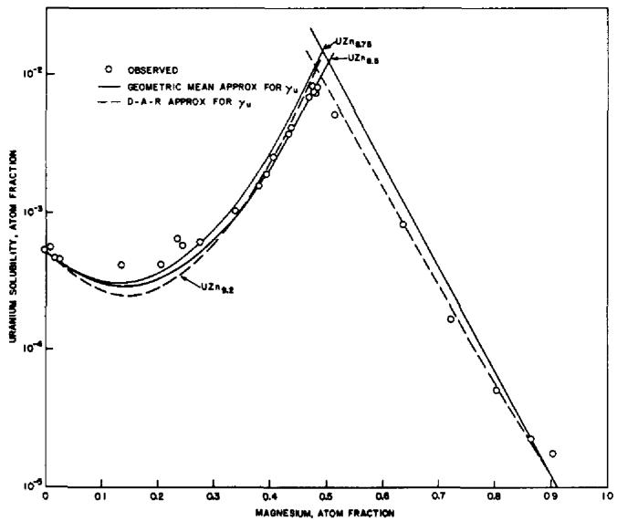  
2. Comparison of Observed and Computed Values of the Solubility of Uranium in Liquid Zn-Mg-U Alloys at $600^{\circ}\mathrm{C}$ . Experimental Data from Ref. 8.

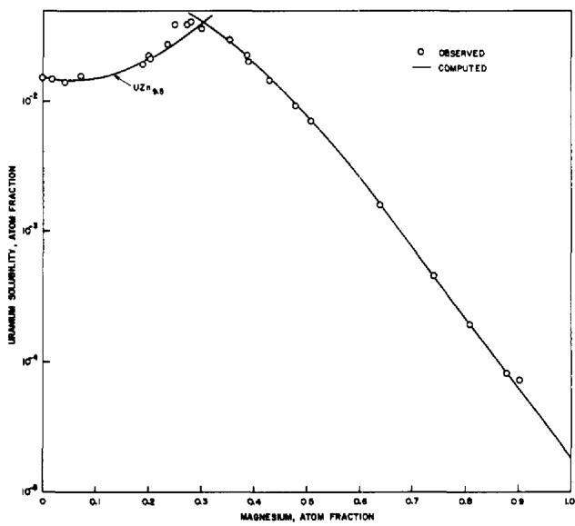  
3. Comparison of Observed and Computed Values of the Solubility of Uranium in Liquid Zn-Mg-U Alloys at $800^{\circ}\mathrm{C}$ . Line Computed using Eq. 20. Experimental Data from Ref. 8.

in liquid zinc and magnesium, respectively, at the limit of zero uranium concentration and a is a constant ("self interaction parameter"). All three parameters are functions of temperature. The constant a may be determined from one value of the activity coefficient of uranium in a ternary solution (for example, one value of the solubility in the ternary system to the right of the break), if values for the activity coefficients in the two binary systems are known. We have tested the utility of Eq. (20) by the computation of the solubility of uranium in zinc-magnesium-uranium solutions at $800^{\circ}\mathrm{C}$ . The comparison of the observed and computed values of the solubility shown in Fig. 3 indicates that Eq. (20) is a good approximation to use for this system.

Solubility of Plutonium in Liquid Zn-Mg Alloys. The solubility of plutonium in liquid zinc-magnesium alloys has been measured by Knighton and coworkers.(17) Qualitatively, the solubility in the zinc-rich region is similar to that observed in the region to the left of the maximum in the U-Zn-Mg system, i.e., the solubility decreases initially, passes through a minimum value and then increases with increasing magnesium concentration. In this region of the phase diagram various plutonium-zinc intermetallic phases are found to be in equilibrium with the liquid Zn-Mg-Pu alloys.

Several studies of the plutonium-zinc system have been reported(18-21). Cramer and Wood(21) report that there are at least five distinct phases in the most zinc-rich region of the system. One of these phases, which melts congruently at $928^{\circ}\mathrm{C}$ , is $\mathrm{Pu}_{2}\mathrm{Zn}_{17}$ ( $\mathrm{Th}_{2}\mathrm{Zn}_{17}$ rhombohedral structure). On the plutonium-rich side of $\mathrm{Pu}_{2}\mathrm{Zn}_{17}$ is a phase $\mathrm{PuZn}_{77}$ ; the crystal structure of which has recently been reported.(22) Cramer and Wood reported three phases on the zinc-rich side of $\mathrm{Pu}_{2}\mathrm{Zn}_{17}$ . However, they did not establish the exact stoichiometry of these phases but indicated that two of the phases may be polymorphs of a single phase. They reported transformations at 700, 770 and $811^{\circ}\mathrm{C}$ , and considered the transformation at $770^{\circ}\mathrm{C}$ to be a polymorphic transformation. It would appear that the $\mathrm{Pu}-\mathrm{Zn}$ system is similar to the U-Zn system in the zinc-rich region but that the stability of the various $\mathrm{Pu}-\mathrm{Zn}$ compounds is enough different that transformations readily occur between them and may be detected using thermal analysis methods.

We attempted to estimate the solubility of plutonium in liquid Zn-Mg solutions using Eq. (15) and (18) with the appropriate values of the parameters for the Pu-Zn and Pu-Mg systems. No single value of n could be found which would allow the solubility at 600 and $700^{\circ}\mathrm{C}$ to be computed over the entire magnesium concentration range of the solubility measurements (0-0.42 at fct at $600^{\circ}\mathrm{C}$ ; 0-0.28 at fct at $700^{\circ}\mathrm{C}$ ).

To establish the apparent formula for the equilibrium solid phase for each range of magnesium concentration we have used the

following method. The value of the activity coefficient of plutonium for each composition was computed from the solubility data using Eq. (15) rearranged in the form

$$
\ln \gamma_ {\mathrm {P u}} ^ {\mathrm {s}} = - \frac {\Delta G f _ {\mathrm {P u Z n}} ^ {\circ}}{\mathrm {R T}} n - \ln x _ {\mathrm {P u}} ^ {\mathrm {s}} - n \ln a _ {\mathrm {Z n}}, \tag {21}
$$

where $\Delta G_{\mathrm{PuZn}}^{\circ}$ was computed from the thermodynamic data for the Pu-Zn system(20) and $a_{Zn}$ from the data of Chiotti and Stevens(11) for the Zn-Mg system. The activity coefficient of plutonium in the liquid alloys may also be computed from the data for the distribution of plutonium between a molten salt mixture (50 mol pct $\mathrm{MgCl}_2 - 30$ mol pct NaCl-20 mol pct KCl) and liquid Zn-Mg-Pu solutions. The chemical reaction for distribution equilibria is:

$$
\mathrm {P u C l} _ {3} (\text {s a l t}) + 3 / 2 \mathrm {M g} (\text {a l l o y}) \stackrel {\rightarrow} {\leftarrow} \mathrm {P u} (\text {a l l o y}) + 3 / 2 \mathrm {M g C l} _ {2} (\text {s a l t}) \tag {22}
$$

hence,

$$
\ln \gamma_ {\mathrm {P u}} = \ln D + 3 / 2 \ln a _ {\mathrm {M g}} - \ln K _ {\mathrm {a}} ^ {\prime} \tag {23}
$$

where $\gamma_{\mathrm{Pu}}$ is the activity coefficient of plutonium in the liquid alloy, D, the distribution coefficient (mol fct PuCl3 in salt/ at fct Pu in alloy) and $K_{a}^{\prime} = K_{a}\gamma_{\mathrm{PuCl}_{3}}a_{\mathrm{MgCl}_{2}}^{-3 / 2}$ [Ka is the thermodynamic (activity) equilibrium constant for reaction (22), $\gamma_{\mathrm{PuCl}_3}$ the activity coefficient of $\mathrm{PuCl}_3$ , and aGc12the activity of 3 MgCl2in the molten salt]. The value of Ka was established from the value for $\gamma_{\mathrm{Pu}}$ in the binary Pu-Zn system, as has been discussed in detail elsewhere.(23) The values of n and $\Delta Gf_{\mathrm{PuZn}}^{\circ}$ which gave the best agreement between values of $\gamma_{\mathrm{Pu}}$ computed using Eq. (21) and (23) were determined graphically, as illustrated in Fig. 4. Values of ln $\gamma_{\mathrm{Pu}}$ were computed from the distribution data (the data previously reported(23) were combined with more recent data obtained by Knighton(24)) and are shown by the open circles and the straight line in Fig. 4. Values of ln $\gamma_{\mathrm{Pu}}$ were then computed using Eq. (21) and the solubility data with values of n between 8.5 and 12. The value of $\Delta Gf_{\mathrm{PuZn}}^{\circ}$ was computed from the thermodynamic data for the Pu-Zn system.(20) Values of ln $\gamma_{\mathrm{Pu}}$ computed using values of n = 11 and 8.5 are shown on Fig. 4. It is seen that the values of ln $\gamma_{\mathrm{Pu}}$ computed using n = 11 (shown as diamonds) are in good agreement with the straight line up to about ${\bf x}_{\mathrm{Mg}} = 0.2$ but systematically deviate from the straight line above ${\bf x}_{\mathrm{Mg}} = 0.2$ Above ${\bf x}_{\mathrm{Mg}} = 0.2$ , values of ln $\gamma_{\mathrm{Pu}}$ (shown as triangles) computed using n = 8.5 are seen to lie below the straight line by a nearly constant quantity. If the value of $\Delta Gf_{\mathrm{PuZn}}^{\circ}$ is increased by about 1300 cal/mole, the values of ln $\gamma_{\mathrm{Pu}}$ computed using Eq. (21) and n = 8.5 are seen (as squares) to be in good agreement with the straight line. We conclude that, at $600^{\circ}\mathrm{C}$ , the formula for the solid phase in equilibrium with liquid Zn-Mg-Pu alloys in the composition range $0\leq x_{\mathrm{Mg}} <   0.2$ is PuZn11 and in the composition range $0.2 <   x_{\mathrm{Mg}}\leq 0.43$ is PuZn8.5 $(P u_{2}Zn_{17})$ . At ${\bf x}_{\mathrm{Mg}} = 0.2$ two

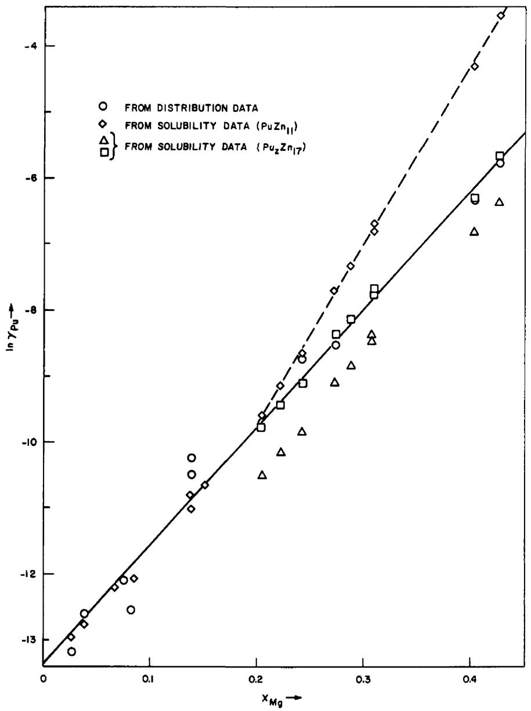  
4. Comparison of the Activity Coefficient of Plutonium in Liquid Zn-Mg-Pu Alloys at $600^{\circ}\mathrm{C}$ . Computed from Distribution and Solubility Data.

solid phases would be in equilibrium with the solution, as may be represented by the peritectic reaction:

$$
\mathrm {P u Z n} _ {1 1} (\mathrm {s}) \stackrel {\leftarrow} {=} 1 / 2 \mathrm {P u} _ {2} \mathrm {Z n} _ {1 7} (\mathrm {s}) + 2. 5 \mathrm {Z n} (\mathrm {x} _ {\mathrm {M g}} = 0. 2) \tag {24}
$$

According to Eq. (24) the difference in the standard free energies of formation of the two compounds is equal to 2.5 RT ln $a_{Zn}$ , which quantity is equal to 1300 cal/g-atom for $x_{Mg} = 0.18$ , in good agreement with the value $x_{Mg} = 0.2$ derived by inspection of Fig. 4. The value of the standard free energy of formation of $l/2 \, Pu_{2}Zn_{17}$ is more positive than the value for $PuZn_{11}$ as would be expected if $PuZn_{11}$ is the equilibrium phase in the binary $Zn-Pu$ system.

A similar computation using the solubility and distribution data for $700^{\circ}\mathrm{C}$ showed that $\mathsf{PuZn}_{11}$ is the equilibrium solid phase in the composition range $0 \leq x_{\mathsf{Mg}} < 0.16$ and $\mathsf{Pu}_{2}\mathsf{Zn}_{17}$ in the composition range $0.16 < x_{\mathsf{Mg}} \leq 0.26$ . The difference in the standard free energies of formation for the two intermetallic compounds was found to be 1040 cal/g-atom. At $800^{\circ}\mathrm{C}$ it was found that $\mathsf{Pu}_{2}\mathsf{Zn}_{17}$ is the equilibrium solid phase over the composition range $0 \leq x_{\mathsf{Mg}} \leq 0.18$ (0.18 is the limit of the solubility data at $800^{\circ}\mathrm{C}$ ). The standard free energy of formation of $\mathsf{Pu}_{2}\mathsf{Zn}_{11}$ was found to be 940 cal/g-atom Pu more negative than the value for $\mathsf{PuZn}_{11}$ at $800^{\circ}\mathrm{C}$ . Thus, $\mathsf{Pu}_{2}\mathsf{Zn}_{17}$ is the formula for the solid phase in equilibrium with liquid Zn-Pu and Zn-Mg-Pu solutions at $800^{\circ}\mathrm{C}$ . The peritectic temperature [Eq. (24)] in the Pu-Zn system is estimated to be $765^{\circ}\mathrm{C}$ .

These two examples illustrate the utility of relatively simple methods for the estimation of the solubility of uranium or plutonium in ternary liquid alloys and for the determination of the approximate stoichiometry of the equilibrium solid uranium- or plutonium-rich phases. We have also used these methods for the analysis of experimental data for the solubility of uranium in liquid cadmium-magnesium-uranium and cadmium-zinc-uranium alloys. In the latter case the analysis of the solubility data indicated that in cadmium-rich liquid cadmium-zinc-uranium alloys the equilibrium solid phase had to be a ternary intermetallic compound, a conclusion that was subsequently proven by x-ray diffraction and electron microprobe investigations.(25)

# Acknowledgments

The author expresses appreciation to Dr. Allen E. Martin and Mr. James B. Knighton for the use of their unpublished solubility data. Mr. Robert Schablaske furnished valuable information concerning the crystal structure of intermetallic compounds as determined by x-ray diffraction, and Dr. Norman Stalica furnished the results of electron microprobe studies of the intermetallics in the Zn-U system. The author also wishes to acknowledge his indebtedness to Dr. Harold M. Feder for helpful discussions during the early stages of this study.

This study was carried out under the auspices of the United States Atomic Energy Commission.

# References

1. Martin, A. E., I. Johnson, L. Burris, Jr., I. O. Winsch and H. M. Feder, "Separation of Uranium, Plutonium and Fission Products from Neutron-Bombarded Uranium", U. S. Patent 3,063,830 (Nov. 13, 1962).   
2. Knighton, J. B., I. Johnson and R. K. Steunenberg, "Uranium and Plutonium Purification by the Salt Transport Method", This Symposium.   
3. Johnson, I. and H. M. Feder, "Thermodynamics of the Uranium-Cadmium System", Trans. Met. Soc. AIME, 1962, Vol. 224, p. 468-473.   
4. Martin, A. E., I. Johnson and H. M. Feder, "The Cadmium-Uranium Phase Diagram", Trans. Met. Soc. AIME, 1961, Vol. 221, p. 789-791.   
5. Darken, L. S., "Thermodynamics of Binary Metallic Solutions", Trans. Met. Soc. AIME, 1967, Vol. 234, p. 80-89.   
6. Johnson, I., M. G. Chasanov and R. M. Yonco, "Pu-Cd System: Thermodynamics and Partial Phase Diagram", Trans. Met. Soc. AIME, 1965, Vol. 233, p. 1408-1414.   
7. Martin, A. E. and C. Wach, ANL-5996, 1960, p. 109-111; ANL-6101, 1960, p. 66-67; ANL-6477, 1962, p. 93-94; ANL-6543, 1962, p. 93-94.   
8. Knighton, J. B., R. Tiffany and K. Tobias, "Solubility of Uranium in Zinc-Magnesium", ANL-7325, 1967, p. 23-24, Also reported in reference 2 above.   
9. Johnson, I. and H. M. Feder, "Thermodynamics of Binary Systems of Uranium with Zn, Cd, Ga, In, Tl, Sn and Pb", International Symposium on Compounds of Interest in Nuclear Reactor Technology, IAEA, Vienna, Austria, 1962, p. 319-329.   
10. Chiotti, P. and H. E. Shoemaker, "Pyrometallurgical Separation of Uranium from Thorium", Ind. Eng. Chem., 1958, Vol. 50, p. 137-40.   
11. Chiotti, P. and E. R. stevens, "Thermodynamic Properties of Magnesium-Zinc Alloys", Trans. Met. Soc. AIME, 1965, Vol. 233, p. 198-203.   
12. Martin, A. E., R. S. Schablaske and N. Stalica, Argonne National Laboratory, Private Communication.

13. Darken, L. S., "Application of the Gibbs-Duhem Equation to Ternary and Multicomponent Systems", J. Am. Chem. Soc., 1959, Vol. 72, p. 2909.   
14. Alcock, C. B. and F. D. Richardson, "Dilute Solutions in Alloys", Acta. Met. 1960, Vol. 8, p. 882.   
15. Darken, L. S., "Thermodynamics of Ternary Metallic Solutions", Trans. Met. Soc. AIME, 1967, Vol. 239, p. 90-96.   
16. Wagner, C., "Thermodynamics of Alloys", Addison-Wesley Press, Carbridge, Mass., 1952, p. 51-53.   
17. Knighton, J. B. and K. R. Tobias, "Solubility of Plutonium in Zn-Mg Alloys", ANL-7375 (1967) p. 25-26, ANL-7575 (1969); Also reported in Ref. 2 above.   
18. Cramer, E. M., F. H. Ellinger and C. C. Land, "The Plutonium-Zinc Phase Diagram", Extractive and Physical Metallurgy of Plutonium and its Alloys, Interscience Publications, New York, 1959, p. 169-180.   
19. Albrecht, E. D., "The Plutonium-Zinc System", J. Nucl. Mat., 1964, Vol. 2, p. 125-130.   
20. Johnson, I. and M. G. Chasanov, "Thermodynamics of the Plutonium-Zinc System", J. Inorg. Nucl. Chem. 1964, Vol. 26, p. 2059-2067.   
21. Cramer, E. M. and D. H. Wood, "Phase Relations in the Zinc-Rich Portion of the Plutonium-Zinc System", J. Less-Common Metals, 1967, Vol. 13, p. 112-121.   
22. Johnson, Q., D. H. Wood and G. S. Smith, "The Crystal Structure of $\mathsf{Pu}_3\mathsf{Zn}_{22}''$ , Acta. Cryst., 1968, Vol. 1324, p. 480-484.   
23. Johnson, I., J. B. Knighton and R. K. Steunenberg, "Thermodynamics of Dilute Solutions of Plutonium in Liquid Magnesium", Trans. Met. Soc. AIME, 1966, Vol. 236, p. 1242-1246.   
24. Knighton, J. B. and K. R. Tobias, "Distribution of Plutonium Between Molten 50 m/o MgCl $_2$ -30 m/o NaCl-20 m/o KCl and Zn-Mg Alloys: Effect of Magnesium Concentration and Temperature", ANL-7375 (1967), p. 22-23.   
25. Schablaske, R. and N. Stalica, Argonne National Laboratory, Private Communication.

# THERMODYNAMIC PROPERTIES OF SELECTED SOLUTES

# IN LIQUID METAL SOLUTIONS*

David F. Bowersox

Los Alamos Scientific Laboratory, University of California Los Alamos, New Mexico 87544, United States of America

The partial molar enthalpies of solution, $\Delta \overline{\mathbf{H}_{\mathbf{i}}^{*}}$ , have been calculated for selected elements in liquid plutonium from solubility data over the temperature range 700 to $1000^{\circ}\mathrm{C}$ . The enthalpies of solution of vanadium, chromium, niobium, molybdenum, tantalum, and tungsten were calculated from regular solution theory by the equation

$$
\Delta \overline {{\mathrm {H}}} _ {\mathrm {i}} ^ {*} = \mathrm {T} \Delta \mathrm {S} _ {\mathrm {f}} - \mathrm {R T} \ln \mathrm {N} _ {\mathrm {i}},
$$

where $\mathbf{T}$ is the absolute temperature, $\Delta S_{\mathrm{f}}$ is the entropy of fusion of i at the normal melting temperature, $\mathbf{R}$ is the gas constant, and $\mathbf{N}_{\mathbf{i}}$ is the mole fraction of solute i in a saturated solution at temperature $\mathbf{T}$ . The enthalpies of solution of tungsten and tantalum in sixteen liquid rare-earth metals were also calculated by this equation. Solubility parameters, $\delta_{\mathrm{j}}$ , were calculated from these enthalpies by the formula

$$
\delta_ {\mathrm {i}} = \delta_ {\mathrm {B}} - \left(\frac {\Delta \bar {H} _ {\mathrm {i}} ^ {*} - \Delta H _ {\mathrm {f}}}{\bar {V} _ {\mathrm {i}}}\right) ^ {1 / 2},
$$

where $\delta_{\mathbf{B}}$ is the square-root of the cohesive density of the solvent, $\Delta H_{f}$ is the enthalpy of fusion, and $V_{i}$ is the molar volume of the solute. Finally, partial molar enthalpies of solution of carbon, titanium, zirconium, thulium, and rhenium were calculated by the equation

$$
\Delta \overline {{\mathrm {H}}} _ {\mathrm {i}} ^ {*} = \mathrm {T} \Delta \overline {{\mathrm {S}}} _ {\mathrm {i}} ^ {*} - \mathrm {R T} \ln \mathrm {N} _ {\mathrm {i}},
$$

where $\Delta \overline{\mathbf{S}}_{\mathbf{i}}^{*}$ is the sum of the entropy terms.

# Introduction

The solubilities of selected elements in liquid plutonium have been of continued interest in this Laboratory. $^{(1,2)}$ The individual solubilities of carbon, titanium, vanadium, chromium, zirconium, niobium, molybdenum, thulium, tantalum, tungsten, and rhenium have been measured under reversible conditions from 700 to $1000^{\circ}\mathrm{C}$ . The binary systems plutonium-vanadium, -chromium, -niobium, -molybdenum, -tantalum, and -tungsten are simple eutectic-types. $^{(3)}$ The other elements form either compounds or solid solutions with plutonium in the temperature and composition range of interest. $^{(3-5)}$ The solubilities and the solid phases in equilibrium with the liquid solution at $850^{\circ}\mathrm{C}$ are given in Table I.

Table I   
Solubilities and Solid Phases of Selected Elements in Liquid Plutonium at $850^{\circ}\mathrm{C}$   

<table><tr><td>Element</td><td>Solid Phase</td><td>Structure Symmetry</td><td>Solubility at 850°C, N × 103</td></tr><tr><td>C</td><td>PuC1-x</td><td>FCC</td><td>26.7</td></tr><tr><td>Ti</td><td>β-Ti in ε-Pu a</td><td></td><td>···</td></tr><tr><td>Ti</td><td>Pu in β-Ti b</td><td></td><td>261</td></tr><tr><td>V</td><td>V</td><td></td><td>22.9</td></tr><tr><td>Cr</td><td>Cr</td><td></td><td>43.5</td></tr><tr><td>Zr</td><td>Zr in Pu</td><td></td><td>80.3</td></tr><tr><td>Nb</td><td>Nb</td><td></td><td>20.5</td></tr><tr><td>Mo</td><td>Mo</td><td></td><td>30.8</td></tr><tr><td>Tm</td><td>PuTm x</td><td>Rhom.</td><td>50.4</td></tr><tr><td>Ta</td><td>Ta</td><td></td><td>1.90</td></tr><tr><td>W</td><td>W</td><td></td><td>0.167</td></tr><tr><td>Re</td><td>PuRe2</td><td>Hex.</td><td>27.5</td></tr></table>

$$
\begin{array}{l} \mathbf {\Delta} _ {t <   7 7 0 ^ {\mathrm {o}} \mathbf {C}} ^ {\mathrm {a}} \\ { } ^ { \mathrm { b } } _ { t } > 7 7 0 ^ { \mathrm { o } } \mathrm { C } \\ \end{array}
$$

Partial molar enthalpies of solution can be calculated for these solutes from basic thermodynamic principles provided that several limiting assumptions are adopted. Similar calculations can be applied to other binary systems; for example, partial enthalpies of solution for tungsten and tantalum in the liquid rare-earth metals can be calculated from the solubility measurements on these systems.(6,7) These partial molar enthalpies of solution should prove useful in estimating solubilities and the relative order of solubility in a series of related solvents. The enthalpies should be applicable to corrosion technology, heat transfer studies, casting and processing procedures, and to liquid fuels programs. The estimates are approximate and should not replace measurements where quantitative data are required.

# Discussion

The Derivation of a Solubility Equation. For a binary system composed of solute A and liquid solvent B, the reaction

$$
A (s) + B (\ell) = B (\ell , \text {s a t} ^ {\prime} d \text {w i t h A}) \tag {1}
$$

can be written to represent the equilibrium between excess solid A and liquid solution.

In general, this equilibrium can also be expressed as

$$
\mathrm {R} \ln \mathrm {N} _ {\mathrm {i}} = \left(\Delta \mathrm {S} _ {\mathrm {f}} + \Delta \overline {{\mathrm {S}}} _ {\mathrm {i}} ^ {\mathrm {x s}}\right) - \left(\Delta \mathrm {H} _ {\mathrm {f}} + \Delta \overline {{\mathrm {H}}} _ {\mathrm {i}} ^ {\mathrm {x s}}\right) / \mathrm {T} \quad , \tag {2}
$$

where $R$ is the gas constant, $N_{i}$ is the mole fraction of solute $i$ in a saturated solution at absolute temperature, $T$ , $\Delta S_{f}$ and $\Delta H_{f}$ are the entropy and enthalpy of fusion of $i$ , and $\Delta S_{i}^{XS}$ and $\Delta H_{i}^{XS}$ are the excess entropy and enthalpy of solution of the solute in the solvent of interest.(8)

Equation (2) is valid if the activity coefficient is constant within the limits of composition and temperature under consideration, if the heat capacities of the solid solute and the super-cooled liquid solute are equal at the temperature of interest; and, if the only phase change between the given temperature and that of fusion of the solute is melting.

The enthalpy term in Eq. (2) is a function of composition so that

$$
\Delta \overline {{\mathrm {H}}} _ {\mathrm {i}} ^ {\mathrm {x s}} = (1 - \mathrm {N} _ {\mathrm {i}}) ^ {2} \alpha , \tag {3}
$$

where $\alpha$ is a constant. Consequently, a correction would be necessary if very accurate values of the enthalpy term are desired. For most of these systems, however, this correction can be neglected.

If an empirical approach to solubility theory is adopted, both the excess entropy and enthalpy terms must be evaluated. Equation (2) becomes

$$
\mathrm {R} \ln \mathrm {N} _ {\mathrm {i}} = \mathrm {A} _ {\mathrm {i}} - \mathrm {B} _ {\mathrm {i}} / \mathrm {T}, \tag {4}
$$

where the total entropy of solution $(\Delta S_{\mathbf{f}} + \Delta \overline{S}_{\mathbf{i}}^{\mathrm{XS}})$ is designated as $\mathbf{A_i}$ and the total enthalpy $(\Delta H_{\mathbf{f}} + \Delta H_{\mathbf{i}}^{\mathrm{XS}})$ as $\mathbf{B_i}$ . These constants were calculated from the solubility data for each solute by least squares computations. The standard deviation computed for each equation was less than 0.1 over a three- to ten-fold change in the concentration of the solute in a $250^{\circ}$ to $300^{\circ}$ temperature range. Values for $\mathbf{A_i}$ and $\mathbf{B_i}$ are listed in Table II.

Table II   
Calculated Constants for Empirical Theory in Liquid Plutonium Solutions   

<table><tr><td rowspan="2">Element</td><td colspan="2">Calculated Constants</td></tr><tr><td>Ai</td><td>Bi×10-3</td></tr><tr><td>W</td><td>1.60</td><td>21.2</td></tr><tr><td>Ta</td><td>3.52</td><td>18.0</td></tr><tr><td>Nb</td><td>1.28</td><td>10.0</td></tr><tr><td>V</td><td>3.66</td><td>12.5</td></tr><tr><td>Mo</td><td>1.51</td><td>9.42</td></tr><tr><td>Cr</td><td>6.04</td><td>13.9</td></tr><tr><td>C</td><td>2.39</td><td>10.5</td></tr><tr><td>Tm</td><td>3.37</td><td>10.4</td></tr><tr><td>Re</td><td>0.89</td><td>9.0</td></tr><tr><td>Zr</td><td>13.1</td><td>20.2</td></tr><tr><td>Tia</td><td>8.69</td><td>23.0</td></tr><tr><td>Tib</td><td>3.38</td><td>6.8</td></tr></table>

aIn temperature range 700-750C   
bIn temperature range 800-1000 C

If the regular solution approach is adopted, Eq (2) becomes

$$
R \ln N _ {i} = \Delta S _ {f} - \Delta \bar {H} _ {i} ^ {*} \tag {5}
$$

where $\Delta \overline{\mathrm{H}}_{\mathrm{i}}^{*}$ is the sum of the enthalpy terms.

Quasi-Chemical Approach to Solubility. The excess enthalpy term, $\Delta \overline{H}_{i}^{xs}$ , and the difference between ideal and regular solutions can be illustrated by the quasi-chemical approach to bond energies. $^{(9)}$ It can be shown that

$$
\Delta H ^ {x s} = - z n N _ {i} N _ {B} \left[ E _ {i B} - \left(\frac {E _ {i i} + E _ {B B}}{2}\right) \right], \tag {6}
$$

where $\mathbf{Z}$ is the number of neighbors of each solute atom, $\mathbf{N}$ is Avogadro's number, $\mathbf{N}_{\mathrm{B}}$ is the mole fraction solvent, and $\mathbf{E_{iB}}$ , $\mathbf{E_{ji}}$ , and $\mathbf{E_{BB}}$ represent the potential interaction energies between solute-solvent, solute-solute, and solvent-solvent pairs, respectively. In liquid solutions, $\mathbf{Z}$ is the average value for the coordination number. By differentiation of Eq (6), in dilute solution

$$
\Delta \overline {{\mathrm {H}}} _ {\mathrm {i}} ^ {\mathrm {x s}} = - \mathrm {Z N} \left[ \mathrm {E} _ {\mathrm {i B}} - \left(\frac {\mathrm {E} _ {\mathrm {i i}} + \mathrm {E} _ {\mathrm {B B}}}{2}\right) \right] \tag {7}
$$

In an ideal solution $\mathbf{E_{iB}}$ is equal to the average of $\mathbf{E_{ij}}$ plus $\mathbf{E_{BB}}$ . In regular solutions these terms are not equal and the excess enthalpy of solution will depend upon the relative magnitudes of these interaction energies.

Solubility Parameters. Hildebrand and Scott have proposed solubility parameters based upon relations between molar volumes and bonding energies. (10) Their equation for the partial molar excess enthalpy of solution $\Delta H_{i}^{xs}$ is

$$
\Delta \bar {H} _ {i} ^ {\mathrm {X S}} = \bar {V} _ {i} \left[ \left(\frac {E _ {i} ^ {\mathrm {V}}}{\bar {V} _ {i}}\right) ^ {1 / 2} - \left(\frac {E _ {B} ^ {\mathrm {V}}}{\bar {V} _ {B}}\right) ^ {1 / 2} \right] ^ {2} \rho_ {B} ^ {2} = \bar {V} _ {i} (\delta_ {i} - \delta_ {B}) ^ {2} \rho_ {B} ^ {2} \tag {8}
$$

where $\overline{\mathbf{V}}_{\mathbf{i}}$ and $\overline{\mathbf{V}}_{\mathbf{B}}$ are the molar volumes of solute and solvent; $\mathbf{E}_{\mathbf{i}}^{\mathrm{v}}$ and $\mathbf{E}_{\mathbf{B}}^{\mathrm{v}}$ are the energies of vaporization; and, $\rho_{\mathbf{B}}$ is the volume fraction of $\mathbf{B}$ , which is generally one in dilute solutions. Hildebrand and Scott point out that metal solutions provide an excellent means of testing Eq (8) because of rather large changes in parameters such as the molar volume. This equation, however, will not be valid when interatomic bonding occurs; the basic assumptions in deriving Eq (8) include the validity of the geometric mean law and the dissociation of the solute into the solution. The values of $(\mathbf{E}^{\mathrm{v}} / \overline{\mathbf{V}})^{1/2}$ are commonly designated as solubility parameters; because of the approximations in deriving Eq (8), values of $\Delta \mathbf{H}_{\mathbf{i}}^{\mathrm{xs}}$ calculated by this method will be inexact.

Enthalpies of Solution of Solutes Which Form Simple-Eutectics With Plutonium. The equilibrium reactions of plutonium with vanadium, chromium, niobium, molybdenum, tantalum, and tungsten can be expressed by the equation

$$
A (s) + P u (l) = P u (l, s a t ^ {\prime} d w i t h A), \tag {9}
$$

where $A$ is the solute element i. Measurements of the individual solubilities

of these elements were made upon approach to saturation from both over- and under-saturated conditions. $^{(1,2)}$ The solute concentration at each temperature, over a series of measurements, was independent of the container material and the direction of approach to equilibrium. The variation in average values at each temperature was less than three relative percent.

The entropies of fusion of these solute elements are 2.3 e.u.(11) This value was used with the solubility data to calculate the partial enthalpies of solution by Eq (5). The calculated enthalpies were independent of temperature. Average values are given in Table III. The average correction factors in the enthalpies, as calculated by Eq (3), are also given in this Table. This correction is insignificant for tungsten and tantalum; it is 0.2 kcal/mole for niobium and molybdenum; 0.3 kcal/mole for vanadium; and 0.4 kcal/mole for chromium. Thus, the correction is less than 5 percent in every case.

Table III   
The Partial Molar Enthalpies and Solubility Parameters of Tungsten, Tantalum, Niobium, Vanadium, Molybdenum, and Chromium in Liquid Plutonium   

<table><tr><td>Element</td><td>ΔH*, kcal/mole</td><td>(1-Ni)2, avg</td><td>ΔHf, kcal/mole(a)</td><td>δi, calc</td><td>k(b)</td></tr><tr><td>W</td><td>22.0 ± 0.1</td><td>1.00</td><td>8.4</td><td>119</td><td>0.8</td></tr><tr><td>Ta</td><td>16.6 ± 0.1</td><td>1.00</td><td>7.5</td><td>110</td><td>0.8</td></tr><tr><td>Nb</td><td>11.1 ± 0.1</td><td>0.96</td><td>6.3</td><td>102</td><td>0.8</td></tr><tr><td>V</td><td>11.0 ± 0.1</td><td>0.95</td><td>5.1</td><td>107</td><td>0.9</td></tr><tr><td>Mo</td><td>10.3 ± 0.1</td><td>0.94</td><td>6.7</td><td>101</td><td>0.8</td></tr><tr><td>Cr</td><td>9.5 ± 0.1</td><td>0.90</td><td>5.0</td><td>106</td><td>0.9</td></tr></table>

(a) From Ref. (11)   
(b) $\mathrm{k} = \delta_{\mathrm{i}} \mathrm{calc} / (\mathrm{E}_{\mathrm{V}} / \overline{\mathrm{V}}_{\mathrm{i}})^{1/2}$

Values of the solubility parameters of these solutes, $\delta_{\mathrm{i}}$ calc, were calculated from the enthalpies of solution and the enthalpies of fusion(11) by the expression

$$
\delta_ {i c a l c} = \delta_ {P u} ^ {O} + \left[ \left(\Delta \bar {H} _ {i} ^ {*} - \Delta H _ {f}\right) / \bar {V} _ {i} \right] ^ {1 / 2}. \tag {10}
$$

where $\delta_{\mathbf{pu}}^{\mathrm{o}}$ is 81.(12) These values are less than $(\mathrm{E}^{\mathrm{V}} / \mathrm{V}_{\mathrm{i}})^{1 / 2}$ . A relative constant $k_{i}$ was calculated for each element to correlate the $\delta_{i}$ calc to $(\mathrm{E}^{\mathrm{V}} / \mathrm{V})^{1 / 2}$ by the equation

$$
k = \delta_ {i c a l c} / \left(E _ {i} ^ {V} / \bar {V} _ {i}\right) ^ {1 / 2}. \tag {11}
$$

The values of $\delta_{\mathrm{icalc}}$ and $\mathbf{k}_{\mathrm{i}}$ also are shown in Table III.

Enthalpies of Solution of Tantalum and Tungsten in Liquid Rare-Earth Solvents. The equilibrium reactions between tungsten or tantalum and the liquid rare-earth metals probably correspond to

$$
\mathrm {W} (\mathrm {s}) + \mathrm {S} (\mathrm {l}) = \mathrm {S} (\mathrm {l}, \text {s a t} ^ {\prime} \mathrm {d} \text {w i t h W}), \text {a n d} \tag {12}
$$

$$
\mathrm {T a} (\mathrm {s}) + \mathrm {S} (\ell) = \mathrm {S} (\ell , \text {s a t} ^ {\prime} \mathrm {d} \text {w i t h T a}), \tag {13}
$$

where S is the rare-earth metal solvent. Dennison, Tschetter, and Gschneidner measured the solubilities of tungsten and tantalum in sixteen rare-earth metals over the temperature range 1325 to $2150^{\circ}\mathrm{C}$ . Using their data, enthalpies of solution were calculated by Eq (5). Average enthalpies are given in Table IV. The solubility increases in order from ytterbium to scandium as shown by decreasing $\Delta \mathrm{H}_{\mathrm{i}}^{*}$ values for both solutes except for one-position changes for tantalum in terbium and holmium. Tungsten is less soluble than tantalum in each solvent.

Values of the solubility parameters of these solvents, $\delta_{\mathrm{s}}$ calc, were calculated from the enthalpies of solution by the equation

$$
\delta_ {\mathrm {s c a l c}} = \delta_ {\mathrm {i c a l c}} + \left[ \left(\Delta \overline {{\mathrm {H}}} _ {\mathrm {i}} ^ {*} - \Delta \mathrm {H} _ {\mathrm {f}}\right) / \overline {{\mathrm {V}}} _ {\mathrm {i}} \right] ^ {1 / 2} \tag {14}
$$

The values of $\delta_{\mathrm{scalc}}$ are compared with $(\mathrm{E}^{\mathrm{V}\mathrm{s}} / \overline{\mathrm{V}}_{\mathrm{s}})^{1 / 2}$ values in Table V.

Enthalpies of Elements Which Form Compounds with Plutonium. Plutonium reacts with carbon, thulium, and rhenium to form compounds in the solid phase over the temperature and composition range of interest.(3) If the reference state in these systems is the supercooled liquid solute and the solute is treated as dissociated in the liquid solution, the reaction may be written as:

$$
\mathrm {X A} (\ell , \text {s u p e r c o o l e d}) + \mathrm {Y P u} (\ell) = \mathrm {P u} _ {\mathrm {y}} \mathrm {A} _ {\mathrm {x}} (s), \tag {15}
$$

and

$$
\mathrm {P u} _ {\mathrm {y}} \mathrm {A} _ {\mathrm {x}} (\mathrm {s}) + \mathrm {P u} (\ell) = \mathrm {P u} (\ell , \text {s a t} ^ {\prime} \mathrm {d} \text {w i t h A}). \tag {16}
$$

Equation (5) is valid if the entropy changes that occur in going from supercooled liquid to compound to the hypothetical solid A in equilibrium

Table IV   
The Partial Molar Enthalpies of Solution of Tungsten and Tantalum in Liquid Rare-Earth Metals   
Table V   

<table><tr><td rowspan="2">Solvent Element</td><td colspan="2">ΔH*, kcal/mole</td></tr><tr><td>W</td><td>Ta</td></tr><tr><td>Yb</td><td>51</td><td>38</td></tr><tr><td>Eu</td><td>47</td><td>37</td></tr><tr><td>La</td><td>42</td><td>36</td></tr><tr><td>Sm</td><td>38</td><td>35</td></tr><tr><td>Pr</td><td>37</td><td>34</td></tr><tr><td>Nd</td><td>36</td><td>34</td></tr><tr><td>Ce</td><td>35</td><td>32</td></tr><tr><td>Gd</td><td>33</td><td>28</td></tr><tr><td>Y</td><td>31</td><td>25</td></tr><tr><td>Tb</td><td>30</td><td>26</td></tr><tr><td>Dy</td><td>29</td><td>25</td></tr><tr><td>Er</td><td>28</td><td>22</td></tr><tr><td>Ho</td><td>25</td><td>23</td></tr><tr><td>Tm</td><td>25</td><td>22</td></tr><tr><td>Lu</td><td>24</td><td>21</td></tr><tr><td>Sc</td><td>18</td><td>17</td></tr></table>

Published and Calculated $\delta_{\mathbf{s}}$ Values   

<table><tr><td rowspan="2">Element</td><td colspan="3">δS Values</td></tr><tr><td>Publisheda</td><td>Calc, with W Data</td><td>Calc, with Ta data</td></tr><tr><td>Yb</td><td>46</td><td>53</td><td>57</td></tr><tr><td>Eu</td><td>38</td><td>56</td><td>58</td></tr><tr><td>La</td><td>68</td><td>62</td><td>59</td></tr><tr><td>Sm</td><td>50</td><td>64</td><td>60</td></tr><tr><td>Pr</td><td>65</td><td>64</td><td>60</td></tr><tr><td>Nd</td><td>61</td><td>65</td><td>60</td></tr><tr><td>Ce</td><td>72</td><td>66</td><td>62</td></tr><tr><td>Gd</td><td>69</td><td>68</td><td>66</td></tr><tr><td>Y</td><td>72</td><td>70</td><td>70</td></tr><tr><td>Tb</td><td>70</td><td>72</td><td>69</td></tr><tr><td>Dy</td><td>61</td><td>73</td><td>70</td></tr><tr><td>Er</td><td>63</td><td>74</td><td>73</td></tr><tr><td>Ho</td><td>62</td><td>77</td><td>72</td></tr><tr><td>Tm</td><td>57</td><td>77</td><td>73</td></tr><tr><td>Lu</td><td>76</td><td>79</td><td>74</td></tr><tr><td>Sc</td><td>78</td><td>87</td><td>80</td></tr></table>

aRef (12)

with solution are negligible. The enthalpies of solution calculated under this assumption were independent of temperature; the average deviation in the value as a function of temperature was less than 0.1 kcal/mole. The average enthalpies are listed in Table VI. Average correction factors for these enthalpies, as calculated by Eq (3), are also given in this Table. The geometric mean law is not valid so that no attempt has been made to calculate solubility parameters for these systems.

Table VI   
The Partial Molar Enthalpies of Solution for Carbon, Thulium, and Rhenium in Liquid Plutonium   

<table><tr><td>Element</td><td>ΔH*, kcal/mole</td><td>(1 - N2)2, avg.</td></tr><tr><td>C</td><td>10.5 ± 0.1</td><td>0.94</td></tr><tr><td>Tm</td><td>9.2 ± 0.2</td><td>0.90</td></tr><tr><td>Re</td><td>10.5 ± 0.1</td><td>0.95</td></tr></table>

Enthalpies of Elements Which Form Solid Solutions with Plutonium. Both zirconium and titanium form solid solutions with plutonium from 700 to $1000^{\circ}\mathrm{C}$ . The equilibrium reaction for zirconium is

$$
\epsilon - \mathrm {P u} (\mathrm {s}, \text {s a t} ^ {\prime} \mathrm {d} \text {w i t h Z r}) + \mathrm {P u} (\ell) = \mathrm {P u} (\ell , \text {s a t} ^ {\prime} \mathrm {d} \text {w i t h Z r}); \tag {17}
$$

for titanium, the reaction below $770^{\circ}C$ is

$$
\epsilon - \mathrm {P u} (\mathrm {s}, \text {s a t} ^ {\prime} \mathrm {d} \text {w i t h} \mathrm {T i}) + \mathrm {P u} (\lambda) = \mathrm {P u} (\lambda , \text {s a t} ^ {\prime} \mathrm {d} \text {w i t h} \mathrm {T i}); \tag {18}
$$

and for titanium above $770^{\circ}\mathrm{C}$

$$
\beta - \mathrm {T i} (\mathrm {s}, \text {s a t} ^ {\prime} \mathrm {d} \text {w i t h P u}) + \mathrm {P u} (\lambda) = \mathrm {P u} (\lambda , \text {s a t} ^ {\prime} \mathrm {d} \text {w i t h T i}). \tag {19}
$$

Since the excess enthalpy terms are absorbed in $\Delta \overline{\mathbf{H}}_{\mathbf{i}}^{*}$ , the principle thermodynamic difference in these solutions from simple eutectic systems can be attributed to the configurational entropy in the solid solution. This term is - R ln $\mathbf{N}_{\mathbf{i}}^{\mathbf{s}}$ , where $\mathbf{N}_{\mathbf{i}}^{\mathbf{s}}$ is the mole fraction of solute i in a saturated solid solution at a given temperature. The derivation of the basic solubility equation under these conditions results in the expression

$$
\Delta \bar {H} _ {i} ^ {* *} = T \Delta S _ {f} - R \left[ \ln N _ {i} ^ {S} - \ln N _ {i} \right] \quad , \tag {20}
$$

where $\Delta \overline{\mathrm{H}}_{\mathrm{i}}^{**}$ is equal to $\Delta \overline{\mathrm{H}}_{\mathrm{i}}^{\mathrm{XS}} / [1 - \mathrm{N}_{\mathrm{i}}]^2 + \Delta \mathrm{H}_{\mathrm{f}}$

Values for $\mathbf{N}_{\mathrm{i}}^{\mathrm{s}}$ for zirconium and titanium were estimated from the phase diagrams. (4,5,13) Partial molar enthalpies of liquid solution $\Delta \mathrm{H}_{\mathrm{i}}^{**}$ were calculated by Eq (20). The enthalpy of the plutonium-zirconium system was $4.2 \pm 0.1 \mathrm{kcal} / \mathrm{mole}$ from 700 to $950^{\circ} \mathrm{C}$ . The enthalpy of liquid solution for the titanium-plutonium system was $4.1 \pm 0.1 \mathrm{kcal} / \mathrm{mole}$ from 700 to $750^{\circ} \mathrm{C}$ and $5.3 \pm 0.1 \mathrm{kcal} / \mathrm{mole}$ from 800 to $1000^{\circ} \mathrm{C}$ . The average correction factors for these enthalpies, as calculated by Eq (3), range from 0.5 to 0.8. However, estimates of solid phase solubilities are also approximate, and the $\Delta \mathrm{H}_{\mathrm{i}}^{*}$ values are limited to the significance of Eq (20). The shift in the titanium enthalpy was attributed to the change in the solid phase at $770^{\circ} \mathrm{C}$ . Solubility parameters were not calculated because of the formation of solid solutions in these systems.

# Conclusions

In this paper, enthalpy values have been calculated from solubility data by utilizing regular solution theory. Since solubility is an exponential function of the difference between the entropy and enthalpy divided by the absolute temperature, small errors in the solubility data may result in significant deviations in the latter. The approximate enthalpies can be used for qualitative estimates of solubility; refined estimates are possible with the correction factors. However, it remains necessary to measure the solubilities under the conditions of interest to obtain quantitative data.

# Acknowledgment

The author thanks J.A. Leary for his advice and encouragement during this study.

# References

1. D.F. Bowersox and J.A. Leary, J. Nucl. Mater., 21, 219 (1967).   
2. D.F. Bowersox and J.A. Leary, J. Nucl. Mater., 27, 181 (1968).   
3. F.W. Schonfeld, "Plutonium Phase Diagrams Studied at Los Alamos," in The Metal Plutonium, Eds. A.S. Coffinberry and W.N. Miner, University of Chicago Press, Chicago, 1961, pp 240-254.

4. D.M. Poole, M.G. Bale, P.G. Mardon, J.A.C. Marples, and J.L. Nichols, "Binary Alloys," in *Plutonium* 1960, Eds. E. Grison, W.B.H. Lord, and R.D. Fowler, Cleaver-Hume Press, London, 1961, pp 277-278.   
5. J.A.C. Marples, J. Less-Common Metals, 2, 331 (1960).   
6. D.H. Dennison, M.J. Tschetter, and K.A. Gschneidner, Jr., J. Less-Common Metals, 10, 108 (1966).   
7. D.H. Dennison, M.J. Tschetter, and K.A. Gschneidner, Jr., J. Less-Common Metals, 11, 423 (1966).   
8. P. Chiotti, M. F. Simons, and J. A. Kately, "Calculations of Thermodynamic Properties from Binary Phase Diagrams," this Symposium.   
9. E.A. Guggenheim, Proc. Roy. Soc. (London) A148: 304 (1935).   
10. J.H. Hildebrand and R.L. Scott, The Solubility of Nonelectrolytes, 3rd Ed., (Reinhold Publishing Co., New York, 1950) pp 320-345.   
11. R. Hultgren, R.L. Orr, P.D. Anderson, and K.K. Kelley, Selected Values of Thermodynamic Properties of Metals and Alloys, (J. Wiley and Sons, New York, 1963).   
12. E. T. Teatum, K. A. Gschneidner, Jr., and J. T. Waber, "Compilation of Calculated Data Useful in Predicting Metallurgical Behavior of the Elements in Binary Alloy Systems," Los Alamos Scientific Laboratory Report No. LA-4003 (1968).   
13. J.M. Taylor, "A Study of Phase Equilibria with Plutonium-Zirconium Alloys," Battelle Northwest Laboratories Report No. BNWL-402 (1968).

（

# BASIC DATA AND

# THERMODYNAMIC PROPERTIES, II

Chairman: Irving Johnson

Argonne National Laboratory

Argonne, Illinois, U.S.A.

THEORETICAL CONCEPTS FOR HIGH TEMPERATURE TERNARY MOLTEN

SYSTEMS AND THEIR IMPLICATIONS IN PYROMETALLURGICAL PROCESSES

Milton Blander and Kjell Hagemark  
Science Center, North American Rockwell Corporation  
Thousand Oaks, California 91360  
U.S.A.

# Abstract

Fundamental theories of ternary systems will be reviewed with a discussion of the similarities and differences between ternary reciprocal systems $(A^{+},B^{+} / X^{-},Y^{-})$ additive ternary systems $(A^{+},B^{+},C^{+} / X^{-})$ and metallic systems. In dilute solutions of two components one may define association constants between pairs of ions in terms of fundamental energy parameters. In concentrated solutions, deviations from ideal solution behavior are related to non-random mixing. Theoretical criteria for the prediction of phase diagram behavior, solubilities, extraction behavior, liquid-liquid miscibility, and other thermodynamic properties important in pyrometallurgical processing will be presented for simple systems.

# Introduction

Pyrometallurgical processing is generally carried out in multicomponent systems and an understanding of theoretical concepts is necessary to define and optimize processing methods. In this review we shall first discuss theories of ternary systems, which are the simplest members of the class of multicomponent systems. Our discussion applies equally to molten salt systems and to metallic systems for which there have been parallel developments of fundamental concepts. The extension of the concepts discussed to higher order multicomponent systems is straightforward. In the last section we will present some examples of chemical behavior in systems which illustrate the theoretical concepts.

Ternary molten salt systems consist of four ions: a system consisting of two cations and two anions $(A^{+}, B^{+} / X^{-}, Y^{-})$ is a ternary reciprocal system and one consisting of three cations and one anion $(A^{+}, B^{+}, C^{+} / X^{-})$ or three anions and one cation $(A^{+} / X^{-}, Y^{-}Z^{-})$ is an additive ternary system. The metallic systems which are analogous to these can be understood if one formally considers electrons (e-) as anions. Then interstitial alloys $(A^{+}, B^{+} / e^{-}, X^{-})$ are equivalent to reciprocal systems and substitutional alloys $(A^{+}, B^{+}, C^{+} / e^{-})$ are equivalent to additive systems. The theories which have been developed for molten salts and for alloy systems should exhibit many similarities and aside from specific differences in the models, many of the derived relationships are equivalent. We shall discuss thermodynamic theories for phenomena as phase diagram behavior, solubilities, extraction, and liquid-liquid miscibility which are important in pyrometallurgical processing.

# Definitions

To establish a framework for discussion several quantities need to be defined. The chemical behavior of a component in solution is, of course, determined by its chemical potential, $\mu$ , which has the undesirable mathematical property that it approaches $-\infty$ as the concentration of the component approaches zero. This property is circumvented by defining another quantity, the activity, $a$ , which usually lies in the range of 0 to 1

$$
\mu = \mu^ {o} + R T \ln a
$$

where $\mu^{\circ}$ is the chemical potential of the pure component. To make the definition of activity more meaningful one must introduce relationships which cannot be derived purely thermodynamically but require the introduction of statistical concepts. The simplest relationship for molten salts depends on the definition of an ideal solution as first discussed by Temkin.(1) The activity of an ideal solution of a salt $A_{m}^{X}$ is defined as

$$
a _ {i d} = N _ {A} ^ {m} N _ {X} ^ {n}
$$

where $\mathbb{N}_{\mathbf{A}}$ is the cation fraction of A and $\mathbb{N}_{\mathbf{X}}$ is the anion fraction of X

$$
N _ {A} = \frac {n _ {A}}{\Sigma n} \quad N _ {X} = \frac {n _ {X}}{\Sigma n}
$$

where $n$ are the number of moles of the ions indicated. For interstitial alloys there are analogous relations. For additive ternary systems and substitutional alloys either $N_A$ or $N_X$ is unity.

All real solutions deviate from ideal solutions. This deviation is characterized by the activity coefficient $\gamma$ such that

$$
\gamma = \left(a / a _ {i d}\right) = \left(a / N _ {A} ^ {m} N _ {X} ^ {n}\right)
$$

If the ideal solution is defined in a way which is consistent with the limiting laws, then $\gamma$ will always be a positive finite number. In addition to the definition of $\gamma$ there are several other quantities which are often utilized to characterize deviations from ideal solution behavior:

$$
\text {T h e m o l t e r e x c e s s f r e e e n e r g y} \quad G ^ {\mathrm {E}} = \begin{array}{c} \mathrm {R T} \Sigma \mathrm {N} _ {i} \not \ln \gamma_ {i} \\ \text {a l l} \\ \text {c o m p o n e n t s} \end{array}
$$

The partial molar excess free energy of a component i

$$
\bar {G} _ {i} ^ {E} = R T \ln \gamma_ {i}
$$

The molar enthalpy of mixing $\Delta H_{m} = H - \Sigma N_{i}H_{i}$ and the partial molar enthalpy of solution

$$
\bar {H} _ {i} ^ {E} = \frac {\partial (\bar {G} _ {i} ^ {E} / T)}{\partial (1 / T)} = \left(\frac {\partial \Delta H _ {m}}{\partial n _ {i}}\right)
$$

All these quantities are interrelated and often parallel each other.

# Solutions Dilute in Two Components

The thermodynamic solubility products $(\mathsf{K}_{\mathsf{SP}})$ and enthalpies of solution $(\Delta H_{\mathrm{soln.}})$ of an insoluble salt can be predicted for reciprocal systems and interstitial alloy systems by the use of simple cycle first proposed by Flood, Førland, and Grjothiem. As an

example, the process of dissolution of a solute such as silver chloride in an alkali nitrate

$\mathsf{AgCl}$ (solid or liquid) $\Rightarrow \mathsf{AgCl}$ ( $\infty$ dilution in $\mathsf{KNO}_3$ )

can be broken up into three steps

$\mathrm{AgCl}$ (solid or liquid) $+\mathrm{MNO}_3$ (liquid) $\rightarrow$ MC(solid or liquid)

$$
+ \mathrm {A g N O} _ {3} (\text {l i q u i d}) \tag {1}
$$

$$
\mathrm {M C l} (\text {s o l i d o r l i q u i d}) \rightarrow \mathrm {M C l} (\infty \text {d i l u t i o n i n} \mathrm {M N O} _ {3}) \tag {2}
$$

$$
\mathrm {A g N O} _ {3} (\text {l i q u i d}) \rightarrow \mathrm {A g N O} _ {3} (\infty \text {d i l u t i o n i n M N O} _ {3}) \tag {3}
$$

Consequently

$$
- \mathrm {R T} \ln K _ {\mathrm {S P}} = \Delta G _ {1} + \Delta G _ {2} ^ {\mathrm {S T}} + \Delta G _ {3} ^ {\mathrm {S T}} \tag {4}
$$

and

$$
\Delta \mathrm {H} _ {\text {s o l n .}} = \Delta \mathrm {H} _ {1} + \Delta \mathrm {H} _ {2} + \Delta \mathrm {H} _ {3} \tag {5}
$$

where the superscript ST signifies standard states. If data are available for the reaction (1), then one may calculate $K_{\mathrm{SP}}$ and $\Delta H_{\mathrm{soln}}$ from a knowledge of steps (2) and (3) which involve only binary systems. The complexity of the problem is thus reduced from that of understanding a large number of ternary systems to understanding a much smaller number of binary systems for which there are generally more available data or where reasonable estimates may often be made. The use of this cycle for calculating $K_{\mathrm{SP}}$ and $\Delta H_{\mathrm{soln}}$ has been tested for the dissolution of silver halides in molten alkali nitrates. The results in Table I show good agreement between measured and calculated values.

A similar cycle can be applied to metallic systems, e.g. to the calculation of the solubility product of the oxides of one metal in solution in another metal. This cycle is most useful where step (1) makes the largest contributions to the totals in equations (4) and (5).

Only for special cases in which activity coefficient corrections are negligible can one deduce solubilities directly from solubility products. Generally, the ions of insoluble salts tend to associate in solution and form clusters and ion pairs. This leads to significant negative deviations from ideal solution behavior which must be taken into account in order to calculate truesolubilities. Figure 1 illustrates this for a case in which the corrections are relatively small. If a solution of $\mathsf{Ag}^+$ and $\mathsf{Cl}^-$ ion in molten $\mathsf{KNO}_3$ were ideal, then the solubility of $\mathsf{AgCl}$ would be equal to the activity of $\mathsf{AgNO}_3$ and of $\mathsf{KCl}$ (the activities

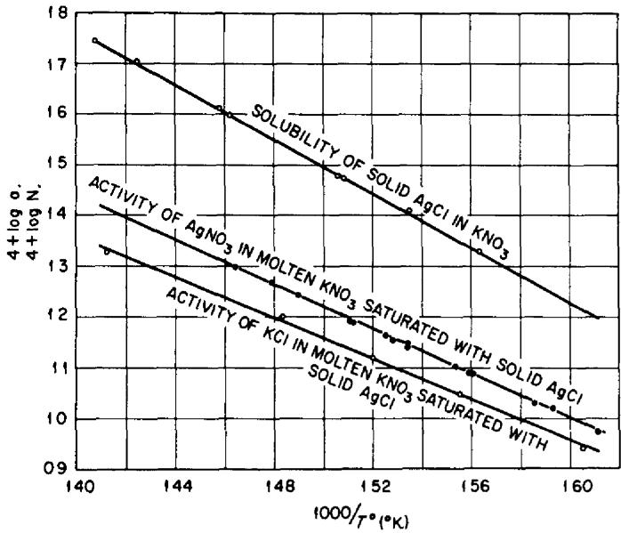  
1. Solubilities and Activities in Molten $\mathsf{KNO}_3$ (Ref. 3)

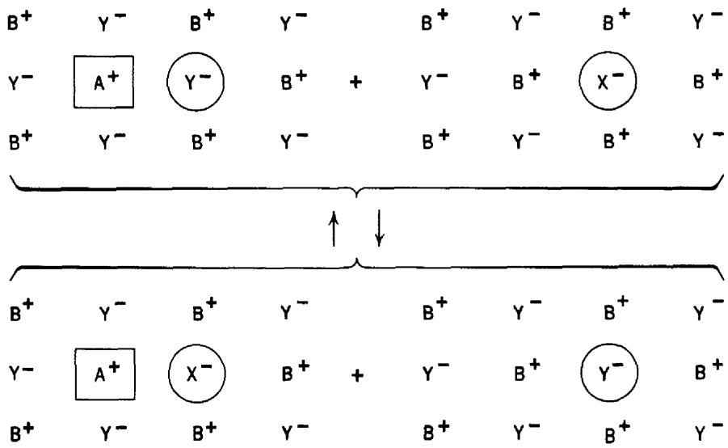  
2. Model for the Definition of $\Delta A_{1}$ , the Specific Bond Free Energy for the Ion Pair $A^{+} - X^{-}$ .

Table I.   
Measured Values of -RT ln Ksp, $\Delta H_{\mathrm{soln}}$ , and Their Comparison with Calculated Values(3)(4)   

<table><tr><td rowspan="2">Solute</td><td rowspan="2">Solvent</td><td colspan="2">-RT ln Ksp, kcal./mole</td><td colspan="2">ΔH, kcal./mole</td></tr><tr><td>Measured</td><td>Calcd.</td><td>Measured</td><td>Calcd.</td></tr><tr><td>AgI</td><td>NaNO3</td><td>29.5</td><td>31.5</td><td>29.5</td><td>29.8</td></tr><tr><td>AgI</td><td>KNO3</td><td>26.7</td><td>28.2</td><td></td><td>27.0</td></tr><tr><td>AgBr</td><td>NaNO3-KNO3</td><td>21.7</td><td>22.1</td><td>22.4</td><td>22.9</td></tr><tr><td>AgI</td><td>NaNO3-KNO3</td><td>28.4</td><td>29.9</td><td>27.9</td><td>28.4</td></tr><tr><td>AgCl2</td><td>KNO3</td><td>17.0</td><td>17.8</td><td>19.2</td><td>19.6</td></tr></table>

are based on standard states such that $\gamma = 1$ at infinite dilution). The solubility of AgCl is higher than these activities as the result of the formation of associated species in solution as

$$
\mathrm {A g} ^ {+} + \mathrm {C l} ^ {-} \rightleftharpoons \mathrm {A g C l} \tag {6}
$$

$$
\mathrm {A g C l} + \mathrm {C l} ^ {-} \rightleftharpoons \mathrm {A g C l} _ {2} ^ {-} \tag {7}
$$

$$
\mathrm {A g C l} + \mathrm {A g} ^ {+} \rightleftharpoons \mathrm {A g} _ {2} \mathrm {C l} ^ {+} \tag {8}
$$

which make the activity coefficients of $\mathrm{AgNO_3}$ and KC2 in solution less than unity. The fact that the plotted activities of $\mathrm{AgNO_3}$ are higher than those of KC2, even though the concentration of Ag equals that of Cl $^-$ , indicates that equilibria as (7) which form species containing more chloride ions than silver ions have larger association constants than equilibria as (8). In many other cases the activity coefficients are so low that solubilities are orders of magnitude higher than for an ideal solution. This is true not only for reciprocal molten salt systems but also for ternary interstitial metallic systems. Consequently, it is important to understand association equilibria in dilute solutions and the influence of these equilibria on the concentration dependence of activity coefficients.

Let us consider a solvent BY dilute in $\mathbf{A}^{+}$ and $\mathbf{X}^{-}$ ions. For metallic systems, $\mathbf{Y}^{-}$ is an electron. The association of $\mathbf{A}^{+}$ and $\mathbf{X}^{-}$ to form an $\mathbf{A}^{+}-\mathbf{X}^{-}$ pair may be visualized as in the two dimensional representation of Figure 2. The interchange of the circled $\mathbf{X}^{-}$ and $\mathbf{Y}^{-}$ ions gives rise to a specific bond free energy change $\Delta A_{1}$ . From the statistical mechanical analysis of a quasi-lattice model it can be shown that $\mathbf{K}_{1}$ , the association constant for the equilibrium $\mathbf{A}^{+}+\mathbf{X}^{-} \rightleftharpoons \mathbf{AX}$ in Figure 2 is given by (5)(6)(7)

$$
\mathrm {K} _ {1} = \mathrm {Z} \left(\exp \left(- \Delta \mathrm {A} _ {1} / \mathrm {R T}\right) - 1\right) \tag {9}
$$

where $\mathbb{Z}$ is a coordination number which ranges from about 4-6 for molten salts. In reciprocal systems and interstitial systems, $\Delta A_{1}$ , is largely related to the exchange of nearest neighbors. In simple systems where long range interactions do not predominate and where $A^{+}$ and $X^{-}$ are simple spherical ions one might expect that $\Delta A_{1}$ is independent of temperature and is truly an energy $\Delta E_{1}$ . In order to test this, one must make measurements over a wide range of temperatures.

The calculation of $\mathbf{K}_1$ from experimental data on the activity coefficients of the components AY or BX can be simply made for the case in which all components and species at low concentrations obey Henry's law. Then it can be shown that

$$
\ln \gamma_ {A Y} = - K _ {1} N _ {X} + \left(K _ {1} K _ {2} - \frac {1}{2} K _ {1} ^ {2}\right) N _ {X} ^ {2} + \left(2 K _ {1} K _ {1 2} - K _ {1} ^ {2}\right) N _ {A} N _ {X} + \dots . \tag {10}
$$

and

$$
\ln \gamma_ {B X} = - K _ {1} N _ {A} + \left(K _ {1} K _ {1 2} - \frac {1}{2} K _ {1} ^ {2}\right) N _ {A} ^ {2} + \left(2 K _ {1} K _ {2} - K _ {1} ^ {2}\right) N _ {A} N _ {X} + \dots . \tag {11}
$$

and by comparison with a MacLaurin series expansion one can derive a method for evaluating $\mathrm{K}_1(5)$ from limiting slopes

$$
- K _ {1} = \lim  _ {\substack {N _ {A} \rightarrow 0\\N _ {X} \rightarrow 0}} \left(\frac {\partial \ln \gamma_ {B X}}{\partial N _ {A}}\right) = \lim  _ {\substack {N _ {A} \rightarrow 0\\N _ {X} \rightarrow 0}} \left(\frac {\partial \ln \gamma_ {A Y}}{\partial N _ {X}}\right) \tag{12}
$$

For metallic solutions $\mathbf{K}_1$ is the negative of the atomic interaction coefficients introduced by Wagner(9) and Chipman and Eliott(10). Figure 3 exhibits some of the data for the system $\mathrm{Ag}^{+} + \mathrm{Cl}^{-}$ in $\mathrm{NaNO}_3$ which have been utilized in conjunction with equation (12) to evaluate $\mathbf{K}_1$ for the formation of $\mathrm{Ag}^{+} - \mathrm{Cl}^{-}$ ion pairs over a range of temperatures.

Values of $\Delta A_{1}$ derived from such measurements at several temperatures (11)(12)(13) are given in Table II and are independent of temperature within experimental errors for all reasonable values of the coordination number. Consequently, equation (9) can be used to predict the temperature coefficients of $K_{1}$ where $A^{+}$ and $X^{-}$ are simple spherical ions. Similar data have been obtained for metallic systems as shown in Figures 4 and $5^{(6)}$ and Table III(14) where the interaction coefficients $k_{i,j} = -K_{1}$ . An extensive check of the temperature dependence of $\Delta A_{1}$ for metallic systems has not been made but $\Delta A_{1}$ appears to be temperature independent in some of the measurements which have been made (see Figures 4 and 5 from reference 6). More complete tests would help to confirm this. The quasi lattice model also leads to expressions for the higher association constants (5)(7) which are somewhat more complex.

Similar equations hold for additive molten salt systems and for substitutional alloys (7)(15) with a modification in the definition of $\Delta A_{1}$ which is the specific free energy change for the exchange of next nearest neighbors (considering electrons as anions). This modification is illustrated in the two dimensional model in Figure 6 which illustrates the association of next nearest neighbor cations

$$
\mathrm {B} ^ {+} + \mathrm {C} ^ {+} \rightleftharpoons \mathrm {B} ^ {+} - \mathrm {C} ^ {+}
$$

An important conclusion may be deduced from equation (9). If $\Delta A_{1}$ is zero, then $K_{1}$ is zero. If $\Delta A_{1}$ is negative, then the two ions involved associate and $K_{1}$ can be a large number if $\Delta A_{1}$ is very negative. On the other hand, if $\Delta A_{1}$ is positive, it means that the "associating" ions repel each other which leads to negative values of $K_{1}$ . This peculiarity is paralleled by the behavior of second virial coefficients of some gases (which are the negative of association constants) and

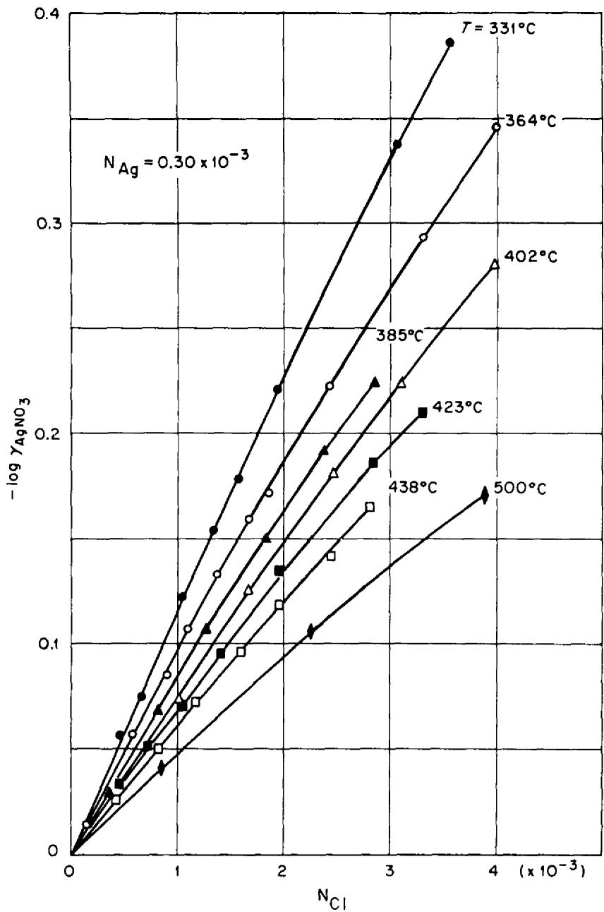  
3. Temperature Dependence of - log $\gamma_{\mathrm{AgNO}_3}$ in $\mathrm{NaNO}_3$ (Ref. 13).

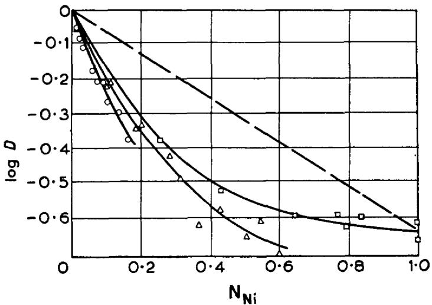  
4. Log D for Sulphur in Alloys of Copper and Nickel at $1300^{\circ}\mathrm{C}$ 0, $1400^{\circ}\mathrm{C} \Delta$ and $1500^{\circ}\mathrm{C} \square$ . (Ref. 6) D=γS(in alloy)/γS(in Cu)

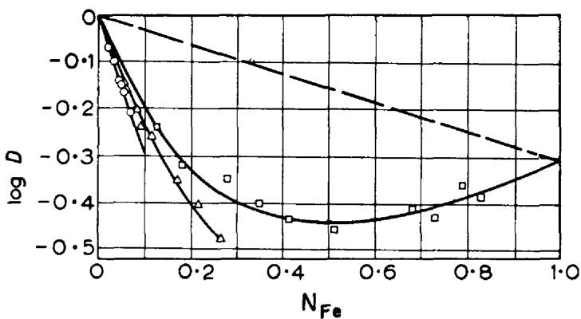  
5. Log D for Sulphur in Alloys of Copper and Iron at $1300^{\circ} \mathrm{C}$ 0, $1400^{\circ} \mathrm{C} \Delta$ and $1500^{\circ} \mathrm{C} \square$ . (Ref. 6) $\mathrm{D} = \gamma_{\mathrm{S}}$ (in alloy)/ $\gamma_{\mathrm{S}}$ (in Cu)

$$
\begin{array}{c c c c c c} \mathrm {A} ^ {+} & \mathrm {X} ^ {-} & \mathrm {A} ^ {+} & & \mathrm {A} ^ {+} & \mathrm {X} ^ {-} & \mathrm {A} ^ {+} \end{array}
$$

$$
\begin{array}{c c c c c c c} \mathrm {x} ^ {-} & & \mathrm {B} ^ {+} & & \mathrm {x} ^ {-} & & + \\ & & & & & \mathrm {x} ^ {-} & & \mathrm {c} ^ {+} \\ & & & & & \mathrm {x} ^ {-} \end{array}
$$

$$
\mathrm {A} ^ {+} \quad \mathrm {X} ^ {-} \quad \mathrm {A} ^ {+} \quad \mathrm {A} ^ {+} \quad \mathrm {X} ^ {-} \quad \mathrm {A} ^ {+}
$$

$$
\updownarrow \downarrow
$$

$$
\begin{array}{c c c c c c} \mathrm {A} ^ {+} & \mathrm {X} ^ {-} & \mathrm {C} ^ {+} & & \mathrm {A} ^ {+} & \mathrm {X} ^ {-} & \mathrm {A} ^ {+} \end{array}
$$

$$
\begin{array}{c c c c c c c} \mathrm {X} ^ {-} & \mathrm {B} ^ {+} & \mathrm {X} ^ {-} & + & \mathrm {X} ^ {-} & \mathrm {A} ^ {+} & \mathrm {X} ^ {-} \end{array}
$$

$$
\begin{array}{c c c c c c c} \mathrm {A} ^ {+} & \mathrm {X} ^ {-} & \mathrm {A} ^ {+} & \mathrm {A} ^ {+} & \mathrm {X} ^ {-} & \mathrm {A} ^ {+} \end{array}
$$

6. Two Dimensional Model for the Association of Next Nearest Neighbor.

Table II.   
Values of $\Delta A_{1}$ Obtained From the Comparison of Theory with Experimental Data(11)(12)(13)   

<table><tr><td rowspan="2">T, ℃</td><td colspan="3">-ΔA1(kcal.)</td><td rowspan="2">K1a</td></tr><tr><td>Z = 4</td><td>Z = 5</td><td>Z = 6</td></tr><tr><td></td><td colspan="3">Ag+ + Cl- in KNO3</td><td></td></tr><tr><td>623</td><td>6.12</td><td>5.85</td><td>5.62</td><td>552</td></tr><tr><td>643</td><td>6.17</td><td>5.89</td><td>5.66</td><td>498</td></tr><tr><td>658</td><td>6.21</td><td>5.93</td><td>5.69</td><td>460</td></tr><tr><td>675</td><td>6.17</td><td>5.87</td><td>5.64</td><td>396</td></tr><tr><td>696</td><td>6.18</td><td>5.88</td><td>5.63</td><td>348</td></tr><tr><td>709</td><td>6.17</td><td>5.86</td><td>5.62</td><td>315</td></tr><tr><td></td><td colspan="3">Ag+ + Cl- in NaNO3</td><td></td></tr><tr><td>604</td><td>5.10</td><td>4.83</td><td>4.62</td><td>277</td></tr><tr><td>637</td><td>5.12</td><td>4.84</td><td>4.62</td><td>226</td></tr><tr><td>658</td><td>5.17</td><td>4.88</td><td>4.65</td><td>205</td></tr><tr><td>675</td><td>5.10</td><td>4.81</td><td>4.57</td><td>176</td></tr><tr><td>696</td><td>5.13</td><td>4.83</td><td>4.59</td><td>160</td></tr><tr><td>711</td><td>5.12</td><td>4.81</td><td>4.56</td><td>146</td></tr><tr><td>773</td><td>5.14</td><td>4.82</td><td>4.55</td><td>110</td></tr><tr><td></td><td colspan="3">Ag+ + Cl- in (Na-K)NO3</td><td></td></tr><tr><td>506</td><td>5.6</td><td>5.4</td><td>5.2</td><td>1050</td></tr><tr><td>551</td><td>5.57</td><td>5.33</td><td>5.13</td><td>644</td></tr><tr><td>658</td><td>5.67</td><td>5.38</td><td>5.15</td><td>302</td></tr><tr><td>752</td><td>5.72</td><td>5.40</td><td>5.13</td><td>180</td></tr><tr><td>801</td><td>5.62</td><td>5.28</td><td>5.00</td><td>133</td></tr></table>

${}^{\mathbf{a}}\mathrm{K}_{1}$ in mole fraction units.

Table III.   
Atomic Interaction Coefficients in Liquid Iron, 1600°C (14)   
Values of $\mathbf{k}_{ij} = -\mathbf{K}_1$   

<table><tr><td rowspan="2">Added component j</td><td colspan="6">Component i</td></tr><tr><td>H</td><td>C</td><td>N</td><td>O</td><td>Si</td><td>S</td></tr><tr><td>C</td><td>+42?</td><td>+11.1</td><td>+12?</td><td>- 6.4</td><td>+10</td><td>+6.0</td></tr><tr><td>O</td><td>......</td><td>......</td><td>+ 3.5</td><td>- 13</td><td></td><td></td></tr><tr><td>Al</td><td>......</td><td>+ 6.7</td><td>- 0.3</td><td>-1300</td><td>......</td><td>6.5</td></tr><tr><td>Si</td><td>3.2</td><td>11.2</td><td>+ 5.4</td><td>- 2?</td><td>3.4</td><td>7.6</td></tr><tr><td>P</td><td>......</td><td>......</td><td>......</td><td>+ 8.9</td><td>11</td><td>5.7</td></tr><tr><td>S</td><td>......</td><td>......</td><td>......</td><td>- 12</td><td>......</td><td>-3.8</td></tr><tr><td>V</td><td>......</td><td>- 8.0</td><td>-20.5</td><td>- 57</td><td></td><td></td></tr><tr><td>Nb</td><td>- 1.5</td><td>-23</td><td></td><td></td><td></td><td></td></tr><tr><td>Ta</td><td>......</td><td>......</td><td>-25.2</td><td></td><td></td><td></td></tr><tr><td>Cr</td><td>......</td><td>- 5.1</td><td>- 9.6</td><td>- 8.8</td><td>......</td><td>-4.7</td></tr><tr><td>Mo</td><td>......</td><td>- 3.5</td><td>- 4.5</td><td>1.4</td><td></td><td></td></tr><tr><td>W</td><td>......</td><td>- 2.3</td><td>- 1.1</td><td>6.4</td><td></td><td></td></tr><tr><td>Mn</td><td>......</td><td>- 1.4</td><td>- 4.5</td><td>0?</td><td>0?</td><td>-5.7</td></tr><tr><td>Co</td><td>......</td><td>2.9</td><td>2.7</td><td>1.7</td><td></td><td></td></tr><tr><td>Ni</td><td>......</td><td>2.9</td><td>2.6</td><td>1.4</td><td>1.2</td><td>0</td></tr><tr><td>Cu</td><td>......</td><td>4.2</td><td>2.4</td><td>- 2.5</td><td>......</td><td>-3.2</td></tr><tr><td>Pt</td><td>......</td><td>......</td><td>......</td><td>3.6</td><td></td><td></td></tr><tr><td>Au</td><td>......</td><td>......</td><td>......</td><td>- 3.0</td><td></td><td></td></tr><tr><td>Sn</td><td>......</td><td>0</td><td>3.4</td><td>0</td><td></td><td></td></tr></table>

it arises because of the definition of an ideal solution in which $K_{1}$ is zero for the random number of pairs $(N_{A}N_{X}$ in reciprocal systems or $N_{p}N_{C}$ in additive systems). If these pairs of ions repel each other then $K_{1} < 0$ . An examination of equation (9) for positive values of $\Delta A_{1}$ shows that the most negative value of $K_{1}$ possible is -Z. Thus, the positive values of $K_{1}$ have no fundamental limit but the negative values do. In dilute solution, this means that it is easier to lower than to raise activity coefficients of solutes significantly by the addition of a third constituent. This is consistent with much of the data on metallic systems where values of $K_{1}$ (the negative of the Wagner coefficient $k_{i,j}$ ) range from very large numbers to small negative numbers.(14) The only value of $K_{1}$ less than -12 in Table III taken from reference (14) is questionable.

A precise estimate of $\Delta A_{1}$ is not possible at present but relative values for similar compounds may be often guessed from the crude assumption of additivity. If pair bonds are additive then for reciprocal systems

$$
\Delta A _ {1} \cong \left(\frac {\Delta G ^ {\circ}}{Z}\right) \tag {13}
$$

where $\Delta G^0$ is the standard free energy for the reaction

$$
A Y (\varepsilon) + B X (\varepsilon) \rightarrow A X (\varepsilon) + B Y (\varepsilon) \tag {14}
$$

Of course, real systems do not exhibit this additivity so that equation (13) may be used only for crude guesses. Analogous relations hold for interstitial alloys. Nonadditivity is manifested in yet another way. If one looks at the equilibrium (7) for the association of a second chloride ion with a silver ion, if there is no contribution to the bond free energy which is related to the non-ideality of the $\mathrm{AgNO_3 - MNO_3}$ and $\mathrm{MCl - MNO_3}$ binary systems, then additivity of pair bond interactions means that the specific bond free energy for this process, $\Delta A_{2} = \Delta A_{1}$ . From a generalized quasi-lattice model(5)

$$
\mathrm {K} _ {1} \mathrm {K} _ {2} = \frac {\mathrm {Z} (\mathrm {Z} - 1)}{2} \left(\beta_ {1} \beta_ {2} - 2 \beta_ {1} + 1\right) \tag {15}
$$

where $\beta_{i} = \exp (-\Delta A_{i} / RT)$ . When $\Delta A_2 = \Delta A_1$

$$
\mathrm {K} _ {2} = \frac {(Z - 1)}{2} (\beta_ {1} - 1) = \frac {(Z - 1)}{2 Z} \mathrm {K} _ {1} \tag {16}
$$

Simple quasi-lattice theory (6)(16)(17)(15)(7) is based on the assumption of the additivity of the energy of pair bond interactions ( $\Delta A = \Delta A_1 = \Delta A_2 = \ldots = \Delta A_i = \ldots$ ). However, many systems depart from this assumption and require the generalized treatment in dilute solutions. (5)

The theory for calculations of solutions of one component in dilute solution in a binary solvent has been discussed in several papers.(6)(18)(17)(19)(7)(15) With minor differences in the definition of the parameters, one obtains the same relations for reciprocal and additive ternary mixtures. All of the calculations are based upon the additivity of pair bond interactions, and, to the degree that there are deviations from this, real systems might be expected to deviate from theoretical calculations. Even for those cases where such deviations are considerable, theory provides an understanding of the parameters and phenomena which govern solution behavior and enables one to make semiquantitative predictions.

The theoretical equations can be expressed in several different forms, each of which provides a different insight into the problem. Hagemark has derived expressions for ternary systems at any composition from the quasi-chemical theory(20)(15) for the additive ternary system AX-BX-CX (or A-B-C). In the limit of $\mathbb{N}_{\mathrm{C}} \to 0$ an expression from his general equations for the activity coefficient of the component CX (or C) can be derived

$$
\begin{array}{l} \ln \gamma_ {C} = - Z \ln \left[ \left(\frac {\gamma_ {A}}{\gamma_ {C} (A)}\right) ^ {1 / Z} N _ {A} + \left(\frac {\gamma_ {B}}{\gamma_ {C} (B)}\right) ^ {1 / Z} N _ {B} \right] \tag {17} \\ = \lambda n \gamma_ {C} (A) - \lambda n \gamma_ {A} - Z \lambda n \left(N _ {A} + K N _ {B}\right) \\ \end{array}
$$

where

$$
\mathrm {K} ^ {\mathrm {Z}} = \frac {\gamma_ {\mathrm {C}} (\mathrm {A}) \gamma_ {\mathrm {B}}}{\gamma_ {\mathrm {C}} (\mathrm {B}) \gamma_ {\mathrm {A}}} \tag {17a}
$$

This is exactly equivalent to a more complex expression derived earlier by Alcock and Richardson(6)(18) and for cases in which (9) $\gamma_{A} = \gamma_{B} = 1$ it is equivalent to an expression derived by Wagner. In equation (17) we have redefined Hagemark's parameters and substituted the nomenclature of Alcock and Richardson. Here $\gamma_{C}$ is the activity coefficient of CX (or C), $\gamma_{A}$ of AX (or A), $\gamma_{B}$ of BX (or B) in a binary mixture of $AX + BX$ (or A + B), $\gamma_{C}(A)$ is the activity coefficient of CX (or C) at infinite dilution in AX (or A) and $\gamma_{C}(B)$ is for CX (or C) at infinite dilution in BX (or B). The quantities $\gamma_{C}(A)$ and $\gamma_{C}(B)$ are independent of $N_{A}$ and $N_{B}$ whereas $\gamma_{A}$ and $\gamma_{B}$ are functions of $N_{A}$ and $N_{B}$ .

For the model system when $\mathbf{N}_{\mathrm{C}} \rightarrow 0$

$$
\gamma_ {A} = \left(\frac {\sqrt {N _ {A} - \alpha}}{N _ {A}}\right) ^ {Z} \tag {18}
$$

$$
\gamma_ {B} = \left(\frac {\sqrt {N _ {B} - \alpha}}{N _ {B}}\right) ^ {Z} \tag {19}
$$

where

$$
\alpha = \frac {2 N _ {A} N _ {B}}{1 + \sqrt {1 + 4 N _ {A} N _ {B} \left(Y _ {B} (A)\right) ^ {2 / Z} - 1}} \tag {20}
$$

and

$$
\gamma_ {\mathrm {B}} (\mathrm {A}) = \gamma_ {\mathrm {A}} (\mathrm {B})
$$

Physical insight into the consequences of equation (17) can be gained by rearranging the equation to the more complex form

$$
\ln \gamma_ {C} = N _ {A} \ln \gamma_ {C} (A) + N _ {B} \ln \gamma_ {C} (B) - \frac {G ^ {E} (A B)}{R T} + \phi \left(N _ {A}\right) \tag {21}
$$

The first two terms of (21) are linear and the third term is

$$
\frac {G ^ {E} (A B)}{R T} = N _ {A} \ln \gamma_ {A} + N _ {B} \ln \gamma_ {B} \tag {22}
$$

where $G^{E}(\mathsf{AB})$ is the molar excess free energy of the binary mixture of AX + BX which is zero when $N_{A}$ or $N_{B} = 0$ and generally has a maximum or minimum which is at $N_{A} = N_{B} = 0.5$ in the model system but may deviate from this in real systems. The function $\phi(N_{A})$ is given by the expression

$$
\phi \left(\mathrm {N} _ {\mathrm {A}}\right) = - \mathrm {Z N} _ {\mathrm {A}} \mathrm {N} _ {\mathrm {B}} \left[ \frac {1}{\mathrm {N} _ {\mathrm {A}}} \ln \left(1 + \mathrm {N} _ {\mathrm {A}} \left(\frac {1 - \mathrm {K}}{\mathrm {K}}\right)\right) + \frac {1}{\mathrm {N} _ {\mathrm {B}}} \ln \left(1 + \mathrm {N} _ {\mathrm {B}} (\mathrm {K} - 1)\right) \right] \tag {23}
$$

where in Alcock and Richardson's notation

$$
K ^ {Z} = \frac {\gamma_ {C (A)} \gamma_ {B}}{\gamma_ {C (B)} \gamma_ {A}} \tag {24}
$$

and $K$ is a function of $N_A$ . The function $\phi$ is always negative, is generally small, and is zero when $N_A$ or $N_B = 0$ . Consequently, when the binary system AX-BX exhibits very large deviations from ideal solution behavior, $-G^{E}(AB)$ has a large maximum or minimum which is to be added to the linear terms. Such behavior may have a profound influence on the chemical behavior of components in pyrometallurgical processes. We will illustrate this behavior in a later section. The term $\phi$ tends to lower the maxima or minima to an extent which depends solely on $K$ . Equation (17) may be rewritten for reciprocal systems and is equivalent to limiting forms which can be derived from the quasi-lattice theory for reciprocal systems.[17] For the component AX in dilute solution in the binary system $AY - BY$ one obtains the expression

$$
\ln \gamma_ {A X} = \ln \gamma_ {A X} (A Y) - z \ln \left[ N _ {A} + K N _ {B} \right] \tag {25}
$$

where $\gamma_{\mathrm{AX}}(\mathrm{AY})$ is the activity coefficient of AX at infinite dilution in AY and where the analogue of equation (24) is

$$
\mathrm {K} ^ {\mathrm {Z}} = \frac {\gamma_ {\mathrm {A X}} (\mathrm {A Y}) \gamma_ {\mathrm {B Y}}}{\gamma_ {\mathrm {B X}} (\mathrm {B Y}) \gamma_ {\mathrm {A Y}}} e ^ {\frac {\Delta G ^ {\circ}}{R T}} \tag {26}
$$

where $\Delta G^{\circ}$ is the free energy change for reaction (14). Equations (25) and (26) do not take into account the interaction between next nearest neighbor $A^{+}$ and $B^{+}$ cations in the vicinity of an $X^{-}$ anion. In the limit of $N_{\mathrm{B}} = 1$ equations (25) and (26) are exactly equivalent to the Flood, Førland and Grjothem cycle.(2) Equations (25) and (17) can be seen to be equivalent if $\gamma_{\mathrm{AX}}$ in (25) is equivalent to $\gamma_{\mathrm{A}}\gamma_{\mathrm{C}}$ in (17).

# Concentrated Solutions

The thermodynamic properties of concentrated ternary solutions have been treated in three papers utilizing perturbation theory for reciprocal systems $^{(21)}$ and the quasi-chemical approach for reciprocal $^{(17)}$ and additive ternary systems. $^{(15)}$ These theories provide a fundamental justification for many of the equilibrium chemical properties and provide a means for the prediction of chemical behavior, phase diagrams, and of liquid-liquid miscibility. Although these theories apply only to simple systems, they enable us to understand the basis for the behavior of more complex systems.

Conformal ionic solution theory (22) is a statistical mechanical second order perturbation theory which has been applied to reciprocal systems. (21) For the activity coefficients of the component AX, it leads to the relation

$$
\begin{array}{l} \mathrm {R T} \text {l n} \gamma_ {\mathrm {A X}} = - \mathrm {N} _ {\mathrm {B}} \mathrm {N} _ {\mathrm {Y}} \Delta \mathrm {G} ^ {\circ} + \mathrm {N} _ {\mathrm {B}} \mathrm {N} _ {\mathrm {Y}} (\mathrm {N} _ {\mathrm {Y}} - \mathrm {N} _ {\mathrm {X}}) \lambda_ {\mathrm {B X Y}} \\ + \mathrm {N} _ {\mathrm {Y}} \left(\mathrm {N} _ {\mathrm {B}} \mathrm {N} _ {\mathrm {X}} + \mathrm {N} _ {\mathrm {A}} \mathrm {N} _ {\mathrm {Y}}\right) \lambda_ {\mathrm {A X Y}} + \mathrm {N} _ {\mathrm {B}} \left(\mathrm {N} _ {\mathrm {B}} \mathrm {N} _ {\mathrm {X}} + \mathrm {N} _ {\mathrm {A}} \mathrm {N} _ {\mathrm {Y}}\right) \lambda_ {\mathrm {A B X}} \\ + N _ {B} N _ {Y} \left(N _ {B} - N _ {A}\right) \lambda_ {A B Y} + N _ {B} N _ {Y} \left(N _ {B} N _ {X} + N _ {A} N _ {Y} - N _ {A} N _ {X}\right) \Lambda \tag {27} \\ \end{array}
$$

where $\Delta G^0$ is the standard free energy change for reaction (14), and the $\lambda$ parameters are defined by the excess free energies of the binary system indicated. For example

$$
\Delta G ^ {E} (A X - B X) = N _ {A} N _ {B} \lambda_ {A B X} \tag {28}
$$

The parameter $\Lambda$ can be approximated by the equation

$$
\Lambda = - \left(\Delta G ^ {\circ}\right) ^ {2} / 2 Z R T \tag {29}
$$

by a comparison of its theoretical form with the quasi-chemical theory. For the simple quasi-binary system AX-BY, equation (28) reduces to

$$
\begin{array}{l} \mathrm {R T} \ln \gamma_ {\mathrm {A X}} = \mathrm {N} _ {\mathrm {B Y}} ^ {2} \left[ - \Delta \mathrm {G} ^ {\circ} + \lambda_ {\mathrm {B X Y}} + \lambda_ {\mathrm {A B Y}} + 2 (1 - \mathrm {N} _ {\mathrm {B Y}}) \left(\lambda_ {\mathrm {A X Y}} + \lambda_ {\mathrm {A B X}} - \lambda_ {\mathrm {B X Y}} - \lambda_ {\mathrm {A B Y}}\right) \right. \\ + \left(1 - N _ {B Y}\right) \left(3 N _ {B Y} - 1\right) \Lambda ] \tag {30} \\ \end{array}
$$

Since the theory is only second order, it is not exact for cases in which $\Delta G^0 > ZRT$ or where regular solution theory expressed by equations as (28) are grossly incorrect. Despite the deviations of real systems from the assumptions in the theory, this theory can be useful in helping to understand and predict thermodynamic behavior when the deviations from the assumptions are not gross. For example, the liquidus temperatures of the Li, K||F, C system calculated from conformal ionic solution theory(23) are given in Figure 7 and can be seen to correspond well with the measured liquidus temperatures shown in Figure 8. A close examination of the relation between the calculated liquidus temperatures and the parameters in the theory provides considerable insight into understanding phase diagrams of such systems. For example, the magnitude of the bowing out of the isotherms for LiF from the LiF corner is related to the magnitude of $\Delta G^0$ and to the fact that LiF is a member of the stable pair of salts ( $LiF + KC$ ). The large phase field of LiF and the small one for KF is related to the fact that

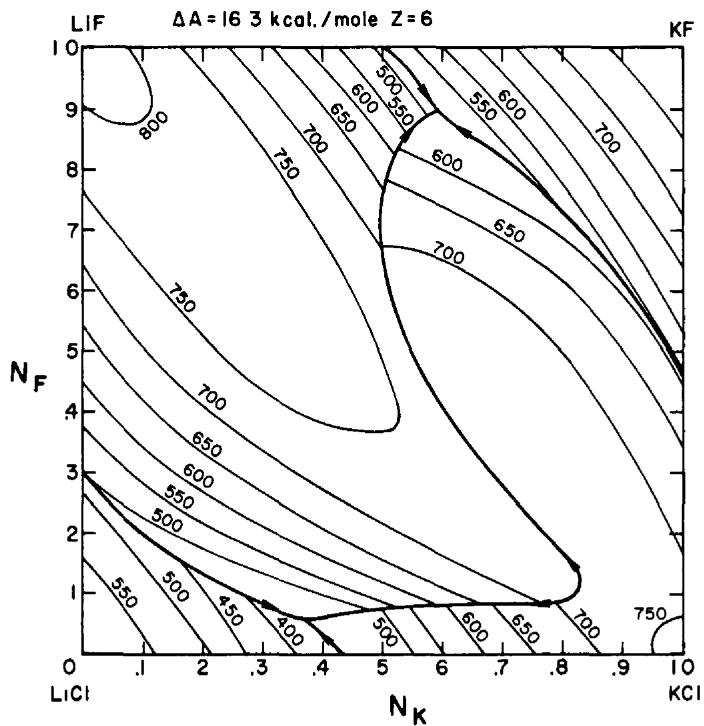

7. Liquidus Temperatures Calculated for the Li, K|F, C2 System.

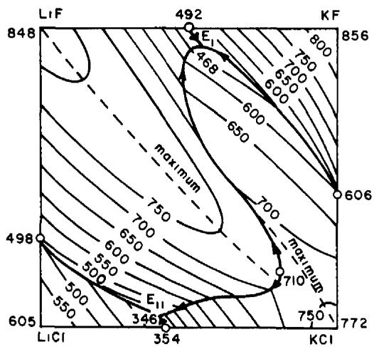

8. Liquidus Temperatures Measured in the Li, K|F, Cl System.

L1F is a member of the stable pair of salts and exhibits positive deviations from ideal solution behavior whereas KF is a member of the unstable pair (KF + L1Cl) and exhibits negative deviations from ideal behavior. The extension of the KCl phase field in the direction of the L1F-KF binary is related to the large negative value of $\lambda_{\text{LiKF}}$ . Similar rationalizations may be made for other systems.

If we examine equation (27) more carefully, we may relate each of the terms to less general prior concepts. The first term has been discussed by Flood, Førland, and Grjothelm(2) and has been related to nearest neighbor cation-anion interactions. The next four terms were first proposed by Førland(23a) who related them to next nearest neighbor cation-cation or anion-anion interactions. The last term is a correction for non-random mixing analogous to a similar term in the quasi-lattice theory.(17) The significance of non-random mixing can be seen in Figure 9(24) in which RT ln $\gamma_{\mathrm{LlF}}$ is plotted versus $N_{\mathrm{KCl}}^2$ for the LlF-KcI quasi-binary system. The line calculated without the inclusion of the last term of equation (27) deviates from the plotted points which were calculated from liquidus temperatures. The inclusion of the non-random mixing term leads to an "S" shaped curve which corresponds to the measurements. The non-random mixing alters the concentration dependence of the activity coefficients significantly. Thus, a calculation of the consolute temperatures, Tc, (below which the solution at some composition separates into two separate liquid phases) without this last term leads to values of Tc which are much too high and leads to the incorrect prediction of an extensive miscibility gap in the Ll, K|F, C system. The inclusion of the last term provides a much lower and better estimate of Tc

$$
T _ {c} = \frac {\Delta G ^ {\circ}}{5 . 5 R} + \frac {\lambda_ {A B X} + \lambda_ {A B Y} + \lambda_ {A X Y} + \lambda_ {B X Y}}{1 1 R} \tag {31}
$$

where the numerical factors 5.5 and 11 in the denominator replace the values 4 and 8 for random mixing. The calculation of $T_{\mathrm{c}}$ from equation (31) appears to be consistent with data on liquid-liquid miscibility gaps in reciprocal systems.(23)(25)(26) There are many reciprocal salt systems which exhibit miscibility gaps which can prove to be useful in extraction processes.

The quasi-chemical approximations for reciprocal systems applies only to systems in which only nearest neighbor interactions are significant and where the pair bond interactions are additive. The activity coefficients for the component AX are given by

$$
\ln \gamma_ {A X} = z \ln \left(\frac {1 - \frac {Y}{\Xi}}{1 - N _ {Y}}\right) \tag {32}
$$

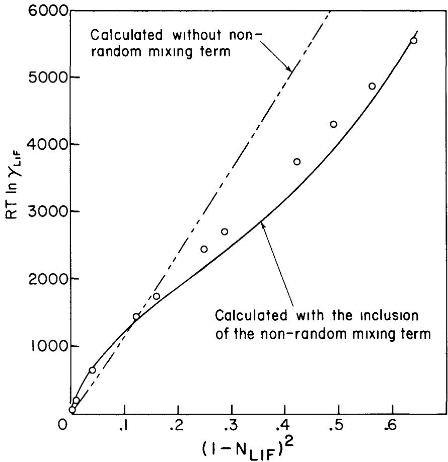  
9. Calculated and Measured Activity Coefficients in the LiF-KC2 Quasi-Binary System. (O - Values Obtained from Liquidus Temperatures).

where $\underline{\underline{\mathbf{Y}}}$ is given by

$$
\frac {\underline {{\mathrm {Y}}}}{1 - \underline {{\mathrm {Y}}}} = \left(\frac {\mathrm {N} _ {\mathrm {Y}} - \mathrm {N} _ {\mathrm {A}} \underline {{\mathrm {Y}}}}{1 - \mathrm {N} _ {\mathrm {A}} - \mathrm {N} _ {\mathrm {Y}} + \mathrm {N} _ {\mathrm {A}} \underline {{\mathrm {Y}}}}\right) \exp (+ \Delta \mathrm {A} / \mathrm {R T}) \tag {33}
$$

where $\Delta A$ is the specific bond free energy for formation of an A-X pair bond for the additive case.

When the next nearest neighbor interactions are not large relative to nearest neighbor interactions, an approximate correction to equation (32) can be made simply by adding the Førland correction terms which are the 2nd, 3rd, 4th, and 5th terms on the right hand side of equation (27). (23a)

This correction should not be adequate for cases in which the next nearest neighbor interactions are not small relative to the nearest neighbor interaction terms. In effect, the fundamental energy parameter $\Delta A$ in equation (33) should be concentration dependent. From an examination of the model (as in Figure 2) one can deduce one possible ad hoc form for $\Delta A$ when $|\Delta A|$ is not very large

$$
Z \Delta A = \Delta G ^ {\circ} + R T \left(\ln \frac {Y _ {A X} ^ {\prime}}{Y _ {A Y} ^ {\prime}} + \ln \frac {Y _ {B Y} ^ {\prime \prime}}{Y _ {B X} ^ {\prime \prime}} + \ln \frac {Y _ {A X} ^ {\prime \prime \prime}}{Y _ {B X} ^ {\prime \prime \prime}} + \ln \frac {Y _ {B Y} ^ {\prime \prime \prime \prime}}{Y _ {A Y} ^ {\prime \prime \prime \prime}}\right) \tag {34}
$$

where the ' designates the binary AX-AY, ' BX-BY, ' ' AX-BX, and ' ' ' ' AX-BY. For cases in which equations as (28) are valid equation (34) becomes

$$
Z \Delta A = \Delta G ^ {\circ} + \left(\mathrm {N} _ {\mathrm {Y}} - \mathrm {N} _ {\mathrm {X}}\right) \left(\lambda_ {\mathrm {A X Y}} - \lambda_ {\mathrm {B X Y}}\right) + \left(\mathrm {N} _ {\mathrm {B}} - \mathrm {N} _ {\mathrm {A}}\right) \left(\lambda_ {\mathrm {A B X}} - \lambda_ {\mathrm {A B Y}}\right) \tag {35}
$$

Such an ad hoc concentration dependent energy term needs a closer examination in order to use it in a manner which is consistent with limiting forms which have better fundamental justifications. When non-random mixing is very pronounced, one would have to substitute for $\mathbb{N}_{\Delta}$ , $\mathbb{N}_{\mathrm{B}}$ , $\mathbb{N}_{\mathrm{X}}$ and $\mathbb{N}_{\mathrm{Y}}$ in equation (35) to take into account the fact that the average ionic environments are not characterized by these ionic fractions. For example, $\mathbb{N}_{\mathrm{Y}}$ would be substituted by $\underline{\mathbf{Y}}$ , $\mathbb{N}_{\mathrm{X}}$ by $(1 - \underline{\mathbf{Y}})$ and $\mathbb{N}_{\mathrm{A}}$ and $\mathbb{N}_{\mathrm{B}}$ by analogous but more complex expressions. Such ad hoc corrections are consistent with observed deviations from simple theory(27) which have not been explained previously.

The quasi-lattice model has been applied to additive ternary systems (A-B-C or AX-BX-CX).(15) The theory takes into account interactions between A, B, and C. In the model for the system A-B-C, energies are defined for the exchange of nearest neighbor

pairs (in AX-EX-CX these are next nearest neighbor pairs)

Exchange

$$
2 A - B \Leftrightarrow A - A + B - B \quad \Delta \varepsilon_ {A B} \tag {36}
$$

$$
2 \mathrm {A} - \mathrm {C} = \mathrm {A} - \mathrm {A} + \mathrm {C} - \mathrm {C} \quad \Delta \varepsilon_ {\mathrm {A C}} \tag {37}
$$

$$
2 B - C \rightleftharpoons B - B + C - C \quad \Delta \varepsilon_ {B C} \tag {38}
$$

Each of these energies is related to thermodynamic parameters in the binary systems and in real systems they can be evaluated from measurements in the three binaries A-B, A-C, and B-C. In addition to these three parameters a coordination number, Z, enters the theory. The partial molar excess free energy of component C, $\overline{G}_{C}$ , for example, is given by the expression

$$
G _ {C} ^ {E} = \frac {Z}{2} R T \ln \frac {\alpha_ {C C}}{N _ {C} ^ {2}} \tag {39}
$$

where $\alpha_{\mathrm{CC}}$ represents the fraction of the total number of nearest neighbor pairs which are C-C pairs. For random mixing this is equal to $N_{C}^{2}$ and $\overline{G}_{C}^{E} = 0$ . If the C atoms attract each other $\alpha_{\mathrm{CC}} > N_{C}^{2}$ the number of pairs exceeds random $\overline{G}_{C}^{E} > 0$ and the component C exhibits positive deviations from ideal solution behavior. If C atoms repel each other on the average $\alpha_{\mathrm{CC}} < N_{C}^{2}$ and C exhibits negative deviations from ideal behavior. To evaluate $\alpha_{\mathrm{CC}}$ one must solve the equations

$$
N _ {C} = \alpha_ {A C} + \alpha_ {B C} + \alpha_ {C C}, \tag {40}
$$

$$
\left( \begin{array}{c} - \frac {\Delta \varepsilon_ {\mathrm {A C}}}{\mathrm {k T}} \\ 1 - e \end{array} \right) a _ {\mathrm {A C}} ^ {2} -
$$

$$
\left[ \left(\mathrm {N} _ {\mathrm {A}} + \mathrm {N} _ {\mathrm {C}}\right) - \alpha_ {\mathrm {B C}} - \alpha_ {\mathrm {A B}} \right] \alpha_ {\mathrm {A C}} +
$$

$$
\left(\mathrm {N} _ {\mathrm {A}} - \alpha_ {\mathrm {A B}}\right) \left(\mathrm {N} _ {\mathrm {C}} - \alpha_ {\mathrm {B C}}\right) = 0, \tag {41}
$$

$$
\left( \begin{array}{c c} - & \frac {\Delta \varepsilon_ {\mathrm {B C}}}{\mathrm {k T}} \\ 1 - e & \end{array} \right) a _ {\mathrm {B C}} ^ {2} -
$$

$$
\left[ \left(\mathrm {N} _ {\mathrm {B}} + \mathrm {N} _ {\mathrm {C}}\right) - \alpha_ {\mathrm {A C}} - \alpha_ {\mathrm {A B}} \right] \alpha_ {\mathrm {B C}} +
$$

$$
\left(\mathrm {N} _ {\mathrm {B}} - \alpha_ {\mathrm {A B}}\right) \left(\mathrm {N} _ {\mathrm {C}} - \alpha_ {\mathrm {A C}}\right) = 0, \tag {42}
$$

$$
\left( \begin{array}{c c} - & \frac {\Delta \varepsilon_ {A B}}{k T} \\ 1 - e & \end{array} \right) a _ {A B} ^ {2} -
$$

$$
[ (N _ {A} + N _ {B}) - \alpha_ {A C} - \alpha_ {B C} ] \alpha_ {A B} +
$$

$$
\left(\mathrm {N} _ {\mathrm {A}} - \alpha_ {\mathrm {A C}}\right) \left(\mathrm {N} _ {\mathrm {B}} - \alpha_ {\mathrm {B C}}\right) = 0, \tag {43}
$$

where $\alpha_{i,j}$ is the fraction of pairs which are $i-j$ . Except for a few simple limiting forms, these non-linear equations must be solved numerically. The influence of each pair interaction on thermodynamic behavior can be investigated by the use of these equations. Even though real systems do not often conform to the simple model used, the equations are an important guide in a complete understanding of multicomponent systems. As an illustration of this, in Figure 10, we exhibit calculations of phase diagrams from the theory for the simple case in which the three salts have a melting point of $1000^{\circ}C$ and an entropy of fusion of 6 e.u. The energy parameters $\Delta \varepsilon_{i,j}$ are related to deviations from ideality in the binary systems. For example the quasi-lattice theory leads to an expression for the total excess free energy of a 50-50 mixture of i and j

$$
G _ {0. 5} ^ {E} (i j) = - \frac {Z}{2} R T \ln \left[ \frac {1}{2} \left(\exp \left(\Delta \varepsilon_ {i j} / 2 k T\right) + 1\right) \right] \tag {44}
$$

and for the partial molar excess free energy of a component $i$ at infinite dilution in $j$

$$
\bar {G} _ {i} ^ {E} (j) = \frac {- Z \times \Delta \varepsilon_ {i j}}{2} \tag {45}
$$

where $\times$ is Avogadro's number, Consequently, calculations in the ternary system can be made using information obtained from the binary systems only. Figure 10a exhibits liquidus temperatures for an ideal system. In Figures 10b-f a value of the coordination number $Z = 10$ has been used. Figure 10b exhibits the case in which

all three binaries exhibit negative deviations from ideal behavior $(\Delta \varepsilon /kT = 0.25)$ . The liquidus isotherms for component C bow out away from the C corner of the triangle. Figure 10c exhibits the case in which all three binaries exhibit positive deviations from ideal behavior and $\Delta \varepsilon /kT = -0.25$ for all three. The isotherms for component C bow towards the C corner of the triangle. The magnitudes of the bowing in or out depend on the magnitudes of $\Delta \varepsilon$ . The value of $\Delta \varepsilon_{AC}$ and $\Delta \varepsilon_{BC}$ influence the magnitude as is illustrated by comparing Figures 10b, 10d, and 10e which were calculated for $\Delta \varepsilon_{AG} / kT = \Delta \varepsilon_{BC} / kT = +0.25$ , 0 and -0.25 respectively with $\Delta \varepsilon_{AB} / kT = +0.25$ . The bowing out of the liquidus isotherms for C means that the quasi-binary $C + A_0.5B_0.5$ exhibits positive deviations from ideal solution behavior relative to the two binaries AC and BC. This phenomenon can be understood simply in the limit of $N_C = 0$ given in equation (21) where for the cases such as in 10a, b, c, d, and e where $\phi(N_A)$ is small, $\ln \gamma_C$ is close to the linear sum of the values of $\ln \gamma_C$ in the AC and BC binaries minus $G_C^{E}(AB)$ , where $G_C^{E}(AB)$ for 10b, 10d, and 10e is negative and $\ln \gamma_C$ has a maximum at $X_A = 1/2$ . In Figure 10f we exhibit a more realistic case in which $\Delta \varepsilon_{AB} = 0$ , $\Delta \varepsilon_{AC} / kT = 0.25$ , $\Delta \varepsilon_{BC} / kT = -0.25$ so that AB is ideal, AC exhibits negative and BC positive deviations from ideal behavior. This case parallels the behavior of real systems such as LiF-NaF-KF, NaF-KF-RbF, and LiF-NaF-RbF. By comparison of measured phase diagrams with such theoretical calculations we can learn which parameters and interactions lead to particular features in the phase diagrams. Thus, the shape of liquidus curves can tell us much about ionic interactions and conversely, a knowledge of binary systems can be an aid in predicting phase behavior and other thermodynamic properties in ternary systems.

It should be remembered that liquidus curves are isoactivity curves. Thus, as an example, for cases in which $\Delta \varepsilon_{\mathrm{AC}} = \Delta \varepsilon_{\mathrm{BC}}$ , if one varies the ratio of B to A at constant values of $N_{C}$ the activities and activity coefficients go through a maximum if $\Delta \varepsilon_{\mathrm{AB}} > 0$ and the AB binary exhibits negative deviations from ideal behavior, and they go through a minimum if $\Delta \varepsilon_{\mathrm{AB}} < 0$ and the AB binary exhibits positive deviations from ideal behavior. These and the analogous maxima and minima in reciprocal systems are important chemical properties of ternary systems and exert a profound influence on their chemistry.

For the case in which $\Delta \varepsilon_{\mathrm{AC}} = \Delta \varepsilon_{\mathrm{BC}}$ one may derive a simple relation for the quasi-binary mixture of component C and an equimolar mixture of AB

$$
\bar {G} _ {C} ^ {E} = R T \ln \gamma_ {C} = \frac {Z}{2} R T \ln \left[ \frac {1}{N _ {C}} \left(1 - \frac {2 (1 - N _ {C})}{1 + \sqrt {1 - 4 N _ {C} (1 - N _ {C}) (1 - E)}}\right) \right] \tag {46}
$$

where

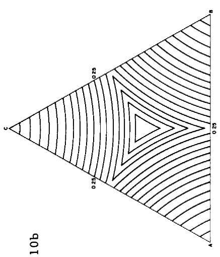

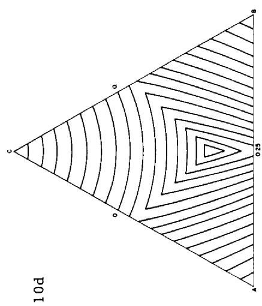

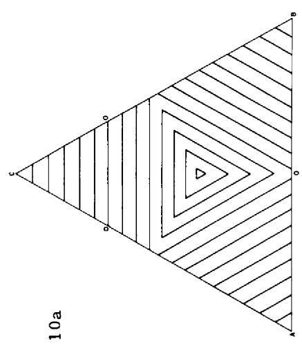

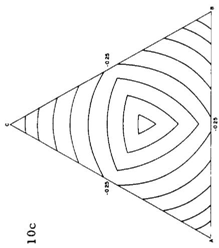

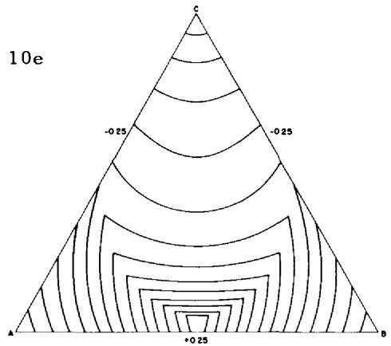

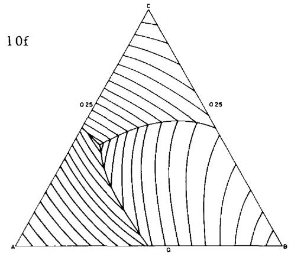

10. Calculated Phase Diagrams for Additive Ternary Systems.

Isotherms are Plotted Every $20^{\circ}$

$$
\Delta S _ {m} = 6 \quad T _ {m} = 1 0 0 0 ^ {\circ} C, Z = 1 0
$$

The values of the energy parameters for each diagram are

<table><tr><td></td><td>ΔεAC/kT</td><td>ΔεBC/kT</td><td>ΔεAB/kT</td></tr><tr><td>a</td><td>0</td><td>0</td><td>0</td></tr><tr><td>b</td><td>0.25</td><td>0.25</td><td>0.25</td></tr><tr><td>c</td><td>-0.25</td><td>-0.25</td><td>-0.25</td></tr><tr><td>d</td><td>0</td><td>0</td><td>0.25</td></tr><tr><td>e</td><td>-0.25</td><td>-0.25</td><td>0.25</td></tr><tr><td>f</td><td>0.25</td><td>-0.25</td><td>0</td></tr></table>

$$
E = \frac {1}{2} \left(\exp \left(\Delta \varepsilon_ {A B} / 2 k T\right) + 1\right) \left(\exp \left(- \Delta \varepsilon_ {A C} / k T\right) = \exp \left(- \frac {2}{Z} \frac {G _ {C} ^ {E} (A B)}{R T} + \frac {2}{Z} \frac {\bar {G} _ {C} ^ {E} (A)}{R T}\right) \right. \tag {47}
$$

Equation (46) is analogous to equations for reciprocal systems and if we expand (46) up to second order terms in $(1 - E)$ and substitute from (47) keeping terms up to second order in $G_{C}^{E}(A)$ and $G_{0.5}^{E}(AB)$ we obtain

$$
\begin{array}{r l} \bar {G} _ {C} ^ {E} = R T \ln Y _ {C} & = (1 - N _ {C}) ^ {2} \left[ \left(\bar {G} _ {C} ^ {E} (A) - G _ {0. 5} ^ {E} (A B)\right) - \frac {N _ {C} (2 - 3 N _ {C})}{Z R T} \left(\bar {G} _ {C} ^ {E} (A) - G _ {0. 5} ^ {E} (A B)\right) ^ {2} + \dots \right] \end{array} \tag {48}
$$

Equation (48) has the same form as the analogous equation (30) for reciprocal systems and it leads to the prediction of an "S" shaped curve for a plot of RT ln $\gamma_{\mathrm{C}}$ vs. $(1 - N_{\mathrm{C}})^{2}$ which is similar to that in reciprocal systems. The quantity $G_{\mathrm{O}_5}^{\mathrm{E}}$ (AB) which is the total excess free energy of mixing of a 50-50 mixture of A and B, is defined in equation (44) and corresponds to the quantity $\Delta G^{\circ}$ in equation (30) and $G_{\mathrm{C}}^{\mathrm{E}}(\mathrm{A})$ is defined in equation (45) and corresponds to $\lambda_{\mathrm{AC}}$ . The consolidate temperature calculated from equation (46) for this case in which $\Delta \varepsilon_{\mathrm{AC}} = \Delta \varepsilon_{\mathrm{BC}}$ is

$$
T _ {C} = \frac {\bar {G} _ {C} ^ {E} (A) - G _ {0 . 5} ^ {E} (A B)}{- Z R \ln (1 - \frac {2}{Z})} \tag {49}
$$

which is analogous to equation (31). $\mathtt{G}_{0.5}^{\mathtt{E}}(\mathtt{AB})$ is defined in equation (44) and $\bar{G}_{C}^{E}(A)$ in equation (45).

Thus, theory leads to the prediction of miscibility gaps which are completely enclosed within the ternary composition triangle.

# Applications

In this section we will illustrate the application of some of the principles discussed in previous sections. If we consider the solubility product of $\mathsf{A}\mathsf{k}_2\mathsf{O}_3$ in a solvent as NaF calculated by the cycle illustrated in equations (1)-(3), then for the reaction analogous to that in equation (1)

$$
A l _ {2} O _ {3} + 6 N a F \rightarrow 3 N a _ {2} O + 2 A l F _ {3}
$$

at $1200^{\circ}\mathrm{K}$ the free energy change is over 600 kcal. Consequently, one would predict an extremely small solubility product for $\mathsf{A}\ell_{2}\mathsf{O}_{3}$ in NaF. Even with fairly negative values of the standard free energies of solution corresponding to equations (2) and (3) and even with feasible deviations from Henry's law, the predicted solubility for this case is still extremely low. However, polyvalent ions as $\mathsf{A}\ell^{+3}$ and $0^{-2}$ in a uni-univalent salt should associate strongly in a manner analogous to the equilibria (6), (7), and (8) so that

$$
A \ell^ {+ 3} + O = \Rightarrow A \ell O ^ {+} \tag {50}
$$

$$
A \not \in O ^ {+} + O ^ {-} = A \not \in O _ {2} ^ {-} \tag {51}
$$

$$
A \ell 0 ^ {+} + A \ell^ {+ 3} \rightleftharpoons A \ell_ {2} O ^ {+ 4} \tag {52}
$$

$$
2 A \ell 0 ^ {+} \rightleftharpoons A \ell_ {2} O _ {2} ^ {+ +}, e t c. \tag {53}
$$

with a tendency to produce species with low charge density (e.g. (50), (51), and (53)). From an electrostatic point of view when the $\mathsf{Al}^{+3}$ concentration is not high species of low charge density are energetically more favorable than species of high charge density which contain more than one $\mathsf{Al}^{+3}$ ion.

In silver halide systems in molten alkali nitrates, it is well known(3)(4) that with the addition of a common ion (either silver or halide ions) to an alkali nitrate the solubility of the silver halide first decreases to a minimum and then increases with further additions. This phenomenon results largely from the association equilibria involving species of stoichiometry different from the silver halide (e.g. $\mathsf{Ag}_2\mathsf{X}^+$ or $\mathsf{AgX_2}$ ) which have a net charge. Analogously, for $\mathsf{Al}_{2}\mathsf{O}_{3}$ , the addition of $\mathsf{AlF}_3$ or $\mathsf{Na}_2\mathsf{O}$ to the solvent NaF, if large enough, should solubilize $\mathsf{Al}_{2}\mathsf{O}_{3}$ . For $\mathsf{AlF}_3$ additions in this reciprocal system the important species involved in solubilization should have a ratio of $\mathsf{Al}/\mathsf{O}$ which (on the average) is greater than 2/3 (e.g. species as $\mathsf{AlO}^-$ , $\mathsf{Al}_{2}\mathsf{O}_{2}^-$ , etc., are present). The temperature dependence of equilibria involving these species is predictable from equations as (9). The temperature dependence is probably very large so that theory may help in defining advantageous conditions for solubilization. At high concentrations of $\mathsf{AlF}_3$ (>15 mole %) in NaF the formation of more highly charged species containing more than one $\mathsf{Al}^{+3}$ ion as $\mathsf{Al}_{2}\mathsf{O}^{+4}$ becomes less unfavorable because the high average charge density of cations (due to the high concentration of $\mathsf{Al}^{+3}$ ions) will stabilize species of high charge density.

In a similar manner, association equilibria of constituents in dilute solution in molten iron alloys are important in deoxidation

and desulfurization reactions and the temperature dependence described by equations as (9) and (15) aid in predicting the temperature dependence of the equilibrium quotients for these reactions if the parameters $\Delta A_{\mathrm{j}}$ are temperature independent.

One potential application which has not been utilized in a practical manner is the utilization of immiscible salt pairs for extraction equilibria. Kennedy(28) has published an academic illustration of this. He has measured the distribution of $\mathsf{T}\mathbb{k}^+$ ion between two immiscible salts $\mathsf{KNO}_3$ -AgBr. He defined a measured distribution coefficient $K_{0}$ where

$$
\mathrm {K} _ {\circ} = \mathrm {N} _ {\mathrm {T} \lambda^ {+}} (\mathrm {K N O} _ {3}) / \mathrm {N} _ {\mathrm {T} \lambda^ {+}} (\mathrm {A g B r}) \tag {54}
$$

and an association constant $\mathbf{K}_1$ for the association equilibrium in $\mathrm{KNO}_3$

$$
\mathrm {T l} ^ {+} + \mathrm {B r} ^ {-} = \mathrm {T l B r} \tag {55}
$$

$$
K _ {1} = \frac {N _ {T \ell B r}}{N _ {T \ell} + N _ {B r}} \tag {56}
$$

and a "true" distribution coefficient, $K$ , is defined as

$$
K = \frac {N _ {T \lambda} B r (K N O _ {3})}{N _ {T \lambda} + (A g B r)} \tag {57}
$$

such that in the hypothetical case in which all $\mathbf{T}\mathbf{k}^{+}$ ions in $\mathsf{KNO}_3$ existed as $\mathsf{T}\mathbf{k}\mathbf{B}\mathbf{r}$ then $\mathbf{K} = \mathbf{K}$ . If the concentration range is such that $\mathbf{T}\mathbf{k}$ ions exist as $\mathbf{T}\mathbf{k}^{+}$ or $\mathsf{T}\mathbf{k}\mathbf{B}\mathbf{r}$ species in solution in $\mathsf{KNO}_3$ then

$$
\mathrm {K} _ {\mathrm {o}} = \mathrm {K} + \frac {\mathrm {K}}{\mathrm {K} _ {1} \mathrm {N} _ {\overline {{\mathrm {B r}}}}} \tag {58}
$$

Thus from measured values of $\mathbf{K}_{\mathrm{o}}$ at various concentrations of free bromide ions one can evaluate $\mathbf{K}_{1}$ for the equilibrium (55). In the presence of $\mathbf{Ag^{+}}$ ions $\mathbf{N}_{\mathrm{Br}}^{-}$ could be calculated from the total bromide concentration and a knowledge of the association of bromide with silver. Figure 11 exhibits a plot of $\mathbf{K}_{\mathrm{o}}$ versus $l / N_{\mathrm{Br}}$ at five temperatures ranging from $450 - 550^{\circ}C$ . The distribution coefficients are strong functions of the complexing anion concentration. Values of $\mathbf{K}_{1}$ for the equilibrium (55) were evaluated from the ratio of the intercept to the slope of the curves in Figure 11. Values of $\mathbf{K}_{1}$

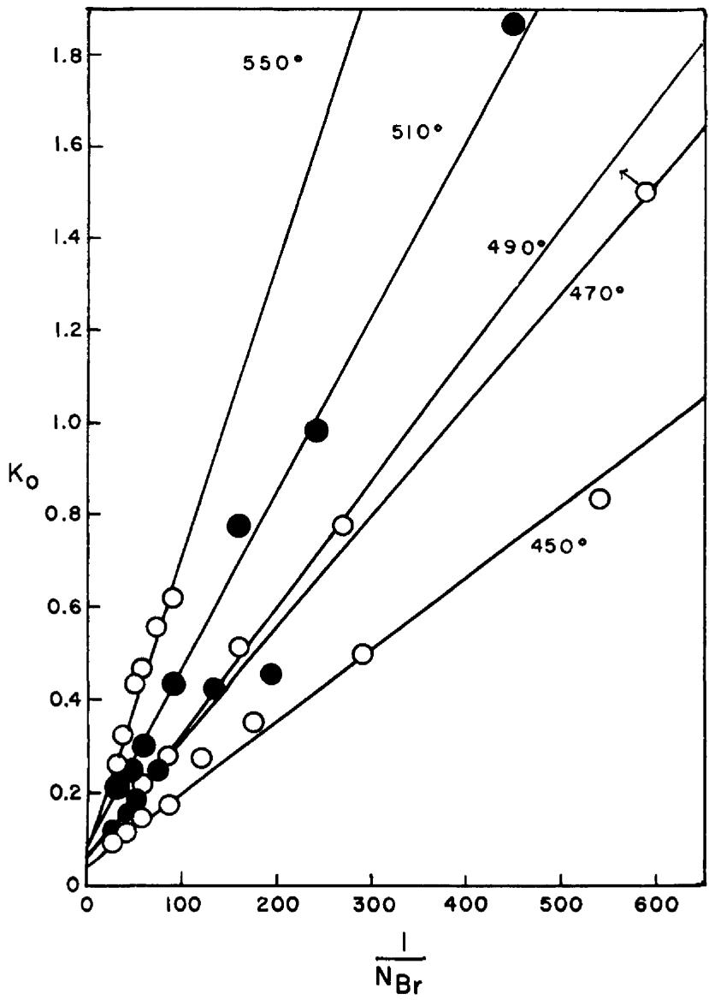  
11. Distribution of Thallium Bromide Between $\mathrm{KNO}_3$ and AgBr.

in mole fraction units ranged from 26 at $450^{\circ}\mathrm{C}$ to 19 at $550^{\circ}\mathrm{C}$ . The temperature coefficients of $\mathbf{K}_1$ (and of the slopes) are consistent with the predictions from equation (9) for a constant value of $\Delta A_1$ and the theory can aid in predicting the temperature dependence of $\mathbf{K}_0$ . The ratio $\mathbf{K} / \mathbf{K}_1$ in equation (58) can be calculated from a cycle similar to the FFG cycle (equilibria (1), (2), and (3))

$$
\mathrm {T} 2 \mathrm {C} 2 (\text {i n} \mathrm {A g C} 2) + \mathrm {K N O} _ {3} (\text {l i q u i d}) \rightarrow \mathrm {T} 2 \mathrm {N O} _ {3} (\text {l i q u i d}) + \mathrm {K C} 2 \tag {59}
$$

$$
\mathrm {T e N O} _ {3} (\text {l i q u i d}) \rightarrow \mathrm {T e N O} _ {3} (\infty \text {d i l u t i o n i n K N O} _ {3}) \tag {60}
$$

$$
\mathrm {K C l} \rightarrow \mathrm {K C l} (\infty \text {d i l u t i o n i n K N O} _ {3}) \tag {61}
$$

One can calculate $\Delta G_{50}^{\mathrm{ST}}$ if one knows the activity coefficients of T2C $_l$ in AgCl as well as the standard free energies formation of all the components. The ratio $(K / K_1)$ is then given by

$$
\Delta G _ {5 9} ^ {\mathrm {S T}} + \Delta G _ {6 0} ^ {\mathrm {S T}} + \Delta G _ {6 1} ^ {\mathrm {S T}} = - \mathrm {R T} \quad \ln \left(\mathrm {K} / \mathrm {K} _ {1}\right) \tag {62}
$$

Immiscible salt phases for extraction equilibria have been utilized by Moore(29) for equilibria of potentially practical interest in the additive ternary system LiCl-KCl-Acl3. He measured distribution coefficients between the two immiscible phases LiCl and KCl-Acl3 where the immiscibility is related to the very negative value of the excess free energy of mixing of the KCl-Acl3 system which corresponds to the system A-B in Hagemark's theory. Table III gives values of the distribution coefficients of 9 salts at $625^{\circ}\mathrm{C}$ where

$$
\mathrm {K} _ {\mathrm {D}} = \frac {\text {m o l e f r a c t i o n i n K A l C l} _ {4}}{\text {m o l e f r a c t i o n i n L i C l}} \tag {63}
$$

Distribution Coefficients for Metal Chlorides in the System: LiCl-KAcl4 at $625^{\circ}\mathrm{C}$ . (29)

Table III.   

<table><tr><td></td><td>KD</td></tr><tr><td>UO2Cl2</td><td>0.84</td></tr><tr><td>UCl3</td><td>0.04</td></tr><tr><td>PuCl3</td><td>0.04</td></tr><tr><td>FeCl3</td><td>9.1</td></tr><tr><td>RuCl3</td><td>0.24</td></tr><tr><td>SnCl2</td><td>0.9</td></tr><tr><td>SrCl2</td><td>0.014</td></tr><tr><td>NaCl</td><td>0.56</td></tr><tr><td>CsCl</td><td>18.1</td></tr></table>

From an examination of Hagemark's equations we may rationalize the relative values of $K_{D}$ . Qualitatively, values of $K_{D} > 1$ mean that the salt reacts more strongly with $A\ell C\ell_{3}$ or $K\ell$ than these two react with each other. Values of $K_{D} < 1$ generally mean a relatively weak interaction of the salt with $K\ell$ or $A\ell C\ell_{3}$ . This information can be guessed from a knowledge of the binary systems. The interactions with $LiC\ell$ phase, which are not large for these cases needs to be taken into account too. Other additive ternary and reciprocal systems with similar miscibility gaps should exhibit separations which are potentially useful.

Another application of these principles by Morrey and Moore (30) was in the extraction of $\mathsf{U}\mathsf{C}\mathbb{I}_3$ by molten A in the binary system $\mathsf{K}\mathsf{C}\mathsf{I} - \mathsf{A}\mathsf{I}\mathsf{C}\mathsf{I}_3$ . From an examination of equation (21) where the binary system $\mathsf{K}\mathsf{C}\mathsf{I} - \mathsf{A}\mathsf{I}\mathsf{C}\mathsf{I}_3$ corresponds to the A-B binary we see that the very negative excess free energy of mixing of $\mathsf{K}\mathsf{C}\mathsf{I} - \mathsf{A}\mathsf{I}\mathsf{C}\mathsf{I}_3$ will contribute to a maximum in the activity coefficients for a component C as $\mathsf{U}\mathsf{C}\mathsf{I}_3$ . $\mathsf{U}\mathsf{C}\mathsf{I}_3$ interacts weakly with $\mathsf{K}\mathsf{C}\mathsf{I}$ and if it also interacts weakly with or has a positive free energy of solution in $\mathsf{A}\mathsf{I}\mathsf{C}\mathsf{I}_3$ then there should be a maximum in the activity coefficients of $\mathsf{U}\mathsf{C}\mathsf{I}_3$ in this system as a function of the composition of the $\mathsf{K}\mathsf{C}\mathsf{I} - \mathsf{A}\mathsf{I}\mathsf{C}\mathsf{I}_3$ solvent. The maximum will tend to be at compositions where $G^{\texttt{E}}$ has a minimum, e.g. at about 50-50 mole % for $\mathsf{K}\mathsf{C}\mathsf{I} - \mathsf{A}\mathsf{I}\mathsf{C}\mathsf{I}_3$ . Such a maximum will lead to a maximum in the extraction coefficients as was observed by Morrey and Moore. Similarly, maxima in $\gamma_{\mathrm{c}}$ should produce minima in solubility which, for example, have been observed for $\mathrm{PuF_3}$ in the LiF-BeF $_2$ and NaF-BeF $_2$ binaries at compositions which probably are close to minima in $G^{\texttt{E}}$ for the binaries. (31)

The activities of "FeO" in the steelmaking system FeO-CaO-SiO $_2$ is consistent with the expectations from Hagemark's calculations (which apply only to simpler systems). Taylor and Chipman(32) have measured the activities of FeO in this system and these are plotted for the quasi-binary system FeO-Ca $_2$ SiO $_4$ in Figure 12. If we calculate $\ln \gamma_{\mathrm{FeO}}$ from equation (48) by the ad hoc replacement of $(\overline{\mathrm{G}}^{\mathrm{E}} - \mathrm{G}^{\mathrm{E}}(\mathrm{AB}))$ by the free energy of formation of $\frac{1}{2}\mathrm{Ca}_2\mathrm{SiO}_4$ (which is approximately equal to the excess free energy of mixing per two equivalents) and of the mole fractions by equivalent fractions we obtain the solid "S" shaped curve in Figure 12 which corresponds well with the measurements. Even without a Justification of this ad hoc calculation it is clear that the "S" shaped character of the curve is related to clustering of Fe $^{+2}$ with $0^{-2}$ ions. This association leads to a concentration dependence of the activities of FeO and a phase behavior similar to that found for LiF in the Li $^+$ , K $||F^{-,}Cg^{-}$ system.

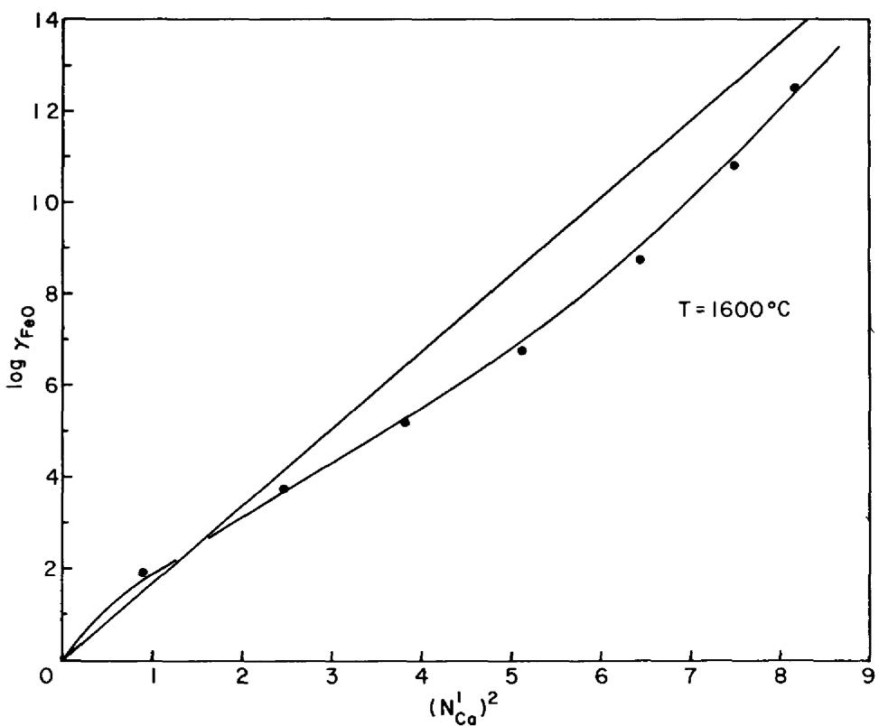  
12. Plot of log $\gamma_{\mathrm{FeO}}$ versus $(N_{\mathrm{Ca}}^{\prime})^{2}$ in the FeO-Ca2S1Q, Quas1-Binary $N_{\mathrm{Ca}}^{\prime} =$ equivalent fraction of Ca2S1O4

# Conclusions

Fundamental concepts can provide considerable insight into the chemistry of multicomponent systems. Although theories are sometimes approximate or apply only to simple systems, they nevertheless provide a basis for guessing the important parameters and variables necessary for choosing and optimizing pyrometallurgical processes.

# References

1. Temkin, M., "Mixtures of Fused Salts as Ionic Solutions," Acta Physiocochim. URSS, 20, 411 (1945)   
2. Flood, H., T. Førland, and K. Grjothim, "The Relation Between Concentration and Activity in Molten Mixtures of Salts," Z. Anorg. Allgem. Chem., 276, 289 (1954).   
3. Blander, M., J. Braunstein, and M. D. Silverman, "Heats of Solution of Solids in Molten Reciprocal Salt Systems," J. Am. Chem. Soc., 85, 895 (1964).   
4. Blander, M. and E. B. Luchsinger, "Solutions of Solids in Molten Reciprocal Salt Systems," J. Am. Chem. Soc., 86, 319 (1964).   
5. Blander, M., "Quasi-Lattice Model of Reciprocal Salt Systems. A Generalized Calculation," J. Chem. Phys., 34, 432 (1961).   
6. Alcock, C. B. and F. D. Richardson, "Dilute Solutions in Molten Metals and Alloys," Acta Met., 6, 385 (1958).   
7. Lupis, C. H. P. and J. F. Elliott, "Generalized Interaction Coefficients. Part II. Free Energy Terms and the Quasi-Chemical Theory," Acta Met., 14, 1019 (1966).   
8. Braunstein, J., M. Blander, and R. M. Lindgren, "The Evaluation of Thermodynamic Association Constants in Solutions with an Application to Molten Salt Solutions," J. Am. Chem. Soc., 84, 1529 (1962).   
9. Wagner, C., Thermodynamics of Alloys, Addison-Wesley Publishing Co., Inc., Reading Mass. - London (1952).   
10. Chipman, J. and J. F. Elliott, "The Thermodynamics of Liquid Metallic Solutions" in Thermodynamics and Physical Metallurgy American Society for Metals, Cleveland, Ohio (1950) p. 102.   
11. Blander, M., F. F. Blankenship, and R. F. Newton, "The Thermodynamics of Dilute Solutions of $\mathrm{AgNO}_3$ and KC2 in Molten $\mathrm{KNO}_3$ from Electromotive Force Measurements. I. Experimental," J. Phys. Chem., 63, 1259 (1959).   
12. Hill, D. G., J. Braunstein, and M. Blander, "Electromotive Force Measurements in the System $\mathrm{AgNO}_3$ -NaCl- $\mathrm{NaNO}_3$ and Their Comparison with the Quasi-Lattice Theory," J. Phys. Chem., 64, 1038 (1960).   
13. Hill, D. G. and M. Blander, "Electromotive Force Measurements in the System $\mathrm{AgNO}_3$ and NaCl in Equimolar $\mathrm{NaNO}_3$ - $\mathrm{KNO}_3$ Mixtures and Their Comparison with the Quasi-Lattice Theory," J. Phys. Chem., 65, 1866 (1961).

14. Lewis, G. N. and M. Randall, Thermodynamics, revised by K. S. Pitzer and L. Brewer, McGraw-Hill, N.Y. - Toronto - London (1961).   
15. Hagemark, K., "Thermodynamics of Ternary Systems. The Quasi-Chemical Approximation," J. Phys. Chem., 72, 2316 (1968).   
16. Blander, M., "The Thermodynamics of Dilute Solutions of $\mathrm{AgNO}_3$ and KCl in Molten $\mathrm{KNO}_3$ from Electromotive Force Measurements. II. A Quasi-Lattice Mode," J. Phys. Chem., 63, 1262 (1959).   
17. Blander, M. and J. Braunstein, "Quasi-Lattice Model of Molten Reciprocal Salt Systems," Ann. N.Y. Acad. Sciences, 79, Art. 11, 838 (1960).   
18. Richardson, F. D., "The Solutions of the Metallurgist - Retrospect and Prospect" in Physical Chemistry of Process Metallurgy, Part I, G. R. St. Pierre - Editor (1959) pp. 1-26.   
19. Blander, M., "Thermodynamic Properties of Molten Salt Solutions" in Molten Salt Chemistry, M. Blander - Editor, Interscience, N.Y. - London (1964) pp. 127-237.   
20. Guggenheim, E. A., Mixtures, Oxford University Press, London (1952).   
21. Blander, M. and S. J. Yosim, "Conformal Ionic Mixtures," J. Chem. Phys., 39, 2610 (1963).   
22. Reiss, H., J. L. Katz, and O. J. Kleppa, "Theory of the Heats of Mixing of Certain Fused Salts," J. Chem. Phys., 36, 144 (1962).   
23. Blander, M. and L. E. Topol, "The Topology of Phase Diagrams of Reciprocal Molten Salt Systems," Inorg. Chem., 5, 1641 (1966).   
23a Førland, T., "Properties of Some Mixtures of Fused Salts," Norg. Tek. Vitenskapsakad., Ser. 2, No. 4 (1957).   
24. Blander, M. and L. E. Topol, "Complex Ion Formation and Non-Random Mixing in Molten Reciprocal Salt Solutions," Electrochim. Acta, 10, 1161 (1965).   
25. Belyaev, I. N., "The Formation of Two Liquid Phases in Inorganic Systems," Usp. Khim., 29, 899 (1960); Russ. Chem. Rev., 29, 428 (1960).

26. Ricci, J. E., "Phase Diagrams of Fused Salts" in Molten Salt Chemistry, M. Blander, editor, Interscience, N.Y. - London (1964) p. 239.   
27. Meschel, S. V., J. M. Togurl, and O. J. Kleppa, "Ternary Excess Enthalpies in Simple Reciprocal Fused-Salt Mixtures. III. Effect of Ionic Size," J. Chem. Phys., 45, 3075 (1966).   
28. Kennedy, J. H., "Fused Salt Distribution Studies. The Distribution of $\mathsf{T}\mathbb{b}\mathbb{r}$ Between $\mathsf{KNO}_3$ and $\mathsf{AgBr}$ ," J. Chem. Eng. Data, 9, 95 (1964).   
29. Moore, R. H., "Distribution Coefficients for Certain Actinide and Fission Product Chlorides in the Immiscible Salt System: LiCl-KAcl, J. Chem. Eng. Data, 9, 502 (1964).   
30. Morrey, J. R. and R. H. Moore, "Thermodynamic Evidence for Complex Formation by Actinide Elements in Fused KCl-AlCl₃ Solvents," J. Phys. Chem., 67, 748 (1963).   
31. Reactor Chemistry Division Annual Progress Report, ORNL 2931 (1960) Off. Tech. Serv., Dept. of Commerce, Washington, D.C.   
32. Taylor, C. R. and J. Chipman, "Equilibria of Liquid Iron and Simple Basic and Acid Slags in a Rotating Induction Furnace," Trans. AIME, 154, 228 (1943).

C. F. Baes, Jr.

Reactor Chemistry Division  
Oak Ridge National Laboratory  
Oak Ridge, Tennessee 37830  
U. S. A.

# Abstract

The chemical development which has been carried out, largely at Oak Ridge National Laboratory, in support of the Molten Salt Breeder Reactor (MSBR) concept has produced a fairly quantitative description of the chemistry and thermodynamics of actinide, fission-product and structural metal fluorides in molten LiF-BeF $_2$ solutions. This information is summarized here (1) in terms of important heterogeneous chemical equilibria, many of which have been measured directly; (2) in terms of free energies of formation of solutes in molten 0.67 LiF-0.33 BeF $_2$ solutions; and (3) in terms of standard electrode potentials, some of which have been measured directly. This information may be applied to a variety of important aspects of molten salt reactor chemistry: The extent of corrosion reactions between the container material -- a nickel base alloy (Hastelloy N) containing Fe, Cr, and Mo -- and the fuel can be specified from hydrogen reduction equilibria. Salt purification procedures can be specified for the removal of structural metal cations, oxides, and sulfides from a knowledge of the hydrofluorination equilibria which are employed. The stability of Th, Pa, and U fluorides toward chemical reduction and toward precipitation as oxide similarly have been established by measurements of heterogeneous equilibria which include oxide solubility and oxide exchange reactions. The behavior of a large part of the yield of fission products can also be predicted on the basis of these studies and available thermochemical data. Finally, the chemical studies which are reviewed here and the thermodynamic information which they have produced suggest the importance of the redox potential, determined by the extent of reduction of UF $_4$ to UF $_3$ in the fuel, in controlling many features of MSBR fuel chemistry. *Research sponsored by the U.S. Atomic Energy Commission under contract with Union Carbide Corporation.

# Introduction

The Molten Salt Reactor Experiment (MSRE) has been operating successfully at ORNL since mid 1965. It is a reactor which is fueled by a molten mixture of .65 LiF-.29 $\mathrm{BeF}_2$ -.05 $\mathrm{ZrF_4}$ containing $< 0.01$ mole fraction of fissile $\mathrm{UF_4}$ , first as uranium-235 and more recently as uranium-233. It is moderated by graphite and contained in a nickel-base alloy (Hastelloy N) developed at ORNL for this reactor concept. The principal objective of the MSRE has been to demonstrate the compatibility of this combination of materials in a molten salt breeder reactor (MSBR) as a means to achieve breeding of $^{233}\mathrm{U}$ from $^{232}\mathrm{Th}$ with thermal neutrons(1-3). A molten salt breeder is, perhaps more than any other, a chemist's reactor; the fuel is dissolved and circulated in a relatively unique coolant, the $^{233}\mathrm{Pa}$ which is bred must be removed soon after it is formed to avoid the loss of a significant fraction by neutron capture, and finally the fission products produced during operation can be removed continuously to improve the neutron economy.

Extensive chemical development therefore preceded the design and construction of the MSRE to establish the means and the extent of materials purification required, the chemical stability and corrosiveness of the fuel, the chemistry of uranium therein, and the radiation stability of the fuel. Continuing studies during the operation of the MSRE have given increased attention to the chemistry of the fission products and the means for their removal, and to a method for removing $^{233}\mathrm{Pa}$ on a short cycle. Attention is also being given to methods of on-stream control of fuel chemistry. These extensive studies have been reviewed recently by Grimes(4,5).

In a previous review, (6) I have summarized the equilibrium measurements, and some emf measurements, which had been carried out in LiF-BeF $_2$ melts, mostly near the composition 0.67 LiF-0.33 BeF $_2$ , as part of this chemical development program. These were combined with available thermodynamic data to provide a list of formation-free energies and electrode potentials in 0.67 LiF-0.33 BeF $_2$ . Observed effects of melt composition on solute activity coefficients were also reviewed. Since then, enough new information has appeared to permit a considerable extension and some revision of this compilation. This is presented here in much the same form as previously.

The purpose of the present review, as previously, is to extend the usefulness of the chemical studies which have been carried out in support of the MSBR program by the systematic application of the methods of equilibrium thermodynamics. This seems especially appropriate and should be especially rewarding here since in molten fluoride systems reaction rates are expected to be relatively high with equilibrium conditions thereby often closely approached.

Table I summarizes the reactions for which values of the equilibrium constants are known from direct measurements, or from a combination of other measured equilibria and/or thermodynamic data. In these reactions, and elsewhere, the following notation is used to denote the various states: (c), crystalline solid; (g), gas; (d), dissolved at low concentration in 0.67 LiF-0.33 BeF $_2$ ; (ss), solid solution.

In the majority of reactions, $\overline{\mathbf{F}}$ is the only anion involved and for simplicity the dissolved reactants and products are written in the molecular form, though this is not intended to imply the actual species present in solution. When anions other than $\overline{\mathbf{F}}$ appear in the reactions, ionic species are written. In some cases this is done to avoid the choice of a molecular component in solution and in others it is done to indicate that complete dissociation of an anion (e.g., $0^{2-}$ ) and a cation (e.g., $\mathrm{Zr}^{4+}$ ) is assumed.

The concentration scale is the mole fraction; e.g.,

$$
\mathrm {x} _ {\mathrm {M F} _ {2}} = \mathrm {n} _ {\mathrm {M F} _ {2}} / \left(\mathrm {n} _ {\mathrm {M F} _ {2}} + \mathrm {n} _ {\mathrm {L i F}} + \mathrm {n} _ {\mathrm {B e F} _ {2}}\right)
$$

Gas pressures are expressed in atmospheres, and, at the low pressures and high temperatures involved, gases are assumed ideal. The standard states for the reactants and products generally can be seen from the form of the equilibrium constant. Here, and elsewhere, the standard state for most solutes is the hypothetical one mole fraction ideal solution in 0.67 LiF-0.33 BeF $_2$ . Exceptions are LiF, BeF $_2$ , Be $^{2+}$ , Li $^+$ , and F $^-$ . For these major components the solvent composition is taken as the standard state; i.e., a $_{\text{LiF}}$ , a $_{\text{BeF}_2}$ , a $_{\text{Be}^{2+}}$ , a $_{\text{Li}^+}$ and a $_{\text{F}}$ all are unity in 0.67 LiF-0.33 BeF $_2$ . The values of K in Table I strictly apply only to solutions in the solvent 0.67 LiF-0.33 BeF $_2$ which are sufficiently dilute that Henry's law may be assumed. The effect of changing salt composition and increasing solute concentrations will be considered presently.

The expression given for the numerical value of the equilibrium constant

$$
\log K = a + b \left(1 0 ^ {3} / T\right)
$$

while adequate for evaluating $K$ as a function of $T$ for most purposes, generally should not be taken as a reliable measure of the heat of reaction ( $\Delta H = -2.3 R(b)$ ) or the entropy of reaction ( $\Delta S = 2.3 R(a)$ ) since, over the narrow temperature range where $a$ and $b$ usually were determined, there can be large compensating errors in these constants.

From the equilibrium data in Table I and from the literature sources indicated, free energies of formation have been compiled for

Table I. Reactions in 0.67 LiF-0.33 BeF\*

$$
\operatorname {L o g} K = a + b \left(1 0 ^ {3} / T\right) (7 0 0 - 1 0 0 0 ^ {\circ} K)
$$

# Hydrofluorination of Oxides

101 $\mathbf{HF}(\mathbf{g})\rightleftharpoons \mathbf{HF}(\mathbf{d})$   
102 $2\mathrm{HF}(\mathbf{g}) + \mathrm{O}^{2 - }(\mathrm{d}) = 2\mathrm{F}^{-}(\mathrm{d}) + \mathrm{H}_{2}\mathrm{O}(\mathrm{g})$   
103 $\mathrm{HF(g)} + \mathrm{OH}^{-}(\mathrm{d})\rightleftharpoons \mathrm{F}^{-}(\mathrm{d}) + \mathrm{H}_{2}\mathrm{O(g)}$   
104 OH-(d) + F-(d) = 0²-(d) + HF(g)   
105 $2\mathrm{OH}^{-}(\mathrm{d}) = 0^{2 - }(\mathrm{d}) + \mathrm{H}_{2}\mathrm{O}(\mathrm{g})$   
106 $\mathrm{Be0(c)}\rightleftharpoons \mathrm{Be}^{+ + }(d) + 0^{2 - }(d)$   
107 $2\mathrm{HF}(\mathbf{g}) + \mathrm{BeO}(\mathbf{c})\rightleftharpoons \mathrm{BeF}_2(\mathbf{d}) + \Pi_20(\mathbf{g})$   
108 $2\pi 0_{2}(\mathrm{c}) = 2\pi^{4 + }(\mathrm{d}) + 20^{2 - }(\mathrm{d})$   
109 $4\mathrm{HF}(\mathbf{g}) + 2\tau \mathrm{O}_{2}(\mathbf{c})\rightleftharpoons 2\tau \mathrm{F}_{4}(\mathbf{d}) + 2\mathrm{H}_{2}\mathrm{O}(\mathbf{g})$   
110 $\mathrm{ZrO}_2(\mathrm{c}) + 2\mathrm{BeF}_2(\mathrm{d}) = \mathrm{ZrF}_4(\mathrm{d}) + 2\mathrm{BeO}(\mathrm{c})$   
111 $4\mathrm{HF(g)} + \mathrm{ThO}_2(\mathrm{c})\rightleftharpoons \mathrm{ThF}_4(\mathrm{d}) + 2\mathrm{H}_20(\mathrm{g})$   
112 $4\mathrm{HF(g)} + \mathrm{UO_2(c)}\rightleftharpoons \mathrm{UF_4(d)} + 2\mathrm{H_20(g)}$

# Hydrofluorination of Sulfide and Iodide

113 $\overline{2HF(g)} +\overline{s}^{2 - }(d)\rightleftharpoons 2F^{-}(d) + H_{2}s(g)$   
114 $\mathbf{HF}(\mathbf{g}) + \mathbf{I}^{-}(\mathbf{d}) = \mathbf{F}^{-}(\mathbf{d}) + \mathbf{HI}(\mathbf{g})$

# Reduceable Metals

115 $\mathrm{H}_2(\mathrm{g}) + \mathrm{CrF}_2(\mathrm{d})\rightleftharpoons \mathrm{Cr}(\mathrm{c}) + 2\mathrm{HF}(\mathrm{g})$   
116 $2\mathrm{HF}(\mathbf{g}) + \frac{1}{2}\mathrm{H}_{2}(\mathbf{g}) + \frac{1}{2}\mathrm{Cr}_{2}\mathrm{O}_{3}(\mathbf{c})\rightleftharpoons \mathrm{CrF}_{2}(\mathbf{d}) + \frac{3}{2}\mathrm{H}_{2}\mathrm{O}(\mathbf{g})$   
117 $\mathrm{H}_{2}(\mathrm{g}) + \mathrm{FeF}_{2}(\mathrm{d}) = \mathrm{Fe}(\mathrm{c}) + 2\mathrm{HF}(\mathrm{g})$   
118 $\mathsf{ReF}_2(\mathsf{c})\rightleftharpoons \mathsf{ReF}_2(\mathsf{d})$   
119 FeO(c) = Fe2+d 0²-d   
120 FeO(c) + BeF2(d) = FeF2(d) + BeO(c)

K\*\*

a

aI

Source

$(\mathbf{X}_{\mathrm{HF}}) / (\mathbf{P}_{\mathrm{HF}})$

#

12

$(\overline{\mathrm{P}}_{\mathrm{H_2O}}) / (\overline{\mathrm{P}}_{\mathrm{HF}})^2 (x_{02 - })$

-

107-106

$\left(\mathbf{P}_{\mathrm{H}_2\mathrm{O}}^2\right) / \left(\mathbf{P}_{\mathrm{HF}}\right)\left(\mathbf{x}_{\mathrm{OH}^{-}}\right)$

1.04

14

$\left(\mathrm{P}_{\mathrm{HF}}^{-}\right)\left(\mathrm{X}_{02-}\right) / \left(\mathrm{X}_{\mathrm{OH}^{-}}\right)$

5.

103-102

$(\mathrm{P}_{\mathrm{H}_2\mathrm{O}})(\mathrm{x}_{0^{2 - }}) / (\mathrm{x}_{\mathrm{OH}^{-}})^2$

103)-102

x02-

-

15

$\left(\mathrm{p}_{\mathrm{H}_20}\right) / \left(\mathrm{p}_{\mathrm{HF}}\right)^2.$

#

14

$(\mathrm{x}_{\mathrm{Zr}^{4 + }})(\mathrm{x}_{0^{2 - }})^{-}$

一

15

$\left(\mathrm{P}_{\mathrm{H}_2\mathrm{O}}\right)^2\left(\mathrm{x}_{\mathrm{ZrF}_4}\right) / \left(\mathrm{P}_{\mathrm{HF}}\right)$

-1

102) + 108

XzrF

#

108-2(106)

$\left(\mathrm{P}_{\mathrm{H}_2\mathrm{O}}\right)^{4/2}\left(\mathrm{x}_{\mathrm{TNF}_4}\right) / \left(\mathrm{P}_{\mathrm{HF}^+}\right)^4$

-1

112+136

$(\mathrm{P_{H20}})^2 (\mathrm{x_{UF_4}})^3 /(\mathrm{P_{HF}})^4$

-1

109-135

$\left(\mathrm{p}_{\mathrm{H}_2\mathrm{S}}\right) / \left(\mathrm{p}_{\mathrm{HF}}\right)^2\left(\mathrm{x}_{\mathrm{S}^2 -2}\right)$

Lc

4

18

$\left(\mathrm{P}_{\mathrm{HT}}\right) / \left(\mathrm{P}_{\mathrm{HF}}\right)\left(\mathrm{X}_{\mathrm{I}^{-}}\right)$

0.39

0.1

19

$\left(\mathrm{P}_{\mathrm{HF}}\right)^{2} / \left(\mathrm{P}_{\mathrm{H}_{2}}\right)\left(\mathrm{X}_{\mathrm{CrF}_{2}}\right)$

5.1

0.0

20

$(\frac{\mathrm{P}_{\mathrm{H_2}}^3/2}{(\mathrm{P}_{\mathrm{HF}})^2(\mathrm{P}_{\mathrm{H_2}})^1/2}$

#

02) $\frac{1}{2}(210) - 115$

$\left(\mathrm{P_{H^+}}\right)^2 /(\mathrm{P_{H_2}^2})(\mathrm{X_{FeF_2}})$

5

0.0

20

XFeF2

2.

20

$(\mathrm{x_{Fe}2 + })(\mathrm{x_{0}2 - })$

-

02-212-102-117

XFeF2

-

119-106

Table I (Cont'd.)   

<table><tr><td colspan="2">Reduceable Metals</td><td>K**</td><td>a</td><td>b</td><td>σ Log K</td><td>Source†</td></tr><tr><td>121</td><td>H2(g) + NIF2(d) ⇌ Ni(C) + 2HF(g)</td><td>(PHF)2/(PH2)(XNF2)</td><td>8.34</td><td>-3.60</td><td>0.04</td><td>20</td></tr><tr><td>122</td><td>NIF2(c) ⇌ NIF2(d)</td><td>XNF2</td><td>0.30</td><td>-2.07</td><td>0.01</td><td>20</td></tr><tr><td>123</td><td>NiO(c) ⇌ Ni2+(d) + 02-(d)</td><td>(XNI2+) (X02-)</td><td>-2.76</td><td>-4.20</td><td>0.1</td><td>202-214-102-121</td></tr><tr><td>124</td><td>NiO(c) + BeF2(d) ⇌ NiF2(d) + BeO(c)</td><td>XNF2</td><td>-2.37</td><td>-1.48</td><td>0.14</td><td>123-106</td></tr><tr><td>125</td><td>3/2H2(g) + MoF3(d) ⇌ Mo(c) + 3HF(g)</td><td>(PHF)3/(PH2)3/2(XMoF3)</td><td>Log K(769*K)</td><td>~1.0</td><td>21, 121+122</td><td></td></tr><tr><td>126</td><td>2H2(g) + MoO2(c) ⇌ Mo(c) + 2H2O(g)</td><td>(PH2O)2/(PH2)2</td><td>2.56</td><td>-3.61</td><td>0.7</td><td>2(202)-217</td></tr><tr><td>127</td><td>5/2H2(g) + NbF5(g) ⇌ Nb(c) + 5HF(g)</td><td>(PHF)5/(PH2)5/2(PNbF5)</td><td>12.99</td><td>-19.83</td><td>0.7</td><td>5(201)-216</td></tr><tr><td colspan="2">Reactions of Silica</td><td></td><td></td><td></td><td></td><td></td></tr><tr><td>128</td><td>SiO2(c) + 4F-(d) ⇌ 2 02-(d) + SiF4(g)</td><td>(PS1F4)(X02-)2</td><td>3.06</td><td>-10.93</td><td>0.4</td><td>2(202-102)-4(201)+208-209</td></tr><tr><td>129</td><td>SiF4(g) ⇌ SiF4(d)</td><td>(XS1F4)/(PS1F4)</td><td>Log K(793*K)</td><td>= -3.0</td><td>28</td><td></td></tr><tr><td>130</td><td>2SiO2(c) + 2BeF2(d) ⇌ Be2SiO4(c) + SiF4(g)</td><td>PS1F4</td><td>6.28</td><td>-7.93</td><td>0.02</td><td>28</td></tr><tr><td>131</td><td>1/2BeSiO4(c) ⇌ 1/2SiO2(c) + Be++(d) + 02-(d)</td><td>X02-</td><td>-1.61</td><td>-1.50</td><td>0.2</td><td>1/2(128-130)</td></tr><tr><td colspan="2">Actinides</td><td></td><td></td><td></td><td></td><td></td></tr><tr><td>132</td><td>ThO2(c) ⇌ Th4+(d) + 2 02-(d)</td><td>(XTh4+) (X02-)2</td><td>-2.46</td><td>-4.57</td><td>0.2</td><td>133+136</td></tr><tr><td>133</td><td>UO2(c) ⇌ U4+(d) + 2 02-(d)</td><td>(XU4+) (X02-)2</td><td>-2.46</td><td>-6.95</td><td>0.2</td><td>108-135</td></tr><tr><td>134</td><td>UO2(c) + 2BeF2(d) ⇌ UF4(d) + 2BeO(c)</td><td>XUF4</td><td>-1.69</td><td>-1.70</td><td>0.24</td><td>133-2(106)</td></tr><tr><td>135</td><td>ZrO2(c) + UF4(d) ⇌ ZrF4(d) + UO2(c)</td><td>(XZrF4)/(XUF4)</td><td>-0.60</td><td>1.01</td><td>0.08</td><td>29</td></tr><tr><td>136</td><td>ThO2(ss) + UF4(d) ⇌ ThF4(d) + UO2(ss)</td><td>(XUO2,ss)/(XThF4)/(XThO2,ss)(XUF4)</td><td>0.00</td><td>2.38</td><td>0.04</td><td>11</td></tr><tr><td>137</td><td>1/2H2 + UF4(d) ⇌ UF3(d) + HF(g)</td><td>(PHF)(XUF3)/(PH2)1/2(XUF4)</td><td>4.07</td><td>-9.33</td><td>0.02</td><td>10</td></tr><tr><td>138</td><td>UF3(c) ⇌ UF3(d)</td><td>XUF3</td><td>1.99</td><td>-4.03</td><td>0.04</td><td>33</td></tr><tr><td>139</td><td>PuF3(c) ⇌ PuF3(d)</td><td>XPuF3</td><td>1.32</td><td>-3.15</td><td>0.02</td><td>9</td></tr><tr><td>140</td><td>1/2Pu2O3(c) + 3BeF2(d) ⇌ PuF3(d) + 3/2BeO(c)</td><td>XPuF3</td><td>-2.83</td><td>-1.11</td><td>1.4</td><td>3/2(202-107)-3(201)+311-1/2(232)</td></tr></table>

Table I (Cont'd.)   

<table><tr><td colspan="2">Lanthanides</td><td>K**</td><td>a</td><td>b</td><td>σLog K</td><td>Source†</td></tr><tr><td>141</td><td>LaF3(c) ⇌ LaF3(d)</td><td>XLaF3</td><td>1.58</td><td>-3.38</td><td>.02</td><td>8</td></tr><tr><td>142</td><td>CeF3(c) ⇌ CeF3(d)</td><td>XCeF3</td><td>1.64</td><td>-3.38</td><td>.02</td><td>8</td></tr><tr><td>143</td><td>NdF3(c) ⇌ NdF3(d)</td><td>XNdF3</td><td>0.95</td><td>-2.59</td><td>.02</td><td>36</td></tr><tr><td>144</td><td>SmF3(c) ⇌ SmF3(d)</td><td>XSmF3</td><td>0.81</td><td>-2.37</td><td>.02</td><td>36</td></tr></table>

\* The Notations (c), (d), (g) and (ss) indicate, respectively, the solid, dissolved, gaseous, and solid solution states.   
$\star \star$ $\mathbf{P}_{\mathbf{i}}$ is in atmospheres; $\mathbf{X}_{\mathbf{i}}$ is mole fraction and, for 0.67 LiF-0.33 BeF2, is equal to (moles of i/kg salt/30.03).   
$\dagger$ Underscored numbers are reference citations; other numbers refer to entries in this Table (101-144), in Table II (201-233), in Table III (301-320), or in Table IV (401-441).

pure components $(\Delta G^{\mathrm{f}})$ in Table II and for dissolved components $(\Delta \overline{G}^{\mathrm{f}})$ in 0.67 LiF - 0.33 BeF $_2$ solutions in Table III.

An alternative, and very useful means of summarizing the available information has proven to be electrode potentials for half cell reactions. These, listed in Table IV, are referred to the half-cell reaction

$$
\mathrm {H F} (\mathrm {g}) + \mathrm {e} ^ {-} \rightarrow \mathrm {F} ^ {-} (\mathrm {d}) + 1 / 2 \mathrm {H} _ {2} (\mathrm {g}), \quad \mathrm {E} ^ {\circ} = 0 \tag {429}
$$

Thus the potential for each half-cell reaction in Table IV corresponds to $\Delta G (= -nFE^{\circ})$ for the complete reaction obtained by combining the given half-cell reaction with half-cell reaction 429 above. (In the text the various reactions, and $\Delta G^{\mathrm{f}}$ , $\Delta \bar{G}^{\mathrm{f}}$ , and $E^0$ values all will be referred to by numbers which identify the entries in the various tables.) As usual, if two half-cell reactions are combined to give a complete reaction, their potentials are simply combined algebraically to give $E^0$ (and hence $\Delta G^0$ ) for the complete reactions. If, instead, two half-cell reactions are combined to give a third half-cell reaction, the volt-equivalents ( $nE^0$ ) must be combined algebraically to obtain the volt-equivalents of the third half-cell reaction.

# Activity Coefficients

In several of the investigations cited in Table I, the effect of melt composition on the equilibrium under study was determined. The observed effects are presented in Fig. 1 as activity coefficient curves. For solutes the activity coefficients are unity at the reference composition; for the solvent components at this composition they are $\gamma_{\mathrm{LiF}} = 1.5$ and $\gamma_{\mathrm{BeF}_2} = 3$ . The various curves were derived as follows:

$\underline{\mathrm{LiF}}, \underline{\mathrm{BeF}}_2$ . The activity coefficients of these components were recently re-determined by Hitch and Baes(7), using the cell

$$
\mathrm {B e} \left| \mathrm {L i F}, \mathrm {B e F} _ {2} \right| \mathrm {H} _ {2}, \mathrm {H F}, \mathrm {P t}
$$

for which the cell reaction was taken to be

$$
\mathrm {B e} (\mathrm {c}) + 2 \mathrm {H F} (\mathrm {g}) \rightarrow \mathrm {B e F} _ {2} (\mathrm {d}) + \mathrm {H} _ {2} (\mathrm {g})
$$

(The potentials observed at 0.33 $\mathsf{BeF}_2$ in this cell gave directly the $E^{\circ}$ values for the $\mathsf{Be}^{++}/\mathsf{Be}$ couple (407, Table IV).

$\underline{\mathrm{CeF}_3, \mathrm{PuF}_3}$ . These curves are based on the observed variation of the solubility of the tri-fluorides with melt composition reported by Ward et al(8) and by Barton(9).

$\mathbf{NiF}_2$ . This curve is an estimate based on the observations that the solubility of $\mathbf{NiF}_2$ varies less with composition in $\mathbf{NaF - ZrF_4}$ melts than does the solubility of $\mathbf{CeF}_3$ .

$\underline{\mathsf{U}}\mathsf{F}_4,\mathsf{Th}\mathsf{F}_4$ . The variation of $\gamma_{\mathrm{UF_4}}$ was estimated from the variation

$\Delta \mathbf{g}^{\mathrm{f}} = \mathbf{a} + \mathbf{b}$ (T/10³) kcal/mole (700-1000°K)

Table II. Formation Free Energies of Halides and Chalcogenides   

<table><tr><td></td><td>Comp&#x27; d.</td><td>a</td><td>b</td><td>σΔG</td><td>Source*</td><td>Comp&#x27; d.</td><td>a</td><td>b</td><td>σΔG</td><td>Source*</td></tr><tr><td>201</td><td>HF(g)</td><td>-65.19</td><td>-1.01</td><td>0.4</td><td>26</td><td>218</td><td>MoF6(g)</td><td>-370.88</td><td>69.59</td><td>0.7</td></tr><tr><td>202</td><td>H2O(g)</td><td>-59.07</td><td>13.03</td><td>0.1</td><td>26</td><td>219</td><td>RuF5(g)</td><td>-213.41</td><td>43.0</td><td>2</td></tr><tr><td>203</td><td>H2S(g)</td><td>-21.45</td><td>11.61</td><td>0.2</td><td>26</td><td>220</td><td>LaF3(c)</td><td>-416.06</td><td>57.16</td><td>2</td></tr><tr><td>204</td><td>HI(g)</td><td>-1.56</td><td>-1.79</td><td>0.1</td><td>26</td><td>221</td><td>CeF3(c)</td><td>-417.83</td><td>57.59</td><td>2</td></tr><tr><td>205</td><td>LiF(c)</td><td>-146.50</td><td>23.11</td><td>0.7</td><td>26</td><td>222</td><td>NdF3(c)</td><td>-394.02</td><td>56.58</td><td>2</td></tr><tr><td>206</td><td>BeO(c)</td><td>-146.02</td><td>24.94</td><td>0.24</td><td>-407-107 + 202</td><td>223</td><td>SmF3(c)</td><td>-398.42</td><td>56.58</td><td>2.5</td></tr><tr><td>207</td><td>CF4(g)</td><td>-223.30</td><td>36.54</td><td>0.5</td><td>26</td><td>224</td><td>TaF5(g)</td><td>-455.1</td><td>44.0</td><td>2</td></tr><tr><td>208</td><td>SiF4(g)</td><td>-386.26</td><td>34.71</td><td>0.3</td><td>26</td><td>225</td><td>WF6(g)</td><td>-418.50</td><td>68.04</td><td>5</td></tr><tr><td>209</td><td>SiO2(c)</td><td>-216.55</td><td>42.10</td><td>0.5</td><td>26</td><td>226</td><td>ThO2(c)</td><td>-292.40</td><td>44.55</td><td>1</td></tr><tr><td>210</td><td>Cr2O3(c)</td><td>-270.79</td><td>61.64</td><td>0.5</td><td>21</td><td>227</td><td>UF3(c)</td><td>-356.48</td><td>49.36</td><td>2</td></tr><tr><td>211</td><td>FeF2(c)</td><td>-168.62</td><td>32.98</td><td>0.9</td><td>313-118</td><td>228</td><td>UF4(c)</td><td>-452.0</td><td>67.4</td><td>2.5</td></tr><tr><td>212</td><td>FeO(c)</td><td>-62.71</td><td>15.15</td><td>0.25</td><td>21</td><td>229</td><td>UO2(c)</td><td>-258.0</td><td>40.0</td><td>0.8</td></tr><tr><td>213</td><td>NiF2(c)</td><td>-156.33</td><td>37.65</td><td>0.9</td><td>314-122</td><td>230</td><td>UF6(g)</td><td>-509.92</td><td>65.04</td><td>0.6</td></tr><tr><td>214</td><td>NiO(c)</td><td>-56.26</td><td>20.35</td><td>0.2</td><td>21</td><td>231</td><td>PuF3(c)</td><td>-370.0</td><td>57.5</td><td>4</td></tr><tr><td>215</td><td>ZrO2(c)</td><td>-260.44</td><td>44.44</td><td>0.4</td><td>26</td><td>232</td><td>Pu2O3(c)</td><td>-427.84</td><td>61.82</td><td>5</td></tr><tr><td>216</td><td>NbF5(g)</td><td>-416.70</td><td>54.40</td><td>2.5</td><td>23</td><td>233</td><td>PuO2(c)</td><td>-252.67</td><td>45.90</td><td>2</td></tr><tr><td>217</td><td>MoO2(c)</td><td>-134.65</td><td>37.75</td><td>3</td><td>21</td><td></td><td></td><td></td><td></td><td></td></tr></table>

* Underscored numbers are reference citations; other numbers refer to entries in this table (201-233), in Table I (101-144), in Table III (301-320), or in Table IV (401-441).

Table III. Formation Free Energies for Solutes in   
0.67 LiF-0.33 BeF2 $\Delta \overline{G}^{\mathrm{f}} = \mathrm{a} + \mathrm{b}$ (T/10³) kcal/mole (700-1000°K)   

<table><tr><td></td><td>Solute*</td><td>a</td><td>b</td><td>σ ΔGf</td><td>Source**</td></tr><tr><td>301</td><td>Li+ + F-</td><td>-141.79</td><td>16.58</td><td>0.8</td><td>205, 7</td></tr><tr><td>302</td><td>La3+ + 3F-</td><td>-400.58</td><td>49.93</td><td>2</td><td>141 + 220</td></tr><tr><td>303</td><td>Ce3+ + 3F-</td><td>-402.35</td><td>50.01</td><td>2</td><td>142 + 221</td></tr><tr><td>304</td><td>Nd3+ + 3F-</td><td>-382.19</td><td>54.22</td><td>2</td><td>143 + 222</td></tr><tr><td>305</td><td>Sm3+ + 3F-</td><td>-387.59</td><td>52.87</td><td>2.5</td><td>144 + 223</td></tr><tr><td>306</td><td>Be2+ + 2F-</td><td>-243.86</td><td>30.01</td><td>0.8</td><td>-407 + 2(201)</td></tr><tr><td>307</td><td>Zr4+ + 4F-</td><td>-452.96</td><td>65.05</td><td>2</td><td>109+215+4(201)-2(202)</td></tr><tr><td>308</td><td>Th4+ + 4F-</td><td>-491.19</td><td>62.40</td><td>2</td><td>226+136+310-229</td></tr><tr><td>309</td><td>U3+ + 3F-</td><td>-338.04</td><td>40.26</td><td>2</td><td>310 + 137 - 201</td></tr><tr><td>310</td><td>U4+ + 4F-</td><td>-445.92</td><td>57.85</td><td>2</td><td>134 + 229-2(206)+ 2(306)</td></tr><tr><td>311</td><td>Pu3+ + 3F-</td><td>-355.59</td><td>51.45</td><td>4</td><td>139 + 231</td></tr><tr><td>312</td><td>Cr2+ + 2F-</td><td>-171.82</td><td>21.41</td><td>0.9</td><td>-115 + 2(201)</td></tr><tr><td>313</td><td>Fe2+ + 2F-</td><td>-154.69</td><td>21.78</td><td>0.9</td><td>-117 + 2(201)</td></tr><tr><td>314</td><td>Ni2+ + 2F-</td><td>-146.87</td><td>36.27</td><td>0.9</td><td>-121 + 2(201)</td></tr><tr><td>315</td><td>Mo3+ + 3F-</td><td colspan="2">ΔGf(769K)=-194.3</td><td>1.5</td><td>-125 + 3(201)</td></tr><tr><td>316</td><td>H+ + F-</td><td>-71.20</td><td>22.65</td><td>00</td><td>101 + 201</td></tr><tr><td>317</td><td>Be2+ + 02-</td><td>-134.01</td><td>26.70</td><td>0.4</td><td>106 + 206</td></tr><tr><td>318</td><td>Be2+ + S2-</td><td colspan="2">ΔGf(873K) &lt;79</td><td></td><td>-407 + 203 - 113</td></tr><tr><td>319</td><td>Be2+ + 2OH-</td><td>-212.53</td><td>67.58</td><td>0.6</td><td>-407 + 2(202-103)</td></tr><tr><td>320</td><td>Be2+ + 2I-</td><td>-97.56</td><td>24.89</td><td>0.8</td><td>-407 + 2(204-114)</td></tr></table>

*The standard state of the ion is the hypothetical mole fraction solution in 0.67 LiF-0.33 BeF $_2$ , with the exception of Li $^+$ , Be $^{2+}$ and F $^-$ , for which the standard state is the solvent itself.   
\*\* Underscored numbers are reference citations; other numbers refer to entries in this Table (301-320), in Table I (101-144), in Table II (201-233), or in Table IV (401-441).

E=a+b(T/103)

(700-1000K)

Table IV. Electrode Potentials vs $\mathrm{{HF}}/{\mathrm{H}}_{2},{\mathrm{F}}^{ - }$ in 0.67 LiF-0.33 BeF ${}_{2}$   

<table><tr><td></td><td>Half Cell Reaction</td><td>a</td><td>b</td><td>\( E^0_{1000^\circ K} \)</td><td>\( \sigma_E \)</td><td>Source*</td></tr><tr><td>401</td><td>\( Li^+ + e^- \rightarrow Li(c) \)</td><td>-3.322</td><td>0.763</td><td>-2.559</td><td>0.04</td><td>201-301</td></tr><tr><td>402</td><td>\( Ce^{3+} + 3e^- \rightarrow Ce(c) \)</td><td>-2.989</td><td>0.767</td><td>-2.222</td><td>0.034</td><td>3(201)-303</td></tr><tr><td>403</td><td>\( La^{3+} + 3e^- \rightarrow La(c) \)</td><td>-2.963</td><td>0.766</td><td>-2.198</td><td>0.034</td><td>3(201)-302</td></tr><tr><td>404</td><td>\( Sm^{3+} + 3e^- \rightarrow Sm(c) \)</td><td>-2.932</td><td>0.808</td><td>-2.124</td><td>0.04</td><td>3(201)-305</td></tr><tr><td>405</td><td>\( Nd^{3+} + 3e^- \rightarrow Nd(c) \)</td><td>-2.697</td><td>0.828</td><td>-1.870</td><td>0.034</td><td>3(201)-304</td></tr><tr><td>406</td><td>\( Th^{4+} + 4e^- \rightarrow Th(c) \)</td><td>-2.498</td><td>0.720</td><td>-1.778</td><td>0.03</td><td>4(201)-308</td></tr><tr><td>407</td><td>\( Be^{2+} + 2e^- \rightarrow Be(c) \)</td><td>-2.460</td><td>0.694</td><td>-1.765</td><td>0.002</td><td>7</td></tr><tr><td>408</td><td>\( Pu^{3+} + 3e^- \rightarrow Pu(c) \)</td><td>-2.313</td><td>0.788</td><td>-1.525</td><td>0.06</td><td>3(201)-311</td></tr><tr><td>409</td><td>\( U^{3+} + 3e^- \rightarrow U(c) \)</td><td>-2.059</td><td>0.626</td><td>-1.433</td><td>0.03</td><td>3(201)-309</td></tr><tr><td>410</td><td>\( U^{4+} + 4e^- \rightarrow U(c) \)</td><td>-2.007</td><td>0.671</td><td>-1.336</td><td>0.015</td><td>4(201)-310</td></tr><tr><td>411</td><td>\( Zr^{4+} + 4e^- \rightarrow Zr(c) \)</td><td>-2.084</td><td>0.749</td><td>-1.335</td><td>0.012</td><td>4(201)-307</td></tr><tr><td>412</td><td>\( U^{4+} + e^- \rightarrow U^{3+} \)</td><td>-1.851</td><td>0.807</td><td>-1.045</td><td>0.004</td><td>137</td></tr><tr><td>413</td><td>\( SiF_4(g)+4e^- \rightarrow Si(c)+4F^- \)</td><td>-1.360</td><td>0.420</td><td>-0.940</td><td>0.02</td><td>4(201)-208</td></tr><tr><td>414</td><td>\( TaF_5(g)+5e^- \rightarrow Ta(c)+5F^- \)</td><td>-1.120</td><td>0.425</td><td>-0.695</td><td>0.024</td><td>5(201)-224</td></tr><tr><td>415</td><td>\( \frac{1}{2}Cr_2O_3(c) + \frac{3}{2}Be^{+L} + 3e^- \rightarrow Cr(c) + \frac{3}{2}BeO(c) -1.251 \)</td><td>-1.251</td><td>0.599</td><td>-0.652</td><td>0.007</td><td>3(201)+\frac{3}{2}(206-306)-\frac{1}{2}(210)</td></tr><tr><td>416</td><td>\( H_2O(g) + e^- \rightarrow \frac{1}{2}H_2(g) + OH^- \)</td><td>-0.414</td><td>-0.206</td><td>-0.620</td><td>0.012</td><td>104</td></tr><tr><td>417</td><td>\( HI(g) + e^- \rightarrow \frac{1}{2}H_2(g) + I^- \)</td><td>-0.413</td><td>-0.077</td><td>-0.490</td><td>0.016</td><td>-114</td></tr><tr><td>418</td><td>\( H_2O(g) + 2e^- \rightarrow H_2(g) + O^{2+} \)</td><td>-0.835</td><td>0.398</td><td>-0.437</td><td>0.009</td><td>-102</td></tr><tr><td>419</td><td>\( Cr^{2+} + 2e^- \rightarrow Cr(c) \)</td><td>-0.898</td><td>0.508</td><td>-0.390</td><td>0.007</td><td>115</td></tr><tr><td>420</td><td>\( H_2S(g) + 2e^- \rightarrow H_2(g) + S^{2-} \)</td><td colspan="4">\( E^0_{(873^\circ K)}&lt;-0.346 \)</td><td>-113</td></tr><tr><td>421</td><td>\( \frac{1}{2}I_2(g) + e^- \rightarrow I^- \)</td><td>-0.345</td><td>0.001</td><td>-0.344</td><td>0.016</td><td>204-114</td></tr><tr><td>422</td><td>\( NbF_5(g) + 5e^- \rightarrow Nb(c) + 5F^- \)</td><td>-0.787</td><td>0.516</td><td>-0.272</td><td>0.03</td><td>127</td></tr><tr><td>423</td><td>\( OH^- + e^- \rightarrow \frac{1}{2}H_2(g) + O^{2-} \)</td><td>-1.257</td><td>1.002</td><td>-0.255</td><td>0.015</td><td>104</td></tr></table>

Table IV (continued)   

<table><tr><td colspan="2">Half Cell Reaction</td><td>a</td><td>b</td><td>\( E^0_{1000^\circ K} \)</td><td>σE</td><td>Source*</td></tr><tr><td>424</td><td>MoO2(c) + 2Be2+ + 4e-→ Mo(c) + 2BeO(c)</td><td>-0.754</td><td>0.563</td><td>-0.191</td><td>0.03</td><td>2(202-107)-217</td></tr><tr><td>425</td><td>1/2S2(g) + 2e-→ S2-</td><td colspan="2">E°(873°K)&lt;0.101</td><td></td><td></td><td>203-113</td></tr><tr><td>426</td><td>I(g) + e-→ I-</td><td>0.451</td><td>-0.544</td><td>-0.094</td><td>0.016</td><td>421, 26</td></tr><tr><td>427</td><td>4HF(g) + C(c) + 4e-→ CH4(g) + 4F-</td><td>0.228</td><td>-0.278</td><td>-0.050</td><td>0.002</td><td>26</td></tr><tr><td>428</td><td>Fe2+ + 2e-→ Fe(c)</td><td>-0.527</td><td>0.516</td><td>-0.011</td><td>0.002</td><td>117</td></tr><tr><td>429</td><td>HF(g) + e-→ 1/2H2(g) + F-</td><td>0</td><td>0</td><td>0</td><td></td><td></td></tr><tr><td>430</td><td>Mo3+ + 3e-→ Mo(c)</td><td>E°(769°K)</td><td>0.053</td><td></td><td></td><td>125</td></tr><tr><td>431</td><td>NiO(c) + Be2+ + 2e-→ Ni(c) + BeO(c)</td><td>-0.514</td><td>0.595</td><td>0.081</td><td>0.001</td><td>202-214-107</td></tr><tr><td>432</td><td>NiF2(c) + 2e-→ Ni(c) + 2F-</td><td>-0.563</td><td>0.860</td><td>0.298</td><td>0.004</td><td>121 + 122</td></tr><tr><td>433</td><td>WF6(g) + 6e-→ W(c) + 6F-</td><td>-0.198</td><td>0.536</td><td>0.338</td><td>0.04</td><td>6(201)-225</td></tr><tr><td>434</td><td>H+ + e-→ 1/2H2(g)</td><td>-0.261</td><td>1.026</td><td>0.765</td><td>0.004</td><td>101</td></tr><tr><td>435</td><td>Ni2+ + 2e-→ Ni(c)</td><td>-0.357</td><td>0.830</td><td>0.473</td><td>0.004</td><td>121</td></tr><tr><td>436</td><td>1/2O2(g) + 2e-→ O2-</td><td>0.445</td><td>0.116</td><td>0.561</td><td>0.009</td><td>202-102</td></tr><tr><td>437</td><td>MoF6(g) + 6e-→ Mo(c) + 6F-</td><td>0.147</td><td>0.547</td><td>0.693</td><td>0.02</td><td>6(201)-218</td></tr><tr><td>438</td><td>CF4(g) + 4e-→ C(c) + 4F-</td><td>0.406</td><td>0.440</td><td>0.846</td><td>0.02</td><td>4(201)-207</td></tr><tr><td>439</td><td>UF6(g) + 2e-→ U4+ + 6F-</td><td>1.439</td><td>-0.200</td><td>1.240</td><td>0.05</td><td>-410-230</td></tr><tr><td>440</td><td>RuF5(g) + 5e-→ Ru(c) + 5F-</td><td>0.976</td><td>0.417</td><td>1.393</td><td>0.024</td><td>5(201)-219</td></tr><tr><td>441</td><td>1/2F2(g) + e-→ F-</td><td>2.827</td><td>0.044</td><td>2.871</td><td>0.017</td><td>201</td></tr></table>

*Underscored numbers are reference citations; other numbers refer to entries in this table (401-441), Table I (101-144), Table II (201-233), or Table III (301-320).

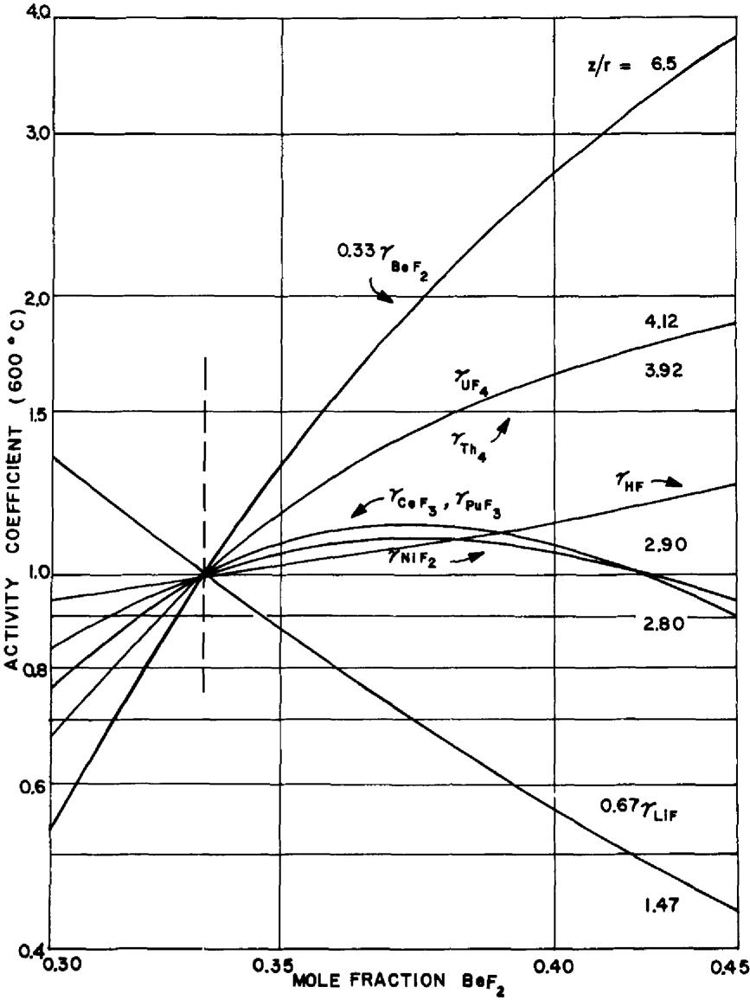  
1. Activity Coefficient Variation With Composition in $\mathsf{LiF - BeF}_2$ Melts.

of K reported by Long and Blankenship (10) for the reduction of $\mathbf{U}\mathbf{F}_{4}$ to $\mathbf{U}\mathbf{F}_{3}$ at various melt compositions, with the assumption that $\gamma_{\mathrm{UF}_3}$ varies in the same way as $\gamma_{\mathrm{PuF}_3}$ . The resulting curve for $\gamma_{\mathrm{UF}_4}$ is assumed to represent $\gamma_{\mathrm{ThF}_4}$ as well since, in a recent study by Bamberger et al (ll) of the exchange of $\mathbf{U}^{4+}$ and $\mathbf{Th}^{4+}$ between a molten fluoride solution and an oxide solid solution (136), K showed no dependence on the melt composition, thus suggesting $\gamma_{\mathrm{ThF}_4} / \gamma_{\mathrm{UF}_4} = 1$ .

HF. This curve is based on the HF solubility measurements (101) of Field and Shaffer(12).

The following examples illustrate the use of these activity coefficients in calculating equilibrium quotients at compositions other than the reference composition

(122) $\mathrm{NiF}_2(\mathrm{c}) \ngeq \mathrm{NiF}_2(\mathrm{d})$

$$
x _ {N i F _ {2}} = k _ {1 2} / \gamma_ {N i F _ {2}}
$$

(107) $2\mathrm{HF}(\mathbf{g}) + \mathrm{BeO}(\mathbf{c}) \rightarrow \mathrm{BeF}_2(\mathbf{d}) + \mathrm{H}_2\mathrm{O}(\mathbf{g})$

$$
\frac {\mathrm {P} _ {\mathrm {H} _ {2} \mathrm {O}}}{(\mathrm {P} _ {\mathrm {H F}}) ^ {2}} = \mathrm {K} _ {1 0 7} / \mathrm {X} _ {\mathrm {B e F} _ {2}} \mathrm {Y} _ {\mathrm {B e F} _ {2}}
$$

The activity coefficients curves in Fig. 1 have been used in a few instances to make small corrections in measurements reported at salt compositions other than 0.67 LiF-0.33 $\mathrm{BeF}_2$ . It is evident from the figure that activity coefficients generally do not show large variations and hence these corrections were small. It has been noted previously (6) that the $\gamma_{\mathrm{MF}}$ curves (Fig. 1) fall between the curves for 0.67 $\gamma_{\mathrm{LiF}}$ and 0.33 $\gamma_{\mathrm{BeF}_2}$ . Their location within the envelope defined by these two curves, except for $\gamma_{\mathrm{HF}}$ , depends upon the ratio of charge to radius ( $z/r$ ) for the cation $\mathbf{M}^{\mathbf{z}^{+}}$ . As yet, insufficient data are available to decide whether some analogous correlation exists in MSBR fuel solvents where $\mathrm{ThF}_4$ as well as LiF and $\mathrm{BeF}_2$ is present as a major component. Studies such as the recent solubility measurements of Barton et al (13), however, should soon improve our knowledge of medium effects in such three-component solvents.

# Hydrofluorination and Oxide Chemistry

Oxide is a commonly occurring impurity which enters $\mathrm{LiF - BeF_2}$ melts by reactions of water vapor to form OH $^-$ and $0^{2-}$ (the reverse of 102 and 103) or by the dissolution of structural metal oxides. Since $\mathrm{BeO}$ , $\mathrm{ThO_2}$ , $\mathrm{UO_2}$ , and certain other oxides are sparingly soluble in $\mathrm{LiF - BeF_2}$ melts, the chemistry of oxide and its removal has been

of considerable interest.

Oxide is removed from these melts by treatment with an $\mathrm{HF - H_2}$ mixture which reverses the hydrolysis reaction and evolves water vapor. The equilibria involved (102-109) have been studied by Mathews and Baes(14) in LiF-BeF $_2$ melts and by Hitch and Baes(15) in LiF-BeF $_2$ -ZrF $_4$ melts. The results show that the removal of oxide by hydrofluorination can be made quantitative(16). Indeed, this treatment was used to determine oxide, as evolved water, in measurements of the solubility of BeO and ZrO $_2$ (15). More recently it has been used in a method developed by Apple et al(17) for the remote determination of oxide (typically 60 ppm) in MSRE fuel samples.

The formation of OH $^{-}$ during hydrofluorination impedes the removal of oxide and, moreover, if this hydroxide is incompletely removed during the treatment, it will subsequently decompose slowly to produce $0^{2-}$ and HF (104) or $\mathrm{H}_2\mathrm{O}$ (105). Thus hydroxide is an oxidizing impurity (423). Since HF is not very soluble in LiF- $\mathrm{BeF}_2$ melts (101), the presence of OH $^{-}$ in small amounts after hydrofluorination is easily detected by sparging with a dry inert gas to determine if more HF is evolved than would be expected from dissolved HF alone.

Hydrofluorination of Sulfide and Iodide

Hydrofluorination as a purification treatment also removes sulfide which can arise from the reduction of any sulfate impurities present in the raw materials. Its removal is important because of the sensitivity of nickel and nickel-base alloys, used for containment, to sulfide embrittlement. Only the lower limit of the equilibrium constant for the formation of $\mathrm{H}_2\mathrm{S}$ (113) could be determined by Stone and Baes in their measurements(18) because of reaction of $\mathrm{H}_2\mathrm{S}$ with the container after it was evolved from the melt.

Preliminary measurements have been made by Freasier et al(19) of the conversion of I to HI by HF (114). The results show that iodide is the stable state of iodine under mildly reducing conditions, and that it is removed by hydrofluorination. This information is useful in predicting the behavior of fission product iodine in a reactor fuel. In addition, it suggests a possible method of removing 6.7 hr $^{135}\mathrm{I}$ from the fuel before large fractions decay to $^{135}\mathrm{Xe}$ , the most significant neutron poison of all the fission products.

Structural and Noble Metals

The hydrogen which accompanies and follows hydrofluorination in the usual purification treatment reduces a number of metal fluoride impurities. The reduction equilibria in the case of the fluorides $\mathrm{CrF}_2$ (115), $\mathrm{FeF}_2$ (117), and $\mathrm{NiF}_2$ (121) have been studied carefully by Blood(20), who found them to be increasingly easy to reduce in

that order.

As a result of its nobility in MSR fluorides, nickel is widely used for their containment. The alloy used for the MSRE is a nickel-base alloy containing $7\%$ Cr, $5\%$ Fe and $16\%$ Mo (Hastelloy N) which is very nearly inert to the fuel salt under normal reactor conditions. This is not because of favorable corrosion kinetics or because of a protective film of corrosion products, but simply because, in the absence of oxidizing impurities, there are no thermodynamically favored chemical reactions (Fig. 2); i.e., the container metal is essentially at equilibrium with the fuel salt.

Blood also measured the solubilities of $\mathrm{FeF_2}$ (118) and $\mathrm{NiF_2}$ (122), which are only sparingly soluble in LiF-BeF $_2$ melts. In addition, it may be calculated (119, 123) from the previously cited reactions and available thermochemical data (21) that FeO and NiO, when present as saturating solids, give still lower concentrations of $\mathrm{Fe}^{++}$ and $\mathrm{Ni}^{++}$ . Thus at equilibrium with both FeO and BeO, 0.67 LiF-0.33 $\mathrm{BeF_2}$ should contain $\sim 1.5 \, \text{m/o FeF_2}$ at $600^{\circ}\text{C}$ (120); at equilibrium with NiO and BeO it should contain $\sim 0.007 \, \text{m/o NiF_2}$ (124).

Analogous calculations suggest that $\mathrm{Cr_2O_3}$ is in a sense also an "insoluble" oxide since its hydrofluorination and reduction to $\mathrm{CrF_2}$ should not occur readily (116). Thus, at equilibrium with 0.1 atm HF, 1 atm $\mathrm{H_2}$ , and $\mathrm{Cr_2O_3(c)}$ , the melt should contain an amount of $\mathrm{CrF_2}$ at $600^{\circ}\mathrm{C}$ given by

$$
\mathrm {X} _ {\mathrm {C r F} _ {2}} \approx 7 \mathrm {x} 1 0 ^ {- 7} / \left(\mathrm {P} _ {\mathrm {H} _ {2} \mathrm {O}}\right) ^ {3 / 2}
$$

Preliminary emf measurements of Meyer et al(22) for the cell Mo $\left|\mathrm{MoF}_3(d),\mathrm{LiF},\mathrm{BeF}_2\right|\left|\mathrm{LiF},\mathrm{BeF}_2\right|\mathrm{NiF}_2(c),\mathrm{Ni}$

for which the cell reaction

$$
\mathrm {M o F} _ {3} (\mathrm {d}) + 3 / 2 \mathrm {N i} (\mathrm {c}) \rightarrow \mathrm {M o} (\mathrm {c}) + 3 / 2 \mathrm {N i F} _ {2} (\mathrm {c})
$$

was assumed, suggest that $\mathsf{MoF}_3$ lies between $\mathsf{FeF}_2$ and $\mathsf{NiF}_2$ in ease of reduction. $\mathsf{MoO}_2$ should be another "insoluble" or resistant oxide, since its reduction to the metal by hydrogen (126) is, in effect, more difficult than the reduction of dissolved $\mathsf{MoF}_3$ .

In the absence of sufficient knowledge about the identity and stability of lower fluorides of niobium, tantalum, ruthenium, or tungsten, estimates of the minimum reactivity of these metals were obtained from available thermochemical data for $\mathrm{NbF}_5$ (23), $\mathrm{TaF}_5$ (24), $\mathrm{RuF}_5$ (25) and $\mathrm{WF}_6$ (26). Half cell reactions involving these metals, and chromium, iron, and nickel are listed in Table IV. The following electrochemical series and $\mathbf{E}^{\circ}$ values result at $1000^{\circ}\mathrm{K}$ :

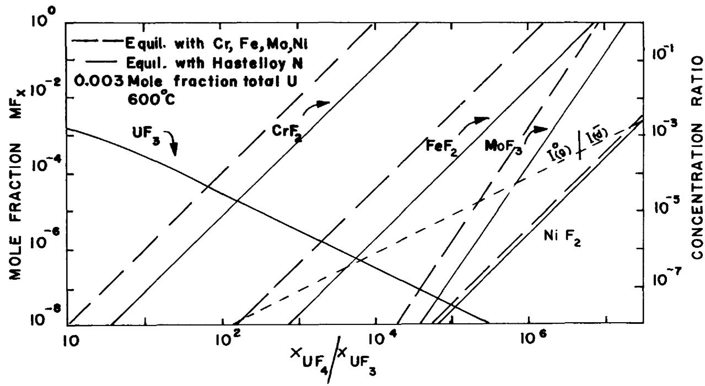  
2. Variation of Equilibrium Concentration of Structural Metal Fluorides and the Distribution of Iodine as a Function of the $\mathrm{UF_4 / UF_3}$ Ratio in an MSR Fuel.

TaF5/Ta,F -0.695v Mo³+/Mo v.05v at 769°K

$\mathrm{Cr^{2 + } / Cr}$ -0.390v WF6/W,F- 0.338v

$\mathrm{NbF_5 / Nb,F^{-}}$ -0.272v $\mathrm{Ni}^{+ + } / \mathrm{Ni}$ 0.473v

Fe++/Fe -0.011v $\mathrm{RuF_5 / Ru,F^{-}}$ 1.393v

The relative nobility of nickel and the surprising reactivity of tantalum, because of the stability of $\mathsf{TaF}_5$ , are noteworthy.

Reactions of $\mathrm{SiO}_2$

Molten fluorides are widely considered difficult to contain without corrosion of, or contamination by, the container. This unsavory reputation probably results from the tendency of fluorides to attack glass and silica, thus preventing the study of fluorides with the ease and convenience afforded by these materials. As we have seen, this reputation is undeserved in the case of LiF-BeF $_2$ melts, which are readily contained in metals under mildly reducing conditions. Furthermore, it may be predicted from the previously described studies of the hydrofluorination of oxide and from $\Delta G^{\mathrm{f}}$ for SiO $_2$ and SiF $_4$ that the reaction with SiO $_2$ to produce SiF $_4$ (128) is quite limited. This has been confirmed by Bamberger et al (27,28) who found that if the SiF $_4$ is confined within the system, or if it is introduced with the cover gas, then vitreous SiO $_2$ is essentially non-contaminating and quite durable, save for crystallization, at temperatures to $700^{\circ}\mathrm{C}$ .

If the $\mathrm{SiF_4}$ produced by reaction 128 is swept away, its pressure falls and the oxide ion concentration increases in the melt until both $\mathbf{P}_{\mathrm{SiF}_4}$ and $\mathbf{X}_{0^2 -}$ are fixed (131) by the precipitation of a new solid phase, $\mathbf{Be}_2\mathbf{SiO}_4$ .

# Actinides

At a few mole percent of $\mathrm{ThF_4}$ in 0.67 LiF-0.33 $\mathrm{BeF_2}$ (the exact amount being uncertain because of unknown activity coefficient effects) $\mathrm{ThO_2}$ becomes the least soluble oxide. $\mathrm{UO_2}$ is considerably less soluble and becomes the least soluble oxide at $< 0.1\mathrm{m / o}$ (134). $\mathrm{ZrO_2}$ replaces $\mathrm{UO_2}$ as the least soluble oxide phase when the $\mathrm{X_{ZrF_4}}/$ $\mathrm{X_{UF_4}}$ ratio exceeds a value in the range 1.5-6, depending on temperature (135) and $\mathrm{ZrF_4}$ concentration (29). Hence $\mathrm{ZrF_4}$ was added to the MSRE as an oxide getter to prevent the precipitation of $\mathrm{UO_2}$ in the reactor. Romberger et al., found that $\mathrm{ZrO_2}$ does not dissolve significant amounts of $\mathrm{UO_2(30)}$ .

Since $\mathsf{ThO}_2$ and $\mathsf{UO}_2$ form a continuous series of solid solutions, Bamberger et al(11) were led to study the exchange equilibrium of $\mathsf{Th}^{4+}$ and $\mathsf{U}^{4+}$ between $(\mathsf{U}-\mathsf{Th})\mathsf{O}_2$ solid solutions and an $\mathsf{LiF}-\mathsf{BeF}_2$ melt containing $\mathsf{UF}_4$ and $\mathsf{ThF}_4$ (136). $\mathsf{UO}_2$ is considerably less soluble than $\mathsf{ThO}_2$ in the fluoride phase and so $\mathsf{U}^{4+}$ strongly distributes to the oxide solid-solution phase. The results of this study have

permitted an improved estimate of $\Delta \overline{G}^{\mathsf{f}}$ for $\mathrm{ThF}_4(\mathsf{d})$ , as indicated in Table III (308).

Measurements of the reduction and extraction of protactinium into molten bismuth by Ross et al(31) provides strong evidence that protactinium is present as $\mathrm{PaF_4}$ in LiF-BeF $_2$ melts under reducing conditions. While as yet there are insufficient data to estimate quantitatively its stability, $\mathrm{PaF_4}$ is more easily reduced into bismuth than is $\mathrm{ThF_4}$ and less easily reduced than $\mathrm{UF_3}$ , hence we may estimate

$$
\Delta \overline {{G}} ^ {f} \left(P a F _ {4} (d)\right) \sim - 4 1 2 k c a l / m o l e (1 0 0 0 ^ {\circ} K)
$$

Early measurements by Shaffer et al (32) showed that protactinium is precipitated from molten fluorides by oxides. The oxide of protactinium which is precipitated has not been determined as yet.

Long and Blankenship(10) studied the partial reduction of $\mathrm{UF_4}$ to $\mathrm{UF_3}$ by hydrogen, both in the solids and in molten fluorides (137). In an MSR fuel, as we shall see, the $\mathrm{U^{4 + } / U^{3 + }}$ redox couple can be used as a redox buffer and indicator to establish and control the redox potential. From the measurements of Jennings et al(33) the solubility of $\mathrm{UF_3}$ is quite limited in 0.67 LiF-0.33 BeF2, being only $\sim 0.2\mathrm{m / o}$ at $600^{\circ}\mathrm{C}$ (138).

Barton(9) has measured the solubility of the sparingly soluble $\mathrm{PuF_3}$ (140), and it appears that this is the stable form of plutonium under mildly reducing conditions. From these results, and available thermochemical estimates for $\mathrm{PuF_3(c)}$ and $\mathrm{Pu}_{2}\mathrm{O}_{3}^{(34)}$ , we may estimate, though with considerable uncertainty, the solubility of $\mathrm{Pu}_{2}\mathrm{O}_{3}(140)$ .

# Lanthanides

As indicated by the estimates of $\Delta G^{\mathrm{f}}$ for $\mathrm{LaF}_3(\mathrm{c})$ , $\mathrm{CeF}_3(\mathrm{c})$ , $\mathrm{NdF}_3(\mathrm{c})$ , and $\mathrm{SmF}_3(\mathrm{c})$ (Table II, 220-223) the trivalent lanthanides are among the most stable of fluorides. These values are based on recent measurements of $\Delta H^{\mathrm{f}}$ from fluorine bomb calorimetry and other estimated $\Delta H^{\mathrm{f}}$ values, all by Rudzitis and VanDeventer(35), and on $\Delta S^{\mathrm{f}}$ values from the reported $\Delta S^{\mathrm{f}}$ values for $\mathrm{CeF}_3(24)$ and the lanthanide oxides(35) and the assumption that the difference $[\Delta S^{\mathrm{f}}(\mathrm{LnF}_3) - \frac{1}{2} \Delta S^{\mathrm{f}}(\mathrm{Ln}_2\mathrm{O}_3)]$ is a constant for all the lanthanides.

Since the limited solubilities of these fluorides have been measured by Ward et al(8) and Doss et al(36) the $\Delta \bar{G}^{\mathrm{E}}$ values can also be calculated (302-305, Table III). The resulting $E^{\circ}$ values place the $\mathrm{Ln}^{3+}/\mathrm{Ln}$ couples second only to $\mathrm{Li}^{+}/\mathrm{Li}$ in reducing power (402-405, Table IV).

# MSRE Fuel Chemistry

The chemistry of a single fluid MSBR fuel salt, which should approximate the composition 0.72 LiF-0.16 BeF $_2$ -0.12 ThF $_4$ , probably will not differ greatly from the chemistry of the melts described above, provided that large departures from equilibrium conditions are not produced by the radiation fluxes of an operating reactor.

Effect of Redox Potential

A large fraction of the chemical reactions which have been described are redox reactions, as is attested by the list of half-cell reactions in Table IV. The degree of oxidation of each of these couples when present in a fuel salt at equilibrium is determined by the overall state of oxidation of the system, or, more briefly, by the redox potential.

The most convenient measure of the redox potential is the ratio $\mathrm{X}_{\mathrm{UF}_4} / \mathrm{X}_{\mathrm{UF}_3}$ in the fuel, since this couple can act as a buffer; i.e., with a significant fraction of both $\mathrm{UF}_4$ and $\mathrm{UF}_3$ present, the amount of each can considerably exceed the amount of any other oxidizable or reducable substance in the system. Thus any condition which might otherwise alter considerably the amounts of these other oxidizable or reducable substances will instead merely change slightly the ratio of $\mathrm{UF}_4$ to $\mathrm{UF}_3$ , and so only slightly change the redox potential.

In Fig. 2, wherein the concentrations of the structural metal ions $\mathrm{Cr}^{2+}$ , $\mathrm{Fe}^{2+}$ , $\mathrm{Mo}^{3+}$ , and $\mathrm{Ni}^{2+}$ are plotted as a function of the $\mathrm{UF}_4 / \mathrm{UF}_3$ ratio, we see that when the amount of reduced uranium exceeds $1\%$ of the total uranium, this buffer effect appears. The oxidized metals all become rapidly insignificant in concentration compared to the increasing $\mathrm{UF}_3$ concentration. Not only is corrosion of the container alloy thus arrested completely, but any oxidant that enters the system will oxidize the $\mathrm{UF}_3$ rather than the container.

Two curves are shown for each metal-ion reaction, indicating the equilibrium of the metal ion with the pure metal (dashed lines) or with Hastelloy N (solid lines). The latter has been assumed to be an ideal metal solution. The assumption that such an alloy phase exists at equilibrium with the fuel is no doubt a better approximation of the situation in a reactor than is the assumption of the separate pure metal phases. In either case, the conclusion to be drawn is essentially the same, namely, that with more than $1\%$ reduction of the $\mathrm{UF_4}$ to $\mathrm{UF_3}$ in the fuel, there should be no significant corrosion. Four years of operating experience with the MSRE supports this conclusion.

It is probable that in MSBR fuels, with a few tenths of a mole $\%$ total uranium present, the $\mathrm{UF_4 / UF_3}$ ratio will be maintained in the range 10-100, the upper limit being set by the oxidation of

container-chromium and the lower limit being set by the approach to $\mathrm{UF}_3$ saturation.

Included in Fig. 2 is a curve representing the distribution, as a unitless concentration ratio, of (fission-product) iodine between the fuel salt and a gas phase. It is seen that the iodine should be present as $I^{-}$ in the fuel salt under normal reducing conditions. Indeed relatively strong oxidizing conditions $\left( \frac{X_{\mathrm{UF}_4}}{X_{\mathrm{UF}_3}} > 10^8 \right)$ are necessary to produce significant amounts of iodine in the gas phase.

Figure 3 indicates the conditions under which the noble-metal fission products should appear in their upper, volatile oxidation states. While these elements may be at a high state of oxidation during the instant after their birth, at equilibrium in a system with a normal $\mathrm{UF_4 / UF_3}$ ratio, the only such volatile fission product we have any reason to expect is $\mathrm{NbF_5}$ , and this should not be detected in the off-gas system until the $\mathrm{UF_4 / UF_3}$ ratio exceeds $10^{4}$ . The volatile fluorides $\mathrm{MoF_6}$ and $\mathrm{PuF_5}$ should not appear until the system is so oxidizing that $\mathrm{CF_4}$ in one case, or $\mathrm{UF_6}$ in the other, also appears. Included in Fig. 3 are curves for $\mathrm{TaF_6}$ and $\mathrm{WF_6}$ which are not fission products.

Operating experience with the MSRE has shown that niobium activity, while not found in the fuel under normally reducing conditions, does appear in solution under more oxidizing conditions. While the $\mathrm{UF_4 / UF_3}$ ratio at which this appearance of niobium in solution occurs is not yet accurately known, its behavior is consistent with the calculated curve for $\mathrm{NbF}_5$ in Fig. 3. Alternatively, a soluble lower valence state of niobium may be involved(37). In any case, it seems possible that fission product niobium will serve as a useful redox indicator.

Anomalous Behavior of Noble Metal Fission Products

In the MSRE, the noble-metal fission products just discussed -- Nb, Mo, and Ru -- have been found to behave in a curious and intriguing fashion(4). Large fractions of the expected yield of these activities have been found to concentrate in the region of the salt-gas interface in the pump bowl. When this was first observed, there was considerable temptation to speculate that these metals concentrated there because they were oxidized to their uppervalent, volatile fluorides. But as can be seen from Fig. 3 and Table IV, except for NbF5, they are themselves strong oxidizing agents which should be reduced quickly by the UF3 in the fuel or by the container metal.

Rather, at the present writing, it appears far more likely that the mechanism of this concentration effect involves finely divided metallic particles of these fission products which are trapped at the salt-gas interface because they are not wetted by the salt.

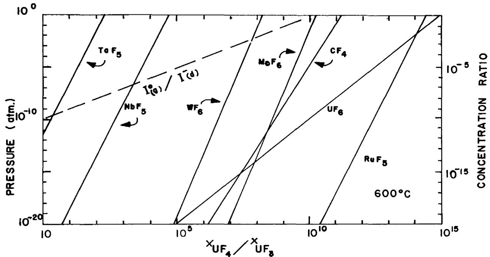  
3. Variation of Partial Pressure of Volatile Fluorides as a Function of $\mathrm{UF_4 / UF_3}$ Ratio in an MSR Fuel.

Since it is necessary to sparge an MSBR fuel salt vigorously with an inert gas to remove $^{135}\mathrm{Xe}$ , it will be important to determine if and how efficiently these noble metal fission products can be swept away at the same time.

# Hydrogen Couples

Figure 4 indicates the behavior of a number of redox couples which involve hydrogen. While it is unlikely that a reactor would be operated under a hydrogen atmosphere, no doubt there has been appreciable amounts of hydrogen in the MSRE from the decomposition of traces of lubricant oil which entered the high temperature region of the circulating pump. More important, in an MSBR it is possible that an $\mathrm{HF - H_2}$ gas treatment will be desirable at some point to control the $\mathrm{UF_4 / UF_3}$ ratio, or to remove oxide or iodide. With the conditions as specified in Fig. 4 (1 atm hydrogen at $600^{\circ}\mathrm{C}$ ) we see that all the couples shown are reduced under a wide range of the $\mathrm{UF_4 / UF_3}$ ratio, with the reduced species being in the fuel salt. Then, if hydrofluorination is to be used as a means of removing oxide or iodide, it must be done under conditions which are more oxidizing than normal. Hence such a treatment should be followed by re-reduction of the fuel salt. If hydrogen is allowed to reach the graphite moderator, some hydrocarbons may be formed.

# Chemical Consequences of Fission

The expected behavior of the important fission products in a molten salt reactor is indicated in Table V. The noble gases Xe

Table V. Chemical Consequences of Fission in an MSBR   

<table><tr><td>Fission Product</td><td>Assumed Eq. Ox. State (Z)</td><td>Yield* (Y)</td><td>YZ</td></tr><tr><td>Br + I</td><td>-1</td><td>0.015</td><td>-0.015</td></tr><tr><td>Kr + Xe</td><td>0</td><td>0.606**</td><td>0</td></tr><tr><td>Rb + Cs</td><td>+1</td><td>0.004</td><td>0.004</td></tr><tr><td>Sr + Ba</td><td>+2</td><td>0.072</td><td>0.144</td></tr><tr><td>Lanthanides + Y</td><td>+3</td><td>0.538</td><td>1.644</td></tr><tr><td>Zr</td><td>+4</td><td>0.318</td><td>1.272</td></tr><tr><td>Nb</td><td>0</td><td>0.014</td><td>0</td></tr><tr><td>Mo</td><td>0</td><td>0.201</td><td>0</td></tr><tr><td>Tc</td><td>0</td><td>0.059</td><td>0</td></tr><tr><td>Ru</td><td>0</td><td>0.126</td><td>0</td></tr><tr><td></td><td></td><td>1.953</td><td>3.049</td></tr></table>

*From Ref. 39.   
**With rapid stripping from the system.

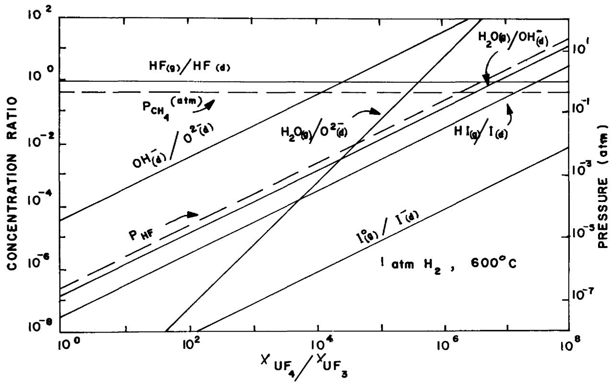  
4. Partial Pressure and Distribution of Protonated Species as a Function of $\mathrm{UF_4 / UF_3}$ Ratio in an MSR Fuel.

and Kr are known to be quite insoluble in molten fluorides(38). The Groups VII, I, II, III and IV fission products should be dissolved in the fuel salt in their normal valences. The remainder -- of which Nb, Mo, Tc and Ru are the important contributors -- are expected to be reduced to the metallic state under the reducing conditions which would normally be maintained in a reactor.

Also indicated in Table V are values of the product of the fission yield(39) and the valence of each fission product. This serves to show that with reducing conditions maintained and rapid removal of Xe and Kr, the sum of the charges on all the fission products is less than the +4 per mole of uranium burned, being nearly +3. Hence as burnup of the uranium fuel (mostly UF<sub>4</sub>) proceeds, UF<sub>3</sub> or other reducing agent must be added to maintain reducing conditions. Otherwise, the deficiency of cation equivalents will be made up by the oxidation of UF<sub>3</sub> present and then by corrosion of the container; i.e., the fission process is oxidizing.

# Conclusion

It is fair to say, I think, that as a result of the supporting chemical studies which have accompanied the development of the Molten Salt Breeder Reactor concept, a sound understanding of the chemistry of such molten fluoride fueled reactors has been achieved. The most significant conclusion to be drawn is that such a reactor system -- with partially reduced $\mathrm{UF_4}$ in an LiF-BeF $_2$ -ThF $_4$ solvent, contained in Hastelloy N, and moderated by graphite -- is a chemically stable system which is essentially at equilibrium and free of corrosion. Further, the equilibrium chemical behavior of the important fission products is reasonably predictable. The current successful operation of the MSRE supports these conclusions.

# References

1. Rosenthal, M. W. and P. R. Kasten, "Molten Salt Reactors - Their Performance, Objectives and Status," Presented at the American Nuclear Society Meeting, Washington, D.C., Nov. 11-15, 1968. To be published in Nuclear Applications.   
2. Bettis, E. S. and R. C. Robertson et al., "MSBR Design Features and Performance," Presented at the American Nuclear Society Meeting, Washington, D.C., Nov. 11-15, 1968. To be published in Nuclear Applications.   
3. Perry, A. M., "MSBR Reactor Physics," Presented at the American Nuclear Society Meeting, Washington, D.C., Nov. 11-15, 1968. To be published in Nuclear Applications.   
4. Grimes, W. R., "Molten Salt Reactor Chemistry," to be published in Nuclear Applications.   
5. Grimes, W. R., "Chemical Research and Development for Molten Salt Breeder Reactors," USAEC Rept. ORNL-TM-1853, Oak Ridge National Laboratory, June 1967.   
6. Baes, C. F., Jr., "The Chemistry and Thermodynamics of Molten Salt Reactor Fluoride Solutions," Thermodynamics, Vol. 1, International Atomic Energy Agency, Vienna, 1966, pp. 409-433.   
7. Hitch, B. F. and C. F. Baes, Jr., "An Electromotive Force Study of Molten Lithium Fluoride-Beryllium Fluoride Solutions," Inorganic Chemistry, Vol. 8, 1969, pp. 201-207.   
8. Ward, W. T. et al., "Solubility Relations Among Rare-Earth Fluorides in Selected Molten Fluoride Solvents," USAEC Rept. ORNL-2749, Oak Ridge National Laboratory, Oct. 1959. See also, Ward, W. T. et al., Chemical and Eng. Data, Vol. 5, No. 2, April 1960, pp. 137-142.   
9. Barton, C. J., "Solubility of Plutonium Trifluoride in Fused-Alkali Fluoride-Beryllium Fluoride Mixtures," J. Phys. Chem., Vol. 64, 1960, pp. 306-309   
10. Long, G. and F. F. Blankenship, Reactor Chemistry Division Ann. Progr. Rept. for Period Ending Jan. 31, 1965, USAEC Rept. ORNL-3789, pp. 65-72, Oak Ridge National Laboratory, April 1965.   
11. Bamberger, C. E., C. F. Baes, Jr., and A. L. Johnson, Reactor Chem. Div. Ann. Progr. Rept. for Period Ending Dec. 31, 1968, USAEC Rept. ORNL-4400, Oak Ridge National Laboratory, in press.

12. Field, F. E. and J. H. Shaffer, "The Solubilities of Hydrogen Fluoride and Deuterium Fluoride in Molten Fluorides," J. Phys. Chem., Vol. 71, 1967, pp. 3218-3222.   
13. Barton, C. J., L. O. Gilpatrick, J. A. Fredricksen, "Solubility of Cerium Trifluoride in Molten Mixtures of LiF-BeF $_2$ , and ThF $_4$ ," Presented at 157th Meeting, American Chem. Soc., Meeting April 13-18, 1969, Minneapolis, Minn., submitted for publication in Inorganic Chem.   
14. Mathews A. L. and C. F. Baes, Jr., "Oxide Chemistry and Thermodynamics of Molten LiF-BeF $_2$ Solutions," Inorganic Chem., Vol. 7, 1968, pp. 373-382.   
15. Hitch, B. F. and C. F. Baes, Jr., Reactor Chemistry Div. Ann. Progr. Rept. for Period Ending Dec. 31, 1966, USAEC Rept. ORNL-4076, pp. 19, 20, Oak Ridge National Laboratory, Mar., 1967.   
16. Hitch, B. F. and C. F. Baes, Jr., Molten Salt Reactor Prog. Semiann. Progr. Rept. for Period Ending Feb. 28, 1966, pp. 133-136, Oak Ridge National Laboratory, June 1966.   
17. Apple, R. F. et al., "Determination of Oxide in Highly Radioactive Fused Fluoride Salts - Hydrofluorination Method," presented at the Winter Meeting, American Chem. Soc., Phoenix, Ariz., Jan. 17-21, 1966. To be published.   
18. Stone, H. H. and C. F. Baes, Jr., Reactor Chem. Div. Ann. Progr. Rept. for Period Ending Jan. 31, 1965, USAEC Rept. ORNL-3789, pp. 72-76, Oak Ridge National Laboratory, April 1965.   
19. Freasier, B. F., C. F. Baes, Jr., and H. H. Stone, Reactor Chem. Div. Ann. Progr. Rept. for Period Ending Dec. 31, 1965, USAEC Rept. ORNL-3913, pp. 38-40, Oak Ridge National Laboratory, Mar. 1966.   
20. Blood, "The Solubility and Stability of Structural Metal Difluorides in Molten Fluoride Mixtures," USAEC Rept. ORNL-CF-61-5-4, Oak Ridge National Laboratory, Sept. 1961.   
21. Elliott, J. F. and M. Gleiser, "Thermochemistry for Steel Making," American Iron and Steel Institute, Addison-Wesley Publ. Co., Reading, Mass., 1960.   
22. Meyer, N. J., C. F. Baes, Jr., and K. A. Romberger, Reactor Chem. Div. Ann. Progr. Rept. for Period Ending Dec. 31, 1967, USAEC Rept. ORNL-4229, pp. 32, 33, Oak Ridge National Laboratory, Mar. 1968.

23. Greenberg, E., C. A. Natke, and W. N. Hubbard, "Fluorine Bomb Calorimetry. X. The Enthalpies of Formation of Niobium and Tantalum Pentafafluorides," J. Phys. Chem. Vol. 69, 1965, pp. 2089-2093.   
24. Kubaschewski, O., E. L. Evans, and C. B. Alcock, Metallurgical Thermochemistry," Pergamon Press, 1967.   
25. Porte, H. A., E. Greenberg and W. N. Hubbard, "Fluorine Bomb Calorimetry. XII. The Enthalpy of Formation of Ruthenium Pentafluoride," J. Phys. Chem., Vol. 69, 1965, pp. 2308-2310.   
26. "JANAF Thermochemical Tables," Clearing House for Federal Scientific and Technical Information, U.S. Dept. of Commerce, Aug. 1965.   
27. Bamberger, C. E., C. F. Baes, Jr., and J. P. Young, "Containment of Molten Fluorides in Silica: Part I. Effect of Temperature on the Spectrum of $\mathbf{U}^{4+}$ in Molten $\mathrm{BeF}_2$ -LiF Mixtures," J. Inorg. and Nucl. Chem., Vol. 30, 1968, p. 1979.   
28. Bamberger, C. E. and C. F. Baes, Jr., Reactor Chem. Div. Ann. Progr. Rept. for Period Ending Dec. 31, 1968, USAEC Rept. ORNL-4400, Oak Ridge National Laboratory, in press.   
29. Eorgan, J. H. et al., Reactor Chem. Div. Ann. Progr. Rept. for Period Ending Jan. 31, 1964, USAEC Rept. ORNL-3591, pp. 45-46, Oak Ridge National Laboratory, May, 1964.   
30. Romberger, K. A., C. F. Baes, Jr., and H. H. Stone, "Phase Equilibrium Studies in the $\mathrm{UO}_2\text{-ZrO}_2$ System," J. Inorg. and Nucl. Chem., Vol. 29, 1967, pp. 1619-1630.   
31. Ross, R. G. et al., "The Reductive Extraction of Protactinium and Uranium From Molten LiF-BeF $_2$ -ThF $_4$ Mixtures Into Bismuth," This volume.   
32. Shaffer, J. H. et al., "The Recovery of Protactinium and Uranium for Molten Fluoride Systems by Precipitation as Oxides," Nucl. Sci. and Eng., Vol. 18, 1964, pp. 177-181.   
33. Jennings, W., F. A. Doss, and J. H. Shaffer, Reactor Chem. Div. Ann. Progr. Rept. for Period Ending Jan. 31, 1964, USAEC Rept. ORNL-3591, pp. 50-52, Oak Ridge National Laboratory, May 1964.   
34. Oetting, F. L., "The Chemical Thermodynamic Properties of Plutonium Compounds," Chem. Rev., Vol. 67, 1967, pp. 261-297.   
35. Rudzitis, E. and E. H. Van Deventer, "Chemical Engineering Div. Ann. Rept., July-Dec. 1967," AEC Rept. ANL-7425, pp. 122-123. Holley, C. E., Jr., E. J. Huber, Jr., and F. B. Baker, "The

Enthalpies, Entropies, and Gibbs Energies of Formation of the Rare Earth Oxides," Progress in the Science and Technology of Rare Earths, L. Eyring, Ed., Vol. 3, 1968, pp. 343-433.   
36. Doss, F. A., F. F. Blankenship, and J. H. Shaffer, Reactor Chem. Div. Ann. Progr. Rept. for Period Ending Dec. 31, 1967, USAEC Rept. ORNL-4229, pp. 39,40, Oak Ridge National Laboratory, Mar. 1968.   
37. Senderoff S. and G. W. Mellors, "The Electrodeposition of Coherent Deposits of Refractory Metals: IV. The Electrode Reaction in the Deposition of Niobium," J. Elect. Soc., Vol. 1, 1966, pp. 66-71.   
38. Watson, G. M. et al., "Solubility of Noble Gases in Molten Fluorides: In Lithium-Beryllium Fluoride," J. Chem. and Eng. Data, Vol. 7, 1962, pp. 285-287.   
39. Blomeke, J. O. and M. F. Todd, "Uranium-235 Fission Product Production as a Function of Thermal Neutron Flux, Irradiation Time, and Decay Time," USAEC Rept. ORNL-2127, Oak Ridge National Laboratory, Nov. 1958.   
40. Settle, J. L. H. M. Feder, and W. N. Hubbard, "Fluorine Bomb Calorimetry. II. The Heat of Formation of Molybdenum Hexafluoride," J. Phys. Chem., Vol. 65, 1961, pp. 1337-1340.   
41. Rand, M. H. and O. Kubaschewski, "The Thermochemical Properties of Uranium Compounds," Interscience Publ., New York, 1963.

CALCULATIONS ON THE SEPARATION PROPERTIES

OF THORIUM-URANIUM FUELS BY CHLORINE VOLATILIZATION

E.Fischer, M.Laser, and E.Merz

Kernforschungsanlage Jülich GmbH, 517 Jülich/Germany  
Institut für Chemische Technologie

# Abstract

The composition of the gas phase resulting from a high temperature chlorination of uranium-thorium fuels was computed for different process conditions. From these values the theoretical uranium and protactinium losses caused by a codeposition of thorium and uranium or protactinium chlorides, respectively, were calculated. The results have shown, that tolerable uranium losses can be achieved, if the partial pressure of uranium is very low or the deposited thorium chloride is purified by a sublimation procedure.

*Work performed under a joint project sponsored by the German Federal Ministry of Science.

# Introduction

The High Temperature Gas Cooled Thorium Reactors of AVR and THTR type operate with graphite balls containing thorium uranium oxide or carbide particles, coated with pyrocarbon and silicon carbide. The uranium content of the fuel elements is relatively low. A typical sphere which weighs nearly 200 g contains only 10 to 20 g of particles in which the uranium thorium ratio is approximately 1:25, corresponding to a uranium content of less than 0.5% related to the full sphere. The protactinium content varies with the conditions of reactor operation. One calculation has given a value of 31 mg Pa per sphere.

For the reprocessing of these fuel elements we are developing a combined chlorination solvent extraction process, the so-called CHLOREX process (1). The balls are broken and ground to a particle size of less than $300\mu \mathrm{m}$ with a small portion of fines below $50\mu \mathrm{m}$ . The material is then fed into a fluidized bed and heated to 1000 or $1100^{\circ}\mathrm{C}$ . In the presence of graphite the heavy metal oxides are converted to the volatile chlorides by chlorine. Also most of the fission products are volatilized under these conditions. The chlorides are deposited in a condenser, dissolved in $2\mathrm{M}$ hydrochloric acid and purified by solvent extraction with long chain aliphatic amines or, after conversion of the chlorides to the nitrates, with tributyl phosphate. The resulting solution may be used for the refabrication of new particles by the sol gel technique.

At the present state of development we do not insist on a separation of the chlorides by fractional condensation, because the isolation and purification of protactinium and uranium is easily carried out by aqueous process steps. However, in the future we will try to achieve separation by condensation of thorium chloride at 500 to $600^{\circ}\mathrm{C}$ and uranium and protactin chlorides at room temperature. In this case the thorium fraction may be easily converted to a storable form and discarded to the waste. But it is essential that thorium chloride be deposited nearly uranium free.

The first inspection of the vapour pressure curves (fig.1) shows that the volatilities of thorium chloride, uranium pentachloride and hexachloride are very different, so that one should expect a good separation. Some laboratory experiments have given encouraging results, but in other runs the uranium content of the thorium chloride was too high. Therefore we have calculated

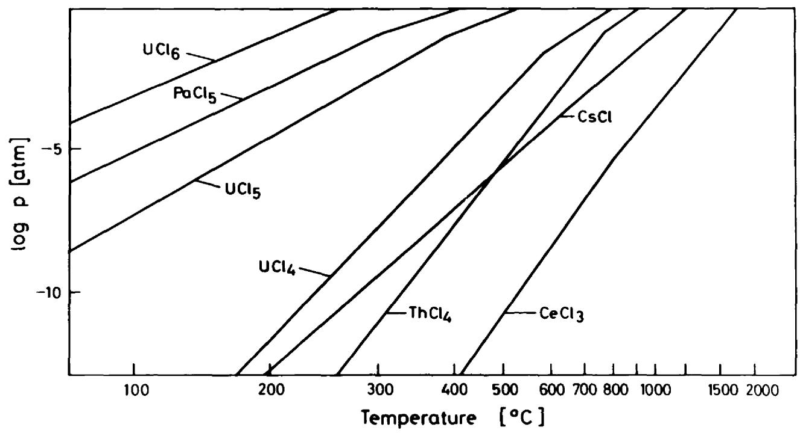  
1. Vapour Pressure Curves of some Chlorides.

the gas phase equilibria between the most important components carbon monoxide, chlorine, carbon oxychloride, thorium chloride, uranium tetrachloride, uranium pentachloride, and uranium hexachloride and the corresponding activities of uranium in the condensed thorium chloride. From these values we have calculated the theoretical uranium losses under different process conditions.

The results of these calculations may deviate from experimental data to a greater or lesser degree, because we must estimate some of the thermodynamic data. However, the variation of some parameters shows the influence of the different operating conditions. Finally the results have suggested requirements for the construction of the condenser.

# Fundamentals

The chlorination of thorium oxide in the presence of carbon at high temperature is given by the equation

$$
\mathrm {T h O} _ {2 (\mathbf {s})} + 2 \mathrm {C} _ {(\mathbf {s})} + 2 \mathrm {C l} _ {2 (\mathbf {g})} \rightarrow \mathrm {T h C l} _ {4 (\mathbf {g})} + 2 \mathrm {C o} _ {(\mathbf {g})} \tag {1}
$$

The chlorination of carbides can be described by

$$
\mathrm {T h C} _ {2 (\mathrm {s})} + 2 \mathrm {C l} _ {2 (\mathrm {g})} \longrightarrow \mathrm {T h C l} _ {4 (\mathrm {g})} + 2 \mathrm {C} _ {(\mathrm {s})} \tag {2}
$$

Under the same conditions uranium forms the three chlorides UCl4, UCl5, and UCl6; protactinium forms PaCl5; the fission products form their respective chlorides; and silicon carbide forms silicon tetrachloride. The main gas phase components are connected by the following equilibria:

$$
\mathrm {C O} + \mathrm {C l} _ {2} \rightleftharpoons \mathrm {C O C l} _ {2} \tag {3}
$$

$$
\mathrm {U C l} _ {4} (\mathrm {g}) + 1 / 2 \mathrm {C l} _ {2} \rightleftharpoons \mathrm {U C l} _ {5} (\mathrm {g}) \tag {4}
$$

$$
\mathrm {U C 1} _ {4 (\mathbf {g})} + \mathrm {C l} _ {2} \rightleftharpoons \mathrm {U C 1} _ {6 (\mathbf {g})} \tag {5}
$$

These equilibria are all determined by the chlorine potential.

Moreover, the vapourization equilibria of $\mathsf{ThCl}_4$ , $\mathsf{UCl}_4$ , $\mathsf{UCl}_5$ and $\mathsf{UCl}_6$ must be considered.

The thermodynamic data used for the calculation of the equilibria are given in table 1. (2).

Table 1. Thermodynamic Data.   

<table><tr><td></td><td>- ΔH298 kcal mole</td><td>ΔS298 kcal deg.mole</td><td colspan="3">cp=a+bT+ct-2a b·103 c·10-5</td></tr><tr><td>CO</td><td>26.40</td><td>47.3</td><td>6.79</td><td>0.98</td><td>-0.11</td></tr><tr><td>Cl2</td><td>0.0</td><td>53.3</td><td>8.82</td><td>0.06</td><td>-0.68</td></tr><tr><td>COCl2</td><td>53.3</td><td>69.1</td><td>14.51*</td><td></td><td></td></tr><tr><td>UCl4(g)</td><td>206.6</td><td>91.5</td><td>26.0*</td><td></td><td></td></tr><tr><td>UCl5(g)</td><td>237.7</td><td>96.0*</td><td>20.0*</td><td>0.01*</td><td></td></tr><tr><td>UCl6(g)</td><td>255.6*</td><td>101.3*</td><td>30.0*</td><td>0.005*</td><td></td></tr><tr><td></td><td colspan="5">log p = A.T-1 + B.log T + C·T + D [atm]</td></tr><tr><td></td><td>A</td><td>B</td><td>C</td><td colspan="2">D</td></tr><tr><td>ThCl4(s)</td><td>-12,900</td><td></td><td></td><td colspan="2">11.42</td></tr><tr><td>ThCl4(1)</td><td>-7,980</td><td></td><td></td><td colspan="2">6.69</td></tr><tr><td>UCl4(s)</td><td>-11,350</td><td>-3.02</td><td></td><td colspan="2">20.33</td></tr><tr><td>UCl5(s)</td><td>-5,500</td><td></td><td></td><td colspan="2">7.82</td></tr><tr><td>UCl6(s)</td><td>-4,000</td><td></td><td></td><td colspan="2">7.32</td></tr><tr><td colspan="6">*Estimated Values</td></tr></table>

The equilibrium constants of reactions 3 to 5 were calculated according to equation

$$
\log \mathrm {K} = - \frac {\Delta^ {\mathrm {H}} _ {\mathrm {T}}}{4 , 5 7 4 . \mathrm {T}} + \frac {\Delta^ {\mathrm {S}} _ {\mathrm {T}}}{4 , 5 7 4} \tag {6}
$$

$$
\text {w i t h} \quad \Delta H _ {T} = \Delta H _ {2 9 8} + \int_ {2 9 8} ^ {T} \Delta c _ {p} \cdot d T
$$

$$
\Delta S _ {T} = \Delta S _ {2 9 8} + \int_ {2 9 8} ^ {T} \Delta c _ {p} / T \cdot d T
$$

The temperature dependence of the equilibrium constants are approximated by the equations:

$$
\mathrm {C O} + \mathrm {C l} _ {2} \rightleftharpoons \mathrm {C O C l} _ {2}
$$

$$
\log \mathrm {K} _ {1} = 5 8 2 0 / \mathrm {T} - 6. 6 4 - 0. 0 0 0 2 4 2 \cdot \mathrm {T}
$$

$$
\mathrm {U C l} _ {4} (g) + 1 / 2 \mathrm {C l} _ {2} \rightleftharpoons \mathrm {U C l} _ {5} (g)
$$

$$
\log \mathrm {K} _ {2} = 7 3 0 0 / \mathrm {T} - 5. 9 0
$$

$$
\mathrm {U C l} _ {4} (\mathbf {g}) + \mathrm {C l} _ {2} \quad \text {U C l} _ {6} (\mathbf {g})
$$

$$
\log \mathrm {K} _ {3} = 1 0 8 2 0 / \mathrm {T} - 9. 8 0
$$

The partial pressures were calculated by a computer. (3) The following data were put in:

(i) the temperature functions of the equilibrium constants $\mathbf{K}_1, \mathbf{K}_2, \mathbf{K}_3$ ;   
(ii) the temperature functions of the vapour pressures of UCl₄, UCl₅ UCl₆, and ThCl₄;   
(iii) The mole numbers of CO, $\mathrm{Cl}_2$ , ThCl₄, and Utotal.

If the gas phase, containing the reaction products and an excess of chlorine, is cooled from the high reaction temperature, thorium chloride, and at lower temperature uranium chlorides will condense. However the separation of thorium and uranium chlorides cannot be quantitative, if one or more uranium species are soluble in the thorium chloride. In this case the thermodynamic activity of the uranium chloride in the thorium chloride is given by the equation

$$
\mathbf {a} _ {\mathrm {U}} = \frac {\mathrm {p} _ {\mathrm {U}}}{\mathrm {p} _ {\mathrm {U}} ^ {\circ}} \tag {7}
$$

$\mathbf{p}_{\mathbf{U}} =$ partial pressure of the respective uranium species in the system

$\mathbf{p}^{\circ}_{\mathbf{U}} =$ vapour pressure of the respective pure uranium species.

That means, that uranium is deposited together with thorium chloride even if the partial pressure in the gas phase is much lower than the vapour pressure of the pure uranium compound.

Since $\mathrm{UCl}_4$ and $\mathrm{ThCl}_4$ have the same crystal structure and similar lattice parameters (4), $\mathrm{UCl}_4$ is soluble in $\mathrm{ThCl}_4$ . The solid solution should nearly approximate the ideal case and that means that the activity coefficient should be approximately unity and RAOULT's law can be assumed to be valid in the whole range of concentration. On this basis equation 7 changes to

$$
\mathrm {x} _ {\mathrm {U C 1} _ {4}} = \frac {\mathrm {p} _ {\mathrm {U C 1} _ {4}}}{\mathrm {p} _ {\mathrm {U C 1} _ {4}}} \tag {8}
$$

$\mathrm{X}_{\mathrm{UC1}_4} = \text{mole fraction of UC1}_4$ in $\mathrm{ThCl}_4$

This enables one to calculate the amount of uranium tetrachloride in the thorium chloride.

There is nothing known as to the solubility of uranium pentachloride and hexachloride in thorium chloride. The hexachloride, however, can be ruled out because the activity in the thorium chloride would be so low that it would not make an appreciable contribution to the uranium content in the thorium chloride matrix. However, the solubility of uranium pentachloride in thorium chloride cannot be excluded. Indeed, the pentachloride could not be found in deposited uranium tetrachloride (5), however it is known that some solubility usually occurs even if the crystal structure of the solute is very different from that of the matrix. The activity coefficient, however, can be very different from unity in this case, so that one cannot calculate the mole fraction of the uranium pentachloride in thorium chloride until exact data are available.

Protactinium in the presence of chlorine is stable as pentachloride. The vapour pressure data were recently published by WEIGEL (6). The behaviour of this compound with respect to the solubility in thorium chloride is certainly similar to uranium pentachloride.

# Results of the Calculations

The composition of the gas phase resulting from the fluidized bed chlorination of thorium uranium oxide is partly given by the reaction equation and by the composition of the fuel. The chlorine partial pressure is variable and depends on kinetic effects, resulting in a more or less exhaustion of the chlorine, which is

fed into the fluidized bed. This exhaustion may be defined by

exhaustion = 2 x moles heavy metal chlorides·100 / 2 x moles heavy metal chlorides + x moles Cl₂

Figures 2 and 3 show the partial pressures of the main components $\mathrm{ThCl}_4$ , $\mathrm{UCl}_4$ , $\mathrm{UCl}_5$ , $\mathrm{UCl}_6$ , $\mathrm{CO}$ , $\mathrm{Cl}_2$ , and $\mathrm{COCl}_2$ as a function of the temperature for $50\%$ and $1\%$ exhaustion. The U:Th ratio is 5:95 and is nearly identical with the ratio in an AVR fuel element. The main difference between the two diagrams is the lower heavy metal chloride concentration in the latter case. The broken line gives the vapour pressure of solid uranium tetrachloride. The difference between the calculated partial pressure $\mathrm{p_{UCl_4}}$ and the vapour pressure $\mathrm{p^o_{UCl_4}}$ in the range of $\mathrm{ThCl}_4$ condensation represents the thermodynamic activity of $\mathrm{UCl}_4$ in $\mathrm{ThCl}_4$ . One can see, that a low uranium chloride content results in a low uranium tetrachloride activity in the solid phase.

From the different slope of the two curves the activity of uranium tetrachloride is a function of the temperature resulting in fractions of thorium chloride with different uranium content. In most cases the thorium chloride, which condenses later is richer in uranium than the first fraction. Therefore we have calculated the activity and the mole fraction of uranium tetrachloride in the condensed thorium chloride for temperature intervals of 10 degrees. After the summation of these results one can calculate the fraction of the total uranium, which is codeposited with thorium chloride.

Some results of the calculations are given in fig.4, in which the uranium loss $((\mathrm{UCl}_4$ codeposited with $\mathrm{ThCl}_4)$ / $\mathrm{UCl}_4$ (total) is shown as a function of the mole fraction of uranium in the gas phase for the chlorination of oxides and carbides. One can see that the uranium loss increases in a remarkable way with increasing mole fraction of uranium. For a given U:Th ratio the losses are somewhat lower in the case of chlorination of carbides.

A higher total pressure, which drives reactions 4 and 5 more to the side of the penta and hexachloride, results in very high uranium losses, because the partial pressure of uranium tetrachloride increases by a factor of 3 to 5 when the total pressure increases by a factor of 10.

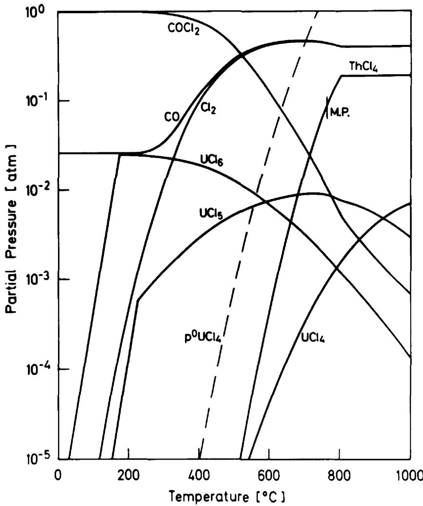  
2. Composition of the Gas Phase Resulting from the Chlorination of $(\mathrm{U}_{0.05}\mathrm{Th}_{0.95})_{2}$ . 50% chlorine Exhaustion.

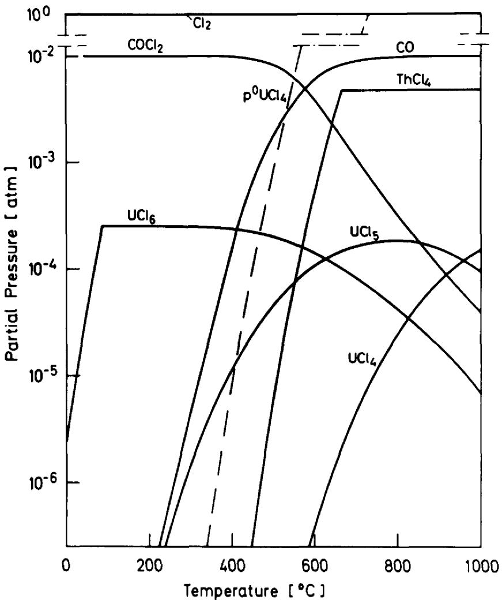  
3. Composition of the Gas Phase Resulting from the Chlorination of $(\mathrm{U}_{0.05}\mathrm{Th}_{0.95})_{2}$ . 1% Chlorine Exhaustion.

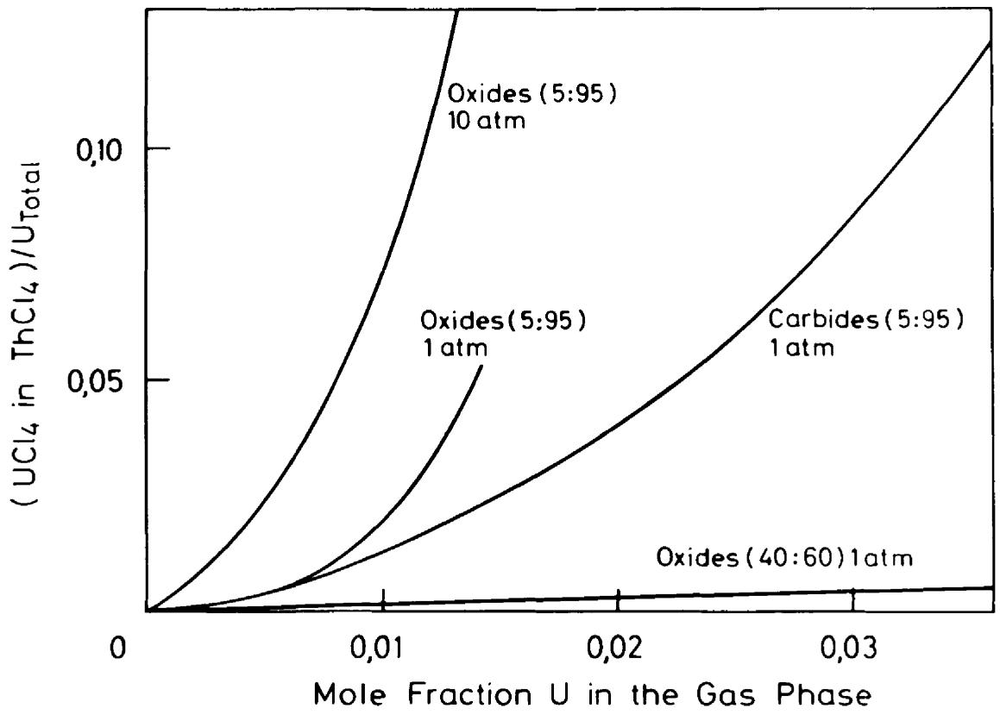  
4. Uranium Losses as a Function of the Mole Fraction of Uranium in the Gas Phase.

For a given mole fraction of uranium in the gas phase the uranium losses decrease with decreasing thorium mole fraction, that means, the losses are lower for fuels with a higher U:Th ratio.

From the technological standpoint the dependence of the uranium losses from the chlorine exhaustion is of greater interest. The diagram fig.5 shows, that for a given chlorine exhaustion the chlorination of oxides is more advantageous than chlorination of carbides, since the heavy metal chlorides are diluted by carbon monoxide. This dilution is more effective than the decrease of the chlorine potential according to equation 3.

The thermodynamic activity of uranium pentachloride according to the equation

$$
a _ {U C 1 _ {5}} = \frac {p _ {U C 1 _ {5}}}{p _ {U C 1 _ {5}} ^ {o}} \tag {9}
$$

is higher than that of the tetrachloride by a factor up to 2.5 in the interesting temperature range. But because we cannot say anything about the activity coefficient, it is impossible to calculate the molar fraction of the pentachloride in the thorium chloride matrix. The total uranium losses caused by the solubility of both uranium tetrachloride and pentachloride are therefore certainly somewhat higher than those given in figures 4 and 5.

Also for protactinium pentachloride we cannot assume an ideal solution. Nevertheless we have calculated the protactinium losses using an activity coefficient of unity. For a thorium oxide fuel with a Pa:Th ratio of 1:440 (corresponding to a Pa:Th ratio in an AVR fuel element) we got a loss of $0.3\%$ at $50\%$ chlorine exhaustion. Under the same conditions the uranium losses caused by the solution of uranium tetrachloride in thorium chloride amounts to $1.92\%$ . The actual protactinium losses decrease with increasing activity coefficient.

# Technological Consequences

The chlorination reactor must be operated at 1000 to $1100^{\circ}\mathrm{C}$ because most of the fission product chlorides must be also volutilized to reduce the uranium retardation by the fission products in the fluidized bed. Under these conditions $90\%$ or more of the heavy metal oxides are chlorinated and volutilized as chlorides during the first 20 or 30 minutes. The gas velocity should be as

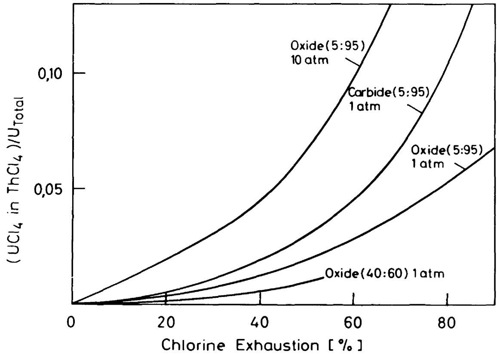  
5. Uranium Losses as a Function of the Chlorine Exhaustion.

low as possible to reduce the blowing out of the fines. Mostly we operate near the minimum fluidization velocity. Therefore the chlorine exhaustion can amount to $50\%$ and the uranium losses are too high.

There are two ways to decrease the percentage of uranium codeposited with thorium chloride. The simplest method is to dilute the reaction gas by injection of chlorine behind the chlorinator. This is partially verified, for instance, in condensers in which the reaction gas is cooled by injection of cold chlorine. The disadvantage of this method is, that the quantitative deposition of uranium hexachloride becomes very difficult at low uranium partial pressures.

Another way of condensation is the deposition of thorium chloride in a column filled with an inert material and having a small temperature gradient. When the main reaction is over and the column is flushed with nearly pure chlorine, the thorium chloride is transported along the column. The thorium chloride sublimes several times and the uranium content is reduced strongly. First experiments have shown, that uranium losses are lower than $0.5\%$ .

Now we are developing these two types of condensers in laboratory scale.

# References

1. Fischer,E., G.Kaiser, M.Laser, E.Merz, H.J.Riedel, and H.Witte, "Development of Combined Reprocessing Procedures for Thorium-containing Fuel Elements", IAEO Panel on Reprocessing of Highly Irradiated Fuels, Vienna, May 1969.   
2. Kubaschewski, O., E.Ll.Evans, C.B.Alcock, "Metallurgical Thermochemistry", Pergamon Press 1967.   
3. Kirchner, H., M.Laser, and W.Schädlich, "Fortran-Programm zur Berechnung der Gasgleichgewichte bei der Chlorierung", KFA-Report, in preparation.   
4. Brown, D., "Halides of Lanthanides and Actinides", John Wiley and Sons Ltd., 1968.   
5. Kanellakopoulos, B., private communication.   
6. Weigel, F., V. Crespi, and M. Krumpel, "Der Dampfdruck des Protactinium(V)-chlorids", 3rd International Protactinium Conference, Elmau, Germany, 1969.

# CALCULATION OF THERMODYNAMIC PROPERTIES

# FROM BINARY PHASE DIAGRAMS+

P. Chiotti, M. F. Simmons* and J. A. Kateley

Institute for Atomic Research and Department of Metallurgy  
Iowa State University, Ames, Iowa 50010  
U.S.A.

# ABSTRACT

Basic thermodynamic relations for the description of binary phase boundaries are developed. Their application to the calculation of thermodynamic properties from phase boundary data and in checking the consistency of phase boundaries with known thermodynamic data are outlined. Thermodynamic properties cannot be calculated from phase boundary data alone. Data for the pure components and assumed empirical parametric relations can be employed to calculate useful information in favorable cases. The use of empirical relations in the correlation of known properties for binary systems is demonstrated and their application to the calculation of thermodynamic properties for the liquid phase in simple eutectic systems and for the solid phase in miscibility gap systems was investigated.

+Work was performed in the Ames Laboratory of the U.S. Atomic Energy Commission. Contribution No. 2552.

*Present address: U.S. Army, Fort Lee, Virginia.

# INTRODUCTION

The molar properties for a pure stable substance in the absence of surface or field effects may be represented by some function $Y = Y(P, T)$ , where $Y$ is any molar property and $P$ and $T$ are the pressure and temperature, respectively. A unique $P-T$ surface describes each of the states of aggregation. The intersections of these surfaces project on the $P-T$ plane as the unary phase diagram<sup>1</sup>. For binary systems the molar properties are functions of three variables, $Y = Y(P, T, X)$ . The complete phase diagram can be represented in three dimensional $P, T, X$ space. Most binary phase diagrams of metal-lurgical interest are constant pressure, I atmosphere, sections of the general three-dimensional diagrams. The intersection of the surfaces, $Y = Y(C, T, X)$ , where $C$ is one atmosphere, project on the $T, X$ plane as the usual binary phase boundaries<sup>2</sup>. Consequently, the phase boundaries are thus related to the state properties, but these properties cannot be evaluated from the phase diagram alone, additional information is needed. In principle, all of the thermodynamic properties may be calculated from the binary phase boundaries if we know the correct form of the equation relating the free energy or activity coefficient to the variables $P, T, X$ or to $T$ and $X$ if $P$ is fixed. Unfortunately no general equation of state of this type has yet been developed. Various parametric equations have been developed or proposed by Hildebrand and Scott<sup>3</sup>, Lumsden<sup>4</sup>, Krupkowski<sup>5</sup>, Guggenheim<sup>6</sup>, and other authors. Partial summaries have been given by Wagner<sup>7</sup> and Perry<sup>8</sup>. The use of the Van Laar, Margules, Scatchard-Hamer equations as well as relations of a more general type to represent the activity coefficients of components in binary and ternary systems has been discussed in some detail by Wohl<sup>9</sup>. Some basic considerations and developments in the theory of alloy phases have been more recently reviewed by Kleppal<sup>10</sup>, Orriani and Alcock<sup>11</sup>, and Turkdogan and Darken<sup>12</sup>.

The thermodynamic properties of the metallic elements at one atmosphere pressure are quite well known. This is also true for the pure components of many salt systems. These data permit calculation of the thermodynamic properties for solutions from phase boundary data in some favorable cases. However, the development of a relation for the excess free energy as a function of temperature and composition usually requires the evaluation of four or more empirical parameters and calculations are tedious. The advent of the modern computer has alleviated much of the computational drudgery and there has been a growing interest in such calculations[13-17].

Phase diagrams and thermodynamic data are particularly helpful in the development of new or more efficient reprocessing methods for nuclear fuels as well as in other engineering applications and in the development of the theory of alloy phases and heterogeneous equilibria in general. The purpose of this paper is to derive and summarize general thermodynamic relations which describe the phase

boundaries of constant pressure binary systems and which can be employed to check the consistency of the phase boundaries with thermodynamic data or conversely to calculate thermodynamic properties from phase boundary data. The application of empirical relations to the calculation or estimation of thermodynamic properties from simple eutectic and miscibility-gap binary-phase boundaries will be evaluated.

# BASIC RELATIONS FOR T-X DIAGRAMS

For a heterogeneous system at equilibrium the chemical potential, $\mu_{i}$ or $\tilde{\mathbf{G}}_i$ and the fugacity, $f_{i}$ , for a particular component $i$ must be constant throughout the system; the fugacity must be equal in each phase present. This fact is the basis for the derivations which are to follow. Subscripts will be used to indicate the component and superscripts to indicate the phase in question.

The fugacity or escaping tendency and the chemical potential were defined by Lewis and Randall<sup>18a</sup> by the relation

$$
\bar {G} _ {i} = R T \ln f _ {i} + B \tag {1}
$$

where $B$ is a function of temperature only. Since there is no way of fixing an exact value to $B$ we are restricted in our measurements to relative values or

$$
\left(\bar {G} _ {i} - G _ {i} ^ {\circ}\right) = \Delta \bar {G} _ {j} = R T \ln f _ {j} / f _ {i} ^ {\circ} \tag {2}
$$

where $G_{i}^{0}$ and $f_{i}^{0}$ are the chemical potential and fugacity, respectively, of component $i$ in some reference or standard state, and $\Delta G_{i}$ is the relative partial molar free energy. The standard state, unless otherwise indicated, will be taken to be the pure component at one atmosphere pressure at the same temperature and in the state of aggregation of the solution in question. The quantity $\Delta G_{i}$ then represents the isothermal change in free energy for the process of adding one mole of pure component $i$ to a large reservoir of solution which essentially remains fixed in composition. This process will be indicated, in the case of a liquid solution, and component A for example, by the relation

$$
A (l) \rightarrow A (l, \text {s o l n}), \quad \Delta G = \Delta \bar {G} _ {A} = R T \ln a _ {A} \tag {3}
$$

Equation 2 also defines the activity $a_{j}$ and for condensed phases

$$
a _ {i} = f _ {i} / f _ {i} ^ {o} = x _ {i} \gamma_ {i} \tag {4}
$$

where $X$ is the mole fraction and $Y$ is the activity coefficient.

With two phases, I and II in equilibrium we can write from Eq. 4

$$
x _ {i} ^ {\prime} y _ {i} ^ {\prime} f _ {i} ^ {0, 1} = x _ {i} ^ {\prime \prime} y _ {i} ^ {\prime \prime} f _ {i} ^ {0, 1}. \tag {5}
$$

where the superscripts ' and '' refer to phase I and II respectively. Taking logarithms of both sides, assuming constant pressure, and differentiating with respect to $1 / T$ gives

$$
\frac {d \ln X _ {i} ^ {\prime}}{d l / T} + \frac {d \ln Y _ {i} ^ {\prime}}{d l / T} + \frac {d \ln f _ {i} ^ {0 , 1}}{d l / T} = \frac {d \ln X _ {i} ^ {\prime \prime}}{d l / T} + \frac {d \ln Y _ {i} ^ {\prime \prime}}{d l / T} + \frac {d \ln f _ {i} ^ {0 , 1 \prime}}{d l / T} \tag {6}
$$

The left side of this relation is restricted to compositions and temperatures defined by the boundary between phase I and the two-phase field of I and II while the right side is restricted to the boundary between phase II and the same I plus II phase field. Along a phase boundary Y is a function of both temperature and composition. Consequently for a two component system

$$
d \ln Y = \left(\frac {\partial \ln Y}{\partial (1 / T)}\right) _ {P, X} d (1 / T) + \left(\frac {\partial \ln Y}{\partial X}\right) _ {P, T} d X \tag {7a}
$$

which, for any particular component, leads to

$$
\frac {d \ln Y}{d (1 / T)} = \frac {\Delta \bar {H}}{R} + X \left(\frac {\partial \ln Y}{\partial X}\right) _ {P, T} \frac {d \ln X}{d (1 / T)}. \tag {7b}
$$

It can also be shown that

$$
\frac {d \ln \left(f _ {i} ^ {0 , 1} / f _ {i} ^ {0 , 1}\right)}{d (I / T)} = \frac {- \Delta H _ {i} ^ {0 , 1}}{R} \tag {8}
$$

In these expressions $\Delta \bar{H}$ , is the relative partial molar enthalpy and $\Delta H_{\mathrm{O},\mathrm{Li}}^{\mathrm{O}}$ is the standard enthalpy change for the transformation of pure component i from the state of aggregation of phase II to that of phase I. Substituting (7) and (8) in (6) and rearranging terms gives

$$
\frac {d \ln X _ {i} ^ {\prime}}{d (1 / T)} \left[ 1 + X _ {i} ^ {\prime} \left(\frac {\partial \ln Y _ {i} ^ {\prime}}{\partial X _ {i} ^ {\prime}}\right) _ {T, P} \right] + \frac {\Delta \bar {H} _ {i} ^ {\prime}}{R} = \frac {d \ln X _ {i} ^ {\prime \prime}}{d (1 / T)}
$$

$$
\left[ 1 + X _ {i} ^ {\prime \prime} \left(\frac {\partial \ln Y _ {i} ^ {\prime \prime}}{\partial X _ {i} ^ {\prime \prime}}\right) _ {T, P} \right] + \frac {\Delta \bar {H} _ {i} ^ {\prime \prime}}{R} - \frac {\Delta H _ {i} ^ {0 , 1 \rightarrow 1}}{R} \tag {9a}
$$

Let $g_{ij}^{\alpha}$ represent the terms in brackets, and since $d(1 / T) = (-1 / T^{2})dT$ and $d\ln X = (1 / X)dX$ we can write

$$
\frac {R T ^ {2}}{X _ {i} ^ {\prime}} \frac {d X _ {i} ^ {\prime}}{d T} g _ {i i} ^ {\prime} - \Delta \vec {H} _ {i} ^ {\prime} = \frac {R T ^ {2}}{X _ {i} ^ {\prime \prime}} \frac {d X _ {i} ^ {\prime \prime}}{d T} g _ {i i} ^ {\prime \prime} - \Delta \vec {H} _ {i} ^ {\prime \prime} + \Delta H _ {i} ^ {O, I I ^ {\prime}} \tag {9b}
$$

The relative excess partial molar free energy is defined as $\Delta \overline{G}_{i}^{XS} =$ RT ln Y; and for a binary solution, the Gibbs-Duhem relation yields

$$
\mathrm {g} _ {1 1} ^ {\prime} = \mathrm {g} _ {2 2} ^ {\prime} \tag {10}
$$

and an analogous relation holds for phase II. The slopes of the phase boundaries for any two coexisting phases in a binary T-X diagram must satisfy Eq. (9b). This equation has been derived by a somewhat different procedure by Williamson<sup>18b</sup>.

The slopes of the phase boundaries can also be expressed in terms of the relative excess partial molar entropies, $\Delta \bar{S}_{i}^{xs}$ . The enthalpy terms in Eq. (9b) can be combined to yield a single term $\Delta H_{i}$ which is the isothermal change in enthalpy for the equilibrium transfer of one mole of component $i$ from phase II to phase I. The free energy change for this transfer is zero and it follows that $\Delta \bar{H}_{i}^{1-1}=T\Delta \bar{S}_{i}^{11-1}$ and since $\Delta \bar{S}_{i}=\Delta \bar{S}_{i}^{xs}+\Delta \bar{S}_{i}^{id}$ Eq. (9b) may be written as

$$
\frac {R T}{X _ {i} ^ {\prime}} \frac {d X _ {i} ^ {\prime}}{d T} g _ {i i} ^ {\prime} - \Delta \bar {S} _ {i} ^ {\times s, 1} = \frac {R T}{X _ {i} ^ {\prime \prime}} \frac {d X _ {i} ^ {\prime \prime}}{d T} g _ {i i} ^ {\prime \prime} - \Delta \bar {S} _ {i} ^ {\times s, 1 ^ {\prime \prime}} + R \ln \frac {X _ {i} ^ {\prime \prime}}{X _ {i}} + \Delta S _ {i} ^ {0, 1 ^ {\prime \prime}}. \tag {11}
$$

The pair of Eqs. (9b) can be combined to eliminate one of the slopes to yield

$$
\left(\frac {x _ {2} ^ {\prime}}{x _ {2} ^ {\prime \prime}} - \frac {x _ {1} ^ {\prime}}{x _ {1} ^ {\prime \prime}}\right) g _ {1 1} ^ {\prime \prime} \quad \frac {d X _ {1} ^ {\prime \prime}}{d T} = \frac {X _ {1} ^ {\prime} \Delta H _ {1} ^ {\prime \prime \rightarrow 1} + X _ {2} ^ {\prime} \Delta H _ {2} ^ {\prime \prime \rightarrow 1}}{R T ^ {2}} \tag {12}
$$

where $\Delta H_{i}^{''\rightarrow '}$ has the significance discussed above. This equation has been derived by Kirkwood and Oppenheim<sup>18c</sup>, but has no particular advantage over the Eqs. (9b) or (11) and will not be considered further. Eq. (12) is one form of the Gibbs-Konovalow relation which has been applied to the description of binary phase boundaries by Franzen and Gerstein<sup>18d</sup>

The chemical potentials for a component in two equilibrium phases are equal, and therefore

$$
\Delta \bar {G} _ {i} ^ {\prime} = \Delta \bar {G} _ {i} ^ {\prime \prime} - \Delta \bar {G} _ {i} ^ {o}, ^ {\prime \prime}
$$

which also can be written as

$$
\Delta \bar {G} _ {i} ^ {\times s}, ^ {\prime} - \Delta \bar {G} _ {i} ^ {\times s, ^ {\prime \prime}} = R T \ln \left(X _ {i} ^ {\prime \prime} / X _ {i} ^ {\prime}\right) - \Delta G _ {i} ^ {o, ^ {\prime \prime} \rightarrow^ {\prime}} \tag {13}
$$

This equation and Eq. (5) are general and hold regardless of the number of components or phases present whereas Eq. (9) is restricted to a univariant (one degree of freedom) system and if more than two components are present Eq. (7a) must be modified. The composition terms and phase boundary slopes in these equations can be obtained directly from the phase diagram. It should also be noted that Eqs. (9b) and (11) may be obtained by appropriate differentiation of Eq. (13). Only constant pressure diagrams will be considered in the following presentation. The entropy, free energy, and enthalpy terms are functions of both temperature and composition and can not be evaluated without additional information.

Another relation which is helpful in the analysis of phase diagrams results from the fact that the sum of the changes occurring in any state property along a closed path must be zero or

$$
\oint d y = 0. \tag {14}
$$

# EUTECTIC SYSTEMS WITH NEGLIGIBLE OR LIMITED SOLID SOLUBILITY

Considerable information can be calculated from the phase boundaries of a simple eutectic system if the thermodynamic properties of the pure components are known. For each two-phase region there are two equations of the type (9b) and two of the type (13) which describe the phase boundaries. For the A-rich liquidus, $\lambda$ , which is in equilibrium with an A-rich solid solution, $\alpha$ , Eqs. (13) give

$$
\Delta \bar {G} _ {A} ^ {\times s, l} - \Delta \bar {G} _ {A} ^ {\times s, \alpha} = R T \ln X _ {A} ^ {\alpha} / X _ {A} ^ {l} - \Delta G _ {A} ^ {f u s} \tag {15a}
$$

$$
\Delta \bar {G} _ {B} ^ {\times s, l} - \Delta \bar {G} _ {B} ^ {\times s, \alpha} = R T \ln X _ {B} ^ {\alpha} / X _ {B} ^ {l} - \Delta G _ {B} ^ {\alpha - l} \tag {15b}
$$

A similar pair of equations hold for the B-rich liquidus and B-rich solidus boundaries and another pair for the two boundaries below the eutectic temperature.

In (15a), $\Delta \bar{G}_{A}^{XS,\alpha}$ is negligibly small in accord with the condition that the solid phase $\alpha$ is nearly pure A. With this simplification Eq. (15a) may be used to calculate $\Delta \bar{G}_{A}^{XS,k}$ for T,X points defined by the A-rich liquidus. The free energy of fusion of any component i is calculated according to the relation

$$
\Delta G _ {i} ^ {o, f u s} = \Delta H _ {i} ^ {o} - T \Delta S _ {i} ^ {o} \tag {16}
$$

where the enthalpy and entropy terms are functions of temperature

and may be expressed as

$$
\Delta H _ {i} ^ {o} = \Delta H _ {i} + \int_ {T} ^ {T} \Delta C _ {p} d T \tag {17}
$$

$$
\Delta S _ {i} ^ {\circ} = \Delta S _ {i} + \int_ {T} ^ {T} \Delta C _ {p} d \ln T. \tag {18}
$$

$\Delta H_{i}$ and $\Delta S_{i}$ are the standard enthalpy and entropy of fusion, respectively, at the melting temperature $T$ and $\Delta C_p$ is the difference in the heat capacity of the liquid and solid states of pure component i. If the temperature span is small or if $\Delta C_p$ is small the integrals in (17) and (18) may be relatively insignificant and consequently are sometimes neglected. In the latter case Eq. (15a) reduces to

$$
\Delta \bar {G} _ {A} ^ {\times s, k} = - R T \ln \left(X _ {A} ^ {k} / X _ {A} ^ {\alpha}\right) - \Delta H _ {A} ^ {\ddagger} + T \Delta S _ {A} ^ {\ddagger} \tag {19}
$$

Equation (15b) cannot be simplified and unless both components, A and B, have the same crystal structure it is not possible to calculate the last term on the right side. This term represents the free energy of fusion of pure B in the alpha form. If A and B have the same crystal structure then this term is evaluated simply as the free energy of fusion of B, otherwise it is necessary to know the free energy of transition of B to the $\alpha$ form.

Below the eutectic temperature the two solid phases are only very sparingly soluble in one another. If the crystal structures are the same, the last terms in the analogous pair of equations are zero and the relation for the B component in the alpha solid solution becomes

$$
\Delta \bar {G} _ {B} ^ {\times s, \alpha} = - R T \ln \left(X _ {B} ^ {\alpha} / X _ {B} ^ {\beta}\right) = \Delta \bar {H} _ {B} ^ {\alpha} - T \Delta \bar {S} _ {B} ^ {\times s, \alpha} \tag {20}
$$

and a plot of $\log (X_{B}^{\alpha} / X_{B}^{\beta})$ against $(1 / T)$ will yield a straight line from which $\Delta \bar{H}_{B}^{\alpha}$ and $\Delta \bar{S}_{B}^{XS},\alpha$ may be determined from the slope and intercept, respectively. The curve represents the solubility as a function of temperature of a sparingly soluble solute B in the A-rich solid solution and $\Delta H_{B}^{\alpha}$ and $\Delta S_{B}^{XS,\alpha}$ are the limiting values of the relative partial molar enthalpy and excess entropy respectively. If the two solids do not have the same crystal structure the plot will still yield a straight line but the slope and intercept yield $(\Delta H_{B} + \Delta H_{B}^{o},\beta -\alpha)$ and $(\Delta S_{B}^{XS},\alpha +\Delta S_{B}^{O},\beta -\alpha)$ respectively. This fact is sometimes neglected in the interpretation of such data. The same arguments apply for data on sparingly soluble solutes in liquid

metals. Methods of calculating or estimating the free energy of allotropic transformations for pure metals have been investigated by Kaufman<sup>19</sup> and Roy and Kaufman<sup>20</sup>.

The Eq. (9b) also can yield useful information. For points along the A-rich liquidus it takes the form

$$
\frac {R T ^ {2}}{X _ {A} ^ {2}} \frac {d X _ {A} ^ {\ell}}{d T} g _ {A A} ^ {\ell} = \Delta H _ {A} ^ {\ell} + \Delta H _ {A} ^ {f u s}, \tag {21}
$$

and as the melting temperature is approached $g_{AA}^{\ell}$ and $\Delta H_{A}^{\ell}$ approach unity and zero respectively. Consequently it reduces to the well known melting point lowering equation

$$
\frac {R T ^ {2}}{X _ {A} ^ {\ell}} \frac {d X _ {A} ^ {\ell}}{d T} = \Delta H _ {A} ^ {f u s} \quad \text {o r} \quad \left(\frac {d X _ {B} ^ {\ell}}{d T}\right) _ {X _ {A} ^ {\ell} \rightarrow 1} = - \frac {\Delta H _ {A} ^ {f u s}}{R T ^ {2}}. \tag {22}
$$

Similar equations may be written for the B-rich liquidus and at the eutectic temperature $g_{AA}^{\ell} = g_{BB}^{\ell}$ and Eq. (21) and its B-component analog may be combined to give

$$
X _ {B} \left(\frac {d T}{d X _ {B} ^ {\ell}}\right) _ {B} (\Delta \bar {H} _ {B} ^ {\ell} + \Delta H _ {B} ^ {f u s}) = x _ {A} ^ {\ell} \left(\frac {d T}{d X _ {A} ^ {\ell}}\right) _ {A} (\Delta \bar {H} _ {A} ^ {\ell} + \Delta H _ {A} ^ {f u s}). \tag {23}
$$

Equation (15a) may be written as

$$
T \left(\Delta S _ {A} ^ {f u s} + \Delta \tilde {S} _ {A} ^ {x s, l} - R \ln x _ {A} ^ {l} / x _ {A} ^ {\alpha}\right) = \Delta \bar {H} _ {A} ^ {l} + \Delta H _ {A} ^ {f u s} \tag {24}
$$

which can be combined with (21) to eliminate the two enthalpy terms and at the eutectic temperature further combined with its B-component analog to give

$$
x _ {B} ^ {\ell} \left(\frac {d T}{d x _ {B} ^ {\ell}}\right) _ {B} (\Delta S _ {B} ^ {f u s} + \Delta \tilde {S} _ {B} ^ {x s, \ell} - R \ln x _ {B} ^ {\ell} / x _ {B} ^ {\beta}) = x _ {A} ^ {\ell} \left(\frac {d T}{d x _ {A} ^ {\ell}}\right) _ {A} \tag {25}
$$

$$
\left(\Delta S _ {A} ^ {f u s} + \Delta \bar {S} _ {A} ^ {x s, k} - R \ln x _ {A} ^ {k} / x _ {A} ^ {\alpha}\right)
$$

It should be noted that Eqs. (23) and (25) apply only for the three phase equilibrium at the eutectic temperature and that $\frac{dT}{dX_B}$ does not equal $-\frac{dT}{dX_A}$ , these two quantities are the slopes of the B-rich

and A-rich liquidus curves at the eutectic temperature, respectively. All the quantities in these two equations, except $\Delta \overline{H}_{B}$ and $\Delta \overline{H}_{A}$ in Eq. (23) and $\Delta \overline{S}_{A}^{XS},$ and $\Delta \overline{S}_{B}^{XS},$ in Eq. (25) may be determined from the phase diagram or calculated from the known properties of the pure components. If any one of the four unknown quantities is determined the other three may be calculated from these equations and the relation $\Delta \overline{G}_{i}^{XS} = \Delta \overline{H}_{i} - T\Delta \overline{S}_{i}^{XS}$ . Consequently these relations are helpful in checking the consistency of the phase diagram with the thermodynamic data or vice versa. Further evaluation of thermodynamic properties from the phase diagram requires additional information.

# SYSTEMS WITH COMPLETE MISCIBILITY

If the components A and B have the same crystal structure, it is possible to have complete solid miscibility at high temperatures and the formation of a solid miscibility gap at low temperature. The liquidus-solidus curves may show a maximum or a minimum or may show neither as in the silver-gold system.

Liquidus-Solidus Curves. Liquidus-solidus curves which meet only at the melting temperatures of the pure components yield very little direct thermodynamic information. The slopes of the solidus and liquidus are related to the heats of fusion of the pure components by Eqs. (9b). The simple melting point lowering Eq. (22) does not apply since the solidus slope cannot be neglected. Similarly the Eqs. (13) cannot be simplified. These equations can be employed to calculate $T, X$ points for the liquidus and solidus curves if thermodynamic data for the liquid and solid solutions are available. If both the liquid and solid solutions obey Raoult's law the excess free energy terms are zero and $T, X$ points are simply related to the free energy of fusion of the pure components.

If a minimum exists, the two curves are tangent at the minimum and $\frac{dX_A^{\ell}}{dT} = \frac{dX_A^S}{dT} = \infty$ , and $X_A^{\ell} = X_A^S$ . Eq. (9b) becomes indeterminate and it may be shown that this requires that $g_{ii}^s = g_{ii}^k$ or

$$
\left(\frac {\partial \Delta \bar {G} ^ {X S , l}}{\partial X _ {i} ^ {l}}\right) _ {T, P} = \left(\frac {\partial \Delta \bar {G} ^ {X S , s}}{\partial X _ {i} ^ {s}}\right) _ {T, P} \tag {26}
$$

Eq. (13) shows that the difference in the excess free energies becomes equal to the respective free energies of fusion and may be calculated from data for the pure components.

Other useful relationships may be illustrated by consideration of the following elementary isothermal reactions or processes.

$$
A (s) \quad \rightarrow A (k) \quad \Delta G _ {A} ^ {\text {f u s}}
$$

$$
A (\ell) \quad \rightarrow A (\ell , \text {s o l n}) \quad \Delta \bar {G} _ {A} ^ {\ell} \tag {27}
$$

$$
\begin{array}{c c}A (s, \text {s o l n}) \rightarrow A (s)&- \Delta \bar {G} _ {A} ^ {S}\\\hline A (s, \text {s o l n}) \rightleftharpoons A (\ell , \text {s o l n})&\Delta G = 0\end{array}
$$

The sum of the free energy terms yields Eq. (13). Since $X_A^{\ell} = X_A^S$ the ideal partial molar free energies cancel and the difference in the excess partial molar free energies may be determined from the free energy of fusion which is the result indicated by (13). It should be noted that although the free energy of transfer of a mole of A from the solid to the liquid phase is zero this is not true for $\Delta S_A^{s\rightarrow \ell}$ of $\Delta H_{A}^{s\rightarrow \ell}$ . The sum of the entropy terms gives

$$
\Delta \bar {S} _ {A} ^ {s - \ell} = \Delta S _ {A} ^ {f u s} + \Delta \bar {S} _ {A} ^ {\ell} - \Delta \bar {S} _ {A} ^ {s} = \Delta S _ {A} ^ {f u s} + \Delta \tilde {S} _ {A} ^ {x s, \ell} - \Delta \bar {S} _ {A} ^ {x s, s}. \tag {28}
$$

As in the case for the free energy the ideal entropy terms cancel.

Similarly the melting of the solid solution at the minimum may be analyzed in terms of the following isothermal cycle,

$$
\begin{array}{c c c}X _ {A} A (s) + X _ {B} B (s)&\rightarrow A _ {X _ {A}} B _ {X _ {B}} (s)\\\uparrow&\uparrow&\downarrow\end{array}\tag {29}
$$

$$
x _ {A} A (l) + x _ {B} B (l) \leftarrow A _ {x _ {A}} B _ {x _ {B}} (l)
$$

The sum of the free energy terms, starting with the top reaction and proceeding clockwise, gives, respectively,

$$
\Delta G _ {m} ^ {s} + \Delta G ^ {f u s} \left(A _ {X _ {A}} B _ {X _ {B}}\right) - \Delta G _ {m} ^ {l} - X _ {B} \Delta G _ {B} ^ {f u s} - X _ {A} \Delta G _ {A} ^ {f u s} = 0 \tag {30}
$$

At the minimum temperature the free energy of fusion is zero and (30) may be written as

$$
\Delta G _ {m} ^ {S} - \Delta G _ {m} ^ {\ell} = \Delta G _ {m} ^ {x s, s} - \Delta G _ {m} ^ {x s, \ell} = X _ {A} \Delta G _ {A} ^ {f u s} + X _ {B} \Delta G _ {B} ^ {f u s}. \tag {31}
$$

Therefore a knowledge of the free energies of fusion of the pure components permits a calculation of the difference in the integral free energies of mixing. The corresponding enthalpy and entropy sums are

$$
\Delta H _ {m} ^ {S} - \Delta H _ {m} ^ {L} = X _ {A} \Delta H _ {A} ^ {f u s} + X _ {B} \Delta H _ {B} ^ {f u s} - \Delta H ^ {f u s} \left(A _ {X _ {A}} B _ {X _ {B}}\right) \tag {32}
$$

$$
\Delta S _ {m} ^ {s} - \Delta S _ {m} ^ {\ell} = X _ {A} \Delta S _ {A} ^ {f u s} + X _ {B} \Delta S _ {B} ^ {f u s} - \Delta S ^ {f u s} \left(A _ {X _ {A}} B _ {X _ {B}}\right). \tag {33}
$$

The ideal entropies of mixing cancel and the left side of the last equation reduces to the difference in the excess entropies of mixing. If the entropy of fusion for the solid solution is estimated by the method outlined by Kubaschewski and Evans $^{21}$ , the sum of the terms on the right side is approximately zero for a disordered solid solution. The above relations hold equally well for a maximum in the liquidus-solidus curves.

Equation (31) has been employed by Wagner $^{22}$ to calculate the difference in the excess molar free energy at the liquidus minimum for a number of systems.

Miscibility Gap Maximum. At the maximum in a miscibility gap the first and second derivatives of the partial molar free energy and the second and third derivatives of the molar free energy of mixing with respect to composition are all zero as described by Darken and Gurry<sup>23</sup>. Consequently

$$
\left(\frac {\partial \Delta \bar {G} _ {i} ^ {x s}}{\partial X _ {i}}\right) _ {T, P} = - \frac {R T}{X _ {i}} \quad \text {a n d} \left(\frac {\partial^ {2} \Delta \bar {G} _ {i} ^ {x s}}{\partial X _ {i} ^ {2}}\right) _ {T, P} = \frac {R T}{X _ {i} ^ {2}} \tag {34}
$$

must also be satisfied. As was observed for a liquidus-solidus maximum or minimum dX/dT is infinite and Eq. (9b) becomes indeterminate. However, at the miscibility gap maximum the sum of the enthalpy terms in (9b) becomes zero and Eqs. (34) apply. For temperatures below the critical temperature Eqs. (9b) and (13) must be satisfied.

# SYSTEMS WITH COMPOUNDS

The maximum in a liquidus curve may be associated with a congruent melting line compound. The relation of the thermodynamic properties of the liquid phase to those for the solid or compound phase may be formulated in terms of an isothermal cycle such as (29) above. The free energy change for the top reaction in this cycle may now be considered as the standard free energy of formation per gram-atom of the compound instead of per mole of compound. The sum of the free energy terms is identical with (30) with the term $\Delta G_{m}^{S}$ replaced by the more conventional term $\Delta G^{o}(A_{X_{A}}B_{X_{B}})$ used in relation to the standard free energy of formation of compounds. The enthalpy terms and entropy terms give sums analogous to (32) and (33). For temperatures below the melting point of the compound the terms $\Delta G_{m}^{f}, \Delta H_{m}^{f}$ and $\Delta S_{m}^{f}$ represent the integral quantities per gram-atom of supercooled liquid with the composition of the compound.

Another isothermal cycle which can prove useful involves the equilibrium between the solid compound and the saturated liquid of liquidus composition and temperature. For convenience, consider a mole of compound with the stoichiometry AB. This isothermal, isobaric cycle may then be expressed as

$$
\begin{array}{l l l} A (\ell , \text {s o l n}) & + B (\ell , \text {s o l n}) & = A B (s) \\ \uparrow & \uparrow & \downarrow \\ A (\ell) & + B (\ell) & \leftarrow A B (\ell) \end{array} \tag {35}
$$

The liquid solution $AB(\ell)$ is a hypothetical supercooled liquid with the same composition as the compound or solid phase. The first relation in the cycle implies that the solid compound $AB(s)$ dissociates and dissolves as A and B atoms in the liquidus solution. The sum of the free energy terms is

$$
\Delta G _ {A B} ^ {f u s} - 2 \Delta G _ {m} ^ {\prime} + \Delta \bar {G} _ {B} + \Delta \bar {G} _ {A} = 0 \tag {36}
$$

and the sum of the enthalpy and entropy terms are respectively,

$$
\Delta \bar {H} _ {A B} ^ {\ell - s} + \Delta H _ {A B} ^ {f u s} - 2 \Delta H _ {m} ^ {*} + \Delta \bar {H} _ {B} ^ {\ell} + \Delta \bar {H} _ {A} ^ {\ell} = 0 \tag {37}
$$

$$
\Delta \bar {S} _ {A B} ^ {\ell \rightarrow s} + \Delta S _ {A B} ^ {f u s} - 2 \Delta S _ {m} ^ {\frac {1}{2}} + \Delta \bar {S} _ {B} ^ {\ell} + \Delta \bar {S} _ {A} ^ {\ell} = 0 \tag {38}
$$

The term $\Delta H_{AB}^{l\rightarrow S}$ represents the change in enthalpy for the transfer of one mole of AB from the liquid phase to the solid AB phase. $\Delta H_{m}^{*}$ represents the molal enthalpy of mixing for the supercooled liquid of compound composition ( $X_{A} = 0.5$ in this case) and the term $\Delta G_{m}^{*}$ is the corresponding molar free energy of mixing. Equation (36) may be written as

$$
\left(\Delta \bar {G} _ {A} - \Delta \bar {G} _ {A} ^ {*}\right) + \left(\Delta \bar {G} _ {B} - \Delta \bar {G} _ {B} ^ {*}\right) = - \Delta G _ {A B} ^ {\text {f u s}} \tag {39}
$$

$$
\left(\Delta \bar {G} _ {A} ^ {x s}, ^ {\ell} - \Delta \bar {G} _ {A} ^ {x s, *}\right) + \left(\Delta \bar {G} _ {B} ^ {x s}, ^ {\ell} - \Delta \bar {G} _ {B} ^ {x s, *}\right) + R T \ln \frac {x _ {A} ^ {\ell} x _ {B} ^ {\ell}}{x _ {A} ^ {\prime} x _ {B} ^ {\prime}} = - \Delta G _ {A B} ^ {f u s}.
$$

If the liquid solution is ideal the excess free energy terms are zero and the relation

$$
\ln \frac {x _ {A} ^ {l} x _ {B} ^ {l}}{x _ {A} ^ {*} x _ {B} ^ {*}} = - \frac {\Delta G _ {A B} ^ {f u s}}{R T} \cong - \frac {\Delta S _ {A B} ^ {f u s} (T ^ {*} - T)}{R T} \tag {40a}
$$

defines the symmetrically spaced ideal-liquidus-points on either side of the compound. Here $T^{\star}$ is the normal melting temperature

and $X_{A}^{*}, X_{B}^{*}$ the composition of the compound. At some temperature $T$ below the melting temperature the right side of (40a) may be calculated if the entropy of fusion is known or can be estimated. Let $\exp - \Delta S_{AB}^{fus}(T^{*} - T) / RT = C$ , then (40a) gives

$$
X _ {B} ^ {2} - X _ {B} + C \left(X _ {A} ^ {*} X _ {B} ^ {*}\right) = 0 \tag {40b}
$$

which may be solved for the two values of $X_B$ for a particular temperature below $T^*$ .

Wagner $^{24}$ has developed procedures for calculating or estimating the standard free energy of formation of line compounds from phase diagram data and data for the pure components. His relations are more complicated than the above equations and the assumption of ideal or regular solution behavior for the liquid is necessary in order to calculate the free energy of formation. The above relations and procedures have been employed to calculate some thermodynamic quantities for alloy systems for which experimental measurements were incomplete $^{25}$ .

# EMPIRICAL RELATIONS

Further calculations of the free energy, enthalpy and entropy for binary solutions requires the use of some parametric relation for the temperature-composition dependence of these quantities. If such a relation is assumed for the relative partial molar excess free energy for one of the components, the relation for the other component as well as relations for the enthalpy and entropy of the solution in general are fixed. A number of calculations have been carried out with the assumption that

$$
\Delta \bar {G} _ {A} ^ {x s} = (a + b x _ {A} ^ {n}) (1 - x _ {A}) ^ {2} \tag {41a}
$$

and $a = \alpha + \beta T$ , $b = \alpha' + \beta' T$ , and $\alpha, \alpha', \beta, \beta'$ and $n$ are constants. Integration of the Gibbs-Duhem equation and basic thermodynamic relations lead to

$$
\Delta \bar {G} _ {B} ^ {X S} = [ a + b X _ {A} ^ {n - 1} (X _ {A} - \frac {n}{n + 1}) ] X _ {A} ^ {2} \tag {41b}
$$

and

$$
\Delta G _ {m} ^ {x s} = X _ {A} x _ {B} [ a + \frac {b x _ {A} ^ {n}}{n + 1} ] \tag {41c}
$$

The assumption that $a$ and $b$ are linear functions of the temperature is valid if $\Delta \tilde{c}_p$ is negligible and is a reasonable assumption if the temperature span to be considered is not large. The enthalpy quantities corresponding to the three equations are obtained by dividing through by the temperature and differentiating with respect to $l / T$ . The equations have exactly the same form with $\alpha$ and $\alpha'$ replacing $a$ and $b$ respectively. The entropy relations are obtained

by differentiating with respect to $T$ . These equations also have the same form with $\beta$ and $\beta'$ replacing $a$ and $b$ respectively. The free energy is a function of temperature and composition while the enthalpy and entropy are a function of composition only. The above relations have been used to correlate the measured thermodynamic properties for several binary systems[25,26].

Equation (4la) reduces to the regular solution approximation when either $b$ or $n$ is zero and to the so-called sub-regular approximation when $n$ is one. When $n$ is noninteger there is no simple relation between the respective parameters when the components are reversed, that is, when the relation (4la) is assumed to hold for the $B$ component.

The following equations which are analogous to those proposed by Guggenheim do not have this limitation and in calculations based on phase diagram data it is immaterial which component is considered to be A or B. These equations when limited to six parameters take the form

$$
\Delta \bar {G} _ {A} ^ {X S} = [ a + b X _ {A} + c X _ {A} ^ {2} ] (1 - x _ {A}) ^ {2} \tag {42a}
$$

$$
\Delta \bar {G} _ {B} ^ {x s} = [ a + b (x _ {A} - 1 / 2) + c x _ {A} (x _ {A} - 2 / 3) ] x _ {A} ^ {2} \tag {42b}
$$

$$
\Delta G _ {m} ^ {X S} = X _ {A} X _ {B} [ a + b X _ {A} / 2 + c X _ {A} ^ {2} / 3 ]. \tag {42c}
$$

Here $\Delta \bar{C}_p$ is also assumed to be negligible and consequently a, b and c may be linear functions of temperature with $c = \alpha^{\prime \prime} + \beta^{\prime \prime}T$ . The relations for a and b have been given above. These equations can successfully describe the measured thermodynamic properties for a large number of binary systems. The six parameters $\alpha$ , $\alpha^{\prime}$ , $\alpha^{\prime \prime}$ , $\beta$ , $\beta^{\prime}$ and $\beta^{\prime \prime}$ for a number of binary systems were evaluated from the data summarized by Hultgren, Orr, Anderson and Kelley $^{27}$ . The 20 partial molar enthalpy data points, 10 for the A component and 10 for the B component, given for each system were fitted to the enthalpy relation

$$
\Delta \bar {H} _ {A} = [ \alpha + \alpha^ {\prime} X _ {A} = \alpha^ {\prime \prime} X _ {A} ^ {2} ] (1 - X _ {A}) ^ {2} \tag {42d}
$$

and

$$
\Delta \bar {H} _ {B} = [ \alpha + \alpha^ {\prime} (X _ {A} - 1 / 2) + \alpha^ {\prime \prime} X _ {A} (X _ {A} - 2 / 3) ] X _ {A} ^ {2}, \tag {42e}
$$

respectively. These 20 observation equations were reduced to three normal equations by the Gauss method[28] and the normal equations solved for the three parameters $\alpha$ , $\alpha'$ and $\alpha''$ . Similarly the 20 partial molar entropy data were fitted to

$$
\Delta \vec {S} _ {\mathrm {A}} ^ {\times s} = [ \beta + \beta^ {\prime} x _ {\mathrm {A}} + \beta^ {\prime \prime} x _ {\mathrm {A}} ^ {2} ] (1 - x _ {\mathrm {A}}) ^ {2} \tag {42f}
$$

and

$$
\Delta \bar {S} _ {B} ^ {\times S} = [ \beta + \beta^ {\prime} (X _ {A} - 1 / 2) + \beta^ {\prime \prime} X _ {A} (X _ {A} - 2 / 3) ] X _ {A} ^ {2} \tag {42g}
$$

and the parameters $\beta, \beta'$ and $\beta''$ calculated. These calculations were carried out with the aid of a computer. The results are summarized in Table 1. The A component is listed first in the table. Of the 30 sets of data examined, Equations (42d,e) and (42f,g) reproduced the enthalpy and entropy data with a mean standard deviation equal to or less than the estimated uncertainty at $X = 0.5$ as

$$
\Delta \bar {G} _ {A} ^ {\times 5} = (1 - x _ {A}) ^ {2} [ (\alpha + \beta T) + (\alpha^ {\prime} + \beta^ {\prime} T) x _ {A} + (\alpha^ {\prime \prime} + \beta^ {\prime \prime} T) x _ {A} ^ {2} ]
$$

Table I. Parameters Calculated from Experimental Data for the Relation   

<table><tr><td>System A-B</td><td>α</td><td>β</td><td>α&#x27;</td><td>β&#x27;</td><td>α&#x27;&#x27;</td><td>β&#x27;&#x27;</td><td>ΔH*i</td><td>ΔS*i</td></tr><tr><td>Ag-Au(s)</td><td>-4050</td><td>1.378</td><td>-1614</td><td>-0.043</td><td>23.4</td><td>0.064</td><td>110</td><td>0.21</td></tr><tr><td>Ag-Au(l)</td><td>-3859</td><td>1.378</td><td>-1576</td><td>-0.043</td><td>-35.3</td><td>0.064</td><td>160</td><td>0.20</td></tr><tr><td>*Au-Cu(s)</td><td>-4813</td><td>0.002</td><td>-6334</td><td>1.180</td><td>16368</td><td>-1.928</td><td>50</td><td>0.20</td></tr><tr><td>*Au-Ni(s)</td><td>6936</td><td>-0.664</td><td>2953</td><td>-14.780</td><td>-8222</td><td>18.381</td><td>200</td><td>0.20</td></tr><tr><td>*Au-Sn(s)</td><td>-8199</td><td>-0.694</td><td>-1479</td><td>-8.419</td><td>-18753</td><td>8.147</td><td>200</td><td>0.20</td></tr><tr><td>Al-Sn(l)</td><td>3499</td><td>-1.90</td><td>10030</td><td>-9.710</td><td>-36.9</td><td>5.46</td><td>400</td><td>0.5</td></tr><tr><td>Bi-Pb(l)</td><td>-833</td><td>-0.279</td><td>-1593</td><td>0.543</td><td>2440</td><td>-0.968</td><td>15</td><td>0.1</td></tr><tr><td>Bi-Sn(l)</td><td>92</td><td>0.427</td><td>-63</td><td>-0.498</td><td>142</td><td>-0.141</td><td>70</td><td>0.1</td></tr><tr><td>Bi-Tl(l)</td><td>-5489</td><td>-0.211</td><td>5744</td><td>-0.193</td><td>-439</td><td>-3.454</td><td>200</td><td>0.3</td></tr><tr><td>Bi-Zn(l)</td><td>7944</td><td>-2.106</td><td>-20650</td><td>0.232</td><td>18957</td><td>-0.479</td><td>200</td><td>0.2</td></tr><tr><td>Cd-Ga(l)</td><td>3074</td><td>-0.082</td><td>-5881</td><td>3.201</td><td>10163</td><td>-6.731</td><td>80</td><td>0.13</td></tr><tr><td>*Cd-In(l)</td><td>1154</td><td>-0.273</td><td>365</td><td>-1.686</td><td>1418</td><td>1.719</td><td>50</td><td>0.1</td></tr><tr><td>Cd-Pb(l)</td><td>2351</td><td>-0.615</td><td>163</td><td>-0.056</td><td>4218</td><td>-2.696</td><td>80</td><td>0.1</td></tr><tr><td>Cd-Sn(l)</td><td>1550</td><td>-0.943</td><td>-45</td><td>0.268</td><td>2380</td><td>-2.687</td><td>20</td><td>0.15</td></tr><tr><td>Cd-Tl(l)</td><td>1817</td><td>-0.529</td><td>460</td><td>-1.116</td><td>3332</td><td>-1.512</td><td>50</td><td>0.1</td></tr><tr><td>Cd-Zn(l)</td><td>2212</td><td>-0.270</td><td>-2409</td><td>3.393</td><td>3546</td><td>-4.337</td><td>100</td><td>0.15</td></tr><tr><td>Cu-Ni(s)</td><td>2816</td><td>0.484</td><td>-7186</td><td>3.752</td><td>4745</td><td>-2.155</td><td>100</td><td>0.2</td></tr><tr><td>Ga-Zn(l)</td><td>2187</td><td>-1.455</td><td>-3809</td><td>2.798</td><td>2825</td><td>-2.086</td><td>150</td><td>0.2</td></tr><tr><td>Cu-Pd(s)</td><td>-9475</td><td>5.712</td><td>-1764</td><td>-9.392</td><td>-5787</td><td>7.401</td><td>200</td><td>0.5</td></tr><tr><td>Hg-In(l)</td><td>-1744</td><td>-0.735</td><td>-2499</td><td>6.750</td><td>2574</td><td>-6.936</td><td>50</td><td>0.15</td></tr><tr><td>Hg-K(l)</td><td>-13404</td><td>15.116</td><td>-31536</td><td>13.107</td><td>9957</td><td>-35.069</td><td>1500</td><td>2.5</td></tr><tr><td>In-Sn(l)</td><td>-172</td><td>0.236</td><td>646</td><td>-6.921</td><td>-2062</td><td>5.934</td><td>100</td><td>0.13</td></tr><tr><td>In-Zn(l)</td><td>4173</td><td>-1.235</td><td>-5834</td><td>-0.010</td><td>4289</td><td>0.682</td><td>100</td><td>0.15</td></tr><tr><td>In-Pb(l)</td><td>834</td><td>-0.647</td><td>386</td><td>0.501</td><td>-212</td><td>0.283</td><td>100</td><td>0.2</td></tr><tr><td>Mg-Cd(s)</td><td>-2375</td><td>-1.921</td><td>-19249</td><td>19.226</td><td>24146</td><td>-21.507</td><td>-</td><td>-</td></tr><tr><td>Mg-Pb(l)</td><td>-3299</td><td>0.342</td><td>-20417</td><td>7.707</td><td>21</td><td>0.039</td><td>250</td><td>0.3</td></tr><tr><td>Pb-Sn(l)</td><td>1370</td><td>0.0</td><td>-1037</td><td>0.0</td><td>1958</td><td>0.0</td><td>-</td><td>-</td></tr><tr><td>Pb-Zn(l)</td><td>11858</td><td>-5.539</td><td>-24130</td><td>14.741</td><td>18403</td><td>-11.752</td><td>300</td><td>0.3</td></tr><tr><td>Sb-Sn(l)</td><td>-759</td><td>-1.049</td><td>-6124</td><td>8.680</td><td>4806</td><td>-8.197</td><td>300</td><td>0.3</td></tr><tr><td>*Sn-Zn(l)</td><td>5298</td><td>-3.585</td><td>-12060</td><td>7.469</td><td>9250</td><td>-5.499</td><td>90</td><td>0.5</td></tr></table>

*The calculated mean standard deviation exceeds the estimated experimental uncertainty in $\Delta \tilde{H}_{i}$ and $\Delta S_{i}^{XS}$ .

$\star \star$ Estimated uncertainty in the experimental data for $\Delta \bar{H}$ , and $\Delta \bar{S}_{i}^{XS}$ as tabulated by Hultgren et al.27 for $X = 0.5$ , in cal/mole.

tabulated by Hultgren et al., except for five systems each indicated by an asterix in the Table. The largest mean deviation of 583 cal/mole was calculated for the enthalpy for the Au-Sn system which compares with a value of $\pm 200$ listed in the Table.

It is to be expected that both Eq. (41a) and Eq. (42a) and the relations derived from them will have limited applicability and cannot be expected to adequately describe all binary systems. As pointed out by Darken[29] a much more complicated relation would be required to describe the thermodynamic properties of the Mg-Bi system for example. Most of the binary systems reviewed by Turkdogan and Darken[12] are included in Table I and except for the few systems noted above, their thermodynamic properties can be described quite adequately by Eq. (42a) and its associated relations. The parameters listed by them for the terminal solutions can be employed to calculate the parameters for Eq. (42a). The agreement with the parameters listed in Table I is quite good. Conversely the parameters listed by Turkdogan and Darken may be calculated from the relations (42) and the parameters in Table I.

Estimation of Thermodynamic Properties for Simple Eutectic Systems. Attempts were made to calculate parameters for several eutectic systems from liquidus data. The liquidus temperatures and compositions and the calculated excess free energies for liquidus $\mathsf{T},\mathsf{X}$ points are summarized in Tables II and IV. Heats of fusion and heat capacity data employed for the salt systems are summarized in Table III. Analogous data for the metal systems were taken from Hultgren, Orr, Anderson and Kelley[27]. Except for the Zn-Cd system the actual number of liquidus data points employed was greater than the number listed in the tables. The free energy of fusion for each temperature was calculated according to the Eqs. (16-18). The parameters for the Eq. (4la) were computed for temperatures common to both the A-rich and the B-rich liquidus curves. The relations employed were

$$
\Delta \bar {G} _ {A} ^ {x s} / X _ {B} ^ {2} = a + b X _ {A} ^ {n} \tag {43}
$$

for the A-rich liquidus and

$$
\Delta \bar {G} _ {B} ^ {\times s} / x _ {A} ^ {2} = a + b x _ {A} ^ {n - 1} \left(x _ {A} - \frac {n}{n + 1}\right) \tag {44}
$$

for the B-rich liquidus. At any given temperature, a and b in these two equations have values in common but $X_A$ in (43) does not have the same value as $X_A$ in (44) except at the eutectic temperature. The value of $X_A$ in (43) is the mole fraction of A for the A-rich liquidus and $X_A$ in (44) is the mole fraction of A for the B-rich liquidus. The parameter a was eliminated by subtracting (43) from (44) to give a relation with two unknowns, b and n. Various values of n were assumed to calculate b and corresponding values of a. In accord with the condition that $\Delta C_p$ is small or negligible both a and b should be linear or nearly linear functions

Table II. Liquidus Data and Calculated Relative Partial Molar Excess Free Energies for Eutectic Salt Systems   

<table><tr><td rowspan="2">Temp.</td><td colspan="2">Mole fraction X_A</td><td rowspan="2">ΔgA fusc</td><td rowspan="2">ΔgA xs</td><td rowspan="2">ΔgB fusc</td><td rowspan="2">ΔgB xs</td></tr><tr><td>A-rich</td><td>B-rich</td></tr><tr><td colspan="7">A = KCl, B = LiCl</td></tr><tr><td>627</td><td>0.410</td><td>0.410</td><td>2337</td><td>-1226</td><td>1340</td><td>-683</td></tr><tr><td>650</td><td>0.427</td><td>0.382</td><td>2210</td><td>-1111</td><td>1223</td><td>-601</td></tr><tr><td>700</td><td>0.472</td><td>0.321</td><td>1931</td><td>-887</td><td>965</td><td>-426</td></tr><tr><td>750</td><td>0.526</td><td>0.252</td><td>1643</td><td>-686</td><td>703</td><td>-270</td></tr><tr><td>800</td><td>0.591</td><td>0.176</td><td>1349</td><td>-513</td><td>437</td><td>-129</td></tr><tr><td>850</td><td>0.664</td><td>0.080</td><td>1048</td><td>-357</td><td>169</td><td>-28</td></tr><tr><td colspan="7">A = RbCl, B = LiCl</td></tr><tr><td>585</td><td>0.445</td><td>0.445</td><td>1676</td><td>-735</td><td>1550</td><td>-866</td></tr><tr><td>650</td><td>0.510</td><td>0.375</td><td>1436</td><td>-566</td><td>1222</td><td>-614</td></tr><tr><td>700</td><td>0.563</td><td>0.316</td><td>1251</td><td>-452</td><td>964</td><td>-436</td></tr><tr><td>750</td><td>0.618</td><td>0.252</td><td>1058</td><td>-341</td><td>702</td><td>-269</td></tr><tr><td>800</td><td>0.675</td><td>0.178</td><td>859</td><td>-234</td><td>437</td><td>-126</td></tr><tr><td>850</td><td>0.734</td><td>0.085</td><td>654</td><td>-132</td><td>170</td><td>-20</td></tr><tr><td colspan="7">A = RbCl, B = AgCl</td></tr><tr><td>526</td><td>0.400</td><td>0.400</td><td>1917</td><td>-959</td><td>841</td><td>-309</td></tr><tr><td>550</td><td>0.418</td><td>0.370</td><td>1844</td><td>-890</td><td>744</td><td>-239</td></tr><tr><td>600</td><td>0.462</td><td>0.297</td><td>1681</td><td>-761</td><td>540</td><td>-120</td></tr><tr><td>650</td><td>0.506</td><td>0.199</td><td>1509</td><td>-629</td><td>331</td><td>-45</td></tr><tr><td>700</td><td>0.552</td><td>0.075</td><td>1329</td><td>-502</td><td>118</td><td>-10</td></tr><tr><td colspan="7">A = KCl, B = AgCl</td></tr><tr><td>579</td><td>0.305</td><td>0.305</td><td>2590</td><td>-1224</td><td>627</td><td>-208</td></tr><tr><td>640</td><td>0.358</td><td>0.188</td><td>2265</td><td>-959</td><td>373</td><td>-109</td></tr><tr><td>680</td><td>0.401</td><td>0.103</td><td>2044</td><td>-809</td><td>204</td><td>-57</td></tr><tr><td>720</td><td>0.447</td><td>0.010</td><td>1817</td><td>-665</td><td>32</td><td>-17</td></tr></table>

Table III. Melting Points, Heats of Fusion and Heat Capacities of Some Salt Components. $C_p = a + bT + c/T^2$   

<table><tr><td rowspan="2">Sub-stance</td><td rowspan="2">Melting Temp. αK</td><td rowspan="2">ΔH Fusion cal/mole</td><td colspan="3">Cp(solid)</td><td rowspan="2">(liquid)</td><td rowspan="2">Ref.</td></tr><tr><td>a</td><td>b x 103</td><td>cx 105</td></tr><tr><td>KCl</td><td>1043</td><td>6410</td><td>9.89</td><td>5.2</td><td>0.77</td><td>16.0</td><td>30,31</td></tr><tr><td>LiCl</td><td>883</td><td>4760</td><td>11.0</td><td>3.4</td><td>--</td><td>14.5*</td><td>30</td></tr><tr><td>RbCl</td><td>999</td><td>4400</td><td>11.5</td><td>2.5</td><td>--</td><td>15.3</td><td>32</td></tr><tr><td>AgCl</td><td>728</td><td>3155</td><td>14.88</td><td>1.0</td><td>2.70</td><td>16.0</td><td>33</td></tr></table>

*Estimated value.

Table IV. Liquidus data and calculated excess free energies for eutectic systems Cd-Bi and Zn-Cd (the latter exhibits terminal solid solubility).   

<table><tr><td rowspan="2">Temp. \( o_K \)</td><td rowspan="2">α soln</td><td colspan="3">Mole fraction NA</td><td rowspan="2">\( \Delta G_A \)</td><td>\( \Delta \bar{G}_A^xs \)</td><td rowspan="2">\( \Delta G_B^{fus} \)</td><td rowspan="2">\( \Delta \bar{G}_B^{xs} \)</td></tr><tr><td>A-rich</td><td>B-rich</td><td>β soln</td><td>cal/mole</td></tr><tr><td colspan="9">A = Cd, B = Bi</td></tr><tr><td>418</td><td></td><td>0.552</td><td>0.552</td><td></td><td>426</td><td>67</td><td>592</td><td>75</td></tr><tr><td>440</td><td></td><td>0.598</td><td>0.457</td><td></td><td>374</td><td>75</td><td>492</td><td>42</td></tr><tr><td>480</td><td></td><td>0.692</td><td>0.290</td><td></td><td>278</td><td>73</td><td>307</td><td>20</td></tr><tr><td>520</td><td></td><td>0.794</td><td>0.111</td><td></td><td>181</td><td>57</td><td>119</td><td>2</td></tr><tr><td colspan="9">A = Zn, B = Cd</td></tr><tr><td>539</td><td>0.986</td><td>0.265</td><td>0.265</td><td>0.050</td><td>370</td><td>1030</td><td>136</td><td>137</td></tr><tr><td>550</td><td>0.985</td><td>0.311</td><td>0.189</td><td>0.044</td><td>345</td><td>915</td><td>108</td><td>72</td></tr><tr><td>560</td><td>0.985</td><td>0.362</td><td>0.140</td><td>0.037</td><td>322</td><td>792</td><td>83</td><td>42</td></tr><tr><td>570</td><td>0.985</td><td>0.418</td><td>0.100</td><td>0.027</td><td>299</td><td>672</td><td>59</td><td>29</td></tr><tr><td>580</td><td>0.985</td><td>0.480</td><td>0.058</td><td>0.016</td><td>276</td><td>553</td><td>34</td><td>16</td></tr></table>

of temperature. Minimum deviations in the slope and intercept, $\alpha$ , $\beta$ or $\alpha'$ , $\beta'$ , respectively, was considered as a criterion for the choice of an appropriate $n$ value. The calculated parameters for several of the assumed values of $n$ are given in Table V. However, the $n$ which yielded parameters which best described the enthalpy and entropy did not necessarily satisfy the foregoing criterion.

$$
\Delta \bar {G} _ {A} ^ {x s} = X _ {B} ^ {2} (a + b X _ {A} ^ {n})
$$

Table V. Parameters Determined from Liquidus Data and Data for the pure components of eutectic systems.   

<table><tr><td colspan="2">Components</td><td rowspan="2">n</td><td colspan="3">Parameters</td></tr><tr><td>A</td><td>B</td><td>a</td><td>b</td><td></td></tr><tr><td>LiCl</td><td>KCl</td><td>0.75*</td><td>-3544 + 0.65T</td><td>-1886 + 0.72T</td><td></td></tr><tr><td></td><td></td><td>1.00</td><td>-3901 + 0.99T</td><td>-1850 + 0.73T</td><td></td></tr><tr><td></td><td></td><td>5.00</td><td>-5827 + 3.51T</td><td>-19931 + 21.09T</td><td></td></tr><tr><td>LiCl</td><td>RbCl</td><td>1.00</td><td>-1159 - 1.87T</td><td>-10072 + 10.54T</td><td></td></tr><tr><td></td><td></td><td>3.25*</td><td>-4405 + 2.52T</td><td>-28000 + 31.54T</td><td></td></tr><tr><td>AgCl</td><td>RbCl</td><td>0.25*</td><td>-7775 + 6.02T</td><td>6747 - 6.41T</td><td></td></tr><tr><td></td><td></td><td>1.00</td><td>-3834 + 1.94T</td><td>4167 - 4.20T</td><td></td></tr><tr><td>Cd</td><td>Bi</td><td>1.00</td><td>-1186 + 2.97T</td><td>-2116 + 6.10T</td><td></td></tr><tr><td></td><td></td><td>3.50*</td><td>1031 - 1.95T</td><td>-5301 + 15.99T</td><td></td></tr><tr><td>Cd</td><td>Zn</td><td>0.00*</td><td>1935 --</td><td>-- --</td><td></td></tr></table>

*Assumed value of $n$ which yielded parameters which best fit the known thermodynamic data.

The data in Table VI show that for the LiCl-KCl system the Eqs. (42a) and (42b) are rather insensitive to the choice of $n$ and closely reproduce the input data given in the last column in the Table, for $n$ values ranging from 0.75 to 5.0. This same tendency also was observed for the other systems investigated. As may be seen in Fig. 1 the calculated enthalpy of mixing for the LiCl-KCl system for $n = 0.75$ and $n = 1.0$ is in fair agreement with the experimental data of Hersch and Kleppa<sup>34</sup>. However the composition dependence of the enthalpy for the LiCl-RbCl and AgCl-RbCl systems is in error and agreement with the experimental data is fair only for a limited composition range. Unlike the free energy, the enthalpy is relatively sensitive to variations in the parameter $n$ . Furthermore the above criterion of minimum deviation in $\alpha$ , $\beta$ and $\alpha'$ , $\beta'$ for the choice of an optimum $n$ value did not yield equations which gave a best fit to the enthalpy or entropy data.

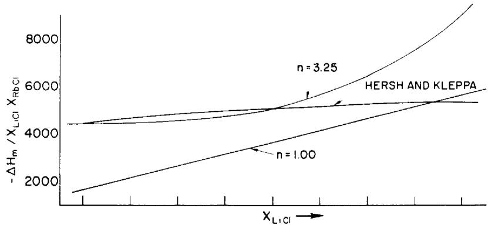

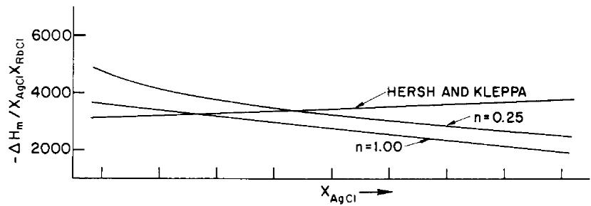

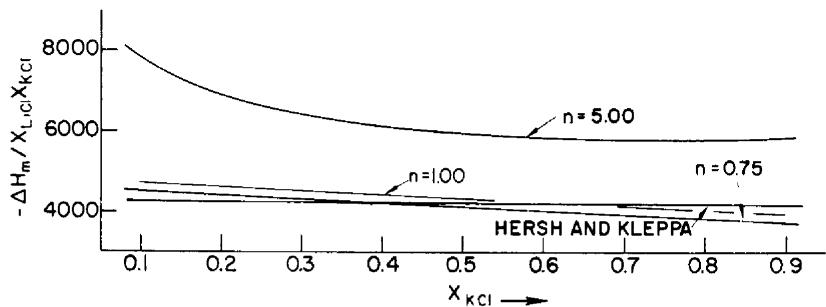  
Fig. 1. Molar Enthalpy of Mixing as Calculated from Phase Diagram<sup>34</sup> Data and as Determined Experimentally by Hersh and Kleppa<sup>34</sup>.

Table VI. Data for LiCl-KCl System. $\Delta G^{XS}$ (LiCl) calculated with Equation (43) and the parameters of Table V.   

<table><tr><td rowspan="2">Temp. oK</td><td rowspan="2">LiCl-rich Liquidus XKCl</td><td colspan="4">ΔG×s LiCl = x2KCl [a + bXnLiCl]</td></tr><tr><td>n=0.75</td><td>n=1.00</td><td>n=5.00</td><td>Liquidus data</td></tr><tr><td>630</td><td>0.405</td><td>-673</td><td>-674</td><td>-674</td><td>-675</td></tr><tr><td>660</td><td>0.371</td><td>-566</td><td>-564</td><td>-564</td><td>-564</td></tr><tr><td>700</td><td>0.321</td><td>-425</td><td>-424</td><td>-424</td><td>-426</td></tr><tr><td>740</td><td>0.267</td><td>-295</td><td>-295</td><td>-295</td><td>-298</td></tr><tr><td>780</td><td>0.208</td><td>-179</td><td>-180</td><td>-180</td><td>-182</td></tr><tr><td>820</td><td>0.142</td><td>-84</td><td>-84</td><td>-84</td><td>-81</td></tr><tr><td></td><td>KCl-rich Liquidus XKCl</td><td colspan="4">ΔG×s KCl = x2LICl [a + bXn-1LiCl (xLICl - n/n+1)]</td></tr><tr><td>630</td><td>0.412</td><td>-1174</td><td>-1176</td><td>-1182</td><td>-1209</td></tr><tr><td>670</td><td>0.445</td><td>-1021</td><td>-1021</td><td>-1023</td><td>-1022</td></tr><tr><td>710</td><td>0.483</td><td>-862</td><td>-961</td><td>-861</td><td>-847</td></tr><tr><td>750</td><td>0.526</td><td>-703</td><td>-703</td><td>-700</td><td>-686</td></tr><tr><td>790</td><td>0.576</td><td>-544</td><td>-544</td><td>-541</td><td>-542</td></tr><tr><td>820</td><td>0.618</td><td>-428</td><td>-430</td><td>-426</td><td>-445</td></tr></table>

Miscibility Gap Systems. Some variation in the above procedure was employed in calculating the parameters for several miscibility gap systems. In the following development the solution on the A-rich side of the gap is referred to as the I or prime phase and the solution on the B-rich side as the II or double prime phase. Only systems in which phases I and II have the same structure are considered. Therefore the free energy of transition term in Eq. (13) is zero and it may be written as

$$
\Delta \bar {G} _ {i} ^ {\times s, 1} - \Delta \bar {G} _ {i} ^ {\times s, 1 ^ {\prime}} = R T \ln X _ {i} ^ {\prime \prime} / X _ {i} ^ {\prime}. \tag {45}
$$

The substitution of Eqs. (4la) and (4lb) in this Equation gives

$$
a A _ {B} + b B _ {B} = R T \ln x _ {A} ^ {\prime \prime} / x _ {A} ^ {\prime} \tag {46}
$$

and

$$
a A _ {A} + b B _ {A} = R T \ln X _ {B} ^ {\prime \prime} / X _ {B} ^ {\prime} \tag {47}
$$

where $A_{B} = (X_{B}^{2})^{\prime} - (X_{B}^{2})^{\prime \prime},$ $B_{B} = (x_{B}^{2})(x_{A}^{n})^{\prime} - (x_{B}^{2})^{\prime \prime}(x_{A}^{n})^{\prime \prime}$

and

$$
A _ {A} = \left(X _ {A} ^ {2}\right) ^ {\prime} - \left(X _ {A} ^ {2}\right) ^ {\prime \prime}, \quad B _ {A} = \left[ X _ {A} ^ {n + 1} \left(X _ {A} - \frac {n}{n + 1}\right) \right] ^ {\prime} - \left[ X _ {A} ^ {n + 1} \left(X _ {A} - \frac {n}{n + 1}\right) \right] ^ {\prime \prime}.
$$

The X values represent mole fractions taken from the A-rich and B-rich phase boundaries at a common temperature or temperature horizontal on the phase diagram.

Phase boundary data taken from Hansen and Anderko $^{35}$ and Elliot $^{36}$ are given in Table VII for the systems investigated. The gold-nickel data are for the solid miscibility gap boundaries while the other four sets of data are for liquid miscibility boundaries. The temperature spans for the Cd-Ga and Cu-Pb systems are quite narrow and only three data points were employed for each system in the calculations described below.

Table VII. Miscibility Gap Data   

<table><tr><td colspan="4">System</td><td colspan="3">System</td></tr><tr><td rowspan="2">\( ^{a}_{K} \)</td><td>A</td><td>B</td><td rowspan="2">\( ^{b}_{B} \)</td><td rowspan="2">\( ^{c}_{K} \)</td><td>A</td><td>B</td></tr><tr><td colspan="2">\( X_{B}^{\prime} \)</td><td colspan="2">\( X_{B}^{\prime} \)</td></tr><tr><td></td><td colspan="2">Au - Ni</td><td></td><td colspan="3">Cd - Ga</td></tr><tr><td>623</td><td>0.085</td><td>0.987</td><td>555</td><td>0.227</td><td>0.725</td><td></td></tr><tr><td>723</td><td>0.130</td><td>0.980</td><td>560</td><td>0.265</td><td>0.715</td><td></td></tr><tr><td>823</td><td>0.185</td><td>0.970</td><td>565</td><td>0.350</td><td>0.630</td><td></td></tr><tr><td>923</td><td>0.290</td><td>0.950</td><td></td><td></td><td></td><td></td></tr><tr><td>1023</td><td>0.480</td><td>0.900</td><td></td><td></td><td></td><td></td></tr><tr><td></td><td colspan="2">Pb - Zn</td><td></td><td colspan="3">Cu - Pb</td></tr><tr><td>692</td><td>0.060</td><td>0.997</td><td>1227</td><td>0.147</td><td>0.670</td><td></td></tr><tr><td>773</td><td>0.090</td><td>0.991</td><td>1238</td><td>0.173</td><td>0.619</td><td></td></tr><tr><td>873</td><td>0.160</td><td>0.981</td><td>1258</td><td>0.236</td><td>0.499</td><td></td></tr><tr><td>973</td><td>0.300</td><td>0.949</td><td></td><td></td><td></td><td></td></tr><tr><td>1071</td><td>0.720</td><td>0.720</td><td></td><td colspan="3">Bi - Zn</td></tr><tr><td></td><td></td><td></td><td>692.5</td><td>0.370</td><td>0.994</td><td></td></tr><tr><td></td><td></td><td></td><td>723</td><td>0.421</td><td>0.988</td><td></td></tr><tr><td></td><td></td><td></td><td>773</td><td>0.520</td><td>0.975</td><td></td></tr><tr><td></td><td></td><td></td><td>823</td><td>0.625</td><td>0.944</td><td></td></tr><tr><td></td><td></td><td></td><td>850</td><td>0.690</td><td>0.920</td><td></td></tr></table>

At any given temperature both Eqs. (46) and (47) must be satisfied. Consequently, it was possible to write six relations for the systems with only three data points. A larger number was possible for the other systems. The value of $n$ was arbitrarily varied from 0 to 6.0 in increments of 0.2 and $\alpha$ , $\beta$ , $\alpha'$ and $\beta'$ calculated. Except for the Bi-Zn system it was again observed that the $n$ value which gave the lowest standard deviation for the input data (RT ln $X_{i}'' / X_{j}'$ for Eqs. (46) and (47)) did not yield relations which best described the enthalpy data. Fairly good results were

obtained by assuming a and b to be temperature independent and determining the n value which gave a minimum overall deviation for the complete set of data. This n and mean a and b values were taken to represent the best fit for the input data at the mean temperature. Then employing this value of n, mean values of a and b were computed from the data below the overall mean temperature and from the data above this mean temperature. For the Cd-Ga and Cu-Pb systems the middle temperature was employed in each set of data. This yielded three values of each parameter, a and b, and three mean temperatures for the three groupings of the phase diagram data. The temperature dependence of a was then estimated graphically. A straight line passing through the overall mean a,T point and with a slope which was the mean of the slopes of the two straight lines connecting this central point with the other two a,T points was taken to be the most appropriate representation of the temperature dependence of a or of the corresponding values of $\alpha$ and $\beta$ . The parameters $\alpha'$ and $\beta'$ were determined by the same procedure. The results of these calculations are given in Table VIII. The set of parameters for the Bi-Zn system was determined by the first procedure described above. The thermodynamic properties calculated with these parameters for this system and similar data for the other systems are compared with literature data in Figs. 2-4. The agreement is seen to be reasonably good. The calculated critical temperatures are 1300, 1140, 860, 580, and $1200^{\circ}\mathrm{K}$ for the Au-Ni, Pb-Zn, Bi-Zn, Cd-Ga and Cu-Pb systems respectively, which compare with the literature values of 1085, 1070, 878, 568 and $1203^{\circ}\mathrm{K}$ , respectively. The agreement is rather poor for the first two systems.

$$
\Delta \bar {G} _ {A} ^ {X S} = X _ {B} ^ {2} (a + b X _ {A} ^ {n})
$$

Table VIII. Parameters Determined from Miscibility Boundary Data   

<table><tr><td colspan="2">Components</td><td colspan="3">Parameters</td></tr><tr><td>A</td><td>B</td><td>n</td><td>a</td><td>b</td></tr><tr><td>Au</td><td>Ni</td><td>1.2</td><td>6130 - 0.582T</td><td>-365 - 6.386T</td></tr><tr><td>Pb</td><td>Zn</td><td>0.2</td><td>9424 + 0.977T</td><td>-3908 - 3.732T</td></tr><tr><td>Bi</td><td>Zn</td><td>0.2</td><td>12896 - 5.256T</td><td>-14200 + 5.768T</td></tr><tr><td>Cd</td><td>Ga</td><td>4.7</td><td>2571</td><td>5339</td></tr><tr><td>Cu</td><td>Pb</td><td>3.8</td><td>5525</td><td>30424 - 17.27T</td></tr></table>

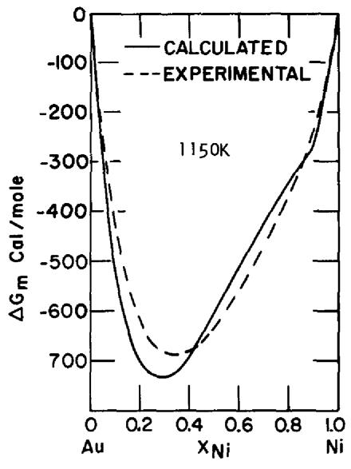

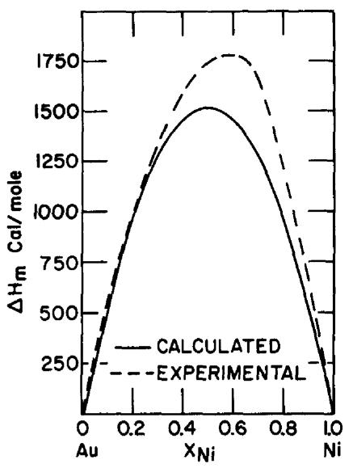

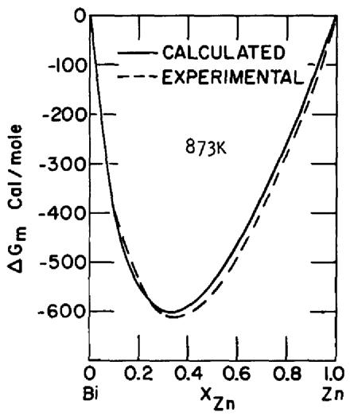

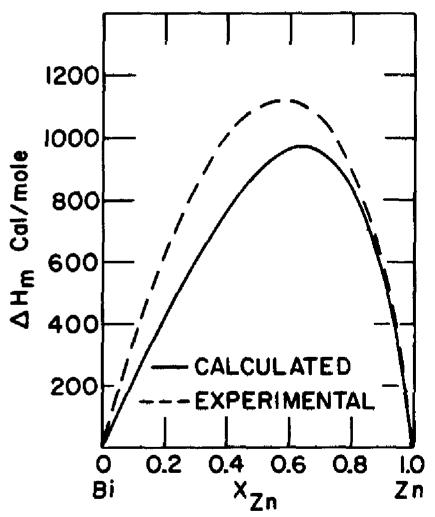  
Fig. 2. Molar Free Energy and Enthalpy of Mixing for the Gold-Nickel and Bismuth-Zinc Systems.

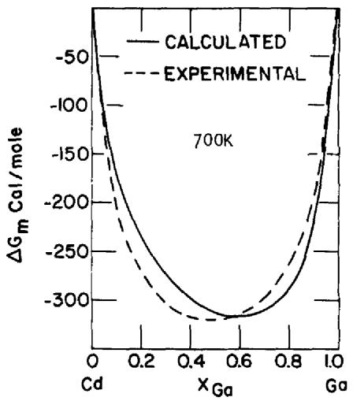

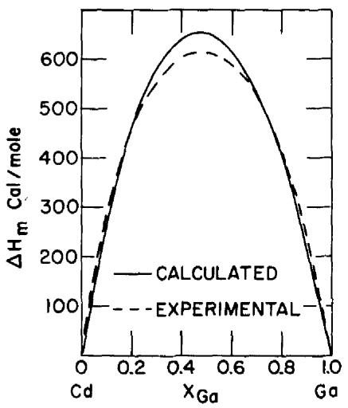

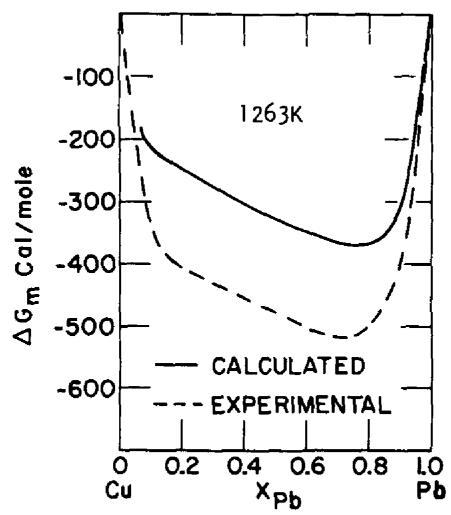

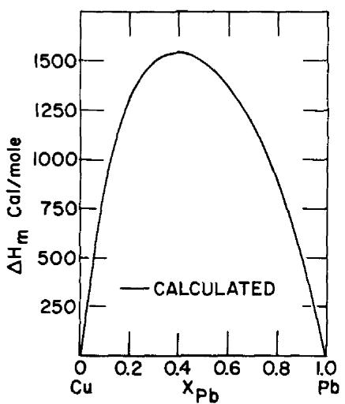  
Fig. 3. Molar Free Energy and Enthalpy of Mixing for the Cadmium-Gallium and Copper-Lead Systems.

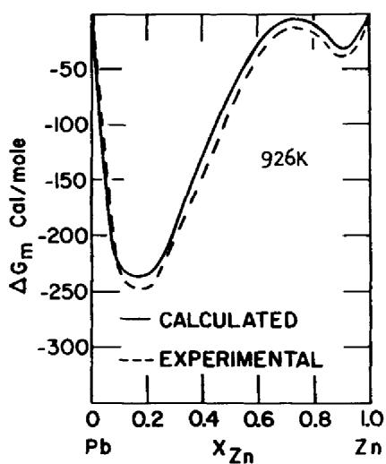

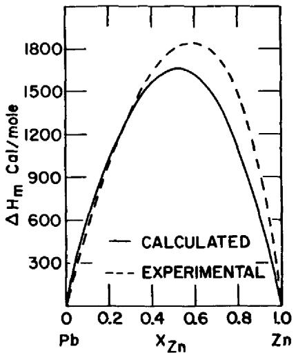  
Fig. 4. Molar Free Energy and Enthalpy of Mixing for the Lead-Zinc System.

# SUMMARY AND CONCLUSIONS

The thermodynamic properties of equilibrium phases are related to the phase diagram boundaries but cannot be evaluated from phase boundary data alone. The basic relations (11), (13) and (14) are helpful in correlating experimental thermodynamic data with binary, constant pressure, phase boundary data. Simplifications are possible for various boundary conditions which are encountered in different types of phase diagrams or phase boundaries. Considerable thermodynamic information may be calculated for the liquid phase in simple eutectic systems from the liquidus curve data and the properties of the pure components. Calculations for other binary systems are reviewed.

If a parametric equation is known to describe the temperature-composition dependence of the relative partial molar excess free energy of one of the components, then in principle it is possible to calculate the parameters from phase boundary data and to completely describe the thermodynamic properties of the phases involved. It was shown that the relation

$$
\Delta \bar {G} _ {A} ^ {x s} = x _ {B} ^ {2} (a + b x _ {A} + c x _ {A} ^ {2}),
$$

in which a, b, and c are linear functions of temperature, can adequately describe the known excess free energy, enthalpy and entropy for a large number of binary solutions. There are six parameters to be determined. The evaluation of these parameters from phase diagram data was not pursued in detail in this investigation. However, considerable work was done in evaluating the parameters in the relation

$$
\Delta \bar {G} _ {A} ^ {x s} = X _ {B} ^ {2} (a + b X _ {A} ^ {n})
$$

which also has been found to adequately describe a number of binary solutions. Here $a$ and $b$ are linear functions of temperature and the exponent $n$ is assumed to be a constant. With this relation it is necessary to determine only five parameters. The application of this relation to the calculation of the thermodynamic properties for the liquid phase of several eutectic salt systems and eutectic metal systems was investigated. Parameters could be found which closely reproduced the input $\Delta G_{A}^{XS}$ and $\Delta G_{B}^{XS}$ values calculated from the liquidus $T, X$ data. However, no reliable criterion was found which adequately reproduced the known enthalpy or entropy data. The free energy was not particularly sensitive to the choice of $n$ and could be closely reproduced with a wide range of parameters. This is not particularly surprising in view of the relation

$$
\Delta \bar {G} _ {i} ^ {x s} = \Delta \bar {H} _ {i} - T \Delta \bar {S} _ {i} ^ {x s}
$$

from which it is seen that $\Delta \bar{G}_i^{XS}$ can be satisfied by infinite sets of $\Delta \bar{H}_i$ and $\Delta \bar{S}_i^{XS}$ values. At constant composition $\Delta \bar{H}_i$ and $\Delta \bar{S}_i^{XS}$ are

both insensitive to small temperature changes.   
The same problems were encountered in evaluating parameters from liquid or solid miscibility gap data. However, results were sufficiently encouraging to warrant further investigations.   
The calculated enthalpy or entropy values are sensitive to computational procedures. The computations carried out in the present work were based on the use of Eq. (13). At least one of the parameters can be eliminated by combination of Eqs. (13) and (11). Equation (11) also involves phase boundary slopes which are more directly related to the enthalpy or entropy values. These possibilities and the Eqs. (42) are being investigated.

# REFERENCES

1. J. E. Ricci, The Phase Rule and Heterogeneous Equilibrium, D. Van Nostrand Co., Inc., New York, (1951), p. 30.   
2. G. Tammann, Text Book of Metallography, Translation by R. S. Dean and L. G. Swenson, Chemical Catalog Co., New York, 1925, pp. 166-178.   
3. J. H. Hildebrand and R. L. Scott, The Solubility of Nonelectrolytes, Reinhold Publishing Corp., (1950).   
4. J. Lumsden, Thermodynamics of Alloys, The Institute of Metals, London, (1952).   
5. M. A. Krupkowski, Bull. Intern. Suppl. Polska Akad. Umiejet-nosci, Krakow, Ser. A. Vol. 1-4, pp. 15-45 and 219-235, (1950-51).   
6. E. A. Guggenheim, Thermodynamics, 5th ed., North Holland Publishing Co., Amsterdam, 1967, p. 196.   
7. C. Wagner, Thermodynamics of Alloys, pp. 47-53, Addison-Wesley Press, Inc., Cambridge, Mass., (1952).   
8. R. H. Perry, C. H. Chilton and S. D. Kirkpatrick, editors, Chemical Engineers' Handbook, 4th ed., Section 13, pp. 8-13, McGraw-Hill Book Co., Inc., New York, (1963).   
9. Kurt Wohl, Trans. Amer. Inst. Chem. Engrs., 42 215 (1946).   
10. O.J. Kleppa, in Liquid Metals and Solidification, pp. 56-86, American Society for Metals, Cleveland, Ohio, (1958).   
11. R. A. Oriani and C. B. Alcock, Trans. Met. Soc. AIME 224, 1104 (1962).

12. E. T. Turkdogan and L. S. Darken, Trans. Met. Soc. AIME 242, 1997 (1968).   
13. (a) M. F. Simmons, Correlation of Thermodynamic Data with Binary Eutectic-Type Phase Diagrams, M.S. thesis, Iowa State University Library, Iowa State University, Ames, Iowa. 1966. (b) USAEC Report IS-1500, National Bureau of Standards, U.S. Department of Commerce, Springfield, Virginia, (1966), p. M-23.   
14. B. E. Sundquist, Trans. Met. Soc. AIME, 236, 111 (1966).   
15. R. Hiskes and W. A. Tiller, Mater. Sci. Eng., 2, 320 (1967/68).   
16. P. S. Rudman, Thermodynamic Analysis and Synthesis of Phase Diagrams, to be published in Advances in Materials Research, Vol. 1V, John Wiley and Sons, New York, N.Y., 1969.   
17. M. Blander and L. E. Topol, Inorganic Chem., 5, 1641 (1966).   
18a. G. N. Lewis and M. Randall, Thermodynamics and the Free Energy of Chemical Substances, 1st edition, McGraw-Hill Book Co., New York, N.Y., 1923, p. 205.   
18b. A. T. Williamson, Trans. Faraday Soc. 421 (1944).   
18c. J. G. Kirkwood and I. Oppenheim, Chemical Thermodynamics, McGraw-Hill Book Company, New York, N.Y., 1961.   
18d. H. F. Franzen and B. C. Gerstein, A.I.Ch.E. Journal 12 364 (1966).   
19. L. Kaufman, Acta Met. 7, 575 (1959).   
20. P. Roy and L. Kaufman, Acta Met. 13, 1277 (1965).   
21. 0. Kubaschewski and E. LL. Evans, Metallurgical Thermochemistry, 3rd ed., Pergamon Press, New York, N.Y., 1958, pp. 187-192.   
22. C. Wagner, Acta Met. 2, 242 (1954).   
23. L. S. Darken and R. W. Gurry, Physical Chemistry of Metals, McGraw-Hill Co., Inc., New York, 1953, p. 330.   
24. C. Wagner, Acta Met. 6, 309 (1958).   
25. P. Chiotti and R. J. Hecht, Trans. Met. Soc. AIME, 239, 536 (1967).   
26. P. Chiotti and J. T. Mason, Trans. Met. Soc. AIME

27. R. Hultgren, R. L. Orr, P. D. Anderson and K. K. Kelley, Selected Values of Thermodynamic Properties of Metals and Alloys, John Wiley and Sons, Inc., New York, N.Y., 1963.   
28. J. W. Mellor, Higher Mathematics, Dover Publications, Inc., 1955, 4th ed., p. 557.   
29. L. S. Darken, Trans. Met. Soc. AIME 239, 80 (1967).   
30. M. Blander, Thermodynamic Properties of Molten-Salt Solutions, USAEC Report ORNL-3293, 1962.   
31. A. Glassner, Thermochemical Properties of Oxides, Fluorides and Chlorides to $2500^{\mathrm{OK}}$ , USAEC Report ANL-5750, 1957.   
32. E. Chu and J. J. Egan, New York Academy of Sciences Annals 79, No. 11, 908 (1960).   
33. C. E. Wicks and F. E. Block, Thermodynamic Properties of 65 Elements: Their Oxides, Carbides and Nitrides, U.S. Bureau of Mines Bulletin 605, 1963.   
34. L. S. Hersch and O. J. Kleppa, J. Chem. Phys. 42, 1309 (1965).   
35. M. Hansen and K. Anderko, Constitution of Binary Alloys, 2nd ed., McGraw-Hill Book Co., New York, N.Y., 1958.   
36. R. P. Elliot, Constitution of Binary Alloys, First Supplement, McGraw-Hill Book Co., New York, N.Y., 1965.

# TIERMODYNAMIC ANALYSIS AND SYNTHESIS OF PHASE DIAGRAMS

Peter S. Rudman

Department of Physics

Technion - Israel Institute of Technology

Haifa, Israel

Computer calculations for synthesis, the deriving of phase diagrams from solution thermodynamic data are described. Computer calculations for analysis, the deriving of solution thermodynamics from phase diagrams, are described. Consideration is limited to substantially disordered, binary systems. Examples of calculations for the Au-Ni, Al-Sn and Ag-Au systems are presented.

# Introduction

Let us consider the widely used free energy-common tangent construction for determining phase limits in a binary system. In Fig.1 are schematically presented such curves at some temperature $T_{\mathrm{f}}$ for equilibria among the phases $\alpha, \beta$ and $\gamma$ in the binary system A-B. Also presented is a phase diagram which is consistent with the free energy curves at $T_{\mathrm{f}}$ . Clearly, at each temperature where we know the free energies of each phase we can construct the phase limits. We shall call this procedure synthesis.

The free energies $\mathbf{E}_{\alpha}$ , $\mathbf{F}_{\alpha}$ and $\mathbf{F}_{\gamma}$ are defined for all compositions while the phase diagram defines only a limited number of discrete compositions at each temperature. Thus at each temperature the thermodynamic information content of a phase diagram is much less than we need to know. However, possibly this information content can be increased sufficiently by considering many temperatures to allow the derivation of the thermodynamic functions. We shall call this procedure analysis.

The synthesis and analysis computations are tedious and not practical without an electronic computer. Herein we shall formulate the thermodynamic equations, discuss their solution, and present some examples of computer syntheses and analyses for the real systems Au-Ni, Al-Sn and Ag-Au. A detailed report of this work, including computer programs, is being published elsewhere (1).

# Thermodynamic Formulation

To perform both the synthesis and analysis operations it is necessary to analytically express the free energy as a function of composition and temperature. We shall generate all of the necessary thermodynamic functions from a relative integral molar free energy of the form

$$
F ^ {M} = (1 - x) \Delta F _ {A} + x \Delta F _ {B} + F ^ {X S} - T S ^ {I D}, \tag {1}
$$

where

$$
\begin{array}{l} \Delta F _ {A} ^ {\bullet} \left(\Delta F _ {B}\right) = \text {f r e e e n e r g y o f t r a n s f o r m a t i o n o f p u r e A (B)} \\ S ^ {I D} = \text {i d e a l i n t e g r a l m o l a r c o n f i g u r a t i o n a l e n t r o p y}, \\ F ^ {X S} = \text {e x c e s s i n t e g r a l m o l a r f r e e e n e r g y}. \\ \end{array}
$$

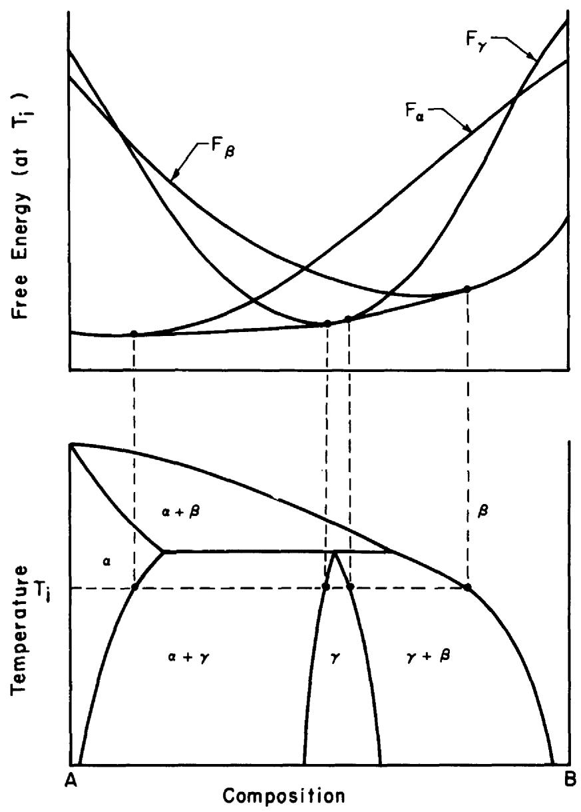  
1. Phase Diagram Graphical Synthesis by Free Energy-Common Tangent Construction

Eq.(1) is clearly best applicable to systems that are substantially disordered and present consideration has been so limited. The crucial step in employing Eq.(1) is the choice of the analytical form for $F^{XS}$ . We shall limit consideration to expansions of the form

$$
\mathbf {F} ^ {\mathrm {X S}} = \mathbf {x} (1 - \mathbf {x}) \sum_ {\mathrm {m} = 0} ^ {\mathrm {M} _ {\mathrm {x}}} \mathrm {a} _ {\mathrm {m}} ^ {\mathrm {F}} \mathbf {x} ^ {\mathrm {m}}, \tag {2}
$$

where

$$
a _ {m} ^ {F} = m \text {t h e x p a n s i o n c o n s t a n t .}
$$

Thus $(M_{\mathbf{x}} + 1)$ expansion constants are employed to define the composition dependence of $F^{\star S}$ at each temperature.

Eq.(2) is not a very original choice. It is essentially the expansion introduced by Margules in 1895 and it is by far the most widely employed form today. The usefulness of Eq.(2) derives from the fact that it generally well represents the data with a small number of constants. It is particularly important in analysis to minimize the number of expansion constants. There is no proof that Eq.(2) possesses the minimum number of constants nor that it is the best of all possible forms. Indeed many other expansion forms have been employed (2-4) for thermodynamic data extrapolation, but whether or not they possess any advantage for analysis remains to be tested.

The temperature dependence of $\mathbf{F}^{\mathrm{XS}}$ enters through the expansion constants $a_{m}^{F}(T)$ . Perhaps the most logical procedure is to similarly expand the $a_{m}^{F}$ s in a power series in $T$ , and this is in fact just what Hiskes and Tiller (5) have done. However, in order to more readily relate to thermodynamic data tabulations we have based our temperature expansion on the relation

$$
F ^ {X S} = H _ {o} ^ {M} - T S _ {o} ^ {X S} + \int_ {T _ {o}} ^ {T} C ^ {X S} d T - T \int_ {T _ {o}} ^ {T} (C ^ {X S} / T) d T, \tag {3}
$$

where

$$
\mathrm {T} _ {\circ} = \text {r e f e r e n c e t e m p e r a t u r e},
$$

$$
\mathrm {H} _ {\circ} ^ {\mathrm {M}} \left(\mathrm {S} _ {\circ} ^ {\mathrm {X S}}\right) = \text {e x c e s s e n t h a l p y (e n t r o p y) a t T} _ {\circ},
$$

$$
G ^ {X S} = \text {e x c e s s s p e c i f i c h e a t}.
$$

The expansion of $C^{\mathrm{XS}}$ in $\mathbf{T}$ determines to a large extent

the generality of the application. In principle by employing a sufficiently general expansion for $C^{\mathrm{XS}}(T)$ we could include systems with specific heat anomalies (Curie points, order-disorder transformations,...). However, at this stage of progress we are having sufficient problems with simple systems and we have not tried to apply the calculations to systems where the specific heat is a function of temperature. It thus follows from Eq.(3) that the most general form for the temperature dependence of the expansion constants that we have used is

$$
\mathbf {a} _ {\mathrm {m}} ^ {\mathrm {F}} = \mathbf {a} _ {\mathrm {m}} ^ {\mathrm {H} ^ {\circ}} = \mathbf {T a} _ {\mathrm {m}} ^ {\mathrm {S} ^ {\circ}} + \mathbf {T} ^ {\prime} \mathbf {a} _ {\mathrm {m}} ^ {\mathrm {C}}, \tag {14}
$$

where

$$
\begin{array}{l} T ^ {\prime} = (T - T _ {0}) - T \ell n (T / T _ {0}), \\ \begin{array}{l} a _ {m} ^ {H ^ {\circ}}, a _ {m} ^ {S ^ {\circ}}, a _ {m} ^ {C} = \text {t e m p e r a t u r e i n d e p e n d e n t e x p a n s i o n} \\ \text {c o n s t a n t s f o r H _ {o} ^ {M} , S _ {o} ^ {X S} , a n d C ^ {X S} i n} \\ \text {e x p a n s i o n s o f t h e f o r m o f E q . (2) .} \end{array} \\ \end{array}
$$

When only the first $(M_{\mathbb{T}} + 1)$ terms in Eq.(4) are nonzero, we say that we have carried out an expansion to Order $(M_{\mathbb{T}})$ . We similarly define the complete composition-temperature expansion as of Order $(M_{\mathbf{x}}, M_{\mathbb{T}})$ , and which will require $(M_{\mathbf{x}} + 1)(M_{\mathbb{T}} + 1)$ expansion constants. In Table 1 the present notation is related to various nomenclatures that have frequently been used to describe solution thermodynamics behavior.

Table 1. Solution Thermodynamics Nomenclature   

<table><tr><td>Conventional</td><td>Present Notation</td><td>Nos. Expan. Const. (Mx+1) (MT+1)</td></tr><tr><td>Ideal</td><td>Order(-1,0)</td><td>0</td></tr><tr><td>Regular- 
Quasi-Chem.</td><td>Order(0,0)</td><td>1</td></tr><tr><td>Sub-regular</td><td>Order(1,0)</td><td>2</td></tr><tr><td>Regular</td><td>Order(Mx,0)</td><td>Mx+1</td></tr><tr><td>(Most general 
expansion of 
present scheme)</td><td>Order(Mx,2)</td><td>3(Mx+1)</td></tr></table>

The difficulty of the calculations by pre-computer methods is perhaps best exemplified by the fact that it has long been appreciated that an Order(1,1) expansion generally provides the minimum realistic description for a binary alloy system, but neither syntheses nor analyses have been reported for non-regular solutions, that is, for $\mathbf{M}_{\mathrm{T}} > 0$

To complete the description of the temperature dependence of the free energy function of Eq.(1), we analogously employ

$$
\Delta F _ {A} = \Delta H _ {A} ^ {t} (1 - T / T _ {A} ^ {t}) + T _ {A} \Delta C _ {A}, \tag {5}
$$

where

$$
\begin{array}{l} \Delta H _ {A} ^ {t} = \text {e n t h a l p y o f t r a n s f o r m a t i o n o f p u r e A} = (H _ {A} (\text {p h a s e s t r u c t u r e}) - H _ {A} (\text {r e f . s t r .})) _ {T = T _ {A} ^ {t}}, \\ \Delta C _ {A} = \text {c h a n g e i n s p e c i f i c h e a t o f p u r e A o n t r a n s .}, \\ T _ {A} ^ {t} = \text {e q u i l i b r i u m t r a n s f o r m a t i o n t e m p . f o r p u r e A ,} \\ T _ {A} ^ {\prime} = (T - T _ {A} ^ {t}) - T \ln (T / T _ {A} ^ {t}). \\ \end{array}
$$

Analogous expressions hold for the transformation of B.

# Synthesis

The miscibility gap is the simplest system to treat since it involves the thermodynamics of a single phase only. Consider the miscibility gap of Fig.2a: we wish to calculate the gap limits $\mathbf{x}_1$ and $\mathbf{x}_2$ at arbitrary $T$ .

The usual graphical common tangent method is illustrated in Fig.2b. Another method of solution is by simultaneously solving the pair of partial molar free energy equations:

$$
\begin{array}{l} F _ {A} ^ {M} \left(x _ {1}, T\right) - F _ {A} ^ {M} \left(x _ {2}, T\right) = 0, (6a) \\ F _ {B} ^ {M} \left(x _ {1}, T\right) - F _ {B} ^ {M} \left(x _ {2}, T\right) = 0 (6b) \\ \end{array}
$$

At each $T$ we thus have two equations in the two unknowns $x_1$ and $x_2$ . A graphical solution is illustrated in Fig.2c.

In order to numerically solve Eqs.(6) we must first explicitly express the partial molar free energies in terms of the expansions given previously. This is readily accomplished by employing the well known

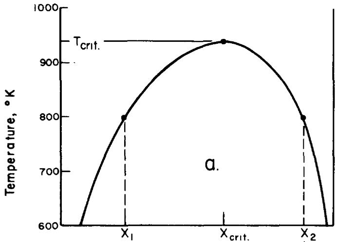

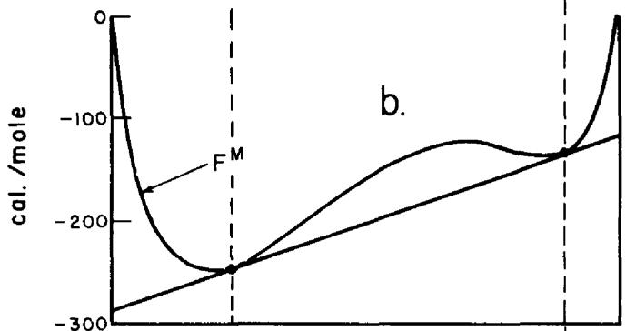

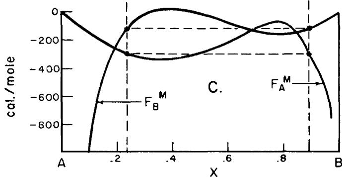  
2. Miscibility Gap Graphical Synthesis by Free Energy-Common Tangent and Partial Molar Free Energy Constructions

$$
F _ {A} ^ {X S} = F ^ {X S} - x \partial F ^ {X S} / \partial x, \tag {7a}
$$

$$
F _ {B} ^ {X S} = F ^ {X S} + (1 - x) \partial F ^ {X S} / \partial x, \tag {7b}
$$

yielding

$$
F _ {A} ^ {X S} = x ^ {2} \sum_ {m = 0} ^ {M} (m + 1) \left(a _ {m} ^ {F} - a _ {m + 1} ^ {F}\right) x ^ {m}, \tag {8a}
$$

$$
F _ {B} ^ {X S} = (1 - x) ^ {2} \sum_ {\mathrm {m} = 0} ^ {\mathrm {M}} (\mathrm {m} + 1) a _ {\mathrm {m}} ^ {F} x ^ {\mathrm {m}}. \tag {8b}
$$

Analogously the ideal partial molar free energies are readily generated yielding

$$
F _ {A} ^ {I D} = R T \ln (1 - x), \tag {9a}
$$

$$
F _ {B} ^ {I D} = R T \ln x. \tag {9b}
$$

By definition we have

$$
F _ {A} ^ {M} = F _ {A} ^ {X S} + F _ {A} ^ {I D}, \tag {10a}
$$

$$
F _ {B} ^ {M} = F _ {B} ^ {X S} + F _ {B} ^ {I D}. \tag {10b}
$$

Our procedure is to take the experimental thermodynamic data, least squares fit it to expansions of the form given previously and generate the $(\mathbf{M}_{\mathbf{x}} + 1)(\mathbf{M}_{\mathbf{T}} + 1)$ expansion constants, and then to solve the simultaneous pair, Eqs. (6), for $\mathbf{x}_1$ and $\mathbf{x}_2$ for various assumed temperatures. The simultaneous pair is transcendental and cannot be solved by elementary means but they are readily solved by a computer by numerical procedures.

In Fig.3 is shown the miscibility gap in the Au-Ni system. The experimental gap(6) and the gap synthesized from thermodynamic data(7) can be compared. It is quite clear that there is an inconsistency but is not our purpose here to attempt to evaluate the source of error.

Let us now consider the general case of synthesis of equilibria between phases of different structures: phase 1 and phase 2. Again the boundary compositions $x_1$ and $x_2$ are determined by the simultaneous solution of a pair of partial molar free energy equations which we now write as

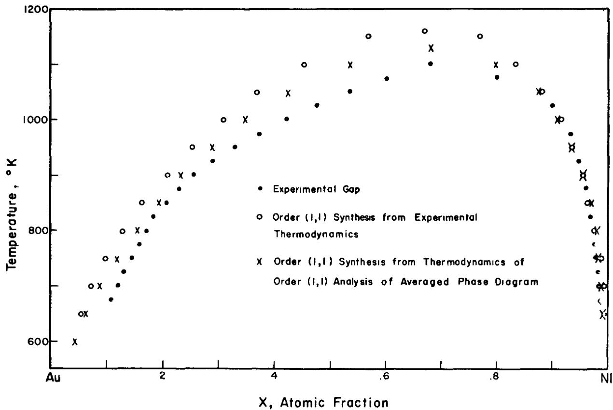  
3. The Au-Ni Miscibility Gap

$$
F _ {A 1} ^ {M} \left(x _ {1}, T\right) - F _ {A 2} ^ {M} \left(x _ {2}, T\right) = 0, \tag {11a}
$$

$$
F _ {B 1} ^ {M} \left(x _ {1}, T\right) - F _ {B 2} ^ {M} \left(x _ {2}, T\right) = 0. \tag {11b}
$$

If we adopt the structure of phase 1 as the reference structure, then the partial molar free energies take the form: For phase 1

$$
F _ {A 1} ^ {M} = F _ {A 1} ^ {X S} + F _ {A} ^ {I D}, \tag {12a}
$$

$$
F _ {B 1} ^ {M} = F _ {B 1} ^ {X S} + F _ {B} ^ {I D}. \tag {12b}
$$

For phase 2

$$
F _ {A 2} ^ {M} = F _ {A 2} ^ {X S} + F _ {A} ^ {I D} + \Delta F _ {A}, \tag {13a}
$$

$$
F _ {B 2} ^ {M} = F _ {B 2} ^ {X S} + F _ {B} ^ {I D} + \Delta F _ {B}. \tag {13b}
$$

$F_{A1}^{XS}$ ( $F_{A2}^{XS}$ ) is given by Eq.(8a) with the expansion constants appropriate for phase 1 (phase 2) and $F_{B1}^{XS}$ ( $F_{B2}^{XS}$ ) is given by Eq.(8b) with the expansion constants appropriate for phase 1 (phase 2). $F_{A}^{ID}$ and $F_{B}^{ID}$ are given by Eqs.(9), and $\Delta F_{A}$ ( $\Delta F_{B}$ ) are given by Eqs.(5).

In Fig.4 is shown the liquid/solid equilibrium for the Ag-Au system with both the experimentally determined boundaries and the boundaries that we have computer synthesized from thermodynamic data(7). The liquidus' agree fairly well but the solidus' differ badly. Again we shall not attempt to find the origin of the discrepancy.

There is a particular case of equilibria with a structure change that we must consider separately: when one of the terminal solubilities approaches zero. Let us take phase 1 as the zero solubility phase. Then there is effectively only one unknown, $x_{2}$ , the $(A + 2) / 2$ boundary. As $x_{1} \rightarrow 0$ , $F_{B}^{ID} \rightarrow -\infty$ , so that from Eq.(12b) $F_{B1}^{M}$ becomes indeterminant. Thus we eliminate Eq.(12b) from consideration and Eq.(12a) alone suffices to determine the one unknown $x_{2}$ . This reduces to solving

$$
F _ {A 2} ^ {M} = 0, \tag {14}
$$

with $\mathbf{F}_{A2}^{\mathrm{M}}$ given by Eq.(13a).

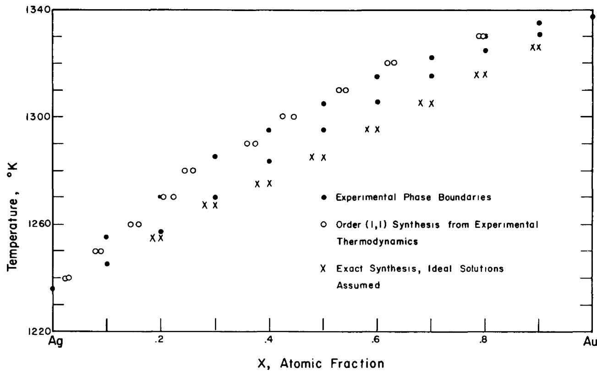  
4. The Lqd/(Lqd + fcc) and (Lqd - fcc)/fcc Phase   
Boundaries of the Ag-Au System

Fig.5 presents an example of a system of this type, the liquid/solid equilibria of the Al-Sn system. Here we find very good agreement between the experimentally determined liquidus(6) and our computer synthesis from thermodynamic data(7). While this agreement does not constitute a proof that both data are correct, it certainly raises confidence in their reliability.

# Analysis

Again as in synthesis let us first treat the simplest case, the miscibility gap. The miscibility gap limits $x_{1}^{(i)}$ and $x_{2}^{(i)}$ are known at each temperature $T^{(i)}$ . Again Eqs.(6) provide the solution but now the unknowns are the $(M_{x} + 1)(M_{T} + 1)$ expansion constants, the $a_{m}^{Q}$ 's. Since Eqs.(6) provide two equations at each temperature, solutions to Order $(M_{x}, M_{T})$ can be obtained by applying Eqs.(6) to at least $N_{\min} = (M_{x} + 1)(M_{T} + 1)/2$ different temperatures. In order to include data from an arbitrary number of temperatures $N \geq N_{\min}$ , we perform a least squares fit. At each temperature $T^{(i)}$ we let the LHS's of Eqs.(6) be $v_{1}^{(i)}$ and $v_{2}^{(i)}$ respectively. We then form

$$
D ^ {2} = \sum_ {i = 1} ^ {N} \left[ \left(v _ {1} ^ {(i)}\right) ^ {2} + \left(v _ {2} ^ {(i)}\right) ^ {2} \right], \tag {15}
$$

and $(\mathbf{M}_{\mathbf{x}} + 1)(\mathbf{M}_{\mathbf{T}} + 1)$ equations are generated by the operations

$$
\partial D ^ {2} / \partial \varepsilon_ {m} ^ {Q} = 0, \tag {16}
$$

with $\mathbf{a}_{\mathfrak{m}}^{\mathbb{Q}} = \mathbf{a}_{0}^{\mathrm{H}^{\circ}}$ through $\mathbf{a}_{\mathfrak{M}_{\mathbf{x}}}^{\mathrm{H}^{\circ}}, \mathbf{a}_{0}^{\mathrm{S}^{\circ}}$ through $\mathbf{a}_{\mathfrak{M}_{\mathbf{x}}}^{\mathrm{S}^{\circ}}$ and

C a C 10 X

The $(\mathbf{M}_{\mathbf{x}} + 1)(\mathbf{M}_{\mathbf{T}} + 1)$ equations so generated are linear in the unknowns, the aQ's, and can thus be readily solved by well developed matrix methods. However, as the number of unknowns increases we have found that the solutions tend to become erratic. A detailed study of the stability of the analysis calculation is greatly to be desired but yet to be done. Nevertheless

102   
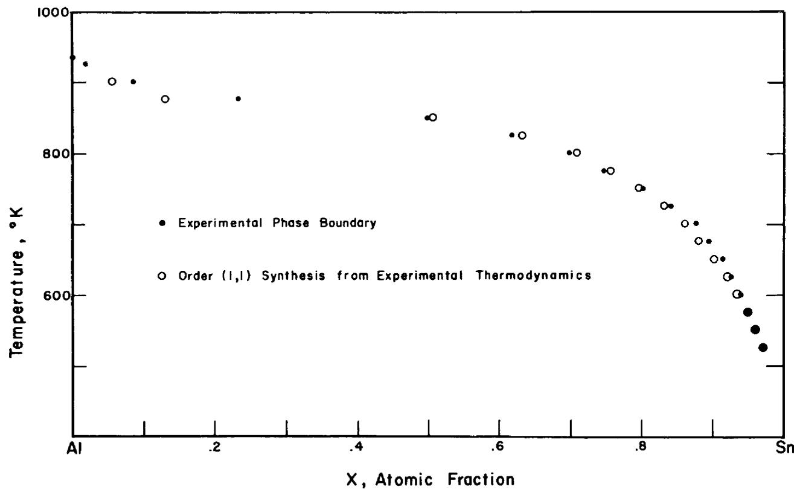  
5. The (Al + Lqd)/Lqd Phase Boundary of the Al-Sn System

in a rough and intuitive way we can sum-up our experience by defining a reliability factor R:

$$
\mathrm {R} \cong \mathrm {N} _ {\mathrm {i}} / 2 0 0 0 \mathrm {N} _ {\circ} \Delta x, \tag {17}
$$

where

$$
\begin{array}{l} \mathrm {N} _ {\mathrm {i}} = \text {n o s . p h a s e d i a g r a m c o m p o s i t i o n i n p u t s}, \\ \mathrm {N} _ {\circ} = \text {n o s . o f a n a l y s i s o u t p u t c o n s t a n t s} \\ = \left(\mathrm {M} _ {\mathrm {x}} + 1\right) \left(\mathrm {M} _ {\mathrm {T}} + 1\right) \text {f o r m i s c i b i l i t y g a p a n a l y s i s ,} \\ \end{array}
$$

$$
\Delta x = \text {e x p e r i m a l}
$$

If R $\gg 1$ , the analysis is reliable, while if R $\ll 1$ then the analysis is unreliable.

In Table 2 are presented the enthalpy and entropy data for the Au-Ni fcc solution, both from an Order(1,1) analysis of the experimentally determined gap(6) and from directly determined thermodynamic data(7). With $N_{\mathrm{i}} = 34$ , $\Delta x^{*} \cdot 005$ and $N_{\mathrm{o}} = 4$ we get from Eq.(17) that $R^{*} \cdot 85$ , that is, the analysis is on the threshold of reliability.

Table 2. The Relative Integral Molar Enthalpy and Entropy at 1150 K of fcc Au-Ni Alloys   

<table><tr><td rowspan="2">xNi</td><td colspan="2">H0, cal/mole</td><td colspan="2">SMo, cal/mole-deg</td></tr><tr><td>Exper.</td><td>Order(1,1) analysis</td><td>Exper.</td><td>Order(1,1) analysis</td></tr><tr><td>2</td><td>970</td><td>1121</td><td>1.38</td><td>1.70</td></tr><tr><td>4</td><td>1590</td><td>1879</td><td>1.98</td><td>2.43</td></tr><tr><td>6</td><td>1780</td><td>2075</td><td>2.04</td><td>2.46</td></tr><tr><td>8</td><td>1215</td><td>1515</td><td>1.38</td><td>1.76</td></tr></table>

Our previous consideration of synthesis of this system showed that the experimental thermodynamics is not consistent with the experimental phase diagram, so it is not surprising that the analysis derived thermodynamics do not agree better with experimental thermodynamics. While the discrepancy is not large, still to judge which is the most reliable is beyond our present competence.

The formal extension of analysis to equilibria between phases of different structure is a straight-

forward extension of the miscibility gap analysis. Although we have developed such computer programs, in practice the results have been unreliable. This can at least be partially understood by consideration of the reliability factor R. There will be at least twice as many constants to be determined per input point. There will in general be $(\mathbf{M}_{\mathbf{x}} + 1)(\mathbf{M}_{\mathbf{T}} + 1)$ constants for each phase and possibly a few unknowns for the transformations phase $1 \rightarrow$ phase 2 of pure A and pure B (see Eq.(5)).

Thus at the moment the general application of analysis is not possible. However, since we do not really understand the origin of the instabilities in the calculation, we have really no feeling for whether they are insurmountable or whether better algorithms and other expansions can lead to reliable solutions. It is clear that the phase diagram literature is a large and largely untaped source of valuable thermodynamic data. Thus the rewards for developing successful analysis are ⑤ eat indeed and the pursuit of further investigations into the mathematics of analysis appear to be called for.

# References

1. Rudman, P. S., "Thermodynamic Analysis and Synthesis of Phase Diagrams", Advances in Materials Research, Vol. IV, John Wiley (1969) New York.   
2. Hildebrand, J. H. and Scott, R. L., The Solubility of Nonelectrolytes, Reinhold (1950) New York.   
3. Lumsden, J., Thermodynamics of Alloys, The Institute of Metals (1952) London.   
4. Chiotti, P. and Hecht, R. J., TIS-AIME 239,536(1967).   
5. Hiskes, R. and Tiller, U. A., Hater. Sci. Eng. 2,320(1967/68).   
6. Hansen, M. and Anderko, K., Constitution of Binary Alloys, McGraw-Hill (1958) New York.   
7. Hultgren, R., Orr, R. L., Anderson, P. D. and Kelley, K. K., Thermodynamic Properties of Metals and Alloys, John Wiley (1963) New York.

# PREDICTION OF TERNARY THERMODYNAMIC PROPERTIES

AND PHASE DIAGRAMS FROM BINARY DATA*

N.J. Olson

Institute for Atomic Research and Department of Metallurgy, Iowa State University, Ames, Iowa, 50010 U.S.A.

G. W. Toop

Technical Research Centre, Cominco Ltd., Trail, British Columbia, Canada

With the use of binary data, excess molar free energy values and phase diagrams have been calculated for a number of ternary systems. The equations used are considered to be rigorous for regular ternary systems and empirical for nonregular systems. The calculations are compared with experimental results where possible. These results are found to give reasonable estimates of $\Delta F^{\mathrm{XS}}$ for the Pb-Sn-Cd, Sb-Cd-Pb, Bi-Cd-Sn, and Cd-Pb-Bi systems at $773^{\circ}\mathrm{K}$ , the CaO-SiO $_2$ -FeO system at $1873^{\circ}\mathrm{K}$ , and the Fe-Mn-Ni system at $1232^{\circ}\mathrm{K}$ . Phase diagrams have been calculated for the Pb-Sn-Zn system at $926^{\circ}\mathrm{K}$ and the Ag-Pd-Cu system at $1000^{\circ}\mathrm{K}$ .

*Work performed in part at the Ames Laboratory of the U. S. Atomic Energy Commission. Contribution No. 2549.

# Introduction

Darken's work<sup>(1)</sup> provided the pertinent beginning for the mathematical treatment of ternary thermodynamics. He showed how the Gibbs-Duhem equation may be used to calculate the excess molar free energy of a ternary system from experimental excess partial molar free energy of one component in the ternary. Later, Wagner<sup>(2)</sup>, Schuhmann<sup>(3)</sup>, and Gokcen<sup>(4)</sup> derived other useful ternary relationships dealing, essentially, with mathematically consistent solutions of the same problem.

The above approaches minimize the amount of experimental data needed to define the thermodynamic properties of a given ternary, and they may be extended to higher order, multicomponent systems. However, it would be useful to find methods for predicting the thermodynamic properties of a multicomponent system from a limited amount of data as a supplement to experimental measurements and analytical studies. This has been recognized with the considerable work that has been done to find models to predict or extend thermodynamic properties and phase diagrams, through various interpolative schemes, in binary and ternary systems[5-30].

Equations derived from Darken's work $^{(1)}$ may be used to predict ternary excess molar free energies $^{(18-19)}$ and phase diagrams $^{(20)}$ from binary data. This work is reviewed and additional calculations on the $\mathrm{Pb - Sn - Cd}$ , $\mathrm{Cd - Pb - Bi}$ and $\mathrm{CaO - SiO_2 - FeO}$ systems are presented. Although the equations are rigorous only for regular solutions, they give results in fair agreement with experimental measurements for several nonregular systems.

# Calculation of Ternary Excess Free Energy Using Binary Data and the Regular Solution Model

The excess molar free energy of a ternary solution $(\Delta F^{\mathrm{xs}})$ in terms of the activity coefficient $\gamma_{2}$ of component 2 may be written as (1)

$$
\begin{array}{l} \frac {\Delta F ^ {x s}}{R T} = (1 - N _ {2}) \left[ \int_ {0} ^ {N _ {2}} \frac {\ln \gamma_ {2}}{(1 - N _ {2}) ^ {2}} d N _ {2} \right] N _ {1} / N _ {3} \\ \begin{array}{c c c c} \text {- N} _ {1} & \int & \frac {\ln \gamma_ {2 (1)}}{(1 - \mathrm {N} _ {2 (1)})} 2 & \mathrm {d N} _ {2 (1)} \\ & 1 & & \\ & 0 & & \end{array} \\ \begin{array}{l} - N _ {3} \int \\ 1 \end{array} \frac {\ln \gamma_ {2 (3)}}{(1 - N _ {2 (3)}) ^ {2}} d N _ {2 (3)} \tag {1} \\ \end{array}
$$

where

$$
\gamma_ {2} = \text {t e r n a r y a c t i v i t y c o e f f i c i e n t o f c o m p o n e n t 2}
$$

$$
\mathrm {N} _ {\mathrm {i}} = \text {t e r n a r y m o l e f r a c t i o n o f c o m p o n e n t i}
$$

$$
\gamma_ {i (j)} = \text {a c t i v i t y}
$$

$$
\mathrm {N} _ {\mathrm {i} (\mathrm {j})} = \text {m o l e f r a c t i o n o f c o m p o n e n t i i n t h e i - j b i n a r y}
$$

When the binary data are known, Eq. (1) lends itself directly to interpolative approaches because an estimate of the first integral in the equation is all that is needed to calculate $\Delta F^{xs}$ . However, the physical significance of any such estimate must be given serious consideration. There are perhaps many ways of solving this kind of problem<sup>(31)</sup>, but a good beginning would be to make any estimate of $\ln \gamma_{2}$ meet the following conditions:

$$
\left[ \ln \gamma_ {2} = \ln \gamma_ {2 (1)} \right] _ {\mathrm {N} _ {3}} = 0
$$

$$
\left[ \ln \gamma_ {2} = \ln \gamma_ {2 (3)} \right] _ {\mathrm {N} _ {1}} = 0 \tag {2}
$$

$$
\left[ \Delta F ^ {X S} = \left(\Delta F _ {1} ^ {X S} - 3\right) N _ {1} / N _ {3} \right] N _ {2} = 0
$$

That is, any analytical substitution of $\ln \gamma_{2}$ into Eq. (1) must force Eq. (1) to collocate with the known, binary, boundary data. It has been found(18) that the following substitution for $\ln \gamma_{2}$ into Eq. (1) would fulfill these conditions,

$$
\begin{array}{l} \ln \gamma_ {2} = \left[ \frac {\mathrm {N} _ {1}}{1 - \mathrm {N} _ {2}} \quad \ln \gamma_ {2 (1)} + \frac {\mathrm {N} _ {3}}{1 - \mathrm {N} _ {2}} \quad \ln \gamma_ {2 (3)} \right] _ {\mathrm {N} _ {2}} \\ - \left(1 - N _ {2}\right) ^ {2} \left[ \frac {\Delta F _ {1 - 3} ^ {x s}}{R T} \right] N _ {1} / N _ {3}. \tag {3} \\ \end{array}
$$

The resulting equation for the ternary molar excess free energy is (18),

$$
\begin{array}{l} \frac {\Delta F ^ {x s}}{R T} = \left[ \begin{array}{l l l l} N _ {1} & \Delta F _ {2 - 1} ^ {x s} & + & N _ {3} \\ \hline 1 - N _ {2} & R T & + & 1 - N _ {2} \end{array} \right] N _ {2} \\ + \left(1 - N _ {2}\right) ^ {2} \left[ \frac {\Delta F _ {1 - 3} ^ {x s}}{R T} \right] N _ {1} / N _ {3}. \tag {4} \\ \end{array}
$$

The terms in Eqs. (3) and (4) are defined in Fig. 1(a). If the 2-1, 2-3, and 1-3 binaries are regular solutions for which $\ln \gamma_{i(j)} = \alpha_{i-j} (1 - N_{i(j)})^2$ and $\alpha_{i-j}$ is a constant, then Eq. (4) simplifies as follows (18),

$$
\frac {\Delta \mathrm {F} ^ {\mathrm {x s}}}{\mathrm {R T}} = \mathrm {N} _ {1} \mathrm {N} _ {2} \alpha_ {2 - 1} + \mathrm {N} _ {2} \mathrm {N} _ {3} \alpha_ {2 - 3} + \mathrm {N} _ {1} \mathrm {N} _ {3} \alpha_ {1 - 3}. \tag {5}
$$

Therefore, it is apparent that the introduction of Eq. (3) into Darken's Eq. (1) gives the ternary excess molar free energy in terms of the $\alpha$ function in a form characteristic of a regular solution(5, 15) and it is for this case that Eq. (3) is considered to be rigorous. At $N_2 = 0$ , Eq. (3) reduces to the equation presented by Darken(1), Alcock and Richardson(27-30), and Oriani and Alcock(15), to determine the activity coefficient of component 2 in dilute solution with components 1 and 3.

Examination of Eqs. (3) and (4) indicates that they are path dependent for nonregular solutions, i.e., the calculated value of the ternary excess molar free energy will depend on the choice of component 2. Hence, it would be desirable to obtain similar expressions which are path independent. This may be done readily by choosing the path geometry shown in Fig. 1(b) and making substitutions into Eq. (5) as follows,

$$
\left[ \frac {\Delta F _ {2 - 1} ^ {\mathrm {x s}}}{\mathrm {R T}} = \frac {\mathrm {N} _ {1}}{1 - \mathrm {N} _ {3}} \cdot \frac {\mathrm {N} _ {2}}{1 - \mathrm {N} _ {3}} \alpha_ {2 - 1} \right] \quad \mathrm {N} _ {1} / \mathrm {N} _ {2}. \tag {6}
$$

The expression for the ternary excess molar free energy according to this geometry is (19),

$$
\begin{array}{l} \frac {\Delta \mathrm {F} ^ {\mathrm {x s}}}{\mathrm {R T}} = (1 - \mathrm {N} _ {3}) ^ {2} \left[ \frac {\Delta \mathrm {F} _ {2 - 1} ^ {\mathrm {x s}}}{\mathrm {R T}} \right] _ {\mathrm {N} _ {1} / \mathrm {N} _ {2}} + (1 - \mathrm {N} _ {1}) ^ {2} \left[ \frac {\Delta \mathrm {F} _ {2 - 3} ^ {\mathrm {x s}}}{\mathrm {R T}} \right] _ {\mathrm {N} _ {2} / \mathrm {N} _ {3}} \\ + \left(1 - N _ {2}\right) ^ {2} \left[ \frac {\Delta F _ {1 - 3} ^ {x s}}{R T} \right] _ {N _ {1} / N _ {3}}, \tag {7} \\ \end{array}
$$

and, the resultant ternary expression for $\ln \gamma_{2}$ is (19),

$$
\ln \gamma_ {2} = \left[ (1 - N _ {3}) \ln \gamma_ {2 (1)} + N _ {3} (1 - N _ {3}) \frac {\Delta F _ {2 - 1} ^ {x s}}{R T} \right] _ {N _ {1} / N _ {2}}
$$

$$
\begin{array}{l} + \left[ \left(1 - N _ {1}\right) \ln \gamma_ {2 (3)} + N _ {1} \left(1 - N _ {1}\right) \frac {\Delta F _ {2 - 3} ^ {x s}}{R T} \right] N _ {2} / N _ {3} \\ - \left(1 - N _ {2}\right) ^ {2} \left[ \frac {\Delta F _ {1 - 3} ^ {x s}}{R T} \right] N _ {1} / N _ {3}. \tag {8} \\ \end{array}
$$

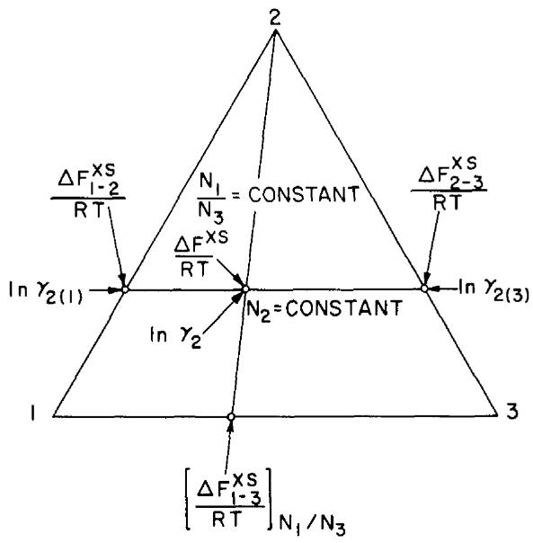  
Fig. 1(a) - Definition and location of terms used on the ternary composition diagram for Eqs. (3) and (4).

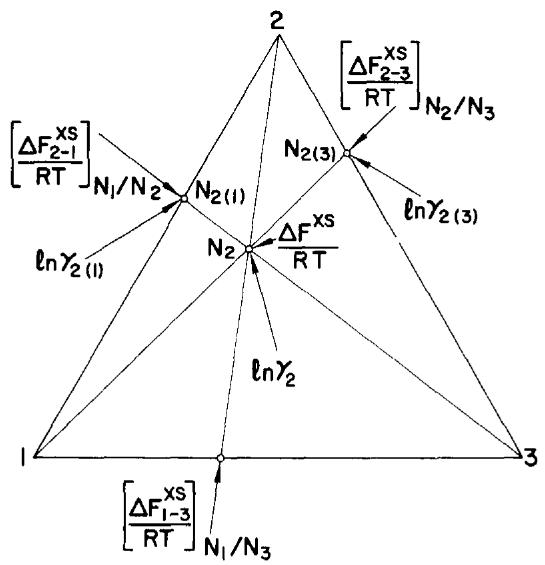  
Fig. 1(b) - Definition and location of terms used on the ternary composition diagram for Eqs. (7) and (8).

The terms of Eqs. (7) and (8) are shown in Fig. 1(b).

In summary, Eqs. (3), (4), (7) and (8) meet the collocation criteria defined in Eq. (2). The introduction of either Eq. (3) or Eq. (8) into Eq. (1) makes the first integral on the right-hand side of Eq. (1), when integrated from $\mathbf{N}_2 = 1$ to $\mathbf{N}_2 = 0$ , have the same numerical value as it would have in the actual system, even if the system is nonregular. This means that the terminal slope, at $\mathbf{N}_2 = 1$ , of the $\Delta \mathbf{F}^{\mathrm{XS}}$ surface along a path with constant $\mathbf{N}_1 / \mathbf{N}_3$ is the same as for the actual system. However, the integral would be exact, in general, when integrated from $\mathbf{N}_2 = 1$ to any $\mathbf{N}_2$ only for regular systems. The possible graphical difference between the calculated and actual integrals is shown schematically in Fig. 2. Since the calculated $\Delta \mathbf{F}^{\mathrm{XS}}$ surface using either Eq. (3) or (8) in Eq. (1) reduces to the known binary values, it is expected that the most accurate calculated data would be near the sides and apexes of the ternary triangle and the largest errors would occur in the central regions.

It would now be instructive to calculate the ternary excess molar free energy of several systems where experimental results are known. Using Eq. (7), results were calculated for five systems and they are shown in Figs. 3-7. Liquid standard states of the pure components were used in each case. The experimental binary and ternary data for the Pb-Sn-Cd and Cd-Pb-Bi systems at $773^{\circ}\mathrm{K}$ , Figs. 3 and 4, were taken from Elliott and Chipman $^{(32)}$ and experimental data for the $\mathrm{Ca0 - SiO_2 - Fe0}$ system at $1873^{\circ}\mathrm{K}$ , Fig. 5, has been summarized by Elliott $^{(33)}$ . For the Sb-Cd-Pb system at $773^{\circ}\mathrm{K}$ , the experimental binary and ternary data has also been determined by Elliott and Chipman $^{(32)}$ . The calculated results for the Bi-Cd-Sn system at $773^{\circ}\mathrm{K}$ are shown in Fig. 7 and compared with the experimental ternary results by Melgren $^{(34)}$ . Experimental binary data for the Bi-Sn system were taken from Melgren, and Elliott and Chipman's Bi-Cd and Cd-Sn data were used for the calculations.

Eq. (7) was used for the calculations because of its path independent nature. However, Eq. (4) will produce similar results if the calculated excess free energy curve is taken as the mean from three integration paths corresponding to the selection of each component as component 2. This may be verified by matching the appropriate excess free energy contours in Figs. 3-5 with Figs. 3-8 in Toop's work(18). Elaboration on the advantages and disadvantages of using Eqs. (4) or (7) for the purpose of calculations is given in the discussion.

# Calculation of Ternary Phase Diagrams

The regular solution model has been used to calculate common tangent points to ternary free energy of mixing surfaces in order to determine phase boundaries in ternary systems involving

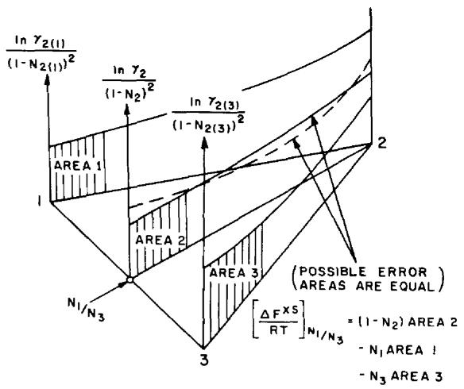  
Fig. 2 - Possible graphical difference between the actual ternary integral in Eq. (1) (solid line, area 2) and that calculated from Eq. (3) or (8) (dashed line) when integrated from $\mathbf{N}_2 = 1$ to $\mathbf{N}_2 = 0$ .

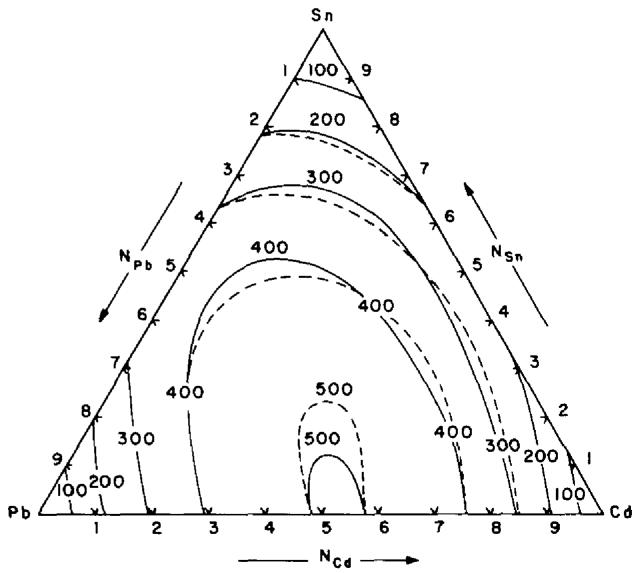  
Fig. 3 - Calculated $\Delta F^{\mathrm{XS}}$ (cal/mole) using Eq. (7) (dashed line) compared with measured values(unbroken lines) for the Pb-Sn-Cd system at $773^{\circ}\mathrm{K}$ .

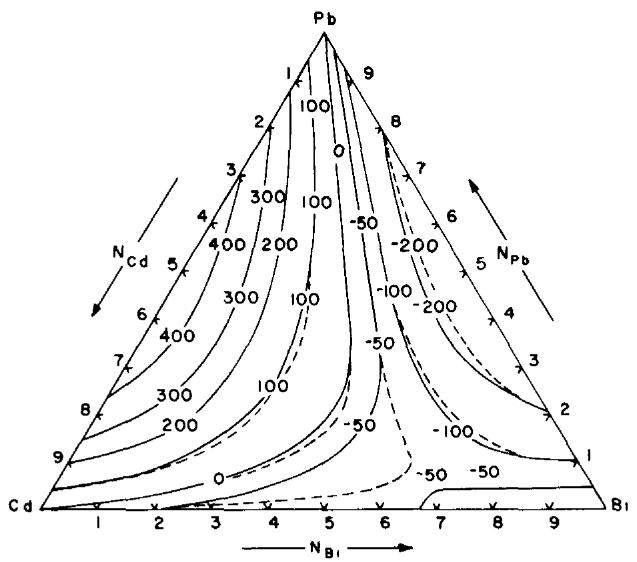  
Fig. 4 - Calculated $\Delta F^{\mathrm{XS}}$ (cal/mole) using Eq. (7) (dashed lines) compared with measured values (unbroken lines) for the Cd-Pb-B1 system at $773^{\circ}\mathrm{K}$ .

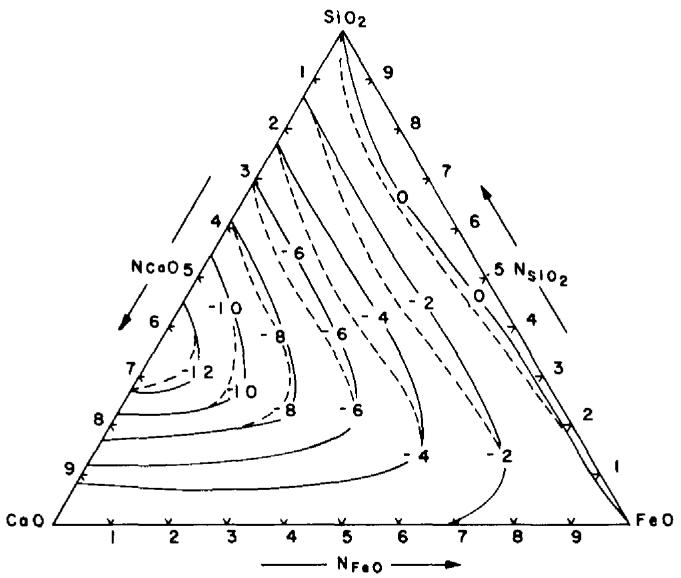  
Fig. 5 - Calculated $\Delta F^{\mathrm{XS}} / 4.575\mathrm{T}$ using Eq. (7) (dashed lines) compared with measured values (unbroken lines) for the Ca0-S10-Fe0 system at $1873^{\circ}\mathbf{K}$ .

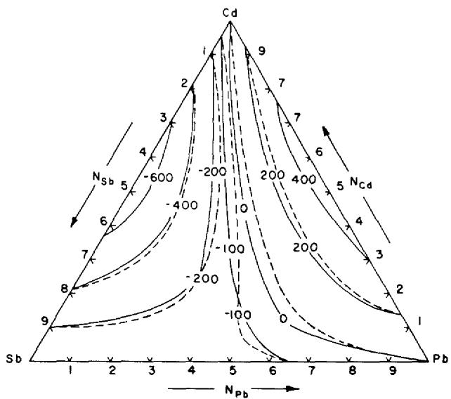  
Fig. 6 - Calculated $\Delta F^{\mathrm{XS}}$ (cal/mole) using Eq. (7) (dashed line) compared with measured values (unbroken lines) for the Sb-Cd-Pb system at $773^{\circ}\mathrm{K}$ .

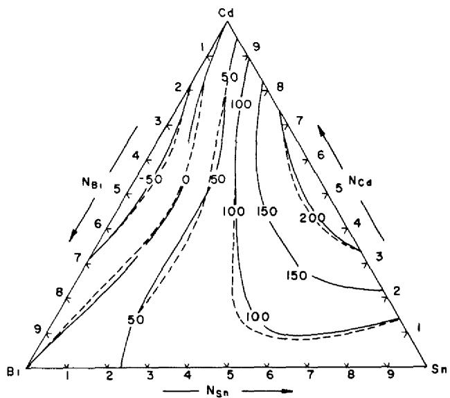  
Fig. 7 - Calculated $\Delta F^{XS}$ (cal/mole) using Eq. (7) (dashed lines) compared with measured values (unbroken lines) for the Bi-Cd-Sn system at $773^{\circ}K$ .

miscibility gaps $^{(5,10,24)}$ . Meijering $^{(5,10)}$ used Eq. (5) to calculate ternary excess free energy of mixing values after he had determined appropriate $\alpha_{i-j}$ constants. An alternate expression which gives $\Delta F^{xs}$ for regular solutions as a function of binary values of $\Delta F_{1-j}^{xs}$ along composition paths with constant $N_1/N_2$ , $N_2/N_3$ and $N_1/N_3$ has been given in Eq. (7). This expression for $\Delta F^{xs}$ is more useful for the empirical calculation of ternary excess free energy values for nonregular systems because actual binary $\Delta F_{i-j}^{xs}$ data may be used in the expression rather than attempting to find suitable constants for Eq. (5). Further results of this feature of Eq. (7) are illustrated in Table I where calculated excess free energy values for the Ni-Mn-Fe system at $1232^{\circ}K$ are compared with experimental data of Smith, et al. $^{(35)}$

Table I. Calculated $\Delta F^{\mathrm{XS}}$ values using Eq. (7), in parentheses, compared with measured values for the Ni-Mn-Fe system at $1232^{\circ}\mathrm{K}$ . All of the excess free energy values are negative.   

<table><tr><td rowspan="2">N_Mn</td><td colspan="7">N Fe/N_Ni</td></tr><tr><td>0/1</td><td>1/9</td><td>3/7</td><td>1/1</td><td>7/3</td><td>9/1</td><td>1/0</td></tr><tr><td>0</td><td>0</td><td>979</td><td>2891</td><td>3660</td><td>2894</td><td>1760</td><td>0</td></tr><tr><td></td><td>(0)</td><td>(979)</td><td>(2891)</td><td>(3660)</td><td>(2894)</td><td>(1760)</td><td>(0)</td></tr><tr><td>0.10</td><td>727</td><td>1506</td><td>3038</td><td>3636</td><td>2908</td><td>1866</td><td>272</td></tr><tr><td></td><td>(727)</td><td>(1450)</td><td>(2920)</td><td>(3450)</td><td>(2790)</td><td>(1700)</td><td>(272)</td></tr><tr><td>0.20</td><td>1420</td><td>2022</td><td>3180</td><td>3513</td><td>2788</td><td>1809</td><td>379</td></tr><tr><td></td><td>(1420)</td><td>(1950)</td><td>(2980)</td><td>(3283)</td><td>(2610)</td><td>(1600)</td><td>(379)</td></tr><tr><td>0.30</td><td>2025</td><td>2448</td><td>3217</td><td>3349</td><td>2593</td><td>1679</td><td>406</td></tr><tr><td></td><td>(2025)</td><td>(2370)</td><td>(2990)</td><td>(3020)</td><td>(2310)</td><td>(1380)</td><td>(406)</td></tr><tr><td>0.40</td><td>2441</td><td>2666</td><td>3092</td><td>3072</td><td>2353</td><td>1515</td><td>404</td></tr><tr><td></td><td>(2441)</td><td>(2590)</td><td>(2820)</td><td>(2714)</td><td>(2030)</td><td>(1140)</td><td>(404)</td></tr><tr><td>0.50</td><td>2551</td><td>2620</td><td>2850</td><td>2744</td><td>2081</td><td>1324</td><td>379</td></tr><tr><td></td><td>(2551)</td><td>(2560)</td><td>(2560)</td><td>(2340)</td><td>(1700)</td><td>(920)</td><td>(379)</td></tr><tr><td>0.60</td><td>2402</td><td>2394</td><td>2495</td><td>2353</td><td>1763</td><td>1107</td><td>338</td></tr><tr><td></td><td>(2402)</td><td>(2380)</td><td>(2210)</td><td>(1926)</td><td>(1420)</td><td>(730)</td><td>(338)</td></tr><tr><td>0.70</td><td>2056</td><td>2010</td><td>2034</td><td>1880</td><td>1395</td><td>867</td><td>---</td></tr><tr><td></td><td>(2056)</td><td>(1980)</td><td>(1780)</td><td>(1430)</td><td>(1000)</td><td>(500)</td><td>(287)</td></tr><tr><td>0.80</td><td>1513</td><td>1466</td><td>1440</td><td>1307</td><td>---</td><td>610</td><td>220</td></tr><tr><td></td><td>(1513)</td><td>(1410)</td><td>(1180)</td><td>(931)</td><td>(660)</td><td>(380)</td><td>(220)</td></tr><tr><td>0.90</td><td>791</td><td>744</td><td>708</td><td>617</td><td>453</td><td>291</td><td>108</td></tr><tr><td></td><td>(791)</td><td>(710)</td><td>(580)</td><td>(450)</td><td>(310)</td><td>(180)</td><td>(108)</td></tr></table>

Although regular solution equations have been shown, in this paper, to give calculated thermodynamic quantities which agree quite well with experiment for single-phase nonregular ternary systems, care should be exercised in the use of the equations to predict thermodynamic properties of multiphase ternary systems in which strong compound formation is suspected. This precaution is consistent with the simple regular solution model which for negative values of $\alpha_{1-j}$ will indicate a tendency toward compound formation, but even very large negative values of $\alpha_{1-j}$ will not give multiphase binary or ternary systems involving a distinct stable compound. Hence, calculated ternary free energy data using Eq. (7) might be expected to vary between being rigorous and poor, in the following order, for ternary systems which are: a) regular solutions, b) nonregular single-phase liquids in which random mixing is nearly realized, c) nonregular single-phase solids, d) nonregular multiphase systems with binary compounds but no ternary compounds, f) nonregular multiphase systems with highly stable binary and ternary compounds. The calculated data will be expected to be least accurate for the last two cases.

To empirically predict phase boundaries in ternary solutions with the use of Eq. (7), the problem involves calculating and displaying the free energy of the mixing $(\Delta F)$ surface and then determining common tangent points or tie lines on this surface. To achieve this, a method for graphically contouring the free energy of mixing surface was considered. In Fig. 8, calculated $\Delta F / RT$ contours are shown for a hypothetical regular ternary system in which all the $\alpha_{1-j}$ values are constant and equal to 3. The contours were drawn with a mechanical plotting device and the phase diagram consisting of three single-phase regions, three two-phase regions and one three-phase region, is clearly defined. Because of the symmetry of this system, the tie lines across the two phase regions are parallel to the triangle sides. For more complex non-regular ternary systems in which the directions of the tie lines were unknown, the contouring method was found to be less promising.

The method adopted in this paper is more general and involves two-dimensional plots of ternary activity curves. The principle used is that the lines indicating two-phase equilibria join conjugate phases $\alpha$ and $\beta$ for example, for which $a_1(\alpha) = a_1(\beta)$ , $a_2(\alpha) = a_2(\beta)$ and $a_3(\alpha) = a_3(\beta)$ . The lines may be determined by plotting the ternary activities of two components along an isoactivity line for the third component, and the unique points where the above equalities hold may be found graphically. The ternary activities of all three components may be found with the use of Eq. (8). For the present work, this method was used to calculate the phase diagrams for the Pb-Sn-Zn system at $926^{\circ}\mathrm{K}$ and the Ag-Pd-Cu system at $1000^{\circ}\mathrm{K}$ .

The Pb-Sn-Zn System at $926^{\circ}\mathrm{K}$

Lumsden's model (6) has been shown to define the thermodynamic

properties of the $\mathbf{Pb - Zn}$ system with a liquid phase miscibility gap $^{(36)}$ at $926^{\circ}\mathrm{K}$ . The miscibility gap should extend into the $\mathbf{Pb - Sn - Zn}$ ternary from the $\mathbf{Pb - Zn}$ binary as illustrated by experimental evidence $^{(37)}$ at $793^{\circ}\mathrm{K}$ . Using Eqs. (7) and (8) it is possible to calculate the ternary liquid miscibility gap with Lumsden's equations for the $\mathbf{Pb - Zn}$ system and appropriate binary data for the liquid phases in the $\mathbf{Pb - Sn}$ and $\mathbf{Sn - Zn}$ systems at $926^{\circ}\mathrm{K}$ .

The $\Delta F^{x\delta}$ data for the Pb-Sn system at $773^{\circ}\mathrm{K}$ was taken from Hultgren, et al(36). Since this system is considered to be regular, the necessary free energy data at $926^{\circ}\mathrm{K}$ could be obtained readily by assuming that the excess free energy is independent of temperature.

Free energy data for the Sn-Zn system is available $^{(36)}$ at $700^{\circ}\mathrm{K}$ . The integral molar free energy of mixing, $\Delta F$ , for this system was calculated at $926^{\circ}\mathrm{K}$ by assuming that the $\Delta C_{p}$ values for the various alloy compositions $^{(36)}$ were independent of temperature between $700^{\circ}\mathrm{K}$ and $926^{\circ}\mathrm{K}$ .

Using the appropriate binary data, the isoactivity lines for zinc, shown in Fig. 9, were calculated using Eq. (8). By computing $a_{Pb}$ and $a_{Sn}$ along an isoactivity line for $Zn$ , there must be one unique pair of composition points where $a_{Pb}(L_1) = a_{Pb}(L_2)$ and $a_{Sn}(L_1) = a_{Sn}(L_2)$ which defines the two-phase boundary as shown in Fig. 10. After using the same procedure along all of the iso-activity lines of $Zn$ , the entire miscibility gap was calculated and it is defined by the dashed line in Fig. 9. The final calculated phase diagram for the $Pb-Sn-Zn$ system at $926^{\circ}\mathrm{K}$ is shown in Fig. 11. The shape of the calculated miscibility gap at $926^{\circ}\mathrm{K}$ compares reasonably well with the shape of the miscibility gap at $793^{\circ}\mathrm{K}$ as shown in Fig. 11. In drawing the latter curve, the $Pb$ -rich phase boundary was modified slightly to be consistent with the current $Pb-Zn$ phase diagram $^{(36)}$ .

# The Ag-Pd-Cu System at $1000^{\circ}\mathrm{K}$

The Ag-Pd-Cu system should contain a region of solid phase immiscibility at $1000^{\circ}\mathrm{K}$ due to the miscibility gap in the Ag-Cu system. Since no experimental phase equilibria exists for this system, to the authors' knowledge, the ternary miscibility gap at $1000^{\circ}\mathrm{K}$ was predicted using Eqs. (7) and (8). Both the Ag-Pd and Pd-Cu systems are single-phase (fcc) at this temperature and thermodynamic data are available(36). Thermodynamic data for the terminal regions of the Ag-Cu system are available at $1052^{\circ}\mathrm{K}$ (36) so that extrapolations had to be made over the two-phase region. For the purpose of extrapolation, it is useful to use the parameter $\varnothing$ , defined as,

$$
\varnothing_ {i - j} = \frac {\Delta F _ {i - j}}{R T N _ {i} N _ {j}} = N _ {i} \alpha_ {j - i} + N _ {j} \alpha_ {i - j} \tag {9}
$$

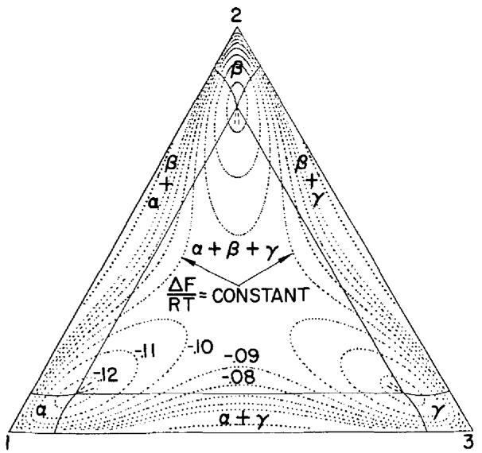  
Fig. 8 - Contours of the $\Delta F / RT$ surface and the resulting phase diagram for a hypothetical regular ternary system with binary $\alpha$ values equal to 3.

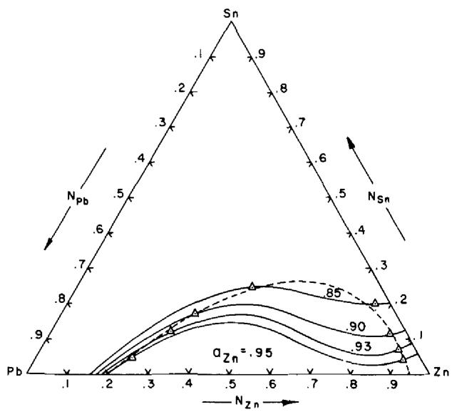  
Fig. 9 - Calculated $a_{Zn}$ values in the Pb-Sn-Zn system at $926^{\circ}\mathrm{K}$ with predicted miscibility gap (dashed line and triangles).

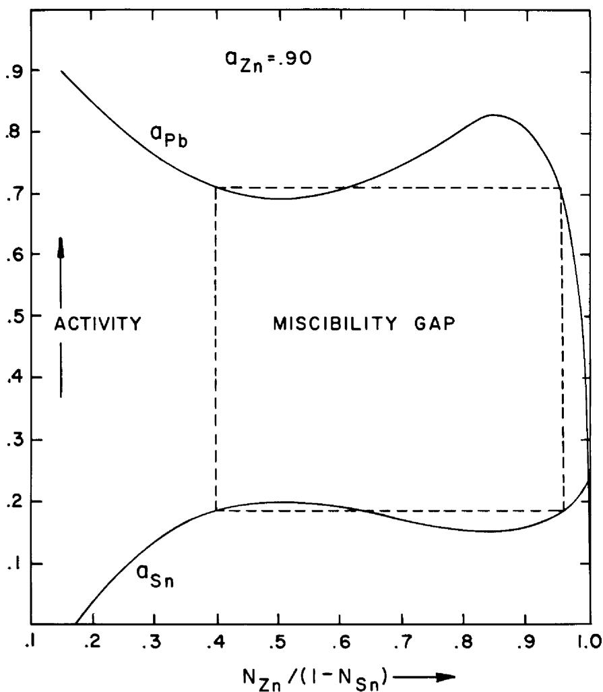  
Fig. 10 - Graphical determination of a tie line indicating two-phase equilibria along an isoactivity line for Zn in the Pb-Sn-Zn system at $926^{\circ}\mathrm{K}$ .

where the $\alpha$ 's need not be constant. In the Ag-Cu system at $1052^{\circ}\mathrm{K}$ , it was found that $\varnothing$ is constant in both of the terminal single-phase regions and it was assumed that $\Delta F_{1000}^{XS} = \Delta F_{1052}^{XS}$ in these regions. In the two-phase region of this binary, it was assumed that $\varnothing$ varies linearly between the constant value 2.86 on the Ag-rich side, and 3.48 on the Cu-rich side. This gave values of $\varnothing$ over the entire system and permitted calculation of a $\Delta F$ versus composition curve for the Ag-Cu system at $1000^{\circ}\mathrm{K}$ . The $\Delta F$ curve is shown in Fig. 12 and it agrees well with the phase diagram adopted by Hultgren, et al(56).

Isoactivity curves for $\mathbf{Cu}$ were calculated using Eq. (8) and the ternary miscibility gap was established in the same manner used for the Pb-Sn-Zn system. The phase diagram, given in Figs. 13 and 14, shows a predicted miscibility gap which extends over a substantial region of the ternary.

# Discussion

The equations presented in this paper are considered to be rigorously applicable to regular ternary solutions. Although the method is empirical for nonregular ternary systems, the expressions give a fair approximation of measured ternary excess free energy for the systems shown in Figs. 3-7 and Table I.

There are several reasons which help one to decide whether to use Eqs. (3) and (4), or Eqs. (7) and (8). First, one should keep in mind that Eqs. (3) and (4) are path dependent, but this factor has not been shown to be a major contribution to errors in the calculations(18). The use of Eq. (4) along a single path differs from the results calculated with Eq. (7) for the systems in Figs. 3-7 and Table I by less than $5\%$ . When, for example, binary data is only available for dilute solutions of $\mathbf{N}_2$ , and one is only interested in the dilute region of the ternary, Eq. (7) can not readily be used since it requires data for the 1-2 and 2-3 binaries for higher $\mathbf{N}_2$ compositions than the ternary $\mathbf{N}_2$ compositions. However, Eq.(4) can easily be used because it never requires binary data at $\mathbf{N}_2$ compositions greater than $\mathbf{N}_2$ . Graphical aids are also possible with Eqs. (3) and (4)(18) which result in requiring about 1/3 the number of calculations (along a single path) associated with Eqs. (7) and (8). However, in order to receive the full benefit of the interpolative method of this paper, Fig. 2, all three components should be used for component 2 and the calculated result taken as the mean of the three independent sets of calculations. This would be time consuming for the methods used to predict phase diagrams, so Eqs. (7) and (8) were used for the phase diagram determination.

Previous discussion (18, 19) has been given on why regular solution equations might be applied, with some empirical success, to nonregular systems containing more than two components.

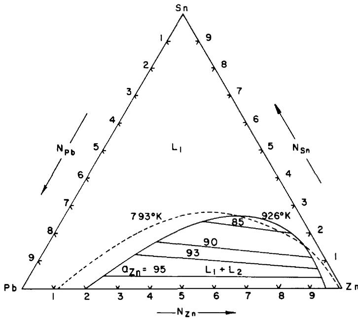  
Fig. 11 - Calculated phase diagram, with tie lines, for the Pb-Sn-Zn system at $926^{\circ}\mathrm{K}$ . The dashed line indicates the experimental miscibility gap at $793^{\circ}\mathrm{K}$ .

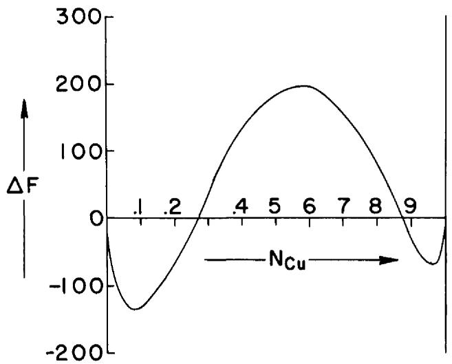  
Fig. 12 - Calculated $\Delta F$ values (cal/mole) across the Ag-Cu system at $1000^{\circ}\mathrm{K}$ .

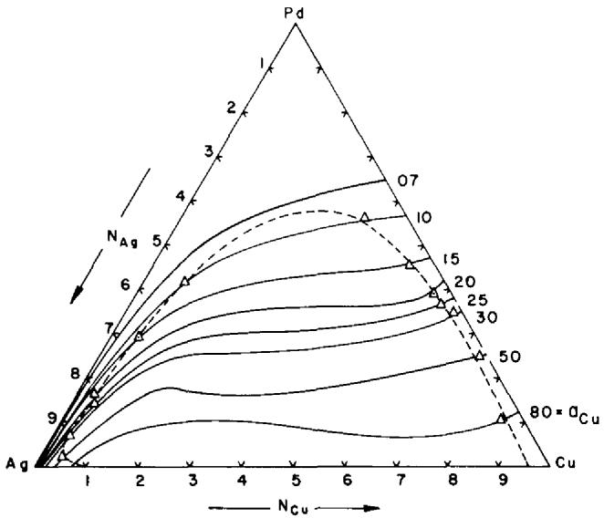  
Fig. 13 - Calculated aCu values in the Ag-Pd-Cu system at $1000^{\circ}\mathrm{K}$ with predicted miscibility gap (dashed line and triangles).

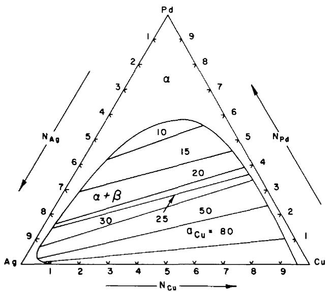  
Fig. 14 - Calculated phase diagram, with tie lines, for the Ag-Pd-Cu system at $1000^{\circ}\mathrm{K}$ .

Further support of this view, as well as a clearer definition of the limitations involved, may be found in the basic assumptions of the simple regular solution model. The assumption of random mixing and constant coordination number allows calculation of the number of nearest neighbor bonds. The assumption of constant atom-atom interaction then permits an energy summation to be made to give the integral molar heat of mixing, or the excess free energy, for the regular solution. The regular solution equations which result, for example Eqs. (4) and (7), show that at compositions near any binary system $i-j$ , the excess free energy due to the $i-j$ interaction is predominant. For compositions in which the concentrations of $i$ and $j$ become small, the $i-j$ contribution rapidly diminishes due to the factor $(\mathbf{N}_i + \mathbf{N}_j)^2$ .

Now, any multicomponent system is bounded by a series of binary systems, all of which contribute to the multicomponent field with the addition of 3rd, 4th or nth components. Considering any binary $i-j$ composition, even though the excess entropy may be nonzero, the actual $\Delta F_{1-j}^{XS}$ value is known and may be used as a starting point. As other components are added and are present in dilute or moderate concentrations, they are likely to be incorporated into the system in a random manner while not altering appreciably the $i-j$ coordination or interaction. Hence, the predominant $i-j$ contribution to the total excess free energy might be expected to follow the form of Eqs. (4) and (7) at least at compositions in the vicinity of the binary edges of the multicomponent system. This would most likely be so if the components are substitutional. This kind of agreement between measured data and the regular solution equations has been presented in this paper. The accuracy with which the excess free energy curves extend into the interior of the multicomponent field will clearly be better for systems which do not exhibit abrupt changes in excess free energy as might be encountered with the occurrence of a ternary compound.

The equations of this paper have been extended into quaternary systems $^{(20)}$ and the approach may readily be extended to higher order systems although the graphical relationships become very complex.

The methods presented in this paper are considered to give a fair approximation of ternary phase diagrams exhibiting miscibility gaps as shown in Figs. 11 and 14. It is apparent that this method may be applied to more complex nonregular systems with more than one miscibility gap. If two or more miscibility gaps intersect and the directions of the tie lines at the points of intersection are not parallel, the tie lines at the points of intersection will form the sides of a three phase triangle. This general feature is shown ideally in Fig. 8.

In the calculation of thermodynamic properties of multicomponent systems with the equations presented, the binary excess free energy

data that should be used are those which correspond to the most stable single phase solid or liquid solution in each binary at the temperature considered.

# Acknowledgements

This work was supported mainly from funds made available to the University of Washington through NASA Grant NsG-484-Multidisciplinary Research on the Nature and Properties of Ceramic Materials while N. J. Olson was a graduate student and G. W. Toop was Assistant Professor of Metallurgical Engineering.

# References

1. L.S. Darken: J. Am. Chem. Soc., 72, 2909 (1950).   
2. C. Wagner: Thermodynamics of Alloys, Addison Wesley Press, Cambridge, Mass., p. 19 (1952).   
3. R. Schuhmann: Acta Met., 3, 219 (1955).   
4. N.A. Gokcen: J. Phys. Chem., 64, 401 (1960).   
5. J.L. Meijering: Philips Res. Rept., 5, 333 (1950); 6, 183 (1951)   
6. J. Lumsden: Thermodynamics of Alloys, The Institute of Metals, London, p. 335 (1952).   
7. H.K. Hardy: Acta Met., 1, 202 (1953).   
8. C. Wagner: Acta Met., 2, 242 (1954).   
9. J.L. Meijering and H.K. Hardy: Acta Met., 4, 249 (1956).   
10. J. L. Meijering: Acta Met., 5, 257 (1957).   
11. C. Wagner: Acta Met., 6, 309 (1958).   
12. F.D. Richardson: The Physical Chemistry of Steelmaking, John Wiley and Sons, Inc., New York, p. 72 (1958).   
13. L.J. van der Toorn and T.J. Tiedema: Acta Met., 8, 711, (1960).   
14. H.A. Wriedt: TMS-AIME, 221, 377 (1961).   
15. R.A. Oriani and C.B. Alcock: TMS-AIME, 224, 1104 (1962).   
16. K. Okajima and R.D. Pehlke: TMS-AIME, 230, 1731 (1964).

17. O. Kubaschewski and T.G. Chart: J. Inst. Metals, 93, 329 (1964-65).   
18. G.W. Toop: TMS-AIME, 233, 850 (1965).   
19. N.J. Olson and G.W. Toop: TMS-AIME, 236, 590 (1966).   
20. N.J. Olson and G.W. Toop: TMS-AIME, 245, 906 (1969).   
21. B.E. Sundquist: TMS-AIME, 236, 1111, (1966).   
22. L.S. Darken: TMS-AIME, 239, 80 (1967).   
23. L.S. Darken: TMS-AIME, 239, 90 (1967).   
24. D. T. J. Hurle and E. R. Pike: J. Maths. Sci, 1, 399 (1966).   
25. C.H.P. Lupis and J.F. Elliott: Acta Met., 14, 529 (1966).   
26. C.H.P. Lupis: Acta Met, 16, 1365 (1968).   
27. C.B. Alcock and F.D. Richardson: Acta Met., 6, 385 (1958).   
28. C.B. Alcock and F.D. Richardson: Acta Met., 8, 882 (1960).   
29. C.B. Alcock: Phys. Chem. Metallic Sol. Intermetallic Compd., Symp., Teddington, Middlesex, Eng., 1958, Vol.I, 2E, p.2.   
30. F.D. Richardson: Phys. Chem. Metallic Sol. Intermetallic Compd., Symp., Teddington, Middlesex, Eng., 1958, Vol. II, 6A, p. 2.   
31. Carl-Erik Froberg: Introduction to Numerical Analysis, Addison-Wesley Press, Reading, Mass. p. 172 (1965).   
32. J.F. Elliott and J. Chipman: J. Am. Chem. Soc., 73, 2682 (1951).   
33. J.F. Elliott: J. Metals, 7, 485 (1955).   
34. S. Mellgren: J. Am. Chem. Soc., 74, 5037 (1952).   
35. J.H. Smith, H. W. Paxton and C. L. McCabe: J. Phys. Chem., 68, 1345 (1964).   
36. R. Hultgren, R.L. Orr, P.D. Anderson and K.K. Kelley: Selected Values of Thermodynamic Properties of Metals and Alloys, John Wiley and Sons, New York, (1963).   
37. A.S.M. Metals Handbook, p. 1268, (1948).

# CALCULATION OF THERMODYNAMIC QUANTITIES FROM PHASE

# DIAGRAMS INVOLVING INTERSTITIAL-TYPE PHASES

E. Rudy  
Oregon Graduate Center  
Portland, Oregon  
U. S. A.

# Abstract

The thermodynamic fundamentals relating phase relationships in binary, ternary, and quaternary systems to the thermodynamic properties of the phases partaking in the equilibria are reviewed and discussed. Cases considered in detail include partition equilibria in ternary and quaternary systems and the role of the three-phase field in the determination of the relative stabilities of existing as well as hypothetical phases.

Following a brief discussion of the methods employed in establishing pertinent phase equilibrium data, the application of the thermodynamic equations is demonstrated on a number of recently investigated ternary systems.


THERMODYNAMICS OF FORMATION OF $\mathrm{Th}_2\mathrm{Fe}_{17}$ , $\mathrm{Th}_2\mathrm{Co}_{17}$ , $\mathrm{Th}_2\mathrm{Ni}_{17}$ , $\mathrm{ThCo}_5$

ThNi5, ThCu4, AND ThNi2 FROM ELECTROMOTIVE FORCE MEASUREMENTS*

N. J. Magnani†, W. H. Skelton, and J. F. Smith  
Institute for Atomic Research and Department of Metallurgy  
Iowa State University, Ames, Iowa 50010  
U.S.A.

# Abstract

Solid electrolyte electromotive force cells have been used to determine the Gibbs free energies, entropies, and enthalpies of formation of several binary phases of thorium with iron, cobalt, nickel, or copper. $\mathrm{CaF}_2$ was employed as the electrolyte, and it is an ionic conductor over the temperature range of the measurements, $600 - 850^{\circ}\mathrm{C}$ . The data indicate a decreasing stability of intermediate phases with defined stoichiometry, $\mathrm{Th}_{\mathrm{x}}\mathrm{My}$ , as M changes from nickel to cobalt to iron. The data further indicate that the Gibbs free energies of formation per g-atom of thorium are nearly constant for the thorium-poor phases within a given system. This latter observation is compatible with crystallographic information which shows that the near-neighbor atomic coordination around the thorium atoms in the thorium-poor phases consists exclusively of transition-metal atoms with the coordination geometries being closely comparable from phase to phase. The crystallographic data also show bond distances which are compatible with the order of stability with the greatest relative contraction occurring for thorium-nickel bonds, intermediate for thorium-cobalt bonds, and least for thorium-iron bonds.

*Work was performed in the Ames Laboratory of the U. S. Atomic Energy Commission.   
†Present address: Sandia Corporation, Albequerque, New Mexico

# Introduction

Johnson (1) has surveyed the literature through late 1963 and has reported that thermodynamic data were then available only for the thorium-aluminum, thorium-bismuth, thorium-magnesium, thorium-mercury, and thorium-zinc systems. Additional data have subsequently become available for the thorium-mercury system (2) as well as data for the thorium-lead system (3). Limited information has also been found for the thorium-silicon system (4,5). Since thorium is a fertile material, thermodynamic data on its metallic systems are relevant to the design of pyrometallurgical processing methods for reactor fuels and blanket materials. The present investigation was therefore undertaken to add systematically to the needed information. The series, thorium-iron, thorium-cobalt, thorium-nickel, and thorium-copper, wherein the atomic number of the second component increases by one from one alloy system to the next, was chosen for measurement because the temperature-composition diagrams had already been reliably determined and because the fifth member of the series, thorium-zinc, had already been thermodynamically investigated. The intermediate phases which occur in these binary systems show definite crystallographic relationships, and the pattern of occurrence of the various stoichiometries implies a systematic variation in bonding interactions.

# Procedure & Results

The thorium-iron and thorium-cobalt phase diagrams, as proposed by Thomson(6), are shown in Figs. 1 and 2. The thorium-nickel phase diagram in Fig. 3 and the thorium-copper phase diagram in Fig. 4 are reproduced from the compilations of Hansen and Anderko(7) and of Elliott(8) respectively. The terminal solubilities of thorium in iron(6), cobalt(6), nickel(9), and copper(8) are in all cases and at all temperatures $\sim 2$ at. % or less. A Raoultian approximation indicates that within the precision of the present measurements such limited solubility is of negligible significance. Among the intermediate phases, only ThCo5 exhibits a range of solid solubility and then only between 83.5 and 85.0 at. % cobalt(6) at $1100^{\circ}\mathrm{C}$ ; this is also of negligible significance.

Solid-state electrochemical cells of the type,

$$
\mathrm {T h}, \mathrm {T h F} _ {4} \left| \mathrm {C a F} _ {2} \right| \mathrm {T h F} _ {4}, \mathrm {M}, \mathrm {T h M} _ {\mathrm {x}}, \tag {a}
$$

or

$$
\mathrm {T h}, \mathrm {T h F} _ {4} | \mathrm {C a F} _ {2} | \mathrm {T h F} _ {4}, \mathrm {T h M} _ {\mathrm {y}}, \mathrm {T h M} _ {\mathrm {z}}, \tag {b}
$$

were employed for the accumulation of data. Here M is iron, cobalt, nickel, or copper, and M and ThMx or ThMy and ThMZ are neighboring phases in the temperature-composition diagram and can exist in chemical equilibrium. All phases were solid throughout the experiments. Half cell reactions for these galvanic cells can be written as

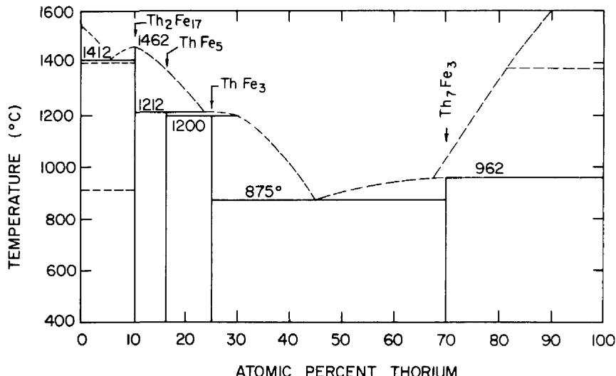  
Fig. 1. The thorium-iron phase diagram

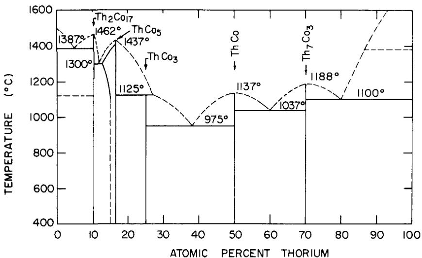  
Fig. 2. The thorium-cobalt phase diagram

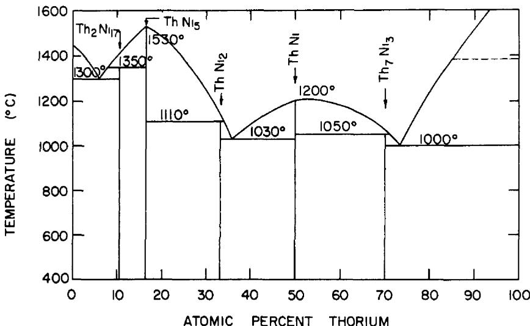  
Fig. 3. The thorium-nickel phase diagram

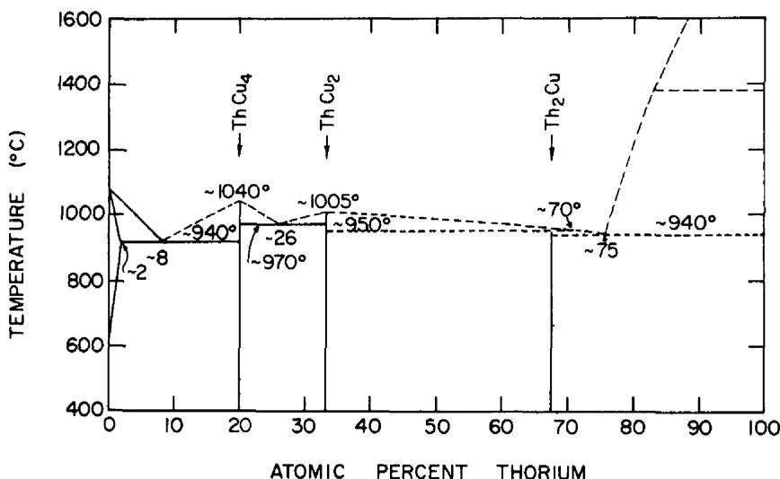  
Fig. 4. The thorium-copper phase diagram

$$
\mathrm {T h} + 4 \mathrm {F} ^ {-} \rightarrow \mathrm {T h F} _ {4} + 4 \mathrm {e} ^ {-} \tag {1}
$$

and

$$
4 e ^ {-} + \mathrm {T h F} _ {4} + x M + \mathrm {T h M} _ {x} + 4 F ^ {-} \tag {2a}
$$

or

$$
4 e ^ {-} + \operatorname {T h F} _ {4} + (z / y - z) \operatorname {T h M} _ {y} \rightarrow (y / y - z) \operatorname {T h M} _ {z} + 4 F ^ {-} \tag {2b}
$$

so that the cell reactions should be

$$
\mathrm {T h} + \mathrm {x M} \rightleftharpoons \mathrm {T h M} _ {\mathrm {x}} \tag {3a}
$$

or

$$
\mathrm {T h} + (\mathrm {z} / \mathrm {y} - \mathrm {z}) \mathrm {T h M} _ {\mathrm {y}} \rightleftharpoons (\mathrm {y} / \mathrm {y} - \mathrm {z}) \mathrm {T h M} _ {\mathrm {z}}. \tag {3b}
$$

If the cells are operated reversibly at fixed temperature, EMF values provide direct measures(10) of the Gibbs free energies of the cell reactions through the relation

$$
\Delta \mathrm {G} _ {\mathrm {T}} = - 4 \mathcal {F E}
$$

where $\mathcal{F}$ is the Faraday constant and $E$ is the open circuit EMF. If pure solid phases are chosen as standard states and if the limited solubilities are neglected, the data are directly convertible to standard free energies of formation.

Oriani(11) has discussed electrochemical techniques for thermodynamic measurements and has concluded that in reversible cells the electrolyte must exhibit ionic conductivity only, the electropositive metal must have a single, defined valence state with respect to the anions of the electrolyte, and only one reaction should occur at each electrode interface. In the present experiments the first criterion is met since the values of both Ure(12) and Patterson(13) confirm that solid $\mathrm{CaF}_2$ is an ionic conductor throughout the temperature range of measurement. With respect to the latter criteria, the compilation by Hamer, Malmberg, and Rubin(14) of an electromotive force series for solid and liquid fluorides indicates that, in the cells in question, $\mathrm{CaF}_2$ should be unaffected by the cell reactions, the transition metals should remain in the reduced metallic state, and thorium should exist both as a metal and as a fluoride with the changes in its state corresponding to the reaction within the cell. Though there are problems with solid electrolytes, (15,16) the suitability of the present electrochemical cells is corroborated by the results of Aronson and coworkers (17,18,19) who have used similar cells for the determination of the thermodynamics of formation of thorium carbides, borides, and sulfides. Furthermore, Oriani's review suggests experimental tests for reversibility, since, in a cell operating reversibly, the EMF should be time independent at constant temperature, should have the same value irrespective of whether the temperature has been approached from above or below, and should recover to the same value after current is passed through the cell in either direction. During the accumulation of the present data, any measurement which failed these reversibility criteria was rejected.

Alloys were prepared from material whose impurity analyses are shown together with that for $\mathrm{ThF_4}$ in Table 1. The iron analysis is the manufacturer's analysis for high-purity electrolytic iron while the iron which was used in this investigation was a super-purity grade and should have impurity concentrations lower than those indicated in the Table. The $\mathrm{ThF_4}$ was also further purified from that analyzed for the Table. This purification was achieved by heating the $\mathrm{ThF_4}$ with ammonium bifluoride at $150 - 180^{\circ}C$ for 12 hours and then slowly heating to $350^{\circ}C$ while passing dry air over the fluorides. This should have reduced any residual oxides or oxyfluorides. The $\mathrm{CaF_2}$ which was used for the electrolyte was from Electronic Space Products Inc. and was quoted as being $99.95\%$ pure.

Alloys were prepared by arc melting the elements in an argon atmosphere that had been purified by melting zirconium several times. The arc melted alloys were successively inverted and remelted several times to facilitate homogeneity. Alloys that passed through peritectic transformations on cooling were sealed in tantalum crucibles under a vacuum and equilibrated at $25\mathrm{C}^{\circ}$ below the transformation temperature for 10-14 days. Alloys that passed through eutectic transformations were not similarly heat treated. Debye-Scherrer powder photographs of all alloys were taken to verify the presence of only the two equilibrium phases. The thorium-nickel alloys that passed through a peritectic transformation were also checked with an electron beam microprobe. In no case were non-equilibrium phases found.

The alloys were very reactive and were therefore stored in a dry box containing an argon atmosphere. This reactivity tends to increase with increasing thorium content and the present measurements were therefore limited to the thorium-poor regions of the alloy systems. For x-ray measurements fine powders were prepared and sealed into x-ray capillary tubes within the dry box. All steps for the preparation of electrode pellets were performed in the dry box except the actual pressing operation. Alloys that were brittle were crushed with a diamond mortar and those that were not brittle were filed with a tungsten carbide file. Thorium was filed with an ordinary file and the filings were then passed through a group of small magnets to remove any iron introduced by the file. All of the powders were passed through a 60 mesh screen to remove large particles and 20 wt % $\mathrm{ThF_4}$ powder was then added. The mixture was pressed in a one-half inch tungsten carbide die at 30,000 psi. The resultant electrode pellets were from 2 to 5 mm thick. Electrolyte pellets were prepared by pressing one-half to two grams of $\mathrm{CaF_2}$ at 7,500 psi in a one-half inch tungsten carbide die, then hydrostatically pressing the pellets at 50,000 psi, and finally sintering them in an induction furnace under vacuum at $1000^{\circ}\mathrm{C}$ for 15 minutes.

A schematic diagram of the experimental apparatus is shown in Fig. 5. In this apparatus two electrochemical cells were operated

Table 1. Impurity analyses of alloying elements and ThF ${}_{4}$ in ppm   

<table><tr><td>Impurity</td><td>\( Th^a \)</td><td>\( ThF_4^b \)</td><td>\( Cu^c \)</td><td>\( Ni^d \)</td><td>\( Co^e \)</td><td>\( Fe^f \)</td></tr><tr><td>H</td><td>&lt;1</td><td>-</td><td>-</td><td>-</td><td>6</td><td>-</td></tr><tr><td>B</td><td>-</td><td>&lt;0.5</td><td>-</td><td>-</td><td>-</td><td>-</td></tr><tr><td>C</td><td>50</td><td>-</td><td>-</td><td>50</td><td>60</td><td>&lt;100</td></tr><tr><td>N</td><td>20</td><td>-</td><td>-</td><td>20</td><td>-</td><td>-</td></tr><tr><td>O</td><td>80</td><td>-</td><td>-</td><td>80</td><td>100</td><td>-</td></tr><tr><td>Na</td><td>&lt;10</td><td>-</td><td>-</td><td>-</td><td>-</td><td>-</td></tr><tr><td>Mg</td><td>&lt;20</td><td>55-120</td><td>-</td><td>-</td><td>-</td><td>-</td></tr><tr><td>Al</td><td>25</td><td>&lt;25</td><td>-</td><td>-</td><td>-</td><td>-</td></tr><tr><td>Si</td><td>&lt;20</td><td>50-100</td><td>&lt;0.1</td><td>-</td><td>10</td><td>-</td></tr><tr><td>P</td><td>-</td><td>-</td><td>-</td><td>-</td><td>&lt;30</td><td>-</td></tr><tr><td>S</td><td>-</td><td>-</td><td>&lt;1</td><td>76</td><td>10</td><td>&lt;60</td></tr><tr><td>Ca</td><td>&lt;20</td><td>150-500</td><td>-</td><td>-</td><td>-</td><td>-</td></tr><tr><td>Ti</td><td>&lt;20</td><td>-</td><td>-</td><td>-</td><td>-</td><td>-</td></tr><tr><td>Cr</td><td>20</td><td>-</td><td>-</td><td>-</td><td>-</td><td>-</td></tr><tr><td>Mn</td><td>&lt;20</td><td>&lt;20</td><td>&lt;0.5</td><td>-</td><td>30</td><td>-</td></tr><tr><td>Fe</td><td>&lt;20</td><td>-</td><td>&lt;0.7</td><td>70</td><td>80</td><td>-</td></tr><tr><td>Ni</td><td>&lt;20</td><td>-</td><td>&lt;1</td><td>-</td><td>600</td><td>-</td></tr><tr><td>Cu</td><td>-</td><td>-</td><td>-</td><td>10</td><td>30</td><td>-</td></tr><tr><td>Zn</td><td>-</td><td>-</td><td>-</td><td>-</td><td>30</td><td>-</td></tr><tr><td>Se</td><td>-</td><td>-</td><td>&lt;1</td><td>-</td><td>-</td><td>-</td></tr><tr><td>Y</td><td>&lt;100</td><td>-</td><td>-</td><td>-</td><td>-</td><td>-</td></tr><tr><td>Ag</td><td>-</td><td>-</td><td>&lt;0.2</td><td>-</td><td>-</td><td>-</td></tr><tr><td>Cd</td><td>-</td><td>0.2</td><td>-</td><td>-</td><td>-</td><td>-</td></tr><tr><td>In</td><td>-</td><td>35-45</td><td>-</td><td>-</td><td>-</td><td>-</td></tr><tr><td>Sn</td><td>-</td><td>-</td><td>&lt;1</td><td>-</td><td>-</td><td>-</td></tr><tr><td>Sb</td><td>-</td><td>-</td><td>&lt;1</td><td>-</td><td>-</td><td>-</td></tr><tr><td>Te</td><td>-</td><td>-</td><td>&lt;2</td><td>-</td><td>-</td><td>-</td></tr><tr><td>Au</td><td>-</td><td>-</td><td>&lt;2</td><td>-</td><td>-</td><td>-</td></tr><tr><td>Pb</td><td>-</td><td>-</td><td>&lt;1</td><td>-</td><td>&lt;1</td><td>-</td></tr><tr><td>Bi</td><td>-</td><td>-</td><td>&lt;0.1</td><td>-</td><td>-</td><td>-</td></tr></table>

<sup>a</sup>Ames Laboratory Th, 99.98% pure, typical analysis.   
bAmes Laboratory $\mathsf{ThF}_4$ , typical analysis.   
cAmerican Smelting and Refining Co. Cu, 99.999+% pure, company analysis.   
Belmont Ni shot, 99.97% pure, company analysis and Ames Laboratory typical analysis.   
eAmerican Metals Corp. Co $99.9 + \%$ pure, company analysis.   
fGlidden Company super-purity grade electrolytic iron, $99.9 + \%$ pure, company analysis.

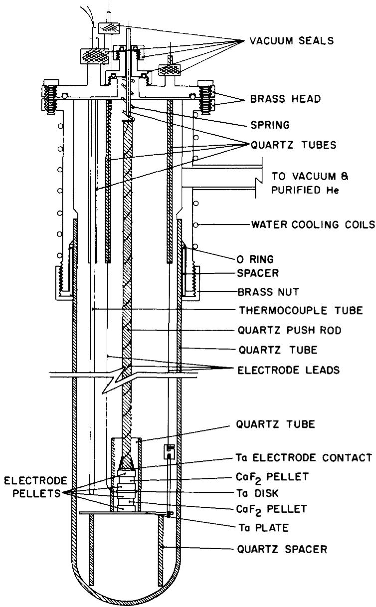  
Fig. 5. Electromotive force apparatus

simultaneously. Tantalum was used to provide electrical contact between the external circuit and the cell electrodes. Spectroscopic analyses showed no evidence of interaction between the tantalum and cell electrodes. Cell temperatures were controlled to $\pm 1^{\circ}\mathrm{C}$ . Temperatures were measured with a chromel-alumel thermocouple, and calibration showed that standard tables could be used to convert thermocouple EMF's to temperatures without significant error ( $<0.1\%$ ). EMF measurements were made with a Leeds and Northrup K-3 potentiometer. Cells were operated under purified helium at a positive pressure of two inches of mercury above atmospheric. Absence of spurious EMF's in the circuitry was verified by making a dummy run with no electrode pellets between the tantalum contacts.

EMF measurements on various alloy compositions were made over the temperature range, $850 - 1120^{\circ}\mathrm{K}$ . The experimental data are plotted in Fig. 6 where the linear representations are least-squares fits to the experimental points. In all cases data were taken from two independent cells, and in most cases two different alloy compositions were employed. From these data, standard free energies, enthalpies, and entropies of phase formation were derived, and values for these thermodynamic functions at $973^{\circ}\mathrm{K}$ , which is near the mean of the temperature range, are listed in Table 2. The quoted uncertainties are based upon the root mean square deviation of experimental points from linear relationships.

Table 2. Thermodynamic functions for the formation of selected binary alloys of thorium with iron, cobalt, nickel and copper.   

<table><tr><td>Phase</td><td>-ΔG°973(kcal/g-atom)</td><td>-ΔS°973(e.u./g-atom)</td><td>-ΔH°973(kcal/g-atom)</td></tr><tr><td>Th2Ni17</td><td>5.50 ± 0.02</td><td>0.44 ± 0.15</td><td>5.93 ± 0.15</td></tr><tr><td>Th2Co17</td><td>3.17 ± 0.04</td><td>0.79 ± 0.21</td><td>3.94 ± 0.20</td></tr><tr><td>Th2Fe17</td><td>1.82 ± 0.04</td><td>1.21 ± 0.23</td><td>2.99 ± 0.22</td></tr><tr><td>ThNi5</td><td>8.70 ± 0.03</td><td>1.69 ± 0.18</td><td>10.35 ± 0.18</td></tr><tr><td>ThCo5</td><td>5.08 ± 0.05</td><td>2.12 ± 0.29</td><td>7.14 ± 0.32</td></tr><tr><td>ThCu4</td><td>4.38 ± 0.01</td><td>-1.49 ± 0.12</td><td>2.93 ± 0.12</td></tr><tr><td>ThNi2</td><td>9.93 ± 0.09</td><td>0.77 ± 0.70</td><td>10.68 ± 0.68</td></tr></table>

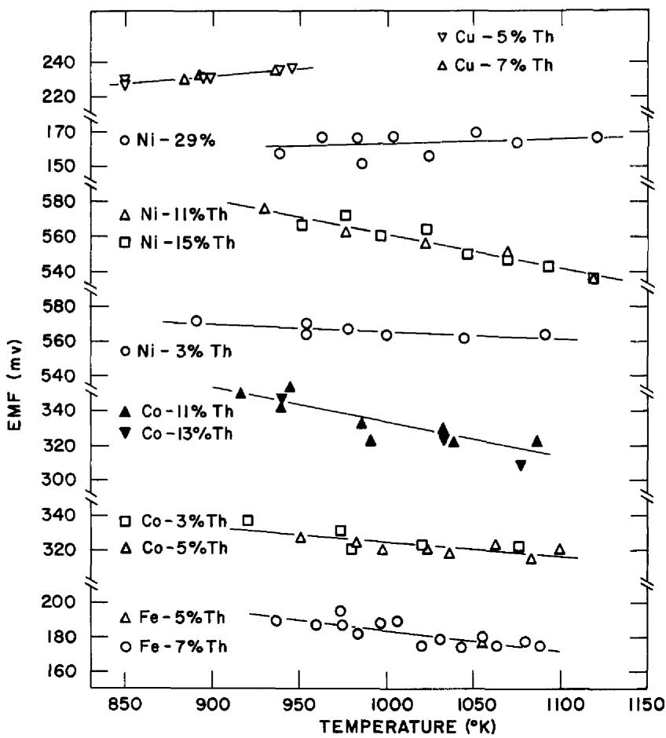  
Fig. 6. Experimental data from various alloys with indicated compositions being in atomic per cent

# Discussion

Crystallographic data indicate that $\mathrm{Th}_{2}\mathrm{Ni}_{17}$ crystallizes $(20)$ in a double-layered hexagonal structure while $\mathrm{Th}_{2}\mathrm{Co}_{17}$ and $\mathrm{Th}_{2}\mathrm{Fe}_{17}$ crystallize $(20,21)$ in a closely related triple-layered structure whose prototype is $\mathrm{Th}_{2}\mathrm{Zn}_{17}$ . The phases, $\mathrm{ThFe}_5$ , $\mathrm{ThCo}_5$ , and $\mathrm{ThNi}_5$ , are isostructural and crystallize $(20)$ in the hexagonal structure whose prototype is $\mathrm{CaCu}_5$ and which is crystallographically also closely related to the $\mathrm{Th}_{2}\mathrm{Ni}_{17}$ and $\mathrm{Th}_{2}\mathrm{Zn}_{17}$ type structures. In the $\mathrm{Th}_{2}\mathrm{M}_{17}$ and $\mathrm{ThM}_5$ phases with M being iron, cobalt, or nickel, individual thorium atoms are coordinated to either eighteen, nineteen, or twenty neighboring atoms of the M species with the average thorium coordination number being eighteen and one-half. For both the $\mathrm{Th}_{2}\mathrm{M}_{17}$ phases and for the $\mathrm{ThM}_5$ phases, the sequence of magnitudes for the free energies of phase formation is compatible with the crystallographic data in the sense that the interatomic Th-M bond distances in the intermediate phases show contractions from the average of the Th-Th and M-M distances in the parent metals which are greatest for the thorium-nickel phases, intermediate for the thorium-cobalt phases, and least for the thorium-iron phases. This statement is valid for the $\mathrm{ThM}_5$ sequence because even though the free energy of formation of $\mathrm{ThFe}_5$ has not yet been measured, the free energy of formation of $\mathrm{ThFe}_5$ cannot be more negative than -2.9 kcal/g-atom; otherwise, $\mathrm{Th}_{2}\mathrm{Fe}_{17}$ would not be a stable phase and would spontaneously decompose to $\mathrm{ThFe}_5$ and iron with a reduction in total free energy.

It is interesting to note that conversion of the values in Table 2 from kcal/g-atom of compound to kcal/mole of thorium yields values of $-52.2 \pm 0.2$ for $\mathrm{Th_2Ni_{17}}$ , $-52.2 \pm 0.2$ for $\mathrm{ThNi_5}$ , $-30.1 \pm 0.4$ for $\mathrm{Th_2Co_{17}}$ , $-30.5 \pm 0.3$ for $\mathrm{ThCo_5}$ and $-17.3 \pm 0.4$ for $\mathrm{Th_2Fe_{17}}$ . From a quasi-chemical view the formation of an intermediate phase results from the energy reduction associated with the bonding of one species to a second unlike species. On the basis of the closely comparable thorium environments in the crystallographic structures, it is therefore not surprising to find closely comparable free energies of formation per mole of thorium for the two nickel phases and also for the two cobalt phases. It would seem reasonable that the same situation should hold true for $\mathrm{Th_2Fe_{17}}$ and $\mathrm{ThFe_5}$ , and thus a free energy of formation for $\mathrm{ThFe_5}$ of $-17.3 \pm 0.4$ kcal/mole of thorium or $-2.88 \pm 0.07$ kcal/g-atom of compound can be considered as a good estimate.

An entropy of formation for $\mathrm{ThFe}_5$ may also be estimated from the entropies of formation of the $\mathrm{Th}_2\mathrm{M}_{17}$ and $\mathrm{ThM}_5$ phases in the manner shown in Fig. 7. There it may be noted that the shift in $\Delta S_{973}^0$ from $\mathrm{ThNi}_5$ to $\mathrm{ThCo}_5$ is essentially parallel to the shifts in $\Delta S_{973}^0$ from $\mathrm{Th}_2\mathrm{Ni}_{17}$ to $\mathrm{Th}_2\mathrm{Co}_{17}$ to $\mathrm{Th}_2\mathrm{Fe}_{17}$ . A similar shift from $\mathrm{ThCo}_5$ to $\mathrm{ThFe}_5$ can be used as a basis for estimating a value of -2.5 e.u./g-atom for the entropy of formation of $\mathrm{ThFe}_5$ . Combination of the free energy and entropy estimates for $\mathrm{ThFe}_5$ indicates that the enthalpy of formation should be near to -5.3 kcal/g-atom. The reliability of these entropy and enthalpy values is expected to be less good than the free energy value by about an order of magnitude.

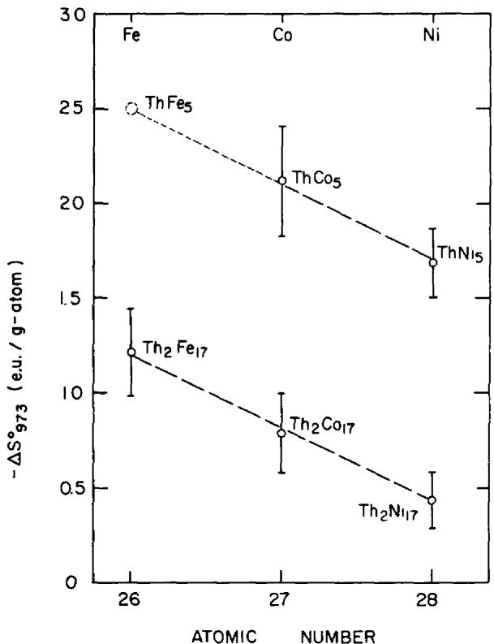  
Fig. 7. Trends in the entropies of formation of the $\mathrm{Th}_{2}\mathrm{M}_{17}$ and $\mathrm{ThM}_5$ sequences

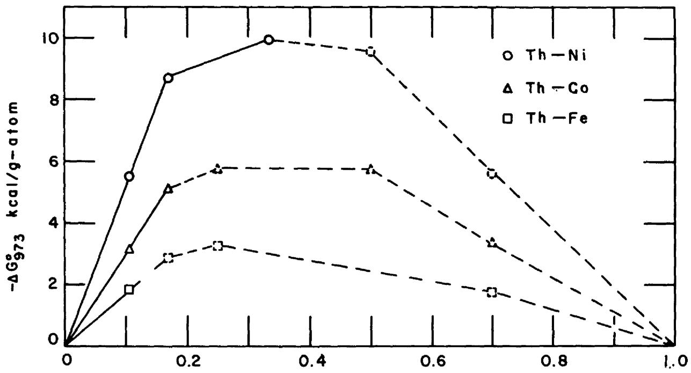  
MOLE FRACTION THORIUM   
Fig. 8. Free energies of alloy formation as functions of composition for the thorium-iron, thorium-cobalt, and thorium-nickel systems with experimental data being connected by solid lines and estimated data being connected by dashed lines

Finally, estimates of the free energies of formation of the remaining thorium-nickel, thorium-cobalt, and thorium-iron phases can be made by a simple extension of the quasi-chemical approach. In this extension the free energies of formation of the $\mathrm{Th}_{2}\mathrm{M}_{17}$ and $\mathrm{ThM}_5$ phases may be taken as the base, and the free energy of formation per mole of thorium for any $\mathrm{Th}_{\mathrm{x}}\mathrm{M}_{\mathrm{y}}$ phase can then be taken as lower than that for the $\mathrm{Th}_{2}\mathrm{M}_{17}$ and $\mathrm{ThM}_5$ phases in direct proportion to the difference in the number of M atoms coordinated about the thorium atoms. For instance in $\mathrm{ThNi}_2$ , the nickel coordination around thorium is twelvefold(20), and thence $\Delta G_{973}^{\circ}$ should be (12/18.5)(-52.2) kcal/mole of thorium which converts to -11.3 kcal/g-atom and is within $14\%$ of the experimental value in Table 2. Similar testing of the procedure on the thorium-zinc system with $\mathrm{Th}_{2}\mathrm{Zn}_{17}$ as the base yielded estimated values for $\mathrm{ThZn_4}$ , $\mathrm{ThZn_2}$ , and $\mathrm{Th}_{2}\mathrm{Zn}$ which averaged $\sim 20\%$ deviation from the experimental values of Chiotti and Gill(22). Comparable agreement has also been obtained between estimated values and preliminary experimental values for $\mathrm{ThCo}_3$ , $\mathrm{ThNi}$ , and $\mathrm{Th}_{7}\mathrm{Ni}_{3}$ . Plots of integral free energies of alloy formation against mole fraction thorium are shown in Fig. 8 for the thorium-nickel, thorium-cobalt, and thorium-iron systems. The dashed portions of these plots have been estimated in the manner outlined and, on the basis of the indicated tests of the estimating procedure, should have a reliability of about $\pm 20\%$ .

No similar estimates were made for the thorium-copper system since the crystal structure of $\mathrm{ThCu_4}$ is as yet unknown. In this system stoichiometries of $\mathrm{Th_2Cu_{17}}$ and $\mathrm{ThCu_5}$ do not occur as stable phases, and, in view of the value of the free energy of formation of $\mathrm{ThCu_4}$ , it is evident that the free energy of formation for $\mathrm{Th_2Cu_{17}}$ must be less negative than $-2.3\mathrm{kcal / g}$ -atom and for $\mathrm{ThCu_5}$ less negative than $-3.6\mathrm{kcal / g}$ -atom.

# References

1. Johnson, I., "Thermodynamics of Plutonium, Thorium, and Uranium Metallic Systems", Proceedings of the International Symposium on Compounds of Interest in Nuclear Reactor Technology, The Metal-lurgical Society of AIME, Vol. 10, 1964, pp. 171-192.   
2. Jangg, G. and F. Steppan, "Dampfdruckmessungen an binären Amalgamen", Zeitschrift für Metallkunde, Vol. 56, 1965, pp. 172-178.   
3. Gans, W., O. Knacke, F. Muller, and H. Witte, "Dampfdruckmessungen am System Blei-Thorium", Zeitschrift für Metallkunde, Vol. 57, 1966, pp. 46-49.   
4. Grieveson, P. and C. B. Alcock, "The Thermodynamics of Metal Silicides and Silicon Carbide", Special Ceramics, ed. by P. Popper, Heywood & Co., London, 1960, pp. 183-208.

5. Robins, D. A. and I. Jenkins, "The Heats of Formation of Some Transition Metal Silicides", Acta Metallurgica, Vol. 3, 1955, pp. 598-604.   
6. Thomson, J. R., "Alloys of Thorium with Certain Transition Metals. IV. The Systems Thorium-Iron and Thorium-Cobalt", Journal of the Less-Common Metals, Vol. 10, 1966, pp. 432-438.   
7. Hansen, M. and K. Anderko, Constitution of Binary Alloys, McGraw-Hill, New York, 1958, p. 1048.   
8. Elliott, R. P., Constitution of Binary Alloys, First Supplement, McGraw-Hill, New York, 1965, p. 386.   
9. Hessenbruch, W. and L. Horn, "Der Einfluss kleiner Beimengungen von Thorium auf die Lebensdauer von Heizleiterlegierungen", Zeitschrift für Metallkunde, Vol. 36, 1944, pp. 145-146.   
10. Darken, L. S. and R. W. Gurry, Physical Chemistry of Metals, McGraw-Hill, New York, 1953, p. 431.   
11. Oriani, R. A., "Electrochemical Techniques in the Thermodynamics of Metallic Systems", Journal of the Electrochemical Society, Vol. 103, 1956, pp. 194-201.   
12. Ure, R. W., Jr., "Ionic Conductivity of Calcium Floride Crystals", Journal of Chemical Physics, Vol. 26, 1957, pp. 1363-1373.   
13. Patterson, J. W., Iowa State University, 1968, private communication.   
14. Hamer, W. J., M. S. Malmberg, and B. Rubin, "Theoretical Electromotive Forces for Cells Containing a Single Solid or Molten Fluoride, Bromide, or Iodide", Journal of the Electrochemical Society, Vol. 112, 1965, pp. 750-755.   
15. Schmalzreid, H., "The EMF Method in Studying Thermodynamic and Kinetic Properties of Compounds at Elevated Temperatures", Proceedings of the Symposium on Thermodynamics held in Vienna, 22-27 July 1965, Vol. 1, International Atomic Energy Agency,   
16. Kiukkola, K. and C. Wagner, "Measurements on Galvanic Cells Involving Solid Electrolytes", Journal of the Electrochemical Society, Vol. 104, 1957, pp. 379-386.   
17. Aronson, S., "Thermodynamic Properties of Thorium Carbides from Measurements on Solid EMF Cells", Proceedings of the International Symposium on Compounds of Interest in Nuclear Reactor Technology, The Metallurgical Society of AIME, Vol. 10, 1964, pp. 247-257.

18. Aronson, S. and A. Auskern, "The Free Energies of Formation of Thorium Borides from Measurements on Solid EMF Cells", Proceedings of the Symposium on Thermodynamics held in Vienna, 22-27 July 1965, International Atomic Energy Agency, Vienna, 1966, pp. 165-170.   
19. Aronson, S., "Free Energies of Formation of Thorium Sulfides from Solid-State EMF Measurements", Journal of Inorganic and Nuclear Chemistry, Vol. 29, 1967, pp. 1611-1617.   
20. Florio, J. V., N. C. Baenziger, and R. E. Rundle, "Compounds of Thorium with Transition Metals. II. Systems with Iron, Cobalt, and Nickel", Acta Crystallographica, Vol. 9, 1956, pp. 367-372.   
21. Johnson, Q., G. S. Smith, and D. H. Wood, "Intermetallic 2-17 Stoichiometry: The Crystal Structure of $\mathrm{Th_2Fe_{17}}$ and $\mathrm{Th_2Co_{17}}$ ", Acta Crystallographica, in press, (UCRL-71021 Preprint 1968).   
22. Chiotti, P. and K. J. Gill, "Phase Diagram and Thermodynamic Properties of the Thorium-Zinc System", Transactions of The Metallurgical Society of AIME, Vol. 221, 1961, pp. 573-580.

# KEYWORD INDEX

<table><tr><td>583</td><td>ACTIVITIES</td><td>SOLUBILITIES AND ACTIVITIES IN MOLTEN KNO3</td></tr><tr><td>118</td><td>ADSORPTION</td><td>ADSORPTION OF UF6 ON NAF</td></tr><tr><td>716</td><td>AG-PD-CU</td><td>AG-PD-CU SYSTEM</td></tr><tr><td>609</td><td>AGAR</td><td>DISTRIBUTION OF THALLIUM-BROMIOE BETWEEN KNO3 AND AGBR</td></tr><tr><td>69</td><td>ALLOY</td><td>EBR-II FUEL ALLOY STABILITY AND PLUTONIUN CONTENT</td></tr><tr><td>363</td><td>ALLOY</td><td>EXTRACTION OF PROTACTINIUM AND URANUM FROM LIF-BEF2-THE4 INTO BI-TH ALLLOY</td></tr><tr><td>453</td><td>ALLOY</td><td>CORRISTION OF LOW ALLOY STEEL BY LIQUID LEAO-BISMUTH ALLOY</td></tr><tr><td>347</td><td>ALLOYS</td><td>DISTRIBUTION OF U AND PU BETWEEN MGCL2 SALTS AND CU-MG AND ZN-MG ALLOYS</td></tr><tr><td>540</td><td>ALLOYS</td><td>THERMOVYNAMIC PROPERTIES OF PLUTONIUN-MAGNESIUM ALLOYS</td></tr><tr><td>547</td><td>ALLOYS</td><td>SOLUBILITY OF URANUM AND PLUTONIUM IN LIQUID ALLOYS</td></tr><tr><td>553</td><td>ALLOYS</td><td>SOLUBILITY OF URANUM IN ZN-MG ALLOYS</td></tr><tr><td>558</td><td>ALLOYS</td><td>SOLUBILITY OF PLUTONIUM IN ZN-MG ALLOYS</td></tr><tr><td>451</td><td>ALUMINA</td><td>SILICON CARBIDE AND ALUMINA AS SALT-METAL CONTAINERS</td></tr><tr><td>385</td><td>AMERICIUM</td><td>MOLTEN SALT EXTRACTION OF AMERICIUM FROM PLUTONIUM</td></tr><tr><td>689</td><td>ANALYSIS</td><td>THERMOVYNAMIC ANALYSIS AND SYNTHESIS OF PHASE DIAGRAMS</td></tr><tr><td>636</td><td>ANOMOLOGUS</td><td>ANOMOLOGUS BEHAVIOR OF NOBLE METAL FISSION PRODUCTS IN MSRE FUEL</td></tr><tr><td>3</td><td>AQUEOUS</td><td>AQUEOUS REPROCESSING LMFER BUEL</td></tr><tr><td>25</td><td>AQUEOUS</td><td>AQUEOUS REPROCESSING OF THDRIUM-URANIUM FUELS</td></tr><tr><td>37</td><td>AQUEOUS</td><td>TECHNOLOGY AND ECONOMICS OF AQUEOUS PROCESSING, FRANCE</td></tr><tr><td>39</td><td>AQUEOUS</td><td>TECHNOLOGY AND ECONOMICS OF AQUEOUS PROCESSING, INDIA</td></tr><tr><td>246</td><td>BACL2</td><td>SORPTION AND DESORPTION OF CHLORIDES ON BACL2</td></tr><tr><td>189</td><td>BEHAVIOR</td><td>BEHAVIOR OF NEPTUNIUM DURING FLUORINATION</td></tr><tr><td>636</td><td>BEHAVIOR</td><td>ANOMOLOGUS BEHAVIOR OF NOBLE METAL FISSION PRODUCTS IN MSRE FUEL</td></tr><tr><td>320</td><td>BERYLLIA</td><td>BERYLLIA CONTAINERS FOR ZN-MG-U</td></tr><tr><td>363</td><td>BI-TH</td><td>EXTRACTION OF PROTACTINIUM AND URANUM FROM LIF-BEF2-THE4 INTO BI-TH ALLLOY</td></tr><tr><td>369</td><td>BISMUTH</td><td>RATE OF TRANSFER BETWEEN FLUIDORIDE SALT AND BISMUTH</td></tr><tr><td>375</td><td>BISMUTH</td><td>REDUCTIVE EXTRACTION OF RARE-EARTH&#x27;S FROM LIF-REF2-THE4 INTO BISMUTH</td></tr><tr><td>603</td><td>BOUNDRIES</td><td>CALCULATION OF LIQUIDUS BOUNDRIES FOR TERNARY SALT SYSTEMS</td></tr><tr><td>661</td><td>BOUNDRIES</td><td>THERMOVYNAMIC DESCRIPTION OF BINARY PHASE BOUNDRIES</td></tr><tr><td>705</td><td>BOUNDRIES</td><td>PREDICTION OF TERNARY BOUNDRIES AND THERMOVYNAMIC PROPERTIESFROM BINARY DATA</td></tr><tr><td>180</td><td>BRF5</td><td>FLUORINATION OF UOZ WITH BRF5 AND FZ</td></tr><tr><td>7</td><td>BURNUP</td><td>LMFER BUEL BURNUP</td></tr><tr><td>446</td><td>CADIUM</td><td>CORROSION OF STAINLESS-STEEL BY ZINC,CADIUM AND MAGNESIUM</td></tr><tr><td>674</td><td>CALCULATED</td><td>CALCULATED AND OBSERVED PROPERTIES FOR EUTECTIC SYSTEMS</td></tr><tr><td>679</td><td>CALCULATED</td><td>CALCULATED AND OBSERVED PROPERTIES FOR MISCIBILITY GAP SYSTEMS</td></tr><tr><td>603</td><td>CALCULATION</td><td>CALCULATION OF LIQUIDUS BOUNDRIES FOR TERNARY SALT SYSTEMS</td></tr><tr><td>659</td><td>CALCULATION</td><td>CALCULATION OF THERMOVYNAMIC PROPERTIES FROM BINARY PHASE DIAGRAMS</td></tr><tr><td>725</td><td>CALCULATION</td><td>CALCULATION OF THERMOVYNAMIC QUANTITIES FROM PHASE DIAGRAMS INVOLVING INTERSTITIAL TYPE PHASES</td></tr><tr><td>645</td><td>CALCULATIONS</td><td>CALCULATIONS OF SEPARATION PROPERTIES FOR THDRIUM-URANIUM FUELS BY CHLORIDE VOLATILIZATION</td></tr><tr><td>712B</td><td>CAO-SIO2-FED</td><td>CAO-SIO2-FED SYSTEM</td></tr><tr><td>123</td><td>CARBIOE</td><td>REPROCESSING OF URANIUM CARBIDE FUEL, CARBOX PROCESS</td></tr><tr><td>134</td><td>CARBIOE</td><td>MOLTEN SALT ELECTROLYSIS OF URANIUM CARBIDE</td></tr><tr><td>279</td><td>CARBIOE</td><td>FUSED-SALT FLUIDORIDE VOLATILITY PROCESS FOR THDRIUM-URANIUM OXIDE OR CARBIDE FUELS</td></tr><tr><td>451</td><td>CARBIOE</td><td>SILICON CARBIOE AND ALUMINA AS SALT-METAL CONTAINERS</td></tr><tr><td>129</td><td>CARBON</td><td>REACTION OF UO2 WITH CARBON TO FORM UC</td></tr><tr><td>450</td><td>CARBON</td><td>CRAPHITE AND VITREOUS CARBON AS SALT-METAL CONTAINERS</td></tr><tr><td>123</td><td>CARBOX</td><td>REPROCESSING OF URANIUM CARBIOE FUEL, CARBOX PROCESS</td></tr><tr><td>712A</td><td>CD-PB-BI</td><td>CD-PB-BI SYSTEM</td></tr><tr><td>624</td><td>CHALCOGENIDES</td><td>FREE ENERGY OF FORMATION OF CHLORIDES AND CHALCOGENIDES</td></tr><tr><td>617</td><td>CHEMISTRY</td><td>CHEMISTRY AND THERMOVANIMICS OF MOLTEM SALT FUELS</td></tr><tr><td>629</td><td>CHEMISTRY</td><td>HYDROFLUDRINATION AND OXIDE CHEMISTRY IN LIF-BEF2</td></tr><tr><td>635</td><td>CHEMISTRY</td><td>MSRE FUEL CHEMISTRY</td></tr><tr><td>646</td><td>CHLOREX</td><td>CHLOREX PROCESS</td></tr><tr><td>261</td><td>CHLORIDE</td><td>CHLORIDE VOLATILITY PROCESSING OF THO2-UO2 AND UO2-PUO2 FUELS</td></tr></table>

# KEYWORD INDEX

<table><tr><td>405</td><td>CHLORIDE</td><td>COMPATABILITY AND PROCESSING PROBLEMS OF MOLTEN URANIUM CHLORIDE-ALKALI CHLORIDE FUELS</td></tr><tr><td>407</td><td>CHLORIDE</td><td>MOLTEN CHLORIDE FUEL CONTAINER CORRISION</td></tr><tr><td>429</td><td>CHLORIDE</td><td>UOCLZ AND UOCL IN CHLORIDE SALT</td></tr><tr><td>645</td><td>CHLORIDE</td><td>CALCULATIONS OF SEPARATION PROPERTIES FOR THORIUM-URANIUM FUELS BY CHLORIDE VOLATILIZATION</td></tr><tr><td>405</td><td>CHLORIDE-ALKALI</td><td>COMPATABILITY AND PROCESSING PROBLEMS OF MOLTEN URANIUM CHLORIDE-ALKALI CHLORIDE FUELS</td></tr><tr><td>246</td><td>CHLORIDES</td><td>SORPTION AND DESORPTION OF CHLORIDES ON BACL2</td></tr><tr><td>264</td><td>CHLORIDES</td><td>VAPOR PRESSURE OF CHLORIDES</td></tr><tr><td>342</td><td>CHLORIDES</td><td>THERMODYNAMIC PROPERTIES OF CHLORIDES</td></tr><tr><td>624</td><td>CHLORIDES</td><td>FREE ENERGY OF FORMATION OF CHLORIDES AND CHALCOGENIDES</td></tr><tr><td>649</td><td>CHLORIDES</td><td>THERMODYNAMIC DATA FOR CHLORIDES</td></tr><tr><td>159</td><td>CHLORINATION</td><td>HIGH TEMPERATURE TREATMENT AND CHLORINATION OF COATED PARTICLE THTR FUELS</td></tr><tr><td>241</td><td>CHLORINATION-DI</td><td>CHLORINATION-DISTILLATION OF IRRADIATED URANIUM DIOXIDE</td></tr><tr><td>409</td><td>CHLORINE</td><td>CHLORINE POTENTIAL AND CORRISION</td></tr><tr><td>566</td><td>CHROMIUM</td><td>SOLUBILITY OF TUNGSTEN,TANTALUM,NIOBIUM,VANADIUM,MOLYBODENUM AND CHROMIUM IN LIQUID PLUTONIUM</td></tr><tr><td>17C</td><td>CLADDING</td><td>DISSOLUTION OF CLADDING IN MOLTEN METALS</td></tr><tr><td>591</td><td>COEFFICIENTS</td><td>INTERACTION COEFFICIENTS IN LIQUID IRON</td></tr><tr><td>610</td><td>COEFFICIENTS</td><td>DISTRIBUTION COEFFICIENTS IN LICL-KALCL4 SYSTEM</td></tr><tr><td>405</td><td>COMPATABILITY</td><td>COMPATABILITY AND PROCESSING PROBLEMS OF MOLTEN URANIUM CHLORIDE-ALKALI CHLORIDE FUELS</td></tr><tr><td>407</td><td>CONTAINER</td><td>MOLTEN CHLORIDE FUEL CONTAINER CORRISION</td></tr><tr><td>320</td><td>CONTAINERS</td><td>BERYLLIA CONTAINERS FOR ZN-MG-U</td></tr><tr><td>433</td><td>CONTAINERS</td><td>CONTAINERS FOR PYROCHEMICAL PROCESSES</td></tr><tr><td>450</td><td>CONTAINERS</td><td>CRAPHITE AND VITREOUS CARBON AS SALT-METAL CONTAINERS</td></tr><tr><td>451</td><td>CONTAINERS</td><td>SILICON CARBIDE AND ALUMINA AS SALT-METAL CONTAINERS</td></tr><tr><td>407</td><td>CORRISION</td><td>MOLTEN CHLORIDE FUEL CONTAINER CORRISION</td></tr><tr><td>409</td><td>CORRISION</td><td>CHLORINE POTENTIAL AND CORRISION</td></tr><tr><td>453</td><td>CORRISION</td><td>CORRISION OF LOW ALLOY STEEL BY LIQUID LEAD-BISMUTH ALLOY</td></tr><tr><td>112</td><td>CORROSION</td><td>CORROSION OF HASTELLOY-N DURING FLUORINATION</td></tr><tr><td>116</td><td>CORROSION</td><td>CORROSION OF HASTELLOY-N DURING FLUORINATION</td></tr><tr><td>291</td><td>CORROSION</td><td>CORROSION IN ZRFA FREE SALT</td></tr><tr><td>437</td><td>CORROSION</td><td>TYPES OF CORROSION TESTS FOR SALT-METAL SYSTEMS</td></tr><tr><td>446</td><td>CORROSION</td><td>CORROSION OF STAINLESS-STEEL BY ZINC,CADIUM AND MAGNESIUM</td></tr><tr><td>449</td><td>CORROSION</td><td>CORROSION OF NIOBIUM AND TantalUM BY MGCL2-NACL-KCL</td></tr><tr><td>450</td><td>CRAPHITE</td><td>CRAPHITE AND VITREOUS CARBON AS SALT-METAL CONTAINERS</td></tr><tr><td>347</td><td>CU-MG</td><td>DISTRIBUTION OF U AND PU BETWEEN MGCL2 SALTS AND CU-MG AND ZN-MG ALLOYS</td></tr><tr><td>349</td><td>CU-MG</td><td>SOLUBILITY OF URANIUM AND PLUTONIUM IN CU-MG AND ZN-MG</td></tr><tr><td>354</td><td>CU-MG-U</td><td>CU-MG-U PHASE DIAGRAM</td></tr><tr><td>132</td><td>CYCLE</td><td>FISSION PRODUCT REMOVAL IN NITRITE-CARBIDE CYCLE</td></tr><tr><td>649</td><td>DATA</td><td>THERMODYNAMIC DATA FOR CHLORIDES</td></tr><tr><td>705</td><td>DATA</td><td>PREDICTION OF TERNARY BOUNDARIES AND THERMODYNAMIC PROPERTIES FROM BINARY DATA</td></tr><tr><td>327</td><td>DECLADDING</td><td>STAINLESS-STEEL DECLADDING IN ZINC</td></tr><tr><td>219</td><td>DECOMPOSITION</td><td>THERMAL DECOMPOSITION IN UF6-PUF6 MIXTURES</td></tr><tr><td>236</td><td>DESIGN</td><td>VOLATILITY PROCESS PLANT DESIGN AND PROCESSING LOAD</td></tr><tr><td>246</td><td>DESORPTION</td><td>SORPTION AND DESORPTION OF CHLORIDES ON BACL2</td></tr><tr><td>121</td><td>DEVELOPMENT</td><td>ENGINEERING DEVELOPMENT OF PROCESSES FOR MSBR FUEL</td></tr><tr><td>354</td><td>DIAGRAM</td><td>CU-MG-U PHASE DIAGRAM</td></tr><tr><td>535</td><td>DIAGRAM</td><td>PLUTONIUM-MAGNESIUM PHASE DIAGRAM</td></tr><tr><td>659</td><td>DIAGRAMS</td><td>CALCULATION OF THERMODYNAMIC PROPERTIES FROM BINARY PHASE DIAGRAMS</td></tr><tr><td>689</td><td>DIAGRAMS</td><td>THERMODYNAMIC ANALYSIS AND SYNTHESIS OF PHASE DIAGRAMS</td></tr><tr><td>725</td><td>DIAGRAMS</td><td>CALCULATION OF THERMODYNAMIC QUANTITIES FROM PHASE DIAGRAMS INVOLVING INTERSTITIAL TYPE PHASES</td></tr><tr><td>501</td><td>DIFFUSION</td><td>MEASUREMENT OF VISCOITY AND DIFFUSION IN LIQUID METALS</td></tr><tr><td>17C</td><td>DISSOLUTION</td><td>DISSOLUTION OF CLADDING IN MOLTEN METALS</td></tr><tr><td>19</td><td>DISSOLUTION</td><td>DISSOLUTION OF PLUTONIUM-URANIUM OXIDE</td></tr><tr><td>29</td><td>DISSOLUTION</td><td>PYROSULPHATE DISSOLUTION OF OXIDE FUEL</td></tr><tr><td>202</td><td>DISSIPUTION</td><td>DISTRIBUTION OF FISSION PRODUCTS AFTER HYDROCHLORINATION OF URANIUM FUEL</td></tr></table>

<table><tr><td>203</td><td>DISTRIBUTION</td><td>DISTRIBUTION OF FISSION PRODUCTS AFTER FLUORINATION</td></tr><tr><td>347</td><td>DISTRIBUTION</td><td>DISTRIBUTION OF U AND PU BETWEEN MGCL2 SALTS AND CU-MG AND ZN-MG ALLOYS</td></tr><tr><td>609</td><td>DISTRIBUTION</td><td>DISTRIBUTION OF THALLIUM-BROMIDE BETWEEN KNO3 AND AGBR</td></tr><tr><td>610</td><td>DISTRIBUTION</td><td>DISTRIBUTION COEFFICIENTS IN LICL-KALCL4 SYSTEM</td></tr><tr><td>69</td><td>EBR-II</td><td>EBR-II FUEL ALLOY STABILITY AND PLUTONIUN CONTENT</td></tr><tr><td>77</td><td>EBR-II</td><td>REMOTE FABRICATION OF EBR-II FUEL</td></tr><tr><td>37</td><td>ECONOMICS</td><td>TECHNOLOGY AND ECONOMICS OF AQUEOUS PROCESSING, FRANCE</td></tr><tr><td>39</td><td>ECONOMICS</td><td>TECHNOLOGY AND ECONOMICS OF AQUEOUS PROCESSING, INDIA</td></tr><tr><td>141</td><td>ECONOMICS</td><td>TECHNOLOGY AND ECONOMICS OF FLUORIDE VOLATILITY PROCESS IN FRANCE</td></tr><tr><td>381</td><td>EFFECT</td><td>EFFECT OF FREE-FLUORIDE ON FLUORIDE-SALT AND LIQUID METAL EQUILIBRIA</td></tr><tr><td>412</td><td>EFFECT</td><td>EFFECT OF Dioxide IN MOLTEN SALTS</td></tr><tr><td>639</td><td>EFFECT</td><td>EFFECT OF UFA-UF3 RATIO IN MSRE FUEL</td></tr><tr><td>225</td><td>EFFICIENCIES</td><td>FLUORINE EFFICIENCIES AND PUF6 PRODUCTION RATES</td></tr><tr><td>531</td><td>EFFICIENCY</td><td>EXTRACTION RATE AND STAGE EFFICIENCY</td></tr><tr><td>418</td><td>ELECTROCHEMICAL</td><td>ELECTROCHEMICAL MEASUREMENT OF UCL4/UCL3 EQUILIBRIUM</td></tr><tr><td>728</td><td>ELECTROCHEMICAL</td><td>SOLID STATE ELECTROCHEMICAL CELLS</td></tr><tr><td>626</td><td>ELECTRODE</td><td>ELECTRODE POTENTIALS IN LIF-BEF2</td></tr><tr><td>134</td><td>ELECTROLYSIS</td><td>MOLten SALT ELECTROLYSIS OF URANIUM CARBIDE</td></tr><tr><td>625</td><td>ENERGIES</td><td>FREE ENERGES OF SOLUTES IN LIF-BEF2</td></tr><tr><td>624</td><td>ENERGY</td><td>FREE ENERGY OF FORMATION OF CHLORIDES AND CHALCOGENIDES</td></tr><tr><td>121</td><td>ENGINEERING</td><td>ENGINEERING DEVELOPMENT OF PROCESSES FOR MSBR FUEL</td></tr><tr><td>211</td><td>ENGINEERING</td><td>ENGINEERING SCALE FLUORIDE VOLATILITY STUDIES ON PLUTONIUM BEARING FUEL</td></tr><tr><td>339</td><td>EQUILIBRIA</td><td>EQUILIBRIA IN SALT-METAL SYSTEMS</td></tr><tr><td>381</td><td>EQUILIBRIA</td><td>EFFECT OF FREE-FLUORIDE ON FLUORIDE-SALT AND LIQUID METAL EQUILIBRIA</td></tr><tr><td>418</td><td>EQUILIBRIUM</td><td>ELECTROCHEMICAL MEASUREMENT OF UCL4/UCL3 EQUILIBRIUM</td></tr><tr><td>57</td><td>ERR-II</td><td>ERR-II FUEL REPROCESSING</td></tr><tr><td>297</td><td>ERR-II</td><td>ERR-II SKULL RECLAMATION PROCESS</td></tr><tr><td>104</td><td>EUTECTIC</td><td>PURIFICATION OF UF4-LIF EUTECTIC</td></tr><tr><td>674</td><td>EUTECTIC</td><td>CALCULATED AND OBSERVED PROPERTIES FOR EUTECTIC SYSTEMS</td></tr><tr><td>17A</td><td>EVOLUTION</td><td>IODINE EVOLUTION AND RETENTION</td></tr><tr><td>65</td><td>EVOLUTION</td><td>IODINE EVOLUTION AND COLLECTION</td></tr><tr><td>163</td><td>EXPERIENCE</td><td>PILOT PLANT EXPERIENCE ON PURIFICATION OF PLUTONIUM BY FLUORIDE VOLATILITY</td></tr><tr><td>312</td><td>EXPERIENCE</td><td>PILOT PLANT EXPERIENCE WITH SKULL-OXIDE PROCESS</td></tr><tr><td>363</td><td>EXTRACTION</td><td>EXTRACTION OF PROTACTINUM AND URANIUM FROM LIF-BEF2-THF4 INTO BI-TH ALLOY</td></tr><tr><td>375</td><td>EXTRACTION</td><td>REDUCTIVE EXTRACTION OF RARE-EARTH&#x27;S FROM LIF-BEF2-TMF4 INTO BISMUTH</td></tr><tr><td>385</td><td>EXTRACTION</td><td>MOLTEN SALT EXTRACTION OF AMERICUM FROM PLUTONIUM</td></tr><tr><td>511</td><td>EXTRACTION</td><td>MOLTISTAGE LIQUID METAL-SALT EXTRACTION</td></tr><tr><td>531</td><td>EXTRACTION</td><td>EXTRACTION RATE AND STAGE EFFICIENCY</td></tr><tr><td>77</td><td>FABRICATION</td><td>REMOTE FABRICATION OF EBR-II FUEL</td></tr><tr><td>17B</td><td>FISSION</td><td>FISSION GAS VOLATILIZATION AND COLLECTION</td></tr><tr><td>111</td><td>FISSION</td><td>VOLATILIZATION OF FISSION PRODUCTS</td></tr><tr><td>132</td><td>FISSION</td><td>FISSION PRODUCT REMOVAL IN NITRITE-CARBIDE CYCLE</td></tr><tr><td>194</td><td>FISSION</td><td>VOLATILIZATION OF FISSION PRODUCT FLUORIDES</td></tr><tr><td>202</td><td>FISSION</td><td>DISTRIBUTION OF FISSION PRODUCTS AFTER HYDROCHLORINATION OF URANIUM FUEL</td></tr><tr><td>203</td><td>FISSION</td><td>DISTRIBUTION OF FISSION PRODUCTS AFTER FLUORINATION</td></tr><tr><td>334</td><td>FISSION</td><td>FISSION GAS RELEASE IN PYROCHEMICAL PROCESSING</td></tr><tr><td>636</td><td>FISSION</td><td>ANOMOLOUS BEHAVIOR OF NOBLE METAL FISSION PRODUCTS IN MSRE FUEL</td></tr><tr><td>141</td><td>FLUORIDE</td><td>TECHNOLOGY AND ECONOMICS OF FLUORIDE VOLATILITY PROCESS IN FRANCE</td></tr><tr><td>143</td><td>FLUORIDE</td><td>CHEMICAL REACTORS FOR FLUORIDE VOLATILITY PROCESS</td></tr><tr><td>163</td><td>FLUORIDE</td><td>PILOT PLANT EXPERIENCE ON PURIFICATION OF PLUTONIUM BY FLUORIDE VOLATILITY</td></tr><tr><td>177</td><td>FLUORIDE</td><td>FLUORIDE VOLATILITY PROCESS FOR OXIDE FUELS</td></tr><tr><td>211</td><td>FLUORIDE</td><td>ENGINEERING SCALE FLUORIDE VOLATILITY STUDIES ON PLUTONIUM BEARING FUEL</td></tr><tr><td>231</td><td>FLUORIDE</td><td>POTENTIAL OF FLUORIDE VOLATILITY PROCESS</td></tr><tr><td>279</td><td>FLUORIDE</td><td>FUSED-SALT FLUORIDE VOLATILITY PROCESS FOR THORTIUM-URANIUM OXIDE OR CARBIDE FUELS</td></tr></table>

# KEYWORD INDEX

<table><tr><td>369</td><td>FLUORIDE</td><td>RATE OF TRANSFER BETWEEN FLUORIDE SALT AND BISMUTH</td></tr><tr><td>381</td><td>FLUORIDE-SALT</td><td>EFFECT OF FREE-FLUORIDE ON FLUORIDE-SALT AND LIQUID METAL EQUILIBRIA</td></tr><tr><td>194</td><td>FLUORIDES</td><td>VOLATILIZATION OF FISSION PRODUCT FLUORIDES</td></tr><tr><td>112</td><td>FLUORINATION</td><td>CORROSION OF HASTELLOY-N DURING FLUORINATION</td></tr><tr><td>116</td><td>FLUORINATION</td><td>CORROSION OF HASTELLOY-N DURING FLUORINATION</td></tr><tr><td>180</td><td>FLUORINATION</td><td>FLUORINATION OF UO2 WITH BRF5 AND F2</td></tr><tr><td>189</td><td>FLUORINATION</td><td>BEHAVIOR OF NEPTUNIUM DURING FLUORINATION</td></tr><tr><td>203</td><td>FLUORINATION</td><td>DISTRIBUTION OF FISSION PRODUCTS AFTER FLUORINATION</td></tr><tr><td>151</td><td>FLUORINE</td><td>REACTIONS OF IU,PUO2 WITH FLUORINE</td></tr><tr><td>225</td><td>FLUORINE</td><td>FLUORINE EFFICIENCIES AND PUF6 PRODUCTION RATES</td></tr><tr><td>624</td><td>FORMATION</td><td>FREE ENERGY OF FORMATION OF CHLORIDES AND CHLCOGENIDES</td></tr><tr><td>727</td><td>FORMATION</td><td>THERMOVANOMICS OF FORMATION OF TH2FE17,TH2CO17,TH2NI17,THCOS,THNIS,THCU4 AND THNI2</td></tr><tr><td>37</td><td>FRANCE</td><td>TECHNOLOGY AND ECONOMICS OF AQUEOUS PROCESSING, FRANCE</td></tr><tr><td>141</td><td>FRANCE</td><td>TECHNOLOGY AND ECONOMICS OF FLUORIDE VOLATILITY PROCESS IN FRANCE</td></tr><tr><td>291</td><td>FREE</td><td>CORROSION IN ZR4 FREE SALT</td></tr><tr><td>624</td><td>FREE</td><td>FREE ENERGY OF FORMATION OF CHLORIDES AND CHLCOGENIDES,</td></tr><tr><td>625</td><td>FREE</td><td>FREE ENERGIES OF SOLUTES IN LIF-BEF2</td></tr><tr><td>381</td><td>FREE-FLUORIDE</td><td>EFFECT OF FREE-FLUORIDE ON FLUORIDE-SALT AND LIQUID METAL EQUILIBRIA</td></tr><tr><td>3</td><td>FUEL</td><td>AQUEOUS REPROCESSING LMFBR FUEL</td></tr><tr><td>7</td><td>FUEL</td><td>LMFBR FUEL BURNUP</td></tr><tr><td>10</td><td>FUEL</td><td>FUEL SHIPPING AND RECEIVING</td></tr><tr><td>29</td><td>FUEL</td><td>PYROSULPHATE DISSOLUTION OF OXIDE FUEL</td></tr><tr><td>57</td><td>FUEL</td><td>ERR-II FUEL REPROCESSING</td></tr><tr><td>69</td><td>FUEL</td><td>ERR-II FUEL ALLOY STABILITY AND PLUTONIUM CONTENT</td></tr><tr><td>77</td><td>FUEL</td><td>REMOTE FABRICATION OF EBR-II FUEL</td></tr><tr><td>97</td><td>FUEL</td><td>PREPARATION AND PROCESSING OF MSRE FUEL</td></tr><tr><td>100</td><td>FUEL</td><td>FEED MATERIAL FOR MOLTEN SALT FUEL</td></tr><tr><td>121</td><td>FUEL</td><td>ENGINEERING DEVELOPMENT OF PROCESSES FOR MSBR FUEL</td></tr><tr><td>123</td><td>FUEL</td><td>REPROCESSING OF URANIUM CARBIDE FUEL, CARBOX PROCESS</td></tr><tr><td>200</td><td>FUEL</td><td>HYDROCHLORINATION OF URANIUM FUEL AND VOLATILIZATION OF URANIUM FUEL</td></tr><tr><td>202</td><td>FUEL</td><td>DISTRIBUTION OF FISSION PRODUCTS AFTER HYDROCHLORINATION OF URANIUM FUEL</td></tr><tr><td>211</td><td>FUEL</td><td>ENGINEERING SCALE FLUORIDE VOLATILITY STUDIES ON PLUTONIUM BEARING FUEL</td></tr><tr><td>407</td><td>FUEL</td><td>MOLTEN CHLORIDE FUEL CONTAINER CORRISION</td></tr><tr><td>635</td><td>FUEL</td><td>MSRE FUEL CHEMISTRY</td></tr><tr><td>636</td><td>FUEL</td><td>ANOMOLOGIS BEHAVIOR OF NOBLE METAL FISSION PRODUCTS IN MSRE FUEL</td></tr><tr><td>639</td><td>FUEL</td><td>EFFECT OF UF4-UF3 RATIO IN MSRE FUEL</td></tr><tr><td>5</td><td>FUELS</td><td>PUREX PROCESS FOR LWR OXIDE FUELS</td></tr><tr><td>25</td><td>FUELS</td><td>AQUEOUS REPROCESSING OF THORIUM-URANIUM FUELS</td></tr><tr><td>159</td><td>FUELS</td><td>HIGH TEMPERATURE TREATMENT AND CHLORINATION OF COATED PARTICLE THTR FUELS</td></tr><tr><td>177</td><td>FUELS</td><td>FLUORIDE VOLATILITY PROCESS FOR OXIDE FUELS</td></tr><tr><td>261</td><td>FUELS</td><td>CHLORIDE VOLATILITY PROCESSING OF THO2-UO2 AND UO2-PUD2 FUELS</td></tr><tr><td>279</td><td>FUELS</td><td>FUSED-SALT FLUORIDE VOLATILITY PROCESS FOR THORIUM-URANIUM OXIDE OR CARBIDE FUELS</td></tr><tr><td>405</td><td>FUELS</td><td>COMPATABILITY AND PROCESSING PROBLEMS OF MOLTEN URANIUM CHLORIDE-ALKALI CHLORIDE FUELS</td></tr><tr><td>617</td><td>FUELS</td><td>CHEMISTRY AND THERMOVANOMICS OF MOLTEN SALT FUELS</td></tr><tr><td>645</td><td>FUELS</td><td>CALCULATIONS OF SEPARATION PROPERTIES FOR THORIUM-URANIUM FUELS BY CHLORIDE VOLATILIZATION</td></tr><tr><td>467</td><td>FUSED</td><td>MASS TRANSFER AND TRANSPORT IN FUSED SALT-LIQUID METAL</td></tr><tr><td>279</td><td>FUSED-SALT</td><td>FUSED-SALT FLUORIDE VOLATILITY PROCESS FOR THORIUM-URANIUM OXIDE OR CARBIDE FUELS</td></tr><tr><td>180</td><td>F2</td><td>FLUORINATION OF UO2 WITH BRF5 AND F2</td></tr><tr><td>178</td><td>GAS</td><td>FISSION GAS VOLATILIZATION AND COLLECTION</td></tr><tr><td>334</td><td>GAS</td><td>FISSION GAS RELEASE IN PYROCHEMICAL PROCESSING</td></tr><tr><td>112</td><td>HASTELLOY-N</td><td>CORROSION OF HASTELLOY-N DURING FLUORINATION</td></tr><tr><td>116</td><td>HASTELLOY-N</td><td>CORROSION OF HASTELLOY-N DURING FLUORINATION</td></tr><tr><td>200</td><td>HYDROCHLORINATI</td><td>HYDROCHLORINATION OF URANIUM FUEL AND VOLATILIZATION OF URANIUM FUEL</td></tr><tr><td>202</td><td>HYDROCHLORINATI</td><td>DISTRIBUTION OF FISSION PRODUCTS AFTER HYDROCHLORINATION OF URANIUM FUEL</td></tr><tr><td>102</td><td>HYDROFLUORINATI</td><td>HYDROFLUORINATION OF UO2</td></tr><tr><td>629</td><td>HYDROFLUORINATI</td><td>HYDROFLUORINATION AND OXIDE CHEMISTRY IN LIF-BEF2</td></tr><tr><td>417</td><td>HYDROGEN</td><td>REDUCTION OF UCL4 WITH HYDROGEN</td></tr><tr><td>39</td><td>INDIA</td><td>TECHNOLOGY AND ECONOMICS OF AQUEOUS PROCESSING, INDIA</td></tr><tr><td>591</td><td>INTERACTION</td><td>INTERACTION COEFFICIENTS IN LIQUID IRON</td></tr><tr><td>468</td><td>INTERPHASE</td><td>INTERPHASE MASS TRANSFER</td></tr><tr><td>725</td><td>INTERSTITIAL</td><td>CALCULATION OF THERMOYNAMIC QUANTITIES FROM PHASE DIAGRAMS INVOLVING INTERSTITIAL TYPE PHASES</td></tr><tr><td>17A</td><td>IODINE</td><td>IODINE EVOLUTION AND RETENTION</td></tr><tr><td>65</td><td>IODINE</td><td>IODINE EVOLUTION AND COLLECTION</td></tr><tr><td>591</td><td>IRON</td><td>INTERACTION COEFFICIENTS IN LIQUID IRON</td></tr><tr><td>583</td><td>KNO3</td><td>SOLUBILITIES AND ACTIVITIES IN MOLTEN KNO3</td></tr><tr><td>609</td><td>KNO3</td><td>DISTRIBUTION OF THALLIUM-BROMIDE BETWEEN KNO3 AND AGBR</td></tr><tr><td>453</td><td>LEAD-BISMUTH</td><td>CORRISION OF LOW ALLOY STEEL BY LIQUID LEAD-BISMUTH ALLOY</td></tr><tr><td>610</td><td>LICL-KALCL4</td><td>DISTRIBUTION COEFFICIENTS IN LICL-KALCL4 SYSTEM</td></tr><tr><td>619</td><td>LIF-BEF2</td><td>REACTIONS IN LIF-BEF2 SALT</td></tr><tr><td>625</td><td>LIF-BEF2</td><td>FREE ENERGIES OF SOLUTES IN LIF-BEF2</td></tr><tr><td>626</td><td>LIF-BEF2</td><td>ELECTRODE POTENTIALS IN LIF-BEF2</td></tr><tr><td>629</td><td>LIF-BEF2</td><td>HYDROFLUORINATION AND OXIDE CHEMISTRY IN LIF-BEF2</td></tr><tr><td>363</td><td>LIF-BEF2-THF4</td><td>EXTRACTION OF PROTACTINIUM AND URANIUM FROM LIF-BEF2-THF4 INTO BI-TH ALLOY</td></tr><tr><td>375</td><td>LIF-BEF2-THF4</td><td>REDUCTIVE EXTRACTION OF RARE-EARTH'S FROM LIF-BEF2-THF4 INTO BISMUTH</td></tr><tr><td>338</td><td>LIQUID</td><td>PARTITION OF SOLUTES BETWEEN LIQUID METALS AND SALTS</td></tr><tr><td>381</td><td>LIQUID</td><td>EFFECT OF FREE-FLUORIDE ON FLUORIDE-SALT AND LIQUID METAL EQUILIBRIA</td></tr><tr><td>453</td><td>LIQUID</td><td>CORRISION OF LOW ALLOY STEEL BY LIQUID LEAD-BISMUTH ALLOY</td></tr><tr><td>490</td><td>LIQUID</td><td>VISCOSSITY AND TRANSPORT PROPERTIES OF LIQUID METALS</td></tr><tr><td>501</td><td>LIQUID</td><td>MEASUREMENT OF VISCOSSITY AND DIFFUSION IN LIQUID METALS</td></tr><tr><td>511</td><td>LIQUID</td><td>MOLTISTAGE LIQUID METAL-SALT EXTRACTION</td></tr><tr><td>547</td><td>LIQUID</td><td>SOLUBILITY OF URANIUM AND PLUTONIUM IN LIQUID ALLOYS</td></tr><tr><td>566</td><td>LIQUID</td><td>SOLUBILITY OF TUNGSTEN,TANTALUM,NIOBIUM,VANADIUM,MOLYBDENUM AND CHromium IN LIQUID PLUTONIUM</td></tr><tr><td>591</td><td>LIQUID</td><td>INTERACTION COEFFICIENTS IN LIQUID IRON</td></tr><tr><td>603</td><td>LIQUIDUS</td><td>CALCULATION OF LIQUIDUS BOUNDRIES FOR TERNARY SALT SYSTEMS</td></tr><tr><td>3</td><td>LMFBR</td><td>AQUEOUS REPROCESSING LMFBR FUEL</td></tr><tr><td>7</td><td>LMFBR</td><td>CMFBR FUEL BURNUP</td></tr><tr><td>5</td><td>LWR</td><td>PUREX PROCESS FOR LWR OXIDE FUELS</td></tr><tr><td>51</td><td>MADRAS</td><td>MADRAS REPROCESSING COMPLEX</td></tr><tr><td>446</td><td>MAGNESIUM</td><td>CORROSION OF STAINLESS-STEEL BY ZINC,CADIUM AND MAGNESIUM</td></tr><tr><td>467</td><td>MASS</td><td>MASS TRANSFER AND TRANSPORT IN FUSEO SALT-LIQUID METAL</td></tr><tr><td>468</td><td>MASS</td><td>INTERPHASE MASS TRANSFER</td></tr><tr><td>100</td><td>MATERIAL</td><td>FEED MATERIAL FOR MOLTEN SALT FUEL</td></tr><tr><td>418</td><td>MEASUREMENT</td><td>ELECTROCHEMICAL MEASUREMENT OF UCL4/UCL3 EQUILIBRIUM</td></tr><tr><td>501</td><td>MEASUREMENT</td><td>MEASUREMENT OF VISCOSSITY AND DIFFUSION IN LIQUID METALS</td></tr><tr><td>381</td><td>METAL</td><td>EFFECT OF FREE-FLUORIDE ON FLUORIDE-SALT AND LIQUID METAL EQUILIBRIA</td></tr><tr><td>467</td><td>METAL</td><td>MASS TRANSFER AND TRANSPORT IN FUSEO SALT-LIQUID METAL</td></tr><tr><td>636</td><td>METAL</td><td>ANOMOLOGIS BEHAVIOR OF NOBLE METAL FISSION PRODUCTS IN MSRE FUEL</td></tr><tr><td>511</td><td>METAL-SALT</td><td>MOLTISTAGE LIQUID METAL-SALT EXTRACTION</td></tr><tr><td>17C</td><td>METALS</td><td>DISSOLUTION OF CLADDING IN MOLTEN METALS</td></tr><tr><td>338</td><td>METALS</td><td>PARTITION OF SOLUTES BETWEEN LIQUID METALS AND SALTS</td></tr><tr><td>490</td><td>METALS</td><td>VISCOSSITY AND TRANSPORT PROPERTIES OF LIQUID METALS</td></tr><tr><td>501</td><td>METALS</td><td>MEASUREMENT OF VISCOSSITY AND DIFFUSION IN LIQUID METALS</td></tr><tr><td>572</td><td>METALS</td><td>SOLUBILITY OF TUNGSTEN AND TANTALUM IN RARE-EARTH METALS</td></tr><tr><td>329A</td><td>MG-CU-CA</td><td>OXIDE REDUCTION WITH MG-CU-CA</td></tr><tr><td>302</td><td>MG-ZN</td><td>REDUCTION OF UO2 WITH MG-ZN</td></tr><tr><td>347</td><td>MGCL2</td><td>DISTRIBUTION OF U AND PU BETWEEN MGCL2 SALTS AND CU-MG AND ZN-MG ALLOYS</td></tr><tr><td>449</td><td>MGCL2-NACL-KCL</td><td>CORROSION OF NTOBIUM AND TANTALUM BY MGCL2-NACL-KCL</td></tr><tr><td>679</td><td>MISCIIBILITY</td><td>CALCULATED AND OBSERVED PROPERTIES FOR MISCIIBILITY GAP SYSTEMS</td></tr></table>

# KEYWORD INDEX

<table><tr><td>511</td><td>MOLTISTAGE</td><td>MOLTISTAGE LIQUID METAL-SALT EXTRACTION</td></tr><tr><td>566</td><td>MOLYBDENUM</td><td>SOLUBILITY OF TUNGSTEN,TANTALUM,NIOBIUM,VANADIUM,MOLYBDENUM AND CHROMIUM IN LIQUID PLUTONIUM</td></tr><tr><td>121</td><td>MSBR</td><td>ENGINEERING DEVELOPMENT OF PROCESSES FOR MSBR FUEL</td></tr><tr><td>97</td><td>MSRE</td><td>PREPARATION AND PROCESSING OF MSRE FUEL</td></tr><tr><td>635</td><td>MSRE</td><td>MSRE FUEL CHEMISTRY</td></tr><tr><td>636</td><td>MSRE</td><td>ANDOMOLOUS BEHAVIOR OF NOBLE METAL FISSION PRODUCTS IN MSRE FUEL</td></tr><tr><td>639</td><td>MSRE</td><td>EFFECT OF UF4-UF3 RATIO IN MSRE FUEL</td></tr><tr><td>426</td><td>NACL-UCL3-UCL4</td><td>SOLUBILITY OF OXIDE IN NACL-UCL3-UCL4</td></tr><tr><td>118</td><td>NAF</td><td>ADOSPTION OF UF6 ON NAF</td></tr><tr><td>192</td><td>NAF</td><td>REACTION OF NPF6 WITH NAF</td></tr><tr><td>189</td><td>NEPTUNIUM</td><td>BEHAVIOR OF NEPTUNIUM DURING FLUORINATION</td></tr><tr><td>449</td><td>NIOTIUM</td><td>CORROSION OF NIOTIUM AND TANTALUM BY MGCL2-NACL-KCL</td></tr><tr><td>566</td><td>NIOTIUM</td><td>SOLUBILITY OF TUNGSTEN,TANTALUM,NIOBIUM,VANADIUM,MOLYBDENUM AND CHROMIUM IN LIQUID PLUTONIUM</td></tr><tr><td>132</td><td>NITRIDE-CARBIDE</td><td>FISSION PRODUCT REMOVAL IN NITRIDE-CARBIDE CYCLE</td></tr><tr><td>636</td><td>NOBLE</td><td>ANOMOLOUS BEHAVIOR OF NOBLE METAL FISSION PRODUCTS IN MSRE FUEL</td></tr><tr><td>192</td><td>NPF6</td><td>REACTION OF NPF6 WITH NAF</td></tr><tr><td>125</td><td>OXIDATION</td><td>OXIDATION OF UC</td></tr><tr><td>5</td><td>OXIDE</td><td>PUREX PROCESS FOR LMR OXIDE FUELS</td></tr><tr><td>19</td><td>OXIDE</td><td>DISSOLUTION OF PLUTONIUM-URANTUM OXIDE</td></tr><tr><td>29</td><td>OXIDE</td><td>PYROSULPHATE DISSOLUTION OF OXIDE FUEL</td></tr><tr><td>177</td><td>OXIDE</td><td>FLUORIDE VOLATILITY PROCESS FOR OXIDE FUELS</td></tr><tr><td>279</td><td>OXIDE</td><td>FUSED-SALT FLUORIDE VOLATILITY PROCESS FOR THORIUM-URANIUM OXIDE OR CARBIDE FUELS</td></tr><tr><td>329A</td><td>OXIDE</td><td>OXIDE REDUCTION WITH MG-CU-CA</td></tr><tr><td>412</td><td>OXIDE</td><td>EFFECT OF OXIDE IN MOLTEN SALTS</td></tr><tr><td>426</td><td>OXIDE</td><td>SOLUBILITY OF OXIDE IN NACL-UCL3-UCL4</td></tr><tr><td>629</td><td>OXIDE</td><td>HYDROFLUORINATION AND OXIDE CHEMISTRY IN LIF-BEF2</td></tr><tr><td>159</td><td>PARTICLE</td><td>HIGH TEMPERATURE TREATMENT AND CHLORINATION OF COATED PARTICLE THTR FUELS</td></tr><tr><td>338</td><td>PARTITION</td><td>PARTITION OF SOLUTES BETWEEN LIQUIDO METALS AND SALTS</td></tr><tr><td>715</td><td>PB-SN-CD</td><td>PB-SN-CD SYSTEM</td></tr><tr><td>717</td><td>PB-SN-ZN</td><td>PB-SN-ZN SYSTEM</td></tr><tr><td>354</td><td>PHASE</td><td>CU-MG-U PHASE DIAGRAM</td></tr><tr><td>535</td><td>PHASE</td><td>PLUTONIUM-MAGNESIUM PHASE DIAGRAM</td></tr><tr><td>659</td><td>PHASE</td><td>CALCULATION OF THERMOODYNAMIC PROPERTIES FROM BINARY PHASE DIAGRAMS</td></tr><tr><td>661</td><td>PHASE</td><td>THERMOODYNAMIC DESCRIPTION OF BINARY PHASE BOUNDRIES</td></tr><tr><td>689</td><td>PHASE</td><td>THERMOODYNAMIC ANALYSIS AND SYNTHESIS OF PHASE DIAGRAMS</td></tr><tr><td>725</td><td>PHASE</td><td>CALCULATION OF THERMOODYNAMIC QUANTITIES FROM PHASE DIAGRAMS INVOLVING INTERSTITIAL TYPE PHASES</td></tr><tr><td>163</td><td>PILOT</td><td>PILOT PLANT EXPERIENCE ON PURIFICATION OF PLUTONIUM BY FLUORIDE VOLATILITY</td></tr><tr><td>312</td><td>PILOT</td><td>PILOT PLANT EXPERIENCE WITH SKULL-OXIDE PROCESS</td></tr><tr><td>48</td><td>PLANT</td><td>TARAPUR REPROCESSING PLANT</td></tr><tr><td>163</td><td>PLANT</td><td>PILOT PLANT EXPERIENCE ON PURIFICATION OF PLUTONIUM BY FLUORIDE VOLATILITY</td></tr><tr><td>236</td><td>PLANT</td><td>VOLATILITY PROCESS PLANT DESIGN AND PROCESSING LOAD</td></tr><tr><td>312</td><td>PLANT</td><td>PILOT PLANT EXPERIENCE WITH SKULL-OXIDE PROCESS</td></tr><tr><td>163</td><td>PLUTONIUM</td><td>PILOT PLANT EXPERIENCE ON PURIFICATION OF PLUTONIUM BY FLUORIDE VOLATILITY</td></tr><tr><td>211</td><td>PLUTONIUM</td><td>ENGINEERING SCALE FLUORIDE VOLATILITY STUDIES ON PLUTONIUM BEARING FUEL</td></tr><tr><td>329B</td><td>PLUTONIUM</td><td>PLUTONIUM RARE-EARTH SEPARATION</td></tr><tr><td>337</td><td>PLUTONIUM</td><td>URANIUM AND PLUTONIUM PURIFICATION BY SALT-TRANSPORT</td></tr><tr><td>349</td><td>PLUTONIUM</td><td>SOLUBILITY OF URANIUM AND PLUTONIUM IN CU-MG AND ZN-MG</td></tr><tr><td>385</td><td>PLUTONIUM</td><td>MOLTEIN SALT EXTRACTION OF AMERICIM FROM PLUTONIUM</td></tr><tr><td>547</td><td>PLUTONIUM</td><td>SOLUBILITY OF URANIUM AND PLUTONIUM IN LIQUID ALLOYS</td></tr><tr><td>558</td><td>PLUTONIUM</td><td>SOLUBILITY OF PLUTONIUM IN ZN-MG ALLOYS</td></tr><tr><td>566</td><td>PLUTONIUM</td><td>SOLUBILITY OF TUNGSTEN,TANTALUM,NIOBIUM,VANADIUM,MOLYBDENUM AND CHROMIUM IN LIQUID PLUTONIUM</td></tr><tr><td>535</td><td>PLUTONIUM-MAGNE</td><td>PLUTONIUM-MAGNESIUM PHASE DIAGRAM</td></tr><tr><td>19</td><td>PLUTONIUM-URANT</td><td>DISSOLUTION OF PLUTONIUM-URANIUM OXIDE</td></tr><tr><td>69</td><td>PLUTONIUM</td><td>EBR-II FUEL ALLOY STABILITY AND PLUTONIUN CONTENT</td></tr><tr><td>540</td><td>PLUTONIUN-MAGNE</td><td>THERMODYNAMIC PROPERTIES OF PLUTONIUN-MAGNESIUM ALLOYS</td></tr><tr><td>231</td><td>POTENTIAL</td><td>POTENTIAL OF FLUORIDE VOLATILITY PROCESS</td></tr><tr><td>409</td><td>POTENTIAL</td><td>CHLORINE POTENTIAL AND CORRISION</td></tr><tr><td>626</td><td>POTENTIALS</td><td>ELECTRODE POTENTIALS IN LIF-BEF2</td></tr><tr><td>705</td><td>PREDICTION</td><td>PREDICTION OF TERNARY BOUNDRIES AND THERMODYNAMIC PROPERTIESFROM BINARY DATA</td></tr><tr><td>97</td><td>PREPARATION</td><td>PREPARATION AND PROCESSING OF MSRE FUEL</td></tr><tr><td>5</td><td>PROCESS</td><td>PUREX PROCESS FOR LMR OXIDE FUELS</td></tr><tr><td>123</td><td>PROCESS</td><td>REPROCESSING OF URANIUM CARBIDE FUEL, CARBOX PROCESS</td></tr><tr><td>141</td><td>PROCESS</td><td>TECHNOLOGY AND ECONOMICS OF FLUORIDE VOLATILITY PROCESS IN FRANCE</td></tr><tr><td>143</td><td>PROCESS</td><td>CHEMICAL REACTORS FOR FLUORIDE VOLATILITY PROCESS</td></tr><tr><td>177</td><td>PROCESS</td><td>FLUORIDE VOLATILITY PROCESS FOR OXIDE FUELS</td></tr><tr><td>231</td><td>PROCESS</td><td>POTENTIAL OF FLUORIDE VOLATILITY PROCESS</td></tr><tr><td>236</td><td>PROCESS</td><td>VOLATILITY PROCESS PLANT DESIGN AND PROCESSING LOAD</td></tr><tr><td>279</td><td>PROCESS</td><td>FUSED-SALT FLUORIDE VOLATILITY PROCESS FOR THORIUM-URANIUM OXIDE OR CARBIDE FUELS</td></tr><tr><td>297</td><td>PROCESS</td><td>ERR-II SKULL RECLAMATION PROCESS</td></tr><tr><td>312</td><td>PROCESS</td><td>PILOT PLANT EXPERIENCE WITH SKULL-OXIDE PROCESS</td></tr><tr><td>325</td><td>PROCESS</td><td>SALT TRANSPORT PROCESS</td></tr><tr><td>646</td><td>PROCESS</td><td>CHLORIX PROCESS</td></tr><tr><td>121</td><td>PROCESSES</td><td>ENGINEERING DEVELOPMENT OF PROCESSES FOR MSBR FUEL</td></tr><tr><td>433</td><td>PROCESSES</td><td>CONTAINERS FOR PYROCHEMICAL PROCESSES</td></tr><tr><td>37</td><td>PROCESSING</td><td>TECHNOLOGY AND ECONOMICS OF AQUEOUS PROCESSING, FRANCE</td></tr><tr><td>39</td><td>PROCESSING</td><td>TECHNOLOGY AND ECONOMICS OF AQUEOUS PROCESSING, INDIA</td></tr><tr><td>97</td><td>PROCESSING</td><td>PREPARATION AND PROCESSING OF MSRE FUEL</td></tr><tr><td>236</td><td>PROCESSING</td><td>VOLATILITY PROCESS PLANT DESIGN AND PROCESSING LOAD</td></tr><tr><td>261</td><td>PROCESSING</td><td>CHLORIDE VOLATILITY PROCESSING OF THO2-UD2 AND UO2-PUD2 FUELS</td></tr><tr><td>334</td><td>PROCESSING</td><td>FISSION GAS RELEASE IN PYROCHEMICAL PROCESSING</td></tr><tr><td>405</td><td>PROCESSING</td><td>COMPATABILITY AND PROCESSING PROBLEMS OF MOLTEN URANIUM CHLORIDE-ALKALI CHLORIDE FUELS</td></tr><tr><td>132</td><td>PRODUCT</td><td>FISSION PRODUCT REMOVAL IN NITRITE-CARBIDE CYCLE</td></tr><tr><td>194</td><td>PRODUCT</td><td>VOLATILIZATION OF FISSION PRODUCT FLUORIDES</td></tr><tr><td>582</td><td>PRODUCT</td><td>SOLUBILITY PRODUCT IN SALT SOLUTIONS</td></tr><tr><td>225</td><td>PRODUCTION</td><td>FLUORINE EFFICIENCIES AND PUF6 PRODUCTION RATES</td></tr><tr><td>111</td><td>PRODUCTS</td><td>VOLATILIZATION OF FISSION PRODUCTS</td></tr><tr><td>202</td><td>PRODUCTS</td><td>DISTRIBUTION OF FISSION PRODUCTS AFTER HYDROCHLORINATION OF URANIUM FUEL</td></tr><tr><td>203</td><td>PRODUCTS</td><td>DISTRIBUTION OF FISSION PRODUCTS AFTER FLUORINATION</td></tr><tr><td>636</td><td>PRODUCTS</td><td>ANOMOULS BEHAVIOR OF NOBLE METAL FISSION PRODUCTS IN MSRE FUEL</td></tr><tr><td>342</td><td>PROPERTIES</td><td>THERMOYDNAMIC PROPERTIES OF CHLORIDES</td></tr><tr><td>490</td><td>PROPERTIES</td><td>VISCOSITY AND TRANSPORT PROPERTIES OF LIQUID METALS</td></tr><tr><td>540</td><td>PROPERTIES</td><td>THERMOYDNAMIC PROPERTIES OF PLUTONIUN-MAGNESIUM ALLOYS</td></tr><tr><td>645</td><td>PROPERTIES</td><td>CALCULATIONS OF SEPARATION PROPERTIES FOR THORIUM-URANIUM FUELS BY CHLORIDE VOLATILIZATION</td></tr><tr><td>659</td><td>PROPERTIES</td><td>CALCULATION OF THERMOYDNAMIC PROPERTIES FROM BINARY PHASE DIAGRAMS</td></tr><tr><td>671</td><td>PROPERTIES</td><td>EMPIRICAL RELATIONS AND THERMODYNAMIC PROPERTIES OF BINARY SYSTEMS</td></tr><tr><td>674</td><td>PROPERTIES</td><td>CALCULATED AND OBSERVED PROPERTIES FOR EUTECTIC SYSTEMS</td></tr><tr><td>679</td><td>PROPERTIES</td><td>CALCULATED AND OBSERVED PROPERTIES FOR MISCIBILITY GAP SYSTEMS</td></tr><tr><td>705</td><td>PROPERTIESFROM</td><td>PREDICTION OF TERNARY BOUNDRIES AND THERMODYNAMIC PROPERTIESFROM BINARY DATA</td></tr><tr><td>30</td><td>PROTACTINIUM</td><td>PROTACTINIUM RECOVERY</td></tr><tr><td>363</td><td>PROTACTINIUM</td><td>EXTRACTION OF PROTACTINIUM AND URANIUM FROM LIF-BEF2-THF4 INTO BI-TH ALLOY</td></tr><tr><td>151</td><td>PU</td><td>REACTIONS OF (U, PUD)2 WITH FLUORINE</td></tr><tr><td>347</td><td>PU</td><td>DISTRIBUTION OF U AND PU BETWEEN MGCL2 SALTS AND CU-MG AND ZN-MG ALLOYS</td></tr><tr><td>197</td><td>PUF6</td><td>SEPARATION OF RUTHENIUM FROM PUF6</td></tr><tr><td>225</td><td>PUF6</td><td>FLUORINE EFFICIENCIES AND PUF6 PRODUCTION RATES</td></tr><tr><td>5</td><td>PUREX</td><td>PUREX PROCESS FOR LMR OXIDE FUELS</td></tr><tr><td>104</td><td>PURIFICATION</td><td>PURIFICATION OF UFA-LIF EUTECTIC</td></tr><tr><td>163</td><td>PURIFICATION</td><td>PILOT PLANT EXPERIENCE ON PURIFICATION OF PLUTONIUM BY FLUORIDE VOLATILITY</td></tr><tr><td>337</td><td>PURIFICATION</td><td>URANIUM AND PLUTONIUM PURIFICATION BY SALT-TRANSPORT</td></tr></table>

# KEYWORD INDEX

<table><tr><td>334</td><td>PYROCHEMICAL</td><td>FISSION GAS RELEASE IN PYROCHEMICAL PROCESSING</td></tr><tr><td>433</td><td>PYROCHEMICAL</td><td>CONTAINERS FOR PYROCHEMICAL PROCESSES</td></tr><tr><td>29</td><td>PYROSULPHATE</td><td>PYROSULPHATE DISSOLUTION OF OXIDE FUEL</td></tr><tr><td>725</td><td>QUANTITIES</td><td>CALCULATION OF THERMODYNAMIC QUANTITIES FROM PHASE DIAGRAMS INVOLVING INTERSTITIAL TYPE PHASES</td></tr><tr><td>3298</td><td>RARE-EARTH</td><td>PLUTONIUM RARE-EARTH SEPARATION</td></tr><tr><td>572</td><td>RARE-EARTH</td><td>SOLUBILITY OF TUNGSTEN AND TANTALUM IN RARE-EARTH METALS</td></tr><tr><td>375</td><td>RARE-EARTHSH</td><td>REDUCTIVE EXTRACTION OF RARE-EARTHSH FROM LIF-BEF2-THF4 INTO BISMUTH</td></tr><tr><td>369</td><td>RATE</td><td>RATE OF TRANSFER BETWEEN FLUORIDE SALT AND BISMUTH</td></tr><tr><td>531</td><td>RATE</td><td>EXTRACTION RATE AND STAGE EFFICIENCY</td></tr><tr><td>225</td><td>RATES</td><td>FLUORINE EFFICIENCIES AND PUF6 PRODUCTION RATES</td></tr><tr><td>639</td><td>RATIO</td><td>EFFECT OF UF4-UF3 RATIO IN MSRE FUEL</td></tr><tr><td>129</td><td>REACTION</td><td>REACTION OF UO2 WITH CARBON TO FORM UC</td></tr><tr><td>192</td><td>REACTION</td><td>REACTION OF NPF6 WITH NAF</td></tr><tr><td>151</td><td>REACTONS</td><td>REACTONS OF IU,PUO)D2 WITH FLUORINE</td></tr><tr><td>619</td><td>REACTONS</td><td>REACTONS IN LIF-BEF2 SALT</td></tr><tr><td>143</td><td>REACTORS</td><td>CHEMICAL REACTORS FOR FLUORIDE VOLATILITY PROCESS</td></tr><tr><td>10</td><td>RECEIVING</td><td>FUEL SHIPPING AND RECEIVING</td></tr><tr><td>297</td><td>RECLAMATION</td><td>ERR-II SKULL RECLAMATION PROCESS</td></tr><tr><td>30</td><td>RECOVERY</td><td>PROTACTINIUM RECOVERY</td></tr><tr><td>302</td><td>REDUCTION</td><td>REDUCTION OF UO2 WITH MG-ZN</td></tr><tr><td>316</td><td>REDUCTION</td><td>SKULL-OXIDE REDUCTION</td></tr><tr><td>329A</td><td>REDUCTION</td><td>OXIDE REDUCTION WITH MG-CU-CA</td></tr><tr><td>417</td><td>REDUCTION</td><td>REDUCTION OF UCL4 WITH HYDROGEN</td></tr><tr><td>375</td><td>REDUCTIVE</td><td>REDUCTIVE EXTRACTION OF RARE-EARTHSH FROM LIF-BEF2-THF4 INTO BISMUTH</td></tr><tr><td>671</td><td>RELATIONS</td><td>EMPIRICAL RELATIONS AND THERMODYNAMIC PROPERTIES OF BINARY SYSTEMS</td></tr><tr><td>334</td><td>RELEASE</td><td>FISSION GAS RELEASE IN PYROCHEMICAL PROCESSING</td></tr><tr><td>77</td><td>REMOTE</td><td>REMOTE FABRICATION OF EBR-II FUEL</td></tr><tr><td>3</td><td>REPROCESSING</td><td>AQUEOUS REPROCESSING LNFBR FUEL</td></tr><tr><td>25</td><td>REPROCESSING</td><td>AQUEOUS REPROCESSING OF THORIUM-URANIUM FUELS</td></tr><tr><td>48</td><td>REPROCESSING</td><td>TARAPUR REPROCESSING PLANT</td></tr><tr><td>51</td><td>REPROCESSING</td><td>MADRAS REPROCESSING COMPLEX</td></tr><tr><td>57</td><td>REPROCESSING</td><td>ERR-II FUEL REPROCESSING</td></tr><tr><td>123</td><td>REPROCESSING</td><td>REPROCESSING OF URANIUM CARBIDE FUEL, CARBOX PROCESS</td></tr><tr><td>197</td><td>RUTHENIUM</td><td>SEPARATION OF RUTHENIUM FROM PUF6</td></tr><tr><td>100</td><td>SALT</td><td>FEED MATERIAL FOR MOLTEN SALT FUEL</td></tr><tr><td>134</td><td>SALT</td><td>MOLTEN SALT ELECTROLYSIS OF URANIUM CARBIDE</td></tr><tr><td>291</td><td>SALT</td><td>CORROSION IN ZRF4 FREE SALT</td></tr><tr><td>325</td><td>SALT</td><td>SALT TRANSPORT PROCESS</td></tr><tr><td>369</td><td>SALT</td><td>RATE OF TRANSFER BETWEEN FLUORIDE SALT AND BISMUTH</td></tr><tr><td>385</td><td>SALT</td><td>MOLTEN SALT EXTRACTION OF AMERICIUM FROM PLUTONIUM</td></tr><tr><td>429</td><td>SALT</td><td>UOCL2 AND UOCL IN CHLORIDE SALT</td></tr><tr><td>579</td><td>SALT</td><td>THEORETICAL CONCEPTS FOR TERNARY MOLTEN SALT SYSTEMS</td></tr><tr><td>582</td><td>SALT</td><td>SOLUBILITY PRODUCT IN SALT SOLUTIONS</td></tr><tr><td>603</td><td>SALT</td><td>CALCULATION OF LIQUIDUS BOUNDRIES FOR TERNARY SALT SYSTEMS</td></tr><tr><td>617</td><td>SALT</td><td>CHEMISTRY AND THERMODYNAMICS OF MOLTEN SALT FUELS</td></tr><tr><td>619</td><td>SALT</td><td>REACTIONS IN LIF-BEF2 SALT</td></tr><tr><td>467</td><td>SALT-LIQUID</td><td>MASS TRANSFER AND TRANSPORT IN FUSED SALT-LIQUID METAL</td></tr><tr><td>339</td><td>SALT-METAL</td><td>EQUILIBRIA IN SALT-METAL SYSTEMS</td></tr><tr><td>437</td><td>SALT-METAL</td><td>TYPES OF CORROSION TESTS FOR SALT-METAL SYSTEMS</td></tr><tr><td>450</td><td>SALT-METAL</td><td>CRAPHITE AND VITREDDUS CARBON AS SALT-METAL CONTAINERS</td></tr><tr><td>451</td><td>SALT-METAL</td><td>SILICON CARBIDE AND ALUMINA AS SALT-METAL CONTAINERS</td></tr><tr><td>337</td><td>SALT-TRANSPORT</td><td>URANIUM AND PLUTONIUM PURIFICATION BY SALT-TRANSPORT</td></tr><tr><td>338</td><td>SALT5</td><td>PARTITION OF SOLUTES BETWEEN LIQUID METALS AND SALTS</td></tr><tr><td>347</td><td>SALTS</td><td>DISTRIBUTION OF U AND PU BETWEEN MGCL2 SALTS AND CU-MG AND ZN-MG ALLOYS</td></tr><tr><td>406</td><td>SALTS</td><td>HEAT TRANSFER IN MOLTEN SALTS</td></tr><tr><td>412</td><td>SALTS</td><td>EFFECT OF OXIDE IN MOLTEN SALTS</td></tr><tr><td>197</td><td>SEPARATION</td><td>SEPARATION OF RUTHENIUM FROM PUF6</td></tr><tr><td>329B</td><td>SEPARATION</td><td>PLUTONIUM RARE-EARTH SEPARATION</td></tr><tr><td>645</td><td>SEPARATION</td><td>CALCULATIONS OF SEPARATION PROPERTIES FOR THORTUM-URANIUM FUELS BY CHLORIDE VOLATILIZATION</td></tr><tr><td>10</td><td>SHIPPING</td><td>FUEL SHIPPING AND RECEIVING</td></tr><tr><td>451</td><td>SILICON</td><td>SILICON CARBIDE AND ALUMINA AS SALT-METAL CONTAINERS</td></tr><tr><td>297</td><td>SKULL</td><td>ERR-II SKULL RECLAMATION PROCESS</td></tr><tr><td>312</td><td>SKULL-OXIDE</td><td>PILOT PLANT EXPERIENCE WITH SKULL-OXIDE PROCESS</td></tr><tr><td>316</td><td>SKULL-OXIDE</td><td>SKULL-OXIDE REDUCTION</td></tr><tr><td>583</td><td>SOLUBILITIES</td><td>SOLUBILITIES AND ACTIVITIES IN MOLTEN KNO3</td></tr><tr><td>349</td><td>SOLUBILITY</td><td>SOLUBILITY OF URANIUM AND PLUTONIUM IN CU-MG AND ZN-MG</td></tr><tr><td>426</td><td>SOLUBILITY</td><td>SOLUBILITY OF OXIDE IN NACL-UCL3-UCL4</td></tr><tr><td>547</td><td>SOLUBILITY</td><td>SOLUBILITY OF URANIUM AND PLUTONIUM IN LIQUID ALLOYS</td></tr><tr><td>551</td><td>SOLUBILITY</td><td>SOLUBILITY IN TERNARY SYSTEMS</td></tr><tr><td>553</td><td>SOLUBILITY</td><td>SOLUBILITY OF URANIUM IN ZN-MG ALLOYS</td></tr><tr><td>558</td><td>SOLUBILITY</td><td>SOLUBILITY OF PLUTONIUM IN ZN-MG ALLOYS</td></tr><tr><td>566</td><td>SOLUBILITY</td><td>SOLUBILITY OF TUNGSTEN, TANTALUM, NILOBIUM, VANADIUM, MOLYBDENUM AND CHROMIUM IN LIQUID PLUTONIUM</td></tr><tr><td>572</td><td>SOLUBILITY</td><td>SOLUBILITY OF TUNGSTEN AND TANTALUM IN RARE-EARTH METALS</td></tr><tr><td>582</td><td>SOLUBILITY</td><td>SOLUBILITY PRODUCT IN SALT SOLUTIONS</td></tr><tr><td>338</td><td>SOLUTES</td><td>PARTITION OF SOLUTES BETWEEN LIQUID METALS AND SALTS</td></tr><tr><td>625</td><td>SOLUTES</td><td>FREE ENERGES OF SOLUTES IN LIF-BEF2</td></tr><tr><td>582</td><td>SOLUTIONS</td><td>SOLUBILITY PRODUCT IN SALT SOLUTIONS</td></tr><tr><td>246</td><td>SORPTION</td><td>SORPTION AND DESORPTION OF CHLORIDES ON BACL2</td></tr><tr><td>327</td><td>STAINLESS-STEEL</td><td>STAINLESS-STEEL DECLADDING IN ZINC</td></tr><tr><td>446</td><td>STAINLESS-STEEL</td><td>CORROSION OF STAINLESS-STEEL BY ZINC,CADITUM AND MAGNESIUM</td></tr><tr><td>453</td><td>STEEL</td><td>CORRISION OF LOW ALLOY STEEL BY LIQUID LEAD-BISMUTH ALLOY</td></tr><tr><td>689</td><td>SYNTHESIS</td><td>THERMODYNAMIC ANALYSIS AND SYNTHESIS OF PHASE DIagrams</td></tr><tr><td>610</td><td>SYSTEM</td><td>DISTRIBUTION COEFFICIENTS IN LICI-KALCL4 SYSTEM</td></tr><tr><td>712A</td><td>SYSTEM</td><td>CO-PB-BI SYSTEM</td></tr><tr><td>712B</td><td>SYSTEM</td><td>CAD-S102-FEO SYSTEM</td></tr><tr><td>715</td><td>SYSTEM</td><td>PB-SN-CD SYSTEM</td></tr><tr><td>716</td><td>SYSTEM</td><td>AG-PD-CU SYSTEM</td></tr><tr><td>717</td><td>SYSTEM</td><td>PB-SN-ZN SYSTEM</td></tr><tr><td>339</td><td>SYSTEMS</td><td>EQUILIBRIA IN SALT-METAL SYSTEMS</td></tr><tr><td>437</td><td>SYSTEMS</td><td>TYPES OF CORROSION TESTS FOR SALT-METAL SYSTEMS</td></tr><tr><td>551</td><td>SYSTEMS</td><td>SOLUBILITY IN TERNARY SYSTEMS</td></tr><tr><td>579</td><td>SYSTEMS</td><td>THEORETICAL CONCEPTS FOR TERNARY MOLTEN SALT SYSTEMS</td></tr><tr><td>603</td><td>SYSTEMS</td><td>CALCULATION OF LIQUIDUS BOUNDRIES FOR TERNARY SALT SYSTEMS</td></tr><tr><td>671</td><td>SYSTEMS</td><td>EMPIRICAL RELATIONS AND THERMODYNAMIC PROPERTIES OF BINARY SYSTEMS</td></tr><tr><td>674</td><td>SYSTEMS</td><td>CALCULATED AND OBSERVED PROPERTIES FOR EUTECTIC SYSTEMS</td></tr><tr><td>679</td><td>SYSTEMS</td><td>CALCULATED AND OBSERVED PROPERTIES FOR MISCIBILITY GAP SYSTEMS</td></tr><tr><td>449</td><td>TANTALUM</td><td>CORROSION OF NILOBIUM AND TANTALUM BY MGCL2-NACL-KCL</td></tr><tr><td>566</td><td>TANTALUM</td><td>SOLUBILITY OF TUNGSTEN, TANTALUM, NILOBIUM, VANADIUM, MOLYBDENUM AND CHROMIUM IN LIQUID PLUTONIUM</td></tr><tr><td>572</td><td>TANTALUM</td><td>SOLUBILITY OF TUNGSTEN AND TANTALUM IN RARE-EARTH METALS</td></tr><tr><td>48</td><td>TARAPUR</td><td>TARAPUR REPROCESSING PLANT</td></tr><tr><td>37</td><td>TECHNOLOGY</td><td>TECHNOLOGY AND ECONOMICS OF AQUEOUS PROCESSING, FRANCE</td></tr><tr><td>39</td><td>TECHNOLOGY</td><td>TECHNOLOGY AND ECONOMICS OF AQUEOUS PROCESSING, INDIA</td></tr><tr><td>141</td><td>TECHNOLOGY</td><td>TECHNOLOGY AND ECONOMICS OF FLUORIDE VOLATILITY PROCESS IN FRANCE</td></tr><tr><td>551</td><td>TERNARY</td><td>SOLUBILITY IN TERNARY SYSTEMS</td></tr><tr><td>579</td><td>TERNARY</td><td>THEORETICAL CONCEPTS FOR TERNARY MOLTEN SALT SYSTEMS</td></tr><tr><td>603</td><td>TERNARY</td><td>CALCULATION OF LIQUIDUS BOUNDRIES FOR TERNARY SALT SYSTEMS</td></tr><tr><td>705</td><td>TERNARY</td><td>PREDICTION OF TERNARY BOUNDRIES AND THERMODYNAMIC PROPERTIESFROM BINARY DATA</td></tr><tr><td>437</td><td>TESTS</td><td>TYPES OF CORROSION TESTS FOR SALT-METAL SYSTEMS</td></tr></table>

# KEYWORD INDEX

<table><tr><td>609</td><td>THALLIUM-BROMID</td><td>DISTRIBUTION OF THALLIUM-BROMIDE BETWEEN KNO3 AND AGBR</td></tr><tr><td>727</td><td>THCO5</td><td>THERMOYNAMICS OF FORMATION OF TH2FE17,TH2CD17,TH2N117,THCO5,THN15,THCU4 AND THN12</td></tr><tr><td>579</td><td>THEORETICAL</td><td>THEORETICAL CONCEPTS FOR TERNARY MOLTEN SALT SYSTEMS</td></tr><tr><td>219</td><td>THERMAL</td><td>THERMAL DECOMPOSITION IN UF6-PUF6 MIXTURES</td></tr><tr><td>342</td><td>THERMOYNAMIC</td><td>THERMOYNAMIC PROPERTIES OF CHLORIDES</td></tr><tr><td>540</td><td>THERMOYNAMIC</td><td>THERMOYNAMIC PROPERTIES OF PLUTONIUN-MAGNESIUM ALLOYS</td></tr><tr><td>649</td><td>THERMOYNAMIC</td><td>THERMOYNAMIC DATA FOR CHLORIDES</td></tr><tr><td>659</td><td>THERMOYNAMIC</td><td>CALCULATION OF THERMOYNAMIC PROPERTIES FROM BINARY PHASE DIAGRAMS</td></tr><tr><td>661</td><td>THERMOYNAMIC</td><td>THERMOYNAMIC DESCRIPTION OF BINARY PHASE BOUNDRIES</td></tr><tr><td>671</td><td>THERMOYNAMIC</td><td>EMPIRICAL RELATIONS AND THERMOYNAMIC PROPERTIES OF BINARY SYSTEMS</td></tr><tr><td>689</td><td>THERMOYNAMIC</td><td>THERMOYNAMIC ANALYSIS AND SYNTHESIS OF PHASE DIagrams</td></tr><tr><td>705</td><td>THERMOYNAMIC</td><td>PREDICTION OF TERNARY BOUNDIES AND THERMOYNAMIC PROPERTIES FROM BINARY DATA</td></tr><tr><td>725</td><td>THERMOYNAMIC</td><td>CALCULATION OF THERMOYNAMIC QUANTITIES FROM PHASE DIAGRAMS INVOLVING INTERSTITIAL TYPE PHASES</td></tr><tr><td>617</td><td>THERMOYNAMICS</td><td>CHEMISTRY AND THERMOYNAMICS OF MOLTEM SALT FUELS</td></tr><tr><td>727</td><td>THERMOYNAMICS</td><td>THERMOYNAMICS OF FORMATION OF TH2FE17,TH2CD17,TH2N117,THCO5,THN15,THCU4 AND THN12</td></tr><tr><td>25</td><td>THORIUM-URANIUM</td><td>AQUEOUS REPROCESSING OF THORIUM-URANIUM FUELS</td></tr><tr><td>279</td><td>THORIUM-URANIUM</td><td>FUSED-SALT FLUORIDE VOLATILITY PROCESS FOR THORIUM-URANIUM OXIDE OR CARBIDE FUELS</td></tr><tr><td>645</td><td>THORIUM-URANIUM</td><td>CALCULATIONS OF SEPARATION PROPERTIES FOR THORIUM-URANIUM FUELS BY CHLORIDE VOLATILIZATION</td></tr><tr><td>261</td><td>THO2-UO2</td><td>CHLORIDE VOLATILITY PROCESSING OF THO2-UO2 AND UO2-PUO2 FUELS</td></tr><tr><td>159</td><td>THTR</td><td>HIGH TEMPERATURE TREATMENT AND CHLORINATION OF COATED PARTICLE THTR FUELS</td></tr><tr><td>727</td><td>TH2CO17</td><td>THERMOYNAMICS OF FORMATION OF TH2FE17,TH2CD17,TH2N117,THCO5,THN15,THCU4 AND THN12</td></tr><tr><td>369</td><td>TRANSFER</td><td>RATE OF TRANSFER BETWEEN FLUORIDE SALT AND BISMUTH</td></tr><tr><td>406</td><td>TRANSFER</td><td>HEAT TRANSFER IN MOLTEI SALTS</td></tr><tr><td>467</td><td>TRANSFER</td><td>MASS TRANSFER AND TRANSPORT IN FUSED SALT-LIQUID METAL</td></tr><tr><td>468</td><td>TRANSFER</td><td>INTERPHASE MASS TRANSFER</td></tr><tr><td>325</td><td>TRANSPORT</td><td>SALT TRANSPORT PROCESS</td></tr><tr><td>467</td><td>TRANSPORT</td><td>MASS TRANSFER AND TRANSPORT IN FUSED SALT-LIQUID METAL</td></tr><tr><td>490</td><td>TRANSPORT</td><td>VISCOSSITY AND TRANSPORT PROPERTIES OF LIQUID METALS</td></tr><tr><td>566</td><td>TUNGSTEN</td><td>SOLUBILITY OF TUNGSTEN,TANTALUM,NIOBIUM,VANADIUM,MOLYBOENUM AND CHROMIUM IN LIQUID PLUTONIUM</td></tr><tr><td>572</td><td>TUNGSTEN</td><td>SOLUBILITY OF TUNGSTEN AND TANTALUM IN RARE-EARTH METALS</td></tr><tr><td>151</td><td>U</td><td>REACTIONS OF (U,PUO)2 WITH FLUORINE</td></tr><tr><td>347</td><td>U</td><td>DISTRIBUTION OF U AND PU BETWEEN MGCL2 SALTS AND CU-MG AND ZN-MG ALLOYS</td></tr><tr><td>125</td><td>UC</td><td>OXIDATION OF UC</td></tr><tr><td>129</td><td>UC</td><td>REACTION OF UO2 WITH CARBON TO FORM UC</td></tr><tr><td>418</td><td>UCL3</td><td>ELECTROCHEMICAL MEASUREMENT OF UCL4/UCL3 EQUILIBRIUM</td></tr><tr><td>417</td><td>UCL4</td><td>REDUCTION OF UCL4 WITH HYDROGEN</td></tr><tr><td>418</td><td>UCL4</td><td>ELECTROCHEMICAL MEASUREMENT OF UCL4/UCL3 EQUILIBRIUM</td></tr><tr><td>104</td><td>UF4-LIF</td><td>PURIFICATION OF UF4-LIF EUTECTIC</td></tr><tr><td>639</td><td>UF4-UF3</td><td>EFFECT OF UF4-UF3 RATIO IN MSRE FUEL</td></tr><tr><td>118</td><td>UF6</td><td>ADSORPTION OF UF6 ON NAF</td></tr><tr><td>219</td><td>UF6-PUF6</td><td>THERMAL DECOMPOSITION IN UF6-PUF6 MIXTURES</td></tr><tr><td>429</td><td>UOCL</td><td>UOCL2 AND UOCL IN CHLORIDE SALT</td></tr><tr><td>102</td><td>UO2</td><td>HYDROFLUORINATION OF UO2</td></tr><tr><td>129</td><td>UO2</td><td>REACTION OF UO2 WITH CARBON TO FORM UC</td></tr><tr><td>180</td><td>UO2</td><td>FLUORINATION OF UO2 WITH BRF5 AND F2</td></tr><tr><td>302</td><td>UO2</td><td>REDUCTION OF UO2 WITH MG-ZN</td></tr><tr><td>261</td><td>UO2-PUO2</td><td>CHLORIDE VOLATILITY PROCESSING OF THO2-UO2 AND UO2-PUO2 FUELS</td></tr><tr><td>123</td><td>URANIUM</td><td>REPROCESSING OF URANIUM CARBIDE FUEL, CARBOX PROCESS</td></tr><tr><td>134</td><td>URANIUM</td><td>MOLTEI SALT ELECTROLYSIS OF URANIUM CARBIDE</td></tr><tr><td>200</td><td>URANIUM</td><td>HYDROCHLORINATION OF URANIUM FUEL AND VOLATILIZATION OF URANIUM FUEL</td></tr><tr><td>202</td><td>URANIUM</td><td>DISTRIBUTION OF FISSION PRODUCTS AFTER HYDROCHLORINATION OF URANIUM FUEL</td></tr><tr><td>241</td><td>URANIUM</td><td>CHLORINATION-DISTILLATION OF IRRADIATED URANIUM Dioxide</td></tr><tr><td>337</td><td>URANIUM</td><td>URANIUM AND PLUTONIUM PURIFICATION BY SALT-TRANSPORT</td></tr><tr><td>349</td><td>URANIUM</td><td>SOLUBILITY OF URANIUM AND PLUTONIUM IN CU-MG AND ZN-MG</td></tr><tr><td>363</td><td>URANIUM</td><td>EXTRACTION OF PROTACTINIUM AND URANIUM FROM LIF-BEF2-THF4 INTO BI-TH ALLOY</td></tr><tr><td>405</td><td>URANIUM</td><td>COMPATABILITY AND PROCESSING PROBLEMS OF MOLLEN URANIUM CHLORIDE-ALKALI CHLORIDE FUELS</td></tr><tr><td>547</td><td>URANIUM</td><td>SOLUBILITY OF URANIUM AND PLUTONIUM IN LIQUID ALLOYS</td></tr><tr><td>553</td><td>URANIUM</td><td>SOLUBILITY OF URANIUM IN ZN-MG ALLOYS</td></tr><tr><td>566</td><td>VANADIUM</td><td>SOLUBILITY OF TUNGSTEN, TANTALUM, NEOBIUM, VANADIUM, MDLYBDENUM AND CHROMIUM IN LIQUID PLUTONIUM</td></tr><tr><td>264</td><td>VAPOR</td><td>VAPOR PRESSURE OF CHLORIDES</td></tr><tr><td>490</td><td>VISCOSITY</td><td>VISCOSITY AND TRANSPORT PROPERTIES OF LIQUID METALS</td></tr><tr><td>501</td><td>VISCOSITY</td><td>MEASUREMENT OF VISCOSITY AND DIFFUSION IN LIQUID METALS</td></tr><tr><td>450</td><td>VITREOUS</td><td>CRAPHITE AND VITREOUS CARBON AS SALT-METAL CONTAINERS</td></tr><tr><td>141</td><td>VOLATILITY</td><td>TECHNOLOGY AND ECONOMICS OF FLUORIDE VOLATILITY PROCESS IN FRANCE</td></tr><tr><td>143</td><td>VOLATILITY</td><td>CHEMICAL REACTORS FOR FLUORIDE VOLATILITY PROCESS</td></tr><tr><td>163</td><td>VOLATILITY</td><td>PILOT PLANT EXPERIENCE ON PURIFICATION OF PLUTONIUM BY FLUORIDE VOLATILITY</td></tr><tr><td>177</td><td>VOLATILITY</td><td>FLUORIDE VOLATILITY PROCESS FOR OXIDE FUELS</td></tr><tr><td>211</td><td>VOLATILITY</td><td>ENGINEERING SCALE FLUORIDE VOLATILITY STUDIES ON PLUTONIUM BEARING FUEL</td></tr><tr><td>231</td><td>VOLATILITY</td><td>POTENTIAL OF FLUORIDE VOLATILITY PROCESS</td></tr><tr><td>236</td><td>VOLATILITY</td><td>VOLATILITY PROCESS PLANT DESIGN AND PROCESSING LOAD</td></tr><tr><td>261</td><td>VOLATILITY</td><td>CHLORIDE VOLATILITY PROCESSING OF THO2-UO2 AND UO2-PUO2 FUELS</td></tr><tr><td>279</td><td>VOLATILITY</td><td>FUSED-SALT FLUORIDE VOLATILITY PROCESS FOR THORIUM-URANIUM OXIDE OR CARBIDE FUELS</td></tr><tr><td>178</td><td>VOLATILIZATION</td><td>FISSION GAS VOLATILIZATION AND COLLECTION</td></tr><tr><td>111</td><td>VOLATILIZATION</td><td>VOLATILIZATION OF FISSION PRODUCTS</td></tr><tr><td>194</td><td>VOLATILIZATION</td><td>VOLATILIZATION OF FISSION PRODUCT FLORIDES</td></tr><tr><td>200</td><td>VOLATILIZATION</td><td>HYDROCHLORINATION OF URANIUM FUEL AND VOLATILIZATION OF URANIUM FUEL</td></tr><tr><td>645</td><td>VOLATILIZATION</td><td>CALCULATIONS OF SEPARATION PROPERTIES FOR THORIUM-URANIUM FUELS BY CHLORIDE VOLATILIZATION</td></tr><tr><td>327</td><td>ZINC</td><td>STAINLESS-STEEL DECLADDING IN ZINC</td></tr><tr><td>446</td><td>ZINC</td><td>CORrosION OF STAINLESS-STEEL BY ZINC, CANDIUM AND MAGNESIUM</td></tr><tr><td>347</td><td>ZN-MG</td><td>DISTRIBUTION OF U AND PU BETWEEN MGCL2 SALTS AND CU-MG AND ZN-MG ALLOYS</td></tr><tr><td>349</td><td>ZN-MG</td><td>SOLUBILITY OF URANIUM AND PLUTONIUM IN CU-MG AND ZN-MG</td></tr><tr><td>553</td><td>ZN-MG</td><td>SOLUBILITY OF URANIUM IN ZN-MG ALLOYS</td></tr><tr><td>558</td><td>ZN-MG</td><td>SOLUBILITY OF PLUTONIUM IN ZN-MG ALLOYS</td></tr><tr><td>320</td><td>ZN-MG-U</td><td>BERYLLIA CONTAINERS FOR ZN-MG-U</td></tr><tr><td>291</td><td>ZRF4</td><td>CORROSION IN ZRF4 FREE SALT</td></tr></table>