# DESIGN CONCEPTS FOR THE CORE STRUCTURE OF A MOSEL (MOLTEN SALT EXPERIMENTAL) REACTOR *

Paul R. KASTEN

Molten Salt Reactor Program, Oak Ridge National Laboratory, Oak Ridge, Tennessee, USA

Uri GAT, S. SCHULZE HORN

Institut für Reaktorentwicklung, Kernforschungsanlage Jülich, Jülich, Germany

Heinz W. VORNHUSEN

c/o Atomic Power Equipment Department, General Electric Company, San Jose, California, USA

Received 26 June 1965

General features of a MOSEL (MOlten Salt ExperimentaL) reactor concept and a schematic flow diagram are given.

A number of core designs appear capable of satisfying the requirements of such reactor. Interacting parameters which need to be evaluated as a function of operating conditions are permissible temperature distribution, stresses, nuclear performance, and fabrication possibility as a function of core design. In general it appears that plate type designs facilitate low friction of structural material, achievement of modular units, and fuel flow control. Tube-type designs appear advantageous relative to stress considerations and high fuel power density.

# 1. INTRODUCTION

General and structural features of a MOSEL-reactor [1] are discussed. Thermodynamic relations of the core will be treated in a second article. Although the possibility exists of cooling the core with sodium in indirect contact, or lead in direct contact, in this discussion only cooling by the blanket salt is considered.

At the present time, nuclear power capacity is not great enough to support large-scale, central station processing and fabrication plants, and the unit costs in low-capacity plants are normally too high to permit bred fuel to be recycled economically. The MOSEL reactor concept attacks this problem by considering a fuel cycle with such an extremely simple processing and fabrication scheme, that on-site fuel recycle in relatively small power plants (about 500 MWe) appears economically feasible [1-3]. In addition, use of the proposed fuel cycle should result in breeding ratios greater than 1.05.

# 2. GENERAL FEATURES OF THE MOSEL REACTOR

Molten fluoride salts are promising reactor fuels due to their ability to dissolve thorium and uranium fluorides, their low viscosity, their low vapor pressures at high temperatures, and the ease with which uranium can be recovered from the salt. The latter feature stems from the high volatility of $\mathbf{U}\mathbf{F}_6$ (boiling temperature less than $100^{\circ}\mathrm{C}$ ), and the low volatility of $\mathbf{U}\mathbf{F}_4$ (boiling temperature over $1400^{\circ}\mathrm{C}$ ). This remarkable change in physical property which takes place upon fluorinating $\mathbf{U}\mathbf{F}_4$ forms the basis of the fluoride volatility process, and is applied to the present concept.

The MOlten Salt ExperimentalL (MOSEL) reactor concept concerns a two-fluid, two region reactor utilizing thorium and uranium dissolved in molten fluorides. The MOSEL concept concerns a power reactor having a high core power density and a breeding ratio greater than unity under economic conditions.

Fig. 1 illustrates the basic flow diagram of the MOSEL reactor. As shown, the power plant includes the reactor, turbine generator, and fuel processing facilities. Reactor operation is at low

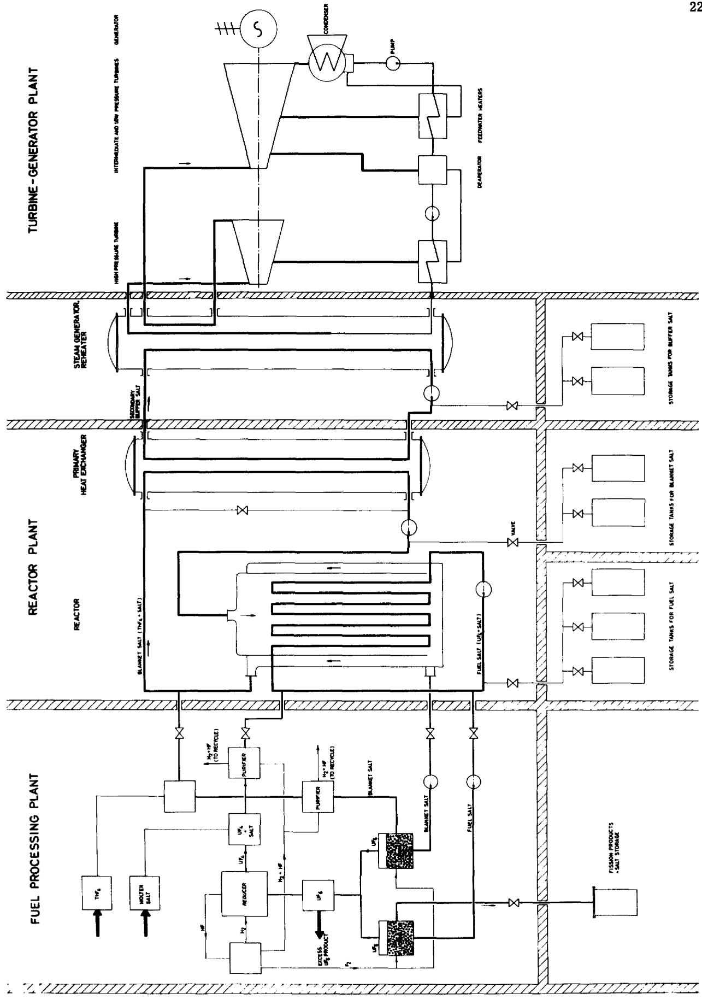  
Fig. 1. Schematic flow diagram of MOSEL reactor concept.

pressure and high temperature. The core fluid consists of $\mathrm{UF_4}$ dissolved in $\mathrm{NaF + BeF_2}$ (or a similar salt mixture) and is contained in tubes or between plates of a high-nickel alloy. The basic fissile fuel is U233, with U238 added to increase the fast fission factor. The fluid fuel is circulated primarily for purpose of fuel mixing, addition, and fission product removal. The core is internally cooled, with blanket fluid as the core coolant. The blanket salt contains $\mathrm{ThF_4}$ dissolved in $\mathrm{NaF + BeF_2}$ (or a similar salt mixture). The core coolant transfers energy to the steam generator through an intermediate heat transfer fluid. The steam generator portion of the plant utilized boilers, superheaters, and re-heaters to produce high-temperature, high-pressure steam for use in the steam turbines, as indicated schematically in fig. 1.

Fuel processing consists of uranium recovery by fuel fluorination, and is applied to both the blanket and core fluids. In the blanket cycle, uranium-free salt is returned to the blanket region, while the recovered $\mathbf{U}\mathbf{F}_6$ is reduced to $\mathbf{U}\mathbf{F}_4$ and fed to the core region. Core processing consists of fissile fuel recovery and discard of fission-product-containing salt.

The fluid nature of the fuel, the simple processing scheme, and the use of blanket fluid as the coolant permit reactor power to be increased without significant change in nuclear performance. This is done by extending the core in one direction, perpendicular to coolant flow, which also permits modular-type construction. Based on present information, the MOSEL reactor concept discussed here appears to have economic breeding ratios in the range of 1.05 - 1.1, fissile

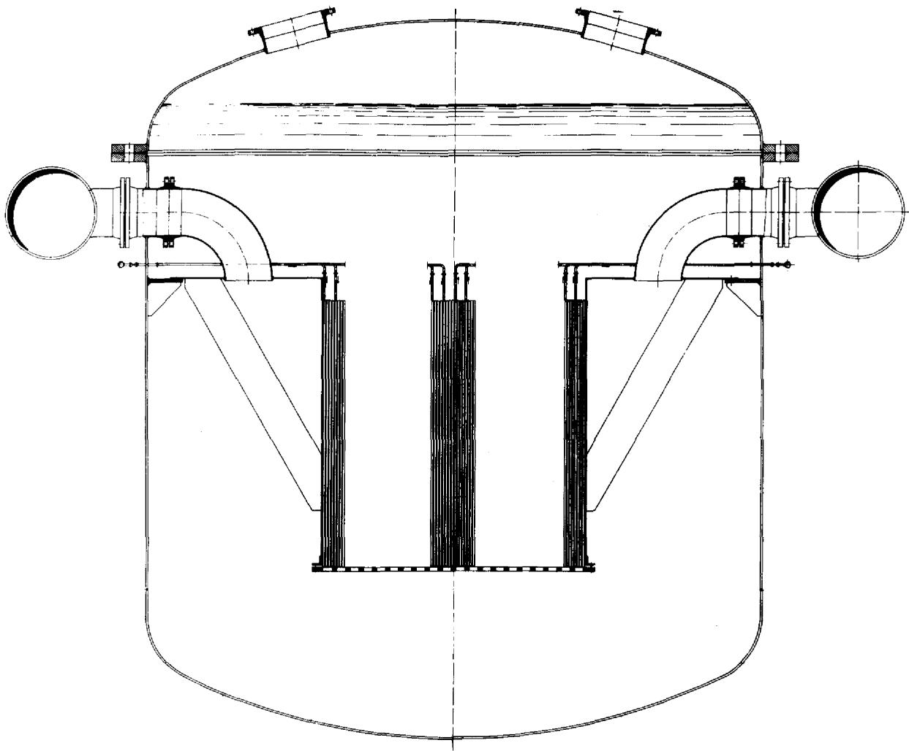  
Fig. 2. Integral core and container.

fuel doubling times between 15 - 60 years, fuel cycle costs less than 1.5 mills/kWh and power costs under 6 mills/kWh in power plants of 500 MWe rating, utilizing on-site processing and fuel recycle, and employing capital charges of 15 and $10\%$ /year for depreciating and non-depreciating items, respectively. Compared with other reactor types, the MOSEL concept appears superior for combining on-site fuel recycle, breeding ratios above unity, and low power costs in relatively small nuclear plants.

# 3. CORE DESIGNS

To secure breeding the core region must be surrounded by a blanket of molten salt carrying fertile material. The core is separated from the blanket by a wall. The thickness of the separating wall is dependent upon pressure difference between core and blanket and the structural design of the core. For reasons of neutron economy this wall should be as thin as possible to lower parasitic absorption of neutrons and increase the breeding rate.

The blanket salt removes the heat generated

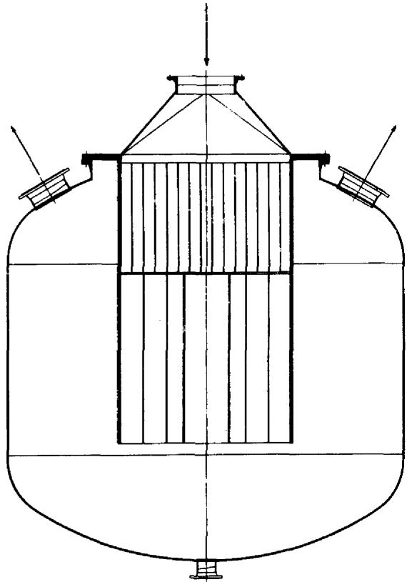  
Fig. 3. Core and container separable.

in the core by passing through the core before flowing through the blanket region. The pressure difference between core and blanket thus is dependent on the pressure drop of the coolant in passing through the core; the core length is limited to that corresponding to a tolerable thickness of the wall separating core and blanket. The flow of the coolant ensures mixing of the salt in the blanket region.

It is possible to design the core and vessel as a unit, as indicated in fig. 2. In such an arrangement the replacement of core parts would involve appreciable difficulties. A solution to this problem consists of connecting the core to a flange as seen in fig. 9. Going further in this direction and utilizing a rectangular type core leads to the design indicated in fig. 4. Here the core is divided into several parts, each of which can be removed and replaced separately. This type of structural layout also provides freedom in the choice of the volume to surface ratio while maintaining a constant core length. By controlling the leakage, the breeding ratio may be optimized to give the most economical design. An arbitrary volume to surface ratio is also possible with an annular type design, but fluid flow through the inner cylinder would be required and give rise to design problems.

# 4. POSSIBLE SHAPES OF FUEL CHANNELS

Two basic fuel-channel designs for the MOSEL core are considered here. One considers use of pipes and the other of plates. Although a number of other possibilities appear to exist, they can, with some modification, be roughly classified under either category. Although the core is cooled internally, it is advantageous to control fuel flow for mixing purposes. This places some restrictions on the core design.

# 4.1. Plate design

Fig. 5 shows a unit cell based on a plate design. As shown, $a$ is the half width of the fuel channel, $b$ is the thickness of the structural material, and $c$ is the half width of the coolant channel. The proportions of fuel, material and coolant in the core are in the ratio of $a:b:c$ . (In reality a correction must be made to account for support structures about every $20~\mathrm{mm}$ .)

Plate type core designs can involve a) concentric rings, b) spirals, c) involutes, d) plates. Some features of these type designs are discussed below.

a) Concentric rings, shown in fig. 6, are ad-

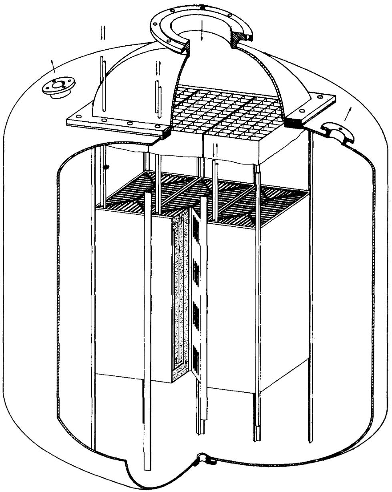  
Fig. 4. Core built in parts, enables different combinations of basic elements.

vantageous in view of resistance to forces induced by pressure, but the diameter of the core must be kept small, because otherwise rather thick walls are needed for the outer rings. An important difficulty is the required arrangement of the separate fuel and coolant streams with respect to inlet and outlet.   
b) Spiral heat exchangers are used in chemical industry. They are easy to manufacture, but when pressure is applied, they tend to distort. Control of flow can be applied relatively easy, if

the fuel stream is fed in at the center it may flow out at the edge. Coolant flow in this scheme would be axial and perpendicular to fuel flow.

c) Involute type designs, as indicated in fig. 7, permit a constant distance to be maintained between curved surface; also they can carry part of the forces induced by pressure. Difficulties are associated with the proper design of inlet and outlet flow streams from section to section.   
d) Plates arranged in square or other regular geometries have certain advantages. Plates suit

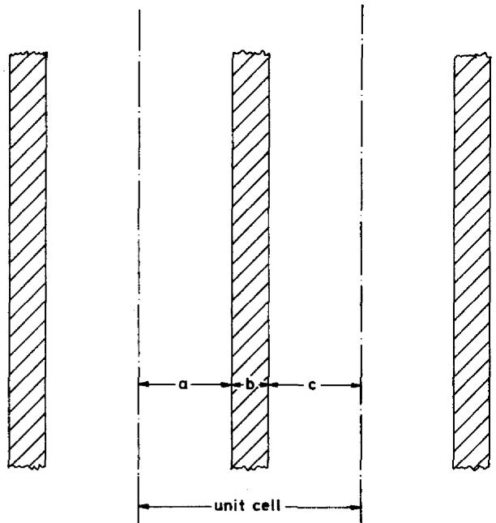  
Fig. 5. Unit cell for plates.

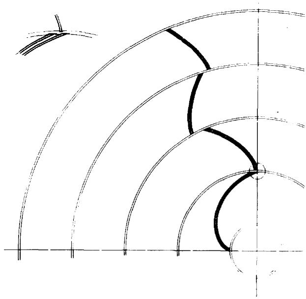  
Fig. 7. Plates arranged as involutes.

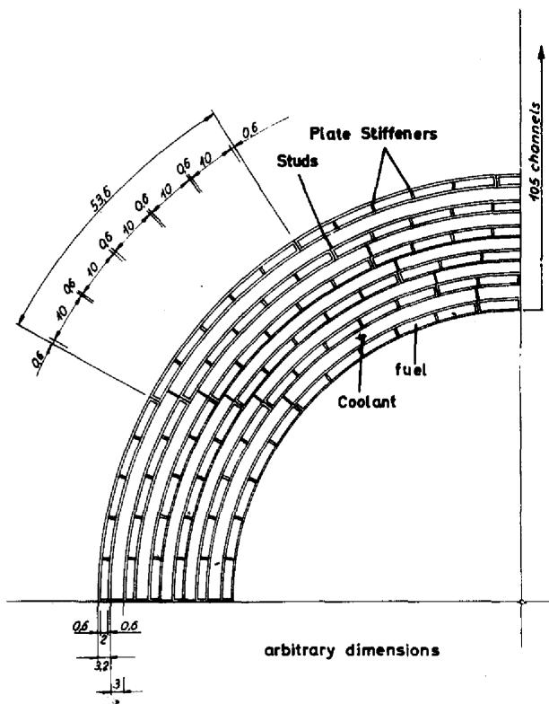  
Fig. 6. Plates arranged as concentric rings.

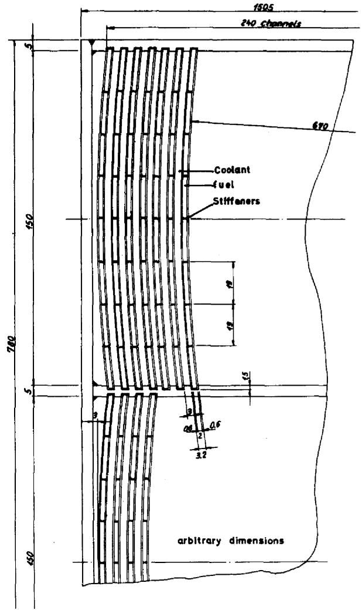  
Fig. 8. Plates arranged in a box.

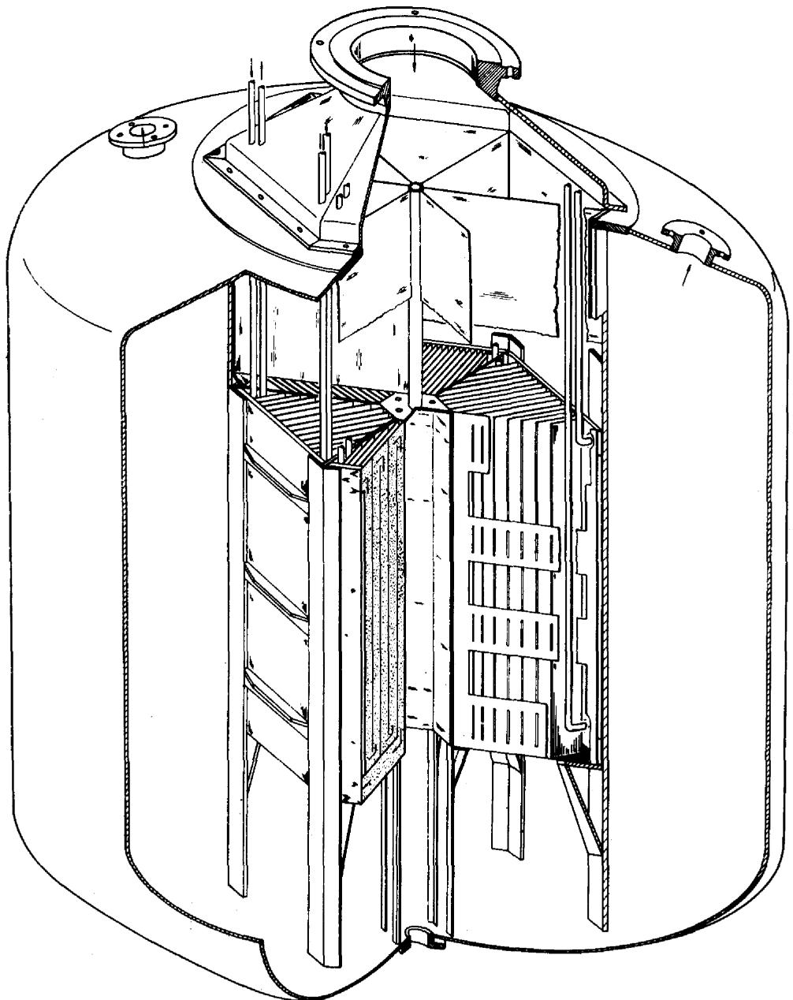  
Fig. 9. Plates arranged hexagonally.

regular polygonal forms perfectly, as illustrated in figs. 8 and 9, in addition, they are easy to arrange. An important advantage of plates lies in their ability to absorb any bending energy on the container walls induced by pressure differentials, thus avoiding a thick container wall. The plates can be arranged perpendicular to the container wall and forces tending to bend the container wall outwards are taken up in the plane of the plates. Tensile stress induced thereby are

easier to handle than bending stresses. An arrangement of plates permits low volume fraction structure in the core. Also, as indicated in fig. 4, outer plates may be used as a fuel distributor (fig. 11).

# 4.2. Tube designs

Tubes are more stable than plates and are thus more able to withstand forces induced by pressure differentials. A difficulty with the use

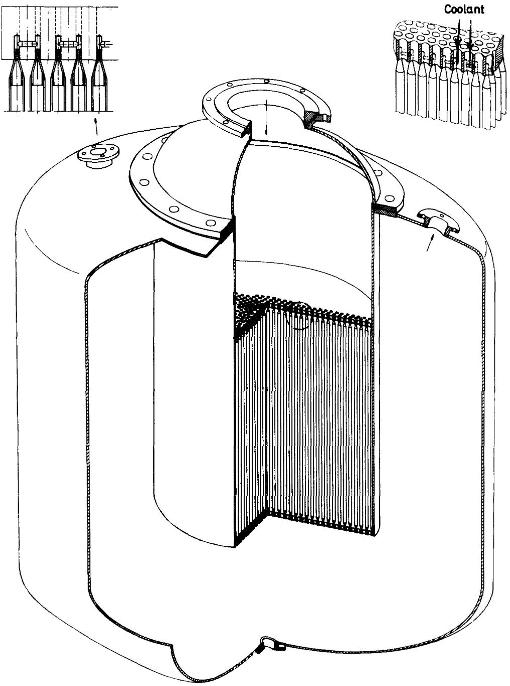  
Fig. 10. Pipes connected in a tube sheet (fuel entry and exit not shown).

of tubes is associated with proper arrangement of the streams of fuel and coolant. It seems reasonable to contain the fuel inside the tubes to enable flow control and allow a possible shut off of a single tube in case of a leak. If the tubes are connected by means of a tube sheet, as shown in

fig. 10, proper flow of coolant appears difficult to obtain. If the coolant stream is introduced perpendicular to the fuel tubes, as it is done in ordinary heat exchangers, this leads to coolant flow distribution favouring the outer regions of the core. Since power density in general is high-

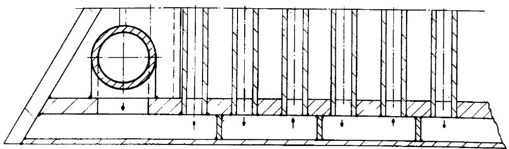  
Fig. 11. Section showing container plate arranged as fuel distributor.

est in the core center, the associated high temperatures may require a non-uniform tube spacing and/or size in the core region.

Another possibility of arranging the tubes would be to connect several tubes to a distributor pipe, which acts as a manifold (as in fig. 2). Such an arrangement would also permit various fuel concentrations to be present within the core region.

# 6. CONCLUSION

There appear to be a number of core designs which are capable of satisfying the requirements of a MOSEL-type reactor. Some of these would permit the core to be built up from modular units, thus enabling exchange of part of the core in case of failure.

The choice between the use of plates and tubes depends primarily upon fabrication ability and the mechanical and physical properties of the core structure. In a following article it is shown that plate designs lead to some thermodynamical and nuclear advantages. Tube designs appear advantageous relative to stress considerations. Plate designs appear advantageous with regard

to arrangement of the flow of the fuel and coolant. A disadvantage of tube designs is associated with the use of a tube sheet or some other arrangement requiring relatively large amounts of structural material. Also, use of tubes requires a wall between core and blanket that is capable of carrying pressure differential between the two regions. Additional construction material in the core leads to increased neutron losses and lower breeding ratios.

It appears that a plate-type design involving regular polygons facilitates fluid flow patterns and flow control. At the same time, the amount of structural material required is relatively low, which is an important factor when criticality is achieved in the heat exchange region.

# REFERENCES

1. P.R.Kasten, The MOSEL-reactor-concept, Third Intern. Conf. on the Peaceful Uses of Atomic Energy, Geneva 1964, A Conf. 28/P/538.   
2. P.R. Kasten, Eine Bewertung von Thorium-Brennstoffkreislaufen, Kernforschungsanlage Jülich, September 1964.   
3. P.R.Kasten, Das MOSEL-Reaktor-Konzept, Atom-praxis 10 (1964).