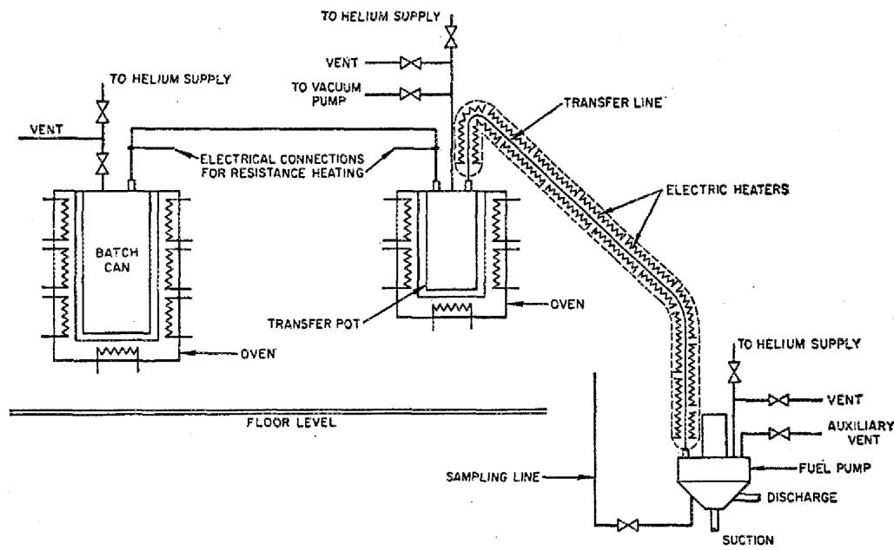
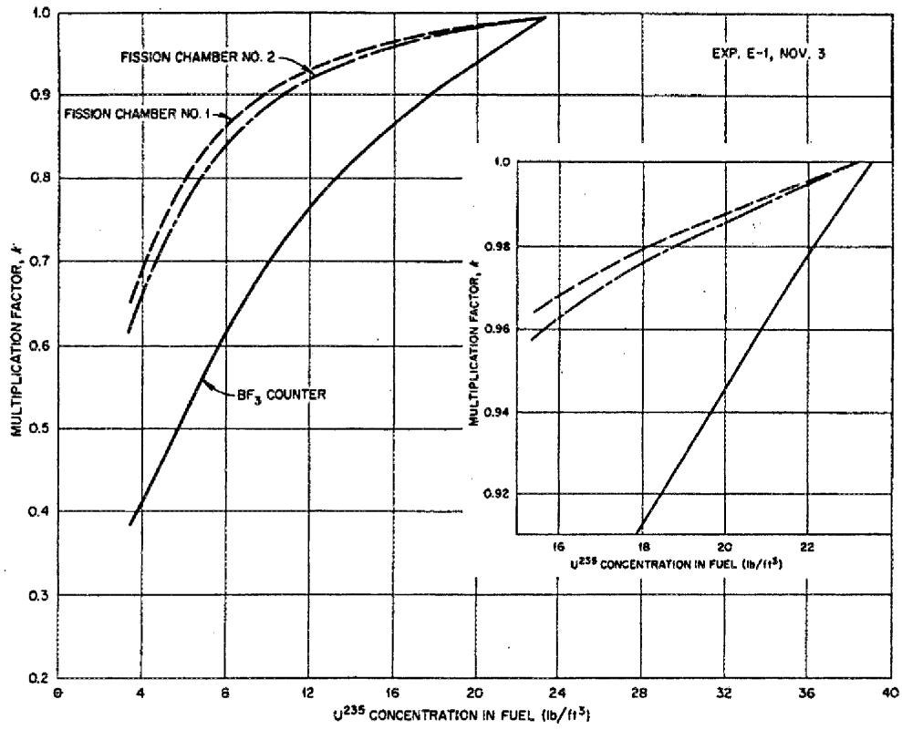
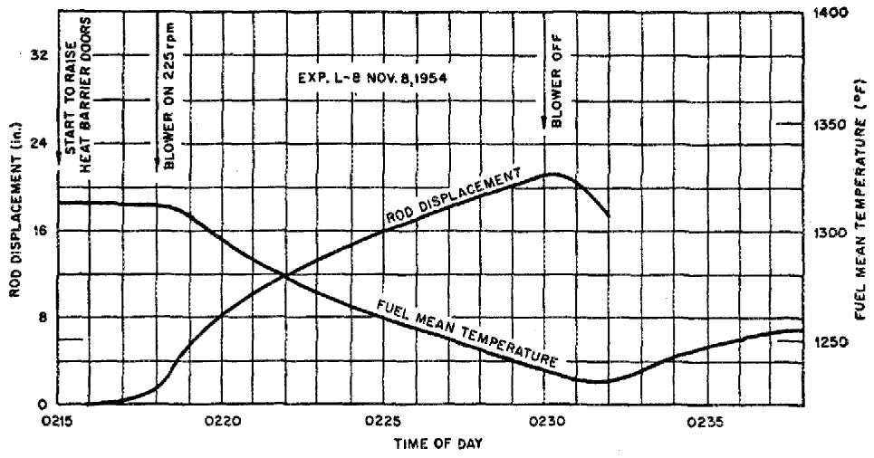
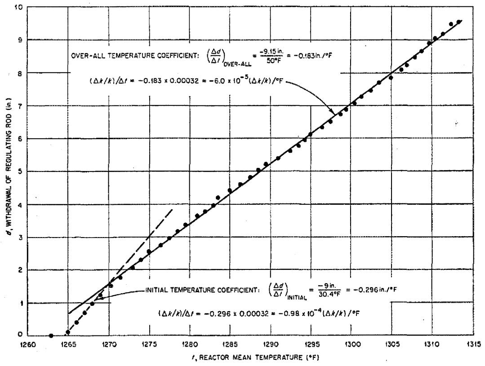
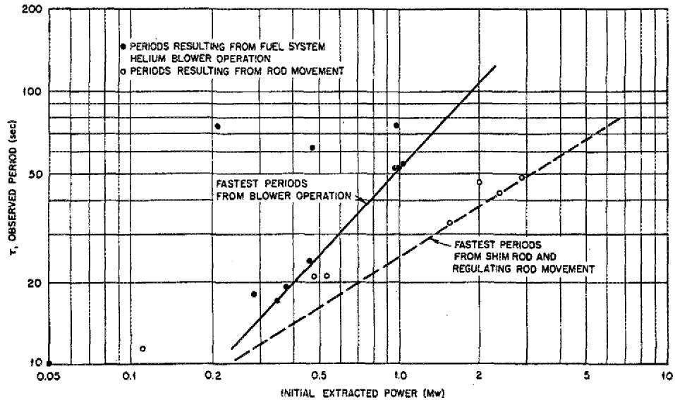
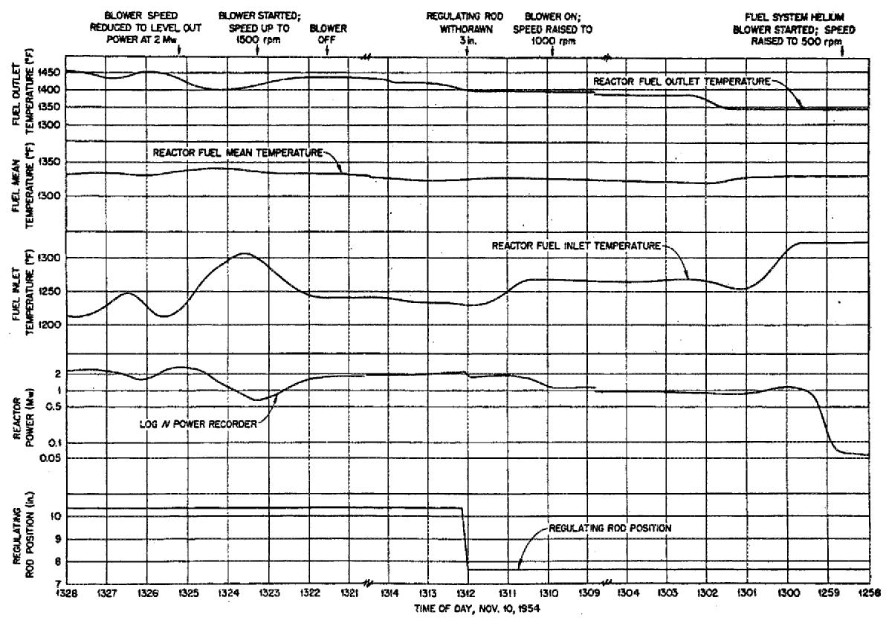

# The Aircraft Reactor Experiment-Operation1

E.S. BETTIS, W.B. COTTRELL, E.R. MANN, J.L MEEM2 AND G.D. WHITMAN

Oak Ridge National Laboratory3, 3 P.O. Box X, Oak Ridge, Tennessee Received June 13, 1957

The ARE was operated successfully in November, 1954, at various power levels up to 2.5 MWt. The maximum steady-state fuel temperature was $1580^{\circ}\mathrm{F}$ (1130 K), and there was a differential temperature between the inlet and outlet in the NaF-ZrF4-UF4 fuel of $355^{\circ}\mathrm{F}$ (200 K). The fuel system was in operation for 241 hr before the reactor first became critical and the nuclear operation extended over a period of 221 hr. The final 74 hr of operation were in the megawatt range and resulted in the production of 96 MW-hr of nuclear energy. Effects of various transient conditions on reactor operation were determined.

The specific objective of the Aircraft Reactor Experiment (ARE) was to build and operate a high-temperature low-power circulating-fuel reactor of materials which would be suitable for a high-power reactor. As described in the preceding papers (1,2), the fuel for the reactor experiment was a mixture of the fluorides of sodium, zirconium, and uranium, which was circulated through passages within the reactor and then to an external heat sink. Inconel was employed both as the fuel container and the structural metal, and a sodium system was provided in order to cool the reflector and container—regions of the reactor from which the fuel was excluded.

The reactor was designed to operate at a maximum temperature of $1500^{\circ}\mathrm{F}$ (1090 K) with a $350^{\circ}\mathrm{F}$ (200 K) temperature rise in the fuel as it circulated through the reactor. The power was to be in excess of 1 MW and the operation was scheduled to be terminated after 100 MW-hr had been accumulated. Experimental data on reactor operation, in particular data on temperature coefficients, critical mass, xenon poisoning, and response to changes in reactor operating conditions, were to be obtained.

The ARE achieved criticality on November 3, 1954, and reached the megawatt range some six days later; following completion of the experimental program in three more days the experiment was terminated. The nuclear operation of this reactor is, however, only a part of the operating history. Since the nuclear operation was particularly dependent upon the integrity and performance of the liquid sodium and liquid salt systems at high temperatures, the operating period of the ARE was defined as the period that began when these systems were filled and ended when they were drained.

# OPERATION PRELIMINARY TO CRITICALITY

Operation of the ARE was moderately complex; however, the complexity of the system and much of the instrumentation were the result of a desire to learn as much as possible from this first attempt to operate a reactor with a circulating fluoride fuel and must not be considered as

inherent requirements of the system. An idea of the complexity of the operating system may be obtained from the list of equipment, valves, and instrumentation presented in Table 1.

TABLEI LIST OF EQUIPMENT, VALVES, AND INSTRUMENTATION   

<table><tr><td>Item</td><td>Remarks</td><td>Quantity</td></tr><tr><td>Solenoid valves</td><td>Gas pressure and vent</td><td>32</td></tr><tr><td>Air-operated valves</td><td>All fuel and Na valves and some gas and water control valves</td><td>72</td></tr><tr><td>Manual valves</td><td>Room-temperature valves in gas, water, etc., systems</td><td>154</td></tr><tr><td>Check valves</td><td>Room-temperature valves in gas, water, etc., systems</td><td>46</td></tr><tr><td>Other valves</td><td>Freeze valves, relief valves, etc.</td><td>16</td></tr><tr><td>Thermocouples connected to continuous temperature recorders</td><td>Important fuel and Na temperature</td><td>20</td></tr><tr><td>Thermocouples connected to multipoint temperature recorders</td><td>(12 recorders)</td><td>150</td></tr><tr><td>Thermocouples connected to multipoint temperature indicators</td><td>(10 indicators)</td><td>600</td></tr><tr><td>Liquid level instruments</td><td></td><td>24</td></tr><tr><td>Ammeters and voltmeters</td><td></td><td>12</td></tr><tr><td>Pressure indicators</td><td>(Including pressure switches)</td><td>60</td></tr><tr><td>Pressure regulators</td><td></td><td>20</td></tr><tr><td>Pressure recorders</td><td>Mainly fuel and Na pressures</td><td>21</td></tr><tr><td>Tachometers</td><td></td><td>7</td></tr><tr><td>Flow instruments</td><td>(Including low flow alarms)</td><td>22</td></tr><tr><td>Radiation detectors</td><td></td><td>7</td></tr><tr><td>Pumps</td><td>(Including 4 high-temperature pumps)</td><td>21</td></tr><tr><td>Motors</td><td></td><td>60</td></tr><tr><td>Blowers</td><td></td><td>20</td></tr><tr><td>Heat exchangers</td><td></td><td>23</td></tr></table>

Since both sodium and the fluoride fuel are solid at room temperature, both liquid systems had to be preheated at least to above the melting points of these materials before the systems could be filled. The entire system was first electrically heated to a temperature of $600^{\circ}\mathrm{F}$ (590 K), and sodium was transferred from portable containers into the fill-and-drain tanks. The sodium was then pressurized from these tanks into the operating system and circulated. Although such filling operations are now regarded as routine, the difficulties which had been experienced up to that time caused this operation to be regarded as a milestone in the conduct of the experiment.

With the sodium system operating, the reactor and the fuel system were heated to $1200^{\circ}\mathrm{F}$ $(920\mathrm{K})$ , at which time the fuel fill tanks were filled with molten NaF - $\mathrm{ZrF_4}$ from portable containers. The several parallel serpentine fuel passages in the core would not permit the fuel system to be filled by pressurizing the fluoride mixture from the fill tanks into the operating portion of the system unless the latter were evacuated. Thus, although the fuel system could be vacuum filled, it would not drain completely nor could it be conveniently refilled. Therefore it was necessary that the system be filled properly the first time and remain filled until the completion of operation. The vacuum fill was effected without difficulty, and this system as a

whole performed exceptionally well throughout the experiment. The fuel system drain valves did not leak, and, except for a few thermocouples and the fuel flowmeter, which behaved erratically toward the end of the experiment, all instruments performed satisfactorily.

# ENRICHING TO CRITICALITY

With the sodium and fuel circulating, the reactor was ready for the introduction of the fissionable material. In order to make the reactor critical, uranium in the form of molten $2\mathrm{NaF}\cdot \mathrm{UF}_4$ was added in discrete quantities to the barren carrier, NaF-ZrF4. The fuel at initial criticality was approximately 52.8 mole % NaF, 41 mole % ZrF4, and 5.7 mole % UF4, and it had a melting point of $990^{\circ}\mathrm{F}$ (805 K); whereas the final fuel mixture, which had a melting point of $1000^{\circ}\mathrm{F}$ (810 K) and which included excess uranium, was composed of 53.09 mole % NaF, 40.73 mole % ZrF4, and 6.18 mole % UF4.

It was initially intended to remotely add the fuel concentrate to the system from a large tank which was to contain all the concentrate, after first passing it through an intermediate transfer tank. This method was discarded when temperature control and continuous weight-measuring instrumentation on the transfer tank proved to be unsatisfactory. Instead, a less elaborate and more direct method of concentrate addition was employed that is shown schematically in Figure 1. The enrichment operation involved the successive connection of numerous small concentrate containers to an intermediate transfer pot, which was in turn connected to the fuel system by a line which discharged the concentrate into the pump above the liquid level. Each of the concentrate containers was weighed before and after being emptied in order to determine the amount of uranium transferred into the fuel system. The concentrate was first taken from cans containing from $2\mathrm{lb}$ $(1\mathrm{kg})$ (for rod calibration) up to $33\mathrm{lb}$ $(15\mathrm{kg})$ (for the first subcritical loadings). In this enrichment operation the pump bowl served as a mixing chamber, and after 5 or 6 cycles through the fuel system the concentrate became uniformly distributed in the circulating stream.

FIGURE 1: Equipment for addition of fuel concentrate to fuel system.

While the first concentrate addition was made on October 30, the reactor did not become critical until three days later (3:45 PM, November 3). Most of the intervening time was spent in clearing the transfer line of plugs or in repairing leaks in the transfer lines. Both the plugs and the leaks were the result of the temporary nature of the enrichment system.

Count rates were taken after each fuel addition and at various shim rod positions that provided a measure of the shim rod worth and charted the approach to criticality. The resultant curve (Figure 2) shows the multiplication factor, $\mathrm{k}$ or $[1 - (1 / \mathrm{M})]$ , as a function of the addition of fuel in pounds of $^{235}\mathrm{U}$ per cubic foot of fuel mixture. The subcritical multiplication was determined from the expression $M = N / N_{0}$ , where $\mathbf{N}$ is the count rate after a concentrate injection and $\mathrm{N_0}$ is the initial count rate. The data from three different ionization chambers are presented: meters No. 1 and. No. 2 were fission chambers located in the reflector, and the $\mathrm{BeF}_3$ counter was located external to the reactor at the midplane of the cylindrical side. The unique shape of these curves (which when first extrapolated suggested a much lower critical mass than was actually required) is believed to be due to the particular radial flux distribution of the reactor at the location of the chambers and the change in this distribution as criticality was approached. At 3:45 PM on November 3, upon the completion of the twelfth enrichment operation, a sustaining chain reaction was attained.

  
FIGURE 2: Approach to criticality.

The calculated volume of the carrier in the fuel system (before concentrate addition) was 4.82 ft $^3$ (0.136 m $^3$ ). (The only significant check on this value was obtained from subsequent analyses of fuel samples together with the known amounts of concentrate added.) The total amount of ${}^{235}\mathrm{U}$ added to the system in order to make the reactor critical was approximately 135 lb (61.2 kg), but small amounts were withdrawn from the system for samples and in trimming the pump level. The ${}^{235}\mathrm{U}$ concentration at criticality was 23.9 lb/ft $^3$ (383 kg/m $^3$ ), and, since the calculated volume of the 1300°F (980 K) core was 1.37 ft $^3$ (388 L), the "cold" clean critical mass of the reactor was 32.75 lb (14.85 kg) of ${}^{235}\mathrm{U}$ (2).

# LOW-POWER EXPERIMENTS

Several experiments were performed with the critical reactor at low power, including reactor power calibration and rod calibrations. In addition, the effects of the process system parameters on reactivity were noted, a preliminary measurement of the temperature coefficient was undertaken, and a radiation survey was made. These tests commenced during the morning of November 4 and were completed by noon on November 8.

  
FIGURE 3: Low-power measurement of temperature coefficient.

The regulating rod was calibrated both by the addition of fuel and by observing the resultant pile period (as derived from the inhour equation) upon withdrawing the rod. The value of the rod was first obtained by noting the amount of rod insertion required to maintain a constant power level as a finite amount of fuel was added to the system. This information, together with all experimental value of 0.236 for the mass reactivity coefficient permitted a determination of the value of the rod that was subsequently validated by the period calibration derived from the inhour equation. This mass reactivity coefficient had been previously determined from measurements taken during the critical experiment. The modification of the inhour equation as a result of fuel circulation is described in the preceding paper (2).

While the reactor power was first estimated from the fission chamber counting rate, attempts were made to confirm this estimate by operating the clean reactor at some low power for a 1-hr period and then withdrawing a fuel sample for a count of its activity. This calibration was

attempted first at an estimated power of $1\mathrm{W}$ and then at $10\mathrm{W}$ . The activity of the fuel sample taken after the 1-hr run at $1\mathrm{W}$ was too low to count accurately, but that of the sample taken after the 1-hr run at $10\mathrm{W}$ indicated that the power was $13.5\mathrm{W}$ . The nuclear instrumentation was then calibrated on this basis. It was subsequently learned that many of the gaseous fission products were apparently being continuously removed from the fuel at the pump (2), and, consequently, the actual power was greater than that indicated by the fuel sample analysis. All power measurements therefore were subject to a correction which was subsequently determined from a heat balance at high power.

The sign of the reactor temperature coefficient was determined to be negative both when the reactor was subcritical and again during low-power operation. The data from the low-power measurement of the temperature coefficient are presented in Figure 3, with the regulating rod position superimposed on the fuel mean temperature chart. For this experiment the rod position was controlled by a flux servo as heat was removed from the fuel. A more accurate determination of the magnitude of the temperature coefficient was deferred until the high-power runs. It was, however, only after this positive demonstration of a good negative temperature coefficient that the reactor was brought to power.

# HIGH-POWER EXPERIMENT

The reactor was finally taken to high power (approximately 1 MW) at 6:20 PM, November 9, six days after it first became critical. The high power level was attained after a 30-hr period of intermittent operation during which there were periods of operation with power levels of $10\mathrm{kW}$ , $100\mathrm{kW}$ , $500\mathrm{kW}$ , and finally 1 MW. With the heat barrier doors opened, power was attained, as anticipated, merely by increasing the speed of the blower which cooled the fuel heat exchanger. Full power could have been obtained at once except for the natural tendency to proceed slowly into an unfamiliar regime—a fortunate decision, since there was some leakage of gaseous activity from the vent system into the pit and subsequently into the building atmosphere. Further difficulty from this source was circumvented by operating the pit at sub-atmospheric pressures and remotely exhausting the pit gases to the atmosphere where they were adequately dispersed, as previously described by Bettis et al. (1).

Once power was attained the reactor was operated intermittently and at various power levels during the next several days as required to complete the desired tests. These tests included measurement of the various temperature coefficients of reactivity, as described in the preceding paper by Ergen et al. (2), a reactor power calibration from the process instrumentation, and a determination of the effect of specific reactor operating conditions, and the tests were concluded by a 25-hr run at full power to determine whether there was any detectable buildup of xenon. Incidental to these prescribed tests, the response of the reactor to various transient states, including severe power cycling, was determined.

Although the reactor power level had been calibrated against the activity count of a fuel sample, the actual reactor power remained in doubt throughout the experiment, not only because of uncertainty regarding the retention of fission products by the fuel but also because of discrepancies in heat balances in the process systems; i.e., heat removed from fuel and sodium versus heat picked up in their water heat dumps. The most reliable estimate of the reactor power proved to be that obtained from the temperature differentials and flows in the fuel and sodium systems. During one typical period of power operation the fuel temperature differential of $370^{\circ}\mathrm{F}$ at 45 gpm accounted for approximately 1.9 MW in the fuel, while the sodium temperature

differential of $115^{\circ}\mathrm{F}$ at 150 gpm accounted for another approximately 0.6 MW in the sodium, with a resultant total reactor power in excess of 2.5 MW. During this 2.5-MW operation the fuel leaving the reactor was at a steady-state temperature of $1580^{\circ}\mathrm{F}$ and in transients was at a temperature in excess of $1620^{\circ}\mathrm{F}$ .

  
FIGURE 4: High-power measurement of temperature coefficient.

The temperature coefficient of reactivity was determined by two methods. First the regulating rod was placed on the flux servo and then the speed of the blower for cooling the fuel was increased. The change of rod position (converted into reactivity) divided by the change in the reactor mean temperature determined the reactor temperature coefficient. Since the initial reactor power at the start of this experiment was only $200\mathrm{kW}$ , the data were very similar to those from measurements made during the low-power tests described above.

The second determination was also started with the reactor at a steady-state power of $200\mathrm{kW}$ . The servo demand signal of the regulating rod was then set for some value higher than this steady state and a shim rod was withdrawn sufficiently to permit the servo to take over control of the regulating rod. The control system required that the demand signal be approximately equal to the actual flux before the servo could be actuated. Withdrawing the shim rod provided this condition. With the servo controlling the regulating rod position to maintain the flux constant the power produced was in excess of that removed by the blowers. This unbalance in power caused the reactor mean temperature to rise, which in turn caused the regulating rod to be withdrawn. The increment in reactivity provided by withdrawal of the regulating rod divided by the increment in mean temperature determined the temperature coefficient. A plot of the

regulating rod withdrawal as a function of the reactor mean temperature, as determined by the second method, is shown in Figure 4. The slope of the initial segment is proportional to the fuel temperature coefficient and the slope of the second segment is proportional to the overall reactor temperature coefficient. From these data a fuel temperature coefficient of $-10^{-4}(\Delta \mathrm{k / k})^{\circ}\mathrm{F}$ and an over-all reactor temperature coefficient of $-6\times 10^{-5}(\Delta \mathrm{k / k})^{\circ}\mathrm{F}$ were determined. This test is believed to have provided the best measurement of the fuel and reactor temperature coefficients, because it is not contingent upon the time lags and inaccuracies inherent in the determination of increasing extracted power.

TABLE II RATE OF INCREASE OF $\Delta \mathrm{K} / \mathrm{K}$ FROM VARIOUS OPERATIONS  

<table><tr><td>Operation</td><td>Range</td><td>Speed</td><td>(% of Δk/k)/sec</td></tr><tr><td rowspan="2">Fuel system helium blower speed increase</td><td>0 to 1500 rpm</td><td>Maximum availablea</td><td>0.0035</td></tr><tr><td>1000 to 1500 rpm</td><td>Maximum availablea</td><td>0.0011</td></tr><tr><td>Regulating rod movement</td><td>Whole rod insertion or withdrawal</td><td>0.3 in/sec</td><td>0.011</td></tr><tr><td rowspan="2">Shim rod withdrawal, single rod</td><td>At 4-in. insertion</td><td>0.046 in/sec</td><td>0.0039</td></tr><tr><td>At 3-in. insertion</td><td>0.046 in/sec</td><td>0.0064</td></tr><tr><td rowspan="2">Shim rod withdrawal, all three rods simultaneously</td><td>At 4-in. insertion</td><td>0.046 in/sec</td><td>0.012</td></tr><tr><td>At 8-in. insertion</td><td>0.046 in/sec</td><td>0.019</td></tr><tr><td>Fuel flow rate decrease</td><td>46 to 0 gpm</td><td>Limited to ~30 secb</td><td>0.013</td></tr><tr><td>Sodium flow rate decrease</td><td>150 to 0 gpm</td><td>Limited to ~30 secb</td><td>0.00018</td></tr></table>

a Because of the loose coupling from the speed controller to the fuel system, Ak/k was not very sensitive to the rate at which the blower speed was changed.   
b The controls provided could change the pump speeds from design to zero in a few seconds. However, it was an established operating practice to limit this time to approximately 30 sec on the few occasions that such changes were made.

A thorough understanding of control processes in a circulating-fuel reactor with a negative temperature coefficient is necessary for an appreciation of the kinetic behavior of such a power reactor in the power regime. An important purpose of the ARE was the observation of the kinetic behavior of the reactor under power coupling to its load when perturbations in the reactivity were introduced. The various ways in which transient states may be introduced into the reactor are shown in Table 2, together with the calculated rates of introduction of $\Delta \mathrm{k} / \mathrm{k}$ into the reactor. As may be seen, stopping the sodium flow had a very small, although observable, effect. No attempt was made during high-power operation to stop the fuel flow because of the danger of freezing fuel in the heat exchanger, although the result of flow stoppage can be calculated from the in-hour curves and the known change of fuel pump speed. The effects on the ARE of other operating changes are discussed below.

The reactor and system were relatively sluggish in responding to demands at high power. Furthermore, it was observed that the response at low power (less than $1\mathrm{kW}$ ) was much different from the response at higher powers (greater than $100\mathrm{kW}$ ). In order to examine the behavior of the reactor the parameter of interest was plotted against the initial power as various changes in operating conditions were introduced.

One of the properties investigated was the reactor period, and some of the observed reactor periods are plotted as a function of the initial power in Figure 5. Since the reactor could be put

on any period from infinite to a given minimum, the points in Figure 5 are scattered. Most of the longer periods represent those observed during such times as the initial rise to power, which was approached with caution. As the operators became more familiar with operation at power, deliberate attempts were made to see how fast a period the reactor would attain due to blower operation or rod movement. As a result, definite lower limits were established beyond which reactor periods could not be induced by the controls available to the operator. The solid line in Figure 5 represents the lower limit for periods during blower operation and the dashed line is that corresponding to shim and regulating rod movement. If the reactor had been taken to power with the shim rods inserted to greater depths, smaller periods would have been observed for shim rod motion than are represented by the dashed line, since the reactivity value of the rods would have been greater for those insertions. The smallest period observed during high-power operation was a 10-sec period obtained by increasing the fuel helium blower speed from 0 to 500 rpm at its maximum rate of increase. A few smaller periods were observed in the very low-power regime just above critical. The two lines shown in Figure 5 indicate that the lower the power the smaller the period that a given effect can produce; i.e., the higher the power, the harder it becomes to introduce a short period. Extrapolation of the solid line to a power of $1\mathrm{kW}$ indicates that, at this power, reactor periods of 1 sec or less could have been introduced by blower operation. It is noted that the control system would have automatically inserted the shim rods had a 5-sec period been obtained, and would have scrambled the reactor had a period less than 3 sec been obtained. Similar curves were obtained for the rates of temperature change as a result of various operating changes as a function of initial reactor power.

  
FIGURE 5: Induced reactor periods as a function of initial reactor power.

Some very general observations on the transient-state behavior of the ARE are summarized in the following and illustrated in Figure 6.

Reactor periods—In general, the lower the initial power the faster was the transient period introduced by any type of operation that resulted in upsetting the equilibrium between nuclear and extracted power. The smaller periods were associated with lower initial powers.

Oscillation of reactor power—When the power level of the reactor was perturbed, the characteristic behavior of the reactor was to overshoot the new power level and then oscillate about a mean value before settling down to that level. The period of the oscillation appeared to be of the order of 2 min and lasted for about 2 cycles.

  
FIGURE 6: Typical reactor behavior during power operation.

Movement of rods—The reactor was always more prompt to respond to rod motion than it was to blower operation. Also the reactor periods observed at a given power were smaller for rod movement than for blower operation. During rod movement at a given demand power, the extracted power remained essentially constant. Any unbalance between extracted and nuclear power resulted in a change of the mean reactor temperature.

Nuclear power—Whenever the blower speed was raised, the nuclear power rose (with oscillations as noted above) to a higher power level than the corresponding extracted power demand. When rod movement occurred, the nuclear power changed considerably and a higher or lower reactor overall temperature resulted; the nuclear power then leveled out to a new balance with the extracted power at about the original power level.

Extracted power—The extracted power was essentially a function only of the demand and changed when a change occurred in operation of one of the various heat exchanger blowers. A change in the extracted power would cause oscillations in the mean reactor temperature, after which the original value of the mean temperature would be re-established. The amount of heat input to the fuel from reactor inlet to outlet would increase or decrease depending upon whether the blower speed was raised or lowered.

Reactor outlet fuel temperature—The outlet fuel temperature always rose and fell in the same direction as the nuclear power level. For blower operation changes, the rise in the outlet temperature was always less than the fall of the inlet temperature. The opposite was true for regulating rod movement.

Reactor inlet fuel temperature—The inlet fuel temperature rose and fell in the opposite direction to the change in nuclear power during blower operation and in the same direction as the nuclear power during rod movements. The inlet temperature change was greater than the outlet temperature change for blower operation.

Reactor mean temperature—The reactor mean temperature, as such, was not measured. An average of reactor inlet and outlet temperatures was continuously recorded as the reactor mean temperature. Since this was the average of these two temperatures, its value deviated in a manner compatible with its two components.

Time lags—The system was very sluggish because of the long transit time (47 sec) of the fuel. There were time lags between the responses of temperature-indicating instruments in different portions of the system for the same action. These lags were of the order of 2 min for low-power operation (less than 1 kW) and of the order of 1 min for full-power operation in the megawatt range.

The last scheduled experiment to be conducted on the reactor was a measurement of the xenon buildup during a 25-hr run at full power. The amount of xenon buildup was to be observed by the amount the regulating rod had to be withdrawn in order to maintain a constant power level. However, during the 25-hr power run the regulating rod was withdrawn only 0.3 in., and thus there was no indication that xenon had remained in the fuel (2).

The scheduled tests were completed by 8:00 AM, November 12. During the 12-hr period starting 8:00 AM, November 12, until 8:00 that evening, the reactor was brought to full power and returned to low power some 21 times. The resulting temperature cycling was probably as severe as that to which any power reactor need be subjected. At 8:00 PM, having completed the scheduled experimental program and having logged approximately $100\mathrm{MW}$ -hr, the reactor was shut down for the last time. The following morning, the fuel and then the sodium, both of which continued to circulate overnight, were dumped into their respective dump tanks.

Subsequent analysis of the data revealed a total power production of 96 MW-hr. This analysis also showed that the fuel and sodium systems had been in operation for a total of 462 and 635 hr, respectively, including 221 hr of nuclear operation, with the final 74 hr in the megawatt range.

# REFERENCES

1. E.S. BETTIS, R.W. SCHROEDER, G.A. CRISTY, H.W. SAVAGE, R.G. AFFEL, AND L.F. HEMPHILL, Nuclear Science and Engineering 2, 804 (1957).   
2. W.K. ERGEN, A.D. CALLIHAN, C.B. MILLs, AND DUNLAP SCOTT, Nuclear Science and Engineering 2, 826 (1957).