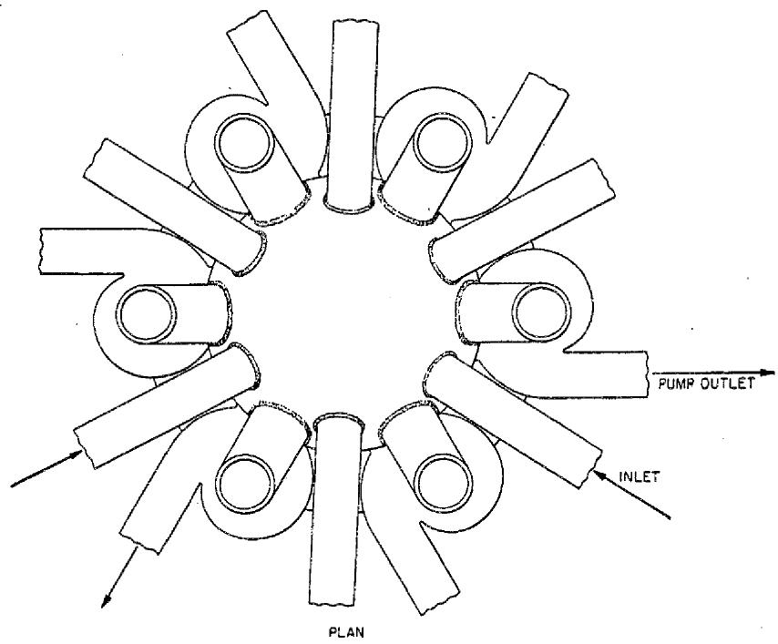
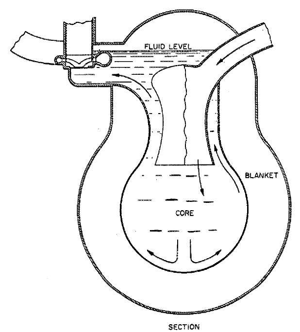

# Molten Fluorides as Power Reactor Fuels1

R. C. BRIANT2 AND ALVIN M. WEINBERG

Oak Ridge National Laboratory, $^{3}$ P.O. Box X, Oak Ridge, Tennessee

Received June 13, 1957

Molten fluorides of uranium, thorium, plutonium, and other elements potentially have wide applicability as fuels for power reactors. Because of their low vapor pressure they can be used in very high-temperature but low-pressure liquid-fuel reactors. In addition, they possess great chemical flexibility—the molten-salt principle can be applied to burners, thorium-uranium thermal breeders, plutonium-uranium converters, and possibly even to fast plutonium breeders. Because of the very high thermal efficiency obtainable in reactors using molten salt fuel, the fuel cost in a simple burner using enriched $^{235}\mathrm{U}$ is of the order of 2-3 mills/kWh

A high-temperature reactor using molten uranium salts (Aircraft Reactor Experiment) was operated for a short time at the Oak Ridge National Laboratory. The reactor was of the circulating-fuel type, with a BeO moderator. The maximum outlet temperature achieved was greater than $1500^{\circ}\mathrm{F}$ (1100 K). It is believed that with further development the ARE could be a prototype for an economical uranium burner.

Two very different schools of reactor design have emerged since the first reactors were built. One approach, exemplified by solid fuel reactors, holds that a reactor is basically a mechanical plant; the ultimate rationalization is to be sought in simplifying the heat transfer machinery. The other approach, exemplified by liquid fuel reactors, holds that a reactor is basically a chemical plant; the ultimate rationalization is to be sought in simplifying the handling and reprocessing of fuel.

At the Oak Ridge National Laboratory we have chosen to explore the second approach to reactor development. The ORNL aqueous homogeneous reactor is the best-known embodiment of the liquid reactor approach; in a sense it represents the natural culmination of the aqueous reactor systems.

The two outstanding advantages of aqueous solutions of uranium as possible reactor fluids are: first, that they exploit $\mathrm{D}_2\mathrm{O}$ , the best of all moderators; and second, that because of the wide range of solubility of $\mathrm{UO}_2\mathrm{SO}_4$ in $\mathrm{D}_2\mathrm{O}$ , there are many possible embodiments of the aqueous homogeneous idea. There are, however, disadvantages to the aqueous systems: first, because of the high vapor pressure of water, aqueous homogeneous power reactors, like all aqueous power reactors, require high pressure to achieve rather modest thermal efficiencies; second, there is no practical thorium compound which is soluble in water—the blanket of the two-region aqueous homogeneous reactor is a slurry, not a solution; and third, the mixture of radiolytic $\mathrm{D}_2$ and $\mathrm{O}_2$ produced, because it is potentially explosive, requires very complicated equipment to deal with it properly.

Thus it has long been recognized that a liquid fuel which did not require high pressure, in which thorium or its compounds could dissolve, and which did not decompose under radiation would indeed be a major invention for the reactor art. One fluid which satisfies the requirement of low

pressure and no gas production is the uranium-bismuth eutectic which is the basis for the Brookhaven-Babcock and Wilcox LMFR. The U-Bi system is, however, rather limited in the concentrations of uranium which can be dissolved; moreover, thorium is not soluble in bismuth.

TABLEI PHYSICAL PROPERTIES OF VARIOUS SALT MIXTURES  

<table><tr><td>Composition, mole %</td><td>Melting Point, K</td><td>Density at 973 K kg/m3</td><td>Thermal expansion per K</td><td>Viscosity at 973 K kg/(m*s)</td><td>Thermal conductivity, W/(m*K)</td><td>Specific Heat, kJ/(kg*K)</td><td>Prandtl number</td></tr><tr><td>53.5 NaF - 40 ZrF4 - 6.5 UF4</td><td>813</td><td>3270</td><td>3.36e-4</td><td>0.0057</td><td>2.1</td><td>1.00</td><td>2.74</td></tr><tr><td>71 LiF - 16 BeF2 - 12 ThF4 - 1 UF4</td><td>798</td><td>3250</td><td>2.52e-4</td><td>0.0071</td><td></td><td>1.55</td><td></td></tr><tr><td>67 LiF - 30.5 BeF2 - 2.5 UF4</td><td>737</td><td>2100</td><td>1.90e-4</td><td>0.0055</td><td></td><td>2.4</td><td></td></tr><tr><td>Water (at 20°C)</td><td></td><td></td><td></td><td>0.0010</td><td>0.6</td><td>4.2</td><td>7</td></tr></table>

At the Oak Ridge National Laboratory we have been investigating another class of fluids which satisfies all three of the requirements for a desirable fluid fuel: large range of uranium and thorium solubility, low pressure, and no radiolytic gas production. These fluids, first suggested by R. C. Briant, are molten mixtures of $\mathrm{UF_4}$ and $\mathrm{ThF_4}$ with fluorides of the alkali metals, beryllium, or zirconium. In order to assess better the possibilities of molten fluoride reactors, ORNL in 1954 constructed and operated a high-temperature, molten-fluoride, circulating-fuel reactor with a BeO moderator and an outlet temperature which ranged above $1500^{\circ}\mathrm{F}$ (1100 K). The papers which will follow are a description of this reactor. Since the work was supported by the Aircraft Reactors Branch of the U. S, Atomic Energy Commission, the reactor was called the Aircraft Reactor Experiment (ARE).

The nuclear properties of the fluoride salts are in many respects very good. The capture cross section of fluorine at thermal energy is only $0.009\mathrm{~b}$ , and its resonance integral is small. Unfortunately fluorine is not a very good moderator; the critical mass of a system moderated entirely by fluorine is estimated to be several hundred pounds. Consequently, many embodiments of fused salt reactors use some solid moderator, such as graphite, Be, or $\mathrm{BeO}$ . The physical properties of several possible molten fluoride mixtures are compared with those of water in Table I.

It may be seen from Table I that the thermal conductivity, heat capacity, viscosity, and Prandtl number of the salts are of the same order of magnitude as the corresponding quantities for water. The higher viscosity of the salts is somewhat compensated for by higher thermal conductivity. Hence, there is no decisive difference between water and molten fluorides from the heat transfer viewpoint. The main disadvantage of these fluids is their very high melting point—any reactor which uses them must be completely equipped with external heating devices. However, the high melting point also has an advantage: the reactor can be designed in such a way that, in case of an accident, the spilled salt would freeze and occlude radioactive fission fragments. This is an important safety consideration.

From the chemical standpoint, the molten fluorides have two great advantages: their stability, and the wide range of uranium and thorium (and, one hopes, plutonium) which can be dissolved in them. Thus the fused salt reactors can be made the basis of at least three classes of reactors, each

of which may include numerous embodiments: the straight $^{235}\mathrm{U}$ or $^{239}\mathrm{Pu}$ burner, the one- or two-region thermal breeder, and the fast reactor.

# STRAIGHT $^{235}\mathrm{UOR}^{239}\mathrm{Pu}$ BURNER

The straight $^{235}\mathrm{U}$ or plutonium burner is the simplest embodiment. The great advantage that accrues to a really high-temperature liquid-fuel burner is that such a device offers the possibility of burning $^{235}\mathrm{U}$ with good thermal efficiency and without refabrication costs. With $^{235}\mathrm{U}$ at $\$ 17/$ gram and a liquid reactor operating at $35\%$ thermal efficiency, the calculated fuel cost is between 2 and 3 mills/kWh. As for burning plutonium in a liquid fluoride system, there is insufficient knowledge of the phase diagrams to be certain that this is feasible. Our general knowledge of these fluoride systems suggests that enough plutonium fluoride will be soluble in one of the melts to make plutonium burning feasible.

# ONE- OR TWO-REGION THERMAL BREEDER

Since $\mathrm{ThF_4}$ is very soluble in fluoride melts, a regenerative system based on the $^{233}\mathrm{U}$ -Th cycle appears to be entirely possible. The neutron economy will, however, not be as good as in a $\mathrm{D}_2\mathrm{O}$ system, mainly because $^7\mathrm{Li}$ , Be, and F are not as good moderators as is deuterium. Nevertheless, calculations which have been made at ORNL suggest strongly that a $^{233}\mathrm{U}$ -Th system in which the breeding ratio is very nearly unity is feasible.

# FAST REACTORS

A fast reactor based on the fluoride system is almost out of the question: fluorine is too good a moderator. Nevertheless, a reactor fueled by a melt of pure plutonium fluoride or $^{233}\mathrm{U}$ fluoride does have a very energetic neutron spectrum. The trouble is that the fuel is extremely concentrated; the critical mass, plus the external holdup, would be prohibitively high. At first sight a more likely possibility is the molten chloride system; chlorine is a poorer moderator than fluorine, and therefore it would be possible to keep the neutron spectrum very fast in a molten chloride reactor. However, because of the very high $(\mathfrak{n},\mathfrak{p})$ cross section of $^{35}\mathrm{Cl}$ , only the isotope $^{37}\mathrm{Cl}$ would be tolerable in such a reactor. This requires a difficult isotope separation and makes a fast reactor based on molten chlorides rather unlikely.

# PROBLEMS OF MOLTEN FLUORIDE REACTORS

Circulating-fluoride reactors share, with all fluid reactors, the difficulties in equipment maintenance and the rigid requirement of leak tightness and component reliability. There are, however, three difficulties that affect the molten-fluoride systems particularly and, incidentally, also the liquid bismuth systems.

The first difficulty has to do with corrosion. The Aircraft Reactor Equipment was run only for a short time. Before the fused salts can be considered as the basis for a large-scale, long-term central power reactor system, it will be necessary to develop metals which will withstand prolonged attack by fluorides. Nevertheless, our considerable experience with these systems strongly suggests that this corrosion problem is a tractable one.

A second basic difficulty of the fluorides is that, as compared with the aqueous systems, they tend to require higher fuel concentration for criticality. This means that the power output per

kilogram of fuel in the salt system is relatively low; i.e., the material efficiency tends to be low. This, of course, is balanced by the higher thermal efficiency of these systems; the high inventory also decreases the number of reprocessing cycles required for a given number of megawatt days.

The third difficulty results from the high melting point already mentioned. The necessity of heating the system to above the melting point of the salt before the salt is introduced, and the necessity of preventing freeze-up during operation, resulted in a complex system of heaters and thermocouples in the ARE, as will be evident from the following papers. Nevertheless, this difficulty was successfully overcome and in future production reactors the complexity will be much less, partly because of the experience already gained, and partly because such a future reactor will not be called upon to furnish as much experimental information as was the ARE.

# A MOLTEN FLUORIDE LARGE-SCALE POWER PLANT

In order to see just what the potentialities of fluoride fuels for power plants might be, several design studies have been made of power plants based on fluoride fuels. The most recent, and most exhaustive, such study has been made by a group at ORNL directed by H.G. MacPherson. I should like to give a very brief description of the reactor which they have studied.

The reactor, Fig. 1, is a two-region homogeneous reactor with a core approximately 6 ft in diameter and a blanket 2 ft thick. Moderation is provided by the salt, so there is no need for moderator or other structure inside the reactor. The core, with its volume of $113\mathrm{ft}^3$ ( $3.2\mathrm{m}^3$ ) is capable of generating $600\mathrm{MW}$ of heat at a power density in the core of $187\mathrm{W/cm}^3$ . The net power generation is approximately $240\mathrm{MW}$ .

The basic core salt is a mixture of about $70\%$ 7LiF and $30\%$ $\mathrm{BeF}_2$ . Additions of thorium fluoride can be made if desired, and enough ${}^{235}\mathrm{UF}_4$ is added to make it critical. The blanket consists of the eutectic of LiF and $\mathrm{ThF}_4$ or mixtures of it with the basic core salt. The melting point of the core is $867^{\circ}\mathrm{F}$ (737 K) and that of the blanket salt is $1080^{\circ}\mathrm{F}$ (855 K) or lower.

Both the core fuel and the blanket salt are circulated to external heat exchangers, six in parallel for the core and two in parallel for the blanket. The beat is transferred by intermediate fluids from these heat exchangers to the boilers, superheaters, and reheaters. The heat transfer system is designed so that with a fuel temperature of $1200^{\circ}\mathrm{F}$ (920 K), a steam temperature of $1000^{\circ}\mathrm{F}$ (810 K) at 1800 psi (125 bar) can be achieved.

After careful consideration of the problem of control of the reactor, it has been decided that there is no need for any control rods. Reactor control is automatically maintained by the negative temperature coefficient, as demonstrated by the ARE and reported in the following papers. Uranium fluoride fuel or thorium fluoride poison will be added for shim control.

The nuclear calculation involved a multi-group, multi-region program using the latest available cross sections. These included higher parasitic absorption cross sections for $^{233}\mathrm{U}$ and $^{235}\mathrm{U}$ than had previously been used, and the resonance-energy absorption cross sections for fission products proposed by Greebler, Hurwitz, and Storm1. Thorium cross sections were estimated by reconciling the observed resonance integral with the observed resonances and by taking Doppler broadening and self-shielding into consideration. These various assumptions gave more pessimistic estimates of the neutron economy than previous studies had assumed, which should be borne in mind when making comparisons.

The starting fuel is $^{235}\mathrm{U}$ , and fresh $^{235}\mathrm{U}$ is added as needed to compensate for burn-up and buildup of fission-product poisons. When the core fuel is processed, the unburned uranium is returned to the core along with any $^{233}\mathrm{U}$ available from the blanket. With this system, no uranium is returned to the vendor, and eventually the even-numbered isotopes of uranium build up to

  
Figure 1: Reference Design Reactor

equilibrium values. The acceptance of this poison handicaps the neutron economy, but the ability to use uranium with its equilibrium content of even-isotope poison is an advantage for the molten salt system.

The processing of the fuel is by the volatility process. Uranium is removed as $\mathrm{UF}_{6}$ , and is returned in fresh salt to the reactor. The used salt containing the fission products and $^{234}\mathrm{Np}$ is

stored for later recovery; however, in the calculation of power cost no credit is taken for recovery, but instead a charge for storage is made.

The blanket is also processed by the volatility process; the uranium is removed but the thorium-bearing salt is returned to the blanket. Not enough fission products build up in the blanket during the course of the reactor life to warrant discarding the blanket fluid. With this simple fuel cycle and a chemical plant based on the capacity and cost of the current ORNL volatility pilot plant, a total fuel cycle cost of 2.5 mills/kWh is calculated. This fuel cycle cost is equivalent to the sum of the items of chemical processing, fuel element refabrication, inventory charge, and fuel cost for a conventional solid-fuel-element reactor. The estimate is based on a $17/g$ cost of ${}^{235}\mathrm{U}$ , an inventory charge of $4\%$ , and an $80\%$ load factor.

The reactor hardware can accommodate a number of different loadings to achieve different performances. The above fuel cycle cost is obtained with no thorium in the core, an equilibrium state inventory of $650\mathrm{kg}$ (about 3 years' burnup) of combined ${}^{235}\mathrm{U}$ and ${}^{233}\mathrm{U}$ , an effective breeding ratio of only 0.56, and a core processing cycle of 9 months. If ${}^{233}\mathrm{U}$ could be purchased at the same price as ${}^{235}\mathrm{U}$ , the fuel cycle costs could be reduced to 1.4 mills/kWh, with an equilibrium breeding ratio of 0.83. The acceptance of higher inventories could lead to high breeding ratios and somewhat lower costs.

Summarizing, we believe that high-temperature, molten-fluoride, circulating-fuel reactors are adaptable to a variety of embodiments because of the advantages of high temperatures at low pressures, the wider range of solubility of uranium and thorium compounds in these salts, and the radiation damage resistance of these fluorides. Our confidence has been greatly enhanced by the actual operation of a molten-fluoride reactor which will be described in the following papers.

# REFERENCES

1. P. GREEBLER, H. HURWITZ, JR., AND M.L. STORM, Nuclear Science and Engineering 2, 334 (1957).   
2. G. I. CATHERs, "Fluoride Volatility Process for High Alloy Fuels," presented at Symposium on Chemical Processing, Brussels, Belgium, May 20-25, 1957; ORNL CF 57-4-95 (1957).