U.S. DEPARTMENT OF COMMERCE / National Bureau of Standards

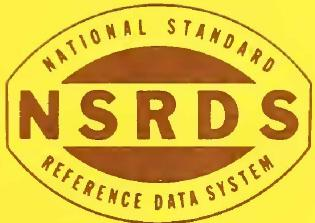

# Physical Properties Data Complications Relevant to Energy Storage.

IV. Molten Salts: Data on Additional Single and Multi-Component Salt Systems

# NATIONAL BUREAU OF STANDARDS

The National Bureau of Standards<sup>1</sup> was established by an act of Congress on March 3, 1901. The Bureau's overall goal is to strengthen and advance the Nation's science and technology and facilitate their effective application for public benefit. To this end, the Bureau conducts research and provides: (1) a basis for the Nation's physical measurement system, (2) scientific and technological services for industry and government, (3) a technical basis for equity in trade, and (4) technical services to promote public safety. The Bureau's technical work is performed by the National Measurement Laboratory, the National Engineering Laboratory, and the Institute for Computer Sciences and Technology.

THE NATIONAL MEASUREMENT LABORATORY provides the national system of physical and chemical and materials measurement; coordinates the system with measurement systems of other nations and furnishes essential services leading to accurate and uniform physical and chemical measurement throughout the Nation's scientific community, industry, and commerce; conducts materials research leading to improved methods of measurement, standards, and data on the properties of materials needed by industry, commerce, educational institutions, and Government; provides advisory and research services to other Government agencies; develops, produces, and distributes Standard Reference Materials; and provides calibration services. The Laboratory consists of the following centers:

Absolute Physical Quantities² — Radiation Research — Thermodynamics and Molecular Science — Analytical Chemistry — Materials Science.

THE NATIONAL ENGINEERING LABORATORY provides technology and technical services to the public and private sectors to address national needs and to solve national problems; conducts research in engineering and applied science in support of these efforts; builds and maintains competence in the necessary disciplines required to carry out this research and technical service; develops engineering data and measurement capabilities; provides engineering measurement traceability services; develops test methods and proposes engineering standards and code changes; develops and proposes new engineering practices; and develops and improves mechanisms to transfer results of its research to the ultimate user. The Laboratory consists of the following centers:

Applied Mathematics — Electronics and Electrical Engineering $^2$ — Mechanical Engineering and Process Technology $^2$ — Building Technology — Fire Research — Consumer Product Technology — Field Methods.

THE INSTITUTE FOR COMPUTER SCIENCES AND TECHNOLOGY conducts research and provides scientific and technical services to aid Federal agencies in the selection, acquisition, application, and use of computer technology to improve effectiveness and economy in Government operations in accordance with Public Law 89-306 (40 U.S.C. 759), relevant Executive Orders, and other directives; carries out this mission by managing the Federal Information Processing Standards Program, developing Federal ADP standards guidelines, and managing Federal participation in ADP voluntary standardization activities; provides scientific and technological advisory services and assistance to Federal agencies; and provides the technical foundation for computer-related policies of the Federal Government. The Institute consists of the following centers:

Programming Science and Technology — Computer Systems Engineering.

# Physical Properties Data Complications Relevant to Energy Storage.

IV. Molten Salts: Data on Additional Single and Multi-Component Salt Systems

G. J. Janz and R. P. T. Tomkins*

Molten Salts Data Center

Cogswell Laboratory

Rensselaer Polytechnic Institute

Troy, NY 12181

* Present affiliation:

New Jersey Institute of Technology,

Newark, NJ 07102, and Visiting

Professor, RPI.

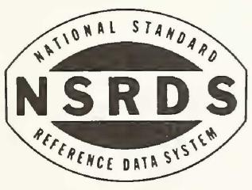

Library of Congress Cataloging in Publication Data

Main entry under title:

Physical properties data compilations relevant to energy storage.

(Nat. stand. ref. data ser.: NSRDS-NBS 61, IV)

"National Standard Reference Data System."

Bibliography: v.1, p

CONTENTS: —1. Molten salts; eutectic data—2. Molten salts: data on single and multi-component salt system—3. Engineering properties of single and polycrystalline sodium beta and beta" · alumina —4. Molten salts: data on additional single and multi-component systems.

Supt. of Docs. no.: C 13.48:61

1. Energy Storage. 2. Fused salts. 3. Eutectics. I. Janz, George J. II. Series: United States. National Bureau of Standards. National standard reference data series; NSRDS-NBS 61, IV.

QC100.U573 no.61,pt.1,etc. 602'.18s 77-10824

[TJ165] [621.042] AACR1

NSRDS-NBS 61, Part IV

Nat. Stand. Ref. Data Ser., Nat. Bur. Stand. (U.S.), 61, Part IV, 870 pages (July 1981)  
CODEN: NSRDAP

$\langle \widehat{\mathbb{C}}\rangle$ 1981 by the Secretary of Commerce on Behalf of the United States Government

U.S. GOVERNMENT PRINTING OFFICE

WASHINGTON: 1981

# Foreword

The National Standard Reference Data System provides access to the quantitative data of physical science, critically evaluated and compiled for convenience and readily accessible through a variety of distribution channels. The System was established in 1963 by action of the President's Office of Science and Technology and the Federal Council for Science and Technology, and responsibility to administer it was assigned to the National Bureau of Standards.

NSRDS receives advice and planning assistance from a Review Committee of the National Research Council of the National Academy of Sciences-National Academy of Engineering. A number of Advisory Panels, each concerned with a single technical area, meet regularly to examine major portions of the program, assign relative priorities, and identify specific key problems in need of further attention. For selected specific topics, the Advisory Panels sponsor subpanels which make detailed studies of users' needs, the present state of knowledge, and existing data resources as a basis for recommending one or more data compilation activities. This assembly of advisory services contributes greatly to the guidance of NSRDS activities.

The System now includes a complex of data centers and other activities in academic institutions and other laboratories. Components of the NSRDS produce compilations of critically evaluated data, reviews of the state of quantitative knowledge in specialized areas, and computations of useful functions derived from standard reference data. The centers and projects also establish criteria for evaluation and compilation of data and recommend improvements in experimental techniques. They are normally associated with research in the relevant field.

The technical scope of NSRDS is indicated by the categories of projects active or being planned: nuclear properties, atomic and molecular properties, solid state properties, thermodynamic and transport properties, chemical kinetics, and colloid and surface properties.

Reliable data on the properties of matter and materials are a major foundation of scientific and technical progress. Such important activities as basic scientific research, industrial quality control, development of new materials for building and other technologies, measuring and correcting environmental pollution depend on quality reference data. In NSRDS, the Bureau's responsibility to support American science, industry, and commerce is vitally fulfilled.

8. fumble.

ERNEST AMBLER, Director

# Preface

This series of publications is aimed at providing physical properties data on materials used in energy storage systems. It was inspired by a requirement in the Department of Energy's Division of Energy Storage Systems for materials property data needed by its contractors in the timely development of energy storage devices. As prime contractor for this program, the Lawrence Livermore Laboratory (LLL) has requested the Office of Standard Reference Data (OSRD) to manage the task of gathering the data, using its established network of data centers and other identified sources of expertise. The OSRD monitors the progress of work, reviews the results, and conveys the numerical data to LLL where the data are converted for entry into an automated data storage and retrieval system. Every effort is made to supply data which have been critically examined in light of the latest knowledge concerning theory and experiment. However it must be recognized that in a rapidly moving technology some of the data will be superseded rather quickly as new materials and techniques are introduced. Thus access to the data via computer terminal as well as publication in this series should help provide the practitioner with timely and useful data which he requires to solve his problems in energy storage. Funding for this series of projects from the Department of Energy, Division of Energy Storage, through the Lawrence Livermore Laboratory, is gratefully acknowledged.

Previous publications in the series "Physical Properties Data Complications Relevant to Energy Storage":

Janz, George J., Allen, Carolyn B., Downey, Joseph R., Jr., and Tomkins, R. P. T., Physical Properties Data Complications Relevant to Energy Storage. I. Molten Salts Eutectic Data, Nat. Stand. Ref. Data Ser., Nat. Bur. Stand. (U.S.), 61, Part I, 244 pp. (March 1978).   
Janz, G. J., Allen, C. B., Bansal, N. P., Murphy, R. M., and Tomkins, R. P. T., Physical Properties Data Complications Relevant to Energy Storage. II. Molten Salts: Data on Single and Multi-Component Salt Systems, Nat. Stand. Ref. Data Ser., Nat. Bur. Stand. (U.S.), 61, Part II, 442 pp. (Apr. 1979).   
Miller, G. R., and Paquette, D. G., Physical Properties Data Complications Relevant to Energy Storage. III. Engineering Properties of Single and Polycrystalline Sodium Beta and $\mathrm{Beta}''$ - Alumina, Nat. Stand. Ref. Data. Ser., Nat. Bur. Stand. (U.S.), 61, Part III, 19 pp. (June 1979).

# Contents

Page

Abstract. 1

Systems Index 2

Introduction. 4

Candidate Salt Systems. 4

Fundamental Constants, Symbols, Units 5

Treatment of Data 5

Value Judgements. 6

Physical Properties Tables. 7

Acknowledgements. 8

References to Introduction. 8

Tables to Introduction. 9

Physical Properties Data Tables 25

__________   
  
  
__________   
__________   
  
__________

# PHYSICAL PROPERTIES DATA COMPILATIONS

# RELEVANT TO ENERGY STORAGE

# IV. MOLTEN SALTS: DATA ON ADDITIONAL SINGLE AND MULTI-COMPONENT SALT SYSTEMS

G. J. Janz and R. P. T. Tomkins*

Molten Salts Data Center, Cogswell Laboratory, Rensselaer Polytechnic Institute, Troy, New York 12181

The present work provides selected data with value judgements for an additional set of 107 salt systems of interest as candidate materials for thermal energy storage sub-systems, for electrochemical energy storage systems, and in electrochemical aluminum production. The physical properties assessed are: melting points; phase diagrams; eutectic compositions; density; surface tension; viscosity; electrical conductivity; diffusion constants for ions; heat of fusion; heat capacity; volume change on fusion; vapor pressure; thermal conductivity (liquid and solid); and cryoscopic constant. The status of corrosion studies in the form of annotated bibliographic summaries, and salient observations on safety and hazards are also reported. A summarizing series of tables is provided as index to the data-gaps status for this set of candidate materials.

Key words: Corrosion; data compilations; electrochemical aluminum production; electrochemical energy storage materials; molten salts; physical properties; safety and hazards; thermal energy storage materials; thermal properties; thermodynamic properties; transport properties.

# Single Salt Systems

Page

# Multi-Component Salt Systems

Page

# Fluorides

MgF2 25   
CaF2. 32   
BaF2 39   
A1F3 45

# Chlorides

BaCl2. 52

# Sulfides

Li2S 62   
Li2S2. 65   
Li2S4. 68   
K2S. 71   
K2S2 73   
K2S3 76   
K2S4 80   
K2S5 84   
K2S6 88   
A12S3. 92

# Cryolites

Li3AlF6. 95   
NaAlF6. . . . . . . . . . . . . .104   
K3AlF6. . . . . . . . . . . . . .118

# Hydroxides

LiOH 125   
NaOH 130   
KOH. 139

# Nitrates

$\mathrm{Mg(NO_3)_2}$ 145   
Ca $(\mathrm{NO}_3)_2$ 149

# Nitrites

LiNO2. 154   
NaNO2. . . . . . . . . . . . . 159   
KNO2. . . . . . . . . . . . . . 167

# Fluoride-Fluoride

LiF-NaF. 173   
LiF-KF 183   
LiF-NaF-KF 192   
LiF-CaF2. 205   
LiF-BaF2. 213   
LiF-AlF3. 220   
NaF-MgF2. 232   
NaF-CaF2. 238   
NaF-BaF2. 247   
NaF-AlF3 254   
KF-A1F3 270

# Chloride-Chloride

LiCl-NaCl. 280   
LiCl-MgCl2 287   
LiCl-BaCl2. 295   
NaCl-MgCl2 304   
NaCl-BaCl2. 317   
KCl-MgCl2. 328   
KCl-CaCl2. 344   
KCl-BaCl2. 354   
KCl-NaCl-CaCl2. 363   
KCl-NaCl-MgCl2. 371   
MgCl2-CaCl2. 379   
MgCl2-BaCl2. 387   
KCl-MgCl2-CaCl2. 396   
CaCl2-BaCl2. 402

# Nitrate-Nitrate

LiNO3-NaNO3 409   
LiNO3-KNO3 418   
NaNO3-Ca(NO3)2. 433   
KNO3-Mg(NO3)2. 441

# Page

# Nitrite-Nitrite

LiNO2-NaNO2. 447

NaNO2-KNO2 453

# Hydroxide-Hydroxide

NaOH-KOH 461

# Cryolite-Cryolite

$\mathrm{Na}_{3}\mathrm{AlF}_{6} - \mathrm{Li}_{3}\mathrm{AlF}_{6}$ 467

# Fluoride-YZ

LiF-LiOH 477

# Chloride-YZ

LiCl-LiOH. 483

LiCl-LiNO3. . . . . . . . . . . 489

LiCl-LiCO3. 495

NaCl-NaCO3. . . . . . . . . . . . . . . . . . . . . . . . . . . . . . . . . . . . . . . . . . . . . . . . . . . . . . . . . . . . . . . .

NaCl-K2CO3 510

NaCl-NaOH. 517

NaCl-NaNO3. . . . . . . . . . . . 524

NaCl- $\mathrm{Na}_{2}\mathrm{SO}_{4}$ 533

NaCl- $\mathrm{K}_2\mathrm{SO}_4$ 540

KCl-Na2CO3. 545

KCl- $\mathbf{K}_2\mathbf{CO}_3$ 552

KCl-K2SO4. 559

# Carbonates-YZ

Li2CO3-LiOH. 568

Li2CO3-LiSO4. 575

Li2CO3-K2SO4. . . . . . . . . . . 582

NaCO3-NaOH. 590

K2CO3-KOH. 598

K2CO3-Li2SO4.604

# Cryolite-YZ

NaAlF6-LiF. 611

NaAlF-NaF. 622

Na3AlF6-KF 632

Na3AlF6-BeF2 640

Na3AlF6-MgF2. . . . . . . . . . . 647

Na3AlF6-CaF2. 655

Na3AlF6-BaF2 667

Na3AlF6-A1F3 675

# Page

NaAlF6-NaCl 685

NaAlF6-BaCl2. 695

NaAlF-BO3 705

NaAlF-A12O3. 713

K3AlF6-A12O3. 726

Li3AlF6-Al2O3. 735

# Hydroxide-YZ

LiOH-LiNO3. 744

NaOH-NaNO3 750

KOH-KNO3 756

# Nitrate-YZ

NaNO3-NaNO2. 761

NaNO3-KNO2 770

KNO3-NaNO2 778

NaNO3-KNO3-NaNO2. 786

# Sulfide-YZ

Li2S-Sulfur. 796

K2S-Sulfur 801

# Carbonate-Hydroxide-YZ

NaCO3-NaOH-NaCl 806

# [Cryolite-alumina]-YZ

$\left[\mathrm{Na}_{3} \mathrm{AlF}_{6}-\mathrm{Al}_{2} \mathrm{O}_{3}\right]-\mathrm{LiF} .$ 816

[Na3AlF6-A12O3]-CaF2. 823

[Na3AlF6-Al2O3]-AlF3 830

$\left[\mathrm{Na}_{3} \mathrm{AlF}_{6}-\mathrm{Al}_{2} \mathrm{O}_{3}\right]-\mathrm{NaCl}$ 839

[Na3AlF6-Al2O3]-Li3AlF6. 846

[Na3AlF6-Al2O3]-SiO2. 853

# INTRODUCTION

This communication reports critically evaluated data for an additional list of some 107 molten salt systems. This work was undertaken for the NBS-LLL Data Banks for Energy Research [1-3] and provides a data base on molten salts that are candidate systems particularly for thermal energy storage and for electrochemical energy storage. For the preceding publications see [4-6]. Critically evaluated data were reported for some 49 single and multi-component salt systems in Part II [5]. This data base is extended from 49 to 157 candidate salt systems in the present work.

The energy storage areas within the scope of this task included:

(i) solar and thermal energy storage subsystems utilizing inorganic salts in the PCM mode (phase-change-materials)   
(ii) high temperature (molten carbonate) fuel cell systems   
(iii) high temperature (molten carbonate) coal gasification processes   
(iv) super-batteries systems (the sodium-sulfur and the lithium-metal sulfide battery concepts)   
(v) high temperature heat transfer fluids (e.g., Hi-tec)   
(vi) molten electrolytes for high temperature electroplating of refractory metals (e.g., the Flinak electrolyte for tantalum plating)   
(vii) molten electrolytes for electrowinning of light metals (such as aluminum production from molten cryolite)

Closely related research areas are applications encountered in environmental areas, viz:

disposition of sulfur (oxides) in stack gases   
disposal of hazardous wastes without atmospheric pollution (e.g., "aged" high explosive

and rocket propellants; chemical warfare agents,...)

disposal of used photographic wastes (film) (with silver recovery)

Consideration of these areas were included in the selection of the candidate salt systems.

# Candidate Salt Systems

The criteria for selection of candidate materials, and the generalized list of "likely" systems for the selection of specific candidate systems are in tables I.1 and I.2, respectively. The present candidate systems in this task have been limited to (anhydrous) inorganic salts (table I.2-A,B); for the salt hydrates (table I.2C), see Cantor [ref. 7]. The sequence of systems in the data tables follows an anion classification as used for molten salts data elsewhere [5,8,9]. Within each anion family, the systems are arranged by cations as in the periodic chart of elements. There are some exceptions (e.g., sulfur, while not a salt, is included as a component of the alkali metal polysulfides).

The cumulative list of candidate salt systems summarized in table I.3, is arranged alphabetically by metallic element of the salt system to provide a facile entry to the data compilations reported in the preceding and the present publications. An underscored entry indicates that the data for that system are in the preceding publication in this series [5]. The alphabetical listing (by element) has the feature of cross-indexing, so that the data for multi-component systems can be readily accessed by reference to the cumulative list in table I.3.

The following considerations were used in the selection of the candidate salt systems.

Molten carbonates - In working systems (fuel cells, coal gasification, sulfur emissions scrubbing, heat storage subsystems...) additional compounds are formed in trace amounts, and increasing concentrations. Knowledge of the properties of carbonates with such additives is essential in evaluating the parameters contributing to the overall process(es).

The list was extended from pure carbonate systems to include a selection of such systems, e.g., $\mathrm{Na_2CO_3 - NaOH}$ , $\mathrm{Na_2CO_3 - NaCl}$ , $\mathrm{Li_2CO_3 - K_2SO_4}$ , $\mathrm{Na_2CO_3 - NaCl - NaOH}$ ,...

Molten polysulfides - The lithium and potassium series of polysulfides were added to extend the coverage from sodium

polysulfides and sulfur to additional systems of interest in "super-battery" type R & D projects.

PCM candidate materials - The multicomponent systems included in the present list extend the coverage to priority 1 and priority 2 type systems (see: table 2, A and B) with due consideration to the factors of economy and safety, and to the desired thermal properties (see: table 1, A). The hydroxides and their mixtures, nitrate-nitrite mixtures, the ternary nitrite-nitrate system (Hi-tec), are examples of systems thus added.

Cryolite and related systems - In the industrial production of aluminum, the molten electrolyte is a mixture of $\mathrm{Na}_3\mathrm{AlF}_6$ and $\mathrm{Al}_{2}\mathrm{O}_{3}$ with smaller amounts of $\mathrm{CaF}_2$ and $\mathrm{AlF}_3$ as additives. The candidate list has thus been extended to include a selection of such systems, e.g.,

$\mathrm{AlF}_3$ $\mathrm{CaF}_2$ $\mathrm{BaF}_2$ $\mathrm{MgF}_2$ $\mathrm{Na}_3\mathrm{AlF}_6$ and mixtures, e.g., LiF-NaF, NaF-AlF₃, Na₃AlF₆-A1₂O₃...

Additional systems - Various molten salt systems, notably fluorides, and nitrate-nitrite mixtures have seen application in diverse areas, such as: refractory metals plating; metal treatment, heat transfer fluids,..., and the candidate list was extended accordingly. The $\mathrm{KNO}_3$ - $\mathrm{NaNO}_3$ - $\mathrm{NaNO}_2$ and LiF-NaF-KF systems, widely known as "Hi-tec" and "Flinak" respectively are examples of systems thus included in this work.

Fundamental Constants, Symbols, Units

The fundamental constants and glossary of symbols and units are in Tables I.4 and I.5, respectively.

Treatment of Data

Statistical Analysis of Data

The recommended data values were selected based on the estimates of precision and uncertainty of the data surveyed in the literature. The Percent Departure also provided a guideline. The Percent Departure is defined as:

Percent Departure =

"compared value"-tabulated value" x 100 "tabulated value"

Here "compared value" and "tabulated value" refer to the literature value and the value recommended in the present work. Both the "compared value" and the "tabulated value" were calculated from

statistical derived equations since the results had to be interpolated to common temperatures and common compositions. Where the data sets from two or more studies were merged to provide the data base for the recommended values (either to extend the temperature range, or to fix the confidence level) this has been noted in the data tables. Unless otherwise noted, all values were recalculated to the Kelvin temperature scale and are thus reported throughout.

All calculations were made on the digital computer facilities at Rensselaer Polytechnic Institute. The data set of the recommended study were recalculated by a one-dimensional analysis, using the method of least squares, to establish equations indicating the variations of the physical quantities with temperature at the experimental compositions. If the data base was sufficient, calculations using a two-dimensional analysis, with a stepwise multiple regression routine were undertaken. In this way a physical property-temperature-composition matrix was developed. A result of this analysis is that it enables intercomparisons of property values at either common temperatures or at common compositions.

One-Dimensional Analysis

The criterion for choosing the equation of best fit in the one-dimensional analysis was the standard error of estimate.

This was defined by

$$
s = \left[ \frac {\sum (\gamma_ {e} - \gamma) ^ {2}}{n - q} \right] ^ {\frac {1}{2}}
$$

where $\gamma_{\mathrm{e}} =$ the experimental value at each temperature, $\gamma =$ the value calculated from the least squares equation at the same temperature as $\gamma_{\mathrm{e}}$ $n =$ the number of experimental data points, and q = the number of coefficients in the least square equation (2 for linear, 3 for quadratic). The standard error of estimate was computed from the residuals in the least-squares routine.

Two-Dimensional Analysis

The computer programs consisted of the four routines, STPRG, CORRE, LOC and MSTR; the latter two are storage routines which have no effect on the accuracy of the results. In addition a subroutine STOUT was used to print the results of each regression step and the subroutine MATRIX, for printing a matrix of numerical values from the thus derived equation.

The abbreviated Doolittle method was used to select the variables entering the regression and for calculation of coefficients. The independent variable included in each step of analysis was selected by computing the reduction of sums of squares of each variable. The variable causing the largest reduction was added to the equation and deleted from the table of sums of squares. The coefficients, intercept, and statistical parameters for the new equation were computed and printed. This procedure was repeated until the maximum proportion of sums of squares to the total reduced was less than a limit set by the programmer.

The independent variables used in the initial selection were chosen from a generalized procedure, which generated 30 combinations of input variables using powers, reciprocals, logarithmic and exponential quantities. It was found that the procedure consistently selected the equation $(\mathrm{T} + \mathrm{C})^3$ , so that the working program used nine independent variables. After the final equation was produced, it was transferred to the MATRIX routine, which recalculates values at rounded compositions and temperatures, within specified boundary conditions. In the presentation of the matrix, due cognizance is taken of the experimental range of investigation and of the phase relationships for the system so that values are always "interpolated" rather than "extrapolated". The final step in the procedure involves the residual analysis (giving the deviations of the original values from those computed for the "best-fit" equations).

In the programs used (vide infra), a summary of significant parameters is printed by the computer at each step in the regression analysis. These are: the sum of the squares reduced, $S_i$ ; the ratio $S_i / D$ where $D$ is defined below; and the cumulative sum of these variables, $S_{cum}$ and $P_{cum}$ . These quantities give an indication of the effect of each variable in the final equation. The programmer's limit on $P$ was always in the range $0.0001 < P_{cum} < 0.001$ .

The standard error in the estimated y values adjusted for degrees of freedom, is then given by:

$$
s = \left[ \frac {D - S _ {\text {c u m}}}{n - q - 1} \right] ^ {\frac {1}{2}}
$$

where $D = \sum (y_j - \bar{y})^2$ , $y_j =$ experimental values, $\bar{y} =$ average of all experimental values, and $q =$ the number of independent variables in the equations.

An F value analysis of variance was

used to determine if a particular model was acceptable. Tables of F values indicate that values greater than 2.0 are acceptable for the routine used here. In all cases values of F were greater than 1000. The F value is defined as:

$$
F = \frac {S _ {\text {c u m}} / q}{(D - S _ {\text {c u m}}) / (n - q - 1)}
$$

where $S_{\text{cum}}$ , $q$ , $D$ , and $n$ are defined above.

# Value Judgements

# Precision

Estimates of precision were based on standard error of estimate analysis. The standard error of estimate is the end result of a statistical analysis of the numerical data, and the statistical analysis depends on various factors, such as the number of the data points, the nature of the concentration dependence and the temperature dependence of the particular physical property. The precision is the standard error expressed as a percent value. As a general guide, about $60\%$ of the results lie within the estimate of precision, $95\%$ within three times the value. Where the preceding approach was not possible, we refer to the published error estimates of the original authors.

# Accuracy

Accuracy estimates were based on assessments of experimental details including method of measurements, techniques, analytical characterization of chemicals, and intercomparisons with results from the same and/or different laboratories. The accuracy estimates are more subjective than the estimates of precision.

For eutectic melting point data, the values are reported without limits of accuracy. This is largely because the experimental details (i.e., cooling/heat- ing curves) are insufficient for accuracy estimates.

The various measurement techniques encountered are summarized in Table I.6. The range is considerable and shows some aspects of the complexities and difficulties in this part of the task, i.e., firming up accuracy estimates. Descriptions of experimental details, particularly for molten salts studies, may be found in recent surveys [8-13], and it is sufficient to note some particular points encountered in the present task. The most widely used techniques appear to be: Archimedean (density), maximum bubble pressure (surface tension), capillary and

oscillating sphere (viscosity), ac bridge (electrical conductance), chronopotentiometry (diffusion), drop calorimetry (heat of fusion; heat capacity), dilatometric (volume change on fusion) mass spectrometry-Knudsen cell (vapor pressure), hot wire (thermal conductivity), and heats of fusion (cryoscopic constants). The accuracy estimates based on these appear reasonably sound.

Concerning electrical conductivity, it is now apparent that the quartz capillary dipping cell technique may lead to values as much as $3 - 5\%$ too high at temperatures greater than $900^{\circ}\mathrm{C}$ [13].

Relative to viscosity measurements, extreme care must be given to features of experimental design/technique if the damped oscillation method (oscillating sphere) is to be used with confidence. It is apparent that the recommended viscosity values for NaCl may be as much as $50\%$ too high at $900^{\circ}\mathrm{C}$ , even though the technique, as conventionally used, should be capable of an accuracy better than $\pm 5\%$ [13].

# Physical Properties Tables

Values are reported throughout on the Kelvin temperature scale with the exception of the melting point data. The Celsius scale was retained for melting points for ease of reference to source materials. Information has been included relative to two aspects that do not lend themselves readily to critical assessments, namely Corrosion and Containment, and Safety and Hazards. For these two, the information is reported simply as an annotated bibliography so as to provide ready access to the source literature.

The data status for the 157 salt systems is summarized in table I.7 in bar-graph format. An open field indicates no information found, i.e., a data gap. Some exceptions to this generalization are as follows.

The phase diagram field for one-component systems has been left open in general although the liquidus-solidus transition is known, i.e., it is characterized by a single temperature, namely the melting point temperature. When pressure - melting temperature is variant (at nominal pressures) a phase diagram has been included (e.g., sulfur).

For certain systems, such as the cryolite multi-component systems, the investigations were directed only to the

properties of density, surface tension, viscosity, and conductance, largely from the viewpoints of the liquid state properties of this molten electrolyte and current efficiencies. While the open fields for the remaining properties do indicate that no information was found in these areas, the data gaps do not appear to be significant relative to the physical properties of cryolitic electrolytes for aluminum electrolysis.

It should be noted also that heats of fusion measurements for multi-component systems are meaningful normally only at points of fixed composition, such as stoichiometric compounds and/or eutectic compositions and/or minimum melting solid solutions. An open field for this property thus indicates a significant data gap if it is apparent from the liquidus-solidus equilibrium (i.e., the phasediagram) that one or more of the preceding features occur in this system.

A ready insight into the data status/data gaps for the salt systems is given from table I.7. The use of table I.3 (one-component, multi-component systems I.D. # index) together with table I.7 (data status/data gaps - systems I.D. # index) provides a useful and facile guide to the data compilations of this series [i.e., ref. 4 and present work].

# Acknowledgements

We acknowledge with pleasure prepublication results from various colleagues during the course of this work.

Technical typescript was by Candace Bornt and Elizabeth Schoonmaker. For statistical analysis and computer programming, we acknowledge the assistance of Robert McNamee, Eric Boskin and Mark Chudzicki. Lisbeth A. Wilcox contributed significantly to preparation of final copy.

L. H. Gevantman, Office of Standard Reference Data, National Bureau of Standards is thanked for continued interest throughout the course of this work.

This work was made possible, in large, by financial support from DOE - Division of Energy Conservation, Data Management Group, Lawrence Livermore Laboratory, and the Office of Standard Reference Data, National Bureau of Standards.

10. References to Introduction

[1] Hampel, V. E., Data Management Group, Lawrence Livermore Laboratory, Univ. California, and Gevantman, L. H., Office of Standard Reference Data, National Bureau of Standards.   
[2] Hampel, V. E., Henry, E. A., Kuhn, R. S., and Lyles, L., "Acquisition, Storage, Retrieval, Display and Utilization of Computerized Data in the LLL Data Bank of Physical and Chemical Properties", Proc. 5th International CODATA Conference (1976), Pergamon Press, N.Y. (1978).   
[3] Hampel, V. E., and Quick, T. M., "Research Leading to the Production and Early Use of Numeric Data Banks of Materials Properties and Systems Analysis", (Project Summary); Proc. 2nd Ann. Thermal Energy Storage Contractors' Information Exchange Mts. ORNL-Conf-T10955 (1977); NTIS, U. S. Dept. Commerce, Springfield, Va.   
[4] NSRDS-NBS-61, Part I., "Physical Properties Data Complications Relevant to Energy Storage. I. Molten Salts: Eutectic Data", (G. J. Janz, et al.), U. S. Gov't Printing, Office, Washington, (March, 1978).   
[5] NSRDS-NBS-61, Part II., "Physical Properties Data Complications Relevant to Energy Storage. II. Molten Salts: Data in Single and Multi-Component Salt Systems", (G. J. Janz, et al.), U. S. Gov't Printing Office, Washington (April, 1979).   
[6] NSRDS-NBS-61, Part III., "Physical Properties Data Complications Relevant to Energy Storage. III. Engineering Properties of Single and Polycrystalline Sodium Beta and Beta"-Alumina", (G. R. Miller and D. G. Paquette), U. S. Gov't Printing Office, Washington (June, 1979).   
[7] Cantor, S., "Thermophysical Properties and Behavioural Characteristics of Phase-Change Materials", (Project Summary); Proc. 2nd Ann. Thermal Energy Storage Contractors' Information Exchange Meeting; ORNL-Conf-T10955 (1977); NTIS, U. S. Dept. Commerce, Springfield, Va.

[8] Janz, G. J., et al., Molten Salts Data, Vol. 4, Pt. 2; J. Physical and Chemical Ref. Data, 4, 871 (1975).   
[9] Janz, G. J., "Molten Salts Handbook", Academic Press, N.Y. (1967).   
[10] Bockris, J. O'M., White, J. L., and MacKenzie, J. D., "Physicochemical Measurements at High Temperatures", Butterworths, London (1959).   
[11] Corbett, J. D., and Duke, F. R., in "Techniques of Inorganic Chemistry", Vol. 1, Wiley-Interscience, N. Y. (1963).   
[12] Bailey, R. A., and Janz, G. J., in "The Chemistry of Non-Aqueous Solvents", Vol. 1, Academic Press, N. Y. (1966).   
[13] Janz, G. J., "Molten Salts Calibra-tion Quality Data", J. Physical and Chemical Ref. Data, 9, in press (1980).

Tables to Introduction   
Table I.1. Criteria for the selection of candidate materials   

<table><tr><td colspan="2">A. (For thermal energy storage systems (PCM)a and for electrochemical energy storage (ESB)b</td></tr><tr><td>1. Thermodynamic properties</td><td>2. Chemical properties</td></tr><tr><td>(i) suitable melting point</td><td>(i) safety</td></tr><tr><td>(ii) high heat of fusion</td><td>(ii) stability</td></tr><tr><td>(iii) congruent melting</td><td>(iii) non-corrosive to container materials</td></tr><tr><td>(iv) small volume change on melting</td><td></td></tr><tr><td>(v) high thermal conductivity</td><td></td></tr><tr><td>(vi) heat capacity</td><td></td></tr><tr><td>(vii) density</td><td>3. Economy</td></tr><tr><td>(viii) surface tension</td><td>(i) inexpensive</td></tr><tr><td></td><td>(ii) availability</td></tr><tr><td colspan="2">B. Additional considerations for electrochemical energy storage (ESB)</td></tr><tr><td>(i) electrical conductivity</td><td>(iv) cryoscopic constant</td></tr><tr><td>(ii) diffusion constants for ions</td><td>(v) emf series of metals</td></tr><tr><td>(iii) transport number for ions</td><td>(vi) reference electrodes</td></tr><tr><td colspan="2">(vii) thermodynamic activity coefficients</td></tr></table>

a(PCM); phase-change materials; b(ESB); electrochemical storage batteries

Table I.2. Likely candidates list (salt systems)   

<table><tr><td colspan="3">A. Systems utilizing single salts (I.IIa and I.IIb)</td></tr><tr><td>I. Cations</td><td colspan="2">II. Anions</td></tr><tr><td></td><td>a</td><td>b</td></tr><tr><td>lithium</td><td>chloride</td><td>bromides</td></tr><tr><td>sodium</td><td>nitrates</td><td>iodides</td></tr><tr><td>potassium</td><td>carbonates</td><td>sulfates</td></tr><tr><td>magnesium</td><td>polysulfides</td><td>phosphates</td></tr><tr><td>calcium</td><td>fluorides</td><td>thiocyanates</td></tr><tr><td>barium</td><td>hydroxides</td><td>vanadates</td></tr><tr><td></td><td>nitrites</td><td>borates</td></tr><tr><td></td><td>sulfides</td><td>tungstates</td></tr><tr><td></td><td></td><td>chromates</td></tr><tr><td></td><td></td><td>formates</td></tr><tr><td></td><td></td><td>acetates</td></tr><tr><td colspan="3">B. Systems utilizing mixtures of salts</td></tr><tr><td colspan="3">(a) Eutectics (2 or more salts from I.IIa)</td></tr><tr><td colspan="3">(b) Eutectics (2 or more salts from I.IIb)</td></tr><tr><td colspan="3">(c) Eutectics (2 or more salts from I.IIa, I.IIb)</td></tr><tr><td colspan="3">C. Systems utilizing salt hydrates</td></tr><tr><td colspan="3">Congruently melting salts with water of hydration</td></tr></table>

Table I.3. List of candidate salt systems   
[The underscored system numbers identify the systems that were in the first list of candidates (see: ref.[5]); the system numbers not underscored identify the systems in the second list of candidates (i.e., this work)]   

<table><tr><td colspan="2">A1</td><td>- KC1</td><td>94</td><td colspan="2">K</td></tr><tr><td rowspan="2">AlCl3</td><td>9</td><td>- LiCl</td><td>89</td><td>K3AlF6</td><td>67</td></tr><tr><td>31</td><td>- MgCl2</td><td>98</td><td>- Al2O3</td><td>140</td></tr><tr><td>- KCl</td><td>29</td><td>- Na3AlF6</td><td>139</td><td></td><td></td></tr><tr><td>- LiCl</td><td>30</td><td>- NaCl</td><td>91</td><td>K2CO3</td><td>12</td></tr><tr><td>- NaCl</td><td>36</td><td></td><td></td><td>- KC1</td><td>120</td></tr><tr><td>- NaCl-KCl</td><td>36</td><td>BaF2</td><td>52</td><td>- KOH</td><td>126</td></tr><tr><td rowspan="2">AlF5</td><td rowspan="2">53</td><td>- LiF</td><td>80</td><td>- Li2CO3</td><td>43</td></tr><tr><td>- Na3AlF6</td><td>134</td><td>- Li2SO4</td><td>127</td></tr><tr><td>- KF</td><td>86</td><td>- NaF</td><td>84</td><td>- Na2CO3</td><td>44</td></tr><tr><td>- LiF</td><td>81</td><td></td><td></td><td>- Na2CO3-LiCO3</td><td>41</td></tr><tr><td>- Na3AlF6</td><td>135</td><td>Be</td><td></td><td>- NaCl</td><td>114</td></tr><tr><td>- Na3AlF6-Al2O3</td><td>154</td><td></td><td></td><td></td><td></td></tr><tr><td>- NaF</td><td>85</td><td>BeF2</td><td>131</td><td>KC1</td><td>6</td></tr><tr><td rowspan="2">Al2O3</td><td rowspan="2">140</td><td>- Na3AlF6</td><td>100</td><td>- AlCl3</td><td>31</td></tr><tr><td>Ca</td><td></td><td>- BaCl2</td><td>94</td></tr><tr><td>- Li3AlF6</td><td>141</td><td></td><td></td><td>- CaCl2</td><td>93</td></tr><tr><td>- Na3AlF6</td><td>139</td><td>CaCl2</td><td>8</td><td>- K2CO3</td><td>120</td></tr><tr><td>- Na3AlF6-AlF3</td><td>154</td><td>- BaCl2</td><td>100</td><td>- K2SO4</td><td>121</td></tr><tr><td>- Na3AlF6-CaF2</td><td>153</td><td>- KC1</td><td>93</td><td>- LiCl</td><td>27</td></tr><tr><td>- Na3AlF6-Li3AlF6</td><td>156</td><td>- KC1-MgCl2</td><td>99</td><td>- LiCl-CaCl2</td><td>37</td></tr><tr><td>- Na3AlF6-LiF</td><td>152</td><td>- KC1-NaCl</td><td>95</td><td>- MgCl2</td><td>92</td></tr><tr><td>- Na3AlF6-NaCl</td><td>155</td><td>- LiCl-KCl</td><td>37</td><td>- MgCl2-CaCl2</td><td>99</td></tr><tr><td rowspan="2">- Na3AlF6-SiO2</td><td rowspan="2">157</td><td>- MgCl2</td><td>97</td><td>- Na2CO3</td><td>119</td></tr><tr><td>- NaCl</td><td>32</td><td>- NaCl</td><td>28</td></tr><tr><td rowspan="2">Al2S3</td><td rowspan="2">64</td><td></td><td></td><td>- NaCl-AlCl3</td><td>36</td></tr><tr><td>CaF2</td><td>51</td><td>- NaCl-CaCl2</td><td>95</td></tr><tr><td>B</td><td>138</td><td>- LiF</td><td>79</td><td>- NaCl-LiCl</td><td>38</td></tr><tr><td rowspan="2">B2O3-Na3AlF6</td><td rowspan="2">138</td><td>- Na3AlF6</td><td>133</td><td>- NaCl-MgCl2</td><td>147</td></tr><tr><td>- Na3AlF6-Al2O3</td><td>153</td><td></td><td></td></tr><tr><td rowspan="2">Ba</td><td rowspan="2">54</td><td>- NaF</td><td>83</td><td>KF</td><td>5</td></tr><tr><td></td><td></td><td>- AlF3</td><td>86</td></tr><tr><td>BaCl2</td><td>54</td><td></td><td></td><td>- LiF</td><td>77</td></tr><tr><td rowspan="2">- CaCl2</td><td rowspan="2">100</td><td>Ca(NO3)2</td><td>72</td><td></td><td></td></tr><tr><td>- NaNO3</td><td>103</td><td>- Na3AlF6</td><td>130</td></tr></table>

Table I.3. List of candidate salt systems - Continued   

<table><tr><td></td><td>- NaF</td><td>34</td><td colspan="2">Li</td><td>- LiCl-LiI</td><td>40</td></tr><tr><td></td><td>- NaF-LiF</td><td>78</td><td>Li3AlF6</td><td>65</td><td>- LiOH</td><td>109</td></tr><tr><td rowspan="8">KNO3</td><td></td><td>15</td><td>- Al2O3</td><td>141</td><td>- Na3AlF6</td><td>128</td></tr><tr><td>- KOH</td><td>144</td><td>- Na3AlF6</td><td>108</td><td>- Na3AlF6-Al2O3</td><td>152</td></tr><tr><td>- LiNO3</td><td>102</td><td>- Na3AlF6-Al2O3</td><td>156</td><td>- NaF</td><td>76</td></tr><tr><td>- Mg (NO3)2</td><td>104</td><td>Li2CO3</td><td>10</td><td>- NaF-KF</td><td>78</td></tr><tr><td>- NaNO3</td><td>45</td><td>- K2CO3</td><td>43</td><td>LiNO3</td><td>13</td></tr><tr><td>- NaNO3-LiNO3</td><td>46</td><td>- K2SO4</td><td>124</td><td>- KNO3</td><td>102</td></tr><tr><td>- NaNO3-NaNO2</td><td>148</td><td>- LiCl</td><td>112</td><td>- LiCl</td><td>111</td></tr><tr><td>- NaNO2</td><td>147</td><td>- LiOH</td><td>122</td><td>- LiOH</td><td>142</td></tr><tr><td rowspan="3">KNO2</td><td></td><td>58</td><td>- Li2SO4</td><td>123</td><td>- NaNO3</td><td>101</td></tr><tr><td>- NaNO3</td><td>146</td><td>- Na2CO3-K2CO3</td><td>42</td><td>- NaNO3-KNO3</td><td>46</td></tr><tr><td>- NaNO2</td><td>106</td><td></td><td></td><td>LiNO2</td><td>73</td></tr><tr><td rowspan="6">KOH</td><td></td><td>70</td><td>LiCl</td><td>4</td><td>- NaNO2</td><td>105</td></tr><tr><td></td><td></td><td>- AlCl3</td><td>29</td><td></td><td></td></tr><tr><td>- K2CO3</td><td>126</td><td>- BaCl2</td><td>89</td><td>LiOH</td><td>68</td></tr><tr><td>- KNO3</td><td>144</td><td>- KC1</td><td>27</td><td>- Li2CO3</td><td>122</td></tr><tr><td>- NaOH</td><td>107</td><td>- KC1-CaCl2</td><td>37</td><td>- LiCl</td><td>110</td></tr><tr><td></td><td></td><td>- KC1-NaCl</td><td>38</td><td>- LiF</td><td>109</td></tr><tr><td rowspan="7">K2SO4</td><td></td><td>18</td><td>- Li2CO3</td><td>112</td><td>- LiNO3</td><td>142</td></tr><tr><td>- Li2CO3</td><td>124</td><td>- LiF</td><td>35</td><td></td><td></td></tr><tr><td>- Li2SO4</td><td>47</td><td>- LiF-LiBr</td><td>39</td><td>Li2SO4</td><td>16</td></tr><tr><td>- KC1</td><td>121</td><td>- LiF-LiI</td><td>40</td><td>- K2CO3</td><td>127</td></tr><tr><td>- NaCl</td><td>118</td><td>- LiOH</td><td>110</td><td>- K2SO4</td><td>47</td></tr><tr><td>- Na2SO4-Li2SO4</td><td>48</td><td>- LiNO3</td><td>111</td><td>- K2SO4-Na2SO4</td><td>48</td></tr><tr><td></td><td></td><td>- MgCl2</td><td>88</td><td>- Li2CO3</td><td>123</td></tr><tr><td>K2S</td><td></td><td>58</td><td>- NaCl</td><td>87</td><td>- NaCl</td><td>49</td></tr><tr><td>K2S2</td><td></td><td>59</td><td></td><td></td><td></td><td></td></tr><tr><td>K2S3</td><td></td><td>60</td><td>LiF</td><td>1</td><td>Li2S</td><td>55</td></tr><tr><td>K2S4</td><td></td><td>61</td><td>- AlF3</td><td>81</td><td>Li2S2</td><td>56</td></tr><tr><td>K2S5</td><td></td><td>62</td><td>- BaF2</td><td>80</td><td>Li2S4</td><td>57</td></tr><tr><td>K2S6</td><td></td><td>63</td><td>- CaF2</td><td>79</td><td>Li2Sx</td><td>149</td></tr><tr><td>K2Sx</td><td></td><td>150</td><td>- KF</td><td>77</td><td></td><td></td></tr><tr><td></td><td></td><td></td><td>- LiCl</td><td>35</td><td>LiBr</td><td>25</td></tr><tr><td></td><td></td><td></td><td>- LiCl-LiBr</td><td>39</td><td>- LiF-LiCl</td><td>39</td></tr></table>

Table I.3. List of candidate salt systems - Continued   

<table><tr><td rowspan="5">LiI</td><td>26</td><td>- Li3AlF6</td><td>108</td><td>NaF</td><td>2</td></tr><tr><td rowspan="2">- LiF-LiCl</td><td>- LiF</td><td>128</td><td>- AlF3</td><td>85</td></tr><tr><td>- MgF2</td><td>132</td><td>- BaF2</td><td>84</td></tr><tr><td rowspan="2">Mg</td><td>- NaCl</td><td>136</td><td>- CaF2</td><td>83</td></tr><tr><td>- NaF</td><td>129</td><td>- KF</td><td>63</td></tr><tr><td rowspan="9">MgCl2</td><td>7</td><td></td><td></td><td>- KF-LiF</td><td>78</td></tr><tr><td>- BaCl2</td><td>Na2CO3</td><td>11</td><td>- MgF2</td><td>82</td></tr><tr><td>- CaCl2</td><td>- K2CO3</td><td>44</td><td>- LiF</td><td>76</td></tr><tr><td>- KCl</td><td>- K2CO3-Li2CO3</td><td>41</td><td>- Na3AlF6</td><td>129</td></tr><tr><td>- KCl-CaCl2</td><td>- KC1</td><td>119</td><td></td><td></td></tr><tr><td>- KCl-NaCl</td><td>- Li2CO3</td><td>42</td><td>NaNO3</td><td>14</td></tr><tr><td>- LiCl</td><td>- NaCl</td><td>113</td><td>- Ca(NO3)2</td><td>103</td></tr><tr><td>- NaCl</td><td>- NaCl-NaOH</td><td>151</td><td>- LiNO3</td><td>101</td></tr><tr><td></td><td>- NaOH</td><td>125</td><td>- KNO3</td><td>45</td></tr><tr><td rowspan="4">MgF2</td><td>50</td><td></td><td></td><td>- KNO3-LiNO3</td><td>46</td></tr><tr><td>- Na3AlF6</td><td>NaCl</td><td>5</td><td>- KNO3-NaNO3</td><td>148</td></tr><tr><td>- NaF</td><td>- AlCl3</td><td>30</td><td>- KNO2</td><td>146</td></tr><tr><td></td><td>- BaCl2</td><td>91</td><td>- NaCl</td><td>116</td></tr><tr><td rowspan="5">Mg(NO3)2</td><td>71</td><td>- CaCl2</td><td>32</td><td>- NaOH</td><td>143</td></tr><tr><td>- KNO3</td><td>- K2CO3</td><td>114</td><td>- NaNO2</td><td>145</td></tr><tr><td></td><td>- KCl</td><td>28</td><td></td><td></td></tr><tr><td>Na</td><td>- KCl-AlCl3</td><td>36</td><td>NaNO2</td><td>74</td></tr><tr><td></td><td>- KCl-CaCl2</td><td>95</td><td></td><td></td></tr><tr><td rowspan="15">Na3AlF6</td><td>66</td><td>- KCl-LiCl</td><td>38</td><td>- LiNO2</td><td>105</td></tr><tr><td>- AlF3</td><td>- KCl-MgCl2</td><td>147</td><td>- KNO3</td><td>147</td></tr><tr><td>- Al2O3</td><td>- K2SO4</td><td>118</td><td>- KNO2</td><td>106</td></tr><tr><td>- Al2O3-AlF3</td><td>- LiCl</td><td>87</td><td>- NaNO3</td><td>145</td></tr><tr><td>- Al2O3-CaF2</td><td>- Li2SO4</td><td>49</td><td></td><td></td></tr><tr><td>- Al2O3-Li3AlF6</td><td>- MgCl2</td><td>90</td><td></td><td></td></tr><tr><td>- Al2O3-LiF</td><td>- Na3AlF6</td><td>136</td><td>NaOH</td><td>69</td></tr><tr><td>- Al2O3-NaCl</td><td>- Na3AlF6-Al2O3</td><td>155</td><td>- KOH</td><td>107</td></tr><tr><td>- Al2O3-SiO2</td><td>- Na2CO3</td><td>113</td><td>- Na2CO3</td><td>125</td></tr><tr><td>- B2O3</td><td>- NaOH</td><td>115</td><td>- NaCl</td><td>115</td></tr><tr><td>- BaCl2</td><td>- NaOH-Na2CO3</td><td>151</td><td>- NaCl-Na2CO3</td><td>151</td></tr><tr><td>- BaF2</td><td>- NaNO3</td><td>116</td><td>- NaNO3</td><td>143</td></tr><tr><td>- BeF2</td><td>- Na2SO4</td><td>117</td><td></td><td></td></tr><tr><td>- CaF2</td><td>- Na2S</td><td>20</td><td></td><td></td></tr><tr><td>- KF</td><td>130</td><td></td><td></td><td></td></tr></table>

Table I.3. List of candidate salt systems - Continued   

<table><tr><td rowspan="2">Na2S2</td><td rowspan="2">21</td><td colspan="2">S</td><td colspan="2">Si</td></tr><tr><td>Sulfur</td><td>19</td><td>SiO2</td><td rowspan="9">157</td></tr><tr><td>Na2S3</td><td>22</td><td>- K2Sx</td><td>150</td><td>- Na3AlF6-Al2O3</td></tr><tr><td rowspan="2">Na2S4</td><td rowspan="2">23</td><td>- Li2Sx</td><td>149</td><td></td></tr><tr><td>- Na2Sx</td><td>33</td><td></td></tr><tr><td>Na2S5</td><td>24</td><td></td><td></td><td></td></tr><tr><td>Na2Sx [Na2S-Sulfur]</td><td>33</td><td></td><td></td><td></td></tr><tr><td>Na2SO4</td><td>17</td><td></td><td></td><td></td></tr><tr><td>- K2SO4-Li2SO4</td><td>48</td><td></td><td></td><td></td></tr><tr><td>- NaCl</td><td>117</td><td></td><td></td><td></td></tr></table>

Table I.4. Fundamental constants   

<table><tr><td>Symbol</td><td>Name</td><td>Values</td></tr><tr><td>NA</td><td>Avogadro constant</td><td>6.022045 (31) x 1023mol-1</td></tr><tr><td>F</td><td>Faraday constant</td><td>9.648456 (27) x 104C mol-1</td></tr><tr><td>e</td><td>Electron charge</td><td>1.6021892 (46) x 10-19C</td></tr><tr><td>R</td><td>Gas constant</td><td>8.31441 (26) J K-1mol-11.98719 (6) cal K-1mol-1</td></tr></table>

Fundamental constants from: CODATA Bulletin No. 11 (Dec. 1973)

In each case the digits in parentheses following a numerical value represent the standard deviation of that value in the decimal places indicated for its final digits

Table I.5. Symbols and units   

<table><tr><td>Symbol</td><td>Physical quantity</td><td>Units</td></tr><tr><td>a</td><td>Thermodynamically defined activity</td><td>dimensionless</td></tr><tr><td>A</td><td>Pre-exponential factor</td><td>as in text</td></tr><tr><td>C</td><td>Concentration</td><td>mol %</td></tr><tr><td>Cp</td><td>Heat capacity</td><td>cal K-1mol-1</td></tr><tr><td>D</td><td>Diffusion coefficient</td><td>cm2s-1</td></tr><tr><td>E</td><td>Energy of activation</td><td>cal mol-1</td></tr><tr><td>ΔH°f</td><td>Heat of fusion</td><td>kcal mol-1</td></tr><tr><td>kf</td><td>Cryoscopic constant</td><td>K mol-1kg-1</td></tr><tr><td>Kd</td><td>Equilibrium dissociation constant</td><td>atm</td></tr><tr><td>Ml</td><td>Apparent molecular weight</td><td>g mol-1</td></tr><tr><td>Pvap</td><td>Vapor pressure</td><td>mm Hg</td></tr><tr><td>t</td><td>Temperature (Celsius)</td><td>°C</td></tr><tr><td>T</td><td>Temperature (Kelvin)</td><td>K</td></tr><tr><td>Tm</td><td>Melting temperature</td><td>°C</td></tr><tr><td>To</td><td>Ideal glass transition temperature</td><td>K</td></tr><tr><td>Vs</td><td>Molar volume of solid</td><td>cm3mol-1</td></tr><tr><td>ΔVf</td><td>Change in molar volume on fusion</td><td>cm3mol-1</td></tr><tr><td>(ΔVf/Vs)%</td><td>Percent molar volume change</td><td>dimensionless</td></tr><tr><td>X</td><td>Mol fraction</td><td>dimensionless</td></tr><tr><td>γ</td><td>Surface tension</td><td>dyn cm-1</td></tr><tr><td>η</td><td>Viscosity</td><td>cp or poise</td></tr><tr><td>κ</td><td>Electrical conductance</td><td>ohm-1cm-1</td></tr><tr><td>λ</td><td>Thermal conductivity</td><td>cal cm-1s-1K-1</td></tr><tr><td>ρ</td><td>Density</td><td>g cm-3</td></tr></table>

For conversion between SI and other units:

$$
1 \mathrm {m N} \mathrm {s} \mathrm {m} ^ {- 2} = 1 \mathrm {c p} = 1 \mathrm {m P a} \mathrm {s}
$$

$$
1 \mathrm {m N} \mathrm {m} ^ {- 1} = 1 \mathrm {d y n} \mathrm {c m} ^ {- 1}
$$

$$
4. 1 8 4 \mathrm {J} \mathrm {m o l} ^ {- 1} = 1 \mathrm {c a l} \mathrm {m o l} ^ {- 1}
$$

$$
1 3 3. 3 \mathrm {P a} = 1 \text {t o r r} = 1 \mathrm {m m H g}
$$

For conversion of thermal conductivity:

to: multiply by:

$$
m W m ^ {- 1} K ^ {- 1} \quad 4. 1 8 4 x 1 0 ^ {5}
$$

$$
W m ^ {- 1} K ^ {- 1} \quad 4. 1 8 4 \times 1 0 ^ {2}
$$

$$
J c m ^ {- 1} s ^ {- 1} K ^ {- 1} \quad 4. 1 8 4
$$

$$
\mathrm {k c a l} \mathrm {m} ^ {- 1} \mathrm {h r} ^ {- 1} \mathrm {K} ^ {- 1} \quad 3. 6 0 0 \times 1 0 ^ {2}
$$

$$
\mathrm {B T U f t} ^ {- 1} \mathrm {h r} ^ {- 1} \mathrm {F} ^ {- 1} \quad 2. 4 1 9 \times 1 0 ^ {2}
$$

Table I.6. High temperature experimental techniques   

<table><tr><td>Density</td><td>Cryoscopic constants</td><td>Thermal conductivity (liquid, solid)</td></tr><tr><td rowspan="2">Archimedean dilatometric flotation maximum bubble pycnometric</td><td>freezing point lowering (dilute solution) freezing point depression (phase-rule) from heats of fusion</td><td rowspan="2">hot wire - absolute and modified hot wire concentric cylinder - absolute and transient optical plane - absolute and transient radial heat flux linear heat flux flat plate - steady state comparative method others</td></tr><tr><td>Vapor pressure</td></tr><tr><td>Surface tension</td><td rowspan="2">manometry (sickle or spoon gauge) dew point boiling/reduced pressure vapor transpiration Knudsen effusion Mass spectrometry and Knudsen effusion</td><td rowspan="5">Diffusion chronopotentiometry linear sweep voltammetry dc polarography oscillographic polarography faradaic impedance chronoamperometry rotating disc electrode porous frit electrophoresis wave-front interferometry capillary</td></tr><tr><td>maximum bubbleWilhelmy slide plate pin detachment capillary risessile bubble pendant drop</td></tr><tr><td>Viscosity</td><td>Heat of fusion Heat capacity</td></tr><tr><td>capillary oscillating sphere oscillating cylinder falling sphere</td><td>isothermal calorimetry drop calorimetry differential-scanning calorimetry (DSC) phase-rule (freezing point data) solution calorimetry</td></tr><tr><td>Electrical conductance dc bridge ac bridge transformer bridge</td><td>Volume change on melting gas manometry dilatometric pellet expansivity</td></tr></table>

<table><tr><td rowspan="2">Table I.7Molten Salts Candidate SystemsDATA STATUS SUMMARYData AvailableData Gap</td><td>ID-No.</td><td>1</td><td>2</td><td>3</td><td>4</td><td>5</td><td>6</td><td>7</td><td>8</td><td>9</td><td>10</td><td>11</td><td>12</td><td>13</td><td>14</td><td>15</td><td>16</td><td>17</td><td>18</td><td>19</td><td>20</td><td>21</td><td>22</td><td>23</td></tr><tr><td>SYSTEM</td><td>LiF</td><td>NaF</td><td>KF</td><td>LiCl</td><td>NaCl</td><td>KCl</td><td>MgCl2</td><td>CaCl2</td><td>AlCl3</td><td>Li2CO3</td><td>Na2CO3</td><td>K2CO3</td><td>LiNO3</td><td>NaNO3</td><td>KNO3</td><td>Li2SO4</td><td>Na2SO4</td><td>K2SO4</td><td>Sulfur</td><td>Na2S</td><td>Na2S2</td><td>Na2S3</td><td>Na2S4</td></tr><tr><td>1. Melting temperature</td><td></td><td></td><td></td><td></td><td></td><td></td><td></td><td></td><td></td><td></td><td></td><td></td><td></td><td></td><td></td><td></td><td></td><td></td><td></td><td></td><td></td><td></td><td></td><td></td></tr><tr><td>2. Phase diagram (liquidus-solidus)</td><td></td><td></td><td></td><td></td><td></td><td></td><td></td><td></td><td></td><td></td><td></td><td></td><td></td><td></td><td></td><td></td><td></td><td></td><td></td><td></td><td></td><td></td><td></td><td></td></tr><tr><td>3. Density (melt)</td><td></td><td></td><td></td><td></td><td></td><td></td><td></td><td></td><td></td><td></td><td></td><td></td><td></td><td></td><td></td><td></td><td></td><td></td><td></td><td></td><td></td><td></td><td></td><td></td></tr><tr><td>4. Surface Tension</td><td></td><td></td><td></td><td></td><td></td><td></td><td></td><td></td><td></td><td></td><td></td><td></td><td></td><td></td><td></td><td></td><td></td><td></td><td></td><td></td><td></td><td></td><td></td><td></td></tr><tr><td>5. Viscosity</td><td></td><td></td><td></td><td></td><td></td><td></td><td></td><td></td><td></td><td></td><td></td><td></td><td></td><td></td><td></td><td></td><td></td><td></td><td></td><td></td><td></td><td></td><td></td><td></td></tr><tr><td>6. Electrical Conductivity</td><td></td><td></td><td></td><td></td><td></td><td></td><td></td><td></td><td></td><td></td><td></td><td></td><td></td><td></td><td></td><td></td><td></td><td></td><td></td><td></td><td></td><td></td><td></td><td></td></tr><tr><td>7. Corrosion and containment</td><td></td><td></td><td></td><td></td><td></td><td></td><td></td><td></td><td></td><td></td><td></td><td></td><td></td><td></td><td></td><td></td><td></td><td></td><td></td><td></td><td></td><td></td><td></td><td></td></tr><tr><td>8. Safety and Hazards</td><td></td><td></td><td></td><td></td><td></td><td></td><td></td><td></td><td></td><td></td><td></td><td></td><td></td><td></td><td></td><td></td><td></td><td></td><td></td><td></td><td></td><td></td><td></td><td></td></tr><tr><td>9. Diffusion constants for ions</td><td></td><td></td><td></td><td></td><td></td><td></td><td></td><td></td><td></td><td></td><td></td><td></td><td></td><td></td><td></td><td></td><td></td><td></td><td></td><td></td><td></td><td></td><td></td><td></td></tr><tr><td>10. Heat of fusion</td><td></td><td></td><td></td><td></td><td></td><td></td><td></td><td></td><td></td><td></td><td></td><td></td><td></td><td></td><td></td><td></td><td></td><td></td><td></td><td></td><td></td><td></td><td></td><td></td></tr><tr><td>11. Heat capacity (constant pressure)</td><td></td><td></td><td></td><td></td><td></td><td></td><td></td><td></td><td></td><td></td><td></td><td></td><td></td><td></td><td></td><td></td><td></td><td></td><td></td><td></td><td></td><td></td><td></td><td></td></tr><tr><td>12. Volume change on fusion (percent)</td><td></td><td></td><td></td><td></td><td></td><td></td><td></td><td></td><td></td><td></td><td></td><td></td><td></td><td></td><td></td><td></td><td></td><td></td><td></td><td></td><td></td><td></td><td></td><td></td></tr><tr><td>13. Vapor pressure</td><td></td><td></td><td></td><td></td><td></td><td></td><td></td><td></td><td></td><td></td><td></td><td></td><td></td><td></td><td></td><td></td><td></td><td></td><td></td><td></td><td></td><td></td><td></td><td></td></tr><tr><td>14. Thermal conductivity (melt)</td><td></td><td></td><td></td><td></td><td></td><td></td><td></td><td></td><td></td><td></td><td></td><td></td><td></td><td></td><td></td><td></td><td></td><td></td><td></td><td></td><td></td><td></td><td></td><td></td></tr><tr><td>15. Thermal conductivity</td><td></td><td></td><td></td><td></td><td></td><td></td><td></td><td></td><td></td><td></td><td></td><td></td><td></td><td></td><td></td><td></td><td></td><td></td><td></td><td></td><td></td><td></td><td></td><td></td></tr><tr><td>16. Cryoscopic constant</td><td></td><td></td><td></td><td></td><td></td><td></td><td></td><td></td><td></td><td></td><td></td><td></td><td></td><td></td><td></td><td></td><td></td><td></td><td></td><td></td><td></td><td></td><td></td><td></td></tr></table>

continued

<table><tr><td rowspan="2">Table I.7 - continued Molten Salts Candidate Systems DATA STATUS SUMMARY Data Available Data Gap</td><td>ID- No.</td><td>24</td><td>25</td><td>26</td><td>27</td><td>28</td><td>29</td><td>30</td><td>31</td><td>32</td><td>33</td><td>34</td><td>35</td><td>36</td><td>37</td><td>38</td><td>39</td><td>40</td><td>41</td><td>42</td><td>43</td><td>44</td><td>45</td><td>46</td><td></td></tr><tr><td>SYSTEM</td><td>Na2S5</td><td>LiBr</td><td>LiI</td><td>LiCl-KCl</td><td>NaCl-KCl</td><td>LiCl-AICl3</td><td>NaCl-AICl3</td><td>KCl-AICl3</td><td>NaCl-GaCl2</td><td>Na2Sx</td><td>NaF-KF</td><td>LiF-LiCl</td><td>NaCl-KCl-AICl3</td><td>LiCl-KCl-GaCl2</td><td>LiCl-NaCl-KCl</td><td>LiF-LiCl-LiBr</td><td>LiF-LiCl-LiI</td><td>Li2CO3-Na2CO3-K2CO3</td><td>Li2CO3-K2CO3</td><td>Na2CO3-K2CO3</td><td>NaNO3-KNO3</td><td>LiNO3-NaNO3-KNO3</td><td></td><td></td></tr><tr><td colspan="2">1. Melting temperature</td><td></td><td></td><td></td><td></td><td></td><td></td><td></td><td></td><td></td><td></td><td></td><td></td><td></td><td></td><td></td><td></td><td></td><td></td><td></td><td></td><td></td><td></td><td></td><td></td></tr><tr><td colspan="2">2. Phase diagram (liquidus-solidus)</td><td></td><td></td><td></td><td></td><td></td><td></td><td></td><td></td><td></td><td></td><td></td><td></td><td></td><td></td><td></td><td></td><td></td><td></td><td></td><td></td><td></td><td></td><td></td><td></td></tr><tr><td colspan="2">3. Density (melt)</td><td></td><td></td><td></td><td></td><td></td><td></td><td></td><td></td><td></td><td></td><td></td><td></td><td></td><td></td><td></td><td></td><td></td><td></td><td></td><td></td><td></td><td></td><td></td><td></td></tr><tr><td colspan="2">4. Surface Tension</td><td></td><td></td><td></td><td></td><td></td><td></td><td></td><td></td><td></td><td></td><td></td><td></td><td></td><td></td><td></td><td></td><td></td><td></td><td></td><td></td><td></td><td></td><td></td><td></td></tr><tr><td colspan="2">5. Viscosity</td><td></td><td></td><td></td><td></td><td></td><td></td><td></td><td></td><td></td><td></td><td></td><td></td><td></td><td></td><td></td><td></td><td></td><td></td><td></td><td></td><td></td><td></td><td></td><td></td></tr><tr><td colspan="2">6. Electrical Conductivity</td><td></td><td></td><td></td><td></td><td></td><td></td><td></td><td></td><td></td><td></td><td></td><td></td><td></td><td></td><td></td><td></td><td></td><td></td><td></td><td></td><td></td><td></td><td></td><td></td></tr><tr><td colspan="2">7. Corrosion and containment</td><td></td><td></td><td></td><td></td><td></td><td></td><td></td><td></td><td></td><td></td><td></td><td></td><td></td><td></td><td></td><td></td><td></td><td></td><td></td><td></td><td></td><td></td><td></td><td></td></tr><tr><td colspan="2">8. Safety and Hazards</td><td></td><td></td><td></td><td></td><td></td><td></td><td></td><td></td><td></td><td></td><td></td><td></td><td></td><td></td><td></td><td></td><td></td><td></td><td></td><td></td><td></td><td></td><td></td><td></td></tr><tr><td colspan="2">9. Diffusion constants for ions</td><td></td><td></td><td></td><td></td><td></td><td></td><td></td><td></td><td></td><td></td><td></td><td></td><td></td><td></td><td></td><td></td><td></td><td></td><td></td><td></td><td></td><td></td><td></td><td></td></tr><tr><td colspan="2">10. Heat of fusion</td><td></td><td></td><td></td><td></td><td></td><td></td><td></td><td></td><td></td><td></td><td></td><td></td><td></td><td></td><td></td><td></td><td></td><td></td><td></td><td></td><td></td><td></td><td></td><td></td></tr><tr><td colspan="2">11. Heat capacity (constant pressure)</td><td></td><td></td><td></td><td></td><td></td><td></td><td></td><td></td><td></td><td></td><td></td><td></td><td></td><td></td><td></td><td></td><td></td><td></td><td></td><td></td><td></td><td></td><td></td><td></td></tr><tr><td colspan="2">12. Volume change on fusion (percent)</td><td></td><td></td><td></td><td></td><td></td><td></td><td></td><td></td><td></td><td></td><td></td><td></td><td></td><td></td><td></td><td></td><td></td><td></td><td></td><td></td><td></td><td></td><td></td><td></td></tr><tr><td colspan="2">13. Vapor pressure</td><td></td><td></td><td></td><td></td><td></td><td></td><td></td><td></td><td></td><td></td><td></td><td></td><td></td><td></td><td></td><td></td><td></td><td></td><td></td><td></td><td></td><td></td><td></td><td></td></tr><tr><td colspan="2">14. Thermal conductivity (melt)</td><td></td><td></td><td></td><td></td><td></td><td></td><td></td><td></td><td></td><td></td><td></td><td></td><td></td><td></td><td></td><td></td><td></td><td></td><td></td><td></td><td></td><td></td><td></td><td></td></tr><tr><td colspan="2">15. Thermal conductivity</td><td></td><td></td><td></td><td></td><td></td><td></td><td></td><td></td><td></td><td></td><td></td><td></td><td></td><td></td><td></td><td></td><td></td><td></td><td></td><td></td><td></td><td></td><td></td><td></td></tr><tr><td colspan="2">16. Cryoscopic constant</td><td></td><td></td><td></td><td></td><td></td><td></td><td></td><td></td><td></td><td></td><td></td><td></td><td></td><td></td><td></td><td></td><td></td><td></td><td></td><td></td><td></td><td></td><td></td><td></td></tr></table>

continued

<table><tr><td rowspan="2">Table I.7 - continued Molten Salts Candidate Systems DATA STATUS SUMMARY Data Available Data Gap</td><td>ID- No.</td><td>47</td><td>48</td><td>49</td><td>50</td><td>51</td><td>52</td><td>53</td><td>54</td><td>55</td><td>56</td><td>57</td><td>58</td><td>59</td><td>60</td><td>61</td><td>62</td><td>63</td><td>64</td><td>65</td><td>66</td><td>67</td><td>68</td><td>69</td><td></td></tr><tr><td>SYSTEM</td><td colspan="2">Li2SO4-K2SO4</td><td>NaCl-Li2SO4</td><td>MgF2</td><td>CaF2</td><td>BaF2</td><td>AlF3</td><td>BaCl2</td><td>Li2S</td><td>Li2S2</td><td>Li2S4</td><td>K2S</td><td>K2S2</td><td>K2S3</td><td>K2S4</td><td>K2S5</td><td>K2S6</td><td>Al2S3</td><td>Li3AlF6</td><td>Na3AlF6</td><td>K3AlF6</td><td>LiOH</td><td>NaOH</td><td></td></tr><tr><td>1. Melting temperature</td><td></td><td></td><td></td><td></td><td></td><td></td><td></td><td></td><td></td><td></td><td></td><td></td><td></td><td></td><td></td><td></td><td></td><td></td><td></td><td></td><td></td><td></td><td></td><td></td><td></td></tr><tr><td>2. Phase diagram (liquidus-solidus)</td><td></td><td></td><td></td><td></td><td></td><td></td><td></td><td></td><td></td><td></td><td></td><td></td><td></td><td></td><td></td><td></td><td></td><td></td><td></td><td></td><td></td><td></td><td></td><td></td><td></td></tr><tr><td>3. Density (melt)</td><td></td><td></td><td></td><td></td><td></td><td></td><td></td><td></td><td></td><td></td><td></td><td></td><td></td><td></td><td></td><td></td><td></td><td></td><td></td><td></td><td></td><td></td><td></td><td></td><td></td></tr><tr><td>4. Surface Tension</td><td></td><td></td><td></td><td></td><td></td><td></td><td></td><td></td><td></td><td></td><td></td><td></td><td></td><td></td><td></td><td></td><td></td><td></td><td></td><td></td><td></td><td></td><td></td><td></td><td></td></tr><tr><td>5. Viscosity</td><td></td><td></td><td></td><td></td><td></td><td></td><td></td><td></td><td></td><td></td><td></td><td></td><td></td><td></td><td></td><td></td><td></td><td></td><td></td><td></td><td></td><td></td><td></td><td></td><td></td></tr><tr><td>6. Electrical Conductivity</td><td></td><td></td><td></td><td></td><td></td><td></td><td></td><td></td><td></td><td></td><td></td><td></td><td></td><td></td><td></td><td></td><td></td><td></td><td></td><td></td><td></td><td></td><td></td><td></td><td></td></tr><tr><td>7. Corrosion and containment</td><td></td><td></td><td></td><td></td><td></td><td></td><td></td><td></td><td></td><td></td><td></td><td></td><td></td><td></td><td></td><td></td><td></td><td></td><td></td><td></td><td></td><td></td><td></td><td></td><td></td></tr><tr><td>8. Safety and Hazards</td><td></td><td></td><td></td><td></td><td></td><td></td><td></td><td></td><td></td><td></td><td></td><td></td><td></td><td></td><td></td><td></td><td></td><td></td><td></td><td></td><td></td><td></td><td></td><td></td><td></td></tr><tr><td>9. Diffusion constants for ions</td><td></td><td></td><td></td><td></td><td></td><td></td><td></td><td></td><td></td><td></td><td></td><td></td><td></td><td></td><td></td><td></td><td></td><td></td><td></td><td></td><td></td><td></td><td></td><td></td><td></td></tr><tr><td>10. Heat of fusion</td><td></td><td></td><td></td><td></td><td></td><td></td><td></td><td></td><td></td><td></td><td></td><td></td><td></td><td></td><td></td><td></td><td></td><td></td><td></td><td></td><td></td><td></td><td></td><td></td><td></td></tr><tr><td>11. Heat capacity (constant pressure)</td><td></td><td></td><td></td><td></td><td></td><td></td><td></td><td></td><td></td><td></td><td></td><td></td><td></td><td></td><td></td><td></td><td></td><td></td><td></td><td></td><td></td><td></td><td></td><td></td><td></td></tr><tr><td>12. Volume change on fusion (percent)</td><td></td><td></td><td></td><td></td><td></td><td></td><td></td><td></td><td></td><td></td><td></td><td></td><td></td><td></td><td></td><td></td><td></td><td></td><td></td><td></td><td></td><td></td><td></td><td></td><td></td></tr><tr><td>13. Vapor pressure</td><td></td><td></td><td></td><td></td><td></td><td></td><td></td><td></td><td></td><td></td><td></td><td></td><td></td><td></td><td></td><td></td><td></td><td></td><td></td><td></td><td></td><td></td><td></td><td></td><td></td></tr><tr><td>14. Thermal conductivity (melt)</td><td></td><td></td><td></td><td></td><td></td><td></td><td></td><td></td><td></td><td></td><td></td><td></td><td></td><td></td><td></td><td></td><td></td><td></td><td></td><td></td><td></td><td></td><td></td><td></td><td></td></tr><tr><td>15. Thermal conductivity</td><td></td><td></td><td></td><td></td><td></td><td></td><td></td><td></td><td></td><td></td><td></td><td></td><td></td><td></td><td></td><td></td><td></td><td></td><td></td><td></td><td></td><td></td><td></td><td></td><td></td></tr><tr><td>16. Cryoscopic constant</td><td></td><td></td><td></td><td></td><td></td><td></td><td></td><td></td><td></td><td></td><td></td><td></td><td></td><td></td><td></td><td></td><td></td><td></td><td></td><td></td><td></td><td></td><td></td><td></td><td></td></tr></table>

continued   

<table><tr><td rowspan="2">Table I.7 - continued Molten Salts Candidate Systems ID- No.</td><td>70</td><td>71</td><td>72</td><td>73</td><td>74</td><td>75</td><td>76</td><td>77</td><td>78</td><td>79</td><td>80</td><td>81</td><td>82</td><td>83</td><td>84</td><td>85</td><td>86</td><td>87</td><td>88</td><td>89</td><td>90</td><td>91</td><td>92</td></tr><tr><td>KOH</td><td>Mg(NO3)2</td><td>Ca(NO3)2</td><td>LiNO2</td><td>NaNO2</td><td>KNO2</td><td>LiF-NaF</td><td>LiF-KF</td><td>LiF-NaF-KF</td><td>LiF-CaF2</td><td>LiF-BaF2</td><td>LiF-A1F3</td><td>NaF-MgF2</td><td>NaF-CaF2</td><td>NaF-BaF2</td><td>NaF-A1F3</td><td>KF-A1F3</td><td>LiCl-NaCl</td><td>LiCl-MgCl2</td><td>LiCl-BaCl2</td><td>NaCl-MgCl2</td><td>NaCl-BaCl2</td><td>KCl-MgCl2</td></tr><tr><td>1. Melting temperature</td><td></td><td></td><td></td><td></td><td></td><td></td><td></td><td></td><td></td><td></td><td></td><td></td><td></td><td></td><td></td><td></td><td></td><td></td><td></td><td></td><td></td><td></td><td></td></tr><tr><td>2. Phase diagram (liquidus-solidus)</td><td></td><td></td><td></td><td></td><td></td><td></td><td></td><td></td><td></td><td></td><td></td><td></td><td></td><td></td><td></td><td></td><td></td><td></td><td></td><td></td><td></td><td></td><td></td></tr><tr><td>3. Density (melt)</td><td></td><td></td><td></td><td></td><td></td><td></td><td></td><td></td><td></td><td></td><td></td><td></td><td></td><td></td><td></td><td></td><td></td><td></td><td></td><td></td><td></td><td></td><td></td></tr><tr><td>4. Surface Tension</td><td></td><td></td><td></td><td></td><td></td><td></td><td></td><td></td><td></td><td></td><td></td><td></td><td></td><td></td><td></td><td></td><td></td><td></td><td></td><td></td><td></td><td></td><td></td></tr><tr><td>5. Viscosity</td><td></td><td></td><td></td><td></td><td></td><td></td><td></td><td></td><td></td><td></td><td></td><td></td><td></td><td></td><td></td><td></td><td></td><td></td><td></td><td></td><td></td><td></td><td></td></tr><tr><td>6. Electrical Conductivity</td><td></td><td></td><td></td><td></td><td></td><td></td><td></td><td></td><td></td><td></td><td></td><td></td><td></td><td></td><td></td><td></td><td></td><td></td><td></td><td></td><td></td><td></td><td></td></tr><tr><td>7. Corrosion and containment</td><td></td><td></td><td></td><td></td><td></td><td></td><td></td><td></td><td></td><td></td><td></td><td></td><td></td><td></td><td></td><td></td><td></td><td></td><td></td><td></td><td></td><td></td><td></td></tr><tr><td>8. Safety and Hazards</td><td></td><td></td><td></td><td></td><td></td><td></td><td></td><td></td><td></td><td></td><td></td><td></td><td></td><td></td><td></td><td></td><td></td><td></td><td></td><td></td><td></td><td></td><td></td></tr><tr><td>9. Diffusion constants for ions</td><td></td><td></td><td></td><td></td><td></td><td></td><td></td><td></td><td></td><td></td><td></td><td></td><td></td><td></td><td></td><td></td><td></td><td></td><td></td><td></td><td></td><td></td><td></td></tr><tr><td>10. Heat of fusion</td><td></td><td></td><td></td><td></td><td></td><td></td><td></td><td></td><td></td><td></td><td></td><td></td><td></td><td></td><td></td><td></td><td></td><td></td><td></td><td></td><td></td><td></td><td></td></tr><tr><td>11. Heat capacity (constant pressure)</td><td></td><td></td><td></td><td></td><td></td><td></td><td></td><td></td><td></td><td></td><td></td><td></td><td></td><td></td><td></td><td></td><td></td><td></td><td></td><td></td><td></td><td></td><td></td></tr><tr><td>12. Volume change on fusion (percent)</td><td></td><td></td><td></td><td></td><td></td><td></td><td></td><td></td><td></td><td></td><td></td><td></td><td></td><td></td><td></td><td></td><td></td><td></td><td></td><td></td><td></td><td></td><td></td></tr><tr><td>13. Vapor pressure</td><td></td><td></td><td></td><td></td><td></td><td></td><td></td><td></td><td></td><td></td><td></td><td></td><td></td><td></td><td></td><td></td><td></td><td></td><td></td><td></td><td></td><td></td><td></td></tr><tr><td>14. Thermal conductivity (melt)</td><td></td><td></td><td></td><td></td><td></td><td></td><td></td><td></td><td></td><td></td><td></td><td></td><td></td><td></td><td></td><td></td><td></td><td></td><td></td><td></td><td></td><td></td><td></td></tr><tr><td>15. Thermal conductivity</td><td></td><td></td><td></td><td></td><td></td><td></td><td></td><td></td><td></td><td></td><td></td><td></td><td></td><td></td><td></td><td></td><td></td><td></td><td></td><td></td><td></td><td></td><td></td></tr><tr><td>16. Cryoscopic constant</td><td></td><td></td><td></td><td></td><td></td><td></td><td></td><td></td><td></td><td></td><td></td><td></td><td></td><td></td><td></td><td></td><td></td><td></td><td></td><td></td><td></td><td></td><td></td></tr></table>

continued   

<table><tr><td rowspan="2">Table I.7 - continued Molten Salts Candidate Systems DATA STATUS SUMMARY Data Available Data Gap</td><td>ID- No.</td><td>93</td><td>94</td><td>95</td><td>96</td><td>97</td><td>98</td><td>99</td><td>100</td><td>101</td><td>102</td><td>103</td><td>104</td><td>105</td><td>106</td><td>107</td><td>108</td><td>109</td><td>110</td><td>111</td><td>112</td><td>113</td><td>114</td><td>115</td><td></td></tr><tr><td>SYSTEM</td><td>KCl-CaCl2</td><td>KCl-BaCl2</td><td>KCl-NaCl-CaCl2</td><td>KCl-NaCl-MgCl2</td><td>MgCl2-CaCl2</td><td>MgCl2-BaCl2</td><td>KCl-MgCl2-CaCl2</td><td>CaCl2-BaCl2</td><td>LiNO3-NaNO3</td><td>LiNO3-KNO3</td><td>NaNO3-Ca(NO3)2</td><td>KNO3-Mg(NO3)2</td><td>LiNO2-NaNO2</td><td>NaNO2-KNO2</td><td>NaOH-KOH</td><td>Na3AlF6-Li3AlF6</td><td>LiF-LIOH</td><td>LiCl-LIOH</td><td>LiCl-LiNO3</td><td>LiCl-Li2CO3</td><td>NaCl-Na2CO3</td><td>NaCl-K2CO3</td><td>NaCl-NaOH</td><td></td></tr><tr><td>1. Melting temperature</td><td></td><td></td><td></td><td></td><td></td><td></td><td></td><td></td><td></td><td></td><td></td><td></td><td></td><td></td><td></td><td></td><td></td><td></td><td></td><td></td><td></td><td></td><td></td><td></td><td></td></tr><tr><td>2. Phase diagram (liquidus-solidus)</td><td></td><td></td><td></td><td></td><td></td><td></td><td></td><td></td><td></td><td></td><td></td><td></td><td></td><td></td><td></td><td></td><td></td><td></td><td></td><td></td><td></td><td></td><td></td><td></td><td></td></tr><tr><td>3. Density (melt)</td><td></td><td></td><td></td><td></td><td></td><td></td><td></td><td></td><td></td><td></td><td></td><td></td><td></td><td></td><td></td><td></td><td></td><td></td><td></td><td></td><td></td><td></td><td></td><td></td><td></td></tr><tr><td>4. Surface Tension</td><td></td><td></td><td></td><td></td><td></td><td></td><td></td><td></td><td></td><td></td><td></td><td></td><td></td><td></td><td></td><td></td><td></td><td></td><td></td><td></td><td></td><td></td><td></td><td></td><td></td></tr><tr><td>5. Viscosity</td><td></td><td></td><td></td><td></td><td></td><td></td><td></td><td></td><td></td><td></td><td></td><td></td><td></td><td></td><td></td><td></td><td></td><td></td><td></td><td></td><td></td><td></td><td></td><td></td><td></td></tr><tr><td>6. Electrical Conductivity</td><td></td><td></td><td></td><td></td><td></td><td></td><td></td><td></td><td></td><td></td><td></td><td></td><td></td><td></td><td></td><td></td><td></td><td></td><td></td><td></td><td></td><td></td><td></td><td></td><td></td></tr><tr><td>7. Corrosion and containment</td><td></td><td></td><td></td><td></td><td></td><td></td><td></td><td></td><td></td><td></td><td></td><td></td><td></td><td></td><td></td><td></td><td></td><td></td><td></td><td></td><td></td><td></td><td></td><td></td><td></td></tr><tr><td>8. Safety and Hazards</td><td></td><td></td><td></td><td></td><td></td><td></td><td></td><td></td><td></td><td></td><td></td><td></td><td></td><td></td><td></td><td></td><td></td><td></td><td></td><td></td><td></td><td></td><td></td><td></td><td></td></tr><tr><td>9. Diffusion constants for ions</td><td></td><td></td><td></td><td></td><td></td><td></td><td></td><td></td><td></td><td></td><td></td><td></td><td></td><td></td><td></td><td></td><td></td><td></td><td></td><td></td><td></td><td></td><td></td><td></td><td></td></tr><tr><td>10. Heat of fusion</td><td></td><td></td><td></td><td></td><td></td><td></td><td></td><td></td><td></td><td></td><td></td><td></td><td></td><td></td><td></td><td></td><td></td><td></td><td></td><td></td><td></td><td></td><td></td><td></td><td></td></tr><tr><td>11. Heat capacity (constant pressure)</td><td></td><td></td><td></td><td></td><td></td><td></td><td></td><td></td><td></td><td></td><td></td><td></td><td></td><td></td><td></td><td></td><td></td><td></td><td></td><td></td><td></td><td></td><td></td><td></td><td></td></tr><tr><td>12. Volume change on fusion (percent)</td><td></td><td></td><td></td><td></td><td></td><td></td><td></td><td></td><td></td><td></td><td></td><td></td><td></td><td></td><td></td><td></td><td></td><td></td><td></td><td></td><td></td><td></td><td></td><td></td><td></td></tr><tr><td>13. Vapor pressure</td><td></td><td></td><td></td><td></td><td></td><td></td><td></td><td></td><td></td><td></td><td></td><td></td><td></td><td></td><td></td><td></td><td></td><td></td><td></td><td></td><td></td><td></td><td></td><td></td><td></td></tr><tr><td>14. Thermal conductivity (melt)</td><td></td><td></td><td></td><td></td><td></td><td></td><td></td><td></td><td></td><td></td><td></td><td></td><td></td><td></td><td></td><td></td><td></td><td></td><td></td><td></td><td></td><td></td><td></td><td></td><td></td></tr><tr><td>15. Thermal conductivity</td><td></td><td></td><td></td><td></td><td></td><td></td><td></td><td></td><td></td><td></td><td></td><td></td><td></td><td></td><td></td><td></td><td></td><td></td><td></td><td></td><td></td><td></td><td></td><td></td><td></td></tr><tr><td>16. Cryoscopic constant</td><td></td><td></td><td></td><td></td><td></td><td></td><td></td><td></td><td></td><td></td><td></td><td></td><td></td><td></td><td></td><td></td><td></td><td></td><td></td><td></td><td></td><td></td><td></td><td></td><td></td></tr></table>

<table><tr><td rowspan="2">Table I.7 - continued Molten Salts Candidate Systems DATA STATUS SUMMARY Data Available Data Gap</td><td>ID- No.</td><td>116</td><td>117</td><td>118</td><td>119</td><td>120</td><td>121</td><td>122</td><td>123</td><td>124</td><td>125</td><td>126</td><td>127</td><td>128</td><td>129</td><td>130</td><td>131</td><td>132</td><td>133</td><td>134</td><td>135</td><td>136</td><td>137</td><td>138</td></tr><tr><td>SYSTEM</td><td>NaCl-NaNO3</td><td>NaCl-Na2SO4</td><td>NaCl-K2SO4</td><td>KCl-Na2CO3</td><td>KCl-K2CO3</td><td>KCl-K2SO4</td><td>Li2CO3-LiOH</td><td>Li2CO3-Li2SO4</td><td>Li2CO3-K2SO4</td><td>Na2CO3-NaOH</td><td>K2CO3-KOH</td><td>K2CO3-Li2SO4</td><td>Na3AlF6-LiF</td><td>Na3AlF6-NaF</td><td>Na3AlF6-BeF2</td><td>Na3AlF6-MgF2</td><td>Na3AlF6-CaF2</td><td>Na3AlF6-BaF2</td><td>Na3AlF6-A1F3</td><td>Na3AlF6-NaCl</td><td>Na3AlF6-BaCl2</td><td>Na3AlF6-BaO3</td><td></td></tr><tr><td>1. Melting temperature</td><td></td><td></td><td></td><td></td><td></td><td></td><td></td><td></td><td></td><td></td><td></td><td></td><td></td><td></td><td></td><td></td><td></td><td></td><td></td><td></td><td></td><td></td><td></td><td></td></tr><tr><td>2. Phase diagram (liquidus-solidus)</td><td></td><td></td><td></td><td></td><td></td><td></td><td></td><td></td><td></td><td></td><td></td><td></td><td></td><td></td><td></td><td></td><td></td><td></td><td></td><td></td><td></td><td></td><td></td><td></td></tr><tr><td>3. Density (melt)</td><td></td><td></td><td></td><td></td><td></td><td></td><td></td><td></td><td></td><td></td><td></td><td></td><td></td><td></td><td></td><td></td><td></td><td></td><td></td><td></td><td></td><td></td><td></td><td></td></tr><tr><td>4. Surface Tension</td><td></td><td></td><td></td><td></td><td></td><td></td><td></td><td></td><td></td><td></td><td></td><td></td><td></td><td></td><td></td><td></td><td></td><td></td><td></td><td></td><td></td><td></td><td></td><td></td></tr><tr><td>5. Viscosity</td><td></td><td></td><td></td><td></td><td></td><td></td><td></td><td></td><td></td><td></td><td></td><td></td><td></td><td></td><td></td><td></td><td></td><td></td><td></td><td></td><td></td><td></td><td></td><td></td></tr><tr><td>6. Electrical Conductivity</td><td></td><td></td><td></td><td></td><td></td><td></td><td></td><td></td><td></td><td></td><td></td><td></td><td></td><td></td><td></td><td></td><td></td><td></td><td></td><td></td><td></td><td></td><td></td><td></td></tr><tr><td>7. Corrosion and containment</td><td></td><td></td><td></td><td></td><td></td><td></td><td></td><td></td><td></td><td></td><td></td><td></td><td></td><td></td><td></td><td></td><td></td><td></td><td></td><td></td><td></td><td></td><td></td><td></td></tr><tr><td>8. Safety and Hazards</td><td></td><td></td><td></td><td></td><td></td><td></td><td></td><td></td><td></td><td></td><td></td><td></td><td></td><td></td><td></td><td></td><td></td><td></td><td></td><td></td><td></td><td></td><td></td><td></td></tr><tr><td>9. Diffusion constants for ions</td><td></td><td></td><td></td><td></td><td></td><td></td><td></td><td></td><td></td><td></td><td></td><td></td><td></td><td></td><td></td><td></td><td></td><td></td><td></td><td></td><td></td><td></td><td></td><td></td></tr><tr><td>10. Heat of fusion</td><td></td><td></td><td></td><td></td><td></td><td></td><td></td><td></td><td></td><td></td><td></td><td></td><td></td><td></td><td></td><td></td><td></td><td></td><td></td><td></td><td></td><td></td><td></td><td></td></tr><tr><td>11. Heat capacity (constant pressure)</td><td></td><td></td><td></td><td></td><td></td><td></td><td></td><td></td><td></td><td></td><td></td><td></td><td></td><td></td><td></td><td></td><td></td><td></td><td></td><td></td><td></td><td></td><td></td><td></td></tr><tr><td>12. Volume change on fusion (percent)</td><td></td><td></td><td></td><td></td><td></td><td></td><td></td><td></td><td></td><td></td><td></td><td></td><td></td><td></td><td></td><td></td><td></td><td></td><td></td><td></td><td></td><td></td><td></td><td></td></tr><tr><td>13. Vapor pressure</td><td></td><td></td><td></td><td></td><td></td><td></td><td></td><td></td><td></td><td></td><td></td><td></td><td></td><td></td><td></td><td></td><td></td><td></td><td></td><td></td><td></td><td></td><td></td><td></td></tr><tr><td>14. Thermal conductivity (melt)</td><td></td><td></td><td></td><td></td><td></td><td></td><td></td><td></td><td></td><td></td><td></td><td></td><td></td><td></td><td></td><td></td><td></td><td></td><td></td><td></td><td></td><td></td><td></td><td></td></tr><tr><td>15. Thermal conductivity</td><td></td><td></td><td></td><td></td><td></td><td></td><td></td><td></td><td></td><td></td><td></td><td></td><td></td><td></td><td></td><td></td><td></td><td></td><td></td><td></td><td></td><td></td><td></td><td></td></tr><tr><td>16. Cryoscopic constant</td><td></td><td></td><td></td><td></td><td></td><td></td><td></td><td></td><td></td><td></td><td></td><td></td><td></td><td></td><td></td><td></td><td></td><td></td><td></td><td></td><td></td><td></td><td></td><td></td></tr></table>

continued

<table><tr><td rowspan="2">Table I.7 - continued Molten Salts Candidate Systems DATA STATUS SUMMARY Data Available Data Gap</td><td>ID- No.</td><td>139</td><td>140</td><td>141</td><td>142</td><td>143</td><td>144</td><td>145</td><td>146</td><td>147</td><td>148</td><td>149</td><td>150</td><td>151</td><td>152</td><td>153</td><td>154</td><td>155</td><td>156</td><td>157</td><td>158</td><td>159</td><td>160</td><td>161</td></tr><tr><td>SYSTEM</td><td>Na3AlF6-Al2O3</td><td>K3AlF6-Al2O3</td><td>Li3AlF6-Al2O3</td><td>LiOH-LiNO3</td><td>NaOH-NaNO3</td><td>KOH-KNO3</td><td>NaNO3-KNO2</td><td>KNO3-NaNO2</td><td>NaNO3-KNO3-NaNO2</td><td>Li2S-Sulfur</td><td>K2S-Sulfur</td><td>Na2CO3-NaOH-NaCl</td><td>Na3AlF6-Al2O3-LiF</td><td>Na3AlF6-Al2O3-CaF2</td><td>Na3AlF6-Al2O3-AlF3</td><td>Na3AlF6-Al2O3-NaCl</td><td>Na3AlF6-Al2O3-S102</td><td></td><td></td><td></td><td></td><td></td><td></td></tr><tr><td>1. Melting temperature</td><td></td><td></td><td></td><td></td><td></td><td></td><td></td><td></td><td></td><td></td><td></td><td></td><td></td><td></td><td></td><td></td><td></td><td></td><td></td><td></td><td></td><td></td><td></td><td></td></tr><tr><td>2. Phase diagram (liquidus-solidus)</td><td></td><td></td><td></td><td></td><td></td><td></td><td></td><td></td><td></td><td></td><td></td><td></td><td></td><td></td><td></td><td></td><td></td><td></td><td></td><td></td><td></td><td></td><td></td><td></td></tr><tr><td>3. Density (melt)</td><td></td><td></td><td></td><td></td><td></td><td></td><td></td><td></td><td></td><td></td><td></td><td></td><td></td><td></td><td></td><td></td><td></td><td></td><td></td><td></td><td></td><td></td><td></td><td></td></tr><tr><td>4. Surface Tension</td><td></td><td></td><td></td><td></td><td></td><td></td><td></td><td></td><td></td><td></td><td></td><td></td><td></td><td></td><td></td><td></td><td></td><td></td><td></td><td></td><td></td><td></td><td></td><td></td></tr><tr><td>5. Viscosity</td><td></td><td></td><td></td><td></td><td></td><td></td><td></td><td></td><td></td><td></td><td></td><td></td><td></td><td></td><td></td><td></td><td></td><td></td><td></td><td></td><td></td><td></td><td></td><td></td></tr><tr><td>6. Electrical Conductivity</td><td></td><td></td><td></td><td></td><td></td><td></td><td></td><td></td><td></td><td></td><td></td><td></td><td></td><td></td><td></td><td></td><td></td><td></td><td></td><td></td><td></td><td></td><td></td><td></td></tr><tr><td>7. Corrosion and containment</td><td></td><td></td><td></td><td></td><td></td><td></td><td></td><td></td><td></td><td></td><td></td><td></td><td></td><td></td><td></td><td></td><td></td><td></td><td></td><td></td><td></td><td></td><td></td><td></td></tr><tr><td>8. Safety and Hazards</td><td></td><td></td><td></td><td></td><td></td><td></td><td></td><td></td><td></td><td></td><td></td><td></td><td></td><td></td><td></td><td></td><td></td><td></td><td></td><td></td><td></td><td></td><td></td><td></td></tr><tr><td>9. Diffusion constants for ions</td><td></td><td></td><td></td><td></td><td></td><td></td><td></td><td></td><td></td><td></td><td></td><td></td><td></td><td></td><td></td><td></td><td></td><td></td><td></td><td></td><td></td><td></td><td></td><td></td></tr><tr><td>10. Heat of fusion</td><td></td><td></td><td></td><td></td><td></td><td></td><td></td><td></td><td></td><td></td><td></td><td></td><td></td><td></td><td></td><td></td><td></td><td></td><td></td><td></td><td></td><td></td><td></td><td></td></tr><tr><td>11. Heat capacity (constant pressure)</td><td></td><td></td><td></td><td></td><td></td><td></td><td></td><td></td><td></td><td></td><td></td><td></td><td></td><td></td><td></td><td></td><td></td><td></td><td></td><td></td><td></td><td></td><td></td><td></td></tr><tr><td>12. Volume change on fusion (percent)</td><td></td><td></td><td></td><td></td><td></td><td></td><td></td><td></td><td></td><td></td><td></td><td></td><td></td><td></td><td></td><td></td><td></td><td></td><td></td><td></td><td></td><td></td><td></td><td></td></tr><tr><td>13. Vapor pressure</td><td></td><td></td><td></td><td></td><td></td><td></td><td></td><td></td><td></td><td></td><td></td><td></td><td></td><td></td><td></td><td></td><td></td><td></td><td></td><td></td><td></td><td></td><td></td><td></td></tr><tr><td>14. Thermal conductivity (melt)</td><td></td><td></td><td></td><td></td><td></td><td></td><td></td><td></td><td></td><td></td><td></td><td></td><td></td><td></td><td></td><td></td><td></td><td></td><td></td><td></td><td></td><td></td><td></td><td></td></tr><tr><td>15. Thermal conductivity</td><td></td><td></td><td></td><td></td><td></td><td></td><td></td><td></td><td></td><td></td><td></td><td></td><td></td><td></td><td></td><td></td><td></td><td></td><td></td><td></td><td></td><td></td><td></td><td></td></tr><tr><td>16. Cryoscopic constant</td><td></td><td></td><td></td><td></td><td></td><td></td><td></td><td></td><td></td><td></td><td></td><td></td><td></td><td></td><td></td><td></td><td></td><td></td><td></td><td></td><td></td><td></td><td></td><td></td></tr></table>

# Physical Properties Data Tables

System 50 $\mathrm{MgF}_2$

1. Melting Temperature $(T_{m})$

Melting point: 1263° ± 5°C

References [1-8].

2. Density (ρ)

Measurement method: Archimedean technique [9]

$$
\rho = 3. 2 3 5 - 5. 2 4 \times 1 0 ^ {- 4} \mathrm {T} \quad (5 0. 1)
$$

precision: not estimated

uncertainty: $\sim \pm 1.0\%$

Table 50.1. Density from equation (50.1)   

<table><tr><td>T(K)</td><td>ρ-3(g cm-3)</td><td>T(K)</td><td>ρ-3(g cm-3)</td></tr><tr><td>1650</td><td>2.370</td><td>1900</td><td>2.239</td></tr><tr><td>1700</td><td>2.344</td><td>1950</td><td>2.213</td></tr><tr><td>1750</td><td>2.318</td><td>2000</td><td>2.187</td></tr><tr><td>1800</td><td>2.292</td><td>2050</td><td>2.161</td></tr><tr><td>1850</td><td>2.266</td><td>2100</td><td>2.135</td></tr></table>

References [9]

3. Surface Tension (γ)

No Data

4. Viscosity (n)

No Data

5. Electrical Conductance (K)

No Data

# 6. Safety and Hazards

# A. Hazard rating

(i) Toxicity: inorganic fluorides are generally irritants

(ii) Vapor pressure: at m.pt, $1263^{\circ}C$ , < 0.5 mm.

# B. Disaster hazards

(i) Molten salt bath "explosions": i.e., explosive generation of steam due to bulk water "carry-over" and/or equipment failure; i.e., explosive expansion of "trapped" air.   
(ii) Fluorides, when heated to decomposition, or contacted with acids, emit highly toxic fumes.

References [10-15].

# 7. Corrosion

Table 50.2. Corrosion studies from primary research literature   

<table><tr><td>Studies (various molten fluorides)</td><td>References</td></tr><tr><td>Cr</td><td>[20]</td></tr><tr><td>Ni-Cr-Fe</td><td>[18,21]</td></tr><tr><td>INOR-8</td><td>[18,22-24]</td></tr><tr><td>Al</td><td>[25,26]</td></tr><tr><td>Ni-Mo-Cr-Fe (Hastelloy)</td><td>[19]</td></tr><tr><td>Inconel</td><td>[24]</td></tr><tr><td>Corrosion: molten fluorides (survey)</td><td>[28-30]</td></tr><tr><td>Electro-chemical behaviour of oxide ions and related species in molten fluorides</td><td>[31]</td></tr><tr><td>Electro-analytical studies in molten fluorides</td><td>[16]</td></tr><tr><td>Annotated corrosion biblio.</td><td>[27,17]</td></tr></table>

For studies specific to molten $\mathrm{MgF}_2$ , see [27,17]. For thermodynamic (theoretical) considerations, and some considerations of impurities in the melts, and "getting" techniques, see [17].

References [16-31]

8. Diffusion

No data

9. Heat of Fusion $(\Delta H_{f}^{o})$

Measurement method: drop calorimetry [32]

Table 50.3. Heat of fusion   

<table><tr><td>△H°f(kcal mol-1)</td><td>Uncertainty</td></tr><tr><td>13.8</td><td>v ± 2%</td></tr></table>

References [32-34]

10. Heat Capacity $(C_p)$

Measurement method: drop calorimetry [39,40]

Table 50.4. Heat capacity   

<table><tr><td>MgF2</td><td>Cp(cal K-1mol-1)</td><td>T range(K)</td><td>Uncertainty</td></tr><tr><td>l</td><td>22.57</td><td>1536-1800</td><td>*</td></tr><tr><td>c</td><td>(a)</td><td>298-1536</td><td>*</td></tr></table>

* Insufficient data for estimate

(a) $C_p = 16.93 + 2.52 \times 10^{-3} T - 2.20 \times 10^{-5} T^{-2}$ (50.2)

References [35-40]

11. Volume Change on Melting $(\Delta V_{f})$

Measurement method: estimated from densities [41]

Table 50.5. Volume change on melting   

<table><tr><td>\( \left( {{\Delta }_{{\mathrm{V}}_{\mathrm{f}}}/{\mathrm{V}}_{\mathrm{s}}}\right) \)</td><td>Uncertainty</td></tr><tr><td>14.0%</td><td>\( \sim   \pm  8\% \)</td></tr></table>

References [41]

# 12. Vapor Pressure (p vapor)

Measurement methods: cited in table (50.6)

Table 50.6. Vapor pressure, measurements, techniques, and uncertainties   

<table><tr><td colspan="2">Vapor Pressure Measurements</td><td rowspan="2">T range (K)</td><td rowspan="2">uncertainty (in vapor pressures)</td></tr><tr><td>Ref.</td><td>Technique</td></tr><tr><td>[42,43]</td><td>Knudsen effusion, and torsion-effusion(a)</td><td>1413-1614(b)</td><td>~ ± 3%</td></tr><tr><td>[41]</td><td>estimated from data base</td><td>1600-1940</td><td>~ ± 15%</td></tr><tr><td>[44]</td><td>boiling pt - dynamic method</td><td>1930-2130</td><td>~ ± 5%</td></tr></table>

(a) torsion-effusion data set selected as recommended data base for this temperature range   
(b)melting point of $\mathrm{MgF}_2$ is 1536 K

Equation:

$$
\log p (m m) = A + B / T \tag {50.3}
$$

precision: in table 50.7

uncertainty: in table 50.6

Table 50.7. Parameters of equation (50.3) and precisions   

<table><tr><td>Equation</td><td>T range(K)</td><td>A</td><td>-B</td><td>Precision</td></tr><tr><td>[50.3 A]</td><td>1536-1614</td><td>9.6164</td><td>16488.0</td><td>~ 6.4%</td></tr><tr><td>[50.3 B]</td><td>1600-1940</td><td>9.5296</td><td>16410.8</td><td>~ 20%</td></tr><tr><td>[50.3 C]</td><td>1930-2130</td><td>9.6899</td><td>16762.3</td><td>~ 15%</td></tr></table>

*for MgF $_2$ (solid) in the range 1410 to the m.pt (1536 K), the vapor pressure may be expressed by: log p(mm) = 12.002 - 20,1443/T (50.4); estimated precision and uncertainty are, $\sim$ 14% and $\sim$ 3%, respectively.

Table 50.8. Vapor pressure from equations in table 50.7   

<table><tr><td>T(K)</td><td>p(mm)</td><td>T(K)</td><td>p(mm)</td></tr><tr><td>1536</td><td>0.076</td><td>1930</td><td>10.11</td></tr><tr><td>1540</td><td>0.081</td><td>1940</td><td>11.21</td></tr><tr><td>1560</td><td>0.111</td><td>1960</td><td>13.73</td></tr><tr><td>1580</td><td>0.152</td><td>1980</td><td>16.75</td></tr><tr><td>1600</td><td>0.205</td><td>2000</td><td>20.36</td></tr><tr><td>1610</td><td>0.237</td><td>2020</td><td>24.65</td></tr><tr><td>--- --</td><td>--- --</td><td>2040</td><td>29.72</td></tr><tr><td>1620</td><td>0.25</td><td>2060</td><td>35.71</td></tr><tr><td>1650</td><td>0.38</td><td>2080</td><td>42.77</td></tr><tr><td>1700</td><td>0.75</td><td>2100</td><td>51.03</td></tr><tr><td>1750</td><td>1.42</td><td>2120</td><td>60.70</td></tr><tr><td>1800</td><td>2.59</td><td>2130</td><td>66.10</td></tr><tr><td>1850</td><td>4.56</td><td></td><td></td></tr><tr><td>1900</td><td>7.80</td><td>2533</td><td>760</td></tr><tr><td>1920</td><td>9.601</td><td></td><td></td></tr></table>

13. Thermal Conductivity (liquid) $(\lambda_{\ell})$

No data

14. Thermal Conductivity (solid) $(\lambda_{s})$

No data

15. Cryoscopic Constant $(k_{f})$

Measurement method: calculated from $\Delta H_{\mathrm{f}}^{\circ}$ [41]

Table 50.9. Cryoscopic constant   

<table><tr><td>k_f
(K mol-1kg)</td><td>Uncertainty</td></tr><tr><td>21.2</td><td>~ ± 1%</td></tr></table>

References [41]

# 16. References

[1] Stull, D. R., and Prophet, H., "JANAF Thermochemical Tables", 2nd Ed., NSRDS-NBS 37; U. S. Gov't Printing Office, Washington, D. C. (1971).   
[2] Rossini, F. D., Wagman, D. D., Evans, W. H., Levine, S., and Jaffe, I., "Selected Values of Chemical Thermodynamic Properties", NBS, Circ. 500; U. S. Gov't Printing Office, Washington, D. C. (1952).   
[3] Barin, I., and Knacke, O., "Thermochemical Properties of Inorganic Substances", Springer-Verlag, New York (1973).   
[4] Janz, G. J., "Molten Salts Handbook", Academic Press, N. Y. (1967).   
[5] Gray, D. W. (ed.), "American Institute of Physics Handbook", 3rd Ed., McGraw-Hill Book Co., N. Y. (1972).   
[6] Weast, R. C. (ed.) "Handbook of Chemistry and Physics", 45th Ed. The Chemical Rubber Co. publ.; Cleveland (1964).   
[7] Glassner, A., "Thermochemical Properties of Oxides, Fluorides, and Chlorides", ANL Rept. 5750 (1959) Argonne National Laboratory, I11.   
[8] Landolt-Börsnstein, "Zahlenwerte Und Funktionen Aus Physik, Chemie, Astronomie, Geophysik, Und Technik", 6th Ed. II. Pt. 3; Springer-Verlag, Berlin, Göttingen, Heidelberg (1956).   
[9] Kirshenbaum, A. D., Cahill, J. A., and Stokes, C. S., J. Inorg. Nucl. Chem. 15, 297 (1960)   
[10] "Dangerous Properties of Materials", Sax, N. I., Van Nostrand Reinhold Co., N. Y. (1969).

(50) $\mathrm{MgF}_2$

[11] "Registry of Toxic Effects of Chemical Substances", Christensen, H. E., and Lubinbyh1, T. T., eds., U. S. Dept. H. E. W., U. S. Gov't Printing Office, Washington, D. C. (1975).   
[12] Vapor pressure, estimated; Janz, G. J. et al. (MSDC-RPI, 1980)   
[13] "Potential Hazards in Molten Salt Baths for Heat Treatment of Metals", National Board of Fire Underwriters Research Report No. 2 (1954).   
[14] "Handbook of Reactive Chemical Hazards", Bretherwick, L., Butterworth Co., London (1975).   
[15] Janz, G. J., Tomkins, R. P. T., Downey, J. R. Jr., and Allen, C. B., "Safety and Hazards", Chapter in "Eutectic Data", ERDA TID-27163-P1; NTIS, U. S. Dept. Commerce, Springfield, Va. (1977)   
[16] Janz, G. J., and Tomkins, R. P. T., Corrosion, 35, 485 (1979).   
[17] Eichelberger, J. L., (Pennwalt Corpn.) "Investigations of Metal Fluoride Thermal Energy Storage Materials: Availability, Cost, Chemistry", ERDA Rpt CO02990-6; NTIS, U. S. Dept. Commerce, Springfield, Va. (Dec. 1976).   
[18] Oak Ridge National Laboratory, Molten Salt Reactor Program, Semiannual Progress Report, ORNL-3708 (1964).   
[19] Koger, J. W., Corrosion, 30, 125 (1974).   
[20] Brasunas, A., Metal Progr., 62, 88 (1952).   
[21] Grimes, W. R., Blankenship, F. F., Keilholtz, G. W., Poppendiek, H. F., and Robinson, M. T., Proc. Sec. U. N. Inter. Conf. Peaceful Uses of Atomic Energy, Geneva, 28, 99 (1958).   
[22] Bettes, E. S., Nucl. Sci. Eng., 2, 804 (1957).   
[23] Shimotake, H., and Hesson, J. C., Adv. Chem. Series, 64, 149 (1967).   
[24] Manly, W. D., et al., "Construction Materials for Molten Salt Reactors", Ch. 13 in "Fluid Fuel Reactors", Lane J. A., MacPherson, H. G., and Maslan, F., eds., Addison-Wesley Co. Inc. Publ. (1958).   
[25] Pizzini, S., Magistris, A., and Sternheim, G., Corrosion Sci., 4, 345 (1964).   
[26] Lukashenko, E. E., and Reutova, G. A., Nov. Teor. Tekhnol. Metall. Protsessov, 119 (1973).   
[27] Grimes, W. R., and Cuneo, D. R., "Molten Salts as Reactor Fuels", Reactor Hdbk., 1, 425 (1955).   
[28] Mathews, A. L., and Baes, C. F., Inorg. Chem., 7, 373 (1968).   
[29] Manning, D. L., and Mamantov, G., J. Electrochem. Soc., 124, 480 (1977).   
[30] Ting, G., Baes, C. F., Bamberger, C. E., and Mamantov, G., J. Inorg. Nucl. Chem., 39, 1803 (1977).   
[31] Manning, D. L., and Mamantov, G., J. Electroanal. Chem. (in press) (1978).   
[32] Janz, G. J., Kelly, F.J., and Perano, J. L., Trans. Farad. Soc. 59(12), 2718 (1963).

(50) $\mathrm{MgF}_{2}$   
[33] Shomati, C. H. and Cohen, A. J., J. Amer. Chem. Soc. 77, 285 (1955)   
[34] Kelley, K. K., U. S. Bur. Mines Bull. 393 (1936).   
[35] Douglas, T. B., and Dever, J. L., J. Research Nat. Bur. Standards. 53[2], 81 (1954).   
[36] Douglas, T. B., Trans. Amer. Soc. Mech. Eng. 79, 23 (1957).   
[37] Wicks, C. E. and Block, F. E., U.S. Bur. Mines, Bull. 605 (1963).   
[38] Kelley, K. K., U. S. Bur. Mines Bull., 476 (1949).   
[39] Naylor, N. B., J. Am. Chem. Soc. 67, 150 (1945).   
[40] Krestovnikov, A. N. and Karetnikov, G. A., Legkie Metally 3, 29 (1934).   
[41] Janz, G. J., et al. (MSDC-RPI), unpublished work (1980).   
[42] Hammer, R. R. and Pask, J. A., J. Amer. Ceram. Soc. 47(6), 264 (1964).   
[43] Hammer, R. R., Ph.D. Thesis, Univ. California, Berkeley, Cal. (1961)   
[44] Ruff, O. and LeBoucher, L., Z. anorg. allgm. Chem. 219(4), 376 (1934).   
[45] Gunther, K. G., Glastech. Ber. 31[1], 9 (1958).   
[46] Douglas, T. B., Victor, A. C., and Beandoen, A. R., Chapt. 6 in U.S. Nat. Bur. Standards. Rept. No. 6484 (1959).

1. Melting Temperature $(T_{m})$

Melting point: 1418° ± 5°C [7]

References [1-8].

2. Density (p)

Measurement method: Archimedean technique [9]

$$
\rho = 3. 1 7 9 - 3. 9 1 \times 1 0 ^ {- 4} \mathrm {T} (5 1. 1)
$$

precision: not estimated

uncertainty: $\sim \pm 1\%$

Table 51.1. Density from equation (51.1)   

<table><tr><td>T(K)</td><td>ρ(g cm-3)</td><td>T(K)</td><td>ρ(g cm-3)</td></tr><tr><td>1650</td><td>2.534</td><td>2000</td><td>2.397</td></tr><tr><td>1700</td><td>2.514</td><td>2050</td><td>2.377</td></tr><tr><td>1750</td><td>2.495</td><td>2100</td><td>2.358</td></tr><tr><td>1800</td><td>2.475</td><td>2150</td><td>2.338</td></tr><tr><td>1850</td><td>2.456</td><td>2200</td><td>2.319</td></tr><tr><td>1900</td><td>2.436</td><td>2250</td><td>2.299</td></tr><tr><td>1950</td><td>2.417</td><td>2300</td><td>2.280</td></tr></table>

References [9,10]

3. Surface Tension (γ)

No Data

4. Viscosity (n)

No Data

5. Electrical Conductance (K)

No Data

6. Safety and Hazards

A. Hazard rating

(i) Toxicity: inorganic fluorides are generally irritants and toxic.   
(ii) Vapor pressure: at m.pt., $1418^{\circ}C$ , $\sim < 0.5 \mathrm{~mm}$ .

B. Disaster hazards

(i) Molten salt bath "explosions": i.e., explosive generation of steam due to bulk water "carry-over" and/or equipment failure; i.e., explosive expansion of "trapped" air.   
(ii) Fluorides, when heated to decomposition, or contacted with acids, emit highly toxic fumes.

References [11-16]

# 7. Corrosion

Corrosion studies from primary research literature   

<table><tr><td>Studies</td><td>References</td></tr><tr><td>Cr</td><td>[17]</td></tr><tr><td>Ni-Cr-Fe</td><td>[18,19]</td></tr><tr><td>INOR-8</td><td>[19-22]</td></tr><tr><td>Al</td><td>[23,24]</td></tr><tr><td>Ni-Mo-Cr-Fe (Hastelloy)</td><td>[25]</td></tr><tr><td>Inconel</td><td>[22,26]</td></tr><tr><td>Corrosion: molten fluorides (survey)</td><td>[32,26]</td></tr><tr><td>Electro-chemical behaviour of oxide ions and related species in molten fluorides</td><td>[27-29]</td></tr><tr><td>Electro-analytical studies in molten fluorides</td><td>[30]</td></tr><tr><td>Annotated corrosion biblio.</td><td>[32]</td></tr></table>

For studies specific to molten $\mathrm{CaF}_2$ , see [26,32]. For thermodynamic (theroeical) considerations, and some considerations of impurities in the melts, and "gettering" techniques, see [32]

References [17-32]

# 8. Diffusion

No data

# 9. Heat of Fusion $(\Delta H_{f}^{o})$

Measurement method: drop calorimetry [34]

Table 51.3. Heat of fusion   

<table><tr><td>ΔH°f(kcal mol-1)</td><td>Uncertainty</td></tr><tr><td>7.09</td><td>~ ± 2%</td></tr></table>

CaF₂ (m.pt. 1414°C exhibits a solid-state transition at 1151°C, for which ΔH = 1.14 ± kcal mol⁻¹

References [33-35]

10. Heat Capacity $(C_p)$

Measurement method: drop calorimetry [36,38]

Table 51.4. Heat capacity   

<table><tr><td>CaF2</td><td>Cp(cal K-1mol-1)</td><td>T range(K)</td><td>Uncertainty</td></tr><tr><td>c</td><td>(a)</td><td>293-1490</td><td>*</td></tr><tr><td>l</td><td>23.91</td><td>1691~1791</td><td>*</td></tr></table>

$$
\mathrm {(a)} \mathrm {C} _ {\mathrm {p}} = 1 4. 5 6 1 0 + 8. 4 6 6 7 \times 1 0 ^ {- 3} \mathrm {T} \tag {51.2}
$$

* Insufficient data for estimate

References [36-39]

11. Volume Change on Melting $(\Delta V_{f})$

Measurement method: estimated from densities [40]

Table 51.5. Volume change on melting   

<table><tr><td>\( \left( {{\Delta }_{{V}_{f}}/{V}_{s}}\right) \)</td><td>Uncertainty</td></tr><tr><td>8.0%</td><td>\( r \pm  {10}\% \)</td></tr></table>

References [40]

12. Vapor Pressure $(p_{vap})$

Measurement method: cited in table 51.6

Table 51.6. Vapor pressure measurements, techniques, and uncertainties   

<table><tr><td colspan="2">Vapor pressure measurements</td><td rowspan="2">T range(K)</td><td rowspan="2">Uncertainty (in vapor pressures)</td></tr><tr><td>Ref.</td><td>Technique</td></tr><tr><td>[41]</td><td>torsion-effusion</td><td>1400-1850*</td><td>~ ± 3%</td></tr><tr><td>[40]</td><td>established from data base</td><td></td><td>~ ± 20%</td></tr><tr><td>[42]</td><td>boiling pt(dynamic)</td><td>2086-2210</td><td>~ ± 5%</td></tr></table>

*melting point of $\mathsf{CaF}_2$ is 1691 K

Equation: $\log p(m m) = A + B / T$ (51.3)

precision: in table 51.7

uncertainty: in table 51.7

# (51) $\mathrm{CaF}_2$

Table 51.7. Parameters of equation (51.3) and precisions   

<table><tr><td>Equation</td><td>T range(K)</td><td>A</td><td>-B</td><td>Precision</td></tr><tr><td>(51.3.A)</td><td>1691-1850(a)</td><td>11.709</td><td>21,708</td><td>~ 3.4%</td></tr><tr><td>(51.3.B)</td><td>1840-2100</td><td>8.8853</td><td>16,738</td><td>~ 20%</td></tr><tr><td>(51.3.C)</td><td>2086-2210</td><td>9.3648</td><td>17,833</td><td>~ 6.7%</td></tr></table>

(a) for $\mathrm{CaF}_2$ (solid) in the range 1400 to the m.pt. (1691 K), the vapor pressure may be expressed by: log p(mm) = 11.175-18,936/T (51.4); estimated precisions and uncertainties are $\sim 16\%$ and $\sim 3\%$ respectively.

Table 51.8. Vapor pressure from equation (51.3) in table 51.7   

<table><tr><td>T(K)</td><td>p(mm)</td><td>T(K)</td><td>p(mm)</td></tr><tr><td>1691</td><td>0.074</td><td>1980</td><td>2.725</td></tr><tr><td>1700</td><td>0.087</td><td>2020</td><td>4.005</td></tr><tr><td>1720</td><td>0.123</td><td>2060</td><td>5.800</td></tr><tr><td>1740</td><td>0.171</td><td>-</td><td>-</td></tr><tr><td>1760</td><td>0.237</td><td>2090</td><td>6.796</td></tr><tr><td>1780</td><td>0.326</td><td>2110</td><td>8.187</td></tr><tr><td>1800</td><td>0.446</td><td>2130</td><td>9.829</td></tr><tr><td>1820</td><td>0.605</td><td>2150</td><td>11.76</td></tr><tr><td>1840</td><td>0.815</td><td>2170</td><td>14.02</td></tr><tr><td>1870</td><td>0.867</td><td>2190</td><td>16.67</td></tr><tr><td>1900</td><td>1.201</td><td>2210</td><td>19.75</td></tr><tr><td>1940</td><td>1.824</td><td>2786</td><td>760</td></tr></table>

References [40-42]

13. Thermal Conductivity (liquid) $(\lambda_{2})$

No data

14. Thermal Conductivity (solid) $(\lambda_{s})$

Measurement method: comparative technique: modified parallel plate assembly [43]

$$
\lambda = 8. 8 1 5 2 \times 1 0 ^ {- 2} - 0. 3 7 6 3 \times 1 0 ^ {- 3} T + 0. 5 3 3 1 \times 1 0 ^ {- 6} T ^ {2} \tag {51.5}
$$

precision; not estimated uncertainty; $\sim 10\%$

Table 51.9. Thermal conductivity of solid from equation (51.4)   

<table><tr><td>T(K)</td><td>λ x 103(cal cm-1s-1K-1)</td><td>T(K)</td><td>λ x 103(cal cm-1s-1K-1)</td></tr><tr><td>270</td><td>0.0254</td><td>320</td><td>0.0223</td></tr><tr><td>280</td><td>0.0246</td><td>330</td><td>0.0220</td></tr><tr><td>290</td><td>0.0239</td><td>340</td><td>0.0218</td></tr><tr><td>300</td><td>0.0232</td><td>350</td><td>0.0218</td></tr><tr><td>310</td><td>0.0227</td><td>360</td><td>0.0218</td></tr></table>

The values reported by Charvat and Kingery [46] for polycrystalline calcium fluoride are about half as large.

References [43-52]

# (51) $\mathrm{CaF}_2$

15. Cryoscopic Constant $(k_{f})$

Measurement method: calculated from $\Delta H_{\mathrm{f}}^{\circ}$ [40]

Table 51.10. Cryoscopic constant   

<table><tr><td>k f (K mol-1kg)</td><td>Uncertainty</td></tr><tr><td>62.6</td><td>~ ± 1%</td></tr></table>

References [40]

16. References

[1] Stull, D. R., and Prophet, H., "JANAF Thermochemical Tables", 2nd Ed., NSRDS-NBS 37; U. S. Gov't Printing Office, Washington, D. C. (1971).   
[2] Rossini, F. D., Wagman, D. D., Evans, W. H., Levine, S., and Jaffe, I., "Selected Values of Chemical Thermodynamic Properties", NBS, Circ. 500; U. S. Gov't Printing Office, Washington, D. C. (1952).   
[3] Barin, I., and Knacke, O., "Thermochemical Properties of Inorganic Substances", Springer-Verlag, New York (1973).   
[4] Janz, G. J., "Molten Salts Handbook", Academic Press, N. Y. (1967).   
[5] Gray, D. W. (ed.), "American Institute of Physics Handbook", 3rd Ed., McGraw-Hill Book Co., N. Y. (1972).   
[6] Weast, R. C. (ed.) "Handbook of Chemistry and Physics", 45th Ed. The Chemical Rubber Co. publ.; Cleveland (1964).   
[7] Glassner, A., "Thermochemical Properties of Oxides, Fluorides, and Chlorides", ANL Rept. 5750 (1959) Argonne National Laboratory, I11.   
[8] Landolt-Börsnstein, "Zahlenwerte Und Funktionen Aus Physik, Chemie, Astronomie, Geophysik, Und Technik", 6th Ed. II. Pt. 3; Springer-Verlag, Berlin, Göttingen, Heidelberg (1956).   
[9] Kirshenbaum, A. D., Cahill, J. A., and Stokes, C. S., J. Inorg. Nucl. Chem. 15, 297 (1960).   
[10] Mashovetz, V. P., and Lundina, Z. F., Ukraine. Akad. Nauk. Inst. Proc., First All Union Conf. on Aqueous Solutions, 191 (1935).   
[11] "Dangerous Properties of Materials", Sax, N. I., Van Nostrand Reinhold Co., N. Y. (1969).   
[12] "Registry of Toxic Effects of Chemical Substances", Christensen, H. E., and Lubinbyhl, T. T., eds., U. S. Dept. H. E. W., U. S. Gov't Printing Office, Washington, D. C. (1975).   
[13] Vapor pressure, estimated; Janz, G. J. et al. (MSDC-RPI, 1980)   
[14] "Potential Hazards in Molten Salt Baths for Heat Treatment of Metals", National Board of Fire Underwriters Research Report No. 2 (1954).   
[15] "Handbook of Reactive Chemical Hazards", Bretherwick, L., Butterworth Co., London (1975).

(51) $\mathrm{CaF}_2$

[16] Janz, G. J., Tomkins, R. P. T., Downey, J. R., Jr., and Allen, C. B., "Safety and Hazards", Chapter in "Eutectic Data", ERDA TID-27163-P1; NTIS, U. S. Dept. Commerce, Springfield, Va. (1977).   
[17] Brasunas, A., Metal Progr., 62, 88 (1952).   
[18] Grimes, W. R., Blankenship, F. F., Keilholtz, G. W., Poppendiek, H. F., and Robinson, M. T., Proc. Sec. U. N. Inter. Conf. Peaceful Uses of Atomic Energy, Geneva, 28, 99 (1958).   
[19] Oak Ridge Nat'l Lab., Molten Salt Reactor Program Semiannual Progress Report, ORNL-3708, (1964).   
[20] Bettes, E. S., Nucl. Sci. Eng., 2, 804 (1957).   
[21] Shimotake, H., and Hesson, J. C., Adv. Chem. Series, 64, 149 (1967).   
[22] Manly, W. D., et al., "Construction Materials for Molten Salt Reactors", Ch. 13 in "Fluid Fuel Reactors", Lane J. A., MacPherson, H. G., and Maslan, F., eds., Addison-Wesley Co. Inc. Publ. (1958).   
[23] Pizzini, S., Magistris, A., and Sternheim, G., Corrosion Sci., 4, 345 (1964).   
[24] Lukashenko, E. E., and Reutova, G. A., Nov. Teor. Tekhnol. Metall. Protsessov, 119 (1973).   
[25] Koger, J. W., Corrosion, 30, 125 (1974).   
[26] Grimes, W. R., and Cuneo, D. R., "Molten Salts as Reactor Fuels", Reactor Hdbk., 1, 425 (1955).   
[27] Mathews, A. L., and Baes, C. F., Inorg. Chem., 7, 373 (1968).   
[28] Manning, D. L., and Mamantov, G., J. Electrochem. Soc., 124, 480 (1977).   
[29] Ting, G., Baes, C. F., Bamberger, C. E., and Mamantov, G., J. Inorg. Nucl. Chem., 39, 1803 (1977).   
[30] Manning, D. L., and Mamantov, G., J. Electroanall. Chem. (in press) (1978).   
[31] Janz, G. J., and Tomkins, R. P. T., Corrosion, 35, 485 (1979).   
[32] Eichelberger, J. L., (Pennwalt Corpn.) "Investigations of Metal Fluoride Thermal Energy Storage Materials: Availability, Cost, Chemistry", ERDA Rpt CO02990-6; NTIS, U. S. Dept. Commerce, Springfield, Va. (Dec. 1976).   
[33] Petit, G. and Cremieux, A., Compt. rend. 243, 360 (1956).   
[34] Janz, G. J., Kelly, F. J., and Perano, J. L., Trans. Farad. Soc. 59(12), 2718 (1963).   
[35] Kelley, K. K., U. S. Bur. Mines Bull. 393 (1936).   
[36] Douglas, T. B., and Dever, J. L., J. Research Nat. Bur. Standards. 53[2], 81 (1954).   
[37] Douglas, T. B., Trans. Amer. Soc. Mech. Eng. 79, 23 (1957).   
[38] Lyshenko, V. S., Metallurg. (Leningrad) 10, 85 (1935).   
[39] Wicks, C. E. and Block, F. E., U.S. Bur. Mines, Bull. 650 (1963).

# (51) $\mathrm{CaF}_2$

[40] Janz, G. J., et al. (MSDC-RPI), unpublished work (1980).   
[41] Schulz, D. A. and Searcy, A. W., J. Phys. Chem. 67, 103 (1963).   
[42] Ruff, O. and LeBoucher, L., Z. anorg. allgem. Chem. 219(4), 376 (1934).   
[43] McCarthy, K. A., and Ballard, S. A., J. Appl. Physics 31, 1410 (1960)   
[44] Slack, G. A., Phy. Rev. 122, (1961).   
[45] Ericksen A., Ann. Physik. 34, 185 (1911)   
[46] Charvat, F. R. and Kingery, W. D., J.Am. Ceram. Soc. 40, 306 (1957).   
[47] Slack, G. A., "The Thermal Conductivity of Nonmetallic Crystals", G. E. Report No. 77CRD140 (July, 1977); General Electric Co., Cooperate Research and Development, Schenectady, N.Y.   
[48] Parfenjeva, L. S., Smirov, I. A., and Tekhonov, V. V., Fiz. Tverd. Tela 13, 1509 (1971); Sov. Phys.-Solid State 13, 1267 (1971).   
[49] Mogilevski, B. M. and Tumpurova, V. F., Fiz Tverd Tela 16, 1786 (1974); Sov. Phys.-Solid State 16, 1161 (1974).   
[50] Moss, M., J. Appl. Physics 36, 3308 (1965).   
[51] Moss, M., Ph.D. Thesis, Cornell University (1962).   
[52] Jamieson, D. T., Irving, J. B., and Tudhope, J. S., "Liquid Thermal Conductivity Data", HMSD, Edinburgh (1975).

1. Melting Temperature $(T_{m})$

Melting point: 1320° ± 5°C [1]

References [1-8].

2. Density (ρ)

Measurement method: Archimedean technique [9,10]

$$
\rho = 5. 7 7 5 - 0. 9 9 9 x 1 0 ^ {- 3} \mathrm {T} \tag {52.1}
$$

precision: not estimated uncertainty: $\sim \pm 1\%$

Table 52.1. Density from equation (52.1)   

<table><tr><td>T(K)</td><td>ρ-3(g cm-3)</td><td></td><td>T(K)</td><td>ρ-3(g cm-3)</td></tr><tr><td>1600</td><td>4.177</td><td></td><td>1850</td><td>3.927</td></tr><tr><td>1650</td><td>4.127</td><td></td><td>1900</td><td>3.877</td></tr><tr><td>1700</td><td>4.077</td><td></td><td>1950</td><td>3.827</td></tr><tr><td>1750</td><td>4.027</td><td></td><td>2000</td><td>3.777</td></tr><tr><td>1800</td><td>3.977</td><td></td><td></td><td></td></tr></table>

References [9,10]

3. Surface Tension (γ)

No data

4. Viscosity (n)

No data

5. Electrical Conductance (K)

No data

6. Safety and Hazards

# A. Hazard rating

(i) Toxicity: inorganic fluorides are generally irritants and toxic.   
(ii) Vapor pressure: at m.pt., $1320^{\circ}\mathrm{C}$ , $\sim < 0.5\mathrm{mm}$ .

# B. Disaster hazards

(i) Molten salt bath "explosions": i.e., explosive generation of steam due to bulk water "carry-over" and/or equipment failure; i.e., explosive expansion of "trapped" air.   
(ii) Fluorides, when heated to decomposition, or contacted with acids, emit highly toxic fumes.

References [11-16].

# 7. Corrosion

Table 52.2. Corrosion studies from primary research literature   

<table><tr><td>Studies</td><td>References</td></tr><tr><td>Cr</td><td>[17]</td></tr><tr><td>Ni-Cr-Fe</td><td>[18,19]</td></tr><tr><td>INOR-8</td><td>[19-22]</td></tr><tr><td>Al</td><td>[23,24]</td></tr><tr><td>Ni-Mo-Cr-Fe (Hastelloy)</td><td>[25]</td></tr><tr><td>Inconel</td><td>[22,26]</td></tr><tr><td>Corrosion: molten fluorides (survey)</td><td>[26,32]</td></tr><tr><td>Electro-chemical behaviour of oxide ions and related species in molten fluorides</td><td>[27-29]</td></tr><tr><td>Electro-analytical studies in molten fluorides</td><td>[30]</td></tr><tr><td>Annotated corrosion bibliio.</td><td>[31]</td></tr></table>

No studies specific to molten $\mathsf{BaF}_2$ were found. For thermodynamic (theoretical) considerations, and some considerations of impurities in the melts, and "getting" techniques, see [32].

References [17-32]

# 8. Diffusion

No data

# 9. Heat of Fusion $(\Delta H_{f}^{o})$

Measurement method: drop calorimetry [34]

able 52.3. Heat of fusion   

<table><tr><td>△H°f(kcal mol-1)</td><td>Uncertainty</td></tr><tr><td>3.03</td><td>~ ± 2%</td></tr></table>

References [33-37]

# 10. Heat Capacity $(C_p)$

No data

# (52) $\mathrm{BaF}_2$

11. Volume Change on Melting $(\Delta V_{f})$

Measurement method: estimated from densities [38]

Table 52.4. Volume change on melting   

<table><tr><td>(ΔVf/Vs)</td><td>Uncertainty</td></tr><tr><td>1%</td><td>~ ± 10%</td></tr></table>

References [38]

12. Vapor Pressure $(p_{vap})$

Measurement methods: dynamic boiling point technique [39]

$$
\log p = 1 0. 2 5 0 6 - 1 7, 9 1 0 / T (5 2. 2)
$$

precision: $\sim \pm 5\%$

uncertainty: $\sim \pm 5\%$

Table 52.5. Vapor pressure from equation (52.2)   

<table><tr><td>T(K)</td><td>p(mm)</td><td></td><td>T(K)</td><td>p(mm)</td></tr><tr><td>1960</td><td>12.97</td><td></td><td>2120</td><td>63.46</td></tr><tr><td>1980</td><td>16.04</td><td></td><td>2140</td><td>76.11</td></tr><tr><td>2000</td><td>19.75</td><td></td><td>2160</td><td>90.98</td></tr><tr><td>2020</td><td>24.23</td><td></td><td>2180</td><td>108.4</td></tr><tr><td>2040</td><td>29.59</td><td></td><td>2200</td><td>128.7</td></tr><tr><td>2060</td><td>36.01</td><td></td><td>-- --</td><td>-- --</td></tr><tr><td>2080</td><td>43.65</td><td></td><td></td><td></td></tr><tr><td>2100</td><td>52.73</td><td></td><td>2533</td><td>760</td></tr></table>

References [39]

13. Thermal Conductivity (liquid) $(\lambda_{\ell})$

No data

14. Thermal Conductivity (solid) $(\lambda_{s})$

Measurement method: comparative technique: modified parallel plate assembly [40]

$$
\lambda = 0. 1 2 5 7 - 0. 5 8 3 1 \times 1 0 ^ {- 3} T + 0. 8 4 2 1 \times 1 0 ^ {- 6} T ^ {2} \tag {52.3}
$$

precision: not estimated

uncertainty: $\sim \pm 10\%$

Table 52.6. Thermal conductivity of solid from equation (52.3)   

<table><tr><td>T(K)</td><td>λ x 103(cal cm-1s-1K-1)</td><td>T(K)</td><td>λ x 103(cal cm-1s-1K-1)</td></tr><tr><td>270</td><td>29.7</td><td>330</td><td>25.0</td></tr><tr><td>280</td><td>28.5</td><td>340</td><td>24.8</td></tr><tr><td>290</td><td>27.4</td><td>350</td><td>24.8</td></tr><tr><td>300</td><td>26.5</td><td>360</td><td>24.9</td></tr><tr><td>310</td><td>25.9</td><td>370</td><td>25.2</td></tr><tr><td>320</td><td>25.3</td><td></td><td></td></tr></table>

References [40-44]

# (52) $\mathrm{BaF}_2$

15. Cryoscopic Constant $(k_{f})$

Measurement method: calculated from $\Delta H_{\mathrm{f}}^{\circ}$ [38]

Table 52.7. Cryoscopic constant   

<table><tr><td>\( k_f \) (K mol \( ^{-1}kg \))</td><td>Uncertainty</td></tr><tr><td>292</td><td>~ ± 1%</td></tr></table>

References [38]

16. References

[1] Stull, D. R., and Prophet, H., "JANAF Thermochemical Tables", 2nd Ed., NSRDS-NBS 37; U. S. Gov't Printing Office, Washington, D. C. (1971).   
[2] Rossini, F. D., Wagman, D. D., Evans, W. H., Levine, S., and Jaffe, I., "Selected Values of Chemical Thermodynamic Properties", NBS, Circ. 500; U. S. Gov't Printing Office, Washington, D. C. (1952).   
[3] Barin, I., and Knacke, O., "Thermochemical Properties of Inorganic Substances", Springer-Verlag, New York (1973).   
[4] Janz, G. J., "Molten Salts Handbook", Academic Press, N. Y. (1967).   
[5] Gray, D. W. (ed.), "American Institute of Physics Handbook", 3rd Ed., McGraw-Hill Book Co., N. Y. (1972).   
[6] Weast, R. C. (ed.) "Handbook of Chemistry and Physics", 45th Ed. The Chemical Rubber Co. publ.; Cleveland (1964).   
[7] Glassner, A., "Thermochemical Properties of Oxides, Fluorides, and Chlorides", ANL Rept. 5750 (1959) Argonne National Laboratory, I11.   
[8] Landolt-Börsnstein, "Zahlenwerte Und Funktionen Aus Physik, Chemie, Astronomie, Geophysik, Und Technik", 6th Ed. II. Pt. 3; Springer-Verlag, Berlin, Göttingen, Heidelberg (1956).   
[9] Kirshenbaum, A. D., Cahill, J. A. and Stokes, C. S., J. Inorg. Nucl. Chem. 15, 297 (1960).   
[10] Mashovetz, V. P. and Lundina, Z. F., Ukrain. Akad. Nauk. Inst. Proc. First All Union Conf. on Aqueous Solutions, 191 (1935).   
[11] "Dangerous Properties of Materials", Sax, N. I., Van Nostrand Reinhold Co., N. Y. (1969).   
[12] "Registry of Toxic Effects of Chemical Substances", Christensen, H. E., and Lubinbyhl, T. T., eds., U. S. Dept. H. E. W., U. S. Gov't Printing Office, Washington, D. C. (1975).   
[13] Vapor pressure, estimated Janz, G. J., et al., (MSDC-RPI, 1980)   
[14] "Potential Hazards in Molten Salt Baths for Heat Treatment of Metals", National Board of Fire Underwriters Research Report No. 2 (1954).   
[15] "Handbook of Reactive Chemical Hazards", Bretherwick, L., Butterworth Co., London (1975).

# (52) $\mathrm{BaF}_2$

[16] Janz, G. J., Tomkins, R. P. T., Downey, J. R. Jr., and Allen, C. B., "Safety and Hazards", Chapter in "Eutectic Data", ERDA TID-27163-P1; NTIS, U. S. Dept. Commerce, Springfield, Va. (1977)   
[17] Brasunas, A., Metal Progr., 62, 88 (1952).   
[18] Grimes, W. R., Blankenship, F. F., Keilholtz, G. W., Poppendiek, H. F., and Robinson, M. T., Proc. Sec. U. N. Inter. Conf. Peaceful Uses of Atomic Energy, Geneva, 28, 99 (1958).   
[19] Oak Ridge Nat'l Lab., Molten Salt Reactor Program Semiannual Progress Report, ORNL-3708, (1964).   
[20] Bettes, E. S., Nucl. Sci. Eng., 2, 804 (1957).   
[21] Shimotake, H., and Hesson, J. C., Adv. Chem. Series, 64, 149 (1967).   
[22] Manly, W. D., et al., "Construction Materials for Molten Salt Reactors", Ch. 13 in "Fluid Fuel Reactors", Lane J. A., MacPherson, H. G., and Maslan, F., eds., Addison-Wesley Co. Inc. Publ. (1958).   
[23] Pizzini, S., Magistris, A., and Sternheim, G., Corrosion Sci., 4, 345 (1964).   
[24] Lukashenko, E. E., and Reutova, G. A., Nov. Teor. Tekhnol. Metall. Protsessov, 119 (1973).   
[25] Koger, J. W., Corrosion, 30, 125 (1974).   
[26] Grimes, W. R., and Cuneo, D. R., "Molten Salts as Reactor Fuels", Reactor Hdbk., 1, 425 (1955).   
[27] Mathews, A. L., and Baes, C. F., Inorg. Chem., 7, 373 (1968).   
[28] Manning, D. L., and Mamantov, G., J. Electrochem. Soc., 124, 480 (1977).   
[29] Ting, G., Baes, C. F., Bamberger, C. E., and Mamantov, G., J. Inorg. Nucl. Chem., 39, 1803 (1977).   
[30] Manning, D. L., and Mamantov, G., J. Electroanal. Chem. (in press) (1978).   
[31] Janz, G. J., and Tomkins, R. P. T., Corrosion, 35, 485 (1979).   
[32] Eichelberger, J. L., (Pennwalt Corpn.) "Investigations of Metal Fluoride Thermal Energy Storage Materials: Availability, Cost, Chemistry", ERDA Rpt CO02990-6; NTIS, U. S. Dept. Commerce, Springfield, Va. (Dec. 1976).   
[33] Petit, G. and Crémieux, A., Compt. rend., 243, 360 (1956).   
[34] Janz, G. J., Kelly, F. J., and Pérano, J. L., Trans. Farad. Soc. 59(12), 2718 (1963).   
[35] Darmois, G. and Petit, G., Bull. Soc. Chim. 511 (1958).   
[36] Crémieux, A., Diplôme d'etude supérieures, Paris (1956).   
[37] Kelley, K. K., U. S. Bur. Mines Bull. 393 (1936).   
[38] Janz, G. J., et al. (MSDC-RPI), unpublished work (1980).   
[39] Ruff, O. and LeBoucher, L., Z. anorg. allgem. Chem. 219(4), 376 (1934).   
[40] McCarthy, K. A., and Ballard, S. A., J. Appl. Physics 31, 1410 (1960).

(52) $\mathrm{BaF}_2$

[41] Slack, G. A., "The Thermal Conductivity of Nonmetallic Crystals", G. E. Report No. 77CRD140 (July, 1977); General Electric Co., Corporate Research and Development, Schenectady, N.Y.   
[42] Mogilevski, B. M. and Tumpurova, V. F., Fiz Tverd Tela 16, 1786 (1974); Sov. Phys.-Solid State 16, 1161 (1974).   
[43] Jamieson, D. T., Irving, J. B., and Tudhope, J. S., "Liquid Thermal Conductivity Data", HMSD, Edinburgh (1975).

# System 53 A1F

1. Melting Temperature $(T_{m})$

Melting point: does not melt; sublimes with 1 atm equal press. at $\sim$ $1255^{\circ}\mathrm{C}$ [9,66,68,71]; by extrapolating high pressure data, a triple point of $2250^{\circ}\mathrm{C}$ at 30,000 atm is predicted [69,74]  
References [1-9,66,68,69,71,74]

2. Density (p)

No data

3. Surface Tension (γ)

No data

4. Viscosity (η)

No data

5. Electrical Conductance (K)

No data

6. Safety and Hazards

A. Hazard rating

(i) Toxicity: inorganic fluorides are generally quite irritant and toxic.   
(ii) Vapor pressure: m.pt., $1272^{\circ}C$ ; sublimes at $\sim 1257^{\circ}C$   
B. Disaster hazards   
(i) Molten salt bath "explosion": i.e., explosive generation of steam due to bulk water "carry-over: and/or equipment failure; i.e., explosive expansion of "trapped" air.   
(ii) Fluorides, when heated to decomposition, or contacted with acids, emit highly toxic fumes.

References [10-14]

# 7. Corrosion

Table 53.1. Corrosion studies from primary research literature   

<table><tr><td colspan="2">Studies</td><td>References</td></tr><tr><td rowspan="6">A</td><td>CrNi-Cr-Mo alloys (INOR-8; Hastelloysb, W, and N)</td><td>[15]</td></tr><tr><td>SSNI-12P</td><td>[16,17]</td></tr><tr><td>Quartz</td><td>[18]</td></tr><tr><td>Al</td><td>[19]</td></tr><tr><td>Various metals</td><td>[20]</td></tr><tr><td></td><td>[21]</td></tr><tr><td rowspan="3">B</td><td>Pt</td><td>[22-26]</td></tr><tr><td>Boron nitride, carbon, Inconel</td><td>[27-29]</td></tr><tr><td>Fused MgO</td><td>[30]</td></tr><tr><td rowspan="3">C</td><td>Impurities in electrolyte</td><td>[31,32]</td></tr><tr><td>Graphite</td><td>[31,32]</td></tr><tr><td>TiC, TiB2, CrB2, ZrN, NbB2</td><td>[33-35]</td></tr><tr><td rowspan="5">D</td><td>Corrosion studies in molten salts with NaF as one component (e.g., Cl, CO3,...)</td><td>[36-51,58,59]</td></tr><tr><td>Electrochemical behavior of oxide ions and related species in molten fluorides</td><td>[52-54]</td></tr><tr><td>Electroanalytical studies in molten fluorides</td><td>[55]</td></tr><tr><td>Annotated corrosion biblio.</td><td>[56]</td></tr><tr><td>Corrosion: molten fluorides (survey)</td><td>[57]</td></tr></table>

A: studies principally in molten NaF, KF, and LiF; no results reported specifically for molten $\mathrm{AlF}_3$ ; B: used largely in fluorides physical properties measurements; C: technological aspects, in aluminum reduction cells; D: more general studies, basic principles, and surveys

References [15-59]

(53) $\mathrm{AlF}_3$

8. Diffusion

No data

9. Heat of Fusion $(\Delta H_{f}^{\circ})$

Measurement method: heat of solution calorimetry [70]

Table 53.2. Heat of fusion   

<table><tr><td>Phase transition</td><td>T(K)</td><td>ΔH°(kcal mol-1)</td><td>Uncertainty</td></tr><tr><td>AlF3(s)(α→β)*</td><td>718</td><td>0.16</td><td>~ ± 1%</td></tr><tr><td>AlF3(fusion)</td><td>**</td><td>26.5</td><td>~ ± 8%</td></tr></table>

* there appears some evidence for a second solid state transition at $\sim 1330^{\circ}\mathrm{C}$ [69]   
** the heat of fusion value is gained from heat of solution calorimetry for $\mathrm{AlF}_3$ (s) in molten alkali fluorides and $\mathrm{ZnF}_2$ at $1025^{\circ}\mathrm{C}$ by extrapolation to $\mathrm{X}_{\mathrm{AlF}_3} = 1.0$ [70]

References [60-63,70]

10. Heat Capacity $(C_p)$

Measurement method: drop calorimetry [60,61]

Table 53.3. Heat capacity   

<table><tr><td>AlF3phase</td><td>Cp(cal K-1mol-1)</td><td>T range(K)</td><td>Uncertainty</td></tr><tr><td>AlF3(s,α)</td><td>(a)</td><td>298.1 - 718</td><td>~ ± 1%</td></tr><tr><td>AlF3(s,β)</td><td>(b)</td><td>714 - 1400</td><td>~ ± 1%</td></tr><tr><td>AlF3(liquid)</td><td>no data</td><td>1845 -</td><td></td></tr></table>

The values in Table 53.3. are based on the calorimetric measurements of O'Brien and Kelley [60] corrected by Frank [61] for errors in temperature measurements.

(a) $C_{ps(\alpha)} = 17.152 + 1.189 \times 10^{-2}T - 1.953 \times 10^{-5}T^{-2}$ (53.1)   
(b) $C_{\text{ps}(\beta)} = 21.227 + 3.26 \times 10^{-3} \mathrm{T}$ (53.2)

References [60,61,64]

11. Volume Change on Melting $(\Delta V_{f})$

No data

# (53) $\mathrm{AlF}_3$

12. Vapor Pressure $(p_{vap})$

Does not melt; sublimes with 1 atm equal press. at $\sim$ $1255^{\circ}\mathrm{C}$ [9,66,68,71]; by extrapolating high pressure data, a triple point at $\sim$ $2250^{\circ}\mathrm{C}$ and $\sim$ 30,000 atm is predicted [69].

Molten State: No data.

Table 53.4. Vapor pressure measurements for solid $\mathsf{AlF}_3$   

<table><tr><td colspan="2">Vapor pressure measurements</td><td rowspan="2">T range(K)</td><td colspan="2">log p (atm) = A + B/T</td></tr><tr><td>Ref.</td><td>Technique</td><td>A</td><td>-B</td></tr><tr><td>[71]</td><td>*</td><td>980-1613</td><td>11,433</td><td>17,109</td></tr><tr><td>[68]</td><td>high press. tech.</td><td>1550-1900</td><td>11,370</td><td>17,391</td></tr></table>

* cited in [71] as merge of Knudsen effusion technique data set for 980-1123K [72], and static equil<sup>m</sup> manometric technique data set for 1314-1613K [73]. ΔHsub1 = 78.2(±0.8) kcal mol⁻¹ between 980-1613K; at 298K, the value recommended is 78.0 kcal mol⁻¹. For additional related studies, see [71], pp. 225-229.   
References [65-67, 71-74]

13. Thermal Conductivity (liquid) $(\lambda_{2})$ No data   
14. Thermal Conductivity (solid) $(\lambda_{s})$ No data   
15. Cryoscopic Constant $(k_{f})$ No data   
16. References

[1] Stull, D. R., and Prophet, H., "JANAF Thermochemical Tables", 2nd Ed., NSRDS-NBS 37; U. S. Gov't Printing Office, Washington, D. C. (1971).   
[2] Rossini, F. D., Wagman, D. D., Evans, W. H., Levine, S., and Jaffe, I., "Selected Values of Chemical Thermodynamic Properties", NBS, Circ. 500; U. S. Gov't Printing Office, Washington, D. C. (1952).   
[3] Barin, I., and Knacke, O., "Thermochemical Properties of Inorganic Substances", Springer-Verlag, New York (1973).   
[4] Janz, G. J., "Molten Salts Handbook", Academic Press, N. Y. (1967).   
[5] Gray, D. W. (ed.), "American Institute of Physics Handbook", 3rd Ed., McGraw-Hill Book Co., N. Y. (1972).   
[6] Weast, R. C. (ed.) "Handbook of Chemistry and Physics", 45th Ed. The Chemical Rubber Co. publ.; Cleveland (1964).   
[7] Glassner, A., "Thermochemical Properties of Oxides, Fluorides, and Chlorides", ANL Rept. 5750 (1959) Argonne National Laboratory, I11.

(53) $\mathrm{A1F}_{3}$   
[8] Landolt-Bornstein, "Zahlenwerte Und Funktionen Aus Physik, Chemie, Astronomie, Geophysik, Und Technik", 6th Ed. II. Pt. 3; Springer-Verlag, Berlin, Göttingen, Heidelberg (1956).   
[9] Grjothiem, K., Krohn, C., Malinovsky, M., Matiasovsky, K., and Thonstad, J., "Aluminum Electrolyses", Aluminum-Verlag GmgH. Dusseldorf (1977).   
[10] "Dangerous Properties of Materials", Sax, N. I., Van Nostrand Reinhold Co., N. Y. (1969).   
[11] "Registry of Toxic Effects of Chemical Substances", Christensen, H. E., and Lubinybyhl, T. T., eds., U. S. Dept. H.E.W; U. S. Gov't Printing Office, Washington, D. C. (1975).   
[12] "Potential Hazards in Molten Salt Baths for Heat Treatment of Metals", National Board Fire Underwriters Research Report No. 2. (1954).   
[13] "Handbook of Reactive Chemical Hazards", Bretherwick, L., Butterworths Co., London (1975).   
[14] Janz, G. J., Tomkins, R. P. T., Downey, J. R., Jr., and Allen, C. B., "Safety and Hazards", Chapter in "Eutectic Data", ERDA TID-27163-P1; NTIS, U. S. Dept. Commerce, Springfield, Va. (1977).   
[15] Brasunas, A., Metal Prog., 62, 88 (1952).   
[16] Bettes, E. S., Nucl. Sci. Eng., 2, 804 (1957).   
[17] Hoffman, E. E., Patriarca, P., Leitten, C. F., Jr., and Slaughter, G. M., ORNL-1934, Oak Ridge Natl. Lab., (1956).   
[18] Oak Ridge National Laboratory, "The Development Status of Molten Salt Breeder Reactors", Rpt. ORNL-4812-UC-80; NTIS, U. S. Dept. Commerce, Springfield, Va., (Aug. 1972).   
[19] Heimann, R., Glastech. Ber., 43, 83 (1970).   
[20] Lukashenko, E. E., and Reutova, G. A., Nov. Teor. Tekhnol. Metall. Protsessov., 119 (1973).   
[21] Koger, J. W., Corrosion, 30, 125 (1974).   
[22] Edwards, J. D., Taylor, C. S., Russell, A. S., and Maranville, L. F., ibid., 99, 527 (1952).   
[23] Landon, G. J., and Ubbelohde, A. R., Proc. Royal Soc., A240, 160 (1957).   
[24] Winterhager, H. and Werner, L., Forschungsber. des Witschafts-u. Verkehrsministeriums Nordrhein-Westfalen, No. 438, 1957.   
[25] Winterhager, H. and Werner, L., Forschungsber. des Witschafts-u. Verkehrsministeriums Nordrhein-Westfalen, No. 341, 1956.   
[26] Bajcsy, J., Malinovsky, M., and Matiasovsky, K., Electrochim. Acta, 7, 543 (1962).   
[27] Yim, E. W. and Feinleib, M., J. Electrochem. Soc., 104, 622 (1957).   
[28] Yim, E. W. and Feinleib, M., J. Electrochem. Soc., 626 (1957).   
[29] Brown, E. A. and Porter, B., "U. S. Department of Interior, Bureau of Mines", 128.23:6500 (1964).   
[30] Cuthbertson, J.W. and Waddington, J., Trans Faraday Soc., 32, 745 (1936).

[31] vide infra: ref. 9.   
[32] Brun, J., Tunold, R., Vatland, A., 30th ISE Meeting, Extended Abstracts, pp. 118-119; Trondheim, Norway (Aug. 1979); NTH, Dept. Ind. Electrochem., Trondheim, Norway.   
[33] Holliday, R. D., (Olin Mathieson Chemical Corp.), U. S. 3,661,736, May 9, 1972.   
[34] Thompson, R.: (Borax Consolidated Ltd.), Ger. Offen. 2,305,281, Aug. 9, 1973.   
[35] Kugler, T. and Rieger, H. W.: (Swiss Aluminium Ltd.), Ger. Offen. 2,312,439, Oct. 4, 1973.   
[36] Khan, I. A., Ber. Kernforschungsanlage Juelich, Juel-608-RW, (1969).   
[37] Khan, I. A., Inst. Reaktorwerkst., Kernforschungsanlage, Juel-718-RW (1970).   
[38] Bowles, P. J., and Newwick, P. C., Electroplating and Metal Finishing, 24, 6 (1971).   
[39] DeVan, J. H., "Examinations of Pump Impellers from Sodium and Fused Salt Pump Endurance Tests", ORNL CF-61-4-77, Oak Ridge National Lab., (1961).   
[40] Adamson, G. M., Manly, W. D., and Crouse, S. R., "Corrosion by Molten Fluorides", ANP Materials Meeting ORNL-2685, (1958).   
[41] Huntley, W. R., and Gnadt, P. A., Oak Ridge Nat'l Lab., Report ORNL-TM-3863. (1973); Nucl. Sci. Abstr., 27, 12446 (1973).   
[42] Gill, C. B., Straumanis, M. E., and Schlechten, W. B., J. Electrochem. Soc., 102, 42 (1955).   
[43] Litman, A. P., "Corrosion of Volatility Pilot Plant Mark I INOR-S Hydrofluorinator and Mark III. Nickel Fluorinator after Fourteen Dissolution Runs", ORNL-3253, Oak Ridge Nat'l Lab., (1962).   
[44] Litman, A. P., and Goldman, A. E., "Corrosion Associated with Fluoro-oxidation in the Oak Ridge Nat'l Lab., Fluoride Volatility Process", ORNL-2832, Oak Ridge Nat'l Lab. (1961).   
[45] Manly, W. D., Coobs, J. H., DeVan, J. H., Douglas D. A., Inouye, H., Patriarca, P., Roche, T. K., and Scott, J. L., "Metallurgical Problems in Molten Fluoride Systems", Proc. 2nd U. N. Inter. Conf. Peaceful Uses of At. Energy, 7, 223 (1958).   
[46] Oak Ridge Nat'l Lab., Molten Salt Reactor Program Semiannual Progress Report for Period Ending July 31, 1964, ORNL-3708, (1964).   
[47] Vreeland, D. C., Hoffman, E. E., and Manly, W. D., Nucleonics, 11, 36 (1953).   
[48] Grimes, W. R., and Cuneo, D. R., "Molten Salts as Reactor Fuels", Reactor Handbook 2nd ed., 1, 425 (1955).   
[49] Shimotake, H., and Hesson, J. C., Adv. Chem. Series, No. 64, 149 (1967).   
[50] Boser, O., "Study of Safety Aspects of High Temperature Thermal Energy Storage Systems", ERDA Thermal Energy Storage Information Exchange Mtg., Cleveland, NSF-AER 75-20605 (Sept. 1976).

(53) $\mathrm{A1F}_{3}$

[51] Venkatasetty, H. W., "Thermodynamic Properties and Corrosion Characteristics of Thermal Energy Storage Eutectic Mixtures", paper presented at 152nd Meeting of the Electrochemical Society, Atlanta, Ga., (October, 1977).   
[52] Mathews, A. L., and Baes, C. F., Inorg. Chem., 7, 373 (1968).   
[53] Manning, D. L. and Mamantov, G., J. Electrochem. Soc., 124, 480 (1977).   
[54] Ting, G., Baes, C. F., Bamberger, C. E., and Mamantov, G., J. Inorg. Nucl. Chem., 39, 1803 (1977).   
[55] Manning, D. L., and Mamantov, G., J. Electroanal. Chem., (in press) (1978)   
[56] Janz, G. J., and Tomkins, R. P. T., Corrosion, 35(11) 485 (1979).   
[57] Eichelberger, J. L., (Penwalt Corp.) "Investigations of Metal Fluoride Thermal Energy Storage Materials: Availability, Cost, Chemistry" ERDA Rpt CO02990-6; NTIS, U. S. Dept. Commerce, Springfield, Va., (Dec. 1976).   
[58] Kochergin, V. P., and Ignat'eva, N. I., Russ. J. Inorg. Chem., 6(9), 1086 (1961).   
[59] Ozeryanaya, I. N., Volodin, V. P., and Smirnov, M. V., Zashchita Metalov (USSR), 2, 230 (1969).   
[60] O'Brien, C. N. and Kelley, K. K., J. Amer. Chem. Soc. 79, 5616 (1957).   
[61] Frank, W. B., J. Phys. Chem. 65, 208 (1961).   
[62] Holm, J. L., High Temperature Sci. (in press) 1970.   
[63] Holm, J. L., J. Chem. Ed. 51, 460 (1970).   
[64] Lyshenko, V. S., Metallurg. (Leningrad) 10, 85 (1935).   
[65] Witt, W. P. and Barrow, R. F., Trans. Faraday Soc. 55, 730 (1959).   
[66] Kuxmann, U. and Tillessen, U., Erzmetall 20, 147 (1967).   
[67] Ruff, O. and LeBoucher, L., Z. anorg. allgem. Chem. 219(4), 376 (1934).   
[68] Mesrobian, G., Rolin, M., and Pham, H., Rev. Int. Hautes Temp. et Refract. 9, 139 (1972).   
[69] Millet, J. P., Pham, H., and Rolin, M., Rev. Int. Hautes Temp. et Refract. 11, 277 (1974).   
[70] Hong, K. C., and Kleppa, O. J., J. Phys. Chem. 82, 176 (1978); High Temp. Sci., 8, 299 (1976).   
[71] Rolin, M., "Les Equilabres Chimiques Dans Les Bains D'Electrolyse De L'Aluminium" Inst. Nat. Sci. Appl. Lyon Villeurbanne, France (1973).   
[72] Evseev, A. M., Pozharskaja, G. V., Nesmejanov, An. I., and Gerasimov, Ja. J., Zh. Neorg. Khim. 4, 2196 (1959).   
[73] Laureillard, J., and Rolin, M., unpublished work (1966) cited in [71].   
[74] Rolin, M., "La Physicochimie des Bains D'Electrolyse De L'Aluminium" Inst. Nat. Sci. Appl. Lyon Villeurbanne, France (1975).

1. Melting Temperature $(T_{m})$

Melting point: $962^{\circ} \pm 5^{\circ} \mathrm{C}$ [2]

References [1-8].

2. Density (p)

Measurement method: Archimedean technique [14]

$$
\rho = 4. 0 1 5 2 - 0. 6 8 1 3 \times 1 0 ^ {- 3} \mathrm {T} \tag {54.1}
$$

precision: not estimated

uncertainty: $\sim \pm 5.0\%$

Table 54.1. Density from equation (54.1)   

<table><tr><td>T(K)</td><td>ρ(g cm-3)</td><td>T(K)</td><td>ρ(g cm-3)</td></tr><tr><td>1240</td><td>3.170</td><td>1310</td><td>3.123</td></tr><tr><td>1250</td><td>3.164</td><td>1320</td><td>3.116</td></tr><tr><td>1260</td><td>3.157</td><td>1330</td><td>3.109</td></tr><tr><td>1270</td><td>3.150</td><td>1340</td><td>3.102</td></tr><tr><td>1280</td><td>3.143</td><td>1350</td><td>3.095</td></tr><tr><td>1290</td><td>3.136</td><td>1360</td><td>3.089</td></tr><tr><td>1300</td><td>3.130</td><td>1370</td><td>3.082</td></tr></table>

References [9-23]

3. Surface Tension (γ)

Measurement method: maximum bubble pressure [12]

$$
\gamma = 2 6 3. 2 - 0. 0 7 9 0 \mathrm {T} \tag {54.2}
$$

precision: not estimated

uncertainty: $\sim \pm 2.0\%$

able 54.2. Surface tension from equation (54.2)   

<table><tr><td>T(K)</td><td>γ(dyn cm-1)</td><td>T(K)</td><td>γ(dyn cm-1)</td></tr><tr><td>1240</td><td>165.2</td><td>1280</td><td>162.1</td></tr><tr><td>1250</td><td>164.5</td><td>1290</td><td>161.3</td></tr><tr><td>1260</td><td>163.7</td><td>1300</td><td>160.5</td></tr><tr><td>1270</td><td>162.9</td><td>1310</td><td>159.7</td></tr></table>

References [12,21,24-26]

(54) $\mathrm{BaCl}_2$

4. Viscosity (n)

Measurement method: oscillating sphere [28]

$$
\eta = 5 3. 2 0 3 - 6 5. 2 3 0 \times 1 0 ^ {- 3} \mathrm {T} + 2 0. 6 9 6 \times 1 0 ^ {- 6} \mathrm {T} ^ {2} \tag {54.3}
$$

precision: $\sim \pm 1.5\%$ uncertainty: $\sim \pm 10\%$

Table 54.3. Viscosity from equation (54.3)   

<table><tr><td>T(K)</td><td>η(cp)</td><td>T(K)</td><td>η(cp)</td></tr><tr><td>1250</td><td>4.00</td><td>1300</td><td>3.38</td></tr><tr><td>1260</td><td>3.87</td><td>1310</td><td>3.27</td></tr><tr><td>1270</td><td>3.74</td><td>1320</td><td>3.16</td></tr><tr><td>1280</td><td>3.62</td><td>1330</td><td>3.06</td></tr><tr><td>1290</td><td>3.50</td><td>1340</td><td>2.96</td></tr></table>

References [16,26-30]

5. Electrical Conductance (K)

Measurement method: classical ac technique [34]

$$
\kappa = 1 7. 4 7 9 \exp (- 5 2 7 4 / R T) \tag {54.4}
$$

precision: $\sim \pm 0.2\%$

uncertainty: $\sim$ ± 10%

Table 54.4. Electrical conductance from equation (54.4)   

<table><tr><td>T(K)</td><td>κ(ohm-1cm-1)</td><td>T(K)</td><td>κ(ohm-1cm-1)</td></tr><tr><td>1240</td><td>2.055</td><td>1310</td><td>2.305</td></tr><tr><td>1250</td><td>2.091</td><td>1320</td><td>2.341</td></tr><tr><td>1260</td><td>2.127</td><td>1330</td><td>2.376</td></tr><tr><td>1270</td><td>2.162</td><td>1340</td><td>2.412</td></tr><tr><td>1280</td><td>2.198</td><td>1350</td><td>2.447</td></tr><tr><td>1290</td><td>2.234</td><td>1360</td><td>2.483</td></tr><tr><td>1300</td><td>2.269</td><td></td><td></td></tr></table>

References [11,31-34]

# 6. Safety and Hazards

# A. Hazard rating

(i) Toxicity, soluble barium compounds; such as the chloride, toxic (oral)   
(ii) Vapor pressure: at m.pt., $962^{\circ}C$ , $\sim < 0.5mm$

# B. Disaster hazards

(i) Molten salt bath "explosions": i.e., explosive generation of steam due to bulk water "carry-over" and/or equipment failure; i.e., explosive expansion of "trapped" air.   
(ii) Chlorides evolve highly toxic chloride fumes when heated to decomposition, or contacted with acids.

References [35-40]

# 7. Corrosion

Table 54.5. Corrosion studies from primary research literature   

<table><tr><td>Studies</td><td>References</td></tr><tr><td>Zr</td><td>[41]</td></tr><tr><td>Fe, steels</td><td>[42-47]</td></tr><tr><td>Ti, Zr, Hf, ThCl4</td><td>[48]</td></tr><tr><td>Pb, Pb-Bi</td><td>[49]</td></tr><tr><td>Electrochemical aspects</td><td>[50-51]</td></tr><tr><td>Thermodynamic approach</td><td>[52-54]</td></tr><tr><td>Corrosion in molten salts/annotated biblio.</td><td>[55]</td></tr><tr><td>Reviews: Corrosion in molten salts</td><td>[56-60]</td></tr></table>

No corrosion studies specifically with molten $\mathsf{BaCl}_2$

found; the studies above for the use of molten

alkali halides and their mixtures, some containing

BaCl $_2$ as one component, e.g., see [42-45,49]. For

trace amounts of $\mathrm{Li}_2\mathrm{CO}_3$ in molten chlorides, see [59]

References [41-60]

(54) $\mathrm{BaCl}_2$

# 8. Diffusion

Measurement method: capillary [61]

List of diffusing species investigated in $\mathrm{BaCl}_2$ as solvent

$\mathrm{Ba}^{2+}$ , $\mathrm{Cl}^{-}$

precision: $\sim \pm 0.1\%$ , $\mathrm{Ba}^{2+}$ , $\pm 0.1\%$ , $\mathrm{Cl}^-$ uncertainty: $\sim \pm 20\%$

Equation:

$$
D = A \exp [ - E / R T ] \tag {54.5}
$$

Table 54.6. Parameters of diffusion equation (54.5)   

<table><tr><td>Species</td><td>A x 103(cm2s-1)</td><td>E(cal mol-1)</td><td>Temp. range(K)</td></tr><tr><td>Ba2+</td><td>0.64</td><td>8960</td><td>1267-1480</td></tr><tr><td>Cl</td><td>2.00</td><td>9480</td><td>1266-1476</td></tr></table>

Table 54.7. Self-diffusion coefficients from equations in table (54.6)   

<table><tr><td rowspan="2">T(K)</td><td colspan="2">D x 105(cm2s-1)</td><td rowspan="2">T(K)</td><td colspan="2">D x 105(cm2s-1)</td></tr><tr><td>Ba2+</td><td>Cl</td><td>Ba2+</td><td>Cl</td></tr><tr><td>1270</td><td>1.84</td><td>4.67</td><td>1380</td><td>2.44</td><td>6.30</td></tr><tr><td>1280</td><td>1.89</td><td>4.81</td><td>1390</td><td>2.50</td><td>6.46</td></tr><tr><td>1290</td><td>1.94</td><td>4.95</td><td>1400</td><td>2.56</td><td>6.62</td></tr><tr><td>1300</td><td>1.99</td><td>5.10</td><td>1410</td><td>2.61</td><td>6.79</td></tr><tr><td>1310</td><td>2.05</td><td>5.24</td><td>1420</td><td>2.67</td><td>6.95</td></tr><tr><td>1320</td><td>2.10</td><td>5.39</td><td>1430</td><td>2.73</td><td>7.12</td></tr><tr><td>1330</td><td>2.16</td><td>5.54</td><td>1440</td><td>2,79</td><td>7.28</td></tr><tr><td>1340</td><td>2.21</td><td>5.69</td><td>1450</td><td>2.86</td><td>7.45</td></tr><tr><td>1350</td><td>2.27</td><td>5.84</td><td>1460</td><td>2.92</td><td>7.62</td></tr><tr><td>1360</td><td>2.32</td><td>5.99</td><td>1470</td><td>2.98</td><td>7.79</td></tr><tr><td>1370</td><td>2.38</td><td>6.15</td><td>1480</td><td>3.04</td><td>7.96</td></tr></table>

References [61,62]

# 9. Heat of Fusion $(\Delta H_{f}^{o})$

Measurement method: drop calorimetry [63]

Table 54.8. Heat of fusion   

<table><tr><td>△H°f(kcal mol-1)</td><td>Uncertainty</td></tr><tr><td>4.0</td><td>~ ± 2.5%</td></tr></table>

$\mathsf{BaCl}_2$ (m.pt. $962^{\circ}\mathsf{C}$ ) exhibits a solid state transition at $920^{\circ}\mathsf{C}$ and for which $\Delta \mathsf{H} = 4.10 \, \text{kcal mol}^{-1}$ .

References [63-66]

# (54) $\mathrm{BaCl}_2$

# 10. Heat Capacity $(C_p)$

Measurement method: drop calorimetry [64]

Table 54.9. Heat capacity   

<table><tr><td>BaCl2</td><td>Cp(cal K-1mol-1)</td><td>T range(K)</td><td>Uncertainty</td></tr><tr><td>c</td><td>26.61</td><td>1198-1235</td><td>~ ± 2%</td></tr><tr><td>l</td><td>24.96</td><td>1235-1339</td><td>~ ± 2%</td></tr></table>

References [64, 67]

# 11. Volume Change on Melting $(\Delta V_{f})$

Measurement method: estimated from densities [68]

Table 54.10. Volume change on melting   

<table><tr><td>(ΔVf/Vs)</td><td>Uncertainty</td></tr><tr><td>9.7%</td><td>~ ± 10%</td></tr></table>

References [68]

# 12. Vapor Pressure $(p_{vap})$

Measurement method: cited in table (54.11)

Table 54.11. Vapor pressure measurements, techniques, and uncertainties   

<table><tr><td colspan="2">Vapor pressure measurements</td><td rowspan="2">T range (K)</td><td rowspan="2">Uncertainty (in vapor pressures)</td></tr><tr><td>Ref.</td><td>Method</td></tr><tr><td>[69]</td><td>boiling point technique</td><td>1590-1670</td><td>~±10%</td></tr><tr><td>[70]</td><td>modified manometric technique (static)</td><td>1340-1490</td><td>(a)</td></tr></table>

(a) the vapor pressures appear too high (x 5); this method does not appear well suited for vapor pressures < 20mm

$$
\log p (m m) = 8. 5 6 1 6 - 1 3 3 1 7 / T \tag {54.6}
$$

precision: not estimated

uncertainty: in table (54.11)

Table 54.12. Vapor pressure from equation (54.6)   

<table><tr><td>T(K)</td><td>p(mm)</td><td>T(K)</td><td>p(mm)</td></tr><tr><td>1590</td><td>1.535</td><td>1650</td><td>3.095</td></tr><tr><td>1600</td><td>1.732</td><td>1660</td><td>3.462</td></tr><tr><td>1610</td><td>1.951</td><td>1670</td><td>3.867</td></tr><tr><td>1620</td><td>2.194</td><td></td><td></td></tr><tr><td>1630</td><td>2.464</td><td></td><td></td></tr><tr><td>1640</td><td>2.764</td><td>1835(a)</td><td>760</td></tr></table>

(a) normal boiling from modified manometric (static) measurements

References [69,70]

13. Thermal Conductivity (liquid) $(\lambda_{\ell})$

Measurement method: constriction technique [71,72]

$$
\lambda = - 2. 8 5 9 0 \times 1 0 ^ {- 2} + 2 5. 1 3 \times 1 0 ^ {- 6} T \tag {54.7}
$$

precision: not estimated

uncertainty: $\sim$ 20%

Table 54.13. Thermal conductivity of melt from equation (54.7)   

<table><tr><td>T(K)</td><td>\( \lambda x10^4 \)(cal cm-1s-1K-1)</td><td>T(K)</td><td>\( \lambda x10^4 \)(cal cm-1s-1K-1)</td></tr><tr><td>1240</td><td>25.7</td><td>1280</td><td>35.8</td></tr><tr><td>1250</td><td>28.2</td><td>1290</td><td>38.3</td></tr><tr><td>1260</td><td>30.7</td><td>1300</td><td>40.8</td></tr><tr><td>1270</td><td>33.3</td><td></td><td></td></tr></table>

References [71,72]

14. Thermal Conductivity (solid) $(\lambda_{s})$

No data

15. Cryoscopic Constant $(k_{f})$

Measurement method: calculated from $\Delta H_{\mathrm{f}}^{\circ}$ [68]

Table 54.14. Cryoscopic constant   

<table><tr><td>\( {\mathrm{k}}_{\mathrm{f}} \) (K mol \( {}^{-1}\mathrm{\;{kg}} \) )</td><td>Uncertainty</td></tr><tr><td>158</td><td>\( \sim   \pm  1\% \)</td></tr></table>

References [68]

[1] Stull, D. R., and Prophet, H., "JANAF Thermochemical Tables", 2nd Ed., NSRDS-NBS 37; U. S. Gov't Printing Office, Washington, D. C. (1971).   
[2] Rossini, F. D., Wagman, D. D., Evans, W. H., Levine, S., and Jaffe, I., "Selected Values of Chemical Thermodynamic Properties", NBS, Circ. 500; U. S. Gov't Printing Office, Washington, D. C. (1952).   
[3] Barin, I., and Knacke, O., "Thermochemical Properties of Inorganic Substances", Springer-Verlag, New York (1973).   
[4] Janz, G. J., "Molten Salts Handbook", Academic Press, N. Y. (1967).   
[5] Gray, D. W. (ed.), "American Institute of Physics Handbook", 3rd Ed., McGraw-Hill Book Co., N. Y. (1972).   
[6] Weast, R. C. (ed.) "Handbook of Chemistry and Physics", 45th Ed. The Chemical Rubber Co. publ.; Cleveland (1964).   
[7] Glassner, A., "Thermochemical Properties of Oxides, Fluorides, and Chlorides", ANL Rept. 5750 (1959) Argonne National Laboratory, I11.   
[8] Landolt-Börsnstein, "Zahlenwerte Und Funktionen Aus Physik, Chemie, Astronomie, Geophysik, Und Technik", 6th Ed. II. Pt. 3; Springer-Verlag, Berlin, Göttingen, Heidelberg (1956).   
[9] Arndt, K. and Gessler, A., Z. Elektrochem., 14, 662 (1908).   
[10] idem. ibid. 14, 665 (1908).   
[11] Huber, P. W., Potter, W. V., and St. Clair, H. W., U. S. Bur. Mines, Rpt. of Investigations 4858 (1952).   
[12] Peake, J. S., and Bothwell, M. R., J. Am. Chem. Soc., 76, 2653 (1954).   
[13] Schinke, H., and Sauerwald, F., ibid. 287, 313 (1956).   
[14] Yaffe, I. S., and van Artsdalen, E. R., J. Phys. Chem., 60, 1125 (1956).   
[15] idem: Chemistry Division semiannual Progress Report, Oak Ridge National Laboratory, ORNL-2159, p. 77 (1956).   
[16] Barzakovskii, V. P., Izv. Sekt. Fiz. Khim., 5, 825 (1940).   
[17] Puzanova, T. A., Smirnov, M. V., and Stepanov, V. P., Electrochem. of Molten and Solid Electrolytes, New York Consultants Bureau, 7, 21 (1969). (Transl. from Tr. Inst. Elektrokhim. Akad. Nauk. SSSR Ural Filial, 10, 21 (1967)).   
[18] Bukhalova, G. A. and Yagub'yan, E. S., Zhur. Priklad. Khim., 1861 (1968); J. Appl. Chem. USSR, 41, -1752 (1968).   
[19] Reding, J. N., J. Chem. and Eng. Data, 10, 1 (1965).   
[20] Bukhalova, G. A., and Yagub'yan, E. S., Russ. J. Inorg. Chem., 13, 1162 (1968).   
[21] Bondarenko, N. V., and Strelets, Kh. L., J. Appl. Chem., (USSR), 35, 1224 (1962); Zhur. Priklad. Khim., 35, 1271 (1962).   
[22] Bukhalova, G. A. and Yagub'yan, E. S., Russ. J. Inorg. Chem., 10, 1161 (1965).   
[23] Abramov, G. A., Legkie, Metally., 5, 27 (1936).

(54) $\mathrm{BaCl}_2$

[24] Sokolova, I. D., and Voskresenskaya, N. K., Russ. J. Phys. Chem. 36, 502 (1962).   
[25] Bertozzi, G., and Soldani, G., J. Phys. Chem. 70, 1838 (L966), J. Electrochem. Soc., 111, 1355 (1964).   
[26] Janz, G. J., and Reeves, R. D., Trans. Faraday Soc. 61, 2305 (1965)   
[27] Slavyanskii, V. T., Dokl. Akad. Nauk, SSSR 58, 1077 (1947) (Translation available as AEC-tr-3785).   
[28] Costin, R., and Zuca, S., Rev. Roumaine Chim. 15, 1831 (1970).   
[29] Khokhlov, V. A., and Smirnov, M. V., Tr. Inst. Elektrokhim. UFAN Akad. Nauk, SSSR, Ural. Filial 12, 45 (1969).   
[30] Bondarenko, N. V., and Strelets, Kh. L., J. Appl. Chem. (USSR), 38, 1254 (1965), Zhur. Priklad. Khim. 38, 1273 (1965).   
[31] Arndt, K., Z. Elektrochem. 12, 337 (1906).   
[32] Vide infra, ref. [15]   
[33] Winterhager, H and Werner, L., Forschungsber. Wirtsch. Verkehrs-ministeriums Nordrhein-Westfalen, No. 341 (1956).   
[34] Bockris, J. O'M, Crook, E. H., Bloom, H. and Richards, N. E., Proc. Roy. Soc. (London) A255, 558 (1960).   
[35] "Dangerous Properties of Materials", Sax, N. I., Van Nostrand Reinhold Co., N. Y. (1969).   
[36] "Registry of Toxic Effects of Chemical Substances", Christensen, H. E., and Lubinbyh1, T. T., eds., U. S. Dept. H. E. W., U. S. Gov't Printing Office, Washington, D. C. (1975).   
[37] Vapor pressure, estimated Janz, G, J., et al. (MSDC-RPI) unpublished work   
[38] "Potential Hazards in Molten Salt Baths for Heat Treatment of Metals", National Board of Fire Underwriters Research Report No. 2 (1954).   
[39] "Handbook of Reactive Chemical Hazards", Bretherwick, L., Butterworth Co., London (1975).   
[40] Janz, G. J., Tomkins, R. P. T., Downey, J. R. Jr., and Allen, C. B., "Safety and Hazards", Chapter in "Eutectic Data", ERDA TID-27163-P1; NTIS, U. S. Dept. Commerce, Springfield, Va. (1977)   
[41] Thai, V., Ozeryanaya, I. N., and Smirnov, M. V., Tre. Inst. Elektrokhim., Ural. Nauch. Tsentr. Akad. Nauk SSSR, 19, 69 (1973).   
[42] Kochergin, V. P., Khaibuilina, V. P., and Potapova, O. G., Zh. Neorg. Khim., 1, 2617 (1956).   
[43] Jackson, J. H. and LaChance, M. H., Trans. Am. Soc. Metals, 16, 157 (1954).   
[44] Kochergin, V. P., Putina, O. A., Devyatkin, V. N., and Kanaeva, E. T., Tr. Vses. Nauch. Issled. Proekt. Inst. Alyum., Magn. Electrodn., 75, 51 (1971).   
[45] Kochergin, V. P., Kabirov, A. V., Skornyakova, O. N., J. Appl. Chem. USSR, 27, 883 (1954).

(54) $\mathrm{BaCl}_2$

[46] Kochergin, V. P., Druzhinina, E. P., Men'shenina, G. V., Asanova, E. P., Zh. Prikl. Khim., 33, 1580 (1960).   
[47] Kochergin, V. P., Putina, O. A., Devyatkin, V. N., Kanaeva, E. T., Tr. Vses. Nauch. Issled. Proekt. Inst. Alyum., Magn. Electrodn., 75, 51 (1971).   
[48] Smirnov, M. V., Kudyakov, V. Ya., Loginov, Ya. A., Rossokhin, E. G., Posokhin, Yu. V., and Puzanova, T. A., Fiz. Khim. Elektrokhim. Rasplav. Solei Shlakov, 1, 115 (1969).   
[49] Vasin, B. D., Nichkov, I. F., and Raspopin, S. P., Izv. Vyssh. Ucheb. Zaved., Tsvet. Met., 15, 102 (1972).   
[50] Pizzini, S., "Materials Problems in the Industrial Applications of Molten Salts", Proceedings of the European Conference on the Development of Molten Salts Applications", p. 203 (1973); Battelle, Geneva.   
[51] Johnson, K. E., "Electrochemical Approaches to Corrosion in Molten Salts", Proceedings International Symposium on Metal-Slag-Gas Reactions and Processes, The Electrochemical Society Inc., Princeton, N. J., p. 581 (1975).   
[52] Littlewood, R., J. Electrochem. Soc., 109, 525 (1962).   
[53] Edeleanu, C., and Littlewood, R., Electrochimica Acta, 3, 195 (1960).   
[54] Littlewood, R., and Argent, E. A., Electrochimica Acta, 4, 114 (1961).   
[55] Janz, G. J., and Tomkins, R. P. T., Corrosion, 35, 485 (1979).   
[56] Smirnov, M. V., and Ozeryanaya, I. N., Nauki Tekh. Korros. Zashch. Korros., 2, 171 (1973).   
[57] Ketelaar, J. A. A., Chemie. Ing. Techn., 45, 667 (1973).   
[58] Inman, D., and Wrench, N. S., Brit. Corr. J., 1, 246 (1966).   
[59] Smirnov, M. V., Kudyakov, Ya. V., Podlesnyak, N. P., Ozeryanaya, I. N., and Posokhin, Yu.V., Tr. Inst. Elektrokhim. Ural Filial, Akad. Nauk SSSR, 14, 19 (1970).   
[60] Vander Poorten, H., Ind. Chim. Belge, 32, 470 (1967).   
[61] Bockris, J. O'M., Richards, S. R., and Nanis, L., J. Phys. Chem. 69, 1627 (1965).   
[62] Sjoblom, C. A., Z. Naturforsch. 23A, 933 (1968).   
[63] Dworkin, A. S. and Bredig, M. A., J. Phys. Chem. 67, 697 (1963).   
[64] Janz, G. J., Kelly, F. J., and Pérano, J. L., Trans. Faraday Soc. 59, 2718 (1963).   
[65] Darmois, G. and Petit, G., Bull Soc. Chim. 511 (1958).   
[66] Kelley, K. K., U. S. Bur. Mines Bull. 393 (1936).   
[67] Kelley, K. K., U.S. Bur. Mines Bull. 584 (1960).   
[68] Janz, G. J., et al. (MSDC-RPI), unpublished work (1980).   
[69] Novikov, G. I., and Gavryuchenkov, Russ. J. Inorg. Chem. (Eng) 9, 475 (1964).

(54) $\mathrm{BaCl}_2$

[70] Maier, C. G., U.S. Bur. Mines Tech. Bull. 360 (1925); U.S. Gov't Printing Office, Washington, D. C.   
[71] Bystrai, G. P., Desyatnik, V. N., and Zlokazov, V. A., Teplof. Vysok. Temp. 13, (3), 665 (1975; Engl. Transl., High Temp. 13, 606 (1975).   
[72] Jamieson, D. T., Irving, J. B., and Tudhope, J. S., "Liquid Thermal Conductivity Data", HMSO, Edinburgh (1975).

# System 55 Li2S

1. Melting Temperature $(T_{m})$

Melting point:

$1365^{\circ} \pm 10^{\circ} \mathrm{C}$ [15]; $1372^{\circ} (+10^{\circ}, -5^{\circ} \mathrm{C})$ [16]

cooling curve technique[15]; visually by optical pyrometry [16].

References [1-9,15,16]

2. Density (p)

No data

3. Surface Tension (Y)

No data

4. Viscosity (η)

No data

5. Electrical Conductance (K)

No data

6. Safety and Hazards

# A. Hazard rating

(i) Inhalation: variable rating

as sulfides and polysulfides, the rating is similar to sodium hydroxide

- on reaction with moisture/water, $\mathrm{H}_{2} \mathrm{~S}$ is liberated; the inhalation hazard rating for $\mathrm{H}_{2} \mathrm{~S}$ is severe; i.e., highly toxic

(ii) vapor pressure: no data

# B. Disaster hazards

(i) Molten sulfides and polysulfides may react violently (explosively) with strong oxidants: $\mathrm{H}_2\mathrm{S}$ evolved on contact with moisture/water can form explosive mixtures with air; $\mathrm{H}_2\mathrm{S}$ , highly toxic.   
(ii) Sulfides and polysulfides when heated to decomposition or contacted with water, steam, acids, produce highly toxic fumes (oxides of sulfur, $\mathrm{H}_2\mathrm{S}$ ). Dangerous.

References [10-14].

(55) $\mathrm{Li}_2\mathrm{S}$

7. Corrosion

For corrosion studies, see: $\mathrm{Li}_2\mathrm{S}_x$ -Sulfur (System 149)

8. Diffusion

No data

9. Heat of Fusion $(\Delta H_{f}^{\circ})$

No data

10. Heat Capacity $(C_p)$

No data

11. Volume Change on Melting $(\Delta V_{f})$

No data

12. Vapor Pressure $(p_{vap})$

No data

13. Thermal Conductivity (liquid) $(\lambda_{\ell})$

No data

14. Thermal Conductivity (solid) $(\lambda_{s})$

No data

15. Cryoscopic Constant $(k_{f})$

No data

16. References

[1] Stull, D. R., and Prophet, H., "JANAF Thermochemical Tables", 2nd Ed., NSRDS-NBS 37; U. S. Gov't Printing Office, Washington, D. C. (1971).   
[2] Rossini, F. D., Wagman, D. D., Evans, W. H., Levine, S., and Jaffe, I., "Selected Values of Chemical Thermodynamic Properties", NBS, Circ. 500; U. S. Gov't Printing Office, Washington, D. C. (1952).   
[3] Barin, I., and Knacke, O., "Thermochemical Properties of Inorganic Substances", Springer-Verlag, New York (1973).   
[4] Janz, G. J., "Molten Salts Handbook", Academic Press, N. Y. (1967).   
[5] Gray, D. W. (ed.), "American Institute of Physics Handbook", 3rd Ed., McGraw-Hill Book Co., N. Y. (1972).   
[6] Weast, R. C. (ed.) "Handbook of Chemistry and Physics", 45th Ed. The Chemical Rubber Co. publ.; Cleveland (1964).   
[7] Pearson, T. G., Robinson, P. L., J. Chem. Soc., 413 (1931).   
[8] Landolt-Börsnstein, "Zahlenwerte Und Funktionen Aus Physik, Chemie, Astronomie, Geophysik, Und Technik", 6th Ed. II. Pt. 3; Springer-Verlag, Berlin, Göttingen, Heidelberg (1956).

(55) $\mathrm{Li}_2\mathrm{S}$

[9] Grjothiem, K., Krohn, C., Malinovsky, M., Matiasovsky, K., and Thonstad, J., "Aluminum Electrolyses", Aluminum-Verlag GmgH. Dusseldorf (1977).   
[10] "Dangerous Properties of Materials", Sax, N. I., Van Nostrand Reinhold Co., N. Y. (1969).   
[11] "Registry of Toxic Effects of Chemical Substances", Christensen, H. E., and Lubinybyh1, T. T., eds., U. S. Dept. H.E.W; U. S. Gov't Printing Office, Washington, D. C. (1975).   
[12] "Potential Hazards in Molten Salt Baths for Heat Treatment of Metals", National Board Fire Underwriters Research Report No. 2. (1954).   
[13] "Handbook of Reactive Chemical Hazards", Bretherwick, L., Butterworths Co., London (1975).   
[14] Janz, G. J., Tomkins, R. P. T., Downey, J. R., Jr., and Allen, C. B., "Safety and Hazards", Chapter in "Eutectic Data", ERDA TID-27163-P1; NTIS, U. S. Dept. Commerce, Springfield, Va. (1977).   
[15] Sharma, R. A., J. Electrochem. Soc., 119, 1439 (1972)   
[16] Cunningham, P. T., Johnson, S. A., and Cairns, E. J., J. Electrochem. Soc., 119, 1448 (1972).

1. Melting Temperature $(T_{m})$

Melting point: $369^{\circ} \pm 1^{\circ}\mathrm{C}$ [7]; in two recent re-investigations of the Li-sulfur system[15,16] no evidence is found for the existence of $\mathrm{Li}_{2}\mathrm{S}_{2}$ ; the earlier work [7] is thus not supported.

References [1-9,15,16].

2. Density (ρ)

No data

3. Surface Tension (γ)

No data

4. Viscosity (n)

No data

5. Electrical Conductance (K)

No data

6. Safety and Hazards

A. Hazard rating

(i) Inhalation: variable rating

- as sulfides and polysulfides, the rating is similar to sodium hydroxide

- on reaction with moisture/water, $\mathsf{H}_2\mathsf{S}$ is liberated; the inhalation hazard rating for $\mathsf{H}_2\mathsf{S}$ is severe; i.e., highly toxic

(ii) vapor pressure: no data

B. Disaster hazards

(i) Molten sulfides and polysulfides may react violently (explosively) with strong oxidants: $\mathrm{H}_2\mathrm{S}$ evolved on contact with moisture/water can form explosive mixtures with air; $\mathrm{H}_2\mathrm{S}$ , highly toxic.

(ii) Sulfides and polysulfides when heated to decomposition, or contacted with water, steam, acids, produce highly toxic fumes (oxides of sulfur, $\mathsf{H}_2\mathsf{S}$ ). Dangerous.

7. Corrosion

For corrosion studies, see: $\mathsf{Li}_2\mathsf{S}_{\mathsf{x}}$ -Sulfur (System 149)

8. Diffusion No data

(56) $\mathrm{Li}_2\mathrm{S}_2$

9. Heat of Fusion $(\Delta H_{f}^{\circ})$ No data   
10. Heat Capacity $(C_p)$ No data   
11. Volume Change on Melting $(\Delta V_{f})$ No data   
12. Vapor Pressure $(p_{vap})$ No data   
13. Thermal Conductivity (liquid) $(\lambda_{\ell})$ No data   
14. Thermal Conductivity (solid) $(\lambda_{s})$ No data   
15. Cryoscopic Constant $(k_{f})$ No data   
16. References

[1] Stull, D. R., and Prophet, H., "JANAF Thermochemical Tables", 2nd Ed., NSRDS-NBS 37; U. S. Gov't Printing Office, Washington, D. C. (1971).   
[2] Rossini, F. D., Wagman, D. D., Evans, W. H., Levine, S., and Jaffe, I., "Selected Values of Chemical Thermodynamic Properties", NBS, Circ. 500; U. S. Gov't Printing Office, Washington, D. C. (1952).   
[3] Barin, I., and Knacke, O., "Thermochemical Properties of Inorganic Substances", Springer-Verlag, New York (1973).   
[4] Janz, G. J., "Molten Salts Handbook", Academic Press, N. Y. (1967).   
[5] Gray, D. W. (ed.), "American Institute of Physics Handbook", 3rd Ed., McGraw-Hill Book Co., N. Y. (1972).   
[6] Weast, R. C. (ed.) "Handbook of Chemistry and Physics", 45th Ed. The Chemical Rubber Co. publ.; Cleveland (1964).   
[7] Pearson, T. G., Robinson, P. L., J. Chem. Soc., 413 (1931).   
[8] Landolt-Börshtein, "Zahlenwerte Und Funktionen Aus Physik, Chemie, Astronomie, Geophysik, Und Technik", 6th Ed. II. Pt. 3; Springer-Verlag, Berlin, Göttingen, Heidelberg (1956).   
[9] Grjothiem, K., Krohn, C., Malinovsky, M., Matiasovsky, K., and Thonstad, J., "Aluminum Electrolyses", Aluminum-Verlag Gmgh. Dusseldorf (1977).

(56) $\mathrm{Li}_2\mathrm{S}_2$

[10] "Dangerous Properties of Materials", Sax, N. I., Van Nostrand Reinhold Co., N. Y. (1969).   
[11] "Registry of Toxic Effects of Chemical Substances", Christensen, H. E., and Lubinybyhl, T. T., eds., U. S. Dept. H.E.W; U. S. Gov't Printing Office, Washington, D. C. (1975).   
[12] "Potential Hazards in Molten Salt Baths for Heat Treatment of Metals", National Board Fire Underwriters Research Report No. 2. (1954).   
[13] "Handbook of Reactive Chemical Hazards", Bretherwick, L., Butterworths Co., London (1975).   
[14] Janz, G. J., Tomkins, R. P. T., Downey, J. R., Jr., and Allen, C. B., "Safety and Hazards", Chapter in "Eutectic Data", ERDA TID-27163-P1; NTIS, U. S. Dept. Commerce, Springfield, Va. (1977).   
[15] Sharma, R. A., J. Electrochem. Soc., 119, 1439 (1972).   
[16] Cunningham, P. T., Johnson, S. A., and Cairns, E. J., J. Electrochem. Soc., 119, 1448 (1972).

# System 57 Li2S4

1. Melting Temperature $(T_{m})$

Melting point: unstable (decomposes) [7]; the existence of $\mathrm{Li}_2\mathrm{S}_4$ in the Li-sulfur system is not observed in two recent and independent studies; a monotectic mixture is found at $\sim 64 \pm 2$ atom % sulfur, at $365^{\circ} \pm 4^{\circ}\mathrm{C}$ [15,16]

References [1-9,15,16]

2. Density (ρ)

See: system 149 for $\mathsf{Li}_2\mathsf{S}_{3.9}$

3. Surface Tension (Y)

No data

4. Viscosity (η)

No data

5. Electrical Conductance (K)

See: system 149 for $\mathsf{Li}_2\mathsf{S}_{3.9}$

6. Safety and Hazards

# A. Hazard rating

(i) Inhalation: variable rating

- as sulfides and polysulfides, the rating is similar to sodium hydroxide   
- on reaction with moisture/water, $\mathrm{H}_{2} \mathrm{~S}$ is liberated; the inhalation hazard rating for $\mathrm{H}_{2} \mathrm{~S}$ is severe; i.e., highly toxic

(ii) vapor pressure: no data

# B. Disaster hazards

(i) Molten sulfides and polysulfides may react violently (explosively) with strong oxidants: $\mathrm{H}_2\mathrm{S}$ evolved on contact with moisture/water can form explosive mixtures with air; $\mathrm{H}_2\mathrm{S}$ , highly toxic.   
(ii) Sulfides and polysulfides when heated to decomposition, or contacted with water, steam, acids, produce highly toxic fumes (oxides of sulfur, $\mathrm{H}_2\mathrm{S}$ ). Dangerous.

References [10-14].

7. Corrosion

For corrosion studies, see: $\mathrm{Li}_2\mathrm{S}_{\mathbf{x}}$ -Sulfur (System 149)

(57) $\mathrm{Li}_{2}\mathrm{S}_{4}$

8. Diffusion

No data

9. Heat of Fusion $(\Delta H_{f}^{\circ})$

No data

10. Heat Capacity $(C_p)$

No data

11. Volume Change on Melting $(\Delta V_{f})$

No data

12. Vapor Pressure $(p_{vap})$

No data

13. Thermal Conductivity (liquid) $(\lambda_{\ell})$

No data

14. Thermal Conductivity (solid) $(\lambda_{s})$

No data

15. Cryoseoptic Constant $(k_{f})$

No data

16. References

[1] Stull, D. R., and Prophet, H., "JANAF Thermochemical Tables", 2nd Ed., NSRDS-NBS 37; U. S. Gov't Printing Office, Washington, D. C. (1971).   
[2] Rossini, F. D., Wagman, D. D., Evans, W. H., Levine, S., and Jaffe, I., "Selected Values of Chemical Thermodynamic Properties", NBS, Circ. 500; U. S. Gov't Printing Office, Washington, D. C. (1952).   
[3] Barin, I., and Knacke, O., "Thermochemical Properties of Inorganic Substances", Springer-Verlag, New York (1973).   
[4] Janz, G. J., "Molten Salts Handbook", Academic Press, N. Y. (1967).   
[5] Gray, D. W. (ed.), "American Institute of Physics Handbook", 3rd Ed., McGraw-Hill Book Co., N. Y. (1972).   
[6] Weast, R. C. (ed.) "Handbook of Chemistry and Physics", 45th Ed. The Chemical Rubber Co. publ.; Cleveland (1964).   
[7] Pearson, T. G., Robinson, P. L., J. Chem. Soc., 413 (1931).   
[8] Landolt-Börsnstein, "Zahlenwerte Und Funktionen Aus Physik, Chemie, Astronomie, Geophysik, Und Technik", 6th Ed. II. Pt. 3; Springer-Verlag, Berlin, Gottingen, Heidelberg (1956).

(57) $\mathrm{Li}_2\mathrm{S}_4$

[9] Grjothiem, K., Krohn, C., Malinovsky, M., Matiasovsky, K., and Thonstad, J., "Aluminum Electrolyses", Aluminum-Verlag GmbH. Dusseldorf (1977).   
[10] "Dangerous Properties of Materials", Sax, N. I., Van Nostrand Reinhold Co., N. Y. (1969).   
[11] "Registry of Toxic Effects of Chemical Substances", Christensen, H. E., and Lubinybyhl, T. T., eds., U. S. Dept. H.E.W; U. S. Gov't Printing Office, Washington, D. C. (1975).   
[12] "Potential Hazards in Molten Salt Baths for Heat Treatment of Metals", National Board Fire Underwriters Research Report No. 2. (1954).   
[13] "Handbook of Reactive Chemical Hazards", Bretherwick, L., Butterworths Co., London (1975).   
[14] Janz, G. J., Tomkins, R. P. T., Downey, J. R., Jr., and Allen, C. B., "Safety and Hazards", Chapter in "Eutectic Data", ERDA TID-27163-P1; NTIS, U. S. Dept. Commerce, Springfield, Va. (1977).   
[15] Sharma, R. A., J. Electrochem. Soc. 119, 1439 (1972).   
[16] Cunningham, P. T., Johnson, S. A., and Cairns, E. J., J. Electrochem. Soc. 119, 1448 (1972).

# System 58 K2S

1. Melting Temperature $(T_{m})$

Melting point: $840^{\circ} \pm 5^{\circ} \mathrm{C}$ [2]

References [1-10]

2. Density (ρ)

No data

3. Surface Tension (Y)

No data

4. Viscosity (n)

No data

5. Electrical Conductance (K)

No data

6. Safety and Hazards

# A. Hazard rating

(i) Inhalation: variable rating

- as sulfides and polysulfides, the rating is similar to sodium hydroxide

(ii) on reaction with moisture/water, $\mathsf{H}_2\mathsf{S}$ is liberated; the inhalation hazard rating for $\mathsf{H}_2\mathsf{S}$ is severe; i.e., highly toxic

# B. Disaster hazards

(i) Molten sulfides and polysulfides may react violently (explosively) with strong oxidants: $\mathrm{H}_2\mathrm{S}$ evolved on contact with moisture/water can form explosive mixture with air; $\mathrm{H}_2\mathrm{S}$ , highly toxic.

(ii) Sulfides and polysulfides when heated to decomposition, or contacted with water, steam, acids, produce highly toxic fumes (oxides of sulfur, $\mathsf{H}_2\mathsf{S}$ ). Dangerous.

# References [11-15]

7. Corrosion

For corrosion studies, see: $\mathrm{K}_2\mathrm{S}$ -Sulfur (System 150)

8. Diffusion

No data

9. Heat of Fusion $(\Delta H_{f}^{\circ})$

No data

10. Heat Capacity (Cp)

No data

11. Volume Change on Melting $(\Delta V_{f})$

No data

(58) $\mathrm{K}_{2} \mathrm{~S}$

12. Vapor Pressure $(p_{vap})$

No data

13. Thermal Conductivity (liquid) $(\lambda_{\ell})$

No data

14. Thermal Conductivity (solid) $(\lambda_{s})$

No data

15. Cryoscopic Constant $(k_{f})$

No data

16. References

[1] Stull, D. R., and Prophet, H., "JANAF Thermochemical Tables", 2nd Ed., NSRDS-NBS 37; U. S. Gov't Printing Office, Washington, D. C. (1971).   
[2] Rossini, F. D., Wagman, D. D., Evans, W. H., Levine, S., and Jaffe, I., "Selected Values of Chemical Thermodynamic Properties", NBS, Circ. 500; U. S. Gov't Printing Office, Washington, D. C. (1952).   
[3] Barin, I., and Knacke, O., "Thermochemical Properties of Inorganic Substances", Springer-Verlag, New York (1973).   
[4] Janz, G. J., "Molten Salts Handbook", Academic Press, N. Y. (1967).   
[5] Gray, D. W. (ed.), "American Institute of Physics Handbook", 3rd Ed., McGraw-Hill Book Co., N. Y. (1972).   
[6] Weast, R. C. (ed.) "Handbook of Chemistry and Physics", 45th Ed. The Chemical Rubber Co. publ.; Cleveland (1964).   
[7] Janz, G. J., Coutts, J. W., Downey, J. R. Jr., Roduner, E., Inorg. Chem., 15, 1755 (1976).   
[8] Feher, F., and Berthold, H. J., Z. anorg. allg. Chem., 274, 223 (1953).   
[9] Auroux, A., et al., C. R. Acad. Sci. Ser. C, 274, 1297 (1972).   
[10] Landolt-Börsnstein, "Zahlenwerte Und Funktionen Aus Physik, Chemie, Astronomie, Geophysik, Und Technik", 6th Ed. II. Pt. 3; Springer-Verlag, Berlin, Göttingen, Heidelberg (1956).   
[11] "Dangerous Properties of Materials", Sax, N. I., Van Nostrand Reinhold Co., N. Y. (1969).   
[12] "Registry of Toxic Effects of Chemical Substances", Christensen, H. E., and Lubinbyhl, T. T., eds., U. S. Dept. H. E. W., U. S. Gov't Printing Office, Washington, D. C. (1975).   
[13] "Potential Hazards in Molten Salt Baths for Heat Treatment of Metals", National Board of Fire Underwriters Research Report No. 2 (1954).   
[14] "Handbook of Reactive Chemical Hazards", Bretherwick, L., Butterworth Co., London (1975).   
[15] Janz, G. J., Tomkins, R. P. T., Downey, J. R. Jr., and Allen, C. B., "Safety and Hazards", Chapter in "Eutectic Data", ERDA TID-27163-P1; NTIS, U. S. Dept. Commerce, Springfield, Va. (1977)

System 59 $\mathrm{K}_2\mathrm{S}_2$

1. Melting Temperature $(T_{m})$

Melting point: $475^{\circ} \pm 5^{\circ} \mathrm{C}$ [7]  
References [1-9]

2. Density (ρ)

No data

3. Surface Tension (γ)

No data

4. Viscosity (η)

No data

5. Electrical Conductance (K)

No data

6. Safety and Hazards

# A. Hazard rating

(i) Inhalation: variable rating

- as sulfides and polysulfides, the rating is similar to sodium hydroxide   
- on reaction with moisture/water, $\mathrm{H}_{2} \mathrm{~S}$ is liberated; the inhalation hazard rating for $\mathrm{H}_{2} \mathrm{~S}$ is severe; i.e., highly toxic

(ii) vapor pressure: no data

# B. Disaster hazards

(i) Molten sulfides and polysulfides may react violently (explosively) with strong oxidants: $\mathrm{H}_2\mathrm{S}$ evolved on contact with moisture/water can form explosive mixtures with air; $\mathrm{H}_2\mathrm{S}$ , highly toxic.   
(ii) Sulfides and polysulfides when heated to decomposition, or contacted with water, steam, acids, produce highly toxic fumes (oxides of sulfur, $\mathsf{H}_2\mathsf{S}$ ). Dangerous.

References [10-14].

7. Corrosion

For corrosion studies, see: $\mathbf{K}_2\mathbf{S}$ -Sulfur (System 150)

8. Diffusion

No data

(59) $\mathrm{K}_2\mathrm{S}_2$

9. Heat of Fusion $(\Delta H_{f}^{\circ})$

Measurement method: drop calorimetry [15]

Table 59.1. Heat of fusion   

<table><tr><td>ΔH°f(kcal mol-1)</td><td>Uncertainty</td></tr><tr><td>2.665</td><td>~ ± 2%</td></tr></table>

References [15]

10. Heat Capacity $(C_p)$

Measurement method: drop calorimetry [15]

Table 59.2. Heat capacity   

<table><tr><td>Composition</td><td>\( C_p \) (cal \( K^{-1}mol^{-1} \))</td><td>T range (K)</td><td>Uncertainty</td></tr><tr><td>\( K_2S_2 \)</td><td>38.52</td><td>750-810</td><td>~ ± 2%</td></tr></table>

The heat capacity for $\mathsf{K}_2\mathsf{S}_2$ is practically constant up to melting. Apparently, $\mathsf{K}_2\mathsf{S}_2$ like $\mathsf{K}_2\mathsf{S}_4$ , does not undergo a 1st order solid state transition in the vicinity of the melting point (cf. $\mathsf{K}_2\mathsf{S}_3$ , $\mathsf{K}_2\mathsf{S}_6$ , $\mathsf{K}_2\mathsf{S}_5$ ).

References [15]

11. Volume Change on Melting $(\Delta V_{f})$

No data

12. Vapor Pressure $(p_{vap})$

No data

13. Thermal Conductivity (liquid) $\left(\lambda_{\ell}\right)$

No data

14. Thermal Conductivity (solid) $(\lambda_{s})$

No data

15. Cryoscopic Constant $(k_{f})$

No data

16. References

[1] Stull, D. R., and Prophet, H., "JANAF Thermochemical Tables", 2nd Ed., NSRDS-NBS 37; U. S. Gov't Printing Office, Washington, D. C. (1971).   
[2] Rossini, F. D., Wagman, D. D., Evans, W. H., Levine, S., and Jaffe, I., "Selected Values of Chemical Thermodynamic Properties", NBS, Circ. 500; U. S. Gov't Printing Office, Washington, D. C. (1952).   
[3] Barin, I., and Knacke, O., "Thermochemical Properties of Inorganic Substances", Springer-Verlag, New York (1973).   
[4] Janz, G. J., "Molten Salts Handbook", Academic Press, N. Y. (1967).   
[5] Gray, D. W. (ed.), "American Institute of Physics Handbook", 3rd Ed., McGraw-Hill Book Co., N. Y. (1972).   
[6] Weast, R. C. (ed.) "Handbook of Chemistry and Physics", 45th Ed. The Chemical Rubber Co. publ.; Cleveland (1964).   
[7] Pearson, T. G., Robinson, P. L., J. Chem. Soc., 413 (1931).   
[8] Landolt-Börsnstein, "Zahlenwerte Und Funktionen Aus Physik, Chemie, Astronomie, Geophysik, Und Technik", 6th Ed. II. Pt. 3; Springer-Verlag, Berlin, Göttingen, Heidelberg (1956).   
[9] Grjothiem, K., Krohn, C., Malinovsky, M., Matiasovsky, K., and Thonstad, J., "Aluminum Electrolyses", Aluminum-Verlag GmgH. Dusseldorf (1977).   
[10] "Dangerous Properties of Materials", Sax, N. I., Van Nostrand Reinhold Co., N. Y. (1969).   
[11] "Registry of Toxic Effects of Chemical Substances", Christensen, H. E., and Lubinybyhl, T. T., eds., U. S. Dept. H.E.W; U. S. Gov't Printing Office, Washington, D. C. (1975).   
[12] "Potential Hazards in Molten Salt Baths for Heat Treatment of Metals", National Board Fire Underwriters Research Report No. 2. (1954).   
[13] "Handbook of Reactive Chemical Hazards", Bretherwick, L., Butterworths Co., London (1975).   
[14] Janz, G. J., Tomkins, R. P. T., Downey, J. R., Jr., and Allen, C. B., "Safety and Hazards", Chapter in "Eutectic Data", ERDA TID-27163-P1; NTIS, U. S. Dept. Commerce, Springfield, Va. (1977).   
[15] Bousquet, J., Letoffe, J. M., and Diot, M., J. Chem. Phys. 71, 1180 (1974).

1. Melting Temperature $(T_{m})$

Melting point: $\sim 290^{\circ} \pm 10^{\circ} \mathrm{C}$ [7]

References [1-10].

2. Density (p)

No data

3. Surface Tension (Y)

No data

4. Viscosity (n)

No data

5. Electrical Conductance (K)

Measurement method: classical ac technique [11]

$$
\kappa = 5. 4 3 4 \exp [ - 1 9 4 0 / R (T - 3 4 3) ] \tag {60.1}
$$

precision: $\sim \pm 1.0\%$

uncertainty: $\sim 4.0\%$

Table 60.1. Electrical conductance from equation (60.1)   

<table><tr><td>T(K)</td><td>(ohm-1cm-1)</td><td>T(K)</td><td>(ohm-1cm-1)</td></tr><tr><td>570</td><td>0.199</td><td>640</td><td>0.435</td></tr><tr><td>580</td><td>0.229</td><td>650</td><td>0.472</td></tr><tr><td>590</td><td>0.260</td><td>660</td><td>0.510</td></tr><tr><td>600</td><td>0.293</td><td>670</td><td>0.548</td></tr><tr><td>610</td><td>0.327</td><td>680</td><td>0.587</td></tr><tr><td>620</td><td>0.362</td><td>690</td><td>0.626</td></tr><tr><td>630</td><td>0.398</td><td></td><td></td></tr></table>

# References [11]

6. Safety and Hazards

# A. Hazard rating

(i) Inhalation: variable rating.

as sulfides and polysulfides, the rating is similar to sodium hydroxide

- on reaction with moisture/water, $\mathrm{H}_{2} \mathrm{~S}$ is liberated; the inhalation hazard rating for $\mathrm{H}_{2} \mathrm{~S}$ is severe; i.e., highly toxic

(ii) vapor pressure: no data

(60) $\mathrm{K}_{2} \mathrm{~S}_{3}$

# B. Disaster hazards

(i) Molten sulfides and polysulfides may react violently (explosively) with strong oxidants: $\mathrm{H}_2\mathrm{S}$ evolved on contact with moisture/water can form explosive mixtures with air; $\mathrm{H}_2\mathrm{S}$ , highly toxic.   
(ii) Sulfides and polysulfides when heated to decomposition, or contacted with water, steam, acids, produce highly toxic fumes (oxides of sulfur, $\mathsf{H}_2\mathsf{S}$ ). Dangerous.

References [12-16]

7. Corrosion

For corrosion studies, see: $\mathrm{K}_2\mathrm{S}$ -Sulfur (System 150)

8. Diffusion

No data

9. Heat of Fusion $(\Delta H_{f}^{o})$

Measurement method: drop calorimetry and differential scanning calorimetry [17]

Table 60.2. Heat of fusion   

<table><tr><td>Technique</td><td>ΔH°f(kcal mol-1)</td><td>Uncertainty</td></tr><tr><td>drop calorimetry</td><td>3.860</td><td>~ ± 2%</td></tr><tr><td>DSC</td><td>3.500</td><td>~ ± 10%</td></tr></table>

(DSC, differential scanning calorimetry)

$\mathrm{K}_2\mathrm{S}_3$ exhibits a reversible solid state transition at $\sim 140^{\circ}\mathrm{C}$ , for which $\Delta \mathrm{H} = 220 \, (\pm 30)$ cal mol $^{-1}$ [17].

References [17]

10. Heat Capacity $(C_p)$

Measurement method: drop calorimetry [17]

Table 60.3. Heat capacity   

<table><tr><td>Composition</td><td>\( \begin{array}{l} C_p \\ (cal K^{-1} mol^{-1}) \end{array} \)</td><td>T range(K)</td><td>Uncertainty</td></tr><tr><td>\( K_2S_3 \)</td><td>37.72</td><td>568-680</td><td>~ ± 2%</td></tr></table>

The temperature dependence of the solid state heat capacity shows a relatively marked increase at $\sim 20^{\circ}$ to $30^{\circ}$ before the melting point, $295^{\circ}\mathrm{C}$ . This is apparently due to the onset of 1st order solid-state transition just preceding melting.

References [17,18]

(60) $\mathrm{K}_2\mathrm{S}_3$

11. Volume Change on Melting $(\Delta V_{f})$ No data   
12. Vapor Pressure $(p_{vap})$ No data   
13. Thermal Conductivity (liquid) $(\lambda_{2})$ No data   
14. Thermal Conductivity (solid) $(\lambda_{s})$ No data   
15. Cryoscopic Constant $(k_{f})$ No data   
16. References

[1] Stull, D. R., and Prophet, H., "JANAF Thermochemical Tables", 2nd Ed., NSRDS-NBS 37; U. S. Gov't Printing Office, Washington, D. C. (1971).   
[2] Rossini, F. D., Wagman, D. D., Evans, W. H., Levine, S., and Jaffe, I., "Selected Values of Chemical Thermodynamic Properties", NBS, Circ. 500; U. S. Gov't Printing Office, Washington, D. C. (1952).   
[3] Barin, I., and Knacke, O., "Thermochemical Properties of Inorganic Substances", Springer-Verlag, New York (1973).   
[4] Janz, G. J., "Molten Salts Handbook", Academic Press, N. Y. (1967).   
[5] Gray, D. W. (ed.), "American Institute of Physics Handbook", 3rd Ed., McGraw-Hill Book Co., N. Y. (1972).   
[6] Weast, R. C. (ed.) "Handbook of Chemistry and Physics", 45th Ed. The Chemical Rubber Co. publ.; Cleveland (1964).   
[7] Janz, G. J., Coutts, J. W., Downey, J. R., Roduner, E., Inorg. Chem., 15, 1755 (1976).   
[8] Feher, F., and Berthold, H. J., Z. anorg. allg. Chem., 274, 223 (1953).   
[9] Auroux, A., et al., C. R. Acad. Sci. Ser. C, 274, 1297 (1972).   
[10] Landolt-Börsnstein, "Zahlenwerte Und Funktionen Aus Physik, Chemie, Astronomie, Geophysik, Und Technik", 6th Ed. II. Pt. 3; Springer-Verlag, Berlin, Göttingen, Heidelberg (1956).   
[11] Cleaver, B., and Davies, A. J., Electrochim. Acta 18, 719 (1973).   
[12] "Dangerous Properties of Materials", Sax, N. I., Van Nostrand Reinhold Co., N. Y. (1969).   
[13] "Registry of Toxic Effects of Chemical Substances", Christensen, H. E., and Lubinbyhl, T. I., eds., U. S. Dept. H. E. W., U. S. Gov't Printing Office, Washington, D. C. (1975).   
[14] "Potential Hazards in Molten Salt Baths for Heat Treatment of Metals", National Board of Fire Underwriters Research Report No. 2 (1954).   
[15] "Handbook of Reactive Chemical Hazards", Bretherwick, L., Butterworth Co., London (1975).

(60) $\mathrm{K}_{2} \mathrm{~S}_{3}$

[16] Janc, G. J., Tomkins, R. P. T., Downey, J. R., Jr., and Allen, C. B., "Safety and Hazards", Chapter in "Eutectic Data", ERDA TID-27163-P1; NTIS, U. S. Dept. Commerce, Springfield, Va. (1977).   
[17] Bousquet, J., Letoffe, J. M., and Diot, M., J. Chem. Phys. 71, 1180 (1974).   
[18] Föppl, H., Busmann, E., and Frorath, F. K., Z. anorg. Chem. 314, 12, 20 (1962).

$$
\text {S y s t e m} 6 1 \quad \mathrm {K} _ {2} \mathrm {S} _ {4}
$$

1. Melting Temperature $(T_{m})$

Melting point: $\sim 145^{\circ} \pm 10^{\circ} \mathrm{C}$ [7]

References [1-10].

2. Density (p)

No data

3. Surface Tension (γ)

No data

4. Viscosity (η)

No data

5. Electrical Conductance (K)

Measurement method: classical ac technique [11]

$$
\kappa = 3. 0 1 8 8 \exp [ - 1 2 9 5 / R (T - 3 4 1) ] \tag {61.1}
$$

precision: $\sim 1.1\%$

uncertainty: $\sim 4.0\%$

Table 61.1. Electrical conductance from equation (61.1)   

<table><tr><td>T(K)</td><td>K(ohm-1cm-1)</td><td>T(K)</td><td>K(ohm-1cm-1)</td></tr><tr><td>470</td><td>0.019</td><td>580</td><td>0.197</td></tr><tr><td>480</td><td>0.028</td><td>590</td><td>0.220</td></tr><tr><td>490</td><td>0.038</td><td>600</td><td>0.243</td></tr><tr><td>500</td><td>0.050</td><td>610</td><td>0.267</td></tr><tr><td>510</td><td>0.063</td><td>620</td><td>0.291</td></tr><tr><td>520</td><td>0.079</td><td>630</td><td>0.316</td></tr><tr><td>530</td><td>0.096</td><td>640</td><td>0.340</td></tr><tr><td>540</td><td>0.114</td><td>650</td><td>0.365</td></tr><tr><td>550</td><td>0.133</td><td>660</td><td>0.390</td></tr><tr><td>560</td><td>0.153</td><td>670</td><td>0.415</td></tr><tr><td>570</td><td>0.175</td><td>.680</td><td>0.440</td></tr></table>

References [11]

6. Safety and Hazards

# A. Hazard rating

(i) Inhalation: variable rating.

- as sulfides and polysulfides, the rating is similar to sodium hydroxide

- on reaction with moisture/water, $\mathrm{H}_{2} \mathrm{~S}$ is liberated; the inhalation hazard rating for $\mathrm{H}_{2} \mathrm{~S}$ is severe; i.e., highly toxic

(ii) vapor pressure: no data.

(61) $\mathrm{K}_{2} \mathrm{~S}_{4}$

# B. Disaster hazards

(i) Molten sulfides and polysulfides may react violently (explosively) with strong oxidants: $\mathrm{H}_2\mathrm{S}$ evolved on contact with moisture/water can form explosive mixtures with air; $\mathrm{H}_2\mathrm{S}$ , highly toxic.   
(ii) Sulfides and polysulfides when heated to decomposition, or contacted with water, steam, acids, produce highly toxic fumes (oxides of sulfur, $\mathsf{H}_2\mathsf{S}$ ). Dangerous.

References [12-16]

7. Corrosion

For corrosion studies, see: $\mathrm{K}_2\mathrm{S}$ -Sulfur (System 150)

8. Diffusion

No data

9. Heat of Fusion $(\Delta H_{f}^{o})$

Measurement method: drop calorimetry and differential scanning calorimetry [17]

Table 61.2. Heat of fusion   

<table><tr><td>Technique</td><td>ΔHf(kcal mol-1)</td><td>Uncertainty</td></tr><tr><td>drop calorimetry</td><td>1.985</td><td>~ ± 2%</td></tr><tr><td>DSC</td><td>3.400</td><td>~ ± 9%</td></tr></table>

DSC: differential scanning calorimetry

$\mathrm{K}_2\mathrm{S}_4$ has a tendency to transform from a crystalline solid to a glass at temperatures well below melting. The difference in the values of the $\Delta H_{f}$ (above) suggests that the DSC technique does not discriminate between prefusion and fusion phenomena.

References [17]

10. Heat Capacity $(C_p)$

Measurement method: drop calorimetry [17]

$$
C _ {p} = - 2. 1 3 1 + 1 0 0. 6 \times 1 0 ^ {- 3} T \tag {61.2}
$$

precision: $\sim \pm 0.1\%$ uncertainty: $\sim \pm 2.0\%$

Table 61.3. Heat Capacity   

<table><tr><td>T(K)</td><td>\( \begin{array}{l} C_p \\ (\text{cal}\ K^{-1}\ mol^{-1})\end{array} \)</td><td>T(K)</td><td>\( \begin{array}{l} C_p \\ (\text{cal}\ K^{-1}\ mol^{-1})\end{array} \)</td></tr><tr><td>435</td><td>41.6</td><td>475</td><td>45.6</td></tr><tr><td>440</td><td>42.1</td><td>500</td><td>48.2</td></tr><tr><td>450</td><td>43.1</td><td>525</td><td>50.7</td></tr></table>

$\mathrm{K}_2\mathrm{S}_4$ : The solid state heat capacity for $\mathrm{K}_2\mathrm{S}_4$ is practically constant up to melting. Like $\mathrm{K}_2\mathrm{S}_2$ , it apparently does not exhibit a 1st order solid state transition just before melting (cf. $\mathrm{K}_2\mathrm{S}_3$ , $\mathrm{K}_2\mathrm{S}_5$ , $\mathrm{K}_2\mathrm{S}_6$ ). In the solid state, for the temperature range: $298 - \sim 432\mathrm{K}$ , the heat capacity for $\mathrm{K}_2\mathrm{S}_4$ [1] is expressed by:

$$
C _ {P} = 7. 8 5 9 + 8 9. 7 6 \times 1 0 ^ {- 3} T. (6 1. 3)
$$

precision: $\sim \pm 0.1\%$ uncertainty: $\sim \pm 2.0\%$

References [17]

11. Volume Change on Melting $(\Delta V_{f})$ No data   
12. Vapor Pressure $(p_{vap})$ No data   
13. Thermal Conductivity (liquid) $(\lambda_{\ell})$ No data   
14. Thermal Conductivity (solid) $(\lambda_{s})$ No data   
15. Cryoscopic Constant $(k_{f})$ No data   
16. References

[1] Stull, D. R., and Prophet, H., "JANAF Thermochemical Tables", 2nd Ed., NSRDS-NBS 37; U. S. Gov't Printing Office, Washington, D. C. (1971).   
[2] Rossini, F. D., Wagman, D. D., Evans, W. H., Levine, S., and Jaffe, I., "Selected Values of Chemical Thermodynamic Properties", NBS, Circ. 500; U. S. Gov't Printing Office, Washington, D. C. (1952).   
[3] Barin, I., and Knacke, O., "Thermochemical Properties of Inorganic Substances", Springer-Verlag, New York (1973).   
[4] Janz, G. J., "Molten Salts Handbook", Academic Press, N. Y. (1967).   
[5] Gray, D. W. (ed.), "American Institute of Physics Handbook", 3rd Ed., McGraw-Hill Book Co., N. Y. (1972).   
[6] Weast, R. C. (ed.) "Handbook of Chemistry and Physics", 45th Ed. The Chemical Rubber Co. publ.; Cleveland (1964).

(61) $\mathrm{K}_2\mathrm{S}_4$

[7] Janz, G. J., Coutts, J. W., Downey, J. R. Jr., Roduner, E., Inorg. Chem., 15, 1755 (1976).   
[8] Feher, F., and Berthold, H. J., Z. anorg. allg. Chem., 274, 223 (1953).   
[9] Auroux, A., et al., C. R. Acad. Sci. Ser. C, 274, 1297 (1972).   
[10] Landolt-Börshtein, "Zahlenwerte Und Funktionen Aus Physik, Chemie, Astronomie, Geophysik, Und Technik", 6th Ed. II. Pt. 3; Springer-Verlag, Berlin, Göttingen, Heidelberg (1956).   
[11] Cleaver, B., and Davies, A. J., Electrochim. Acta 18, 719 (1973).   
[12] "Dangerous Properties of Materials", Sax, N. I., Van Nostrand Reinhold Co., N. Y. (1969).   
[13] "Registry of Toxic Effects of Chemical Substances", Christensen, H. E., and Lubinybyhl, T. T., eds., U. S. Dept. H.E.W; U. S. Gov't Printing Office, Washington, D. C. (1975).   
[14] "Potential Hazards in Molten Salt Baths for Heat Treatment of Metals", National Board Fire Underwriters Research Report No. 2. (1954).   
[15] "Handbook of Reactive Chemical Hazards", Bretherwick, L., Butterworths Co., London (1975).   
[16] Janz, G. J., Tomkins, R. P. T., Downey, J. R., Jr., and Allen, C. B., "Safety and Hazards", Chapter in "Eutectic Data", ERDA TID-27163-P1; NTIS, U. S. Dept. Commerce, Springfield, Va. (1977).   
[17] Bousquet, J., Letoffe, J. M., and Diot, M., J. Chem. Phys. 71, 1180 (1974).

System 62. $\mathrm{K}_2\mathrm{S}_5$

1. Melting Temperature $(T_{m})$ Melting point: $205^{\circ} \pm 5^{\circ} \mathrm{C}$ [7] References [1-10].   
2. Density (p) No data   
3. Surface tension $(\gamma)$ No data   
4. Viscosity (η) No data   
5. Electrical Conductance (κ)  
Measurement method: classical ac technique [11]  
κ = 2.427 exp [-1245/R(T-354)] (62.1)  
precision: ∅ ± 1.0%  
uncertainty: ∅ ± 4.0%

Table 62.1. Electrical conductance from equation (62.1)   

<table><tr><td>T(K)</td><td>\( \kappa \) (ohm-1 cm-1)</td><td>T(K)</td><td>\( \kappa \) (ohm-1 cm-1)</td></tr><tr><td>520</td><td>0.055</td><td>600</td><td>0.190</td></tr><tr><td>530</td><td>0.069</td><td>610</td><td>0.210</td></tr><tr><td>540</td><td>0.083</td><td>620</td><td>0.230</td></tr><tr><td>550</td><td>0.099</td><td>630</td><td>0.250</td></tr><tr><td>560</td><td>0.115</td><td>640</td><td>0.271</td></tr><tr><td>570</td><td>0.133</td><td>650</td><td>0.292</td></tr><tr><td>580</td><td>0.151</td><td>660</td><td>0.313</td></tr><tr><td>590</td><td>0.170</td><td>670</td><td>0.334</td></tr></table>

References [11]

# 6. Safety and Hazards

# A. Hazard rating

(i) Inhalation: variable rating.

as sulfides and polysulfides, the rating is similar to sodium hydroxide   
- on reaction with moisture/water, $\mathrm{H}_{2} \mathrm{~S}$ is liberated; the inhalation hazard rating for $\mathrm{H}_{2} \mathrm{~S}$ is severe; i.e., highly toxic

(ii) vapor pressure: no data

# B. Disaster hazards

(i) Molten sulfides and polysulfides may react violently (explosively) with strong oxidants: $\mathrm{H}_2\mathrm{S}$ evolved on contact with moisture/water can form explosive mixtures with air; $\mathrm{H}_2\mathrm{S}$ , highly toxic.   
(ii) Sulfides and polysulfides when heated to decomposition, or contacted with water, steam, acids, produce highly toxic fumes (oxides of sulfur, $\mathrm{H}_{2}\mathrm{S}$ ). Dangerous.

References [12-16].

# 7. Corrosion

For corrosion studies, see: $\mathrm{K}_2\mathrm{S}$ -Sulfur (System 150)

# 8. Diffusion

No data

# 9. Heat of Fusion $(\Delta H_{f}^{o})$

Measurement method: drop calorimetry and differential scanning calorimetry [17]

Table 62.2. Heat of fusion   

<table><tr><td>Technique</td><td>ΔH°f(kcal mol-1)</td><td>Uncertainty</td></tr><tr><td>drop calorimetry</td><td>1.720</td><td>~ ± 2%</td></tr><tr><td>DSC</td><td>6.000</td><td>~ ± 8%</td></tr></table>

DSC: differential scanning calorimetry

$\mathrm{K}_2\mathrm{S}_5$ has a tendency to transform from a crystalline solid to a glass at temperatures well below melting. The difference in the values of $\Delta H_{\mathrm{f}}$ (above) suggests that the DSC technique does discriminate between prefusion and fusion phenomena.

References [17]

10. Heat Capacity (Cp)

Measurement method: drop calorimetry [17]

Table 62.3. Heat capacity   

<table><tr><td>Composition</td><td>\( \begin{array}{l} C_p \\ (cal K^{-1} mol^{-1}) \end{array} \)</td><td>T range(K)</td><td>Uncertainty</td></tr><tr><td>\( K_2S_5 \)</td><td>61.54</td><td>480-580</td><td>~ ± 2%</td></tr></table>

$\mathrm{K}_2\mathrm{S}_5$ : The temperature dependence of the solid state heat capacity shows a relatively marked increase at $\sim 50^{\circ}$ to $60^{\circ}$ before melting. This is apparently due to the onset of a lst order solid state transition.

References [17,18]

11. Volume Change on Melting $(\Delta V_{f})$ No data   
12. Vapor Pressure $(p_{vap})$ No data   
13. Thermal Conductivity (liquid) $(\lambda_{\ell})$ No data   
14. Thermal Conductivity (solid) $(\lambda_{s})$ No data   
15. Cryoscopic Constant $(k_{f})$ No data

16. References

[1] Stull, D. R., and Prophet, H., "JANAF Thermochemical Tables", 2nd Ed., NSRDS-NBS 37; U. S. Gov't Printing Office, Washington, D. C. (1971).   
[2] Rossini, F. D., Wagman, D. D., Evans, W. H., Levine, S., and Jaffe, I., "Selected Values of Chemical Thermodynamic Properties", NBS, Circ. 500; U. S. Gov't Printing Office, Washington, D. C. (1952).   
[3] Barin, I., and Knacke, O., "Thermochemical Properties of Inorganic Substances", Springer-Verlag, New York (1973).   
[4] Janz, G. J., "Molten Salts Handbook", Academic Press, N. Y. (1967).   
[5] Gray, D. W. (ed.), "American Institute of Physics Handbook", 3rd Ed., McGraw-Hill Book Co., N. Y. (1972).

(62) $\mathrm{K}_2\mathrm{S}_5$   
[6] Weast, R. C. (ed.) "Handbook of Chemistry and Physics", 45th Ed. The Chemical Rubber Co. publ.; Cleveland (1964).   
[7] Janz, G. J., Coutts, J. W., Downey, J. R. Jr., Roduner, E., Inorg. Chem., 15, 1755 (1976).   
[8] Feher, F., and Berthold, H. J., Z. anorg. allg. Chem., 274, 223 (1953).   
[9] Auroux, A., et al., C. R. Acad. Sci. Ser. C, 274, 1297 (1972).   
[10] Landolt-Börsnstein, "Zahlenwerte Und Funktionen Aus Physik, Chemie, Astronomie, Geophysik, Und Technik", 6th Ed. II. Pt. 3; Springer-Verlag, Berlin, Göttingen, Heidelberg (1956).   
[11] Cleaver, B., and Davies, A. J., Electrochim. Acta 18, 719 (1973).   
[12] "Dangerous Properties of Materials", Sax, N. I., Van Nostrand Reinhold Co., N. Y. (1969).   
[13] "Registry of Toxic Effects of Chemical Substances", Christensen, H. E., and Lubinybyhl, T. T., eds., U. S. Dept. H.E.W; U. S. Gov't Printing Office, Washington, D. C. (1975).   
[14] "Potential Hazards in Molten Salt Baths for Heat Treatment of Metals", National Board Fire Underwriters Research Report No. 2. (1954).   
[15] "Handbook of Reactive Chemical Hazards", Bretherwick, L., Butterworths Co., London (1975).   
[16] Janz, G. J., Tomkins, R. P. T., Downey, J. R., Jr., and Allen, C. B., "Safety and Hazards", Chapter in "Eutectic Data", ERDA TID-27163-P1; NTIS, U. S. Dept. Commerce, Springfield, Va. (1977).   
[17] Bousquet, J., Letoffe, J. M., and Diot, M., J. Chem. Phys. 71, 1180 (1974).   
[18] Diot, M., Letoffe, J. M., Prost, M., and Bousquet, J., Bull Soc. Chim. 4490 (1972).

System 63 $\mathrm{K}_2\mathrm{S}_6$

1. Melting Temperature $(T_{m})$

Melting point: $190^{\circ} \pm 5^{\circ} C$ [7]

References [1-10]

2. Density (ρ)

No data

3. Surface Tension (γ)

No data

4. Viscosity (n)

No data

5. Electrical Conductance (K)

Measurement method: classical ac technique [11]

$$
\kappa = 1. 0 9 9 \exp [ - 7 9 8. 3 / R (T - 3 9 3) ] \tag {63.1}
$$

precision: $\sim \pm 1.5\%$ uncertainty: $\sim \pm 4.0\%$

Table 63.1. Electrical conductance from equation (63.1)   

<table><tr><td>T(K)</td><td>(ohm-1cm-1)</td><td>T(K)</td><td>(ohm-1cm-1)</td></tr><tr><td>520</td><td>0.046</td><td>610</td><td>0.172</td></tr><tr><td>530</td><td>0.058</td><td>620</td><td>0.187</td></tr><tr><td>540</td><td>0.071</td><td>630</td><td>0.201</td></tr><tr><td>550</td><td>0.085</td><td>640</td><td>0.216</td></tr><tr><td>560</td><td>0.099</td><td>650</td><td>0.230</td></tr><tr><td>570</td><td>0.113</td><td>660</td><td>0.243</td></tr><tr><td>580</td><td>0.128</td><td>670</td><td>0.257</td></tr><tr><td>590</td><td>0.143</td><td>680</td><td>0.270</td></tr><tr><td>600</td><td>0.157</td><td>690</td><td>0.284</td></tr></table>

References [11]

6. Safety and Hazards

# A. Hazard rating

(i) Inhalation: variable rating

- as sulfides and polysulfides, the rating is similar to sodium hydroxide   
- on reaction with moisture/water, $\mathrm{H}_{2} \mathrm{~S}$ is liberated; the inhalation hazard rating for $\mathrm{H}_{2} \mathrm{~S}$ is severe; i.e., highly toxic

# B. Disaster hazards

(i) Molten sulfides and polysulfides may react violently (explosively) with strong oxidants: $\mathrm{H}_2\mathrm{S}$ evolved on contact with moisture/water can form explosive mixtures with air; $\mathrm{H}_2\mathrm{S}$ , highly toxic   
(ii) Sulfides and polysulfides when heated to decomposition, or contacted with water, steam, acids, produce highly toxic fumes (oxides of sulfur, $\mathsf{H}_2\mathsf{S}$ ). Dangerous

References [10-14]

7. Corrosion

For corrosion studies, see: $\mathrm{K}_2\mathrm{S}$ -Sulfur (System 150)

8. Diffusion

No data

9. Heat of Fusion $(\Delta H_{f}^{o})$

Measurement method: drop calorimetry and differential scanning calorimetry [17]

Table 63.2. Heat of fusion   

<table><tr><td>Technique</td><td>ΔH°f(kcal mol-1)</td><td>Uncertainty</td></tr><tr><td>drop calorimetry</td><td>6.200</td><td>~ ± 2%</td></tr><tr><td>DSC</td><td>6.300</td><td>~ ± 10%</td></tr></table>

# DSC: differential scanning calorimetry

The assessment of values from the two different calorimetric techniques appears to confirm that there is little to transform from the crystalline state to the glassy state as a pre-melting phenomena (cf. $\mathsf{K}_2\mathsf{S}_4$ and $\mathsf{K}_2\mathsf{S}_5$ )

References [17]

10. Heat Capacity $(C_p)$

Measurement method: drop calorimetry [17]

Table 63.3. Heat capacity   

<table><tr><td>Composition</td><td>(cal \( {\mathrm{K}}^{-1}{\mathrm{\;{mol}}}^{-1} \) )</td><td>T range (K)</td><td>Uncertainty</td></tr><tr><td>\( {\mathrm{K}}_{2}{\mathrm{\;S}}_{6} \)</td><td>72.69</td><td>470-510</td><td>\( \sim   \pm  2\% \)</td></tr></table>

$\mathrm{K}_2\mathrm{S}_6$ : The temperature dependence of the solid state heat capacity shows a relatively marked increase at $\sim 20^{\circ}$ to $30^{\circ}$ before melting. This is apparently due to the onset of a lst order solid state transition in this temperature range.

References [17]

11. Volume Change on Melting $(\Delta V_{f})$

No data

12. Vapor Pressure $(p_{vap})$

No data

13. Thermal Conductivity (liquid) $(\lambda_{\mathrm{g}})$

No data

14. Thermal Conductivity (solid) $(\lambda_{s})$

No data

15. Cryoscopic Constant $(k_{f})$

No data

16. References

[1] Stull, D. R., and Prophet, H., "JANAF Thermochemical Tables", 2nd Ed., NSRDS-NBS 37; U. S. Gov't Printing Office, Washington, D. C. (1971).   
[2] Rossini, F. D., Wagman, D. D., Evans, W. H., Levine, S., and Jaffe, I., "Selected Values of Chemical Thermodynamic Properties", NBS, Circ. 500; U. S. Gov't Printing Office, Washington, D. C. (1952).   
[3] Barin, I., and Knacke, O., "Thermochemical Properties of Inorganic Substances", Springer-Verlag, New York (1973).

(63) $\mathrm{K}_2\mathrm{S}_6$   
[4] Janz, G. J., "Molten Salts Handbook", Academic Press, N. Y. (1967).   
[5] Gray, D. W. (ed.), "American Institute of Physics Handbook", 3rd Ed., McGraw-Hill Book Co., N. Y. (1972).   
[6] Weast, R. C. (ed.) "Handbook of Chemistry and Physics", 45th Ed. The Chemical Rubber Co. publ.; Cleveland (1964).   
[7] Janz, G. J., Coutts, J. W., Downey, J. R. Jr., Roduner, E., Inorg. Chem., 15, 1755 (1976).   
[8] Feher, F., and Berthold, H. J., Z. anorg. allg. Chem., 274, 223 (1953).   
[9] Auroux, A., et al., C. R. Acad. Sci. Ser. C, 274, 1297 (1972).   
[10] Landolt-Börsnstein, "Zahlenwerte Und Funktionen Aus Physik, Chemie, Astronomie, Geophysik, Und Technik", 6th Ed. II. Pt. 3; Springer-Verlag, Berlin, Göttingen, Heidelberg (1956).   
[11] Cleaver, B., and Davies, A. J., Electrochim. Acta 18, 719 (1973).   
[12] "Dangerous Properties of Materials", Sax, N. I., Van Nostrand Reinhold Co., N. Y. (1969).   
[13] "Registry of Toxic Effects of Chemical Substances", Christensen, H. E., and Lubinybyhl, T. T., eds., U. S. Dept. H.E.W; U. S. Gov't Printing Office, Washington, D. C. (1975).   
[14] "Potential Hazards in Molten Salt Baths for Heat Treatment of Metals", National Board Fire Underwriters Research Report No. 2. (1954).   
[15] "Handbook of Reactive Chemical Hazards", Bretherwick, L., Butterworths Co., London (1975).   
[16] Janz, G. J., Tomkins, R. P. T., Downey, J. R., Jr., and Allen, C. B., "Safety and Hazards", Chapter in "Eutectic Data", ERDA TID-27163-P1; NTIS, U. S. Dept. Commerce, Springfield, Va. (1977).   
[17] Bousquet, J., Letoffe, J-M, and Diot, M., J. Chem. Phys. 71, 1180(1974)

1. Melting Temperature $(T_{m})$

Melting point: $1100^{\circ} \pm 10^{\circ}\mathrm{C}$ [4,8]

References [1-8]

2. Density (p)

No data

3. Surface Tension (γ)

No data

4. Viscosity (η)

No data

5. Electrical Conductance (K)

No data

6. Safety and Hazards

# A. Hazard rating

(i) Inhalation: variable rating.

- as sulfides and polysulfides, the rating is similar to sodium hydroxide

- on reaction with moisture/water, $\mathrm{H}_{2} \mathrm{~S}$ is liberated; the inhalation hazard rating for $\mathrm{H}_{2} \mathrm{~S}$ is severe; i.e., highly toxic

(ii) vapor pressure: no data; m.pt., $1100^{\circ}\mathrm{C}$ ; b.pt., $\sim 1550^{\circ}\mathrm{C}$ (d).

# B. Disaster hazards

(i) Molten sulfides and polysulfides may react violently (explosively) with strong oxidants: $\mathrm{H}_2\mathrm{S}$ evolved on contact with moisture/water can form explosive mixtures with air; $\mathrm{H}_2\mathrm{S}$ , highly toxic.   
(ii) Sulfides and polysulfides when heated to decomposition, or contacted with water, steam, acids, produce highly toxic fumes (oxides of sulfur, $\mathsf{H}_2\mathsf{S}$ ). Dangerous.

References [9-13].

7. Corrosion

No data

8. Diffusion

No data

(64) $\mathbf{A}\mathbf{1}_{2}\mathbf{S}_{3}$

9. Heat of Fusion $(\Delta H_{f})$ No data   
10. Heat Capacity $(C_p)$ No data   
11. Volume Change on Melting $(\Delta V_{f})$ No data   
12. Vapor Pressure $(p_{vap})$ No data   
13. Thermal Conductivity (liquid) $(\lambda_{\ell})$ No data   
14. Thermal Conductivity (solid) $(\lambda_{s})$ No data   
15. Cryoscopic Constant $(k_{f})$ No data   
16. References   
[1] Stull, D. R., and Prophet, H., "JANAF Thermochemical Tables", 2nd Ed., NSRDS-NBS 37; U. S. Gov't Printing Office, Washington, D. C. (1971).   
[2] Rossini, F. D., Wagman, D. D., Evans, W. H., Levine, S., and Jaffe, I., "Selected Values of Chemical Thermodynamic Properties", NBS, Circ. 500; U. S. Gov't Printing Office, Washington, D. C. (1952).   
[3] Barin, I., and Knacke, O., "Thermochemical Properties of Inorganic Substances", Springer-Verlag, New York (1973).   
[4] Janz, G. J., "Molten Salts Handbook", Academic Press, N. Y. (1967).   
[5] Gray, D. W. (ed.), "American Institute of Physics Handbook", 3rd Ed., McGraw-Hill Book Co., N. Y. (1972).   
[6] Weast, R. C. (ed.) "Handbook of Chemistry and Physics", 45th Ed. The Chemical Rubber Co. publ.; Cleveland (1964).   
[7] Landolt-Börsnstein, "Zahlenwerte Und Funktionen Aus Physik, Chemie, Astronomie, Geophysik, Und Technik", 6th Ed. II. Pt. 3; Springer-Verlag, Berlin, Göttingen, Heidelberg (1956).   
[8] Grjothim, K., Krohn, C., Malinovsky, M., Matiasovsky, K., and Thonstad, J., "Aluminium Electrolysis", Aluminium-Verlag, GmbH. Dusseldorf (1977).   
[9] "Dangerous Properties of Materials", Sax, N. I., Van Nostrand Reinhold Co., N. Y. (1969).

(64) $\mathrm{Al}_{2} \mathrm{~S}_{3}$

[10] "Registry of Toxic Effects of Chemical Substances", Christensen, H. E., and Lubinybyhl, T. T., eds., U. S. Dept. H.E.W; U. S. Gov't Printing Office, Washington, D. C. (1975).   
[11] "Potential Hazards in Molten Salt Baths for Heat Treatment of Metals", National Board Fire Underwriters Research Report No. 2. (1954).   
[12] "Handbook of Reactive Chemical Hazards", Bretherwick, L., Butterworths Co., London (1975).   
[13] Janz, G. J., Tomkins, R. P. T., Downey, J. R., Jr., and Allen, C. B., "Safety and Hazards", Chapter in "Eutectic Data", ERDA TID-27163-P1; NTIS, U. S. Dept. Commerce, Springfield, Va. (1977).

```txt
System 65 Li3AlF6 
```

1. Melting Temperature $(T_{m})$

Melting point: $785^{\circ} \pm 5^{\circ} \mathrm{C}$ [1]

References [1-34]

2. Density (p)

Measurement method: Archimedean technique [35]

Equation:

$$
\rho = 3. 0 4 7 5 - 8. 4 0 0 \times 1 0 ^ {- 4} \mathrm {T} \tag {65.1}
$$

precision: insufficient data uncertainty: $\sim \pm 1.5\%$ for estimate

Table 65.1. Density from equation (65.1)   

<table><tr><td>T(K)</td><td>ρ(g cm-3)</td><td></td><td>T(K)</td><td>ρ(g cm-3)</td></tr><tr><td>1220</td><td>2.023</td><td></td><td>1280</td><td>1.972</td></tr><tr><td>1230</td><td>2.014</td><td></td><td>1290</td><td>1.964</td></tr><tr><td>1240</td><td>2.006</td><td></td><td>1300</td><td>1.955</td></tr><tr><td>1250</td><td>1.997</td><td></td><td>1310</td><td>1.947</td></tr><tr><td>1260</td><td>1.989</td><td></td><td>1320</td><td>1.939</td></tr><tr><td>1270</td><td>1.981</td><td></td><td></td><td></td></tr></table>

References [35]

3. Surface Tension (γ)

No data

4. Viscosity (n)

No data

5. Electrical Conductance (K)

No data

# 6. Safety and Hazards

# A. Hazard rating

(i) Toxicity inorganic fluorides are generally quite irritant and toxic.   
(ii) Vapor pressure: at m.pt., $\sim 785^{\circ}C$ , $\sim \ll 5mm$

# B. Disaster hazards

(i) Molten salt bath "explosions": i.e., explosive generation of steam due to bulk water "carry-over" and/or equipment failure; i.e., explosive expansion of "trapped" air.   
(ii) Fluorides, when heated to decomposition, or contacted with acids, emit highly toxic fumes.

References [36-41]

# 7. Corrosion

Table 65.2. Corrosion studies from primary research literature   

<table><tr><td colspan="2">Studies</td><td>References</td></tr><tr><td>A</td><td>CrNi-Cr-Mo alloys (INOR-8; Hastelloys B, W, and N) SSNI-12P Quartz Al Various metals</td><td>[42] [43,44] [45] [46] [47] [48]</td></tr><tr><td>B</td><td>Pt, Pt-Rh Boron nitride, carbon, Inconel Fused MgO</td><td>[49-53,87,88] [54-56] [57]</td></tr><tr><td>C</td><td>Impurities in electrolyte Graphite TiC, TiB2, CrB2, ZrN, NbB2</td><td>[58,59] [58,59] [60-62]</td></tr><tr><td>D</td><td>Corrosion studies in molten salts with NaF as one component (e.g., Cl, CO3,...) Electrochemical behavior of oxide ions and related species in molten fluorides Electroanalytical studies in molten fluorides Annotated corrosion biblio. Corrosion: molten fluorides(survey)</td><td>[73-78,85,86] [79-81] [82] [83] [84]</td></tr></table>

continued

(65) Li3AlF 6

footnote to Table 65.2

A: studies principally in molten NaF, KF, and LiF;  
B: used largely in fluorides physical properties measurements; C: technological aspects, in aluminum reduction cells; D: more general studies, basic principles, and surveys.

References [42-84]

8. Diffusion

No data

9. Heat of Fusion $(\Delta H_{f}^{\circ})$

Measurement method: modified drop calorimetry [94]

Table 65.3. Heat of fusion   

<table><tr><td>Tm</td><td>ΔH°f(kcal mol-1)</td><td>Uncertainty</td></tr><tr><td>785°C</td><td>21.0</td><td>± 1%</td></tr></table>

References [29,89-94]

10. Heat Capacity $(C_p)$

Measurement method: modified drop calorimetry [89]

Table 65.4. Heat capacity   

<table><tr><td>Li3AlF6</td><td>Cp(cal K-1mol-1)</td><td>T range(K)</td><td>Uncertainty</td></tr><tr><td>λ</td><td>92.20</td><td>1065-1130</td><td>~ ± 1%</td></tr></table>

References [89]

11. Volume Change on Melting $(\Delta V_{f})$

No data

(65) $\mathrm{Li}_{3} \mathrm{AlF}_{6}$

12. Vapor Pressure $(p_{\text{vap}})$

Measurement method: boiling point technique [95]

Equation:

$$
\log p = 8. 5 8 0 0 - 9 8 8 4 / T \tag {65.2}
$$

precision: insufficient data uncertainty: $\sim$ 10% for estimate

Table 65.5. Vapor pressure from equation (65.2)   

<table><tr><td>T(K)</td><td>p(mm)</td><td></td><td>T(K)</td><td>p(mm)</td></tr><tr><td>1220</td><td>3.009</td><td></td><td>1350</td><td>18.1</td></tr><tr><td>1230</td><td>3.501</td><td></td><td>1360</td><td>20.53</td></tr><tr><td>1240</td><td>4.065</td><td></td><td>1370</td><td>23.20</td></tr><tr><td>1250</td><td>4.708</td><td></td><td>1380</td><td>26.16</td></tr><tr><td>1260</td><td>5.439</td><td></td><td>1390</td><td>29.46</td></tr><tr><td>1270</td><td>6.270</td><td></td><td>1400</td><td>33.11</td></tr><tr><td>1280</td><td>7.213</td><td></td><td>1410</td><td>37.16</td></tr><tr><td>1290</td><td>8.279</td><td></td><td>1420</td><td>41.63</td></tr><tr><td>1300</td><td>9.483</td><td></td><td>1430</td><td>46.57</td></tr><tr><td>1310</td><td>10.834</td><td></td><td>1440</td><td>52.01</td></tr><tr><td>1320</td><td>12.363</td><td></td><td>1450</td><td>58.00</td></tr><tr><td>1330</td><td>14.074</td><td></td><td>1460</td><td>64.59</td></tr><tr><td>1340</td><td>15.991</td><td></td><td>1470</td><td>71.81</td></tr></table>

References [95]

13. Thermal Conductivity (liquid) $(\lambda_{\ell})$

No data

14. Thermal Conductivity (solid) $(\lambda_{s})$

No data

15. Cryoscopic Constant $(k_{f})$

Measurement method: calculated from $\Delta H_{\mathrm{f}}^{\circ}$ [96]

Table 65.6. Cryoscopic constant   

<table><tr><td>\( k_{f} \) (K mol-1kg)</td><td>Uncertainty</td></tr><tr><td>17.1</td><td>~ ± 1%</td></tr></table>

References [96]

# 16. References

[1] Stull, D. R., and Prophet, H., "JANAF Thermochemical Tables", 2nd Ed., NSRDS-NBS 37; U. S. Gov't Printing Office, Washington, D. C. (1971).   
[2] Rossini, F. D., Wagman, D. D., Evans, W. H., Levine, S., and Jaffe, I., "Selected Values of Chemical Thermodynamic Properties", NBS, Circ. 500; U. S. Gov't Printing Office, Washington, D. C. (1952).   
[3] Barin, I., and Knacke, O., "Thermochemical Properties of Inorganic Substances", Springer-Verlag, New York (1973).   
[4] Janz, G. J., "Molten Salts Handbook", Academic Press, N. Y. (1967).   
[5] Gray, D. W. (ed.), "American Institute of Physics Handbook", 3rd Ed., McGraw-Hill Book Co., N. Y. (1972).   
[6] Weast, R. C. (ed.) "Handbook of Chemistry and Physics", 45th Ed. The Chemical Rubber Co. publ.; Cleveland (1964).   
[7] Glassner, A., "Thermochemical Properties of Oxides, Fluorides, and Chlorides", ANL Rept. 5750 (1959) Argonne National Laboratory, I11.   
[8] Landolt-Börsnstein, "Zahlenwerte Und Funktionen Aus Physik, Chemie, Astronomie, Geophysik, Und Technik", 6th Ed. II. Pt. 3; Springer-Verlag, Berlin, Göttingen, Heidelberg (1956).   
[6] Grjothim, K., Krohn, C., Malinovsky, M., Matiasovsky, K., and Thonstad, J., "Aluminum Electrolyses", Chapt. 10; Aluminum-Verlag, G.mbH; Dusseldorf (1977).   
[10] Mashovets, V. P. and Petrov, V. I., Zh. Prikl. Khim., 30, 1695 (1957); J. Appl. Chem., USSR, 30, 1785 (1957).   
[11] Chin, D. A. and Hollingshead, E. A., J. Electrochem. Soc., 113, 736 (1966).   
[12] Jenssen, B., Thesis, The University of Trondheim, NTH, Trondheim, 1969.   
[13] Kuvakin, M. A., Zh. Neorg. Khim., 14, 282 (1969); Russ. J. Inorg. Chem., 14, 146 (1969).   
[14] Drossbach, P., Z. Electrochem., 42, 65 (1936).   
[15] Rolin, M. and Muhlethaler, R., Bull. Soc. Chim., France 2593 (1964).   
[16] Bukhalova, G. A. and Mal'tsev, V. T., Issled. v Obl. Khim. i Tekhnol. Mineralnych Solei Okislov, Akad. Nauk SSSR, Sb. Statei 1965, 124.   
[17] Garton, G. and Wanklyn, B. M., J. Am. Ceram. Soc., 50, 395 (1967).   
[18] Babayan, G. G., Edoyan, R. S. and Manvelyan, M. G., Armyanskii Khim. Zh., 20, 20 (1967).   
[19] Malinovsky, M., Paucirova, M. and Matiasovsky, K., Chem. Zvesti 23, 27 (1969).   
[20] Holm, J. L. and Holm, B. J., Acta Chem. Scand., 24, 2535 (1970); Thermochim. Acta, 6, 375 (1973).   
[21] Stinton, D. P. and Brown, J. J., J. Am. Ceram. Soc., 58, 257 (1975).   
[22] Pushin, N. A. and Baskov, A. V., Zh. Russ. Fiz. Khim. Obshch., 135, 82 (1913).   
[23] Fedotiev, P. P. and Timofeff, K., Z. Anorg. Allgem. Chem., 206, 263 (1932).

[24] Dergunov, E. P., Dokl. Akad. Nauk SSSR 60(7), 1185 (1948).   
[25] Belyaev, A. I., Zhemchuzhina, E. A. and Firsanova, L. A., Fiz. Khim. Rasplav, Solei, Metallurgizdat, 1957, pp. 49, 50, 57; see also; Vatslavik, E. and Belyaev, A. I., Zh. Neorg. Khim., 3, 1045 (1958).   
[26] Thoma, R. E., Sturm, B. J. and Guinn, E. H., "Molten Salt Solvents for Fluoride Volatility Processing of Aluminum-Matrix Nuclear Fuel Elements", U. S. At. Energy Comm. ORNL-3594 (1964).   
[27] Malinovsky, M., Cakajdova, I. and Matiasovsky, K., Chem. Zvesti, 21, 794 (1967).   
[28] Matsushima, T., Denki Kagaku Oyobi Kogyo Butsuri Kagaku, 37(11), 778 (1969).   
[29] Rolin, M., Bull. Soc. Chim., France 2271 (1969).   
[30] Malinovsky, M. and Matiasovsky, K., Hutnicke Listy 24(7), 515 (1969).   
[31] Bjorge, B. and Jenssen, B., Acta Chem. Scand., 22, 1347 (1968).   
[32] Latreille, H., "Contribution a l'etude thermodynamique de la cryolithe de lithium", Dissertation, Lyon, France. 1968.   
[33] Jenssen, B., "Fase- og strukturfoshold for noen komplekse alkali-aluminum-fluorider", Dissertation, The University of Trondheim, NTH, Trondheim, 1969.   
[34] Holm, B. J. and Grønvold, F., Acta Chem. Scand., 27, 2043 (1973).   
[35] Matiasovsky, K., Private Communication to G. J. Janz (MSDC-RPI) (1968).   
[36] "Dangerous Properties of Materials", Sax, N. I., Van Nostrand Reinhold Co., N. Y. (1969).   
[37] "Registry of Toxic Effects of Chemical Substances", Christensen, H. E., and Lubinbyhl, T. T., eds., U. S. Dept. H. E. W., U. S. Gov't Printing Office, Washington, D. C. (1975).   
[38] Vapor pressure, estimated (this work).   
[39] "Potential Hazards in Molten Salt Baths for Heat Treatment of Metals", National Board Fire Underwriters Research Report No. 2 (1954).   
[40] "Handbook of Reactive Chemical Hazards", Bretherwick, L., Butterworths Co., London (1975).   
[41] Janz, G. J., Tomkins, R. P. T., Downey, J. R., Jr., and Allen, C. B., "Safety and Hazards, Chapter in "Eutectic Data", ERDA TID-27163-P1; NTIS, U. S. Dept. Commerce, Springfield, Va. (1977).   
[42] Brasunas, A., Metal Prog., 62, 88 (1952).   
[43] Bettes, E. S., Nucl. Sci. Eng., 2, 804 (1957).   
[44] Hoffman, E. E., Patriarca, P., Leitten, C. F., Jr., and Slaughter, G. M., ORNL-1934, Oak Ridge Natl. Lab., (1956).   
[45] Oak Ridge National Laboratory, "The Development Status of Molten Salt Breeder Reactors", Rpt. ORNL-4812-UC-80; NTIS, U. S. Dept. Commerce, Springfield, Va., (Aug. 1972).   
[46] Heimann, R., Glastech. Ber., 43, 83 (1970).

# (65) Li3A1F 6

[47] Lukashenko, E. E., and Reutova, G. A., Nov. Teor. Tekhnol. Metall. Protsessov., 119 (1973).   
[48] Koger, J. W., Corrosion, 30, 125 (1974).   
[49] Edwards, J. D., Taylor, C. S., Russell, A. S., and Maranville, L. F., J. Electrochem. Soc. 99, 527 (1952).   
[50] Landon, G. J., and Ubbelohde, A. R., Proc. Royal Soc., A240, 160 (1957).   
[51] Winterhager, H. and Werner, L., Forschungsber. des Witschafts-u. Verkehrsministeriums Nordrhein-Westfalen, No. 438, 1957.   
[52] Winterhager, H. and Werner, L., Forschungsber. des Witschafts-u. Verkehrsministeriums Nordrhein-Westfalen, No. 341, 1956.   
[53] Bajcsy, J., Malinovsky, M., and Matiasovsky, K., Electrochim. Acta, 7, 543 (1962).   
[54] Yim, E. W. and Feinleib, M., J. Electrochem. Soc., 104, 622 (1957).   
[55] Yim, E. W. and Feinleib, M., J. Electrochem. Soc., 626 (1957).   
[56] Brown, E. A. and Porter, B., "U. S. Department of Interior, Bureau of Mines", 128.23:6500 (1964).   
[57] Cuthbertson, J.W. and Waddington, J., Trans Faraday Soc., 32, 745 (1936).   
[58] Grjothiem, K., Krohn, C., Malinovsky, M., Matiasovsky, K., and Thonstad, J., "Aluminum Electrolyses", Chapt. 10; Aluminum-Verlag, G.mbH; Dusseldorf (1977).   
[59] Brun, J., Tunold, R., Vatland, A., 30th ISE Meeting, Extended Abstracts, pp. 118-119; Trondheim, Norway (Aug. 1979); NTH, Dept. Ind. Electrochem., Trondheim, Norway.   
[60] Holliday, R. D., (Olin Mathieson Chemical Corp.), U. S. 3,661,736, May 9, 1972.   
[61] Thompson, R.: (Borax Consolidated Ltd.), Ger. Offen. 2,305,281, Aug. 9, 1973.   
[62] Kugler, T. and Rieger, H. W.: (Swiss Aluminium Ltd.) Ger. Offen. 2,312,439, Oct. 4, 1973.   
[63] Khan, I. A., Ber. Kernforschungsanlage Juelich, Juel-608-RW, (1969).   
[64] Khan, I. A., Inst. Reaktorwerkst., Kernforschungsanlage, Juel-718-RW (1970).   
[65] Bowles, P. J., and Newdick, P. C., Electroplating and Metal Finishing, 24, 6 (1971).   
[66] Devan, J. H., "Examinations of Pump Impellers from Sodium and Fused Salt Pump Endurance Tests", ORNL CF-61-4-77, Oak Ridge National Lab., (1961).   
[67] Adamson, G. M., Manly, W. D., and Crouse, S. R., "Corrosion by Molten Fluorides", ANP Materials Meeting ORNL-2685, (1958).   
[68] Huntley, W. R., and Gnadt, P. A., Oak Ridge Nat'l Lab., Report ORNL-TM-3863. (1973); Nucl. Sci. Abstr., 27, 12446 (1973).   
[69] Gill, C. B., Straumanis, M. E., and Schlechten, W. B., J. Electrochem. Soc., 102, 42 (1955).

# (65) $\mathrm{Li}_{3} \mathrm{AlF}_{6}$

[70] Litman, A. P., "Corrosion of Volatility Pilot Plant Mark I INOR-S Hydrofluorinator and Mark III. Nickel Fluorinator after Fourteen Dissolution Runs", ORNL-3253, Oak Ridge Nat'l Lab., (1962).   
[71] Litman, A. P., and Goldman, A. E., "Corrosion Associated with Fluoroidation in the Oak Ridge Nat'l Lab., Fluoride Volatility Process", ORNL-2832, Oak Ridge Nat'l Lab. (1961).   
[72] Manly, W. D., Coobs, J. H., DeVan, J. H., Douglas D. A., Inouye, H., Patriarca, P., Roche, T. K., and Scott, J. L., "Metalurgical Problems in Molten Fluoride Systems", Proc. 2nd U. N. Inter. Conf. Peaceful Uses of At. Energy, 7, 223 (1958).   
[73] Oak Ridge Nat'l Lab., Molten Salt Reactor Program Semiannual Progress Report for Period Ending July 31, 1964, ORNL-3708, (1964).   
[74] Vreeland, D. C., Hoffman, E. E., and Manly, W. D., Nucleonics, 11, 36 (1953).   
[75] Grimes, W. R., and Cuneo, D. R., "Molten Salts as Reactor Fuels", Reactor Handbook 2nd ed., 1, 425 (1955).   
[76] Shimotake, H., and Hesson, J. C., Adv. Chem. Series, No. 64, 149 (1967).   
[77] Boser, O., "Study of Safety Aspects of High Temperature Thermal Energy Storage Systems", ERDA Thermal Energy Storage Information Exchange Mtg., Cleveland, NSF-AER 75-20605 (Sept. 1976).   
[78] Venkatasetty, H. V., "Thermodynamic Properties and Corrosion Characteristics of Thermal Energy Storage Eutectic Mixtures", paper presented at 152nd Meeting of the Electrochemical Society, Atlanta, Ga., (October, 1977).   
[79] Mathews, A. L., and Baes, C. F., Inorg. Chem., 7, -373 (1968).   
[80] Manning, D. L. and Mamantov, G., J. Electrochem. Soc., 124, 480 (1977).   
[81] Ting, G., Baes, C. F., Bamberger, C. E., and Mamantov, G., J. Inorg. Nucl. Chem., 39, 1803 (1977).   
[82] Manning, D. L., and Mamantov, G., J. Electroanal. Chem., (in press) (1978)   
[83] Janz, G. J., and Tomkins, R. P. T., Corrosion, 35(11) 485 (1979).   
[84] Eichelberger, J. L., (Penwalt Corp.) "Investigations of Metal Fluoride Thermal Energy Storage Materials: Availability, Cost, Chemistry" ERDA Rpt CO02990-6; NTIS, U. S. Dept. Commerce, Springfield, Va., (Dec. 1976).   
[85] Kochergen, V. P., and Ignat'eva, N. I., Russ. J. Inorg. Chem., 6(9), 1086 (1961).   
[86] Ozeryanaya, I. N., Volodin, V. P., and Smirnov, M. V., Zashchita Metalov (USSR), 2, 230 (1969).   
[87] Ryschkewitsch, E., Z. Elektrochem., 39, 531 (1933).   
[88] Yaffe, I. S. and E. R. Van Artsdalen, Chemistry Division Semiannual Progress Report for period ending June 20, 1956, ORNL-2159, p. 77.   
[89] Jenssen-Holm, B., and Gronvold, F., Acta Chem. Scand. 27, 2043 (1973).   
[90] vide infra Ref. [31].   
[91] vide infra Ref. [32].

(65) Li3AlF6   
[92] Yoshida, Y. and Matsushima, T., Kerkinzoku 19, 488 (1969).   
[93] Matsushima, T., Denki Kagaku 37, 778 (1969).   
[94] Malinovsky, M., Chem. Zvesti 21, 783 (1967).   
[95] Kuxmann, U., Tillessen, U., Erzmetal11, 20, 147 (1967).   
[96] Janz, G. J., et al. (MSDC-RPI), unpublished work (1980).

$$
\text {S y s t e m} 6 6 \quad \mathrm {N a} _ {3} \mathrm {A l F} _ {6}
$$

1. Melting Temperature $(T_{m})$

Melting point: $1010^{\circ} \pm 5^{\circ} \mathrm{C}$ [9]; $1012^{\circ} \pm 2^{\circ} \mathrm{C}$ ("ultimate purity" cryolite) [25]  
References [1-57]

2. Density (ρ)

Measurement method: Archimedean technique [58]

Equation:

$$
\rho = 3. 2 7 3 3 - 9. 2 0 \times 1 0 ^ {- 4} \mathrm {T} (6 6. 1)
$$

precision: $\sim \pm 0.15\%$

uncertainty: $\sim$ 1.0%

Table 66.1. Density from equation (66.1)   

<table><tr><td>T(K)</td><td>ρ(g cm-3)</td><td>T(K)</td><td>ρ(g cm-3)</td></tr><tr><td>1275</td><td>2.100</td><td>1325</td><td>2.054</td></tr><tr><td>1280</td><td>2.096</td><td>1330</td><td>2.050</td></tr><tr><td>1285</td><td>2.091</td><td>1335</td><td>2.045</td></tr><tr><td>1290</td><td>2.087</td><td>1340</td><td>2.040</td></tr><tr><td>1295</td><td>2.082</td><td>1345</td><td>2.036</td></tr><tr><td>1300</td><td>2.077</td><td>1350</td><td>2.031</td></tr><tr><td>1305</td><td>2.072</td><td>1355</td><td>2.027</td></tr><tr><td>1310</td><td>2.068</td><td>1360</td><td>2.022</td></tr><tr><td>1315</td><td>2.064</td><td>1365</td><td>2.017</td></tr><tr><td>1320</td><td>2.059</td><td>1370</td><td>2.013</td></tr></table>

References [58]

3. Surface Tension (Y)

Measurement method: maximum bubble method [59]

Equation:

$$
\gamma = 2 9 7. 0 - 1 2. 8 0 \times 1 0 ^ {- 2} \mathrm {T} (6 6. 2)
$$

precision: not estimated

uncertainty: $\sim$ 5.0%

Table 66.2. Surface tension from equation (66.2)   

<table><tr><td>T(K)</td><td>γ(dyn cm-1)</td><td>T(K)</td><td>γ(dyn cm-1)</td></tr><tr><td>1280</td><td>133.2</td><td>1330</td><td>126.8</td></tr><tr><td>1290</td><td>131.9</td><td>1340</td><td>125.5</td></tr><tr><td>1300</td><td>130.6</td><td>1350</td><td>124.2</td></tr><tr><td>1320</td><td>128.0</td><td>1360</td><td>122.9</td></tr></table>

References [59]

$$
\mathrm {N a} _ {3} \mathrm {A 1 F} _ {6} \tag {66}
$$

4. Viscosity (η)

Measurement method: oscillating cylinder [13]

Equation:

$$
\eta = 1 7 9 2. 4 6 8 \times 1 0 ^ {- 5} \exp (1 2 3 8 0. 3 / \mathrm {R T}) \tag {66.3}
$$

$$
\text{precision:}\sim \pm 0.17\%
$$

$$
uncertainty: \sim \pm 5.0\%
$$

Table 66.3. Viscosity from equation (66.3)   

<table><tr><td>T(K)</td><td>η(cp)</td><td>T(K)</td><td>η(cp)</td></tr><tr><td>1290</td><td>2.24</td><td>1350</td><td>1.81</td></tr><tr><td>1300</td><td>2.16</td><td>1360</td><td>1.75</td></tr><tr><td>1310</td><td>2.09</td><td>1370</td><td>1.69</td></tr><tr><td>1320</td><td>2.01</td><td>1380</td><td>1.64</td></tr><tr><td>1330</td><td>1.94</td><td>1390</td><td>1.59</td></tr><tr><td>1340</td><td>1.87</td><td></td><td></td></tr></table>

References [13]

5. Electrical Conductance (K)

Measurement method: classical technique [62]

Equation:

$$
\kappa = - 0. 0 3 8 6 0 + 2. 0 2 0 6 \times 1 0 ^ {- 3} \mathrm {T} + 0. 1 6 7 0 \times 1 0 ^ {- 6} \mathrm {T} ^ {2} \tag {66.4}
$$

$$
\text {p r e c i s i o n :}
$$

$$
uncertainty: \sim \pm 3.0\%
$$

Table 66.4. Electrical conductance from equation (66.4)   

<table><tr><td>T(K)</td><td>\( \kappa \) (ohm-1 cm-1)</td></tr><tr><td>1280</td><td>2.821</td></tr><tr><td>1290</td><td>2.846</td></tr><tr><td>1300</td><td>2.870</td></tr><tr><td>1310</td><td>2.895</td></tr><tr><td>1320</td><td>2.920</td></tr><tr><td>1330</td><td>2.944</td></tr><tr><td>1340</td><td>2.969</td></tr><tr><td>1350</td><td>2.994</td></tr><tr><td>1360</td><td>3.018</td></tr><tr><td>1370</td><td>3.043</td></tr></table>

References [13,60-83]

6. Safety and Hazards

# A. Hazard rating

(i) Toxicity: inorganic fluorides are generally quite irritant and toxic.   
(ii) Vapor pressure: at m.pt., $1000^{\circ}\mathrm{C}$ , $\sim \ll 0.5\mathrm{mm}$ .

# B. Disaster hazards

(i) Molten salt bath "explosions": i.e., explosive generation of steam due to bulk water "carry-over" and/or equipment failure; i.e., explosive expansion of "trapped" air.   
(ii) Fluorides, when heated to decomposition, or contacted with acids, emit highly toxic fumes.

References [84-89]

# 7. Corrosion

Table 66.5. Corrosion studies from primary research literature   

<table><tr><td colspan="2">Studies</td><td>References</td></tr><tr><td rowspan="6">A</td><td>CrNi-Cr-Mo alloys (INOR-8); Hastelloys B, W, and N)</td><td>[90]</td></tr><tr><td>SSNI-12P</td><td>[91,92]</td></tr><tr><td>Quartz</td><td>[93]</td></tr><tr><td>Al</td><td>[94]</td></tr><tr><td>Various metals</td><td>[95]</td></tr><tr><td></td><td>[96]</td></tr><tr><td rowspan="3">B</td><td>Pt</td><td>[74,76,80,82,97]</td></tr><tr><td>Boron nitride, carbon, Inconel</td><td>[72,98,99]</td></tr><tr><td>Fused MgO</td><td>[100]</td></tr><tr><td rowspan="3">C</td><td>Impurities in electrolyte</td><td>[9,101]</td></tr><tr><td>Graphite</td><td>[9,101]</td></tr><tr><td>TiC, TiB2, CrB2, ZrN, NbB2</td><td>[102-104]</td></tr><tr><td rowspan="5">D</td><td>Corrosion studies in molten salts with NaF as one component (e.g., Cl, CO3,...)</td><td>[105-120,127,128]</td></tr><tr><td>Electrochemical behavior of oxides and related species in molten fluorides</td><td>[121-123]</td></tr><tr><td>Electroanalytical studies in molten fluorides</td><td>[124]</td></tr><tr><td>Annotated corrosion bibliolog.</td><td>[125]</td></tr><tr><td>Corrosion: molten fluorides (survey)</td><td>[126]</td></tr></table>

cont'd

# (66) $\mathrm{Na}_{3}\mathrm{AlF}_{6}$

footnote to Table 66.5 A: studies principally in molten NaF, KF, and LiF; B: used largely in fluorides physical properties measurements; C: technological aspects, in aluminum reduction cells; D: more general studies, basic principles, and surveys

References [9,72,74,76,80,82,90-128]

8. Diffusion

Measurement method: see table 66.6

List of diffusing species investigated in $\mathrm{Na}_{3}\mathrm{AlF}_{6}$ as solvent

$$
{ } ^ { 2 6 } \mathrm { A l } , \mathrm { A l } _ { 2 } \mathrm { O } _ { 3 } , \mathrm { F } ^ { - } , \mathrm { N a } ^ { + } , \mathrm { T a } ( \mathrm { V } ) , \mathrm { C O } _ { 2 }
$$

precision: in table 66.7

uncertainty: in table 66.6

Table 66.6. Diffusion techniques, uncertainties and species   

<table><tr><td>Diffusion technique of recommended study</td><td>Uncertainty (in values of D)</td><td>Species</td></tr><tr><td>capillary</td><td>~ ± 10%</td><td>Na+, F-</td></tr><tr><td>chronopotentiometry</td><td>~ ± 10%</td><td>Ta(V)</td></tr><tr><td>double-layer impedance</td><td>~ ± 20%</td><td>CO2</td></tr><tr><td>rotating disc electrode</td><td>~ ± 20%</td><td>Al2O3</td></tr></table>

Equation:

$$
D = A \exp [ - E / R T ] \tag {66.5}
$$

Table 66.7. Parameters of diffusion equation (66.5), precisions, and recommended study   

<table><tr><td>Species</td><td>A x 103(cm2 s-1)</td><td>E(cal mol-1)</td><td>Temp. range(K)</td><td>Precision</td><td>Recommended study</td></tr><tr><td>Na+</td><td>4.58</td><td>10200</td><td>1307-1338</td><td>~±2.2%</td><td>[130]</td></tr><tr><td>F-</td><td>0.877</td><td>7106</td><td>1307-1338</td><td>~±1.3%</td><td>[130]</td></tr></table>

# (66) $\mathrm{Na}_{3} \mathrm{AlF}_{6}$

Table 66.8. Self-diffusion coefficients, D x $10^{5}$ (cm $^{2}$ s $^{-1}$ ) from equations in table 66.7   

<table><tr><td>T(K)</td><td>Na+</td><td>F-</td></tr><tr><td>1310</td><td>9.10</td><td>5.72</td></tr><tr><td>1320</td><td>9.37</td><td>5.84</td></tr><tr><td>1330</td><td>9.65</td><td>5.96</td></tr><tr><td>1340</td><td>9.93</td><td>6.08</td></tr></table>

Table 66.9. Diffusion coefficients for species not included in table 66.8   

<table><tr><td>Species</td><td>T (K)</td><td>D x 105(cm2 s-1)</td><td>Recommended study</td></tr><tr><td>Ta(V)</td><td>1273</td><td>7.0</td><td>[129]</td></tr><tr><td>Al2O3</td><td>1323</td><td>2.0</td><td>(a)</td></tr><tr><td>26A1</td><td>1324</td><td>6.9</td><td>[135]</td></tr><tr><td>26A1</td><td>1325</td><td>6.77</td><td>[135]</td></tr><tr><td>CO2</td><td></td><td>~0.005</td><td>[136] (b)</td></tr></table>

(a) This value is a merge of the results reported by Desclaux and Rolin [131], Thonsted [139], and Shurygin et al. [133,137,138]. The values reported were, respectively:  
[131] $1050^{\circ}\mathrm{C}$ , 2.7 x $10^{-5}\mathrm{cm}^2\mathrm{s}^{-1}$ [139] $1020^{\circ}\mathrm{C}$ , 1.5 x $10^{-5}\mathrm{cm}^2\mathrm{s}^{-1}$ [133,137,138] $1050^{\circ}\mathrm{C}$ , 1.33 x $10^{-5}\mathrm{cm}^2\mathrm{s}^{-1}$ . respectively   
(b) This value is based on a solubility of CO in molten cryolite of $\sim 5 \times 10^{6} \mathrm{~mol/cm}^{2}$ at $700^{\circ} \mathrm{C}$ .

References: $\mathrm{Na}^{+}$ , [130,134]; $\mathrm{F}^{-}$ , [130,134]; $\mathrm{Al}_{2}\mathrm{O}_{3}$ , [131-133,137-139]; $\mathrm{Al}$ , [135]; $\mathrm{CO}_{2}$ , [136].

# 9. Heat of Fusion $(\Delta H_{f}^{o})$

Measurement method: drop calorimetry [54,141,145]

Table 66.10. Heat of Fusion   

<table><tr><td>Phase transition</td><td>T(K)</td><td>(kcal K-1mol-1)</td><td>Uncertainty</td></tr><tr><td>solid state: α→β</td><td>833.5</td><td>2.22</td><td>~ ± 1%</td></tr><tr><td>fusion: β→ℓ1</td><td>1283</td><td>26.9</td><td>~ ± 1%</td></tr><tr><td>fusion: β→ℓ2</td><td>1283</td><td>18.76</td><td>~ ± 1%</td></tr></table>

The melting process, $\beta \rightarrow \ell_1$ , is normal melting of solid ( $\beta$ ) cryolite; the molten state ( $\ell_1$ ) consists of cryolite and its dissociation products (e.g., NaF, NaAlF₄, ...) and the enthalpy of fusion (26.71 kcal mol⁻¹) is a composite of the true heat of fusion and the substantial heat effect due to a partial dissociation of liquid cryolite into NaF, NaAlF₄, and the constituent ions.

The melting process, $\beta \rightarrow \beta_{2}$ , is for the hypothetical melting process: solid (β) cryolite to liquid cryolite at unit activity (as molten cryolite in the "undissociated" state, i.e., as $\mathrm{Na}_{3} \mathrm{AlF}_{6}$ , liquid).

The values in Table 66.10(above) are based on the calorimetric measurements of O'Brien and Kelley [141] as corrected for an apparent error in temperature measurement by Frank [54], and the measurements of Jenssen-Holm [145]

References [54,56,141-143,144-147]

# 10. Heat Capacity $(C_p)$

Measurement method: drop calorimetry [54,141,145]

Table 66.11. Heat capacity   

<table><tr><td>Cryolite phase</td><td>\( \begin{smallmatrix} C \\ p \\ (\text {cal }K^{-1}\text {mol}^{-1})\end{smallmatrix} \)</td><td>T range(K)</td><td>Uncertainty</td></tr><tr><td>\( Na_{3}AlF_{6}(s,\alpha) \)</td><td>(a)</td><td>298.1-833.5</td><td>\( \sim \pm 1\% \)</td></tr><tr><td>\( Na_{3}AlF_{6}(s,\beta) \)</td><td>(b)</td><td>833.5-1283</td><td>\( \sim \pm 1\% \)</td></tr><tr><td>liquid 1.</td><td>95.86</td><td>1283-1350</td><td>\( \sim \pm 1\% \)</td></tr><tr><td>liquid 2.</td><td>76.12</td><td>1283-1350</td><td>\( \sim \pm 1\% \)</td></tr></table>

The normal melting of solid $\beta$ cryolite results in the molten state, liquid 1, which consists of a solution of cryolite $(\mathrm{Na}_{3}\mathrm{AlF}_{6})$ and its constituent components (NaF, $\mathrm{NaAlF}_{4}$ , ..., and their ions) due to a partial dissociation: $\mathrm{Na}_{3}\mathrm{AlF}_{6} \leftrightarrow 2\mathrm{NaF} + \mathrm{NaAlF}_{4}$ in the molten state of cryolite.

If this value is "corrected" for the heat capacities contribution of the dissociation products and the degree of dissociation, the "trace" heat capacity of liquid cryolite at unit activity in the molten state (i.e. for liquid 2) is obtained.

cont'd

(66) $\mathrm{Na}_{3} \mathrm{AlF}_{6}$

The values in Table 66.11 (above) are based on the calorimetric measurements of O'Brien and Kelley [141] as corrected by Frank [54] for an error in the temperature measurements, and on the measurements of Jenssen-Holm [145]

(a) $C_p(s, \alpha) = 45.51 + 3.206 \times 10^{-2} T - 1.755 \times 10^{-5} T^2$   
(b) $C_p^\varepsilon(s, \beta) = 36.4 + 3.428 \times 10^{-2} T$

References [54,141,144-146,148-152]

11. Volume Change on Melting $(\Delta V_{f})$

Measurement method: estimated from densities [153]

Table 66.12. Volume change on melting   

<table><tr><td>(ΔVf/Vs)</td><td>Uncertainty</td></tr><tr><td>26.5%</td><td>~ ± 10%</td></tr></table>

References [153]

12. Vapor Pressure $(p_{\text{var}})$

Measurement method: boiling point technique [155]

Equation:

$$
\log p = 8. 6 9 5 0 - 1 0 4 0 0 / T \tag {66.6}
$$

precision: not estimated

uncertainty: $\sim \pm 10\%$

Table 66.13. Vapor pressure from equation (66.6)   

<table><tr><td>T(K)</td><td>P(mm)</td><td></td><td>T(K)</td><td>P(mm)</td></tr><tr><td>1280</td><td>3.715</td><td></td><td>1380</td><td>14.41</td></tr><tr><td>1290</td><td>4.295</td><td></td><td>1390</td><td>16.33</td></tr><tr><td>1300</td><td>4.955</td><td></td><td>1400</td><td>18.47</td></tr><tr><td>1310</td><td>5.703</td><td></td><td>1410</td><td>20.85</td></tr><tr><td>1320</td><td>6.550</td><td></td><td>1420</td><td>23.50</td></tr><tr><td>1330</td><td>7.507</td><td></td><td>1430</td><td>26.44</td></tr><tr><td>1340</td><td>8.586</td><td></td><td>1440</td><td>29.70</td></tr><tr><td>1350</td><td>9.802</td><td></td><td>1450</td><td>33.31</td></tr><tr><td>1360</td><td>11.17</td><td></td><td>1460</td><td>37.30</td></tr><tr><td>1370</td><td>12.70</td><td></td><td>1470</td><td>41.70</td></tr></table>

References [154,155,158]

$$
\mathrm {N a} _ {3} \mathrm {A l F} _ {6} \tag {66}
$$

13. Thermal Conductivity (liquid) $(\lambda_{\ell})$

Measurement method: modified coaxial-cylinder method [156]

Equation:

$$
\lambda = - 2. 2 8 0 \times 1 0 ^ {- 2} + 1 8. 6 6 \times 1 0 ^ {- 6} \mathrm {T} (6 6. 7)
$$

precision: not estimated, uncertainty: $\sim$ 15% graphical data only

Table 66.14. Thermal conductivity of melt from equation ( 66.7)   

<table><tr><td>T
(K)</td><td>λ x 10^4
(cal cm^-1 s^-1 K^-1)</td><td></td><td>T
(K)</td><td>λ x 10^4
(cal cm^-1 s^-1 K^-1)</td></tr><tr><td>1300</td><td>14.6</td><td></td><td>1330</td><td>20.2</td></tr><tr><td>1310</td><td>16.4</td><td></td><td>1340</td><td>22.0</td></tr><tr><td>1320</td><td>18.3</td><td></td><td></td><td></td></tr></table>

References [156,157]

14. Thermal Conductivity (solid) $(\lambda_{s})$

No data

15. Cryoscopic Constant $(k_{f})$

Measurement method: calculated from $\Delta H_{\mathrm{f}}^{\circ}$ [153]

Table 66.15. Cryoscopic constant   

<table><tr><td>\( \begin{array}{l} k_{\underline{f}} \\ (K \ mol^{-1}kg) \end{array} \)</td><td>Uncertainty</td></tr><tr><td>25.5</td><td>~ ± 1%</td></tr></table>

References [153]

16. References

[1] Stull, D. R., and Prophet, H., "JANAF Thermochemical Tables", 2nd Ed., NSRDS-NBS 37; U. S. Gov't Printing Office, Washington, D. C. (1971).   
[2] Rossini, F. D., Wagman, D. D., Evans, W. H., Levine, S., and Jaffe, I., "Selected Values of Chemical Thermodynamic Properties", NBS, Circ. 500; U. S. Gov't Printing Office, Washington, D. C. (1952).   
[3] Barin, I., and Knacke, O., "Thermochemical Properties of Inorganic Substances", Springer-Verlag, New York (1973).   
[4] Janz, G. J., "Molten Salts Handbook", Academic Press, N. Y. (1967).   
[5] Gray, D. W. (ed.), "American Institute of Physics Handbook", 3rd Ed., McGraw-Hill Book Co., N. Y. (1972).   
[6] Weast, R. C. (ed.) "Handbook of Chemistry and Physics", 45th Ed. The Chemical Rubber Co. publ.; Cleveland (1964).

[7] Glassner, A., "Thermochemical Properties of Oxides, Fluorides, and Chlorides", ANL Rept. 5750 (1959) Argonne National Laboratory, I11.   
[8] Landolt-Börsnstein, "Zahlenwerte Und Funktionen Aus Physik, Chemie, Astronomie, Geophysik, Und Technik", 6th Ed. II. Pt. 3; Springer-Verlag, Berlin, Göttingen, Heidelberg (1956).   
[9] Grjothiem, K., Krohn, C., Malinovsky, M., Matiasovsky, K., and Thonstad, J., "Aluminum Electrolyses", Aluminum-Verlag GmgH. Dusseldorf (1977).   
[10] Fedotiev, P. P. and Ilinskii, V. P., Izv. SPB. Politekhnickeskogo Instituta (Proc. of SPB. Polytechn. Univ.), 18, 147 (1912); Z. anorg. Chem. 80, 113 (1913); Z Anorg. Allgem. Chem. 129, 93 (1923).   
[11] Dergunov, E. P., Dokl. Akad. Nauk SSSR 60(7), 1185 (1948).   
[12] Fuseya, G., Sugihara, C., Nagao, N. and Teraoka, J., J. Electrochem. Soc. Japan 18, 65 (1950).   
[13] Abramov, G. A., Vetyukov, M. M., Gupalo, I. P., Kostyukov, A. A. and Lozhkin, L. N., "Teoreticheskie osnovy elektrometallurghii alyuminiya" (Theoretical Principles of the Electrometallurgy of Aluminum), Metallurgizdat, Moscow, 1953.   
[14] Phillips, N. W. F., Singleton, R. H. and Hollingshead, E. A., J. Electrochem. Soc., 102(12), 690 (1955).   
[15] Grjothim, K., "Contribution to the Theory of Aluminum Electrolysis, Kgl. Norske Videnskabers Selskabs Skrifter, Nr. 5, Trondheim, 1956.   
[16] Kuvakin, M. A. and Kusakin, P. S., Zh. Neorg. Khim., 4(11), 2577 (1959); Russ. J. Inorg. Chem., 4(11), 1188 (1959).   
[17] Barton, C. J., Bratcher, L. M. and Grimes, W. R., Unpublished work, "Ref. in Phase Diagrams of Nuclear Reactor Materials", ed. by Thoma, R. E., U. S. At. Energy Comm. ORNL-2548 (1959).   
[18] Holm, J. L., Thesis, The University of Trondheim, NTH, Trondheim, 1963.   
[19] Rolin, M. and Rey, M., Bull. Soc. Chim., France 9, 2785 (1966).   
[20] Yoshioka, T. and Kuroda, T., Denki Kagaku 36(10), 727 (1968).   
[21] Ginsberg, H. and Wefers, K., Erzmetall, 20(4), 156 (1967).   
[22] Fuseya, G. and Takeda, B., J. Electrochem. Soc., Japan 27, 339 (1959).   
[23] Rolin, M., Bull. Soc. Chim., France 671 (1960).   
[24] Mesrobian, G., Rolin, M. and Pham, P. H., Rev. Int. Hautes Temper. et Réfract., 9, 139 (1972).   
[25] Foster, P. A., J. Am. Ceram. Soc., 53(11), 598 (1970).   
[26] Mashovets, V. P. and Petrov, V. I., Zh. Prikl. Khim., 50, 1695 (1957); J. Appl. Chem. USSR, 30 1785 (1957).   
[27] Phillips, N. W. F., Singleton, R. H. and Hollingshead, E. A., J. Electrochem. Soc., 102, (11), 648 (1955).   
[28] Vatslavik, E. and Belyaev, A. I., Zh. Neorg. Khim., 3, 1044 (1958).

# (66) $\mathrm{Na}_{3} \mathrm{AlF}_{6}$

[29] Rolin, M., Bull. Soc. Chim., France 1201 (1960).   
[30] Brynestad, J., Grjothim, K., Grønvold, F., Holm, J.L. and Urnes, S., Disc. Faraday Soc., 32, 90 (1962).   
[31] Kleber, W. and Fehling, W., Z. Anorg. Allgem. Chem., 338, 134 (1965).   
[32] Chin, D. A. and Hollingshead, E. A., J. Electrochem. Soc., 113, 736 (1966).   
[33] Holm, J. L., Tidsskr. Kjemi, Bergv., Met., 10, 165 (1966).   
[34] Batashev, K. P., Trudy LPI 1 (1), 40 (1939), Trans. of the Leningrad Polytechnical University (see also [52], p. 99).   
[35] Holm, J. L., Trans. Faraday Soc., 58, 1104 (1962).   
[36] Chu, Y. A. and Belyaev, A. I., Izv. Vyssh. Ucheb. Zaved., Tsvet. Met., 2, 69 (1959).   
[37] Jenssen, B., Thesis, The University of Trondheim, NTH, Trondheim, 1969.   
[38] Kuvakin, M. A., Zh. Neorg. Khim., 14, 282 (1969); Russ. J. Inorg. Chem., 14, 146 (1969).   
[39] Malinovsky, M. and Matiasovsky, K., Hutnicke Listy, 24(7), 515 (1969).   
[40] Holm, J. L. and Holm, B. J., Acta Chem. Scand., 24, 2535 (1970).   
[41] Holm, J. L. and Holm, B. J., Thermochim. Acta 6, 375 (1973).   
[42] Kostenska, I., Corba, J. and Malinovsky, M., Chemické Zvesti, 28, 546 (1974).   
[43] Romanovskii, A. M. and Berent, J. K., Legkie Met., 6, 27 (1935).   
[44] Belyaev, A. I., Razumov, I. N. and Sidorenko, M. S., Trudy Min. Tsvet. Met. Zoloto, No. 14, 1946.   
[45] Yoshida, T. and Matsushima, T., Keikin Zoku, 19(11), 488 (1969).   
[46] Matiasovsky, K. and Malinovsky, M., Chem. Zvesti, 14, 353 (1960).   
[47] Rolin, M., Bull. Soc. Chim., France 1120 (1961).   
[48] Holm, J. L., Acta Chem. Scand., 22, 1004 (1968).   
[49] Verdan, M. and Monnier, R., Rev. Int. Hautes Temp. Refract., 9(2), 205 (1972).   
[50] Rolin, M. and Bernard, M., Bull. Soc. Chim., France 1962, 429.   
[51] Holm, J. L., Dr. techn. Thesis, The University of Trondheim, NTH, Trondheim, 1971.   
[52] Kostenska, I. and Malinovsky, M., Chem. Zvesti, 28, 553 (1974).   
[53] Chlebovský, T., Kasiková, S. and Malinovsky, M., Hutnicke Listy, 21(12), 868 (1966).   
[54] Albright, D. M., "The High Temperature Thermodynamic Properties of Cryolite", Ph.D. Thesis, Carnegie Institute of Technology, 1956.

# (66) $\mathrm{Na}_{3} \mathrm{AlF}_{6}$

[55] Landon, G. J. and Ubbelohde, A. R., Proc. Roy. Soc., London 240 A, 160 (1957).   
[56] Frank, W. B., J. Phys. Chem., 65, 2081 (1961).   
[57] Majumdar, A. J. and Roy, R., J. Inorg. Nucl. Chem., 27, 1961 (1965).   
[58] Paucirova, M., Matiasovsky, K., and Malinovsky, M., Rev. Roum. Chim., 15, 33 (1970).   
[59] Bloom, H., and Burrows, B. W., "Proceedings of the 1st Australian Electrochemistry Conference", 882 (1963).   
[60] Pearson, T. G., and Waddington, J., Discuss. Faraday Soc., 1, 307 (1947).   
[61] Batashev, K. P., Legkie Metal., No. 10, 48 (1936).   
[62] Edwards, J. D., Taylor, C. S., Cosgrove, L. A., and Russell, A. S., J. Electrochem. Soc., 100, 508 (1953).   
[63] Mashovets, V. P., The Electrolytic Production of Aluminum, p. 41 (1951).   
[64] Cuthbertson, J. and Waddington, J., Trans. Faraday Soc., 32, 745 (1936).   
[65] Vayna, A., Alluminio, 19, 215 (1950).   
[66] Arndt, K., and Kalass, W., Z. Elektrochem., 30, 12 (1924).   
[67] Matiasovsky, K., Malinovsky, M., and Danek, V., Electrochim. Acta, 15, 25 (1970).   
[68] Danek, V., Malinovsky, M., and Matiasovsky, Chem. Zvesti., 22 641 (1968).   
[69] Abramov, G. A., and Kostyukov, A. A., Trudy Liningradskogo Politekhniceskogo Instituta, 40, 188 (1957).   
[70] Matiasovsky, K., Malinovsky, M., and Danek, Private communication, 1968.   
[71] Mashovets, V., and Petrov, V., J. Appl. Chem. (USSR) 32, 1561 (1959) (1959).   
[72] Yim, E. W., and Feinleib, M., J. Electrochem. Soc., 104, 622 (1957).   
[73] Matiasovsky, K., Danek, V., and Malinovsky, M., J. Electrochem. Soc., 116, 1381 (1969).   
[74] Bajesy, J., Malinovsky, M., and Matiasovsky, K., Electrochim. Acta, 7, 543 (1962).   
[75] Danek, V., Malinovsky, M., and Matiasovsky, Chem. Zvesti, 22, 22 (1968).   
[76] Landon, G. J., and Ubbelohde, A. R., Proc. Roy. Soc., A240, 160 (1957).   
[77] Matiasovsky, K.; Malinovsky, M., and Ordzovensky, S., J. Electrochem. Soc., 111, 973 (1964)   
[78] Taniuchi, K. Keikinzokii, 20, 157 (1970).   
[79] Frank, W. A., and Foster, L. M., J. Phys. Chem., 64, 310 (1960).   
[80] Edwards, J. D., Taylor, C. S., Russell, A. S., and Maranville, L. F., J. Electrochem. Soc., 99, 527 (1952).   
[81] Rolin, M., Electrochim. Acta, 17, 2293 (1972).   
[82] Winterhager, H., and Werner, L., Forschungsberichte des Wirtschafts-und Verkehrsministeriums Nordheim-Westfalen, No. 438, Germany, 1957.

(66) $\mathrm{Na}_{3} \mathrm{AlF}_{6}$   
[83] Matiasovsky, K., and Malinovsky, M., Electrochim. Acta, 11, 1035 (1966).   
[84] "Dangerous Properties of Materials", Sax, N. I., Van Nostrand Reinhold Co., N. Y. (1969).   
[85] "Registry of Toxic Effects of Chemical Substances", Christensen, H. E., and Lubinybyhl, T. T., eds., U. S. Dept. H.E.W; U. S. Gov't Printing Office, Washington, D. C. (1975).   
[86] Vapor pressure, estimated (this work).   
[87] "Potential Hazards in Molten Salt Baths for Heat Treatment of Metals", National Board Fire Underwriters Research Report No. 2. (1954).   
[88] "Handbook of Reactive Chemical Hazards", Bretherwick, L., Butterworths Co., London (1975).   
[89] Janz, G. J., Tomkins, R. P. T., Downey, J. R., Jr., and Allen, C. B., "Safety and Hazards", Chapter in "Eutectic Data", ERDA TID-27163-P1; NTIS, U. S. Dept. Commerce, Springfield, Va. (1977).   
[90] Brasunas, A., Metal Prog., 62, 88 (1952).   
[91] Bettes, E. S., Nucl. Sci. Eng., 2, 804 (1957).   
[92] Hoffman, E. E., Patriarca, P., Leitten, C. F., Jr., and Slaughter, G. M., ORNL-1934, Oak Ridge Natl. Lab., (1956).   
[93] Oak Ridge National Laboratory, "The Development Status of Molten Salt Breeder Reactors", Rpt. ORNL-4812-UC-80; NTIS, U. S. Dept. Commerce, Springfield, Va., (Aug. 1972).   
[94] Heimann, R., Glastech. Ber., 43, 83 (1970).   
[95] Lukashenko, E. E., and Reutova, G. A., Nov. Teor. Tekhnol. Metall. Protsessov., 119 (1973).   
[96] Koger, J. W., Corrosion, 30, 125 (1974).   
[97] Winterhager, H. and Werner, L., Forschungsber. des Witschafts-u. Verkehrsmisteriums Nordrhein-Westfalen, No. 341, 1956.   
[98] Yim, E. W. and Feinleib, M., J. Electrochem. Soc., 626 (1957).   
[99] Brown, E. A. and Porter, B., "U. S. Department of Interior, Bureau of Mines", 128.23:6500 (1964).   
[100] Cuthbertson, J.W. and Waddington, J., Trans Faraday Soc., 32, 745 (1936).   
[101] Brun, J., Tunold, R., Vatland, A., 30th ISE Meeting, Extended Abstracts, pp. 118-119; Trondheim, Norway (Aug. 1979); NTH, Dept. Ind. Electrochem., Trondheim, Norway.   
[102] Holliday, R. D., (Olin Mathieson Chemical Corp.), U. S. 3,661,736, May 9, 1972.   
[103] Thompson, R.: (Borax Consolidated Ltd.), Ger. Offen. 2,305,281, Aug. 9, 1973.   
[104] Kugler, T. and Rieger, H. W.: (Swiss Aluminium Ltd.) Ger. Offen. 2,312,439, Oct. 4, 1973.   
[105] Khan, I. A., Ber. Kernforschungsaniage Juelich, Juel-608-RW, (1969).   
[106] Khan, I. A., Inst. Reaktorwerkst., Kernforschungsanlage Juel-718-RW (1970).

(66) $\mathrm{Na}_{3} \mathrm{AlF}_{6}$   
[107] Bowles, P. J., and Newdick, P. C., Electroplating and Metal Finishing, 24, 6 (1971).   
[108] DeVan, J. H., "Examinations of Pump Impellers from Sodium and Fused Salt Pump Endurance Tests", ORNL CF-61-4-77, Oak Ridge National Lab., (1961).   
[109] Adamson, G. M., Manly, W. D., and Crouse, S. R., "Corrosion by Molten Fluorides", ANP Materials Meeting ORNL-2685, (1958).   
[110] Huntley, W. R., and Gnadt, P. A., Oak Ridge Nat'l Lab., Report ORNL-TM-3863. (1973); Nucl. Sci. Abstr., 27, 12446 (1973).   
[111] Gill, C. B., Straumanis, M. E., and Schlechten, W. B., J. Electrochem. Soc., 102, 42 (1955).   
[112] Litman, A. P., "Corrosion of Volatility Pilot Plant Mark I INOR-S Hydrofluorinator and Mark III. Nickel Fluorinator after Fourteen Dissolution Runs", ORNL-3253, Oak Ridge Nat'l Lab., (1962).   
[113] Litman, A. P., and Goldman, A. E., "Corrosion Associated with Fluoro-ridation in the Oak Ridge Nat'l Lab., Fluoride Volatility Process", ORNL-2832, Oak Ridge Nat'l Lab. (1961).   
[114] Manly, W. D., Coobs, J. H., DeVan, J. H., Douglas D. A., Inouye, H., Patriarca, P., Roche, T. K., and Scott, J. L., "Metallurgical Problems in Molten Fluoride Systems", Proc. 2nd U. N. Inter. Conf. Peaceful Uses of At. Energy, 7, 223 (1958).   
[115] Oak Ridge Nat'l Lab., Molten Salt Reactor Program Semiannual Progress Report for Period Ending July 31, 1964, ORNL-3708, (1964).   
[116] Vreeland, D. C., Hoffman, E. E., and Manly, W. D., Nucleonics, 11, 36 (1953).   
[117] Grimes, W. R., and Cuneo, D. R., "Molten Salts as Reactor Fuels", Reactor Handbook 2nd ed., 1, 425 (1955).   
[118] Shimotake, H., and Hesson, J. C., Adv. Chem. Series, No. 64, 149 (1967).   
[119] Boser, O., "Study of Safety Aspects of High Temperature Thermal Energy Storage Systems", ERDA Thermal Energy Storage Information Exchange Mtg., Cleveland, NSF-AER 75-20605 (Sept. 1976).   
[120] Venkatasetty, H. W., "Thermodynamic Properties and Corrosion Characteristics of Thermal Energy Storage Eutectic Mixtures", paper presented at 152nd Meeting of the Electrochemical Society, Atlanta, Ga., (October, 1977).   
[121] Mathews, A. L., and Baes, C. F., Inorg. Chem., 7, 373 (1968).   
[122] Manning, D. L. and Mamantov, G., J. Electrochem. Soc., 124, 480 (1977).   
[123] Ting, G., Baes, C. F., Bamberger, C. E., and Mamantov, G., J. Inorg. Nucl. Chem., 39, 1803 (1977).   
[124] Manning, D. L., and Mamantov, G., J. Electroanal. Chem., (in press) (1978).   
[125] Janz, G. J., and Tomkins, R. P. T., Corrosion, 35(11) 485 (1979).   
[126] Eichelberger, J. L., (Penwalt Corp.) "Investigations of Metal Fluoride Thermal Energy Storage Materials: Availability, Cost, Chemistry" ERDA Rpt CO02990-6; NTIS, U. S. Dept. Commerce, Springfield, Va., (Dec. 1976).   
[127] Kochergin, V. P., and Ignat'eva, N. I., Russ. J. Inorg. Chem., 6(9), 1086 (1961).   
[128] Ozeryanaya, I. N., Volodin, V. P., and Smirnov, M. V., Zashchita Metalov (USSR), 2, 230 (1969).

(66) $\mathrm{Na}_{3} \mathrm{AlF}_{6}$

Hinden, J., J. Augustynski, and Monnier, R., Electrochim. Acta 21, 459 (1976).   
Lantelme, F. and Chemla, M., C. R. Acad. Sci. Paris, Ser. C, 267, 281 (1968).   
Desclaux, P. and Rolin, M., Rev. Int. Hautes Temp. Refract. 8, 227 (1971).   
Rey, M., cited as private private communication (1966) to Desclaux and Rolin in [3].   
Shurygin, P. M., Boronenkov, V. N., and Kryuk, V. I., Izv. Vyssh. Ucheb. Zaved. Tsvet. Met. 5(3), 59 (1962).   
Harari, D., Lantelme, F., and Chemla, M., J. Chem. Phys. Physiochim. Biol. 66, 1286 (1969).   
Harari, D., Lantelme, F., and Chemla. M., Comp. Rend. Acad. Sci. Paris 270C, 653 (1970).   
Vetyukov, M. M., and Acquah, F., Elektrokhimiya 7,4, 557 (1971) Eng transl; Soviet Electrochemistry 7, 538 (1971).   
Shurygin, P. M., Barmen, L. N., and Boronenkov, V. N., Izv. Vyssh. Ucheb. Zaved. Tsvet. Met. 5(4), 106 (1962).   
Shurygin, P. M., Boronenkov, V. N., and Kryuk, V. I., Sbornek, Nanchn. Trudov. Uralsk. Polytekhn. Inst. 126, 80 (1963).   
Thonsted, J., Electrochim. Acta 14, 127 (1969).   
Vetynkov, M. M., and Acquah, F., Elektrokhimiya (1969).   
O'Brien, C. J., and Kelley, K. K., J. Amer. Chem. Soc. 79, 5616 (1957).   
Darmois, G., and Petit, G., Bull. Soc. Chim. 511 (1958).   
Rolin, M., These Doc. Sci. Physiques, Paris (1958).   
Lyshenko, V. S., Metallurg. (Leningrad) 10, 85 (1935).   
Jenssen-Holm, B., and Gronvold, F., Acta Chem. Scand. 27, 2043 (1973).   
Holm, J. L., J. Chem. Educ. 51, 460 (1970).   
Yoshida, Y. and Matsushima, T., Kerkinzoku, 19, 488 (1969).   
Rolin, M., and Recapet, J-M., Bull. Soc. Chem. Fr. 2504 (1964).   
Douglas, T. B., Trans. Amer. Soc. Mech. Eng. 79, 23 (1957).   
Krestovnekov, A. N., and Karetnekov, G. A., Legkie Metal. 3, 29 (1934).   
Roth, W. A., and Bertram, W. W., Z. Elektrochem. 35, 297 (1929).   
Douglas, T. B., and Dever, J. L., J. Research Nat. Bur. Stds. 53[2], 81 (1954).   
Janz, G. J., et al. (MSDC-RPI), unpublished work (1980).   
Kuxmann, U. and Tillessen, U., Erdmetall 20, 147 (1967).   
Kvande, H., Electrochim. Acta 25(2), 237 (1980).   
Polyakov, P. V., and Mozhaev, V. M., Teplof. Vysok. Temp. 13 (3) 661 (1975); Eng. transl., High Temp. 13, 600 (1975).   
Jamieson, D. T., Irving, J. B., and Tudhope, J. S., "Liquid Thermal Conductivity Data", HMSO, Edinburgh (1975).   
Rolin, M., "Les Equilibres Chimiques Dans Les Bains D'Electrolyse De L'Aluminium" Inst. Nat. Sci. Appl. Lyon Villeurbanne, France (1973).

1. Melting Temperature $(T_{m})$

Melting point: $990^{\circ}C \pm 10^{\circ}C$ [16,17]

References [1-19]

2. Density (ρ)

Measurement method: Archimedean technique [20]

Equation:

$$
\rho = 2. 7 7 0 - 7. 3 9 8 \times 1 0 ^ {- 4} \mathrm {T} \tag {67.1}
$$

precision: insufficient data uncertainty: $\sim \pm 1.5\%$ for estimate

Table 67.1. Density from equation (67.1)   

<table><tr><td>T(K)</td><td>ρ(g cm-3)</td><td>T(K)</td><td>ρ(g cm-3)</td></tr><tr><td>1270</td><td>1.8304</td><td>1300</td><td>1.8082</td></tr><tr><td>1280</td><td>1.8320</td><td>1310</td><td>1.8008</td></tr><tr><td>1290</td><td>1.8156</td><td>1320</td><td>1.7934</td></tr></table>

References [20]

3. Surface Tension (γ)

No data

4. Viscosity (n)

No data

5. Electrical Conductance (K)

Measurement method: classical ac technique [21]

Equation:

$$
\kappa = - 2. 6 0 2 0 + 3. 8 0 5 5 \times 1 0 ^ {- 3} \mathrm {T} \tag {67.2}
$$

precision: insufficient data uncertainty: $\sim 3.0\%$ for estimate

Table 67.2. Specific conductance from equation (67.2)   

<table><tr><td>T(K)</td><td>(ohm-1cm-1)</td><td>T(K)</td><td>(ohm-1cm-1)</td></tr><tr><td>1280</td><td>2.27</td><td>1320</td><td>2.42</td></tr><tr><td>1290</td><td>2.31</td><td>1330</td><td>2.46</td></tr><tr><td>1300</td><td>2.35</td><td>1340</td><td>2.50</td></tr><tr><td>1310</td><td>2.38</td><td></td><td></td></tr></table>

References [21-24]

# 6. Safety and Hazards

# A. Hazard rating

(i) Toxicity: inorganic fluorides are generally quite irritant and toxic.   
(ii) Vapor pressure: at m.pt., $990^{\circ}C$ , $\sim < 0.5mm$ .

# B. Disaster hazards

(i) Molten salt bath "explosions": i.e., explosive generation of steam due to bulk water "carry-over" and/or equipment failure; i.e., explosive expansion of "trapped" air.   
(ii) Fluorides, when heated to decomposition, or contacted with acids, emit highly toxic fumes.

References [25-30]

# 7. Corrosion

Table 67.3. Corrosion studies from primary research literature   

<table><tr><td colspan="2">Studies</td><td>References</td></tr><tr><td>A</td><td>CrNi-Cr-Mo alloys (INOR-8; Hastelloy B, W, and N) SSNI-12P Quartz Al Various metals</td><td>[31] [32,33] [34] [35] [36] [37]</td></tr><tr><td>B</td><td>Pt Boron nitride, carbon, Inconel Fused MgO</td><td>[38-42] [43-45] [46]</td></tr><tr><td>C</td><td>Impurities in electrolyte Graphite TiC, TiB2, CrB2, ZrN, NbB2</td><td>[47,48] [47,48] [49-51]</td></tr><tr><td>D</td><td>Corrosion studies in molten salts with NaF as one component (e.g., Cl, CO3,...) Electrochemical behavior of oxide ions and related species in molten fluorides Electroanalytical studies in molten fluorides Annotated corrosion biblio. Corrosion: molten fluorides(survey)</td><td>[52-67,74,75] [68-70] [71] [72] [73]</td></tr></table>

continued

(67) $\mathrm{K}_{3} \mathrm{AlF}_{6}$

footnote to Table 67.3 A: studies principally in molten NaF, KF,and LiF; B: used largely in fluorides physical properties measurements; C: technological aspects, in aluminum reduction cells; D: more general studies, basic principles, and surveys

References [31-75]

8. Diffusion

No data

9. Heat of Fusion $(\Delta H_{f}^{\circ})$

Measurement method: modified drop calorimetry [76]

Table 67.4. Heat of fusion   

<table><tr><td>Tm</td><td>ΔH°f(kcal mol-1)</td><td>Uncertainty</td></tr><tr><td>1000°C</td><td>29.3</td><td>~ ± 1%</td></tr></table>

References [76]

10. Heat Capacity

Measurement method: modified drop calorimetry [76]

Table 67.5. Heat capacity   

<table><tr><td>K3AlF6</td><td>Cp(cal K-1mol-1)</td><td>T range</td><td>Uncertainty</td></tr><tr><td>ε</td><td>93.84</td><td>1280-1330</td><td>~ ± 1%</td></tr></table>

References [76]

11. Volume Change on Melting $(\Delta V_{f})$

No data

12. Vapor Pressure $(p_{vap})$

No data

13. Thermal Conductivity (liquid) $(\lambda_{\ell})$

No data

14. Thermal Conductivity (solid) $(\lambda_{s})$

No data

15. Cryoscopic Constant $(k_{f})$

Measurement method: calculated from $\Delta H_{f}^{o}$

Table 67.6. Cryoscopic constant   

<table><tr><td>k f (K mol-1kg)</td><td>Uncertainty</td></tr><tr><td>27.9</td><td>~ ± 1%</td></tr></table>

References [78]

16. References

[1] Stull, D. R., and Prophet, H., "JANAF Thermochemical Tables", 2nd Ed., NSRDS-NBS 37; U. S. Gov't Printing Office, Washington, D. C. (1971).   
[2] Rossini, F. D., Wagman, D. D., Evans, W. H., Levine, S., and Jaffe, I., "Selected Values of Chemical Thermodynamic Properties", NBS, Circ. 500; U. S. Gov't Printing Office; Washington, D. C. (1952).   
[3] Barin, I., and Knacke, O., "Thermochemical Properties of Inorganic Substances", Springer-Verlag, New York (1973).   
[4] Janz, G. J., "Molten Salts Handbook", Academic Press, N. Y. (1967).   
[5] Gray, D. W. (ed.), "American Institute of Physics Handbook", 3rd Ed., McGraw-Hill Book Co., N. Y. (1972).   
[6] Weast, R. C. (ed.) "Handbook of Chemistry and Physics", 45th Ed. The Chemical Rubber Co. publ.; Cleveland (1964).   
[7] Glassner, A., "Thermochemical Properties of Oxides, Fluorides, and Chlorides", ANL Rept. 5750 (1959) Argonne National Laboratory, I11.   
[8] Landolt-Börsnstein, "Zahlenwerte Und Funktionen Aus Physik, Chemie, Astronomie, Geophysik, Und Technik", 6th Ed. II. Pt. 3; Springer-Verlag, Berlin, Göttingen, Heidelberg (1956).   
[9] Grjothim, K., Krohn, C., Malinovsky, M., Matiasovsky, K., and Thonstad, J., "Aluminum Electrolyses", Aluminum-Verlag GmbH. Dusseldorf (1977).   
[10] Belyaev, A. I., Rapoport, M. B. and Firsanova, L. A., "Elektrometallurghiya, Alyuminia (Electrometallurgy of Aluminum), Moscow, Metallurgizdat, 1953.   
[11] Belyaev, A. I. and Studentsov, Ya. E., Legkie Metally, 9, 15 (1938).   
[12] Bukhalova, G. A. and Mal'tsev, V. T., Izv. Akad. Nauk SSSR, Neorganicheskie Materialy 2, 721 (1966).   
[13] Mikhail, S. A., Thesis, The University of Trondheim, NTH, Trondheim, 1970.   
[14] Dergunov, E. P., Dokl. Akad. Nauk SSSR 60 (7), 1185 (1948).   
[15] Barton, C. J., Bratcher, L. M. and Grimes, W. R., Unpublished work, "Ref. in Phase Diagrams of Nuclear Reactor Materials," ed. by Thoma, R. E., U. S. At. Energy Comm. ORNL-2548 (1959).

[16] Jenssen, B., Thesis, The University of Trondheim, NTH, Trondheim, 1969.   
[17] Phillips, B., Warshaw, C. M. and Mockrin, I., J. Am. Ceram. Soc., 49(12) 631 (1966).   
[18] Pushin, N. A. and Baskov, A. V., Zh. Russ. Fiz. Khim. Obshch. 135, 82 (1913).   
[19] Fedotiev, P. P. and Timofeff, K., Z. Anorg. Allgem. Chem., 206, 263 (1932).   
[20] Mal'tsev, V. T., and Bukhalova, G. A., J. Appl. Chem. (USSR), 40, 521 (1967).   
[21] Markov, B. F., and Prisyazhnyii, V. O., Ukr. Khim. Zh., 29, 47 (1963).   
[22] Bertozzi, G., and Soldani, G., J. Phys. Chem., 70, 1838 (1966); J. Electrochem. Soc., 111, 1355 (1964).   
[23] Bloom, H., Bendall, M. R., Boyd, P. D. W., and Laver, J. L., Aust. J. Chem., 27, 1401 (1974).   
[24] Harrap, B. S., and Heymann, E., Trans. Faraday Soc., 51, 259 (1955).   
[25] "Dangerous Properties of Materials", Sax, N. I., Van Nostrand Reinhold Co., N. Y. (1969).   
[26] "Registry of Toxic Effects of Chemical Substances", Christensen, H. E., and Lubinbyhl, T. T., eds., U. S. Dept. H. E. W., U. S. Gov't Printing Office, Washington, D. C. (1975).   
[27] Vapor pressure, estimated (this work).   
[28] "Potential Hazards in Molten Salt Baths for Heat Treatment of Metals", National Board Fire Underwriters Research Report No. 2 (1954).   
[29] "Handbook of Reactive Chemical Hazards", Bretherwick, L., Butterworths Co., London (1975).   
[30] Janz, G. J., Tomkins, R. P. T., Downey, J. R., Jr., and Allen, C. B., "Safety and Hazards, Chapter in "Eutectic Data", ERDA TID-27163-P1; NTIS, U. S. Dept. Commerce, Springfield, Va. (1977).   
[31] Brasunas, A., Metal Prog., 62, 88 (1952).   
[32] Bettes, E. S., Nucl. Sci. Eng., 2, 804 (1957).   
[33] Hoffman, E. E., Patriarca, P., Leitten, C. F., Jr., and Slaughter, G. M., ORNL-1934, Oak Ridge Natl. Lab., (1956).   
[34] Oak Ridge National Laboratory, "The Development Status of Molten Salt Breeder Reactors", Rpt. ORNL-4812-UC-80; NTIS, U. S. Dept. Commerce, Springfield, Va., (Aug. 1972).   
[35] Heimann, R., Glaustech. Ber., 43, 83 (1970).   
[36] Lukashenko, E. E., and Reutova, G. A., Nov. Teor. Tekhnol. Metall. Protsessov., 119 (1973).   
[37] Koger, J. W., Corrosion, 30, 125 (1974).   
[38] Edwards, J. D., Taylor, C. S., Russell, A. S., and Maranville, L. F., J. Electrochem. Soc. 99, 527 (1952).   
[39] Landon, G. J., and Ubbelohde, A. R., Proc. Royal Soc., A240, 160 (1957).

(67) $\mathrm{K}_{3} \mathrm{AlF}_{6}$

Winterhager, H. and Werner, L., Forschungsber. des Witschafts-u. Verkehrsmisteriums Nordrhein-Westfalen, No. 438, 1957.

Winterhager, H. and Werner, L., Forschungsber. des Witschafts-u. Verkehrsministeriums Nordrhein-Westfalen, No. 341, 1956.

Bajcsy, J., Malinovsky, M., and Matiasovsky, K., Electrochim. Acta, 7, 543 (1962).

Yim, E. W. and Feinleib, M., J. Electrochem. Soc., 104, 622 (1957).

Yim, E. W. and Feinleib, M., J. Electrochem. Soc., 626 (1957)

Brown, E. A. and Porter, B., "U. S. Department of Interior, Bureau of Mines", 128.23:6500 (1964).

Cuthbertson, J.W. and Waddington, J., Trans Faraday Soc., 32, 745 (1936).

Grjothiem, K., Krohn, C., Malinovsky, M., Matiasovsky, K., and Thonstad, J., "Aluminum Electrolyses", Chapt. 10; Aluminum-Verlag, G.mbH; Dusseldorf (1977).

Brun, J., Tunold, R., Vatland, A., 30th ISE Meeting, Extended Abstracts, pp. 118-119; Trondheim, Norway (Aug. 1979); NTH, Dept. Ind. Electrochem., Trondheim, Norway.

Holliday, R. D., (Olin Mathieson Chemical Corp.), U. S. 3,661,736, May 9, 1972.

Thompson, R.: (Borax Consolidated Ltd.), Ger. Offen. 2,305,281, Aug. 9, 1973.

Kugler, T. and Rieger, H. W.: (Swiss Aluminium Ltd.) Ger. Offen. 2,312,439, Oct. 4, 1973.

Khan, I. A., Ber. Kernforschungsanlage Juelich, Juel-608-RW, (1969).

Khan, I. A., Inst. Reaktorwerkst., Kernforschungsanlage, Juel-718-RW (1970).

Bowles, P. J., and Newdick, P. C., Electroplating and Metal Finishing, 24, 6 (1971).

DeVan, J. H., "Examinations of Pump Impellers from Sodium and Fused Salt Pump Endurance Tests", ORNL CF-61-4-77, Oak Ridge National Lab., (1961).

Adamson, G. M., Manly, W. D., and Crouse, S. R., "Corrosion by Molten Fluorides", ANP Materials Meeting ORNL-2685, (1958).

Huntley, W. R., and Gnadt, P. A., Oak Ridge Nat'l Lab., Report ORNL-TM-3863. (1973); Nucl. Sci. Abstr., 27, 12446 (1973).

Gill, C. B., Straumanis, M. E., and Schlechten, W. B., J. Electrochem. Soc., 102, 42 (1955).

Litman, A. P., "Corrosion of Volatility Pilot Plant Mark I INOR-S Hydrofluorinator and Mark III. Nickel Fluorinator after Fourteen Dissolution Runs", ORNL-3253, Oak Ridge Nat'1 Lab., (1962).

Litman, A. P., and Goldman, A. E., "Corrosion Associated with Fluorination in the Oak Ridge Nat'l Lab., Fluoride Volatility Process", ORNL-2832, Oak Ridge Nat'l Lab. (1961).

Manly, W. D., Coobs, J. H., DeVan, J. H., Douglas D. A., Inouye, H., Patriarca, P., Roche, T. K., and Scott, J. L., "Metallurgical Problems in Molten Fluoride Systems", Proc. 2nd U. N. Inter. Conf. Peaceful Uses of At. Energy, 7, 223 (1958).

(67) $\mathrm{K}_{3} \mathrm{AlF}_{6}$

[62] Oak Ridge Nat'l Lab., Molten Salt Reactor Program Semiannual Progress Report for Period Ending July 31, 1964, ORNL-3708, (1964).   
[63] Vreeland, D. C., Hoffman, E. E., and Manly, W. D., Nucleonics, 11, 36 (1953).   
[64] Grimes, W. R., and Cuneo, D. R., "Molten Salts as Reactor Fuels", Reactor Handbook 2nd ed., 1, 425 (1955).   
[65] Shimotake, H., and Hesson, J. C., Adv. Chem. Series, No. 64, 149 (1967).   
[66] Boser, O., "Study of Safety Aspects of High Temperature Thermal Energy Storage Systems", ERDA Thermal Energy Storage Information Exchange Mtg., Cleveland, NSF-AER 75-20605 (Sept. 1976).   
[67] Venkatasetty, H. V., "Thermodynamic Properties and Corrosion Characteristics of Thermal Energy Storage Eutectic Mixtures", paper presented at 152nd Meeting of the Electrochemical Society, Atlanta, Ga., (October, 1977).   
[68] Mathews, A. L., and Baes, C. F., Inorg. Chem., 7, 373 (1968).   
[69] Manning, D. L. and Mamantov, G., J. Electrochem. Soc., 124, 480 (1977)   
[70] Ting, G., Baes, C. F., Bamberger, C. E., and Mamantov, G., J. Inorg. Nucl. Chem., 39, 1803 (1977).   
[71] Manning, D. L., and Mamantov, G., J. Electroanal. Chem., (in press) (1978)   
[72] Janz, G. J., and Tomkins, R. P. T., Corrosion, 35(11) 485 (1979).   
[73] Eichelberger, J. L., (Penwalt Corp.) "Investigations of Metal Fluroide Thermal Energy Storage Materials: Availability, Cost, Chemistry" ERDA Rpt CO02990-6; NTIS, U. S. Dept. Commerce, Springfield, Va., (Dec. 1976).   
[74] Kochergin, V. P., and Ignat'eva, N. I., Russ. J. Inorg. Chem., 6(9), 1086 (1961).   
[75] Ozeryanaya, I. N., Volodin, V. P., and Smirnov, M. V., Zashchita Metalov (USSR), 2, 230 (1969).   
[76] Jenssen-Holm, B., and Gronvold, F., Acta Chem. Scand. 27, 2043 (1973).   
[77] Yoshida, Y. and Matsushima, T., Kerkinzoku 19, 488 (1969).   
[78] Janz, G. J., et al. (MSDC-RPI), unpublished work (1980).

# System 68 LiOH

1. Melting Temperature $(T_{m})$

Melting point: $462^{\circ} \pm 5^{\circ} \mathrm{C}$ [2]

References [1-8]

2. Density (ρ)

No data

3. Surface Tension (γ)

No data

4. Viscosity (n)

No data

5. Electrical Conductance (K)

No data

6. Safety and Hazards

# A. Hazard rating

(i) Toxicity: very caustic and toxic.   
(ii) Vapor pressure: at m.pt., $460^{\circ}\mathrm{C},\ll 0.5\mathrm{mm}.$

# B. Disaster hazards

(i) Molten salt bath "explosions": i.e., explosive generation of steam due to bulk water "carry-over" and/or equipment failure; i.e., explosive expansion of "trapped" air.   
(ii) Dangerous; reacts with water or steam with evolution of heat; the aqueous solution is very strongly caustic; attacks living tissue.

References [9-14]

7. Corrosion

Table 68.1. Corrosion studies from primary research literature   

<table><tr><td>Studies</td><td>References</td></tr><tr><td>Ni, Cu, Armco Fe and steel</td><td>[15-17]</td></tr><tr><td>Fe, effects of H2O</td><td>[18]</td></tr><tr><td>Pt, Ag, and alloys</td><td>[19-21]</td></tr><tr><td>Thermodynamics of corrosion</td><td>[22,24,25]</td></tr><tr><td>Corrosion - annotated biblio.</td><td>[26]</td></tr><tr><td>Electrochemical aspects</td><td>[27]</td></tr><tr><td>Reviews: corrosion - molten salts</td><td>[23,28-30]</td></tr></table>

References [15-30]

8. Diffusion

No data

9. Heat of Fusion $(\Delta H_{f}^{o})$

Measurement method: drop calorimetry [32]

Table 68.2. Heat of fusion   

<table><tr><td>ΔH°f(kcal mol-1)</td><td>Uncertainty</td></tr><tr><td>5.01</td><td>~ ± 2%</td></tr></table>

References [31-33]

10. Heat Capacity $(C_p)$

Measurement method: drop calorimetry [31]

Table 68.3. Heat capacity   

<table><tr><td>\( C_p \) (cal \( K^{-1} mol^{-1} \))</td><td>T range (K)</td><td>Uncertainty</td></tr><tr><td>20.74</td><td>744-900</td><td>\( \sim \pm 2\% \)</td></tr></table>

For the crystalline state (400-744.3 K), the heat capacity is given by: $C_p = 11.988 + 8.24 \times 10^{-3}T - 0.2267 \times 10^{6}T^{-2p}$ . (68.1)

References [31,32]

11. Volume Change on Melting $(\Delta V_{f})$

No data

12. Vapor Pressure $(p_{vap})$

No data

13. Thermal Conductivity (liquid) $(\lambda_{\ell})$

Measurement method: comparative technique, flat slab [34]

$$
\lambda = 1. 5 3 8 4 \times 1 0 ^ {- 3} + 6. 5 0 0 \times 1 0 ^ {- 7} T \tag {68.2}
$$

precision: not estimated

uncertainty: $\sim$ 15%

Table 68.4. Thermal conductivity of melt from equation (68.2)   

<table><tr><td>T(K)</td><td>λ x 104(cal cm-1s-1K-1)</td><td>T(K)</td><td>λ x 104(cal cm-1s-1K-1)</td></tr><tr><td>760</td><td>20.3</td><td>820</td><td>20.7</td></tr><tr><td>770</td><td>20.4</td><td>830</td><td>20.8</td></tr><tr><td>780</td><td>20.5</td><td>840</td><td>20.8</td></tr><tr><td>790</td><td>20.5</td><td>850</td><td>20.9</td></tr><tr><td>800</td><td>20.6</td><td>860</td><td>21.0</td></tr><tr><td>810</td><td>20.5</td><td>870</td><td>21.0</td></tr></table>

The preceding are for reagent grade quality LiOH. The thermal conductivity for commercial grade LiOH was also investigated [34] over the same temperature range (760-870 K), the thermal conductivity for the molten state of commercial grade LiOH may be expressed by:

$$
\lambda = 1. 3 7 0 7 x 1 0 ^ {- 3} + 8. 7 4 1 7 x 1 0 ^ {- 7} \mathrm {T} \tag {68.3}
$$

The values of $\lambda$ for reagent grade and commercial grades LiOH in the molten state are in close accord $(\pm 1\%)$ . The data set was insufficient for precision estimates; the uncertainty limits are estimated as $\pm 15\%$ .

References [34,35]

14. Thermal Conductivity (solid) $(\lambda_{s})$

Measurement method: comparative technique, flat slab [34]

$$
\lambda = 1. 3 2 6 9 \times 1 0 ^ {- 2} - 2 9. 9 6 \times 1 0 ^ {- 6} T + 2 1. 9 3 \times 1 0 ^ {- 9} T ^ {2} \tag {68.4}
$$

precision: ± 1.25%

uncertainty: $\sim \pm 15\%$

Table 68.5. Thermal conductivity of solid from equation (68.4),   

<table><tr><td>T(K)</td><td>λ x 104(cal cm-1s-1K-1)</td><td>T(K)</td><td>λ x 104(cal cm-1s-1K-1)</td></tr><tr><td>320</td><td>59.3</td><td>570</td><td>33.2</td></tr><tr><td>370</td><td>51.9</td><td>620</td><td>31.2</td></tr><tr><td>420</td><td>45.5</td><td>670</td><td>30.4</td></tr><tr><td>470</td><td>40.3</td><td>710</td><td>30.5</td></tr><tr><td>520</td><td>36.2</td><td></td><td></td></tr></table>

The preceding values are for reagent grade quality LiOH. The solid state thermal conductivity of commercial grade LiOH was also investigated [34] The solid state thermal conductivity of commercial grade LiOH over the same temperature range (320-710 K) may be expressed by:

$$
\lambda = 1. 5 6 3 6 \times 1 0 ^ {- 2} - 3 3. 2 8 \times 1 0 ^ {- 6} T + 2 2. 2 5 \times 1 0 ^ {- 9} T ^ {2} \tag {68.5}
$$

The precision and uncertainty estimates are $\sim \pm 2.9\%$ and $\sim \pm 15\%$ , respectively. The $\lambda$ values for the commercial grade quality LiOH are higher than for the reagent grade quality LiOH, (320 K, $\sim 20\%$ ; 710 K, $\sim 9\%$ ).

References [34,35]

15. Cryoscopic Constant $(k_{f})$

Measurement method: calculated from $\Delta H_{\mathrm{f}}^{\circ}$ [11]

Table 68.6. Cryoscopic constant   

<table><tr><td>kF(K mol-1kg)</td><td>Uncertainty</td></tr><tr><td>5.13</td><td>~ ± 1%</td></tr></table>

References [11]

16. References

[1] Stull, D. R., and Prophet, H., "JANAF Thermochemical Tables", 2nd Ed., NSRDS-NBS 37; U. S. Gov't Printing Office, Washington, D. C. (1971).   
[2] Rossini, F. D., Wagman, D. D., Evans, W. H., Levine, S., and Jaffe, I., "Selected Values of Chemical Thermodynamic Properties", NBS, Circ. 500; U. S. Gov't Printing Office, Washington, D. C. (1952).   
[3] Barin, I., and Knacke, O., "Thermochemical Properties of Inorganic Substances", Springer-Verlag, New York (1973).   
[4] Janz, G. J., "Molten Salts Handbook", Academic Press, N. Y. (1967).   
[5] Gray, D. W. (ed.), "American Institute of Physics Handbook", 3rd Ed., McGraw-Hill Book Co., N. Y. (1972).   
[6] Weast, R. C. (ed.) "Handbook of Chemistry and Physics", 45th Ed. The Chemical Rubber Co. publ.; Cleveland (1964).   
[7] Glassner, A., "Thermochemical Properties of Oxides, Fluorides, and Chlorides", ANL Rept. 5750 (1959) Argonne National Laboratory, I11.   
[8] Landolt-Börsnstein, "Zahlenwerte Und Funktionen Aus Physik, Chemie, Astronomie, Geophysik, Und Technik", 6th Ed. II. Pt. 3; Springer-Verlag, Berlin, Göttingen, Heidelberg (1956).   
[9] "Dangerous Properties of Materials", Sax, N. I., Van Nostrand Reinhold Co., N. Y. (1969).   
[10] "Registry of Toxic Effects of Chemical Substances", Christensen, H. E., and Lubinybyhl, T. T., eds., U. S. Dept. H.E.W; U. S. Gov't Printing Office, Washington, D. C. (1975).   
[11] Janz, U. J., et al. (MSDC-RPI), unpublished work (1980)   
[12] "Potential Hazards in Molten Salt Baths for Heat Treatment of Metals", National Board Fire Underwriters Research Report No. 2. (1954).   
[13] "Handbook of Reactive Chemical Hazards", Bretherwick, L., Butterworths Co., London (1975).   
[14] Janz, G. J., Tomkins, R. P. T., Downey, J. R., Jr., and Allen, C. B., "Safety and Hazards", Chapter in "Eutectic Data", ERDA TID-27163-P1; NTIS, U. S. Dept. Commerce, Springfield, Va. (1977).   
[15] Gurowich, E. I., Zh. Prikl. Khim., 32, 817 (1959).   
[16] Smith, G. P., Hoffman, E. E., Corrosion, 13, 627t (1957).   
[17] Smith, G. P., Hoffman, E. E., Steidlitz, M. E., Corrosion, 13, 561t (1957)

[18] Tribunskii, V. V., Kalinichenko, I. I., Tr. Ural. Politekh. Inst., 190, 49 (1970).   
[19] Rahmel, A., Kruger, H., Werkst. Korros., 18, 193 (1967).   
[20] Kruger, H., Rahmel, A., Schwenk, W., Electrochim. Acta, 13, 625 (1968).   
[21] Afanas'yev, A. S., Gamazov, V. P., Zh. Fiz. Khim., 38, 2823 (1964).   
[22] Littlewood, R., J. Electrochem. Soc., 109, 525 (1962).   
[23] Pizzini, S., "Materials Problems in the Industrial Applications of Molten Salts", Proceedings of the European Conference on the Development of Molten Salts Applications", p. 203 (1973) Battelle, Geneva.   
[24] Edeleanu, C., and Littlewood, R., Electrochimica Acta, 3, 195 (1960).   
[25] Littlewood, R., and Argent, E. A., Electrochimica Acta, 4, 114 (1961).   
[26] Janz, G. J., and Tomkins, R. P. T., Corrosion, 35, 485 (1979).   
[27] Johnson, K. E., "Electrochemical Approaches to Corrosion in Molten Salts", Proceedings International Symposium on Metal-Slag-Gas Reactions and Processes", The Electrochemical Society, Inc., Princeton, N. J., p. 581 (1975).   
[28] Inman, D., and Wrench, N. S., Brit. Corr. J., 1, 246 (1966).   
[29] Ketelaar, J. A. A., Chem. Ing. Tech., 45, 667 (1973).   
[30] Smirnov, M. V., and Ozeryanaya, I. W., Nauki Tekh. Korros. Zaschch. Korros., 2, 171 (1973).   
[31] Shomate, C. H. and Cohen, A. J., J. Amer. Chem. Soc. 77, 285 (1955).   
[32] Wagman, D. D., U. S. National Bureau of Standards; private communication to R. P.T. Tomkins (MSDC-RPI), Feb. 1977; value cited by T.B. Douglas and A. C. Victor in NBS Report 6297 (1959).   
[33] Kelley, K. K., U. S. Bur. Mines Bull. 393 (1936).   
[34] Tye, R. P., Bourne, J. G., and Desjarlais, A. O., "Thermal Energy Storage Material Thermophysical Property Measurement and Heat Transfer Impact", Dynatech Report No. 1503 (August, 1976); Dynatech R/D Co., Cambridge, Mass.   
[35] Jamieson, D. T., Irving, J. B., and Tudhope, J. S., "Liquid Thermal Conductivity Data", HMSO, Edinburgh (1975).

1. Melting Temperature $(T_{m})$

Melting Point: $318^{\circ} \pm 5^{\circ} \mathrm{C}$ [2]  
References [1-8].

2. Density (p)

Measurement method: Archimedean technique [9]

$$
\rho = 2. 0 6 8 - 0. 4 7 8 4 \times 1 0 ^ {- 3} T \tag {69.1}
$$

precision: not estimated uncertainty:

Table 69.1. Density from equation (69.1)   

<table><tr><td>T(K)</td><td>ρ(g cm-3)</td><td>T(K)</td><td>ρ(g cm-3)</td></tr><tr><td>600</td><td>(1.781)</td><td>670</td><td>1.747</td></tr><tr><td>610</td><td>(1.776)</td><td>680</td><td>1.743</td></tr><tr><td>620</td><td>1.771</td><td>690</td><td>1.738</td></tr><tr><td>630</td><td>1.767</td><td>700</td><td>1.733</td></tr><tr><td>640</td><td>1.762</td><td>710</td><td>1.728</td></tr><tr><td>650</td><td>1.757</td><td>720</td><td>1.724</td></tr><tr><td>660</td><td>1.752</td><td>730</td><td>1.719</td></tr></table>

References [9]

3. Surface Tension (Y)

No data

4. Viscosity (n)

Measurement method: capillary technique [9]

$$
n = 1 6 4. 7 7 1 - 0. 6 1 4 8 3 3 T + 7. 8 0 3 4 0 \times 1 0 ^ {- 4} T ^ {2} - 3. 3 3 3 3 4 \times 1 0 ^ {- 7} T ^ {3} \tag {69.2}
$$

precision: $\sim \pm 2\%$ uncertainty: $\sim \pm 5\%$

Table 69.2. Viscosity from equation (69.2)   

<table><tr><td>T(K)</td><td>η(cp)</td><td>T(K)</td><td>η(cp)</td></tr><tr><td>630</td><td>3.79</td><td>730</td><td>2.11</td></tr><tr><td>640</td><td>3.52</td><td>740</td><td>2.03</td></tr><tr><td>650</td><td>3.28</td><td>750</td><td>1.96</td></tr><tr><td>660</td><td>3.07</td><td>760</td><td>1.90</td></tr><tr><td>670</td><td>2.87</td><td>770</td><td>1.84</td></tr><tr><td>680</td><td>2.70</td><td>780</td><td>1.78</td></tr><tr><td>690</td><td>2.55</td><td>790</td><td>1.72</td></tr><tr><td>700</td><td>2.42</td><td>800</td><td>1.66</td></tr><tr><td>710</td><td>2.31</td><td>810</td><td>1.59</td></tr><tr><td>720</td><td>2.20</td><td>820</td><td>1.52</td></tr></table>

References [9]

5. Electrical Conductance (K)

Measurement method: classical ac technique [9]

$$
\kappa = - 3. 2 3 0 + 9. 0 0 \times 1 0 ^ {- 3} T \tag {69.3}
$$

precision: $\sim 0.2\%$

uncertainty: insufficient data for estimate

Table 69.3. Electrical conductance from equation (69.3)   

<table><tr><td>T(K)</td><td>\( \kappa \) \( {\left( ohm^{-1}cm^{-1}\right)}^{K} \)</td><td>T(K)</td><td>\( \kappa \) \( {\left( ohm^{-1}cm^{-1}\right)}^{K} \)</td></tr><tr><td>600</td><td>2.17</td><td>670</td><td>2.80</td></tr><tr><td>610</td><td>2.26</td><td>680</td><td>2.89</td></tr><tr><td>620</td><td>2.35</td><td>690</td><td>2.98</td></tr><tr><td>630</td><td>2.44</td><td>700</td><td>3.07</td></tr><tr><td>640</td><td>2.53</td><td>710</td><td>3.16</td></tr><tr><td>650</td><td>2.62</td><td>720</td><td>3.25</td></tr><tr><td>660</td><td>2.71</td><td>730</td><td>3.34</td></tr></table>

References [9]

6. Safety and Hazards

# A. Hazard rating

(i) Toxicity: very caustic; is corrosive to all body tissues.   
(ii) Vapor pressure: at m.pt., $318^{\circ}C$ , $<< 0.5mm$ ; at $\sim 740^{\circ}C$ , $\sim 1mm$ .

# B. Disaster hazards

(i) Molten salt bath "explosions": i.e., explosive generation of steam due to bulk water "carry-over" and/or equipment failure; i.e., explosive expansion of "trapped" air.   
(ii) Dangerous; with water or steam, reacts with evolution of heat; the aqueous solution is very strongly caustic; attacks living tissue.

References [10-15]

# 7. Corrosion

Table 69.4. Corrosion studies from primary research literature   

<table><tr><td>Studies</td><td>References</td></tr><tr><td>Metals</td><td>[22]</td></tr><tr><td>Metals, ceramics, alloys</td><td>[16,18,21-23,25,26,29]</td></tr><tr><td>Stainless steel, Fe-Cr-Ni alloys</td><td>[27]</td></tr><tr><td>Ni-Cr-Fe; Ni-Si-Cu</td><td>[18,28]</td></tr><tr><td>Ni-Mo</td><td>[30,31,35]</td></tr><tr><td>Ni, Cu, Armco Fe</td><td></td></tr><tr><td>Al2O3, ZrO2</td><td>[16]</td></tr><tr><td>Ni</td><td>[16,17,19-21,23-25]</td></tr><tr><td>Ni steels</td><td>[36]</td></tr><tr><td>Fe (effects of H2O)</td><td>[37]</td></tr><tr><td>Pt, Ag, and alloys</td><td>[32-34]</td></tr><tr><td>Thermodynamic and electrochemical approach</td><td>[38-40]</td></tr><tr><td>Reviews (molten salts corrosion)</td><td>[41-43]</td></tr><tr><td>Annotated corrosion bibliio.</td><td>[44]</td></tr></table>

References [16-44]

# 8. Diffusion

No data

# 9. Heat of Fusion $(\Delta H_{f}^{o})$

Measurement method: drop calorimetry [45]

Table 69.5. Heat of fusion   

<table><tr><td>ΔH°f(kcal mol-1)</td><td>Uncertainty</td></tr><tr><td>1.52</td><td>~ ± 2%</td></tr></table>

NaOH (m.pt. $319^{\circ}C$ ) exhibits a solid-state transition at $293^{\circ}C$ with $\Delta H = 1.52 \pm \sim 2\%$ kcal mol $^{-1}$ .

References [45-50]

10. Heat Capacity (Cp)

Measurement method: drop calorimetry [45]

$$
C _ {p} = a + b T \tag {69.4}
$$

precision: in table 69.6

uncertainty: $\sim \pm 3\%$

Table 69.6. Parameters of equation (69.4) and precisions

<table><tr><td>NaOH phase</td><td>T range (K)</td><td>a</td><td>b x 103</td><td>Precision</td></tr><tr><td>solid-α</td><td>273.2-566.0</td><td>7.302</td><td>21.66</td><td>~ ± 0.2%</td></tr><tr><td>solid-β</td><td>566.0-592.3</td><td>20.56</td><td>0</td><td></td></tr><tr><td>liquid</td><td>593.3-1000</td><td>21.409</td><td>-1.400</td><td>~ ± 0.1%</td></tr></table>

Table 69.7. Heat capacity from equation(69.4) and parameters for liquid NaOH in table 69.6   

<table><tr><td>T(K)</td><td>Cp(cal K-1mol-1)</td><td>T(K)</td><td>Cp(cal K-1mol-1)</td></tr><tr><td>600</td><td>20.6</td><td>850</td><td>20.2</td></tr><tr><td>650</td><td>20.5</td><td>900</td><td>20.2</td></tr><tr><td>700</td><td>20.4</td><td>950</td><td>20.1</td></tr><tr><td>800</td><td>20.3</td><td>1000</td><td>20.0</td></tr></table>

References [45,49,51-56]

11. Volume Change on Melting $(\Delta V_{f})$

Measurement method: estimated from densities [57]

Table 69.8. Volume change on melting   

<table><tr><td>(ΔVf/Vs)</td><td>Uncertainty</td></tr><tr><td>15.7%</td><td>~ ± 10%</td></tr></table>

References [57]

12. Vapor Pressure $(p_{vap})$

Measurement method: cited in table 69.9

Table 69.9. Vapor pressure measurements, techniques, and uncertainty   

<table><tr><td colspan="2">Vapor pressure measurements</td><td rowspan="2">T range (K)</td><td rowspan="2">Uncertainty (in vapor pressures)</td></tr><tr><td>Ref.</td><td>Technique</td></tr><tr><td>[58]</td><td>Knudsen cell effusion</td><td>870-1130</td><td>± 10%</td></tr><tr><td>[59]</td><td>boiling point</td><td>1283-1675</td><td>± 10%</td></tr></table>

Equation:

$$
\log p (m m) = A + B / T \tag {69.5}
$$

precision: in table 69.10

uncertainty: in table 69.9

Table 69.10. Parameters of equation (69.5) and precisions   

<table><tr><td>Equation</td><td>T range(K)</td><td>A</td><td>-B</td><td>Precision</td></tr><tr><td>(69.5.A)</td><td>870-1130</td><td>7.0316</td><td>6750.9</td><td>*</td></tr><tr><td>(69.5.B)</td><td>1283-1675</td><td>6.9281</td><td>6706.4</td><td>~ 22%</td></tr></table>

* insufficient data for estimate

Table 69.11. Vapor pressures from equation (69.5) in table 69.10   

<table><tr><td>T(K)</td><td>p(mm)</td><td>T(K)</td><td>p(mm)</td></tr><tr><td>870</td><td>0.187</td><td>1360</td><td>99.31</td></tr><tr><td>880</td><td>0.229</td><td>1400</td><td>137.4</td></tr><tr><td>920</td><td>0.494</td><td>1440</td><td>186.6</td></tr><tr><td>960</td><td>0.999</td><td>1480</td><td>249.6</td></tr><tr><td>1000</td><td>1.909</td><td>1520</td><td>328.1</td></tr><tr><td>1040</td><td>3.471</td><td>1560</td><td>425.8</td></tr><tr><td>1080</td><td>6.037</td><td>1600</td><td>545.3</td></tr><tr><td>1110</td><td>7.843</td><td>1640</td><td>690.1</td></tr><tr><td>-----</td><td>-----</td><td>1657</td><td>760</td></tr><tr><td>1280</td><td>48.84</td><td>1680</td><td>863.4</td></tr><tr><td>1320</td><td>70.40</td><td></td><td></td></tr></table>

References [58,59]

# 13. Thermal Conductivity (liquid) $(\lambda_{\ell})$

Measurement method: modified parallel plate method [60]

$$
\lambda = 6. 3 9 8 6 \times 1 0 ^ {- 4} + 2. 2 7 1 \times 1 0 ^ {- 6} \mathrm {T} \tag {69.6}
$$

precision: ±9.6%

uncertainty: $\sim \pm 5\%$

Table 69.12. Thermal conductivity of melt from equation (69.6)   

<table><tr><td>T(K)</td><td>λ x 104(cal cm-1s-1K-1)</td><td>T(K)</td><td>λ x 104(cal cm-1s-1K-1)</td></tr><tr><td>600</td><td>20.0</td><td>800</td><td>24.6</td></tr><tr><td>650</td><td>21.2</td><td>850</td><td>25.7</td></tr><tr><td>700</td><td>22.3</td><td>875</td><td>26.3</td></tr><tr><td>750</td><td>23.4</td><td></td><td></td></tr></table>

\*extrapolated values

The sodium hydroxide was analytical reagent grade quality, assaying at $97.6\%$ NaOH with $0.32\%$ $\mathrm{Na}_2\mathrm{CO}_3$ . The thermal conductivity measurements were made in nickel under an atmosphere of purified hydrogen.

References [60-69]

14. Thermal Conductivity (solid) $(\lambda_{s})$

No data

15. Cryoscopic Constant $(k_{f})$

Measurement method: calculated from $\Delta H_{\mathrm{f}}^{\circ}$ [57]

Table 69.13. Cryoscopic constant   

<table><tr><td>\( \begin{array}{l} k_{f} \\ (K mol^{-1}kg) \end{array} \)</td><td>Uncertainty</td></tr><tr><td>18.3</td><td>\( \sim ± 1\% \)</td></tr></table>

References [57]

16. References

[1] Stull, D. R., and Prophet, H., "JANAF Thermochemical Tables", 2nd Ed., NSRDS-NBS 37; U. S. Gov't Printing Office, Washington, D. C. (1971).   
[2] Rossini, F. D., Wagman, D. D., Evans, W. H., Levine, S., and Jaffe, I., "Selected Values of Chemical Thermodynamic Properties", NBS, Circ. 500; U. S. Gov't Printing Office, Washington, D. C. (1952).   
[3] Barin, I., and Knacke, O., "Thermochemical Properties of Inorganic Substances", Springer-Verlag, New York (1973).   
[4] Janz, G. J., "Molten Salts Handbook", Academic Press, N. Y. (1967).   
[5] Gray, D. W. (ed.), "American Institute of Physics Handbook", 3rd Ed., McGraw-Hill Book Co., N. Y. (1972).   
[6] Weast, R. C. (ed.) "Handbook of Chemistry and Physics", 45th Ed. The Chemical Rubber Co. publ.; Cleveland (1964).   
[7] Glassner, A., "Thermochemical Properties of Oxides, Fluorides, and Chlorides", ANL Rept. 5750 (1959) Argonne National Laboratory, I11.   
[8] Landolt-Börsnstein, "Zahlenwerte Und Funktionen Aus Physik, Chemie, Astronomie, Geophysik, Und Technik", 6th Ed. II. Pt. 3; Springer-Verlag, Berlin, Göttingen, Heidelberg (1956).   
[9] Arndt, K., and Ploetz, G., Z. Physik. Chem. 121, 439 (1926).   
[10] "Dangerous Properties of Materials", Sax, N. I., Van Nostrand Reinhold Co., N. Y. (1969).   
[11] "Registry of Toxic Effects of Chemical Substances", Christensen, H. E., and Lubinbyhl, T. T., eds., U. S. Dept. H. E. W., U. S. Gov't Printing Office, Washington, D. C. (1975).   
[12] Vapor pressure, estimated at m.pt., (this work).   
[13] "Potential Hazards in Molten Salt Baths for Heat Treatment of Metals", National Board of Fire Underwriters Research Report No. 2 (1954).

# (69) NaOH

[14] "Handbook of Reactive Chemical Hazards", Bretherwick, L., Butterworths Co., London (1975).   
[15] Janz, G. J., Tomkins, R. P. T., Downey, J. R., Jr., and Allen, C. B., "Safety and Hazards", Chapter in "Eutectic Data", ERDA TID-27163-P1; NTIS, U. S. Dept. Commerce, Springfield, Va. (1977).   
[16] Craighead, C. M., Smith, L. A., Phillips, E. C., Jaffee, R. I., "Continued Studies of Corrosion by Fused Caustic", AECD-3704, Battelle Memorial Institute, (1952).   
[17] Gregory, J. N., Hodge, N., Iredale, J. V. G., "The State Corrosion and Erosion of Nickel by Molten Caustic Soda and Sodium Uranate Suspensions under Dynamic Conditions", British Report AERE/C/M-273, (1956).   
[18] Gregory, J. N., Hodge, N., Iredale, J. V. G., "The Static Corrosion of Nickel and Other Materials in Molten Caustic Soda", British Report AERE-C/M-272, (1956).   
[19] Manly, W. D., "Operation of a Ni-NaOH Thermal Convection Loop", ORNL CF-51-11-186, Oak Ridge National Laboratory, (1951).   
[20] Miller, N. E., Simons, E. M., Chem. Eng. Progr. Symp. Ser. No. 19, Amer., Inst. Chem. Eng., 52, 113 (1956).   
[21] Miller, R. R., "The Thermal Properties of Sodium Hydroxide and Lithium Metal", 4th Progr. Rept. Nov. 1 (1952)-Jan. 31 (1953) NRL-Memo-130: Progr. Rept. No. 1, Naval Research Lab., (1952).   
[22] Anon, "Oak Ridge National Laboratory, Proceedings of the 1st Information Meeting on Hydroxide and Metal Interaction", ORNL CF-51-11-204, (1953).   
[23] Williams, D. D., Ewing, C. T., "Thermal and Related Physical Properties of Molten Materials", Prog. Rept. Feb. 1 - May 1, (1953) NRL-Memo-170, Progress Report 5, Naval Research Lab., (1953).   
[24] Simmons, E. M., Miller, N. E., Stang, J. H., Weaver, C. V., "Corrosion and Component Studies on Systems Containing Fused NaOH", BMI-1118, Battelle Memorial Institute, (1956).   
[25] Smith, G. P., "Corrosion of Materials in Fused Hydroxides", Am. Inst. Mining Engrs., Inst. Metals Div., Spec. Rept., #2, 71 (1956).   
[26] Smith, G. P., "Corrosion of Materials in Fused Hydroxides", ORNL-2048, Oak Ridge National Laboratory, (1956).   
[27] Smith, G. P., Hoffman, E. E., "Corrosion Products Formed in the Reaction between Fused Sodium Hydroxide and Iron-Rich Alloys of Iron, Chromium and Nickel", ORNL-2156, Oak Ridge National Laboratory, (1957).   
[28] Smith, G. P., Steidlitz, M. E., Hoffman, E. E., Corrosion, 11, 47t (1958).   
[29] Smothers, W. J., Prog. Rept., Jan. 1 - March 31, (1953), AECU-2872, Univ. of Ark., (1953).   
[30] Smith, G. P., Hoffman, E. E., Corrosion, 13, 627t (1957).   
[31] Smith, G. P., Hoffman, E. E., Steidlitz, M. E., Corrosion, 13, 561t (1957).   
[32] Rahmel, A., Kruger, H., Werkst. Korros., 18, 193 (1967).   
[33] Kruger, H., Rahmel, A., Schwenk, W., Electrochim. Acta, 13, 625 (1968).   
[34] Afanas'yev, A. S., Gamazov, V. P., Zh. Fiz. Khim., 38, 2823 (1964).   
[35] Gurowich, E. I., Zh. Prikl. Khim., 32, 817 (1959).   
[36] Kolotii, A. A., Vengzhen, G. S., Zashch. Met., 11, 61 (1975).

(69) NaOH   
[37] Tribunskii, V. V., Kalinichenko, I. I., Tr. Ural. Politekh. Inst., 190, 49 (1970).   
[38] Pizzini, S., "Materials Problems in the Industrial Applications of Molten Salts", Proceedings of the European Conference on the Development of Molten Salts Applications, p. 203 (1973); Battelle, Geneva.   
[39] Johnson, K. E., "Electrochemical Approaches to Corrosion in Molten Salts", Proceedings International Symposium on Metal-Slag-Gas Reactions and Processes, The Electrochemical Society, Inc., Princeton, N. J. p. 581 (1975).   
[40] Edeleanu, C., and Littlewood, R., Electrochimica Acta, 3, 195 (1960).   
[41] Smirnov, M. V., and Ozeryanaya, I. N., Nauki Tekh. Korors., Zashch, Korros., 2, 171 (1973).   
[42] Inman, D., and Wrench, N. S., Brit. Corr. J., 1, 246 (1966).   
[43] Ketelaar, J. A. A., Chemie Ing. Techn., 45, 667 (1973).   
[44] Janz, G. J., and Tomkins, R. P. T., Corrosion, 35, 485 (1979).   
[45] Douglas, T. B., and Dever, J. L., J. Res. Nat. Bur. Stand. 53, 81 (1954).   
[46] Janz, G. J., Kélly, F. J., and Perano, J. L., J. Chem. Eng. Data. 9(1) 133 (1964).   
[47] Seward, R. P., J. Amer. Chem. Soc., 64, 1053 (1942).   
[48] von Hevesy, G., Zert. Physik. Chem. 73, 667 (1910).   
[49] Maru, H. C., et al., Inst. Gas Technology; "Molten Salt Thermal Energy Storage Systems : Salt Selection" ERDA Rpt. COO-2888-1, Aug. (1976); NTIS, U. S. Dept. Commerce, Springfield, Va.   
[50] Kelley, K. K., U. S. Bur. Mines Bull. 393 (1936).   
[51] Kelley, K. K., Bulletin 476.   
[52] Douglas, T. B., Trans. Amer. Soc. Mech. Eng. 79, 23 (1957).   
[53] Blümcke, Ann. Physik. [3] 25, 417 (1885).   
[54] Terashkevich, V. R., and Veshnevskii, A. I., Zhur. Obshchei Khim 7, 2173 (1937).   
[55] Hulme, R. E., Chem. Eng. 57, 139 (1950).   
[56] Douglas, T. B., "Reactor Heat Transfer Information Meeting: Oct. 18 (1954) BNL-2446; AD79723, 13 (1954).   
[57] Janz, G. J., et al. (MSDC-RPI), unpublished work (1980).   
[58] Kröger, C. and Stratmann, J., Glastechn. Ber. 34, 311 (1961).   
[59] von Wartenberg, H. and Albrecht, P., Z. Elektrochem. 27, 162 (1921).   
[60] Lucks, C. F., and Deem, H. W., Preprint 56-SA-31, ASME Meeting, Cleveland, Ohio (June, 1956).   
[61] Cornwell, K., J. Phy. D: Appl. Phys. 4, 441 (1971).   
[62] Turnbull, A. G., Australian J. Appl. Sci. 12, 30 (1961).   
[63] Bloom, H., "The Chemistry of Molten Salts", W. A. Benjamin, Inc., N. Y. (1967).

[64] Turnbull, A. G., Australian J. Appl. Sci. 12, 324 (1961).   
[65] Jamieson, D. T., Irving, J. B., and Tudhope, J. S., "Liquid Thermal Conductivity Data", HMSO, Edinburgh (1975).   
[66] McDonald, J., and Davis, H. T., Physics and Chemistry of Liquids, 2, 119 (1971).   
[67] Gambill, W. R., Chemical Eng. 66, 129 (1959).   
[68] Turnbull, A. G., Ph.D. Thesis, Imperial College of Science and Technology, London (1959).   
[69] McDonald, J., Ph.D. Thesis, University of Minnesota, Minneapolis (1969).

1. Melting Temperature $(T_{m})$

Melting point: $360^{\circ} \pm 5^{\circ} C$ [2]

References [1-8].

2. Density (ρ)

Measurement method: Archimedean technique [9]

$$
\rho = 2. 0 1 3 - 0. 4 3 9 6 x 1 0 ^ {- 3} \mathrm {T} \quad (7 0. 1)
$$

precision: not estimated

uncertainty:

Table 70.1. Density from equation (70.1)   

<table><tr><td>T(K)</td><td>ρ(g cm-3)</td><td>T(K)</td><td>ρ(g cm-3)</td></tr><tr><td>640</td><td>1.732</td><td>760</td><td>1.679</td></tr><tr><td>650</td><td>1.727</td><td>770</td><td>1.675</td></tr><tr><td>660</td><td>1.723</td><td>780</td><td>1.670</td></tr><tr><td>670</td><td>1.718</td><td>790</td><td>1.666</td></tr><tr><td>680</td><td>1.714</td><td>800</td><td>1.661</td></tr><tr><td>690</td><td>1.710</td><td>810</td><td>1.657</td></tr><tr><td>700</td><td>1.705</td><td>820</td><td>1.653</td></tr><tr><td>710</td><td>1.701</td><td>830</td><td>1.648</td></tr><tr><td>720</td><td>1.696</td><td>840</td><td>1.644</td></tr><tr><td>730</td><td>1.692</td><td>850</td><td>1.639</td></tr><tr><td>740</td><td>1.688</td><td>860</td><td>1.635</td></tr><tr><td>750</td><td>1.683</td><td>870</td><td>1.631</td></tr></table>

References [9]

3. Surface Tension (Y)

No data

4. Viscosity (n)

Measurement method: capillary technique [9]

$$
\eta = 5 2. 7 5 6 1 - 0. 1 6 6 1 3 4 \mathrm {T} + 1. 8 0 3 1 4 \mathrm {x} 1 0 ^ {- 4} \mathrm {T} ^ {2} - 6. 6 6 4 9 4 \mathrm {x} 1 0 ^ {- 8} \mathrm {T} ^ {3} (7 0. 2)
$$

precision: $\sim \pm 1\%$

uncertainty: $\sim \pm 5\%$

Table 70.2. Viscosity from equation (70.2)   

<table><tr><td>T(K)</td><td>η(cp)</td><td>T(K)</td><td>η(cp)</td></tr><tr><td>680</td><td>2.21</td><td>780</td><td>1.25</td></tr><tr><td>690</td><td>2.08</td><td>790</td><td>1.18</td></tr><tr><td>700</td><td>1.96</td><td>800</td><td>1.13</td></tr><tr><td>710</td><td>1.84</td><td>810</td><td>1.07</td></tr><tr><td>720</td><td>1.74</td><td>820</td><td>1.02</td></tr><tr><td>730</td><td>1.64</td><td>830</td><td>0.97</td></tr><tr><td>740</td><td>1.55</td><td>840</td><td>0.93</td></tr><tr><td>750</td><td>1.46</td><td>850</td><td>0.89</td></tr><tr><td>760</td><td>1.39</td><td>860</td><td>0.85</td></tr><tr><td>770</td><td>1.31</td><td>870</td><td>0.81</td></tr></table>

References [9]

# (70) KOH

5. Electrical Conductance (K)

Measurement method: classical ac technique [9]

$$
\kappa = - 1. 3 8 0 + 5. 8 0 0 \times 1 0 ^ {- 3} T \tag {70.3}
$$

precision: $\sim \pm 0.5\%$

uncertainty: insufficient data for estimate

Table 70.3. Electrical conductance from equation (70.3)   

<table><tr><td>T(K)</td><td>(ohm-1cm-1)</td><td>T(K)</td><td>(ohm-1cm-1)</td></tr><tr><td>670</td><td>2.51</td><td>780</td><td>3.14</td></tr><tr><td>680</td><td>2.56</td><td>790</td><td>3.20</td></tr><tr><td>690</td><td>2.62</td><td>800</td><td>3.26</td></tr><tr><td>700</td><td>2.68</td><td>810</td><td>3.32</td></tr><tr><td>710</td><td>2.74</td><td>820</td><td>3.38</td></tr><tr><td>720</td><td>2.80</td><td>830</td><td>3.43</td></tr><tr><td>730</td><td>2.85</td><td>840</td><td>3.49</td></tr><tr><td>740</td><td>2.91</td><td>850</td><td>3.55</td></tr><tr><td>750</td><td>2.97</td><td>860</td><td>3.61</td></tr><tr><td>760</td><td>3.03</td><td>870</td><td>3.67</td></tr><tr><td>770</td><td>3.09</td><td></td><td></td></tr></table>

References [9]

6. Safety and Hazards

# A. Hazard rating

(i) Toxicity: highly caustic; very corrosive to all body tissues.   
(ii) Vapor pressure: at m.pt., $360^{\circ}C$ , $<< 0.5mm$ ; at $\sim 720^{\circ}C$ $\sim 1mm$ .

# B. Disaster hazards

(i) Molten salt bath "explosions": i.e., explosive generation of steam due to bulk water "carry-over" and/or equipment failure; i.e., explosive expansion of "trapped" air.   
(ii) Dangerous; reacts with water or steam with evolution of heat; the aqueous solution is very strongly caustic; attacks living tissue.

References [10-15].

# 7. Corrosion

Table 70.4. Corrosion studies from primary research literature   

<table><tr><td>Studies</td><td>References</td></tr><tr><td>Ni, Cu, Armco Fe and steel</td><td>[16-18]</td></tr><tr><td>Fe, effects of H2O</td><td>[19]</td></tr><tr><td>Pt, Ag, and alloys</td><td>[20-22]</td></tr><tr><td>Thermodynamics of corrosion</td><td>[23-26]</td></tr><tr><td>Corrosion - annotated biblio.</td><td>[27]</td></tr><tr><td>Electrochemical aspects</td><td>[28]</td></tr><tr><td>Reviews: corrosion - molten salts</td><td>[24,29-31]</td></tr></table>

References [16-31]

# 8. Diffusion

No data

# 9. Heat of Fusion $(\Delta H_{f}^{o})$

Measurement method: calculated (cryoscopy) [32]

Table 70.5. Heat of fusion   

<table><tr><td>ΔH°f(kcal mol-1)</td><td>Uncertainty</td></tr><tr><td>1.98</td><td>~ ± 5%</td></tr></table>

References [32-35]

# 10. Heat Capacity $(C_p)$

No data

# 11. Volume Change on Melting $(\Delta V_{f})$

Measurement method: estimated from densities [36]

Table 70.6. Volume change on melting   

<table><tr><td>\( \left( {{\Delta }_{{V}_{f}}/{V}_{s}}\right) \)</td><td>Uncertainty</td></tr><tr><td>13.7%</td><td>v ± 10%</td></tr></table>

References [36]

12. Vapor Pressure $(p_{vap})$

Measurement method: boiling point technique [37]

$$
\log p = 7. 3 7 0 1 - 7 1 6 2 / T \tag {70.4}
$$

precision: $\sim \pm 4\%$

uncertainty: $\sim \pm 10\%$

Table 70.7. Vapor pressure from equation (70.4)   

<table><tr><td>T(K)</td><td>P(mm)</td><td>T(K)</td><td>P(mm)</td></tr><tr><td>1440</td><td>249.2</td><td>1530</td><td>488.7</td></tr><tr><td>1450</td><td>269.6</td><td>1540</td><td>524.1</td></tr><tr><td>1460</td><td>291.5</td><td>1550</td><td>561.6</td></tr><tr><td>1470</td><td>314.8</td><td>1560</td><td>601.3</td></tr><tr><td>1480</td><td>339.6</td><td>1570</td><td>643.2</td></tr><tr><td>1490</td><td>365.9</td><td>1580</td><td>687.4</td></tr><tr><td>1500</td><td>393.9</td><td>1590</td><td>734.0</td></tr><tr><td>1510</td><td>423.7</td><td>1595.4</td><td>760</td></tr><tr><td>1520</td><td>455.3</td><td>1600</td><td>783.2</td></tr></table>

References [37]

13. Thermal Conductivity (liquid) $(\lambda_{\mathrm{g}})$

No data

14. Thermal Conductivity (solid) $(\lambda_{s})$

No data

15. Cryoscopic Constant $(k_{f})$

Measurement method: calculated from $\Delta H_{\mathrm{f}}^{\circ}$ [36]

Table 70.8. Cryoscopic constant   

<table><tr><td>\( \begin{array}{l} k_f \\ (K mol^{-1}kg) \end{array} \)</td><td>Uncertainty</td></tr><tr><td>22.6</td><td>\( \sim ± 1\% \)</td></tr></table>

References [36]

16. References

[1] Stull, D. R., and Prophet, H., "JANAF Thermochemical Tables", 2nd Ed., NSRDS-NBS 37; U. S. Gov't Printing Office, Washington, D. C. (1971).   
[2] Rossini, F. D., Wagman, D. D., Evans, W. H., Levine, S., and Jaffe, I., "Selected Values of Chemical Thermodynamic Properties", NBS, Circ. 500; U. S. Gov't Printing Office, Washington, D. C. (1952).   
[3] Barin, I., and Knacke, O., "Thermochemical Properties of Inorganic Substances", Springer-Verlag, New York (1973).   
[4] Janz, G. J., "Molten Salts Handbook", Academic Press, N. Y. (1967).   
[5] Gray, D. W. (ed.), "American Institute of Physics Handbook", 3rd Ed., McGraw-Hill Book Co., N. Y. (1972).

(70) KOH   
[6] Weast, R. C. (ed.) "Handbook of Chemistry and Physics", 45th Ed. The Chemical Rubber Co. publ.; Cleveland (1964).   
[7] Glassner, A., "Thermochemical Properties of Oxides, Fluorides, and Chlorides", ANL Rept. 5750 (1959) Argonne National Laboratory, I11.   
[8] Landolt-Börsnstein, "Zahlenwerte Und Funktionen Aus Physik, Chemie, Astronomie, Geophysik, Und Technik", 6th Ed. II. Pt. 3; Springer-Verlag, Berlin, Göttingen, Heidelberg (1956).   
[9] Arndt, K., and Ploetz, G., Z. Physik. Chem., 121, 439 (1926).   
[10] "Dangerous Properties of Materials", Sax, N. I., Van Nostrand Reinhold Co., N. Y. (1969).   
[11] "Registry of Toxic Effects of Chemical Substances", Christensen, H. E., and Lubinbyhl, T. T., eds., U. S. Dept. H. E. W., U. S. Gov't Printing Office, Washington, D. C. (1975).   
[12] Vapor pressure, at m.pt., estimated (this work).   
[13] "Potential Hazards in Molten Salt Baths for Heat Treatment of Metals", National Board of Fire Underwriters Research Report No.2 (1954).   
[14] "Handbook of Reactive Chemical Hazards", Bretherwick, L., Butterworth Co., London (1975).   
[15] Janz, G. J., Tomkins, R. P. T., Downey, J. R. Jr., and Allen, C. B., "Safety and Hazards", Chapter in "Eutectic Data", ERDA TID-27163-P1; NTIS, U. S. Dept. Commerce, Springfield, Va. (1977)   
[16] Gurowich, E. I., Zh. Prikl. Khim., 32, 817 (1959).   
[17] Smith, G. P., Hoffman, E. E., Corrosion, 13, 627t (1957).   
[18] Smith, G. P., Hoffman, E. E., Steidlitz, M. E., Corrosion, 13, 561t (1957).   
[19] Tribunskii, V. V., Kalinichenko, I. I., Tr. Ural. Politekh. Inst., 190, 49 (1970).   
[20] Rahmel, A., Kruger, H., Werkst. Korros., 18, 193 (1967).   
[21] Kruger, H., Rahmel, A., Schwenk, W., Electrochim. Acta, 13, 625 (1968).   
[22] Afanas'yev, A. S., Gamazov, V. P., Zh. Fiz. Khim., 38, 2823 (1964).   
[23] Littlewood, R., J. Electrochem. Soc., 109, 525 (1962).   
[24] Pizzini, S., "Materials Problems in the Industrial Applications of Molten Salts", Proceedings of the European Conference on the Development of Molten Salts Applications", p. 203 (1973) Battelle, Geneva.   
[25] Edeleanu, C., and Littlewood, R., Electrochimica Acta, 3, 195 (1960).   
[26] Littlewood, R., and Argent, E. A., Electrochimica Acta, 4, 114 (1961).   
[27] Janz, G. J., and Tomkins, R. P. T., Corrosion, 35, 485 (1979).   
[28] Johnson, K. E., "Electrochemical Approaches to Corrosion in Molten Salts", Proceedings International Symposium on Metal-Slag-Gas Reactions and Processes", The Electrochemical Society, Inc., Princeton, N. J., p. 581 (1975).   
[29] Inman, D., and Wrench, N. S., Brit. Corr. J., 1, 246 (1966).   
[30] Ketelaar, J. A. A., Chem. Ing. Tech., 45, 667 (1973).

[31] Smirnov, M. V., and Ozeryanaya, I. W., Nauki Tekh. Korros. Zaschch. Korros., 2, 171 (1973).   
[32] Kelley, K. K., U. S. Bur. Mines Bull. 393 (1936).   
[33] Scarpa, G., Atti accad. Lincei 24(I) 738 (1915).   
[34] Petortillo, N.M., and Moles, E., Anales Soc. Espan. Ziz. Quin. 31, 830 (1933).   
[35] von Hevesy, G., Zertsch. Phys. Chem. 73, 667 (1910).   
[36] Janz, G. J., et al. (MSDC-RPI), unpublished work (1980).   
[37] von Wartenberg, H. and Albrecht, P., Z. Elektrochem. 27, 162 (1921).

# System 71 $\mathrm{Mg(NO_3)_2}$

1. Melting Temperature $(T_{m})$

Melting point: Decomposes [12,13]

Anhydrous $\mathrm{Mg(NO_3)_2}$ has been reported stable in the crystalline state up to $\sim 325^{\circ}\mathrm{C}$ , although the thermodynamic data are consistent with complete decomposition to $\mathrm{MgO}$ at this temperature.

References [1-13].

2. Density (p)

No Data

3. Surface Tension (γ)

No Data

4. Viscosity (n)

No Data

5. Electrical Conductance (K)

No Data

6. Safety and Hazards

# A. Hazard rating

(i) Toxicity: inhalation: low; ingestion: moderate.

(ii) Vapor pressure: $\mathrm{Mg(NO_3)_2.2H_2O}$ melts $\sim 129^{\circ}\mathrm{C}$ ; $\mathrm{Mg(NO_3)_2.6H_2O}$ melts $\sim 95^{\circ}\mathrm{C}$ ; little is known of the high temperature properties of anhydrous $\mathrm{Mg(NO_3)_2}$ ; onset of decomposition reaction has been observed from $\sim 130^{\circ}\mathrm{C}$ to $\sim 390^{\circ}\mathrm{C}$ , and appears dependent on the composition of the gas phase.

# B. Disaster hazards

(i) Molten salt bath "explosions": i.e., explosive generation of steam due to bulk water "carry-over" and/or equipment failure; i.e., explosive expansion of "trapped" air.

(ii) On decomposition, nitrates emit toxic fumes (oxides of nitrogen) viz:

$$
\mathrm {M N O} _ {3} \longrightarrow \mathrm {M N O} _ {2} + \frac {1}{2} \mathrm {O} _ {2} \tag {71.1}
$$

$$
2 \mathrm {M N O} _ {2} \rightarrow \mathrm {M} _ {2} \mathrm {O} + \mathrm {N O} + \mathrm {N O} _ {2} \tag {71.2}
$$

The subsequent decomposition reactions are complex; if the gas phase is continuously removed, the nitrite decomposition (above) to NO and $\mathrm{NO}_2$ is dominant. If the gas phase is not immediately removed, the NO may re-oxidize the nitrite to nitrate.

(iii) Nitrates are powerful oxidizing agents; violent (explosive) reactions possible in molten nitrates and carbonaceous materials (organic cpds, oils, carbon,...); aluminum alloys and bath sludges (e.g.iron oxides); magnesium alloys. Dangerous.

References [9,14-20]

# 7. Corrosion

Table 71.1. Corrosion studies from primary research literature   

<table><tr><td>Studies in molten nitrates and nitrites</td><td>References</td></tr><tr><td>Fe</td><td>[21,23,25]</td></tr><tr><td>Fe, Co, Ni, Cr, Al,...</td><td>[22,30,31]</td></tr><tr><td>Cu, Pt, Au, W,...</td><td>[24,30,31]</td></tr><tr><td>Zn, Pb, Cu, Ni, Al</td><td>[28]</td></tr><tr><td>Pt, S, steel</td><td>[26]</td></tr><tr><td>Zr</td><td>[29]</td></tr><tr><td>Oxide species</td><td>[27]</td></tr><tr><td>Electrochemical approach</td><td>[31,33]</td></tr><tr><td>Thermodynamic redox diagrams</td><td>[34,36]</td></tr><tr><td>Annotated corrosion bibliio.</td><td>[36]</td></tr><tr><td>Reviews/molten salts</td><td>[37-39]</td></tr></table>

No compatibility studies with molten $\mathrm{Mg(NO_3)_2}$ were found; for effects of alkaline earth chlorides added to nitrates, see [25].

References [21-39]

8. Diffusion

No Data

9. Heat of Fusion $(\Delta H_{f}^{\circ})$

No Data

10. Heat Capacity $(C_p)$

No Data

11. Volume Change on Melting $(\Delta V_{f})$

No Data

12. Vapor Pressure $(p_{vap})$

No Data

13. Thermal Conductivity (liquid) $(\lambda_{\ell})$

No Data

14. Thermal Conductivity (solid) $(\lambda_{s})$

No Data

(71) $\mathrm{Mg(NO_3)_2}$

15. Cryoscopic Constant $(k_{f})$

No Data

16. References

[1] Stull, D. R., and Prophet, H., "JANAF Thermochemical Tables", 2nd Ed., NSRDS-NBS 37; U. S. Gov't Printing Office, Washington, D. C. (1971).   
[2] Rossini, F. D., Wagman, D. D., Evans, W. H., Levine, S., and Jaffe, I., "Selected Values of Chemical Thermodynamic Properties", NBS, Circ. 500; U. S. Gov't Printing Office, Washington, D. C. (1952).   
[3] Barin, I., and Knacke, O., "Thermochemical Properties of Inorganic Substances", Springer-Verlag, New York (1973).   
[4] Janz, G. J., "Molten Salts Handbook", Academic Press, N. Y. (1967).   
[5] Gray, D. W. (ed.), "American Institute of Physics Handbook", 3rd Ed., McGraw-Hill Book Co., N. Y. (1972).   
[6] Weast, R. C. (ed.) "Handbook of Chemistry and Physics", 45th Ed. The Chemical Rubber Co. publ.; Cleveland (1964).   
[7] Addison, C. C., Walker, A. J., J. Chem. Soc., 1220 (1963).   
[8] Oza, T. M., Dipali, N. L., J. Indian Chem. Soc., 27, 305 (1950).   
[9] Oza, T. M., Mirza, B. V., Indian J. Chem., 3, 280 (1965).   
[10] Graham, T., Phil. Mag., (3)4, 265, 331 (1928).   
[11] Germez, D., Compt. Rend., 64, 606 (1867).   
[12] Stern, K., J. Phys. Chem. Ref. Data 1, 47 (1972)   
[13] Landolt-Bornstein, "Zahlenwerte Und Funktionen Aus Physik, Chemie, Astronomie, Geophysik, Und Technik." 6th Ed. II. Pt. 3; Sprenger-Verlag, Berlin, Göttingen, Heidelberg. (1956).   
[14] Stern, K., "High Temperature Properties and Decomposition of Inorganic Salts. III. Nitrates and Nitrites", J. Phys. Chem. Ref. Data, 1, 747-772 (1972).   
[15] "Dangerous Properties of Materials", Sax, N. I., Van Nostrand Reinhold Co., N. Y. (1969).   
[16] "Registry of Toxic Effects of Chemical Substances", Christensen, H. E., and Lubinybyhl, T. T., eds., U. S. Dept. H.E.W; U. S. Gov't Printing Office, Washington, D. C. (1975).   
[17] "Potential Hazards in Molten Salt Baths for Heat Treatment of Metals", National Board Fire Underwriters Research Report No. 2. (1954).   
[18] "Handbook of Reactive Chemical Hazards", Bretherwick, L., Butterworths Co., London (1975).   
[19] Janz, G. J., Tomkins, R. P. T., Downey, J. R., Jr., and Allen, C. B., "Safety and Hazards", Chapter in "Eutectic Data", ERDA TID-27163-P1; NTIS, U. S. Dept. Commerce, Springfield, Va. (1977).   
[20] Addison, C. C., Walker, A., J. Chem. Soc., 1220 (1963).   
[21] Arvia, A. J., Podesta, J. J., and Piatti, R. C. V., Electrochim. Acta, 17, 33 (1972).

(71) $\mathrm{Mg(NO_3)_2}$   
[22] Marchiano, S. L., and Arvia, A. J., An. Soc. Cient. Argent., 192, 263 (1971).   
[23] Marchiano, S. L., and Arvia, A. J., Electrochim. Acta, 17, 25 (1972).   
[24] Notoya, T., Denki Kagaku, 41, 779 (1973).   
[25] Notoya, T., Ishikawa, T., Midorikawa, R., Denki Kagaku, 39, 930 (1971); ibid, 40, 62 (1972).   
[26] Johnson, K. E., Electrochimica Acta, 11, (1966).   
[27] Johnson, K. E., Zacharias, P. S., and Mathews, J., "Proceedings Intern. Symp. Molten Salts", p. 603, The Electrochemical Soc., Princeton, N. J., (1976).   
[28] Herquet, M. L. H., Industrie Chim. Belge, 20, 592 (1955).   
[29] Andreev, Y. Y., Fokin, M. N., Shitikov, Y. A., Fiz. Khim. Elektrokhim. Rasplav. Solei Tverd. Ekektrolitov, 2, 100 (1973).   
[30] Brough, B. J., Kerridge, D. H., Inorg. Chem., 4, 1353 (1965).   
[31] Swofford, H. S., Jr., Laitinen, H. A., J. Electrochem. Soc., 110, 816 (1963).   
[32] Pizzini, S., "Materials Problems in the Industrial Applications of Molten Salts", "Proceedings of the European Conference on the Development of Molten Salts Applications", p. 203; Battelle, Geneva, (1973).   
[33] Johnson, K. E., "Electrochemical Approaches to Corrosion in Molten Salts", Proceedings International Symposium on Metal-Slag-Gas Reactions and Processes, The Electrochemical Society, Inc., Princeton, N. J. (1975).   
[34] Bartlett, H. E., and Johnson, K. E., Canad. J. Chem., 44, 2119 (1966).   
[35] Conte, A., and Ingram, M. D., Electrochimica Acta, 13, 1551 (1968).   
[36] Janz, G. J., and Tomkins, R. P. T., Corrosion, 35, 485 (1979).   
[37] Inman, D., and Wrench, N. S., Brit. Corr. J., 1, 246 (1966).   
[38] Ketelaar, J. A. A., Chemie. Ing. Techn., 45, 667 (1973).   
[39] Smirnov, M. V. and Ozeryanaya, Nauki Tekh. Korros. Zashch. Korros., 2, 171 (1973).

$$
\text {S y s t e m} 7 2 \quad \mathrm {C a} \left(\mathrm {N O} _ {3}\right) _ {2}
$$

1. Melting Temperature $(T_{m})$

Melting point: $561^{\circ} \pm 4^{\circ} \mathrm{C}$ [7]

References [1-8].

2. Density (ρ)

No data

3. Surface Tension (γ)

Measurement method: maximum bubble pressure [9]

precision: not estimated uncertainty: $\sim \pm 2\%$

Table 72.1. Surface tension   

<table><tr><td>T
(K)</td><td>γ
(dyn cm-1)</td></tr><tr><td>833</td><td>101.5</td></tr></table>

References [9]

4. Viscosity (n)

No data

5. Electrical Conductance (K)

No data

6. Safety and Hazards

# A. Hazard rating

(i) Toxicity: ingestion, moderate.   
(ii) Vapor pressure: Addison and Coldrey [10] report the formation of bubbles in molten $\mathrm{Ca(NO_3)_2}$ at its m.pt., $561^{\circ}C$ ; $\mathrm{Ca(NO_3)_2}$ loses $\mathrm{NO}_2$ on decomposition, with formation of CaO and oxygen (see (ii) below and [4]).

# B. Disaster hazards

(i) Molten salt bath "explosions": i.e., explosive generation of steam due to bulk water "carry-over" and/or equipment failure; i.e., explosive expansion of "trapped" air.   
(ii) On decomposition, nitrates emit toxic fumes (oxides of nitrogen) viz:

$$
2 \mathrm {M N O} _ {3} \longrightarrow 2 \mathrm {M N O} _ {2} + \mathrm {O} _ {2} \tag {72.1}
$$

$$
2 \mathrm {M N O} _ {2} \rightarrow \mathrm {M} _ {2} \mathrm {O} + \mathrm {N O} _ {2} \tag {72.2}
$$

The subsequent decomposition reactions are complex; if the gas phase is continuously removed, the nitrite decomposition (above) to NO and $\mathrm{NO}_2$ is dominant.

(iii) Nitrates are powerful oxidizing agents; violent (explosive) reactions possible in molten nitrates and carbonaceous materials (organic cpds., oils, carbon,...); aluminum alloys and bath sludges (e.g. iron oxides); magnesium alloys. Dangerous.

References [10-16]

# 7. Corrosion

Table 72.2. Corrosion studies from primary research literature   

<table><tr><td>Studies in molten nitrates and nitrites</td><td>References</td></tr><tr><td>Fe</td><td>[17,19,21]</td></tr><tr><td>Fe, Co, Ni, Cr, Al,...</td><td>[18,26,27]</td></tr><tr><td>Cu, Pt, Au, W,...</td><td>[20,26,27]</td></tr><tr><td>Zn, Pb, Cu, Ni, Al</td><td>[24]</td></tr><tr><td>Pt, S, steel</td><td>[22]</td></tr><tr><td>Zr</td><td>[25]</td></tr><tr><td>Oxide species</td><td>[23]</td></tr><tr><td>Electrochemical approach</td><td>[28,31]</td></tr><tr><td>Thermodynamic redox diagrams</td><td>[30,31]</td></tr><tr><td>Annotated corrosion biblio.</td><td>[32]</td></tr><tr><td>Reviews/molten salts</td><td>[33-35]</td></tr></table>

No compatibility studies with molten $\mathrm{Ca(NO_3)_2}$ were found; for effects of alkaline earth chlorides added to nitrates, see [21].

References [17-35]

# 8. Diffusion

No data

# 9. Heat of Fusion $(\Delta H_{f}^{o})$

Measurement method: drop calorimetry [36]

Table 72.3. Heat of fusion   

<table><tr><td>ΔH°f(kcal mol-1)</td><td>Uncertainty</td></tr><tr><td>5.67</td><td>~ ± 2%</td></tr></table>

$\mathrm{Ca(NO_3)_2}$ (m.pt. $561^{\circ}C$ ) exhibits two solid state transitions at $-185^{\circ}C$ and $15^{\circ}C$ for which the $\Delta H$ values are $\sim 0.9$ and $\sim 69$ cal. $\mathsf{mol}^{-1}$ respectively.

References [36, 37]

# 10. Heat Capacity $(C_p)$

No data

# (72) $\mathrm{Ca}(\mathrm{NO}_3)_2$

11. Volume Change on Melting $(\Delta V_{f})$   
No data   
12. Vapor Pressure $(p_{vap})$   
No data   
13. Thermal Conductivity (liquid) $(\lambda_{\ell})$   
No data   
14. Thermal Conductivity (solid) $(\lambda_{s})$   
No data   
15. Cryoscopic Constant $(k_{f})$   
Measurement method: calculated from $\Delta H_{\mathrm{f}}^{\circ}$ [38]

Table 72.4. Cryoscopic constant   

<table><tr><td>\( {\mathrm{k}}_{\mathrm{f}} \) (K mol \( {}^{-1}\mathrm{\;{kg}} \) )</td><td>Uncertainty</td></tr><tr><td>40.0</td><td>v ± 1%</td></tr></table>

# References [38]

16. References

[1] Stull, D. R., and Prophet, H., "JANAF Thermochemical Tables", 2nd Ed., NSRDS-NBS 37; U. S. Gov't Printing Office, Washington, D. C. (1971).   
[2] Rossini, F. D., Wagman, D. D., Evans, W. H., Levine, S., and Jaffe, I., "Selected Values of Chemical Thermodynamic Properties", NBS, Circ. 500; U. S. Gov't Printing Office, Washington, D. C. (1952).   
[3] Barin, I., and Knacke, O., "Thermochemical Properties of Inorganic Substances", Springer-Verlag, New York (1973).   
[4] Janz, G. J., "Molten Salts Handbook", Academic Press, N. Y. (1967).   
[5] Gray, D. W. (ed.), "American Institute of Physics Handbook", 3rd Ed., McGraw-Hill Book Co., N. Y. (1972).   
[6] Weast, R. C. (ed.) "Handbook of Chemistry and Physics", 45th Ed. The Chemical Rubber Co. publ.; Cleveland (1964).   
[7] Stern, K., J. Phys. Chem. Ref. Data 1, 47 (1972)   
[8] Landolt-Bornstein, "Zahlenwerte Und Funktionen Aus Physik, Chemie, Astronomie, Geophysico, Und Technik", 6th Ed. II. Pt. 3; Springer-verlag, Berlin, Göttingen, Heidelberg. (1956).   
[9] Addison, C. C., and Coldrey, J. M., J. Chem. Soc. 468-71 (1971)   
[10] Stern, K., "High Temperature Properties and Decomposition of Inorganic Salts. III. Nitrates and Nitrites", J. Phys. Chem. Ref. Data, 1, 747-772 (1972).   
[11] "Dangerous Properties of Materials", Sax, N. I., Van Nostrand Reinhold Co., N. Y. (1969).

(72) $\mathrm{Ca(NO_3)_2}$   
[12] "Registry of Toxic Effects of Chemical Substances", Christensen, H. E., and Lubinybyhl, T. T., eds., U. S. Dept. H.E.W; U. S. Gov't Printing Office, Washington, D. C. (1975).   
[13] "Potential Hazards in Molten Salt Baths for Heat Treatment of Metals", National Board Fire Underwriters Research Report No. 2. (1954).   
[14] Vide infra, Ref. [9]   
[15] "Handbook of Reactive Chemical Hazards", Bretherwick, L., Butterworths Co., London (1975).   
[16] Janz, G. J., Tomkins, R. P. T., Downey, J. R., Jr., and Allen, C. B., "Safety and Hazards", Chapter in "Eutectic Data", ERDA TID-27163-P1; NTIS, U. S. Dept. Commerce, Springfield, Va. (1977).   
[17] Arvia, A. J., Podesta, J. J., and Piatti, R. C. V., Electrochim. Acta, 17, 33 (1972).   
[18] Marchiano, S. L., and Arvia, A. J., An. Soc. Cient. Argent., 192, 263 (1971).   
[19] Marchiano, S. L., and Arvia, A. J., Electrochim. Acta, 17, 25 (1972).   
[20] Notoya, T., Denki Kagaku, 41, 779 (1973).   
[21] Notoya, T., Ishikawa, T., Midorikawa, R., Denki Kagaku, 39, 930 (1971); ibid, 40, 62 (1972).   
[22] Johnson, K. E., Electrochimica Acta, 11, (1966).   
[23] Johnson, K. E., Zacharias, P. S., and Mathews, J., "Proceedings Intern. Symp. Molten Salts", p. 603, The Electrochemical Soc., Princeton, N. J., (1976).   
[24] Herquet, M. L. H., Industrie Chim. Belge, 20, 592 (1955).   
[25] Andreev, Y. Y., Fokin, M. N., Shitikov, Y. A., Fiz. Khim. Elektrokhim. Rasplav. Solei Tverd. Ekektrolitov, 2, 100 (1973).   
[26] Brough, B. J., Kerridge, D. H., Inorg. Chem., 4, 1353 (1965).   
[27] Swofford, H. S., Jr., Laitinen, H. A., J. Electrochem. Soc., 110, 816 (1963).   
[28] Pizzini, S., "Materials Problems in the Industrial Applications of Molten Salts", "Proceedings of the European Conference on the Development of Molten Salts Applications", p. 203; Battelle, Geneva, (1973).   
[29] Johnson, K. E., "Electrochemical Approaches to Corrosion in Molten Salts", Proceedings International Symposium on Metal-Slag-Gas Reactions and Processes, The Electrochemical Society, Inc., Princeton, N. J. (1975).   
[30] Bartlett, H. E., and Johnson, K. E., Canad. J. Chem., 44, 2119 (1966).   
[31] Conte, A., and Ingram, M. D., Electrochimica Acta, 13, 1551 (1968).   
[32] Janz, G. J., and Tomkins, R. P. T., Corrosion, 35, 485 (1979).   
[33] Inman, D., and Wrench, N. S., Brit. Corr. J., 1, 246 (1966).   
[34] Ketelaar, J. A. A., Chemie. Ing. Techn., 45, 667 (1973).   
[35] Smirnov, M. V. and Ozeryanaya, Nauki Tekh. Korros. Zashch. Korros., 2, 171 (1973).

(72) $\mathrm{Ca(NO_3)_2}$   
[36] Janz, G. J., Kelly, F. J., and Pérano, J. L., Trans. Farad. Soc. 59(12), 2718 (1963).   
[37] Kelley, K. K., U. S. Bur. Mines Bull. 393 (1936).   
[38] Janz, G. J., et al. (MSDC-RPI), unpublished work (1980).

System 73 $\mathrm{LiNO}_{2}$

1. Melting Temperature $(T_{m})$

Melting point: $220^{\circ} \pm 5^{\circ} \mathrm{C}$ [7]  
References [1-12]

2. Density (ρ)

```txt
No data 
```

3. Surface Tension (γ)

```txt
No data 
```

4. Viscosity (n)

Measurement method: capillary technique [13] $\eta = -14909.1 + 87.5812\mathrm{T} - 0.171073\mathrm{T}^2 + 1.11184 \times 10^{-4}\mathrm{T}^3$ (73.1) precision: $\sim \pm 0.5\%$ uncertainty: $\sim \pm 3.0\%$

Table 73.1. Viscosity from equation (73.1)   

<table><tr><td>T
(K)</td><td>η
(cp)</td></tr><tr><td>510</td><td>9.89</td></tr><tr><td>520</td><td>8.34</td></tr></table>

References [13]

5. Electrical Conductance (K)

Measurement method: classical ac technique [14]

$$
\kappa = - 0. 3 9 7 5 8 5 - 1. 5 1 8 3 6 \times 1 0 ^ {- 3} \mathrm {T} + 7. 3 3 3 7 4 \times 1 0 ^ {- 6} \mathrm {T} ^ {2} \tag {73.2}
$$

precision: $\sim \pm 0.1\%$ uncertainty: $\sim \pm 5.0\%$

Table 73.2. Electrical conductance from equation (73.2)   

<table><tr><td>T(K)</td><td>K(ohm-1cm-1)</td></tr><tr><td>510</td><td>0.736</td></tr><tr><td>520</td><td>0.796</td></tr><tr><td>530</td><td>0.858</td></tr></table>

References [14]

# A. Hazard rating

(i) Toxicity: ingestion: severe toxicity; there appears to be some implication of increased cancer incidence with chronic ingestion of nitrites.   
(ii) Vapor pressure: $\mathrm{LiNO}_2$ (m.pt. $220^{\circ}\mathrm{C}$ ) melts without decomposition and appears stable to $\sim 300^{\circ}\mathrm{C}$ ; at $\sim 350^{\circ}\mathrm{C}$ , it is reported to decompose slowly, and this increases rapidly with increasing temperatures. The product gases are oxides of nitrogen (toxic); see B. Disaster hazards.

# B. Disaster hazards

(i) Molten salt bath "explosions": i.e., explosive generation of steam due to bulk water "carry-over" and/or equipment failure; i.e., explosive expansion of "trapped" air.   
(ii) On decomposition, nitrites emit toxic fumes (oxides of nitrogen) viz:

$$
2 \mathrm {M N O} _ {2} \longrightarrow \mathrm {M} _ {2} \mathrm {O} + \mathrm {N O} + \mathrm {N O} _ {2} \tag {73.3}
$$

$$
2 \mathrm {M N O} _ {2} + \mathrm {O} _ {2} \longrightarrow 2 \mathrm {M N O} _ {3} \tag {73.4}
$$

The subsequent decomposition reactions are complex; if the gas phase is not removed, the nitrite may be oxidized to nitrate $(\mathrm{LiNO}_3)$ .

(iii) Nitrites, like nitrates, are powerful oxidizing agents; violent (explosive) reactions possible in molten nitrates and carbonaceous materials (organic cpds., oils, carbon,...); aluminum alloys and bath sludges (e.g. iron oxides); magnesium alloys. Dangerous.

References [15-21]

7. Corrosion

Table 73.3. Corrosion studies from primary research literature   

<table><tr><td>Studies in molten nitrates and nitrites</td><td>References</td></tr><tr><td>Fe</td><td>[22,24,26]</td></tr><tr><td>Fe, Co, Ni, Cr, Al,...</td><td>[23,31,32]</td></tr><tr><td>Cu, Pt, Au, W,...</td><td>[25,31,32]</td></tr><tr><td>Zn, Pb, Cu, Ni, Al</td><td>[29]</td></tr><tr><td>Pt, S, steel</td><td>[27]</td></tr><tr><td>Zr</td><td>[30]</td></tr><tr><td>Oxide species</td><td>[28]</td></tr><tr><td>Electrochemical approach</td><td>[33,34]</td></tr><tr><td>Thermodynamic redox diagrams</td><td>[35,36]</td></tr><tr><td>Annotated corrosion bibliio.</td><td>[37]</td></tr><tr><td>Reviews/molten salts</td><td>[38-40]</td></tr></table>

References [22-40]

8. Diffusion

No Data

9. Heat of Fusion $(\Delta H_{f}^{\circ})$

No Data

10. Heat Capacity $(C_p)$

No Data

11. Volume Change on Melting $(\Delta V_{f})$

No Data

12. Vapor Pressure $(p_{vap})$

No Data

13. Thermal Conductivity (liquid) $(\lambda_{\ell})$

No Data

14. Thermal Conductivity (solid) $(\lambda_{s})$

No Data

15. Cryoscopic Constant $(k_{f})$

No Data

16. References

[1] Stull, D. R., and Prophet, H., "JANAF Thermochemical Tables", 2nd Ed., NSRDS-NBS 37; U. S. Gov't Printing Office, Washington, D. C. (1971).   
[2] Rossini, F. D., Wagman, D. D., Evans, W. H., Levine, S., and Jaffe, I., "Selected Values of Chemical Thermodynamic Properties", NBS, Circ. 500; U. S. Gov't Printing Office, Washington, D. C. (1952).   
[3] Barin, I., and Knacke, O., "Thermochemical Properties of Inorganic Substances", Springer-Verlag, New York (1973).   
[4] Janz, G. J., "Molten Salts Handbook", Academic Press, N. Y. (1967).   
[5] Gray, D. W. (ed.), "American Institute of Physics Handbook", 3rd Ed., McGraw-Hill Book Co., N. Y. (1972).   
[6] Weast, R. C. (ed.) "Handbook of Chemistry and Physics", 45th Ed. The Chemical Rubber Co. publ.; Cleveland (1964).   
[7] Stern, K., "J. Phys. Chem. Reference Data", 1, 47 (1972).   
[8] Landolt-Börsnstein, "Zahlenwerte Und Funktionen Aus Physik, Chemie, Astronomie, Geophysik, Und Technik", 6th Ed. II. Pt. 3; Springer-Verlag, Berlin, Göttingen, Heidelberg (1956).   
[9] Rao, C. N. R., Prakesh, B., Natarajan, M., "Crystal Structure in Inorganic Nitrites, Nitrates, and Carbonates", NSRDS-NBS-53; U. S. Gov't Printing Office, Washington, D. C. (1975).

# (73) $\mathrm{LiNO}_2$

[10] Natarajan, M., Rao, C. N. R., unpublished work, cited in [9].   
[11] Ferrari, A., Cavalca, L., Tani, M. E., Gazz. Chim. Itali., 87, 310 (1957).   
[12] Protsenko, P. I., Bordyushkova, E. A., Venerouskaya, L. N., Ukr. Khim. Zh., 31, 1200 (1965).   
[13] Protsenko, P. I., Protsenko, A. V. and Razumouskaya, O. N., Russ. J. Inorg. Chem. 10, 405 (1965).   
[14] Bloom, H., Knaggs, W., I., Molloy, J.J., and Welch, D., Trans. Faraday Soc., 49, 1458 (1953).   
[15] Stern, K., "High Temperature Properties and Decomposition of Inorganic Salts. III. Nitrates and Nitrites", J. Phys. Chem. Ref. Data, 1, 747-772 (1972).   
[16] "Dangerous Properties of Materials", Sax, N. I., Van Nostrand Reinhold Co., N. Y. (1969).   
[17] "Registry of Toxic Effects of Chemical Substances", Christensen, H. E., and Lubinybyhl, T. T., eds., U. S. Dept. H.E.W; U. S. Gov't Printing Office, Washington, D. C. (1975).   
[18] Protensko, P.I., Bordyushkova, L. V., Zhur. Neorg. Khim., 10, 1215 (1965).   
[19] "Potential Hazards in Molten Salt Baths for Heat Treatment of Metals", National Board Fire Underwriters Research Report No. 2. (1954).   
[20] "Handbook of Reactive Chemical Hazards", Bretherwick, L., Butterworths Co., London (1975).   
[21] Janz, G. J., Tomkins, R. P. T., Downey, J. R., Jr., and Allen, C. B., "Safety and Hazards", Chapter in "Eutectic Data", ERDA TID-27163-P1; NTIS, U. S. Dept. Commerce, Springfield, Va. (1977).   
[22] Arvia, A. J., Podesta, J. J., and Piatti, R. C. V., Electrochim. Acta, 17, 33 (1972).   
[23] Marchiano, S. L., and Arvia, A. J., An. Soc. Cient. Argent., 192, 263 (1971).   
[24] Marchiano, S. L., and Arvia, A. J., Electrochim. Acta, 17, 25 (1972).   
[25] Notoya, T., Denki Kagaku, 41, 779 (1973).   
[26] Notoya, T., Ishikawa, T., Midorikawa, R., Denki Kagaku, 39, 930 (1971); ibid, 40, 62 (1972).   
[27] Johnson, K. E., Electrochimica Acta, 11, (1966).   
[28] Johnson, K. E., Zacharias, P. S., and Mathews, J., "Proceedings Intern. Symp. Molten Salts", p. 603, The Electrochemical Soc., Princeton, N. J., (1976).   
[29] Herquet, M. L. H., Industrie Chim. Belge, 20, 592 (1955).   
[30] Andreev, Y. Y., Fokin, M. N., Shitikov, Y. A., Fiz. Khim. Elektrokhim. Rasplav. Solei Tverd. Ekektrolitov, 2, 100 (1973).   
[31] Brough, B. J., Kerridge, D. H., Inorg. Chem., 4, 1353 (1965).   
[32] Swofford, H. S., Jr., Laitinen, H. A., J. Electrochem. Soc., 110, 816 (1963).

(73) $\mathrm{LiNO}_2$

[33] Pizzini, S., "Materials Problems in the Industrial Applications of Molten Salts", "Proceedings of the European Conference on the Development of Molten Salts Applications", p. 203; Battelle, Geneva, (1973).   
[34] Johnson, K. E., "Electrochemical Approaches to Corrosion in Molten Salts", Proceedings International Symposium on Metal-Slag-Gas Reactions and Processes, The Electrochemical Society, Inc., Princeton, N. J. (1975).   
[35] Bartlett, H. E., and Johnson, K. E., Canad. J. Chem., 44, 2119 (1966).   
[36] Conte, A., and Ingram, M. D., Electrochimica Acta, 13, 1551 (1968).   
[37] Janz, G. J., and Tomkins, R. P. T., Corrosion, 35, 485 (1979).   
[38] Inman, D., and Wrench, N. S., Brit. Corr. J., 1, 246 (1966).   
[39] Ketelaar, J. A. A., Chemie. Ing. Techn., 45, 667 (1973).   
[40] Smirnov, M. V. and Ozeryanaya, Nauki Tekh. Korros. Zashch. Korros., 2, 171 (1973).

1. Melting Temperature $(T_{m})$

Melting point:

$282^{\circ} \pm 4^{\circ} \mathrm{C}$ [11]

References [1-15].

2. Density (p)

Measurement method: Archimedean technique [16]

$$
\rho = 2. 2 2 6 - 0. 7 4 6 \times 1 0 ^ {- 3} T (7 4. 1)
$$

precision: not estimated

uncertainty: $\sim \pm 1.0\%$

Table 74.1. Density from equation (74.1)   

<table><tr><td>T(K)</td><td>\( \rho \left( {\mathrm{g}{\mathrm{{cm}}}^{-3}}\right) \)</td><td>T(K)</td><td>\( \rho \left( {\mathrm{g}{\mathrm{{cm}}}^{-3}}\right) \)</td></tr><tr><td>570</td><td>1.801</td><td>650</td><td>1.741</td></tr><tr><td>580</td><td>1.793</td><td>660</td><td>1.734</td></tr><tr><td>590</td><td>1.786</td><td>670</td><td>1.726</td></tr><tr><td>600</td><td>1.778</td><td>680</td><td>1.719</td></tr><tr><td>610</td><td>1.771</td><td>690</td><td>1.711</td></tr><tr><td>620</td><td>1.763</td><td>700</td><td>1.704</td></tr><tr><td>630</td><td>1.756</td><td>710</td><td>1.696</td></tr><tr><td>640</td><td>1.749</td><td>720</td><td>1.689</td></tr></table>

References [16,17]

3. Surface Tension (Y)

Measurement method: maximum bubble pressure [18]

$$
\gamma = 1 4 1. 7 - 0. 0 3 7 8 \mathrm {T} \tag {74.2}
$$

precision: $\sim 0.5\%$

uncertainty: $\sim \pm 2\%$

Table 74.2. Surface tension from equation (74.2)   

<table><tr><td>T(K)</td><td>γ(dyn cm-1)</td><td>T(K)</td><td>γ(dyn cm-1)</td></tr><tr><td>550</td><td>120.9</td><td>670</td><td>116.4</td></tr><tr><td>560</td><td>120.5</td><td>680</td><td>116.0</td></tr><tr><td>570</td><td>120.2</td><td>690</td><td>115.6</td></tr><tr><td>580</td><td>119.8</td><td>700</td><td>115.2</td></tr><tr><td>590</td><td>119.4</td><td>710</td><td>114.9</td></tr><tr><td>600</td><td>119.0</td><td>720</td><td>114.5</td></tr><tr><td>610</td><td>118.6</td><td>730</td><td>114.1</td></tr><tr><td>620</td><td>118.3</td><td>740</td><td>113.7</td></tr><tr><td>630</td><td>117.9</td><td>750</td><td>113.4</td></tr><tr><td>640</td><td>117.5</td><td>760</td><td>113.0</td></tr><tr><td>650</td><td>117.2</td><td>770</td><td>112.6</td></tr><tr><td>660</td><td>116.8</td><td></td><td></td></tr></table>

References [18,19]

(74) $\mathrm{NaNO}_2$

4. Viscosity (n)

Measurement method: capillary technique [21]

$$
\eta = 1 8 7. 1 1 8 - 0. 8 7 6 0 9 4 \mathrm {T} + 1. 4 1 0 2 4 \times 1 0 ^ {- 3} \mathrm {T} ^ {2} - 7. 7 1 6 0 8 \times 1 0 ^ {- 7} \mathrm {T} ^ {3} \tag {74.3}
$$

$$
\text{precision:}\sim \pm 0.9\% \quad \text{uncertainty:}\sim \pm 5\%
$$

Table 74.3. Viscosity from equation (74.3)   

<table><tr><td>T(K)</td><td>η(cp)</td><td>T(K)</td><td>η(cp)</td></tr><tr><td>570</td><td>3.04</td><td>600</td><td>2.48</td></tr><tr><td>580</td><td>2.84</td><td>610</td><td>2.31</td></tr><tr><td>590</td><td>2.66</td><td></td><td></td></tr></table>

References [17,20,21]

5. Electrical Conductance (K)

Measurement method: classical ac technique [16]

$$
\kappa = 1 3. 2 0 \exp (- 2 6 0 0 / R T) \tag {74.4}
$$

precision: not estimated uncertainty: $\sim \pm 5\%$

Table 74.4. Electrical conductance from equation (74.4)   

<table><tr><td>T(K)</td><td>\( \left( {\mathrm{{ohm}}}^{-1}\right. \)\( \left. {\mathrm{{cm}}}^{-1}\right) \)</td><td>T(K)</td><td>\( \left( {\mathrm{{ohm}}}^{-1}\right. \)\( \left. {\mathrm{{cm}}}^{-1}\right) \)</td></tr><tr><td>570</td><td>1.33</td><td>650</td><td>1.76</td></tr><tr><td>580</td><td>1.38</td><td>660</td><td>1.82</td></tr><tr><td>590</td><td>1.44</td><td>670</td><td>1.87</td></tr><tr><td>600</td><td>1.49</td><td>680</td><td>1.93</td></tr><tr><td>610</td><td>1.54</td><td>690</td><td>1.98</td></tr><tr><td>620</td><td>1.60</td><td>700</td><td>2.04</td></tr><tr><td>630</td><td>1.65</td><td>710</td><td>2.09</td></tr><tr><td>640</td><td>1.71</td><td>720</td><td>2.14</td></tr></table>

References [16]

6. Safety and Hazards

# A. Hazard rating

(i) Toxicity: $\mathrm{NaNO}_2$ is permitted in food for human consumption; there appears to be some implication of increased cancer incidence with chronic ingestion of nitrites

(ii) Vapor pressure: $\mathrm{NaNO}_2$ (m.pt. $281^{\circ}\mathrm{C}$ ) appears to melt without onset of decomposition; decomposition is reported at $\sim 300^{\circ}\mathrm{C}$ ; with formation of oxides of nitrogen (toxic); this increases with increasing temperatures (see B. Disaster hazards)

# (74) NaNO

# B. Disaster hazards

(i) Molten salt bath "explosions": i.e., explosive generation of steam due to bulk water "carry-over" and/or equipment failure; i.e., explosive expansion of "trapped" air.   
(ii) On decomposition, nitrites emit toxic fumes (oxides of nitrogen)viz:

$$
2 \mathrm {M N O} _ {2} \rightarrow \mathrm {M} _ {2} \mathrm {O} + \mathrm {N O} + \mathrm {N O} _ {2} \tag {74.5.1}
$$

$$
2 \mathrm {M N O} _ {2} + \mathrm {O} _ {2} \longrightarrow \mathrm {M N O} _ {3} \tag {74.5.2}
$$

The subsequent decomposition reactions are complex; if the gas phase is not continuously removed, the nitrite may be oxidized to $\mathrm{NaNO}_3$ , i.e. to the nitrate

(iii) Nitrites, like nitrates, are powerful oxidizing agents; violent (explosive) reactions possible in molten nitrates and carbonaceous materials (organic cpds., oils, carbon,...); aluminum alloys and bath sludges (e.g. iron oxides); magnesium alloys. Dangerous

References [41-49]

# 7. Corrosion

Table 74.5. Corrosion studies from primary research literature   

<table><tr><td>Studies in molten nitrates and nitrites</td><td>References</td></tr><tr><td>Fe</td><td>[22,24,26]</td></tr><tr><td>Fe, Co, Ni, Cr, Al,...</td><td>[23,31,32]</td></tr><tr><td>Cu, Pt, Au, W,...</td><td>[25,31,32]</td></tr><tr><td>Zn, Pb, Cu, Ni, Al</td><td>[29]</td></tr><tr><td>Pt, S, steel</td><td>[27]</td></tr><tr><td>Zr</td><td>[30]</td></tr><tr><td>Oxide species</td><td>[28]</td></tr><tr><td>Electrochemical approach</td><td>[33,34]</td></tr><tr><td>Thermodynamic redox diagrams</td><td>[35,36]</td></tr><tr><td>Annotated corrosion bibli.</td><td>[37]</td></tr><tr><td>Reviews/molten salts</td><td>[38-40]</td></tr></table>

References [22-40]

# 8. Diffusion

No data

# 9. Heat of Fusion $(\Delta H_{f}^{o})$

Measurement method: drop calorimetry [50]

Table 74.6. Heat of fusion   

<table><tr><td>ΔH°f(kcal mol-1)</td><td>Uncertainty</td></tr><tr><td>2.97</td><td>~ ± 5%</td></tr></table>

References [50]

# 10. Heat Capacity $(C_p)$

Measurement method: drop calorimetry [50]

$$
C _ {p} = 1 1 5. 2 1 - 2 0 0. 4 9 \times 1 0 ^ {- 3} T + 1 2 6. 8 6 \times 1 0 ^ {- 6} T ^ {2} \tag {74.6}
$$

Temp. range: 564-630 K

$$
\text{precision:}\sim \pm 0.1\%
$$

uncertainty: $\sim \pm 5\%$

Table 74.7. Heat capacity from equation (74.6)   

<table><tr><td>T(K)</td><td>\( C_{p1} \)(cal \( K^{p1} \)mol \( ^{-1} \))</td><td>T(K)</td><td>\( C_{p1} \)(cal \( K^{p1} \)mol \( ^{-1} \))</td></tr><tr><td>570</td><td>42.1</td><td>610</td><td>40.1</td></tr><tr><td>580</td><td>41.6</td><td>620</td><td>39.7</td></tr><tr><td>590</td><td>41.1</td><td>630</td><td>39.2</td></tr><tr><td>600</td><td>40.6</td><td></td><td></td></tr></table>

In the solid state, for the temperature range: 383-533 K, the heat capacity for $\mathrm{NaNO}_2$ [1] is expressed by:

$$
C _ {p} = 3 8. 4 2 + 2 3 0. 1 9 x 1 0 ^ {- 3} T - 1 8 8. 7 6 x 1 0 ^ {- 6} T ^ {2} \tag {74.7}
$$

$$
\text{precision:} \sim \pm 1 \%
$$

$$
uncertainty: \sim \pm 5 \%
$$

References [50]

# 11. Volume Change on Melting $(\Delta V_{f})$

Measurement method: estimated from densities [51]

Table 74.6. Volume change on melting   

<table><tr><td>(ΔVf/Vs)</td><td>Uncertainty</td></tr><tr><td>16.5%</td><td>~ ± 10%</td></tr></table>

References [51]

# 12. Vapor Pressure $(p_{vap})$

No data

# (74) $\mathrm{NaNO}_2$

13. Thermal Conductivity (liquid) $(\lambda_{\ell})$

Measurement method: steady-state method; coaxial cylinders [52]

$$
\lambda = - 4. 9 2 4 9 \times 1 0 ^ {- 4} + 3. 7 4 5 \times 1 0 ^ {- 6} \mathrm {T} \tag {74.8}
$$

precision: $\sim \pm 1\%$

uncertainty: $\sim \pm 10\%$

Table 74.7. Thermal conductivity of melt from equation (74.8)   

<table><tr><td>T(K)</td><td>λ x 104(cal cm-1s-1K-1)</td><td></td><td>T(K)</td><td>λ x 104(cal cm-1s-1K-1)</td></tr><tr><td>560</td><td>16.0</td><td></td><td>580</td><td>16.8</td></tr><tr><td>570</td><td>16.4</td><td></td><td>590</td><td>17.2</td></tr></table>

References [52-56]

14. Thermal Conductivity (solid) $(\lambda_{s})$

Measurement method: co-axial cylinders; steady-state method [52]

precision: not estimated

uncertainty: $\sim \pm 10\%$

Table 74.8. Thermal conductivity of solid $\mathrm{NaNO}_2$   

<table><tr><td>T(K)</td><td>λ x 104(cal cm-1s-1K-1)</td></tr><tr><td>549</td><td>15.9</td></tr></table>

(Melting point, $\mathrm{NaNO}_2$ : 558 K)

References [52,54]

15. Cryoscopic Constant $(k_{f})$

Measurement method: calculated from $\Delta H_{\mathrm{f}}^{\circ}$ [51]

Table 74.9. Cryoscopic constant   

<table><tr><td>\( k_f \) (K mol \( ^{-1}kg \))</td><td>Uncertainty</td></tr><tr><td>14.2</td><td>\( \sim ± 1\% \)</td></tr></table>

References [51]

# 16. References

[1] Stull, D. R., and Prophet, H., "JANAF Thermochemical Tables", 2nd Ed., NSRDS-NBS 37; U. S. Gov't Printing Office, Washington, D. C. (1971).   
[2] Rossini, F. D., Wagman, D. D., Evans, W. H., Levine, S., and Jaffe, I., "Selected Values of Chemical Thermodynamic Properties", NBS, Circ. 500; U. S. Gov't Printing Office, Washington, D. C. (1952).   
[3] Barin, I., and Knacke, O., "Thermochemical Properties of Inorganic Substances", Springer-Verlag, New York (1973).   
[4] Janz, G. J., "Molten Salts Handbook", Academic Press, N. Y. (1967).   
[5] Gray, D. W. (ed.), "American Institute of Physics Handbook", 3rd Ed., McGraw-Hill Book Co., N. Y. (1972).   
[6] Weast, R. C. (ed.) "Handbook of Chemistry and Physics", 45th Ed. The Chemical Rubber Co. publ.; Cleveland (1964).   
[7] Stern, K., "J. Phys. Chem. Reference Data", 1, 47 (1972).   
[8] Landolt-Börsnstein, "Zahlenwerte Und Funktionen Aus Physik, Chemie, Astronomie, Geophysik, Und Technik", 6th Ed. II. Pt. 3; Springer-Verlag, Berlin, Göttingen, Heidelberg (1956).   
[9] Alexander, Jr., J., Hinden, S. C., Ind. Eng. Chem., 39, 1044 (1947).   
[10] Brumi, G., Meneghini, D., Z. anorg. Allg. Chem., 64, 193 (1909).   
[11] Kozlowski, T. R., Bartholemew, R. F., J. Electrochem. Soc., 114, 937 (1967).   
[12] Rao, C. N., R., Prakash, B., Natarajan, M., "Crystal Structure in Inorganic Nitrites, Nitrates, and Carbonates", NSRDS-NBS-53; U.S. Gov't Printing Office, Washington, D. C. (1975).   
[13] Natarajan, M., Rao, C. N. R., unpublished work, cited in [9].   
[14] Ferrari, A., Cavalca, L., Tani, M. E., Gazz. Chim. Itali., 87, 310 (1957).   
[15] Protsenko, P. I., Bordyushkova, E. A., Venerouskaya, L. N., Ukr. Khim. Zh., 31, 1200 (1965).   
[16] Bloom, H., Knaggs, I. W., Molloy, J. J. and Welch, D., Trans Faraday Soc., 49, 1458 (1953).   
[17] Frame, J. P., Rhodes, E., and Ubbelohde, A. R., Trans. Faraday Soc., 55, 2039 (1959).   
[18] Addison, C. C., and Coldrey, J. M., J. Chem. Soc. 468 (1961).   
[19] Bloom, H., Davis, F. G., and James, D. W., Trans. Faraday Soc. 56, 1179 (1960).   
[20] Ubbelohde, A. R., Imperial College, London (private communication. 1966).   
[21] Protsenko, P. I., Protsenko, A. V., Razumouskaya, O. N., Russ. J. Inorg. Chem., 10, 405 (1965).   
[22] Arvia, A. J., Podesta, J. J., and Piatti, R. C. V., Electrochim. Acta, 17, 33 (1972).   
[23] Marchiano, S. L., and Arvia, A. J., An. Soc. Cient. Argent., 192, 263 (1971).

(74) $\mathrm{NaNO}_2$   
Marchiano, S. L., and Arvia, A. J., Electrochim. Acta, 17, 25 (1972).   
Notoya, T., Denki Kagaku, 41, 779 (1973).   
Notoya, T., Ishikawa, T., Midorikawa, R., Denki Kagaku, 39, 930 (1971); ibid, 40, 62 (1972).   
Johnson, K. E., Electrochim. Acta, 11, 129 (1966).   
Johnson, K. E., Zacharias, P. S., and Mathews, J., "Proceedings Intern. Symp. Molten Salts", p. 603, The Electrochemical Soc., Princeton, N. J., (1976).   
Herquet, M. L. H., Industrie Chim. Belge, 20, 592 (1955).   
Andreev, Y. Y., Fokin, M. N., Shitikov, Y. A., Fiz. Khim. Elektrokhim. Rasplav. Solei Tverd. Ekektrolitov, 2, 100 (1973).   
Brough, B. J., Kerridge, D. H., Inorg. Chem., 4, 1353 (1965).   
Swofford, H. S., Jr., Laitinen, H. A., J. Electrochem. Soc., 110, 816 (1963).   
Pizzini, S., "Materials Problems in the Industrial Applications of Molten Salts", "Proceedings of the European Conference on the Development of Molten Salts Applications", p. 203; Battelle, Geneva, (1973).   
Johnson, K. E., "Electrochemical Approaches to Corrosion in Molten Salts", Proceedings International Symposium on Metal-Slag-Gas Reactions and Processes, The Electrochemical Society, Inc., Princeton, N. J. (1975).   
Bartlett, H. E., and Johnson, K. E., Canad. J. Chem., 44, 2119 (1966).   
Conte, A., and Ingram, M. D., Electrochim. Acta, 13, 1551 (1968).   
Janz, G. J., and Tomkins, R. P. T., Corrosion, 35, 485 (1979).   
Inman, D., and Wrench, N. S., Brit. Corr. J., 1, 246 (1966).   
Ketelaar, J. A. A., Chemie. Ing. Techn., 45, 667 (1973).   
Smirnov, M. V. and Ozeryanaya, I., Nauki. Tekh. Korros. Zasch. Korros., 2, 171 (1973).   
Stern, K., "High Temperature Properties and Decomposition of Inorganic Salts. III. Nitrates and Nitrites", J. Phys. Chem. Ref. Data, 1, 747-772 (1972).   
"Dangerous Properties of Materials", Sax, N. I., Van Nostrand Reinhold Co., N. Y. (1969).   
"Registry of Toxic Effects of Chemical Substances", Christensen, H. E., and Lubinybyhl, T. T., eds., U. S. Dept. H.E.W; U. S. Gov't Printing Office, Washington, D. C. (1975).   
"Potential Hazards in Molten Salt Baths for Heat Treatment of Metals", National Board Fire Underwriters Research Report No. 2. (1954).   
"Handbook of Reactive Chemical Hazards", Bretherwick, L., Butterworths Co., London (1975).   
Janz, G. J., Tomkins, R. P. T., Downey, J. R., Jr., and Allen, C. B., "Safety and Hazards", Chapter in "Eutectic Data", ERDA TID-27163-P1; NTIS, U. S. Dept. Commerce, Springfield, Va. (1977).   
Freeman, E. S., J. Amer. Chem. Soc., 79, 638 (1957).

# (74) $\mathrm{NaNO}_2$

[48] Oza, T. M., J. Indian Chem. Soc., 22, 173 (1945).   
[49] Oza, T. M., Walawalkar, B. R., J. Indian Chem. Soc., 22, 243 (1945).   
[50] Voskresenskaya, N. K., Yekovkaya, G. N., and Amosov, V. Y., Zhur. Prikl. Khim. 21, 18 (1948).   
[51] Janz, G. J., et al. (MSDC-RPI), unpublished work (1980).   
[52] Bloom, H., Doroszkowski, A., and Tricklebank, S. B., Australian J. Chem. 18, 1171 (1965).   
[53] Cornwell, K., J. Phys. D., Appl. Phys. 4, 441 (1971).   
[54] Jamieson, D. T., Irving, J. B., and Tudhope, J. S., "Liquid Thermal Conductivity Data Survey", HMSO, Edinburgh (1975).   
[55] Turnbull, A. G., Ph.D. Thesis, Imperial College of Science and Technology, London (1959).   
[56] Turnbull, A. G., Australian J. Appl Sci. 12, 30 (1961).

# System 75 KNO2

1. Melting Temperature $(T_{m})$

Melting point: $440^{\circ} \pm 5^{\circ} \mathrm{C}$ [1]  
References [1-13]

2. Density (ρ)

Measurement method: Archimedean technique [14]

$$
\rho = 2. 1 6 7 - 6. 6 0 \times 1 0 ^ {- 4} \mathrm {T} \tag {75.1}
$$

precision: not estimated uncertainty: $\sim \pm 2.0\%$

Table 75.1. Density from equation (75.1)   

<table><tr><td>T(K)</td><td>ρ(g cm-3)</td></tr><tr><td>700</td><td>1.705</td></tr><tr><td>710</td><td>1.698</td></tr><tr><td>720</td><td>1.692</td></tr><tr><td>730</td><td>1.685</td></tr><tr><td>740</td><td>1.679</td></tr><tr><td>750</td><td>1.672</td></tr></table>

References [14]

3. Surface Tension (Y)

Measurement method: maximum bubble pressure [15]

$$
\gamma = 1 5 1. 6 - 0. 0 6 2 3 \mathrm {T} \tag {75.2}
$$

precision: $\sim 0.5\%$

uncertainty: $\sim \pm 2\%$

Table 75.2. Surface tension from equation (75.2)   

<table><tr><td>T(K)</td><td>γ(dyn cm-1)</td><td>T(K)</td><td>γ(dyn cm-1)</td></tr><tr><td>720</td><td>106.8</td><td>750</td><td>104.9</td></tr><tr><td>730</td><td>106.1</td><td>760</td><td>104.3</td></tr><tr><td>740</td><td>105.5</td><td>770</td><td>103.6</td></tr></table>

References [15]

4. Viscosity (n)

Measurement method: capillary technique [17]

$$
\eta = 8 6 4. 7 9 8 - 3. 6 1 7 6 0 \mathrm {T} + 5. 0 6 2 7 4 \times 1 0 ^ {- 3} \mathrm {T} ^ {2} - 2. 3 6 5 3 0 \times 1 0 ^ {- 6} \mathrm {T} ^ {3} \tag {75.3}
$$

precision: $\sim \pm 0.3\%$ uncertainty: $\sim \pm 2\%$

Table 75.3. Viscosity from equation (75.3)   

<table><tr><td>T(K)</td><td>η(cp)</td></tr><tr><td>700</td><td>1.92</td></tr><tr><td>710</td><td>1.86</td></tr><tr><td>720</td><td>1.81</td></tr></table>

References [16-19]

(75) $\mathrm{KNO}_2$

# 5. Electrical Conductance (K)

Measurement method: classical ac technique [18]

$$
\kappa = - 4. 1 6 7 4 3 3 + 1. 1 4 8 3 8 9 x 1 0 ^ {- 2} T - 5. 4 5 1 4 7 1 x 1 0 ^ {- 6} T ^ {2} \tag {75.4}
$$

precision: $\sim \pm 0.1\%$

uncertainty: $\sim \pm 5\%$

Table 75.4. Electrical conductance from equation (75.4)   

<table><tr><td>T(K)</td><td>\( \kappa \) (ohm \( {}^{-1}\;{\mathrm{{cm}}}^{-1} \) )</td><td>T(K)</td><td>\( \kappa \) (ohm \( {}^{-1}\;{\mathrm{{cm}}}^{-1} \) )</td></tr><tr><td>710</td><td>1.238</td><td>740</td><td>1.345</td></tr><tr><td>720</td><td>1.275</td><td>750</td><td>1.379</td></tr><tr><td>730</td><td>1.311</td><td></td><td></td></tr></table>

References [18]

# 6. Safety and Hazards

# A. Hazard rating

(i) Toxicity: ingestion toxicity rating, severe; there appears some implication of increased cancer incidence with chronic ingestion of nitrites.   
(ii) Vapor pressure: $\mathrm{KNO}_2$ (m.pt.440°C) melts without decomposition, but at $500^{\circ}\mathrm{C}$ , thermally decomposes into oxides of nitrogen, and at higher temperatures, to nitrogen and oxygen as gaseous products (see: B. Disaster hazards).

# B. Disaster hazards

(i) Molten salt bath "explosions": i.e., explosive generation of steam due to bulk water "carry-over" and/or equipment failure; i.e., explosive expansion of "trapped" air.   
(ii) On decomposition, nitrites emit toxic fumes (oxides of nitrogen) viz:

$$
2 \mathrm {M N O} _ {2} \rightarrow \mathrm {M} _ {2} \mathrm {O} + \mathrm {N O} + \mathrm {N O} _ {2} \tag {75.5}
$$

$$
\mathrm {M N O} _ {3} \longrightarrow \mathrm {M N O} _ {2} + \mathrm {I} _ {2} \mathrm {O} _ {2} \tag {75.6}
$$

The subsequent decomposition reactions are complex; if the gas phase is continuously removed, the nitrite decomposition (above to NO and $\mathrm{NO}_2$ is dominant.

In the temperature range $550 - 600^{\circ}\mathrm{C}$ , and under oxygen, the conversion of $\mathrm{KNO}_2$ to $\mathrm{KNO}_3$ goes to completion; between $650 - 750^{\circ}\mathrm{C}$ , the two salts interconvert (see above), $\mathrm{KNO}_3$ becoming increasingly unstable; above $800^{\circ}\mathrm{C}$ , the nitrite decomposition: $2\mathrm{KNO}_2 \longrightarrow \mathrm{K}_2\mathrm{O} + \mathrm{N}_2 + {}^3 /_2\mathrm{O}_2$ goes to completion.

(iii) Nitrites, like nitrates, are powerful oxidizing agents; violent (explosive) reactions possible in molten nitrates and carbonaceous materials (organic cpds., oils, carbon,...); aluminum alloys and bath sludges (e.g. iron oxides); magnesium alloys. Dangerous.

References [20-29]

# 7. Corrosion

Table 75.5. Corrosion studies from primary research literature   

<table><tr><td>Studies in molten nitrates and nitrites</td><td>References</td></tr><tr><td>Fe</td><td>[30,32,34]</td></tr><tr><td>Fe, Co, Ni, Cr, Al,...</td><td>[31,39,40]</td></tr><tr><td>Cu, Pt, Au, W,...</td><td>[33,39,40]</td></tr><tr><td>Zn, Pb, Cu, Ni, Al</td><td>[37]</td></tr><tr><td>Pt, S, steel</td><td>[35]</td></tr><tr><td>Zr</td><td>[38]</td></tr><tr><td>Oxide species</td><td>[36]</td></tr><tr><td>Electrochemical approach</td><td>[41,42]</td></tr><tr><td>Thermodynamic redox diagrams</td><td>[43,44]</td></tr><tr><td>Annotated corrosion biblio.</td><td>[45]</td></tr><tr><td>Reviews/molten salts</td><td>[46-48]</td></tr></table>

References [30-48]

8. Diffusion

No data

9. Heat of Fusion $(\Delta H_{f}^{o})$

No data

10. Heat Capacity $(C_p)$

No data

11. Volume Change on Melting $(\Delta V_{f})$

Measurement method: estimated from densities [49]

Table 75.6. Volume change on melting   

<table><tr><td>\( \left( {{\Delta }_{{V}_{f}}/{V}_{s}}\right) \)</td><td>Uncertainty</td></tr><tr><td>8.0%</td><td>\( r \pm  {10}\% \)</td></tr></table>

References [49]

12. Vapor Pressure $(p_{vap})$

No data

13. Thermal Conductivity (liquid) $(\lambda_{\ell})$

No data

14. Thermal Conductivity (solid) $(\lambda_{s})$ No data   
15. Cryoscopic Constant $(k_{f})$ No data   
16. References

[1] Stull, D. R., and Prophet, H., "JANAF Thermochemical Tables", 2nd Ed., NSRDS-NBS 37; U. S. Gov't Printing Office, Washington, D. C. (1971).   
[2] Rossini, F. D., Wagman, D. D., Evans, W. H., Levine, S., and Jaffe, I., "Selected Values of Chemical Thermodynamic Properties", NBS, Circ. 500; U. S. Gov't Printing Office, Washington, D. C. (1952).   
[3] Barin, I., and Knacke, O., "Thermochemical Properties of Inorganic Substances", Springer-Verlag, New York (1973).   
[4] Janz, G. J., "Molten Salts Handbook", Academic Press, N. Y. (1967).   
[5] Gray, D. W. (ed.), "American Institute of Physics Handbook", 3rd Ed., McGraw-Hill Book Co., N. Y. (1972).   
[6] Weast, R. C. (ed.) "Handbook of Chemistry and Physics", 45th Ed. The Chemical Rubber Co. publ.; Cleveland (1964).   
[7] Stern, K., J. Phys. Chem. Reference Data, 1, 47 (1972).   
[8] Landolt-Börsnstein, "Zahlenwerte Und Funktionen Aus Physik, Chemie, Astronomie, Geophysik, Und Technik", 6th Ed. II. Pt. 3; Springer-Vergag, Berlin, Göttingen, Heidelberg (1956).   
[9] Alexander, Jr., J., Hindes, S. C., Ind. Eng. Chem., 39, 1044 (1947).   
[10] Rao, C. N. R., Prakesh, B., Natarajan, M., "Crystal Structure in Inorganic Nitrites, Nitrates, and Carbonates", NSRDS-NBS-53; U. S. Gov't Printing Office, Washington, D. C. (1975).   
[11] Natarajan, M., Rao, C. N. R., unpublished work, cited in [9].   
[12] Ferrari, A., Cavalca, L., Tani, M. E., Gazz. Chim. Itali., 87, 310 (1957).   
[13] Protsenko, P. I., Bordyushkova, E. A., Venerouskaya, L. N., Ukr. Khim. Zh., 31, 1200 (1965).   
[14] Protsenko, P. I., and Malakhova, A. Ya., Russ. J. Inorg. Chem., 6, 850 (1961).   
[15] Addison, C. C., and Coldrey, J. M., J. Chem. Soc. 468 (1961).   
[16] Frame, J. P., Rhodes, E. and Ubbelohde, A. R., Trans. Faraday Soc. 55, 2039 (1959).   
[17] Ubbelohde, A. R., Imperial College, London (private communication, 1966).   
[18] Protsenko, P. I., Protsenko, A. V., and Razumouskaya, O. N., Russ. J. Inorg. Chem. 10, 405 (1965).   
[19] Protsenko, P. I. and Shokina, O. N., Russ. J. Inorg. Chem. 9, 82 (1964).   
[20] Stern, K., "High Temperature Properties and Decomposition of Inorganic Salts. III. Nitrates and Nitrites", J. Phys. Chem. Ref. Data, 1, 747-772 (1972).   
[21] "Dangerous Properties of Materials", Sax, N. I., Van Nostrand Reinhold Co., N. Y. (1969).

# (75) KNO2

"Registry of Toxic Effects of Chemical Substances", Christensen, H. E., and Lubinybyhl, T. T., eds., U. S. Dept. H.E.W; U. S. Gov't Printing Office, Washington, D. C. (1975).   
"Potential Hazards in Molten Salt Baths for Heat Treatment of Metals", National Board Fire Underwriters Research Report No. 2. (1954).   
"Handbook of Reactive Chemical Hazards", Bretherwick, L., Butterworths Co., London (1975).   
Janz, G. J., Tomkins, R. P. T., Downey, J. R., Jr., and Allen, C. B., "Safety and Hazards", Chapter in "Eutectic Data", ERDA TID-27163-P1; NTIS, U. S. Dept. Commerce, Springfield, Va. (1977).   
Freeman, E. S., J. Amer. Chem. Soc., 79, 838 (1957).   
Protsenko, P. I., Bordyushkova, E. A., Zhur. Neorg. Khim., 10, 1215 (1965).   
Oza, T. M., J. Indian Chem. Soc., 22, 173 (1945).   
Oza, T. M., Walawalkar, B. R., J. Indian Chem. Soc., 22, 243 (1945).   
Arvia, A. J., Podesta, J. J., and Piatti, R. C. V., Electrochim. Acta, 17, 33 (1972).   
Marchiano, S. L., and Arvia, A. J., An. Soc. Cient. Argent., 192, 263 (1971).   
Marchiano, S. L., and Arvia, A. J., Electrochim. Acta, 17, 25 (1972).   
Notoya, T., Denki Kagaku, 41, 779 (1973).   
Notoya, T., Ishikawa, T., Midorikawa, R., Denki Kagaku, 39, 930 (1971); ibid, 40, 62 (1972).   
Johnson, K. E., Electrochimica Acta, 11, (1966).   
Johnson, K. E., Zacharias, P. S., and Mathews, J., "Proceedings Intern. Symp. Molten Salts", p. 603, The Electrochemical Soc., Princeton, N. J., (1976).   
Herquet, M. L. H., Industrie Chim. Belge, 20, 592 (1955).   
Andreev, Y. Y., Fokin, M. N., Shitikov, Y. A., Fiz. Khim. Elektrokhim. Rasplav. Solei Tverd. Ekektrolitov, 2, 100 (1973).   
Brough, B. J., Kerridge, D. H., Inorg. Chem., 4, 1353 (1965).   
Swofford, H. S., Jr., Laitinen, H. A., J. Electrochem. Soc., 110, 816 (1963).   
Pizzini, S., "Materials Problems in the Industrial Applications of Molten Salts", "Proceedings of the European Conference on the Development of Molten Salts Applications", p. 203; Battelle, Geneva, (1973).   
Johnson, K. E., "Electrochemical Approaches to Corrosion in Molten Salts", Proceedings International Symposium on Metal-Slag-Gas Reactions and Processes, The Electrochemical Society, Inc., Princeton, N. J. (1975).   
Bartlett, H. E., and Johnson, K. E., Canad. J. Chem., 44, 2119 (1966).   
Conte, A., and Ingram, M. D., Electrochimica Acta, 13, 1551 (1968).   
Janz, G. J., and Tomkins, R. P. T., Corrosion, 35, 485 (1979).

(75) $\mathrm{KNO}_2$

[46] Inman, D., and Wrench, N. S., Brit. Corr. J., 1, 246 (1966).   
[47] Ketelaar, J. A. A., Chemie. Ing. Techn., 45, 667 (1973).   
[48] Smirnov, M. V. and Ozeryanaya, I., Nauki. Tekh. Korros. Zasch. Korros., 2, 171 (1973).   
[49] Janz, G. J., et al. (MSDC-RPI), unpublished work (1980).

1. Melting Temperatures $(T_{m})$

Pure substance melting points:

LiF: $848^{\circ}C$

NaF: $995^{\circ} \mathrm{C}$

Eutectic melting point:

$649^{\circ} \mathrm{C}$ , composition: $39 \mathrm{~mol} \%$ NaF

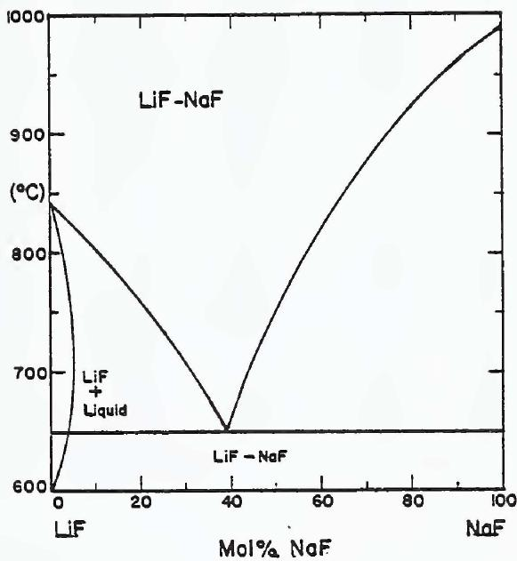  
Figure 76.1 LiF-NaF phase diagram

References [1-26]

2. Density (ρ)

Measurement method: Archimedean technique [27]

Equation:

$$
\rho = a + b T \tag {76.1}
$$

precision: in table 76.1 uncertainty: $\sim \pm 1.0\%$

Table 76.1. Parameters of equation (76.1) and precisions   

<table><tr><td>(mol % NaF)</td><td>a</td><td>-b x 104</td><td>Precision</td><td>T range(K)</td></tr><tr><td>10</td><td>2.3981</td><td>5.102</td><td>0.01%</td><td>1130-1320</td></tr><tr><td>20</td><td>2.4254</td><td>5.118</td><td>0.02%</td><td>1130-1320</td></tr><tr><td>30</td><td>2.4709</td><td>5.277</td><td>0.01%</td><td>1130-1320</td></tr><tr><td>40</td><td>2.5325</td><td>5.552</td><td>0.01%</td><td>1130-1320</td></tr><tr><td>50</td><td>2.5565</td><td>5.596</td><td>0.01%</td><td>1130-1320</td></tr><tr><td>60</td><td>2.5791</td><td>5.575</td><td>0.01%</td><td>1130-1320</td></tr><tr><td>70</td><td>2.5784</td><td>5.434</td><td>0.01%</td><td>1130-1320</td></tr><tr><td>80</td><td>2.6766</td><td>6.043</td><td>0.28%</td><td>1230-1320</td></tr><tr><td>90</td><td>2.9187</td><td>7.789</td><td>0.01%</td><td>1280-1320</td></tr></table>

# (76) LiF-NaF

Table 76.2. Density $(\mathrm{gcm}^{-3})$ from equations in table 76.1   

<table><tr><td rowspan="2">T(K)</td><td colspan="6">Mo1 % NaF</td></tr><tr><td>10</td><td>30</td><td>50</td><td>70</td><td>80</td><td>90</td></tr><tr><td>1130</td><td>1.822</td><td>1.875</td><td>1.924</td><td>1.964</td><td></td><td></td></tr><tr><td>1140</td><td>1.816</td><td>1.869</td><td>1.919</td><td>1.959</td><td></td><td></td></tr><tr><td>1150</td><td>1.811</td><td>1.864</td><td>1.913</td><td>1.953</td><td></td><td></td></tr><tr><td>1160</td><td>1.806</td><td>1.859</td><td>1.907</td><td>1.948</td><td></td><td></td></tr><tr><td>1170</td><td>1.801</td><td>1.853</td><td>1.902</td><td>1.943</td><td></td><td></td></tr><tr><td>1180</td><td>1.796</td><td>1.848</td><td>1.896</td><td>1.937</td><td></td><td></td></tr><tr><td>1190</td><td>1.791</td><td>1.843</td><td>1.891</td><td>1.932</td><td></td><td></td></tr><tr><td>1200</td><td>1.786</td><td>1.838</td><td>1.885</td><td>1.926</td><td></td><td></td></tr><tr><td>1210</td><td>1.781</td><td>1.832</td><td>1.879</td><td>1.921</td><td></td><td></td></tr><tr><td>1220</td><td>1.776</td><td>1.827</td><td>1.874</td><td>1.915</td><td></td><td></td></tr><tr><td>1230</td><td>1.770</td><td>1.822</td><td>1.868</td><td>1.910</td><td>1.933</td><td></td></tr><tr><td>1240</td><td>1.765</td><td>1.817</td><td>1.863</td><td>1.905</td><td>1.927</td><td></td></tr><tr><td>1250</td><td>1.760</td><td>1.811</td><td>1.857</td><td>1.899</td><td>1.921</td><td></td></tr><tr><td>1260</td><td>1.755</td><td>1.806</td><td>1.851</td><td>1.894</td><td>1.915</td><td></td></tr><tr><td>1270</td><td>1.750</td><td>1.801</td><td>1.846</td><td>1.888</td><td>1.909</td><td></td></tr><tr><td>1280</td><td>1.745</td><td>1.795</td><td>1.840</td><td>1.883</td><td>1.903</td><td>1.922</td></tr><tr><td>1290</td><td>1.740</td><td>1.790</td><td>1.835</td><td>1.877</td><td>1.897</td><td>1.914</td></tr><tr><td>1300</td><td>1.735</td><td>1.785</td><td>1.829</td><td>1.872</td><td>1.891</td><td>1.906</td></tr><tr><td>1310</td><td>1.730</td><td>1.780</td><td>1.823</td><td>1.867</td><td>1.885</td><td>1.898</td></tr><tr><td>1320</td><td>1.725</td><td>1.774</td><td>1.818</td><td>1.861</td><td>1.879</td><td>1.891</td></tr></table>

References [27-31]

# 3. Surface Tension (Y)

Measurement method: maximum bubble pressure [32]

Equation:

$$
\gamma = a + b T \tag {76.2}
$$

precision: in table 76.3

uncertainty: $\sim \pm 3.0\%$

Table 76.3. Parameters of equation 76.2 and precision   

<table><tr><td>LiF-NaF (mol % NaF)</td><td>a</td><td>b x 103</td><td>Precision</td><td>T range(K)</td></tr><tr><td>40</td><td>321.52</td><td>-99.33</td><td>*</td><td>970-1210</td></tr></table>

\* not estimated; parameters from graphical data

# (76) LiF-NaF

Table 76.4. Surface tension LiF-NaF (40mol% NaF) from equation in table 76.3   

<table><tr><td>T(K)</td><td>γ(dyn cm-1)</td><td>T(K)</td><td>γ(dyn cm-1)</td></tr><tr><td>970</td><td>225.17</td><td>1110</td><td>211.27</td></tr><tr><td>990</td><td>223.19</td><td>1130</td><td>209.28</td></tr><tr><td>1010</td><td>221.20</td><td>1150</td><td>207.29</td></tr><tr><td>1030</td><td>219.21</td><td>1170</td><td>205.31</td></tr><tr><td>1050</td><td>217.23</td><td>1190</td><td>203.32</td></tr><tr><td>1070</td><td>215.24</td><td>1210</td><td>201.33</td></tr><tr><td>1090</td><td>213.25</td><td></td><td></td></tr></table>

References [32,33]

# 4. Viscosity (n)

Measurement method: capillary, and oscillational sphere techniques [34] Data set was limited to 2 points; the experimental values [34] are given in table 76.5.

Table 76.5. Viscosity at ${40}\mathrm{\;{mol}}\% \mathrm{{NaF}}$   

<table><tr><td>T
(K)</td><td>η
(cp)</td></tr><tr><td>973.2</td><td>3.20</td></tr><tr><td>1073.2</td><td>2.35</td></tr></table>

References [34]

# 5. Electrical Conductance (K)

Measurement method: classical ac technique [35]

Equation:

$$
\kappa = a + b T \tag {76.3}
$$

precision: in table 76.6

uncertainty: $\sim \pm 3.0\%$

Table 76.6. Parameters of equation (76.3) and precisions   

<table><tr><td>Mol % NaF</td><td>-a</td><td>b x 103</td><td>Precision</td><td>T range(K)</td></tr><tr><td>15.0</td><td>0.4123</td><td>6.964</td><td>0.03%</td><td>1060-1340</td></tr><tr><td>30.0</td><td>0.4307</td><td>6.115</td><td>0.02%</td><td>1020-1340</td></tr><tr><td>38.0</td><td>0.1798</td><td>5.551</td><td>0.03%</td><td>1030-1340</td></tr><tr><td>50.0</td><td>0.6533</td><td>5.653</td><td>0.03%</td><td>1070-1340</td></tr><tr><td>60.0</td><td>0.2936</td><td>4.354</td><td>0.02%</td><td>1130-1340</td></tr><tr><td>80.0</td><td>0.8848</td><td>5.166</td><td>0.03%</td><td>1180-1340</td></tr></table>

Table 76.7. Specific conductance (ohm $^{-1}$ cm $^{-1}$ ) from equations in table 76.6   

<table><tr><td rowspan="2">T(K)</td><td colspan="6">Mo1 % NaF</td></tr><tr><td>15.0</td><td>30.0</td><td>38.0</td><td>50.0</td><td>60.0</td><td>80.0</td></tr><tr><td>1020</td><td></td><td>5.81</td><td></td><td></td><td></td><td></td></tr><tr><td>1040</td><td></td><td>5.93</td><td>5.59</td><td></td><td></td><td></td></tr><tr><td>1060</td><td>6.97</td><td>6.05</td><td>5.70</td><td></td><td></td><td></td></tr><tr><td>1080</td><td>7.11</td><td>6.17</td><td>5.82</td><td>5.45</td><td></td><td></td></tr><tr><td>1100</td><td>7.25</td><td>6.30</td><td>5.93</td><td>5.57</td><td></td><td></td></tr><tr><td>1120</td><td>7.39</td><td>6.42</td><td>6.04</td><td>5.68</td><td></td><td></td></tr><tr><td>1140</td><td>7.53</td><td>6.54</td><td>6.15</td><td>5.79</td><td>5.26</td><td></td></tr><tr><td>1160</td><td>7.67</td><td>6.66</td><td>6.26</td><td>5.90</td><td>5.34</td><td></td></tr><tr><td>1180</td><td>7.81</td><td>6.79</td><td>6.37</td><td>6.02</td><td>5.43</td><td>5.21</td></tr><tr><td>1200</td><td>7.95</td><td>6.91</td><td>6.48</td><td>6.13</td><td>5.52</td><td>5.31</td></tr><tr><td>1220</td><td>8.09</td><td>7.03</td><td>6.59</td><td>6.24</td><td>5.61</td><td>5.42</td></tr><tr><td>1240</td><td>8.22</td><td>7.15</td><td>6.70</td><td>6.36</td><td>5.69</td><td>5.52</td></tr><tr><td>1260</td><td>8.36</td><td>7.27</td><td>6.81</td><td>6.47</td><td>5.78</td><td>5.62</td></tr><tr><td>1280</td><td>8.50</td><td>7.40</td><td>6.93</td><td>6.58</td><td>5.87</td><td>5.73</td></tr><tr><td>1300</td><td>8.64</td><td>7.52</td><td>7.04</td><td>6.70</td><td>5.95</td><td>5.83</td></tr><tr><td>1320</td><td>8.78</td><td>7.61</td><td>7.15</td><td>6.81</td><td>6.04</td><td>5.93</td></tr><tr><td>1340</td><td>8.92</td><td>7.76</td><td>7.26</td><td>6.92</td><td>5.13</td><td>6.04</td></tr></table>

References [35]

# 6. Safety and Hazards

# A. Hazard rating

(i) Toxicity: inorganic fluorides are generally irritants and toxic.   
(ii) Vapor pressure: LiF, at m.pt. $(848^{\circ}\mathrm{C})$ , $\sim 8.8 \times 10^{-3}\mathrm{mm}$ ; NaF at m.pt. $(995^{\circ}\mathrm{C})$ , $\sim 0.5\mathrm{mm}$ .

# B. Disaster hazards

(i) Molten salt bath "explosions": i.e., explosive generation of steam due to bulk water "carry-over" and/or equipment failure: i.e., explosive expansion of "trapped" air.   
(ii) Fluorides, when heated to decomposition, or contacted with acids, emit highly toxic fumes.

References [36-41]

# 7. Corrosion

Table 76.8. Corrosion studies from primary research literature   

<table><tr><td>Studies</td><td>References</td></tr><tr><td>Cr</td><td>[42]</td></tr><tr><td>Ni-Cr-Mo alloys (INOR-8; Hastelloysb, W, and N)</td><td>[43,44]</td></tr><tr><td>SSNI-12P</td><td>[45]</td></tr><tr><td>Quartz</td><td>[46]</td></tr><tr><td>Al</td><td>[47]</td></tr><tr><td>Various metals</td><td>[48]</td></tr><tr><td>Corrosion studies in molten salts with NaF as one component (e.g., Cl, CO3,...)</td><td>[49-64,71,72]</td></tr><tr><td>Electrochemical behavior of oxide ions and related species in molten fluorides</td><td>[65-67]</td></tr><tr><td>Electroanalytical studies in molten fluorides</td><td>[68]</td></tr><tr><td>Annotated corrosion bibliolog.</td><td>[69]</td></tr><tr><td>Corrosion: molten fluorides (survey)</td><td>[70]</td></tr></table>

Compatability studies: various molten fluorides and principally with LiF and NaF. For thermodynamic (theoretical) considerations, and some considerations relative to commercial grade fluorides, and the use of "gettering" to lower impurity levels, see [70]

References [42-72]

8. Diffusion

No data

9. Heat of fusion $(\Delta H_{f}^{\circ})$

No data

10. Heat Capacity $(C_p)$

No data

11. Volume Change on Melting $(\Delta V_{f})$

Measurement method: estimated from densities [73]

Table 76.9. Volume change on melting   

<table><tr><td>Binary eutectic (mol % NaF)</td><td>(ΔVf/Vs)</td><td>Uncertainty</td></tr><tr><td>39%</td><td>19.6%</td><td>~ ± 10%</td></tr></table>

References [73]

12. Vapor Pressure $(p_{vap})$

No data

13. Thermal Conductivity (liquid) $(\lambda_{\ell})$

No data

14. Thermal Conductivity (solid) $(\lambda_{s})$

No data

15. Cryoscopic Constant $(k_{f})$

No data

16. References

[1] Bergman, A. G. and Dergunov, E. P., Compt. Rend. Acad. Sci. USSR, 31, 753 (1941).   
[2] Nikonova, I. N., Berul, S. I., Zhur. Neorg. Khim., 12, 2846 (1967).   
[3] Matiasovsky, K., Cakajdova, I., Malinovsky, M., "Phase Diagram in the NaF-LiF-AlF₃-Al₂O₃ System. I. System NaF-LiF", Chem Zvesti, 19, 513 (1965).   
[4] Berezhnaya, V. T., Bukhalova, G. A., Zhur. Neorg. Khim., 6, 687 (1961).   
[5] Belyaev, I. N., Sigida, N. P., Zhur. Neorg. Khim., 2, 1119 (1957).   
[6] Bukhalova, G. A., Sulaimankulov, K., Bostandzhiyan, A. K., Zhur. Neorg. Khim., 4, 1138 (1959). J. Inorg. Chem. USSR, 4, 516 (1959).   
[7] Berezhnaya, V. T., Bukhalova, G. A., Zhur. Neorg. Khim., 5, 925 (1960). J. Inorg. Chem. USSR, 5, 445 (1960).   
[8] Berezhnaya, V. T., Bukhalova, G. A., Zhur. Neorg. Khim., 4, 2600 (1959). J. Inorg. Chem. USSR, 4, 1198 (1959).   
[9] Bukhalova, G. A., Berezhnaya, V. T., Zhur. Neorg, Khim., 5, 456 (1960). J. Inorg. Chem. USSR, 5, 218 (1960).

[10] Bergman, A. G., Berezina, S. I., Bakumskaya, E. L., Zhur. Neorg. Khim., 8, 1120 (1963).   
[11] Holm, J. L., Acta Chem. Scand., 19, 638 (1965).   
[12] Short, J. M. and Roy, R., J.Am. Ceram. Soc., 47, 149 (1964).   
[13] Janz, G. J. Downey, J. R., Jr., Allen, C. B., and Tomkins, R. P. T., "Eutectic Data" - 2 Vols; ERDA-TID-27163-P1 & P2; NTIS, Washington, D. C: (1977).   
[14] Janz, G. J., Downey, J. R., Jr., Allen, C. B., and Tomkins, R. P. T., "Physical Properties Data Complications Relevant to Energy Storage. I. Molten Salts: Eutectic Data", NSRDS-NBS-61; U. S. Gov't Printing Office, Washington, D. C. (1978).   
[15] "International Critical Tables of Numerical Data, Physics, Chemistry, and Technology", 8 Vols., McGraw-Hill Book Co., N. Y. (1933).   
[16] "Landolt-Bornstein Zahlenwert und Funktionen aus Physik, Chemie, Astronomie, Geophysik und Technik", (10th Ed.) Springer-Verlag, Berlin, Heidelberg, N. Y. (1961).   
[17] Clark, P. V., "Fused Salt Mixtures: Eutectic Compositions and Melting Points Bibliography 1907-1968", Report No. SC-R-68-1680; Sandia Laboratories (1968), NTIS.   
[18] Robertson, W. D., "Binary Phase Diagrams of Halide Salts", Report No. Yale 2723 (2 Vols.), U. S. AEC Contract AT (30-1)-2723 (1966), NTIS.   
[19] Thoma, R. E., "Phase Diagrams of Nuclear Reactor Materials", Oak Ridge National Laboratory, ORNL-2548, Contract No. W-7405-eng-26.   
[20] Thoma, R. E., "Phase Diagrams of Binary and Ternary Fluoride Systems", Chapt. 6; Adv. Molten Salts Chemistry, Vol. 3 (J. Braunstein, G. Mamantov, and G. P. Smith, eds.), Plenum Press, N. Y. (1975).   
[21] Voskresenskaya, N. K., ed., "Handbook of Solid-Liquid Equilibria in Systems of Inorganic Salts", Volumes 1, 2, Izc. Akad. Nauk SSSR, Moscow (1961). Israel Program for Scientific Translations, Jerusalem, 1970 (NTIS).   
[22] Sinistri, C., Franzozini, P., and Rolla, M., "An Atlas of Miscibility Gaps in Molten Salt Systems", Institute of Physical Chemistry, University of Pavia (Italy) (1968).   
[23] Shaffer, P. T. B., "High Temperature Materials", Plenum Press Handbooks of High Temperature Materials, No. 1, Materials Index, Plenum Press, New York, 1964.   
[24] Franzozini, P., Ferloni, P., and Spinolo, C., "Molten Salts with Organic Anions", Instituto di Chimica Fisica, Universita di Pavia (Italy), 1973.   
[25] Toropov, N. A. et al., "Handbook of Phase Diagrams of the Silicates, Volume 1: Binary Systems, Volume 2, Metal-Oxygen Compounds in Silicate Systems", Izdatel'stov "Nauka" Leningradskoe Otdelenie, Leningrad, 1969, Israel Program for Scientific Translations, Jerusalem, 1972 (NTIS).   
[26] Levin, E., et al., "Phase Diagrams for Ceramists", Amer. Ceramic Soc. (publ.), Columbus, Ohio (1964; 1969).   
[27] Matiasovsky, K., Private communication to G. J. Janz, MSDC-RPI (1968).

# (76) LiF-NaF

[28] Meaker, R. E., Porter, B., and Kesterke, D. G., United States Department of the Interior, Report of Investigations 7528 (1971).   
[29] Mellors, G. W., and Senderoff, S., J. Electrochem. Soc., 111, 1355 (1964).   
[30] Mellors, G. W., and Senderoff, S., "Electrochemistry", Proceedings of the First Australian Conf., Pergamon Press, p. 578 (1964).   
[31] Porter, B., and Meaker, R. E., United States Department of the Interior, Report of Investigations 6838 (1966).   
[32] Mellors, G. W., and Senderoff, S., "Electrochemistry, Proceedings of the First Australian Conf. on Electrochemistry", Pergamon Press, N.Y. p. 578 (1965).   
[33] Kreyger, P. J., Ward, W. T., Cantor, S., Kirslis, S. S., and Blankenship, F. F., U.S.A.E.C. Annual Progress Report, ORNL 3591, Jan. 1964.   
[34] Cohen, S. I., et al., U.S.A.E.C. Unclassified Report, ORNL-2150 (DEL), Oak Ridge National Laboratory, 1956.   
[35] Meaker, R. E., Porter, P., and Kesterke, D. G., United States Department of the Interior, Report of Investigations 7528, 1971.   
[36] "Dangerous Properties of Materials", Sax, N. I., Van Nostrand Reinhold Co., N. Y. (1969).   
[37] "Registry of Toxic Effects of Chemical Substances", Christensen, H. E., and Lubinbyh1, T. T., eds., U. S. Dept. H. E. W., U. S. Gov't Printing Office, Washington, D. C. (1975).   
[38] Janz, G. J., et al., "Physical Properties Data Complications Relevant to Energy Storage. Part II. Molten Salts: Data and Multi-component Salt Systems", NSRDS-NBS 61, Part II (April, 1979), U. S. Gov't Printing Office, Supt. of Doc. No. C13-48-61, Washington, D. C. 20402.   
[39] "Potential Hazards in Molten Salt Baths for Heat Treatment of Metals", National Board of Fire Underwriters Research Report No.2 (1954).   
[40] "Handbook of Reactive Chemical Hazards", Bretherwick, L., Butterworth Co., London (1975).   
[41] Janz, G. J., Tomkins, R. P. T., Downey, J. R. Jr., and Allen, C. B., "Safety and Hazards", Chapter in "Eutectic Data", ERDA TID-27163-P1; NTIS, U. S. Dept. Commerce, Springfield, Va. (1977)   
[42] Brasunas, A., Metal Progr., 62, 88 (1952).   
[43] Bettes, E. S., Nucl. Sci. Eng., 2, 804 (1957).   
[44] Hoffman, E. E., Patriarca, P., Leitten, C. F., Jr., and Slaughter, G. M., ORNL-1934, Oak Ridge Nat'l Lab., (1956).   
[45] Oak Ridge National Laboratory, "The Development Status of Molten Salt Breeder Reactors", Rpt. ORNL-4812-UC-80; NTIS, U. S. Dept. Commerce, Springfield, Va., (Aug. 1972).   
[46] Heimann, R., Glastech. Ber., 43, 83 (1970).   
[47] Lukashenko, E. E., and Reutova, G. A., Nov. Teor. Tekhnol. Metall. Protsessov, 119 (1973).   
[48] Koger, J. W., Corrosion, 30, 125 (1974).

(76) LiF-NaF   
Khan, I. A., Ber. Kernforschungsanlage Juelich, Juel-608-RW, (1969).   
Khan, I. A., Inst. Reaktorwerkst., Kernforschungsanlage, Juel-718-RW (1970).   
Bowles, P. J., and Newdick, P. C., Electroplating and Metal Finishing, 24, 6 (1971).   
DeVan, J. H., "Examinations of Pump Impellers from Sodium and Fused Salt Pump Endurance Tests", ORNL CF-61-4-77, Oak Ridge National Lab., (1961).   
Adamson, G. M., Manly, W. D., and Crouse, S. R., "Corrosion by Molten Fluorides", ANP Materials Meeting ORNL-2685, (1958).   
Huntley, W. R., and Gnadt, P. A., Oak Ridge Nat'l Lab., Report ORNL-TM-3863, (1973); Nucl. Sci. Abstr., 27, 12446 (1973).   
Gill, C. B., Straumanis, M. E., and Schlechten, W. B., J. Electrochem. Soc., 102, 42 (1955)   
Litman, A. P., "Corrosion of Volatility Pilot Plant Mark I INOR-S Hydrofluorinator and Mark III. Nickel Fluorinator after Fourteen Dissolution Runs", ORNL-3253, Oak Ridge Nat'l Lab., (1962).   
Litman, A. P., and Goldman, A. E., "Corrosion Associated with Fluoridation in the Oak Ridge Nat'l Lab. Fluoride Volatility Process", ORNL-2832, Oak Ridge Nat'l Lab., (1961).   
Manly, W. D., Coobs, H. H., DeVan, J. H., Douglas D. A., Inouye, H., Patriarca, P., Roche, T. K., and Scott, J. L., "Metallurgical Problems in Molten Fluoride Systems", Proc. 2nd U. N. Inter. Conf. Peaceful Uses of At. Energy, 7, 223 (1958)   
Oak Ridge Nat'l Lab., Molten Salt Reactor Program Semiannual Progress Report, ORNL-3708, (1964).   
Vreeland, D. C., Hoffman, E. E., and Manly, W. D., Nucleonics, 11, 36 (1953).   
Grimes, W. R., and Cuneo, D. R., "Molten Salts as Reactor Fuels", Reactor Hdbk., 1, 425 (1955).   
Shimotake, H., and Hesson, J. C., Adv. Chem. Series, No. 64, 149 (1967).   
Boser, O., "Study of Safety Aspects of High-Temperature Thermal Energy Storage Systems", NSF No. AER 75-20605, (December, 1975).   
Venkatasetty, H. V., "Thermodynamic Properties and Corrosion Characteristics of Thermal Energy Storage Eutectic Mixtures", paper presented at 152nd Meeting of the Electrochemical Society, Atlanta, Ga., (October, 1977).   
Mathews, A. L., and Baes, C. F., Inorg. Chem., 7, 373 (1968).   
Manning, D. L., and Mamantov, G., J. Electrochem. Soc., 124, 480 (1977).   
Ting, G., Baes, C. F., Bamberger, C. E., and Mamantov, G., J. Inorg. Nucl. Chem., 39, 1803 (1977).   
Manning, D. L., and Mamantov, G., J. Electroanall. Chem. (in press) (1978).   
Janz, G. J., and Tomkins, R. P. T., Corrosion, 35, 485 (1979).   
Eichelberger, J. L., (Pennwalt Corpn.) "Investigations of Metal Fluoride Thermal Energy Storage Materials: Availability, Cost, Chemistry", ERDA Rpt CO02990-6; NTIS, U. S. Dept. Commerce, Springfield, Va. (Dec. 1976).

(76) LiF-NaF

[71] Kochergen, V. P., and Ignat'eva, N. I., Russ. J. Inorg. Chem., 6(9), 1086 (1961).   
[72] Ozeryanaya, I. N., Volodin, V. P., and Smirnov, M. V., Zashchita Metalov (USSR), 2, 230 (1969).

1. Melting Temperatures $(T_{m})$

Pure substance melting points:

LiF: $848^{\circ} \mathrm{C}$

KF: 856°C

Eutectic melting point:

$492^{\circ} \mathrm{C}$ , composition: $50 \mathrm{~mol} \%$ LiF

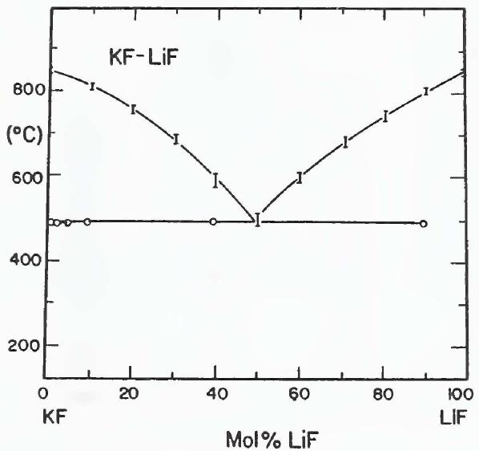  
Figure 77.1. LiF-KF phase diagram

References [1-27]

2. Density (ρ)

Measurement method: Archimedean technique [32]

Equation:

$$
\rho = a + b T \tag {77.1}
$$

precision: in table 77.1

uncertainty: $\sim$ 10%

Table 77.1. Parameters of equation (77.1) and precisions   

<table><tr><td>(Mol % LiF)</td><td>a</td><td>-b x 104</td><td>Precision</td><td>T range(K)</td></tr><tr><td>0.0</td><td>2.555</td><td>6.241</td><td>0.3%</td><td>1140-1340</td></tr><tr><td>20.0</td><td>2.483</td><td>5.680</td><td>0.7%</td><td>1080-1340</td></tr><tr><td>35.0</td><td>2.484</td><td>5.872</td><td>0.6%</td><td>980-1340</td></tr><tr><td>50.0</td><td>2.407</td><td>5.362</td><td>0.4%</td><td>1120-1340</td></tr><tr><td>70.0</td><td>2.273</td><td>4.663</td><td>1.0%</td><td>1120-1340</td></tr><tr><td>85.0</td><td>2.278</td><td>4.663</td><td>0.6%</td><td>1140-1340</td></tr><tr><td>100.0</td><td>2.074</td><td>3.321</td><td>0.7%</td><td>1140-1340</td></tr></table>

# (77) LiF-KF

Table 77.2. Density (g cm $^{-3}$ ) from equations in table 77.1   

<table><tr><td rowspan="2">T(K)</td><td colspan="5">Mol % LiF</td></tr><tr><td>20.0</td><td>35.0</td><td>50.0</td><td>70.0</td><td>85.0</td></tr><tr><td>980</td><td></td><td>1.909</td><td></td><td></td><td></td></tr><tr><td>1000</td><td></td><td>1.879</td><td></td><td></td><td></td></tr><tr><td>1020</td><td></td><td>1.885</td><td></td><td></td><td></td></tr><tr><td>1040</td><td></td><td>1.873</td><td></td><td></td><td></td></tr><tr><td>1060</td><td></td><td>1.862</td><td></td><td></td><td></td></tr><tr><td>1080</td><td>1.870</td><td>1.850</td><td></td><td></td><td></td></tr><tr><td>1100</td><td>1.858</td><td>1.838</td><td></td><td></td><td></td></tr><tr><td>1120</td><td>1.847</td><td>1.826</td><td>1.806</td><td>1.721</td><td>1.756</td></tr><tr><td>1140</td><td>1.835</td><td>1.815</td><td>1.796</td><td>1.711</td><td>1.746</td></tr><tr><td>1160</td><td>1.824</td><td>1.803</td><td>1.785</td><td>1.701</td><td>1.737</td></tr><tr><td>1180</td><td>1.813</td><td>1.791</td><td>1.774</td><td>1.692</td><td>1.728</td></tr><tr><td>1200</td><td>1.801</td><td>1.779</td><td>1.764</td><td>1.682</td><td>1.718</td></tr><tr><td>1220</td><td>1.790</td><td>1.768</td><td>1.753</td><td>1.672</td><td>1.709</td></tr><tr><td>1240</td><td>1.779</td><td>1.756</td><td>1.742</td><td>1.662</td><td>1.700</td></tr><tr><td>1260</td><td>1.767</td><td>1.744</td><td>1.731</td><td>1.652</td><td>1.690</td></tr><tr><td>1280</td><td>1.756</td><td>1.732</td><td>1.721</td><td>1.642</td><td>1.681</td></tr><tr><td>1300</td><td>1.745</td><td>1.721</td><td>1.710</td><td>1.632</td><td>1.672</td></tr><tr><td>1320</td><td>1.733</td><td>1.709</td><td>1.690</td><td>1.623</td><td>1.662</td></tr><tr><td>1340</td><td>1.722</td><td>1.697</td><td>1.688</td><td>1.613</td><td>1.653</td></tr></table>

References [28-33]

# 3. Surface Tension (γ)

Measurement method: maximum bubble pressure [34]

Equation: (surface tension-composition isotherm)

$$
\gamma = a + b C + c C ^ {2} + d C ^ {3} \tag {77.2}
$$

$$
(C = \text {mol} \% \text {LiF})
$$

precision: in table 77.3

uncertainty: $\sim 5.0\%$

Table 77.3. Parameters of equation (77.2) and precisions   

<table><tr><td>T(K)</td><td>a</td><td>-b x 102</td><td>c x 103</td><td>d x 104</td><td>Precision</td></tr><tr><td>1073.16</td><td>148.38</td><td>1.96</td><td>1.32</td><td>0.98</td><td>0.9%</td></tr><tr><td>1173.16</td><td>140.96</td><td>2.94</td><td>0.10</td><td>1.09</td><td>0.3%</td></tr></table>

# (77) LiF-KF

Table 77.4. Surface tension (dyn cm $^{-1}$ ) from equations in table 77.3   

<table><tr><td rowspan="2">Mol % LiF</td><td colspan="2">T(°K)</td></tr><tr><td>1073.16</td><td>1173.16</td></tr><tr><td>0</td><td>148.4</td><td>141.0</td></tr><tr><td>10</td><td>148.4</td><td>140.8</td></tr><tr><td>20</td><td>149.3</td><td>141.3</td></tr><tr><td>30</td><td>151.6</td><td>143.1</td></tr><tr><td>40</td><td>156.0</td><td>146.9</td></tr><tr><td>50</td><td>163.0</td><td>153.4</td></tr><tr><td>60</td><td>173.2</td><td>163.1</td></tr><tr><td>70</td><td>187.2</td><td>176.8</td></tr><tr><td>80</td><td>205.6</td><td>195.1</td></tr><tr><td>90</td><td>229.0</td><td>218.6</td></tr><tr><td>100</td><td>257.9</td><td>248.0</td></tr></table>

# References [34]

4. Viscosity (n)

No data

5. Electrical Conductance (K)

Measurement method: classical ac technique [31]

Equation:

$$
= a + b T \tag {77.3}
$$

precision: in table 77.5 uncertainty: $\sim$ 5.0%

Table 77.5. Parameters of equation (77.3) and precisions   

<table><tr><td>Mol % LiF</td><td>-a</td><td>b x 103</td><td>Precision</td><td>T range(K)</td></tr><tr><td>20.0</td><td>0.3994</td><td>3.434</td><td>0.02%</td><td>1110-1340</td></tr><tr><td>35.0</td><td>1.1870</td><td>4.064</td><td>0.04%</td><td>1020-1340</td></tr><tr><td>50.0</td><td>1.5420</td><td>4.448</td><td>0.04%</td><td>1020-1340</td></tr><tr><td>70.0</td><td>0.9420</td><td>4.610</td><td>0.03%</td><td>1110-1340</td></tr><tr><td>85.0</td><td>0.3625</td><td>5.475</td><td>0.03%</td><td>1140-1340</td></tr></table>

# (77) LiF-KF

Table 77.6. Specific conductance $(ohm^{-1}cm^{-1})$ from equations in table 77.5   

<table><tr><td rowspan="2">T(K)</td><td colspan="5">Mol % LiF</td></tr><tr><td>20.0</td><td>35.0</td><td>50.0</td><td>70.0</td><td>85.0</td></tr><tr><td>1020</td><td></td><td>2.96</td><td>3.00</td><td></td><td></td></tr><tr><td>1050</td><td></td><td>3.08</td><td>3.13</td><td></td><td></td></tr><tr><td>1080</td><td></td><td>3.20</td><td>3.26</td><td></td><td></td></tr><tr><td>1110</td><td>3.41</td><td>3.32</td><td>3.40</td><td>4.18</td><td></td></tr><tr><td>1140</td><td>3.52</td><td>3.45</td><td>3.53</td><td>4.31</td><td>5.88</td></tr><tr><td>1170</td><td>3.62</td><td>3.57</td><td>3.66</td><td>4.45</td><td>6.04</td></tr><tr><td>1200</td><td>3.72</td><td>3.69</td><td>3.80</td><td>4.59</td><td>6.21</td></tr><tr><td>1230</td><td>3.82</td><td>3.81</td><td>3.93</td><td>4.73</td><td>6.37</td></tr><tr><td>1260</td><td>3.93</td><td>3.93</td><td>4.06</td><td>4.87</td><td>6.54</td></tr><tr><td>1290</td><td>4.03</td><td>4.06</td><td>4.20</td><td>5.01</td><td>6.70</td></tr><tr><td>1320</td><td>4.13</td><td>4.18</td><td>4.33</td><td>5.14</td><td>6.87</td></tr></table>

References [31]

# 6. Safety and Hazards

# A. Hazard rating

(i) Toxicity: LiF, severe; KF, severe; inorganic fluorides are generally irritant and toxic.   
(ii) Vapor pressure: LiF, at m.pt. $(848^{\circ}\mathrm{C})$ , $\sim 8.8 \times 10^{-3}\mathrm{mm}$ ; KF at m.pt. $(856^{\circ}\mathrm{C})$ , $\sim 0.5\mathrm{mm}$ .

# B. Disaster hazards

(i) Molten salt bath "explosion": i.e., explosive generating of steam due to bulk water "carry-over: and/or equipment failure; i.e., explosive expansion of "trapped" air.   
(ii) Fluorides, when heated to decomposition, or contacted with acids, emit highly toxic fumes.

References [35-40]

# 7. Corrosion

Table 77.7. Corrosion studies from primary research literature   

<table><tr><td>Studies</td><td>References</td></tr><tr><td>Cr</td><td>[41]</td></tr><tr><td>Ni-Cr-Fe alloys (INOR-8; Hastelloys N, B, W,...)</td><td>[42-47]</td></tr><tr><td>Al</td><td>[48]</td></tr><tr><td>Cb-Zr (99-1)</td><td>[49,50]</td></tr><tr><td>Ta-W-Zr-Cb (28-10.5-0.9-60.6)</td><td rowspan="2">[50]</td></tr><tr><td>Ta, W-Cb (10-10-80)</td></tr><tr><td>Electrochemical behavior of oxides and related species in molten fluorides</td><td>[51-53]</td></tr><tr><td>Electroanalytical studies in molten fluorides</td><td>[54]</td></tr><tr><td>Annotated corrosion bibliio.</td><td>[55]</td></tr><tr><td>Corrosion: molten fluorides (survey)</td><td>[56]</td></tr></table>

Compatibility studies with various molten fluorides, including LiF and KF. No studies specifically with LiF-KF molten mixtures found.

References [41-56]

8. Diffusion

No data

9. Heat of Fusion $(\Delta H_{f}^{\circ})$

Measurement method: calculated [57]

Table 77.8. Heat of fusion   

<table><tr><td>Composition (mol % LiF)</td><td>Tm(℃)</td><td>ΔH°f(kcal mol-1)</td><td>Uncertainty</td></tr><tr><td>52.4</td><td>492°</td><td>7.0</td><td>~ ± 5%</td></tr></table>

References [57]

(77) LiF-KF

10. Heat Capacity $(C_p)$

Measurement method: calculated [58]

Table 77.9. Heat capacity   

<table><tr><td>Composition
LiF:KF(mol %)</td><td>Cp(cal K-1mol-1)</td><td>T range(K)</td><td>Uncertainty</td></tr><tr><td>52.4:47.6</td><td>16.1</td><td>Tm(765) - 850</td><td>~ ± 10%</td></tr></table>

For the above composition, $C_p(s) = 13.2$ (cal $K^{-1}$ mol $^{-1}$ ); uncertainty of estimated value, $\nu \pm 10\%$ ).

References [58]

11. Volume Change on Melting $(\Delta V_{f})$

Measurement method: estimated from densities [59]

Table 77.10. Volume change on melting   

<table><tr><td>Binary eutectic (mol % KF)</td><td>(ΔVf/Vs)</td><td>Uncertainty</td></tr><tr><td>50</td><td>21%</td><td>~ ± 10%</td></tr></table>

References. [59]

12. Vapor Pressure $(p_{vap})$

No data

13. Thermal Conductivity (liquid) $(\lambda_{\ell})$

No data

14. Thermal Conductivity (solid) $(\lambda_{s})$

No data

15. Cryoscopic Constant $(k_{f})$

Measurement method: calculated from $\Delta H_{\mathrm{f}}^{\circ}$ [59]

Table 77.11. Cryoscopic constant   

<table><tr><td>Binary eutectic (mol % KF)</td><td>Kf(K mol-1kg)</td><td>Uncertainty</td></tr><tr><td>47.6</td><td>6.86</td><td>~ ± 1.0%</td></tr></table>

References [59]

# References

[1] Bergman, A. G., Dergunov, E. P., Compt. Rend. Acad. Sci., USSR, 31, 753 (1941).   
[2] Bergman, A. G., and Bychkova-Shul'ga, N. A., Zh. Neorg. Khim., 2, 179 (1957). [J. Inorg. Chem., USSR, 2, No. 1, 276 (1957)].   
[3] Akrust, E., Bjorge, B., Flood, H., and Forland, T., Ann. N.Y. Acad. Sci., 79, 830 (1960).   
[4] Berezhnaya, V. T., Bukhalova, G. A., Zhur. Neorg. Khim., 6, 687 (1961).   
[5] Bourlange, C., Ziolkjewicz, S., Compt. Rend., 249, 2170 (1959).   
[6] Bergman, A. G., Bychkova-Shulga, N. A., Zhur. Neorg. Khim., 2, 179 (1957).   
[7] Sigida, N. P., Belyaev, I. N., Zhur. Neorg. Khim., 2, 1128 (1957). J. Inorg. Chem., USSR, 2, 222 (1957).   
[8] Berezhnaya, V. T., Bukhalova, G. A., Zhur. Neorg. Khim., 5, 925 (1960). J. Inorg. Chem., USSR, 5, 445 (1960).   
[9] Berezhnaya, V. T., Bukhalova, G. A., Zhur. Neorg. Khim., 4, 2600 (1959). J. Inorg. Chem., USSR, 4, 1198 (1959).   
[10] Bukhalova, G. A., Berezhnaya, V. T., Zhur. Neorg. Khim., 5, 456 (1960). J. Inorg. Chem., USSR, 5, 218 (1960).   
[11] Berezina, S. I., Bergman, A. G., Bakumskaya, E. I., Zhur. Neorg. Khim., 8, 1118 (1963).   
[12] Berezhnaya, V. T., Bukhalova, G. A., Zhur. Neorg. Khim ., 5, 925 (1960). J. Inorg. Chem., USSR, 5, 445 (1960).   
[13] Bergman, A. G., Goryacheva, V. P., Zhur. Neorg. Khim., 7, 718 (1962).   
[14] Janz, G. J. Downey, J. R., Jr., Allen, C. B., and Tomkins, R. P. T., "Eutectic Data" - 2 Vols; ERDA-TID-27163-P1 & P2; NTIS, Washington, D. C. (1977).   
[15] Janz, G. J., Downey, J. R., Jr., Allen, C. B., and Tomkins, R. P. T., "Physical Properties Data Complications Relevant to Energy Storage." I. Molten Salts: Eutectic Data", NSRDS-NBS-61; U. S. Gov't Printing Office, Washington, D. C. (1978).   
[16] "International Critical Tables of Numerical Data, Physics, Chemistry, and Technology", 8 Vols., McGraw-Hill Book Co., N. Y. (1933).   
[17] "Landolt-Bornstein Zahlenwert und Funktionen aus Physik, Chemie, Astronomie, Geophysik und Technik", (10th Ed.) Springer-Verlag, Berlin, Heidelberg, N. Y. (1961).   
[18] Clark, P. V., "Fused Salt Mixtures: Eutectic Compositions and Melting Points Bibliography 1907-1968", Report No. SC-R-68-1680; Sandia Laboratories (1968), NTIS.   
[19] Robertson, W. D., "Binary Phase Diagrams of Halide Salts", Report No. Yale 2723 (2 Vols.), U. S. AEC Contract AT (30-1)-2723 (1966), NTIS.   
[20] Thoma, R. E., "Phase Diagrams of Nuclear Reactor Materials", Oak Ridge National Laboratory, ORNL-2548, Contract No. W-7405-eng-26.   
[21] Thoma, R. E., "Phase Diagrams of Binary and Ternary Fluoride Systems", Chapt. 6; Adv. Molten Salts Chemistry, Vol. 3 (J. Braunstein, G. Mamantov, and G. P. Smith, eds.), Plenum Press, N. Y. (1975).

# (77) LiF-KF

[22] Voskresenskaya, N. K., ed., "Handbook of Solid-Liquid Equilibria in Systems of Inorganic Salts", Volumes 1, 2, Izc. Akad. Nauk SSSR, Moscow (1961). Israel Program for Scientific Translations, Jerusalem, 1970 (NTIS).   
[23] Sinistri, C., Franzozini, P., and Rolla, M., "An Atlas of Miscibility Gaps in Molten Salt Systems", Institute of Physical Chemistry, University of Pavia (Italy) (1968).   
[24] Shaffer, P. T. B., "High Temperature Materials", Plenum Press Handbooks of High Temperature Materials, No. 1, Materials Index, Plenum Press, New York, 1964.   
[25] Franzozini, P., Ferloni, P., and Spinolo, C., "Molten Salts with Organic Anions", Instituto di Chimica Fisica, Universita di Pavia (Italy), 1973.   
[26] Toropov, N. A. et al., "Handbook of Phase Diagrams of the Silicates, Volume 1: Binary Systems, Volume 2, Metal-Oxygen Compounds in Silicate Systems", Izdatel'stov "Nauka" Leningradskoe Otdelenie, Leningrad, 1969, Israel Program for Scientific Translations, Jerusalem, 1972 (NTIS).   
[27] Levin, E., et al., "Phase Diagrams for Ceramists", Amer. Ceramic Soc. (publ.), Columbus, Ohio (1964; 1969).   
[28] Bissell, C. L., and Duke, F. R., Electrochem. Soc., 111, 717 (1964).   
[29] Bukhalova, G. A., and Yagub'yan, E. S., Russ. J. Inorg. Chem., 10, 1161 (1965).   
[30] Toropov, A. P., J. Gen. Chem. (USSR), 26, 3635 (1956); Zh. Obshch. Khim., 26, 3267 (1956).   
[31] Kunigi, M., Yamate, T., and Takeuchi, S., J. Soc. Materials Sci., 9, 486 (1960).   
[32] Olteanu, M., and Zuca, S., Rev. Roumaine Chim., 15, 357 (1970).   
[33] Huber, R. W., Potter, E. V., and St. Clair, H. W., U. S. Bur. Mines Rept. Invest. No. 4858 (1952).   
[34] Mellors, G. W., and Senderoff, S., "Electrochemistry", Proceedings of the First Australian Conf., Pergamon Press, p. 578 (1964).   
[35] "Dangerous Properties of Materials", Sax, N. I., Van Nostrand Reinhold Co., N. Y. (1969)   
[36] "Registry of Toxic Effects of Chemical Substances", Christensen, H. E., and Lubinbyhl, T. T., eds., U. S. Dept. H. E. W., U. S. Gov't Printing Office, Washington, D. C. (1975)   
[37] Janz, G. J., et al., "Physical Properties Data Complications Relevant to Energy Storage. Part II. Molten Salts: Data and Multi-component Salt Systems", NSRDS-NBS 61, Part II (April, 1979), U. S. Gov't Printing Office, Supt. of Doc. No. C13-48-61, Washington, D. C. 20402.   
[38] "Potential Hazards in Molten Salt Baths for Heat Treatment of Metals", National Board of Fire Underwriters Research Report No. 2 (1954)   
[39] "Handbook of Reactive Chemical Hazards", Bretherwick, L., Butterworth Co., London (1975)   
[40] Janz, G. J., Tomkins, R. P. T., Downey, J. R., Jr., and Allen, C. B., "Safety and Hazards, Chapter in "Eutectic Data", ERDA TID-27163-P1; NTIS, U. S. Dept. Commerce, Springfield, Va. (1977)

# (77) LiF-KF

[41] Brasunas, A., Metal Progr., 62, 88 (1952).   
[42] Oak Ridge Nat'l Lab., Molten Salt Reactor Program Semiannual Progress Report, ORNL-3708, (1964).   
[43] Bettes, E. S., Nucl. Sci. Eng., 2, 804 (1957).   
[44] Devan, J. H., and Evans, R. B., Proceedings Conf. Corros. React. Materials, 557 (1962).   
[45] Koger, J. W., Corrosion, 30, 125 (1974).   
[46] Koger, J. W., ORNL-RM-4286 (1972); Nucl. Sci. Abstr., 29, 8256 (1974).   
[47] Oak Ridge National Laboratory, "The Development Status of Molten Salt Breeder Reactors", Rpt. ORNL-4812-UC-80; NTIS, U. S. Dept. Commerce, Springfield, Va., (Aug. 1972).   
[48] Lukashenko, E. E., and Reutova, G. A., Nov. Teor. Tekhnol. Metall. Protsessov, 119 (1973).   
[49] Boser, O., "Study of Safety Aspects of High-Temperature Thermal Energy Storage Systems", NSF No. AER 75-20605, (December, 1975).   
[50] Harrison, R. W., and Hendrixson, W. H., "Lithium Fluoride Bellows Capsule Tests", General Electric Company, Cincinnati, Ohio, Jan. 1970, Contract NAS 3-8523.   
[51] Harrison, R. W., and Hendrixson, W. H., "Compatibility of Columbium Base Alloys with Lithium Fluoride", General Electric Company, Space Division, Cincinnati, Ohio, March, 1970, NASA CR-1526.   
[52] Mathews, A. L., and Baes, C. F., Inorg. Chem., 7, 373 (1968).   
[53] Manning, D. L., and Mamantov, G., J. Electrochem. Soc., 124, 480 (1977).   
[54] Ting, G., Baes, C. F., Bamberger, C. E., and Mamantov, G., J. Inorg. Nucl. Chem., 39, 1803 (1977).   
[55] Manning, D. L., and Mamantov, G., J. Electroanl. Chem. (in press) (1978).   
[56] Janz, G. J., and Tomkins, R. P. T., Corrosion, 35, 485 (1979).   
[57] Maru, H. C., et al., Inst. Gas Technology; "Molten Salt Thermal Energy Storage Systems: Salt Selection" ERDA Rpt. COO-2888-1, Aug. (1976); NTIS, U.S. Dept. Commerce, Springfield, Va.   
[58] Wicks, C. E. and Block, F. E., U.S. Bur. Mines, Bull. 605 (1963).   
[59] Janz, G. J., et al. (MSDC-RPI), unpublished work (1980).

1. Melting Temperatures $(T_{m})$

Pure substance melting points:

LiF: $848^{\circ} \mathrm{C}$

NaF: $995^{\circ} \mathrm{C}$

KF: $856^{\circ} \mathrm{C}$

Eutectic melting point:

454°C, composition: 46.5 mol % LiF; 11.5 mol % NaF; 42.0 mol % KF

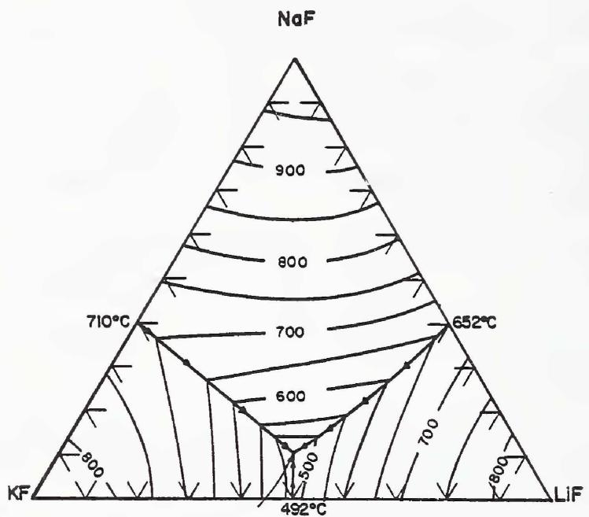  
Figure 78.1. LiF-NaF-KF phase diagram

References [1-21]

2. Density (ρ)

Measurement method: Archimedean technique [22]

Equation:

$$
\rho = a + b T \tag {78.1}
$$

precision: in table 78.1

uncertainty: $\sim \pm 2.0\%$

Table 78.1. Parameters of equation (78.1) and precision   

<table><tr><td>Composition</td><td>a</td><td>-b x 103</td><td>Precision</td><td>T range(K)</td></tr><tr><td>ternary eutecic(a)</td><td>2.5793</td><td>0.624</td><td>*</td><td>940-1170</td></tr></table>

(a) LiF:NaF:KF::46.5:11.5:42.0 (mol %)   
(*)insufficient data for estimate

# (78) LiF-NaF-KF

Table 78.2. Density of LiF-NaF-KF eutectic from equation in table 78.1   

<table><tr><td>T(K)</td><td>ρ(g cm-3)</td><td>(K)</td><td>ρ(g cm-3)</td></tr><tr><td>940</td><td>1.993</td><td>1060</td><td>1.918</td></tr><tr><td>950</td><td>1.987</td><td>1070</td><td>1.912</td></tr><tr><td>960</td><td>1.980</td><td>1080</td><td>1.905</td></tr><tr><td>970</td><td>1.974</td><td>1090</td><td>1.899</td></tr><tr><td>980</td><td>1.968</td><td>1100</td><td>1.893</td></tr><tr><td>990</td><td>1.962</td><td>1110</td><td>1.887</td></tr><tr><td>1000</td><td>1.955</td><td>1120</td><td>1.880</td></tr><tr><td>1010</td><td>1.949</td><td>1130</td><td>1.874</td></tr><tr><td>1020</td><td>1.943</td><td>1140</td><td>1.868</td></tr><tr><td>1030</td><td>1.937</td><td>1150</td><td>1.862</td></tr><tr><td>1040</td><td>1.930</td><td>1160</td><td>1.855</td></tr><tr><td>1050</td><td>1.924</td><td>1170</td><td>1.849</td></tr></table>

# References [22]

# 3. Surface Tension (Y)

Measurement method: maximum bubble pressure technique [23]

Equation:

$$
\gamma = a + b T \tag {78.2}
$$

precision: in table 78.3

uncertainty: $\sim$ 2.0%

Table 78.3. Parameters of equation (78.2) and precision   

<table><tr><td>Composition</td><td>a</td><td>b x 103</td><td>Precision</td><td>T range(K)</td></tr><tr><td>ternary eutectic(a)</td><td>272.6</td><td>-101.4</td><td>~ 0.1%</td><td>770-1040</td></tr></table>

(a) LiF:NaF:KF::46.5:11.5:42.0 (mol %)

Table 78.4. Surface tension of LiF-NaF-KF eutectic from equation in table 78.3   

<table><tr><td>T(K)</td><td>\( \gamma \left( {\mathrm{{dyn}}{\mathrm{{cm}}}^{-1}}\right) \)</td><td>T(K)</td><td>\( \gamma \left( {\mathrm{{dyn}}{\mathrm{{cm}}}^{-1}}\right) \)</td></tr><tr><td>770</td><td>194.5</td><td>910</td><td>180.3</td></tr><tr><td>780</td><td>193.5</td><td>920</td><td>179.3</td></tr><tr><td>790</td><td>192.5</td><td>930</td><td>178.3</td></tr><tr><td>800</td><td>191.5</td><td>940</td><td>177.3</td></tr><tr><td>810</td><td>190.5</td><td>950</td><td>176.3</td></tr><tr><td>820</td><td>189.5</td><td>960</td><td>175.3</td></tr><tr><td>830</td><td>188.4</td><td>970</td><td>174.2</td></tr><tr><td>840</td><td>187.4</td><td>980</td><td>173.2</td></tr><tr><td>850</td><td>186.4</td><td>990</td><td>172.2</td></tr><tr><td>860</td><td>185.4</td><td>1000</td><td>171.2</td></tr><tr><td>870</td><td>184.4</td><td>1010</td><td>170.2</td></tr><tr><td>880</td><td>183.4</td><td>1020</td><td>169.2</td></tr><tr><td>890</td><td>182.4</td><td>1030</td><td>168.2</td></tr><tr><td>900</td><td>181.3</td><td>1040</td><td>167.1</td></tr></table>

References [23]

# 7. Corrosion

Table 78.9. Corrosion studies from primary research literature   

<table><tr><td>Studies</td><td>References</td></tr><tr><td>Cr</td><td>[35]</td></tr><tr><td>Ni-Cr-Mo alloys (INOR-8; Hastelloyss B, W, and N)</td><td>[36,37]</td></tr><tr><td>SSNI-12P</td><td>[38]</td></tr><tr><td>Quartz</td><td>[39]</td></tr><tr><td>Al</td><td>[40]</td></tr><tr><td>Various Metals</td><td>[41]</td></tr><tr><td>Corrosion studies in molten salts with NaF as one component (e.g., Cl, CO3,...)</td><td>[42-57,64,65]</td></tr><tr><td>Electro-chemical behavior of oxide ions and related species in molten fluorides</td><td>[58-60]</td></tr><tr><td>Electroanalytical studies in molten fluorides</td><td>[61]</td></tr><tr><td>Annotated corrosion biblio.</td><td>[62]</td></tr><tr><td>Corrosion: molten fluorides (survey)</td><td>[63]</td></tr></table>

Compatibility studies: various molten fluorides and principally with LiF, NaF and KF. For thermodynamic (theoretical) considerations, and some considerations relative to commercial grade fluorides, and the use of "gettering" to lower impurity levels, see [63].

References [35-65]

# 8. Diffusion

Measurement method: cited in tabulations

List of diffusing species investigated in LiF-Na-KF [46.5-11.5- 42 mol %] as solvent

$\mathsf{Fe}^{2+}$ , Nb(IV), Nb(V), Ni $^{2+}$ , Ta(V), Th(IV), Ti(IV)

precision: in table 78.11 uncertainty: in table 78.10

Table 78.10. Diffusion techniques, uncertainties and species   

<table><tr><td>Diffusion technique of recommended study</td><td>Uncertainty (in values of D)</td><td>Species</td></tr><tr><td>chronopotentiometry</td><td>~ ± 10%</td><td>Ta(V), Nb(IV), Nb(V), Ti(IV)</td></tr><tr><td>rapid scan voltammetry</td><td>~ ± 10%</td><td>Fe2+, Ti(IV), Ni2+, Th(IV)</td></tr></table>

Equation:

$$
D = A \exp [ - E / R T ] \tag {78.5}
$$

Table 78.11. Parameters of diffusion equation (78.5) and recommended study   

<table><tr><td>Species</td><td>A x 103(cm2s-1)</td><td>E(cal mol-1)</td><td>Temp. range(K)</td><td>Precision</td><td>Recommended study</td></tr><tr><td>Ni2+</td><td>391.6</td><td>19810</td><td>773-873</td><td>~ ± 10.8%</td><td>1</td></tr></table>

Table 78.12. Diffusion coefficients for $\mathbf{Ni}^{2+}$ from equation in table 78.11   

<table><tr><td>T(K)</td><td>D x 105(cm2 s-1)</td><td></td><td>T(K)</td><td>D x 105(cm2 s-1)</td></tr><tr><td>770</td><td>0.09</td><td></td><td>830</td><td>0.24</td></tr><tr><td>780</td><td>0.11</td><td></td><td>840</td><td>0.27</td></tr><tr><td>790</td><td>0.13</td><td></td><td>850</td><td>0.32</td></tr><tr><td>800</td><td>0.15</td><td></td><td>860</td><td>0.36</td></tr><tr><td>810</td><td>0.18</td><td></td><td>870</td><td>0.41</td></tr><tr><td>820</td><td>0.21</td><td></td><td></td><td></td></tr></table>

Table 78.13. Diffusion coefficients for species not in tables 78.11 and 78.12   

<table><tr><td>Species</td><td>T(K)</td><td>D x 105(cm2s-1)</td><td>Recommended study</td></tr><tr><td>Fe2+</td><td>773</td><td>~0.1</td><td>2</td></tr><tr><td>Nb(IV)</td><td>1023</td><td>~5.02</td><td>6</td></tr><tr><td>Nb(V)</td><td>1023</td><td>~1.5</td><td>6</td></tr><tr><td>Ta(V)</td><td>1023</td><td>~1.5</td><td>5,7</td></tr><tr><td>Ti(IV)</td><td>773</td><td>~0.22</td><td>3</td></tr><tr><td>Th(IV)</td><td>773</td><td>~0.18</td><td>4</td></tr></table>

References $\mathrm{Fe}^{2+}$ , 68; Nb(IV), 72; Nb(V), 72; Ni $^{2+}$ , 67; Ta(V), Th(IV), 70; Ti(IV), 69

# 9. Heat of Fusion $(\Delta H_{f}^{o})$

Measurement method: differential scanning calorimetry [83]

Table 78.14. Heat of fusion   

<table><tr><td>Composition NaF:KF:LiF (mol %)</td><td>Tm(℃)</td><td>ΔH°f(kcal mol-1)</td><td>Uncertainty</td></tr><tr><td>11.5:42.0:46.5</td><td>462°</td><td>3.95</td><td>~ ± 2%</td></tr></table>

The melting point on p. 192 is based on phase-rule type (cooling) curves; the value above is recommended as more exact [83].

References [73,83]

# 10. Heat Capacity $(C_p)$

Measurement method: differential scanning calorimetry [83]

Table 78.15. Heat capacity   

<table><tr><td>Composition 
LiF:NaF:KF (mol %)</td><td>Cp(cal K-1mol-1</td><td>T range (K)</td><td>Uncertainty</td></tr><tr><td>46.5:11.5:42.0</td><td>18.8</td><td>750-830</td><td>~ ± 4%</td></tr></table>

For the above composition, $C_p(s) = 12.8$ (cal $K^{-1}$ mol $^{-1}$ ); uncertainty, $\sim 4\%$ ).

References [74,83,84]

# 11. Volume Change on Melting $(\Delta V_{f})$

No data

# 12. Vapor Pressure $(p_{vap})$

No data

3. Thermal Conductivity (liquid) $\left( {\lambda }_{\ell }\right)$

Measurement method: modified parallel plate [75,76]

Equation:

$$
\lambda = a + b T + c T ^ {2} \tag {78.6}
$$

precision: in table 78.16

uncertainty: $\sim \pm 25\%$

Table 78.16. Parameters of equation (78.6), precision, and temp. range   

<table><tr><td>Composition</td><td>a x 102</td><td>-b x 103</td><td>c x 106</td><td>Precision</td><td>T range(K)</td></tr><tr><td>ternary eutectic(a)</td><td>5.8049</td><td>0.1444</td><td>0.1009</td><td>*</td><td>800-920</td></tr></table>

(a) LiF:NaF:KF::46.5:11.5:42.0 (mol %)

\* not estimated; graphical data

Table 78.17. Thermal conductivity of molten eutectic from equation in table 78.16   

<table><tr><td>T(K)</td><td>\( \lambda x10^4 \)(cal cm-1s-1K-1)</td><td>T(K)</td><td>\( \lambda x10^4 \)(cal cm-1s-1K-1)</td></tr><tr><td>800</td><td>71.1</td><td>870</td><td>87.9</td></tr><tr><td>810</td><td>72.9</td><td>880</td><td>91.1</td></tr><tr><td>820</td><td>74.9</td><td>890</td><td>94.6</td></tr><tr><td>830</td><td>77.1</td><td>900</td><td>98.2</td></tr><tr><td>840</td><td>79.5</td><td>910</td><td>102.0</td></tr><tr><td>850</td><td>82.1</td><td>920</td><td>106.0</td></tr><tr><td>860</td><td>84.9</td><td></td><td></td></tr></table>

The containing material was Inconel. An analysis of the eutectic prior to the measurements showed the following impurity content initially (by weight, as metals): total, $0.13\%$ ; by trace metal content: Fe, $0.055\%$ ; Al, $0.012\%$ ; Ni, $0.009\%$ ; Pb, $0.014\%$ ; Mn, $0.010\%$ ; Mg, $0.008\%$ ; and "others", $0.002\%$ . On completion of the measurements, the above showed little change, except that chromium had increased to $\sim 0.12\%$ .

The thermal conductivity was observed to decrease with prolonged contact of the molten eutectic with Inconel. After cycling the above melt approximately three times between the limits $850^{\circ}\mathrm{C} - 500^{\circ}\mathrm{C}$ over a period 6-10 days, the $\lambda$ values were $20 - 30\%$ lower. The thermal conductivity, over the same temperature range, was given by:

$$
\lambda = 1. 7 7 2 6 \times 1 0 ^ {- 2} - 4 0. 8 1 \times 1 0 ^ {- 6} T + 3 2. 6 7 \times 1 0 ^ {- 9} T ^ {2} (7 8. 7)
$$

The uncertainty limits are $\sim 25\%$ , the precision could not be estimated, since the results were reported graphically. The decrease in radiant transmission is presumably due to the solution of an absorbing species in the dissolution of the Inconel by the molten fluoride mixture.

References [75-82]

# (78) LiF-NaF-KF

14. Thermal Conductivity (solid) $(\lambda_{s})$

Measurement method: modified parallel plate technique : solid state [76]

Table 78.18. Thermal conductivity of eutectic solid   

<table><tr><td colspan="4">Composition(mol %)</td><td rowspan="2">λ(cal cm-1s-1K-1)</td><td rowspan="2">Precision</td><td rowspan="2">Uncertainty</td></tr><tr><td>NaF</td><td>KF</td><td>LiF</td><td>(K)</td></tr><tr><td>11.5</td><td>42.0</td><td>46.5</td><td>(a)</td><td>11.16</td><td>*</td><td>~ ± 20%</td></tr></table>

(a) temperature of solid-state measurement not cited in [76]  
* not estimated; insufficient data

References [76]

15. Cryoscopic Constant $(k_{f})$

Measurement method: calculated from $\Delta H_{f}^{o}$ [83]

Table 78.19. Cryoscopic Constant   

<table><tr><td>Composition</td><td>\( \begin{smallmatrix} k \\  (K mol^{-1}kg) \end{smallmatrix} \)</td><td>Uncertainty</td></tr><tr><td>Ternary eutectic (a)</td><td>11.2</td><td>\( \sim ± 1\% \)</td></tr></table>

(a) LiF:NaF:KF: 46.5:11.5:42.0 (mol %)

References [83]

16. References

[1] Cohen, S. I., Powers, W. D., Greene, N. D., ORNL-2150, 117 (1956).   
[2] Hoffman, H. W., ORNL-CF-58-2-40, 32 (1958).   
[3] Bergman, A. G., Dergunov, E. P., Compt. Rend. Acad. Sci. USSR, 31, 753 (1941).   
[4] Anon., Proc. UN. Internat. Conf. Peaceful Uses At. Energ., 2nd, Geneva, 28, 99 (1958).   
[5] Bukhalova, G. A., Berezhnaya, V. T., Zhur. Neorg. Khim., 5, 456 (1960). J. Inorg. Chem. USSR, 5, 218 (1960).   
[6] Berezhnaya, V. T., Bukhalova, G. A., Zhur. Neorg. Khim., 6, 687 (1961).   
[7] Barton, C. J., et al., ORNL (1951-1954).   
[8] Janz, G. J. Downey, J. R., Jr., Allen, C. B., and Tomkins, R. P. T., "Eutectic Data" - 2 Vols; ERDA-TID-27163-P1 & P2; NTIS, Washington, D. C. (1977).   
[9] Janz, G. J., Downey, J. R., Jr., Allen, C. B., and Tomkins, R. P. T., "Physical Properties Data Complications Relevant to Energy Storage. I. Molten Salts: Eutectic Data", NSRDS-NBS-61; U. S. Gov't Printing Office, Washington, D. C. (1978).

# (78) LiF-NaF-KF

[10] "International Critical Tables of Numerical Data, Physics, Chemistry, and Technology", 8 Vols., McGraw-Hill Book Co., N. Y. (1933).   
[11] "Landolt-Bornstein Zahlenwert und Funktionen aus Physik, Chemie, Astronomie, Geophysik und Technik", (10th Ed.) Springer-Verlag, Berlin, Heidelberg, N. Y. (1961).   
[12] Clark, P. V., "Fused Salt Mixtures: Eutectic Compositions and Melting Points Bibliography 1907-1968", Report No. SC-R-68-1680; Sandia Laboratories (1968), NTIS.   
[13] Robertson, W. D., "Binary Phase Diagrams of Halide Salts", Report No. Yale 2723 (2 Vols.), U. S. AEC Contract AT (30-1)-2723 (1966), NTIS.   
[14] Thoma, R. E., "Phase Diagrams of Nuclear Reactor Materials", Oak Ridge National Laboratory, ORNL-2548, Contract No. W-7405-eng-26.   
[15] Thoma, R. E., "Phase Diagrams of Binary and Ternary Fluoride Systems", Chapt. 6; Adv. Molten Salts Chemistry, Vol. 3 (J. Braunstein, G. Mamantov, and G. P. Smith, eds.), Plenum Press, N. Y. (1975).   
[16] Voskresenskaya, N. K., ed., "Handbook of Solid-Liquid Equilibria in Systems of Inorganic Salts", Volumes 1, 2, Izc. Akad. Nauk SSSR, Moscow (1961). Israel Program for Scientific Translations, Jerusalem, 1970 (NTIS).   
[17] Sinsitri, C., Franzozini, P., and Rolla, M., "An Atlas of Miscibility Gaps in Molten Salt Systems", Institute of Physical Chemistry, University of Pavia (Italy) (1968).   
[18] Shaffer, P. T. B., "High Temperature Materials", Plenum Press Handbooks of High Temperature Materials, No. 1, Materials Index, Plenum Press, New York, 1964.   
[19] Franzozini, P., Ferloni, P., and Spinolo, C., "Molten Salts with Organic Anions", Instituto di Chimica Fisica, Universita di Pavia (Italy), 1973.   
[20] Toropov, N. A. et al., "Handbook of Phase Diagrams of the Silicates, Volume 1: Binary Systems, Volume 2, Metal-Oxygen Compounds in Silicate Systems", Izdatel'stov "Nauka" Leningradskoe Otdelenie, Leningrad, 1969, Israel Program for Scientific Translations, Jerusalem, 1972 (NTIS).   
[21] Levin, E., et al., "Phase Diagrams for Ceramists", Amer. Ceramic Soc. (publ.), Columbus, Ohio (1964; 1969).   
[22] Mellors, G. W. and Senderoff, S., "Electrochemistry, Proceedings of the First Australian Conf. on Electrochemistry", p. 578-598 (1965), Pergamon Press, N. Y.   
[23] Ellis, R. B. et al. Ann Progr. Rep. USAEC, Surface Tension of Fused Salts, AT-(40-1)-2073, December (1959).   
[24] Tørklep, K. and Øye, H. A., J. Chem. Eng. Data (in press) (1980).   
[25] Grimes, W. R., Cuneo, D. R., Blankenship, F. F., Kellholtz, G. W., Poppendick, H. F., Robinson, M. T., Chapter 12 in "Fluid Fuel Reactors", Lane, J. A., MacPherson, H. G., Maslan, F., Eds; Addison-Wesley, Reading, Mass., 1958.   
[26] Robbins, G. D. and Braunstein, J., USAEC Semi-Annual Prog. Rpt., ORNL-4548 pp. 156-159, Aug. 1970, Oak Ridge, Tenn.   
[27] Green, N. D., Oak Ridge National Laboratory, ORNL Rep. CF-54-8-64 (1954); T.I.S. Ext., U.S.A.E.C., Oak Ridge, Tenn.

# (78) LiF-NaF-KF

[28] Robbins, G. D., J. Electrochem. Soc., 116, 813 (1969).   
[29] "Dangerous Properties of Materials", Sax, N. I., Van Nostrand Reinhold Co., N. Y. (1969).   
[30] "Registry of Toxic Effects of Chemical Substances", Christensen, H. E., and Lubinybyhl, T. T., eds., U. S. Dept. H.E.W; U. S. Gov't Printing Office, Washington, D. C. (1975).   
[31] Janz, G. J., et al., "Physical Properties Data Complications Relevant to Energy Storage. Part II. Molten Salts: Data on Single and Multi-Component Salt Systems", NSRDS-NBS 61, Part II (April 1979), U. S. Gov't Printing Office, Supt of Doc. No. C13-48-61, Washington D. C. 20402.   
[32] "Potential Hazards in Molten Salt Baths for Heat Treatment of Metals", National Board Fire Underwriters Research Report No. 2. (1954).   
[33] "Handbook of Reactive Chemical Hazards", Bretherwick, L., Butterworths Co., London (1975).   
[34] Janz, G. J., Tomkins, R. P. T., Downey, J. R., Jr., and Allen, C. B., "Safety and Hazards", Chapter in "Eutectic Data", ERDA TID-27163-P1; NTIS, U. S. Dept. Commerce, Springfield, Va. (1977).   
[35] Brasunas, A., Metal Progr., 62, 88 (1952).   
[36] Bettes, E. S., Nucl. Sci. Eng., 2, 804 (1957).   
[37] Hoffman, E. E., Patriarca, P., Leitten, C. F., Jr., and Slaughter, G. M., ORNL-1934, Oak Ridge Nat'l Lab., (1956).   
[38] Oak Ridge National Laboratory, "The Development Status of Molten Salt Breeder Reactors", Rpt. ORNL-4812-UC-80; NTIS, U. S. Dept. Commerce, Springfield, Va., (Aug. 1972).   
[39] Heimann, R., Glastech. Ber., 43, 83 (1970).   
[40] Lukashenko, E. E., and Reutova, G. A., Nov. Teor. Tekhnol. Metall. Protsessov, 119 (1973).   
[41] Koger, J. W., Corrosion, 30, 125 (1974).   
[42] Khan, I. A., Ber. Kernforschungsanlage Juelich, Juel-608-RW, (1969).   
[43] Khan, I. A., Inst. Reaktorwerkst., Kernforschungsanlage, Juel-718-RW (1970).   
[44] Bowles, P. J., and Newdick, P. C., Electroplating and Metal Finishing, 24, 6 (1971).   
[45] Devan, J. H., "Examinations of Pump Impellers from Sodium and Fused Salt Pump Endurance Tests", ORNL CF-61-4-77, Oak Ridge National Lab., (1961).   
[46] Adamson, G. M., Manly, W. D., and Crouse, S. R., "Corrosion by Molten Fluorides", ANP Materials Meeting ORNL-2685, (1958).   
[47] Huntley, W. R., and Gnadt, P. A., Oak-Ridge Nat'l Lab., Report ORNL-TM-3863, (1973); Nucl. Sci. Abstr., 27, 12446 (1973).   
[48] Gill, C. B., Straumanis, M. E., and Schlechten, W. B., J. Electrochem. Soc., 102, 42 (1955)   
[49] Litman, A. P., "Corrosion of Volatility Pilot Plant Mark I INOR-S Hydrofluorinator and Mark III. Nickel Fluorinator after Fourteen Dissolution Runs", ORNL-3253, Oak Ridge Nat'l Lab., (1962).

(78) LiF-NaF-KF   
[50] Litman, A. P., and Goldman, A. E., "Corrosion Associated with Fluoridation in the Oak Ridge Nat'l Lab. Fluoride Volatility Process", ORNL-2832, Oak Ridge Nat'l Lab., (1961).   
[51] Manly, W. D., Coobs, H. H., DeVan, J. H., Douglas D. A., Inouye, H., Patriarca, P., Roche, T. K., and Scott, J. L., "Metallurgical Problems in Molten Fluoride Systems", Proc. 2nd U. N. Inter. Conf. Peaceful Uses of At. Energy, 7, 223 (1958)   
[52] Oak Ridge Nat'l Lab., Molten Salt Reactor Program Semiannual Progress Report, ORNL-3708, (1964).   
[53] Vreeland, D. C., Hoffman, E. E., and Manly, W. D., Nucleonics, 11, 36 (1953).   
[54] Grimes, W. R., and Cuneo, D. R., "Molten Salts as Reactor Fuels", Reactor Hdbk., 1, 425 (1955).   
[55] Shimotake, H., and Hesson, J. C., Adv. Chem. Series, 64, 149 (1967).   
[56] Boser, O., "Study of Safety Aspects of High-Temperature Thermal Energy Storage Systems", NSF No. AER 75-20605, (December, 1975).   
[57] Venkatasetty, H. V., "Thermodynamic Properties and Corrosion Characteristics of Thermal Energy Storage Eutectic Mixtures", paper presented at 152nd Meeting of the Electrochemical Society, Atlanta, Ga., (October, 1977).   
[58] Mathews, A. L., and Baes, C. F., Inorg. Chem., 7, 373 (1968).   
[59] Manning, D. L., and Mamantov, G., J. Electrochem. Soc., 124, 480 (1977).   
[60] Ting, G., Baes, C. F., Bamberger, C. E., and Mamantov, G., J. Inorg. Nucl. Chem., 39, 1803 (1977).   
[61] Manning, D. L., and Mamantov, G., J. Electroanall. Chem. (in press) (1978).   
[62] Janz, G. J., and Tomkins, R. P. T., Corrosion, 35, 485 (1979).   
[63] Eichelberger, J. L., (Pennwalt Corpn.) "Investigations of Metal Fluoride Thermal Energy Storage Materials: Availability, Cost, Chemistry", ERDA Rpt CO02990-6; NTIS, U. S. Dept. Commerce, Springfield, Va. (Dec. 1976).   
[64] Kochergen, V. P., and Ignat'eva, N. I., Russ. J. Inorg. Chem., 6(9), 1086 (1961).   
[65] Ozeryanaya, I. N., Volodin, V. P., and Smirnov, M. V., Zashchita Metalov (USSR), 2, 230 (1969).   
[66] Manning, D. L., J. Electroanal. Chem. 7, 302 (1964).   
[67] Manning, D. L. and Mamantov, G., J. Electroanal. Chem. 7, 102 (1964).   
[68] Clayton, F. R., Mamantov, G., and Manning, D. L., J. Electrochem. Soc. 120, 1193 (1973).   
[69] Clayton, F. R., Mamantov, G. and Manning, D. L. J. Electrochem. Soc., 121, 86 (1974).   
[70] Senderoff, S., Mellors, G. W. and Reinhart, W. J., J. Electrochem. Soc. 112, 840 (1965).   
[71] Senderoff, S. and Mellors, G. W., J. Electrochem. Soc. 113, 66 (1966).   
[72] Mellors, G. W. and Senderoff, S., J. Electrochem. Soc. 112, 642 (1965).

(78) LiF-NaF-KF   
[73] Maru, H. C., et al., Inst. Gas Technology; "Molten Salt Thermal Energy Storage Systems: Salt Selection" ERDA Rpt. CO0-2888-1, Aug. (1976); NTIS, U.S. Dept. Commerce, Springfield, Va.   
[74] Wicks, C. E. and Block, F. E., U.S. Bur. Mines, Bull. 605 (1963).   
[75] Erving, C. T., Spann, J.R., and Miller, R. R., J. Chem. Eng. Data 7(2) 246 (1962).   
[76] Grimes, W. R., and Cunes, D. R., Chapt. 17 in "Reactor Handbook", Vol. I, Tipton, C. R., ed., Wiley-Interscience Co., N.Y. (1960).   
[77] Cornwell, K., J. Phys. D: Appl. Phys. 4, 441 (1971).   
[78] Turnbull, A. G., Australian J. Appl. Sci. 12, 30 (1961).   
[79] Vargaftik, N. B., Bull. All. Un. Pwr. Engng. Inst., 21, 1 (1952).   
[80] Turnbull, A. G., Ph.D. Thesis, Imperial College of Science and Technology, London (1959).   
[81] Gambill, W. R., Chemical Eng. 66, 129 (1959).   
[82] Jamieson, D. T., Irving, J. B., and Tudhope, J. S., "Liquid Thermal Conductivity Data", HMSO, Edinburgh (1975).   
[83] Janz, G. J., et al. (MSDC-RPI), unpublished work (1980).   
[84] MacLeod, A. C., J. Chem. Soc. Faraday Trans. I 69, 2026 (1973)

1. Melting Temperatures $(T_{m})$

Pure substance melting points:

LiF: 848°C

CaF2: 1418°C

Eutectic melting point:

$765^{\circ}C$ ，composition: $79\mathrm{mol}\% \mathrm{LiF}$

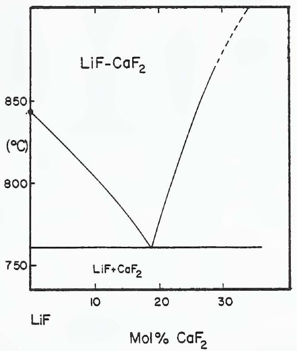  
Figure 79.1. $\mathsf{CaF}_2$ -LiF phase diagram

References [1-29]

2. Density (p)

Measurement method: Archimedean technique [31]

Equation

$$
\rho = a + b T \quad (7 9. 1)
$$

precision: in table 79.1 uncertainty: $\sim \pm 1.0\%$

Table 79.1. Parameters of equation (79.1) and precisions   

<table><tr><td>(Mol % LiF)</td><td>a</td><td>-b x 104</td><td>Precision</td><td>T range(K)</td></tr><tr><td>70.0</td><td>2.809</td><td>5.755</td><td>1.9%</td><td>1155-1350</td></tr><tr><td>80.0</td><td>2.453</td><td>3.704</td><td>1.1%</td><td>1080-1350</td></tr><tr><td>86.0</td><td>2.336</td><td>3.640</td><td>0.7%</td><td>1095-1350</td></tr><tr><td>93.0</td><td>2.120</td><td>2.621</td><td>0.7%</td><td>1125-1350</td></tr><tr><td>100.0</td><td>2.074</td><td>3.321</td><td>0.7%</td><td>1125-1350</td></tr></table>

(79) $\mathrm{CaF}_2$ -LiF

Table 79.2. Density (g cm $^{-3}$ ) from equations in table 79.1   

<table><tr><td rowspan="2">T(K)</td><td colspan="4">Mol % LiF</td></tr><tr><td>70.0</td><td>80.0</td><td>86.0</td><td>93.0</td></tr><tr><td>1080</td><td></td><td>2.053</td><td></td><td></td></tr><tr><td>1110</td><td></td><td>2.042</td><td>1.932</td><td></td></tr><tr><td>1140</td><td></td><td>2.031</td><td>1.921</td><td>1.821</td></tr><tr><td>1170</td><td>2.136</td><td>2.020</td><td>1.910</td><td>1.813</td></tr><tr><td>1200</td><td>2.118</td><td>2.009</td><td>1.899</td><td>1.805</td></tr><tr><td>1230</td><td>2.101</td><td>1.997</td><td>1.888</td><td>1.798</td></tr><tr><td>1260</td><td>2.084</td><td>1.986</td><td>1.877</td><td>1.790</td></tr><tr><td>1290</td><td>2.067</td><td>1.975</td><td>1.866</td><td>1.782</td></tr><tr><td>1335</td><td>2.049</td><td>1.964</td><td>1.856</td><td>1.774</td></tr><tr><td>1350</td><td>2.032</td><td>1.953</td><td>1.845</td><td>1.766</td></tr></table>

References [30,31]

3. Surface Tension (γ)

No data

4. Viscosity (n)

No data

5. Electrical Conductance (K)

Measurement method: classical ac technique [30]

Equation:

$$
\kappa = a + b T \quad (7 9. 2)
$$

precision: in table 79.3 uncertainty: $\approx \pm 10\%$

Table 79.3. Parameters of equation (79.2) and precisions   

<table><tr><td>Mol % LiF</td><td>a</td><td>b x 103</td><td>Precision</td><td>T range(K)</td></tr><tr><td>70.0</td><td>-0.3716</td><td>5.722</td><td>0.05%</td><td>1160-1340</td></tr><tr><td>80.0</td><td>-1.514</td><td>7.448</td><td>0.05%</td><td>1090-1340</td></tr><tr><td>86.0</td><td>-0.0841</td><td>6.636</td><td>0.03%</td><td>1090-1340</td></tr><tr><td>93.0</td><td>1.786</td><td>5.673</td><td>0.03%</td><td>1130-1340</td></tr></table>

# (79) $\mathrm{CaF}_2$ -LiF

Table 79.4. Specific conductance (ohm $^{-1}$ cm $^{-1}$ ) from equations in table 79.3   

<table><tr><td rowspan="2">T(K)</td><td colspan="4">Mol % LiF</td></tr><tr><td>70.0</td><td>80.0</td><td>86.0</td><td>93.0</td></tr><tr><td>1090</td><td></td><td>6.60</td><td>6.39</td><td></td></tr><tr><td>1110</td><td></td><td>6.75</td><td>6.52</td><td></td></tr><tr><td>1130</td><td></td><td>6.90</td><td>6.66</td><td>8.20</td></tr><tr><td>1150</td><td></td><td>7.05</td><td>6.79</td><td>8.31</td></tr><tr><td>1170</td><td>6.32</td><td>7.20</td><td>6.92</td><td>8.42</td></tr><tr><td>1190</td><td>6.44</td><td>7.35</td><td>7.06</td><td>8.54</td></tr><tr><td>1210</td><td>6.55</td><td>7.50</td><td>7.19</td><td>8.65</td></tr><tr><td>1230</td><td>6.67</td><td>7.65</td><td>7.32</td><td>8.76</td></tr><tr><td>1250</td><td>6.78</td><td>7.80</td><td>7.45</td><td>8.88</td></tr><tr><td>1270</td><td>6.90</td><td>7.95</td><td>7.59</td><td>8.99</td></tr><tr><td>1290</td><td>7.01</td><td>8.09</td><td>7.72</td><td>9.10</td></tr><tr><td>1310</td><td>7.12</td><td>8.24</td><td>7.85</td><td>9.22</td></tr><tr><td>1330</td><td>7.24</td><td>8.39</td><td>7.98</td><td>9.33</td></tr></table>

References [30,31]

# 6. Safety and Hazards

# A. Hazard rating

(i) Toxicity: inorganic fluorides are generally irritant and toxic.   
(ii) Vapor pressure: LiF at m.pt. $(848^{\circ}\mathrm{C})$ , $\sim 8.8 \times 10^{-3}\mathrm{mm}$ ; CaF $_2$ at m.pt. $(1418^{\circ}\mathrm{C}) \sim 0.5\mathrm{mm}$ .

# B. Disaster hazards

(i) Molten salt bath "explosion": i.e., explosive generating of steam due to bulk water "carry-over" and/or equipment failure; i.e., explosive expansion of "trapped" air.   
(ii) Fluorides, when heated to decomposition, or contacted with acids, emit highly toxic fumes.

References [32-38]

# 7. Corrosion

Table 79.5. Corrosion studies from primary research literature   

<table><tr><td>Studies</td><td>References</td></tr><tr><td>Cr</td><td>[39]</td></tr><tr><td>Ni-Cr-Fe</td><td>[40,41]</td></tr><tr><td>INOR-8</td><td>[41-44]</td></tr><tr><td>Al</td><td>[45,46]</td></tr><tr><td>Ni-Mo-Cr-Fe (Hastelloy)</td><td>[47-49]</td></tr><tr><td>Inconel</td><td>[44]</td></tr><tr><td>Cb-Zr; Ta-W-Zr-Cr; Ta-W-Cb</td><td>[50,51]</td></tr><tr><td>Corrosion: molten fluorides (survey)</td><td>[52,53]</td></tr><tr><td>Electrochemical behavior of oxide ions and related species in molten fluorides</td><td>[54-56]</td></tr><tr><td>Electroanalytical studies in molten fluorides</td><td>[57]</td></tr><tr><td>Annotated corrosion biblio.</td><td>[58]</td></tr></table>

Compatibility studies: various molten fluorides, but principally with molten LiF. No compatibility studies with $\mathrm{CaF}_2$ -LiF found. See [53] for discussion of impurity effects, and "getting" techniques.

References [39-58]

8. Diffusion

No data

9. Heat of Fusion $(\Delta H_{f}^{\circ})$

No data

10. Heat Capacity $(C_p)$

No data

11. Volume Change on Melting $(\Delta V_{f})$

Measurement method: estimated from densities [59]

Table 79.6. Volume change on melting   

<table><tr><td>Binary eutectic (mol % LiF)</td><td>(ΔVf/Vs)</td><td>Uncertainty</td></tr><tr><td>79</td><td>21.7%</td><td>~ ± 10%</td></tr></table>

References [59]

# (79) $\mathrm{CaF}_2$ -LiF

12. Vapor Pressure $(p_{vap})$ No data   
13. Thermal Conductivity (liquid) $(\lambda_{\ell})$ No data   
14. Thermal Conductivity (solid) $(\lambda_{s})$ No data   
15. Cryoscopic Constant $(k_{f})$ No data

# 16. References

[1] Roake, W.E., J. Electrochem. Soc., 104, 661 (1957).   
[2] Deadmore, D. L., Machin, J. S., J. Phys. Chem., 64, 824 (1960).   
[3] Bukhalova, G. A., Sulaimankulov, K. and Bostandzhiyan, A. K., Zh. Neorg. Khim. 4, 516 (1959); ibid., 4, 1138 (1959).   
[4] Bergman, A. G., and Dergonov, E. P., Compt. Rend. Acad. Sci. USSR, 31, 753 (1941).   
[5] Ruff, O. and Busch, W., Z. anorg. allgem. Chem., 144, 87 (1925).   
[6] Berezhynaya, V. T., and Bukhalova, G. A., Zhur. Neorg. Khim. A., 12, 2179 (1967).   
[7] Gladushenko, V. A. and Zakhartshenko, M. A., Russ. J. Inorg. Chem., 11(4), 493 (1966); Zh. Neorg. Khim., 11(4), 916 (1966) (Russ).   
[8] Vrbenska, J. and Malinovsky, M., Chem. Zvesti 21, 818 (1967).   
[9] Bukhalova, G. A., Berezhnaya, V. T., Zhur. Neorg. Khim., 2, 1408 (1957).   
[10] Berezhnaya, V. T., Bukhalova, G. A., Zhur. Neorg. Khim., 4, 902 (1959).   
[11] Bukhalova, G. A., Bergman, A. G., Dokl. Akad. Nauk SSSR, 66, 67 (1949).   
[12] Bergman, A. G., and Banachek, E. I., Izv. Sekt. Fiz. Khim. A., 23, 201 (1953)   
[13] Zakharchenko, M. A., Belogorskaya, N. V., Aslanov, S. M., Zhur. Neorg. Khim., 9, 93 (1964).   
[14] Barton, C. J., Bratcher, L. M., and Grimes, W. R., Unpublished work, in "Phase Diagrams of Nuclear Reactor Materials", ed. by Thoma, R. E., U. S. At. Energy Comm. ORNL-2548 (1959).   
[15] Kostenska, I., Vrbenska, J., and Malinovsky, M., Chem. Zvesti 28, 531-538 (1974).

# (79) $\mathrm{CaF}_2$ -LiF

[16] Janz, G. J. Downey, J. R., Jr., Allen, C. B., and Tomkins, R. P. T., "Eutectic Data" - 2 Vols; ERDA-TID-27163-P1 & P2; NTIS, Washington, D. C. (1977).   
[17] Janz, G. J., Downey, J. R., Jr., Allen, C. B., and Tomkins, R. P. T., "Physical Properties Data Complications Relevant to Energy Storage. I. Molten Salts: Eutectic Data", NSRDS-NBS-61; U. S. Gov't Printing Office, Washington, D. C. (1978).   
[18] "International Critical Tables of Numerical Data, Physics, Chemistry, and Technology", 8 Vols., McGraw-Hill Book Co., N. Y. (1933).   
[19] "Landolt-Bornstein Zahlenwert und Funktionen aus Physik, Chemie, Astronomie, Geophysik und Technik", (10th Ed.) Springer-Verlag, Berlin, Heidelberg, N. Y. (1961).   
[20] Clark, P. V., "Fused Salt Mixtures: Eutectic Compositions and Melting Points Bibliography 1907-1968", Report No. SC-R-68-1680; Sandia Laboratories (1968), NTIS.   
[21] Robertson, W. D., "Binary Phase Diagrams of Halide Salts", Report No. Yale 2723 (2 Vols.), U. S. AEC Contract AT (30-1)-2723 (1966), NTIS.   
[22] Thoma, R. E., "Phase Diagrams of Nuclear Reactor Materials", Oak Ridge National Laboratory, ORNL-2548, Contract No. W-7405-eng-26.   
[23] Thoma, R. E., "Phase Diagrams of Binary and Ternary Fluoride Systems", Chapt. 6; Adv. Molten Salts Chemistry, Vol. 3 (J. Braunstein, G. Mamantov, and G. P. Smith, eds.), Plenum Press, N. Y. (1975).   
[24] Voskresenskaya, N. K., ed., "Handbook of Solid-Liquid Equilibria in Systems of Inorganic Salts", Volumes 1, 2, Izc. Akad. Nauk SSSR, Moscow (1961). Israel Program for Scientific Translations, Jerusalem, 1970 (NTIS).   
[25] Sinistri, C., Franzozini, P., and Rolla, M., "An Atlas of Miscibility Gaps in Molten Salt Systems", Institute of Physical Chemistry, University of Pavia (Italy) (1968).   
[26] Shaffer, P. T. B., "High Temperature Materials", Plenum Press Handbooks of High Temperature Materials, No. 1, Materials Index, Plenum Press, New York, 1964.   
[27] Franzozini, P., Ferloni, P., and Spinolo, C., "Molten Salts with Organic Anions", Instituto di Chimica Fisica, Universita di Pavia (Italy), 1973.   
[28] Toropov, N. A. et al., "Handbook of Phase Diagrams of the Silicates, Volume 1: Binary Systems, Volume 2, Metal-Oxygen Compounds in Silicate Systems", Izdatel'stov "Nauka" Leningradskoe Otdelenie, Leningrad, 1969, Israel Program for Scientific Translations, Jerusalem, 1972 (NTIS).   
[29] Levin, E., et al., "Phase Diagrams for Ceramists", Amer. Ceramic Soc. (publ.), Columbus, Ohio (1964; 1969).   
[30] Meaker, R. E., Porter, B., and Kesterke, D. G., United States Department of the Interior, Report of Investigations 7528, 1971.   
[31] Porter, B., and Meaker, R. E., United States Department of the Interior, Report of Investigations 6838, 1966.   
[32] "Dangerous Properties of Materials", Sax, N. I., Van Nostrand Reinhold Co., N. Y. (1969)

(79) $\mathsf{CaF}_2\mathsf{-LiF}$   
[33] "Registry of Toxic Effects of Chemical Substances", Christensen, H. E., and Lubinbyhl, T. T., eds., U. S. Dept. H. E. W., U. S. Gov't Printing Office, Washington, D. C. (1975)   
[34] Janz, G. J., et al., "Physical Properties Data Complications Relevant to Energy Storage. Part II. Molten Salts: Data on Single and Multi-Component Salt Systems", NSRDS-NBS 61, Part II (April 1979), U. S. Gov't Printing Office, Supt of Doc. No. C13-48-61, Washington D. C. 20402.   
[35] "Potential Hazards in Molten Salt Baths for Heat Treatment of Metals", National Board of Fire Underwriters Research Report No. 2 (1954)   
[36] "Handbook of Reactive Chemical Hazards", Bretherwick, L., Butterworth Co., London (1975)   
[37] Janz, G. J., Tomkins, R. P. T., Downey, J. R., Jr., and Allen, C. B., "Safety and Hazards, Chapter in "Eutectic Data", ERDA TID-27163-P1; NTIS, U. S. Dept. Commerce, Springfield, Va. (1977)   
[38] vide: this work, System 51, CaF $_2$ .   
[39] Brasunas, A., Metal Progr., 62, 88 (1952).   
[40] Grimes, W. R., Blankenship, F. F., Keilholtz, G. W., Poppendiek, H. F., and Robinson, M. T., Proc. Sec. U. N. Inter. Conf. Peaceful Uses of Atomic Energy, Geneva, 28, 99 (1958).   
[41] Oak Ridge Nat'l Lab., Molten Salt Reactor Program Semiannual Progress Report, ORNL-3708, (1964).   
[42] Bettes, E. S., Nucl. Sci. Eng., 2, 804 (1957).   
[43] Shimotake, H., and Hesson, J. C., Adv. Chem. Series, 64, 149 (1967).   
[44] Manly, W. D., et al., "Construction Materials for Molten Salt Reactors", Ch. 13 in "Fluid Fuel Reactors", Lane J. A., MacPherson, H. G., and Maslan, F., eds., Addison-Wesley Co. Inc. Publ. (1958).   
[45] Pizzini, S., Magistris, A., and Sternheim, G., Corrosion Sci., 4, 345 (1964).   
[46] Lukashenko, E. E., and Reutova, G. A., Nov. Teor. Tekhnol. Metall. Protsessov, 119 (1973).   
[47] Koger, J. W., Corrosion, 30, 125 (1974).   
[48] Koger, J. W., ORNL-RM-4286 (1972); Nucl. Sci. Abstr., 29, 8256 (1974).   
[49] Oak Ridge National Laboratory, "The Development Status of Molten Salt Breeder Reactors", Rpt. ORNL-4812-UC-80; NTIS, U. S. Dept. Commerce, Springfield, Va., (Aug. 1972).   
[50] Boser, O., "Study of Safety Aspects of High-Temperature Thermal Energy Storage Systems", NSF No. AER 75-20605, (December, 1975).   
[51] Harrison, R. W., and Hendrixson, W. H., "Lithium Fluoride Bellows Capsule Tests", General Electric Company, Cincinnati, Ohio, Jan. 1970, Contract NAS 3-8523.   
[52] Grimes, W. R., and Cuneo, D. R., "Molten Salts as Reactor Fuels", Reactor Hdbk., 1, 425 (1955).

(79) $\mathrm{CaF}_2$ -LiF   
[53] Eichelberger, J. L., (Pennwalt Corpn.) "Investigations of Metal Fluoride Thermal Energy Storage Materials: Availability, Cost, Chemistry", ERDA Rpt CO02990-6; NTIS, U. S. Dept. Commerce, Springfield, Va. (Dec. 1976).   
[54] Mathews, A. L., and Baes, C. F., Inorg. Chem., 7, 373 (1968).   
[55] Manning, D. L., and Mamantov, G., J. Electrochem. Soc., 124, 480 (1977).   
[56] Ting, G., Baes, C. F., Bamberger, C. E., and Mamantov, G., J. Inorg. Nucl. Chem., 39, 1803 (1977).   
[57] Manning, D. L., and Mamantov, G., J. Electroanl. Chem. (in press) (1978).   
[58] Janz, G. J., and Tomkins, R. P. T., Corrosion, 35, 485 (1979).   
[59] Janz, G. J., et al. (MSDC-RPI), unpublished work (1980):

1. Melting Temperatures $(T_{m})$

Pure substance melting points:

LiF: 848°C

BaF2: 1418°C

Eutectic melting point:

$765^{\circ} \mathrm{C}$ , composition: $18.3 \mathrm{~mol} \% \mathrm{BaF}_{2}$ (36.6 equiv. $\% \mathrm{BaF}_{2}$ )

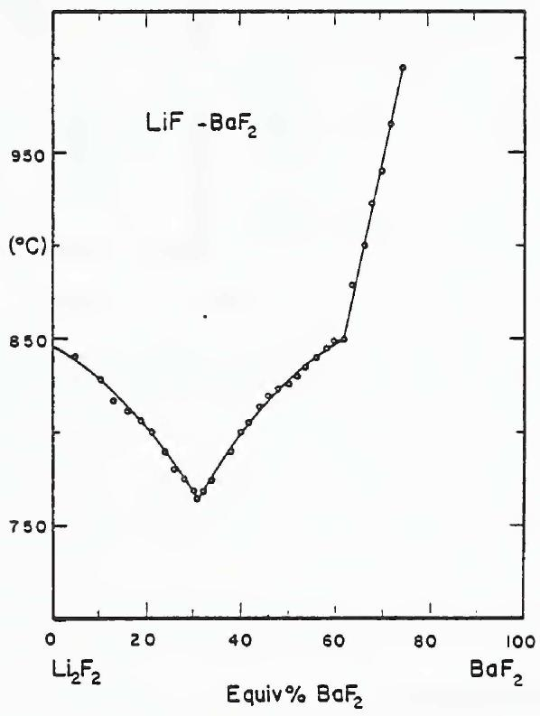  
Figure 80.1. LiF-BaF $_2$ phase diagram

References: [1-22]

2. Density (p)

Measurement method: Archimedean technique [23]

Equation:

(composition-density isotherms)

$$
\rho = a + b C + c C ^ {2} + d C ^ {3} \tag {80.1}
$$

$$
\left(\mathrm{C} = \mathrm{mol}\% \mathrm{BaF}_{2}\right)
$$

precision: in table 80.1

uncertainty: $\sim \pm 1.5\%$

Table 80.1. Parameters of equation (80.1) and precision   

<table><tr><td>T (K)</td><td>a</td><td>b x 102</td><td>c x 104</td><td>d x 106</td><td>Precision</td></tr><tr><td>1573</td><td>1.5873</td><td>6.920</td><td>-7.386</td><td>2.808</td><td>~1%</td></tr></table>

Table 80.2. Density for isotherm at 1573K from equation in table 80.1   

<table><tr><td>\( \mathrm{{Mol}}\% {\mathrm{{BaF}}}_{2} \)</td><td>\( \left( {\mathrm{g}{\mathrm{{cm}}}^{-3}}\right) \)</td><td></td><td>\( \mathrm{{Mol}}\% {\mathrm{{BaF}}}_{2} \)</td><td>\( \left( {\mathrm{g}{\mathrm{{cm}}}^{-3}}\right) \)</td></tr><tr><td>0</td><td>1.587</td><td></td><td>60</td><td>3.687</td></tr><tr><td>10</td><td>2.208</td><td></td><td>70</td><td>3.775</td></tr><tr><td>20</td><td>2.698</td><td></td><td>80</td><td>3.834</td></tr><tr><td>30</td><td>3.074</td><td></td><td>90</td><td>3.880</td></tr><tr><td>40</td><td>3.353</td><td></td><td>100</td><td>3.929</td></tr><tr><td>50</td><td>3.552</td><td></td><td></td><td></td></tr></table>

References [23]

3. Surface Tension (Y)

No data

4. Viscosity (n)

No data

5. Electrical Conductance (K)

No data

6. Safety and Hazards

A. Hazard rating

(i) Toxicity: inorganic fluorides are generally irritants and toxic.   
(ii) Vapor pressure: at m.pt. $(848^{\circ}\mathrm{C})$ , $\sim 8.8 \times 10^{-3} \mathrm{~mm}$ ; BaF₂, at m.pt. $(1320^{\circ}\mathrm{C})$ , $\sim 0.5 \mathrm{~mm}$ .

B. Disaster hazards

(i) Molten salt bath "explosion": i.e., explosive generating of steam due to bulk water "carry-over" and/or equipment failure; i.e., explosive expansion of "trapped" air.   
(ii) Fluorides, when heated to decomposition, or contacted with acids, emit highly toxic fumes.

References [24-29]

# 7. Corrosion

Table 80.3. Corrosion studies from primary research literature   

<table><tr><td>Studies (various molten fluorides)</td><td>References</td></tr><tr><td>Cr</td><td>[31]</td></tr><tr><td>Ni-Cr-Fe</td><td>[32,33]</td></tr><tr><td>INOR-8</td><td>[33-36]</td></tr><tr><td>Al</td><td>[37,38]</td></tr><tr><td>Ni-Mo-Cr-Fe (Hastelloy)</td><td>[39,47,48]</td></tr><tr><td>Inconel</td><td>[36]</td></tr><tr><td>Cb-Zr; Ta-W-Zr-Cr; Ta-W-Cb</td><td>[49.50]</td></tr><tr><td>Corrosion: molten fluorides (survey)</td><td>[41-43]</td></tr><tr><td>Electro-chemical behaviour of oxide ions and related species in molten fluorides</td><td>[44]</td></tr><tr><td>Electro-analytical studies in molten fluorides</td><td>[45]</td></tr><tr><td>Annotated corrosion biblio.</td><td>[40,46]</td></tr></table>

Compatibility studies: various molten fluorides, and principally with molten LiF. No studies specific to $\mathsf{BaF}_2$ were found. For thermodynamic (theoretical) considerations, and some considerations relative to commercial grade fluorides, and the use of "getter" to lower impurity levels, see [46].

References [30-50]

# 8. Diffusion

Measurement method: chronopotentiometry [51]

Diffusing species investigated in LiF- $\mathsf{BaF}_2$ [38.0-62.0 mol %] as solvent:

$\mathrm{Cl}^{3+}$ , $\mathrm{U}^{4+}$ , $\mathrm{Zr}^{4+}$

precision: not estimated

uncertainty: in table 80.4

Table 80.4. Diffusion coefficients and uncertainties   

<table><tr><td>Species</td><td>T(K)</td><td>D x 105(cm2 s-1)</td><td>Uncertainty</td></tr><tr><td>Cl3+</td><td>1089</td><td>1.5</td><td>~ ± 13%</td></tr><tr><td>U4+</td><td>1113</td><td>1.9</td><td>~ ± 10%</td></tr><tr><td>Zr4+</td><td>1123</td><td>0.8</td><td>~ ± 10%</td></tr></table>

References [51]

9. Heat of Fusion $(\Delta H_{f}^{\circ})$ No Data   
10. Heat Capacity (Cp) No Data   
11. Volume Change on Melting $(\Delta V_{f})$ No Data   
12. Vapor Pressure $(p_{vap})$ No Data   
13. Thermal Conductivity. (liquid) $(\lambda_{\mathrm{g}})$ No Data   
14. Thermal Conductivity (solid) $(\lambda_{s})$ No Data   
15. Cryoscopic Constant $(k_{f})$ No Data   
16. References

[1] Berezhnaya, V. T., Bukhalova, G. A., Zhur. Neorg. Khim., 6, 687 (1961).   
[2] Bukhalova, G. A., Berezhnaya, V. T., Zhur. Neorg. Khim., 2, 1408 (1957).   
[3] Mateiko, Z. A., Bukhalova, G. A., Zhur. Neorg. Khim., 7, 165 (1962). Russ. J. Inorg. Chem., 7, 84 (1962)   
[4] Bychkova, N. A., Bergman, A. G., Zhur. Obshchei Khim., 26, 639 (1956). J. Gen. Chem. USSR, 26 735 (1956).   
[5] Berezhnaya, V. T., Bukhalova, G. A., Zhur. Neorg. Khim., 4, 2600 (1959). J. Inorg. Chem. USSR, 4, 1198 (1959).   
[6] Vereshchagina, V. I., Zhur. Neorg. Khim. Trans., 7, 450 (1962).   
[7] Berezhnaya, V. T., Bukhalova, G. A., Zhur. Neorg. Khim., 12, 2179 (1967).   
[8] Bergman, A. G. and Banachek, E. I., Izv. Sekt. Fiz. Khim. A., 23 201 (1953).

(80) LiF-BaF2

[9] Janz, G. J. Downey, J. R., Jr., Allen, C. B., and Tomkins, R. P. T., "Eutectic Data" - 2 Vols; ERDA-TID-27163-P1 & P2; NTIS, Washington, D. C. (1977).   
[10] Janz, G. J., Downey, J. R., Jr., Allen, C. B., and Tomkins, R. P. T., "Physical Properties Data Complications Relevant to Energy Storage. I. Molten Salts: Eutectic Data", NSRDS-NBS-61; U. S. Gov't Printing Office, Washington, D. C. (1978).   
[11] "International Critical Tables of Numerical Data, Physics, Chemistry, and Technology", 8 Vols., McGraw-Hill Book Co., N. Y. (1933).   
[12] "Landolt-Bornstein Zahlenwert und Funktionen aus Physik, Chemie, Astronomie, Geophysik und Technik", (10th Ed.) Springer-Verlag, Berlin, Heidelberg, N. Y. (1961).   
[13] Clark, P. V., "Fused Salt Mixtures: Eutectic Compositions and Melting Points Bibliography 1907-1968", Report No. SC-R-68-1680; Sandia Laboratories (1968), NTIS.   
[14] Robertson, W. D., "Binary Phase Diagrams of Halide Salts", Report No. Yale 2723 (2 Vols.), U. S. AEC Contract AT (30-1)-2723 (1966), NTIS.   
[15] Thoma, R. E., "Phase Diagrams of Nuclear Reactor Materials", Oak Ridge National Laboratory, ORNL-2548, Contract No. W-7405-eng-26.   
[16] Thoma, R. E., "Phase Diagrams of Binary and Ternary Fluoride Systems", Chapt. 6; Adv. Molten Salts Chemistry, Vol. 3 (J. Braunstein, G. Mamantov, and G. P. Smith, eds.), Plenum Press, N. Y. (1975).   
[17] Voskresenskaya, N. K., ed., "Handbook of Solid-Liquid Equilibria in Systems of Inorganic Salts", Volumes 1, 2, Izc. Akad. Nauk SSSR, Moscow (1961). Israel Program for Scientific Translations, Jerusalem, 1970 (NTIS).   
[18] Sinistri, C., Franzozini, P., and Rolla, M., "An Atlas of Miscibility Gaps in Molten Salt Systems", Institute of Physical Chemistry, University of Pavia (Italy) (1968).   
[19] Shaffer, P. T. B., "High Temperature Materials", Plenum Press Handbooks of High Temperature Materials, No. 1, Materials Index, Plenum Press, New York, 1964.   
[20] Franzozini, P., Ferloni, P., and Spinolo, C., "Molten Salts with Organic Anions", Instituto di Chimica Fisica, Universita di Pavia (Italy), 1973.   
[21] Toropov, N. A. et al., "Handbook of Phase Diagrams of the Silicates, Volume 1: Binary Systems, Volume 2, Metal-Oxygen Compounds in Silicate Systems", Izdatel'stov "Nauka" Leningradskoe Otdelenie, Leningrad, 1969, Israel Program for Scientific Translations, Jerusalem, 1972 (NTIS).   
[22] Levin, E., et al., "Phase Diagrams for Ceramists", Amer. Ceramic Soc. (publ.), Columbus, Ohio (1964; 1969).   
[23] Bukhalova, G. A., and Yagub'yan, E. S., Trans. from Izv. Akad. Nauk SSSR, Neorgan. Mat., 3, 1096 (1967).   
[24] "Dangerous Properties of Materials", Sax, N. I., Van Nostrand Reinhold Co., N. Y. (1969).   
[25] "Registry of Toxic Effects of Chemical Substances", Christensen, H. E., and Lubinbyhl, T. T., eds., U. S. Dept. H. E. W., U. S. Gov't Printing Office, Washington, D. C. (1975).

(80) LiF-BaF2

Janz, G. J., et al., "Physical Properties Data Complications Relevant to Energy Storage. Part II. Molten Salts: Data on Single and Multi-Component Salt Systems", NSRDS-NBS 61, Part II (April 1979), U. S. Gov't Printing Office, Supt of Doc. No. C13-48-61, Washington D. C. 20402.   
"Potential Hazards in Molten Salt Baths for Heat Treatment of Metals", National Board of Fire Underwriters Research Report No.2 (1954).   
"Handbook of Reactive Chemical Hazards", Bretherwick, L., Butterworth Co., London (1975).   
Janz, G. J., Tomkins, R. P. T., Downey, J. R. Jr., and Allen, C. B., "Safety and Hazards", Chapter in "Eutectic Data", ERDA TID-27163-P1; NTIS, U. S. Dept. Commerce, Springfield, Va. (1977)   
Hoffman, E. E., Patriarca, P., Leitten, C. F., Jr., and Slaughter, G. M., ORNL-1934, Oak Ridge Nat'l Lab., (1956).   
Brasunas, A., Metal Progr., 62, 88 (1952).   
Grimes, W. R., Blankenship, F. F., Keilholtz, G. W., Poppendiek, H. F., and Robinson, M. T., Proc. Sec. U. N. Inter. Conf. Peaceful Uses of Atomic Energy, Geneva, 28, 99 (1958).   
Oak Ridge Nat'l Lab., Molten Salt Reactor Program Semiannual Progress Report, ORNL-3708, (1964).   
Bettes, E. S., Nuc1. Sci. Eng., 2, 804 (1957).   
Shimotake, H., and Hesson, J. C., Adv. Chem. Series, 64, 149 (1967).   
Manly, W. D., et al., "Construction Materials for Molten Salt Reactors", Ch. 13 in "Fluid Fuel Reactors", Lane J. A., MacPherson, H. G., and Maslan, F., eds., Addison-Wesley Co. Inc. Publ. (1958).   
Pizzini, S., Magistris, A., and Sternheim, G., Corrosion Sci., 4, 345 (1964).   
Lukashenko, E. E., and Reutova, G. A., Nov. Teor. Tekhnol. Metal1. Protsessov, 119 (1973).   
Koger, J. W., Corrosion, 30, 125 (1974).   
Grimes, W. R., and Cuneo, D. R., "Molten Salts as Reactor Fuels", Reactor Hdbk., 1, 425 (1955).   
Mathews, A. L., and Baés, C. F., Inorg. Chem., 7, 373 (1968).   
Manning, D. L., and Mamantov, G., J. Electrochem. Soc., 124, 480 (1977).   
Ting, G., Baes, C. F., Bamberger, C. E., and Mamantov, G., J. Inorg. Nucl. Chem., 39, 1803 (1977).   
Manning, D. L., and Mamantov, G., J. Electroanl. Chem. (in press) (1978).   
Janz, G. J., and Tomkins, R. P. T., Corrosion, 35, 485 (1979).   
Eichelberger, J. L., (Pennwalt Corpn.) "Investigations of Metal Fluoride Thermal Energy Storage Materials: Availability, Cost, Chemistry", ERDA Rpt CO02990-6; NTIS, U. S. Dept. Commerce, Springfield, Va. (Dec. 1976).   
Koger, J. W., ORNL-RM-4286 (1972); Nucl. Sci. Abstr., 29, 8256 (1974).

(80) LiF-BaF2   
[48] Oak Ridge National Laboratory, "The Development Status of Molten Salt Breeder Reactors", Rpt. ORNL-4812-UC-80; NTIS, U. S. Dept. Commerce, Springfield, Va., (Aug. 1972).   
[49] Boser, O., "Study of Safety Aspects of High-Temperature Thermal Energy Storage Systems", NSF No. AER 75-20605, (December, 1975).   
[50] Harrison, R. W., and Hendrixson, W. H., "Lithium Fluoride Bellows Capsule Tests", General Electric Company, Cincinnati, Ohio, Jan. 1970, Contract NAS 3-8523.   
[51] Cartier, R., Comm. At. Ener. (France) Report No. CEA-R-3792, (1969).

1. Melting Temperatures $(T_{m})$

Pure substance melting points:

LiF: $848^{\circ}C$

$\mathrm{AlF}_3$ : does not melt; sublimes with 1 atm equal press. at $\sim 1255^{\circ}\mathrm{C}$ . Eutectic melting point:

E1: 710°C, composition: 85.5 mol % LiF

E 2: $709^{\circ} \mathrm{C}$ , composition: 64.5 mol % LiF

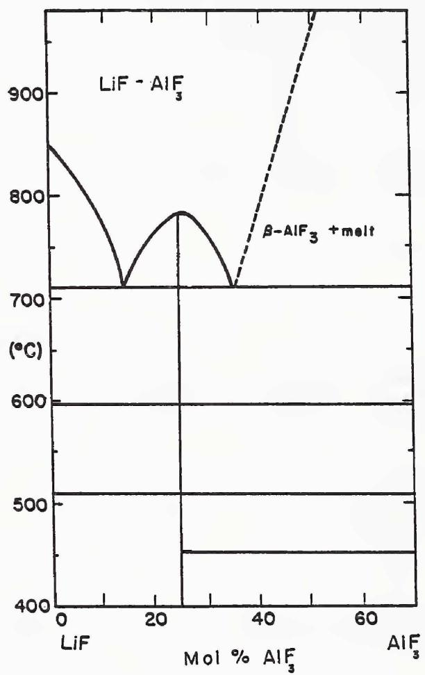  
Figure 81.1. LiF-AlF $_3$ phase diagram

References [1-29]

(81) LiF-A1F3

2. Density (p)

Measurement method: Archimedean technique [30,34]

Equation:

$$
\rho = a + b T \tag {81.1}
$$

precision: in table 81.1

uncertainty: $\sim \pm 1.0\%$

Table 81.1. Parameters of equation (81.1) and precision   

<table><tr><td>Mol % LiF</td><td>a</td><td>-b x 104</td><td>Precision</td><td>T range(K)</td></tr><tr><td>55</td><td>2.9235</td><td>9.402</td><td>*</td><td>1130-1320</td></tr><tr><td>60</td><td>3.1147</td><td>10.201</td><td>*</td><td>1130-1320</td></tr><tr><td>65</td><td>3.2050</td><td>10.300</td><td>*</td><td>1130-1320</td></tr><tr><td>70</td><td>3.1456</td><td>9.360</td><td>*</td><td>1130-1320</td></tr><tr><td>75</td><td>3.0422</td><td>8.359</td><td>*</td><td>1130-1320</td></tr><tr><td>80</td><td>2.8751</td><td>7.102</td><td>*</td><td>1130-1320</td></tr><tr><td>85</td><td>2.7935</td><td>6.698</td><td>*</td><td>1130-1320</td></tr><tr><td>90</td><td>2.6660</td><td>6.143</td><td>*</td><td>1130-1320</td></tr><tr><td>95</td><td>2.4298</td><td>4.822</td><td>*</td><td>1130-1320</td></tr><tr><td>100</td><td>2.3283</td><td>4.676</td><td>*</td><td>1130-1320</td></tr></table>

* insufficient data; not estimated

Table 81.2. Density $(\mathrm{gcm}^{-3})$ from equations in table 81.1   

<table><tr><td></td><td colspan="5">Mol % LiF</td></tr><tr><td>T(K)</td><td>55</td><td>65</td><td>75</td><td>85</td><td>95</td></tr><tr><td>1130</td><td>1.861</td><td>2.041</td><td>2.098</td><td>2.037</td><td>1.885</td></tr><tr><td>1150</td><td>1.842</td><td>2.021</td><td>2.081</td><td>2.023</td><td>1.875</td></tr><tr><td>1170</td><td>1.823</td><td>2.000</td><td>2.064</td><td>2:010</td><td>1.866</td></tr><tr><td>1190</td><td>1.805</td><td>1.979</td><td>2.048</td><td>1.996</td><td>1.856</td></tr><tr><td>1210</td><td>1.786</td><td>1.959</td><td>2.031</td><td>1.983</td><td>1.846</td></tr><tr><td>1230</td><td>1.767</td><td>1.938</td><td>2.014</td><td>1.970</td><td>1.837</td></tr><tr><td>1250</td><td>1.748</td><td>1.918</td><td>1.997</td><td>1.956</td><td>1.827</td></tr><tr><td>1270</td><td>1.729</td><td>1.897</td><td>1.981</td><td>1.943</td><td>1.817</td></tr><tr><td>1290</td><td>1.711</td><td>1.876</td><td>1.964</td><td>1.929</td><td>1.808</td></tr><tr><td>1310</td><td>1.692</td><td>1.856</td><td>1.947</td><td>1.916</td><td>1.798</td></tr><tr><td>1320</td><td>1.682</td><td>1.845</td><td>1.939</td><td>1.909</td><td>1.793</td></tr></table>

References [30-37]

3. Surface Tension (γ)

No data

$$
\mathrm {L i F - A l F} _ {3} \tag {81}
$$

4. Viscosity (η)

Measurement method: oscillating sphere technique [38]

Equation:

$$
\eta = a + b T + c T ^ {2} \tag {81.2}
$$

precision: in table 81.3 uncertainty: $\sim \pm 20\%$

Table 81.3. Parameters of equation (81.2) and precisions   

<table><tr><td>LiF (mol %)</td><td>a</td><td>-b x 103</td><td>c x 106</td><td>Precision</td><td>T range(K)</td></tr><tr><td>65.0</td><td>31.948</td><td>42.467</td><td>14.642</td><td>0.64%</td><td>1210-1340</td></tr><tr><td>70.0</td><td>43.107</td><td>57.349</td><td>19.616</td><td>1.88%</td><td>1240-1390</td></tr><tr><td>75.0</td><td>61.138</td><td>85.263</td><td>30.527</td><td>2.01%</td><td>1180-1340</td></tr><tr><td>77.5</td><td>7.031</td><td>-0.619</td><td>-3.559</td><td>0.46%</td><td>1180-1350</td></tr><tr><td>90.0</td><td>5.647</td><td>2.750</td><td>-0.218</td><td>0.93%</td><td>1240-1400</td></tr></table>

Table 81.4. Viscosity (cp) from equations in table 81.3   

<table><tr><td rowspan="2">T(K)</td><td colspan="5">Mol % LiF</td></tr><tr><td>65.0</td><td>70.0</td><td>75.0</td><td>77.5</td><td>90.0</td></tr><tr><td>1180</td><td></td><td></td><td>3.03</td><td>2.81</td><td></td></tr><tr><td>1200</td><td></td><td></td><td>2.78</td><td>2.65</td><td></td></tr><tr><td>1220</td><td>1.93</td><td></td><td>2.55</td><td>2.49</td><td></td></tr><tr><td>1240</td><td>1.80</td><td>2.16</td><td>2.35</td><td>2.33</td><td>1.90</td></tr><tr><td>1260</td><td>1.69</td><td>1.99</td><td>2.17</td><td>2.16</td><td>1.84</td></tr><tr><td>1280</td><td>1.58</td><td>1.84</td><td>2.02</td><td>1.99</td><td>1.77</td></tr><tr><td>1300</td><td>1.49</td><td>1.70</td><td>1.89</td><td>1.82</td><td>1.70</td></tr><tr><td>1320</td><td>1.40</td><td>1.59</td><td>1.78</td><td>1.65</td><td>1.64</td></tr><tr><td>1340</td><td>1.33</td><td>1.48</td><td>1.70</td><td>1.47</td><td>1.57</td></tr><tr><td>1360</td><td></td><td>1.39</td><td></td><td></td><td>1.50</td></tr><tr><td>1380</td><td></td><td>1.32</td><td></td><td></td><td>1.44</td></tr><tr><td>1400</td><td></td><td></td><td></td><td></td><td>1.37</td></tr></table>

References [38]

$$
\mathrm {L i F - A 1 F} _ {3} \tag {81}
$$

5. Electrical Conductance (K)

Measurement method: classical ac technique [40]

Equation:

$$
\kappa = a + b T * c T ^ {2} \tag {81.4}
$$

precision: in table 81.6

uncertainty: $\sim \pm 3.0\%$

Table 81.5. Parameters of equation (81.4) and precisions   

<table><tr><td>Mol % LiF</td><td>a</td><td>b x 103</td><td>c x 106</td><td>Precision</td><td>T range(K)</td></tr><tr><td>10</td><td>3.274</td><td>-4.118</td><td>2.419</td><td>0.18%</td><td>1170-1320</td></tr><tr><td>20</td><td>-9.990</td><td>17.907</td><td>-6.380</td><td>0.28%</td><td>1170-1320</td></tr><tr><td>30</td><td>-7.977</td><td>15.351</td><td>-5.242</td><td>0.35%</td><td>1170-1320</td></tr><tr><td>40</td><td>0.499</td><td>2.425</td><td>0.022</td><td>0.36%</td><td>1170-1320</td></tr><tr><td>50</td><td>4.720</td><td>-3.429</td><td>2.431</td><td>0.15%</td><td>1170-1320</td></tr><tr><td>60</td><td>3.503</td><td>-0.649</td><td>1.454</td><td>0.10%</td><td>1170-1320</td></tr><tr><td>70</td><td>-8.592</td><td>19.653</td><td>-6.502</td><td>0.12%</td><td>1170-1320</td></tr><tr><td>80</td><td>1.214</td><td>5.025</td><td>-0.507</td><td>1.33%</td><td>1170-1320</td></tr><tr><td>90</td><td>-6.393</td><td>18.160</td><td>-5.400</td><td>0.25%</td><td>1170-1320</td></tr></table>

Table 81.6. Specific conductance (ohm $^{-1}$ cm $^{-1}$ ) from equations in table 81.5   

<table><tr><td rowspan="2">T(K)</td><td colspan="7">Mol % LiF</td></tr><tr><td>10</td><td>30</td><td>50</td><td>60</td><td>70</td><td>80</td><td>90</td></tr><tr><td>1170</td><td>1.77</td><td>2.79</td><td>4.03</td><td>4.73</td><td>5.50</td><td>6.40</td><td>7.46</td></tr><tr><td>1190</td><td>1.80</td><td>2.85</td><td>4.08</td><td>4.79</td><td>5.57</td><td>6.48</td><td>7.57</td></tr><tr><td>1210</td><td>1.82</td><td>2.91</td><td>4.13</td><td>4.85</td><td>5.67</td><td>6.55</td><td>7.67</td></tr><tr><td>1230</td><td>1.87</td><td>2.96</td><td>4.18</td><td>4.90</td><td>5.74</td><td>6.63</td><td>7.78</td></tr><tr><td>1250</td><td>1.91</td><td>3.01</td><td>4.23</td><td>4.96</td><td>5.81</td><td>6.70</td><td>7.87</td></tr><tr><td>1270</td><td>1.94</td><td>3.05</td><td>4.28</td><td>5.02</td><td>5.88</td><td>6.78</td><td>7.96</td></tr><tr><td>1290</td><td>1.99</td><td>3.09</td><td>4.34</td><td>5.09</td><td>5.94</td><td>6.85</td><td>8.05</td></tr><tr><td>1310</td><td>2.03</td><td>3.12</td><td>4.40</td><td>5.15</td><td>5.99</td><td>6.93</td><td>8.13</td></tr></table>

References [31,35,39-47]

6. Safety and Hazards

# A. Hazard rating

(i) Toxicity: inorganic fluorides are generally irritant and toxic.   
(ii) Vapor pressure: LiF at m.pt. $(848^{\circ}\mathrm{C})$ , $\sim 8.8 \times 10^{-3}\mathrm{mm}$ ; AlF₃ (m.pt. 1291°C), sublimes $\sim 1260^{\circ}\mathrm{C}$ .

# B. Disaster hazards

(i) Molten salt bath "explosions": i.e. explosive generation of steam due to bulk water "carry-over" and/or equipment failure; i.e., explosive expansion of "trapped" air.   
(ii) Fluorides, when heated to decomposition, or contacted with acids, emit highly toxic fumes.

References [48-54]

# 7. Corrosion

Table 81.7. Corrosion studies from primary research literature   

<table><tr><td colspan="2">Studies</td><td>References</td></tr><tr><td>A</td><td>CrNi-Cr-Mo alloys (INOR-8; Hastelloys B, W, and N)SSNI-12PQuartzAlVarious metals</td><td>[55][56,57][58][59][60][61]</td></tr><tr><td>B</td><td>Pt, Pt-RhBoron nitride, carbon, InconelFused MgO</td><td>[62-66,75,76][67-69][70]</td></tr><tr><td>C</td><td>Impurities in electrolyteGraphiteTiC, TiB2, CrB2, ZrN, NbB2</td><td>[15,71][15,71][72-74]</td></tr><tr><td>D</td><td>Corrosion studies in molten salts with NaF as one component(e.g., Cl, CO3,...)Electrochemical behavior of oxides and related species in molten fluoridesElectroanalytical studies in molten fluoridesAnnotated corrosion bibliolog.Corrosion: molten fluorides (survey)</td><td>[77-92,99,100][95-95][96][97][98]</td></tr></table>

A: studies principally in molten NaF, KF, and LiF;

B: used largely in fluorides, physical properties

measurements; C: technological aspects, in aluminum

reduction cells; D: more general studies, basic

principles, and surveys

References [15,55-100]

# 8. Diffusion

No data

(81) LiF-A1F3

9.. Heat of Fusion $(\Delta H_{f}^{\circ})$ No data

10. Heat Capacity $(C_p)$ No data   
11. Volume Change on Melting $(\Delta V_{f})$ No data   
12. Vapor Pressure $(p_{vap})$ Measurement method: boiling point technique [101] Equation:

$$
\log p = A + B / T \tag {81.5}
$$

precision: in table 81.9 uncertainty: $\sim \pm 10\%$

Table 81.8. Parameters of equation (81.5) and precision   

<table><tr><td>Mol % AlF3</td><td>A</td><td>-B</td><td>Precision</td><td>T range (K)</td></tr><tr><td>47.7</td><td>8.3920</td><td>9311</td><td>*</td><td>1110-1470</td></tr><tr><td>57.8</td><td>8.3080</td><td>8903</td><td>*</td><td>1130-1470</td></tr><tr><td>64.6</td><td>8.1810</td><td>8479</td><td>*</td><td>1260-1470</td></tr></table>

* data presented in equation form; insufficient information for estimate.

Table 81.9. Vapor pressure (mm) from equations in table 81.8   

<table><tr><td rowspan="2">T(K)</td><td colspan="3">Mol % AlF3</td></tr><tr><td>47.7</td><td>57.8</td><td>64.6</td></tr><tr><td>1120</td><td>1.198</td><td></td><td></td></tr><tr><td>1140</td><td>1.677</td><td>3.150</td><td></td></tr><tr><td>1180</td><td>3.172</td><td>5.795</td><td></td></tr><tr><td>1220</td><td>5.755</td><td>10.24</td><td></td></tr><tr><td>1260</td><td>10.05</td><td>17.46</td><td>28.29</td></tr><tr><td>1300</td><td>16.97</td><td>28.81</td><td>45.57</td></tr><tr><td>1340</td><td>27.76</td><td>46.13</td><td>71.35</td></tr><tr><td>1380</td><td>44.15</td><td>71.87</td><td>108.8</td></tr><tr><td>1420</td><td>68.38</td><td>109.2</td><td>162.1</td></tr><tr><td>1460</td><td>103.4</td><td>162.2</td><td>236.3</td></tr></table>

References [101]

(81) LiF-A1F3

13. Thermal Conductivity (liquid) $(\lambda_{2})$

No data

14. Thermal Conductivity (solid) $(\lambda_{s})$

No data

15. Cryoscopic Constant $(k_{f})$

No data

16. References

[1] Jenssen, B., Thesis, The University of Trondheim, NTH, Trondheim, 1969.   
[2] McCory, L. D., Paule, R. C. and Margrave, J. L., J. Phys. Chem., 67, 1086 (1963).   
[3] Batashev, K. P. and Zhurin, A. I., Metallurg. No. 12, 67 (1935).   
[4] Pushin, N. A. and Baskov, A. V., Zh. Russ. Fiz. Khim. Obshch. 135 82 (1913).   
[5] Belyaev, A. I., Zhemchuzhina, E. A. and Firsanova, L. A., Fiz. Khim. Rasplav, Solei, Metallurgizdat, 1957, pp. 49, 50, 57; see also: Vatslavik, E. and Belyaev, A. I., Zh. Neorg. Khim., 3, 1045 (1958).   
[6] Thoma, R. E., Sturm, B. J. and Guinn, E. H., "Molten Salt Solvents for Fluoride Volatility Processing of Aluminum-Matrix Nuclear Fuel Elements", U. S. At. Energy Comm. ORNL-3594 (1964).   
[7] Matsushima, T., Denki Kagaku Oyobi Kogyo Butsuri Kagaku, 37(11), 778 (1969).   
[8] Rolin, M., Bull. Soc. Chim., France, 2271 (1969).   
[9] Fedotiev, P. P., Timofeev, K., U. Allgem. Chem., 206, 263 (1932).   
[10] Mashovets, V. P., Petrov, V. I., Shur. Priklad. Khim., 32, 1528 (1959).   
[11] Vetyukov, M. M., Sipriya, G. I., Zh. Prikl. Khim., 36, 1849 (1963).   
[12] Dergunov, E. P., Akad. Nauk SSSR. Dokl. Khim., 60, 1185 (1948).   
[13] Malinovsky, M., Cakajdova, I., Matiasovsky, K., Chem. Zvesti, 21, 794 (1967).   
[14] Kuvakin, M. A., Malofeeva, E. P., Russian Journal of Inorganic Chemistry, 16, 920 (1971).   
[15] Grjothiem, K., Krohn, C., Malinovsky, M., Matiasovsky, K., and Thonstad, J., "Aluminum Electrolyses", Aluminum-Verlag GmgH. Dusseldorf (1977).   
[16] Janz, G. J. Downey, J. R., Jr., Allen, C. B., and Tomkins, R. P. T., "Eutectic Data" - 2 Vols; ERDA-TID-27163-P1 & P2; NTIS, Washington, D. C. (1977).   
[17] Janz, G. J., Downey, J. R., Jr., Allen, C. B., and Tomkins, R. P. T., "Physical Properties Data Complications Relevant to Energy Storage. I. Molten Salts: Eutectic Data", NSRDS-NBS-61; U. S. Gov't Printing Office, Washington, D. C. (1978).   
[18] "International Critical Tables of Numerical Data, Physics, Chemistry, and Technology", 8 Vols., McGraw-Hill Book Co., N. Y. (1933).   
[19] "Landolt-Bornstein Zahlenwert und Funktionen aus Physik, Chemie, Astronomie, Geophysik und Technik", (10th Ed.) Springer-Verlag, Berlin, Heidelberg, N. Y. (1961).

[20] Clark, P. V., "Fused Salt Mixtures: Eutectic Compositions and Melting Points Bibliography 1907-1968", Report No. SC-R-68-1680; Sandia Laboratories (1968), NTIS.   
[21] Robertson, W. D., "Binary Phase Diagrams of Halide Salts", Report No. Yale 2723 (2 Vols.), U. S. AEC Contract AT (30-1)-2723 (1966), NTIS.   
[22] Thoma, R. E., "Phase Diagrams of Nuclear Reactor Materials", Oak Ridge National Laboratory, ORNL-2548, Contract No. W-7405-eng-26.   
[23] Thoma, R. E., "Phase Diagrams of Binary and Ternary Fluoride Systems", Chapt. 6; Adv. Molten Salts Chemistry, Vol. 3 (J. Braunstein, G. Mamantov, and G. P. Smith, eds.), Plenum Press, N. Y. (1975).   
[24] Voskresenskaya, N. K., ed., "Handbook of Solid-Liquid Equilibria in Systems of Inorganic Salts", Volumes 1, 2, Izc. Akad. Nauk SSSR, Moscow (1961). Israel Program for Scientific Translations, Jerusalem, 1970 (NTIS).   
[25] Sinistri, C., Franzozini, P., and Rolla, M., "An Atlas of Miscibility Gaps in Molten Salt Systems", Institute of Physical Chemistry, University of Pavia (Italy) (1968).   
[26] Shaffer, P. T. B., "High Temperature Materials", Plenum Press Handbooks of High Temperature Materials, No. 1, Materials Index, Plenum Press, New York, 1964.   
[27] Franzozini, P., Ferloni, P., and Spinolo, C., "Molten Salts with Organic Anions", Instituto di Chimica Fisica, Universita di Pavia (Italy), 1973.   
[28] Toropov, N. A. et al., "Handbook of Phase Diagrams of the Silicates, Volume 1: Binary Systems, Volume 2, Metal-Oxygen Compounds in Silicate Systems", Izdatel'stov "Nauka" Leningradskoe Otdelenie, Leningrad, 1969, Israel Program for Scientific Translations, Jerusalem, 1972 (NTIS).   
[29] Levin, E., et al., "Phase Diagrams for Ceramists", Amer. Ceramic Soc. (publ.), Columbus, Ohio (1964; 1969).   
[30] Matiasovsky, K., Private communication, 1968.   
[31] Mashovets, V. P., and Petrov, V. I., J. Appl. Chem. (USSR) 32, 1561 (1959).   
[32] Sipriya, G. J., and Vetyukov, M. M., J. Appl. Chem. (USSR), 36, 1849 (1962).   
[33] Paucirova, M., Matiasovsky, K., and Malinovsky, M., Rev. Roum. Chim., 15, 201 (1970).   
[34] Paucirova, M., Matiasovsky, K., and Malinovsky, M., Rev. Roum., Chim., 15, 33 (1970).   
[35] Matsushima, T., Yoshida, Y., and Takahashi, N., Denki Kagaku, 39, 102 (1971).   
[36] Mal'tsev, V. T., and Bukhalova, G. A., J. Appl. Chem. (USSR), 40, 521 (1967).   
[37] Malinovsky, M., Paucirova, M., and Matiasovsky, K., Chem. Zvesti, 23, 27 (1969).   
[38] Sipriya, G. J., and Vetyukov, M. M., J. Appl. Chem. (USSR), 36, 1849 (1962).   
[39] Yim, E. W., and Feinleib, M., J. Electrochem. Soc, 104, 426 (1957).   
[40] Matiasovsky, K., Malinovsky, M., and Danek, V., Electrochim. Acta, 15, 25 (1970).

# (81) LiF-A1F3

[41] Danek, V., Malinovsky, M., and Matiasovsky, K., Chem. Zvesti, 22, 641 (1968).   
[42] Abramov, G. A., and Kostyukov, A. A., Trudy Liningradskogo Politekhniccheskogo Instituta, 40, 188 (1957).   
[43] Matiasovsky, K., Malinovsky, M., and Danek, V., Private communication, 1968.   
[44] Robbins, G. D., U.S.A.E.C. Review, ORNL-Tm-2180. March 1968.   
[45] Danek, V., Malinovsky, M., and Matiasovsky, K., Chem. Zvesti, 22, 707 (1968).   
[46] Danek, V., Novak, J., and Malinovsky, M., Chem. Zvesti, 21, 832 (1967).   
[47] Matiasovsky, K., Lillebuen, B., and Danek, V., Rev. Roum. Chim. 16, 163 (1971).   
[48] "Dangerous Properties of Materials", Sax, N. I., Van Nostrand Reinhold Co., N. Y. (1969).   
[49] "Registry of Toxic Effects of Chemical Substances", Christensen, H. E., and Lubinybyhl, T. T., eds., U. S. Dept. H.E.W; U. S. Gov't Printing Office, Washington, D. C. (1975).   
[50] Janz, G. J., et al., "Physical Properties Data Complications Relevant to Energy Storage. Part II. Molten Salts: Data on Single and Multi-Component Salt Systems", NSRDS-NBS 61, Part II (April 1979), U. S. Gov't Printing Office, Supt of Doc. No. C13-48-61, Washington D. C. 20402.   
[51] "Potential Hazards in Molten Salt Baths for Heat Treatment of Metals", National Board Fire Underwriters Research Report No. 2. (1954).   
[52] "Handbook of Reactive Chemical Hazards", Bretherwick, L., Butterworths Co., London (1975).   
[53] Janz, G. J., Tomkins, R. P. T., Downey, J. R., Jr., and Allen, C. B., "Safety and Hazards", Chapter in "Eutectic Data", ERDA TID-27163-P1; NTIS, U. S. Dept. Commerce, Springfield, Va. (1977).   
[54] vide: this work, System 53, A1F₃.   
[55] Brasunas, A., Metal Prog., 62, 88 (1952).   
[56] Bettes, E. S., Nucl. Sci. Eng., 2, 804 (1957).   
[57] Hoffman, E. E., Patriarca, P., Leitten, C. F., Jr., and Slaughter, G. M., ORNL-1934, Oak Ridge Natl. Lab., (1956).   
[58] Oak Ridge National Laboratory, "The Development Status of Molten Salt Breeder Reactors", Rpt. ORNL-4812-UC-80; NTIS, U. S. Dept. Commerce, Springfield, Va., (Aug. 1972).   
[59] Heimann, R., Glastech. Ber., 43, 83 (1970).   
[60] Lukashenko, E. E., and Reutova, G. A., Nov. Teor. Tekhnol. Metal 11, Protsssov., 119 (1973).   
[61] Koger, J. W., Corrosion, 30, 125 (1974).   
[62] Edwards, J. D., Taylor, C. S., Russell, A. S., and Maranville, L. F., J. Electrochem. Soc. 99, 527 (1952).   
[63] Landon, G. J., and Ubbelohde, A. R., Proc. Royal Soc., A240, 160 (1957).

(81) LiF-A1F3   
[64] Winterhager, H. and Werner, L., Forschungsber. des Witschafts-u. Verkehrsrministeriums Nordrhein-Westfalen, No. 438, 1957.   
[65] Winterhager, H. and Werner, L., Forschungsber. des Witschafts-u. Verkehrsmisteriums Nordrhein-Westfalen, No. 341, 1956.   
[66] Bajcsy, J., Malinovsky, M., and Matiasovsky, K., Electrochim. Acta, 7, 543 (1962).   
[67] Yim, E. W. and Feinleib, M., J. Electrochem. Soc., 104, 622 (1957).   
[68] Yim, E. W. and Feinleib, M., J. Electrochem. Soc., 626 (1957).   
[69] Brown, E. A. and Porter, B., "U. S. Department of Interior, Bureau of Mines", 128.23:6500 (1964).   
[70] Cuthbertson, J.W. and Waddington, J., Trans Faraday Soc., 32, 745 (1936).   
[71] Brun, J., Tunold, R., Vatland, A., 30th ISE Meeting, Extended Abstracts, pp. 118-119; Trondheim, Norway (Aug. 1979); NTH, Dept. Ind. Electrochem., Trondheim, Norway.   
[72] Holliday, R. D., (Olin Mathieson Chemical Corp.), U. S. 3,661,736, May 9, 1972.   
[73] Thompson, R.: (Borax Consolidated Ltd.), Ger. Offen. 2,305,281, Aug.9,1973.   
[74] Kugler, T. and Rieger, H. W.: (Swiss Aluminium Ltd.) Ger. Offen. 2,312,439, Oct. 4, 1973.   
[75] Ryschkewitsch, E., Z. Elektrochem., 39, 531 (1933).   
[76] Yaffe, I. S. and E. R. Van Artsdalen, Chemistry Division Semiannual Progress Report for period ending June 20, 1956, ORNL-2159, p. 77.   
[77] Khan, I. A., Ber. Kernforschungsanlage Juelich, Juel-608-RW, (1969).   
[78] Khan, I. A., Inst. Reaktorwerkst., Kernforschungsanlage, Juel-718-RW (1970).   
[79] Bowles, P. J., and Newdick, P. C., Electroplating and Metal Finishing, 24, 6 (1971).   
[80] Devan, J. H., "Examinations of Pump Impellers from Sodium and Fused Salt Pump Endurance Tests", ORNL CF-61-4-77, Oak Ridge National Lab., (1961).   
[81] Adamson, G. M., Manly, W. D., and Crouse, S. R., "Corrosion by Molten Fluorides", ANP Materials Meeting ORNL-2685, (1958).   
[82] Huntley, W. R., and Gnadt, P. A., Oak Ridge Nat'l Lab., Report ORNL-TM-3863. (1973); Nucl. Sci. Abstr., 27, 12446 (1973).   
[83] Gill, C. B., Straumanis, M. E., and Schlechten, W. B., J. Electrochem. Soc., 102, 42 (1955).   
[84] Litman, A. P., "Corrosion of Volatility Pilot Plant Mark I INOR-S Hydrofluorinator and Mark III. Nickel Fluorinator after Fourteen Dissolution Runs", ORNL-3253, Oak Ridge Nat'l Lab., (1962).   
[85] Litman, A. P., and Goldman, A. E., "Corrosion Associated with Fluoroidation in the Oak Ridge Nat'l Lab., Fluoride Volatility Process", ORNL-2832, Oak Ridge Nat'l Lab. (1961).

(81) LiF-A1F3

[86] Manly, W. D., Coobs, J. H., DeVan, J. H., Douglas D. A., Inouye, H., Patriarca, P., Roche, T. K., and Scott, J. L., "Metallurgical Problems in Molten Fluoride Systems", Proc. 2nd U. N. Inter. Conf. Peaceful Uses of At. Energy, 7, 223 (1958).   
[87] Oak Ridge Nat'l Lab., Molten Salt Reactor Program Semiannual Progress Report for Period Ending July 31, 1964, ORNL-3708, (1964).   
[88] Vreeland, D. C., Hoffman, E. E., and Manly, W. D., Nucleonics, 11, 36 (1953).   
[89] Grimes, W. R., and Cuneo, D. R., "Molten Salts as Reactor Fuels", Reactor Handbook 2nd ed., 1, 425 (1955).   
[90] Shimotake, H., and Hesson, J. C., Adv. Chem. Series, No. 64, 149 (1967).   
[91] Boser, O., "Study of Safety Aspects of High Temperature Thermal Energy Storage Systems", ERDA Thermal Energy Storage Information Exchange Mtg., Cleveland, NSF-AER 75-20605 (Sept. 1976).   
[92] Venkatasetty, H. W., "Thermodynamic Properties and Corrosion Characteristics of Thermal Energy Storage Eutectic Mixtures", paper presented at 152nd Meeting of the Electrochemical Society, Atlanta, Ga., (October, 1977).   
[93] Mathews, A. L., and Baes, C. F., Inorg. Chem., 7, 373 (1968).   
[94] Manning, D. L. and Mamantov, G., J. Electrochem. Soc., 124, 480 (1977).   
[95] Ting, G., Baes, C. F., Bamberger, C. E., and Mamantov, G., J. Inorg. Nucl. Chem., 39, 1803 (1977).   
[96] Manning, D. L., and Mamantov, G., J. Electroanal. Chem., (in press) (1978)   
[97] Janz, G. J., and Tomkins, R. P. T., Corrosion, 35(11) 485 (1979).   
[98] Eichelberger, J. L., (Penwalt Corp.) "Investigations of Metal Fluoride Thermal Energy Storage Materials: Availability, Cost, Chemistry" ERDA Rpt CO02990-6; NTIS, U. S. Dept. Commerce, Springfield, Va., (Dec. 1976).   
[99] Kochergin, V. P., and Ignat'eva, N. I., Russ. J. Inorg. Chem., 6(9), 1086 (1961).   
[100] Ozeryanaya, I. N., Volodin, V. P., and Smirnov, M. V., Zashchita Metalov (USSR), 2, 230 (1969).   
[101] Kuxmann, U., and Tillessen, U., Erzmetall, 20, 147 (1967).

(81) LiF-A1F3   
[64] Winterhager, H. and Werner, L., Forschungsber. des Witschafts-u. Verkehrsministeriums Nordrhein-Westfalen, No. 438, 1957.   
[65] Winterhager, H. and Werner, L., Forschungsber. des Witschafts-u. Verkehrsrministeriums Nordrhein-Westfalen, No. 341, 1956.   
[66] Bajcsy, J., Malinovsky, M., and Matiasovsky, K., Electrochim. Acta, 7, 543 (1962).   
[67] Yim, E. W. and Feinleib, M., J. Electrochem. Soc., 104, 622 (1957).   
[68] Yim, E. W. and Feinleib, M., J. Electrochem. Soc., 626 (1957).   
[69] Brown, E. A. and Porter, B., "U. S. Department of Interior, Bureau of Mines", 128.23:6500 (1964).   
[70] Cuthbertson, J.W. and Waddington, J., Trans Faraday Soc., 32, 745 (1936).   
[71] Brun, J., Tunold, R., Vatland, A., 30th ISE Meeting, Extended Abstracts, pp. 118-119; Trondheim, Norway (Aug. 1979); NTH, Dept. Ind. Electrochem., Trondheim, Norway.   
[72] Holliday, R. D., (Olin Mathieson Chemical Corp.), U. S. 3,661,736, May 9, 1972.   
[73] Thompson, R.: (Borax Consolidated Ltd.), Ger. Offen. 2,305,281, Aug. 9, 1973.   
[74] Kugler, T. and Rieger, H. W.: (Swiss Aluminium Ltd.) Ger. Offen. 2,312,439, Oct. 4, 1973.   
[75] Ryschkewitsch, E., Z. Elektrochem., 39, 531 (1933).   
[76] Yaffe, I. S. and E. R. Van Artsdalen, Chemistry Division Semiannual Progress Report for period ending June 20, 1956, ORNL-2159, p. 77.   
[77] Khan, I. A., Ber. Kernforschungsanlage Juelich, Juel-608-RW, (1969).   
[78] Khan, I. A., Inst. Reaktorwerkst., Kernforschungsanlage, Juel-718-RW (1970).   
[79] Bowles, P. J., and Newdick, P. C., Electroplating and Metal Finishing, 24, 6 (1971).   
[80] Devan, J. H., "Examinations of Pump Impellers from Sodium and Fused Salt Pump Endurance Tests", ORNL CF-61-4-77, Oak Ridge National Lab., (1961).   
[81] Adamson, G. M., Manly, W. D., and Crouse, S. R., "Corrosion by Molten Fluorides", ANP Materials Meeting ORNL-2685, (1958).   
[82] Huntley, W. R., and Gnadt, P. A., Oak Ridge Nat'l Lab., Report ORNL-TM-3863. (1973); Nucl. Sci. Abstr., 27, 12446 (1973).   
[83] Gill, C. B., Straumanis, M. E., and Schlechten, W. B., J. Electrochem. Soc., 102, 42 (1955).   
[84] Litman, A. P., "Corrosion of Volatility Pilot Plant Mark I INOR-S Hydrofluorinator and Mark III. Nickel Fluorinator after Fourteen Dissolution Runs", ORNL-3253, Oak Ridge Nat'l Lab., (1962).   
[85] Litman, A. P., and Goldman, A. E., "Corrosion Associated with Fluoroidation in the Oak Ridge Nat'l Lab., Fluoride Volatility Process", ORNL-2832, Oak Ridge Nat'l Lab. (1961).

# (81)LiF-A1F3

[86] Manly, W. D., Coobs, J. H., DeVan, J. H., Douglas D. A., Inouye, H., Patriarca, P., Roche, T. K., and Scott, J. L., "Metallurgical Problems in Molten Fluoride Systems", Proc. 2nd U. N. Inter. Conf. Peaceful Uses of At. Energy, 7, 223 (1958).   
[87] Oak Ridge Nat'l Lab., Molten Salt Reactor Program Semiannual Progress Report for Period Ending July 31, 1964, ORNL-3708, (1964).   
[88] Vreeland, D. C., Hoffman, E. E., and Manly, W. D., Nucleonics, 11, 36 (1953).   
[89] Grimes, W. R., and Cuneo, D. R., "Molten Salts as Reactor Fuels", Reactor Handbook 2nd ed., 1, 425 (1955).   
[90] Shimotake, H., and Hesson, J. C., Adv. Chem. Series, No. 64, 149 (1967).   
[91] Boser, O., "Study of Safety Aspects of High Temperature Thermal Energy Storage Systems", ERDA Thermal Energy Storage Information Exchange Mtg., Cleveland, NSF-AER 75-20605 (Sept. 1976).   
[92] Venkatasetty, H. W., "Thermodynamic Properties and Corrosion Characteristics of Thermal Energy Storage Eutectic Mixtures", paper presented at 152nd Meeting of the Electrochemical Society, Atlanta, Ga., (October, 1977).   
[93] Mathews, A. L., and Baes, C. F., Inorg. Chem., 7, 373 (1968).   
[94] Manning, D. L. and Mamantov, G., J. Electrochem. Soc., 124, 480 (1977).   
[95] Ting, G., Baes, C. F., Bamberger, C. E., and Mamantov, G., J. Inorg. Nucl. Chem., 39, 1803 (1977).   
[96] Manning, D. L., and Mamantov, G., J. Electroanal. Chem., (in press) (1978)   
[97] Janz, G. J., and Tomkins, R. P. T., Corrosion, 35(11) 485 (1979).   
[98] Eichelberger, J. L., (Penwalt Corp.) "Investigations of Metal Fluoride Thermal Energy Storage Materials: Availability, Cost, Chemistry" ERDA Rpt CO02990-6; NTIS, U. S. Dept. Commerce, Springfield, Va., (Dec. 1976).   
[99] Kochergin, V. P., and Ignat'eva, N. I., Russ. J. Inorg. Chem., 6(9), 1086 (1961).   
[100] Ozeryanaya, I. N., Volodin, V. P., and Smirnov, M. V., Zashchita Metalov (USSR), 2, 230 (1969).   
[101] Kuxmann, U., and Tillessen, U., Erzmetal1, 20, 147 (1967).

1. Melting Temperatures $(T_{m})$

Pure substance melting points:

NaF: $995^{\circ} \mathrm{C}$

$\mathrm{MgF}_{2}$ : $1263^{\circ} \mathrm{C}$

Eutectic melting point:

E 1: $830^{\circ} \mathrm{C}$ , composition: $25 \mathrm{~mol} \% \mathrm{MgF}_{2}$

E 2: $1000^{\circ} \mathrm{C}$ , composition: $64 \, \text{mol} \, \% \, \text{MgF}_2$

Compound: $1030^{\circ} \mathrm{C}$ , composition: $50 \mathrm{~mol} \% \mathrm{MgF}_{2}$

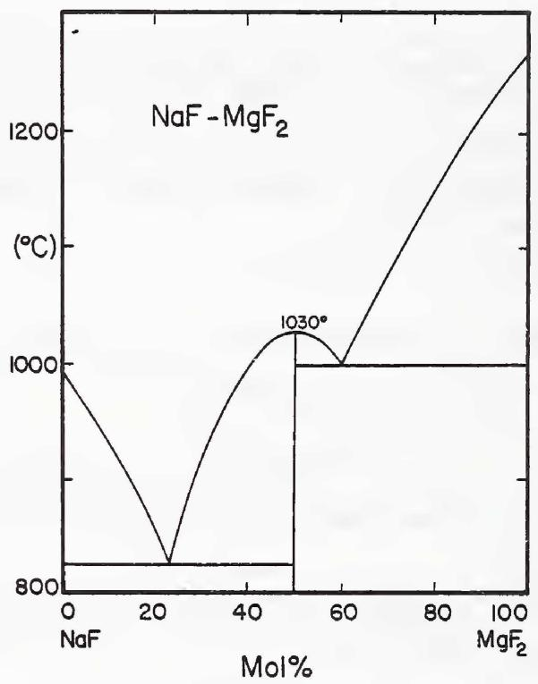  
Figure 82.1. NaF-MgF $_2$ phase diagram

References [1-16]

2. Density (ρ)

No data

3. Surface Tension (γ)

No data

4. Viscosity (η)

No data

5. Electrical Conductance (K)

No data

# 6. Safety and Hazards

# A. Hazard rating

(i) Toxicity: inorganic fluorides are generally irritant and toxic.   
(ii) Vapor pressure: NaF at m.pt. $(995^{\circ}\mathrm{C})$ , $\sim 0.5\mathrm{mm}$ ; MgF $_2$ at m.pt. $(1263^{\circ}\mathrm{C}) < 0.5\mathrm{mm}$ .

# B. Disaster hazards

(i) Molten salt bath "explosions": i.e., explosive generation of steam due to bulk water "carry-over" and/or equipment failure: i.e., explosive expansion of "trapped" air.   
(ii) Fluorides, when heated to decomposition, or contacted with acids, emit highly toxic fumes.

References [17-22]

# 7. Corrosion

Table 82.1. Corrosion studies from primary research literature   

<table><tr><td>Studies</td><td>References</td></tr><tr><td>Cr</td><td>[23]</td></tr><tr><td>Ni-Cr-Mo alloys (INOR-8; Hastelloys B, W, and N)</td><td>[24,25]</td></tr><tr><td>SSNI-12P</td><td>[26]</td></tr><tr><td>Quartz</td><td>[27]</td></tr><tr><td>Al</td><td>[28]</td></tr><tr><td>Various metals</td><td>[29]</td></tr><tr><td>Inconel</td><td>[30]</td></tr><tr><td>Corrosion studies in molten salts with NaF as one component (e.g., Cl, CO3,...)</td><td>[31-48]</td></tr><tr><td>Electrochemical behavior of oxides and related species in molten fluorides</td><td>[49-51]</td></tr><tr><td>Electroanalytical studies in molten fluorides</td><td>[52]</td></tr><tr><td>Annotated corrosion bibliolog.</td><td>[53]</td></tr><tr><td>Corrosion: molten fluorides (survey)</td><td>[54]</td></tr></table>

Compatibility studies with various molten fluorides, including NaF and $\mathsf{MgF}_2$ . No compatibility studies specific to mixtures of molten NaF- $\mathsf{MgF}_2$ found.

References [23-54]

(82) $\mathrm{NaF - MgF_2}$

8. Diffusion

No data

9. Heat of Fusion $(\Delta H_{f}^{\circ})$

No data

10. Heat Capacity $(C_p)$

Measurement method: calculated [55]

Table 82.2. Heat capacity   

<table><tr><td>Composition NaF:MgF2(mol %)</td><td>Cp(cal K-1mol-1)</td><td>T range(K)</td><td>Uncertainty</td></tr><tr><td>75.1:24.9</td><td>15.5</td><td>Tm(1105) - 1200</td><td>~ ± 10%</td></tr></table>

For the above composition, $C_p(s) = 16.0$ (cal $K^{-1}$ mol $^{-1}$ ); uncertainty of estimate, $\sim 10\%$ ).

References [55]

11. Volume Change on Melting $(\Delta V_{f})$

No data

12. Vapor Pressure $(p_{vap})$

No data

13. Thermal Conductivity (liquid) $(\lambda_{\mathrm{g}})$

No data

14. Thermal Conductivity (solid) $(\lambda_{s})$

No data

15. Cryoscopic Constant $(k_{f})$

No data

16. References

[1] Bergman, A. G., Dergunov, E. P., Compt. Rend. Acad. Sci., URSS, 48, 329 (1945).

[2] Bergman, A. G., Dergunov, E. P., Compt. Rend. Acad. Sci., URSS, 31, 755 (1941).

# (82) $\mathrm{NaF - MgF}_2$

[3] Janz, G. J. Downey, J. R., Jr., Allen, C. B., and Tomkins, R. P. T., "Eutectic Data" - 2 Vols; ERDA-TID-27163-P1 & P2; NTIS, Washington, D. C. (1977).   
[4] Janz, G. J., Downey, J. R., Jr., Allen, C. B., and Tomkins, R. P. T., "Physical Properties Data Complications Relevant to Energy Storage. I. Molten Salts: Eutectic Data", NSRDS-NBS-61; U. S. Gov't Printing Office, Washington, D. C. (1978).   
[5] "International Critical Tables of Numerical Data, Physics, Chemistry, and Technology", 8 Vols., McGraw-Hill Book Co., N. Y. (1933).   
[6] "Landolt-Bornstein Zahlenwert und Funktionen aus Physik, Chemie, Astronomie, Geophysik und Technik", (10th Ed.) Springer-Verlag, Berlin, Heidelberg, N. Y. (1961).   
[7] Clark, P. V., "Fused Salt Mixtures: Eutectic Compositions and Melting Points Bibliography 1907-1968", Report No. SC-R-68-1680; Sandia Laboratories (1968), NTIS.   
[8] Robertson, W. D., "Binary Phase Diagrams of Halide Salts", Report No. Yale 2723 (2 Vols.), U. S. AEC Contract AT (30-1)-2723 (1966), NTIS.   
[9] Thoma, R. E., "Phase Diagrams of Nuclear Reactor Materials", Oak Ridge National Laboratory, ORNL-2548, Contract No. W-7405-eng-26.   
[10] Thoma, R. E., "Phase Diagrams of Binary and Ternary Fluoride Systems", Chapt. 6; Adv. Molten Salts Chemistry, Vol. 3 (J. Braunstein, G. Mamantov, and G. P. Smith, eds.), Plenum Press, N. Y. (1975).   
[11] Voskresenskaya, N. K., ed., "Handbook of Solid-Liquid Equilibria in Systems of Inorganic Salts", Volumes 1, 2, Izc. Akad. Nauk SSSR, Moscow (1961). Israel Program for Scientific Translations, Jerusalem, 1970 (NTIS).   
[12] Sinistri., C., Franzozini, P., and Rolla, M., "An Atlas of Miscibility Gaps in Molten Salt Systems", Institute of Physical Chemistry, University of Pavia (Italy) (1968).   
[13] Shaffer, P. T. B., "High Temperature Materials", Plenum Press Handbooks of High Temperature Materials, No. 1, Materials Index, Plenum Press, New York, 1964.   
[14] Franzozini, P., Ferloni, P., and Spinolo, C., "Molten Salts with Organic Anions", Instituto di Chimica Fisica, Universita di Pavia (Italy), 1973.   
[15] Toropov, N. A. et al., "Handbook of Phase Diagrams of the Silicates, Volume 1: Binary Systems, Volume 2, Metal-Oxygen Compounds in Silicate Systems", Izdatel'stov "Nauka" Leningradskoe Otdelenie, Leningrad, 1969, Israel Program for Scientific Translations, Jerusalem, 1972 (NTIS).   
[16] Levin, E., et al., "Phase Diagrams for Ceramists", Amer. Ceramic Soc. (publ.), Columbus, Ohio (1964; 1969).   
[17] "Dangerous Properties of Materials", Sax, N. I., Van Nostrand Reinhold Co., N. Y. (1969)   
[18] "Registry of Toxic Effects of Chemical Substances", Christensen, H. E., and Lubinbyhl, T. T., eds., U. S. Dept. H. E. W., U. S. Gov't Printing Office, Washington, D. C. (1975)   
[19] Janz, G. J., et al., "Physical Properties Data Complications Relevant to Energy Storage. Part II. Molten Salts: Data on Single and Multi-Component Salt Systems", NSRDS-NBS 61, Part II (April 1979), U. S. Gov't Printing Office, Supt of Doc. No. C13-48-61, Washington D. C. 20402.

(82) NaF-MgF 2

[20] "Potential Hazards in Molten Salt Baths for Heat Treatment of Metals", National Board of Fire Underwriters Research Report No. 2 (1954)   
[21] "Handbook of Reactive Chemical Hazards", Bretherwick, L., Butterworth Co., London (1975)   
[22] Janz, G. J., Tomkins, R. P. T., Downey, J. R., Jr., and Allen, C. B., "Safety and Hazards, Chapter in "Eutectic Data", ERDA TID-27163-P1; NTIS, U. S. Dept. Commerce, Springfield, Va. (1977)   
[23] Brasunas, A., Metal Progr., 62, 88 (1952).   
[24] Bettes, E. S., Nucl. Sci. Eng., 2, 804 (1957).   
[25] Hoffman, E. E., Patriarca, P., Leitten, C. F., Jr., and Slaughter, G. M., ORNL-1934, Oak Ridge Nat'l Lab., (1956).   
[26] Oak Ridge National Laboratory, "The Development Status of Molten Salt Breeder Reactors", Rpt. ORNL-4812-UC-80; NTIS, U. S. Dept. Commerce, Springfield, Va., (Aug. 1972).   
[27] Heimann, R., Glastech. Ber., 43, 83 (1970).   
[28] Lukashenko, E. E., and Reutova, G. A., Nov. Teor. Tekhnol. Metall. Protsessov, 119 (1973).   
[29] Koger, J. W., Corrosion, 30, 125 (1974).   
[30] Manly, W. D., et al., "Construction Materials for Molten Salt Reactors", Ch. 13 in "Fluid Fuel Reactors", Lane J. A., MacPherson, H. G., and Maslan, F., eds., Addison-Wesley Co. Inc. Publ. (1958).   
[31] Khan, I. A., Ber. Kernforschungsanlage Juelich, Juel-608-RW, (1969).   
[32] Khan, I. A., Inst. Reaktorwerkst., Kernforschungsanlage, Juel-718-RW (1970).   
[33] Bowles, P. J., and Newdick, P. C., Electroplating and Metal Finishing, 24, 6 (1971).   
[34] Devan, J. H., "Examinations of Pump Impellers from Sodium and Fused Salt Pump Endurance Tests", ORNL CF-61-4-77, Oak Ridge National Lab., (1961).   
[35] Adamson, G. M., Manly, W. D., and Crouse, S. R., "Corrosion by Molten Fluorides", ANP Materials Meeting ORNL-2685, (1958).   
[36] Huntley, W. R., and Gnadt, P. A., Oak Ridge Nat'l Lab., Report ORNL-TM-3863, (1973); Nucl. Sci. Abstr., 27, 12446 (1973).   
[37] Gill, C. B., Straumanis, M. E., and Schlechten, W. B., J. Electrochem. Soc., 102, 42 (1955).   
[38] Litman, A. P., "Corrosion of Volatility Pilot Plant Mark I INOR-S Hydrofluorinator and Mark III. Nickel Fluorinator after Fourteen Dissolution Runs", ORNL-3253, Oak Ridge Nat'l Lab., (1962).   
[39] Litman, A. P., and Goldman, A. E., "Corrosion Associated with Fluoridation in the Oak Ridge Nat'l Lab. Fluoride Volatility Process", ORNL-2832, Oak Ridge Nat'l Lab., (1961).

(82) $\mathrm{NaF - MgF}_2$   
[40] Manly, W. D., Coobs, H. H., DeVan, J. H., Douglas D. A., Inouye, H., Patriarca, P., Roche, T. K., and Scott, J. L., "Metallurgical Problems in Molten Fluoride Systems", Proc. 2nd U. N. Inter. Conf. Peaceful Uses of At. Energy, 7, 223 (1958).   
[41] Oak Ridge Nat'l Lab., Molten Salt Reactor Program Semiannual Progress Report, ORNL-3708, (1964).   
[42] Vreeland, D. C., Hoffman, E. E., and Manly, W. D., Nucleonics, 11, 36 (1953).   
[43] Boser, O., "Study of Safety Aspects of High-Temperature Thermal Energy Storage Systems", NSF No. AER 75-20605, (December, 1975).   
[44] Grimes, W. R., and Cuneo, D. R., "Molten Salts as Reactor Fuels", Reactor Hdbk., 1, 425 (1955).   
[45] Shimotake, H., and Hesson, J. C., Adv. Chem. Series, No. 64, 149 (1967).   
[46] Venkatasetty, H. V., "Thermodynamic Properties and Corrosion Characteristics of Thermal Energy Storage Eutectic Mixtures", paper presented at 152nd Meeting of the Electrochemical Society, Atlanta, Ga., (October, 1977).   
[47] Kochergin, V. P., and Ignat'eva, N. I., Russ. J. Inorg. Chem., 6(9), 1086 (1961).   
[48] Ozeryanaya, I. N., Volodin, V. P., and Smirnov, M. V., Zashchita Metalov (USSR), 2, 230 (1969).   
[49] Mathews, A. L., and Baes, C. F., Inorg. Chem., 7, 373 (1968).   
[50] Manning, D. L., and Mamantov, G., J. Electrochem. Soc., 124, 480 (1977).   
[51] Ting, G., Baes, C. F., Bamberger, C. E., and Mamantov, G., J. Inorg. Nucl. Chem., 39, 1803 (1977).   
[52] Manning, D. L., and Mamantov, G., J. Electroanl. Chem. (in press) (1978).   
[53] Janz, G. J., and Tomkins, R. P. T., Corrosion, 35, 485 (1979).   
[54] Eichelberger, J. L., (Pennwalt Corpn.) "Investigations of Metal Fluoride Thermal Energy Storage Materials: Availability, Cost, Chemistry", ERDA Rpt CO02990-6; NTIS, U. S. Dept. Commerce, Springfield, Va. (Dec. 1976).   
[55] Wicks, C. E. and Block, F. E., U.S. Bur. Mines, Bull. 605 (1963).

System 83 $\mathrm{CaF}_2$ -NaF

1. Melting Temperatures $(T_{m})$

Pure substance melting points:

NaF: $995^{\circ} \mathrm{C}$

$\mathrm{CaF}_2$ : $1418^{\circ}\mathrm{C}$

Eutectic melting point:

818°C, composition: 32.5 mol % CaF₂

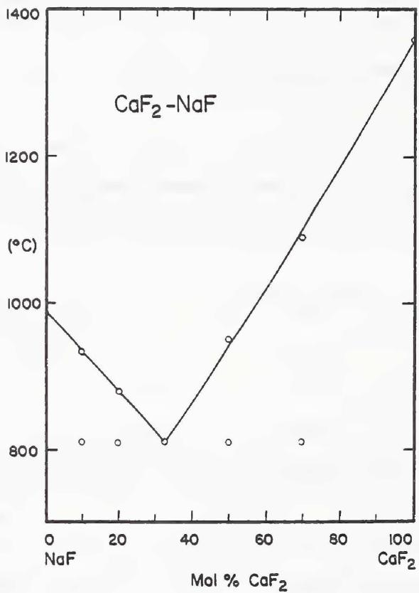  
Figure 83.1. $\mathrm{CaF}_2$ -NaF phase diagram

References [1-40]

2. Density (ρ)

Measurement method: Archimedean technique [41]

Equation:

$$
\rho = a + b T \tag {83.1}
$$

precision: in table 83.1 uncertainty: $\sim \pm 1.0\%$

Table 83.1. Parameters of equation (83.1) and precisions   

<table><tr><td>(Mol % NaF)</td><td>a</td><td>-b x 104</td><td>Precision</td><td>T range(K)</td></tr><tr><td>50.0</td><td>3.0783</td><td>5.4195</td><td>0.2%</td><td>1330-1440</td></tr><tr><td>66.8</td><td>2.9258</td><td>5.4489</td><td>0.5%</td><td>1150-1430</td></tr><tr><td>83.5</td><td>2.8803</td><td>6.0380</td><td>0.4%</td><td>1210-1440</td></tr><tr><td>100.0</td><td>2.7571</td><td>6.2513</td><td>0.2%</td><td>1290-1390</td></tr></table>

Table 83.2. Density (g cm $^{-3}$ ) from equations in table 83.1   

<table><tr><td rowspan="2">T(K)</td><td colspan="3">Mo1 % NaF</td></tr><tr><td>50.0</td><td>66.8</td><td>83.5</td></tr><tr><td>1150</td><td></td><td>2.299</td><td></td></tr><tr><td>1180</td><td></td><td>2.283</td><td></td></tr><tr><td>1210</td><td></td><td>2.266</td><td>2.150</td></tr><tr><td>1240</td><td></td><td>2.250</td><td>2.132</td></tr><tr><td>1270</td><td></td><td>2.234</td><td>2.113</td></tr><tr><td>1300</td><td></td><td>2.217</td><td>2.095</td></tr><tr><td>1330</td><td>2.357</td><td>2.201</td><td>2.077</td></tr><tr><td>1360</td><td>2.341</td><td>2.185</td><td>2.059</td></tr><tr><td>1390</td><td>2.325</td><td>2.168</td><td>2.041</td></tr><tr><td>1420</td><td>2.309</td><td>2.152</td><td>2.023</td></tr></table>

References [41]

3. Surface Tension (γ)

No data

4. Viscosity (n)

No data

5. Electrical Conductance (K)

Measurement method: classical ac technique [16]

Equation:

$$
\kappa = a + b T \tag {83.2}
$$

precision: in table 83.3

uncertainty: $\sim \pm 3.0\%$

Table 83.3. Parameters of equation (83.2) and precision   

<table><tr><td>Mol % NaF</td><td>a</td><td>b x 103</td><td>Precision</td><td>T range(K)</td></tr><tr><td>48.2</td><td>-1.1188</td><td>5.0660</td><td>0.1%</td><td>1180-1360</td></tr></table>

# (83) $\mathrm{CaF}_2\text{-NaF}$

Table 83.4. Specific conductance $(ohm^{-1}cm^{-1})$ from equations in table 83.3   

<table><tr><td>T(K)</td><td>(ohm-1cm-1)</td><td>T(K)</td><td>(ohm-1cm-1)</td></tr><tr><td>1180</td><td>4.859</td><td>1280</td><td>5.366</td></tr><tr><td>1200</td><td>4.960</td><td>1300</td><td>5.467</td></tr><tr><td>1230</td><td>5.062</td><td>1320</td><td>5.568</td></tr><tr><td>1240</td><td>5.162</td><td>1340</td><td>5.670</td></tr><tr><td>1260</td><td>5.264</td><td>1360</td><td>5.771</td></tr></table>

References [16,19,42]

# 6. Safety and Hazards

# A. Hazard rating

(i) Toxicity: inorganic fluorides are generally irritant and toxic   
(ii) Vapor pressure: NaF at m.pt. $(995^{\circ}\mathrm{C})$ , $\sim 0.5\mathrm{mm}$ ; CaF $_2$ at m.pt. $(1418^{\circ}\mathrm{C}) \sim < 0.5\mathrm{mm}$

# B. Disaster hazards

(i) Molten salt bath "explosions": i.e., explosive generation of steam due to bulk water "carry-over" and/or equipment failure: i.e., explosive expansion of "trapped" air   
(ii) Fluorides evolve highly toxic fumes when heated to decomposition, or contacted with acids

References [43-49]

# 7. Corrosion

Table 83.5. Corrosion studies from primary research literature   

<table><tr><td>Studies</td><td>References</td></tr><tr><td>Cr</td><td>[50]</td></tr><tr><td>Ni-Cr-Mo alloys (INOR-8; Hastelloys B, W, and N)</td><td>[51,52]</td></tr><tr><td>SSNI-12P</td><td>[53]</td></tr><tr><td>Quartz</td><td>[54]</td></tr><tr><td>Al</td><td>[55]</td></tr><tr><td>Mild steel</td><td>[56]</td></tr><tr><td>Various metals</td><td>[57]</td></tr><tr><td>Corrosion studies in molten salts with NaF as one component (e.g., Cl, CO3,...)</td><td>[58-74]</td></tr><tr><td>Electrochemical behavior of oxide ions and related species in molten fluorides</td><td>[75-77]</td></tr><tr><td>Electroanalytical studies in molten fluorides</td><td>[78]</td></tr><tr><td>Annotated corrosion bibliio.</td><td>[79]</td></tr><tr><td>Corrosion: molten fluorides (survey)</td><td>[80]</td></tr></table>

Compatibility studies: various molten fluorides, but principally NaF, CaF $_2$ , and BaF $_2$ . For studies specifically with molten CaF $_2$ -NaF mixtures, see [56]

References [50-80]

8. Diffusion

No data

9. Heat of Fusion $(\Delta H_{f}^{\circ})$

No data.

10. Heat Capacity $(C_p)$

No data

11. Volume Change on Melting $(\Delta V_{f})$

Measurement method: estimated from densities [81]

Table 83.6. Volume change on melting   

<table><tr><td>Binary eutectic (mol % NaF)</td><td>(ΔVf/Vs)</td><td>Uncertainty</td></tr><tr><td>67</td><td>8.8%</td><td>~ ± 10%</td></tr></table>

References [81]

12. Vapor Pressure $(p_{vap})$

No data

13. Thermal Conductivity (liquid) $(\lambda_{\ell})$

No data

14. Thermal Conductivity (solid) $(\lambda_{s})$

No data

15. Cryoscopic Constant $(k_{f})$

No data

16. References

[1] Barton, C. J., Bratcher, L. M. and Grimes, W. R., Unpublished work, "Ref. in Phase Diagrams of Nuclear Reactor Materials", ed. by Thoma, R. E., U.S. At. Energy Comm. ORNL-2548 (1959).   
[2] Gross, G. and Rolin, M., Bull. Soc. Chim., France, 568 (1966).   
[3] Nicollin, C., Lenoir, J. and Euraud, C., Bull. Soc. Chim., France, (11), 4184, (1967).   
[4] Millet, J. P., Pham, R. and Rolin, M., Rev. Int. Hautes Temp. et Refract., 11, 277 (1974)   
[5] Fedotiev, P. P. and Illinskii, V. P., Izv. SPB polit. inst., 20, 745 (1913).   
[6] Shulga, N. A. and Bukhalova, G. A., Zh. Neorg. Khim., 2, 2136 (1957).   
[7] Grube, G. and Hennc, H., Z. Elektrochem., 36, 129 (1930).   
[8] Rea, R. F., J. Am. Ceram. Soc., 21, 98 (1938).   
[9] Manoylov, K. E. and Smirnov, M. N., Trudy Vsesoyuz. Nauch.-Issledovatel. Alyumin.-Magn. Inst., VAMI.   
[10] Krauze, I. E., DANN, SSSR, 35, 21 (1942).

(83) $\mathrm{CaF}_2$ -NaF   
[11] Kido, H., Matsumoto, O. and Hayakava, Y., J. Electrochem. Soc., Japan, 26, 4 (1958).   
[12] Bukhalova, G.A., Berezhnaya, V. T., Zhur. Neorg. Khim., 4, 2596 (1959). J. Inorg. Chem., USSR, 4, 1196 (1959).   
[13] Bukhalova, G. A., Berezhnaya, V. T., Mateiko, Z. A., Zhur. Neorg. Khim., 7, 1156 (1962).   
[14] Bukhalova, G. A., Berezhnaya, V. T., Bergman, A. G., Zhur. Neorg. Khim., 6, 2359 (1961).   
[15] Ishaque, M., Bull. Soc. Chim., France, 127 (1952).   
[16] Thompson, M., Kaye, A. L., Tr. Electrochem. Soc., 67, 22 (1935).   
[17] Fedotiev, P. P. and Illinskii, V. P., Z. Anorg. Allg. Chem., 129, 93 (1923).   
[18] Bukhalova, G. A., Zhur. Neorg. Khim., 4, 117 (1959).   
[19] Arndt, K., Kalass, Z., Z. Elektrochem., 30, 12 (1924).   
[20] Bukhalova, G. A., Berezhnaya, V. T., Matieiko, Z. A., Zhur. Neorg. Khim., 7, 2233 (1962).   
[21] Bukhalova, G. A., Sulaimankulov, K., Bostandzhiyan, A. K., Zhur. Neorg. Khim., 4, 1138 (1959). J. Inorg. Chem., USSR, 4, 516 (1959).   
[22] Bukhalova, G. A., Berezhnaya, V. T., Zhur. Neorg. Khim., 5, 456 (1960). J. Inorg. Chem., USSR, 5, 218 (1960).   
[23] Silber, P., Ishaque, M., Compt. Rend., 232, 1485 (1951).   
[24] Bukhalova, G. A., Berezhnaya, V. T., Mateiko, Z. A., Zhur. Neorg. Khim., 7, 1156 (1962).   
[25] Mateiko, Z. A., Bukhalova, G. A., Sementsova, D. V., Izv. Vyssh. Uchebn. Zaved., Khim i Khim. Tekhnol., 10, 856 (1967).   
[26] Bergman, A. G., and Banachek, E. I., Izv. Sekt. Fiz. Khim. A., 23, 201 (1953).   
[27] Janz, G. J. Downey, J. R., Jr., Allen, C. B., and Tomkins, R. P. T., "Eutectic Data" - 2 Vols; ERDA-TID-27163-P1 & P2; NTIS, Washington, D. C. (1977).   
[28] Janz, G. J., Downey, J. R., Jr., Allen, C. B., and Tomkins, R. P. T., "Physical Properties Data Complications Relevant to Energy Storage. I. Molten Salts: Eutectic Data", NSRDS-NBS-61; U. S. Gov't Printing Office, Washington, D. C. (1978).   
[29] "International Critical Tables of Numerical Data, Physics, Chemistry, and Technology", 8 Vols., McGraw-Hill Book Co., N. Y. (1933).   
[30] "Landolt-Bornstein Zahlenwert und Funktionen aus Physik, Chemie, Astronomie, Geophysik und Technik", (10th Ed.) Springer-Verlag, Berlin, Heidelberg, N. Y. (1961).   
[31] Clark, P. V., "Fused Salt Mixtures: Eutectic Compositions and Melting Points Bibliography 1907-1968", Report No. SC-R-68-1680; Sandia Laboratories (1968), NTIS.   
[32] Robertson, W. D., "Binary Phase Diagrams of Halide Salts", Report No. Yale 2723 (2 Vols.), U. S. AEC Contract AT (30-1)-2723 (1966), NTIS.

# (83) $\mathrm{CaF}_2$ -NaF

[33] Thoma, R. E., "Phase Diagrams of Nuclear Reactor Materials", Oak Ridge National Laboratory, ORNL-2548, Contract No. W-7405-eng-26.   
[34] Thoma, R. E., "Phase Diagrams of Binary and Ternary Fluoride Systems", Chapt. 6; Adv. Molten Salts Chemistry, Vol. 3 (J. Braunstein, G. Mamantov, and G. P. Smith, eds.), Plenum Press, N. Y. (1975).   
[35] Voskresenskaya, N. K., ed., "Handbook of Solid-Liquid Equilibria in Systems of Inorganic Salts", Volumes 1, 2, Izc. Akad. Nauk SSSR, Moscow (1961). Israel Program for Scientific Translations, Jerusalem, 1970 (NTIS).   
[36] Sinistri, C., Franzozini, P., and Rolla, M., "An Atlas of Miscibility Gaps in Molten Salt Systems", Institute of Physical Chemistry, University of Pavia (Italy) (1968).   
[37] Shaffer, P. T. B., "High Temperature Materials", Plenum Press Handbooks of High Temperature Materials, No. 1, Materials Index, Plenum Press, New York, 1964.   
[38] Franzozini, P., Ferloni, P., and Spinolo, C., "Molten Salts with Organic Anions", Instituto di Chimica Fisica, Universita di Pavia (Italy), 1973.   
[39] Toropov, N. A. et al., "Handbook of Phase Diagrams of the Silicates, Volume 1: Binary Systems, Volume 2, Metal-Oxygen Compounds in Silicate Systems", Izdatel'stov "Nauka" Leningradskoe Otdelenie, Leningrad, 1969, Israel Program for Scientific Translations, Jerusalem, 1972 (NTIS).   
[40] Levin, E., et al., "Phase Diagrams for Ceramists", Amer. Ceramic Soc. (publ.), Columbus, Ohio (1964; 1969).   
[41] Abramov, G. A., and Kozunov, P. T., Trans. Leningrad Ind. Inst., 1, 60 (1939).   
[42] Robbins, G. D., U.S.A.E.C. Review, ORNO-TM-2180, March, 1968.   
[43] "Dangerous Properties of Materials", Sax, N. I., Van Nostrand Reinhold Co., N. Y. (1969)   
[44] "Registry of Toxic Effects of Chemical Substances", Christensen, H. E., and Lubinbyhl, T. T., eds., U. S. Dept. H. E. W., U. S. Gov't Printing Office, Washington, D. C. (1975)   
[45] Janz, G. J., et al., "Physical Properties Data Complications Relevant to Energy Storage. Part II. Molten Salts: Data on Single and Multi-Component Salt Systems", NSRDS-NBS 61, Part II (April 1979), U. S. Gov't Printing Office, Supt of Doc. No. C13-48-61, Washington D. C. 20402.   
[46] "Potential Hazards in Molten Salt Baths for Heat Treatment of Metals", National Board of Fire Underwriters Research Report No. 2 (1954)   
[47] "Handbook of Reactive Chemical Hazards", Bretherwick, L., Butterworth Co., London (1975)   
[48] Janz, G. J., Tomkins, R. P. T., Downey, J. R., Jr., and Allen, C. B., "Safety and Hazards, Chapter in "Eutectic Data", ERDA TID-27163-P1; NTIS. U. S. Dept. Commerce, Springfield, Va. (1977)   
[49] vide: this work, System 51, CaF $_2$ .

# (83) $\mathrm{CaF}_2\text{-NaF}$

[50] Brasunas, A., Metal Progr., 62, 88 (1952).   
[51] Bettes, E. S., Nucl. Sci. Eng., 2, 804 (1957).   
[52] Hoffman, E. E., Patriarca, P., Leitten, C. F., Jr., and Slaughter, G. M., ORNL-1934, Oak Ridge Nat'l Lab., (1956).   
[53] Oak Ridge National Laboratory, "The Development Status of Molten Salt Breeder Reactors", Rpt. ORNL-4812-UC-80; NTIS, U. S. Dept. Commerce, Springfield, Va., (Aug. 1972).   
[54] Heimann, R., Glastech. Ber., 43, 83 (1970).   
[55] Lukashenko, E. E., and Reutova, G. A., Nov. Teor. Tekhnol. Metall. Protsessov, 119 (1973).   
[56] Bowles, P. J., and Newdick, P. C., Electroplating and Metal Finishing, 24, 6 (1971).   
[57] Koger, J. W., Corrosion, 30, 125 (1974).   
[58] Khan, I. A., Ber. Kernforschungsanlage Juelich, Juel-608-RW, (1969).   
[59] Khan, I. A., Inst. Reaktorwerkst., Kernforschungsanlage, Juel-718-RW (1970).   
[60] DeVan, J. H., "Examinations of Pump Impellers from Sodium and Fused Salt Pump Endurance Tests", ORNL CF-61-4-77, Oak Ridge National Lab., (1961).   
[61] Adamson, G. M., Manly, W. D., and Crouse, S. R., "Corrosion by Molten Fluorides", ANP Materials Meeting ORNL-2685, (1958).   
[62] Huntley, W. R., and Gnadt, P. A., Oak Ridge Nat'l Lab., Report ORNL-TM-3863, (1973); Nucl. Sci. Abstr., 27, 12446 (1973).   
[63] Gill, C. B., Straumanis, M. E., and Schlechten, W. B., J. Electrochem. Soc., 102, 42 (1955).   
[64] Litman, A. P., "Corrosion of Volatility Pilot Plant Mark I INOR-S Hydrofluorinated and Mark III. Nickel Fluorinated after Fourteen Dissolution Runs", ORNL-3253, Oak Ridge Nat'l Lab., (1962).   
[65] Litman, A. P., and Goldman, A. E., "Corrosion Associated with Fluoridation in the Oak Ridge Nat'l Lab. Fluoride Volatility Process", ORNL-2832, Oak Ridge Nat'l Lab., (1961).   
[66] Manly, W. D., Coobs, H. H., DeVan, J. H., Douglas D. A., Inouye, H., Patriarca, P., Roche, T. K., and Scott, J. L., "Metallurgical Problems in Molten Fluoride Systems", Proc. 2nd U. N. Inter. Conf. Peaceful Uses of At. Energy, 7, 223 (1958).   
[67] Vreeland, D. C., Hoffman, E. E., and Manly, W. D., Nucleonics, 11, 36 (1953).   
[68] Shimotake, H., and Hesson, J. C., Adv. Chem. Series, No. 64, 149 (1967).   
[69] Venkatasetty, H. V., "Thermodynamic Properties and Corrosion Characteristics of Thermal Energy Storage Eutectic Mixtures", paper presented at 152nd Meeting of the Electrochemical Society, Atlanta, Ga., (October, 1977).   
[70] Oak Ridge National Laboratory, Molten Salt Reactor Program, Semiannual Progress Report, ORNL-3708 (1964).

# (83) $\mathrm{CaF}_2$ -NaF

[71] Boser, O., "Study of Safety Aspects of High-Temperature Thermal Energy Storage Systems", NSF No. AER 75-20605, (December, 1975).   
[72] Grimes, W. R., and Cuneo, D. R., "Molten Salts as Reactor Fuels", Reactor Hdbk., 1, 425 (1955).   
[73] Kochergin, V. P., and Ignat'eva, N. I., Russ. J. Inorg. Chem., 6(9), 1086 (1961).   
[74] Ozeryanaya, I. N., Volodin, V. P., and Smirnov, M. V., Zashchita Metalov (USSR), 2, 230 (1969).   
[75] Mathews, A. L., and Baes, C. F., Inorg. Chem., 7, 373 (1968).   
[76] Manning, D. L., and Mamantov, G., J. Electrochem. Soc., 124, 480 (1977).   
[77] Ting, G., Baes, C. F., Bamberger, C. E., and Mamantov, G., J. Inorg. Nucl. Chem., 39, 1803 (1977).   
[78] Manning, D. L., and Mamantov, G., J. Electroanall. Chem. (in press) (1978).   
[79] Janz, G. J., and Tomkins, R. P. T., Corrosion, 35, 485 (1979).   
[80] Eichelberger, J. L., (Pennwalt Corpn.) "Investigations of Metal Fluoride Thermal Energy Storage Materials: Availability, Cost, Chemistry", ERDA Rpt CO02990-6; NTIS, U. S. Dept. Commerce, Springfield, Va. (Dec. 1976).   
[81] Janz, G. J., et al. (MSDC-RPI), unpublished work (1980).

1. Melting Temperatures $(T_{m})$

Pure substance melting points:

```txt
NaF 995°C BaF₂: 1320°C 
```

Eutectic melting point:

812°C, composition: 63 mol % NaF (31.5 equiv. % Na₂F₂)

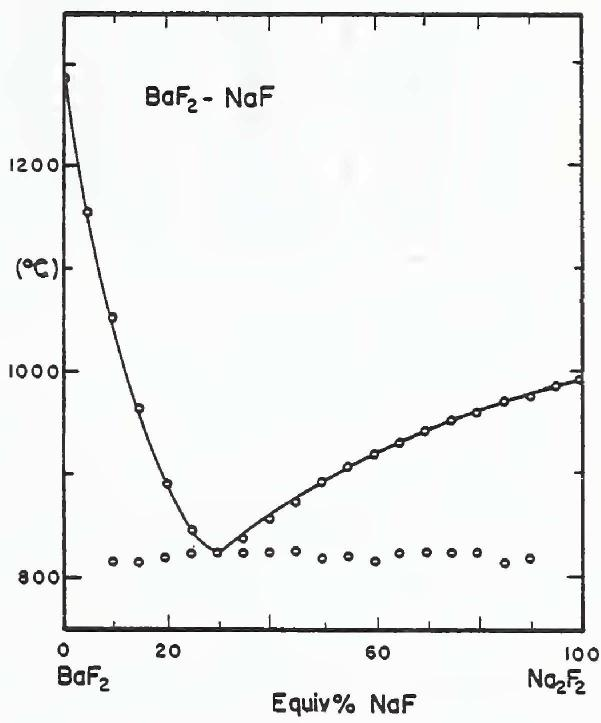  
Figure 84.1. NaF-BaF $_2$ phase diagram

References [1-23]

2. Density (ρ)

Measurement method: Archimedean technique [24]

Equation:

$$
\rho = a + b T \tag {84.1}
$$

precision: in table 84.1

uncertainty: $\sim$ 2.0%

Table 84.1. Parameters of equation (84.1) and precisions   

<table><tr><td>Mol % NaF</td><td>a</td><td>-b x 104</td><td>Precision</td><td>T range(K)</td></tr><tr><td>50.0</td><td>4.3643</td><td>6.2311</td><td>0.43%</td><td>1230-1450</td></tr><tr><td>66.8</td><td>3.9022</td><td>5.9959</td><td>0.87%</td><td>1250-1430</td></tr><tr><td>83.5</td><td>3.3934</td><td>5.7600</td><td>0.73%</td><td>1230-1430</td></tr></table>

$$
\mathrm {N a F - B a F} _ {2} \tag {84}
$$

Table 84.2. Density $(\mathrm{gcm}^{-3})$ from equation in table 84.1   

<table><tr><td rowspan="2">T(K)</td><td colspan="3">Mol % NaF</td></tr><tr><td>50.0</td><td>66.8</td><td>83.5</td></tr><tr><td>1230</td><td>3.598</td><td></td><td>2.685</td></tr><tr><td>1250</td><td>3.585</td><td>3.153</td><td>2.673</td></tr><tr><td>1270</td><td>3.573</td><td>3.141</td><td>2.662</td></tr><tr><td>1290</td><td>3.560</td><td>3.129</td><td>2.650</td></tr><tr><td>1310</td><td>3.548</td><td>3.117</td><td>2.639</td></tr><tr><td>1330</td><td>3.536</td><td>3.105</td><td>2.627</td></tr><tr><td>1350</td><td>3.523</td><td>3.093</td><td>2.616</td></tr><tr><td>1370</td><td>3.511</td><td>3.081</td><td>2.604</td></tr><tr><td>1390</td><td>3.498</td><td>3.069</td><td>2.593</td></tr><tr><td>1410</td><td>3.486</td><td>3.057</td><td>2.581</td></tr><tr><td>1430</td><td>3.473</td><td>3.045</td><td>2.570</td></tr><tr><td>1450</td><td>3.461</td><td></td><td></td></tr></table>

References [24]

3. Surface Tension (γ)

No data

4. Viscosity (n)

No data

5. Electrical Conductance (K)

Measurement method: classical ac technique [25]

Equation:

$$
\kappa = a + b T \quad (8 4. 2)
$$

precision: in table 84.3

uncertainty: $\sim 3.0\%$

Table 84.3. Parameters of equation (84.2) and precision   

<table><tr><td>Mol % NaF</td><td>a</td><td>b x 103</td><td>Precision</td><td>T range(K)</td></tr><tr><td>67.6</td><td>-3.7363</td><td>6.6000</td><td>4.36%</td><td>1180-1370</td></tr></table>

Table 84.4. Specific conductance at 67.6 mol% NaF from equation in table 84.3   

<table><tr><td>T(K)</td><td>\( \kappa \) \( {\left( ohm^{-1}cm^{-1}\right)}^{K} \)</td><td>T(K)</td><td>\( \kappa \) \( {\left( ohm^{-1}cm^{-1}\right)}^{K} \)</td></tr><tr><td>1180</td><td>4.052</td><td>1280</td><td>4.712</td></tr><tr><td>1190</td><td>4.118</td><td>1290</td><td>4.778</td></tr><tr><td>1200</td><td>4.184</td><td>1300</td><td>4.844</td></tr><tr><td>1210</td><td>4.250</td><td>1310</td><td>4.910</td></tr><tr><td>1220</td><td>4.316</td><td>1320</td><td>4.976</td></tr><tr><td>1230</td><td>4.382</td><td>1330</td><td>5.042</td></tr><tr><td>1240</td><td>4.448</td><td>1340</td><td>5.108</td></tr><tr><td>1250</td><td>4.514</td><td>1350</td><td>5.174</td></tr><tr><td>1260</td><td>4.580</td><td>1360</td><td>5.240</td></tr><tr><td>1270</td><td>4.646</td><td>1370</td><td>5.306</td></tr></table>

References [25-27]

# 6. Safety and Hazards

# A. Hazard rating

(i) Toxicity: inorganic fluorides are generally irritants and toxic.   
(ii) Vapor pressure: NaF, at m.pt. (995°C), $\sim$ 0.5mm; BaF $_2$ , at m.pt. (1320°C) $\sim$ 0.5mm.

# B. Disaster hazards

(i) Molten salt bath "explosions": i.e. explosive generation of steam due to bulk water "carry-over" and/or equipment failure; i.e., explosive expansion of "trapped" air.   
(ii) Fluorides, when heated to decomposition, or contacted with acids, emit highly toxic fumes.

References [28-33]

# 7. Corrosion

Table 84.5. Corrosion studies from primary research literature   

<table><tr><td>Studies</td><td>References</td></tr><tr><td>Cr</td><td>[34]</td></tr><tr><td>Ni-Cr-Mo alloys (INOR-8; Hastelloysb, W, and N)</td><td>[35,36]</td></tr><tr><td>SSNI-12P</td><td>[37]</td></tr><tr><td>Quartz</td><td>[38]</td></tr><tr><td>Al</td><td>[39]</td></tr><tr><td>Various metals</td><td>[40]</td></tr><tr><td>Corrosion studies in molten salts with NaF as one component (e.g., Cl, CO3, ...)</td><td>[41-46,53,54]</td></tr><tr><td>Electro-chemical behaviour of oxide ions and related species in molten fluorides</td><td>[47-49]</td></tr><tr><td>Electroanalytical studies in molten fluorides</td><td>[50]</td></tr><tr><td>Annotated corrosion bibliio.</td><td>[51]</td></tr><tr><td>Corrosion: molten fluorides (survey)</td><td>[52]</td></tr></table>

Compatibility studies: various molten fluorides and principally with molten NaF. No studies specific to $\mathrm{BaF}_2$ were found. For thermodynamic (theoretical) considerations, and some considerations relative to commercial grade fluorides, and the use of "getter" to lower impurity levels, see [52].

References [34-52]

# 8. Diffusion

No data

9. Heat of Fusion $(\Delta H_{f}^{\circ})$ No data   
10. Heat Capacity $(C_p)$ No data   
11. Volume Change on Melting $(\Delta V_{f})$ No data   
12. Vapor Pressure $(p_{vap})$ No data   
13. Thermal Conductivity (liquid) $(\lambda_{\ell})$ No data   
14. Thermal Conductivity (solid) $(\lambda_{s})$ No data   
15. Cryoscopic Constant $(k_{f})$ No data

16. References

[1] Berezhnaya, V. T., Bukhalova, G. A., Zhur. Neorg. Khim., 6, 687 (1961).   
[2] Bukhalova, G. A., Berezhnaya, V. T., Bergman, A. G., Zhur. Neorg. Khim., 6, 2359 (1961).   
[3] Bukhalova, G. A., Mateiko, Z. A., Berezhnaya, V. T., Zhur. Neorg. Khim., 7, 1655 (1962).   
[4] Thompson, M., Kaye, A. L., Tr. Electrochem. Soc., 67, 22 (1935).   
[5] Bergman, A. G., Banashek, E. I., Izv. Sekt. Fiz.-Khim. Anal., Inst. Obshch. Neorg. Khim., 22, 196 (1953).   
[6] Berezhnaya, V. T., Bukhalova, G. A., Zhur. Neorg. Khim., 4, 2600 (1959). J. Inorg. Chem. USSR, 4, 1198 (1959).   
[7] Bergman, A. G., Banashek, E. I., Izv. Sck. Fiz.-Khim. Anal., Akad. Nauk SSSR, 22, 196 (1953).   
[8] Trunin, A.A., Shter, G.E., Kosmynin, A.S., Izv. Vyssh, Uchebn. Zaved., Khim. Khim. Tekhnol., 18, 1347 (1975).   
[9] Grube, G. Z., Z. Elekroch., 33, 481 (1927).   
[10] Janz, G. J. Downey, J. R., Jr., Allen, C. B., and Tomkins, R. P. T., "Eutectic Data" - 2 Vols; ERDA-TID-27163-P1 & P2; NTIS, Washington, D. C. (1977).   
[11] Janz, G. J., Downey, J. R., Jr., Allen, C. B., and Tomkins, R. P. T., "Physical Properties Data Complications Relevant to Energy Storage." I. Molten Salts: Eutectic Data", NSRDS-NBS-61; U. S. Gov't Printing Office, Washington, D. C. (1978).   
[12] "International Critical Tables of Numerical Data, Physics, Chemistry, and Technology", 8 Vols., McGraw-Hill Book Co., N. Y. (1933).

[13] "Landolt-Bornstein Zahlenwert und Funktionen aus Physik, Chemie, Astronomie, Geophysik und Technik", (10th Ed.) Springer-Verlag, Berlin, Heidelberg, N. Y. (1961).   
[14] Clark, P. V., "Fused Salt Mixtures: Eutectic Compositions and Melting Points Bibliography 1907-1968", Report No. SC-R-68-1680; Sandia Laboratories (1968), NTIS.   
[15] Robertson, W. D., "Binary Phase Diagrams of Halide Salts", Report No. Yale 2723 (2 Vols.), U. S. AEC Contract AT (30-1)-2723 (1966), NTIS.   
[16] Thoma, R. E., "Phase Diagrams of Nuclear Reactor Materials", Oak Ridge National Laboratory, ORNL-2548, Contract No. W-7405-eng-26.   
[17] Thoma, R. E., "Phase Diagrams of Binary and Ternary Fluoride Systems", Chapt. 6; Adv. Molten Salts Chemistry, Vol. 3 (J. Braunstein, G. Mamantov, and G. P. Smith, eds.), Plenum Press, N. Y. (1975).   
[18] Voskresenskaya, N. K., ed., "Handbook of Solid-Liquid Equilibria in Systems of Inorganic Salts", Volumes 1, 2, Izc. Akad. Nauk SSSR, Moscow (1961). Israel Program for Scientific Translations, Jerusalem, 1970 (NTIS).   
[19] Sinistri, C., Franzozini, P., and Rolla, M., "An Atlas of Miscibility Gaps in Molten Salt Systems", Institute of Physical Chemistry, University of Pavia (Italy) (1968).   
[20] Shaffer, P. T. B., "High Temperature Materials", Plenum Press Handbooks of High Temperature Materials, No. 1, Materials Index, Plenum Press, New York, 1964.   
[21] Franzozini, P., Ferloni, P., and Spinolo, C., "Molten Salts with Organic Anions", Instituto di Chimica Fisica, Universita di Pavia (Italy), 1973.   
[22] Toropov, N. A. et al., "Handbook of Phase Diagrams of the Silicates, Volume 1: Binary Systems, Volume 2, Metal-Oxygen Compounds in Silicate Systems", Izdatel'stov "Nauka" Leningradskoe Otdelenie, Leningrad, 1969, Israel Program for Scientific Translations, Jerusalem, 1972 (NTIS).   
[23] Levin, E., et al., "Phase Diagrams for Ceramists", Amer. Ceramic Soc. (publ.), Columbus, Ohio (1964; 1969).   
[24] Porter, B., and Meaker, R. E., United States Department of the Interior, Report of Investigations 6838 (1966).   
[25] Thompson, M. deK., and Kaye, A. L., Trans. Electrochem. Soc., 67, 169 (1935).   
[26] Taniuchi, K., Keilinzokii, 20, 157 (1970).   
[27] Robbins, G. D., U.S.A.E.C. Review, ORNL-TM-2180. March 1968.   
[28] "Dangerous Properties of Materials", Sax, N. I., Van Nostrand Reinhold Co., N. Y. (1969).   
[29] "Registry of Toxic Effects of Chemical Substances", Christensen, H. E., and Lubinbyhl, T. T., eds., U. S. Dept. H. E. W., U. S. Gov't Printing Office, Washington, D. C. (1975).   
[30] Janz, G. J., et al., "Physical Properties Data Complications Relevant to Energy Storage. Part II. Molten Salts: Data on Single and Multi-Component Salt Systems", NSRDS-NBS 61, Part II (April 1979), U. S. Gov't Printing Office, Supt of Doc. No. C13-48-61, Washington D. C. 20402.

[31] "Potential Hazards in Molten Salt Baths for Heat Treatment of Metals", National Board of Fire Underwriters Research Report No.2 (1954).   
[32] "Handbook of Reactive Chemical Hazards", Bretherwick, L., Butterworth Co., London (1975).   
[33] Janz, G. J., Tomkins, R. P. T., Downey, J. R. Jr., and Allen, C. B., "Safety and Hazards", Chapter in "Eutectic Data", ERDA TID-27163-P1; NTIS, U. S. Dept. Commerce, Springfield, Va. (1977)   
[34] Brasunas, A., Metal Progr., 62, 88 (1952).   
[35] Bettes, E. S., Nucl. Sci. Eng., 2, 804 (1957).   
[36] Hoffman, E. E., Patriarca, P., Leitten, C. F., Jr., and Slaughter, G. M., ORNL-1934, Oak Ridge Natl. Lab., (1956).   
[37] Oak Ridge National Laboratory, "The Development Status of Molten Salt Breeder Reactors", Rpt. ORNL-4812-UC-80; NTIS, U. S. Dept. Commerce, Springfield, Va., (Aug. 1972).   
[38] Heimann, R., Glastech. Ber., 43, 83 (1970).   
[39] Lukashenko, E. E., and Reutova, G. A., Nov. Teor. Tekhnol. Metall. Protsessov, 119 (1973).   
[40] Koger, J. W., Corrosion, 30, 125 (1974).   
[41] Khan, I. A., Ber. Kernforschungsanlage Juelich, Juel-608-RW, (1969).   
[42] Bowles, P. J., and Newdick, P. C., Electroplating and Metal Finishing, 24, 6 (1971).   
[43] Huntley, W. R., and Gnadt, P. A., Oak Ridge Nat'l Lab., Report ORNL-TM-3863, (1973); Nucl. Sci. Abstr., 27, 12446 (1973).   
[44] Gill, C. B., Straumanis, M. E., and Schlechten, W. B., J. Electrochem. Soc., 102, 42 (1955)   
[45] Vreeland, D. C., Hoffman, E. E., and Manly, W. D., Nucleonics, 11, 36 (1953).   
[46] Boser, O., "Study of Safety Aspects of High Temperature Thermal Energy Storage Systems", ERDA Thermal Energy Storage Information Exchange Mtg., Cleveland, NSF-AER 75-20605 (Sept. 1976).   
[47] Mathews, A. L., and Baes, C. F., Inorg. Chem., 7, 373 (1968).   
[48] Manning, D. L., and Mamantov, G., J. Electrochem. Soc., 124, 480 (1977).   
[49] Ting, G., Baes, C. F., Bamberger, C. E., and Mamantov, G., J. Inorg. Nucl. Chem., 39, 1803 (1977).   
[50] Manning, D. L., and Mamantov, G., J. Electroanall. Chem. (in press) (1978).   
[51] Janz, G. J., and Tomkins, R. P. T., Corrosion, 35, 485 (1979).   
[52] Eichelberger, J. L., (Pennwalt Corpn.) "Investigations of Metal Fluoride Thermal Energy Storage Materials: Availability, Cost, Chemistry", ERDA Rpt CO02990-6; NTIS, U. S. Dept. Commerce, Springfield, Va. (Dec. 1976).   
[53] Kochergen, V. P., and Ignat'eva, N. I., Russ. J. Inorg. Chem., 6(9), 1086 (1961).   
[54] Ozeryanaya, I. N., Volodin, V. P., and Smirnov, M. V., Zashchita Metalov (USSR), 2, 230 (1969).

1. Melting Temperatures $(T_{m})$

Pure substance melting points:

NaF: 995°C

A1F.3: does not melt; sublimes with 1 atm equal press. at $\sim$ $1255^{\circ}C$

Eutectic melting point:

E. $888^{\circ} \mathrm{C}$ , composition: 15 mol % $\mathrm{AlF}_{3}$

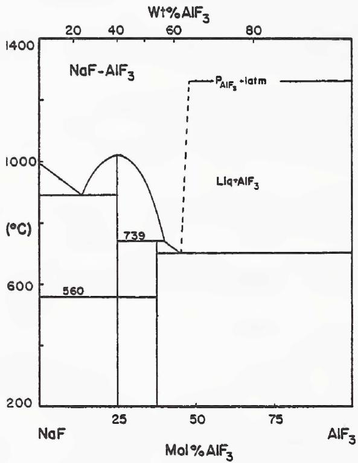  
Figure 85.1. NaF-AlF $_3$ phase diagram

References [1-31].

2. Density (ρ)

Measurement method: Archimedean technique [40,47]

Equation:

$$
\rho = a + b T \tag {85.1}
$$

precision: in table 85.1

uncertainty: $\sim \pm 1.0\%$

# (85) NaF-A1F3

Table 85.1. Parameters of equation (85.1) and precisions   

<table><tr><td>Mol % NaF</td><td>a</td><td>-b x 104</td><td>Precision</td><td>T range(K)</td></tr><tr><td>50</td><td>2.4950</td><td>6.90</td><td>0.18%</td><td>1275-1370</td></tr><tr><td>55</td><td>2.7198</td><td>7.82</td><td>0.10%</td><td>1275-1370</td></tr><tr><td>60</td><td>2.9921</td><td>8.90</td><td>0.14%</td><td>1275-1370</td></tr><tr><td>64</td><td>3.1679</td><td>9.35</td><td>0.19%</td><td>1275-1370</td></tr><tr><td>70</td><td>3.2258</td><td>9.20</td><td>0.15%</td><td>1275-1370</td></tr><tr><td>76</td><td>3.2733</td><td>9.20</td><td>0.05%</td><td>1275-1370</td></tr><tr><td>77</td><td>3.2612</td><td>9.12</td><td>0.07%</td><td>1275-1270</td></tr><tr><td>80</td><td>3.2415</td><td>8.98</td><td>0.15%</td><td>1275-1370</td></tr><tr><td>85</td><td>3.0535</td><td>7.65</td><td>0.13%</td><td>1275-1370</td></tr><tr><td>90</td><td>2.8780</td><td>6.48</td><td>0.15%</td><td>1275-1370</td></tr><tr><td>100</td><td>2.7550</td><td>6.36</td><td>0.15%</td><td>127501370</td></tr></table>

Table 85.2. Density $(\mathrm{gcm}^{-3})$ from equations in table 85.1   

<table><tr><td rowspan="2">T(K)</td><td colspan="8">Mo1 % NaF</td></tr><tr><td>50</td><td>60</td><td>65</td><td>70</td><td>75</td><td>77</td><td>85</td><td>90</td></tr><tr><td>1275</td><td>1.615</td><td>1.857</td><td>1.976</td><td>2.053</td><td>2.100</td><td>2.098</td><td>2.078</td><td>2.042</td></tr><tr><td>1280</td><td>1.612</td><td>1.853</td><td>1.971</td><td>2.048</td><td>2.096</td><td>2.094</td><td>2.074</td><td>2.039</td></tr><tr><td>1290</td><td>1.605</td><td>1.844</td><td>1.962</td><td>2.039</td><td>2.087</td><td>2.085</td><td>2.067</td><td>2.032</td></tr><tr><td>1300</td><td>1.598</td><td>1.835</td><td>1.952</td><td>2.030</td><td>2.077</td><td>2.076</td><td>2.059</td><td>2.026</td></tr><tr><td>1310</td><td>1.591</td><td>1.826</td><td>1.943</td><td>2.021</td><td>2.068</td><td>2.066</td><td>2.051</td><td>2.019</td></tr><tr><td>1320</td><td>1.584</td><td>1.817</td><td>1.934</td><td>2.011</td><td>2.059</td><td>2.057</td><td>2.044</td><td>2.013</td></tr><tr><td>1330</td><td>1.577</td><td>1.808</td><td>1.924</td><td>2.002</td><td>2.050</td><td>2.048</td><td>2.036</td><td>2.006</td></tr><tr><td>1340</td><td>1.570</td><td>1.800</td><td>1.915</td><td>1.993</td><td>2.040</td><td>2.039</td><td>2.028</td><td>2.000</td></tr><tr><td>1350</td><td>1.563</td><td>1.791</td><td>1.906</td><td>1.984</td><td>2.031</td><td>2.030</td><td>2.021</td><td>1.993</td></tr><tr><td>1360</td><td>1.557</td><td>1.782</td><td>1.896</td><td>1.975</td><td>2.022</td><td>2.021</td><td>2.013</td><td>1.987</td></tr><tr><td>1370</td><td>1.550</td><td>1.773</td><td>1.887</td><td>1.965</td><td>2.013</td><td>2.012</td><td>2.005</td><td>1.980</td></tr></table>

References [32-53]

# 3. Surface Tension (Y)

Measurement method: maximum bubble pressure [54]

Equation:

$$
\gamma = a + b T \quad (8 5. 2)
$$

precision: in table 85.3.

uncertainty: $\sim \pm 5.0\%$

Table 85.3. Parameters of equation (85.2) and precisions   

<table><tr><td>Mol % AlF3</td><td>a</td><td>-b x 102</td><td>Precision</td><td>T range(K)</td></tr><tr><td>27.4</td><td>262.5</td><td>10.6</td><td>*</td><td>1275-1350</td></tr><tr><td>25.0</td><td>297.0</td><td>12.8</td><td>*</td><td>1275-1350</td></tr><tr><td>21.9</td><td>309.3</td><td>13.0</td><td>*</td><td>1275-1350</td></tr><tr><td>19.0</td><td>328.8</td><td>14.0</td><td>*</td><td>1275-1350</td></tr><tr><td>13.6</td><td>304.5</td><td>11.3</td><td>*</td><td>1275-1350</td></tr></table>

\* not estimated; insufficient data

Table 85.4. Surface tension (dyn cm $^{-1}$ ) from equations in table 85.3.   

<table><tr><td rowspan="2">T(K)</td><td colspan="5">Mo1 % A1F3</td></tr><tr><td>13.6</td><td>19.0</td><td>21.9</td><td>25.0</td><td>27.4</td></tr><tr><td>1275</td><td>160.4</td><td>150.4</td><td>143.6</td><td>133.8</td><td>127.3</td></tr><tr><td>1280</td><td>159.8</td><td>149.6</td><td>142.9</td><td>133.1</td><td>126.8</td></tr><tr><td>1290</td><td>158.7</td><td>148.2</td><td>141.6</td><td>131.8</td><td>125.7</td></tr><tr><td>1300</td><td>157.6</td><td>146.8</td><td>140.3</td><td>130.6</td><td>124.7</td></tr><tr><td>1310</td><td>156.4</td><td>145.4</td><td>139.0</td><td>129.3</td><td>123.6</td></tr><tr><td>1320</td><td>155.3</td><td>144.0</td><td>137.7</td><td>128.0</td><td>122.5</td></tr><tr><td>1330</td><td>154.2</td><td>142.6</td><td>136.4</td><td>126.7</td><td>121.5</td></tr><tr><td>1340</td><td>153.0</td><td>141.2</td><td>135.1</td><td>125.4</td><td>120.4</td></tr><tr><td>1350</td><td>151.9</td><td>139.8</td><td>133.8</td><td>124.2</td><td>119.4</td></tr></table>

References [44,54]

# 4. Viscosity (n)

Measurement method: oscillating cylinder [53]

Equation:

$$
r _ {i} = a + b T + c T ^ {2} \tag {85.3}
$$

precision: in table 85.5 uncertainty: $\sim$ $10\%$

Table 85.5. Parameters of equation (85.3) and precisions   

<table><tr><td>NaF (mol %)</td><td>a</td><td>-b x 103</td><td>c x 106</td><td>Precision</td><td>T range (K)</td></tr><tr><td>65</td><td>44.192</td><td>62.11</td><td>22.50</td><td>0.9%</td><td>1220-1310</td></tr><tr><td>70</td><td>10.475</td><td>6.825</td><td>0.164</td><td>1.0%</td><td>1270-1330</td></tr><tr><td>80</td><td>27.405</td><td>31.85</td><td>9.538</td><td>0.6%</td><td>1270-1370</td></tr><tr><td>85</td><td>40.392</td><td>53.97</td><td>18.46</td><td>0.6%</td><td>1220-1370</td></tr><tr><td>90</td><td>20.254</td><td>24.03</td><td>7.526</td><td>0.3%</td><td>1220-1370</td></tr><tr><td>95</td><td>15.457</td><td>18.16</td><td>5.727</td><td>0.1%</td><td>1270-1370</td></tr><tr><td>100</td><td>8.392</td><td>8.245</td><td>2.198</td><td>0.2%</td><td>1270-1370</td></tr></table>

References [53]

Table 85.6. Viscosity (cp) from equations in table 85.5   

<table><tr><td rowspan="2">T(K)</td><td colspan="7">Mo1 % NaF</td></tr><tr><td>65</td><td>70</td><td>80</td><td>85</td><td>90</td><td>95</td><td>100*</td></tr><tr><td>1220</td><td>1.907</td><td></td><td></td><td>2.524</td><td>2.139</td><td></td><td></td></tr><tr><td>1240</td><td>1.772</td><td></td><td></td><td>2.353</td><td>2.029</td><td></td><td></td></tr><tr><td>1260</td><td>1.654</td><td></td><td></td><td>2.197</td><td>1.924</td><td></td><td></td></tr><tr><td>1280</td><td>1.555</td><td>2.008</td><td>2.264</td><td>2.055</td><td>1.826</td><td>1.595</td><td>1.440</td></tr><tr><td>1300</td><td>1.474</td><td>1.880</td><td>2.119</td><td>1.928</td><td>1.734</td><td>1.528</td><td>1.388</td></tr><tr><td>1320</td><td></td><td>1.752</td><td>1.982</td><td>1.816</td><td>1.648</td><td>1.465</td><td>1.338</td></tr><tr><td>1340</td><td></td><td></td><td>1.852</td><td>1.719</td><td>1.567</td><td>1.406</td><td>1.290</td></tr><tr><td>1360</td><td></td><td></td><td>1.730</td><td>1.636</td><td>1.493</td><td>1.352</td><td>1.244</td></tr><tr><td>1370</td><td></td><td></td><td>1.672</td><td>1.601</td><td>1.458</td><td>1.327</td><td>1.222</td></tr></table>

* The values for 100% NaF, based on the work of Brockner, et al [53], supersede the previous recommendations [57].

References [44, 45, 52, 53, 55-57]

# 5. Electrical Conductance (K)

Measurement method: classical ac technique [35,51]

Equation:

$$
\kappa = a + b T \quad (8 5. 4)
$$

precision: in table 85.7

uncertainty: $\sim \pm 3.0\%$

Table 85.7. Parameters of equation (85.4) and precisions   

<table><tr><td>Mol % NaF</td><td>-a</td><td>b x 10-3</td><td>Precision</td><td>T range(K)</td></tr><tr><td>86.2</td><td>0.5838</td><td>3.488</td><td>0.04%</td><td>1270-1350</td></tr><tr><td>80.0</td><td>0.2956</td><td>2.738</td><td>0.04%</td><td>1270-1350</td></tr><tr><td>78.1</td><td>0.2346</td><td>2.639</td><td>0.10%</td><td>1270-1350</td></tr><tr><td>75.0</td><td>0.3512</td><td>2.475</td><td>0.06%</td><td>1270-1350</td></tr><tr><td>70.3</td><td>0.1693</td><td>2.237</td><td>0.13%</td><td>1270-1350</td></tr><tr><td>67.7</td><td>-0.0230</td><td>2.025</td><td>0.06%</td><td>1270-1350</td></tr></table>

Table 85.8. Specific conductance $(ohm^{-1}cm^{-1})$ from equations in table 85.7   

<table><tr><td rowspan="2">T(K)</td><td colspan="6">Mol % NaF</td></tr><tr><td>67.7</td><td>70.3</td><td>75.0</td><td>78.1</td><td>80.0</td><td>86.2</td></tr><tr><td>1270</td><td>2.595</td><td>2.672</td><td>2.792</td><td>3.116</td><td>3.182</td><td>2.846</td></tr><tr><td>1280</td><td>2.615</td><td>2.694</td><td>2.817</td><td>3.142</td><td>3.209</td><td>3.881</td></tr><tr><td>1290</td><td>2.635</td><td>2.716</td><td>2.842</td><td>3.168</td><td>3.236</td><td>3.916</td></tr><tr><td>1300</td><td>2.656</td><td>2.739</td><td>2.866</td><td>3.195</td><td>3.264</td><td>3.951</td></tr><tr><td>1310</td><td>2.676</td><td>2.761</td><td>2.891</td><td>3.221</td><td>3.291</td><td>3.985</td></tr><tr><td>1320</td><td>2.696</td><td>2.784</td><td>2.916</td><td>3.248</td><td>3.319</td><td>4.030</td></tr><tr><td>1330</td><td>2.716</td><td>2.806</td><td>2.941</td><td>3.274</td><td>3.346</td><td>4.055</td></tr><tr><td>1340</td><td>2.737</td><td>2.828</td><td>2.965</td><td>3.300</td><td>3.373</td><td>4.090</td></tr><tr><td>1350</td><td>2.757</td><td>2.851</td><td>2.990</td><td>3.327</td><td>3.401</td><td>4.125</td></tr></table>

References [8,35,36,42-44,51,58-75]

6. Safety and Hazards

# A. Hazard rating

# B. Disaster hazards

(i) Toxicity: inorganic fluorides are generally quite irritant and toxic.   
(ii) Vapor pressure: no information for this system; but see NaF [78], and $\mathrm{AlF}_3$ [82].   
(i) Molten salt bath "explosions": i.e. explosive generation of steam due to bulk water "carry-over" and/or equipment failure; i.e., explosive expansion of "trapped" air.   
(ii) Fluorides, when heated to decomposition, or contacted with acids, emit highly toxic fumes.

References [76-82].

# 7. Corrosion

Table 85.9. Corrosion studies from primary research literature   

<table><tr><td colspan="2">Studies</td><td>References</td></tr><tr><td>A</td><td>CrNi-Cr-Mo alloys (INOR-8; Hastelloys B, W, and N)SSNI-12PQuartzAlVarious metals</td><td>[83][84,85][86][87][88][89]</td></tr><tr><td>B</td><td>PtBoron nitride, carbon, InconelFused MgO</td><td>[35,51,68,70,74,90][8,91,92][60]</td></tr><tr><td>C</td><td>Impurities in electrolyteGraphiteTiC, TiB2, CrB2, ZrN, NbB2</td><td>[93,94][93,94][95-97]</td></tr><tr><td>D</td><td>Corrosion studies in molten salts with NaF as one component (e.g., Cl, CO3,...)Electrochemical behavior of oxide ions and related species in molten fluoridesElectroanalytical studies in molten fluoridesAnnotated corrosion bibliolog.Corrosion: molten fluorides (survey)</td><td>[98-113,120,121][114-116][117][118][119]</td></tr></table>

A: studies principally in molten NaF, KF, and LiF;  
B: used largely in fluorides physical properties measurements; C: technological aspects, in aluminum reduction cells; D: more general studies, basic principles, and surveys

References [8,35,51,60,68,70,74,83-121]

# 8. Diffusion

Measurement method: capillary

Diffusing species investigated in NaF-AlF₃ as solvent:

$\mathrm{Na}^{+}$ ，Al(III)，F

precision: in table 85.10

uncertainty: $\sim \pm 10\%$

Equation:

$$
D = A \exp [ - E / R T ] \tag {85.5}
$$

Table 85.10. Parameters of diffusion equation (85.5), precisions, and recommended study   

<table><tr><td>Species</td><td>A x 103(cm2 s-1)</td><td>E(cal mol-1)</td><td>Temp. range(K)</td><td>Precision</td><td>Recommended study</td></tr><tr><td colspan="3">(a) NaF-AlF3(2.06 mol % AlF3)</td><td></td><td></td><td rowspan="2">[123]</td></tr><tr><td>Al(III)</td><td colspan="4">insufficient data for t-dependent parameters</td></tr><tr><td colspan="3">(b) NaF-AlF3(13.5 mol % AlF3)</td><td></td><td></td><td>[122]</td></tr><tr><td>Na+</td><td>3.798</td><td>9595</td><td>1211-1343</td><td>~±7.5%</td><td>[122]</td></tr><tr><td>Al(III)</td><td colspan="4">insufficient data for t-dependent parameters</td><td>[123]</td></tr><tr><td>F-</td><td>14.956</td><td>14030</td><td>1211-1324</td><td>~±9.8%</td><td>[122]</td></tr><tr><td colspan="3">(c) NaF-AlF3(25 mol % AlF3)‡‡</td><td></td><td></td><td>[122]</td></tr><tr><td>Na+</td><td colspan="4">insufficient data for t-dependent parameters</td><td>[122]</td></tr><tr><td>Al(III)</td><td colspan="4">insufficient data for t-dependent parameters</td><td>[123]</td></tr><tr><td>F-</td><td colspan="4">insufficient data for t-dependent parameters</td><td>[122]</td></tr><tr><td colspan="3">(d) NaF-AlF3(37.5 mol % AlF3)</td><td></td><td></td><td>[122]</td></tr><tr><td>Na+</td><td>5.412</td><td>10040</td><td>1201-1273</td><td>~±3.8%</td><td>[122]</td></tr><tr><td>F-</td><td>0.712</td><td>6165</td><td>1201-1273</td><td>~±2.6%</td><td>[122]</td></tr></table>

+:-the composition NaF-AlF3 (25 mol% AlF) corresponds to that of cryolite ε, NaAlF. See system 66, this work, for additional studies in molten cryolite.

Table 85.11. Diffusion coefficients in NaF-AlF<sub>3</sub>   

<table><tr><td rowspan="3">T(K)</td><td colspan="11">D x 10^5 (cm^2 s^-1)</td></tr><tr><td colspan="2">(2.06 mol % LiNO_3)</td><td colspan="3">(13.5 mol % LiNO_3)</td><td colspan="3">(25 mol % LiNO_3)</td><td colspan="3">(37.5 mol % LiNO_3)</td></tr><tr><td>Na+</td><td>Al(III)</td><td>F-</td><td>Na+</td><td>Al(III)</td><td>F-</td><td>Na+</td><td>Al(III)</td><td>F-</td><td>Na+</td><td>Al(III)</td></tr><tr><td>1050</td><td>5.3a</td><td></td><td></td><td></td><td></td><td></td><td></td><td></td><td></td><td>8.03</td><td></td></tr><tr><td>1200</td><td></td><td></td><td></td><td></td><td></td><td></td><td></td><td></td><td></td><td>8.31</td><td></td></tr><tr><td>1210</td><td></td><td></td><td></td><td></td><td></td><td></td><td></td><td></td><td></td><td>8.60</td><td></td></tr><tr><td>1220</td><td></td><td></td><td></td><td></td><td></td><td></td><td></td><td></td><td></td><td>8.90</td><td></td></tr><tr><td>1230</td><td></td><td></td><td></td><td></td><td></td><td></td><td></td><td></td><td></td><td>9.20</td><td></td></tr><tr><td>1240</td><td></td><td></td><td></td><td></td><td></td><td></td><td></td><td></td><td></td><td>9.50</td><td></td></tr><tr><td>1250</td><td></td><td></td><td></td><td></td><td></td><td></td><td></td><td></td><td></td><td>9.81</td><td></td></tr><tr><td>1260</td><td></td><td></td><td></td><td></td><td></td><td></td><td></td><td></td><td></td><td>10.13</td><td></td></tr><tr><td>1270</td><td></td><td></td><td></td><td></td><td></td><td></td><td></td><td></td><td></td><td></td><td></td></tr><tr><td>1280</td><td></td><td></td><td></td><td></td><td></td><td></td><td></td><td></td><td></td><td></td><td></td></tr><tr><td>1290</td><td></td><td></td><td></td><td></td><td></td><td></td><td></td><td></td><td></td><td></td><td></td></tr><tr><td>1300</td><td></td><td></td><td></td><td></td><td></td><td></td><td></td><td></td><td></td><td></td><td></td></tr><tr><td>1310</td><td></td><td></td><td></td><td></td><td></td><td></td><td></td><td></td><td></td><td></td><td></td></tr><tr><td>1320</td><td></td><td></td><td></td><td></td><td></td><td></td><td></td><td></td><td></td><td></td><td></td></tr><tr><td>1330</td><td></td><td></td><td></td><td></td><td></td><td></td><td></td><td></td><td></td><td></td><td></td></tr><tr><td>1340</td><td></td><td></td><td></td><td></td><td></td><td></td><td></td><td></td><td></td><td></td><td></td></tr></table>

${}^{a}$ based on 3 data points in the temp. range: 1049-1054K.   
$b$ based on 2 data points at 1307 and $1314\mathrm{K}$ , respectively.   
average of 2 values, 9.30 and 9.44, reported at 1321 and 1322K, respectively.   
${}^{\mathrm{d}}$ based on 2 data points at 1321 and ${1322}\mathrm{\;K}$ ,respectively; see also system 66 (Na ${}_{3}{\mathrm{{AlF}}}_{6}$ ),this work.

References [122,123]

9. Heat of Fusion $(\Delta H_{f}^{\circ})$

No data

10. Heat Capacity $(C_p)$

No data

11. Volume Change on Melting $(\Delta V_{f})$

Measurement method: estimated from densities [124]

Table 85.12. Volume change on melting   

<table><tr><td>Binary eutectic (mol % NaF)</td><td>(△Vf/Vs)</td><td>Uncertainty</td></tr><tr><td>48</td><td>85%</td><td>~ ± 10%</td></tr></table>

References [124]

12. Vapor Pressure $(p_{\text{vap}})$

Measurement methods: boiling point technique [125]

Equation:

$$
\log p = A + B / T \tag {85.6}
$$

precision: in table 85.13

uncertainty: $\sim \pm 10\%$

Table 85.13. Parameters of equation (85.6) and precisions   

<table><tr><td>\( \mathrm{{Mol}}\% {\mathrm{{AlF}}}_{3} \)</td><td>A</td><td>-B</td><td>Precision</td><td>T range(K)</td></tr><tr><td>11.11</td><td>8.9800</td><td>11728</td><td>*</td><td>1190-1470</td></tr><tr><td>17.65</td><td>8.8801</td><td>11275</td><td>*</td><td>1230-1470</td></tr><tr><td>25.00</td><td>8.9650</td><td>10399</td><td>*</td><td>1280-1470</td></tr><tr><td>26.58</td><td>8.5690</td><td>10107</td><td>*</td><td>1280-1470</td></tr><tr><td>33.33</td><td>8.4780</td><td>9491</td><td>*</td><td>1220-1470</td></tr><tr><td>42.86</td><td>8.3040</td><td>8842</td><td>*</td><td>1000-1470</td></tr><tr><td>50.00</td><td>8.2470</td><td>8568</td><td>*</td><td>1150-1470</td></tr><tr><td>53.85</td><td>8.1751</td><td>8239</td><td>*</td><td>1290-1470</td></tr></table>

* data reported in graphical form; insufficient details for estimates

Table 85.14. Vapor pressure (mm) from equations in table 85.13   

<table><tr><td rowspan="2">T(K)</td><td colspan="8">\( Mol\ \%\ A1F_3 \)</td></tr><tr><td>11.11</td><td>17.65</td><td>25.00</td><td>26.58</td><td>33.33</td><td>42.86</td><td>50.00</td><td>53.85</td></tr><tr><td>1000</td><td></td><td></td><td></td><td></td><td></td><td>0.296</td><td></td><td></td></tr><tr><td>1040</td><td></td><td></td><td></td><td></td><td></td><td>0.634</td><td></td><td></td></tr><tr><td>1080</td><td></td><td></td><td></td><td></td><td></td><td>1.309</td><td></td><td></td></tr><tr><td>1120</td><td></td><td></td><td></td><td></td><td></td><td>2.567</td><td></td><td></td></tr><tr><td>1160</td><td></td><td></td><td></td><td></td><td></td><td>4.804</td><td>7.258</td><td></td></tr><tr><td>1200</td><td>0.161</td><td></td><td></td><td></td><td></td><td>8.623</td><td>12.79</td><td></td></tr><tr><td>1240</td><td>0.333</td><td>0.613</td><td></td><td></td><td>6.668</td><td>14.91</td><td>21.74</td><td></td></tr><tr><td>1280</td><td>0.657</td><td>1.179</td><td>6.931</td><td>4.709</td><td>11.56</td><td>24.90</td><td>35.75</td><td></td></tr><tr><td>1320</td><td>1.245</td><td>2.180</td><td>12.22</td><td>8.169</td><td>19.40</td><td>40.32</td><td>57.03</td><td>85.79</td></tr><tr><td>1360</td><td>2.272</td><td>3.887</td><td>20.83</td><td>13.72</td><td>31.57</td><td>63.56</td><td>88.51</td><td>130.9</td></tr><tr><td>1400</td><td>4.007</td><td>5.707</td><td>34.45</td><td>22.37</td><td>49.97</td><td>97.34</td><td>134.0</td><td>195.0</td></tr><tr><td>1440</td><td>6.848</td><td>11.23</td><td>55.40</td><td>35.50</td><td>77.10</td><td>145.8</td><td>198.2</td><td>284.2</td></tr><tr><td>1460</td><td>8.854</td><td>14.37</td><td>69.57</td><td>44.30</td><td>94.91</td><td>176.9</td><td>239.1</td><td>340.4</td></tr></table>

References [125-127]

13. Thermal Conductivity (liquid) $(\lambda_{\ell})$

Measurement method: modified coaxial-cylinder technique [128]

Equation:

$$
\lambda = a + b T \tag {85.7}
$$

precision: in table 85.15

uncertainty: $\sim$ 15%

Table 85.15. Parameters of equation (85.7), precisions and temp. range   

<table><tr><td>Mol % NaF</td><td>-a x 103</td><td>b x 106</td><td>Precision</td><td>T range(K)</td></tr><tr><td>70</td><td>8.6982</td><td>7.704</td><td>*</td><td>1290-1320</td></tr><tr><td>73</td><td>12.276</td><td>10.48</td><td>*</td><td>1290-1330</td></tr><tr><td>75</td><td>22.800</td><td>18.66</td><td>*</td><td>1300-1340</td></tr><tr><td>86</td><td>5.5906</td><td>5.199</td><td>*</td><td>1200-1300</td></tr><tr><td>92</td><td>19.138</td><td>16.40</td><td>*</td><td>1255-1330</td></tr></table>

*insufficient information for estimates

Table 85.16. Thermal conductivity $(\mathrm{x}10^{4}$ cal cm $^{-1}$ s $^{-1}$ K $^{-1}$ ) from equations in table 85.15   

<table><tr><td rowspan="2">T(K)</td><td colspan="5">Mol % NaF</td></tr><tr><td>70</td><td>73</td><td>75</td><td>86</td><td>92</td></tr><tr><td>1200</td><td></td><td></td><td></td><td>6.48</td><td></td></tr><tr><td>1210</td><td></td><td></td><td></td><td>7.00</td><td></td></tr><tr><td>1220</td><td></td><td></td><td></td><td>7.52</td><td></td></tr><tr><td>1230</td><td></td><td></td><td></td><td>8.04</td><td></td></tr><tr><td>1240</td><td></td><td></td><td></td><td>8.56</td><td></td></tr><tr><td>1250</td><td></td><td></td><td></td><td>9.08</td><td></td></tr><tr><td>1260</td><td></td><td></td><td></td><td>9.60</td><td>15.3</td></tr><tr><td>1270</td><td></td><td></td><td></td><td>10.1</td><td>16.9</td></tr><tr><td>1280</td><td></td><td></td><td></td><td>10.6</td><td>18.5</td></tr><tr><td>1290</td><td>12.4</td><td>12.4</td><td></td><td>11.2</td><td>20.2</td></tr><tr><td>1300</td><td>13.2</td><td>13.5</td><td>14.6</td><td>11.7</td><td>21.8</td></tr><tr><td>1310</td><td>13.9</td><td>14.5</td><td>16.4</td><td></td><td>23.5</td></tr><tr><td>1320</td><td>14.7</td><td>15.6</td><td>18.3</td><td></td><td>25.1</td></tr><tr><td>1330</td><td></td><td>16.6</td><td>20.2</td><td></td><td>26.7</td></tr><tr><td>1340</td><td></td><td></td><td>22.0</td><td></td><td></td></tr></table>

References [128,129]

14. Thermal Conductivity (solid) $(\lambda_{s})$

No data

15. Cryoscopic Constant $(k_{f})$

No data

# 16. References

[1] Fedotieff, P. P. and Iljinskii, W. P., Z. Anorg. Chem., 80, 121 (1913).   
[2] Puschin, N. A. and Baskow, A. V., ibid., 81, 350 (1913).   
[3] Giiejiro, F. Chuzo, S., Nobuo, N. and Ichiro, T., J. Electrochem. Soc., Japan, 18(2), 66 (1950).   
[4] Foster, P. A., Jr., J. Am. Ceram. Soc., 51, 107 (1958).   
[5] Frank, W. B. and Foster, L. M., J. Phys. Chem., 64, 310 (1960).   
[6] Kuvakin, M. A., Kusakin, P. S., Trudy Inst. Met., Akad. Nauk SSSR, Ural. Filial, 149 (1960).   
[7] Yamaguchi, T., Takei, T., Sci. Papers Inst. Phys. Chem. Res. Tokyo, 531, 284 (1959).   
[8] Yim, E. W., Feinleib, M., J. Electrochem. Soc., 104, 626 (1957).   
[9] Mashovets, V. P., Petrov, V. I., Zhur. Priklad. Khim., 32, 1528 (1959).   
[10] Kuvakin, M. A., Kusakin, P. S., Zhur. Neorg. Khim., 4, 2577 (1959). J. Inorg. Chem. USSR, 4, 1188 (1959).   
[11] Boner, J. E., Helv. Chim. Acta, 33, 137 (1950).   
[12] Vetyukov, M. M., Sipriya, G. I., Zh. Prikl. Khim., 36, 1849 (1963).   
[13] Foster, P. A., J. Chem. Eng. Data, 9, 200 (1964).   
[14] Dergunov, E. P., Akad. Nauk SSSR. Dokl. Khim., 60, 1185 (1948).   
[15] Belyaev, A. I., Tsvetnve Metal., 11, 84 (1938).   
[16] Brynestad, J., Grjothim, K., Holm, J. L., Bul. Inst. Politsh. Bucureste, 25, 57 (1963).   
[17] Ginsberg, H., Wefers, K., Z. Erzbergbau Metallhuettenw., 20, 156 (1967).   
[18] Janz, G. J. Downey, J. R., Jr., Allen, C. B., and Tomkins, R. P. T., "Eutectic Data" - 2 Vols; ERDA-TID-27163-P1 & P2; NTIS, Washington, D. C. (1977).   
[19] Janz, G. J., Downey, J. R., Jr., Allen, C. B., and Tomkins, R. P. T., "Physical Properties Data Complications Relevant to Energy Storage. I. Molten Salts: Eutectic Data", NSRDS-NBS-61; U. S. Gov't Printing Office, Washington, D. C. (1978).   
[20] "International Critical Tables of Numerical Data, Physics, Chemistry, and Technology", 8 Vols., McGraw-Hill Book Co., N. Y. (1933).   
[21] "Landolt-Bornstein Zahlenwert und Funktionen aus Physik, Chemie, Astronomie, Geophysik und Technik", (10th Ed.) Springer-Verlag, Berlin, Heidelberg, N. Y. (1961).   
[22] Clark, P. V., "Fused Salt Mixtures: Eutectic Compositions and Melting Points Bibliography 1907-1968", Report No. SC-R-68-1680; Sandia Laboratories (1968), NTIS.   
[23] Robertson, W. D., "Binary Phase Diagrams of Halide Salts", Report No. Yale 2723 (2 Vols.), U. S. AEC Contract AT (30-1)-2723 (1966), NTIS.   
[24] Thoma, R. E., "Phase Diagrams of Nuclear Reactor Materials", Oak Ridge National Laboratory, ORNL-2548, Contract No. W-7405-eng-26.

(85) NaF-A1F3   
[25] Thoma, R. E., "Phase Diagrams of Binary and Ternary Fluoride Systems", Chapt. 6; Adv. Molten Salts Chemistry, Vol. 3 (J. Braunstein, G. Mamantov, and G. P. Smith, eds.), Plenum Press, N. Y. (1975).   
[26] Voskresenskaya, N. K., ed., "Handbook of Solid-Liquid Equilibria in Systems of Inorganic Salts", Volumes 1, 2, Izc. Akad. Nauk SSSR, Moscow (1961). Israel Program for Scientific Translations, Jerusalem, 1970 (NTIS).   
[27] Sinistri, C., Franzozini, P., and Rolla, M., "An Atlas of Miscibility Gaps in Molten Salt Systems", Institute of Physical Chemistry, University of Pavia (Italy) (1968).   
[28] Shaffer, P. T. B., "High Temperature Materials", Plenum Press Handbooks of High Temperature Materials, No. 1, Materials Index, Plenum Press, New York, 1964.   
[29] Franzozini, P., Ferloni, P., and Spinolo, C., "Molten Salts with Organic Anions", Instituto di Chimica Fisica, Universita di Pavia (Italy), 1973.   
[30] Toropov, N. A. et al., "Handbook of Phase Diagrams of the Silicates, Volume 1: Binary Systems, Volume 2, Metal-Oxygen Compounds in Silicate Systems", Izdatel'stov "Nauka" Leningradskoe Otdelenie, Leningrad, 1969, Israel Program for Scientific Translations, Jerusalem, 1972 (NTIS).   
[31] Levin, E., et al., "Phase Diagrams for Ceramists", Amer. Ceramic Soc. (publ.), Columbus, Ohio (1964; 1969).   
[32] Vayna, A., Allumino, 19, 541 (1950).   
[33] Abramov, G. A., Legkie Metal., 51, 27 (1936).   
[34] Pearson, T. G., and Waddington, J., Discuss. Faraday Soc., 1, 307 (1947).   
[35] Edwards, J. D., Taylor, C. S., Cosgrove, L. A., and Russell, A. S., J. Electrochem. Soc., 100, 508 (1953).   
[36] Mashovets, V. P., The Electrolytic Production of Aluminum, p. 44 (1951).   
[37] Kameyama, N., and Naka, A., J. Soc. Chem. Ind. Japan, 34, 140 (1931).   
[38] Abramov, G. and Kozunov, P., Trans. Leningrad Ind. Inst., 1, 60 (1939)   
[39] Nishihara, K., Matsumura, Y., Komatsu, K., and Noguchi, H., Suiyokai-Shi, 15, 33. (1970).   
[40] Matiasovsky, K., Private communication, 1968.   
[41] Bukhalova, G. and Mal'tsev, V., Russ. J. Inorg. Chem., 11, 215 (1966)   
[42] Mashovets, V., and Petrov, V., J. Appl. Chem. (USSR), 32, 1561 (1959)   
[43] Frank, W. B., and Foster, L. M., J. Phys. Chem., 64, 310 (1960).   
[44] Abramov, G. A., Vetyukov, M. M., Gupalova, I. P., Kostyukov, A. A., and Lozhkin, L. N., "Theoretical Basis of Electrometallurgy of Aluminum", Metallurgizdat, Moskau (1953).   
[45] Sipriya, G., and Vetyukov, M., J. Appl. Chem. (USSR), 36, 1849 (1962)   
[46] Paucirova, M., Matiasovsky, K., and Malinovsky, M., Rev. Roum. Chim., 15, 201 (1970).   
[47] Paucirova, M., Matiasovsky, K., and Malinovsky, M., Rev. Roum. Chim., 15, 33 (1970).

# (85) NaF-A1F3

[48] Rolin, M., Rev. Int. Hautes Temper. et Refract., 8, 127 (1971).   
[49] Matsushima, T., Yoshida, Y., and Takahashi, N., Denki Kagaku, 39, 102 (1971)   
[50] Malinovsky, M., Paucirova, M., and Matiasovsky, K., Chem. Zvesti, 23, 27 (1969).   
[51] Edwards, J. D., Taylor, C. S., Russell, A. S., and Maranville, L. F., J. Electrochem. Soc., 99, 527 (1952).   
[52] Murgulescu, J. G., and Zuca, S., Acad. Rep. Populare Romine, Stud. Cerect. Chim., 9, 55 (1961).   
[53] Brockner, W., Tørklep, K., and Øye, H. A., Ber. Bunsenges., 83, 12 (1979)   
[54] Bloom, H., and Burrows, B. W., "Electrochemistry", Proceedings of the First Australian Conf., Pergamon Press, pp. 882-888, 1964.   
[55] Vayna, A., Alluminio, 19, 133 (1950).   
[56] Nishihara, K., Matsumura, Y., Komatsu, K., and Norguchi, H., Suiyokai-Shi, 15, 311 (1964).   
[57] vide, this series, Vol 61, Part II.   
[58] Pearson, T. G., and Waddington, J., Discuss. Faraday Soc., 1, 307 (1947).   
[59] Batashev, K. P., Legkie Metal., No. 10, 48 (1936).   
[60] Cuthbertson, J. W., and Waddington, J., Trans. Faraday Soc., 32, 745 (1936).   
[61] Vayna, A., Alluminio, 19, 215 (1950).   
[62] Arndt, K., and Kalass, W., Z. Elektrochem., 30, 12 (1924).   
[63] Matiasovsky, K., Malinovsky, M., and Danek, V., Electrochim. Acta, 15, 25 (1970).   
[64] Danek, V., Malinovsky, M., and Matiasovsky, K., Chem. Zvesti, 22, 641 (1968).   
[65] Abramov, G. A., and Kostyukov, A. A., Trudy Leningradskogo Politekhniceskogo Instituta, 40, 188 (1957).   
[66] Matiasovsky, K., Malinovsky, M., and Danek, V., Private communication, 1968.   
[67] Matiasovsky, K., Danek, V., and Malinovsky, M., J. Electrochem. Soc., 116, 1381 (1969).   
[68] Bajesy, J., Malinovsky, M., and Matiasovsky, K., Electrochim. Acta, 7, 543 (1962).   
[69] Danek, V., Malinovsky, M., and Matisovsky, Chem. Zvesti, 22, 707 (1968).   
[70] Landon, G. J., and Ubbelohde, A. R., Proc. Roy. Soc., A240, 160 (1957).   
[71] Matiasovsky, K., Malinovsky, M., and Ordzovensky, S. J., Electrochem. Soc., 111, 973 (1964).   
[72] Taniuchi, K., Keikinzokii, 20, 157 (1970).   
[73] Rolin, M., Electrochim. Acta, 17, 2293 (1972).   
[74] Winterhager, H., and Werner, L., Forschungsberichte des Wirtschafts-und Verkehrsministeriums Nordheim-westfalen, No. 438, Germany, 1957.

(85) NaF-A1F3   
[75] Matiasovsky, K., and Malinovsky, M., Electrochim. Acta, 11, 1035 (1966).   
[76] "Dangerous Properties of Materials", Sax, N. I., Van Nostrand Reinhold Co., N. Y. (1969).   
[77] "Registry of Toxic Effects of Chemical Substances", Christensen, H. E., and Lubinbyhl, T. T., eds., U. S. Dept. H.E.W., U. S. Gov't Printing Office, Washington, D. C. (1975).   
[78] Janz, G. J., et al., "Physical Properties Data Complications Relevant to Energy Storage. Part II. Molten Salts: Data on Single and Multi-Component Salt Systems", NSRDS-NBS 61, Part II (April 1979), U. S. Gov't Printing Office, Supt of Doc. No. C13-48-61, Washington D. C. 20402.   
[79] "Potential Hazards in Molten Salt Baths for Heat Treatment of Metals", National Board Fire Underwriters Research Report No. 2 (1954).   
[80] "Handbook of Reactive Chemical Hazards", Bretherwick, L., Butterworths Co., London (1975).   
[81] Janz, G. J., Tomkins, R. P. T., Downey, J. R., Jr., and Allen, C. B., "Safety and Hazards, Chapter in "Eutectic Data", ERDA TID-27163-P1; NTIS, U. S. Dept. Commerce, Springfield, Va. (1977).   
[82] vide: this work, System 53, A1F₃.   
[83] Brasunas, A., Metal Prog., 62, 88 (1952).   
[84] Bettes, E. S., Nucl. Sci. Eng., 2, 804 (1957).   
[85] Hoffman, E. E., Patriarca, P., Leitten, C. F., Jr., and Slaughter, G. M., ORNL-1934, Oak Ridge Natl. Lab., (1956).   
[86] Oak Ridge National Laboratory, "The Development Status of Molten Salt Breeder Reactors", Rpt. ORNL-4812-UC-80; NTIS, U. S. Dept. Commerce, Springfield, Va., (Aug. 1972).   
[87] Heimann, R., Glastech. Ber., 43, 83 (1970).   
[88] Lukashenko, E. E., and Reutova, G. A., Nov. Teor. Tekhnol. Metal 11. Protsessov., 119 (1973).   
[89] Koger, J. W., Corrosion, 30, 125 (1974).   
[90] Winterhager, H. and Werner, L., Forschungsber. des Witschafts-u. Verkehrsministeriums Nordrhein-Westfalen, No. 341, 1956.   
[91] Yim, E. W. and Feinleib, M., J. Electrochem. Soc., 104, 622 (1957).   
[92] Brown, E. A. and Porter, B., "U. S. Department of Interior, Bureau of Mines", 128.23:6500 (1964).   
[93] Grjothiem, K., Krohn, C., Malinovsky, M., Matiasovsky, K., and Thonstad, J., "Aluminum Electrolyses", Chapt. 10; Aluminum-Verlag, G.mbH; Dusseldorf (1977).   
[94] Brun, J., Tunold, R., Vatland, A., 30th ISE Meeting, Extended Abstracts, pp. 118-119; Trondheim, Norway (Aug. 1979); NTH, Dept. Ind. Electrochem., Trondheim, Norway.   
[95] Holliday, R. D., (Olin Mathieson Chemical Corp.), U. S. 3,661,736, May 9, 1972.   
[96] Thompson, R.: (Borax Consolidated Ltd.), Ger. Offen. 2,305,281, Aug. 9, 1973.

[97] Kugler, T. and Rieger, H. W.: (Swiss Aluminium Ltd.), Ger. Offen 2,312,439, Oct. 4, 1973.   
[98] Khan, I. A., Ber. Kernforschungsaniage Juelich, Juel-608-RW, (1969).   
[99] Khan, I. A., Inst. Reaktorwerkst., Kernforschungsanlage, Juel-718-RW (1970).   
[100] Bowles, P. J., and Newdick, P. C., Electroplating and Metal Finishing, 24, 6 (1971).   
[101] Devan, J. H., "Examinations of Pump Impellers from Sodium and Fused Salt Pump Endurance Tests", ORNL CF-61-4-77, Oak Ridge National Lab., (1961).   
[102] Adamson, G. M., Manly, W. D., and Crouse, S. R., "Corrosion by Molten Fluorides", ANP Materials Meeting ORNL-2685, (1958).   
[103] Huntley, W. R., and Gnadt, P. A., Oak Ridge Nat'l Lab., Report ORNL-TM-3863. (1973); Nucl. Sci. Abstr., 27, 12446 (1973).   
[104] Gill, C. B., Straumanis, M. E., and Schlechten, W. B., J. Electrochem. Soc., 102, 42 (1955).   
[105] Litman, A. P., "Corrosion of Volatility Pilot Plant Mark I INOR-S Hydrofluorinator and Mark III. Nickel Fluorinator after Fourteen Dissolution Runs", ORNL-3253, Oak Ridge Nat'l Lab., (1962).   
[106] Litman, A. P., and Goldman, A. E., "Corrosion Associated with Fluoro-iodation in the Oak Ridge Nat'l Lab., Fluoride Volatility Process", ORNL-2832, Oak Ridge Nat'l Lab. (1961).   
[107] Manly, W. D., Coobs, J. H., DeVan, J. H., Douglas D. A., Inouye, H., Patriarca, P., Roche, T. K., and Scott, J. L., "Metallurgical Problems in Molten Fluoride Systems", Proc. 2nd U. N. Inter. Conf. Peaceful Uses of At. Energy, 7, 223 (1958).   
[108] Oak Ridge Nat'l Lab., Molten Salt Reactor Program Semiannual Progress Report for Period Ending July 31, 1964, ORNL-3708, (1964).   
[109] Vreeland, D. C., Hoffman, E. E., and Manly, W. D., Nucleonics, 11, 36 (1953).   
[110] Grimes, W. R., and Cuneo, D. R., "Molten Salts as Reactor Fuels", Reactor Handbook 2nd ed., 1, 425 (1955).   
[111] Shimotake, H., and Hesson, J. C., Adv. Chem. Series, No. 64, 149 (1967).   
[112] Boser, O., "Study of Safety Aspects of High Temperature Thermal Energy Storage Systems", ERDA Thermal Energy Storage Information Exchange Mtg., Cleveland, NSF-AER 75-20605 (Sept. 1976).   
[113] Venkatasetty, H. V., "Thermodynamic Properties and Corrosion Characteristics of Thermal Energy Storage Eutectic Mixtures", paper presented at 152nd Meeting of the Electrochemical Society, Atlanta, Ga., (October, 1977).   
[114] Mathews, A. L., and Baes, C. F., Inorg. Chem., 7, 373 (1968).   
[115] Manning, D. L. and Mamantov, G., J. Electrochem. Soc., 124, 480 (1977).   
[116] Ting, G., Baes, C. F., Bamberger, C. E., and Mamantov, G., J. Inorg. Nucl. Chem., 39, 1803 (1977).   
[117] Manning, D. L., and Mamantov, G., J. Electroanal. Chem., (in press) (1978)   
[118] Janz, G. J., and Tomkins, R. P. T., Corrosion, 35(11) 485 (1979).

(85) NaF-A1F3   
[119] Eichelberger, J. L., (Penwalt Corp.) "Investigations of Metal Fluoride Thermal Energy Storage Materials: Availability, Cost, Chemistry" ERDA Rpt CO02990-6; NTIS, U. S. Dept. Commerce, Springfield, Va., (Dec. 1976).   
[120] Kochergin, V. P., and Ignat'eva, N. I., Russ. J. Inorg. Chem., 6(9), 1086 (1961).   
[121] Ozeryanaya, I. N., Volodin, V. P., and Smirnov, M. V., Zashchita Metalov (USSR), 2, 230 (1969).   
[122] Harari, D., Lantelme, F., and Chemla, M., J. Chim. Phys., 66, 1286 (1969).   
[123] Harari, D., Lantelme, F., and Chemla, M., C. R. Acad. Sci., Paris, Ser. C, 270(8), 653 (1970).   
[124] Janz, G. J., et al. (MSDC-RPI), unpublished work (1980).   
[125] Kuxmann, U., and Tillessen, U., Erzmetal1, 20, 147 (1967).   
[126] Bloom, H., and Hastie, J. W., Australian J. Chem., 19, 1003 (1966).   
[127] Howard, E. H., J. Amer. Chem. Soc., 76, 2041 (1954).   
[128] Polyakov, P. V., and Mozhaev, V. M., Teplof. Vysok. Temp. 13 (3) 661 (1975); Eng. transl; High Temp. 13, 600 (1975).   
[129] Jamieson, D. T., Irving, J. B., and Tudhope, J. S., "Liquid Thermal Conductivity Data", HMSO, Edinburgh (1975)

1. Melting Temperatures $(T_{m})$

Pure substance melting points:

KF: $856^{\circ}C$

$\mathrm{AlF}_3$ : does not melt; sublimes with 1 atm equal press. at $\sim 1255^{\circ}\mathrm{C}$ . Eutectic melting point:

E1: 840°C, composition: 6.8 mol % AlF₃; [9.6 wt % AlF₃]

E₂: 570°C. composition: 4.5 mol % AlF₃; [54.2 wt % AlF₃]

P: $580^{\circ} \mathrm{C}$ , composition 47.5 mol % $\mathrm{AlF}_{3}$ ; [56.7 wt % $\mathrm{AlF}_{3}]$

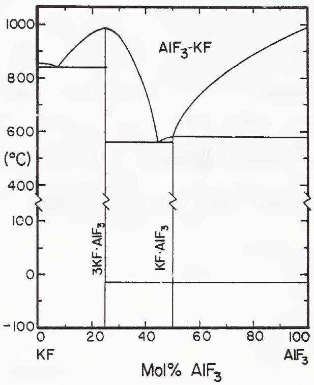  
Figure 86.1. KF-AlF3 phase diagram

References [1-21]

2. Density (ρ)

Measurement method: Archimedean technique [22]

Equation:

$$
\rho = a + b T \tag {86.1}
$$

precision: in table 86.1 uncertainty: $\sim \pm 1.5\%$

(86) KF-A1F3

Table 86.1. Parameters of equation (86.1) and precision   

<table><tr><td>(mol % KF)</td><td>a</td><td>-b x 104</td><td>Precision</td><td>T range(K)</td></tr><tr><td>75(a)</td><td>2.770</td><td>7.398</td><td>*</td><td>1270-1320</td></tr></table>

insufficient data; not estimated

(a) composition corresponds to $\mathrm{K}_3\mathrm{AlF}_6$ (vide infra: System 67)

Table 86.2. Density $(\mathrm{gcm}^{-3})$ form equation in table 86.1   

<table><tr><td>T(K)</td><td>ρ(g cm-3)</td><td></td><td>T(K)</td><td>ρ(g cm-3)</td></tr><tr><td>1270</td><td>1.8304</td><td></td><td>1300</td><td>1.8082</td></tr><tr><td>1280</td><td>1.8230</td><td></td><td>1310</td><td>1.8008</td></tr><tr><td>1290</td><td>1.8156</td><td></td><td>1320</td><td>1.7934</td></tr></table>

References [22]

3. Surface Tension (Y)

No data

4. Viscosity (n)

No data

5. Electrical Conductance (K)

Measurement method: classical ac technique [24]

Equation:

$$
\kappa = a + b T \tag {86.2}
$$

precision: in table 86.3

uncertainty: $\sim$ 30%

Table 86.3. Parameters of equation (86.2) and precisions   

<table><tr><td>Mol % AlF3</td><td>-a</td><td>b x 103</td><td>Precision</td><td>T range(K)</td></tr><tr><td>10</td><td>2.5485</td><td>4.782</td><td>0.9%</td><td>1200-1290</td></tr><tr><td>20</td><td>7.1770</td><td>7.938</td><td>1.6%</td><td>1280-1320</td></tr><tr><td>(a)25</td><td>(13.859)</td><td>(13.01)</td><td>*</td><td>1290-1320</td></tr><tr><td>30</td><td>(8.0807)</td><td>(8.359)</td><td>*</td><td>1290-1320</td></tr><tr><td>40</td><td>(1.7653)</td><td>(3.154)</td><td>*</td><td>1200-1320</td></tr></table>

*The values in ( ) are based on a minimal data set; insufficient data for estimates of precision   
(a) This composition corresponds to $\mathrm{K}_3\mathrm{AlF}_6$ ; for the best values data set for $\mathrm{K}_3\mathrm{AlF}_6$ , see System 67; this work

Table 86.4. Specific conductance (ohm $^{-1}$ cm $^{-1}$ ) from equations in table 86.3   

<table><tr><td rowspan="2">T(K)</td><td colspan="5">Mol % AlF3</td></tr><tr><td>10</td><td>20</td><td>25(a)</td><td>30</td><td>40</td></tr><tr><td>1200</td><td>3.190</td><td></td><td></td><td></td><td>2.020</td></tr><tr><td>1220</td><td>3.286</td><td></td><td></td><td></td><td>2.083</td></tr><tr><td>1240</td><td>3.381</td><td></td><td></td><td></td><td>(2.146)</td></tr><tr><td>1260</td><td>3.477</td><td></td><td></td><td></td><td>2.209</td></tr><tr><td>1280</td><td>3.572</td><td>2.984</td><td></td><td></td><td>(2.272)</td></tr><tr><td>1290</td><td>3.620</td><td>3.063</td><td>(2.924)</td><td>(2.702)</td><td>(2.303)</td></tr><tr><td>1300</td><td></td><td>3.142</td><td>(3.054)</td><td>2.786</td><td>(2.335)</td></tr><tr><td>1310</td><td></td><td>3.222</td><td>(3.184)</td><td>(2.870)</td><td>(2.366)</td></tr><tr><td>1320</td><td></td><td>3.301</td><td>(3.314)</td><td>(2.953)</td><td>(2.398)</td></tr></table>

(a) This composition (25 mol % AlF₃) corresponds to K₃AlF₆; the values are ~ 25-40% higher than the "best values" data set for K₃AlF₆ (vide infra: System 67).

The values in ( ) are based on a minimal data set.

References [23-26]

(86) KF-A1F3

6. Safety and Hazards

# A. Hazard rating

(i) Toxicity: inorganic fluorides are generally quite irritant and toxic.   
(ii) Vapor pressure: no information for this system; but see KF [29] and $\mathrm{AlF}_3$ [33]

# B. Disaster hazards

(i) Molten salt bath "explosions": i.e., explosive generation of steam due to bulk water "carry-over and/or equipment failure; i.e., explosive expansion of "trapped air.   
(ii) Fluorides, when heated to decomposition, or contacted with acids, emit highly toxic fumes.

References [27-33]

# 7. Corrosion

Table 86.5. Corrosion studies from primary research literature   

<table><tr><td colspan="2">Studies</td><td>References</td></tr><tr><td rowspan="6">A</td><td>CrNi-Cr-Mo alloys (INOR-8; Hastelloys B, W, and N)</td><td>[34]</td></tr><tr><td>SSNI-12P</td><td>[35,36]</td></tr><tr><td>Quartz</td><td>[37]</td></tr><tr><td>Al</td><td>[38]</td></tr><tr><td>Various metals</td><td>[39]</td></tr><tr><td></td><td>[40]</td></tr><tr><td rowspan="3">B</td><td>Pf</td><td>[41-45]</td></tr><tr><td>Boron nitride, carbon, Inconel</td><td>[46-48]</td></tr><tr><td>Fused MgO</td><td>[49]</td></tr><tr><td rowspan="3">C</td><td>Impurities in electrolyte</td><td>[50,51]</td></tr><tr><td>Graphite</td><td>[50,51]</td></tr><tr><td>TiC, TiB2, CrB2,ZrN, NbB2</td><td>[52-54]</td></tr><tr><td rowspan="5">D</td><td>Corrosion studies in molten salts with NaF as one component (e.g., Cl, CO3,...)</td><td>[55-70,77,78]</td></tr><tr><td>Electrochemical behavior of oxide ions and related species in molten fluorides</td><td>[71-73]</td></tr><tr><td>Electroanalytical studies in molten fluorides</td><td>[71-73]</td></tr><tr><td>Annotated corrosion biblio.</td><td>[75]</td></tr><tr><td>Corrosion: molten fluorides(survey)</td><td>[76]</td></tr></table>

A: studies principally in molten NaF, KF, and LiF;  
B: used largely in fluorides physical properties measurements; C: technological aspects, in aluminum reduction cells; D: more general studies, basic principles, and surveys.

References [34-78]

(86) KF-A1F3

8. Diffusion No data   
9. Heat of Fusion $(\Delta H_{f})$ No data   
10. Heat Capacity (Cp) No data   
11. Volume Change on Melting $(\Delta V_{f})$ No data   
12. Vapor Pressure $(p_{vap})$ No data   
13. Thermal Conductivity (liquid) $(\lambda_{\ell})$ No data   
14. Thermal Conductivity (solid) $(\lambda_{s})$ No data   
15. Cryoscopic Constant $(k_{f})$ No data

16. References

[1] Phillips, B., Warshaw, C. M., and Mockrin, J., J. Am. Ceram. Soc., 49. 633 (1966).   
[2] Fedotieff, P. P. and Timofieff, K., Z. Anorg. U. Allgem. Chem., 206, 263 (1932).   
[3] Dergunov, F. P., Akad. Nauk SSSR. Dokl. Khim., 60, 1185 (1948).   
[4] Jenssen, B., Thesis, The University of Trondheim, NTH, Trondheim, 1969.   
[5] Pushin, N. A. and Baskov, A. V., Zh. Russ. Fiz. Khim. Obshch., 135, 82 (1913).   
[6] Barton, C. J., Bratcher, L. M., and Grimes, W. R., Unpublished work, Ref. in "Phase Diagrams of Nuclear Reactor Materials", ed. by Thoma, R. E., U. S. At. Energy Comm. ORNL-2548 (1959)   
[7] Bergman, A. G., and Banachek, E. I., Izv. Sekt. Fiz. Khim. A., 23, 201 (1953)   
[8] Janz, G. J. Downey, J. R., Jr., Allen, C. B., and Tomkins, R. P. T., "Eutectic Data" - 2 Vols; ERDA-TID-27163-P1 & P2; NTIS, Washington, D. C. (1977).

[9] Janz, G. J., Downey, J. R., Jr., Allen, C. B., and Tomkins, R. P. T., "Physical Properties Data Complications Relevant to Energy Storage." I. Molten Salts: Eutectic Data", NSRDS-NBS-61; U. S. Gov't Printing Office, Washington, D. C. (1978).   
[10] "International Critical Tables of Numerical Data, Physics, Chemistry, and Technology", 8 Vols., McGraw-Hill Book Co., N. Y. (1933).   
[11] "Landolt-Bornstein Zahlenwert und Funktionen aus Physik, Chemie, Astronomie, Geophysik und Technik", (10th Ed.) Springer-Verlag, Berlin, Heidelberg, N. Y. (1961).   
[12] Clark, P. V., "Fused Salt Mixtures: Eutectic Compositions and Melting Points Bibliography 1907-1968", Report No. SC-R-68-1680; Sandia Laboratories (1968), NTIS.   
[13] Robertson, W. D., "Binary Phase Diagrams of Halide Salts", Report No. Yale 2723 (2 Vols.), U. S. AEC Contract AT (30-1)-2723 (1966), NTIS.   
[14] Thoma, R. E., "Phase Diagrams of Nuclear Reactor Materials", Oak Ridge National Laboratory, ORNL-2548, Contract No. W-7405-eng-26.   
[15] Thoma, R. E., "Phase Diagrams of Binary and Ternary Fluoride Systems", Chapt. 6; Adv. Molten Salts Chemistry, Vol. 3 (J. Braunstein, G. Mamantov, and G. P. Smith, eds.), Plenum Press, N. Y. (1975).   
[16] Voskresenskaya, N. K., ed., "Handbook of Solid-Liquid Equilibria in Systems of Inorganic Salts", Volumes 1, 2, Izc. Akad. Nauk SSSR, Moscow (1961). Israel Program for Scientific Translations, Jerusalem, 1970 (NTIS).   
[17] Sinistri, C., Franzozini, P., and Rolla, M., "An Atlas of Miscibility Gaps in Molten Salt Systems", Institute of Physical Chemistry, University of Pavia (Italy) (1968).   
[18] Shaffer, P. T. B., "High Temperature Materials", Plenum Press Handbooks of High Temperature Materials, No. 1, Materials Index, Plenum Press, New York, 1964.   
[19] Franzozini, P., Ferloni, P., and Spinolo, C., "Molten Salts with Organic Anions", Instituto di Chimica Fisica, Universita di Pavia (Italy), 1973.   
[20] Toropov, N. A. et al., "Handbook of Phase Diagrams of the Silicates, Volume 1: Binary Systems, Volume 2, Metal-Oxygen Compounds in Silicate Systems", Izdatel'stov "Nauka" Leningradskoe Otdelenie, Leningrad, 1969, Israel Program for Scientific Translations, Jerusalem, 1972 (NTIS).   
[21] Levin, E., et al., "Phase Diagrams for Ceramists", Amer. Ceramic Soc. (publ.), Columbus, Ohio (1964; 1969).   
[22] Mal'tsev, F. T., and Bukhalova, G. A., J. Appl. Chem. (USSR) 40, 521 (1967).   
[23] Batashev, K. P., Legkie Metal., No. 10, 48 (1936).   
[24] Batashev, K., and Shurin, A., Metallurg (Leningrad) 10, 67 (1935).   
[25] Robbins, G. D., U.S.A.E.C. Review, ORNL-TM-2180, March 1968.   
[26] Yim, E. W., and Feinleib, M., J. Electrochem. Soc., 104, 626 (1957).   
[27] "Dangerous Properties of Materials", Sax, N. I., Van Nostrand Reinhold Co., N. Y. (1969)

[28] "Registry of Toxic Effects of Chemical Substances", Christensen, H. E., and Lubinbyhl, T. T., eds., U. S. Dept. H. E. W., U. S. Gov't Printing Office, Washington, D. C. (1975)   
[29] Janz, G. J., et al., "Physical Properties Data Complications Relevant to Energy Storage. Part II. Molten Salts: Data on Single and Multi-Component Salt Systems", NSRDS-NBS 61, Part II (April 1979), U. S. Gov't Printing Office, Supt of Doc. No. C13-48-61, Washington D. C. 20402.   
[30] "Potential Hazards in Molten Salt Baths for Heat Treatment of Metals", National Board of Fire Underwriters Research Report No. 2 (1954)   
[31] "Handbook of Reactive Chemical Hazards", Bretherwick, L., Butterworth Co., London (1975)   
[32] Janz, G. J., Tomkins, R. P. T., Downey, J. R., Jr., and Allen, C. B., "Safety and Hazards, Chapter in "Eutectic Data", ERDA TID-27163-Pl; NTIS, U. S. Dept. Commerce, Springfield, Va. (1977)   
[33] vide: this work, System 53, A1F3   
[34] Brasunas, A., Metal Prog., 62, 88 (1952).   
[35] Bettes, E. S., Nuc1. Sci. Eng., 2, 804 (1957).   
[36] Hoffman, E. E., Patriarca, P., Leitten, C. F., Jr., and Slaughter, G. M., ORNL-1934, Oak Ridge Natl. Lab., (1956).   
[37] Oak Ridge National Laboratory, "The Development Status of Molten Salt Breeder Reactors", Rpt. ORNL-4812-UC-80; NTIS, U. S. Dept. Commerce, Springfield, Va., (Aug. 1972).   
[38] Heimann, R., Glastech. Ber., 43, 83 (1970).   
[39] Lukashenko, E. E., and Reutova, G. A., Nov. Teor. Tekhnol. Metall. Protsessov., 119 (1973).   
[40] Koger, J. W., Corrosion, 30, 125 (1974).   
[41] Edwards, J. D., Taylor, C. S., Russell, A. S., and Maranville, L. F., J. Electrochem. Soc. 99, 527 (1952).   
[42] Landon, G. J., and Ubbelohde, A. R., Proc. Royal Soc., A240, 160 (1957).   
[43] Winterhager, H. and Werner, L., Forschungsber. des Witschafts-u. Verkehrsministeriums Nordrhein-Westfalen, No. 438, 1957.   
[44] Winterhager, H. and Werner, L., Forschungsber.-des Witschafts-u. Verkehrsministeriums Nordrhein-Westfalen, No. 341, 1956.   
[45] Bajcsy, J., Malinovsky, M., and Matiasovsky, K., Electrochim. Acta, 7, 543 (1962).   
[46] Yim, E. W. and Feinleib, M., J. Electrochem. Soc., 104, 622 (1957).   
[47] Yim, E. W. and Feinleib, M., J. Electrochem. Soc., 626 (1957).   
[48] Brown, E. A. and Porter, B., "U. S. Department of Interior, Bureau of Mines", 128.23:6500 (1964).   
[49] Cuthbertson, J.W. and Waddington, J., Trans Faraday Soc., 32, 745 (1936).   
[50] Grjothiem, K., Krohn, C., Malinovsky, M., Matiasovsky, K., and Thonstad, J., "Aluminum Electrolyses", Chapt. 10; Aluminum-Verlag, G.mbH; Dusseldorf (1977).

[51] Brun, J., Tunold, R., Vatland, A., 30th ISE Meeting, Extended Abstracts, pp. 118-119; Trondheim, Norway (Aug. 1979); NTH, Dept. Ind. Electrochem., Trondheim, Norway.   
[52] Holliday, R. D., (Olin Mathieson Chemical Corp.), U. S. 3,661,736, May 9, 1972.   
[53] Thompson, R.: (Borax Consolidated Ltd.), Ger. Offen. 2,305,281, Aug.9,1973.   
[54] Kugler, T. and Rieger, H. W.: (Swiss Aluminium Ltd.) Ger. Offen. 2,312,439, Oct. 4, 1973.   
[55] Khan, I. A., Ber. Kernforschungsanlage Juelich, Juel-608-RW, (1969).   
[56] Khan, I. A., Inst. Reaktorwerkst., Kernforschungsanlage, Juel-718-RW (1970).   
[57] Bowles, P. J., and Newdick, P. C., Electroplating and Metal Finishing, 24, 6 (1971).   
[58] DeVan, J. H., "Examinations of Pump Impellers from Sodium and Fused Salt Pump Endurance Tests", ORNL CF-61-4-77, Oak Ridge National Lab., (1961).   
[59] Adamson, G. M., Manly, W. D., and Crouse, S. R., "Corrosion by Molten Fluorides", ANP Materials Meeting ORNL-2685, (1958).   
[60] Huntley, W. R., and Gnadt, P. A., Oak Ridge Nat'l Lab., Report ORNL-TM-3863. (1973); Nucl. Sci. Abstr., 27, 12446 (1973).   
[61] Gill, C. B., Straumanis, M. E., and Schlechten, W. B., J. Electrochem. Soc., 102, 42 (1955).   
[62] Litman, A. P., "Corrosion of Volatility Pilot Plant Mark I INOR-S Hydrofluorinator and Mark III. Nickel Fluorinator after Fourteen Dissolution Runs", ORNL-3253, Oak Ridge Nat'l Lab., (1962).   
[63] Litman, A. P., and Goldman, A. E., "Corrosion Associated with Fluorination in the Oak Ridge Nat'l Lab., Fluoride Volatility Process", ORNL-2832, Oak Ridge Nat'l Lab. (1961).   
[64] Manly, W. D., Coobs, J. H., DeVan, J. H., Douglas D. A., Inouye, H., Patriarca, P., Roche, T. K., and Scott, J. L., "Metallurgical Problems in Molten Fluoride Systems", Proc. 2nd U. N. Inter. Conf. Peaceful Uses of At. Energy, 7, 223 (1958).   
[65] Oak Ridge Nat'l Lab., Molten Salt Reactor Program Semiannual Progress Report for Period Ending July 31, 1964, ORNL-3708, (1964).   
[66] Vreeland, D. C., Hoffman, E. E., and Manly, W. D., Nucleonics, 11, 36 (1953).   
[67] Grimes, W. R., and Cuneo, D. R., "Molten Salts as Reactor Fuels", Reactor Handbook 2nd ed., 1, 425 (1955).   
[68] Shimotake, H., and Hesson, J. C., Adv. Chem. Series, No. 64, 149 (1967).   
[69] Boser, O., "Study of Safety Aspects of High Temperature Thermal Energy Storage Systems", ERDA Thermal Energy Storage Information Exchange Mtg., Cleveland, NSF-AER 75-20605 (Sept. 1976).   
[70] Venkatasetty, H. V., "Thermodynamic Properties and Corrosion Characteristics of Thermal Energy Storage Eutectic Mixtures", paper presented at 152nd Meeting of the Electrochemical Society, Atlanta, Ga., (October, 1977).

[71] Mathews, A. L., and Baes, C. F., Inorg. Chem., 7, 373 (1968).   
[72] Manning, D. L. and Mamantov, G., J. Electrochem. Soc., 124, 480 (1977).   
[73] Ting, G., Baes, C. F., Bamberger, C. E., and Mamantov, G., J. Inorg. Nucl. Chem., 39, 1803 (1977).   
[74] Manning, D. L., and Mamantov, G., J. Electroanal. Chem., (in press) (1978)   
[75] Janz, G. J., and Tomkins, R. P. T., Corrosion, 35(11) 485 (1979).   
[76] Eichelberger, J. L., (Penwalt Corp.) "Investigations of Metal Fluoride Thermal Energy Storage Materials: Availability, Cost, Chemistry" ERDA Rpt CO02990-6; NTIS, U. S. Dept. Commerce, Springfield, Va., (Dec. 1976).   
[77] Kochergin, V. P., and Ignat'eva, N. I., Russ. J. Inorg. Chem., 6(9), 1086 (1961).   
[78] Ozeryanaya, I. N., Volodin, V. P., and Smirnov, M. V., Zashchita Metalov (USSR), 2, 230 (1969).

1. Melting Temperatures $(T_{m})$

Pure substance melting points:

LiCl: $610^{\circ} \mathrm{C}$

NaCl: $800^{\circ} \mathrm{C}$

Eutectic melting point:

$557^{\circ} \mathrm{C}$ , composition: 77.5 mol % LiCl

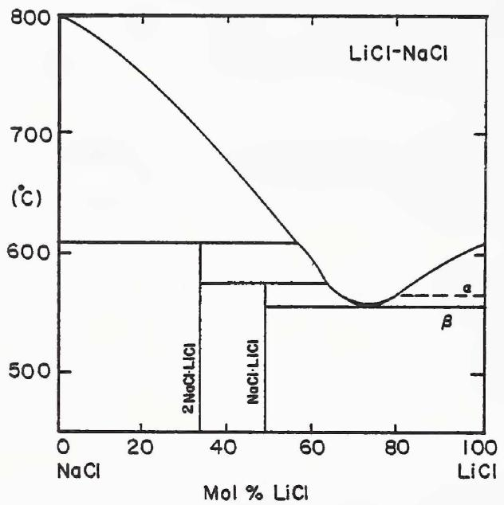  
Figure 87.1. LiCl-NaCl phase diagram

References [1-26]

2. Density (ρ)

Measurement method: Archimedean technique [27]

Equation:

$$
\rho = a + b T \tag {87.1}
$$

precision: in table 87.1

uncertainty: $\sim \pm 1.5\%$

Table 87.1. Parameters of equation (87.1) and precision   

<table><tr><td>Mol % NaCl</td><td>a</td><td>-b x 104</td><td>Precision</td><td>T range(K)</td></tr><tr><td>50</td><td>2.0121</td><td>4.858</td><td>0.06%</td><td>890-1120</td></tr></table>

# (87) LiCl-NaCl

Table 87.2. Density $(\mathrm{gcm}^{-3})$ from equation in table 87.1   

<table><tr><td>T(K)</td><td>ρ(g cm-3)</td><td></td><td>T(K)</td><td>ρ(g cm-3)</td></tr><tr><td>900</td><td>1.575</td><td></td><td>1020</td><td>1.517</td></tr><tr><td>920</td><td>1.565</td><td></td><td>1040</td><td>1.507</td></tr><tr><td>940</td><td>1.555</td><td></td><td>1060</td><td>1.497</td></tr><tr><td>960</td><td>1.546</td><td></td><td>1080</td><td>1.487</td></tr><tr><td>980</td><td>1.536</td><td></td><td>1100</td><td>1.478</td></tr><tr><td>1000</td><td>1.526</td><td></td><td>1120</td><td>1.468</td></tr></table>

References [27-30]

# 3. Surface Tension (γ)

Measurement method: maximum bubble pressure [31]

Equation:

$$
\gamma = a + b T \tag {87.2}
$$

precision: in table 87.3

uncertainty: $\sim \pm 3.0\%$

Table 87.3. Parameters of equation (87.2) and precisions   

<table><tr><td>Mol % NaCl</td><td>a</td><td>-b x 103</td><td>Precision</td><td>T range(K)</td></tr><tr><td>20</td><td>206.05</td><td>80.69</td><td>0.20%</td><td>980-1170</td></tr><tr><td>40</td><td>203.57</td><td>78.97</td><td>0.12%</td><td>980-1170</td></tr><tr><td>60</td><td>197.26</td><td>73.79</td><td>0.45%</td><td>980-1100</td></tr></table>

Table 87.4. Surface tension (dyn cm $^{-1}$ ) from equations in table 87.3   

<table><tr><td rowspan="2">T(K)</td><td colspan="3">Mol % NaCl</td></tr><tr><td>20</td><td>40</td><td>60</td></tr><tr><td>980</td><td>127.0</td><td>126.2</td><td>125.0</td></tr><tr><td>990</td><td>126.2</td><td>125.4</td><td>124.2</td></tr><tr><td>1000</td><td>125.4</td><td>124.6</td><td>123.5</td></tr><tr><td>1010</td><td>124.6</td><td>123.8</td><td>122.7</td></tr><tr><td>1020</td><td>123.7</td><td>123.0</td><td>122.0</td></tr><tr><td>1030</td><td>122.9</td><td>122.2</td><td>121.3</td></tr><tr><td>1040</td><td>122.1</td><td>121.4</td><td>120.5</td></tr><tr><td>1050</td><td>121.3</td><td>120.7</td><td>119.8</td></tr><tr><td>1060</td><td>120.5</td><td>119.9</td><td>119.1</td></tr><tr><td>1070</td><td>119.7</td><td>119.1</td><td>118.3</td></tr><tr><td>1080</td><td>118.9</td><td>118.3</td><td>117.6</td></tr><tr><td>1090</td><td>118.1</td><td>117.5</td><td>116.1</td></tr><tr><td>1100</td><td>117.3</td><td>116.7</td><td>116.1</td></tr><tr><td>1110</td><td></td><td>115.9</td><td>115.4</td></tr><tr><td>1120</td><td></td><td>115.1</td><td>114.6</td></tr><tr><td>1130</td><td></td><td>114.3</td><td>113.9</td></tr><tr><td>1140</td><td></td><td>113.5</td><td>113.2</td></tr><tr><td>1150</td><td></td><td>112.8</td><td>112.4</td></tr><tr><td>1160</td><td></td><td>112.0</td><td>111.7</td></tr><tr><td>1170</td><td></td><td>111.2</td><td>110.9</td></tr></table>

References [31]

4. Viscosity (n)

No data

5. Electrical Conductance (K)

Measurement method: classical ac technique [32]

Equation:

$$
\kappa = a + b T + c T ^ {2} \tag {87.3}
$$

precision: in table 87.5

uncertainty: $\sim \pm 2.0\%$

Table 87.5. Parameters of equation (87.3), and precision   

<table><tr><td>Mol % NaCl</td><td>-a</td><td>b x 103</td><td>-c x 106</td><td>Precision</td><td>T range(K)</td></tr><tr><td>50</td><td>3.9723</td><td>13.0062</td><td>4.7073</td><td>0.18%</td><td>920-1130</td></tr></table>

Table 87.6. Specific conductance $(ohm^{-1}cm^{-1})$ from equation in table 87.5   

<table><tr><td>T(K)</td><td>(ohm-1cm-1)</td><td>T(K)</td><td>(ohm-1cm-1)</td></tr><tr><td>920</td><td>4.009</td><td>1040</td><td>4.463</td></tr><tr><td>940</td><td>4.094</td><td>1060</td><td>4.525</td></tr><tr><td>960</td><td>4.175</td><td>1080</td><td>4.584</td></tr><tr><td>980</td><td>4.253</td><td>1100</td><td>4.639</td></tr><tr><td>1000</td><td>4.327</td><td>1120</td><td>4.689</td></tr><tr><td>1020</td><td>4.397</td><td></td><td></td></tr></table>

References [32]

6. Safety and Hazards

# A. Hazard rating

(i) Toxicity: LiCl, slight; NaCl, very slow.   
(ii) Vapor pressure: LiCl, at m.pt. $(610^{\circ}\mathrm{C})$ $\sim 0.25\mathrm{mm}$ ; NaCl, at m.pt. $(800^{\circ}\mathrm{C})$ $\sim 0.34\mathrm{mm}$ .

# B. Disaster hazards

(i) Molten salt bath "explosions": i.e., explosive generation of steam due to bulk water "carry-over" and/or equipment failure; i.e., explosive expansion of "trapped" air.   
(ii) Chlorides evolve highly toxic chloride fumes when heated to decomposition, or contacted with acids.

References [33-38]

# 7. Corrosion

Table 87.7. Corrosion studies from primary research literature   

<table><tr><td>Studies</td><td>References</td></tr><tr><td>Mo</td><td>[39]</td></tr><tr><td>Armco Fe</td><td>[40-42]</td></tr><tr><td>NiCr</td><td>[43]</td></tr><tr><td>Ti, Zr., Hf, ThCl4</td><td>[44,45]</td></tr><tr><td>Cr</td><td>[46]</td></tr><tr><td>Cr, Fe-Cr</td><td>[47]</td></tr><tr><td>Ni alloys</td><td>[48]</td></tr><tr><td>Ni-Cr-Al, Ni-Cr-W-Fe, Ni-Cr</td><td>[49]</td></tr><tr><td>Mg, Ni, Zr, Ti</td><td></td></tr><tr><td>Au, Pt, MgO, Al2O3, Zirconia [NaCl with added Na2O]</td><td>[50]</td></tr><tr><td>Electrochemical aspects of corrosion</td><td>[51,52]</td></tr><tr><td>Corrosion - annotated bibliio.</td><td>[53]</td></tr><tr><td>Thermodynamic redox potentials (diagrammatic analysis)</td><td>[49,54,55]</td></tr><tr><td>Reviews: corrosion in molten salts</td><td>[56-58]</td></tr></table>

With the exception of [45], in which compatibility of Ti in molten LiCl-NaCl was investigated, LiCl, KCl, and NaCl and mixtures (e.g., LiCl-KCl, NaCl-KCl,...) were used in the studies listed in Table 87.7 (above).

8. Diffusion

No data

9. Heat of Fusion $(\Delta H_{f}^{\circ})$

No data

10. Heat Capacity $(C_p)$

No data

11. Volume Change on Melting $(\Delta V_{f})$

No. data

12. Vapor Pressure $(p_{vap})$

No data

13. Thermal Conductivity (liquid) $(\lambda_{\mathrm{g}})$ No data

14. Thermal Conductivity (solid) $\left(\lambda_{s}\right)$ No data

15. Cryoscopic Constant $(k_{f})$ No data

16. References

[1] Akopov, A. K. and Bergman, A. G., Zh. Neorgan. Khim., 11, [7], 1751 (1966); Russ. J. Inorg. Chem. (English Transl.) 937 (1966).   
[2] Arabadzhan, A. S. and Bergman, A. G., Zh. Neorgan. Khim., 7 [9], 2262 (1962); Russ. J. Inorg. Chem. (English Transl.) 1153 (1962).   
[3] Akopov, E. K., Zhur. Neorg. Khim., 1, 1019 (1956).   
[4] Plyushchev, V. E., Zhur. Neorg. Khim., 1, 820 (1956).   
[5] Akopov, E. K., Bergman, A. G., Zhur. Neorg. Khim., 2, 383 (1957).   
[6] Arabadzhan, A. S., Bergman, A. G., Zhur. Neorg. Khim., 7, 2226 (1962).   
[7] Bergman, A. G., Akopov, E. K., Izvest. Sektora Fiz.-Khim. Anal., Akad. Nauk SSSR, 23, 222 (1953).   
[8] Gromakov, S. D., Gromakova, L. M., Zhur. Fiz. Khim., 27, 1545 (1953).   
[9] Kangro, W., Wieking, H. W., Z. Physik. Chem., A183, 199 (1938).   
[10] Bergman, A. G., Arabadzhan, A. S., E. Neues Jahrb. Min., Geol., Palaonontol., 2, 186 (1913).   
[11] Zakharchenko, M. A., Aslanov, S. M., Zhur. Neorg. Khim., 8, 797 (1963).   
[12] Lesnykh, D.S., Eikhenbaum, I. G., Chernyakhovskaya, S. A., Russ. J. Inorg. Chem.; 15, 420 (1970).   
[13] Janz, G. J. Downey, J. R., Jr., Allen, C. B., and Tomkins, R. P. T., "Eutectic Data" - 2 Vols; ERDA-TID-27163-P1 & P2; NTIS, Washington, D. C. (1977).   
[14] Janz, G. J., Downey, J. R., Jr., Allen, C. B., and Tomkins, R. P. T., "Physical Properties Data Complications Relevant to Energy Storage. I. Molten Salts: Eutectic Data", NSRDS-NBS-61; U. S. Gov't Printing Office, Washington, D. C. (1978).   
[15] "International Critical Tables of Numerical Data, Physics, Chemistry, and Technology", 8 Vols., McGraw-Hill Book Co., N. Y. (1933).   
[16] "Landolt-Bornstein Zahlenwert und Funktionen aus Physik, Chemie, Astronomie, Geophysik und Technik", (10th Ed.) Springer-Verlag, Berlin, Heidelberg, N. Y. (1961).

# (87) LiCl-NaCl

[17] Clark, P. V., "Fused Salt Mixtures: Eutectic Compositions and Melting Points Bibliography 1907-1968", Report No. SC-R-68-1680; Sandia Laboratories (1968), NTIS.   
[18] Robertson, W. D., "Binary Phase Diagrams of Halide Salts", Report No. Yale 2723 (2 Vols.), U. S. AEC Contract AT (30-1)-2723 (1966), NTIS.   
[19] Thoma, R. E., "Phase Diagrams of Nuclear Reactor Materials", Oak Ridge National Laboratory, ORNL-2548, Contract No. W-7405-eng-26.   
[20] Thoma, R. E., "Phase Diagrams of Binary and Ternary Fluoride Systems", Chapt. 6; Adv. Molten Salts Chemistry, Vol. 3 (J. Braunstein, G. Mamantov, and G. P. Smith, eds.), Plenum Press, N. Y. (1975).   
[21] Voskresenskaya, N. K., ed., "Handbook of Solid-Liquid Equilibria in Systems of Inorganic Salts", Volumes 1, 2, Izc. Akad. Nauk SSSR, Moscow (1961). Israel Program for Scientific Translations, Jerusalem, 1970 (NTIS).   
[22] Sinsitri, C., Franzozini, P., and Rolla, M., "An Atlas of Miscibility Gaps in Molten Salt Systems", Institute of Physical Chemistry, University of Pavia (Italy) (1968).   
[23] Shaffer, P. T. B., "High Temperature Materials", Plenum Press Handbooks of High Temperature Materials, No. 1, Materials Index, Plenum Press, New York, 1964.   
[24] Franzozini, P., Ferloni, P., and Spinolo, C., "Molten Salts with Organic Anions", Instituto di Chimica Fisica, Universita di Pavia (Italy), 1973.   
[25] Toropov, N. A. et al., "Handbook of Phase Diagrams of the Silicates, Volume 1: Binary Systems, Volume 2, Metal-Oxygen Compounds in Silicate Systems", Izdatel'stov "Nauka" Leningradskoe Otdelenie, Leningrad, 1969, Israel Program for Scientific Translations, Jerusalem, 1972 (NTIS).   
[26] Levin, E., et al., "Phase Diagrams for Ceramists", Amer. Ceramic Soc. (publ.), Columbus, Ohio (1964; 1969).   
[27] Olteanu, M., and Zuca, S., Rev. Roumaine Chim., 15, 1503 (1970).   
[28] Chesnokov, A. A., and Strelets, Kh. L., Tsvetnye Metally, 43, 59 (1970).   
[29] Holm, J. L., Acta. Chem. Scand., 25, 3609 (1971).   
[30] Kuzmich'eva, A. F. and Zakhvalinskii, M. N., Vzaimodeistvie Khloridov i Sul'fatov Shchelochnykh i Shchelochnozemel. nykh Metallov V Rasplavahk, 180 (1972).   
[31] Matsumura, Y., Mizuno, M., Sugino, S., and Tanaka, Y., Suiyokai-Shi, 16, 488 (1968).   
[32] Sakai, K., Denki Kagaku, 34, 501 (1964).   
[33] "Dangerous Properties of Materials", Sax, N. I., Van Nostrand Reinhold Co., N. Y. (1969).   
[34] "Registry of Toxic Effects of Chemical Substances", Christensen, H. E., and Lubinbyhl, T. T., eds., U. S. Dept. H. E. W., U. S. Gov't Printing Office, Washington, D. C. (1975).   
[35] Janz, G. J., et al., "Physical Properties Data Complications Relevant to Energy Storage. Part II. Molten Salts: Data on Single and Multi-Component Salt Systems", NSRDS-NBS 61, Part II (April 1979), U. S. Gov't Printing Office, Supt of Doc. No. C13-48-61, Washington D. C. 20402.

# (87) LiCl-NaCl

[36] "Potential Hazards in Molten Salt Baths for Heat Treatment of Metals", National Board of Fire Underwriters Research Report No.2 (1954).   
[37] "Handbook of Reactive Chemical Hazards", Bretherwick, L., Butterworth Co., London (1975).   
[38] Janz, G. J., Tomkins, R. P. T., Downey, J. R. Jr., and Allen, C. B., "Safety and Hazards", Chapter in "Eutectic Data", ERDA TID-27163-P1; NTIS, U. S. Dept. Commerce, Springfield, Va. (1977)   
[39] Ozeryanaya, I. N., Zalazinskii, G. G., Smirnov, M. V., Finkel'shtein, S. D., and Shamanova, N. D., Zashch. Metal., 11, 66 (1975).   
[40] Kochergin, V. P., and Ignat'eva, N. I., Russ. J. Inorg. Chem., 6(9), 1085 (1961).   
[41] Kochergin, V. P., and Shevrina, Z., Uch. Zap. Ural. Gos. Univ., 92, 3 (1969).   
[42] Kochergin, V. P., et al., Zhur. Priklad. Khim., 34(6), 1258 (1961); ibid., 37(8), 1837 (1964).   
[43] Seybolt, A. U., Oxid. Metals, 2, 119 (1970).   
[44] Smirnov, M. V., Kudyakov, V. Ya., Loginov, Ya. A., Rossokhin, E. G., Posokhin, Yu. V., and Puzanova, T. A., Fiz. Khim. Elektrokhim. Rasplav. Solei Shlakov, 1, 115 (1969).   
[45] Gill, C. B., Straumanis, M. E., and Schlechten, W. B., J. Electrochem. Soc., 102, 42 (1955).   
[46] Krasil'nikova, N. A., Ozeryanaya, I. N., and Smirnov, M. V., Zashch. Metal., 17, 446 (1974).   
[47] Krasil'nikova, N. A., Ozeryanaya, I. N., Smirnov, M. V., and Shamanova, N. D., Zashch. Metal., 10, 446 (1974).   
[48] Bogdanov, N. I., Varganov, B. Ya., and Kholomonova, N. D., Zh. Prikl. Khim. (Leningrad), 46, 1698 (1973).   
[49] Littlewood, R., J. Electrochem. Soc., 109, 525 (1962).   
[50] Stern, K. H., Panayappan, R., and Flinn, D. R., "Proceedings Intern. Symp. Molten Salts", The Electrochem. Soc., Princeton, N. J., p. 64 (1976).   
[51] Pizzini, S., "Materials Problems in the Industrial Applications of Molten Salts", Proceedings of the European Conference on the Development of Molten Salts Applications", p. 203 (1973); Battelle, Geneva.   
[52] Johnson, K. E., "Electrochemical Approaches to Corrosion in Molten Salts", Proceedings International Symposium on Metal-Slag-Gas Reactions and Processes, The Electrochemical Society Inc., Princeton, N. J., p. 581 (1975).   
[53] Janz, G. J., and Tomkins, R. P. T., Corrosion, 35, 485 (1979).   
[54] Edeleanu, C., and Littlewood, R., Electrochimica Acta, 3, 195 (1960).   
[55] Littlewood, R., and Argent, E. A., Electrochimica Acta, 4, 114 (1961).   
[56] Smirnov, M. V., and Ozeryanaya, I. N., Nauki Tekh. Korros. Zashch. Korros. 2, 171 (1973).   
[57] Ketelaar, J. A. A., Chemie. Ing. Techn., 45, 667 (1973).   
[58] Inman, D., and Wrench, N. S., Brit. Corr. J., 1, 246 (1966).

$$
\text {S y s t e m} 8 8 \quad \mathrm {L i C l - M g C l} _ {2}
$$

1. Melting Temperatures $(T_{m})$

Pure substance melting points:

LiCl: $610^{\circ} \mathrm{C}$

$\mathrm{MgC_12}$ ： $714^{\circ}C$

Eutectic melting point:

$570^{\circ} \mathrm{C}$ , composition: $60 \mathrm{~mol} \%$ LiCl

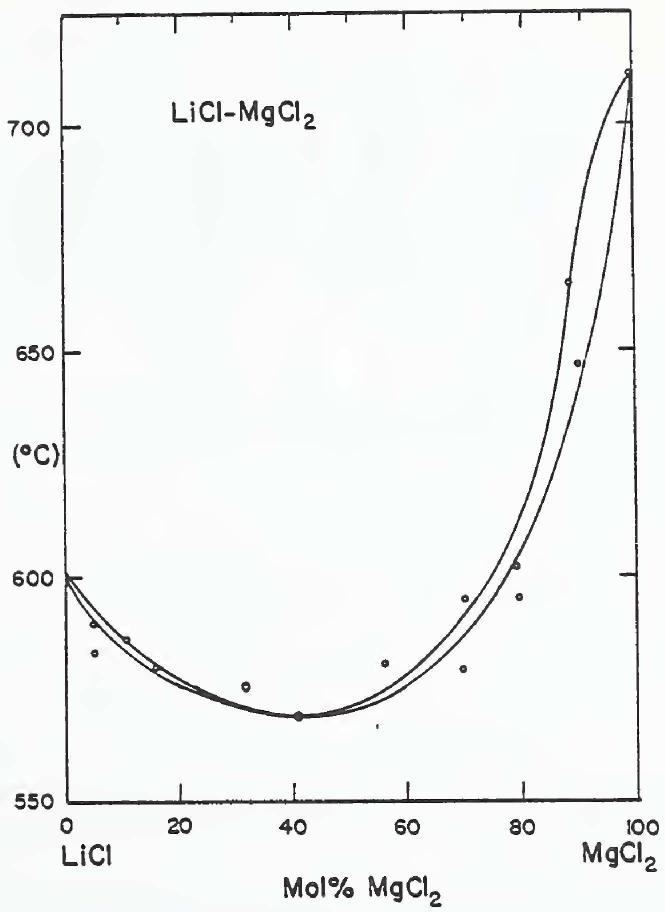  
Figure 88.1. LiCl-MgCl $_2$ phase diagram

References [1-15].

2. Density (ρ)

Measurement method: Archimedean technique [16]

Equation:

$$
\rho = a + b T \tag {88.1}
$$

precision: in table 88.1

uncertainty: $\sim \pm 1.5\%$

Table 88.1. Parameters of equation (88.1) and precisions   

<table><tr><td>\( \mathrm{{Mol}}\% {\mathrm{{MgCl}}}_{2} \)</td><td>a</td><td>\( - b \times  {10}^{4} \) .</td><td>Precision</td><td>T range(K)</td></tr><tr><td>5.7</td><td>2.4116</td><td>8.906</td><td>0.05%</td><td>1030-1120</td></tr><tr><td>18.0</td><td>2.0351</td><td>4.953</td><td>0.02%</td><td>980-1080</td></tr><tr><td>30.8</td><td>2.1408</td><td>5.525</td><td>0.02%</td><td>1030-1120</td></tr><tr><td>45.4</td><td>2.0892</td><td>4.618</td><td>0.04%</td><td>980-1080</td></tr><tr><td>56.4</td><td>2.1623</td><td>5.035</td><td>0.04%</td><td>980-1080</td></tr><tr><td>77.4</td><td>2.1334</td><td>4.415</td><td>0.02%</td><td>970-1030</td></tr></table>

# (88) LiCl-MgCl2

Table 88.2. Density $(\mathrm{gcm}^{-3})$ from equations in table 88.1   

<table><tr><td rowspan="2">T(K)</td><td colspan="6">\( Mo1\ \%\ MgCl_2 \)</td></tr><tr><td>5.7</td><td>18.0</td><td>30.8</td><td>45.4</td><td>56.4</td><td>77.4</td></tr><tr><td>970</td><td></td><td></td><td></td><td></td><td></td><td>1.705</td></tr><tr><td>980</td><td></td><td>1.550</td><td></td><td>1.637</td><td>1.669</td><td>1.701</td></tr><tr><td>990</td><td></td><td>1.545</td><td></td><td>1.632</td><td>1.664</td><td>1.697</td></tr><tr><td>1000</td><td></td><td>1.540</td><td></td><td>1.627</td><td>1.659</td><td>1.692</td></tr><tr><td>1010</td><td></td><td>1.535</td><td></td><td>1.623</td><td>1.654</td><td>1.688</td></tr><tr><td>1020</td><td></td><td>1.530</td><td>1.577</td><td>1.618</td><td>1.649</td><td>1.683</td></tr><tr><td>1030</td><td>1.494</td><td>1.525</td><td>1.572</td><td>1.614</td><td>1.644</td><td>1.679</td></tr><tr><td>1040</td><td>1.485</td><td>1.520</td><td>1.566</td><td>1.609</td><td>1.639</td><td></td></tr><tr><td>1050</td><td>1.476</td><td>1.515</td><td>1.561</td><td>1.604</td><td>1.634</td><td></td></tr><tr><td>1060</td><td>1.468</td><td>1.510</td><td>1.555</td><td>1.600</td><td>1.629</td><td></td></tr><tr><td>1070</td><td>1.459</td><td>1.505</td><td>1.550</td><td>1.595</td><td>1.624</td><td></td></tr><tr><td>1080</td><td>1.450</td><td>1.500</td><td>1.544</td><td>1.590</td><td></td><td></td></tr><tr><td>1090</td><td>1.441</td><td></td><td>1.539</td><td></td><td></td><td></td></tr><tr><td>1100</td><td>1.432</td><td></td><td>1.533</td><td></td><td></td><td></td></tr><tr><td>1110</td><td>1.423</td><td></td><td>1.528</td><td></td><td></td><td></td></tr><tr><td>1120</td><td>1.414</td><td></td><td>1.522</td><td></td><td></td><td></td></tr></table>

References [16-19]

3. Surface Tension (γ)

Measurement method: flat pin (detachment) [20]

Equation:

$$
\gamma = a + b T \tag {88.2}
$$

precision: in table 88.3

uncertainty: $\sim 2.0\%$

Table 88.3. Parameters of equation (88.2) and precisions   

<table><tr><td>Mol % MgCl2</td><td>a</td><td>-b x 103</td><td>Precision</td><td>T range(K)</td></tr><tr><td>17.2</td><td>152.52</td><td>49.87</td><td>0.09%</td><td>950-1040</td></tr><tr><td>18.0</td><td>149.70</td><td>47.79</td><td>0.03%</td><td>990-1040</td></tr><tr><td>36.2</td><td>127.20</td><td>35.96</td><td>0.07%</td><td>920-1020</td></tr><tr><td>45.4</td><td>110.39</td><td>24.83</td><td>0.12%</td><td>980-1080</td></tr><tr><td>53.1</td><td>109.40</td><td>26.47</td><td>0.04%</td><td>940-1040</td></tr><tr><td>56.4</td><td>105.13</td><td>25.98</td><td>0.11%</td><td>970-1080</td></tr><tr><td>73.5</td><td>86.08</td><td>13.30</td><td>0.08%</td><td>950-1060</td></tr></table>

(88) LiCl-MgCl2.

Table 88.4. Surface tension (dyn cm $^{-1}$ ) from equations in table 88.3   

<table><tr><td rowspan="2">T(K)</td><td colspan="5">\( \mathrm {M o l}\% \mathrm {M g C l}_{2} \)</td></tr><tr><td>18.0</td><td>36.2</td><td>45.4</td><td>53.1</td><td>56.4</td></tr><tr><td>920</td><td></td><td>94.1</td><td></td><td></td><td></td></tr><tr><td>930</td><td></td><td>93.8</td><td></td><td></td><td></td></tr><tr><td>940</td><td></td><td>93.4</td><td></td><td>84.5</td><td></td></tr><tr><td>950</td><td></td><td>93.0</td><td></td><td>84.3</td><td></td></tr><tr><td>960</td><td></td><td>92.7</td><td></td><td>84.0</td><td></td></tr><tr><td>970</td><td></td><td>92.3</td><td></td><td>83.7</td><td>79.9</td></tr><tr><td>980</td><td></td><td>92.0</td><td>86.1</td><td>83.5</td><td>79.7</td></tr><tr><td>990</td><td>102.4</td><td>91.6</td><td>85.8</td><td>83.2</td><td>79.4</td></tr><tr><td>1000</td><td>101.9</td><td>91.2</td><td>85.6</td><td>82.9</td><td>79.2</td></tr><tr><td>1010</td><td>101.4</td><td>90.9</td><td>85.3</td><td>82.7</td><td>78.9</td></tr><tr><td>1020</td><td>101.0</td><td>90.5</td><td>85.1</td><td>82.4</td><td>78.6</td></tr><tr><td>1030</td><td>100.5</td><td></td><td>84.8</td><td>82.1</td><td>78.4</td></tr><tr><td>1040</td><td>100.0</td><td></td><td>84.6</td><td>81.9</td><td>78.1</td></tr><tr><td>1050</td><td></td><td></td><td>84.3</td><td></td><td>77.9</td></tr><tr><td>1060</td><td></td><td></td><td>84.1</td><td></td><td>77.6</td></tr><tr><td>1070</td><td></td><td></td><td>83.8</td><td></td><td>77.3</td></tr><tr><td>1080</td><td></td><td></td><td>83.6</td><td></td><td>77.1</td></tr></table>

References [16,20]

# 4. Viscosity (n)

Measurement method: oscillating sphere technique [21]

Equation:

$$
\eta = a + b T + c T ^ {2} \tag {88.3}
$$

precision: in table 88.5

uncertainty: $\sim \pm 10\%$

Table 88.5. Parameters of equation (88.3) and precisions   

<table><tr><td>MgCl2(mol %)</td><td>a</td><td>-b x 102</td><td>c x 105</td><td>Precision</td><td>T range(K)</td></tr><tr><td>4.7</td><td>-18.522</td><td>-4.359</td><td>-2.392</td><td>0.23%</td><td>930-990</td></tr><tr><td>7.3</td><td>2.774</td><td>-1.163</td><td>-0.769</td><td>0.60%</td><td>970-1000</td></tr><tr><td>10.0</td><td>-33.060</td><td>-7.177</td><td>-3.748</td><td>1.95%</td><td>960-1030</td></tr><tr><td>16.0</td><td>30.387</td><td>5.592</td><td>2.676</td><td>2.44%</td><td>940-1020</td></tr><tr><td>19.3</td><td>4.942</td><td>0.371</td><td>0</td><td>2.19%</td><td>940-1020</td></tr><tr><td>22.9</td><td>24.434</td><td>4.346</td><td>2.033</td><td>2.24%</td><td>940-1020</td></tr><tr><td>30.8</td><td>3.958</td><td>0.261</td><td>0</td><td>0.61%</td><td>940-1010</td></tr><tr><td>40.0</td><td>.5.024</td><td>0.363</td><td>0</td><td>2.40%</td><td>930-1030</td></tr><tr><td>50.9</td><td>25.077</td><td>4.343</td><td>1.984</td><td>0.82%</td><td>960-1010</td></tr><tr><td>71.6</td><td>13.568</td><td>1.876</td><td>0.691</td><td>0.63%</td><td>940-1010</td></tr></table>

(88) LiCl-MgCl2   
Table 88.6. Viscosity (cp) from equations in table 88.5   

<table><tr><td rowspan="2">T(K)</td><td colspan="5">\( \mathrm {M o l}\% \mathrm {M g C l}_{2} \)</td></tr><tr><td>71.6</td><td>40.0</td><td>22.9</td><td>16.0</td><td>4.7</td></tr><tr><td>920</td><td></td><td></td><td></td><td></td><td></td></tr><tr><td>930</td><td></td><td>1.65</td><td></td><td></td><td>1.33</td></tr><tr><td>940</td><td>2.04</td><td>1.61</td><td>1.55</td><td>1.47</td><td>1.32</td></tr><tr><td>950</td><td>1.98</td><td>1.58</td><td>1.50</td><td>1.41</td><td>1.30</td></tr><tr><td>960</td><td>1.92</td><td>1.54</td><td>1.45</td><td>1.36</td><td>1.28</td></tr><tr><td>970</td><td>1.87</td><td>1.50</td><td>1.41</td><td>1.32</td><td>1.25</td></tr><tr><td>980</td><td>1.82</td><td>1.47</td><td>1.37</td><td>1.28</td><td>1.22</td></tr><tr><td>990</td><td>1.76</td><td>1.43</td><td>1.34</td><td>1.25</td><td>1.19</td></tr><tr><td>1000</td><td>1.71</td><td>1.39</td><td>1.31</td><td>1.23</td><td>1.15</td></tr><tr><td>1010</td><td>1.67</td><td>1.36</td><td>1.28</td><td>1.20</td><td></td></tr><tr><td>1020</td><td></td><td>1.32</td><td>1.26</td><td>1.19</td><td></td></tr><tr><td>1030</td><td></td><td>1.29</td><td></td><td></td><td></td></tr></table>

References [21]

5. Electrical Conductance (K)

Measurement method: classical ac technique [17]

Equation:

$$
\kappa = a + b T + c T ^ {2} \tag {88.4}
$$

precision: in table 88.7

uncertainty: $\sim 3.0\%$

Table 88.7. Parameters of equation (88.4) and precisions   

<table><tr><td>Mol % MgCl2</td><td>-a</td><td>b x 103</td><td>-c x 106</td><td>Precision</td><td>T range(K)</td></tr><tr><td>4.7</td><td>5.000</td><td>17.57</td><td>6.67</td><td>*</td><td>910-1130</td></tr><tr><td>10.0</td><td>4.811</td><td>16.23</td><td>6.11</td><td>*</td><td>910-1130</td></tr><tr><td>16.0</td><td>4.374</td><td>14.47</td><td>5.34</td><td>*</td><td>910-1130</td></tr><tr><td>20.0</td><td>4.712</td><td>14.53</td><td>5.40</td><td>*</td><td>910-1130</td></tr><tr><td>30.0</td><td>4.007</td><td>11.88</td><td>4.26</td><td>*</td><td>910-1130</td></tr><tr><td>40.0</td><td>3.717</td><td>10.69</td><td>3.80</td><td>*</td><td>910-1130</td></tr></table>

\*not estimated; insufficient data

Table 88.8. Specific conductance $(ohm^{-1}cm^{-1})$ from equations in table 88.7   

<table><tr><td rowspan="2">T(K)</td><td colspan="6">\( Mol\ \% \ MgCl_2 \)</td></tr><tr><td>4.7</td><td>10.0</td><td>16.0</td><td>20.0</td><td>30.0</td><td>40.0</td></tr><tr><td>910</td><td>5.47</td><td>4.90</td><td>4.37</td><td>4.04</td><td>3.28</td><td>2.87</td></tr><tr><td>930</td><td>5.57</td><td>5.00</td><td>4.46</td><td>4.13</td><td>3.36</td><td>2.94</td></tr><tr><td>950</td><td>5.67</td><td>5.10</td><td>4.55</td><td>4.21</td><td>3.43</td><td>3.01</td></tr><tr><td>970</td><td>5.77</td><td>5.19</td><td>4.63</td><td>4.30</td><td>3.51</td><td>3.08</td></tr><tr><td>990</td><td>5.86</td><td>5.27</td><td>4.71</td><td>4.38</td><td>3.58</td><td>3.14</td></tr><tr><td>1010</td><td>5.94</td><td>5.35</td><td>4.79</td><td>4.45</td><td>3.65</td><td>3.21</td></tr><tr><td>1030</td><td>6.02</td><td>5.43</td><td>4.86</td><td>4.52</td><td>3.71</td><td>3.26</td></tr><tr><td>1050</td><td>6.10</td><td>5.50</td><td>4.93</td><td>4.49</td><td>3.77</td><td>3.32</td></tr><tr><td>1070</td><td>6.17</td><td>5.56</td><td>4.99</td><td>4.65</td><td>3.83</td><td>3.37</td></tr><tr><td>1090</td><td>6.23</td><td>5.63</td><td>5.05</td><td>4.71</td><td>3.88</td><td>3.42</td></tr><tr><td>1110</td><td>6.29</td><td>5.68</td><td>5.10</td><td>4.76</td><td>3.93</td><td>3.47</td></tr><tr><td>1130</td><td>6.34</td><td>5.73</td><td>5.15</td><td>4.81</td><td>3.98</td><td>3.51</td></tr></table>

References [17]

(88) LiCl-MgCl2

6. Safety and Hazards

A. Hazard rating

(i) Toxicity: LiCl, slight; $\mathrm{MgCl}_2$ , slight.   
(ii) Vapor pressure: LiCl, at m.pt. (610°C), $\sim 0.11\mathrm{mm}$ .

B. Disaster hazards

(i) Molten salt bath "explosions": i.e., explosive generation of steam due to bulk water "carry-over" and/or equipment failure; i.e., explosive expansion of "trapped" air.   
(ii) Chlorides evolve highly toxic fumes when heated to decomposition, or contacted with acids.

References [22-27].

7. Corrosion

Table 88.9. Corrosion studies from primary research literature   

<table><tr><td>Studies</td><td>References</td></tr><tr><td>Mg, Ni, Zr, Ti</td><td>[28]</td></tr><tr><td>Ti, Zr, Hf, ThCl4</td><td>[29]</td></tr><tr><td>Armco Fe</td><td>[30-36]</td></tr><tr><td>Zr</td><td>[37]</td></tr><tr><td>Solubility of metal oxides (Ni, Ca, Zn, Mg)</td><td>[28,38]</td></tr><tr><td>Thermodynamics of corrosion</td><td>[28,39,40]</td></tr><tr><td>Corrosion - annotated biblio.</td><td>[41]</td></tr><tr><td>Electrochemical aspects</td><td>[42]</td></tr><tr><td>Reviews: corrosion - molten salts</td><td>[43-45]</td></tr></table>

No compatibility studies specifically with molten $\mathrm{LiCl - MgCl_2}$ were found, for $\mathrm{MgCl_2}$ as a component in molten NaCl and KCl, see [32-36].

References [28-45]

8. Diffusion No data   
9. Heat of Fusion $(\Delta H_{f}^{\circ})$ No data   
10. Heat Capacity $(C_p)$ No data

(88) LiCl-MgCl2

11. Volume Change on Melting $(\Delta V_{f})$

Measurement method: estimated from densities [46]

Table 88.10. Volume change on melting   

<table><tr><td>Binary eutectic (mol % MgCl2)</td><td>(ΔVf/Vs)</td><td>Uncertainty</td></tr><tr><td>40%</td><td>20.5%</td><td>~ ± 10%</td></tr></table>

# References [46]

12. Vapor Pressure $(p_{vap})$

No data

13. Thermal Conductivity (liquid) $(\lambda_{\mathrm{g}})$

No data

14. Thermal Conductivity (solid) $(\lambda_{s})$

No data

15. Cryoscopic Constant $(k_{f})$

No data

16. References

[1] Sandonnini, C., Atti della Reale Accad. dei Lincei, (5), 22, 1; 629 (1913).   
[2] Janz, G. J. Downey, J. R., Jr., Allen, C. B., and Tomkins, R. P. T., "Eutectic Data" - 2 Vols; ERDA-TID-27163-P1 & P2; NTIS, Washington, D. C. (1977).   
[3] Janz, G. J., Downey, J. R., Jr., Allen, C. B., and Tomkins, R. P. T., "Physical Properties Data Complications Relevant to Energy Storage. I. Molten Salts: Eutectic Data", NSRDS-NBS-61; U. S. Gov't Printing Office, Washington, D. C. (1978).   
[4] "International Critical Tables of Numerical Data, Physics, Chemistry, and Technology", 8 Vols., McGraw-Hill Book Co., N. Y. (1933).   
[5] "Landolt-Bornstein Zahlenwert und Funktionen aus Physik, Chemie, Astronomie, Geophysik und Technik", (10th Ed.) Springer-Verlag, Berlin, Heidelberg, N. Y. (1961).   
[6] Clark, P. V., "Fused Salt Mixtures: Eutectic Compositions and Melting Points Bibliography 1907-1968", Report No. SC-R-68-1680; Sandia Laboratories (1968), NTIS.   
[7] Robertson, W. D., "Binary Phase Diagrams of Halide Salts", Report No. Yale 2723 (2 Vols.), U. S. AEC Contract AT (30-1)-2723 (1966), NTIS.   
[8] Thoma, R. E., "Phase Diagrams of Nuclear Reactor Materials", Oak Ridge National Laboratory, ORNL-2548, Contract No. W-7405-eng-26.   
[9] Thoma, R. E., "Phase Diagrams of Binary and Ternary Fluoride Systems", Chapt. 6; Adv. Molten Salts Chemistry, Vol. 3 (J. Braunstein, G. Mamantov, and G. P. Smith, eds.), Plenum Press, N. Y. (1975).   
[10] Voskresenskaya, N. K., ed., "Handbook of Solid-Liquid Equilibria in Systems of Inorganic Salts", Volumes 1, 2, Izc. Akad. Nauk SSSR, Moscow (1961). Israel Program for Scientific Translations, Jerusalem, 1970 (NTIS).

# (88) LiCl-MgCl2

[11] Sinistri, C., Franzozini, P., and Rolla, M., "An Atlas of Miscibility Gaps in Molten Salt Systems", Institute of Physical Chemistry, University of Pavia (Italy) (1968).   
[12] Shaffer, P. T. B., "High Temperature Materials", Plenum Press Handbooks of High Temperature Materials, No. 1, Materials Index, Plenum Press, New York, 1964.   
[13] Franzozini, P., Ferloni, P., and Spinolo, C., "Molten Salts with Organic Anions", Instituto di Chimica Fisica, Universita di Pavia (Italy), 1973.   
[14] Toropov, N. A. et al., "Handbook of Phase Diagrams of the Silicates, Volume 1: Binary Systems, Volume 2, Metal-Oxygen Compounds in Silicate Systems", Izdatel'stov "Nauka" Leningradskoe Otdelenie, Leningrad, 1969, Israel Program for Scientific Translations, Jerusalem, 1972 (NTIS).   
[15] Levin, E., et al., "Phase Diagrams for Ceramists", Amer. Ceramic Soc. (publ.), Columbus, Ohio (1964; 1969).   
[16] Lillebuen, B., Ph.D. Thesis, The Technical University of Norway, Trondheim, Norway, (1969).   
[17] Matsushima, T., and Ito, T., Denki Kagaku, 35, 714 (1967).   
[18] Chesnokov, A. A., and Strelets, Kh. L., Tsvetnye Metally, 43, 59 (1970).   
[19] Grjothiem, K., Holm, J. L., Lillebuen, B., and Øye, H. A., Trans. Faraday Soc., 67, 640 (1971).   
[20] Grjothiem, K., Holm, J. L., Lillibuen, B., and Øye, H. A., Inst. Inorg. Chem., Technical University of Norway, N-7034, Trondheim, Norway (1971).   
[21] Bondarenko, N., Fiz. Khim. Elektrokhim. Rasplav. Solei Shlakov. Tr. Vses. Sov 1st., 277 (1969).   
[22] "Dangerous Properties of Materials", Sax, N. I., Van Nostrand Reinhold Co., N. Y. (1969).   
[23] "Registry of Toxic Effects of Chemical Substances", Christensen, H. E., and Lubinybyhl, T. T., eds., U. S. Dept. H.E.W; U. S. Gov't Printing Office, Washington, D. C. (1975).   
[24] Janz, G. J., et al., "Physical Properties Data Complications Relevant to Energy Storage. Part II. Molten Salts: Data on Single and Multi-Component Salt Systems", NSRDS-NBS 61, Part II (April 1979), U. S. Gov't Printing Office, Supt of Doc. No. C13-48-61, Washington D. C. 20402.   
[25] "Potential Hazards in Molten Salt Baths for Heat Treatment of Metals", National Board Fire Underwriters Research Report No. 2. (1954).   
[26] "Handbook of Reactive Chemical Hazards", Bretherwick, L., Butterworths Co., London (1975).   
[27] Janz, G. J., Tomkins, R. P. T., Downey, J. R., Jr., and Allen, C. B., "Safety and Hazards", Chapter in "Eutectic Data", ERDA TID-27163-P1; NTIS, U. S. Dept. Commerce, Springfield, Va. (1977).   
[28] Littlewood, R., J. Electrochem. Soc., 109, 525 (1962).   
[29] Smirnov, M. V., Kudyakov, V. Ya., Loginov, Ya. A., Rossokhin, E. G., Posokhin, Yu. V., and Puzanova, T. A., Fiz. Khim. Elektrokhim. Rasplav. Solei Shlakov, 1, 115 (1969).   
[30] Kochergin, V. P., Bormotova, L. V., Pryaklina, N. M., and Asanova, E. P., Zhur. Priklad. Khim. 34 (6), 1258 (1961)

(88) LiCl-MgCl2   
[31] Kochergin, V. P., et al., Zhur. Priklad. Khim., 34(6), 1258 (1961); ibid., 37(8), 1837 (1964).   
[32] Vasin, B. D., Nichkov, I. F., and Raspopin, S. P., Izv. Vyssh. Ucheb. Zaved., Tsvet. Met., 15, 102 (1972).   
[33] Kochergin, V. P., Khaibuilina, V. P., and Potapova, O. G., Zh. Neorg. Khim., 1, 2617 (1956).   
[34] Jackson, J. H. and LaChance, M. H., Trans. Am. Soc. Metals, 16, 157 (1954).   
[35] Kochergin, V. P., Putina, O. A., Devyatkin, V. N., and Kanaeva, E. T., Tr. Vses. Nauch. Issled. Proekt. Inst. Alyum., Magn. Electrodn., 75, 51 (1971).   
[36] Kochergin, V. P., Kabirov, A. V., Skornyakova, O. N., J. Appl. Chem. USSR, 27, 883 (1954).   
[37] Thai, V., Ozeryanaya, I. N., and Smirnov, M. V., Tri. Inst. Elektrokhim., Ural. Nauch. Tsentr. Akad. Nauk SSSR, 19, 69 (1973).   
[38] Pizzini, S., "Materials Problems in the Industrial Applications of Molten Salts", Proceedings of the European Conference on the Development of Molten Salts Applications", p. 203 (1973); Battelle, Geneva.   
[39] Edeleanu, C., and Littlewood, R., Electrochimica Acta, 3, 195 (1960).   
[40] Littlewood, R., and Argent, E. A., Electrochimica Acta, 4, 114 (1961).   
[41] Janz, G. J., and Tomkins, R. P. T., Corrosion, 35, 485 (1979).   
[42] Johnson, K. E., "Electrochemical Approaches to Corrosion in Molten Salts", Proceedings International Symposium on Metal-Slag-Gas Reactions and Processes, The Electrochemical Society Inc., Princeton, N. J., p. 581 (1975).   
[43] Smirnov, M. V., and Ozeryanaya, I. N., Nauki Tekh. Korros. Zashch. Korros., 2, 171 (1973).   
[44] Ketelaar, J. A. A., Chemie. Ing. Techn., 45, 667 (1973).   
[45] Inman, D., and Wrench, N. S., Brit. Corr. J., 1, 246 (1966).   
[46] Janz, G. J., et al. (MSDC-RPI), unpublished work (1980)

1. Melting Temperatures $(T_{m})$

Pure substance melting points:

LiCl: 610°C

BaCl2: 962°C

Eutectic melting point:

512°C, composition: 70.7 mol % LiCl

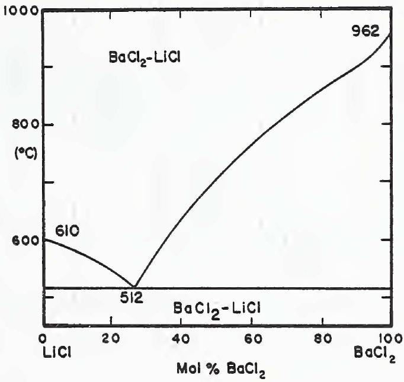  
Figure 89.1. LiCl- $\mathsf{BaCl}_2$ phase diagram

References [1-20].

2. Density (ρ)

Measurement method: modified maximum bubble pressure [21,22]

Equation:

$$
\rho = a + b T \tag {89.1}
$$

precision: in table 89.1.

uncertainty: $\sim \pm 2.0\%$

Table 89.1. Parameters of equation (89.1) and precisions   

<table><tr><td>Mol % LiCl</td><td>a</td><td>-b x 104</td><td>Precision</td><td>T range(K)</td></tr><tr><td>15.0</td><td>3.977</td><td>8.000</td><td>*</td><td>1160-1220</td></tr><tr><td>32.3</td><td>3.868</td><td>8.710</td><td>*</td><td>1070-1150</td></tr><tr><td>46.7</td><td>3.735</td><td>9.410</td><td>*</td><td>990-1060</td></tr><tr><td>60.6</td><td>3.430</td><td>8.430</td><td>*</td><td>980-1070</td></tr><tr><td>75.0</td><td>3.069</td><td>7.920</td><td>*</td><td>950-1070</td></tr><tr><td>89.8</td><td>2.689</td><td>8.300</td><td>*</td><td>880-1070</td></tr></table>

\* not estimated; insufficient data

Table 89.2. Density $(\mathrm{gcm}^{-3})$ from equation in table 89.1   

<table><tr><td rowspan="2">T(K)</td><td colspan="6">Mol % LiCl</td></tr><tr><td>15.0</td><td>32.3</td><td>46.7</td><td>60.6</td><td>75.0</td><td>89.9</td></tr><tr><td>880</td><td></td><td></td><td></td><td></td><td></td><td></td></tr><tr><td>900</td><td></td><td></td><td></td><td></td><td></td><td></td></tr><tr><td>920</td><td></td><td></td><td></td><td>2.654</td><td></td><td></td></tr><tr><td>940</td><td></td><td></td><td></td><td>2.638</td><td></td><td></td></tr><tr><td>960</td><td></td><td></td><td></td><td>2.621</td><td>2.309</td><td>1.892</td></tr><tr><td>980</td><td></td><td></td><td></td><td>2.604</td><td>2.293</td><td>1.876</td></tr><tr><td>1000</td><td></td><td></td><td>2.794</td><td></td><td></td><td></td></tr><tr><td>1020</td><td></td><td></td><td>2.775</td><td>2.587</td><td>2.277</td><td>1.859</td></tr><tr><td>1040</td><td></td><td></td><td>2.756</td><td>2.570</td><td>2.261</td><td>1.842</td></tr><tr><td>1060</td><td></td><td></td><td>2.738</td><td>2.553</td><td>2.245</td><td>1.826</td></tr><tr><td>1080</td><td></td><td>2.927</td><td></td><td></td><td></td><td></td></tr><tr><td>1100</td><td></td><td>2.910</td><td></td><td></td><td></td><td></td></tr><tr><td>1120</td><td></td><td>2.892</td><td></td><td></td><td></td><td></td></tr><tr><td>1140</td><td></td><td>2.875</td><td></td><td></td><td></td><td></td></tr><tr><td>1160</td><td>3.049</td><td>2.858</td><td></td><td></td><td></td><td></td></tr><tr><td>1180</td><td>3.033</td><td></td><td></td><td></td><td></td><td></td></tr><tr><td>1200</td><td>3.017</td><td></td><td></td><td></td><td></td><td></td></tr><tr><td>1220</td><td>3.001</td><td></td><td></td><td></td><td></td><td></td></tr></table>

References [21-23]

# 3. Surface Tension (γ).

Measurement method: maximum bubble pressure [24]

Equation:

$$
\gamma = a + b T \tag {89.2}
$$

precision: in table 89.3

uncertainty: $\sim \pm 3.0\%$

Table 89.3. Parameters of equation (89.2) and precisions   

<table><tr><td>Mol % LiCl</td><td>a</td><td>-b x 102</td><td>Precision</td><td>T range(K)</td></tr><tr><td>15.0</td><td>216.6</td><td>4.50</td><td>0.3%</td><td>1160-1220</td></tr><tr><td>32.3</td><td>214.5</td><td>5.28</td><td>0.1%</td><td>1080-1160</td></tr><tr><td>46.7</td><td>211.0</td><td>5.82</td><td>0.2%</td><td>1000-1060</td></tr><tr><td>60.6</td><td>215.2</td><td>6.75</td><td>0.2%</td><td>920-1060</td></tr><tr><td>75.0</td><td>215.4</td><td>7.92</td><td>0.1%</td><td>960-1060</td></tr><tr><td>89.8</td><td>216.2</td><td>7.99</td><td>0.2%</td><td>880-1060</td></tr></table>

Table 89.4. Surface tension (dyn cm $^{-1}$ ) from equations in table 89.3   

<table><tr><td rowspan="2">T(K)</td><td colspan="5">Mol % LiCl</td></tr><tr><td>32.3</td><td>46.7</td><td>60.6</td><td>75.0</td><td>89.8</td></tr><tr><td>880</td><td></td><td></td><td></td><td></td><td>145.89</td></tr><tr><td>900</td><td></td><td></td><td></td><td></td><td>144.29</td></tr><tr><td>920</td><td></td><td></td><td>153.10</td><td></td><td>142.69</td></tr><tr><td>940</td><td></td><td></td><td>151.75</td><td></td><td>141.09</td></tr><tr><td>960</td><td></td><td></td><td>150.40</td><td>139.37</td><td>139.50</td></tr><tr><td>980</td><td></td><td></td><td>149.05</td><td>137.78</td><td>137.90</td></tr><tr><td>1000</td><td></td><td>152.80</td><td>147.70</td><td>136.20</td><td>136.30</td></tr><tr><td>1020</td><td></td><td>151.64</td><td>146.35</td><td>134.62</td><td>134.70</td></tr><tr><td>1040</td><td></td><td>150.47</td><td>145.00</td><td>133.03</td><td>133.10</td></tr><tr><td>1060</td><td></td><td>149.31</td><td>143.65</td><td>131.45</td><td>131.51</td></tr><tr><td>1080</td><td>157.48</td><td></td><td></td><td></td><td></td></tr><tr><td>1100</td><td>156.42</td><td></td><td></td><td></td><td></td></tr><tr><td>1120</td><td>155.36</td><td></td><td></td><td></td><td></td></tr><tr><td>1140</td><td>154.31</td><td></td><td></td><td></td><td></td></tr><tr><td>1160</td><td>153.25</td><td></td><td></td><td></td><td></td></tr><tr><td>1180</td><td></td><td></td><td></td><td></td><td></td></tr></table>

References [24]

# 4. Viscosity (n)

Measurement method: oscillating sphere technique [24]

Equation:

$$
\eta_ {1} = A \exp (E / R T) \tag {89.3}
$$

precision: in table 89.5

uncertainty: $\sim \pm 10\%$

Table 89.5. Parameters of equation (89.3) and precisions   

<table><tr><td>LiCl (mol %)</td><td>A x 102</td><td>E (cal mol-1)</td><td>Precision</td><td>T range(K)</td></tr><tr><td>15.0</td><td>13.51</td><td>7701</td><td>3.0%</td><td>1160-1230</td></tr><tr><td>32.0</td><td>20.15</td><td>6161</td><td>3.0%</td><td>1130-1250</td></tr><tr><td>46.7</td><td>18.16</td><td>5821</td><td>4.0%</td><td>1070-1220</td></tr><tr><td>60.6</td><td>25.26</td><td>4469</td><td>3.0%</td><td>1010-1070</td></tr><tr><td>75.0</td><td>23.56</td><td>3810</td><td>2.0%</td><td>1020-1170</td></tr><tr><td>89.8</td><td>18.96</td><td>3909</td><td>2.0%</td><td>1010-1060</td></tr></table>

Table 89.6. Viscosity (cp) from equations in table 89.5   

<table><tr><td rowspan="2">T(K)</td><td colspan="6">Mol % LiCl</td></tr><tr><td>15.0</td><td>32.0</td><td>46.7</td><td>60.6</td><td>75.0</td><td>89.8</td></tr><tr><td>1010</td><td></td><td></td><td></td><td></td><td></td><td>1.33</td></tr><tr><td>1020</td><td></td><td></td><td></td><td></td><td>1.54</td><td>1.30</td></tr><tr><td>1030</td><td></td><td></td><td></td><td></td><td>1.52</td><td>1.28</td></tr><tr><td>1040</td><td></td><td></td><td></td><td></td><td>1.49</td><td>1.26</td></tr><tr><td>1050</td><td></td><td></td><td></td><td></td><td>1.46</td><td>1.23</td></tr><tr><td>1060</td><td></td><td></td><td></td><td>2.11</td><td>1.44</td><td>1.21</td></tr><tr><td>1070</td><td></td><td></td><td>2.81</td><td>2.07</td><td>1.41</td><td>1.19</td></tr><tr><td>1080</td><td></td><td></td><td>2.74</td><td>2.03</td><td>1.39</td><td>1.17</td></tr><tr><td>1090</td><td></td><td></td><td>2.67</td><td>1.99</td><td>1.37</td><td>1.15</td></tr><tr><td>1100</td><td></td><td></td><td>2.60</td><td>1.95</td><td>1.35</td><td>1.13</td></tr><tr><td>1110</td><td></td><td></td><td>2.54</td><td>1.92</td><td>1.33</td><td>1.12</td></tr><tr><td>1120</td><td></td><td></td><td>2.48</td><td>1.88</td><td>1.31</td><td>1.10</td></tr><tr><td>1130</td><td></td><td>3.13</td><td>2.43</td><td>1.85</td><td>1.29</td><td>1.08</td></tr><tr><td>1140</td><td></td><td>3.06</td><td>2.37</td><td>1.82</td><td>1.27</td><td>1.07</td></tr><tr><td>1150</td><td></td><td>2.99</td><td>2.32</td><td>1.79</td><td>1.25</td><td>1.05</td></tr><tr><td>1160</td><td>3.82</td><td>2.92</td><td>2.27</td><td>1.76</td><td>1.23</td><td>1.03</td></tr><tr><td>1170</td><td>3.71</td><td>2.85</td><td>2.22</td><td>1.73</td><td>1.21</td><td></td></tr><tr><td>1180</td><td>3.61</td><td>2.79</td><td>2.17</td><td>1.70</td><td></td><td></td></tr><tr><td>1190</td><td>3.51</td><td>2.73</td><td>2.13</td><td>1.67</td><td></td><td></td></tr><tr><td>1200</td><td>3.41</td><td>2.67</td><td>2.09</td><td>1.65</td><td></td><td></td></tr><tr><td>1210</td><td>3.32</td><td>2.61</td><td>2.04</td><td>1.62</td><td></td><td></td></tr><tr><td>1220</td><td>3.24</td><td>2.56</td><td>2.00</td><td>1.60</td><td></td><td></td></tr><tr><td>1230</td><td>3.16</td><td>2.51</td><td></td><td></td><td></td><td></td></tr><tr><td>1240</td><td></td><td>2.46</td><td></td><td></td><td></td><td></td></tr><tr><td>1250</td><td></td><td>2.41</td><td></td><td></td><td></td><td></td></tr><tr><td>1260</td><td></td><td></td><td></td><td></td><td></td><td></td></tr><tr><td>1270</td><td></td><td></td><td></td><td></td><td></td><td></td></tr><tr><td>1280</td><td></td><td></td><td></td><td></td><td></td><td></td></tr><tr><td>1290</td><td></td><td></td><td></td><td></td><td></td><td></td></tr></table>

References [24]

# 5. Electrical Conductance (K)

Measurement method: classical ac technique [25]

Equation:

$$
\kappa = a + b T + c T ^ {2} \tag {89.4}
$$

precision: in table 89.7

uncertainty: $\sim \pm 3.0\%$

Table 89.7. Parameters of equation (89.4) and precisions   

<table><tr><td>Mol % LiCl</td><td>a</td><td>b x 103</td><td>c x 106</td><td>Precision</td><td>T range(K)</td></tr><tr><td>10.5</td><td>-2.545</td><td>3.911</td><td>0</td><td>*</td><td>1240-1270</td></tr><tr><td>21.6</td><td>-3.723</td><td>5.187</td><td>0</td><td>*</td><td>1180-1270</td></tr><tr><td>35.0</td><td>-3.899</td><td>5.763</td><td>0</td><td>*</td><td>1140-1270</td></tr><tr><td>52.4</td><td>3.746</td><td>-7.291</td><td>6.070</td><td>*</td><td>1080-1270</td></tr><tr><td>64.4</td><td>2.064</td><td>-3.041</td><td>4.127</td><td>*</td><td>1080-1270</td></tr><tr><td>77.6</td><td>-2.543</td><td>6.416</td><td>0</td><td>*</td><td>1080-1270</td></tr></table>

\*not estimated; insufficient data

# (89) LiCl-BaCl2

Table 89.8. Specific conductance (ohm $^{-1}$ cm $^{-1}$ ) from equations in table 89.7   

<table><tr><td rowspan="2">T(K)</td><td colspan="6">Mol % LiCl</td></tr><tr><td>10.5</td><td>21.6</td><td>35.0</td><td>52.4</td><td>64.4</td><td>77.6</td></tr><tr><td>1080</td><td></td><td></td><td>2.325</td><td>2.952</td><td>3.593</td><td>4.386</td></tr><tr><td>1100</td><td></td><td></td><td>2.440</td><td>3.071</td><td>3.713</td><td>4.515</td></tr><tr><td>1120</td><td></td><td></td><td>2.556</td><td>3.194</td><td>3.853</td><td>4.543</td></tr><tr><td>1140</td><td></td><td>2.190</td><td>2.671</td><td>3.323</td><td>3.961</td><td>4.771</td></tr><tr><td>1160</td><td></td><td>2.294</td><td>2.786</td><td>3.456</td><td>4.090</td><td>4.900</td></tr><tr><td>1180</td><td>2.070</td><td>2.398</td><td>2.901</td><td>3.594</td><td>4.222</td><td>5.028</td></tr><tr><td>1200</td><td>2.148</td><td>2.501</td><td>3.017</td><td>3.738</td><td>4.358</td><td>5.156</td></tr><tr><td>1220</td><td>2.226</td><td>2.605</td><td>3.132</td><td>3.886</td><td>4.497</td><td>5.285</td></tr><tr><td>1240</td><td>2.305</td><td>2.709</td><td>3.247</td><td>4.038</td><td>4.639</td><td>5.413</td></tr><tr><td>1260</td><td>2.383</td><td>2.813</td><td>3.362</td><td>4.196</td><td>4.784</td><td>5.541</td></tr></table>

# References [25]

6. Safety and Hazards

# A. Hazard rating

(i) Toxicity: LiCl, slight; $\mathrm{BaCl}_2$ , poisonous when taken orally.   
(ii) Vapor pressure: LiCl at m.pt. $(610^{\circ}\mathrm{C})$ , $\sim 0.25\mathrm{mm}$ ; BaCl $_2$ , at m.pt. $(962^{\circ}\mathrm{C}) < 0.5\mathrm{mm}$ .

# B. Disaster hazards

(i) Molten salt bath "explosions": i.e., explosive generation of steam due to bulk water "carry-over" and/or equipment failure; i.e., explosive expansion of "trapped" air.   
(ii) Chlorides evolve highly toxic chloride fumes when heated to decomposition, or contacted with acids.

References [26-31]

# 7. Corrosion

Table 89.9. Corrosion studies from primary research literature   

<table><tr><td>Studies</td><td>References</td></tr><tr><td>Mg, Ni, Zr, Ti</td><td>[32]</td></tr><tr><td>Ti, Zr, Hf, ThCl4</td><td>[33]</td></tr><tr><td>Armco Fe</td><td>[34-40°]</td></tr><tr><td>Zr</td><td>[41]</td></tr><tr><td>Solubility of metal oxides (Ni, Ca, Zn, Mg)</td><td>[32,42]</td></tr><tr><td>Thermodynamics of corrosion</td><td>[32,43,44]</td></tr><tr><td>Corrosion - annotated biblio.</td><td>[45]</td></tr><tr><td>Electrochemical aspects</td><td>[46]</td></tr><tr><td>Reviews: corrosion - molten salts</td><td>[47-49]</td></tr></table>

No compatibility studies specifically with molten $\mathrm{LiCl - BaCl}_2$ were found, for $\mathrm{BaCl}_2$ as a component in molten NaCl and KCl, see [36-40].

References [32-49]

8. Diffusion   
No data   
9. Heat of Fusion $(\Delta H_{f}^{\circ})$ No data   
10. Heat Capacity (Cp) No data   
11. Volume Change on Melting $(\Delta V_{f})$ Measurement method: estimated from densities [50]

Table 89.10 Volume change on melting   

<table><tr><td>Binary eutectic (mol % BaCl2)</td><td>(ΔVf/Vs)</td><td>Uncertainty</td></tr><tr><td>29.3%</td><td>0.6%</td><td>~ ± 10%</td></tr></table>

References [50]

12. Vapor Pressure $(p_{vap})$ No data

(89) LiCl-BaCl 2

13. Thermal Conductivity (liquid) $(\lambda_{\ell})$

No data

14. Thermal Conductivity (solid) $(\lambda_{s})$

No data

15. Cryoscopic Constant $(k_{f})$

No data

16. References

[1] Bergman, A. G. and Banahek, E. I., Izv. Sekt. Fiz. Khim. Anal. Inst. Obshch. Neorg. Khim., Akad. Nauk. SSSR, 23, 201 (1953).   
[2] Zakharchenko, M. A., Gontar, K. V., Zhur. Neorg. Khim., 7, 1964 (1962).   
[3] Sandonnini, C., Atti Accad. Lincei, 22, 629 (1913).   
[4] Tokareva, M. V., Rudenko, V. K., Zhur. Neorg. Khim. Trans., 8, 357 (1963).   
[5] Zakharchenko, M. A., Aslanov, S. M., Zhur. Neorg. Khim., 8, 797 (1963).   
[6] Gramokov, S. D., and Gromokova, I. M., Zh. Fiz. Khim., 29, 715 (1955).   
[7] Janz, G. J. Downey, J. R., Jr., Allen, C. B., and Tomkins, R. P. T., "Eutectic Data" - 2 Vols; ERDA-TID-27163-P1 & P2; NTIS, Washington, D. C. (1977).   
[8] Janz, G. J., Downey, J. R., Jr., Allen, C. B., and Tomkins, R. P. T., "Physical Properties Data Complications Relevant to Energy Storage. I. Molten Salts: Eutectic Data", NSRDS-NBS-61; U. S. Gov't Printing Office, Washington, D. C. (1978).   
[9] "International Critical Tables of Numerical Data, Physics, Chemistry, and Technology", 8 Vols., McGraw-Hill Book Co., N. Y. (1933).   
[10] "Landolt-Bornstein Zahlenwert und Funktionen aus Physik, Chemie, Astronomie, Geophysik und Technik", (10th Ed.) Springer-Verlag, Berlin, Heidelberg, N. Y. (1961).   
[11] Clark, P. V., "Fused Salt Mixtures: Eutectic Compositions and Melting Points Bibliography 1907-1968", Report No. SC-R-68-1680; Sandia Laboratories (1968), NTIS.   
[12] Robertson, W. D., "Binary Phase Diagrams of Halide Salts", Report No. Yale 2723 (2 Vols.), U. S. AEC Contract AT (30-1)-2723 (1966), NTIS.   
[13] Thoma, R. E., "Phase Diagrams of Nuclear Reactor Materials", Oak Ridge National Laboratory, ORNL-2548, Contract No. W-7405-eng-26.   
[14] Thoma, R. E., "Phase Diagrams of Binary and Ternary Fluoride Systems", Chapt. 6; Adv. Molten Salts Chemistry, Vol. 3 (J. Braunstein, G. Mamantov, and G. P. Smith, eds.), Plenum Press, N. Y. (1975).   
[15] Voskresenskaya, N. K., ed., "Handbook of Solid-Liquid Equilibria in Systems of Inorganic Salts", Volumes 1, 2, Izc. Akad. Nauk SSSR, Moscow (1961). Israel Program for Scientific Translations, Jerusalem, 1970 (NTIS).   
[16] Sinistri, C., Franzozini, P., and Rolla, M., "An Atlas of Miscibility Gaps in Molten Salt Systems", Institute of Physical Chemistry, University of Pavia (Italy) (1968).

[17] Shaffer, P. T. B., "High Temperature Materials", Plenum Press Handbooks of High Temperature Materials, .No. 1, Materials Index, Plenum Press, New York, 1964.   
[18] Franzozini, P., Ferloni, P., and Spinolo, C., "Molten Salts with Organic Anions", Instituto di Chimica Fisica, Universita di Pavia (Italy), 1973.   
[19] Toropov, N. A. et al., "Handbook of Phase Diagrams of the Silicates, Volume 1: Binary Systems, Volume 2, Metal-Oxygen Compounds in Silicate Systems", Izdatel'stov "Nauka" Leningradskoe Otdelenie, Leningrad, 1969, Israel Program for Scientific Translations, Jerusalem, 1972 (NTIS).   
[20] Levin, E., et al., "Phase Diagrams for Ceramists", Amer. Ceramic Soc. (publ.), Columbus, Ohio (1964; 1969).   
[21] Ozornin, S. A., Smirnov, M. V., and Stepanov, V. P., J. Appl. Chem. USSR), 42, 796 (1969), Zhur. Priklad. Khim., 42, 838 (1969).   
[22] Bukhalova, G. A., and Yagub'yan, E. S., Russ. J. Inorg. Chem., 13, 1162 (1958).   
[23] Kuzmich'eva, A. F. and Zakhvalinskii, M. N., Vzaimodeistvie Khloridov i Sul'vatov Shchelochnykh i Shchelochnozemelykh Metallov V Rasplavahk, 180 (1972).   
[24] Khokhlov, V. A., and Smirnov, M. V., Tr. Inst. Elektrokhim. Akad. Nauk, SSSR, Ural, Filial, 14, 66 (1970).   
[25] Khokhlov, V. A., and Smirnov, M. V., Tr. Inst. Elektrokhim. UFAN SSSR, 12, 33 (1969), Electrochemistry of Molten and Solid Electrolytes, 9, 24 (1972).   
[26] "Dangerous Properties of Materials", Sax, N. I., Van Nostrand Reinhold Co., N. Y. (1969).   
[27] "Registry of Toxic Effects of Chemical Substances", Christensen, H. E., and Lubinbyhl, T. T., eds., U. S. Dept. H. E. W., U. S. Gov't Printing Office, Washington, D. C. (1975).   
[28] Janz, G. J., et al., "Physical Properties Data Complications Relevant to Energy Storage. Part II. Molten Salts: Data on Single and Multi-Component Salt Systems", NSRDS-NBS 61, Part II (April 1979), U. S. Gov't Printing Office, Supt of Doc. No. C13-48-61, Washington D. C. 20402.   
[29] "Potential Hazards in Molten Salt Baths for Heat Treatment of Metals", National Board of Fire Underwriters Research Report No.2 (1954).   
[30] "Handbook of Reactive Chemical Hazards", Bretherwick, L., Butterworth Co., London (1975).   
[31] Janz, G. J., Tomkins, R. P. T., Downey, J. R. Jr., and Allen, C. B., "Safety and Hazards", Chapter in "Eutectic Data", ERDA TID-27163-P1; NTIS, U. S. Dept. Commerce, Springfield, Va. (1977)   
[32] Littlewood, R., J. Electrochem. Soc., 109, 525 (1962).   
[33] Smirnov, M. V., Kudyakov, V. Ya., Loginov, Ya. A., Rossokhin, E. G., Posokhin, Yu. V., and Puzanova, T. A., Fiz. Khim. Elektrokhim. Rasplav. Solei Shlakov, 1, 115 (1969).   
[34] Kochergin, V. P., Bormotova, L. V., Pryaklina, N. M., and Asanova, E. P., Zhur. Priklad. Khim. 34 (6), 1258 (1961)   
[35] Kochergin, V. P., et al., Zhur. Priklad. Khim., 34(6), 1258 (1961); ibid., 37(8), 1837 (1964).

# (89) LiCl-BaCl2

[36] Vasin, B. D., Nichkov, I. F., and Raspopin, S. P., Izv. Vyssh. Ucheb. Zaved., Tsvet. Met., 15, 102 (1972).   
[37] Kochergin, V. P., Khaibuilina, V. P., and Potapova, O. G., Zh. Neorg. Khim., 1, 2617 (1956).   
[38] Jackson, J. H. and LaChance, M. H., Trans. Am. Soc. Metals, 16, 157 (1954).   
[39] Kochergin, V. P., Putina, O. A., Devyatkin, V. N., and Kanaeva, E. T., Tr. Vses. Nauch. Issled. Proekt. Inst. Alyum., Magn. Electrodn., 75, 51 (1971).   
[40] Kochergin, V. P., Kabirov, A. V., Skornyakova, O. N., J. Appl. Chem. USSR, 27, 883 (1954).   
[41] Thai, V., Ozeryanaya, I. N., and Smirnov, M. V., Tri. Inst. Elektrokhim., Ural. Nauch. Tsentr. Akad. Nauk SSSR, 19, 69 (1973).   
[42] Pizzini, S., "Materials Problems in the Industrial Applications of Molten Salts", Proceedings of the European Conference on the Development of Molten Salts Applications", p. 203 (1973); Battelle, Geneva.   
[43] Edeleanu, C., and Littlewood, R., Electrochimica Acta, 3, 195 (1960).   
[44] Littlewood, R., and Argent, E. A., Electrochimica Acta, 4, 114 (1961).   
[45] Janz, G. J., and Tomkins, R. P. T., Corrosion, 35, 485 (1979).   
[46] Johnson, K. E., "Electrochemical Approaches to Corrosion in Molten Salts", Proceedings International Symposium on Metal-Slag-Gas Reactions and Processes, The Electrochemical Society Inc., Princeton, N. J., p. 581 (1975).   
[47] Smirnov, M. V., and Ozeryanaya, I. N., Nauki Tekh. Korros. Zashch. Korros. 2, 171 (1973).   
[48] Ketelaar, J. A. A., Chemie. Ing. Techn., 45, 667 (1973).   
[49] Inman, D., and Wrench, N. S., Brit. Corr. J., 1, 246 (1966).   
[50] Janz, G. J., et al. (MSDC-RPI), unpublished work (1980)

1. Melting Temperatures $(T_{m})$

Pure substance melting points:

NaCl: $800^{\circ} \mathrm{C}$

MgCl2: 714°C

Eutectic melting point:

E i: $450^{\circ} \mathrm{C}$ , composition: 60.1 mol % NaCl

P1: 465°C, composition: 53.1 mol % NaCl

$\mathrm{P}_{2}$ : $485^{\circ} \mathrm{C}$ , composition: $64.7 \mathrm{~mol} \%$ NaCl

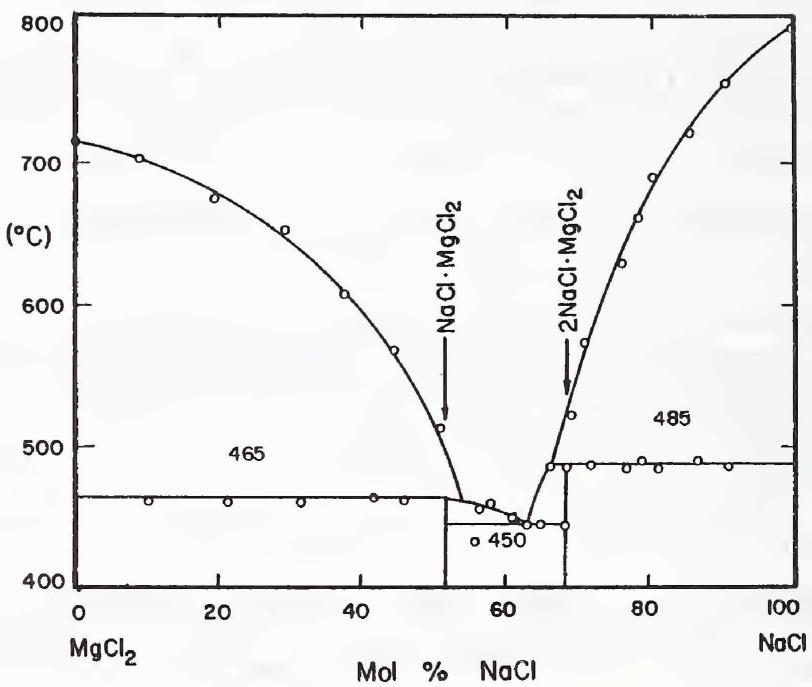  
Figure 90.1. NaCl-MgCl $_2$ phase diagram

References [1-24]

2. Density (ρ)

Measurement method: Archimedean technique [26]

Equation:

$$
\rho = a + b T \tag {90.1}
$$

precision: in table 90.1 uncertainty: $\sim$ 2.0%

Table 90.1. Parameters of equation (90.1) and precisions   

<table><tr><td>Mol % NaCl</td><td>a</td><td>-b x 104</td><td>Precision</td><td>T range (K)</td></tr><tr><td>0</td><td>1.9483</td><td>2.6917</td><td>0.03%</td><td>1020-1090</td></tr><tr><td>17.7</td><td>2.1501</td><td>4.4361</td><td>0.01%</td><td>1020-1110</td></tr><tr><td>25.6</td><td>2.1348</td><td>4.3414</td><td>0.01%</td><td>1050-1120</td></tr><tr><td>37.7</td><td>2.2029</td><td>5.1352</td><td>0.07%</td><td>1030-1120</td></tr><tr><td>48.5</td><td>2.1967</td><td>5.2669</td><td>0.04%</td><td>1040-1120</td></tr><tr><td>58.2</td><td>2.1253</td><td>4.7419</td><td>0.02%</td><td>1030-1100</td></tr><tr><td>66.3</td><td>2.1182</td><td>4.8222</td><td>0.03%</td><td>1050-1110</td></tr><tr><td>71.1</td><td>2.0431</td><td>4.1877</td><td>0.03%</td><td>1040-1100</td></tr><tr><td>76.4</td><td>2.0488</td><td>4.2896</td><td>0.02%</td><td>1050-1090</td></tr><tr><td>89.0</td><td>2.1392</td><td>5.3070</td><td>0.01%</td><td>1080-1120</td></tr><tr><td>95.0</td><td>2.1429</td><td>5.3845</td><td>0.02%</td><td>1030-1540</td></tr><tr><td>100</td><td>2.1321</td><td>5.2995</td><td>0.04%</td><td>1090-1090</td></tr></table>

Equation: (two-independent-variables equation)

$$
\rho = a + b T + c T ^ {2} + d C ^ {2} + e C ^ {3} + f T C ^ {2} \tag {90.2}
$$

Table 90.2. Parameters of two-independent-variables equation (90.2)   

<table><tr><td>a</td><td>b x 103</td><td>c x 107</td><td>d x 105</td><td>e x 107</td><td>f x 108</td><td>Precision</td></tr><tr><td>1.85184</td><td>-5.72548</td><td>-2.48988</td><td>2.44756</td><td>-3.61076</td><td>2.01655</td><td>0.15%</td></tr></table>

Table 90.3. Density (g cm $^{-3}$ ) from equations in table 90.1   

<table><tr><td rowspan="2">T(K)</td><td colspan="7">Mol % NaCl</td></tr><tr><td>17.7</td><td>37.7</td><td>48.5</td><td>58.2</td><td>66.3</td><td>71.1</td><td>95.0</td></tr><tr><td>1020</td><td>1.698</td><td></td><td></td><td></td><td></td><td></td><td></td></tr><tr><td>1030</td><td>1.693</td><td>1.674</td><td></td><td>1.637</td><td></td><td></td><td>1.588</td></tr><tr><td>1040</td><td>1.689</td><td>1.669</td><td>1.649</td><td>1.632</td><td></td><td>1.608</td><td>1.583</td></tr><tr><td>1050</td><td>1.684</td><td>1.664</td><td>1.644</td><td>1.627</td><td>1.612</td><td>1.603</td><td>1.578</td></tr><tr><td>1060</td><td>1.680</td><td>1.659</td><td>1.638</td><td>1.623</td><td>1.607</td><td>1.599</td><td>1.572</td></tr><tr><td>1070</td><td>1.675</td><td>1.653</td><td>1.633</td><td>1.618</td><td>1.602</td><td>1.595</td><td>1.567</td></tr><tr><td>1080</td><td>1.671</td><td>1.648</td><td>1.628</td><td>1.613</td><td>1.597</td><td>1.591</td><td>1.561</td></tr><tr><td>1090</td><td>1.667</td><td>1.643</td><td>1.623</td><td>1.608</td><td>1.593</td><td>1.587</td><td>1.556</td></tr><tr><td>1100</td><td>1.662</td><td>1.638</td><td>1.617</td><td>1.604</td><td>1.588</td><td>1.582</td><td>1.551</td></tr><tr><td>1110</td><td>1.658</td><td>1.633</td><td>1.612</td><td></td><td></td><td></td><td>1.545</td></tr><tr><td>1120</td><td></td><td>1.628</td><td>1.607</td><td></td><td></td><td></td><td>1.540</td></tr></table>

References [25-30]

# 3. Surface Tension (Y)

Measurement method: maximum bubble pressure [32]

Equation:

$$
\gamma = a + b T \tag {90.3}
$$

precision: in table 90.4. uncertainty: $\sim \pm 2.0\%$

Table 90.4. Parameters of equation (90.3) and precision   

<table><tr><td>Mol % NaCl</td><td>a</td><td>-b x 102</td><td>Precision</td><td>T range(K)</td></tr><tr><td>10</td><td>81.8</td><td>1.20</td><td>*</td><td>980-1170</td></tr><tr><td>20</td><td>88.1</td><td>1.40</td><td>*</td><td>980-1170</td></tr><tr><td>30</td><td>98.5</td><td>2.00</td><td>*</td><td>980-1170</td></tr><tr><td>40</td><td>105.5</td><td>2.30</td><td>*</td><td>980-1170</td></tr><tr><td>50</td><td>114.7</td><td>2.70</td><td>*</td><td>980-1170</td></tr><tr><td>60</td><td>124.4</td><td>3.30</td><td>*</td><td>980-1170</td></tr><tr><td>70</td><td>130.1</td><td>3.50</td><td>*</td><td>980-1170</td></tr><tr><td>80</td><td>142.7</td><td>4.30</td><td>*</td><td>980-1170</td></tr><tr><td>90</td><td>163.9</td><td>5.60</td><td>*</td><td>1030-1170</td></tr></table>

\* not estimated; insufficient data.

Table 90.5. Surface tension (dyn cm $^{-1}$ ) from equations in table 90.4   

<table><tr><td rowspan="2">T(K)</td><td colspan="6">Mol % NaCl</td></tr><tr><td>10</td><td>40</td><td>50</td><td>60</td><td>70</td><td>90</td></tr><tr><td>980</td><td>70.0</td><td>83.0</td><td>88.2</td><td>92.1</td><td>95.8</td><td></td></tr><tr><td>990</td><td>69.9</td><td>82.7</td><td>88.0</td><td>91.7</td><td>95.5</td><td></td></tr><tr><td>1000</td><td>69.8</td><td>82.5</td><td>87.7</td><td>91.4</td><td>95.1</td><td></td></tr><tr><td>1010</td><td>69.7</td><td>82.3</td><td>87.4</td><td>91.1</td><td>94.8</td><td></td></tr><tr><td>1020</td><td>69.6</td><td>82.0</td><td>87.2</td><td>90.7</td><td>94.4</td><td></td></tr><tr><td>1030</td><td>69.4</td><td>81.8</td><td>86.9</td><td>90.4</td><td>94.1</td><td>106.2</td></tr><tr><td>1040</td><td>69.3</td><td>81.6</td><td>86.6</td><td>90.1</td><td>93.7</td><td>105.7</td></tr><tr><td>1050</td><td>69.2</td><td>81.4</td><td>86.4</td><td>89.8</td><td>93.4</td><td>105.1</td></tr><tr><td>1060</td><td>69.1</td><td>81.1</td><td>86.1</td><td>89.4</td><td>93.0</td><td>104.5</td></tr><tr><td>1070</td><td>69.0</td><td>80.9</td><td>85.8</td><td>89.1</td><td>92.7</td><td>104.0</td></tr><tr><td>1080</td><td>68.8</td><td>80.7</td><td>85.5</td><td>88.8</td><td>92.3</td><td>103.4</td></tr><tr><td>1090</td><td>68.7</td><td>80.4</td><td>85.3</td><td>88.4</td><td>92.0</td><td>102.9</td></tr><tr><td>1100</td><td>68.6</td><td>80.2</td><td>85.0</td><td>88.1</td><td>91.6</td><td>102.3</td></tr><tr><td>1110</td><td>68.5</td><td>80.0</td><td>84.7</td><td>87.8</td><td>91.3</td><td>101.7</td></tr><tr><td>1120</td><td>68.4</td><td>79.7</td><td>84.5</td><td>87.4</td><td>90.0</td><td>101.2</td></tr><tr><td>1130</td><td>68.2</td><td>79.5</td><td>84.2</td><td>87.1</td><td>90.6</td><td>100.6</td></tr><tr><td>1140</td><td>68.1</td><td>79.3</td><td>83.9</td><td>86.8</td><td>90.2</td><td>100.1</td></tr><tr><td>1150</td><td>68.0</td><td>79.1</td><td>83.7</td><td>86.5</td><td>89.9</td><td>99.5</td></tr><tr><td>1160</td><td>67.9</td><td>78.8</td><td>83.4</td><td>86.1</td><td>89.5</td><td>98.9</td></tr><tr><td>1170</td><td>67.8</td><td>78.6</td><td>83.1</td><td>85.8</td><td>89.2</td><td>98.4</td></tr></table>

References [26,31-34]

$$
\mathrm {N a C l} - \mathrm {M g C l} _ {2} \tag {90}
$$

4. Viscosity (n)

Measurement method: oscillating sphere technique [36]

Equation:

$$
\eta = a + b T \tag {90.4}
$$

precision: in table 90.6 uncertainty: $\sim \pm 15\%$

Table 90.6. Parameters of equation (90.4) and precisions   

<table><tr><td>NaCl (mol %)</td><td>a</td><td>b x 103</td><td>Precision</td><td>T range(K)</td></tr><tr><td>10</td><td>6.166</td><td>-4.200</td><td>0.00%</td><td>980-1080</td></tr></table>

Equation:

$$
\eta = \cdot A \exp (E / R T) \tag {90.5}
$$

precision: in table 90.7 uncertainty: $\sim \pm 25\%$

Table 90.7. Parameters of equation (90.5) and precisions   

<table><tr><td>NaCl (mol %)</td><td>A x 102</td><td>E (cal mol-1)</td><td>Precision</td><td>T range(K)</td></tr><tr><td>20</td><td>10.89</td><td>5604</td><td>1.81%</td><td>980-1020</td></tr><tr><td>30</td><td>11.89</td><td>5234</td><td>2.50%</td><td>980-1020</td></tr><tr><td>40</td><td>10.28</td><td>5297</td><td>1.66%</td><td>980-1020</td></tr><tr><td>50</td><td>08.64</td><td>5385</td><td>0.12%</td><td>980-1020</td></tr><tr><td>60</td><td>08.27</td><td>5196</td><td>0.77%</td><td>980-1020</td></tr><tr><td>70</td><td>10.09</td><td>5070</td><td>1.77%</td><td>980-1020</td></tr><tr><td>80</td><td>13.57</td><td>4603</td><td>3.14%</td><td>980-1020</td></tr></table>

Table 90.8. Viscosity (cp) from equations in tables 90.6 and 90.7   

<table><tr><td rowspan="2">T(K)</td><td colspan="8">Mol % NaCl</td></tr><tr><td>10</td><td>20</td><td>30</td><td>40</td><td>50</td><td>60</td><td>70</td><td>80</td></tr><tr><td>980</td><td></td><td>1.936</td><td>1.748</td><td>1.561</td><td>1.373</td><td>1.192</td><td>1.363</td><td>1.443</td></tr><tr><td>1000</td><td></td><td>1.828</td><td>1.656</td><td>1.478</td><td>1.299</td><td>1.130</td><td>1.294</td><td>1.376</td></tr><tr><td>1020</td><td>1.882</td><td>1.729</td><td>1.573</td><td>1.403</td><td>1.231</td><td>1.074</td><td>1.231</td><td>1.315</td></tr><tr><td>1040</td><td>1.798</td><td>1.640</td><td>1.497</td><td>1.334</td><td>1.170</td><td>1.022</td><td>1.173</td><td>1.259</td></tr><tr><td>1060</td><td>1.714</td><td>1.558</td><td>1.427</td><td>1.271</td><td>1.114</td><td>0.975</td><td>1.120</td><td>1.207</td></tr><tr><td>1080</td><td>1.630</td><td>1.483</td><td>1.363</td><td>1.213</td><td>1.062</td><td>0.931</td><td>1.071</td><td>1.159</td></tr></table>

At $1073^{\circ}\mathrm{K}$ , the experimental values for 90 mol % and 100 mol % NaCl were 1.19 and 1.20 respectively. These values are within 16% of NSRDS values [36].

References [31,35,36]

# 5. Electrical Conductance (K)

Measurement method: classical ac technique [37]

Equation:

$$
\kappa = a + b T \tag {90.6}
$$

precision: in table 90.9 uncertainty: $\sim \pm 2.0\%$

Table 90.9. Parameters of equation (90.6) and precisions   

<table><tr><td>Mol % NaCl</td><td>a</td><td>b x 103</td><td>Precision</td><td>T range(K)</td></tr><tr><td>20</td><td>-0.8585</td><td>2.378</td><td>0.30%</td><td>980-1040</td></tr><tr><td>40</td><td>-1.1875</td><td>3.063</td><td>0.31%</td><td>960-1060</td></tr><tr><td>60</td><td>0.1275</td><td>2.029</td><td>0.35%</td><td>990-1090</td></tr><tr><td>80</td><td>0.4203</td><td>2.409</td><td>0.08%</td><td>1020-1060</td></tr></table>

Table 90.10. Specific conductance (ohm $^{-1}$ cm $^{-1}$ ) from equations in table 90.9   

<table><tr><td rowspan="2">T(K)</td><td colspan="4">Mol % NaCl</td></tr><tr><td>20</td><td>40</td><td>60</td><td>80</td></tr><tr><td>960</td><td></td><td>1.753</td><td></td><td></td></tr><tr><td>970</td><td></td><td>1.784</td><td></td><td></td></tr><tr><td>980</td><td>1.472</td><td>1.815</td><td></td><td></td></tr><tr><td>990</td><td>1.496</td><td>1.845</td><td>2.136</td><td></td></tr><tr><td>1000</td><td>1.520</td><td>1.876</td><td>2.156</td><td></td></tr><tr><td>1010</td><td>1.544</td><td>1.907</td><td>2.177</td><td></td></tr><tr><td>1020</td><td>1.567</td><td></td><td>2.197</td><td>2.877</td></tr><tr><td>1030</td><td>1.591</td><td></td><td>2.217</td><td>2.902</td></tr><tr><td>1040</td><td>1.615</td><td></td><td>2.238</td><td>2.926</td></tr><tr><td>1050</td><td>1.639</td><td></td><td>2.258</td><td>2.950</td></tr><tr><td>1060</td><td></td><td></td><td>2.278</td><td>2.974</td></tr><tr><td>1070</td><td></td><td></td><td>2.299</td><td></td></tr><tr><td>1080</td><td></td><td></td><td>2.319</td><td></td></tr><tr><td>1090</td><td></td><td></td><td>2.339</td><td></td></tr><tr><td>1100</td><td></td><td></td><td></td><td></td></tr><tr><td>1110</td><td></td><td></td><td></td><td></td></tr><tr><td>1120</td><td></td><td></td><td></td><td></td></tr><tr><td>1130</td><td></td><td></td><td></td><td></td></tr></table>

References [4,25,28,36-39]

# 6. Safety and Hazards

# A. Hazard rating

(i) Toxicity: NaCl, permitted in foods; MgCl $_2$ , slight.   
(ii) Vapor pressure: NaCl at m.pt. $(800^{\circ}\mathrm{C})$ , $\sim 0.34\mathrm{mm}$ ; MgCl $_2$ at m.pt. $(714^{\circ}\mathrm{C})$ , $\sim 0.11\mathrm{mm}$ .

# B. Disaster hazards

(i) Molten salt bath "explosions": i.e., explosive generation of steam due to bulk water "carry-over" and/or equipment failure; i.e., explosive expansion of "trapped" air.   
(ii) Chlorides, when heated to decomposition or contacted with acids, highly toxic chloride fumes are evolved.

References [40-45]

# 7. Corrosion

Table 90.11. Corrosion studies from primary research literature   

<table><tr><td>Studies</td><td>References</td></tr><tr><td>Mo</td><td>[46]</td></tr><tr><td>Armco Fe</td><td>[47-49]</td></tr><tr><td>NiCr</td><td>[50]</td></tr><tr><td>Ti, Zr, Hf, ThCl4</td><td>[51,52]</td></tr><tr><td>Cr</td><td>[53]</td></tr><tr><td>Cr, Fe-Cr</td><td>[54]</td></tr><tr><td>Ni alloys</td><td>[55]</td></tr><tr><td>Ni-Cr-Al, Ni-Cr-W-Fe, Ni-Cr, Mg, Ni, Zr, Ti, Au, Pt, MgO, Al2O3, Zirconia (NaCl with added Na2O)</td><td>[56]</td></tr><tr><td>Electrochemical aspects of corrosion</td><td>[57]</td></tr><tr><td>Corrosion - annotated biblio.</td><td>[58,59]</td></tr><tr><td>Thermodynamic redox potentials (diagrammatic analysis)</td><td>[60]</td></tr><tr><td>Reviews: corrosion in molten salts</td><td>[56,61,62]</td></tr><tr><td></td><td>[63-65]</td></tr></table>

Compatibility studies for various molten chlorides and mixtures. For some studies specifically with molten NaCl-MgCl $_2$ mixtures, see [51]

References [46-65]

# 8. Diffusion

Measurement method: in table 90.12

List of diffusing species investigated in NaCl-MgCl $_2$ as solvent

$$
F e ^ {3 +}, C l _ {2}
$$

precision: in table 90.13 uncertainty: in table 90.12

Table 90.12. Diffusion techniques, uncertainties and species   

<table><tr><td>Diffusion technique of recommended study</td><td>Uncertainty (in values of D)</td><td>Species</td></tr><tr><td>faradaic impedance</td><td>~± 20%</td><td>Cl2</td></tr><tr><td>rotating disc electrode</td><td>~± 20%</td><td>Fe3+</td></tr></table>

Equation:

$$
D = A \exp (- E / R T) \tag {90.7}
$$

Table 90.13. Parameters of diffusion equation (90.7), precisions, and recommended study   

<table><tr><td>Species</td><td>A x 103(cm2s-1)</td><td>E(cal mol-1)</td><td>Temp. range(K)</td><td>Precision</td><td>Recommended study</td></tr><tr><td colspan="3">(a) NaCl-MgCl2(50 mol % NaCl)</td><td></td><td></td><td></td></tr><tr><td rowspan="2">Fe3+Cl2</td><td>0.404</td><td>5130</td><td>970-1120</td><td>~±0.1%</td><td>[66]</td></tr><tr><td>47.930</td><td>13510</td><td>863-1125</td><td>~±20.1%</td><td>[67]</td></tr><tr><td colspan="3">(b) NaCl-MgCl2(75 mol % NaCl)</td><td></td><td></td><td></td></tr><tr><td>Cl2</td><td>0.000165</td><td>-13600</td><td>949-1053</td><td>~±1.1%</td><td>[67]</td></tr></table>

# (90) NaCl-MgCl2

Table 90.14. Diffusion coefficients, D x $10^{5}$ (cm $^{2}$ s $^{-1}$ ) from equations in table 90.13   

<table><tr><td>T(K)</td><td>25 mol % NaCl
Cl2</td><td>50 mol % NaCl
Fe3+ Cl2</td><td>75 mol % NaCl
Cl2</td></tr><tr><td>863</td><td></td><td>1.82</td><td></td></tr><tr><td>875</td><td></td><td>2.03</td><td></td></tr><tr><td>900</td><td></td><td>2.52</td><td></td></tr><tr><td>925</td><td></td><td>3.09</td><td></td></tr><tr><td>950</td><td>0.50 at 952</td><td>3.75</td><td>22.21</td></tr><tr><td>975</td><td>1.00 at 973</td><td>2.86</td><td>4.50</td></tr><tr><td>1000</td><td></td><td>3.06</td><td>5.36</td></tr><tr><td>1025</td><td></td><td>3.25</td><td>6.32</td></tr><tr><td>1050</td><td></td><td>3.46</td><td>7.40</td></tr><tr><td>1075</td><td></td><td>3.66</td><td>8.61</td></tr><tr><td>1100</td><td></td><td>3.86</td><td>9.94</td></tr><tr><td>1125</td><td></td><td>4.07</td><td>11.40</td></tr></table>

References: $\mathsf{Fe}^{3+}$ [66]; $\mathsf{Cl}_2$ [67].

# 9. Heat of Fusion $(\Delta H_{f}^{\circ})$

Measurement method: calculated [69]

Table 90.15. Heat of fusion   

<table><tr><td>Composition (mol % NaCl)</td><td>Tm(℃)</td><td>ΔH°f(kcal mol-1)</td><td>Uncertainty</td></tr><tr><td>60%</td><td>450°</td><td>8.0</td><td>~ ± 5.0%</td></tr></table>

References [69]

# 10. Heat Capacity $(C_p)$

Measurement method: calculated [70]

Table 90.16. Heat capacity   

<table><tr><td>Composition NaCl:MgCl2(mol %)</td><td>Cp(cal K-1mol-1)</td><td>T range (K)</td><td>Uncertainty</td></tr><tr><td>60:40</td><td>16.8</td><td>Tm(723) ~ 823</td><td>~ ± 10%</td></tr></table>

For the above composition, $C_p(s) = 15.4$ (cal $K^{-1}$ mol $^{-1}$ ); uncertainty of estimated value, $\sim \pm 10\%$ ).

References [70]

11. Volume Change on Melting $(\Delta V_{f})$

Measurement method: estimated from densities [71]

Table 90.17. Volume change on melting   

<table><tr><td>Binary eutectic (mol % NaCl)</td><td>(ΔVf/Vs)</td><td>Uncertainty</td></tr><tr><td>60</td><td>19.5%</td><td>~ ± 10%</td></tr></table>

References [71]

12. Vapor Pressure $(p_{vap})$

Measurement method: boiling point technique [72]

Equation:

$$
\log p = A + B / T \tag {90.8}
$$

precision: in table 90.18

uncertainty: $\sim$ 10%

Table 90.18. Parameters of equation (90.8) and precision   

<table><tr><td>Mol % MgCl2</td><td>A</td><td>-B</td><td>Precision</td><td>T range(K)</td></tr><tr><td>71.0</td><td>7.2701</td><td>7730</td><td>*</td><td>1170-1320</td></tr><tr><td>58.9</td><td>7.3101</td><td>7830</td><td>*</td><td>1170-1320</td></tr><tr><td>46.9</td><td>7.20(a)</td><td>7940</td><td>*</td><td>1170-1320</td></tr><tr><td>35.8</td><td>8.2200</td><td>9370</td><td>*</td><td>1170-1320</td></tr><tr><td>29.0</td><td>8.1800</td><td>9180</td><td>*</td><td>1170-1320</td></tr></table>

* data reported in equation form; insufficient information for estimate   
(a) reported as 3.30 [72], possibly due to typographical error

Table 90.19. Vapor pressure (mm) from equations in table 90.18   

<table><tr><td rowspan="2">T(K)</td><td colspan="5">\( Mol\ \% MgCl_2 \)</td></tr><tr><td>71.0</td><td>58.9</td><td>46.9</td><td>35.8</td><td>29.0</td></tr><tr><td>1170</td><td>4.604</td><td>4.147</td><td>3.263</td><td>1.627</td><td>2.157</td></tr><tr><td>1180</td><td>5.238</td><td>4.725</td><td>3.726</td><td>1.902</td><td>2.514</td></tr><tr><td>1200</td><td>6.735</td><td>6.095</td><td>4.823</td><td>2.580</td><td>3.388</td></tr><tr><td>1220</td><td>8.580</td><td>7.798</td><td>6.192</td><td>3.465</td><td>4.523</td></tr><tr><td>1240</td><td>10.87</td><td>9.897</td><td>7.885</td><td>4.608</td><td>5.981</td></tr><tr><td>1260</td><td>13.65</td><td>12.47</td><td>9.964</td><td>6.074</td><td>7.839</td></tr><tr><td>1280</td><td>17.02</td><td>15.59</td><td>12.50</td><td>7.938</td><td>10.19</td></tr><tr><td>1300</td><td>21.08</td><td>19.36</td><td>15.57</td><td>10.29</td><td>13.14</td></tr><tr><td>1320</td><td>25.94</td><td>23.89</td><td>19.27</td><td>13.23</td><td>16.81</td></tr></table>

References [72]

13. Thermal Conductivity (liquid) $(\lambda_{\ell})$ No data   
14. Thermal Conductivity (solid) $(\lambda_{s})$ No data   
15. Cryoscopic Constant $(k_{f})$ Measurement method: calculated from $\Delta H_{f}^{o}$ [71]

Table 90.20. Cryoscopic constant   
References [71]   

<table><tr><td>Binary eutectic (mol % NaCl)</td><td>\( \begin{smallmatrix} k \\  f \\  \left( {K\mathrm{\;{mol}}{}^{-1}\mathrm{\;{kg}}}\right) \end{smallmatrix} \)</td><td>Uncertainty</td></tr><tr><td>60.0</td><td>9.50</td><td>\( \sim   \pm  1\% \)</td></tr></table>

16. References

[1] Bondarenko, N. V., Zhur. Neorg. Khim., 7, 714 (1962).   
[2] Menge, O., Z. Anorg. Chem., 72, 162 (1911).   
[3] Drobot, D. V., Korshunov, B. G., Borodulenko, G. P., Zh. Neorg. Khim., 13, 1635 (1968).   
[4] Batashev, K. P., Metallurgika, 10, 100 (1935).   
[5] Neil, D. E., "Thermodynamic Properties of Molten Chloride Solutions", Ph.D. Thesis, Rensselaer Polytechnic Institute, Troy, N.Y., Dissertation Abs., 20, 259 (1960).   
[6] Klemm, W., Beyersdorfer, K., and Asyschkewitsch, Ja., Z. anorg. allgm. Chem., 256, 24 (1948).   
[7] Scholich, K., Neues Jahrber. Min. Geol. Pal., Beil, 43, 251 (1920).   
[8] Abramov, G. A., Metallurg., 6, 82 (1935).   
[9] Speranskaya, E. I., A. N. SSSR. Ser. Khim., 463 (1938).   
[10] Klemm, W. and Weiss, P., Z. anorg. allg. Chem., 245 278 (1940).   
[11] Janz, G. J. Downey, J. R., Jr., Allen, C. B., and Tomkins, R. P. T., "Eutectic Data" - 2 Vols; ERDA-TID-27163-P1 & P2; NTIS, Washington, D. C. (1977).   
[12] Janz, G. J., Downey, J. R., Jr., Allen, C. B., and Tomkins, R. P. T., "Physical Properties Data Complications Relevant to Energy Storage. I. Molten Salts: Eutectic Data", NSRDS-NBS-61; U. S. Gov't Printing Office, Washington, D. C. (1978).

[13] "International Critical Tables of Numerical Data, Physics, Chemistry, and Technology", 8 Vols., McGraw-Hill Book Co., N. Y. (1933).   
[14] "Landolt-Bornstein Zahlenwert und Funktionen aus Physik, Chemie, Astronomie, Geophysik und Technik", (10th Ed.) Springer-Verlag, Berlin, Heidelberg, N. Y. (1961).   
[15] Clark, P. V., "Fused Salt Mixtures: Eutectic Compositions and Melting Points Bibliography 1907-1968", Report No. SC-R-68-1680; Sandia Laboratories (1968), NTIS.   
[16] Robertson, W. D., "Binary Phase Diagrams of Halide Salts"; Report No. Yale 2723 (2 Vols.), U. S. AEC Contract AT (30-1)-2723 (1966), NTIS.   
[17] Thoma, R. E., "Phase Diagrams of Nuclear Reactor Materials", Oak Ridge National Laboratory, ORNL-2548, Contract No. W-7405-eng-26.   
[18] Thoma, R. E., "Phase Diagrams of Binary and Ternary Fluoride Systems", Chapt. 6; Adv. Molten Salts Chemistry, Vol. 3 (J. Braunstein, G. Mamantov, and G. P. Smith, eds.), Plenum Press, N. Y. (1975).   
[19] Voskresenskaya, N. K., ed., "Handbook of Solid-Liquid Equilibria in Systems of Inorganic Salts", Volumes 1, 2, Izc. Akad. Nauk SSSR, Moscow (1961). Israel Program for Scientific Translations, Jerusalem, 1970 (NTIS).   
[20] Sinistri, C., Franzozini, P., and Rolla, M., "An Atlas of Miscibility Gaps in Molten Salt Systems", Institute of Physical Chemistry, University of Pavia (Italy) (1968).   
[21] Shaffer, P. T. B., "High Temperature Materials", Plenum Press Handbooks of High Temperature Materials, No. 1, Materials Index; Plenum Press, New York, 1964.   
[22] Franzozini, P., Ferloni, P., and Spinolo, C., "Molten Salts with Organic Anions", Instituto di Chimica Fisica, Universita di Pavia (Italy), 1973.   
[23] Toropov, N. A. et al., "Handbook of Phase Diagrams of the Silicates, Volume 1: Binary Systems, Volume 2, Metal-Oxygen Compounds in Silicate Systems", Izdatel'stov "Nauka" Leningradskoe Otdelenie, Leningrad, 1969, Israel Program for Scientific Translations, Jerusalem, 1972 (NTIS).   
[24] Levin, E., et al., "Phase Diagrams for Ceramists", Amer. Ceramic Soc. (publ.), Columbus, Ohio (1964; 1969).   
[25] Huber, R. W., Potter, E. V., and St. Clair, H. W., U. S. Bur. Mines Rept. Invest. No. 4858 (1952).   
[26] Lillebuen, B., Ph.D. Thesis, The Technical University of Norway, Trondheim, Norway, (1969).   
[27] Grjothim, K., Holm, J. L., Lillebuen, B., and Øye, H. A., Trans. Faraday Soc., 67, 640 (1971).   
[28] Bondarenko, N. V., and Strelets, Kh. L., J. Appl. Chem. (USSR), 35, 1224 (1962), Zhur. Priklad. Khim., 35, 1271 (1962).   
[29] Lundina, Z. F., and Mashovets, V. P., Ukraine. Akad. Nauk. Inst. Khim., Sbornik Trudov, Pervot Vsesoyuznoj Konferentzii Neuoduim Rastkoram., 191 (1935).   
[30] Lundina, Z. F., and Mashovets, V. P., Ukraine. Akad. Nauk. Inst. Proc., 191 (1935).

(90) NaCl-MgCl2

[31] Strelets, Kh. L., Taiz, A. J., and Guljanitzki, H., Metallurgie des Magnesiums, Veb Verlag Technik, Berlin (1953).   
[32] Desyatnikov, O. G., Zhur. Priklad. Khim. 29, 870 (1956).   
[33] Mukaibo, T., and Massuno, T., J. Electrochem. Soc. 17, 127 (1948).   
[34] Grjothiem, K., Holm, J. L., Lillibuen, B., and Øye, H. A., Inst. Inorg. Chem., Technical University of Norway, N-7034, Trondheim, Norway (1971).   
[35] Strelets, Kh. L., Zhludneva, V. N. and Reznikov, I. L., Zhur. Priklad. Khim. 28, 643 (1955).   
[36] Bondarenko, N. V., and Strelets, Kh. L., J. Appl. Chem. (USSR), 38, 1254 (1965), Zhur. Priklad. Khim. 38, 1273 (1965).   
[37] Nikolio, R., Grjothim, K., and Øye, H. A., Acta. Chem. Scand., 24, 489 (1970).   
[38] Markov, B. F., and Sherbakov, A. A., Zhur. Fiz. Khim., 13, 621 (1939).   
[39] Hayashi, S., and Sakai, K., J. Chem. Soc. Japan, 76, 101 (1953).   
[40] "Dangerous Properties of Materials", Sax, N. I., Van Nostrand Reinhold Co., N. Y. (1969)   
[41] "Registry of Toxic Effects of Chemical Substances", Christensen, H. E., and Lubinbyhl, T. T., eds., U. S. Dept. H. E. W., U. S. Gov't Printing Office, Washington, D. C. (1975)   
[42] Janz, G. J., et al., "Physical Properties Data Complications Relevant to Energy Storage. Part II. Molten Salts: Data on Single and Multi-Component Salt Systems", NSRDS-NBS 61, Part II (April 1979), U. S. Gov't Printing Office, Supt of Doc. No. C13-48-61, Washington D. C. 20402.   
[43] "Potential Hazards in Molten Salt Baths for Heat Treatment of Metals", National Board of Fire Underwriters Research Report No. 2 (1954)   
[44] "Handbook of Reactive Chemical Hazards", Bretherwick, L., Butterworth Co., London (1975)   
[45] Janz, G. J., Tomkins, R. P. T., Downey, J. R., Jr., and Allen, C. B., "Safety and Hazards, Chapter in "Eutectic Data", ERDA TID-27163-P1; NTIS, U. S. Dept. Commerce, Springfield, Va. (1977)   
[46] Ozeryanaya, I. N., Zalazinskii, G. G., Smirnov, M. V., Finkel'shtein, S. D., and Shamanova, N. D., Zashch. Metal., 11, 66 (1975).   
[47] Kochergin, V. P., and Ignat'eva, N. I., Russ. J. Inorg. Chem., 6(9), 1085 (1961).   
[48] Kochergin, V. P., and Shevrina, Z., Uch. Zap. Ural. Gos. Univ., 92, 3 (1969).   
[49] Kochergin, V. P., et al., Zhur. Priklad. Khim., 34(6), 1258 (1961); ibid., 37(8), 1837 (1964).   
[50] Seybolt, A. U., Oxid. Metals, 2, 119 (1970).

(90) NaCl-MgCl2

[51] Smirnov, M. V., Kudyakov, V. Ya., Loginov, Ya. A., Rossokhin, E. G., Posokhin, Yu. V., and Puzanova, T. A., Fiz. Khim. Elektrokhim. Rasplav. Solei Shlakov, 1, 115 (1969).   
[52] Gill, C. B., Straumanis, M. E., and Schlechten, W. B., J. Electrochem. Soc., 102, 42 (1955).   
[53] Krasil'nikova, N. A., Ozeryanaya, I. N., and Smirnov, M. V., Zashch. Metal., 17, 446 (1974).   
[54] Krasil'nikova, N. A., Ozeryanaya, I. N., Smirnov, M. V., and Shamanova, N. D., Zashch. Metal., 10, 446 (1974).   
[55] Bogdanov, N. I., Varganov, B. Ya., and Kholomonova, N. D., Zh. Prikl. Khim. (Leningrad), 46, 1698 (1973).   
[56] Littlewood, R., J. Electrochem. Soc., 109, 525 (1962).   
[57] Stern, K. H., Panayappan, R., and Flinn, D. R., "Proceedings Intern Symp. Molten Salts", The Electrochem. Soc., Princeton, N. J., p. 64 (1976).   
[58] Pizzini, S., "Materials Problems in the Industrial Applications of Molten Salts", Proceedings of the European Conference on the Development of Molten Salts Applications", p. 203 (1973); Battelle, Geneva.   
[59] Johnson, K. E., "Electrochemical Approaches to Corrosion in Molten Salts", Proceedings International Symposium on Metal-Slag-Gas Reactions and Processes, The Electrochemical Society Inc., Princeton, N. J., p. 581 (1975).   
[60] Janz, G. J., and Tomkins, R. P. T., Corrosion, 35, 485 (1979).   
[61] Edeleanu, C., and Littlewood, R., Electrochimica Acta, 3, 195 (1960).   
[62] Littlewood, R., and Argent, E. A., Electrochimica Acta, 4, 114 (1961).   
[63] Smirnov, M. V., and Ozeryanaya, I. N., Nauki Tekh. Korros. Zashch. Korros., 2, 171 (1973).   
[64] Ketelaar, J. A. A., Chemie. Ing. Techn., 45, 667 (1973).   
[65] Inman, D., and Wrench, N. S., Brit. Corr. J., 1, 246 (1966).   
[66] Bezvoritnii, V. A., Bezukladnikov, A. B., and Stupina, A. M., Russ. J. Phys. Chem. 48, 290 (1974)   
[67] Ukshe, E. A., Leonova, L. S., Yavonova, G. N., and Bukun, N. G., Soviet Electrochem. 7, 373 (1971).   
[68] Petrescu, V., and Petrescu, S., Rev. de Chim. 27, 296 (1976)   
[69] Maru, H. C., et al., Inst. Gas Technology; "Molten Salt Thermal Energy Storage Systems: Salt Selection" ERDA Rpt. COO-2888-1, Aug. (1976); NTIS, U.S. Dept. Commerce, Springfield, Va.   
[70] Wicks, C. E. and Block, F. E., U.S. Bur. Mines, Bull. 605 (1963).   
[71] Janz, G. J., et al. (MSDC-RPI), unpublished work (1980).   
[72] Kushkin, B. N., Rodyakin, V. V., and Kuznetsov, S. I., Zhur. Neorg. Khim., 12, 791 (1967); Russ. J. Inorg. Chem. (Eng.), 12, 414 (1967).

1. Melting Temperatures $(T_{m})$

Pure substance melting points:

NaCl: 800°C

BaCl2: 962°C

Eutectic melting point:

$654^{\circ} \mathrm{C}$ , composition: $39 \mathrm{~mol} \% \mathrm{BaCl}_{2}$

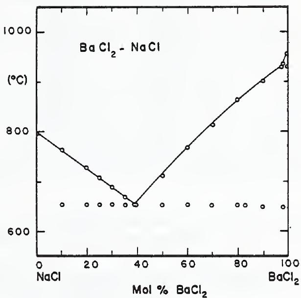  
Figure 91.1. $\mathsf{BaCl}_2$ -NaCl phase diagram

References [1-25]

2. Density (ρ)

Measurement method: Archimedean technique [28]

Equation:

$$
\rho = a + b T \tag {91.1}
$$

precision: in table 91.1 uncertainty: $\sim \pm 1.0\%$

Table 91.1. Parameters of equation (91.1) and precisions   

<table><tr><td>Mol % NaCl</td><td>a</td><td>-b x 103</td><td>Precision</td><td>T range(K)</td></tr><tr><td>40.0</td><td>3.6349</td><td>0.8399</td><td>0.15%</td><td>1040-1120</td></tr><tr><td>47.0</td><td>3.6532</td><td>0.9586</td><td>0.19%</td><td>1040-1120</td></tr><tr><td>54.0</td><td>3.7799</td><td>1.1645</td><td>0.12%</td><td>1000-1120</td></tr><tr><td>57.5</td><td>3.2956</td><td>0.7440</td><td>0.01%</td><td>1000-1070</td></tr><tr><td>60</td><td>3.4208</td><td>0.9123</td><td>0.09%</td><td>990-1100</td></tr><tr><td>61.0</td><td>3.2735</td><td>0.7840</td><td>0.01%</td><td>1000-1070</td></tr><tr><td>64.5</td><td>3.3008</td><td>0.8840</td><td>0.02%</td><td>1000-1070</td></tr><tr><td>67</td><td>3.1909</td><td>0.8150</td><td>0.06%</td><td>990-1110</td></tr><tr><td>68.0</td><td>2.9889</td><td>0.6400</td><td>0.00%</td><td>1000-1070</td></tr><tr><td>71.5</td><td>3.0067</td><td>0.7200</td><td>0.00%</td><td>1000-1070</td></tr><tr><td>74</td><td>2.5799</td><td>0.3698</td><td>0.01%</td><td>1060-1110</td></tr><tr><td>75.0</td><td>2.6709</td><td>0.4680</td><td>0.01%</td><td>1000-1070</td></tr><tr><td>81</td><td>2.6378</td><td>0.5837</td><td>0.09%</td><td>1060-1070</td></tr><tr><td>82.0</td><td>[2.2436]</td><td>[0.2400]</td><td>0.00%</td><td>1050-1070</td></tr><tr><td>89.0</td><td>[2.1654]</td><td>[0.3200]</td><td>0.00%</td><td>1050-1070</td></tr><tr><td>100</td><td>2.2259</td><td>0.640</td><td>0.00%</td><td>1080-1120</td></tr></table>

Table 91.2. Density (g cm $^{-3}$ ) from equations in table 91.1   

<table><tr><td rowspan="2">T(K)</td><td colspan="8">Mo1 % NaCl</td></tr><tr><td>54.0</td><td>57.5</td><td>60.0</td><td>61.0</td><td>64.5</td><td>67.0</td><td>68.0</td><td>71.5</td></tr><tr><td>990</td><td></td><td></td><td>2.518</td><td></td><td></td><td>2.384</td><td></td><td></td></tr><tr><td>1000</td><td>2.615</td><td>2.552</td><td>2.509</td><td>2.490</td><td>2.417</td><td>2.376</td><td>2.349</td><td>2.287</td></tr><tr><td>1010</td><td>2.604</td><td>2.544</td><td>2.499</td><td>2.482</td><td>2.408</td><td>2.368</td><td>2.343</td><td>2.280</td></tr><tr><td>1020</td><td>2.592</td><td>2.537</td><td>2.490</td><td>2.474</td><td>2.399</td><td>2.360</td><td>2.336</td><td>2.272</td></tr><tr><td>1030</td><td>2.580</td><td>2.529</td><td>2.481</td><td>2.466</td><td>2.390</td><td>2.352</td><td>2.330</td><td>2.265</td></tr><tr><td>1040</td><td>2.569</td><td>2.522</td><td>2.472</td><td>2.458</td><td>2.381</td><td>2.343</td><td>2.323</td><td>2.258</td></tr><tr><td>1050</td><td>2.557</td><td>2.514</td><td>2.463</td><td>2.450</td><td>2.373</td><td>2.335</td><td>2.317</td><td>2.251</td></tr><tr><td>1060</td><td>2.546</td><td>2.507</td><td>2.454</td><td>2.442</td><td>2.364</td><td>2.327</td><td>2.310</td><td>2.244</td></tr><tr><td>1070</td><td>2.534</td><td>2.500</td><td>2.445</td><td>2.435</td><td>2.355</td><td>2.319</td><td>2.304</td><td>2.236</td></tr><tr><td>1080</td><td>2.522</td><td></td><td>2.436</td><td></td><td></td><td>2.311</td><td></td><td></td></tr><tr><td>1090</td><td>2.511</td><td></td><td>2.426</td><td></td><td></td><td>2.303</td><td></td><td></td></tr><tr><td>1100</td><td>2.499</td><td></td><td>2.417</td><td></td><td></td><td>2.294</td><td></td><td></td></tr><tr><td>1110</td><td>2.487</td><td></td><td></td><td></td><td></td><td>2.286</td><td></td><td></td></tr><tr><td>1120</td><td>2.476</td><td></td><td></td><td></td><td></td><td></td><td></td><td></td></tr></table>

References [26-31]

# 3. Surface Tension (γ)

Measurement method: maximum bubble pressure [33]

Equation:

$$
\gamma = a + b T \tag {91.2}
$$

precision: in table 91.3 uncertainty: $\sim \pm 3.0\%$

Table 91.3. Parameters of equation (91.2) and precisions   

<table><tr><td>Mol % NaCl</td><td>a</td><td>-b x 102</td><td>Precision</td><td>T range(K)</td></tr><tr><td>20</td><td>235.4</td><td>6.70</td><td>0.20%</td><td>1200-1230</td></tr><tr><td>30</td><td>213.8</td><td>5.50</td><td>0.14%</td><td>1180-1230</td></tr><tr><td>40</td><td>210.7</td><td>5.90</td><td>0.23%</td><td>1100-1240</td></tr><tr><td>50</td><td>197.1</td><td>6.00</td><td>0.10%</td><td>1080-1190</td></tr><tr><td>70</td><td>178.3</td><td>4.80</td><td>0.10%</td><td>1080-1190</td></tr><tr><td>80</td><td>191.3</td><td>6.40</td><td>0.20%</td><td>1080-1180</td></tr></table>

Table 91.4. Surface tension (dyn cm $^{-1}$ ) from equations in table 91.3   

<table><tr><td rowspan="2">T(K)</td><td colspan="6">Mol % NaCl</td></tr><tr><td>20</td><td>30</td><td>40</td><td>50</td><td>70</td><td>80</td></tr><tr><td>1080</td><td></td><td></td><td></td><td>132.7</td><td>126.5</td><td>122.0</td></tr><tr><td>1100</td><td></td><td></td><td></td><td>131.5</td><td>125.6</td><td>120.7</td></tr><tr><td>1120</td><td></td><td></td><td>144.7</td><td>130.3</td><td>124.6</td><td>119.4</td></tr><tr><td>1140</td><td></td><td></td><td>143.5</td><td>129.1</td><td>123.7</td><td>118.1</td></tr><tr><td>1160</td><td></td><td></td><td>142.3</td><td>127.9</td><td>122.7</td><td>116.8</td></tr><tr><td>1180</td><td></td><td>148.8</td><td>141.2</td><td>126.7</td><td>121.7</td><td>115.6</td></tr><tr><td>1200</td><td>155.5</td><td>147.7</td><td>140.0</td><td></td><td></td><td></td></tr><tr><td>1220</td><td>154.1</td><td>146.5</td><td>138.8</td><td></td><td></td><td></td></tr><tr><td>1240</td><td></td><td></td><td>137.6</td><td></td><td></td><td></td></tr></table>

References [32-35]

(91) $\mathrm{BaCl}_2$ -NaCl

4. Viscosity (η)

Measurement method: oscillating sphere technique [28]

Equation:

$$
n = a + b T + c T ^ {2} + d T ^ {3} \tag {91.3}
$$

precision: in table 91.5 uncertainty: $\sim$ $35\%$

Table 91.5. Parameters of equation (91.3) and precisions   

<table><tr><td>NaCl (mol %)</td><td>a</td><td>-b x 102</td><td>-c x 105</td><td>d x 108</td><td>Precision</td><td>T range(K)</td></tr><tr><td>40</td><td>45.232</td><td>2.585</td><td>5.013</td><td>3.541</td><td>0.9%</td><td>1050-1140</td></tr><tr><td>47</td><td>-27.572</td><td>-18.504</td><td>25.252</td><td>9.968</td><td>1.5%</td><td>1030-1140</td></tr><tr><td>54</td><td>48.026</td><td>1.215</td><td>8.274</td><td>5.137</td><td>11.9%</td><td>1000-1140</td></tr><tr><td>60</td><td>36.842</td><td>1.118</td><td>5.828</td><td>3.659</td><td>1.3%</td><td>1000-1140</td></tr><tr><td>67</td><td>32.640</td><td>2.127</td><td>3.196</td><td>2.397</td><td>0.6%</td><td>1000-1140</td></tr><tr><td>74</td><td>34.626</td><td>2.797</td><td>2.448</td><td>2.101</td><td>1.0%</td><td>1000-1140</td></tr><tr><td>81</td><td>33.133</td><td>3.572</td><td>0.658</td><td>1.209</td><td>0.7%</td><td>1030-1140</td></tr></table>

Equation:

$$
\eta = A \exp (E / R T) \tag {91.4}
$$

precision: in .table 91.6 uncertainty: $\sim$ 35%

Table 91.6. Parameters of equation (91.4) and precisions   

<table><tr><td>NaCl (mol %)</td><td>A x 102</td><td>E (cal·mol-1)</td><td>Precision</td></tr><tr><td>100</td><td>1.134</td><td>10553</td><td>1.58%</td></tr></table>

Table 91.7. Viscosity (cp) from equations in tables 91.5 and 91.6   

<table><tr><td rowspan="2">T(K)</td><td colspan="7">Mol % NaCl</td></tr><tr><td>40</td><td>47</td><td>54</td><td>60</td><td>67</td><td>74</td><td>81</td></tr><tr><td>1000</td><td></td><td></td><td>4.51</td><td>3.97</td><td>3.38</td><td>3.19</td><td></td></tr><tr><td>1010</td><td></td><td></td><td>4.28</td><td>3.80</td><td>3.25</td><td>3.05</td><td></td></tr><tr><td>1020</td><td></td><td></td><td>4.06</td><td>3.63</td><td>3.13</td><td>2.92</td><td></td></tr><tr><td>1030</td><td></td><td>4.05</td><td>3.87</td><td>3.48</td><td>3.02</td><td>2.80</td><td>2.57</td></tr><tr><td>1040</td><td></td><td>3.87</td><td>3.68</td><td>3.34</td><td>2.91</td><td>2.69</td><td>2.47</td></tr><tr><td>1050</td><td>3.80</td><td>3.71</td><td>3.51</td><td>3.21</td><td>2.82</td><td>2.59</td><td>2.37</td></tr><tr><td>1060</td><td>3.67</td><td>3.56</td><td>3.36</td><td>3.19</td><td>2.73</td><td>2.50</td><td>2.28</td></tr><tr><td>1070</td><td>3.55</td><td>3.43</td><td>3.23</td><td>2.98</td><td>2.66</td><td>2.41</td><td>2.19</td></tr><tr><td>1080</td><td>3.44</td><td>3.30</td><td>3.11</td><td>2.88</td><td>2.59</td><td>2.33</td><td>2.11</td></tr><tr><td>1090</td><td>3.34</td><td>3.19</td><td>3.00</td><td>2.80</td><td>2.53</td><td>2.26</td><td>2.04</td></tr><tr><td>1100</td><td>3.26</td><td>3.10</td><td>2.92</td><td>2.73</td><td>2.48</td><td>2.20</td><td>1.97</td></tr><tr><td>1110</td><td>3.19</td><td>3.02</td><td>2.85</td><td>2.67</td><td>2.44</td><td>2.15</td><td>1.91</td></tr><tr><td>1120</td><td>3.13</td><td>2.96</td><td>2.80</td><td>2.62</td><td>2.40</td><td>2.11</td><td>1.86</td></tr><tr><td>1130</td><td>3.09</td><td>2.91</td><td>2.77</td><td>2.59</td><td>2.38</td><td>2.08</td><td>1.81</td></tr><tr><td>1140</td><td>3.06</td><td>2.88</td><td>2.75</td><td>2.57</td><td>2.37</td><td>2.05</td><td>1.77</td></tr></table>

References [27,28,36]

# 5. Electrical Conductance (K)

Measurement method: classical ac technique [38]

Equation:

$$
\kappa = a + b T + c T ^ {2} \tag {91.5}
$$

precision: in table 91.8 uncertainty: $\sim \pm 3.0\%$

Table 91.8. Parameters of equation (91.5) and precisions   

<table><tr><td>Mol % NaCl</td><td>-a</td><td>b x 103</td><td>-c x 106</td><td>Precision</td><td>T range(K)</td></tr><tr><td>16.5</td><td>7.5250</td><td>12.250</td><td>3.5782</td><td>0.65%</td><td>1200-1400</td></tr><tr><td>32.5</td><td>11.2053</td><td>18.833</td><td>6.2943</td><td>0.83%</td><td>1160-1340</td></tr><tr><td>52</td><td>4.6329</td><td>8.854</td><td>2.4643</td><td>0.40%</td><td>1020-1300</td></tr><tr><td>64.6</td><td>6.6683</td><td>12.884</td><td>4.2384</td><td>0.62%</td><td>960-1300</td></tr><tr><td>76.05</td><td>3.3793</td><td>8.140</td><td>2.4368</td><td>1.33%</td><td>1020-1300</td></tr><tr><td>87</td><td>3.7821</td><td>9.225</td><td>2.8480</td><td>0.31%</td><td>1080-1380</td></tr></table>

# (91) $\mathrm{BaCl}_2$ -NaCl

Table 91.9. Specific conductance $(ohm^{-1}cm^{-1})$ from equations in table 91.8   

<table><tr><td rowspan="2">T(K)</td><td colspan="6">Mo1 % NaCl</td></tr><tr><td>16.5</td><td>32.5</td><td>52</td><td>64.6</td><td>76.05</td><td>87</td></tr><tr><td>960</td><td></td><td></td><td></td><td>1.78</td><td></td><td></td></tr><tr><td>1000</td><td></td><td></td><td></td><td>1.96</td><td></td><td></td></tr><tr><td>1040</td><td></td><td></td><td>1.91</td><td>2.13</td><td>2.45</td><td></td></tr><tr><td>1080</td><td></td><td></td><td>2.05</td><td>2.29</td><td>2.57</td><td>2.86</td></tr><tr><td>1120</td><td></td><td></td><td>2.19</td><td>2.43</td><td>2.68</td><td>2.98</td></tr><tr><td>1160</td><td></td><td>2.17</td><td>2.32</td><td>2.56</td><td>2.78</td><td>3.09</td></tr><tr><td>1200</td><td>2.02</td><td>2.33</td><td>2.44</td><td>2.67</td><td>2.88</td><td>3.19</td></tr><tr><td>1240</td><td>2.16</td><td>2.47</td><td>2.56</td><td>2.78</td><td>2.97</td><td>3.28</td></tr><tr><td>1280</td><td>2.29</td><td>2.59</td><td>2.66</td><td>2.86</td><td>3.05</td><td>3.36</td></tr><tr><td>1320</td><td>2.41</td><td>2.69</td><td></td><td></td><td></td><td>3.43</td></tr><tr><td>1360</td><td>2.52</td><td></td><td></td><td></td><td></td><td>3.50</td></tr><tr><td>1400</td><td>2.61</td><td></td><td></td><td></td><td></td><td></td></tr></table>

References [27-29,34,36-38]

# 6. Safety and Hazards

# A. Hazard rating

(i) Toxicity: NaCl, permitted in foods; $\mathsf{BaCl}_2$ , toxic (orally).   
(ii) Vapor pressure: NaCl at m.pt. $(800^{\circ}\mathrm{C})\sim 0.34\mathrm{mm};$ BaCl2 at m.pt. $(962^{\circ}\mathrm{C})\sim <  0.5\mathrm{mm}.$

# B. Disaster hazards

(i) Molten salt bath "explosions": i.e., explosive generation of steam due to bulk water "carry-over" and/or equipment failure; i.e., explosive expansion of "trapped" air.   
(ii) Chlorides evolve highly toxic fumes when heated to decomposition, or contacted with acids.

References [39-45]

# 7. Corrosion

Table 91.10. Corrosion studies from primary research literature   

<table><tr><td colspan="2">Studies</td><td>References</td></tr><tr><td rowspan="4">A</td><td>Zr</td><td>[46]</td></tr><tr><td>Fe, steels</td><td>[47-51]</td></tr><tr><td>Ti, Zr, Hf, ThCl4</td><td>[52]</td></tr><tr><td>Pb, Pb-Bi</td><td>[53]</td></tr><tr><td rowspan="9">B</td><td>Mo</td><td>[54]</td></tr><tr><td>Armco Fe</td><td>[55-57]</td></tr><tr><td>NiCr</td><td>[58]</td></tr><tr><td>Ti, Zr, Hf, ThCl4</td><td>[52]</td></tr><tr><td>Cr</td><td>[59]</td></tr><tr><td>Cr, Fe-Cr</td><td>[60]</td></tr><tr><td>Ni alloys</td><td>[61]</td></tr><tr><td>Ni-Cr-Al, Ni-Cr-W-Fe, Ni-Cr, Mg, Ni, Zr, Ti</td><td>[62]</td></tr><tr><td>Au, Pt, Mg0, Al2O3, Zirconia (NaCl with added Na2O)</td><td>[63]</td></tr><tr><td rowspan="4">C</td><td>Electrochemical aspects of corrosion</td><td>[64,65]</td></tr><tr><td>Corrosion - annotated biblio.</td><td>[66]</td></tr><tr><td>Thermodynamic redox potentials (diagrammatic analysis)</td><td>[62,67,68]</td></tr><tr><td>Reviews: corrosion in molten salts</td><td>[69-71]</td></tr></table>

Compatibility studies: A: principally molten $\mathsf{BaCl}_2$ ; B: principally molten NaCl; C: basic principles, reviews, biblios. No compatibility studies specific for molten $\mathsf{BaCl}_2$ -NaCl mixtures.

References [46-71]

8. Diffusion No data   
9. Heat of Fusion $(\Delta H_{f}^{o})$ No data   
10. Heat Capacity (Cp) No data

11. Volume Change on Melting $(\Delta V_{f})$

Measurement method: estimated from densities [72]

Table 91.11. Volume change on melting   

<table><tr><td>Binary eutectic (mol % NaCl)</td><td>(ΔVf/Vs)</td><td>Uncertainty</td></tr><tr><td>61</td><td>3.7%</td><td>~ ± 10%</td></tr></table>

References [72]

12. Vapor Pressure $(p_{vap})$

No data

13. Thermal Conductivity (liquid) $(\lambda_{\ell})$

No data

14. Thermal Conductivity (solid) $(\lambda_{s})$

No data

15. Cryoscopic Constant $(k_{f})$

No data

16. References

[1] Gemsky, H., Neues Jahrb. Mineral., Geol., Palaontol., Beil. Band., 36, 513 (1913); J. Chem. Soc. (Lond.), 106, 51 (1913).   
[2] Nishihara, K., Shimizu, Y., Mouta, M., J. Electrochem. Soc. Japan, 19, 105 (1951).   
[3] Vereshchetina, I. P., Luzhnaya, N. P., Izv. Sekt. Fiz. Khim. Anal., Obshch. Neorg., Akad. Nauk, SSSR, 25, 188 (1954).   
[4] Vortisch, E., J. Chem. Soc., 106, 636 (1914).   
[5] Zakharchenko, M. A., Aslanov, S. M., Zhur. Neorg. Khim., 8, 797 (1963).   
[6] Vortisch, E., Neues Jagr. Miner., Geol. Palaeon. Beilage-Band (Stuttgart), 38, 185 (1914).   
[7] Bergman, A. G., Pavlenko, S. P., Compt. Rend. Acad. Sci., URSS, 27, 972 (1940).   
[8] Belyaev, I. N., Sholokhovich, M. L., Sbornik Statei Obshchei Khim., Akad. Nauk SSSR, I, 134 (1953).   
[9] Gromakov, S. D., Gromakova, L. M., Zhur. Fiz. Khim., 29, 745 (1955).   
[10] Bergman, A. G., Banashek, E. I., Isv. Sek. Fiz.-Khim. Anal., Akad. Nauk SSSR, 22, 196 (1953).   
[11] Belyaev, I. N., Sholokhovich, M. L., Sbornik Statei Obshchei Khim., Akad. Nauk SSSR, 1, 134 (1953).

# (91) $\mathrm{BaCl}_2$ -NaCl

[12] Janz, G. J. Downey, J. R., Jr., Allen, C. B., and Tomkins, R. P. T., "Eutectic Data" - 2 Vols; ERDA-TID-27163-P1 & P2; NTIS, Washington, D. C. (1977).   
[13] Janz, G. J., Downey, J. R., Jr., Allen, C. B., and Tomkins, R. P. T., "Physical Properties Data Complications Relevant to Energy Storage. I. Molten Salts: Eutectic Data", NSRDS-NBS-61; U. S. Gov't Printing Office, Washington, D. C. (1978).   
[14] "International Critical Tables of Numerical Data, Physics, Chemistry, and Technology", 8 Vols., McGraw-Hill Book Co., N. Y. (1933).   
[15] "Landolt-Bornstein Zahlenwert und Funktionen aus Physik, Chemie, Astronomie, Geophysik und Technik", (10th Ed.) Springer-Verlag, Berlin, Heidelberg, N. Y. (1961).   
[16] Clark, P. V., "Fused Salt Mixtures: Eutectic Compositions and Melting Points Bibliography 1907-1968", Report No. SC-R-68-1680; Sandia Laboratories (1968), NTIS.   
[17] Robertson, W. D., "Binary Phase Diagrams of Halide Salts", Report No. Yale 2723 (2 Vols.), U. S. AEC Contract AT (30-1)-2723 (1966), NTIS.   
[18] Thoma, R. E., "Phase Diagrams of Nuclear Reactor Materials", Oak Ridge National Laboratory, ORNL-2548, Contract No. W-7405-eng-26.   
[19] Thoma, R. E., "Phase Diagrams of Binary and Ternary Fluoride Systems", Chapt. 6; Adv. Molten Salts Chemistry, Vol. 3 (J. Braunstein, G. Mamantov, and G. P. Smith, eds.), Plenum Press, N. Y. (1975).   
[20] Voskresenskaya, N. K., ed., "Handbook of Solid-Liquid Equilibria in Systems of Inorganic Salts", Volumes 1, 2, Izc. Akad. Nauk SSSR, Moscow (1961). Israel Program for Scientific Translations, Jerusalem, 1970 (NTIS).   
[21] Sinistri, C., Franzozini, P., and Rolla, M., "An Atlas of Miscibility Gaps in Molten Salt Systems", Institute of Physical Chemistry, University of Pavia (Italy) (1968).   
[22] Shaffer, P. T. B., "High Temperature Materials", Plenum Press Handbooks of High Temperature Materials, No. 1, Materials Index, Plenum Press, New York, 1964.   
[23] Franzozini, P., Ferloni, P., and Spinolo, C., "Molten Salts with Organic Anions", Instituto di Chimica Fisica, Universita di Pavia (Italy), 1973.   
[24] Toropov, N. A. et al., "Handbook of Phase Diagrams of the Silicates, Volume 1: Binary Systems, Volume 2, Metal-Oxygen Compounds in Silicate Systems", Izdatel'stov "Nauka" Leningradskoe Otdelenie, Leningrad, 1969, Israel Program for Scientific Translations, Jerusalem, 1972 (NTIS).   
[25] Levin, E., et al., "Phase Diagrams for Ceramists", Aliter. Ceramic Soc. (publ.), Columbus, Ohio (1964; 1969).   
[26] Abramov, G. A., Legki, Metally., 5, 27 (1936).   
[27] Barzakovskii, V. P., Izv. Sekt. Fiz. Khim., 5, 825 (1940).   
[28] Vereshchetina, I. P., and Luzhnaya, N. P., Izc. Sekt. Fiz. Khim. Anal., 25, 188 (1954).   
[29] Luzhnaya, N. P., Evseeva, N. N., and Vereshchetina, N. P., Zhur. Neorg. Khim., I, 1490 (1956); Russ. J. Inorg. Chem., I, 35 (1956).   
[30] Bukhalova, G. A., and Yagub'yan, E. S., Russ. J. Inorg. Chem., 10, 1161 (1965).

(91) $\mathrm{BaCl}_2$ -NaCl   
[31] Bukhalova, G. A., and Yagub'yan, E. S., Russ. J. Inorg. Chem., 13, 1162 (1968).   
[32] Bertozzi, G., and Soldani, G., J. Phys. Chem. 70, 1838 (1966), J. Electrochem. Soc. 111, 1355 (1964).   
[33] Sokolova, T. D., and Voskresenskaya, N. K., Russ. J. Phys. Chem. 36, 502 (1962).   
[34] Bondarenko, N. V., and Strelets, Kh. L., J. Appl. Chem. (USSR) 1224 (1962), Zhur. Priklad. Khim. 35,   
[35] Barzakovskii, V. P., Izv. Akad. Nauk. S.S.S.R. Otdel. Khim. Nauk. 5, 1940.   
[36] Bondarenko, N. V., and Strelets, Kh. L., J. Appl. Chem. (USSR) 1254 (1965), Zhur. Priklad. Khim. 38, 1273 (1965).   
[37] Alabyshev, A. F., and Kulakovskaya, N. Ya., Trudy, Leningrad. Tekhnol. Inst. Im. Leningrad. Soveta, 12, 152 (1946).   
[38] Barzakovskii, V. P., Leningrad. Gos. Inst. Prik. Khim. Sbornik Rabot., 33, 5 (1940).   
[39] "Dangerous Properties of Materials", Sax, N. I., Van Nostrand Reinhold Co., N. Y. (1969)   
[40] "Registry of Toxic Effects of Chemical Substances", Christensen, H. E., and Lubinbyhl, T. T., eds., U. S. Dept. H. E. W., U. S. Gov't Printing Office, Washington, D. C. (1975)   
[41] Janz, G. J., et al., "Physical Properties Data Complications Relevant to Energy Storage. Part II. Molten Salts: Data on Single and Multi-Component Salt Systems", NSRDS-NBS 61, Part II (April 1979), U. S. Gov't Printing Office, Supt of Doc. No. C13-48-61, Washington D. C. 20402.   
[42] "Potential Hazards in Molten Salt Baths for Heat Treatment of Metals", National Board of Fire Underwriters Research Report No. 2 (1954)   
[43] "Handbook of Reactive Chemical Hazards", Bretherwick, L., Butterworth Co., London (1975)   
[44] Janz, G. J., Tomkins, R. P. T., Downey, J. R., Jr., and Allen, C. B., "Safety and Hazards, Chapter in "Eutectic Data", ERDA TID-27163-P1; NTIS, U. S. Dept. Commerce, Springfield, Va. (1977)   
[45] vide: this work, System 54, BaCl $_2$ .   
[46] Thai, V., Ozeryanaya, I. N., and Smirnov, M. V., Tri. Inst. Elektrokhim., Ural. Nauch. Tsentr. Akad. Nauk SSSR, 19, 69 (1973).   
[47] Kochergin, V. P., Khaibuilina, V. P., and Potapova, O. G., Zh. Neorg. Khim., 1, 2617 (1956).   
[48] Jackson, J. H. and LaChance, M. H., Trans. Am. Soc. Metals, 16, 157 (1954).   
[49] Kochergin, V. P., Putina, O. A., Devyatkin, V. N., and Kanaeva, E. T., Tr. Vses. Nauch. Issled. Proekt. Inst. Alyum., Magn. Electrodn., 75, 51 (1971).   
[50] Kochergin, V. P., Kabirov, A. V., Skornyakova, O. N., J. Appl. Chem. USSR, 27, 883 (1954).

(91) $\mathrm{BaCl}_2$ -NaCl   
[51] Kochergin, V. P., Druzhinina, E. P., Men'shenina, G. V., Asanova, E. P., Zh. Prikl. Khim., 33, 1580 (1960).   
[52] Smirnov, M. V., Kudyakov, V. Ya., Loginov, Ya. A., Rossokhin, E. G., Posokhin, Yu. V., and Puzanova, T. A., Fiz. Khim. Elektrokhim. Rasplav. Solei Shlakov, 1, 115 (1969).   
[53] Vasin, B. D., Nichkov, I. F., and Raspopin, S. P., Izv. Vyssh. Ucheb. Zaved., Tsvet. Met., 15, 102 (1972).   
[54] Ozeryanaya, I. N., Zalazinskii, G. G., Smirnov, M. V., Finkel'shtein, S. D., and Shamanova, N. D., Zashch. Metal., 11, 66 (1975).   
[55] Kochergin, V. P., and Ignat'eva, N. I., Russ. J. Inorg. Chem., 6(9), 1085 (1961).   
[56] Kochergin, V. P., and Shevrina, Z., Uch. Zap. Ural. Gos. Univ., 92, 3 (1969).   
[57] Kochergin, V. P., et al., Zhur. Priklad. Khim., 34(6), 1258 (1961); ibid., 37(8), 1837 (1964).   
[58] Seybolt, A. U., Oxid. Metals, 2, 119 (1970).   
[59] Krasil'nikova, N. A., Ozeryanaya, I. N., and Smirnov, M. V., Zashch. Metal., 17, 446 (1974).   
[60] Krasil'nikova, N. A., Ozeryanaya, I. N., Smirnov, M. V., and Shamanova, N. D., Zashch. Metal., 10, 446 (1974).   
[61] Bogdanov, N. I., Varganov, B. Ya., and Kholomonova, N. D., Zh. Prikl. Khim. (Leningrad), 46, 1698 (1973).   
[62] Littlewood, R., J. Electrochem. Soc., 109, 525 (1962).   
[63] Stern, K. H., Panayappan, R., and Flinn, D. R., "Proceedings Intern. Symp. Molten Salts", The Electrochem. Soc., Princeton, N. J., p. 64 (1976).   
[64] Pizzini, S., "Materials Problems in the Industrial Applications of Molten Salts", Proceedings of the European Conference on the Development of Molten Salts Applications", p. 203 (1973); Battelle, Geneva:   
[65] Johnson, K. E., "Electrochemical Approaches to Corrosion in Molten Salts", Proceedings International Symposium on Metal-Slag-Gas Reactions and Processes, The Electrochemical Society Inc., Princeton, N. J., p. 581 (1975).   
[66] Janz, G. J., and Tomkins, R. P. T., Corrosion, 35, 485 (1979).   
[67] Edeleanu, C., and Littlewood, R., Electrochimica Acta, 3, 195 (1960).   
[68] Littlewood, R., and Argent, E. A., Electrochimica Acta, 4, 114 (1961).   
[69] Smirnov, M. V., and Ozeryanaya, I. N., Nauki Tekh. Korros. Zashch. Korros., 2, 171 (1973).   
[70] Ketelaar, J. A. A., Chemie. Ing. Techn., 45, 667 (1973).   
[71] Inman, D., and Wrench, N. S., Brit. Corr. J., 1, 246 (1966).   
[72] Janz, G. J., et al. (MSDC-RPI), unpublished work (1980).

1. Melting Temperatures $(T_{m})$

Pure substance melting points:

KCl: $770^{\circ} \mathrm{C}$

MgCl2: 714°C

Eutectic melting point:

E1: ~ 435°C, composition: 30 mol % MgCl2

E 2: ~ $435^{\circ} \mathrm{C}$ , composition: 36 mol % MgCl 2

E3: ~ 470°C, composition: 58 mol % MgCl2

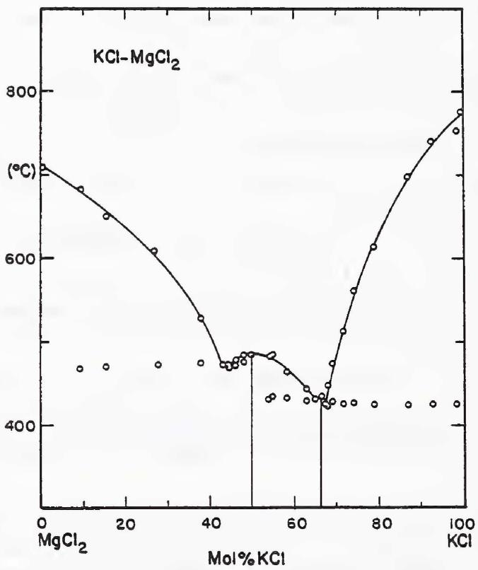  
Figure 92.1. KCl-MgCl $_2$ phase diagram

References [1-21]

2. Density (p)

Measurement method: Archimedean technique [26]

Equation:

$$
\rho = a + b T \tag {92.1}
$$

precision: in table 92.1

uncertainty: $\sim \pm 1.5\%$

# (92) KCl-MgCl 2

Table 92.1. Parameters of equation (92.1) and precisions   

<table><tr><td>Mol % MgCl2</td><td>a</td><td>-b x 104</td><td>Precision</td><td>T range(K)</td></tr><tr><td>6.6</td><td>2.1380</td><td>5.840</td><td>0.04%</td><td>1050-1140</td></tr><tr><td>12.0</td><td>2.1561</td><td>6.062</td><td>0.04%</td><td>1080-1140</td></tr><tr><td>25.0</td><td>2.0796</td><td>5.327</td><td>0.02%</td><td>1050-1120</td></tr><tr><td>32.8</td><td>2.0007</td><td>4.571</td><td>0.03%</td><td>1030-1140</td></tr><tr><td>42.2</td><td>2.1387</td><td>5.550</td><td>0.02%</td><td>1030-1140</td></tr><tr><td>50.3</td><td>2.0998</td><td>5.029</td><td>0.05%</td><td>1080-1170</td></tr><tr><td>53.5</td><td>2.1900</td><td>5.705</td><td>0.05%</td><td>1060-1130</td></tr><tr><td>61.7</td><td>2.1923</td><td>5.563</td><td>0.01%</td><td>1060-1140</td></tr><tr><td>66.3</td><td>2.1587</td><td>5.086</td><td>0.04%</td><td>1050-1120</td></tr><tr><td>67.5</td><td>2.2582</td><td>6.008</td><td>0.02%</td><td>1060-1160</td></tr><tr><td>77.4</td><td>2.2238</td><td>5.392</td><td>0.01%</td><td>1060-1130</td></tr><tr><td>90.0</td><td>2.0844</td><td>3.937</td><td>0.01%</td><td>1060-1110</td></tr></table>

Table 92.2. Density (g cm $^{-3}$ ) from equations in table 92.1   

<table><tr><td rowspan="2">T(K)</td><td colspan="7">Mo1 % MgCl2</td></tr><tr><td>25.0</td><td>32.8</td><td>42.2</td><td>50.3</td><td>53.5</td><td>61.7</td><td>66.3</td></tr><tr><td>1030</td><td></td><td>1.530</td><td>1.567</td><td></td><td></td><td></td><td></td></tr><tr><td>1040</td><td></td><td>1.525</td><td>1.562</td><td></td><td></td><td></td><td></td></tr><tr><td>1050</td><td>1.520</td><td>1.521</td><td>1.556</td><td></td><td></td><td></td><td>1.625</td></tr><tr><td>1060</td><td>1.515</td><td>1.516</td><td>1.550</td><td></td><td>1.585</td><td>1.603</td><td>1.620</td></tr><tr><td>1070</td><td>1.510</td><td>1.512</td><td>1.545</td><td></td><td>1.580</td><td>1.597</td><td>1.614</td></tr><tr><td>1080</td><td>1.504</td><td>1.507</td><td>1.539</td><td>1.557</td><td>1.574</td><td>1.591</td><td>1.609</td></tr><tr><td>1090</td><td>1.499</td><td>1.502</td><td>1.534</td><td>1.552</td><td>1.568</td><td>1.586</td><td>1.604</td></tr><tr><td>1100</td><td>1.494</td><td>1.498</td><td>1.528</td><td>1.547</td><td>1.562</td><td>1.580</td><td>1.599</td></tr><tr><td>1110</td><td>1.488</td><td>1.493</td><td>1.523</td><td>1.542</td><td>1.557</td><td>1.575</td><td>1.594</td></tr><tr><td>1120</td><td>1.483</td><td>1.489</td><td>1.517</td><td>1.537</td><td>1.551</td><td>1.569</td><td>1.589</td></tr><tr><td>1130</td><td></td><td>1.484</td><td>1.512</td><td>1.532</td><td>1.545</td><td>1.564</td><td></td></tr><tr><td>1140</td><td></td><td>1.480</td><td>1.506</td><td>1.526</td><td></td><td>1.558</td><td></td></tr><tr><td>1150</td><td></td><td>1.475</td><td></td><td>1.521</td><td></td><td></td><td></td></tr><tr><td>1160</td><td></td><td></td><td></td><td></td><td></td><td></td><td></td></tr><tr><td>1170</td><td></td><td></td><td></td><td></td><td></td><td></td><td></td></tr></table>

References [22-31]

# 3. Surface Tension (γ)

Measurement method: maximum bubble pressure [34]

Equation:

$$
\gamma = a + b T \tag {92.2}
$$

precision: in table 92.3

uncertainty: $\sim \pm 2\%$

# (92) KCl-MgCl 2

Table 92.3. Parameters of equation (92.2) and precisions   

<table><tr><td>Mol % MgCl2</td><td>a</td><td>-b x 102</td><td>Precision</td><td>T range(K)</td></tr><tr><td>10</td><td>160.4</td><td>6.60</td><td>*</td><td>980-1160</td></tr><tr><td>20</td><td>147.7</td><td>5.80</td><td>*</td><td>980-1160</td></tr><tr><td>30</td><td>133.0</td><td>4.80</td><td>*</td><td>980-1160</td></tr><tr><td>40</td><td>119.3</td><td>3.80</td><td>*</td><td>980-1160</td></tr><tr><td>50</td><td>123.0</td><td>4.30</td><td>*</td><td>980-1160</td></tr><tr><td>60</td><td>116.3</td><td>3.80</td><td>*</td><td>980-1160</td></tr><tr><td>70</td><td>109.5</td><td>3.30</td><td>*</td><td>980-1160</td></tr><tr><td>80</td><td>100.7</td><td>2.70</td><td>*</td><td>980-1160</td></tr><tr><td>90</td><td>91.2</td><td>2.10</td><td>*</td><td>980-1160</td></tr></table>

\* not estimated; insufficient data

Table 92.4. Surface tension (dyn cm $^{-1}$ ) from equations in table 92.3   

<table><tr><td rowspan="2">T(K)</td><td colspan="5">\( Mo1\ \%\ MgCl_2 \)</td></tr><tr><td>30</td><td>40</td><td>50</td><td>60</td><td>70.</td></tr><tr><td>980</td><td>86.0</td><td>82.1</td><td>80.9</td><td>79.1</td><td>77.2</td></tr><tr><td>990</td><td>85.5</td><td>81.7</td><td>80.4</td><td>78.7</td><td>76.8</td></tr><tr><td>1000</td><td>85.0</td><td>81.3</td><td>80.0</td><td>78.3</td><td>76.5</td></tr><tr><td>1010</td><td>84.5</td><td>80.9</td><td>79.6</td><td>77.9</td><td>76.2</td></tr><tr><td>1020</td><td>84.0</td><td>80.5</td><td>79.1</td><td>77.5</td><td>75.8</td></tr><tr><td>1030</td><td>83.6</td><td>80.2</td><td>78.7</td><td>77.2</td><td>75.5</td></tr><tr><td>1040</td><td>83.1</td><td>79.8</td><td>78.3</td><td>76.8</td><td>75.2</td></tr><tr><td>1050</td><td>82.6</td><td>79.4</td><td>77.9</td><td>76.4</td><td>74.9</td></tr><tr><td>1060</td><td>82.1</td><td>79.0</td><td>77.4</td><td>76.0</td><td>74.5</td></tr><tr><td>1070</td><td>81.6</td><td>78.6</td><td>77.0</td><td>75.6</td><td>74.2</td></tr><tr><td>1080</td><td>81.2</td><td>78.3</td><td>76.6</td><td>75.3</td><td>73.9</td></tr><tr><td>1090</td><td>80.7</td><td>77.9</td><td>76.1</td><td>74.9</td><td>73.5</td></tr><tr><td>1100</td><td>80.2</td><td>77.5</td><td>75.7</td><td>74.5</td><td>73.2</td></tr><tr><td>1110</td><td>79.7</td><td>77.1</td><td>75.3</td><td>74.1</td><td>72.9</td></tr><tr><td>1120</td><td>79.2</td><td>76.7</td><td>74.8</td><td>73.7</td><td>72.5</td></tr><tr><td>1130</td><td>78.8</td><td>76.4</td><td>74.4</td><td>73.4</td><td>72.2</td></tr><tr><td>1140</td><td>78.3</td><td>76.0</td><td>74.0</td><td>73.0</td><td>71.9</td></tr><tr><td>1150</td><td>77.8</td><td>75.6</td><td>73.6</td><td>72.6</td><td>71.6</td></tr><tr><td>1160</td><td>77.3</td><td>75.2</td><td>73.1</td><td>72.2</td><td>71.2</td></tr><tr><td>1170</td><td>76.8</td><td>74.8</td><td>72.7</td><td>71.8</td><td>70.9</td></tr><tr><td>1180</td><td></td><td></td><td></td><td></td><td></td></tr></table>

References [32-36]

# 4. Viscosity (n)

Measurement method: oscillating sphere technique [26]

Equation:

$$
\eta = a + b T + c T ^ {2} + d T ^ {3} \tag {92.3}
$$

precision: in table 92.5

uncertainty: $\sim \pm 15\%$

Table 92.5. Parameters of equation (92.3) and precisions   

<table><tr><td>MgCl2(mol%)</td><td>a</td><td>-b x 102</td><td>c x 105</td><td>d x 109</td><td>Precision</td><td>T range(K)</td></tr><tr><td>8.0</td><td>22.743</td><td>2.808</td><td>-0.133</td><td>8.032</td><td>2.8%</td><td>1030-1180</td></tr><tr><td>16.4</td><td>8.033</td><td>0.543</td><td>-0.663</td><td>5.201</td><td>1.3%</td><td>950-1100</td></tr><tr><td>32.4</td><td>9.346</td><td>2.253</td><td>2.501</td><td>-10.455</td><td>2.1%</td><td>900-1030</td></tr><tr><td>34.3</td><td>12.051</td><td>2.018</td><td>1.069</td><td>-1.335</td><td>0.4%</td><td>910-1090</td></tr><tr><td>49.9</td><td>[94.173]</td><td>[25.555]</td><td>[23.547]</td><td>[-72.802]</td><td></td><td>980-1140</td></tr></table>

Equation:

$$
n = A \exp (E / R T) \tag {92.4}
$$

precision: in table 92.6

uncertainty: $\sim \pm 15\%$

Table 92.6. Parameters of equation (92.4) and precisions   

<table><tr><td>MgCl2(mol %)</td><td>A x 102</td><td>E(cal mol-1)</td><td>Precision</td><td>T range(K)</td></tr><tr><td>25.1</td><td>11.894</td><td>4508</td><td>3.6%</td><td>900-1080</td></tr><tr><td>43.9</td><td>7.757</td><td>5469</td><td>2.5%</td><td>900-1040</td></tr><tr><td>54.0</td><td>17.399</td><td>4025</td><td>4.4%</td><td>970-1060</td></tr></table>

Table 92.7. Viscosity (cp) from equations in tables 92.5 and 92.6   

<table><tr><td rowspan="2">T(K)</td><td colspan="8">\( \mathrm {M o l}\% \mathrm {M g C l}_{2} \)</td></tr><tr><td>8.0</td><td>16.4</td><td>25.1</td><td>32.4</td><td>34.3</td><td>43.9</td><td>49.9</td><td>54.0</td></tr><tr><td>900</td><td></td><td></td><td>1.48</td><td>1.71</td><td></td><td>1.65</td><td></td><td></td></tr><tr><td>920</td><td></td><td></td><td>1.40</td><td>1.65</td><td>1.49</td><td>1.54</td><td></td><td></td></tr><tr><td>940</td><td></td><td></td><td>1.33</td><td>1.58</td><td>1.42</td><td>1.45</td><td></td><td></td></tr><tr><td>960</td><td></td><td>1.31</td><td>1.26</td><td>1.52</td><td>1.35</td><td>1.36</td><td></td><td></td></tr><tr><td>980</td><td></td><td>1.24</td><td>1.20</td><td>1.45</td><td>1.28</td><td>1.29</td><td>(1.36)</td><td>1.37</td></tr><tr><td>1000</td><td></td><td>1.18</td><td>1.15</td><td>1.37</td><td>1.23</td><td>1.22</td><td>(1.29)</td><td>1.32</td></tr><tr><td>1020</td><td></td><td>1.12</td><td>1.10</td><td>1.29</td><td>1.17</td><td>1.15</td><td>(1.24)</td><td>1.27</td></tr><tr><td>1040</td><td>1.14</td><td>1.07</td><td>1.05</td><td></td><td>1.12</td><td>1.09</td><td>(1.20)</td><td>1.22</td></tr><tr><td>1060</td><td>1.05</td><td>1.02</td><td>1.01</td><td></td><td>1.08</td><td></td><td>(1.16)</td><td>1.18</td></tr><tr><td>1080</td><td>0.98</td><td>0.99</td><td>0.97</td><td></td><td>1.04</td><td></td><td>(1.12)</td><td></td></tr><tr><td>1100</td><td>0.94</td><td>0.96</td><td></td><td></td><td></td><td></td><td>(1.09)</td><td></td></tr><tr><td>1120</td><td>0.91</td><td></td><td></td><td></td><td></td><td></td><td>(1.05)</td><td></td></tr><tr><td>1140</td><td>0.90</td><td></td><td></td><td></td><td></td><td></td><td>(1.01)</td><td></td></tr><tr><td>1160</td><td>0.92</td><td></td><td></td><td></td><td></td><td></td><td></td><td></td></tr></table>

The values in ( ) are based on a minimal data set

References [26,28,33,37-41]

# 5. Electrical Conductance (K)

Measurement method: classical ac technique [47]

Equation:

$$
\kappa = a + b T + c T ^ {2} \tag {92.5}
$$

precision: in table 92.8

uncertainty: $\sim \pm 5.0\%$

Table 92.8. Parameters of equation (92.5) and precisions   

<table><tr><td>Mol % MgCl2</td><td>-a</td><td>b x 103</td><td>c x 106</td><td>Precision</td><td>T range(K)</td></tr><tr><td>18.5</td><td>7.6274</td><td>15.958</td><td>-6.959</td><td>0.04%</td><td>880-1020</td></tr><tr><td>22.0</td><td>5.220</td><td>10.975</td><td>-4.417</td><td>0.08%</td><td>830-1020</td></tr><tr><td>24.5</td><td>3.2951</td><td>6.944</td><td>-2.326</td><td>0.58%</td><td>830-1020</td></tr><tr><td>31.8</td><td>1.3943</td><td>2.993</td><td>-0.318</td><td>0.10%</td><td>830-1020</td></tr><tr><td>34.0</td><td>1.0872</td><td>2.2795</td><td>0.084</td><td>0.04%</td><td>830-1020</td></tr><tr><td>37.0</td><td>1.1279</td><td>2.402</td><td>0</td><td>0.05%</td><td>830-1020</td></tr><tr><td>39.9</td><td>0.8689</td><td>1.907</td><td>0.228</td><td>0.14%</td><td>830-1020</td></tr><tr><td>45.5</td><td>0.9227</td><td>2.184</td><td>0</td><td>0.48%</td><td>830-1020</td></tr><tr><td>48.8</td><td>0.9039</td><td>2.160</td><td>0</td><td>0.21%</td><td>830-1020</td></tr><tr><td>52.0</td><td>2.9434</td><td>6.363</td><td>-2.152</td><td>0.70%</td><td>830-1020</td></tr><tr><td>58.8</td><td>1.0490</td><td>2.450</td><td>-0.145</td><td>0.06%</td><td>830-1020</td></tr><tr><td>72.1</td><td>0.5571</td><td>1.486</td><td>0.297</td><td>0.07%</td><td>880-1020</td></tr><tr><td>84.0</td><td>[0.1479]</td><td>[0.024]</td><td>[1.000]</td><td>0.00%</td><td>930-1020</td></tr></table>

Table 92.9. Specific conductance $(ohm^{-1}cm^{-1})$ from equations in table 92.8   

<table><tr><td rowspan="2">T(K)</td><td colspan="7">\( Mol\ \% \ MgCl_2 \)</td></tr><tr><td>31.8</td><td>34.0</td><td>37.0</td><td>45.5</td><td>48.8</td><td>52.0</td><td>58.8</td></tr><tr><td>830</td><td>0.871</td><td>0.863</td><td>0.866</td><td>0.890</td><td>0.899</td><td>0.856</td><td>0.885</td></tr><tr><td>850</td><td>0.920</td><td>0.911</td><td>0.914</td><td>0.934</td><td>0.932</td><td>0.910</td><td>0.929</td></tr><tr><td>870</td><td>0.969</td><td>0.959</td><td>0.962</td><td>0.977</td><td>0.975</td><td>0.964</td><td>0.973</td></tr><tr><td>890</td><td>1.018</td><td>1.008</td><td>1.010</td><td>1.021</td><td>1.019</td><td>1.015</td><td>1.017</td></tr><tr><td>910</td><td>1.066</td><td>1.057</td><td>1.058</td><td>1.065</td><td>1.062</td><td>1.065</td><td>1.060</td></tr><tr><td>930</td><td>1.114</td><td>1.105</td><td>1.106</td><td>1.108</td><td>1.105</td><td>1.113</td><td>1.104</td></tr><tr><td>950</td><td>1.162</td><td>1.154</td><td>1.154</td><td>1.152</td><td>1.148</td><td>1.159</td><td>1.148</td></tr><tr><td>970</td><td>1.210</td><td>1.203</td><td>1.202</td><td>1.196</td><td>1.191</td><td>1.204</td><td>1.191</td></tr><tr><td>990</td><td>1.257</td><td>1.252</td><td>1.250</td><td>1.239</td><td>1.235</td><td>1.247</td><td>1.234</td></tr><tr><td>1010</td><td>1.304</td><td>1.301</td><td>1.298</td><td>1.283</td><td>1.278</td><td>1.288</td><td>1.278</td></tr></table>

References [22,25,28,30,42-48]

A. Hazard rating

(i) Toxicity: slight.   
(ii) Vapor pressure: at m.pt $(770^{\circ}\mathrm{C})$ , $\sim 0.42\mathrm{mm}$ ; $\mathrm{MgCl}_2$ , at m.pt $(714^{\circ}\mathrm{C})$ $\sim 0.11\mathrm{mm}$ .

B. Disaster hazards

(i) Molten salt bath "explosions": i.e., explosive generation of steam due to bulk water "carry-over" and/or equipment failure; i.e., explosive expansion of "trapped" air.   
(ii) Chlorides evolve highly toxic fumes when heated to decomposition, or contacted with acids.  
References [1,49-53]

# 7. Corrosion

Table 92.10. Corrosion studies from primary research literature   

<table><tr><td colspan="2">Studies</td><td>References</td></tr><tr><td rowspan="5">A</td><td>Armco Fe; various steels</td><td>[54-57]</td></tr><tr><td>Cr</td><td>[58]</td></tr><tr><td>Cr, Fe-Cr</td><td>[59]</td></tr><tr><td>Mg, Ni, Zr, Ti</td><td>[60]</td></tr><tr><td>Ti, Zr, Hf, ThCl4</td><td>[61]</td></tr><tr><td rowspan="4">B</td><td>Zr</td><td>[62]</td></tr><tr><td>Ti, Zr, Hg, ThCl4</td><td>[61]</td></tr><tr><td>Pb, Pb-Bi</td><td>[63]</td></tr><tr><td>Armco Fe</td><td>[63-67]</td></tr><tr><td rowspan="5">C</td><td>Solubility of oxides (ni, Ca, Zn, Mg)</td><td>[60,68]</td></tr><tr><td>Electrochemical aspects</td><td>[69]</td></tr><tr><td>Corrosion - annotated biblio.</td><td>[70]</td></tr><tr><td>Thermodynamic approach</td><td>[60,71,72]</td></tr><tr><td>Reviews: corrosion in molten salts</td><td>[73-75]</td></tr></table>

Compatibility studies: A: principally molten KCl; B: principally molten $\mathrm{CaCl}_2$ , $\mathrm{MgCl}_2$ , or $\mathrm{BaCl}_2$ ; C: general discussion and reviews. For compatibility studies with KCl- $\mathrm{MgCl}_2$ mixtures, see [66]

References [54-75]

# 8. Diffusion

Measurement method: cited in tabulations

List of diffusing species investigated in KCl-MgCl $_2$ as solvent

$$
\mathrm {F e} ^ {3 +}, \mathrm {C l} _ {2}
$$

precision: in table 92.12

uncertainty: in table 92.11

Table 92.11. Diffusion techniques, uncertainties and species   

<table><tr><td>Diffusion technique of recommended study</td><td>Uncertainty (in values of D)</td><td>Species</td></tr><tr><td>chronopotentiometry</td><td>~ ± 15%</td><td>Cl2</td></tr><tr><td>double layer impedance</td><td>~ ± 15%</td><td>Cl2</td></tr><tr><td>rotating disc electrode</td><td>~ ± 15%</td><td>Fe3+</td></tr></table>

Equation:

$$
D = A \exp [ - E / R T ] \tag {92.6}
$$

Table 92.12. Parameters of diffusion equation (92.6), precisions and recommended study   

<table><tr><td>Species</td><td>A x 103(cm2s-1)</td><td>-E(cal mol-1)</td><td>Temp. range(K)</td><td>Precision</td><td>Recommended study</td></tr><tr><td colspan="3">(a) KCl-MgCl2(50 mol % KCl)</td><td></td><td></td><td></td></tr><tr><td>Fe3+Cl2</td><td>0.7792.467</td><td>61807865</td><td>873-1123913-1140</td><td>~ ± 0.1%~ ± 18.5%</td><td>[77][78]</td></tr><tr><td colspan="3">(b) KCl-MgCl2(75 mol % KCl)</td><td></td><td></td><td></td></tr><tr><td>Cl2</td><td>3.980</td><td>6171</td><td>913-1061</td><td>~ ± 4.4%</td><td>[78]</td></tr></table>

# (92) $\mathrm{KCl - MgCl}_2$

Table 92.13. Diffusion coefficients, D x ${10}^{5}\left( {{\mathrm{\;{cm}}}^{2}{\mathrm{\;s}}^{-1}}\right)$ from equation in table 92.12   

<table><tr><td rowspan="2">T(K)</td><td>25 mol % KCl</td><td colspan="2">50 mol % KCl</td><td>75 mol % KCl</td></tr><tr><td>Cl2</td><td>Fe3+</td><td>Cl2</td><td>Cl2</td></tr><tr><td>870</td><td></td><td>2.18</td><td></td><td></td></tr><tr><td>880</td><td></td><td>2.27</td><td></td><td></td></tr><tr><td>900</td><td></td><td>2.46</td><td></td><td></td></tr><tr><td>920</td><td>1.0 at 926K</td><td>2.65</td><td>3.34</td><td>13.61</td></tr><tr><td>940</td><td></td><td>2.85</td><td>3.66</td><td>14.63</td></tr><tr><td>960</td><td></td><td>3.05</td><td>4.00</td><td>15.67</td></tr><tr><td>980</td><td></td><td>3.26</td><td>4.35</td><td>16.74</td></tr><tr><td>1000</td><td></td><td>3.48</td><td>4.71</td><td>17.83</td></tr><tr><td>1020</td><td></td><td>3.69</td><td>5.09</td><td>18.95</td></tr><tr><td>1040</td><td></td><td>3.92</td><td>5.49</td><td>20.09</td></tr><tr><td>1060</td><td></td><td>4.14</td><td>5.90</td><td>21.26</td></tr><tr><td>1080</td><td></td><td>4.38</td><td>6.32</td><td></td></tr><tr><td>1100</td><td></td><td>4.61</td><td>6.75</td><td></td></tr><tr><td>1120</td><td></td><td>4.85</td><td>7.20</td><td></td></tr></table>

The diffusion of $\mathrm{Cl}_2$ has also been investigated chronopotentiometrically in the $50\%$ mol KCl mixture [76]; the values of the diffusion coefficients appear high ( $\sim$ x 10) relative to the values in the table above. There are insufficient details in the publication to resolve this.

References: $\mathrm{Cl}_2$ ，76，78；Fe³⁺，77

9. Heat of Fusion $(\Delta H_{f}^{o})$

Measurement method: drop calorimetry [79,80]

Table 92.14. Heat of fusion   

<table><tr><td>Composition (mol % KCl)</td><td>Tm(℃)</td><td>ΔH° f (kcal mol-1)</td><td>Uncertainty</td></tr><tr><td>42%</td><td>470°</td><td>8.1</td><td>~ ± 5%</td></tr><tr><td>50%</td><td>480°</td><td>6.6</td><td>~ ± 3%</td></tr><tr><td>66%</td><td>435°</td><td>6.9</td><td>~ ± 5%</td></tr></table>

References [79,80]

10. Heat Capacity $(C_p)$

Measurement method: calculated [81]

Table 92.15. Heat capacity   

<table><tr><td>Composition KCl:MgCl2(mol %)</td><td>Cp(cal K-1mol-1)</td><td>T range (K)</td><td>Uncertainty</td></tr><tr><td>41.8:58.2(%)</td><td>19.9</td><td>Tm(608)-700</td><td>~ ± 10%</td></tr><tr><td>66.6:33.4(%)</td><td>18.7</td><td>Tm(608)-700</td><td>~ ± 10%</td></tr></table>

For these 2 compositions, the values for $C_p(s)$ are estimated to be: 17.3 and 15.5 (cal $K^{-1}$ mol $^{-1}$ ) respectively; uncertainty estimates: $\sim 10\%$ .

References [81]

11. Volume Change on Melting $(\Delta V_{f})$

Measurement method: estimated from densities [82]

Table 92.16. Volume change on melting   

<table><tr><td>Composition (mol % KCl)</td><td>\( \left( {{\Delta }_{{\mathrm{V}}_{\mathrm{f}}}/{\mathrm{V}}_{\mathrm{s}}}\right) \)</td><td>Uncertainty</td></tr><tr><td>70 (a)</td><td>18.6%</td><td>v ± 10%</td></tr><tr><td>60 (a)</td><td>22.0%</td><td>v ± 10%</td></tr><tr><td>42 (a)</td><td>17.0%</td><td>v ± 10%</td></tr><tr><td>52 (b)</td><td>19.3%</td><td>v ± 10%</td></tr></table>

(a) eutectic compositions; (b) equi-molar compound

References [82]

12. Vapor Pressure $(p_{vap})$

Measurement method: boiling point technique [84]

Equation:

$$
\log p (m m) = A + B / T \tag {92.7}
$$

precision: in table 92.17

uncertainty: $\sim 5.0\%$

Table 92.17. Parameters of equation (92.7) and precisions   

<table><tr><td>\( \mathrm{{Mol}}\% {\mathrm{{MgCl}}}_{2} \)</td><td>A</td><td>-B</td><td>Precision</td><td>T range(K)</td></tr><tr><td>0</td><td>8.4711</td><td>9290</td><td>2.9%</td><td>1189-1418</td></tr><tr><td>9.9</td><td>8.5386</td><td>9488</td><td>0.8%</td><td>1281-1410</td></tr><tr><td>20.8</td><td>8.1541</td><td>9060</td><td>1.1%</td><td>1299-1421</td></tr><tr><td>28.6</td><td>8.5182</td><td>9701</td><td>1.8%</td><td>1316-1422</td></tr><tr><td>30.5</td><td>8.3438</td><td>9437</td><td>0.7%</td><td>1323-1426</td></tr><tr><td>33.1</td><td>8.5960</td><td>9805</td><td>1.5%</td><td>1316-1425</td></tr><tr><td>39.4</td><td>8.4961</td><td>9662</td><td>0.6%</td><td>1313-1424</td></tr><tr><td>48.8</td><td>8.4596</td><td>9555</td><td>0.7%</td><td>1314-1426</td></tr><tr><td>49.4</td><td>8.4648</td><td>9589</td><td>1.7%</td><td>1358-1429</td></tr><tr><td>59.1</td><td>8.5726</td><td>9620</td><td>1.7%</td><td>1280-1412</td></tr><tr><td>69.7</td><td>8.4555</td><td>9366</td><td>1.1%</td><td>1260-1399</td></tr><tr><td>76.3</td><td>8.4653</td><td>9308</td><td>3.0%</td><td>1262-1415</td></tr><tr><td>89.9</td><td>8.6596</td><td>9481</td><td>1.4%</td><td>1245-1410</td></tr><tr><td>100</td><td>8.7012</td><td>9462</td><td>1.6%</td><td>1208-1413</td></tr></table>

Table 92.18. Vapor pressure from equations in table 92.17   

<table><tr><td rowspan="2">T(K)</td><td colspan="8">Mo1 % MgCl2</td></tr><tr><td>20.8</td><td>28.6</td><td>33.1</td><td>39.4</td><td>48.8</td><td>49.4</td><td>59.1</td><td>69.7</td></tr><tr><td>1260</td><td></td><td></td><td></td><td></td><td></td><td></td><td></td><td>10.52</td></tr><tr><td>1280</td><td></td><td></td><td></td><td></td><td></td><td></td><td>11.40</td><td>13.75</td></tr><tr><td>1300</td><td>15.31</td><td></td><td></td><td></td><td></td><td></td><td>14.88</td><td>17.82</td></tr><tr><td>1320</td><td>19.52</td><td>14.76</td><td>14.72</td><td>15.01</td><td>16.63</td><td></td><td>19.26</td><td>22.91</td></tr><tr><td>1340</td><td>24.71</td><td>19.00</td><td>19.00</td><td>19.30</td><td>21.33</td><td></td><td>24.75</td><td>29.24</td></tr><tr><td>1360</td><td>31.07</td><td>24.27</td><td>24.35</td><td>24.64</td><td>27.16</td><td>25.95</td><td>31.56</td><td>37.05</td></tr><tr><td>1380</td><td>38.81</td><td>30.80</td><td>30.97</td><td>31.24</td><td>34.33</td><td>32.83</td><td>39.96</td><td>46.62</td></tr><tr><td>1400</td><td>48.16</td><td>38.81</td><td>39.12</td><td>39.32</td><td>43.11</td><td>41.26</td><td>50.25</td><td>58.28</td></tr><tr><td>1420</td><td>59.40</td><td>48.59</td><td>49.10</td><td>49.19</td><td>53.79</td><td>51.52</td><td></td><td></td></tr><tr><td>1430</td><td></td><td></td><td>54.87</td><td></td><td>59.95</td><td>57.44</td><td></td><td></td></tr></table>

References [83-85]

13. Thermal Conductivity (liquid) $(\lambda_{\ell})$

Measurement method: coaxial cylinder technique [86,87]

Equation:

$$
\lambda = a + b T \tag {92.8}
$$

precision: in table 92.19

uncertainty: $\sim$ 20%

# (92) $\mathrm{KCl - MgCl}_2$

Table 92.19. Parameters of equation (92.8), precisions, and temp. range   

<table><tr><td>Mol % MgCl2</td><td>a x 104</td><td>b x 106</td><td>Precision</td><td>T range(K)</td></tr><tr><td>0</td><td>-29.674</td><td>5.042</td><td>0.7%</td><td>1055-1095</td></tr><tr><td>24</td><td>6.5213</td><td>1.644</td><td>0.8%</td><td>850-870</td></tr><tr><td>25</td><td>1.3817</td><td>1.805</td><td>0.4%</td><td>830-860</td></tr><tr><td>29</td><td>-21.644</td><td>4.652</td><td>0.2%</td><td>740-780</td></tr><tr><td>34</td><td>5.9011</td><td>1.201</td><td>0.4%</td><td>725-765</td></tr><tr><td>50</td><td>-33.776</td><td>6.361</td><td>1.9%</td><td>780-815</td></tr><tr><td>60</td><td>-40.848</td><td>7.133</td><td>1.3%</td><td>780-800</td></tr><tr><td>80</td><td>-51.321</td><td>6.714</td><td>3.8%</td><td>930-950</td></tr></table>

Table 92.20. Thermal conductivity (x $10^{4}$ cal cm $^{-1}$ s $^{-1}$ K $^{-1}$ ) from equations•in table 92.19   

<table><tr><td rowspan="2">T(K)</td><td colspan="7">Mo1 % MgCl2</td></tr><tr><td>24</td><td>25</td><td>29</td><td>34</td><td>50</td><td>60</td><td>80</td></tr><tr><td>730</td><td></td><td></td><td>12.8</td><td>14.7</td><td></td><td></td><td></td></tr><tr><td>740</td><td></td><td></td><td>13.7</td><td>14.8</td><td></td><td></td><td></td></tr><tr><td>760</td><td></td><td></td><td>14.6</td><td>15.0</td><td></td><td></td><td></td></tr><tr><td>780</td><td></td><td></td><td></td><td></td><td>15.8</td><td>14.8</td><td></td></tr><tr><td>800</td><td></td><td></td><td></td><td></td><td>17.1</td><td>16.2</td><td></td></tr><tr><td>840</td><td></td><td>16.5</td><td></td><td></td><td></td><td></td><td></td></tr><tr><td>850</td><td>20.5</td><td>16.7</td><td></td><td></td><td></td><td></td><td></td></tr><tr><td>860</td><td>20.7</td><td>16.9</td><td></td><td></td><td></td><td></td><td></td></tr><tr><td>870</td><td>20.8</td><td></td><td></td><td></td><td></td><td></td><td></td></tr><tr><td>930</td><td></td><td></td><td></td><td></td><td></td><td></td><td>11.1</td></tr><tr><td>940</td><td></td><td></td><td></td><td></td><td></td><td></td><td>11.8</td></tr><tr><td>950</td><td></td><td></td><td></td><td></td><td></td><td></td><td>12.5</td></tr></table>

The $\lambda$ values for pure KCl reported in [86] are uniformly higher er ( $\sim 20\%$ ) than the recommended values [88]

Table 92.21. Isotherm of thermal conductivity at 973K   

<table><tr><td>Mol % MgCl2</td><td>λ x 104(cal cm-1s-1K-1)</td><td>Mol % MgCl2</td><td>λ x 104(cal cm-1s-1K-1)</td></tr><tr><td>0</td><td>19.4</td><td>34</td><td>17.6</td></tr><tr><td>24</td><td>22.5</td><td>50</td><td>28.1</td></tr><tr><td>25</td><td>18.9</td><td>60</td><td>28.6</td></tr><tr><td>29</td><td>23.6</td><td>80</td><td>14.0</td></tr></table>

A number of metallurgical processes with KCl-MgCl $_2$ as a component take place at $\sim 700^{\circ}\mathrm{C}$ , i.e. $\sim 973\mathrm{K}$ . The data (above) illustrate the thermal conductivity-composition isotherm at this temperature. In systems of nitrates not showing compound formation, the thermal conductivity generally shows a negative deviation from additivity (passing through a minimum at the equimolar composition).

14. Thermal Conductivity (solid) $(\lambda_{s})$ No data   
15. Cryoscopic Constant $(k_{f})$ Measurement method: calculated from $\Delta H_{\mathrm{f}}^{\circ}$ [82]

Table 92.22. Cryoscopic constant   

<table><tr><td>Binary system (mol % KCl)</td><td>\( {\mathrm{k}}_{\mathrm{f}} \) (K mol \( {}^{-1} \) kg)</td><td>Uncertainty</td></tr><tr><td>\( {\mathrm{E}}_{1}\;{42} \)</td><td>11.7</td><td>\( \sim   \pm  1\% \)</td></tr><tr><td>\( {\mathrm{E}}_{2}\;{66} \)</td><td>11.8</td><td>\( \sim   \pm  1\% \)</td></tr><tr><td>Cpd. 50</td><td>14.5</td><td>\( \sim   \pm  1\% \)</td></tr></table>

References [82]

16. References

[1] Janz, G. J. Downey, J. R., Jr., Allen, C. B., and Tomkins, R. P. T., "Eutectic Data" - 2 Vols; ERDA-TID-27163-P1 & P2; NTIS, Washington, D. C. (1977).   
[2] Janz, G. J., Downey, J. R., Jr., Allen, C. B., and Tomkins, R. P. T., "Physical Properties Data Complications Relevant to Energy Storage. I. Molten Salts: Eutectic Data", NSRDS-NBS-61; U. S. Gov't Printing Office, Washington, D. C. (1978).   
[3] "International Critical Tables of Numerical Data, Physics, Chemistry, and Technology", 8 Vols., McGraw-Hill Book Co., N. Y. (1933).   
[4] "Landolt-Bornstein Zahlenwert und Funktionen aus Physik, Chemie, Astronomie, Geophysik und Technik", (10th Ed.) Springer-Verlag, Berlin, Heidelberg, N. Y. (1961).   
[5] Clark, P. V., "Fused Salt Mixtures: Eutectic Compositions and Melting Points Bibliography 1907-1968", Report No. SC-R-68-1680; Sandia Laboratories (1968), NTIS.   
[6] Robertson, W. D., "Binary Phase Diagrams of Halide Salts", Report No. Yale 2723 (2 Vols.), U. S. AEC Contract AT (30-1)-2723 (1966), NTIS.   
[7] Thoma, R. E., "Phase Diagrams of Nuclear Reactor Materials", Oak Ridge National Laboratory, ORNL-2548, Contract No. W-7405-eng-26.   
[8] Thoma, R. E., "Phase Diagrams of Binary and Ternary Fluoride Systems", Chapt. 6; Adv. Molten Salts Chemistry, Vol. 3 (J. Braunstein, G. Mamantov, and G. P. Smith, eds.), Plenum Press, N. Y. (1975).   
[9] Voskresenskaya, N. K., ed., "Handbook of Solid-Liquid Equilibria in Systems of Inorganic Salts", Volumes 1, 2, Izc. Akad. Nauk SSSR, Moscow (1961). Israel Program for Scientific Translations, Jerusalem, 1970 (NTIS).   
[10] Sinistri, C., Franzozini, P., and Rolla, M., "An Atlas of Miscibility Gaps in Molten Salt Systems", Institute of Physical Chemistry, University of Pavia (Italy) (1968).

[11] Shaffer, P. T. B., "High Temperature Materials", Plenum Press Handbooks of High Temperature Materials, No. 1, Materials Index, Plenum Press, New York, 1964.   
[12] Franzozini, P., Ferloni, P., and Spinolo, C., "Molten Salts with Organic Anions", Instituto di Chimica Fisica, Universita di Pavia (Italy), 1973.   
[13] Toropov, N. A. et al., "Handbook of Phase Diagrams of the Silicates, Volume 1: Binary Systems, Volume 2, Metal-Oxygen Compounds in Silicate Systems", Izdatel'stov "Nauka" Leningradskoe Otdelenie, Leningrad, 1969, Israel Program for Scientific Translations, Jerusalem, 1972 (NTIS).   
[14] Levin, E., et al., "Phase Diagrams for Ceramists", Amer. Ceramic Soc. (publ.), Columbus, Ohio (1964; 1969).   
[15] Menge, O., Z. Anorg. U. Allgem. Chem., 72, 162 (1911).   
[16] Janecke, E., Z. Physik Chem., 80, 1 (1912).   
[17] Tverskov, V. A., Morozov, I. S., Zhur. Neorg. Khim., 9, 1188 (1964).   
[18] Scholich, K., Neues. Jahrb. Min. Geol., Beil. Bd., 43, 251 (1920).   
[19] Abramov, G. A., Metallurg., 10(6), 82 (1935).   
[20] Klemm, W., Beyersdorfer, K., and Oryschkewitsch, Z. anorg. Chem., 256, 25 (1948).   
[21] Ivanov, A. I., P. Akad. Nauk, SSSR, 86, 539 (1952); Sbornik Statei Obshchei Khim. Akad. Nauk, SSSR; 1, 754 (1953).   
[22] Huber, R. W., Potter, E. V., and St. Clair, H. W., U. S. Bur. Mines Rept. Invest. No. 4858 (1953).   
[23] Karpachev, S., and Stromberg, A., Zhur. Obschei Khim., 5, 626 (1935).   
[24] Cohen, A., and Treadwell, W. D., Helv. Chim. Acta., 22, 445 (1939).   
[25] Grothe, H., Aluminum, 38, 320 (1962).   
[26] Lillebuen, B., Ph.D. Thesis, The Technical University of Norway, Trondheim, Norway, (1969).   
[27] Grjothiem, K., Holm, J. L., Lillebuen, B., and Øye, H. A., Trans. Faraday Soc., 67, 640 (1971).   
[28] Karpachev, S. V., Poltoratskaya, O., and Stromberg, A. G., Zhur. Fiz. Khim., 5, 793 (1934).   
[29] Reding, J. N., J. Chem. and Eng. Data, 10, 1 (1965).   
[30] Arndt, K., and Kunze, H. H., Z. Elektrochem., 18, 994 (1912).   
[31] Lundina, Z. F., and Mashovets, V. P., Ukraine. Akad. Nauk. Inst. Khim., Sbornik Trudov, Pervot Vsesoyuznoi Konferentzii Neuoduim Rastkoram., 191 (1935).   
[32] Reding, J. N., J. Chem. and Eng. Data 11, 239 (1966).   
[33] Strelets, Kh. L., Taiz, A. J., and Guljanitzki, H., Metallurgie des Magnesiums, Veb Verlag Technik, Berlin (1953).   
[34] Desyatnikov, O. G., Zhur. Priklad. Khim. 29, 870 (1956).

# (92) KCl-MgCl 2

[35] Mukaibo, T., and Massuno, T., J. Electrochem. Soc. 17, 127 (1948).   
[36] Khokhlov, V. A., Smirnov, M. V., and Stepanov, V. P., Russ. J. Phys. Chem. 40, 671 (1966).   
[37] Bondarenko, N.V., J. Appl. Chem. (USSR), 39, 2522 (1966); Zh. Prikl. Khim., 39, 2684 (1966).   
[38] Karpachev, S., and Stromberg, A. G., Z. Anorg. Chem., 222, 78, (1935)   
[39] Strelets, Kh. L., Zhludneva, V. N. and Reznikov, I. L., Zhur. Priklad. Khim., 28, 643 (1955).   
[40] Trifonov, N. A., Akad. Nauk SSSR, OTD Tekh. Nauk Inst. Mashinoved. Soveshch. V Yazkosti Zhii. Kollid Rast. 2, 76 (1944).   
[41] Klochko, M. A., USSR, Acad. Sci. News, 629 (140).   
[42] Volkov, S. V., Prisyazhnyii, V. D., and Markov, B. F., Fiz. Khim. 1. Elektrockhim. Rasplavien. Solei Akad. Ukr. SSSR, Inst. Obshch. I. Neorgan. Khim., 70 (1965).   
[43] Ukshe, E. A., and Kachina-Pullo, E. B., Russ. J. Inorg. Chem., 11, 638 (1966).   
[44] Nikolio, R., Grjothim, K. and Øye, H. A., Acta. Chem. Scand., 24, 489 (1970).   
[45] Markov, B. F., and Sherbakov, A. A., Zhur. Fiz. Khim., 13, 621 (1939).   
[46] Batashev, K. P., Metallurg. (Leningrad.), 10, 100 (1935).   
[47] Hayashi, S., and Sakai, K., J. Chem. Soc. Japan, 76, 101 (1953).   
[48] Grothe, H., and Savelsberg, W., Z. Elektrochem., 46, 336 (1940).   
[49] "Dangerous Properties of Materials", Sax, N. I., Van Nostrand Reinhold Co., N. Y. (1969).   
[50] "Registry of Toxic Effects of Chemical Substances", Christensen, H. E., and Lubinbyhl, T. T., eds., U. S. Dept. H. E. W., U. S. Gov't Printing Office, Washington, D. C. (1975).   
[51] Janz, G. J., et al., "Physical Properties Data Complications Relevant to Energy Storage. Part II. Molten Salts: Data on Single and Multi-Component Salt Systems", NSRDS-NBS 61, Part II (April 1979), U. S. Gov't Printing Office, Supt of Doc. No. C13-48-61, Washington D. C. 20402.   
[52] "Potential Hazards in Molten Salt Baths for Heat Treatment of Metals", National Board of Fire Underwriters Research Report No.2 (1954).   
[53] "Handbook of Reactive Chemical Hazards", Bretherwick, L., Butterworth Co., London (1975).   
[54] Kochergin, V. P., and Shevrina, Z., Uch. Zap. Ural. Gos. Univ., 92, 3 (1969).   
[55] Kochergin, V. P., Bochkareva, N. N., and Yarysheva, I. A., Zashch. Metal., 6, 457 (1970).   
[56] Kochergin, V. P., Garpinenko, M. G., Skornyakova, O.N., and Minulina, M. L., Zhur. Priklad. Khim., 37, 566 (1956).   
[57] Kochergin, V. P., and Maletina, L. E., Zhur. Priklad. Khim., 37(8), 1837 (1964).

# (92) KC1-MgCl 2

[58] Krasil'nikoya, N. A., Ozeryanaya, I. N., and Smirnov, M. V., Zashch. Metal., 17, 466 (1974).   
[59] Krasil'nikova, N. A., Ozeryanaya, I. N., Smirnov, M. V., and Shamanova, N. D., Zashch. Metal., 10, 446 (1974).   
[60] Littlewood, R., J. Electrochem. Soc., 109, 525 (1962).   
[61] Smirnov, M. V., Kudyakov, Y. Ya., Loginov, Ya. A., Rossokhin, E. G., Posokhin, Yu. V., and Puzanova, T. A., Fiz. Khim. Elektrokhim. Rasplav. Solei Shlakov, 1, 115 (1969).   
[62] Thai, V., Ozeryanaya, I. N., and Smirnov, M. V., Tri. Inst. Elektrokhim., Ural. Nauch. Tsentr. Akad. Nauk SSSR, 19, 69 (1973).   
[63] Vasin, B. D., Nichkov, I. F., and Raspopin, S. P., Izv. Vyssh. Ucheb. Zaved., Tsvet. Met., 15, 102 (1972).   
[64] Kochergin, V. P., Khaibuilina, V. P., and Potapova, O. G., Zh. Neorg. Khim., 1, 2617 (1956).   
[65] Jackson, J. H. and LaChance, M. H., Trans. Am. Soc. Metals, 16, 157 (1954)   
[66] Kochergin, V. P., Putina, O. A., Devyatkin, V. N., and Kanaeva, E. T., Tr. Vses. Nauch. Issled. Proekt. Inst. Alyum., Magn. Electrodn., 75, 51 (1971).   
[67] Kochergin, V. P., Kabirov, A. V., Skornyakova, O. N., J. Appl. Chem. USSR, 27, 883 (1954).   
[68] Pizzini, S., "Materials Problems in the Industrial Application of Molten Salts", "Proceedings of the European Conference on the Development of Molten Salts Applications", p. 203 (1973) Battelle, Geneva.   
[69] Johnson, K. E., "Electrochemical Approaches to Corrosion in Molten Salts" Proceedings International Symposium on Metal-Slag-Gas Reactions and Processes, The Electrochemical Society, Inc., Princeton, N. J., p. 581 (1975).   
[70] Janz, G. J., and Tomkins, R. P. T., Corrosion, 35, 485 (1979).   
[71] Edeleanu, C., and Littlewood, R., Electrochimica Acta, 3, 195 (1960).   
[72] Littlewood, R., and Argent, E. A., Electrochimica Acta, 4, 114 (1961).   
[73] Inman, D., and Wrench, N. S., Brit. Corr. J., 1, 246 (1966).   
[74] Ketelaar, J. A. A., Chem. Ing. Tech., 45, 667 (1973).   
[75] Smirnov, M. V., and Ozeryanaya, I. N., Nauki. Tekh. Korros. Zashch., 2, 171 (1973).   
[76] Ryabukhin, Yu. M., Russ. J. Phys. Chem. 39, 1563 (1965).   
[77] Bezvoritnii, V. A., Bezukladnikov, A. B., and Stupina, A. M., Russ. J. Phys. Chem. 48, 290 (1974).   
[78] Ukshe, E. A., Leonova, L. S., Yavonova, G. N., and Bukun, N. G., Soviet Electrochem. 7, 373 (1971).   
[79] Calculated from the data of: Lyshenko, V. S., Metallurg. (Leningrad) 10, 85 (1935).   
[80] Maru, H. C., et al., Inst. Gas Technoloy; "Molten Salt Thermal Energy Storage Systems : Salt Selection" ERDA Rpt. COO-2888-1, Aug. (L976); NTIS, U.S. Dept. Commerce, Springfield, Va.

(92) KCl-MgCl 2

[81] Wicks, C. E. and Block, F. E., U.S. Bur. Mines, Bull. 605 (1963).   
[82] Janz, G. J., et al. (MSDC-RPI), unpublished work (1980).   
[83] Schrier, E., Ph.D. Thesis, Rensselaer Polytechnic Institute (1963), Troy, N.Y.   
[84] Schrier, E. and Clark, H. M., J. Phys. Chem. 67, 1259 (1963).   
[85] Kuskin, B. N., Rodyakin, V. V., and Kuznetsov, S. I., Zhur. Neogr. Khim. 12, 791 (1967); Russ. J. Inorg. Chem. (Engl) 12, 414 (1967).   
[86] Polyakov, P. V., and Gildebrandt, E. M., Teplov. Vysok. Temp. 12(4), 892 (1974); Eng. Transl. 12, 1166 (1974).   
[87] Jamieson, D. T., Irving, J. B., and Tudhope, J. S., "Liquid Thermal Conductivity Data", HMSD, Edinburgh (1975).   
[88] vide: this series, NSRDS-NBS-61 Pt.2 p. 71 (1979).

1. Melting Temperatures $(T_{m})$

Pure substance melting points:

$$
\mathrm {C a C l} _ {2}: 7 8 2 ^ {\circ} \mathrm {C}
$$

$$
\mathrm {K C l}: \quad 7 7 0 ^ {\circ} \mathrm {C}
$$

Eutectic melting point:

E 1: $594^{\circ} \mathrm{C}$ , composition: $75.7 \mathrm{~mol} \%$ KCl

E2: 640°C, composition: 25.9 mol % KCl

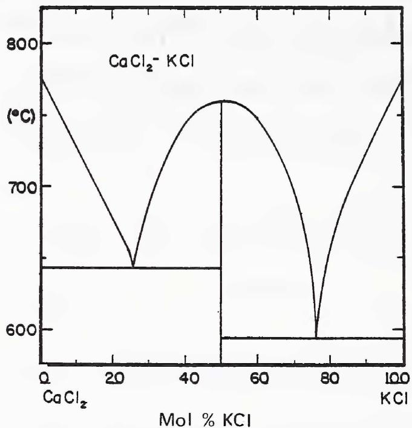  
Figure 93.1. KCl-CaCl $_2$ phase diagram

References [1-29].

2. Density (ρ)

Measurement method: Archimedean technique [30]

Equation:

$$
\rho = a + b T \tag {93.1}
$$

precision: in table 93.1

uncertainty: $\sim \pm 1.5\%$

Table 93.1. Parameters of equation (93.1) and precisions   

<table><tr><td>Mol % KCl</td><td>a</td><td>-b x 104</td><td>Precision</td><td>T range(K)</td></tr><tr><td>22.3</td><td>2.3534</td><td>3.951</td><td>0.14%</td><td>1090-1170</td></tr><tr><td>31.9</td><td>2.4067</td><td>4.891</td><td>0.01%</td><td>1080-1170</td></tr><tr><td>49.9</td><td>2.3934</td><td>5.628</td><td>0.01%</td><td>1080-1170</td></tr><tr><td>71.8</td><td>2.2650</td><td>5.524</td><td>0.03%</td><td>1090-1170</td></tr><tr><td>83.8</td><td>2.2540</td><td>6.002</td><td>0.05%</td><td>1070-1170</td></tr><tr><td>92.8</td><td>2.2231</td><td>6.188</td><td>0.03%</td><td>1060-1130</td></tr></table>

Two-independent-variables equation

$$
\rho = a + b C + c C ^ {2} + d T ^ {3} + e C ^ {3} + f C T ^ {2} \tag {93.2}
$$

$$
\left(\mathrm {C} = \mathrm {mol} \% \mathrm {CaCl}_{2}\right)
$$

Table 93.2. Parameters of two-independent variables equation (93.2) and precisions   

<table><tr><td>a</td><td>b x 103</td><td>c x 105</td><td>d x 1010</td><td>e x 107</td><td>f x 109</td><td>Precision</td></tr><tr><td>1.72672</td><td>4.92335</td><td>-2.48640</td><td>-1.71243</td><td>1.85373</td><td>1.10542</td><td>0.09%</td></tr></table>

Table 93.3. Density $(\mathrm{gcm}^{-3})$ from equations in table 93.1   

<table><tr><td rowspan="2">T(K)</td><td colspan="6">Mo1 % KCl</td></tr><tr><td>22.3</td><td>31.9</td><td>49.9</td><td>71.8</td><td>83.8</td><td>92.8</td></tr><tr><td>1070</td><td></td><td></td><td></td><td></td><td>1.612</td><td>1.561</td></tr><tr><td>1080</td><td></td><td>1.878</td><td>1.786</td><td></td><td>1.606</td><td>1.555</td></tr><tr><td>1090</td><td>1.923</td><td>1.874</td><td>1.780</td><td>1.663</td><td>1.600</td><td>1.549</td></tr><tr><td>1100</td><td>1.919</td><td>1.869</td><td>1.774</td><td>1.657</td><td>1.594</td><td>1.542</td></tr><tr><td>1110</td><td>1.915</td><td>1.864</td><td>1.769</td><td>1.652</td><td>1.588</td><td>1.536</td></tr><tr><td>1120</td><td>1.911</td><td>1.859</td><td>1.763</td><td>1.646</td><td>1.582</td><td>1.530</td></tr><tr><td>1130</td><td>1.907</td><td>1.854</td><td>1.757</td><td>1.641</td><td>1.576</td><td>1.524</td></tr><tr><td>1140</td><td>1.903</td><td>1.849</td><td>1.752</td><td>1.635</td><td>1.570</td><td></td></tr><tr><td>1150</td><td>1.899</td><td>1.844</td><td>1.746</td><td>1.630</td><td>1.564</td><td></td></tr><tr><td>1160</td><td>1.895</td><td>1.839</td><td>1.741</td><td>1.624</td><td>1.558</td><td></td></tr><tr><td>1170</td><td>1.891</td><td>1.834</td><td>1.735</td><td>1.619</td><td>1.552</td><td></td></tr></table>

References [14,30-36]

# 3. Surface Tension (γ)

Measurement method: flat pin (detachment) [30]

Equation:

$$
\gamma = a + b T \tag {93.3}
$$

precision: in table 93.4

uncertainty: $\sim \pm 2.0\%$

Table 93.4. Parameters of equation (93.3) and precisions   

<table><tr><td>Mol % KCl</td><td>a</td><td>-b x 103</td><td>Precision</td><td>T range(K)</td></tr><tr><td>9.8</td><td>186.26</td><td>49.86</td><td>0.03%</td><td>1080-1170</td></tr><tr><td>22.6</td><td>183.46</td><td>55.78</td><td>0.11%</td><td>1050-1170</td></tr><tr><td>31.9</td><td>183.55</td><td>58.97</td><td>0.09%</td><td>1070-1170</td></tr><tr><td>44.5</td><td>182.70</td><td>63.44</td><td>0.05%</td><td>1070-1170</td></tr><tr><td>44.7</td><td>181.36</td><td>63.50</td><td>0.05%</td><td>1080-1140</td></tr><tr><td>57.8</td><td>185.42</td><td>71.42</td><td>0.01%</td><td>1050-1140</td></tr><tr><td>83.6</td><td>182.51</td><td>75.77</td><td>0.07%</td><td>1070-1150</td></tr><tr><td>92.8</td><td>170.68</td><td>67.45</td><td>0.09%</td><td>1070-1140</td></tr></table>

(93) KCl-CaCl2   
Table 93.5. Surface tension (dyn cm $^{-1}$ ) from equations in table 93.4   

<table><tr><td rowspan="2">T(K)</td><td colspan="5">Mol % KCl</td></tr><tr><td>22.6</td><td>31.9</td><td>44.5</td><td>44.7</td><td>57.8</td></tr><tr><td>1050</td><td>124.9</td><td></td><td></td><td></td><td>110.4</td></tr><tr><td>1060</td><td>124.3</td><td></td><td></td><td></td><td>109.7</td></tr><tr><td>1070</td><td>123.8</td><td>120.5</td><td>114.8</td><td></td><td>109.0</td></tr><tr><td>1080</td><td>123.2</td><td>119.9</td><td>114.2</td><td>112.8</td><td>108.3</td></tr><tr><td>1090</td><td>122.7</td><td>119.3</td><td>113.6</td><td>112.2</td><td>107.6</td></tr><tr><td>1100</td><td>122.1</td><td>118.7</td><td>112.9</td><td>111.5</td><td>106.9</td></tr><tr><td>1110</td><td>121.6</td><td>118.1</td><td>112.3</td><td>110.9</td><td>106.1</td></tr><tr><td>1120</td><td>121.0</td><td>117.5</td><td>111.7</td><td>110.2</td><td>105.4</td></tr><tr><td>1130</td><td>120.4</td><td>116.9</td><td>111.0</td><td>109.6</td><td>104.7</td></tr><tr><td>1140</td><td>119.9</td><td>116.3</td><td>110.4</td><td>109.0</td><td>104.0</td></tr><tr><td>1150</td><td>119.3</td><td>115.7</td><td>109.7</td><td></td><td></td></tr><tr><td>1160</td><td>118.8</td><td>115.1</td><td>109.1</td><td></td><td></td></tr><tr><td>1170</td><td>118.2</td><td>114.6</td><td>108.5</td><td></td><td></td></tr></table>

References [30,34,37-43]

4. Viscosity (n)

No data

5. Electrical Conductance (K)

Measurement method: classical ac technique [45]

Equation:

$$
\kappa = a + b T \tag {93.4}
$$

precision: in table 93.6

uncertainty: $\sim \pm 2.0\%$

Table 93.6. Parameters of equation (93.4) and precisions   

<table><tr><td>Mol % KCl</td><td>-a</td><td>b x 103</td><td>Precision</td><td>T range(K)</td></tr><tr><td>20</td><td>2.0217</td><td>3.409</td><td>0.14%</td><td>1060-1100</td></tr><tr><td>40</td><td>1.8903</td><td>3.109</td><td>0.24%</td><td>1010-1050</td></tr><tr><td>60</td><td>1.4617</td><td>2.708</td><td>0.31%</td><td>1080-1110</td></tr><tr><td>80</td><td>1.7129</td><td>3.159</td><td>0.23%</td><td>1000-1050</td></tr></table>

Table 93.7. Specific conductance $(ohm^{-1}cm^{-1})$ from equations in table 93.6   

<table><tr><td rowspan="2">T(K)</td><td colspan="4">Mol % KCl</td></tr><tr><td>20</td><td>40</td><td>60</td><td>80</td></tr><tr><td>1000</td><td></td><td></td><td></td><td>1.446</td></tr><tr><td>1010</td><td></td><td>1.249</td><td></td><td>1.478</td></tr><tr><td>102C</td><td></td><td>1.280</td><td></td><td>1.509</td></tr><tr><td>1030</td><td></td><td>1.311</td><td></td><td>1.541</td></tr><tr><td>1040</td><td></td><td>1.342</td><td></td><td>1.572</td></tr><tr><td>1050</td><td></td><td>1.374</td><td></td><td>1.604</td></tr><tr><td>1060</td><td>1.592</td><td></td><td></td><td></td></tr><tr><td>1070</td><td>1.626</td><td></td><td></td><td></td></tr><tr><td>1080</td><td>1.660</td><td></td><td>1.463</td><td></td></tr><tr><td>1090</td><td>1.694</td><td></td><td>1.490</td><td></td></tr><tr><td>1100</td><td>1.728</td><td></td><td>1.517</td><td></td></tr><tr><td>1110</td><td></td><td></td><td>1.545</td><td></td></tr></table>

References [14,32,44-49]

# 6. Safety and Hazards

# A. Hazard rating

(i) Toxicity: very low.   
(ii) Vapor pressure: KCl, at m.pt. $(770^{\circ}\mathrm{C}) \sim 0.42\mathrm{mm}$ ; CaCl₂, at m.pt. $(782^{\circ}\mathrm{C})$ , $\sim 2$ x $10^{-4}\mathrm{mm}$ .

# B. Disaster hazards

(i) Molten salt bath "explosions": i.e., explosive generation of steam due to bulk water "carry-over" and/or equipment failure; i.e., explosive expansion of "trapped" air.   
(ii) Chlorides evolve highly toxic fumes when heated to decomposition, or contacted with acids.

References [50-55]

# 7. Corrosion

Table 93.8. Corrosion studies from primary research literature   

<table><tr><td colspan="2">Studies</td><td>References</td></tr><tr><td rowspan="5">A</td><td>Armco Fe; various steels</td><td>[56-59]</td></tr><tr><td>Cr</td><td>[60]</td></tr><tr><td>Cr, Fe-Cr</td><td>[61]</td></tr><tr><td>Mg, Ni, Zr, Ti</td><td>[62]</td></tr><tr><td>Ti, Zr, Hf, ThCl4</td><td>[63]</td></tr><tr><td rowspan="4">B</td><td>Zr</td><td>[64]</td></tr><tr><td>Ti, Zr, Hg, ThCl4</td><td>[63]</td></tr><tr><td>Pb, Pb-Bi</td><td>[65]</td></tr><tr><td>Armco Fe</td><td>[65-69]</td></tr><tr><td rowspan="5">C</td><td>Solubility of oxides (Ni, Ca, Zn, Mg)</td><td>[62,70]</td></tr><tr><td>Electrochemical aspects</td><td>[71]</td></tr><tr><td>Corrosion - annotated biblio.</td><td>[72]</td></tr><tr><td>Thermodynamic approach</td><td>[62,73,74]</td></tr><tr><td>Reviews: corrosion in molten salts</td><td>[75-77]</td></tr></table>

Compatibility studies: A: principally molten KCl; B: principally molten $\mathrm{CaCl}_2$ ; C: general discussion and reviews. For compatibility studies in molten KCl- $\mathrm{CaCl}_2$ mixtures, see [68].

References [56-77]

(93) KCl-CaCl2

8. Diffusion

Measurement method: capillary [78]

Diffusing species investigated in $\mathsf{KCl - CaCl}_2$ as solvent:

Ca 2+

precision: $\sim \pm 0.2\%$ uncertainty: $\sim \pm 10\%$

Equation:

D = 1.281 x $10^{3}$ exp [-7907/RT] (93.5)

Table 93.9. Self-diffusion coefficients from equation (93.5)   

<table><tr><td>T(K)</td><td>\( {\mathrm{D}}_{\mathrm{{Ca}}}{}^{2 + } \times  {10}^{5} \) \( \left( {{\mathrm{{cm}}}^{2}{\mathrm{\;s}}^{-1}}\right) \)</td><td></td><td>T(K)</td><td>\( {\mathrm{D}}_{\mathrm{{Ca}}}{}^{2 + } \times  {10}^{5} \) \( \left( {{\mathrm{{cm}}}^{2}{\mathrm{\;s}}^{-1}}\right) \)</td></tr><tr><td>1055</td><td>2.95</td><td></td><td>1120</td><td>3.67</td></tr><tr><td>1060</td><td>3.00</td><td></td><td>1130</td><td>3.79</td></tr><tr><td>1070</td><td>3.11</td><td></td><td>1140</td><td>3.90</td></tr><tr><td>1080</td><td>3.22</td><td></td><td>1150</td><td>4.02</td></tr><tr><td>1090</td><td>3.33</td><td></td><td>1160</td><td>4.15</td></tr><tr><td>1100</td><td>3.44</td><td></td><td>1170</td><td>4.27</td></tr><tr><td>1110</td><td>3.55</td><td></td><td>1175</td><td>4.33</td></tr></table>

Solvent composition: $0.2 \, \text{mol} \% \, \text{CaCl}_2$

9. Heat of Fusion $(\Delta H_{f}^{\circ})$

No data

10. Heat Capacity $(C_p)$

No data

11. Volume Change on Melting $(\Delta V_{f})$

No data

12. Vapor Pressure $(p_{vap})$

Measurement method: Rodebush-Dixon [79,80]

precision: ± 3.0%

uncertainty: $\sim 5.0\%$

Table 93.10. Vapor pressure (mm)   

<table><tr><td>Mol % KC1</td><td>1373 K</td><td>1423 K</td><td>Mol % KC1</td><td>1373 K</td><td>1423 K</td></tr><tr><td>22</td><td>2.19</td><td>5.26</td><td>70</td><td>25.02</td><td>43.51</td></tr><tr><td>32</td><td></td><td>9.50</td><td>79</td><td>32.63</td><td>53.33</td></tr><tr><td>37</td><td>5.30</td><td></td><td>83</td><td>34.93</td><td>58.49</td></tr><tr><td>43</td><td>8.00</td><td>16.09</td><td>90</td><td>43.34</td><td>72.00</td></tr><tr><td>47</td><td>10.09</td><td>18.60</td><td>100</td><td>54.52</td><td>87.80</td></tr><tr><td>60</td><td>17.57</td><td>32.26</td><td></td><td></td><td></td></tr></table>

Values at $100\%$ KCl are $2 - 8\%$ higher than the recommended vapor pressure [81] for KCl at 1373 and 1423 K.

References [79-81]

13. Thermal Conductivity (liquid) $(\lambda_{\mathrm{g}})$

Measurement method: coaxial cylinders technique [82]

Equation:

$$
\lambda = a + b T \tag {93.6}
$$

precision: in table 93.11

uncertainty: $\sim$ 20%

Table 93.11. Parameters of equation (93.6), precisions, and temp. range   

<table><tr><td>Mol % CaCl2</td><td>-a x 103</td><td>b x 106</td><td>Precision</td><td>T range(K)</td></tr><tr><td>0</td><td>2.9674</td><td>5.042</td><td>0.7%</td><td>1055-1090</td></tr><tr><td>10</td><td>4.4423</td><td>6.070</td><td>1.7%</td><td>1010-1070</td></tr><tr><td>20</td><td>2.1855</td><td>3.818</td><td>1.0%</td><td>940-1060</td></tr><tr><td>27</td><td>1.0439</td><td>2.572</td><td>2.2%</td><td>920-1010</td></tr><tr><td>30</td><td>2.8515</td><td>4.312</td><td>0.9%</td><td>940-1040</td></tr><tr><td>40</td><td>5.7367</td><td>7.339</td><td>2.0%</td><td>1010-1040</td></tr><tr><td>50</td><td>6.5010</td><td>8.668</td><td>0.6%</td><td>1050-1080</td></tr><tr><td>60</td><td>8.9394</td><td>10.84</td><td>1.6%</td><td>1035-1060</td></tr><tr><td>73</td><td>2.3451</td><td>4.337</td><td>0.9%</td><td>970-1040</td></tr><tr><td>80</td><td>1.8352</td><td>4.244</td><td>0.5%</td><td>1020-1050</td></tr><tr><td>100</td><td>16.383</td><td>17.98</td><td>3.3%</td><td>1070-1130</td></tr></table>

Table 93.12. Thermal conductivity (x $10^{4}$ cal cm $^{-1}$ s $^{-1}$ K $^{-1}$ ) from equations in table 93.11   

<table><tr><td rowspan="2">T(K)</td><td colspan="9">Mol % CaCl2</td></tr><tr><td>10</td><td>20</td><td>27</td><td>30</td><td>40</td><td>50</td><td>60</td><td>73</td><td>80</td></tr><tr><td>920</td><td></td><td></td><td>13.3</td><td></td><td></td><td></td><td></td><td></td><td></td></tr><tr><td>940</td><td></td><td>14.0</td><td>13.8</td><td>12.0</td><td></td><td></td><td></td><td></td><td></td></tr><tr><td>960</td><td></td><td>14.8</td><td>14.3</td><td>12.9</td><td></td><td></td><td></td><td></td><td></td></tr><tr><td>980</td><td></td><td>15.6</td><td>14.8</td><td>13.7</td><td></td><td></td><td></td><td>19.0</td><td></td></tr><tr><td>1000</td><td></td><td>16.3</td><td>15.3</td><td>14.6</td><td></td><td></td><td></td><td>19.9</td><td></td></tr><tr><td>1020</td><td>17.5</td><td>17.1</td><td></td><td>15.5</td><td>17.5</td><td></td><td></td><td>20.8</td><td>24.9</td></tr><tr><td>1040</td><td>18.7</td><td>17.9</td><td></td><td>16.3</td><td>19.0</td><td></td><td>23.3</td><td>21.7</td><td>25.8</td></tr><tr><td>1060</td><td>19.9</td><td>18.6</td><td></td><td></td><td></td><td>26.9</td><td>25.5</td><td></td><td></td></tr><tr><td>1080</td><td></td><td></td><td></td><td></td><td></td><td>28.6</td><td></td><td></td><td></td></tr></table>

The values for pure KCl reported in [82] are uniformly higher ( $\sim 20\%$ ) than the recommended values [84].

Table 93.13. Isotherm of thermal conductivity at 1073 K   

<table><tr><td>CaCl2</td><td>λ x 104(cal cm-1s-1K-1)</td><td>CaCl2</td><td>λ x 104(cal cm-1s-1K-1)</td></tr><tr><td>0</td><td>24.4</td><td>50</td><td>28.0</td></tr><tr><td>10</td><td>20.7</td><td>60</td><td>26.9</td></tr><tr><td>20</td><td>19.1</td><td>73</td><td>23.1</td></tr><tr><td>27</td><td>17.2</td><td>80</td><td>27.2</td></tr><tr><td>30</td><td>17.8</td><td>100</td><td>29.1</td></tr><tr><td>40</td><td>21.4</td><td></td><td></td></tr></table>

The data (above) illustrate the thermal conductivity-composition isotherm at this temperature. In systems of nitrates not showing compound formation, the thermal conductivity generally shows a negative deviation from additivity (passing through a minimum at the equimolar composition).

References [82-84]

(93) KCl-CaCl2

14. Thermal Conductivity (solid) $(\lambda_{s})$

No data

15. Cryoscopic Constant $(k_{f})$

No data

16. References

[1] Clark, R. P., Reinhardt, F. W., Thermochim. Acta, 12, 309 (1975).   
[2] Clark, R. P., Reinhardt, F. W., Thermochim. Acta, 14, 113 (1976).   
[3] Burlakova, V. M., Bukhalova, G. A., Izv. Vyssh. Uchebn. Zaved., Khim. i Khim. Tekhnol., 10, 487 (1967).   
[4] Janecke, E., Muhlhaussen, W., Z. Anorg. U. Allgem. Chem., 228, 241 (1936).   
[5] Krause, I. E., Bergman, A. G., Compt. Rend. Dokl. Acad. Sci. USRR, 35, 20 (1942).   
[6] Strelets, Kh. L., Desyatnikov, O. G., Zhur. Priklad. Khim., 28, 268 (1955). J. Appl. Chem. USSR, 28, 245 (1955).   
[7] Sato, T. and Amano, T., Kinzoku-noKenkyu, 11, 549 (1934).   
[8] Gromakov, S. D., Gromakova, L. M., Zhur. Fiz. Khim., 29, 745 (1955).   
[9] Ishaque, M., Bull. Soc. Chim. France, 127 (1952).   
[10] Kordes, E., Z. Anorg. U. Allgem. Chem., 168, 177 (1927).   
[11] Plyushchev, V. E., Zhur. Neorg. Khim., 1, 820 (1956).   
[2] Plyushchev, V. E., Kovolev, F. V., Zh. Neorg. Khim., 1, 1013 (1956).   
[13] Menge, O., Z. Anorg. U. Allgem. Chem., 72, 162 (1911).   
[14] Sandonnini, C., Gazz. Chim. Ital., 50, 289 (1920).   
[5] Golubeva, M. S., Bergman, A. G., Zhur. Obshchei Khim., 26, 328 (1956). J. Gen. Chem. USSR, 26, 349 (1956).   
6] Janz, G. J. Downey, J. R., Jr., Allen, C. B., and Tomkins, R. P. T., "Eutectic Data" - 2 Vols; ERDA-TID-27163-P1 & P2; NTIS, Washington, D. C. (1977).   
7] Janz, G. J., Downey, J. R., Jr., Allen, C. B., and Tomkins, R. P. T., "Physical Properties Data Complications Relevant to Energy Storage. I. Molten Salts: Eutectic Data", NSRDS-NBS-61; U. S. Gov't. Printing Office, Washington, D. C. (1978).   
[18] "International Critical Tables of Numerical Data, Physics, Chemistry, and Technology", 8 Vols., McGraw-Hill Book Co., N. Y. (1933).   
[19] "Landolt-Bornstein Zahlenwert und Funktionen aus Physik, Chemie, Astronomie, Geophysik und Technik", (10th Ed.) Springer-Verlag, Berlin, Heidelberg, N. Y. (1961).   
[0] Clark, P. V., "Fused Salt Mixtures: Eutectic Compositions and Melting Points Bibliography 1907-1968", Report No. SC-R-68-1680; Sandia Laboratories (1968), NTIS.   
[1] Robertson, W. D., "Binary Phase Diagrams of Halide Salts", Report No. Yale 2723 (2 Vols.), U. S. AEC Contract AT (30-1)-2723 (1966), NTIS.   
[22] Thoma, R.: E., "Phase Diagrams of Nuclear Reactor Materials", Oak Ridge National Laboratory, ORNL-2548, Contract No. W-7405-eng-26.

(93) KCl-CaCl2

Thoma, R. E., "Phase Diagrams of Binary and Ternary Fluoride Systems", Chapt. 6; Adv. Molten Salts Chemistry, Vol. 3 (J. Braunstein, G. Mamantov, and G. P. Smith, eds.), Plenum Press, N. Y. (1975).   
Voskresenskaya, N. K., ed., "Handbook of Solid-Liquid Equilibria in Systems of Inorganic Salts", Volumes 1, 2, Izc. Akad. Nauk SSSR, Moscow (1961). Israel Program for Scientific Translations, Jerusalem, 1970 (NTIS).   
Sinistri, C., Franzozini, P., and Rolla, M., "An Atlas of Miscibility Gaps in Molten Salt Systems", Institute of Physical Chemistry, University of Pavia (Italy) (1968).   
Shaffer, P. T. B., "High Temperature Materials", Plenum Press Handbooks of High Temperature Materials, No. 1, Materials Index, Plenum Press, New York, 1964.   
Franzozini, P., Ferloni, P., and Spinolo, C., "Molten Salts with Organic Anions", Instituto di Chimica Fisica, Universita di Pavia (Italy), 1973.   
Toropov, N. A. et al., "Handbook of Phase Diagrams of the Silicates, Volume 1: Binary Systems, Volume 2, Metal-Oxygen Compounds in Silicate Systems", Izdatel'stov "Nauka" Leningradskoe Otdelenie, Leningrad, 1969, Israel Program for Scientific Translations, Jerusalem, 1972 (NTIS).   
Levin, E., et al., "Phase Diagrams for Ceramists", Amer. Ceramic Soc. (publ.), Columbus, Ohio (1964; 1969).   
Lillebuen, B., Ph.D. Thesis, The Technical University of Norway, Trondheim, Norway, (1969).   
Pavlenko, S. P., Izv. Sekt. Fiz. Khim., Anal. Inst. Obshchei i Neorg. Khim., 17, 220 (1949).   
Volkov, S. V., Priskyazhnyii, V. D., and Markov, B. F., Fiz. Khim. 1. Elektrokhim. Rasplavlen. Solei Akad. Ukr. SSR, Inst. Obshch. I. Neorgan. Khim., 70 (1965).   
Grjothiem, K., Holm, J. L., Lillebuen, B., and Øye, H. A., Trans. Faraday Soc., 67, 640 (1971).   
Lehman, D. S., Ph.D. Thesis, Indiana University, (1959).   
Brautigam, G., Emons, H. H., and Vogt, H., Z. Chem., 10, 344 (1970).   
Bukhalova, G. A., and Sementsova, D. V., Russ. J. Inorg. Chem., 15, 411 (1970), Zh. Neorg. Khim., 15, 806 (1970).   
Reding, J. N., J.Chem. and Eng. Data, 11, 239 (1966).   
Strelets, Kh. L., Taiz, A. J., and Guljanitzki, H., Metallurige des Magensiums, Veb Verlag Technik, Berlin (1953).   
Desyatnikov, O. G., Zhur. Priklad. Khim. 29, 870 (1956).   
Mukaibo, T., and Massuno, T., J. Electrochem. Soc. 17, 127 (1948).   
Khokhlov, V. A., Smirnov, M. V., and Stepanov, V. P., Russ. J. Phys. Chem. 40, 671 (1966).   
Zezyanov, S. P., and Il'ichev, V. A., Russ. J. Inorg. Chem. 11, 936 (1966).   
Grjothiem, K., Holm, J. L., Lillibuen, B., and Øye, H. A., Inst. Inorg. Chem., Technical University of Norway, N-7034, Trondheim, Norway (1971).

# (93) KCl-CaCl2

[44] Huber, R. W., Potter, E. V., and St. Clair, H. W., U. S. Bur. Mines Rept. Invest. No. 4858 (1952).   
[45] Nikolio, R., Grjothim, K. and Øye, H. A., Acta. Chem. Scand., 24, 489 (1970).   
[46] Heymann, E., and Mulcahy, M.F.R., J. Phys. Chem., 47, 485 (1943).   
[47] Brautigam, G., Emons, H. H., and Vogt, H., Z. Chem., 10, 344 (1970).   
[48] Markov, B. F., and Tarasenko, A. M., Zhur. Fiz. Khim., 32, 1333 (1958).   
[49] Emons, H. H., Brautigam, G., and Vogt, H., Z. Anorg. Allg. Chem., 394, 263 (1972).   
[50] "Dangerous Properties of Materials", Sax, N. I., Van Nostrand Reinhold Co., N. Y. (1969).   
[51] "Registry of Toxic Effects of Chemical Substances", Christensen, H. E., and Lubinbyhl, T. T., eds., U. S. Dept. H. E. W., U. S. Gov't Printing Office, Washington, D. C. (1975).   
[52] Janz, G. J., et al., "Physical Properties Data Complications Relevant to Energy Storage. Part II. Molten Salts: Data on Single and Multi-Component Salt Systems", NSRDS-NBS 61, Part II (April 1979), U. S. Gov't Printing Office, Supt of Doc. No. C13-48-61, Washington D. C. 20402.   
[53] "Potential Hazards in Molten Salt Baths for Heat Treatment of Metals", National Board of Fire Underwriters Research Report No. 2 (1954).   
[54] "Handbook of Reactive Chemical Hazards", Bretherwick, L., Butterworth Co., London (1975).   
[55] Janz, G. J., Tomkins, R. P. T., Downey, J. R. Jr., and Allen, C. B., "Safety and Hazards", Chapter in "Eutectic Data", ERDA TID-27163-P1; NTIS, U. S. Dept. Commerce, Springfield, Va. (1977)   
[56] Kochergin, V. P. and Shevrina, Z., Uch. Zap. Ural. Gos. Univ. 92, 3 (1969)   
[57] Kochergin, V. P., Bochkareva, N. N., and Yarysheva, I. A., Zashch. Metal., 6, 457 (1970).   
[58] Kochergin, V. P., Garpinenko, M. G., Skornyakova, O.N., and Minulina, M. L., Zhur. Priklad. Khim., 37, 566 (1956).   
[59] Kochergin, V. P., et al., Zhur. Priklad. Khim., 34(6), 1258 (1961); ibid., 37(8), 1837 (1964).   
[60] Krasil'nikova, N. A., Ozeryanaya, I. N., and Smirnov, M. V., Zashch. Metal., 17, 466 (1974)   
[61] Krasil'nikova, N. A., Ozeryanaya, I. N., Smirnov, M. V., and Shamanova, N. D., Zashch. Metal., 10, 446 (1974).   
[62] Littlewood, R., J. Electrochem. Soc., 109, 525 (1962).   
[63] Smirnov, M. V., Kudyakov, V. Ya., Loginov, Ya. A., Rossokhin, E. G., Posokhin, Yu. V., and Puzanova, T. A., Fiz. Khim. Elektrokhim. Rasplav. Solei Shlakov, 1, 115 (1969).   
[64] Thai, V., Ozeryanaya, I. N., and Smirnov, M. V., Tri. Inst. Elektrokhim., Ural. Nauch. Tsentr. Akad. Nauk SSSR, 19, 69 (1973).   
[65] Vasin, B. D., Nichkov, I. F., and Raspopin, S. P., Izv. Vyssh. Ucheb. Zaved., Tsvet. Met., 15, 102 (1972).

(93) KCl-CaCl2

[66] Kochergin, V. P., Khaibuilina, V. P., and Potapova, O. G., Zh. Neorg. Khim., 1, 2617 (1956).   
[67] Jackson, J. H. and LaChance, M. H., Trans. Am. Soc. Metals, 16, 157 (1954).   
[68] Kochergin, V. P., Putina, O. A., Devyatkin, V. N., and Kanaeva, E. T., Tr. Vses. Nauch. Issled. Proekt. Inst. Alyum., Magn. Electrodn., 75, 51 (1971).   
[69] Kochergin, V. P., Kabirov, A. V., Skornyakova, O. N., J. Appl. Chem. USSR, 27, 883 (1954).   
[70] Pizzini, S., "Materials Problems in the Industrial Applications of Molten Salts", Proceedings of the European Conference on the Development of Molten Salts Applications", p. 203 (1973); Battelle, Geneva.   
[71] Johnson, K. E., "Electrochemical Approaches to Corrosion in Molten Salts", Proceedings International Symposium on Metal-Slag-Gas Reactions and Processes, The Electrochemical Society Inc., Princeton, N. J., p. 581 (1975).   
[72] Janz, G. J., and Tomkins, R. P. T., Corrosion, 35, 485 (1979).   
[73] Edeleanu, C., and Littlewood, R., Electrochimica Acta, 3, 195 (1960).   
[74] Littlewood, R., and Argent, E. A., Electrochimica Acta, 4, 114 (1961).   
[75] Smirnov, M. V., and Ozeryanaya, I. N., Nauki Tekh. Korros. Zashch. Korros. 2, 171 (1973).   
[76] Ketelaar, J. A. A., Chemie. Ing. Techn., 45, 667 (1973).   
[77] Inman, D., and Wrench, N. S., Brit. Corr. J., 1, 246 (1966).   
[78] Ichikawa, K., Shimosi, M., and Niwa, K., Ber. Bunsen. Physik. Chem. 69, 248 (1965).   
[79] Murgulescu, I. G. and Topor, L., Rev. Roumaine Chem. 11, 1353 (1966).   
[80] Frid, S. A., Polyachenok, O.G. and Novikov, G. I., Russ. J. Inorg. Chem. (Eng.); 9, 556 (1964).   
[81] vide: this series, NSRDS-NBS 61, Pt. II, p. 70 (1979)   
[82] Polyakov, P. W. and Gildebrant, E. M., Teplof. Vysok. Temp. 12 (6) 1313 (1974); Engl. transl., High Temp. 12, 1166 (1974).   
[83] Jamieson, D. T., Irving, J. B., and Tudhope, J. S., "Liquid Thermal Conductivity Data", HMSO, Edinburgh (1975).   
[84] vide: this series, NSRDS-NBS 61, Pt. II, p. 71 (1979).

1. Melting Temperatures $(T_{m})$

Pure substance melting points:

KCl: 770°C

BaCl2: 962°C

Eutectic melting point:

E 1: $658^{\circ} \mathrm{C}$ , composition: 25.9 mol % BaCl 2

E 2: $648^{\circ} \mathrm{C}$ , composition: 42.9 mol % BaCl 2

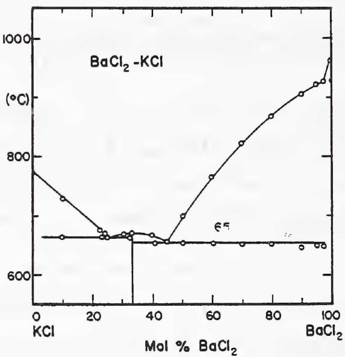  
Figure 94.1. $\mathsf{BaCl}_2$ -KCl phase diagram

References [1-19]

2. Density (ρ)

Measurement method: Archimedean technique [20]

Equation:

$$
\rho = a + b T \tag {94.1}
$$

precision: in table 94.1 uncertainty: $\sim \pm 3.0\%$

Table 94.1. Parameters of equation (94.1) and precisions   

<table><tr><td>Mol % KCl</td><td>a</td><td>-b x 103</td><td>Precision</td><td>T range(K)</td></tr><tr><td>0</td><td>3.9881</td><td>0.6819</td><td>0.02%</td><td>1250-1280</td></tr><tr><td>20.9</td><td>3.7621</td><td>0.7240</td><td>0.05%</td><td>1160-1210</td></tr><tr><td>36.7</td><td>3.4446</td><td>0.6486</td><td>0.04%</td><td>1100-1180</td></tr><tr><td>50.5</td><td>3.1602</td><td>0.6349</td><td>0.07%</td><td>1060-1150</td></tr><tr><td>54.3</td><td>3.2396</td><td>0.7643</td><td>0.04%</td><td>1070-1150</td></tr><tr><td>66.4*</td><td>2.9626</td><td>0.6944</td><td>0.17%</td><td>1070-1160</td></tr><tr><td>66.7*</td><td>3.3804</td><td>1.0900</td><td>0.44%</td><td>1070-1160</td></tr><tr><td>70.2</td><td>2.8580</td><td>0.6838</td><td>0.06%</td><td>1080-1170</td></tr><tr><td>75.6</td><td>2.7114</td><td>0.6173</td><td>0.06%</td><td>1070-1160</td></tr><tr><td>86.9</td><td>2.2758</td><td>0.4769</td><td>0.18%</td><td>1070-1160</td></tr><tr><td>91.6</td><td>2.4850</td><td>0.7405</td><td>0.21%</td><td>1070-1160</td></tr><tr><td>100</td><td>2.1559</td><td>0.6103</td><td>0.08%</td><td>1070-1160</td></tr></table>

* Better estimated by quadratic fit to 0.29% precision.

Table 94.2. Density (g cm $^{-3}$ ) from equations in table 94.1   

<table><tr><td rowspan="2">T(K)</td><td colspan="7">Mol % KCl</td></tr><tr><td>36.7</td><td>50.5</td><td>54.3</td><td>66.4</td><td>70.2</td><td>75.6</td><td>86.9</td></tr><tr><td>1060</td><td></td><td>2.487</td><td></td><td></td><td></td><td></td><td></td></tr><tr><td>1070</td><td></td><td>2.481</td><td>2.422</td><td>2.220</td><td></td><td>2.051</td><td>1.766</td></tr><tr><td>1080</td><td></td><td>2.475</td><td>2.414</td><td>2.213</td><td>2.120</td><td>2.045</td><td>1.761</td></tr><tr><td>1090</td><td></td><td>2.468</td><td>2.407</td><td>2.206</td><td>2.113</td><td>2.039</td><td>1.756</td></tr><tr><td>1100</td><td>2.731</td><td>2.462</td><td>2.399</td><td>2.199</td><td>2.106</td><td>2.032</td><td>1.751</td></tr><tr><td>1110</td><td>2.725</td><td>2.456</td><td>2.391</td><td>2.192</td><td>2.009</td><td>2.026</td><td>1.746</td></tr><tr><td>1120</td><td>2.718</td><td>2.449</td><td>2.384</td><td>2.185</td><td>2.092</td><td>2.020</td><td>1.742</td></tr><tr><td>1130</td><td>2.712</td><td>2.443</td><td>2.376</td><td>2.178</td><td>2.085</td><td>2.014</td><td>1.737</td></tr><tr><td>1140</td><td>2.705</td><td>2.436</td><td>2.368</td><td>2.171</td><td>2.079</td><td>2.008</td><td>1.732</td></tr><tr><td>1150</td><td>2.699</td><td>2.430</td><td>2.361</td><td>2.164</td><td>2.072</td><td>2.002</td><td>1.727</td></tr><tr><td>1160</td><td>2.692</td><td></td><td></td><td>2.157</td><td>2.065</td><td>1.995</td><td>1.723</td></tr><tr><td>1170</td><td>2.686</td><td></td><td></td><td></td><td></td><td></td><td></td></tr><tr><td>1180</td><td>2.679</td><td></td><td></td><td></td><td></td><td></td><td></td></tr><tr><td>1190</td><td></td><td></td><td></td><td></td><td></td><td></td><td></td></tr></table>

References [20-23]

# 3. Surface Tension (Y)

Measurement method: maximum bubble pressure [20]

Equation:

$$
\gamma = a + b T \tag {94.2}
$$

precision: in table 94.3 uncertainty: $\sim$ 3.0%

Table 94.3. Parameters of equation (94.2.) and precisions   

<table><tr><td>Mol % KCl</td><td>a</td><td>-b x 102</td><td>Precision</td><td>T range(K)</td></tr><tr><td>17.9</td><td>233.95</td><td>7.642</td><td>0.26%</td><td>1180-1260</td></tr><tr><td>37.7</td><td>224.63</td><td>8.425</td><td>0.80%</td><td>1130-1230</td></tr><tr><td>52.3</td><td>176.16</td><td>5.208</td><td>0.54%</td><td>1100-1160</td></tr><tr><td>57.7</td><td>168.90</td><td>4.870</td><td>0.27%</td><td>1100-1170</td></tr><tr><td>62.7</td><td>186.07</td><td>6.669</td><td>0.28%</td><td>1100-1160</td></tr><tr><td>66.0</td><td>175.64</td><td>5.880</td><td>0.24%</td><td>1080-1170</td></tr><tr><td>70.6</td><td>166.18</td><td>5.209</td><td>0.27%</td><td>1090-1180</td></tr><tr><td>75.6</td><td>180.40</td><td>6.629</td><td>0.32%</td><td>1090-1160</td></tr><tr><td>86.5</td><td>178.02</td><td>7.013</td><td>0.46%</td><td>1100-1060</td></tr><tr><td>91.6</td><td>163.28</td><td>5.879</td><td>0.46%</td><td>1090-1160</td></tr><tr><td>96.1</td><td>178.71</td><td>7.512</td><td>0.40%</td><td>1100-1170</td></tr></table>

Table 94.4. Surface tension (dyn cm $^{-1}$ ) from equations in table 94.3   

<table><tr><td rowspan="2">T(K)</td><td colspan="7">Mol % KCl</td></tr><tr><td>52.3</td><td>57.7</td><td>62.7</td><td>66.0</td><td>70.6</td><td>75.6</td><td>86.5</td></tr><tr><td>1080</td><td></td><td></td><td></td><td>112.1</td><td></td><td></td><td></td></tr><tr><td>1090</td><td></td><td></td><td></td><td>111.6</td><td></td><td></td><td></td></tr><tr><td>1100</td><td>118.9</td><td>115.3</td><td>112.7</td><td>111.0</td><td>108.9</td><td>107.5</td><td>100.9</td></tr><tr><td>1110</td><td>118.4</td><td>114.9</td><td>112.0</td><td>110.4</td><td>108.4</td><td>106.8</td><td>100.2</td></tr><tr><td>1120</td><td>117.8</td><td>114.4</td><td>111.4</td><td>109.8</td><td>107.8</td><td>106.2</td><td>99.5</td></tr><tr><td>1130</td><td>117.3</td><td>113.9</td><td>110.7</td><td>109.2</td><td>107.3</td><td>105.5</td><td>98.8</td></tr><tr><td>1140</td><td>116.8</td><td>113.4</td><td>110.0</td><td>108.6</td><td>106.8</td><td>104.8</td><td>98.1</td></tr><tr><td>1150</td><td>116.3</td><td>112.9</td><td>109.4</td><td>108.0</td><td>106.3</td><td>104.2</td><td>97.4</td></tr><tr><td>1160</td><td>115.7</td><td>112.4</td><td>108.7</td><td>107.4</td><td>105.8</td><td>103.5</td><td>96.7</td></tr><tr><td>1170</td><td></td><td>111.9</td><td></td><td></td><td>105.2</td><td></td><td></td></tr></table>

References [20,24,25].

# 4. Viscosity (η)

No data

(94) $\mathrm{BaCl}_2$ -KC1

5. Electrical Conductance (K)

No data

6. Safety and Hazards

A. Hazard rating [26-28,32]

(i) Toxicity: Soluble barium compounds, such as the chloride, are poisonous when taken orally.   
(ii) Vapor pressure: no information for this system; but see KC1 [28] and BaCl $_2$ [32]

B. Disaster hazards [29-31]

(i) Molten salt bath "explosions": i.e., explosive generation of steam due to bulk water "carry-over" and/or equipment failure; i.e., explosive expansion of "trapped" air.   
(ii) Chlorides evolve highly toxic fumes when heated to decomposition, or contacted with acids.

References [26-32]

# 7. Corrosion

Table 94.5. Corrosion studies from primary research literature   

<table><tr><td colspan="2">Studies</td><td>References</td></tr><tr><td rowspan="5">A</td><td>Armco Fe, various steels</td><td>[33,34,39,40]</td></tr><tr><td>Cr</td><td>[35]</td></tr><tr><td>Cr, Fe-Cr</td><td>[36]</td></tr><tr><td>Mg, Ni, Zr, Ti</td><td>[37]</td></tr><tr><td>Ti, Zr, Hf, ThCl4</td><td>[38]</td></tr><tr><td rowspan="4">B</td><td>Zr</td><td>[41]</td></tr><tr><td>Fe, steels</td><td>[42-46]</td></tr><tr><td>Ti, Zr, Hf, ThCl4</td><td>[47]</td></tr><tr><td>Pb, Pb-Bi</td><td>[48]</td></tr><tr><td rowspan="5">C</td><td>Solubility of oxides (Ni, Ca, Zn, Mg)</td><td>[37,49]</td></tr><tr><td>Electrochemical aspects</td><td>[50]</td></tr><tr><td>Corrosion - annotated biblio.</td><td>[51]</td></tr><tr><td>Thermodynamic approach</td><td>[37,52,53]</td></tr><tr><td>Reviews: corrosion in molten salts</td><td>[54-56]</td></tr></table>

Compatibility studies: A: principally with molten KCl; B: principally with molten $\mathsf{BaCl}_2$ ; C: basic principles, reviews, biblios. For specific studies with molten $\mathsf{BaCl}_2$ -KCl mixtures, see [42,44]

References [33-56]

8. Diffusion No data   
9. Heat of Fusion $(\Delta H_{f}^{\circ})$ No data   
10. Heat Capacity $(C_p)$ No data

11. Volume Change on Melting $(\Delta V_{f})$

Measurement method: estimated from densities [57]

Table 94.6. Volume change on melting   

<table><tr><td>Composition (mol % KCl)</td><td>(△Vf/Vs)</td><td>Uncertainty</td></tr><tr><td>74 (a)</td><td>8.0%</td><td>~ ± 10%</td></tr><tr><td>57 (a)</td><td>3.0%</td><td>~ ± 10%</td></tr></table>

(a) binary eutectic mixtures

References [57]

12. Vapor Pressure $(p_{vap})$

No data

13. Thermal Conductivity (liquid) $(\lambda_{\ell})$

No data

14. Thermal Conductivity (solid) $(\lambda_{s})$

No data

15. Cryoscopic Constant $(k_{f})$

No data

16. References

[1] Krohn, C., Acta. Chem. Scand., 20, 255 (1966).   
[2] Elchardus, E., Laffitte, P., Bull. Soc. Chim., 51, 1572 (1932).   
[3] Zakharchenko, M. A., Gontar, K. V., Zhur. Neorg. Khim., 7, 1013 (1962).   
[4] Sato, T., Kinzokv no Kenkyu, 10, 383 (1933).   
[5] Bukhalova, G. A., Berezhnaya, V. T., Zhur. Neorg. Khim., 7, 720 (1962).   
[6] Janz, G. J. Downey, J. R., Jr., Allen, C. B., and Tomkins, R. P. T., "Eutectic Data" - 2 Vols; ERDA-TID-27163-P1 & P2; NTIS, Washington, D. C. (1977).   
[7] Janz, G. J., Downey, J. R., Jr., Allen, C. B., and Tomkins, R. P. T., "Physical Properties Data Complications Relevant to Energy Storage. I. Molten Salts: Eutectic Data", NSRDS-NBS-61; U. S. Gov't Printing Office, Washington, D. C. (1978).   
[8] "International Critical Tables of Numerical Data, Physics, Chemistry, and Technology", 8 Vols., McGraw-Hill Book Co., N. Y. (1933).

(94) $\mathrm{BaCl}_2$ -KC1   
[9] "Landolt-Bornstein Zahlenwert und Funktionen aus Physik, Chemie, Astronomie, Geophysik und Technik", (10th Ed.) Springer-Verlag, Berlin, Heidelberg, N. Y. (1961).   
[10] Clark, P. V., "Fused Salt Mixtures: Eutectic Compositions and Melting Points Bibliography 1907-1968", Report No. SC-R-68-1680; Sandia Laboratories (1968), NTIS.   
[11] Robertson, W. D., "Binary Phase Diagrams of Halide Salts", Report No. Yale 2723 (2 Vols.), U. S. AEC Contract AT (30-1)-2723 (1966), NTIS.   
[12] Thoma, R. E., "Phase Diagrams of Nuclear Reactor Materials", Oak Ridge National Laboratory, ORNL-2548, Contract No. W-7405-eng-26.   
[13] Thoma, R. E., "Phase Diagrams of Binary and Ternary Fluoride Systems", Chapt. 6; Adv. Molten Salts Chemistry, Vol. 3 (J. Braunstein, G. Mamantov, and G. P. Smith, eds.), Plenum Press, N. Y. (1975).   
[14] Voskresenskaya, N. K., ed., "Handbook of Solid-Liquid Equilibria in Systems of Inorganic Salts", Volumes 1, 2, Izc. Akad. Nauk SSSR, Moscow (1961). Israel Program for Scientific Translations, Jerusalem, 1970 (NTIS).   
[15] Sinistri, C., Franzozini, P., and Rolla, M., "An Atlas of Miscibility Gaps in Molten Salt Systems", Institute of Physical Chemistry, University of Pavia (Italy) (1968).   
[16] Shaffer, P. T. B., "High Temperature Materials", Plenum Press Handbooks of High Temperature Materials, No. 1, Materials Index, Plenum Press, New York, 1964.   
[17] Franzozini, P., Ferloni, P., and Spinolo, C., "Molten Salts with Organic Anions", Instituto di Chimica Fisica, Universita di Pavia (Italy), 1973.   
[18] Toropov, N. A. et al., "Handbook of Phase Diagrams of the Silicates, Volume 1: Binary Systems, Volume 2, Metal-Oxygen Compounds in Silicate Systems", Izdatel'stov "Nauka" Leningradskoe Otdelenie, Leningrad, 1969, Israel Program for Scientific Translations, Jerusalem, 1972 (NTIS).   
[19] Levin, E., et al., "Phase Diagrams for Ceramists", Amer. Ceramic Soc. (publ.), Columbus, Ohio (1964; 1969).   
[20] Peake, J. S., and Bothwell, M. R., J. Amer. Chem. Soc., 76, 2653 (1954).   
[21] Bukhalova, G. A., and Yagub'yan, E. S., Russ. J. Inorg. Chem., 10, 1161 (1965).   
[22] Bukhalova, G. A., and Yagub'yan, E. S., Russ., J. Inorg. Chem., 13, 1162 (1968).   
[23] Reding, J. N., J. Chem. and Eng. Data, 10, 1 (1965).   
[24] Reding, J. N., J. Chem. and Eng. Data, 11, 239 (1966).   
[25] Bertozzi, G., and Soldani, G., J. Phys. Chem. 70, 1838 (1966), J. Electrochem. Soc. 111, 1355 (1964).   
[26] "Dangerous Properties of Materials", Sax, N. I., Van Nostrand Reinhold Co., N. Y. (1969)   
[27] "Registry of Toxic Effects of Chemical Substances", Christensen, H. E., and Lubinbyhl, T. T., eds., U. S. Dept. H. E. W., U. S. Gov't Printing Office, Washington, D. C. (1975)

# (94) $\mathrm{BaCl}_2$ -KCl

[28] Janz, G. J., et al., "Physical Properties Data Complications Relevant to Energy Storage. Part II. Molten Salts: Data on Single and Multi-Component Salt Systems", NSRDS-NBS 61, Part II (April 1979), U. S. Gov't Printing Office, Supt of Doc. No. C13-48-61, Washington D. C. 20402.   
[29] "Potential Hazards in Molten Salt Baths for Heat Treatment of Metals", National Board of Fire Underwriters Research Report No. 2 (1954)   
[30] "Handbook of Reactive Chemical Hazards", Bretherwick, L., Butterworth Co., London (1975)   
[31] Janz, G. J., Tomkins, R. P. T., Downey, J. R., Jr., and Allen, C. B., "Safety and Hazards, Chapter in "Eutectic Data", ERDA TID-27163-P1; NTIS, U. S. Dept. Commerce, Springfield, Va. (1977)   
[32] vide: this work, System 54, BaCl $_2$ .   
[33] Kochergin, V. P., and Shevrina, Z., Uch. Zap. Ural. Gos. Univ., 92, 3 (1969).   
[34] Kochergin, V. P., Bochkareva, N. N., and Yarysheva, I. A., Zashch. Metal., 6, 457 (1970).   
[35] Krasil'nikoya, N. A., Ozeryanaya, I. N., and Smirnov, M. V., Zashch. Metal., 17, 466 (1974).   
[36] Krasil'nikova, N. A., Ozeryanaya, I. N., Smirnov, M. V., and Shamanova, N. D., Zashch. Metal., 10, 446 (1974).   
[37] Littlewood, R., J. Electrochem. Soc., 109, 525 (1962).   
[38] Smirnov, M. V., Kudyakov, Y. Ya., Loginov, Ya. A., Rossokhin, E. G., Posokhin, Yu. V., and Puzanova, T. A., Fiz. Khim. Elektrokhim. Rasplav. Solei Shlakov, 1, 115 (1969).   
[39] Kochergin, V. P., Garpinenko, M. G., Skornyakova, O.N., and Minulina, M. L., Zhur. Priklad. Khim., 37, 566 (1956).   
[40] Kochergin, V. P., and Maletina, L. E., Zhur. Priklad. Khim., 37(8), 1837 (1964).   
[41] Thai, V., Ozeryanaya, I. N., and Smirnov, M. V., Tri. Inst. Elektrokhim., Ural. Nauch. Tsentr. Akad. Nauk SSSR, 19, 69 (1973).   
[42] Kochergin, V. P., Khaibuilina, V. P., and Potapova, O. G., Zh. Neorg. Khim., 1, 2617 (1956).   
[43] Jackson, J. H. and LaChance, M. H., Trans. Am. Soc. Metals, 16, 157 (1954).   
[44] Kochergin, V. P., Putina, O. A., Devyatkin, V. N., and Kanaeva, E. T., Tr. Vses. Nauch. Issled. Proekt. Inst. Alyum., Magn. Electrodn., 75, 51 (1971).   
[45] Kochergin, V. P., Kabirov, A. V., Skornyakova, O. N. J. Appl. Chem. USSR, 27, 883 (1954).   
[46] Kochergin, V. P., Druzhinina, E. P., Men'shenina, G. V., Asanova, E. P., Zh. Prikl. Khim., 33, 1580 (1960).   
[47] Smirnov, M. V., Kudyakov, V. Ya., Loginov, Ya. A., Rossokhin, E. G., Posokhin, Yu. V., and Puzanova, T. A., Fiz. Khim. Elektrokhim. Rasplav. Solei Shlakov, 1, 115 (1969).

(94) $\mathrm{BaCl}_2 - \mathrm{KCl}$   
[48] Vasin, B. D., Nichkov, I. F., and Raspopin, S. P., Izv. Vyssh. Ucheb. Zaved., Tsvet. Met., 15, 102 (1972).   
[49] Pizzini, S., "Materials Problems in the Industrial Applications of Molten Salts", Proceedings of the European Conference on the Development of Molten Salts Applications", p. 203 (1973); Battelle, Geneva.   
[50] Johnson, K. E., "Electrochemical Approaches to Corrosion in Molten Salts", Proceedings International Symposium on Metal-Slag-Gas Reactions and Processes, The Electrochemical Society Inc., Princeton, N. J., p. 581 (1975).   
[51] Janz, G. J., and Tomkins, R. P. T., Corrosion, 35, 485 (1979).   
[52] Edeleanu, C., and Littlewood, R., Electrochimica Acta, 3, 195 (1960).   
[53] Littlewood, R., and Argent, E. A., Electrochimica Acta, 4, 114 (1961).   
[54] Smirnov, M. V., and Ozeryanaya, I. N., Nauki Tekh. Korros. Zashch. Korros., 2, 171 (1973).   
[55] Ketelaar, J. A. A., Chemie. Ing. Techn., 45, 667 (1973).   
[56] Inman, D., and Wrench, N. S., Brit. Corr. J., 1, 246 (1966).   
[57] Janz, G. J., et al. (MSDC-RPI), unpublished work (1980).

1. Melting Temperatures $(T_{m})$

Pure substance melting points:

NaCl: $800^{\circ} \mathrm{C}$

KC1: $770^{\circ}C$

CaCl2: 782°C

Eutectic melting point:

E1: 504°C, composition: 42 mol % NaCl, 6 mol % KCl

E2: 558°C, composition: 38 mol % NaCl, 31 mol % KCl

E3: 532°C, composition: 26 mol % NaCl, 50 mol % KCl

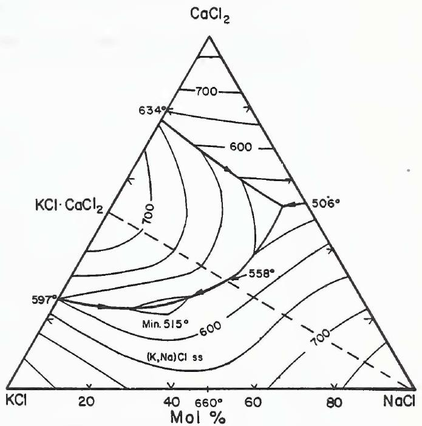  
Figure 95.1. KC1-NaCl- $\cdot$ CaCl2 phase diagram

References [1-18]

2. Density (ρ)

No data

3. Surface Tension (Y)

No data

4. Viscosity (n)

No data

5. Electrical Conductance (K)

No data

(95) KC1-NaCl-CaCl2

# 6. Safety and Hazards

# A. Hazard rating

(i) Toxicity: NaCl, permitted in foods; KCl, very low; CaCl $_2$ , slight.   
(ii) Vapor pressure: NaCl at m.pt (800°C), ~ 0.34mm; KCl at m.pt. (770°C) ~ 0.42 mm; CaCl₂ at m.pt. (782°C) ~ 2 x 10⁴mm.

# B. Disaster hazards

(i) Molten salt bath "explosions": i.e., explosive generation of steam due to bulk water "carry-over" and/or equipment failure; i.e., explosive expansion of "trapped" air   
(ii) Chlorides, when heated to decomposition or contacted with acids, highly toxic chloride fumes are evolved.

References [19-24].

# 7. Corrosion

Table 95.1. Corrosion studies from primary research literature   

<table><tr><td>Studies</td><td>References</td></tr><tr><td>Ni, Fe</td><td>[25]</td></tr><tr><td>Zr, Be, Ti, Hf, U</td><td>[26]</td></tr><tr><td>Ni-Cr-Fe</td><td>[27]</td></tr><tr><td>Ti</td><td>[28,29]</td></tr><tr><td>Cr2O3+ C electrode</td><td>[30]</td></tr><tr><td>Fe</td><td>[31]</td></tr><tr><td>Ni-Cr</td><td>[32]</td></tr><tr><td>Fe, Ni</td><td>[33]</td></tr><tr><td>Steel 3</td><td>[34]</td></tr><tr><td>Ni-Fe</td><td>[25,35]</td></tr><tr><td>Au, Pt, W</td><td>[36]</td></tr><tr><td>Several metals</td><td>[37]</td></tr><tr><td>Fe</td><td>[38]</td></tr><tr><td>Ni</td><td>[39]</td></tr><tr><td>Zr</td><td>[26]</td></tr><tr><td>Rh</td><td>[40]</td></tr><tr><td>Al</td><td>[41]</td></tr><tr><td>Cr, Fe-Cr</td><td>[42]</td></tr><tr><td>W</td><td>[43]</td></tr><tr><td>Various steels</td><td>[44]</td></tr><tr><td>Armco Fe, steels</td><td>[45]</td></tr><tr><td>EMF series</td><td>[37]</td></tr><tr><td>Thermodynamic redox diagrams</td><td>[25,46]</td></tr><tr><td>Electrochemical approach</td><td>[47,48]</td></tr><tr><td>Reviews (molten salts corrosion)</td><td>[49-51]</td></tr><tr><td>Annotated corrosion bibliio.</td><td>[52]</td></tr></table>

No compatibility studies found for molten KCl-NaCl-CaCl $_2$ mixtures. For compatibility studies with binary systems see: KCl-CaCl $_2$ [44]; NaCl-CaCl $_2$ [45]; NaCl-KCl [all except 44,45].

References [25-52]

# 8. Diffusion

No data

# (95) KCl-NaCl-CaCl2

9. Heat of Fusion $(\Delta H_{f}^{\circ})$

Measurement method: calculated [53]

Table 95.2. Heat of fusion   

<table><tr><td>Composition KCl:NaCl:CaCl2(mol %)</td><td>Tm(℃)</td><td>ΔH°f(kcal mol-1)</td><td>Uncertainty</td></tr><tr><td>5.8:42.8:51.4</td><td>504°</td><td>6.3</td><td>~ ± 5%</td></tr></table>

References [53]

10. Heat Capacity $(C_p)$

Measurement method: calculated [54]

Table 95.3. Heat capacity   

<table><tr><td>Composition KCl:NaCl:CaCl2(mol %)</td><td>Cp(cal K-1mol-1)</td><td>T range (K)</td><td>Uncertainty</td></tr><tr><td>5.8:42.8:51.4</td><td>20.1</td><td>Tm(777) - 850</td><td>~ ± 10%</td></tr></table>

For the above composition, $C_p(s) = 23.4$ (cal $K^{-1}$ mol $^{-1}$ ); uncertainty $\sim 10\%$ )  
References [54]

11. Volume Change on Melting $(\Delta V_{f})$ No data   
12. Vapor Pressure $(p_{vap})$ No data   
13. Thermal Conductivity (liquid) $(\lambda_{\ell})$ No data   
14. Thermal Conductivity (solid) $(\lambda_{s})$ No data

15. Cryoscopic Constant $(k_{f})$

Measurement method: calculated from $\Delta H_{\mathrm{f}}^{\circ}$ [55]

Table 95.4. Cryoscopic constant   

<table><tr><td>Composition</td><td>\( \begin{smallmatrix} k \\ f \\ (K mol^{-1}kg) \end{smallmatrix} \)</td><td>Uncertainty</td></tr><tr><td>Ternary eutectic (a)</td><td>16.5</td><td>~ 2%</td></tr></table>

(a) KCl: NaCl: CaCl₂:: 5.8: 4.28: 51.4 (mol %).

References [55]

16. References

[1] Plyushchev, V. E., Kovalev, F. V., Izvest. Vysshikh Ucheb. Zavedenii, SSSR, Khim. I Khim. Tekhnol, 3, 575 (1960).   
[2] Strelets, Kh. L., Desyatnikov, O. G., Zhur. Priklad. Khim., 28, 268 (1955). J. Appl. Chem. USSR, 28, 245 (1955).   
[3] Scholich, K., Neues. Jahrb. Mineral., Geol., 43, 262 (1920)   
[4] Lantsberry, F. C. A. H., and Page, R. A., J. Soc. Chem. Ind., 39, 40T (1920)   
[5] Janz, G. J. Downey, J. R., Jr., Allen, C. B., and Tomkins, R. P. T., "Eutectic Data" - 2 Vols; ERDA-TID-27163-P1 & P2; NTIS, Washington, D. C. (1977).   
[6] Janz, G. J., Downey, J. R., Jr., Allen, C. B., and Tomkins, R. P. T., "Physical Properties Data Complications Relevant to Energy Storage. I. Molten Salts: Eutectic Data", NSRDS-NBS-61; U. S. Gov't Printing Office, Washington, D. C. (1978).   
[7] "International Critical Tables of Numerical Data, Physics, Chemistry, and Technology", 8 Vols., McGraw-Hill Book Co., N. Y. (1933).   
[8] "Landolt-Bornstein Zahlenwert und Funktionen aus Physik, Chemie, Astronomie, Geophysik und Technik", (10th Ed.) Springer-Verlag, Berlin, Heidelberg, N. Y. (1961).   
[9] Clark, P. V., "Fused Salt Mixtures: Eutectic Compositions and Melting Points Bibliography 1907-1968", Report No. SC-R-68-1680; Sandia Laboratories (1968), NTIS.   
[10] Robertson, W. D., "Binary Phase Diagrams of Halide Salts", Report No. Yale 2723 (2 Vols.), U. S. AEC Contract AT (30-1)-2723 (1966), NTIS.   
[11] Thoma, R. E., "Phase Diagrams of Nuclear Reactor Materials", Oak Ridge National Laboratory, ORNL-2548, Contract No. W-7405-eng-26.   
[12] Thoma, R. E., "Phase Diagrams of Binary and Ternary Fluoride Systems", Chapt. 6; Adv. Molten Salts Chemistry, Vol. 3 (J. Braunstein, G. Mamantov, and G. P. Smith, eds.), Plenum Press, N. Y. (1975).

(95) KCl-NaCl-CaCl2   
[13] Voskresenskaya, N. K., ed., "Handbook of Solid-Liquid Equilibria in Systems of Inorganic Salts", Volumes 1, 2, Izc. Akad. Nauk SSSR, Moscow (1961). Israel Program for Scientific Translations, Jerusalem, 1970 (NTIS).   
[14] Sinistri, C., Franzozini, P., and Rolla, M., "An Atlas of Miscibility Gaps in Molten Salt Systems", Institute of Physical Chemistry, University of Pavia (Italy) (1968).   
[15] Shaffer, P. T. B., "High Temperature Materials", Plenum Press Handbooks of High Temperature Materials, No. 1, Materials Index, Plenum Press, New York, 1964.   
[16] Franzozini, P., Ferloni, P., and Spinolo, C., "Molten Salts with Organic Anions", Instituto di Chimica Fisica, Universita di Pavia (Italy), 1973.   
[17] Toropov, N. A. et al., "Handbook of Phase Diagrams of the Silicates, Volume 1: Binary Systems, Volume 2, Metal-Oxygen Compounds in Silicate Systems", Izdatel'stov "Nauka" Leningradskoe Otdelenie, Leningrad, 1969, Israel Program for Scientific Translations, Jerusalem, 1972 (NTIS).   
[18] Levin, E., et al., "Phase Diagrams for Ceramists", Amer. Ceramic Soc. (publ.), Columbus, Ohio (1964; 1969).   
[19] "Dangerous Properties of Materials", Sax, N. I., Van Nostrand Reinhold Co., N. Y. (1969)   
[20] "Registry of Toxic Effects of Chemical Substances", Christensen, H. E., and Lubinbyhl, T. T., eds., U. S. Dept. H. E. W., U. S. Gov't Printing Office, Washington, D. C. (1975)   
[21] Janz, G. J., et al., "Physical Properties Data Complications Relevant to Energy Storage. Part II. Molten Salts: Data on Single and Multi-Component Salt Systems", NSRDS-NBS 61, Part II (April 1979), U. S. Gov't Printing Office, Supt of Doc. No. C13-48-61, Washington D. C. 20402.   
[22] "Potential Hazards in Molten Salt Baths for Heat Treatment of Metals", National Board of Fire Underwriters Research Report No. 2 (1954)   
[23] "Handbook of Reactive Chemical Hazards", Bretherwick, L., Butterworth Co., London (1975)   
[24] Janz, G. J., Tomkins, R. P. T., Downey, J. R., Jr., and Allen, C. B., "Safety and Hazards, Chapter in "Eutectic Data", ERDA TID-27163-P1; NTIS, U. S. Dept. Commerce, Springfield, Va. (1977)   
[25] Littlewood, R., and Argent, E., Electrochim. Acta, 4, 155 (1961).   
[26] Smirnov, M. V., Volodin, V. P., and Ozeryanaya, I. N., Dokl. Akad. Nauk SSSR, 155, 418 (1964); Zashchita Metallov. (USSR), 2, 230 (1969).   
[27] Copson, H. R., J. Electrochem. Soc., 100, 257 (1953).   
[28] Gill, C. B., Straumanis, M. E., and Schlechten, W. B., J. Electrochem. Soc., 102, 42 (1955).   
[29] Smirnov, M. V., Yushina, L. D., and Logenov, N. A., Tr. Inst. Elektrokhim Akad. Nauk SSSR, Ural. Fil. 2, 135 (1961).   
[30] Minoura, H., and Oki, T., Denki Kagaku Oyotoi Kogyo Butsuri Kagaku, 37, 593 (1969).

(95) KCl-NaCl-CaCl2   
[31] Izrailev, L. M., and Shurygin, P. M., Fiz. Khim. Elektrokhim. Rasplav. Solei Shlakov, 2, 156 (1969).   
[32] Seybolt, A. U., Oxid. Metals, 2, 119 (1970).   
[33] Solomatin, V. E., Kornilov, N. I., and Ilyushchenko, N. G., Tr. Inst. Elektrokhim., Ural. Filial., Akad. Nauk SSSR, 15, 92 (1970).   
[34] Kochergin, V. P., Putina, O. A., Devyatkin, V. N., and Kanaeva, E. T., Tr. Vses. Nauchn. Issled. Proekt. Inst. Alyum., Magn. Electrodn., 75, 51 (1971).   
[35] Bartlett, H. E., and Johnson, K. E., Corrosion Sci., 6, 87 (1966).   
[36] Littlewood, R., J. Electrochem. Soc., 109, 525 (1962).   
[37] Flengas, S. N., and Ingraham, T. R., J. Electrochem. Soc., 106, 714 (1959).   
[38] Devyatkin, V. N., and Ukshe, E. A., Zh. Priklad. Khim., 35, 1328 (1962).   
[39] Edeleanu, C., Gibson, J. G., and Littlewood, R., J. Appl. Chem., 12, 305 (1962).   
[40] Vasin, B. D., Nichkov, I. F., and Raspopin, S. P., Izv. Vyssh. Ucheb. Zaved., Tsvet. Met., 15, 76 (1972).   
[41] Protsakov, M.E., Oshchepkova, V. V., and Kochergin, V. P., Uch. Zap. Ural. Gos. Univ., 92, 46 (1969).   
[42] Krasil'nikova, N. A., Ozeryanaya, I. N., Smirnov, M. V., and Shamanova, N. D., Zashch. Metal., 10, 446 (L974).   
[43] Shkol'nikov, S. N., Manenkov, M. I., and Yarmolovich., A. K., Zh. Priklad. Khim., 46, 1918 (1973).   
[44] Kochergin, V. P., Putina, O. A., Devyatkin, V. N., Kanaeva, E. T., Tr. Vses. Nauch. Issled. Proekt. Inst. Alyum., Magn. Electrodn., 75, 51 (1971).   
[45] Kochergin, V. P., Bochkareva, N. N., Yarysheva, I. A., Zashch. Metal. 6, 457 (1970).   
[46] Edeleanu, C., and Littlewood, R., Electrochimica Acta, 3, 195 (1960).   
[47] Pizzini, S., "Materials Problems in the Industrial Applications of Molten Salts", Proceedings of the European Conference on the Development of Molten Salts Applications, p. 203 (1973); Battelle, Geneva.   
[48] Johnson, K. E., "Electrochemical Approaches to Corrosion in Molten Salts", Proceedings International Symposium on Metal-Slag-Gas Reactions and Processes, The Electrochemical Society, Inc., Princeton, N. J., p. 581 (1975).   
[49] Smirnov, M. V., and Ozeryanaya, I. N., Nauki Tekh. Korros., Zashch., 2, 171 (1973).   
[50] Inman, D., and Wrench, N. S., Brit. Corr. J., 1, 246 (1966).   
[51] Ketelaar, J. A. A., Chemie Ing. Techn., 45, 667 (1973).   
[52] Janz, G. J., and Tomkins, R. P. T., Corrosion, 35, 485 (1979).

(95) KC1-NaCl-CaCl2   
[53] Maru, H. C., et al., Inst. Gas Technology; "Molten Salt Thermal Energy Storage Systems : Salt Selection" ERDA Rpt. CO0-2888-1, Aug. (1976); NTIS, U.S. Dept. Commerce, Springfield, Va.   
[54] Wicks, C. E. and Block, F. E., U.S. Bur. Mines, Bull. 605 (1963).   
[55] Janz, G. J., et al. (MSDC-RPI), unpublished work (1980).

1. Melting Temperatures $(T_{m})$

Pure substance melting points:

NaCl: $800^{\circ} \mathrm{C}$

KC1: $770^{\circ} \mathrm{C}$

MgCl2: 714°C

Eutectic melting point:

$385^{\circ} \mathrm{C}$ , composition: $21.6 \mathrm{~mol} \% \mathrm{KCl}$ ; $33.0 \mathrm{~mol} \% \mathrm{NaCl}$ ; $45.4 \mathrm{~mol} \% \mathrm{MgCl}_{2}$

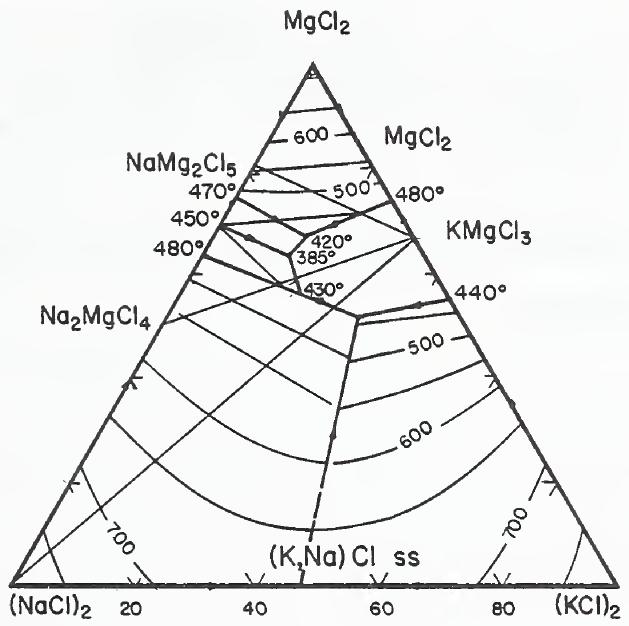  
Figure 96.1. KCl-NaCl-MgCl $_2$ phase diagram

References [1-22]

2. Density (ρ)

No data

3. Surface Tension (Y)

No data

4. Viscosity (η)

No data

5. Electrical Conductance (K)

No data

(96) KC1-NaCl-MgCl2

6. Safety and Hazards

A. Hazard rating

(i) Toxicity: NaCl, permitted in foods; KCl, very low; MgCl $_2$ , slight.

(ii) Vapor pressure: $\mathrm{MgCl}_2$ at m.pt. $(714^{\circ}\mathrm{C})$ , $\sim 0.11\mathrm{mm}$ ; NaCl at m.pt. $(800^{\circ}\mathrm{C})$ , $\sim 0.34\mathrm{mm}$ ; KCl at m.pt. $(770^{\circ}\mathrm{C})$ , $\sim 0.42\mathrm{mm}$ .

B. Disaster hazards

(i) Molten salt bath "explosions": i.e., explosive generation of steam due to bulk water "carry-over: and/or equipment failure; i.e., explosive expansion of "trapped" air.

(ii) Chlorides evolve highly toxic fumes when heated to decomposition, or contacted with acids.

References [23-28]

# 7. Corrosion

Table 96.1. Corrosion studies from primary research literature   

<table><tr><td>Studies</td><td>References</td></tr><tr><td>Ni, Fe</td><td>[29]</td></tr><tr><td>Zr, Be, Ti, Hf, U</td><td>[30]</td></tr><tr><td>Ni-Cr-Fe</td><td>[31]</td></tr><tr><td>Ti</td><td>[32,33]</td></tr><tr><td>Cr2O3+ C electrode</td><td>[34]</td></tr><tr><td>Fe</td><td>[35]</td></tr><tr><td>Ni-Cr</td><td>[36]</td></tr><tr><td>Fe, Ni</td><td>[37]</td></tr><tr><td>Steel 3</td><td>[38]</td></tr><tr><td>Ni-Fe</td><td>[29,39]</td></tr><tr><td>Au, Pt, W</td><td>[40]</td></tr><tr><td>Several metals</td><td>[41]</td></tr><tr><td>Fe</td><td>[42]</td></tr><tr><td>Ni</td><td>[43]</td></tr><tr><td>Zr</td><td>[30]</td></tr><tr><td>Rh</td><td>[44]</td></tr><tr><td>Al</td><td>[45]</td></tr><tr><td>Cr, Fe-Cr</td><td>[46]</td></tr><tr><td>W</td><td>[47]</td></tr><tr><td>Fe, steels</td><td>[38,48,49]</td></tr><tr><td>Emf. series</td><td>[41]</td></tr><tr><td>Thermodynamic redox diagrams</td><td>[29,50]</td></tr><tr><td>Electrochemical approach</td><td>[51,52]</td></tr><tr><td>Reviews (molten salts corrosion)</td><td>[53-55]</td></tr><tr><td>Annotated corrosion biblio.</td><td>[56]</td></tr></table>

For studies with binary systems, see KC1-MgCl $_2$ [38, 48, 49]; NaCl-MgCl $_2$ [48]; NaCl-KCl [all except 38, 48, 49]. For compatibility studies with molten KC1-NaCl-MgCl $_2$ see [57]; corrosion is not a problem if storage salts are dried before use, and if mild steel is used as a container.

References [29-57]

# 8. Diffusion

No data

9. Heat of Fusion $(\Delta H_{f}^{\circ})$

Measurement method: drop calorimetry [58]

Table 96.2. Heat of fusion   

<table><tr><td>Composition</td><td rowspan="2">ΔH°f(kcal mol-1)</td><td rowspan="2">Uncertainty</td></tr><tr><td>MgCl2:NaCl:KCl (mol %)</td></tr><tr><td>45.4:33.0:21.6</td><td>4.4</td><td>~ ± 2%</td></tr></table>

References [58]

10. Heat Capacity $(C_p)$

Measurement method: drop calorimetry [58]

Table 96.3. Heat capacity   

<table><tr><td>Composition</td><td rowspan="2">T(K)</td><td rowspan="2">\( C_p(cal K^{-1}mol^{-1}) \)</td><td rowspan="2">Uncertainty</td></tr><tr><td>\( MgCl_2:NaCl:KCl (mol\%) \)</td></tr><tr><td>45.4:33.0:21.6</td><td>673</td><td>19.0</td><td>\( \sim ± 2\% \)</td></tr></table>

For the above composition:

$$
C p _ {(s)} = 1 4. 0 1 9 + 7. 3 2 3 x 1 0 ^ {- 3} T \tag {96.1}
$$

for the temperature range 290 - $620^{\circ}\mathrm{K}$

References [58]

11. Volume Change on Melting $(\Delta V_{f})$

No data

12. Vapor Pressure $(p_{vap})$

Measurement method: transpiration technique [59]

Equation:

$$
\log p = A + B / T \quad [ 9 6. 1)
$$

precision: in table 96.4 uncertainty: $\sim$ $30\%$

Table 96.4. Parameters of equation (96.1) and precision   

<table><tr><td colspan="3">Composition (mol %)</td><td rowspan="2">A</td><td rowspan="2">-B</td><td rowspan="2">Precision</td><td rowspan="2">T range(K)</td></tr><tr><td>KCl</td><td>NaCl</td><td>MgCl2</td></tr><tr><td>21.8</td><td>25.5</td><td>52.7</td><td>4.3404</td><td>4554</td><td>*</td><td>820-1125</td></tr></table>

* insufficient information for estimate; results reported in graphical format

Table 96.5. Vapor pressure (mm) of ternary mixture from equation in table 96.4.   

<table><tr><td>T(K)</td><td>p(mm)</td><td></td><td>T(K)</td><td>p(mm)</td></tr><tr><td>820</td><td>0.061</td><td></td><td>975</td><td>0.467</td></tr><tr><td>825</td><td>0.066</td><td></td><td>1000</td><td>0.612</td></tr><tr><td>850</td><td>0.096</td><td></td><td>1025</td><td>0.790</td></tr><tr><td>875</td><td>0.137</td><td></td><td>1050</td><td>1.008</td></tr><tr><td>900</td><td>0.191</td><td></td><td>1075</td><td>1.271</td></tr><tr><td>925</td><td>0.261</td><td></td><td>1100</td><td>1.586</td></tr><tr><td>950</td><td>0.352</td><td></td><td>1125</td><td>1.961</td></tr></table>

References [59]

13. Thermal Conductivity (liquid) $(\lambda_{\mathrm{g}})$

No data

14. Thermal Conductivity (solid) $(\lambda_{s})$

No data

15. Cryoscopic Constant $(k_{f})$

Measurement method: calculated from $\Delta H_{\mathrm{f}}^{\circ}$ [60]

Table 96.6. Cryoscopic constant   

<table><tr><td>Composition</td><td rowspan="2">\( k_f \) (K mol-1kg)</td><td rowspan="2">Uncertainty</td></tr><tr><td>\( MgCl_2:NaCl:KCl(mol\%) \)</td></tr><tr><td>45.4:33.0:21.6</td><td>16.1</td><td>~ ± 2%</td></tr></table>

References [60]

# 16. References

[1] Imatomi, S., Bull. Inst. Phys. Chem. Res, (Tokyo), 19, 167 (1940).   
[2] Janecke, E., Z. Anorg. Allgem. Chem., 261, 218 (1950).   
[3] Gaur, H. C., Behl, W. K., Electrochimica Acta, 8, 107 (1963).   
[4] Batashev, K. P., Metallurgika, 10, 100 (1935).   
[5] Behl, W. K., Gaur, H. C., J. Sci. Ind. Res., India, 20B, 183 (1961).   
[6] Hill, D. L., Perano, J., Osteryoung, R. A., J. Electrochem. Soc., 107, 698 (1960).   
[7] Scholich, K., Neues Jahrb. Mineral. Geol. Palaontal, Beil., 43, 251 (1920).   
[8] Abramov, G. A., Metallurg., 6, 82 (1935).   
[9] Janz, G. J. Downey, J. R., Jr., Allen, C. B., and Tomkins, R. P. T., "Eutectic Data" - 2 Vols; ERDA-TID-27163-P1 & P2; NTIS, Washington, D. C. (1977).   
[10] Janz, G. J., Downey, J. R., Jr., Allen, C. B., and Tomkins, R. P. T., "Physical Properties Data Complications Relevant to Energy Storage. I. Molten Salts: Eutectic Data", NSRDS-NBS-61; U. S. Gov't Printing Office, Washington, D. C. (1978).   
[11] "International Critical Tables of Numerical Data, Physics, Chemistry, and Technology", 8 Vols., McGraw-Hill Book Co., N. Y. (1933).   
[12] "Landolt-Bornstein Zahlenwert und Funktionen aus Physik, Chemie, Astronomie, Geophysik und Technik", (10th Ed.) Springer-Verlag, Berlin, Heidelberg, N. Y. (1961).   
[13] Clark, P. V., "Fused Salt Mixtures: Eutectic Compositions and Melting Points Bibliography 1907-1968", Report No. SC-R-68-1680; Sandia Laboratories (1968), NTIS.   
[14] Robertson, W. D., "Binary Phase Diagrams of Halide Salts", Report No. Yale 2723 (2 Vols.), U. S. AEC Contract AT (30-1)-2723 (1966), NTIS.   
[15] Thoma, R. E., "Phase Diagrams of Nuclear Reactor Materials", Oak Ridge National Laboratory, ORNL-2548, Contract No. W-7405-eng-26.   
[16] Thoma, R. E., "Phase Diagrams of Binary and Ternary Fluoride Systems", Chapt. 6; Adv. Molten Salts Chemistry, Vol. 3 (J. Braunstein, G. Mamantov, and G. P. Smith, eds.), Plenum Press, N. Y. (1975).   
[17] Voskresenskaya, N. K., ed., "Handbook of Solid-Liquid Equilibria in Systems of Inorganic Salts", Volumes 1, 2, Izc. Akad. Nauk SSSR, Moscow (1961). Israel Program for Scientific Translations, Jerusalem, 1970 (NTIS).   
[18] Sinistri, C., Franzozini, P., and Rolla, M., "An Atlas of Miscibility Gaps in Molten Salt Systems", Institute of Physical Chemistry, University of Pavia (Italy) (1968).   
[19] Shaffer, P. T. B., "High Temperature Materials", Plenum Press Handbooks of High Temperature Materials, No. 1, Materials Index, Plenum Press, New York, 1964.   
[20] Franzozini, P., Ferloni, P., and Spinolo, C., "Molten Salts with Organic Anions", Instituto di Chimica Fisica, Universita di Pavia (Italy), 1973.

(96) KC1-NaCl-MgCl2

[21] Toropov, N. A. et al., "Handbook of Phase Diagrams of the Silicates, Volume 1: Binary Systems, Volume 2, Metal-Oxygen Compounds in Silicate Systems", Izdatel'stov "Nauka" Leningradskoe Otdelenie, Leningrad, 1969, Israel Program for Scientific Translations, Jerusalem, 1972 (NTIS).   
[22] Levin, E., et al., "Phase Diagrams for Ceramists", Amer. Ceramic Soc. (publ.), Columbus, Ohio (1964; 1969).   
[23] "Dangerous Properties of Materials", Sax, N. I., Van Nostrand Reinhold Co., N. Y. (1969)   
[24] "Registry of Toxic Effects of Chemical Substances", Christensen, H. E., and Lubinbyhl, T. T., eds., U. S. Dept. H. E. W., U. S. Gov't Printing Office, Washington, D. C. (1975)   
[25] Janz, G. J., et al., "Physical Properties Data Complications Relevant to Energy Storage. Part II. Molten Salts: Data on Single and Multi-Component Salt Systems", NSRDS-NBS 61, Part II (April 1979), U. S. Gov't Printing Office, Supt of Doc. No. C13-48-61, Washington D. C. 20402.   
[26] "Potential Hazards in Molten Salt Baths for Heat Treatment of Metals", National Board of Fire Underwriters Research Report No. 2 (1954)   
[27] "Handbook of Reactive Chemical Hazards", Bretherwick, L., Butterworth Co., London (1975)   
[28] Janz, G. J., Tomkins, R. P. T., Downey, J. R., Jr., and Allen, C. B., "Safety and Hazards, Chapter in "Eutectic Data", ERDA TID-27163-P1; NTIS, U. S. Dept. Commerce, Springfield, Va. (1977)   
[29] Littlewood, R., and Argent, E., Electrochim. Acta, 4, 155 (1961).   
[30] Smirnov, M. V., Volodin, V. P., and Ozeryanaya, I. N., Dokl. Akad. Nauk SSSR, 155, 418 (1964); Zashchita Metallov. (USSR), 2, 230 (1969).   
[31] Copson, H. R., J. Electrochem. Soc., 100, 257 (1953).   
[32] Gill, C. B., Straumanis, M. E., and Schlechten, W. B., J. Electrochem. Soc., 102, 42 (1955).   
[33] Smirnov, M. V., Yushina, L. D., and Logenov, N. A., Tr. Inst. Elektrokhim Akad. Nauk SSSR, Ural. Fil. 2, 135 (1961).   
[34] Minoura, H., and Oki, T., Denki Kagaku Oyotoi Kogyo Butsuri Kagaku, 37, 593 (1969).   
[35] Izrailev, L. M., and Shurygin, P. M., Fiz. Khim. Elektrokhim. Rasplav. Solei Shlakov, 2, 156 (1969).   
[36] Seybolt, A. U., Oxid. Metals, 2, 119 (1970).   
[37] Solomatin, V. E., Kornilov, N., and Ilyushchenko, N. G., Tr. Inst. Elektrokhim., Ural. Filial., Akad. Nauk SSSR, 15, 92 (1970).   
[38] Kochergin, V. P., Putina, O. A., Devyatkin, V. N., and Kanaeva, E. T., Tr. Vses. Nauchn. Issled. Proekt. Inst. Alyum., Magn. Electrodn., 75, 51 (1971).   
[39] Bartlett, H. E., and Johnson, K. E., Corrosion Sci., 6, 87 (1966).   
[40] Littlewood, R., J. Electrochem. Soc., 109, 525 (1962).   
[41] Flengas, S. N., and Ingraham, T. R., J. Electrochem. Soc., 106, 714 (1959).

[42] Devyatkin, V. N., and Ukshe, E. A., Zh. Priklad. Khim., 35, 1328 (1962).   
[43] Adeleanu, C., Gibson, J. G., and Littlewood, R., J. Appl. Chem., 12, 305 (1962).   
[44] Vasin, B. D., Nichkov, I. F., and Raspopin, S. P., Izv. Vyssh. Ucheb. Zaved., Tsvet. Met., 15, 76 (1972).   
[45] Protsakov, M.E., Oshchepkova, V. V., and Kochergin, V. P., Uch. Zap. Ural. Gos. Univ., 92, 46 (1969).   
[46] Krasil'nikova, N. A., Ozeryanaya, I. N., Smirnov, M. V., and Shamanova, N. D., Zashch. Metal., 10, 446 (L974).   
[47] Shkol'nikov, S. N., Manenkov, M. I., and Yarmolovich., A. K., Zh. Priklad. Khim., 46, 1918 (1973).   
[48] Kochergin, V. P., Khaibuilina, V. P., and Potapova, O. G., Zh. Neorg. Khim., 1, 2617 (1956).   
[49] Kochergin, V. P., Kabirov, A. V., Skornyakova, O. N., J. Appl. Chem. USSR, 27, 883 (1954).   
[50] Edeleanu, C., and Littlewood, R., Electrochimica Acta, 3, 195 (1960).   
[51] Pizzini, S., "Materials Problems in the Industrial Applications of Molten Salts", Proceedings of the European Conference on the Development of Molten Salts Applications, p. 203 (1973); Battelle, Geneva.   
[52] Johnson, K. E., "Electrochemical Approaches to Corrosion in Molten Salts", Proceedings International Symposium on Metal-Slag-Gas Reactions and Processes, The Electrochemical Society, Inc., Princeton, N. J., p. 581 (1975).   
[53] Smirnov, M. V., and Ozeryanaya, I. N., Nauki Tekh. Korros., Zashch., 2, 171 (1973).   
[54] Inman, D., and Wrench, N. S., Brit. Corr. J., 1, 246 (1966).   
[55] Ketelaar, J. A. A., Chemie Ing. Techn., 45, 667 (1973).   
[56] Janz, G. J., and Tomkins, R. P. T., Corrosion, 35, 485 (1979).   
[57] Chubb, T. A., Nemecek, J. J., and Simmons, D. E., "Energy Storage as Heat-of-Fusion in Containerized Salts", Naval Research Laboratory, Report No. NRL 4267, Washington, D. C. (1980).   
[58] Dynatech; cited in ref. [57] pg. 72.   
[59] Wickens, A. J., Inst. Min. Metall., Trans., Sect. C, 83, C149 (1974).   
[60] Janz, G. J., et al., MSDC-RPI), unpublished work (1980).

$$
\text {S y s t e m} 9 7 \quad \mathrm {C a C l} _ {2} - \mathrm {M g C l} _ {2}
$$

1. Melting Temperatures $(T_{m})$

Pure substance melting points:

CaCl2 782°C

$\mathrm{MgCl}_2$ ： $714^{\circ} \mathrm{C}$

Eutectic melting point:

621°C, composition: 39 mol % CaCl $_2$

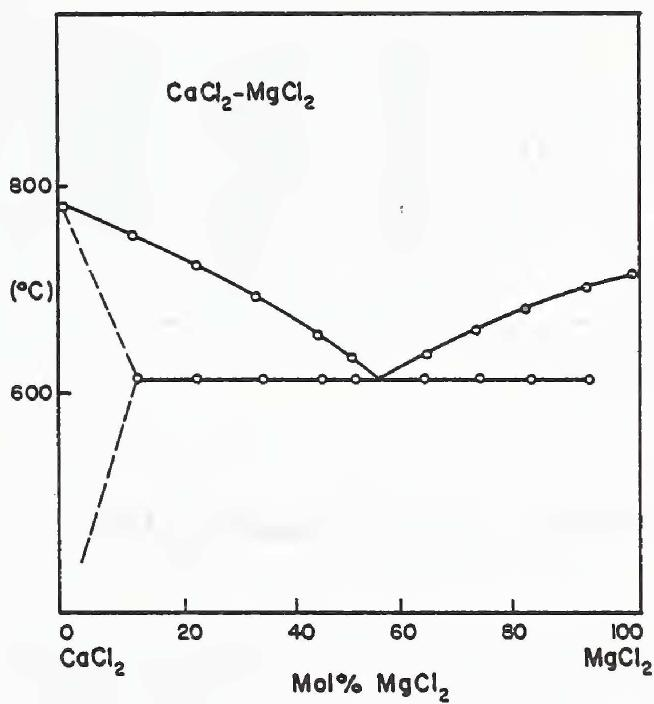  
Figure 97.1. $\mathrm{CaCl}_2$ - $\mathrm{MgCl}_2$ phase diagram

References [1-17].

2. Density (ρ)

Measurement method: Archimedean technique [18]

Equation:

$$
\rho = a + b T \tag {97.1}
$$

precision: in table 97.1 uncertainty: $\sim$ 1.0%

Table 97.1. Parameters of equation (97.1) and precisions   

<table><tr><td>Mol % MgCl2</td><td>a</td><td>-b x 103</td><td>Precision</td><td>T range(K)</td></tr><tr><td>0.0</td><td>2:4986</td><td>0.3976</td><td>0.05%</td><td>1070-1140</td></tr><tr><td>13.3</td><td>2.1352</td><td>0.3697</td><td>0.03%</td><td>1080-1160</td></tr><tr><td>32.1</td><td>2.2379</td><td>0.3955</td><td>0.05%</td><td>1090-1170</td></tr><tr><td>34.6</td><td>2.2680</td><td>0.3977</td><td>0.01%</td><td>1100-1180</td></tr><tr><td>40.9</td><td>2.3656</td><td>0.4577</td><td>0.02%</td><td>1090-1160</td></tr><tr><td>59.9</td><td>2.3796</td><td>0.4093</td><td>0.05%</td><td>1070-1130</td></tr><tr><td>80.6</td><td>2.4864</td><td>0.4436</td><td>0.01%</td><td>1060-1130</td></tr><tr><td>100.0</td><td>1.9497</td><td>0.2705</td><td>0.03%</td><td>1020-1090</td></tr></table>

(97) $\mathrm{CaCl}_2\text{-MgCl}_2$

Table 97.2. Density (g cm $^{-3}$ ) from equations in table 97.1

<table><tr><td rowspan="2">T(K)</td><td colspan="6">\( Mol\ \% MgCl_2 \)</td></tr><tr><td>13.3</td><td>32.1</td><td>34.6</td><td>40.9</td><td>59.9</td><td>80.6</td></tr><tr><td>1060</td><td></td><td></td><td></td><td></td><td></td><td>2.016</td></tr><tr><td>1070</td><td></td><td></td><td></td><td></td><td>1.942</td><td>2.012</td></tr><tr><td>1080</td><td></td><td></td><td></td><td></td><td>1.938</td><td>2.007</td></tr><tr><td>1090</td><td>1.732</td><td>1.807</td><td></td><td>1.867</td><td>1.933</td><td>2.003</td></tr><tr><td>1100</td><td>1.729</td><td>1.803</td><td>1.831</td><td>1.863</td><td>1.929</td><td>1.999</td></tr><tr><td>1110</td><td>1.725</td><td>1.799</td><td>1.827</td><td>1.858</td><td>1.925</td><td>1.990</td></tr><tr><td>1120</td><td>1.721</td><td>1.795</td><td>1.823</td><td>1.854</td><td>1.921</td><td>1.985</td></tr><tr><td>1130</td><td>1.718</td><td>1.791</td><td>1.819</td><td>1.849</td><td>1.917</td><td></td></tr><tr><td>1140</td><td>1.714</td><td>1.787</td><td>1.815</td><td>1.844</td><td></td><td></td></tr><tr><td>1150</td><td>1.710</td><td>1.783</td><td>1.811</td><td>1.840</td><td></td><td></td></tr><tr><td>1160</td><td>1.706</td><td>1.779</td><td>1.807</td><td>1.835</td><td></td><td></td></tr><tr><td>1170</td><td></td><td>1.775</td><td>1.803</td><td></td><td></td><td></td></tr><tr><td>1180</td><td></td><td></td><td>1.799</td><td></td><td></td><td></td></tr></table>

References [18-22]

# 3. Surface Tension (Y)

Measurement method: flat pin detachment [20]

Equation:

$$
\gamma = a + b T \tag {97.2}
$$

precision: in table 97.3 uncertainty: $\sim \pm 3.0\%$

Table 97.3. Parameters of equation (97.2) and precisions   

<table><tr><td>Mol % MgCl2</td><td>a</td><td>-b x 103</td><td>Precision</td><td>T range(K)</td></tr><tr><td>15.2</td><td>160.53</td><td>30.65</td><td>0.01%</td><td>1080-1170</td></tr><tr><td>34.6</td><td>128.32</td><td>18.71</td><td>0.06%</td><td>1090-1170</td></tr><tr><td>53.0</td><td>106.85</td><td>14.83</td><td>0.11%</td><td>1090-1170</td></tr><tr><td>65.4</td><td>93.49</td><td>11.05</td><td>0.05%</td><td>1100-1180</td></tr><tr><td>83.4</td><td>79.01</td><td>07.65</td><td>0.00%</td><td>1080-1150</td></tr><tr><td>86.7</td><td>75.87</td><td>06.67</td><td>0.09%</td><td>1090-1170</td></tr></table>

Equation: (two-independent-variables equation)

$$
\gamma = a + b C + c C ^ {2} + d T ^ {3} + e T C ^ {2} + f C T ^ {2} \tag {97.3}
$$

$$
(C = \text {mol} \% \text {CaCl} _ {2})
$$

Table 97.4. Parameters of two-independent-variables equation (97.3)   

<table><tr><td>a</td><td>b x 10-1</td><td>c x 103</td><td>d x 1010</td><td>e x 106</td><td>f x 108</td><td>precision</td></tr><tr><td>63.14053</td><td>5.00268</td><td>6.83865</td><td>-7.82398</td><td>-2.43231</td><td>-6.82139</td><td>0.43%</td></tr></table>

# (97) $\mathrm{CaCl}_2 - \mathrm{MgCl}_2$

Table 97.5. Surface tension (dyn cm $^{-1}$ ) from equations in table 97.2   

<table><tr><td rowspan="2">T(K)</td><td colspan="6">Mo1 % MgCl2</td></tr><tr><td>15.2</td><td>34.6</td><td>53.0</td><td>65.4</td><td>83.4</td><td>86.7</td></tr><tr><td>1080</td><td>127.4</td><td></td><td></td><td></td><td>70.8</td><td></td></tr><tr><td>1090</td><td>127.1</td><td>107.9</td><td>90.7</td><td></td><td>70.7</td><td>68.6</td></tr><tr><td>1100</td><td>126.8</td><td>107.7</td><td>90.5</td><td>81.3</td><td>70.6</td><td>68.5</td></tr><tr><td>1100</td><td>126.5</td><td>107.6</td><td>90.4</td><td>81.2</td><td>70.5</td><td>68.5</td></tr><tr><td>1120</td><td>126.2</td><td>107.4</td><td>90.2</td><td>81.1</td><td>70.5</td><td>68.4</td></tr><tr><td>1130</td><td>125.9</td><td>107.2</td><td>90.1</td><td>81.0</td><td>70.4</td><td>68.3</td></tr><tr><td>1140</td><td>125.6</td><td>107.0</td><td>89.9</td><td>81.0</td><td>70.3</td><td>68.3</td></tr><tr><td>1150</td><td>125.3</td><td>106.8</td><td>89.8</td><td>80.8</td><td>70.2</td><td>68.2</td></tr><tr><td>1160</td><td>125.0</td><td>106.6</td><td>89.6</td><td>80.7</td><td></td><td>68.1</td></tr><tr><td>1170</td><td>124.7</td><td>106.4</td><td>89.5</td><td>80.6</td><td></td><td>68.1</td></tr><tr><td>1180</td><td></td><td></td><td></td><td>80.4</td><td></td><td></td></tr><tr><td>1190</td><td></td><td></td><td></td><td></td><td></td><td></td></tr></table>

References [20,23,24]

# 4. Viscosity (n)

Measurement method: oscillating sphere technique [25]

Equation:

$$
n = a + b T ^ {\prime} + c T ^ {2} + d T ^ {3} \tag {97.4}
$$

precision: in table 97.6

uncertainty: $\sim \pm 5.0\%$

Table 97.6. Parameters of equation (97.4) and precisions   

<table><tr><td>MgCl2(mol %)</td><td>a</td><td>b x 102</td><td>-c x 105</td><td>d x 108</td><td>Precision</td><td>T range(K)</td></tr><tr><td>30</td><td>52.661</td><td>-5.244</td><td>2.348</td><td>2.698</td><td>0.80%</td><td>1070-1110</td></tr><tr><td>45</td><td>1.945</td><td>0.646</td><td>0.556</td><td></td><td>0.29%</td><td>1070-1110</td></tr><tr><td>60</td><td>3.389</td><td>0.406</td><td>0.473</td><td></td><td>0.26%</td><td>1090-1110</td></tr><tr><td>75</td><td>8.968</td><td>-0.569</td><td>0.334</td><td>0.246</td><td>0.46%</td><td>1070-1120</td></tr><tr><td>90</td><td>18.555</td><td>-1.616</td><td>0.969</td><td>0.952</td><td>0.29%</td><td>1070-1120</td></tr></table>

(97) $\mathrm{CaCl}_2 - \mathrm{MgCl}_2$

Table 97.7. Viscosity (cp) from equations in table 97.6

<table><tr><td rowspan="2">T(K)</td><td colspan="5">\( Mo1\ \%\ MgCl_2 \)</td></tr><tr><td>30</td><td>45</td><td>60</td><td>75</td><td>90</td></tr><tr><td>1070</td><td>2.718</td><td>2.491</td><td></td><td>2.066</td><td>1.830</td></tr><tr><td>1080</td><td>2.624</td><td>2.437</td><td>2.262</td><td>2.023</td><td>1.790</td></tr><tr><td>1090</td><td>2.543</td><td>2.381</td><td>2.200</td><td>1.980</td><td>1.754</td></tr><tr><td>1100</td><td>2.475</td><td>2.323</td><td>2.137</td><td>1.938</td><td>1.7225</td></tr><tr><td>1110</td><td>2.420</td><td>2.265</td><td>2.073</td><td>1.897</td><td>1.695</td></tr><tr><td>1120</td><td></td><td></td><td></td><td>1.857</td><td>1.673</td></tr></table>

References [25]

# 5. Electrical Conductance (K)

Measurement method: classical ac technique [26]

Equation:

$$
\kappa = a + b T + c T ^ {2} \tag {97.5}
$$

precision: in table 97.8

uncertainty: $\sim 5.0\%$

Table 97.8. Parameters of equation (97.5) and precisions   

<table><tr><td>\( \mathrm{{Mol}}\% {\mathrm{{MgCl}}}_{2} \)</td><td>a</td><td>b x \( {10}^{3} \)</td><td>c x \( {10}^{6} \)</td><td>Precision</td><td>T range(K)</td></tr><tr><td>20</td><td>-3.2418</td><td>5.025</td><td>0</td><td>0.28%</td><td>1050-1080</td></tr><tr><td>40</td><td>5.3906</td><td>-10.262</td><td>6.677</td><td>0.11%</td><td>1000-1050</td></tr><tr><td>60</td><td>-1.5310</td><td>3.275</td><td>0</td><td>0.24%</td><td>980-1040</td></tr><tr><td>80</td><td>2.5710</td><td>-4.414</td><td>3.346</td><td>0.12%</td><td>1000-1050</td></tr></table>

Table 97.9. Specific conductance (ohm $^{-1}$ cm $^{-1}$ ) from equations in table 97.8   

<table><tr><td rowspan="2">T(K)</td><td colspan="4">\( \mathrm {M o l}\% \mathrm {M g C l}_{2} \)</td></tr><tr><td>20</td><td>40</td><td>60</td><td>80</td></tr><tr><td>980</td><td></td><td></td><td>1.678</td><td></td></tr><tr><td>990</td><td></td><td></td><td>1.711</td><td></td></tr><tr><td>1000</td><td></td><td>1.805</td><td>1.744</td><td>1.503</td></tr><tr><td>1010</td><td></td><td>1.836</td><td>1.776</td><td>1.527</td></tr><tr><td>1020</td><td></td><td>1.869</td><td>1.809</td><td>1.550</td></tr><tr><td>1030</td><td></td><td>1.903</td><td>1.842</td><td>1.575</td></tr><tr><td>1040</td><td></td><td>1.939</td><td>1.875</td><td>1.600</td></tr><tr><td>1050</td><td>2.034</td><td>1.976</td><td></td><td>1.626</td></tr><tr><td>1060</td><td>2.084</td><td></td><td></td><td></td></tr><tr><td>1070</td><td>2.135</td><td></td><td></td><td></td></tr><tr><td>1080</td><td>2.185</td><td></td><td></td><td></td></tr><tr><td>1090</td><td>2.235</td><td></td><td></td><td></td></tr></table>

References [18,26]

# 6. Safety and Hazards

# A. Hazard rating

(i) Toxicity: $\mathsf{CaCl}_2$ , very low; $\mathsf{MgCl}_2$ , slight.   
(ii) Vapor pressure: at m.pt. $(782^{\circ}\mathrm{C})$ , $\sim 2 \times 10^{-4} \mathrm{~mm}$ ; $\mathrm{MgCl}_2$ at m.pt. $(714^{\circ}\mathrm{C})$ , $\sim 0.11 \mathrm{~mm}$ .

# B. Disaster hazards

(i) Molten salt bath "explosions": i.e., explosive generation of steam due to bulk water "carry-over: and/or equipment failure; i.e., explosive expansion of "trapped" air.   
(ii) Chlorides evolvehighly toxic fumes when heated to decomposition, or contacted with acids.

References [27-32]

# 7. Corrosion

Table 97.10. Corrosion studies from primary research literature   

<table><tr><td>Studies</td><td>References</td></tr><tr><td>Zr</td><td>[33]</td></tr><tr><td>Ti, Zr, Hf, ThCl4</td><td>[34]</td></tr><tr><td>Pb, Pb-Bi</td><td>[35]</td></tr><tr><td>Fe</td><td>[36]</td></tr><tr><td>Electrochemical aspects</td><td>[37,38]</td></tr><tr><td>Thermodynamic approach</td><td>[39-41]</td></tr><tr><td>Corrosion in molten salts, annotated biblio.</td><td>[42]</td></tr><tr><td>Reviews: corrosion in molten salts</td><td>[43-45]</td></tr></table>

Compatibility studies for various molten chlorides and mixtures. For studies specifically with molten $\mathrm{CaCl}_2 - \mathrm{MgCl}_2$ see [36].

References [33-45]

8. Diffusion

No data

9. Heat of Fusion $(\Delta H_{f}^{\circ})$

No data

(97) $\mathrm{CaCl}_2 - \mathrm{MgCl}_2$

10. Heat Capacity $(C_p)$ No data   
11. Volume Change on Melting $(\Delta V_{f})$ No data   
12. Vapor Pressure $(p_{vap})$ No data   
13. Thermal Conductivity (liquid) $(\lambda_{\mathfrak{L}})$ No data   
14. Thermal Conductivity (solid) $(\lambda_{s})$ No data   
15. Cryoscopic Constant $(k_{f})$ No data

16. References

[1] Menge, O., Z. Anorg. Chem., 72, 162 (1911).   
[2] Ivanoc, A. I., Sbornik Statei Obshchei Khim., Akad. Nauk, SSSR, 1, 754 (1953).   
[3] Matiasovsky, K., Chem. Zvesti., 13, 69 (1959).   
[4] Janz, G. J. Downey, J. R., Jr., Allen, C. B., and Tomkins, R. P. T., "Eutectic Data" - 2 Vols; ERDA-TID-27163-P1 & P2; NTIS, Washington, D. C. (1977).   
[5] Janz, G. J., Downey, J. R., Jr., Allen, C. B., and Tomkins, R. P. T., "Physical Properties Data Complications Relevant to Energy Storage." I. Molten Salts: Eutectic Data", NSRDS-NBS-61; U. S. Gov't Printing Office, Washington, D. C. (1978).   
[6] "International Critical Tables of Numerical Data, Physics, Chemistry, and Technology", 8 Vols., McGraw-Hill Book Co., N. Y. (1933).   
[7] "Landolt-Bornstein Zahlenwert und Funktionen aus Physik, Chemie, Astronomie, Geophysik und Technik", (10th Ed.) Springer-Verlag, Berlin, Heidelberg, N. Y. (1961).   
[8] Clark, P. V., "Fused Salt Mixtures: Eutectic Compositions and Melting Points Bibliography 1907-1968", Report No. SC-R-68-1680; Sandia Laboratories (1968), NTIS.   
[9] Robertson, W. D., "Binary Phase Diagrams of Halide Salts", Report No. Yale 2723 (2 Vols.), U. S. AEC Contract AT (30-1)-2723 (1966), NTIS.   
[10] Thoma, R. E., "Phase Diagrams of Nuclear Reactor Materials", Oak Ridge National Laboratory, ORNL-2548, Contract No. W-7405-eng-26.

(97) $\mathrm{CaCl}_2\text{-MgCl}_2$   
[11] Thoma, R. E., "Phase Diagrams of Binary and Ternary Fluoride Systems", Chapt. 6; Adv. Molten Salts Chemistry, Vol. 3 (J. Braunstein, G. Mamantov, and G. P. Smith, eds.), Plenum Press, N. Y. (1975).   
[12] Voskresenskaya, N. K., ed., "Handbook of Solid-Liquid Equilibria in Systems of Inorganic Salts", Volumes 1, 2, Izc. Akad. Nauk SSSR, Moscow (1961). Israel Program for Scientific Translations, Jerusalem, 1970 (NTIS).   
[13] Sinistri, C., Franzozini, P., and Rolla, M., "An Atlas of Miscibility Gaps in Molten Salt Systems", Institute of Physical Chemistry, University of Pavia (Italy) (1968).   
[14] Shaffer, P. T. B., "High Temperature Materials", Plenum Press Handbooks of High Temperature Materials, No. 1, Materials Index, Plenum Press, New York, 1964.   
[15] Franzozini, P., Ferloni, P., and Spinolo, C., "Molten Salts with Organic Anions", Instituto di Chimica Fisica, Universita di Pavia (Italy), 1973.   
[16] Toropov, N. A. et al., "Handbook of Phase Diagrams of the Silicates, Volume 1: Binary Systems, Volume 2, Metal-Oxygen Compounds in Silicate Systems", Izdatel'stov "Nauka" Leningradskoe Otdelenie, Leningrad, 1969, Israel Program for Scientific Translations, Jerusalem, 1972 (NTIS).   
[17] Levin, E., et al., "Phase Diagrams for Ceramists", Amer. Ceramic Soc. (publ.), Columbus, Ohio (1964; 1969).   
[18] Huber, R. W., Potter, E. V., and St. Clair, H. W., U. S. Bur. Mines Rept. Invest. No. 4858 (1952).   
[19] Maurit, A. A., Zhur. Priklad. Khim., 39, 1285 (1966), J. Appl. Chem. USSR, 39, 1203 (1966).   
[20] Lillebuen, B., Ph.D. Thesis, The Technical University of Norway, Trondheim, Norway (1969).   
[21] Grjothiem, K., Holm, J. L., Lillebuen, B., and Øye, H. A., Trans. Faraday Soc., 67, 640 (1971).   
[22] Markov, B. F., Prisyazhnyi, V. D., and Prikhod'ko, G. P., Ukrain. Khim. Zhur., 36, 251 (1970).   
[23] Grjothiem, K., Holm, J. L., Lillibuen, B., and Øye, H. A., Inst. Inorg. Chem., Technical University of Norway, N-7034, Trondheim, Norway (1971).   
[24] Zezyanov, S. P., and Il'ichev, V. A., Russ. J. Inorg. Chem. 11, 936 (1966).   
[25] Dumas, D., Fjeld, B., Grjothim, K., and Øye, H. A., Acta. Chemical Scand., 27, 319 (1973).   
[26] Nikolio, R., Grjothim, K., and Øye, H. A., Acta. Chem. Scand., 24, 489 (1970).   
[27] "Dangerous Properties of Materials", Sax, N. I., Van Nostrand Reinhold Co., N. Y. (1969).   
[28] "Registry of Toxic Effects of Chemical Substances", Christensen, H. E., and Lubinbyhl, T. T., eds., U. S. Dept. H. E. W., U. S. Gov't Printing Office, Washington, D. C. (1975).

[29] Janz, G. J., et al., "Physical Properties Data Complications Relevant to Energy Storage. Part II. Molten Salts: Data on Single and Multi-Component Salt Systems", NSRDS-NBS 61, Part II (April 1979), U. S. Gov't Printing Office, Supt of Doc. No. C13-48-61, Washington D. C. 20402.   
[30] "Potential Hazards in Molten Salt Baths for Heat Treatment of Metals", National Board of Fire Underwriters Research Report No. 2 (1954).   
[31] "Handbook of Reactive Chemical Hazards", Bretherwick, L., Butterworth Co., London (1975).   
[32] Janz, G. J., Tomkins, R. P. T., Downey, J. R. Jr., and Allen, C. B., "Safety and Hazards", Chapter in "Eutectic Data", ERDA TID-27163-P1; NTIS, U. S. Dept. Commerce, Springfield, Va. (1977)   
[33] Thai, V., Ozeryanaya, I. N., and Smirnov, M. V., Tri. Inst. Elektrokhim., Ural. Nauch. Tsentr. Akad. Nauk SSSR, 19, 69 (1973).   
[34] Smirnov, M. V., Kudyakov, V. Ya., Loginov, Ya. A., Rossokhin, E. G., Posokhin, Yu. V., and Puzanova, T. A., Fiz. Khim. Elektrokhim. Rasplav. Solei Shlakov, 1, 115 (1969).   
[35] Vasin, B. D., Nichkov, I. F., and Raspopin, S. P., Izv. Vyssh. Ucheb. Zaved., Tsvet. Met., 15, 102 (1972).   
[36] Kochergin, V. P., Khaibuilina, V. P., and Potapova, O. G., Zh. Neorg. Khim., 1, 2617 (1956).   
[37] Pizzini, S., "Materials Problems in the Industrial Applications of Molten Salts", Proceedings of the European Conference on the Development of Molten Salts Applications", p. 203 (1973); Battelle, Geneva.   
[38] Johnson, K. E., "Electrochemical Approaches to Corrosion in Molten Salts", Proceedings International Symposium on Metal-Slag-Gas Reactions and Processes, The Electrochemical Society Inc., Princeton, N. J., p. 581 (1975).   
[39] Littlewood, R., J. Electrochem. Soc., 109, 525 (1962).   
[40] Edeleanu, C., and Littlewood, R., Electrochimica Acta, 3, 195 (1960).   
[41] Littlewood, R., and Argent, E. A., Electrochimica Acta, 4, 114 (1961).   
[42] Janz, G. J., and Tomkins, R. P. T., Corrosion, 35, 485 (1979).   
[43] Smirnov, M. V., and Ozeryanaya, I. N., Nauki Tekh. Korros. Zashch. Korros., 2, 171 (1973).   
[44] Ketelaar, J. A. A., Chemie. Ing. Techn., 45, 667 (1973).   
[45] Inman, D., and Wrench, N. S., Brit. Corr. J., 1, 246 (1966).

$$
\text {S y s t e m} 9 8 \quad \mathrm {B a C l} _ {2} - \mathrm {M g C l} _ {2}
$$

1. Melting Temperatures $(T_{m})$

Pure substance melting points:

BaCl2: 962°C

$\mathrm{MgCl}_2$ ： $714^{\circ}\mathrm{C}$

Eutectic melting point:

E: $556^{\circ} \mathrm{C}$ , composition: $65 \mathrm{~mol} \% \mathrm{MgCl}_{2}$

P: $590 - 600^{\circ} \mathrm{C}$ , composition: $60 \mathrm{~mol} \% \mathrm{MgCl}_{2}$

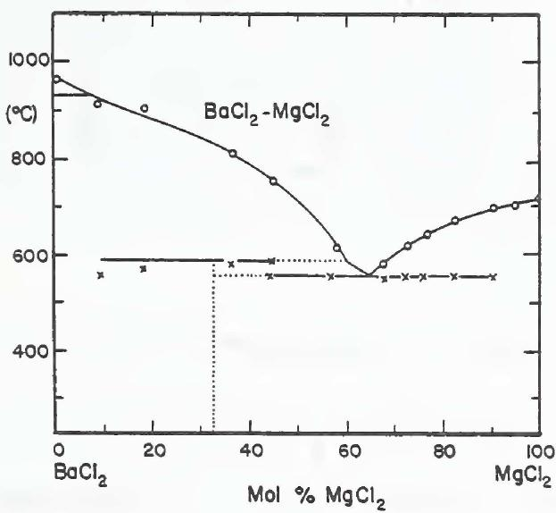  
Figure 98.1. $\mathsf{BaCl}_2$ - $\mathsf{MgCl}_2$ phase diagram

References [1-19]

2. Density (ρ)

Measurement method: Archimedean technique [20]

Equation:

$$
\rho = a + b T \tag {98.1}
$$

precision: in table 98.1 uncertainty: $\sim \pm 1.0\%$

Table 98.1. Parameters of equation (98.1) and precision   

<table><tr><td>\( \mathrm{{Mol}}\% {\mathrm{{MgCl}}}_{2} \)</td><td>a</td><td>\( - b \times  {10}^{4} \)</td><td>Precision</td><td>T range(K)</td></tr><tr><td>19.6</td><td>3.836</td><td>7.1</td><td>*</td><td>1030-1190</td></tr><tr><td>42.2</td><td>3.569</td><td>7.5</td><td>*</td><td>1030-1190</td></tr><tr><td>68.6</td><td>3.010</td><td>6.4</td><td>*</td><td>1030-1190</td></tr><tr><td>86.8</td><td>2.461</td><td>4.7</td><td>*</td><td>1030-1190</td></tr><tr><td>95.2</td><td>2.171</td><td>3.6</td><td>*</td><td>1030-1190</td></tr><tr><td>100.0</td><td>1.988</td><td>3.0</td><td>*</td><td>1030-1190</td></tr></table>

\* not estimated, insufficient data

(98) $\mathrm{BaCl}_2 - \mathrm{MgCl}_2$

Table 98.2. Density $(\mathrm{gcm}^{-3})$ from equations in table 98.1   

<table><tr><td rowspan="2">T(K)</td><td colspan="5">\( Mol\ \% MgCl_2 \)</td></tr><tr><td>19.6</td><td>42.2</td><td>68.6</td><td>86.6</td><td>95.2</td></tr><tr><td>1030</td><td>3.105</td><td>2.797</td><td>2.351</td><td>1.977</td><td>1.801</td></tr><tr><td>1050</td><td>3.090</td><td>2.782</td><td>2.338</td><td>1.968</td><td>1.793</td></tr><tr><td>1070</td><td>3.076</td><td>2.767</td><td>2.325</td><td>1.958</td><td>1.786</td></tr><tr><td>1090</td><td>3.062</td><td>2.752</td><td>2.312</td><td>1.949</td><td>1.779</td></tr><tr><td>1110</td><td>3.048</td><td>2.737</td><td>2.299</td><td>1.940</td><td>1.772</td></tr><tr><td>1130</td><td>3.034</td><td>2.722</td><td>2.287</td><td>1.930</td><td>1.765</td></tr><tr><td>1150</td><td>3.019</td><td>2.707</td><td>2.274</td><td>1.921</td><td>1.757</td></tr><tr><td>1170</td><td>3.005</td><td>2.692</td><td>2.261</td><td>1.911</td><td>1.750</td></tr><tr><td>1190</td><td>2.991</td><td>2.677</td><td>2.248</td><td>1.902</td><td>1.743</td></tr></table>

References [20-22]

# 3. Surface Tension (γ)

Measurement method: maximum bubble pressure [23]

Equation:

$$
\gamma = a + b T \tag {98.2}
$$

precision: in table 98.3

uncertainty: $\sim \pm 3.0\%$

Table 98.3. Parameters of equation (98.2) and precision   

<table><tr><td>Mol % MgCl2</td><td>a</td><td>-b x 102</td><td>Precision</td><td>T range(K)</td></tr><tr><td>25.0</td><td>217.5</td><td>7.0</td><td>*</td><td>1030-1190</td></tr><tr><td>40.0</td><td>164.2</td><td>4.1</td><td>*</td><td>1030-1190</td></tr><tr><td>60.0</td><td>143.1</td><td>4.0</td><td>*</td><td>1030-1190</td></tr><tr><td>80.0</td><td>121.4</td><td>3.5</td><td>*</td><td>1030-1190</td></tr></table>

\* not estimated; insufficient data

# (98) BaCl₂ - MgCl₂

Table 98.4. Surface tension (dyn cm $^{-1}$ ) from equations in table 98.3   

<table><tr><td rowspan="2">T(K)</td><td colspan="4">Mol % MgCl2</td></tr><tr><td>25.0</td><td>40.0</td><td>60.0</td><td>80.0</td></tr><tr><td>1030</td><td>145.4</td><td>122.0</td><td>101.9</td><td>85.4</td></tr><tr><td>1050</td><td>144.0</td><td>121.2</td><td>101.1</td><td>84.7</td></tr><tr><td>1070</td><td>142.6</td><td>120.3</td><td>100.3</td><td>84.0</td></tr><tr><td>1090</td><td>141.2</td><td>119.5</td><td>99.5</td><td>83.3</td></tr><tr><td>1110</td><td>139.8</td><td>118.7</td><td>98.7</td><td>82.6</td></tr><tr><td>1130</td><td>138.4</td><td>117.9</td><td>97.9</td><td>81.9</td></tr><tr><td>1150</td><td>137.0</td><td>117.1</td><td>97.1</td><td>81.2</td></tr><tr><td>1170</td><td>135.6</td><td>116.2</td><td>96.3</td><td>80.5</td></tr><tr><td>1190</td><td>134.2</td><td>115.4</td><td>95.5</td><td>79.8</td></tr></table>

References [22,23]

4. Viscosity (n)

Measurement method: oscillating sphere technique [24]

Equation:

$$
n = a + b T + c T ^ {2} \quad (9 8. 3)
$$

precision: in table 98.5

uncertainty: $\sim \pm 10\%$

Table 98.5. Parameters of equation (98.3) and precisions   

<table><tr><td>BaCl2(mol %)</td><td>a</td><td>-b x 102</td><td>c x 105</td><td>Precision</td><td>T range(K)</td></tr><tr><td>10</td><td>35.938</td><td>6.006</td><td>2.633</td><td>0.96%</td><td>970-1070</td></tr><tr><td>20</td><td>47.397</td><td>8.192</td><td>3.686</td><td>1.23%</td><td>970-1070</td></tr><tr><td>30</td><td>46.139</td><td>7.752</td><td>3.403</td><td>1.00%</td><td>970-1070</td></tr><tr><td>40</td><td>51.269</td><td>8.474</td><td>3.658</td><td>0.96%</td><td>970-1070</td></tr><tr><td>50</td><td>88.348</td><td>14.88</td><td>6.443</td><td>1.36%</td><td>970-1070</td></tr><tr><td>60</td><td>24.375</td><td>1.940</td><td></td><td>*</td><td></td></tr></table>

*Precision not estimated; insufficient data set.

$$
\mathrm {B a C l} _ {2} - \mathrm {M g C l} _ {2} \tag {98}
$$

Table 98.6. Viscosity (cp) from equations in table 98.5   

<table><tr><td rowspan="2">T(K)</td><td colspan="6">\( \mathrm {M o l}\% \mathrm {B a C l}_{2} \)</td></tr><tr><td>10</td><td>20</td><td>30</td><td>40</td><td>50</td><td>60</td></tr><tr><td>970</td><td>2.45</td><td>2.62</td><td>2.96</td><td>3.49</td><td>4.63</td><td></td></tr><tr><td>980</td><td>2.37</td><td>2.52</td><td>2.85</td><td>3.36</td><td>4.40</td><td></td></tr><tr><td>990</td><td>2.29</td><td>2.42</td><td>2.75</td><td>3.23</td><td>4.18</td><td></td></tr><tr><td>1000</td><td>2.21</td><td>2.34</td><td>2.65</td><td>3.11</td><td>3.98</td><td></td></tr><tr><td>1010</td><td>2.14</td><td>2.26</td><td>2.56</td><td>3.00</td><td>3.78</td><td></td></tr><tr><td>1020</td><td>2.07</td><td>2.19</td><td>2.47</td><td>2.89</td><td>3.61</td><td>4.59</td></tr><tr><td>1030</td><td>2.01</td><td>2.12</td><td>2.40</td><td>2.80</td><td>3.44</td><td>4.39</td></tr><tr><td>1040</td><td>1.95</td><td>2.07</td><td>2.33</td><td>2.70</td><td>3.28</td><td>4.20</td></tr><tr><td>1050</td><td>1.90</td><td>2.02</td><td>2.26</td><td>2.62</td><td>3.14</td><td>4.01</td></tr><tr><td>1060</td><td>1.86</td><td>1.98</td><td>2.20</td><td>2.55</td><td>3.01</td><td>3.81</td></tr><tr><td>1070</td><td>1.82</td><td>1.94</td><td>2.15</td><td>2.48</td><td>2.90</td><td>3.62</td></tr></table>

References [24]

# 5. Electrical Conductance (K)

Measurement method: classical ac technique [21]

Equation:

$$
\kappa = a + b T + c T ^ {2} \tag {98.4}
$$

precision: in table 98.7 uncertainty: $\sim \pm 3.0\%$

Table 98.7. Parameters of equation (98.4) and precisions   

<table><tr><td>Mol % MgCl2</td><td>-a</td><td>b x 103</td><td>c x 106</td><td>Precision</td><td>T range(K)</td></tr><tr><td>35.5</td><td>1.046</td><td>2.42</td><td>0</td><td>0.81%</td><td>1180-1320</td></tr><tr><td>44.4</td><td>0.687</td><td>2.15</td><td>0</td><td>1.27%</td><td>1140-1340</td></tr><tr><td>68.6</td><td>2.302</td><td>5.20</td><td>-1.37</td><td>0.24%</td><td>1040-1340</td></tr></table>

(98) BaCl₂-MgCl₂

Table 98.8. Specific conductance (ohm $^{-1}$ cm $^{-1}$ ) from equations in table 98.7   

<table><tr><td rowspan="2">T(K)</td><td colspan="3">\( \mathbf{{Mol}}\% {\mathbf{{MgCl}}}_{2} \)</td></tr><tr><td>35.5</td><td>44.4</td><td>68.6</td></tr><tr><td>1040</td><td></td><td></td><td>1.63</td></tr><tr><td>1060</td><td></td><td></td><td>1.67</td></tr><tr><td>1080</td><td></td><td></td><td>1.72</td></tr><tr><td>1100</td><td></td><td></td><td>1.76</td></tr><tr><td>1120</td><td></td><td></td><td>1.81</td></tr><tr><td>1140</td><td></td><td></td><td>1.85</td></tr><tr><td>1160</td><td></td><td>1.80</td><td>1.89</td></tr><tr><td>1180</td><td>1.80</td><td>1.84</td><td>1.93</td></tr><tr><td>1200</td><td>1.85</td><td>1.88</td><td>1.97</td></tr><tr><td>1220</td><td>1.90</td><td>1.93</td><td>2.01</td></tr><tr><td>1240</td><td>1.95</td><td>1.97</td><td>2.04</td></tr><tr><td>1260</td><td>2.00</td><td>2.01</td><td>2.08</td></tr><tr><td>1280</td><td>2.05</td><td>2.05</td><td>2.11</td></tr><tr><td>1300</td><td>2.09</td><td>2.10</td><td>2.15</td></tr><tr><td>1320</td><td>2.14</td><td>2.14</td><td>2.18</td></tr><tr><td>1340</td><td></td><td>2.18</td><td>2.21</td></tr></table>

References [21,22,24]

# 6. Safety and Hazards

A. Hazard rating

(i) Toxicity: $\mathrm{MgCl}_2$ , slight; $\mathrm{BaCl}_2$ , toxic (orally).   
(ii) Vapor pressure: $\mathrm{MgCl}_2$ at m.pt. (714°C) ~ 0.11mm; BaCl $_2$ at m.pt. (962°C), $\sim < 0.5\mathrm{mm}$ .

B. Disaster hazards

(i) Molten salt bath "explosions": i.e., explosive generation of steam due to bulk water "carry-over" and/or equipment failure; i.e., explosive expansion of "trapped" air.   
(ii) Chlorides evolve highly toxic fumes when heated to decomposition, or contacted with acids.

References [25-31]

# 7. Corrosion

Table 98.9. Corrosion studies from primary research literature   

<table><tr><td>Studies</td><td>References</td></tr><tr><td>Zr</td><td>[32]</td></tr><tr><td>Fe, steels</td><td>[33-37]</td></tr><tr><td>Mg, Ni, Zr, Ti</td><td>[38]</td></tr><tr><td>Ti, Zr, Hf, ThCl4</td><td>[39]</td></tr><tr><td>Pb, Pb-Bi</td><td>[40]</td></tr><tr><td>Thermodynamics of corrosion</td><td>[39,41,42]</td></tr><tr><td>Electrochemical approach</td><td>[43,44]</td></tr><tr><td>Corrosion in molten salts, annotated biblio.</td><td>[45]</td></tr></table>

Compatibility studies: Principally with molten $\mathrm{BaCl}_2$ or molten $\mathrm{MgCl}_2$ , for some studies with molten mixtures of $\mathrm{BaCl}_2$ - $\mathrm{MgCl}_2$ , see [33].

References [32-45]

8. Diffusion

No data

9. Heat of Fusion $(\Delta H_{f}^{\circ})$

No data

10. Heat Capacity $(C_p)$

No data

11. Volume Change on Melting $(\Delta V_{f})$

Measurement method: estimated from densities [46]

Table 98.10. Volume change on melting   

<table><tr><td>Binary eutectic (mol % BaCl2)</td><td>(ΔVf/Vs)</td><td>Uncertainty</td></tr><tr><td>35</td><td>9.0%</td><td>~ ± 10%</td></tr></table>

References [46]

(98) $\mathrm{BaCl}_2 - \mathrm{MgCl}_2$

12. Vapor Pressure $(p_{vap})$

No data

13. Thermal Conductivity (liquid) $(\lambda_{\ell})$

No data

14. Thermal Conductivity (solid) $(\lambda_{s})$

No data

15. Cryoscopic Constant $(k_{f})$

No data

16. References

[1] Kordes, E., Z. Anorg. U. Allgem. Chem., 154, 92 (1926).   
[2] Bondarenko, N. V., Tr. Vses. Nauch.-Issled. Alyumin-Magnievyi Inst., 77 (1962).   
[3] Bondarenko, N. V., Zhur. Neorg. Khim., 7, 714 (1962).   
[4] Valentin, J., Compt. rendu., 175, 1061 (1922).   
[5] Sandonnini, C., atti dela Reak. Acad. dei Lincei, (5), 21, 11 634 (1912).   
[6] Janz, G. J. Downey, J. R., Jr., Allen, C. B., and Tomkins, R. P. T., "Eutectic Data" - 2 Vols; ERDA-TID-27163-P1 & P2; NTIS, Washington, D. C. (1977).   
[7] Janz, G. J., Downey, J. R., Jr., Allen, C. B., and Tomkins, R. P. T., "Physical Properties Data Complications Relevant to Energy Storage. I. Molten Salts: Eutectic Data", NSRDS-NBS-61; U. S. Gov't Printing Office, Washington, D. C. (1978).   
[8] "International Critical Tables of Numerical Data, Physics, Chemistry, and Technology", 8 Vols., McGraw-Hill Book Co., N. Y. (1933).   
[9] "Landolt-Bornstein Zahlenwert und Funktionen aus Physik, Chemie, Astronomie, Geophysik und Technik", (10th Ed.) Springer-Verlag, Berlin, Heidelberg, N. Y. (1961).   
[10] Clark, P. V., "Fused Salt Mixtures: Eutectic Compositions and Melting Points Bibliography 1907-1968", Report No. SC-R-68-1680; Sandia Laboratories (1968), NTIS.   
[11] Robertson, W. D., "Binary Phase Diagrams of Halide Salts", Report No. Yale 2723 (2 Vols.), U. S. AEC Contract AT (30-1)-2723 (1966), NTIS.   
[12] Thoma, R. E., "Phase Diagrams of Nuclear Reactor Materials", Oak Ridge National Laboratory, ORNL-2548, Contract No. W-7405-eng-26.   
[13] Thoma, R. E., "Phase Diagrams of Binary and Ternary Fluoride Systems", Chapt. 6; Adv. Molten Salts Chemistry, Vol. 3 (J. Braunstein, G. Mamantov, and G. P. Smith, eds.), Plenum Press, N. Y. (1975).

(98) $\mathrm{BaCl}_2 - \mathrm{MgCl}_2$

[14] Voskresenskaya, N. K., ed., "Handbook of Solid-Liquid Equilibria in Systems of Inorganic Salts", Volumes 1, 2, Izc. Akad. Nauk SSSR, Moscow (1961). Israel Program for Scientific Translations, Jerusalem, 1970 (NTIS).   
[15] Sinistri, C., Franzozini, P., and Rolla, M., "An Atlas of Miscibility Gaps in Molten Salt Systems", Institute of Physical Chemistry, University of Pavia (Italy) (1968).   
[16] Shaffer, P. T. B., "High Temperature Materials", Plenum Press Handbooks of High Temperature Materials, No. 1, Materials Index, Plenum Press, New York, 1964.   
[17] Franzozini, P., Ferloni, P., and Spinolo, C., "Molten Salts with Organic Anions", Instituto di Chimica Fisica, Universita di Pavia (Italy), 1973.   
[18] Toropov, N. A. et al., "Handbook of Phase Diagrams of the Silicates, Volume 1: Binary Systems, Volume 2, Metal-Oxygen Compounds in Silicate Systems", Izdatel'stov "Nauka" Leningradskoe Otdelenie, Leningrad, 1969, Israel Program for Scientific Translations, Jerusalem, 1972 (NTIS).   
[19] Levin, E., et al., "Phase Diagrams for Ceramists", Amer. Ceramic Soc. (publ.), Columbus, Ohio (1964; 1969).   
[20] Reding, J. N., J. Chem. and Eng. Data, 10, 1 (1965).   
[21] Huber, R. W., Potter, E. V., and St. Clair, H. W., U. S. Bur. Mines Rept. Invest. No. 4858 (1952).   
[22] Bondarenko, N. V., and Strelets, Kh. L., J. Appl. Chem. (USSR), 35, 1224 (1962), Zhur. Priklad. Khim., 35, 1271 (1962).   
[23] Reding, J. N., J. Chem. and Eng. Data 11, 239 (1966).   
[24] Bondarenko, N. V., and Strelets, Kh. L., J. Appl. Chem. (USSR), 38, 1254 (1965), Zhur. Priklad. Khim., 38, 1273 (1965).   
[25] vide: this work, System 54, BaCl $_2$ .   
[26] "Dangerous Properties of Materials", Sax, N. I., Van Nostrand Reinhold Co., N. Y. (1969)   
[27] "Registry of Toxic Effects of Chemical Substances", Christensen, H. E., and Lubinbyh1, T. T., eds., U. S. Dept. H. E. W., U. S. Gov't Printing Office, Washington, D. C. (1975)   
[28] Janz, G. J., et al., "Physical Properties Data Complications Relevant to Energy Storage. Part II. Molten Salts: Data on Single and Multi-Component Salt Systems", NSRDS-NBS 61, Part II (April 1979), U. S. Gov't Printing Office, Supt of Doc. No. C13-48-61, Washington D. C. 20402.   
[29] "Potential Hazards in Molten Salt Baths for Heat Treatment of Metals", National Board of Fire Underwriters Research Report No. 2 (1954)   
[30] "Handbook of Reactive Chemical Hazards", Bretherwick, L., Butterworth Co., London (1975)   
[31] Janz, G. J., Tomkins, R. P. T., Downey, J. R., Jr., and Allen, C. B., "Safety and Hazards, Chapter in "Eutectic Data", ERDA TID-27163-P1; NTIS, U. S. Dept. Commerce, Springfield, Va. (1977)

(98) $\mathrm{BaCl}_2 - \mathrm{MgCl}_2$   
[32] Thai, V., Ozeryanaya, I. N., and Smirnov, M. V., Tri. Inst. Elektrokhim., Ural. Nauch. Tsentr. Akad. Nauk SSSR, 19, 69 (1973).   
[33] Kochergin, V. P., Khaibuilina, V. P., and Potapova, O. G., Zh. Neorg. Khim., 1, 2617 (1956).   
[34] Jackson, J. H. and LaChance, M. H., Trans. Am. Soc. Metals, 16, 157 (1954).   
[35] Kochergin, V. P., Putina, O. A., Devyatkin, V. N., and Kanaeva, E. T., Tr. Vses. Nauch. Issled. Proekt. Inst. Alyum., Magn. Electrodn., 75, 51 (1971).   
[36] Kochergin, V. P., Kabirov, A. V., Skornyakova, O. N., J. Appl. Chem. USSR, 27, 883 (1954).   
[37] Kochergin, V. P., Druzhinina, E. P., Men'shenina, G. V., Asanova, E. P., Zh. Prikl. Khim., 33, 1580 (1960).   
[38] Smirnov, M. V., Kudyakov, V. Ya., Loginov, Ya. A., Rossokhin, E. G., Posokhin, Yu. V., and Puzanova, T. A., Fiz. Khim. Elektrokhim. Rasplav. Solei Shlakov, 1, 115 (1969).   
[39] Littlewood, R., J. Electrochem. Soc., 109, 525 (1962).   
[40] Vasin, B. D., Nichkov, I. F., and Raspopin, S. P., Izv. Vyssh: Ucheb. Zaved., Tsvet. Met., 15, 102 (1972).   
[41] Edeleanu, C., and Littlewood, R., Electrochimica Acta, 3, 195 (1960).   
[42] Littlewood, R., and Argent, E. A., Electrochimica Acta, 4, 114 (1961).   
[43] Pizzini, S., "Materials Problems in the Industrial Applications of Molten Salts", Proceedings of the European Conference on the Development of Molten Salts Applications", p. 203 (1973); Battelle, Geneva.   
[44] Johnson, K. E., "Electrochemical Approaches to Corrosion in Molten Salts", Proceedings International Symposium on Metal-Slag-Gas Reactions and Processes, The Electrochemical Society Inc., Princeton, N. J., p. 581 (1975).   
[45] Janz, G. J., and Tomkins, R. P. T., Corrosion, 35, 485 (1979).   
[46] Janz, G. J., et al. (MSDC-RPI), unpublished work (1980).

1. Melting Temperature $(T_{m})$

Pure substance melting points

KC1: $770^{\circ} \mathrm{C}$

$\mathrm{MgCl}_2$ ： $714^{\circ}C$

CaCl2: 782°C

Eutectic melting point:

E 1: $440^{\circ} \mathrm{C}$ , composition: 28 wt % KCl, 49 wt % MgCl 2, 23 wt % CaCl 2

E 2: $434^{\circ} \mathrm{C}$ , composition: 62 wt % KCl, 35 wt % MgCl 2, 3 wt % CaCl 2

$\mathrm{P}_{1}$ : $446^{\circ} \mathrm{C}$ , composition: 26 wt % KCl, 49 wt % MgCl $_2$ , 25 wt % CaCl $_2$

$\mathrm{P}_{2}$ : $437^{\circ} \mathrm{C}$ , composition: $59 \mathrm{wt} \% \mathrm{KCl}, 38 \mathrm{wt} \% \mathrm{MgCl}_{2}, 3 \mathrm{wt} \% \mathrm{CaCl}_{2}$

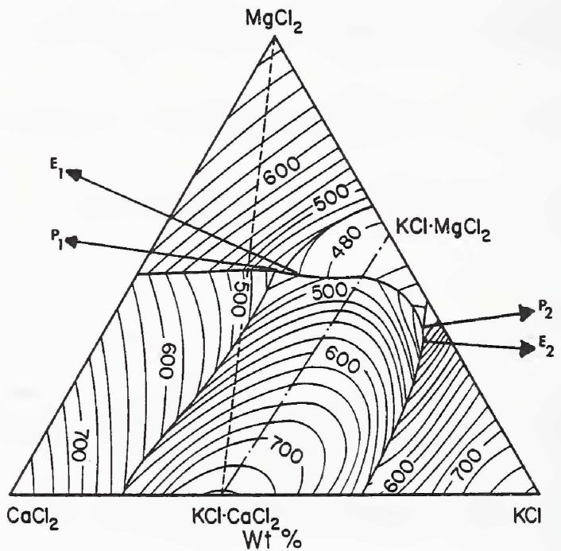  
Figure 99.1. KC1-MgCl2-CaCl2 phase diagram

References [1-16]

2. Density (ρ)

No data

3. Surface Tension (γ)

No data

4. Viscosity (n)

No data

5. Electrical Conductance (K)

No data

# 6. Safety and Hazards

# A. Hazard rating

(i) Toxicity: KCl, slight; $\mathsf{MgCl}_2$ slight, CaCl, slight.   
(ii) Vapor pressure: KCl at m.pt. $(770^{\circ}\mathrm{C})$ , $\sim 0.42\mathrm{mm}$ ; MgCl $_2$ at m.pt. $(714^{\circ}\mathrm{C})$ , $\sim 0.11\mathrm{mm}$ ; CaCl $_2$ at m.pt. $(782^{\circ}\mathrm{C})$ , $\sim 2 \times 10^{-4}\mathrm{mm}$ .

# B. Disaster hazards

(i) Molten salt bath "explosions": i.e., explosive generation of steam due to bulk water "carry-over" and/or equipment failure; i.e., explosive expansion of "trapped" air.   
(ii) Chlorides evolve highly toxic fumes when heated to decomposition, or contacted with acids.

References [17-22]

# 7. Corrosion

Table 99.1. Corrosion studies from primary research literature   

<table><tr><td>Studies</td><td>References</td></tr><tr><td>Armco Fe, various steels</td><td>[23,24,29,30]</td></tr><tr><td>Cr</td><td>[25]</td></tr><tr><td>Cr, Fe-Cr</td><td>[26]</td></tr><tr><td>Mg, Ni, Zr, Ti</td><td>[27]</td></tr><tr><td>Ti, Zr, Hf, ThCl4</td><td>[28]</td></tr><tr><td>Solubility of oxides (Ni, Ca, Zn, Mg)</td><td>[27,31]</td></tr><tr><td>Zr</td><td>[32]</td></tr><tr><td>Fe, steels</td><td>[33-37]</td></tr><tr><td>Pb, Pb-Bi</td><td>[38]</td></tr><tr><td>Electrochemical aspects</td><td>[31,39]</td></tr><tr><td>Thermodynamic approach</td><td>[27,40,41]</td></tr><tr><td>Corrosion in molten salts, annotated biblio.</td><td>[42]</td></tr><tr><td>Reviews: corrosion in molten salts</td><td>[43-47]</td></tr></table>

Compatibility studies for various molten chlorides and their mixtures. No compatibility studies found specifically for molten KCl-MgCl $_2$ -CaCl $_2$ . For studies with the binaries see: KCl-MgCl $_2$ [92]; KCl-CaCl $_2$ [93]; MgCl $_2$ -CaCl $_2$ [97].

References [23-47]

(99) $\mathrm{KCl - MgCl}_2 - \mathrm{CaCl}_2$

8. Diffusion

No data

9. Heat of Fusion $(\Delta H_{f}^{\circ})$

Measurement method: calculated [48]

Table 99.2. Heat of fusion   

<table><tr><td>Composition KCl : CaCl2:MgCl2(mol %)</td><td>Tm(℃)</td><td>ΔH°f(kcal mol-1)</td><td>Uncertainty</td></tr><tr><td>24:25:51</td><td>487°</td><td>7.7</td><td>~ ± 5%</td></tr></table>

References [48]

10. Heat Capacity (Cp)

Measurement method: calculated [49]

Table 99.3. Heat capacity   

<table><tr><td>Composition KCl:CaCl2:MgCl2(mol %)</td><td>Cp(cal K-1mol-1)</td><td>T range (K)</td><td>Uncertainty</td></tr><tr><td>23.9:24.7:51.3</td><td>20.3</td><td>Tm(733) - 823</td><td>~ ± 10%</td></tr></table>

For the above composition, $C_p(s) = 17.5$ (cal $K^{-1}$ mol $^{-1}$ ); uncertainty of estimate, $\sim 10\%$ ).

References [49]

11. Volume Change on Melting $(\Delta V_{f})$

No data

12. Vapor Pressure $(p_{vap})$

No data

13. Thermal Conductivity (liquid) $(\lambda_{\ell})$

No data

14. Thermal Conductivity (solid) $(\lambda_{s})$

No data

15. Cryoscopic Constant $(k_{f})$

Measurement method: calculated from $\Delta H_{\mathrm{f}}^{\circ}$ [50]

Table 99.4. Cryoscopic constant   

<table><tr><td>Composition</td><td>\( \begin{smallmatrix} k \\  (K mol^{-1}kg) \end{smallmatrix} \)</td><td>Uncertainty</td></tr><tr><td>Ternary eutectic (a)</td><td>14</td><td>\( \sim ±2\% \)</td></tr></table>

(a) KCl: MgCl₂: CaCl₂: 24:51:25 mol %

References [50]

16. References

[1] Ivanov, A. I., Izvest. Sektora Fiz.-Khim. Anal., Inst. Obshchei Neorg. Khim., Akad. Nauk SSSR, 23, 197 (1953). Dokl. Akad. Nauk SSSR, 86, 539 (1952).   
[2] Strelets, Kh. L., Bondarenko, N. V., Khim. Rasplavlen, Sol I Shlakov. Akad. Nauk SSSR Ural, 1960, 107 (1962).   
[3] Janz, G. J. Downey, J. R., Jr., Allen, C. B., and Tomkins, R. P. T., "Eutectic Data" - 2 Vols; ERDA-TID-27163-P1 & P2; NTIS, Washington, D. C. (1977).   
[4] Janz, G. J., Downey, J. R., Jr., Allen, C. B., and Tomkins, R. P. T., "Physical Properties Data Complications Relevant to Energy Storage." I. Molten Salts: Eutectic Data", NSRDS-NBS-61; U. S. Gov't Printing Office, Washington, D. C. (1978).   
[5] "International Critical Tables of Numerical Data, Physics, Chemistry, and Technology", 8 Vols., McGraw-Hill Book Co., N. Y. (1933).   
[6] "Landolt-Bornstein Zahlenwert und Funktionen aus Physik, Chemie, Astronomie, Geophysik und Technik", (10th Ed.) Springer-Verlag, Berlin, Heidelberg, N. Y. (1961).   
[7] Clark, P. V., "Fused Salt Mixtures: Eutectic Compositions and Melting Points Bibliography 1907-1968", Report No. SC-R-68-1680; Sandia Laboratories (1968), NTIS.   
[8] Robertson, W. D., "Binary Phase Diagrams of Halide Salts", Report No. Yale 2723 (2 Vols.), U. S. AEC Contract AT (30-1)-2723 (1966), NTIS.   
[9] Thoma, R. E., "Phase Diagrams of Nuclear Reactor Materials", Oak Ridge National Laboratory, ORNL-2548, Contract No. W-740S-eng-26.   
[10] Thoma, R. E., "Phase Diagrams of Binary and Ternary Fluoride Systems", Chapt. 6; Adv. Molten Salts Chemistry, Vol. 3 (J. Braunstein, G. Mamantov, and G. P. Smith, eds.), Plenum Press, N. Y. (1975).   
[11] Voskresenskaya, N. K., ed., "Handbook of Solid-Liquid Equilibria in Systems of Inorganic Salts", Volumes 1, 2, Izc. Akad. Nauk SSSR, Moscow (1961). Israel Program for Scientific Translations, Jerusalem, 1970 (NTIS).

(99) $\mathrm{KCl - MgCl}_2\mathrm{-CaCl}_2$   
[12] Sinistri, C., Franzozini, P., and Rolla, M., "An Atlas of Miscibility Gaps in Molten Salt Systems", Institute of Physical Chemistry, University of Pavia (Italy) (1968).   
[13] Shaffer, P. T. B., "High Temperature Materials", Plenum Press Handbooks of High Temperature Materials, No. 1, Materials Index, Plenum Press, New York, 1964.   
[14] Franzozini, P., Ferloni, P., and Spinolo, C., "Molten Salts with Organic Anions", Instituto di Chimica Fisica, Universita di Pavia (Italy), 1973.   
[15] Toropov, N. A. et al., "Handbook of Phase Diagrams of the Silicates, Volume 1: Binary Systems, Volume 2, Metal-Oxygen Compounds in Silicate Systems", Izdatel'stov "Nauka" Leningradskoe Otdelenie, Leningrad, 1969, Israel Program for Scientific Translations, Jerusalem, 1972 (NTIS).   
[16] Levin, E., et al., "Phase Diagrams for Ceramists", Amer. Ceramic Soc. (publ.), Columbus, Ohio (1964; 1969).   
[17] "Dangerous Properties of Materials", Sax, N. I., Van Nostrand Reinhold Co., N. Y. (1969)   
[18] "Registry of Toxic Effects of Chemical Substances", Christensen, H. E., and Lubinbyh1, T. T., eds., U. S. Dept. H. E. W., U. S. Gov't Printing Office, Washington, D. C. (1975)   
[19] Janz, G. J., et al., "Physical Properties Data Complications Relevant to Energy Storage. Part II: Molten Salts: Data on Single and Multi-Component Salt Systems", NSRDS-NBS 61, Part II (April 1979), U. S. Gov't Printing Office, Supt of Doc. No. C13-48-61, Washington D. C. 20402.   
[20] "Potential Hazards in Molten Salt Baths for Heat Treatment of Metals", National Board of Fire Underwriters Research Report No. 2 (1954)   
[21] "Handbook of Reactive Chemical Hazards", Bretherwick, L., Butterworth Co., London (1975)   
[22] Janz, G. J., Tomkins, R. P. T., Downey, J. R., Jr., and Allen, C. B., "Safety and Hazards, Chapter in "Eutectic Data", ERDA TID-27163-P1; NTIS, U. S. Dept. Commerce, Springfield, Va. (1977)   
[23] Kochergin, V. P., and Shevrina, Z., Uch. Zap. Ural. Gos. Univ., 92, 3 (1969).   
[24] Kochergin, V. P., Bochkareva, N. N., and Yarysheva, I. A., Zashch. Metal., 6, 457 (1970).   
[25] Krasil'nikoya, N. A., Ozeryanaya, I. N., and Smirnov, M. V., Zashch. Metal., 17, 466 (1974).   
[26] Krasil'nikova, N. A., Ozeryanaya, I. N., Smirnov, M. V., and Shamanova, N. D., Zashch. Metal., 10, 446 (1974).   
[27] Littlewood, R., J. Electrochem. Soc., 109, 525 (1962).   
[28] Smirnov, M. V., Kudyakov, Y. Ya., Loginov, Ya. A., Rossokhin, E. G., Posokhin, Yu. V., and Puzanova, T. A., Fiz. Khim. Elektrokhim. Rasplav. Solei Shlakov, 1, 115 (1969).   
[29] Kochergin, V. P., Garpinenko, M. G., Skornyakova, O.N., and Minulina, M. L., Zhur. Priklad. Khim., 37, 566 (1956).

(99) KCl-MgCl2-CaCl2   
[30] Kochergin, V. P., and Maletina, L. E., Zhur. Priklad. Khim., 37(8), 1837 (1964).   
[31] Pizzini, S., "Materials Problems in the Industrial Application of Molten Salts", "Proceedings of the European Conference on the Development of Molten Salts Applications", p. 203 (1973) Battelle, Geneva.   
[32] Thai, V., Ozeryanaya, I. N., and Smirnov, M. V., Tri. Inst. Elektrokhim., Ural. Nauch. Tsentr. Akad. Nauk SSSR, 19, 69 (1973).   
[33] Kochergin, V. P., Khaibuilina, V. P., and Potapova, O. G., Zh. Neorg. Khim., 1, 2617 (1956).   
[34] Jackson, J. H. and LaChance, M. H., Trans. Am. Soc. Metals, 16, 157 (1954).   
[35] Kochergin, V. P., Putina, O. A., Devyatkin, V. N., and Kanaeva, E. T., Tr. Vses. Nauch. Issled. Proekt. Inst. Alyum., Magn. Electrodn., 75, 51 (1971).   
[36] Kochergin, V. P., Kabirov, A. V., Skornyakova, O. N., J. Appl. Chem. USSR, 27, 883 (1954).   
[37] Kochergin, V. P., Druzhinina, E. P., Men'shenina, G. V., Asanova, E. P., Zh. Prikl. Khim., 33, 1580 (1960).   
[38] Vasin, B. D., Nichkov, I. F., and Raspopin, S. P., Izv. Vyssh. Ucheb. Zaved., Tsvet. Met., 15, 102 (1972).   
[39] Johnson, K. E., "Electrochemical Approaches to Corrosion in Molten Salts", Proceedings International Symposium on Metal-Slag-Gas Reactions and Processes, The Electrochemical Society, Inc., Princeton, N. J., p. 581 (1975).   
[40] Edeleanu, C., and Littlewood, R., Electrochimica Acta, 3, 195 (1960).   
[41] Littlewood, R., and Argent, E. A., Electrochimica Acta, 4, 114 (1961).   
[42] Janz, G. J., and Tomkins, R. P. T., Corrosion, 35, 485 (1979).   
[43] Smirnov, M. V., and Ozeryanaya, I. N., Nauki Tekh. Korros. Zashch. Korros., 2, 171 (1973).   
[44] Ketelaar, J. A. A., Chemie. Ing. Techn., 45, 667 (1973).   
[45] Inman, D., and Wrench, N. S., Brit. Corr. J., 1, 246 (1966).   
[46] Smirnov, M. V., Kudyakov, Ya. V., Podlesnyak, N. P., Ozeryanaya, I. N., and Posokhin, Yu.V., Tr. Inst. Elektrokhim. Ural Filial, Akad. Nauk SSSR, 14, 19 (1970).   
[47] Vander Poorten, H., Ind. Chim. Belge, 32, 470 (1967).   
[48] Maru, H. C., et al., Inst. Gas Technology; "Molten Salt Thermal Energy Storage Systems : Salt Selection" ERDA Rpt. COO-2888-1, Aug. (1976); NTIS, U.S. Dept. Commerce, Springfield, Va.   
[49] Wicks, C. E. and Block, F. E., U.S. Bur. Mines, Bull. 605 (1963).   
[50] Janz, G. J., et al. (MSDC-RPI), unpublished work (1980).

1. Melting Temperatures (Tm)

Pure substance melting points:

CaCl2: 782°C

BaCl2: 962°C

Eutectic melting point:

E: 594 C, composition: 36.5 mol % BaCl $_2$

P: 624 C, composition: $54 \mathrm{~mol} \% \mathrm{BaCl}_{2}$

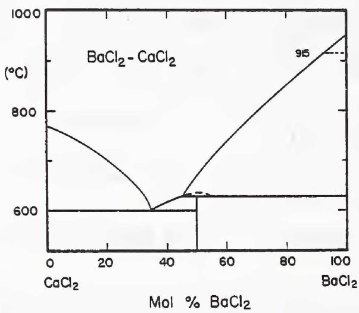  
Figure 100.1. $\mathsf{BaCl}_2\mathsf{-CaCl}_2$ phase diagram

References [1-21]

2. Density (ρ)

No data

3. Surface Tension (γ)

Measurement method: maximum bubble pressure [22]

Equation:

$$
\gamma = a + b T \quad (1 0 0. 1)
$$

precision: in table 100.1 uncertainty: $\sim \pm 3.0\%$

Table 100.1. Parameters of equation (100.1) and precisions   

<table><tr><td>Mol % CaCl2</td><td>a</td><td>-b x 102</td><td>Precision</td><td>T range(K)</td></tr><tr><td>60</td><td>210.4</td><td>5.01</td><td>*</td><td>980-1070</td></tr><tr><td>75.0</td><td>203.7</td><td>4.70</td><td>*</td><td>930-1070</td></tr></table>

\* not estimated; insufficient data

# (100) $\mathrm{BaCl}_2\text{-}\mathrm{CaCl}_2$

Table 100.2. Surface tension (dyn cm $^{-1}$ ) from equations in table 100.1   

<table><tr><td rowspan="2">T(K)</td><td colspan="2">\( \mathrm{{Mol}}\% {\mathrm{{CaCl}}}_{2} \)</td></tr><tr><td>60</td><td>75.0</td></tr><tr><td>880</td><td>166.31</td><td></td></tr><tr><td>900</td><td>165.31</td><td></td></tr><tr><td>920</td><td>164.31</td><td></td></tr><tr><td>940</td><td>163.30</td><td>159.51</td></tr><tr><td>960</td><td>162.30</td><td>158.57</td></tr><tr><td>980</td><td>161.30</td><td>157.63</td></tr><tr><td>1000</td><td>160.30</td><td>156.69</td></tr><tr><td>1020</td><td>159.29</td><td>155.75</td></tr><tr><td>1040</td><td>158.29</td><td>154.81</td></tr><tr><td>1060</td><td>157.29</td><td>153.87</td></tr></table>

References [22]

4. Viscosity (η)

No data

5. Electrical Conductance (K)

Measurement method: classical ac technique [25]

Equation:

$$
\kappa = a + b T + c T ^ {2} \quad (1 0 0. 2)
$$

precision: in table 100.3 uncertainty: $\sim \pm 10\%$

Table 100.3. Parameters of equation (100.2) and precisions   

<table><tr><td>Mol % CaCl2</td><td>-a</td><td>b x 103</td><td>-c x 106</td><td>Precision</td><td>T range(K)</td></tr><tr><td>10</td><td>1.639</td><td>2.940</td><td>0</td><td>0.66%</td><td>1240-1360</td></tr><tr><td>20</td><td>5.449</td><td>8.867</td><td>2.273</td><td>0.60%</td><td>1180-1360</td></tr><tr><td>30</td><td>1.690</td><td>3.057</td><td>0</td><td>0.68%</td><td>1140-1360</td></tr><tr><td>40</td><td>2.470</td><td>4.322</td><td>0.476</td><td>0.45%</td><td>1080-1360</td></tr><tr><td>50</td><td>3.188</td><td>5.538</td><td>0.954</td><td>0.72%</td><td>1040-1360</td></tr><tr><td>60</td><td>2.607</td><td>4.671</td><td>0.598</td><td>0.73%</td><td>980-1360</td></tr><tr><td>70</td><td>1.835</td><td>3.348</td><td>0</td><td>0.62%</td><td>980-1360</td></tr><tr><td>80</td><td>1.825</td><td>3.391</td><td>0</td><td>0.64%</td><td>980-1360</td></tr><tr><td>90</td><td>3.377</td><td>6.057</td><td>1.097</td><td>0.72%</td><td>1040-1360</td></tr></table>

Table 100.4. Specific conductance $(ohm^{-1}cm^{-1})$ from equations in table 100.3   

<table><tr><td rowspan="2">T(K)</td><td colspan="7">Mol % CaCl2</td></tr><tr><td>10</td><td>30</td><td>40</td><td>50</td><td>60</td><td>70</td><td>80</td></tr><tr><td>980</td><td></td><td></td><td></td><td></td><td>1.40</td><td>1.45</td><td>1.50</td></tr><tr><td>1000</td><td></td><td></td><td></td><td></td><td>1.47</td><td>1.51</td><td>1.57</td></tr><tr><td>1040</td><td></td><td></td><td></td><td>1.54</td><td>1.60</td><td>1.65</td><td>1.70</td></tr><tr><td>1080</td><td></td><td></td><td>1.64</td><td>1.68</td><td>1.74</td><td>1.78</td><td>1.84</td></tr><tr><td>1120</td><td></td><td></td><td>1.77</td><td>1.82</td><td>1.87</td><td>1.92</td><td>1.97</td></tr><tr><td>1160</td><td></td><td>1.86</td><td>1.90</td><td>1.95</td><td>2.01</td><td>2.05</td><td>2.11</td></tr><tr><td>1200</td><td></td><td>1.98</td><td>2.03</td><td>2.08</td><td>2.14</td><td>2.18</td><td>2.24</td></tr><tr><td>1240</td><td>2.01</td><td>2.10</td><td>2.16</td><td>2.21</td><td>2.27</td><td>2.32</td><td>2.38</td></tr><tr><td>1280</td><td>2.13</td><td>2.22</td><td>2.28</td><td>2.34</td><td>2.39</td><td>2.45</td><td>2.52</td></tr><tr><td>1220</td><td>2.24</td><td>2.35</td><td>2.41</td><td>2.46</td><td>2.52</td><td>2.58</td><td>2.65</td></tr><tr><td>1260</td><td>2.36</td><td>2.47</td><td>2.53</td><td>2.58</td><td>2.64</td><td>2.72</td><td>2.79</td></tr></table>

References [23-25]

6. Safety and Hazards

# A. Hazard rating

(i) Toxicity: $\mathrm{CaCl}_2$ , slight; $\mathrm{BaCl}_2$ , toxic (orally).   
(ii) Vapor pressure: $\mathrm{CaCl}_2$ at m.pt. (782°C), $\sim 2 \times 10^{-4} \mathrm{~mm}$ ; $\mathrm{BaCl}_2$ at m.pt. (962°C), $\sim 0.5 \mathrm{~mm}$ .

# B. Disaster hazards

(i) Molten salt bath "explosions": i.e., explosive generation of steam due to bulk water "carry-over" and/or equipment failure; i.e., explosive expansion of "trapped" air.   
(ii) Chlorides evolve highly toxic fumes when heated to decomposition, or contacted with acids.

References [26-32]

7. Corrosion

Table 100.5. Corrosion studies from primary research literature   

<table><tr><td>Studies</td><td>References</td></tr><tr><td>Zr</td><td>[33]</td></tr><tr><td>Fe, steels</td><td>[34-38]</td></tr><tr><td>Mg, Ni, Zr, Ti</td><td>[39]</td></tr><tr><td>Ti, Zr, Hf, ThCl4</td><td>[40]</td></tr><tr><td>Pb, Pb-Bi</td><td>[41]</td></tr><tr><td>Thermodynamics of corrosion</td><td>[40,42,43]</td></tr><tr><td>Electrochemical approach</td><td>[44,45]</td></tr><tr><td>Corrosion in molten salts, annotated biblio.</td><td>[46]</td></tr></table>

Compatibility studies: principally with molten $\mathsf{BaCl}_2$ , $\mathsf{CaCl}_2$ or $\mathsf{MgCl}_2$ . No compatibility studies with molten mixtures of $\mathsf{CaCl}_2$ - $\mathsf{BaCl}_2$ found.

References [33-46]

8. Diffusion No data   
9. Heat of Fusion $(\Delta H_{f}^{\circ})$ No data   
10. Heat Capacity $(C_p)$ No data   
11. Volume Change on Melting $(\Delta V_{f})$ No data   
12. Vapor Pressure $(p_{vap})$ No data   
13. Thermal Conductivity (liquid) $(\lambda_{\ell})$ No data   
14. Thermal Conductivity (solid) $(\lambda_{s})$ No data   
15. Cryoscopic Constant $(k_{f})$ No data

16. References

[1] Budinkov, P. D., Volodin, P. and Tresvyatskii, S. G., Ukraine Khim. Zhur., 22, 293 (1956).   
[2] Bergman, A. G., and Pawlenko, S. P., Ber. Akad. Wiss., USSR, 27, 972 (1940).   
[3] Kordes, E., Z. Anorg. U. Allgem. Chem., 154, 93 (1926).   
[4] Bergman, A. G., Takareva, M. B., Zhur. Neorg. Khim., 2, 1888 (1957).   
[5] Kochinashvili, V. A., Barzakovskii, V. P., Zhur. Priklad. Khim., 30, 1755 (1957). J. Appl. Chem., USSR, 30, 1824 (1957).   
[6] Bukhalova, G. A., Bergman, A. G., J. Gen. Chem., USSR, 21, 1723 (1951). Zhur. Obshchei Khim., 21, 1570 (1951).   
[7] Bukhalova, G. A., Berezhnaya, V. T., Zhur. Neorg. Khim., 7, 720 (1963).   
[8] Janz, G. J. Downey, J. R., Jr., Allen, C. B., and Tomkins, R. P. T., "Eutectic Data" - 2 Vols; ERDA-TID-27163-P1 & P2; NTIS, Washington, D. C. (1977).   
[9] Janz, G. J., Downey, J. R., Jr., Allen, C. B., and Tomkins, R. P. T., "Physical Properties Data Complications Relevant to Energy Storage. I. Molten Salts: Eutectic Data", NSRDS-NBS-61; U. S. Gov't Printing Office, Washington, D. C. (1978).   
[10] "International Critical Tables of Numerical Data, Physics, Chemistry, and Technology", 8 Vols., McGraw-Hill Book Co., N. Y. (1933).   
[11] "Landolt-Bornstein Zahlenwert und Funktionen aus Physik, Chemie, Astronomie, Geophysik und Technik", (10th Ed.) Springer-Verlag, Berlin, Heidelberg, N. Y. (1961).   
[12] Clark, P. V., "Fused Salt Mixtures: Eutectic Compositions and Melting Points Bibliography 1907-1968", Report No. SC-R-68-1680; Sandia Laboratories (1968), NTIS.   
[13] Robertson, W. D., "Binary Phase Diagrams of Halide Salts", Report No. Yale 2723 (2 Vols.), U. S. AEC Contract AT (30-1)-2723 (1966), NTIS.   
[14] Thoma, R. E., "Phase Diagrams of Nuclear Reactor Materials", Oak Ridge National Laboratory, ORNL-2548, Contract No. W-7405-eng-26.   
[15] Thoma, R. E., "Phase Diagrams of Binary and Ternary Fluoride Systems", Chapt. 6; Adv. Molten Salts Chemistry, Vol. 3 (J. Braunstein, G. Mamantov, and G. P. Smith, eds.), Plenum Press, N. Y. (1975).   
[16] Voskresenskaya, N. K., ed., "Handbook of Solid-Liquid Equilibria in Systems of Inorganic Salts", Volumes 1, 2, Izc. Akad. Nauk SSSR, Moscow (1961). Israel Program for Scientific Translations, Jerusalem, 1970 (NTIS).   
[17] Sinistri, C., Franzozini, P., and Rolla, M., "An Atlas of Miscibility Gaps in Molten Salt Systems", Institute of Physical Chemistry, University of Pavia (Italy) (1968).   
[18] Shaffer, P. T. B., "High Temperature Materials", Plenum Press Handbooks of High Temperature Materials, No. 1, Materials Index, Plenum Press, New York, 1964.   
[19] Franzozini, P., Ferloni, P., and Spinolo, C., "Molten Salts with Organic Anions", Instituto di Chimica Fisica, Universita di Pavia (Italy), 1973.

(100) $\mathrm{BaCl}_2 - \mathrm{CaCl}_2$   
[20] Toropov, N. A. et al., "Handbook of Phase Diagrams of the Silicates, Volume 1: Binary Systems, Volume 2, Metal-Oxygen Compounds in Silicate Systems", Izdatel'stov "Nauka" Leningradskoe Otdelenie, Leningrad, 1969, Israel Program for Scientific Translations, Jerusalem, 1972 (NTIS).   
[21] Levin, E., et al., "Phase Diagrams for Ceramists", Amer. Ceramic Soc. (publ.), Columbus, Ohio (1964; 1969).   
[22] Lantratov, M. F., Zhur. Priklad. Khim. 34, 1249 (1961), J. Appl. Chem., USSR, 34, 1190 (1961).   
[23] Alabyshev, A. F., and Kulakovskaya, N. Ya., Trudy, Leningrad. Tekhnol. Inst. Im. Leningrad. Soveta, 12, 152 (1946).   
[24] Lantratov, M. F., and Moiseeva, O. F., J. Appl. Chem. (USSR), 33, 2194 (1960); Zh. Priklad. Khim., 33, 2225 (1960).   
[25] Barzakovskii, V. P., and Kochinashvili, V. A., J. Appl. Chem. (USSR), 30, 1825 (1957); Zhur. Priklad. -Khim., 30, 1755 (1957).   
[26] "Dangerous Properties of Materials", Sax, N. I., Van Nostrand Reinhold Co., N. Y. (1969)   
[27] "Registry of Toxic Effects of Chemical Substances", Christensen, H. E., and Lubinbyhl, T. T., eds., U. S. Dept. H. E. W., U. S. Gov't Printing Office, Washington, D. C. (1975)   
[28] Janz, G. J., et al., "Physical Properties Data Complications Relevant to Energy Storage. Part II. Molten Salts: Data on Single and Multi-Component Salt Systems", NSRDS-NBS 61, Part II (April 1979), U. S. Gov't Printing Office, Supt of Doc. No. C13-48-61, Washington D. C. 20402.   
[29] "Potential Hazards in Molten Salt Baths for Heat Treatment of Metals", National Board of Fire Underwriters Research Report No. 2 (1954)   
[30] "Handbook of Reactive Chemical Hazards", Bretherwick, L., Butterworth Co., London (1975)   
[31] Janz, G. J., Tomkins, R. P. T., Downey, J. R., Jr., and Allen, C. B., "Safety and Hazards, Chapter in "Eutectic Data", ERDA TID-27163-P1; NTIS, U. S. Dept. Commerce, Springfield, Va. (1977)   
[32] vide: this work, System 54, BaCl $_2$ .   
[33] Thai, V., Ozeryanaya, I. N., and Smirnov, M. V., Tri. Inst. Elektrokhim., Ural. Nauch. Tsentr. Akad. Nauk SSSR, 19, 69 (1973).   
[34] Kochergin, V. P., Khaibuilina, V. P., and Potapova, O. G., Zh. Neorg. Khim., 1, 2617 (1956).   
[35] Jackson, J. H. and LaChance, M. H., Trans. Am. Soc. Metals, 16, 157 (1954).   
[36] Kochergin, V. P., Putina, O. A., Devyatkin, V. N., and Kanaeva, E. T., Tr. Vses. Nauch. Issled. Proekt. Inst. Alyum., Magn. Electrodn., 75, 51 (1971).   
[37] Kochergin, V. P., Kabirov, A. V., Skornyakova, O. N., J. Appl. Chem. USSR, 27, 883 (1954).   
[38] Kochergin, V. P., Druzhinina, E. P., Men'shenina, G. V., Asanova, E. P., Zh. Prikl. Khim., 33, 1580 (1960).

[39] Smirnov, M. V., Kudyakov, V. Ya., Loginov, Ya. A., Rossokhin, E. G., Posokhin, Yu. V., and Puzanova, T. A., Fiz. Khim. Elektrokhim. Rasplav. Solei Shlakov, 1, 115 (1969).   
[40] Littlewood, R., J. Electrochem. Soc., 109, 525 (1962).   
[41] Vasin, B. D., Nichkov, I. F., and Raspopin, S. P., Izv. Vyssh. Ucheb. Zaved., Tsvet. Met., 15, 102 (1972).   
[42] Edeleanu, C., and Littlewood, R., Electrochimica Acta, 3, 195 (1960).   
[43] Littlewood, R., and Argent, E. A., Electrochimica Acta, 4, 114 (1961).   
[44] Pizzini, S., "Materials Problems in the Industrial Applications of Molten Salts", Proceedings of the European Conference on the Development of Molten Salts Applications", p. 203 (1973); Battelle, Geneva.   
[45] Johnson, K. E., "Electrochemical Approaches to Corrosion in Molten Salts", Proceedings International Symposium on Metal-Slag-Gas Reactions and Processes, The Electrochemical Society Inc., Princeton, N. J., p. 581 (1975).   
[46] Janz, G. J., and Tomkins, R. P. T., Corrosion, 35, 485 (1979).

System 101 $\mathrm{LiNO}_3$ - $\mathrm{NaNO}_3$

1. Melting Temperatures $(T_{m})$

Pure substance melting points:

$\mathrm{LiNO}_3$ : $253^{\circ} \mathrm{C}$

$\mathrm{NaNO}_{3}$ : $307^{\circ} \mathrm{C}$

Eutectic melting point:

$\sim 192^{\circ} \mathrm{C}$ , composition: $\sim 55 \mathrm{~mol} \%$ $\mathrm{LiNO}_{3}$

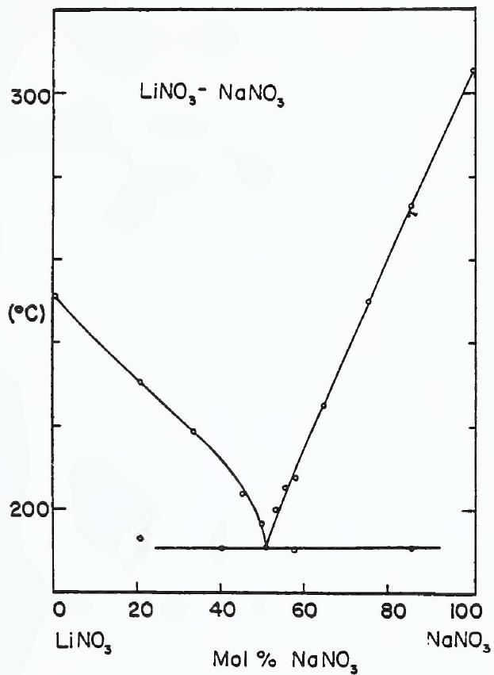  
Figure 101.1. $\mathrm{LiNO}_3\text{-NaNO}_3$ phase diagram

References [1-19].

2. Density (p)

Measurement method: Archimedean technique [20]

Equation:

$$
\rho = a + b T \quad (1 0 1. 1)
$$

precision: in table 101.1

uncertainty: $\sim \pm 1.5\%$

Table 101.1. Parameters of equation ( 101.1) and precisions   

<table><tr><td>Mol % LiNO3</td><td>a</td><td>-b x 104</td><td>Precision</td><td>T range(K)</td></tr><tr><td>20</td><td>2.2680</td><td>6.778</td><td>0.02%</td><td>550-730</td></tr><tr><td>40</td><td>2.2214</td><td>6.510</td><td>0.02%</td><td>500-740</td></tr><tr><td>60</td><td>2.1781</td><td>6.183</td><td>0.02%</td><td>610-700</td></tr><tr><td>80</td><td>2.1400</td><td>6.088</td><td>0.01%</td><td>550-710</td></tr></table>

(101) $\mathrm{LiNO}_{3} - \mathrm{NaNO}_{3}$

Two-independent-variables equation

$$
\rho = a + b T + c T ^ {3} + d T C + e T ^ {2} C \tag {101.2}
$$

$$
\left(\mathrm{C} = \mathrm{mol}\% \mathrm{CaCl}_{2}\right)
$$

and precisions

Table 101.2. Parameters of two-independent variables equation (101.2)   

<table><tr><td>a</td><td>b x 104</td><td>c x 1010</td><td>d x 106</td><td>e x 109</td><td>Precision</td></tr><tr><td>2.1797</td><td>-4.0766</td><td>-2.1051</td><td>-5.3868</td><td>4.9943</td><td>0.2%</td></tr></table>

Table 101.3. Density $(\mathrm{gcm}^{-3})$ from equations in table 101.1   

<table><tr><td rowspan="2">T(K)</td><td colspan="4">\( \mathrm {Mol}\% \mathrm {LiNO}_{3} \)</td></tr><tr><td>20</td><td>40</td><td>60</td><td>80</td></tr><tr><td>500</td><td></td><td>1.896</td><td></td><td></td></tr><tr><td>520</td><td></td><td>1.883</td><td></td><td></td></tr><tr><td>540</td><td></td><td>1.870</td><td></td><td></td></tr><tr><td>560</td><td>1.888</td><td>1.857</td><td></td><td>1.799</td></tr><tr><td>580</td><td>1.875</td><td>1.844</td><td></td><td>1.787</td></tr><tr><td>600</td><td>1.861</td><td>1.831</td><td></td><td>1.775</td></tr><tr><td>620</td><td>1.848</td><td>1.818</td><td>1.795</td><td>1.763</td></tr><tr><td>640</td><td>1.834</td><td>1.805</td><td>1.782</td><td>1.750</td></tr><tr><td>660</td><td>1.821</td><td>1.792</td><td>1.770</td><td>1.738</td></tr><tr><td>680</td><td>1.807</td><td>1.779</td><td>1.758</td><td>1.726</td></tr><tr><td>700</td><td>1.794</td><td>1.766</td><td>1.745</td><td>1.714</td></tr><tr><td>720</td><td>1.780</td><td>1.753</td><td></td><td></td></tr><tr><td>740</td><td></td><td>1.740</td><td></td><td></td></tr></table>

References [20,21]

3. Surface Tension (Y)

No data

4. Viscosity (n)

Measurement method: oscillating sphere technique [20]

Equation:

$$
n = a + b T + c T ^ {2} + d T ^ {3} \quad (1 0 1. 3)
$$

precision: in table 101.4

uncertainty: $\sim$ 10%

Table 101.4. Parameters of equation (101.3) and precisions   

<table><tr><td>NaNO3(mol %)</td><td>a</td><td>b x 102</td><td>c x 105</td><td>d x 108</td><td>Precision</td><td>T range(K)</td></tr><tr><td>40</td><td>48.2920</td><td>-15.255</td><td>16.055</td><td>-5.3434</td><td>1.36%</td><td>530-690</td></tr><tr><td>60</td><td>17.2248</td><td>-1.3799</td><td>-4.7702</td><td>5.1212</td><td>0.50%</td><td>530-690</td></tr><tr><td>80</td><td>18.1724</td><td>-2.5460</td><td>-1.9191</td><td>3.1344</td><td>0.68%</td><td>580-690</td></tr></table>

$$
\mathrm {L i N O} _ {3} - \mathrm {N a N O} _ {3} \tag {101}
$$

Equation:

$$
n = A \exp (E / R T) \quad (1 0 1. 4)
$$

precision: in table 101.5

uncertainty $\sim \pm 10\%$

Table 101.5. Parameters of equation (101.4) and precision   

<table><tr><td>NaNO3(mol %)</td><td>A x 102</td><td>E(cal mol-1)</td><td>Precision</td><td>T range(K)</td></tr><tr><td>20</td><td>9.815</td><td>4164</td><td>0.75%</td><td>530-690</td></tr></table>

Table 101.6. Viscosity (cp) from equations in tables 101.4 and 101.5   

<table><tr><td rowspan="2">T(K)</td><td colspan="4">Mol % NaNO3</td></tr><tr><td>20</td><td>40</td><td>60</td><td>80</td></tr><tr><td>530</td><td>5.125</td><td>4.584</td><td>4.136</td><td></td></tr><tr><td>540</td><td>4.763</td><td>4.318</td><td>3.927</td><td></td></tr><tr><td>550</td><td>4.438</td><td>4.066</td><td>3.726</td><td></td></tr><tr><td>560</td><td>4.147</td><td>3.829</td><td>3.529</td><td></td></tr><tr><td>570</td><td>3.882</td><td>3.606</td><td>3.345</td><td></td></tr><tr><td>580</td><td>3.644</td><td>3.397</td><td>3.167</td><td>3.065</td></tr><tr><td>590</td><td>3.428</td><td>3.202</td><td>2.996</td><td>2.908</td></tr><tr><td>600</td><td>3.230</td><td>3.019</td><td>2.834</td><td>2.758</td></tr><tr><td>610</td><td>3.051</td><td>2.849</td><td>2.682</td><td>2.615</td></tr><tr><td>620</td><td>2.886</td><td>2.693</td><td>2.538</td><td>2.480</td></tr><tr><td>630</td><td>2.735</td><td>2.548</td><td>2.404</td><td>2.353</td></tr><tr><td>640</td><td>2.596</td><td>2.415</td><td>2.280</td><td>2.234</td></tr><tr><td>650</td><td>2.469</td><td>2.294</td><td>2.165</td><td>2.123</td></tr><tr><td>660</td><td>2.352</td><td>2.184</td><td>2.062</td><td>2.020</td></tr><tr><td>670</td><td>2.243</td><td>2.085</td><td>1.969</td><td>1.926</td></tr><tr><td>680</td><td>2.141</td><td>1.996</td><td>1.887</td><td>1.841</td></tr><tr><td>690</td><td>2.047</td><td>1.918</td><td>1.816</td><td>1.765</td></tr></table>

References [20]

5. Electrical Conductance (K)

Measurement method: classical dc technique [23]

Equation:

$$
\kappa = a + b T + c T ^ {2} \tag {101.5}
$$

precision: in table 101.7

uncertainty: $\sim 3.0\%$

Table 101.7. Parameters of equation (101.5) and precisions   

<table><tr><td>Mol % NaNO3</td><td>-a</td><td>b x 102</td><td>-c x 105</td><td>Precision</td><td>T range(K)</td></tr><tr><td>25.3</td><td>2.7074</td><td>0.7792</td><td>0.2217</td><td>0.08%</td><td>560-670</td></tr><tr><td>50.0</td><td>2.3808</td><td>0.6906</td><td>0.1757</td><td>0.35%</td><td>560-670</td></tr><tr><td>75.0</td><td>2.8718</td><td>0.8549</td><td>0.3217</td><td>0.08%</td><td>550-690</td></tr></table>

# (101) $\mathrm{LiNO}_3\text{-NaNO}_3$

Table 101.8. Specific conductance $(ohm^{-1}cm^{-1})$ from equations in table 101.7   

<table><tr><td rowspan="2">T(K)</td><td colspan="3">\( \mathrm{{Mo}}1\% {\mathrm{{NaNO}}}_{3} \)</td></tr><tr><td>25.3</td><td>50.0</td><td>75.0</td></tr><tr><td>550</td><td></td><td></td><td>0.857</td></tr><tr><td>560</td><td>0.961</td><td>0.935</td><td>0.907</td></tr><tr><td>570</td><td>1.014</td><td>0.985</td><td>0.956</td></tr><tr><td>580</td><td>1.066</td><td>1.033</td><td>1.005</td></tr><tr><td>590</td><td>1.118</td><td>1.082</td><td>1.052</td></tr><tr><td>600</td><td>1.170</td><td>1.130</td><td>1.100</td></tr><tr><td>610</td><td>1.221</td><td>1.178</td><td>1.146</td></tr><tr><td>620</td><td>1.271</td><td>1.225</td><td>1.192</td></tr><tr><td>630</td><td>1.321</td><td>1.272</td><td>1.237</td></tr><tr><td>640</td><td>1.371</td><td>1.319</td><td>1.282</td></tr><tr><td>650</td><td>1.421</td><td>1.366</td><td>1.326</td></tr><tr><td>660</td><td>1.469</td><td>1.412</td><td>1.369</td></tr><tr><td>670</td><td>1.518</td><td>1.457</td><td>1.412</td></tr><tr><td>680</td><td></td><td></td><td>1.454</td></tr><tr><td>690</td><td></td><td></td><td>1.496</td></tr></table>

References [22-25]

# 6. Safety and Hazards

# A. Hazard rating

(i) Toxicity: $\mathrm{LiNO}_3$ , moderate; $\mathrm{NaNO}_3$ , permitted in food additive.   
(1i) Vapor pressure: $\mathrm{LiNO}_3$ decomposed just above its m.pt. (253°C) to the nitrite and oxygen; $\mathrm{NaNO}_3$ (m.pt., 307°C), decomposition to nitrite onsets $\sim 500^{\circ}\mathrm{C}$ .

# B. Disaster hazards

(i) Molten salt bath "explosions": i.e., explosive generation of steam due to bulk water "carry-over" and/or equipment failure; i.e., explosive expansion of "trapped" air.   
(ii) On decomposition, nitrates emit toxic fumes (oxides of nitrogen) viz:

$$
\mathrm {M N O} _ {3} \rightarrow \mathrm {M N O} _ {2} + \mathrm {I} _ {2} \mathrm {O} _ {2} \tag {101.6}
$$

$$
2 \mathrm {M N O} _ {2} \longrightarrow \mathrm {M} _ {2} \mathrm {O} + \mathrm {N O} + \mathrm {N O} _ {2} \tag {101.7}
$$

The subsequent decomposition reactions are complex; if the gas phase is continuously removed, the nitrite decomposition (above) to NO and $\mathrm{NO}_2$ is dominant. If the gas phase is not immediately removed, the NO may re-oxidize the nitrite to nitrate.

(iii) Nitrates are powerful oxidizing agents; violent (explosive) reactions possible in molten nitrates and carbonaceous materials (organic cpds, oils, carbon;...); aluminum alloys and bath sludges (e.g. iron oxides); magnesium alloys. Dangerous.

References [26-31]

Table 101.9. Corrosion studies from primary research literature   

<table><tr><td>Studies in molten nitrates and nitrites</td><td>References</td></tr><tr><td>Fe</td><td>[32-34]</td></tr><tr><td>Fe, Co, Ni, Cr, Al,...</td><td>[35-37]</td></tr><tr><td>Cu, Pt, Au, W,...</td><td>[36-38]</td></tr><tr><td>Zn, Pb, Cu, Ni, Al</td><td>[39]</td></tr><tr><td>Pt, S, steel</td><td>[40]</td></tr><tr><td>Zr</td><td>[41]</td></tr><tr><td>Oxide species</td><td>[42]</td></tr><tr><td>Electrochemical approach</td><td>[43,44]</td></tr><tr><td>Thermodynamic redox diagrams</td><td>[45,46]</td></tr><tr><td>Annotated corrosion bibliio.</td><td>[47]</td></tr><tr><td>Reviews/molten salts</td><td>[48-50]</td></tr></table>

The studies in Table 101.9 (above) relate to studies with various molten nitrates, principally $\mathrm{NaNO}_3$ , $\mathrm{KNO}_3$ , and their mixtures. No compatibility studies with molten $\mathrm{LiNO}_3$ - $\mathrm{NaNO}_3$ ; for studies in molten $\mathrm{LiNO}_3$ - $\mathrm{KNO}_3$ , see [34].

References [32-50]

8. Diffusion

Measurement method: capillary [51]

Diffusing species investigated in $\mathrm{LiNO}_3$ - $\mathrm{NaNO}_3$ as solvent:

$$
\mathrm {L i} ^ {+}, \mathrm {N a} ^ {+}, \mathrm {N O} _ {3} ^ {-}
$$

precision: insufficient data for estimate uncertainty: $\sim \pm 20\%$

Table 101.10. Self-diffusion coefficients, D x ${10}^{5}\left( {{\mathrm{\;{cm}}}^{2}{\mathrm{\;s}}^{-1}}\right)$   

<table><tr><td>T(K)</td><td>Li+</td><td>Na+</td><td>NO-3</td></tr><tr><td colspan="4">LiNO3-NaNO3(20 mol % NaNO3)</td></tr><tr><td>624</td><td>2.64</td><td>2.45</td><td>1.21</td></tr><tr><td colspan="4">LiNO3-NaNO3(53 mol % NaNO3)</td></tr><tr><td>626</td><td>2.61</td><td>2.41</td><td>1.31</td></tr></table>

References [51]

$$
(1 0 1) \quad \mathrm {L i N O} _ {3} - \mathrm {N a N O} _ {3}
$$

9. Heat of Fusion $(\Delta H_{f}^{o})$

Measurement method: drop calorimetry [52]

Table 101.11. Heat of fusion   

<table><tr><td colspan="2">Composition</td><td rowspan="2">ΔE°f(kcal mol-1)</td><td rowspan="2">Uncertainty</td></tr><tr><td>Tf</td><td>mol % (LiNO3)</td></tr><tr><td>193.5°C</td><td>54%</td><td>4.775</td><td>~ ± 2%</td></tr></table>

Saturation concentrations of the eutectic solid solutions : 9.1 mol % $\mathrm{LiNO}_3$ and 1.7 mol % $\mathrm{NaNO}_3$ ; heat of mixing of the eutectic solid solutions at 9.1 mol % $\mathrm{LiNO}_3$ , 122 cal mol $^{-1}$ ; and at 1.7 mol % $\mathrm{NaNO}_3$ , 35 cal mol $^{-1}$ ; heat of mixing in the liquid state:

$$
\Delta H _ {x} = - x (1 - x) (4 6 4 + 1 1. 5 x) \text {cal mol} ^ {- 1}; x = \text {mol} \% \text {LiNO} _ {3}.
$$

References [52]

10. Heat Capacity $(C_p)$

No data

11. Volume Change on Melting $(\Delta V_{f})$

Measurement method: estimated from densities [53]

Table 101.12. Volume change on melting   

<table><tr><td>Binary eutectic (mol % NaNO3)</td><td>(ΔVf/Vs)</td><td>Uncertainty</td></tr><tr><td>46</td><td>13.0%</td><td>~ ± 15%</td></tr></table>

References [53]

12. Vapor Pressure $(p_{vap})$

No data

13. Thermal Conductivity (liquid) $(\lambda_{\ell})$

No data

14. Thermal Conductivity (solid) $(\lambda_{s})$

No data

15. Cryoscopic Constant $(k_{f})$

Measurement method: calculated from $\Delta H_{\mathrm{f}}^{\circ}$ [53]

Table 101.13. Cryoscopic Constant   

<table><tr><td>Binary eutectic (mol % NaNO3)</td><td>k_f(K mol-1Kg)</td><td>Uncertainty</td></tr><tr><td>46.0</td><td>6.9</td><td>≈ ± 1%</td></tr></table>

References [53]

16. References

[1] Shisholina, R. P., Protsenko, P. I., Zhur. Neorg. Khim., 8, 1436 (1963).   
[2] Sinistri, C., Franzosini, P., Ric, Sci. Rend. Sez A., 3, 419 (1963).   
[3] Brovkina, I. A., Selivanova, S. I., Semenova, M. A., Farmakovskaya, A. A., Zh. Fiz. Khim., 44, 1372 (1970).   
[4] Storonkin, A. V., Vasil'lova, I. V., Shamko, V. I., Vestn. Leningrad. Univ., Fiz., Khim., 67 (1973).   
[5] Lehrman, A. and Breslow, D., J. Am. Chem. Soc., 60, 873 (1938).   
[6] Janz, G. J. Downey, J. R., Jr., Allen, C. B., and Tomkins, R. P. T., "Eutectic Data" - 2 Vols; ERDA-TID-27163-P1 & P2; NTIS, Washington, D. C. (1977).   
[7] Janz, G. J., Downey, J. R., Jr., Allen, C. B., and Tomkins, R. P. T., "Physical Properties Data Complications Relevant to Energy Storage. I. Molten Salts: Eutectic Data", NSRDS-NBS-61; U. S. Gov't Printing Office, Washington, D. C. (1978).   
[8] "International Critical Tables of Numerical Data, Physics, Chemistry, and Technology", 8 Vols., McGraw-Hill Book Co., N. Y. (1933).   
[9] "Landolt-Bornstein Zahlenwert und Funktionen aus Physik, Chemie, Astronomie, Geophysik und Technik", (10th Ed.) Springer-Verlag, Berlin, Heidelberg, N. Y. (1961).   
[10] Clark, P. V., "Fused Salt Mixtures: Eutectic Compositions and Melting Points Bibliography 1907-1968", Report No. SC-R-68-1680; Sandia Laboratories (1968), NTIS.   
[11] Robertson, W. D., "Binary Phase Diagrams of Halide Salts", Report No. Yale 2723 (2 Vols.), U. S. AEC Contract AT (30-1)-2723 (1966), NTIS.   
[12] Thoma, R. E., "Phase Diagrams of Nuclear Reactor Materials", Oak Ridge National Laboratory, ORNL-2548, Contract No. W-7405-eng-26.   
[13] Thoma, R. E., "Phase Diagrams of Binary and Ternary Fluoride Systems", Chapt. 6; Adv. Molten Salts Chemistry, Vol. 3 (J. Braunstein, G. Mamantov, and G. P. Smith, eds.), Plenum Press, N. Y. (1975).   
[14] Voskresenskaya, N. K., ed., "Handbook of Solid-Liquid Equilibria in Systems of Inorganic Salts", Volumes 1, 2, Izc. Akad. Nauk SSSR, Moscow (1961). Israel Program for Scientific Translations, Jerusalem, 1970 (NTIS).   
[15] Sinistri, C., Franzozini, P., and Rolla, M., "An Atlas of Miscibility Gaps in Molten Salt Systems", Institute of Physical Chemistry, University of Pavia (Italy) (1968).   
[16] Shaffer, P. T. B., "High Temperature Materials", Plenum Press Handbooks of High Temperature Materials, No. 1, Materials Index, Plenum Press, New York, 1964.   
[17] Franzozini, P., Ferloni, P., and Spinolo, C., "Molten Salts with Organic Anions", Instituto di Chimica Fisica, Universita di Pavia (Italy), 1973.   
[18] Toropov, N. A. et al., "Handbook of Phase Diagrams of the Silicates, Volume 1: Binary Systems, Volume 2, Metal-Oxygen Compounds in Silicate Systems", Izdatel'stov "Nauka" Leningradskoe Otdelenie, Leningrad, 1969, Israel Program for Scientific Translations, Jerusalem, 1972 (NTIS).   
[19] Levin, E., et al., "Phase Diagrams for Ceramists", Amer. Ceramic Soc. (publ.), Columbus, Ohio (1964; 1969).

[∠U] Murgulescu, I. G., and Zuca, S., Elektrochim. Acta, 11, 1383 (1966).   
[21] Boxall, L. G., and Johnson, K. E., J. Chem. and Eng. Data, 16, 204 (1971).   
[22] Doucet, Y., and Bizouard, M., Bull. Soc. Chim. France, 1570 (1959).   
[23] King, L. A., and Duke, F. R., J. Electrochem. Soc., 111, 712 (1964).   
[24] Bizouard, M., Ann. Physique, 6, 851 (1961).   
[25] De Nooijer, B., Ph.D. Thesis, University of Amsterdam, Amsterdam. 1965.   
[26] Stern, K., "High Temperature Properties and Decomposition of Inorganic Salts. III. Nitrates and Nitrites", J. Phys. Chem. Ref. Data, 1, 747-772 (1972).   
[27] "Dangerous Properties of Materials", Sax, N. I., Van Nostrand Reinhold Co., N. Y. (1969).   
[28] "Registry of Toxic Effects of Chemical Substances", Christensen, H. E., and Lubinybyhl, T. T., eds., U. S. Dept. H.E.W; U. S. Gov't Printing Office, Washington, D. C. (1975).   
[29] "Potential Hazards in Molten Salt Baths for Heat Treatment of Metals", National Board Fire Underwriters Research Report No. 2. (1954).   
[30] "Handbook of Reactive Chemical Hazards", Bretherwick, L., Butterworths Co., London (1975).   
[31] Janz, G. J., Tomkins, R. P. T., Downey, J. R., Jr., and Allen, C. B., "Safety and Hazards", Chapter in "Eutectic Data", ERDA TID-27163-P1; NTIS, U. S. Dept. Commerce, Springfield, Va. (1977).   
[32] Arvia, A. J., Podesta, J. J., and Piatti, R. C. V., Electrochim. Acta, 17, 33 (1972).   
[33] Marchiano, S. L., and Arvia, A. J., Electrochim. Acta, 17, 25 (1972).   
[34] Notoya, T., Ishikawa, T., Midorikawa, R., Denki Kagaku, 39, 930 (1971); ibid, 40, 62 (1972).   
[35] Marchiano, S. L., and Arvia, A. J., An. Soc. Cient. Argent., 192, 263 (1971).   
[36] Brough, B. J., Kerridge, D. H., Inorg. Chem., 4, 1353 (1965).   
[37] Swofford, H. S., Jr., Laitinen, H. A., J. Electrochem. Soc., 110, 816 (1963).   
[38] Notoya, T., Denki Kagaku, 41, 779 (1973).   
[39] Herquet, M. L. H., Industrie Chim. Belge, 20, 592 (1955).   
[40] Johnson, K. E., Electrochimica Acta, 11, (1966).   
[41] Andreev, Y. Y., Fokin, M. N., Shitikov, Y. A., Fiz. Khim. Elektrokhim. Rasplav. Solei Tverd. Ekektrolitov, 2, 100 (1973).   
[42] Johnson, K. E., Zacharias, P. S., and Mathews, J., "Proceedings Intern. Symp. Molten Salts", p. 603, The Electrochemical Soc., Princeton, N. J., (1976).   
[43] Pizzini, S., "Materials Problems in the Industrial Applications of Molten Salts", "Proceedings of the European Conference on the Development of Molten Salts Applications", p. 203; Battelle, Geneva, (1973).   
[44] Johnson, K. E., "Electrochemical Approaches to Corrosion in Molten Salts", Proceedings International Symposium on Metal-Slag-Gas Reactions and Processes, The Electrochemical Society, Inc., Princeton, N. J. (1975).

(101) $\mathrm{LiNO}_3\text{-NaNO}_3$   
[45] Bartlett, H. E., and Johnson, K. E., Canad. J. Chem., 44, 2119 (1966).   
[46] Conte, A., and Ingram, M. D., Electrochimica Acta, 13, 1551 (1968).   
[47] Janz, G. J., and Tomkins, R. P. T., Corrosion, 35, 485 (1979).   
[48] Inman, D., and Wrench, N. S., Brit. Corr. J., 1, 246 (1966).   
[49] Ketelaar, J. A. A., Chemie. Ing. Techn., 45, 667 (1973).   
[50] Smirnov, M. V. and Ozeryanaya, I., Nauki. Tekh. Korros. Zasch. Korros., 2, 171 (1973).   
[51] Lantelme, F. and Chemla, M., Electrochim. Acta 11, 1023 (1966).   
[52] Schürmann, E., and Nedeljkovic, Lj., Ber. Bunsenges. Physik. Chem. 74, 462 (1970).   
[53] Janz, G. J., et al. (MSDC-RPI), unpublished work (1980).

System 102 $\mathrm{LiNO}_3 - \mathrm{KNO}_3$

1. Melting Temperatures $(T_{m})$

Pure substance melting points:

$\mathrm{LiNO}_3$ : $253^{\circ} \mathrm{C}$

KNO3: 335°C

Eutectic melting point:

133°C, composition: 58.8 mol % KNO₃

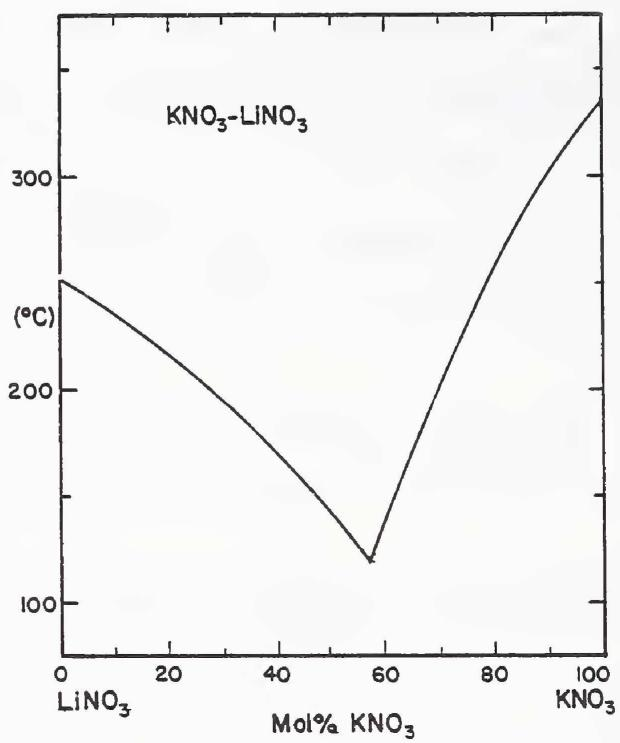  
Figure 102.1. $\mathrm{LiNO}_3\text{-KNO}_3$ phase diagram

References [1-20].

2. Density (ρ)

Measurement method: Archimedean technique [21]

Equation:

$$
\rho = a + b T \tag {102.1}
$$

precision: in table 102.1

uncertainty: $\sim \pm 1.5\%$

Table 102.1.. Parameters of equation (102.1) and precisions   

<table><tr><td>Mol % LiNO3</td><td>a</td><td>-b x 104</td><td>Precision</td><td>T range(K)</td></tr><tr><td>20</td><td>2.1473</td><td>6.217</td><td>0.02%</td><td>530-710</td></tr><tr><td>40</td><td>2.2085</td><td>6.723</td><td>0.02%</td><td>520-720</td></tr><tr><td>60</td><td>2.2823</td><td>7.495</td><td>0.01%</td><td>540-710</td></tr><tr><td>80</td><td>2.3056</td><td>7.475</td><td>0.02%</td><td>540-710</td></tr></table>

Two-independent-variables equation

$$
\rho = a + b T + c C + d C ^ {2} + e C ^ {3} \tag {102.2}
$$

$$
\left(\mathrm {C} = \mathrm {mol} \% \mathrm {CaCl}_{2}\right)
$$

(102) $\mathrm{LiNO}_3\text{-KNO}_3$

Table 102.2. Parameters of two-independent variables equation (102.2)

and precision

<table><tr><td>a</td><td>b x 104</td><td>c x 103</td><td>d x 104</td><td>e x 106</td><td>Precision</td></tr><tr><td>2.27224</td><td>-6.6950</td><td>-8.0899</td><td>2.1427</td><td>-1.4547</td><td>0.5%</td></tr></table>

Table 102.3. Density $(\mathrm{gcm}^{-3})$ from equation in table 102.1   

<table><tr><td rowspan="2">T(K)</td><td colspan="4">\( \mathbf{{Mo1}\%{LiN}{O}_{3}} \)</td></tr><tr><td>20</td><td>40</td><td>60</td><td>80</td></tr><tr><td>520</td><td></td><td>1.859</td><td></td><td></td></tr><tr><td>540</td><td>1.812</td><td>1.845</td><td>1.878</td><td>1.902</td></tr><tr><td>560</td><td>1.799</td><td>1.832</td><td>1.863</td><td>1.887</td></tr><tr><td>580</td><td>1.787</td><td>1.819</td><td>1.848</td><td>1.872</td></tr><tr><td>600</td><td>1.774</td><td>1.805</td><td>1.833</td><td>1.857</td></tr><tr><td>620</td><td>1.762</td><td>1.792</td><td>1.818</td><td>1.842</td></tr><tr><td>640</td><td>1.749</td><td>1.778</td><td>1.803</td><td>1.827</td></tr><tr><td>660</td><td>1.737</td><td>1.765</td><td>1.788</td><td>1.812</td></tr><tr><td>680</td><td>1.725</td><td>1.751</td><td>1.773</td><td>1.797</td></tr><tr><td>700</td><td>1.712</td><td>1.738</td><td>1.758</td><td>1.782</td></tr><tr><td>720</td><td></td><td>1.724</td><td></td><td></td></tr></table>

References [21-24]   
3. Surface Tension $(\gamma)$

Measurement method: Wilhelmy slide-plate (detachment) [25]

Equation:

$$
\gamma = a + b T \quad (1 0 2. 3)
$$

precision: in table 102.4

uncertainty: $\sim \pm 3.0\%$

Table 102.4. Parameters of equation (102.3) and precisions   

<table><tr><td>Mol % KNO3</td><td>a</td><td>-b x 103</td><td>Precision</td><td>T range(K)</td></tr><tr><td>25</td><td>143.2</td><td>56.0</td><td>*</td><td>460-670</td></tr><tr><td>50</td><td>146.5</td><td>62.0</td><td>*</td><td>440-670</td></tr><tr><td>75</td><td>152.7</td><td>70.0</td><td>*</td><td>490-670</td></tr></table>

\* not estimated; insufficient data

Two-independent-variables equation

$$
\gamma = a + b T + c C ^ {3} + d C T ^ {2} + e C ^ {2} + f T C
$$

$$
(C = \text {mol} \% \text {KNO} _ {3}) \tag{102.4}
$$

Table 102.5. Parameters of two-independent variable equation (102.4)   

<table><tr><td>a</td><td>b x 102</td><td>c x 106</td><td>d x 108</td><td>e x 103</td><td>f x 104</td><td>Precision</td></tr><tr><td>142.69394</td><td>-5.12562</td><td>-6.25975</td><td>1.12949</td><td>2.22139</td><td>-2.52894</td><td>0.1%</td></tr></table>

(102) $\mathrm{LiNO}_3\text{-KNO}_3$   
Table 102.6. Surface tension (dyn cm $^{-1}$ ) from equations in table 102.4   

<table><tr><td rowspan="2">T(K)</td><td colspan="3">Mo1% KNO3</td></tr><tr><td>25</td><td>50</td><td>75</td></tr><tr><td>440</td><td></td><td>119.2</td><td></td></tr><tr><td>460</td><td>117.4</td><td>118.0</td><td></td></tr><tr><td>480</td><td>116.3</td><td>116.7</td><td></td></tr><tr><td>500</td><td>115.2</td><td>115.5</td><td>117.7</td></tr><tr><td>520</td><td>114.1</td><td>114.3</td><td>116.3</td></tr><tr><td>540</td><td>113.0</td><td>113.0</td><td>114.9</td></tr><tr><td>560</td><td>111.8</td><td>111.8</td><td>113.5</td></tr><tr><td>580</td><td>110.7</td><td>110.5</td><td>112.1</td></tr><tr><td>600</td><td>109.6</td><td>109.3</td><td>110.7</td></tr><tr><td>620</td><td>108.5</td><td>108.1</td><td>109.3</td></tr><tr><td>640</td><td>107.4</td><td>106.8</td><td>107.9</td></tr><tr><td>660</td><td>106.2</td><td>105.6</td><td>106.5</td></tr><tr><td>670</td><td>105.7</td><td>105.0</td><td>105.8</td></tr></table>

References [25]

4. Viscosity (n)

Measurement method: oscillating sphere [21]

Equation:

$$
\eta = a + b T + c T ^ {2} + d T ^ {3} \tag {102.5}
$$

precision: in table 102.7

uncertainty: $\sim$ 5.0%

Table 102.7. Parameters of equation (102.5) and precisions   

<table><tr><td>LiNO3(mol %)</td><td>a</td><td>b x 102</td><td>c x 105</td><td>d x 108</td><td>Precision</td><td>T range(K)</td></tr><tr><td>40</td><td>76.5978</td><td>-28.379</td><td>35.751</td><td>-14.972</td><td>2.18%</td><td>530-690</td></tr><tr><td>60</td><td>99.3868</td><td>-37.296</td><td>47.197</td><td>-19.751</td><td>2.47%</td><td>530-690</td></tr><tr><td>80</td><td>64.1768</td><td>-20.614</td><td>21.143</td><td>-6.2709</td><td>2.30%</td><td>550-690</td></tr></table>

Equation:

$$
\eta = A \exp (E / R T) \tag {102.6}
$$

precision: in table 102.8

uncertainty: $\sim \pm 5\%$

Table 102.8. Parameters of equation (102.6) and precision;   

<table><tr><td>LiNO3(mol %)</td><td>A x 102</td><td>E(cal mol-1)</td><td>Precision</td><td>T range(K)</td></tr><tr><td>20</td><td>9.139</td><td>4081</td><td>1.51%</td><td>550-690</td></tr></table>

tables 102.7 and 102.8

(102) $\mathrm{LiNO}_3\text{-KNO}_3$   
Table 102.9. Viscosity (cp) from equations in   

<table><tr><td rowspan="2">T(K)</td><td colspan="4">Mo1 % LiNO3</td></tr><tr><td>20</td><td>40</td><td>60</td><td>80</td></tr><tr><td>530</td><td></td><td>4.324</td><td>4.889</td><td></td></tr><tr><td>540</td><td></td><td>4.026</td><td>4.514</td><td></td></tr><tr><td>550</td><td>3.825</td><td>3.750</td><td>4.169</td><td>4.324</td></tr><tr><td>560</td><td>3.579</td><td>3.497</td><td>3.853</td><td>4.030</td></tr><tr><td>570</td><td>3.356</td><td>3.265</td><td>3.565</td><td>3.575</td></tr><tr><td>580</td><td>3.153</td><td>3.054</td><td>3.304</td><td>3.505</td></tr><tr><td>590</td><td>2.970</td><td>2.862</td><td>3.069</td><td>3.274</td></tr><tr><td>600</td><td>2.802</td><td>2.688</td><td>2.858</td><td>3.062</td></tr><tr><td>610</td><td>2.649</td><td>2.532</td><td>2.670</td><td>2.871</td></tr><tr><td>620</td><td>2.509</td><td>2.392</td><td>2.504</td><td>2.698</td></tr><tr><td>630</td><td>2.381</td><td>2.269</td><td>2.360</td><td>2.545</td></tr><tr><td>640</td><td>2.263</td><td>2.160</td><td>2.235</td><td>2.410</td></tr><tr><td>650</td><td>2.154</td><td>2.065</td><td>2.129</td><td>2.294</td></tr><tr><td>660</td><td>2.053</td><td>1.984</td><td>2.040</td><td>2.195</td></tr><tr><td>670</td><td>1.960</td><td>1.915</td><td>1.967</td><td>2.113</td></tr><tr><td>680</td><td>1.873</td><td>1.856</td><td>1.910</td><td>2.049</td></tr><tr><td>690</td><td>1.793</td><td>1.809</td><td>1.866</td><td>2.002</td></tr></table>

References [21]

# 5. Electrical Conductance (K)

Measurement method: classical dc technique [26]

Equation:

$$
\kappa = a + b T + c T ^ {2} \tag {102.7}
$$

precision: in table 102.10

uncertainty: $\sim \pm 2.0\%$

Table 102.10. Parameters of equation (102.7) and precisions   

<table><tr><td>Mol % LiNO3</td><td>-a</td><td>b x 10^3</td><td>-c x 10^6</td><td>Precision</td><td>T range(K)</td></tr><tr><td>23.0</td><td>1.8330</td><td>4.938</td><td>1.245</td><td>0.27%</td><td>550-690</td></tr><tr><td>50.1</td><td>1.5558</td><td>4.096</td><td>0.283</td><td>0.11%</td><td>560-700</td></tr><tr><td>74.8</td><td>3.0806</td><td>9.076</td><td>3.875</td><td>0.21%</td><td>560-640</td></tr></table>

(102) $\mathrm{LiNO}_3\text{-KNO}_3$

Table 102.11. Specific conductance $(ohm^{-1}cm^{-1})$ from equations in table 102.10

<table><tr><td rowspan="2">T(K)</td><td colspan="3">\( \mathrm{{Mol}}\% {\mathrm{{LiNO}}}_{3} \)</td></tr><tr><td>23.31</td><td>50.1</td><td>74.8</td></tr><tr><td>550</td><td>0.506</td><td></td><td></td></tr><tr><td>560</td><td>0.542</td><td>0.649</td><td>0.787</td></tr><tr><td>570</td><td>0.577</td><td>0.687</td><td>0.834</td></tr><tr><td>580</td><td>0.612</td><td>0.725</td><td>0.880</td></tr><tr><td>590</td><td>0.647</td><td>0.763</td><td>0.926</td></tr><tr><td>600</td><td>0.682</td><td>0.800</td><td>0.970</td></tr><tr><td>610</td><td>0.716</td><td>0.838</td><td>1.014</td></tr><tr><td>620</td><td>0.750</td><td>0.875</td><td>1.057</td></tr><tr><td>630</td><td>0.784</td><td>0.913</td><td>1.099</td></tr><tr><td>640</td><td>0.817</td><td>0.950</td><td>1.141</td></tr><tr><td>650</td><td>0.851</td><td>0.987</td><td></td></tr><tr><td>660</td><td>0.884</td><td>1.025</td><td></td></tr><tr><td>670</td><td>0.917</td><td>1.062</td><td></td></tr><tr><td>680</td><td>0.949</td><td>1.099</td><td></td></tr><tr><td>690</td><td>0.982</td><td>1.136</td><td></td></tr><tr><td>700</td><td></td><td>1.173</td><td></td></tr></table>

References [26-29]

6. Safety and Hazards

# A. Hazard rating

(i) Toxicity: $\mathrm{LiNO}_3$ , slight; $\mathrm{KNO}_3$ , permitted as food additive.   
(ii) Vapor pressure: $\mathrm{LiNO}_3$ decomposes just above its m.pt. (253°C) to $\mathrm{LiNO}_2$ and oxygen. $\mathrm{KNO}_3$ (m.pt. 335°C), decomposition similarly onsets $\sim 530^{\circ}\mathrm{C}$ .

# B. Disaster hazards

(i) Molten salt bath "explosions": i.e., explosive generation of steam due to bulk water "carry-over" and/or equipment failure; i.e., explosive expansion of "trapped" air.   
(ii) On decomposition, nitrates emit toxic fumes (oxides of nitrogen) viz:

$$
\mathrm {M N O} _ {3} \longrightarrow \mathrm {M N O} _ {2} + \frac {1}{2} \mathrm {O} _ {2} \tag {102.8.1}
$$

$$
2 \mathrm {M N O} _ {2} \longrightarrow \mathrm {M} _ {2} \mathrm {O} + \mathrm {N O} + \mathrm {N O} _ {2} \quad (1 0 2. 8. 2)
$$

The subsequent decomposition reactions are complex; if the gas phase is continuously removed, the nitrite decomposition (above) to NO and $\mathrm{NO}_2$ is dominant. If the gas phase is not immediately removed, the NO may re-oxidize the nitrite to nitrate.

(iii) Nitrates are powerful oxidizing agents; violent (explosive) reactions possible in molten nitrates and carbonaceous materials (organic cpds., oils, carbon;...); aluminum alloys and bath sludges (e.g. iron oxides); magnesium alloys. Dangerous.

References [30-35]

Table 102.12. Corrosion studies from primary research literature   

<table><tr><td>Studies</td><td>References</td></tr><tr><td>Fe</td><td>[36-38]</td></tr><tr><td>Fe, Co, Ni, Cr, Al,...</td><td>[39-41]</td></tr><tr><td>Cu, Pt, Au, W,...</td><td>[40-42]</td></tr><tr><td>Zn, Pb, Cu, Ni, Al</td><td>[43]</td></tr><tr><td>Pt, S, steel</td><td>[44]</td></tr><tr><td>Zr</td><td>[45]</td></tr><tr><td>Oxide species</td><td>[46]</td></tr><tr><td>Electrochemical approach</td><td>[47,48]</td></tr><tr><td>Thermodynamic redox diagrams</td><td>[49,50]</td></tr><tr><td>Annotated corrosion biblio.</td><td>[51]</td></tr><tr><td>Reviews/molten salts</td><td>[52-54]</td></tr></table>

The studies in Table 102.12 (above) relate principally to molten $\mathrm{KNO}_3$ , $\mathrm{NaNO}_3$ and their mixtures; for some studies in molten $\mathrm{LiNO}_3$ - $\mathrm{KNO}_3$ , see [40].

References [36-54]

# 8. Diffusion

Measurement method: cited in tabulations

List of diffusing species investigated in $\mathrm{LiNO}_3$ - $\mathrm{KNO}_3$ as solvent

$\mathrm{Li}^{+}, \mathrm{Na}^{+}, \mathrm{K}^{+}, \mathrm{Ag}^{+}, \mathrm{Cd}^{2+}, \mathrm{Cd}^{2+}$ (EDTA), $\mathrm{Pb}^{2+}, \mathrm{Pb}^{2+}$ (EDTA),

NO, Cl-, Br-, I-.

precision: in table 102.14

uncertainty: in table 102.13

Equation:

$$
D = A \exp [ - E / R T ] \tag {102.9}
$$

Table 102.13. Diffusion techniques, uncertainties and species   

<table><tr><td>Diffusion technique of recommended study</td><td>Uncertainty (in values of D)</td><td>Species</td></tr><tr><td>capillary</td><td>~±20%</td><td>K+, Li+, Na+, NO-3</td></tr><tr><td>chronopotentiometry</td><td>~±10%</td><td>Ag+, Br-, Cl-, I-3</td></tr><tr><td>dc polarography</td><td>~±20%</td><td>Cd2+, Pb2+</td></tr></table>

For numerical values: see tables

(102) $\mathrm{LiNO}_3\text{-KNO}_3$   
Table 102.14. Parameters of diffusion equation (102.9), precisions and recommended study   

<table><tr><td>Species</td><td>A x 103(cm2s-1)</td><td>E(cal mol-1)</td><td>Temp. range(K)</td><td>Precision</td><td>Recommended study</td></tr><tr><td colspan="3">(a) LiNO3-KNO3(4 mol % LiNO3)</td><td></td><td></td><td></td></tr><tr><td>Li+</td><td>1.072</td><td>4884</td><td>600-660</td><td>~±3%</td><td>[55]</td></tr><tr><td>Na+</td><td>1.107</td><td>5054</td><td>600-660</td><td>~±2%</td><td>[55]</td></tr><tr><td>K+</td><td>1.007</td><td>5159</td><td>600-660</td><td>~±1%</td><td>[55]</td></tr><tr><td>NO3-</td><td colspan="4">insufficient data for t-dependent parameters</td><td>[56]</td></tr><tr><td colspan="3">(b) LiNO3-KNO3(20 mol % LiNO3)</td><td></td><td></td><td></td></tr><tr><td>Ag+</td><td>0.591</td><td>4107</td><td>560-630</td><td>~±2%</td><td>[59]</td></tr><tr><td colspan="3">(c) LiNO3-KNO3(25 mol % LiNO3)</td><td></td><td></td><td></td></tr><tr><td>Li+</td><td>1.020</td><td>4754</td><td>550-620</td><td>~±1%</td><td>[55]</td></tr><tr><td>Na+</td><td>1.424</td><td>5239</td><td>550-620</td><td>~±1%</td><td>[55]</td></tr><tr><td>K+</td><td>1.516</td><td>5552</td><td>550-620</td><td>~±1%</td><td>[56]</td></tr><tr><td>NO3-</td><td colspan="4">insufficient data for t-dependent parameters</td><td>[56]</td></tr><tr><td colspan="3">(d) LiNO3-KNO3(34 mol % LiNO3)</td><td></td><td></td><td></td></tr><tr><td>Li+</td><td>1.415</td><td>5135</td><td>470-625</td><td>~±1%</td><td>[55]</td></tr><tr><td>Na+</td><td>1.340</td><td>5151</td><td>470-625</td><td>~±3%</td><td>[55]</td></tr><tr><td>K+</td><td>1.395</td><td>5415</td><td>470-625</td><td>~±2%</td><td>[55,56]</td></tr><tr><td>NO3-</td><td>1.077</td><td>5349</td><td>550-620</td><td>~±1%</td><td>[55]</td></tr><tr><td colspan="3">(e) LiNO3-KNO3(38.6 mol % LiNO3)</td><td></td><td></td><td></td></tr><tr><td>Cd2+</td><td>35.056</td><td>8820</td><td>430-480</td><td>~±4%</td><td>[57]</td></tr><tr><td>Cd2+(EDTA)</td><td>6.604</td><td>8773</td><td>430-480</td><td>~±2%</td><td>[57]</td></tr><tr><td colspan="3">(f) LiNO3-KNO3(40 mol % LiNO3)</td><td></td><td></td><td></td></tr><tr><td>Ag+</td><td>0.508</td><td>3837</td><td>530-630</td><td>~±3%</td><td>[59]</td></tr><tr><td colspan="3">(g) LiNO3-KNO3(43 mol % LiNO3)</td><td></td><td></td><td></td></tr><tr><td>Ag+</td><td>1.891</td><td>5226</td><td></td><td>~±3%</td><td>[58]</td></tr><tr><td>Cl-</td><td>2.726</td><td>6235</td><td></td><td>~±3%</td><td>[58]</td></tr><tr><td>Br-</td><td>8.770</td><td>7589</td><td></td><td>~±6%</td><td>[58]</td></tr><tr><td>I-</td><td>12.294</td><td>7821</td><td></td><td>~±4%</td><td>[58]</td></tr></table>

(102) $\mathrm{LiNO}_{3} - \mathrm{KNO}_{3}$   
Table 102.14. Parameters of diffusion equation (109.9), precisions and recommended study - cont'd   

<table><tr><td>Species</td><td>A x 103(cm2 s-1)</td><td>E(cal mol-1)</td><td>Temp. range(K)</td><td>Precision</td><td>Recommended study</td></tr><tr><td colspan="6">(h) LiNO3-KNO3(50 mol % LiNO3)</td></tr><tr><td>Li+</td><td>1.168</td><td>4792</td><td>550-620</td><td>~±1%</td><td>[55]</td></tr><tr><td>Na+</td><td>1.387</td><td>5076</td><td>550-620</td><td>~±1%</td><td>[55]</td></tr><tr><td>K+</td><td>1.722</td><td>5576</td><td>550-620</td><td>~±1%</td><td>[56]</td></tr><tr><td>NO3-</td><td colspan="4">insufficient data for t-dependent parameters</td><td>[56]</td></tr><tr><td colspan="6">(i) LiNO3-KNO3(60 mol % LiNO3)</td></tr><tr><td>Ag+</td><td>0.821</td><td>4410</td><td>530-630</td><td>~±2%</td><td>[59]</td></tr><tr><td colspan="6">(j) LiNO3-KNO3(75 mol % LiNO3)</td></tr><tr><td>Li+</td><td>1.367</td><td>4903</td><td>550-620</td><td>~±1%</td><td>[55]</td></tr><tr><td>Na+</td><td>1.654</td><td>5222</td><td>550-620</td><td>~±1%</td><td>[55]</td></tr><tr><td>K+</td><td>1.269</td><td>5182</td><td>550-620</td><td>~±1%</td><td>[55]</td></tr><tr><td colspan="6">(k) LiNO3-KNO3(80 mol % LiNO3)</td></tr><tr><td>Ag+</td><td>2.098</td><td>5636</td><td>530-630</td><td>~±6%</td><td>[59]</td></tr><tr><td colspan="6">(1) LiNO3-KNO3(99 mol % LiNO3)</td></tr><tr><td>Li+</td><td>1.332</td><td>4826</td><td>535-625</td><td>~±2%</td><td>[55]</td></tr><tr><td>Na+</td><td>1.236</td><td>4835</td><td>535-625</td><td>~±2%</td><td>[55]</td></tr><tr><td>K+</td><td>1.176</td><td>5082</td><td>535-625</td><td>~±2%</td><td>[55]</td></tr><tr><td>NO3-</td><td>1.523</td><td>6044</td><td>550-625</td><td>~±1%</td><td>[56]</td></tr></table>

Table 102.14a. Diffusion coefficients in $\mathsf{LiNO}_3\text{-}\mathsf{KNO}_3$ (4 mol % $\mathsf{LiNO}_3$ )   

<table><tr><td rowspan="2">T(K)</td><td colspan="4">D x 105(cm2s-1)</td></tr><tr><td>Li+*</td><td>Na+</td><td>K+*</td><td>NO3-*</td></tr><tr><td>600</td><td>1.78</td><td>1.60</td><td>1.33</td><td rowspan="7">1.35(+)</td></tr><tr><td>610</td><td>1.91</td><td>1.71</td><td>1.43</td></tr><tr><td>620</td><td>2.03</td><td>1.83</td><td>1.53</td></tr><tr><td>630</td><td>2.17</td><td>1.95</td><td>1.63</td></tr><tr><td>640</td><td>2.30</td><td>2.08</td><td>1.74</td></tr><tr><td>650</td><td>2.44</td><td>2.21</td><td>1.85</td></tr><tr><td>660</td><td>2.59</td><td>2.35</td><td>1.97</td></tr></table>

\*: -self-diffusion coefficients +: -based on sole data point at 623K

(102) $\mathrm{LiNO}_3\text{-KNO}_3$   
Table 102.14b. Diffusion coefficients in $\mathrm{LiNO}_3\text{-}\mathrm{KNO}_3(20\mathrm{mol}\% \mathrm{LiNO}_3)$   

<table><tr><td>T(K)</td><td>\( D_{Ag} + x 10^{5} \)\( (cm^2 s^{-1}) \)</td><td>T(K)</td><td>\( D_{Ag} + x 10^{5} \)\( (cm^2 s^{-1}) \)</td></tr><tr><td>560</td><td>1.47</td><td>600</td><td>1.89</td></tr><tr><td>570</td><td>1.57</td><td>610</td><td>2.00</td></tr><tr><td>580</td><td>1.67</td><td>620</td><td>2.11</td></tr><tr><td>590</td><td>1.78</td><td>630</td><td>2.22</td></tr></table>

Table 102.14c. Diffusion coefficients in $\mathrm{LiNO}_3\text{-KNO}_3$ (25 mol % $\mathrm{LiNO}_3$ )   

<table><tr><td rowspan="2">T(K)</td><td colspan="4">D x 10-5(cm2s-1)</td></tr><tr><td>Li+*</td><td>Na+</td><td>K+*</td><td>NO-3</td></tr><tr><td>550</td><td>1.32</td><td>1.18</td><td>0.94</td><td></td></tr><tr><td>560</td><td>1.42</td><td>1.28</td><td>1.03</td><td></td></tr><tr><td>570</td><td>1.53</td><td>1.40</td><td>1.13</td><td></td></tr><tr><td>580</td><td>1.65</td><td>1.51</td><td>1.23</td><td></td></tr><tr><td>590</td><td>1.77</td><td>1.63</td><td>1.33</td><td></td></tr><tr><td>600</td><td>1.89</td><td>1.76</td><td>1.44</td><td></td></tr><tr><td>610</td><td>2.02</td><td>1.89</td><td>1.55</td><td rowspan="2">1.41(+)</td></tr><tr><td>620</td><td>2.15</td><td>2.03</td><td>1.67</td></tr></table>

*: -self-diffusion coefficients   
$\ddagger$ :-based on sole data point at 624K

Table 102.14d. Diffusion coefficients in $\mathrm{LiNO}_3\text{-KNO}_3$ (34 mol % $\mathrm{LiNO}_3$ )   

<table><tr><td rowspan="2">T(K)</td><td colspan="4">D x 10^5 (cm^2 s^-1)</td></tr><tr><td>Li+*</td><td>Na+</td><td>K++</td><td>NO-3</td></tr><tr><td>470</td><td>0.58</td><td>0.54</td><td>0.42</td><td></td></tr><tr><td>480</td><td>0.65</td><td>0.60</td><td>0.48</td><td></td></tr><tr><td>490</td><td>0.72</td><td>0.68</td><td>0.54</td><td></td></tr><tr><td>500</td><td>0.81</td><td>0.75</td><td>0.60</td><td></td></tr><tr><td>510</td><td>0.89</td><td>0.83</td><td>0.67</td><td></td></tr><tr><td>520</td><td>0.98</td><td>0.92</td><td>0.74</td><td></td></tr><tr><td>530</td><td>1.08</td><td>1.01</td><td>0.82</td><td></td></tr><tr><td>540</td><td>1.18</td><td>1.10</td><td>0.90</td><td></td></tr><tr><td>550</td><td>1.29</td><td>1.20</td><td>0.98</td><td>0.81</td></tr><tr><td>560</td><td>1.40</td><td>1.31</td><td>1.07</td><td>0.88</td></tr><tr><td>570</td><td>1.52</td><td>1.42</td><td>1.17</td><td>0.96</td></tr><tr><td>580</td><td>1.64</td><td>1.53</td><td>1.27</td><td>1.04</td></tr><tr><td>590</td><td>1.77</td><td>1.66</td><td>1.38</td><td>1.12</td></tr><tr><td>600</td><td>1.91</td><td>1.78</td><td>1.49</td><td>1.21</td></tr><tr><td>610</td><td>2.05</td><td>1.91</td><td>1.60</td><td>1.31</td></tr><tr><td>620</td><td>2.19</td><td>2.05</td><td>1.72</td><td>1.40</td></tr><tr><td>625</td><td>2.26</td><td>2.12</td><td>1.78</td><td></td></tr></table>

$\star$ -self-diffusion coefficients

(102) $\mathrm{LiNO}_{3}-\mathrm{KNO}_{3}$   
Table 102.14e. Diffusion coefficients in $\mathrm{LiNO}_3\text{-KNO}_3$ (38.6 mol % $\mathrm{LiNO}_3$ )   

<table><tr><td rowspan="2">T(K)</td><td colspan="4">D x 10^5 (cm^2 s^-1)</td></tr><tr><td>Cd²⁺</td><td>Cd²⁺(EDTA)</td><td>Pb²⁺</td><td>Pb²⁺(EDTA)</td></tr><tr><td>430</td><td>0.12</td><td>0.02</td><td rowspan="6">0.25(†)</td><td rowspan="6">0.04(†)</td></tr><tr><td>440</td><td>0.15</td><td>0.03</td></tr><tr><td>450</td><td>0.18</td><td>0.04</td></tr><tr><td>460</td><td>0.23</td><td>0.04</td></tr><tr><td>470</td><td>0.28</td><td>0.05</td></tr><tr><td>480</td><td>0.34</td><td>0.07</td></tr></table>

$\ddagger$ :-based on sole data point at 443K [3]

Table 102.14f. Diffusion coefficients in $\mathrm{LiNO}_3\text{-KNO}_3$ (40 mol % $\mathrm{LiNO}_3$ )   

<table><tr><td>T(K)</td><td>\( {\mathrm{D}}_{\mathrm{{Ag}}} + \mathrm{x}{10}^{5} \) (cm \( {}^{2}\;{\mathrm{s}}^{-1} \) )</td><td>T(K)</td><td>\( {\mathrm{D}}_{\mathrm{{Ag}}} + \mathrm{x}{10}^{5} \) (cm \( {}^{2}\;{\mathrm{s}}^{-1} \) )</td></tr><tr><td>530</td><td>1.33</td><td>590</td><td>1.93</td></tr><tr><td>540</td><td>1.42</td><td>600</td><td>2.03</td></tr><tr><td>550</td><td>1.52</td><td>610</td><td>2.14</td></tr><tr><td>560</td><td>1.62</td><td>620</td><td>2.26</td></tr><tr><td>570</td><td>1.72</td><td>630</td><td>2.37</td></tr><tr><td>580</td><td>1.82</td><td></td><td></td></tr></table>

Table 102.14g. Diffusion coefficients in $\mathrm{LiNO}_3\text{-KNO}_3$ (43 mol % $\mathrm{LiNO}_3$ )   

<table><tr><td rowspan="2">T(K)</td><td colspan="4">D x 10^5 (cm^2 s^-1)</td></tr><tr><td>Ag+</td><td>Cl-</td><td>Br-</td><td>I-</td></tr><tr><td>420</td><td>0.35</td><td>0.15</td><td>0.09</td><td>0.10</td></tr><tr><td>430</td><td>0.41</td><td>0.18</td><td>0.12</td><td>0.13</td></tr><tr><td>440</td><td>0.48</td><td>0.22</td><td>0.15</td><td>0.16</td></tr><tr><td>450</td><td>0.56</td><td>0.26</td><td>0.19</td><td>0.20</td></tr><tr><td>460</td><td>0.64</td><td>0.31</td><td>0.23</td><td>0.25</td></tr><tr><td>470</td><td>0.72</td><td>0.35</td><td>0.27</td><td>0.29</td></tr><tr><td>480</td><td>0.80</td><td>0.40</td><td>0.32</td><td>0.34</td></tr><tr><td>490</td><td>0.89</td><td>0.46</td><td>0.37</td><td>0.39</td></tr><tr><td>500</td><td>0.98</td><td>0.51</td><td>0.42</td><td>0.45</td></tr><tr><td>510</td><td>1.07</td><td>0.57</td><td>0.47</td><td></td></tr><tr><td>520</td><td>1.17</td><td>0.63</td><td>0.53</td><td></td></tr></table>

(102) $\mathrm{LiNO}_3\text{-KNO}_3$   
Table 102.14h. Diffusion coefficients in $\mathsf{LiNO}_3\text{-}\mathsf{KNO}_3(50\mathsf{mol}\% \mathsf{LiNO}_3)$   

<table><tr><td rowspan="2">T(K)</td><td colspan="4">D x 10^5 (cm^2 s^-1)</td></tr><tr><td>Li++</td><td>Na+</td><td>K++</td><td>NO-3</td></tr><tr><td>550</td><td>1.46</td><td>1.33</td><td>1.05</td><td></td></tr><tr><td>560</td><td>1.57</td><td>1.45</td><td>1.15</td><td></td></tr><tr><td>570</td><td>1.70</td><td>1.57</td><td>1.25</td><td></td></tr><tr><td>580</td><td>1.83</td><td>1.70</td><td>1.36</td><td></td></tr><tr><td>590</td><td>1.96</td><td>1.83</td><td>1.48</td><td></td></tr><tr><td>600</td><td>2.10</td><td>1.96</td><td>1.60</td><td></td></tr><tr><td>610</td><td>2.24</td><td>2.11</td><td>1.73</td><td rowspan="2">1.33(+)</td></tr><tr><td>620</td><td>2.39</td><td>2.25</td><td>1.86</td></tr></table>

*: -self-diffusion coefficients   
$\ddagger$ : -based on 2 data points at 617 and 623K, respectively.

Table 102.14i. Diffusion coefficients in $\mathrm{LiNO}_3\text{-KNO}_3(60 mol \% \mathrm{LiNO}_3)$   

<table><tr><td>T(K)</td><td>\( {\mathrm{D}}_{\mathrm{{Ag}}} + \mathrm{x}{10}^{5} \) (cm \( {}^{2}\;{\mathrm{\;s}}^{-1} \) )</td><td>T(K)</td><td>\( {\mathrm{D}}_{\mathrm{{Ag}}} + \mathrm{x}{10}^{5} \) (cm \( {}^{2}\;{\mathrm{\;s}}^{-1} \) )</td></tr><tr><td>530</td><td>1.25</td><td>590</td><td>1.91</td></tr><tr><td>540</td><td>1.35</td><td>600</td><td>2.03</td></tr><tr><td>550</td><td>1.45</td><td>610</td><td>2.16</td></tr><tr><td>560</td><td>1.56</td><td>620</td><td>2.29</td></tr><tr><td>570</td><td>1.67</td><td>630</td><td>2.42</td></tr><tr><td>580</td><td>1.79</td><td></td><td></td></tr></table>

Table 102.14j. Diffusion coefficients in $\mathsf{LiNO}_3(75\mathsf{mol}\% \mathsf{LiNO}_3)$   

<table><tr><td rowspan="2">T(K)</td><td colspan="4">D x 10^5 (cm^2 s^-1)</td></tr><tr><td>Li+*</td><td>Na+</td><td>K+*</td><td>NO-3</td></tr><tr><td>550</td><td>1.54</td><td>1.39</td><td>1.11</td><td></td></tr><tr><td>560</td><td>1.67</td><td>1.51</td><td>1.20</td><td></td></tr><tr><td>570</td><td>1.80</td><td>1.64</td><td>1.31</td><td></td></tr><tr><td>580</td><td>1.94</td><td>1.78</td><td>1.41</td><td></td></tr><tr><td>590</td><td>2.09</td><td>1.92</td><td>1.53</td><td></td></tr><tr><td>600</td><td>2.24</td><td>2.07</td><td>1.64</td><td></td></tr><tr><td>610</td><td>2.39</td><td>2.23</td><td>1.76</td><td></td></tr><tr><td>620</td><td>2.55</td><td>2.39</td><td>1.89</td><td></td></tr></table>

\*: -self-diffusion coefficients.

(102) $\mathrm{LiNO}_3\text{-KNO}_3$   
Table 102.14k. Diffusion coefficients in $\mathrm{LiNO}_3\text{-KNO}_3$ (80 mol % $\mathrm{LiNO}_3$ )   

<table><tr><td>T(K)</td><td>\( {\mathrm{D}}_{\mathrm{{Ag}}} + \mathrm{x}{10}^{5} \) \( \left( {{\mathrm{{cm}}}^{2}{\mathrm{\;s}}^{-1}}\right) \)</td><td></td><td>T(K)</td><td>\( {\mathrm{D}}_{\mathrm{{Ag}}} + \mathrm{x}{10}^{5} \) \( \left( {{\mathrm{{cm}}}^{2}{\mathrm{\;s}}^{-1}}\right) \)</td></tr><tr><td>530</td><td>0.99</td><td></td><td>590</td><td>1.71</td></tr><tr><td>540</td><td>1.10</td><td></td><td>600</td><td>1.86</td></tr><tr><td>550</td><td>1.21</td><td></td><td>610</td><td>2.01</td></tr><tr><td>560</td><td>1.32</td><td></td><td>620</td><td>2.16</td></tr><tr><td>570</td><td>1.45</td><td></td><td>630</td><td>2.33</td></tr><tr><td>580</td><td>1.58</td><td></td><td></td><td></td></tr></table>

Table 102.141. Diffusion coefficients in $\mathrm{LiNO}_3\text{-KNO}_3$ (99 mol % $\mathrm{LiNO}_3$ )   

<table><tr><td rowspan="2">T(K)</td><td colspan="4">D x 10^5 (cm^2 s^-1)</td></tr><tr><td>Li+*</td><td>Na+</td><td>K+*</td><td>NO-3</td></tr><tr><td>535</td><td>1.42</td><td>1.31</td><td>0.99</td><td></td></tr><tr><td>540</td><td>1.48</td><td>1.36</td><td>1.03</td><td></td></tr><tr><td>550</td><td>1.61</td><td>1.48</td><td>1.12</td><td>0.60</td></tr><tr><td>560</td><td>1.74</td><td>1.60</td><td>1.22</td><td>0.67</td></tr><tr><td>570</td><td>1.88</td><td>1.73</td><td>1.32</td><td>0.73</td></tr><tr><td>580</td><td>2.02</td><td>1.86</td><td>1.43</td><td>0.80</td></tr><tr><td>590</td><td>2.17</td><td>2.00</td><td>1.54</td><td>0.88</td></tr><tr><td>600</td><td>2.33</td><td>2.14</td><td>1.66</td><td>0.96</td></tr><tr><td>610</td><td>2.48</td><td>2.29</td><td>1.78</td><td>1.04</td></tr><tr><td>620</td><td>2.65</td><td>2.44</td><td>1.90</td><td>1.13</td></tr><tr><td>625</td><td>2.73</td><td>2.52</td><td>1.96</td><td>1.17</td></tr></table>

*: -self-diffusion coefficients

# References [55-59]

9. Heat of Fusion $(\Delta H_{f}^{\circ})$

No data

10. Heat Capacity $(C_p)$

No data

11. Volume Change on Melting $(\Delta V_{f})$

Measurement method: estimated from densities [60]

Table 102.15. Volume change on melting   

<table><tr><td>Binary eutectic (mol % KNO3)</td><td>(ΔVf/Vs)</td><td>Uncertainty</td></tr><tr><td>58.5</td><td>13.5%</td><td>~ ± 20%</td></tr></table>

References [60]

(102) $\mathrm{LiNO}_3 - \mathrm{KNO}_3$

12. Vapor Pressure $(p_{vap})$ No data   
13. Thermal Conductivity (liquid) $(\lambda_{2})$ No data   
14. Thermal Conductivity (solid) $(\lambda_{s})$ No data   
15. Cryoscopic Constant $(k_{f})$ No data   
16. References

[1] Doucet, Y., Vallet, C., Compt. Rend., 259, 1517 (1964).   
[2] Sinistri, C., Franzosini, P., Ric, Sci. Rend. Sez A., 3, 419 (1963).   
[3] Protsenko, P. I., Shisholina, R. P., Zhur. Neorg. Khim., 8, 1438 (1963).   
[4] Diogenov, G. G., Sarapuliva, I. F., Polygalova, L. V., Tr. Irkutskogo Politekhn. Inst., 27, 54 (1966).   
[5] Korobka, E. I., Kislova, A. I., Bergman, A. G., Zh. Neorg. Khim., 12, 3207 (1967).   
[6] Protsenko, P. I., Zh. Obshch. Khim., 22, 1313 (1952).   
[7] Janz, G. J. Downey, J. R., Jr., Allen, C. B., and Tomkins, R. P. T., "Eutectic Data" - 2 Vols; ERDA-TID-27163-P1 & P2; NTIS, Washington, D. C. (1977).   
[8] Janz, G. J., Downey, J. R., Jr., Allen, C. B., and Tomkins, R. P. T., "Physical Properties Data Complications Relevant to Energy Storage. I. Molten Salts: Eutectic Data", NSRDS-NBS-61; U. S. Gov't Printing Office, Washington, D. C. (1978).   
[9] "International Critical Tables of Numerical Data, Physics, Chemistry, and Technology", 8 Vols., McGraw-Hill Book Co., N. Y. (1933).   
[10] "Landolt-Bornstein Zahlenwert und Funktionen aus Physik, Chemie, Astronomie, Geophysik und Technik", (10th Ed.) Springer-Verlag, Berlin, Heidelberg, N. Y. (1961).   
[11] Clark, P. V., "Fused Salt Mixtures: Eutectic Compositions and Melting Points Bibliography 1907-1968", Report No. SC-R-68-1680; Sandia Laboratories (1968), NTIS.   
[12] Robertson, W. D., "Binary Phase Diagrams of Halide Salts", Report No. Yale 2723 (2 Vols.), U. S. AEC Contract AT (30-1)-2723 (1966), NTIS.   
[13] Thoma, R. E., "Phase Diagrams of Nuclear Reactor Materials", Oak Ridge National Laboratory, ORNL-2548, Contract No. W-7405-eng-26.   
[14] Thoma, R. E., "Phase Diagrams of Binary and Ternary Fluoride Systems", Chapt. 6; Adv. Molten Salts Chemistry, Vol. 3 (J. Braunstein, G. Mamantov, and G. P. Smith, eds.), Plenum Press, N. Y. (1975).   
[15] Voskresenskaya, N. K., ed., "Handbook of Solid-Liquid Equilibria in Systems of Inorganic Salts", Volumes 1, 2, Izc. Akad. Nauk SSSR, Moscow (1961). Israel Program for Scientific Translations, Jerusalem, 1970 (NTIS).

(102) $\mathrm{LiNO}_3\text{-KNO}_3$   
Sinistri, C., Franzozini, P., and Rolla, M., "An Atlas of Miscibility Gaps in Molten Salt Systems", Institute of Physical Chemistry, University of Pavia (Italy) (1968).   
Shaffer, P. T. B., "High Temperature Materials", Plenum Press Handbooks of High Temperature Materials, No. 1, Materials Index, Plenum Press, New York, 1964.   
Franzozini, P., Ferloni, P., and Spinolo, C., "Molten Salts with Organic Anions", Instituto di Chimica Fisica, Universita di Pavia (Italy), 1973.   
Toropov, N. A. et al., "Handbook of Phase Diagrams of the Silicates, Volume 1: Binary Systems," Volume 2, Metal-Oxygen Compounds in Silicate Systems", Izdatel'stov "Nauka" Leningradskoe Otdelenie, Leningrad, 1969, Israel Program for Scientific Translations, Jerusalem, 1972 (NTIS).   
Levin, E., et al., "Phase Diagrams for Ceramists", Amer. Ceramic Soc. (publ.), Columbus, Ohio (1964; 1969).   
Murgulescu, I. G., and Zuca, S., Elektrochim. Acta, 11, 1383 (1966).   
Protsenko, P. I., and Malakhova, A. Ya., Zhur. Neorg. Khim., 6, 1662 (1961).   
Smith, G. P., and Petersen, G. F., J. Chem. and Eng. Data, 6, 493 (1961).   
Boxall, L. G., and Johnson, K. E., J. Chem. and Eng. Data, 16, 204 (1971).   
Bertozzi, G., and Sternheim, G., J. Phys. Chem. 68, 2908 (1964).   
King, L. A., and Duke, F. R., J. Electrochem. Soc., 111, 712 (1964).   
Bizouard, M., Ann. Physique, 6, 851 (1961).   
Papaioannou, P. C., and Harrington, G. W., J. Phys. Chem., 68, 2424 (1964).   
DeNooijer, B., Ph.D. Thesis, University of Amsterdam, Amsterdam, 1965.   
Stern, K., "High Temperature Properties and Decomposition of Inorganic Salts. III. Nitrates and Nitrites", J. Phys. Chem. Ref. Data, 1, 727-772 (1972).   
"Dangerous Properties of Materials", Sax, N. I., Van Nostrand Reinhold Co., N. Y. (1969).   
Registry of Toxic Effects of Chemical Substances", Christensen, H. E., and Lubinbyhl, T. T., eds., U. S. Dept. H.E.W., U. S. Gov't Printing Office, Washington, D. C. (1975).   
"Potential Hazards in Molten Salt Baths for Heat Treatment of Metals", National Board Fire Underwriters Research Report No. 2 (1954).   
"Handbook of Reactive Chemical Hazards", Bretherwick, L., Butterworths Co., London (1975).   
Janz, G. J., Tomkins, R. P. T., Downey, J. R., Jr., and Allen, C. B., "Safety and Hazards", Chapter in "Eutectic Data", ERDA TID-27163-P1; NTIS, U. S. Dept. Commerce, Springfield, Va. (1977).   
Arvia, A. J.; Podesta, J. J., and Piatti, R. C. V., Electrochim. Acta, 17, 33 (1972).   
Marchiano, S. L., and Arvia, A. J., Electrochim. Acta, 17, 25 (1972).   
Notoya, T., Ishikawa, T., Midorikawa, R., Denki Kagaku, 39, 930 (1971); ibid, 40, 62 (1972).

[39] Marchiano, S. L., and Arvia, A. J., An. Soc. Cient. Argent., 192, 263 (1971).   
[40] Brough, B. J., Kerridge, D. H., Inorg. Chem., 4, 1353 (1965).   
[41] Swofford, H. S., Jr., Laitinen, H. A., J. Electrochem. Soc., 110, 816 (1963).   
[42] Notoya, T., Denki Kagaku, 41, 779 (1973).   
[43] Herquet, M. L. H., Industrie Chim. Belge, 20, 592 (1955).   
[44] Johnson, K. E., Electrochimica Acta, 11, (1966).   
[45] Andreev, Y. Y., Fokin, M. N., Shitikov, Y. A., Fiz. Khim. Elektrokhim. Rasplav. Solei Tverd. Ekektrolitov, 2, 100 (1973).   
[46] Johnson, K. E., Zacharias, P. S., and Mathews, J., "Proceedings Intern. Symp. Molten Salts", p. 603, The Electrochemical Soc., Princeton, N. J., (1976).   
[47] Pizzini, S., "Materials Problems in the Industrial Applications of Molten Salts", "Proceedings of the European Conference on the Development of Molten Salts Applications", p. 203; Battelle, Geneva, (1973).   
[48] Johnson, K. E., "Electrochemical Approaches to Corrosion in Molten Salts", Proceedings International Symposium on Metal-Slag-Gas Reactions and Processes, The Electrochemical Society, Inc., Princeton, N. J. (1975).   
[49] Bartlett, H. E., and Johnson, K. E., Canad. J. Chem., 44, 2119 (1966).   
[50] Conte, A., and Ingram, M. D., Electrochimica Acta, 13, 1551 (1968).   
[51] Janz, G. J., and Tomkins, R. P. T., Corrosion, 35, 485 (1979).   
[52] Inman, D., and Wrench, N. S., Brit. Corr. J., 1, 246 (1966).   
[53] Ketelaar, J. A. A., Chemie. Ing. Techn., 45, 667 (1973).   
[54] Smirnov, M. V. and Ozeryanaya, Nauki Tekh. Korros. Zashch. Korros., 2, 171 (1973).   
[55] Lantelme, F. and Chemla, M., C. R. Acad. Sc. Paris, t258, 1484 (1964).   
[56] Lantelme, F. and Chemla, M., Electrochim. Acta, 11, 1023 (1966).   
[57] Susic, M. V., Markovic, D. A., and Hercigonja, N. N., J. Electroanal. Chem. 41, 119 (1973).   
[58] Mazzocchin, G. A. and Schiavon, G., J. Electroanal. Chem. 39, 367 (1972).   
[59] Kawamura, K., Denki Kagaku Oyalii Kogyo Butsuri Kagaku, 38, 12 (1970).   
[60] Janz, G. J., et al. (MSDC-RPI), unpublished work (1980).

System 103 $\mathrm{NaNO}_3 - \mathrm{Ca}(\mathrm{NO}_3)_2$

1. Melting Temperatures $(T_{m})$

Pure substance melting points:

NaNO3: 307°C

Ca(NO3)2: 561°C

Eutectic melting point:

226°C, composition: 30 mol % Ca(NO₃)₂

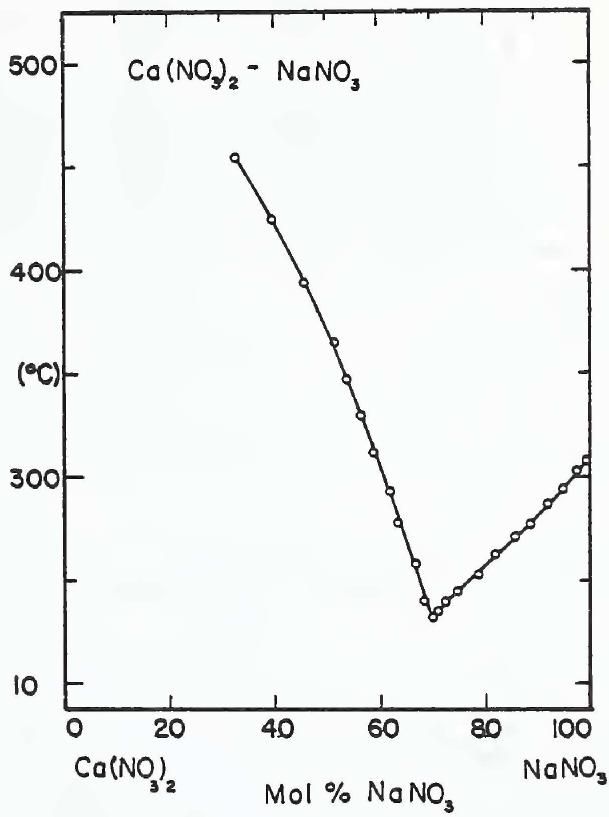  
Figure 103.1. $\mathrm{NaNO}_3\text{-}\mathrm{Ca}(\mathrm{NO}_3)_2$ phase diagram

References [1-19].

# 2. Density (ρ)

Measurement method: manometric densitometer [20]

Equation:

$$
\rho = a + b T \quad (1 0 3. 1)
$$

precision: in table 103.1

uncertainty: $\sim \pm 1.0\%$

Table 103.1. Parameters of equation (103.1) and precisions   

<table><tr><td>(mol % NaNO3)</td><td>a</td><td>-b x 10-5</td><td>Precision</td><td>T range(K)</td></tr><tr><td>55.4</td><td>2.4269</td><td>0.6700</td><td>0.02%</td><td>630-660</td></tr><tr><td>66.9</td><td>2.4017</td><td>0.6738</td><td>0.01%</td><td>530-640</td></tr><tr><td>72.8</td><td>2.3956</td><td>0.6850</td><td>0.02%</td><td>530-640</td></tr><tr><td>77.0</td><td>2.3980</td><td>0.7070</td><td>0.03%</td><td>530-660</td></tr><tr><td>83.8</td><td>2.4226</td><td>0.7330</td><td>0.02%</td><td>550-670</td></tr><tr><td>89.1</td><td>2.3920</td><td>0.7553</td><td>0.02%</td><td>570-670</td></tr><tr><td>92.0</td><td>2.3573</td><td>0.7173</td><td>0.02%</td><td>580-670</td></tr><tr><td>96.5</td><td>2.3475</td><td>0.7249</td><td>0.02%</td><td>590-670</td></tr></table>

$$
\mathrm {N a N O} _ {3} - \mathrm {C a} \left(\mathrm {N O} _ {3}\right) _ {2}
$$

Table 103.2. Density $(\mathrm{gcm}^{-3})$ from equations in table 103.1

<table><tr><td rowspan="2">T(K)</td><td colspan="7">Mo1 % NaNO3</td></tr><tr><td>55.4</td><td>66.9</td><td>72.8</td><td>83.8</td><td>89.1</td><td>92.0</td><td>96.5</td></tr><tr><td>530</td><td></td><td>2.045</td><td>2.033</td><td></td><td></td><td></td><td></td></tr><tr><td>540</td><td></td><td>2.038</td><td>2.026</td><td></td><td></td><td></td><td></td></tr><tr><td>550</td><td></td><td>2.031</td><td>2.019</td><td>2.019</td><td></td><td></td><td></td></tr><tr><td>560</td><td></td><td>2.024</td><td>2.012</td><td>2.012</td><td></td><td></td><td></td></tr><tr><td>570</td><td></td><td>2.018</td><td>2.005</td><td>2.005</td><td>1.961</td><td></td><td></td></tr><tr><td>580</td><td></td><td>2.011</td><td>1.998</td><td>1.997</td><td>1.954</td><td>1.941</td><td></td></tr><tr><td>590</td><td></td><td>2.004</td><td>1.991</td><td>1.990</td><td>1.946</td><td>1.934</td><td>1.920</td></tr><tr><td>600</td><td></td><td>1.997</td><td>1.985</td><td>1.983</td><td>1.939</td><td>1.927</td><td>1.913</td></tr><tr><td>610</td><td></td><td>1.991</td><td>1.978</td><td>1.975</td><td>1.931</td><td>1.920</td><td>1.905</td></tr><tr><td>620</td><td></td><td>1.984</td><td>1.971</td><td>1.968</td><td>1.924</td><td>1.913</td><td>1.898</td></tr><tr><td>630</td><td>2.005</td><td>1.977</td><td>1.964</td><td>1.961</td><td>1.916</td><td>1.905</td><td>1.891</td></tr><tr><td>640</td><td>1.998</td><td>1.970</td><td>1.957</td><td>1.953</td><td>1.909</td><td>1.898</td><td>1.884</td></tr><tr><td>650</td><td>1.991</td><td></td><td></td><td>1.946</td><td>1.901</td><td>1.891</td><td>1.876</td></tr><tr><td>660</td><td>1.985</td><td></td><td></td><td>1.939</td><td>1.894</td><td>1.884</td><td>1.869</td></tr><tr><td>670</td><td></td><td></td><td></td><td>1.931</td><td>1.886</td><td>1.877</td><td>1.862</td></tr><tr><td>680</td><td></td><td></td><td></td><td></td><td></td><td>1.870</td><td>1.855</td></tr></table>

References [20]

# 3. Surface Tension (γ)

Measurement method: maximum bubble pressure [21]

Equations:

$$
\gamma = a + b T \tag {103.2}
$$

precision: in table 103.3

uncertainty: $\sim \pm 2.0\%$

Table 103.3. Parameters of equation (103.2) and precisions

<table><tr><td>\( \mathrm{{Mol}}\% {\mathrm{{Ca}({NO}}}_{3}{)}_{2} \)</td><td>a</td><td>\( - b \times  {10}^{2} \)</td><td>Precision</td><td>T range(K)</td></tr><tr><td>5.27</td><td>163.1</td><td>5.59</td><td>*</td><td>583-703</td></tr><tr><td>11.12</td><td>160.0</td><td>5.25</td><td>*</td><td>572-700</td></tr><tr><td>17.68</td><td>160.6</td><td>5.29</td><td>*</td><td>548-683</td></tr><tr><td>25.00</td><td>163.3</td><td>5.54</td><td>*</td><td>540-689</td></tr><tr><td>29.79</td><td>164.5</td><td>5.62</td><td>*</td><td>520-704</td></tr><tr><td>37.93</td><td>168.5</td><td>6.00</td><td>*</td><td>586-690</td></tr><tr><td>46.00</td><td>167.1</td><td>5.82</td><td>*</td><td>637-690</td></tr></table>

\*not estimated; insufficient data

Two-independent-variables equation

$$
\gamma = a + b T + c C ^ {2} + d T C ^ {2} \tag {103.3}
$$

$$
\left(\mathrm {C} = \mathrm {mol} \% \mathrm {Ca} \left(\mathrm {NO} _ {3}\right) _ {2} \right.
$$

Table 103.4. Parameters of two-independent-variables equation (103.3)   

<table><tr><td>a</td><td>b x 102</td><td>c x 103</td><td>d x 106</td><td>Precision</td></tr><tr><td>146.19339</td><td>-5.33522</td><td>4.10095</td><td>4.7775</td><td>0.16%</td></tr></table>

(103) $\mathrm{NaNO}_3\text{-}\mathrm{Ca}(\mathrm{NO}_3)_2$   
Table 103.5. Surface tension (dyn cm $^{-1}$ ) from equations in table 103.3   

<table><tr><td rowspan="2">T(K)</td><td colspan="7">Mol % Ca(NO3)2</td></tr><tr><td>5.27</td><td>11.12</td><td>17.68</td><td>25.00</td><td>29.79</td><td>37.93</td><td>46.00</td></tr><tr><td>520</td><td></td><td></td><td></td><td></td><td>135.3</td><td></td><td></td></tr><tr><td>540</td><td></td><td></td><td></td><td>133.4</td><td>134.2</td><td></td><td></td></tr><tr><td>560</td><td></td><td></td><td>131.0</td><td>132.3</td><td>133.0</td><td></td><td></td></tr><tr><td>580</td><td>130.7</td><td>129.6</td><td>129.9</td><td>131.2</td><td>131.9</td><td></td><td></td></tr><tr><td>600</td><td>129.6</td><td>128.5</td><td>128.9</td><td>130.1</td><td>130.8</td><td>132.5</td><td></td></tr><tr><td>620</td><td>128.4</td><td>127.5</td><td>127.8</td><td>129.0</td><td>129.7</td><td>131.3</td><td></td></tr><tr><td>640</td><td>127.3</td><td>126.4</td><td>126.7</td><td>127.8</td><td>128.5</td><td>130.1</td><td>129.9</td></tr><tr><td>660</td><td>126.2</td><td>125.4</td><td>125.7</td><td>126.7</td><td>127.4</td><td>128.9</td><td>123.7</td></tr><tr><td>680</td><td>125.1</td><td>124.3</td><td>124.6</td><td>125.6</td><td>126.3</td><td>127.7</td><td>127.5</td></tr><tr><td>700</td><td>124.0</td><td>123.3</td><td></td><td></td><td>125.2</td><td></td><td></td></tr></table>

References [21]

4. Viscosity (n)

No data

5. Electrical Conductance (K)

Measurement method: classical ac technique [22]

Equation:

$$
\kappa = a + b T + c T ^ {2} \tag {103.4}
$$

precision: in table 103.6

uncertainty: $\sim 2.0\%$

Table 103.6. Parameters of equation (103:4) and precisions   
Table 103.7. Specific conductance (ohm $^{-1}$ cm $^{-1}$ ) from   

<table><tr><td>Mol % NaNO3</td><td>-a</td><td>b x 10^3</td><td>-c x 10^6</td><td>Precision</td><td>T range(K)</td></tr><tr><td>50</td><td>1.7551</td><td>4.800</td><td>2.182</td><td>0.31%</td><td>570-640</td></tr><tr><td>75</td><td>1.3922</td><td>2.893</td><td>-0.385</td><td>0.02%</td><td>550-670</td></tr><tr><td>90</td><td>1.9995</td><td>5.336</td><td>1.083</td><td>0.28%</td><td>580-690</td></tr></table>

equations in table 103.6   

<table><tr><td rowspan="2">T(K)</td><td colspan="3">Mo1 % NaNO3</td></tr><tr><td>50</td><td>75</td><td>90</td></tr><tr><td>550</td><td></td><td>0.316</td><td></td></tr><tr><td>560</td><td></td><td>0.349</td><td></td></tr><tr><td>570</td><td>0.272</td><td>0.382</td><td></td></tr><tr><td>580</td><td>0.295</td><td>0.415</td><td>0.731</td></tr><tr><td>590</td><td>0.317</td><td>0.449</td><td>0.772</td></tr><tr><td>600</td><td>0.340</td><td>0.482</td><td>0.813</td></tr><tr><td>610</td><td>0.361</td><td>0.516</td><td>0.853</td></tr><tr><td>620</td><td>0.382</td><td>0.550</td><td>0.893</td></tr><tr><td>630</td><td>0.403</td><td>0.583</td><td>0.933</td></tr><tr><td>640</td><td>0.423</td><td>0.617</td><td>0.972</td></tr><tr><td>650</td><td></td><td>0.651</td><td>1.012</td></tr><tr><td>660</td><td></td><td>0.685</td><td>1.051</td></tr><tr><td>670</td><td></td><td>0.719</td><td>1.090</td></tr><tr><td>680</td><td></td><td></td><td>1.129</td></tr><tr><td>690</td><td></td><td></td><td>1.167</td></tr></table>

References [22]

(103) $\mathrm{NaNO}_3 - \mathrm{Ca}(\mathrm{NO}_3)_2$

# 6. Safety and Hazards

A. Hazard rating

(i) Toxicity: $\mathrm{NaNO}_3$ , permitted as food additive; $\mathrm{Ca(NO_3)_2}$ , rated moderate.   
(ii) Vapor pressure: Nitrates will decompose with heating to nitrites and oxygen; onset of decomposition: $\mathrm{NaNO}_3$ (m.pt. $307^{\circ}\mathrm{C})\sim 500^{\circ}\mathrm{C};$ $\mathrm{Ca(NO_3)_2}$ (m.pt. $561^{\circ}\mathrm{C}),\sim \mathrm{m}.pt.$

B. Disaster hazards

(i) Molten salt bath "explosions": i.e., explosive generation of steam due to bulk water "carry-over" and/or equipment failure; i.e., explosive expansion of "trapped" air.   
(ii) On decomposition, nitrates emit toxic fumes (oxides of nitrogen) viz:

$$
2 \mathrm {M N O} _ {3} \longrightarrow 2 \mathrm {M N O} _ {2} + \mathrm {O} _ {2} \tag {103.5.1}
$$

$$
2 \mathrm {M N O} _ {2} \longrightarrow \mathrm {M} _ {2} \mathrm {O} + \mathrm {N O} + \mathrm {N O} _ {2} \quad (1 0 3. 5. 2)
$$

The subsequent decomposition reactions are complex; if the gas phase is continuously removed, the nitrite decomposition (above) to NO and $\mathrm{NO}_2$ is dominant.

(iii) Nitrates are powerful oxidizing agents; violent (explosive) reactions possible in molten nitrates and carbonaceous materials (organic cpds., oils, carbon,...); aluminum alloys and bath sludges (e.g. iron oxides); magnesium alloys. Dangerous.

References [23-28]

# 7. Corrosion

Table 103.8. Corrosion studies from primary research literature   

<table><tr><td>Studies</td><td>References</td></tr><tr><td>Fe</td><td>[29-31]</td></tr><tr><td>Fe, Co, Ni, Cr, Al,...</td><td>[32-34]</td></tr><tr><td>Cu, Pt, Au, W,...</td><td>[33-35]</td></tr><tr><td>Zn, Pb, Cu, Ni, Al</td><td>[36]</td></tr><tr><td>Pt, S, steel</td><td>[37]</td></tr><tr><td>Zr</td><td>[38]</td></tr><tr><td>Oxide species</td><td>[39]</td></tr><tr><td>Electrochemical approach</td><td>[40,41]</td></tr><tr><td>Thermodynamic redox diagrams</td><td>[42,43]</td></tr><tr><td>Annotated corrosion bibliio.</td><td>[44]</td></tr><tr><td>Reviews/molten salts</td><td>[45-47]</td></tr></table>

The studies in Table 103.8 (above) related to studies with various molten nitrates, principally $\mathrm{NaNO}_3$ , $\mathrm{KNO}_3$ , and their mixtures. For studies with added alkaline earth cations, see [31].

References [29-47]

# 8. Diffusion

Measurement method: chronopotentiometry [48]

List of diffusing species investigated in $\mathrm{NaNO}_3\text{-Ca} (\mathrm{NO}_3)_2$

$\mathbf{A}\mathbf{g}^{+}$

precision: $\sim \pm 3.4\%$

uncertainty: $\sim \pm 10\%$

Equation:

$$
D = 0. 6 7 6 \times 1 0 ^ {- 3} \exp [ - 4 2 4 8 / R T ] \tag {103.6}
$$

Table 103.9. Diffusion coefficients in $\mathsf{NaNO}_3\text{-}\mathsf{Ca}(\mathsf{NO}_3)_2(94\mathsf{mol}\% \mathsf{NaNO}_3)$   

<table><tr><td>T(K)</td><td>\( {\mathrm{D}}_{\mathrm{{Ag}}} + {\mathrm{x}}^{5} \)\( {\left( {\mathrm{{cm}}}^{2}\;{\mathrm{\;s}}^{-1}\right) }^{5} \)</td><td>T(K)</td><td>\( {\mathrm{D}}_{\mathrm{{Ag}}} + {\mathrm{x}}^{5} \)\( {\left( {\mathrm{{cm}}}^{2}\;{\mathrm{\;s}}^{-1}\right) }^{5} \)</td></tr><tr><td>570</td><td>1.59</td><td>630</td><td>2.27</td></tr><tr><td>580</td><td>1.69</td><td>640</td><td>2.39</td></tr><tr><td>590</td><td>1.80</td><td>650</td><td>2.52</td></tr><tr><td>600</td><td>1.92</td><td>660</td><td>2.65</td></tr><tr><td>610</td><td>2.03</td><td>670</td><td>2.78</td></tr><tr><td>620</td><td>2.15</td><td></td><td></td></tr></table>

References [48]

(103) $\mathrm{NaNO}_3 - \mathrm{Ca}(\mathrm{NO}_3)_2$

9. Heat of Fusion $(\Delta H_{f}^{\circ})$ No data   
10. Heat Capacity $(C_p)$ No data   
11. Volume Change on Melting $(\Delta V_{f})$ Measurement method: estimated from densities [49]

Table 103.10. Volume change on melting;   

<table><tr><td>Binary eutectic (mol % NaNO3)</td><td>(ΔVf/Vs)</td><td>Uncertainty</td></tr><tr><td>70</td><td>9.2%</td><td>~ ± 10%</td></tr></table>

References [49].

12. Vapor Pressure $(p_{vap})$ No data   
13. Thermal Conductivity (liquid) $(\lambda_{\ell})$ No data   
14. Thermal Conductivity (solid) $(\lambda_{s})$ No data   
15. Cryoscopic Constant $(k_{f})$ No data   
16. References

[1] Vetyukov, M. M., Shcherbinin, V. I., Jour. Appl. Chem. USSR, 36 2314 (1963).   
[2] Protsenko, P. I., Medvedev, B. S., Zhur., Neorg. Khim., 8, 1434 (1963).   
[3] Thilo, E., Wieker, C., Wieker, W., Proc. of the 7th Conf. on the Silicate Industry, Hungary, 79 (1963).   
[4] Storonkin, A. V., Vasil'lova, I. V., Shamko, V. I., Vestn. Leningrad. Univ., Fiz., Khim., 67 (1973).   
[5] Protsenko, P. I. and Bergman, A. G., Zh. Obshch. Khim., 20, 136S (1950).   
[6] Janz, G. J. Downey, J. R., Jr., Allen, C. B., and Tomkins, R. P. T., "Eutectic Data" - 2 Vols; ERDA-TID-27163-P1 & P2; NTIS, Washington, D. C. (1977).   
[7] Janz, G. J., Downey, J. R., Jr., Allen, C. B., and Tomkins, R. P. T., "Physical Properties Data Complications Relevant to Energy Storage. I. Molten Salts: Eutectic Data", NSRDS-NBS-61; U. S. Gov't Printing Office, Washington, D. C. (1978).   
[8] "International Critical Tables of Numerical Data, Physics, Chemistry, and Technology", 8 Vols., McGraw-Hill Book Co., N. Y. (1933).   
[9] "Landolt-Bornstein Zahlenwert und Funktionen aus Physik, Chemie, Astronomie, Geophysik und Technik", (10th Ed.) Springer-Verlag, Berlin, Heidelberg, N. Y. (1961).

(103) $\mathrm{NaNO}_{3} - \mathrm{Ca}(\mathrm{NO}_{3})_{2}$   
[10] Clark, P. V., "Fused Salt Mixtures: Eutectic Compositions and Melting Points Bibliography 1907-1968", Report No. SC-R-68-1680; Sandia Laboratories (1968), NTIS.   
[11] Robertson, W. D., "Binary Phase Diagrams of Halide Salts", Report No. Yale 2723 (2 Vols.), U. S. AEC Contract AT (30-1)-2723 (1966), NTIS.   
[12] Thoma, R. E., "Phase Diagrams of Nuclear Reactor Materials", Oak Ridge National Laboratory, ORNL-2548, Contract No. W-7405-eng-26.   
[13] Thoma, R. E., "Phase Diagrams of Binary and Ternary Fluoride Systems", Chapt. 6; Adv. Molten Salts Chemistry, Vol. 3 (J. Braunstein, G. Mamantov, and G. P. Smith, eds.), Plenum Press, N. Y. (1975).   
[14] Voskresenskaya, N. K., ed., "Handbook of Solid-Liquid Equilibria in Systems of Inorganic Salts", Volumes 1, 2, Izc. Akad. Nauk SSSR, Moscow (1961). Israel Program for Scientific Translations, Jerusalem, 1970 (NTIS).   
[15] Sinistri, C., Franzozini, P., and Rolla, M., "An Atlas of Miscibility Gaps in Molten Salt Systems", Institute of Physical Chemistry, University of Pavia (Italy) (1968).   
[16] Shaffer, P. T. B., "High Temperature Materials", Plenum Press Handbooks of High Temperature Materials, No. 1, Materials Index, Plenum Press, New York, 1964.   
[17] Franzozini, P., Ferloni, P., and Spinolo, C., "Molten Salts with Organic Anions", Instituto di Chimica Fisica, Universita di Pavia (Italy), 1973.   
[18] Toropov, N. A. et al., "Handbook of Phase Diagrams of the Silicates, Volume 1: Binary Systems, Volume 2, Metal-Oxygen Compounds in Silicate Systems", Izdatel'stov "Nauka" Leningradskoe Otdelenie, Leningrad, 1969, Israel Program for Scientific Translations, Jerusalem, 1972 (NTIS).   
[19] Levin, E., et al., "Phase Diagrams for Ceramists", Amer. Ceramic Soc. (publ.), Columbus, Ohio (1964; 1969).   
[20] McAuley, W. J., Rhodes, E., and Ubbelohde, A. R., Proc. Roy. Soc. 289A, 151 (1966).   
[21] Eliseeva, A. F., Popovskaya, N. P., and Protsenko, P. I., Russ. J. Inorg. Chem. 14, 1186 (1969).   
[22] DeNooijer, B., Ph.D. Thesis, University of Amsterdam, Amsterdam, 1965.   
[23] Stern, K., "High Temperature Properties and Decomposition of Inorganic Salts. III. Nitrates and Nitrites", J. Phys. Chem. Ref. Data, 1, 747-772 (1972).   
[24] "Dangerous Properties of Materials", Sax, N. I., Van Nostrand Reinhold Co., N. Y. (1969).   
[25] "Registry of Toxic Effects of Chemical Substances", Christensen, H. E., and Lubinybyhl, T. T., eds., U. S. Dept. H.E.W; U. S. Gov't Printing Office, Washington, D. C. (1975).   
[26] "Potential Hazards in Molten Salt Baths for Heat Treatment of Metals", National Board Fire Underwriters Research Report No. 2. (1954).   
[2.7] "Handbook of Reactive Chemical Hazards", Bretherwick, L., Butterworths Co., London (1975).   
[28] Janz, G. J., Tomkins, R. P. T., Downey, J. R., Jr., and Allen, C. B., "Safety and Hazards", Chapter in "Eutectic Data", ERDA TID-27163-P1; NTIS, U. S. Dept. Commerce, Springfield, Va. (1977).

(103) $\mathrm{NaNO}_{3} - \mathrm{Ca}(\mathrm{NO}_{3})_{2}$   
[29] Arvia, A. J., Podesta, J. J., and Piatti, R. C. V., Electrochim. Acta, 17, 33 (1972).   
[30] Marchiano, S. L., and Arvia, A. J., Electrochim. Acta, 17, 25 (1972).   
[31] Notoya, T., Ishikawa, T., Midorikawa, R., Denki Kagaku, 39, 930 (1971); ibid, 40, 62 (1972).   
[32] Marchiano, S. L., and Arvia, A. J., An. Soc. Cient. Argent., 192, 263 (1971).   
[33] Brough, B. J., Kerridge, D. H., Inorg. Chem., 4, 1353 (1965).   
[34] Swofford, H. S., Jr., Laitinen, H. A., J. Electrochem. Soc., 110, 816 (1963).   
[35] Notoya, T., Denki Kagaku, 41, 779 (1973).   
[36] Herquet, M. L. H., Industrie Chim. Belge, 20, 592 (1955).   
[37] Johnson, K. E., Electrochimica Acta, 11, (1966).   
[38] Andreev, Y. Y., Fokin, M. N., Shitikov, Y. A., Fiz. Khim. Elektrokhim. Rasplav. Solei Tverd. Ekektrolitov, 2, 100 (1973).   
[39] Johnson, K. E., Zacharias, P. S., and Mathews, J., "Proceedings Intern. Symp. Molten Salts", p. 603, The Electrochemical Soc., Princeton, N. J., (1976).   
[40] Pizzini, S., "Materials Problems in the Industrial Applications of Molten Salts", "Proceedings of the European Conference on the Development of Molten Salts Applications", p. 203; Battelle, Geneva, (1973).   
[41] Johnson, K. E., "Electrochemical Approaches to Corrosion in Molten Salts", Proceedings International Symposium on Metal-Slag-Gas Reactions and Processes, The Electrochemical Society, Inc., Princeton, N. J. (1975).   
[42] Bartlett, H. E., and Johnson, K. E., Canad. J. Chem., 44, 2119 (1966).   
[43] Conte, A., and Ingram, M. D., Electrochimica Acta, 13, 1551 (1968).   
[44] Janz, G. J., and Tomkins, R. P. T., Corrosion, 35, 485 (1979).   
[45] Inman, D., and Wrench, N. S., Brit. Corr. J., 1, 246 (1966).   
[46] Ketelaar, J. A. A., Chemie. Ing. Techn., 45, 667 (1973).   
[47] Smirnov, M. V. and Ozeryanaya, Nauki Tekh. Korros. Zashch. Korros., 2, 171 (1973).   
[48] Bansal, N. P., Rev. Roumaine Chim. 19, 1987 (1974).   
[49] Janz, G. J., et al. (MSDC-RPI), unpublished work (1980).

$$
\text {S y s t e m} 1 0 4 \mathrm {K N O} _ {3} - \mathrm {M g} \left(\mathrm {N O} _ {3}\right) _ {2}
$$

1. Melting Temperatures $(T_{m})$

Pure substance melting points:

KNO3: 335°C

$\mathrm{Mg(NO_3)_2}$ : anhydrous $\mathrm{Mg(NO_3)_2}$ decomposes at t $\sim$ $400^{\circ}\mathrm{C}$

Eutectic melting point:

E1: 178°C, composition: 56 mol % KNO₃

E₂: 195°C, composition: 81 mol % KNO₃

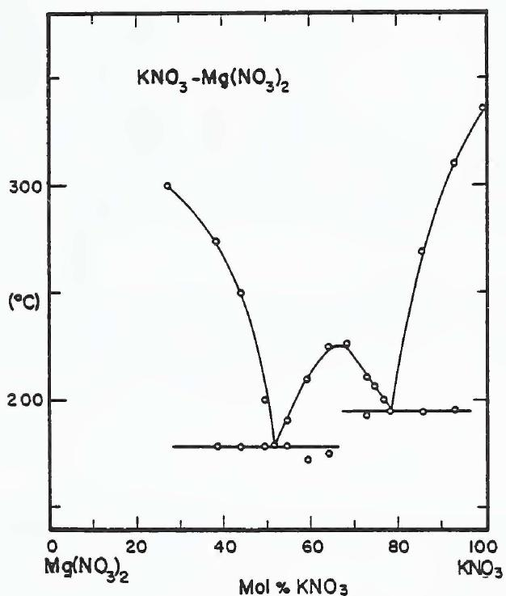  
Figure 104.1. $\mathrm{KNO}_3\text{-Mg} (\mathrm{NO}_3)_2$ phase diagram

References [1-16].

2. Density (ρ)

Measurement method: manometric densitometer [17]

Equation:

$$
\rho = a + b T \tag {104.1}
$$

precision: in table 104.1

uncertainty: $\sim \pm 1.0\%$

Table 104.1. Parameters of equation (104.1) and precisions   

<table><tr><td>Mol % Mg(NO3)2</td><td>a</td><td>-b x 103</td><td>Precision</td><td>T range(K)</td></tr><tr><td>5.3</td><td>2.5389</td><td>0.8667</td><td>0.2%</td><td>590-660</td></tr><tr><td>11.0</td><td>2.6148</td><td>0.8786</td><td>0.01%</td><td>560-620</td></tr><tr><td>17.0</td><td>2.7417</td><td>0.8982</td><td>0.02%</td><td>520-610</td></tr><tr><td>24.4</td><td>2.9356</td><td>0.9927</td><td>0.02%</td><td>480-570</td></tr><tr><td>33.4</td><td>3.1403</td><td>1.0500</td><td>0.01%</td><td>500-520</td></tr></table>

(104) $\mathrm{KNO}_3 - \mathrm{Mg}(\mathrm{NO}_3)_2$

Table 104.2. Density (g cm $^{-3}$ ) from equations in table 104.1

<table><tr><td rowspan="2">T(K)</td><td colspan="5">Mo1 % Mg(NO3)2</td></tr><tr><td>5.3</td><td>11.0</td><td>17.0</td><td>24.4</td><td>33.4</td></tr><tr><td>480</td><td></td><td></td><td></td><td>2.459</td><td></td></tr><tr><td>490</td><td></td><td></td><td></td><td>2.449</td><td>2.626</td></tr><tr><td>500</td><td></td><td></td><td></td><td>2.439</td><td>2.615</td></tr><tr><td>510</td><td></td><td></td><td></td><td>2.429</td><td>2.605</td></tr><tr><td>520</td><td></td><td></td><td>2.275</td><td>2.419</td><td>2.594</td></tr><tr><td>530</td><td></td><td></td><td>2.266</td><td>2.409</td><td></td></tr><tr><td>540</td><td></td><td></td><td>2.257</td><td>2.400</td><td></td></tr><tr><td>550</td><td></td><td></td><td>2.248</td><td>2.390</td><td></td></tr><tr><td>560</td><td></td><td>2.124</td><td>2.239</td><td>2.380</td><td></td></tr><tr><td>570</td><td></td><td>2.114</td><td>2.230</td><td>2.370</td><td></td></tr><tr><td>580</td><td></td><td>2.105</td><td>2.221</td><td></td><td></td></tr><tr><td>590</td><td>2.028</td><td>2.096</td><td>2.212</td><td></td><td></td></tr><tr><td>600</td><td>2.019</td><td>2.088</td><td>2.203</td><td></td><td></td></tr><tr><td>610</td><td>2.010</td><td>2.079</td><td>2.194</td><td></td><td></td></tr><tr><td>620</td><td>2.002</td><td>2.070</td><td></td><td></td><td></td></tr><tr><td>630</td><td>1.993</td><td></td><td></td><td></td><td></td></tr><tr><td>640</td><td>1.984</td><td></td><td></td><td></td><td></td></tr><tr><td>650</td><td>1.976</td><td></td><td></td><td></td><td></td></tr><tr><td>660</td><td>1.967</td><td></td><td></td><td></td><td></td></tr></table>

References [17]

3. Surface Tension (γ) No data   
4. Viscosity (n) No data   
5. Electrical Conductance (K) No data   
6. Safety and Hazards

A. Hazard rating

(i) Toxicity: $\mathrm{KNO}_3$ , permitted as food additive; $\mathrm{Mg(NO_3)_2}$ , rated moderate.   
(ii) Vapor pressure: Nitrates decompose, on heating, to nitrites and oxygen; onset of decomposition for $\mathrm{KNO}_3$ (m.pt. $335^{\circ}\mathrm{C}$ ); is $\sim 530^{\circ}\mathrm{C}$ ; little is known about the high temperature behavior of anhydrous $\mathrm{Mg(NO_3)_2}$ ; onset of decomposition has been reported from $\sim 130^{\circ}\mathrm{C}$ to $\sim 390^{\circ}\mathrm{C}$ .

$$
\mathrm {K N O} _ {3} - \mathrm {M g} \left(\mathrm {N O} _ {3}\right) _ {2} \tag {104}
$$

# B. Disaster hazards

(i) Molten salt bath "explosions": violent generation of steam due to bulk water "carry-over" and/or equipment failure; sudden explosive expansion of "trapped" air.   
(ii) On decomposition, nitrates emit toxic fumes (oxides of nitrogen) viz:

$$
\mathrm {M N O} _ {3} \longrightarrow \mathrm {M N O} _ {2} + \mathrm {I} _ {2} \mathrm {O} _ {2} \tag {104.2}
$$

$$
2 \mathrm {M N O} _ {2} \longrightarrow \mathrm {M} _ {2} \mathrm {O} + \mathrm {N O} + \mathrm {N O} _ {2} \tag {104.3}
$$

The subsequent decomposition reactions are complex; if the gas phase is continuously removed, the nitrite decomposition (above) to NO and $\mathrm{NO}_2$ is dominant.

In the temperature range $550 - 600^{\circ}\mathrm{C}$ , and under oxygen, the conversion of $\mathrm{KNO}_2$ to $\mathrm{KNO}_3$ goes to completion; between $650 - 750^{\circ}\mathrm{C}$ , the two salts interconvert (see above), $\mathrm{KNO}_3$ becoming increasingly unstable; above $800^{\circ}\mathrm{C}$ ; the nitrite decomposition: $2\mathrm{KNO}_2 \rightarrow \mathrm{K}_2\mathrm{O} + \mathrm{N}_2 + 3 / _2\mathrm{O}_2$ goes to completion.

(iii) Nitrates are powerful oxidizing agents; violent (explosive) reactions possible in molten nitrates and carbonaceous materials (organic cpds., oils, carbon,...); aluminum alloys and bath sludges (e.g. iron oxides); magnesium alloys. Dangerous.

References [18-23]

# 7. Corrosion

Table 104.3. Corrosion studies from primary research literature   

<table><tr><td>Studies</td><td>References</td></tr><tr><td>Fe</td><td>[24-26]</td></tr><tr><td>Fe, Co, Ni, Cr, Al,...</td><td>[27-29]</td></tr><tr><td>Cu, Pt, Au, W,...</td><td>[28-30]</td></tr><tr><td>Zn, Pb, Cu, Ni, Al</td><td>[31]</td></tr><tr><td>Pt, S, steel</td><td>[32]</td></tr><tr><td>Zr</td><td>[33]</td></tr><tr><td>Oxide species</td><td>[34]</td></tr><tr><td>Electrochemical approach</td><td>[35,36]</td></tr><tr><td>Thermodynamic redox diagrams</td><td>[37,38]</td></tr><tr><td>Annotated corrosion biblio.</td><td>[39]</td></tr><tr><td>Reviews/molten salts</td><td>[40-42]</td></tr></table>

The studies in Table 104.3 (above) related to studies with various molten nitrates, principally NaNO, KNO $_3$ , and their mixtures. For studies with added alkaline earth cations, see [26].

(104) $\mathrm{KNO}_{3} - \mathrm{Mg}(\mathrm{NO}_{3})_{2}$

8. Diffusion

No data

9. Heat of Fusion $(\Delta H_{f}^{\circ})$

No data

10. Heat Capacity $(C_p)$

No data

11. Volume Change on Melting $(\Delta V_{f})$

No data

12. Vapor Pressure $(p_{vap})$

No data

13. Thermal Conductivity (liquid) $(\lambda_{\ell})$

No data

14. Thermal Conductivity (solid) $(\lambda_{s})$

No data

15. Cryoscopic Constant $(k_{f})$

No data

16. References

[1] Thilo, E., Wieker, C., Wieker, W., Proc. of the 7th Conf. on the Silicate Industry, Hungary, 79 (1963).   
[2] Jänecke, E., Z. Elektrochem., 48, 453 (1932).   
[3] Janz, G. J. Downey, J. R., Jr., Allen, C. B., and Tomkins, R. P. T., "Eutectic Data" - 2 Vols; ERDA-TID-27163-P1 & P2; NTIS, Washington, D. C. (1977).   
[4] Janz, G. J., Downey, J. R., Jr., Allen, C. B., and Tomkins, R. P. T., "Physical Properties Data Complications Relevant to Energy Storage. I. Molten Salts: Eutectic Data", NSRDS-NBS-61; U. S. Gov't Printing Office, Washington, D. C. (1978).   
[5] "International Critical Tables of Numerical Data, Physics, Chemistry, and Technology", 8 Vols., McGraw-Hill Book Co., N. Y. (1933).   
[6] "Landolt-Bornstein Zahlenwert und Funktionen aus Physik, Chemie, Astronomie, Geophysik und Technik", (10th Ed.) Springer-Verlag, Berlin, Heidelberg, N. Y. (1961).   
[7] Clark, P. V., "Fused Salt Mixtures: Eutectic Compositions and Melting Points Bibliography 1907-1968", Report No. SC-R-68-1680; Sandia Laboratories (1968), NTIS.   
[8] Robertson, W. D., "Binary Phase Diagrams of Halide Salts", Report No. Yale 2723 (2 Vols.), U. S. AEC Contract AT (30-1)-2723 (1966), NTIS.   
[9] Thoma, R. E., "Phase Diagrams of Nuclear Reactor Materials", Oak Ridge National Laboratory, ORNL-2548, Contract No. W-7405-eng-26.   
[10] Thoma, R. E., "Phase Diagrams of Binary and Ternary Fluoride Systems", Chapt. 6; Adv. Molten Salts Chemistry, Vol. 3 (J. Braunstein, G. Mamantov, and G. P. Smith, eds.), Plenum Press, N. Y. (1975).

(104) $\mathrm{KNO}_{3} - \mathrm{Mg(NO}_{3})_{2}$   
[11] Voskresenskaya, N. K., ed., "Handbook of Solid-Liquid Equilibria in Systems of Inorganic Salts", Volumes 1, 2, Izc. Akad. Nauk SSSR, Moscow (1961). Israel Program for Scientific Translations, Jerusalem, 1970 (NTIS).   
[12] Sinistri, C., Franzozini, P., and Rolla, M., "An Atlas of Miscibility Gaps in Molten Salt Systems", Institute of Physical Chemistry, University of Pavia (Italy) (1968).   
[13] Shaffer, P. T. B., "High Temperature Materials", Plenum Press Handbooks of High Temperature Materials, No. 1, Materials Index, Plenum Press, New York, 1964.   
[14] Franzozini, P., Ferloni, P., and Spinolo, C., "Molten Salts with Organic Anions", Instituto di Chimica Fisica, Universita di Pavia (Italy), 1973.   
[15] Toropov, N. A. et al., "Handbook of Phase Diagrams of the Silicates, Volume 1: Binary Systems, Volume 2, Metal-Oxygen Compounds in Silicate Systems", Izdatel'stov "Nauka" Leningradskoe Otdelenie, Leningrad, 1969, Israel Program for Scientific Translations, Jerusalem, 1972 (NTIS).   
[16] Levin, E., et al., "Phase Diagrams for Ceramists", Amer. Ceramic Soc. (publ.), Columbus, Ohio (1964; 1969).   
[17] McAuley, W. J., Rhodes, E., and Ubbelohde, A. R., Proc. Roy. Soc., 289A, 151 (1966).   
[18] Stern, K., "High Temperature Properties and Decomposition of Inorganic Salts. III. Nitrates and Nitrites", J. Phys. Chem. Ref. Data, 1, 747-772 (1972).   
[19] "Dangerous Properties of Materials", Sax, N. I., Van Nostrand Reinhold Co., N. Y. (1969).   
[20] "Registry of Toxic Effects of Chemical Substances", Christensen, H. E., and Lubinybyhl, T. T., eds., U. S. Dept. H.E.W; U. S. Gov't Printing Office, Washington, D. C. (1975).   
[21] "Potential Hazards in Molten Salt Baths for Heat Treatment of Metals", National Board Fire Underwriters Research Report No. 2. (1954).   
[22] "Handbook of Reactive Chemical Hazards", Bretherwick, L., Butterworths Co., London (1975).   
[23] Janz, G. J., Tomkins, R. P. T., Downey, J. R., Jr., and Allen, C. B., "Safety and Hazards", Chapter in "Eutectic Data", ERDA TID-27163-P1; NTIS, U. S. Dept. Commerce, Springfield, Va. (1977).   
[24] Arvia, A. J., Podesta, J. J., and Piatti, R. C. V., Electrochim. Acta, 17, 33 (1972).   
[25] Marchiano, S. L., and Arvia, A. J., Electrochim. Acta, 17, 25 (1972).   
[26] Notoya, T., Ishikawa, T., Midorikawa, R., Denki Kagaku, 39, 930 (1971); ibid, 40, 62 (1972).   
[27] Marchiano, S. L., and Arvia, A. J., An. Soc. Cient. Argent., 192, 263 (1971).   
[28] Brough, B. J., Kerridge, D. H., Inorg. Chem., 4, 1353 (1965).   
[29] Swofford, H. S., Jr., Laitinen, H. A., J. Electrochem. Soc., 110, 816 (1963).   
[30] Notoya, T., Denki Kagaku, 41, 779 (1973).

(104) $\mathrm{KNO}_3 - \mathrm{Mg(NO}_3\mathrm{)}_2$   
[31] Herquet, M. L. H., Industrie Chim. Belge, 20, 592 (1955).   
[32] Johnson, K. E., Electrochimica Acta, 11, (1966).   
[33] Andreev, Y. Y., Fokin, M. N., Shitikov, Y. A., Fiz. Khim. Elektrokhim. Rasplav. Solei Tverd. Ekektrolitov, 2, 100 (1973).   
[34] Johnson, K. E., Zacharias, P. S., and Mathews, J., "Proceedings Intern. Symp. Molten Salts", p. 603, The Electrochemical Soc., Princeton, N. J., (1976).   
[35] Pizzini, S., "Materials Problems in the Industrial Applications of Molten Salts", "Proceedings of the European Conference on the Development of Molten Salts Applications", p. 203; Battelle, Geneva, (1973).   
[36] Johnson, K. E., "Electrochemical Approaches to Corrosion in Molten Salts", Proceedings International Symposium on Metal-Slag-Gas Reactions and Processes, The Electrochemical Society, Inc., Princeton, N. J. (1975).   
[37] Bartlett, H. E., and Johnson, K. E., Canad. J. Chem., 44, 2119 (1966).   
[38] Conte, A., and Ingram, M. D., Electrochimica Acta, 13, 1551 (1968).   
[39] Janz, G. J., and Tomkins, R. P. T., Corrosion, 35, 485 (1979).   
[40] Inman, D., and Wrench, N. S., Brit. Corr. J., 1, 246 (1966).   
[41] Ketelaar, J. A. A., Chemie. Ing. Techn., 45, 667 (1973).   
[42] Smirnov, M. V. and Ozeryanaya, Nauki Tekh. Korros. Zashch. Korros., 2, 171 (1973).

$$
\text {S y s t e m} 1 0 5 \quad \mathrm {L i N O} _ {2} - \mathrm {N a N O} _ {2}
$$

1. Melting Temperatures $(T_{m})$

Pure substance melting points:

$\mathrm{LiNO}_{2}$ : $220^{\circ} \mathrm{C}$

$\mathrm{NaNO}_2$ : $282^{\circ} \mathrm{C}$

Eutectic melting point:

$150^{\circ} \mathrm{C}$ , composition: $63 \mathrm{~mol} \% \mathrm{LiNO}_{2}$

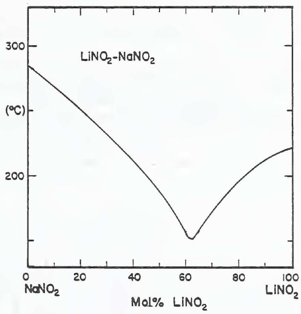  
Figure 105.1. $\mathrm{LiNO}_3\text{-NaNO}_2$ phase diagram

References [1-16].

2. Density (ρ)

No data

3. Surface Tension (Y)

No data

4. Viscosity (n)

No data

5. Electrical Conductance (K)

Measurement method: classical ac technique [17]

Equation:

$$
\kappa = a + b T + c T ^ {2} \tag {105.1}
$$

precision: in table 105.1

uncertainty: $\sim 3.0\%$

Table 105.1. Parameters of equation (105.1) and precisions   

<table><tr><td>Mol % LiNO2</td><td>-a</td><td>b x 102</td><td>-c x 105</td><td>Precision</td><td>T range(K)</td></tr><tr><td>20</td><td>17.793</td><td>6.363</td><td>5.277</td><td>0.3%</td><td>530-570</td></tr><tr><td>30</td><td>9.7457</td><td>3.473</td><td>2.700</td><td>0.6%</td><td>530-570</td></tr><tr><td>40</td><td>6.4316</td><td>2.240</td><td>1.570</td><td>1.1%</td><td>490-570</td></tr><tr><td>50</td><td>5.8379</td><td>2.016</td><td>1.376</td><td>0.8%</td><td>470-570</td></tr><tr><td>60</td><td>4.8060</td><td>1.604</td><td>0.983</td><td>0.7%</td><td>470-550</td></tr><tr><td>70</td><td>6.2311</td><td>2.168</td><td>1.557</td><td>0.6%</td><td>470-550</td></tr><tr><td>80</td><td>3.6193</td><td>1.175</td><td>0.631</td><td>0.2%</td><td>490-550</td></tr><tr><td>90</td><td>7.2069</td><td>2.550</td><td>1.964</td><td>0.6%</td><td>490-550</td></tr></table>

Table 105.2. Specific conductance $(ohm^{-1}cm^{-1})$ from equations in table 105.1   

<table><tr><td rowspan="2">T(K)</td><td colspan="8">Mol % LiNO2</td></tr><tr><td>20</td><td>30</td><td>40</td><td>50</td><td>60</td><td>70</td><td>80</td><td>90</td></tr><tr><td>470</td><td></td><td></td><td></td><td>0.596</td><td>0.561</td><td>0.520</td><td></td><td></td></tr><tr><td>480</td><td></td><td></td><td></td><td>0.667</td><td>0.628</td><td>0.588</td><td></td><td></td></tr><tr><td>490</td><td></td><td></td><td>0.772</td><td>0.735</td><td>0.693</td><td>0.654</td><td>0.623</td><td>0.572</td></tr><tr><td>500</td><td></td><td></td><td>0.840</td><td>0.800</td><td>0.756</td><td>0.717</td><td>0.678</td><td>0.632</td></tr><tr><td>510</td><td></td><td>0.945</td><td>0.905</td><td>0.863</td><td>0.817</td><td>0.776</td><td>0.732</td><td>0.689</td></tr><tr><td>520</td><td></td><td>1.014</td><td>0.968</td><td>0.923</td><td>0.876</td><td>0.833</td><td>0.784</td><td>0.742</td></tr><tr><td>530</td><td>1.108</td><td>1.078</td><td>1.027</td><td>0.980</td><td>0.933</td><td>0.886</td><td>0.836</td><td>0.790</td></tr><tr><td>540</td><td>1.179</td><td>1.136</td><td>1.083</td><td>1.034</td><td>0.989</td><td>0.936</td><td>0.886</td><td>0.835</td></tr><tr><td>550</td><td>1.240</td><td>1.189</td><td>1.135</td><td>1.086</td><td>1.042</td><td>0.983</td><td>0.934</td><td>0.876</td></tr><tr><td>560</td><td>1.291</td><td>1.237</td><td>1.185</td><td>1.345</td><td></td><td></td><td></td><td></td></tr><tr><td>570</td><td>1.331</td><td>1.279</td><td>1.231</td><td>1.181</td><td></td><td></td><td></td><td></td></tr></table>

# References [17]

# 6. Safety and Hazards

# A. Hazard rating

(i) Toxicity: $\mathrm{LiNO}_2$ , severe; $\mathrm{NaNO}_2$ , permitted in food; there appears to be some implication of increased cancer with chronic ingestion of nitrites   
(ii) Vapor pressure: no data for this system; but see: $\mathrm{LiNO}_2$ [28], and $\mathrm{NaNO}_2$ [28]

# (105) $\mathrm{LiNO}_2\text{-NaNO}_2$

# B. Disaster hazards

(i) Molten salt bath "explosions": i.e. explosive generation of steam due to bulk water "carry-over" and/or equipment failure; i.e., explosive expansion of "trapped" air   
(ii) On decomposition, nitrites emit toxic fumes (oxides of nitrogen) viz:

$$
2 \mathrm {M N O} _ {2} \rightarrow \mathrm {M} _ {2} \mathrm {O} + \mathrm {N O} + \mathrm {N O} _ {2} \tag {105.2}
$$

$$
2 \mathrm {M N O} _ {2} + \mathrm {O} _ {2} \rightarrow 2 \mathrm {M N O} _ {3} \tag {105.3}
$$

The subsequent decomposition reactions are complex; if the gas phase is not continuously removed, the nitrite may be oxidized to $\mathrm{NaNO}_3$ , i.e., to the nitrate

(iii) Nitrites, like nitrates, are powerful oxidizing agents; violent (explosive) reactions possible in molten nitrates and carbonaceous materials (organic cpds., oils, carbon,...); aluminum alloys and bath sludges (e.g. iron oxides)

References [18-28]

# 7. Corrosion

Table 105.3. Corrosion studies from primary research literature   

<table><tr><td>Studies in molten nitrates and nitrites</td><td>References</td></tr><tr><td>Fe</td><td>[29-31]</td></tr><tr><td>Fe, Co, Ni, Cr, Al,...</td><td>[32-34]</td></tr><tr><td>Cu, Pt, Au, W,...</td><td>[33-35]</td></tr><tr><td>Zn, Pb, Cu, Ni, Al</td><td>[36]</td></tr><tr><td>Pt, S, steel</td><td>[37]</td></tr><tr><td>Zr</td><td>[38]</td></tr><tr><td>Oxide species</td><td>[39]</td></tr><tr><td>Electrochemical approach</td><td>[40,41]</td></tr><tr><td>Thermodynamic redox diagrams</td><td>[42,43]</td></tr><tr><td>Annotated corrosion bibliio.</td><td>[44]</td></tr><tr><td>Reviews/molten salts</td><td>[45-47]</td></tr></table>

No compatibility studies with $\mathrm{LiNO}_2\text{-NaNO}_2$ found; the studies in Table 105.3 (above) related principally to Na and K nitrates and their mixtures; for passivation studies in molten $\mathrm{NaNO}_2$ , see [31].

References [29-47]

(105) $\mathrm{LiNO}_2\text{-NaNO}_2$

8. Diffusion No data   
9. Heat of Fusion $(\Delta H_{f}^{\circ})$ No data   
10. Heat Capacity (Cp) No data   
11. Volume Change on Melting $(\Delta V_{f})$ No data   
12. Vapor Pressure $(p_{vap})$ No data   
13. Thermal Conductivity (liquid) $(\lambda_{\kappa})$ No data   
14. Thermal Conductivity (solid) $(\lambda_{s})$ No data   
15. Cryoscopic Constant $(k_{f})$ No data   
16. References

[1] Shisholina, R. P., Protsenko, P. I., Zhur. Neorg. Khim., 8, 1436 (1963).   
[2] Protsenko, P. I., Shisholina, R. P., Ukr. Khim. Zh., 912 (1964).   
[3] Janz, G. J. Downey, J. R., Jr., Allen, C. B., and Tomkins, R. P. T., "Eutectic Data" - 2 Vols; ERDA-TID-27163-P1 & P2; NTIS, Washington, D. C. (1977).   
[4] Janz, G. J., Downey, J. R., Jr., Allen, C. B., and Tomkins, R. P. T., "Physical Properties Data Complications Relevant to Energy Storage. I. Molten Salts: Eutectic Data", NSRDS-NBS-61; U. S. Gov't Printing Office, Washington, D. C. (1978).   
[5] "International Critical Tables of Numerical Data, Physics, Chemistry, and Technology", 8 Vols., McGraw-Hill Book Co., N. Y. (1933).   
[6] "Landolt-Bornstein Zahlenwert und Funktionen aus Physik, Chemie, Astronomie, Geophysik und Technik", (10th Ed.) Springer-Verlag, Berlin, Heidelberg, N. Y. (1961).   
[7] Clark, P. V., "Fused Salt Mixtures: Eutectic Compositions and Melting Points Bibliography 1907-1968", Report No. SC-R-68-1680; Sandia Laboratories (1968), NTIS.   
[8] Robertson, W. D., "Binary Phase Diagrams of Halide Salts", Report No. Yale 2723 (2 Vols.), U. S. AEC Contract AT (30-1)-2723 (1966), NTIS.   
[9] Thoma, R. E., "Phase Diagrams of Nuclear Reactor Materials", Oak Ridge National Laboratory, ORNL-2548, Contract No. W-7405-eng-26.   
[10] Thoma, R. E., "Phase Diagrams of Binary and Ternary Fluoride Systems", Chapt. 6; Adv. Molten Salts Chemistry, Vol. 3 (J. Braunstein, G. Mamantov, and G. P. Smith, eds.), Plenum Press, N. Y. (1975).

(105) $\mathrm{LiNO}_2\text{-NaNO}_2$   
[11] Voskresenskaya, N. K., ed., "Handbook of Solid-Liquid Equilibria in Systems of Inorganic Salts", Volumes 1, 2, Izc. Akad. Nauk SSSR, Moscow (1961). Israel Program for Scientific Translations, Jerusalem, 1970 (NTIS).   
[12] Sinistri, C., Franzozini, P., and Rolla, M., "An Atlas of Miscibility Gaps in Molten Salt Systems", Institute of Physical Chemistry, University of Pavia (Italy) (1968).   
[13] Shaffer, P. T. B., "High Temperature Materials", Plenum Press Handbooks of High Temperature Materials, No. 1, Materials Index, Plenum Press, New York, 1964.   
[14] Franzozini, P., Ferloni, P., and Spinolo, C., "Molten Salts with Organic Anions", Instituto di Chimica Fisica, Universita di Pavia (Italy), 1973.   
[15] Toropov, N. A. et al., "Handbook of Phase Diagrams of the Silicates, Volume 1: Binary Systems, Volume 2, Metal-Oxygen Compounds in Silicate Systems", Izdatel'stov "Nauka" Leningradskoe Otdelenie, Leningrad, 1969, Israel Program for Scientific Translations, Jerusalem, 1972 (NTIS).   
[16] Levin, E., et al., "Phase Diagrams for Ceramists", Amer. Ceramic Soc. (publ.), Columbus, Ohio (1964; 1969).   
[17] Protsenko, P. I., and Shisholina, R. P., Ukraine. Khim. Zhur., 31, 1048 (1965).   
[18] "Dangerous Properties of Materials", Sax, N. I., Van Nostrand Reinhold Co., N. Y. (1969).   
[19] "Registry of Toxic Effects of Chemical Substances", Christensen, H. E., and Lubinbyhl, T. T., eds., U. S. Dept. H. E. W., U. S. Gov't Printing Office, Washington, D. C. (1975).   
[20] "Potential Hazards in Molten Salt Baths for Heat Treatment of Metals", National Board of Fire Underwriters Research Report No. 2 (1954).   
[21] "Handbook of Reactive Chemical Hazards", Bretherwick, L., Butterworth Co., London (1975).   
[22] Janz, G. J., Tomkins, R. P. T., Downey, J. R. Jr., and Allen, C. B., "Safety and Hazards", Chapter in "Eutectic Data", ERDA TID-27163-P1; NTIS, U. S. Dept. Commerce, Springfield, Va. (1977)   
[23] Janz, G. J., et al., "Physical Properties Data Complications Relevant to Energy Storage. Part II. Molten Salts: Data on Single and Multi-Component Salt Systems", NSRDS-NBS 61, Part II (April 1979), U. S. Gov't Printing Office, Supt of Doc. No. C13-48-61, Washington D. C. 20402.   
[24] Freeman, E. S., J. Amer. Chem. Soc., 79, 838 (1957).   
[25] Oza, T. M., J. Indian Chem. Soc., 22, 173 (1945).   
[26] Oza, T. M., Walawalkar, B. R., J. Indian Chem. Soc., 22, 243 (1945).   
[27] Protsenko, P. I., Bordyuhkova, V., Zhur. Neorg. Khim., 10, 1215 (1965).   
[28] vide: this work, System 73, $\mathrm{LiNO}_2$ and 74, $\mathrm{NaNO}_2$ .   
[29] Arvia, A. J., Podesta, J. J., and Piatti, R. C. V., Electrochim. Acta, 17, 33 (1972).   
[30] Marchiano, S. L., and Arvia, A. J., Electrochim. Acta, 17, 25 (1972).

[31] Notoya, T., Ishikawa, T., Midorikawa, R., Denki Kagaku, 39, 930 (1971); ibid, 40, 62 (1972).   
[32] Marchiano, S. L., and Arvia, A. J., An. Soc. Cient. Argent., 192, 263 (1971).   
[33] Brough, B.J., Kerridge, D.H., Inorg. Chem., 4, 1353 (1965).   
[34] Swofford, H. S., Jr., Laitinen, H. A., J. Electrochem. Soc., 110, 816 (1963).   
[35] Notoya, T., Denki Kagaku, 41, 779 (1973).   
[36] Herquet, M. L. H., Industrie Chim. Belge, 20, 592 (1955).   
[37] Johnson, K. E., Electrochimica Acta, 11, (1966).   
[38] Andreev, Y. Y., Fokin, M. N., Shitikov, Y. A., Fiz. Khim. Elektrokhim. Rasplav. Solei Tverd. Ekektrolitov, 2, 100 (1973).   
[39] Johnson, K. E., Zacharias, P. S., and Mathews, J., "Proceedings Intern. Symp. Molten Salts", p. 603, The Electrochemical Soc., Princeton, N. J., (1976).   
[40] Pizzini, S., "Materials Problems in the Industrial Applications of Molten Salts", "Proceedings of the European Conference on the Development of Molten Salts Applications", p. 203; Battelle, Geneva, (1973).   
[41] Johnson, K. E., "Electrochemical Approaches to Corrosion in Molten Salts", Proceedings International Symposium on Metal-Slag-Gas Reactions and Processes, The Electrochemical Society, Inc., Princeton, N. J. (1975).   
[42] Bartlett, H. E., and Johnson, K. E., Canad. J. Chem., 44, 2119 (1966).   
[43] Conte, A., and Ingram, M. D., Electrochimica Acta, 13, 1551 (1968).   
[44] Janz, G. J., and Tomkins, R. P. T., Corrosion, 35, 485 (1979).   
[45] Inman, D., and Wrench, N. S., Brit. Corr. J., 1, 246 (1966).   
[46] Ketelaar, J. A. A., Chemie. Ing. Techn., 45, 667 (1973).   
[47] Smirnov, M. V. and Ozeryanaya, Nauki Tekh. Korros. Zashch. Korros., 2, 171 (1973).

$$
\text {S y s t e m} 1 0 6 \quad \mathrm {K N O} _ {2} - \mathrm {N a N O} _ {2}
$$

1. Melting Temperatures $(T_{m})$

Pure substance melting points:

$\mathrm{NaNO}_2$ : $282^{\circ} \mathrm{C}$

$\mathrm{KNO}_2$ : $440^{\circ} \mathrm{C}$

Eutectic melting point:

$\sim 228^{\circ} \mathrm{C}$ , composition: $65 \mathrm{Mol} \% \mathrm{NaNO}_{2}$

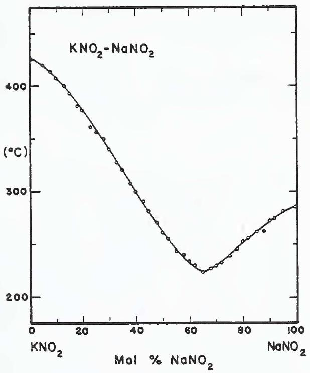  
Figure 106.1. $\mathrm{KNO}_2$ - $\mathrm{NaNO}_2$ phase diagram

References [1-17].

2. Density (ρ)

Measurement method: Archimedean technique [18]

Equation:

$$
\rho = a + b T \quad (1 0 6. 1)
$$

precision: in table 106.1

uncertainty: $\sim \pm 1.5\%$

Table 106.1. Parameters of equation (106.1) and precisions   

<table><tr><td>Mol % KNO2</td><td>a</td><td>-b x 104</td><td>Precision</td><td>T range(K)</td></tr><tr><td>15</td><td>2.1147</td><td>5.835</td><td>0.03%</td><td>530-770</td></tr><tr><td>25</td><td>2.1260</td><td>6.033</td><td>0.29%</td><td>510-770</td></tr><tr><td>40</td><td>2.1232</td><td>5.937</td><td>0.08%</td><td>510-770</td></tr><tr><td>45</td><td>2.1098</td><td>5.789</td><td>0.30%</td><td>510-770</td></tr><tr><td>50</td><td>2.1030</td><td>5.707</td><td>0.30%</td><td>550-770</td></tr><tr><td>60</td><td>2.1377</td><td>6.229</td><td>0.15%</td><td>570-770</td></tr><tr><td>70</td><td>2.1202</td><td>5.979</td><td>0.03%</td><td>590-770</td></tr><tr><td>75</td><td>2.1205</td><td>5.998</td><td>0.02%</td><td>610-770</td></tr></table>

(106) $\mathrm{KNO}_2 - \mathrm{NaNO}_2$

Two-independent-variables equation

$$
\rho = a + b T + c C T \tag {106.2}
$$

$$
\left(\mathrm {C} = \mathrm {mol} \% \mathrm {CaCl}_{2}\right)
$$

Table 106.2. Parameters of two-independent-variables equation (106.2) and precision   

<table><tr><td>a</td><td>-b x 104</td><td>-c x 1010</td><td>Precision</td></tr><tr><td>2.1196</td><td>5.902</td><td>1.1284</td><td>0.002%</td></tr></table>

Table 106.3. Density $(\mathrm{gcm}^{-3})$ from equations in table 106.2   

<table><tr><td rowspan="2">T(K)</td><td colspan="8">Mo1 % KNO2</td></tr><tr><td>15</td><td>25</td><td>40</td><td>45</td><td>50</td><td>60</td><td>70</td><td>75</td></tr><tr><td>510</td><td></td><td>1.818</td><td>1.820</td><td>1.815</td><td></td><td></td><td></td><td></td></tr><tr><td>530</td><td>1.805</td><td>1.806</td><td>1.809</td><td>1.803</td><td></td><td></td><td></td><td></td></tr><tr><td>550</td><td>1.794</td><td>1.794</td><td>1.797</td><td>1.791</td><td>1.789</td><td></td><td></td><td></td></tr><tr><td>570</td><td>1.782</td><td>1.782</td><td>1.785</td><td>1.780</td><td>1.778</td><td>1.783</td><td></td><td></td></tr><tr><td>590</td><td>1.770</td><td>1.770</td><td>1.773</td><td>1.768</td><td>1.766</td><td>1.770</td><td>1.767</td><td></td></tr><tr><td>610</td><td>1.759</td><td>1.758</td><td>1.761</td><td>1.757</td><td>1.755</td><td>1.758</td><td>1.755</td><td>1.755</td></tr><tr><td>630</td><td>1.747</td><td>1.746</td><td>1.749</td><td>1.745</td><td>1.743</td><td>1.745</td><td>1.744</td><td>1.743</td></tr><tr><td>650</td><td>1.735</td><td>1.734</td><td>1.737</td><td>1.734</td><td>1.732</td><td>1.733</td><td>1.732</td><td>1.731</td></tr><tr><td>670</td><td>1.724</td><td>1.722</td><td>1.725</td><td>1.722</td><td>1.721</td><td>1.720</td><td>1.720</td><td>1.719</td></tr><tr><td>690</td><td>1.712</td><td>1.710</td><td>1.714</td><td>1.710</td><td>1.709</td><td>1.708</td><td>1.708</td><td>1.707</td></tr><tr><td>710</td><td>1.700</td><td>1.698</td><td>1.702</td><td>1.699</td><td>1.698</td><td>1.695</td><td>1.696</td><td>1.695</td></tr><tr><td>730</td><td>1.689</td><td>1.686</td><td>1.690</td><td>1.687</td><td>1.686</td><td>1.683</td><td>1.684</td><td>1.683</td></tr><tr><td>750</td><td>1.677</td><td>1.674</td><td>1.678</td><td>1.676</td><td>1.675</td><td>1.671</td><td>1.672</td><td>1.671</td></tr><tr><td>770</td><td>1.665</td><td>1.661</td><td>1.666</td><td>1.664</td><td>1.664</td><td>1.658</td><td>1.660</td><td>1.659</td></tr></table>

# References [18]

3. Surface Tension (Y)

No data

4. Viscosity (n)

Measurement method: capillary [19]

Equation:

$$
\eta = a + b T + c T ^ {2} + d T ^ {3} \tag {106.3}
$$

precision: in table 106.4

uncertainty: $\sim \pm 3.0\%$

Table 106.4. Parameters of equation (106.3) and precisions   

<table><tr><td>NaNO2(mol %)</td><td>a</td><td>b x 102</td><td>c x 105</td><td>d x 109</td><td>Precision</td><td>T range(K)</td></tr><tr><td>10</td><td>(5.9792)</td><td>(-0.600)</td><td></td><td></td><td></td><td>700-730</td></tr><tr><td>20</td><td>(-119.7038)</td><td>(55.833)</td><td>(-84.15)</td><td>(416.67)</td><td></td><td>650-710</td></tr><tr><td>80</td><td>1.3444</td><td>7.897</td><td>-22.64</td><td>163.56</td><td>0.15%</td><td>580-650</td></tr><tr><td>90</td><td>(39.3925)</td><td>(-10.648)</td><td>(7.50)</td><td></td><td></td><td></td></tr></table>

The values in ( ) are based on a minimal data set

(106) $\mathrm{KNO}_2 - \mathrm{NaNO}_2$

Equation:

$$
n = A \exp (E / R T) \tag {106.4}
$$

precision: in table 106.5

uncertainty: $\sim$ 3.0%

Table 106.5. Parameters of equation (106.4) and precisions   

<table><tr><td>NaNO2(mol %)</td><td>A x 102</td><td>E(cal mol-1)</td><td>Precision</td><td>T range(K)</td></tr><tr><td>30</td><td>9.819</td><td>3945</td><td>0.89%</td><td>620-710</td></tr><tr><td>40</td><td>8.506</td><td>4104</td><td>0.54%</td><td>580-710</td></tr><tr><td>50</td><td>7.052</td><td>4315</td><td>0.74%</td><td>580-710</td></tr><tr><td>60</td><td>6.768</td><td>4348</td><td>0.88%</td><td>580-690</td></tr><tr><td>70</td><td>6.095</td><td>4460</td><td>0.72%</td><td>580-670</td></tr></table>

Table 106.6. Viscosity (cp) from equations in tables 106.4 and 106.5   

<table><tr><td rowspan="2">T(K)</td><td colspan="9">\( \mathrm {M o l}\% \mathrm {N a N O}_{2} \)</td></tr><tr><td>10</td><td>20</td><td>30</td><td>40</td><td>50</td><td>60</td><td>70</td><td>80</td><td>90</td></tr><tr><td>570</td><td></td><td></td><td></td><td></td><td></td><td></td><td></td><td></td><td></td></tr><tr><td>580</td><td></td><td></td><td></td><td>2.99</td><td>2.98</td><td>2.95</td><td>2.92</td><td>2.89</td><td>(2.86)</td></tr><tr><td>590</td><td></td><td></td><td></td><td>2.82</td><td>2.80</td><td>2.76</td><td>2.74</td><td>2.71</td><td>(2.68)</td></tr><tr><td>600</td><td></td><td></td><td></td><td>2.66</td><td>2.63</td><td>2.60</td><td>2.57</td><td>2.54</td><td>(2.50)</td></tr><tr><td>610</td><td></td><td></td><td></td><td>2.51</td><td>2.48</td><td>2.45</td><td>2.42</td><td>2.39</td><td>(2.35)</td></tr><tr><td>620</td><td></td><td></td><td>2.41</td><td>2.38</td><td>2.34</td><td>2.31</td><td>2.28</td><td>2.25</td><td>(2.20)</td></tr><tr><td>639</td><td></td><td></td><td>2.30</td><td>2.26</td><td>2.21</td><td>2.18</td><td>2.15</td><td>2.12</td><td>(2.08)</td></tr><tr><td>649</td><td></td><td></td><td>2.18</td><td>2.14</td><td>2.10</td><td>2.07</td><td>2.03</td><td>2.02</td><td></td></tr><tr><td>650</td><td></td><td>(2.10)</td><td>2.08</td><td>2.04</td><td>1.99</td><td>1.96</td><td>1.93</td><td>0.93</td><td></td></tr><tr><td>660</td><td></td><td>(2.03)</td><td>1.99</td><td>1.94</td><td>1.89</td><td>1.86</td><td>1.83</td><td></td><td></td></tr><tr><td>670</td><td></td><td>(1.95)</td><td>1.90</td><td>1.86</td><td>1.80</td><td>1.77</td><td>1.74</td><td></td><td></td></tr><tr><td>680</td><td></td><td>(1.87)</td><td>1.82</td><td>1.77</td><td>1.72</td><td>1.69</td><td></td><td></td><td></td></tr><tr><td>690</td><td></td><td>(1.79)</td><td>1.75</td><td>1.70</td><td>1.64</td><td>1.61</td><td></td><td></td><td></td></tr><tr><td>700</td><td>(1.78)</td><td>(1.71)</td><td>1.67</td><td>1.63</td><td>1.57</td><td></td><td></td><td></td><td></td></tr><tr><td>710</td><td>(1.72)</td><td>(1.64)</td><td>1.61</td><td>1.56</td><td>1.50</td><td></td><td></td><td></td><td></td></tr><tr><td>720</td><td>(1.66)</td><td></td><td></td><td></td><td></td><td></td><td></td><td></td><td></td></tr><tr><td>730</td><td>(1.60)</td><td></td><td></td><td></td><td></td><td></td><td></td><td></td><td></td></tr><tr><td>740</td><td></td><td></td><td></td><td></td><td></td><td></td><td></td><td></td><td></td></tr></table>

The values in ( ) are based on a minimal data set

References [19]

5. Electrical Conductance (K)

Measurement method: classical ac technique [20]

Equation:

$$
\kappa = a + b T + c T ^ {2} \tag {106.5}
$$

precision: in table 106.7

uncertainty: $\sim \pm 3.0\%$

Table 106.7. Parameters of equation (106.5) and precisions   

<table><tr><td>\( \mathrm {M o l}\% \mathrm {N a N O}_{2} \)</td><td>-a</td><td>\( b x 10^{3} \)</td><td>\( c x 10^{6} \)</td><td>Precision</td><td>T range(K)</td></tr><tr><td>10</td><td>(1.8358)</td><td>(5.308)</td><td>(-1.250)</td><td></td><td>700-730</td></tr><tr><td>20</td><td>1.5901</td><td>4.400</td><td>-0.360</td><td>0.03%</td><td>660-730</td></tr><tr><td>25</td><td>1.6783</td><td>4.699</td><td>-0.531</td><td>0.05%</td><td>640-730</td></tr><tr><td>30</td><td>1.6797</td><td>4.770</td><td>-0.545</td><td>0.05%</td><td>620-730</td></tr><tr><td>35</td><td>1.4183</td><td>4.074</td><td>0</td><td>0.06%</td><td>600-730</td></tr><tr><td>40</td><td>1.4137</td><td>4.015</td><td>0.162</td><td>0.06%</td><td>580-730</td></tr><tr><td>45</td><td>1.3695</td><td>3.807</td><td>0.478</td><td>0.07%</td><td>580-730</td></tr><tr><td>50</td><td>1.8106</td><td>5.167</td><td>-0.463</td><td>0.08%</td><td>580-710</td></tr><tr><td>55</td><td>1.6384</td><td>4.649</td><td>0</td><td>0.05%</td><td>580-710</td></tr><tr><td>60</td><td>1.7987</td><td>5.139</td><td>-0.289</td><td>0.03%</td><td>580-690</td></tr><tr><td>65</td><td>1.8752</td><td>5.331</td><td>-0.329</td><td>0.04%</td><td>580-690</td></tr><tr><td>70</td><td>1.7730</td><td>5.026</td><td>0</td><td>0.04%</td><td>580-670</td></tr><tr><td>75</td><td>2.0842</td><td>6.177</td><td>-0.944</td><td>0.03%</td><td>580-670</td></tr><tr><td>80</td><td>1.7527</td><td>5.110</td><td>0</td><td>0.07%</td><td>580-650</td></tr><tr><td>85</td><td>1.7813</td><td>5.230</td><td>0</td><td>0.04%</td><td>580-650</td></tr><tr><td>90</td><td>1.7639</td><td>5.280</td><td>0</td><td>0.11%</td><td>580-630</td></tr><tr><td>95</td><td>2.9256</td><td>9.099</td><td>-2.983</td><td>0.02%</td><td>580-630</td></tr></table>

The values in ( ) are based on a minimal data set.

Table 106.8. Specific conductance $(ohm^{-1}cm^{-1})$ from equations in table 106.7   

<table><tr><td rowspan="2">T(K)</td><td colspan="7">\( \mathrm {M o l}\% \mathrm {N a N O}_{2} \)</td></tr><tr><td>35</td><td>45</td><td>55</td><td>65</td><td>75</td><td>85</td><td>95</td></tr><tr><td>580</td><td></td><td>0.999</td><td>1.058</td><td>1.106</td><td>1.181</td><td>1.252</td><td>1.348</td></tr><tr><td>600</td><td>1.026</td><td>1.086</td><td>1.151</td><td>1.205</td><td>1.282</td><td>1.356</td><td>1.460</td></tr><tr><td>620</td><td>1.107</td><td>1.174</td><td>1.244</td><td>1.303</td><td>1.382</td><td>1.461</td><td>1.569</td></tr><tr><td>640</td><td>1.180</td><td>1.262</td><td>1.337</td><td>1.402</td><td>1.482</td><td>1.565</td><td></td></tr><tr><td>660</td><td>1.270</td><td>1.350</td><td>1.430</td><td>1.500</td><td>1.581</td><td></td><td></td></tr><tr><td>680</td><td>1.352</td><td>1.439</td><td>1.523</td><td>1.598</td><td></td><td></td><td></td></tr><tr><td>700</td><td>1.433</td><td>1.529</td><td>1.616</td><td></td><td></td><td></td><td></td></tr><tr><td>720</td><td>1.515</td><td>1.618</td><td></td><td></td><td></td><td></td><td></td></tr></table>

References [20]

# 6. Safety and Hazards

# A. Hazard rating

(i) Toxicity: $\mathrm{NaNO}_2$ ; low; $\mathrm{KNO}_2$ , low; (permitted in food); there appears to be some implication of increased cancer with chronic ingestion of nitrites.   
(ii) Vapor pressure: no data for this system; but see $\mathrm{NaNO}_2$ [30] and $\mathrm{KNO}_2$ [30]

# (106) $\mathrm{KNO}_2 - \mathrm{NaNO}_2$

# B. Disaster hazards

(i) Molten salt bath "explosions": i.e. explosive generation of steam due to bulk water "carry-over" and/or equipment failure; i.e., explosive expansion of "trapped" air.   
(ii) Ondecomposition, nitrites emit toxic fumes (oxides of nitrogen) viz:

$$
2 \mathrm {M N O} _ {2} \rightarrow \mathrm {M} _ {2} \mathrm {O} + \mathrm {N O} + \mathrm {N O} _ {2} \tag {106.6}
$$

$$
2 \mathrm {M N O} _ {2} + \mathrm {O} _ {2} \longrightarrow 2 \mathrm {M N O} _ {3} \tag {106.7}
$$

The subsequent decomposition reactions are complex; if the gas phase is not continuously removed, the nitrite may be oxidized to $\mathrm{NaNO}_3$ , i.e., to the nitrate.

(iii) Nitrites, like nitrates, are powerful oxidizing agents; violent (explosive) reactions possible in molten nitrates and carbonaceous materials (organic cpds., oils, carbon,...); aluminum alloys and bath sludges (e.g. iron oxides).

References [21-30].

# 7. Corrosion

Table 106.9. Corrosion studies from primary research literature   

<table><tr><td>Studies in molten nitrates and nitrites</td><td>References</td></tr><tr><td>Fe</td><td>[31-33]</td></tr><tr><td>Fe, Co, Ni, Cr, Al,...</td><td>[34-36]</td></tr><tr><td>Cu, Pt, Au, W,...</td><td>[35-37]</td></tr><tr><td>Zn, Pb, Cu, Ni, Al</td><td>[38]</td></tr><tr><td>Pt, S, steel</td><td>[39]</td></tr><tr><td>Zr</td><td>[40]</td></tr><tr><td>Oxide species</td><td>[41]</td></tr><tr><td>Electrochemical approach</td><td>[42,43]</td></tr><tr><td>Thermodynamic redox diagrams</td><td>[44,45]</td></tr><tr><td>Annotated corrosion biblio.</td><td>[46]</td></tr><tr><td>Reviews/molten salts</td><td>[47-49]</td></tr></table>

No compatibility studies with $\mathrm{NaNO}_2$ - $\mathrm{KNO}_2$ found; the studies in Table 106.9 (above) related principally to Na and K nitrates and their mixtures; for passivation studies in molten $\mathrm{NaNO}_2$ , see [32].

References [31-49]

(106) $\mathrm{KNO}_2\text{-NaNO}_2$

8. Diffusion

No data

9. Heat of Fusion $(\Delta H_{f}^{\circ})$

No data

10. Heat Capacity $(C_p)$

No data

11. Volume Change on Melting $(\Delta V_{f})$

Measurement method: estimated from densities [50]

Table 106.10. Volume change on melting   

<table><tr><td>Binary eutectic (mol % NaNO2)</td><td>(ΔVf/Vs)</td><td>Uncertainty</td></tr><tr><td>65</td><td>11.6%</td><td>~ ± 15%</td></tr></table>

References [50]

12. Vapor Pressure $(p_{\text{vap}})$

No data

13. Thermal Conductivity (liquid) $(\lambda_{\ell})$

No data

14. Thermal Conductivity (solid) $(\lambda_{s})$

No data

15. Cryoscopic Constant $(k_{f})$

No data

16. References

[1] Vetyukov, M. M., Sheherbinin, V. I., Jour. Appl. Chem. USSR, 36, 2314 (1963).   
[2] Protsenko, P. I., Shukina, O. N., Neorg. Khim. Trans., 4, 1178 (1959).   
[3] Bergman, G. A. and Beruli, S. I., Izv. Sekt. Fiz. Khim. A. 21, 172 (1952).   
[4] Janz, G. J. Downey, J. R., Jr., Allen, C. B., and Tomkins, R. P. T., "Eutectic Data" - 2 Vols; ERDA-TID-27163-P1 & P2; NTIS, Washington, D. C. (1977).   
[5] Janz, G. J., Downey, J. R., Jr., Allen, C. B., and Tomkins, R. P. T., "Physical Properties Data Complications Relevant to Energy Storage. I. Molten Salts: Eutectic Data", NSRDS-NBS-61; U. S. Gov't Printing Office, Washington, D. C. (1978).   
[6] "International Critical Tables of Numerical Data, Physics, Chemistry, and Technology", 8 Vols., McGraw-Hill Book Co., N. Y. (1933).   
[7] "Landolt-Bornstein Zahlenwert und Funktionen aus Physik, Chemie, Astronomie, Geophysik und Technik", (10th Ed.) Springer-Verlag, Berlin, Heidelberg, N. Y. (1961).

(106) $\mathrm{KNO}_2 - \mathrm{NaNO}_2$   
[8] Clark, P. V., "Fused Salt Mixtures: Eutectic Compositions and Melting Points Bibliography 1907-1968", Report No. SC-R-68-1680; Sandia Laboratories (1968), NTIS.   
[9] Robertson, W. D., "Binary Phase Diagrams of Halide Salts", Report No. Yale 2723 (2 Vols.), U. S. AEC Contract AT (30-1)-2723 (1966), NTIS.   
[10] Thoma, R. E., "Phase Diagrams of Nuclear Reactor Materials", Oak Ridge National Laboratory, ORNL-2548, Contract No. W-7405-eng-26.   
[11] Thoma, R. E., "Phase Diagrams of Binary and Ternary Fluoride Systems", Chapt. 6; Adv. Molten Salts Chemistry, Vol. 3 (J. Braunstein, G. Mamantov, and G. P. Smith, eds.), Plenum Press, N. Y. (1975).   
[12] Voskresenskaya, N. K., ed., "Handbook of Solid-Liquid Equilibria in Systems of Inorganic Salts", Volumes 1, 2, Izc. Akad. Nauk SSSR, Moscow (1961). Israel Program for Scientific Translations, Jerusalem, 1970 (NTIS).   
[13] Sinistri, C., Franzozini, P., and Rolla, M., "An Atlas of Miscibility Gaps in Molten Salt Systems", Institute of Physical Chemistry, University of Pavia (Italy) (1968).   
[14] Shaffer, P. T. B., "High Temperature Materials", Plenum Press Handbooks of High Temperature Materials, No. 1, Materials Index, Plenum Press, New York, 1964.   
[15] Franzozini, P., Ferloni, P., and Spinolo, C., "Molten Salts with Organic Anions", Instituto di Chimica Fisica, Universita di Pavia (Italy), 1973.   
[16] Toropov, N. A. et al., "Handbook of Phase Diagrams of the Silicates, Volume 1: Binary Systems, Volume 2, Metal-Oxygen Compounds in Silicate Systems", Izdatel'stov "Nauka" Leningradskoe Otdelenie, Leningrad, 1969, Israel Program for Scientific Translations, Jerusalem, 1972 (NTIS).   
[17] Levin, E., et al., "Phase Diagrams for Ceramists", Amer. Ceramic Soc. (publ.), Columbus, Ohio (1964; 1969).   
[18] Polyakov, V. D., and Beruli, S. H., Izvest. Siktora Fiz.-Khim. Anal., 26, 164 (1955).   
[19] Protsenko, P. I., and Shokina, O. N., Russ. J. Inorg. Chem. 9, 82 (1964).   
[20] Protsenko, P. I., and Shokina, O. N., Zhur. neorg. Khim., 5, 437 (1960).   
[21] "Dangerous Properties of Materials", Sax, N. I., Van Nostrand Reinhold Co., N. Y. (1969).   
[22] "Registry of Toxic Effects of Chemical Substances", Christensen, H. E., and Lubinbyhl, T. T., eds., U. S. Dept. H. E. W., U. S. Gov't Printing Office, Washington, D. C. (1975).   
[23] "Potential Hazards in Molten Salt Baths for Heat Treatment of Metals", National Board of Fire Underwriters Research Report No. 2 (1954).   
[24] "Handbook of Reactive Chemical Hazards", Bretherwick, L., Butterworth Co., London (1975).   
[25] Janz, G. J., Tomkins, R. P. T., Downey, J. R. Jr., and Allen, C. B., "Safety and Hazards", Chapter in "Eutectic Data", ERDA TID-27163-P1; NTIS, U. S. Dept. Commerce, Springfield, Va. (1977)   
[26] Freeman, E.S., J. Amer. Chem. Soc., 79, 838 (1957).   
[27] Protsenko, P. I., Bordyushkova, E. A., Zhur. Neorg. Khim., 10, 1215 (1965).

[28] Oza, T. M., J. Indian Chem. Soc., 22, 173 (1945).   
[29] Oza, T. M., Walawalkar, B. R., J. Indian Chem. Soc., 22, 243 (1945).   
[30] vide: this work, System 74, $\mathrm{NaNO}_2$ and 75, $\mathrm{KNO}_2$ .   
[31] Arvia, A. J., Podesta, J. J., and Piatti, R. C. V., Electrochim. Acta, 17, 33 (1972).   
[32] Marchiano, S. L., and Arvia, A. J., Electrochim. Acta, 17, 25 (1972).   
[33] Notoya, T., Ishikawa, T., Midorikawa, R., Denki Kagaku, 39, 930 (1971); ibid, 40, 62 (1972).   
[34] Marchiano, S. L., and Arvia, A. J., An. Soc. Cient. Argent., 192, 263 (1971).   
[35] Brough, B. J., Kerridge, D. H., Inorg. Chem., 4, 1353 (1965).   
[36] Swofford, H. S., Jr., Laitinen, H. A., J. Electrochem. Soc., 110, 816 (1963).   
[37] Notoya, T., Denki Kagaku, 41, 779 (1973).   
[38] Herquet, M. L. H., Industrie Chim. Belge, 20, 592 (1955).   
[39] Johnson, K. E., Electrochimica Acta, 11, (1966).   
[40] Andreev, Y. Y., Fokin, M. N., Shitikov, Y. A., Fiz. Khim. Elektrokhim. Rasplav. Solei Tverd. Ekektrolitov, 2, 100 (1973).   
[41] Johnson, K. E., Zacharias, P. S., and Mathews, J., "Proceedings Intern. Symp. Molten Salts", p. 603, The Electrochemical Soc., Princeton, N. J., (1976).   
[42] Pizzini, S., "Materials Problems in the Industrial Applications of Molten Salts", "Proceedings of the European Conference on the Development of Molten Salts Applications", p. 203; Battelle, Geneva, (1973).   
[43] Johnson, K. E., "Electrochemical Approaches to Corrosion in Molten Salts", Proceedings International Symposium on Metal-Slag-Gas Reactions and Processes, The Electrochemical Society, Inc., Princeton, N. J. (1975).   
[44] Bartlett, H. E., and Johnson, K. E., Canad. J. Chem., 44, 2119 (1966).   
[45] Conte, A., and Ingram, M. D., Electrochimica Acta, 13, 1551 (1968).   
[46] Janz, G. J., and Tomkins, R. P. T., Corrosion, 35, 485 (1979).   
[47] Inman, D., and Wrench, N. S., Brit. Corr. J., 1, 246 (1966).   
[48] Ketelaar, J. A. A., Chemie. Ing. Techn., 45, 667 (1973).   
[49] Smirnov, M. V. and Ozeryanaya, Nauki Tekh. Korros. Zashch. Korros., 2, 171 (1973).   
[50] Janz, G. J., et al. (MSDC-RPI), unpublished work (1980).

1. Melting Temperatures $(T_{m})$

Purc substance melting points:

KOH: 360°C

NaOH: $318^{\circ} \mathrm{C}$

Eutectic melting point:

$170^{\circ} \mathrm{C}$ , composition: 50.6 mol % KOH

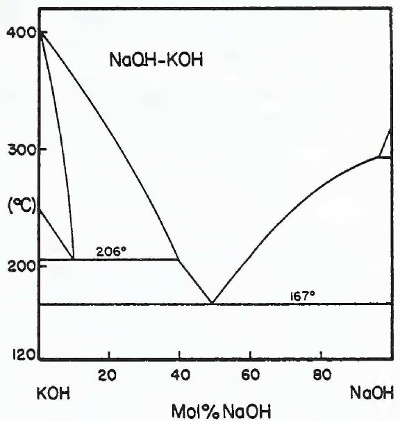  
Figure 107.1 KOH-NaOH phase diagram

References [1-18]

2. Density (p)

No data

3. Surface Tension (Y)

No data

4. Viscosity (n)

No data

5. Electrical Conductance (K)

No data

# 6. Safety and Hazards

# A. Hazard rating

(i) Toxicity: very caustic; attacks all body tissue.   
(ii) Vapor pressure: no information for this system; but see NaOH [69] and KOH [70].

# B. Disaster hazards

(i) Molten salt bath "explosions": i.e. explosive generation of steam due to bulk water "carry-over" and/or equipment failure; i.e., explosive expansion of "trapped" air.   
(ii) Hydroxides react exothermically with water or steam; the aqueous solution is strongly caustic; attacks living tissue; dangerous.

References [19-24]

# 7. Corrosion

Table 107.1 Corrosion studies from primary research literature   

<table><tr><td>Studies</td><td>References</td></tr><tr><td>Metals</td><td>[25]</td></tr><tr><td>Metals, ceramics, alloys</td><td>[25-27]</td></tr><tr><td>Stainless steel, Fe-Cr-Ni alloys</td><td>[33]</td></tr><tr><td>Ni-Cr-Fe; Ni-Si-Cu</td><td>[32,34]</td></tr><tr><td>Ni-Mo</td><td>[35-37]</td></tr><tr><td>Ni, Cu, Armco Fe</td><td></td></tr><tr><td>Al2O3, ZrO2</td><td>[26]</td></tr><tr><td>Ni</td><td>[26,27,31,35,38-41]</td></tr><tr><td>Ni steels</td><td>[42]</td></tr><tr><td>Fe (effects of H2O)</td><td>[43]</td></tr><tr><td>Pt, Ag, and alloys</td><td>[44-46]</td></tr><tr><td>Thermodynamic and electrochemical approach</td><td>[47-49]</td></tr><tr><td>Reviews (molten salts corrosion)</td><td>[50-52]</td></tr><tr><td>Annotated corrosion bibliolog.</td><td>[53]</td></tr></table>

With the exception of [41] in which compatibility with molten NaOH-KOH was investigated, LiOH, KOH, and NaOH as single hydroxides were used in the studies listed in Table 107.1 (above).

References [25-53]

# 8. Diffusion

Measurement method: cited in tabulations

List of diffusing species investigated in NaOH-KOH [50-50 mol %] as solvent

$\mathrm{H}_2\mathrm{O}$ ; Am(VI)

precision: in table 107.3

uncertainty: in table 107.2

Table 107.2. Diffusion techniques, uncertainties and species   

<table><tr><td>Diffusion technique of recommended study</td><td>Uncertainty (in values of D)</td><td>Species</td></tr><tr><td rowspan="2">chronopotentiometry</td><td>~ ± 10%</td><td>Am(VI)</td></tr><tr><td>~ ± 20%</td><td>H2O</td></tr></table>

Equation:

$$
D = A \exp [ - E / R T ] \tag {107.1}
$$

Table 107.3. Parameters of diffusion equation (107.1), precisions, and recommended study   

<table><tr><td>Species</td><td>A x 103(cm2s-1)</td><td>E(cal mol-1)</td><td>Temp. range(K)</td><td>Precision</td><td>Recommended Study</td></tr><tr><td>H2O</td><td>71.95</td><td>6240</td><td>460-530</td><td>insufficient information for estimate</td><td>[54]</td></tr></table>

Table 107.4. Diffusion coefficients for $\mathrm{H}_2\mathrm{O}$ in NaOH-KOH from equation (107.1)   

<table><tr><td>T(K)</td><td>D x 105(cm2 s-1)</td><td></td><td>T(K)</td><td>D x 105(cm2 s-1)</td></tr><tr><td>460</td><td>7.8</td><td></td><td>500</td><td>13.5</td></tr><tr><td>470</td><td>9.0</td><td></td><td>510</td><td>15.2</td></tr><tr><td>680</td><td>10.4</td><td></td><td>520</td><td>17.2</td></tr><tr><td>490</td><td>11.9</td><td></td><td>530</td><td>19.2</td></tr></table>

$\mathrm{D}_{\mathrm{H}_20}$ values are about 10 x larger than for various ions in molten salts

Table 107.5. Diffusion coefficients for species not included in table 107.4   

<table><tr><td>Species</td><td>T (K)</td><td>D x 105(cm2s-1)</td><td>Recommended Study</td></tr><tr><td>Am(VI)</td><td>523</td><td>~ 0.65 ± 0.20</td><td>[55]</td></tr></table>

The diffusion entities of Am(VI) are uncertain; most probably $\mathrm{AmO}_2^{2+}$ or $\mathrm{AmO}_4^{2-}$

References $\mathrm{H}_{2}0$ ，[54]，Am(VI)，[55].

(107) KOH-NaOH

9. Heat of Fusion $(\Delta H_{f}^{\circ})$ No data   
10. Heat Capacity $(C_p)$ No data   
11. Volume Change on Melting $(\Delta V_{f})$ No data   
12. Vapor Pressure $(p_{vap})$ No data   
13. Thermal Conductivity (liquid) $(\lambda_{\mathrm{g}})$ No data   
14. Thermal Conductivity (solid) $(\lambda_{s})$ No data   
15. Cryoscopic Constant $(k_{f})$ No data   
16. References

[1] Pelton, A. D. et al. "Calculation of Thermodynamic Equilibria in the Carbonate Fuel Cell" Topical Report Feb. (1980), (US DOE Contract DE-AC02-79ET15416); Proj. CDT-P501, L'Ecole Polytechnique Montréal   
[2] Reshetnikov, N. A., Vilutis, N. I., Zh. Neorg. Khim. Trans., 4, 49 (1959).   
[3] Reshetnikov, N. A., Unzhakov, G. M., Izvest. Fiz. Khim. Nauch. Issledovatel Inst. Irkutsk. Univ., 2, 5 (1953).   
[4] Otto, H. W., Seward, R. P., J. Chem. and Eng. Data, 9, 507 (1964).   
[5] Janz, G. J. Downey, J. R., Jr., Allen, C. B., and Tomkins, R. P. T., "Eutectic Data" - 2 Vols; ERDA-TID-27163-P1 & P2; NTIS, Washington, D. C. (1977).   
[6] Janz, G. J., Downey, J. R., Jr., Allen, C. B., and Tomkins, R. P. T., "Physical Properties Data Complications Relevant to Energy Storage. I. Molten Salts: Eutectic Data", NSRDS-NBS-61; U. S. Gov't Printing Office, Washington, D. C. (1978).   
[7] "International Critical Tables of Numerical Data, Physics, Chemistry, and Technology", 8 Vols., McGraw-Hill Book Co., N. Y. (1933).   
[8] "Landolt-Bornstein Zahlenwert und Funktionen aus Physik, Chemie, Astronomie, Geophysik und Technik", (10th Ed.) Springer-Verlag, Berlin, Heidelberg, N. Y. (1961).   
[9] Clark, P. V., "Fused Salt Mixtures: Eutectic Compositions and Melting Points Bibliography 1907-1968", Report No. SC-R-68-1680; Sandia Laboratories (1968), NTIS.   
[10] Robertson, W. D., "Binary Phase Diagrams of Halide Salts", Report No. Yale 2723 (2 Vols.), U. S. AEC Contract AT (30-1)-2723 (1966), NTIS.   
[11] Thoma, R. E., "Phase Diagrams of Nuclear Reactor Materials", Oak Ridge National Laboratory, ORNL-2548, Contract No. W-7405-eng-26.   
[12] Thoma, R. E., "Phase Diagrams of Binary and Ternary Fluoride Systems", Chapt. 6; Adv. Molten Salts Chemistry, Vol. 3 (J. Braunstein, G. Mamantov, and G. P. Smith, eds.), Plenum Press, N. Y. (1975).

# (107) KOH-NaOH

[13] Voskresenskaya, N. K., ed., "Handbook of Solid-Liquid Equilibria in Systems of Inorganic Salts", Volumes 1, 2, Izc. Akad. Nauk SSSR, Moscow (1961). Israel Program for Scientific Translations, Jerusalem, 1970 (NTIS).   
[14] Sinsitri, C., Franzozini, P., and Rolla, M., "An Atlas of Miscibility Gaps in Molten Salt Systems", Institute of Physical Chemistry, University of Pavia (Italy) (1968).   
[15] Shaffer, P. T. B., "High Temperature Materials", Plenum Press Handbooks of High Temperature Materials, No. 1, Materials Index, Plenum Press, New York, 1964.   
[16] Franzozini, P., Ferloni, P., and Spinolo, C., "Molten Salts with Organic Anions", Instituto di Chimica Fisica, Universita di Pavia (Italy), 1973.   
[17] Toropov, N. A. et al., "Handbook of Phase Diagrams of the Silicates, Volume 1: Binary Systems, Volume 2, Metal-Oxygen Compounds in Silicate Systems", Izdatel'stov "Nauka" Leningradskoe Otdelenie, Leningrad, 1969, Israel Program for Scientific Translations, Jerusalem, 1972 (NTIS).   
[18] Levin, E., et al., "Phase Diagrams for Ceramists", Amer. Ceramic Soc. (publ.), Columbus, Ohio (1964; 1969).   
[19] "Dangerous Properties of Materials", Sax, N. I., Van Nostrand Reinhold Co., N. Y. (1969).   
[20] "Registry of Toxic Effects of Chemical Substances", Christensen, H. E., and Lubinbyhl, T. T., eds., U. S. Dept. H. E. W., U. S. Gov't Printing Office, Washington, D. C. (1975).   
[21] vide: this work, Systems 69, NaOH and 70, KOH   
[22] "Potential Hazards in Molten Salt Baths for Heat Treatment of Metals", National Board of Fire Underwriters Research Report No.2 (1954).   
[23] "Handbook of Reactive Chemical Hazards", Bretherwick, L., Butterworth Co., London (1975).   
[24] Janz, G. J., Tomkins, R. P. T., Downey, J. R. Jr., and Allen, C. B., "Safety and Hazards", Chapter in "Eutectic Data", ERDA TID-27163-P1; NTIS, U. S. Dept. Commerce, Springfield, Va. (1977)   
[25] Anon, "Oak Ridge National Laboratory, Proceedings of the 1st Information Meeting on Hydroxide and Metal Interaction", ORNL CF-51-11-204, (1953).   
[26] Craighead, C. M., Smith, L. A., Phillips, E. C., Jaffee, R. I., "Continued Studies of Corrosion by Fused Caustic", AECD-3704, Battelle Memorial Institute, (1952).   
[27] Miller, R. R., "The Thermal Properties of Sodium Hydroxide and Lithium Metal", 4th Progr. Rept. Nov. 1 (1952)-Jan. 31 (1953) NRL-Memo-130: Progr. Rept. No. 1, Naval Research Lab., (1952).   
[28] Smith, G. P., "Corrosion of Materials in Fused Hydroxides", Am. Inst. Mining at Engrs., Inst. Metals Div., Spec. Rept, #2, 71 (1956).   
[29] Smith, G. P., "Corrosion of Materials in Fused Hydroxides", ORNL-2048, Oak Ridge National Laboratory, (1956).   
[30] Smothers, W. J., Prog. Rept., Jan. 1 - March 31, (1953), AECU-2872, Univ. of Ark., (1953).   
[31] Williams, D. D., Ewing, C. T., "Thermal and Related Physical Properties of Molten Materials", Prog. Rept. Feb. 1 - May 1, (1953) NRL-Memo-170, Progress Report S, Naval Research Lab., (1953).

[32] Gregory, J. N., Hodge, N., Iredale, J. V. G., "The Static Corrosion of Nickel and Other Materials in Molten Caustic Soda", British Report AERE-C/M-272, (1956).   
[33] Smith, G. P., Hoffman, E. E., "Corrosion Products Formed in the Reaction between Fused Sodium Hydroxide and Iron-Rich Alloys of Iron, Chromium and Nickel", ORNL-2156, Oak Ridge National Laboratory, (1957).   
[34] Smith, G. P., Steidlitz, M. E., Hoffman, E. E., Corrosion, 11, 47t (1958).   
[35] Gurowich, E. I., Zh. Prikl. Khim., 32, 817 (1959).   
[36] Smith, G. P., Hoffman, E. E., Corrosion, 13, 627t (1957).   
[37] Smith, G. P., Hoffman, E. E., Steidlitz, M. E., Corrosion, 13, 561t (1957).   
[38] Manly, W. D., "Operation of a Ni-NaOH Thermal Convection Loop", ORNL CF-51-11-186, Oak Ridge National Laboratory, (1951).   
[39] Miller, N. E., Simons, E. M., Chem. Eng. Progr. Symp. Ser. No. 19, Amer, Inst. Chem. Eng., 52, 113 (1956).   
[40] Simmons, E. M., Miller, N. E., Stang, J. H., Weaver, C. V., "Corrosion and Component Studies on Systems Containing Fused NaOH", BMI-1118, Battelle Memorial Institute, (1956).   
[41] Gregory, J. N., Hodge, N., Iredale, J. V. G., "The State Corrosion and Erosion of Nickel by Molten Caustic Soda and Sodium Uranate Suspensions under Dynamic Conditions", British Report AERE/C/M-273, (1956).   
[42] Kolotii, A. A., Vengzhen, G. S., Zashch. Met., 11, 61 (1975).   
[43] Tribunskii, V. V., Kalinichenko, I. I., Tr. Ural. Politekh. Inst., 190, 49 (1970).   
[44] Rahmel, A., Kruger, H., Werkst. Korros., 18, 193 (1967).   
[45] Kruger, H., Rahmel, A., Schwenk, W., Electrochim. Acta, 13, 625 (1968).   
[46] Afanas'yev, A. S., Gamazov, V. P., Zh. Fiz. Khim., 38, 2823 (1964).   
[47] Pizzini, S., "Materials Problems in the Industrial Applications of Molten Salts", Proceedings of the European Conference on the Development of Molten Salts Applications", p. 203 (1973) Battelle, Geneva.   
[48] Edeleanu, C., and Littlewood, R., Electrochimica Acta, 3, 195 (1960).   
[49] Johnson, K. E., "Electrochemical Approaches to Corrosion in Molten Salts", Proceedings International Symposium on Metal-Slag-Gas Reactions and Processes", The Electrochemical Society, Inc., Princeton, N. J., p. 581 (1975).   
[50] Inman, D., and Wrench, N. S., Brit. Corr. J., 1, 246 (1966).   
[51] Ketelaar, J. A. A., Chem. Ing. Tech., 45, 667 (1973).   
[52] Smirnov, M. V., and Ozeryanaya, I. W., Nauki Tekh. Korros. Zaschch. Korros., 2, 171 (1973).   
[53] Janz, G. J., and Tomkins, R. P. T., Corrosion, 35, 485 (1979).   
[54] Zecchin, S., Schiavon, G., and Bombi, G. G., J. Electroanal. Chem. 50, 261 (1974).   
[55] Martinat, L. and Duyckeerts, G., J. Radioanal. Chem., 35, 71 (1977).

1. Melting Temperatures $(T_{m})$

Pure substance melting points:

$\mathrm{Na}_{3}\mathrm{AlF}_{6}$ : $1010^{\circ} \mathrm{C}$

Li3AlF6: 785°C

Eutectic melting point:

713°C, composition: 36 mol % Na₃AlF₆

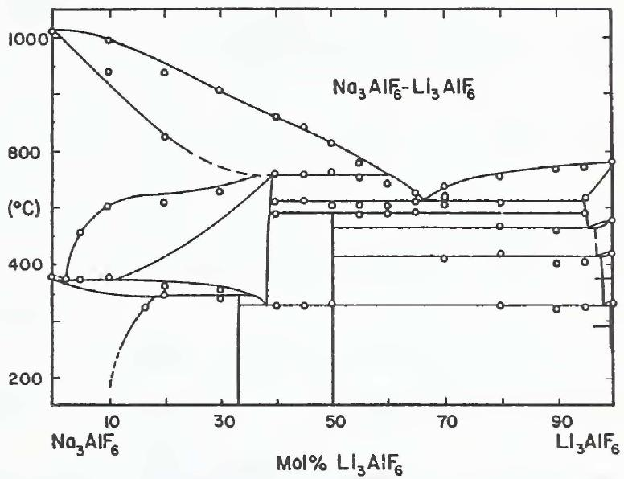  
Figure 108.1. $\mathrm{Na}_{3}\mathrm{AlF}_{6}$ -Li $_{3}$ AlF $_{6}$ phase diagram

References [1-29]

2. Density (ρ)

No data

3. Surface Tension (Y)

No data

4. Viscosity (n)

Measurement method: oscillational sphere [30]

Equation: (viscosity-composition isotherm @ 1273 K)

$$
n = 2. 7 3 8 7 - 3. 3 5 2 3 \times 1 0 ^ {- 2} C + 2. 4 5 3 0 \times 1 0 ^ {- 4} C ^ {2} \tag {108.1}
$$

precision: $\sim$ 2.5%

uncertainty: $\sim \pm 2.5\%$

$$
\mathrm {N a} _ {3} \mathrm {A l F} _ {6} - \mathrm {L i} _ {3} \mathrm {A l F} _ {6} \tag {108}
$$

Table 108.1. Viscosity (cp) at 1273K from equation (108.1)   

<table><tr><td>Li3AlF6(mol %)</td><td>η (cp)</td><td>Li3AlF6(mol %)</td><td>η (cp)</td></tr><tr><td>0</td><td>2.739</td><td>60</td><td>1.610</td></tr><tr><td>10</td><td>2.428</td><td>70</td><td>1.594</td></tr><tr><td>20</td><td>2.166</td><td>80</td><td>1.627</td></tr><tr><td>30</td><td>1.954</td><td>90</td><td>1.709</td></tr><tr><td>40</td><td>1.790</td><td>100</td><td>1.839</td></tr><tr><td>50</td><td>1.676</td><td></td><td></td></tr></table>

References [30,31]

# 5. Electrical Conductance (K)

Measurement method: classical ac technique [32]

Equation:

$$
\kappa = a + b T + c T ^ {2} \tag {108.2}
$$

precision: in table 108.2 uncertainty: $\sim \pm 3.0\%$

Table 108.2. Parameters of equation (108.2) and precisions   

<table><tr><td>Mol % Li3AlF6</td><td>-a</td><td>b x 102</td><td>-c x 106</td><td>Precision</td><td>T range(K)</td></tr><tr><td>20</td><td>14.083</td><td>2.442</td><td>8.679</td><td>0.2%</td><td>1220-1320</td></tr><tr><td>30</td><td>12.033</td><td>2.114</td><td>7.313</td><td>0.1%</td><td>1170-1320</td></tr><tr><td>40</td><td>13.932</td><td>2.452</td><td>8.739</td><td>0.2%</td><td>1170-1320</td></tr><tr><td>50</td><td>16.141</td><td>2.842</td><td>10.364</td><td>0.2%</td><td>1120-1320</td></tr><tr><td>60</td><td>12.346</td><td>2.273</td><td>8.184</td><td>0.3%</td><td>1120-1320</td></tr><tr><td>70</td><td>14.726</td><td>2.684</td><td>9.846</td><td>0.4%</td><td>1120-1320</td></tr><tr><td>80</td><td>7.593</td><td>1.557</td><td>5.261</td><td>0.4%</td><td>1120-1320</td></tr><tr><td>90</td><td>8.029</td><td>1.687</td><td>5.873</td><td>0.1%</td><td>1120-1320</td></tr></table>

Table 108.3. Specific conductance $(ohm^{-1}cm^{-1})$ from equations in table 108.2   

<table><tr><td rowspan="2">T(K)</td><td colspan="7">Mol % Li3AlF6</td></tr><tr><td>20</td><td>40</td><td>50</td><td>60</td><td>70</td><td>80</td><td>90</td></tr><tr><td>1120</td><td></td><td></td><td>2.69</td><td>2.84</td><td>2.98</td><td>3.25</td><td>3.50</td></tr><tr><td>1140</td><td></td><td></td><td>2.79</td><td>2.93</td><td>3.08</td><td>3.32</td><td>3.57</td></tr><tr><td>1160</td><td></td><td></td><td>2.88</td><td>3.01</td><td>3.16</td><td>3.39</td><td>3.64</td></tr><tr><td>1180</td><td></td><td>2.84</td><td>2.96</td><td>3.08</td><td>3.24</td><td>3.46</td><td>3.70</td></tr><tr><td>1200</td><td></td><td>2.91</td><td>3.04</td><td>3.14</td><td>3.30</td><td>3.52</td><td>3.76</td></tr><tr><td>1220</td><td>2.79</td><td>2.98</td><td>3.11</td><td>3.20</td><td>3.36</td><td>3.58</td><td>3.81</td></tr><tr><td>1240</td><td>2.85</td><td>3.31</td><td>3.16</td><td>3.25</td><td>3.42</td><td>3.63</td><td>3.86</td></tr><tr><td>1260</td><td>2.91</td><td>3.09</td><td>3.21</td><td>3.30</td><td>3.46</td><td>3.68</td><td>3.90</td></tr><tr><td>1280</td><td>2.95</td><td>3.04</td><td>3.26</td><td>3.34</td><td>3.50</td><td>3.72</td><td>3.94</td></tr><tr><td>1300</td><td>3.00</td><td>3.18</td><td>3.29</td><td>3.37</td><td>3.53</td><td>3.76</td><td>3.97</td></tr><tr><td>1320</td><td>3.03</td><td>3.21</td><td>3.32</td><td>3.40</td><td>3.55</td><td>3.80</td><td>4.00</td></tr></table>

References [32-38]

6. Safety and Hazards

A. Hazard rating

(i) Toxicity: inorganic fluorides are generally irritants and toxic.   
(ii) Vapor pressure: $\mathrm{Na}_3\mathrm{AlF}_6$ at its m.pt. $(1000^{\circ}\mathrm{C})$ , $<< 0.5\mathrm{mm}$ . $\mathrm{Li}_3\mathrm{AlF}_6$ at its m.pt. $(785^{\circ}\mathrm{C})$ , $<< 0.5\mathrm{mm}$ .

B. Disaster hazards

(i) Molten salt bath "explosions": i.e. explosive generation of steam due to bulk water "carry-over" and/or equipment failure; i.e., explosive expansion of "trapped" air.   
(ii) Fluorides, when heated to decomposition, or contacted with acids, emit highly toxic fumes.

References [39-44].

# 7. Corrosion

Table 108.4. Corrosion studies from primary research literature   

<table><tr><td colspan="2">Studies</td><td>References</td></tr><tr><td rowspan="6">A</td><td>CrNi-Cr-Mo alloys (INOR-8; Hastelloys B, W, and N)</td><td>[45]</td></tr><tr><td>SSNI-12P</td><td>[46,47]</td></tr><tr><td>Quartz</td><td>[48]</td></tr><tr><td>Al</td><td>[49]</td></tr><tr><td>Various metals</td><td>[50]</td></tr><tr><td></td><td>[51]</td></tr><tr><td rowspan="3">B</td><td>Pt, Pt-Rh</td><td>[52-56,89,90]</td></tr><tr><td>Boron nitride, carbon, Inconel</td><td>[57-59]</td></tr><tr><td>Fused MgO</td><td>[60]</td></tr><tr><td rowspan="3">C</td><td>Impurities in electrolyte</td><td>[15,61]</td></tr><tr><td>Graphite</td><td>[15,61]</td></tr><tr><td>TiC, TiB2, CrB2, ZrN, NbB2</td><td>[62-64]</td></tr><tr><td rowspan="5">D</td><td>Corrosion studies in molten salts with NaF as one component (e.g., Cl, CC3, ...)</td><td>[65-80,87,88]</td></tr><tr><td>Electrochemical behavior of oxides and related species in molten fluorides</td><td>[81-83]</td></tr><tr><td>Electroanalytical studies in molten fluorides</td><td>[84]</td></tr><tr><td>Annotated corrosion bibliolog.</td><td>[85]</td></tr><tr><td>Corrosion: molten fluorides (survey)</td><td>[86]</td></tr></table>

A: studies principally in molten NaF, KF, and LiF;  
B: used largely in fluoride physical properties measurements; C: technological aspects, in aluminum reduction cells; D: more general studies, basic principles, and surveys.

References 15,45-90]

$$
\mathrm {N a} _ {3} \mathrm {A l F} _ {6} - \mathrm {L i} _ {3} \mathrm {A l F} _ {6} \tag {108}
$$

8. Diffusion

No data

9. Heat of Fusion $(\Delta H_{f})$

No data

10. Heat Capacity $(C_p)$

No data

11. Volume Change on Melting $(\Delta V_{f}^{\circ})$

No data

12. Vapor Pressure $(p_{vap})$

Measurement method: boiling point technique [91]

Equation:

$$
\log p = A + B / T \tag {108.3}
$$

precision: in table 108.5 uncertainty: $\sim \pm 5\%$

Table 108.5. Parameters of equation (108.3) and precisions   

<table><tr><td>Mol % Li3AlF6</td><td>A</td><td>-B</td><td>Precision</td><td>T range(K)</td></tr><tr><td>30.0</td><td>8.5800</td><td>9884</td><td>*</td><td>1220-1470</td></tr><tr><td>48.2</td><td>8.5031</td><td>9658</td><td>*</td><td>1220-1470</td></tr><tr><td>72.0</td><td>8.5590</td><td>9766</td><td>*</td><td>1220-1470</td></tr></table>

* data reported in equation form; insufficient information for precision estimates

Table 108.6. Vapor pressure (mm) from equations in table 108.5   

<table><tr><td rowspan="2">T(K)</td><td colspan="3">Mol % Li3AlF6</td></tr><tr><td>30.0</td><td>48.2</td><td>72.0</td></tr><tr><td>1200</td><td>3.009</td><td>3.860</td><td>3.582</td></tr><tr><td>1260</td><td>5.439</td><td>6.885</td><td>6.430</td></tr><tr><td>1300</td><td>9.483</td><td>11.85</td><td>11.14</td></tr><tr><td>1340</td><td>15.99</td><td>19.75</td><td>18.66</td></tr><tr><td>1380</td><td>26.16</td><td>31.95</td><td>30.35</td></tr><tr><td>1420</td><td>41.63</td><td>50.30</td><td>48.03</td></tr><tr><td>1460</td><td>64.59</td><td>77.26</td><td>74.12</td></tr><tr><td>1470</td><td>71.81</td><td>85.69</td><td>82.31</td></tr></table>

References [91]

$$
\mathrm {N a} _ {3} \mathrm {A l F} _ {6} - \mathrm {L i} _ {3} \mathrm {A l F} _ {6} \tag {108}
$$

13. Thermal Conductivity (liquid) $(\lambda_{\ell})$ No data   
14. Thermal Conductivity (solid) $(\lambda_{s})$ No data   
15. Cryoscopic Constant $(k_{f})$ No data   
16. References   
[1] Stinton, D. P. and Brown, J. J., J. Am. Ceram. Soc., 58, 257 (1975).   
[2] Holm, J. L. and Holm, B. J., Acta Chem. Scand., 24, 2535 (1970).   
[3] Holm, J. L. and Holm, B. J., Thermochim. Acta, 6, 375 (1973).   
[4] Baylor, R., Stinton, D. P. and Brown, J. J., J. Am. Ceram. Soc., 57, 470 (1974).   
[5] Jenssen, B., Thesis, The University of Trondheim, NTH, Trondheim (1969).   
[6] Beletskii, M. S. and Saksonov, K. G., Zh. Neorg. Khim., 2, 415 (1957), Russ. J. Inorg. Chem., 2, 284 (1957).   
[7] Mashovets, V. P. and Petrov, V. I., Zh. Prikl. Khim., 30, 1695 (1957); J. Appl. Chem. USSR, 30, 1785 (957).   
[8] Chin, D. A. and Hollingshead, E. A., J. Electrochem. Soc., 113, 736 (1966).   
[9] Kuvakin, M. A., Zh. Neorg. Khim., 14, 282 (1969); Russ. J. Inorg. Chem., 14, 146 (1969).   
[10] Drossbach, P., Z. Electrochem., 42, 65 (1936).   
[11] Rolin, M. and Muhlethaler, R., Bull. Soc. Chim., France, 2593 (1964).   
[12] Bukhalova, G. A. and Mal'tsev, V. T., Issled. v Obl. Khim. i Tekhnol. Mineralnych Solei i Okislov, Akad. Nauk SSSR, Sb. Statei, 1965, 124.   
[13] Garton, G. and Wanklyn, B. M., J. Am. Ceram. Soc., 50, 395 (1967).   
[14] Babayan, G. G., Edoyan, R. S. and Manvelyan, M. G., Armyanskii Khim., Zh., 20, 20 (1967).   
[15] Grjothim, K., Krohn, C., Malinovsky, M., Matiasovsky, K., Thonstad, J., "Aluminium Electrolyses", Aluminium-Verlag GmbH.-Dusseldorf (1977).   
[16] Janz, G. J. Downey, J. R., Jr., Allen, C. B., and Tomkins, R. P. T., "Eutectic Data" - 2 Vols; ERDA-TID-27163-P1 & P2; NTIS, Washington, D. C. (1977).   
[17] Janz, G. J., Downey, J. R., Jr., Allen, C. B., and Tomkins, R. P. T., "Physical Properties Data Complications Relevant to Energy Storage. I. Molten Salts: Eutectic Data", NSRDS-NBS-61; U. S. Gov't Printing Office, Washington, D. C. (1978).   
[18] "International Critical Tables of Numerical Data, Physics, Chemistry, and Technology", 8 Vols., McGraw-Hill Book Co., N. Y. (1933).

(108) $\mathrm{Na}_{3} \mathrm{AlF}_{6}$ Li $_{3} \mathrm{AlF}_{6}$   
[19] "Landolt-Bornstein Zahlenwert und Funktionen aus Physik, Chemie, Astronomie, Geophysik und Technik", (10th Ed.) Springer-Verlag, Berlin, Heidelberg, N. Y. (1961).   
[20] Clark, P. V., "Fused Salt Mixtures: Eutectic Compositions and Melting Points Bibliography 1907-1968", Report No. SC-R-68-1680; Sandia Laboratories (1968), NTIS.   
[21] Robertson, W. D., "Binary Phase Diagrams of Halide Salts", Report No. Yale 2723 (2 Vols.), U. S. AEC Contract AT (30-1)-2723 (1966), NTIS.   
[22] Thoma, R. E., "Phase Diagrams of Nuclear Reactor Materials", Oak Ridge National Laboratory, ORNL-2548, Contract No. W-7405-eng-26.   
[23] Thoma, R. E., "Phase Diagrams of Binary and Ternary Fluoride Systems", Chapt. 6; Adv. Molten Salts Chemistry, Vol. 3 (J. Braunstein, G. Mamantov, and G. P. Smith, eds.), Plenum Press, N. Y. (1975).   
[24] Voskresenskaya, N. K., ed., "Handbook of Solid-Liquid Equilibria in Systems of Inorganic Salts", Volumes 1, 2, Izc. Akad. Nauk SSSR, Moscow (1961). Israel Program for Scientific Translations, Jerusalem, 1970 (NTIS).   
[25] Sinistri, C., Franzozini, P., and Rolla, M., "An Atlas of Miscibility Gaps in Molten Salt Systems", Institute of Physical Chemistry, University of Pavia (Italy) (1968).   
[26] Shaffer, P. T. B., "High Temperature Materials", Plenum Press Handbooks of High Temperature Materials, No. 1, Materials Index, Plenum Press, New York, 1964.   
[27] Franzozini, P., Ferloni, P., and Spinolo, C., "Molten Salts with Organic Anions", Instituto di Chimica Fisica, Universita di Pavia (Italy), 1973.   
[28] Toropov, N. A. et al., "Handbook of Phase Diagrams of the Silicates, Volume 1: Binary Systems, Volume 2, Metal-Oxygen Compounds in Silicate Systems", Izdatel'stov "Nauka" Leningradskoe Otdelenie, Leningrad, 1969, Israel Program for Scientific Translations, Jerusalem, 1972 (NTIS).   
[29] Levin, E., et al., "Phase Diagrams for Ceramists", Amer. Ceramic Soc. (publ.), Columbus, Ohio (1964; 1969).   
[30] Fellner, P., Chem. Zvesti 28, 721 (1974).   
[31] Volata, I. and Matiasvosky, K., Chem. Zvesti 27, 582 (1973).   
[32] Danek, V., Malinovsky, M., and Matiasovsky, K., Chem. Zvesti, 22, 649 (1968).   
[33] Danek, V., Novak, J., and Malinovsky, M., Chem., Zvesti, 21, 832 (1967).   
[34] Abramov, G. A., and Kostukov, A. A., Trudy Leningradskogo Politekhni-cheskogo Inst. 188, 40 (1957).   
[35] Danek, V., Malinovsky, M., and Matiasovsky, K., Electrochim. Acta 15, 2 (1970).   
[36] Mashovets, V. P., and Petrov, V. I., J. Appl. Chem. (USSR); 32, 1561 (1959); Zhur. Priklad. Khim. 32, 1528 (1959).   
[37] Feinleib, M., and Yim, E. W., J. Electrochem. Soc. 104, 626 (1957).   
[38] Danek, V., Malinovsky, M., and Matiasovsky, K., J. Electrochem. Soc. 116, 1381 (1969).

[39] "Dangerous Properties of Materials", Sax, N. I., Van Nostrand Reinhold Co., N. Y. (1969).   
[40] "Registry of Toxic Effects of Chemical Substances", Christensen, H. E., and Lubinbyhl, T. T., eds., U. S. Dept. H. E. W., U. S. Gov't Printing Office, Washington, D. C. (1975).   
[41] Janz, G. J., et al., "Physical Properties Data Complications Relevant to Energy Storage. Part II. Molten Salts: Data on Single and Multi-Component Salt Systems", NSRDS-NBS 61, Part II (April 1979), U. S. Gov't Printing Office, Supt of Doc. No. C13-48-61, Washington D. C. 20402.   
[42] "Potential Hazards in Molten Salt Baths for Heat Treatment of Metals", National Board of Fire Underwriters Research Report No. 2 (1954).   
[43] "Handbook of Reactive Chemical Hazards", Bretherwick, L., Butterworth Co., London (1975).   
[44] Janz, G. J., Tomkins, R. P. T., Downey, J. R. Jr., and Allen, C. B., "Safety and Hazards", Chapter in "Eutectic Data", ERDA TID-27163-P1; NTIS, U. S. Dept. Commerce, Springfield, Va. (1977)   
[45] Brasunas, A., Metal Prog., 62, 88 (1952).   
[46] Bettes, E. S., Nucl. Sci. Eng., 2, 804 (1957).   
[47] Hoffman, E. E., Patriarca, P., Leitten, C. F., Jr., and Slaughter, G. M., ORNL-1934, Oak Ridge Natl. Lab., (1956).   
[48] Oak Ridge National Laboratory, "The Development Status of Molten Salt Breeder Reactors", Rpt. ORNL-4812-UC-80; NTIS, U. S. Dept. Commerce, Springfield, Va., (Aug. 1972).   
[49] Heimann, R., Glastech. Ber., 43, 83 (1970).   
[50] Lukashenko, E. E., and Reutova, G. A., Nov. Teor. Tekhnol. Metall. Protsessov., 119 (1973).   
[51] Koger, J. W., Corrosion, 30, 125 (1974).   
[52] Edwards, J. D., Taylor, C. S., Russell, A. S., and Maranville, L. F., ibid., 99, 527 (1952).   
[53] Landon, G. J., and Ubbelohde, A. R., Proc. Royal Soc., A240, 160 (1957).   
[54] Winterhager, H. and Werner, L., Forschungsber. des Witschafts-u. Verkehrsrministeriums Nordrhein-Westfalen, No. 438, 1957.   
[55] Winterhager, H. and Werner, L., Forschungsber. des Witschafts-u. Verkehrsministeriums Nordrhein-Westfalen, No. 341, 1956.   
[56] Bajcsy, J., Malinovsky, M., and Matiasovsky, K., Electrochim. Acta, 7, 543 (1962).   
[57] Yim, E. W. and Feinleib, M., J. Electrochem. Soc., 104, 622 (1957).   
[58] Yim, E. W. and Feinleib, M., J. Electrochem. Soc., 626 (1957).   
[59] Brown, E. A. and Porter, B., "U. S. Department of Interior, Bureau of Mines", 128.23:6500 (1964).   
[60] Cuthbertson, J.W. and Waddington, J., Trans Faraday Soc., 32, 745 (1936).

(108) $\mathrm{Na}_{3} \mathrm{AlF}_{6}$ -Li $\mathrm{AlF}_{6}$   
[61] Brun, J., Tunold, R., Vatland, A., 30th ISE Meeting, Extended Abstracts, pp. 118-119; Trondheim, Norway (Aug. 1979); NTH, Dept. Ind. Electrochem., Trondheim, Norway.   
[62] Holliday, R. D., (Olin Mathieson Chemical Corp.), U. S. 3,661,736, May 9, 1972.   
[63] Thompson, R.: (Borax Consolidated Ltd.), Ger. Offen. 2,305,281, Aug. 9, 1973.   
[64] Kugler, T. and Rieger, H. W.: (Swiss Aluminium Ltd.) Ger. Offen. 2,312,439, Oct. 4, 1973.   
[65] Khan, I. A., Ber. Kernforschungsanlage Juelich, Juel-608-RW, (1969).   
[66] Khan, I. A., Inst. Reaktorwerkst., Kernforschungsanlage, Juel-718-RW (1970).   
[67] Bowles, P. J., and Newdick, P. C., Electroplating and Metal Finishing, 24, 6 (1971).   
[68] DeVan, J. H., "Examinations of Pump Impellers from Sodium and Fused Salt Pump Endurance Tests", ORNL CF-61-4-77, Oak Ridge National Lab., (1961).   
[69] Adamson, G. M., Manly, W. D., and Crouse, S. R., "Corrosion by Molten Fluorides", ANP Materials Meeting ORNL-2685, (1958).   
[70] Huntley, W. R., and Gnadt, P. A., Oak Ridge Nat'l Lab., Report ORNL-TM-3863. (1973); Nuc1. Sci. Abstr., 27, 12446 (1973).   
[71] Gill, C. B., Straumanis, M. E., and Schlechten, W. B., J. Electrochem. Soc., 102, 42 (1955).   
[72] Litman, A. P., "Corrosion of Volatility Pilot Plant Mark I INOR-S Hydrofluorinator and Mark III. Nickel Fluorinator after Fourteen Dissolution Runs", ORNL-3253, Oak Ridge Nat'l Lab., (1962).   
[73] Litman, A. P., and Goldman, A. E., "Corrosion Associated with Fluorination in the Oak Ridge Nat'l Lab., Fluoride Volatility Process", ORNL-2832, Oak Ridge Nat'l Lab. (1961).   
[74] Manly, W. D., Coobs, J. H., DeVan, J. H., Douglas D. A., Inouye, H., Patriarca, P., Roche, T. K., and Scott, J. L., "Metallurgical Problems in Molten Fluoride Systems", Proc. 2nd U. N. Inter. Conf. Peaceful Uses of At. Energy, 7, 223 (1958).   
[75] Oak Ridge Nat'l Lab., Molten Salt Reactor Program Semiannual Progress Report for Period Ending July 31, 1964, ORNL-3708, (1964).   
[76] Vreeland, D. C., Hoffman, E. E., and Manly, W. D., Nucleonics, 11, 36 (1953).   
[77] Grimes, W. R., and Cuneo, D. R., "Molten Salts as Reactor Fuels", Reactor Handbook 2nd ed., 1, 425 (1955).   
[78] Shimotake, H., and Hesson, J. C., Adv. Chem. Series, No. 64, 149 (1967).   
[79] Boser, O., "Study of Safety Aspects of High Temperature Thermal Energy Storage Systems", ERDA Thermal Energy Storage Information Exchange Mtg., Cleveland, NSF-AER 75-20605 (Sept. 1976).   
[80] Venkatasetty, H. V., "Thermodynamic Properties and Corrosion Characteristics of Thermal Energy Storage Eutectic Mixtures", paper presented at 152nd Meeting of the Electrochemical Society, Atlanta, Ga., (October, 1977).   
[81] Mathews, A. L., and Baes, C. F., Inorg. Chem., 7, 373 (1968).

[82] Manning, D. L. and Mamantov, G., J. Electrochem. Soc., 124, 480 (1977).   
[83] Ting, G., Baes, C. F., Bamberger, C. E., and Mamantov, G., J. Inorg. Nucl. Chem., 39, 1803 (1977).   
[84] Manning, D. L., and Mamantov, G., J. Electroanal. Chem., (in press) (1978)   
[85] Janz, G. J., and Tomkins, R. P. T., Corrosion, 35(11) 485 (1979).   
[86] Eichelberger, J. L., (Penwalt Corp.) "Investigations of Metal Fluoride Thermal Energy Storage Materials: Availability, Cost, Chemistry" ERDA Rpt CO02990-6; NTIS, U. S. Dept. Commerce, Springfield, Va., (Dec. 1976).   
[87] Kochergin, V. P., and Ignat'eva, N. I., Russ. J. Inorg. Chem., 6(9), 1086 (1961).   
[88] Ozeryanaya, I. N., Volodin, V. P., and Smirnov, M. V., Zashchita Metalov (USSR), 2, 230 (1969).   
[89] Ryschkewitsch, E., Z. Elektrochem., 39, 531 (1933).   
[90] Yaffe, I. S. and E. R. Van Artsdalen, Chemistry Division Semiannual Progress Report for period ending June 20, 1956, ORNL-2159, p. 77.   
[91] Kuxmann, U, and Tillessen, U., Erzmetall., 20, 147 (1967).

1. Melting Temperature $(T_{m})$

Pure substance melting points:

LiF: 848°C

LiOH: $462^{\circ} \mathrm{C}$

Eutectic melting point:

$430^{\circ} \mathrm{C}$ , composition: $80 \mathrm{~mol} \%$ LiOH

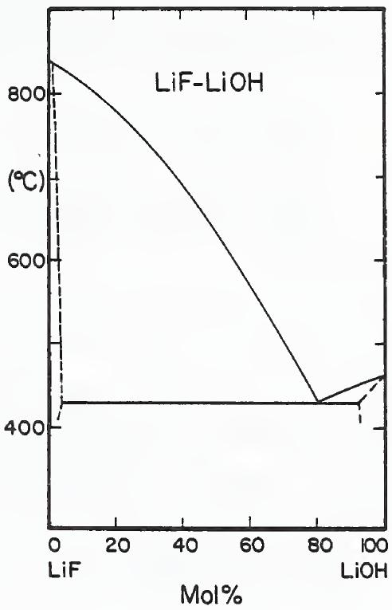  
Figure 109.1. LiF-LiOH phase diagram

References [1-15]

2. Density (p)

No data

3. Surface Tension (γ)

No data

4. Viscosity (n)

No data

5. Electrical Conductance (K)

No data

6. Safety and Hazards

# A. Hazard rating

(i) Toxicity: LiF, severe; LiOH, very caustic and toxic.   
(ii) Vapor pressure: LiF at m.pt. $(848^{\circ}\mathrm{C})$ , $\sim 8.8 \times 10^{-3}\mathrm{mm}$ ; LiOH at m.pt. $(460^{\circ}\mathrm{C}) \ll 0.5\mathrm{mm}$ .

# B. Disaster hazards

(i) Molten salt bath "explosion": i.e., explosive generating of steam due to bulk water "carry-over" and/or equipment failure; i.e., explosive expansion of "trapped" air.   
(ii) Fluorides, when heated to decomposition, or contacted with acids, emit highly toxic fumes.   
(iii) Hydroxides, react with water or steam with evolution of heat; the aqueous solution is very caustic and attacks living tissue; dangerous.

References [16-21]

# 7. Corrosion

Table 109.1. Corrosion studies from primary research literature   

<table><tr><td>Studies</td><td>References</td></tr><tr><td>Cr</td><td>[22]</td></tr><tr><td>Ni-Cr-Fe (INOR-8 s-s, Hastelloy s-s)</td><td>[23-28]</td></tr><tr><td>Al</td><td>[29]</td></tr><tr><td>Cb-Zr</td><td>[30,31]</td></tr><tr><td>Ta-W-Zr-Cb, Ta-W-Cb</td><td>[31]</td></tr><tr><td>Electrochemical behavior of oxide ions in molten fluorides</td><td>[32-34]</td></tr><tr><td>Ni, Cu, Armco Fe</td><td>[35-37]</td></tr><tr><td>Fe, effects of H2O</td><td>[38]</td></tr><tr><td>Pt, Ag, and alloys</td><td>[39-41]</td></tr><tr><td>Thermodynamics of corrosion</td><td>[42-44]</td></tr><tr><td>Corrosion - annotated biblio.</td><td>[45]</td></tr><tr><td>Electrochemical aspects</td><td>[46]</td></tr><tr><td>Reviews: corrosion - molten salts</td><td>[47-49]</td></tr></table>

References [22-49]

# 8. Diffusion

No data

9. Heat of Fusion $(\Delta H_{f}^{\circ})$

Measurement method: calculated [50]

Table 109.2. Heat of fusion   

<table><tr><td>Composition (mol % LiF)</td><td>Tm(°C)</td><td>ΔH°f(kcal mol-1)</td><td>Uncertainty</td></tr><tr><td>18.7</td><td>426°</td><td>5.0</td><td>~ ± 5%</td></tr></table>

References [50]

10. Heat Capacity $(C_p)$

Measurement method: calculated [51]

Table 109.3. Heat capacity   

<table><tr><td>Composition LIF:LiOH(mol %)</td><td>Cp(cal K-1mol-1)</td><td>T range (K)</td><td>Uncertainty</td></tr><tr><td>18.7:81.3</td><td>5.83</td><td>Tm(672) - 773</td><td>~ ± 10%</td></tr></table>

For the above composition, $C_p(s) = 5.10$ (cal $K^{-1}$ mol $^{-1}$ ), uncertainty of estimate, $\sim 10\%$ .

References [51]

11. Volume Change on Melting $(\Delta V_{f})$

No data

12. Vapor Pressure $(p_{vap})$

No data

13. Thermal Conductivity (liquid) $(\lambda_{\ell})$

No data

14. Thermal Conductivity (solid) $(\lambda_{s})$

No data

15. Cryoscopic Constant $(k_{f})$

Measurement method: calculated from $\Delta H_{\mathrm{f}}^{\circ}$ [52]

Table 109.4. Cryoscopic constant   

<table><tr><td>Binary eutectic (Mol % LiF)</td><td>k f (K mol-1kg)</td><td>Uncertainty</td></tr><tr><td>18.7</td><td>4.7,</td><td>~ ± 1%</td></tr></table>

# References [52]

# 16. References

[1] Scarpa, G., Atti accad. Lincei, 24, 476 (1915).   
[2] Janz, G. J. Downey, J. R., Jr., Allen, C. B., and Tomkins, R. P. T., "Eutectic Data" - 2 Vols; ERDA-TID-27163-P1 & P2; NTIS, Washington, D. C. (1977).   
[3] Janz, G. J., Downey, J. R., Jr., Allen, C. B., and Tomkins, R. P. T., "Physical Properties Data Complications Relevant to Energy Storage. I. Molten Salts: Eutectic Data", NSRDS-NBS-61; U. S. Gov't Printing Office, Washington, D. C. (1978).   
[4] "International Critical Tables of Numerical Data, Physics, Chemistry, and Technology", 8 Vols., McGraw-Hill Book Co., N. Y. (1933).   
[5] "Landolt-Bornstein Zahlenwert und Funktionen aus Physik, Chemie, Astronomie, Geophysik und Technik", (10th Ed.) Springer-Verlag, Berlin, Heidelberg, N. Y. (1961).   
[6] Clark, P. V., "Fused Salt Mixtures: Eutectic Compositions and Melting Points Bibliography 1907-1968", Report No. SC-R-68-1680; Sandia Laboratories (1968), NTIS.   
[7] Robertson, W. D., "Binary Phase Diagrams of Halide Salts", Report No. Yale 2723 (2 Vols.), U. S. AEC Contract AT (30-1)-2723 (1966), NTIS.   
[8] Thoma, R. E., "Phase Diagrams of Nuclear Reactor Materials", Oak Ridge National Laboratory, ORNL-2548, Contract No. W-7405-eng-26.   
[9] Thoma, R. E., "Phase Diagrams of Binary and Ternary Fluoride Systems", Chapt. 6; Adv. Molten Salts Chemistry, Vol. 3 (J. Braunstein, G. Mamantov, and G. P. Smith, eds.), Plenum Press, N. Y. (1975).   
[10] Voskresenskaya, N. K., ed., "Handbook of Solid-Liquid Equilibria in Systems of Inorganic Salts", Volumes 1, 2, Izc. Akad. Nauk SSSR, Moscow (1961). Israel Program for Scientific Translations, Jerusalem, 1970 (NTIS).   
[11] Sinistri, C., Franzozini, P., and Rolla, M., "An Atlas of Miscibility Gaps in Molten Salt Systems", Institute of Physical Chemistry, University of Pavia (Italy) (1968).

[12] Shaffer, P. T. B., "High Temperature Materials", Plenum Press Handbooks of High Temperature Materials, No. 1, Materials Index, Plenum Press, New York, 1964.   
[13] Franzozini, P., Ferloni, P., and Spinolo, C., "Molten Salts with Organic Anions", Instituto di Chimica Fisica, Universita di Pavia (Italy), 1973.   
[14] Toropov, N. A. et al., "Handbook of Phase Diagrams of the Silicates, Volume 1: Binary Systems, Volume 2, Metal-Oxygen Compounds in Silicate Systems", Izdatel'stov "Nauka" Leningradskoe Otdelenie, Leningrad, 1969, Israel Program for Scientific Translations, Jerusalem, 1972 (NTIS).   
[15] Levin, E., et al., "Phase Diagrams for Ceramists", Amer. Ceramic Soc. (publ.), Columbus, Ohio (1964; 1969).   
[16] "Dangerous Properties of Materials", Sax, N. I., Van Nostrand Reinhold Co., N. Y. (1969)   
[17] "Registry of Toxic Effects of Chemical Substances", Christensen, H. E., and Lubinbyhl, T. T., eds., U. S. Dept. H. E. W., U. S. Gov't Printing Office, Washington, D. C. (1975)   
[18] Janz, G. J., et al., "Physical Properties Data Complications Relevant to Energy Storage. Part II. Molten Salts: Data on Single and Multi-Component Salt Systems", NSRDS-NBS 61, Part II (April 1979), U. S. Gov't Printing Office, Supt of Doc. No. C13-48-61, Washington D. C. 20402.   
[19] "Potential Hazards in Molten Salt Baths for Heat Treatment of Metals", National Board of Fire Underwriters Research Report No. 2 (1954)   
[20] "Handbook of Reactive Chemical Hazards", Bretherwick, L., Butterworth Co., London (1975)   
[21] Janz, G. J., Tomkins, R. P. T., Downey, J. R., Jr., and Allen, C. B., "Safety and Hazards, Chapter in "Eutectic Data", ERDA TID-27163-P1; NTIS, U. S. Dept. Commerce, Springfield, Va. (1977)   
[22] Brasunas, A., Metal Progr., 62, 88 (1952).   
[23] Oak Ridge Nat'l Lab., Molten Salt Reactor Program Semiannual Progress Report, ORNL-3708, (1964).   
[24] Bettes, E. S., Nuc1. Sci. Eng., 2, 804 (1957).   
[25] DeVan, J. H., and Evans, R. B., Proceedings Conf. Corros. React. Materials, 557 (1962).   
[26] Koger, J. W., Corrosion, 30, 125 (1974).   
[27] Koger, J. W., ORNL-RM-4286 (1972); Nucl. Sci. Abstr., 29, 8256 (1974).   
[28] Oak Ridge National Laboratory, "The Development Status of Molten Salt Breeder Reactors", Rpt. ORNL-4812-UC-80; NTIS, U. S. Dept. Commerce, Springfield, Va., (Aug. 1972).   
[29] Lukashenko, E. E., and Reutova, G. A., Nov. Teor. Tekhnol. Metall. Protsessov, 119 (1973).   
[30] Boser, O., "Study of Safety Aspects of High-Temperature Thermal Energy Storage Systems", NSF No. AER 75-20605, (December, 1975).

[31] Harrison, R. W., and Hendrixson, W. H., "Lithium Fluoride Bellows Capsule Tests", General Electric Company, Cincinnati, Ohio, Jan. 1970, Contract NAS 3-8523.   
[32] Harrison, R. W., and Hendrixson, W. H., "Compatibility of Columbium Base Alloys with Lithium Fluoride", General Electric Company, Space Division, Cincinnati, Ohio, March, 1970, NASA CR-1526.   
[33] Mathews, A. L., and Baes, C. F., Inorg. Chem., 7, 373 (1968).   
[34] Manning, D. L., and Mamantov, G., J. Electrochem. Soc., 124, 480 (1977).   
[35] Gurowich, E. I., Zh. Prikl. Khim., 32, 817 (1959).   
[36] Smith, G. P., Hoffman, E. E., Corrosion, 13, 627t (1957).   
[37] Smith, G. P., Hoffman, E. E., Steidlitz, M. E., Corrosion, 13, 561t (1957).   
[38] Tribunskii, V. V., Kalinichenko, I. I., Tr. Ural. Politekh. Inst., 190, 49 (1970).   
[39] Rahmel, A., Kruger, H., Werkst. Korros., 18, 193 (1967).   
[40] Kruger, H., Rahmel, A., Schwenk, W., Electrochim. Acta, 13, 625 (1968).   
[41] Afanas'yev, A. S., Gamazov, V. P., Zh. Fiz. Khim., 38, 2823 (1964).   
[42] Littlewood, R., J. Electrochem. Soc., 109, 525 (1962).   
[43] Edeleanu, C., and Littlewood, R., Electrochimica Acta, 3, 195 (1960).   
[44] Littlewood, R., and Argent, E. A., Electrochimica Acta, 4, 114 (1961).   
[45] Janz, G. J., and Tomkins, R. P. T., Corrosion, 35, 485 (1979).   
[46] Johnson, K. E., "Electrochemical Approaches to Corrosion in Molten Salts", Proceedings International Symposium on Metal-Slag-Gas Reactions and Processes", The Electrochemical Society, Inc., Princeton, N. J., p. 581 (1975).   
[47] Inman, D., and Wrench, N. S., Brit. Corr. J., 1, 246 (1966).   
[48] Ketelaar, J. A. A., Chem. Ing. Tech., 45, 667 (1973).   
[49] Smirnov, M. V., and Ozeryanaya, I. W., Nauki Tekh. Korros. Zaschch. Korros., 2, 171 (1973).   
[50] Maru, H. C., et al., Inst. Gas Technology; "Molten Salt Thermal Energy Storage Systems : Salt Selection" ERDA Rpt. COO-2888-1, Aug. (1976); NTIS, U.S. Dept. Commerce, Springfield, Va.   
[51] Wicks, C. E. and Block, F. E., U.S. Bur. Mines, Bull. 605 (1963).   
[52] Janz, G. J., et al. (MSDC-RPI), unpublished work (1980).

1. Melting Temperatures $(T_{m})$

Pure substance melting points:

LiCl: $610^{\circ} \mathrm{C}$

LiOH: $462^{\circ} \mathrm{C}$

Eutectic melting point:

composition: E₁: 274°C, composition: 34.5 mol % LiCl

E2: $268^{\circ} \mathrm{C}$ , composition: $42 \%$ LiCl

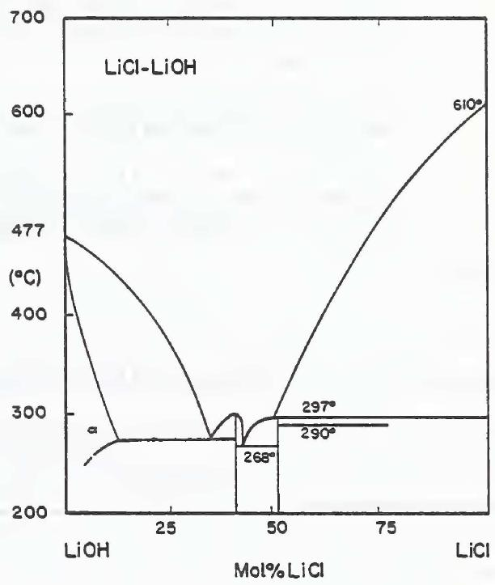  
Figure 110.1 LiCl-LiOH phase diagram

References [1-18]

2. Density (ρ)

No data

3. Surface Tension (Y)

No data

4. Viscosity (n)

No data

5. Electrical Conductance (K)

No data

# 6. Safety and Hazards

# A. Hazard rating

(i) Toxicity: LiCl, slight; LiOH, very caustic and toxic.   
(ii) Vapor pressure: no information for this system;

# B. Disaster hazards

(i) Molten salt bath "explosions": i.e., explosive generation of steam due to bulk water "carry-over" and/or equipment failure; i.e., explosive expansion of "trapped" air.   
(ii) Chlorides evolve highly toxic chloride fumes when heated to decomposition, or contacted with acids.   
(iii) Hydroxides react with water or steam with evolution of heat; the aqueous solution is very caustic and attacks living tissue; dangerous.

References [19-25]

# 7. Corrosion

Table 110.1 Corrosion studies from primary research literature   

<table><tr><td colspan="2">Studies</td><td>References</td></tr><tr><td rowspan="4">A</td><td>Mg, Ni, Zr, Ti</td><td>[26]</td></tr><tr><td>Ti, Zr, Hf, ThCl4</td><td>[27]</td></tr><tr><td>Armco Fe</td><td>[28,29]</td></tr><tr><td>Solubility of metal oxides (Ni, Ca, Zn, Mg)</td><td>[26,30]</td></tr><tr><td rowspan="5">B</td><td>Ni</td><td rowspan="3">[31-33]</td></tr><tr><td>Cu</td></tr><tr><td>Armco Fe, Steel</td></tr><tr><td>Fe, effects of H2O</td><td>[34]</td></tr><tr><td>Pt, Ag, and alloys</td><td>[35-37]</td></tr><tr><td rowspan="4">C</td><td>Thermodynamics of corrosion</td><td>[26,38,39]</td></tr><tr><td>Corrosion - annotated biblio.</td><td>[40]</td></tr><tr><td>Electrochemical aspects</td><td>[41]</td></tr><tr><td>Reviews: corrosion - molten salts</td><td>[42-44]</td></tr></table>

Compatibility studies: A, molten LiCl; B, molten LiOH; and C, general and review studies. No studies with molten mixtures of LiOH-LiCl were found.

References [26-44]

(110) LiCl-LiOH

8. Diffusion

No data

9. Heat of Fusion $(\Delta H_{f}^{\circ})$

No data

10. Heat Capacity $(C_p)$

No data

11. Volume Change on Melting $(\Delta V_{f})$

No data

12. Vapor Pressure $(p_{vap})$

No data

13. Thermal Conductivity (liquid) $(\lambda_{\ell})$

Measurement method: comparative technique; flat slab [45]

Composition: LiOH:LiCl::63:37 (mol %)

$$
\lambda = 6. 1 2 6 4 \times 1 0 ^ {- 4} + 1. 9 1 0 0 \times 1 0 ^ {- 6} T \tag {110.1}
$$

precision: insufficient data for estimate uncertainty: $\sim \pm 15\%$

Table 110.2. Thermal conductivity of melt from equation (110.1)   

<table><tr><td>T(K)</td><td>λ x 104(cal cm-1s-1K-1)</td><td></td><td>T(K)</td><td>λ x 104(cal cm-1s-1K-1)</td></tr><tr><td>550</td><td>16.6</td><td></td><td>610</td><td>17.8</td></tr><tr><td>560</td><td>16.8</td><td></td><td>620</td><td>18.0</td></tr><tr><td>570</td><td>17.0</td><td></td><td>630</td><td>18.2</td></tr><tr><td>580</td><td>17.2</td><td></td><td>640</td><td>18.3</td></tr><tr><td>590</td><td>17.4</td><td></td><td>650</td><td>18.5</td></tr><tr><td>600</td><td>17.6</td><td></td><td></td><td></td></tr></table>

The preceding are for mixtures from reagent grade quality LiOH and LiCl. With commercial grade chemicals, the thermal conductivity for this molten mixture over the same temperature range may be expressed by:

$$
\lambda = 5. 1 6 2 5 x 1 0 ^ {- 4} + 2. 0 3 0 0 x 1 0 ^ {- 6} T \tag {110.2}
$$

The values of $\lambda$ for mixtures from reagent grade and commercial grades LiOH and LiCl are in close accord ( $\sim \pm 1\%$ ). The data set was insufficient for precision estimates; the uncertainty limits are established to be $\sim \pm 15\%$ .

References [45,46]

14. Thermal Conductivity (solid) $(\lambda_{s})$

Measurement method: comparative technique; flat slab [45]

Composition: LiOH:LiCl::63:37 (mol %)

$$
\lambda = 3. 7 2 8 2 \times 1 0 ^ {- 3} - 1. 7 2 2 0 \times 1 0 ^ {- 6} T \quad (1 1 0. 3)
$$

precision: $\sim \pm 1.0\%$

uncertainty: $\sim \pm 15\%$

Table 110.3. Thermal conductivity of melt from equation (110.3)   

<table><tr><td>T(K)</td><td>λ x 104(cal cm-1s-1K-1)</td><td></td><td>T(K)</td><td>λ x 104(cal cm-1s-1K-1)</td></tr><tr><td>320</td><td>31.8</td><td></td><td>440</td><td>29.7</td></tr><tr><td>340</td><td>31.4</td><td></td><td>460</td><td>29.4</td></tr><tr><td>360</td><td>31.1</td><td></td><td>480</td><td>29.0</td></tr><tr><td>380</td><td>30.7</td><td></td><td>500</td><td>28.7</td></tr><tr><td>400</td><td>30.4</td><td></td><td>520</td><td>28.3</td></tr><tr><td>420</td><td>30.0</td><td></td><td></td><td></td></tr></table>

The preceding are for mixtures of reagent grade quality LiOH and LiCl; with commercial grade chemicals, the $\lambda$ values were found to be uniformly somewhat smaller ( $\sim 2 - 5\%$ ); the thermal conductivity equation over the same temperature range is:

$$
\lambda = 3. 6 4 5 5 x 1 0 ^ {- 3} - 1. 6 6 6 0 x 1 0 ^ {- 6} T \tag {110.4}
$$

The data set was insufficient for precision estimates; the uncertainty limits are estimated to be $\sim 15\%$ .

References [45]

15. Cryoscopic Constant $(k_{f})$

No data

16. References

[1] Scarpa, G., Atti accad. Lincei, 24, 476 (1915).   
[2] Unzhakov, G. M., Doklady Akad. Nauk SSSR, 87, 791 (1952).   
[3] Reshetnikov, N. A., Unzhakov, G. M., Zhur. Neorg. Khim., 3, 227 (1958).   
[4] Unzhakov, G. M., Dokl. Akad. Nauk SSSR, 87, 791 (1952).   
[5] Janz, G. J. Downey, J. R., Jr., Allen, C. B., and Tomkins, R. P. T., "Eutectic Data" - 2 Vols; ERDA-TID-27163-P1 & P2; NTIS, Washington, D. C. (1977).   
[6] Janz, G. J., Downey, J. R., Jr., Allen, C. B., and Tomkins, R. P. T., "Physical Properties Data Complications Relevant to Energy Storage. I. Molten Salts: Eutectic Data", NSRDS-NBS-61; U. S. Gov't Printing Office, Washington, D. C. (1978).   
[7] "International Critical Tables of Numerical Data, Physics, Chemistry, and Technology", 8 Vols., McGraw-Hill Book Co., N. Y. (1933).   
[8] "Landolt-Bornstein Zahlenwert und Funktionen aus Physik, Chemie, Astronomie, Geophysik und Technik", (10th Ed.) Springer-Verlag, Berlin, Heidelberg, N. Y. (1961).

(110) LiCl-LiOH   
[9] Clark, P. V., "Fused Salt Mixtures: Eutectic Compositions and Melting Points Bibliography 1907-1968", Report No. SC-R-68-1680; Sandia Laboratories (1968), NTIS.   
[10] Robertson, W. D., "Binary Phase Diagrams of Halide Salts", Report No. Yale 2723 (2 Vols.), U. S. AEC Contract AT (30-1)-2723 (1966), NTIS.   
[11] Thoma, R. E., "Phase Diagrams of Nuclear Reactor Materials", Oak Ridge National Laboratory, ORNL-2548, Contract No. W-7405-eng-26.   
[12] Thoma, R. E., "Phase Diagrams of Binary and Ternary Fluoride Systems", Chapt. 6; Adv. Molten Salts Chemistry, Vol. 3 (J. Braunstein, G. Mamantov, and G. P. Smith, eds.), Plenum Press, N. Y. (1975).   
[13] Voskresenskaya, N. K., ed., "Handbook of Solid-Liquid Equilibria in Systems of Inorganic Salts", Volumes 1, 2, Izc. Akad. Nauk SSSR, Moscow (1961). Israel Program for Scientific Translations, Jerusalem, 1970 (NTIS).   
[14] Sinsitri, C., Franzozini, P., and Rolla, M., "An Atlas of Miscibility Gaps in Molten Salt Systems", Institute of Physical Chemistry, University of Pavia (Italy) (1968).   
[15] Shaffer, P. T. B., "High Temperature Materials", Plenum Press Handbooks of High Temperature Materials, No. 1, Materials Index, Plenum Press, New York, 1964.   
[16] Franzozini, P., Ferloni, P., and Spinolo, C., "Molten Salts with Organic Anions", Instituto di Chimica Fisica, Universita di Pavia (Italy), 1973.   
[17] Toropov, N. A. et al., "Handbook of Phase Diagrams of the Silicates, Volume 1: Binary Systems, Volume 2, Metal-Oxygen Compounds in Silicate Systems", Izdatel'stov "Nauka" Leningradskoe Otdelenie, Leningrad, 1969, Israel Program for Scientific Translations, Jerusalem, 1972 (NTIS).   
[18] Levin, E., et al., "Phase Diagrams for Ceramists", Amer. Ceramic Soc. (publ.), Columbus, Ohio (1964; 1969).   
[19] "Dangerous Properties of Materials", Sax, N. I., Van Nostrand Reinhold Co., N. Y. (1969).   
[20] "Registry of Toxic Effects of Chemical Substances", Christensen, H. E., and Lubinbyhl, T. T., eds., U. S. Dept. H. E. W., U. S. Gov't Printing Office, Washington, D. C. (1975).   
[21] vide: this work, System 68, LiOH.   
[22] "Potential Hazards in Molten Salt Baths for Heat Treatment of Metals", National Board of Fire Underwriters Research Report No.2 (1954).   
[23] "Handbook of Reactive Chemical Hazards", Bretherwick, L., Butterworth Co., London (1975).   
[24] Janz, G. J., Tomkins, R. P. T., Downey, J. R. Jr., and Allen, C. B., "Safety and Hazards", Chapter in "Eutectic Data", ERDA TID-27163-P1; NTIS, U. S. Dept. Commerce, Springfield, Va. (1977)   
[25] Janz, G. J., et al., "Physical Properties Data Complications Relevant to Energy Storage. Part II. Molten Salts: Data on Single and Multi-Component Salt Systems", NSRDS-NBS 61, Part II (April 1979), U. S. Gov't Printing Office, Supt of Doc. No. C13-48-61, Washington D. C. 20402.   
[26] Littlewood, R., J. Electrochem. Soc., 109, 525 (1962).   
[27] Smirnov, M. V., Kudyakov, V. Ya., Loginov, Ya. A., Rossokhin, E. G., Posokhin, Yu. V., and Puzanova, T. A., Fiz. Khim. Elektrokhim. Rasplav. Solei Shlakov, 1, 115 (1969).

[28] Kochergin, V. P., Bormotova, L. V., Pryaklina, N. M., and Asanova, E. P., Zhur. Priklad. Khim., 34 (6), 1258 (1961).   
[29] Kochergin, V. P., and Maletina, L. E., Zhur. Priklad. Khim., 37 (8), 1827 (1964).   
[30] Pizzini, S., "Materials Problems in the Industrial Applications of Molten Salts", Proceedings of the European Conference on the Development of Molten Salts Applications", p. 203 (1973); Battelle, Geneva.   
[31] Gurowich, E. I., Zh. Prikl. Khim., 32, 817 (1959).   
[32] Smith, G. P., Hoffman, E. E., Corrosion, 13, 627t (1957).   
[33] Smith, G. P., Hoffman, E. E., Steidlitz, M. E., Corrosion, 13, 561t (1957).   
[34] Tribunskii, V. V., Kalinichenko, I. I., Tr. Ural. Politekh. Inst., 190, 49 (1970).   
[35] Rahmel, A., Kruger, H., Werkst. Korros., 18, 193 (1967).   
[36] Kruger, H., Rahmel, A., Schwenk, W., Electrochim. Acta, 13, 625 (1968).   
[37] Afanas'yev, A. S., Gamazov, V. P., Zh. Fiz. Khim., 38, 2823 (1964).   
[38] Edeleanu, C., and Littlewood, R., Electrochim. Acta 3, 195 (1960).   
[39] Littlewood, R., and Argent, E. A., Electrochim. Acta 4, 114 (1961).   
[40] Janz, G. J., and Tomkins, R. P. T., Corrosion, 35, 485 (1979).   
[41] Johnson, K. E., "Electrochemical Approaches to Corrosion in Molten Salts", Proceedings International Symposium on Metal-Slag-Gas Reactions and Processes", The Electrochemical Society, Inc., Princeton, N. J., p. 581 (1975).   
[42] Smirnov, M. V., and Ozeryanaya, I. N., Nauki Tekh. Korros. Zashch. Korros., 2, 171 (1973).   
[43] Ketelaar, J. A. A., Chemie. Ing. Techn., 45, 667 (1973).   
[44] Inman, D., and Wrench, N. S., Brit. Corr. J., 1, 246 (1966).   
[45] Tye, R. P., Bourne, J.G., Desjarlais, A. O., "Thermal Energy Storage Material Thermophysical Property Measurement and Heat Transfer Impact", Dynatech Report No. 1503 (August, 1976); Dynatech R/D Co., Cambridge, Mass.   
[46] Jamieson, D. T., Irving, J. B., and Tudhope, J. S., "Liquid Thermal Conductivity Data", HMSO, Edinburgh (1975).

1. Melting Temperatures $(T_{m})$

Pure substance melting points:

LiCl: 610°C

LiNO3: 253°C

Eutectic melting point:

$244^{\circ} \mathrm{C}$ , composition: $87.5 \mathrm{~mol} \% \mathrm{LiNO}_{3}$

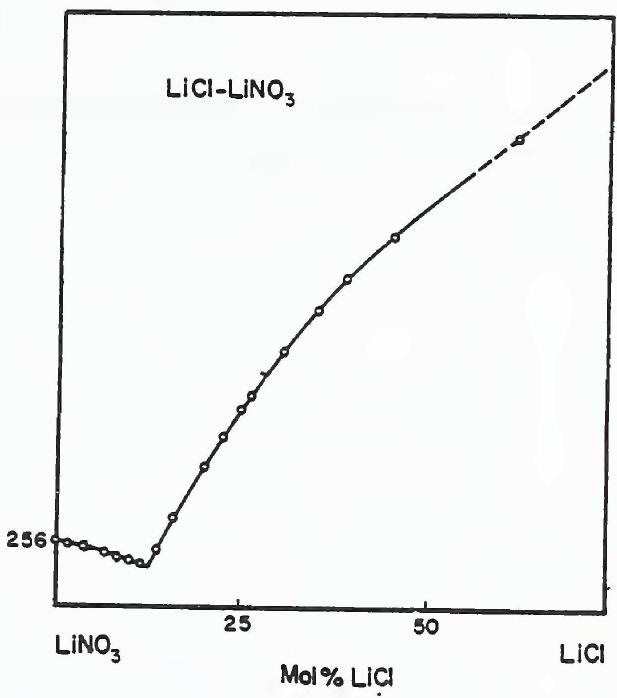  
Figure 111.1. LiCl-LiNO $_3$ phase diagram

References [1-16].

2. Density (ρ)

Measurement method: Archimedean technique [17]

Equation:

$$
\rho = a + b T \tag {111.1}
$$

precision: in table 111.1 uncertainty: $\sim \pm 1.0\%$

Table 111.1. Parameters of equation (111.1) and precisions   

<table><tr><td>Mol % LiNO3</td><td>a</td><td>-b x 104</td><td>Precision</td><td>T range(K)</td></tr><tr><td>70.0</td><td>2.0322</td><td>5.241</td><td>0.01%</td><td>650-770</td></tr><tr><td>79.9</td><td>2.0499</td><td>5.380</td><td>0.01%</td><td>610-770</td></tr><tr><td>90.0</td><td>2.0575</td><td>5.366</td><td>0.01%</td><td>550-600</td></tr></table>

# (111) LiCl-LiNO3

Table 111.2. Density (g cm $^{-3}$ ) from equations in table 111.1   

<table><tr><td rowspan="2">T-(K)</td><td colspan="3">Mol % LiNO3</td></tr><tr><td>70.0</td><td>79.0</td><td>90.0</td></tr><tr><td>550</td><td></td><td></td><td>1.7623</td></tr><tr><td>580</td><td></td><td></td><td>1.7462</td></tr><tr><td>610</td><td></td><td>1.7218</td><td>1.7301</td></tr><tr><td>640</td><td></td><td>1.7056</td><td>1.7140</td></tr><tr><td>670</td><td>1.6811</td><td>1.6895</td><td>1.6979</td></tr><tr><td>700</td><td>1.6653</td><td>1.6734</td><td>1.6818</td></tr><tr><td>730</td><td>1.6496</td><td>1.6572</td><td></td></tr><tr><td>760</td><td>1.6339</td><td>1.6411</td><td></td></tr></table>

References [17]

3. Surface Tension. (γ)

No data

4. Viscosity (n)

No data

5. Electrical Conductance (K)

No data

6. Safety and Hazards

A. Hazard rating

(i) Toxicity: LiCl, slight, $\mathrm{LiNO}_3$ , moderate   
(ii) Vapor pressure: LiCl at m.pt. $(625^{\circ}\mathrm{C})\sim 0.25\mathrm{mm}$ , $\mathrm{LiNO}_3$ decomposes with heating to the nitrite and oxygen; decomposition onsets just above m.pt. $(235^{\circ}\mathrm{C})$ .

B. Disaster hazards

(i) Molten salt bath "explosions": i.e. explosive generation of steam due to bulk water "carry-over" and/or equipment failure; i.e., explosive expansion of "trapped" air.   
(ii) Chlorides evolve highly toxic chloride fumes when heated to decomposition, or contacted with acids.   
(iii) On decomposition, nitrates emit toxic fumes (oxides of nitrogen) viz:

$$
\mathrm {M N O} _ {3} \longrightarrow \mathrm {M N O} _ {2} + \mathrm {I} _ {2} \mathrm {O} _ {2} \tag {111.2}
$$

$$
2 \mathrm {M N O} _ {2} \rightarrow \mathrm {M} _ {2} \mathrm {O} + \mathrm {N O} + \mathrm {N O} _ {2} \tag {111.3}
$$

# (111) LiCl-LiNO3

The subsequent decomposition reactions are complex; if the gas phase is continuously removed, the nitrite decomposition (above) to NO and $\mathrm{NO}_2$ is dominant. If the gas phase is not immediately removed, the NO may re-oxidize the nitrite to nitrate.

(iv) Nitrates are powerful oxidizing agents; violent (explosive) reactions possible in molten nitrates and carbonaceous materials (organic cpds oils; carbon;...); aluminum alloys and bath sludges (e.g. iron oxides); magnesium alloys. Dangerous.

References [18-24]

# 7. Corrosion

Table 111.3. Corrosion studies from primary research literature   

<table><tr><td>Studies</td><td>References</td></tr><tr><td>Mg, Ni, Zr, Ti</td><td>[25]</td></tr><tr><td>Ti, Zr, Hf, ThCl4</td><td>[26]</td></tr><tr><td>Armco Fe</td><td>[27-29]</td></tr><tr><td>Solubility of metal oxides (Ni, Ca, Zn, Mg)</td><td>[30,31]</td></tr><tr><td>Fe</td><td>[32]</td></tr><tr><td>Cu</td><td>[33]</td></tr><tr><td>Thermodynamic approach</td><td>[34,35]</td></tr><tr><td>Electrochemical approach</td><td>[31,36]</td></tr><tr><td>Annotated corrosion biblio.</td><td>[37]</td></tr><tr><td>Reviews, corrosion</td><td>[38-40]</td></tr></table>

Compatibility studies: A: LiCl; B: $\mathrm{LiNO}_3$ ; C: basic principles, reviews. No compatibility studies with molten LiCl- $\mathrm{LiNO}_3$ were found; for LiCl- $\mathrm{NaNO}_3$ , see [29].

References [25-40]

8. Diffusion

No data

9. Heat of Fusion $(\Delta H_{f}^{\circ})$

No data

10. Heat Capacity $(C_p)$

No data

11. Volume Change on Melting $(\Delta V_{f})$

Measurement method: estimated from densities [41]

Table 111.3. Volume change on melting   

<table><tr><td>Binary eutectic (mol % LiCl)</td><td>(ΔVf/Vs)</td><td>Uncertainty</td></tr><tr><td>12.5</td><td>28%</td><td>~ ± 10%</td></tr></table>

References [41]

12.. Vapor Pressure $(p_{vap})$

No data

13. Thermal Conductivity (liquid) $(\lambda_{\ell})$

No data

14. Thermal Conductivity (solid) $(\lambda_{s})$

No data

15. Cryoscopic Constant $(k_{f})$

No data

16. References

[1] Tokareva, M. V., Bergman, A. G., Zhur. Neorg. Khim., 1, 2570 (1956). J. Inorg. Chem. USSR, 1, 141 (1956).   
[2] Blidin, V. P., Izv. Sektora Fiz.-Khim. Analiza, Inst. Obshch. Neorgan. Khim., Akad. Nauk SSSR, 13, 296 (1940).   
[3] Janz, G. J. Downey, J. R., Jr., Allen, C. B., and Tomkins, R. P. T., "Eutectic Data" - 2 Vols; ERDA-TID-27163-P1 & P2; NTIS, Washington, D. C. (1977).   
[4] Janz, G. J., Downey, J. R., Jr., Allen, C. B., and Tomkins, R. P. T., "Physical Properties Data Complications Relevant to Energy Storage. I. Molten Salts: Eutectic Data", NSRDS-NBS-61; U. S. Gov't Printing Office, Washington, D. C. (1978).   
[5] "International Critical Tables of Numerical Data, Physics, Chemistry, and Technology", 8 Vols., McGraw-Hill Book Co., N. Y. (1933).   
[6] "Landolt-Bornstein Zahlenwert und Funktionen aus Physik, Chemie, Astronomie, Geophysik und Technik", (10th Ed.) Springer-Verlag, Berlin, Heidelberg, N. Y. (1961).   
[7] Clark, P. V., "Fused Salt Mixtures: Eutectic Compositions and Melting Points Bibliography 1907-1968", Report No. SC-R-68-1680; Sandia Laboratories (1968), NTIS.   
[8] Robertson, W. D., "Binary Phase Diagrams of Halide Salts", Report No. Yale 2723 (2 Vols.), U. S. AEC Contract AT (30-1)-2723 (1966), NTIS.

(111) LiCl-LiNO3   
[9] Thoma, R. E., "Phase Diagrams of Nuclear Reactor Materials", Oak Ridge National Laboratory, ORNL-2548, Contract No. W-7405-eng-26.   
[10] Thoma, R. E., "Phase Diagrams of Binary and Ternary Fluoride Systems", Chapt. 6; Adv. Molten Salts Chemistry, Vol. 3 (J. Braunstein, G. Mamantov, and G. P. Smith, eds.), Plenum Press, N. Y. (1975).   
[11] Voskresenskaya, N. K., ed., "Handbook of Solid-Liquid Equilibria in Systems of Inorganic Salts", Volumes 1, 2, Izc. Akad. Nauk SSSR, Moscow (1961). Israel Program for Scientific Translations, Jerusalem, 1970 (NTIS).   
[12] Sinistri, C., Franzozini, P., and Rolla, M., "An Atlas of Miscibility Gaps in Molten Salt Systems", Institute of Physical Chemistry, University of Pavia (Italy) (1968).   
[13] Shaffer, P. T. B., "High Temperature Materials", Plenum Press Handbooks of High Temperature Materials, No. 1, Materials Index, Plenum Press, New York, 1964.   
[14] Franzozini, P., Ferloni, P., and Spinolo, C., "Molten Salts with Organic Anions", Instituto di Chimica Fisica, Universita di Pavia (Italy), 1973.   
[15] Toropov, N. A. et al., "Handbook of Phase Diagrams of the Silicates, Volume 1: Binary Systems, Volume 2, Metal-Oxygen Compounds in Silicate Systems", Izdatel'stov "Nauka" Leningradskoe Otdelenie, Leningrad, 1969, Israel Program for Scientific Translations, Jerusalem, 1972 (NTIS).   
[16] Levin, E., et al., "Phase Diagrams for Ceramists", Amer. Ceramic Soc. (publ.), Columbus, Ohio (1964; 1969).   
[17] Smith, G. P., and Petersen, G. F., J. Chem. and Eng. Data, 6, 493 (1961).   
[18] Stern, K., "High Temperature Properties and Decomposition of Inorganic Salts. III. Nitrates and Nitrites", J. Phys. Chem. Ref. Data, 1, 747-772 (1972).   
[19] "Dangerous Properties of Materials", Sax, N. I., Van Nostrand Reinhold Co., N. Y. (1969).   
[20] "Registry of Toxic Effects of Chemical Substances", Christensen, H. E., and Lubinbyhl, T. T., eds., U. S. Dept. H. E. W., U. S. Gov't Printing Office, Washington, D. C. (1975).   
[21] "Potential Hazards in Molten Salt Baths for Heat Treatment of Metals", National Board of Fire Underwriters Research Report No. 2 (1954).   
[22] "Handbook of Reactive Chemical Hazards", Bretherwick, L., Butterworth Co., London (1975).   
[23] Janz, G. J., Tomkins, R. P. T., Downey, J. R. Jr., and Allen, C. B., "Safety and Hazards", Chapter in "Eutectic Data", ERDA TID-27163-P1; NTIS, U. S. Dept. Commerce, Springfield, Va. (1977)   
[24] Janz, G. J., et al., "Physical Properties Data Complications Relevant to Energy Storage. Part II. Molten Salts: Data on Single and Multi-Component Salt Systems", NSRDS-NBS 61, Part II (April 1979), U. S. Gov't Printing Office, Supt of Doc. No. C13-48-61, Washington D. C. 20402.   
[25] Littlewood, R., and Argent, E. A., Electrochim. Acta 4, 114 (1961).

(111) $\mathrm{LiCl - LiNO}_3$

[26] Smirnov, M. V., Kudyakov, V. Ya., Loginov, Ya. A., Rossokhin, E. G., Posokhin, Yu. V., and Puzanova, T. A., Fiz. Khim. Elektrokhim. Rasplav. Solei Shlakov, 1, 115 (1969).   
[27] Kochergin, V. P., Bormotova, L. V., Pryaklina, N. M., and Asanova, E. P., Zhur. Priklad. Khim., 34(6), 1258 (1961)   
[28] Kochergin, V.P., and Maletina, L. E., Zhur. Priklad. Khim., 37(8), 1827 (1964)   
[29] Kochergin, V. P., Druzhinina, E. P., Men'shenina, G. V., Asanova, E. P., Zh. Prikl. Khim., 33, 1580 (1960).   
[30] Littlewood, R., J. Electrochem. Soc., 109, 525 (1962).   
[31] Pizzini, S., "Materials Problems in the Industrial Applications of Molten Salts", "Proceedings of the European Conference on the Development of Molten Salts Applications", p. 203; Battelle, Geneva, (1973).   
[32] Arvia, A. J., Podesta, J. J., and Piatti, R. C. V., Electrochim. Acta, 17, 33 (1972).   
[33] Notoya, T., Denki Kagaku, 41, 779 (1973).   
[34] Conte, A., and Ingram, M. D., Electrochimica Acta, 13, 1551 (1968).   
[35] Bartlett, H. E., and Johnson, K. E., Canad. J. Chem., 44, 2119 (1966).   
[36] Johnson, K. E., "Electrochemical Approaches to Corrosion in Molten Salts", Proceedings International Symposium on Metal-Slag-Gas Reactions and Processes, The Electrochemical Society, Inc., Princeton, N. J. (1975).   
[37] Janz, G. J., and Tomkins, R. P. T., Corrosion, 35, 485 (1979).   
[38] Inman, D., and Wrench, N. S., Brit. Corr. J., 1, 246 (1966).   
[39] Ketelaar, J. A. A., Chemie. Ing. Techn., 45, 667 (1973).   
[40] Smirnov, M. V. and Ozeryanaya, Nauki Tekh. Korros. Zashch. Korros., 2, 171 (1973).   
[41] Janz, G. J., et al. (MSDC-RPI), unpublished work (1980).

1. Melting Temperatures $(T_{m})$

Pure substance melting points:

LiCl: $610^{\circ}\mathrm{C}$

Li2CO3: 723°C

Eutectic melting point:

506°C, composition: 75.6 mol % LiCl; [60 equiv. % Li2Cl2]

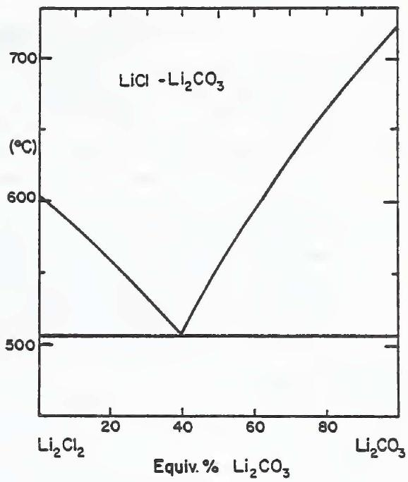  
Figure 112.1. $\mathrm{LiCl - Li_2CO_3}$ phase diagram

References [1-16]

2. Density (p)

No data

3. Surface Tension (Y)

No data

4. Viscosity (n)

No data

5. Electrical Conductance (K)

No data

(112) $\mathrm{LiCl - Li}_2\mathrm{CO}_3$

6. Safety and Hazards

# A. Hazard rating

(i) Toxicity: LiCl, slight; $\mathrm{Li}_2\mathrm{CO}_3$ , very toxic; lethal dose (oral), 0.7 mg/kg.   
(ii) Vapor pressure: LiCl at m.pt. $(610^{\circ}\mathrm{C})$ , $\sim 0.25\mathrm{mm}$ ; Li $_2$ CO $_3$ (m.pt. $723^{\circ}\mathrm{C}$ ), dissociates on heating to the oxide and CO $_2$ ; CO $_2$ pressure at $730^{\circ}\mathrm{C}$ , $\sim 10\mathrm{mm}$ .

# B. Disaster hazards

(i) Molten salt bath "explosions": i.e., explosive generation of steam due to bulk water "carry-over" and/or equipment failure; i.e., explosive expansion of "trapped" air.   
(ii) Chlorides evolve highly toxic chloride fumes when heated to decomposition, or contacted with acids.   
(iii) Carbonates, when heated with $\mathrm{CO}_{2}$ pressures less than equilibrium dissociation pressures, decompose to form alkali metal oxides; the toxicology and disaster hazards are the same as those of very caustic solutions, i.e. react with water or steam (exothermic) to form solutions that are markedly aggressive to all body tissues (chemical burns). Lithium carbonate itself is classified as a strong caustic.

References [17-22]

# 7. Corrosion

Table 112.1. Corrosion studies from primary research literature   

<table><tr><td colspan="2">Studies</td><td>References</td></tr><tr><td rowspan="7">A</td><td>Mg, Ni, Zr, Ti</td><td>[23]</td></tr><tr><td>Ti, Zr, Hf, ThCl4</td><td>[24]</td></tr><tr><td>Armco Fe</td><td>[25,26]</td></tr><tr><td>Solubility of metal oxides</td><td>[23,27]</td></tr><tr><td>Thermodynamic principles</td><td>[23,28,29]</td></tr><tr><td>Electrochemical principles</td><td>[30]</td></tr><tr><td>Reviews, annotated biblio.</td><td>[31-34]</td></tr><tr><td rowspan="12">B</td><td>Ti alloys</td><td>[35]</td></tr><tr><td>Au, Pt, Ag, Ni, Au-Pd, BN</td><td>[36-39]</td></tr><tr><td>MgO, Co</td><td>[40]</td></tr><tr><td>Metals, alloys</td><td>[41]</td></tr><tr><td>Pt, Pd, Rh, Ir (O2environment)</td><td>[42-45]</td></tr><tr><td>Pt, Ag, Ni, (Li2CO3, Li2O)</td><td></td></tr><tr><td>Ag, Pt, Ni, quartz, porcelain</td><td>[46]</td></tr><tr><td>(Li2CO3, Li2O)</td><td></td></tr><tr><td>Acid-base relationships</td><td>[47-51]</td></tr><tr><td>Hydrolysis reactions</td><td>[42,49,51,52]</td></tr><tr><td>Corrosion biblio.</td><td>[53]</td></tr><tr><td>Molten carbonates in: fuel cells, thermal energy storage, and gasification, stack gas scrubbing</td><td>[54-59]</td></tr></table>

Compatibility studies: A: molten chlorides, principally LiCl; B: molten carbonates, principally $\mathrm{Li}_2\mathrm{CO}_3$ . No compatibility studies found specifically for molten LiCl- $\mathrm{Li}_2\mathrm{CO}_3$ mixtures.

References [23-59]

8. Diffusion

No data

9. Heat of Fusion $(\Delta H_{f}^{\circ})$

No data

10. Heat Capacity $(C_p)$

No data

(112) LiCl-Li $_2$ CO $_3$

11. Volume Change on Melting $(\Delta V_{f})$ No data   
12. Vapor Pressure $(p_{vap})$ No data   
13. Thermal Conductivity (liquid) $(\lambda_{\ell})$ No data   
14. Thermal Conductivity (solid) $(\lambda_{s})$ No data   
15. Cryoscopic Constant $(k_{f})$ No data   
16. References

[1] Reshetnikov, N. A., Diogenov, G. G., Izv. Fiz.-Khim. Nauch.-Issled. Inst. Irkutsk. U, 2, 14 (1953). Ref. Zhur. Khim., 40, 968 (1954).   
[2] Unpublished diagram, cited in Levin, et al, see System 80, Ref. [22]   
[3] Janz, G. J. Downey, J. R., Jr., Allen, C. B., and Tomkins, R. P. T., "Eutectic Data" - 2 Vols; ERDA-TID-27163-P1 & P2; NTIS, Washington, D. C. (1977).   
[4] Janz, G. J., Downey, J. R., Jr., Allen, C. B., and Tomkins, R. P. T., "Physical Properties Data Complications Relevant to Energy Storage. I. Molten Salts: Eutectic Data", NSRDS-NBS-61; U. S. Gov't Printing Office, Washington, D. C. (1978).   
[5] "International Critical Tables of Numerical Data, Physics, Chemistry, and Technology", 8 Vols., McGraw-Hill Book Co., N. Y. (1933).   
[6] "Landolt-Bornstein Zahlenwert und Funktionen aus Physik, Chemie, Astronomie, Geophysik und Technik", (10th Ed.) Springer-Verlag, Berlin, Heidelberg, N. Y. (1961).   
[7] Clark, P. V., "Fused Salt Mixtures: Eutectic Compositions and Melting Points Bibliography 1907-1968", Report No. SC-R-68-1680; Sandia Laboratories (1968), NTIS.   
[8] Robertson, W. D., "Binary Phase Diagrams of Halide Salts", Report No. Yale 2723 (2 Vols.), U. S. AEC Contract AT (30-1)-2723 (1966), NTIS.   
[9] Thoma, R. E., "Phase Diagrams of Nuclear Reactor Materials", Oak Ridge National Laboratory, ORNL-2548, Contract No. W-7405-eng-26.   
[10] Thoma, R. E., "Phase Diagrams of Binary and Ternary Fluoride Systems", Chapt. 6; Adv. Molten Salts Chemistry, Vol. 3 (J. Braunstein, G. Mamantov, and G. P. Smith, eds.), Plenum Press, N. Y. (1975).   
[11] Voskresenskaya, N. K., ed., "Handbook of Solid-Liquid Equilibria in Systems of Inorganic Salts", Volumes 1, 2, Izc. Akad. Nauk SSSR, Moscow (1961). Israel Program for Scientific Translations, Jerusalem, 1970 (NTIS).

(112) LiCl-Li $_2$ CO $_3$   
[12] Sinistri, C., Franzozini, P., and Rolla, M., "An Atlas of Miscibility Gaps in Molten Salt Systems", Institute of Physical Chemistry, University of Pavia (Italy) (1968).   
[13] Shaffer, P. T. B., "High Temperature Materials", Plenum Press Handbooks of High Temperature Materials, No. 1, Materials Index, Plenum Press, New York, 1964.   
[14] Franzozini, P., Ferloni, P., and Spinolo, C., "Molten Salts with Organic Anions", Instituto di Chimica Fisica, Universita di Pavia (Italy), 1973.   
[15] Toropov, N. A. et al., "Handbook of Phase Diagrams of the Silicates, Volume 1: Binary Systems, Volume 2, Metal-Oxygen Compounds in Silicate Systems", Izdatel'stov "Nauka" Leningradskoe Otdelenie, Leningrad, 1969, Israel Program for Scientific Translations, Jerusalem, 1972 (NTIS).   
[16] Levin, E., et al., "Phase Diagrams for Ceramists", Amer. Ceramic Soc. (publ.), Columbus, Ohio (1964; 1969).   
[17] "Dangerous Properties of Materials", Sax, N. I., Van Nostrand Reinhold Co., N. Y. (1969).   
[18] "Registry of Toxic Effects of Chemical Substances", Christensen, H. E., and Lubinbyhl, T. T., eds., U. S. Dept. H. E. W., U. S. Gov't Printing Office, Washington, D. C. (1975).   
[19] Janz, G. J., et al., "Physical Properties Data Complications Relevant to Energy Storage. Part II. Molten Salts: Data on Single and Multi-Component Salt Systems", NSRDS-NBS 61, Part II (April 1979), U. S. Gov't Printing Office, Supt of Doc. No. C13-48-61, Washington D. C. 20402.   
[20] "Potential Hazards in Molten Salt Baths for Heat Treatment of Metals", National Board of Fire Underwriters Research Report No. 2 (1954).   
[21] "Handbook of Reactive Chemical Hazards", Bretherwick, L., Butterworth Co., London (1975).   
[22] Janz, G. J., Tomkins, R. P. T., Downey, J. R. Jr., and Allen, C. B., "Safety and Hazards", Chapter in "Eutectic Data", ERDA TID-27163-P1; NTIS, U. S. Dept. Commerce, Springfield, Va. (1977)   
[23] Littlewood, R., J. Electrochem. Soc., 109, 525 (1962).   
[24] Smirnov, M. V., Kudyakov, Ya. V., Podlesnyak, N. P., Ozeryanaya, I. N., and Posokhin, Yu.V., Tr. Inst. Elektrokhim. Ural Filial, Akad. Nauk SSSR, 14, 19 (1970).   
[25] Kochergin, V. P., Bormotova, L. V., Pryaklina, N. M., and Asanova, E. P., Zhur. Priklad. Khim., 34 (6), 1258 (1961).   
[26] Kochergin, V. P., and Maletina, L. E., Zhur. Priklad. Khim., 37 (8), 1827 (1964).   
[27] Pizzini, S., "Materials Problems in the Industrial Applications of Molten Salts", Proceedings of the European Conference on the Development of Molten Salts Applications", p. 203 (1973); Battelle, Geneva.   
[28] Edeleanu, C., and Littlewood, R., Electrochim. Acta 3, 195 (1960).   
[29] Littlewood, R., and Argent, E. A., Electrochim. Acta 4, 114 (1961).

[30] Johnson, K. E., "Electrochemical Approaches to Corrosion in Molten Salts", Proceedings International Symposium on Metal-Slag-Gas Reactions and Processes, The Electrochemical Society Inc., Princeton, N. J., p. 581 (1975).   
[31] Janz, G. J., and Tomkins, R. P. T., Corrosion, 35, 485 (1979).   
[32] Smirnov, M. V., and Ozeryanaya, I. N., Nauki Tekh. Korros. Zashch. Korros., 2, 171 (1973).   
[33] Ketelaar, J. A. A., Chemie. Ing. Techn., 45, 607 (1973).   
[34] Inman, D., and Wrench, N. S., Brit. Corr. J., 1, 246 (1966).   
[35] Ozeryanaya, I. N., Manukhina, T. I., and Smirnov, M. V., Zashch. Metal, 8, 128 (1972).   
[36] Janz, G. J., and Conte, A., Electrochim. Acta. 9, 1269 (1964)   
[37] Janz, G. J., Conte, A., and Neuenschwander, E., Corrosion, 19, 292 (1963).   
[38] Janz, G. J., and Lorenz, M. R., Rev. Sci. Instruments, 32, 130 (1961).   
[39] Bartlett, H. E., and Johnson, K. E., J. Electrochem. Soc., 114, 457 (1967).   
[40] Davis, H. J., and Kinnibrugh, D. R., J. Electrochem. Soc., 117, 392 (1970).   
[41] Scheer, J. J., van Arkel, A. E., and Heyding, R. D., Can. J. Chem., 33, 683 (1955).   
[42] Andersen, B. K., "Thermodynamic Properties of Molten Carbonates", Ph.D. Thesis, Tech. Univ. Denmark (1975).   
[43] Papin, G., Michaud, M., and Bouaziz, R., C. R. Acad. Sc., Paris, 268, Ser. C, 1691 (1969).   
[44] Bouaziz, R., and Papin, G., Compt. Rend. Acad. Sci., Paris, 266, series C, 1530 (1968).   
[45] Smirnov, M. V., Lyubimtseva, I. Ya., Tsiovkina, L. A., and Krasnov, Yu. N., Russ. J. Inorg. Chem. 16, 130 (1971)   
[46] Cohen-Adad, R., Michaud, M., Said, J., and Rollet, A. F., Bull. Soc. Chim. Fr., 356 (1961).   
[47] Dubois, J., "Chemical and Electrochemical Reactions of Molten Alkali Carbonates as Fuel Cell Electrolytes", Ph.D. Thesis, Fac. Sci. Univ. Paris, France (1964).   
[48] Ingram, M. D., and Janz, G. J., Electrochim. Acta. 10, 783 (1965)   
[49] Busson, N., Palous, S., Buvet, R., and Millet, J., Comp. Rend. 260, 720 6097 (1965)   
[50] Ingram, M. D., Baron, B., and Janz, G. J., Electrochim. Acta. 11 1629(1966)   
[51] Janz, G. J., J. Chem. Educ. 44, 581 (1967)   
[52] Busson, N., Palous S., Millet, J. and Buvet, R. Electrochim. Acta. 12, 910 (1967)   
[53] Janz, G. J., and Tomkins, R. P. T., Corrosion, 35, 485 (1979).

(112) LiCl-Li $_2$ CO $_3$

[54] Maru, H. C., et al. (Institute of Gas Technology), "Molten Salt Thermal Energy Storage Systems: Salt Selections", Rpt. CO0-2888-1, ERDA Contract NO. E(11-1)-2888; NTIS, U. S. Dept. Commerce, Springfield, Va. (Aug. 1976).   
[55] Maru, H. C., et al. (Institute of Gas Technology), "Fuel Cell Research on Second Generation Molten Carbonate Systems: II. Characteristics of Carbonate Melts", Quarterly Status Rpt., Project 8984, ERDA Contract No. 31-109-38-3552, (Sept. 1976).   
[56] Atomics International; "Development of a Molten Carbonate Process for Removal of Sulfur Dioxide from Power Plant Stack Gases", Progress Rpt. No. 2, U. S. Public Health Services, Contract PH 86-67-128, Canoga Park, Ca. (1968).   
[57] Grantham, L. F., and Ferry, R. B., "Corrosion in Alkali Metal Carbonate-Based Melts", Proc. International Symp. Fused Salts, J. P. Pemsler, ed., Electrochemical Soc., Inc., Princeton, N. J., 270 (1976).   
[58] Botts, W. V., Kohl, A. L., and Trilling, C. A., "Low BTU Gasification of Coal by Atomics International's Molten Salt Process", Proceedings of the 11th Intersociety Energy Conversion Engineering Conference, 1, 280 (Sept. 1976).   
[59] Cover, A. E., Schreiner, W. C., and Skaperdas, G. T., "The Kellogg Coal Gasification Process", Extended Abstracts, American Chemical Soc. Meeting, Washington, D. C. (1971).

1. Melting Temperatures $(T_{m})$

Pure substance melting points:

NaCl: $800^{\circ} \mathrm{C}$

Na2CO3: 858°C

Eutectic melting point:

$634^{\circ} \mathrm{C}$ , composition: 76.9 mol % NaCl

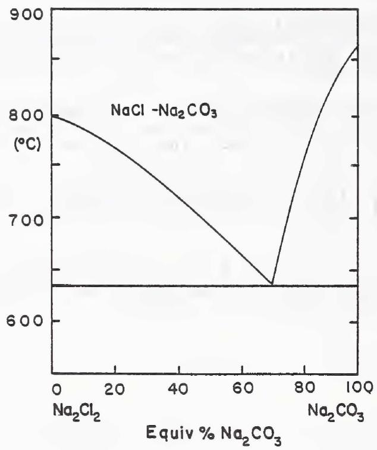  
Figure 113.1. NaCl- $\mathrm{Na}_2\mathrm{CO}_3$ phase diagram

References [1-17]

2. Density (ρ)

Measurement method: Archimedean technique [18]

Equation:

$$
\rho = a + b T \tag {113.1}
$$

precision: in table 113.1

uncertainty: $\sim \pm 2.5\%$

Table 113.1. Parameters of equation (113.1) and precisions   

<table><tr><td>Mol % NaCl</td><td>a</td><td>-b x 104</td><td>Precision</td><td>T range(K)</td></tr><tr><td>16.77</td><td>2.3645</td><td>3.300</td><td>0.01%</td><td>1100-1150</td></tr><tr><td>31.19</td><td>2.2831</td><td>3.440</td><td>0.01%</td><td>1070-1150</td></tr><tr><td>43.73</td><td>2.2172</td><td>3.286</td><td>0.01%</td><td>1000-1150</td></tr><tr><td>54.73</td><td>2.1485</td><td>3.035</td><td>0.03%</td><td>1000-1150</td></tr><tr><td>59.74</td><td>2.1823</td><td>3.571</td><td>0.04%</td><td>1000-1150</td></tr><tr><td>64.46</td><td>2.2411</td><td>4.367</td><td>0.06%</td><td>970-1150</td></tr><tr><td>68.91</td><td>2.2051</td><td>4.228</td><td>0.02%</td><td>1000-1150</td></tr><tr><td>73.12</td><td>2.1209</td><td>3.679</td><td>0.07%</td><td>1050-1150</td></tr><tr><td>80.88</td><td>2.0025</td><td>2.999</td><td>0.09%</td><td>1100-1150</td></tr><tr><td>87.88</td><td>2.2168</td><td>5.198</td><td>0.00%</td><td>1100-1150</td></tr><tr><td>100.00</td><td>1.8564</td><td>3.202</td><td>0.08%</td><td>1100-1150</td></tr></table>

(113) $\mathrm{NaCl - Na}_{2}\mathrm{CO}_{3}$   
Table 113.2. Density $(\mathrm{gcm}^{-3})$ from equations in table 113.1   

<table><tr><td rowspan="2">T(K)</td><td colspan="7">Mol % NaCl</td></tr><tr><td>16.77</td><td>43.73</td><td>59.74</td><td>64.46</td><td>68.91</td><td>73.12</td><td>87.88</td></tr><tr><td>970</td><td></td><td></td><td></td><td>1.818</td><td></td><td></td><td></td></tr><tr><td>980</td><td></td><td></td><td></td><td>1.813</td><td></td><td></td><td></td></tr><tr><td>990</td><td></td><td></td><td></td><td>1.809</td><td></td><td></td><td></td></tr><tr><td>1000</td><td></td><td>1.889</td><td>1.825</td><td>1.804</td><td>1.782</td><td></td><td></td></tr><tr><td>1010</td><td></td><td>1.885</td><td>1.822</td><td>1.800</td><td>1.778</td><td></td><td></td></tr><tr><td>1020</td><td></td><td>1.882</td><td>1.818</td><td>1.796</td><td>1.774</td><td></td><td></td></tr><tr><td>1030</td><td></td><td>1.879</td><td>1.814</td><td>1.791</td><td>1.770</td><td></td><td></td></tr><tr><td>1040</td><td></td><td>1.875</td><td>1.811</td><td>1.787</td><td>1.765</td><td></td><td></td></tr><tr><td>1050</td><td></td><td>1.872</td><td>1.807</td><td>1.783</td><td>1.761</td><td>1.735</td><td></td></tr><tr><td>1060</td><td></td><td>1.869</td><td>1.804</td><td>1.778</td><td>1.757</td><td>1.731</td><td></td></tr><tr><td>1070</td><td></td><td>1.866</td><td>1.800</td><td>1.774</td><td>1.753</td><td>1.727</td><td></td></tr><tr><td>1080</td><td></td><td>1.862</td><td>1.797</td><td>1.769</td><td>1.748</td><td>1.724</td><td></td></tr><tr><td>1090</td><td></td><td>1.859</td><td>1.793</td><td>1.765</td><td>1.744</td><td>1.720</td><td></td></tr><tr><td>1100</td><td>1.947</td><td>1.856</td><td>1.789</td><td>1.761</td><td>1.740</td><td>1.716</td><td>1.645</td></tr><tr><td>1110</td><td>1.943</td><td>1.852</td><td>1.786</td><td>1.756</td><td>1.736</td><td>1.713</td><td>1.640</td></tr><tr><td>1120</td><td>1.939</td><td>1.849</td><td>1.782</td><td>1.752</td><td>1.732</td><td>1.709</td><td>1.635</td></tr><tr><td>1130</td><td>1.935</td><td>1.846</td><td>1.779</td><td>1.748</td><td>1.727</td><td>1.705</td><td>1.629</td></tr><tr><td>1140</td><td>1.931</td><td>1.843</td><td>1.775</td><td>1.743</td><td>1.723</td><td>1.701</td><td>1.624</td></tr><tr><td>1150</td><td>1.928</td><td>1.839</td><td>1.772</td><td>1.739</td><td>1.719</td><td>1.698</td><td>1.619</td></tr></table>

References [18]

3. Surface Tension (γ)

No data

4. Viscosity (n)

No data

5. Electrical Conductance (K)

Measurement method: classical ac technique [18]

Equation:

$\kappa = a + bT + cT^2$ (113.2)

precision: in table 113.3

uncertainty: $\sim \pm 5.0\%$

Table 113.3. Parameters of equation (113.2) and precisions   

<table><tr><td>Mol % NaCl</td><td>-a</td><td>b x 102</td><td>-c x 105</td><td>Precision</td><td>T range(K)</td></tr><tr><td>66.6</td><td>18.600</td><td>3.4876</td><td>1.3980</td><td>4.32%</td><td>930-1310</td></tr><tr><td>80</td><td>9.413</td><td>1.813</td><td>0.623</td><td>7.43%</td><td>970-1330</td></tr></table>

# (113) NaCl·Na2CO3

Table 113.4. Specific conductance $(ohm^{-1}cm^{-1})$ from equations in table 113.3   

<table><tr><td rowspan="2">T(K)</td><td colspan="2">Mol % NaCl</td></tr><tr><td>66.6</td><td>80</td></tr><tr><td>930</td><td>1.744</td><td></td></tr><tr><td>970</td><td>2.077</td><td>2.313</td></tr><tr><td>1010</td><td>2.365</td><td>2.545</td></tr><tr><td>1050</td><td>2.608</td><td>2.757</td></tr><tr><td>1090</td><td>2.806</td><td>2.949</td></tr><tr><td>1130</td><td>2.960</td><td>3.121</td></tr><tr><td>1170</td><td>3.069</td><td>3.273</td></tr><tr><td>1210</td><td>3.133</td><td>3.405</td></tr><tr><td>1250</td><td>3.152</td><td>3.518</td></tr><tr><td>1290</td><td>3.127</td><td>3.610</td></tr><tr><td>1330</td><td></td><td>3.682</td></tr></table>

# References [18]

6. Safety and Hazards

# A. Hazard rating

(i) Toxicity: NaCl, very low; Na $_2$ CO $_3$ , moderate.   
(ii) Vapor pressure: no information for this system, but see NaCl [21] and $\mathrm{Na}_{2}\mathrm{CO}_{3}$ [21]

# B. Disaster hazards

(i) Molten salt bath "explosions": i.e., explosive generation of steam due to bulk water "carry-over" and/or equipment failure; i.e., explosive expansion of "trapped" air.   
(ii) When bulk NaCl is heated at high temperatures, vapor is evolved which is particularly irritating to the eyes; when heated to decomposition or contacted with acids, highly toxic chloride fumes are evolved.

- When heated with $\mathrm{CO}_{2}$ pressures less than equilibrium dissociation pressures, decomposes to form alkali metal oxides; the toxicology and disaster hazards are the same as those of very caustic solutions, i.e., react with water or steam (exothermic) to form solutions that are remarkably aggressive to all body tissues (chemical burns).

References [19-24].

# 7. Corrosion

Table 113.5. Corrosion studies from primary research literature   

<table><tr><td colspan="2">Systems, Studies, [References]</td></tr><tr><td>A</td><td>Mo [25], Armco Fe [26-28], Ni, Cr [29], Ti, Zr, Hf, ThCl4[30,31], Cr [32,33], Fe-Cr [33], Ni alloys [31,34], Au, Pt, Al2O3, MgO, Zirconia (NaCl with Na2O) [35], thermodynamic redox potentials [31,36,37], electrochemical aspects [38,39], annotated corrosion biblio. [40], reviews [41-43].</td></tr><tr><td>B</td><td>Si [44], Pt [45], Metals [46], Cu-Zn [47], Pt, Au, Ag, MgO [48-51], Pt, Rh, Pd, Ir (O2environment) [52], Au, Ag, Al2O3(N2atmosphere; Na2CO3-Na2O) [53-55], quartz, Porcelain, Ag, Pt, Ni (N2atmosphere; Na2CO3-Na2O) [56], boron nitride [51,57], β-alumina [57], Fe (Na2CO3-Na halides) [58], acid-base relationships [59-62], H2O hydrolysis reactions [63-65], molten carbonates: fuel cells, thermal energy storage, coal gasification [26,57,58,66-70]</td></tr></table>

Compatibility studies: A: principally in molten NaCl; B: principally in molten $\mathrm{Na}_2\mathrm{CO}_3$ . No data found for NaCl- $\mathrm{Na}_2\mathrm{CO}_3$ mixtures.

References [25-70]

8. Diffusion

No data

9. Heat of Fusion $(\Delta H_{f}^{\circ})$

No data

10. Heat Capacity $(C_p)$

No data

11. Volume Change on Melting $(\Delta V_{f})$

No data

12. Vapor Pressure $(p_{vap})$

No data

13. Thermal Conductivity (liquid) $(\lambda_{\ell})$

No data

14. Thermal Conductivity (solid) $(\lambda_{s})$

No data

15. Cryoscopic Constant $(k_{f})$

No data

16. References

[1] Bergman, A. G., Sementsova, A. K., Zhur. Neorg. Khim., 3, 383 (1958).   
[2] Ryschkewitsch, E., Z. Elektrochem., 39, 531 (1933).   
[3] Niggli, P., Z. anorg. u. allgem. Chem., 106, 136 (1919).   
[4] Janz, G. J. Downey, J. R., Jr., Allen, C. B., and Tomkins, R. P. T., "Eutectic Data" - 2 Vols; ERDA-TID-27163-P1 & P2; NTIS, Washington, D. C. (1977).   
[5] Janz, G. J., Downey, J. R., Jr., Allen, C. B., and Tomkins, R. P. T., "Physical Properties Data Complications Relevant to Energy Storage. I. Molten Salts: Eutectic Data", NSRDS-NBS-61; U. S. Gov't Printing Office, Washington, D. C. (1978).   
[6] "International Critical Tables of Numerical Data, Physics, Chemistry, and Technology", 8 Vols., McGraw-Hill Book Co., N. Y. (1933).   
[7] "Landolt-Bornstein Zahlenwert und Funktionen aus Physik, Chemie, Astronomie, Geophysik und Technik", (10th Ed.) Springer-Verlag, Berlin, Heidelberg, N. Y. (1961).   
[8] Clark, P. V., "Fused Salt Mixtures: Eutectic Compositions and Melting Points Bibliography 1907-1968", Report No. SC-R-68-1680; Sandia Laboratories (1968), NTIS.   
[9] Robertson, W. D., "Binary Phase Diagrams of Halide Salts", Report No. Yale 2723 (2 Vols.), U. S. AEC Contract AT (30-1)-2723 (1966), NTIS.   
[10] Thoma, R. E., "Phase Diagrams of Nuclear Reactor Materials", Oak Ridge National Laboratory, ORNL-2548, Contract No. W-7405-eng-26.   
[11] Thoma, R. E., "Phase Diagrams of Binary and Ternary Fluoride Systems", Chapt. 6; Adv. Molten Salts Chemistry, Vol. 3 (J. Braunstein, G. Mamantov, and G. P. Smith, eds.), Plenum Press, N. Y. (1975).   
[12] Voskresenskaya, N. K., ed., "Handbook of Solid-Liquid Equilibria in Systems of Inorganic Salts", Volumes 1, 2, Izc. Akad. Nauk SSSR, Moscow (1961). Israel Program for Scientific Translations, Jerusalem, 1970 (NTIS).   
[13] Sinistri, C., Franzozini, P., and Rolla, M., "An Atlas of Miscibility Gaps in Molten Salt Systems", Institute of Physical Chemistry, University of Pavia (Italy) (1968).   
[14] Shaffer, P. T. B., "High Temperature Materials", Plenum Press Handbooks of High Temperature Materials, No. 1, Materials Index, Plenum Press, New York, 1964.   
[15] Franzozini, P., Ferloni, P., and Spinolo, C., "Molten Salts with Organic Anions", Instituto di Chimica Fisica, Universita di Pavia (Italy), 1973.   
[16] Toropov, N. A. et al., "Handbook of Phase Diagrams of the Silicates, Volume 1: Binary Systems, Volume 2, Metal-Oxygen Compounds in Silicate Systems", Izdatel'stov "Nauka" Leningradskoe Otdelenie, Leningrad, 1969, Israel Program for Scientific Translations, Jerusalem, 1972 (NTIS).   
[17] Levin, E., et al., "Phase Diagrams for Ceramists", Amer. Ceramic Soc. (publ.), Columbus, Ohio (1964; 1969).

(113) $\mathrm{NaCl - Na}_{2}\mathrm{CO}_{3}$   
[18] Polyakov, V. D. and Berul, S. I., Izv. Sek. Fiz. Khim. Anal., Akad Nauk SSSR 22, 170 (1953).   
[19] "Dangerous Properties of Materials", Sax, N. I., Van Nostrand Reinhold Co., N. Y. (1969).   
[20] "Registry of Toxic Effects of Chemical Substances", Christensen, H. E., and Lubinbyhl, T. T., eds., U. S. Dept. H. E. W., U. S. Gov't Printing Office, Washington, D. C. (1975).   
[21] Janz, G. J., et al., "Physical Properties Data Complications Relevant to Energy Storage. Part II. Molten Salts: Data on Single and Multi-Component Salt Systems", NSRDS-NBS 61, Part II (April 1979), U. S. Gov't Printing Office, Supt of Doc. No. C13-48-61, Washington D. C. 20402.   
[22] "Potential Hazards in Molten Salt Baths for Heat Treatment of Metals", National Board of Fire Underwriters Research Report No. 2 (1954).   
[23] "Handbook of Reactive Chemical Hazards", Bretherwick, L., Butterworth Co., London (1975).   
[24] Janz, G. J., Tomkins, R. P. T., Downey, J. R. Jr., and Allen, C. B., "Safety and Hazards", Chapter in "Eutectic Data", ERDA TID-27163-P1; NTIS, U. S. Dept. Commerce, Springfield, Va. (1977)   
[25] Ozeryanaya, I. N., Zalazinskii, G. G., Smirnov, M. V., Finkel'shtein, S. D., and Shamanova, N. D., Zashch. Metal., 11, 66 (1975).   
[26] Kochergin, V. P., and Ignat'eva, N. I., Russ. J. Inorg. Chem., 6(9), 1085 (1961).   
[27] Kochergin, V. P., and Shevrina, Z., Uch. Zap. Ural. Gos. Univ., 92, 3 (1969).   
[28] Kochergin, V. P., et al., Zhur. Priklad. Khim., 34(6), 1258 (1961); ibid., 37(8), 1837 (1964).   
[29] Seybolt, A. U., Oxid. Metals, 2, 119 (1970).   
[30] Smirnov, M. V., Kudyakov, V. Ya., Loginov, Ya. A., Rossokhin, E. G., Posokhin, Yu. V., and Puzanova, T. A., Fiz. Khim. Elektrokhim. Rasplav. Solei Shlakov, 1, 115 (1969).   
[31] Littlewood, R., J. Electrochem. Soc., 109, 525 (1962).   
[32] Krasil'nikova, N. A., Ozeryanaya, I. N., and Smirnov, M. V., Zashch. Metal., 17, 446 (1974).   
[33] Krasil'nikova, N. A., Ozeryanaya, I. N., Smirnov, M. V., and Shamanova, N. D., Zashch. Metal., 10, 446 (1974).   
[34] Bogdanov, N. I., Varganov, B. Ya., and Kholomonova, N. D., Zh. Prikl. Khim. (Leningrad), 46, 1698 (1973).   
[35] Stern, K. H., Panayappan, R., and Flinn, D. R., "Proceedings Intern Symp. Molten Salts", The Electrochem. Soc., Princeton, N. J., p. 64 (1976).   
[36] Edeleanu, C., and. Littlewood, R., Electrochim. Acta 3, 195 (1960).   
[37] Littlewood, R., and Argent, E. A., Electrochim. Acta 4, 114 (1961).   
[38] Pizzini, S., "Materials Problems in the Industrial Applications of Molten Salts", Proceedings of the European Conference on the Development of Molten Salts Applications", p. 203 (1973); Battelle, Geneva.   
[39] Johnson, K. E., "Electrochemical Approaches to Corrosion in Molten Salts", Proceedings International Symposium on Metal-Slag-Gas Reactions and Processes, The Electrochemical Society Inc., Princeton, N. J., p. 581 (1975).

(113) $\mathrm{NaCl - Na}_{2}\mathrm{CO}_{3}$

[40] Janz, G. J., and Tomkins, R. P. T., Corrosion, 35, 485 (1979).   
[41] Smirnov, M. V., and Ozeryanaya, I. N., Nauki Tekh. Korros. Zashch. Korros., 2, 171 (1973).   
[42] Ketelaar, J. A. A., Chemie. Ing. Techn., 45, 667 (1973).   
[43] Inman, D., and Wrench, N. S., Brit. Corr. J., 1, 246 (1966).   
[44] Cable, M., and Martlew, D., Glass Technol., 12, 142 (1971).   
[45] Schneider, Yu. G., Kondrat'ev, Yu. N., and Maksimov, N. N., Zashch. Metal, 9, 199 (1973).   
[46] Ozeryanaya, I. N., Penyagina, O. P., Manukhina, T. I., and Smirnov, M. V., Fiz. Khim. Elektrokhim, Rasplav. Solei Tverd. Elektrolit, 2, 96 (1973).   
[47] Sizintseva, N. F., Stepanov, G. K., and Belyaeva, G. I., Tr. Inst. Elektrokhim., Ural. Nauch. Tsentr; Akad. Nauk, USSR, 19, 92 (1973).   
[48] Janz, G. J., Conte, A., and Neuenschwander, E., Corrosion, 19, 292 (1963).   
[49] Janz, G. J., and Conte, A., Corrosion, 20, 237 (1964).   
[50] Rodigina, E. N., and Stepanov, G. K., Trudy Inst. Elektrokhim. Ural. Fil. Akad. Nauk, SSSR, 3, 77 (1962).   
[51] Janz, G. J., and Lorenz, M. R., Rev. Sci. Instruments, 32, 130 (1961).   
[52] Scheer, J. J., van Arkel, A. E., and Heyding, R. D., Can. J. Chem., 33, 683 (1955).   
[53] Bouaziz, R., and Papin, G., Compt. Rend. Acad. Sci., Paris, 266, series C, 1530 (1968).   
[54] Papin, G., Michaud, M., and Bouaziz, R., C. R. Acad. Sc., Paris, 268, Ser. C, 1691 (1969).   
[55] Robin, M. and Recapet, J. M., Bull. Soc. Chim. Fr. 2110 (1964)   
[56] Cohen-Adad, R., Michaud, M., Said, J., and Rollet, A. F., Bull. Soc. Chim. Fr., 356 (1961).   
[57] Braunstein, J., et al., "Molten Carbonate Fuel Cell Research at ORNL", Rpt. ORNL/TM-5886; NTIS, U. S. dept. Commerce, Springfield, Va. (May 1977).   
[58] Cover, A. E., Schreiner, W. C., and Skaperdas, G. T., "The Kellogg Coal Gasification Process", Extended Abstracts, American Chemical Soc. Meeting, Washington, D. C. (1971).   
[59] Dubois, J., "Chemical and Electrochemical Reactions of Molten Alkali Carbonates as Fuel Cell Electrolytes", Ph.D. Thesis, Fac. Sci. Univ. Paris, France (1964)   
[60] Ingram, M. D. and Janz, G. J., Electrochim. Acta 10, 783 (1965)   
[61] Busson, N., Palous, S., 'Buvet, R., and Millet, J., Compt. Rend. 260, 720, 6097 (1965)   
[62] Ingram, M. D., Baron, B., and Janz, G. J., Electrochim Acta 11, 1629 (1966)   
[63] Andersen, B. K., "Thermodynamic Properties of Molten Carbonates", Ph.D. Thesis, Tech. Univ. Denmark (1975).   
[64] Janz, G. J., J. Chem. Ed., 44, 581 (1967).   
[65] Busson, N., Palous, S., Millet, J., and Buvet, R., Electrochim. Acta, 12, 910 (1967).

(113) NaCl-Na₂CO₃   
[66] Atomics International; "Development of a Molten Carbonate Process for Removal of Sulfur Dioxide from Power Plant Stack Gases", Progress Rpt. No. 2, U. S. Public Health Services, Contract PH 86-67-128, Canoga Park, Ca. (1968).   
[67] Grantham, L. F., and Ferry, R. B., "Corrosion in Alkali Metal Carbonate-Based Melts", Proc. International Symp. Fused Salts, J. P. Pemsler, ed., Electrochemical Soc., Inc., Princeton, N. J., 270 (1976).   
[68] Botts, W. V., Kohl, A. L., and Trilling, C. A., "Low BTU Gasification of Coal by Atomics International's Molten Salt Process", Proceedings of the 11th Intersociety Energy Conversion Engineering Conference, 1, 280 (Sept. 1976).   
[69] Maru, H. C., et al. (Institute of Gas Technology), "Fuel Cell Research on Second Generation Molten Carbonate Systems: II. Characteristics of Carbonate Melts", Quarterly Status Rpt., Project 8984, ERDA Contract No. 31-109-38-3552, (Sept. 1976).   
[70] Maru, H. C., et al. (Institute of Gas Technology), "Molten Salt Thermal Energy Storage Systems: Salt Selections", Rpt. COO-2888-1, ERDA Contract NO. E(11-1)-2888; NTIS, U. S. Dept. Commerce, Springfield, Va. (Aug. 1976).

1. Melting Temperatures $(T_{m})$

Pure substance melting points:

NaCl: $800^{\circ} \mathrm{C}$

$\mathrm{K}_{2} \mathrm{CO}_{3}$ : $898^{\circ} \mathrm{C}$

Minimum melting mixtures

574°C, composition: 28 equiv. $\%$ (NaCl)₂

$576^{\circ} \mathrm{C}$ , composition: 67.5 equiv. $\%$ (NaCl)

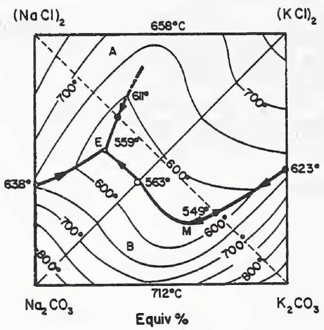  
Figure 113.1. $\mathrm{K}_2\mathrm{CO}_3$ -(NaCl)2 phase diagram

References [1-17].

.2. Density (p)

Measurement method: Archimedean technique [18]

Equation:

$$
\rho = a + b T (1 1 4. 1)
$$

precision: in table 114.1 uncertainty: $\sim \pm 1.5\%$

Table 114.1. Parameters of equation (114.1) and precisions   

<table><tr><td>Mol % NaCl</td><td>a</td><td>-b x 104</td><td>Precision</td><td>T range(K)</td></tr><tr><td>37.16</td><td>2.3815</td><td>4.800</td><td>0.19%</td><td>1000-1100</td></tr><tr><td>50.34</td><td>2.3094</td><td>4.531</td><td>0.04%</td><td>920-1150</td></tr><tr><td>61.19</td><td>2.2292</td><td>4.233</td><td>0.02%</td><td>920-1150</td></tr><tr><td>65.93</td><td>2.0997</td><td>3.166</td><td>0.05%</td><td>920-1150</td></tr><tr><td>70.28</td><td>2.1813</td><td>4.152</td><td>0.11%</td><td>920-1150</td></tr><tr><td>74.30</td><td>2.2026</td><td>4.577</td><td>0.09%</td><td>920-1150</td></tr><tr><td>78.01</td><td>2.1911</td><td>4.601</td><td>0.11%</td><td>920-1150</td></tr><tr><td>84.66</td><td>2.1099</td><td>4.266</td><td>0.02%</td><td>950-1150</td></tr><tr><td>90.44</td><td>2.1786</td><td>5.128</td><td>0.02%</td><td>1000-1150</td></tr></table>

# (114) $\mathrm{K}_2\mathrm{CO}_3$ -NaCl

Table 114.2. Density (g cm $^{-3}$ ) from equations in table 114.1   

<table><tr><td rowspan="2">T(K)</td><td colspan="7">Mol % NaCl</td></tr><tr><td>37.16</td><td>61.19</td><td>65.93</td><td>70.28</td><td>74.30</td><td>84.66</td><td>90.44</td></tr><tr><td>920</td><td></td><td>1.840</td><td>1.808</td><td>1.799</td><td>1.781</td><td></td><td></td></tr><tr><td>940</td><td></td><td>1.831</td><td>1.802</td><td>1.791</td><td>1.772</td><td></td><td></td></tr><tr><td>960</td><td></td><td>1.823</td><td>1.796</td><td>1.783</td><td>1.763</td><td>1.700</td><td></td></tr><tr><td>980</td><td></td><td>1.814</td><td>1.789</td><td>1.774</td><td>1.754</td><td>1.692</td><td></td></tr><tr><td>1000</td><td>1.902</td><td>1.806</td><td>1.783</td><td>1.766</td><td>1.744</td><td>1.683</td><td>1.666</td></tr><tr><td>1020</td><td>1.892</td><td>1.797</td><td>1.777</td><td>1.758</td><td>1.736</td><td>1.675</td><td>1.656</td></tr><tr><td>1040</td><td>1.882</td><td>1.789</td><td>1.770</td><td>1.750</td><td>1.727</td><td>1.666</td><td>1.645</td></tr><tr><td>1060</td><td>1.873</td><td>1.781</td><td>1.764</td><td>1.741</td><td>1.718</td><td>1.658</td><td>1.635</td></tr><tr><td>1080</td><td>1.863</td><td>1.772</td><td>1.758</td><td>1.733</td><td>1.708</td><td>1.649</td><td>1.625</td></tr><tr><td>1100</td><td>1.854</td><td>1.764</td><td>1.751</td><td>1.725</td><td>1.699</td><td>1.641</td><td>1.615</td></tr><tr><td>1120</td><td></td><td>1.755</td><td>1.745</td><td>1.716</td><td>1.690</td><td>1.632</td><td>1.604</td></tr><tr><td>1140</td><td></td><td>1.747</td><td>1.739</td><td>1.708</td><td>1.680</td><td>1.624</td><td>1.594</td></tr></table>

References [18]

3. Surface Tension (γ)

No data

4. Viscosity (η)

No data

5. Electrical Conductance (K)

No data

6. Safety and Hazards

A. Hazard rating

(i) Toxicity: NaCl, permitted in foods; $\mathrm{K}_2\mathrm{CO}_3$ , classified as strongly caustic.

(ii) Vapor pressure: NaCl at m.pt. $(800^{\circ}\mathrm{C})$ , $\sim 0.34\mathrm{mm}$ ; $\mathrm{K}_2\mathrm{CO}_3$ decomposes on heating to the oxide and oxygen; $\mathrm{CO}_2$ pressure at $1050^{\circ}\mathrm{C}$ , $\sim 1\mathrm{mm}$ .

B. Disaster hazards

(i) Molten salt bath "explosions"; i.e., explosive generation of steam due to bulk water "carry-over" and/or equipment failure; i.e., explosive expansion of "trapped" air.

(ii) Chlorides, when heated to decomposition or contacted with acids, highly toxic chloride fumes are evolved.

(iii) Carbonates, when heated with $\mathrm{CO}_{2}$ pressures less than equilibrium dissociation pressures, decompose to form alkali metal oxides; the toxicology and disaster hazards are the same as those of very caustic solutions, i.e. react with water or steam (exothermic) to form solutions that are markedly aggressive to all body tissues (chemical burns). Potassium carbonate itself is classified as a strong caustic.

References [19-24].

# 7. Corrosion

Table 114.3. Corrosion studies from primary research literature   

<table><tr><td colspan="2">Studies</td><td>References</td></tr><tr><td rowspan="5">A</td><td>Stainless steel</td><td>[25]</td></tr><tr><td>Acid-base relationships in molten carbonates</td><td>[26-29]</td></tr><tr><td>Hydrolysis (H2O) reactions</td><td>[30-32]</td></tr><tr><td>Corrosion in molten salts (annotated biblio.)</td><td>[33]</td></tr><tr><td>Molten carbonates: fuel cells, thermal energy storage, coal gasification, stack gases</td><td>[25,34-38]</td></tr><tr><td rowspan="12">B</td><td>Mo</td><td>[39]</td></tr><tr><td>Armco Fe</td><td>[40-42]</td></tr><tr><td>Ni, Cr</td><td>[43]</td></tr><tr><td>Ti, Zr, Hf, ThCl4</td><td>[44]</td></tr><tr><td>Cr</td><td>[45]</td></tr><tr><td>Fe-Cr</td><td>[46]</td></tr><tr><td>Ni alloys</td><td>[47,48]</td></tr><tr><td>Au, Pt, Al2O3, MgO, Zirconia (NaCl with Na2O)</td><td>[49]</td></tr><tr><td>Thermodynamic redox potentials</td><td>[47,52,53]</td></tr><tr><td>Electrochemical aspects</td><td>[50,51]</td></tr><tr><td>Annotated corrosion biblio.</td><td>[33]</td></tr><tr><td>Reviews</td><td>[54-56]</td></tr><tr><td rowspan="4">C</td><td>Electrochemical aspects</td><td>[51]</td></tr><tr><td>Thermodynamic approach</td><td>[48,52,53]</td></tr><tr><td>Corrosion reviews</td><td>[33]</td></tr><tr><td>Corrosion biblio.</td><td>[54-56]</td></tr></table>

Compatibility studies: A: various molten carbonates, principally $\mathrm{K}_2\mathrm{CO}_3$ ; B: various molten chlorides, principally NaCl; C: general surveys, reviews and biblios. No compatibility studies specifically for $\mathrm{K}_2\mathrm{CO}_3$ -NaCl mixtures found.

References [25-56]

8. Diffusion

No data

(114) $\mathrm{K}_{2} \mathrm{CO}_{3}$ -NaCl

9. Heat of Fusion $(\Delta E_{f}^{\circ})$ No data   
10. Heat Capacity No data   
11. Volume Change on Melting $(\Delta V_{f})$ Measurement method: estimated from densities [57]

Table 114.4. Volume change on melting   

<table><tr><td>Composition (mol % NaCl)</td><td>\( \left( {{\Delta }_{{\mathrm{V}}_{\mathrm{f}}}/{\mathrm{V}}_{\mathrm{s}}}\right) \)</td><td>Uncertainty</td></tr><tr><td>28 (a)</td><td>2.0%</td><td>\( \sim   \pm  {10}\% \)</td></tr><tr><td>68 (a)</td><td>15.8%</td><td>\( \sim   \pm  {10}\% \)</td></tr></table>

(a) binary eutectic mixtures

References [57]

12. Vapor Pressure $(p_{vap})$ No data   
13. Thermal Conductivity (liquid) $(\lambda_{\ell})$ No data   
14. Thermal Conductivity (solid) $(\lambda_{s})$ No data   
15. Cryoscopic Constant $(k_{f})$ No data   
16. References

[1] Rasishchev, V. P., Zh. O. Khim., 3, 852 (1933).   
[2] Sadour, O., Z. Elektrochem. angew. phys. Chem., 16, 649 (1910).   
[3] Sato, T., Sunami, J., Tech. Repts. Tohoku Imp. Univ., 11, 403 (1934); CA 29, 1313 (1935).   
[4] Janz, G. J. Downey, J. R., Jr., Allen, C. B., and Tomkins, R. P. T., "Eutectic Data" - 2 Vols; ERDA-TID-27163-P1 & P2; NTIS, Washington, D. C. (1977).   
[5] Janz, G. J., Downey, J. R., Jr., Allen, C. B., and Tomkins, R. P. T., "Physical Properties Data Complications Relevant to Energy Storage. I. Molten Salts: Eutectic Data", NSRDS-NBS-61; U. S. Gov't Printing Office, Washington, D. C. (1978).

(114) $\mathrm{K}_2\mathrm{CO}_3$ -NaCl   
[6] "International Critical Tables of Numerical Data, Physics, Chemistry, and Technology", 8 Vols., McGraw-Hill Book Co., N. Y. (1933).   
[7] "Landolt-Bornstein Zahlenwert und Funktionen aus Physik, Chemie, Astronomie, Geophysik und Technik", (10th Ed.) Springer-Verlag, Berlin, Heidelberg, N. Y. (1961).   
[8] Clark, P. V., "Fused Salt Mixtures: Eutectic Compositions and Melting Points Bibliography 1907-1968", Report No. SC-R-68-1680; Sandia Laboratories (1968), NTIS.   
[9] Robertson, W. D., "Binary Phase Diagrams of Halide Salts", Report No. Yale 2723 (2 Vols.), U. S. AEC Contract AT (30-1)-2723 (1966), NTIS.   
[10] Thoma, R. E., "Phase Diagrams of Nuclear Reactor Materials", Oak Ridge National Laboratory, ORNL-2548, Contract No. W-7405-eng-26.   
[11] Thoma, R. E., "Phase Diagrams of Binary and Ternary Fluoride Systems", Chapt. 6; Adv. Molten Salts Chemistry, Vol. 3 (J. Braunstein, G. Mamantov, and G. P. Smith, eds.), Plenum Press, N. Y. (1975).   
[12] Voskresenskaya, N. K., ed., "Handbook of Solid-Liquid Equilibria in Systems of Inorganic Salts", Volumes 1, 2, Izc. Akad. Nauk SSSR, Moscow (1961). Israel Program for Scientific Translations, Jerusalem, 1970 (NTIS).   
[13] Sinistri, C., Franzozini, P., and Rolla, M., "An Atlas of Miscibility Gaps in Molten Salt Systems", Institute of Physical Chemistry, University of Pavia (Italy) (1968).   
[14] Shaffer, P. T. B., "High Temperature Materials", Plenum Press Handbooks of High Temperature Materials, No. 1, Materials Index, Plenum Press, New York, 1964.   
[15] Franzozini, P., Ferloni, P., and Spinolo, C., "Molten Salts with Organic Anions", Instituto di Chimica Fisica, Universita di Pavia (Italy), 1973.   
[16] Toropov, N. A. et al., "Handbook of Phase Diagrams of the Silicates, Volume 1: Binary Systems, Volume 2, Metal-Oxygen Compounds in Silicate Systems", Izdatel'stov "Nauka" Leningradskoe Otdelenie, Leningrad, 1969, Israel Program for Scientific Translations, Jerusalem, 1972 (NTIS).   
[17] Levin, E., et al., "Phase Diagrams for Ceramists", Amer. Ceramic Soc. (publ.), Columbus, Ohio (1964; 1969).   
[18] Polyakov, V. D., and Berul, S. I., Izv. Sek. Fiz. Khim. Anal., Akad. Nauk, SSSR, 22, 170 (1953).   
[19] Stern, K., "High Temperature Properties and Decomposition of Inorganic Salts. III. Nitrates and Nitrites", J. Phys. Chem. Ref. Data, 1, 747-772 (1972).   
[20] "Dangerous Properties of Materials", Sax, N. I., Van Nostrand Reinhold Co., N. Y. (1969).   
[21] "Registry of Toxic Effects of Chemical Substances", Christensen, H. E., and Lubinybyhl, T. T., eds., U. S. Dept. H.E.W; U. S. Gov't Printing Office, Washington, D. C. (1975).   
[22] "Potential Hazards in Molten Salt Baths for Heat Treatment of Metals", National Board Fire Underwriters Research Report No. 2. (1954).   
[23] "Handbook of Reactive Chemical Hazards", Bretherwick, L., Butterworths Co., London (1975).

(114) $\mathrm{K}_{2} \mathrm{CO}_{3}$ -NaCl   
[24] Janz, G. J., Tomkins, R. P. T., Downey, J. R., Jr., and Allen, C. B., "Safety and Hazards", Chapter in "Eutectic Data", ERDA TID-27163-P1; NTIS, U. S. Dept. Commerce, Springfield, Va. (1977).   
[25] Maru, H. C., et al. (Institute of Gas Technology), "Molten Salt Thermal Energy Storage Systems: Salt Selections", Rpt. COO-2888-1, ERDA Contract NO. E(11-1)-2888; NTIS, U. S. Dept. Commerce, Springfield, Va. (Aug. 1976).   
[26] Dubois, J., "Chemical and Electrochemical Reactions of Molten Alkali Carbonates as Fuel Cell Electrolytes", Ph.D. Thesis, Fac. Sci. Univ. Paris, France (1964).   
[27] Ingram, M. D., and Janz, G. J., Electrochim. Acta. 10, 783 (1965)   
[28] Bousson, N. Palous, S., Buvet, R., and Millet, J., Comp. Rend. 260, 720, 6097 (1965)   
[29] Ingram, M. D., Baron, B., and Janz, G. J., Electrochim. Acta. 11, 1629 (1966)   
[30] Janz, G. J., J. Chem. Ed., 44, 581 (1967).   
[31] Busson, N., Palous, S., Millet, J., and Buvet, R., Electrochim. Acta, 12, 910 (1967).   
[32] Andersen, B. K., "Thermodynamic Properties of Molten Carbonates", Ph.D. Thesis, Tech. Univ. Denmark (1975).   
[33] Janz, G. J., and Tomkins, R. P. T., Corrosion, 35, 485 (1979).   
[34] Maru, H. C., et al. (Institute of Gas Technology), "Fuel Cell Research on Second Generation Molten Carbonate Systems: II. Characteristics of Carbonate Melts", Quarterly Status Rpt., Project 8984, ERDA Contract No. 31-109-38-3552, (Sept. 1976).   
[35] Botts, W. V., Kohl, A. L., and Trilling, C. A., "Low BTU Gasification of Coal by Atomics International's Molten Salt Process", Proceedings of the 11th Intersociety Energy Conversion Engineering Conference, 1, 280 (Sept. 1976).   
[36] Cover, A. E., Schreiner, W. C., and Skaperdas, G. T., "The Kellogg Coal Gasification Process", Extended Abstracts, American Chemical Soc. Meeting, Washington, D. C. (1971).   
[37] Atomics International; "Development of a Molten Carbonate Process for Removal of Sulfur Dioxide from Power Plant Stack Gases", Progress Rpt. No. 2, U. S. Public Health Services, Contract PH 86-67-128, Canoga Park, Ca. (1968).   
[38] Graham, L. F., and Ferry, R. B., "Corrosion in Alkali Metal Carbonate-Based Melts", Proc. International Symp. Fused Salts, J. P. Pemsler, ed., Electrochemical Soc., Inc., Princeton, N. J., 270 (1976).   
[39] Ozeryanaya, I. N., Zalazinskii, G. G., Smirnov, M. V., Finkel'shtein, S. D., and Shamanova, N. D., Zashch. Metal., 11, 66 (1975).   
[40] Kochergin, V. P., and Ignat'eva, N. I., Russ. J. Inorg. Chem., 6(9), 1085 (1961).   
[41] Kochergin, V. P., and Shevrina, Z., Uch. Zap. Ural. Gos. Univ., 92, 3 (1969).

(114) $\mathrm{K}_{2} \mathrm{CO}_{3}-\mathrm{NaCl}$   
[42] Kochergin, V. P., et al., Zhur. Priklad. Khim., 34(6), 1258 (1961); ibid., 37(8), 1837 (1964).   
[43] Seybolt, A. U., Oxid. Metals, 2, 119 (1970).   
[44] Smirnov, M. V., Kudyakov, Y. Ya., Loginov, Ya. A., Rossokhin, E. G., Posokhin, Yu. V., and Puzanova, T. A., Fiz. Khim. Elektrokhim. Rasplav. Solei Shlakov, 1, 115 (1969).   
[45] Krasil'nikova, N. A., Ozeryanaya, I. N., and Smirnov, M. V., Zashch. Metal., 17, 446 (1974).   
[46] Krasil'nikova, N. A., Ozeryanaya, I. N., Smirnov, M. V., and Shamanova, N. D., Zashch. Metal., 10, 446 (1974).   
[47] Bogdanov, N. I., Varganov, B. Ya., and Kholomonova, N. D., Zh. Prikl. Khim. (Leningrad), 46, 1698 (1973).   
[48] Littlewood, R., J. Electrochem. Soc., 109, 525 (1962).   
[49] Stern, K. H., Panayappan, R., and Flinn, D. R., "Proceedings Intern Symp. Molten Salts", The Electrochem. Soc., Princeton, N. J., p. 64 (1976).   
[50] Pizzini, S., "Materials Problems in the Industrial Application of Molten Salts", "Proceedings of the European Conference on the Development of Molten Salts Applications", p. 203 (1973) Battelle, Geneva.   
[51] Johnson, K. E., "Electrochemical Approaches to Corrosion in Molten Salts", Proceedings International Symposium on Metal-Slag-Gas Reactions and Processes, The Electrochemical Society, Inc., Princeton, N. J., p. 581 (1975).   
[52] Edeleanu, C., and Littlewood, R., Electrochimica Acta, 3, 195 (1960).   
[53] Littlewood, R., and Argent, E. A., Electrochimica Acta, 4, 114 (1961).   
[54] Smirnov, M. V., and Ozeryanaya, I. N., Nauki. Tekh. Korros. Zashch., 2, 171 (1973).   
[55] Inman, D., and Wrench, N. S., Brit. Corr. J., 1, 246 (1966).   
[56] Ketelaar, J. A. A., Chem. Ing. Tech., 45, 667 (1973).   
[57] Janz, G. J., et al. (MSDC-RPI), unpublished work (1980).

1. Melting Temperatures $(T_{m})$

Pure substance melting points:

NaCl: $800^{\circ} \mathrm{C}$

NaOH: $318^{\circ} \mathrm{C}$

Eutectic melting point:

314°C, composition: 93.7 mol % NaOH

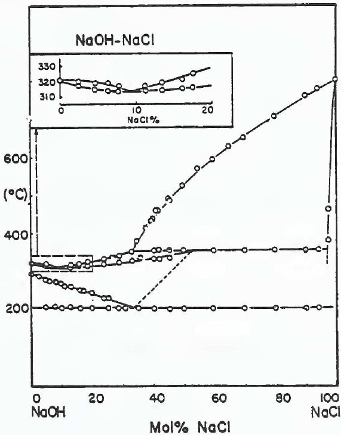  
Figure 115.1. NaCl-NaOH phase diagram

References [1-16].

2. Density (ρ)

Measurement method: Archimedean technique [17]

Equation: (density-composition isotherm)

$$
\rho = a + b C \tag {115.1}
$$

$$
(C = \text {mol} \% \text {NaCl})
$$

precision: in table 115.1 uncertainty: $\sim \pm 1.5\%$

Table 115.1. Parameters of equation (115.1) and precision   

<table><tr><td>T(K)</td><td>a</td><td>b x 103</td><td>Precision</td></tr><tr><td>693</td><td>1.737</td><td>0.00</td><td>*</td></tr></table>

\*not estimated; insufficient data

# (115) NaCl-NaOH

Table 115.2. Density for composition isotherm at 693K from equation in table 115.1   

<table><tr><td>Mol % NaCl</td><td>ρ(g cm-3)</td><td></td><td>Mol % NaCl</td><td>ρ(g cm-3)</td></tr><tr><td>0</td><td>1.737</td><td></td><td>14</td><td>1.737</td></tr><tr><td>7</td><td>1.737</td><td></td><td>21</td><td>1.737</td></tr></table>

References [17]

3. Surface Tension (Y)

No data

4. Viscosity (n)

Measurement method: oscillating sphere technique [17]

Equation: (viscosity-composition isotherm)

$$
n = a + b C + c C ^ {2} \quad (1 1 5. 2)
$$

$$
(C = \text {mol} \% \text {NaCl})
$$

precision: in table 115.3 uncertainty: $\sim$ 5.0%

Table 115.3. Parameters of equation (115.2) and precision   

<table><tr><td>T(K)</td><td>a</td><td>b x 103</td><td>c x 105</td><td>Precision</td></tr><tr><td>693</td><td>2.2970</td><td>27.617</td><td>-27.830</td><td>0.34%</td></tr></table>

Table 115.4. Viscosity (cp) at 639K from equation in table 115.3   

<table><tr><td>NaCl (mol %)</td><td>η (cp)</td><td>NaCl (mol %)</td><td>η (cp)</td></tr><tr><td>0</td><td>2.30</td><td>12.5</td><td>2.60</td></tr><tr><td>2.5</td><td>2.36</td><td>15.0</td><td>2.65</td></tr><tr><td>5.0</td><td>2.43</td><td>17.5</td><td>2.70</td></tr><tr><td>7.5</td><td>2.49</td><td>20.0</td><td>2.74</td></tr><tr><td>10.0</td><td>2.55</td><td>22.5</td><td>2.78</td></tr></table>

References [17]

5. Electrical Conductance (K)

No data

# 6. Safety and Hazards

# A. Hazard rating

(i) Toxicity: NaCl, permitted in foods; NaOH, very caustic and toxic.   
(ii) Vapor pressure: NaCl, at m.pt. $(800^{\circ}\mathrm{C})$ , $\sim 0.34\mathrm{mm}$ ; NaOH, at m.pt. $(460^{\circ}\mathrm{C})$ , $\ll 0.5\mathrm{mm}$ .

# B. Disaster hazards

(i) Molten salt bath "explosions": i.e. explosive generation of steam due to bulk water "carry-over" and/or equipment failure; i.e., explosive expansion of "trapped" air.   
(ii) Chlorides, when heated to decomposition or contacted with acids, highly toxic chloride fumes are evolved.   
(iii) Dangerous; reacts with water or steam with evolution of heat; the aqueous solution is very strongly caustic; attacks living tissue.

References [18-23]

# 7. Corrosion

Table 115.5. Corrosion studies from primary research literature   

<table><tr><td colspan="2">Systems, Studies, [References]</td></tr><tr><td>A</td><td>Metals [24], metals, ceramics, alloys [24-31], stainless steel [32], Ni-Cr-Fe, Ni-Si-Cu [28,33], Ni-Mo, Ni, Cu, Armco Fe [34-36], Al2O3, ZrO2 [27], Ni [25-27,34,37-40], Ni steels [41], Fe (effects of H2O) [42], Pt, Ag, alloys [43-45], thermodynamic and electrochemical approach [46-48], reviews [49-51], annotated corrosion biblio. [52].</td></tr><tr><td>B</td><td>Mo [53], Armco Fe [54-56], Ni, Cr [57], Ti, Zr, Hf, ThCl4[58], Cr [59], Fe-Cr [60], Ni alloys [61], Au, Pt, Al2O3,MgO, Zirconia (NaCl with Na2O) [62], thermodynamic redox potential [48,63,64], electrochemical aspects [46,47], annotated corrosion biblio. [52], reviews [49-51].</td></tr></table>

Compatibility studies: A: principally molten NaOH; B: principally molten NaCl. No data found for molten NaOH-NaCl mixtures.

References [24-64]

# 8. Diffusion

No data

9. Heat of Fusion $(\Delta H_{f}^{\circ})$ No data   
10. Heat Capacity $(C_p)$ No data   
11. Volume Change on Melting $(\Delta V_{f})$ No data   
12. Vapor Pressure $(p_{vap})$ No data   
13. Thermal Conductivity (liquid) $(\lambda_{\ell})$ No data   
14. Thermal Conductivity (solid) $(\lambda_{s})$ No data   
15. Cryoscopic Constant $(k_{f})$ No data   
16. References

[1] Cohen-adad, R., Ruby, C., Pichon, M. J., Compt. Rend., 260, 2200 (1965)   
[2] Giuseppe Scarpa, Atti reale accad. Lincei, Sez. I, 24, 957 (1915).   
[3] Janz, G. J. Downey, J. R., Jr., Allen, C. B., and Tomkins, R. P. T., "Eutectic Data" - 2 Vols; ERDA-TID-27163-P1 & P2; NTIS, Washington, D. C. (1977).   
[4] Janz, G. J., Downey, J. R., Jr., Allen, C. B., and Tomkins, R. P. T., "Physical Properties Data Complications Relevant to Energy Storage. I. Molten Salts: Eutectic Data", NSRDS-NBS-61; U. S. Gov't Printing Office, Washington, D. C. (1978).   
[5] "International Critical Tables of Numerical Data, Physics, Chemistry, and Technology", 8 Vols., McGraw-Hill Book Co., N. Y. (1933).   
[6] "Landolt-Bornstein Zahlenwert und Funktionen aus Physik, Chemie, Astronomie, Geophysik und Technik", (10th Ed.) Springer-Verlag, Berlin, Heidelberg, N. Y. (1961).   
[7] Clark, P. V., "Fused Salt Mixtures: Eutectic Compositions and Melting Points Bibliography 1907-1968", Report No. SC-R-68-1680; Sandia Laboratories (1968), NTIS.   
[8] Robertson, W. D., "Binary Phase Diagrams of Halide Salts", Report No. Yale 2723 (2 Vols.), U. S. AEC Contract AT (30-1)-2723 (1966), NTIS.   
[9] Thoma, R. E., "Phase Diagrams of Nuclear Reactor Materials", Oak Ridge National Laboratory, ORNL-2548, Contract No. W-7405-eng-26.

# (115) NaCl-NaOH

[10] Thoma, R. E., "Phase Diagrams of Binary and Ternary Fluoride Systems", Chapt. 6; Adv. Molten Salts Chemistry, Vol. 3 (J. Braunstein, G. Mamantov, and G. P. Smith, eds.), Plenum Press, N. Y. (1975).   
[11] Voskresenskaya, N. K., ed., "Handbook of Solid-Liquid Equilibria in Systems of Inorganic Salts", Volumes 1, 2, Izc. Akad. Nauk SSSR, Moscow (1961). Israel Program for Scientific Translations, Jerusalem, 1970 (NTIS).   
[12] Sinistri, C., Franzozini, P., and Rolla, M., "An Atlas of Miscibility Gaps in Molten Salt Systems", Institute of Physical Chemistry, University of Pavia (Italy) (1968).   
[13] Shaffer, P. T. B., "High Temperature Materials", Plenum Press Handbooks of High Temperature Materials, No. 1, Materials Index, Plenum Press, New York, 1964.   
[14] Franzozini, P., Ferloni, P., and Spinolo, C., "Molten Salts with Organic Anions", Instituto di Chimica Fisica, Universita di Pavia (Italy), 1973.   
[15] Toropov, N. A. et al., "Handbook of Phase Diagrams of the Silicates, Volume 1: Binary Systems, Volume 2, Metal-Oxygen Compounds in Silicate Systems", Izdatel'stov "Nauka" Leningradskoe Otdelenie, Leningrad, 1969, Israel Program for Scientific Translations, Jerusalem, 1972 (NTIS).   
[16] Levin, E., et al., "Phase Diagrams for Ceramists", Amer. Ceramic Soc. (publ.), Columbus, Ohio (1964; 1969).   
[17] Lasek, J., Coll. Czech. Chem. Comm., 29, 1858 (1964).   
[18] "Dangerous Properties of Materials", Sax, N. I., Van Nostrand Reinhold Co., N. Y. (1969).   
[19] "Registry of Toxic Effects of Chemical Substances", Christensen, H. E., and Lubinbyhl, T. T., eds., U. S. Dept. H. E. W., U. S. Gov't Printing Office, Washington, D. C. (1975).   
[20] Janz, G. J., et al., "Physical Properties Data Complications Relevant to Energy Storage. Part II. Molten Salts: Data on Single and Multi-Component Salt Systems", NSRDS-NBS 61, Part II (April 1979), U. S. Gov't Printing Office, Supt of Doc. No. C13-48-61, Washington D. C. 20402.   
[21] "Potential Hazards in Molten Salt Baths for Heat Treatment of Metals", National Board of Fire Underwriters Research Report No. 2 (1954).   
[22] "Handbook of Reactive Chemical Hazards", Bretherwick, L., Butterworth Co., London (1975).   
[23] Janz, G. J., Tomkins, R. P. T., Downey, J. R. Jr., and Allen, C. B., "Safety and Hazards", Chapter in "Eutectic Data", ERDA TID-27163-P1; NTIS, U. S. Dept. Commerce, Springfield, Va. (1977)   
[24] Anon, "Oak Ridge National Laboratory, Proceedings of the 1st Information Meeting on Hydroxide and Metal Interaction", ORNL CF-51-11-204, (1953).   
[25] Miller, R. R., "The Thermal Properties of Sodium Hydroxide and Lithium Metal", 4th Progr. Rept. Nov. 1 (1952)-Jan. 31 (1953) NRL-Memo-130: Progr. Rept. No. 1, Naval Research Lab., (1952).   
[26] Williams, D. D., Ewing, C. T., "Thermal and Related Physical Properties of Molten Materials", Prog. Rept. Feb. 1 - May 1, (1953) NRL-Memo-170, Progress Report 5, Naval Research Lab., (1953).

(115) NaCl-NaOH   
[27] Craighead, C. M., Smith, L. A., Phillips, E. C., Jaffee, R. I., "Continued Studies of Corrosion by Fused Caustic", AECD-3704, Battelle Memorial Institute, (1952).   
[28] Gregory, J. N., Hodge, N., Iredale, J. V. G., "The State Corrosion and Erosion of Nickel by Molten Caustic Soda and Sodium Uranate Suspensions under Dynamic Conditions", British Report AERE/C/M-273, (1956).   
[29] Smith, G. P., "Corrosion of Materials in Fused Hydroxides", Am. Inst. Mining at Engrs., Inst. Metals Div., Spec. Rept, #2, 71 (1956).   
[30] Smith, G. P., "Corrosion of Materials in Fused Hydroxides", ORNL-2048, Oak Ridge National Laboratory, (1956).   
[31] Smothers, W. J., Prog. Rept., Jan. 1 - March 31, (1953), AECU-2872, Univ. of Ark., (1953).   
[32] Smith, G. P., Hoffman, E. E., "Corrosion Products Formed in the Reaction between Fused Sodium Hydroxide and Iron-Rich Alloys of Iron, Chromium and Nickel", ORNL-2156, Oak Ridge National Laboratory, (1957).   
[33] Smith, G. P., Steidlitz, M. E., Hoffman, E. E., Corrosion, 11, 47t (1958).   
[34] Gurowich, E. I., Zh. Prikl. Khim., 32, 817 (1959).   
[35] Smith, G. P., Hoffman, E. E., Corrosion, 13, 627t (1957).   
[36] Smith, G. P., Hoffman, E. E., Steidlitz, M. E., Corrosion, 13, 56lt (1957).   
[37] Manly, W. D., "Operation of a Ni-NaOH Thermal Convection Loop", ORNL CF-51-11-186, Oak Ridge National Laboratory, (1951).   
[38] Miller, N. E., Simons, E. M., Chem. Eng. Progr. Symp. Ser. No. 19, Amer, Inst. Chem. Eng., 52, 113 (1956).   
[39] Simmons, E. M., Miller, N. E., Stang, J. H., Weaver, C. V., "Corrosion and Component Studies on Systems Containing Fused NaOH", BMI-1118, Battelle Memorial Institute, (1956).   
[40] Gregory, J. N., Hodge, N., Iredale, J. V. G., "The Static Corrosion of Nickel and Other Materials in Molten Caustic Soda", British Report AERE-C/M-272, (1956).   
[41] Kolotii, A. A., Vengzhen, G. S., Zashch. Met., 11, 61 (1975).   
[42] Tribunskii, V. V., Kalinichenko, I. I., Tr. Ural. Politekh. Inst., 190, 49 (1970).   
[43] Rahmel, A., Kruger, H., Werkst. Korros., 18, 193 (1967).   
[44] Kruger, H., Rahmel, A., Schwenk, W., Electrochim. Acta, 13, 625 (1968).   
[45] Afanas'yev, A. S., Gamazov, V. P., Zh. Fiz. Khim., 38, 2823 (1964).   
[46] Pizzini, S., "Materials Problems in the Industrial Applications of Molten Salts", Proceedings of the European Conference on the Development of Molten Salts Applications, p. 203 (1973); Battelle, Geneva.   
[47] Johnson, K. E., "Electrochemical Approaches to Corrosion in Molten Salts", Proceedings International Symposium on Metal-Slag-Gas Reactions and Processes, The Electrochemical Society, Inc., Princeton, N. J. p. 581 (1975).

(115) NaCl-NaOH   
[48] Edeleanu, C., and Littlewood, R., Electrochimica Acta, 3, 195 (1960).   
[49] Smirnov, M. V., and Ozeryanaya, I. N., Nauki Tekh. Korors., Zashch, Korros., 2, 171 (1973).   
[50] Inman, D., and Wrench, N. S., Brit. Corr. J., 1, 246 (1966).   
[51] Ketelaar, J. A. A., Chemie Ing. Techn., 45, 667 (1973).   
[52] Janz, G. J., and Tomkins, R. P. T., Corrosion, 35, 485 (1979).   
[53] Ozeryanaya, I. N., Zalazinskii, G. G., Smirnov, M. V., Finkel'shtein, S. D., and Shamanova, N. D., Zashch. Metal., 11, 66 (1975).   
[54] Kochergin, V. P., and Ignat'eva, N. I., Russ. J. Inorg. Chem., 6(9), 1085 (1961).   
[55] Kochergin, V. P., and Shevrina, Z., Uch. Zap. Ural. Gos. Univ., 92, 3 (1969).   
[56] Kochergin, V. P., et al., Zhur. Priklad. Khim., 34(6), 1258 (1961); ibid., 37(8), 1837 (1964).   
[57] Seybolt, A. U., Oxid. Metals, 2, 119 (1970).   
[58] Smirnov, M. V., Kudyakov, V. Ya., Loginov, Ya. A., Rossokhin, E. G., Poskhin, Yu. V., and Puzanova, T. A., Fiz. Khim. Electrochim. Rasplav. Solei Shlakov., 1, 115 (1974)   
[59] Krasil'nikova, N. A., Ozeryanaya, I. N., and Smirnov, M. V., Zashch. Metal., 17, 446 (1974).   
[60] Krasil'nikova, N. A., Ozeryanaya, I. N., Smirnov, M. V., and Shamanova, N. D., Zashch. Metal., 10, 446 (1974).   
[61] Bogdanov, N. I., Varganov, B. Ya., and Kholomonova, N. D., Zh. Prikl. Khim. (Leningrad), 46, 1698 (1973).   
[62] Stern, K. H., Panayappan, R., and Flinn, D. R., "Proceedings Intern. Symp. Molten Salts", The Electrochem. Soc., Princeton, N. J., p. 64 (1976).   
[63] Littlewood, R., J. Electrochem. Soc., 109, 525 (1962)   
[64] Littlewood, R., and Argent E. A., Electrochimica Acta., 4, 144 (1961)

1. Melting Temperatures $(T_{m})$

Pure substance melting points:

NaCl: $800^{\circ} \mathrm{C}$ $\mathrm{NaNO}_{3}$ : $307^{\circ} \mathrm{C}$

Eutectic melting point:

297°C, composition: 95 mol % NaNO₃

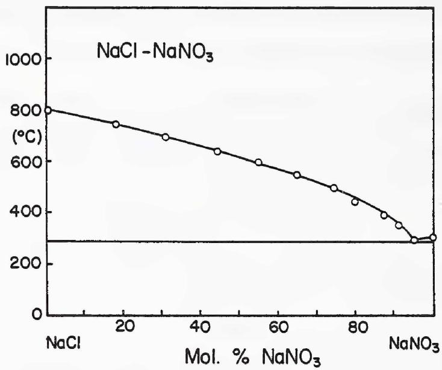  
Figure 116.1. NaCl-NaNO $_3$ phase diagram

References [1-18].

2. Density (p)

Measurement method: Archimedean technique [19]

Equation:

$$
\rho = a + b T \tag {116.1}
$$

precision: in table 116.1 uncertainty: $\sim \pm 1.0\%$

Table 116.1. Parameters of equation (116.1) and precisions   

<table><tr><td>Mol % NaCl</td><td>a</td><td>-b x 104</td><td>Precision</td><td>T range(K)</td></tr><tr><td>0</td><td>2.3389</td><td>7.360</td><td>0.02%</td><td>600-720</td></tr><tr><td>0.97</td><td>2.3156</td><td>7.017</td><td>0.01%</td><td>600-720</td></tr><tr><td>2.00</td><td>2.3331</td><td>7.292</td><td>0.02%</td><td>600-720</td></tr><tr><td>3.09</td><td>2.3240</td><td>7.154</td><td>0.03%</td><td>600-720</td></tr><tr><td>4.00</td><td>2.3405</td><td>7.418</td><td>0.01%</td><td>600-720</td></tr><tr><td>5.00</td><td>2.3330</td><td>7.303</td><td>0.01%</td><td>600-720</td></tr><tr><td>6.00</td><td>2.3313</td><td>7.257</td><td>0.02%</td><td>600-720</td></tr><tr><td>6.98</td><td>2.3368</td><td>7.384</td><td>0.01%</td><td>600-720</td></tr><tr><td>8.00</td><td>2.3333</td><td>7.348</td><td>0.02%</td><td>600-720</td></tr><tr><td>9.90</td><td>2.3277</td><td>7.258</td><td>0.02%</td><td>600-720</td></tr><tr><td>11.92</td><td>2.3352</td><td>7.361</td><td>0.01%</td><td>650-720</td></tr><tr><td>13.90</td><td>2.3207</td><td>7.200</td><td>0.01%</td><td>670-720</td></tr></table>

(116) NaCl-NaNO3

Table 116.2. Density $(\mathrm{gcm}^{-3})$ from equations in table 116.1

<table><tr><td rowspan="2">T(K)</td><td colspan="6">Mol % NaCl</td></tr><tr><td>0.97</td><td>3.09</td><td>5.00</td><td>6.98</td><td>9.90</td><td>13.90</td></tr><tr><td>600</td><td>1.895</td><td>1.895</td><td>1.895</td><td>1.895</td><td>1.892</td><td></td></tr><tr><td>610</td><td>1.888</td><td>1.888</td><td>1.888</td><td>1.886</td><td>1.885</td><td></td></tr><tr><td>620</td><td>1.880</td><td>1.880</td><td>1.889</td><td>1.879</td><td>1.878</td><td></td></tr><tr><td>630</td><td>1.874</td><td>1.873</td><td>1.873</td><td>1.872</td><td>1.870</td><td></td></tr><tr><td>640</td><td>1.867</td><td>1.866</td><td>1.866</td><td>1.864</td><td>1.863</td><td></td></tr><tr><td>650</td><td>1.860</td><td>1.859</td><td>1.858</td><td>1.857</td><td>1.856</td><td></td></tr><tr><td>660</td><td>1.852</td><td>1.852</td><td>1.851</td><td>1.850</td><td>1.849</td><td></td></tr><tr><td>670</td><td>1.845</td><td>1.845</td><td>1.844</td><td>1.842</td><td>1.841</td><td>1.838</td></tr><tr><td>680</td><td>1.838</td><td>1.838</td><td>1.836</td><td>1.835</td><td>1.834</td><td>1.831</td></tr><tr><td>690</td><td>1.831</td><td>1.839</td><td>1.829</td><td>1.827</td><td>1.827</td><td>1.824</td></tr><tr><td>700</td><td>1.824</td><td>1.823</td><td>1.922</td><td>1.820</td><td>1.819</td><td>1.817</td></tr><tr><td>710</td><td>1.817</td><td>1.816</td><td>1.815</td><td>1.813</td><td>1.812</td><td>1.809</td></tr><tr><td>720</td><td>1.810</td><td>1.809</td><td>1.807</td><td>1.805</td><td>1.805</td><td>1.802</td></tr></table>

References [19]

3. Surface Tension (Y)

No data

4. Viscosity (n)

Measurement method: oscillating body [19]

Equation:

$$
\eta = a + b T + c T ^ {2} \tag {116.2}
$$

precision: in table 116.3 uncertainty: $\sim$ ± 10%

Table 116.3. Parameters of equation (116.2) and precisions   

<table><tr><td>NaCl (mol %)</td><td>a</td><td>-b x 102</td><td>c x 105</td><td>Precision</td><td>T range(K)</td></tr><tr><td>2</td><td>28.173</td><td>6.917</td><td>4.51</td><td>1.00%</td><td>580-720</td></tr><tr><td>4</td><td>29.517</td><td>7.341</td><td>4.87</td><td>0.86%</td><td>580-720</td></tr><tr><td>6</td><td>41.733</td><td>10.895</td><td>7.47</td><td>2.65%</td><td>580-720</td></tr><tr><td>8</td><td>48.867</td><td>13.047</td><td>9.08</td><td>1.83%</td><td>600-720</td></tr><tr><td>10</td><td>79.1414</td><td>21.929</td><td>15.57</td><td>4.26%</td><td>620-720</td></tr><tr><td>12</td><td>146.176</td><td>40.226</td><td>28.00</td><td>3.74%</td><td>650-720</td></tr><tr><td>14</td><td>65.613</td><td>17.747</td><td>12.41</td><td>1.02%</td><td>670-720</td></tr></table>

Table 116.4. Viscosity (cp) from equations in table 116.3   

<table><tr><td rowspan="2">T(K)</td><td colspan="7">Mol % NaCl</td></tr><tr><td>2</td><td>4</td><td>6</td><td>8</td><td>10</td><td>12</td><td>14</td></tr><tr><td>580</td><td>3.228</td><td>3.330</td><td>3.674</td><td></td><td></td><td></td><td></td></tr><tr><td>590</td><td>3.064</td><td>3.166</td><td>3.458</td><td></td><td></td><td></td><td></td></tr><tr><td>600</td><td>2.909</td><td>3.012</td><td>3.258</td><td></td><td></td><td></td><td></td></tr><tr><td>610</td><td>2.763</td><td>2.868</td><td>3.072</td><td></td><td></td><td></td><td></td></tr><tr><td>620</td><td>2.626</td><td>2.733</td><td>2.901</td><td>2.879</td><td>3.030</td><td></td><td></td></tr><tr><td>630</td><td>2.498</td><td>2.608</td><td>2.746</td><td>2.709</td><td>2.783</td><td></td><td></td></tr><tr><td>640</td><td>2.379</td><td>2.492</td><td>2.605</td><td>2.558</td><td>2.567</td><td></td><td></td></tr><tr><td>650</td><td>2.269</td><td>2.387</td><td>2.479</td><td>2.425</td><td>2.383</td><td>3.007</td><td></td></tr><tr><td>660</td><td>2.168</td><td>2.291</td><td>2.368</td><td>2.309</td><td>2.230</td><td>2.652</td><td></td></tr><tr><td>670</td><td>2.076</td><td>2.205</td><td>2.272</td><td>2.212</td><td>2.107</td><td>2.354</td><td>2.415</td></tr><tr><td>680</td><td>1.994</td><td>2.128</td><td>2.191</td><td>2.133</td><td>2.016</td><td>2.111</td><td>2.315</td></tr><tr><td>690</td><td>1.920</td><td>2.062</td><td>2.125</td><td>2.073</td><td>1.956</td><td>1.925</td><td>2.241</td></tr><tr><td>700</td><td>1.855</td><td>2.005</td><td>2.074</td><td>2.030</td><td>1.928</td><td>1.794</td><td>2.191</td></tr><tr><td>710</td><td>1.799</td><td>1.958</td><td>2.038</td><td>2.006</td><td>1.930</td><td>1.719</td><td>2.166</td></tr><tr><td>720</td><td>1.753</td><td>1.920</td><td>2.017</td><td>1.999</td><td>1.963</td><td>1.701</td><td>2.166</td></tr></table>

References [19]

# 5. Electrical Conductance (K)

Measurement method: classical ac technique [19]

Equation:

$$
\kappa = a + b T + c T ^ {2} \quad [ 1 1 6. 3)
$$

precision: in table 116.5

uncertainty: $\sim \pm 3.0\%$

Table 116.5. Parameters of equation (116.3) and precisions   

<table><tr><td>Mol % NaCl</td><td>-a</td><td>b x 102</td><td>-c x 106</td><td>Precision</td><td>T range(K)</td></tr><tr><td>1.07</td><td>4.4397</td><td>1.3524</td><td>7.167</td><td>0.17%</td><td>600-720</td></tr><tr><td>2.07</td><td>4.1582</td><td>1.2430</td><td>6.164</td><td>0.34%</td><td>600-720</td></tr><tr><td>3.10</td><td>5.7807</td><td>0.7713</td><td>10.400</td><td>0.20%</td><td>600-720</td></tr><tr><td>3.96</td><td>2.4414</td><td>0.7143</td><td>2.099</td><td>0.74%</td><td>600-720</td></tr><tr><td>4.34</td><td>5.4532</td><td>1.6567</td><td>9.441</td><td>0.32%</td><td>600-720</td></tr><tr><td>5.15</td><td>4.7768</td><td>1.4479</td><td>7.814</td><td>0.32%</td><td>600-720</td></tr><tr><td>5.96</td><td>3.8245</td><td>1.1125</td><td>4.968</td><td>0.31%</td><td>600-720</td></tr><tr><td>7.05</td><td>5.9910</td><td>1.7152</td><td>9.972</td><td>0.40%</td><td>600-720</td></tr><tr><td>8.01</td><td>5.8169</td><td>1.7317</td><td>9.776</td><td>0.40%</td><td>600-720</td></tr><tr><td>9.20</td><td>4.2843</td><td>1.2616</td><td>6.222</td><td>0.46%</td><td>600-720</td></tr><tr><td>9.97</td><td>4.4719</td><td>1.3189</td><td>6.611</td><td>0.18%</td><td>610-720</td></tr><tr><td>11.00</td><td>6.1456</td><td>1.7816</td><td>9.801</td><td>0.25%</td><td>640-720</td></tr><tr><td>13.20</td><td>10.3688</td><td>3.0168</td><td>18.828</td><td>0.23%</td><td>670-720</td></tr></table>

# (116) NaCl-NaNO3

Table 116.6. Specific conductance $(ohm^{-1}cm^{-1})$ from equations in table 116.5   

<table><tr><td rowspan="2">T(K)</td><td colspan="7">Mol % NaCl</td></tr><tr><td>1.07</td><td>2.07</td><td>3.96</td><td>5.15</td><td>8.01</td><td>11.00</td><td>13.20</td></tr><tr><td>600</td><td>1.095</td><td>1.081</td><td>1.089</td><td>1.098</td><td>1.054</td><td></td><td></td></tr><tr><td>610</td><td>1.143</td><td>1.131</td><td>1.135</td><td>1.148</td><td>1.109</td><td></td><td></td></tr><tr><td>620</td><td>1.190</td><td>1.179</td><td>1.180</td><td>1.197</td><td>1.162</td><td></td><td></td></tr><tr><td>630</td><td>1.236</td><td>1.227</td><td>1.225</td><td>1.244</td><td>1.213</td><td></td><td></td></tr><tr><td>640</td><td>1.280</td><td>1.262</td><td>1.270</td><td>1.289</td><td>1.262</td><td></td><td></td></tr><tr><td>650</td><td>1.323</td><td>1.317</td><td>1.315</td><td>1.333</td><td>1.309</td><td>1.294</td><td></td></tr><tr><td>660</td><td>1.364</td><td>1.361</td><td>1.358</td><td>1.376</td><td>1.354</td><td>1.344</td><td></td></tr><tr><td>670</td><td>1.404</td><td>1.403</td><td>1.402</td><td>1.417</td><td>1.397</td><td>1.392</td><td>1.392</td></tr><tr><td>680</td><td>1.443</td><td>1.444</td><td>1.445</td><td>1.456</td><td>1.438</td><td>1.438</td><td>1.440</td></tr><tr><td>690</td><td>1.480</td><td>1.484</td><td>1.488</td><td>1.494</td><td>1.477</td><td>1.482</td><td>1.483</td></tr><tr><td>700</td><td>1.515</td><td>1.523</td><td>1.530</td><td>1.530</td><td>1.515</td><td>1.523</td><td>1.523</td></tr><tr><td>710</td><td>1.550</td><td>1.560</td><td>1.572</td><td>1.564</td><td>1.550</td><td>1.563</td><td>1.560</td></tr><tr><td>720</td><td>1.582</td><td>1.596</td><td>1.613</td><td>1.597</td><td>1.583</td><td>1.601</td><td>1.592</td></tr></table>

References [19]

6. Safety and Hazards

# A. Hazard rating

(i) Toxicity: NaCl, $\mathrm{NaNO}_3$ ; permitted as food additives.   
(ii) Vapor pressure: NaCl at m.pt. $(800^{\circ}\mathrm{C})$ , $\sim 0.34\mathrm{mm}$ ; $\mathrm{NaNO}_3$ (m.pt. $335^{\circ}\mathrm{C}$ ) decomposes on heating to the nitrite and oxygen; decomposition onsets $\sim 500^{\circ}\mathrm{C}$ .

# B. Disaster hazards

(i) Molten salt bath "explosions": i.e. explosive generation of steam due to bulk water "carry-over" and/or equipment failure; i.e., explosive expansion of "trapped" air.   
(ii) Inorganic chlorides, when heated to decomposition or contacted with acids, highly toxic chloride fumes are evolved.   
(iii) On decomposition, nitrates emit toxic fumes (oxides of nitrogen)viz:

$$
2 \mathrm {M N O} _ {3} \longrightarrow 2 \mathrm {M N O} _ {2} + \mathrm {O} _ {2} \tag {116.4}
$$

$$
2 \mathrm {M N O} _ {2} \longrightarrow \mathrm {M} _ {2} \mathrm {O} + \mathrm {N O} + \mathrm {N O} _ {2} \tag {116.5}
$$

The subsequent decomposition reactions are complex; if the gas phase is continuously removed, the nitrite decomposition (above) to NO and $\mathrm{NO}_2$ is dominant.

(iv) Nitrates are powerful oxidizing agents; violent (explosive) reactions possible in molten nitrates and carbonaceous materials (organic cpds., oils, carbon,...); aluminum alloys and bath sludges (e.g. iron oxides); magnesium alloys. Dangerous.

References [20-26]

# 7. Corrosion

Table 116.7. Corrosion studies from primary research literature   

<table><tr><td colspan="2">Studies</td><td>References</td></tr><tr><td rowspan="9">A</td><td>Mo</td><td>[27]</td></tr><tr><td>Armco Fe</td><td>[28-30,53]</td></tr><tr><td>NiCr</td><td>[31]</td></tr><tr><td>Ti, Zr, Hf, ThCl4</td><td>[32]</td></tr><tr><td>Cr</td><td>[33]</td></tr><tr><td>Cr, Fe-Cr</td><td>[34]</td></tr><tr><td>Ni alloys</td><td>[35]</td></tr><tr><td>Ni-Cr-Al, Ni-Cr-W-Fe, Ni-Cr Mg, Ni, Zr, Ti</td><td>[36]</td></tr><tr><td>Au, Pt, MgO, Al2O3, Zirconia [NaCl with added Na2O]</td><td>[37]</td></tr><tr><td rowspan="5">B</td><td>Fe</td><td>[38-40]</td></tr><tr><td>Fe, Co, Ni</td><td>[41]</td></tr><tr><td>Cu</td><td>[42]</td></tr><tr><td>Pt, S, steel</td><td>[43]</td></tr><tr><td>Oxide species</td><td>[44]</td></tr><tr><td rowspan="4">C</td><td>Electrochemical approach</td><td>[45,46]</td></tr><tr><td>Thermodynamic redox diagrams</td><td>[47,48]</td></tr><tr><td>Annotated corrosion bibliio.</td><td>[49]</td></tr><tr><td>Reviews/molten salts</td><td>[50-52]</td></tr></table>

Compatibility studies: A: molten NaCl, B: molten $\mathrm{NaNO}_3$ , C: basic principles, surveys, reviews. No compatibility studies for NaCl- $\mathrm{NaNO}_3$ found; for NaCl- $\mathrm{KNO}_3$ , see [53]

References [27-53]

8. Diffusion

No data

9. Heat of Fusion $(\Delta H_{f}^{\circ})$

No data

10. Heat Capacity $(C_p)$

No data

# (116) NaCl-NaNO3

11. Volume Change on Melting $(\Delta V_{f})$ Measurement method: estimated from densities [54]

Table 116.8. Volume change on melting   

<table><tr><td>Binary eutectic (mol % NaCl)</td><td>(ΔVf/Vs)</td><td>Uncertainty</td></tr><tr><td>5</td><td>14.4%</td><td>~ ± 10%</td></tr></table>

References [54]

12. Vapor Pressure $(p_{vap})$ No data   
13. Thermal Conductivity (liquid) $(\lambda_{\ell})$ No data   
14. Thermal Conductivity (solid) $(\lambda_{s})$ No data   
15. Cryoscopic Constant $(k_{f})$ No data   
16. References

[1] Blidin, V. P., Izv. Sektora Fiz.-Khim. Analiza, Inst. Obshch. Neorgan. Khim., Akad. Nauk SSSR, 13, 296 (1940).   
[2] Kordes, E., Z. Anorg. U. Allgem. Chem., 154, 93 (1926).   
[3] Kordes, E., Z. Anorg. U. Allgem. Chem., 167, 97 (1927).   
[4] Perm, E. P., J. Chem. Soc., 121, 2473 (1922).   
[5] Janz, G. J. Downey, J. R., Jr., Allen, C. B., and Tomkins, R. P. T., "Eutectic Data" - 2 Vols; ERDA-TID-27163-P1 & P2; NTIS, Washington, D. C. (1977).   
[6] Janz, G. J., Downey, J. R., Jr., Allen, C. B., and Tomkins, R. P. T., "Physical Properties Data Complications Relevant to Energy Storage. I. Molten Salts: Eutectic Data", NSRDS-NBS-61; U. S. Gov't Printing Office, Washington, D. C. (1978).   
[7] "International Critical Tables of Numerical Data, Physics, Chemistry, and Technology", 8 Vols., McGraw-Hill Book Co., N. Y. (1933).   
[8] "Landolt-Bornstein Zahlenwert und Funktionen aus Physik, Chemie, Astronomie, Geophysik und Technik", (10th Ed.) Springer-Verlag, Berlin, Heidelberg, N. Y. (1961).   
[9] Clark, P. V., "Fused Salt Mixtures: Eutectic Compositions and Melting Points Bibliography 1907-1968", Report No. SC-R-68-1680; Sandia Laboratories (1968), NTIS.

(116) NaCl-NaNO3   
[10] Robertson, W. D., "Binary Phase Diagrams of Halide Salts", Report No. Yale 2723 (2 Vols.), U. S. AEC Contract AT (30-1)-2723 (1966), NTIS.   
[11] Thoma, R. E., "Phase Diagrams of Nuclear Reactor Materials", Oak Ridge National Laboratory, ORNL-2548, Contract No. W-7405-eng-26.   
[12] Thoma, R. E., "Phase Diagrams of Binary and Ternary Fluoride Systems", Chapt. 6; Adv. Molten Salts Chemistry, Vol. 3 (J. Braunstein, G. Mamantov, and G. P. Smith, eds.), Plenum Press, N. Y. (1975).   
[13] Voskresenskaya, N. K., ed., "Handbook of Solid-Liquid Equilibria in Systems of Inorganic Salts", Volumes 1, 2, Izc. Akad. Nauk SSSR, Moscow (1961). Israel Program for Scientific Translations, Jerusalem, 1970 (NTIS).   
[14] Sinistri, C., Franzozini, P., and Rolla, M., "An Atlas of Miscibility Gaps in Molten Salt Systems", Institute of Physical Chemistry, University of Pavia (Italy) (1968).   
[15] Shaffer, P. T. B., "High Temperature Materials", Plenum Press Handbooks of High Temperature Materials, No. 1, Materials Index, Plenum Press, New York, 1964.   
[16] Franzozini, P., Ferloni, P., and Spinolo, C., "Molten Salts with Organic Anions", Instituto di Chimica Fisica, Universita di Pavia (Italy), 1973.   
[17] Toropov, N. A. et al., "Handbook of Phase Diagrams of the Silicates, Volume 1: Binary Systems, Volume 2, Metal-Oxygen Compounds in Silicate Systems", Izdatel'stov "Nauka" Leningradskoe Otdelenie, Leningrad, 1969, Israel Program for Scientific Translations, Jerusalem, 1972 (NTIS).   
[18] Levin, E., et al., "Phase Diagrams for Ceramists", Amer. Ceramic Soc. (publ.), Columbus, Ohio (1964; 1969).   
[19] Vereshchetina, I. P., and Luzhnaya, N. P., Izv. Sekt. Fiz. Khim. A., 25, 188 (1954).   
[20] Stern, K., "High Temperature Properties and Decomposition of Inorganic Salts. III. Nitrates and Nitrites", J. Phys. Chem. Ref. Data, 1, 747-772 (1972).   
[21] "Dangerous Properties of Materials", Sax, N. I., Van Nostrand Reinhold Co., N. Y. (1969).   
[22] "Registry of Toxic Effects of Chemical Substances", Christensen, H. E., and Lubinbyhl, T. T., eds., U. S. Dept. H. E. W., U. S. Gov't Printing Office, Washington, D. C. (1975).   
[23] "Potential Hazards in Molten Salt Baths for Heat Treatment of Metals", National Board of Fire Underwriters Research Report No. 2 (1954).   
[24] "Handbook of Reactive Chemical Hazards", Bretherwick, L., Butterworth Co., London (1975).   
[25] Janz, G. J., Tomkins, R. P. T., Downey, J. R. Jr., and Allen, C. B., "Safety and Hazards", Chapter in "Eutectic Data", ERDA TID-27163-P1; NTIS, U. S. Dept. Commerce, Springfield, Va. (1977)   
[26] Janz, G. J., et al., "Physical Properties Data Complications Relevant to Energy Storage. Part II. Molten Salts: Data on Single and Multi-Component Salt Systems", NSRDS-NBS 61, Part II (April 1979), U. S. Gov't Printing Office, Supt of Doc. No. C13-48-61, Washington D. C. 20402.

(116) NaCl-NaNO3   
[27] Ozeryanaya, I. N., Zalazinskii, G. G., Smirnov, M. V., Finkel'shtein, S. D., and Shamanova, N. D., Zashch. Metal., 11, 66 (1975).   
[28] Kochergin, V. P., and Ignat'eva, N. I., Russ. J. Inorg. Chem., 6(9), 1085 (1961).   
[29] Kochergin, V. P., and Shevrina, Z., Uch. Zap. Ural. Gos. Univ., 92, 3 (1969).   
[30] Kochergin, V. P., et al., Zhur. Priklad. Khim., 34(6), 1258 (1961); ibid., 37(8), 1837 (1964).   
[31] Seybolt, A. U., Oxid. Metals, 2, 119 (1970).   
[32] Smirnov, M. V., Kudyakov, V. Ya., Loginov, Ya. A., Rossokhin, E. G., Posokhin, Yu. V., and Puzanova, T. A., Fiz. Khim. Elektrokhim. Rasplav. Solei Shlakov, 1, 115 (1969).   
[33] Krasil'nikova, N. A., Ozeryanaya, I. N., and Smirnov, M. V., Zashch. Metal., 17, 446 (1974).   
[34] Krasil'nikova, N. A., Ozeryanaya, I. N., Smirnov, M. V., and Shamanova, N. D., Zashch. Metal., 10, 446 (1974).   
[35] Bogdanov, N. I., Varganov, B. Ya., and Kholomonova, N. D., Zh. Prikl. Khim. (Leningrad), 46, 1698 (1973).   
[36] Littlewood, R., J. Electrochem. Soc., 109, 525 (1962).   
[37] Stern, K. H., Panayappan, R., and Flinn, D. R., "Proceedings Intern. Symp. Molten Salts", The Electrochem. Soc., Princeton, N. J., p. 64 (1976).   
[38] Arvia, A. J., Podesta, J. J., and Piatti, R. C. V., Electrochim. Acta, 17, 33 (1972).   
[39] Marchiano, S. L., and Arvia, A. J., Electrochim. Acta, 17, 25 (1972).   
[40] Notoya, T., Ishikawa, T., Midorikawa, R., Denki Kagaku, 39, 930 (1971); ibid, 40, 62 (1972).   
[41] Marchiano, S. L., and Arvia, A. J., An. Soc. Cient. Argent., 192, 263 (1971).   
[42] Notoya, T., Denki Kagaku, 41, 779 (1973).   
[43] Johnson, K. E., Electrochimica Acta, 11, (1966).   
[44] Johnson, K. E., Zacharias, P. S., and Mathews, J., "Proceedings Intern. Symp. Molten Salts", p. 603, The Electrochemical Soc., Princeton, N. J., (1976).   
[45] Pizzini, S., "Materials Problems in the Industrial Applications of Molten Salts", "Proceedings of the European Conference on the Development of Molten Salts Applications", p. 203; Battelle, Geneva, (1973).   
[46] Johnson, K. E., "Electrochemical Approaches to Corrosion in Molten Salts", Proceedings International Symposium on Metal-Slag-Gas Reactions and Processes, The Electrochemical Society, Inc., Princeton, N. J. (1975).   
[47] Bartlett, H. E., and Johnson, K. E., Canad. J. Chem., 44, 2119 (1966).   
[48] Conte, A., and Ingram, M. D., Electrochimica Acta, 13, 1551 (1968).   
[49] Janz, G. J., and Tomkins, R. P. T., Corrosion, 35, 485 (1979).

(116) NaCl-NaNO3

[50] Inman, D., and Wrench, N. S., Brit. Corr. J., 1, 246 (1966).   
[51] Ketelaar, J. A. A., Chemie. Ing. Techn., 45, 667 (1973).   
[52] Smirnov, M. V. and Ozeryanaya, I., Nauki. Tekh. Korros. Zasch. Korros., 2, 171 (1973).   
[53] Kochergin, V. P., Putina, O. A., Devyatkin, V. N., Kanaeva, E. T., Tr. Vses. Nauch. Issled. Proekt. Inst. Alyum., Magn. Electrodn., 75, 51 (1971).   
[54] Janz, G. J., et al. (MSDC-RPI), unpublished work (1980).

System 117 NaCl- $\mathrm{Na}_{2}\mathrm{SO}_{4}$

1. Melting Temperatures $(T_{m})$

Pure substance melting points:

NaCl: $800^{\circ} \mathrm{C}$

$\mathrm{Na}_{2}\mathrm{SO}_{4}$ : $884^{\circ} \mathrm{C}$

Eutectic melting point:

628°C, composition: 52 mol % NaCl (35 equiv % NaCl)

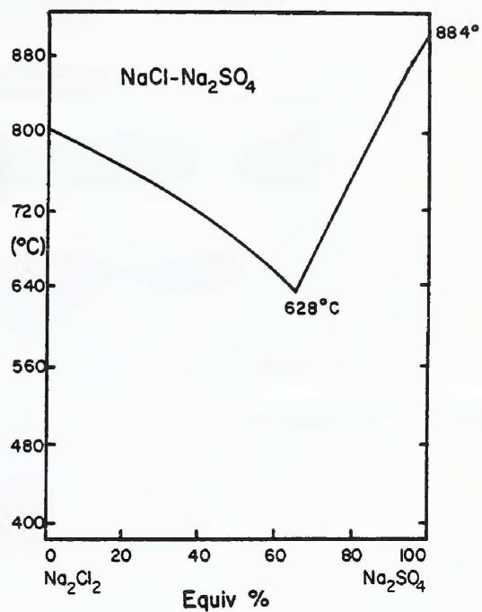  
Figure 117.1. NaCl- $\mathrm{Na}_{2}\mathrm{SO}_{4}$ phase diagram

References [1-25]

2. Density (p)

No data

3. Surface Tension (γ)

No data

4. Viscosity (η)

No data

5. Electrical Conductance (K)

No data

(117) NaCl-Na₂SO₄

6. Safety and Hazards

A. Hazard rating

(i) Toxicity: NaCl, permitted in foods; $\mathrm{Na}_2\mathrm{SO}_4$ , unknown; in general the toxicity of inorganic sulfates are those of the cations; in this case sodium (slight)   
(ii) Vapor pressure: NaCl at m.pt. $(800^{\circ}\mathrm{C})$ , $\sim 0.34\mathrm{mm}$ ; Na $_2$ SO $_4$ at m.pt. $(884^{\circ}\mathrm{C})$ , $\sim 10^{-5}\mathrm{mm}$ ; while sulfates decomposed to oxides of sulfur on heating, Na $_2$ SO $_4$ is relatively stable in the range of m.pt.

B. Disaster hazards

(i) Molten salt bath "explosions": i.e., explosive generation of steam due to bulk water "carry-over" and/or equipment failure; i.e., explosive expansion of "trapped" air   
(ii) Chlorides, when heated to decomposition or contacted with acids, highly toxic chloride fumes are evolved   
(iii) Sulfates, when heated to decomposition, evolve $\mathsf{SO}_3$ , which in turn dissociates to $\mathsf{SO}_2$ and $\mathsf{O}_2$ ; toxic, aggressive fumes

References [26-31]

Table 117.1. Corrosion studies from primary research literature   

<table><tr><td colspan="2">Studies</td><td>References</td></tr><tr><td rowspan="12">A</td><td>Mo</td><td>[32]</td></tr><tr><td>Armco Fe</td><td>[33-35]</td></tr><tr><td>Ni, Cr</td><td>[36]</td></tr><tr><td>Ti, Zr, Hf, ThCl4</td><td>[37,38]</td></tr><tr><td>Cr</td><td>[39,40]</td></tr><tr><td>Fe-Cr</td><td>[40]</td></tr><tr><td>Ni alloys</td><td>[38,41]</td></tr><tr><td>Au,Pt, Al2O3,MgO,Zirconia (NaCl with Na2O)</td><td>[42]</td></tr><tr><td>Thermodynamic redox potentials</td><td>[38,43,44]</td></tr><tr><td>Electrochemical aspects</td><td>[45,46]</td></tr><tr><td>Annotated corrosion bibliio.</td><td>[47]</td></tr><tr><td>Reviews</td><td>[48-50]</td></tr><tr><td rowspan="8">B</td><td>Ni, Co, Co-W, Ni-W, Co-Mo, Co-Cr, Cr-Ni, Ni-Cr-Mo, Co-Cr-Mo, Co-Cr-Nb, Co-Cr-Ta, Ni-Cr-Al, Co-Cr-Mn, Co-Cr-Fe</td><td>[51,57]</td></tr><tr><td>Ni, various metals, Fe</td><td>[52-56]</td></tr><tr><td>Ag</td><td>[57]</td></tr><tr><td>&quot;Hot corrosion&quot; studies</td><td>[58]</td></tr><tr><td>Electrochemical principles</td><td>[46]</td></tr><tr><td>Thermodynamic redox diagrams</td><td>[54,56,59,60]</td></tr><tr><td>Corrosion reviews</td><td>[48-50]</td></tr><tr><td>Corrosion bibliio.</td><td>[47]</td></tr></table>

Compatibility studies: A: molten chlorides, largely NaCl; B: molten sulfates, largely $\mathrm{Na}_2\mathrm{SO}_4$ . For compatibility studies in molten mixtures of $\mathrm{NaCl - Na}_2\mathrm{SO}_4$ , see [51].

References [32-60]

8. Diffusion

No data

9. Heat of Fusion $(\Delta H_{f}^{\circ})$

No data

10. Heat Capacity $(C_p)$

No data

11. Volume Change on Melting $(\Delta V_{f})$ No data   
12. Vapor Pressure $(p_{vap})$ No data   
13. Thermal Conductivity (liquid) $(\lambda_{\ell})$ No data   
14. Thermal Conductivity (solid) $(\lambda_{s})$ No data   
15. Cryoscopic Constant $(k_{f})$ No data   
16. References

[1] Klatschko, M. A., J. Gen. Chem., USSR, 3, 1026 (1933).   
[2] Bergman, A. G., Sementsova, A. K., Zhur. Neorg. Khim., 3, 383 (1958).   
[3] Akopov, E. K., Bergman, A. G., Zhur. Ooshchei Khim., 24, 1524 (1954). J. Gen. Chem., USSR, 24, 1509 (1954).   
[4] Wolters, A., Neues Jahrb. Min. Geol., 30, 55 (1910).   
[5] Jänecke, E., Z. Phys. Chem., 64, 343 (1908).   
[6] Lamplough, F. E. E., Proc. Cambridge Phylos. Soc., 16, 193 (1912).   
[7] Klochkoo, M. A., Zh. O. Khim., 3, 1026 (1933).   
[8] Speranskaya, E. I., Izv. An., SSSR. Ser. Khim., 463 (1938).   
[9] Rea, R. F., J. Amer. Ceram. Soc., 21, 98 (1938).   
[10] Palkin, A. P., Trud. Voron. Gosudar. Univ., 17, Sbor. Rabot. Khim. Fak., 3 (1950).   
[11] Bergman, A. G., Zimina, T. D., Nargorngi, G. I., Izv. Vysshikh. Uchebn. Zavedenii, Khim. Tekh., 8, 870 (1965).   
[12] Janz, G. J. Downey, J. R., Jr., Allen, C. B., and Tomkins, R. P. T., "Eutectic Data" - 2 Vols; ERDA-TID-27163-P1 & P2; NTIS, Washington, D. C. (1977).   
[13] Janz, G. J., Downey, J. R., Jr., Allen, C. B., and Tomkins, R. P. T., "Physical Properties Data Complications Relevant to Energy Storage. I. Molten Salts: Eutectic Data", NSRDS-NBS-61; U. S. Gov't Printing Office, Washington, D. C. (1978).   
[14] "International Critical Tables of Numerical Data, Physics, Chemistry, and Technology", 8 Vols., McGraw-Hill Book Co., N. Y. (1933).   
[15] "Landolt-Bornstein Zahlenwert und Funktionen aus Physik, Chemie, Astronomie, Geophysik und Technik", (10th Ed.) Springer-Verlag, Berlin, Heidelberg, N. Y. (1961).

[16] Clark, P. V., "Fused Salt Mixtures: Eutectic Compositions and Melting Points Bibliography 1907-1968", Report No. SC-R-68-1680; Sandia Laboratories (1968), NTIS.   
[17] Robertson, W. D., "Binary Phase Diagrams of Halide Salts", Report No. Yale 2723 (2 Vols.), U. S. AEC Contract AT (30-1)-2723 (1966), NTIS.   
[18] Thoma, R. E., "Phase Diagrams of Nuclear Reactor Materials", Oak Ridge National Laboratory, ORNL-2548, Contract No. W-7405-eng-26.   
[19] Thoma, R. E., "Phase Diagrams of Binary and Ternary Fluoride Systems", Chapt. 6; Adv. Molten Salts Chemistry, Vol. 3 (J. Braunstein, G. Mamantov, and G. P. Smith, eds.), Plenum Press, N. Y. (1975).   
[20] Voskresenskaya, N. K., ed., "Handbook of Solid-Liquid Equilibria in Systems of Inorganic Salts", Volumes 1, 2, Izc. Akad. Nauk SSSR, Moscow (1961). Israel Program for Scientific Translations, Jerusalem, 1970 (NTIS).   
[21] Sinistri, C., Franzozini, P., and Rolla, M., "An Atlas of Miscibility Gaps in Molten Salt Systems", Institute of Physical Chemistry, University of Pavia (Italy) (1968).   
[22] Shaffer, P. T. B., "High Temperature Materials", Plenum Press Handbooks of High Temperature Materials, No. 1, Materials Index, Plenum Press, New York, 1964.   
[23] Franzozini, P., Ferloni, P., and Spinolo, C., "Molten Salts with Organic Anions", Instituto di Chimica Fisica, Universita di Pavia (Italy), 1973.   
[24] Toropov, N. A. et al., "Handbook of Phase Diagrams of the Silicates, Volume 1: Binary Systems, Volume 2, Metal-Oxygen Compounds in Silicate Systems", Izdatel'stov "Nauka" Leningradskoe Otdelenie, Leningrad, 1969, Israel Program for Scientific Translations, Jerusalem, 1972 (NTIS).   
[25] Levin, E., et al., "Phase Diagrams for Ceramists", Amer. Ceramic Soc. (publ.), Columbus, Ohio (1964; 1969).   
[26] "Dangerous Properties of Materials", Sax, N. I., Van Nostrand Reinhold Co., N. Y. (1969)   
[27] "Registry of Toxic Effects of Chemical Substances", Christensen, H. E., and Lubinbyhl, T. T., eds., U. S. Dept. H. E. W., U. S. Gov't Printing Office, Washington, D. C. (1975)   
[28] Janz, G. J., et al., "Physical Properties Data Complications Relevant to Energy Storage. Part II. Molten Salts: Data on Single and Multi-Component Salt Systems", NSRDS-NBS 61, Part II (April 1979), U. S. Gov't Printing Office, Supt of Doc. No. C13-48-61, Washington D. C. 20402.   
[29] "Potential Hazards in Molten Salt Baths for Heat Treatment of Metals", National Board of Fire Underwriters Research Report No. 2 (1954)   
[30] "Handbook of Reactive Chemical Hazards", Bretherwick, L., Butterworth Co., London (1975)   
[31] Janz, G. J., Tomkins, R. P. T., Downey, J. R., Jr., and Allen, C. B., "Safety and Hazards, Chapter in "Eutectic Data", ERDA TID-27163-P1; NTIS, U. S. Dept. Commerce, Springfield, Va. (1977)   
[32] Ozeryanaya, I. N., Zalazinskii, G. G., Smirnov, M. V., Finkel'shtein, S. D., and Shamanova, N. D., Zashch. Metal., 11, 66 (1975).

(117) NaCl-Na2SO4   
[33] Kochergin, V. P., and Ignat'eva, N. I., Russ. J. Inorg. Chem., 6(9), 1085 (1961).   
[34] Kochergin, V. P., and Shevrina, Z., Uch. Zap. Ural. Gos. Univ., 92, 3 (1969).   
[35] Kochergin, V. P., et al., Zhur. Priklad. Khim., 34(6), 1258 (1961); ibid., 37(8), 1837 (1964).   
[36] Seybolt, A. U., Oxid. Metals, 2, 119 (1970).   
[37] Smirnov, M. V., Kudyakov, V. Ya., Loginov, Ya. A., Rossokhin, E. G., Posokhin, Yu. V., and Puzanova, T. A., Fiz. Khim. Elektrokhim. Rasplav. Solei Shlakov, 1, 115 (1969).   
[38] Littlewood, R., J. Electrochem. Soc., 109, 525 (1962).   
[39] Krasil'nikova, N. A., Ozeryanaya, I. N., and Smirnov, M. V., Zashch. Metal., 17, 446 (1974).   
[40] Krasil'nikova, N. A., Ozeryanaya, I. N., Smirnov, M. V., and Shamanova, N. D., Zashch. Metal., 10, 446 (1974).   
[41] Bogdanov, N. I., Varganov, B. Ya., and Kholomonova, N. D., Zh. Prikl. Khim. (Leningrad), 46, 1698 (1973).   
[42] Stern, K. H., Panayappan, R., and Flinn, D. R., "Proceedings Intern. Symp. Molten Salts", The Electrochem. Soc., Princeton, N. J., p. 64 (1976).   
[43] Edeleanu, C., and Littlewood, R., Electrochimica Acta, 3, 195 (1960).   
[44] Littlewood, R., and Argent, E. A., Electrochimica Acta, 4, 114 (1961).   
[45] Pizzini, S., "Materials Problems in the Industrial Applications of Molten Salts", Proceedings of the European Conference on the Development of Molten Salts Applications", p. 203 (1973); Battelle, Geneva.   
[46] Johnson, K. E., "Electrochemical Approaches to Corrosion in Molten Salts", Proceedings International Symposium on Metal-Slag-Gas Reactions and Processes, The Electrochemical Society Inc., Princeton, N. J., p. 581 (1975).   
[47] Janz, G. J., and Tomkins, R. P. T., Corrosion, 35, 485 (1979).   
[48] Smirnov, M. V., and Ozeryanaya, I. N., Nauki Tekh. Korros. Zashch. Korros., 2, 171 (1973).   
[49] Ketelaar, J. A. A., Chemie. Ing. Techn., 45, 667 (1973).   
[50] Inman, D., and Wrench, N. S., Brit. Corr. J., 1, 246 (1966).   
[51] Stringer, J., and Whittle, D. P., "Metal-Slag-Gas Reactions and Processes, p. 665, Proc. Internat. Sym. Electrochem. Soc., Foroulis, Z. A., and Smeltzer, W. W., eds., (1975).   
[52] Goebel, J. A., and Petit, F. S., Met. Trans., 1943 (1970).   
[53] Sequeira, C. A. C., Tecnica (Lisbon), 37, 33 (1975).   
[54] Rahmel, A., Electrochim. Acta, 13, 495 (1968).

(117) NaCl-Na₂SO₄   
[55] Dubois, J., and Richard, J., Rev. Gen. Therm., 12, 805 (1973).   
[56] Burrows, B. W., and Hills, G. J., J. Inst. Fuel, 39, 168 (1966).   
[57] Romeo, G., and McKee, D. W., J. Electrochem. Soc., 122(2), 188 (1975).   
[58] "Metal-Slag-Gas Reactions and Processes", Proc. Internat. Symposium, Foroulis, Z. A., and Smeltzer, W., eds., The Electrochemical Soc., Princeton, N. J. (1975).   
[59] Baudio, G., and Tamba, A., Brit. Corrosion J., 4, 129 (1969).   
[60] Bartlett, H. E., and Johnson, K. E., Canad. J. Chem., 44, 2119 (1966).

1. Melting Temperatures $(T_{m})$

Pure substance melting points:

NaCl: $800^{\circ} \mathrm{C}$

$\mathrm{K}_{2} \mathrm{SO}_{4}$ : $1069^{\circ} \mathrm{C}$

Minimum melting mixture:

$540^{\circ} \mathrm{C}$ , composition: $65 \mathrm{~mol} \% \mathrm{NaCl}$ ; [50 equiv. $\% \mathrm{Na}_{2} \mathrm{Cl}_{2}]$

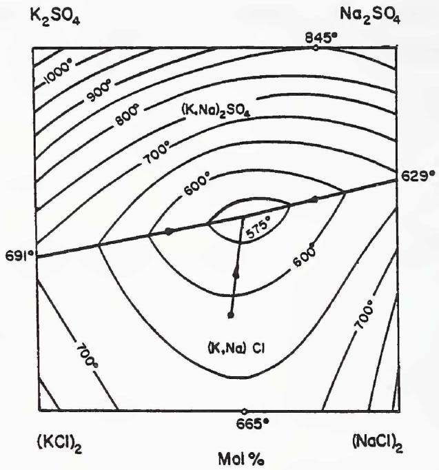  
Figure 118.1. NaCl- $\mathbf{K}_2\mathbf{SO}_4$ phase diagram

References [1-20]

2. Density (ρ)

No data

3. Surface Tension (Y)

No data

4. Viscosity (η)

No data

5. Electrical Conductance (K)

No data

# 6. Safety and Hazards

# A. Hazard rating

(i) Toxicity: NaCl, permitted in food; $\mathrm{K}_2\mathrm{SO}_4$ , severe.   
(ii) Vapor pressure: NaCl at m.pt. $(800^{\circ}\mathrm{C})$ , $\sim 0.34\mathrm{mm}$ ; $\mathrm{K}_2\mathrm{SO}_4$ at m.pt. $(1069^{\circ}\mathrm{C})$ , $\sim 0.07\mathrm{mm}$ ; while sulfates dissociate on heating to oxides of sulfur, $\mathrm{K}_2\mathrm{SO}_4$ is relatively stable.

# B. Disaster hazards

(i) Molten salt bath "explosions": i.e., explosive generation of steam due to bulk water "carry-over" and/or equipment failure; i.e., explosive expansion of "trapped" air.   
(ii) Chlorides, when heated to decomposition or contacted with acids, highly toxic chloride fumes are evolved.   
(iii) Sulfates, when heated to decomposition, evolve $\mathsf{SO}_2$ , which, in turn, dissociates to $\mathsf{SO}_2$ and $\mathsf{O}_2$ ; toxic, aggressive fumes.

References [21-26]

# 7. Corrosion

Table 118.1. Corrosion studies from primary research literature   

<table><tr><td colspan="2">Studies</td><td>References</td></tr><tr><td rowspan="10">A</td><td>Mo</td><td>[27]</td></tr><tr><td>Armco Fe</td><td>[28-30]</td></tr><tr><td>NiCr</td><td>[31]</td></tr><tr><td>Ti, Zr, Hf, ThCl4</td><td>[32]</td></tr><tr><td>Cr</td><td>[33]</td></tr><tr><td>Cr, Fe-Cr</td><td>[34]</td></tr><tr><td>Ni alloys</td><td>[35]</td></tr><tr><td>Ni-Cr-Al, Ni-Cr-W-Fe, Ni-Cr</td><td>[36]</td></tr><tr><td>Mg, Ni, Zr, Ti</td><td></td></tr><tr><td>Au, Pt, MgO, Al2O3, Zirconia (NaCl with added Na2O)</td><td>[37]</td></tr><tr><td rowspan="3">B</td><td>Metals</td><td>[38]</td></tr><tr><td>Metals, Fe</td><td>[39]</td></tr><tr><td>Ag</td><td>[40]</td></tr><tr><td rowspan="4">C</td><td>Electrochemical approach</td><td>[41]</td></tr><tr><td>Thermodynamic redox diagrams</td><td>[38,39,42,43]</td></tr><tr><td>Molten salts corrosion: reviews</td><td>[44-46]</td></tr><tr><td>Annotated corrosion bibliography.</td><td>[47]</td></tr></table>

cont'd

(118) NaCl-K2SO4

footnote to Table 118.1 Compatibility studies: A: molten chlorides, principally NaCl; B: molten sulfates, principally $\mathrm{K}_2\mathrm{SO}_4$ ; C: basic principles, reviews, bibli. No compatibility studies reported specific for molten NaCl- $\mathrm{K}_2\mathrm{SO}_4$ mixtures.  
References [27-47]

8. Diffusion

No data

9. Heat of Fusion $(\Delta H_{f}^{\circ})$

No data

10. Heat Capacity $(C_p)$

No data

11. Volume Change on Melting $(\Delta V_{f})$

No data

12. Vapor Pressure $(p_{vap})$

No data

13. Thermal Conductivity (liquid) $(\lambda_{\ell})$

No data

14. Thermal Conductivity (solid) $(\lambda_{s})$

No data

15. Cryoscopic Constant $(k_{f})$

No data

16. References

[1] Janecke, E., Z. anorg. Chem., 261, 213 (1950).   
[2] Jänecke, E., Z. phys. Chem., 64, 343 (1908).   
[3] Sackur, O., Z. phys. Chem., 78, 550 (1917).   
[4] Bergman, A. G., Soobshcheniya, o Nauchno-Tech. Rab. v. Respubl., 31(1), 8 (1932).   
[5] Rea, R. F., J. Amer. Ceram. Soc., 21(3), 98 (1938).   
[6] Akopov, E. K., Bergman, A. G., Zh. Neorg. Khim., 24, 1524 (1954).

(118) $\mathrm{NaCl - K_2SO_4}$

[7] Janz, G. J. Downey, J. R., Jr., Allen, C. B., and Tomkins, R. P. T., "Eutectic Data" - 2 Vols; ERDA-TID-27163-P1 & P2; NTIS, Washington, D. C. (1977).   
[8] Janz, G. J., Downey, J. R., Jr., Allen, C. B., and Tomkins, R. P. T., "Physical Properties Data Complications Relevant to Energy Storage. I. Molten Salts: Eutectic Data", NSRDS-NBS-61; U. S. Gov't Printing Office, Washington, D. C. (1978).   
[9] "International Critical Tables of Numerical Data, Physics, Chemistry, and Technology", 8 Vols., McGraw-Hill Book Co., N. Y. (1933).   
[10] "Landolt-Bornstein Zahlenwert und Funktionen aus Physik, Chemie, Astronomie, Geophysik und Technik", (10th Ed.) Springer-Verlag, Berlin, Heidelberg, N. Y. (1961).   
[11] Clark, P. V., "Fused Salt Mixtures: Eutectic Compositions and Melting Points Bibliography 1907-1968", Report No. SC-R-68-1680; Sandia Laboratories (1968), NTIS.   
[12] Robertson, W. D., "Binary Phase Diagrams of Halide Salts", Report No. Yale 2723 (2 Vols.), U. S. AEC Contract AT (30-1)-2723 (1966), NTIS.   
[13] Thoma, R. E., "Phase Diagrams of Nuclear Reactor Materials", Oak Ridge National Laboratory, ORNL-2548, Contract No. W-7405-eng-26.   
[14] Thoma, R. E., "Phase Diagrams of Binary and Ternary Fluoride Systems", Chapt. 6; Adv. Molten Salts Chemistry, Vol. 3 (J. Braunstein, G. Mamantov, and G. P. Smith, eds.), Plenum Press, N. Y. (1975).   
[15] Voskresenskaya, N. K., ed., "Handbook of Solid-Liquid Equilibria in Systems of Inorganic Salts", Volumes 1, 2, Izc. Akad. Nauk SSSR, Moscow (1961). Israel Program for Scientific Translations, Jerusalem, 1970 (NTIS).   
[16] Sinistri, C., Franzozini, P., and Rolla, M., "An Atlas of Miscibility Gaps in Molten Salt Systems", Institute of Physical Chemistry, University of Pavia (Italy) (1968).   
[17] Shaffer, P. T. B., "High Temperature Materials", Plenum Press Handbooks of High Temperature Materials, No. 1, Materials Index, Plenum Press, New York, 1964.   
[18] Franzozini, P., Ferloni, P., and Spinolo, C., "Molten Salts with Organic Anions", Instituto di Chimica Fisica, Universita di Pavia (Italy), 1973.   
[19] Toropov, N. A. et al., "Handbook of Phase Diagrams of the Silicates, Volume 1: Binary Systems, Volume 2, Metal-Oxygen Compounds in Silicate Systems", Izdatel'stov "Nauka" Leningradskoe Otdelenie, Leningrad, 1969, Israel Program for Scientific Translations, Jerusalem, 1972 (NTIS).   
[20] Levin, E., et al., "Phase Diagrams for Ceramists", Amer. Ceramic Soc. (publ.), Columbus, Ohio (1964; 1969).   
[21] "Dangerous Properties of Materials", Sax, N. I., Van Nostrand Reinhold Co., N. Y. (1969).   
[22] "Registry of Toxic Effects of Chemical Substances", Christensen, H. E., and Lubinbyhl, T. T., eds., U. S. Dept. H. E. W., U. S. Gov't Printing Office, Washington, D. C. (1975).   
[23] Janz, G. J., et al., "Physical Properties Data Complications Relevant to Energy Storage. Part II. Molten Salts: Data on Single and Multi-Component Salt Systems", NSRDS-NBS 61, Part II (April 1979), U. S. Gov't Printing Office, Supt of Doc. No. C13-48-61, Washington D. C. 20402.

(118) $\mathrm{NaCl - K_2SO_4}$   
[24] "Potential Hazards in Molten Salt Baths for Heat Treatment of Metals", National Board Fire Underwriters Research Report No. 2. (1954).   
[25] "Handbook of Reactive Chemical Hazards", Bretherwick, L., Butterworths Co., London (1975).   
[26] Janz, G. J., Tomkins, R. P. T., Downey, J. R., Jr., and Allen, C. B., "Safety and Hazards", Chapter in "Eutectic Data", ERDA TID-27163-P1; NTIS, U. S. Dept. Commerce, Springfield, Va. (1977).   
[27] Ozeryanaya, I. N., Zalazinskii, G. G., Smirnov, M. V., Finkel'shtein, S. D., and Shamanova, N. D., Zashch. Metal., 11, 66 (1975).   
[28] Kochergin, V. P., and Ignat'eva, N. I., Russ. J. Inorg. Chem., 6(9), 1085 (1961).   
[29] Kochergin, V. P., and Shevrina, Z., Uch. Zap. Ural. Gos. Univ., 92, 3 (1969).   
[30] Kochergin, V. P., et al., Zhur. Priklad. Khim., 34(6), 1258 (1961); ibid., 37(8), 1837 (1964).   
[31] Seybolt, A. U., Oxid. Metals, 2, 119 (1970).   
[32] Smirnov, M. V., Kudyakov, V. Ya., Loginov, Ya. A., Rossokhin, E. G., Poshkin, Yu. V., and Puzanova, T. A., Fiz. Khim. Electrokhim. Rasplav. Solei Shlakov, 1, 115 (1969)   
[33] Krasil'nikova, N. A., Ozeryanaya, I. N., and Smirnov, M. V., Zashch. Metal., 17, 446 (1974).   
[34] Krasil'nikova, N. A., Ozeryanaya, I. N., Smirnov, M. V., and Shamanova, N. D., Zashch. Metal., 10, 446 (1974).   
[35] Bogdanov, N. I., Varganov, B. Ya., and Kholomonova, N. D., Zh. Prikl. Khim. (Leningrad), 46, 1698 (1973).   
[36] Littlewood, R., J. Electrochem. Soc., 109, 525 (1962).   
[37] Stern, K. H., Panayappan, R., and Flinn, D. R., "Proceedings Intern. Symp. Molten Salts", The Electrochem. Soc., Princeton, N. J., p. 64 (1976).   
[38] Rahmel, A., Electrochim. Acta, 13, 495 (1968).   
[39] Burrows, B. W., and Hills, G. J., J. Inst. Fuel, 39, 168 (1966).   
[40] Rahmel, A., Corros. Sci., 13, 833 (1973).   
[41] Johnson, K. E., "Electrochemical Approaches to Corrosion in Molten Salts", Proceedings International Symposium on Metal-Slag-Gas Reactions and Processes, The Electrochemical Society, Inc., Princeton, N. J., p. 581 (1975).   
[42] Bombara, G., Baudo, G., and Tamba, A., Corrosion Sci. 8, 393 (1968)   
[43] Baudio, G., and Tamba, A., Brit. Corrosion J., 4, 129 (1969).   
[44] Smirnov, M. V., and Ozeryanaya, I. N., Nauki Tekh. Korros. Zashch. Korros., 2, 171 (1973).   
[45] Ketelaar, J. A. A., Chemie Ing. Techn., 45, 667 (1973).   
[46] Inman, D., and Wrench, N. S., Brit. Corr. J., 1, 246 (1966).   
[47] Janz, G. J., and Tomkins, R. P. T., Corrosion, 35, 485 (1979).

$$
\text {S y s t e m} 1 1 9 \quad \mathrm {K C l - N a} _ {2} \mathrm {C O} _ {3}
$$

1. Melting Temperatures $(T_{m})$

Pure substance melting points:

```txt
KCl: 770°C Na2CO3: 858°C 
```

Eutectic melting point:

588°C, composition: 44.4 mol % Na₂CO₃

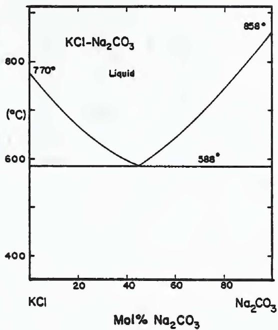  
Figure 119.1. KCl- $\mathsf{Na}_2\mathsf{CO}_3$ phase diagram

References [1-18].

2. Density (ρ)

Measurement method: Archimedean technique [19]

Equation:

$$
\rho = a + b T \tag {119.1}
$$

precision: in table 119.1

uncertainty: $\sim 3.0\%$

Table 119.1. Parameters of equation (119.1) and precisions   

<table><tr><td>Mol % KCl</td><td>a</td><td>-b x 104</td><td>Precision</td><td>T range(K)</td></tr><tr><td>13.64</td><td>2.4029</td><td>4.198</td><td>0.02%</td><td>1100-1150</td></tr><tr><td>26.22</td><td>2.3318</td><td>4.086</td><td>0.03%</td><td>1000-1150</td></tr><tr><td>37.86</td><td>2.2639</td><td>3.967</td><td>0.02%</td><td>970-1150</td></tr><tr><td>48.66</td><td>2.2206</td><td>4.067</td><td>0.03%</td><td>920-1150</td></tr><tr><td>58.71</td><td>2.2066</td><td>4.395</td><td>0.03%</td><td>920-1150</td></tr><tr><td>68.08</td><td>2.1828</td><td>4.614</td><td>0.02%</td><td>970-1150</td></tr><tr><td>76.84</td><td>2.1473</td><td>4.695</td><td>0.02%</td><td>970-1150</td></tr><tr><td>85.04</td><td>2.1619</td><td>5.199</td><td>0.00%</td><td>1020-1150</td></tr><tr><td>92.75</td><td>2.3705</td><td>7.393</td><td>0.66%</td><td>1020-1150</td></tr><tr><td>100</td><td>1.7952</td><td>3.079</td><td>0.02%</td><td>1070-1150</td></tr></table>

# (119) KCl-Na₂CO₃

Table 119.2. Density (g cm $^{-3}$ ) from equations in table 119.1   

<table><tr><td rowspan="2">T(K)</td><td colspan="7">Mol % KCl</td></tr><tr><td>13.64</td><td>26.22</td><td>48.66</td><td>58.71</td><td>76.84</td><td>85.04</td><td>92.75</td></tr><tr><td>920</td><td></td><td></td><td>1.846</td><td>1.802</td><td></td><td></td><td></td></tr><tr><td>940</td><td></td><td></td><td>1.838</td><td>1.793</td><td></td><td></td><td></td></tr><tr><td>960</td><td></td><td></td><td>1.830</td><td>1.785</td><td></td><td></td><td></td></tr><tr><td>980</td><td></td><td></td><td>1.822</td><td>1.776</td><td>1.687</td><td></td><td></td></tr><tr><td>1000</td><td></td><td>1.923</td><td>1.814</td><td>1.767</td><td>1.678</td><td></td><td></td></tr><tr><td>1020</td><td></td><td>1.915</td><td>1.806</td><td>1.758</td><td>1.668</td><td>1.632</td><td>1.616</td></tr><tr><td>1040</td><td></td><td>1.907</td><td>1.798</td><td>1.750</td><td>1.659</td><td>1.621</td><td>1.602</td></tr><tr><td>1060</td><td></td><td>1.899</td><td>1.789</td><td>1.741</td><td>1.650</td><td>1.611</td><td>1.587</td></tr><tr><td>1080</td><td></td><td>1.891</td><td>1.781</td><td>1.732</td><td>1.640</td><td>1.600</td><td>1.572</td></tr><tr><td>1100</td><td>1.941</td><td>1.882</td><td>1.773</td><td>1.723</td><td>1.631</td><td>1.590</td><td>1.557</td></tr><tr><td>1120</td><td>1.933</td><td>1.874</td><td>1.765</td><td>1.714</td><td>1.621</td><td>1.580</td><td>1.542</td></tr><tr><td>1140</td><td>1.924</td><td>1.866</td><td>1.757</td><td>1.706</td><td>1.612</td><td>1.569</td><td>1.528</td></tr><tr><td>1150</td><td>1.920</td><td>1.862</td><td>1.753</td><td>1.701</td><td>1.607</td><td>1.564</td><td>1.520</td></tr></table>

References [19]

3. Surface Tension (Y)

No data

4. Viscosity (n)

No data

5. Electrical Conductance (K)

No data

6. Safety and Hazards

# A. Hazard rating

(i) Toxicity: KCl, very low; $\mathrm{Na}_2\mathrm{CO}_3$ , moderate.

(ii) Vapor pressure: no information of this system; but see KC1 [22], and $\mathrm{Na}_2\mathrm{CO}_3$ [22]

# B. Disaster hazards

(i) Molten salt bath "explosions": i.e. explosive generation of steam due to bulk water "carry-over" and/or equipment failure; i.e., explosive expansion of "trapped" air.   
(ii) Chlorides evolve highly toxic fumes when heated to decomposition, or contacted with acids.   
(iii) When heated with $\mathrm{CO}_{2}$ pressures less than equilibrium dissociation pressures, decomposes to form alkali metal oxide; the toxicology and disaster hazards are the same as those of very caustic solutions, i.e., react with water or steam (exothermic) to form solutions that are markedly aggressive to all body tissues.

References [20-25]

# 7. Corrosion

Table 119.3. Corrosion studies from primary research literature   

<table><tr><td colspan="2">Systems, Studies, [References]</td></tr><tr><td>A</td><td>Armco Fe, various steels [26-30], Cr [28,31], Mg, Ni, Zn, Ti [32], Ti, Zr, Hf, ThCl4[33], solubility of oxides of Mo, Ca, Zn, Mg [32,34], electrochemical aspects [35], thermodynamic redox potentials [32,36 37], annotated biblio.[38], reviews, surveys [39-41].</td></tr><tr><td>B</td><td>Si [42], Pt [43], Metals [44], Cu-Zn [45], Pt, Au, Ag, MgO [46-49], Pt, Rh, Pd, Ir (O2environment) [50], Au, Ag, Al2O3(N2atmosphere, Na2CO3-Na2O) [51-53], quartz, porcelain, Ag, Pt, Ni, (N2atmosphere; Na2CO3-Na2O) [54], boron nitride [49,55], β-alumina [55], Fe (Na2CO3-Na halides) [56], acid-base relationships [56-60], H2O hydrolysis reactions [61-63], molten carbonates: fuel cells, thermal energy storage, coal gasification [55,56,64-69]</td></tr></table>

Compatibility studies: A: principally with molten KCl; B: principally with molten NaCl. No corrosion studies with molten KCl- $\mathrm{Na}_2\mathrm{CO}_3$ found.  
References [26-60]

8. Diffusion

No data

9. Heat of Fusion $(\Delta H_{f}^{\circ})$

No data

10. Heat Capacity (Cp)

No data

11. Volume Change on Melting $(\Delta V_{f})$

No data

12. Vapor Pressure $(p_{vap})$

No data

13. Thermal Conductivity (liquid) $(\lambda_{\ell})$

No data

14. Thermal Conductivity (solid) $(\lambda_{s})$

No data

15. Cryoscopic Constant $(k_{f})$

No data

16. References

[1] Volkov, N. N., Bergman, A. G., Compt. Rend. Acad. Sci. USSR, 35, 47 (1942).   
[2] Tomo-o Sato, Kinzoku-no-Kenkyu, 10, 453 (1933); see also Voklov, N. N.   
[3] Sementsova, A. K., Bergman, A. G., J. Gen. Chem. USSR, 26, 1129 (1956).   
[4] Bergman, A. G., Sementsova, A. K., Zhur. Neorg. Khim., 3, 213 (1958).   
[5] Janz, G. J. Downey, J. R., Jr., Allen, C. B., and Tomkins, R. P. T., "Eutectic Data" - 2 Vols; ERDA-TID-27163-P1 & P2; NTIS, Washington, D. C. (1977).   
[6] Janz, G. J., Downey, J. R., Jr., Allen, C. B., and Tomkins, R. P. T., "Physical Properties Data Complications Relevant to Energy Storage. I. Molten Salts: Eutectic Data", NSRDS-NBS-61; U. S. Gov't Printing Office, Washington, D. C. (1978).   
[7] "International Critical Tables of Numerical Data, Physics, Chemistry, and Technology", 8 Vols., McGraw-Hill Book Co., N. Y. (1933).   
[8] "Landolt-Bornstein Zahlentwert und Funktionen aus Physik, Chemie, Astronomie, Geophysik und Technik", (10th Ed.) Springer-Verlag, Berlin, Heidelberg, N. Y. (1961).   
[9] Clark, P. V., "Fused Salt Mixtures: Eutectic Compositions and Melting Points Bibliography 1907-1968", Report No. SC-R-68-1680; Sandia Laboratories (1968), NTIS.   
[10] Robertson, W. D., "Binary Phase Diagrams of Halide Salts", Report No. Yale 2723 (2 Vols.), U. S. AEC Contract AT (30-1)-2723 (1966), NTIS.   
[11] Thoma, R. E., "Phase Diagrams of Nuclear Reactor Materials", Oak Ridge National Laboratory, ORNL-2548, Contract No. W-7405-eng-26.   
[12] Thoma, R. E., "Phase Diagrams of Binary and Ternary Fluoride Systems", Chapt. 6; Adv. Molten Salts Chemistry, Vol. 3 (J. Braunstein, G. Mamantov, and G. P. Smith, eds.), Plenum Press, N. Y. (1975).   
[13] Voskresenskaya, N. K., ed., "Handbook of Solid-Liquid Equilibria in Systems of Inorganic Salts", Volumes 1, 2, Izc. Akad. Nauk SSSR, Moscow (1961). Israel Program for Scientific Translations, Jerusalem, 1970 (NTIS).   
[14] Sinistri, C., Franzozini, P., and Rolla, M., "An Atlas of Miscibility Gaps in Molten Salt Systems", Institute of Physical Chemistry, University of Pavia (Italy) (1968).   
[15] Shaffer, P. T. B., "High Temperature Materials", Plenum Press Handbooks of High Temperature Materials, No. 1, Materials Index, Plenum Press, New York, 1964.   
[16] Franzozini, P., Ferloni, P., and Spinolo, C., "Molten Salts with Organic Anions", Instituto di Chimica Fisica, Universita di Pavia (Italy), 1973.   
[17] Toropov, N. A. et al., "Handbook of Phase Diagrams of the Silicates, Volume 1: Binary Systems, Volume 2, Metal-Oxygen Compounds in Silicate Systems", Izdatel'stov "Nauka" Leningradskoe Otdelenie, Leningrad, 1969, Israel Program for Scientific Translations, Jerusalem, 1972 (NTIS).   
[18] Levin, E., et al., "Phase Diagrams for Ceramists", Amer. Ceramic Soc. (publ.), Columbus, Ohio (1964; 1969).

(119) KCl- $\mathrm{Na}_{2}\mathrm{CO}_{3}$   
[19] Polyakov, V. D. and Berul, S. I., Izv. Sek. Fiz. Khim. Anal., Akad Nauk SSSR 22, 170 (1953).   
[20] "Dangerous Properties of Materials", Sax, N. I., Van Nostrand Reinhold Co., N. Y. (1969).   
[21] "Registry of Toxic Effects of Chemical Substances", Christensen, H. E., and Lubinbyhl, T. T., eds., U. S. Dept. H. E. W., U. S. Gov't Printing Office, Washington, D. C. (1975).   
[22] Janz, G. J., et al., "Physical Properties Data Complications Relevant to Energy Storage. Part II. Molten Salts: Data on Single and Multi-Component Salt Systems", NSRDS-NBS 61, Part II (April 1979), U. S. Gov't Printing Office, Supt of Doc. No. C13-48-61, Washington D. C. 20402.   
[23] "Potential Hazards in Molten Salt Baths for Heat Treatment of Metals", National Board of Fire Underwriters Research Report No. 2 (1954).   
[24] "Handbook of Reactive Chemical Hazards", Bretherwick, L., Butterworth Co., London (1975).   
[25] Janz, G. J., Tomkins, R. P. T., Downey, J. R. Jr., and Allen, C. B., "Safety and Hazards", Chapter in "Eutectic Data", ERDA TID-27163-P1; NTIS, U. S. Dept. Commerce, Springfield, Va. (1977)   
[26] Kochergin, V. P., and Shevrina, Z., Uch. Zap. Ural. Gos. Univ., 92, 3 (1969).   
[27] Kochergin, V. P., Bochkareva, N. N., and Yarysheva, I. A., Zashch. Metal. 6, 457 (1970)   
[28] Krasil'nikova, N. A., Ozernaya, I. N., Smirnov, M. V., and Shamanova, N. D., Zashch. Metal. 10, 446 (1974)   
[29] Kochergin, V. P., Garpinenko, M. G., Skornyakova, O.N., and Minulina, M. L., Zhur. Priklad. Khim. 34(6) (1956)   
[30] Kochergin, V. P., et al., Zhur. Priklad. Khim., 34(6), 1258 (1961); ibid., 37(8), 1837 (1964).   
[31] Krasil'nikova, N. A., Ozeryanaya, I. N., and Smirnov, M. V., Zashch. Metal., 17, 446 (1974).   
[32] Littlewood, R., J. Electrochem. Soc., 109, 525 (1962).   
[33] Smirnov, M. V., Kudyakov, V. Ya., Loginov, Ya. A., Rossokhin, E. G., Posokhin, Yu. V., and Puzanova, T. A., Fiz. Khim. Elektrokhim. Rasplav. Solei Shlakov, 1, 115 (1969).   
[34] Pizzini, S., "Materials Problems in the Industrial Applications of Molten Salts", Proceedings of the European Conference on the Development of Molten Salts Applications", p. 203 (1973); Battelle, Geneva.   
[35] Johnson, K. E., "Electrochemical Approaches to Corrosion in Molten Salts", Proceedings International Symposium on Metal-Slag-Gas Reactions and Processes, The Electrochemical Society Inc., Princeton, N. J., p. 581 (1975).   
[36] Edeleanu, C., and Littlewood, R., Electrochim. Acta 3, 195 (1960).   
[37] Littlewood, R., and Argent, E. A., Electrochim. Acta 4, 114 (1961).   
[38] Janz, G. J., and Tomkins, R. P. T., Corrosion, 35, 485 (1979).   
[39] Smirnov, M. V., and Ozeryanaya, I. N., Nauki Tekh. Korros. Zashch. Korros., 2, 171 (1973).

(119) KCl-Na₂CO₃   
[40] Ketelaar, J. A. A., Chemie. Ing. Techn., 45, 667 (1973).   
[41] Inman, D., and Wrench, N. S., Brit. Corr. J., 1, 246 (1966).   
[42] Cable, M., and Martlew, D., Glass Technol., 12, 142 (1971).   
[43] Schneider, Yu. G., Kondrat'ev, Yu. N., and Maksimov, N. N., Zashch. Metal, 9, 199 (1973).   
[44] Ozeryanaya, I. N., Penyagina, O. P., Manukhina, T. I., and Smirnov, M. V., Fiz. Khim. Elektrokhim, Rasplav. Solei Tverd. Elektrolit, 2, 96 (1973).   
[45] Sizintseva, N. F., Stepanov, G. K., and Belyaeva, G. I., Tr. Inst. Elektrokhim., Ural. Nauch. Tsentr; Akad. Nauk, USSR, 19, 92 (1973).   
[46] Janz, G. J., Conte, A., and Neuenschwander, E., Corrosion, 19, 292 (1963).   
[47] Janz, G. J., and Conte, A., Corrosion, 20, 237 (1964).   
[48] Rodigina, E. N., and Stepanov, G. K., Trudy Inst. Elektrokhim. Ural. Fil. Akad. Nauk, SSSR, 3, 77 (1962).   
[49] Janz, G. J., and Lorenz, M. R., Rev. Sci. Instruments, 32, 130 (1961).   
[50] Scheer, J. J., van Arkel, A. E., and Heyding, R. D., Can. J. Chem., 33, 683 (1955).   
[51] Rolin, M. and Recapet, J. M., Bull. Soc. Chim. Fr. 2110 (1964)   
[52] Papin, G., Michaud, M., and Bouaziz, R., C. R. Acad. Sc., Paris, 268, Ser. C, 1691 (1969).   
[53] Bouaziz, R., and Papin, G., Compt. Rend. Acad. Sci., Paris, 266, series C, 1530 (1968).   
[54] Cohen-Adad, R., Michaud, M., Said, J., and Rollet, A. F., Bull. Soc. Chim. Fr., 356 (1961).   
[55] Braunstein, J., et al., "Molten Carbonate Fuel Cell Research at ORNL", Rpt. ORNL/TM-5886; NTIS, U. S. dept. Commerce, Springfield, Va. (May 1977).   
[56] Cover, A. E., Schreiner, W. C., and Skaperdas, G. T., "The Kellogg Coal Gasification Process", Extended Abstracts, American Chemical Soc. Meeting, Washington, D. C. (1971).   
[57] Dubois, J., "Chemical and Electrochemical Reactions of Molten Alkali Carbonates as Fuel Cell Electrolytes", Ph.D. Thesis, Fac. Sci. Univ. Paris, France (1964).   
[58] Ingram, M. D. and Janz, G. J., Electrochim. Acta 10, 783 (1965)   
[59] Busson, N., Palous, S., Buvet, R., and Millet, J., Compt. Rend. 260, 720, 6097 (1965)   
[60] Ingram, M. D., Baron, B., and Janz, G. J., Electrochim. Acta 11, 1629 (1966)   
[61] Andersen, B. K., "Thermodynamic Properties of Molten Carbonates", Ph.D. Thesis, Tech. Univ. Denmark (1975).   
[62] Janz, G. J., J. Chem. Ed., 44, 581 (1967).   
[63] Busson, N., Palous, S., Millet, J., and Buvet, R., Electrochim. Acta, 12, 910 (1967).   
[64] Maru, H. C., et al. (Institute of Gas Technology), "Molten Salt Thermal Energy Storage Systems: Salt Selections", Rpt. COO-2888-1, ERDA Contract NO. E(11-1)-2888; NTIS, U. S. Dept. Commerce, Springfield, Va. (Aug. 1976).

(119) $\mathrm{KCl - Na_2CO_3}$   
[65] Maru, H. C., et al. (Institute of Gas Technology), "Fuel Cell Research on Second Generation Molten Carbonate Systems: II. Characteristics of Carbonate Melts", Quarterly Status Rpt., Project 8984, ERDA Contract No. 31-109-38-3552, (Sept. 1976).   
[66] Atomics International; "Development of a Molten Carbonate Process for Removal of Sulfur Dioxide from Power Plant Stack Gases", Progress Rpt. No. 2, U. S. Public Health Services, Contract PH 86-67-128, Canoga Park, Ca. (1968).   
[67] Grantham, L. F., and Ferry, R. B., "Corrosion in Alkali Metal Carbonate-Based Melts", Proc. International Symp. Fused Salts, J. P. Pemsler, ed., Electrochemical Soc., Inc., Princeton, N. J., 270 (1976).   
[68] Botts, W. V., Kohl, A. L., and Trilling, C. A., "Low BTU Gasification of Coal by Atomics International's Molten Salt Process", Proceedings of the 11th Intersociety Energy Conversion Engineering Conference, 1, 280 (Sept. 1976).   
[69] Kochergin, V. P., and Ignat'eva, N. I., Russ. J. Inorg. Chem., 6, (9), 1086 (1961).

1. Melting Temperatures $(T_{m})$

Pure substance melting points:

KCl: $770^{\circ} \mathrm{C}$

$\mathrm{K}_{2} \mathrm{CO}_{3}: 898^{\circ} \mathrm{C}$

Eutectic melting point:

632°C, composition: 61.6 mol % KCl

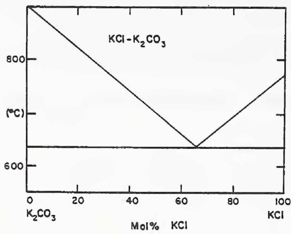  
Figure 120.1. $\mathrm{K}_2\mathrm{CO}_3$ -KCl phase diagram

References [1-18].

2. Density (p)

Measurement method: Archimedean technique [19]

Equation:

$$
\rho = a + b T \quad (1 2 0. 1)
$$

precision: in table 120.1 uncertainty: $\sim \pm 1.0\%$

Table 120.1. Parameters of equation (120.1) and precisions   

<table><tr><td>Mol % KCl</td><td>a</td><td>-b x 104</td><td>Precision</td><td>T range(K)</td></tr><tr><td>18.02</td><td>2.1593</td><td>2.406</td><td>0.00%</td><td>1150-1170</td></tr><tr><td>33.28</td><td>2.3173</td><td>4.202</td><td>0.01%</td><td>1100-1150</td></tr><tr><td>46.25</td><td>2.3095</td><td>4.560</td><td>0.01%</td><td>1080-1150</td></tr><tr><td>56.60</td><td>2.2794</td><td>4.714</td><td>0.02%</td><td>1000-1150</td></tr><tr><td>66.04</td><td>2.2178</td><td>4.643</td><td>0.15%</td><td>970-1150</td></tr><tr><td>75.15</td><td>2.2319</td><td>5.128</td><td>0.02%</td><td>1000-1150</td></tr><tr><td>77.72</td><td>2.0633</td><td>3.838</td><td>0.06%</td><td>1020-1150</td></tr><tr><td>88.90</td><td>2.1600</td><td>5.200</td><td>0.00%</td><td>1050-1150</td></tr><tr><td>94.35</td><td>2.1319</td><td>5.199</td><td>0.00%</td><td>1120-1150</td></tr></table>

(120) $\mathrm{K}_{2} \mathrm{CO}_{3}-\mathrm{KCl}$

Table 120.2. Density $(\mathrm{gcm}^{-3})$ from equations in table 120.1   

<table><tr><td rowspan="2">T(K)</td><td colspan="7">Mol % KCl</td></tr><tr><td>18.02</td><td>33.28</td><td>56.60</td><td>66.04</td><td>75.15</td><td>88.90</td><td>94.35</td></tr><tr><td>970</td><td></td><td></td><td></td><td>1.767</td><td></td><td></td><td></td></tr><tr><td>980</td><td></td><td></td><td></td><td>1.763</td><td></td><td></td><td></td></tr><tr><td>990</td><td></td><td></td><td></td><td>1.758</td><td></td><td></td><td></td></tr><tr><td>1000</td><td></td><td></td><td>1.808</td><td>1.753</td><td>1.719</td><td></td><td></td></tr><tr><td>1010</td><td></td><td></td><td>1.803</td><td>1.749</td><td>1.714</td><td></td><td></td></tr><tr><td>1020</td><td></td><td></td><td>1.799</td><td>1.744</td><td>1.709</td><td></td><td></td></tr><tr><td>1030</td><td></td><td></td><td>1.794</td><td>1.740</td><td>1.704</td><td></td><td></td></tr><tr><td>1040</td><td></td><td></td><td>1.789</td><td>1.735</td><td>1.699</td><td></td><td></td></tr><tr><td>1050</td><td></td><td></td><td>1.785</td><td>1.730</td><td>1.693</td><td>1.614</td><td></td></tr><tr><td>1060</td><td></td><td></td><td>1.780</td><td>1.725</td><td>1.688</td><td>1.609</td><td></td></tr><tr><td>1070</td><td></td><td></td><td>1.775</td><td>1.721</td><td>1.683</td><td>1.604</td><td></td></tr><tr><td>1080</td><td></td><td></td><td>1.770</td><td>1.716</td><td>1.678</td><td>1.598</td><td></td></tr><tr><td>1090</td><td></td><td></td><td>1.766</td><td>1.712</td><td>1.673</td><td>1.593</td><td></td></tr><tr><td>1100</td><td></td><td>1.855</td><td>1.761</td><td>1.707</td><td>1.668</td><td>1.588</td><td></td></tr><tr><td>1110</td><td></td><td>1.851</td><td>1.756</td><td>1.702</td><td>1.663</td><td>1.583</td><td></td></tr><tr><td>1120</td><td></td><td>1.847</td><td>1.752</td><td>1.698</td><td>1.658</td><td>1.578</td><td>1.550</td></tr><tr><td>1130</td><td></td><td>1.842</td><td>1.747</td><td>1.693</td><td>1.652</td><td>1.572</td><td>1.544</td></tr><tr><td>1140</td><td></td><td>1.838</td><td>1.742</td><td>1.689</td><td>1.647</td><td>1.567</td><td>1.539</td></tr><tr><td>1150</td><td>1.883</td><td>1.834</td><td>1.737</td><td>1.684</td><td>1.642</td><td>1.562</td><td>1.534</td></tr><tr><td>1160</td><td>1.880</td><td></td><td></td><td></td><td></td><td></td><td></td></tr><tr><td>1170</td><td>1.878</td><td></td><td></td><td></td><td></td><td></td><td></td></tr></table>

References [19]

3. Surface Tension (Y)

No data

4. Viscosity (η)

No data

5. Electrical Conductance (K)

No data

6. Safety and Hazards

A. Hazard rating

(i) Toxicity: KCl, very low; $\mathsf{K}_2\mathsf{CO}_3$ , .classified as strongly caustic.   
(ii) Vapor pressure: KCl at m.pt. $(770^{\circ}\mathrm{C})$ , $\sim 0.42\mathrm{mm}$ ; $\mathrm{K}_2\mathrm{CO}_3$ decomposes on heating to the oxide and $\mathrm{CO}_2$ ; $\mathrm{CO}_2$ pressure at $\sim 1\mathrm{mm}$ .

# B. Disaster hazards

(i) Molten salt bath "explosions": i.e., explosive generation of steam due to bulk water "carry-over" and/or equipment failure; i.e., explosive expansion of "trapped" air.   
(ii) Chlorides evolve highly toxic fumes when heated to decomposition, or contacted with acids.   
(iii) Carbonates, when heated with $\mathrm{CO}_{2}$ pressures less than equilibrium dissociation pressures, decompose to form alkali metal oxides; the toxicology and disaster hazards are the same as those of very caustic solutions, i.e. react with water or steam (exothermic) to form solutions that are markedly aggressive to all body tissues (chemical burns). Potassium carbonate itself is classified as a strong caustic.

References [20-25]

# 7. Corrosion

Table 120.3. Corrosion studies from primary research literature   

<table><tr><td colspan="2">Studies</td><td>References</td></tr><tr><td rowspan="5">A</td><td>Stainless steel</td><td>[26]</td></tr><tr><td>Acid-base relationships in molten carbonates</td><td>[27-30]</td></tr><tr><td>Hydrolysis (H2O) reactions</td><td>[31-33]</td></tr><tr><td>Corrosion in molten salts (annotated biblio.)</td><td>[34]</td></tr><tr><td>Molten carbonates: fuel cells, thermal energy storage, coal gasification, stack gases</td><td>[26,35,39]</td></tr><tr><td rowspan="5">B</td><td>Armco Fe, steels</td><td>[40,41,46-48]</td></tr><tr><td>Cr, Fe-Cr</td><td>[42,43]</td></tr><tr><td>Mg, Ni, Zr, Ti</td><td>[44]</td></tr><tr><td>Ti, Zr, Hf, ThCl4</td><td>[45]</td></tr><tr><td>Solubility of metal oxides</td><td>[44,49]</td></tr><tr><td rowspan="4">C</td><td>Electrochemical aspects</td><td>[50]</td></tr><tr><td>Thermodynamic approach</td><td>[44,51,52]</td></tr><tr><td>Corrosion reviews</td><td>[34]</td></tr><tr><td>Corrosion biblio.</td><td>[53-55]</td></tr></table>

Compatibility studies: A: principally $\mathsf{K}_2\mathsf{CO}_3$ ;  
B: principally KCl; C: general review surveys, biblios. No compatibility studies found specifically for $\mathsf{K}_2\mathsf{CO}_3$ -KCl molten mixtures.

References [26-55]

(120) $\mathrm{K}_{2} \mathrm{CO}_{3}-\mathrm{KCl}$

8. Diffusion

No data

9. Heat of Fusion $(\Delta H_{f}^{\circ})$

No data

10. Heat Capacity $(C_p)$

No data

11. Volume Change on Melting $(\Delta V_{f})$

Measurement method: estimated from densities [56]

Table 120.4. Volume change on melting   

<table><tr><td>Binary eutectic (mol % KCl)</td><td>(ΔVf/Vs)</td><td>Uncertainty</td></tr><tr><td>62</td><td>12.2%</td><td>~ ± 10%</td></tr></table>

References [56]

12. Vapor Pressure $(p_{vap})$

No data

13. Thermal Conductivity (liquid) $(\lambda_{\ell})$

No data

14. Thermal Conductivity (solid) $(\lambda_{s})$

No data

15. Cryoscopic Constant $(k_{f})$

No data

16. References

[1] Bergman, A. G., Sementsova, A. K., Zhur. Neorg. Khim., 3, 201 (1958).   
[2] Radishchev, V. P., J. Gen. Chem. USSR, 3, 852 (1933).   
[3] Amadori, M., Atti Accad. Lincei, 22, 366 (1913).   
[4] Kordes, E., Z. Anorg. U. Allgem. Chem., 167, 97 (1927).   
[5] Janz, G. J. Downey, J. R., Jr., Allen, C. B., and Tomkins, R. P. T., "Eutectic Data" - 2 Vols; ERDA-TID-27163-P1 & P2; NTIS, Washington, D. C. (1977).

(120) $\mathrm{K}_2\mathrm{CO}_3 - \mathrm{KCl}$

[6] Janz, G. J., Downey, J. R., Jr., Allen, C. B., and Tomkins, R. P. T., "Physical Properties Data Complications Relevant to Energy Storage." I. Molten Salts: Eutectic Data", NSRDS-NBS-61; U. S. Gov't Printing Office, Washington, D. C. (1978).   
[7] "International Critical Tables of Numerical Data, Physics, Chemistry, and Technology", 8 Vols., McGraw-Hill Book Co., N. Y. (1933).   
[8] "Landolt-Bornstein Zahlenwert und Funktionen aus Physik, Chemie, Astronomie, Geophysik und Technik", (10th Ed.) Springer-Verlag, Berlin, Heidelberg, N. Y. (1961).   
[9] Clark, P. V., "Fused Salt Mixtures: Eutectic Compositions and Melting Points Bibliography 1907-1968", Report No. SC-R-68-1680; Sandia Laboratories (1968), NTIS.   
[10] Robertson, W. D., "Binary Phase Diagrams of Halide Salts", Report No. Yale 2723 (2 Vols.), U. S. AEC Contract AT (30-1)-2723 (1966), NTIS.   
[11] Thoma, R. E., "Phase Diagrams of Nuclear Reactor Materials", Oak Ridge National Laboratory, ORNL-2548, Contract No. W-7405-eng-26.   
[12] Thoma, R. E., "Phase Diagrams of Binary and Ternary Fluoride Systems", Chapt. 6; Adv. Molten Salts Chemistry, Vol. 3 (J. Braunstein, G. Mamantov, and G. P. Smith, eds.), Plenum Press, N. Y. (1975).   
[13] Voskresenskaya, N. K., ed., "Handbook of Solid-Liquid Equilibria in Systems of Inorganic Salts", Volumes 1, 2, Izc. Akad. Nauk SSSR, Moscow (1961). Israel Program for Scientific Translations, Jerusalem, 1970 (NTIS).   
[14] Sinistri, C., Franzozini, P., and Rolla, M., "An Atlas of Miscibility Gaps in Molten Salt Systems", Institute of Physical Chemistry, University of Pavia (Italy) (1968).   
[15] Shaffer, P. T. B., "High Temperature Materials", Plenum Press Handbooks of High Temperature Materials, No. 1, Materials Index, Plenum Press, New York, 1964.   
[16] Franzozini, P., Ferloni, P., and Spinolo, C., "Molten Salts with Organic Anions", Instituto di Chimica Fisica, Universita di Pavia (Italy), 1973.   
[17] Toropov, N. A. et al., "Handbook of Phase Diagrams of the Silicates, Volume 1: Binary Systems, Volume 2, Metal-Oxygen Compounds in Silicate Systems", Izdatel'stov "Nauka" Leningradskoe Otdelenie, Leningrad, 1969, Israel Program for Scientific Translations, Jerusalem, 1972 (NTIS).   
[18] Levin, E., et al., "Phase Diagrams for Ceramists", Amer. Ceramic Soc. (publ.), Columbus, Ohio (1964; 1969).   
[19] Polyakov, V. D. and Berul, S. I., Izv. Sek. Fiz. Khim. Anal., Akad Nauk SSSR, 22, 170 (1953).   
[20] "Dangerous Properties of Materials", Sax, N. I., Van Nostrand Reinhold Co., N. Y. (1969).   
[21] "Registry of Toxic Effects of Chemical Substances", Christensen, H. E., and Lubinbyhl, T. T., eds., U. S. Dept. H. E. W., U. S. Gov't Printing Office, Washington, D. C. (1975).   
[22] Janz, G. J., et al., "Physical Properties Data Complications Relevant to Energy Storage. Part II. Molten Salts: Data on Single and Multi-Component Salt Systems", NSRDS-NBS 61, Part II (April 1979), U. S. Gov't Printing Office, Supt of Doc. No. C13-48-61, Washington D. C. 20402.

(120) $\mathrm{K}_{2} \mathrm{CO}_{3}-\mathrm{KCl}$   
[23] "Potential Hazards in Molten Salt Baths for Heat Treatment of Metals", National Board of Fire Underwriters Research Report No. 2 (1954).   
[24] "Handbook of Reactive Chemical Hazards", Bretherwick, L., Butterworth Co., London (1975).   
[25] Janz, G. J., Tomkins, R. P. T., Downey, J. R. Jr., and Allen, C. B., "Safety and Hazards", Chapter in "Eutectic Data", ERDA TID-27163-P1; NTIS, U. S. Dept. Commerce, Springfield, Va. (1977)   
[26] Maru, H. C., et al. (Institute of Gas Technology), "Molten Salt Thermal Energy Storage Systems: Salt Selections", Rpt. COO-2888-1, ERDA Contract NO. E(11-1)-2888; NTIS, U. S. Dept. Commerce, Springfield, Va. (Aug. 1976).   
[27] Dubois, J., "Chemical and Electrochemical Reactions of Molten Alkali Carbonates as Fuel Cell Electrolytes", Ph.D. Thesis, Fac. Sci. Univ. Paris, France (1964).   
[28] Ingram, M. D., and Janz. G. J., Electrochim. Acta 10, 783 (1965)   
[29] Bousson, N., Palous, S., Buvet, R., and Millet, J., Compt. Rend., 260 720, 6097 (1965)   
[30] Ingram, M. D., Baron, B., and Janz, G. J., Electrochim. Acta. 11 1629(1966)   
[31] Janz, G. J., J. Chem. Ed., 44, 581 (1967).   
[32] Busson, N., Palous, S., Millet, J., and Buvet, R., Electrochim. Acta, 12, 910 (1967).   
[33] Andersen, B. K., "Thermodynamic Properties of Molten Carbonates", Ph.D. Thesis, Tech. Univ. Denmark (1975).   
[34] Janz, G. J., and Tomkins, R. P. T., Corrosion, 35, 485 (1979).   
[35] Maru, H. C., et al. (Institute of Gas Technology), "Fuel Cell Research on Second Generation Molten Carbonate Systems: II. Characteristics of Carbonate Melts", Quarterly Status Rpt., Project 8984, ERDA Contract No. 31-109-38-3552, (Sept. 1976).   
[36] Botts, W. V., Kohl, A. L., and Trilling, C. A., "Low BTU Gasification of Coal by Atomics International's Molten Salt Process", Proceedings of the 11th Intersociety Energy Conversion Engineering Conference, 1, 280 (Sept. 1976).   
[37] Cover, A. E., Schreiner, W. C., and Skaperdas, G. T., "The Kellogg Coal Gasification Process", Extended Abstracts, American Chemical Soc. Meeting, Washington, D. C. (1971).   
[38] Atomics International; "Development of a Molten Carbonate Process for Removal of Sulfur Dioxide from Power Plant Stack Gases", Progress Rpt. No. 2, U. S. Public Health Services, Contract PH 86-67-128, Canoga Park, Ca. (1968).   
[39] Grantham, L. F., and Ferry, R. B., "Corrosion in Alkali Metal Carbonate-Based Melts", Proc. International Symp. Fused Salts, J. P. Pemsler, ed., Electrochemical Soc., Inc., Princeton, N. J., 270 (1976).   
[40] Kochergin, V. P., and Shevrina, Z., Uch. Zap. Ural. Gos. Univ., 92, 3 (1969).

# (120) $\mathrm{K}_2\mathrm{CO}_3 - \mathrm{KCl}$

[41] Kochergin, V. P., Bochkareva, N. N., and Yarysheva, I. A., Zashch. Metal., 6, 457 (1970).   
[42] Krasil'nikoya, N. A., Ozeryanaya, I. N., and Smirnov, M. V., Zashch. Metal., 17, 466 (1974).   
[43] Krasil'nikova, N. A., Ozeryanaya, I. N., Smirnov, M. V., and Shamanova, N. D., Zashch. Metal., 10, 446 (1974).   
[44] Littlewood, R., J. Electrochem. Soc., 109, 525 (1962).   
[45] Smirnov, M. V., Kudyakov, Y. Ya., Loginov, Ya. A., Rossokhin, E. G., Posokhin, Yu. V., and Puzanova, T. A., Fiz. Khim. Elektrokhim. Rasplav. Solei Shlakov, 1, 115 (1969).   
[46] Kochergin, V. P., Garpinenko, M. G., Skornyakova, O.N., and Minulina, M. L., Zhur. Priklad. Khim., 37, 566 (1956).   
[47] Kochergin, V. P., Bormotova, L. V., Pryaklina, N. M., and Asanova, E. P., Zhur. Priklad. Khim., 34(6), 1258 (1961).   
[48] Kochergin, V. P., and Maletina, L. E., Zhur. Priklad. Khim., 37(8), 1837 (1964).   
[49] Pizzini, S., "Materials Problems in the Industrial Application of Molten Salts", "Proceedings of the European Conference on the Development of Molten Salts Applications", p. 203 (1973) Battelle, Geneva.   
[50] Johnson, K. E., "Electrochemical Approaches to Corrosion in Molten Salts", Proceedings International Symposium on Metal-Slag-Gas Reactions and Processes, The Electrochemical Society, Inc., Princeton, N. J., p. 581 (1975).   
[51] Edeleanu, C., and Littlewood, R., Electrochimica Acta, 3, 195 (1960).   
[52] Littlewood, R., and Argent, E. A., Electrochimica Acta, 4, 114 (1961).   
[53] Inman, D., and Wrench, N. S., Brit. Corr. J., 1, 246 (1966).   
[54] Ketelaar, J. A. A., Chem. Ing. Tech., 45, 667 (1973).   
[55] Smirnov, M. V., and Ozeryanaya, I. N., Nauki. Tekh. Korros. Zashch., 2, 171 (1973).   
[56] Janz, G. J., et al. (MSDC-RPI), unpublished work (1980).

1. Melting Temperatures $(T_{m})$

Pure substance melting points:

KC1: 770°C

$\mathrm{K}_{2} \mathrm{SO}_{4}$ : $1069^{\circ} \mathrm{C}$

Eutectic melting point:

$\sim 691^{\circ} \mathrm{C}$ , composition: $\sim 73 \mathrm{~mol} \% \mathrm{KCl}$ ; $[\sim 57.4 \mathrm{equiv.} \% \mathrm{K}_{2} \mathrm{Cl}_{2}]$

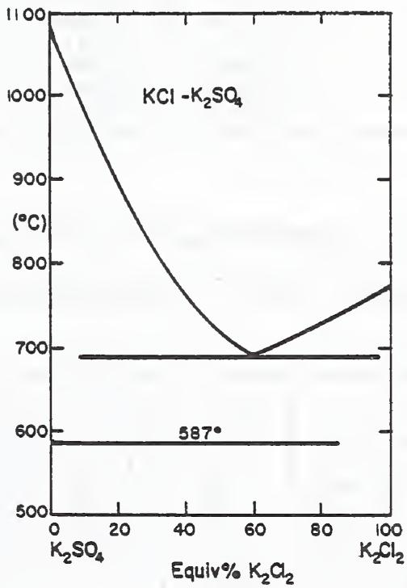  
Figure 121.1 KCl- $\mathbf{K}_2\mathbf{SO}_4$ phase diagram

References [1-22]

2. Density (p)

Measurement method: Archimedean technique [23]

Equation:

$\rho = a + bT$ (121.1)

precision: in table 121.1 uncertainty: $\sim \pm 1.0\%$

# (121) KCl-K2SO4

Table 121.1. Parameters of equation (121.1) and precisions   

<table><tr><td>Mol % K2SO4</td><td>a</td><td>-b x 104</td><td>Precision</td><td>T range(K)</td></tr><tr><td>0</td><td>2.0865</td><td>5.476</td><td>0.09%</td><td>1060-1260</td></tr><tr><td>15.3</td><td>2.2536</td><td>6.010</td><td>0.04%</td><td>1080-1200</td></tr><tr><td>22.3</td><td>2.3420</td><td>6.234</td><td>0.04%</td><td>1080-1180</td></tr><tr><td>32.4</td><td>2.4057</td><td>6.183</td><td>0.05%</td><td>1080-1160</td></tr><tr><td>43.1</td><td>2.4453</td><td>5.989</td><td>0.04%</td><td>1120-1180</td></tr><tr><td>45.0</td><td>2.4194</td><td>5.680</td><td>0.05%</td><td>1120-1180</td></tr><tr><td>55.2</td><td>2.4994</td><td>5.991</td><td>0.04%</td><td>1160-1220</td></tr><tr><td>69.4</td><td>2.4145</td><td>4.785</td><td>0.16%</td><td>1240-1320</td></tr><tr><td>80.2</td><td>2.4495</td><td>4.784</td><td>0.05%</td><td>1280-1360</td></tr><tr><td>100</td><td>2.4761</td><td>4.519</td><td>0.06%</td><td>1360-1400</td></tr></table>

Table 121.2. Density (g cm $^{-3}$ ) from equations in table 121.1   

<table><tr><td rowspan="2">T(K)</td><td colspan="6">\( \mathrm {M o l}\% \mathrm {K}_{2}\mathrm {S O}_{4} \)</td></tr><tr><td>0</td><td>22.3</td><td>32.4</td><td>43.1</td><td>69.4</td><td>80.2</td></tr><tr><td>1080</td><td>1.604</td><td>1.669</td><td>1.738</td><td></td><td></td><td></td></tr><tr><td>1100</td><td>1.592</td><td>1.656</td><td>1.725</td><td></td><td></td><td></td></tr><tr><td>1120</td><td>1.580</td><td>1.644</td><td>1.713</td><td>1.775</td><td></td><td></td></tr><tr><td>1140</td><td>1.568</td><td>1.631</td><td>1.701</td><td>1.763</td><td></td><td></td></tr><tr><td>1160</td><td>1.556</td><td>1.619</td><td>1.689</td><td>1.751</td><td></td><td></td></tr><tr><td>1180</td><td>1.544</td><td>1.606</td><td></td><td>1.739</td><td></td><td></td></tr><tr><td>1200</td><td>1.532</td><td></td><td></td><td></td><td></td><td></td></tr><tr><td>1220</td><td></td><td></td><td></td><td></td><td></td><td></td></tr><tr><td>1240</td><td></td><td></td><td></td><td></td><td>1.821</td><td></td></tr><tr><td>1260</td><td></td><td></td><td></td><td></td><td>1.812</td><td></td></tr><tr><td>1280</td><td></td><td></td><td></td><td></td><td>1.802</td><td>1.837</td></tr><tr><td>1300</td><td></td><td></td><td></td><td></td><td>1.792</td><td>1.828</td></tr><tr><td>1320</td><td></td><td></td><td></td><td></td><td>1.783</td><td>1.818</td></tr><tr><td>1340</td><td></td><td></td><td></td><td></td><td></td><td>1.809</td></tr><tr><td>1360</td><td></td><td></td><td></td><td></td><td></td><td>1.799</td></tr></table>

References [23]

$$
\mathrm {(1 2 1)} \quad \mathrm {K C l} - \mathrm {K} _ {2} \mathrm {S O} _ {4}
$$

# 3. Surface Tension (Y)

Measurement method: maximum bubble pressure [23,24]

Equation: (surface tension-temperature dependence) [23]

$$
Y = a + b T \tag {121.2}
$$

precision: in table 121.3 uncertainty: $\sim \pm 1.0\%$

Equation: (surface tension-composition isotherm) [24]

$$
Y = a ^ {\prime} + b ^ {\prime} C + c ^ {\prime} C ^ {2} \tag {121.3}
$$

$$
(C = \text {mol} \% K C 1)
$$

precision: in table 121.4 uncertainty: $\sim \pm 1.5\%$

Table 121.3. Parameters of equation (121.2) and precision   

<table><tr><td>Mol % K2SO4</td><td>a</td><td>-b x 102</td><td>Precision</td><td>T range(K)</td></tr><tr><td>15.2</td><td>177.5</td><td>7.20</td><td>*</td><td>1090-1180</td></tr><tr><td>21.3</td><td>186.9</td><td>7.50</td><td>*</td><td>1090-1200</td></tr><tr><td>35.4</td><td>186.2</td><td>6.70</td><td>*</td><td>1090-1180</td></tr><tr><td>44.7</td><td>196.1</td><td>7.20</td><td>*</td><td>1090-1180</td></tr><tr><td>60.2</td><td>212.0</td><td>7.50</td><td>*</td><td>1180-1250</td></tr><tr><td>69.9</td><td>198.3</td><td>6.10</td><td>*</td><td>1220-1270</td></tr><tr><td>79.2</td><td>205.9</td><td>6.20</td><td>*</td><td>1270-1320</td></tr></table>

\* not estimated; insufficient data

Table 121.4. Parameters of equation (121.3) and precision   

<table><tr><td>T (K)</td><td>a&#x27;</td><td>b&#x27; x 102</td><td>c&#x27; x 103</td><td>Precision</td></tr><tr><td>1348</td><td>143.5</td><td>222.</td><td>117.</td><td>*</td></tr></table>

\* not estimated; insufficient data

(121) KCl-K2SO4

Table 121.5. Surface tension (dyn cm $^{-1}$ ) from equations in table 121.3   

<table><tr><td rowspan="2">T(K)</td><td colspan="7">Mo1 % K2SO4</td></tr><tr><td>15.2</td><td>21.3</td><td>35.4</td><td>44.7</td><td>60.2</td><td>69.9</td><td>79.2</td></tr><tr><td>1090</td><td>99.2</td><td>105.6</td><td>113.2</td><td>117.6</td><td></td><td></td><td></td></tr><tr><td>1100</td><td>98.4</td><td>104.9</td><td>112.5</td><td>116.9</td><td></td><td></td><td></td></tr><tr><td>1120</td><td>97.0</td><td>103.4</td><td>111.2</td><td>115.5</td><td></td><td></td><td></td></tr><tr><td>1140</td><td>95.6</td><td>101.9</td><td>109.8</td><td>114.0</td><td></td><td></td><td></td></tr><tr><td>1160</td><td>94.1</td><td>100.4</td><td>108.5</td><td>112.6</td><td></td><td></td><td></td></tr><tr><td>1180</td><td>92.7</td><td>98.9</td><td>107.1</td><td>111.1</td><td>123.5</td><td></td><td></td></tr><tr><td>1200</td><td></td><td>97.4</td><td></td><td></td><td>122.0</td><td></td><td></td></tr><tr><td>1220</td><td></td><td></td><td></td><td></td><td>120.5</td><td>123.3</td><td></td></tr><tr><td>1240</td><td></td><td></td><td></td><td></td><td>119.0</td><td>122.1</td><td></td></tr><tr><td>1260</td><td></td><td></td><td></td><td></td><td></td><td>120.8</td><td></td></tr><tr><td>1280</td><td></td><td></td><td></td><td></td><td></td><td></td><td>126.4</td></tr><tr><td>1300</td><td></td><td></td><td></td><td></td><td></td><td></td><td>125.2</td></tr><tr><td>1320°</td><td></td><td></td><td></td><td></td><td></td><td></td><td>124.0</td></tr></table>

Table 121.6. Surface tension of isotherm at 1348 K from equation in table 121.4   

<table><tr><td>Mol % KCl</td><td>\( \gamma \) (dyn cm \( {}^{-1} \) )</td><td></td><td>Mol % KCl</td><td>\( \gamma \) (dyn cm \( {}^{-1} \) )</td></tr><tr><td>1.0</td><td>141.4</td><td></td><td>4.0</td><td>136.5</td></tr><tr><td>2.0</td><td>139.5</td><td></td><td>5.0</td><td>135.3</td></tr><tr><td>3.0</td><td>137.9</td><td></td><td>6.0</td><td>133.0</td></tr></table>

References [23,24]

4. Viscosity (η) No data   
5. Electrical Conductance (K) No data   
6. Safety and Hazards

# A. Hazard rating

(i) Toxicity: KCl, very low; $\mathrm{K}_2\mathrm{SO}_4$ , severe.   
(ii) Vapor pressure: KCl at m.pt. $(770^{\circ}\mathrm{C})$ , $\sim 0.42 \mathrm{~mm}$ ; $\mathrm{K}_2\mathrm{SO}_4$ at m.pt. $(1069^{\circ}\mathrm{C}) \sim 0.07 \mathrm{~mm}$ ; sulfates dissociate on heating to form oxides of sulfur; $\mathrm{K}_2\mathrm{SO}_4$ is relatively stable.

# (121) $\mathrm{KCl - K_2SO_4}$

# B. Disaster hazards

(i) Molten salt bath "explosions": i.e., explosive generation of steam due to bulk water "carry-over" and/or equipment failure; i.e., explosive expansion of "trapped" air.   
(ii) Chlorides evolve highly toxic fumes when heated to decomposition, or contacted with acids.   
(iii) Sulfates, when heated to decomposition, evolve $\mathrm{SO}_3$ , which, in turn, dissociates to $\mathrm{SO}_2$ and $\mathrm{O}_2$ ; toxic, aggressive fumes.

References [25-30]

# 7. Corrosion

Table 121.7. Corrosion studies from primary research literature   

<table><tr><td colspan="2">Studies</td><td>References</td></tr><tr><td rowspan="6">A</td><td>Armco Fe, various steels</td><td>[31,32,37,38]</td></tr><tr><td>Cr</td><td>[33]</td></tr><tr><td>Cr, Fe-Cr</td><td>[34]</td></tr><tr><td>Mg, Ni, Zr, Ti</td><td>[35]</td></tr><tr><td>Ti, Zr, Hf, ThCl4</td><td>[36]</td></tr><tr><td>Solubility of oxides (Ni, Ca, Zn, Mg)</td><td>[35,39]</td></tr><tr><td rowspan="3">B</td><td>Metals</td><td>[40]</td></tr><tr><td>Metals, Fe</td><td>[41]</td></tr><tr><td>Ag</td><td>[42]</td></tr><tr><td rowspan="4">C</td><td>Electrochemical approach</td><td>[43]</td></tr><tr><td>Thermodynamic redox diagrams</td><td>[40,41,44,45]</td></tr><tr><td>Molten salts corrosion: reviews</td><td>[46-48]</td></tr><tr><td>Annotated corrosion bibliography.</td><td>[49]</td></tr></table>

Compatibility studies: A: molten chlorides, principally KCl; B: molten sulfates, principally $\mathrm{K}_2\mathrm{SO}_4$ ; C: basic principles, reviews and biblios. No compatibility studies reported specifically for molten mixtures of KCl- $\mathrm{K}_2\mathrm{SO}_4$

References [31-49]

8. Diffusion

No data

9. Heat of Fusion $(\Delta H_{f}^{\circ})$

No data

10. Heat Capacity $(C_p)$ No data   
11. Volume Change on Melting $(\Delta V_{f})$ Measurement method: estimated from densities [50]

Table 121.8. Volume change on melting   

<table><tr><td>Binary eutectic (mol % KCl)</td><td>(ΔVf/Vs)</td><td>Uncertainty</td></tr><tr><td>73</td><td>15.9%</td><td>~ ±10%</td></tr></table>

References [50]

12. Vapor Pressure $(p_{vap})$ No data   
13. Thermal Conductivity (liquid) $(\lambda_{\ell})$ No data   
14. Thermal Conductivity (solid) $(\lambda_{s})$ No data   
15. Cryoscopic Constant $(k_{f})$ No data

16. References

[1] Akopov, E. K., Korobka, E. I., Zh. Neorg. Khim., 13, 2312 (1968).   
[2] Bergman, G., Kislova, A. I. and Posypaiko, V. I., Zh. Obshch. Khim., 24, 1722 (1954).   
[3] Bergman, A. G., Sementsova, A. K., Zhur. Neorg. Khim., 3, 201 (1958).   
[4] Sementsova,A.K.,Bergman,A.G.,J.Gen.Chem.USSR,26,1129 (1956).   
[5] Akopov, E. K., Bergman, A. G., Zhur. Obshchei Khim., 24, 1524 (1954). J. Gen. Chem. USSR, 24, 1509 (1954).   
[6] Dombrovskaya, O. S., Zh. Obshch. Khim., 3[8] 1019 (1933).   
[7] Janecke, E., Z. Physik. Chem., 64, 343 (1930).   
[8] Janecke, E., Muhlhaussen, W., Z. Anorg. U. Allgem. Chem., 228, 241 (1936).

(121) KCl-K $_2$ SO $_4$   
[9] Janz, G. J. Downey, J. R., Jr., Allen, C. B., and Tomkins, R. P. T., "Eutectic Data" - 2 Vols; ERDA-TID-27163-P1 & P2; NTIS, Washington, D. C. (1977).   
[10] Janz, G. J., Downey, J. R., Jr., Allen, C. B., and Tomkins, R. P. T., "Physical Properties Data Complications Relevant to Energy Storage. I. Molten Salts: Eutectic Data", NSRDS-NBS-61; U. S. Gov't Printing Office, Washington, D. C. (1978).   
[11] "International Critical Tables of Numerical Data, Physics, Chemistry, and Technology", 8 Vols., McGraw-Hill Book Co., N. Y. (1933).   
[12] "Landolt-Bornstein Zahlenwert und Funktionen aus Physik, Chemie, Astronomie, Geophysik und Technik", (10th Ed.) Springer-Verlag, Berlin, Heidelberg, N. Y. (1961).   
[13] Clark, P. V., "Fused Salt Mixtures: Eutectic Compositions and Melting Points Bibliography 1907-1968", Report No. SC-R-68-1680; Sandia Laboratories (1968), NTIS.   
[14] Robertson, W. D., "Binary Phase Diagrams of Halide Salts", Report No. Yale 2723 (2 Vols.), U. S. AEC Contract AT (30-1)-2723 (1966), NTIS.   
[15] Thoma, R. E., "Phase Diagrams of Nuclear Reactor Materials", Oak Ridge National Laboratory, ORNL-2548, Contract No. W-7405-eng-26.   
[16] Thoma, R. E., "Phase Diagrams of Binary and Ternary Fluoride Systems", Chapt. 6; Adv. Molten Salts Chemistry, Vol. 3 (J. Braunstein, G. Mamantov, and G. P. Smith, eds.), Plenum Press, N. Y. (1975).   
[17] Voskresenskaya, N. K., ed., "Handbook of Solid-Liquid Equilibria in Systems of Inorganic Salts", Volumes 1, 2, Izc. Akad. Nauk SSSR, Moscow (1961). Israel Program for Scientific Translations, Jerusalem, 1970 (NTIS).   
[18] Sinsitri, C., Franzozini, P., and Rolla, M., "An Atlas of Miscibility Gaps in Molten Salt Systems", Institute of Physical Chemistry, University of Pavia (Italy) (1968).   
[19] Shaffer, P. T. B., "High Temperature Materials", Plenum Press Handbooks of High Temperature Materials, No. 1, Materials Index, Plenum Press, New York, 1964.   
[20] Franzozini, P., Ferloni, P., and Spinolo, C., "Molten Salts with Organic Anions", Instituto di Chimica Fisica, Universita di Pavia (Italy), 1973.   
[21] Toropov, N. A. et al., "Handbook of Phase Diagrams of the Silicates, Volume 1: Binary Systems, Volume 2, Metal-Oxygen Compounds in Silicate Systems", Izdatel'stov "Nauka" Leningradskoe Otdelenie, Leningrad, 1969, Israel Program for Scientific Translations, Jerusalem, 1972 (NTIS).   
[22] Levin, E., et al., "Phase Diagrams for Ceramists", Amer. Ceramic Soc. (publ.), Columbus, Ohio (1964; 1969).   
[23] Neithamer, R. W., and Peake, J. S., J. Chem. and Eng. Data, 6, 197 (1961).   
[24] Semenchenko, V. K., Shikhobalova, L. D., Zhur. Fiz. Khim. 21, 1387 (1947).   
[25] "Dangerous Properties of Materials", Sax, N. I., Van Nostrand Reinhold Co., N. Y. (1969).   
[26] "Registry of Toxic Effects of Chemical Substances", Christensen, H. E., and Lubinybyhl, T. T., eds., U. S. Dept. H.E.W; U. S. Gov't Printing Office, Washington, D. C. (1975).

(121) $\mathrm{KCl - K_2SO_4}$   
[27] Janz, G. J., et al., "Physical Properties Data Complications Relevant to Energy Storage. Part II. Molten Salts: Data on Single and Multi-Component Salt Systems", NSRDS-NBS 61, Part II (April 1979), U. S. Gov't Printing Office, Supt of Doc. No. C13-48-61, Washington D. C. 20402.   
[28] "Potential Hazards in Molten Salt Baths for Heat Treatment of Metals", National Board Fire Underwriters Research Report No. 2. (1954).   
[29] "Handbook of Reactive Chemical Hazards", Bretherwick, L., Butterworths Co., London (1975).   
[30] Janz, G. J., Tomkins, R. P. T., Downey, J. R., Jr., and Allen, C. B., "Safety and Hazards", Chapter in "Eutectic Data", ERDA TID-27163-P1; NTIS, U. S. Dept. Commerce, Springfield, Va. (1977).   
[31] Kochergin, V. P., and Shevrina, Z., Uch. Zap. Ural. Gos. Univ., 92, 3 (1969).   
[32] Kochergin, V. P., Bochkareva, N. N., and Yarysheva, I. A., Zashch. Metal., 6, 457 (1970).   
[33] Krasil'nikoya, N. A., Ozeryanaya, I. N., and Smirnov, M. V., Zashch. Metal., 17, 466 (1974).   
[34] Krasil'nikova, N. A., Ozeryanaya, I. N., Smirnov, M. V., and Shamanova, N. D., Zashch. Metal., 10, 446 (1974).   
[35] Littlewood, R., J. Electrochem. Soc., 109, 525 (1962).   
[36] Smirnov, M. V., Kudyakov, Y. Ya., Loginov, Ya. A., Rossokhin, E. G., Posokhin, Yu. V., and Puzanova, T. A., Fiz. Khim. Elektrokhim. Rasplav. Solei Shlakov, 1, 115 (1969).   
[37] Kochergin, V. P., Garpinenko, M. G., Skornyakova, O.N., and Minulina, M. L., Zhur. Priklad. Khim., 37, 566 (1956).   
[38] Kochergin, V. P., and Maletina, L. E., Zhur. Priklad. Khim., 37(8), 1837 (1964).   
[39] Pizzini, S., "Materials Problems in the Industrial Application of Molten Salts", "Proceedings of the European Conference on the Development of Molten Salts Applications", p. 203 (1973) Battelle, Geneva.   
[40] Rahmel, A., Electrochim. Acta, 13, 495 (1968).   
[41] Burrows, B. W., and Hills, G. J., J. Inst. Fuel, 39, 168 (1966).   
[42] Rahmel, A., Corros. Sci., 13, 833 (1973).   
[43] Johnson, K. E., "Electrochemical Approaches to Corrosion in Molten Salts", Proceedings International Symposium on Metal-Slag-Gas Reactions and Processes, The Electrochemical Society, Inc., Princeton, N. J., p. 581 (1975).   
[44] Bombara, G., Baudo, G., and Tamba, A., Corrosion Sci., 8, 393 (1968)   
[45] Baudio, G., and Tamba, A., Brit. Corrosion J., 4, 129 (1969).   
[46] Smirnov, M.V., and Ozeryanaya, I. N., Nauki. Tekh. Korros. Zashch. Korros., 2, 171 (1973).   
[47] Inman, D., and Wrench, N. S., Brit. Corr. J., 1, 246 (1966).

[48] Ketelaar, J. A. A., Chemie Ing. Techn., 45, 667 (1973).   
[49] Janz, G. J., and Tomkins, R. P. T., Corrosion, 35, 485 (1979).   
[50] Janz, G. J., et al. (MSDC-RPI), unpublished work (1980).

1. Melting Temperatures $(T_{m})$

Pure substance melting points:

Li2CO3: 723°C

LiOH: 462°C

Eutectic melting point:

E1: 442°C, composition: 10.2 mol % Li2CO3 [18.5 equiv. % Li2CO3]

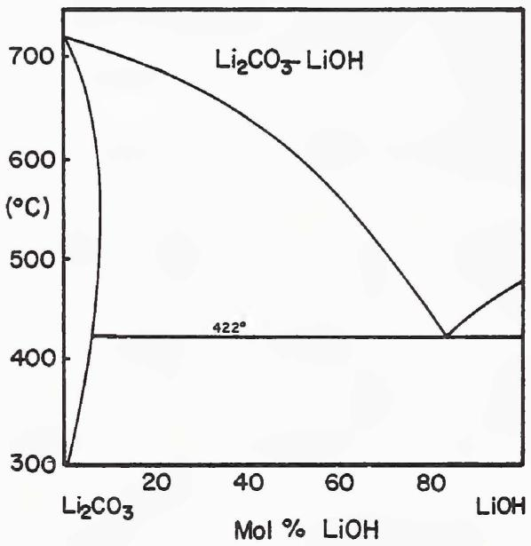  
Figure 122.1. $\mathrm{Li}_2\mathrm{CO}_3$ -LiOH phase diagram

References [1-18]

2. Density (ρ)

No data

3. Surface Tension (Y)

Measurement method: maximum bubble pressure [19]

Equation: (surface tension-composition isotherm)

$$
\gamma = a + b C + c C ^ {2} + d C ^ {3} \tag {122.1}
$$

precision: in table 122.1 uncertainty: $\sim \pm 1.5\%$

Table 122.1. Parameters of equation (122.1) and precision   

<table><tr><td>T(K)</td><td>a</td><td>-b</td><td>-c x 102</td><td>d x 104</td><td>Precision</td></tr><tr><td>1038</td><td>242.4</td><td>41.20</td><td>1.200</td><td>1.310</td><td>0.1%</td></tr></table>

# (122) $\mathrm{Li}_{2} \mathrm{CO}_{3}-\mathrm{LiOH}$

Table 122.2. Surface tension isotherm at 1038 K from equation in table 122.1   

<table><tr><td>Mol % LiOH</td><td>\( \gamma \left( {\mathrm{{dyn}}{\mathrm{{cm}}}^{-1}}\right) \)</td><td></td><td>Mol % LiOH</td><td>\( \gamma \left( {\mathrm{{dyn}}{\mathrm{{cm}}}^{-1}}\right) \)</td></tr><tr><td>5</td><td>240.02</td><td></td><td>25</td><td>226.61</td></tr><tr><td>10</td><td>237.17</td><td></td><td>30</td><td>222.74</td></tr><tr><td>15</td><td>233.92</td><td></td><td>35</td><td>218.86</td></tr><tr><td>20</td><td>230.37</td><td></td><td></td><td></td></tr></table>

# References [19]

4. Viscosity (n)

No data

5. Electrical Conductance (K)

No data

6. Safety and Hazards

# A. Hazard rating

(i) Toxicity: $\mathrm{Li}_2\mathrm{CO}_3$ , very toxic; lethal (oral) dose, $0.7\mathrm{mg/kg}$ ; LiOH, very caustic and toxic.   
(ii) Vapor pressure: LiOH at m.pt. $(460^{\circ}\mathrm{C})$ , $<< 0.5\mathrm{mm}$ ; $\mathrm{Li}_2\mathrm{CO}_3$ (m.pt. $732^{\circ}\mathrm{C}$ ) dissociates, on heating, to form the oxide and $\mathrm{CO}_2$ ; $\mathrm{CO}_2$ pressures at $730^{\circ}\mathrm{C}$ , $\sim 10\mathrm{mm}$ .

# B. Disaster hazards

(i) Molten salt bath "explosions": i.e. explosive generation of steam due to bulk water "carry-over" and/or equipment failure; i.e. explosive expansion of "trapped" air.   
(ii) Carbonates, when heated with $\mathrm{CO}_{2}$ pressures less than equilibrium dissociation pressures, decompose to form alkali metal oxides, the toxicology and disaster hazards are the same as those of very caustic solutions, i.e. react with water or steam (exothermic) to form solutions that are markedly aggressive to all body tissues (chemical burns). Lithium carbonate itself is classified as a strong caustic.   
(iii) Hydroxides react with water or steam with evolution of heat; the aqueous solution is very caustic and attacks living tissue; dangerous.

References [20-26]

# 7. Corrosion

Table 122.3. Corrosion studies from primary research literature   

<table><tr><td colspan="2">Studies</td><td>References</td></tr><tr><td rowspan="12">A</td><td>Ti alloys</td><td>[27]</td></tr><tr><td>Au, Ag, Pt, Ni, Au-Pd,</td><td>[28-31]</td></tr><tr><td>BN, MgO, Co</td><td>[32]</td></tr><tr><td>Metals, alloys</td><td>[33]</td></tr><tr><td>Pt, Pd, Rh, Ir (O2environment)</td><td>[34-37]</td></tr><tr><td>Pt, Ag, Ni, (Li2CO3, Li2O)</td><td></td></tr><tr><td>Ag, Pt, Ni, quartz, porcelain,</td><td>[38]</td></tr><tr><td>(Li2CO3, Li2O)</td><td></td></tr><tr><td>Acid-base relationships</td><td>[39-43]</td></tr><tr><td>Hydrolysis reactions</td><td>[34,41,43,44]</td></tr><tr><td>Corrosion bibliio.</td><td>[45]</td></tr><tr><td>Molten carbonates in: fuel cells, thermal energy storage, coal gasification, stack gas scrubbing</td><td>[46-51]</td></tr><tr><td rowspan="9">B</td><td>Ni</td><td>[52]</td></tr><tr><td>Cu</td><td>[53]</td></tr><tr><td>Armco Fe, steel</td><td>[54]</td></tr><tr><td>Fe, effects of H2O</td><td>[55]</td></tr><tr><td>Pt, Ag and alloys</td><td>[56-58]</td></tr><tr><td>Thermodynamics of corrosion</td><td>[59,61,62]</td></tr><tr><td>Corrosion-annotated bibliio.</td><td>[63]</td></tr><tr><td>Electrochemical aspects</td><td>[64]</td></tr><tr><td>Reviews: corrosion - molten salts</td><td>[60,65-67]</td></tr></table>

Compatibility studies: A: molten carbonates, principally $\mathrm{Li}_2\mathrm{CO}_3$ ; B: molten hydroxides, mainly LiOH. No compatibility studies specifically for $\mathrm{Li}_2\mathrm{CO}_3$ -LiOH mixtures found.

References [27-67]

8. Diffusion

No data

9. Heat of Fusion $(\Delta H_{f}^{\circ})$

No data

10. Heat Capacity $(C_p)$

No data

11. Volume Change on Melting $(\Delta V_{f})$ No data   
12. Vapor Pressure $(p_{vap})$ No data   
13. Thermal Conductivity (liquid) $(\lambda_{\ell})$ No data   
14. Thermal Conductivity (solid) $(\lambda_{s})$ No data   
15. Cryoscopic Constant $(k_{f})$ No data

# 16. References

[1] Reshetnikov, N. A., Perfileva, O. B., Zh. Neorg. Khim., 13, 1662 (1968).   
[2] Perfileva, O. G., Reshetnikov, N. A., Zhur. Neorg. Khim., 9, 1405 (1964).   
[3] Perfileva, O. G. and Reshetnikov, N. A., Zh. Neorg. Khim., 9[11], 2602 (1964); Russ. J. Inorg. Chem. (English Transl.), 1405 (1964).   
[4] Pelton, A. D. et al. "Calculation of Thermodynamic Equilibria in the Carbonate Fuel Cell" Topical Report Feb. (1980), (US DOE Contract DE-AC02-79ET15416); Proj. CDT-P501, L'Ecole Polytechnique Montréal   
[5] Janz, G. J. Downey, J. R., Jr., Allen, C. B., and Tomkins, R. P. T., "Eutectic Data" - 2 Vols; ERDA-TID-27163-P1 & P2; NTIS, Washington, D. C. (1977).   
[6] Janz, G. J., Downey, J. R., Jr., Allen, C. B., and Tomkins, R. P. T., "Physical Properties Data Complications Relevant to Energy Storage. I. Molten Salts: Eutectic Data", NSRDS-NBS-61; U. S. Gov't Printing Office, Washington, D. C. (1978).   
[7] "International Critical Tables of Numerical Data, Physics, Chemistry, and Technology", 8 Vols., McGraw-Hill Book Co., N. Y. (1933).   
[8] "Landolt-Bornstein Zahlenwert und Funktionen aus Physik, Chemie, Astronomie, Geophysik und Technik", (10th Ed.) Springer-Verlag, Berlin, Heidelberg, N. Y. (1961).   
[9] Clark, P. V., "Fused Salt Mixtures: Eutectic Compositions and Melting Points Bibliography 1907-1968", Report No. SC-R-68-1680; Sandia Laboratories (1968), NTIS.   
[10] Robertson, W. D., "Binary Phase Diagrams of Halide Salts", Report No. Yale 2723 (2 Vols.), U. S. AEC Contract AT (30-1)-2723 (1966), NTIS.   
[11] Thoma, R. E., "Phase Diagrams of Nuclear Reactor Materials", Oak Ridge National Laboratory, ORNL-2548, Contract No. W-7405-eng-26.

(122) $\mathrm{Li}_{2} \mathrm{CO}_{3}$ -LiOH

[12] Thoma, R. E., "Phase Diagrams of Binary and Ternary Fluoride Systems", Chapt. 6; Adv. Molten Salts Chemistry, Vol. 3 (J. Braunstein, G. Mamantov, and G. P. Smith, eds.), Plenum Press, N. Y. (1975).   
[13] Voskresenskaya, N. K., ed., "Handbook of Solid-Liquid Equilibria in Systems of Inorganic Salts", Volumes 1, 2, Izc. Akad. Nauk SSSR, Moscow (1961). Israel Program for Scientific Translations, Jerusalem, 1970 (NTIS).   
[14] Sinistri, C., Franzozini, P., and Rolla, M., "An Atlas of Miscibility Gaps in Molten Salt Systems", Institute of Physical Chemistry, University of Pavia (Italy) (1968).   
[15] Shaffer, P. T. B., "High Temperature Materials", Plenum Press Handbooks of High Temperature Materials, No. 1, Materials Index, Plenum Press, New York, 1964.   
[16] Franzozini, P., Ferloni, P., and Spinolo, C., "Molten Salts with Organic Anions", Instituto di Chimica Fisica, Universita di Pavia (Italy), 1973.   
[17] Toropov, N. A. et al., "Handbook of Phase Diagrams of the Silicates, Volume 1: Binary Systems, Volume 2, Metal-Oxygen Compounds in Silicate Systems", Izdatel'stov "Nauka" Leningradskoe Otdelenie, Leningrad, 1969, Israel Program for Scientific Translations, Jerusalem, 1972 (NTIS).   
[18] Levin, E., et al., "Phase Diagrams for Ceramists", Amer. Ceramic Soc. (publ.), Columbus, Ohio (1964; 1969).   
[19] Moiseev, G. K., and Stepanov, G., Electrochem. Molten and Solid Electrolytes, 4, 91 (1967)   
[20] "Dangerous Properties of Materials", Sax, N. I., Van Nostrand Reinhold Co., N. Y. (1969).   
[21] "Registry of Toxic Effects of Chemical Substances", Christensen, H. E., and Lubinybyh1, T. T., eds., U. S. Dept. H.E.W; U. S. Gov't Printing Office, Washington, D. C. (1975).   
[22] Janz, G. J., et al., "Physical Properties Data Complications Relevant to Energy Storage. Part II. Molten Salts: Data on Single and Multi-Component Salt Systems", NSRDS-NBS 61, Part II (April 1979), U. S. Gov't Printing Office, Supt of Doc. No. C13-48-61, Washington D. C. 20402.   
[23] "Potential Hazards in Molten Salt Baths for Heat Treatment of Metals", National Board Fire Underwriters Research Report No. 2. (1954).   
[24] "Handbook of Reactive Chemical Hazards", Bretherwick, L., Butterworths Co., London (1975).   
[25] Janz, G. J., Tomkins, R. P. T., Downey, J. R., Jr., and Allen, C. B., "Safety and Hazards", Chapter in "Eutectic Data", ERDA TID-27163-P1; NTIS, U. S. Dept. Commerce, Springfield, Va. (1977).   
[26] vide: this work, System 68, LiOH.   
[27] Ozeryanaya, I. N., Manukhina, T. I., and Smirnov, M. V., Zashch. Metal, 8, 128 (1972).   
[28] Janz, G. J., and Conte, A., Electrochim. Acta 10, 1269 (1964)   
[29] Janz, G. J., Conte, A., and Neuenschwander, E., Corrosion, 19, 292 (1963).

(122) $\mathrm{Li}_{2} \mathrm{CO}_{3}$ -LiOH   
[30] Janz, G. J., and Lorenz, M. R., Rev. Sci. Instruments, 32, 130 (1961).   
[31] Bartlett, H. E., and Johnson, K. E., J. Electrochem. Soc., 114, 457 (1967).   
[32] Davis, H. J., and Kinnibrugh, D. R., J. Electrochem. Soc., 117, 392 (1970).   
[33] Scheer, J. J., van Arkel, A. E., and Heyding, R. D., Can. J. Chem., 33, 683 (1955).   
[34] Andersen, B. K., "Thermodynamic Properties of Molten Carbonates", Ph.D. Thesis, Tech. Univ. Denmark (1975).   
[35] Papin, G., Michaud, M., and Bouaziz, R., C. R. Acad. Sc., Paris, 268, Ser. C, 1691 (1969).   
[36] Bouaziz, R., and Papin, G., Compt. Rend. Acad. Sci., Paris, 266, series C, 1530 (1968).   
[37] Smirnov, M. V., Lyubimtseva, I. Ya., Tsiovkina, L.A., and Krasnov, Yu., N. Russ. J. Inorg. Chem., 16, 130 (1971)   
[38] Cohen-Adad, R., Michaud, M., Said, J., and Rollet, A. F., Bull. Soc. Chim. Fr., 356 (1961).   
[39] Dubois, J., "Chemical and Electrochemical Reactions of Molten Alkali Carbonates as Fuel Cell Electrolytes", Ph.D. Thesis, Fac. Sci. Univ. Paris, France (1964).   
[40] Ingram, M. D., and Janz, G. J., Electrochim. Acta 10, 783 (1965)   
[41] Busson, N., Palous, S., Buvet, R., and Millet, J., Compt. Rend., 260, 720 6097 (1965)   
[42] Ingram, M. D., Baron, B., and Janz, G. J., Electrochim. Acta 11, 1629(1966)   
[43] Janz, G. J., J. Chem. Educ. 44, 581 (1967)   
[44] Busson, N., Palous, S., Millet, J., and Buvet, R., Electrochim. Acta, 12, 910 (1967).   
[45] Janz, G. J., and Tomkins, R. P. T., Corrosion, 35, 485 (1979).   
[46] Maru, H. C., et al. (Institute of Gas Technology), "Molten Salt Thermal Energy Storage Systems: Salt Selections", Rpt. COO-2888-1, ERDA Contract NO. E(11-1)-2888; NTIS, U. S. Dept. Commerce, Springfield, Va. (Aug. 1976).   
[47] Maru, H. C., et al. (Institute of Gas Technology), "Fuel Cell Research on Second Generation Molten Carbonate Systems: II. Characteristics of Carbonate Melts", Quarterly Status Rpt., Project 8984, ERDA Contract No. 31-109-38-3552, (Sept. 1976).   
[48] Atomics International; "Development of a Molten Carbonate Process for Removal of Sulfur Dioxide from Power Plant Stack Gases", Progress Rpt. No. 2, U. S. Public Health Services, Contract PH 86-67-128, Canoga Park, Ca. (1968).   
[49] Grantham, L. F., and Ferry, R. B., "Corrosion in Alkali Metal Carbonate-Based Melts", Proc. International Symp. Fused Salts, J. P. Pemsler, ed., Electrochemical Soc., Inc., Princeton, N. J., 270 (1976).

(122) $\mathrm{Li}_{2} \mathrm{CO}_{3}-\mathrm{LiOH}$   
[50] Botts, W. V., Kohl, A. L., and Trilling, C. A., "Low BTU Gasification of Coal by Atomics International's Molten Salt Process", Proceedings of the 11th Intersociety Energy Conversion Engineering Conference, 1, 280 (Sept. 1976).   
[51] Cover, A. E., Schreiner, W. C., and Skaperdas, G. T., "The Kellogg Coal Gasification Process", Extended Abstracts, American Chemical Soc. Meeting, Washington, D. C. (1971).   
[52] Gurowich, E. I., Zh. Prikl. Khim., 32, 817 (1959).   
[53] Smith, G. P., Hoffman, E. E., Corrosion, 13, 627t (1957).   
[54] Smith, G. P., Hoffman, E. E., Steidlitz, M. E., Corrosion, 13, 56lt (1957).   
[55] Tribunskii, V. V., Kalinichenko, I. I., Tr. Ural. Politekh. Inst., 190, 49 (1970).   
[56] Rahmel, A., Kruger, H., Werkst. Korros., 18, 193 (1967).   
[57] Kruger, H., Rahmel, A., Schwenk, W., Electrochim. Acta, 13, 625 (1968).   
[58] Afanas'yev, A. S., Gamazov, V. P., Zh. Fiz. Khim., 38, 2823 (1964).   
[59] Littlewood, R., J. Electrochem. Soc., 109, 525 (1962).   
[60] Pizzini, S., "Materials Problems in the Industrial Applications of Molten Salts", Proceedings of the European Conference on the Development of Molten Salts Applications", p. 203 (1973) Battelle, Geneva.   
[61] Edeleanu, C., and Littlewood, R., Electrochimica Acta, 3, 195 (1960).   
[62] Littlewood, R., and Argent, E. A., Electrochimica Acta, 4, 114 (1961).   
[63] Janz, G. J., and Tomkins, R. P. T., Corrosion, 35, 485 (1979).   
[64] Johnson, K. E., "Electrochemical Approaches to Corrosion in Molten Salts", Proceedings International Symposium on Metal-Slag-Gas Reactions and Processes", The Electrochemical Society, Inc., Princeton, N. J., p. 581 (1975).   
[65] Inman, D., and Wrench, N. S., Brit. Corr. J., 1, 246 (1966).   
[66] Ketelaar, J. A. A., Chem. Ing. Tech., 45, 667 (1973).   
[67] Smirnov, M. V., and Ozeryanaya, I. W., Nauki Tekh. Korros. Zaschch. Korros., 2, 171 (1973).

System 123 $\mathrm{Li}_2\mathrm{CO}_3 - \mathrm{Li}_2\mathrm{SO}_4$

1. Melting Temperature $(T_{m})$

Pure substance melting points:

$$
\mathrm {L i} _ {2} \mathrm {C O} _ {3}: 7 2 3 ^ {\circ} \mathrm {C}
$$

$$
\begin{array}{c c} \mathrm {L i} _ {2} \mathrm {S O} _ {4}: & 8 5 9 ^ {\circ} \mathrm {C} \end{array}
$$

Eutectic melting point:

$534^{\circ} \mathrm{C}$ , composition: $38.5 \, \text{mol} \, \% \, \text{Li}_2 \text{CO}_3$

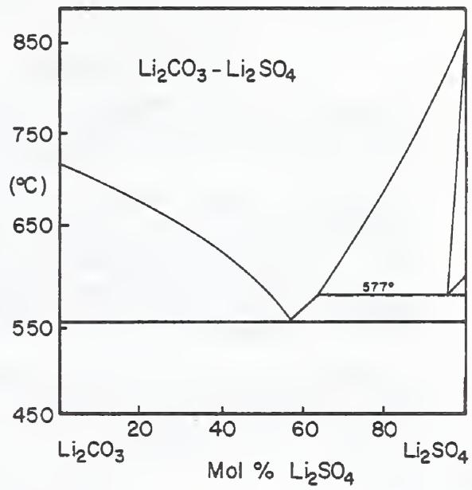  
Figure 123.1. $\mathrm{Li}_2\mathrm{CO}_3 - \mathrm{Li}_2\mathrm{SO}_4$ phase diagram

References [1-19]

2. Density (p)

No data

3. Surface Tension (γ)

No data

4. Viscosity (n)

No data

5. Electrical Conductance (K)

No data

# 6. Safety and Hazards

# A. Hazard rating

(i) Toxicity: $\mathrm{Li}_2\mathrm{CO}_3$ , very toxic; lethal (oral) dose, $0.7\mathrm{mg/kg}$ ; $\mathrm{Li}_2\mathrm{SO}_4$ , unknown; for an inorganic sulfate, the toxicity is generally that of the cation, i.e. in this case, lithium.   
(ii) Vapor pressure: $\mathrm{Li}_2\mathrm{CO}_3$ (m.pt. $723^{\circ}\mathrm{C}$ ) dissociates on heating to the oxide and $\mathrm{CO}_2$ ; $\mathrm{CO}_2$ pressure at $730^{\circ}\mathrm{C}, \sim 10\mathrm{mm}$ ; $\mathrm{Li}_2\mathrm{SO}_4$ (m.pt. $8/59^{\circ}\mathrm{C}$ ), decomposes to oxides of sulfur (aggressive and toxic fumes) just above its m.pt.

# B. Disaster hazards

(i) Molten salt bath "explosions": i.e. explosive generation of steam due to bulk water "carry-over" and/or equipment failure; i.e. explosive expansion of "trapped" air.   
(ii) Carbonates, when heated with $\mathrm{CO}_{2}$ pressures less than equilibrium dissociation pressures, decompose to form alkali metal oxides; the toxicology and disaster hazards are the same as those of very caustic solutions, i.e. react with water or steam (exothermic) to form solutions that are markedly aggressive to all body tissues (chemical burns). Lithium carbonate itself is classified as a strong caustic.   
(iii) Sulfates when heated to decomposition, decompose, evolving $\mathrm{SO}_3$ , which in turn dissociates to $\mathrm{SO}_2$ and $\mathrm{O}_2$ (see above); toxic, corrosive fumes.

References [20-26]

# 7. Corrosion

Table 123.1. Corrosion studies from primary research literature   

<table><tr><td colspan="2">Studies</td><td>References</td></tr><tr><td rowspan="10">A</td><td>Ti alloys</td><td>[27]</td></tr><tr><td>Au, Ag, Pt, Ni, Au-Pd, BN, MgO, Co</td><td>[28-31]</td></tr><tr><td>Metals, alloys</td><td>[32]</td></tr><tr><td>Pt, Pd, Rh, Ir (O2environment)</td><td>[33]</td></tr><tr><td>Pt, Ag, Ni, (Li2CO3, Li2O)</td><td>[34-37]</td></tr><tr><td>Ag, Pt, Ni, quartz, porcelain (Li2CO3, Li2O)</td><td>[38]</td></tr><tr><td>Acid-base relationships</td><td>[39-43]</td></tr><tr><td>Hydrolysis reactions</td><td>[34,41,43,44]</td></tr><tr><td>Corrosion biblio.</td><td>[45]</td></tr><tr><td>Molten carbonates in: thermal energy storage, coal gasification, stack gas scrubbing</td><td>[46-51]</td></tr><tr><td rowspan="5">B</td><td>Fe, various metals</td><td>[52-54]</td></tr><tr><td>Ag</td><td>[55]</td></tr><tr><td>Thermodynamic redox diagrams</td><td>[31,52,55,56]</td></tr><tr><td>Electrochemical aspects</td><td>[57] Reviews</td></tr><tr><td>Reviews and annotated corrosion biblio.</td><td>[45,58-60]</td></tr></table>

Compatibility studies: A: molten carbonates, principally $\mathsf{Li}_2\mathsf{CO}_3$ ; B: molten sulfates, principally $\mathsf{Li}_2\mathsf{SO}_4$ . No compatibility studies specifically for molten $\mathsf{Li}_2\mathsf{CO}_3 - \mathsf{Li}_2\mathsf{SO}_4$ mixtures found.

References [27-60]

8. Diffusion No data   
9. Heat of Fusion $(\Delta H_{f}^{\circ})$ No data   
10. Heat Capacity $(C_p)$ No data   
11. Volume Change on Melting $(\Delta V_{f})$ No data

(123) $\mathrm{Li}_2\mathrm{CO}_3 - \mathrm{Li}_2\mathrm{SO}_4$

12. Vapor Pressure $(p_{vap})$ No data   
13. Thermal Conductivity (liquid) $(\lambda_{\mathrm{g}})$ No data   
14. Thermal Conductivity (solid) $(\lambda_{s})$ No data   
15. Cryoscopic Constant $(k_{f})$ No data

# 16. References

[1] Volkov, N. N., and Volkova, L. F., Izv. Fiz. Khim. Nauch-Issled. Inst. Irkuts Gos. Univ. 2(1) 65 (1953).   
[2] Reshetnikov, N. A., and Diogenov., Izv. Fiz. Khim. Nauch-Issled. Inst. Irkuts. Gos. Univ., 2(1), 14 (1953).   
[3] Amadori, M., Atti reale accad. Lincei, Sez. II, 21, 68 (1912).   
[4] Le Chatelier, H., Compt. Rend., 118, 709 (1894).   
[5] Pelton, A. D. et al. "Calculation of Thermodynamic Equilibria in the Carbonate Fuel Cell" Topical Report Feb. (1980), (US DOE Contract DE-AC02-79ET15416); Proj. CDT-P501, L'Ecole Polytechnique Montréal   
[6] Janz, G. J. Downey, J. R., Jr., Allen, C. B., and Tomkins, R. P. T., "Eutectic Data" - 2 Vols; ERDA-TID-27163-P1 & P2; NTIS, Washington, D. C. (1977).   
[7] Janz, G. J., Downey, J. R., Jr., Allen, C. B., and Tomkins, R. P. T., "Physical Properties Data Complications Relevant to Energy Storage. I. Molten Salts: Eutectic Data", NSRDS-NBS-61; U. S. Gov't Printing Office, Washington, D. C. (1978).   
[8] "International Critical Tables of Numerical Data, Physics, Chemistry, and Technology", 8 Vols., McGraw-Hill Book Co., N. Y. (1933).   
[9] "Landolt-Bornstein Zahlenwert und Funktionen aus Physik, Chemie, Astronomie, Geophysik und Technik", (10th Ed.) Springer-Verlag, Berlin, Heidelberg, N. Y. (1961).   
[10] Clark, P. V., "Fused Salt Mixtures: Eutectic Compositions and Melting Points Bibliography 1907-1968", Report No. SC-R-68-1680; Sandia Laboratories (1968), NTIS.   
[11] Robertson, W. D., "Binary Phase Diagrams of Halide Salts", Report No. Yale 2723 (2 Vols.), U. S. AEC Contract AT (30-1)-2723 (1966), NTIS.   
[12] Thoma, R. E., "Phase Diagrams of Nuclear Reactor Materials", Oak Ridge National Laboratory, ORNL-2548, Contract No. W-7405-eng-26.   
[13] Thoma, R. E., "Phase Diagrams of Binary and Ternary Fluoride Systems", Chapt. 6; Adv. Molten Salts Chemistry, Vol. 3 (J. Braunstein, G. Mamantov, and G. P. Smith, eds.), Plenum Press, N. Y. (1975).

(123) $\mathrm{Li}_{2} \mathrm{CO}_{3} - \mathrm{Li}_{2} \mathrm{SO}_{4}$   
[14] Voskresenskaya, N. K., ed., "Handbook of Solid-Liquid Equilibria in Systems of Inorganic Salts", Volumes 1, 2, Izc. Akad. Nauk SSSR, Moscow (1961). Israel Program for Scientific Translations, Jerusalem, 1970 (NTIS).   
[15] Sinsitri, C., Franzozini, P., and Rolla, M., "An Atlas of Miscibility Gaps in Molten Salt Systems", Institute of Physical Chemistry, University of Pavia (Italy) (1968).   
[16] Shaffer, P. T. B., "High Temperature Materials", Plenum Press Handbooks of High Temperature Materials, No. 1, Materials Index, Plenum Press, New York, 1964.   
[17] Franzozini, P., Ferloni, P., and Spinolo, C., "Molten Salts with Organic Anions", Instituto di Chimica Fisica, Universita di Pavia (Italy), 1973.   
[18] Toropov, N. A. et al., "Handbook of Phase Diagrams of the Silicates, Volume 1: Binary Systems, Volume 2, Metal-Oxygen Compounds in Silicate Systems", Izdatel'stov "Nauka" Leningradskoe Otdelenie, Leningrad, 1969, Israel Program for Scientific Translations, Jerusalem, 1972 (NTIS).   
[19] Levin, E., et al., "Phase Diagrams for Ceramists", Amer. Ceramic Soc. (publ.), Columbus, Ohio (1964; 1969).   
[20] "Dangerous Properties of Materials", Sax, N. I., Van Nostrand Reinhold Co., N. Y. (1969).   
[21] "Registry of Toxic Effects of Chemical Substances", Christensen, H. E., and Lubinybyhl, T. T., eds., U. S. Dept. H.E.W; U. S. Gov't Printing Office, Washington, D. C. (1975).   
[22] Stern, K. H., High Temperature Properties and Decomposition of Inorganic Salts. Part I. Sulfates", U. S. Dept. Commerce NBS-NSRDS-7; U. S. Gov't Printing Office, Washington, D. C. (1966).   
[23] "Potential Hazards in Molten Salt Baths for Heat Treatment of Metals", National Board Fire Underwriters Research Report No. 2. (1954).   
[24] "Handbook of Reactive Chemical Hazards", Bretherwick, L., Butterworths Co., London (1975).   
[25] Janz, G. J., Tomkins, R. P. T., Downey, J. R., Jr., and Allen, C. B., "Safety and Hazards", Chapter in "Eutectic Data", ERDA TID-27163-P1; NTIS, U. S. Dept. Commerce, Springfield, Va. (1977).   
[26] Janz, G. J., et al., "Physical Properties Data Complications Relevant to Energy Storage. Part II. Molten Salts: Data on Single and Multi-Component Salt Systems", NSRDS-NBS 61, Part II (April 1979), U. S. Gov't Printing Office, Supt of Doc. No. C13-48-61, Washington D. C. 20402.   
[27] Ozeryanaya, I. N., Manukhina, T. I., and Smirnov, M. V., Zashch. Metal, 8, 128 (1972).   
[28] Janz, G. J., and Conte, A., Electrochim. Acta 10, 1269 (1964)   
[29] Janz, G. J., Conte, A., and Neuenschwander, E., Corrosion, 19, 292 (1963).   
[30] Janz, G. J., and Lorenz, M. R., Rev. Sci. Instruments, 32, 130 (1961).   
[31] Bartlett, H. E., and Johnson, K. E., Canad. J. Chem., 44, 2119 (1966).

(123) $\mathrm{Li}_{2} \mathrm{CO}_{3} - \mathrm{Li}_{2} \mathrm{SO}_{4}$   
[32] Davis, H. J., and Kinnibrugh, D. R., J. Electrochem. Soc., 117, 392 (1970).   
[33] Scheer, J. J., van Arkel, A. E., and Heyding, R. D., Can. J. Chem., 33, 683 (1955).   
[34] Andersen, B. K., "Thermodynamic Properties of Molten Carbonates", Ph.D. Thesis, Tech. Univ. Denmark (1975).   
[35] Papin, G., Michaud, M., and Bouaziz, R., C. R. Acad. Sc., Paris, 268, Ser. C, 1691 (1969).   
[36] Bouaziz, R., and Papin, G., Compt. Rend. Acad. Sci., Paris, 266, series C, 1530 (1968).   
[37] Smirnov, M. V., Lyubimtseva, I. Ya., Tsiovkina, L. A., and Krasnov, Yu., N. Russ. J. Inorg. Chem., 16, 130 (1971)   
[38] Cohen-Adad, R., Michaud, M., Said, J., and Rollet, A. F., Bull. Soc. Chim. Fr., 356 (1961).   
[39] Dubois, J., "Chemical and Electrochemical Reactions of Molten Alkali Carbonates as Fuel Cell Electrolytes", Ph.D. Thesis, Fac. Sci. Univ. Paris, France (1964).   
[40] Ingram, M. D., and Janz, G. J., Electrochim. Acta 10, 783 (1965)   
[41] Busson, N., Palous, S., Buvet, R., and Millet, J., Compt. Rend., 260, 720 6097 (1965)   
[42] Ingram, M. D., Baron, B., and Janz, G. J., Electrochim. Acta 11, 1629(1966)   
[43] Janz, G. J., J. Chem. Educ. 44, 581 (1967)   
[44] Busson, N., Palous, S., Millet, J., and Buvet, R., Electrochim. Acta, 12, 910 (1967).   
[45] Janz, G. J., and Tomkins, R. P. T., Corrosion, 35, 485 (1979).   
[46] Maru, H. C., et al. (Institute of Gas Technology), "Molten Salt Thermal Energy Storage Systems: Salt Selections", Rpt. COO-2888-1, ERDA Contract NO. E(11-1)-2888; NTIS, U. S. Dept. Commerce, Springfield, Va. (Aug. 1976).   
[47] Maru, H. C., et al. (Institute of Gas Technology), "Fuel Cell Research on Second Generation Molten Carbonate Systems: II. Characteristics of Carbonate Melts", Quarterly Status Rpt., Project 8984, ERDA Contract No. 31-109-38-3552, (Sept. 1976).   
[48] Atomics International; "Development of a Molten Carbonate Process for Removal of Sulfur Dioxide from Power Plant Stack Gases", Progress Rpt. No. 2, U. S. Public Health Services, Contract PH 86-67-128, Canoga Park, Ca. (1968).   
[49] Grantham, L. F., and Ferry, R. B., "Corrosion in Alkali Metal Carbonate-Based Melts", Proc. International Symp. Fused Salts, J. P. Pemsler, ed., Electrochemical Soc., Inc., Princeton, N. J., 270 (1976).   
[50] Botts, W. V., Kohl, A. L., and Trilling, C. A., "Low BTU Gasification of Coal by Atomics International's Molten Salt Process", Proceedings of the 11th Intersociety Energy Conversion Engineering Conference, 1, 280 (Sept. 1976).

(123) $\mathrm{Li}_2\mathrm{CO}_3 - \mathrm{Li}_2\mathrm{SO}_4$   
[51] Cover, A. E., Schreiner, W. C., and Skaperdas, G. T., "The Kellogg Coal Gasification Process", Extended Abstracts, American Chemical Soc. Meeting, Washington, D. C. (1971).   
[52] Rahmel, A., Electrochim. Acta, 13, 495 (1968).   
[53] Dubois, J., and Richard, J., Rev. Gen. Therm., 12, 805 (1973).   
[54] Burrows, B. W., and Hills, G. J., J. Inst. Fuel, 39, 168 (1966).   
[55] Rahmel, A., Corros. Sci., 13, 833 (1973).   
[56] Baudo, G., and Tamba, A., Brit. Corrosion J., 4, 129 (1969).   
[57] Johnson, K. E., "Electrical Approaches to Corrosion in Molten Salts", Proceedings International Symposium on Metal-Slag-Gas Reactions and Processes, The Electrochemical Society, Inc., Princeton, N. J. p. 581 (1975).   
[58] Smirnov, M.V., and Ozeryanaya, I. N., Nauki. Tekh. Korros. Zashch. Korros., 2, 171 (1973).   
[59] Inman, D., and Wrench, N. S., Brit. Corr. J., 1, 246 (1966).   
[60] Ketelaar, J. A. A., Chemie Ing. Techn., 45, 667 (1973).

1. Melting Temperature $(T_{m})$

Pure substance melting points:

$$
\begin{array}{l} \mathrm {L i} _ {2} \mathrm {C O} _ {3}: 7 2 3 \pm 3 ^ {\circ} \mathrm {C} \\ \mathrm {K} _ {2} \mathrm {S O} _ {4}: 1 0 6 9 \pm 3 ^ {\circ} \mathrm {C} \\ \end{array}
$$

Eutectic 1, melting point:

$$
470^{\circ}C, \text {composition}: 60 \mathrm{mol}\% \mathrm{Li}_{2}\mathrm{SO}_{4}; 26.5 \mathrm{mol}\% \mathrm{Li}_{2}\mathrm{CO}_{3}; 13.5 \mathrm{mol}\% \mathrm{K}_{2}\mathrm{SO}_{4}
$$

Eutectic 2, melting point:

$$
562^{\circ}C, \text {composition}: 55\mathrm{mol}\% \mathrm{Li}_{2}\mathrm{CO}_{3}; 35\mathrm{mol}\% \mathrm{K}_{2}\mathrm{SO}_{4}; 10\mathrm{mol}\% \mathrm{Li}_{2}\mathrm{SO}_{4}
$$

Peritectic melting point:

$$
565^{\circ}C, \text {composition}: 65.83 \mathrm{mol}\% \mathrm{K}_{2}\mathrm{SO}_{4}; 34.17 \mathrm{mol}\% \mathrm{Li}_{2}\mathrm{CO}_{3}
$$

Reciprocal Salt Pair Reaction:

$$
\mathrm {L i} _ {2} \mathrm {S O} _ {4} + \mathrm {K} _ {2} \mathrm {C O} _ {3} \rightleftharpoons \mathrm {K} _ {2} \mathrm {S O} _ {4} + \mathrm {L i} _ {2} \mathrm {C O} _ {3} + 5. 3 \text {k c a l e q u i v} ^ {- 1}
$$

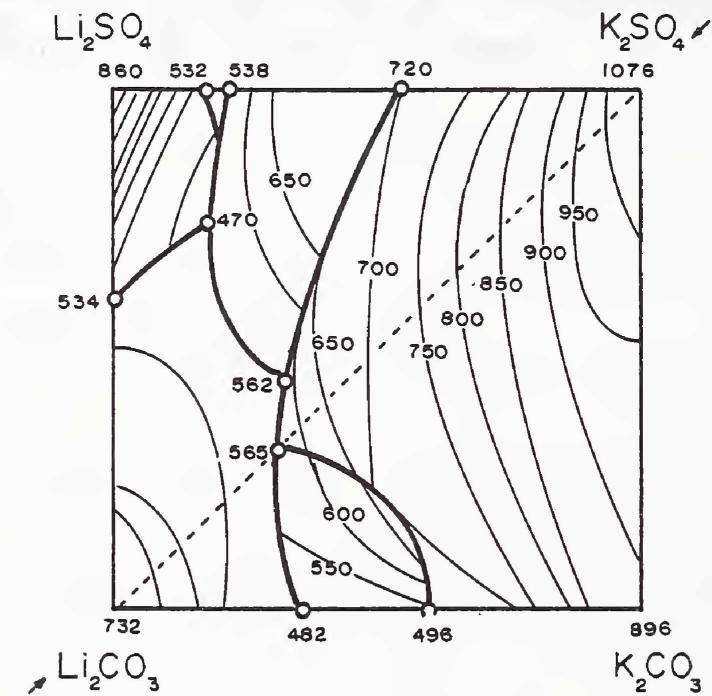  
Figure 124.1. Phase diagram for Li, K/CO₃, SO₄ system.

System $\mathrm{Li}_2\mathrm{CO}_3 - \mathrm{K}_2\mathrm{SO}_4$ is the diagonal as marked; note the reciprocal salt pair reaction

$$
\mathrm {L i} _ {2} \mathrm {S O} _ {4} + \mathrm {K} _ {2} \mathrm {C O} _ {3} = \mathrm {K} _ {2} \mathrm {S O} _ {4} + \mathrm {L i} _ {2} \mathrm {C O} _ {3} + 5. 3 \text {k c a l e q u i v} ^ {- 1}
$$

References [1-15]

2. Density (p)

Measurement method: Archimedean technique [16]

Equation:

$$
\rho = a + b T \quad (1 2 4. 1)
$$

precision: in table 124.1

uncertainty: $\sim \pm 3.0\%$

Table 124.1. Parameters of equation (124.1) and precision   

<table><tr><td>Mol % K2SO4</td><td>a</td><td>-b x 103</td><td>Precision</td><td>T range(K)</td></tr><tr><td>10</td><td>2.2439</td><td>0.3778</td><td>*</td><td>1270-1370</td></tr><tr><td>20</td><td>2.3014</td><td>0.4046</td><td>*</td><td>1170-1370</td></tr><tr><td>30</td><td>2.3792</td><td>0.4439</td><td>*</td><td>1070-1370</td></tr><tr><td>40</td><td>2.4014</td><td>0.4441</td><td>*</td><td>1020-1370</td></tr><tr><td>50</td><td>2.3591</td><td>0.3881</td><td>*</td><td>970-1370</td></tr><tr><td>60</td><td>2.4054</td><td>0.4150</td><td>*</td><td>870-1370</td></tr><tr><td>70</td><td>2.4265</td><td>0.4261</td><td>*</td><td>870-1370</td></tr><tr><td>80</td><td>2.4139</td><td>0.4036</td><td>*</td><td>870-1370</td></tr></table>

\* not estimated, data in equation form

Table 124.2. Density $(\mathrm{gcm}^{-3})$ from equations in table 124.1   

<table><tr><td rowspan="2">T(K)</td><td colspan="8">Mol % K2SO4</td></tr><tr><td>10</td><td>20</td><td>30</td><td>40</td><td>50</td><td>60</td><td>70</td><td>80</td></tr><tr><td>870</td><td></td><td></td><td></td><td></td><td></td><td>2.044</td><td>2.056</td><td>2.063</td></tr><tr><td>910</td><td></td><td></td><td></td><td></td><td></td><td>2.028</td><td>2.039</td><td>2.047</td></tr><tr><td>950</td><td></td><td></td><td></td><td></td><td></td><td>2.011</td><td>2.022</td><td>2.030</td></tr><tr><td>990</td><td></td><td></td><td></td><td></td><td>1.975</td><td>1.995</td><td>2.005</td><td>2.014</td></tr><tr><td>1030</td><td></td><td></td><td></td><td>1.944</td><td>1.959</td><td>1.978</td><td>1.988</td><td>1.998</td></tr><tr><td>1070</td><td></td><td></td><td>1.904</td><td>1.926</td><td>1.944</td><td>1.961</td><td>1.971</td><td>1.982</td></tr><tr><td>1110</td><td></td><td></td><td>1.886</td><td>1.908</td><td>1.928</td><td>1.945</td><td>1.954</td><td>1.966</td></tr><tr><td>1150</td><td></td><td></td><td>1.869</td><td>1.891</td><td>1.913</td><td>1.928</td><td>1.936</td><td>1.950</td></tr><tr><td>1190</td><td></td><td>1.820</td><td>1.851</td><td>1.873</td><td>1.897</td><td>1.912</td><td>1.919</td><td>1.934</td></tr><tr><td>1230</td><td></td><td>1.804</td><td>1.833</td><td>1.855</td><td>1.882</td><td>1.895</td><td>1.902</td><td>1.917</td></tr><tr><td>1270</td><td>1.764</td><td>1.788</td><td>1.815</td><td>1.837</td><td>1.866</td><td>1.878</td><td>1.885</td><td>1.901</td></tr><tr><td>1310</td><td>1.749</td><td>1.771</td><td>1.798</td><td>1.820</td><td>1.851</td><td>1.862</td><td>1.868</td><td>1.885</td></tr><tr><td>1350</td><td>1.734</td><td>1.755</td><td>1.780</td><td>1.802</td><td>1.835</td><td>1.845</td><td>1.851</td><td>1.869</td></tr><tr><td>1370</td><td>1.726</td><td>1.747</td><td>1.771</td><td>1.793</td><td>1.827</td><td>1.837</td><td>1.843</td><td>1.861</td></tr></table>

References [16]

3. Surface Tension (γ)

No data

4. Viscosity (n)

No data

$$
\mathrm {L i} _ {2} \mathrm {C O} _ {3} - \mathrm {K} _ {2} \mathrm {S O} _ {4} \tag {124}
$$

5. Electrical Conductance (K)

Measurement method: classical ac technique [17]

Equation:

$$
\begin{array}{l} \kappa = 2. 6 4 0 3 - 7. 3 3 2 \times 1 0 ^ {- 2} C + 9. 9 1 9 \times 1 0 ^ {- 4} C ^ {2} - 4. 4 7 0 \times 1 0 ^ {- 6} C ^ {3} \tag {124.2} \\ \left(\mathrm {C} = \mathrm {mol} \% \mathrm {K} _ {2} \mathrm {SO} _ {4}\right) \\ \end{array}
$$

precision: $\sim \pm 6.5\%$ uncertainty: $\sim \pm 3.0\%$

Table 124.3. Specific conductance from equation (124.2)   

<table><tr><td>Mol % K2SO4</td><td>K
(ohm-1cm-1)</td><td>Mol % K2SO4</td><td>K
(ohm-1cm-1)</td></tr><tr><td>10</td><td>2.002</td><td>50</td><td>0.895</td></tr><tr><td>20</td><td>1.535</td><td>60</td><td>0.846</td></tr><tr><td>30</td><td>1.213</td><td>70</td><td>0.835</td></tr><tr><td>40</td><td>1.008</td><td>80</td><td>0.834</td></tr></table>

Specific conductance calculated from equivalent conductance data interpolated from [17] and density data equations from [16].

References [16,17]

6. Safety and Hazards

# A. Hazard rating

(i) Toxicity: $\mathrm{K}_2\mathrm{CO}_3$ , classified as strongly caustic; $\mathrm{Li}_2\mathrm{SO}_4$ ; the toxic qualities are those of the cation, lithium.   
(ii) Vapor pressure: $\mathrm{K}_2\mathrm{CO}_3$ (m.pt. $898^{\circ}\mathrm{C}$ ) decomposes on heating to the oxide and oxygen.

# B. Disaster hazards

(i) Molten salt bath "explosions": i.e. explosive generation of steam due to bulk water "carry-over" and/or equipment failure; i.e., explosive expansion of "trapped" air.   
(ii) Carbonates, when heated with $\mathrm{CO}_{2}$ pressures less than equilibrium dissolution pressures, decompose to form alkali metal oxides; the toxicology and disaster hazards are the same as those of very caustic solutions, i.e. react with water or steam (exothermic) to form solutions that are markedly aggressive to all body tissues (chemical burns). Potassium carbonate itself is classified as a strong caustic.   
(iii) Sulfates, when heated to decomposition, decompose, evolving $\mathrm{SO}_3$ , which in turn dissociates to $\mathrm{SO}_2$ and $\mathrm{O}_2$ (see above); toxic, corrosive fumes.

References [18-24].

# 7. Corrosion

Table 124.4. Corrosion studies from primary research literature   

<table><tr><td colspan="2">Studies</td><td>References</td></tr><tr><td rowspan="14">A</td><td>Ti alloys</td><td>[25]</td></tr><tr><td>Au, Ag, Pt, Ni, Au-Pd,</td><td>[26-29]</td></tr><tr><td>BN, MgO, Co</td><td></td></tr><tr><td>Metals, alloys</td><td>[30]</td></tr><tr><td>Pt, Pd, Rh, Ir (O2environment)</td><td>[31]</td></tr><tr><td>Pt, Ag, Ni (Li2CO3, Li2O)</td><td>[32-35]</td></tr><tr><td>Ag, Pt, N, quartz, porcelain,</td><td></td></tr><tr><td>(Li2CO3, Li2O)</td><td>[36]</td></tr><tr><td>Acid-base relationships</td><td>[37-41]</td></tr><tr><td>Hydrolysis reactions</td><td>[32,39,41,42]</td></tr><tr><td>Corrosoion bibliio.</td><td>[43]</td></tr><tr><td>Molten carbonates in: fuel cells,</td><td></td></tr><tr><td>thermal energy storage, coal</td><td></td></tr><tr><td>gasification, stack gas scrubbing</td><td>[44-49]</td></tr><tr><td rowspan="6">B</td><td>Fe, metals</td><td>[50,51]</td></tr><tr><td>Ag</td><td>[52]</td></tr><tr><td>Electrochemical approach</td><td>[53]</td></tr><tr><td>Thermodynamic redox diagrams</td><td>[50,51,54,55]</td></tr><tr><td>Molten salts corrosion rev.</td><td>[56-58]</td></tr><tr><td>Annotated corrosion bibliio.</td><td>[43]</td></tr></table>

Compatibility studies: A: various molten carbonates, principally $\mathrm{Li}_2\mathrm{CO}_3$ ; B: various molten sulfates, principally $\mathrm{K}_2\mathrm{SO}_4$ . No compatibility studies for molten $\mathrm{Li}_2\mathrm{CO}_3-\mathrm{K}_2\mathrm{SO}_4$ mixtures found.

References [25-58]

8. Diffusion

No data

9. Heat of Fusion $(\Delta H_{f}^{\circ})$

No data

10. Heat Capacity $(C_p)$

No data

(124) $\mathrm{Li}_{2} \mathrm{CO}_{3} - \mathrm{K}_{2} \mathrm{SO}_{4}$

11. Volume Change on Melting $(\Delta V_{f})$ No data   
12. Vapor Pressure $(p_{vap})$ No data   
13. Thermal Conductivity (liquid) $(\lambda_{\mathrm{L}})$ No data   
14. Thermal Conductivity (solid) $(\lambda_{s})$ No data   
15. Cryoscopic Constant $(k_{f})$ No data   
16. References

[1] Janz, G. J. Downey, J. R., Jr., Allen, C. B., and Tomkins, R. P. T., "Eutectic Data" - 2 Vols; ERDA-TID-27163-P1 & P2; NTIS, Washington, D. C. (1977).   
[2] Janz, G. J., Downey, J. R., Jr., Allen, C. B., and Tomkins, R. P. T., "Physical Properties Data Complications Relevant to Energy Storage. I. Molten Salts: Eutectic Data", NSRDS-NBS-61; U. S. Gov't Printing Office, Washington, D. C. (1978).   
[3] "International Critical Tables of Numerical Data, Physics, Chemistry, and Technology", 8 Vols., McGraw-Hill Book Co., N. Y. (1933).   
[4] "Landolt-Bornstein Zahlenwert und Funktionen aus Physik, Chemie, Astronomie, Geophysik und Technik", (10th Ed.) Springer-Verlag, Berlin, Heidelberg, N. Y. (1961).   
[5] Clark, P. V., "Fused Salt Mixtures: Eutectic Compositions and Melting Points Bibliography 1907-1968", Report No. SC-R-68-1680; Sandia Laboratories (1968), NTIS.   
[6] Robertson, W. D., "Binary Phase Diagrams of Halide Salts", Report No. Yale 2723 (2 Vols.), U. S. AEC Contract AT (30-1)-2723 (1966), NTIS.   
[7] Thoma, R. E., "Phase Diagrams of Nuclear Reactor Materials", Oak Ridge National Laboratory, ORNL-2548, Contract No. W-7405-eng-26.   
[8] Thoma, R. E., "Phase Diagrams of Binary and Ternary Fluoride Systems", Chapt. 6; Adv. Molten Salts Chemistry, Vol. 3 (J. Braunstein, G. Mamantov, and G. P. Smith, eds.), Plenum Press, N. Y. (1975).   
[9] Voskresenskaya, N. K., ed., "Handbook of Solid-Liquid Equilibria in Systems of Inorganic Salts", Volumes 1, 2, Izc. Akad. Nauk SSSR, Moscow (1961). Israel Program for Scientific Translations, Jerusalem, 1970 (NTIS).   
[10] Sinistri, C., Franzozini, P., and Rolla, M., "An Atlas of Miscibility Gaps in Molten Salt Systems", Institute of Physical Chemistry, University of Pavia (Italy) (1968).

(124) $\mathrm{Li}_{2} \mathrm{CO}_{3} - \mathrm{K}_{2} \mathrm{SO}_{4}$   
[11] Shaffer, P. T. B., "High Temperature Materials", Plenum Press Handbooks of High Temperature Materials, No. 1, Materials Index, Plenum Press, New York, 1964.   
[12] Franzozini, P., Ferloni, P., and Spinolo, C., "Molten Salts with Organic Anions", Instituto di Chimica Fisica, Universita di Pavia (Italy), 1973.   
[13] Toropov, N. A. et al., "Handbook of Phase Diagrams of the Silicates, Volume 1: Binary Systems, Volume 2, Metal-Oxygen Compounds in Silicate Systems", Izdatel'stov "Nauka" Leningradskoe Otdelenie, Leningrad, 1969, Israel Program for Scientific Translations, Jerusalem, 1972 (NTIS).   
[14] Levin, E., et al., "Phase Diagrams for Ceramists", Amer. Ceramic Soc. (publ.), Columbus, Ohio (1964; 1969).   
[15] Volkova, L. F., Izv. Fiz. Khim. n.-i. in-ta pri Irkutskom gosuniversiteta, 4, 115 (1959).   
[16] Priskyazhinyi, V. D., and Zvagol'skaya, E. V., Ukr. Khim. Zh., 34, 773 (1968) (Soviet Prog. in Chemistry 34, 17 (1968).   
[17] Markov, B. F., Polishchuk, A. F., and Zvagol'skaya, E. V., Ukr. Khim. Zh. 39, 262 (1973).   
[18] "Dangerous Properties of Materials", Sax, N. I., Van Nostrand Reinhold Co., N. Y. (1969).   
[19] "Registry of Toxic Effects of Chemical Substances", Christensen, H. E., and Lubinbyhl, T. T., eds., U. S. Dept. H. E. W., U. S. Gov't Printing Office, Washington, D. C. (1975).   
[20] Janz, G. J., et al., "Physical Properties Data Complications Relevant to Energy Storage. Part II. Molten Salts: Data and Multi-component Salt Systems", NSRDS-NBS 61, Part II (April, 1979), U. S. Gov't Printing Office, Supt. of Doc. No. C13-48-61, Washington, D. C. 20402.   
[21] "Potential Hazards in Molten Salt Baths for Heat Treatment of Metals", National Board of Fire Underwriters Research Report No. 2 (1954).   
[22] "Handbook of Reactive Chemical Hazards", Bretherwick, L., Butterworth Co., London (1975).   
[23] Janz, G. J., Tomkins, R. P. T., Downey, J. R. Jr., and Allen, C. B., "Safety and Hazards", Chapter in "Eutectic Data", ERDA TID-27163-P1; NTIS, U. S. Dept. Commerce, Springfield, Va. (1977)   
[24] "High Temperature Properties and Decomposition of Inorganic Salts. Part I. Sulfates", Stern, K. H., U. S. Dept. Commerce NBS-NSRDS-7; U. S. Gov't Printing Office, Washington, D. C. (1966).   
[25] Ozeryanaya, I. N., Manukhina, T. I., and Smirnov, M. V., Zashch. Metal, 8, 128 (1972).   
[26] Janz, G. J. and Conte, A., Electrochim. Acta 9, 1269 (1964).   
[27] Janz, G. J., Conte, A., and Neuenschwander, E., Corrosion, 19, 292 (1963).   
[28] Janz, G. J., and Lorenz, M. R., Rev. Sci. Instruments, 32, 130 (1961).   
[29] Bartlett, H. E., and Johnson, K. E., J. Electrochem. Soc., 114, 457 (1967).

(124) $\mathrm{Li}_{2} \mathrm{CO}_{3} - \mathrm{K}_{2} \mathrm{SO}_{4}$   
[30] Davis, H. J., and Kinnibrugh, D. R., J. Electrochem. Soc., 117, 392 (1970).   
[31] Scheer, J. J., van Arkel, A. E., and Heyding, R. D., Can. J. Chem., 33, 683 (1955).   
[32] Andersen, B. K., "Thermodynamic Properties of Molten Carbonates", Ph.D. Thesis, Tech. Univ. Denmark (1975).   
[33] Papin, G., Michaud, M., and Bouaziz, R., C. R. Acad. Sc., Paris, 268, Ser. C, 1691 (1969).   
[34] Bouaziz, R., and Papin, G., Compt. Rend. Acad. Sci., Paris, 266, series C, 1530 (1968).   
[35] Smirnov, M. V., Lyubimtseva, I. Ya., Tsiovkina, L. A., and Kramov, Yu. N. Russ. J. Inorg. Chem., 16, 130 (1971)   
[36] Cohen-Adad, R., Michaud, M., Said, J., and Rollet, A. F., Bull. Soc. Chim. Fr., 356 (1961).   
[37] Dubois, J., "Chemical and Electrochemical Reactions of Molten Alkali Carbonates as Fuel Cell Electrolytes", Ph.D. Thesis, Fac. Sci. Univ. Paris, France (1964).   
[38] Ingram, M. D., and Janz, G. J., Electrochim. Acta, 10, 783 (1965).   
[39] Busson, N., Palous, S., Buvet, R., and Millet. J., J. Compt. Rend., 260, 720, 6097 (1965)   
[40] Ingram, M. D., Baron, B., and Janz, G. J., Electrochim. Acta 11, 1629 (1966)   
[41] Janz, G. J., J. Chem. Ed., 44, 581 (1967).   
[42] Busson, N., Palous, S., Millet, J., and Buvet, R., Electrochim. Acta, 12, 910 (1967).   
[43] Janz, G. J., and Tomkins, R. P. T., Corrosion, 35, 485 (1979).   
[44] Maru, H. C., et al. (Institute of Gas Technology), "Molten Salt Thermal Energy Storage Systems: Salt Selections", Rpt. COO-2888-1, ERDA Contract NO. E(11-1)-2888; NTIS, U. S. Dept. Commerce, Springfield, Va. (Aug. 1976).   
[45] Maru, H. C., et al. (Institute of Gas Technology), "Fuel Cell Research on Second Generation Molten Carbonate Systems: II. Characteristics of Carbonate Melts", Quarterly Status Rpt., Project 8984, ERDA Contract No. 31-109-38-3552, (Sept. 1976).   
[46] Atomics International; "Development of a Molten Carbonate Process for Removal of Sulfur Dioxide from Power Plant Stack Gases", Progress Rpt. No. 2, U. S. Public Health Services, Contract PH 86-67-128, Canoga Park, Ca. (1968).   
[47] Grantham, L. F., and Ferry, R. B., "Corrosion in Alkali Metal Carbonate-Based Melts", Proc. International Symp. Fused Salts, J. P. Pemsler, ed., Electrochemical Soc., Inc., Princeton, N. J., 270 (1976).   
[48] Botts, W. V., Kohl, A. L., and Trilling, C. A., "Low BTU Gasification of Coal by Atomics International's Molten Salt Process", Proceedings of the 11th Intersociety Energy Conversion Engineering Conference, 1, 280 (Sept. 1976).   
[49] Cover, A. E., Schreiner, W. C., and Skaperdas, G. T., "The Kellogg Coal Gasification Process", Extended Abstracts, American Chemical Soc. Meeting, Washington, D. C. (1971).

$$
\mathrm {L i} _ {2} \mathrm {C O} _ {3} - \mathrm {K} _ {2} \mathrm {S O} _ {4} \tag {124}
$$

[50] Rahmel, A., Electrochim. Acta, 13, 495 (1968).   
[51] Burrows, B. W., and Hills, G. J., J. Inst. Fuel, 39, 168 (1966).   
[52] Rahmel, A., Corros. Sci., 13, 833 (1973).   
[53] Johnson, K. E., "Electrical Approaches to Corrosion in Molten Salts", Proceedings International Symposium on Metal-Slag-Gas Reactions and Processes, The Electrochemical Society, Inc., Princeton, N. J. p. 581 (1975).   
[54] Bombara, G., Baudio, G., and Tamba, A., Corrosion Sci., 8, 393 (1968).   
[55] Baudo, G., and Tamba, A., Brit. Corrosion J., 4, 129 (1969).   
[56] Smirnov, M.V., and Ozeryanaya, I. N., Nauki. Tekh. Korros. Zashch. Korros., 2, 171 (1973).   
[57] Inman, D., and Wrench, N. S., Brit. Corr. J., 1, 246 (1966).   
[58] Ketelaar, J. A. A., Chemie Ing. Techn., 45, 667 (1973).

$$
\text {S y s t e m} 1 2 5 \mathrm {N a O H - N a} _ {2} \mathrm {C O} _ {3}
$$

1. Melting Temperatures $(T_{m})$

Pure substance melting points:

Na2CO3: 858°C

NaOH: $318^{\circ} \mathrm{C}$

Eutectic melting point:

283°C, composition: 7.2 mol % Na₂CO₃

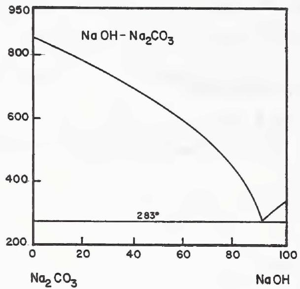  
$\mathrm{Mol}\% \quad \mathrm{NaOH}$   
Figure 125.1. NaOH- $\mathrm{Na}_2\mathrm{CO}_3$ phase diagram

References [1-18]

2. Density (ρ)

Measurement method: Archimedean technique [19]

Equation:

$$
\rho = a + b T \tag {125.1}
$$

precision: in table 125.1

uncertainty: $\sim \pm 2.0\%$

Table 125.1. Parameters of equation (125.1) and precisions   

<table><tr><td>Mol % Na2CO3</td><td>a</td><td>-b x 104</td><td>Precision</td><td>T range(K)</td></tr><tr><td>2.09</td><td>2.1026</td><td>5.000</td><td>0.00%</td><td>590-720</td></tr><tr><td>3.61</td><td>2.1037</td><td>4.837</td><td>0.01%</td><td>590-720</td></tr><tr><td>7.19</td><td>2.1411</td><td>4.928</td><td>0.02%</td><td>590-720</td></tr><tr><td>9.37</td><td>2.1648</td><td>5.061</td><td>0.02%</td><td>590-720</td></tr></table>

# (125) $\mathrm{NaOH - Na_2CO_3}$

Table 125.2. Density (g cm $^{-3}$ ) from equations in table 125.1   

<table><tr><td rowspan="2">T(K)</td><td colspan="4">\( \mathrm {Mol}\% \mathrm {Na}_{2}\mathrm {CO}_{3} \)</td></tr><tr><td>2.09</td><td>3.61</td><td>7.19</td><td>9.37</td></tr><tr><td>590</td><td>1.808</td><td>1.818</td><td>1.850</td><td>1.866</td></tr><tr><td>600</td><td>1.803</td><td>1.813</td><td>1.845</td><td>1.861</td></tr><tr><td>610</td><td>1.797</td><td>1.809</td><td>1.840</td><td>1.856</td></tr><tr><td>620</td><td>1.793</td><td>1.804</td><td>1.835</td><td>1.851</td></tr><tr><td>630</td><td>1.788</td><td>1.798</td><td>1.831</td><td>1.846</td></tr><tr><td>640</td><td>1.783</td><td>1.794</td><td>1.826</td><td>1.841</td></tr><tr><td>650</td><td>1.778</td><td>1.789</td><td>1.821</td><td>1.836</td></tr><tr><td>660</td><td>1.773</td><td>1.784</td><td>1.816</td><td>1.831</td></tr><tr><td>670</td><td>1.768</td><td>1.780</td><td>1.811</td><td>1.826</td></tr><tr><td>680</td><td>1.763</td><td>1.775</td><td>1.806</td><td>1.821</td></tr><tr><td>690</td><td>1.758</td><td>1.770</td><td>1.801</td><td>1.816</td></tr><tr><td>700</td><td>1.753</td><td>1.765</td><td>1.796</td><td>1.811</td></tr><tr><td>710</td><td>1.748</td><td>1.760</td><td>1.791</td><td>1.805</td></tr><tr><td>720</td><td>1.743</td><td>1.755</td><td>1.786</td><td>1.800</td></tr></table>

References [19]

3. Surface Tension (Y)

No data

4. Viscosity (n)

No data

5. Electrical Conductance (K)

No data

6. Safety and Hazards

# A. Hazard rating

(i) Toxicity: NaOH, very caustic and corrosive to all body tissue; Na $_2$ CO $_3$ , moderate toxicity.   
(ii) Vapor pressure: no information for this system; but see $\mathrm{Na}_2\mathrm{CO}_3$ [22], and NaOH [23]

# B. Disaster hazards

(i) Molten salt bath "explosions": i.e. explosive generation of steam due to bulk water "carry-over" and/or equipment failure; i.e., explosive expansion of "trapped" air.   
(ii) NaOH: Hydroxides react exothermically with water or steam; the aqueous solution is strongly caustic; attacks living tissue; dangerous.

$\mathrm{Na_2CO_3}$ : When heated with $\mathrm{CO_2}$ pressures less than equilibrium dissociation pressures, decomposes to form alkali metal oxide; the toxicology and disaster hazards are the same as those of very caustic solutions, i.e. react with water or steam (exothermic) to form solutions that are markedly aggressive to all body tissues (chemical burns).

References [20-26].

Table 125.3. Corrosion studies from primary research literature   

<table><tr><td colspan="2">Systems, Studies, and [References]</td></tr><tr><td>A</td><td>Si [27], Pt [28], Metals [29], Cu-Zn [30], Pt, Au, 
Ag, MgO [31-34], Pt, Rh, Pd, Ir (O2environment) [35], 
Au, Ag, Al2O3(N2atmosphere; Na2CO3-Na2O) [36-38], 
quartz, porcelain, Ag, Pt, Ni (N2atmosphere; Na2CO3-Na2O) [39], boron nitride [34,40], β-alumina [40], 
Fe (Na2CO3-Na halides) [41], acid-base relationships [42-45], H2O hydrolysis reactions [46-48], molten 
carbonates: fuel cells, thermal energy storage, coal 
gasification [40,41,49-54]</td></tr><tr><td>B</td><td>Metals [55], metals, ceramics, alloys [55-62], 
stainless steel [63], Ni-Cr-Fe, Ni-Si-Cu [59,64], 
Ni-Mo, Ni, Cu, Armco Fe [65-67], Al2O3, ZrO2[58], 
Ni [56-58,65,68-71], Ni steels [72], Fe (effects of 
H2O) [73], Pt, Ag, alloys [74-76], thermodynamic 
and electrochemical approach [77-79], reviews 
[80-82], annotated corrosion bibliography. [83]</td></tr></table>

A: corrosion studies in molten carbonates; principally molten $\mathrm{Na}_2\mathrm{CO}_3$ ; B: corrosion studies in molten hydroxides; principally molten $\mathrm{NaOH}$ . No compatibility studies with molten mixtures of $\mathrm{Na}_2\mathrm{CO}_3$ - $\mathrm{NaOH}$ found.

References [27-83]

8. Diffusion

No data

9. Heat of Fusion $(\Delta H_{f}^{\circ})$

No data

10. Heat Capacity (Cp)

No data

11. Volume Change on Melting $(\Delta V_{f})$

Measurement method: estimated from densities [84]

Table 125.4. Volume change on melting   

<table><tr><td>Binary eutectic (mol % Na2CO3)</td><td>(ΔVf/Vs)</td><td>Uncertainty</td></tr><tr><td>7.2%</td><td>12.5%</td><td>~ ± 10%</td></tr></table>

References [84]

# (125) $\mathrm{NaOH - Na_2CO_3}$

12. Vapor Pressure $(p_{vap})$ No data   
13. Thermal Conductivity (liquid) $(\lambda_{2})$ No data   
14. Thermal Conductivity (solid) $(\lambda_{s})$ No data   
15. Cryoscopic Constant $(k_{f})$ No data   
16. References

[1] Pelton, A. D. et al. "Calculation of Thermodynamic Equilibria in the Carbonate Fuel Cell" Topical Report Feb. (1980), (US DOE Contract DE-AC02-79ET15416); Proj. CDT-P501, L'Ecole Polytechnique Montréal   
[2] Alexander, J., Hindin, S. G., Ind. and Chem. Eng., 39, 1044 (1947).   
[3] Rolin, M., Recapèt, J., Bull. Soc. Chim. France, 2110 (1964).   
[4] Khitrov, V. A., Izvest. Sektora Fiz.-Khim. Anal., Inst. Obshchei Neorg. Khim., Akad. Nauk S.S.S.R., 25, 243 (1954).   
[5] Janz, G. J. Downey, J. R., Jr., Allen, C. B., and Tomkins, R. P. T., "Eutectic Data" - 2 Vols; ERDA-TID-27163-P1 & P2; NTIS, Washington, D. C. (1977).   
[6] Janz, G. J., Downey, J. R., Jr., Allen, C. B., and Tomkins, R. P. T., "Physical Properties Data Complications Relevant to Energy Storage. I. Molten Salts: Eutectic Data", NSRDS-NBS-61; U. S. Gov't Printing Office, Washington, D. C. (1978).   
[7] "International Critical Tables of Numerical Data, Physics, Chemistry, and Technology", 8 Vols., McGraw-Hill Book Co., N. Y. (1933).   
[8] "Landolt-Bornstein Zahlenwert und Funktionen aus Physik, Chemie, Astronomie, Geophysik und Technik", (10th Ed.) Springer-Verlag, Berlin, Heidelberg, N. Y. (1961).   
[9] Clark, P. V., "Fused Salt Mixtures: Eutectic Compositions and Melting Points Bibliography 1907-1968", Report No. SC-R-68-1680; Sandia Laboratories (1968), NTIS.   
[10] Robertson, W. D., "Binary Phase Diagrams of Halide Salts", Report No. Yale 2723 (2 Vols.), U. S. AEC Contract AT (30-1)-2723 (1966), NTIS.   
[11] Thoma, R. E., "Phase Diagrams of Nuclear Reactor Materials", Oak Ridge National Laboratory, ORNL-2548, Contract No. W-7405-eng-26.   
[12] Thoma, R. E., "Phase Diagrams of Binary and Ternary Fluoride Systems", Chapt. 6; Adv. Molten Salts Chemistry, Vol. 3 (J. Braunstein, G. Mamantov, and G. P. Smith, eds.), Plenum Press, N. Y. (1975).   
[13] Voskresenskaya, N. K., ed., "Handbook of Solid-Liquid Equilibria in Systems of Inorganic Salts", Volumes 1, 2, Izc. Akad. Nauk SSSR, Moscow (1961). Israel Program for Scientific Translations, Jerusalem, 1970 (NTIS).   
[14] Sinistri, C., Franzozini, P., and Rolla, M., "An Atlas of Miscibility Gaps in Molten Salt Systems", Institute of Physical Chemistry, University of Pavia (Italy) (1968).   
[15] Shaffer, P. T. B., "High Temperature Materials", Plenum Press Handbooks of High Temperature Materials, No. 1, Materials Index, Plenum Press, New York, 1964.

(125) NaOH-NaCO3   
[16] Franzozini, P., Ferloni, P., and Spinolo, C., "Molten Salts with Organic Anions", Instituto di Chimica Fisica, Universita di Pavia (Italy), 1973.   
[17] Toropov, N. A. et al., "Handbook of Phase Diagrams of the Silicates, Volume 1: Binary Systems, Volume 2, Metal-Oxygen Compounds in Silicate Systems", Izdatel'stov "Nauka" Leningradskoe Otdelenie, Leningrad, 1969, Israel Program for Scientific Translations, Jerusalem, 1972 (NTIS).   
[18] Levin, E., et al., "Phase Diagrams for Ceramists", Amer. Ceramic Soc. (publ.), Columbus, Ohio (1964; 1969).   
[19] Arndt, K. and Ploetz, G., Z. Phys. Chem. 121, 439 (1926)   
[20] "Dangerous Properties of Materials", Sax, N. I., Van Nostrand Reinhold Co., N. Y. (1969).   
[21] "Registry of Toxic Effects of Chemical Substances", Christensen, H. E., and Lubinbyhl, T. T., eds., U. S. Dept. H. E. W., U. S. Gov't Printing Office, Washington, D. C. (1975).   
[22] Janz, G. J., et al., "Physical Properties Data Complications Relevant to Energy Storage. Part II. Molten Salts: Data on Single and Multi-Component Salt Systems", NSRDS-NBS 61, Part II (April 1979), U. S. Gov't Printing Office, Supt of Doc. No. C13-48-61, Washington D. C. 20402.   
[23] "Potential Hazards in Molten Salt Baths for Heat Treatment of Metals", National Board of Fire Underwriters Research Report No.2 (1954).   
[24] "Handbook of Reactive Chemical Hazards", Bretherwick, L., Butterworth Co., London (1975).   
[25] Janz, G. J., Tomkins, R. P. T., Downey, J. R. Jr., and Allen, C. B., "Safety and Hazards", Chapter in "Eutectic Data", ERDA TID-27163-P1; NTIS, U. S. Dept. Commerce, Springfield, Va. (1977)   
[26] vide: this work, System 69, NaOH   
[27] Cable, M., and Martlew, D., Glass Technol., 12, 142 (1971).   
[28] Schncider, Yu. G., Kondrat'ev, Yu. N., and Maksimov, N. N., Zashch. Metal, 9, 199 (1973).   
[29] Ozeryanaya, I. N., Penyagina, O. P., Manukhina, T. I., and Smirnov, M. V., Fiz. Khim. Elektrokhim, Rasplav. Solei Tverd. Elektrolit, 2, 96 (1973).   
[30] Sizintseva, N. F., Stepanov, G. K., and Belyaeva, G. I., Tr. Inst. Elektrokhim., Ural. Nauch. Tsentr; Akad. Nauk, USSR, 19, 92 (1973).   
[31] Janz, G. J., Conte, A., and Neuenschwander, E., Corrosion, 19, 292 (1963).   
[32] Janz, G. J., and Conte, A., Corrosion, 20, 237 (1964).   
[33] Rodigina, E. N., and Stepanov, G. K., Trudy Inst. Elektrokhim. Ural. Fil. Akad. Nauk, SSSR, 3, 77 (1962).   
[34] Janz, G. J., and Lorenz, M. R., Rev. Sci. Instruments, 32, 130 (1961).   
[35] Scheer, J. J., van Arkel, A. E., and Heyding, R. D., Can. J. Chem., 33, 683 (1955).   
[36] Bouaziz, R., and Papin, G., Compt. Rend. Acad. Sci., Paris, 266, series C, 1530 (1968).   
[37] Rolin, M. and Recapet, J. M., Bull. Soc. Chim. Fr., 2110 (1964)   
[38] Papin, G., Michaud, M., and Bouaziz, R., C. R. Acad. Sc., Paris, 268, Ser. C, 1691 (1969).

(125) $\mathrm{NaOH - Na}_{2}\mathrm{CO}_{3}$   
[39] Cohen-Adad, R., Michaud, M., Said, J., and Rollet, A. F., Bull. Soc. Chim. Fr., 356 (1961).   
[40] Braunstein, J., et al., "Molten Carbonate Fuel Cell Research at ORNL", Rpt. ORNL/TM-5886; NTIS, U. S. dept. Commerce, Springfield, Va. (May 1977).   
[41] Cover, A. E., Schreiner, W. C., and Skaperdas, G. T., "The Kellogg Coal Gasification Process", Extended Abstracts, American Chemical Soc. Meeting, Washington, D. C. (1971).   
[42] Dubois, J., "Chemical and Electrochemical Reactions of Molten Alkali Carbonates as Fuel Cell Electrolytes", Ph.D. Thesis, Fac. Sci. Univ. Paris, France (1964).   
[43] Ingram, M. D. and Janz, G. J., Electrochim. Acta 10, 783 (1965)   
[44] Busson, N., Palous, S., Buvet, R., and Millet, J., Compt. Rend. 260, 720, 6097 (1965)   
[45] Ingram, M. D., Baron, B., and Janz, G. J., Electrochim. Acta 11, 1629 (1966)   
[46] Andersen, B. K., "Thermodynamic Properties of Molten Carbonates", Ph.D. Thesis, Tech. Univ. Denmark (1975).   
[47] Janz, G. J., J. Chem. Ed., 44, 581 (1967).   
[48] Busson, N., Palous, S., Millet, J., and Buvet, R., Electrochim. Acta, 12, 910 (1967).   
[49] Maru, H. C., et al. (Institute of Gas Technology), "Molten Salt Thermal Energy Storage Systems: Salt Selections", Rpt. COO-2888-1, ERDA Contract NO. E(11-1)-2888; NTIS, U. S. Dept. Commerce, Springfield, Va. (Aug. 1976).   
[50] Maru, H. C., et al. (Institute of Gas Technology), "Fuel Cell Research on Second Generation Molten Carbonate Systems: II. Characteristics of Carbonate Melts", Quarterly Status Rpt., Project 8984, ERDA Contract No. 31-109-38-3552, (Sept. 1976).   
[51] Atomics International; "Development of a Molten Carbonate Process for Removal of Sulfur Dioxide from Power Plant Stack Gases", Progress Rpt. No. 2, U. S. Public Health Services, Contract PH 86-67-128, Canoga Park, Ca. (1968).   
[52] Graham, L. F., and Ferry, R. B., "Corrosion in Alkali Metal Carbonate-Based Melts", Proc. International Symp. Fused Salts, J. P. Pemsler, ed., Electrochemical Soc., Inc., Princeton, N. J., 270 (1976).   
[53] Botts, W. V., Kohl, A. L., and Trilling, C. A., "Low BTU Gasification of Coal by Atomics International's Molten Salt Process", Proceedings of the 11th Intersociety Energy Conversion Engineering Conference, 1, 280 (Sept. 1976).   
[54] Kochergin, V. P., and Ignat'eva, N. I., Russ. J. Inorg. Chem., 6(9), 1086 (1961).   
[55] Anon, "Oak Ridge National Laboratory, Proceedings of the 1st Information Meeting on Hydroxide and Metal Interaction", ORNL CF-51-11-204, (1953).   
[56] Miller, R. R., "The Thermal Properties of Sodium Hydroxide and Lithium Metal", 4th Progr. Rept. Nov. 1 (1952)-Jan. 31 (1953) NRL-Memo-130: Progr. Rept. No. 1, Naval Research Lab., (1952).   
[57] Williams, D. D., Ewing, C. T., "Thermal and Related Physical Properties of Molten Materials", Prog. Rept. Feb. 1 - May 1, (1953) NRL-Memo-170, Progress Report 5, Naval Research Lab., (1953).

[58] Craighead, C. M., Smith, L. A., Phillips, E. C., Jaffee, R. I., "Continued Studies of Corrosion by Fused Caustic", AECD-3704, Battelle Memorial Institute, (1952).   
[59] Gregory, J. N., Hodge, N., Iredale, J. V. G., "The Static Corrosion of Nickel and Other Materials in Molten Caustic Soda", British Report AERE-C/M-272, (1956).   
[60] Smith, G. P., "Corrosion of Materials in Fused Hydroxides", Am. Inst. Mining at Engrs., Inst. Metals Div., Spec. Rept, #2, 71 (1956).   
[61] Smith, G. P., "Corrosion of Materials in Fused Hydroxides", ORNL-2048, Oak Ridge National Laboratory, (1956).   
[62] Smothers, W. J., Prog. Rept., Jan. 1 - March 31, (1953), AECU-2872, Univ. of Ark., (1953).   
[63] Smith, G. P., Hoffman, E. E., "Corrosion Products Formed in the Reaction between Fused Sodium Hydroxide and Iron-Rich Alloys of Iron, Chromium and Nickel", ORNL-2156, Oak Ridge National Laboratory, (1957).   
[64] Smith, G. P., Steidlitz, M. E., Hoffman, E. E., Corrosion, 11, 47t (1958).   
[65] Gurowich, E. I., Zh. Prikl. Khim., 32, 817 (1959).   
[66] Smith, G. P., Hoffman, E. E., Corrosion, 13, 627t (1957).   
[67] Smith, G. P., Hoffman, E. E., Steidlitz, M. E., Corrosion, 13, 561t (1957).   
[68] Manly, W. D., "Operation of a Ni-NaOH Thermal Convection Loop", ORNL CF-51-11-186, Oak Ridge National Laboratory, (1951).   
[69] Miller, N. E., Simons, E. M., Chem. Eng. Progr. Symp. Ser. No. 19, Amer., Inst. Chem. Eng., 52, 113 (1956).   
[70] Simmons, E. M., Miller, N. E., Stang, J. H., Weaver, C. V., "Corrosion and Component Studies on Systems Containing Fused NaOH", BMI-1118, Battelle Memorial Institute, (1956).   
[71] Gregory, J. N., Hodge, N., Iredale, J. V. G., "The State Corrosion and Erosion of Nickel by Molten Caustic Soda and Sodium Uranate Suspensions under Dynamic Conditions", British Report AERE/C/M-273, (1956).   
[72] Kolotii, A. A., Vengzhen, G. S., Zashch. Met., 11, 61 (1975).   
[73] Tribunskii, V. V., Kalinichenko, I. I., Tr. Ural. Politekh. Inst., 190, 49 (1970).   
[74] Rahmel, A., Kruger, H., Werkst. Korros., 18, 193 (1967).   
[75] Kruger, H., Rahmel, A., Schwenk, W., Electrochim. Acta, 13, 625 (1968).   
[76] Afanas'yev, A. S., Gamazov, V. P., Zh. Fiz. Khim., 38, 2823 (1964).   
[77] Pizzini, S., "Materials Problems in the Industrial Applications of Molten Salts", Proceedings of the European Conference on the Development of Molten Salts Applications, p. 203 (1973); Battelle, Geneva.   
[78] Johnson, K. E., "Electrochemical Approaches to Corrosion in Molten Salts", Proceedings International Symposium on Metal-Slag-Gas Reactions and Processes, The Electrochemical Society, Inc., Princeton, N. J. p. 581 (1975).   
[79] Edeleanu, C., and Littlewood, R., Electrochimica Acta, 3, 195 (1960).   
[80] Smirnov, M. V., and Ozeryanaya, I. N., Nauki Tekh. Korors., Zashch, Korros., 2, 171 (1973).   
[81] Inman, D., and Wrench, N. S., Brit. Corr. J., 1, 246 (1966).   
[82] Ketelaar, J. A. A., Chemie Ing. Techn., 45, 667 (1973).

[83] Janz, G. J., and Tomkins, R. P. T., Corrosion, 35, 485 (1979).   
[84] Janz, G. J., et al. (MSDC-RPI), unpublished work (1980).

$$
\text {S y s t e m} 1 2 6 \mathrm {K} _ {2} \mathrm {C O} _ {3} - \mathrm {K O H}
$$

1. Melting Temperatures $(T_{m})$

Pure substance melting points:

$$
\mathrm {K} _ {2} \mathrm {C O} _ {3}: \quad 8 9 8 ^ {\circ} \mathrm {C}
$$

KOH: $360^{\circ} \mathrm{C}$

Eutectic melting point:

$366^{\circ} \mathrm{C}$ , composition: $9.3 \mathrm{~mol} \% \mathrm{K}_{2} \mathrm{CO}_{3}$

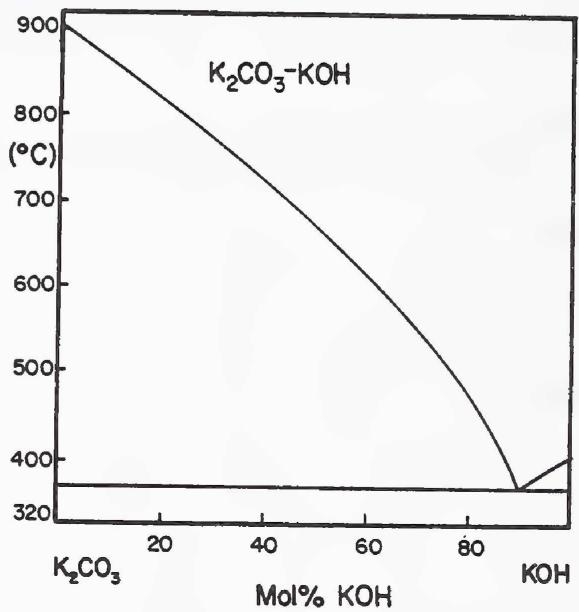  
Figure 126.1. $\mathrm{K}_2\mathrm{CO}_3$ -KOH phase diagram

References [1-16]

2. Density (ρ)

Measurement method: Archimedean technique [17]

Equation:

$$
\rho = a + b T \tag {126.1}
$$

precision: in table 126.1 uncertainty: $\sim \pm 1.5\%$

Table 126.1. Parameters of equation (126.1) and precisions   

<table><tr><td>Mol % K2CO3</td><td>a</td><td>-b x 104</td><td>Precision</td><td>T range(K)</td></tr><tr><td>1.75</td><td>2.0414</td><td>4.580</td><td>0.03%</td><td>670-820</td></tr><tr><td>2.83</td><td>2.0541</td><td>4.520</td><td>0.02%</td><td>670-820</td></tr><tr><td>4.50</td><td>2.0552</td><td>4.400</td><td>0.00%</td><td>670-820</td></tr><tr><td>8.54</td><td>2.1268</td><td>4.860</td><td>0.02%</td><td>670-820</td></tr></table>

Table 126.2. Density $(\mathrm{gcm}^{-3})$ from equations in table 126.1   

<table><tr><td rowspan="2">T(K)</td><td colspan="4">\( \mathrm {M o l}\% \mathrm {K}_{2}\mathrm {C O}_{3} \)</td></tr><tr><td>1.75</td><td>2.83</td><td>4.50</td><td>8.64</td></tr><tr><td>670</td><td>1.734</td><td>1.751</td><td>1.760</td><td>1.801</td></tr><tr><td>690</td><td>1.725</td><td>1.742</td><td>1.752</td><td>1.791</td></tr><tr><td>710</td><td>1.716</td><td>1.733</td><td>1.743</td><td>1.782</td></tr><tr><td>730</td><td>1.707</td><td>1.724</td><td>1.734</td><td>1.772</td></tr><tr><td>750</td><td>1.698</td><td>1.715</td><td>1.725</td><td>1.762</td></tr><tr><td>770</td><td>1.6889</td><td>1.706</td><td>1.716</td><td>1.753</td></tr><tr><td>790</td><td>1.680</td><td>1.697</td><td>1.708</td><td>1.743</td></tr><tr><td>810</td><td>1.670</td><td>1.688</td><td>1.699</td><td>1.733</td></tr></table>

References [17]

3. Surface Tension (γ) No data   
4. Viscosity (η) No data   
5. Electrical Conductance (K) No data   
6. Safety and Hazards

# A. Hazard rating

(i) Toxicity: $\mathrm{K}_2\mathrm{CO}_3$ , classified as a strong caustic; KOH, very caustic and toxic.   
(ii) Vapor pressure: KOH at m.pt. $(360^{\circ}\mathrm{C})\ll 0.5\mathrm{mm};$ $\mathrm{K}_2\mathrm{CO}_3$ decomposes on heating to the oxide and $\mathrm{CO}_{2}$ at $1080^{\circ}C$ $\mathrm{CO}_{2}\sim 1\mathrm{mm}$ press.

# B. Disaster hazards

(i) Molten salt bath "explosions": i.e. explosive generation of steam due to bulk water "carry-over" and/or equipment failure; i.e., explosive expansion of "trapped" air.   
(ii) Hydroxides, react with water or steam with evolution of heat; the aqueous solution is very caustic and attacks living tissue; dangerous.   
(iii) Carbonates, when heated with $\mathrm{CO}_{2}$ pressures less than equilibrium dissociation pressures, decompose to form alkali metal oxides; the toxicology and disaster hazards are the same as those of very caustic solutions, i.e., react with water or steam (exothermic) to form solutions that are markedly aggressive to all body tissues (chemical burns). Potassium carbonate itself is classified as a strong caustic.

References [18-23]

# 7. Corrosion

Table 126.3. Corrosion studies from primary research literature   

<table><tr><td colspan="2">Studies</td><td>References</td></tr><tr><td rowspan="5">A</td><td>Stainless steel</td><td>[24]</td></tr><tr><td>Acid-base relationships in molten carbonates</td><td>[25-28]</td></tr><tr><td>Hydrolysis (H2O) reactions</td><td>[29-31]</td></tr><tr><td>Corrosion in molten salts, annotated biblio.</td><td>[32]</td></tr><tr><td>Molten carbonates: fuel cells, thermal energy storage, and coal gasification, stack gases</td><td>[24,33,37]</td></tr><tr><td rowspan="7">B</td><td>Ni, Armco Fe, steels</td><td>[38-40]</td></tr><tr><td>Fe (effects of H2O)</td><td>[41]</td></tr><tr><td>Pt, Ag and alloys</td><td>[42-44]</td></tr><tr><td>Thermodynamics of corrosion</td><td>[45-48]</td></tr><tr><td>Annotated corrosion biblio.</td><td>[32]</td></tr><tr><td>Electrochemical aspects</td><td>[49]</td></tr><tr><td>Reviews</td><td>[46,50-52]</td></tr></table>

Compatibility studies: A: principally molten $\mathrm{K}_2\mathrm{CO}_3$ ; B: principally molten KOH. No compatibility studies found specifically for molten mixtures of $\mathrm{K}_2\mathrm{CO}_3$ -KOH.

References [24-52]

8. Diffusion

No data

9. Heat of Fusion $(\Delta H_{f}^{\circ})$

No data

10. Heat Capacity $(C_p)$

No data

11. Volume Change on Melting $(\Delta V_{f})$

Measurement method: estimated from densities [53]

Table 126.4. Volume change on melting   

<table><tr><td>Binary eutectic (mol % K2CO3)</td><td>(ΔVf/Vs)</td><td>Uncertainty</td></tr><tr><td>9.3</td><td>10.5%</td><td>~ ± 10%</td></tr></table>

References [53]

(126) $\mathrm{K}_2\mathrm{CO}_3 - \mathrm{KOH}$

12. Vapor Pressure $(p_{vap})$

No data

13. Thermal Conductivity (liquid) $(\lambda_{2})$

No data

14. Thermal Conductivity (solid) $(\lambda_{s})$

No data

15. Cryoscopic Constant $(k_{f})$

No data

16. References

[1] Reshetnikov, N. A., Perfileva, O. G., Zh. Neorg. Khim., 13, 1662 (1968).   
[2] Pelton, A. D. et al. "Calculation of Thermodynamic Equilibria in the Carbonate Fuel Cell" Topical Report Feb. (1980), (US DOE Contract DE-AC02-79ET15416); Proj. CDT-P501, L'Ecole Polytechnique Montréal   
[3] Janz, G. J. Downey, J. R., Jr., Allen, C. B., and Tomkins, R. P. T., "Eutectic Data" - 2 Vols; ERDA-TID-27163-P1 & P2; NTIS, Washington, D. C. (1977).   
[4] Janz, G. J., Downey, J. R., Jr., Allen, C. B., and Tomkins, R. P. T., "Physical Properties Data Complications Relevant to Energy Storage. I. Molten Salts: Eutectic Data", NSRDS-NBS-61; U. S. Gov't Printing Office, Washington, D. C. (1978).   
[5] "International Critical Tables of Numerical Data, Physics, Chemistry, and Technology", 8 Vols., McGraw-Hill Book Co., N. Y. (1933).   
[6] "Landolt-Bornstein Zahlenwert und Funktionen aus Physik, Chemie, Astronomie, Geophysik und Technik", (10th Ed.) Springer-Verlag, Berlin, Heidelberg, N. Y. (1961).   
[7] Clark, P. V., "Fused Salt Mixtures: Eutectic Compositions and Melting Points. Bibliography 1907-1968", Report No. SC-R-68-1680; Sandia Laboratories (1968), NTIS.   
[8] Robertson, W. D., "Binary Phase Diagrams of Halide Salts", Report No. Yale 2723 (2 Vols.), U. S. AEC Contract AT (30-1)-2723 (1966), NTIS.   
[9] Thoma, R. E., "Phase Diagrams of Nuclear Reactor Materials", Oak Ridge National Laboratory, ORNL-2548, Contract No. W-7405-eng-26.   
[10] Thoma, R. E., "Phase Diagrams of Binary and Ternary Fluoride Systems", Chapt. 6; Adv. Molten Salts Chemistry, Vol. 3 (J. Braunstein, G. Mamantov, and G. P. Smith, eds.), Plenum Press, N. Y. (1975).   
[11] Voskresenskaya, N. K., ed., "Handbook of Solid-Liquid Equilibria in Systems of Inorganic Salts", Volumes 1, 2, Izc. Akad. Nauk SSSR, Moscow (1961). Israel Program for Scientific Translations, Jerusalem, 1970 (NTIS).   
[12] Sinistri, C., Franzozini, P., and Rolla, M., "An Atlas of Miscibility Gaps in Molten Salt Systems", Institute of Physical Chemistry, University of Pavia (Italy) (1968).

[13] Shaffer, P. T. B., "High Temperature Materials", Plenum Press Handbooks of High Temperature Materials, No. 1, Materials Index, Plenum Press, New York, 1964.   
[14] Franzozini, P., Ferloni, P., and Spinolo, C., "Molten Salts with Organic Anions", Instituto di Chimica Fisica, Universita di Pavia (Italy), 1973.   
[15] Toropov, N. A. et al., "Handbook of Phase Diagrams of the Silicates, Volume 1: Binary Systems, Volume 2, Metal-Oxygen Compounds in Silicate Systems", Izdatel'stov "Nauka" Leningradskoe Otdelenie, Leningrad, 1969, Israel Program for Scientific Translations, Jerusalem, 1972 (NTIS).   
[16] Levin, E., et al., "Phase Diagrams for Ceramists", Amer. Ceramic Soc. (publ.), Columbus, Ohio (1964; 1969).   
[17] Arndt, K., and Ploetz, G., Z. Phys. Chem., 121, 439 (1926).   
[18] "Dangerous Properties of Materials", Sax, N. I., Van Nostrand Reinhold Co., N. Y. (1969).   
[19] "Registry of Toxic Effects of Chemical Substances", Christensen, H. E., and Lubinbyhl, T. T., eds., U. S. Dept. H. E. W., U. S. Gov't Printing Office, Washington, D. C. (1975).   
[20] Janz, G. J., et al., "Physical Properties Data Complications Relevant to Energy Storage. Part II. Molten Salts: Data on Single and Multi-Component Salt Systems", NSRDS-NBS 61, Part II (April 1979), U. S. Gov't Printing Office, Supt of Doc. No. C13-48-61, Washington D. C. 20402.   
[21] "Potential Hazards in Molten Salt Baths for Heat Treatment of Metals", National Board of Fire Underwriters Research Report No. 2 (1954).   
[22] "Handbook of Reactive Chemical Hazards", Bretherwick, L., Butterworth Co., London (1975).   
[23] Janz, G. J., Tomkins, R. P. T., Downey, J. R. Jr., and Allen, C. B., "Safety and Hazards", Chapter in "Eutectic Data", ERDA TID-27163-P1; NTIS, U. S. Dept. Commerce, Springfield, Va. (1977)   
[24] Maru, H. C., et al. (Institute of Gas Technology), "Molten Salt Thermal Energy Storage Systems: Salt Selections", Rpt. COO-2888-1, ERDA Contract NO. E(11-1)-2888; NTIS, U. S. Dept. Commerce, Springfield, Va. (Aug. 1976).   
[25] Dubois, J., "Chemical and Electrochemical Reactions of Molten Alkali Carbonates as Fuel Cell Electrolytes", Ph.D. Thesis, Fac. Sci. Univ. Paris, France (1964).   
[26] Ingram, M. D., and Janz, G. J., Electrochim, Acta. 10, 783 (1965)   
[27] Bousson, N., Palous, S., Buvet, R., and Millet J., Compt. Rend., 260, 720, 6097 (1965)   
[28] Ingram, M. D., Baron, B. and Janz, G. J., Electrochim. Acta, 11, 1629(1966)   
[29] Janz, G. J., J. Chem. Ed., 44, 581 (1967).   
[30] Busson, N., Palous, S., Millet, J., and Buvet, R., Electrochim. Acta, 12, 910 (1967).

(126) $\mathrm{K}_{2} \mathrm{CO}_{3}$ -KOH   
[31] Andersen, B. K., "Thermodynamic Properties of Molten Carbonates", Ph.D. Thesis, Tech. Univ. Denmark (1975).   
[32] Janz, G. J., and Tomkins, R. P. T., Corrosion, 35, 485 (1979).   
[33] Maru, H. C., et al. (Institute of Gas Technology), "Fuel Cell Research on Second Generation Molten Carbonate Systems: II. Characteristics of Carbonate Melts", Quarterly Status Rpt., Project 8984, ERDA Contract No. 31-109-38-3552, (Sept. 1976).   
[34] Botts, W. V., Kohl, A. L., and Trilling, C. A., "Low BTU Gasification of Coal by Atomics International's Molten Salt Process", Proceedings of the 11th Intersociety Energy Conversion Engineering Conference, 1, 280 (Sept. 1976).   
[35] Cover, A. E., Schreiner, W. C., and Skaperdas, G. T., "The Kellogg Coal Gasification Process", Extended Abstracts, American Chemical Soc. Meeting, Washington, D. C. (1971).   
[36] Atomics International; "Development of a Molten Carbonate Process for Removal of Sulfur Dioxide from Power Plant Stack Gases", Progress Rpt. No. 2, U. S. Public Health Services, Contract PH 86-67-128, Canoga Park, Ca. (1968).   
[37] Graham, L. F., and Ferry, R. B., "Corrosion in Alkali Metal Carbonate-Based Melts", Proc. International Symp. Fused Salts, J. P. Pemsler, ed., Electrochemical Soc., Inc., Princeton, N. J., 270 (1976).   
[38] Gurowich, E. I., Zh. Prikl. Khim., 32, 817 (1959).   
[39] Smith, G. P., Hoffman, E. E., Corrosion, 13, 627t (1957).   
[40] Smith, G. P., Hoffman, E. E., Steidlitz, M. E., Corrosion, 13, 561t (1957).   
[41] Tribunskii, V. V., Kalinichenko, I. I., Tr. Ural. Politekh. Inst., 190, 49 (1970).   
[42] Rahmel, A., Kruger, H., Werkst. Korros., 18, 193 (1967).   
[43] Kruger, H., Rahmel, A., Schwenk, W., Electrochim. Acta, 13, 625 (1968).   
[44] Afanas'yev, A. S., Gamazov, V. P., Zh. Fiz. Khim., 38, 2823 (1964).   
[45] Littlewood, R., J. Electrochem. Soc., 109, 525 (1962).   
[46] Pizzini, S., "Materials Problems in the Industrial Applications of Molten Salts", Proceedings of the European Conference on the Development of Molten Salts Applications", p. 203 (1973) Battelle, Geneva.   
[47] Edeleanu, C., and Littlewood, R., Electrochimica Acta, 3, 195 (1960).   
[48] Littlewood, R., and Argent, E. A., Electrochimica Acta, 4, 114 (1961).   
[49] Johnson, K. E., "Electrochemical Approaches to Corrosion in Molten Salts", Proceedings International Symposium on Metal-Slag-Gas Reactions and Processes", The Electrochemical Society, Inc., Princeton, N.J., p. 581 (1975).   
[50] Inman, D., and Wrench, N. S., Brit. Corr. J., 1, 246 (1966).   
[51] Ketelaar, J. A. A., Chem. Ing. Tech., 45, 667 (1973).   
[52] Smirnov, M. V., and Ozeryanaya, I. W., Nauki Tekh. Korros. Zaschch. Korros., 2, 171 (1973).   
[53] Janz, G. J., et al. (MSDC-RPI), unpublished work (1980).

1. Melting Temperature $(T_{m})$

Pure substance melting points:

$\mathrm{K}_{2} \mathrm{CO}_{3}: 898^{\circ} \mathrm{C}$

Li2SO4:859°C

Eutectic 1, melting point:

$470^{\circ} \mathrm{C}$ , composition: $60 \, \text{mol} \, \% \, \text{Li}_2 \text{SO}_4$ ; $26.5 \, \text{mol} \, \% \, \text{Li}_2 \text{CO}_3$ ; $13.5 \, \text{mol} \, \% \, \text{K}_2 \text{SO}_4$

Eutectic 2, melting point:

$562^{\circ} \mathrm{C}$ , composition: $55 \, \mathrm{mol} \%$ $\mathrm{Li}_{2} \mathrm{CO}_{3}$ ; $35 \, \mathrm{mol} \%$ $\mathrm{K}_{2} \mathrm{SO}_{4}$ ; $10 \, \mathrm{mol} \%$ $\mathrm{Li}_{2} \mathrm{SO}_{4}$

Peritectic melting point:

565°C, composition: 65.83 mol % K₂SO₄; 34.17 mol % Li₂CO₃

Reciprocal Salt Pair Reaction:

$\mathrm{Li}_{2}\mathrm{SO}_{4} + \mathrm{K}_{2}\mathrm{CO}_{3} \rightleftharpoons \mathrm{K}_{2}\mathrm{SO}_{4} + \mathrm{Li}_{2}\mathrm{CO}_{3} + 5.3 \, \text{kcal equiv}^{-1}$

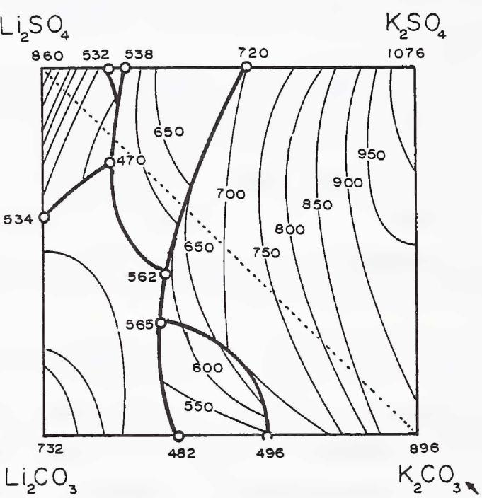  
Figure 127.1. Phase diagram for Li, K/CO₃, SO₄ system. System K₂CO₃-Li₂SO₄ is the diagonal as marked; note the reciprocal salt pair reaction

$\mathrm{Li}_{2}\mathrm{SO}_{4} + \mathrm{K}_{2}\mathrm{CO}_{3} = \mathrm{K}_{2}\mathrm{SO}_{4} + \mathrm{Li}_{2}\mathrm{CO}_{3} + 5.3 \, \text{kcal equiv}^{-1}$

References [1-15]

2. Density (ρ)

Measurement method: Archimedean technique [16]

Equation:

$$
\rho = a + b T \tag {127.1}
$$

precision: in table 127.1 uncertainty: $\sim$ 3.0%

# (127) $\mathrm{K}_2\mathrm{CO}_3 - \mathrm{Li}_2\mathrm{SO}_4$

Table 127.1. Parameters of equation (127.1) and precision   

<table><tr><td>Mol % Li2SO4</td><td>a</td><td>-b x 103</td><td>Precision</td><td>T range(K)</td></tr><tr><td>10</td><td>2.3897</td><td>0.4262</td><td>*</td><td>1120-1220</td></tr><tr><td>20</td><td>2.4419</td><td>0.4695</td><td>*</td><td>1070-1220</td></tr><tr><td>30</td><td>2.3685</td><td>0.4057</td><td>*</td><td>1020-1220</td></tr><tr><td>40</td><td>2.3895</td><td>0.4268</td><td>*</td><td>1020-1220</td></tr><tr><td>50</td><td>2.3813</td><td>0.4101</td><td>*</td><td>970-1220</td></tr><tr><td>60</td><td>2.4047</td><td>0.4232</td><td>*</td><td>920-1220</td></tr><tr><td>70</td><td>2.4620</td><td>0.4611</td><td>*</td><td>920-1220</td></tr><tr><td>80</td><td>2.4156</td><td>0.4088</td><td>*</td><td>770-1220</td></tr><tr><td>90</td><td>2.5517</td><td>0.5088</td><td>*</td><td>1020-1220</td></tr></table>

\* not estimated, data in equation form only.

Table 127.2. Density (g cm $^{-3}$ ) from equations in table 127.1   

<table><tr><td rowspan="2">T(K)</td><td colspan="9">Mol % Li2SO4</td></tr><tr><td>10</td><td>20</td><td>30</td><td>40</td><td>50</td><td>60</td><td>70</td><td>80</td><td>90</td></tr><tr><td>860</td><td></td><td></td><td></td><td></td><td></td><td></td><td></td><td>2.064</td><td></td></tr><tr><td>900</td><td></td><td></td><td></td><td></td><td></td><td></td><td></td><td>2.048</td><td></td></tr><tr><td>940</td><td></td><td></td><td></td><td></td><td></td><td>2.007</td><td>2.029</td><td>2.031</td><td></td></tr><tr><td>980</td><td></td><td></td><td></td><td></td><td>1.979</td><td>1.990</td><td>2.010</td><td>2.015</td><td></td></tr><tr><td>1020</td><td></td><td></td><td>1.955</td><td>1.954</td><td>1.963</td><td>1.973</td><td>1.992</td><td>1.999</td><td>2.033</td></tr><tr><td>1060</td><td></td><td></td><td>1.938</td><td>1.937</td><td>1.947</td><td>1.956</td><td>1.973</td><td>1.982</td><td>2.012</td></tr><tr><td>1100</td><td></td><td>1.925</td><td>1.922</td><td>1.920</td><td>1.930</td><td>1.939</td><td>1.955</td><td>1.966</td><td>1.992</td></tr><tr><td>1140</td><td>1.904</td><td>1.907</td><td>1.906</td><td>1.903</td><td>1.914</td><td>1.922</td><td>1.936</td><td>1.950</td><td>1.972</td></tr><tr><td>1180</td><td>1.887</td><td>1.888</td><td>1.890</td><td>1.886</td><td>1.897</td><td>1.905</td><td>1.918</td><td>1.933</td><td>1.951</td></tr><tr><td>1220</td><td>1.870</td><td>1.869</td><td>1.874</td><td>1.869</td><td>1.881</td><td>1.888</td><td>1.899</td><td>1.917</td><td>1.931</td></tr></table>

References [16]

3. Surface Tension (Y)

No data

4. Viscosity (n)

No data

$$
\mathrm {K} _ {2} \mathrm {C O} _ {3} - \mathrm {L i} _ {2} \mathrm {S O} _ {4} \tag {127}
$$

5. Electrical Conductance (K)

Measurement method: classical ac technique [17]

Equation:

$$
\kappa = 1. 0 4 9 4 - 1. 3 1 4 \times 1 0 ^ {- 2} C + 2. 2 6 5 \times 1 0 ^ {- 4} C ^ {2} \tag {127.2}
$$

$$
(C = \text {mol} \% \text {Li} _ {2} \text {SO} _ {4})
$$

$$
\text{precision:}\sim \pm 3.18\% \quad \text{uncertainty:}\sim \pm 3.0\%
$$

Table 127.3. Specific conductance from equation (127.2)   

<table><tr><td>\( \mathrm{{Mol}}\% {\mathrm{{Li}}}_{2}{\mathrm{{SO}}}_{4} \)</td><td>\( \kappa \) \( \left( {{ohm}^{-1}{cm}^{-1}}\right) \)</td><td>\( \mathrm{{Mol}}\% {\mathrm{{Li}}}_{2}{\mathrm{{SO}}}_{4} \)</td><td>\( \kappa \) \( \left( {{ohm}^{-1}{cm}^{-1}}\right) \)</td></tr><tr><td>10</td><td>0.941</td><td>60</td><td>1.076</td></tr><tr><td>20</td><td>0.877</td><td>70</td><td>1.239</td></tr><tr><td>30</td><td>0.859</td><td>80</td><td>1.448</td></tr><tr><td>40</td><td>0.886</td><td>90</td><td>1.701</td></tr><tr><td>50</td><td>0.959</td><td></td><td></td></tr></table>

Specific conductance calculated from equivalent conductance data interpolated from [17] and density data from [16].

References [16,17]

6. Safety and Hazards

# A. Hazard rating

(i) Toxicity: $\mathrm{K}_2\mathrm{CO}_3$ , classified as strongly caustic; $\mathrm{Li}_2\mathrm{SO}_4$ ; the toxic qualities are those of the cation, lithium.   
(ii) Vapor pressure: $\mathrm{K}_2\mathrm{CO}_3$ (m.pt. $898^{\circ}\mathrm{C}$ ) decomposes on heating to the oxide and oxygen.

# B. Disaster hazards

(i) Molten salt bath "explosions": i.e. explosive generation of steam due to bulk water "carry-over" and/or equipment failure; i.e., explosive expansion of "trapped" air.   
(ii) Carbonates, when heated with $\mathrm{CO}_{2}$ pressures less than equilibrium dissociation pressures, decompose to form alkali metal oxides; the toxicology and disaster hazards are the same as those of very caustic solutions, i.e. react with water or steam (exothermic) to form solutions that are markedly aggressive to all body tissues (chemical burns). Potassium carbonate itself is classified as a strong caustic.   
(iii) Sulfates, when heated to decomposition, decompose, evolving $\mathrm{SO}_3$ , which in turn dissociates to $\mathrm{SO}_2$ and $\mathrm{O}_2$ (see above); toxic, corrosive fumes.

References [18-24].

(127) $\mathrm{K}_{2} \mathrm{CO}_{3} - \mathrm{Li}_{2} \mathrm{SO}_{4}$

# 7. Corrosion

Table 127.4. Corrosion studies from primary research literature   

<table><tr><td colspan="2">Studies</td><td>References</td></tr><tr><td rowspan="5">A</td><td>Stainless steel</td><td>[25]</td></tr><tr><td>Acid-base relationships in molten carbonates</td><td>[26-29]</td></tr><tr><td>Hydrolysis (H2O) reactions</td><td>[30-32]</td></tr><tr><td>Corrosion in molten salts (annotated biblio.)</td><td>[33]</td></tr><tr><td>Molten carbonates: fuel cells, thermal energy storage, coal gasification, stack gases</td><td>[25,34-38]</td></tr><tr><td rowspan="5">B</td><td>Fe, various metals</td><td>[39-41]</td></tr><tr><td>Ag</td><td>[42]</td></tr><tr><td>Thermodynamic redox diagrams</td><td>[39,42-44]</td></tr><tr><td>Electrochemical aspects</td><td>[45]</td></tr><tr><td>Reviews and annotated corrosion biblio.</td><td>[33,46-48]</td></tr></table>

Compatibility studies: A: various molten carbonates, principally $\mathrm{K}_2\mathrm{CO}_3$ ; B: various sulfates, principally $\mathrm{Li}_2\mathrm{SO}_4$ . No compatibility studies specific for $\mathrm{K}_2\mathrm{CO}_3$ - $\mathrm{Li}_2\mathrm{SO}_4$ mixtures found.

References [25-48]

8. Diffusion

No data

9. Heat of Fusion $(\Delta H_{f}^{\circ})$

No data

10. Heat Capacity $(C_p)$

No data

11. Volume Change on Melting $(\Delta V_{f})$

No data

12. Vapor Pressure $(p_{\text{vap}})$

No data

(127) $\mathrm{K}_2\mathrm{CO}_3 - \mathrm{Li}_2\mathrm{SO}_4$

13. Thermal Conductivity (liquid) $(\lambda_{\mathfrak{L}})$ No data   
14. Thermal Conductivity (solid) $(\lambda_{s})$ No data   
15. Cryoscopic Constant $(k_{f})$ No data   
16. References

[1] Janz, G. J. Downey, J. R., Jr., Allen, C. B., and Tomkins, R. P. T., "Eutectic Data" - 2 Vols; ERDA-TID-27163-P1 & P2; NTIS, Washington, D. C. (1977).   
[2] Janz, G. J., Downey, J. R., Jr., Allen, C. B., and Tomkins, R. P. T., "Physical Properties Data Complications Relevant to Energy Storage. I. Molten Salts: Eutectic Data", NSRDS-NBS-61; U. S. Gov't Printing Office, Washington, D. C. (1978).   
[3] "International Critical Tables of Numerical Data, Physics, Chemistry, and Technology", 8 Vols., McGraw-Hill Book Co., N. Y. (1933).   
[4] "Landolt-Bornstein Zahlenwert und Funktionen aus Physik, Chemie, Astronomie, Geophysik und Technik", (10th Ed.) Springer-Verlag, Berlin, Heidelberg, N. Y. (1961).   
[5] Clark, P. V., "Fused Salt Mixtures: Eutectic Compositions and Melting Points Bibliography 1907-1968", Report No. SC-R-68-1680; Sandia Laboratories (1968), NTIS.   
[6] Robertson, W. D., "Binary Phase Diagrams of Halide Salts", Report No. Yale 2723 (2 Vols.), U. S. AEC Contract AT (30-1)-2723 (1966), NTIS.   
[7] Thoma, R. E., "Phase Diagrams of Nuclear Reactor Materials", Oak Ridge National Laboratory, ORNL-2548, Contract No. W-7405-eng-26.   
[8] Thoma, R. E., "Phase Diagrams of Binary and Ternary Fluoride Systems", Chapt. 6; Adv. Molten Salts Chemistry, Vol. 3 (J. Braunstein, G. Mamantov, and G. P. Smith, eds.), Plenum Press, N. Y. (1975).   
[9] Voskresenskaya, N. K., ed., "Handbook of Solid-Liquid Equilibria in Systems of Inorganic Salts", Volumes 1, 2, Izc. Akad. Nauk SSSR, Moscow (1961). Israel Program for Scientific Translations, Jerusalem, 1970 (NTIS).   
[10] Sinistri, C., Franzozini, P., and Rolla, M., "An Atlas of Miscibility Gaps in Molten Salt Systems", Institute of Physical Chemistry, University of Pavia (Italy) (1968).   
[11] Shaffer, P. T. B., "High Temperature Materials", Plenum Press Handbooks of High Temperature Materials, No. 1, Materials Index, Plenum Press, New York, 1964.   
[12] Franzozini, P., Ferloni, P., and Spinolo, C., "Molten Salts with Organic Anions", Instituto di Chimica Fisica, Universita di Pavia (Italy), 1973.

(127) $\mathrm{K}_2\mathrm{CO}_3 - \mathrm{Li}_2\mathrm{SO}_4$   
[13] Toropov, N. A. et al., "Handbook of Phase Diagrams of the Silicates, Volume 1: Binary Systems, Volume 2, Metal-Oxygen Compounds in Silicate Systems", Izdatel'stov "Nauka" Leningradskoe Otdelenie, Leningrad, 1969, Israel Program for Scientific Translations, Jerusalem, 1972 (NTIS).   
[14] Levin, E., et al., "Phase Diagrams for Ceramists", Amer. Ceramic Soc. (publ.), Columbus, Ohio (1964; 1969).   
[15] Volkova, L. F., Izv. Fiz. Khim. n.-i. in-ta pri Irkutskom gosuniversiteta, 4, 115 (1959).   
[16] Prisyazhnyi, V. D. and Zvagol'skaya, E. V., Ukr. Khim. Zh. 34, 773 (1968) (Soviet Prog. in Chem. 34, 17 (1968)).   
[17] Markov, B. F., Polishchuk, A. F. and Zvagol'skaya, E. V., Ukr. Khim. Zh. 39, 262 (1973).   
[18] "Dangerous Properties of Materials", Sax, N. I., Van Nostrand Reinhold Co., N. Y. (1969).   
[19] Registry of Toxic Effects of Chemical Substances", Christensen, H. E., and Lubinbyhl, T. T., eds., U. S. Dept. H.E.W., U. S. Gov't Printing Office, Washington, D. C. (1975).   
[20] Janz, G. J., et al., "Physical Properties Data Complications Relevant to Energy Storage. Part II. Molten Salts: Data on Single and Multi-Component Salt Systems", NSRDS-NBS 61, Part II (April 1979), U. S. Gov't Printing Office, Supt of Doc. No. C13-48-61, Washington D. C. 20402.   
[21] "Potential Hazards in Molten Salt Baths for Heat Treatment of Metals", National Board Fire Underwriters Research Report No. 2 (1954).   
[22] "Handbook of Reactive Chemical Hazards", Bretherwick, L., Butterworths Co., London (1975).   
[23] Janz, G. J., Tomkins, R. P. T., Downey, J. R., Jr., and Allen, C. B., "Safety and Hazards", Chapter in "Eutectic Data", ERDA TID-27163-P1; NTIS, U. S. Dept. Commerce, Springfield, Va. (1977).   
[24] "High Temperature Properties and Decomposition of Inorganic Salts. Part 1. Sulfates", Stern, K. H., U. S. Dept. Commerce NBS-NSRDS-7; U. S. Gov't Printing Office, Washington, D. C. (1966).   
[25] Maru, H. C., et al. (Institute of Gas Technology), "Molten Salt Thermal Energy Storage Systems: Salt Selections", Rpt. COO-2888-1, ERDA Contract NO. E(11-1)-2888; NTIS, U. S. Dept. Commerce, Springfield, Va. (Aug. 1976).   
[26] Dubois, J., "Chemical and Electrochemical Reactions of Molten Alkali Carbonates as Fuel Cell Electrolytes", Ph.D. Thesis, Fac. Sci. Univ. Paris, France (1964).   
[27] Ingram, M. D., and Janz, G. J., Electrochim. Acta. 10 783 (1965)   
[28] Bousson, N., Palous, S., Buvet, R., and Millet, J., Compt. Rend., 260, 720 6097 (1965)   
[29] Ingram, M. D., Baron, B., and Janz, G. J., Electrochim. Acta. 11 1629(1966)   
[30] Janz, G. J., J. Chem. Ed., 44, 581 (1967).

(127) $\mathrm{K}_{2} \mathrm{CO}_{3}-\mathrm{Li}_{2} \mathrm{SO}_{4}$   
[31] Busson, N., Palous, S., Millet, J., and Buvet, R., Electrochim. Acta, 12, 910 (1967).   
[32] Andersen, B. K., "Thermodynamic Properties of Molten Carbonates", Ph.D. Thesis, Tech. Univ. Denmark (1975).   
[33] Janz, G. J., and Tomkins, R. P. T., Corrosion, 35, 485 (1979).   
[34] Maru, H. C., et al. (Institute of Gas Technology), "Fuel Cell Research on Second Generation Molten Carbonate Systems: II. Characteristics of Carbonate Melts", Quarterly Status Rpt., Project 8984, ERDA Contract No. 31-109-38-3552, (Sept. 1976).   
[35] Botts, W. V., Kohl, A. L., and Trilling, C. A., "Low BTU Gasification of Coal by Atomics International's Molten Salt Process", Proceedings of the 11th Intersociety Energy Conversion Engineering Conference, 1, 280 (Sept. 1976).   
[36] Cover, A. E., Schreiner, W. C., and Skaperdas, G. T., "The Kellogg Coal Gasification Process", Extended Abstracts, American Chemical Soc. Meeting, Washington, D. C. (1971).   
[37] Atomics International; "Development of a Molten Carbonate Process for Removal of Sulfur Dioxide from Power Plant Stack Gases", Progress Rpt. No. 2, U. S. Public Health Services, Contract PH 86-67-128, Canoga Park, Ca. (1968).   
[38] Grantham, L. F., and Ferry, R. B., "Corrosion in Alkali Metal Carbonate-Based Melts", Proc. International Symp. Fused Salts, J. P. Pemsler, ed., Electrochemical Soc., Inc., Princeton, N. J., 270 (1976).   
[39] Rahmel, A., Electrochim. Acta, 13, 495 (1968).   
[40] Dubois, J., and Richard, J., Rev. Gen. Therm., 12, 805 (1973).   
[41] Burrows, B. W., and Hills, G. J., J. Inst. Fuel, 39, 168 (1966).   
[42] Rahmel, A., Corros. Sci., 13, 833 (1973).   
[43] Bartlett, H. E., and Johnson, K. E., Canad. J. Chem., 44, 2119 (1966).   
[44] Baudo, G., and Tamba, A., Brit. Corrosion J., 4, 129 (1969).   
[45] Johnson, K. E., "Electrical Approaches to Corrosion in Molten Salts", Proceedings International Symposium on Metal-Slag-Gas Reactions and Processes, The Electrochemical Society, Inc., Princeton, N. J. p. 581 (1975).   
[46] Smirnov, M.V., and Ozeryanaya, I. N., Nauki. Tekh. Korros. Zashch. Korros., 2, 171 (1973).   
[47] Inman, D., and Wrench, N. S., Brit. Corr. J., 1, 246 (1966).   
[48] Ketelaar, J. A. A., Chemie Ing. Techn., 45, 667 (1973).

```txt
System 128 Na3AlF6-LiF 
```

1. Melting Temperatures $(T_{m})$

Pure substance melting points:

Na3AlF6: 1010°C

LiF: 848°C

Eutectic melting point:

694°C, composition: 15.0 mol % Na₃AlF₆

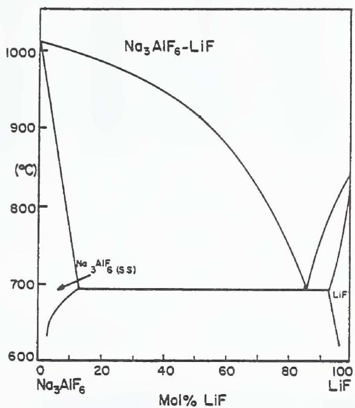  
Figure 128.1. $\mathrm{Na}_{3}\mathrm{AlF}_{6}$ -LiF phase diagram

References [1-23].

2. Density (ρ)

Measurement method: Archimedean technique [24]

Equation:

$$
\rho = a + b T \quad (1 2 8. 1)
$$

precision: in table 128.1

uncertainty: $\sim$ 1.5%

Table 128.1. Parameters of equation (128.1) and precisions   

<table><tr><td>Mol % Na3AlF6</td><td>a</td><td>-b x 104</td><td>Precision</td><td>T range(K)</td></tr><tr><td>0</td><td>2.3289</td><td>4.681</td><td>0.00%</td><td>1220-1320</td></tr><tr><td>10</td><td>2.6020</td><td>5.540</td><td>0.00%</td><td>1220-1320</td></tr><tr><td>20</td><td>2.8927</td><td>7.102</td><td>0.01%</td><td>1220-1320</td></tr><tr><td>30</td><td>2.9439</td><td>7.201</td><td>0.00%</td><td>1220-1320</td></tr><tr><td>40</td><td>2.9929</td><td>7.421</td><td>0.00%</td><td>1220-1320</td></tr><tr><td>60</td><td>3.0951</td><td>8.020</td><td>0.00%</td><td>1220-1320</td></tr><tr><td>80</td><td>3.1759</td><td>8.502</td><td>0.05%</td><td>1220-1320</td></tr><tr><td>100</td><td>3.2732</td><td>9.199</td><td>0.00%</td><td>1220-1320</td></tr></table>

$$
\mathrm {N a} _ {3} \mathrm {A l F} _ {6} - \mathrm {L i F} \tag {128}
$$

Table 128.2. Density $(\mathrm{gcm}^{-3})$ from equations in Table 128.1   

<table><tr><td rowspan="2">T(K)</td><td colspan="6">\( Mol\ \% Na_3AlF_6 \)</td></tr><tr><td>10</td><td>20</td><td>30</td><td>40</td><td>60</td><td>80</td></tr><tr><td>1220</td><td>1.926</td><td>2.026</td><td>2.065</td><td>2.088</td><td>2.117</td><td>2.139</td></tr><tr><td>1230</td><td>1.921</td><td>2.019</td><td>2.058</td><td>2.080</td><td>2.109</td><td>2.130</td></tr><tr><td>1240</td><td>1.915</td><td>2.012</td><td>2.051</td><td>2.073</td><td>2.101</td><td>2.122</td></tr><tr><td>1250</td><td>1.910</td><td>2.005</td><td>2.044</td><td>2.065</td><td>2.093</td><td>2.113</td></tr><tr><td>1260</td><td>1.904</td><td>1.998</td><td>2.037</td><td>2.058</td><td>2.085</td><td>2.105</td></tr><tr><td>1270</td><td>1.898</td><td>1.991</td><td>2.029</td><td>2.050</td><td>2.077</td><td>2.096</td></tr><tr><td>1280</td><td>1.893</td><td>1.984</td><td>2.022</td><td>2.043</td><td>2.069</td><td>2.088</td></tr><tr><td>1290</td><td>1.887</td><td>1.977</td><td>2.015</td><td>2.036</td><td>2.061</td><td>2.079</td></tr><tr><td>1300</td><td>1.882</td><td>1.970</td><td>2.008</td><td>2.028</td><td>2.053</td><td>2.071</td></tr><tr><td>1310</td><td>1.876</td><td>1.962</td><td>2.001</td><td>2.021</td><td>2.045</td><td>2.062</td></tr><tr><td>1320</td><td>1.871</td><td>1.955</td><td>1.993</td><td>2.013</td><td>2.037</td><td>2.054</td></tr></table>

References [24]

# 3. Surface Tension (Y)

No data

# 4. Viscosity (n)

Measurement method: torsion pendulum [25]

Equation:

$$
\eta = a + b T + c T ^ {2} + d T ^ {3} \tag {128.2}
$$

precision: in table 128.3

uncertainty: $\sim$ 25%

Table 128.3. Parameters of equation (128.3) and precisions   

<table><tr><td>LiF (mol %)</td><td>a</td><td>-b x 102</td><td>-c x 105</td><td>d x 108</td><td>Precision</td><td>T range(K)</td></tr><tr><td>53.874</td><td>31.63</td><td>1.894</td><td>2.144</td><td>1.38</td><td>2.01%</td><td>1130-1320</td></tr><tr><td>75.696</td><td>33.06</td><td>1.921</td><td>2.513</td><td>1.60</td><td>2.90%</td><td>1130-1320</td></tr><tr><td>87.512</td><td>13.84</td><td>0.631</td><td>0.900</td><td>0.48</td><td>0.32%</td><td>1130-1320</td></tr><tr><td>94.921</td><td>12.55</td><td>0.567</td><td>0.783</td><td>0.42</td><td>0.38%</td><td>1130-1320</td></tr><tr><td>100.0</td><td>11.92</td><td>0.582</td><td>0.731</td><td>0.44</td><td>1.01%</td><td>1130-1320</td></tr></table>

$$
\mathrm {N a} _ {3} \mathrm {A l F} _ {6} - \mathrm {L i F} \tag {128}
$$

Table 128.4. Viscosity (cp) from equations in table 128.3   

<table><tr><td rowspan="2">T(K)</td><td colspan="4">Mo1 % LiF</td></tr><tr><td>53.87</td><td>75.70</td><td>87.51</td><td>94.92</td></tr><tr><td>1170</td><td>2.323</td><td>1.890</td><td>1.824</td><td>1.958</td></tr><tr><td>1180</td><td>2.110</td><td>1.772</td><td>1.748</td><td>1.892</td></tr><tr><td>1200</td><td>1.884</td><td>1.555</td><td>1.601</td><td>1.765</td></tr><tr><td>1220</td><td>1.680</td><td>1.364</td><td>1.461</td><td>1.643</td></tr><tr><td>1240</td><td>1.500</td><td>1.200</td><td>1.327</td><td>1.527</td></tr><tr><td>1260</td><td>1.343</td><td>1.064</td><td>1.201</td><td>1.418</td></tr><tr><td>1280</td><td>1.212</td><td>0.956</td><td>1.082</td><td>1.315</td></tr><tr><td>1300</td><td>1.105</td><td>0.877</td><td>0.971</td><td>1.219</td></tr><tr><td>1320</td><td>1.024</td><td>0.828</td><td>0.867</td><td>1.130</td></tr></table>

References [25,26]

# 5. Electrical Conductance (K)

Measurement method: classical ac technique [27]

Equation:

$$
\kappa = a + b T \tag {128.3}
$$

precision: in table 128.5 uncertainty: $\sim \pm 3.0\%$

Table 128.5. Parameters of equation (128.3) and precisions   

<table><tr><td>Mol % LiF</td><td>a</td><td>b x 103</td><td>Precision</td><td>T range(K)</td></tr><tr><td>0</td><td>-0.3746</td><td>2.500</td><td>0.49%</td><td></td></tr><tr><td>25</td><td>0.4536</td><td>2.000</td><td>0.00%</td><td>1270-1370</td></tr><tr><td>42.85</td><td>0.5789</td><td>2.000</td><td>0.91%</td><td>1220-1370</td></tr><tr><td>56.25</td><td>-0.1925</td><td>2.700</td><td>0.48%</td><td>1220-1370</td></tr><tr><td>66.66</td><td>-2.5361</td><td>5.000</td><td>1.59%</td><td>1120-1320</td></tr><tr><td>75.01</td><td>-1.2388</td><td>4.143</td><td>2.18%</td><td>1070-1320</td></tr><tr><td>81.81</td><td>0.3235</td><td>3.300</td><td>0.79%</td><td>1120-1320</td></tr><tr><td>87.5</td><td>0.8789</td><td>3.500</td><td>0.27%</td><td>1120-1320</td></tr><tr><td>92.3</td><td>1.4521</td><td>3.800</td><td>0.52%</td><td>1120-1320</td></tr><tr><td>96.43</td><td>5.7223</td><td>1.200</td><td>0.22%</td><td>1120-1320</td></tr><tr><td>100</td><td>6.1837</td><td>2.000</td><td>0.32%</td><td></td></tr></table>

Table 128.6. Specific conductance $(ohm^{-1}cm^{-1})$ from equations in table 128.5   

<table><tr><td rowspan="2">T(K)</td><td colspan="6">Mol % LiF</td></tr><tr><td>66.66</td><td>75.0</td><td>81.81</td><td>87.5</td><td>92.3</td><td>96.43</td></tr><tr><td>1070</td><td></td><td>3.19</td><td></td><td></td><td></td><td></td></tr><tr><td>1100</td><td></td><td>3.32</td><td></td><td></td><td></td><td></td></tr><tr><td>1130</td><td>3.11</td><td>3.44</td><td>4.05</td><td>4.80</td><td>5.75</td><td>7.08</td></tr><tr><td>1160</td><td>3.26</td><td>3.57</td><td>4.15</td><td>4.90</td><td>5.86</td><td>7.11</td></tr><tr><td>1190</td><td>3.41</td><td>3.69</td><td>4.25</td><td>5.01</td><td>5.97</td><td>7.15</td></tr><tr><td>1220</td><td>3.56</td><td>3.82</td><td>4.35</td><td>5.11</td><td>6.09</td><td>7.19</td></tr><tr><td>1250</td><td>3.71</td><td>3.94</td><td>4.45</td><td>5.22</td><td>6.20</td><td>7.22</td></tr><tr><td>1280</td><td>3.86</td><td>4.06</td><td>4.55</td><td>5.32</td><td>6.32</td><td>7.26</td></tr><tr><td>1310</td><td>4.01</td><td>4.19</td><td>4.65</td><td>5.43</td><td>6.43</td><td>7.30</td></tr><tr><td>1340</td><td></td><td></td><td></td><td></td><td></td><td></td></tr><tr><td>1370</td><td></td><td></td><td></td><td></td><td></td><td></td></tr></table>

References [27,28]

6. Safety and Hazards

# A. Hazard rating

(i) Toxicity: inorganic fluorides are generally irritant and toxic   
(ii) Vapor pressure: $\mathrm{Na}_{3}\mathrm{AlF}_{6}$ at its m.pt. $(1000^{\circ}\mathrm{C})$ , $< 0.5\mathrm{mm}$ ; LiF, at its m.pt. $(848^{\circ}\mathrm{C})$ , $\sim 8.8 \times 10^{-3}\mathrm{mm}$ .

# B. Disaster hazards

(i) Molten salt bath "explosions": i.e. explosive generation of steam due to bulk water "carry-over" and/or equipment failure; i.e., explosive expansion of "trapped" air.   
(ii) Fluorides, when heated to decomposition, or contacted with acids, emit highly toxic fumes.

References [29-34]

Table 128.7. Corrosion studies from primary research literature   

<table><tr><td colspan="2">Studies</td><td>References</td></tr><tr><td rowspan="2">A</td><td>CrNi-Cr-Mo alloys (INOR-8; Hastelloys B, W, and N)</td><td>[35][36,37]</td></tr><tr><td>SSNI-12PQuartzAlVarious metals</td><td>[38][39][40][41]</td></tr><tr><td>B</td><td>Pt, Pt-RhBoron nitride, carbon, InconelFused MgO</td><td>[42-46,79,80][47-49][50]</td></tr><tr><td>C</td><td>Impurities in electrolyteGraphiteTiC, TiB2, CrB2, ZrN, NbB2</td><td>[9,51][9,51][52-54]</td></tr><tr><td>D</td><td>Corrosion studies in molten salts with NaF as one component (e.g., Cl, CO3,...)Electrochemical behavior of oxides and related species in molten fluoridesElectroanalytical studies in molten fluoridesAnnotated corrosion biblio.Corrosion: molten fluorides (survey)</td><td>[55-70,77,78][71-73][74][75][76]</td></tr></table>

A: studies principally in molten NaF, KF, and LiF;  
B: used largely in fluorides physical properties measurements; C: technological aspects, in aluminum reduction cells; D: more general studies, basic principles, and surveys

References [35-80]

(128) $\mathrm{Na}_{3} \mathrm{AlF}_{6}$ -LiF

8. Diffusion No data   
9. Heat of Fusion $(\Delta H_{f}^{\circ})$ No data   
10. Heat Capacity $(C_p)$ No data   
11. Volume Change on Melting $(\Delta V_{f})$ No data   
12. Vapor Pressure $(p_{vap})$ Measurement method: boiling point technique [81] Equation:

$$
\log p = A + B / T \tag {128.4}
$$

precision: in table 128.8 uncertainty: $\sim \pm 10\%$

Table 128.8. Parameters of equation (128.4) and precisions   

<table><tr><td>\( \mathrm{{Mol}}\% {\mathrm{{Na}}}_{3}{\mathrm{{AlF}}}_{6} \)</td><td>A</td><td>-B</td><td>Precision</td></tr><tr><td>11.0</td><td>9.7650</td><td>10999</td><td>✘</td></tr><tr><td>15.6</td><td>8.7580</td><td>10882</td><td>✘</td></tr><tr><td>22.4</td><td>8.7380</td><td>10719</td><td>✘</td></tr><tr><td>33.0</td><td>8.7050</td><td>10556</td><td>✘</td></tr><tr><td>52.6</td><td>8.6800</td><td>10436</td><td>✘</td></tr></table>

* data reported graphically; insufficient details for estimate

Table 128.9. Vapor pressure (mm) from equations in table 128.8   

<table><tr><td rowspan="2">T(K)</td><td colspan="5">\( \mathrm {M o l}\% \mathrm {Na}_{3}\mathrm {A l F}_{6} \)</td></tr><tr><td>11.0</td><td>15.6</td><td>22.4</td><td>33.0</td><td>52.6</td></tr><tr><td>1280</td><td>14.86</td><td>1.805</td><td>2.311</td><td>2.872</td><td>3.364</td></tr><tr><td>1300</td><td>20.15</td><td>2.439</td><td>3.109</td><td>3.846</td><td>4.491</td></tr><tr><td>1320</td><td>27.07</td><td>3.266</td><td>4.145</td><td>5.105</td><td>5.942</td></tr><tr><td>1340</td><td>36.04</td><td>4.336</td><td>5.480</td><td>6.720</td><td>7.797</td></tr><tr><td>1360</td><td>47.59</td><td>5.709</td><td>7.184</td><td>8.775</td><td>10.15</td></tr><tr><td>1380</td><td>62.33</td><td>7.456</td><td>9.346</td><td>11.37</td><td>13.11</td></tr><tr><td>1400</td><td>81.02</td><td>9.664</td><td>12.07</td><td>14.62</td><td>16.82</td></tr><tr><td>1420</td><td>104.5</td><td>12.43</td><td>15.47</td><td>18.67</td><td>21.41</td></tr><tr><td>1440</td><td>133.9</td><td>15.89</td><td>19.69</td><td>23.68</td><td>27.09</td></tr><tr><td>1460</td><td>170.4</td><td>20.16</td><td>24.90</td><td>29.84</td><td>34.05</td></tr></table>

References [81]

13. Thermal Conductivity (liquid) $(\lambda_{\ell})$

No data

14. Thermal Conductivity (solid) $(\lambda_{s})$

No data

15. Cryoscopic Constant $(k_{f})$

No data

16. References

[1] Chu, Y. A. and Belyaev, A. I., Izv. Vyssh. Ucheb. Zaved., Tsvet. Met., 2, 69 (1959).   
[2] Holm, J. L., Thesis, The University of Trondheim, NTH, Trondheim, 1963.   
[3] Jenssen, B., Thesis, The University of Trondheim, NTH, Trondheim, 1969.   
[4] Kuvakin, M. A., Zh. Neorg. Khim., 14, 282 (1969); Russ J. Inorg. Chem., 14, 146 (1969).   
[5] Malinovsky, M. and Matiasovsky, K., Hutnicke Listy 24(7), 515 (1969).   
[6] Holm, J. L. and Holm, B. J., Acta Chem. Scand., 24, 2535 (1970).   
[7] Holm, J. L. and Holm, B. J., Thermochim. Acta 6, 375 (1973).   
[8] Kostenska, I., Corba, J. and Malinovsky, M., Chemicke Zvesti, 28, 546 (1974).   
[9] Foster, P. A. Jr., "The Phase Diagrams of the Na3AlF-LiF System", Unpublished data, AlCOA, Pa (1968); cited in "Applications of Phase Diagrams in Metallurgy and Ceramics", 2 Vols (C. Carter, ed.) NBS Sp. Publ. 496, March 1978, Washington, D. C.

(128) $\mathrm{Na}_{3} \mathrm{AlF}_{6}$ -LiF   
[10] Janz, G. J. Downey, J. R., Jr., Allen, C. B., and Tomkins, R. P. T., "Eutectic Data" - 2 Vols; ERDA-TID-27163-P1 & P2; NTIS, Washington, D. C. (1977).   
[11] Janz, G. J., Downey, J. R., Jr., Allen, C. B., and Tomkins, R. P. T., "Physical Properties Data Complications Relevant to Energy Storage. I. Molten Salts: Eutectic Data", NSRDS-NBS-61; U. S. Gov't Printing Office, Washington, D. C. (1978).   
[12] "International Critical Tables of Numerical Data, Physics, Chemistry, and Technology", 8 Vols., McGraw-Hill Book Co., N. Y. (1933).   
[13] "Landolt-Bornstein Zahlenwert und Funktionen aus Physik, Chemie, Astronomie, Geophysik und Technik", (10th Ed.) Springer-Verlag, Berlin, Heidelberg, N. Y. (1961).   
[14] Clark, P. V., "Fused Salt Mixtures: Eutectic Compositions and Melting Points Bibliography 1907-1968", Report No. SC-R-68-1680; Sandia Laboratories (1968), NTIS.   
[15] Robertson, W. D., "Binary Phase Diagrams of Halide Salts", Report No. Yale 2723 (2 Vols.), U. S. AEC Contract AT (30-1)-2723 (1966), NTIS.   
[16] Thoma, R. E., "Phase Diagrams of Nuclear Reactor Materials", Oak Ridge National Laboratory, ORNL-2548, Contract No. W-7405-eng-26.   
[17] Thoma, R. E., "Phase Diagrams of Binary and Ternary Fluoride Systems", Chapt. 6; Adv. Molten Salts Chemistry, Vol. 3 (J. Braunstein, G. Mamantov, and G. P. Smith, eds.), Plenum Press, N. Y. (1975).   
[18] Voskresenskaya, N. K., ed., "Handbook of Solid-Liquid Equilibria in Systems of Inorganic Salts", Volumes 1, 2, Izc. Akad. Nauk SSSR, Moscow (1961). Israel Program for Scientific Translations, Jerusalem, 1970 (NTIS).   
[19] Sinistri, C., Franzozini, P., and Rolla, M., "An Atlas of Miscibility Gaps in Molten Salt Systems", Institute of Physical Chemistry, University of Pavia (Italy) (1968).   
[20] Shaffer, P. T. B., "High Temperature Materials", Plenum Press Handbooks of High Temperature Materials, No. 1, Materials Index, Plenum Press, New York, 1964.   
[21] Franzozini, P., Ferloni, P., and Spinolo, C., "Molten Salts with Organic Anions", Instituto di Chimica Fisica, Universita di Pavia (Italy), 1973.   
[22] Grjothiem, K., Krohn, C., Malinovsky, M., Matiasovsky, K., and Thonstad, J., "Aluminum Electrolyses", Aluminum-Verlag GmgH. Dusseldorf (1977).   
[23] Levin, E., et al., "Phase Diagrams for Ceramists", Amer. Ceramic Soc. (publ.), Columbus, Ohio (1964; 1969).   
[24] Matiasovsky, K., private communication (1968).   
[25] Volata, I., Matiasovsky, K., Chem. Zvesti 27, 582 (1973).   
[26] Fellner, P., Chem. Zvesti 28, 721 (1974).   
[27] Danek, V., Malinovsky, M., and Matiasovsky, K., Chem. Zvesti, 22(9), 641 (1968).   
[28] Choudhary, G., J. Electrochem. Soc., 120, 381 (1973).

(128) $\mathrm{Na}_{3} \mathrm{AlF}_{6}$ -LiF   
[29] "Dangerous Properties of Materials", Sax, N. I., Van Nostrand Reinhold Co., N. Y. (1969)   
[30] "Registry of Toxic Effects of Chemical Substances", Christensen, H. E., and Lubinbyl, T. T., eds., U. S. Dept. H. E. W., U. S. Gov't Printing Office, Washington, D. C. (1975)   
[31] vide: this work, System 66, Na₃AlF₆   
[32] "Potential Hazards in Molten Salt Baths For Heat Treatment of Metals", National Board Fire Underwriters Research Report No. 2 (1954)   
[33] "Handbook of Reactive Chemical Hazards", Bretherwick, L., Butterworths Co., London (1975)   
[34] Janz, G. J., Tomkins, R. P. T., Downey, J. R., Jr., and Allen, C. B., "Safety and Hazards", Chapter in "Eutectic Data", ERDA TID-27163-P1; NTIS, U. S. Dept. Commerce, Springfield, Va. (1977)   
[35] Brasunas, A., Metal Prog., 62, 88 (1952).   
[36] Bettes, E. S., Nucl. Sci. Eng., 2, 804 (1957).   
[37] Hoffman, E. E., Patriarca, P., Leitten, C. F., Jr., and Slaughter, G. M., ORNL-1934, Oak Ridge Natl. Lab., (1956).   
[38] Oak Ridge National Laboratory, "The Development Status of Molten Salt Breeder Reactors", Rpt. ORNL-4812-UC-80; NTIS, U. S. Dept. Commerce, Springfield, Va., (Aug. 1972).   
[39] Heimann, R., Glastech. Ber., 43, 83 (1970).   
[40] Lukashenko, E. E., and Reutova, G. A., Nov. Teor. Tekhnol. Metall. Protsessov., 119 (1973).   
[41] Koger, J. W., Corrosion, 30, 125 (1974).   
[42] Edwards, J. D., Taylor, C. S., Russell, A. S., and Maranville, L. F., ibid., 99, 527 (1952).   
[43] Landon, G. J., and Ubbelohde, A. R., Proc. Royal Soc., A240, 160 (1957).   
[44] Winterhager, H. and Werner, L., Forschungsber. des Witschafts-u. Verkehrsministeriums Nordrhein-Westfalen, No. 438, 1957.   
[45] Winterhager, H. and Werner, L., Forschungsber. des Witschafts-u. Verkehrsministeriums Nordrhein-Westfalen, No. 341, 1956.   
[46] Bajcsy, J., Malinovsky, M., and Matiasovsky, K., Electrochim. Acta, 7, 543 (1962).   
[47] Yim, E. W. and Feinleib, M., J. Electrochem. Soc., 104, 622 (1957).   
[48] Yim, E. W. and Feinleib, M., J. Electrochem. Soc., 626 (1957).   
[49] Brown, E. A. and Porter, B., "U. S. Department of Interior, Bureau of Mines", 128.23:6500 (1964).   
[50] Cuthbertson, J.W. and Waddington, J., Trans Faraday Soc., 32, 745 (1936).   
[51] Brun, J., Tunold, R., Vatland, A., 30th ISE Meeting, Extended Abstracts, pp. 118-119; Trondheim, Norway (Aug. 1979); NTH, Dept. Ind. Electrochem., Trondheim, Norway.   
[52] Holliday, R. D., (Olin Mathieson Chemical Corp.), U. S. 3,661,736, May 9, 1972.

(128) $\mathrm{Na}_{3} \mathrm{AlF}_{6}$ -LiF   
[53] Thompson, R.: (Borax Consolidated Ltd.), Ger. Offen. 2,305,281, Aug. 9, 1973.   
[54] Kugler, T. and Rieger, H. W.: (Swiss Aluminium Ltd.), Ger. Offen. 2,312,439, Oct. 4, 1973.   
[55] Khan, I. A., Ber. Kernforschungsanlage, Juelich, Juel-608-RW, (1969).   
[56] Khan, I. A., Inst. Reaktorwerkst., Kernforschungsanlage, Juel-718-RW (1970).   
[57] Bowles, P. J., and Newdick, P. C., Electroplating and Metal Finishing, 24, 6 (1971).   
[58] Devan, J. H., "Examinations of Pump Impellers from Sodium and Fused Salt Pump Endurance Tests", ORNL CF-61-4-77, Oak Ridge National Lab., (1961).   
[59] Adamson, G. M., Manly, W. D., and Crouse, S. R., "Corrosion by Molten Fluorides", ANP Materials Meeting ORNL-2685, (1958).   
[60] Huntley, W. R., and Gnadt, P. A., Oak Ridge Nat'l Lab., Report ORNL-TM-3863. (1973); Nucl. Sci. Abstr., 27, 12446 (1973).   
[61] Gill, C. B., Straumanis, M. E., and Schlechten, W. B., J. Electrochem. Soc., 102, 42 (1955).   
[62] Litman, A. P., "Corrosion of Volatility Pilot Plant Mark I INOR-S Hydrofluorinator and Mark III. Nickel Fluorinator after Fourteen Dissolution Runs", ORNL-3253, Oak Ridge Nat'l Lab., (1962).   
[63] Litman, A. P., and Goldman, A. E., "Corrosion Associated with Fluoro-oxidation in the Oak Ridge Nat'l Lab., Fluoride Volatility Process", ORNL-2832, Oak Ridge Nat'l Lab. (1961).   
[64] Manly, W. D., Coobs, J. H., Devan, J. H., Douglas D. A., Inouye, H., Patriarca, P., Roche, T. K., and Scott, J. L., "Metallurgical Problems in Molten Fluoride Systems", Proc. 2nd U. N. Inter. Conf. Peaceful Uses of At. Energy, 7, 223 (1958).   
[65] Oak Ridge Nat'l Lab., Molten Salt Reactor Program Semiannual Progress Report for Period Ending July 31, 1964, ORNL-3708, (1964).   
[66] Vreeland, D. C., Hoffman, E. E., and Manly, W. D., Nucleonics, 11, 36 (1953).   
[67] Grimes, W. R., and Cuneo, D. R., "Molten Salts as Reactor Fuels", Reactor Handbook 2nd ed., 1, 425 (1955).   
[68] Shimotake, H., and Hesson, J. C., Adv. Chem. Series, No. 64, 149 (1967).   
[69] Boser, O., "Study of Safety Aspects of High Temperature Thermal Energy Storage Systems", ERDA Thermal Energy Storage Information Exchange Mtg., Cleveland, NSF-AER 75-20605 (Sept. 1976).   
[70] Venkatasetty, H. V., "Thermodynamic Properties and Corrosion Characteristics of Thermal Energy Storage Eutectic Mixtures", paper presented at 152nd Meeting of the Electrochemical Society, Atlanta, Ga., (October, 1977).   
[71] Mathews, A. L., and Baes, C. F., Inorg. Chem., 7, 373 (1968).   
[72] Manning, D. L. and Mamantov, G., J. Electrochem. Soc., 124, 480 (1977).   
[73] Ting, G., Baes, C. F., Bamberger, C. E., and Mamantov, G., J. Inorg. Nucl. Chem., 39, 1803 (1977).   
[74] Manning, D. L., and Mamantov, G., J. Electroanal. Chem., (in press) (1978)

(128) $\mathrm{Na}_{3} \mathrm{AlF}_{6}$ -LiF   
[75] Janz, G. J., and Tomkins, R. P. T., Corrosion, 35(11) 485 (1979).   
[76] Eichelberger, J. L., (Penwalt Corp.) "Investigations of Metal Fluoride Thermal Energy Storage Materials: Availability, Cost, Chemistry" ERDA Rpt CO02990-6; NTIS, U. S. Dept. Commerce, Springfield, Va., (Dec. 1976).   
[77] Kochergen, V. P., and Ignat'eva, N. I., Russ. J. Inorg. Chem., 6(9), 1086 (1961).   
[78] Ozeryanaya, I. N., Volodin, V. P., and Smirnov, M. V., Zashchita Metalov (USSR), 2, 230 (1969).   
[79] Ryschkewitsch, E., Z. Elektrochem., 39, 531 (1933).   
[80] Yaffe, I. S. and E. R. Van Artsdalen, Chemistry Division Semiannual Progress Report for period ending June 20, 1956, ORNL-2159, p. 77.   
[81] Kuxmann, U., and Tillessen, U., Erzmetall, 20, 147 (1967).

1. Melting Temperature $(T_{m})$

Pure substance melting point:

Na3AlF6: 1010°C

NaF: 995°C

Eutectic melting point:

888°C, composition: 60 mol % Na₃AlF₆

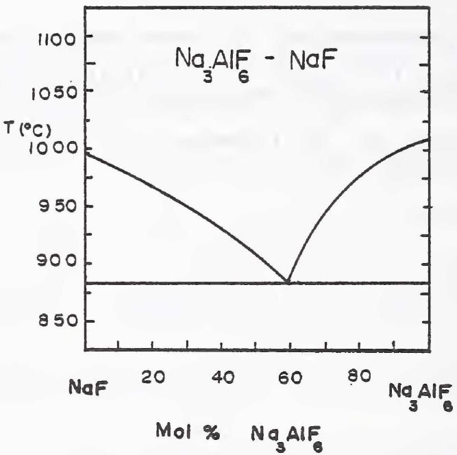  
Figure 129.1. $\mathrm{Na}_{3}\mathrm{AlF}_{6}$ -NaF phase diagram

References [1-25]

2. Density (ρ)

Measurement method: Archimedean technique [26]

Equation:

$$
\rho = a + b T \tag {129.1}
$$

precision: in table 129.1 uncertainty: $\sim \pm 1.0\%$

Table 129.1. Parameters of equation (129.1) and precision   

<table><tr><td>Mol % NaF</td><td>a</td><td>-b x 104</td><td>Precision</td><td>T range(K)</td></tr><tr><td>0</td><td>3.2884</td><td>9.373</td><td>*</td><td>1270-1350</td></tr><tr><td>20.93</td><td>3.3110</td><td>9.504</td><td>*</td><td>1270-1350</td></tr><tr><td>35.71</td><td>3.2754</td><td>9.201</td><td>*</td><td>1270-1350</td></tr><tr><td>46.88</td><td>3.2649</td><td>9.103</td><td>*</td><td>1260-1350</td></tr><tr><td>55.56</td><td>3.2633</td><td>9.098</td><td>*</td><td>1250-1350</td></tr><tr><td>76.92</td><td>3.0830</td><td>7.902</td><td>*</td><td>1220-1340</td></tr><tr><td>100</td><td>2.7334</td><td>6.098</td><td>*</td><td>1260-1340</td></tr></table>

*insufficient data; not estimated

Table 129.2. Density (g cm $^{-3}$ ) from equations in table 129.1   

<table><tr><td rowspan="2">T(K)</td><td colspan="5">Mol % NaF</td></tr><tr><td>20.93</td><td>35.71</td><td>46.88</td><td>55.56</td><td>76.92</td></tr><tr><td>1220</td><td></td><td></td><td></td><td></td><td>2.119</td></tr><tr><td>1230</td><td></td><td></td><td></td><td></td><td>2.111</td></tr><tr><td>1240</td><td></td><td></td><td></td><td></td><td>2.103</td></tr><tr><td>1250</td><td></td><td></td><td></td><td>2.126</td><td>2.095</td></tr><tr><td>1260</td><td></td><td></td><td>2.118</td><td>2.117</td><td>2.087</td></tr><tr><td>1270</td><td>2.104</td><td>2.107</td><td>2.109</td><td>2.108</td><td>2.080</td></tr><tr><td>1280</td><td>2.095</td><td>2.098</td><td>2.100</td><td>2.099</td><td>2.072</td></tr><tr><td>1290</td><td>2.085</td><td>2.089</td><td>2.091</td><td>2.090</td><td>2.064</td></tr><tr><td>1300</td><td>2.076</td><td>2.079</td><td>2.082</td><td>2.081</td><td>2.056</td></tr><tr><td>1310</td><td>2.066</td><td>2.070</td><td>2.073</td><td>2.072</td><td>2.048</td></tr><tr><td>1320</td><td>2.057</td><td>2.061</td><td>2.063</td><td>2.052</td><td>2.040</td></tr><tr><td>1330</td><td>2.047</td><td>2.052</td><td>2.054</td><td>2.053</td><td>2.053</td></tr><tr><td>1340</td><td>2.038</td><td>2.043</td><td>2.045</td><td>2.044</td><td>2.024</td></tr><tr><td>1350</td><td>2.028</td><td>2.033</td><td>2.036</td><td>2.035</td><td></td></tr></table>

References [26]

3. Surface Tension (γ)

No data

4. Viscosity (η)

Measurement method: oscillating body [27]

Equation:

$$
\eta = a + b T + c T ^ {2} + d T ^ {3} \tag {129.2}
$$

precision: in table 129.3 uncertainty: $\pm 20\%$

Table 129.3. Parameters of equation (129.2) and precision   

<table><tr><td>T(K)</td><td>a</td><td>b x 102</td><td>c x 103</td><td>d x 105</td><td>Precision</td></tr><tr><td>1273</td><td>6.9382</td><td>-4.377</td><td>1.865</td><td>-4.041</td><td>1%</td></tr></table>

Table 129.4. Viscosity (cp) from equations in table 129.3   

<table><tr><td>Mol % NaF</td><td>(cp)</td><td>Mol % NaF</td><td>(cp)</td></tr><tr><td>0</td><td>6.938</td><td>30</td><td>6.213</td></tr><tr><td>10</td><td>6.647</td><td>40</td><td>5.586</td></tr><tr><td>20</td><td>6.486</td><td>50</td><td>4.362</td></tr></table>

References [27]

# 5. Electrical Conductance (K)

Measurement method: classical ac technique [26]

Equation:

$$
\kappa = a + b T \tag {129.3}
$$

precision: in table 129.5

uncertainty: $\sim \pm 3.0\%$

Table 129.5. Parameters of equation (129.3) and precisions   

<table><tr><td>Mol % NaF</td><td>-a</td><td>b x 103</td><td>Precision</td><td>T range(K)</td></tr><tr><td>35.7</td><td>0.2343</td><td>2.6376</td><td>0.10%</td><td>1270-1350</td></tr><tr><td>50.0</td><td>0.2953</td><td>2.7374</td><td>0.04%</td><td>1270-1350</td></tr><tr><td>76.9</td><td>0.5997</td><td>3.4998</td><td>0.04%</td><td>1270-1350</td></tr></table>

# (129) $\mathrm{Na}_{3} \mathrm{AlF}_{6}-\mathrm{NaF}$

Table 129.6. Specific conductance (ohm $^{-1}$ cm $^{-1}$ ) from equations in table 129.5   

<table><tr><td rowspan="2">T(K)</td><td colspan="3">Mol % NaF</td></tr><tr><td>35.7</td><td>50.0</td><td>76.9</td></tr><tr><td>1270</td><td>3.12</td><td>3.18</td><td>3.85</td></tr><tr><td>1280</td><td>3.14</td><td>3.21</td><td>3.88</td></tr><tr><td>1290</td><td>3.17</td><td>3.24</td><td>3.92</td></tr><tr><td>1300</td><td>3.20</td><td>3.26</td><td>3.95</td></tr><tr><td>1310</td><td>3.22</td><td>3.29</td><td>3.99</td></tr><tr><td>1320</td><td>3.24</td><td>3.32</td><td>4.02</td></tr><tr><td>1330</td><td>3.27</td><td>3.35</td><td>4.06</td></tr><tr><td>1340</td><td>3.30</td><td>3.37</td><td>4.09</td></tr><tr><td>1350</td><td>3.33</td><td>3.34</td><td>4.13</td></tr></table>

References [26]

6. Safety and Hazards

# A. Hazard rating

(i) Toxicity: inorganic fluorides are generally quite irritant and toxic.   
(ii) Vapor pressure: Na₃AlF₆ at m.pt., 1010°C, ∼ << 0.5mm; NaF at m.pt., 995°C, ∼ 0.5mm.

# B. Disaster hazards

(i) Molten salt bath "explosions": i.e., explosive generation of steam due to bulk water "carry-over" and/or equipment failure; i.e., explosive expansion of "trapped" air.   
(ii) Fluorides, when heated to decomposition, or contacted with acids, emit highly toxic fumes.

References [28-33]

# 7. Corrosion

Table 129.7. Corrosion studies from primary research literature   

<table><tr><td colspan="2">Studies</td><td>References</td></tr><tr><td>A</td><td>CrNi-Cr-Mo alloys (INOR-8; Hastelloys B, W, and N) SSNI-12P Quartz Al Various metals</td><td>[34] [35,36] [37] [38] [39] [40]</td></tr><tr><td>B</td><td>Pt Boron nitride, carbon, Inconel Fused MgO</td><td>[41-45] [46-48] [49]</td></tr><tr><td>C</td><td>Impurities in electrolyte Graphite TiC, TiB2, CrB2, ZrN, NbB2</td><td>[50,51] [50,51] [52-54]</td></tr><tr><td>D</td><td>Corrosion studies in molten salts with NaF as one component (e.g., Cl, CO3,...) Electrochemical behavior of oxide ions and related species in molten fluorides Electroanalytical studies in molten fluorides Annotated corrosion bibli. Corrosion: molten fluorides(survey)</td><td>[55-70,77,78] [71-73] [74] [75] [76]</td></tr></table>

A: studies principally in molten NaF, KF, and LiF;  
B: used largely in fluorides physical properties measurements; C: technological aspects, in aluminum reduction cells; D: more general studies, basic principles, and surveys.

References [34-78]

(129) $\mathrm{Na}_{3} \mathrm{AlF}_{6}-\mathrm{NaF}$

8. Diffusion

Measurement method: chronopotentiometry [79]

Diffusing species investigated in $\mathrm{Na}_3\mathrm{AlF}_6$ -NaF as solvent:

$\mathrm{Fe}^{3+}$ , $\mathrm{Ni}^{2+}$ , $\mathrm{Zn}^{2+}$

precision: not estimated uncertainty: $\sim \pm 10\%$

Table 129.8 Diffusion coefficients   

<table><tr><td>Species</td><td>D x 105T(K)</td><td>(cm2s-1)</td></tr><tr><td>Fe3+</td><td>1273</td><td>1.00</td></tr><tr><td>Ni2+</td><td>1273</td><td>0.20</td></tr><tr><td>Zn2+</td><td>1273</td><td>0.90</td></tr></table>

References $\mathrm{Fe}^{3+}$ , $\mathrm{Ni}^{2+}$ , $\mathrm{Zn}^{2+}$ [79]

9. Heat of Fusion $(\Delta H_{f}^{\circ})$ No data   
10. Heat Capacity $(C_p)$ No data   
11. Volume Change on Melting $(\Delta V_{f})$ No data   
12. Vapor Pressure $(p_{vap})$ No data   
13. Thermal Conductivity (liquid) $(\lambda_{2})$ No data   
14. Thermal Conductivity (solid) $(\lambda_{s})$ No data   
15. Cryoscopic Constant $(k_{f})$ No data

[1] Fedotiev, P. P. and Iljinskii, W. P., "Uber die Schmelbarkeit des Ternaren Systems: Natriumfluorid, Calciumfluorid, Aluminumfluorid", Z. Anorg. Chem. 129 93-107 (1923).   
[2] Abramov, G. A., Vetyukov, M. M., Gupalo, I. P., Kostyukov, A. A., and Lozhkin, L. N., "Theoretical Principles of the Electrometallurgy of Aluminium", Metallurgizdat, Moscow, 1953.   
[3] Grjothiem, K. Contribution to "Theory of Aluminum Electrolysis", Kgl. Norske Vidensk. Selsk. Skr. Nr 5, Trondheim, 1956.   
[4] Ginsberg, H. and Wefers, K., Erzmetal11., 20 (4), 156 (1967).   
[5] Dergonov, E. P., Dokl. Akad. Nauk. SSSR 60 (7), 1185 (1948).   
[6] Fuseya, G., Sugihara, C., Nagao, N. and Teraoka, J., J. Electrochem. Soc. Japan 18 65 (1950).   
[7] Phillips, N. W. F., Singleton, R. H. and Hollingshead, E. A., J. Electrochem. Soc. 102 (12), 690 (1955).   
[8] Kuvakin, M. A. and Kusakin, P. S., Zh. Neorg. Khim. 4(11), 2577 (1959); Russ. J. Inorg. Chem. 4 (11), 1188 (1959).   
[9] Barton, C. J., Bratcher, L. M. and Grimes, W. R., Unpublished work, Ref in "Phase Diagrams of Nuclear Reactor Materials", ed. by Thoma, R. E., U. S. At. Energy Comm. ORNL-2548 (1959).   
[10] Holm, J. L., Thesis, The University of Trondheim, NTH Trondheim, 1963.   
[11] Rolin, M. and Rey, M., Bull. Soc. Chim. France 9 2785 (1966).   
[12] Yoshioka, T. and Kuroda, T., Denki Kagaku 36(10), 727 (1968).   
[13] Janz, G. J. Downey, J. R., Jr., Allen, C. B., and Tomkins, R. P. T., "Eutectic Data" - 2 Vols; ERDA-TID-27163-P1 & P2; NTIS, Washington, D. C. (1977).   
[14] Janz, G. J., Downey, J. R., Jr., Allen, C. B., and Tomkins, R. P. T., "Physical Properties Data Complications Relevant to Energy Storage. I. Molten Salts: Eutectic Data", NSRDS-NBS-61; U. S. Gov't Printing Office, Washington, D. C. (1978).   
[15] "International Critical Tables of Numerical Data, Physics, Chemistry, and Technology", 8 Vols., McGraw-Hill Book Co., N. Y. (1933).   
[16] "Landolt-Bornstein Zahlenwert und Funktionen aus Physik, Chemie, Astronomie, Geophysik und Technik", (10th Ed.) Springer-Verlag, Berlin, Heidelberg, N. Y. (1961).   
[17] Clark, P. V., "Fused Salt Mixtures: Eutectic Compositions and Melting Points Bibliography 1907-1968", Report No. SC-R-68-1680; Sandia Laboratories (1968), NTIS.   
[18] Robertson, W. D., "Binary Phase Diagrams of Halide Salts", Report No. Yale 2723 (2 Vols.), U. S. AEC Contract AT (30-1)-2723 (1966), NTIS.   
[19] Thoma, R. E., "Phase Diagrams of Nuclear Reactor Materials", Oak Ridge National Laboratory, ORNL-2548, Contract No. W-7405-eng-26.   
[20] Thoma, R. E., "Phase Diagrams of Binary and Ternary Fluoride Systems", Chapt. 6; Adv. Molten Salts Chemistry, Vol. 3 (J. Braunstein, G. Mamantov, and G. P. Smith, eds.), Plenum Press, N. Y. (1975).

(129) $\mathrm{Na}_{3} \mathrm{AlF}_{6}$ -NaF   
[21] Voskresenskaya, N. K., ed., "Handbook of Solid-Liquid Equilibria in Systems of Inorganic Salts", Volumes 1, 2, Izc. Akad. Nauk SSSR, Moscow (1961). Israel Program for Scientific Translations, Jerusalem, 1970 (NTIS).   
[22] Shaffer, P. T. B., "High Temperature Materials", Plenum Press Handbooks of High Temperature Materials, No. 1, Materials Index, Plenum Press, New York, 1964.   
[23] Toropov, N. A. et al., "Handbook of Phase Diagrams of the Silicates, Volume 1: Binary Systems, Volume 2, Metal-Oxygen Compounds in Silicate Systems", Izdatel'stov "Nauka" Leningradskoe Otdelenie, Leningrad, 1969, Israel Program for Scientific Translations, Jerusalem, 1972 (NTIS).   
[24] Levin, E., et al., "Phase Diagrams for Ceramists", Amer. Ceramic Soc. (publ.), Columbus, Ohio (1964; 1969).   
[25] "Applications of Phase Diagrams in Metallurgy and Ceramics", (2 Vols) NBS Special Pub. 496. U. S. Dept. of Commerce. Nat. Bur. Standards. Ed. Carter G. C. March 1978.   
[26] Edwards, J. D., Taylor, C. S., and Cosgrove, L. A., J. Electrochem. Soc., 100, 508 (1953).   
[27] Vayna, A., Allumino, 19, 133 (1950).   
[28] "Dangerous Properties of Materials", Sax, N. I., Van Nostrand Reinhold Co., N. Y. (1969).   
[29] "Registry of Toxic Effects of Chemical Substances", Christensen, H. E., and Lubinybyhl, T. T., eds., U. S. Dept. H.E.W; U. S. Gov't Printing Office, Washington, D. C. (1975).   
[30] "Potential Hazards in Molten Salt Baths for Heat Treatment of Metals", National Board Fire Underwriters Research Report No. 2. (1954).   
[31] "Handbook of Reactive Chemical Hazards", Bretherwick, L., Butterworths Co., London (1975).   
[32] Janz, G. J., Tomkins, R. P. T., Downey, J. R., Jr., and Allen, C. B., "Safety and Hazards", Chapter in "Eutectic Data", ERDA TID-27163-P1; NTIS, U. S. Dept. Commerce, Springfield, Va. (1977).   
[33] Vapor pressure, estimated (this work).   
[34] Brasunas, A., Metal Prog., 62, 88 (1952).   
[35] Bettes, E. S., Nucl. Sci. Eng., 2, 804 (1957).   
[36] Hoffman, E. E., Patriarca, P., Leitten, C. F., Jr., and Slaughter, G. M., ORNL-1934, Oak Ridge Natl. Lab., (1956).   
[37] Oak Ridge National Laboratory, "The Development Status of Molten Salt Breeder Reactors", Rpt. ORNL-4812-UC-80; NTIS, U. S. Dept. Commerce, Springfield, Va., (Aug. 1972).   
[38] Heimann, R., Glastech. Ber., 43, 83 (1970).   
[39] Lukashenko, E. E., and Reutova, G. A., Nov. Teor. Tekhnol. Metal1. Protsessov., 119 (1973).   
[40] Koger, J. W., Corrosion, 30, 125 (1974).

(129) $\mathrm{Na}_{3} \mathrm{AlF}_{6}-\mathrm{NaF}$   
[41] Edwards, J. D., Taylor, C. S., Russell, A. S., and Maranville, L. F., J. Electrochem. Soc. 99, 527 (1952).   
[42] Landon, G. J., and Ubbelohde, A. R., Proc. Royal Soc., A240, 160 (1957).   
[43] Winterhager, H. and Werner, L., Forschungsber. des Witschafts-u. Verkehrsministeriums Nordrhein-Westfalen, No. 438, 1957.   
[44] Winterhager, H. and Werner, L., Forschungsber. des Witschafts-u. Verkehrsrministeriums Nordrhein-Westfalen, No. 341, 1956.   
[45] Bajcsy, J., Malinovsky, M., and Matiasovsky, K., Electrochim. Acta, 7, 543 (1962).   
[46] Yim, E. W. and Feinleib, M., J. Electrochem. Soc., 104, 622 (1957).   
[47] Yim, E. W. and Feinleib, M., J. Electrochem. Soc., 626 (1957).   
[48] Brown, E. A. and Porter, B., "U. S. Department of Interior, Bureau of Mines", 128.23:6500 (1964).   
[49] Cuthbertson, J.W. and Waddington, J., Trans Faraday Soc., 32, 745 (1936).   
[50] Grjothiem, K., Krohn, C., Malinovsky, M., Matiasovsky, K., and Thonstad, J., "Aluminum Electrolyses", Chapt. 10; Aluminum-Verlag, G.mbH; Dusseldorf (1977).   
[51] Brun, J., Tunold, R., Vatland, A., 30th ISE Meeting, Extended Abstracts, pp. 118-119; Trondheim, Norway (Aug. 1979); NTH, Dept. Ind. Electrochem., Trondheim, Norway.   
[52] Holliday, R. D., (Olin Mathieson Chemical Corp.), U. S. 3,661,736, May 9, 1972.   
[53] Thompson, R.: (Borax Consolidated Ltd.), Ger. Offen. 2,305,281, Aug. 9, 1973.   
[54] Kugler, T. and Rieger, H. W.: (Swiss Aluminium Ltd.) Ger. Offen. 2,312,439, Oct. 4, 1973.   
[55] Khan, I. A., Ber. Kernforschungsanlage Juelich, Juel-608-RW, (1969).   
[56] Khan, I. A., Inst. Reaktorwerkst., Kernforschungsanlage, Juel-718-RW (1970).   
[57] Bowles, P. J., and Newdick, P. C., Electroplating and Metal Finishing, 24, 6 (1971).   
[58] DeVan, J. H., "Examinations of Pump Impellers from Sodium and Fused Salt Pump Endurance Tests", ORNL CF-61-4-77, Oak Ridge National Lab., (1961).   
[59] Adamson, G. M., Manly, W. D., and Crouse, S. R., "Corrosion by Molten Fluorides", ANP Materials Meeting ORNL-2685, (1958).   
[60] Huntley, W. R., and Gnadt, P. A., Oak Ridge Nat'l Lab., Report ORNL-TM-3863. (1973); Nucl. Sci. Abstr., 27, 12446 (1973).   
[61] Gill, C. B., Straumanis, M. E., and Schlechten, W. B., J. Electrochem. Soc., 102, 42 (1955).   
[62] Litman, A. P., "Corrosion of Volatility Pilot Plant Mark I INOR-S Hydrofluorinator and Mark III. Nickel Fluorinator after Fourteen Dissolution Runs", ORNL-3253, Oak Ridge Nat'l Lab., (1962).   
[63] Litman, A. P., and Goldman, A. E., "Corrosion Associated with Fluoridation in the Oak Ridge Nat'l Lab., Fluoride Volatility Process", ORNL-2832, Oak Ridge Nat'l Lab. (1961).

(129) $\mathrm{Na}_{3} \mathrm{AlF}_{6}-\mathrm{NaF}$   
[64] Manly, W. D., Coobs, J. H., Devan, J. H., Douglas D. A., Inouye, H., Patriarca, P., Roche, T. K., and Scott, J. L., "Metallurgical Problems in Molten Fluoride Systems", Proc. 2nd U. N. Inter. Conf. Peaceful Uses of At. Energy, 7, 223 (1958).   
[65] Oak Ridge Nat'l Lab., Molten Salt Reactor Program Semiannual Progress Report for Period Ending July 31, 1964, ORNL-3708, (1964).   
[66] Vreeland, D. C., Hoffman, E. E., and Manly, W. D., Nucleonics, 11, 36 (1953).   
[67] Grimes, W. R., and Cuneo, D. R., "Molten Salts as Reactor Fuels", Reactor Handbook 2nd ed., 1, 425 (1955).   
[68] Shimotake, H., and Hesson, J. C., Adv. Chem. Series, No. 64, 149 (1967).   
[69] Boser, O., "Study of Safety Aspects of High Temperature Thermal Energy Storage Systems", ERDA Thermal Energy Storage Information Exchange Mtg., Cleveland, NSF-AER 75-20605 (Sept. 1976).   
[70] Venkatasetty, H., V., "Thermodynamic Properties and Corrosion Characteristics of Thermal Energy Storage Eutectic Mixtures", paper presented at 152nd Meeting of the Electrochemical Society, Atlanta, Ga., (October, 1977).   
[71] Mathews, A. L., and Baes, C. F., Inorg. Chem., 7, 373 (1968).   
[72] Manning, D. L. and Mamantov, G., J. Electrochem. Soc., 124, 480 (1977).   
[73] Ting, G., Baes, C. F., Bamberger, C. E., and Mamantov, G., J. Inorg. Nucl. Chem., 39, 1803 (1977).   
[74] Manning, D. L., and Mamantov, G., J. Electroanal. Chem., (in press) (1978)   
[75] Janz, G. J., and Tomkins, R. P. T., Corrosion, 35(11) 485 (1979).   
[76] Eichelberger, J. L., (Penwalt Corp.) "Investigations of Metal Fluoride Thermal Energy Storage Materials: Availability, Cost, Chemistry" ERDA Rpt CO02990-6; NTIS, U. S. Dept. Commerce, Springfield, Va., (Dec. 1976).   
[77] Kochergen, V. P., and Ignat'eva, N. I., Russ. J. Inorg. Chem., 6(9), 1086 (1961).   
[78] Ozeryanaya, I. N., Volodin, V. P., and Smirnov, M. V., Zashchita Metalov (USSR), 2, 230 (1969).   
[79] Delimarskii, Yu. K. and Pavlenko, N. A., Ukr. Khim. Zh., 35, 12 (1969).

1. Melting Temperature $(T_{m})$

Pure substance melting points:

Na3AlF6: 1010°C

KF: 856°C

Eutectic 1, melting point:

890°C, composition: 55.9 mol % KF
25 wt % KF

Eutectic 2, melting point:

$740^{\circ} \mathrm{C}$ , composition: 91.9 mol % KF
75.7 wt % KF

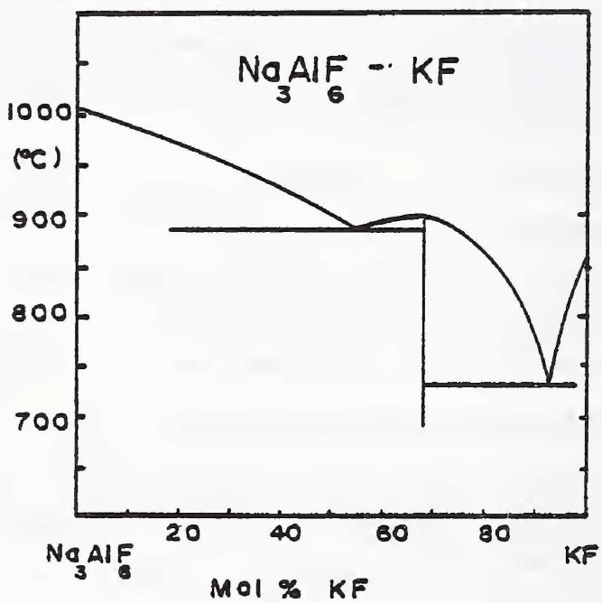  
Figure 130.1. $\mathrm{Na}_{3}\mathrm{AlF}_{6}$ -KF phase diagram

References [1-19]

2. Density (ρ)

Measurement method: Archimedean technique [20]

Equation: (density-composition isotherm)

$$
\rho = a + b C + c C ^ {2} + d C ^ {3} \tag {130.1}
$$

$$
(C = \text {mol} \% K F)
$$

precision: in table 130.1 uncertainty: $\sim \pm 1.5\%$

$$
\mathrm {N a} _ {3} \mathrm {A l F} _ {6} - \mathrm {K F} \tag {130}
$$

Table 130.1. Parameters of equation (130.1) and precision   
Table 130.2. Density-composition isotherm at 1273K from equation in table 130.1   

<table><tr><td></td><td></td><td></td><td></td><td></td><td></td></tr><tr><td>T(K)</td><td>a</td><td>b x 103</td><td>-c x 104</td><td>d x 107</td><td>Precision</td></tr><tr><td>1273</td><td>2.0611</td><td>3.258</td><td>1.124</td><td>6.024</td><td>0.4%</td></tr></table>

<table><tr><td>Mol % KF</td><td>ρ(g cm-3)</td><td></td><td>Mol % KF</td><td>ρ(g cm-3)</td></tr><tr><td>10</td><td>2.0831</td><td></td><td>60</td><td>1.9820</td></tr><tr><td>20</td><td>2.0861</td><td></td><td>70</td><td>1.9450</td></tr><tr><td>30</td><td>2.0740</td><td></td><td>80</td><td>1.9107</td></tr><tr><td>40</td><td>2.0501</td><td></td><td>90</td><td>1.8829</td></tr><tr><td>50</td><td>2.0183</td><td></td><td></td><td></td></tr></table>

References [20]

3. Surface Tension (γ)

No data

4. Viscosity (η)

No data

5. Electrical Conductance (K)

No data

(130) $\mathrm{Na}_{3} \mathrm{AlF}_{6}$ -KF

6. Safety and Hazards

A. Hazard rating

(i) Toxicity: inorganic fluorides are generally quite irritant and toxic.   
(ii) Vapor pressure: Na₃AlF₆, at m.pt. 1000°C, ∼ << 0.5mm, KF, at m.pt., 856°C, ∼ 0.5mm.

B. Disaster hazards

(i) Molten salts bath "explosions": i.e., explosive generation of steam due to bulk water "carry-over" and/or equipment failure; i.e., explosive expansion of "trapped" air.   
(ii) Fluorides, when heated to decomposition, or contacted with acids, emit highly toxic fumes.

References [21-26]

# 7. Corrosion

Table 130.3. Corrosion studies from primary research literature   

<table><tr><td colspan="2">Studies</td><td>References</td></tr><tr><td>A</td><td>CrNi-Cr-Mo alloys (INOR-8; Hastelloys B, W, and N) SSNI-12P Quartz Al Various metals</td><td>[27] [28,29] [30] [31] [32] [33]</td></tr><tr><td>B</td><td>Pt Boron nitride, carbon, Inconel Fused MgO</td><td>[34-38] [39-41] [42]</td></tr><tr><td>C</td><td>Impurities in electrolyte Graphite TiC, TiB2, CrB2, ZrN, NbB2</td><td>[43,44] [43,44] [45-47]</td></tr><tr><td>D</td><td>Corrosion studies in molten salts with NaF as one component (e.g., Cl, CO3,...) Electrochemical behavior of oxide ions and related species in molten fluorides Electroanalytical studies in molten fluorides Annotated corrosion biblio. Corrosion: molten fluorides(survey)</td><td>[48-63,70,71] [64-66] [67] [68] [69]</td></tr></table>

A: studies principally in molten NaF, KF, and LiF;  
B: used largely in fluorides physical properties measurements; C: technologicl aspects, in aluminum reduction cells; D: more general studies, basic principles, and surveys.

References [27-71]

8. Diffusion

No data

9. Heat of Fusion $(\Delta H_{f}^{\circ})$

No data

(130) $\mathrm{Na}_{3} \mathrm{AlF}_{6}$ -KF

10. Heat Capacity (Cp) No data   
11. Volume Change on Melting $(\Delta V_{f})$ No data   
12. Vapor Pressure $(p_{vap})$ No data   
13. Thermal Conductivity (liquid) $(\lambda_{\ell})$ No data   
14. Thermal Conductivity (solid) $(\lambda_{s})$ No data   
15. Cryoscopic Constant $(k_{f})$ No data   
16. References

[1] Yoshioka, T. and Kuroda, T., Denki Kagaku 36(10), 727 (1968).   
[2] Holm, J. L., Thesis, The University of Trondheim, NTH Trondheim, 1963.   
[3] Baimakov, J. V. and Vetyukov, M. M., The Electrolysis of Molten Salts, Metallurghiya, Moscow, 1966.   
[4] Belyaev, A. I., Rapoport, M. B. and Firsanova, L. A., "Metalurgie des Aluminiumums", Vol 1, VEB Verlag Technik, Berlin, 1956.   
[5] Bukhalova, G. A. and Mal'tsev, V. T., Zh. Neorg. Khim. 10 189(1965).   
[6] Kuvakin, M. A., Volkhina, T. D. and Kuvakina, L. M., Tsvet. Met. 44 (7) 33 (1971).   
[7] Janz, G. J. Downey, J. R., Jr., Allen, C. B., and Tomkins, R. P. T., "Eutectic Data" - 2 Vols; ERDA-TID-27163-P1 & P2; NTIS, Washington, D. C. (1977).   
[8] Janz, G. J., Downey, J. R., Jr., Allen, C. B., and Tomkins, R. P. T., "Physical Properties Data Complications Relevant to Energy Storage. I. Molten Salts: Eutectic Data", NSRDS-NBS-61; U. S. Gov't Printing Office, Washington, D. C. (1978).   
[9] "International Critical Tables of Numerical Data, Physics, Chemistry, and Technology", 8 Vols., McGraw-Hill Book Co., N. Y. (1933).   
[10] "Landolt-Bornstein Zahlenwert und Funktionen aus Physik, Chemie, Astronomie, Geophysik und Technik", (10th Ed.) Springer-Verlag, Berlin, Heidelberg, N. Y. (1961).

(130) $\mathrm{Na}_{3} \mathrm{AlF}_{6}-\mathrm{KF}$   
[11] Clark, P. V., "Fused Salt Mixtures: Eutectic Compositions and Melting Points Bibliography 1907-1968", Report No. SC-R-68-1680; Sandia Laboratories (1968), NTIS.   
[12] Robertson, W. D., "Binary Phase Diagrams of Halide Salts", Report No. Yale 2723 (2 Vols.), U. S. AEC Contract AT (30-1)-2723 (1966), NTIS.   
[13] Thoma, R. E., "Phase Diagrams of Nuclear Reactor Materials", Oak Ridge National Laboratory, ORNL-2548, Contract No. W-7405-eng-26.   
[14] Thoma, R. E., "Phase Diagrams of Binary and Ternary Fluoride Systems", Chapt. 6; Adv. Molten Salts Chemistry, Vol. 3 (J. Braunstein, G. Mamantov, and G. P. Smith, eds.), Plenum Press, N. Y. (1975).   
[15] Voskresenskaya, N. K., ed., "Handbook of Solid-Liquid Equilibria in Systems of Inorganic Salts", Volumes 1, 2, Izc. Akad. Nauk SSSR, Moscow (1961). Israel Program for Scientific Translations, Jerusalem, 1970 (NTIS).   
[16] Shaffer, P. T. B., "High Temperature Materials", Plenum Press Handbooks of High Temperature Materials, No. 1, Materials Index, Plenum Press, New York, 1964.   
[17] Toropov, N. A. et al., "Handbook of Phase Diagrams of the Silicates, Volume 1: Binary Systems, Volume 2, Metal-Oxygen Compounds in Silicate Systems", Izdatel'stov "Nauka" Leningradskoe Otdelenie, Leningrad, 1969, Israel Program for Scientific Translations, Jerusalem, 1972 (NTIS).   
[18] Levin, E., et al., "Phase Diagrams for Ceramists", Amer. Ceramic Soc. (publ.), Columbus, Ohio (1964; 1969).   
[19] "Applications of Phase Diagrams in Metallurgy and Ceramics", (2 Vols) NBS Special Pub. 496. U. S. Dept. of Commerce. Nat. Bur. Standards. Ed. Carter G. C. March 1978.   
[20] Kuvakin, M. A., Pyatintsev, V. A., and Talanova, L. I., Russ. J. Phys. Chem., 47, 588 (1973).   
[21] "Dangerous Properties of Materials", Sax, N. I., Van Nostrand Reinhold Co., N. Y. (1969).   
[22] "Registry of Toxic Effects of Chemical Substances", Christensen, H. E., and Lubinybyhl, T. T., eds., U. S. Dept. H.E.W; U. S. Gov't Printing Office, Washington, D. C. (1975).   
[23] "Potential Hazards in Molten Salt Baths for Heat Treatment of Metals", National Board Fire Underwriters Research Report No. 2. (1954).   
[24] "Handbook of Reactive Chemical Hazards", Bretherwick, L., Butterworths Co., London (1975).   
[25] Janz, G. J., Tomkins, R. P. T., Downey, J. R., Jr., and Allen, C. B., "Safety and Hazards", Chapter in "Eutectic Data", ERDA TID-27163-P1; NTIS, U. S. Dept. Commerce, Springfield, Va. (1977).   
[26] Vapor pressure, estimated, this work.   
[27] Brasunas, A., Metal Prog., 62, 88 (1952).   
[28] Bettes, E. S., Nucl. Sci. Eng., 2, 804 (1957).   
[29] Hoffman, E. E., Patriarca, P., Leitten, C. F., Jr., and Slaughter, G. M., ORNL-1934, Oak Ridge Natl. Lab., (1956).

(130) $\mathrm{Na}_{3} \mathrm{AlF}_{6}$ -KF   
[30] Oak Ridge National Laboratory, "The Development Status of Molten Salt Breeder Reactors", Rpt. ORNL-4812-UC-80; NTIS, U. S. Dept. Commerce, Springfield, Va., (Aug. 1972).   
[31] Heimann, R., Glastech. Ber., 43, 83 (1970).   
[32] Lukashenko, E. E., and Reutova, G. A., Nov. Teor. Tekhnol. Metal 11. Protsessov., 119 (1973).   
[33] Koger, J. W., Corrosion, 30, 125 (1974).   
[34] Edwards, J. D., Taylor, C. S., Russell, A. S., and Maranville, L. F., J. Electrochem. Soc. 99, 527 (1952).   
[35] Landon, G. J., and Ubbelohde, A. R., Proc. Royal Soc., A240, 160 (1957).   
[36] Winterhager, H. and Werner, L., Forschungsber. des Witschafts-u. Verkehrsrministeriums Nordrhein-Westfalen, No. 438, 1957.   
[37] Winterhager, H. and Werner, L., Forschungsber. des Witschafts-u. Verkehrsministeriums Nordrhein-Westfalen, No. 341, 1956.   
[38] Bajcsy, J., Malinovsky, M., and Matiasovsky, K., Electrochim. Acta, 7, 543 (1962).   
[39] Yim, E. W. and Feinleib, M., J. Electrochem. Soc., 104, 622 (1957).   
[40] Yim, E. W. and Feinleib, M., J. Electrochem. Soc., 104, 626 (1957).   
[41] Brown, E. A. and Porter, B., "U. S. Department of Interior, Bureau of Mines", 128.23:6500 (1964).   
[42] Cuthbertson, J.W. and Waddington, J., Trans Faraday Soc., 32, 745 (1936).   
[43] Grjothiem, K., Krohn, C., Malinovsky, M., Matiasovsky, K., and Thonstad, J., "Aluminum Electrolyses", Chapt. 10; Aluminum-Verlag, G.mbH; Dusseldorf (1977).   
[44] Brun, J., Tunold, R., Vatland, A., 30th ISE Meeting, Extended Abstracts, pp. 118-119; Trondheim, Norway (Aug. 1979); NTH, Dept. Ind. Electrochem., Trondheim, Norway.   
[45] Holliday, R. D., (Olin Mathieson Chemical Corp.), U. S. 3,661,736, May 9, 1972.   
[46] Thompson, R.: (Borax Consolidated Ltd.), Ger. Offen. 2,305,281, Aug. 9, 1973.   
[47] Kugler, T. and Rieger, H. W.: (Swiss Aluminium Ltd.), Ger. Offen. 2,312,439, Oct. 4, 1973.   
[48] Khan, I. A., Ber. Kernforschungsanlage'Juelich, Juel-608-RW, (1969).   
[49] Khan, I. A., Inst. Reaktorwerkst., Kernforschungsanlage, Juel-718-RW (1970).   
[50] Bowles, P. J., and Newdick, P. C., Electroplating and Metal Finishing, 24, 6 (1971).   
[51] DeVan, J. H., "Examinations of Pump Impellers from Sodium and Fused Salt Pump Endurance Tests", ORNL CF-61-4-77, Oak Ridge National Lab., (1961).   
[52] Adamson, G. M., Manly, W. D., and Crouse, S. R., "Corrosion by Molten Fluorides", ANP Materials Meeting ORNL-2685, (1958).

(130) $\mathrm{Na}_{3} \mathrm{AlF}_{6}-\mathrm{KF}$   
[53] Huntley, W. R., and Gnadt, P. A., Oak Ridge Nat'l Lab., Report ORNL-TM-3863. (1973); Nucl. Sci. Abstr., 27, 12446 (1973).   
[54] Gill, C. B., Straumanis, M. E., and Schlechten, W. B., J. Electrochem. Soc., 102, 42 (1955).   
[55] Litman, A. P., "Corrosion of Volatility Pilot Plant Mark I INOR-S Hydrofluorinator and Mark III. Nickel Fluorinator after Fourteen Dissolution Runs", ORNL-3253, Oak Ridge Nat'l Lab., (1962).   
[56] Litman, A. P., and Goldman, A. E., "Corrosion Associated with Fluoridation in the Oak Ridge Nat'l Lab., Fluoride Volatility Process", ORNL-2832, Oak Ridge Nat'l Lab. (1961).   
[57] Manly, W. D., Coobs, J. H., DeVan, J. H., Douglas D. A., Inouye, H., Patriarca, P., Roche, T. K., and Scott, J. L., "Metallurgical Problems in Molten Fluoride Systems", Proc. 2nd U. N. Inter. Conf. Peaceful Uses of At. Energy, 7, 223 (1958).   
[58] Oak Ridge Nat'l Lab., Molten Salt Reactor Program Semiannual Progress Report for Period Ending July 31, 1964, ORNL-3708, (1964).   
[59] Vreeland, D. C., Hoffman, E. E., and Manly, W. D., Nucleonics, 11, 36 (1953).   
[60] Grimes, W. R., and Cuneo, D. K., "Molten Salts as Reactor Fuels", Reactor Handbook 2nd ed., 1, 425 (1955).   
[61] Shimotake, H., and Hesson, J. C., Adv. Chem. Series, No. 64, 149 (1967).   
[62] Boser, O., "Study of Safety Aspects of High Temperature Thermal Energy Storage Systems", ERDA Thermal Energy Storage Information Exchange Mtg., Cleveland, NSF-AER 75-20605 (Sept. 1976).   
[63] Venkatasetty, H. V., "Thermodynamic Properties and Corrosion Characteristics of Thermal Energy Storage Eutectic Mixtures", paper presented at 152nd Meeting of the Electrochemical Society, Atlanta, Ga., (October, 1977).   
[64] Mathews, A. L., and Baes, C. F., Inorg. Chem., 7, 373 (1968).   
[65] Manning, D. L. and Mamantov, G., J. Electrochem. Soc., 124, 480 (1977).   
[66] Ting, G., Baes, C. F., Bamberger, C. E., and Mamantov, G., J. Inorg. Nucl. Chem., 39, 1803 (1977).   
[67] Manning, D. L., and Mamantov, G., J. Electroanal. Chem., (in press) (1978)   
[68] Janz, G. J., and Tomkins, R. P. T., Corrosion, 35(11) 485 (1979).   
[69] Eichelberger, J. L., (Penwalt Corp.) "Investigations of Metal Fluoride Thermal Energy Storage Materials: Availability, Cost, Chemistry" ERDA Rpt CO02990-6; NTIS, U. S. Dept. Commerce, Springfield, Va., (Dec. 1976).   
[70] Kochergen, V. P., and Ignat'eva, N. I., Russ. J. Inorg. Chem., 6(9), 1086 (1961).   
[71] Ozeryanaya, I. N., Volodin, V. P., and Smirnov, M. V., Zashchita Metalov (USSR), 2, 230 (1969).

1. Melting Temperature $(T_{m})$

Pure substance melting points:

Na3AlF6: 1010°C

$\mathrm{BeF}_{2}$ : $797^{\circ} \mathrm{C}$

Eutectic melting point:

$760^{\circ} \mathrm{C}$ , composition: $16 \mathrm{wt} \% \mathrm{BeF}_{2}$

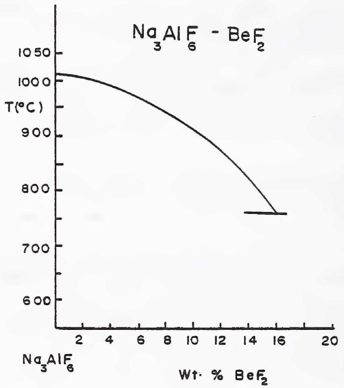  
Figure 131.1. $\mathrm{Na}_{3} \mathrm{AlF}_{6}$ -BeF $_2$ phase diagram

References [1-14]

2. Density (p)

No data

3. Surface Tension (Y)

No data

4. Viscosity (n)

No data

$$
\mathrm {N a} _ {3} \mathrm {A l F} _ {6} - \mathrm {B e F} _ {2} \tag {131}
$$

5. Electrical Conductance (K)

Measurement method: classical ac technique [15]

Equation:

$$
\kappa = a + b C \quad (1 3 1. 1)
$$

$$
(C = \text {mol} \% \text {BeF} _ {2})
$$

precision: in table 131.1 uncertainty: $\sim \pm 10\%$

Table 131.1. Parameters of equation (131.1) and precision   

<table><tr><td>T(K)</td><td>a</td><td>-b x 103</td><td>Precision</td></tr><tr><td>1273</td><td>2.7716</td><td>12.766</td><td>0.5%</td></tr></table>

Table 131.2. Specific conductance at 1273 K from equation in table 131.1   

<table><tr><td>Mol % BeF2</td><td>(ohm-1cm-1)</td><td>Mol % BeF2</td><td>(ohm-1cm-1)</td></tr><tr><td rowspan="2">20·30</td><td>2.516</td><td>40</td><td>2.261</td></tr><tr><td>2.389</td><td>50</td><td>2.133</td></tr></table>

References [15]

6. Safety and Hazards

# A. Hazard rating

(i) Toxicity: inorganic fluorides are generally quite irritant and toxic; toxicity of berylium compounds is rated high (i.e. may cause death or permanent injury after very short exposure to small quantities).   
(ii) Vapor pressure: $\mathrm{Na}_{3} \mathrm{AlF}_{6}$ , at m.pt. $1000^{\circ} \mathrm{C}, \sim < 0.5 \mathrm{~mm}$ ; $\mathrm{BeF}_{2}$ , at m.pt. $797^{\circ} \mathrm{C}, \sim < 0.5 \mathrm{~mm}$ .

# B. Disaster Hazards

(i) Molten salts bath "explosions": i.e., explosive generation of steam due to bulk water "carry-over" and/or equipment failure; i.e., explosive expansion of "trapped" air.   
(ii) Fluorides, when heated to decomposition, or contacted with acids, emit highly toxic fumes.

References [16-21]

# 7. Corrosion

Table 131.3. Corrosion studies from primary research literature   

<table><tr><td colspan="2">Studies</td><td>References</td></tr><tr><td>A</td><td>CrNi-Cr-Mo alloys (INOR-8; Hastelloys W, B, and N)SSNI-12PQuartzAlVarious metals</td><td>[22][23,24][25][26][27][28]</td></tr><tr><td>B</td><td>PtBoron nitride, carbon, InconelFused MgO</td><td>[29-33][34-36][37]</td></tr><tr><td>C</td><td>Impurities in electrolyteGraphiteTiC, TiB2, CrB2, ZrN, NbB2</td><td>[38,39][38,39][40-42]</td></tr><tr><td>D</td><td>Corrosion studies in molten salts with NaF as one component (e.g., Cl, CO3,...)Electrochemical behavior of oxides and related species in molten fluoridesElectroanalytical studies in molten fluoridesAnnotated corrosion bibliolog.Corrosion: molten fluorides(survey)</td><td>[43-58,65,66][59-61][62][63][64]</td></tr></table>

A: studies principally in molten NaF, KF, and LiF;  
B: used largely in fluorides physical properties measurements; C: technological aspects, in aluminum reduction cells; D: more general studies, basic principles, and surveys.

References [22-66]

8. Diffusion

No data

9. Heat of Fusion $(\Delta H_{f}^{\circ})$

No data

(131) $\mathrm{Na}_{3} \mathrm{AlF}_{6}-\mathrm{BeF}_{2}$

10. Heat Capacity $(C_p)$ No Data   
11. Volume Change on Melting $(\Delta V_{f})$ No data   
12. Vapor Pressure $(p_{vap})$ No data   
13. Thermal Conductivity (liquid) $(\lambda_{\mathrm{e}})$ No data   
14. Thermal Conductivity (solid) $(\lambda_{s})$ No data   
15. Cryoscopic Constant $(k_{f})$ No data   
16. References

[1] Chu, Y. A. and Belyaev, A. I., Izv. Vyssh. Ucheb. Zaved., Tsvet. Met. 269 (1959).   
[2] Janz, G. J. Downey, J. R., Jr., Allen, C. B., and Tomkins, R. P. T., "Eutectic Data" - 2 Vols; ERDA-TID-27163-P1 & P2; NTIS, Washington, D. C. (1977).   
[3] Janz, G. J., Downey, J. R., Jr., Allen, C. B., and Tomkins, R. P. T., "Physical Properties Data Complications Relevant to Energy Storage. I. Molten Salts: Eutectic Data", NSRDS-NBS-61; U. S. Gov't Printing Office, Washington, D. C. (1978).   
[4] "International Critical Tables of Numerical Data, Physics, Chemistry, and Technology", 8 Vols., McGraw-Hill Book Co., N. Y. (1933).   
[5] "Landolt-Bornstein Zahlenwert und Funktionen aus Physik, Chemie, Astronomie, Geophysik und Technik", (10th Ed.) Springer-Verlag, Berlin, Heidelberg, N. Y. (1961).   
[6] Clark, P. V., "Fused Salt Mixtures: Eutectic Compositions and Melting Points Bibliography 1907-1968", Report No. SC-R-68-1680; Sandia Laboratories (1968), NTIS.   
[7] Robertson, W. D., "Binary Phase Diagrams of Halide Salts", Report No. Yale 2723 (2 Vols.), U. S. AEC Contract AT (30-1)-2723 (1966), NTIS.   
[8] Thoma, R. E., "Phase Diagrams of Nuclear Reactor Materials", Oak Ridge National Laboratory, ORNL-2548, Contract No. W-7405-eng-26.   
[9] Thoma, R. E., "Phase Diagrams of Binary and Ternary Fluoride Systems", Chapt. 6; Adv. Molten Salts Chemistry, Vol. 3 (J. Braunstein, G. Mamantov, and G. P. Smith, eds.), Plenum Press, N. Y. (1975).

(131) $\mathrm{Na}_{3} \mathrm{AlF}_{6}\text{-BeF}_{2}$   
[10] Voskresenskaya, N. K., ed., "Handbook of Solid-Liquid Equilibria in Systems of Inorganic Salts", Volumes 1, 2, Izc. Akad. Nauk SSSR, Moscow (1961). Israel Program for Scientific Translations, Jerusalem, 1970 (NTIS).   
[11] Shaffer, P. T. B., "High Temperature Materials", Plenum Press Handbooks of High Temperature Materials; No. 1, Materials Index, Plenum Press, New York, 1964.   
[12] Toropov, N. A. et al., "Handbook of Phase Diagrams of the Silicates, Volume 1: Binary Systems, Volume 2, Metal-Oxygen Compounds in Silicate Systems", Izdatel'stov "Nauka" Leningradskoe Otdelenie, Leningrad, 1969, Israel Program for Scientific Translations, Jerusalem, 1972 (NTIS).   
[13] Levin, E., et al., "Phase Diagrams for Ceramists", Amer. Ceramic Soc. (publ.), Columbus, Ohio (1964; 1969).   
[14] "Applications of Phase Diagrams in Metallurgy and Ceramics", (2 Vols) NBS Special Pub. 496. U. S. Dept. of Commerce. Nat. Bur. Standards. Ed. Carter G. C. March 1978.   
[15] vide infra, Ref [1].   
[16] "Dangerous Properties of Materials", Sax, N. I., Van Nostrand Reinhold Co., N. Y. (1969).   
[17] "Registry of Toxic Effects of Chemical Substances", Christensen, H. E., and Lubinybyhl, T. T., eds., U. S. Dept. H.E.W; U. S. Gov't Printing Office, Washington, D. C. (1975).   
[18] "Potential Hazards in Molten Salt Baths for Heat Treatment of Metals", National Board Fire Underwriters Research Report No. 2. (1954).   
[19] "Handbook of Reactive Chemical Hazards", Bretherwick, L., Butterworths Co., London (1975).   
[20] Janz, G. J., Tomkins, R. P. T., Downey, J. R., Jr., and Allen, C. B., "Safety and Hazards", Chapter in "Eutectic Data", ERDA TID-27163-P1; NTIS, U. S. Dept. Commerce, Springfield, Va. (1977).   
[21] Vapor pressure, estimated, this work.   
[22] Brasunas, A., Metal Prog., 62, 88 (1952).   
[23] Bettes, E. S., Nucl. Sci. Eng., 2, 804 (1957).   
[24] Hoffman, E. E., Patriarca, P., Leitten, C. F., Jr., and Slaughter, G. M., ORNL-1934, Oak Ridge Natl. Lab., (1956).   
[25] Oak Ridge National Laboratory, "The Development Status of Molten Salt Breeder Reactors", Rpt. ORNL-4812-UC-80; NTIS, U. S. Dept. Commerce, Springfield, Va., (Aug. 1972).   
[26] Heimann, R., Glastech. Ber., 43, 83 (1970).   
[27] Lukashenko, E. E., and Reutova, G. A., Nov. Teor. Tekhnol. Metall. Protsessov., 119 (1973).   
[28] Koger, J. W., Corrosion, 30, 125 (1974).   
[29] Edwards, J. D., Taylor, C. S., Russell, A. S., and Maranville, L. F., J. Electrochem. Soc. 99, 527 (1952).

(131) $\mathrm{Na}_{3} \mathrm{AlF}_{6}-\mathrm{BeF}_{2}$   
[30] Landon, G. J., and Ubbelohde, A. R., Proc. Royal Soc., A240, 160 (1957).   
[31] Winterhager, H. and Werner, L., Forschungsber. des Witschafts-u. Verkehrsministeriums Nordrhein-Westfalen, No. 438, 1957.   
[32] Winterhager, H. and Werner, L., Forschungsber. des Witschafts-u. Verkehrsministeriums Nordrhein-Westfalen, No. 341, 1956.   
[33] Bajcsy, J., Malinovsky, M., and Matiasovsky, K., Electrochim. Acta, 7, 543 (1962).   
[34] Yim, E. W. and Feinleib, M., J. Electrochem. Soc., 104, 622 (1957).   
[35] Yim, E. W. and Feinleib, M., J. Electrochem. Soc., 104, 626 (1957).   
[36] Brown, E. A. and Porter, B., "U. S. Department of Interior, Bureau of Mines", 128.23:6500 (1964).   
[37] Cuthbertson, J.W. and Waddington, J., Trans Faraday Soc., 32, 745 (1936).   
[38] Grjothiem, K., Krohn, C., Malinovsky, M., Matiasovsky, K., and Thonstad, J., "Aluminum Electrolyses", Chapt. 10; Aluminum-Verlag, G.mbH; Dusseldorf (1977).   
[39] Brun, J., Tunold, R., Vatland, A., 30th ISE Meeting, Extended Abstracts, pp. 118-119; Trondheim, Norway (Aug. 1979); NTH, Dept. Ind. Electrochem., Trondheim, Norway.   
[40] Holliday, R. D., (Olin Mathieson Chemical Corp.), U. S. 3,661,736, May 9, 1972.   
[41] Thompson, R.: (Borax Consolidated Ltd.), Ger. Offen. 2,305,281, Aug. 9, 1973.   
[42] Kugler, T. and Rieger, H. W.: (Swiss Aluminium Ltd.), Ger. Offen. 2,312,439, Oct. 4, 1973.   
[43] Khan, I. A., Ber. Kernforschungsanlage Juelich, Juel-608-RW, (1969).   
[44] Khan, I. A., Inst. Reaktorwerkst., Kernforschungsanlage, Juel-718-RW (1970).   
[45] Bowles, P. J., and Newdick, P. C., Electroplating and Metal Finishing, 24, 6 (1971).   
[46] Devan, J. H., "Examinations of Pump Impellers from Sodium and Fused Salt Pump Endurance Tests", ORNL CF-61-4-77, Oak Ridge National Lab., (1961).   
[47] Adamson, G. M., Manly, W. D., and Crouse, S. R., "Corrosion by Molten Fluorides", ANP Materials Meeting ORNL-2685, (1958).   
[48] Huntley, W. R., and Gnadt, P. A., Oak Ridge Nat'l Lab., Report ORNL-TM-3863. (1973); Nucl. Sci. Abstr., 27, 12446 (1973).   
[49] Gill, C. B., Straumanis, M. E., and Schlechten, W. B., J. Electrochem. Soc., 102, 42 (1955).   
[50] Litman, A. P., "Corrosion of Volatility Pilot Plant Mark I INOR-S Hydrofluorinator and Mark III. Nickel Fluorinator after Fourteen Dissolution Runs", ORNL-3253, Oak Ridge Nat'l Lab., (1962).   
[51] Litman, A. P., and Goldman, A. E., "Corrosion Associated with Fluoridation in the Oak Ridge Nat'l Lab., Fluoride Volatility Process", ORNL-2832, Oak Ridge Nat'l Lab. (1961).

(131) $\mathrm{Na}_{3} \mathrm{AlF}_{6}-\mathrm{BeF}_{2}$   
[52] Manly, W. D., Coobs, J. H., Devan, J. H., Douglas D. A., Inouye, H., Patriarca, P., Roche, T. K., and Scott, J. L., "Metallurgical Problems in Molten Fluoride Systems", Proc. 2nd U. N. Inter. Conf. Peaceful Uses of At. Energy, 7, 223 (1958).   
[53] Oak Ridge Nat'l Lab., Molten Salt Reactor Program Semiannual Progress Report for Period Ending July 31, 1964, ORNL-3708, (1964).   
[54] Vreeland, D. C., Hoffman, E. E., and Manly, W. D., Nucleonics, 11, 36 (1953).   
[55] Grimes, W. R., and Cuneo, D. R., "Molten Salts as Reactor Fuels", Reactor Handbook 2nd ed., 1, 425 (1955).   
[56] Shimotake, H., and Hesson, J. C., Adv. Chem. Series, No. 64, 149 (1967).   
[57] Boser, O., "Study of Safety Aspects of High Temperature Thermal Energy Storage Systems", ERDA Thermal Energy Storage Information Exchange Mtg., Cleveland, NSF-AER 75-20605 (Sept. 1976).   
[58] Venkatasetty, H. V., "Thermodynamic Properties and Corrosion Characteristics of Thermal Energy Storage Eutectic Mixtures", paper presented at 152nd Meeting of the Electrochemical Society, Atlanta, Ga., (October, 1977).   
[59] Mathews, A. L., and Baes, C. F., Inorg. Chem., 7, 373 (1968).   
[60] Manning, D. L. and Mamantov, G., J. Electrochem. Soc., 124, 480 (1977).   
[61] Ting, G., Baes, C. F., Bamberger, C. E., and Mamantov, G., J. Inorg. Nucl. Chem., 39, 1803 (1977).   
[62] Manning, D. L., and Mamantov, G., J. Electroanal. Chem., (in press) (1978)   
[63] Janz, G. J., and Tomkins, R. P. T., Corrosion, 35(11) 485 (1979).   
[64] Eichelberger, J. L., (Penwalt Corp.) "Investigations of Metal Fluoride Thermal Energy Storage Materials: Availability, Cost, Chemistry" ERDA Rpt CO02990-6; NTIS, U. S. Dept. Commerce, Springfield, Va., (Dec. 1976).   
[65] Kochergen, V. P., and Ignat'eva, N. I., Russ. J. Inorg. Chem., 6(9), 1086 (1961).   
[66] Ozeryanaya, I. N., Volodin, V. P., and Smirnov, M. V., Zashchita Metalov (1969), 2, 230 (1969).

1. Melting Temperatures $(T_{m})$

Pure substance melting points:

$\mathrm{MgF}_{2}$ : 1263°C

Na3AlF6: 1010°C

Eutectic melting point:

$924^{\circ} \mathrm{C}$ , composition: $57.5 \mathrm{~mol} \% \mathrm{Na}_{3} \mathrm{AlF}_{6}$ ; [82.0 wt $\%$ , $\mathrm{Na}_{3} \mathrm{AlF}_{6}]$

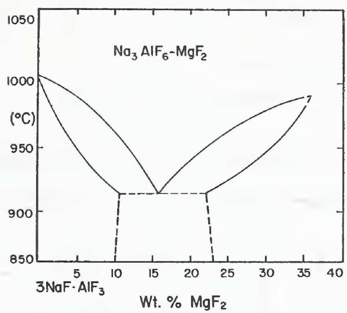

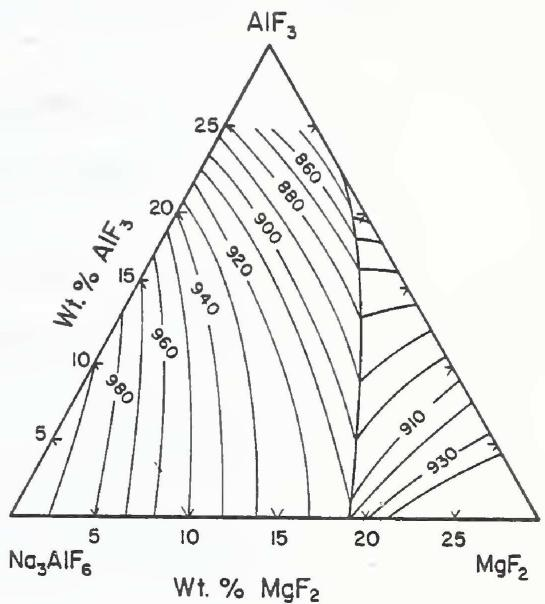  
Figure 132.1. $\mathrm{Na}_{3}\mathrm{AlF}_{6} - \mathrm{MgF}_{2}$ phase diagram

References [1-23]

2. Density (ρ)

Measurement method: Archimedean technique [24]

Equation:

$$
\begin{array}{l} \rho = 2. 0 9 6 + 1. 7 2 4 \times 1 0 ^ {- 3} C \tag {132.1} \\ (C = \text {mol} \% \text {MgF} _ {2}) \\ \end{array}
$$

precision: not estimated, graphical data.

uncertainty: $\sim$ 5.0%

Table 132.1. Density-composition isotherm at ${1273}^{ \circ  }\mathrm{K}$ from equation (132.1)   

<table><tr><td>Mol % MgF2</td><td>ρ (g cm-3)</td></tr><tr><td>10</td><td>2.11</td></tr><tr><td>20</td><td>2.13</td></tr><tr><td>30</td><td>2.15</td></tr></table>

References [24]

$$
\mathrm {N a} _ {3} \mathrm {A l F} _ {6} - \mathrm {M g F} _ {2} \tag {132}
$$

3. Surface Tension (γ)

No data

4. Viscosity (η)

Measurement method: oscillating sphere technique [25]

Equation: (viscosity-composition isotherm)

$$
\eta = a + b C + c C ^ {2} \tag {132.2}
$$

$$
\left(\mathrm{C} = \mathrm{mol}\% \mathrm{MgF}_{2}\right)
$$

precision: in table 132.3 uncertainty: $\sim$ $15\%$

Table 132.2. Parameters of equation (132.2) and precisions   

<table><tr><td>T(K)</td><td>a</td><td>-b x 103</td><td>c x 104</td><td>Precision</td></tr><tr><td>1273</td><td>2.7901</td><td>4.659</td><td>7.930</td><td>1.8%</td></tr><tr><td>1323</td><td>2.3380</td><td>7.945</td><td>7.209</td><td>1.6%</td></tr></table>

Table 132.3. Viscosity (cp) from equations in table 132.2   

<table><tr><td>\( \mathrm{{Mo}}1\% {\mathrm{{MgF}}}_{2} \)</td><td>1273 K</td><td>1323 K</td></tr><tr><td>0</td><td>2.79</td><td>2.34</td></tr><tr><td>10</td><td>2.82</td><td>2.33</td></tr><tr><td>20</td><td>3.01</td><td>2.47</td></tr><tr><td>30</td><td>3.36</td><td>2.75</td></tr><tr><td>40</td><td>3.87</td><td>3.17</td></tr><tr><td>50</td><td>4.54</td><td>3.74</td></tr></table>

References [25]

5. Electrical Conductance (K)

Measurement method: classical ac technique [26]

Equation:

$$
\kappa = a + b T \tag {132.3}
$$

precision: in table 132.5 uncertainty: $\sim \pm 10\%$

# (132) $\mathrm{Na}_{3} \mathrm{AlF}_{6}-\mathrm{MgF}_{2}$

Table 132.4. Parameters of equation (132.3) and precisions   

<table><tr><td>Mol % MgF2</td><td>a</td><td>b x 103</td><td>Precision</td><td>T range(K)</td></tr><tr><td>6.05</td><td>0.2176</td><td>1.771</td><td>0.12%</td><td>1270-1420</td></tr><tr><td>37.29</td><td>0.1725</td><td>1.729</td><td>0.12%</td><td>1270-1420</td></tr><tr><td>49.45</td><td>0.0206</td><td>1.800</td><td>0.11%</td><td>1270-1420</td></tr><tr><td>94.08</td><td>-0.4457</td><td>2.043</td><td>0.03%</td><td>1270-1420</td></tr></table>

Table 132.5. Specific conductance (ohm $^{-1}$ cm $^{-1}$ ) from equations in table 132.4   

<table><tr><td rowspan="2">T(K)</td><td colspan="4">\( Mol\ \% MgF_2 \)</td></tr><tr><td>6.05</td><td>37.29</td><td>49.45</td><td>94.08</td></tr><tr><td>1270</td><td>2.47</td><td>2.37</td><td>2.31</td><td>2.15</td></tr><tr><td>1290</td><td>2.50</td><td>2.40</td><td>2.34</td><td>2.19</td></tr><tr><td>1310</td><td>2.54</td><td>2.44</td><td>2.38</td><td>2.23</td></tr><tr><td>1330</td><td>2.57</td><td>2.47</td><td>2.43</td><td>2.27</td></tr><tr><td>1350</td><td>2.61</td><td>2.51</td><td>2.45</td><td>2.31</td></tr><tr><td>1370</td><td>2.64</td><td>2.54</td><td>2.49</td><td>2.35</td></tr><tr><td>1390</td><td>2.68</td><td>2.58</td><td>2.52</td><td>2.39</td></tr><tr><td>1410</td><td>2.72</td><td>2.61</td><td>2.56</td><td>2.44</td></tr></table>

References [26]

6. Safety and Hazards

# A. Hazard rating

(i) Toxicity: inorganic fluorides are generally quite irritant and toxic.   
(ii) Vapor pressure: no information for this system; but see $\mathrm{Na}_{3}\mathrm{AlF}_{6}$ [29] and $\mathrm{MgF}_{2}$ [29].

# B. Disaster hazards

(i) Molten salt bath "explosions": i.e. explosive generation of steam due to bulk water "carry-over" and/or equipment failure; i.e., explosive expansion of "trapped" air.   
(ii) Fluorides, when heated to decomposition, or contacted with acids, emit highly toxic fumes.

References [27-32]

# 7. Corrosion

Table 132.6. Corrosion studies from primary research literature   

<table><tr><td colspan="2">Studies</td><td>References</td></tr><tr><td rowspan="6">A</td><td>CrNi-Cr-Mo alloys (INOR-8; Hastelloys B, W, and N)</td><td>[33]</td></tr><tr><td>SSNI-12P</td><td>[34,35]</td></tr><tr><td>Quartz</td><td>[36]</td></tr><tr><td>Al</td><td>[37]</td></tr><tr><td>Various metals</td><td>[38]</td></tr><tr><td></td><td>[39]</td></tr><tr><td rowspan="3">B</td><td>Pt</td><td>[40-44]</td></tr><tr><td>Boron nitride, carbon, Inconel</td><td>[45-47]</td></tr><tr><td>Fused MgO</td><td>[48]</td></tr><tr><td rowspan="3">C</td><td>Impurities in electrolyte</td><td>[49,50]</td></tr><tr><td>Graphite</td><td>[49,50]</td></tr><tr><td>TiC, TiB2, CrB2, ZrN, NbB2</td><td>[51-53]</td></tr><tr><td rowspan="5">D</td><td>Corrosion studies in molten salts with NaF as one component (e.g., Cl, CO3,...)</td><td>[54-69,76,77]</td></tr><tr><td>Electrochemical behavior of oxide ions and related species in molten fluorides</td><td>[70-72]</td></tr><tr><td>Electroanalytical studies in molten fluorides</td><td>[73]</td></tr><tr><td>Annotated corrosion biblio.</td><td>[74]</td></tr><tr><td>Corrosion: molten fluorides(survey)</td><td>[75]</td></tr></table>

A: studies principally in molten NaF, KF and LiF;

B: used largely in fluorides physical properties

measurements; C: technological aspects, in aluminum

reduction cells; D: more general studies, basic

principles, and surveys.

References [33-77]

8. Diffusion

No data

9. Heat of Fusion $(\Delta H_{f}^{\circ})$

No data

(132) $\mathrm{Na}_{3} \mathrm{AlF}_{6}-\mathrm{MgF}_{2}$   
10. Heat Capacity $(C_p)$ No data   
11. Volume Change on Melting $(\Delta V_{f})$ No data   
12. Vapor Pressure $(p_{vap})$ No data   
13. Thermal Conductivity (liquid) $(\lambda_{\ell})$ No data   
14. Thermal Conductivity (solid) $(\lambda_{s})$ No data   
15. Cryoscopic Constant $(k_{f})$ No data   
16. References   
[1] Chin, D. A., Hollingshead, E. A., J. Electrochem. Soc., 113, 736 (1966).   
[2] Vatslavik, E. and Belyaev, A. I., Zhur. Neorg. Khim., 3, 1045 (1958).   
[3] Romanovskii, A. M. and Berent, Ya. K., Legkie Metal., 6, 34 (1935).   
[4] Kostyukov, A. A. and Karpov, A. B., Elektromet. Tsvet. Metal., Trudy Leningrad. Politekn. Inst. No. 188, 58 (1957).   
[5] Holm, J.L., Thesis, The University of Trondheim, NTH, Trondheim, (1963).   
[6] Vakhobov, A. V. and Belyaev, A. I., Fiz. Khim. Rasplav. Solei, Metallurgizdat, Moscow, 1965, p. 99.   
[7] Vidyaeva, M. K., Belyaev, A. I., Vakhobov, A. V. and Khonkhodzhaev, T., Tsvet. Met. 40(9), 65 (1967).   
[8] Yoshida, T. and Matsushima, T., Keikin Zoku 19(11), 488 (1969).   
[9] Janz, G. J. Downey, J. R., Jr., Allen, C. B., and Tomkins, R. P. T., "Eutectic Data" - 2 Vols; ERDA-TID-27163-P1 & P2; NTIS, Washington, D. C. (1977).   
[10] Janz, G. J., Downey, J. R., Jr., Allen, C. B., and Tomkins, R. P. T., "Physical Properties Data Complications Relevant to Energy Storage. I. Molten Salts: Eutectic Data", NSRDS-NBS-61; U. S. Gov't Printing Office, Washington, D. C. (1978).   
[11] "International Critical Tables of Numerical Data, Physics, Chemistry, and Technology", 8 Vols., McGraw-Hill Book Co., N. Y. (1933).   
[12] "Landolt-Bornstein Zahlenwert und Funktionen aus Physik, Chemie, Astronomie, Geophysik und Technik", (10th Ed.) Springer-Verlag, Berlin, Heidelberg, N. Y. (1961).

[13] Clark, P. V., "Fused Salt Mixtures: Eutectic Compositions and Melting Points Bibliography 1907-1968", Report No. SC-R-68-1680; Sandia Laboratories (1968), NTIS.   
[14] Robertson, W. D., "Binary Phase Diagrams of Halide Salts", Report No. Yale 2723 (2 Vols.), U. S. AEC Contract AT (30-1)-2723 (1966), NTIS.   
[15] Thoma, R. E., "Phase Diagrams of Nuclear Reactor Materials", Oak Ridge National Laboratory, ORNL-2548, Contract No. W-7405-eng-26.   
[16] Thoma, R. E., "Phase Diagrams of Binary and Ternary Fluoride Systems", Chapt. 6; Adv. Molten Salts Chemistry, Vol. 3 (J. Braunstein, G. Mamantov, and G. P. Smith, eds.), Plenum Press, N. Y. (1975).   
[17] Voskresenskaya, N. K., ed., "Handbook of Solid-Liquid Equilibria in Systems of Inorganic Salts", Volumes 1, 2, Izc. Akad. Nauk SSSR, Moscow (1961). Israel Program for Scientific Translations, Jerusalem, 1970 (NTIS).   
[18] Sinistri, C., Franzozini, P., and Rolla, M., "An Atlas of Miscibility Gaps in Molten Salt Systems", Institute of Physical Chemistry, University of Pavia (Italy) (1968).   
[19] Shaffer, P. T. B., "High Temperature Materials", Plenum Press Handbooks of High Temperature Materials, No. 1, Materials Index, Plenum Press, New York, 1964.   
[20] Franzozini, P., Ferloni, P., and Spinolo, C., "Molten Salts with Organic Anions", Instituto di Chimica Fisica, Universita di Pavia (Italy), 1973.   
[21] Toropov, N. A. et al., "Handbook of Phase Diagrams of the Silicates, Volume 1: Binary Systems, Volume 2, Metal-Oxygen Compounds in Silicate Systems", Izdatel'stov "Nauka" Leningradskoe Otdelenie, Leningrad, 1969, Israel Program for Scientific Translations, Jerusalem, 1972 (NTIS).   
[22] Levin, E., et al., "Phase Diagrams for Ceramists", Amer. Ceramic Soc. (publ.), Columbus, Ohio (1964; 1969).   
[23] Bergman, A. G., and Banachek, E. I., Izv. Sekt. Fiz. Khim. A., 23, 201 (1953)   
[24] Batslavik, E., and Belyayev, A. I., Zhu. Neorgan. Khim. 3,(4), 1044-1047. (J. Inorg. Chem., USSR).   
[25] Matiasovsky, K., Votava, I., Hutnicke Listy. 27, 647 (1972).   
[26] Abramov, G. A. and Kostukov, A. A., Trudy Leningradskovo Politekhnichestkovo Instituta, 188, 40 (1957).   
[27] "Dangerous Properties of Materials", Sax, N. I., Van Nostrand Reinhold Co., N. Y. (1969).   
[28] "Registry of Toxic Effects of Chemical Substances", Christensen, H. E. and Lubinbyhl, T. T., ed., U. S. Dept. H.E.W., U. S. Gov't Printing Office, Washington, D. C. (1975).   
[29] vide: this work, Systems 50, $\mathbf{MgF}_2$ , and 100, $\mathbf{Na}_3\mathbf{AlF}_6$ , respectively.   
[30] "Potential Hazards in Molten Salt Baths for Heat Treatment of Metals", National Board Fire Underwriters Research Report No. 2 (1954).   
[31] "Handbook of Reactive Chemical Hazards", Bretherwick, L., Butterworths Co., London (1975).

(132) $\mathrm{Na}_{3} \mathrm{AlF}_{6}-\mathrm{MgF}_{2}$   
[32] Janz, G. J., Tomkins, R. P. T., Downey, J. R., Jr., and Allen, C. B., "Safety and Hazards", Chapter in Eutectic Data., ERDA TID-27163-P1; NTIS, U. S. Dept. Commerce, Springfield, Va. (1977).   
[33] Brasunas, A., Metal Prog., 62, 88 (1952).   
[34] Bettes, E. S., Nucl. Sci. Eng., 2, 804 (1957).   
[35] Hoffman, E. E., Patriarca, P., Leitten, C. F., Jr., and Slaughter, G. M., ORNL-1934, Oak Ridge Natl. Lab., (1956).   
[36] Oak Ridge National Laboratory, "The Development Status of Molten Salt Breeder Reactors", Rpt. ORNL-4812-UC-80; NTIS, U. S. Dept. Commerce, Springfield, Va., (Aug. 1972).   
[37] Heimann, R., Glastech. Ber., 43, 83 (1970).   
[38] Lukashenko, E. E., and Reutova, G. A., Nov. Teor. Tekhnol. Metal1. Protsessov., 119 (1973).   
[39] Koger, J. W., Corrosion, 30, 125 (1974).   
[40] Edwards, J. D., Taylor, C. S., Russell, A. S., and Maranville, L. F., J. Electrochem. Soc. 99, 527 (1952).   
[41] Landon, G. J., and Ubbelohde, A. R., Proc. Royal Soc., A240, 160 (1957).   
[42] Winterhager, H. and Werner, L., Forschungsber. des Witschafts-u. Verkehrsministeriums Nordrhein-Westfalen, No. 438, 1957.   
[43] Winterhager, H. and Werner, L., Forschungsber. des Witschafts-u. Verkehrsministeriums Nordrhein-Westfalen, No. 341, 1956.   
[44] Bajcsy, J., Malinovsky, M., and Matiasovsky, K., Electrochim. Acta, 7, 543 (1962).   
[45] Yim, E. W. and Feinleib, M., J. Electrochem. Soc., 104, 622 (1957).   
[46] Yim, E. W. and Feinleib, M., J. Electrochem. Soc., 104, 626 (1957).   
[47] Brown, E. A. and Porter, B., "U. S. Department of Interior, Bureau of Mines", 128.23:6500 (1964).   
[48] Cuthbertson, J.W. and Waddington, J., Trans Faraday Soc., 32, 745 (1936).   
[49] Grjothim, K., Krohn, C., Malinovsky, M., Matiasovsky, K., and Thonstad, J., "Aluminum Electrolyses", Chapt. 10; Aluminum-Verlag, G.mbH; Dusseldorf (1977).   
[50] Brun, J., Tunold, R., Vatland, A., 30th ISE Meeting, Extended Abstracts, pp. 118-119; Trondheim, Norway (Aug. 1979); NTH, Dept. Ind. Electrochem., Trondheim, Norway.   
[51] Holliday, R. D., (Olin Mathieson Chemical Corp.), U. S. 3,661,736, May 9, 1972.   
[52] Thompson, R.: (Borax Consolidated Ltd.), Ger. Offen. 2,305,281, Aug. 9, 1973.   
[53] Kugler, T. and Rieger, H. W.: (Swiss Aluminium Ltd.) Ger. Offen. 2,312,439, Oct. 4, 1973.   
[54] Khan, I. A., Ber. Kernforschungsanlage Juelich, Juel-608-RW, (1969).   
[55] Khan, I. A., Inst. Reaktorwerkst., Kernforschungsanlage, Juel-718-RW (1970).

(132) $\mathrm{Na}_{3} \mathrm{AlF}_{6} - \mathrm{MgF}_{2}$   
[56] Bowles, P. J., and Newdick, P. C., Electroplating and Metal Finishing, 24, 6 (1971).   
[57] DeVan, J. H., "Examinations of Pump Impellers from Sodium and Fused Salt Pump Endurance Tests", ORNL CF-61-4-77, Oak Ridge National Lab., (1961).   
[58] Adamson, G. M., Manly, W. D., and Crouse, S. R., "Corrosion by Molten Fluorides", ANP Materials Meeting ORNL-2685, (1958).   
[59] Huntley, W. R., and Gnadt, P. A., Oak Ridge Nat'l Lab., Report ORNL-TM-3863. (1973); Nucl. Sci. Abstr., 27, 12446 (1973).   
[60] Gill, C. B., Straumanis, M. E., and Schlechten, W. B., J. Electrochem. Soc., 102, 42 (1955).   
[61] Litman, A. P., "Corrosion of Volatility Pilot Plant Mark I INOR-S Hydrofluorinator and Mark III. Nickel Fluorinator after Fourteen Dissolution Runs", ORNL-3253, Oak Ridge Nat'l Lab., (1962).   
[62] Litman, A. P., and Goldman, A. E., "Corrosion Associated with Fluoridation in the Oak Ridge Nat'l Lab., Fluoride Volatility Process", ORNL-2832, Oak Ridge Nat'l Lab. (1961).   
[63] Manly, W. D., Coobs, J. H., DeVan, J. H., Douglas D. A., Inouye, H., Patriarca, P., Roche, T. K., and Scott, J. L., "Metallurgical Problems in Molten Fluoride Systems", Proc. 2nd U. N. Inter. Conf. Peaceful Uses of At. Energy, 7, 223 (1958).   
[64] Oak Ridge Nat'l Lab., Molten Salt Reactor Program Semiannual Progress Report for Period Ending July 31, 1964, ORNL-3708, (1964).   
[65] Vreeland, D. C., Hoffman, E. E., and Manly, W. D., Nucleonics, 11, 36 (1953).   
[66] Grimes, W. R., and Cuneo, D. R., "Molten Salts as Reactor Fuels", Reactor Handbook 2nd ed., 1, 425 (1955).   
[67] Shimotake, H., and Hesson, J. C., Adv. Chem. Series, No. 64, 149 (1967).   
[68] Boser, O., "Study of Safety Aspects of High Temperature Thermal Energy Storage Systems", ERDA Thermal Energy Storage Information Exchange Mtg., Cleveland, NSF-AER 75-20605 (Sept. 1976).   
[69] Venkatasetty, H. V., "Thermodynamic Properties and Corrosion Characteristics of Thermal Energy Storage Eutectic Mixtures", paper presented at 152nd Meeting of the Electrochemical Society, Atlanta, Ga., (October, 1977).   
[70] Mathews, A. L., and Baes, C. F., Inorg. Chem., 7, 373 (1968).   
[71] Manning, D. L. and Mamantov, G., J. Electrochem. Soc., 124, 480 (1977).   
[72] Ting, G., Baes, C. F., Bamberger, C. E., and Mamantov, G., J. Inorg. Nucl. Chem., 39, 1803 (1977).   
[73] Manning, D. L., and Mamantov, G., J. Electroanal. Chem., (in press) (1978)   
[74] Janz, G. J., and Tomkins, R. P. T., Corrosion, 35(11) 485 (1979).   
[75] Eichelberger, J. L., (Penwalt Corp.) "Investigations of Metal Fluoride Thermal Energy Storage Materials: Availability, Cost, Chemistry" ERDA Rpt CO02990-6; NTIS, U. S. Dept. Commerce, Springfield, Va., (Dec. 1976).   
[76] Kochergen, V. P., and Ignat'eva, N. I., Russ. J. Inorg. Chem., 6(9), 1086 (1961).   
[77] Ozeryanaya, I. N., Volodin, V. P., and Smirnov, M. V., Zashchita Metalov (USSR), 2, 230 (1969).

1. Melting Temperatures $(T_{m})$

Pure substance melting points:

$\mathrm{Na}_{3} \mathrm{AlF}_{6}$ : $1010^{\circ} \mathrm{C}$ $\mathrm{CaF}_{2}$ : $1418^{\circ} \mathrm{C}$

Eutectic melting point:

$946^{\circ} \mathrm{C}$ , composition: $50 \mathrm{~mol} \% \mathrm{Na}_{3} \mathrm{AlF}_{6}$ ; [72.9 wt $\%$ Na $_{3}$ AlF $_{6}$ ]

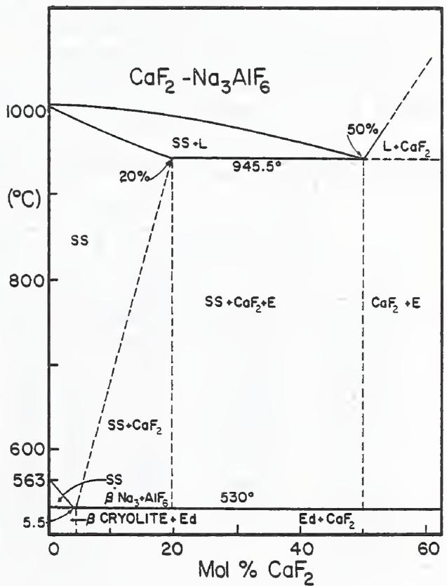  
Figure 133.1. $\mathrm{Na}_{3} \mathrm{AlF}_{6}-\mathrm{CaF}_{2}$ phase diagram

References [1-23]

2. Density (p)

Measurement method: Archimedean technique [24]

Equation:

$$
\rho = a + b T \tag {133.1}
$$

precision: in table 133.1 uncertainty: $\sim \pm 1.5\%$

# (133) $\mathrm{Na}_{3} \mathrm{AlF}_{6}-\mathrm{CaF}_{2}$

Table 133.1. Parameters of equation (133.1) and precision   

<table><tr><td>Mol % CaF2</td><td>a</td><td>-b x 104</td><td>Precision</td><td>T range(K)</td></tr><tr><td>0</td><td>3.2884</td><td>9.373</td><td>*</td><td>1270-1350</td></tr><tr><td>12.4</td><td>3.2559</td><td>8.906</td><td>*</td><td>1260-1350</td></tr><tr><td>23.0</td><td>3.2653</td><td>8.705</td><td>*</td><td>1260-1350</td></tr><tr><td>32.18</td><td>3.2949</td><td>8.702</td><td>*</td><td>1270-1370</td></tr><tr><td>40.2</td><td>3.2892</td><td>8.398</td><td>*</td><td>1260-1360</td></tr><tr><td>64.19</td><td>3.4023</td><td>8.406</td><td>*</td><td>1280-1370</td></tr></table>

* insufficient data for estimate

Table 133.2. Density (g cm $^{-3}$ ) from equations in table 133.1   

<table><tr><td rowspan="2">T(K)</td><td colspan="5">\( Mol\ \%\ CaF_2 \)</td></tr><tr><td>12.4</td><td>23.0</td><td>32.18</td><td>40.2</td><td>64.19</td></tr><tr><td>1260</td><td>2.134</td><td>2.169</td><td></td><td>2.231</td><td></td></tr><tr><td>1270</td><td>2.125</td><td>2.160</td><td>2.190</td><td>2.223</td><td></td></tr><tr><td>1280</td><td>2.116</td><td>2.151</td><td>2.181</td><td>2.214</td><td>2.326</td></tr><tr><td>1290</td><td>2.107</td><td>2.142</td><td>2.172</td><td>2.206</td><td>2.318</td></tr><tr><td>1300</td><td>2.098</td><td>2.134</td><td>2.164</td><td>2.197</td><td>2.310</td></tr><tr><td>1310</td><td>2.089</td><td>2.125</td><td>2.155</td><td>2.189</td><td>2.301</td></tr><tr><td>1320</td><td>2.080</td><td>2.116</td><td>2.146</td><td>2.181</td><td>2.293</td></tr><tr><td>1330</td><td>2.071</td><td>2.108</td><td>2.138</td><td>2.172</td><td>2.284</td></tr><tr><td>1340</td><td>2.063</td><td>2.099</td><td>2.129</td><td>2.164</td><td>2.276</td></tr><tr><td>1350</td><td>2.054</td><td>2.090</td><td>2.120</td><td>2.156</td><td>2.267</td></tr><tr><td>1360</td><td></td><td></td><td>2.111</td><td>2.147</td><td>2.259</td></tr><tr><td>1370</td><td></td><td></td><td>2.103</td><td></td><td>2.251</td></tr></table>

References [24]

3. Surface Tension (γ)

No data

4. Viscosity (n)

Measurement method: oscillating sphere technique [25]

Equation: (viscosity - composition isotherm)

$$
\eta = a + b C + c C ^ {2} + d C ^ {3} \tag {133.2}
$$

$$
(C = \text {mol} \% \text {CaF} _ {2})
$$

precision: in table 133.3 uncertainty: $\sim \pm 15\%$

$$
\mathrm {N a} _ {3} \mathrm {A l F} _ {6} - \mathrm {C a F} _ {2} \tag {133}
$$

Table 133.3. Parameters of equation (133.2) and precisions   

<table><tr><td>T(K)</td><td>a</td><td>b x 102</td><td>c x 104</td><td>d x 106</td><td>Precision</td></tr><tr><td>1273</td><td>2.777</td><td>1.327</td><td>-2.230</td><td>7.598</td><td>1.3%</td></tr><tr><td>1323</td><td>2.331</td><td>0.191</td><td>3.492</td><td></td><td>1.8%</td></tr></table>

Table 133.4. Viscosity (cp) from equations in table 133.3   

<table><tr><td>\( \mathrm{{Mol}}\% {\mathrm{{CaF}}}_{2} \)</td><td>1273 K</td><td>1323 K</td></tr><tr><td>0</td><td>2.78</td><td>2.33</td></tr><tr><td>10</td><td>2.90</td><td>2.39</td></tr><tr><td>20</td><td>3.01</td><td>2.51</td></tr><tr><td>30</td><td>3.18</td><td>2.70</td></tr><tr><td>40</td><td>3.44</td><td>2.97</td></tr><tr><td>50</td><td>3.83</td><td>3.30</td></tr><tr><td>60</td><td>4.41</td><td>3.70</td></tr></table>

References [25]

# 5. Electrical Conductance (K)

Measurement method: in table 133.5

precision: in tables 133.6 and 133.7 uncertainty: in table 133.5

Table 133.5. Conductance studies, techniques, systems and uncertainties   

<table><tr><td>Study</td><td>Conductance technique</td><td>Na3AlF6-CaF2(mol %CaF2)</td><td>T range (K)</td><td>Uncertainty (in conductance values)</td></tr><tr><td>24</td><td>classical ac</td><td>0 - 32%</td><td>1270-1350</td><td>~ ± 3%</td></tr><tr><td>26</td><td>classical ac</td><td>0 - 50%</td><td>1273</td><td>~ ± 5%</td></tr><tr><td>27</td><td>classical ac</td><td>0%</td><td>1250-1300</td><td>~ ± 5%</td></tr></table>

The underscored studies are the recommended data sets

(133) $\mathrm{Na}_{3} \mathrm{AlF}_{6}-\mathrm{CaF}_{2}$

Equations:

$$
(c o n d u c t a n c e - t e m p e r a t u r e \quad d e p e n d e n c e) \quad [ 2 4 ]
$$

$$
\kappa = a + b T \tag {133.3}
$$

$$
(c o n d u c t a n c e - c o m p o s i t i o n i s o t h e r m) \quad [ 2 6 ]
$$

$$
\kappa = a ^ {\prime} + b ^ {\prime} C + c ^ {\prime} C ^ {2} \tag {133.4}
$$

$$
(C = \text {mol} \% \text {CaF} _ {2})
$$

Table 133.6. Parameters of equation (133.3) and precisions   
Table 133.7. Parameters of equation (133.4) and precision   

<table><tr><td>Mol % CaF2</td><td>-a</td><td>b x 102</td><td>Precision</td><td>T range(K)</td></tr><tr><td>12.3</td><td>0.6854</td><td>0.2688</td><td>0.09%</td><td>1270-1350</td></tr><tr><td>23.0</td><td>0.7725</td><td>0.2712</td><td>0.05%</td><td>1270-1350</td></tr><tr><td>32.3</td><td>0.7643</td><td>0.2687</td><td>0.05%</td><td>1270-1350</td></tr></table>

Table 133.8. Specific conductance (ohm $^{-1}$ cm $^{-1}$ ) from equations in table 133.6   

<table><tr><td>T(K)</td><td>a&#x27;</td><td>b&#x27; x 10³</td><td>c&#x27; x 10⁴</td><td>Precision</td></tr><tr><td>1273</td><td>2.8695</td><td>6.7638</td><td>2538.7</td><td>0.30%</td></tr></table>

<table><tr><td rowspan="2">T(K)</td><td colspan="3">\( \mathbf{{Mo1}\%{CaF}_{2}} \)</td></tr><tr><td>12.3</td><td>23.0</td><td>32.3</td></tr><tr><td>1270</td><td>2.728</td><td>2.672</td><td>2.649</td></tr><tr><td>1280</td><td>2.755</td><td>2.699</td><td>2.676</td></tr><tr><td>1290</td><td>2.782</td><td>2.727</td><td>2.703</td></tr><tr><td>1300</td><td>2.809</td><td>2.754</td><td>2.731</td></tr><tr><td>1310</td><td>2.836</td><td>2.781</td><td>2.757</td></tr><tr><td>1320</td><td>2.862</td><td>2.808</td><td>2.783</td></tr><tr><td>1330</td><td>2.889</td><td>2.835</td><td>2.810</td></tr><tr><td>1340</td><td>2.916</td><td>2.862</td><td>2.837</td></tr><tr><td>1350</td><td>2.943</td><td>2.889</td><td>2.864</td></tr></table>

Table 133.9. Electrical conductance at 1273K from equation (133.4)   

<table><tr><td>CaF2(mol %)</td><td>K(ohm-1 cm-1)</td><td></td><td>CaF2(mol %)</td><td>K(ohm-1 cm-1)</td></tr><tr><td>0</td><td>2.87</td><td></td><td>30</td><td>2.69</td></tr><tr><td>10</td><td>2.80</td><td></td><td>40</td><td>2.64</td></tr><tr><td>20</td><td>2.74</td><td></td><td>50</td><td>2.60</td></tr></table>

References [24,26,27]

# (133) $\mathrm{Na}_{3}\mathrm{AlF}_{6} - \mathrm{CaF}_{2}$

# 6. Safety and Hazards

# A. Hazard rating

(i) Toxicity: inorganic fluorides are generally quite irritant and toxic.   
(ii) Vapor pressure: no information for this system; but see $\mathrm{Na}_{3}\mathrm{AlF}_{6}$ [30], and $\mathrm{CaF}_{2}$ [30].

# B. Disaster hazards

(i) Molten salt bath "explosions": i.e. explosive generation of steam due to bulk water "carry-over" and/or equipment failure; i.e., explosive expansion of "trapped" air.   
(ii) Fluorides, when heated to decomposition, or contacted with acids, emit highly toxic fumes.

References [28-33].

# 7. Corrosion

Table 133.10. Corrosion studies from primary research literature   

<table><tr><td colspan="2">Studies</td><td>References</td></tr><tr><td>A</td><td>CrNi-Cr-Mo alloys (INOR-8; Hastelloys B, W, and N)SSNI-12PQuartzAlVarious metals</td><td>[34][35,36][37][38][39][40]</td></tr><tr><td>B</td><td>PtBoron nitride, carbon, Inconel, MoFused MgO</td><td>[41-45][46-48][49]</td></tr><tr><td>C</td><td>Impurities in electrolyteGraphiteTiC, TiB2, CrB2, ZrN, NbB2</td><td>[50,51,79][50,51,80][52-54]</td></tr><tr><td>D</td><td>Corrosion studies in molten salts with NaF as one component (e.g., Cl, CO3,...)Electrochemical behavior of oxides and related species in molten fluoridesElectroanalytical studies in molten fluoridesAnnotated corrosion bibliob.Corrosion: molten fluorides (survey)</td><td>[55-70,77,78][71-73][74][75][76]</td></tr></table>

A: studies principally in molten NaF, KF and LiF;

B: used largely in fluorides physical properties

measurements; C: technological aspects, in aluminum

reduction cells; D: more general studies, basic

principles and surveys.

References [34-80]

$$
\mathrm {N a} _ {3} \mathrm {A l F} _ {6} - \mathrm {C a F} _ {2} \tag {133}
$$

8. Diffusion

Measurement method: rotating disc electrode [81]

List of diffusing species investigated in $\mathrm{Na}_{3}\mathrm{AlF}_{6}\text{-CaF}_{2}$ as solvent. $\mathrm{Al}_{2}\mathrm{O}_{3}$

precision: insufficient data uncertainty: $\sim$ 20% for estimate

Equation: (diffusion coefficient-composition isotherm)

$$
D = a + b C + c C ^ {2} + d C ^ {3} \tag {133.5}
$$

$$
(C = \text {mol} \% \text {CaF} _ {2})
$$

Table 133.12. Parameters of equation (133.5) and precision   

<table><tr><td>T(K)</td><td>a x 105</td><td>b x 107</td><td>c x 108</td><td>d x 1010</td><td>Precision</td></tr><tr><td>1353</td><td>1.342</td><td>5.57</td><td>-2.68</td><td>2.69</td><td>*</td></tr></table>

Table 133.11. Diffusion coefficients at $1353^{\circ}\mathrm{K}$ from equation (133.5)   

<table><tr><td>\( {\mathrm{{CaF}}}_{2} \) (mol %)</td><td>\( {\mathrm{D}}_{\mathrm{A}{1}_{2}\mathrm{O}_{3}} \times  {10}^{5} \) \( \left( {{\mathrm{{cm}}}^{2}{\mathrm{\;s}}^{-1}}\right) \)</td><td></td><td>\( {\mathrm{{CaF}}}_{2} \) (mol %)</td><td>\( {\mathrm{D}}_{\mathrm{A}{1}_{2}\mathrm{O}_{3}} \times  {10}^{5} \) \( \left( {{\mathrm{{cm}}}^{2}{\mathrm{\;s}}^{-1}}\right) \)</td></tr><tr><td>0</td><td>1.34</td><td></td><td>40</td><td>1.00</td></tr><tr><td>10</td><td>1.66</td><td></td><td>50</td><td>0.79</td></tr><tr><td>20</td><td>1.60</td><td></td><td>60</td><td>0.85</td></tr><tr><td>30</td><td>1.33</td><td></td><td></td><td></td></tr></table>

References: $\mathrm{Al}_{2}\mathrm{O}_{3}$ , [81]; see systems 66, 139 for diffusion studies of $\mathrm{Al}_{2}\mathrm{O}_{3}$ in $\mathrm{Na}_{3}\mathrm{AlF}_{6}$ .

9. Heat of Fusion $(\Delta H_{f})$

No data

10. Heat Capacity (Cp)

No data

11. Volume Change on Melting $(\Delta V_{f})$ No data   
12. Vapor Pressure $(p_{vap})$ No data   
13. Thermal Conductivity (liquid) $(\lambda_{\mathrm{g}})$ No data   
14. Thermal Conductivity (solid) $(\lambda_{s})$ No data   
15. Cryoscopic Constant $(k_{f})$ No data   
16. References

[1] Holm, J. L., Acta Chem. Scand., 22, 1004 (1968).   
[2] Fenerty, A., Hollingshead, E. A., J. Electrochem. Soc., 107, 993 (1960).   
[3] Matiasovsky, K., Malinovsky, M., Chem. Zvesti, 14, 551 (1960).   
[4] Edwards, J. D., J. Electrochem. Soc., 100, 508 (1953).   
[5] Abramov, G. A., Vetyukov, M. M., Gupalo, I. P., Kostyukov, A. A. and Lozhkin, L. N., "Teoreticheskie osnovy elektrometallurghii alyuminiya (Theoretical Principles of the Electrometallurgy of Aluminium)", Metallurgizdat, Moscow, 1953.   
[6] Robin, M., Bull. Soc. Chim. France, 1120 (1961).   
[7] Verdan, M. and Monnier, R., Rev. Int. Hautes Temp. Refract., 9(2), 205 (1972).   
[8] Pascal, Von P., Z. Elektrochem., 19, 611 (1913).   
[9] Fedotieff, P. P. and Iljinskii, W. P., Z. anorg. u. allgem. Chem., 129 pp. 106, 107 (1923).   
[10] Janz, G. J. Downey, J. R., Jr., Allen, C. B., and Tomkins, R. P. T., "Eutectic Data" - 2 Vols; ERDA-TID-27163-P1 & P2; NTIS, Washington, D. C. (1977).   
[11] Janz, G. J., Downey, J. R., Jr., Allen, C. B., and Tomkins, R. P. T., "Physical Properties Data Complications Relevant to Energy Storage. I. Molten Salts: Eutectic Data", NSRDS-NBS-61; U. S. Gov't Printing Office, Washington, D. C. (1978).   
[12] "International Critical Tables of Numerical Data, Physics, Chemistry, and Technology", 8 Vols., McGraw-Hill Book Co., N. Y. (1933).   
[13] "Landolt-Bornstein Zahlenwert und Funktionen aus Physik, Chemie, Astronomie, Geophysik und Technik", (10th Ed.) Springer-Verlag, Berlin, Heidelberg, N. Y. (1961).

[14] Clark, P. V., "Fused Salt Mixtures: Eutectic Compositions and Melting Points Bibliography 1907-1968", Report No. SC-R-68-1680; Sandia Laboratories (1968), NTIS.   
[15] Robertson, W. D., "Binary Phase Diagrams of Halide Salts", Report No. Yale 2723 (2 Vols.), U. S. AEC Contract AT (30-1)-2723 (1966), NTIS.   
[16] Thoma, R. E., "Phase Diagrams of Nuclear Reactor Materials", Oak Ridge National Laboratory, ORNL-2548, Contract No. W-7405-eng-26.   
[17] Thoma, R. E., "Phase Diagrams of Binary and Ternary Fluoride Systems", Chapt. 6; Adv. Molten Salts Chemistry, Vol. 3 (J. Braunstein, G. Mamantov, and G. P. Smith, eds.), Plenum Press, N. Y. (1975).   
[18] Voskresenskaya, N. K., ed., "Handbook of Solid-Liquid Equilibria in Systems of Inorganic Salts", Volumes 1, 2, Izc. Akad. Nauk SSSR, Moscow (1961). Israel Program for Scientific Translations, Jerusalem, 1970 (NTIS).   
[19] Sinistri, C., Franzozini, P., and Rolla, M., "An Atlas of Miscibility Gaps in Molten Salt Systems", Institute of Physical Chemistry, University of Pavia (Italy) (1968).   
[20] Shaffer, P. T. B., "High Temperature Materials", Plenum Press Handbooks of High Temperature Materials, No. 1, Materials Index, Plenum Press, New York, 1964.   
[21] Franzozini, P., Ferloni, P., and Spinolo, C., "Molten Salts with Organic Anions", Instituto di Chimica Fisica, Universita di Pavia (Italy), 1973.   
[22] Toropov, N. A. et al., "Handbook of Phase Diagrams of the Silicates, Volume 1: Binary Systems, Volume 2, Metal-Oxygen Compounds in Silicate Systems", Izdatel'stov "Nauka" Leningradskoe Otdelenie, Leningrad, 1969, Israel Program for Scientific Translations, Jerusalem, 1972 (NTIS).   
[23] Levin, E., et al., "Phase Diagrams for Ceramists", Amer. Ceramic Soc. (publ.), Columbus, Ohio (1964; 1969).   
[24] Edwards, J. D., Taylor, C. S. and Cosgrove, L. A., J. Electrochem. Soc. 100, 508 (1953).   
[25] Volata, I., and Matiasovsky, K., Chem. Zvesti 27, 582 (1973).   
[26] Taniochi, K., Sci. Rep. Res. Inst. Tokoku Univ., 24, 214 (1973).   
[27] Feinleib, M and Yim, E. W., J. Electrochem. Soc., 104, 626 (1957).   
[28] "Dangerous Properties of Materials", Sax, N. I., Van Nostrand Reinhold Co., N. Y. (1969)   
[29] "Registry of Toxic Effects of Chemical Substances", Christensen, H. E., and Lubinbyhl, T. T., eds., U. S. Dept. H. E. W., U. S. Gov't Printing Office, Washington, D. C. (1975)   
[30] vide: this work, system 51, CaF $_2$ and system 66, Na $_3$ AlF $_6$ .   
[31] "Potential Hazards in Molten Salt Baths for Heat Treatment of Metals", National Board of Fire Underwriters Research Report No. 2 (1954)   
[32] "Handbook of Reactive Chemical Hazards", Bretherwick, L., Butterworth Co., London (1975)

(133) $\mathrm{Na}_{3} \mathrm{AlF}_{6}-\mathrm{CaF}_{2}$   
[33] Janz, G. J., Tomkins, R. P. T., Downey, J. R., Jr., and Allen, C. B., "Safety and Hazards, Chapter in "Eutectic Data", ERDA TID-27163-P1; NTIS, U. S. Dept. Commerce, Springfield, Va. (1977)   
[34] Brasunas, A., Metal Prog., 62, 88 (1952).   
[35] Bettes, E. S., Nucl. Sci. Eng., 2, 804 (1957).   
[36] Hoffman, E. E., Patriarca, P., Leitten, C. F., Jr., and Slaughter, G. M., ORNL-1934, Oak Ridge Natl. Lab., (1956).   
[37] Oak Ridge National Laboratory, "The Development Status of Molten Salt Breeder Reactors", Rpt. ORNL-4812-UC-80; NTIS, U. S. Dept. Commerce, Springfield, Va., (Aug. 1972).   
[38] Heimann, R., Glastech. Ber., 43, 83 (1970).   
[39] Lukashenko, E. E., and Reutova, G. A., Nov. Teor. Tekhnol. Metal1. Protsessov., 119 (1973).   
[40] Koger, J. W., Corrosion, 30, 125 (1974).   
[41] Edwards, J. D., Taylor, C. S., Russell, A. S., and Maranville, L. F., J. Electrochem. Soc. 99, 527 (1952).   
[42] Landon, G. J., and Ubbelohde, A. R., Proc. Royal Soc., A240, 160 (1957).   
[43] Winterhager, H. and Werner, L., Forschungsber. des Witschafts-u. Verkehrsministeriums Nordrhein-Westfalen, No. 438, 1957.   
[44] Winterhager, H. and Werner, L., Forschungsber. des Witschafts-u. Verkehrsministeriums Nordrhein-Westfalen, No. 341, 1956.   
[45] Bajcsy, J., Malinovsky, M., and Matiasovsky, K., Electrochim. Acta, 7, 543 (1962).   
[46] Yim, E. W. and Feinleib, M., J. Electrochem. Soc., 104, 622 (1957).   
[47] Yim, E. W. and Feinleib, M., J. Electrochem. Soc., 104, 626 (1957).   
[48] Brown, E. A. and Porter, B., "U. S. Department of Interior, Bureau of Mines", 128.23:6500 (1964).   
[49] Cuthbertson, J.W. and Waddington, J., Trans Faraday Soc., 32, 745 (1936).   
[50] Grjothiem, K., Krohn, C., Malinovsky, M., Matiasovsky, K., and Thonstad, J., "Aluminum Electrolyses", Chapt. 10; Aluminum-Verlag, G.mbH; Dusseldorf (1977).   
[51] Brun, J., Tunold, R., Vatland, A., 30th ISE Meeting, Extended Abstracts, pp. 118-119; Trondheim, Norway (Aug. 1979); NTH, Dept. Ind. Electrochem., Trondheim, Norway.   
[52] Holliday, R. D., (Olin Mathieson Chemical Corp.), U. S. 3,661,736, May 9, 1972.   
[53] Thompson, R.: (Borax Consolidated Ltd.), Ger. Offen. 2,305,281, Aug. 9, 1973.   
[54] Kugler, T. and Rieger, H. W.: (Swiss Aluminium Ltd.) Ger. Offen. 2,312,439, Oct. 4, 1973.   
[55] Khan, I. A., Ber. Kernforschungsanlage Juelich, Juel-608-RW, (1969).   
[56] Khan, I. A., Inst. Reaktorwerkst., Kernforschungsanlage, Juel-718-RW (1970).

(133) $\mathrm{Na}_{3} \mathrm{AlF}_{6}-\mathrm{CaF}_{2}$   
[57] Bowles, P. J., and Newdick, P. C., Electroplating and Metal Finishing, 24, 6 (1971).   
[58] DeVan, J. H., "Examinations of Pump Impellers from Sodium and Fused Salt Pump Endurance Tests", ORNL CF-61-4-77, Oak Ridge National Lab., (1961).   
[59] Adamson, G. M., Manly, W. D., and Crouse, S. R., "Corrosion by Molten Fluorides", ANP Materials Meeting ORNL-2685, (1958).   
[60] Huntley, W. R., and Gnadt, P. A., Oak Ridge Nat'l Lab., Report ORNL-TM-3863. (1973); Nucl. Sci. Abstr., 27, 12446 (1973).   
[61] Gill, C. B., Straumanis, M. E., and Schlechten, W. B., J. Electrochem. Soc., 102, 42 (1955).   
[62] Litman, A. P., "Corrosion of Volatility Pilot Plant Mark I INOR-S Hydrofluorinator and Mark III. Nickel Fluorinator after Fourteen Dissolution Runs", ORNL-3253, Oak Ridge Nat'l Lab., (1962).   
[63] Litman, A. P., and Goldman, A. E., "Corrosion Associated with Fluoridation in the Oak Ridge Nat'l Lab., Fluoride Volatility Process", ORNL-2832, Oak Ridge Nat'l Lab. (1961).   
[64] Manly, W. D., Coobs, J. H., DeVan, J. H., Douglas D. A., Inouye, H., Patriarca, P., Roche, T. K., and Scott, J. L., "Metalurgical Problems in Molten Fluoride Systems", Proc. 2nd U. N. Inter. Conf. Peaceful Uses of At. Energy, 7, 223 (1958).   
[65] Oak Ridge Nat'l Lab., Molten Salt Reactor Program Semiannual Progress Report for Period Ending July 31, 1964, ORNL-3708, (1964).   
[66] Vreeland, D. C., Hoffman, E. E., and Manly, W. D., Nucleonics, 11, 36 (1953).   
[67] Grimes, W. R., and Cuneo, D. R., "Molten Salts as Reactor Fuels", Reactor Handbook 2nd ed., 1, 425 (1955).   
[68] Shimotake, H., and Hesson, J. C., Adv. Chem. Series, No. 64, 149 (1967).   
[69] Boser, O., "Study of Safety Aspects of High Temperature Thermal Energy Storage Systems", ERDA Thermal Energy Storage Information Exchange Mtg., Cleveland, NSF-AER 75-20605 (Sept. 1976).   
[70] Venkatasetty, H. V., "Thermodynamic Properties and Corrosion Characteristics of Thermal Energy Storage Eutectic Mixtures", paper presented at 152nd Meeting of the Electrochemical Society, Atlanta, Ga., (October, 1977).   
[71] Mathews, A. L., and Baes, C. F., Inorg. Chem., 7, 373 (1968).   
[72] Manning, D. L. and Mamantov, G., J. Electrochem. Soc., 124, 480 (1977).   
[73] Ting, G., Baes, C. F., Bamberger, C. E., and Mamantov, G., J. Inorg. Nucl. Chem., 39, 1803 (1977).   
[74] Manning, D. L., and Mamantov, G., J. Electroanal. Chem., (in press) (1978)   
[75] Janz, G. J., and Tomkins, R. P. T., Corrosion, 35(11) 485 (1979).   
[76] Eichelberger, J. L., (Penwalt Corp.) "Investigations of Metal Fluoride Thermal Energy Storage Materials: Availability, Cost, Chemistry" ERDA Rpt CO02990-6; NTIS, U. S. Dept. Commerce, Springfield, Va., (Dec. 1976).   
[77] Kochergen, V. P., and Ignat'eva, N. I., Russ. J. Inorg. Chem., 6(9), 1086 (1961).

(133) $\mathrm{Na}_{3} \mathrm{AlF}_{6}-\mathrm{CaF}_{2}$   
[78] Ozeryanaya, I. N., Volodin, V. P., and Smirnov, M. V., Zashchita Metalov (USSR), 2, 230 (1969).   
[79] Thompson, M. deK. and Kaye, A. L., Trans. Electrochem. Soc., 67, 169 (1935).   
[80] Baak, T., Acta Chem. Scand., 8, 1727 (1954).   
[81] Shurygin, P. M., Boronenkov, V. N., and Kryuk, V. C., Sbornek, Nauchn. Trudov Uralsk. Politekn. Inst. 126, 80 (1963).

1. Melting Temperature $(T_{m})$

Pure substance melting points:

Na3AlF6: 1010°C

BaF 2 : 1320°C

Eutectic melting point:

835°C composition: 62.5 wt % BaF₂ (67 mol % BaF₂)

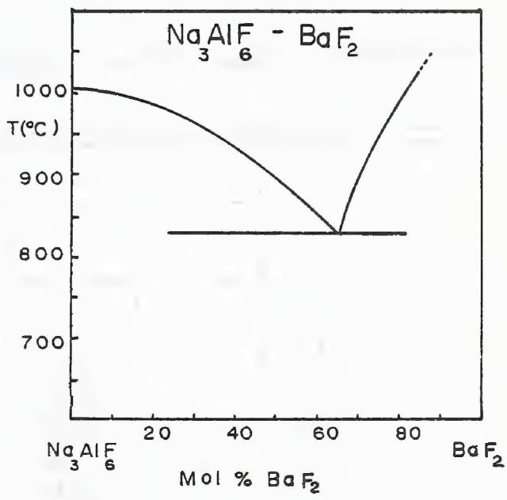  
Figure 134.1 $\mathrm{Na}_{3}\mathrm{AlF}_{6} - \mathrm{BaF}_{2}$ phase diagram

References [1-17]

2. Density (ρ)

Measurement method: Archimedean technique [18]

Equation:

$$
\rho = a + b T \tag {134.1}
$$

precision: in table 134.1 uncertainty: $\sim \pm 1.0\%$

# (134) $\mathrm{Na}_{3} \mathrm{AlF}_{6}-\mathrm{BaF}_{2}$

Table 134.1. Parameters of equation (134.1) and precisions   

<table><tr><td>Mol % BaF2</td><td>a</td><td>-b x 104</td><td>Precision</td><td>T range(K)</td></tr><tr><td>0</td><td>3.0943</td><td>8.046</td><td>0.16%</td><td>1310-1400</td></tr><tr><td>25</td><td>3.4250</td><td>7.938</td><td>0.03%</td><td>1280-1370</td></tr><tr><td>54.4</td><td>3.9212</td><td>7.626</td><td>0.19%</td><td>1220-1330</td></tr><tr><td>66.6</td><td>4.5725</td><td>10.480</td><td>0.08%</td><td>1220-1330</td></tr><tr><td>75.1</td><td>4.7093</td><td>7.359</td><td>0.03%</td><td>1250-1330</td></tr></table>

Table 134.2. Density (g cm $^{-3}$ ) from equations in table 134.1   

<table><tr><td rowspan="2">T(K)</td><td colspan="4">\( Mol\ \% \space BaF_2 \)</td></tr><tr><td>25</td><td>54.4</td><td>66.6</td><td>75.1</td></tr><tr><td>1220</td><td></td><td>2.991</td><td>3.294</td><td></td></tr><tr><td>1230</td><td></td><td>2.983</td><td>3.283</td><td></td></tr><tr><td>1240</td><td></td><td>2.976</td><td>3.273</td><td></td></tr><tr><td>1250</td><td></td><td>2.968</td><td>3.263</td><td>3.789</td></tr><tr><td>1260</td><td></td><td>2.960</td><td>3.252</td><td>3.782</td></tr><tr><td>1270</td><td></td><td>2.953</td><td>3.242</td><td>3.775</td></tr><tr><td>1280</td><td>2.409</td><td>2.945</td><td>3.231</td><td>3.767</td></tr><tr><td>1290</td><td>2.401</td><td>2.937</td><td>3.221</td><td>3.760</td></tr><tr><td>1300</td><td>2.393</td><td>2.930</td><td>3.210</td><td>3.753</td></tr><tr><td>1310</td><td>2.385</td><td>2.922</td><td>3.200</td><td>3.745</td></tr><tr><td>1320</td><td>2.377</td><td>2.915</td><td>3.189</td><td>3.738</td></tr><tr><td>1330</td><td>2.369</td><td>2.907</td><td>3.179</td><td>3.731</td></tr><tr><td>1340</td><td>2.361</td><td></td><td></td><td></td></tr><tr><td>1350</td><td>2.353</td><td></td><td></td><td></td></tr><tr><td>1360</td><td>2.345</td><td></td><td></td><td></td></tr><tr><td>1370</td><td>2.338</td><td></td><td></td><td></td></tr><tr><td>1380</td><td></td><td></td><td></td><td></td></tr><tr><td>1390</td><td></td><td></td><td></td><td></td></tr><tr><td>1400</td><td></td><td></td><td></td><td></td></tr></table>

References [18,19]

3. Surface Tension (γ) No data   
4. Viscosity (n) No data   
5. Electrical Conductance (K) No data

6. Safety and Hazards

# A. Hazard rating

(i) Toxicity: inorganic fluorides are generally irritant and toxic.   
(ii) Vapor pressure: $\mathsf{BaF}_2$ , at m.pt., $1320^{\circ}\mathsf{C}$ , $\sim < 0.5\mathsf{mm}$ ; $\mathsf{Na}_3\mathsf{AlF}_6$ , at m.p.t., $1010^{\circ}\mathsf{C}$ , $\sim << 0.5\mathsf{mm}$ .

# B. Disaster hazards

(i) Molten salt bath "explosions": i.e., explosive generation of steam due to bulk water "carry-over" and/or equipment failure; i.e., explosive expansion of "trapped" air.   
(ii) Fluorides, when heated to decomposition, or contracted with acids, emit highly toxic fumes.

References [20-25]

# 7. Corrosion

Table 134.3. Corrosion studies from primary research literature   

<table><tr><td colspan="2">Studies</td><td>References</td></tr><tr><td rowspan="6">A</td><td>CrNi-Cr-Mo alloys (INOR-8; Hastelloys B, W, and N)</td><td>[26]</td></tr><tr><td>SSNI-12P</td><td>[27,28]</td></tr><tr><td>Quartz</td><td>[29]</td></tr><tr><td>Al</td><td>[30]</td></tr><tr><td>Various metals</td><td>[31]</td></tr><tr><td></td><td>[32]</td></tr><tr><td rowspan="3">B</td><td>Pt</td><td>[33-37]</td></tr><tr><td>Boron nitride, carbon, Inconel</td><td>[38-40]</td></tr><tr><td>Fused MgO</td><td>[41]</td></tr><tr><td rowspan="3">C</td><td>Impurities in electrolyte</td><td>[42,43]</td></tr><tr><td>Graphite</td><td>[42,43]</td></tr><tr><td>TiC, TiB2, CrB2, ZrN, NbB2</td><td>[44-46]</td></tr><tr><td rowspan="5">D</td><td>Corrosion studies in molten salts with NaF as one component (e.g., Cl, CO3,...)</td><td>[47-62,69,60]</td></tr><tr><td>Electrochemical behavior of oxide ions and related species in molten fluorides</td><td>[63-65]</td></tr><tr><td>Electroanalytical studies in molten fluorides</td><td>[66]</td></tr><tr><td>Annotated corrosion biblio.</td><td>[67]</td></tr><tr><td>Corrosion: molten fluorides(survey)</td><td>[68]</td></tr></table>

A: studies principally in molten NaF, KF, and LiF;  
B: used largely in fluorides physical properties measurements; C: technological aspects, in aluminum reduction cells; D: more general studies, basic principles, and surveys.

References [26-70]

(134) $\mathrm{Na}_{3} \mathrm{AlF}_{6}-\mathrm{BaF}_{2}$

8. Diffusion

No data

9. Heat of Fusion $(\Delta H_{f}^{\circ})$

No data

10. Heat Capacity $(C_p)$

No data

11. Volume Change on Melting $(\Delta V_{f})$

No data

12. Vapor Pressure $(p_{vap})$

No data

13. Thermal Conductivity (liquid) $(\lambda_{2})$

No data

14. Thermal Conductivity (solid) $(\lambda_{s})$

No data

15. Cryoscopic Constant $(k_{f})$

No data

16. References

[1] Belyaev, A. I., Rapoport, M. B. and Firsanova, L. A., Elektrometallurgia, Alyuminia, Metallurguzdat, Moscow, 1953.   
[2] Lewis, E. M., Robbins, C. R. and McMurdie, H. F., "Phase Diagrams for Ceramists", ed. by Reser, M. K., Nat. Bur. Standards and Am. Ceram. Soc., Ohio, 1969.   
[3] Kameyama, N. and Masuda, E., J. Soc. Chem. Ind. Jap. 31, 1134 (1928) (Suppl. Binding 32, 271B (1928)).   
[4] Guskov, V. M., Elektrolyticheskoe Rafinirovanie Alyuminia, Metallurgizdat, Moscow, 1945.   
[5] Janz, G. J. Downey, J. R., Jr., Allen, C. B., and Tomkins, R. P. T., "Eutectic Data" - 2 Vols; ERDA-TID-27163-P1 & P2; NTIS, Washington, D. C. (1977).   
[6] Janz, G. J., Downey, J. R., Jr., Allen, C. B., and Tomkins, R. P. T., "Physical Properties Data Complications Relevant to Energy Storage. I. Molten Salts: Eutectic Data", NSRDS-NBS-61; U. S. Gov't Printing Office, Washington, D. C. (1978).   
[7] "International Critical Tables of Numerical Data, Physics, Chemistry, and Technology", 8 Vols., McGraw-Hill Book Co., N. Y. (1933).

(134) $\mathrm{Na}_{3} \mathrm{AlF}_{6} - \mathrm{BaF}_{2}$   
[8] "Landolt-Bornstein Zahlenwert und Funktionen aus Physik, Chemie, Astronomie, Geophysik und Technik", (10th Ed.) Springer-Verlag, Berlin, Heidelberg, N. Y. (1961).   
[9] Clark, P. V., "Fused Salt Mixtures: Eutectic Compositions and Melting Points Bibliography 1907-1968", Report No. SC-R-68-1680; Sandia Laboratories (1968), NTIS.   
[10] Robertson, W. D., "Binary Phase Diagrams of Halide Salts", Report No. Yale 2723 (2 Vols.), U. S. AEC Contract AT (30-1)-2723 (1966), NTIS.   
[11] Thoma, R. E., "Phase Diagrams of Nuclear Reactor Materials", Oak Ridge National Laboratory, ORNL-2548, Contract No. W-7405-eng-26.   
[12] Thoma, R. E., "Phase Diagrams of Binary and Ternary Fluoride Systems", Chapt. 6; Adv. Molten Salts Chemistry, Vol. 3 (J. Braunstein, G. Mamantov, and G. P. Smith, eds.), Plenum Press, N. Y. (1975).   
[13] Voskresenskaya, N. K., ed., "Handbook of Solid-Liquid Equilibria in Systems of Inorganic Salts", Volumes 1, 2, Izc. Akad. Nauk SSSR, Moscow (1961). Israel Program for Scientific Translations, Jerusalem, 1970 (NTIS).   
[14] Shaffer, P. T. B., "High Temperature Materials", Plenum Press Handbooks of High Temperature Materials, No. 1, Materials Index, Plenum Press, New York, 1964.   
[15] Toropov, N. A. et al., "Handbook of Phase Diagrams of the Silicates, Volume 1: Binary Systems, Volume 2, Metal-Oxygen Compounds in Silicate Systems", Izdatel'stov "Nauka" Leningradskoe Otdelenie, Leningrad, 1969, Israel Program for Scientific Translations, Jerusalem, 1972 (NTIS).   
[16] Levin, E., et al., "Phase Diagrams for Ceramists", Amer. Ceramic Soc. (publ.), Columbus, Ohio (1964; 1969).   
[17] "Applications of Phase Diagrams in Metallurgy and Ceramics", (2 Vols) NBS Special Pub. 496. U. S. Dept. of Commerce. Nat. Bur. Standards. Ed. Carter G. C. March 1978.   
[18] Kameyama, N. and Naka, A., J. Soc. Chem. Ind. Japan, 34, 140 (1931).   
[19] Abramov, G. A. and Kozunov, P. A., Trans. Leningrad. Inst., 1, 60 (1939).   
[20] "Dangerous Properties of Materials", Sax, N. I., Van Nostrand Reinhold Co., N. Y. (1969).   
[21] "Registry of Toxic Effects of Chemical Substances", Christensen, H. E., and Lubinybyhl, T. T., eds., U. S. Dept. H.E.W; U. S. Gov't Printing Office, Washington, D. C. (1975).   
[22] "Potential Hazards in Molten Salt Baths for Heat Treatment of Metals", National Board Fire Underwriters Research Report No. 2. (1954).   
[23] "Handbook of Reactive Chemical Hazards", Bretherwick, L., Butterworths Co., London (1975).   
[24] Janz, G. J., Tomkins, R. P. T., Downey, J. R., Jr., and Allen, C. B., "Safety and Hazards", Chapter in "Eutectic Data", ERDA TID-27163-P1; NTIS, U. S. Dept. Commerce, Springfield, Va. (1977).   
[25] Vapor pressure, estimated, Janz, G. J. et al., (MSDC-RPI, 1980).

(134) $\mathrm{Na}_{3} \mathrm{AlF}_{6} - \mathrm{BaF}_{2}$   
[26] Brasunas, A., Metal Prog., 62, 88 (1952).   
[27] Bettes, E. S., Nucl. Sci. Eng., 2, 804 (1957).   
[28] Hoffman, E. E., Patriarca, P., Leitten, C. F., Jr., and Slaughter, G. M., ORNL-1934, Oak Ridge Natl. Lab., (1956).   
[29] Oak Ridge National Laboratory, "The Development Status of Molten Salt Breeder Reactors", Rpt. ORNL-4812-UC-80; NTIS, U. S. Dept. Commerce, Springfield, Va., (Aug. 1972).   
[30] Heimann, R., Glastech. Ber., 43, 83 (1970).   
[31] Lukashenko, E. E., and Reutova, G. A., Nov. Teor. Tekhnol. Metall. Protsessov., 119 (1973).   
[32] Koger, J. W., Corrosion, 30, 125 (1974).   
[33] Edwards, J. D., Taylor, C. S., Russell, A. S., and Maranville, L. F., J. Electrochem. Soc. 99, 527 (1952).   
[34] Landon, G. J., and Ubbelohde, A. R., Proc. Royal Soc., A240, 160 (1957).   
[35] Winterhager, H. and Werner, L., Forschungsber. des Witschafts-u. Verkehrsrministeriums Nordrhein-Westfalen, No. 438, 1957.   
[36] Winterhager, H. and Werner, L., Forschungsber. des Witschafts-u. Verkehrsrministeriums Nordrhein-Westfalen, No. 341, 1956.   
[37] Bajcsy, J., Malinovsky, M., and Matiasovsky, K., Electrochim. Acta, 7, 543 (1962).   
[38] Yim, E. W. and Feinleib, M., J. Electrochem. Soc., 104, 622 (1957).   
[39] Yim, E. W. and Feinleib, M., J. Electrochem. Soc., 104, 626 (1957).   
[40] Brown, E. A. and Porter, B., "U. S. Department of Interior, Bureau of Mines", 128.23:6500 (1964).   
[41] Cuthbertson, J.W. and Waddington, J., Trans Faraday Soc., 32, 745 (1936).   
[42] Grjothiem, K., Krohn, C., Malinovsky, M., Matiasovsky, K., and Thonstad, J., "Aluminum Electrolyses", Chapt. 10; Aluminum-Verlag, G.mbH; Dusseldorf (1977).   
[43] Brun, J., Tunold, R., Vatland, A., 30th ISE Meeting, Extended Abstracts, pp. 118-119; Trondheim, Norway (Aug. 1979); NTH, Dept. Ind. Electrochem., Trondheim, Norway.   
[44] Holliday, R. D., (Olin Mathieson Chemical Corp.), U. S. 3,661,736, May 9, 1972.   
[45] Thompson, R.: (Borax Consolidated Ltd.), Ger. Offen. 2,305,281, Aug. 9, 1973.   
[46] Kugler, T. and Rieger, H. W.: (Swiss Aluminium Ltd.), Ger. Offen. 2,312,439, Oct. 4, 1973.   
[47] Khan, I. A., Ber. Kernforschungsanlage Juelich, Juel-608-RW, (1969).   
[48] Khan, I. A., Inst. Reaktorwerkst., Kernforschungsanlage, Juel-718-RW (1970).   
[49] Bowles, P. J., and Newdick, P. C., Electroplating and Metal Finishing, 24, 6 (1971).

(134) $\mathrm{Na}_{3} \mathrm{AlF}_{6} - \mathrm{BaF}_{2}$   
[50] DeVan, J. H., "Examinations of Pump Impellers from Sodium and Fused Salt Pump Endurance Tests", ORNL CF-61-4-77, Oak Ridge National Lab., (1961).   
[51] Adamson, G. M., Manly, W. D., and Crouse, S. R., "Corrosion by Molten Fluorides", ANP Materials Meeting ORNL-2685, (1958).   
[52] Huntley, W. R., and Gnadt, P. A., Oak Ridge Nat'l Lab., Report ORNL-TM-3863. (1973); Nucl. Sci. Abstr., 27, 12446 (1973).   
[53] Gill, C. B., Straumanis, M. E., and Schlechten, W. B., J. Electrochem. Soc., 102, 42 (1955).   
[54] Litman, A. P., "Corrosion of Volatility Pilot Plant Mark I INOR-S Hydrofluorinator and Mark III. Nickel Fluorinator after Fourteen Dissolution Runs", ORNL-3253, Oak Ridge Nat'l Lab., (1962).   
[55] Litman, A. P., and Goldman, A. E., "Corrosion Associated with Fluoridation in the Oak Ridge Nat'l Lab., Fluoride Volatility Process", ORNL-2832, Oak Ridge Nat'l Lab. (1961).   
[56] Manly, W. D., Coobs, J. H., DeVan, J. H., Douglas D. A., Inouye, H., Patriarca, P., Roche, T. K., and Scott, J. L., "Metalurgical Problems in Molten Fluoride Systems", Proc. 2nd U. N. Inter. Conf. Peaceful Uses of At. Energy, 7, 223 (1958).   
[57] Oak Ridge Nat'l Lab., Molten Salt Reactor Program Semiannual Progress Report for Period Ending July 31, 1964, ORNL-3708, (1964).   
[58] Vreeland, D. C., Hoffman, E. E., and Manly, W. D., Nucleonics, 11, 36 (1953).   
[59] Grimes, W. R., and Cuneo, D. R., "Molten Salts as Reactor Fuels", Reactor Handbook 2nd ed., 1, 425 (1955).   
[60] Shimotake, H., and Hesson, J. C., Adv. Chem. Series, No. 64, 149 (1967).   
[61] Boser, O., "Study of Safety Aspects of High Temperature Thermal Energy Storage Systems", ERDA Thermal Energy Storage Information Exchange Mtg., Cleveland, NSF-AER 75-20605 (Sept. 1976).   
[62] Venkatasetty, H. V., "Thermodynamic Properties and Corrosion Characteristics of Thermal Energy Storage Eutectic Mixtures", paper presented at 152nd Meeting of the Electrochemical Society, Atlanta, Ga., (October, 1977).   
[63] Mathews, A. L., and Baes, C. F., Inorg. Chem., 7, 373 (1968).   
[64] Manning, D. L. and Mamantov, G., J. Electrochem. Soc., 124, 480 (1977).   
[65] Ting, G., Baes, C. F., Bamberger, C. E., and Mamantov, G., J. Inorg. Nucl. Chem., 39, 1803 (1977).   
[66] Manning, D. L., and Mamantov, G., J. Electroanal. Chem., (in press) (1978)   
[67] Janz, G. J., and Tomkins, R. P. T., Corrosion, 35(11) 485 (1979).   
[68] Eichelberger, J. L., (Penwalt Corp.) "Investigations of Metal Fluoride Thermal Energy Storage Materials: Availability, Cost, Chemistry" ERDA Rpt CO02990-6; NTIS, U. S. Dept. Commerce, Springfield, Va., (Dec. 1976).   
[69] Kochergen, V. P., and Ignat'eva, N. I., Russ. J. Inorg. Chem., 6(9), 1086 (1961).   
[70] Ozeryanaya, I. N., Volodin, V. P., and Smirnov, M. V., Zashchita Metalov (USSR), 2, 230 (1969).

$$
\text {S y s t e m} 1 3 5 \quad \mathrm {N a} _ {3} \mathrm {A l F} _ {6} - \mathrm {A l F} _ {3}
$$

1. Melting Temperature $(T_{m})$

Pure substance melting points:

Na3AlF6: 1010°C

A1F3: does not melt; sublimes with 1 atm equal press. at $\sim$ $1255^{\circ}C$ .

Eutectic melting point:

737°C, composition: 30 wt % AlF₃

$694^{\circ} \mathrm{C}$ , composition: $39 \mathrm{wt} \% \mathrm{AlF}_{3}$

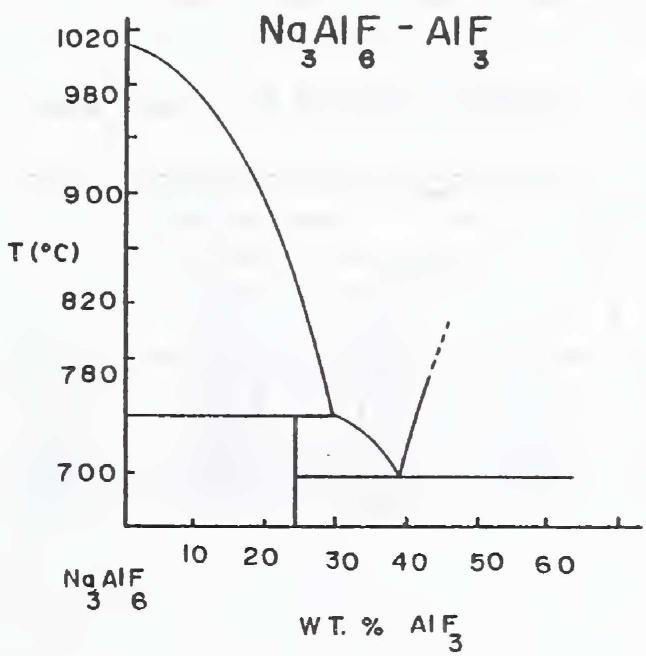  
Figure 135.1 $\mathrm{Na}_{3}\mathrm{AlF}_{6} - \mathrm{AlF}_{3}$ phase diagram

References [1-25]

2. Density (ρ)

Measurement method: Archimedean technique [26]

Equation:

$$
\rho = a + b T \quad [ 1 3 5. 1)
$$

precision: in table 135.1 uncertainty: $\sim$ 1.0%

$$
\mathrm {N a} _ {3} \mathrm {A l F} _ {6} - \mathrm {A l F} _ {3} \tag {135}
$$

Table 135.1. Parameters of equation (135.1) and precision   

<table><tr><td>Mol % AlF3</td><td>a</td><td>-b x 104</td><td>Precision</td><td>T range(K)</td></tr><tr><td>0</td><td>3.3070</td><td>9.515</td><td>*</td><td>1300-1340</td></tr><tr><td>8.31</td><td>3.2349</td><td>9.008</td><td>*</td><td>1300-1340</td></tr><tr><td>15.69</td><td>3.2549</td><td>9.253</td><td>*</td><td>1300-1340</td></tr><tr><td>23.52</td><td>3.2415</td><td>9.265</td><td>*</td><td>1300-1340</td></tr><tr><td>28.21</td><td>3.2294</td><td>9.259</td><td>*</td><td>1300-1340</td></tr></table>

* insufficient data; not estimated

Table 135.2. Density $(\mathrm{gcm}^{-3})$ from equations in table 135.1   

<table><tr><td rowspan="2">T(K)</td><td colspan="5">Mo1 % AlF3.</td></tr><tr><td>0</td><td>8.31</td><td>15.69</td><td>23.52</td><td>28.21</td></tr><tr><td>1300</td><td>2.070</td><td>2.064</td><td>2.052</td><td>2.037</td><td>2.026</td></tr><tr><td>1310</td><td>2.061</td><td>2.055</td><td>2.043</td><td>2.028</td><td>2.017</td></tr><tr><td>1320</td><td>2.051</td><td>2.046</td><td>2.034</td><td>2.019</td><td>2.007</td></tr><tr><td>1330</td><td>2.042</td><td>2.037</td><td>2.024</td><td>2.009</td><td>1.998</td></tr><tr><td>1340</td><td>2.032</td><td>2.028</td><td>2.015</td><td>2.000</td><td>1.989</td></tr></table>

References [26]

3. Surface Tension (γ)

No data

4. Viscosity (n)

Measurement method: oscillating sphere technique [27]

Equation:

$$
\eta = a + b T + c T ^ {2} \tag {135.2}
$$

precision: in table 135.3 uncertainty: $\sim \pm 30\%$

Table 135.3. Parameters of equation (135.2) and precisions   

<table><tr><td>AlF3(mol %)</td><td>a</td><td>-b x 102</td><td>c x 106</td><td>Precision</td><td>T range(K)</td></tr><tr><td>21.7</td><td>20.847</td><td>0.604</td><td>-4.46</td><td>0.6%</td><td>1250-1290</td></tr><tr><td>30.6</td><td>58.889</td><td>7.332</td><td>24.23</td><td>1.3%</td><td>1270-1320</td></tr></table>

Table 135.4. Viscosity (cp) from equation in table 135.3   

<table><tr><td rowspan="2">T(K)</td><td colspan="2">\( \mathrm {M o l}\ \% \mathrm {A l F}_{3} \)</td></tr><tr><td>21.7</td><td>30.6</td></tr><tr><td>1250</td><td>6.49</td><td></td></tr><tr><td>1260</td><td>6.32</td><td></td></tr><tr><td>1270</td><td>6.15</td><td>4.85</td></tr><tr><td>2180</td><td>5.98</td><td>4.74</td></tr><tr><td>1290</td><td>5.80</td><td>4.63</td></tr><tr><td>1300</td><td></td><td>4.52</td></tr><tr><td>1310</td><td></td><td>4.42</td></tr><tr><td>1320</td><td></td><td>4.33</td></tr></table>

References [27]

# 5. Electrical Conductivity (K)

Measurement method: classical ac technique [28]

Equation:

$$
\kappa = a + b T \tag {135.3}
$$

precision: in table 135.5. uncertainty: $\sim \pm 30\%$

Table 135.5. Parameters of equation (135.3) and precisions   

<table><tr><td>Mol % AlF3</td><td>a</td><td>b x 103</td><td>Precision</td><td>T range(K)</td></tr><tr><td>11.6</td><td>-0.1692</td><td>2.237</td><td>0.14%</td><td>1270-1350</td></tr><tr><td>17.9</td><td>0.0231</td><td>2.025</td><td>0.06%</td><td>1270-1350</td></tr></table>

# (135) $\mathrm{Na}_{3} \mathrm{AlF}_{6}-\mathrm{AlF}_{3}$

Table 135.6. Specific conductance (ohm $^{-1}$ cm $^{-1}$ ) from equations in table 135.5   

<table><tr><td rowspan="2">T(K)</td><td colspan="2">\( \mathbf{{Mol}}\% \mathbf{A}\mathbf{1}{\mathbf{F}}_{3} \)</td></tr><tr><td>11.6</td><td>17.9</td></tr><tr><td>1270</td><td>2.67</td><td>2.60</td></tr><tr><td>1280</td><td>2.70</td><td>2.62</td></tr><tr><td>1290</td><td>2.72</td><td>2.64</td></tr><tr><td>1300</td><td>2.74</td><td>2.66</td></tr><tr><td>1310</td><td>2.76</td><td>2.68</td></tr><tr><td>1320</td><td>2.78</td><td>2.70</td></tr><tr><td>1330</td><td>2.81</td><td>2.72</td></tr><tr><td>1340</td><td>2.83</td><td>2.74</td></tr><tr><td>1350</td><td>2.85</td><td>2.76</td></tr></table>

References [28]

6. Safety and Hazards

# A. Hazard rating

(i) Toxicity: inorganic fluorides are generally irritants and toxic; alumina is classed as a nuisance particulate   
(ii) Vapor pressure: no information on this system; Na₃AlF₆ at its m.pt. (1010°C), << 0.5mm, AlF₃ sublimes at ~ 1260°C.

# B. Disaster hazards

(i) Molten salt bath "explosions": i.e. explosive generation of steam due to bulk water "carry-over" and/or equipment failure; i.e., explosive expansion of "trapped" air.   
(ii) Fluorides, when heated to decomposition, or contacted with acids, emit highly toxic fumes.

References [29-34]

# 7. Corrosion

Table 135.7. Corrosion studies from primary research literature   

<table><tr><td colspan="2">Studies</td><td>References</td></tr><tr><td rowspan="6">A</td><td>CrNi-Cr-Mo alloys (INOR-8; Hastelloys B, W, and N)</td><td>[35]</td></tr><tr><td>SSNI-12P</td><td>[36,37]</td></tr><tr><td>Quartz</td><td>[38]</td></tr><tr><td>Al</td><td>[39]</td></tr><tr><td>Various metals</td><td>[40]</td></tr><tr><td></td><td>[41]</td></tr><tr><td rowspan="3">B</td><td>Pt</td><td>[42-46]</td></tr><tr><td>Boron nitride, carbon, Inconel</td><td>[47-49]</td></tr><tr><td>Fused MgO</td><td>[50]</td></tr><tr><td rowspan="3">C</td><td>Impurities in electrolyte</td><td>[51,52]</td></tr><tr><td>Graphite</td><td>[51,52]</td></tr><tr><td>TiC, TiB2, CrB2, ZrN, NbB2</td><td>[53-55]</td></tr><tr><td rowspan="5">D</td><td>Corrosion studies in molten salts with NaF as one component (e.g. Cl, CO3,...)</td><td>[56-71,78,79]</td></tr><tr><td>Electrochemical behavior of oxide ions and related species in molten fluorides</td><td>[72-74]</td></tr><tr><td>Electroanalytical studies in molten fluorides</td><td>[75]</td></tr><tr><td>Annotated corrosion bibliolog.</td><td>[76]</td></tr><tr><td>Corrosion: molten fluorides(survey)</td><td>[77]</td></tr></table>

A: studies principally in molten NaF, KF, and LiF;  
B: used largely in fluorides physical properties measurements; C: technological aspects, in aluminum reduction cells; D: more general studies, basic principles, and surveys.

References [35-79]

8. Diffusion

No data

9. Heat of Fusion $(\Delta H_{f})$

No data

10. Heat Capacity $(C_p)$ No data   
11. Volume Change on Melting $(\Delta V_{f})$ No data   
12. Vapor Pressure $(p_{vap})$ No data   
13. Thermal Conductivity (liquid) $(\lambda_{\mathrm{L}})$ No data   
14, Thermal Conductivity (solid) $(\lambda_{s})$ No data   
15. Cryoscopic Constant $(k_{f})$ No data

16. References

[1] Grjothiem, K., "Theory of Aluminum Electrolysis", Kgl. Nor. Vidensk. Selsk. Skr. 2 (5) 1-90 (1957).   
[2] Phillips, N. W. F., Singleton, R. H. and Hollingshead, E. A. "Liquidus Curves for Aluminum Cell Electrolyte," J. Electrochem. Soc. 102 (11) 648-49 (1955).   
[3] Foster, P. A. Jr., "The Phase Diagram of the Na₃AlF₆-LiF System", Unpublished Data, Aluminum Company of America, ALCOA Center, Pa. (1968)   
[4] Holm, J. L., "Thermodynamic Properties of Molten Cryolite and Other Fluoride Mixtures", Inst. of Inorganic Chem., The University of Trondheim, NTH Norway, 1971.   
[5] Ravez, J. and Hagenmuller, P., "Les Systemes $\mathsf{CaF}_2\text{-AlF}_3$ et $\mathsf{SrF}_2\text{-AlF}_3$ ", Bull. Soc. Chim. 7 2545-48 (1967).   
[6] Ravez, J., Viollet, J., DePape, R., and Hagenmuller, P., "Les Systemes $\mathsf{MF}_2\text{-FeF}_3$ (M=Ba,Sr,Ca). Les Fluoroferrites Alcalino-Terreux", Bull. Soc. Chim. 4 1325-31 (1967).   
[7] Fenerty, A., and Hollingshead, E. A., "Liquidus Curves for Aluminum Cell Electrolyte III. Systems Cryolite and Cryolite-Alumina with Aluminum Fluoride and Calcium Fluoride", J. Electrochem. Soc. 107 (12) 993-97 (1960).   
[8] Foster, P. A. Jr., "Phase Equilibria in the System $\mathrm{Na}_3\mathrm{AlF}_6 - \mathrm{AlF}_3$ ", J. Am. Cer. Soc. 53 (11) 598-600 (1970).   
[9] Rolin, M.: Sur la Stucture Ionique de la Cryolithe pure Fondue II-Determination Experimentale du Diagramme Binaire Cryolithe. $\mathbf{AlF}_3$ ", Bull. Soc. Chim. (4) 671-77 (1960).   
[10] Matiasovsky, K. and Malinovsky, M., Hutm. Listy. 24 515 (1969).

(135) $\mathrm{Na}_{3} \mathrm{AlF}_{6}-\mathrm{AlF}_{3}$   
[11] Fedotiev, P. P. and Iljinskii, W. P., "Uber die Schmelbarkeit des Tenaren Systems: Natriumfluorid, Calciumfluorid, Aluminumfluorid", Z. Anorg. Chem. 129 93-107 (1923).   
[12] Mesrobian, G., Rolin, M. and Pham, H., "Etude Sous Pression des Melanges Fluorure de Sodium-Fluorure d'Aluminum Riches en Fluorure d'Aluminum", Rev. Int. Hautes Temp. Refract. 9 (1) 139-46 (1972).   
[13] Janz, G. J. Downey, J. R., Jr., Allen, C. B., and Tomkins, R. P. T., "Eutectic Data" - 2 Vols; ERDA-TID-27163-P1 & P2; NTIS, Washington, D. C. (1977).   
[14] Janz, G. J., Downey, J. R., Jr., Allen, C. B., and Tomkins, R. P. T., "Physical Properties Data Complications Relevant to Energy Storage. I. Molten Salts: Eutectic Data", NSRDS-NBS-61; U. S. Gov't Printing Office, Washington, D. C. (1978).   
[15] "International Critical Tables of Numerical Data, Physics, Chemistry, and Technology", 8 Vols., McGraw-Hill Book Co., N. Y. (1933).   
[16] "Landolt-Bornstein Zahlenwert und Funktionen aus Physik, Chemie, Astronomie, Geophysik und Technik", (10th Ed.) Springer-Verlag, (2 Vols) Berlin, Heidelberg, N. Y. (1961).   
[17] Clark, P. V., "Fused Salt Mixtures: Eutectic Compositions and Melting Points Bibliography 1907-1968", Report No. SC-R-68-1680; Sandia Laboratories (1968), NTIS.   
[18] Robertson, W. D., "Binary Phase Diagrams of Halide Salts", Report No. Yale 2723 (2 Vols.), U. S. AEC Contract AT (30-1)-2723 (1966), NTIS.   
[19] Thoma, R. E., "Phase Diagrams of Nuclear Reactor Materials", Oak Ridge National Laboratory, ORNL-2548, Contract No. W-7405-eng-26.   
[20] Thoma, R. E., "Phase Diagrams of Binary and Ternary Fluoride Systems", Chapt. 6; Adv. Molten Salts Chemistry, Vol. 3 (J. Braunstein, G. Mamantov, and G. P. Smith, eds.), Plenum Press, N. Y. (1975).   
[21] Voskresenskaya, N. K., ed., "Handbook of Solid-Liquid Equilibria in Systems of Inorganic Salts", Volumes 1, 2, Izc. Akad. Nauk SSSR, Moscow (1961). Israel Program for Scientific Translations, Jerusalem, 1970 (NTIS).   
[22] Toropov, N. A. et al., "Handbook of Phase Diagrams of the Silicates, Volume 1: Binary Systems, Volume 2, Metal-Oxygen Compounds in Silicate Systems", Izdatel'stov "Nauka" Leningradskoe Otdelenie, Leningrad, 1969, Israel Program for Scientific Translations, Jerusalem, 1972 (NTIS).   
[23] Levin, E., et al., "Phase Diagrams for Ceramists", Amer. Ceramic Soc. (publ.), Columbus, Ohio (1964; 1969).   
[24] Shaffer, P. T. B., "High Temperature Materials", Plenum Press Handbooks of High Temperature Materials, No. 1, Materials Index, Plenum Press, New York, 1964.   
[25] "Applications of Phase Diagrams in Metallurgy and Ceramics", (2 Vols) MBS Special Pub. 496. U. S. Dept. of Commerce. Nat. Bur. Standards. Ed. Carter G. C. March 1978.   
[26] Nishihara, K., Matsumura, Y., Komatsu, K., and Noguehi, H., Suiyokai-Shi, 15, 311 (1964).   
[27] Vayna, A., Allumino, 19 133 (1950).

[28] Edwards, J. D., Taylor, C. S., Cosgrove, L. A., and Russell, A. S., J. Electrochem. Soc., 100, 508 (1953).   
[29] "Dangerous Properties of Materials", Sax, N. I., Van Nostrand Reinhold Co., N. Y. (1969).   
[30] "Registry of Toxic Effects of Chemical Substances", Christensen, H. E., and Lubinybyhl, T. T., eds., U. S. Dept. H.E.W; U. S. Gov't Printing Office, Washington, D. C. (1975).   
[31] "Potential Hazards in Molten Salt Baths for Heat Treatment of Metals", National Board Fire Underwriters Research Report No. 2. (1954).   
[32] "Handbook of Reactive Chemical Hazards", Bretherwick, L., Butterworths Co., London (1975).   
[33] Janz, G. J., Tomkins, R. P. T., Downey, J. R., Jr., and Allen, C. B., "Safety and Hazards", Chapter in "Eutectic Data", ERDA TID-27163-P1; NTIS, U. S. Dept. Commerce, Springfield, Va. (1977).   
[34] vide: this work, System 66, Na₃AlF₆.   
[35] Brasunas, A., Metal Prog., 62, 88 (1952).   
[36] Bettes, E. S., Nucl. Sci. Eng., 2, 804 (1957).   
[37] Hoffman, E. E., Patriarca, P., Leitten, C. F., Jr., and Slaughter, G. M., ORNL-1934, Oak Ridge Natl. Lab., (1956).   
[38] Oak Ridge National Laboratory, "The Development Status of Molten Salt Breeder Reactors", Rpt. ORNL-4812-UC-80; NTIS, U. S. Dept. Commerce, Springfield, Va., (Aug. 1972).   
[39] Heimann, R., Glastech. Ber., 43, 83 (1970).   
[40] Lukashenko, E. E., and Reutova, G. A., Nov. Teor. Tekhnol. Metal1. Protsessov., 119 (1973).   
[41] Koger, J. W., Corrosion, 30, 125 (1974).   
[42] Edwards, J. D., Taylor, C. S., Russell, A. S., and Maranville, L. F., J. Electrochem. Soc. 99, 527 (1952).   
[43] Landon, G. J., and Ubbelohde, A. R., Proc. Royal Soc., A240, 160 (1957).   
Winterhager, H. and Werner, L., Forschungsber. des Witschafts-u. Verkehrsministeriums Nordrhein-Westfalen, No. 438, 1957.   
[45] Winterhager, H. and Werner, L., Forschungsber. des Witschafts-u. Verkehrsministeriums Nordrhein-Westfalen, No. 341, 1956.   
[46] Bajcsy, J., Malinovsky, M., and Matiasovsky, K., Electrochim. Acta, 7, 543 (1962).   
[47] Yim, E. W. and Feinleib, M., J. Electrochem. Soc., 104, 622 (1957).   
[48] Yim, E. W. and Feinleib, M., J. Electrochem. Soc., 626 (1957).   
[49] Brown, E. A. and Porter, B., "U. S. Department of Interior, Bureau of Mines", 128.23:6500 (1964).   
[50] Cuthbertson, J.W. and Waddington, J., Trans Faraday Soc., 32, 745 (1936)   
[51] Grjothiem, K., Krohn, C., Malinovsky, M., Matiasovsky, K., and Thonstad, J., "Aluminum Electrolyses", Chapt. 10; Aluminum-Verlag, G.mbH; Dusseldorf (1977).

(135) $\mathrm{Na}_{3}\mathrm{AlF}_{6} - \mathrm{AlF}_{3}$   
[52] Brun, J., Tunold, R., Vatland, A., 30th ISE Meeting, Extended Abstracts, pp. 118-119; Trondheim, Norway (Aug. 1979); NTH, Dept. Ind. Electrochem., Trondheim, Norway.   
[53] Holliday, R. D., (Olin Mathieson Chemical Corp.), U. S. 3,661,736, May 9, 1972.   
[54] Thompson, R.: (Borax Consolidated Ltd.), Ger. Offen. 2,305,281, Aug. 9, 1973.   
[55] Kugler, T. and Rieger, H. W.: (Swiss Aluminium Ltd.) Ger. Offen. 2,312,439, Oct. 4, 1973.   
[56] Khan, I. A., Ber. Kernforschungsanlage Juelich, Juel-608-RW, (1969).   
[57] Khan, I. A., Inst. Reaktorwerkst., Kernforschungsanlage, Juel-718-RW (1970).   
[58] Bowles, P. J., and Newdick, P. C., Electroplating and Metal Finishing, 24, 6 (1971).   
[59] Devan, J. H., "Examinations of Pump Impellers from Sodium and Fused Salt Pump Endurance Tests", ORNL CF-61-4-77, Oak Ridge National Lab., (1961).   
[60] Adamson, G. M., Manly, W. D., and Crouse, S. R., "Corrosion by Molten Fluorides", ANP Materials Meeting ORNL-2685, (1958).   
[61] Huntley, W. R., and Gnadt, P. A., Oak Ridge Nat'l Lab., Report ORNL-TM-3863. (1973); Nucl. Sci. Abstr., 27, 12446 (1973).   
[62] Gill, C. B., Straumanis, M. E., and Schlechten, W. B., J. Electrochem. Soc., 102, 42 (1955).   
[63] Litman, A. P., "Corrosion of Volatility Pilot Plant Mark I INOR-S Hydrofluorinator and Mark III. Nickel Fluorinator after Fourteen Dissolution Runs", ORNL-3253, Oak Ridge Nat'l Lab., (1962).   
[64] Litman, A. P., and Goldman, A. E., "Corrosion Associated with Fluorination in the Oak Ridge Nat'l Lab., Fluoride Volatility Process", ORNL-2832, Oak Ridge Nat'l Lab. (1961).   
[65] Manly, W. D., Coobs, J. H., DeVan, J. H., Douglas D. A., Inouye, H., Patriarca, P., Roche, T. K., and Scott, J. L., "Metallurgical Problems in Molten Fluoride Systems", Proc. 2nd U. N. Inter. Conf. Peaceful Uses of At. Energy, 7, 223 (1958).   
[66] Oak Ridge Nat'l Lab., Molten Salt Reactor Program Semiannual Progress Report for Period Ending July 31, 1964, ORNL-3708, (1964).   
[67] Vreeland, D. C., Hoffman, E. E., and Manly, W. D., Nucleonics, 11, 36 (1953).   
[68] Grimes, W. R., and Cuneo, D. R., "Molten Salts as Reactor Fuels", Reactor Handbook 2nd ed., 1, 425 (1955).   
[69] Shimotake, H., and Hesson, J. C., Adv. Chem. Series, No. 64, 149 (1967).   
[70] Boser, O., "Study of Safety Aspects of High Temperature Thermal Energy Storage Systems", ERDA Thermal Energy Storage Information Exchange Mtg., Cleveland, NSF-AER 75-20605 (Sept. 1976).   
[71] Venkatasetty, H. V., "Thermodynamic Properties and Corrosion Characteristics of Thermal Energy Storage Eutectic Mixtures", paper presented at 152nd Meeting of the Electrochemical Society, Atlanta, Ga., (October, 1977).   
[72] Mathews, A. L., and Baes, C. F., Inorg. Chem., 7, 373 (1968).

(135) $\mathrm{Na}_{3} \mathrm{AlF}_{6}-\mathrm{AlF}_{3}$   
[73] Manning, D. L. and Mamantov, G., J. Electrochem. Soc., 124, 480 (1977).   
[74] Ting, G., Baes, C. F., Bamberger, C. E., and Mamantov, G., J. Inorg. Nucl. Chem., 39, 1803 (1977).   
[75] Manning, D. L., and Mamantov, G., J. Electroanal. Chem., (in press) (1978)   
[76] Janz, G. J., and Tomkins, R.: P. T., Corrosion, 35(11) 485 (1979).   
[77] Eichelberger, J. L., (Penwalt Corp.) "Investigations of Metal Fluoroide Thermal Energy Storage Materials: Availability, Cost, Chemistry" ERDA Rpt CO02990-6; NTIS, U. S. Dept. Commerce, Springfield, Va., (Dec. 1976).   
[78] Kochergen, V. P., and Ignat'eva, N. I., Russ. J. Inorg. Chem., 6(9), 1086 (1961).   
[79] Ozeryanaya, I. N., Volodin, V. P., and Smirnov, M. V., Zashchita Metalov (USSR), 2, 230 (1969).

1. Melting Temperatures $(T_{m})$

Pure substance melting points:

Na3AlF6: 1010°C

NaCl: $800^{\circ} \mathrm{C}$

Eutectic melting point:

734°C, composition: 11.3 mol % Na₃AlF₆

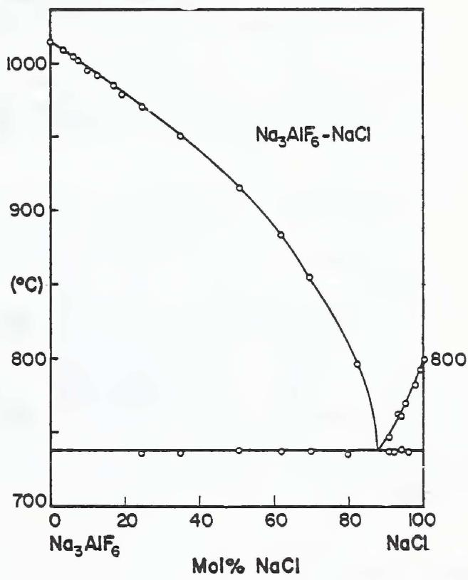  
Figure 136.1. $\mathrm{Na}_{3}\mathrm{AlF}_{6}$ -NaCl phase diagram

References [1-26].

(136) $\mathrm{Na}_{3} \mathrm{AlF}_{6}-\mathrm{NaCl}$

# 2. Density (ρ)

Measurement method: Archimedean technique [27]

Equation: (density-composition isotherm)

$$
\rho = a + b C + c C ^ {2} \quad (1 3 6. 1)
$$

precision: in table 136.1 uncertainty: $\sim \pm 1.5\%$

Table 136.1. Parameters of equation (136.1) and precision   

<table><tr><td>T(K)</td><td>a</td><td>-b x 103</td><td>c x 105</td><td>Precision</td></tr><tr><td>1273</td><td>2.1045</td><td>6.013</td><td>3.712</td><td>0.22%</td></tr></table>

Table 136.2. Density of $(\mathrm{Na}_{3}\mathrm{AlF}_{6}-\mathrm{NaCl})$ composition isotherm at 1273K from equation in table 136.1   

<table><tr><td>Mol % NaCl</td><td>ρ(g cm-3)</td><td></td><td>Mol % NaCl</td><td>ρ(g cm-3)</td></tr><tr><td>0</td><td>2.1045</td><td></td><td>30</td><td>1.9575</td></tr><tr><td>10</td><td>2.0480</td><td></td><td>40</td><td>1.9233</td></tr><tr><td>20</td><td>1.9990</td><td></td><td>50</td><td>1.8966</td></tr></table>

References [27]

# 3. Surface Tension (γ)

No data

# 4. Viscosity (n)

Measurement method: oscillational sphere [28]

Equation:

$$
\eta = a + b T + c T ^ {2} \tag {136.2}
$$

precision: in table 136.3 uncertainty: $\sim$ 25%

Table 136.3. Parameters of equation (136.2) and precisions   

<table><tr><td>NaCl (mol %)</td><td>a</td><td>-b x 102</td><td>c x 105</td><td>Precision</td><td>T range(K)</td></tr><tr><td>28.53</td><td>-3.699</td><td>-1.837</td><td>-1.075</td><td>0.07%</td><td>1220-1320</td></tr><tr><td>47.31</td><td>33.025</td><td>4.326</td><td>1.480</td><td>0.67%</td><td>1170-1320</td></tr><tr><td>60.62</td><td>-14.557</td><td>-3.107</td><td>-1.439</td><td>1.50%</td><td>1170-1320</td></tr><tr><td>70.54</td><td>41.713</td><td>6.034</td><td>2.244</td><td>4.71%</td><td>1170-1320</td></tr><tr><td>78.22</td><td>-3.293</td><td>-1.019</td><td>-0.522</td><td>0.30%</td><td>1170-1320</td></tr><tr><td>84.35</td><td>-17.223</td><td>-3.352</td><td>-1.507</td><td>1.02%</td><td>1170-1320</td></tr><tr><td>89.34</td><td>68.911</td><td>10.533</td><td>4.072</td><td>4.50%</td><td>1170-1320</td></tr><tr><td>93.49</td><td>37.285</td><td>5.469</td><td>2.048</td><td>2.23%</td><td>1120-1320</td></tr><tr><td>97.00</td><td>24.490</td><td>3.492</td><td>1.278</td><td>2.36%</td><td>1120-1320</td></tr></table>

Table 136.4. Viscosity (cp) from equations in table 136.3   

<table><tr><td rowspan="2">T(K)</td><td colspan="7">Mol % NaCl</td></tr><tr><td>28.53</td><td>47.31</td><td>60.62</td><td>70.54</td><td>84.35</td><td>89.34</td><td>93.49</td></tr><tr><td>1120</td><td></td><td></td><td></td><td></td><td></td><td>2.012</td><td>1.713</td></tr><tr><td>1140</td><td></td><td></td><td></td><td></td><td></td><td>1.746</td><td>1.545</td></tr><tr><td>1160</td><td></td><td></td><td></td><td></td><td></td><td>1.512</td><td>1.393</td></tr><tr><td>1180</td><td></td><td>2.586</td><td>2.072</td><td>1.757</td><td>1.349</td><td>1.311</td><td>1.258</td></tr><tr><td>1200</td><td></td><td>2.425</td><td>2.009</td><td>1.619</td><td>1.302</td><td>1.143</td><td>1.138</td></tr><tr><td>1220</td><td>2.715</td><td>2.276</td><td>1.934</td><td>1.498</td><td>1.243</td><td>1.007</td><td>1.036</td></tr><tr><td>1240</td><td>2.554</td><td>2.139</td><td>1.847</td><td>1.395</td><td>1.172</td><td>0.903</td><td>0.949</td></tr><tr><td>1260</td><td>2.384</td><td>2.014</td><td>1.750</td><td>1.311</td><td>1.089</td><td>0.832</td><td>0.879</td></tr><tr><td>1280</td><td>2.205</td><td>1.901</td><td>1.640</td><td>1.244</td><td>0.994</td><td>0.794</td><td>0.825</td></tr><tr><td>1300</td><td>2.018</td><td>1.799</td><td>1.519</td><td>1.195</td><td>0.887</td><td>0.788</td><td>0.788</td></tr><tr><td>1320</td><td>1.822</td><td>1.710</td><td>1.386</td><td>1.164</td><td>0.768</td><td>0.815</td><td>0.767</td></tr></table>

References [28,29]

# 5. Electrical Conductance (K)

Measurement method: classical ac technique [30]

Equation:

$$
\kappa = a + b T \tag {136.3}
$$

precision: in table 136.5 uncertainty: $\sim$ 3.0%

Table 136.5. Parameters of equation (136.3) and precisions   

<table><tr><td>Mol % NaCl</td><td>a</td><td>b x 103</td><td>Precision</td><td>T range(K)</td></tr><tr><td>15.8</td><td>-0.1150</td><td>2.3407</td><td>0.26%</td><td>1250-1360</td></tr><tr><td>28.5</td><td>-0.3202</td><td>2.5343</td><td>0.32%</td><td>1250-1340</td></tr><tr><td>38.8</td><td>-0.1254</td><td>2.4114</td><td>0.24%</td><td>1240-1360</td></tr><tr><td>47.4</td><td>-0.1345</td><td>2.4191</td><td>0.29%</td><td>1240-1350</td></tr><tr><td>60.6</td><td>0.0943</td><td>2.2631</td><td>0.34%</td><td>1200-1330</td></tr><tr><td>70.5</td><td>0.5431</td><td>1.9764</td><td>0.23%</td><td>1200-1320</td></tr><tr><td>78.2</td><td>0.9560</td><td>1.7571</td><td>0.22%</td><td>1200-1330</td></tr><tr><td>84.2</td><td>1.4848</td><td>1.4381</td><td>0.23%</td><td>1210-1340</td></tr><tr><td>89.3</td><td>1.5749</td><td>1.4556</td><td>0.23%</td><td>1200-1330</td></tr><tr><td>93.5</td><td>1.6617</td><td>1.1613</td><td>0.31%</td><td>1200-1320</td></tr><tr><td>97.1</td><td>2.1141</td><td>1.4300</td><td>0.14%</td><td>1180-1320</td></tr></table>

# (136) $\mathrm{Na}_{3} \mathrm{AlF}_{6}-\mathrm{NaCl}$

Table 136.6. Specific conductance $(ohm^{-1}cm^{-1})$ from equations in table 136.5   

<table><tr><td rowspan="2">T(K)</td><td colspan="7">Mol % NaCl</td></tr><tr><td>15.8</td><td>38.8</td><td>60.6</td><td>70.5</td><td>84.2</td><td>93.5</td><td>97.1</td></tr><tr><td>1200</td><td></td><td></td><td>2.81</td><td></td><td></td><td></td><td></td></tr><tr><td>1220</td><td></td><td></td><td>2.86</td><td></td><td></td><td></td><td></td></tr><tr><td>1240</td><td></td><td>2.87</td><td>2.90</td><td>2.30</td><td>3.27</td><td>3.66</td><td>3.89</td></tr><tr><td>1260</td><td>2.83</td><td>2.91</td><td>2.95</td><td>3.03</td><td>3.30</td><td>3.69</td><td>3.93</td></tr><tr><td>1280</td><td>2.88</td><td>2.96</td><td>2.99</td><td>3.07</td><td>3.33</td><td>3.73</td><td>3.94</td></tr><tr><td>1300</td><td>2.93</td><td>3.01</td><td>3.04</td><td>3.11</td><td>3.35</td><td>3.76</td><td>3.97</td></tr><tr><td>1320</td><td>2.98</td><td>3.06</td><td>3.08</td><td>3.15</td><td>3.38</td><td></td><td>4.00</td></tr><tr><td>1340</td><td>3.02</td><td>3.10</td><td></td><td></td><td>3.41</td><td></td><td></td></tr><tr><td>1360</td><td>3.07</td><td>3.15</td><td></td><td></td><td></td><td></td><td></td></tr></table>

References [30]

# 6. Safety and Hazards

# A. Hazard rating

(i) Toxicity: NaCl, very low; Na $_3$ AlF $_6$ , inorganic fluorides are generally irritant and toxic

(ii) Vapor pressure: NaCl, at m.pt. $(800^{\circ}\mathrm{C})$ , $\sim 0.34\mathrm{mm}$ ; Na $_3$ AlF $_6$ ,

# B. Disaster hazards

(i) Molten salt bath "explosions": i.e. explosive generation of steam due to bulk water "carry-over" and/or equipment failure; i.e., explosive expansion of "trapped" air.   
(ii) Inorganic halides when heated to decomposition or contacted with acids, highly toxic chloride fumes are evolved.

References [31-30]

Table 136.7. Corrosion studies from primary research literature   

<table><tr><td colspan="2">Studies</td><td>References</td></tr><tr><td rowspan="6">A</td><td>CrNi-Cr-Mo alloys (INOR-8; Hastelloys B, W, and N)</td><td>[37]</td></tr><tr><td>SSNI-12P</td><td>[38,39]</td></tr><tr><td>Quartz</td><td>[40]</td></tr><tr><td>Al</td><td>[41]</td></tr><tr><td>Various metals</td><td>[42]</td></tr><tr><td></td><td>[43]</td></tr><tr><td rowspan="3">B</td><td>Pt</td><td>[44-48]</td></tr><tr><td>Boron nitride, carbon, Inconel</td><td>[49-51]</td></tr><tr><td>Fused MgO</td><td>[52]</td></tr><tr><td rowspan="3">C</td><td>Impurities in electrolyte</td><td>[12,53]</td></tr><tr><td>Graphite</td><td>[12,53]</td></tr><tr><td>TiC, TiB2, CrB2, ZrN, NbB2</td><td>[54-56]</td></tr><tr><td rowspan="5">D</td><td>Corrosion studies in molten salts with NaF as one component (e.g., Cl, CO3,...)</td><td>[57-72,79,80]</td></tr><tr><td>Electrochemical behavior of oxides and related species in molten fluorides</td><td>[73-75]</td></tr><tr><td>Electroanalytical studies in molten fluorides</td><td>[76]</td></tr><tr><td>Annotated corrosion bibliolog.</td><td>[77]</td></tr><tr><td>Corrosion: molten fluorides (survey)</td><td>[78]</td></tr></table>

A: studies principally in molten NaF, KF, and LiF;  
B: used largely in fluorides physical properties measurements; C: technological aspects, in aluminum reduction cells; D: more general studies, basic principles, and surveys

References [12,37-80]

(136) $\mathrm{Na}_{3} \mathrm{AlF}_{6}$ -NaCl

8. Diffusion

Measurement method: rotating disc electrode [81]

List of diffusing species investigated in $\mathrm{Na}_{3}\mathrm{AlF}_{6}$ -NaCl as solvent $\mathrm{Al}_{2}\mathrm{O}_{3}$

precision: \* uncertainty: $\sim \pm 20\%$ *insufficient data for estimate

Equation: (isothermal study at 1353K)

$$
D = 1. 3 0 \times 1 0 ^ {- 5} + 5. 7 2 \times 1 0 ^ {- 7} W \tag {136.4}
$$

where W is the weight fraction of NaCl in the $\mathrm{Na}_{3}\mathrm{AlF}_{6}$ -NaCl mixture

Table 136.8. Diffusion coefficients at 1353K from equation (136.4)   

<table><tr><td>NaCl (wt %)</td><td>D x 105Al2O3(cm2 s-1)</td><td>NaCl (wt %)</td><td>D x 105Al2O3(cm2 s-1)</td></tr><tr><td>0</td><td>1.30</td><td>30</td><td>3.02</td></tr><tr><td>10</td><td>1.87</td><td>40</td><td>3.59</td></tr><tr><td>20</td><td>2.44</td><td>50</td><td>4.16</td></tr></table>

References $\mathrm{Al}_{2}\mathrm{O}_{3}$ , [81]; see Systems 66 and 139 for diffusion studies of $\mathrm{Al}_{2}\mathrm{O}_{3}$ and $\mathrm{Na}_{3}\mathrm{AlF}_{6}$

9. Heat of Fusion $(\Delta H_{f})$ No data   
10. Heat Capacity $(C_p)$ No data   
11. Volume Change on Melting $(\Delta V_{f})$ No data   
12. Vapor Pressure $(p_{vap})$ No data   
13. Thermal Conductivity (liquid) $(\lambda_{\ell})$ No data   
14. Thermal Conductivity (solid) $(\lambda_{s})$ No data

15. Cryoscopic Constant $(k_{f})$ No data

16. References

[1] Phillips, N. W. F., Singleton, P. H., Hollingshead, E. A., J. Electrochem. Soc., 102, 690 (1955).   
[2] Kuvakin, M. A. and Kusakin, P. S., Zh. Neorg. Khim., 4(11), 2577 (1959); Russ. J. Inorg. Chem., 4(11), 1188 (1959).   
[3] Rolin, M., Bull. Soc. Chim., France, 671 (1960).   
[4] Rolin, M. and Bernard, M., Bull Soc. Chim., France, 429 (1962).   
[5] Matiasovsky, K. and Malinovsky, M., Chem. Zvesti 14, 353 (1960).   
[6] Yaguchi, H., Huu Thanh, P. and Rolin, M., Bull. Soc. Chim., France, 39 (1970).   
[7] Mal'tsev, V. T. and Bukhalova, G. A., Zh. Neorg. Khim., 10(6), 1464 (1965); Russ. J. Inorg. Chem., 10(6), 797 (1965).   
[8] Holm, J. L., Dr. techn. Thesis, The University of Trondheim, NTH, Trondheim, 1971.   
[9] Madhavan, T. P., Matiasovsky, K. and Danek, V., Chem. Zvesti 25(4), 253 (1971).   
[10] Kostenska, I., Malinovsky, M., Chem. Zvesti., 28, 553 (1974).   
[11] Bukalova, G. A., Mateiko, Z. A., Berezhnaya, V. T., Zhur. Neorg. Khim., 7, 855 (1962).   
[12] Grjothiem, K., Krohn, C., Malinovsky, M., Matiasovsky, K., Thonstad, J., "Aluminium Electrolyses", Aluminium-Verlag GmbH.-Dusseldorf (1977).   
[13] Janz, G. J. Downey, J. R., Jr., Allen, C. B., and Tomkins, R. P. T., "Eutectic Data" - 2 Vols; ERDA-TID-27163-P1 & P2; NTIS, Washington, D. C. (1977).   
[14] Janz, G. J., Downey, J. R., Jr., Allen, C. B., and Tomkins, R. P. T., "Physical Properties Data Complications Relevant to Energy Storage. I. Molten Salts: Eutectic Data", NSRDS-NBS-61; U. S. Gov't Printing Office, Washington, D. C. (1978).   
[15] "International Critical Tables of Numerical Data, Physics, Chemistry, and Technology", 8 Vols., McGraw-Hill Book Co., N. Y. (1933).   
[16] "Landolt-Bornstein Zahlenwert und Funktionen aus Physik, Chemie, Astronomie, Geophysik und Technik", (10th Ed.) Springer-Verlag, Berlin, Heidelberg, N. Y. (1961).   
[17] Clark, P. V., "Fused Salt Mixtures: Eutectic Compositions and Melting Points Bibliography 1907-1968", Report No. SC-R-68-1680; Sandia Laboratories (1968), NTIS.   
[18] Robertson, W. D., "Binary Phase Diagrams of Halide Salts", Report No. Yale 2723 (2 Vols.), U. S. AEC Contract AT (30-1)-2723 (1966), NTIS.   
[19] Thoma, R. E., "Phase Diagrams of Nuclear Reactor Materials", Oak Ridge National Laboratory, ORNL-2548, Contract No. W-7405-eng-26.

(136) $\mathrm{Na}_{3} \mathrm{AlF}_{6}-\mathrm{NaCl}$   
[20] Thoma, R. E., "Phase Diagrams of Binary and Ternary Fluoride Systems", Chapt. 6; Adv. Molten Salts Chemistry, Vol. 3 (J. Braunstein, G. Mamantov, and G. P. Smith, eds.), Plenum Press, N. Y. (1975).   
[21] Voskresenskaya, N. K., ed., "Handbook of Solid-Liquid Equilibria in Systems of Inorganic Salts", Volumes 1, 2, Izc. Akad. Nauk SSSR, Moscow (1961). Israel Program for Scientific Translations, Jerusalem, 1970 (NTIS).   
[22] Sinistri, C., Franzozini, P., and Rolla, M., "An Atlas of Miscibility Gaps in Molten Salt Systems", Institute of Physical Chemistry, University of Pavia (Italy) (1968).   
[23] Shaffer, P. T. B., "High Temperature Materials", Plenum Press Handbooks of High Temperature Materials, No. 1, Materials Index, Plenum Press, New York, 1964.   
[24] Franzozini, P., Ferloni, P., and Spinolo, C., "Molten Salts with Organic Anions", Instituto di Chimica Fisica, Universita di Pavia (Italy), 1973.   
[25] Toropov, N. A. et al., "Handbook of Phase Diagrams of the Silicates, Volume 1: Binary Systems, Volume 2, Metal-Oxygen Compounds in Silicate Systems", Izdatel'stov "Nauka" Leningradskoe Otdelenie, Leningrad, 1969, Israel Program for Scientific Translations, Jerusalem, 1972 (NTIS).   
[26] Levin, E., et al., "Phase Diagrams for Ceramists", Amer. Ceramic Soc. (publ.), Columbus, Ohio (1964; 1969).   
[27] Matiasovsky, K. and Malinovsky, M., Electrochim. Acta, 11, 1035 (1966).   
[28] Volata, I. and Matiasovsky, K., Chem. Zvesti 27, 582 (1973).   
[29] Fellner, P., Chem. Zvesti 28, 721 (1974).   
[30] Matiasovsky, K. and Danek, V., Chem. Zvesti, 27, 742 (1973).   
[31] "Dangerous Properties of Materials", Sax, N. I., Van Nostrand Reinhold Co., N. Y. (1969).   
[32] "Registry of Toxic Effects of Chemical Substances", Christensen, H. E., and Lubinybyhl, T. T., eds., U. S. Dept. H.E.W; U. S. Gov't Printing Office, Washington, D. C. (1975).   
[33] Janz, G. J., et al., "Physical Properties Data Complications Relevant to Energy Storage. Part II. Molten Salts: Data on Single and Multi-Component Salt Systems", NSRDS-NBS 61, Part II (April 1979), U. S. Gov't Printing Office, Supt of Doc. No. C13-48-61, Washington D. C. 20402.   
[34] "Potential Hazards in Molten Salt Baths for Heat Treatment of Metals", National Board Fire Underwriters Research Report No. 2. (1954).   
[35] "Handbook of Reactive Chemical Hazards", Bretherwick, L., Butterworths Co., London (1975).   
[36] Janz, G. J., Tomkins, R. P. T., Downey, J. R., Jr., and Allen, C. B., "Safety and Hazards", Chapter in "Eutectic Data", ERDA TID-27163-P1; NTIS, U. S. Dept. Commerce, Springfield, Va. (1977).   
[37] Brasunas, A., Metal Prog., 62, 88 (1952).   
[38] Bettes, E. S., Nucl. Sci. Eng., 2, 804 (1957).

(136) $\mathrm{Na}_{3} \mathrm{AlF}_{6}-\mathrm{NaCl}$   
[39] Hoffman, E. E., Patriarca, P., Leitten, C. F., Jr., and Slaughter, G. M., ORNL-1934, Oak Ridge Natl. Lab., (1956).   
[40] Oak Ridge National Laboratory, "The Development Status of Molten Salt Breeder Reactors", Rpt. ORNL-4812-UC-80; NTIS, U. S. Dept. Commerce, Springfield, Va., (Aug. 1972).   
[41] Heimann, R., Glastech. Ber., 43, 83 (1970).   
[42] Lukashenko, E. E., and Reutova, G. A., Nov. Teor. Tekhnol. Metall. Protsessov., 119 (1973).   
[43] Koger, J. W., Corrosion, 30, 125 (1974).   
[44] Edwards, J. D., Taylor, C. S., Russell, A. S., and Maranville, L. F., ibid., 99, 527 (1952).   
[45] Landon, G. J., and Ubbelohde, A. R., Proc. Royal Soc., A240, 160 (1957).   
[46] Winterhager, H. and Werner, L., Forschungsber. des Witschafts-u. Verkehrsministeriums Nordrhein-Westfalen, No. 438, 1957.   
[47] Winterhager, H. and Werner, L., Forschungsber. des Witschafts-u. Verkehrsministeriums Nordrhein-Westfalen, No. 341, 1956.   
[48] Bajcsy, J., Malinovsky, M., and Matiasovsky, K., Electrochim. Acta, 7, 543 (1962).   
[49] Yim, E. W. and Feinleib, M., J. Electrochem. Soc., 104, 622 (1957).   
[50] Yim, E. W. and Feinleib, M., J. Electrochem. Soc, 104, 626 (1957).   
[51] Brown, E. A. and Porter, B., "U. S. Department of Interior, Bureau of Mines", 128.23:6500 (1964).   
[52] Cuthbertson, J.W. and Waddington, J., Trans Faraday Soc., 32, 745 (1936).   
[53] Brun, J., Tunold, R., Vatland, A., 30th ISE Meeting, Extended Abstracts, pp. 118-119; Trondheim, Norway (Aug. 1979); NTH, Dept. Ind. Electrochem., Trondheim, Norway.   
[54] Holliday, R. D., (Olin Mathieson Chemical Corp.), U. S. 3,661,736, May 9, 1972.   
[55] Thompson, R.: (Borax Consolidated Ltd.), Ger. Offen. 2,305,281, Aug. 9, 1973.   
[56] Kugler, T. and Rieger, H. W.: (Swiss Aluminium Ltd.), Ger. Offen. 2,312,439, Oct. 4, 1973.   
[57] Khan, I. A., Ber. Kernforschungsanlage Juelich, Juel-608-RW, (1969).   
[58] Khan, I. A., Inst. Reaktorwerkst., Kernforschungsanlage, Juel-718-RW (1970).   
[59] Bowles, P. J., and Newdick, P. C., Electroplating and Metal Finishing, 24, 6 (1971).   
[60] Devan, J. H., "Examinations of Pump Impellers from Sodium and Fused Salt Pump Endurance Tests", ORNL CF-61-4-77, Oak Ridge National Lab., (1961).   
[61] Adamson, G. M., Manly, W. D., and Crouse, S. R., "Corrosion by Molten Fluorides", ANP Materials Meeting ORNL-2685, (1958).   
[62] Huntley, W. R., and Gnadt, P. A., Oak Ridge Nat'l Lab., Report ORNL-TM-3863. (1973); Nucl. Sci. Abstr., 27, 12446 (1973).

(136) $\mathrm{Na}_{3} \mathrm{AlF}_{6}-\mathrm{NaCl}$   
[63] Gill, C. B., Straumanis, M. E., and Schlechten, W. B., J. Electrochem. Soc., 102, 42 (1955).   
[64] Litman, A. P., "Corrosion of Volatility Pilot Plant Mark I INOR-S Hydrofluorinator and Mark III. Nickel Fluorinator after Fourteen Dissolution Runs", ORNL-3253, Oak Ridge Nat'l Lab., (1962).   
[65] Litman, A. P., and Goldman, A. E., "Corrosion Associated with Fluoridation in the Oak Ridge Nat'l Lab., Fluoride Volatility Process", ORNL-2832, Oak Ridge Nat'l Lab. (1961).   
[66] Manly, W. D., Coobs, J. H., DeVan, J. H., Douglas D. A., Inouye, H., Patriarca, P., Roche, T. K., and Scott, J. L., "Metallurgical Problems in Molten Fluoride Systems", Proc. 2nd U. N. Inter. Conf. Peaceful Uses of At. Energy, 7, 223 (1958).   
[67] Oak Ridge Nat'l Lab., Molten Salt Reactor Program Semiannual Progress Report for Period Ending July 31, 1964, ORNL-3708, (1964).   
[68] Vreeland, D. C., Hoffman, E. E., and Manly, W. D., Nucleonics, 11, 36 (1953).   
[69] Grimes, W. R., and Cuneo, D. R., "Molten Salts as Reactor Fuels", Reactor Handbook 2nd ed., 1, 425 (1955).   
[70] Shimotake, H., and Hesson, J. C., Adv. Chem. Series, No. 64, 149 (1967).   
[71] Boser, O., "Study of Safety Aspects of High Temperature Thermal Energy Storage Systems", ERDA Thermal Energy Storage Information Exchange Mtg., Cleveland, NSF-AER 75-20605 (Sept. 1976).   
[72] Venkatasetty, H. V., "Thermodynamic Properties and Corrosion Characteristics of Thermal Energy Storage Eutectic Mixtures", paper presented at 152nd Meeting of the Electrochemical Society, Atlanta, Ga., (October, 1977).   
[73] Mathews, A. L., and Baes, C. F., Inorg. Chem., 7, 373 (1968).   
[74] Manning, D. L. and Mamantov, G., J. Electrochem. Soc., 124, 480 (1977).   
[75] Ting, G., Baes, C. F., Bamberger, C. E., and Mamantov, G., J. Inorg. Nucl. Chem., 39, 1803 (1977).   
[76] Manning, D. L., and Mamantov, G., J. Electroanal. Chem., (in press) (1978)   
[77] Janz, G. J., and Tomkins, R. P. T., Corrosion, 35(11) 485 (1979).   
[78] Eichelberger, J. L., (Penwalt Corp.) "Investigations of Metal Fluoride Thermal Energy Storage Materials: Availability, Cost, Chemistry" ERDA Rpt CO02990-6; NTIS, U. S. Dept. Commerce, Springfield, Va., (Dec. 1976).   
[79] Kochergen, V. P., and Ignat'eva, N. I., Russ. J. Inorg. Chem., 6(9), 1086 (1961).   
[80] Ozeryanaya, I. N., Volodin, V. P., and Smirnov, M. V., Zashchita Metalov (USSR), 2, 230 (1969).   
[81] Shurygin, P. M., Barmin, L. N., and Boronenkov, V. N., Izvet. Vyseh. Zaved. Tsvet. Met. 5(4), 106 (1962).

1. Melting Temperature $(T_{m})$

Pure substance melting points:

Na3AlF6: 1010°C

BaCl2: 962°C

Eutectic 1, melting point:

$745^{\circ} \mathrm{C}$ , composition: $\sim 65 \mathrm{~mol} \% \mathrm{BaCl}_{2}$

Eutectic 2, melting point:

$762^{\circ} \mathrm{C}$ , composition: $\sim 91 \mathrm{~mol} \% \mathrm{BaCl}_{2}$

Compound melting point:

$786^{\circ} \mathrm{C}$ , composition: $80 \mathrm{~mol} \% \mathrm{BaCl}_{2}$ (i.e., $\mathrm{Na}_{3} \mathrm{AlF}_{6} . 4 \mathrm{BaCl}_{2}$ )

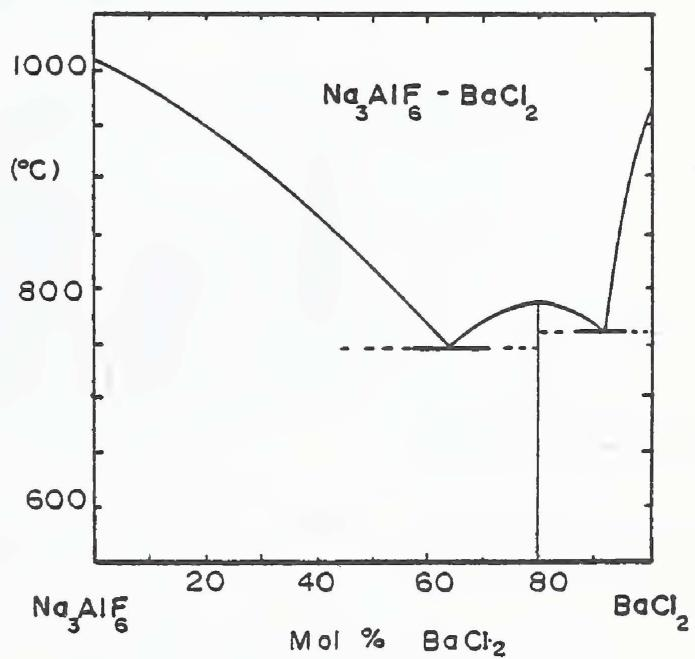  
Figure 137.1. $\mathrm{Na}_{3} \mathrm{AlF}_{6}$ -BaCl $_2$ phase diagram

References [1-15]

2. Density (ρ)

Measurement method: Archimedean technique [16]

Equation:

$$
\rho = a + b T \tag {137.1}
$$

precision: in table 137.1 uncertainty: $\sim \pm 10\%$

$$
\mathrm {N a} _ {3} \mathrm {A l F} _ {6} - \mathrm {B a C l} _ {2} \tag {137}
$$

Table 137.1. Parameters of equation (137.1) and precisions   
Table 137.2. Density $(\mathrm{gcm}^{-3})$ from equations in table 137.1   

<table><tr><td>Mol % BaCl2</td><td>a</td><td>-b x 104</td><td>Precision</td><td>T range(K)</td></tr><tr><td>25</td><td>3.1217</td><td>9.043</td><td>0.07%</td><td>1030-1120</td></tr><tr><td>50</td><td>3.2910</td><td>9.052</td><td>0.16%</td><td>1030-1110</td></tr><tr><td>75</td><td>3.5173</td><td>8.124</td><td>0.12%</td><td>1030-1120</td></tr></table>

<table><tr><td></td><td colspan="3">Mol % BaCl2</td></tr><tr><td>T(K)</td><td>25</td><td>50</td><td>75</td></tr><tr><td>780</td><td></td><td>2.585</td><td></td></tr><tr><td>820</td><td></td><td>2.549</td><td></td></tr><tr><td>860</td><td></td><td>2.513</td><td>2.819</td></tr><tr><td>900</td><td></td><td>2.476</td><td>2.786</td></tr><tr><td>940</td><td>2.272</td><td>2.440</td><td>2.754</td></tr><tr><td>980</td><td>2.236</td><td>2.404</td><td>2.721</td></tr><tr><td>1020</td><td>2.199</td><td>2.368</td><td>2.689</td></tr><tr><td>1060</td><td>2.163</td><td>2.332</td><td>2.656</td></tr><tr><td>1100</td><td>2.127</td><td>2.295</td><td>2.624</td></tr></table>

References [16,17]

3. Surface Tension (γ)

No data

4. Viscosity (η)

Measurement method: oscillating sphere technique [18]

Equation:

$$
\eta = a + b C + c T ^ {2} \tag {137.2}
$$

precision: in table 137.3 uncertainty: $\sim \pm 10\%$

# (137) $\mathrm{Na}_{3} \mathrm{AlF}_{6}-\mathrm{BaCl}_{2}$

Table 137.3. Parameters of equation (137.2) and precision   

<table><tr><td>BaCl2(mol %)</td><td>a</td><td>b x 102</td><td>c x 105</td><td>Precision</td><td>T range(K)</td></tr><tr><td>60</td><td>45.047</td><td>-5.861</td><td>1.878</td><td>*</td><td>1050-1130</td></tr></table>

*insufficient data for estimation.

Table 137.4. Viscosity (cp) at $60\mathrm{mol}\% \mathrm{BaCl}_2$ from equation in table 137.3   

<table><tr><td>T(K)</td><td>η(cp)</td><td></td><td>T(K)</td><td>η(cp)</td></tr><tr><td>1050</td><td>4.21</td><td></td><td>1100</td><td>3.30</td></tr><tr><td>1060</td><td>4.02</td><td></td><td>1110</td><td>3.12</td></tr><tr><td>1070</td><td>3.83</td><td></td><td>1120</td><td>2.96</td></tr><tr><td>1080</td><td>3.65</td><td></td><td>1130</td><td>2.79</td></tr><tr><td>1090</td><td>3.47</td><td></td><td></td><td></td></tr></table>

References [18]

# 5. Electrical Conductance (K)

Measurement method: classical ac technique [19]

Equation:

$$
\kappa = a + b T \tag {137.3}
$$

precision: in table 137.5

uncertainty: $\sim$ 5.0%

Table 137.5. Parameters of equation (137.3) and precision   

<table><tr><td>\( \mathrm{{Mol}}\% {\mathrm{{BaCl}}}_{2} \)</td><td>-a</td><td>b x \( {10}^{3} \)</td><td>Precision</td><td>T range(K)</td></tr><tr><td>10</td><td>1.1634</td><td>3.260</td><td>✘</td><td>1270-1370</td></tr><tr><td>30</td><td>4.1164</td><td>4.984</td><td>✘</td><td>1270-1370</td></tr><tr><td>50</td><td>3.3199</td><td>3.929</td><td>✘</td><td>1270-1370</td></tr><tr><td>70</td><td>3.2316</td><td>3.694</td><td>✘</td><td>1270-1370</td></tr><tr><td>90</td><td>3.0751</td><td>3.620</td><td>✘</td><td>1270-1370</td></tr></table>

# (137) $\mathrm{Na}_{3} \mathrm{AlF}_{6}-\mathrm{BaCl}_{2}$

Table 137.6. Specific conductance $(ohm^{-1}cm^{-1})$ from equations in table 137.5   

<table><tr><td rowspan="2">T(K)</td><td colspan="5">\( Mol\ \% \space BaCl_2 \)</td></tr><tr><td>10</td><td>30</td><td>50</td><td>70</td><td>90</td></tr><tr><td>1270</td><td>2.977</td><td>2.213</td><td>1.670</td><td>1.460</td><td>1.523</td></tr><tr><td>1280</td><td>3.009</td><td>2.263</td><td>1.709</td><td>1.497</td><td>1.559</td></tr><tr><td>1290</td><td>3.042</td><td>2.313</td><td>1.748</td><td>1.534</td><td>1.595</td></tr><tr><td>1300</td><td>3.075</td><td>2.363</td><td>1.788</td><td>1.571</td><td>1.631</td></tr><tr><td>1310</td><td>3.107</td><td>2.413</td><td>1.827</td><td>1.608</td><td>1.667</td></tr><tr><td>1320</td><td>3.140</td><td>2.463</td><td>1.866</td><td>1.645</td><td>1.704</td></tr><tr><td>1330</td><td>3.172</td><td>2.512</td><td>1.905</td><td>1.682</td><td>1.740</td></tr><tr><td>1340</td><td>3.205</td><td>2.562</td><td>1.945</td><td>1.719</td><td>1.776</td></tr><tr><td>1350</td><td>3.238</td><td>2.612</td><td>1.984</td><td>1.756</td><td>1.812</td></tr><tr><td>1360</td><td>3.270</td><td>2.662</td><td>2.023</td><td>1.793</td><td>1.848</td></tr><tr><td>1370</td><td>3.303</td><td>2.712</td><td>2.063</td><td>1.830</td><td>1.885</td></tr></table>

References [19,20]

6. Safety and Hazards

# A. Hazard rating

(i) Toxicity: inorganic fluorides are generally irritants and toxic, soluble barium compounds are classed as toxic.   
(ii) Vapor pressure: Na₂AlF₆ at m.pt., 1010°C, ∅ < 0.5mm; BaCl₂, at m.pt., 962°C, ∅ < 0.5mm.

# B. Disaster hazard

(i) Molten salt bath "explosions": i.e., explosive generation of steam due to bulk water "carry-over" and/or equipment failure; i.e., explosive expansion of "trapped" air.   
(ii) Fluorides and chlorides, when heated to decomposition, or contacted with acids, emit highly toxic fumes.

References [21-26]

# 7. Corrosion

Table 137.7. Corrosion studies from primary research literature   

<table><tr><td colspan="2">Studies</td><td>References</td></tr><tr><td rowspan="6">A</td><td>CrNi-Cr-Mo alloys (INOR-8; Hastelloys B, W, and N)</td><td>[27]</td></tr><tr><td>SSNI-12P</td><td>[28,29]</td></tr><tr><td>Quartz</td><td>[30]</td></tr><tr><td>Al</td><td>[31]</td></tr><tr><td>Various metals</td><td>[32]</td></tr><tr><td></td><td>[33]</td></tr><tr><td rowspan="3">B</td><td>Pt</td><td>[34-38]</td></tr><tr><td>Boron nitride, carbon, Inconel</td><td>[39-41]</td></tr><tr><td>Fused MgO</td><td>[42]</td></tr><tr><td rowspan="3">C</td><td>Impurities in electrolyte</td><td>[43,44]</td></tr><tr><td>Graphite</td><td>[43,44]</td></tr><tr><td>TiC, TiB2, CrB2, ZrN, NbB2</td><td>[45-47]</td></tr><tr><td rowspan="5">D</td><td>Corrosion studies in molten salts with NaF as one component (e.g., Cl, CO3,...)</td><td>[48-63,70,71]</td></tr><tr><td>Electrochemical behavior of oxide ions and related species in molten fluorides</td><td>[64-66]</td></tr><tr><td>Electroanalytical studies in molten fluorides</td><td>[67]</td></tr><tr><td>Annotated corrosion biblio.</td><td>[68]</td></tr><tr><td>Corrosion: molten fluorides(survey)</td><td>[69]</td></tr></table>

A: studies principally in molten NaF, KF, and LiF;  
B: used largely in fluorides physical properties measurements; C: technological aspects, in aluminum reduction cells; D: more general studies, basic principles, and surveys.

References [27-71]

(137) $\mathrm{Na}_{3} \mathrm{AlF}_{6}-\mathrm{BaCl}_{2}$

8. Diffusion

No diffusion studies reported. For a related but more complex system, i.e., $\mathrm{Na}_{3}\mathrm{AlF}_{6} - \mathrm{AlF}_{3} - \mathrm{BaCl}_{2}$ , a limited chronopotentiometric study of $\mathrm{Cu}^{+}$ has been reported [72]. $\mathrm{D}_{\mathrm{Cu}^{+}}$ x $10^{5}$ (cm $^{2}$ s $^{-1}$ ) was reported as 2.8 ( $\sim$ 15%) at 1023K.

References [72]

9. Heat of Fusion $(\Delta H_{f}^{\circ})$

No data

10. Heat Capacity $(C_p)$

No data

11. Volume Change on Melting $(\Delta V_{f})$

No data

12. Vapor Pressure $(p_{\text{vap}})$

No data

13. Thermal Conductivity (liquid) $(\lambda_{\ell})$

No data

14. Thermal Conductivity (solid) $(\lambda_{s})$

No data

15. Cryoscopic Constant $(k_{f})$

No data

16. References

[1] Guskov, V. M., Elektrolyticheskoe Kafinirovanie Alyuminia, Metallurgizdat, Moscow, 1945.

[2] Khazanov, E. I., Legkie Metally, No. 1, 47 (1935).

[3] Janz, G. J. Downey, J. R., Jr., Allen, C. B., and Tomkins, R. P. T., "Eutectic Data" - 2 Vols; ERDA-TID-27163-P1 & P2; NTIS, Washington, D. C. (1977).

[4] Janz, G. J., Downey, J. R., Jr., Allen, C. B., and Tomkins, R. P. T., "Physical Properties Data Complications Relevant to Energy Storage. I. Molten Salts: Eutectic Data", NSRDS-NBS-61; U. S. Gov't Printing Office, Washington, D. C. (1978).

[5] "International Critical Tables of Numerical Data, Physics, Chemistry, and Technology", 8 Vols., McGraw-Hill Book Co., N. Y. (1933).

(137) $\mathrm{Na}_{3} \mathrm{AlF}_{6}-\mathrm{BaCl}_{2}$   
[6] "Landolt-Bornstein Zahlenwert und Funktionen aus Physik, Chemie, Astronomie, Geophysik und Technik", (10th Ed.) Springer-Verlag, Berlin, Heidelberg, N. Y. (1961).   
[7] Clark, P. V., "Fused Salt Mixtures: Eutectic Compositions and Melting Points Bibliography 1907-1968", Report No. SC-R-68-1680; Sandia Laboratories (1968), NTIS.   
[8] Robertson, W. D., "Binary Phase Diagrams of Halide Salts", Report No. Yale 2723 (2 Vols.), U. S. AEC Contract AT (30-1)-2723 (1966), NTIS.   
[9] Thoma, R. E., "Phase Diagrams of Nuclear Reactor Materials", Oak Ridge National Laboratory, ORNL-2548, Contract No. W-7405-eng-26.   
[10] Thoma, R. E., "Phase Diagrams of Binary and Ternary Fluoride Systems", Chapt. 6; Adv. Molten Salts Chemistry, Vol. 3 (J. Braunstein, G. Mamantov, and G. P. Smith, eds.), Plenum Press, N. Y. (1975).   
[11] Voskresenskaya, N. K., ed., "Handbook of Solid-Liquid Equilibria in Systems of Inorganic Salts", Volumes 1, 2, Izc. Akad. Nauk SSSR, Moscow (1961). Israel Program for Scientific Translations, Jerusalem, 1970 (NTIS).   
[12] Toropov, N. A. et al., "Handbook of Phase Diagrams of the Silicates, Volume 1: Binary Systems, Volume 2, Metal-Oxygen Compounds in Silicate Systems", Izdatel'stov "Nauka" Leningradskoe Otdelenie, Leningrad, 1969, Israel Program for Scientific Translations, Jerusalem, 1972 (NTIS).   
[13] Levin, E., et al., "Phase Diagrams for Ceramists", Amer. Ceramic Soc. (publ.), Columbus, Ohio (1964; 1969).   
[14] Shaffer, P. T. B., "High Temperature Materials", Plenum Press Handbooks of High Temperature Materials, No. 1, Materials Index, Plenum Press, New York, 1964.   
[15] "Applications of Phase Diagrams in Metallurgy and Ceramics", (2 Vols) NBS Special Pub. 496. U. S. Dept. of Commerce. Nat. Bur. Standards. Ed. Carter G. C. March 1978.   
[16] Abramov, G. A., Legki Metally, 5, 27 (1936).   
[17] Kuvakin, M. A., Pyatintsev, V. A., and Talanova, L. I., Russ. J. Phys. Chem., 47, 588 (1973).   
[18] Zuca, S., Costin, R., and Olteanu, M., Rev. Roum. Chim., 19, 181 (1974).   
[19] Matiasovsky, K., and Anek, V. D., Chem. Zvesti, 27, 742 (1973).   
[20] Kuvakin, M. A., and Klyakin, N. M., Phys. Chem. and Electrochem. of Molten and Solid Electrol. I Instruc. and Props., All Union Conf., (Swerdlowsk, June) (1973).   
[21] "Dangerous Properties of Materials", Sax, N. I., Van Nostrand Reinhold Co., N. Y. (1969).   
[22] "Registry of Toxic Effects of Chemical Substances", Christensen, H. E., and Lubinybyhl, T. T., eds., U. S. Dept. H.E.W; U. S. Gov't Printing Office, Washington, D. C. (1975).   
[23] "Potential Hazards in Molten Salt Baths for Heat Treatment of Metals", National Board Fire Underwriters Research Report No. 2. (1954).

(137) $\mathrm{Na}_{3} \mathrm{AlF}_{6}\text{-BaCl}_{2}$   
[24] "Handbook of Reactive Chemical Hazards", Bretherwick, L., Butterworths Co., London (1975).   
[25] Janz, G. J., Tomkins, R. P. T., Downey, J. R., Jr., and Allen, C. B., "Safety and Hazards", Chapter in "Eutectic Data", ERDA TID-27163-P1; NTIS, U. S. Dept. Commerce, Springfield, Va. (1977).   
[26] Vapor pressure, estimated, Janz, G. J. et al., (MSDC-RPI, 1980).   
[27] Brasunas, A.; Metal Prog., 62, 88 (1952).   
[28] Bettes, E. S., Nucl. Sci. Eng., 2, 804 (1957).   
[29] Hoffman, E. E., Patriarca, P., Leitten, C. F., Jr., and Slaughter, G. M., ORNL-1934, Oak Ridge Natl. Lab., (1956).   
[30] Oak Ridge National Laboratory, "The Development Status of Molten Salt Breeder Reactors", Rpt. ORNL-4812-UC-80; NTIS, U. S. Dept. Commerce, Springfield, Va., (Aug. 1972).   
[31] Heimann, R., Glastech. Ber., 43, 83 (1970).   
[32] Lukashenko, E. E., and Reutova, G. A., Nov. Teor. Tekhnol. Metall. Protsessov., 119 (1973).   
[33] Koger, J. W., Corrosion, 30, 125 (1974).   
[34] Edwards, J. D., Taylor, C. S., Russell, A. S., and Maranville, L. F., J. Electrochem. Soc. 99, 527 (1952).   
[35] Landon, G. J., and Ubbelohde, A. R., Proc. Royal Soc., A240, 160 (1957).   
[36] Winterhager, H. and Werner, L., Forschungsber. des Witschafts-u. Verkehrsministeriums Nordrhein-Westfalen, No. 438, 1957.   
[37] Winterhager, H. and Werner, L., Forschungsber. des Witschafts-u. Verkehrsministeriums Nordrhein-Westfalen, No. 341, 1956.   
[38] Bajcsy, J., Malinovsky, M., and Matiasovsky, K., Electrochim. Acta, 7, 543 (1962).   
[39] Yim, E. W. and Feinleib, M., J. Electrochem. Soc., 104, 622 (1957).   
[40] Yim, E. W. and Feinleib, M., J. Electrochem. Soc, 104, 626 (1957).   
[41] Brown, E. A. and Porter, B., "U. S. Department of Interior, Bureau of Mines", 128.23:6500 (1964).   
[42] Cuthbertson, J.W. and Waddington, J., Trans Faraday Soc., 32, 745 (1936).   
[43] Grjothiem, K., Krohn, C., Malinovsky, M., Matiasovsky, K., and Thonstad, J., "Aluminum Electrolyses", Chapt. 10; Aluminum-Verlag, G.mbH; Dusseldorf (1977).   
[44] Brun, J., Tunold, R., Vatland, A., 30th ISE Meeting, Extended Abstracts, pp. 118-119; Trondheim, Norway (Aug. 1979); NTH, Dept. Ind. Electrochem., Trondheim, Norway.   
[45] Holliday, R. D., (Olin Mathieson Chemical Corp.), U. S. 3,661,736, May 9, 1972.   
[46] Thompson, R.: (Borax Consolidated Ltd.), Ger. Offen. 2,305,281, Aug. 9, 1973.

(137) $\mathrm{Na}_{3} \mathrm{AlF}_{6}-\mathrm{BaCl}_{2}$   
[47] Kugler, T. and Rieger, H. W.: (Swiss Aluminium Ltd.) Ger. Offen. 2,312,439, Oct. 4, 1973.   
[48] Khan, I. A., Ber. Kernforschungsanlage Juelich, Juel-608-RW, (1969).   
[49] Khan, I. A., Inst. Reaktorwerkst., Kernforschungsanlage, Juel-718-RW (1970).   
[50] Bowles, P. J., and Newdick, P. C., Electroplating and Metal Finishing, 24, 6 (1971).   
[51] DeVan, J. H., "Examinations of Pump Impellers from Sodium and Fused Salt Pump Endurance Tests", ORNL CF-61-4-77, Oak Ridge National Lab., (1961).   
[52] Adamson, G. M., Manly, W. D., and Crouse, S. R., "Corrosion by Molten Fluorides", ANP Materials Meeting ORNL-2685, (1958).   
[53] Huntley, W. R., and Gnadt, P. A., Oak Ridge Nat'l Lab., Report ORNL-TM-3863. (1973); Nucl. Sci. Abstr., 27, 12446 (1973).   
[54] Gill, C. B., Straumanis, M. E., and Schlechten, W. B., J. Electrochem. Soc., 102, 42 (1955).   
[55] Litman, A. P., "Corrosion of Volatility Pilot Plant Mark I INOR-S Hydrofluorinator and Mark III. Nickel Fluorinator after Fourteen Dissolution Runs", ORNL-3253, Oak Ridge Nat'l Lab., (1962).   
[56] Litman, A. P., and Goldman, A. E., "Corrosion Associated with Fluoridation in the Oak Ridge Nat'l Lab., Fluoride Volatility Process", ORNL-2832, Oak Ridge Nat'l Lab. (1961).   
[57] Manly, W. D., Coobs, J. H., DeVan, J. H., Douglas D. A., Inouye, H., Patriarca, P., Roche, T. K., and Scott, J. L., "Metallurgical Problems in Molten Fluoride Systems", Proc. 2nd U. N. Inter. Conf. Peaceful Uses of At. Energy, 7, 223 (1958).   
[58] Oak Ridge Nat'l Lab., Molten Salt Reactor Program Semiannual Progress Report for Period Ending July 31, 1964, ORNL-3708, (1964).   
[59] Vreeland, D. C., Hoffman, E. E., and Manly, W. D., Nucleonics, 11, 36 (1953).   
[60] Grimes, W. R., and Cuneo, D. R., "Molten Salts as Reactor Fuels", Reactor Handbook 2nd ed., 1, 425 (1955).   
[61] Shimotake, H., and Hesson, J. C., Adv. Chem. Series, No. 64, 149 (1967).   
[62] Boser, O., "Study of Safety Aspects of High Temperature Thermal Energy Storage Systems", ERDA Thermal Energy Storage Information Exchange Mtg., Cleveland, NSF-AER 75-20605 (Sept. 1976).   
[63] Venkatasetty, H. V., "Thermodynamic Properties and Corrosion Characteristics of Thermal Energy Storage Eutectic Mixtures", paper presented at 152nd Meeting of the Electrochemical Society, Atlanta, Ga., (October, 1977).   
[64] Mathews, A. L., and Baes, C. F., Inorg. Chem., 7, 373 (1968).   
[65] Manning, D. L. and Mamantov, G., J. Electrochem. Soc., 124, 480 (1977).   
[66] Ting, G., Baes, C. F., Bamberger, C. E., and Mamantov, G., J. Inorg. Nucl. Chem., 39, 1803 (1977).   
[67] Manning, D. L., and Mamantov, G., J. Electroanal. Chem., (in press) (1978).   
[68] Janz, G. J., and Tomkins, R. P. T., Corrosion, 35(11) 485 (1979).

(137) $\mathrm{Na}_{3} \mathrm{AlF}_{6}-\mathrm{BaCl}_{2}$   
[69] Eichelberger, J. L., (Penwalt Corp.) "Investigations of Metal Fluoride Thermal Energy Storage Materials: Availability, Cost, Chemistry" ERDA Rpt CO02990-6; NTIS, U. S. Dept. Commerce, Springfield, Va., (Dec. 1976).   
[70] Kochergen, V. P., and Ignat'eva, N. I., Russ. J. Inorg. Chem., 6(9), 1086 (1961).   
[71] Ozeryanaya, I. N., Volodin, V. P., and Smirnov, M. V., Zashchita Metalov (USSR), 2, 230 (1969).   
[72] Chryssoulakis, J., DeLepinay, J., and Barbier, M. J., J. Appl. Electrochemistry, 6, 507 (1976).

1. Melting Temperature $(T_{m})$

Pure substance melting points:

Na3AlF6: 1010°C

B2O3: 450°C

Invariant points:

The solubility of $\mathsf{B}_2\mathsf{O}_3$ in molten cryolite appears unlimited [1].

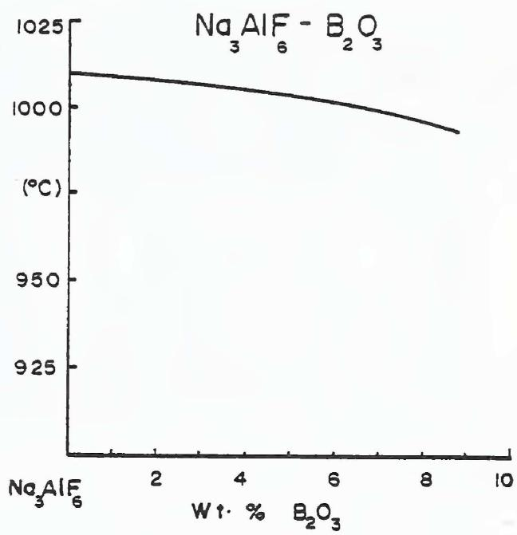  
Figure 138.1. Freezing point depression of molten $\mathrm{Na}_3\mathrm{AlF}_6$ with $\mathrm{B}_2\mathrm{O}_3$ as additive

References [1-14]

2. Density (ρ)

No data

3. Surface Tension (Y)

No-data

4. Viscosity (n)

Measurement method: rotating spindle technique [15]

Equation:

$$
\eta = a + b T + c T ^ {2} \tag {138.1}
$$

precision: in table 138.1 uncertainty: $\sim \pm 40\%$

$$
\mathrm {N a} _ {3} \mathrm {A l F} _ {6} - \mathrm {B} _ {2} \mathrm {O} _ {3} \tag {138}
$$

Table 138.1. Parameters of equation (138.1) and precisions   
Table 138.2. Viscosity (poise) from equations in table 138.1   

<table><tr><td>Na3AlF6(mol %)</td><td>a</td><td>-b x 102</td><td>c x 104</td><td>Precision</td><td>T range(K)</td></tr><tr><td>1.6</td><td>562.99</td><td>112.08</td><td>5.592</td><td>18.0%</td><td>870-1020</td></tr><tr><td>3.2</td><td>279.08</td><td>56.005</td><td>2.816</td><td>22.3%</td><td>870-1020</td></tr></table>

<table><tr><td>Mol % Na3AlF6</td><td>1.6</td><td>3.2</td><td>Mol % Na3AlF6</td><td>1.6</td><td>3.2</td></tr><tr><td>T(K)</td><td>n(p)</td><td>n(p)</td><td>T(K)</td><td>n(p)</td><td>n(p)</td></tr><tr><td>870</td><td>11.1</td><td>4.96</td><td>950</td><td>2.89</td><td>1.15</td></tr><tr><td>880</td><td>9.72</td><td>4.29</td><td>960</td><td>2.37</td><td>0.93</td></tr><tr><td>890</td><td>8.41</td><td>3.67</td><td>970</td><td>1.95</td><td>0.76</td></tr><tr><td>900</td><td>7.21</td><td>3.11</td><td>980</td><td>1.65</td><td>0.66</td></tr><tr><td>910</td><td>6.12</td><td>2.61</td><td>990</td><td>1.45</td><td>0.60</td></tr><tr><td>920</td><td>5.15</td><td>2.16</td><td>1000</td><td>1.37</td><td>0.60</td></tr><tr><td>930</td><td>4.28</td><td>1.77</td><td>1010</td><td>1.41</td><td>0.66</td></tr><tr><td>940</td><td>3.53</td><td>1.43</td><td>1020</td><td>1.55</td><td>0.78</td></tr></table>

References [15]   
5. Electrical Conductance (K) No data

(138) $\mathrm{Na}_{3} \mathrm{AlF}_{6} - \mathrm{B}_{2} \mathrm{O}_{3}$

6. Safety and Hazards

A. Hazard rating

(i) Toxicity: inorganic fluorides are generally irritants and toxic; alumina is classed as a nuisance particulate.   
(ii) Vapor pressure: no information on this system; Na₃AlF₆ at its m.pt. (1010°C), << 0.5mm.

B. Disaster hazards

(i) Molten salt bath "explosions", i.e., explosive generation of steam due to bulk water "carry-over" and/or equipment failure; i.e., explosive expansion of "trapped" air.   
(ii) Fluorides, when heated to decomposition, or contacted with acids, emit highly toxic fumes.

References [16-21]

# 7. Corrosion

Table 138.3. Corrosion studies from primary research literature   

<table><tr><td colspan="2">Studies</td><td>References</td></tr><tr><td rowspan="6">A</td><td>CrNi-Cr-Mo alloys (INOR-8; Hastelloys B, W, and N)</td><td>[22]</td></tr><tr><td>SSNI-12P</td><td>[23,24]</td></tr><tr><td>Quartz</td><td>[25]</td></tr><tr><td>Al</td><td>[26]</td></tr><tr><td>Various metals</td><td>[27]</td></tr><tr><td></td><td>[28]</td></tr><tr><td rowspan="3">B</td><td>Pt</td><td>[29-33]</td></tr><tr><td>Boron nitride, carbon, Inconel</td><td>[34-36]</td></tr><tr><td>Fused MgO</td><td>[37]</td></tr><tr><td rowspan="3">C</td><td>Impurities in electrolyte</td><td>[38,39]</td></tr><tr><td>Graphite</td><td>[38,39]</td></tr><tr><td>TiC, TiB2, CrB2, ZrN, NbB2</td><td>[40-42]</td></tr><tr><td rowspan="5">D</td><td>Corrosion studies in molten salts with NaF as one component (e.g., Cl, CO3,...)</td><td>[43-58,65,66]</td></tr><tr><td>Electrochemical behavior of oxide ions and related species in molten fluorides</td><td>[59-61]</td></tr><tr><td>Electroanalytical studies in molten fluorides</td><td>[62]</td></tr><tr><td>Annotated corrosion biblio.</td><td>[63]</td></tr><tr><td>Corrosion: molten fluorides(survey)</td><td>[64]</td></tr></table>

A: studies principally in molten NaF, KF, and LiF;  
B: used largely in fluorides physical properties measurements; C: technological aspects, in aluminum reduction cells; D: more general studies, basic principles, and surveys.

References [22-66]

(138) $\mathrm{Na}_{3} \mathrm{AlF}_{6}-\mathrm{B}_{2} \mathrm{O}_{3}$

8. Diffusion

No data

9. Heat of Fusion $(\Delta H_{f})$

No data

10. Heat Capacity $(C_p)$

No data

11. Volume Change on Melting $(\Delta V_{f})$

No data

12. Vapor Pressure $(p_{vap})$

No data

13. Thermal Conductivity (liquid) $(\lambda_{\ell})$

No data

14. Thermal Conductivity (solid) $(\lambda_{s})$

No data

15. Cryoscopic Constant $(k_{f})$

No data

16. References

[1] Belyaev, A. I., Rapoport, M. B. and Firsanova, L. A., Elektrometallurgia, Alyuminia, Metallurguzdat, Moscow, 1953.   
[2] Janz, G. J. Downey, J. R., Jr., Allen, C. B., and Tomkins, R. P. T., "Eutectic Data" - 2 Vols; ERDA-TID-27163-P1 & P2; NTIS, Washington, D. C. (1977).   
[3] Janz, G. J., Downey, J. R., Jr., Allen, C. B., and Tomkins, R. P. T., "Physical Properties Data Complications Relevant to Energy Storage. I. Molten Salts: Eutectic Data", NSRDS-NBS-61; U. S. Gov't Printing Office, Washington, D. C. (1978).   
[4] "International Critical Tables of Numerical Data, Physics, Chemistry, and Technology", 8 Vols., McGraw-Hill Book Co., N. Y. (1933).   
[5] "Landolt-Bornstein Zahlenwert und Funktionen aus Physik, Chemie, Astronomie, Geophysik und Technik", (10th Ed.) Springer-Verlag, Berlin, Heidelberg, N. Y. (1961).   
[6] Clark, P. V., "Fused Salt Mixtures: Eutectic Compositions and Melting Points Bibliography 1907-1968", Report No. SC-R-68-1680; Sandia Laboratories (1968), NTIS.   
[7] Robertson, W. D., "Binary Phase Diagrams of Halide Salts", Report No. Yale 2723 (2 Vols.), U. S. AEC Contract AT (30-1)-2723 (1966), NTIS.

(138) $\mathrm{Na}_{3} \mathrm{AlF}_{6} - \mathrm{B}_{2} \mathrm{O}_{3}$   
[8] Thoma, R. E., "Phase Diagrams of Nuclear Reactor Materials", Oak Ridge National Laboratory, ORNL-2548, Contract No. W-7405-eng-26.   
[9] Thoma, R. E., "Phase Diagrams of Binary and Ternary Fluoride Systems", Chapt. 6; Adv. Molten Salts Chemistry, Vol. 3 (J. Braunstein, G. Mamantov, and G. P. Smith, eds.), Plenum Press, N. Y. (1975).   
[10] Voskresenskaya, N. K., ed., "Handbook of Solid-Liquid Equilibria in Systems of Inorganic Salts", Volumes 1, 2, Izc. Akad. Nauk SSSR, Moscow (1961). Israel Program for Scientific Translations, Jerusalem, 1970 (NTIS).   
[11] Toropov, N. A. et al., "Handbook of Phase Diagrams of the Silicates, Volume 1: Binary Systems, Volume 2, Metal-Oxygen Compounds in Silicate Systems", Izdatel'stov "Nauka" Leningradskoe Otdelenie, Leningrad, 1969, Israel Program for Scientific Translations, Jerusalem, 1972 (NTIS).   
[12] Levin, E., et al., "Phase Diagrams for Ceramists", Amer. Ceramic Soc. (publ.), Columbus, Ohio (1964; 1969).   
[13] Shaffer, P. T. B., "High Temperature Materials", Plenum Press Handbooks of High Temperature Materials, No. 1, Materials Index, Plenum Press, New York, 1964.   
[14] "Applications of Phase Diagrams in Metallurgy and Ceramics", (2 Vols) NBS Special Pub. 496. U. S. Dept. of Commerce. Nat. Bur. Standards. Ed. Carter G. C. March 1978.   
[15] Kruh, R., Stern, K. H., J. Amer. Chem. Soc. 78, 278 (1956).   
[16] "Dangerous Properties of Materials", Sax, N. I., Van Nostrand Reinhold Co., N. Y. (1969).   
[17] "Registry of Toxic Effects of Chemical Substances", Christensen, H. E., and Lubinybyh1, T. T., eds., U. S. Dept. H.E.W; U. S. Gov't Printing Office, Washington, D. C. (1975).   
[18] "Potential Hazards in Molten Salt Baths for Heat Treatment of Metals", National Board Fire Underwriters Research Report No. 2. (1954).   
[19] "Handbook of Reactive Chemical Hazards", Bretherwick, L., Butterworths Co., London (1975).   
[20] Janz, G. J., Tomkins, R. P. T., Downey, J. R., Jr., and Allen, C. B., "Safety and Hazards", Chapter in "Eutectic Data", ERDA TID-27163-P1; NTIS, U. S. Dept. Commerce, Springfield, Va. (1977).   
[21] vide: this work, System 66, Na₃AlF₆.   
[22] Brasunas, A., Metal Prog., 62, 88 (1952).   
[23] Bettes, E. S., Nucl. Sci. Eng., 2, 804 (1957).   
[24] Hoffman, E. E., Patriarca, P., Leitten, C. F., Jr., and Slaughter, G. M., ORNL-1934, Oak Ridge Natl. Lab., (1956).   
[25] Oak Ridge National Laboratory, "The Development Status of Molten Salt Breeder Reactors", Rpt. ORNL-4812-UC-80; NTIS, U. S. Dept. Commerce, Springfield, Va., (Aug. 1972).   
[26] Heimann, R., Glastech. Ber., 43, 83 (1970).   
[27] Lukashenko, E. E., and Reutova, G. A., Nov. Teor. Tekhnol. Metall. Protsessov., 119 (1973).

(138) $\mathrm{Na}_{3} \mathrm{AlF}_{6} - \mathrm{B}_{2} \mathrm{O}_{3}$   
[28] Koger, J. W., Corrosion, 30, 125 (1974).   
[29] Edwards, J. D., Taylor, C. S., Russell, A. S., and Maranville, L. F., J. Electrochem. Soc. 99, 527 (1952).   
[30] Landon, G. J., and Ubbelohde, A. R., Proc. Royal Soc., A240, 160 (1957).   
[31] Winterhager, H. and Werner, L., Forschungsber. des Witschafts-u. Verkehrsministeriums Nordrhein-Westfalen, No. 438, 1957.   
[32] Winterhager, H. and Werner, L., Forschungsber. des Witschafts-u. Verkehrsministeriums Nordrhein-Westfalen, No. 341, 1956.   
[33] Bajcsy, J., Malinovsky, M., and Matiasovsky, K., Electrochim. Acta, 7, 543 (1962).   
[34] Yim, E. W. and Feinleib, M., J. Electrochem. Soc., 104, 622 (1957).   
[35] Yim, E. W. and Feinleib, M., J. Electrochem. Soc., 104, 626 (1957).   
[36] Brown, E. A. and Porter, B., "U. S. Department of Interior, Bureau of Mines", 128.23:6500 (1964).   
[37] Cuthbertson, J.W. and Waddington, J., Trans Faraday Soc., 32, 745 (1936).   
[38] Grjothiem, K., Krohn, C., Malinovsky, M., Matiasovsky, K., and Thonstad, J., "Aluminum Electrolyses", Chapt. 10; Aluminum-Verlag, G.mbH; Dusseldorf (1977).   
[39] Brun, J., Tunold, R., Vatland, A., 30th ISE Meeting, Extended Abstracts, pp. 118-119; Trondheim, Norway (Aug. 1979); NTH, Dept. Ind. Electrochem., Trondheim, Norway.   
[40] Holliday, R. D., (Olin Mathieson Chemical Corp.), U. S. 3,661,736, May 9, 1972.   
[41] Thompson, R.: (Borax Consolidated Ltd.), Ger. Offen. 2,305,281, Aug. 9, 1973.   
[42] Kugler, T. and Rieger, H. W.: (Swiss Aluminium Ltd.) Ger. Offen. 2,312,439, Oct. 4, 1973.   
[43] Khan, I. A., Ber. Kernforschungsanlage Juelich, Juel-608-RW, (1969).   
[44] Khan, I. A., Inst. Reaktorwerkst., Kernforschungsanlage, Juel-718-RW (1970).   
[45] Bowles, P. J., and Newdick, P. C., Electroplating and Metal Finishing, 24, 6 (1971).   
[46] DeVan, J. H., "Examinations of Pump Impellers from Sodium and Fused Salt Pump Endurance Tests", ORNL CF-61-4-77, Oak Ridge National Lab., (1961).   
[47] Adamson, G. M., Manly, W. D., and Crouse, S. R., "Corrosion by Molten Fluorides", ANP Materials Meeting ORNL-2685, (1958).   
[48] Huntley, W. R., and Gnadt, P. A., Oak Ridge Nat'l Lab., Report ORNL-TM-3863. (1973); Nucl. Sci. Abstr., 27, 12446 (1973).   
[49] Gill, C. B., Straumanis, M. E., and Schlechten, W. B., J. Electrochem. Soc., 102, 42 (1955).   
[50] Litman, A. P., "Corrosion of Volatility Pilot Plant Mark I INOR-S Hydrofluorinator and Mark III. Nickel Fluorinator after Fourteen Dissolution Runs", ORNL-3253, Oak Ridge Nat'l Lab., (1962).

(138) $\mathrm{Na}_{3} \mathrm{AlF}_{6} - \mathrm{B}_{2} \mathrm{O}_{3}$   
[51] Litman, A. P., and Goldman, A. E., "Corrosion Associated with Fluoridation in the Oak Ridge Nat'l Lab., Fluoride Volatility Process", ORNL-2832, Oak Ridge Nat'l Lab. (1961).   
[52] Manly, W. D., Cqobs, J. H., Devan, J. H., Douglas D. A., Inouye, H., Patriarca, P., Roche, T. K., and Scott, J. L., "Metallurgical Problems in Molten Fluoride Systems", Proc. 2nd U. N. Inter. Conf. Peaceful Uses of At. Energy, 7, 223 (1958).   
[53] Oak Ridge Nat'l Lab., Molten Salt Reactor Program Semiannual Progress Report for Period Ending July 31, 1964, ORNL-3708, (1964).   
[54] Vreeland, D. C., Hoffman, E. E., and Manly, W. D., Nucleonics, 11, 36 (1953).   
[55] Grimes, W. R., and Cuneo, D. R., "Molten Salts as Reactor Fuels", Reactor Handbook 2nd ed., 1, 425 (1955).   
[56] Shimotake, H., and Hesson, J. C., Adv. Chem. Series, No. 64, 149 (1967).   
[57] Boser, O., "Study of Safety Aspects of High Temperature Thermal Energy Storage Systems", ERDA Thermal Energy Storage Information Exchange Mtg., Cleveland, NSF-AER 75-20605 (Sept. 1976).   
[58] Venkatasetty, H. V., "Thermodynamic Properties and Corrosion Characteristics of Thermal Energy Storage Eutectic Mixtures", paper presented at 152nd Meeting of the Electrochemical Society, Atlanta, Ga., (October, 1977).   
[59] Mathews, A. L., and Baes, C. F., Inorg. Chem., 7, 373 (1968).   
[60] Manning, D. L. and Mamantov, G., J. Electrochem. Soc., 124, 480 (1977).   
[61] Ting, G., Baes, C. F., Bamberger, C. E., and Mamantov, G., J. Inorg. Nucl. Chem., 39, 1803 (1977).   
[62] Manning, D. L., and Mamantov, G., J. Electroanal. Chem., (in press) (1978)   
[63] Janz, G. J., and Tomkins, R. P. T., Corrosion, 35(11) 485 (1979).   
[64] Eichelberger, J. L., (Penwalt Corp.) "Investigations of Metal Fluoride Thermal Energy Storage Materials: Availability, Cost, Chemistry" ERDA Rpt CO02990-6; NTIS, U. S. Dept. Commerce, Springfield, Va., (Dec. 1976).   
[65] Kochergen, V. P., and Ignat'eva, N. I., Russ. J. Inorg. Chem., 6(9), 1086 (1961).   
[66] Ozeryanaya, I. N., Volodin, V. P., and Smirnov, M. V., Zashchita Metalov (USSR), 2, 230 (1969).

$$
\text {S y s t e m} 1 3 9 \quad \mathrm {N a} _ {3} \mathrm {A l F} _ {6} - \mathrm {A l} _ {2} \mathrm {O} _ {3}
$$

1. Melting Temperatures $(T_{m})$

Pure substance melting points:

$\mathrm{Na}_{3} \mathrm{AlF}_{6}$ : $1010^{\circ} \mathrm{C}$ $\mathrm{Al}_{2} \mathrm{O}_{3}$ : $2040^{\circ} \mathrm{C}$

Eutectic melting point:

E. $960 - 963^{\circ} \mathrm{C}$ , composition: $18.6 - 21.1 \mathrm{~mol} \% \mathrm{Al}_{2} \mathrm{O}_{3}$

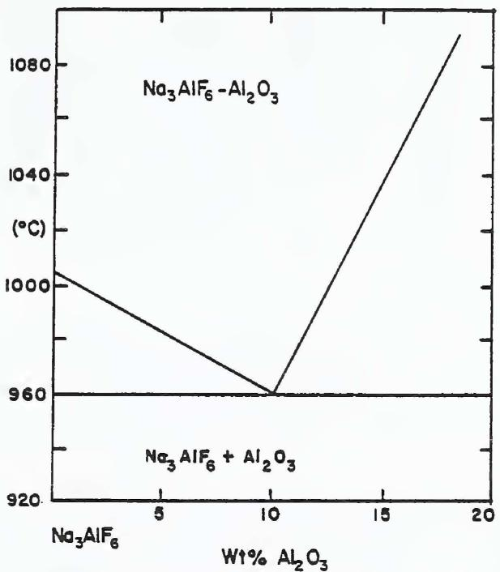  
Figure 139.1 $\mathrm{Na}_{3} \mathrm{AlF}_{6}-\mathrm{Al}_{2} \mathrm{O}_{3}$ phase diagram

References [1-28,30-33]

2. Density (p)

Measurement method: Archimedean technique [34]

Equation:

$$
\rho = a + b T \tag {139.1}
$$

precision: in table 139.1

uncertainty: $\sim \pm 2\%$

Table 139.1. Parameters of equation (139.1) and precisions   

<table><tr><td>\( \mathrm{{Mol}}\% {\mathrm{{Al}}}_{2}{\mathrm{O}}_{3} \)</td><td>a</td><td>-b x \( {10}^{4} \)</td><td>Precision</td><td>T range(K)</td></tr><tr><td>0</td><td>2.7334</td><td>6.098</td><td>✘</td><td>1270-1350</td></tr><tr><td>9.78</td><td>3.1832</td><td>8.806</td><td>✘</td><td>1280-1360</td></tr><tr><td>18.62</td><td>3.0733</td><td>8.100</td><td>✘</td><td>1250-1350</td></tr><tr><td>26.66</td><td>2.9505</td><td>7.206</td><td>✘</td><td>1270-1360</td></tr></table>

insufficient data for estimate.

$$
\mathrm {N a} _ {3} \mathrm {A l F} _ {6} - \mathrm {A l} _ {2} \mathrm {O} _ {3} \tag {139}
$$

Table 139.2. Density $(\mathrm{gcm}^{-3})$ from equations in table 139.1

<table><tr><td rowspan="2">T(K)</td><td colspan="4">Mo1 % Al2O3</td></tr><tr><td>0</td><td>9.78</td><td>18.62</td><td>26.66</td></tr><tr><td>1250</td><td></td><td></td><td>2.0608</td><td></td></tr><tr><td>1260</td><td></td><td></td><td>2.0527</td><td></td></tr><tr><td>1270</td><td>1.9589</td><td></td><td>2.0446</td><td>2.0353</td></tr><tr><td>1280</td><td>1.9528</td><td>2.0560</td><td>2.0365</td><td>2.0281</td></tr><tr><td>1290</td><td>1.9467</td><td>2.0472</td><td>2.0284</td><td>2.0209</td></tr><tr><td>1300</td><td>1.9406</td><td>2.0384</td><td>2.0203</td><td>2.0137</td></tr><tr><td>1310</td><td>1.9345</td><td>2.0296</td><td>2.0122</td><td>2.0065</td></tr><tr><td>1320</td><td>1.9284</td><td>2.0208</td><td>2.0041</td><td>1.9993</td></tr><tr><td>1330</td><td>1.9223</td><td>2.0120</td><td>1.9960</td><td>1.9921</td></tr><tr><td>1340</td><td>1.9162</td><td>2.0032</td><td>1.9879</td><td>1.9849</td></tr><tr><td>1350</td><td>1.9101</td><td>1.9944</td><td>1.9798</td><td>1.9776</td></tr><tr><td>1360</td><td></td><td>1.9855</td><td></td><td>1.9704</td></tr></table>

References [34-38]

3. Surface Tension (γ)

Measurement method: maximum bubble pressure [39]

Equation:

$$
\gamma = a + b T \tag {139.2}
$$

precision: in table 139.3

uncertainty: $\sim$ 5.0%

Table 139.3. Parameters of equation (139.2) and precision   

<table><tr><td>\( \mathrm{{Mol}}\% {\mathrm{{Al}}}_{2}{\mathrm{O}}_{3} \)</td><td>a</td><td>-b x \( {10}^{2} \)</td><td>Precision</td><td>T range(K)</td></tr><tr><td>9.78</td><td>257.8</td><td>9.9</td><td>*</td><td>1270-1350</td></tr><tr><td>18.62</td><td>272.8</td><td>11.5</td><td>*</td><td>1270-1350</td></tr><tr><td>26.66</td><td>298.3</td><td>13.0</td><td>*</td><td>1270-1350</td></tr></table>

\* not estimated; insufficient data

Table 139.4. Surface tension (dyn cm $^{-1}$ ) from equations in table 139.3   

<table><tr><td rowspan="2">T(K)</td><td colspan="3">Mo1 % Al2O3</td></tr><tr><td>9.78</td><td>18.62</td><td>26.66</td></tr><tr><td>1270</td><td>132.0</td><td>126.7</td><td>133.1</td></tr><tr><td>1280</td><td>131.0</td><td>125.5</td><td>131.8</td></tr><tr><td>1290</td><td>130.0</td><td>124.4</td><td>130.5</td></tr><tr><td>1300</td><td>129.0</td><td>123.2</td><td>129.2</td></tr><tr><td>1310</td><td>128.1</td><td>122.1</td><td>127.9</td></tr><tr><td>1320</td><td>127.1</td><td>120.9</td><td>126.6</td></tr><tr><td>1330</td><td>126.1</td><td>119.8</td><td>125.3</td></tr><tr><td>1340</td><td>125.1</td><td>118.6</td><td>124.0</td></tr><tr><td>1350</td><td>124.1</td><td>117.5</td><td>122.7</td></tr></table>

References [39]

$$
\mathrm {N a} _ {3} \mathrm {A l F} _ {6} - \mathrm {A l} _ {2} \mathrm {O} _ {3} \tag {139}
$$

# 4. Viscosity (n)

Measurement method: cited in table 139.5

precision: in table 139.6

uncertainty: in table 139.6

Table 139.5. Viscosity techniques, uncertainties, and systems   

<table><tr><td>Viscosity technique and recommended study</td><td>Uncertainty (in values of η)</td><td>Na3AlF6-Al2O3(mol % Al2O3)</td></tr><tr><td>oscillating cylinder [36] capillary [9]</td><td>~ ± 5% ~ ± 10%</td><td>2.10-6.568.25-30.0</td></tr></table>

Equation:

$$
\eta = a + b T + c T ^ {2} + d T ^ {3} \tag {139.3}
$$

Table 139.6. Parameters of equation (139.3), precisions and recommended study   

<table><tr><td>Al2O3(mol %)</td><td>a</td><td>b x 102</td><td>c x 106</td><td>d x 109</td><td>Precision</td><td>T range (K)</td></tr><tr><td>*2.10</td><td>29.469</td><td>-2.546</td><td>-3.146</td><td>5.084</td><td>0.01%</td><td>1260-1380</td></tr><tr><td>*4.3</td><td>34.586</td><td>-2.814</td><td>-6.754</td><td>7.226</td><td>0.27%</td><td>1250-1370</td></tr><tr><td>*6.6</td><td>22.929</td><td>2.301</td><td>-62.294</td><td>25.213</td><td>0.32%</td><td>1240-1370</td></tr><tr><td>8.25</td><td>50.91</td><td>-6.513</td><td>21.47</td><td></td><td>2.1747%</td><td>1280-1450</td></tr><tr><td>16.0</td><td>36.788</td><td>-4.344</td><td>13.25</td><td></td><td>1.9799%</td><td>1290-1460</td></tr><tr><td>24.0</td><td>44.972</td><td>-2.769</td><td>-20.47</td><td>13.275</td><td>2.6164%</td><td>1280-1460</td></tr><tr><td>30.00</td><td>95.998</td><td>-12.114</td><td>39.31</td><td></td><td>1.6516%</td><td>1280-1480</td></tr></table>

*These parameters are based on the work of Tørklep and Øye for the composition range: 2.10-6.6 mol % Al₂O₃ [36].   
The 8.25, 16.0, 24.0 and $30.0 \, \text{mol} \, \% \, \text{Al}_2\text{O}_3$ composition range is based on the work of Abramov et al. [9].

# (139) $\mathrm{Na}_{3} \mathrm{AlF}_{6} - \mathrm{Al}_{2} \mathrm{O}_{3}$

Table 139.7. Viscosity (cp) from equations in table 139.6   

<table><tr><td rowspan="2">T(K)</td><td colspan="7">Mol % Al2O3</td></tr><tr><td>2.1*</td><td>4.3*</td><td>6.6*</td><td>8.25</td><td>16.0</td><td>24.0</td><td>30.0</td></tr><tr><td>1240</td><td></td><td></td><td>3.750</td><td></td><td></td><td></td><td></td></tr><tr><td>1250</td><td></td><td>2.975</td><td>3.601</td><td></td><td></td><td></td><td></td></tr><tr><td>1280</td><td>2.390</td><td>2.659</td><td>3.195</td><td>2.709</td><td></td><td>3.823</td><td></td></tr><tr><td>1300</td><td>2.226</td><td>2.469</td><td>2.958</td><td>2.514</td><td>2.704</td><td>3.538</td><td>4.940</td></tr><tr><td>1320</td><td>2.076</td><td>2.297</td><td>2.750</td><td>2.337</td><td>2.529</td><td>3.279</td><td>4.577</td></tr><tr><td>1340</td><td>1.939</td><td>2.141</td><td>2.572</td><td>2.177</td><td>2.365</td><td>3.045</td><td>4.245</td></tr><tr><td>1360</td><td>1.816</td><td>2.004</td><td>2.426</td><td>2.033</td><td>2.212</td><td>2.837</td><td>3.945</td></tr><tr><td>1380</td><td>1.707</td><td></td><td></td><td>1.907</td><td>2.069</td><td>2.656</td><td>3.676</td></tr><tr><td>1400</td><td></td><td></td><td></td><td>1.799</td><td>1.937</td><td>2.503</td><td>3.438</td></tr><tr><td>1420</td><td></td><td></td><td></td><td>1.707</td><td>1.815</td><td>2.378</td><td>3.233</td></tr><tr><td>1440</td><td></td><td></td><td></td><td>1.632</td><td>1.704</td><td>2.282</td><td>3.058</td></tr><tr><td>1460</td><td></td><td></td><td></td><td></td><td>1.604</td><td>2.215</td><td>2.915</td></tr><tr><td>1480</td><td></td><td></td><td></td><td></td><td></td><td></td><td>2.803</td></tr></table>

*These values correspond to wt % values of 4, 8, and 12 as reported by Tørklep and Øye. [36].

References [9,36,37]

5. Electrical Conductance (K)

Measurement method: in table 139.8

Equations:

$$
\begin{array}{l} (\text {c o n d u c t a n c e - t e m p e r a t u r e d e p e n d e n c e}) (34) \\ \kappa = a + b T + c T ^ {2} (139.4) \\ \end{array}
$$

$$
\text {(c o n d u c t a n c e - c o m p o s i t i o n i s o t h e r m)} \tag {35}
$$

$$
\kappa = a ^ {\prime} + b ^ {\prime} C + c ^ {\prime} C ^ {2} \tag {139.5}
$$

$$
(C = \text {mol} \% \text {Al} _ {2} \text {O} _ {3})
$$

precision: in table 139.9

uncertainty: in table 139.8

Table 139.8. Conductance studies, techniques, systems, and uncertainties   

<table><tr><td>Studies</td><td>Conductance Technique</td><td>Na3AlF6-Al2O3(mol % Al2O3)</td><td>T range (K)</td><td>Uncertainty (in conductance values)</td></tr><tr><td>[34]</td><td>classical ac</td><td>0 - 17%</td><td>1270-1350</td><td>~ ± 3%</td></tr><tr><td>[35]</td><td>classical ac</td><td>0 - 26%</td><td>1273</td><td>~ ± 3%</td></tr><tr><td>[40]</td><td>classical ac</td><td>0 - 26%</td><td>1230-1320</td><td>~ ± 25%</td></tr><tr><td>[5]</td><td>classical ac</td><td>0 - 20%</td><td>1170-1310</td><td>~ ± 20%</td></tr></table>

Footnote: The underscored studies are the recommended data sets

$$
\mathrm {N a} _ {3} \mathrm {A l F} _ {6} - \mathrm {A l} _ {2} \mathrm {O} _ {3} \tag {139}
$$

Table 139.9. Parameters of equation (139.4) and precisions   

<table><tr><td>Mol % Al2O3</td><td>-a</td><td>b x 10^3</td><td>c x 10^6</td><td>Precision</td><td>T range(K)</td></tr><tr><td>0.0</td><td>0.0386</td><td>2.0206</td><td>0.1670</td><td>0.07%</td><td>1280-1350</td></tr><tr><td>9.7</td><td>0.1215</td><td>2.100</td><td>-</td><td>0.66%</td><td>1270-1350</td></tr><tr><td>17.2</td><td>0.2027</td><td>1.987</td><td>-</td><td>0.60%</td><td>1270-1350</td></tr></table>

Table 139.10. Parameters of equation (139.5) and precisions   

<table><tr><td>T(K)</td><td>a&#x27;</td><td>b&#x27; x 10^2</td><td>c&#x27; x 10^4</td><td>Precision</td></tr><tr><td>1273</td><td>2.8626</td><td>-3.308</td><td>2.632</td><td>*</td></tr></table>

*insufficient data for estimate

Table 139.11. Specific conductance $(ohm^{-1}cm^{-1})$ from equations in table 139.9   

<table><tr><td rowspan="2">T(K)</td><td colspan="3">\( Mol\ \% \ A1_{2}O_{3} \)</td></tr><tr><td>0.0</td><td>9.7</td><td>17.2</td></tr><tr><td>1270</td><td></td><td>2.545</td><td>2.322</td></tr><tr><td>1280</td><td>2.821</td><td>2.566</td><td>2.341</td></tr><tr><td>1290</td><td>2.846</td><td>2.587</td><td>2.361</td></tr><tr><td>1300</td><td>2.870</td><td>2.608</td><td>2.381</td></tr><tr><td>1310</td><td>2.895</td><td>2.629</td><td>2.401</td></tr><tr><td>1320</td><td>2.920</td><td>2.650</td><td>2.421</td></tr><tr><td>1330</td><td>2.944</td><td>2.671</td><td>2.441</td></tr><tr><td>1340</td><td>2.969</td><td>2.692</td><td>2.461</td></tr><tr><td>1350</td><td>2.994</td><td>2.713</td><td>2.481</td></tr></table>

Table 139.12. Specific conductance at 1373K from equation (139.5)   

<table><tr><td>Mol % Al2O3</td><td>K
(ohm-1 cm-1)</td><td>Mol % Al2O3</td><td>K
(ohm-1 cm-1)</td></tr><tr><td>0</td><td>2.86</td><td>14</td><td>2.45</td></tr><tr><td>2</td><td>2.80</td><td>16</td><td>2.40</td></tr><tr><td>4</td><td>2.73</td><td>18</td><td>2.35</td></tr><tr><td>6</td><td>2.67</td><td>20</td><td>2.31</td></tr><tr><td>8</td><td>2.61</td><td>22</td><td>2.22</td></tr><tr><td>10</td><td>2.56</td><td>24</td><td>2.22</td></tr><tr><td>12</td><td>2.50</td><td>26</td><td>2.18</td></tr></table>

References [5,34,35,40]

# 6. Safety and Hazards

# A. Hazard rating

(i) Toxicity: inorganic fluorides are generally irritants and toxic; alumina is classed as a nuisance particulate.   
(ii) Vapor pressure: no information on this system; Na₃AlF₆ at its m.pt. (1000°C), << 0.5mm.

# B. Disaster hazards

(i) Molten salt bath "explosions": i.e. explosive generation of steam due to bulk water "carry-over" and/or equipment failure; i.e., explosive expansion of "trapped" air.   
(ii) Fluorides, when heated to decomposition, or contacted with acids, emit highly toxic fumes.

References [41-46].

# 7. Corrosion

Table 139.13. Corrosion studies from primary research literature   

<table><tr><td colspan="2">Studies</td><td>References</td></tr><tr><td>A</td><td>CrNi-Cr-Mo alloys (INOR-8; Hastelloys B, W, and N)SSNI-12PQuartzAlVarious metals</td><td>[47][48,49][50][51][52][53]</td></tr><tr><td>B</td><td>PtBoron nitride, carbon, InconelFused MgO</td><td>[54-58][59-61][62]</td></tr><tr><td>C</td><td>Impurities in electrolyteGraphiteTiC, TiB2, CrB2, ZrN, NbB2</td><td>[63,64][63,64][65-67]</td></tr><tr><td>D</td><td>Corrosion studies in molten salts with NaF as one component (e.g., Cl, CO3,...)Electrochemical behavior of oxides and related species in molten fluoridesElectroanalytical studies in molten fluoridesAnnotated corrosion biblio.Corrosion: molten fluorides (survey)</td><td>[68-83,90,91][84-86][87][88][89]</td></tr></table>

cont'd

# (139) $\mathrm{Na}_{3} \mathrm{AlF}_{6} - \mathrm{Al}_{2} \mathrm{O}_{3}$

footnote to Table 139.13

A: studies principally in molten NaF, KF, and LiF;  
B: used largely in fluorides physical properties measurements; C: technological aspects, in aluminum reduction cells; D: more general studies, basic principles, and surveys

References [47-91]

8. Diffusion

Measurement method: cited in tabulations Diffusing species investigated in $\mathrm{Na}_{3}\mathrm{AlF}_{6} - \mathrm{Al}_{2}\mathrm{O}_{3}$ as solvent Na+; F-; Al $_{2}\mathrm{O}_{3}$ ; dissolved Al metal

Equation:

$$
D = A \exp [ - E / R T ] \tag {139.6}
$$

precision: in table 139.15

uncertainty: in table 139.14

Table 139.14. Diffusion techniques, uncertainties, and species   

<table><tr><td>Diffusion technique of recommended study</td><td>Uncertainty (in value of D)</td><td>Species</td></tr><tr><td>capillary</td><td>~±10%</td><td>22Na+and 78F-containing species</td></tr><tr><td>chronopotentiometry</td><td>~±15%</td><td>Al2O3(diffusion coefficient of oxygen containing ions); Al metal (diffusion coefficient of fluoride containing ions)</td></tr><tr><td>voltammetry</td><td>~±20%</td><td>CO2</td></tr></table>

# (139) $\mathrm{Na}_{3} \mathrm{AlF}_{6} - \mathrm{Al}_{2} \mathrm{O}_{3}$

Table 139.15. Parameters of diffusion equation (139.6), precisions and recommended studies   

<table><tr><td>Species</td><td>A (cm2s-1)</td><td>E (cal mol-1)</td><td>Temp. range (K)</td><td>Precision</td><td>Recommended study</td></tr><tr><td colspan="4">(a) Na3AlF6-Al2O3(2.5 wt % Al2O3)</td><td></td><td></td></tr><tr><td>Al2O3</td><td>3.111x10-3</td><td>12,940</td><td>1273-1323</td><td>*</td><td>[94]</td></tr><tr><td colspan="4">(b) Na3AlF6-Al2O3</td><td></td><td></td></tr><tr><td>Al2O3</td><td>2.665</td><td>30,850</td><td>1273-1323</td><td>*</td><td>[94]</td></tr><tr><td colspan="4">(c) Na3AlF6-Al2O3</td><td></td><td></td></tr><tr><td>Al2O3</td><td>922.9</td><td>46,400</td><td>1253-1323</td><td>*</td><td>[94]</td></tr><tr><td colspan="4">(d) Na3AlF6-Al2O3(10 wt % Al2O3)</td><td></td><td></td></tr><tr><td>Al2O3</td><td>3.541x108</td><td>80,160</td><td>1253-1323</td><td>*</td><td>[94]</td></tr><tr><td colspan="4">(e) Na3AlF6-Al2O3(12.5 wt % Al2O3)</td><td></td><td></td></tr><tr><td>Al2O3</td><td>9.893 x 105</td><td>65,220</td><td>1273-1323</td><td>*</td><td>[94]</td></tr></table>

*:--equations derived from digitized graphical results; insufficient data for estimates of precision of measurements.

Table 139.16. Diffusion coefficients, D x $10^{5}$ (cm $^{2}$ s $^{-1}$ ) from equation in table 139.15   

<table><tr><td rowspan="2">T(K)</td><td colspan="5">D x 105(cm2s-1)</td></tr><tr><td>2.5 wt % Al2O3</td><td>5 wt % Al2O3</td><td>7.5 wt % Al2O3</td><td>10 wt % Al2O3</td><td>12.5 wt % Al2O3</td></tr><tr><td>1250</td><td></td><td></td><td>0.71</td><td>0.34</td><td></td></tr><tr><td>1260</td><td></td><td></td><td>0.83</td><td>0.44</td><td></td></tr><tr><td>1270</td><td>1.85</td><td>1.31</td><td>0.96</td><td>0.57</td><td>0.59</td></tr><tr><td>1280</td><td>1.92</td><td>1.44</td><td>1.10</td><td>0.73</td><td>0.72</td></tr><tr><td>1290</td><td>2.00</td><td>1.58</td><td>1.27</td><td>0.93</td><td>0.88</td></tr><tr><td>1300</td><td>2.08</td><td>1.74</td><td>1.46</td><td>1.18</td><td>1.07</td></tr><tr><td>1310</td><td>2.16</td><td>1.90</td><td>1.68</td><td>1.50</td><td>1.30</td></tr><tr><td>1320</td><td>2.24</td><td>2.08</td><td>1.92</td><td>1.89</td><td>1.57</td></tr></table>

Thonstad [95] reported a value of $1.5 \times 10^{-5} \, \text{cm}^2 \, \text{s}^{-1}$ for $\mathsf{D}_{\mathsf{Al}_2\mathsf{O}_3}$ at $1293\text{K}$ , and the diffusion coefficient was constant (within limits of experimental error ( $\pm 15\%$ ) over the investigated concentration range (0.25-12 wt% $\mathsf{Al}_2\mathsf{O}_3$ ). At $1353\text{K}$ , Shurygin et al. [96,100] reported a value of $1.33 \times 10^{-5} \, \text{cm}^2 \, \text{s}^{-1}$ for $\mathsf{D}_{\mathsf{Al}_2\mathsf{O}_3}$ .

# (139) $\mathrm{Na}_{3} \mathrm{AlF}_{6} - \mathrm{Al}_{2} \mathrm{O}_{3}$

Table 139.17. Diffusion coefficients for species not included in tables 139.15 and 139.16   

<table><tr><td>Species</td><td>Melt composition (wt % Al2O3)</td><td>T (K)</td><td>D x 105(cm2 s-1)</td><td>Recommended study</td></tr><tr><td>Na+</td><td>14</td><td>1318</td><td>7.50</td><td>[93]</td></tr><tr><td>Na+</td><td>14</td><td></td><td></td><td></td></tr><tr><td>Na+</td><td>12.9</td><td>1326</td><td>7.73</td><td>[93]</td></tr><tr><td>F-</td><td>12.9</td><td>1326</td><td>3.81</td><td>[93]</td></tr><tr><td>Na+</td><td>12.0</td><td>1327</td><td>8.09</td><td>[93]</td></tr><tr><td>Al</td><td>3.2</td><td>1270-1345</td><td>‡</td><td>[92]</td></tr><tr><td>CO2</td><td>sat&#x27;d, i.e. ~12-13.5</td><td>1273</td><td>0.005*</td><td>[97,98]</td></tr></table>

$\ddagger$ : for dissolved Al, the diffusing species probably are sub-fluorides containing ions; the values of D in this study appear unusually high, i.e. $\sim 10^{-4} \mathrm{~cm}^2 \mathrm{~s}^{-1}$ (by a factor of 10),   
*: this value is based on a $\mathrm{CO}_{2}$ solubility of 3.32 x $10^{-6} \, \mathrm{mol} \, \mathrm{cm}^{-3}$ [29]; with the earlier (less reliable) $\mathrm{CO}_{2}$ solubility (0.8 x $10^{-7} \, \mathrm{mol} \, \mathrm{cm}^{-3}$ [31]), $\mathrm{D}_{\mathrm{CO}_{2}}$ is $\sim 12 \times 10^{-5} \, \mathrm{cm}^{2} \, \mathrm{s}^{-1}$ .

References: $\mathrm{Na}^{+}$ , 93; $\mathrm{F}^{-}$ , 93; Al, 92; $\mathrm{Al}_{2}\mathrm{O}_{3}$ , 94-96, 99; $\mathrm{CO}_{2}$ , 97, 98; 100.

9. Heat of Fusion $(\Delta H_{f}^{\circ})$ No data   
10. Heat Capacity $(C_p)$ No data   
11. Volume Change on Melting $(\Delta V_{f})$ No data   
12. Vapor Pressure $(p_{vap})$ Measurement method: boiling point technique [101] Equation:

$$
\log p = A + B / T \tag {139.7}
$$

precision: in table 139.18 uncertainty:

Table 139.18. Parameters of equation (139.7) and precisions   

<table><tr><td>Mol % Al2O3</td><td>A</td><td>-B</td><td>Precision</td><td>T range(K)</td></tr><tr><td>5.0</td><td>8.817</td><td>10620</td><td>*</td><td>1370-1430</td></tr><tr><td>9.8</td><td>8.712</td><td>10513</td><td>*</td><td>1380-1430</td></tr><tr><td>14.3</td><td>8.773</td><td>10640</td><td>*</td><td>1385-1430</td></tr><tr><td>18.6</td><td>8.708</td><td>10575</td><td>*</td><td>1380-1440</td></tr><tr><td>34.0</td><td>8.794</td><td>10847</td><td>*</td><td>1400-1465</td></tr></table>

\* not estimated; results presented in equation form only

(139) $\mathrm{Na}_{3} \mathrm{AlF}_{6} - \mathrm{Al}_{2} \mathrm{O}_{3}$   
Table 139.19. Vapor pressure (mm) from equations in table (139.18)   

<table><tr><td rowspan="2">T(K)</td><td colspan="5">\( Mol\ \%\ A1_2O_3 \)</td></tr><tr><td>5.0</td><td>9.8</td><td>14.3</td><td>18.6</td><td>34.0</td></tr><tr><td>1370</td><td>11.6</td><td></td><td></td><td></td><td></td></tr><tr><td>1380</td><td>13.2</td><td>12.4</td><td></td><td>11.1</td><td></td></tr><tr><td>1390</td><td>15.0</td><td>14.1</td><td>13.1</td><td>12.6</td><td></td></tr><tr><td>1400</td><td>17.0</td><td>15.9</td><td>14.9</td><td>14.3</td><td>11.1</td></tr><tr><td>1410</td><td>19.3</td><td>18.0</td><td>16.9</td><td>16.1</td><td>12.6</td></tr><tr><td>1420</td><td>21.8</td><td>20.3</td><td>19.1</td><td>18.2</td><td>14.3</td></tr><tr><td>1430</td><td>24.6</td><td>22.9</td><td>21.5</td><td>20.6</td><td>16.2</td></tr><tr><td>1440</td><td></td><td></td><td></td><td>23.1</td><td>18.3</td></tr><tr><td>1450</td><td></td><td></td><td></td><td></td><td>20.6</td></tr><tr><td>1460</td><td></td><td></td><td></td><td></td><td>23.2</td></tr></table>

References [101]

13. Thermal Conductivity (liquid) $(\lambda_{\ell})$ No data   
14. Thermal Conductivity (solid) $(\lambda_{s})$ No data   
15. Cryoscopic Constant $(k_{f})$ No data   
16. References

[1] Foster, P. A., Jr., J. Am. Ceram. Soc., 43, 66 (1960).   
[2] Phillips, N. W. F., Singleton, R. H., and Hollingshead, E. A., J. Electrochem. Soc., 102[12], 691 (1955).   
[3] Foster, P. A., Jr., J. Am. Ceram. Soc., 45[4], 148 (1962).   
[4] Edwards, J. D., J. Electrochem. Soc., 100, 508 (1953).   
[5] Arndt, K., Kalass, Z., Z. Elektrochem., 30, 12 (1924).   
[6] Brynestad, J., Discussions Faraday Soc., 32, 90 (1961).   
[7] Chin, D. A., Hollingshead, E. A., J. Electrochem. Soc., 113, 736 (1966).   
[8] Fuseya, G., Sugihara, C., Nagao, N. and Teraska, J., J. Electrochem. Soc., Japan. 18, 65 (1950)   
[9] Abramov, G. A., Vetyukov, M. M., Gupalo, I. P., Kostyukov, A. A. and Lozhkin, L. N., "Teoreticheskie osnovy elektrometallurghii alyuminiya (Theoretical Principles of the Electrometallurgy of Aluminum)", Metallurgizdat, Moscow, 1953.   
[10] Fenerty, A. and Hollingshead, E. A., J. Electrochem. Soc., 107, 993 (1960).

(139) $\mathrm{Na}_{3} \mathrm{AlF}_{6}-\mathrm{Al}_{2} \mathrm{O}_{3}$   
[11] Mashovets, V. P. and Petrov, V. I., Zh. Prikl. Khim., 30, 1695 (1957); J. Appl. Chem. USSR, 30, 1785 (1957).   
[12] Vatslavik, E. and Belyaev, A. I., Zh. Neorg. Khim., 3, 1044 (1958).   
[13] Foster, P. A., J. Am. Ceram. Soc., 53(11), 598 (1970).   
[14] Matiasovsky, K., and Malinovsky, M., Chem. Zvesti, 14, 551 (1960).   
[15] Rolin, M., Bull. Soc. Chim., France, 1201 (1960).   
[16] Brynestad, J., Grjothim, K., Grønvold, F., Holm, J. L. and Urnes, S., 32, 90 (1962).   
[17] Kleber, W., and Fehling, W., Z. anorg. allgm. Chem., 338, 134 (1965).   
[18] Holm, J. L., Tidsskr. Kjemi, Bergv., Met. 10, 165 (1966).   
[19] Grjothiem, K., Krohn, C., Malinovsky, M., Matiasovsky, K., Thonstad, J., "Aluminium Electrolyses", Aluminium-Verlag GmbH.-Dusseldorf (1977).   
[20] Janz, G. J. Downey, J. R., Jr., Allen, C. B., and Tomkins, R. P. T., "Eutectic Data" - 2 Vols; ERDA-TID-27163-P1 & P2; NTIS, Washington, D. C. (1977).   
[21] Janz, G. J., Downey, J. R., Jr., Allen, C. B., and Tomkins, R. P. T., "Physical Properties Data Complications Relevant to Energy Storage. I. Molten Salts: Eutectic Data", NSRDS-NBS-61; U. S. Gov't Printing Office, Washington, D. C. (1978).   
[22] "International Critical Tables of Numerical Data, Physics, Chemistry, and Technology", 8 Vols., McGraw-Hill Book Co., N. Y. (1933).   
[23] "Landolt-Bornstein Zahlenwert und Funktionen aus Physik, Chemie, Astronomie, Geophysik und Technik", (10th Ed.) Springer-Verlag, Berlin, Heidelberg, N. Y. (1961).   
[24] Clark, P. V., "Fused Salt Mixtures: Eutectic Compositions and Melting Points Bibliography 1907-1968", Report No. SC-R-68-1680; Sandia Laboratories (1968), NTIS.   
[25] Robertson, W. D., "Binary Phase Diagrams of Halide Salts", Report No. Yale 2723 (2 Vols.), U. S. AEC Contract AT (30-1)-2723 (1966), NTIS.   
[26] Thoma, R. E., "Phase Diagrams of Nuclear Reactor Materials", Oak Ridge National Laboratory, ORNL-2548, Contract No. W-7405-eng-26.   
[27] Thoma, R. E., "Phase Diagrams of Binary and Ternary Fluoride Systems", Chapt. 6; Adv. Molten Salts Chemistry, Vol. 3 (J. Braunstein, G. Mamantov, and G. P. Smith, eds.), Plenum Press, N. Y. (1975).   
[28] Voskresenskaya, N. K., ed., "Handbook of Solid-Liquid Equilibria in Systems of Inorganic Salts", Volumes 1, 2, Izc. Akad. Nauk SSSR, Moscow (1961). Israel Program for Scientific Translations, Jerusalem, 1970 (NTIS).   
[29] Bratland, D., Grjothiem, K., Khron, C., and Motzfeld, K., J. Metals, October; 13 (1967).   
[30] Shaffer, P. T. B., "High Temperature Materials", Plenum Press Handbooks of High Temperature Materials, No. 1, Materials Index, Plenum Press, New York, 1964.   
[31] Haupin, W. E., J. Electrochem. Soc., 107, 232 (1960).

(139) $\mathrm{Na}_{3} \mathrm{AlF}_{6} - \mathrm{Al}_{2} \mathrm{O}_{3}$   
[32] Toropov, N. A. et al., "Handbook of Phase Diagrams of the Silicates, Volume 1: Binary Systems, Volume 2, Metal-Oxygen Compounds in Silicate Systems", Izdatel'stov "Nauka" Leningradskoe Otdelenie, Leningrad, 1969, Israel Program for Scientific Translations, Jerusalem, 1972 (NTIS).   
[33] Levin, E., et al., "Phase Diagrams for Ceramists", Amer. Ceramic Soc. (publ.), Columbus, Ohio (1964; 1969).   
[34] Edwards, J. D., Taylor, C. S., Cosgrove, L. A., and Russell, A. S., J. Electrochem. Soc., 100, 508 (1953).   
[35] Matiasovsky, K., and Malinovsky, M., Electrochimica Acta, 11, 1035 (1966).   
[36] Tørklep, K. and Øye, H. A., Electrochim. Acta, 25, in press (1980).   
[37] Nishihara, K., Matsumura, Y., Komatsu, K., and Nogouchi, H., Suiyokai-Shi, 15, 311 (1964).   
[38] Abramov, G. A., Vetyukov, M. M., Gupalo, I. P., Kostyokov, A. A. and Lozhkin, L. N., Theoretical Basis of Electrometallurgy of Aluminum (1953).   
[39] Bloom, H., and Burrows, B. W., Proceedings of the First Australian Electrochemistry Conf. 882 1963.   
[40] Batashev, K. P., Legkie Metally, 5, 48 (1936).   
[41] "Dangerous Properties of Materials", Sax, N. I., Van Nostrand Reinhold Co., N. Y. (1969).   
[42] "Registry of Toxic Effects of Chemical Substances", Christensen, H. E., and Lubinbyhl, T. T., eds., U. S. Dept. H. E. W., U. S. Gov't Printing Office, Washington, D. C. (1975).   
[43] vide: this work, System 100, $\mathrm{Na}_{3}\mathrm{AlF}_{6}$ .   
[44] "Potential Hazards in Molten Salt Baths for Heat Treatment of Metals", National Board Fire Underwriters Research Report No. 2 (1954).   
[45] "Handbook of Reactive Chemical Hazards", Bretherwick, L., Butterworths Co., London (1975).   
[46] Janz, G. J., Tomkins, R. P. T., Downey, J. R., Jr., and Allen, C. B., "Safety and Hazards, Chapter in "Eutectic Data", ERDA TID-27163-P1; NTIS, U. S. Dept. Commerce, Springfield, Va. (1977).   
[47] Brasunas, A., Metal Prog., 62, 88 (1952).   
[48] Bettes, E. S., Nucl. Sci. Eng., 2, 804 (1957).   
[49] Hoffman, E. E., Patriarca, P., Leitten, C. F., Jr., and Slaughter, G. M., ORNL-1934, Oak Ridge Natl. Lab., (1956).   
[50] Oak Ridge National Laboratory, "The Development Status of Molten Salt Breeder Reactors", Rpt. ORNL-4812-UC-80; NTIS, U. S. Dept. Commerce, Springfield, Va., (Aug. 1972).   
[51] Heimann, R., Glastech. Ber., 43, 83 (1970).   
[52] Lukashenko, E. E., and Reutova, G. A., Nov. Teor. Tekhnol. Metall. Protsessov., 119 (1973).   
[53] Koger, J. W., Corrosion, 30, 125 (1974).

(139) $\mathrm{Na}_{3} \mathrm{AlF}_{6}-\mathrm{Al}_{2} \mathrm{O}_{3}$   
[54] Edwards, J. D., Taylor, C. S., Russell, A. S., and Maranville, L. F., ibid., 99, 527 (1952).   
[55] Landon, G. J., and Ubbelohde, A. R., Proc. Royal Soc., A240, 160 (1957).   
[56] Winterhager, H. and Werner, L., Forschungsber. des Witschafts-u. Verkehrsrministeriums Nordrhein-Westfalen, No. 438, 1957.   
[57] Winterhager, H. and Werner, L., Forschungsber. des Witschafts-u. Verkehrsrministeriums Nordrhein-Westfalen, No. 341, 1956.   
[58] Bajcsy, J., Malinovsky, M., and Matiasovsky, K., Electrochim. Acta, 7, 543 (1962).   
[59] Yim, E. W. and Feinleib, M., J. Electrochem. Soc., 104, 622 (1957).   
[60] Yim, E. W. and Feinleib, M., J. Electrochem. Soc., 104, 626 (1957).   
[61] Brown, E. A. and Porter, B., "U. S. Department of Interior, Bureau of Mines", 128.23:6500 (1964).   
[62] Cuthbertson, J.W. and Waddington, J., Trans Faraday Soc., 32, 745 (1936).   
[63] Grjothiem, K., Krohn, C., Malinovsky, M., Matiasovsky, K., and Thonstad, J., "Aluminum Electrolyses", Chapt. 10; Aluminum-Verlag, G.mbH; Dusseldorf (1977).   
[64] Brun, J., Tunold, R., Vatland, A., 30th ISE Meeting, Extended Abstracts, pp. 118-119; Trondheim, Norway (Aug. 1979); NTH, Dept. Ind. Electrochem., Trondheim, Norway.   
[65] Holliday, R. D., (Olin Mathieson Chemical Corp.), U. S. 3,661,736, May 9, 1972.   
[66] Thompson, R.: (Borax Consolidated Ltd.), Ger. Offen. 2,305,281, Aug. 9, 1973.   
[67] Kugler, T. and Rieger, H. W.: (Swiss Aluminium Ltd.), Ger. Offen. 2,312,439, Oct. 4, 1973.   
[68] Khan, I. A., Ber. Kernforschungsanlage Juelich, Juel-608-RW, (1969).   
[69] Khan, I. A., Inst. Reaktorwerkst., Kernforschungsanlage, Juel-718-RW (1970).   
[70] Bowles, P. J., and Newdick, P. C., Electroplating and Metal Finishing, 24, 6 (1971).   
[71] DeVan, J. H., "Examinations of Pump Impellers from Sodium and Fused Salt Pump Endurance Tests", ORNL CF-61-4-77, Oak Ridge National Lab., (1961).   
[72] Adamson, G. M., Manly, W. D., and Crouse, S. R., "Corrosion by Molten Fluorides", ANP Materials Meeting ORNL-2685, (1958).   
[73] Huntley, W. R., and Gnadt, P. A., Oak Ridge Nat'l Lab., Report ORNL-TM-3863. (1973); Nucl. Sci. Abstr., 27, 12446 (1973).   
[74] Gill, C. B., Straumanis, M. E., and Schlechten, W. B., J. Electrochem. Soc., 102, 42 (1955).   
[75] Litman, A. P., "Corrosion of Volatility Pilot Plant Mark I INOR-S Hydrofluorinator and Mark III. Nickel Fluorinator after Fourteen Dissolution Runs", ORNL-3253, Oak Ridge Nat'l Lab., (1962).   
[76] Litman, A. P., and Goldman, A. E., "Corrosion Associated with Fluoridation in the Oak Ridge Nat'l Lab., Fluoride Volatility Process", ORNL-2832, Oak Ridge Nat'l Lab. (1961).

(139) $\mathrm{Na}_{3} \mathrm{AlF}_{6} - \mathrm{Al}_{2} \mathrm{O}_{3}$   
[77] Manly, W. D., Coobs, J. H., Devan, J. H., Douglas D. A., Inouye, H., Patriarca, P., Roche, T. K., and Scott, J. L., "Metallurgical Problems in Molten Fluoride Systems", Proc. 2nd U. N. Inter. Conf. Peaceful Uses of At. Energy, 7, 223 (1958).   
[78] Oak Ridge Nat'l Lab., Molten Salt Reactor Program Semiannual Progress Report for Period Ending July 31, 1964, ORNL-3708, (1964).   
[79] Vreeland, D. C., Hoffman, E. E., and Manly, W. D., Nucleonics, 11, 36 (1953).   
[80] Grimes, W. R., and Cuneo, D. R., "Molten Salts as Reactor Fuels", Reactor Handbook 2nd ed., 1, 425 (1955).   
[81] Shimotake, H., and Hesson, J. C., Adv. Chem. Series, No. 64, 149 (1967).   
[82] Boser, O., "Study of Safety Aspects of High Temperature Thermal Energy Storage Systems", ERDA Thermal Energy Storage Information Exchange Mtg., Cleveland, NSF-AER 75-20605 (Sept. 1976).   
[83] Venkatasetty, H. V., "Thermodynamic Properties and Corrosion Characteristics of Thermal Energy Storage Eutectic Mixtures", paper presented at 152nd Meeting of the Electrochemical Society, Atlanta, Ga., (October, 1977).   
[84] Mathews, A. L., and Baes, C. F., Inorg. Chem., 7, 373 (1968).   
[85] Manning, D. L. and Mamantov, G., J. Electrochem. Soc., 124, 480 (1977).   
[86] Ting, G., Baes, C. F., Bamberger, C. E., and Mamantov, G., J. Inorg. Nucl. Chem., 39, 1803 (1977).   
[87] Manning, D. L., and Mamantov, G., J. Electroanal. Chem., (in press) (1978)   
[88] Janz, G. J., and Tomkins, R. P. T., Corrosion, 35(11) 485 (1979).   
[89] Eichelberger, J. L., (Penwalt Corp.) "Investigations of Metal Fluoride Thermal Energy Storage Materials: Availability, Cost, Chemistry" ERDA Rpt CO02990-6; NTIS, U. S. Dept. Commerce, Springfield, Va., (Dec. 1976).   
[90] Kochergen, V. P., and Ignat'eva, N. I., Russ. J. Inorg. Chem., 6(9), 1086 (1961).   
[91] Ozeryanaya, I. N., Volodin, V. P., and Smirnov, M. V., Zashchita Metalov (USSR), 2, 230 (1969).   
[92] Vetyukov, M. M. and Dyblin, B. S., Sov. Electrochem. 11, 470 (1975).   
[93] Lantelme, F. and Chemla, M., C. R. Acad. Sci. Paris, Ser C, 267, 281 (1968).   
[94] Desclaux, P. and Rolin, M., Rev. Int. Hautes Temp. Refract. 8, 227 (1971).   
[95] Thonstad, J., Electrochim. Acta 14, 127 (1969)   
[96] Shurygin, P. M., Barmin, L. M. and Boronenkov, V. N., Izv. Vyssh. Ucheb. Zaved., Tsvet. Met., 5(4), 106 (1962).   
[97] Vetyukov, M. M. and Akgva, F., Elektrokhimiya SSSR 7, 557 (1971).   
[98] Vetyukov, M. M. and Akgva, F., Elektrokhimiya SSSR 6, 1886 (1970).   
[99] Rey, M., Internal Report (1966); cited in [3] above.   
[100] Shurygin, P. M., Barmin, L. M., and Boronenkov, V. N., Izvet. Vyssh. Ucheb. Zaved. Tsvet. Met. 5(3) 59 (1962).   
[101] Kvande, H., Electrochim. Acta 25(2), 237 (1980).

1. Melting Temperature $(T_{m})$

Pure substance melting points:

$\mathrm{K}_{3} \mathrm{AlF}_{6}$ : $990^{\circ} \mathrm{C}$

A1203: 2040°C

Eutectic melting point:

837°C, composition: 55 mol % K₃AlF₆

75.6 wt % K₃AlF₆

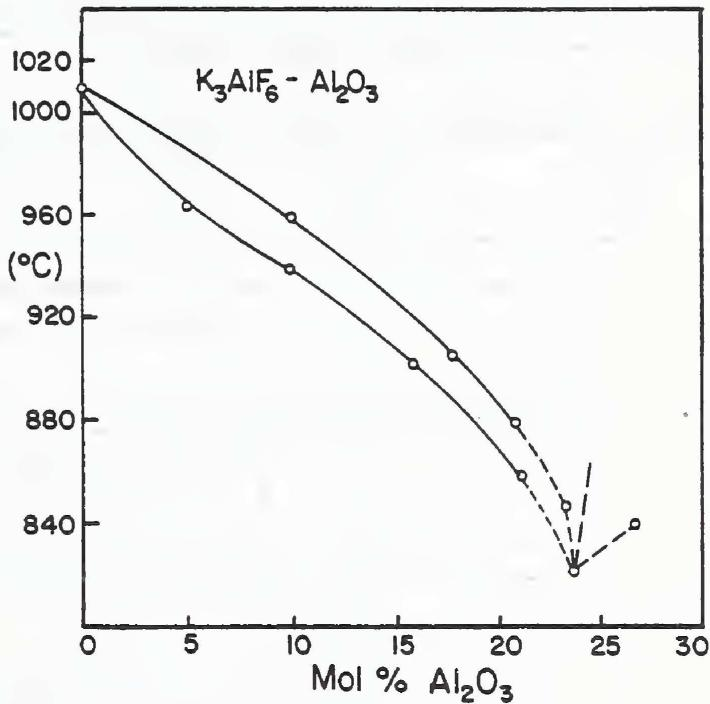  
Figure 140.1. $\mathrm{K}_{3} \mathrm{AlF}_{6}-\mathrm{Al}_{2} \mathrm{O}_{3}$ phase diagram

References [1-16]

2. Density (ρ)

No data

3. Surface Tension (Y)

Mo data

4. Viscosity (n)

No data

$$
\mathrm {K} _ {3} \mathrm {A l F} _ {6} - \mathrm {A l} _ {2} \mathrm {O} _ {3} \tag {140}
$$

# 5. Electrical Conductance (K)

Measurement method: classical ac technique [2]

Equation:

$$
\kappa = a + b T + c T ^ {2} + d T ^ {3} \tag {140.1}
$$

precision: in table 140.1 uncertainty: $\sim \pm 30\%$

Table 140.1. Parameters of equation (140.1) and precisions   
Table 140.2. Specific conductance (ohm $^{-1}$ cm $^{-1}$ ) from equations in table 140.1   

<table><tr><td>Mol % Al2O3</td><td>a</td><td>b x 10^2</td><td>-c x 10^6</td><td>d x 10^9</td><td>Precision</td></tr><tr><td>11.8</td><td>7.669</td><td>-0.739</td><td>1.21</td><td>2.95</td><td>0.19%</td></tr><tr><td>22.0</td><td>-4.948</td><td>1.524</td><td>13.05</td><td>4.34</td><td>0.61%</td></tr><tr><td>30.9</td><td>9.010</td><td>-0.582</td><td>6.07</td><td>5.02</td><td>0.95%</td></tr></table>

<table><tr><td rowspan="2">T(K)</td><td colspan="3">Mo1 % Al2O3</td></tr><tr><td>11.8</td><td>22.0</td><td>30.9</td></tr><tr><td>1230</td><td></td><td></td><td>2.01</td></tr><tr><td>1240</td><td></td><td></td><td>2.03</td></tr><tr><td>1250</td><td></td><td>2.20</td><td>2.05</td></tr><tr><td>1260</td><td></td><td>2.23</td><td>2.08</td></tr><tr><td>1270</td><td>2.37</td><td>2.26</td><td>2.11</td></tr><tr><td>1280</td><td>2.42</td><td>2.29</td><td>2.14</td></tr><tr><td>1290</td><td>2.46</td><td>2.32</td><td>2.17</td></tr><tr><td>1300</td><td>2.50</td><td>2.35</td><td>2.21</td></tr><tr><td>1310</td><td>2.55</td><td>2.39</td><td>2.25</td></tr><tr><td>1320</td><td>2.59</td><td>2.42</td><td>2.29</td></tr></table>

References [2]

6. Safety and Hazards

A. Hazard rating

(i) Toxicity: inorganic fluorides are generally quite irritant and toxic.   
(ii) Vapor pressure, no data.   
B. Disaster hazards   
(i) Molten salt bath "explosions": i.e., explosive generation of steam due to bulk water "carry-over" and/or equipment failure; i.e., explosive expansion of "trapped" air.   
(ii) Fluorides, when heated to decomposition, or contacted with acids, emit highly toxic fumes.

References [17-21]

# 7. Corrosion

Table 140.2. Corrosion studies from primary research literature   

<table><tr><td colspan="2">Studies</td><td>References</td></tr><tr><td rowspan="6">A</td><td>CrNi-Cr-Mo alloys (INOR-8; Hastelloys B, W, and N)</td><td>[22]</td></tr><tr><td>SSNI-12P</td><td>[23,24]</td></tr><tr><td>Quartz</td><td>[25]</td></tr><tr><td>Al</td><td>[26]</td></tr><tr><td>Various metals</td><td>[27]</td></tr><tr><td></td><td>[28]</td></tr><tr><td rowspan="3">B</td><td>Pt</td><td>[29-33]</td></tr><tr><td>Boron nitride, carbon, Inconel</td><td>[34-36]</td></tr><tr><td>Fused MgO</td><td>[37]</td></tr><tr><td rowspan="3">C</td><td>Impurities in electrolyte</td><td>[38,39]</td></tr><tr><td>Graphite</td><td>[38,39]</td></tr><tr><td>TiC, TiB2, CrB2, ZrN, NbB2</td><td>[40-42]</td></tr><tr><td rowspan="5">D</td><td>Corrosion studies in molten salts with NaF as one component (e.g., Cl, CO3,...)</td><td>[43-58,65,66]</td></tr><tr><td>Electrochemical behavior of oxide ions and related species in molten fluorides</td><td>[59-61]</td></tr><tr><td>Electroanalytical studies in molten fluorides</td><td>[62]</td></tr><tr><td>Annotated corrosion bibliio.</td><td>[63]</td></tr><tr><td>Corrosion: molten fluorides(survey)</td><td>[64]</td></tr></table>

A: studies principally in molten NaF, KF, and LiF;  
B: used largely in fluorides physical properties measurements; C: technological aspects, in aluminum reduction cells; D: more general studies, basic principles and surveys.

References [22-66]

(140) K3AlF6-Al2O3

8. Diffusion No data   
9: Heat of Fusion $(\Delta H_{f}^{\circ})$ No data   
10. Heat Capacity $(C_p)$ No data   
11. Volume Change on Melting $(\Delta V_{f})$ No data   
12. Vapor Pressure $(p_{vap})$ No data   
13. Thermal Conductivity (liquid) $(\lambda_{\ell})$ No data   
14. Thermal Conductivity (solid) $(\lambda_{s})$ No data   
15. Cryoscopic Constant $(k_{f})$

16. References

[1] Mashovets, V. P., "Electrometallurgy of Aluminium", ONTI, Moscow-Leningrad, 1938.   
[2] Batashev, K. P. and Zhurin, A. I., Metallurg. No. 12, 67 (1935).   
[3] Belyaev, A. I., Rapoport, M. B. and Firsanova, L. A., Elektrometallurgia, Alyuminia, Metallurgizdat, Moscow, 1953.   
[4] Janz, G. J. Downey, J. R., Jr., Allen, C. B., and Tomkins, R. P. T., "Eutectic Data" - 2 Vols; ERDA-TID-27163-P1 & P2; NTIS, Washington, D. C. (1977).   
[5] Janz, G. J., Downey, J. R., Jr., Allen, C. B., and Tomkins, R. P. T., "Physical Properties Data Complications Relevant to Energy Storage. I. Molten Salts: Eutectic Data", NSRDS-NBS-61; U. S. Gov't Printing Office, Washington, D. C. (1978).   
[6] "International Critical Tables of Numerical Data, Physics, Chemistry, and Technology", 8 Vols., McGraw-Hill Book Co., N. Y. (1933).   
[7] "Landolt-Bornstein Zahlenwert und Funktionen aus Physik, Chemie, Astronomie, Geophysik und Technik", (10th Ed.) Springer-Verlag, Berlin, Heidelberg, N. Y. (1961).

(140) $\mathrm{K}_{3} \mathrm{AlF}_{6}-\mathrm{Al}_{2} \mathrm{O}_{3}$   
[8] Clark, P. V., "Fused Salt Mixtures: Eutectic Compositions and Melting Points Bibliography 1907-1968", Report No. SC-R-68-1680; Sandia Laboratories (1968), NTIS.   
[9] Robertson, W. D., "Binary Phase Diagrams of Halide Salts", Report No. Yale 2723 (2 Vols.), U. S. AEC Contract AT (30-1)-2723 (1966), NTIS.   
[10] Thoma, R. E., "Phase Diagrams of Nuclear Reactor Materials", Oak Ridge National Laboratory, ORNL-2548, Contract No. W-7405-eng-26.   
[11] Thoma, R. E., "Phase Diagrams of Binary and Ternary Fluoride Systems", Chapt. 6; Adv. Molten Salts Chemistry, Vol. 3 (J. Braunstein, G. Mamantov, and G. P. Smith, eds.), Plenum Press, N. Y. (1975).   
[12] Voskresenskaya, N. K., ed., "Handbook of Solid-Liquid Equilibria in Systems of Inorganic Salts", Volumes 1, 2, Izc. Akad. Nauk SSSR, Moscow (1961). Israel Program for Scientific Translations, Jerusalem, 1970 (NTIS).   
[13] Shaffer, P. T. B., "High Temperature Materials", Plenum Press Handbooks of High Temperature Materials, No. 1, Materials Index, Plenum Press, New York, 1964.   
[14] Toropov, N. A. et al., "Handbook of Phase Diagrams of the Silicates, Volume 1: Binary Systems, Volume 2, Metal-Oxygen Compounds in Silicate Systems", Izdatel'stov "Nauka" Leningradskoe Otdelenie, Leningrad, 1969, Israel Program for Scientific Translations, Jerusalem, 1972 (NTIS).   
[15] Levin, E., et al., "Phase Diagrams for Ceramists", Amer. Ceramic Soc. (publ.), Columbus, Ohio (1964; 1969).   
[16] "Applications of Phase Diagrams in Metallurgy and Ceramics", (2 Vols) NBS Special Pub. 496. U. S. Dept. of Commerce. Nat. Bur. Standards. Ed. Carter G. C. March 1978.   
[17] "Dangerous Properties of Materials", Sax, N. I., Van Nostrand Reinhold Co., N. Y. (1969).   
[18] "Registry of Toxic Effects of Chemical Substances", Christensen, H. E., and Lubinybyhl, T. T., eds., U. S. Dept. H.E.W; U. S. Gov't Printing Office, Washington, D. C. (1975).   
[19] "Potential Hazards in Molten Salt Baths for Heat Treatment of Metals", National Board Fire Underwriters Research Report No. 2. (1954).   
[20] "Handbook of Reactive Chemical Hazards", Bretherwick, L., Butterworths Co., London (1975).   
[21] Janz, G. J., Tomkins, R. P. T., Downey, J. R., Jr., and Allen, C. B., "Safety and Hazards", Chapter in "Eutectic Data", ERDA TID-27163-P1; NTIS, U. S. Dept. Commerce, Springfield, Va. (1977).   
[22] Brasunas, A., Metal Prog., 62, 88 (1952).   
[23] Bettes, E. S., Nucl. Sci. Eng., 2, 804 (1957).   
[24] Hoffman, E. E., Patriarca, P., Leitten, C. F., Jr., and Slaughter, G. M., ORNL-1934, Oak Ridge Natl. Lab., (1956).   
[25] Oak Ridge National Laboratory, "The Development Status of Molten Salt Breeder Reactors", Rpt. ORNL-4812-UC-80; NTIS, U. S. Dept. Commerce, Springfield, Va., (Aug. 1972).   
[26] Heimann, R., Glastech. Ber., 43, 83 (1970).

(140) $\mathrm{K}_{3} \mathrm{AlF}_{6} - \mathrm{Al}_{2} \mathrm{O}_{3}$   
[27] Lukashenko, E. E., and Reutova, G. A., Nov. Teor. Tekhnol. Metall. Protsessov., 119 (1973).   
[28] Koger, J. W., Corrosion, 30, 125 (1974).   
[29] Edwards, J. D., Taylor, C. S., Russell, A. S., and Maranville, L. F., J. Electrochem. Soc. 99, 527 (1952).   
[30] Landon, G. J., and Ubbelohde, A. R., Proc. Royal Soc., A240, 160 (1957).   
[31] Winterhager, H. and Werner, L., Forschungsber. des Witschafts-u. Verkehrsministeriums Nordrhein-Westfalen, No. 438, 1957.   
[32] Winterhager, H. and Werner, L., Forschungsber. des Witschafts-u. Verkehrsministeriums Nordrhein-Westfalen, No. 341, 1956.   
[33] Bajcsy, J., Malinovsky, M., and Matiasovsky, K., Electrochim. Acta, 7, 543 (1962).   
[34] Yim, E. W. and Feinleib, M., J. Electrochem. Soc., 104, 622 (1957).   
[35] Yim, E. W. and Feinleib, M., J. Electrochem. Soc., 104, 626 (1957).   
[36] Brown, E. A. and Porter, B., "U. S. Department of Interior, Bureau of Mines", 128.23:6500 (1964).   
[37] Cuthbertson, J.W. and Waddington, J., Trans Faraday Soc., 32, 745 (1936).   
[38] Grjothiem, K., Krohn, C., Malinovsky, M., Matiasovsky, K., and Thonstad, J., "Aluminum Electrolyses", Chapt. 10; Aluminum-Verlag, G.mbH; Dusseldorf (1977).   
[39] Brun, J., Tunold, R., Vatland, A., 30th ISE Meeting, Extended Abstracts, pp. 118-119; Trondheim, Norway (Aug. 1979); NTH, Dept. Ind. Electrochem., Trondheim, Norway.   
[40] Holliday, R. D., (Olin Mathieson Chemical Corp.), U. S. 3,661,736, May 9, 1972.   
[41] Thompson, R.: (Borax Consolidated Ltd.), Ger. Offen. 2,305,281, Aug. 9, 1973.   
[42] Kugler, T. and Rieger, H. W.: (Swiss Aluminium Ltd.) Ger. Offen. 2,312,439, Oct. 4, 1973.   
[43] Khan, I. A., Ber. Kernforschungsanlage Juelich, Juel-608-RW, (1969).   
[44] Khan, I. A., Inst. Reaktorwerkst., Kernforschungsanlage, Juel-718-RW (1970).   
[45] Bowles, P. J., and Newdick, P. C., Electroplating and Metal Finishing, 24, 6 (1971).   
[46] DeVan, J. H., "Examinations of Pump Impellers from Sodium and Fused Salt Pump Endurance Tests", ORNL CF-61-4-77, Oak Ridge National Lab., (1961).   
[47] Adamson, G. M., Manly, W. D., and Crouse, S. R., "Corrosion by Molten Fluorides", ANP Materials Meeting ORNL-2685, (1958).   
[48] Huntley, W. R., and Gnadt, P. A., Oak Ridge Nat'l Lab., Report ORNL-TM-3863. (1973); Nucl. Sci. Abstr., 27, 12446 (1973).   
[49] Gill, C. B., Straumanis, M. E., and Schlechten, W. B., J. Electrochem. Soc., 102, 42 (1955).

(140) $\mathrm{K}_{3} \mathrm{AlF}_{6} - \mathrm{Al}_{2} \mathrm{O}_{3}$   
[50] Litman, A. P., "Corrosion of Volatility Pilot Plant Mark I INOR-S Hydrofluorinator and Mark III. Nickel Fluorinator after Fourteen Dissolution Runs", ORNL-3253, Oak Ridge Nat'l Lab., (1962).   
[51] Litman, A. P., and Goldman, A. E., "Corrosion Associated with Fluoridation in the Oak Ridge Nat'l Lab., Fluoride Volatility Process", ORNL-2832, Oak Ridge Nat'l Lab. (1961).   
[52] Manly, W. D., Coobs, J. H., Devan, J. H., Douglas D. A., Inouye, H., Patriarca, P., Roche, T. K., and Scott, J. L., "Metallurgical Problems in Molten Fluoride Systems", Proc. 2nd U. N. Inter. Conf. Peaceful Uses of At. Energy, 7, 223 (1958).   
[53] Oak Ridge Nat'l Lab., Molten Salt Reactor Program Semiannual Progress Report for Period Ending July 31, 1964, ORNL-3708, (1964).   
[54] Vreeland, D. C., Hoffman, E. E., and Manly, W. D., Nucleonics, 11, 36 (1953).   
[55] Grimes, W. R., and Cuneo, D. R., "Molten Salts as Reactor Fuels", Reactor Handbook 2nd ed., 1, 425 (1955).   
[56] Shimotake, H., and Hesson, J. C., Adv. Chem. Series, No. 64, 149 (1967).   
[57] Boser, O., "Study of Safety Aspects of High Temperature Thermal Energy Storage Systems", ERDA Thermal Energy Storage Information Exchange Mtg., Cleveland, NSF-AER 75-20605 (Sept. 1976).   
[58] Venkatasetty, H. V., "Thermodynamic Properties and Corrosion Characteristics of Thermal Energy Storage Eutectic Mixtures", paper presented at 152nd Meeting of the Electrochemical Society, Atlanta, Ga., (October, 1977).   
[59] Mathews, A. L., and Baes, C. F., Inorg. Chem., 7, 373 (1968).   
[60] Manning, D. L. and Mamantov, G., J. Electrochem. Soc., 124, 480 (1977).   
[61] Ting, G., Baes, C. F., Bamberger, C. E., and Mamantov, G., J. Inorg. Nucl. Chem., 39, 1803 (1977).   
[62] Manning, D. L., and Mamantov, G., J. Electroanal. Chem., (in press) (1978).   
[63] Janz, G. J., and Tomkins, R. P. T., Corrosion, 35(11) 485 (1979).   
[64] Eichelberger, J. L., (Penwalt Corp.) "Investigations of Metal Fluoride Thermal Energy Storage Materials: Availability, Cost, Chemistry" ERDA Rpt CO02990-6; NTIS, U. S. Dept. Commerce, Springfield, Va., (Dec. 1976).   
[65] Kochergen, V. P., and Ignat'eva, N. I., Russ. J. Inorg. Chem., 6(9), 1086 (1961).   
[66] Ozeryanaya, I. N., Volodin, V. P., and Smirnov, M. V., Zashchita Metalov (USSR), 2, 230 (1969).

1. Melting Temperature $(T_{m})$

Pure substance melting points:

Li3AlF6: 785°C

A12O3: 2040°C

Eutectic melting point:

$775 \pm 3^{\circ} \mathrm{C}$ , composition: $\sim 1.5 \, \text{mol} \% \, \text{Al}_{2} \text{O}_{3}$

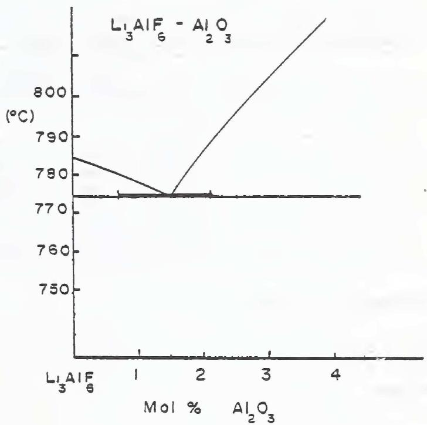  
Figure 141.1. $\mathrm{Li}_{3} \mathrm{AlF}_{6}-\mathrm{Al}_{2} \mathrm{O}_{3}$ phase diagram

References [1-18]

2. Density (ρ)

Measurement method: Archimedean technique [20]

Equation:

$$
\rho = a + b T \quad (1 4 1. 1)
$$

precision: in table 141.1 uncertainty: $\sim \pm 1.5\%$

Table 141.1. Parameters of equation (141.1) and precision   

<table><tr><td>Mol % Al2O3</td><td>a</td><td>-b x 104</td><td>Precision</td><td>T range (K)</td></tr><tr><td>3</td><td>3.0466</td><td>8.460</td><td>*</td><td>1220-1320</td></tr><tr><td>6</td><td>2.9730</td><td>7.920</td><td>*</td><td>1220-1320</td></tr></table>

* insufficient data for estimate

Table 141.2. Density (g cm $^{-3}$ ) from equations in table 141.1   

<table><tr><td rowspan="2">T(K)</td><td colspan="2">\( \mathrm{{Mol}}\% {\mathrm{{Al}}}_{2}{\mathrm{O}}_{3} \)</td></tr><tr><td>3</td><td>6</td></tr><tr><td>1220</td><td>2.0145</td><td>2.0067</td></tr><tr><td>1240</td><td>1.9975</td><td>1.9909</td></tr><tr><td>1260</td><td>1.9806</td><td>1.9750</td></tr><tr><td>1280</td><td>1.9637</td><td>1.9592</td></tr><tr><td>1300</td><td>1.9468</td><td>1.9434</td></tr><tr><td>1320</td><td>1.9299</td><td>1.9275</td></tr></table>

References [19,20]

3. Surface Tension (γ) No data   
4. Viscosity (η) No data   
5. Electrical Conductance (K) No data

(141) $\mathrm{Li}_{3} \mathrm{AlF}_{6}-\mathrm{Al}_{2} \mathrm{O}_{3}$

# 6. Safety and Hazards

# A. Hazard rating

(i) Toxicity: inorganic fluorides are generally quite irritant and toxic.   
(ii) Vapor pressure: no information on this system; Li3AlF6 at its m.pt., $\sim 785^{\circ}C$ , $\sim < 5mm$ .

# B. Disaster hazards

(i) Molten salt bath "explosions": i.e., explosive generation of steam due to bulk water "carry-over" and/or equipment failure; i.e., explosive expansion of "trapped" air.   
(ii) Fluorides, when heated to decomposition, or contacted with acids, emit highly toxic fumes.

References [21-26]

# 7. Corrosion

Table 141.2. Corrosion studies from primary research literature   

<table><tr><td colspan="2">Studies</td><td>References</td></tr><tr><td rowspan="6">A</td><td>CrNi-Cr-Mo alloys (INOR-8; Hastelloys B, W, and N)</td><td>[27]</td></tr><tr><td>SSNI-12P</td><td>[28,29]</td></tr><tr><td>Quartz</td><td>[30]</td></tr><tr><td>Al</td><td>[31]</td></tr><tr><td>Various metals</td><td>[32]</td></tr><tr><td></td><td>[33]</td></tr><tr><td rowspan="3">B</td><td>Pt, Pt-Rh</td><td>[34-38,72,73]</td></tr><tr><td>Boron nitride, carbon, Inconel</td><td>[39-41]</td></tr><tr><td>Fused MgO</td><td>[42]</td></tr><tr><td rowspan="3">C</td><td>Impurities in electrolyte</td><td>[43,44]</td></tr><tr><td>Graphite</td><td>[43,44]</td></tr><tr><td>TiC, TiB2, CrB2, ZrN, NbB2</td><td>[45-47]</td></tr><tr><td rowspan="5">D</td><td>Corrosion studies in molten salts with NaF as one component (e.g., Cl, CO3,...)</td><td>[48-63,70,71]</td></tr><tr><td>Electrochemical behavior of oxide ions and related species in molten fluorides</td><td>[64-66]</td></tr><tr><td>Electroanalytical studies in molten fluorides</td><td>[67]</td></tr><tr><td>Annotated corrosion bibliio.</td><td>[68]</td></tr><tr><td>Corrosion: molten fluorides(survey)</td><td>[69]</td></tr></table>

A: studies principally in molten NaF, KF, and LiF;  
B: used largely in fluorides physical properties measurements; C: technological aspects, in aluminum reduction cells; D: more general studies, basic principles, and surveys.

References [27-73]

(141) $\mathrm{Li}_{3} \mathrm{AlF}_{6}-\mathrm{Al}_{2} \mathrm{O}_{3}$   
8. Diffusion   
No data   
9. Heat of Fusion $(\Delta H_{f}^{\circ})$   
No data   
10. Heat Capacity $(C_p)$   
No data   
11. Volume Change on Melting $(\Delta V_{f})$   
No data   
12. Vapor Pressure $(p_{vap})$   
No data   
13. Thermal Conductivity (liquid) $\left( {\lambda }_{\ell }\right)$   
No data   
14. Thermal Conductivity (solid) $(\lambda_{s})$   
No data   
15. Cryoscopic Constant $(k_{f})$   
No data   
16. References   
[1] Mashovets, V. P. and Petrov, V. I., Zh. Prikl. Khim., 30, 1695(1957); J. Appl. Chem. USSR. 30,1785 (1957).   
[2] Jenssen, B., Thesis, The University of Trondheim, NTH, Trondheim, 1969.   
[3] Malinovsky, M. and Matiasovsky, K., Hutnicke Listy 24(7), 515 (1969).   
[4] Drossbach, P., Z. Electrochem. 42, 65 (1936).   
[5] Janz, G. J. Downey, J. R., Jr., Allen, C. B., and Tomkins, R. P. T., "Eutectic Data" - 2 Vols; ERDA-TID-27163-P1 & P2; NTIS, Washington, D. C. (1977).   
[6] Janz, G. J., Downey, J. R., Jr., Allen, C. B., and Tomkins, R. P. T., "Physical Properties Data Complications Relevant to Energy Storage. I. Molten Salts: Eutectic Data", NSRDS-NBS-61; U. S. Gov't Printing Office, Washington, D. C. (1978).   
[7] "International Critical Tables of Numerical Data, Physics, Chemistry, and Technology", 8 Vols., McGraw-Hill Book Co., N. Y. (1933).

(141) $\mathrm{Li}_3\mathrm{AlF}_6 - \mathrm{Al}_2\mathrm{O}_3$   
[8] "Landolt-Bornstein Zahlenwert und Funktionen aus Physik, Chemie, Astronomie, Geophysik und Technik", (10th Ed.) Springer-Verlag, Berlin, Heidelberg, N. Y. (1961).   
[9] Clark, P. V., "Fused Salt Mixtures: Eutectic Compositions and Melting Points Bibliography 1907-1968", Report No. SC-R-68-1680; Sandia Laboratories (1968), NTIS.   
[10] Robertson, W. D., "Binary Phase Diagrams of Halide Salts", Report No. Yale 2723 (2 Vols.), U. S. AEC Contract AT (30-1)-2723 (1966), NTIS.   
[11] Thoma, R. E., "Phase Diagrams of Nuclear Reactor Materials", Oak Ridge National Laboratory, ORNL-2548, Contract No. W-7405-eng-26.   
[12] Thoma, R. E., "Phase Diagrams of Binary and Ternary Fluoride Systems", Chapt. 6; Adv. Molten Salts Chemistry, Vol. 3 (J. Braunstein, G. Mamantov, and G. P. Smith, eds.), Plenum Press, N. Y. (1975).   
[13] Voskresenskaya, N. K., ed., "Handbook of Solid-Liquid Equilibria in Systems of Inorganic Salts", Volumes 1, 2, Izc. Akad. Nauk SSSR, Moscow (1961). Israel Program for Scientific Translations, Jerusalem, 1970 (NTIS).   
[14] Shaffer, P. T. B., "High Temperature Materials", Plenum Press Handbooks of High Temperature Materials, No. 1, Materials Index, Plenum Press, New York, 1964.   
[15] Toropov, N. A. et al., "Handbook of Phase Diagrams of the Silicates, Volume 1: Binary Systems, Volume 2, Metal-Oxygen Compounds in Silicate Systems", Izdatel'stov "Nauka" Leningradskoe Otdelenie, Leningrad, 1969, Israel Program for Scientific Translations, Jerusalem, 1972 (NTIS).   
[16] Levin, E., et al., "Phase Diagrams for Ceramists", Amer. Ceramic Soc. (publ.), Columbus, Ohio (1964; 1969).   
[17] "Applications of Phase Diagrams in Metallurgy and Ceramics", (2 Vols) NBS Special Pub. 496. U.S. Dept. of Commerce. Nat. Bur. Standards. Ed. Carter G. C. March 1978.   
[18] Cassidy, R. T., and Brown, J. J., Jr., Unpublished data, Virginia Polytechnic Institute and State University, (1977).   
[19] Matiasovsky, K., private communication to G. J. Janz (MSDC-RPI) (1968).   
[20] Mashovets, V. P. and Petrov, V. I., J. Appl. Chem. (USSR) 32, 1561 (1959).   
[21] "Dangerous Properties of Materials", Sax, N. I., Van Nostrand Reinhold Co., N. Y. (1969).   
[22] "Registry of Toxic Effects of Chemical Substances", Christensen, H. E., and Lubinybyhl, T. T., eds., U. S. Dept. H.E.W; U. S. Gov't Printing Office, Washington, D. C. (1975).   
[23] "Potential Hazards in Molten Salt Baths for Heat Treatment of Metals", National Board Fire Underwriters Research Report No. 2. (1954).   
[24] "Handbook of Reactive Chemical Hazards", Bretherwick, L., Butterworths Co., London (1975).   
[25] Janz, G. J., Tomkins, R. P. T., Downey, J. R., Jr., and Allen, C. B., "Safety and Hazards", Chapter in "Eutectic Data", ERDA TID-27163-P1; NTIS, U. S. Dept. Commerce, Springfield, Va. (1977).

(141) $\mathrm{Li}_3\mathrm{AlF}_6 - \mathrm{Al}_2\mathrm{O}_3$   
[26] vide: this work, System 65, Li₃AlF₆.   
[27] Brasunas, A., Metal Prog., 62, 88 (1952).   
[28] Bettes, E. S., Nucl. Sci. Eng., 2, 804 (1957).   
[29] Hoffman, E. E., Patriarca, P., Leitten, C. F., Jr., and Slaughter, G. M., ORNL-1934, Oak Ridge Natl. Lab., (1956).   
[30] Oak Ridge National Laboratory, "The Development Status of Molten Salt Breeder Reactors", Rpt. ORNL-4812-UC-80; NTIS, U. S. Dept. Commerce, Springfield, Va., (Aug. 1972).   
[31] Heimann, R., Glastech. Ber., 43, 83 (1970).   
[32] Lukashenko, E. E., and Reutova, G. A., Nov. Teor. Tekhnol. Metall. Protsessov., 119 (1973).   
[33] Koger, J. W., Corrosion, 30, 125 (1974).   
[34] Edwards, J. D., Taylor, C. S., Russell, A. S., and Maranville, L. F., J. Electrochem. Soc. 99, 527 (1952).   
[35] Landon, G. J., and Ubbelohde, A. R., Proc. Royal Soc., A240, 160 (1957).   
[36] Winterhager, H. and Werner, L., Forschungsber. des Witschafts-u. Verkehrsministeriums Nordrhein-Westfalen, No. 438, 1957.   
[37] Winterhager, H. and Werner, L., Forschungsber. des Witschafts-u. Verkehrsministeriums Nordrhein-Westfalen, No. 341, 1956.   
[38] Bajcsy, J., Malinovsky, M., and Matiasovsky, K., Electrochim. Acta, 7, 543 (1962).   
[39] Yim, E. W. and Feinleib, M., J. Electrochem. Soc., 104, 622 (1957).   
[40] Yim, E. W. and Feinleib, M., J. Electrochem. Soc., 104, 626 (1957).   
[41] Brown, E. A. and Porter, B., "U. S. Department of Interior, Bureau of Mines", 128.23:6500 (1964).   
[42] Cuthbertson, J.W. and Waddington, J., Trans Faraday Soc., 32, 745 (1936).   
[43] Grjothiem, K., Krohn, C., Malinovsky, M., Matiasovsky, K., and Thonstad, J., "Aluminum Electrolyses", Chapt. 10; Aluminum-Verlag, G.mbH; Dusseldorf (1977).   
[44] Brun, J., Tunold, R., Vatland, A., 30th ISE Meeting, Extended Abstracts, pp. 118-119; Trondheim, Norway (Aug. 1979); NTH, Dept. Ind. Electrochem., Trondheim, Norway.   
[45] Holliday, R. D., (Olin Mathieson Chemical Corp.), U. S. 3,661,736, May 9, 1972.   
[46] Thompson, R.: (Borax Consolidated Ltd.), Ger. Offen. 2,305,281, Aug. 9, 1973.   
[47] Kugler, T. and Rieger, H. W.: (Swiss Aluminium Ltd.) Ger. Offen. 2,312,439, Oct. 4, 1973.   
[48] Khan, I. A., Ber. Kernforschungsanlage Juelich, Juel-608-RW, (1969).   
[49] Khan, I. A., Inst. Reaktorwerkst., Kernforschungsanlage, Juel-718-RW (1970).   
[50] Bowles, P. J., and Newdick, P. C., Electroplating and Metal Finishing, 24, 6 (1971).

(141) $\mathrm{Li}_{3} \mathrm{AlF}_{6}-\mathrm{Al}_{2} \mathrm{O}_{3}$   
[51] DeVan, J. H., "Examinations of Pump Impellers from Sodium and Fused Salt Pump Endurance Tests", ORNL CF-61-4-77, Oak Ridge National Lab., (1961).   
[52] Adamson, G. M., Manly, W. D., and Crouse, S. R., "Corrosion by Molten Fluorides", ANP Materials Meeting ORNL-2685, (1958).   
[53] Huntley, W. R., and Gnadt, P. A., Oak Ridge Nat'l Lab., Report ORNL-TM-3863. (1973); Nucl. Sci. Abstr., 27, 12446 (1973).   
[54] Gill, C. B., Straumanis, M. E., and Schlechten, W. B., J. Electrochem. Soc., 102, 42 (1955).   
[55] Litman, A. P., "Corrosion of Volatility Pilot Plant Mark I INOR-S Hydrofluorinator and Mark III. Nickel Fluorinator after Fourteen Dissolution Runs", ORNL-3253, Oak Ridge Nat'l Lab., (1962).   
[56] Litman, A. P., and Goldman, A. E., "Corrosion Associated with Fluoridation in the Oak Ridge Nat'l Lab., Fluoride Volatility Process", ORNL-2832, Oak Ridge Nat'l Lab. (1961).   
[57] Manly, W. D., Coobs, J. H., DeVan, J. H., Douglas D. A., Inouye, H., Patriarca, P., Roche, T. K., and Scott, J. L., "Metallurgical Problems in Molten Fluoride Systems", Proc. 2nd U. N. Inter. Conf. Peaceful Uses of At. Energy, 7, 223 (1958).   
[58] Oak Ridge Nat'l Lab., Molten Salt Reactor Program Semiannual Progress Report for Period Ending July 31, 1964, ORNL-3708, (1964).   
[59] Vreeland, D. C., Hoffman, E. E., and Manly, W. D., Nucleonics, 11, 36 (1953).   
[60] Grimes, W. R., and Cuneo, D. R., "Molten Salts as Reactor Fuels", Reactor Handbook 2nd ed., 1, 425 (1955).   
[61] Shimotake, H., and Hesson, J. C., Adv. Chem. Series, No. 64, 149 (1967).   
[62] Boser, O., "Study of Safety Aspects of High Temperature Thermal Energy Storage Systems", ERDA Thermal Energy Storage Information Exchange Mtg., Cleveland, NSF-AER 75-20605 (Sept. 1976).   
[63] Venkatasetty, H. V., "Thermodynamic Properties and Corrosion Characteristics of Thermal Energy Storage Eutectic Mixtures", paper presented at 152nd Meeting of the Electrochemical Society, Atlanta, Ga., (October, 1977).   
[64] Mathews, A. L., and Baes, C. F., Inorg. Chem., 7, 373 (1968).   
[65] Manning, D. L. and Mamantov, G., J. Electrochem. Soc., 124, 480 (1977).   
[66] Ting, G., Baes, C. F., Bamberger, C. E., and Mamantov, G., J. Inorg. Nucl. Chem., 39, 1803 (1977).   
[67] Manning, D. L., and Mamantov, G., J. Electroanal. Chem., (in press) (1978).   
[68] Janz, G. J., and Tomkins, R. P. T., Corrosion, 35(11) 485 (1979).   
[69] Eichelberger, J. L., (Penwalt Corp.) "Investigations of Metal Fluoride Thermal Energy Storage Materials: Availability, Cost, Chemistry" ERDA Rpt CO02990-6; NTIS, U. S. Dept. Commerce, Springfield, Va., (Dec. 1976).   
[70] Kochergen, V. P., and Ignat'eva, N. I., Russ. J. Inorg. Chem., 6(9), 1086 (1961).   
[71] Ozeryanaya, I. N., Volodin, V. P., and Smirnov, M. V., Zashchita Metalov (USSR), 2, 230 (1969).

(141) $\mathrm{Li}_{3} \mathrm{AlF}_{6} - \mathrm{Al}_{2} \mathrm{O}_{3}$

[72] Ryschkewitsch, E., Z. Elektrochem., 39, 531 (1933).   
[73] Yaffe, I. S., and Van Artsdalen, E. R., Chemistry Semiannual Progress Report for period ending June 20, 1956, ORNL-2159, p. 77.

1. Melting Temperatures $(T_{m})$

Pure substance melting points:

$\mathrm{LiNO}_{3}$ : $253^{\circ} \mathrm{C}$

LiOH: $462^{\circ} \mathrm{C}$

Eutectic melting point:

E 1: $182^{\circ} \mathrm{C}$ , composition: $40.5 \mathrm{~mol} \%$ LiOH

Tr: $195^{\circ} \mathrm{C}$ , composition: 48 mol % LiOH

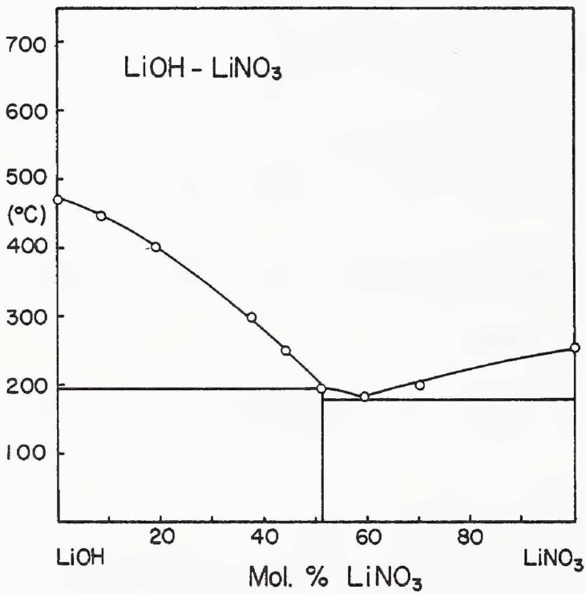  
Figure 142.1. $\mathrm{LiOH - LiNO_3}$ phase diagram

References [1-16].

2. Density (ρ)

Measurement method: dilatometric technique [17]

Equation:

$$
\rho = a + b T \quad (1 4 2. 1)
$$

precision: in table 142.1 uncertainty: $\sim \pm 1.0\%$

Table 142.1. Parameters of equation (142.1) and precision   

<table><tr><td>Mol % LiOH</td><td>a</td><td>-b x 104</td><td>Precision</td><td>T range(K)</td></tr><tr><td>7.6</td><td>2.3681</td><td>8.065</td><td></td><td>410-440</td></tr></table>

# (142) LiOH-LiNO3

Table 142.2. Density $(\mathrm{gcm}^{-3})$ at 7.6 mol % LiOH from equation in table 142.1   

<table><tr><td>T(K)</td><td>ρ(g cm-3)</td><td>T(K)</td><td>ρ(g cm-3)</td></tr><tr><td>410</td><td>2.0374</td><td>430</td><td>2.021</td></tr><tr><td>420</td><td>2.029</td><td>440</td><td>2.013</td></tr></table>

References [17]

3. Surface Tension (γ)

No data

4. Viscosity (η)

No data

5. Electrical Conductance (K)

Measurement method: classical ac technique [17]

Equation:

$$
\kappa = a + b T + c T ^ {2} \tag {142.2}
$$

precision: in table 142.3

uncertainty: $\sim$ 3.0%

Table 142.3. Parameters of equation (142.2.) and precision   

<table><tr><td>Mol % LiOH</td><td>a</td><td>b x 103</td><td>c x 106</td><td>Precision</td><td>T range(K)</td></tr><tr><td>7.6</td><td>0.4421</td><td>-3.7749</td><td>7.265</td><td>~ ± 1.0%</td><td>410-440</td></tr></table>

Table 142.4. Specific conductance at 7.6. mol % LiOH from equation in table 142.3.   

<table><tr><td>T(K)</td><td>K(ohm-1cm-1)</td><td></td><td>T(K)</td><td>K(ohm-1cm-1)</td></tr><tr><td>410</td><td>0.116</td><td></td><td>430</td><td>0.162</td></tr><tr><td>420</td><td>0.138</td><td></td><td>440</td><td>0.188</td></tr></table>

References [17]

(142) LiOH-LiNO3

6. Safety and Hazards

A. Hazard rating

(i) Toxicity: LiOH, very caustic and toxic; $\mathrm{LiNO}_3$ , moderate.   
(ii) Vapor pressure: LiOH, at m.pt. $(460^{\circ}\mathrm{C})$ , $<< 0.5\mathrm{mm}$ ; LiNO₃ (m.pt. $253^{\circ}\mathrm{C}$ ) decomposes with heating to the nitrite and oxygen just above its m.pt.

B. Disaster hazards

(i) Molten salt bath "explosions": violent generation of steam due to bulk water "carry-over" and/or equipment failure; sudden explosive expansion of "trapped" air.   
(ii) Hydroxides react with water or steam with evolution of heat; the aqueous solution is very caustic and attacks living tissue; dangerous.   
(iii) On decomposition, nitrates emit toxic fumes (oxides of nitrogen) viz:

$$
\mathrm {M N O} _ {3} \rightarrow \mathrm {M N O} _ {2} + \mathrm {I} _ {2} \mathrm {O} _ {2} \tag {142.3}
$$

$$
2 \mathrm {M N O} _ {2} \rightarrow \mathrm {M} _ {2} \mathrm {O} + \mathrm {N O} + \mathrm {N O} _ {2} \tag {142.4}
$$

The subsequent decomposition reactions are complex; if the gas phase is continuously removed, the nitrite conversion (above) to NO and $\mathrm{NO}_2$ is dominant.

In the temperature range $550 - 660^{\circ}\mathrm{C}$ , and under oxygen, the conversion of $\mathrm{KNO}_2$ to $\mathrm{KNO}_3$ goes to completion; between $650 - 750^{\circ}\mathrm{C}$ , the two salts interconvert (see above), $\mathrm{KNO}_3$ becoming increasingly unstable; above $800^{\circ}\mathrm{C}$ , the nitrite decomposition: $2\mathrm{KNO}_2 \longrightarrow \mathrm{K}_2\mathrm{O} + \mathrm{N}_2 + 3 / _2\mathrm{O}_2$ goes to completion.

(iv) Nitrates are powerful oxidizing agents; violent (explosive) reactions possible in molten nitrates and carbonaceous materials (organic cpds., oils, carbon,...); aluminum alloys and bath sludges (e.g. iron oxides); magnesium alloys. Dangerous.

References [18-23]

# 7. Corrosion

Table 142.5. Corrosion studies from primary research literature   

<table><tr><td colspan="2">Studies</td><td>References</td></tr><tr><td rowspan="3">A</td><td>Ni, Cu, Armco Fe and steel</td><td>[24-26]</td></tr><tr><td>Fe, effects of H2O</td><td>[27]</td></tr><tr><td>Pt, Ag, and alloys</td><td>[28-30]</td></tr><tr><td rowspan="2">B</td><td>Fe</td><td>[31]</td></tr><tr><td>Cu</td><td>[32]</td></tr><tr><td rowspan="4">C</td><td>Thermodynamic approach</td><td>[33,34]</td></tr><tr><td>Electrochemical approach</td><td>[35,36]</td></tr><tr><td>Annotated corrosion bibliio.</td><td>[37]</td></tr><tr><td>Reviews, corrosion</td><td>[38-40]</td></tr></table>

Compatibility studies: A; principally molten LiOH; B: principally molten $\mathrm{LiNO}_3$ ; C: general survey, reviews and biblios. No compatibility studies specifically for molten LiOH-LiNO<sub>3</sub>

References [24-40]

8. Diffusion No data   
9. Heat of Fusion $(\Delta H_{f}^{\circ})$ No data   
10. Heat Capacity $(C_p)$ No data   
11. Volume Change on Melting $(\Delta V_{f})$ No data   
12. Vapor Pressure $(p_{vap})$ No data   
13. Thermal Conductivity (liquid) $(\lambda_{\ell})$ No data

14. Thermal Conductivity (solid) $(\lambda_{s})$

No data

15. Cryoscopic Constant $(k_{f})$

No data

16. References

[1] Diogenov, G. G., Doklad. Akad. Nauk, SSSR., 78, 697 (1951).   
[2] Diogenov, G. G., Doklad. Akad. Nauk, SSSR., 89, 305 (1953).   
[3] Janz, G. J. Downey, J. R., Jr., Allen, C. B., and Tomkins, R. P. T., "Eutectic Data" - 2 Vols; ERDA-TID-27163-P1 & P2; NTIS, Washington, D. C. (1977).   
[4] Janz, G. J., Downey, J. R., Jr., Allen, C. B., and Tomkins, R. P. T., "Physical Properties Data Complications Relevant to Energy Storage. I. Molten Salts: Eutectic Data", NSRDS-NBS-61; U. S. Gov't Printing Office, Washington, D. C. (1978).   
[5] "International Critical Tables of Numerical Data, Physics, Chemistry, and Technology", 8 Vols., McGraw-Hill Book Co., N. Y. (1933).   
[6] "Landolt-Bornstein Zahlenwert und Funktionen aus Physik, Chemie, Astronomie, Geophysik und Technik", (10th Ed.) Springer-Verlag, Berlin, Heidelberg, N. Y. (1961).   
[7] Clark, P. V., "Fused Salt Mixtures: Eutectic Compositions and Melting Points Bibliography 1907-1968", Report No. SC-R-68-1680; Sandia Laboratories (1968), NTIS.   
[8] Robertson, W. D., "Binary Phase Diagrams of Halide Salts", Report No. Yale 2723 (2 Vols.), U. S. AEC Contract AT (30-1)-2723 (1966), NTIS.   
[9] Thoma, R. E., "Phase Diagrams of Nuclear Reactor Materials", Oak Ridge National Laboratory, ORNL-2548, Contract No. W-7405-eng-26.   
[10] Thoma, R. E., "Phase Diagrams of Binary and Ternary Fluoride Systems", Chapt. 6; Adv. Molten Salts Chemistry, Vol. 3 (J. Braunstein, G. Mamantov, and G. P. Smith, eds.), Plenum Press, N. Y. (1975).   
[11] Voskresenskaya, N. K., ed., "Handbook of Solid-Liquid Equilibria in Systems of Inorganic Salts", Volumes 1, 2, Izc. Akad. Nauk SSSR, Moscow (1961). Israel Program for Scientific Translations, Jerusalem, 1970 (NTIS).   
[12] Sinistri, C., Franzozini, P., and Rolla, M., "An Atlas of Miscibility Gaps in Molten Salt Systems", Institute of Physical Chemistry, University of Pavia (Italy) (1968).   
[13] Shaffer, P. T. B., "High Temperature Materials", Plenum Press Handbooks of High Temperature Materials, No. 1, Materials Index, Plenum Press, New York, (1964).   
[14] Franzozini, P., Ferloni, P., and Spinolo, C., "Molten Salts with Organic Anions", Instituto di Chimica Fisica, Universita di Pavia (Italy), (1973).   
[15] Toropov, N. A. et al., "Handbook of Phase Diagrams of the Silicates, Volume 1: Binary Systems, Volume 2, Metal-Oxygen Compounds in Silicate Systems", Izdatel'stov "Nauka" Leningradskoe Otdelenie, Leningrad, 1969, Israel Program for Scientific Translations, Jerusalem, 1972 (NTIS).

(142) $\mathrm{LiOH - LiNO}_3$

[16] Levin, E., et al., "Phase Diagrams for Ceramists", Amer. Ceramic Soc. (publ.), Columbus, Ohio (1964; 1969).   
[17] Campbell, A. N., and Williams, D. F., Canad. J. Chem., 42, 1984 (1964).   
[18] Stern, K., "High Temperature Properties and Decomposition of Inorganic Salts. III. Nitrates and Nitrites", J. Phys. Chem. Ref. Data, 1, 747-772 (1972).   
[19] "Dangerous Properties of Materials", Sax, N. I., Van Nostrand Reinhold Co., N. Y. (1969).   
[20] "Registry of Toxic Effects of Chemical Substances", Christensen, H. E., and Lubinbyhl, T. T., eds., U. S. Dept. H. E. W., U. S. Gov't Printing Office, Washington, D. C. (1975).   
[21] "Potential Hazards in Molten Salt Baths for Heat Treatment of Metals", National Board of Fire Underwriters Research Report No. 2 (1954).   
[22] "Handbook of Reactive Chemical Hazards", Bretherwick, L., Butterworth Co., London (1975).   
[23] Janz, G. J., Tomkins, R. P. T., Downey, J. R. Jr., and Allen, C. B., "Safety and Hazards", Chapter in "Eutectic Data", ERDA TID-27163-P1; NTIS, U. S. Dept. Commerce, Springfield, Va. (1977)   
[24] Gurowich, E. I., Zh. Prikl. Khim., 32, 817 (1959).   
[25] Smith, G. P., Hoffman, E. E., Corrosion, 13, 627t (1957).   
[26] Smith, G. P., Hoffman, E. E., Steidlitz, M. E., Corrosion, 13, 561t (1957).   
[27] Tribunskii, V. V., Kalinichenko, I. I., Tr. Ural. Politekh. Inst., 190, 49 (1970).   
[28] Rahmel, A., Kruger, H., Werkst. Korros., 18, 193 (1967).   
[29] Kruger, H., Rahmel, A., Schwenk, W., Electrochim. Acta, 13, 625 (1968).   
[30] Afanas'yev, A. S., Gamazov, V. P., Zh. Fiz. Khim., 38, 2823 (1964).   
[31] Arvia, A. J., Podesta, J. J., and Piatti, R. C. V., Electrochim. Acta, 17, 33 (1972).   
[32] Notoya, T., Denki Kagaku, 41, 779 (1973).   
[33] Conte, A., and Ingram, M. D., Electrochim. Acta, 13, 1551 (1968).   
[34] Bartlett, H. E., and Johnson, K. E., Canad. J. Chem., 44, 2119 (1966).   
[35] Pizzini, S., "Materials Problems in the Industrial Applications of Molten Salts", "Proceedings of the European Conference on the Development of Molten Salts Applications", p. 203; Battelle, Geneva, (1973).   
[36] Johnson, K. E., "Electrochemical Approaches to Corrosion in Molten Salts", Proceedings International Symposium on Metal-Slag-Gas Reactions and Processes, The Electrochemical Society, Inc., Princeton, N. J. (1975).   
[37] Janz, G. J., and Tomkins, R. P. T., Corrosion, 35, 485 (1979).   
[38] Inman, D., and Wrench, N. S., Brit. Corr. J., 1, 246 (1966).   
[39] Ketelaar, J. A. A., Chemie. Ing. Techn., 45, 667 (1973).   
[40] Smirnov, M. V. and Ozeryanaya, I., Nauki. Tekh. Korros. Zasch. Korros., 2, 171 (1973).

1. Melting Temperatures $(T_{m})$

Pure substance melting points:

$\mathrm{NaNO}_{3}$ : $307^{\circ} \mathrm{C}$

NaOH: $318^{\circ} \mathrm{C}$

Eutectic melting point:

E 1:258°C, composition: 18.5 mol % NaNO₃

E 2: 266°C, composition: 41 mol % NaNO₃

E3: 246°C, composition: 72 mol % NaNO₃

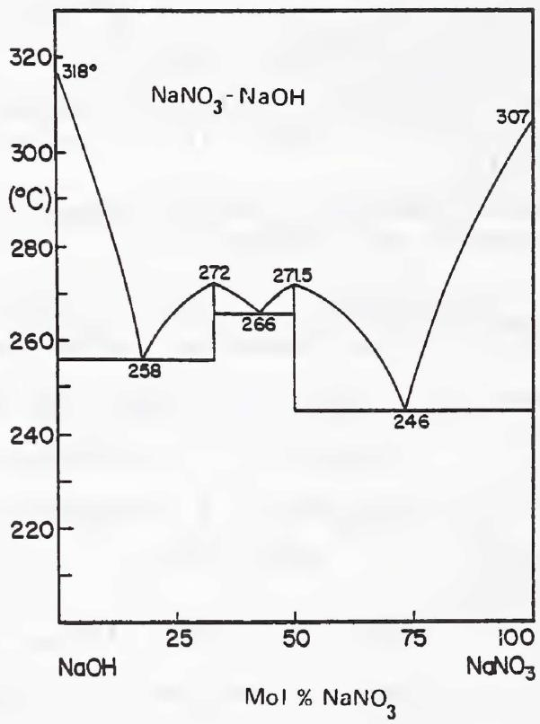  
Figure 143.1. NaOH-NaNO $_3$ phase diagram

Table 143.1. Additional variant points   

<table><tr><td>Composition</td><td>t(℃)</td><td>Composition</td><td>t(℃)</td></tr><tr><td>2NaOH·NaNO3</td><td>272℃</td><td>NaOH·NaNO3</td><td>271.5℃</td></tr></table>

References [1-16]

(143) NaOH-NaNO 3

2. Density (ρ)

No data

3. Surface Tension (Y)

No data

4. Viscosity (n)

No data

5. Electrical Conductance (K)

No data

6. Safety and Hazards

# A. Hazard rating

(i) Toxicity: $\mathrm{NaNO}_3$ , permitted as a food additive; NaOH, very caustic and is corrosive to all body tissues.   
(ii) Vapor pressure: no information for this system, but see $\mathrm{NaNO}_3$ [23], and NaOH [23].

# B. Disaster hazards

(i) Molten salt bath "explosions": i.e. explosive generation of steam due to bulk water "carry-over" and/or equipment failure; i.e., explosive expansion of "trapped" air.   
(ii) On decomposition, nitrates emit toxic fumes (oxides of nitrogen) viz:

$$
2 \mathrm {M N O} _ {3} \rightarrow 2 \mathrm {M N O} _ {2} + \mathrm {O} _ {2} \tag {143.1}
$$

$$
2 \mathrm {M N O} _ {2} \longrightarrow \mathrm {M} _ {2} \mathrm {O} + \mathrm {N O} + \mathrm {N O} _ {2} \tag {143.2}
$$

The subsequent decomposition reactions are complex; if the gas phase is continuously removed, the nitrite decomposition (above) to NO and $\mathrm{NO}_2$ is dominant.

(iii) Nitrates are powerful oxidizing agents; violent (explosive) reactions possible in molten nitrates and carbonaceous materials (organic cpds., oils, carbon,...); aluminum alloys and bath sludges (e.g. iron oxides); magnesium alloys. Dangerous.   
(iv) Dangerous; with water or steam, reacts with evolution of heat; the aqueous solution is very strongly caustic; attacks living tissue.

References [17-24]

# 7. Corrosion

Table 143.2. Corrosion studies from primary research literature   

<table><tr><td colspan="2">Studies</td><td>References</td></tr><tr><td rowspan="5">A</td><td>Fe</td><td>[25-27]</td></tr><tr><td>Fe, Co, Ni</td><td>[28]</td></tr><tr><td>Cu</td><td>[29]</td></tr><tr><td>Pt, S, steel</td><td>[30]</td></tr><tr><td>Oxide species</td><td>[31]</td></tr><tr><td rowspan="7">B</td><td>Metals</td><td>[32]</td></tr><tr><td>Metals, Ceramics, alloys</td><td>[32-39]</td></tr><tr><td>Stainless steel, Fe-Ni-Cr alloys</td><td>[40]</td></tr><tr><td>Ni, Cr, and various Ni based alloys</td><td>[41-44]</td></tr><tr><td>Ni steels</td><td>[45]</td></tr><tr><td>Fe (effect of H2O)</td><td>[46]</td></tr><tr><td>Pt, Ag, and alloys</td><td>[47-49]</td></tr><tr><td rowspan="4">C</td><td>Electrochemical approach</td><td>[50,51]</td></tr><tr><td>Thermodynamic redox diagrams</td><td>[52,53]</td></tr><tr><td>Annotated corrosion bibliio.</td><td>[54]</td></tr><tr><td>Reviews/molten salts</td><td>[55-57]</td></tr></table>

Compatibility studies: A: molten $\mathrm{NaNO}_3$ ; B: molten NaOH; C: basic principles and reviews. No studies specific to molten $\mathrm{NaNO}_3$ -NaOH found.

References [25-57]

8. Diffusion

No data

9. Heat of Fusion $(\Delta H_{f}^{\circ})$

No data

10. Heat Capacity $(C_p)$

No data

11. Volume Change on Melting $(\Delta V_{f})$

No data

12. Vapor Pressure $(p_{vap})$

No data

13. Thermal Conductivity (liquid) $(\lambda_{\ell})$

No data

# (143) NaOH-NaNO 3

14. Thermal Conductivity (solid) $(\lambda_{s})$

No data

15. Cryoscopic Constant $(k_{f})$

No data

16. References

[1] Bergman, A. G. and Reshetnikov, N. A., Izvest. Sektora Fiz.-Khim. Anal., Inst. Obshchei Neorg. Khim., Akad. Nauk SSSR, 25, 212 (1954).   
[2] Diogenov, G. G., Akad. Nauk SSSR, 89 305 (1953).   
[3] Janz, G. J. Downey, J. R., Jr., Allen, C. B., and Tomkins, R. P. T., "Eutectic Data" - 2 Vols; ERDA-TID-27163-P1 & P2; NTIS, Washington, D. C. (1977).   
[4] Janz, G. J., Downey, J. R., Jr., Allen, C. B., and Tomkins, R. P. T., "Physical Properties Data Complications Relevant to Energy Storage. I. Molten Salts: Eutectic Data", NSRDS-NBS-61; U. S. Gov't Printing Office, Washington, D. C. (1978).   
[5] "International Critical Tables of Numerical Data, Physics, Chemistry, and Technology", 8 Vols., McGraw-Hill Book Co., N. Y. (1933).   
[6] "Landolt-Bornstein Zahlenwert und Funktionen aus Physik, Chemie, Astronomie, Geophysik und Technik", (10th Ed.) Springer-Verlag, Berlin, Heidelberg, N. Y. (1961).   
[7] Clark, P. V., "Fused Salt Mixtures: Eutectic Compositions and Melting Points Bibliography 1907-1968", Report No. SC-R-68-1680; Sandia Laboratories (1968), NTIS.   
[8] Robertson, W. D., "Binary Phase Diagrams of Halide Salts", Report No. Yale 2723 (2 Vols.), U. S. AEC Contract AT (30-1)-2723 (1966), NTIS.   
[9] Thoma, R. E., "Phase Diagrams of Nuclear Reactor Materials", Oak Ridge National Laboratory, ORNL-2548, Contract No. W-7405-eng-26.   
[10] Thoma, R. E., "Phase Diagrams of Binary and Ternary Fluoride Systems", Chapt. 6; Adv. Molten Salts Chemistry, Vol. 3 (J. Braunstein, G. Mamantov, and G. P. Smith, eds.), Plenum Press, N. Y. (1975).   
[11] Voskresenskaya, N. K., ed., "Handbook of Solid-Liquid Equilibria in Systems of Inorganic Salts", Volumes 1, 2, Izc. Akad. Nauk SSSR, Moscow (1961). Israel Program for Scientific Translations, Jerusalem, 1970 (NTIS).   
[12] Sinistri, C., Franzozini, P., and Rolla, M., "An Atlas of Miscibility Gaps in Molten Salt Systems", Institute of Physical Chemistry, University of Pavia (Italy) (1968).   
[13] Shaffer, P. T. B., "High Temperature Materials", Plenum Press Handbooks of High Temperature Materials, No. 1, Materials Index, Plenum Press, New York, 1964.   
[14] Franzozini, P., Ferloni, P., and Spinolo, C., "Molten Salts with Organic Anions", Instituto di Chimica Fisica, Universita di Pavia (Italy), 1973.   
[15] Toropov, N. A. et al., "Handbook of Phase Diagrams of the Silicates, Volume 1: Binary Systems, Volume 2, Metal-Oxygen Compounds in Silicate Systems", Izdatel'stov "Nauka" Leningradskoe Otdelenie, Leningrad, 1969, Israel Program for Scientific Translations, Jerusalem, 1972 (NTIS).

[16] Levin, E., et al., "Phase Diagrams for Ceramists", Amer. Ceramic Soc. (publ.), Columbus, Ohio (1964; 1969).   
[17] Stern, K., "High Temperature Properties and Decomposition of Inorganic Salts. III. Nitrates and Nitrites", J. Phys. Chem. Ref. Data, 1, 747-772 (1972).   
[18] "Dangerous Properties of Materials", Sax, N. I., Van Nostrand Reinhold Co., N. Y. (1969).   
[19] "Registry of Toxic Effects of Chemical Substances", Christensen, H. E., and Lubinybyhl, T. T., eds., U. S. Dept. H.E.W; U. S. Gov't Printing Office, Washington, D. C. (1975).   
[20] "Potential Hazards in Molten Salt Baths for Heat Treatment of Metals", National Board Fire Underwriters Research Report No. 2. (1954).   
[21] "Handbook of Reactive Chemical Hazards", Bretherwick, L., Butterworths Co., London (1975).   
[22] Janz, G. J., Tomkins, R. P. T., Downey, J. R., Jr., and Allen, C. B., "Safety and Hazards", Chapter in "Eutectic Data", ERDA TID-27163-P1; NTIS, U. S. Dept. Commerce, Springfield, Va. (1977).   
[23] Janz, G. J., et al., "Physical Properties Data Complications Relevant to Energy Storage. Part II. Molten Salts: Data on Single and Multi-Component Salt Systems", NSRDS-NBS 61, Part II (April 1979), U. S. Gov't Printing Office, Supt of Doc. No. C13-48-61, Washington D. C. 20402.   
[24] vide: this work, System 69, NaOH.   
[25] Arvia, A. J., Podesta, J. J., and Piatti, R. C. V., Electrochim. Acta, 17, 33 (1972).   
[26] Marchiano, S. L., and Arvia, A. J., Electrochim. Acta, 17, 25 (1972).   
[27] Notoya, T., Ishikawa, T., Midorikawa, R., Denki Kagaku, 39, 930 (1971); ibid, 40, 62 (1972).   
[28] Marchiano, S. L., and Arvia, A. J., An. Soc. Cient. Argent., 192, 263 (1971).   
[29] Notoya, T., Denki Kagaku, 41, 779 (1973).   
[30] Johnson, K. E., Electrochim. Acta, 11, (1966).   
[31] Johnson, K. E., Zacharias, P. S., and Mathews, J., "Proceedings Intern. Symp. Molten Salts", p. 603, The Electrochemical Soc., Princeton, N. J., (1976).   
[32] Anon, "Oak Ridge National Laboratory, Proceedings of the 1st Information Meeting on Hydroxide and Metal Interaction", ORNL CF-51-11-204, (1953).   
[33] Craighead, C. M., Smith, L. A., Phillips, E. C., Jaffee, R. I., "Continued Studies of Corrosion by Fused Caustic", AECD-3704, Battelle Memorial Institute, (1952).   
[34] Gregory, J. N., Hodge, N., Iredale, J. V. G., "The Static Corrosion of Nickel and Other Materials in Molten Caustic Soda", British Report AERE-C/M-272, (1956).   
[35] Miller, R. R., "The Thermal Properties of Sodium Hydroxide and Lithium Metal", 4th Progr. Rept. Nov. 1 (1952)-Jan. 31 (1953) NRL-Memo-130: Progr. Rept. No. 1, Naval Research Lab., (1952).   
[36] Williams, D. D., Ewing, C. T., "Thermal and Related Physical Properties of Molten Materials", Prog. Rept. Feb. 1 - May 1, (1953) NRL-Memo-170, Progress Report 5, Naval Research Lab., (1953).

(143) NaOH-NaNO 3   
[37] Smothers, W. J., Prog. Rept., Jan. 1 - March 31, (1953), AECU-2872, Univ. of Ark., (1953).   
[38] Smith, G. P., "Corrosion of Materials in Fused Hydroxides", Am. Inst. Mining Engrs., Inst. Metals Div., Spec. Rept., #2, 71 (1956).   
[39] Smith, G. P., "Corrosion of Materials in Fused Hydroxides", ORNL-2048, Oak Ridge National Laboratory, (1956).   
[40] Smith, G. P., Hoffman, E. E., "Corrosion Products Formed in the Reaction between Fused Sodium Hydroxide and Iron-Rich Alloys of Iron, Chromium and Nickel", ORNL-2156, Oak Ridge National Laboratory, (1957).   
[41] Smith, G. P., Steidlitz, M. E., Hoffman, E. E., Corrosion, 11, 47t (1958).   
[42] Smith, G. P., Hoffman, E. E., Steidlitz, M. E., Corrosion, 13, 56lt (1957).   
[43] Manly, W. D., "Operation of a Ni-NaOH Thermal Convection Loop", ORNL CF-51-11-186, Oak Ridge National Laboratory, (1951).   
[44] Miller, N. E., Simons, E. M., Chem. Eng. Progr. Symp. Ser. No. 19, Amer, Inst. Chem. Eng., 52, 113 (1956).   
[45] Kolotii, A. A., Vengzhen, G. S., Zashch. Met., 11, 61 (1975).   
[46] Tribunskii, V. V., Kalinichenko, I. I., Tr. Ural. Politekh. Inst., 190, 49 (1970).   
[47] Rahmel, A., Kruger, H., Werkst. Korros., 18, 193 (1967).   
[48] Kruger, H., Rahmel, A., Schwenk, W., Electrochim. Acta, 13, 625 (1968).   
[49] Afanas'yev, A. S., Gamazov, V. P., Zh. Fiz. Khim., 38, 2823 (1964).   
[50] Pizzini, S., "Materials Problems in the Industrial Applications of Molten Salts", "Proceedings of the European Conference on the Development of Molten Salts Applications", p. 203; Battelle, Geneva, (1973).   
[51] Johnson, K. E., "Electrochemical Approaches to Corrosion in Molten Salts", Proceedings International Symposium on Metal-Slag-Gas Reactions and Processes, The Electrochemical Society, Inc., Princeton, N. J. (1975).   
[52] Bartlett, H. E., and Johnson, K. E., Canad. J. Chem., 44, 2119 (1966).   
[53] Conte, A., and Ingram, M. D., Electrochim. Acta, 13, 1551 (1968).   
[54] Janz, G. J., and Tomkins, R. P. T., Corrosion, 35, 485 (1979).   
[55] Inman, D., and Wrench, N. S., Brit. Corr. J., 1, 246 (1966).   
[56] Ketelaar, J. A. A., Chemie. Ing. Techn., 45, 667 (1973).   
[57] Smirnov, M. V. and Ozeryanaya, I., Nauki. Tekh. Korros. Zasch. Korros., 2, 171 (1973).

1. Melting Temperatures $(T_{m})$

Pure substance melting points:

$\mathrm{KNO}_{3}$ : $335^{\circ} \mathrm{C}$

KOH: $360^{\circ} \mathrm{C}$

Eutectic melting point:

E 1: $214^{\circ} \mathrm{C}$ , composition: $31.5 \mathrm{~mol} \%$ KOH

$\mathrm{E}_{2}: 220^{\circ} \mathrm{C}$ , composition: $68 \mathrm{~mol} \%$ KOH

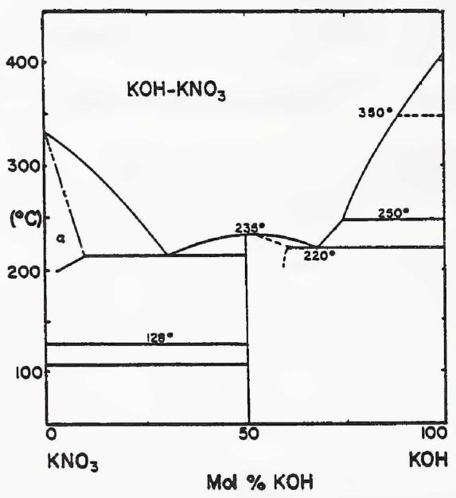  
Figure 144.1. $\mathrm{KNO}_3$ -KOH phase diagram [5].

2. Density (ρ)

No data

3. Surface Tension (Y)

No data

4. Viscosity (n)

No data

5. Electrical Conductance (K)

No data

6. Safety and Hazards

# A. Hazard rating

(i) Toxicity: $\mathsf{KNO}_3$ , permitted as a food additive; KOH, highly caustic and is very corrosive to all body tissue   
(ii) Vapor pressure: no information for this system, but see $\mathrm{KNO}_3$ [73], and KOH [68]

# B. Disaster hazards

(i) Molten salt bath "explosions": violent generation of steam due to bulk water "carry-over" and/or equipment failure; sudden explosive expansion of "trapped" air   
(ii) On decomposition, nitrates emit toxic fumes (oxides of nitrogen) viz:

$$
\mathrm {M N O} _ {3} \longrightarrow \mathrm {M N O} _ {2} + \frac {1}{2} \mathrm {O} _ {2} \tag {144.1}
$$

$$
2 \mathrm {M N O} _ {2} \longrightarrow \mathrm {M} _ {2} \mathrm {O} + \mathrm {N O} + \mathrm {N O} _ {2} \tag {144.2}
$$

The subsequent decomposition reactions are complex; if if the gas phase is continuously removed, the nitrite decomposition (above) to NO and $\mathrm{NO}_2$ is dominant.

In the temperature range $550 - 600^{\circ}C$ , and under oxygen, the conversion of $\mathrm{KNO}_2$ to $\mathrm{KNO}_3$ goes to completion; between $650 - 750^{\circ}C$ , the two salts interconvert (see above), $\mathrm{KNO}_3$ becoming increasingly unstable; above $800^{\circ}C$ , the nitrite decomposition: $2\mathrm{KNO}_2 \longrightarrow \mathrm{K}_2\mathrm{O} + \mathrm{N}_2 + 3 / _2\mathrm{O}_2$ goes to completion

(iii) Nitrates are powerful oxidizing agents; violent (explosive) reactions possible in molten nitrates and carbonaceous materials (organic cpds., oils, carbon,...); aluminum alloys and bath sludges (e.g. iron oxides); magnesium alloys. Dangerous   
(iv) Hydroxides, dangerous; react with water or steam with evolution of heat; the aqueous solution is very strongly caustic; attacks living tissue

References [16-23]

7. Corrosion

Table 144.1. Corrosion studies from primary research literature   

<table><tr><td>Studies</td><td>References</td></tr><tr><td>A[FePt,Rh,AgOxide species]</td><td>[24][25][26]</td></tr><tr><td>B[Ni,Cu,Armco FeFe(effects of H2O)Pt, Ag, and alloys]</td><td>[27-29][30][31-33]</td></tr><tr><td>C[Electrochemical approachThermodynamic redox diagramsReviews/corrosion: molten saltsAnnotated corrosion biblio.</td><td>[34,35][36,37][38-40][41]</td></tr></table>

Compatibility studies: A: molten $\mathsf{KNO}_3$ ; B: molten KOH; C: basic principles and survey reviews. No studies with molten $\mathsf{KNO}_3$ -KOH found.

References [24-41].

8. Diffusion No data   
9. Heat of Fusion $(\Delta H_{f}^{\circ})$ No data   
10. Heat Capacity (Cp) No data   
11. Volume Change on Melting $(\Delta V_{f})$ No data   
12. Vapor Pressure $(p_{vap})$ No data   
13. Thermal Conductivity (liquid) $(\lambda_{\ell})$ No data   
14. Thermal Conductivity (solid) $(\lambda_{s})$ No data   
15. Cryoscopic Constant $(k_{f})$ No data

[1] Reshetnikov, N. A. Vilutis, N. I., Zhur. Neorg. Khim., 3, 177 (1958).   
[2] Janz, G. J. Downey, J. R., Jr., Allen, C. B., and Tomkins, R. P. T., "Eutectic Data" - 2 Vols; ERDA-TID-27163-P1 & P2; NTIS, Washington, D. C. (1977).   
[3] Janz, G. J., Downey, J. R., Jr., Allen, C. B., and Tomkins, R. P. T., "Physical Properties Data Complications Relevant to Energy Storage. I. Molten Salts: Eutectic Data", NSRDS-NBS-61; U. S. Gov't Printing Office, Washington, D. C. (1978).   
[4] "International Critical Tables of Numerical Data, Physics, Chemistry, and Technology", 8 Vols., McGraw-Hill Book Co., N. Y. (1933).   
[5] "Landolt-Bornstein Zahlenwert und Funktionen aus Physik, Chemie, Astronomie, Geophysik und Technik", (10th Ed.) Springer-Verlag, Berlin, Heidelberg, N. Y. (1961).   
[6] Clark, P. V., "Fused Salt Mixtures: Eutectic Compositions and Melting Points Bibliography 1907-1968", Report No. SC-R-68-1680; Sandia Laboratories (1968), NTIS.   
[7] Robertson, W. D., "Binary Phase Diagrams of Halide Salts", Report No. Yale 2723 (2 Vols.), U. S. AEC Contract AT (30-1)-2723 (1966), NTIS.   
[8] Thoma, R. E., "Phase Diagrams of Nuclear Reactor Materials", Oak Ridge National Laboratory, ORNL-2548, Contract No. W-7405-eng-26.   
[9] Thoma, R. E., "Phase Diagrams of Binary and Ternary Fluoride Systems", Chapt. 6; Adv. Molten Salts Chemistry, Vol. 3 (J. Braunstein, G. Mamantov, and G. P. Smith, eds.), Plenum Press, N. Y. (1975).   
[19] Voskresenskaya, N. K., ed., "Handbook of Solid-Liquid Equilibria in Systems of Inorganic Salts", Volumes 1, 2, Izc. Akad. Nauk SSSR, Moscow (1961). Israel Program for Scientific Translations, Jerusalem, 1970 (NTIS).   
[11] Sinistri, C., Franzozini, P., and Rolla, M., "An Atlas of Miscibility Gaps in Molten Salt Systems", Institute of Physical Chemistry, University of Pavia (Italy) (1968).   
[12] Shaffer, P. T. B., "High Temperature Materials", Plenum Press Handbooks of High Temperature Materials, No. 1, Materials Index, Plenum Press, New York, (1964).   
[13] Franzozini, P., Ferloni, P., and Spinolo, C., "Molten Salts with Organic Anions", Instituto di Chimica Fisica, Universita di Pavia (Italy), (1973).   
[14] Toropov, N. A. et al., "Handbook of Phase Diagrams of the Silicates, Volume 1: Binary Systems, Volume 2, Metal-Oxygen Compounds in Silicate Systems", Izdatel'stov "Nauka" Leningradskoe Otdelenie, Leningrad, 1969, Israel Program for Scientific Translations, Jerusalem, 1972 (NTIS).   
[15] Levin, E., et al., "Phase Diagrams for Ceramists", Amer. Ceramic Soc. (publ.), Columbus, Ohio (1964; 1969).   
[16] Stern, K., "High Temperature Properties and Decomposition of Inorganic Salts. III. Nitrates and Nitrites", J. Phys. Chem. Ref. Data, 1, 747-772 (1972).   
[17] "Dangerous Properties of Materials", Sax, N. I., Van Nostrand Reinhold Co., N. Y. (1969).   
[18] "Registry of Toxic Effects of Chemical Substances", Christensen, H. E., and Lubinybyhl, T. T., eds., U. S. Dept. H.E.W; U. S. Gov't Printing Office, Washington, D. C. (1975).

[19] "Potential Hazards in Molten Salt Baths for Heat Treatment of Metals", National Board of Fire Underwriters Research Report No. 2 (1954).   
[20] "Handbook of Reactive Chemical Hazards", Bretherwick, L., Butterworth Co., London (1975).   
[21] Janz, G. J., Tomkins, R. P. T., Downey, J. R. Jr., and Allen, C. B., "Safety and Hazards", Chapter in "Eutectic Data", ERDA TID-27163-P1; NTIS, U. S. Dept. Commerce, Springfield, Va. (1977)   
[22] Janz, G. J., et al., "Physical Properties Data Complications Relevant to Energy Storage. Part II. Molten Salts: Data on Single and Multi-Component Salt Systems", NSRDS-NBS 61, Part II (April 1979), U. S. Gov't Printing Office, Supt of Doc. No. C13-48-61, Washington D. C. 20402.   
[23] vide: this work, System 70, KOH.   
[24] Notoya, T., Ishikawa, T., Midorikawa, R., Denki Kagaku, 39, 930 (1971); ibid, 40, 62 (1972).   
[25] Johnson, K. E., Electrochim. Acta, 11, 129 (1966).   
[26] Johnson, K. E., Zacharias, P. S., and Mathews, J., "Proceedings Intern. Symp. Molten Salts", p. 603, The Electrochemical Soc., Princeton, N. J., (1976).   
[27] Gurowich, E. I., Zh. Prikl. Khim., 32, 817 (1959).   
[28] Smith, G. P., Hoffman, E. E., Corrosion, 13, 627t (1957).   
[29] Smith, G. P., Hoffman, E. E., Steidlitz, M. E., Corrosion, 13, 561t (1957).   
[30] Tribunskii, V. V., Kalinichenko, I. I., Tr. Ural. Politekh. Inst., 190, 49 (1970).   
[31] Rahmel, A., Kruger, H., Werkst. Korros., 18, 193 (1967).   
[32] Kruger, H., Rahmel, A., Schwenk, W., Electrochim. Acta, 13, 625 (1968).   
[33] Afanas'yev, A. S., Gamazov, V. P., Zh. Fiz. Khim., 38, 2823 (1964).   
[34] Pizzini, S., "Materials Problems in the Industrial Applications of Molten Salts", Proceedings of the European Conference on the Development of Molten Salts Applications, p. 203 (1973); Battelle, Geneva.   
[35] Johnson, K. E., "Electrochemical Approaches to Corrosion in Molten Salts", Proceedings International Symposium on Metal-Slag-Gas Reactions and Processes, The Electrochemical Society, Inc., Princeton, N. J. (1975)   
[36] Bartlett, H. E., and Johnson, K. E., Canad. J. Chem., 44, 2119 (1966).   
[37] Conte, A., and Ingram, M. D., Electrochim. Acta, 13, 1551 (1968).   
[38] Smirnov, M. V., and Ozeryanaya, I. N., Nauki Tekh. Korors., Zashch, Korros., 2, 171 (1973).   
[39] Inman, D., and Wrench, N. S., Brit. Corr. J., 1, 246 (1966).   
[40] Ketelaar, J. A. A., Chemie Ing. Techn., 45, 667 (1973).   
[41] Janz, G. J., and Tomkins, R. P. T., Corrosion, 35, 485 (1979).

1. Melting Temperatures $(T_{m})$

Pure substance melting points:

$\mathrm{NaNO}_{3}$ : $307^{\circ} \mathrm{C}$

$\mathrm{NaNO}_2$ : $282^{\circ} \mathrm{C}$

Eutectic melting point:

E 1: $233^{\circ} \mathrm{C}$ , composition: ~ 40 mol % NaNO₃

E₂: 235°C, composition: ~ 50 mol % NaNO₃

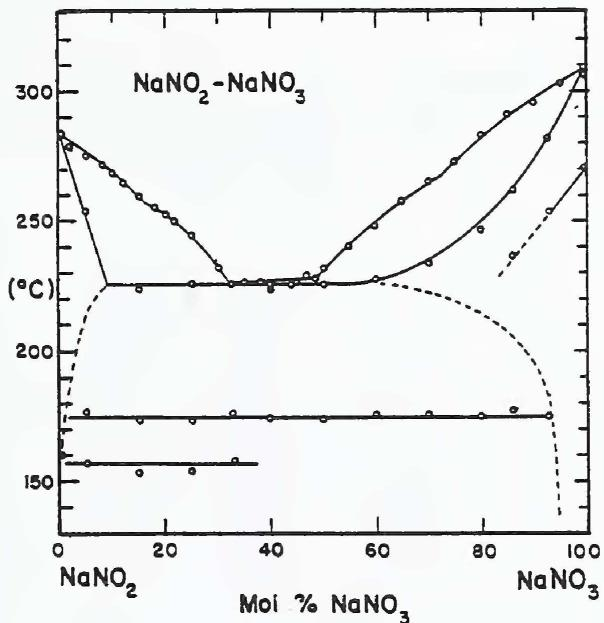  
Figure 145.1. $\mathrm{NaNO}_3$ - $\mathrm{NaNO}_2$ phase diagram

References [1-17]

2. Density (p)

Measurement method: Archimedean technique [19]

Equation:

$$
\rho = a + b T \tag {145.1}
$$

precision: in table 145.1

uncertainty: $\sim \pm 1.5\%$

Table 145.1. Parameters of equation (145.1) and precisions   

<table><tr><td>Mol % NaNO2</td><td>a</td><td>-b x 104</td><td>Precision</td><td>T range(K)</td></tr><tr><td>25</td><td>2.2532</td><td>6.435</td><td>±0.14%</td><td>550-770</td></tr><tr><td>35</td><td>2.2456</td><td>6.608</td><td>±0.04%</td><td>510-770</td></tr><tr><td>40</td><td>2.2287</td><td>6.495</td><td>±0.03%</td><td>490-770</td></tr><tr><td>50</td><td>2.1912</td><td>6.124</td><td>±0.10%</td><td>490-770</td></tr><tr><td>55</td><td>2.1900</td><td>6.137</td><td>±0.10%</td><td>490-770</td></tr><tr><td>60</td><td>2.1973</td><td>6.320</td><td>±0.03%</td><td>510-770</td></tr><tr><td>65</td><td>2.1927</td><td>6.343</td><td>±0.05%</td><td>550-770</td></tr><tr><td>75</td><td>2.1922</td><td>6.421</td><td>±0.04%</td><td>550-770</td></tr></table>

$$
\mathrm {N a N O} _ {3} - \mathrm {N a N O} _ {2} \tag {145}
$$

Two-independent-variables equation

$$
\rho = a + b T + c C \tag {145.2}
$$

$$
(C = \text {mol} \% \text {CaCl} _ {2})
$$

Table 145.2. Parameters of two-independent-variables equation (145.2) and precision   

<table><tr><td>a</td><td>-b x 104</td><td>c x 103</td><td>Precision</td></tr><tr><td>2.26498</td><td>-6.2576</td><td>-1.1945</td><td>0.02%</td></tr></table>

Table 145.3. Density $(\mathrm{gcm}^{-3})$ from equations in table 145.1   

<table><tr><td rowspan="2">T(K)</td><td colspan="8">Mol % NaNO2</td></tr><tr><td>25</td><td>35</td><td>40</td><td>50</td><td>55</td><td>60</td><td>65</td><td>75</td></tr><tr><td>490</td><td></td><td></td><td>1.910</td><td>1.891</td><td>1.889</td><td></td><td></td><td></td></tr><tr><td>510</td><td></td><td>1.909</td><td>1.897</td><td>1.879</td><td>1.877</td><td>1.875</td><td></td><td></td></tr><tr><td>530</td><td></td><td>1.895</td><td>1.884</td><td>1.867</td><td>1.865</td><td>1.862</td><td></td><td></td></tr><tr><td>550</td><td>1.899</td><td>1.882</td><td>1.871</td><td>1.854</td><td>1.852</td><td>1.850</td><td>1.844</td><td>1.839</td></tr><tr><td>570</td><td>1.886</td><td>1.869</td><td>1.858</td><td>1.842</td><td>1.840</td><td>1.837</td><td>1.831</td><td>1.826</td></tr><tr><td>590</td><td>1.874</td><td>1.856</td><td>1.845</td><td>1.830</td><td>1.828</td><td>1.824</td><td>1.818</td><td>1.813</td></tr><tr><td>610</td><td>1.861</td><td>1.843</td><td>1.833</td><td>1.818</td><td>1.816</td><td>1.812</td><td>1.806</td><td>1.801</td></tr><tr><td>630</td><td>1.848</td><td>1.829</td><td>1.820</td><td>1.805</td><td>1.803</td><td>1.799</td><td>1.793</td><td>1.788</td></tr><tr><td>650</td><td>1.835</td><td>1.816</td><td>1.807</td><td>1.793</td><td>1.791</td><td>1.787</td><td>1.780</td><td>1.775</td></tr><tr><td>670</td><td>1.822</td><td>1.803</td><td>1.794</td><td>1.781</td><td>1.779</td><td>1.774</td><td>1.768</td><td>1.762</td></tr><tr><td>690</td><td>1.809</td><td>1.790</td><td>1.781</td><td>1.769</td><td>1.767</td><td>1.761</td><td>1.755</td><td>1.749</td></tr><tr><td>710</td><td>1.796</td><td>1.776</td><td>1.768</td><td>1.756</td><td>1.754</td><td>1.749</td><td>1.742</td><td>1.736</td></tr><tr><td>730</td><td>1.783</td><td>1.763</td><td>1.755</td><td>1.744</td><td>1.742</td><td>1.736</td><td>1.730</td><td>1.723</td></tr><tr><td>750</td><td>1.771</td><td>1.750</td><td>1.742</td><td>1.732</td><td>1.730</td><td>1.723</td><td>1.717</td><td>1.711</td></tr><tr><td>770</td><td>1.758</td><td>1.737</td><td>1.729</td><td>1.720</td><td>1.717</td><td>1.711</td><td>1.704</td><td>1.698</td></tr></table>

References [18,19]

3. Surface Tension (γ)

Measurement method: maximum bubble pressure [20]

Equation:

$$
\gamma = a + b T \tag {145.3}
$$

precision: in table 145.4

uncertainty: $\sim \pm 2.5\%$

Table 145.4. Parameters of equation (145.3) and precisions   

<table><tr><td>Mol % NaNO2</td><td>a</td><td>-b x 103</td><td>Precision</td><td>T range(K)</td></tr><tr><td>20</td><td>138.6</td><td>39.0</td><td>*</td><td>530-710</td></tr><tr><td>40</td><td>136.7</td><td>35.0</td><td>*</td><td>520-690</td></tr><tr><td>60</td><td>139.3</td><td>38.0</td><td>*</td><td>530-710</td></tr><tr><td>80</td><td>135.0</td><td>30.0</td><td>*</td><td>560-740</td></tr></table>

\*not estimated; insufficient data

$$
\mathrm {N a N O} _ {3} - \mathrm {N a N O} _ {2} \tag {145}
$$

Two-independent-variables equation

$$
\gamma = a + b T + c T ^ {2} + d C ^ {3} + e T C
$$

$$
\left(C = \text {mol} \% \mathrm{NaNO}_2\right) \tag{145.4}
$$

Table 145.5. Parameters of two-independent-variables equation (145.4)   

<table><tr><td>a</td><td>b x 102</td><td>c x 105</td><td>d x 106</td><td>e x 105</td><td>Precision</td></tr><tr><td>142.36398</td><td>-4.81341</td><td>1.34004</td><td>2.76423</td><td>-9.2449</td><td>0.17%</td></tr></table>

Table 145.6. Surface tension (dyn cm $^{-1}$ ) from equations in table 145.4   

<table><tr><td rowspan="2">T(K)</td><td colspan="4">\( Mol\ \% \ NaNO_2 \)</td></tr><tr><td>20</td><td>40</td><td>60</td><td>80</td></tr><tr><td>520</td><td></td><td>118.5</td><td></td><td></td></tr><tr><td>540</td><td>117.5</td><td>117.8</td><td>118.8</td><td></td></tr><tr><td>560</td><td>116.8</td><td>117.1</td><td>118.0</td><td>118.2</td></tr><tr><td>580</td><td>116.0</td><td>116.4</td><td>117.3</td><td>117.6</td></tr><tr><td>600</td><td>115.2</td><td>115.7</td><td>116.5</td><td>117.0</td></tr><tr><td>620</td><td>114.4</td><td>115.0</td><td>115.7</td><td>116.4</td></tr><tr><td>640</td><td>113.6</td><td>114.3</td><td>115.0</td><td>115.8</td></tr><tr><td>660</td><td>112.9</td><td>113.6</td><td>114.2</td><td>115.2</td></tr><tr><td>680</td><td>112.1</td><td>112.9</td><td>113.5</td><td>114.6</td></tr><tr><td>700</td><td>111.3</td><td></td><td>112.7</td><td>114.0</td></tr><tr><td>720</td><td></td><td></td><td></td><td>113.4</td></tr><tr><td>740</td><td></td><td></td><td></td><td>112.8</td></tr></table>

References [20,21].

4. Viscosity (n)

No data

5. Electrical Conductance (K)

Measurement method: classical ac technique [22]

Equation:

$$
\kappa = \mathrm {A} \exp (- \mathrm {E} / \mathrm {R T}) \tag {145.5}
$$

precision: in table 145.7

uncertainty: $\sim \pm 5.0\%$

Table 145.7. Parameters of equation (145.5) and precisions   

<table><tr><td>Mol % NaNO3</td><td>A</td><td>E(cal mol-1)</td><td>Precision</td><td>T range(K)</td></tr><tr><td>7.5</td><td>13.2</td><td>2640</td><td>*</td><td>560-720</td></tr><tr><td>15.5</td><td>12.6</td><td>2630</td><td>*</td><td>550-720</td></tr><tr><td>30.0</td><td>12.0</td><td>2620</td><td>*</td><td>520-720</td></tr><tr><td>50.0</td><td>11.2</td><td>2620</td><td>*</td><td>520-720</td></tr><tr><td>75.0</td><td>11.7</td><td>2750</td><td>*</td><td>560-720</td></tr><tr><td>80.0</td><td>12.4</td><td>2860</td><td>*</td><td>570-720</td></tr></table>

\* not estimated; insufficient data

# (145) $\mathrm{NaNO}_{3} - \mathrm{NaNO}_{2}$

Table 145.8. Specific conductance $(ohm^{-1}cm^{-1})$ from equations in table 145.7   

<table><tr><td rowspan="2">T(K)</td><td colspan="6">\( \mathrm {M o l}\% \mathrm {N a N O}_{3} \)</td></tr><tr><td>7.5</td><td>15.0</td><td>30.0</td><td>50.0</td><td>75.0</td><td>80.0</td></tr><tr><td>520</td><td></td><td></td><td>0.950</td><td>0.887</td><td></td><td></td></tr><tr><td>540</td><td></td><td></td><td>1.044</td><td>0.974</td><td></td><td></td></tr><tr><td>560</td><td>1.242</td><td>1.185</td><td>1.139</td><td>1.063</td><td>0.988</td><td></td></tr><tr><td>580</td><td>1.347</td><td>1.286</td><td>1.236</td><td>1.153</td><td>1.076</td><td>1.037</td></tr><tr><td>600</td><td>1.454</td><td>1.388</td><td>1.333</td><td>1.244</td><td>1.165</td><td>1.126</td></tr><tr><td>620</td><td>1.561</td><td>1.490</td><td>1.431</td><td>1.335</td><td>1.255</td><td>1.217</td></tr><tr><td>640</td><td>1.699</td><td>1.593</td><td>1.529</td><td>1.427</td><td>1.346</td><td>1.308</td></tr><tr><td>660</td><td>1.777</td><td>1.696</td><td>1.628</td><td>1.519</td><td>1.437</td><td>1.401</td></tr><tr><td>680</td><td>1.885</td><td>1.799</td><td>1.726</td><td>1.611</td><td>1.529</td><td>1.493</td></tr><tr><td>700</td><td>1.992</td><td>1.902</td><td>1.824</td><td>1.703</td><td>1.620</td><td>1.586</td></tr><tr><td>720</td><td>2.100</td><td>2.004</td><td>1.922</td><td>1.794</td><td>1.712</td><td>1.680</td></tr></table>

References [22]

# 6. Safety and Hazards

# A. Hazard rating

(i) Toxicity: $\mathrm{NaNO}_3$ , permitted as a food additive; $\mathrm{NaNO}_2$ , permitted in food; there appears some implication of increased cancer with chronic ingestion of nitrites.   
(ii) Vapor pressure: no information for this system; but see $\mathrm{NaNO}_3$ [32], and $\mathrm{NaNO}_2$ [33]

# B. Disaster hazards

(i) Molten salt bath "explosions": i.e. explosive generation of steam due to bulk water "carry-over" and/or equipment failure; i.e., explosive expansion of "trapped" air.   
(ii) On decomposition, nitrates emit toxic fumes (oxides of nitrogen) viz:

$$
2 \mathrm {M N O} _ {3} \longrightarrow 2 \mathrm {M N O} _ {2} + \mathrm {O} _ {2} \tag {145.6}
$$

$$
2 \mathrm {M N O} _ {2} \longrightarrow \mathrm {M} _ {2} \mathrm {O} + \mathrm {N O} + \mathrm {N O} _ {2} \tag {145.7}
$$

The subsequent decomposition reactions are complex; if the gas phase is continuously removed, the nitrite decomposition (above) to NO and $\mathrm{NO}_2$ is dominant.

(iii) Nitrates and nitrites are powerful oxidizing agents; violent (explosive) reactions possible in molten nitrates and carbonaceous materials (organic cpds., oils, carbon,...); aluminum alloys and bath sludges (e.g. iron oxides); magnesium alloys. Dangerous.

References [23-33]

# 7. Corrosion

Table 145.9. Corrosion studies from primary research literature   

<table><tr><td>Studies in molten nitrates and nitrites</td><td>References</td></tr><tr><td>Fe</td><td>[34-36]</td></tr><tr><td>Fe, Co, Ni, Cr, Al,...</td><td>[37-39]</td></tr><tr><td>Cu, Pt, Au, W,...</td><td>[38-40]</td></tr><tr><td>Zn, Pb, Cu, Ni, Al</td><td>[41]</td></tr><tr><td>Pt, S, steel</td><td>[42]</td></tr><tr><td>Zr</td><td>[43]</td></tr><tr><td>Oxide species</td><td>[44]</td></tr><tr><td>Electrochemical approach</td><td>[45,46]</td></tr><tr><td>Thermodynamic redox diagrams</td><td>[47,48]</td></tr><tr><td>Annotated corrosion biblio.</td><td>[49]</td></tr><tr><td>Reviews/molten salts</td><td>[50-52]</td></tr></table>

The compatibility studies in Table 145.9 are largely for $\mathrm{NaNO}_3$ , $\mathrm{KNO}_3$ , and their molten mixtures. For studies in molten $\mathrm{NaNO}_3$ - $\mathrm{NaNO}_2$ , and thermodynamic $\rho O_2$ diagrams, see [37].

References [34-52]

8. Diffusion

No data

9. Heat of Fusion $(\Delta H_{f}^{\circ})$

No data

$$
\mathrm {N a N O} _ {3} - \mathrm {N a N O} _ {2} \tag {145}
$$

10. Heat Capacity (Cp)

Measurement method: drop calorimetry [53]

Composition: 45.1 mol % NaNO₃ Temp. range: 508-766 K

$$
C _ {p} = 6 1. 5 0 - 3 5. 3 3 \times 1 0 ^ {- 3} T \tag {145.8}
$$

precision: $\sim \pm 1.5\%$

uncertainty: $\sim \pm 10\%$

Table 145.10. Heat_capacity from equation (145.8)   

<table><tr><td>T(K)</td><td>Cp(cal K-1mol-1)</td><td>T(K)</td><td>Cp(cal K-1mol-1)</td></tr><tr><td>510</td><td>43.5</td><td>700</td><td>36.8</td></tr><tr><td>550</td><td>42.1</td><td>750</td><td>35.0</td></tr><tr><td>600</td><td>40.3</td><td>770</td><td>34.3</td></tr><tr><td>650</td><td>38.5</td><td></td><td></td></tr></table>

The heat capacity of this mixture in the crystalline state, for the temperature range $380^{\circ} - 487\mathrm{K}$ , is given by: $C_p = -28.19 + 132.2 \times 10^{-3}T$ [53] (145.8)

References [53]

11. Volume Change on Melting $(\Delta V_{f})$

Measurement method: estimated from densities [54]

Table 145.11. Volume change on melting   

<table><tr><td>Binary eutectic (mol % NaNO3)</td><td>(ΔVf/Vs)</td><td>Uncertainty</td></tr><tr><td>40 (a)</td><td>10.8%</td><td rowspan="2">~ ± 15%</td></tr><tr><td>50 (a)</td><td>10.0%</td></tr></table>

(a) binary eutectic mixtures

References [54]

12. Vapor Pressure $(p_{vap})$

No data

13. Thermal Conductivity (liquid) $(\lambda_{\ell})$

No data

14. Thermal Conductivity (solid) $(\lambda_{s})$

No data

15. Cryoscopic Constant $(k_{f})$

No data

16. References

[1] Bergman, A. G., Beruli, S. I., and Nikonova, I. N., Izv. Sekt. Fiz. Khim., A. 23, 183 (1953).   
[2] Protsenko, P. I., Medvedev, B. S., Zhur. Neorg. Khim., 8, 1434 (1963).   
[3] Shisholina, R. P., Protsenko, P. I., Zhur. Neorg. Khim., 8, 1436 (1963).   
[4] Janz, G. J. Downey, J. R., Jr., Allen, C. B., and Tomkins, R. P. T., "Eutectic Data" - 2 Vols; ERDA-TID-27163-P1 & P2; NTIS, Washington, D. C. (1977).   
[5] Janz, G. J., Downey, J. R., Jr., Allen, C. B., and Tomkins, R. P. T., "Physical Properties Data Complications Relevant to Energy Storage. I. Molten Salts: Eutectic Data", NSRDS-NBS-61; U. S. Gov't Printing Office, Washington, D. C. (1978).   
[6] "International Critical Tables of Numerical Data, Physics, Chemistry, and Technology", 8 Vols., McGraw-Hill Book Co., N. Y. (1933).   
[7] "Landolt-Bornstein Zahlenwert und Funktionen aus Physik, Chemie, Astronomie, Geophysik und Technik", (10th Ed.) Springer-Verlag, Berlin, Heidelberg, N. Y. (1961).   
[8] Clark, P. V., "Fused Salt Mixtures: Eutectic Compositions and Melting Points Bibliography 1907-1968", Report No. SC-R-68-1680; Sandia Laboratories (1968), NTIS.   
[9] Robertson, W. D., "Binary Phase Diagrams of Halide Salts", Report No. Yale 2723 (2 Vols.), U. S. AEC Contract AT (30-1)-2723 (1966), NTIS.   
[10] Thoma, R. E., "Phase Diagrams of Nuclear Reactor Materials", Oak Ridge National Laboratory, ORNL-2548, Contract No. W-7405-eng-26.   
[11] Thoma, R. E., "Phase Diagrams of Binary and Ternary Fluoride Systems", Chapt. 6; Adv. Molten Salts Chemistry, Vol. 3 (J. Braunstein, G. Mamantov, and G. P. Smith, eds.), Plenum Press, N. Y. (1975).   
[12] Voskresenskaya, N. K., ed., "Handbook of Solid-Liquid Equilibria in Systems of Inorganic Salts", Volumes 1, 2, Izc. Akad. Nauk SSSR, Moscow (1961). Israel Program for Scientific Translations, Jerusalem, 1970 (NTIS).   
[13] Sinistri, C., Franzozini, P., and Rolla, M., "An Atlas of Miscibility Gaps in Molten Salt Systems", Institute of Physical Chemistry, University of Pavia (Italy) (1968).   
[14] Shaffer, P. T. B., "High Temperature Materials", Plenum Press Handbooks of High Temperature Materials, No. 1, Materials Index, Plenum Press, New York, (1964).   
[15] Franzozini, P., Ferloni, P., and Spinolo, C., "Molten Salts with Organic Anions", Instituto di Chimica Fisica, Universita di Pavia (Italy), (1973).   
[16] Toropov, N. A. et al., "Handbook of Phase Diagrams of the Silicates, Volume 1: Binary Systems, Volume 2, Metal-Oxygen Compounds in Silicate Systems", Izdatel'stov "Nauka" Leningradskoe Otdelenie, Leningrad, 1969, Israel Program for Scientific Translations, Jerusalem, 1972 (NTIS).   
[17] Levin, E., et al., "Phase Diagrams for Ceramists", Amer. Ceramic Soc. (publ.), Columbus, Ohio (1964; 1969).   
[18] Bloom, H., Knaggs, I. W., Molloy, J. J., and Welch, D., Trans. Faraday Soc., 49, 1449 (1953).   
[19] Polyakov, V. D., and Beruli, S. H., Izvest. Siktora Fiz.-Khim., Anal., 26, 164 (1955).

(145) $\mathrm{NaNO}_3\cdot \mathrm{NaNO}_2$   
[20] Bloom, H., Davis, F. G. and James, D. W., Trans. Faraday Soc. 56, 1179 (1960).   
[21] Protsenko, P. I. and Gurvich, Yu. V., Ukr. Khim. Zh. 36, 117 (1970).   
[22] Bloom, H., Knaggs, I. W., Molloy, J. J., and Welch, D., Trans. Faraday Soc., 49, 1449 (1953).   
[23] Stern, K., "High Temperature Properties and Decomposition of Inorganic Salts. III. Nitrates and Nitrites", J. Phys. Chem. Ref. Data, 1, 747-772 (1972).   
[24] "Dangerous Properties of Materials", Sax, N. I., Van Nostrand Reinhold Co., N. Y. (1969).   
[25] "Registry of Toxic Effects of Chemical Substances", Christensen, H. E., and Lubinybyhl, T. T., eds., U. S. Dept. H.E.W; U. S. Gov't Printing Office, Washington, D. C. (1975).   
[26] "Potential Hazards in Molten Salt Baths for Heat Treatment of Metals", National Board Fire Underwriters Research Report No. 2. (1954).   
[27] "Handbook of Reactive Chemical Hazards", Bretherwick, L., Butterworths Co., London (1975).   
[28] Janz, G. J., Tomkins, R. P. T., Downey, J. R., Jr., and Allen, C. B., "Safety and Hazards", Chapter in "Eutectic Data", ERDA TID-27163-P1; NTIS, U. S. Dept. Commerce, Springfield, Va. (1977).   
[29] Freeman, E. S., J. Amer. Chem. Soc., 79, 838 (1957).   
[30] Oza, T. M., J. Indian Chem. Soc., 22, 173 (1945).   
[31] Oza, T. M., Walawalkar, B. R., J. Indian Chem. Soc., 22, 243 (1945).   
[32] Janz, G. J., et al., "Physical Properties Data Complications Relevant to Energy Storage. Part II. Molten Salts: Data on Single and Multi-Component Salt Systems", NSRDS-NBS 61, Part II (April 1979), U. S. Gov't Printing Office, Supt of Doc. No. C13-48-61, Washington D. C. 20402.   
[33] vide: this work, System 74, $\mathrm{NaNO}_2$ .   
[34] Arvia, A. J., Podesta, J. J., and Piatti, R. C. V., Electrochim. Acta, 17, 33 (1972).   
[35] Marchiano, S. L., and Arvia, A. J., Electrochim. Acta, 17, 25 (1972).   
[36] Notoya, T., Ishikawa, T., Midorikawa, R., Denki Kagaku, 39, 930 (1971); ibid, 40, 62 (1972).   
[37] Marchiano, S. L., and Arvia, A. J., An. Soc. Cient. Argent., 192, 263 (1971).   
[38] Brough, B. J., Kerridge, D. H., Inorg. Chem., 4, 1353 (1965).   
[39] Swofford, H. S., Jr., Laitinen, H. A., J. Electrochem. Soc., 110, 816 (1963).   
[40] Notoya, T., Denki Kagaku, 41, 779 (1973).   
[41] Herquet, M. L. H., Industrie Chim. Belge, 20, 592 (1955).   
[42] Johnson, K. E., Electrochim. Acta, 11, 129 (1966).   
[43] Andreev, Y. Y., Fokin, M. N., Shitikov, Y. A., Fiz. Khim. Elektrokhim. Rasplav. Solei Tverd. Ekektrolitov, 2, 100 (1973).

(145) $\mathrm{NaNO}_3 - \mathrm{NaNO}_2$   
[44] Johnson, K. E., Zacharias, P. S., and Mathews, J., "Proceedings Intern. Symp. Molten Salts", p. 603, The Electrochemical Soc., Princeton, N. J., (1976).   
[45] Pizzini, S., "Materials Problems in the Industrial Applications of Molten Salts", "Proceedings of the European Conference on the Development of Molten Salts Applications", p. 203; Battelle, Geneva, (1973).   
[46] Johnson, K. E., "Electrochemical Approaches to Corrosion in Molten Salts", Proceedings International Symposium on Metal-Slag-Gas Reactions and Processes, The Electrochemical Society, Inc., Princeton, N. J. (1975).   
[47] Bartlett, H. E., and Johnson, K. E., Canad. J. Chem., 44, 2119 (1966).   
[48] Conte, A., and Ingram, M. D., Electrochim. Acta, 13, 1551 (1968).   
[49] Janz, G. J., and Tomkins, R. P. T., Corrosion, 35, 485 (1979).   
[50] Inman, D., and Wrench, N. S., Brit. Corr. J., 1, 246 (1966).   
[51] Ketelaar, J. A. A., Chemie. Ing. Techn., 45, 667 (1973).   
[52] Smirnov, M. V. and Ozeryanaya, I., Nauki. Tekh. Korros. Zasch. Korros., 2, 171 (1973).   
[53] Voskresenskay, N. K., Yekoskaya, G. N., and Amosov, V. Y., Zhur. Prikl. Khim. 21, 18 (1948).   
[54] Janz, G. J., et al. (MSDC-RPI), unpublished work (1980).

# 1. Melting Temperatures $(T_{m})$

Pure substance melting points:

KNO2 440°C

$\mathrm{NaNO}_3$ : $307^{\circ}\mathrm{C}$

Minimum melting mixture:

$\sim 149^{\circ} \mathrm{C}$ , composition: $\sim 48 \mathrm{~mol} \% \mathrm{KNO}_{2}$

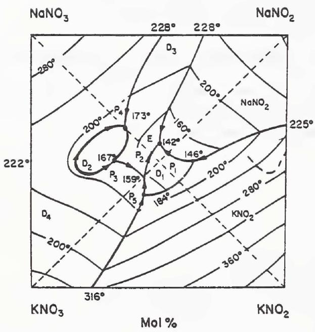  
(A) $\mathrm{NaNO}_{3} - \mathrm{KNO}_{2} - \mathrm{NaNO}_{2} - \mathrm{KNO}_{3}$

Figure 146.1 KNO $_2$ -NaNO $_3$ phase diagram   
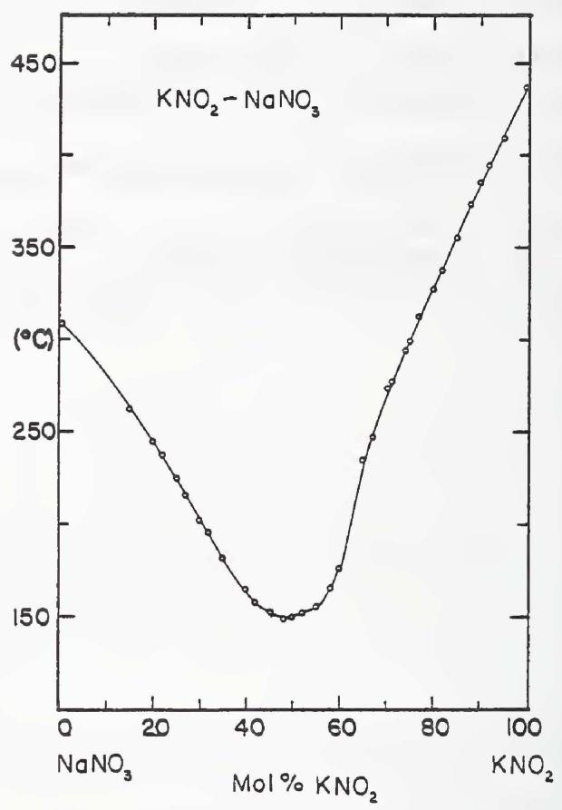  
(B) Diagonal Pair $\mathrm{KNO}_2\text{-NaNO}_3$

This system is a diagonal in the system: $\mathrm{NaNO}_2 - \mathrm{NaNO}_3 - \mathrm{KNO}_3 - \mathrm{KNO}_2$ ; for the ternary system: $\mathrm{NaNO}_2 - \mathrm{NaNO}_3 - \mathrm{KNO}_3$ , see system 148.

References [1-19]

# 2. Density (ρ)

Measurement method: Archimedean technique [20]

Equation:

$$
\rho = a + b T \quad (1 4 6. 1)
$$

precision: in table 146.1

uncertainty: $\sim$ ±1.5%

Table 146.1. Parameters of equation (146.1) and precisions   

<table><tr><td>\( \mathrm{{Mol}}\% {\mathrm{{KNO}}}_{3} \)</td><td>a</td><td>\( - b \times  {10}^{4} \)</td><td>Precision</td><td>T range(K)</td></tr><tr><td>15</td><td>2.3072</td><td>6.963</td><td>± 0.14%</td><td>530-770</td></tr><tr><td>25</td><td>2.2934</td><td>6.903</td><td>± 0.25%</td><td>510-770</td></tr><tr><td>35</td><td>2.2577</td><td>6.677</td><td>± 0.04%</td><td>470-770</td></tr><tr><td>45</td><td>2.2658</td><td>6.983</td><td>± 0.10%</td><td>470-770</td></tr><tr><td>50</td><td>2.2266</td><td>6.539</td><td>± 0.13%</td><td>470-770</td></tr><tr><td>55</td><td>2.2234</td><td>6.602</td><td>± 0.11%</td><td>470-770</td></tr><tr><td>65</td><td>2.2057</td><td>6.550</td><td>± 0.07%</td><td>490-770</td></tr><tr><td>75</td><td>2.1839</td><td>6.402</td><td>± 0.02%</td><td>550-770</td></tr><tr><td>85</td><td>2.1638</td><td>6.285</td><td>± 0.02%</td><td>590-770</td></tr></table>

Two-independent-variable equation:

$$
\rho = a + b T + c C \tag {146.2}
$$

$$
\left(\mathrm{C} = \mathrm{mol}\% \mathrm{KNO}_{2}\right)
$$

Table 146.2. Parameters of two-independent-variable equation (146.2)   

<table><tr><td>a</td><td>-b x 104</td><td>-c x 103</td><td>Precision</td></tr><tr><td>2.30556</td><td>6.70079</td><td>1.3431</td><td>0.22%</td></tr></table>

Table 146.3. Density $(\mathrm{gcm}^{-3})$ from equations in table 146.1   

<table><tr><td rowspan="2">T(K)</td><td colspan="9">Mo1 % KNO3</td></tr><tr><td>15</td><td>25</td><td>35</td><td>45</td><td>50</td><td>55</td><td>65</td><td>75</td><td>85</td></tr><tr><td>470</td><td></td><td></td><td>1.944</td><td>1.938</td><td>1.919</td><td>1.913</td><td></td><td></td><td></td></tr><tr><td>490</td><td></td><td></td><td>1.931</td><td>1.924</td><td>1.906</td><td>1.900</td><td>1.885</td><td></td><td></td></tr><tr><td>510</td><td></td><td>1.941</td><td>1.917</td><td>1.910</td><td>1.893</td><td>1.887</td><td>1.872</td><td></td><td></td></tr><tr><td>530</td><td>1.938</td><td>1.928</td><td>1.904</td><td>1.896</td><td>1.880</td><td>1.873</td><td>1.859</td><td></td><td></td></tr><tr><td>550</td><td>1.924</td><td>1.914</td><td>1.890</td><td>1.882</td><td>1.867</td><td>1.860</td><td>1.845</td><td>1.832</td><td></td></tr><tr><td>570</td><td>1.910</td><td>1.900</td><td>1.877</td><td>1.868</td><td>1.854</td><td>1.847</td><td>1.832</td><td>1.819</td><td></td></tr><tr><td>590</td><td>1.896</td><td>1.886</td><td>1.864</td><td>1.854</td><td>1.841</td><td>1.834</td><td>1.819</td><td>1.806</td><td>1.793</td></tr><tr><td>610</td><td>1.882</td><td>1.872</td><td>1.850</td><td>1.840</td><td>1.828</td><td>1.821</td><td>1.806</td><td>1.793</td><td>1.780</td></tr><tr><td>630</td><td>1.869</td><td>1.859</td><td>1.837</td><td>1.826</td><td>1.815</td><td>1.807</td><td>1.793</td><td>1.781</td><td>1.768</td></tr><tr><td>650</td><td>1.855</td><td>1.845</td><td>1.824</td><td>1.812</td><td>1.802</td><td>1.794</td><td>1.780</td><td>1.768</td><td>1.755</td></tr><tr><td>670</td><td>1.841</td><td>1.831</td><td>1.810</td><td>1.798</td><td>1.788</td><td>1.781</td><td>1.767</td><td>1.755</td><td>1.743</td></tr><tr><td>690</td><td>1.827</td><td>1.817</td><td>1.797</td><td>1.784</td><td>1.775</td><td>1.768</td><td>1.754</td><td>1.742</td><td>1.730</td></tr><tr><td>710</td><td>1.813</td><td>1.803</td><td>1.784</td><td>1.770</td><td>1.762</td><td>1.755</td><td>1.741</td><td>1.729</td><td>1.718</td></tr><tr><td>730</td><td>1.799</td><td>1.789</td><td>1.770</td><td>1.756</td><td>1.749</td><td>1.741</td><td>1.728</td><td>1.717</td><td>1.705</td></tr><tr><td>750</td><td>1.785</td><td>1.776</td><td>1.757</td><td>1.742</td><td>1.736</td><td>1.728</td><td>1.714</td><td>1.704</td><td>1.692</td></tr><tr><td>770</td><td>1.771</td><td>1.762</td><td>1.744</td><td>1.728</td><td>1.723</td><td>1.715</td><td>1.701</td><td>1.691</td><td>1.680</td></tr></table>

(146) $\mathrm{KNO}_2\text{-NaNO}_3$

3. Surface Tension (Y) No data   
4. Viscosity (n) No data   
5. Electrical Conductance (K) No data   
6. Safety and Hazards

# A. Hazard rating

(i) Toxicity: $\mathrm{NaNO}_3$ , permitted as a food additive; $\mathrm{KNO}_2$ toxicity rating, severe; there appears some implication of increased cancer with chronic ingestion of nitrates.   
(ii) Vapor pressure: no information for this system; but see $\mathrm{NaNO}_3$ [53] and $\mathrm{KNO}_2$ [54].

# B. Disaster hazards

(i) Molten salt bath "explosions": i.e. explosive generation of steam due to bulk water "carry-over" and/or equipment failure; i.e., explosive expansion of "trapped" air.   
(ii) On decomposition, nitrates and nitrites emit toxic fumes (oxides of nitrogen) viz:

$$
2 \mathrm {M N O} _ {3} \rightarrow 2 \mathrm {M N O} _ {2} + \mathrm {O} _ {2} \tag {146.3}
$$

$$
2 \mathrm {M N O} _ {2} \longrightarrow \mathrm {M} _ {2} \mathrm {O} + \mathrm {N O} + \mathrm {N O} _ {2} \tag {146.4}
$$

The subsequent decomposition reactions are complex; if the gas phase is continuously removed, the nitrite decomposition (above) to NO and $\mathrm{NO}_2$ is dominant.

(iii) Nitrates and nitrites are powerful oxidizing agents; violent (explosive) reactions possible in molten nitrates and carbonaceous materials (organic cpds., oils, carbon,...); aluminum alloys and bath sludges (e.g. iron oxides); magnesium alloys. Dangerous.

References [21-32]

# 7. Corrosion

Table 146.4. Corrosion studies from primary research literature   

<table><tr><td>Studies in molten nitrates and nitrites</td><td>References</td></tr><tr><td>Fe</td><td>[33,35,37]</td></tr><tr><td>Fe, Co, Ni, Cr, Al,...</td><td>[34,42,43]</td></tr><tr><td>Cu, Pt, Au, W,...</td><td>[36,42,43]</td></tr><tr><td>Zn, Pb, Cu, Ni, Al</td><td>[40]</td></tr><tr><td>Pt, S, steel</td><td>[38]</td></tr><tr><td>Zr</td><td>[41]</td></tr><tr><td>Oxide species</td><td>[39]</td></tr><tr><td>Electrochemical approach</td><td>[44,45]</td></tr><tr><td>Thermodynamic redox diagrams</td><td>[46,47]</td></tr><tr><td>Annotated corrosion bibliio.</td><td>[48]</td></tr><tr><td>Reviews/molten salts</td><td>[49-51]</td></tr></table>

References [33-51]

8. Diffusion

No data

9. Heat of Fusion $(\Delta H_{f}^{o})$

No data

10. Heat Capacity (Cp)

No data

11. Volume Change on Melting $(\Delta V_{f})$ Measurement method: estimated from densities [52]

Table 146.5. Volume change on melting   

<table><tr><td>Binary eutectic (mol % NaNO3)</td><td>(ΔVf/Vs)</td><td>Uncertainty</td></tr><tr><td>52%</td><td>3.6%</td><td>~ ± 10%</td></tr></table>

References [52]

12. Vapor Pressure $(p_{vap})$ No data   
13. Thermal Conductivity (liquid) $(\lambda_{\ell})$ No data   
14. Thermal Conductivity (solid) $(\lambda_{8})$ No data   
15. Cryoscopic Constant $(k_{f})$ No data   
16. References

[1] Alexander, J., Hindin, S. G., Ind. and Chem. Eng., 39, 1044 (1947).   
[2] Kagan, M., and Kamyshan, N., Zhur. Prikl. Khim., 5, 347 (1932).   
[3] Sakai, K., Bull. Soc. Chem., Japan 27, 463 (1954).   
[4] Kirst, W. E., Nagle, W. M., Castner, J. B., Trans. Amer. Inst. Chem. Engrs., 36, 371 (1940).   
[5] Beruli, S. I. and Bergman, A. G., Izv. Sekt. Fiz. Khim. A., 25, 218 (1954).   
[6] Janz, G. J. Downey, J. R., Jr., Allen, C. B., and Tomkins, R. P. T., "Eutectic Data" - 2 Vols; ERDA-TID-27163-P1 & P2; NTIS, Washington, D. C. (1977).   
[7] Janz, G. J., Downey, J. R., Jr., Allen, C. B., and Tomkins, R. P. T., "Physical Properties Data Complications Relevant to Energy Storage. I. Molten Salts: Eutectic Data", NSRDS-NBS-61; U. S. Gov't Printing Office, Washington, D. C. (1978).   
[8] "International Critical Tables of Numerical Data, Physics, Chemistry, and Technology", 8 Vols., McGraw-Hill Book Co., N. Y. (1933).

# (146) $\mathrm{KNO}_2\cdot \mathrm{NaNO}_3$

[9] "Landolt-Bornstein Zahlenwert und Funktionen aus Physik, Chemie, Astronomie, Geophysik und Technik", (10th Ed.) Springer-Verlag, Berlin, Heidelberg, N. Y. (1961).   
[10] Clark, P. V., "Fused Salt Mixtures: Eutectic Compositions and Melting Points Bibliography 1907-1968", Report No. SC-R-68-1680; Sandia Laboratories (1968), NTIS.   
[11] Robertson, W. D., "Binary Phase Diagrams of Halide Salts", Report No. Yale 2723 (2 Vols.), U. S. AEC Contract AT (30-1)-2723 (1966), NTIS.   
[12] Thoma, R. E., "Phase Diagrams of Nuclear Reactor Materials", Oak Ridge National Laboratory, ORNL-2548, Contract No. W-7405-eng-26.   
[13] Thoma, R. E., "Phase Diagrams of Binary and Ternary Fluoride Systems", Chapt. 6; Adv. Molten Salts Chemistry, Vol. 3 (J. Braunstein, G. Mamantov, and G. P. Smith, eds.), Plenum Press, N. Y. (1975).   
[14] Voskresenskaya, N. K., ed., "Handbook of Solid-Liquid Equilibria in Systems of Inorganic Salts", Volumes 1, 2, Izc. Akad. Nauk SSSR, Moscow (1961). Israel Program for Scientific Translations, Jerusalem, 1970 (NTIS).   
[15] Sinistri, C., Franzozini, P., and Rolla, M., "An Atlas of Miscibility Gaps in Molten Salt Systems", Institute of Physical Chemistry, University of Pavia (Italy) (1968).   
[16] Shaffer, P. T. B., "High Temperature Materials", Plenum Press Handbooks of High Temperature Materials, No. 1, Materials Index, Plenum Press, New York, 1964.   
[17] Franzozini, P., Ferloni, P., and Spinolo, C., "Molten Salts with Organic Anions", Instituto di Chimica Fisica, Universita di Pavia (Italy), 1973.   
[18] Toropov, N. A. et al., "Handbook of Phase Diagrams of the Silicates, Volume 1: Binary Systems, Volume 2, Metal-Oxygen Compounds in Silicate Systems", Izdatel'stov "Nauka" Leningradskoe Otdelenie, Leningrad, 1969, Israel Program for Scientific Translations, Jerusalem, 1972 (NTIS).   
[19] Levin, E., et al., "Phase Diagrams for Ceramists", Amer. Ceramic Soc. (publ.), Columbus, Ohio (1964; 1969).   
[20] Polyakov, V. D., and Beruli, S. H., Izvest. Siktora Fiz. Khim. Anal., 26, 164 (1955)   
[21] Janz, G. J., et al., "Physical Properties Data Complications Relevant to Energy Storage. Part II. Molten Salts: Data on Single and Multi-Component Salt Systems", NSRDS-NBS 61, Part II (April 1979), U. S. Gov't Printing Office, Supt of Doc. No. C13-48-61, Washington D. C. 20402.   
[22] vide: this work, System 58, KNO $_2$ .   
[23] Freeman, E. S., J. Amer. Chem. Soc., 79, 838 (1957).   
[24] Protsenko, P. I., Bordyushkova, E. A., Zhur. Neorg. Khim., 10, 1215 (1965).   
[25] Oza, T. M., J. Indian Chem. Soc., 22, 173 (1945).   
[26] Oza. T. M., Walawalkar, B. R., J. Indian Chem. Soc., 22, 243 (1945).

[27] Stern, K., "High Temperature Properties and Decomposition of Inorganic Salts. III. Nitrates and Nitrites", J. Phys. Chem. Ref. Data, 1, 747-772 (1972).   
[28] "Dangerous Properties of Materials", Sax, N. I., Van Nostrand Reinhold Co., N. Y. (1969).   
[29] "Registry of Toxic Effects of Chemical Substances", Christensen, H. E., and Lubinybyhl, T. T., eds., U. S. Dept. H.E.W; U. S. Gov't Printing Office, Washington, D. C. (1975).   
[30] "Potential Hazards in Molten Salt Baths for Heat Treatment of Metals", National Board Fire Underwriters Research Report No. 2. (1954).   
[31] "Handbook of Reactive Chemical Hazards", Bretherwick, L., Butterworths Co., London (1975).   
[32] Janz, G. J., Tomkins, R. P. T., Downey, J. R., Jr., and Allen, C. B., "Safety and Hazards", Chapter in "Eutectic Data", ERDA TID-27163-P1; NTIS, U. S. Dept. Commerce, Springfield, Va. (1977).   
[33] Arvia, A. J., Podesta, J. J., and Piatti, R. C. V., Electrochim. Acta, 17, 33 (1972).   
[34] Marchiano, S. L., and Arvia, A. J., An. Soc. Cient. Argent., 192, 263 (1971).   
[35] Marchiano, S. L., and Arvia, A. J., Electrochim. Acta, 17, 25 (1972).   
[36] Notoya, T., Denki Kagaku, 41, 779 (1973).   
[37] Notoya, T., Ishikawa, T., Midorikawa, R., Denki Kagaku, 39, 930 (1971); ibid, 40, 62 (1972).   
[38] Johnson, K. E., Electrochimica Acta, 11, (1966).   
[39] Johnson, K. E., Zacharias, P. S., and Mathews, J., "Proceedings Intern. Symp. Molten Salts", p. 603, The Electrochemical Soc., Princeton, N. J., (1976).   
[40] Herquet, M. L. H., Industrie Chim. Belge, 20, 592 (1955).   
[41] Andreev, Y. Y., Fokin, M. N., Shitikov, Y. A., Fiz. Khim. Elektrokhim. Rasplav. Solei Tverd. Ekektrolitov, 2, 100 (1973).   
[42] Brough, B. J., Kerridge, D. H., Inorg. Chem., 4, 1353 (1965).   
[43] Swofford, H. S., Jr., Laitinen, H. A., J. Electrochem. Soc., 110, 816 (1963).   
[44] Pizzini, S., "Materials Problems in the Industrial Applications of Molten Salts", "Proceedings of the European Conference on the Development of Molten Salts Applications", p. 203; Battelle, Geneva, (1973).   
[45] Johnson, K. E., "Electrochemical Approaches to Corrosion in Molten Salts", Proceedings International Symposium on Metal-Slag-Gas Reactions and Processes, The Electrochemical Society, Inc., Princeton, N. J. (1975).   
[46] Bartlett, H. E., and Johnson, K. E., Canad. J. Chem., 44, 2119 (1966).   
[47] Conte, A., and Ingram, M. D., Electrochimica Acta, 13, 1551 (1968).   
[48] Janz, G. J., and Tomkins, R. P. T., Corrosion, 35, 485 (1979).   
[49] Inman, D., and Wrench, N. S., Brit. Corr. J., 1, 246 (1966).   
[50] Ketelaar, J. A. A., Chemie. Ing. Techn., 45, 667 (1973).

[51] Smirnov, M. V. and Ozeryanaya, I., Nauki. Tekh. Korros. Zasch. Korros., 2, 171 (1973).   
[52] Janz, G. J., et al. (MSDC-RPI), unpublished work (1980).

1. Melting Temperatures $(T_{m})$

Pure substance melting points:

KNO3: 335°C

$\mathrm{NaNO}_2: 282^{\circ}\mathrm{C}$

Minimum melting solid solution:

140.9°C, composition: 46 mol % KNO₃

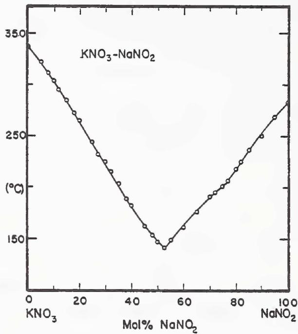  
Figure 147.1. $\mathrm{KNO}_3\text{-NaNO}_2$ phase diagram

References [1-19].

2. Density (ρ)

Measurement method: Archimedean technique [20]

Equation:

$$
\rho = a + b T \tag {147.1}
$$

precision: in table 147.1

uncertainty: $\sim \pm 1.5\%$

Table 147.1. Parameters of equation (147.1) and precisions   

<table><tr><td>\( \mathrm{{Mol}}\% {\mathrm{{NaNO}}}_{2} \)</td><td>a</td><td>-b x 10</td><td>Precision</td><td>1 range(n)</td></tr><tr><td>15</td><td>2.2982</td><td>7.233</td><td>0.03%</td><td>550-770</td></tr><tr><td>25</td><td>2.2662</td><td>6.890</td><td>0.05%</td><td>490-770</td></tr><tr><td>35</td><td>2.2433</td><td>6.693</td><td>0.03%</td><td>450-770</td></tr><tr><td>45</td><td>2.2344</td><td>6.674</td><td>0.02%</td><td>450-770</td></tr><tr><td>50</td><td>2.2292</td><td>6.650</td><td>0.02%</td><td>450-770</td></tr><tr><td>65</td><td>2.2106</td><td>6.625</td><td>0.03%</td><td>450-770</td></tr><tr><td>75</td><td>2.1932</td><td>6.507</td><td>0.02%</td><td>490-770</td></tr><tr><td>85</td><td>2.1664</td><td>6.260</td><td>0.03%</td><td>510-770</td></tr></table>

$$
\mathrm {K N O} _ {3} - \mathrm {N a N O} _ {2} \tag {147}
$$

Two-independent-variables equation

$$
\begin{array}{l} \rho = a + b T + c C + d T C ^ {2} \tag {147.2} \\ \left(\mathrm {C} = \mathrm {mol} \% \mathrm {Ca C l} _ {2}\right) \\ \end{array}
$$

Table 147.2. Parameters of two-independent-variables equation (147.2) and precision   

<table><tr><td>a</td><td>b x 104</td><td>c x 103</td><td>d x 109</td><td>Precision</td></tr><tr><td>2.16190</td><td>-6.4965</td><td>1.3016</td><td>5.1505</td><td>0.11%</td></tr></table>

Table 147.3. Density (g cm $^{-3}$ ) from equations in table 147.1   

<table><tr><td rowspan="2">T(K)</td><td colspan="8">\( \mathrm {Mol}\% \mathrm {NaNO}_{2} \)</td></tr><tr><td>15</td><td>25</td><td>35</td><td>45</td><td>50</td><td>65</td><td>75</td><td>85</td></tr><tr><td>450</td><td></td><td></td><td>1.942</td><td>1.934</td><td>1.930</td><td>1.912</td><td></td><td></td></tr><tr><td>470</td><td></td><td></td><td>1.929</td><td>1.921</td><td>1.917</td><td>1.899</td><td></td><td></td></tr><tr><td>490</td><td></td><td>1.929</td><td>1.915</td><td>1.907</td><td>1.903</td><td>1.886</td><td>1.874</td><td></td></tr><tr><td>510</td><td></td><td>1.915</td><td>1.902</td><td>1.894</td><td>1.890</td><td>1.873</td><td>1.861</td><td>1.847</td></tr><tr><td>530</td><td></td><td>1.901</td><td>1.889</td><td>1.881</td><td>1.877</td><td>1.859</td><td>1.848</td><td>1.835</td></tr><tr><td>550</td><td>1.900</td><td>1.887</td><td>1.875</td><td>1.867</td><td>1.863</td><td>1.846</td><td>1.835</td><td>1.822</td></tr><tr><td>570</td><td>1.886</td><td>1.873</td><td>1.862</td><td>1.854</td><td>1.850</td><td>1.833</td><td>1.822</td><td>1.810</td></tr><tr><td>590</td><td>1.871</td><td>1.860</td><td>1.848</td><td>1.841</td><td>1.837</td><td>1.820</td><td>1.809</td><td>1.797</td></tr><tr><td>610</td><td>1.857</td><td>1.846</td><td>1.835</td><td>1.827</td><td>1.824</td><td>1.806</td><td>1.796</td><td>1.785</td></tr><tr><td>630</td><td>1.843</td><td>1.832</td><td>1.822</td><td>1.814</td><td>1.810</td><td>1.793</td><td>1.783</td><td>1.772</td></tr><tr><td>650</td><td>1.828</td><td>1.818</td><td>1.808</td><td>1.801</td><td>1.797</td><td>1.780</td><td>1.770</td><td>1.760</td></tr><tr><td>670</td><td>1.814</td><td>1.805</td><td>1.795</td><td>1.787</td><td>1.784</td><td>1.767</td><td>1.757</td><td>1.747</td></tr><tr><td>690</td><td>1.799</td><td>1.791</td><td>1.781</td><td>1.774</td><td>1.770</td><td>1.753</td><td>1.744</td><td>1.734</td></tr><tr><td>710</td><td>1.785</td><td>1.777</td><td>1.768</td><td>1.761</td><td>1.757</td><td>1.740</td><td>1.731</td><td>1.722</td></tr><tr><td>730</td><td>1.770</td><td>1.763</td><td>1.755</td><td>1.747</td><td>1.744</td><td>1.727</td><td>1.718</td><td>1.709</td></tr><tr><td>750</td><td>1.756</td><td>1.749</td><td>1.741</td><td>1.734</td><td>1.730</td><td>1.714</td><td>1.705</td><td>1.697</td></tr><tr><td>770</td><td>1.741</td><td>1.736</td><td>1.728</td><td>1.721</td><td>1.717</td><td>1.700</td><td>1.692</td><td>1.684</td></tr></table>

# References [20]

3. Surface Tension (Y)

No data

4. Viscosity (n)

No data

5. Electrical Conductance (K)

Measurement method: classical ac technique [21]

Equation:

$$
\kappa = a + b T + c T ^ {2} \tag {147.3}
$$

precision: insufficient data for estimate uncertainty: $\sim$ 25%

Conductance data in [21] are graphical; the large uncertainty limits assigned above are due to insufficient information on the temperatures at which the measurements were made.

(147) KNO₃-NaNO₂   
Table 147.4. Parameters of equation (147.3) and precisions   

<table><tr><td>Mol % KNO3</td><td>a</td><td>b x 103</td><td>c x 106</td><td>Precision</td><td>T range(K)</td></tr><tr><td>25</td><td>0.9124</td><td>-4.770</td><td>7.667</td><td>*</td><td>630-690</td></tr><tr><td>45</td><td>0.7329</td><td>-4.469</td><td>7.438</td><td>*</td><td>630-690</td></tr><tr><td>60</td><td>-5.2331</td><td>13.920</td><td>-6.872</td><td>*</td><td>630-690</td></tr><tr><td>75</td><td>-8.3966</td><td>23.849</td><td>-14.810</td><td>*</td><td>630-690</td></tr><tr><td>85</td><td>-4.9728</td><td>13.854</td><td>-7.654</td><td>*</td><td>630-690</td></tr></table>

Table 147.5. Specific conductance $(ohm^{-1}cm^{-1})$ from equations in table 147.4   

<table><tr><td rowspan="2">T(K)</td><td colspan="5">Mol % KNO3</td></tr><tr><td>25</td><td>45</td><td>60</td><td>75</td><td>85</td></tr><tr><td>630</td><td>0.950</td><td>0.870</td><td>0.809</td><td>0.750</td><td>0.717</td></tr><tr><td>640</td><td>1.000</td><td>0.920</td><td>0.861</td><td>0.801</td><td>0.758</td></tr><tr><td>650</td><td>1.051</td><td>0.971</td><td>0.912</td><td>0.848</td><td>0.798</td></tr><tr><td>660</td><td>1.104</td><td>1.024</td><td>0.961</td><td>0.892</td><td>0.836</td></tr><tr><td>670</td><td>1.158</td><td>1.078</td><td>1.009</td><td>0.934</td><td>0.873</td></tr><tr><td>680</td><td>1.214</td><td>1.134</td><td>1.055</td><td>0.972</td><td>0.908</td></tr><tr><td>690</td><td>1.271</td><td>1.191</td><td>1.100</td><td>1.008</td><td>0.942</td></tr></table>

References [21]see comments on experimental uncertainty limits (vide infra p779)

# 6. Safety and Hazards

# A. Hazard rating

(i) Toxicity: $\mathrm{KNO}_3$ , permitted as a food additive; $\mathrm{NaNO}_2$ , permitted in food; there appears some implication of increased cancer with chronic ingestion of nitrites   
(ii) Vapor pressure: no information for this system; but see $\mathrm{KNO}_3$ [74], and $\mathrm{NaNO}_2$ [75]

(i) Molten salt bath "explosions": i.e. explosive generation of steam due to bulk water "carry-over" and/or equipment failure; i.e., explosive expansion of "trapped air".   
(ii) On decomposition, nitrates emit toxic fumes (oxides of nitrogen) viz:

$$
\mathrm {M N O} _ {3} \longrightarrow \mathrm {M N O} _ {2} + \frac {1}{2} \mathrm {O} _ {2} \tag {147.4}
$$

$$
2 \mathrm {M N O} _ {2} \longrightarrow \mathrm {M} _ {2} \mathrm {O} + \mathrm {N O} + \mathrm {N O} _ {2} \tag {147.5}
$$

The subsequent decomposition reactions are complex; if the gas phase is continuously removed, the nitrite decomposition (above) to NO and $\mathrm{NO}_2$ is dominant.

In the temperature range $550 - 600^{\circ}\mathrm{C}$ , and under oxygen, the conversion of $\mathrm{KNO}_2$ to $\mathrm{KNO}_3$ goes to completion; between $650 - 750^{\circ}\mathrm{C}$ , the two salts interconvert (see above), $\mathrm{KNO}_3$ becoming increasingly unstable; above $800^{\circ}\mathrm{C}$ , the nitrite decomposition: $2\mathrm{KNO}_2 \rightarrow \mathrm{K}_2\mathrm{O} + \mathrm{N}_2 + 3 / 2\mathrm{O}_2$ goes to completion.

Nitrates and nitrites are powerful oxidizing agents; violent (explosive) reactions possible in molten nitrates and carbonaceous materials (organic cpds., oils, carbon,...); aluminum alloys and bath sludges (e.g. iron oxides); magnesium alloys. Dangerous.

References [22-29]

7. Corrosion

Table 147.6. Corrosion studies from primary research literature   

<table><tr><td>Studies in molten nitrates and nitrites</td><td>References</td></tr><tr><td>Fe</td><td>[30-32]</td></tr><tr><td>Fe, Co, Ni, Cr, Al,...</td><td>[33-35]</td></tr><tr><td>Cu, Pt, Au, W,...</td><td>[34-36]</td></tr><tr><td>Zn, Pb, Cu, Ni, Al</td><td>[37]</td></tr><tr><td>Pt, S. steel</td><td>[38]</td></tr><tr><td>Zr</td><td>[39]</td></tr><tr><td>Oxide species</td><td>[40]</td></tr><tr><td>Electrochemical approach</td><td>[41,42]</td></tr><tr><td>Thermodynamic redox diagrams</td><td>[43,44]</td></tr><tr><td>Annotated corrosion biblio.</td><td>[45]</td></tr><tr><td>Reviews/molten salts</td><td>[46-48]</td></tr></table>

Compatibility studies specifically for molten $\mathrm{KNO}_3$ - $\mathrm{NaNO}_2$ . This system is a diagonal of the ternary system $\mathrm{NaNO}_2$ - $\mathrm{NaNO}_3$ - $\mathrm{KNO}_3$ . For the latter, see [37].

References [30-48]

(147) $\mathrm{KNO}_3\text{-NaNO}_2$

8. Diffusion

No data

9. Heat of Fusion $(\Delta H_{f}^{\circ})$

No data

10. Heat Capacity (Cp)

No data

11. Volume Change on Melting $(\Delta V_{f})$

Measurement method: estimated from densities [49]

Table 147.7. Volume change on melting   

<table><tr><td>Binary eutectic (mol % KNO3)</td><td>(ΔVf/Vs)</td><td>Uncertainty</td></tr><tr><td>46</td><td>8.7%</td><td>~ ± 15%</td></tr></table>

References [49]

12. Vapor Pressure $(p_{\text{vap}})$

No data

13. Thermal Conductivity (liquid) $\left( {\lambda }_{\ell }\right)$

Measurement method: transient method [50,51]

$$
\lambda = 1. 5 0 1 7 \times 1 0 ^ {- 3} - 0. 5 9 0 4 \times 1 0 ^ {- 6} \mathrm {T} \tag {147.6}
$$

precision: $\sim \pm 1.0\%$ uncertainty: $\sim \pm 10\%$

Table 147.8. Thermal conductivity of melt from equation (147.6)   

<table><tr><td>T(K)</td><td>λ x 104(cal cm-1s-1K-1)</td><td>T(K)</td><td>λ x 104(cal cm-1s-1K-1)</td></tr><tr><td>455</td><td>12.3</td><td>530</td><td>11.9</td></tr><tr><td>460</td><td>12.3</td><td>540</td><td>11.8</td></tr><tr><td>470</td><td>12.2</td><td>550</td><td>11.8</td></tr><tr><td>480</td><td>12.2</td><td>560</td><td>11.7</td></tr><tr><td>490</td><td>12.1</td><td>570</td><td>11.7</td></tr><tr><td>500</td><td>12.1</td><td>580</td><td>11.6</td></tr><tr><td>510</td><td>12.0</td><td>590</td><td>11.5</td></tr><tr><td>520</td><td>11.9</td><td>600</td><td>11.5</td></tr></table>

Small amounts of water ( $\sim$ 5 mol $\%$ ) were found to increase the thermal conductivity in the vicinity of the melting point i.e. $\sim$ $150^{\circ}\mathrm{C}$ by $\sim$ $3\%$ , and appeared to have no effect at somewhat higher temperatures (i.e. $\sim$ $250^{\circ}\mathrm{C}$ ).

The thermal conductivity could be increased by $\sim 20\%$ at $250^{\circ}\mathrm{C}$ by adding about $10\mathrm{mol}\%$ KF; this is close to the saturation solubility, and KF may deposit on cooling.

References [50-60]

(147) $\mathrm{KNO}_3 - \mathrm{NaNO}_2$

14. Thermal Conductivity (solid) $(\lambda_{s})$

No data

15. Cryoscopic Constant $(k_{f})$

No data

16. References

[1] Beruli, A. I. and Bergman, A. G., Izv. Sekt. Fiz. Khim., A. 25, 218 (1954).   
[2] Alexander, J., Hindin, S. G., Ind. and Chem. Eng., 39, 1044 (1947).   
[3] Kagan, M., Kamyshan, N., Zhur. Prikl. Khim., 5, 347 (1932).   
[4] Sakai, K., Bull. Soc. Chem., Japan 27, 463 (1954).   
[5] Kirst, W. E., Nagle, W. M., Castner, J. B., Trans. Amer. Inst. Chem. Engrs., 36, 371 (1940).   
[6] Janz, G. J. Downey, J. R., Jr., Allen, C. B., and Tomkins, R. P. T., "Eutectic Data" - 2 Vols; ERDA-TID-27163-P1 & P2; NTIS, Washington, D. C. (1977).   
[7] Janz, G. J., Downey, J. R., Jr., Allen, C. B., and Tomkins, R. P. T., "Physical Properties Data Complications Relevant to Energy Storage. I. Molten Salts: Eutectic Data", NSRDS-NBS-61; U. S. Gov't Printing Office, Washington, D. C. (1978).   
[8] "International Critical Tables of Numerical Data, Physics, Chemistry, and Technology", 8 Vols., McGraw-Hill Book Co., N. Y. (1933).   
[9] "Landolt-Bornstein Zahlenwert und Funktionen aus Physik, Chemie, Astronomie, Geophysik und Technik", (10th Ed.) Springer-Verlag, Berlin, Heidelberg, N. Y. (1961).   
[10] Clark, P. V., "Fused Salt Mixtures: Eutectic Compositions and Melting Points Bibliography 1907-1968", Report No. SC-R-68-1680; Sandia Laboratories (1968), NTIS.   
[11] Robertson, W. D., "Binary Phase Diagrams of Halide Salts", Report No. Yale 2723 (2 Vols.), U. S. AEC Contract AT (30-1)-2723 (1966), NTIS.   
[12] Thoma, R. E., "Phase Diagrams of Nuclear Reactor Materials", Oak Ridge National Laboratory, ORNL-2548, Contract No. W-7405-eng-26.   
[13] Thoma, R. E., "Phase Diagrams of Binary and Ternary Fluoride Systems", Chapt. 6; Adv. Molten Salts Chemistry, Vol. 3 (J. Braunstein, G. Mamantov, and G. P. Smith, eds.), Plenum Press, N. Y. (1975).   
[14] Voskresenskaya, N. K., ed., "Handbook of Solid-Liquid Equilibria in Systems of Inorganic Salts", Volumes 1, 2, Izc. Akad. Nauk SSSR, Moscow (1961). Israel Program for Scientific Translations, Jerusalem, 1970 (NTIS).   
[15] Sinistri, C., Franzozini, P., and Rolla, M., "An Atlas of Miscibility Gaps in Molten Salt Systems", Institute of Physical Chemistry, University of Pavia (Italy) (1968).   
[16] Shaffer, P. T. B., "High Temperature Materials", Plenum Press Handbooks of High Temperature Materials, No. 1, Materials Index, Plenum Press, New York, 1964.   
[17] Franzozini, P., Ferloni, P., and Spinolo, C., "Molten Salts with Organic Anions", Instituto di Chimica Fisica, Universita di Pavia (Italy), 1973.

(147) $\mathrm{KNO}_3 - \mathrm{NaNO}_2$

[18] Toropov, N. A. et al., "Handbook of Phase Diagrams of the Silicates, Volume 1: Binary Systems, Volume 2, Metal-Oxygen Compounds in Silicate Systems", Izdatel'stov "Nauka" Leningradskoe Otdelenie, Leningrad, 1969, Israel Program for Scientific Translations, Jerusalem, 1972 (NTIS).   
[19] Levin, E., et al., "Phase Diagrams for Ceramists", Amer. Ceramic Soc. (publ.), Columbus, Ohio (1964; 1969).   
[20] Polyakov, V. D., and Beruli, S. H., Izvest. Siktora Fiz.-Khim., Anal., 26, 164 (1955).   
[21] Sakai, K and Hayashi, S., J. Chem. Soc., Japan, 76, 101 (1955).   
[22] Stern, K., "High Temperature Properties and Decomposition of Inorganic Salts. III. Nitrates and Nitrites", J. Phys. Chem. Ref. Data, 1, 747-772 (1972).   
[23] Janz, G. J., Tomkins, R. P. T., Downey, J. R., Jr., and Allen, C. B., "Safety and Hazards", Chapter in "Eutectic Data", ERDA TID-27163-PI; NTIS, U. S.Dept. Commerce, Springfield, Va., (1977)   
[24] Freeman, E. S., J. Amer. Chem. Soc., 79, 838 (1957).   
[25] Protsenko, P. I., Bordyushkova, E. A., Zhur. Neorg. Khim., 10, 1215 (1965).   
[26] Oza, T. M., J. Indian Chem. Soc., 22, 173 (1945).   
[27] Oza, T. M., Walawalkar, B. R., J. Indian Chem. Soc., 22, 243 (1945).   
[28] Janz, G. J., et al., "Physical Properties Data Complications Relevant to Energy Storage. Part II. Molten Salts: Data on Single and Multi-Component Salt Systems", NSRDS-NBS 61, Part II (April 1979), U. S. Gov't Printing Office, Supt of Doc. No. C13-48-61, Washington D. C. 20402.   
[29] vide: this work, System 74, $\mathrm{NaNO}_2$   
[30] Arvia, A. J., Podesta, J. J., and Piatti, R. C. V., Electrochim. Acta, 17, 33 (1972).   
[31] Marchiano, S. L., and Arvia, A. J., Electrochim. Acta, 17, 25 (1972).   
[32] Notoya, T., Ishikawa, T., Midorikawa, R., Denki Kagaku, 39, 930 (1971); ibid, 40, 62 (1972).   
[33] Marchiano, S. L., and Arvia, A. J., An. Soc. Cient. Argent., 192, 263 (1971).   
[34] Brough, B. J., Kerridge, D. H., Inorg. Chem., 4, 1353 (1965).   
[35] Swofford, H. S., Jr., Laitinen, H. A., J. Electrochem. Soc., 110, 816 (1963).   
[36] Notoya, T., Denki Kagaku, 41, 779 (1973).   
[37] Herquet, M. L. H., Industrie Chim. Belge, 20, 592 (1955).   
[38] Johnson, K. E., Electrochim. Acta, 11, 129 (1966).   
[39] Andreev, Y. Y., Fokin, M. N., Shitikov, Y. A., Fiz. Khim. Elektrokhim. Rasplav. Solei Tverd. Ekektrolitov, 2, 100 (1973).   
[40] Johnson, K. E., Zacharias, P. S., and Mathews, J., "Proceedings Intern. Symp. Molten Salts", p. 603, The Electrochemical Soc., Princeton, N. J., (1976).   
[41] Pizzini, S., "Materials Problems in the Industrial Applications of Molten Salts", "Proceedings of the European Conference on the Development of Molten Salts Applications", p. 203; Battelle, Geneva, (1973).

[42] Johnson, K. E., "Electrochemical Approaches to Corrosion in Molten Salts", Proceedings International Symposium on Metal-Slag-Gas Reactions and Processes, The Electrochemical Society, Inc., Princeton, N. J. (1975).   
[43] Bartlett, H. E., and Johnson, K. E., Canad. J. Chem., 44, 2119 (1966).   
[44] Conte, A., and Ingram, M. D., Electrochim. Acta, 13, 1551 (1968).   
[45] Janz, G. J., and Tomkins, R. P. T., Corrosion, 35, 485 (1979).   
[46] Inman, D., and Wrench, N. S., Brit. Corr. J., 1, 246 (1966).   
[47] Ketelaar, J. A. A., Chemie. Ing. Techn., 45, 667 (1973).   
[48] Smirnov, M. V. and Ozeryanaya, I., Nauki. Tekh. Korros. Zasch. Korros., 2, 171 (1973).   
[49] Janz, G. J., et al. (MSDC-RPI), unpublished work (1980).   
[50] Turnbull, A. G., Ph.D. Thesis, Imperial College of Science and Technology, London (1959).   
[51] Turnbull, A. G., Australian J. Appl. Sci. 12, 30 (1961).   
[52] Cornwell, K., J. Phys. D: Appl. Phys. 4, 441 (1971).   
[53] Bloom, H., The Chemistry of Molten Salts", W. A. Benjamin, Inc. N.Y. (1967)   
[54] Gambell, W. R., Chemical Eng. 66, 129 (1959).   
[55] Jamieson, D. T., Irving, J. B., and Tudhope, J. S., "Liquid Thermal Conductivity Data", HMSO, Edinburgh (1975).   
[56] Hoffman, H. W., Oak Ridge Nat. Lab. Rept. CF55-7-52.   
[57] Rottenburg, P. A., Trans. Inst. Chem. Engrs. London 35, 21 (1957).   
[58] Vargaftick, N. B., Bull All-Un. Pwr. Engng. Inst. 21, 1 (1952).   
[59] Lane, J. A., McPherson, H. G., and Moslen, F., "Fluid Fuel Reactors", Addison-Wesley, Mass. (1958).   
[60] Kirst, W. E., Nagle, W. M., and Castner, J. B., Chem. Met. Eng. 47, 472 (1940).

1. Melting Temperatures $(T_{m})$

Pure substance melting points:

$\mathrm{NaNO}_{2}: 282^{\circ} \mathrm{C}$

$\mathrm{NaNO}_{3}$ : $307^{\circ} \mathrm{C}$

$\mathrm{KNO}_{3}: 335^{\circ} \mathrm{C}$

Eutectic melting point:

142°C, composition: 44 mol % KNO₃, 49 mol % NaNO₂, 7 mol % NaNO₃

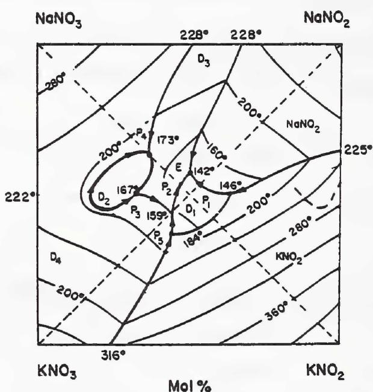  
Figure 148.1 $\mathrm{NaNO}_2\text{-NaNO}_3\text{-KNO}_3$ phase diagram

References [1-17]

2. Density (ρ)

Measurement method: Archimedean technique [2]

Equation:

$$
\rho = \cdot a + b T \tag {148.1}
$$

precision: in table 148.1 uncertainty: $\sim \pm 2.0\%$

$$
\mathrm {N a N O} _ {2} - \mathrm {N a N O} _ {3} - \mathrm {K N O} _ {3} \tag {148}
$$

Table 148.1. Parameters of equation (148.1) and precision   

<table><tr><td>Composition</td><td>a</td><td>-b x 103</td><td>Precision</td><td>T range(K)</td></tr><tr><td>ternary eutectic(a)</td><td>2.2936</td><td>0.7497</td><td>*</td><td>470-870</td></tr></table>

(a)

$\mathrm{NaNO}_{2}:\mathrm{NaNO}_{3}:\mathrm{KNO}_{3}::48.9:6.9:44.2 \text{(mol}\%)$ insufficient data for estimate

Table 148.2. Densities of $\mathrm{NaNO}_2$ - $\mathrm{NaNO}_3$ - $\mathrm{KNO}_3$ eutectics   
from equation in table 148.1   

<table><tr><td>T(K)</td><td>ρ(g cm-3)</td><td>T(K)</td><td>ρ(g cm-3)</td></tr><tr><td>470</td><td>1.941</td><td>690</td><td>1.776</td></tr><tr><td>490</td><td>1.926</td><td>710</td><td>1.761</td></tr><tr><td>510</td><td>1.911</td><td>730</td><td>1.746</td></tr><tr><td>530</td><td>1.896</td><td>750</td><td>1.731</td></tr><tr><td>550</td><td>1.881</td><td>770</td><td>1.716</td></tr><tr><td>570</td><td>1.866</td><td>790</td><td>1.701</td></tr><tr><td>590</td><td>1.851</td><td>810</td><td>1.686</td></tr><tr><td>610</td><td>1.836</td><td>830</td><td>1.671</td></tr><tr><td>630</td><td>1.821</td><td>850</td><td>1.656</td></tr><tr><td>650</td><td>1.806</td><td>870</td><td>1.641</td></tr><tr><td>670</td><td>1.791</td><td></td><td></td></tr></table>

References [2]

# 3. Surface Tension (Y)

Measurement method: calculated from single salts data [18]

Equation:

$$
\gamma = a + b T \tag {148.2}
$$

precision: in table 148.3 uncertainty: $\sim \pm 10\%$

Table 148.3. Parameters of equation (148.2) and precision

<table><tr><td>Composition</td><td>a</td><td>b x 103</td><td>Precision</td><td>T range(K)</td></tr><tr><td>ternary eutectic(a)</td><td>149.28</td><td>-55.60</td><td>0.03%</td><td>570-670</td></tr></table>

(a) $\mathrm{NaNO}_2:\mathrm{NaNO}_3:\mathrm{KNO}_3::48.9:6.9:44.2$ (mol %)

Table 148.4. Surface tension of ternary eutectic from equation in table 148.3   

<table><tr><td>T(K)</td><td>γ(dyn cm-1)</td><td>T(K)</td><td>γ(dyn cm-1)</td></tr><tr><td>570</td><td>117.58</td><td>630</td><td>114.25</td></tr><tr><td>580</td><td>117.03</td><td>640</td><td>113.60</td></tr><tr><td>590</td><td>116.47</td><td>650</td><td>113.14</td></tr><tr><td>600</td><td>115.92</td><td>660</td><td>112.58</td></tr><tr><td>610</td><td>115.36</td><td>670</td><td>112.02</td></tr></table>

References [18]

$$
\mathrm {N a N O} _ {2} - \mathrm {N a N O} _ {3} - \mathrm {K N O} _ {3} \tag {148}
$$

4. Viscosity (n)

Measurement method: Ostwald capillary technique [2]

Equation:

$$
\eta = a + b T + c T ^ {2} \tag {148.3}
$$

precision: in table 148.5

uncertainty: $\sim 5.0\%$

Table 148.5. Parameters of equation (148.3) and precision   

<table><tr><td>Composition</td><td>a</td><td>b</td><td>c x 103</td><td>d x 106</td><td>Precision</td><td>T range (K)</td></tr><tr><td>ternary eutetic(a)</td><td>473.7</td><td>-2.297</td><td>3.731</td><td>-2.019</td><td>16%</td><td>420-710</td></tr></table>

(a) $\mathrm{KNO}_3:\mathrm{NaNO}_2:\mathrm{NaNO}_3::44:49:7$ (mol %).

Table 148.6. Viscosity of ternary eutectic from equation in table 148.5   

<table><tr><td>T(K)</td><td>η(cp)</td><td>T(K)</td><td>η(cp)</td></tr><tr><td>420</td><td>17.53</td><td>580</td><td>2.62</td></tr><tr><td>440</td><td>13.36</td><td>600</td><td>2.56</td></tr><tr><td>460</td><td>10.04</td><td>620</td><td>2.57</td></tr><tr><td>480</td><td>7.48</td><td>640</td><td>2.57</td></tr><tr><td>500</td><td>5.58</td><td>660</td><td>2.45</td></tr><tr><td>520</td><td>4.25</td><td>680</td><td>2.12</td></tr><tr><td>540</td><td>3.36</td><td>700</td><td>1.47</td></tr><tr><td>560</td><td>2.85</td><td></td><td></td></tr></table>

References [2].

5. Electrical Conductance (K)

No data

6. Safety and Hazards

# A. Hazard rating

(i) Toxicity: $\mathrm{NaNO}_2$ , permitted in food; $\mathrm{NaNO}_3$ , $\mathrm{KNO}_3$ , permitted as food additives, there appears some implication of increased cancer incidence with chronic ingestion of nitrites.   
(ii) Vapor pressure: no information for this system; but see $\mathrm{NaNO}_2$ [25], $\mathrm{NaNO}_3$ [26], and $\mathrm{KNO}_3$ [26]

# (148) $\mathrm{NaNO}_2 - \mathrm{NaNO}_3 - \mathrm{KNO}_3$

# B. Disaster hazards

(i) Molten salt bath "explosions": i.e., explosive generation of steam due to bulk water "carry-over" and/or equipment failure; i.e., explosive expansion of "trapped" air.   
(ii) On decomposition, nitrates and nitrites emit toxic fumes (oxides of nitrogen) viz:

$$
2 \mathrm {M N O} _ {3} \rightarrow 2 \mathrm {M N O} _ {2} + \mathrm {O} _ {2} \tag {148.4.1}
$$

$$
2 \mathrm {M N O} _ {2} \longrightarrow \mathrm {M} _ {2} \mathrm {O} + \mathrm {N O} + \mathrm {N O} _ {2} \quad (1 4 8. 4. 2)
$$

The subsequent decomposition reactions are complex; if the gas phase is continuously removed, the nitrite decomposition (above) to NO and $\mathrm{NO}_2$ is dominant.

(iii) Nitrates and nitrites are powerful oxidizing agents; violent (explosive) reactions possible in molten nitrates and carbonaceous materials (organic cpds., oils, carbon,...); aluminum alloys and bath sludges (e.g. iron oxides); magnesium alloys. Dangerous.

References [19-29]

# 7. Corrosion

Table 148.7. Corrosion studies from primary research literature   

<table><tr><td>Studies in molten nitrates and nitrites</td><td>References</td></tr><tr><td>Fe</td><td>[30,32,34]</td></tr><tr><td>Fe, Co, Ni, Cr, Al,...</td><td>[31,39,40]</td></tr><tr><td>Cu, Pt, Au, W,...</td><td>[33,39,40]</td></tr><tr><td>Zn, Pb, Cu, Ni, Al</td><td>[37]</td></tr><tr><td>Pt, S, steel</td><td>[35]</td></tr><tr><td>Zr</td><td>[38]</td></tr><tr><td>Oxide species</td><td>[36]</td></tr><tr><td>Electrochemical approach</td><td>[41,42]</td></tr><tr><td>Thermodynamic redox diagrams</td><td>[43,44]</td></tr><tr><td>Annotated corrosion bibliio.</td><td>[45]</td></tr><tr><td>Reviews/molten salts</td><td>[46-48]</td></tr></table>

For studies specific to molten $\mathrm{NaNO}_2\mathrm{-NaNO}_3\mathrm{-KNO}_3$ see [37].

References [30-48]

(148) $\mathrm{NaNO}_2 - \mathrm{NaNO}_3 - \mathrm{KNO}_3$

8. Diffusion

No data

9. Heat of Fusion $(\Delta H_{f}^{\circ})$

No data

10. Heat Capacity $(C_p)$

Measurement method: drop calorimetry [49]

Table 148.8. Compositions and temperature ranges   

<table><tr><td colspan="4">Composition (mol %)</td><td rowspan="2">Phase</td><td rowspan="2">T range(K)</td></tr><tr><td>#</td><td>KNO3</td><td>NaNO3</td><td>NaNO2</td></tr><tr><td>1</td><td>53.0</td><td>7.0</td><td>40</td><td>l</td><td>426-776</td></tr><tr><td>2</td><td>53.5</td><td>18.0</td><td>28.5</td><td>l</td><td>447-775</td></tr></table>

For composition no. 1 the heat capacity in the

crystalline state, for the temperature range 384

-409 K, is given by: $C_p = -24.20 + 163.5 \times 10^{-3}T$ (148.5)

Similarly for composition no. 2, the heat capacity

in the crystalline state, for the temperature range

373-433 K, is given by: $C_p = 613.09 - 312.6 \times 10^{-3}T$

+4160x $10^{-6}\mathrm{T}^{2}$ .(148.6)

Equation:

$$
C _ {p} = a + b T + c T ^ {2} \tag {148.7}
$$

precision: in table 148.9 uncertainty: $\sim$ 5.0%

Table 148.9. Parameters of equation (148.7) and precisions   

<table><tr><td>Mixture</td><td>a</td><td>b x 103</td><td>c x 106</td><td>Precision</td></tr><tr><td>no. 1</td><td>120.91</td><td>-225.60</td><td>150.80</td><td>~ ± 1.6%</td></tr><tr><td>no. 2</td><td>77.05</td><td>-114.05</td><td>77.47</td><td>~ ± 1.0%</td></tr></table>

Table 148.10. Heat capacity (cal $\mathbf{K}^{-1}$ mol $^{-1}$ ) from equations in table 148.9   

<table><tr><td rowspan="2">T(K)</td><td colspan="2">Mixture</td><td rowspan="2">T(K)</td><td colspan="2">Mixture</td></tr><tr><td>#1</td><td>#2</td><td>#1</td><td>#2</td></tr><tr><td>430</td><td>51.8</td><td></td><td>650</td><td>38.0</td><td>35.7</td></tr><tr><td>450</td><td>49.9</td><td>41.4</td><td>700</td><td>36.9</td><td>35.2</td></tr><tr><td>500</td><td>45.8</td><td>39.4</td><td>750</td><td>36.5</td><td>35.1</td></tr><tr><td>550</td><td>42.4</td><td>37.8</td><td>775</td><td>36.6</td><td>35.2</td></tr><tr><td>600</td><td>39.8</td><td>36.5</td><td></td><td></td><td></td></tr></table>

References [49]

$$
\mathrm {N a N O} _ {2} - \mathrm {N a N O} _ {3} - \mathrm {K N O} _ {3} \tag {148}
$$

11. Volume Change on Melting $(\Delta V_{f})$

No data

12. Vapor Pressure $(p_{\nu ap})$

No data

13. Thermal Conductivity (liquid) $(\lambda_{\ell})$

Measurement method: transient techniques; resistance [50,51]

Equation:

$$
\lambda = a + b T \tag {148.8}
$$

precision: in table 148.11

uncertainty: $\sim \pm 10\%$

Table 148.11. Parameters of equation (148.8), precision, and temp. range   

<table><tr><td>Composition</td><td>a x 103</td><td>-b x 106</td><td>Precision</td><td>T range(K)</td></tr><tr><td>ternary eutectic(a)</td><td>1.6639</td><td>1.100</td><td>v ± 1%</td><td>430-670</td></tr></table>

(a) $\mathrm{KNO}_3:\mathrm{NaNO}_2:\mathrm{NaNO}_3:44:49:7$ (mol %)

Table 148.12. Thermal conductivity of molten eutectic from equation in table 148.11   

<table><tr><td>T(K)</td><td>λ x 104(cal cm-1s-1K-1)</td><td>T(K)</td><td>λ x 104(cal cm-1s-1K-1)</td></tr><tr><td>430</td><td>11.9</td><td>570</td><td>10.4</td></tr><tr><td>450</td><td>11.7</td><td>590</td><td>10.1</td></tr><tr><td>470</td><td>11.5</td><td>610</td><td>9.9</td></tr><tr><td>490</td><td>11.2</td><td>630</td><td>9.7</td></tr><tr><td>510</td><td>11.0</td><td>650</td><td>9.5</td></tr><tr><td>530</td><td>10.8</td><td>670</td><td>9.3</td></tr><tr><td>550</td><td>10.6</td><td></td><td></td></tr></table>

The thermal conductivity of two additional mixtures was investigated, (mol %) A (mpt. $140^{\circ}\mathrm{K}$ ): $\mathrm{KNO}_3$ , 40; $\mathrm{NaNO}_2$ , 60; and B (mpt. $120^{\circ}\mathrm{C}$ ): $\mathrm{KNO}_3$ , 48; $\mathrm{NaNO}_3$ , 14; $\mathrm{LiNO}_3$ , 48. For the thermal conductivity of the binary system (A) see system 147, present work; for the ternary system (B), the thermal conductivity may be expressed with:

$$
\lambda = 2. 2 7 7 \times 1 0 ^ {- 3} - 5. 0 5 9 \times 1 0 ^ {- 6} T + 5. 1 1 5 \times 1 0 ^ {- 9} T ^ {2} \tag {148.9}
$$

for the T range: 421-526(K); precision $\sim \pm 1\%$ , uncertainty, $\sim \pm 10\%$ .

References [2,50-60]

$$
\mathrm {N a N O} _ {2} - \mathrm {N a N O} _ {3} - \mathrm {K N O} _ {3} \tag {148}
$$

14. Thermal Conductivity (solid) $(\lambda_{s})$

Measurement method: transient technique; resistance wire [50,51]

ternary eutectic mixture: (mol %), KNO₃, 44; NaNO₂, 49; NaNO₃, 7.

$$
\lambda = 1. 2 3 5 1 \times 1 0 ^ {- 2} - 5 1. 9 9 \times 1 0 ^ {- 6} T + 6 0. 5 0 \times 1 0 ^ {- 9} T ^ {2} \tag {148.10}
$$

precision: $\sim \pm 1.0\%$ uncertainty: $\sim \pm 10\%$

Table 148.13. Thermal conductivity of solid from equation (148.10)   

<table><tr><td>T
(K)</td><td>λ x 104(cal cm-1s-1K-1)</td><td>T
(K)</td><td>λ x 104(cal cm-1s-1K-1)</td></tr><tr><td>295</td><td>22.8</td><td>360</td><td>14.8</td></tr><tr><td>300</td><td>22.0</td><td>370</td><td>14.0</td></tr><tr><td>310</td><td>20.5</td><td>380</td><td>13.3</td></tr><tr><td>320</td><td>19.1</td><td>390</td><td>12.8</td></tr><tr><td>330</td><td>17.8</td><td>400</td><td>12.4</td></tr><tr><td>340</td><td>16.7</td><td>410</td><td>12.1</td></tr><tr><td>350</td><td>15.7</td><td></td><td></td></tr></table>

References [50,51,55]

15. Cryoscopic Constant $(k_{f})$

No data

16. References

[1] Alexander, J., Hindin, S. G., Ind. and Chem. Eng., 39, 1044 (1947).   
[2] Kirst, W. E., Nagle, W. M., Castner, J. B., Trans. Amer. Inst. Chem. Engrs., 36, 371 (1940).   
[3] Beruli, S. I. and Bergman, A.G., Izv. Sekt. Fiz. Khim. A., 25, 218 (1954)   
[4] Janz, G. J. Downey, J. R., Jr., Allen, C. B., and Tomkins, R. P. T., "Eutectic Data" - 2 Vols; ERDA-TID-27163-P1 & P2; NTIS, Washington, D. C. (1977).   
[5] Janz, G. J., Downey, J. R., Jr., Allen, C. B., and Tomkins, R. P. T., "Physical Properties Data Complications Relevant to Energy Storage. I. Molten Salts: Eutectic Data", NSRDS-NBS-61; U. S. Gov't Printing Office, Washington, D. C. (1978).   
[6] "International Critical Tables of Numerical Data, Physics, Chemistry, and Technology", 8 Vols., McGraw-Hill Book Co., N. Y. (1933).   
[7] "Landolt-Bornstein Zahlenwert und Funktionen aus Physik, Chemie, Astronomie, Geophysik und Technik", (10th Ed.) Springer-Verlag, Berlin, Heidelberg, N. Y. (1961).   
[8] Clark, P. V., "Fused Salt Mixtures: Eutectic Compositions and Melting Points Bibliography 1907-1968", Report No. SC-R-68-1680; Sandia Laboratories (1968), NTIS.   
[9] Robertson, W. D., "Binary Phase Diagrams of Halide Salts", Report No. Yale 2723 (2 Vols.), U. S. AEC Contract AT (30-1)-2723 (1966), NTIS.   
[10] Thoma, R. E., "Phase Diagrams of Nuclear Reactor Materials", Oak Ridge National Laboratory, ORNL-2548, Contract No. W-7405-eng-26.

(148) $\mathrm{NaNO}_2 - \mathrm{NaNO}_3 - \mathrm{KNO}_3$   
[11] Thoma, R. E., "Phase Diagrams of Binary and Ternary Fluoride Systems", Chapt. 6; Adv. Molten Salts Chemistry, Vol. 3 (J. Braunstein, G. Mamantov, and G. P. Smith, eds.), Plenum Press, N. Y. (1975).   
[12] Voskresenskaya, N. K., ed., "Handbook of Solid-Liquid Equilibria in Systems of Inorganic Salts", Volumes 1, 2, Izc. Akad. Nauk SSSR, Moscow (1961). Israel Program for Scientific Translations, Jerusalem, 1970 (NTIS).   
[13] Sinistri, C., Franzozini, P., and Rolla, M., "An Atlas of Miscibility Gaps in Molten Salt Systems", Institute of Physical Chemistry, University of Pavia (Italy) (1968).   
[14] Shaffer, P. T. B., "High Temperature Materials", Plenum Press Handbooks of High Temperature Materials, No. 1, Materials Index, Plenum Press, New York, 1964.   
[15] Franzozini, P., Ferloni, P., and Spinolo, C., "Molten Salts with Organic Anions", Instituto di Chimica Fisica, Universita di Pavia (Italy), (1973).   
[16] Toropov, N. A. et al., "Handbook of Phase Diagrams of the Silicates, Volume 1: Binary Systems, Volume 2, Metal-Oxygen Compounds in Silicate Systems", Izdatel'stov "Nauka" Leningradskoe Otdelenie, Leningrad, 1969, Israel Program for Scientific Translations, Jerusalem, 1972 (NTIS).   
[17] Levin, E., et al., "Phase Diagrams for Ceramists", Amer. Ceramic Soc. (publ.), Columbus, Ohio (1964; 1969).   
[18] Janz, G. J. and Bansal, N. P., MSDC-RPI, unpublished (1978).   
[19] Stern, K., "High Temperature Properties and Decomposition of Inorganic Salts. III. Nitrates and Nitrites", J. Phys. Chem. Ref. Data, 1, 747-772 (1972).   
[20] "Dangerous Properties of Materials", Sax, N. I., Van Nostrand Reinhold Co., N. Y. (1969).   
[21] "Registry of Toxic Effects of Chemical Substances", Christensen, H. E., and Lubinbyhl, T. T., eds., U. S. Dept. H.E.W., U. S. Gov't Printing Office, Washington, D. C. (1975).   
[22] "Potential Hazards in Molten Salt Baths for Heat Treatment of Metals", National Board Fire Underwriters Research Report No. 2 (1954).   
[23] "Handbook of Reactive Chemical Hazards", Bretherwick, L., Butterworths Co., London (1975).   
[24] Janz, G. J., Tomkins, R. P. T., Downey, J. R., Jr., and Allen, C. B., "Safety and Hazards", Chapter in "Eutectic Data", ERDA TID-27163-P1; NTIS, U.S. Dept. Commerce, Springfield, Va., (1977).   
[25] vide: this work, System 74, $\mathrm{NaNO}_2$ .   
[26] Janz, G. J., et al., "Physical Properties Data Complications Relevant to Energy Storage. Part II. Molten Salts: Data on Single and Multi-Component Salt Systems", NSRDS-NBS 61, Part II (April 1979), U. S. Gov't Printing Office, Supt of Doc. No. C13-48-61, Washington D. C. 20402.   
[27] Freeman, E. S., J. Amer. Chem. Soc., 79, 838 (1957).

(148) $\mathrm{NaNO}_2 - \mathrm{NaNO}_3 - \mathrm{KNO}_3$   
[28] Oza, T. M., J. Indian Chem. Soc., 22, 173 (1945).   
[29] Oza, T. M., Walawalkar, B. R., J. Indian Chem. Soc., 22, 243 (1945).   
[30] Arvia, A. J., Podesta, J. J., and Piatti, R. C. V., Electrochim. Acta, 17, 33 (1972).   
[31] Marchiano, S. L., and Arvia, A. J., An. Soc. Cient. Argent., 192, 263 (1971).   
[32] Marchiano, S. L., and Arvia, A. J., Electrochim. Acta, 17, 25 (1972).   
[33] Notoya, T., Denki Kagaku, 41, 779 (1973).   
[34] Notoya, T., Ishikawa, T., Midorikawa, R., Denki Kagaku, 39, 930 (1971); ibid, 40, 62 (1972).   
[35] Johnson, K. E., Electrochim. Acta 11, 129 (1966).   
[36] Johnson, K. E., Zacharias, P. S., and Mathews, J., "Proceedings Intern. Symp. Molten Salts", p. 603, The Electrochemical Soc., Princeton, N. J., (1976).   
[37] Herquet, M. L. H., Industrie Chim. Belge, 20, 592 (1955).   
[38] Andreev, Y. Y., Fokin, M. N., Shitikov, Y. A., Fiz. Khim. Elektrokhim. Rasplav. Solei Tverd. Ekektrolitov, 2, 100 (1973).   
[39] Brough, B. J., Kerridge, D. H., Inorg. Chem., 4, 1353 (1965).   
[40] Swofford, H. S., Jr., Laitinen, H. A., J. Electrochem. Soc., 110, 816 (1963).   
[41] Pizzini, S., "Materials Problems in the Industrial Applications of Molten Salts", "Proceedings of the European Conference on the Development of Molten Salts Applications", p. 203; Battelle, Geneva, (1973).   
[42] Johnson, K. E., "Electrochemical Approaches to Corrosion in Molten Salts", Proceedings International Symposium on Metal-Slag-Gas Reactions and Processes, The Electrochemical Society, Inc., Princeton, N. J. (1975).   
[43] Bartlett, H. E., and Johnson, K. E., Canad. J. Chem., 44, 2119 (1966).   
[44] Conte, A., and Ingram, M. D., Electrochim. Acta, 13, 1551 (1968).   
[45] Janz, G. J., and Tomkins, R. P. T., Corrosion, 35, 485 (1979).   
[46] Inman, D., and Wrench, N. S., Brit. Corr. J., 1, 246 (1966).   
[47] Ketelaar, J. A. A., Chemie. Ing. Techn., 45, 667 (1973).   
[48] Smirnov, M. V. and Ozeryanaya, I., Nauki. Tekh. Korros. Zasch. Korros. 2, 171 (1973).   
[49] Voskresenskay, N. K., Yekoskaya, G. N., and Amosov, V. Y., Zhur. Prikl. Khim. 21, 18 (1948).   
[50] Turnbull, A. G., Aust. J. Appl. Sci. 12, 30 (1961).   
[51] Turnbull, A. G., "Thermal Conductivity of Molten Salts and Other Liquids", Ph.D. thesis Imperial Coll. of Sci. and Technology, London (1959).   
[52] Cornwell, K., J. Phys. D: Appl. Phys. 4, 441 (1971).   
[53] Bloom, H., "The Chemistry of Molten Salts", W. A. Benjamin, Inc. N.Y. (1967).   
[54] Gambil1, W. R., Chemical Eng. 66, 129 (1959).

(148) $\mathrm{NaNO}_2 - \mathrm{NaNO}_3 - \mathrm{KNO}_3$   
[55] Jamieson, D. T., Irving, J. B., and Tudhope, J. S., "Liquid Thermal Conductivity Data", HMSO, Edinburgh (1975).   
[56] Hoffman, H. W., Oak Ridge Nat. Lab. Rept. CF55-7-52.   
[57] Rottenburg, P. A., Trans. Inst. Chem. Engrs. London 35, 21 (1957).   
[58] Vargaflich, N. B., Bull. All-Un. Pwr. Engng. Inst. 21, 1 (1952).   
[59] Lane, J. A., McPherson, H. G., and Maslan, F., "Fluid Fuel Reactors", Addison-Wesley, Mass. (1958).   
[60] Kirst, W. E., Nagle, W. M., and Castner, J. B., Chem. Met. Eng. 47, 472 (1940).

1. Melting Temperatures $(T_{m})$

Pure substance melting points:

Li2S: $\sim 1372^{\circ}C$

Sulfur : $118^{\circ} \mathrm{C}$

Monotectic melting mixture:

$364^{\circ} \pm 4^{\circ} \mathrm{C}$ , composition: $64 \pm 2$ atom \% sulfur

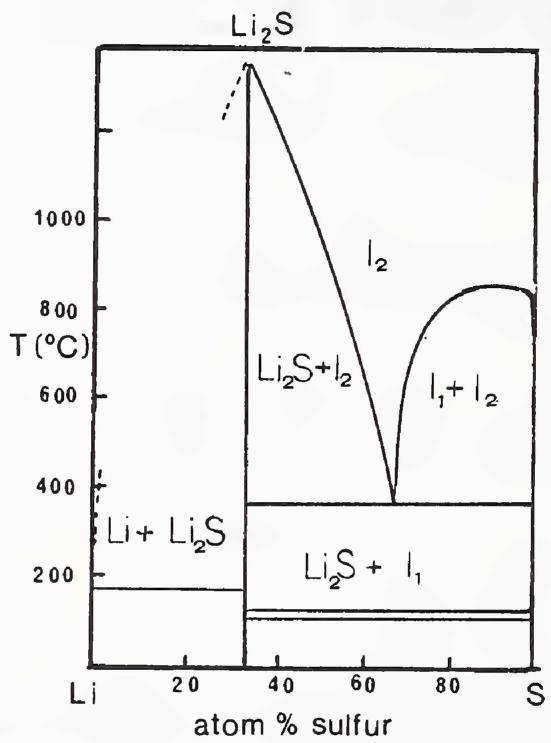  
Figure 149.1 Lithium-sulfur phase diagram

References [1-15,35,36]

2. Density (p)

Measurement method: dilatometric technique [37]

Equation

$$
\rho = a + b T (1 4 9. 1)
$$

precision: in table 149.1 uncertainty: $\sim \pm 1.0\%$

Table 149.1. Parameters of equation (149.1) and precision   

<table><tr><td>(Mol % S)</td><td>a</td><td>-b x 103</td><td>Precision</td><td>T range(K)</td></tr><tr><td>66.0*</td><td>2.1307</td><td>0.5849</td><td>0.12%</td><td>637-724</td></tr></table>

\*corresponds to $\mathsf{Li}_2\mathsf{S}_3.9$

$$
\mathrm {L i} _ {2} \mathrm {S} - \mathrm {S} \tag {149}
$$

Table 149.2. Density $(\mathrm{gcm}^{-3})$ from equation in table 149.1   

<table><tr><td rowspan="2">T(K)</td><td>Mo1 % S</td><td rowspan="2">T(K)</td><td>Mo1 % S</td></tr><tr><td>66.0*</td><td>66.0*</td></tr><tr><td>640</td><td>1.756</td><td>690</td><td>1.727</td></tr><tr><td>650</td><td>1.751</td><td>700</td><td>1.721</td></tr><tr><td>660</td><td>1.745</td><td>710</td><td>1.715</td></tr><tr><td>670</td><td>1.739</td><td></td><td></td></tr></table>

corresponds to $\mathsf{Li}_2\mathsf{S}_{3.9}$ References [37,38]

3. Surface Tension (Y)

No data

4. Viscosity (n)

No data

5. Electrical Conductance (K)

Measurement method: classical ac technique [37]

Equation

$$
\kappa = \mathrm {A} \exp - \mathrm {E} / \mathrm {R T} \tag {149.2}
$$

precision: in table 149.3 uncertainty: $\sim$ 2.0%

Table 149.3. Parameters of equation (149.2) and precision   

<table><tr><td>Mol % S</td><td>A</td><td>E</td><td>Precision</td><td>T range(K)</td></tr><tr><td>66.0*</td><td>56.146</td><td>5350</td><td>0.47%</td><td>727-802</td></tr></table>

Table 149.4. Specific conductance (ohm $^{-1}$ cm $^{-1}$ ) from equations in table 149.3   

<table><tr><td rowspan="2">T(K)</td><td>Mo1 % S</td><td rowspan="2">T(K)</td><td>Mo1 % S</td></tr><tr><td>66.0*</td><td>66.0*</td></tr><tr><td>730</td><td>1.405</td><td>770</td><td>1.701</td></tr><tr><td>740</td><td>1.477</td><td>780</td><td>1.779</td></tr><tr><td>750</td><td>1.550</td><td>790</td><td>1.859</td></tr><tr><td>760</td><td>1.625</td><td></td><td></td></tr></table>

* corresponds to Li₂S₃.9

References [37,38]

6. Safety and Hazards

# A. Hazard rating

(i) Toxicity: sulfur, low; $\mathrm{Li}_2\mathrm{S}$ , variable [18].

(ii) Vapor pressure: $\mathrm{Li}_2\mathrm{S}$ , no data; sulfur; at m.pt. (115°C), $\sim 0.03\mathrm{mm}$ ; at $185^{\circ}\mathrm{C}$ , $\sim 1\mathrm{mm}$ ; at $444.6^{\circ}\mathrm{C}$ , $\sim 1$ atm (b.pt.).

(149) $\mathrm{Li}_{2}\mathrm{S}-\mathrm{S}$

B. Disaster hazards

(i) Molten sulfides and polysulfides may react violently (explosively) with strong oxidants: $\mathrm{H}_2\mathrm{S}$ evolved on contact with moisture/water can form explosive mixtures with air; $\mathrm{H}_2\mathrm{S}$ , highly toxic.   
(ii) Sulfides and polysulfides when heated to decomposition, or contacted with water, steam, acids, produce highly toxic fumes (oxides of sulfur, $\mathrm{H}_2\mathrm{S}$ ). Dangerous.   
(iii) Sulfur burns with the formation of oxides of sulfur $(\mathrm{SO}_2; \mathrm{SO}_3)$ ; toxic and corrosive fumes.

References [16-21]

7. Corrosion

Table 149.1 Corrosion studies from primary research literature   

<table><tr><td colspan="2">Systems, Studies, [References]</td></tr><tr><td>A</td><td>Cast iron, mild steel, various stainless steels, various metals [22], Fe [23], Ag alloys [24], various metals (survey) [25]</td></tr><tr><td>B</td><td>Screening studies [26-28], static studies [26-28], Fe, stainless steels (dynamic studies) [26,29-31], saturation solubilities of Cr, Mn, Ni and Fe sulfides [26-28,32], intrinsically corrosion resistant materials [26-28,33], graphite, niobium, glass, porcelain, silica [35-38]</td></tr><tr><td>C</td><td>Annotated molten salts corrosion biblio. [34]</td></tr></table>

Compatibility studies with: A: molten sulfur; B: with the exception of [35-38] which deal with the Li-sulfur system, the studies are for molten sodium polysulfides; C: general survey; molten salts.

References [22-38]

8. Diffusion

No data

9. Heat of Fusion $(\Delta H_{f}^{\circ})$

No data

10. Heat Capacity $(C_p)$

No data

11. Volume Change on Melting $(\Delta V_{f})$

No data

12. Vapor Pressure $(p_{\text{vap}})$

No data

# (149) Li $_2$ S-S

13. Thermal Conductivity (liquid) $(\lambda_{\mathrm{L}})$ No data   
14. Thermal Conductivity (solid) $(\lambda_{s})$ No data   
15. Cryoscopic Constant $(k_{f})$ No data

# 16. References

[1] Pearson, T. G., Robinson, P. L., J. Chem. Soc., 413 (1931).   
[2] Janz, G. J. Downey, J. R., Jr., Allen, C. B., and Tomkins, R. P. T., "Eutectic Data" - 2 Vols; ERDA-TID-27163-P1 & P2; NTIS, Washington, D. C. (1977).   
[3] Janz, G. J., Downey, J. R., Jr., Allen, C. B., and Tomkins, R. P. T., "Physical Properties Data Complications Relevant to Energy Storage. I. Molten Salts: Eutectic Data", NSRDS-NBS-61; U. S. Gov't Printing Office, Washington, D. C. (1978).   
[4] "International Critical Tables of Numerical Data, Physics, Chemistry, and Technology", 8 Vols., McGraw-Hill Book Co., N. Y. (1933).   
[5] "Landolt-Bornstein Zahlenwert und Funktionen aus Physik, Chemie, Astronomie, Geophysik und Technik", (10th Ed.) Springer-Verlag, Berlin, Heidelberg, N. Y. (1961).   
[6] Clark, P. V., "Fused Salt Mixtures: Eutectic Compositions and Melting Points Bibliography 1907-1968", Report No. SC-R-68-1680; Sandia Laboratories (1968), NTIS.   
[7] Robertson, W. D., "Binary Phase Diagrams of Halide Salts", Report No. Yale 2723 (2 Vols.), U. S. AEC Contract AT (30-1)-2723 (1966), NTIS.   
[8] Thoma, R. E., "Phase Diagrams of Nuclear Reactor Materials", Oak Ridge National Laboratory, ORNL-2548, Contract No. W-7405-eng-26.   
[9] Thoma, R. E., "Phase Diagrams of Binary and Ternary Fluoride Systems", Chapt. 6; Adv. Molten Salts Chemistry, Vol. 3 (J. Braunstein, G. Mamantov, and G. P. Smith, eds.), Plenum Press, N. Y. (1975).   
[10] Voskresenskaya, N. K., ed., "Handbook of Solid-Liquid Equilibria in Systems of Inorganic Salts", Volumes 1, 2, Izc. Akad. Nauk SSSR, Moscow (1961). Israel Program for Scientific Translations, Jerusalem, 1970 (NTIS).   
[11] Sinistri, C., Franzozini, P., and Rolla, M., "An Atlas of Mischibility Gaps in Molten Salt Systems", Institute of Physical Chemistry, University of Pavia (Italy) (1968).   
[12] Shaffer, P. T. B., "High Temperature Materials", Plenum Press Handbooks of High Temperature Materials, No. 1, Materials Index, Plenum Press, New York, 1964.   
[13] Franzozini, P., Ferloni, P., and Spinolo, C., "Molten Salts with Organic Anions", Instituto di Chimica Fisica, Universita di Pavia (Italy), 1973.   
[14] Toropov, N. A. et al., "Handbook of Phase Diagrams of the Silicates, Volume 1: Binary Systems, Volume 2, Metal-Oxygen Compounds in Silicate Systems", Izdatel'stov "Nauka" Leningradskoe Otdelenie, Leningrad, 1969, Israel Program for Scientific Translations, Jerusalem, 1972 (NTIS).

(149) $\mathrm{Li}_2\mathrm{S}-\mathrm{S}$

Levin, E., et al., "Phase Diagrams for Ceramists", Amer. Ceramic Soc. (publ.), Columbus, Ohio (1964; 1969).   
[16] "Dangerous Properties of Materials", Sax, N. I., Van Nostrand Reinhold Co., N. Y. (1969).   
[17] "Registry of Toxic Effects of Chemical Substances", Christensen, H. E., and Lubinbyhl, T. T., eds., U. S. Dept. H. E. W., U. S. Gov't Printing Office, Washington, D. C. (1975).   
[18] vide: this work, System 55, Li $_2$ S.   
[19] "Potential Hazards in Molten Salt Baths for Heat Treatment of Metals", National Board of Fire Underwriters Research Report No.2 (1954).   
[20] "Handbook of Reactive Chemical Hazards", Bretherwick, L., Butterworth Co., London (1975).   
[21] Janz, G. J., Tomkins, R. P. T., Downey, J. R. Jr., and Allen, C. B., "Safety and Hazards", Chapter in "Eutectic Data", ERDA TID-27163-P1; NTIS, U. S. Dept. Commerce, Springfield, Va. (1977)   
[22] West, J. R., Chem. Engineering, p. 225 (October, 1946).   
[23] Foroulis, Z. A., "Oxidation of Iron in Sulfur Vapor at Electrical Temperatures", p. 522 in Proceedings Intern. Symp. on Metal-Slag-Gas Reactions and Processes The Electrochemical Soc., Princeton, N. J. (1975).   
[24] Szawlovska-Wallisch, K., Czas. Tech. (Krakow), M(5), 44 (1970).   
[25] Stafford, K. N., Metal Rev., 14(138), 153 (1969).   
[26] Weiner, S. A., (Ford Motor Co.); Annual Report; NSF-RANN Contract No. NSF-C805 (AER-73-07199), (1974).   
[27] Weiner, S. A., (Ford Motor Co.); Annual Report; NSF-RANN Contract No. NSF-C805 (AER-73-07199), (1975).   
[28] Weiner, S. A., and Tischer, R. (Ford Motor Co.); Annual Report; NSF-RANN Contract No. NSF-C805 (AER-73-07199), (1976).   
[29] Bones, R. J., Brook, R. J., and Markin, T. L., Proceedings Ninth International Power Sources Symposium, Brighton, England (1974).   
[30] Dubin, R. R., Abstr. No. 11. Extended Abstracts; 75-1, 27 (1975); 147th Meeting, Electrochemical Society (Toronto), May (1975).   
[31] Armstrong, R. D., Dickinson, T., and Reid, M., Electrochimica Acta, 21, 1143 (1976).   
[32] Bailey, R. A., and Skeaf, J., J. Ind. Eng. Chem. Data, 24, (2), 126 (1979).   
[33] Dunn, B., and Breiter, M.W., 30th ISE Meeting, Trondheim, Norway; Extd. Abst. p. 65 (Aug., 1979).   
[34] Janz, G. J., and Tomkins, R. P. T., Corrosion, 35, 485 (1979).   
[35] Sharma, R. A., J. Electrochem. Soc., 119, 1439 (1972).   
[36] Cunningham, P. T., Johnson, S. A., and Cairns, E. J., J. Electrochem. Soc., 119, 1448 (1972).   
[37] Cleaver, B., and Upton, S. M., (Univ. Southampton, U. K.), unpublished work (1980).   
[38] Cleaver, B., and Rowlands, G. J., (Univ. Southampton, U. K.), unpublished work (1980).

1. Melting Temperatures $(T_{m})$

Pure substance melting points:

K2S: 840°C

Sulfur: 115°C

Eutectic melting point:

E1: 110°C, composition: 72.5 wt % sulfur

E2: 183°C, composition: 83.5 wt % sulfur

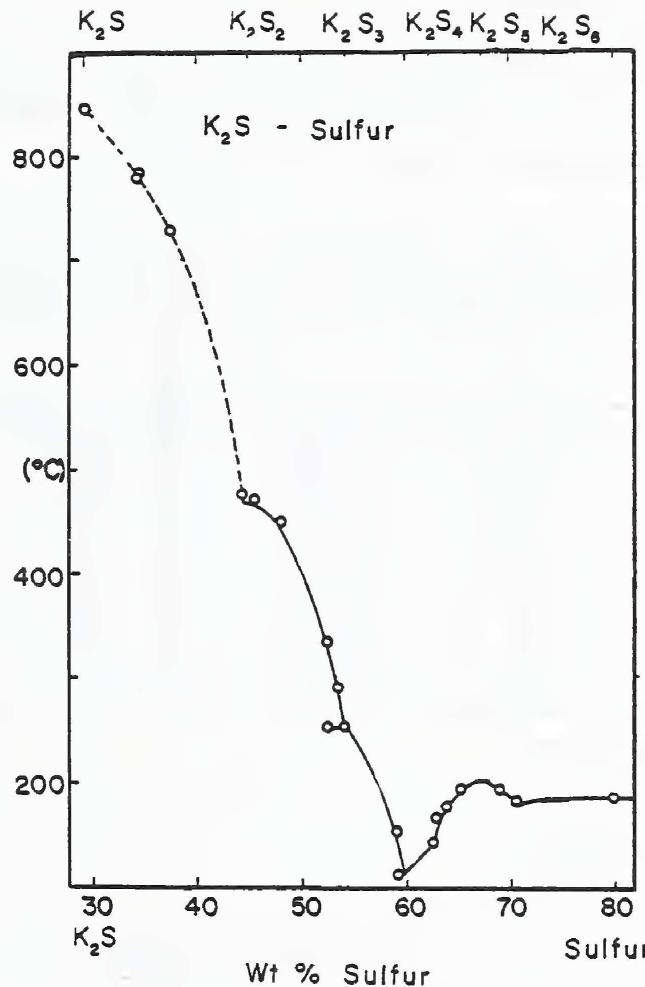  
Figure 150.1. $\mathrm{K}_2\mathrm{S}$ -Sulfur phase diagram

Table 150.1. Additional invariant points   

<table><tr><td>Composition</td><td>T (℃)</td><td>Composition</td><td>T (℃)</td></tr><tr><td>K2S2</td><td>475</td><td>K2S5</td><td>206</td></tr><tr><td>K2S3</td><td>~250</td><td>K2S6</td><td>189</td></tr><tr><td>K2S4</td><td>144</td><td></td><td></td></tr></table>

References [1-15].

(150) $\mathrm{K}_2\mathrm{S} - \mathrm{S}$

2. Density (ρ)

No data

3. Surface Tension (Y)

No data

4. Viscosity (n)

No data

5. Electrical Conductance (K)

Measurement method: classical ac technique [16]

$$
\kappa = 6. 2 6 0 \exp (- 1 7 7 7 / R (T - 3 0 6)) \tag {150.1}
$$

precision: $\sim$ 7.0% uncertainty: $\sim$ 3.0%

Table 150.2. Electrical conductance from equation (150.1)   

<table><tr><td>T(K)</td><td>K(ohm-1cm-1)</td><td>T(K)</td><td>K(ohm-1cm-1)</td></tr><tr><td>490</td><td>0.048</td><td>590</td><td>0.267</td></tr><tr><td>500</td><td>0.062</td><td>600</td><td>0.298</td></tr><tr><td>510</td><td>0.078</td><td>610</td><td>0.329</td></tr><tr><td>520</td><td>0.095</td><td>620</td><td>0.362</td></tr><tr><td>530</td><td>0.115</td><td>630</td><td>0.395</td></tr><tr><td>540</td><td>0.136</td><td>640</td><td>0.429</td></tr><tr><td>550</td><td>0.159</td><td>650</td><td>0.464</td></tr><tr><td>560</td><td>0.184</td><td>660</td><td>0.499</td></tr><tr><td>570</td><td>0.211</td><td>670</td><td>0.535</td></tr><tr><td>580</td><td>0.238</td><td></td><td></td></tr></table>

References [16]

6. Safety and Hazards

A. Hazard rating

(i) Toxicity: sulfur, low; $\mathrm{K}_2\mathrm{S}$ , variable [56].   
(ii) Vapor pressure: K₂S, no data; sulfur; at m.µt (115°C), ~ 0.03mm; at 185°C, ~ 1mm; at 444.6°C, ~ 1 atm (b.µt.).

B. Disaster hazards

(i) Molten sulfides and polysulfides may react violently (explosively) with strong oxidants: $\mathrm{H}_2\mathrm{S}$ evolved on contact with moisture/water can form explosive mixtures with air; $\mathrm{H}_2\mathrm{S}$ , highly toxic.   
(ii) Sulfides and polysulfides when heated to decomposition, or contacted with water, steam, acids, produce highly toxic fumes (oxides of sulfur, $\mathsf{H}_2\mathsf{S}$ ). Dangerous.   
(iii) Sulfur burns with the formation of oxides of sulfur $(\mathrm{SO}_2; \mathrm{SO}_3)$ ; toxic and corrosive fumes.

References [17-22].

7. Corrosion

Table 150.3. Corrosion studies from primary research literature   

<table><tr><td colspan="2">Systems, Studies, [References]</td></tr><tr><td>A</td><td>Cast iron, mild steel, various stainless steels, various metals [23], Fe [24], Ag alloys [25], various metals (survey) [26]</td></tr><tr><td>B</td><td>Screening studies [27-29], static studies [27-29], Fe, stainless steel (dynamic studies) [27,30-32], saturation solubilities of Cr, Mn, Ni and Fe sulfides [27-29,33], intrinsically corrosion resistant materials [27-29,34]</td></tr><tr><td>C</td><td>- Annotated molten salts corrosion biblio. [35]</td></tr></table>

Compatibility studies with: A: molten sulfur, B: molten sodium polysulfides; C: general survey: molten salts. No corrosion studies with $\mathrm{K}_2\mathrm{S}$ -Sulfur found.

8. Diffusion

No data

9. Heat of Fusion $(\Delta H_{f}^{\circ})$

No data

10. Heat Capacity $(C_p)$

No data

11. Volume Change on Melting $(\Delta V_{f})$

No data

12. Vapor Pressure $(p_{vap})$

No data

13. Thermal Conductivity (liquid) $(\lambda_{\ell})$

No data

14. Thermal Conductivity (solid) $(\lambda_{s})$

No data

15. Cryoscopic Constant $(k_{f})$

No data

Pearson, T. G., Robinson, P. L., J. Chem. Soc., 413 (1931).   
Janz, G. J. Downey, J. R., Jr., Allen, C. B., and Tomkins, R. P. T., "Eutectic Data" - 2 Vols; ERDA-TID-27163-P1 & P2; NTIS, Washington, D. C. (1977).   
Janz, G. J., Downey, J. R., Jr., Allen, C. B., and Tomkins, R. P. T., "Physical Properties Data Complications Relevant to Energy Storage. I. Molten Salts: Eutectic Data", NSRDS-NBS-61; U. S. Gov't Printing Office, Washington, D. C. (1978).   
"International Critical Tables of Numerical Data, Physics, Chemistry, and Technology", 8 Vols., McGraw-Hill Book Co., N. Y. (1933).   
"Landolt-Bornstein Zahlenwert und Funktionen aus Physik, Chemie, Astronomie, Geophysik und Technik", (10th Ed.) Springer-Verlag, Berlin, Heidelberg, N. Y. (1961).   
Clark, P. V., "Fused Salt Mixtures: Eutectic Compositions and Melting Points Bibliography 1907-1968", Report No. SC-R-68-1680; Sandia Laboratories (1968), NTIS.   
Robertson, W. D., "Binary Phase Diagrams of Halide Salts", Report No. Yale 2723 (2 Vols.), U. S. AEC Contract AT (30-1)-2723 (1966), NTIS.   
Thoma, R. E., "Phase Diagrams of Nuclear Reactor Materials", Oak Ridge National Laboratory, ORNL-2548, Contract No. W-7405-eng-26.   
Thoma, R. E., "Phase Diagrams of Binary and Ternary Fluoride Systems", Chapt. 6; Adv. Molten Salts Chemistry, Vol. 3 (J. Braunstein, G. Mamantov, and G. P. Smith, eds.), Plenum Press, N. Y. (1975).   
Voskresenskaya, N. K., ed., "Handbook of Solid-Liquid Equilibria in Systems of Inorganic Salts", Volumes 1, 2, Izc. Akad. Nauk SSSR, Moscow (1961). Israel Program for Scientific Translations, Jerusalem, 1970 (NTIS).   
Sinistri, C., Franzozini, P., and Rolla, M., "An Atlas of Miscibility Gaps in Molten Salt Systems", Institute of Physical Chemistry, University of Pavia (Italy) (1968).   
Shaffer, P. T. B., "High Temperature Materials", Plenum Press Handbooks of High Temperature Materials, No. 1, Materials Index, Plenum Press, New York, 1964.   
Franzozini, P., Ferloni, P., and Spinolo, C., "Molten Salts with Organic Anions", Instituto di Chimica Fisica, Universita di Pavia (Italy), 1973.   
Toropov, N. A. et al., "Handbook of Phase Diagrams of the Silicates, Volume 1: Binary Systems, Volume 2, Metal-Oxygen Compounds in Silicate Systems", Izdatel'stov "Nauka" Leningradskoe Otdelenie, Leningrad, 1969, Israel Program for Scientific Translations, Jerusalem, 1972 (NTIS).   
Levin, E., et al., "Phase Diagrams for Ceramists", Amer. Ceramic Soc. (publ.), Columbus, Ohio (1964; 1969).   
Cleaver, B. and Davies, A. J., Electrochim. Acta, 18, 719 (1973)   
"Dangerous Properties of Materials", Sax, N. I., Van Nostrand Reinhold Co., N. Y. (1969).   
"Registry of Toxic Effects of Chemical Substances", Christensen, H. E., and Lubinbyhl, T. T., eds., U. S. Dept. H. E. W., U. S. Gov't Printing Office, Washington, D. C. (1975).

(150) $\mathrm{K}_{2} \mathrm{~S}-\mathrm{S}$   
[19] "Potential Hazards in Molten Salt Baths for Heat Treatment of Metals", National Board of Fire Underwriters Research Report No.2 (1954).   
[20] "Handbook of Reactive Chemical Hazards", Bretherwick, L., Butterworth Co., London (1975).   
[21] Janz, G. J., Tomkins, R. P. T., Downey, J. R. Jr., and Allen, C. B., "Safety and Hazards", Chapter in "Eutectic Data", ERDA TID-27163-P1; NTIS, U. S. Dept. Commerce, Springfield, Va. (1977)   
[22] vide: this work, System 58, K₂S   
[23] West, J. R., Chem. Engineering, p. 225 (October, 1946).   
[24] Foroulis, Z. A., "Oxidation of Iron in Sulfur Vapor at Electrical Temperatures", p. 522 in Proceedings Intern. Symp. on Metal-Slag-Gas Reactions and Processes The Electrochemical Soc., Princeton, N. J. (1975).   
[25] Szawlovska-Wallisch, K., Czas. Tech. (Krakow), M(5), 44 (1970).   
[26] Stafford, K. N., Metal Rev., 14(138), 153 (1969).   
[27] Weiner, S. A., (Ford Motor Co.); Annual Report; NSF-RANN Contract No. NSF-C805 (AER-73-07199), (1974).   
[28] Weiner, S. A., (Ford Motor Co.); Annual Report; NSF-RANN Contract No. NSF-C805 (AER-73-07199), (1975).   
[29] Weiner, S. A., and Tischer, R. (Ford Motor Co.); Annual Report; NSF-RANN Contract No. NSF-C805 (AER-73-07199), (1976).   
[30] Bones, R. J., Brook, R. J., and Markin, T. L., Proceedings Ninth International Power Sources Symposium, Brighton, England (1974).   
[31] Dubin, R. R., Abstr. No. 11. Extended Abstracts; 75-1, 27 (1975); 147th Meeting, Electrochemical Society (Toronto), May (1975).   
[32] Armstrong, R. D., Dickinson, T., and Reid, M., Electrochimica Acta, 21, 1143 (1976).   
[33] Bailey, R. A., and Skeaf, J., J. Ind. Eng. Chem. Data, 24, (2), 126 (1979).   
[34] Dunn, B., and Breiter, M.W., 30th ISE Meeting, Trondheim, Norway; Extd. Abst. p. 65 (Aug., 1979).   
[35] Janz, G. J., and Tomkins, R. P. T., Corrosion, 35, 485 (1979).

1. Melting Temperatures $(T_{m})$

Pure substance melting points:

NaCl: $800^{\circ} \mathrm{C}$ ; NaOH: $318^{\circ} \mathrm{C}$ ; $\mathrm{Na}_{2} \mathrm{CO}_{3}: 858^{\circ} \mathrm{C}$

Eutectics:

mpt.

E1: $282^{\circ} \mathrm{C}$

E2: 291°C

Composition(wt %)

6.8% NaCl; 78.2% NaOH

7.7% NaCl; 76.8% NaOH

mpt. Composition(wt %)

E3: $298^{\circ} \mathrm{C}$ 10% NaCl; 75.2% NaOH

E4: 318°C 20% NaCl; 65.2% NaOH

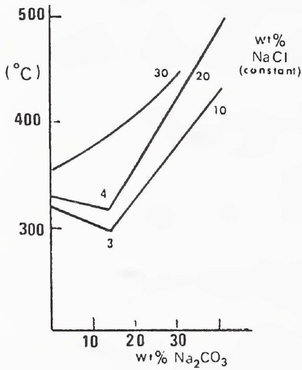

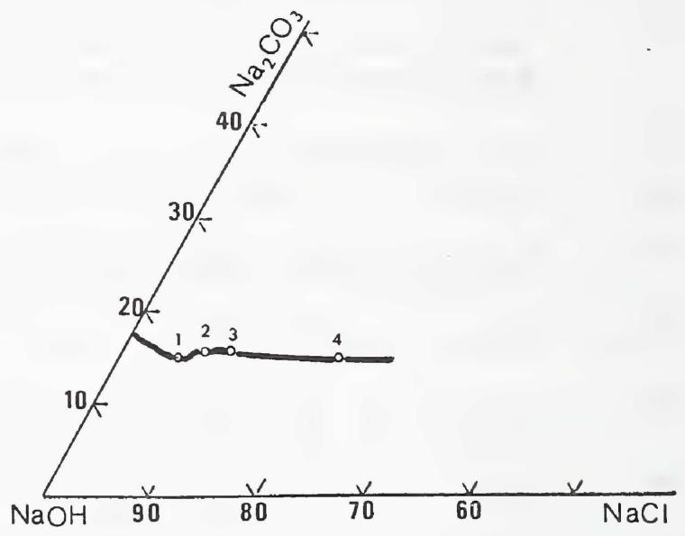  
Figure 151.1 $\mathrm{Na}_{2}\mathrm{CO}_{3}$ -NaOH-NaCl phase diagram

References [1-15]

2. Density (ρ)

Measurement method: Archimedean technique [16]

Equation:

$$
\rho = a + b T \quad (1 5 1. 1)
$$

precision: in table 151.1

uncertainty: $\sim \pm 1.5\%$

Table 151.1. Parameters of equation (151.1) and precisions   

<table><tr><td colspan="3">Composition (mol %)</td><td rowspan="2">a</td><td rowspan="2">-b x 104</td><td rowspan="2">Precision</td><td rowspan="2">T range(K)</td></tr><tr><td>NaOH</td><td>Na2CO3</td><td>NaCl</td></tr><tr><td>95.9</td><td>2.1</td><td>2.0</td><td>2.0986</td><td>5.000</td><td>0.01%</td><td>590-720</td></tr><tr><td>92.7</td><td>2.1</td><td>5.2</td><td>2.1065</td><td>5.163</td><td>0.01%</td><td>590-720</td></tr><tr><td>87.7</td><td>2.2</td><td>10.1</td><td>2.1212</td><td>5.316</td><td>0.01%</td><td>590-720</td></tr></table>

(151) $\mathrm{Na}_{2}\mathrm{CO}_{3}-\mathrm{NaOH}-\mathrm{NaCl}$

Table 151.2. Density $(\mathrm{gcm}^{-3})$ from equations in table 151.1   

<table><tr><td>NaOH</td><td>95.9 (mol %)</td><td>92.7 (mol %)</td><td>87.7 (mol %)</td></tr><tr><td>Na2CO3</td><td>2.1 (mol %)</td><td>2.1 (mol %)</td><td>2.2 (mol %)</td></tr><tr><td>NaCl</td><td>2.0 (mol %)</td><td>5.2 (mol %)</td><td>10.1 (mol %)</td></tr><tr><td>T(K)</td><td>ρ(g cm-3)</td><td>ρ(g cm-3)</td><td>ρ(g cm-3)</td></tr><tr><td>590</td><td>1.804</td><td>1.802</td><td>1.808</td></tr><tr><td>610</td><td>1.794</td><td>1.792</td><td>1.797</td></tr><tr><td>630</td><td>1.784</td><td>1.781</td><td>1.786</td></tr><tr><td>650</td><td>1.774</td><td>1.771</td><td>1.776</td></tr><tr><td>670</td><td>1.764</td><td>1.761</td><td>1.765</td></tr><tr><td>690</td><td>1.754</td><td>1.750</td><td>1.754</td></tr><tr><td>710</td><td>1.744</td><td>1.740</td><td>1.744</td></tr><tr><td>720</td><td>1.739</td><td>1.735</td><td>1.739</td></tr></table>

References [16]

3. Surface Tension (γ)

No data

4. Viscosity (n)

Measurement method: oscillating sphere technique [17]

Equation: (viscosity-composition isotherm, at fixed wt $\%$ Na $_2$ CO $_3$ )

$$
\eta = a + b C + c C ^ {2} \tag {151.2}
$$

$$
(C = \text {mol} \% \text {NaCl})
$$

precision: in table 151.3 uncertainty: $\sim$ 5.0%

Table 151.3. Parameters of equation (151.2) and precisions   

<table><tr><td>Wt % Na2CO3</td><td>a</td><td>b x 102</td><td>-c x 104</td><td>Precision</td></tr><tr><td>10</td><td>2.619</td><td>3.969</td><td>2.953</td><td>0.07%</td></tr><tr><td>20</td><td>3.102</td><td>4.174</td><td>0.727</td><td>0.13%</td></tr><tr><td>30(a)</td><td>3.680</td><td>3.798</td><td>-2.307</td><td>0.00%</td></tr></table>

(a)Equation derived from three data points.

# (151) $\mathrm{Na}_{2} \mathrm{CO}_{3}-\mathrm{NaOH}-\mathrm{NaCl}$

Table 151.4. Viscosity (cp) at 693K from equations in table 151.3   

<table><tr><td rowspan="2">NaOH-NaCl (Mol % NaCl)</td><td colspan="3">Wt % Na2CO3</td></tr><tr><td>10</td><td>20</td><td>30</td></tr><tr><td>0</td><td>2.62</td><td>3.10</td><td>3.68</td></tr><tr><td>2.5</td><td>2.72</td><td>3.21</td><td>3.78</td></tr><tr><td>5.0</td><td>2.81</td><td>3.31</td><td>3.88</td></tr><tr><td>7.5</td><td>2.90</td><td>3.42</td><td>3.98</td></tr><tr><td>10.0</td><td>2.99</td><td>3.53</td><td>4.08</td></tr><tr><td>12.5</td><td>3.07</td><td>3.64</td><td>4.19</td></tr><tr><td>15.0</td><td>3.15</td><td>3.74</td><td>4.30</td></tr><tr><td>17.5</td><td>3.22</td><td>3.85</td><td>4.42</td></tr><tr><td>20.0</td><td>3.30</td><td>3.97</td><td>4.53</td></tr><tr><td>22.5</td><td>3.36</td><td>4.08</td><td></td></tr><tr><td>25.0</td><td>3.43</td><td>4.19</td><td></td></tr><tr><td>27.5</td><td></td><td>4.30</td><td></td></tr></table>

# References [17]

# 5. Electrical Conductance (K)

No data

# 6. Safety and Hazards

# A. Hazard rating

(i) Toxicity: NaCl, permitted in foods; NaOH, strongly caustic and toxic; $\mathrm{Na_2CO_3}$ , moderate, classified as caustic.   
(ii) Vapor pressure: NaCl, at m.pt. $(800^{\circ}\mathrm{C})$ , $\sim 0.34\mathrm{mm}$ ; NaOH, at m.pt. $(318^{\circ}\mathrm{C})$ , $\ll 0.5\mathrm{mm}$ ; $\mathrm{Na}_2\mathrm{CO}_3$ (m.pt. $858^{\circ}\mathrm{C}$ ) decomposes on heating to the oxide and $\mathrm{CO}_2$ ; $\mathrm{CO}_2$ pressure at $950^{\circ}\mathrm{C}$ , $\sim 1\mathrm{mm}$ .

# B. Disaster hazards

(i) Molten salt bath "explosions": i.e., explosive generation of steam due to bulk water "carry-over: and/or equipment failure;; i.e., explosive expansion of "trapped" air.   
(ii) Chlorides, when heated to decomposition or contacted with acids, highly toxic chloride fumes are evolved.   
(iii) Hydroxides react with water or steam with evolution of heat; the aqueous solution is very caustic and attacks living tissue; dangerous.   
(iv) Carbonates, when heated with $\mathrm{CO}_{2}$ pressures less than equilibrium dissociation pressures, decompose to form alkali metal oxides; the toxicology and disaster hazards are the same as those of very caustic solutions, i.e. react with water or steam (exothermic) to form solutions that are markedly aggressive to all body tissues (chemical burns).

References [18-23]

# 7. Corrosion

Table 151.5. Corrosion studies from primary research literature   

<table><tr><td colspan="2">Systems, Studies, [References]</td></tr><tr><td>A</td><td>Silica [24], Pt [25], Metals [26], Cu-Zn [27], Pt, Au, Ag, MgO [28-31], Pt, Rh, Pd, Ir (O2environment) [32], Au, Ag, Al2O3(O2environment) Na2CO3-Na2O) [33], Al2O3Pt, (N2atmosphere) [34-36], quartz, porcelain, Ag, Pt, Ni (N2atmosphere; Na2CO3-Na2O) [37], boron nitride [31,38], Na-β-alumina [31,38], Fe (Na2CO3-Na halides) [39], acid-base relationships [40-43], H2O hydrolysis reactions [33,44,45], molten carbonates: fule cells, thermal energy storage, coal gasification[39,46-50]</td></tr><tr><td>B</td><td>Metals [51], metals ceramics, alloys [51,52-58], stainless steel, Fe-Cr-Ni alloys [59], Ni-Cr-Fe, Ni-Si-Cu [53,60], Ni-Mo, Ni, Cu, Armco Fe [61-63], Al2O3, ZrO2[52], Ni, [52,54-56,64-67], Ni steels [68], Fe (effects of water) [69], Pt, Ag, alloys [70-72], thermodynamic and electrochemical approach [73-75], reviews [76-78], annotated corrosion biblio. [79].</td></tr><tr><td>C</td><td>Mo [80], Armco Fe [81-83], Ni, Cr, [84], Ti, Zr, Hf, ThCl4[85], Cr [86], Fe-Cr [87], Ni alloys [88], Ni-Cr-Al, Ni-Cr-W, Fe, Ni-Cr, Mg, Ni, Zr, Ti [89], Au, Pt, Al2O3, MgO, Zirconia (NaCl with Na2O) [90], thermodynamic redox potentials [89,91,92], electrochemical aspects [73,74], annotated corrosion biblio. [78], reviews[76-78].</td></tr></table>

Compatibility studies: A: molten carbonates, principally $\mathrm{Na}_2\mathrm{CO}_3$ ; B: molten hydroxides, principally $\mathrm{NaOH}$ ; C: molten chlorides, principally $\mathrm{NaCl}$ . No compatibility studies found specifically for molten $\mathrm{Na}_2\mathrm{CO}_3$ - $\mathrm{NaOH}-\mathrm{NaCl}$ mixtures.

References [24-92]

(151) $\mathrm{Na}_{2}\mathrm{CO}_{3} - \mathrm{NaOH} - \mathrm{NaCl}$

8. Diffusion

No data

9. Heat of Fusion $(\Delta H_{f}^{\circ})$

No data

10. Heat Capacity (Cp)

No data

11. Volume Change on Melting $(\Delta V_{f})$

Measurement method: estimated from densities [93]

Table 151.6. Volume change on melting   

<table><tr><td>Composition</td><td>(ΔVf/Vs)</td><td>Uncertainty</td></tr><tr><td>ternary eutectic (a)</td><td>5.3%</td><td>~ ± 10%</td></tr></table>

(a) $\mathrm{Na}_{2} \mathrm{CO}_{3}$ : NaOH: NaCl:: 7:86:7 (mol %)

References [93]

12. Vapor Pressure $(p_{vap})$

No data

13. Thermal Conductivity (liquid) $(\lambda_{\ell})$

No data

14. Thermal Conductivity (solid) $(\lambda_{s})$

No data

15. Cryoscopic Constant $(k_{f})$

No data

16. References

[1] Lantratov, M. F., Alabyshev, A. F., Zhur. Priklad. Khim., 32, 65 (1959).   
[2] Janz, G. J. Downey, J. R., Jr., Allen, C. B., and Tomkins, R. P. T., "Eutectic Data" - 2 Vols; ERDA-TID-27163-P1 & P2; NTIS, Washington, D. C. (1977).   
[3] Janz, G. J., Downey, J. R., Jr., Allen, C. B., and Tomkins, R. P. T., "Physical Properties Data Complications Relevant to Energy Storage. I. Molten Salts: Eutectic Data", NSRDS-NBS-61; U. S. Gov't Printing Office, Washington, D. C. (1978).

[4] "International Critical Tables of Numerical Data, Physics, Chemistry, and Technology", 8 Vols., McGraw-Hill Book Co., N. Y. (1933).   
[5] "Landolt-Bornstein Zahlenwert und Funktionen aus Physik, Chemie, Astronomie, Geophysik und Technik", (10th Ed.) Springer-Verlag, Berlin, Heidelberg, N. Y. (1961).   
[6] Clark, P. V., "Fused Salt Mixtures: Eutectic Compositions and Melting Points Bibliography 1907-1968", Report No. SC-R-68-1680; Sandia Laboratories (1968), NTIS.   
[7] Robertson, W. D., "Binary Phase Diagrams of Halide Salts", Report No. Yale 2723 (2 Vols.), U. S. AEC Contract AT (30-1)-2723 (1966), NTIS.   
[8] Thoma, R. E., "Phase Diagrams of Nuclear Reactor Materials", Oak Ridge National Laboratory, ORNL-2548, Contract No. W-7405-eng-26.   
[9] Thoma, R. E., "Phase Diagrams of Binary and Ternary Fluoride Systems", Chapt. 6; Adv. Molten Salts Chemistry, Vol. 3 (J. Braunstein, G. Mamantov, and G. P. Smith, eds.), Plenum Press, N. Y. (1975).   
[10] Voskresenskaya, N. K., ed., "Handbook of Solid-Liquid Equilibria in Systems of Inorganic Salts", Volumes 1, 2, Izc. Akad. Nauk SSSR, Moscow (1961). Israel Program for Scientific Translations, Jerusalem, 1970 (NTIS).   
[11] Sinistri, C., Franzozini, P., and Rolla, M., "An Atlas of Miscibility Gaps in Molten Salt Systems", Institute of Physical Chemistry, University of Pavia (Italy) (1968).   
[12] Shaffer, P. T. B., "High Temperature Materials", Plenum Press Handbooks of High Temperature Materials, No. 1, Materials Index, Plenum Press, New York, 1964.   
[13] Franzozini, P., Ferloni, P., and Spinolo, C., "Molten Salts with Organic Anions", Instituto di Chimica Fisica, Universita di Pavia (Italy), 1973.   
[14] Toropov, N. A. et al., "Handbook of Phase Diagrams of the Silicates, Volume 1: Binary Systems, Volume 2, Metal-Oxygen Compounds in Silicate Systems", Izdatel'stov "Nauka" Leningradskoe Otdelenie, Leningrad, 1969, Israel Program for Scientific Translations, Jerusalem, 1972 (NTIS).   
[15] Levin, E., et al., "Phase Diagrams for Ceramists", Amer. Ceramic Soc. (publ.), Columbus, Ohio (1964; 1969).   
[16] Arndt, K. and Ploctz, G., Z. Phys. Chem., 121, 439 (1926).   
[17] Lasek, J., Coll. Czech. Chem. Comm. 29, 1858 (1964).   
[18] "Dangerous Properties of Materials", Sax, N. I., Van Nostrand Reinhold Co., N. Y. (1969).   
[19] "Registry of Toxic Effects of Chemical Substances", Christensen, H. E., and Lubinybyhl, T. T., eds., U. S. Dept. H.E.W; U. S. Gov't Printing Office, Washington, D. C. (1975).   
[20] Janz, G. J., et al., "Physical Properties Data Complications Relevant to Energy Storage. Part II. Molten Salts: Data on Single and Multi-Component Salt Systems", NSRDS-NBS 61, Part II (April 1979), U. S. Gov't Printing Office, Supt of Doc. No. C13-48-61, Washington D. C. 20402.

[21] "Potential Hazards in Molten Salt Baths for Heat Treatment of Metals", National Board Fire Underwriters Research Report No. 2. (1954).   
[22] "Handbook of Reactive Chemical Hazards", Bretherwick, L., Butterworths Co., London (1975).   
[23] Janz, G. J., Tomkins, R. P. T., Downey, J. R., Jr., and Allen, C. B., "Safety and Hazards", Chapter in "Eutectic Data", ERDA TID-27163-P1; NTIS, U. S. Dept. Commerce, Springfield, Va. (1977).   
[24] Cable, M., and Martlew, D., Glass Technol., 12, 142 (1971).   
[25] Schneider, Yu. G., Kondrat'ev, Yu. N., and Maksimov, N. N., Zashch. Metal, 9, 199 (1973).   
[26] Ozeryanaya, I. N., Penyagina, O. P., Manukhina, T. I., and Smirnov, M. V., Fiz. Khim. Elektrokhim, Rasplav. Solei Tverd. Elektrolit, 2, 96 (1973).   
[27] Sizintseva, N. F., Stepanov, G. K., and Belyaeva, G. I., Tr. Inst. Elektrokhim., Ural. Nauch. Tsentr; Akad. Nauk, USSR, 19, 92 (1973).   
[28] Janz, G. J., Conte, A., and Neuenschwander, E., Corrosion, 19, 292 (1963).   
[29] Janz, G. J., and Conte, A., Corrosion, 20, 237 (1964).   
[30] Rodigina, E. N., and Stepanov, G. K., Trudy Inst. Elektrokhim. Ural. Fil. Akad. Nauk, SSSR, 3, 77 (1962).   
[31] Janz, G. J., and Lorenz, M. R., Rev. Sci. Instruments, 32, 130 (1961).   
[32] Scheer, J. J., van Arkel, A. E., and Heyding, R. D., Can. J. Chem., 33, 683 (1955).   
[33] Andersen, B. K., "Thermodynamic Properties of Molten Carbonates", Ph.D. Thesis, Tech. Univ. Denmark (1975).   
[34] Bouaziz, R., and Papin, G., Compt. Rend. Acad. Sci., Paris, 266, series C, 1530 (1968).   
[35] Rolin, M., and Recapet, J. M., Bull. Soc. Chim. Fr., 2110 (1964)   
[36] Papin, G., Michaud, M., and Bouaziz, R., C. R. Acad. Sc., Paris, 268, Ser. C, 1691 (1969).   
[37] Cohen-Adad, R., Michaud, M., Said, J., and Rollet, A. F., Bull. Soc. Chim. Fr., 356 (1961).   
[38] Braunstein, J., et al., "Molten Carbonate Fuel Cell Research at ORNL", Rpt. ORNL/TM-5886; NTIS, U. S. Dept. Commerce, Springfield, Va. (May 1977).   
[39] Cover, A. E., Schreiner, W. C., and Skaperdas, G. T., "The Kellogg Coal Gasification Process", Extended Abstracts, American Chemical Soc. Meeting, Washington, D. C. (1971).   
[40] Dubois, J., "Chemical and Electrochemical Reactions of Molten Alkali Carbonates as Fuel Cell Electrolytes", Ph.D. Thesis, Fac. Sci. Univ. Paris, France (1964).   
[41] Ingram, M. D., and Janz, G. J., Electrochim. Acta. 10 783 (1965)   
[42] Bousson, N., Palous, S., Buvet, R., and Millet, J., Compt. Rend., 260, 720 6097 (1965)

(151) ${\mathrm{{Na}}}_{2}{\mathrm{{CO}}}_{3} - \mathrm{{NaOH}} - \mathrm{{NaCl}}$   
[43] Ingram, M., D., Baron, B., and Janz, G. J., Electrochim. Acta. 11 1629(1966)   
[44] Janz, G. J., J. Chem. Ed., 44, 581 (1967).   
[45] Busson, N., Palous, S., Millet, J., and Buvet, R., Electrochim. Acta, 12, 910 (1967).   
[46] Maru, H. C., et al. (Institute of Gas Technology), "Molten Salt Thermal Energy Storage Systems: Salt Selections", Rpt. COO-2888-1, ERDA Contract NO. E(11-1)-2888; NTIS, U. S. Dept. Commerce, Springfield, Va. (Aug. 1976).   
[47] Maru, H. C., et al. (Institute of Gas Technology), "Fuel Cell Research on Second Generation Molten Carbonate Systems: II. Characteristics of Carbonate Melts", Quarterly Status Rpt., Project 8984, ERDA Contract No. 31-109-38-3552, (Sept. 1976).   
[48] Atomics International; "Development of a Molten Carbonate Process for Removal of Sulfur Dioxide from Power Plant Stack Gases", Progress Rpt. No. 2, U. S. Public Health Services, Contract PH 86-67-128, Canoga Park, Ca. (1968).   
[49] Grantham, L. F., and Ferry, R. B., "Corrosion in Alkali Metal Carbonated Based Melts", Proc. International Symp. Fused Salts, J. P. Pemsler, ed., Electrochemical Soc., Inc., Princeton, N. J., 270 (1976).   
[50] Botts, W. V., Kohl, A. L., and Trilling, C. A., "Low BTU Gasification of Coal by Atomics International's Molten Salt Process", Proceedings of the 11th Intersociety Energy Conversion Engineering Conference, 1, 280 (Sept. 1976).   
[51] Anon, "Oak Ridge National Laboratory, Proceedings of the 1st Information Meeting on Hydroxide and Metal Interaction", ORNL CF-51-11-204, (1953).   
[52] Craighead, C. M., Smith, L. A., Phillips, E. C., Jaffee, R. I., "Continued Studies of Corrosion by Fused Caustic", AECD-3704, Battelle Memorial Institute, (1952).   
[53] Gregory, J. N., Hodge, N., Iredale, J. V. G., "The Static Corrosion of Nickel and Other Materials in Molten Caustic Soda", British Report AERE-C/M-272, (1956).   
[54] Miller, R. R., "The Thermal Properties of Sodium Hydroxide and Lithium Metal", 4th Progr. Rept. Nov. 1 (1952)-Jan. 31 (1953) NRL-Memo-130: Progr. Rept. No. 1, Naval Research Lab., (1952).   
[55] Williams, D. D., Ewing, C. T., "Thermal and Related Physical Properties of Molten Materials", Prog. Rept. Feb. 1 - May 1, (1953) NRL-Memo-170, Progress Report 5, Naval Research Lab., (1953).   
[56] Smith, G. P., "Corrosion of Materials in Fused Hydroxides", Am. Inst. Mining at Engrs., Inst. Metals Div., Spec. Rept, #2, 71 (1956).   
[57] Smith, G. P., "Corrosion of Materials in Fused Hydroxides", ORNL-2048, Oak Ridge National Laboratory, (1956).   
[58] Smothers, W. J., Prog. Rept., Jan. 1 - March 31, (1953), AECU-2872, Univ. of Ark., (1953).   
[59] Smith, G. P., Hoffman, E. E., "Corrosion Products Formed in the Reaction between Fused Sodium Hydroxide and Iron-Rich Alloys of Iron, Chromium and Nickel", ORNL-2156, Oak Ridge National Laboratory, (1957).   
[60] Smith, G. P., Steidlitz, M. E., Hoffman, E. E., Corrosion, 11, 47t (1958).

[61] Smith, G. P., Hoffman, E. E., Corrosion, 13, 627t (1957).   
[62] Smith, G. P., Hoffman, E. E., Steidlitz, M. E., Corrosion, 13, 561t (1957).   
[63] Gurowich, E. I., Zh. Prikl. Khim., 32, 817 (1959).   
[64] Manly, W. D., "Operation of a Ni-NaOH Thermal Convection Loop", ORNL CF-51-11-186, Oak Ridge National Laboratory, (1951).   
[65] Miller, N. E., Simons, E. M., Chem. Eng. Progr. Symp. Ser. No. 19, Amer, Inst. Chem. Eng., 52, 113 (1956).   
[66] Gregory, J. N., Hodge, N., Iredale, J. V. G., "The State Corrosion and Erosion of Nickel by Molten Caustic Soda and Sodium Uranate Suspensions under Dynamic Conditions", British Report AERE/C/M-273, (1956).   
[67] Simmons, E. M., Miller, N. E., Stang, J. H., Weaver, C. V., "Corrosion and Component Studies on Systems Containing Fused NaOH", BMI-1118, Battelle Memorial Institute, (1956).   
[68] Kolotii, A. A., Vengzhen, G. S., Zashch. Met., 11, 61 (1975).   
[69] Tribunskii, V. V., Kalinichenko, I. I., Tr. Ural. Politekh. Inst., 190, 49 (1970).   
[70] Rahmel, A., Kruger, H., Werkst. Korros., 18, 193 (1967).   
[71] Kruger, H., Rahmel, A., Schwenk, W., Electrochim. Acta, 13, 625 (1968).   
[72] Afanas'yev, A. S., Gamazov, V. P., Zh. Fiz. Khim., 38, 2823 (1964).   
[73] Pizzini, S., "Materials Problems in the Industrial Applications of Molten Salts", Proceedings of the European Conference on the Development of Molten Salts Applications, p. 203 (1973); Battelle, Geneva.   
[74] Johnson, K. E., "Electrochemical Approaches to Corrosion in Molten Salts", Proceedings International Symposium on Metal-Slag-Gas Reactions and Processes, The Electrochemical Society, Inc., Princeton, N. J. p. 581 (1975).   
[75] Edeleanu, C., and Littlewood, R., Electrochimica Acta, 3, 195 (1960).   
[76] Smirnov, M. V., and Ozeryanaya, I. N., Nauki Tekh. Korors., Zashch, Korros., 2, 171 (1973).   
[77] Inman, D., and Wrench, N. S., Brit. Corr. J., 1, 246 (1966).   
[78] Ketelaar, J. A. A., Chemie Ing. Techn., 45, 667 (1973).   
[79] Janz, G. J., and Tomkins, R. P. T., Corrosion, 35, 485 (1979).   
[80] Ozeryanaya, I. N., Zalazinskii, G. G., Smirnov, M. V., Finkel'shtein, S. D., and Shamanova, N. D., Zashch. Metal., 11, 66 (1975).   
[81] Kochergin, V. P., and Ignat'eva, N. I., Russ. J. Inorg. Chem., 6(9), 1085 (1961).   
[82] Kochergin, V. P., and Shevrina, Z., Uch. Zap. Ural. Gos. Univ., 92, 3 (1969).   
[83] Kochergin, V. P., et al., Zhur. Priklad. Khim., 34(6), 1258 (1961); ibid., 37(8), 1837 (1964).   
[84] Seybolt, A. U., Oxid. Metals, 2, 119 (1970).

(151) $\mathrm{Na}_{2}\mathrm{CO}_{3}-\mathrm{NaOH}-\mathrm{NaCl}$   
[85] Smirnov, M. V., Kudyakov, V. Ya., Loginov, Ya. A., Rossokhin, E. G., Posokhin, Yu. V., and Puzanova, T. A., Fiz. Khim. Elektrokhim. Rasplav. Solei Shlakov, 1, 115 (1969).   
[86] Krasil'nikova, N. A., Ozeryanaya, I. N., and Smirnov, M. V., Zashch. Metal., 17, 446 (1974).   
[87] Krasil'nikova, N. A., Ozeryanaya, I. N., Smirnov, M. V., and Shamanova, N. D., Zashch. Metal., 10, 446 (1974).   
[88] Bogdanov, N. I., Varganov, B. Ya., and Kholomonova, N. D., Zh. Prikl. Khim. (Leningrad), 46, 1698 (1973).   
[89] Littlewood, R., J. Electrochem. Soc., 109, 525 (1962).   
[90] Stern, K. H., Panayappan, R., and Flinn, D. R., "Proceedings Intern Symp. Molten Salts", The Electrochem. Soc., Princeton, N. J., p. 64 (1976).   
[91] Edeleanu, C., and Littlewood, R., Electrochimica Acta, 3, 195 (1960).   
[92] Littlewood, R., and Argent, E. A., Electrochimica Acta, 4, 114 (1961).   
[93] Janz, G. J., et al. (MSDC-RPI), unpublished work (1980).

1. Melting Temperatures $(T_{\hat{m}})$

Pure substance melting points:

LiF: 848°C

Na3AlF6: 1010°C

A12O3: 2040°C

Eutectic melting point:

697°C, composition 59.8 mol % Na₃AlF₆; 4.5 mol % Al₂O₃; 35.7 mol % LiF

56.5 wt $\%$ Na $_3$ AlF $_6$ ; 2.0 wt $\%$ Al $_2$ O $_3$ ; 41.5 wt $\%$ LiF

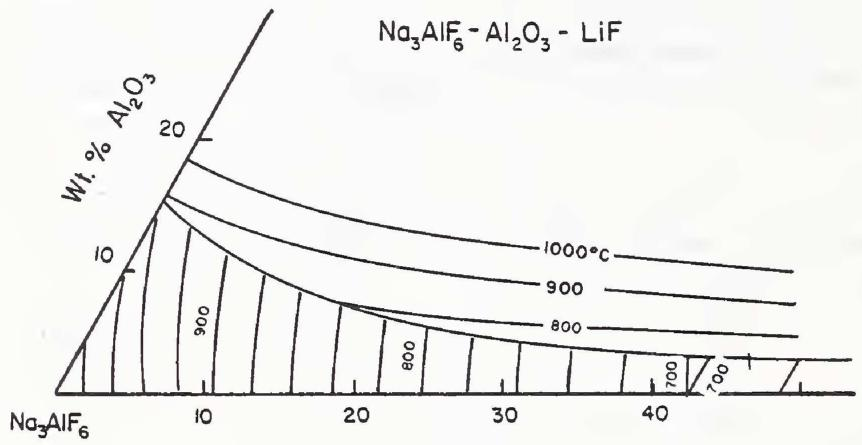  
Wt. % LiF   
Figure 152.1 $\mathrm{Na}_{3}\mathrm{AlF}_{6} - \mathrm{Al}_{2}\mathrm{O}_{3}$ -LiF phase diagram

References [1-21]

2. Density (ρ)

No data

3. Surface Tension (Y)

No data

4. Viscosity (n)

No data

5. Electrical Conductance (K)

No data

6. Safety and Hazards

# A. Hazard rating

(i) Toxicity: inorganic fluorides are generally quite irritant and toxic.

(ii) Vapor pressure: no information for this system; but see $\mathrm{Na}_{3}\mathrm{AlF}_{6}$ [24] and NaF [28].

(152) $\mathrm{Na}_{3} \mathrm{AlF}_{6}-\mathrm{Al}_{2} \mathrm{O}_{3}-\mathrm{LiF}$

# B. Disaster hazards

(i) Molten salt bath "explosion": i.e., explosive generation of steam due to bulk water "carry-over" and/or equipment failure; i.e., explosive expansion of "trapped" air.   
(ii) Fluorides, when heated to decomposition, or contacted with acids, emit highly toxic fumes.

References [22-28]

# 7. Corrosion

Table 152.1. Corrosion studies from primary research literature   

<table><tr><td colspan="2">Studies</td><td>References</td></tr><tr><td>A</td><td>CrNi-Cr-Mo alloys (INOR-8; Hastelloyss B, W, and N)SSNI-12PQuartzAlVarious metals</td><td>[29][30,31][32][33][34][35]</td></tr><tr><td>B</td><td>PtBoron nitride, carbon, InconelFused MgO</td><td>[36-40,74,75][41-43][44]</td></tr><tr><td>C</td><td>Impurities in electrolyteGraphiteTiC, TiB2, CrB2, ZrN, NbB2</td><td>[45,46][45,46][47-49]</td></tr><tr><td>D</td><td>Corrosion studies in molten salts with NaF as one component (e.g., Cl, CO3,...)Electrochemical behavior of oxide ions and related species in molten fluoridesElectroanalytical studies in molten fluoridesAnnotated corrosion bibliolog.Corrosion: molten fluorides (survey)</td><td>[50-65,72,73][66-68][69][70][71]</td></tr></table>

A: studies principally in molten NaF, KF and LiF;  
B: used largely in fluorides physical properties measurements; C: technological aspects, in aluminum reduction cells; D: more general studies, basic principles, and surveys.

References [29-75]

(152) $\mathrm{Na}_{3} \mathrm{AlF}_{6}-\mathrm{Al}_{2} \mathrm{O}_{3}-\mathrm{LiF}$

8. Diffusion

No data

9. Heat of Fusion $(\Delta H_{f}^{\circ})$

No data

10. Heat Capacity (Cp)

No data

11. Volume Change on Melting $(\Delta V_{f})$

No data

12. Vapor Pressure $(p_{vap})$

No data

13. Thermal Conductivity (liquid) $(\lambda_{\ell})$

No data

14. Thermal Conductivity (solid) $(\lambda_{s})$

No data

15. Cryoscopic Constant $(k_{f})$

No data

16. References

[1] Rolin, M. and Muhlethaler, R., Bull. Soc. Chim. France, 2593 (1964).   
[2] Chin, D. A. and Hollingshead, E. A., J. Electrochem. Soc., 113, 736 (1966).   
[3] Malinovsky, M. and Matiasovsky, K., Hutnicke Listy, 24(7), 515 (1969).   
[4] Mashovets, V. P. and Petrov, V. I., Zh. Prikl. Khim., 30, 1695 (1957); J. Appl. Chem., USSR, 30, 1785 (1957).   
[5] Kostenska, I., Corba, J. and Malinovsky, M., Chemicke Zvesti, 28, 546 (1974).   
[6] Chu, Y. A. and Belyaev, A. I., Izv. Vyssh. Ucheb. Zaved., Tsvet. Met., 2, 69 (1959).   
[7] Janz, G. J. Downey, J. R., Jr., Allen, C. B., and Tomkins, R. P. T., "Eutectic Data" - 2 Vols; ERDA-TID-27163-P1 & P2; NTIS, Washington, D. C. (1977).   
[8] Janz, G. J., Downey, J. R., Jr., Allen, C. B., and Tomkins, R. P. T., "Physical Properties Data Complications Relevant to Energy Storage. I. Molten Salts: Eutectic Data", NSRDS-NBS-61; U. S. Gov't Printing Office, Washington, D. C. (1978).   
[9] "International Critical Tables of Numerical Data, Physics, Chemistry, and Technology", 8 Vols., McGraw-Hill Book Co., N. Y. (1933).

(152) $\mathrm{Na}_{3} \mathrm{AlF}_{6}-\mathrm{Al}_{2} \mathrm{O}_{3}-\mathrm{LiF}$   
[10] "Landolt-Bornstein Zahlenwert und Funktionen aus Physik, Chemie, Astronomie, Geophysik und Technik", (10th Ed.) Springer-Verlag, Berlin, Heidelberg, N. Y. (1961).   
[11] Clark, P. V., "Fused Salt Mixtures: Eutectic Compositions and Melting Points Bibliography 1907-1968", Report No. SC-R-68-1680; Sandia Laboratories (1968), NTIS.   
[12] Robertson, W. D., "Binary Phase Diagrams of Halide Salts", Report No. Yale 2723 (2 Vols.), U. S. AEC Contract AT (30-1)-2723 (1966), NTIS.   
[13] Thoma, R. E., "Phase Diagrams of Nuclear Reactor Materials", Oak Ridge National Laboratory, ORNL-2548, Contract No. W-7405-eng-26.   
[14] Thoma, R. E., "Phase Diagrams of Binary and Ternary Fluoride Systems", Chapt. 6; Adv. Molten Salts Chemistry, Vol. 3 (J. Braunstein, G. Mamantov, and G. P. Smith, eds.), Plenum Press, N. Y. (1975).   
[15] Voskresenskaya, N. K., ed., "Handbook of Solid-Liquid Equilibria in Systems of Inorganic Salts", Volumes 1, 2, Izc. Akad. Nauk SSSR, Moscow (1961). Israel Program for Scientific Translations, Jerusalem, 1970 (NTIS).   
[16] Sinistri, C., Franzozini, P., and Rolla, M., "An Atlas of Miscibility Gaps in Molten Salt Systems", Institute of Physical Chemistry, University of Pavia (Italy) (1968).   
[17] Shaffer, P. T. B., "High Temperature Materials", Plenum Press Handbooks of High Temperature Materials, No. 1, Materials Index, Plenum Press, New York, (1964).   
[18] Franzozini, P., Ferloni, P., and Spinolo, C., "Molten Salts with Organic Anions", Instituto di Chimica Fisica, Universita di Pavia (Italy), (1973).   
[19] Toropov, N. A. et al., "Handbook of Phase Diagrams of the Silicates, Volume 1: Binary Systems, Volume 2, Metal-Oxygen Compounds in Silicate Systems", Izdatel'stov "Nauka" Leningradskoe Otdelenie, Leningrad, 1969, Israel Program for Scientific Translations, Jerusalem, 1972 (NTIS).   
[20] Levin, E., et al., "Phase Diagrams for Ceramists", Amer. Ceramic Soc. (publ.), Columbus, Ohio (1964; 1969).   
[21] Bergman, A. G., and Banachek, E. I., Izv. Sekt. Fiz. Khim. A., 23, 201 (1953).   
[22] "Dangerous Properties of Materials", Sax, N. I., Van Nostrand Reinhold Co., N. Y. (1969).   
[23] "Registry of Toxic Effects of Chemical Substances", Christensen, H. E. and Lubinbyhl, T. T., eds., U. S. Dept. H.E.W., U. S. Gov't Printing Office, Washington, D. C. (1975).   
[24] vide: this work, System 100, Na₃AlF₆.   
[25] "Potential Hazards in Molten Salt Baths for Heat Treatment of Metals", National Board Fire Underwriters Research Report No. 2 (1954).   
[26] "Handbook of Reactive Chemical Hazards", Bretherwick, L., Butterworths Co., London (1975).   
[27] Janz, G. J., Tomkins, R. P. T., Downey, J. R., Jr., and Allen, C. B., "Safety and Hazards", Chapter in Eutectic Data., ERDA TID-27163-P1; NTIS, U. S. Dept. Commerce, Springfield, Va. (1977).

(152) $\mathrm{Na}_{3} \mathrm{AlF}_{6}-\mathrm{Al}_{2} \mathrm{O}_{3}-\mathrm{LiF}$   
[28] Janz, G. J., et al., "Physical Properties Data Complications Relevant to Energy Storage. Part II. Molten Salts: Data and Multi-Component Salt Systems", NSRDS-NBS 61, Part II (April, 1979), U. S. Gov't Printing Office, Supt. of Doc. No. C13-48-61; Washington, D. C. 20402.   
[29] Brasunas, A., Metal Prog., 62, 88 (1952).   
[30] Bettes, E. S., Nucl. Sci. Eng., 2, 804 (1957).   
[31] Hoffman, E. E., Patriarca, P., Leitten, C. F., Jr., and Slaughter, G. M., ORNL-1934, Oak Ridge Natl. Lab., (1956).   
[32] Oak Ridge National Laboratory, "The Development Status of Molten Salt Breeder Reactors", Rpt. ORNL-4812-UC-80; NTIS, U. S. Dept. Commerce, Springfield, Va., (Aug. 1972).   
[33] Heimann, R., Glastech. Ber., 43, 83 (1970).   
[34] Lukashenko, E. E., and Reutova, G. A., Nov. Teor. Tekhnol. Metall. Protsessov., 119 (1973).   
[35] Koger, J. W., Corrosion, 30, 125 (1974).   
[36] Edwards, J. D., Taylor, C. S., Russell, A. S., and Maranville, L. F., J. Electrochem. Soc. 99, 527 (1952).   
[37] Landon, G. J., and Ubbelohde, A. R., Proc. Royal Soc., A240, 160 (1957).   
[38] Winterhager, H. and Werner, L., Forschungsber. des Witschafts-u. Verkehrsministeriums Nordrhein-Westfalen, No. 438, 1957.   
[39] Winterhager, H. and Werner, L., Forschungsber. des Witschafts-u. Verkehrsministeriums Nordrhein-Westfalen, No. 341, 1956.   
[40] Bajcsy, J., Malinovsky, M., and Matiasovsky, K., Electrochim. Acta, 7, 543 (1962).   
[41] Yim, E. W. and Feinleib, M., J. Electrochem. Soc., 104, 622 (1957).   
[42] Yim, E. W. and Feinleib, M., J. Electrochem. Soc., 626 (1957).   
[43] Brown, E. A. and Porter, B., "U. S. Department of Interior, Bureau of Mines", 128.23:6500 (1964).   
[44] Cuthbertson, J.W. and Waddington, J., Trans Faraday Soc., 32, 745 (1936).   
[45] Grjothiem, K., Krohn, C., Malinovsky, M., Matiasovsky, K., and Thonstad, J., "Aluminum Electrolyses", Chapt. 10; Aluminum-Verlag, G.mbH; Dusseldorf (1977).   
[46] Brun, J., Tunold, R., Vatland, A., 30th ISE Meeting, Extended Abstracts, pp. 118-119; Trondheim, Norway (Aug. 1979); NTH, Dept. Ind. Electrochem., Trondheim, Norway.   
[47] Holliday, R. D., (Olin Mathieson Chemical Corp.), U. S. 3,661,736, May 9, 1972.   
[48] Thompson, R.: (Borax Consolidated Ltd.), Ger. Offen. 2,305,281, Aug. 9, 1973.   
[49] Kugler, T. and Rieger, H. W.: (Swiss Aluminium Ltd.) Ger. Offen. 2,312,439, Oct. 4, 1973.   
[50] Khan, I. A., Ber. Kernforschungsanlage Juelich, Juel-608-RW, (1969).

(152) $\mathrm{Na}_{3} \mathrm{AlF}_{6}-\mathrm{Al}_{2} \mathrm{O}_{3}-\mathrm{LiF}$   
[51] Khan, I. A., Inst. Reaktorwerkst., Kernforschungsanlage, Juel-718-RW (1970).   
[52] Bowles, P. J., and Newdick, P. C., Electroplating and Metal Finishing, 24, 6 (1971).   
[53] Devan, J. H., "Examinations of Pump Impellers from Sodium and Fused Salt Pump Endurance Tests", ORNL CF-61-4-77, Oak Ridge National Lab., (1961).   
[54] Adamson, G. M., Manly, W. D., and Crouse, S. R., "Corrosion by Molten Fluorides", ANP Materials Meeting ORNL-2685, (1958).   
[55] Huntley, W. R., and Gnadt, P. A., Oak Ridge Nat'l Lab., Report ORNL-TM-3863. (1973); Nucl. Sci. Abstr., 27, 12446 (1973).   
[56] Gill, C. B., Straumanis, M. E., and Schlechten, W. B., J. Electrochem. Soc., 102, 42 (1955).   
[57] Litman, A. P., "Corrosion of Volatility Pilot Plant Mark I INOR-S Hydrofluorinator and Mark III. Nickel Fluorinator after Fourteen Dissolution Runs", ORNL-3253, Oak Ridge Nat'l Lab., (1962).   
[58] Litman, A. P., and Goldman, A. E., "Corrosion Associated with Fluoro-oxidation in the Oak Ridge Nat'l Lab., Fluoride Volatility Process", ORNL-2832, Oak Ridge Nat'l Lab. (1961).   
[59] Manly, W. D., Coobs, J. H., DeVan, J. H., Douglas D. A., Inouye, H., Patriarca, P., Roche, T. K., and Scott, J. L., "Metallurgical Problems in Molten Fluoride Systems", Proc. 2nd U. N. Inter. Conf. Peaceful Uses of At. Energy, 7, 223 (1958).   
[60] Oak Ridge Nat'l Lab., Molten Salt Reactor Program Semiannual Progress Report for Period Ending July 31, 1964, ORNL-3708, (1964).   
[61] Vreeland, D. C., Hoffman, E. E., and Manly, W. D., Nucleonics, 11, 36 (1953).   
[62] Grimes, W. R., and Cuneo, D. R., "Molten Salts as Reactor Fuels", Reactor Handbook 2nd ed., 1, 425 (1955).   
[63] Shimotake, H., and Hesson, J. C., Adv. Chem. Series, No. 64, 149 (1967).   
[64] Boser, O., "Study of Safety Aspects of High Temperature Thermal Energy Storage Systems", ERDA Thermal Energy Storage Information Exchange Mtg., Cleveland, NSF-AER 75-20605 (Sept. 1976).   
[65] Venkatasetty, H. W., "Thermodynamic Properties and Corrosion Characteristics of Thermal Energy Storage Eutectic Mixtures", paper presented at 152nd Meeting of the Electrochemical Society, Atlanta, Ga., (October, 1977).   
[66] Mathews, A. L., and Baes, C. F., Inorg. Chem., 7, 373 (1968).   
[67] Manning, D. L. and Mamantov, G., J. Electrochem. Soc., 124, 480 (1977).   
[68] Ting, G., Baes, C. F., Bamberger, C. E., and Mamantov, G., J. Inorg. Nucl. Chem., 39, 1803 (1977).   
[69] Manning, D. L., and Mamantov, G., J. Electroanal. Chem., (in press) (1978).   
[70] Janz, G. J., and Tomkins, R. P. T., Corrosion, 35(11) 485 (1979).   
[71] Eichelberger, J. L., (Penwalt Corp.) "Investigations of Metal Fluoroide Thermal Energy Storage Materials: Availability, Cost, Chemistry" ERDA Rpt CO02990-6; NTIS, U. S. Dept. Commerce, Springfield, Va., (Dec. 1976).

(152) $\mathrm{Na}_{3} \mathrm{AlF}_{6}-\mathrm{Al}_{2} \mathrm{O}_{3}-\mathrm{LiF}$   
[72] Kochergen, V. P., and Ignat'eva, N. I., Russ. J. Inorg. Chem., 6(9), 1086 (1961).   
[73] Ozeryanaya, I. N., Volodin, V. P., and Smirnov, M. V., Zashchita Metalov (USSR), 2, 230 (1969).   
[74] Ryschkewitsch, E., Z. Elektrochem., 39, 531 (1933).   
[75] Yaffe, I. S. and E. R. Van Artsdalen, Chemistry Division Semiannual Progress Report for period ending June 20, 1956, ORNL-2159, p. 77.

$$
\text {S y s t e m} 1 5 3 \quad \mathrm {N a} _ {3} ^ {\mathrm {A l F}} _ {6} - \mathrm {A l} _ {2} \mathrm {O} _ {3} - \mathrm {C a F} _ {2}
$$

1. Melting Temperatures $(T_{m})$

Pure substance melting points:

$$
\mathrm {N a} _ {3} \mathrm {A l F} _ {6}: 1 0 1 0 ^ {\circ} \mathrm {C}
$$

$$
\mathrm {C a F} _ {2}: \quad 1 4 1 8 ^ {\circ} \mathrm {C}
$$

$$
\mathrm {A l} _ {2} \mathrm {O} _ {3}: \quad 2 0 4 0 ^ {\circ} \mathrm {C}
$$

Eutectic melting point:

58.4 mol % Na₃AlF₆; 7.4 mol % Al₂O₃; 34.2 mol % CaF₂  
927°C, composition 78.0 wt % Na₃AlF₆; 5.0 wt % Al₂O₃; 17 wt % CaF₂

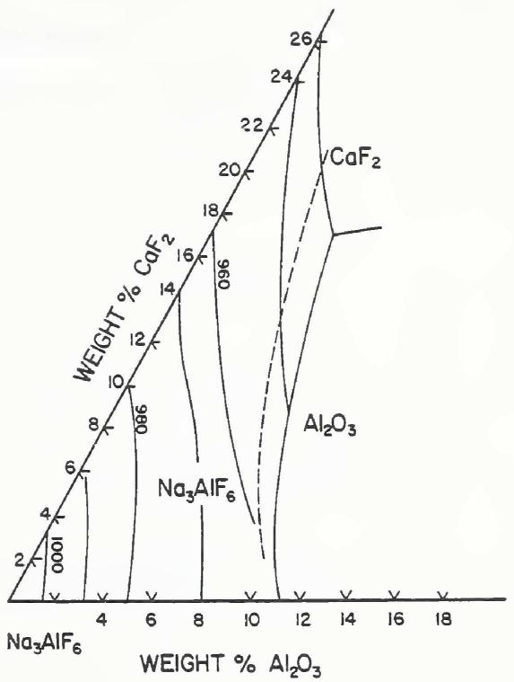  
Figure 153.1. $\mathrm{Na}_{3} \mathrm{AlF}_{6}-\mathrm{Al}_{2} \mathrm{O}_{3}-\mathrm{CaF}_{2}$ phase diagram

References [1-19].

2. Density (ρ)

No data

3. Surface Tension (Y)

No data

4. Viscosity (η)

No data

5. Electrical Conductance (K)

No data

(153) $\mathrm{Na}_{3} \mathrm{AlF}_{6}-\mathrm{Al}_{2} \mathrm{O}_{3}-\mathrm{CaF}_{2}$

6. Safety and Hazards

A. Hazard rating

(i) Toxicity: inorganic fluorides are generally quite irritant and toxic.

(ii) Vapor pressure: no information for this system; but see $\mathrm{Na}_{3}\mathrm{AlF}_{6}$ [22] and $\mathrm{CaF}_{2}$ [22].

B. Disaster hazards

(i) Molten salt bath "explosions": i.e. explosive generation of steam due to bulk water "carry-over" and/or equipment failure; i.e., explosive expansion of "trapped" air.

(ii) Fluorides, when heated to decomposition, or contacted with acids, emit highly toxic fumes.

References [20-25].

# 7. Corrosion

Table 153.1. Corrosion studies from primary research literature   

<table><tr><td colspan="2">Studies</td><td>References</td></tr><tr><td rowspan="6">A</td><td rowspan="2">CrNi-Cr-Mo alloys (INOR-8; Hastelloys B, W, and N)</td><td>[26]</td></tr><tr><td>[27,28]</td></tr><tr><td>SSNI-12P</td><td>[29]</td></tr><tr><td>Quartz</td><td>[30]</td></tr><tr><td>Al</td><td>[31]</td></tr><tr><td>Various metals</td><td>[32]</td></tr><tr><td rowspan="3">B</td><td>Pt</td><td>[33-37,71]</td></tr><tr><td>Boron nitride, carbon, Inconel, Mo</td><td>[38-40,72]</td></tr><tr><td>Fused MgO</td><td>[41]</td></tr><tr><td rowspan="3">C</td><td>Impurities in electrolyte</td><td>[42,43]</td></tr><tr><td>Graphite</td><td>[42,43]</td></tr><tr><td>TiC, TiB2, CrB2, ZrN, NbB2</td><td>[44-46]</td></tr><tr><td rowspan="5">D</td><td>Corrosion studies in molten salts with NaF as one component (e.g., Cl, CO3,...)</td><td>[47-62,69,70]</td></tr><tr><td>Electrochemical behavior of oxide ions and related species in molten fluorides</td><td>[63-65]</td></tr><tr><td>Electroanalytical studies in molten fluorides</td><td>[66]</td></tr><tr><td>Annotated corrosion biblio.</td><td>[67]</td></tr><tr><td>Corrosion: molten fluorides(survey)</td><td>[68]</td></tr></table>

A: studies principally in molten NaF, KF, and LiF;  
B: used largely in fluorides physical properties measurements; C: technological aspects, in aluminum reduction cells; D: more general studies, basic principles, and surveys.

References [26-72]

8. Diffusion

No data

9. Heat of Fusion $(\Delta H_{f}^{\circ})$

No data

10. Heat Capacity $(C_p)$ No data   
11. Volume Change on Melting $(\Delta V_{f})$ No data   
12. Vapor Pressure $(p_{vap})$ No data   
13. Thermal Conductivity (liquid) $(\lambda_{\ell})$ No data   
14. Thermal Conductivity (solid) $(\lambda_{s})$ No data   
15. Cryoscopic Constant $(k_{f})$ No data

# 16. References

[1] Rolin, M., Bull. Soc. Chim., France, 1120 (1961).   
[2] Fenerty, A. and Hollingshead, E. A., J. Electrochem. Soc., 107, 993 (1960).   
[3] Abramov, G. A., Vetyukov, M. M., Gupalo, I. P., Kostyukov, A. A. and Lozhkin, L. N., "Teoreticheskie osnovy elektrometallurghii alyuminiya (Theoretical Principles of the Electrometallurgy of Aluminium)", Metallurgizdat, Moscow, 1953.   
[4] Pascal, P. and Jouniaux, A., Bull. Soc. Chim. France, 13, 439 (1913); Z. Elektrochem., 19, 610 (1913).   
[5] Janz, G. J. Downey, J. R., Jr., Allen, C. B., and Tomkins, R. P. T., "Eutectic Data" - 2 Vols; ERDA-TID-27163-P1 & P2; NTIS, Washington, D. C. (1977).   
[6] Janz, G. J., Downey, J. R., Jr., Allen, C. B., and Tomkins, R. P. T., "Physical Properties Data Complications Relevant to Energy Storage. I. Molten Salts: Eutectic Data", NSRDS-NBS-61; U. S. Gov't Printing Office, Washington, D. C. (1978).   
[7] "International Critical Tables of Numerical Data, Physics, Chemistry, and Technology", 8 Vols., McGraw-Hill Book Co., N. Y. (1933).   
[8] "Landolt-Bornstein Zahlenwert und Funktionen aus Physik, Chemie, Astronomie, Geophysik und Technik", (10th Ed.) Springer-Verlag, Berlin, Heidelberg, N. Y. (1961).   
[9] Clark, P. V., "Fused Salt Mixtures: Eutectic Compositions and Melting Points Bibliography 1907-1968", Report No. SC-R-68-1680; Sandia Laboratories (1968), NTIS.   
[10] Robertson, W. D., "Binary Phase Diagrams of Halide Salts", Report No. Yale 2723 (2 Vols.), U. S. AEC Contract AT (30-1)-2723 (1966), NTIS.

(153) $\mathrm{Na}_{3} \mathrm{AlF}_{6}-\mathrm{Al}_{2} \mathrm{O}_{3}-\mathrm{CaF}_{2}$   
[11] Thoma, R. E., "Phase Diagrams of Nuclear Reactor Materials", Oak Ridge National Laboratory, ORNL-2548, Contract No. W-7405-eng-26.   
[12] Thoma, R. E., "Phase Diagrams of Binary and Ternary Fluoride Systems", Chapt. 6; Adv. Molten Salts Chemistry, Vol. 3 (J. Braunstein, G. Mamantov, and G. P. Smith, eds.), Plenum Press, N. Y. (1975).   
[13] Voskresenskaya, N. K., ed., "Handbook of Solid-Liquid Equilibria in Systems of Inorganic Salts", Volumes 1, 2, Izc. Akad. Nauk SSSR, Moscow (1961). Israel Program for Scientific Translations, Jerusalem, 1970 (NTIS).   
[14] Sinistri, C., Franzozini, P., and Rolla, M., "An Atlas of Miscibility Gaps in Molten Salt Systems", Institute of Physical Chemistry, University of Pavia (Italy) (1968).   
[15] Shaffer, P. T. B., "High Temperature Materials", Plenum Press Handbooks of High Temperature Materials, No. 1, Materials Index, Plenum Press, New York, 1964.   
[16] Franzozini, P., Ferloni, P., and Spinolo, C., "Molten Salts with Organic Anions", Instituto di Chimica Fisica, Universita di Pavia (Italy), 1973.   
[17] Toropov, N. A. et al., "Handbook of Phase Diagrams of the Silicates, Volume 1: Binary Systems, Volume 2, Metal-Oxygen Compounds in Silicate Systems", Izdatel'stov "Nauka" Leningradskoe Otdelenie, Leningrad, 1969, Israel Program for Scientific Translations, Jerusalem, 1972 (NTIS).   
[18] Levin, E., et al., "Phase Diagrams for Ceramists", Amer. Ceramic Soc. (publ.), Columbus, Ohio (1964; 1969).   
[19] Bergman, A.G. and Banacheck, E.I., Izv. Sekt. Fiz. Khim. A., 23, 201 (1953).   
[20] "Dangerous Properties of Materials", Sax, N. I., Van Nostrand Reinhold Co., N. Y. (1969)   
[21] "Registry of Toxic Effects of Chemical Substances", Christensen, H. E., and Lubinbyhl, T. T., eds., U. S. Dept. H. E. W., U. S. Gov't Printing Office, Washington, D. C. (1975)   
[22] vide: this work, System 51, $\mathrm{CaF}_2$ and System 66, $\mathrm{Na}_3\mathrm{AlF}_6$ .   
[23] "Potential Hazards in Molten Salt Baths for Heat Treatment of Metals", National Board of Fire Underwriters Research Report No. 2 (1954)   
[24] "Handbook of Reactive Chemical Hazards", Bretherwick, L., Butterworth Co., London (1975)   
[25] Janz, G. J., Tomkins, R. P. T., Downey, J. R., Jr., and Allen, C. B., "Safety and Hazards, Chapter in "Eutectic Data", ERDA TID-27163-P1; NTIS, U. S. Dept. Commerce, Springfield, Va. (1977)   
[26] Brasunas, A., Metal Prog., 62, 88 (1952).   
[27] Bettes, E. S., Nucl. Sci. Eng., 2, 804 (1957).   
[28] Hoffman, E. E., Patriarca, P., Leitten, C. F., Jr., and Slaughter, G. M., ORNL-1934, Oak Ridge Natl. Lab., (1956).

(153) $\mathrm{Na}_{3} \mathrm{AlF}_{6}-\mathrm{Al}_{2} \mathrm{O}_{3}-\mathrm{CaF}_{2}$   
[29] Oak Ridge National Laboratory, "The Development Status of Molten Salt Breeder Reactors", Rpt. ORNL-4812-UC-80; NTIS, U. S. Dept. Commerce, Springfield, Va., (Aug. 1972).   
[30] Heimann, R., Glastech. Ber., 43, 83 (1970).   
[31] Lukashenko, E. E., and Reutova, G. A., Nov. Teor. Tekhnol. Metall. Protsessov., 119 (1973).   
[32] Koger, J. W., Corrosion, 30, 125 (1974).   
[33] Edwards, J. D., Taylor, C. S., Russell, A. S., and Maranville, L. F., J. Electrochem. Soc. 99, 527 (1952).   
[34] Landon, G. J., and Ubbelohde, A. R., Proc. Royal Soc., A240, 160 (1957).   
[35] Winterhager, H. and Werner, L., Forschungsber. des Witschafts-u. Verkehrsministeriums Nordrhein-Westfalen, No. 438, 1957.   
[36] Winterhager, H. and Werner, L., Forschungsber. des Witschafts-u. Verkehrsministeriums Nordrhein-Westfalen, No. 341, 1956.   
[37] Bajcsy, J., Malinovsky, M., and Matiasovsky, K., Electrochim. Acta, 7, 543 (1962).   
[38] Yim, E. W. and Feinleib, M., J. Electrochem. Soc., 104, 622 (1957).   
[39] Yim, E. W. and Feinleib, M., J. Electrochem. Soc., 626 (1957).   
[40] Brown, E. A. and Porter, B., "U. S. Department of Interior, Bureau of Mines", 128.23:6500 (1964).   
[41] Cuthbertson, J.W. and Waddington, J., Trans Faraday Soc., 32, 745 (1936).   
[42] Grjothiem, K., Krohn, C., Malinovsky, M., Matiasovsky, K., and Thonstad, J., "Aluminum Electrolyses", Chapt. 10; Aluminum-Verlag, G.mbH; Dusseldorf (1977).   
[43] Brun, J., Tunold, R., Vatland, A., 30th ISE Meeting, Extended Abstracts, pp. 118-119; Trondheim, Norway (Aug. 1979); NTH, Dept. Ind. Electrochem., Trondheim, Norway.   
[44] Holliday, R. D., (Olin Mathieson Chemical Corp.), U. S. 3,661,736, May 9, 1972.   
[45] Thompson, R.: (Borax Consolidated Ltd.), Ger. Offen. 2,305,281, Aug. 9, 1973.   
[46] Kugler, T. and Rieger, H. W.: (Swiss Aluminium Ltd.) Ger. Offen. 2,312,439, Oct. 4, 1973.   
[47] Khan, I. A., Ber. Kernforschungsanlage Juelich, Juel-608-RW, (1969).   
[48] Khan, I. A., Inst. Reaktorwerkst., Kernforschungsanlage, Juel-718-RW (1970).   
[49] Bowles, P. J., and Newdick, P. C., Electroplating and Metal Finishing, 24, 6 (1971).   
[50] DeVan, J. H., "Examinations of Pump Impellers from Sodium and Fused Salt Pump Endurance Tests", ORNL CF-61-4-77, Oak Ridge National Lab., (1961).   
[51] Adamson, G. M., Manly, W. D., and Crouse, S. R., "Corrosion by Molten Fluorides", ANP Materials Meeting ORNL-2685, (1958).   
[52] Huntley, W. R., and Gnadt, P. A., Oak Ridge Nat'l Lab., Report ORNL-TM-3863. (1973); Nucl. Sci. Abstr., 27, 12446 (1973).

(153) $\mathrm{Na}_{3} \mathrm{AlF}_{6} - \mathrm{Al}_{2} \mathrm{O}_{3} - \mathrm{CaF}_{2}$   
[53] Gill, C. B., Straumanis, M. E., and Schlechten, W. B., J. Electrochem. Soc., 102, 42 (1955).   
[54] Litman, A. P., "Corrosion of Volatility Pilot Plant Mark I INOR-S Hydrofluorinator and Mark III. Nickel Fluorinator after Fourteen Dissolution Runs", ORNL-3253, Oak Ridge Nat'l Lab., (1962).   
[55] Litman, A. P., and Goldman, A. E., "Corrosion Associated with Fluoridation in the Oak Ridge Nat'l Lab., Fluoride Volatility Process", ORNL-2832, Oak Ridge Nat'l Lab. (1961).   
[56] Manly, W. D., Coobs, J. H., DeVan, J. H., Douglas D. A., Inouye, H., Patriarca, P., Roche, T. K., and Scott, J. L., "Metallurgical Problems in Molten Fluoride Systems", Proc. 2nd U. N. Inter. Conf. Peaceful Uses of At. Energy, 7, 223 (1958).   
[57] Oak Ridge Nat'l Lab., Molten Salt Reactor Program Semiannual Progress Report for Period Ending July 31, 1964, ORNL-3708, (1964).   
[58] Vreeland, D. C., Hoffman, E. E., and Manly, W. D., Nucleonics, 11, 36 (1953).   
[59] Grimes, W. R., and Cuneo, D. R., "Molten Salts as Reactor Fuels", Reactor Handbook 2nd ed., 1, 425 (1955).   
[60] Shimotake, H., and Hesson, J. C., Adv. Chem. Series, No. 64, 149 (1967).   
[61] Boser, O., "Study of Safety Aspects of High Temperature Thermal Energy Storage Systems", ERDA Thermal Energy Storage Information Exchange Mtg., Cleveland, NSF-AER 75-20605 (Sept. 1976).   
[62] Venkatasetty, H. V., "Thermodynamic Properties and Corrosion Characteristics of Thermal Energy Storage Eutectic Mixtures", paper presented at 152nd Meeting of the Electrochemical Society, Atlanta, Ga., (October, 1977).   
[63] Mathews, A. L., and Baes, C. F., Inorg. Chem., 7, 373 (1968).   
[64] Manning, D. L. and Mamantov, G., J. Electrochem. Soc., 124, 480 (1977).   
[65] Ting, G., Baes, C. F., Bamberger, C. E., and Mamantov, G., J. Inorg. Nucl. Chem., 39, 1803 (1977).   
[66] Manning, D. L., and Mamantov, G., J. Electroanal. Chem., (in press) (1978)   
[67] Janz, G. J., and Tomkins, R. P. T., Corrosion, 35(11) 485 (1979).   
[68] Eichelberger, J. L., (Penwalt Corp.) "Investigations of Metal Fluoride Thermal Energy Storage Materials: Availability, Cost, Chemistry" ERDA Rpt CO02990-6; NTIS, U. S. Dept. Commerce, Springfield, Va., (Dec. 1976).   
[69] Kochergin, V. P., and Ignat'eva, N. I., Russ. J. Inorg. Chem., 6(9), 1086 (1961).   
[70] Ozeryanaya, I. N., Volodin, V. P., and Smirnov, M. V., Zashchita Metalov (USSR), 2, 230 (1969).   
[71] Thompson, M. deK. and Kaye, A. L., Trans. Electrochem. Soc., 67, 169 (1935).   
[72] Baak, T., Acta Chem. Scand., 8, 1727 (1954).

1. Melting Temperature $(T_{m})$

Pure substance melting points:

Na3AlF6: 1010°C

A12O3: 2040°C

$\mathrm{AlF}_{3}$ : does not melt; sublimes with 1 atm equal press. at $\sim 1255^{\circ} \mathrm{C}$

Eutectic melting point:

E 1: $684^{\circ} \mathrm{C}$ , composition: 67.3 wt % Na 3 Al F 6, 4.4 wt % Al 2 O 3

37.4 mol % Na₃AlF₆, 4.1 mol % Al₂O₃

$\mathrm{P}_{1}$ : $723^{\circ} \mathrm{C}$ , composition: 59.5 wt $\%$ $\mathrm{Na}_{3} \mathrm{AlF}_{6}$ , 3.2 wt $\%$ $\mathrm{Al}_{2} \mathrm{O}_{3}$

45.6 mol % Na₃AlF₆, 5.8 mol % Al₂O₃

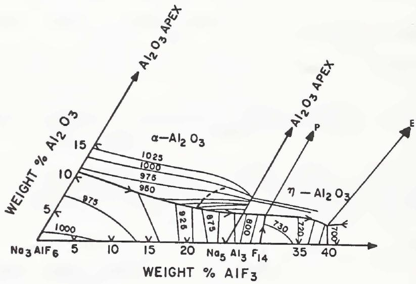  
Figure 154.1. $\mathrm{Na}_{3} \mathrm{AlF}_{6}-\mathrm{AlF}_{3}-\mathrm{Al}_{2} \mathrm{O}_{3}$

References [1-21]

(154) $\mathrm{Na}_{3} \mathrm{AlF}_{6} - \mathrm{AlF}_{3} - \mathrm{Al}_{2} \mathrm{O}_{3}$

2. Density (p)

No data

3. Surface Tension (Y)

No data

4. Viscosity (n)

Measurement method: oscillation technique [22]

Equation:

$$
\eta = a + b T + c T ^ {2} + d T ^ {3} \tag {154.1}
$$

precision: in table 154.2

uncertainty: $\sim \pm 2\%$

Table 154.1. Compositions and temperature ranges   

<table><tr><td rowspan="2">#</td><td colspan="4">Composition (mol %)</td></tr><tr><td>Na3AlF6</td><td>Al2O3</td><td>AlF3</td><td>T range(K)</td></tr><tr><td>1</td><td>85.06</td><td>2.31</td><td>12.64</td><td>1192-1313</td></tr><tr><td>2</td><td>86.99</td><td>6.80</td><td>6.21</td><td>1263-1367</td></tr><tr><td>3</td><td>89.19</td><td>4.45</td><td>6.37</td><td>1243-1355</td></tr><tr><td>4</td><td>91.78</td><td>2.22</td><td>6.00</td><td>1253-1358</td></tr><tr><td>5</td><td>92.97</td><td>4.70</td><td>12.33</td><td>1173-1314</td></tr></table>

Table 154.2. Parameters of equation (154.1) and precisions   

<table><tr><td>Mixture</td><td>a</td><td>b x 103</td><td>-c x 106</td><td>d x 109</td><td>Precision</td></tr><tr><td>No. 1</td><td>12.907</td><td>-1.743</td><td>13.76</td><td>6.440</td><td>0.30%</td></tr><tr><td>No. 2</td><td>23.546</td><td>-24.41</td><td>-6.345</td><td>-</td><td>1.03%</td></tr><tr><td>No. 3</td><td>6.778</td><td>16.46</td><td>27.83</td><td>9.565</td><td>0.84%</td></tr><tr><td>No. 4</td><td>17.060</td><td>0.933</td><td>23.18</td><td>10.40</td><td>0.53%</td></tr><tr><td>No. 5</td><td>24.058</td><td>-12.41</td><td>17.45</td><td>10.59</td><td>0.70%</td></tr></table>

Table 154.3. Viscosity (cp) from equations in tables 154.1 and 154.2   

<table><tr><td rowspan="2">T(K)</td><td colspan="5">Mixture</td></tr><tr><td>#1</td><td>#2</td><td>#3</td><td>#4</td><td>#5</td></tr><tr><td>1180</td><td></td><td></td><td></td><td></td><td>2.517</td></tr><tr><td>1200</td><td>2.129</td><td></td><td></td><td></td><td>2.338</td></tr><tr><td>1220</td><td>1.994</td><td></td><td></td><td></td><td>2.175</td></tr><tr><td>1240</td><td>1.867</td><td></td><td>2.634</td><td></td><td>2.030</td></tr><tr><td>1260</td><td>1.748</td><td>2.863</td><td>2.468</td><td>2.239</td><td>1.902</td></tr><tr><td>1280</td><td>1.637</td><td>2.697</td><td>2.309</td><td>2.087</td><td>1.792</td></tr><tr><td>1300</td><td>1.535</td><td>2.536</td><td>2.158</td><td>1.948</td><td>1.701</td></tr><tr><td>1320</td><td></td><td>2.380</td><td>2.013</td><td>1.822</td><td></td></tr><tr><td>1340</td><td></td><td>2.230</td><td>1.877</td><td>1.712</td><td></td></tr><tr><td>1360</td><td></td><td>2.084</td><td>1.750</td><td>1.616</td><td></td></tr></table>

References [22]

(154) $\mathrm{Na}_{3} \mathrm{AlF}_{6}-\mathrm{AlF}_{3}-\mathrm{Al}_{2} \mathrm{O}_{3}$

5. Electrical Conductance (K)

No data

6. Safety and Hazards

A. Hazard rating

(i) Toxicity: inorganic fluorides are generally irritants and toxic; alumina is classed as a nuisance particulate.   
(ii) Vapor pressure: $\mathrm{Na}_{3}\mathrm{AlF}_{6}$ at m.pt. $(1000^{\circ}\mathrm{C})$ , $<< 0.5\mathrm{mm}$ ; $\mathrm{AlF}_{3}$ at its m.pt. $(1291^{\circ}\mathrm{C})$ , no data; sublimes at $\sim 1240^{\circ}\mathrm{C}$ .   
B. Disaster hazards   
(i) Molten salt bath "explosions": i.e. explosive generation of steam due to bulk water "carry-over" and/or equipment failure; i.e., explosive expansion of "trapped" air.   
(ii) Fluorides, when heated to decomposition, or contacted with acids, emit highly toxic fumes.

References [23-28]

# 7. Corrosion

Table 154.4. Corrosion studies from primary research literature   

<table><tr><td colspan="2">Studies</td><td>References</td></tr><tr><td rowspan="6">A</td><td rowspan="2">CrNi-Cr-Mo alloys (INOR-8; Hastelloysb, W, and N)</td><td>[29]</td></tr><tr><td>[30,31]</td></tr><tr><td>SSNI-12P</td><td>[32]</td></tr><tr><td>Quartz</td><td>[33]</td></tr><tr><td>Al</td><td>[34]</td></tr><tr><td>Various metals</td><td>[35]</td></tr><tr><td rowspan="3">B</td><td>Pt</td><td>[36-40]</td></tr><tr><td>Boron nitride, carbon, Inconel</td><td>[41-43]</td></tr><tr><td>Fused MgO</td><td>[44]</td></tr><tr><td rowspan="3">C</td><td>Impurities in electrolyte</td><td>[7,45]</td></tr><tr><td>Graphite</td><td>[7,45]</td></tr><tr><td>TiC, TiB2, CrB2, ZrN, NbB2</td><td>[46-48]</td></tr><tr><td rowspan="5">D</td><td>Corrosion studies in molten salts with NaF as one component (e.g., Cl, CO3,...)</td><td>[49-64,71,72]</td></tr><tr><td>Electrochemical behavior of oxide ions and related species in molten fluorides</td><td>[65-67]</td></tr><tr><td>Electroanalytical studies in molten fluorides</td><td>[68]</td></tr><tr><td>Annotated corrosion bibliolog.</td><td>[69]</td></tr><tr><td>Corrosion: molten fluorides (survey)</td><td>[70]</td></tr></table>

A: studies principally in molten NaF, KF, and LiF;  
B: used largely in fluoride physical properties measurements; C: technological aspects, in aluminum reduction cells; D: more general studies, basic principles, and surveys.

References [29-72,7]

(154) $\mathrm{Na}_{3} \mathrm{AlF}_{6} - \mathrm{AlF}_{3} - \mathrm{Al}_{2} \mathrm{O}_{3}$

8. Diffusion   
No data   
9. Heat of Fusion $(\Delta H_{f})$   
No data   
10. Heat Capacity $(C_p)$   
No data   
11. Volume Change on Melting $(\Delta V_{f})$   
No data   
12. Vapor Pressure $(p_{vap})$   
No data   
13. Thermal Conductivity (liquid) $(\lambda_{\ell})$   
No data   
14. Thermal Conductivity (solid) $(\lambda_{s})$   
No data   
15. Cryoscopic Constant $(k_{f})$   
No data   
16. References   
[1] Foster, P. A., J. Am. Ceram. Soc., 58, 288 (1975).   
[2] Abramov, G. A., Vetyukov, M. M., Gupalo, I. P., Kostyukov, A. A. and Lozhkin, L. N., "Teoreticheskie osnovy elektrometallurghii alyuminiya (Theoretical Principles of the Electrometallurgy of Aluminium)", Metallurgizdat, Moscow, 1953.   
[3] Phillips, N. W. F., Singleton, R. H. and Hollingshead, E. A., J. Electrochem. Soc., 102(12), 690 (1955).   
[4] Fuseya, G. and Takeda, B., J. Electrochem. Soc., Japan, 27, 339 (1959).   
[5] Fenerty, A. and Hollingshead, E. A., J. Electrochem. Soc., 107, 993 (1960).   
[6] Rolin, M., Bull. Soc. Chim. France, 1112 (1961).   
[7] Grjothiem, K., Krohn, C., Malinovsky, M., Matiasovsky, K., Thonstad, J., "Aluminium Electrolyses", Aluminium-Verlag GmbH.-Dusseldorf (1977).   
[8] Janz, G. J. Downey, J. R., Jr., Allen, C. B., and Tomkins, R. P. T., "Eutectic Data" - 2 Vols; ERDA-TID-27163-P1 & P2; NTIS, Washington, D. C. (1977).

(154) $\mathrm{Na}_{3} \mathrm{AlF}_{6} - \mathrm{AlF}_{3} - \mathrm{Al}_{2} \mathrm{O}_{3}$   
[9] Janz, G. J., Downey, J. R., Jr., Allen, C. B., and Tomkins, R. P. T., "Physical Properties Data Complications Relevant to Energy Storage. I. Molten Salts: Eutectic Data", NSRDS-NBS-61; U. S. Gov't Printing Office, Washington, D. C. (1978).   
[10] "International Critical Tables of Numerical Data, Physics, Chemistry, and Technology", 8 Vols., McGraw-Hill Book Co., N. Y. (1933).   
[11] "Landolt-Bornstein Zahlentwert und Funktionen aus Physik, Chemie, Astronomie, Geophysik und Technik", (10th Ed.) Springer-Verlag, Berlin, Heidelberg, N. Y. (1961).   
[12] Clark, P. V., "Fused Salt Mixtures: Eutectic Compositions and Melting Points Bibliography 1907-1968", Report No. SC-R-68-1680; Sandia Laboratories (1968), NTIS.   
[13] Robertson, W. D., "Binary Phase Diagrams of Halide Salts", Report No. Yale 2723 (2 Vols.), U. S. AEC Contract AT (30-1)-2723 (1966), NTIS.   
[14] Thoma, R. E., "Phase Diagrams of Nuclear Reactor Materials", Oak Ridge National Laboratory, ORNL-2548, Contract No. W-7405-eng-26.   
[15] Thoma, R. E., "Phase Diagrams of Binary and Ternary Fluoride Systems", Chapt. 6; Adv. Molten Salts Chemistry, Vol. 3 (J. Braunstein, G. Mamantov, and G. P. Smith, eds.), Plenum Press, N. Y. (1975).   
[16] Voskresenskaya, N. K., ed., "Handbook of Solid-Liquid Equilibria in Systems of Inorganic Salts", Volumes 1, 2, Izc. Akad. Nauk SSSR, Moscow (1961). Israel Program for Scientific Translations, Jerusalem, 1970 (NTIS).   
[17] Sinistri, C., Franzozini, P., and Rolla, M., "An Atlas of Miscibility Gaps in Molten Salt Systems", Institute of Physical Chemistry, University of Pavia (Italy) (1968).   
[18] Shaffer, P. T. B., "High Temperature Materials", Plenum Press Handbooks of High Temperature Materials, No. 1, Materials Index, Plenum Press, New York, 1964.   
[19] Franzozini, P., Ferloni, P., and Spinolo, C., "Molten Salts with Organic Anions", Instituto di Chimica Fisica, Universita di Pavia (Italy), 1973.   
[20] Toropov, N. A. et al., "Handbook of Phase Diagrams of the Silicates, Volume 1: Binary Systems, Volume 2, Metal-Oxygen Compounds in Silicate Systems", Izdatel'stov "Nauka" Leningradskoe Otdelenie, Leningrad, 1969, Israel Program for Scientific Translations, Jerusalem, 1972 (NTIS).   
[21] Levin, E., et al., "Phase Diagrams for Ceramists", Amer. Ceramic Soc. (publ.), Columbus, Ohio (1964; 1969).   
[22] Tørklep, K. and Øye, H.A., Electrochim. Acta 25(2), 229 (1980)   
[23] "Dangerous Properties of Materials", Sax, N. I., Van Nostrand Reinhold Co., N. Y. (1969)   
[24] "Registry of Toxic Effects of Chemical Substances", Christensen, H. E., and Lubinbyhl, T. T., eds., U. S. Dept. H. E. W., U. S. Gov't Printing Office, Washington, D. C. (1975)   
[25] Janz, G. J., et al., "Physical Properties Data Complications Relevant to Energy Storage. Part II. Molten Salts: Data on Single and Multi-Component Salt Systems", NSRDS-NBS 61, Part II (April 1979), U. S. Gov't Printing Office, Supt of Doc. No. C13-48-61, Washington D. C. 20402.

(154) $\mathrm{Na}_{3} \mathrm{AlF}_{6}-\mathrm{AlF}_{3}-\mathrm{Al}_{2} \mathrm{O}_{3}$   
[26] "Potential Hazards in Molten Salt Baths for Heat Treatment of Metals", National Board of Fire Underwriters Research Report No. 2 (1954)   
[27] "Handbook of Reactive Chemical Hazards", Bretherwick, L., Butterworth Co., London (1975)   
[28] Janz, G. J., Tomkins, R. P. T., Downey, J. R., Jr., and Allen, C. B., "Safety and Hazards, Chapter in "Eutectic Data", ERDA TID-27163-P1; NTIS, U. S. Dept. Commerce, Springfield, Va. (1977)   
[29] Brasunas, A., Metal Prog., 62, 88 (1952).   
[30] Bettes, E. S., Nucl. Sci. Eng., 2, 804 (1957).   
[31] Hoffman, E. E., Patriarca, P., Leitten, C. F., Jr., and Slaughter, G. M., ORNL-1934, Oak Ridge Natl. Lab., (1956).   
[32] Oak Ridge National Laboratory, "The Development Status of Molten Salt Breeder Reactors", Rpt. ORNL-4812-UC-80; NTIS, U. S. Dept. Commerce, Springfield, Va., (Aug. 1972).   
[33] Heimann, R., Glastech. Ber., 43, 83 (1970).   
[34] Lukashenko, E. E., and Reutova, G. A., Nov. Teor. Tekhnol. Metall. Protsessov., 119 (1973).   
[35] Koger, J. W., Corrosion, 30, 125 (1974).   
[36] Edwards, J. D., Taylor, C. S., Russell, A. S., and Maranville, L. F., ibid., 99, 527 (1952).   
[37] Landon, G. J., and Ubbelohde, A. R., Proc. Royal Soc., A240, 160 (1957).   
[38] Winterhager, H. and Werner, L., Forschungsber. des Witschafts-u. Verkehrsministeriums Nordrhein-Westfalen, No. 438, 1957.   
[39] Winterhager, H. and Werner, L., Forschungsber. des Witschafts-u. Verkehrsministeriums Nordrhein-Westfalen, No. 341, 1956.   
[40] Bajcsy, J., Malinovsky, M., and Matiasovsky, K., Electrochim. Acta, 7, 543 (1962).   
[41] Yim, E. W. and Feinleib, M., J. Electrochem. Soc., 104, 622 (1957).   
[42] Yim, E. W. and Feinleib, M., J. Electrochem. Soc., 104, 626 (1957).   
[43] Brown, E. A. and Porter, B., "U. S. Department of Interior, Bureau of Mines", 128.23:6500 (1964).   
[44] Cuthbertson, J.W. and Waddington, J., Trans Faraday Soc., 32, 745 (1936).   
[45] Brun, J., Tunold, R., Vatland, A., 30th ISE Meeting, Extended Abstracts, pp. 118-119; Trondheim, Norway (Aug. 1979); NTH, Dept. Ind. Electrochem., Trondheim, Norway.   
[46] Holliday, R. D., (Olin Mathieson Chemical Corp.), U. S. 3,661,736, May '9, 1972.   
[47] Thompson, R.: (Borax Consolidated Ltd.), Ger. Offen. 2,305,281, Aug. 9, 1973.   
[48] Kugler, T. and Rieger, H. W.: (Swiss Aluminium Ltd.), Ger. Offen. 2,312,439, Oct. 4, 1973.

(154) $\mathrm{Na}_{3} \mathrm{AlF}_{6} - \mathrm{AlF}_{3} - \mathrm{Al}_{2} \mathrm{O}_{3}$   
[49] Khan, I. A., Ber. Kernforschungsaniage Juelich, Juel-608-RW, (1969).   
[50] Khan, I. A., Inst. Reaktorwerkst., Kernforschungsanlage, Juel-718-RW (1970).   
[51] Bowles, P. J., and Newdick, P. C., Electroplating and Metal Finishing, 24, 6 (1971).   
[52] DeVan, J. H., "Examinations of Pump Impellers from Sodium and Fused Salt Pump Endurance Tests", ORNL CF-61-4-77, Oak Ridge National Lab., (1961).   
[53] Adamson, G. M., Manly, W. D., and Crouse, S. R., "Corrosion by Molten Fluorides", ANP Materials Meeting ORNL-2685, (1958).   
[54] Huntley, W. R., and Gnadt, P. A., Oak Ridge Nat'l Lab., Report ORNL-TM-3863. (1973); Nucl. Sci. Abstr., 27, 12446 (1973).   
[55] Gill, C. B., Straumanis, M. E., and Schlechten, W. B., J. Electrochem. Soc., 102, 42 (1955).   
[56] Litman, A. P., "Corrosion of Volatility Pilot Plant Mark I INOR-S Hydrofluorinator and Mark III. Nickel Fluorinator after Fourteen Dissolution Runs", ORNL-3253, Oak Ridge Nat'l Lab., (1962).   
[57] Litman, A. P., and Goldman, A. E., "Corrosion Associated with Fluoridation in the Oak Ridge Nat'l Lab., Fluoride Volatility Process", ORNL-2832, Oak Ridge Nat'l Lab. (1961).   
[58] Manly, W. D., Coobs, J. H., DeVan, J. H., Douglas D. A., Inouye, H., Patriarca, P., Roche, T. K., and Scott, J. L., "Metallurgical Problems in Molten Fluoride Systems", Proc. 2nd U. N. Inter. Conf. Peaceful Uses of At. Energy, 7, 223 (1958).   
[59] Oak Ridge Nat'l Lab., Molten Salt Reactor Program Semiannual Progress Report for Period Ending July 31, 1964, ORNL-3708, (1964).   
[60] Vreeland, D. C., Hoffman, E. E., and Manly, W. D., Nucleonics, 11, 36 (1953).   
[61] Grimes, W. R., and Cuneo, D. R., "Molten Salts as Reactor Fuels", Reactor Handbook 2nd ed., 1, 425 (1955).   
[62] Shimotake, H., and Hesson, J. C., Adv. Chem. Series, No. 64, 149 (1967).   
[63] Boser, O., "Study of Safety Aspects of High Temperature Thermal Energy Storage Systems", ERDA Thermal Energy Storage Information Exchange Mtg., Cleveland, NSF-AER 75-20605 (Sept. 1976).   
[64] Venkatasetty, H. V., "Thermodynamic Properties and Corrosion Characteristics of Thermal Energy Storage Eutectic Mixtures", paper presented at 152nd Meeting of the Electrochemical Society, Atlanta, Ga., (October, 1977).   
[65] Mathews, A. L., and Baes, C. F., Inorg. Chem., 7, 373 (1968).   
[66] Manning, D. L. and Mamantov, G., J. Electrochem. Soc., 124, 480 (1977).   
[67] Ting, G., Baes, C. F., Bamberger, C. E., and Mamantov, G., J. Inorg. Nucl. Chem., 39, 1803 (1977).   
[68] Manning, D. L., and Mamantov, G., J. Electroanal. Chem., (in press) (1978).   
[69] Janz, G. J., and Tomkins, R. P. T., Corrosion, 35(11) 485 (1979).   
[70] Eichelberger, J. L., (Penwalt Corp.) "Investigations of Metal Fluoride Thermal Energy Storage Materials: Availability, Cost, Chemistry" ERDA Rpt CO02990-6; NTIS, U. S. Dept. Commerce, Springfield, Va., (Dec. 1976).

(154) $\mathrm{Na}_{3} \mathrm{AlF}_{6} - \mathrm{AlF}_{3} - \mathrm{Al}_{2} \mathrm{O}_{3}$   
[71] Kochergin, V. P., and Ignat'eva, N. I., Russ. J. Inorg. Chem., 6(9), 1086 (1961).   
[72] Ozeryanaya, I. N., Volodin, V. P., and Smirnov, M. V., Zashchita Metalov (USSR), 2, 230 (1969).

1. Melting Temperatures $(T_{m})$

Pure substance melting points:

NaCl: $800^{\circ} \mathrm{C}$

Na3AlF6: 1010°C

A12O3: 2040°C

Eutectic melting point:

735°C, composition: < 1 wt % Al₂O₃, ~ 31.5 wt % Na₃AlF₆, ~ 68.5 wt % NaCl

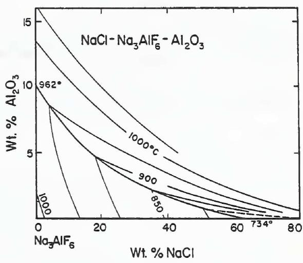  
Figure 155.1. $\mathrm{Na}_{3} \mathrm{AlF}_{6}-\mathrm{Al}_{2} \mathrm{O}_{3}-\mathrm{NaCl}$ phase diagram

References [1-22]

2. Density (ρ)

No data

3. Surface Tension (γ)

No data

4. Viscosity (n)

No data

5. Electrical Conductance (K)

No data

# 6. Safety and Hazards

# A. Hazard rating

(i) Toxicity: inorganic fluorides are generally quite irritant and toxic.

(ii) Vapor pressure: no information for this system; but see $\mathrm{Na}_{3}\mathrm{AlF}_{6}$ [25] and NaCl [29].

# B. Disaster hazards

(i) Molten salt bath "explosions": i.e., explosive generation of steam due to bulk water "carry-over" and/or equipment failure; i.e., explosive expansion of "trapped" air.   
(ii) Fluorides and chlorides, when heated to decomposition, or contacted with acids, emit highly toxic fumes.

References [23-29]

# 7. Corrosion

Table 155.1. Corrosion studies from primary research literature   

<table><tr><td colspan="2">Studies</td><td>References</td></tr><tr><td rowspan="6">A</td><td>CrNi-Cr-Mo alloys (INOR-8; Hastelloys B, W, and N)</td><td>[30]</td></tr><tr><td>SSNI-12P</td><td>[31,32]</td></tr><tr><td>Quartz</td><td>[33]</td></tr><tr><td>Al</td><td>[34]</td></tr><tr><td>Various metals</td><td>[35]</td></tr><tr><td></td><td>[36]</td></tr><tr><td rowspan="3">B</td><td>Pt</td><td>[37-41]</td></tr><tr><td>Boron nitride, carbon, Inconel</td><td>[42-44]</td></tr><tr><td>Fused MgO</td><td>[45]</td></tr><tr><td rowspan="3">C</td><td>Impurities in electrolyte</td><td>[46,47]</td></tr><tr><td>Graphite</td><td>[46,47]</td></tr><tr><td>TiC, TiB2, CrB2, ZrN, NbB2</td><td>[48-50]</td></tr><tr><td rowspan="5">D</td><td>Corrosion studies in molten salts with NaF as one component (e.g., Cl, CO3,...)</td><td>[51-66,73,74]</td></tr><tr><td>Electrochemical behavior of oxides and related species in molten fluorides</td><td>[67-69]</td></tr><tr><td>Electroanalytical studies in molten fluorides</td><td>[70]</td></tr><tr><td>Annotated corrosion bibliolog.</td><td>[71]</td></tr><tr><td>Corrosion: molten fluorides (survey)</td><td>[72]</td></tr></table>

A: studies principally in molten NaF, KF and LiF;  
B: used largely in fluorides physical properties measurements; C: technological aspects, in aluminum reduction cells; D: more general studies, basic principles, and surveys.

References [30-74]

8. Diffusion

No data

9. Heat of Fusion $(\Delta H_{f}^{\circ})$

No data

(155) $\mathrm{Na}_{3} \mathrm{AlF}_{6}-\mathrm{Al}_{2} \mathrm{O}_{3}-\mathrm{NaCl}$   
10. Heat Capacity $(C_p)$   
No data   
11. Volume Change on Melting $(\Delta V_{f})$   
No data   
12. Vapor Pressure $(p_{vap})$   
No data   
13. Thermal Conductivity (liquid) $(\lambda_{\ell})$   
No data   
14. Thermal Conductivity (solid) $(\lambda_{s})$   
No data   
15. Cryoscopic Constant $(k_{f})$   
No data   
16. References   
[1] Phillips, N. W. F., Singleton, R. H. and Hollingshead, E. A., J. Electrochem. Soc., 102(12), 690 (1955).   
[2] Yaguchi, H., Huu Thanh, P. and Rolin, M., Bull. Soc. Chim., France 39 (1970).   
[3] Matiasovsky, K. and Malinovsky, M., Chem. Zvesti, 14, 551 (1960).   
[4] Henry, J. L. and Lafky, W. M., Paper presented at the American Chemical Society Meeting, New York (1954).   
[5] Vajna, A., Met. Ital., 2, 124 (1957).   
[6] Matiasovsky, K. and Malinovsky, M., Izv. Vyssh. Ucheb. Zaved., Tsvet. Met., 7(3), 87 (1964)   
[7] Matiasovsky, K. and Malinovsky, M., Electrochim. Acta., 11, 1035 (1966)   
[8] Bergman, A. G., and Banachek, E. I., Izv. Sekt. Fiz. Khim. A., 23,201 (1953)   
[9] Janz, G. J. Downey, J. R., Jr., Allen, C. B., and Tomkins, R. P. T., "Eutectic Data" - 2 Vols; ERDA-TID-27163-P1 & P2; NTIS, Washington, D. C. (1977).   
[10] Janz, G. J., Downey, J. R., Jr., Allen, C. B., and Tomkins, R. P. T., "Physical Properties Data Complications Relevant to Energy Storage."   
I. Molten Salts: Eutectic Data", NSRDS-NBS-61; U. S. Gov't Printing Office, Washington, D. C. (1978).   
[11] "International Critical Tables of Numerical Data, Physics, Chemistry, and Technology", 8 Vols., McGraw-Hill Book Co., N. Y. (1933).

[12] "Landolt-Bornstein Zahlenwert und Funktionen aus Physik, Chemie, Astronomie, Geophysik und Technik", (10th Ed.) Springer-Verlag, Berlin, Heidelberg, N. Y. (1961).   
[13] Clark, P. V., "Fused Salt Mixtures: Eutectic Compositions and Melting Points Bibliography 1907-1968", Report No. SC-R-68-1680; Sandia Laboratories (1968), NTIS.   
[14] Robertson, W. D., "Binary Phase Diagrams of Halide Salts", Report No. Yale 2723 (2 Vols.), U. S. AEC Contract AT (30-1)-2723 (1966), NTIS.   
[15] Thoma, R. E., "Phase Diagrams of Nuclear Reactor Materials", Oak Ridge National Laboratory, ORNL-2548, Contract No. W-7405-eng-26.   
[16] Thoma, R. E., "Phase Diagrams of Binary and Ternary Fluoride Systems", Chapt. 6; Adv. Molten Salts Chemistry, Vol. 3 (J. Braunstein, G. Mamantov, and G. P. Smith, eds.), Plenum Press, N. Y. (1975).   
[17] Voskresenskaya, N. K., ed., "Handbook of Solid-Liquid Equilibria in Systems of Inorganic Salts", Volumes 1, 2, Izc. Akad. Nauk SSSR, Moscow (1961). Israel Program for Scientific Translations, Jerusalem, 1970 (NTIS).   
[18] Sinistri, C., Franzozini, P., and Rolla, M., "An Atlas of Miscibility Gaps in Molten Salt Systems", Institute of Physical Chemistry, University of Pavia (Italy) (1968).   
[19] Shaffer, P. T. B., "High Temperature Materials", Plenum Press Handbooks of High Temperature Materials, No. 1, Materials Index, Plenum Press, New York, 1964.   
[20] Franzozini, P., Ferloni, P., and Spinolo, C., "Molten Salts with Organic Anions", Instituto di Chimica Fisica, Universita di Pavia (Italy), 1973.   
[21] Toropov, N. A. et al., "Handbook of Phase Diagrams of the Silicates, Volume 1: Binary Systems, Volume 2, Metal-Oxygen Compounds in Silicate Systems", Izdatel'stov "Nauka" Leningradskoe Otdelenie, Leningrad, 1969, Israel Program for Scientific Translations, Jerusalem, 1972 (NTIS).   
[22] Levin, E., et al., "Phase Diagrams for Ceramists", Amer. Ceramic Soc. (publ.), Columbus, Ohio (1964; 1969).   
[23] "Dangerous Properties of Materials", Sax, N. I., Van Nostrand Reinhold Co., N. Y. (1969)   
[24] "Registry of Toxic Effects of Chemical Substances", Christensen, H. E., and Lubinbyh1, T. T., eds., U. S. Dept. H. E. W., U. S. Gov't Printing Office, Washington, D. C. (1975)   
[25] Janz, G. J., et al., "Physical Properties Data Complications Relevant to Energy Storage. Part II. Molten Salts: Data on Single and Multi-Component Salt Systems", NSRDS-NBS 61, Part II (April 1979), U. S. Gov't Printing Office, Supt of Doc. No. C13-48-61, Washington D. C. 20402.   
[26] "Potential Hazards in Molten Salt Baths for Heat Treatment of Metals", National Board of Fire Underwriters Research Report No. 2 (1954)   
[27] "Handbook of Reactive Chemical Hazards", Bretherwick, L., Butterworth Co., London (1975)   
[28] Janz, G. J., Tomkins, R. P. T., Downey, J. R., Jr., and Allen, C. B., "Safety and Hazards, Chapter in "Eutectic Data", ERDA TID-27163-P1; NTIS, U. S. Dept. Commerce, Springfield, Va. (1977)

(155) $\mathrm{Na}_{3} \mathrm{AlF}_{6}-\mathrm{Al}_{2} \mathrm{O}_{3}-\mathrm{NaCl}$

[29] vide: this work, System 66, Na₃AlF₆.   
[30] Brasunas, A., Metal Prog., 62, 88 (1952).   
[31] Bettes, E. S., Nucl. Sci. Eng., 2, 804 (1957).   
[32] Hoffman, E. E., Patriarca, P., Leitten, C. F., Jr., and Slaughter, G. M., ORNL-1934, Oak Ridge Natl. Lab., (1956).   
[33] Oak Ridge National Laboratory, "The Development Status of Molten Salt Breeder Reactors", Rpt. ORNL-4812-UC-80; NTIS, U. S. Dept. Commerce, Springfield, Va., (Aug. 1972).   
[34] Heimann, R., Glastech. Ber., 43, 83 (1970).   
[35] Lukashenko, E. E., and Reutova, G. A., Nov. Teor. Tekhnol. Metall. Protsessov., 119 (1973).   
[36] Koger, J. W., Corrosion, 30, 125 (1974).   
[37] Edwards, J. D., Taylor, C. S., Russell, A. S., and Maranville, L. F., J. Electrochem. Soc. 99, 527 (1952).   
[38] Landon, G. J., and Ubbelohde, A. R., Proc. Royal Soc., A240, 160 (1957).   
[39] Winterhager, H. and Werner, L., Forschungsber. des Witschafts-u. Verkehrsministeriums Nordrhein-Westfalen, No. 438, 1957.   
[40] Winterhager, H. and Werner, L., Forschungsber. des Witschafts-u. Verkehrsministeriums Nordrhein-Westfalen, No. 341, 1956.   
[41] Bajcsy, J., Malinovsky, M., and Matiasovsky, K., Electrochim. Acta, 7, 543 (1962).   
[42] Yim, E. W. and Feinleib, M., J. Electrochem. Soc., 104, 622 (1957).   
[43] Yim, E. W. and Feinleib, M., J. Electrochem. Soc., 104, 626 (1957).   
[44] Brown, E. A. and Porter, B., "U. S. Department of Interior, Bureau of Mines", 128.23:6500 (1964).   
[45] Cuthbertson, J.W. and Waddington, J., Trans Faraday Soc., 32, 745 (1936).   
[46] Grjothim, K., Krohn, C., Malinovsky, M., Matiasovsky, K., and Thonstad, J., "Aluminum Electrolyses", Chapt. 10; Aluminum-Verlag, G.mbH; Dusseldorf (1977).   
[47] Brun, J., Tunold, R., Vatland, A., 30th ISE Meeting, Extended Abstracts, pp. 118-119; Trondheim, Norway (Aug. 1979); NTH, Dept. Ind. Electrochem., Trondheim, Norway.   
[48] Holliday, R. D., (Olin Mathieson Chemical Corp.), U. S. 3,661,736, May 9, 1972.   
[49] Thompson, R.: (Borax Consolidated Ltd.), Ger. Offen. 2,305,281, Aug. 9, 1973.   
[50] Kugler, T. and Rieger, H. W.: (Swiss Aluminium Ltd.) Ger. Offen. 2,312,439, Oct. 4, 1973.   
[51] Khan, I. A., Ber. Kernforschungsanlage Juelich, Juel-608-RW, (1969).   
[52] Khan, I. A., Inst. Reaktorwerkst., Kernforschungsanlage, Juel-718-RW (1970).

(155) $\mathrm{Na}_{3} \mathrm{AlF}_{6} - \mathrm{Al}_{2} \mathrm{O}_{3} - \mathrm{NaCl}$   
[53] Bowles, P. J., and Newdick, P. C., Electroplating and Metal Finishing, 24, 6 (1971).   
[54] DeVan, J. H., "Examinations of Pump Impellers from Sodium and Fused Salt Pump Endurance Tests", ORNL CF-61-4-77, Oak Ridge National Lab., (1961).   
[55] Adamson, G. M., Manly, W. D., and Crouse, S. R., "Corrosion by Molten Fluorides", ANP Materials Meeting ORNL-2685, (1958).   
[56] Huntley, W. R., and Gnadt, P. A., Oak Ridge Nat'l Lab., Report ORNL-TM-3863. (1973); Nucl. Sci. Abstr., 27, 12446 (1973).   
[57] Gill, C. B., Straumanis, M. E., and Schlechten, W. B., J. Electrochem. Soc., 102, 42 (1955).   
[58] Litman, A. P., "Corrosion of Volatility Pilot Plant Mark I INOR-S Hydrofluorinator and Mark III. Nickel Fluorinator after Fourteen Dissolution Runs", ORNL-3253, Oak Ridge Nat'l Lab., (1962).   
[59] Litman, A. P., and Goldman, A. E., "Corrosion Associated with Fluoridation in the Oak Ridge Nat'l Lab., Fluoride Volatility Process", ORNL-2832, Oak Ridge Nat'l Lab. (1961).   
[60] Manly, W. D., Coobs, J. H., DeVan, J. H., Douglas D. A., Inouye, H., Patriarca, P., Roche, T. K., and Scott, J. L., "Metallurgical Problems in Molten Fluoride Systems", Proc. 2nd U. N. Inter. Conf. Peaceful Uses of At. Energy, 7, 223 (1958).   
[61] Oak Ridge Nat'l Lab., Molten Salt Reactor Program Semiannual Progress Report for Period Ending July 31, 1964, ORNL-3708, (1964).   
[62] Vreeland, D. C., Hoffman, E. E., and Manly, W. D., Nucleonics, 11, 36 (1953).   
[63] Grimes, W. R., and Cuneo, D. R., "Molten Salts as Reactor Fuels", Reactor Handbook 2nd ed., 1, 425 (1955).   
[64] Shimotake, H., and Hesson, J. C., Adv. Chem. Series, No. 64, 149 (1967).   
[65] Boser, O., "Study of Safety Aspects of High Temperature Thermal Energy Storage Systems", ERDA Thermal Energy Storage Information Exchange Mtg., Cleveland, NSF-AER 75-20605 (Sept. 1976).   
[66] Venkatasetty, H. V., "Thermodynamic Properties and Corrosion Characteristics of Thermal Energy Storage Eutectic Mixtures", paper presented at 152nd Meeting of the Electrochemical Society, Atlanta, Ga., (October, 1977).   
[67] Mathews, A. L., and Baes, C. F., Inorg. Chem., 7, 373 (1968).   
[68] Manning, D. L. and Mamantov, G., J. Electrochem. Soc., 124, 480 (1977).   
[69] Ting, G., Baes, C. F., Bamberger, C. E., and Mamantov, G., J. Inorg. Nucl. Chem., 39, 1803 (1977).   
[70] Manning, D. L., and Mamantov, G., J. Electroanal. Chem., (in press) (1978)   
[71] Janz, G. J., and Tomkins, R. P. T., Corrosion, 35(11) 485 (1979).   
[72] Eichelberger, J. L., (Penwalt Corp.) "Investigations of Metal Fluoride Thermal Energy Storage Materials: Availability, Cost, Chemistry" ERDA Rpt CO02990-6; NTIS, U. S. Dept. Commerce, Springfield, Va., (Dec. 1976).   
[73] Kochergin, V. P., and Ignat'eva, N. I., Russ. J. Inorg. Chem., 6(9), 1086 (1961).   
[74] Ozeryanaya, I. N., Volodin, V. P., and Smirnov, M. V., Zashchita Metalov (USSR), 2, 230 (1969).

1. Melting Temperature $(T_{m})$

Pure substance melting points:

<table><tr><td>Na3AlF6:</td><td>1010°C</td></tr><tr><td>Al2O3:</td><td>2040°C</td></tr><tr><td>Li3AlF6:</td><td>785°C</td></tr></table>

Eutectic melting point:

760°C composition: ~ 27 mol % Na₃AlF₆; ~ 65 mol % Li₃AlF₆; ~ 8 mol % Al₂O₃

Reaction point:

693°C composition: ~ 33 mol % Na₃AlF₆ ~ 63 mol % Li₃AlF₆ ~ 4 mol % Al₂O₃

Peritectic melting point:

683°C composition: ~ 33 mol % Na₃AlF₆ ~ 61 mol % Li₃AlF₆ ~ 6 mol % Al₂O₃

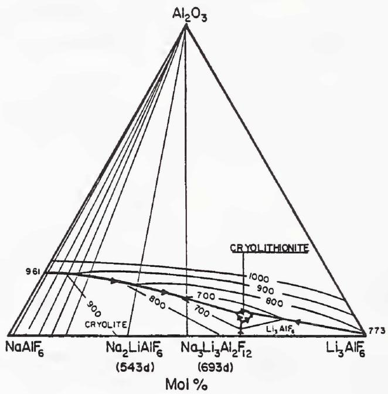  
Figure 156.1. $\mathrm{Na}_{3}\mathrm{AlF}_{6} - \mathrm{Al}_{2}\mathrm{O}_{3} - \mathrm{Li}_{3}\mathrm{AlF}_{6}$ phase diagram

References [1-15]

2. Density (ρ)

No data

3. Surface Tension (γ)

No data

4. Viscosity (η)

No data

(156) $\mathrm{Na}_{3} \mathrm{AlF}_{6} - \mathrm{Al}_{2} \mathrm{O}_{3} - \mathrm{Li}_{3} \mathrm{AlF}_{6}$

5. Electrical Conductance (K)

No data

6. Safety and Hazards

A. Hazard rating

(i) Toxicity: inorganic fluorides are generally quite irritant and toxic.   
(ii) Vapor pressure: no information for this system; but see $\mathrm{Na}_{3}\mathrm{AlF}_{6}$ [18] and $\mathrm{Li}_{3}\mathrm{AlF}_{6}$ [18].

B. Disaster hazards

(i) Molten salt bath "explosions": i.e. explosive generation of steam due to bulk water "carry-over" and/or equipment failure; i.e., explosive expansion of "trapped" air.   
(ii) Fluorides, when heated to decomposition, or contacted with acids, emit highly toxic fumes.

References [16-21]

# 7. Corrosion

Table 156.1. Corrosion studies from primary research literature   

<table><tr><td colspan="2">Studies</td><td>References</td></tr><tr><td rowspan="6">A</td><td>CrNi-Cr-Mo alloys (INOR-8; Hastelloys B, W, and N)</td><td>[22]</td></tr><tr><td>SSNI-12P</td><td>[23,24]</td></tr><tr><td>Quartz</td><td>[25]</td></tr><tr><td>Al</td><td>[26]</td></tr><tr><td>Various metals</td><td>[27]</td></tr><tr><td></td><td>[28]</td></tr><tr><td rowspan="3">B</td><td>Pt, Pt-Rh</td><td>[29-33,67,68]</td></tr><tr><td>Boron nitride, carbon, Inconel</td><td>[34-36]</td></tr><tr><td>Fused MgO</td><td>[37]</td></tr><tr><td rowspan="3">C</td><td>Impurities in electrolyte</td><td>[38,39]</td></tr><tr><td>Graphite</td><td>[38,39]</td></tr><tr><td>TiC, TiB2, CrB2, ZrN, NbB2</td><td>[40-42]</td></tr><tr><td rowspan="5">D</td><td>Corrosion studies in molten salts with NaF as one component (e.g., Cl, CO3,...)</td><td>[43-58,65,66]</td></tr><tr><td>Electrochemical behavior of oxide ions and related species in molten fluorides</td><td>[59-61]</td></tr><tr><td>Electroanalytical studies in molten fluorides</td><td>[62]</td></tr><tr><td>Annotated corrosion bibliio.</td><td>[63]</td></tr><tr><td>Corrosion: molten fluorides(survey)</td><td>[64]</td></tr></table>

A: studies principally in molten NaF, KF, and LiF;  
B: used largely in fluorides physical properties measurements; C: technological aspects, in aluminum reduction cells; D: more general studies, basic principles, and surveys.

References [22-68]

8. Diffusion

No data

9. Heat of Fusion $(\Delta H_{f})$

No data

(156) $\mathrm{Na}_{3} \mathrm{AlF}_{6}-\mathrm{Al}_{2} \mathrm{O}_{3}-\mathrm{Li}_{3} \mathrm{AlF}_{6}$   
10. Heat Capacity $(C_p)$ No data   
11. Volume Change on Melting $(\Delta V_{f})$ No data   
12. Vapor Pressure $(p_{vap})$ No data   
13. Thermal Conductivity (liquid) $(\lambda_{\ell})$ No data   
14. Thermal Conductivity (solid) $(\lambda_{s})$ No data   
15. Cryoscopic Constant $(k_{f})$ No data   
16. References

[1] Cassidy, R. T., and Brown, J. J. Jr., Unpub. work, Virginia Polytechnic and State University (1977); cited in Spec. Public. 496 Vol I, p. 272 (March 1978); U. S. Gov't Printing Office, Washington.   
[2] Janz, G. J. Downey, J. R., Jr., Allen, C. B., and Tomkins, R. P. T., "Eutectic Data" - 2 Vols; ERDA-TID-27163-P1 & P2; NTIS, Washington, D. C. (1977).   
[3] Janz, G. J., Downey, J. R., Jr., Allen, C. B., and Tomkins, R. P. T., "Physical Properties Data Complications Relevant to Energy Storage. I. Molten Salts: Eutectic Data", NSRDS-NBS-61; U. S. Gov't Printing Office, Washington, D. C. (1978).   
[4] "International Critical Tables of Numerical Data, Physics, Chemistry, and Technology", 8 Vols., McGraw-Hill Book Co., N. Y. (1933).   
[5] "Landolt-Bornstein Zahlenwert und Funktionen aus Physik, Chemie, Astronomie, Geophysik und Technik", (10th Ed.) Springer-Verlag, Berlin, Heidelberg, N. Y. (1961).   
[6] Clark, P. V., "Fused Salt Mixtures: Eutectic Compositions and Melting Points Bibliography 1907-1968", Report No. SC-R-68-1680; Sandia Laboratories (1968), NTIS.   
[7] Robertson, W. D., "Binary Phase Diagrams of Halide Salts", Report No. Yale 2723 (2 Vols.), U. S. AEC Contract AT (30-1)-2723 (1966), NTIS.   
[8] Thoma, R. E., "Phase Diagrams of Nuclear Reactor Materials", Oak Ridge National Laboratory, ORNL-2548, Contract No. W-7405-eng-26.   
[9] Thoma, R. E., "Phase Diagrams of Binary and Ternary Fluoride Systems", Chapt. 6; Adv. Molten Salts Chemistry, Vol. 3 (J. Braunstein, G. Mamantov, and G. P. Smith, eds.), Plenum Press, N. Y. (1975).

(156) $\mathrm{Na}_{3} \mathrm{AlF}_{6}-\mathrm{Al}_{2} \mathrm{O}_{3}-\mathrm{Li}_{3} \mathrm{AlF}_{6}$   
[10] Voskresenskaya, N. K., ed., "Handbook of Solid-Liquid Equilibria in Systems of Inorganic Salts", Volumes 1, 2, Izc. Akad. Nauk SSSR, Moscow (1961). Israel Program for Scientific Translations, Jerusalem, 1970 (NTIS).   
[11] Sinistri, C., Franzozini, P., and Rolla, M., "An Atlas of Miscibility Gaps in Molten Salt Systems", Institute of Physical Chemistry, University of Pavia (Italy) (1968).   
[12] Shaffer, P. T. B., "High Temperature Materials", Plenum Press Handbooks of High Temperature Materials, No. 1, Materials Index, Plenum Press, New York, 1964.   
[13] Franzozini, P., Ferloni, P., and Spinolo, C., "Molten Salts with Organic Anions", Instituto di Chimica Fisica, Universita di Pavia (Italy), 1973.   
[14] Toropov, N. A. et al., "Handbook of Phase Diagrams of the Silicates, Volume 1: Binary Systems, Volume 2, Metal-Oxygen Compounds in Silicate Systems", Izdatel'stov "Nauka" Leningradskoe Otdelenie, Leningrad, 1969, Israel Program for Scientific Translations, Jerusalem, 1972 (NTIS).   
[15] Levin, E., et al., "Phase Diagrams for Ceramists", Amer. Ceramic Soc. (publ.), Columbus, Ohio (1964; 1969).   
[16] "Dangerous Properties of Materials", Sax, N. I., Van Nostrand Reinhold Co., N. Y. (1969)   
[17] "Registry of Toxic Effects of Chemical Substances", Christensen, H. E., and Lubinbyhl, T. T., eds., U. S. Dept. H. E. W., U. S. Gov't Printing Office, Washington, D. C. (1975)   
[18] vide: this work, System 66, $\mathrm{Na}_{3}\mathrm{AlF}_{6}$ and System 65, $\mathrm{Li}_{3}\mathrm{AlF}_{6}$ .   
[19] "Potential Hazards in Molten Salt Baths for Heat Treatment of Metals", National Board of Fire Underwriters Research Report No. 2 (1954)   
[20] "Handbook of Reactive Chemical Hazards", Bretherwick, L., Butterworth Co., London (1975)   
[21] Janz, G. J., Tomkins, R. P. T., Downey, J. R., Jr., and Allen, C. B., "Safety and Hazards, Chapter in "Eutectic Data", ERDA TID-27163-P1; NTIS, U. S. Dept. Commerce, Springfield, Va. (1977)   
[22] Brasunas, A., Metal Prog., 62, 88 (1952).   
[23] Bettes, E. S., Nucl. Sci. Eng., 2, 804 (1957).   
[24] Hoffman, E. E., Patriarca, P., Leitten, C. F., Jr., and Slaughter, G. M., ORNL-1934, Oak Ridge Natl. Lab., (1956).   
[25] Oak Ridge National Laboratory, "The Development Status of Molten Salt Breeder Reactors", Rpt. ORNL-4812-UC-80; NTIS, U. S. Dept. Commerce, Springfield, Va., (Aug. 1972).   
[26] Heimann, R., Glastech. Ber., 43, 83 (1970).   
[27] Lukashenko, E. E., and Reutova, G. A., Nov. Teor. Tekhnol. Metal 11. Protsessov., 119 (1973).   
[28] Koger, J. W., Corrosion, 30, 125 (1974).

(156) $\mathrm{Na}_{3} \mathrm{AlF}_{6}-\mathrm{Al}_{2} \mathrm{O}_{3}-\mathrm{Li}_{3} \mathrm{AlF}_{6}$   
[29] Edwards, J. D., Taylor, C. S., Russell, A. S., and Maranville, L. F., J. Electrochem. Soc. 99, 527 (1952).   
[30] Landon, G. J., and Ubbelohde, A. R., Proc. Royal Soc., A240, 160 (1957).   
[31] Winterhager, H. and Werner, L., Forschungsber. des Witschafts-u. Verkehrsmisteriums Nordrhein-Westfalen, No. 438, 1957.   
[32] Winterhager, H. and Werner, L., Forschungsber. des Witschafts-u. Verkehrsrministeriums Nordrhein-Westfalen, No. 341, 1956.   
[33] Bajcsy, J., Malinovsky, M., and Matiasovsky, K., Electrochim. Acta, 7, 543 (1962).   
[34] Yim, E. W. and Feinleib, M., J. Electrochem. Soc., 104, 622 (1957).   
[35] Yim, E. W. and Feinleib, M., J. Electrochem. Soc., 104, 626 (1957).   
[36] Brown, E. A. and Porter, B., "U. S. Department of Interior, Bureau of Mines", 128.23:6500 (1964).   
[37] Cuthbertson, J.W. and Waddington, J., Trans Faraday Soc., 32, 745 (1936).   
[38] Grjothim, K., Krohn, C., Malinovsky, M., Matiasovsky, K., and Thonstad, J., "Aluminum Electrolyses", Chapt. 10; Aluminum-Verlag, G.mbH; Dusseldorf (1977).   
[39] Brun, J., Tunold, R., Vatland, A., 30th ISE Meeting, Extended Abstracts, pp. 118-119; Trondheim, Norway (Aug. 1979); NTH, Dept. Ind. Electrochem., Trondheim, Norway.   
[40] Holliday, R. D., (Olin Mathieson Chemical Corp.), U. S. 3,661,736, May 9, 1972.   
[41] Thompson, R.: (Borax Consolidated Ltd.), Ger. Offen. 2,305,281, Aug.9,1973.   
[42] Kugler, T. and Rieger, H. W.: (Swiss Aluminium Ltd.) Ger. Offen, 2,312,439, Oct. 4, 1973.   
[43] Khan, I. A., Ber. Kernforschungsanlage Juelich, Juel-608-RW, (1969).   
[44] Khan, I. A., Inst. Reaktorwerkst., Kernforschungsanlage, Juel-718-RW (1970).   
[45] Bowles, P. J., and Newdick, P. C., Electroplating and Metal Finishing, 24, 6 (1971).   
[46] Devan, J. H., "Examinations of Pump Impellers from Sodium and Fused Salt Pump Endurance Tests", ORNL CF-61-4-77, Oak Ridge National Lab., (1961).   
[47] Adamson, G. M., Manly, W. D., and Crouse, S. R., "Corrosion by Molten Fluorides", ANP Materials Meeting ORNL-2685, (1958).   
[48] Huntley, W. R., and Gnadt, P. A., Oak Ridge Nat'l Lab., Report ORNL-TM-3863. (1973); Nucl. Sci. Abstr., 27, 12446 (1973).   
[49] Gill, C. B., Straumanis, M. E., and Schlechten, W. B., J. Electrochem. Soc., 102, 42 (1955).   
[50] Litman, A. P., "Corrosion of Volatility Pilot Plant Mark I INOR-S Hydrofluorinator and Mark III. Nickel Fluorinator after Fourteen Dissolution Runs", ORNL-3253, Oak Ridge Nat'l Lab., (1962).   
[51] Litman, A. P., and Goldman, A. E., "Corrosion Associated with Fluoridation in the Oak Ridge Nat'l Lab., Fluoride Volatility Process", ORNL-2832, Oak Ridge Nat'l Lab. (1961).

(156) $\mathrm{Na}_{3} \mathrm{AlF}_{6}-\mathrm{Al}_{2} \mathrm{O}_{3}-\mathrm{Li}_{3} \mathrm{AlF}_{6}$   
[52] Manly, W. D., Coobs, J. H., DeVan, J. H., Douglas D. A., Inouye, H., Patriarca, P., Roche, T. K., and Scott, J. L., "Metalurgical Problems in Molten Fluoride Systems", Proc. 2nd U. N. Inter. Conf. Peaceful Uses of At. Energy, 7, 223 (1958).   
[53] Oak Ridge Nat'l Lab., Molten Salt Reactor Program Semiannual Progress Report for Period Ending July 31, 1964, ORNL-3708, (1964).   
[54] Vreeland, D. C., Hoffman, E. E., and Manly, W. D., Nucleonics, 11, 36 (1953).   
[55] Grimes, W. R., and Cuneo, D. R., "Molten Salts as Reactor Fuels", Reactor Handbook 2nd ed., 1, 425 (1955).   
[56] Shimotake, H., and Hesson, J. C., Adv. Chem. Series, No. 64, 149 (1967).   
[57] Boser, O., "Study of Safety Aspects of High Temperature Thermal Energy Storage Systems", ERDA Thermal Energy Storage Information Exchange Mtg., Cleveland, NSF-AER 75-20605 (Sept. 1976).   
[58] Venkatasetty, H. V., "Thermodynamic Properties and Corrosion Characteristics of Thermal Energy Storage Eutectic Mixtures", paper presented at 152nd Meeting of the Electrochemical Society, Atlanta, Ga., (October, 1977).   
[59] Mathews, A. L., and Baes, C. F., Inorg. Chem., 7, 373 (1968).   
[60] Manning, D. L. and Mamantov, G., J. Electrochem. Soc., 124, 480 (1977).   
[61] Ting, G., Baes, C. F., Bamberger, C. E., and Mamantov, G., J. Inorg. Nucl. Chem., 39, 1803 (1977).   
[62] Manning, D. L., and Mamantov, G., J. Electroanal. Chem., (in press) (1978)   
[63] Janz, G. J., and Tomkins, R. P. T., Corrosion, 35(11) 485 (1979).   
[64] Eichelberger, J. L., (Penwalt Corp.) "Investigations of Metal Fluoride Thermal Energy Storage Materials: Availability, Cost, Chemistry" ERDA Rpt CO02990-6; NTIS, U. S. Dept. Commerce, Springfield, Va., (Dec. 1976).   
[65] Kochergin, V. P., and Ignat'eva, N. I., Russ. J. Inorg. Chem., 6(9), 1086 (1961).   
[66] Ozeryanaya, I. N., Volodin, V. P., and Smirnov, M. V., Zashchita Metalov (USSR), 2, 230 (1969).   
[67] Ryschkewitsch, E., Z. Elektrochem., 39, 531 (1933).   
[68] Yaffe, I. S. and E. R. Van Artsdalen, Chemistry Division Semiannual Progress Report for period ending June 20, 1956, ORNL-2159, p. 77.

# 1. Melting Temperature $(T_{m})$

Pure substance melting points:

Na3AlF6: 1010°C

$\mathrm{Al}_{2} \mathrm{O}_{3}$ : $2040^{\circ} \mathrm{C}$

$\mathrm{SiO}_2$ : quartz: $1610^{\circ}\mathrm{C}$ tridymite: $1680^{\circ}\mathrm{C}$ cristobalite: $1728^{\circ}\mathrm{C}$

Invariant points:

The large solubility of $\mathrm{SiO}_2$ and $\mathrm{Al}_{2}\mathrm{O}_{3}$ at the invariant points (69 wt $\%$ $\mathrm{SiO}_2$ , 14 wt $\%$ $\mathrm{Al}_{2}\mathrm{O}_{3}$ at $1010^{\circ}\mathrm{C}$ , and 50 wt $\%$ $\mathrm{SiO}_2$ , 17 wt $\%$ $\mathrm{Al}_{2}\mathrm{O}_{3}$ at $800^{\circ}\mathrm{C}$ ) imply substantial solubilities of the aluminum silicates in this system. The restricted field of liquid at $800^{\circ}\mathrm{C}$ indicates that the liquidus does not extend much below this temperature [2].

Figure 157.1. Phase diagram of isothermal section at $1010^{\circ}\mathrm{C}$ for $\mathrm{Na}_{3}\mathrm{AlF}_{6} - \mathrm{Al}_{2}\mathrm{O}_{3} - \mathrm{SiO}_{2}$   
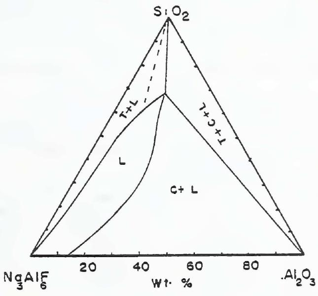  
(C: corundum; T: tridymite; L: liquid)

References [1-15]

$$
\mathrm {N a} _ {3} \mathrm {A l F} _ {6} - \mathrm {A l} _ {2} \mathrm {O} _ {3} - \mathrm {S i O} _ {2} \tag {157}
$$

2. Density (p)

Measurement method: Archimedean technique [16]

Equation:

$$
\rho = a + b C \quad (1 5 7. 1)
$$

$$
(C = \text {mol} \% \text {Al} _ {2} \text {O} _ {3})
$$

precision: in table 157.1 uncertainty: $\sim \pm 2\%$

Table 157.1. Parameters of equation (157.1) and precisions   
Table 157.2. Density $(\mathrm{gcm}^{-3})$ from equations in table 157.1   

<table><tr><td>Wt % SiO2</td><td>T(K)</td><td>a</td><td>-b x 103</td><td>Precision</td></tr><tr><td>2</td><td>1273</td><td>2.0981</td><td>2.2279</td><td>0.0995%</td></tr><tr><td>4</td><td>1273</td><td>2.0983</td><td>1.8884</td><td>0.0386%</td></tr><tr><td>6</td><td>1273</td><td>2.0973</td><td>1.4937</td><td>0.0520%</td></tr></table>

<table><tr><td rowspan="2">Na3AlF6-Al2O3(mol % Al2O3)</td><td colspan="3">Wt % SiO2</td></tr><tr><td>2</td><td>4</td><td>6</td></tr><tr><td>0</td><td>2.098</td><td>2.098</td><td>2.097</td></tr><tr><td>5</td><td>2.087</td><td>2.089</td><td>2.090</td></tr><tr><td>10</td><td>2.076</td><td>2.079</td><td>2.082</td></tr><tr><td>15</td><td>2.065</td><td>2.070</td><td>2.075</td></tr><tr><td>20</td><td>2.054</td><td>2.061</td><td></td></tr></table>

References [16]

3. Surface Tension (Y)

No data

4. Viscosity (n)

No data

$$
\mathrm {N a} _ {3} \mathrm {A l F} _ {6} - \mathrm {A l} _ {2} \mathrm {O} _ {3} - \mathrm {S i O} _ {2} \tag {157}
$$

5. Electrical Conductance (K)

Measurement method: classical ac technique [16]

Equation: (conductance-composition isotherm)

$$
\kappa = a + b C + c C ^ {2} + d C ^ {3} \tag {157.2}
$$

$$
(C = \text {mol} \% \mathrm {Al}_{2}\mathrm {O}_{3})
$$

precision: in table 157.3 uncertainty: $\sim \pm 3\%$

Table 157.3. Parameters of equation (157.2) and precisions   
Table 157.4. Specific conductance (ohm $^{-1}$ cm $^{-1}$ ) from equations in table 157.3   

<table><tr><td>Wt % SiO2</td><td>a</td><td>b x 103</td><td>-c x 103</td><td>d x 106</td><td>Precision</td></tr><tr><td>0</td><td>2.802</td><td>-19.167</td><td>0.3381</td><td></td><td>0.1207%</td></tr><tr><td>2</td><td>2.631</td><td>0.879</td><td>2.6304</td><td>74.718</td><td>0.3718%</td></tr><tr><td>4</td><td>2.573</td><td>-9.015</td><td>2.03927</td><td>72.228</td><td>1.0218%</td></tr><tr><td>6</td><td>2.503</td><td>-10.596</td><td>1.77613</td><td>65.011</td><td>0.8396%</td></tr></table>

<table><tr><td rowspan="2">\( {\mathrm{{Na}}}_{3}{\mathrm{{AlF}}}_{6} - {\mathrm{{Al}}}_{2}{\mathrm{O}}_{3} \) (mol % \( {\mathrm{{Al}}}_{2}{\mathrm{O}}_{3} \) )</td><td colspan="4">Wt % \( {\mathrm{{SiO}}}_{2} \)</td></tr><tr><td>0</td><td>2</td><td>4</td><td>6</td></tr><tr><td>0</td><td>2.80</td><td>2.63</td><td>2.57</td><td>2.50</td></tr><tr><td>5</td><td>2.70</td><td>2.58</td><td>2.49</td><td>2.41</td></tr><tr><td>10</td><td>2.58</td><td>2.45</td><td>2.35</td><td>2.28</td></tr><tr><td>15</td><td>2.44</td><td>2.30</td><td>2.22</td><td>2.16</td></tr><tr><td>20</td><td>2.28</td><td>2.19</td><td>2.15</td><td>2.10</td></tr></table>

References [16]

(157) $\mathrm{Na}_{3} \mathrm{AlF}_{6}-\mathrm{Al}_{2} \mathrm{O}_{3}-\mathrm{SiO}_{2}$

6. Safety and Hazards

# A. Hazard rating

(i) Toxicity: inorganic fluorides are generally quite irritant and toxic.   
(ii) Vapor pressure: no information on this system; $\mathrm{Na}_{3}\mathrm{AlF}_{6}$ at its m.pt. (1010°C), $\sim \ll 0.5\mathrm{mm}$ .

# B. Disaster hazard

(i) Molten salt bath "explosions": i.e., explosive generation of steam due to bulk water "carry-over" and/or equipment failure; i.e., explosive expansion of "trapped" air.   
(ii) Fluorides, when heated to decomposition, or contacted with acids, emit highly toxic fumes.

References [17-22]

# 7. Corrosion

Table 157.5. Corrosion studies from primary research literature   

<table><tr><td colspan="2">Studies</td><td>References</td></tr><tr><td rowspan="6">A</td><td>Cr</td><td>[23]</td></tr><tr><td>Ni-Cr-Mo alloys (INOR-8; Hastelloys B, W, and N)</td><td>[24,25]</td></tr><tr><td>SSNI-12P</td><td>[26]</td></tr><tr><td>Quartz</td><td>[27]</td></tr><tr><td>Al</td><td>[28]</td></tr><tr><td>Various metals</td><td>[29]</td></tr><tr><td rowspan="3">B</td><td>Pt</td><td>[30-34]</td></tr><tr><td>Boron nitride, carbon, Inconel</td><td>[35-37]</td></tr><tr><td>Fused MgO</td><td>[38]</td></tr><tr><td rowspan="3">C</td><td>Impurities in electrolyte</td><td>[39,40]</td></tr><tr><td>Graphite</td><td>[39,40]</td></tr><tr><td>TiC, TiB2, CrB2, ZrN, NbB2</td><td>[41-43]</td></tr><tr><td rowspan="5">D</td><td>Corrosion studies in molten salts with NaF as one component (e.g., Cl, CO3,...)</td><td>[44-59,66,67]</td></tr><tr><td>Electrochemical behavior of oxide ions and related species in molten fluorides</td><td>[60-62]</td></tr><tr><td>Electroanalytical studies in molten fluorides</td><td>[63]</td></tr><tr><td>Annotated corrosion bibliio.</td><td>[64]</td></tr><tr><td>Corrosion: molten fluorides(survey)</td><td>[65]</td></tr></table>

A: studies principally in molten NaF, KF, and LiF;  
B: used largely in fluorides physical properties measurements; C: technological aspects, in aluminum reduction cells; D: more general studies, basic principles, and surveys.

References [23-67]

(157) $\mathrm{Na}_{3} \mathrm{AlF}_{6}-\mathrm{Al}_{2} \mathrm{O}_{3}-\mathrm{SiO}_{2}$

8. Diffusion

No data

9. Heat of Fusion $(\Delta H_{f})$

No data

10. Heat Capacity $(C_p)$

No data

11. Volume Change on Melting $(\Delta V_{f})$

No data

12. Vapor Pressure $(p_{vap})$

No data

13. Thermal Conductivity (liquid) $(\lambda_{\ell})$

No data

14. Thermal Conductivity (solid) $(\lambda_{s})$

No data

15. Cryoscopic Constant $(k_{f})$

No data

16. References

[1] Belyaev, A. I., Rapoport, M. B. and Firsanova, L. A., Elektrometallurgia, Alyuminia, Metallurguzdat, Moscow, 1953.   
[2] Weill, D. F. and Fyfe, W. J., J. Electrochem. Soc. 111, 582 (1964).   
[3] Janz, G. J. Downey, J. R., Jr., Allen, C. B., and Tomkins, R. P. T., "Eutectic Data" - 2 Vols; ERDA-TID-27163-P1 & P2; NTIS, Washington, D. C. (1977).   
[4] Janz, G. J., Downey, J. R., Jr., Allen, C. B., and Tomkins, R. P. T., "Physical Properties Data Complications Relevant to Energy Storage. I. Molten Salts: Eutectic Data", NSRDS-NBS-61; U. S. Gov't Printing Office, Washington, D. C. (1978).   
[5] "International Critical Tables of Numerical Data, Physics, Chemistry, and Technology", 8 Vols., McGraw-Hill Book Co., N. Y. (1933).   
[6] "Landolt-Bornstein Zahlenwert und Funktionen aus Physik, Chemie, Astronomie, Geophysik und Technik", (10th Ed.) Springer-Verlag, Berlin, Heidelberg, N. Y. (1961).   
[7] Clark, P. V., "Fused Salt Mixtures: Eutectic Compositions and Melting Points Bibliography 1907-1968", Report No. SC-R-68-1680; Sandia Laboratories (1968), NTIS.

(157) $\mathrm{Na}_{3} \mathrm{AlF}_{6} - \mathrm{Al}_{2} \mathrm{O}_{3} - \mathrm{SiO}_{2}$   
[8] Robertson, W. D., "Binary Phase Diagrams of Haide Salts", Report No. Yale 2723 (2 Vols.), U. S. AEC Contract AT (30-1)-2723 (1966), NTIS.   
[9] Thoma, R. E., "Phase Diagrams of Nuclear Reactor Materials", Oak Ridge National Laboratory, ORNL-2548, Contract No. W-7405-eng-26.   
[10] Thoma, R. E., "Phase Diagrams of Binary and Ternary Fluoride Systems", Chapt. 6; Adv. Molten Salts Chemistry, Vol. 3 (J. Braunstein, G. Mamantov, and G. P. Smith, eds.), Plenum Press, N. Y. (1975).   
[11] Voskresenskaya, N. K., ed., "Handbook of Solid-Liquid Equilibria in Systems of Inorganic Salts", Volumes 1, 2, Izc. Akad. Nauk SSSR, Moscow (1961). Israel Program for Scientific Translations, Jerusalem, 1970 (NTIS).   
[12] Shaffer, P. T. B., "High Temperature Materials", Plenum Press Handbooks of High Temperature Materials, No. 1, Materials Index, Plenum Press, New York, 1964.   
[13] Toropov, N. A. et al., "Handbook of Phase Diagrams of the Silicates, Volume 1: Binary Systems, Volume 2, Metal-Oxygen Compounds in Silicate Systems", Izdatel'stov "Nauka" Leningradskoe Otdelenie, Leningrad, 1969, Israel Program for Scientific Translations, Jerusalem, 1972 (NTIS).   
[14] Levin, E., et al., "Phase Diagrams for Ceramists", Amer. Ceramic Soc. (publ.), Columbus, Ohio (1964; 1969).   
[15] "Applications of Phase Diagrams in Metallurgy and Ceramics", (2 Vols) NBS Special Pub. 496. U. S. Dept. of Commerce. Nat. Bur. Standards. Ed. Carter G. C. March 1978.   
[16] Grjothim, K., Matiasovsky, K., Fellner, P., and Silny, A., Can. Met. Quart., 10, 79 (1971).   
[17] "Dangerous Properties of Materials", Sax, N. I., Van Nostrand Reinhold Co., N. Y. (1969).   
[18] "Registry of Toxic Effects of Chemical Substances", Christensen, H. E., and Lubinybyhl, T. T., eds., U. S. Dept. H.E.W; U. S. Gov't Printing Office, Washington, D. C. (1975).   
[19] "Potential Hazards in Molten Salt Baths for Heat Treatment of Metals", National Board Fire Underwriters Research Report No. 2. (1954).   
[20] "Handbook of Reactive Chemical Hazards", Bretherwick, L., Butterworths Co., London (1975).   
[21] Janz, G. J., Tomkins, R. P. T., Downey, J. R., Jr., and Allen, C. B., "Safety and Hazards", Chapter in "Eutectic Data", ERDA TID-27163-P1; NTIS, U. S. Dept. Commerce, Springfield, Va. (1977).   
[22] vide: this work, System 66, Na $_3$ AlF $_6$ .   
[23] Brasunas, A., Metal Prog., 62, 88 (1952).   
[24] Bettes, E. S., Nucl. Sci. Eng., 2, 804 (1957).   
[25] Hoffman, E. E., Patriarca, P., Leitten, C. F., Jr., and Slaughter, G. M., ORNL-1934, Oak Ridge Natl. Lab., (1956).   
[26] Oak Ridge National Laboratory, "The Development Status of Molten Salt Breeder Reactors", Rpt. ORNL-4812-UC-80; NTIS, U. S. Dept. Commerce, Springfield, Va., (Aug. 1972).

(157) $\mathrm{Na}_{3} \mathrm{AlF}_{6} - \mathrm{Al}_{2} \mathrm{O}_{3} - \mathrm{SiO}_{2}$   
[27] Heimann, R., Glastech. Ber., 43, 83 (1970).   
[28] Lukashenko, E. E., and Reutova, G. A., Nov. Teor. Tekhnol. Metall. Protsessov., 119 (1973).   
[29] Koger, J. W., Corrosion, 30, 125 (1974).   
[30] Edwards, J. D., Taylor, C. S., Russell, A. S., and Maranville, L. F., J. Electrochem. Soc. 99, 527 (1952).   
[31] Landon, G. J., and Ubbelohde, A. R., Proc. Royal Soc., A240, 160 (1957).   
[32] Winterhager, H. and Werner, L., Forschungsber. des Witschafts-u. Verkehrsministeriums Nordrhein-Westfalen, No. 438, 1957.   
[33] Winterhager, H. and Werner, L., Forschungsber. des Witschafts-u. Verkehrsrministeriums Nordrhein-Westfalen, No. 341, 1956.   
[34] Bajcsy, J., Malinovsky, M., and Matiasovsky, K., Electrochim. Acta, 7, 543 (1962).   
[35] Yim, E. W. and Feinleib, M., J. Electrochem. Soc., 104, 622 (1957).   
[36] Yim, E. W. and Feinleib, M., J. Electrochem. Soc., 104, 626 (1957).   
[37] Brown, E. A. and Porter, B., "U. S. Department of Interior, Bureau of Mines", 128.23:6500 (1964).   
[38] Cuthbertson, J.W. and Waddington, J., Trans Faraday Soc., 32, 745 (1936).   
[39] Grjothiem, K., Krohn, C., Malinovsky, M., Matiasovsky, K., and Thonstad, J., "Aluminum Electrolyses", Chapt. 10; Aluminum-Verlag, G.mbH; Dusseldorf (1977).   
[40] Brun, J., Tunold, R., Vatland, A., 30th ISE Meeting, Extended Abstracts, pp. 118-119; Trondheim, Norway (Aug. 1979); NTH, Dept. Ind. Electrochem., Trondheim, Norway.   
[41] Holliday, R. D., (Olin Mathieson Chemical Corp.), U. S. 3,661,736, May 9, 1972.   
[42] Thompson, R.: (Borax Consolidated Ltd.), Ger. Offen. 2,305,281, Aug. 9, 1973.   
[43] Kugler, T. and Rieger, H. W.: (Swiss Aluminium Ltd.) Ger. Offen. 2, 312, 439, Oct. 4, 1973.   
[44] Khan, I. A., Ber. Kernforschungsanlage Juelich, Juel-608-RW, (1969).   
[45] Khan, I. A., Inst. Reaktorwerkst., Kernforschungsanlage, Juel-718-RW (1970).   
[46] Bowles, P. J., and Newdick, P. C., Electroplating and Metal Finishing, 24, 6 (1971).   
[47] DeVan, J. H., "Examinations of Pump Impellers from Sodium and Fused Salt Pump Endurance Tests", ORNL CF-61-4-77, Oak Ridge National Lab., (1961).   
[48] Adamson, G. M., Manly, W. D., and Crouse, S. R., "Corrosion by Molten Fluorides", ANP Materials Meeting ORNL-2685, (1958).   
[49] Huntley, W. R., and Gnadt, P. A., Oak Ridge Nat'l Lab., Report ORNL-TM-3863. (1973); Nucl. Sci. Abstr., 27, 12446 (1973).

(157) $\mathrm{Na}_{3} \mathrm{AlF}_{6}-\mathrm{Al}_{2} \mathrm{O}_{3}-\mathrm{SiO}_{2}$   
[50] Gill, C. B., Straumanis, M. E., and Schlechten, W. B., J. Electrochem. Soc., 102, 42 (1955).   
[51] Litman, A. P., "Corrosion of Volatility Pilot Plant Mark I INOR-S Hydrofluorinator and Mark III. Nickel Fluorinator after Fourteen Dissolution Runs", ORNL-3253, Oak Ridge Nat'l Lab., (1962).   
[52] Litman, A. P., and Goldman, A. E., "Corrosion Associated with Fluoridation in the Oak Ridge Nat'l Lab., Fluoride Volatility Process", ORNL-2832, Oak Ridge Nat'l Lab. (1961).   
[53] Manly, W. D., Coobs, J. H., Devan, J. H., Douglas D. A., Inouye, H., Patriarca, P., Roche, T. K., and Scott, J. L., "Metallurgical Problems in Molten Fluoride Systems", Proc. 2nd U. N. Inter. Conf. Peaceful Uses of At. Energy, 7, 223 (1958).   
[54] Oak Ridge Nat'l Lab., Molten Salt Reactor Program Semiannual Progress Report for Period Ending July 31, 1964, ORNL-3708, (1964).   
[55] Vreeland, D. C., Hoffman, E. E., and Manly, W. D., Nucleonics, 11, 36 (1953).   
[56] Grimes, W. R., and Cuneo, D. R., "Molten Salts as Reactor Fuels", Reactor Handbook 2nd ed., 1, 425 (1955).   
[57] Shimotake, H., and Hesson, J. C., Adv. Chem. Series, No. 64, 149 (1967).   
[58] Boser, O., "Study of Safety Aspects of High Temperature Thermal Energy Storage Systems", ERDA Thermal Energy Storage Information Exchange Mtg., Cleveland, NSF-AER 75-20605 (Sept. 1976).   
[59] Venkatasetty, H. V., "Thermodynamic Properties and Corrosion Characteristics of Thermal Energy Storage Eutectic Mixtures", paper presented at 152nd Meeting of the Electrochemical Society, Atlanta, Ga., (October, 1977).   
[60] Mathews, A. L., and Baes, C. F., Inorg. Chem., 7, 373 (1968).   
[61] Manning, D. L. and Mamantov, G., J. Electrochem. Soc., 124, 480 (1977).   
[62] Ting, G., Baes, C. F., Bamberger, C. E., and Mamantov, G., J. Inorg. Nucl. Chem., 39, 1803 (1977).   
[63] Manning, D. L., and Mamantov, G., J. Electroanal. Chem., (in press) (1978)   
[64] Janz, G. J., and Tomkins, R. P. T., Corrosion, 35(11) 485 (1979).   
[65] Eichelberger, J. L., (Penwalt Corp.) "Investigations of Metal Fluoride Thermal Energy Storage Materials: Availability, Cost, Chemistry" ERDA Rpt CO02990-6; NTIS, U. S. Dept. Commerce, Springfield, Va., (Dec. 1976).   
[66] Kochergin, V. P., and Ignat'eva, N. I., Russ. J. Inorg. Chem., 6(9), 1086 (1961).   
[67] Ozeryanaya, I. N., Volodin, V. P., and Smirnov, M. V., Zashchita Metalov (USSR), 2, 230 (1969).

NBS-114A (REV. 2-80)

<table><tr><td>U.S. DEPT. OF COMM.
BIBLIOGRAPHIC DATA
SHEET (See instructions)</td><td>1. PUBLICATION OR
REPORT NO.
NSRDS-NBS 61,
Part IV</td><td>2. Performing Organ. Report No.</td><td>3. Publication Date
July 1981</td></tr><tr><td colspan="4">4. TITLE AND SUBTITLE
Physical Properties Data Complications Relevant to Energy Storage.
IV. Molten Salts: Data on Additional Single and Multi-Component Salt Systems</td></tr><tr><td colspan="4">5. AUTHOR(S)
G. J. Janz and R. P. T. Tomkins</td></tr><tr><td rowspan="2" colspan="2">6. PERFORMING ORGANIZATION (If joint or other than NBS, see instructions)
NATIONAL BUREAU OF STANDARDS
DEPARTMENT OF COMMERCE
WASHINGTON, D.C. 20234</td><td colspan="2">7. Contract/Grant No.</td></tr><tr><td colspan="2">8. Type of Report &amp; Period Covered
N/A</td></tr><tr><td colspan="4">9. SPONSORING ORGANIZATION NAME AND COMPLETE ADDRESS (Street, City, State, ZIP)
Same as Item 6.</td></tr><tr><td colspan="4">10. SUPPLEMENTARY NOTES
Library of Congress Catalog Card Number: 77-10824
□ Document describes a computer program; SF-185, FIPS Software Summary, is attached.</td></tr><tr><td colspan="4">11. ABSTRACT (A 200-word or less factual summary of most significant information. If document includes a significant
bibliography or literature survey, mention it here)
The present work provides selected data with value judgements for an additional
set of 107 salt systems of interest as candidate materials for thermal energy storage
sub-systems, for electrochemical energy storage systems, and in electrochemical aluminum
production. The physical properties assessed are: melting points; phase diagrams;
eutectic compositions; density; surface tension; viscosity; electrical conductivity;
diffusion constants for ions; heat of fusion; heat capacity; volume change on fusion;
vapor pressure; thermal conductivity (liquid and solid); and cryoscopic constant. The
status of corrosion studies in the form of annotated bibliographic summaries, and
salient observations on safety and hazards are also reported. A summarizing series of
tables is provided as index to the data-gaps status for this set of candidate materials.</td></tr><tr><td colspan="4">12. KEY WORDS (Six to twelve entries; alphabetical order; capitalize only proper names; and separate key words by semicolons)
Corrosion; data compilations; electrochemical aluminum production; electrochemical energy
storage materials; molten salts; physical properties; safety and hazards; thermal energy
storage materials; thermal properties; thermodynamic properties; transport properties.</td></tr><tr><td rowspan="2" colspan="3">13. AVAILABILITY
Unlimited
□ For Official Distribution, Do Not Release to NTIS
X□ Order From Superintendent of Documents, U.S. Government Printing Office, Washington, D.C.
20402.
□ Order From National Technical Information Service (NTIS), Springfield, VA. 22161</td><td>14. NO. OF
PRINTED PAGES
870</td></tr><tr><td>15. Price
$11.00</td></tr></table>

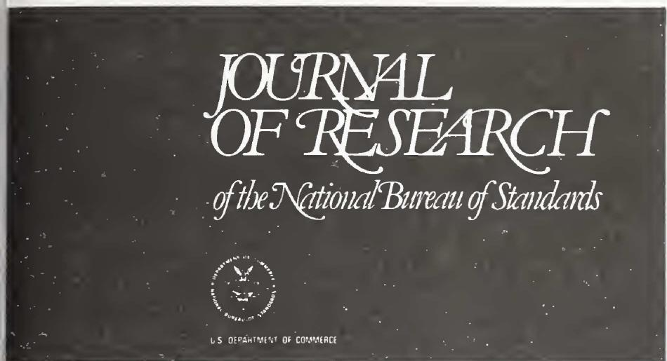

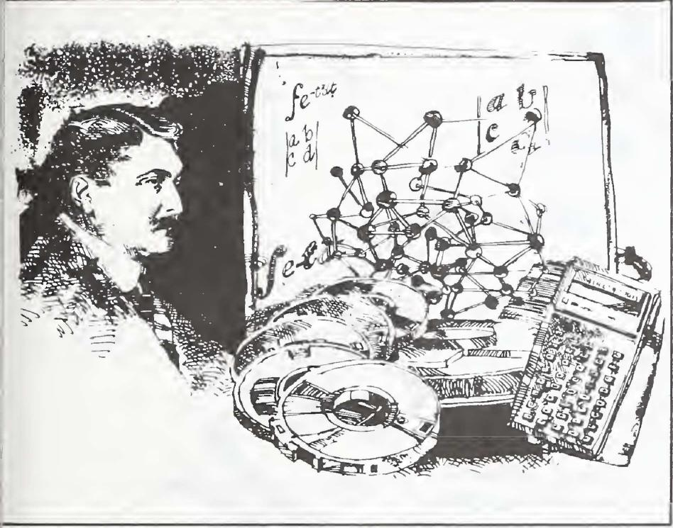

# Subscribe now—The new National Bureau of Standards Journal

The expanded Journal of Research of the National Bureau of Standards reports NBS research and development in those disciplines of the physical and engineering sciences in which the Bureau is active. These include physics, chemistry, engineering, mathematics, and computer sciences. Papers cover a broad range of subjects, with major emphasis on measurement methodology, and the basic technology underlying standardization. Also included from time to time are survey articles on topics closely related to the Bureau's technical and scientific programs. As a special service to subscribers each issue contains complete citations to all recent NBS publications in NBS and non-NBS media. Issued six times a year. Annual subscriptions: domestic $13.; foreign$ 16.25. Single copy, $3. domestic; $3.75 foreign.

Note: The Journal was formerly published in two sections: Section A "Physics and Chemistry" and Section B "Mathematical Sciences."

NBS Board of Editors

Churchill Eisenhart,

Executive Editor (Mathematics)

John W. Cooper (Physics)

Donald D. Wagman (Chemistry)

Andrew J. Fowell (Engineering)

Joseph O. Harrison (Computer Science)

Howard J. M. Hanley (Boulder Labs.)

Subscription Order Form

Enter my subscription to NBS Journal of Research at $13. Add$ 3.25 for foreign mailing. No additional postage is required for mailing within the United States or its possessions. (SJRA—File Code 2N)

Send Subscription to:

Credit Card Orders Only

Total charges $ . Fill in the boxes below.

Credit Card No.

VISA

MasterCard

Expiration Date Month/Year


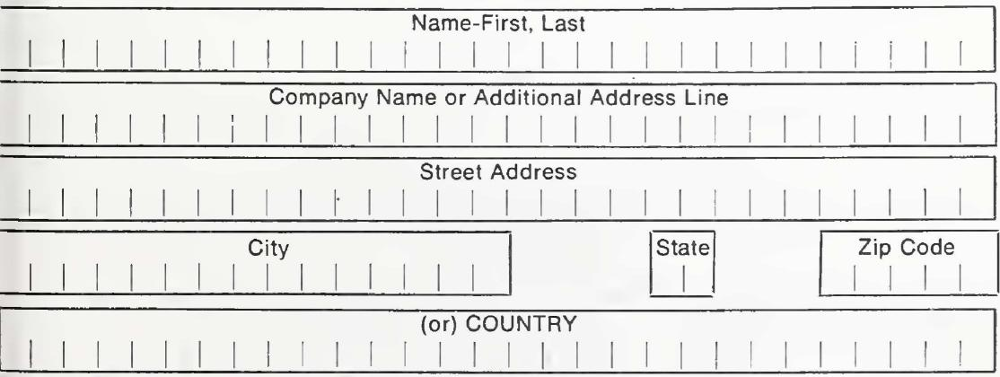

PLEASE PRINT

Remittance Enclosed. Domestic: Check or money order. Foreign: International money order, draft on an American or Canadian Bank, or by UNESCO coupons, Made payable to the Superintendent of Documents.   
Charge to my Deposit Account No.

MAIL ORDER FORM TO: Superintendent of Documents Government Printing Office Washington, D.C. 20402

# There's a new look to…


1

$\therefore m = \frac{3}{11}$

）

/

/

. . . the monthly

magazine of the National Bureau of Standards.

Still featured are special articles of general interest on current topics such as consum

er product safety and building technology. In addition, new seca- are designed to . . . PROVID

SCIENTISTS with illustrated discussions of recent technical developments and

work in progress . . . INFORM INDUSTRIALMANAGERS of technology transfer activities in

Federal and private labs. . . DESCIBE TO MANUFACTURERS advances in the field of voluntary and mandatory standards. The new DIMENSIONS/NBS also ties complete listings of upcoming conferences to best NBS and reports on all the latest NBS publications, formation on how to order. Finally, each issue carries

a page of News Briefs, aimed at keeping scientist and consumer alike up to date on major developments at the Nation's physical sciences and measurement laboratory.

(please delach here)

Enter my Subscription To DIMENSIONS/NBS at $11.00. Add $2.75 for foreign mailing. No additional postage is required for mailing within the United States or its possessions. Domestic remittances should be made either by postal money order, express money order, or check. Foreign remittances should be made either by international money order, draft on an American bank, or by UNESCO coupons.

Send Subscription to:

NAME-FIRST, LAST

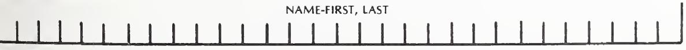

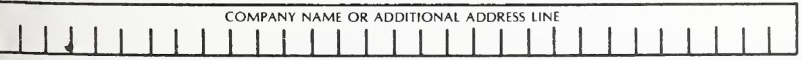

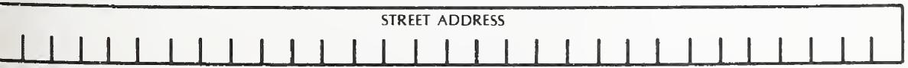

CITY

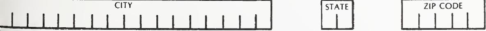

PLEASE PRINT

Remittance Enclosed (Make checks payable to Superintendent of Documents)   
Charge to my Deposit Account No.

MAIL ORDER FORM TO: Superintendent of Documents

Government Printing Office

Washington, D.C. 20402

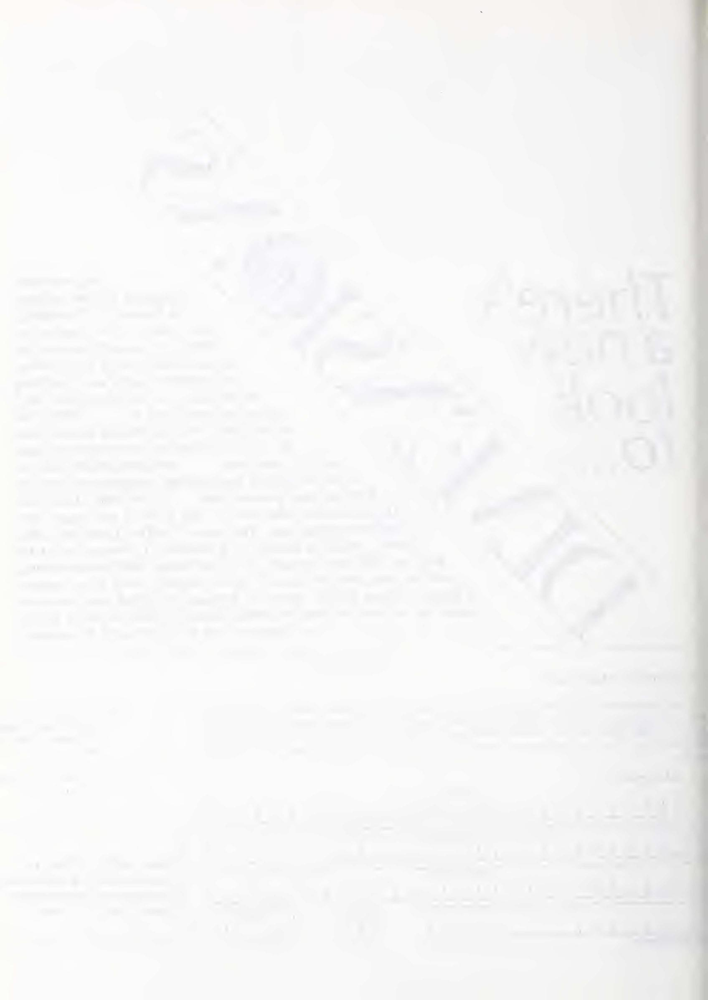

# Announcement of New Publications in National Standard Reference Data Series

Superintendent of Documents, Government Printing Office, Washington, D.C. 20402

Dear Sir:

Please add my name to the announcement list of new publications to be issued in the series: National Standard Reference Data Series—National Bureau of Standards.

Name.

Company.

Address.

City.

State.

Zip Code.

(Notifications Key N-519)


# NBS TECHNICAL PUBLICATIONS

# PERIODICALS

JOURNAL OF RESEARCH—The Journal of Research of the National Bureau of Standards reports NBS research and development in those disciplines of the physical and engineering sciences in which the Bureau is active. These include physics, chemistry, engineering, mathematics, and computer sciences. Papers cover a broad range of subjects, with major emphasis on measurement methodology and the basic technology underlying standardization. Also included from time to time are survey articles on topics closely related to the Bureau's technical and scientific programs. As a special service to subscribers each issue contains complete citations to all recent Bureau publications in both NBS and non-NBS media. Issued six times a year. Annual subscription: domestic $13; foreign$ 16.25. Single copy, $3 domestic; $3.75 foreign.

NOTE: The Journal was formerly published in two sections: Section A "Physics and Chemistry" and Section B "Mathematical Sciences."

DIMENSIONS/NBS—This monthly magazine is published to inform scientists, engineers, business and industry leaders, teachers, students, and consumers of the latest advances in science and technology, with primary emphasis on work at NBS. The magazine highlights and reviews such issues as energy research, fire protection, building technology, metric conversion, pollution abatement, health and safety, and consumer product performance. In addition, it reports the results of Bureau programs in measurement standards and techniques, properties of matter and materials, engineering standards and services, instrumentation, and automatic data processing. Annual subscription: domestic $11; foreign $13.75.

# NONPERIODICALS

Monographs—Major contributions to the technical literature on various subjects related to the Bureau's scientific and technical activities.

Handbooks—Recommended codes of engineering and industrial practice (including safety codes) developed in cooperation with interested industries, professional organizations, and regulatory bodies.

Special Publications—Include proceedings of conferences sponsored by NBS, NBS annual reports, and other special publications appropriate to this grouping such as wall charts, pocket cards, and bibliographies.

Applied Mathematics Series—Mathematical tables, manuals, and studies of special interest to physicists, engineers, chemists, biologists, mathematicians, computer programmers, and others engaged in scientific and technical work.

National Standard Reference Data Series—Provides quantitative data on the physical and chemical properties of materials, compiled from the world's literature and critically evaluated. Developed under a worldwide program coordinated by NBS under the authority of the National Standard Data Act (Public Law 90-396).

NOTE: The principal publication outlet for the foregoing data is the Journal of Physical and Chemical Reference Data (JPCRD) published quarterly for NBS by the American Chemical Society (ACS) and the American Institute of Physics (AIP). Subscriptions, reprints, and supplements available from ACS, 1155 Sixteenth St., NW, Washington, DC 20056.

Building Science Series—Disseminates technical information developed at the Bureau on building materials, components, systems, and whole structures. The series presents research results, test methods, and performance criteria related to the structural and environmental functions and the durability and safety characteristics of building elements and systems.

Technical Notes—Studies or reports which are complete in themselves but restrictive in their treatment of a subject. Analogous to monographs but not so comprehensive in scope or definitive in treatment of the subject area. Often serve as a vehicle for final reports of work performed at NBS under the sponsorship of other government agencies.

Voluntary Product Standards—Developed under procedures published by the Department of Commerce in Part 10, Title 15, of the Code of Federal Regulations. The standards establish nationally recognized requirements for products, and provide all concerned interests with a basis for common understanding of the characteristics of the products. NBS administers this program as a supplement to the activities of the private sector standardizing organizations.

Consumer Information Series—Practical information, based on NBS research and experience, covering areas of interest to the consumer. Easily understandable language and illustrations provide useful background knowledge for shopping in today's technological marketplace.

Order the above NBS publications from: Superintendent of Documents, Government Printing Office, Washington, DC 20402.

Order the following NBS publications—FIPS and NBSIR's—from the National Technical Information Services, Springfield, VA 22161.

Federal Information Processing Standards Publications (FIPS PUB)—Publications in this series collectively constitute the Federal Information Processing Standards Register. The Register serves as the official source of information in the Federal Government regarding standards issued by NBS pursuant to the Federal Property and Administrative Services Act of 1949 as amended, Public Law 89-306 (79 Stat. 1127), and as implemented by Executive Order 11717 (38 FR 12315, dated May 11, 1973) and Part 6 of Title 15 CFR (Code of Federal Regulations).

NBS Interagency Reports (NBSIR)—A special series of interim or final reports on work performed by NBS for outside sponsors (both government and non-government). In general, initial distribution is handled by the sponsor; public distribution is by the National Technical Information Services, Springfield, VA 22161, in paper copy or microfiche form.

OFFICIAL BUSINESS

Penalty for Private Use, $300

SPECIAL FOURTH-CLASS RATE BOOK