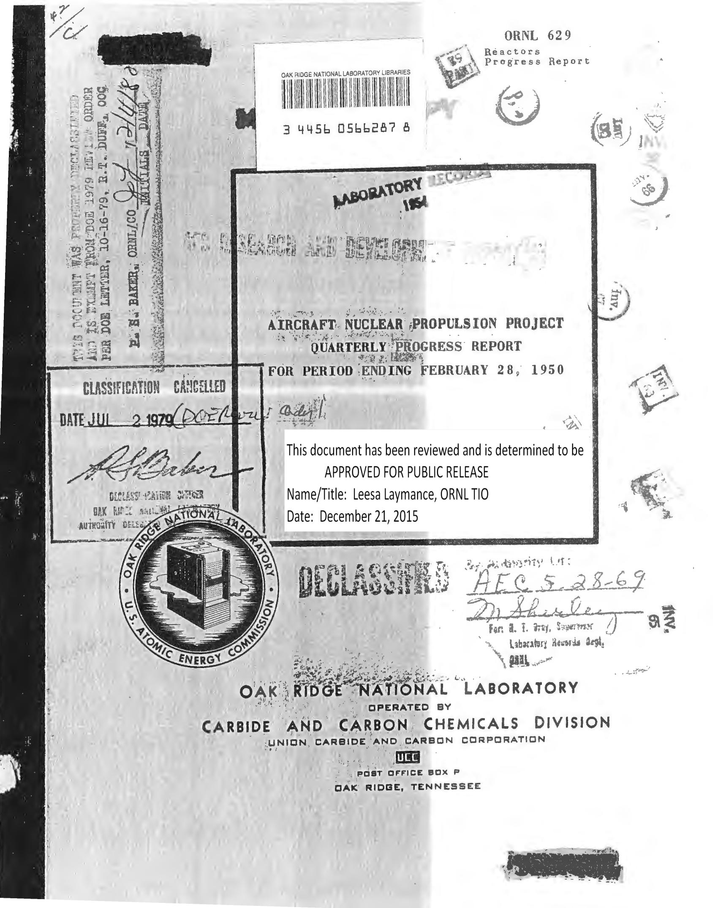

__________

Contract No. 8-7485, eng. 26

# AIRCRAFT NUCLEAR PROPULSION PROJECT

at Oak Ridge National Laboratory and Y-12 Research Laboratory

A. M. Weinberg, Project Director

QUARTERLY PROGRESS REPORT for Period Ending February 28, 1950

C. B. Ellis, Editor

Date Issued APR 19 1950

OAK RIDGE NATIONAL LABORATORY

operated by

CARBIDE AND CARRON CHEMICALS DIVISION

Union Carbide and Carbon Corporation Post Office Box P Oak Ridge, Tennessee

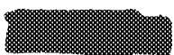

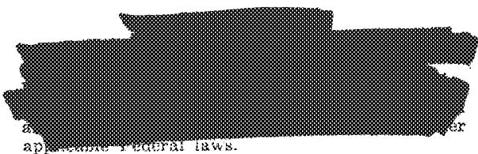

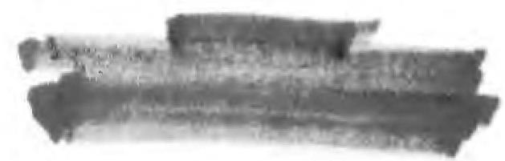

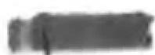

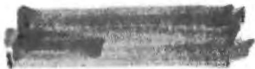

# INTERNAL DISTRIBUTION

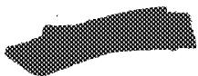

ORNL 629

Reactors

Progress Report

1 G. T. Felbeck (C&CCC)   
2-3 706-A Library   
4 706-B Library   
5 Biology Library   
6 Health Physics Library   
7-8 Training School Library   
9-18 Central Files   
19 J. A. Swartout   
20 J. H. Gillette   
21 A. Hollander   
22 J. H. Frye, Jr.   
23 E.J.Murphy   
24 C. E. Center   
25 C.E.Larson   
26 W. D. Lavers

27 A.M.Weinberg 43   
28 K. Z. Morgan 44   
29 J. S. Felton 45   
30 C. E. Winters 46-47 C. B. Ellis   
31 J.A.Lane 48 W.R.Gall   
32 G.E.Boyd 49 R.M.Jones   
33 R.W.Stoughton 50 F.Kerze   
34-35 F. L. Culler 51   
36 D.G.Reid 52   
37 A. S. Householder 53   
38 F. L. Steahly 54   
39 M. M. Mann 55   
40 A.H.Snell 56   
41 F. C. VonderLage 57   
42 C.B.Graham 58   
R. E. Engberg   
R. N. Lyon   
C. B. Ellis   
W. R. Gall   
R.M.Jones   
F. Kerze   
E.C.Miller   
E. P. Blizzard   
W. K. Ergen   
M. L. Nelson

59

W. B. Humes (K-25)   
D. S. Billington   
W. M. Breazeale   
C. E. Clifford   
M. C. Leverett   
Central Files (O.P.)

# EXTERNAL DISTRIBUTION

60-64 Air Force Engineering Office, Oak Ridge   
65-76 Argonne National Laboratory   
77-78 Atomic Energy Commission, Washington   
79 Battelle Memorial Institute   
80 Bureau of Aeronautics   
81-84 Brookhaven National Laboratory   
85 Bureau of Ships   
86 Chicago Operations Office   
87-90 General Electric Company, Richland   
91 Hanford Operations Office   
92-93 Idaho Operations Office   
94 Iowa State College   
95-98 Knolls Atomic Power Laboratory   
99-101 Los Alamos   
102- Massachusetts Institute of Technology   
103-104 National Advisory Committee for Aeronautics   
105-113 NEPA Project   
114 National Advisory Committee for Aeronautics, Washington   
115-116 New York Operations Office   
117 North American Aviation, Inc.   
118 Office of Naval Research   
119 Patent Branch, Washington   
120-134 Technical Information Branch, ORE   
135-136 University of California Radiation Laboratory   
137-140 Westinghouse Electric Corporation

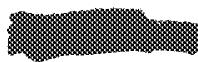

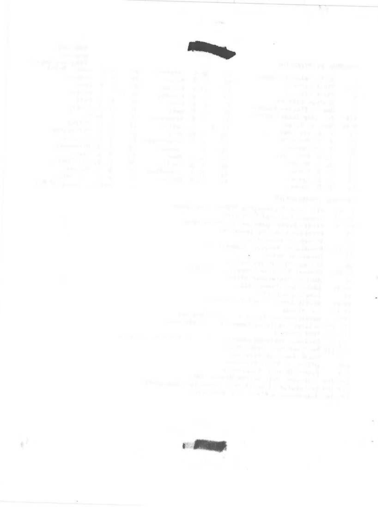

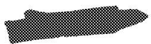

# TABLE OF CONTENTS

SUMMARY 6

SHIELING 8

New Bulk Shield Testing Facility 8

LidTank BulkShieldingMeasurements 9

Water attenuation 9

Source power 14

Lead-water measurements 14

Navy H,O-Fe-Pb-shield 15

Instruments 15

Pd Film Fast Neutron Detector 15

Neutron Energy Spectrometer 16

Shielding Analysis 16

Shielding Materials 20

Uranium hydride survey 20

Plastics 21

Concrete 21

Portland cement-iron concrete 22

Expansivity experiments 22

Radiation damage tests 22

Equilibrium moisture tests 22

Fabrication of Boral $(\mathbb{B}_{\bullet}\mathbb{C} + \mathbb{A}\mathbb{I})$ 23

"Plumbor" (B.C & Pb) 2.4

Reports Issued 24

HEAT TRANSFER 25

Heat transfer theory 25

Experimental heat transfer 25

Liquid metal pumps 25

Liquid metal handbook 26

METALLURGY AND MATERIALS 27

Static corrosion 27

Lithium handling 29

Lithium purification 30

Dynamic corrosion testing 30

Mechanical testing 31

Effects of alloying elements and structural factors 31

Protective coating of high temperature materials 31

Circulating fuel systems 31

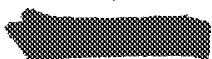

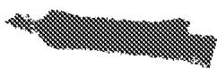

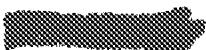

# RADIATION DAMAGE 32

Reactor Core Material Studies 32   
Accelerator experiments 32   
Reactor experiments 32

Auxiliary Material Studies 33

High intensity gamma source 33   
Radiation stability of plastics 38   
Radiation stability of metal hydrides 38

# NUCLEAR MEASUREMENTS 44

# THE CONCENTRATION OF LITHIUM ISOTOPES BY CHEMICAL METHODS 45

Molecular distillation of lithium metal 45   
Chemical exchange methods 46   
Liquid-solid systems 46   
Liquid-liquid systems 46   
Continuous countercurrent electrolysis 47   
Continuous countercurrent electromigration 47   
Thermal diffusion 48

# LIST OF FIGURES

Fig. 1 $100\%$ $\mathsf{H}_2\mathsf{O}$ Neutron Attenuation 11   
Fig. 2 $100\%$ H₂O Gamma Attenuation 12   
Fig. 3 Neutron Energy Spectrum of Mock Fission Source 18   
Fig. 4 Neutron Energy Spectrum of Po-Be Source 19   
Fig. 5 Corrosion Capsule Assembly 28   
Fig. 6 Gold Lined Cup 34   
Fig. 7 Pneumatic Tube Apparatus 35   
Fig. 8 Pneumatic Tube Apparatus 36   
Fig. 9 Pneumatic Tube Apparatus 37   
Fig. 10 Source Shield 39   
Fig. 11 Dissociation Pressure of LiH 43   
Fig. 12 Dissociation Pressure of $\mathbf{ZrH}_{1.86}$ 42

# SUMMARY

Shielding. The formal proposal for the new bulk shield testing facility is now awaiting approval by the AEC. This will be a 10 kw water-moderated critical assembly, made up of MTR fuel elements.

Measurements in the lid tank shield test facility are now complete on pure water, and numerous measurements have been made on lead-water combinations. The power of the fission source used in the lid tank work has been measured as 6 t l watts. The water data are summarized in this report. Secondary gammas are observable in lead-water combinations containing as much as $26\%$ lead. These recent data applicable to the inner regions of the shield appear to fit a "one collision and out" theory for the neutrons. The measurements on lead and water combinations suggest that an idealized aircraft shield for a two-foot reactor might weigh about 67 long tons.

Measurements are being made at present on a combination lead-iron-water shield intended initially for Naval reactor use.

The spectra of mock fission and of Po-Be sources have been measured incidental to the development of a proton recoil neutron energy spectrometer. The integrated neutron flux from the Po-Be source indicates a yield of $3.5 \times 10^{6}$ neutrons per curie.

A fast neutron detector, based on resistance changes in a Pd film semiconductor, is under development. Improvements in gamma and neutron measurements to be instituted shortly include use of anthracene scintillation counters and proton recoil fast neutron detectors.

Further calculations on uranium hydride shields are in progress. A survey indicates that ton lots of non-pyrophoric uranium hydride of density about 9 gms/cc can probably be obtained with some effort. The dissociation pressure of hydrogen gas over this material is not expected to be more than about 1 atmosphere at $430^{\circ}\mathrm{C}$ .

Sheets of $\mathbf{B}_{4} \mathbf{C}$ in a tygon plastic matrix have been fabricated for testing the effectiveness of secondary gamma suppression through neutron absorption in boron. Additional tests on expansivity, moisture content and radiation damage have been made on MO and MI (boron-containing) concretes. Procedures for large-scale rolling of Boral sheets are being developed. The thermal conductivity of Boral has been found to lie between low carbon steel and aluminum, in the temperature range around $1200^{\circ} \mathrm{F}$ .

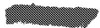

Heat Transfer. An experimental rig for heat transfer studies with lithium at $1800^{\circ}\mathrm{F}$ is being fabricated from stainless steel, type 347. A canned rotor liquid metal pump is also being constructed, using a liquid film bearing.

Metallurgy and Materials. A number of static corrosion tests have been made in which nickel, zirconium, iron, tungsten, tantalum, molybdenum and columbium have been exposed to liquid lithium and bismuth for four hours at $1800^{\circ}\mathrm{F}$ . The next series of tests will be conducted at $1800^{\circ}\mathrm{F}$ for 40 hours. The first results with liquid lithium indicate best resistance in iron, molybdenum and zirconium; however, the data are still very preliminary. The question of purity of the liquid lithium is now under study. With liquid bismuth, zirconium was severely attacked.

Dynamic corrosion test equipment is now being constructed for measurements under convective circulation conditions in liquid bismuth and lithium. Corrosion harps are being made of various stainless steels as well as V-36 and L-605 alloys. Equipment is being designed for stress-rupture and creep tests. Preliminary tests are underway to find container materials for liquid uranium-bismuth and uranium-lithium alloys.

Radiation Damage. Accelerator experiments to determine radiation damage in various high temperature materials will shortly get underway at Berkeley and at Purdue. Various high temperature materials will also be placed in the Hanford reactor soon. An experiment is being designed for simultaneous radiation damage and heat transfer tests of circulating lithium system in the ORNL reactor.

A high-intensity gamma source has been developed for use with the ORNL reactor. This is a hollow gold cylinder, which after irradiation for one week, produces $10^{5} \times 10^{4}$ hr upon materials at its center.

Data on change in electrical properties of various irradiated plastics are presented in this report. Preliminary measurements have been made on the radiation-induced dissociation of lithium, titanium, and zirconium hydrides.

Nuclear Measurements. Preparations are underway for the neutron cross-section measurements needed in ANP work. These will involve use of a 5 MeV Van de Graaff accelerator and a high-speed mechanical velocity selector.

Li7 separation. The work at the Y-12 Research Laboratory on the practicality of obtaining connage lots of highly purified Li7 by chemical methods is discussed in this report because of the possible application of this metal as an aircraft reactor coolant and moderator. Separation methods under study include molecular distillation of Li metal, ion exchange methods, countercurrent electrolysis and electromigration. The most promising system so far is a liquid-liquid exchange column using dual-temperature for continuous operation.

# SHIELDING

# NEW BULK SHIELD TESTING FACILITY

W. W. Breazeale, J. L. Meem,* K. P. Blizzard

A proposal(1,2) requesting permission to build a new bulk shield testing facility has been transmitted to the ABC. The initial request was sent on December 21, 1949, and a supplement on February 10, 1950. Formal approval has not yet been received.

The proposal described a critical assembly made up of MTR fuel units operating in a pool of water which also contains the bulk shielding samples. This low power, water cooled and moderated (partially), beryllium oxide reflected reactor serves as a fission source for neutron and gamma ray attenuation measurements through bulk shielding samples and through mock-ups of practical shields. A maximum operating power level of 10 kw is suggested.

Calculations by E. Greuling and M. Edlund indicate that this reactor is inherently safe. They have investigated theoretically the result of instantaneously adding $2\% \Delta k$ (effective) when the reactor is just critical and operating at 10 kw. The conclusions are that it will oscillate at a mean power level of not greater than 130 kw.

Reactor control circuits will be similar to those now under test in the MTR Mock-Up. Experience gained in operation of this mock-up will be applied to design of the reactor for the shield testing facility.

If early approval for construction is received, it is expected to have the equipment in operation by fall (1950).

It is planned to investigate first a mock-up of a service shield complete, as far as practicable, with ducts, control parts, etc., to determine whether or not it provides the desired attenuation. NEPA has agreed, upon our invitation, to supply this first mock-up, which presumably will resemble the current concept of an aircraft shield. Following this, a series of measurements will be made on bulk samples to obtain data pertinent to the analytical problems connected with shielding. Further work will be planned to meet problems which arise in connection with nuclear aircraft and submarine designs.

# LID TANK BULK SHIELDING MEASUREMENTS

E.P.Blizard C.R.Clifford

J.D.Flynn 8.8.Hullings

K. Martin R. Lewis*

# Reactor Technology Division

Additional personnel assigned to this program are:

H. E. Hungerford, Physicist   
T. V. Blosser, Engineer   
R. M. Burnett, Technician   
T. N. Hubbard, Technician

The tank is now operated on an eleven shift per week basis, an expedient considered essential because of the large number of readings necessary for each attenuation measurement. Full advantage is taken of available intensity by long periods of counting.

Water Attenuation. The measurements of thermal neutron distribution and gamma ray ionization in water have been reported in an ORNL memorandum whose Central Files Number is 50-1-153. $^{(3)}$ As has been pointed out before, the thermal flux is used as an indication of fast flux attenuation.

The lid tank is designed to give "plane to plane" attenuation, i.e., the probability of radiation initiated in one plane being detected in another (parallel) plane. This data is gathered either by integration over $z$ planes in the tank, or by analytic transformations of centerline measurements. The latter method has been reduced rather simply by Hurwitz to the following expression:

$$
F (z) = f (z) + f \left(\sqrt {z ^ {2} + a ^ {2}}\right) + f \left(\sqrt {x ^ {2} + 2 a ^ {2}}\right) + f \left(\sqrt {z ^ {2} + 3 a}\right) + \dots
$$

where $F(z)$ is the centerline intensity which would be observed with an infinite plane isotropic source in an infinite homogeneous isotropic medium. $f(z)$ is the centerline measurement at $z$ in the case of a finite circular source centered on the $x$ -axis and of radius $a$ . The corrected intensity for $z$ is thus obtained by addition of measured centerline values at $z, \sqrt{z^2 + a^2}, \sqrt{z^2 + 2a^2}$ , etc. The assumption on which this method is based is that the point to point kernel defining the probability for radiation born at one point to be detected

at another is solely a function of the distance between the two points. Thus:

$$
F (z) = 2 \pi \int_ {z} ^ {\infty} G (R) R d R
$$

where $G(R)$ is the point to point kernel.

Application of this correction method is of course dependent on data at distances greater than that for which corrections are to be made. In most cases it appears reasonable to extrapolate the data beyond using an exponential form for $f(z)$ , thus

$$
\begin{array}{l} f (z) = A e ^ {- z / k} \\ F (z) = A \sum_ {n = 0} ^ {\infty} e ^ {- \sqrt {z ^ {2} + n a ^ {2}} / \lambda}, \\ \end{array}
$$

and this sum can be bounded by integrals which are evaluated as follows:

$$
L = (2 \lambda^ {2} / a ^ {2}) (z / \lambda + 1) f (z) <   F (z) <   [ 1 + (2 \lambda^ {2} / a ^ {2}) (z / \lambda + 1) ] f (z) = U.
$$

Furthermore a fair estimate of $F(z)$ (as well as a smaller upper limit) is had by the arithmetic mean of the two limits,

This Hurwitz transformation is not strictly applicable in our case since the medium extends only on one side of the source, and the source itself is in any case not perfectly thin. Another limitation which will apply to the case of laminated shields is that the medium will exhibit different attenuation properties normal and parallel to the laminations. The latter is not serious, however, if the mean free path for scattering is at least comparable to the thickness of the laminations. We are at present working on approximate corrections when this condition is not satisfied.

The water data just collected (Figs. 1 and 2) have afforded us an excellent opportunity to compare the plane integral measurements with corrected centerline measurements. For neutrons one defines the plane kernel as the probability of a fission neutron starting at $z = 0$ and being observed as a thermal neutron (Our detectors are sensitive to these alone) at another $z$ -plane. Agreement

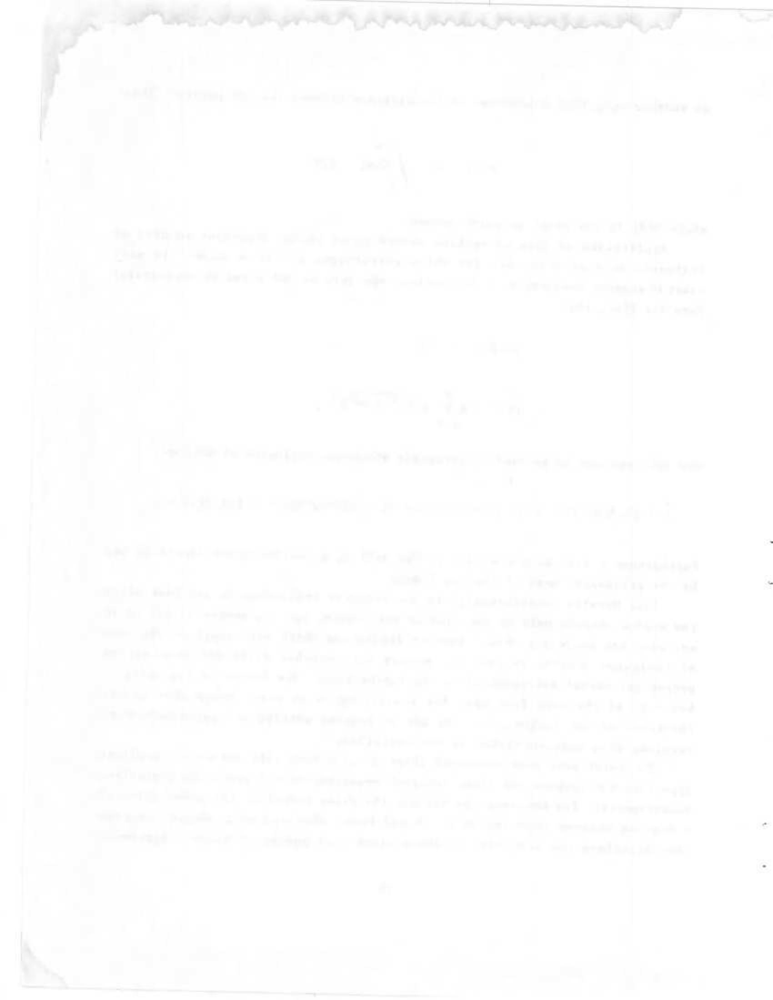

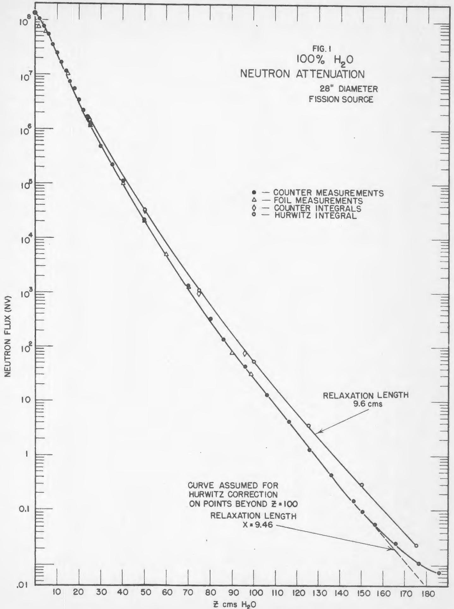

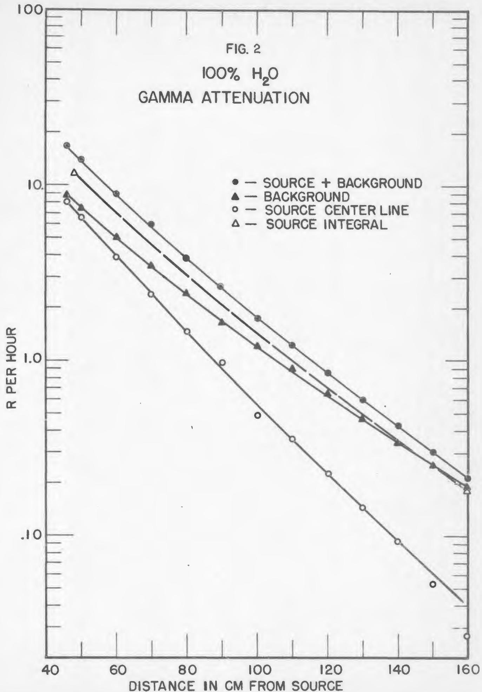

between integrals and centerline corrected data was excellent for neutrons.

For gamma rays one must combine two kernels since there are two sources. Gammas accompanying fission are analogous to the neutron treatment. We must add "the probability for a fission neutron to leave the source $(z = 0)$ , be captured anywhere, and for the capture gamma ray to be detected by its ionization at the other $z$ -plane". The gamma data did not show very good agreement between integral and corrected centerline measurements. Thirty correction terms for $z = 160$ cms and $z = 48$ cms were used for centerline data correction, employing exponential extrapolation for the larger value of $z$ . In addition, with the whole curve fitted by an exponential of 21 cm relaxation length(4) the integral bounds were calculated as well as their mean. Results are compared with measured integrals in the following table:

Plane-to-Plane Gamma Attenuation in Water   

<table><tr><td>2</td><td>CENTERLINE
30 TERMS</td><td>CORRECTED DATA
MEAN OF LIMITS</td><td>MEASURED INTEGRAL</td></tr><tr><td>48</td><td>19.47 R/hr</td><td>19.52 R/hr</td><td>11.7 H/hr</td></tr><tr><td>160</td><td>0.223 R/hr</td><td>0.224 R/hr</td><td>0.184 R/hr</td></tr></table>

Plane-to-Plane Relaxation Lengths(4)   

<table><tr><td>CENTERLINE</td><td>MEASURED INTEGRALS</td></tr><tr><td>25.4 cms</td><td>27.0 cms</td></tr></table>

Point-to-Point Relaxation Lengths Derived from the Above   

<table><tr><td>CENTERLINE</td><td>MEASURED INTEGRALS</td></tr><tr><td>32.3 cms</td><td>35.0 cms</td></tr></table>

$$
[ G (R) \approx (1 / R ^ {2}) \quad e x p (- R / \lambda) ]
$$

In the measured integral case the measurements sample radiation at all angles from the source plane, whereas for centerline measurements we sample only those within the angle subtended by the source and presume knowledge from these data about radiation emanating at greater obliquity. The latter leads to an over estimate of the contributions at large source radii, so that one would expect higher corrected centerline determinations relative to integrals. This effect would be more evident at large $Z$ than small and more evident for gammas than neutrons due to their longer relaxation length. Both these effects are observed in the data. It should be noted in addition that this longer relaxation length means that more terms must be used to correct the centerline measurements.

The fission gammas would be partially self-absorbed in the uranium source in such a way as to concentrate the escaping radiation about the normal. Since the uranium is not a flat plate, but rather a collection of 1.1-inch diameter slugs, a quantitative calculation of this collimation effect has not been made.

Summarizing, the centerline corrected neutron water data agree very well with measured integrals. The gammas show higher corrected centerline measurements than integrals, which can be explained by either self-absorption collimation in the source, or by the fact that the medium is semi-infinite and not infinite as is required for the correction, or by both of these. Within these limitations, the different determinations of gamma and neutron attenuation are in good agreement. The gammas appear to be somewhat harder than would be expected from previous measurements.

Source Power. The plate of uranium slugs which is used as a source of neutrons and gammas for the lid tank operates at a power determined by the incident thermal flux. Recent improvements in measurement methods, using better values of the slug specific heat have indicated that the plate operates at 6 ± 1 watts when the pile power is 4200 kw. This measurement should be improved within the next month or two.

Lead-Water Measurements. Two ratios of lead and water, $18\%$ and $26.7\%$ Pb by volume, have been surveyed making only centerline measurements, and indications are (1) that secondary gammas are apparent in the $26.7\%$ Pb ratio, but not the lower one, and (2) that an even higher lead concentration will prove to be the optimum for a shield using only these components. These preliminary data have been used by the analysis group to estimate weight of an aircraft shield.

Navy H₂O-Fe-Pd-Shield. The Naval propulsion project has expressed considerable interest in a "compartment type" shield in which the power plant compartment is essentially flooded with water and shielded for gammas by bulk-heads of lead. The submarine shell is also thickened by lead coating to keep gamma escape to the sea at a tolerable level. The reactor pressure shell (~6 in. Fe) and its inner water-cooled thermal shield (~6 in. Fe; 2 in. H₂O) were simulated by iron plates. The water reflector was simulated by an 8 in. layer of water between the source and the first iron slab. Neutron measurements indicate that iron layers, when followed by large thicknesses of water, remove hard neutrons by essentially the total cross section. The work will be extended to include measurements on more uniformly distributed iron, and indications are that this shield will be of interest for aircraft. Furthermore, we are intending that the iron-water data will be of value in predicting the behavior of a wolfram-water shield.

Lack of gamma intensity has prevented measurement of gammas through the outer layer of lead, but previous measurements of the performance of lead will be applicable.

Instruments. Gamma detectors used thus far have been carbon-lined ionization chambers. We will soon add to the measurable attenuation by including a gamma-sensitive anthracene scintillation counter.

Fast neutron damage will soon be measurable with the Health Physics proton-recoil instrument. Completion of development of this apparatus is expected during March. In the meantime, we are investigating counting fast neutrons by means of a portable type proton recoil chamber in conjunction with an A-1 amplifier. This apparatus will then be sensitive mostly to neutrons traveling parallel to its axis, and series of data will be necessary to determine neutron damage. The Health Physics instrument will integrate automatically.

# Pd FILM FAST NEUTRON DETECTOR

8. R. Gossick*

# Reactor Technology Division

Preliminary information on this detector was included in the previous quarterly report,[6] and in a Letter to the Editor in the Physical Review.[7]

In brief, the detection is accomplished by measuring the resistance change of a "reduction" (or n-type) semi-conductor, the reducing agent being nascent hydrogen from proton recoils. The resistor is a thin film of an oxide of palladium, which is not completely anhydrous. Conductivity of the film is due to a stoichiometric excess of metal palladium. A joint NEPA-ORNL report on the experiments made with these resistors is in preparation and will be issued within the next month.

# NEUTRON ENERGY SPECTRONETER

# R. R. Gossick, K. Henry Reactor Technology Division

The neutron energy spectrometer employs proton recoil pulses from a proportional counter, and has been described in ORNL-528.[8] During the past quarter, this device has been used to measure the energy spectrum of a Po-Be source and a mock fission source. Both sources were made at Dayton, Ohio.

The spectrum of the mock fission source is shown in Fig. 3. The curve indicated by a dotted line is the fission spectrum due to Bloch and Staub.(9) Assuming that the spectrum follows the dotted line, the total number of neutrons per second per curie is given by the area under the curve as $1.7 \times 10^{5}$ .

The spectrum of Po-Be is shown in Fig. 4. The integral of this curve gives a figure of $3.5 \times 10^6$ for the total number of neutrons per second per curie, which may be compared with Fermi's figure of $2.8 \times 10^6$ .

# SEIELING ANALYSIS

# W. K. Ergen, F. H. Murray, S. Podgor, J. H. Trice, Reactor Technology Division

Results listed in a memorandum (10) recently issued by the Lid Tank Group are now being compared with other water data. Close contact is maintained

with Dr. Richard Albert and Dr. Theodore Welton of the Westinghouse Submarine project, and these investigators have been able to fit more recent lid tank data with a "one collision and out" theory. These recent lid tank data refer to various compositions of lead and water, and iron and water. The theory is not believed to be applicable to shields containing a high percentage of natural boron, because the natural boron is, for high neutron energies, essentially a scatterer, and the above theory requires that the "absorption", (including degradation by hydrogen collision or inelastic scattering) constitute a major part of the total cross section.

The mathematical method outlined in the last ORNL Quarterly report has been further refined and applied to practical cases. This method likewise gives a satisfactory fit to the preliminary experimental data.

Calculations of airplane shield weights have been carried out on the basis of H. A. Bethe's paper,[11] using total attenuations of $e^{17}$ for neutrons and $e^{14}$ for gammas, but otherwise using Bethe's assumptions. (The attenuations used by Bethe were higher by a factor of 10 which was due to his assumption of 30 ft reactor-crew-separation, whereas separation of 100 ft now appears feasible.) The weight of 67 long tons for a lead-water-shield around a 2 ft radius reactor was computed in this way, in satisfactory agreement with the weights computed from preliminary lid tank data.

A limited amount of time was spent on calculations regarding the possible use of hydrides in shields,[12,13] as well as on comparison of uranium-boron and wolfram-boron shields.[14]

The following ORNL reports were issued:

Capture Gassa Hays, E. P. Blizzard, ORNL-419 (December 23, 1949).

Canadian Measurements of an Iron-Water Shield, E. P. Blizzard, ORNL-428, (Jan. 3, 1950).

Measurements on Hanford Type Shields, E. P. Blizzard, ORNL-430 (February 22, 1950).

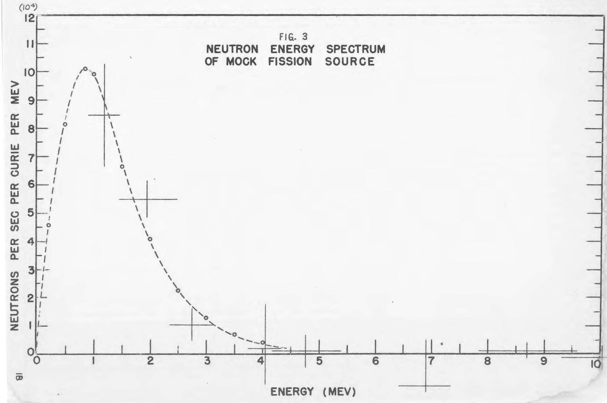

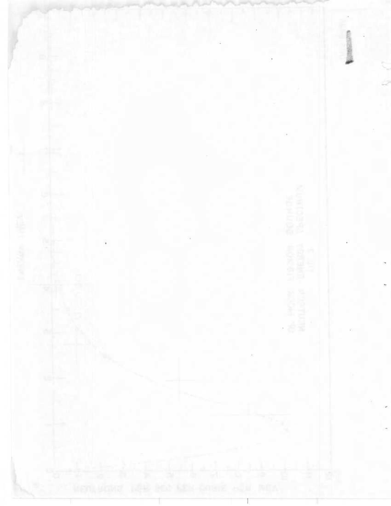

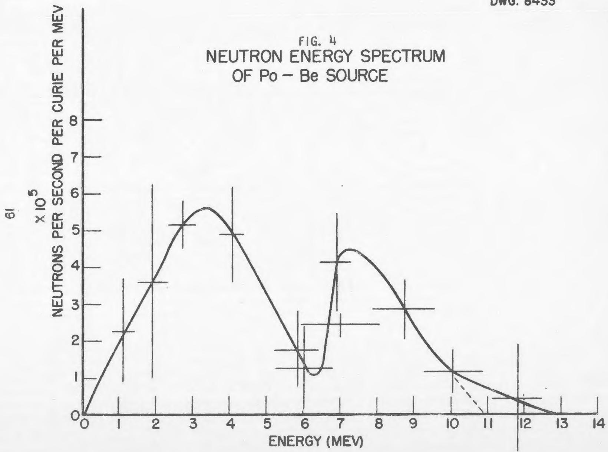

UNCLASSIFIED

DWG. 8433

# SHIELDING MATERIALS

A. S. Kittces R. B. Gallaher

W. Q. Hul Iings Y. L. Mckinney

# Reactor Technology Division

Uranium hydride Survey. Uranium hydride $(\mathrm{UH}_3)$ is being considered as a shielding material for nuclear powered aircraft. The choice of $\mathrm{UH}_3$ , however, depends upon a number of factors:

(1) Production of non-pyrophoric material in tonnage quantities.   
(2) Feasibility of compressing $\mathrm{UH}_3$ to a density of 9 g/cc or $\mathrm{UH}_2$ to a density of 11 g/cc.   
(3) Production of material in such a state, in case non-pyrophoric $\mathrm{UH}_3$ cannot be produced, that will allow easy handling during cladding of the material.

A survey, therefore, was initiated to determine the feasibility of producing uranium hydride in tonnage quantities which would meet the above specification. This survey has been completed and an ORNL report will soon be issued on the subject. Conclusions which may be drawn from this survey are:

(1) Most lots of uranium hydride $(\mathrm{UH}_{3})$ are pyrophoric. Some have been made which are not. With additional research and development, non-pyrophoric uranium hydride can probably be made. Titanium hydride was once considered pyrophoric, but now non-pyrophoric material is made in tonnage quantities.   
(2) The density requirements can probably be met. Additional development is necessary however.   
(3) The material can easily be clad once the pyrophoric disadvantage is overcome. The material is probably non-corrosive.   
(4) No cost data are available since no large quantities have been made with the desired properties.   
(5) Uranium hydride dissociates on heating at $430^{\circ}\mathrm{C}$ ; the $\mathrm{UH}_{3}$ is in equilibrium with hydrogen gas at one atmosphere pressure.   
(6) The radiation stability of $\mathsf{UH}_3$ is unknown. By analogy, it is probably as stable as titanium hydride to pile radiations,   
(7) $\mathrm{UH}_{3}$ forms amalgams with mercury. When mixed with molten, lead, tin or cadmium, the uranium and metal alloy releasing hydrogen.

Plastics. Twenty sheets, $56\%$ in. $\times 66\%$ in. $\times 1/8$ in. of B₄C and Tygon (Tybor) has been fabricated for the Lid Tank Experiments. B₄C and Tygon paint are mixed in the ratio of 3 parts B₄C to 1 part paint by hand. This gives $60\%$ B₄C by volume. The mix is cast on a specially designed rolling table and rolled to a uniform thickness. Thickness can be varied from 1/16 in. to 1/8 in. Cast sheets are wrapped with cheese cloth for additional support and are coated with additional Tygon paint for waterproofing. Tensile strength of "Tybor" is 215 psi and age has no apparent effect on the strength. Elongation is about $11\%$ . Sheets are quite flexible and can be bent around round objects without cracking, provided the bends are not sharp. Sheets are temperature sensitive, being more flexible at or slightly above room temperature than at lower temperatures. The material is not brittle at temperatures of $40 - 50^{\circ}\mathrm{F}$ .

Experimental 4 in. $\times$ 4 in. $\times$ 48 in. squares of tungsten carbide and Tygon have been made. Ratio of $\mathsf{W}_2\mathsf{C}$ /Tygon is 18 to 1. $\mathsf{W}_2\mathsf{C}$ in the desired particle size range is not commercially available to permit making sheets $56\%$ in. $\times$ $66\%$ in. $\times$ 1/8 in., but limited personnel has postponed this operation. This size sheet can be made if the $\mathsf{W}_2\mathsf{C}$ is screened. Tensile strength of $\mathsf{W}_2\mathsf{C}$ -Tygon sheets will be determined to see whether or not a sheet $56\%$ in. $\times$ $66\%$ in. $\times$ 1/8 in. can support its own weight. The sheet will weigh approximately 150 lbs as compared to 25 lbs for $\mathsf{B}_4\mathsf{C}$ -Tygon sheet of equivalent dimensions. Other plastics, such as polyethylene, polystrene and bakelite will be used as the binding materials instead of Tygon. These materials are more stable to radiation than Tygon.

Two B₂O₃ Tygon sheets, 55 in. × 55 in. × 3/8 in., have been fabricated for the MTR Mock-Up critical experiments. These sheets were very difficult to make due to the hygroscopicity of the B₂O₃. Ratio of B₂O₃ to Tygon was 2 to 1. Tests indicate that B₂O₃ is not as stable to radiation as B₄C which apparently will preclude its use for high level irradiation applications, even though it costs about 15 cents/lb compared to $4.50/lb for B₄C.

Concrete. The concrete work was kept to a minimum during the last quarter. Except for service work no projects were initiated.

A special MI concrete was made for H. P. Sleeper, KAPL. The composition is as follows:

Lead Shot 64.8% Wt.

Stainless Steel Scrap 7.7

MgO 8.2

Colemanite 8.2

Mg Cl (28° Be-Solu) 11.1

Calgon Solution 08

A density of $4.7 \, \text{gm/cc}$ was obtained with a compressive strength of 3200 psi. Further investigation of the mechanical, physical and radiation properties of this concrete has been requested by KAPL, and as soon as personnel becomes available work will continue on this problem.

Portland Cement-Iron Concrete. Experimental pours are being made using the proposed heavy aggregate concrete for the MTR, Density measurements, pouring techniques, compressive strengths, ageing characteristics and compressive strengths under thermal stresses are some of the properties of the concretes which will be investigated. The information obtained from these tests will also materially aid the Hanford Project in the design of the new Hanford Shields. The same tests were requested by Hanford who anticipate using the same type concrete--a portland cement-steel aggregate concrete.

Tests are being set up to correlate compressive strength of 1 in. $\times 2$ in. cylinders with 3 in. $\times 6$ in. cylinders of cement, and possibly concrete. If successful, then 1 in. $\times 2$ in. cylinders can be irradiated in both X-10 and Hanford piles for studies of stability of concretes and cements to pile radiations.

Expansivity Experiments. The expansion of MO concrete during setting is a problem still under investigation. The reports which have been issued on the subject indicate poor reproducibility of data. The same has been found to be true in the present work. The expansivity apparatus has been redesigned and should be in operation in the very near future. The new design, if successful, will eliminate the possibility that the variations in expansivity from one sample to another are due to the instrument. Any variations which are then obtained can be directly correlated to the concretes.

Radiation Damage Tests. Two samples of MO and MI (Boron containing) cements were irradiated in Hole 19 in the X-10 pile for approximately 1000 hours. The MO cements showed very little gas formation at the end of this time. The MI cement on the other hand showed considerable gas formation, probably due to the damaging effects on the alpha particles which are produced when Boron captures a neutron. The gas was not identified; however, Hanford has unofficially reported that $\mathrm{Cl}_2$ was identified as the gas when MO was placed in the Hanford pile. Further tests are being planned. Additional samples are being scheduled for irradiation and an attempt will be made to identify the gas.

Equilibrium Moisture Tests. The equilibrium moisture content of MO cement was determined at $200^{\circ}\mathrm{F}$ and $300^{\circ}\mathrm{F}$ . Air with a relative humidity of $17\%$ was passed over the cement which was in an oil bath at $200^{\circ}\mathrm{F}$ . Equilibrium was

assumed to be reached when no loss in weight of the cement was detectable. The cement was heated up to $300^{\circ}\mathrm{F}$ , and again equilibrium was assumed when no loss in weight was noticed. The temperature was then dropped to $200^{\circ}\mathrm{F}$ , and the sample was allowed to come to equilibrium, raised to $300^{\circ}\mathrm{F}$ , etc. The test was continued for 37 days. The tests will soon be run in a newly designed apparatus which will allow for the accumulation of more accurate data.

Fabrication of Boral (B₄C + Al). Boral, as described in ORNL-242,(15) is an engineering material for the absorption of thermal neutrons without production of hard gammas in a form which allows easy heat removal. Large scale experimental rolling was attempted at Lukens Steel Co., Coatesville, Pa. Two large ingots 27 in. × 36 in. × 6 in. were scheduled for rolling into sheets, 56½ in. × 66½ in. × 3/16 in. One ingot was rolled in December but the rolling was a failure. A second rolling is being scheduled for the latter part of February. Precautionary measures are being taken to insure a successful rolling the next time. The picture frame which confines the ingo has been increased from 1 in. to 5½ in. in thickness; the covers (cladding) have been increased from ½ in. to ½ in. thick. Provision has been made to insert a thermocouple in the center of the ingot in order to be able to ascertain the true temperature of the core prior to rolling. A temperature of 1100°F at the center of the core material is desired before rolling. Closer time schedules have been worked out so that the ingots will be exposed to the weather conditions for a minimum length of time. It is believed that the second rolling of these ingots will be successful.

The rolled sheets, $56\%$ in. $\times 66\%$ in. $\times 3/16$ in. will be used in the Lid Tank Experiments. Inquiries have been received from other sites; Brookhaven, Argonne, Hanford and KAPL have expressed an interest in acquiring large quantities of Boral sheets.

An estimate of the cost of fabricating a Boral sheet (50-50) is about $15/ft². It is also estimated that a sheet of boral, 1/8 in. thick will attenuate thermal neutrons by a factor of 10⁵. In many cases, an attenuation of 10² or 10³ is all that is necessary. A program is being initiated therefore to develop "Borals" with lower B₄C content. These Borals should have better rolling characteristics, structural properties, thermal properties and lower cost because of the lower B₄C contents.

Thermal conductivity specimens have been made by hot pressing $\mathbf{B}_{\phi}\mathbf{C}$ and Al powder in a graphite die at $1200^{\circ}\mathrm{F}$ . Preliminary data indicate that the thermal conductivity of Boral is 86 BTU/hr-ft²-°F/ft. These tests will be duplicated

for other specimens. In the same temperature range, low carbon steel is 35 and Al is 118. Specific heat of Boral is 0.175 BTU/°F-1b. The thermal conductivity of $\mathsf{B}_4\mathsf{C}$ with $\mathsf{B}_2\mathsf{O}_3$ as a binder, Al, and mixtures of $\mathsf{B}_4\mathsf{C}$ and Al (amount of $\mathsf{B}_4\mathsf{C}$ varying from $10\% - 50\%$ ) will also be determined. This work will also be duplicated for Plumbor ( $\mathsf{B}_4\mathsf{C}$ and lead).

Tensile specimens of Boral have been removed from the pile after 6 and 8 weeks exposures in the isotope stringer. The tensile strength of the specimens were determined after cooling for 2 days (3 mr/hr in $\gamma$ 's and 6 mr/hr in $\beta$ 's on contact).

Results are shown in the following table:

<table><tr><td>SPECIMEN</td><td>TENSILE STRENGTH
(1b/in.2)</td></tr></table>

Original Avg. 5000

6 weeks Avg. 6335

8 weeks Avg. 7500

Additional samples have been placed in the X-10 pile and will be removed after 12 months, 18 months, and 24 months exposure. Samples are also being sent to Hanford for exposures of 3 months, 10 months and 20 months.

Samples of the "poor man's" Boral, "Boroxal" $(\mathrm{B}_2\mathrm{O}_3$ and Al), have also been irradiated. These samples however, were less stable to pile radiations, the tensile strength decreased from 2900 psi to 2050 psi after 8 weeks exposure in the pile.

"Plumbor" (B₄C & Pb). "Plumbor" sheets (50% B₄C & 50% Pb) have been made. Methods for incorporating 80% B₄C into Pb are being studied. Thermal and physical properties of the Plumbors will be measured.

Reports Issued. The following report was issued during the past quarter: Construction of Cheap Shields; A Survey by Theodore Rockwell, III, ORNL 243, (January 16, 1950).

The material on shielding for Nucleonics is assembled and three copies are being sent to Chicago for pre-declassification of shielding work.

# HEAT TRANSFER

# Reactor Technology Division

Heat Transfer Theory (H.C. Claiborne). Theoretical work on heat transfer has consisted of a study of fluid flow and velocity distribution in conduits. It is on a knowledge of the velocity distribution in tubes and between parallel plates that liquid metal heat transfer theory is based, and a knowledge of velocity distribution in channels of other shapes will aid in studying heat transfer in these channels. Principal efforts have been directed toward empirical expressions for velocity distribution in circular tubes which might provide insight into the velocity distribution in other channels.

Experimental Heat Transfer (C. P. Coughlen). Equipment for heat transfer studies with lithium at temperatures up to $1800^{\circ}\mathrm{F}$ has been designed, and work has started on the fabrication of various components. The rig will be a figure-of-eight system, with by-passes around the test exchanger for control of the flow rates and for rapid alteration of temperatures between tests. In addition, a temperature control exchanger will be located between the test setup and the pump. Its purpose will be to permit operation of the pump at a lower temperature and to provide accurate control of the temperature into the test exchanger.

The pump and test exchanger will be connected into the system with flanges so that they can be changed to alter the test conditions.

Stainless steel, type 347, will be used throughout, in the absence of much corrosion information with lithium. The system will be operated at lower temperatures and watched closely for signs of excessive corrosion before being operated at $1800^{\circ}\mathrm{F}$ .

Liquid Metal Pumps (A. R. Frittsen, * R. N. Lyon). Several approaches are being studied in the development of a satisfactory liquid metal pump for heat transfer experiments. Such a pump might also be satisfactory for the final reactor as well, although requirements for the two installations are not similar. Efforts have been directed toward developing a completely enclosed pump, thus eliminating the shaft seal problem. While electromagnetic pumps show less promise for the ANP program than for other applications, a study was made of the possibility of a pump utilizing the pressure gradient across a liquid metal stream which is carrying a current of electricity. Preliminary

results indicated that only low pressures could be realized and work on this type was shelved.

Construction of a canned rotor for a pump is about half completed. The question of which of two types of bearing to use in the pump cannot be answered until the completion of tests which are now in progress. Both bearings force the shaft to turn on a layer of liquid, preventing solid-solid contact. One requires liquid to be forced into the bearing and is quite similar to bearings being developed at Allis-Chalmers. The other bearing utilizes the viscosity of the liquid to create sufficient pressures to keep the shaft from contact with the bearing. This type of bearing is also being studied at General Electric.

An induction pump using moving magnets is under consideration. This would be a helical pump similar to an induction electromagnetic pump being developed at General Electric.

Liquid Metal Handbook (R. N. Lyon). Editing of the handbook on use of liquid metals and the compilation of a chapter on liquid metal heat transfer has reached a point where potential publishers are being sought with the aid of the AEC and ONR in Washington. All chapters are expected to be complete and in the editors' hands by March 1.

# METALLURGY AND MATERIALS

J. H. Frye, F. Kerze, E. C. Miller

Metalurgy Division

The initial experimental effort of the Metallurgy Division in the investigation of materials for use in an aircraft reactor is being concentrated on a preliminary survey of the behavior, in a high temperature liquid metal environment, of a wide variety of selected metallic elements and representative alloys under static conditions. Based on these sorting tests, the more promising combinations of high temperature materials and liquid metal coolants will be studied more extensively to determine their dynamic corrosion behavior and mechanical properties at high temperatures.

The design of the reactor and the engineering and nuclear specifications of its components will depend in large measure on the results of this and similar studies. Consequently, a wide variety of materials, coolants, and reactor conditions must be considered, although some arbitrary selections have been made to expedite the work.

Static Corrosion. In the sorting tests to date, samples of the more readily available materials being considered have been exposed to liquid lithium in evacuated and welded Armco iron capsules in four-hour tests at $1830^{\circ}\mathrm{F}$ , and a similar series has been run using bismuth instead of lithium. Figure 5 shows the design of the modified capsule being used in these tests and its relation to sample and liquid coolant. The sample is placed in the capsule, and solid bismuth or lithium is added, the lithium suitably protected. The plug is cold pressed into the capsule, the capsule evacuated, and the peripheral joint between the plug and capsule welded. The weld is helium leak-tested. Occasional leaks have been observed in the iron capsule material itself. While the leaks are readily welded in this application, it is probable that Armco iron, despite its low solubility, is not well suited to the construction of a lithium or gas-tight coolant system. After leak-testing, the capsule and contents are heated under vacuum to just above the melting point of the coolant metal. The tubular extension of the plug is then triple-crimped and spot-welded, the vacuum line removed, and the end of the tube bead-welded. The capsules, two to a furnace, are placed in one of four Burrell

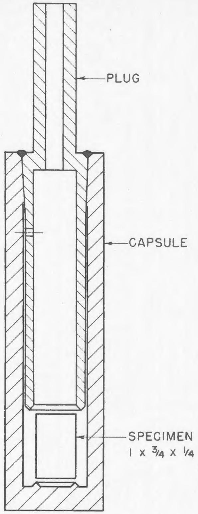  
FIG. 5   
CORROSION CAPSULE ASSEMBLY

Globar tube furnaces. An inert gas surrounds the capsules to prevent scaling and to minimize danger from possible leaks. Following the required exposure, the furnace is tilted to drain the liquid metal away from the samples and up into the hollow core of the plug, where the liquid solidifies. After removal of the capsules from the furnace and solidification of the contents, the plug end of the capsule is sawed off and the capsule contents removed for examination. The lithium and bismuth are analyzed spectrographically for the component elements of the samples. The lithium or bismuth is removed from the surface of the sample, the sample is weighed and its surface is examined microscopically and by X-ray or electron diffraction.

Preliminary four-hour results from lithium tests at $1800^{\circ}\mathrm{F}$ , which must be rigidly checked before they can be accepted as conclusive, indicate (l) iron, molydbenum, and zirconium suffered less weight change than the other materials tested, (2) tungsten, tantalum, and columbium were not severely attacked, and (3) cobalt and nickel underwent substantial weight loss. The zirconium developed a brassy tarnish which X-ray diffraction showed to be a zirconium nitride film, indicating probable nitrogen contamination of the lithium. Interpretation of these preliminary test results should take into account the facts that procedures insuring uniformly low contamination of lithium by oxygen and nitrogen are not yet in operation, and that a third component, the iron of the capsules, was present in each of the systems. Significant results, where required, will be subject to confirmation in capsule liners made of the materials undergoing test.

The four-hour, $1800^{\circ}\mathrm{F}$ tests in bismuth, subject to the same or similar qualifications as the lithium tests, showed nickel and zirconium to be severely attacked, whereas visual observation did not indicate attack of the iron, tungsten, tantalum, molybdenum, and columbium.

The next series of tests is being conducted at $1800^{\circ}\mathrm{F}$ for forty hours, and will be followed by tests for still longer periods of time and tests at other temperatures.

In addition to lithium and bismuth, potential coolants which are being considered for use in later similar sorting tests include lead, tin, magnesium, and possibly sodium, potassium, and combinations of some of these.

Lithium Handling. Lithium presents a serious fire hazard in case it leaks or is spilled at high temperatures. A study to select materials for use as insulation around vessels containing lithium indicated that the following

showed some resistance burning lithium: Cast-O-Lite fire brick casting powder, graphite, Pyrene G-1 fire extinguishing powder, salt. Unsuitable materials include: magnesia lagging, asbestos cloth and paper, K-30 refractory.

Lithium Purification. It appears likely that the oxygen contained in liquid lithium, as in sodium, will accelerate corrosion (particularly in dynamic systems) of oxygen-sensitive materials. In the case of lithium there exists the further problem of severely accelerated corrosion attack by lithium nitride, which can form by exposure of lithium to moist air at room temperatures. In the case of sodium, removal of oxygen has been accomplished by calcium-getting at about $500^{\circ}\mathrm{C}$ , followed by filtration just above the melting point of sodium to remove excess oxides and calcium. Calcium forms a eutectic with lithium at $2\%$ calcium and consequently cannot be completely removed from lithium by filtration. Since calcium is generally considered to be quite corrosive, one or more other gettering agents should be found. It appears probable that zirconium can remove nitrogen from lithium, but available thermodynamic data will have to be supplemented by actual experiment to develop a method of removing oxygen.

Dynamic Corrosion Testing. Static corrosion tests cannot predict with complete certainty the corrosion behavior of a material in a heat transfer system. Complicating factors include erosion, temperature coefficients of solubility, and uncertainty regarding the disposition of material precipitated out of solution in the cold part of the system. Experience at other installations indicates that thermal convection loops (harps) give a better picture of the effects of these factors.

As a next step in the corrosion testing program, material-and-coolant combinations which show promise in the static tests will be operated in thermal convection systems. This should also give an indication of the feasibility of fabricating some of the high temperature materials into heat transfer equipment. Several such harps in process of construction are being made of 347 SS, 310 SS, V 36 alloy, L-605 alloy, a low carbon iron, and a composite of 310 SS and low carbon iron. In addition, the possibility of making harps of mol-ybdenum, tantalum, and other elements is being studied.

As the number of potential materials is further limited by the above tests, positive circulation corrosion test loops will be made.

Mechanical Testing. Orders have been placed for creep and stress-rupture testing units. Electronic control equipment and furnaces for testing in a liquid metal environment are being designed.

Effects of Alloying Elements and Structural Factors. A number of other investigations are being undertaken to obtain more fundamental information concerning the nature of liquid metal corrosion in the systems under study. These include studies of (1) effects of impurities in liquid metal systems, (2) effects of different surface finishes, (3) the tendency toward selective leaching of certain elements from complex alloys, (4) effect of the carbon content of metallic iron and of high temperature alloys on corrosion, (5) relation of lattice structure to corrosion of iron-base alloys, and (6) a comparison of the behavior of different base-types of high temperature alloys.

Protective Coating of High Temperature Materials. One possibility considered is that materials may be found which have suitable resistance to corrosion by liquid metals, but do not have adequate mechanical properties. An investigation is being made of the feasibility of using such corrosion resistant materials as a coating for suitable high-temperature metals or alloys, and of the feasibility of fabricating complex reactor or heat exchange units out of such composite materials.

Circulating Fuel Systems. Special furnace equipment has been designed and constructed for conducting sorting tests on potential metallic container materials in a medium of uranium-bismuth alloy. Since no suitable capsule material is as yet known, the preliminary tests will be conducted in open refractory crucibles containing the uranium-bismuth melt, in either a vacuum or an inert atmosphere at temperatures in the neighborhood of $1800^{\circ}\mathrm{F}$ .

# RADIATION DAMAGE

# REACTOR CORE MATERIAL STUDIES

D. S. Billington, Metallurgy Division

Bredig, Physics Division

Accelerator Experiments. Arrangements have been made to have the North American Aviation group at Los Angeles and Berkeley study the effect of alpha particle bombardment on the corrosion resistance and strength properties of high temperature resistant metals in contact with liquid lithium. The evaluation of the bombardment is to be made at ORNL. It is expected that data will be obtained within two to three months.

Participation of the Purdue cyclotron group, headed by Dr. K. Lark-Horowitz, is being arranged through a sub-contract. It is hoped that this group will be able to start work by April 15, 1950.

Use of the small Y-12 cyclotron (2 MeV protons) has been discussed with Y-12 personnel and it appears feasible to begin experiments there as soon as ORNL personnel are available. Experiments involving the big Y-12 cyclotron must await the completion of this instrument sometime this summer or fall.

Van de Graaff experiments at ORNL have proceeded slowly due to the unavailability of full-time personnel.

Reactor Experiments. A series of spot tests of high temperature materials will be placed in the Argonne fuel element testing facility at Hanford April 1, 1950.

The heat transfer experiment involving the circulation of liquid lithium in the X-10 reactor presents an excellent facility for making radiation damage measurements under proposed operating conditions. Preliminary discussions with the ORNL heat transfer group have indicated the feasibility of a cooperative undertaking, and all possible effort will be expended to accelerate work on this in-pile experiment. Should the experiment prove useful, subsequent experiments of a similar nature at Hanford and in the MTR should then be undertaken.

Numerous discussions with the NEPA creep group and the Argonne Naval Reactor group indicate the possibility of making use of the reactor facilities developed by these groups. The ORNL group will, however, place major emphasis

on development of an experiment for the MTR. Extensive use of the MTR Mock-Up at ORNL is planned.

# AUXILIARY MATERIAL STUDIES

# O. Sisman, Reactor Technology Division

High Intensity Gamma Source. In order to study the effect of gamma radiation on materials, a pneumatic tube apparatus has been installed in the pile for producing high intensity gamma sources by irradiating cylinders of gold (Fig. 6). This equipment has been in operation since December 19, 1949. The gamma intensity inside the gold cylinder (3 in. long, 1 in. ID, 2 mm thick) after irradiation for one week was measured to be $10^5 \text{r/hr}$ .

The pneumatic tube apparatus is shown in Figs. 7 and 8, and the receiving shield is shown partially disassembled in Fig. 9. The gold cylinders are blown in and out of the pile by air pressure, operating through solenoid valves. When the gold cylinders are discharged from the pile they fall into one of eight chambers in the receiving shield. These eight chambers are arranged in a circle and geared to an indexing handle so that a source may be received in any of the eight chambers and then rotated $180^{\circ}$ to a position from which it may be dropped into the source shield. When the gold is to be reinserted in the pile the source shield is brought up under the receiving shield by means of a lift truck, the gold cylinder is then blown from the source shield into the receiving shield, and rotated $180^{\circ}$ to a position from which it is blown into the pile. The large cylindrical lead plug, shown in the lower left hand corner of Fig. 9, normally keeps the gold cylinders from falling out of the receiving chamber and also shields the opening through which the cylinders pass into the source shield. When this plug is turned $90^{\circ}$ , the source falls through an opening in the plug and into the source shield. The several parts of this apparatus are sealed with double O rings, and air pressure is maintained between the O rings to keep active air confined inside the apparatus, from which it is discharged into the pile exit air line.

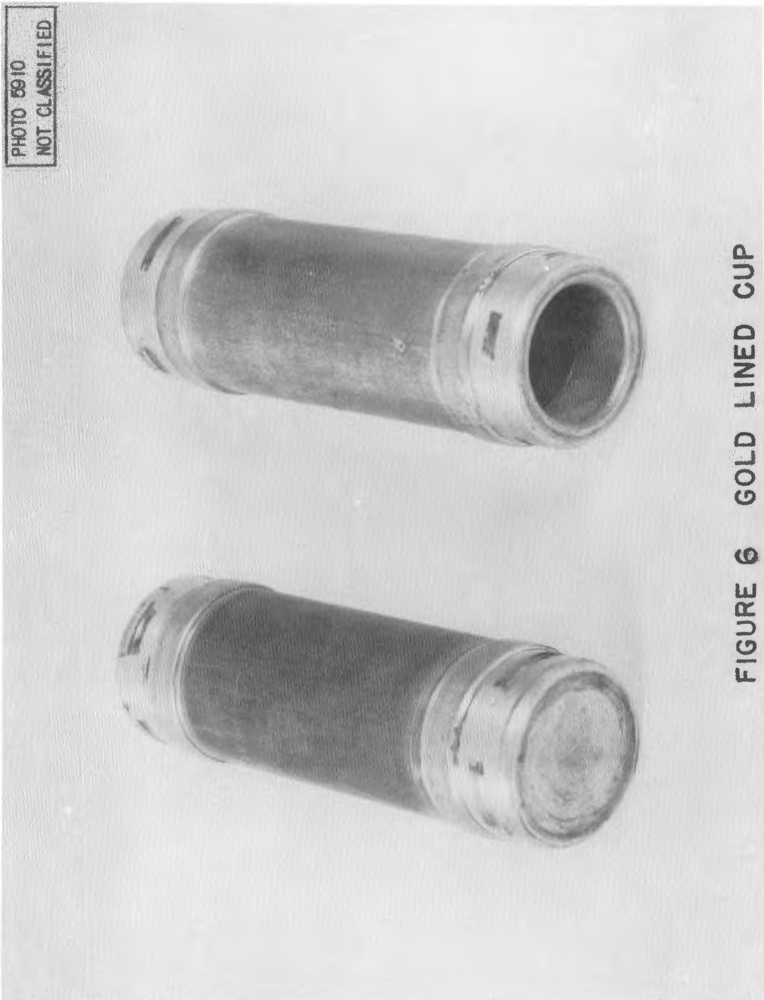

__________

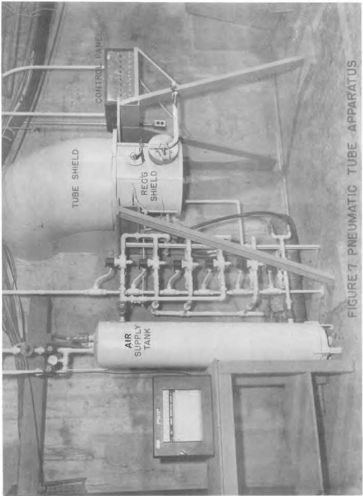

__________

__________

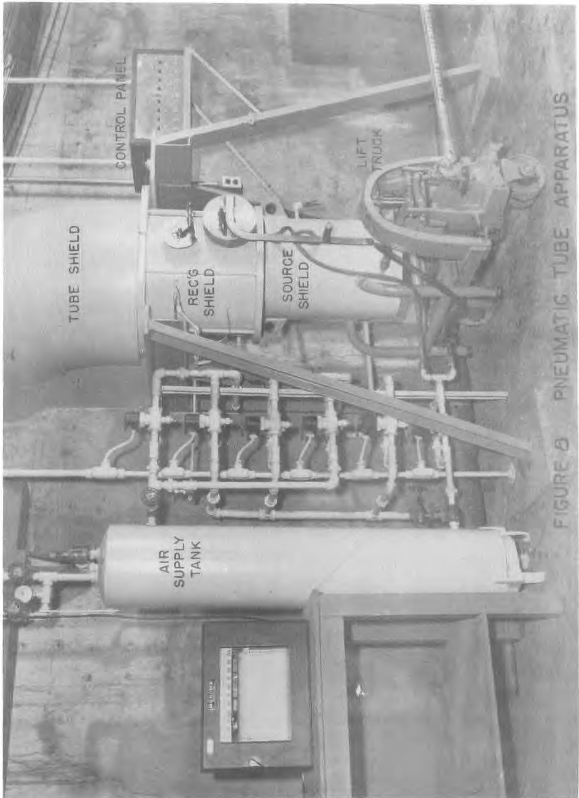

__________

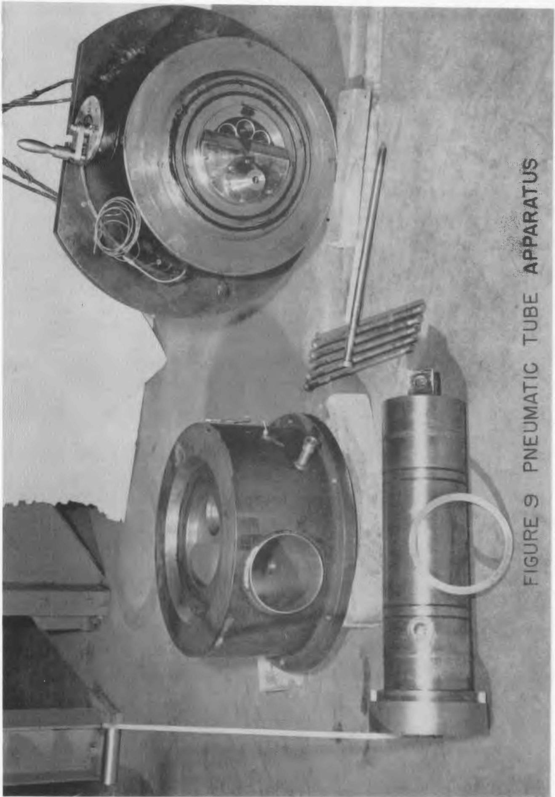

The source shield (Fig. 10) was designed to test for gassing of unstable chemical compounds under gamma radiation. The material is placed in a test tube which is connected to a manometer and placed in the lower half of the shield, and the shield is closed. The gold cylinder is dropped into the shield through a small opening and falls into a cup. The cup is then rotated $60^{\circ}$ and lifted up so that the gold cylinder is brought up around the test tube containing the material to be tested.

The gold source is shielded at all times by six inches of lead. The tube shield is composed of six inches of boran paraffin in addition to six inches of lead.

Radiation Stability of Plastics. Qualitative results of the change in physical properties of plastics due to pile radiation were presented in the last quarterly report. It is expected that sufficient data will have been accumulated by the next quarterly to present quantitative information on many of these materials.

Changes in electrical properties with pile radiation are also being studied. Results are given in Table I for volume resistivity and dielectric strength. These data are given for the longest irradiation period now available on each material. All materials were irradiated in the pile at about $40^{\circ}\mathrm{C}$ .

Radiation Stability of Metal Hydrides. In cooperation with NEPA, experiments are being done to determine the effect of radiation on four metal hydrides, LiH, TiH₂, and two commercially available impure hydrides, TiH₁₇₆, and ZrH₁₈₈. Radiation effects are to be determined by comparison of the dissociation pressure curves obtained under irradiation with the normal dissociation pressure curves. For this purpose, duplicate apparatus, in which factors affecting dissociation pressures are carefully controlled, were assembled, and one group placed in the pile while the other was run in the Laboratory.

The data assembled to date are presented in the curves of Figs. 11 and 12, which show the dissociation pressure curves for LiH and $\mathrm{ZrH}_{1.86}$ . The two titanium hydrides have not exhibited equilibrium pressures at the temperatures of the experiments (up to about $500^{\circ}\mathrm{C}$ ). The sudden drop in pressure as the temperature is increased is so far unexplainable. Final interpretation of the results must await analysis of the samples after pressure measurements are completed, and the radioactive material and containers have decayed. It may be indicated, however, that very little change is observed in the irradiated

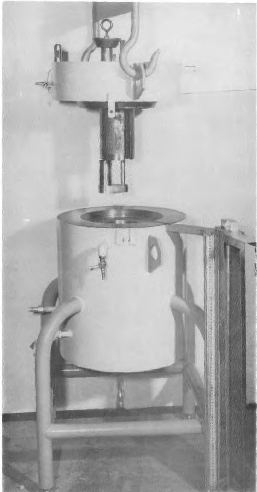  
FIGURE 10 SOURCE SHIELD

TABLEX   
Electrical Properties of Irradiated Plastics   

<table><tr><td rowspan="2">MATERIAL</td><td rowspan="2">THERMAL oven (Neutrons/cm2)</td><td colspan="2">VOLUME RESISTIVITY (obs/cm3)</td><td colspan="2">DYNAMIC STRENGTH (volts/mils)</td></tr><tr><td>BEFORE IRRADIATION</td><td>AFTER IRRADIATION</td><td>BEFORE IRRADIATION</td><td>AFTER IRRADIATION</td></tr><tr><td>Methyl Methacrylate (Lucite)</td><td>0.41 × 1018</td><td>&gt;1014</td><td>&gt;1014</td><td>960</td><td>430</td></tr><tr><td>Cellulose Nitrate</td><td>0.24 × 1018</td><td>2 × 1011</td><td>4 × 109</td><td>860</td><td>240</td></tr><tr><td>Cellulose Acetate</td><td>0.24 × 1018</td><td>5 × 1012</td><td>2 × 1011</td><td>750</td><td>440</td></tr><tr><td>Cellulose Acetate Butyrate</td><td>0.26 × 1018</td><td>&gt;1014</td><td>2 × 1012</td><td>780</td><td>160</td></tr><tr><td>Fluorothene</td><td>0.24 × 1018</td><td>&gt;1014</td><td>&gt;1014</td><td>860</td><td>740</td></tr><tr><td>Urea Formaldehyde</td><td>0.26 × 1018</td><td>2 × 1013</td><td>5 × 1011</td><td>740</td><td>500</td></tr><tr><td>Alkyd Resin</td><td>0.29 × 1018</td><td>2 × 1012</td><td>2 × 109</td><td>500</td><td>264</td></tr><tr><td>Polyvinyl Carbazole</td><td>0.29 × 1018</td><td>&gt;1014</td><td>&gt;1014</td><td>1280</td><td>660</td></tr><tr><td>Vinylidine Chloride (Saran)</td><td>0.41 × 1018</td><td>&gt;1014</td><td>2 × 107</td><td>660</td><td>70</td></tr><tr><td>Vinyl Chloride Acetate</td><td>1.37 × 1018</td><td>&gt;1014</td><td>1 × 108</td><td>1080</td><td>80</td></tr><tr><td>Melamine Formaldehyde</td><td>0.65 × 1018</td><td>8 × 1011</td><td>2 × 109</td><td>950</td><td>430</td></tr><tr><td>Polystyrene (clear)</td><td>9.00 × 1018</td><td>&gt;1014</td><td>&gt;1014</td><td>1640</td><td>1300</td></tr><tr><td>Polystyrene (Styron 475)</td><td>9.00 × 1018</td><td>&gt;1014</td><td>&gt;1014</td><td>1140</td><td>1020</td></tr><tr><td>Polystyrene (Styron 411C)</td><td>9.00 × 1018</td><td>&gt;1014</td><td>&gt;1014</td><td>1440</td><td>940</td></tr><tr><td>Polyethylene</td><td>9.00 × 1018</td><td>&gt;1014</td><td>&gt;1014</td><td>1220</td><td>490</td></tr><tr><td>Phenol Formaldehyde (paper base)</td><td>9.00 × 1018</td><td>3 × 1011</td><td>2 × 1011</td><td>1230</td><td>190</td></tr><tr><td>Phenol Formaldehyde(asbestos base)</td><td>9.00 × 1018</td><td>2 × 109</td><td>2 × 109</td><td>80</td><td>80</td></tr><tr><td>Allyl Diglycol Carbonate</td><td>1.37 × 1018</td><td>&gt;1024</td><td>2 × 1010</td><td>830</td><td>810</td></tr><tr><td>Polyester Resin</td><td>0.65 × 1018</td><td>1 × 1011</td><td>1 × 1013</td><td>680</td><td>860</td></tr><tr><td>Polyamide (Nylon)</td><td>5.50 × 1018</td><td>1 × 1013</td><td>3 × 1013</td><td>860</td><td>860</td></tr></table>

<table><tr><td></td><td></td><td></td><td></td><td></td><td></td><td></td></tr><tr><td></td><td></td><td></td><td></td><td></td><td></td><td></td></tr><tr><td></td><td></td><td></td><td></td><td></td><td></td><td></td></tr><tr><td></td><td></td><td></td><td></td><td></td><td></td><td></td></tr><tr><td></td><td></td><td></td><td></td><td></td><td></td><td></td></tr><tr><td></td><td></td><td></td><td></td><td></td><td></td><td></td></tr><tr><td></td><td></td><td></td><td></td><td></td><td></td><td></td></tr><tr><td></td><td></td><td></td><td></td><td></td><td></td><td></td></tr><tr><td></td><td></td><td></td><td></td><td></td><td></td><td></td></tr><tr><td></td><td></td><td></td><td></td><td></td><td></td><td></td></tr><tr><td></td><td></td><td></td><td></td><td></td><td></td><td></td></tr><tr><td></td><td></td><td></td><td></td><td></td><td></td><td></td></tr></table>

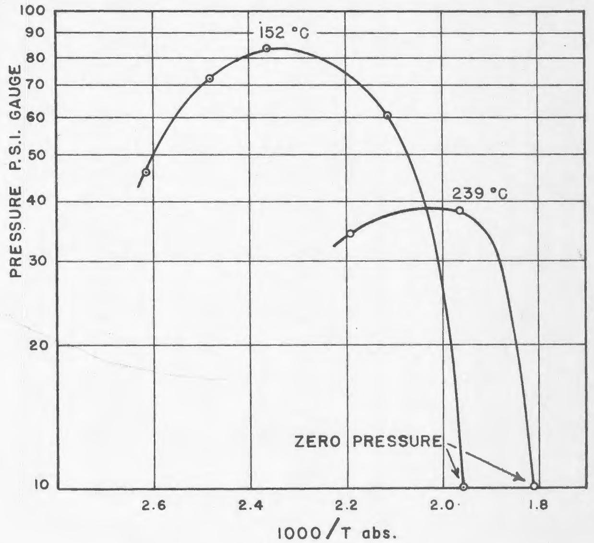  
FIGURE II DISSOCIATION PRESSURE OF LiH

- IRRADIATED   
NON-IRRADIATED

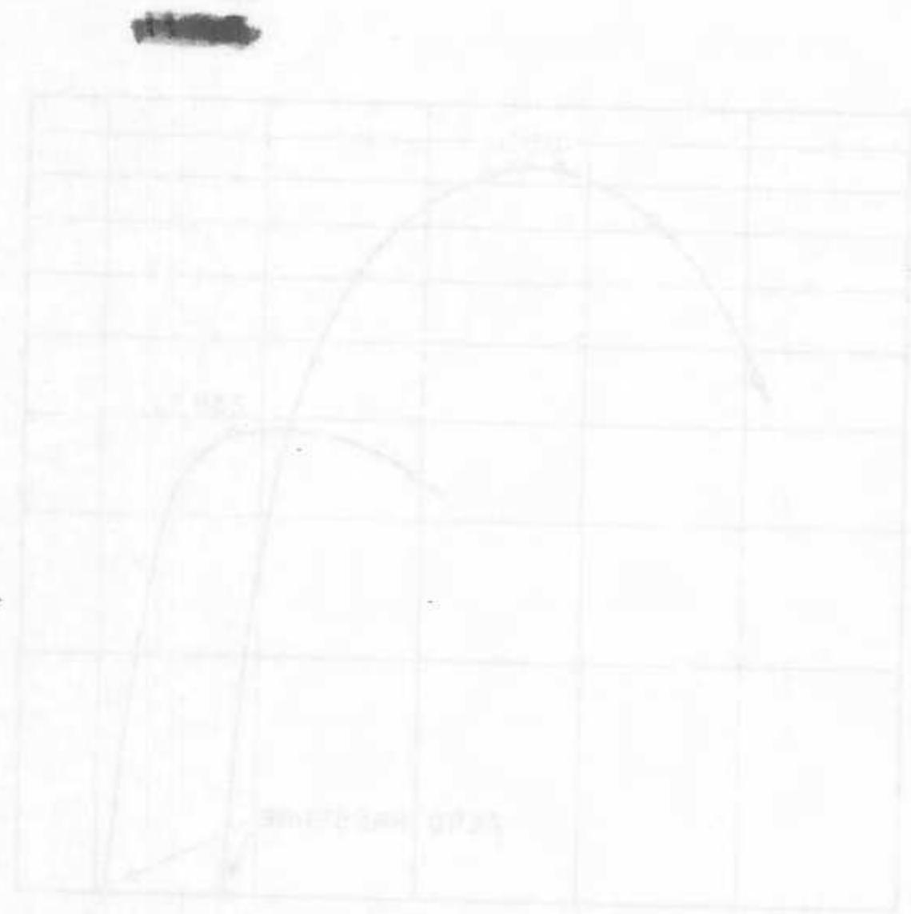

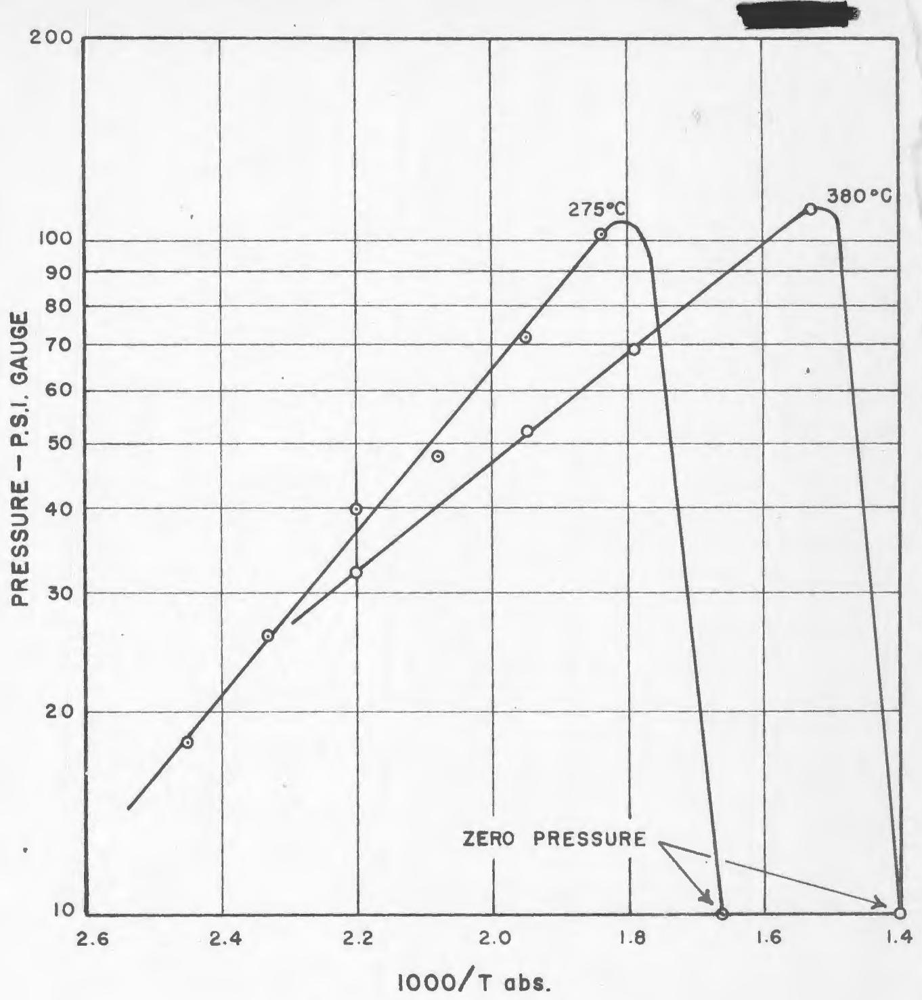  
FIGURE 12 DISSOCIATION PRESSURE OF $\mathsf{ZrH}_{1.86}$

$\odot$ IRRADIATED   
NON-IRRADIATED

materials over the nonirradiated materials. Total irradiation time has been about 3 months at about half maximum flux.

It is tentatively planned to include uranium hydride in these studies.

__________

# NUCLEAR MEASUREMENTS

# A. B. Snell, Physics Division

Preparations are being made for the measurement of the various neutron cross sections which can be expected to be needed in the course of the ANP work. The preparations are directed along two lines:

(1) Selection and preparation of the site for the "5 MV", NEPA Van de Graaff machine. Delivery of the machine is expected in September, 1950. Recruiting efforts are under way with the object of assembling a group of physicists prepared to start the measurements as soon as the machine starts to perform sufficiently well.   
(2) Construction of a high-speed mechanical velocity selector. This seems attractive in view of the recent success of the Argonne machine. The work at ORNL has to start from scratch; one man has been studying the problem, and it is hoped that a second person can be added in June.

__________   
  
  
  
__________

# THE CONCENTRATION OF LITHIUM ISOTOPES BY CHEMICAL METHODS

# A. Clark, Y-12 Research Laboratory

The concentration of lithium isotopes by a number of different methods has been under investigation for the past nine months. It seems likely that high purity $^{7}\mathrm{Li}$ would be very valuable as either a coolant or a fuel-element constituent for an aircraft reactor. At the beginning of the project a survey of the scientific literature revealed that the concentration of lithium isotopes had been accomplished on a laboratory scale by several widely different methods.

These included the mass spectrometer, chemical exchange between a resin ion and aqueous lithium solutions and between lithium amalgam and alcoholic lithium solutions, electrolysis of lithium solutions in which the reduced lithium is removed as amalgam, and electromigration in which the faster isotope migrates more rapidly toward the cathode in a fused salt.

During the months of December, January and February, the effort has been concentrated on molecular distillation of the metal, chemical exchange in solid-liquid and liquid-liquid systems, continuous countercurrent electromigration, continuous countercurrent electrolysis, and thermal diffusion of aqueous lithium solutions. The end of the quarter also saw the beginning of a new method—a dual temperature liquid-liquid chemical exchange system which requires no reflux and a minimum of attention. This method appears highly suitable for quantity production of $^7\mathrm{Li}$ if it develops satisfactorily.

Molecular Distillation of Lithium Metal. The molecular distillation (non-equilibrium) of lithium metal should result in a concentration of $^6$ Li in the vapor and of $^7$ Li in the residue. The ratio of the rates of diffusion of $^6$ Li and $^7$ Li from the liquid metal is proportional to the inverse square root of the masses, and a theoretical separation factor ( $\alpha$ ) is calculated to be 1.08 for this process. Preliminary experiments with a single stage molecular still have shown a separation factor = 1.018. In a typical experiment, 10.1 grams of lithium were distilled over a period of about two hours at $450^{\circ}$ C and 15 microns pressure until only 1 gram remained in the still pot. The residual material in the still pot assayed $92.935 \pm 0.015\%$ $^7$ Li as compared with a starting material assay of $92.500 \pm 0.020\%$ . Further experiments will be carried out using a larger still under various conditions of temperature and pressure.

Chemical Exchange Methods. Chemical exchange methods for concentrating lithium isotopes are divided into two groups, liquid-solid systems and liquid-liquid systems. Although the latter are more easily adapted to continuous countercurrent operation, very few satisfactory systems are available, and much of the effort has been with liquid-solid systems.

Liquid-Solid Systems. An attempt is being made to utilize selective adsorption on cellulose--a method used successfully for the separation of different elements. A lithium salt in an organic solvent is slowly eluted through a column packed with activated cellulose. It is hoped that the cellulose will exhibit a preference for one isotope so that the lithium coming out the bottom of the column is concentrated with respect to the isotope held less tightly. To date the cellulose columns have been filled with activated cellulose in butyl or isoamyl alcohols, and a slug of activated cellulose and lithium salt in water added at the top of the column. Elutriation of the salt at the bottom of the column is performed by addition of alcohol at the top. In the latest experiment the column was charged with LiOH, and over 170 hours were required for the lithium to wash through a 24 inch column. No assay has been received for the lithium in the leading edge.

Another liquid-solid system is a continuous countercurrent ion exchange resin column in which a lithium solution passes up through an ion exchange resin which moves slowly down through the column at an almost imperceptible flow rate. The experiment has recently been terminated and no assay on the product material has been received. In an experiment at X-10 with a "fixed" bed of resin, the concentrations of $^7\mathrm{Li}$ in the leading and trailing edges were reported to be $93.4\%$ and $90.0\%$ , respectively.

In another liquid-solid system, a column of solid $\mathrm{Li}_2\mathrm{CO}_3$ in a finely divided state is slowly being eluted with distilled water. If there is any difference in the solubility of the lithium isotopes, the more soluble should dissolve, and the less soluble should be concentrated so that when all except a small portion of the original column is dissolved, the remaining solid should be enriched in the less soluble isotope. This is dependent on complete equilibrium between solid and saturated solution, and requires a long time (several months) to complete the experiment.

Liquid-Liquid Systems. Isotopic exchange and enhancement is being studied in a number of aqueous-organic liquid systems. The limited number of organic liquids which have proved to be suitable for this method has forestalled the development of a satisfactory system. Water-isoamyl alcohol solutions of LiCl

have shown an inconclusive, but small concentration, and this system is still being investigated. A number of less likely systems remain to be studied.

In the literature a chemical exchange and isotopic enhancement is reported between lithium amalgam and alcoholic lithium chloride solutions. In order to avoid the onerous task of refluxing at each end of the column, it has been proposed that the dual-temperature process for hydrogen-deuterium be adapted for lithium. In the proposed method, lithium amalgam is pumped countercurrent to a rising column of alcoholic LiCl. By maintaining a cold column at the top and a hot column at the bottom, the $^7\mathrm{Li}$ isotope is concentrated in the bottom of the hot column and at the top of the cold while $^6\mathrm{Li}$ is concentrated at the top of the hot column and in the bottom of the cold column. In this manner a continuous process can be operated without reflux and a minimum of difficulty. The main obstacles remaining are large stage heights and possible low separation factors. If these can be overcome successfully, the production of $^7\mathrm{Li}$ will become a reality.

Continuous Countercurrent Electrolysis. Since the largest factors for the concentration of lithium isotopes have been reported for the electrolysis of lithium solutions, some consideration and effort has been expended in the development of a continuous method. Single stage separation factors as high as 1.05, 1.06, and 1.07 have been reported for experiments in which lithium is reduced at a changing mercury cathode in an aqueous lithium solution. As the lithium amalgam is continuously removed, the concentration of ${}^{7}\mathrm{Li}$ remaining in solution is increased. By combining several cells and causing the lithium to flow countercurrently to a stream of LiCl solution, it is hoped to concentrate the lithium isotopes.

Continuous Countercurrent Electrowigration. The work of Brewer, Madorsky et al at the National Bureau of Standards during the War showed that two isotopes of the same element might be separated by washing one back with a countercurrent stream of electrolyte while allowing the other to migrate forward to the cathode in an electromigration cell having anode and cathode connected by an anti-diffusion packing. This principle has been applied to a solution of LiOH in which an attempt has been made to separate the different lithium species which are postulated to exist. By separating the species, it is hoped that an exchange and subsequent shift will occur so that an isotopic concentration is effected. The work is being continued.

Thermal Diffusion. No satisfactory component for the thermal diffusion of a lithium liquid has been found. In lieu of this, thermal diffusion of concentrated lithium salt solutions has been tried with no apparent success to date.

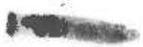

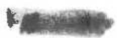