OAK RIDGE NATIONAL LABORATORY LIBRARIES

3445605662887

${AE}\widehat{OC}$ W�线, ${BC}$

ABORATORY RECOROg 1954

THE AIRCRAFT NUCLEAR PROPULSION

PROJECT QUARTERLY PROGRESS REPORT

FOR PERIOD ENDING AUGUST 31, 1950

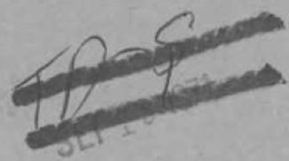

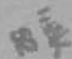

99

Inv. 67

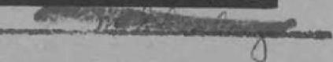

POU 1879REYNLTHO

DECASSI FID HFOITS

This Document is Properly Classified.

P53180 Reviewd by P. S. Baker

AL LABORATORY

OPERATED BY

CARBIDE AND CARBON CHEMICALS DIVISION

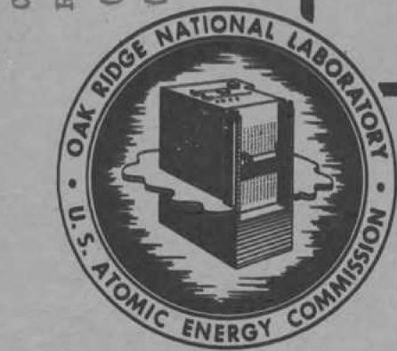

UNION CARBIDE AND CARBON CORPORATION

UCC

POST OFFICE BOX P

OAK RIDGE, TENNESSEE

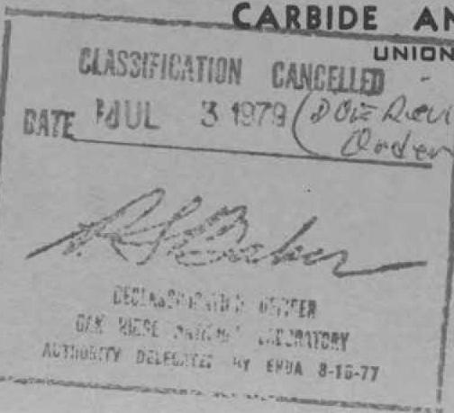

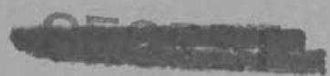

SECRET

Contract No. W-7405, eng 26

# THE AIRCRAFT NUCLEAR PROPULSION PROJECT

# QUARTERLY PROGRESS REPORT

# for Period Ending August 31, 1950

Edited by

C. B. Ellis and W. E. Thompson

ORNL 858

This document consists of 141 pages

Copy 27 of 182 Series A

Contract No. W 7405, eng 26

# THE AIRCRAFT NUCLEAR PROPULSION PROJECT

# QUARTERLY PROGRESS REPORT

# for Period Ending August 31 1950

Edited by

C. B. Ellis and W. E. Thompson

DATE ISSUED: Dec 4 1950

OAK RIDGE NATIONAL LABORATORY

operated by

CARBIDE AND CARBON CHEMICALS DIVISION

Union Carbide and Carbon Corporation

Post Office Box P

Oak Ridge, Tennessee

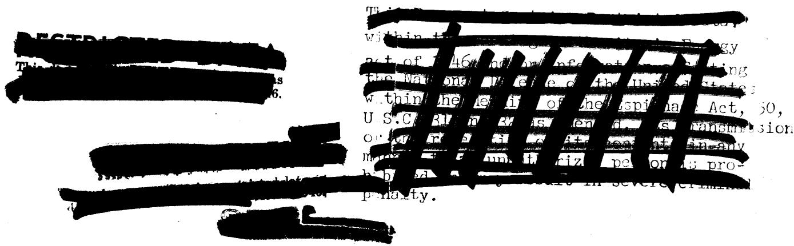

# INTERNAL DISTRIBUTION

1. G. T. Felbeck (C&CCD)

25. A. Hollander

44. R. M. Jones

2-3. 706-A Library

26. F. L. Steahly

45. E. C. Miller

4. 706-B Library

27. K, Z, Morgan

46. D. S. Billington

5. Biology Library

28. D. W. Cardwell

47. E. P. Blizzard

6. Health Physics Library

29. M. T. Kelley

48. W. M. Breazeale

7. Metallurgy Library

30. W. H. Pennington

49. W. K. Ergen

8-9. Training School Library

31. C. E. Winters

50. C. E. Clifford

10-13. Central Files

32. J.A.Lane

51. M. L. Nelson

14. C. E. Center

33. M. M, Mann

52. E. D. Shipley

15. C. E. Larson

34. G. E. Boyd

53. G. H. Clewett

16. W. B. Humes (K-25)

35. R.W.Stoughton

54. C. P. Keim

17. W. D. Lavers (Y-12)

36. F. R. Bruce

55. O. Sisman

18. A. M. Weinberg

37. H. W. Savage

56. A. D. Callihan

19. J. A. Swartout

38. W. K. Eister

57. R. S. Livingston

20. E. J. Murphy

39. A. S. Householder

58. C. D. Susano

21. F. C. VonderLage

40. C. B. Graham

59. E. H. Taylor

22. R. C. Briant

41. R. E. Engberg

60. W. D. Manly

23. C. B. Ellis

42. R. N. Lyon

61. J. L. Meem

24. A. H. Snell

43. W.R.Gall

62-71. ANP Library

72-77. Central Files (O.P.)

# EXTERNAL DISTRIBUTION

78-82. Air Force Engineering Office, Oak Ridge

83-94. Argonne National Laboratory

95-102. Atomic Energy Commission, Washington

103. Battelle Memorial Institute

104-107. Brookhaven National Laboratory

108. Bureau of Aeronautics

109. Bureau of Ships

110-111. Chief of Naval Research

112-115. General Electric Company, Richland

116. Hanford Operations Office

117-120. Idaho Operations Office

121. Iowa State College

122-125. Knolls Atomic Power Laboratory

126-128. Los Alamos

129. Massachusetts Institute of Technology (Kaufmann)

130-131. National Advisory Committee for Aeronautics, Cleveland

132. National Advisory Committee for Aeronautics, Washington

133-151. NEPA Project

152-153. New York Operations Office

154. North American Aviation, Inc.,

155-160. Oak Ridge National Laboratory, Y-12 Site

161. Patent Branch, Washington

162-176. Technical Information Service, Oak Ridge

177-178. University of California Radiation Laboratory

179-182. Westinghouse Electric Corporation

# TABLE OF CONTENTS

# SUMMARY 8

# INTRODUCTION 11

# PART I. RESEARCH CONTRIBUTING TO THE ARE 16

# SHIELDING RESEARCH 17

Bulk Shielding Measurements-Lid Tank 17

A method for experimental shield optimization 17

$33\%$ Pb--67% $\mathbf{H}_2\mathbf{O}$ neutron data 18

Effect of addition of boron to water 18

Gamma attenuation as a function of lead disposition 25

Fast neutron dosimeter 28

Shield for reactor with Fe reflector 28

Interpretation of dosimeter data 28

Neutron energy spectrometer 34

Measurements of fast neutrons in the lid tank using sulphur

as a detector 35

Liquid Metal Duct Tests in the Thermal Column 38

Shield Calculations 38

Calculations of neutron attenuation 38

Analysis of lid tank data 41

Heat generation in shields 41

Shield calculations 41

Large air ducts in shields 41

New Shield Test Facility 42

# CRITICAL EXPERIMENTS 44

# EXPERIMENTAL ENGINEERING 45

# HEAT TRANSFER 51

Heat Transfer Theory 51

Forced convection entrance solutions 51

Heat and momentum transfer in ducts whose cross sections are irregular or annular 52

Experimental Heat Transfer Equipment 53

Boiling Liquid Metals 55

High Heat Transfer Coefficients 56

Pump Development for Experimental Systems 56

Physical Property Determinations 58

Liquid Metals Handbook 60

Liquids Metals In-pile Experiment 60

# METALLURGY AND MATERIALS 61

Static Corrosion Testing 61

Stainless steels in lithium 61

Special tests 71

Pure metals in lithium 71

Refractories in lithium 78

Pure metals in lead 78

Materials in sodium hydroxide 78

Materials in sodium 81

Dynamic Corrosion Testing 82

Thermal convection loops 82

Creep-Rupture and Stress-Corrosion Tests 83

Assembly of Fuel Elements 83

# RADIATION DAMAGE 85

Y-12 Cyclotron Experiments 85

North American Aviation, Inc.: Lithium-Iron Accelerator Corrosion Experiment 86

Purdue University 86

In-pile Creep 87

# NUCLEAR MEASUREMENTS 88

Mechanical Velocity Selector 88

Xenon Cross-section Measurements 88

Molybdenum Cross-section Measurements 88

# REACTOR PHYSICS 90

ARE Calculations 90

Multi-group calculations 90

IBM calculation 91

Reactor constants 91

Adjoint calculations 92

Bare reactor calculations 92

Multi-group calculations in cyclindrical geometry 92

Energy Dependent Pile Equations 93

DESIGN OF THE AIRCRAFT REACTOR EXPERIMENT 95

Fundamental Design Principles 95

Detailed Design and Construction 96

PART II. LONGER RANGE ACTIVITIES 99

INTRODUCTION 100

COMPRESSOR-JET CYCLES 101

CIRCULATING FUEL REACTORS 102

Circulating Fuel Reactor Analysis 102

Circulating Fuel Reactor for Supersonic Plane 103

Chemistry of Liquid Fuel Systems 104

General characteristics of fuel system 105

Choice of uranium compound 105

Choice of vehicle for self-moderating systems 105

Choice of vehicle for unmoderated systems 107

Systems containing sodium hydroxide 107

Low melting fluoride systems--thermal analysis 110

FIXED FUEL CIRCULATING MODERATOR REACTORS 117

LITHIUM ISOTOPE SEPARATION 121

Ion-Exchange Separation of Lithium Isotopes 121

Large-Scale Lithium Isotope Separation Methods 121

Lithium amalgam-aqueous hydroxide system 122

Organic-organic systems 127

Molecular distillation 130

# LIST OF TABLES

la Neutron Centerline Measurements 20   
lb Thermal Neutron Centerline Measurements 23   
1c Neutron Centerline Measurements 24   
2 Effect of Water Boration on Gamma Centerline Measurements 26   
3 Gamma Measurements 27   
4 $R^2 l$ for Non-uniform $\mathrm{Pb - H_2O}$ 29   
5 Effect of Moving Single Pb Slab on $R^2 l$ - All Other Slabs Remaining Constant 30   
6 Effect of Moving Pb Slab on $R^2 l$ - All Other Slabs Remaining Constant 31   
7 Effect of Moving Pb Slab on $R^2 l$ - All Other Slabs Remaining Constant 32   
8 Gamma Centerline Measurements 33   
9 Fast Flux Measurements in the Lid Tank 36   
10a Corrosion Results of Stainless Steels in $1000^{\circ}\mathrm{C}$ Lithium 63   
10b Corrosion Data on the Pure Metals in $1000^{\circ}\mathrm{C}$ Lithium 79   
11 Aircraft Reactor Specifications 97   
12 Uranium Compounds 106   
13 Chief Characteristics of NaOH-Cooled ARE Reactor 118   
14 Organic Solvents for Lithium Exchange 131   
15 Non-oxygen Coordinator Solvents 131   
16 Standard List of Organic Solvents 132   
17 Data for Lithium Runs in the Molecular Still 133

# LIST OF FIGURES

1 Effect of Pb Addition on Thermal Neutron Distribution 19   
2 Attenuation of Fast Neutrons in Lid Tank Using Sulfur Threshold Detector 37   
3 Liquid Metal Duct Mock-up-First Leg 39   
4 Liquid Metal Duct Mock-up--Second Leg and Elbow 40   
5 Convection Loop 47   
6 Figure "8" Loop 48   
7 SS Type 304 Harp in Operation 50   
8 Cross Section of Hydraulic Bearing 57   
9 Completely Sealed Rotary Pump 59   
10-16 Stainless Steels Exposed to Lithium at $1000^{\circ}\mathrm{C}$ for 40 hours 64-70   
17-20 Effect of Time of Exposure to Lithium at $1000^{\circ}\mathrm{C}$ 72-75   
21 Effect of Time on Lithium Corrosion of Stainless Steels 76   
22 Effect of Graphite Addition on Lithium Corrosion of Stainless Steel 77   
23 Tentative General Core Arrangement for ARE 98   
24 Filtration Apparatus 109   
25 Crucible Assembly 111   
26 Thermal Analysis Assembly 113   
27 NaF-UF4 Phase Diagram 114   
28 KF-UF4 Phase Diagram 115   
29 Exchange Cells 124   
30 Counter Current Lithium Exchange 125   
31 Exchange Cells in Operation 126   
32 Madorsky Type Still 136   
33 Condenser Plates for Madersky Still 137   
34 Evaporator for Madorsky Still 138   
35 Vertical Still 141

# SUMMARY

Shielding. Measurements in the lid tank on lead and water combinations are continuing. The optimum distribution of lead has certainly not yet been achieved. Neutron measurements show that lead is slightly better than water for a neutron shield on a volume basis. Boron has now been added to the water with a consequent reduction in calculated shield weights. For one of the measured lead-water shields, the boron experiments show that the number of capture gammas had been six times as great as the number of gammas from all other sources. One arrangement of lead and borated water appeared at the end of the quarter to yield a shield to surround a four-foot spherical reactor which weighs only 54 tons, if the reactor-crew separation is taken as 100 feet. Further measurements to check this calculated weight are still in progress.

A fast neutron dosimeter has been installed in the lid tank. Its measurements represent an improvement over the previous system of calculating fast flux from the measured thermal flux.

In one $\mathrm{Pb - H_2O - B}$ arrangement, an iron slab was placed on the inside of the shield. The iron proved to be as efficient for attenuating neutrons and gammas in this position as the lead-water it replaced.

A new method is being developed for measuring fast neutrons in the lid tank which used sulphur as a detector.

A liquid metal duct test is being set up in the thermal column in the ORNL reactor.

The new Bulk Shield Test Facility is expected to be completed by the end of October.

Critical Experiments. The Oak Ridge Area Critical Mass Laboratory was turned over to the operating staff on August 21, 1950. Experimental equipment is being installed.

Experimental Engineering. Stainless steel harps have now been operated both under thermal convection and with an electromagnetic pump using Na and NaK. The tests have reached $1700^{\circ}\mathrm{F}$ with NaK.

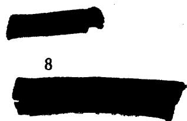

Heat Transfer. Experimental equipment for measuring molten metal heat transfer coefficients was essentially completed during this period. The experimental program will be started in the near future. Equipment for measuring the heat transfer to boiling liquids is being designed. Preliminary design of a system for obtaining high coefficients of heat transfer to molten sodium has been started. Equipment for the determination of the thermal conductivity of metals at temperatures up to $1800^{\circ}\mathrm{F}$ is being constructed.

Metallurgy and Materials. Experimental evidence to date indicates that the ferritic stainless steels are more resistant to lithium at $1000^{\circ}\mathrm{C}$ than are the austenitic alloys for short exposures. Beneficial results of adding graphite to the molten metal were noted for the 310 and 316 stainless steels. Longer tests support earlier evidence that iron, zirconium and columbium show good resistance to lithium at $1000^{\circ}\mathrm{C}$ . Only moderately good resistance to lead at $1000^{\circ}\mathrm{C}$ was noted in tungsten, zirconium, iron and tantalum; molybdenum, columbium and beryllium were fair; titanium and nickel poor. Visual inspection of samples indicates that most materials, especially the austenitic stainless steels, are more resistant to sodium at $1000^{\circ}\mathrm{C}$ than to lithium. Nickel is found to be quite resistant to sodium at $1800^{\circ}\mathrm{F}$ . Various metals and refractories have been tested at $1800^{\circ}\mathrm{F}$ in NaOH. Nothing except nickel has yet been found which has not been drastically attacked.

Radiation Damage. Plans are being made to irradiate copper and 316 stainless steel in the 20 Mev proton beam of the Y-12 cyclotron. The in-pile creep apparatus has been tested and placed in operation in the ORNL reactor.

Nuclear Measurements. The possibility of extending earlier thermal xenon cross-section vs. energy measurements to higher neutron energies is being considered. Two possible methods are being studied, the epi-cadmium deactivation at high flux and danger coefficients in intermediate critical assemblies. Intermediate cross-section measurements on molybdenum are underway at Columbia University.

Reactor Physics. Thirteen-group calculations, patterned on the GE routine, are in progress for the proposed ARE reactor. The calculation system is now being adapted to the IBM computing machines.

ARE Design. A preliminary report, Y-F5-15, with Supplements I to VIII, has been completed describing the general features of the proposed ARE reactor.

Joint ORNL-NEPA groups have been established to develop the details of the shielding and control system designs. A preliminary design of the building to house the reactor has been drawn up and a site selected.

Circulating Fuel Reactors. The H. K. Ferguson Company has prepared a preliminary report on an integrated design for a B-52 aircraft powered by a homogeneous reactor which uses a uranium suspension in NaOH. Research at Y-12 is in progress on possible solutions and suspensions of uranium compounds in NaOH.

Circulating Moderator Reactors. The H. K. Ferguson Company has prepared a preliminary study of a fixed-fuel circulating-moderator design as an alternate ARE.

Li7 Separation. Research continues on the ion-exchange, the molecular distillation and the liquid-exchange column methods of lithium isotope separation. Enrichment up to $94\%$ Li7 has been achieved in a system using lithium amalgam and aqueous lithium hydroxide flowing countercurrently.

# INTRODUCTION

During the past quarter the Aircraft Nuclear Propulsion (ANP) project at the Oak Ridge National Laboratory has continued to expand. The work has fallen into three main categories: (a) sponsorship of the ANP Technical Advisory Board, and cooperation in its studies to delineate the most feasible types of supersonic aircraft nuclear power plants, (b) research aimed at solving the problems involved in the liquid-metal-cooled type of reactor with the aim of constructing a 1000 kw prototype in Oak Ridge (the ARE), and (c) exploratory research on problems of other reactor cycles which might be employed in future models.

The Technical Advisory Board. During June and July, 1950, the Oak Ridge National Laboratory, cooperating with NEPA, brought to Oak Ridge a distinguished group of consultants to form the Technical Advisory Board (TAB) to the nuclear aircraft program. The TAB explored analytically a great many possible reactor and power plant arrangements for supersonic nuclear aircraft. Its members included specialists in metallurgy, reactor theory, shielding theory, reactor engineering, heat transfer, radiation damage, turbojet design, and aircraft design. All of these fields of effort were involved jointly in the considerations of the TAB and in its evaluation of the relative merits of the various possibilities for a supersonic craft. A considerable fraction of the effort of the Laboratory during the past quarter was devoted to consulting with and assisting the members of the TAB in their work. At the close of its session, the TAB prepared a final summary report which is now in press and will shortly receive a wide distribution. The following section is a reprint of parts of the chapter entitled "Conclusions and Recommendations" from the final report of the TAB:

"The TAB, in course of its session, has worked up steadily to the conclusion that there is a good chance for realization of a subsonic nuclear plane in the near future. Such a plane is quite likely to attain a speed and altitude comparable to those of the most advanced designs for large airplanes.

"Obtaining supersonic performance later may be expected as the result of further development. It depends on the solution of crucial problems with

respect to materials, fabrication, and airplane and engine developments. The time scale for solution of these problems cannot now be predicted.

"The TAB is of the opinion that a realistic program directed immediately towards a tangible goal will greatly enhance the chance of obtaining an ultimate high performance plane. An attempt to develop the ultimate plane without intermediate stages is a proposition that would seem likely to lead only to confusion and delays.

"These conclusions are based on the opinion that a sodium-cooled reactor with maximum wall temperatures in the neighborhood of $1500^{\circ}\mathrm{F}$ and linear dimensions of the order of 3.5 feet can probably be built to give a power output of several hundred megawatts. With such a reactor and a fairly conventional propulsion system the attaining of Mach 0.8 at 35,000 feet with a B-52 may be set as an early objective.

"The TAB is furthermore of the opinion that a homogeneous reactor would have outstanding advantages. A major effort to determine its feasibility should be made....

"As a means of concentrating effort on the more promising alternatives, a program based on the following recommendations should be adopted.

A. Continue to give top priority to the liquid metal reactor with sodium as a coolant.

(a) For the present, base the design studies on a conservative extrapolation of present-day knowledge of materials and parts.

(b) Make integrated design studies for airplanes and engines in conjunction with this reactor, both for Phase I and, to the extent indicated in Recommendation 2, for Phase II.*

(c) Continue vigorously such research on materials for the liquid metal reactor as will lead to eventual operation at higher temperatures, possibly as high as $1800^{\circ}\mathrm{F}$ , but do not, for the present, make either the reactor or the integrated design contingent upon the success of this research.

Metallurgical and materials problems connected with fuel elements for high heat flux should be vigorously attacked until a practical solution is attained.

B. Make a strong and sustained effort to solve the specific problems of the use of NaOH; that is, its corrosive properties and its ability to carry fuel either in solution or as a dispersion; also, to the extent possible, its stability against radiation damage. The present design studies on the circulating moderator reactor should be continued and, if the results of materials research are encouraging, should be accelerated. If fuel carrying also seems promising, major effort should be directed to the homogeneous reactor.   
C. Retain a small group to study other reactor types, not specifically referred to in A or B, but put no major effort on these unless facts are discovered which alter the situation materially. Continue some research on the crucial materials problems for the air cycle in the hope of approaching a conclusion.   
D. Avoid any expensive commitments for the separation of lithium-7. Continue developmental work on the molecular distillation and chemical exchange methods at the present modest level, at least until the high-temperature corrosion situation is clarified. Drop research on the relatively unpromising electromagnetic method."

Research for the Aircraft Reactor Experiment. As has been displayed in previous quarterly reports, the Oak Ridge National Laboratory has research underway in the following fields which touch upon problems of the liquid-metal-cooled aircraft reactor:

Shielding,

Radiation Damage,

Heat Transfer,

Critical Experimentation,

Experimental Engineering,

Metallurgy, and

General Reactor Design.

During the past quarter the work on all of these groups has been more closely pointed toward solution of problems for the 1000 kw liquid-metal-cooled prototype reactor (ARE) proposed for Oak Ridge. The shielding group has continued its tests in the lid tank and on combinations of iron, lead, and water, and has extended them to include borated water. The radiation damage group has continued work towards placing a creep test in the ORNL reactor, as well as work on the corrosion of liquid metal containers under radiation. The critical experiment group is preparing to test configurations appropriate to

the ARE. The experimental engineering group is beginning to circulate liquid metals at high temperature in various laboratory-scale loops. The heat transfer group is developing the theory of transfer to liquid metals in passages whose shapes are appropriate to ARE design. The metallurgy group is continuing corrosion tests of probable container materials in liquid metals of interest for ARE. Meanwhile, the ANP general design group has developed a preliminary design covering the general characteristics of the ARE reactor. Detailed design of the building and of the reactor proper are now underway. The completion of the design will proceed as rapidly as answers to the many problems involved come in from the research groups. If permission to build this reactor is granted by the AEC, it is hoped that it may be put into operation by January 1, 1952.

Previous to this quarter, most of the design thinking had been concentrated upon a reactor to power a highly supersonic aircraft. However, a gradual lowering of the predicted shield weights resulting from the latest lid tank results, and the change in the current international situation, have led the Laboratory to place closer stress upon the possibility of attaining at least subsonic nuclear flight at a much earlier date than previously visualized. Therefore, some of the design specifications for the ARE are now being altered so that it may serve as a prototype for the so-called "War Model" reactor for a subsonic plane. The most notable change in this respect has been the decrease in the proposed fuel wall temperature from $1800^{\circ}\mathrm{F}$ to $1500^{\circ}\mathrm{F}$ , as recommended by the TAB.

Alternate Approaches for an Aircraft Reactor. Although, as just described, the major part of the ANP effort of the Laboratory is now pointed towards development of the fixed-fuel liquid-metal-cooled-type of reactor, a considerable amount of research is also going into other types which might offer promise for future models. Under contract with the Laboratory, the H. K. Ferguson Company is continuing its study of the circulating-fuel reactor possibilities, principally involving uranium suspensions and sodium hydroxide, with the aim of presenting a complete design for operating a B-52 airplane with such a reactor. Meanwhile at ORNL, the ANP chemistry group is attempting to form a stable suspension of some uranium compound in molten sodium hydroxide. This group is also searching for liquids, such as perhaps sodium fluoride, in which uranium might be dissolved in sufficient quantities to provide

a liquid reactor fuel. As another line of attack for the future, the isotope separation group is continuing the exploration of methods of separating lithium-7 economically on a large scale for use as a future high-performance coolant. Under direction of the Laboratory, North American Aviation, Inc., is analyzing the possibilities of various compressor-jet cycles which might involve such substances as sodium and mercury vapors as working fluids.

Conclusion. In general, the Oak Ridge National Laboratory concurs with the findings of the Technical Advisory Board: (a) a reasonable amount of research should now solve the problems necessary for attaining subsonic nuclear flight in any one of several ways, the most promising of these at present involving a sodium-cooled reactor whose maximum temperature is $1500^{\circ}\mathrm{F}$ ; and (b) by extension of lines of research now underway there is promise of eventual achievement of a supersonic nuclear aircraft reactor.

PART I. RESEARCH CONTRIBUTING TO THE ARE

# SHIELDING RESEARCH

E. P. Blizzard, Physics Division

Shielding Research at the Oak Ridge National Laboratory has made considerable progress during the past quarter. Further results were accumulated on combinations of lead, iron, boron and water in the lid tank, and the instrumentation of that facility was improved. A new experiment on the effect of liquid metal ducts is planned, which will go into a tank above the thermal column on top of the reactor. Various calculations of neutron and gamma attenuations have also been completed and the construction of the new shield test building and pool is well underway. It is believed that almost enough data are now on hand to permit intelligent design of an engineered unit shield for an aircraft reactor with the plumbing embedded within the shield in the proper places. Plans are underway for construction of a mock-up of the first engineered aircraft shield which should be installed in the new test facility toward the end of the next quarter. The following sections describe the results in these various shielding activities during the past three months.

# BULK SHIELDING MEASUREMENTS-LID TANK

A Method for Experimental Shield Optimization (E. P. Blizzard). After several uniform lead-borated water shields had been tested it became clear that the optimum distribution of lead had not been achieved. A criterion was set up for determining the optimum arrangement as follows:

(1) It is assumed that lead and water are equivalent on a volume basis for neutron attenuation;   
(2) A gamma detector is set up at the outside of the shield mock-up and the effect of inserting a slab of lead is observed on this instrument. A quantity $l$ is then defined as follows:

$$
l = \frac {\operatorname {L i m}}{t \rightarrow 0} \quad \left[ - \frac {t}{\ln \frac {\Gamma}{\Gamma_ {0}}} \right]
$$

where

$$
\begin{array}{l} t = \text {t h i c k n e s s o f s l a b i n s e r t e d ,} \\ \Gamma = \text {g a m m a i n t e n s i t y}, \text {s l a b i n ,} \\ \Gamma_ {0} = \text {g a m m a i n t e n s i t y}, \text {s l a b o u t}. \\ \end{array}
$$

The weight of the slab is proportional to $R^2 t$ , where $R$ is the radius (on a spherical reactor) at which the slab is inserted. A given attenuation can obviously be achieved most economically (weight basis) where $R^2 l$ is a constant. Since the $l$ observed is a function of the whole shield, the optimum must be approached by successive approximations.

The method has also been worked out for the more general case when the two materials are not equivalent for neutrons. In addition, the optimum choice of gamma and neutron dosage distribution has been shown to be, for the lead-water shield, $\frac{1}{2}$ neutrons and $\frac{1}{2}$ gammas.

For the case in which the reactor is not a sphere but a square cylinder, the $R$ used above loses meaning. $R^2$ must be replaced by the actual surface of each layer. However, it has been shown that the square cylinder surfaces for a 3-ft square cylinder coincide very closely with those for a 3.8-ft sphere. Thus, the optimization already carried out in the lid tank can be expected to apply for both cases.

All the above discussion applies primarily to unit shields.

$33\%$ Pb - $67\%$ Neutron Data (C. E. Clifford, E. P. Blizzard, J. D. Flynn, T. V. Blosser, L. H. Ballweg,\* R. H. Lewis,\*\* M. K. Hullings, K. Martin). Neutron measurements were made for a 1/3 Pb, 2/3 $\mathsf{H}_2\mathsf{O}$ shield mock-up. Data are recorded in Table 1 showing the thermal neutron flux in water behind successively increasing numbers of slabs. The slab next to the source was inserted first and the shield was built up regularly of 1-in. Pb slabs every 3 in. Since the usual plot of flux vs. distance shows many lines superimposed, for different numbers of lead slabs, Fig. 1 is used to show the effect of lead insertion. It is seen that in general the lead is slightly better than water on a volume basis. The upturned ends for large numbers of lead slabs demonstrate the relative thermal neutron transparency of lead.

Effect of Addition of Boron to Water. For the above configuration, with nine Pb slabs inserted, $\mathbf{B}_2\mathbf{O}_3$ was added to the water in several steps. The

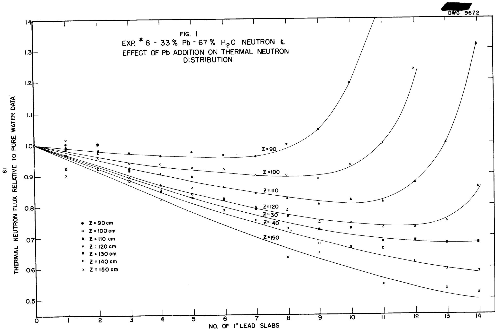

TABLE 1a   
Experiment 8 - $33\%$ Pb - $67\%$ $\mathbf{H}_2\mathbf{O}$ Neutron Centerline Measurements   
25 in. $\mathbf{BF}_3$   

<table><tr><td>NUMBER OF SLABSI IN PLACE</td><td>Z = 80</td><td>Z = 90</td><td>Z = 100</td><td>Z = 110</td><td>Z = 120</td><td>Z = 130</td><td>Z = 140</td><td>Z = 150</td></tr><tr><td>0</td><td>396,580</td><td>121,406</td><td>36,920</td><td>11,037</td><td>3,665</td><td>1,336</td><td>398</td><td>145</td></tr><tr><td>0</td><td>392,008</td><td>118,766</td><td>35,177</td><td>11,128</td><td></td><td></td><td></td><td></td></tr><tr><td>0</td><td>397,422</td><td>119,003</td><td>35,594</td><td>10,994</td><td>3,620</td><td>1,141</td><td>391</td><td></td></tr><tr><td>0</td><td>418,488</td><td>118,284</td><td>34,810</td><td>11,108</td><td>3,546</td><td>1,151</td><td>386</td><td></td></tr><tr><td>Average c/m</td><td>401,124</td><td>119,365</td><td>35,625</td><td>11,067</td><td>3,610</td><td>1,143</td><td>392</td><td>145</td></tr><tr><td>NV</td><td></td><td>82.72</td><td>24.69</td><td>7.67</td><td>2.50</td><td>.792</td><td>.272</td><td>.100</td></tr><tr><td>1</td><td>400,934</td><td>121,079</td><td>36,085</td><td>10,879</td><td>3,441</td><td>1,103</td><td>353</td><td>130.7</td></tr><tr><td>1</td><td>406,588</td><td>121,002</td><td>36,346</td><td>11,134</td><td>3,545</td><td>1,148</td><td>372</td><td></td></tr><tr><td>Average</td><td>403,761</td><td>121,040</td><td>36,215</td><td>11,007</td><td>3,493</td><td>1,125</td><td>362</td><td>130.7</td></tr><tr><td>NV</td><td></td><td>83.88</td><td>25.1</td><td>7.62</td><td>2.42</td><td>.779</td><td>.251</td><td>.091</td></tr><tr><td>2</td><td>409,170</td><td>119,675</td><td>36,005</td><td>10,712</td><td>3,499</td><td>1,095</td><td>362</td><td></td></tr><tr><td>2</td><td>406,993</td><td>120,823</td><td>35,533</td><td>10,791</td><td>3,398</td><td>1,135</td><td>362</td><td></td></tr><tr><td>Average</td><td>408,081</td><td>120,024</td><td>35,769</td><td>10,751</td><td>3,448</td><td>1,115</td><td>362</td><td></td></tr><tr><td>NV</td><td></td><td>83.2</td><td>24.8</td><td>7.45</td><td>2.39</td><td>.773</td><td>.251</td><td></td></tr><tr><td>3</td><td></td><td>117,862</td><td>33,517</td><td>10,159</td><td>3,229</td><td>1,045</td><td>344</td><td></td></tr><tr><td>3</td><td></td><td>114,192</td><td>33,283</td><td>10,277</td><td>3,210</td><td>1,047</td><td>347</td><td></td></tr><tr><td>Average</td><td>4</td><td>116,027</td><td>33,400</td><td>10,218</td><td>3,220</td><td>1,046</td><td>346</td><td></td></tr><tr><td>NV</td><td></td><td>77.3</td><td>23.1</td><td>7.08</td><td>2.23</td><td>.725</td><td>.240</td><td></td></tr><tr><td>4</td><td></td><td>113,816</td><td>32,704</td><td>10,102</td><td>3,095</td><td>963</td><td>330</td><td></td></tr><tr><td>4</td><td></td><td>115,658</td><td>33,924</td><td>9,922</td><td>3,158</td><td>982</td><td>337</td><td></td></tr><tr><td>Average</td><td>4</td><td>114,740</td><td>33,314</td><td>10,012</td><td>3,127</td><td>972</td><td>334</td><td></td></tr><tr><td>NV</td><td></td><td>79.5</td><td>23.1</td><td>6.94</td><td>2.17</td><td>.673</td><td>.231</td><td></td></tr><tr><td>5</td><td></td><td>(117,856</td><td></td><td></td><td></td><td></td><td></td><td></td></tr><tr><td>5</td><td></td><td>(115,362</td><td>33,016</td><td>9,955</td><td>3,156</td><td>973.9</td><td>321.3</td><td></td></tr><tr><td>Average</td><td>5</td><td>115,076</td><td>32,858</td><td>9,865</td><td>3,043</td><td>948.1</td><td>335.7</td><td></td></tr><tr><td>NV</td><td></td><td>80.4</td><td>22.8</td><td>6.86</td><td>2.15</td><td>943.0</td><td>329.0</td><td></td></tr><tr><td></td><td></td><td></td><td></td><td></td><td></td><td>.654</td><td>.228</td><td></td></tr></table>

TABLE 1a (Cont'd)   

<table><tr><td>NUMBER OF SLABSI IN PLACE</td><td>Z = 80</td><td>Z = 90</td><td>Z = 100</td><td>Z = 110</td><td>Z = 120</td><td>Z = 130</td><td>Z = 140</td><td>Z = 150</td></tr><tr><td>6</td><td></td><td>117,642(113,196(114,185</td><td>32,76032,659</td><td>9,5259,520</td><td>2,9552,991</td><td>940.0938</td><td>304311</td><td></td></tr><tr><td>AverageNV</td><td></td><td>115,00879.7</td><td>32,71022.7</td><td>9,5236.60</td><td>2,9732.06</td><td>939.651</td><td>308.21</td><td></td></tr><tr><td>7</td><td></td><td>113,134(115,045(114,160</td><td>31,70731,59332,429</td><td>9,1959,2989,351</td><td>2,8752,8362,897</td><td>874921905</td><td>286304.2</td><td></td></tr><tr><td>AverageNV</td><td></td><td>114,11379.1</td><td>31,91022.1</td><td>9,2816.43</td><td>2,8691.98</td><td>903.625</td><td>295.204</td><td></td></tr><tr><td>8</td><td></td><td>118,988118,914</td><td>32,29131,676</td><td>9,1469,076</td><td>2,8442,829</td><td>886869</td><td>283286</td><td>92--</td></tr><tr><td>AverageNV</td><td></td><td>118,95182.4</td><td>31,98422.2</td><td>9,1116.31</td><td>2,8371.466</td><td>878.608</td><td>285.198</td><td>92.064</td></tr><tr><td>9</td><td></td><td>(124,662(122,868125,738</td><td>31,27131,787</td><td>8,9158,880</td><td>2,7522,636</td><td>824830</td><td>264.1266.8</td><td>94</td></tr><tr><td>AverageNV</td><td></td><td>124,42386.2</td><td>31,52921.8</td><td>8,8986.17</td><td>2,6941.87</td><td>827.573</td><td>265.4.184</td><td>94.065</td></tr><tr><td>10</td><td></td><td>(141,826(143,221141,446</td><td>32,82233,422</td><td>9,2078,927</td><td>2,6882,684</td><td>820841</td><td>258.2263.0</td><td></td></tr><tr><td>AverageNV</td><td></td><td>142,16498.5</td><td>33,12222.95</td><td>9,0676.28</td><td>2,6861.86</td><td>830.5.575</td><td>260.6.181</td><td></td></tr><tr><td>11</td><td></td><td>177,562169,122</td><td>35,90735,004</td><td>9,0278,943</td><td>2,6622,589</td><td>787.4777</td><td>251267</td><td>79</td></tr><tr><td>11</td><td></td><td></td><td></td><td></td><td></td><td></td><td></td><td></td></tr></table>

TABLE 1a (Cont'd)   

<table><tr><td>NUMBER OF SLABSI IN PLACE</td><td>Z = 80</td><td>Z = 90</td><td>Z = 100</td><td>Z = 110</td><td>Z = 120</td><td>Z = 130</td><td>Z = 140</td><td>Z = 150</td></tr><tr><td>AverageNV</td><td></td><td>173,300.120.0</td><td>35,50024.6</td><td>8,9806.22</td><td>2,6251.02</td><td>782.542</td><td>259.179</td><td>79</td></tr><tr><td>12</td><td></td><td></td><td rowspan="2">(43,545(44,98243,544)</td><td rowspan="2">9,4469,905</td><td rowspan="2">2,6172,638</td><td rowspan="2">776.4792.6</td><td rowspan="2">238.5244.4</td><td></td></tr><tr><td>12</td><td></td><td></td><td></td></tr><tr><td>AverageNV</td><td></td><td></td><td>44,02330.5</td><td>9,6766.71</td><td>2,6281.82</td><td>784.5.544</td><td>241.5.167</td><td></td></tr><tr><td>1313</td><td></td><td></td><td></td><td>11,20411,014</td><td>2,7072,701</td><td>773.8773</td><td>229.1237</td><td>77</td></tr><tr><td>AverageNV</td><td></td><td></td><td></td><td>11,1097.70</td><td>2,7041.87</td><td>773.536</td><td>233.161</td><td>77.053</td></tr><tr><td>1414</td><td></td><td></td><td></td><td>14,28214,804</td><td>3,0843.102</td><td>769785</td><td>--231</td><td>75</td></tr><tr><td>AverageNV</td><td></td><td></td><td></td><td>14,54310.1</td><td>3,0932.14</td><td>777.538</td><td>231.160</td><td>75.052</td></tr></table>

Note: Thermal flux (NV) = 0.693 × 10⁻³ × counts per minute.

TABLE 1b   
Experiment 8 - $33\%$ Pb - $67\%$ $\mathbf{H}_2\mathbf{O}$ Thermal Neutron Centerline Measurements   
Indium Foils.- Between Pb Slabs   

<table><tr><td>BEHIND SLAB NO.</td><td>~ Z (cm s)</td><td>NV</td></tr><tr><td>1</td><td>5</td><td>5.355 × 10^7</td></tr><tr><td>2</td><td>13</td><td>1.790 × 10^7</td></tr><tr><td>3</td><td>20</td><td>7.20 × 10^6</td></tr><tr><td>4</td><td>28</td><td>1.512 × 10^6</td></tr><tr><td>5</td><td>35.5</td><td>4.678 × 10^5</td></tr><tr><td>6</td><td>43</td><td>1.387 × 10^5</td></tr><tr><td>7</td><td>51</td><td>3.343 × 10^4</td></tr><tr><td>8</td><td>58.5</td><td>1.248 × 10^4</td></tr><tr><td>9</td><td>66</td><td>3.439 × 10^3</td></tr><tr><td>10</td><td>73.5</td><td>1.052 × 10^3</td></tr><tr><td>11</td><td>81.5</td><td>3.96 × 10^2</td></tr><tr><td>12</td><td>89</td><td>1.205 × 10^2</td></tr><tr><td>13</td><td>96.5</td><td>5.26 × 10^1</td></tr></table>

# TABLE 1c

# Experiment 8 - $33\%$ Pb - $67\%$ $\mathbf{H}_2\mathbf{O}$ Neutron Centerline Measurements

25 in. $\mathbf{BF}_3$

Normalized to Pure Water

<table><tr><td>NUMBER OF SLABSI IN PLACE</td><td>Z = 80</td><td>Z = 90</td><td>Z = 100</td><td>Z = 110</td><td>Z = 120</td><td>Z = 130</td><td>Z = 140</td><td>Z = 150</td></tr><tr><td>0</td><td>1.000</td><td>1.000</td><td>1.000</td><td>1.000</td><td>1.000</td><td>1.000</td><td>1.000</td><td>1.000</td></tr><tr><td>1</td><td>1.0066</td><td>1.0140</td><td>1.0166</td><td>0.9946</td><td>0.9676</td><td>0.9842</td><td>0.9234</td><td>0.9013</td></tr><tr><td>2</td><td>1.0173</td><td>1.0055</td><td>1.0040</td><td>.9714</td><td>.9551</td><td>.9755</td><td>.9234</td><td></td></tr><tr><td>3</td><td></td><td>0.9720</td><td>0.9375</td><td>.9233</td><td>.8920</td><td>0.9151</td><td>0.8827</td><td></td></tr><tr><td>4</td><td></td><td>.961</td><td>.935</td><td>.905</td><td>.8662</td><td>.850</td><td>.852</td><td>.823</td></tr><tr><td>5</td><td></td><td>.973</td><td>.924</td><td>.895</td><td>.858</td><td>.825</td><td>.839</td><td></td></tr><tr><td>6</td><td></td><td>.963</td><td>.918</td><td>.860</td><td>.824</td><td>.822</td><td>.786</td><td></td></tr><tr><td>7</td><td></td><td>.956</td><td>.896</td><td>.839</td><td>.795</td><td>.790</td><td>.753</td><td></td></tr><tr><td>8</td><td></td><td>.9965</td><td>.8978</td><td>0.8233</td><td>.7859</td><td>.7682</td><td>.7270</td><td>.6345</td></tr><tr><td>9</td><td></td><td>1.042</td><td>.8850</td><td>.8040</td><td>.7463</td><td>.7235</td><td>.677</td><td>.648</td></tr><tr><td>10</td><td></td><td>1.191</td><td>.930</td><td>.819</td><td>.744</td><td>.7265</td><td>.665</td><td></td></tr><tr><td>11</td><td></td><td>1.4518</td><td>.9965</td><td>0.8114</td><td>0.7271</td><td>0.6842</td><td>0.6607</td><td>.545</td></tr><tr><td>12</td><td></td><td></td><td>1.236</td><td>0.8743</td><td>.7297</td><td>0.6864</td><td>0.6161</td><td></td></tr><tr><td>13</td><td></td><td></td><td></td><td>1.0038</td><td>0.7490</td><td>0.6763</td><td>0.5944</td><td>0.5310</td></tr><tr><td>14</td><td></td><td></td><td></td><td>1.3141</td><td>0.8568</td><td>0.6798</td><td>0.5893</td><td>0.5172</td></tr></table>

gamma flux at several thickness of the shield mock-up was recorded as a function of boron added (see Table 2). A plot of gamma intensity vs. fraction of captures in hydrogen and lead gives the ratio of gammas due to capture to those due to all other sources. For the $\mathrm{Pb - H_2O}$ shield in question, this ratio was about six. After sufficient boron was added to reduce captures to one-twelfth, it was considered unnecessary to add more, and this concentration has been maintained in the lid tank since that date. It is possible that further addition might be advantageous for the recent measurements involving iron. The water is, however, essentially saturated with the present concentration.

Gamma Attenuation as a Function of Lead Disposition. Two shield mock-ups were measured for which the lead-water spacings were uniform. For the $33\%$ Pb (volume) case two concentrations of boron were used successively, showing only a slight improvement for an increase from $0.2\%$ B to $0.4\%$ B. For the $17\%$ Pb case the measurement at lower boron concentration was omitted. The "effective attenuation lengths, $l^{\prime \prime}$ as described above were measured for these configurations, and since $R^2 l$ ( $R$ is the radius for a shield around a 4-ft spherical reactor) is not uniform, it is evident that improvement is possible. Accordingly, the lead slabs were moved successively to make $R^2 l$ as nearly constant as possible. For all these measurements the object was to specify experimentally the amount of the lead required to effect gamma tolerance at the neutron-determined shield outside. It is assumed that lead and water are equivalent for neutrons.

Table 3 shows the values of $l$ and $R^2 l$ ; for these experiments. Shield weights reported are in short tons and for highly idealized shields, being valuable for comparison only. The method of computation is outlined in the last ANP Quarterly Report (ORNL 768) and is based on the following assumptions:

Reactor power, 400 megawatts

Reactor diameter, 4 feet

Reactor leakage, $20\%$

Tolerance, 1 R/hr, 3/4 gammas, 1/4 neutrons

Reactor-crew separation, 100 feet

No ducts, heat exchangers

No shadow shielding

TABLE 2   
Effect of Water Boration on Gamma Centerline Measurements   

<table><tr><td rowspan="2">Z</td><td colspan="3">33% Pb, 10 1-IN. SLABS, MODIFIED BY REMOVAL OF 2ND SLAB FROM SOURCE</td><td colspan="2">33% Pb, 11 SLABS, MODIFIED BY REMOVAL OF 8TH AND 10TH SLABS</td></tr><tr><td>100 Ib B2O30.1%B</td><td>200 Ib B2O30.2%B</td><td>400 Ib B2O30.4%B</td><td>400 Ib B2O30.4%B</td><td>600 Ib B2O30.6%B</td></tr><tr><td>80</td><td>4952</td><td>3710</td><td>2915</td><td></td><td></td></tr><tr><td>90</td><td>2739</td><td>2063</td><td>1664</td><td></td><td></td></tr><tr><td>100</td><td>1523</td><td>1133</td><td>906</td><td></td><td>861</td></tr><tr><td>110</td><td>879</td><td>631</td><td>511</td><td></td><td>463</td></tr><tr><td>120</td><td>525</td><td>384</td><td>307</td><td>342</td><td>301</td></tr><tr><td>130</td><td>313</td><td>236</td><td>183</td><td></td><td></td></tr></table>

# TABLE 3

# Gamma. Measurements

$R^2 l$ and $l$ for $\mathbf{Pb}$ , $\mathbf{H}_2\mathbf{O}$ and B Composite Shields of 1-in. Pb Slabs   

<table><tr><td colspan="3">UNIFORM 33% Pb - 67% H2O
.2% BORON</td><td colspan="3">UNIFORM 17% Pb - 83% H2O
.4% BORON</td><td colspan="3">UNIFORM 33% Pb - 67% H2O
.4% BORON</td><td colspan="3">NON-UNIFORM
.6% BORON</td></tr><tr><td>RADIUS
(in.)</td><td>l* (cm)</td><td>R²l x 10-4(cm³)</td><td>RADIUS
(in.)</td><td>l (cm)</td><td>R²l x 10-4(cm³)</td><td>RADIUS
(in.)</td><td>l (cm)</td><td>R²l x 10-4(cm³)</td><td>RADIUS
(in.)</td><td>l (cm)</td><td>R²l x 10-4(cm³)</td></tr><tr><td>25</td><td>neg.</td><td></td><td>25</td><td>3.61</td><td>1.46</td><td>25</td><td>40.35</td><td>16.27</td><td>25.31</td><td>13.8</td><td>5.73</td></tr><tr><td>28</td><td></td><td></td><td>30.88</td><td>2.47</td><td>1.52</td><td>28</td><td>18.39</td><td>9.30</td><td>26.6**</td><td></td><td></td></tr><tr><td>31</td><td></td><td></td><td>36.76</td><td>2.66</td><td>2.32</td><td>31</td><td>17.04</td><td>10.57</td><td>27.9</td><td>10.10</td><td>5.05</td></tr><tr><td>34</td><td>6.09</td><td>4.54</td><td>42.64</td><td>-</td><td></td><td>34</td><td>12.62</td><td>9.41</td><td>29.3**</td><td></td><td></td></tr><tr><td>37</td><td></td><td></td><td>48.52</td><td>2.59</td><td>3.94</td><td>37</td><td></td><td></td><td>30.8</td><td>8.77</td><td>5.23</td></tr><tr><td>40</td><td>6.37</td><td>6.58</td><td>54.40</td><td>2.49</td><td>4.75</td><td>40</td><td>11.0</td><td>11.34</td><td>32.3**</td><td></td><td></td></tr><tr><td>43</td><td></td><td></td><td>60.78</td><td>2.33</td><td>5.46</td><td>43</td><td></td><td></td><td>33.9</td><td>6.32</td><td>4.56</td></tr><tr><td>46</td><td>5.18</td><td>7.07</td><td>66.16</td><td>2.35</td><td>6.63</td><td>46</td><td>6.71</td><td>9.15</td><td>35.3**</td><td></td><td></td></tr><tr><td>49</td><td></td><td></td><td></td><td></td><td></td><td>49</td><td></td><td></td><td>37.4</td><td>4.72</td><td>4.15</td></tr><tr><td>52</td><td>3.66</td><td>6.38</td><td></td><td></td><td></td><td>52</td><td>4.42</td><td>7.7</td><td>41.8</td><td>3.70</td><td>4.08</td></tr><tr><td></td><td></td><td></td><td></td><td></td><td></td><td></td><td></td><td></td><td>47.1</td><td>3.56</td><td>4.97</td></tr><tr><td></td><td></td><td></td><td></td><td></td><td></td><td></td><td></td><td></td><td>54.0</td><td>2.73</td><td>5.15</td></tr><tr><td colspan="3">Weight Shield 59.5 Tons</td><td colspan="3">Weight Shield 66 Tons</td><td colspan="3">Weight Shield 59.1 Tons</td><td colspan="3">Weight Shield 54 Tons</td></tr></table>

Note: Shield weights were calculated for a 118-cm shield, 24-in.-radius spheril reactor, 400 mw power.   
* Second slab removed when these $l$ 's were measured.   
** 3/16-in. Pb slabs.

Table 4 shows in more detail the method of computation of $R^2 l$ , using as an example a non-uniform shield with $0.4\%$ B in the water.

Table 5 shows the effect of moving a single slab with all others in near-optimum positions. It has been found that it is most expeditious to adjust the outermost slab first, since the $R^2 l$ for this slab is less sensitive to the position of the other slabs. This slab is also the most important from the point of view of both weight and attenuation. Other slabs are then adjusted to give the same value. Table 6 shows essentially the same data as Table 5 for a different distribution of intermediate slabs, demonstrating the relative insensitivity of the optimum position for the outermost slab.

The minimum in $R^2 l$ for an intermediate slab is shown in Table 7.

Further experiments and calculations to check the shield weights quoted here are still underway.

Fast Neutron Dosimeter. This instrument, described in previous reports, was developed by the ORNL Health Physics and Instrument Divisions. It has been made water-proof and used in the lid tank for a few representative readings. Comparison with fast neutron estimates from thermal flux measurements shows the latter to have been somewhat low, so that the shield thickness estimates have been increased. The reasons for the discrepancy are discussed below separately.

Shield for Reactor with Fe Reflector. Two and five-eights inches of Fe were inserted at the inside of a $\mathrm{Pb - H_2O - B}$ mock-up in order more closely to approximate an engineered installation. The attenuation was not changed appreciably, indicating that Fe is approximately as efficient for neutrons and gammas as the $\mathrm{Pb - H_2O}$ it replaced. The data, including an ideal shield weight calculation for 4-ft diameter outside the iron, are shown in Table 8.

Interpretation of Dosimeter Data (E. P. Blizzard). Discussions with H. A. Bethe, F. Friedman, and M. Deutsch served to clarify an apparent discrepancy between the dosimeter determination of fast current and that inferred from thermal neutron flux measurements (see ORNL 768). The dosimeter indicated fast flux to be about three times higher than is indicated from a simple interpretation of thermal flux data. The difference is attributed primarily

# TABLE 4

# $R^2 l$ for Non-Uniform $\mathbf{Pb - H}_2\mathbf{0}$

0.4% Boron - 9 in. Pb

<table><tr><td>SLAB NUMBER 
REMOVED</td><td>RADIUS 
(in.)</td><td>R²</td><td>R²/R₀²</td><td>Cts/min 
at 120 cm/s</td><td>Γ₀/Γ</td><td>ln Γ₀/Γ</td><td>t(cm)</td><td>l 
(cm/s)</td><td>R²l/R₀²</td><td>R²l×10-4(cm³)</td></tr><tr><td>none</td><td></td><td></td><td></td><td>390</td><td></td><td></td><td></td><td></td><td></td><td></td></tr><tr><td>1</td><td>25</td><td>625</td><td>1.00</td><td>471.9</td><td>1.21</td><td>.1908</td><td>2.75</td><td>14.41</td><td>14.41</td><td>5.81</td></tr><tr><td>2</td><td>27.94</td><td>780.6</td><td>1.25</td><td>458.4</td><td>1.1753</td><td>.1615</td><td>2.73</td><td>16.9</td><td>21.10</td><td>8.51</td></tr><tr><td>3</td><td>30.88</td><td>953.6</td><td>1.53</td><td>541.9</td><td>1.389</td><td>.3282</td><td>2.57</td><td>7.8305</td><td>11.98</td><td>4.83</td></tr><tr><td>4</td><td>33.82</td><td>1143.8</td><td>1.83</td><td>590.3</td><td>1.513</td><td>.4121</td><td>2.73</td><td>6.625</td><td>12.12</td><td>4.89</td></tr><tr><td>5</td><td>36.76</td><td>1351.2</td><td>2.16</td><td>593</td><td>1.520</td><td>.4125</td><td>2.53</td><td>6.133</td><td>13.25</td><td>5.34</td></tr><tr><td>6</td><td>39.70</td><td>1576.1</td><td>2.52</td><td>647.4</td><td>1.659</td><td>.506</td><td>2.72</td><td>5.375</td><td>13.545</td><td>5.46</td></tr><tr><td>7</td><td>42.64</td><td>1818.1</td><td>2.91</td><td>675.1</td><td>1.731</td><td>.5481</td><td>2.51</td><td>4.579</td><td>13.32</td><td>5.37</td></tr><tr><td>8</td><td>48.52</td><td>2354.2</td><td>3.77</td><td>785.8</td><td>2.015</td><td>.700</td><td>2.53</td><td>3.614</td><td>13.63</td><td>5.49</td></tr><tr><td>9</td><td>54.40</td><td>2959.4</td><td>4.73</td><td>875</td><td>2.243</td><td>.806</td><td>2.54</td><td>3.151</td><td>14.90</td><td>6.01</td></tr><tr><td></td><td>ΣR=338</td><td>ΣR²=13,562</td><td></td><td></td><td></td><td></td><td></td><td></td><td></td><td></td></tr></table>

Shield Weight Calculation:

Weight $\mathbf{Pb} = (13,562 - 338)\times 2.346\times 10^{-3} = 31.02$ tons of Pb 25.45 tons of H2O 56.47 tons - Total

# TABLE 5

# Effect of Moving Single Pb Slab on $R^2 l$ - All Other Slabs Remaining Constant

Total 9 in. Pb - 0.6% Boron

<table><tr><td colspan="3">ACTUAL DATA</td><td colspan="2">DATA FROM SMOOTH CURVE OF COUNTS VS. RADIUS</td><td rowspan="2">POSITION OF SLABS</td></tr><tr><td>R(in.)</td><td>l(cm)</td><td>R2l x 10-4(cm3)</td><td>l(cm)</td><td>R2l x 10-4(cm3)</td></tr><tr><td>50.03</td><td>3.49</td><td>5.63</td><td>3.61.</td><td>5.82</td><td>25</td></tr><tr><td>51.40</td><td>3.36</td><td>5.73</td><td>3.30</td><td>5.63</td><td>27.9</td></tr><tr><td>52.40</td><td>3.07</td><td>5.44</td><td>3.12</td><td>5.52</td><td>30.9</td></tr><tr><td>53.40</td><td>2.97</td><td>5.46</td><td>2.94</td><td>5.41</td><td>33.8</td></tr><tr><td>54.40</td><td>2.95</td><td>5.63</td><td>2.79</td><td>5.32</td><td>36.8</td></tr><tr><td>55.40</td><td>2.77</td><td>5.48</td><td>2.68</td><td>5.31</td><td>39.7</td></tr><tr><td>56.40</td><td>2.59</td><td>5.32</td><td>2.60</td><td>5.34</td><td>42.6</td></tr><tr><td>57.40</td><td>2.46</td><td>5.23</td><td>2.51</td><td>5.34</td><td>48.5</td></tr><tr><td>58.40</td><td>2.49</td><td>5.48</td><td>2.45</td><td>5.40</td><td>54.4*</td></tr><tr><td>59.40</td><td>2.44</td><td>5.56</td><td>2.42</td><td>5.51</td><td></td></tr><tr><td>60.40</td><td>2.37</td><td>5.58</td><td>2.38</td><td>5.61</td><td></td></tr><tr><td>64.40</td><td>2.08</td><td>5.59</td><td></td><td></td><td></td></tr></table>

* Slab moved in this experiment.

# TABLE 6

# Effect of Moving Pb Slab on $R^2 l$ - All Other Slabs Remaining Constant

Total 9 in. Pb - 0.6% Boron

<table><tr><td colspan="3">ACTUAL DATA</td><td colspan="2">DATA FROM SMOOTH CURVE OF COUNTS VS. RADIUS</td><td colspan="2">POSITION OF SLAB</td></tr><tr><td>R (in.)</td><td>l (cm)</td><td>R2l x 10-4(cm3)</td><td>l (cm)</td><td>R2l x 10-4(cm3)</td><td>R (in.)</td><td>SLAB NUMBER</td></tr><tr><td>46.15</td><td>5.63</td><td>7.74</td><td>5.93</td><td>8.16</td><td>25.00</td><td>1</td></tr><tr><td>48.15</td><td>4.41</td><td>6.60</td><td>4.11</td><td>6.15</td><td>27.94</td><td>2</td></tr><tr><td>50.15</td><td>3.38</td><td>5.48</td><td>3.36</td><td>5.44</td><td>30.88</td><td>3</td></tr><tr><td>52.15</td><td>3.20</td><td>5.61</td><td>2.95</td><td>5.17</td><td>33.82</td><td>4</td></tr><tr><td>54.15</td><td>2.64</td><td>4.99</td><td>2.73</td><td>5.16</td><td>36.76</td><td>5</td></tr><tr><td>56.15</td><td>2.58</td><td>5.24</td><td>2.59</td><td>5.27</td><td>39.70</td><td>6</td></tr><tr><td>58.15</td><td>2.54</td><td>5.54</td><td>2.54</td><td>5.54</td><td>43.75</td><td>7</td></tr><tr><td></td><td></td><td></td><td></td><td></td><td>45.25</td><td>8</td></tr><tr><td></td><td></td><td></td><td></td><td></td><td>54.40*</td><td>9</td></tr></table>

- Slab moved.

Effect of Moving Pb Slab on $R^2 l$ - All Other Slabs Remaining Constant

Total 8 in. Pb - 0.6% Boron

TABLE 7   

<table><tr><td colspan="3">ACTUAL DATA</td><td colspan="2">DATA FROM SMOOTH CURVE OF COUNTS VS. RADIUS</td><td colspan="2">POSITION OF Pb SLABS</td></tr><tr><td>R (in.)</td><td>l (cm)</td><td>R2l x 10-4(cm3)</td><td>l (cm)</td><td>R2l x 10-4(cm3)</td><td>RADIUS (in.)</td><td>SLAB NUMBER</td></tr><tr><td>34.87</td><td>4.93</td><td>3.88</td><td>5.01</td><td>3.94</td><td>25.00</td><td>1</td></tr><tr><td>36.00</td><td>4.82</td><td>4.02</td><td>4.85</td><td>4.05</td><td>27.94</td><td>2</td></tr><tr><td>37.25</td><td>4.66</td><td>4.17</td><td>4.46</td><td>4.00</td><td>30.88</td><td>3</td></tr><tr><td>38.25</td><td>3.98</td><td>3.75</td><td>4.06</td><td>3.83</td><td>33.82</td><td>4</td></tr><tr><td>39.25</td><td>3.88</td><td>3.86</td><td>3.87</td><td>3.86</td><td>36.76*</td><td>5</td></tr><tr><td>40.25</td><td>3.85</td><td>4.02</td><td>3.85</td><td>4.02</td><td>43.75</td><td>6</td></tr><tr><td>41.25</td><td>3.99</td><td>4.37</td><td>3.94</td><td>4.31</td><td>45.25</td><td>7</td></tr><tr><td>42.00</td><td>4.03</td><td>4.59</td><td>4.05</td><td>4.61</td><td>54.40</td><td>8</td></tr></table>

- Slab moved.

# TABLE 8

# Gamma Centerline Measurements

2-5/8 in. Fe Thermal Shield and 7-3/16 in. Pb - Total Thickness Neutron Shield 142 cm

Total Weight Shield Including Fe Reflector = 61.0 Tons*

<table><tr><td rowspan="2">Z(In. from Source toto Back of slab)</td><td rowspan="2">MATERIAL</td><td rowspan="2">R (in.)(48 in. Sphere Re-)flector Inside)</td><td colspan="3">GAMMA CENTERLINE MEASUREMENTS: - GM TUBE</td></tr><tr><td>(cm)</td><td>(c/m)</td><td>R/hr x 105</td></tr><tr><td>1</td><td>7/8 in. Fe</td><td>22</td><td>135</td><td>502.1</td><td>5.52</td></tr><tr><td>2</td><td>7/8 in. Fe</td><td>23</td><td>120</td><td>971</td><td>10.68</td></tr><tr><td>3</td><td>7/8 in. Fe</td><td>24</td><td>110</td><td>1551</td><td>17.06</td></tr><tr><td>5.06</td><td>1 in. Pb</td><td>26.06</td><td></td><td></td><td></td></tr><tr><td>7.00</td><td>1 in. Pb</td><td>28.00</td><td></td><td></td><td></td></tr><tr><td>9.31</td><td>1 in. Pb</td><td>30.31</td><td></td><td></td><td></td></tr><tr><td>11.75</td><td>1 in. Pb</td><td>32.75</td><td></td><td></td><td></td></tr><tr><td>15.13</td><td>1 in. Pb</td><td>36.13</td><td></td><td></td><td></td></tr><tr><td>14.13</td><td>1 in. Pb</td><td>40.13</td><td></td><td></td><td></td></tr><tr><td>21.25</td><td>3/16 in. Pb</td><td>42.25</td><td></td><td></td><td></td></tr><tr><td>24.4</td><td>1 in. Pb</td><td>45.4 .</td><td></td><td></td><td></td></tr></table>

(1) Wt. H₂O inches H₂O = 142 / 2.54 = 55.9 in. + 24 = 80 in.

$$
\mathrm {w t .} \quad \mathrm {H} _ {2} \mathrm {O} = \frac {4 \pi}{3} \frac {\left(8 0 ^ {3} - 2 4 ^ {3}\right)}{2 0 0 0}. 0 3 6 1 = \left(8 0 ^ {3} - 2 4 ^ {3}\right) 7. 5 5 9 \times 1 0 ^ {- 5} =
$$

$$
(5. 1 2 \times 1 0 ^ {5} - . 1 3 8 2 \times 1 0 ^ {5}) 7. 5 6 \times 1 0 ^ {- 5} = 3 8. 6 \text {T o n s} \mathrm {H} _ {2} \mathrm {O}
$$

(2) Wt. 1 in. Pb - wt. H₂O displaced = 8142 × 2.346 × 10⁻³ = 19.22 Tons Pb

(3) Wt. 3/16 in. $\mathrm{Pb} = (41.24)^{2} \times 3 / 16 \times 2.346 \times 10^{-3}$ $= 1701 \times 3 / 16 \times 2.346 \times 10^{-3}$

(4) Wt. Fe = $\frac{7}{8} \times \frac{4.188(24^3 - 21^3)}{2000}$ $\frac{7.86 \times 62.4}{1728}$

$$
\begin{array}{l} = . 5 0 3 \times 1 0 ^ {- 3} (1 3, 8 2 4 - 9, 2 6 1) \\ = . 5 2 0 \times 1 0 ^ {- 3} (4, 5 6 3) \quad = \quad 2. 3 7 \text {T o n s F e} \\ \end{array}
$$

to two factors:

(1) The dosimeter is non-directional, hence weights all fast neutrons equally regardless of direction, whereas the thermal flux indicates fast current, weighting individual neutrons with the cosine of their angle to the outward normal. This discrepancy is hard to define quantitatively, but Wick's method will be applied to obtain an order of magnitude correction.   
(2) Although there is a dominant high energy which determines the local relaxation length, there is considerable extra lower energy neutron component for which the age to thermal is considerably smaller. This indicates that the "displacement" distance between the fast collision and thermal absorption will be about one-half of that predicted by the simpler treatment.

That this is so is indicated by an exact calculation of the density of second collisions in hydrogen which has recently been carried out by Nelson, Albert, and Mulliken of the ORNL Mathematics Panel. $^{(1)}$ Their results are as follows:

(Ratio of second to first collision density in hydrogen)

<table><tr><td>t</td><td>ν = 1</td><td>ν p 1.222</td><td>ν = c 1.5</td></tr><tr><td>10</td><td>2.97</td><td>2.83</td><td>2.67</td></tr><tr><td>15</td><td>3.35</td><td>3.17</td><td>2.98</td></tr><tr><td>20</td><td>3.62</td><td>3.41</td><td>3.20</td></tr><tr><td>25</td><td>3.83</td><td>3.61</td><td>3.37</td></tr></table>

where $t$ is the distance from source in mean free paths and $\nu$ describes the variation of mean free path with energy of scattered neutrons as follows:

$$
\frac {\lambda_ {0}}{\lambda} = \left(\frac {E}{E ^ {\prime}}\right) ^ {\nu / 2}
$$

Neutron Energy Spectrometer (F. J. Muckenthaler,\* K. Henry\*). During the past quarter some changes were made on the proton recoil fast neutron spectrometer. The glass sleeve on the Kovar seal was shortened, and the

sensitive region of the tungsten anode was then restricted by enlarging the diameter of the anode wire up to this region. This reduced the effect of static charges forming on the glass. Various gas mixtures have been tried but the data remain to be analyzed.

Emphasis has been changed from the single wire counter (ORNL 711) to a two anode coincident arrangement. This has worked very well in preliminary tests. A Po-Be spectrum indicates a better resolution than that obtained with the single anode. Several points of the $\mathbf{U}^{235}$ spectrum were obtained using the thermal column water tank, and these points give a spectrum similar to that found by B. E. Watt (LA-718).

Measurements of Fast Neutrons in the Lid Tank Using Sulphur as a Detector (H. E. Hungerford). Measurements of fast neutrons have been made using sulphur as a detector in conjunction with the $33\%$ $\mathrm{Pb - H_2O}$ experiment in the lid tank. The reaction used is a $\mathrm{S}^{32}(\mathfrak{n},\mathfrak{p})\mathrm{P}^{32}$ reaction, which has a threshold of about 1 MeV. The half-life of the beta-active product is 14.3 days.

Sulphur in the form of ammonium sulphate, $(\mathrm{NH}_4)_2\mathrm{SO}_4$ , was packed into a thin layer in appropriate containers and exposed between the lead slabs in the lid tank. After exposure the active phosphorus was chemically separated from the inert material using molybdic acid as the reagent. The yellow-green precipitate, ammonium phospho-molybdate, $(\mathrm{NH}_4)_3\mathrm{PO}_4\cdot 12\mathrm{MoO}_3$ , was washed, dried, and mounted on suitable cards and counted. The counters were calibrated against the standard pile by using both indium foils and phosphorus in the form of monobasic ammonium phosphate, $\mathrm{NH}_4\mathrm{H}_2\mathrm{PO}_4$ , suitably mounted.

The results of the measurements appear in Table 9 and Fig. 2. Results are reported on measurements taken out to $42\mathrm{cm}$ from the source plate. This distance was found to be the practical limit for reliable measurements. In these calculations the cross section for the $\mathbf{S}(\mathbf{n},\mathbf{p})\mathbf{P}$ reaction used was 285 millibarns (AEC Report NP-1254) and thermal activation cross sections for P of .23 barns and for indium of 138 barns as reported in Phys. Rev. 72, 888 (1947).

The measurements are fairly reproducible, but lack of identical conditions in the lid tank, uncertainty of the standardization of the counters, self-absorption in the samples, and losses during chemical separation have all contributed to errors in the reported results. Work on the standardizing of the counters is still in progress. Because the indium betas are of lower energy

TABLE 9   
Fast Flux Measurements in the Lid Tank   

<table><tr><td>SHUTTER POSITION</td><td>DISTANCE OF SAMPLE FROM SOURCE PLATE (cm)</td><td>FAST FLUX (Indium Stand) (nv)</td><td>FAST FLUX (P Stand) (nv)</td></tr><tr><td>Open</td><td>4.1</td><td>2.75 × 106</td><td>1.08 × 106</td></tr><tr><td>Open</td><td>4.7</td><td>3.31 × 106</td><td>1.30 × 106</td></tr><tr><td>Open</td><td>4.7</td><td>2.55 × 106</td><td>1.00 × 106</td></tr><tr><td>Open</td><td>4.7</td><td>2.05 × 106</td><td>8.07 × 105</td></tr><tr><td>Open</td><td>12.0</td><td>9.48 × 105</td><td>3.73 × 105</td></tr><tr><td>Open</td><td>18.8</td><td>1.66 × 105</td><td>6.53 × 104</td></tr><tr><td>Open</td><td>19.6</td><td>3.78 × 105</td><td>1.49 × 105</td></tr><tr><td>Open</td><td>19.6</td><td>3.09 × 105</td><td>1.22 × 105</td></tr><tr><td>Open</td><td>30.3</td><td>7.00 × 104</td><td>2.76 × 104</td></tr><tr><td>Open</td><td>41.5</td><td>5.64 × 103</td><td>2.22 × 103</td></tr><tr><td>Open</td><td>42.0</td><td>3.78 × 104</td><td>1.49 × 104</td></tr><tr><td>Open</td><td>42.0</td><td>2.23 × 104</td><td>8.78 × 103</td></tr><tr><td>Closed</td><td>4.1</td><td>2.18 × 105</td><td>8.58 × 104</td></tr><tr><td>Closed</td><td>18.8</td><td>1.65 × 104</td><td>6.50 × 103</td></tr><tr><td>Closed</td><td>34.2</td><td>1.93 × 103</td><td>7.60 × 102</td></tr></table>

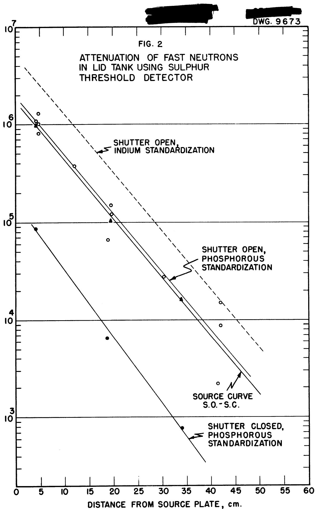  
FAST FLUX, nV

than those of phosphorous, the results reported using the indium standardization are probably too high. At present a known quantity of $\mathbf{P}^{32}$ obtained from the Isotopes Division is being processed for counting on the same apparatus to obtain an independent calibration.

# LIQUID METAL DUCT TESTS IN THE THERMAL COLUMN

R. H. Lewis*

C. E. Clifford

H. K. Marks

M. K. Hullings

Transmission of radiation through a liquid metal filled duct will be measured in a water tank above the thermal column on top of the X-10 pile. This experiment is designed primarily to determine the activation of sodium in a secondary coolant cycle for the case in which the liquid metal duct constitutes the primary neutron path from reactor to heat exchanger. Since this is of immediate interest to the KAPL submarine reactor project, that organization will supply the duct mock-up. Measurements may be made with the liquid metal duct empty as well as full, to check simple duct theory. In addition, the effect of varying the wall material from boron carbide to water will be investigated. Figures 3 and 4 show the duct and foil holders.

The source box and source box locator have been received from KAPL and are being installed in the tank. There are 24 X-10 slugs in the box. This secondary source is estimated to give approximately $10^{7}$ fast flux. Background measurements of the thermal and epi-cadmium flux are being taken at various positions in the tank. A pile monitor for the thermal flux entering the source box has been installed and is being calibrated. The tube in the monitor is a boron lined ion chamber. Plans for a platform to be built around the water tank have been completed and construction will begin September 18. The first leg of the duct is expected to arrive from KAPL by September 30.

# SHIELD CALCULATIONS

Calculations of Neutron Attenuation (F. H. Murray). Calculations for neutron attenuation in a shield composed of lead and water were made by the method outlined in ORNL 748. This method is based entirely on cross-section information, without the use of lid tank results. The calculated curves for

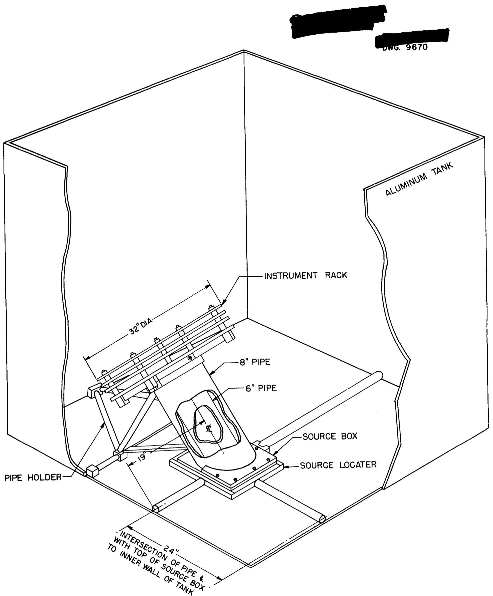  
FIG. 3

  
DWG. 9671

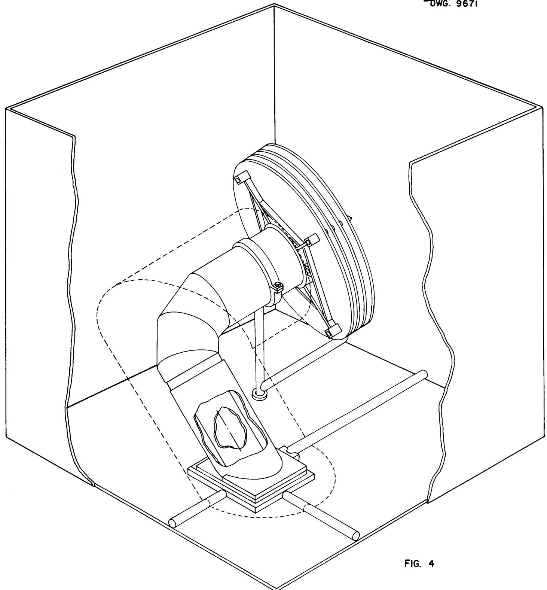  
FIG. 4

$17\%$ lead in water were found to agree quite well with the Hurwitz-corrected lid tank data.

The calculations also showed the curves for $17\%$ , $20\%$ , $30\%$ , and $40\%$ lead in water to be nearly coincident.

Analysis of Lid Tank Data (S. Podgor*). As a first step in the analysis of existing data on lead-water and iron-water systems, effective absorption cross sections for lead and iron are being deduced from the experimental attenuation curves. A preliminary value of 3.8 barns has been obtained for lead, but further geometric corrections will probably reduce this value somewhat.

Heat Generation in Shields (T. Welton). Some simple calculations have been made of the heat sources in the reflector and shield of a typical reactor. The general conclusion reached is that a steel reflector, of three inches thickness and cooled by reactor coolant, can be followed almost directly by thermal insulation and a hydrogenous layer without dissipating more than one percent of the reactor power in the hydrogenous layer. Detailed considerations are presented in a memorandum, ANP-5015, entitled Distribution of Heat Sources in Reflector and Shield.

Shield Calculations (K. Keyes). The methods of shield computation devised during the summer by members of the TAB are being checked and extended with the aim of placing at the disposal of design people a flexible and reliable recipe for calculating shield weights. It is hoped that such computations can also give effective guidance in some phases of the lid tank program.

Large Air Ducts in Shields (W. K. Ergen*). A memorandum (CF 50-8-1) was written while the TAB was in session. It was intended to summarize the presently available information on the shielding for the air cycle. The main difficulty is the decrease in shield efficiency due to the enormous air ducts. Shielding considerations cannot eliminate the air cycle because there are numerous ways (some of which were listed) to circumvent the shielding difficulties, but each of these ways would introduce undesirable features into the air cycle and make it less competitive.

Three theoretical approaches to the duct problem are available: the "distributed density approach," the "line of sight approach," and the following of neutron histories including those which involve scattering. All these approaches yield essentially lower limits for the shield weights, but these

*NEPA.

limits are different for these approaches and increase in the order given above. The first two approaches have been used at NEPA and gave widely different results, mainly because of different engineering assumptions, and only secondarily because of the difference in estimation of the influence of the ducts.

No practical way of gamma shielding the air cycle reactor has been proposed and it appears that the shield weights would be prohibitive, even if only partial gamma shielding at the air cycle reactor were attempted.

The necessary large air planes of the air cycle allow the use of $r^2$ attenuation, but this aggravates the problem of neutron-induced activity in the material surrounding the reactor.

# NEW SHIELD TEST FACILITY

W. M. Breazeale and J. L. Meem

The work on the building and pool is well underway. The contractor now expects to be out of the building by October 20. Laboratory employees will then move in and install the reactor, measuring equipment, etc. Instrument development for this facility is a joint effort between NEPA and ORNL.

A schedule (CF 50-9-16) has been drawn up covering the installation and initial "shake down" period totaling three and a half months. After this a mock-up of the first shield will be tested. Design and construction of this mock-up will be started when the ANP Shielding Board finishes the preliminary design of an aircraft shield (October 16).

The neutron camera discussed in the last quarterly report has been built and tested with $\mathbf{U}^{235}$ fission spectrum. The results are in accord with the Los Alamos experience. A coincidence circuit has been added to the proton recoil counter(2) which substantially reduced the background. The flux required for satisfactory operation is still large, about $10^4$ mv.

A large NaI-TlI crystal has been received by P. R. Bell and is being incorporated in a scintillation spectrometer which he will test. It is hoped that the resolution and sensitivity will be sufficient so that similar equipment

can be used in shielding work. A Compton recoil coincidence spectrometer has been built and bench tested. Inherently its resolution is not as good as the crystal spectrometer.

# CRITICAL EXPERIMENTS

A. D. Callihan, Physics Division  
J. F. Coneybear, NEPA

Construction of the Oak Ridge Area Critical Mass Laboratory, Building 9213, is now essentially complete. The building was turned over to the operating staff on August 21, 1950, and experimental equipment is now being installed. Operations will commence sometime in October unless the procurement of essential experimental materials, such as graphite, beryllium, and uranium, causes a delay.

Each assembly of fissionable and moderating material will be made in a supporting grid of square aluminum tubing. A sample section of sixteen tubes welded together has been received but preliminary tests showed that excessive warping was introduced in the welding. It appears necessary that the matrix be built with individual tubes held in place by an external frame. The required aluminum tubing has been received. Control and safety rods have been ordered and are scheduled for delivery early in October.

It has been agreed that among the early experiments will be an investigation of heavy metals as reactor reflectors. Specifications have been prepared of Type 310 stainless steel requirements in order to completely enclose the core by approximately eight inches of reflector.

A report, Initial Program of ANP Critical Experiments (NEPA-1522), was issued stating details of the first experiments and some of the techniques to be used.

# EXPERIMENTAL ENGINEERING

H. W. Savage, ANP Division

As mentioned in the last ANP Quarterly Report, a new group of the Laboratory has been organized to do experimental engineering work for the ANP program. It is the function of the Experimental Engineering Group to develop the technology of large-scale handling of the coolants of the aircraft reactor, and to make mock-ups and engineering studies of the proposed components. It is intended that the fundamental research and initial development on all such matters as fuel elements, materials for containing corrosive liquids, and heat transfer properties of materials will be done by the other groups of the project whose work is described elsewhere in this report. The Experimental Engineering Group will take the basic information and design suggestions and will reduce them to engineering practice for the ARE.

Present personnel with the Experimental Engineering Group number 19, of whom four are technicians and the balance professional. Several additional technicians are to be added in order to permit 24-hour operations when necessary. During the past three months, attention has been directed principally toward program definition, laboratory installation and personnel acquisition. However, a few liquid metal loops have already been operated.

Because a primary requirement of the ARE is to establish the compatibility of materials, the experimental program is being carefully coordinated with the research programs of the Metallurgy Group, the Heat Transfer Group, the activities of the ANP General Design Group, and the corresponding activities of NEPA. All of the present work is devoted to establishing the compatibility of various metals with sodium and lithium over a range of temperatures reaching somewhat above $1500^{\circ}\mathrm{F}$ .

The subjects which will be considered in the course of the development of the project are listed below. Many of these tests will be of actual components of the ARE.

1. Heat transfer--specific configurations (not fundamental).   
2. Hydrodynamics--free convection, pressure and velocity distribution, etc., header geometry, dynamic loads, etc.   
3. Chemistry--corrosion, erosion, solubility.

4. Mechanical elements - pumps, valves, seals, joints, etc.   
5. Purification--working fluids, system cleaning.   
6. General handling--filling, draining, warming up.   
7. Structures -- fuel elements, moderator, containers, shield, plumbing.   
8. Controls—reactor, system controls, etc.   
9. Cycle tests--small scale experiments on various cycles.   
10. Fabrication techniques--joining, assembling, maintenance and repair.   
11. Experimental techniques--sampling, test rig designs, etc.   
12. Instrumentation--temperature, pressure, flow, etc.   
13. Effects of component failures—leaks, fire hazard, sudden rupture.   
14. Femote handling--opening and sealing system, replacing components, handling fuel elements, etc.

The laboratory installation in Building 9201-3 is progressing. In addition to the necessary office space there is included an area in which a number of small experiments can be conducted, another area in which experiments involving extensive equipment can be conducted, an area for the disposal of used materials, particularly sodium and lithium, and an area in which the equipment can be serviced and small parts built. It is also expected that in an adjacent area will be placed the lithium isotope separation equipment being developed by the Isotope Separation Group.

In the experimental work a convection loop, Fig. 5, has been placed in the shops for fabrication from stainless steel Type 321, and a "Figure-Eight Loop," shown in Fig. 6, which will include a pump and heat exchanger, is being designed. Six convection harps and sodium loading and filtering equipment have been received from the Metallurgy Group and these, together with a number of others to be obtained shortly, will be subjected to 1000-hour continuous tests under specifications determined by the Metallurgy Group. The materials for the first six harps are (1) 347 stainless steel, (2) 304 stainless steel, (1) low carbon Fe, (1) nickel--grade A, and (1) L605 alloy, and the liquid metal involved will be sodium under the following conditions:

DWG. 9912 NOT CLASSIFIED

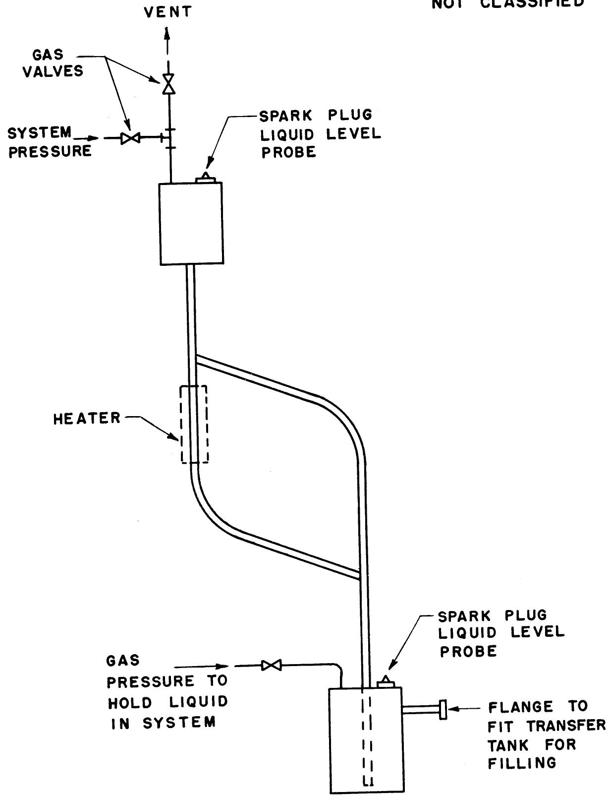  
FIGURE 5 CONVECTION LOOP

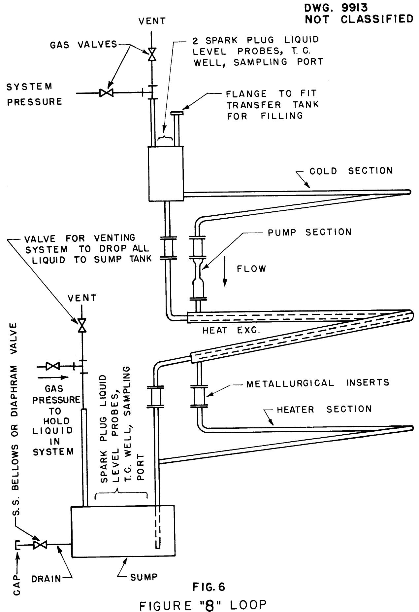

<table><tr><td>MATERIAL</td><td>TEMPERATURE
(°F)</td></tr><tr><td>1 - 347</td><td>1350</td></tr><tr><td>1 - 304</td><td>1350</td></tr><tr><td>1 - L605</td><td>1600</td></tr><tr><td>Low carbon Fe</td><td>1200</td></tr><tr><td>Nickel</td><td>1500</td></tr></table>

In order to ascertain the power requirements for this type of equipment it was decided to run one harp (Fig. 7) using sodium-potassium eutectic alloy, first uninsulated and then insulated. The results of these tests indicate that a temperature of approximately $900^{\circ}\mathrm{F}$ was readily obtained without insulation and approximately $1700^{\circ}\mathrm{F}$ with two types of standard rock wool insulation. A temperature difference of $180^{\circ}\mathrm{F}$ was observed in both types of systems.

An electromagnetic pump is being fabricated for use with these loops and the first of these is expected to be tested during the week of September 11. A mechanical pump development program is also underway. In this connection a centrifugal pump having vanes on the back of impeller has been designed and is being fabricated for tests.

Consideration is also being given to the following mock-ups of proposed AHE components, and fabrication of certain of these will begin in the next quarter. These are:

1. Sample fuel element bundle.   
2. Control mechanism.   
3. Hydraulic mock-up.   
4. Shield mock-up.   
5. Remote handling equipment.   
6. Fictorial mock-up.

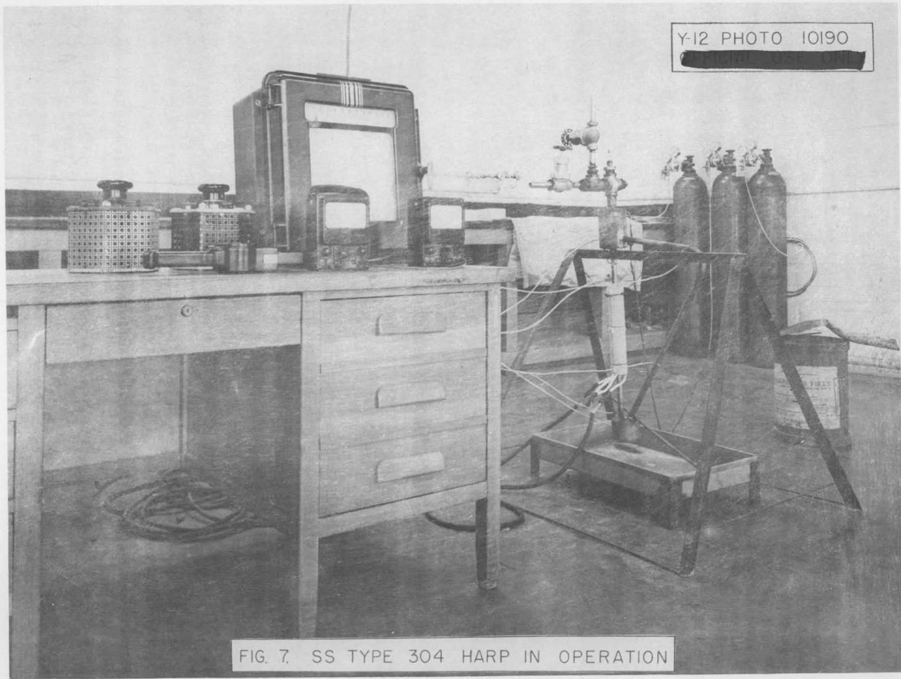

# HEAT TRANSFER

R. N. Lyon, Reactor Technology Division

# HEAT TRANSFER THEORY

H. F. Poppendiek

The Theoretical Heat Transfer Group of the liquid metals section has concentrated its efforts on the investigation of (1) forced convection heat transfer in the entrance region of flow systems,\* and (2) forced convection heat and momentum transfer in ducts whose cross sections are irregular or annular in a region beyond the influence of the entrance section. It is believed that if the theoretical solutions developed during the course of these investigations are complemented by fundamental experimental information, it will be possible, in a larger number of cases than previously, to predict forced convection heat transfer in nuclear reactors and their auxiliary heat exchangers. Special emphasis is being given to the specific liquid metal flow systems that are at present being considered for the ANP and ARE reactors.

Forced Convection Entrance Solutions. One phase of the forced convection entrance studies consists of a compilation of all pertinent laminar and turbulent flow heat transfer analyses that have appeared in the literature. These analyses pertain to flow between flat plates and in pipes. Although a series of laminar flow solutions for specific boundary conditions are available, only a few turbulent flow solutions were found in the literature.

Another phase of the forced convection entrance studies consists of the derivation of heat transfer solutions for systems that have not yet been investigated theoretically. A laminar flow solution has been derived for a system in which (1) a fluid is flowing uniformly and unidirectionally (slug flow) between two infinite parallel plates, (2) the initial fluid temperature is uniform, and (3) the fluid suddenly flows over surfaces which are emitting a uniform heat flux. A turbulent flow solution has been developed for a system in which (1) a fluid is flowing uniformly and unidirectionally between two infinite parallel plates, (2) the initial fluid temperature is uniform, (3) the fluid suddenly flows over surfaces which are at some new uniform temperature,

and (4) the eddy diffusivity is postulated to be a linear function of the distance from the duct wall (the eddy diffusivity becoming the molecular diffusivity at the duct wall). Another turbulent flow solution that has been derived pertains to a system in which (1) a velocity profile characterized by a laminar sublayer and a turbulent core flow over an infinite flat plate, (2) the laminar sublayer is postulated to have a uniform velocity, (3) the turbulent core is postulated to have a uniform velocity (magnitude different than the laminar sublayer velocity), (4) the eddy diffusivity in the turbulent core is postulated to be uniform, (5) the initial fluid temperature is uniform, and (6) the fluid suddenly flows over a surface which is emitting a uniform heat flux. Several additional turbulent flow solutions are in the process of being completed; these entrance solutions pertain to systems with somewhat more complex boundary conditions than those described above.

Another phase of the forced convection entrance studies consists of the determination of numerical solutions of specific flow systems. The system that is currently being investigated is one in which (1) a fluid flows from a large header into a pipe, thus initiating a hydrodynamic boundary layer, (2) the fluid is initially at some uniform temperature, (3) the pipe wall is emitting a uniform heat flux, and (4) the thermal and hydrodynamic boundary layers are characterized by turbulent flow. These numerical solutions can be used to study the limitations which are associated with some of the idealized theoretical solutions as well as to analyze complex heat transfer-fluid flow systems.

Heat and Momentum Transfer in Ducts Whose Cross Sections Are Irregular or Annular. One phase of the studies of heat and momentum transfer in ducts whose cross sections are irregular or annular consists of the compilation of all pertinent laminar flow solutions that appear in the literature. Some of the irregular cross sections that are being tabulated are the (1) square, (2) rectangle, (3) equilateral triangle, (4) right isosceles triangle, (5) ellipse, and (6) the rector of a circle.

Another phase of these studies consists of the determination of laminar and turbulent flow solutions which are now not available. A turbulent flow solution for established flow in a rectangular duct has been obtained with the cooperation of the Mathematics Panel. This solution was based on the postulate that the eddy diffusivity is proportional to the fluid velocity itself. A

study of the laminar velocity distribution has been initiated for the case where a fluid flows between an infinite number of solid cylinders of uniform diameter and uniform spacing; the fluid flow is parallel to the axes of the cylinders.

A third phase of these studies pertains to the investigation of the few sets of basic experimental velocity data for turbulent flow in irregular cross sections that are available in the literature for the purpose of attempting to generalize them much in the same manner as has been done for the case of flow in a pipe.

# EXPERIMENTAL HEAT TRANSFER EQUIPMENT

# C. P. Coughlen

During the past quarter the major components of the equipment for measuring molten metal heat transfer coefficients were assembled, equipped with Calrods and the system pickled with a strong hot mixture of nitric, hydrochloric and hydrofluoric acids. The equipment is designed to permit experimental determination of heat transfer coefficients under a wide variety of conditions including various shapes of conduit and various lengths of tube with both sodium and lithium.

Specifically, the following was accomplished:

1. A new, smaller catch tank was built and calibrated so that at $500^{\circ}\mathrm{F}$ volume will be known within $\pm 2.5\%$ , and probably within $\pm 1\%$ .   
2. The lithium melting tank was fabricated, equipped with heaters and a small filter, lagged, and pickled. It is now ready for charging.   
3. Large filters for purifying the circulating charge have been fabricated. It was found necessary to tack weld the micrometallic material to a supporting ring and then to seal around the filter by metal spraying.   
4. An automatic control to maintain a positive pressure of inert gas in the system was constructed and tested. It requires no electrical power for operation and appears to be extremely reliable.

5. The inert gas cleaning system was constructed. This includes a NaK scrubber for removing oxygen and water vapor, and a molten lithium scrubber for removing nitrogen.   
6. The flow measurement sections with orifices and gas pressure transmitters were constructed, calibrated with water and installed.   
7. Panel board construction in the shop was about $90\%$ completed.   
8. Lagging of the system with thermal insulation was about $70\%$ completed.   
9. The cooling water system was constructed and gave satisfactory results in tests.   
10. The liquid level indicators were successfully tested with NaK. These indicators are designed to start and stop an electric timer as the catch tank starts and completes filling. The liquid metal provides a low resistance shorted secondary for a transformer core welded into the piping. The primary coil is external to the piping. The increase in primary current at a constant impressed voltage is several times greater than that required to operate switching devices.   
11. Water circulation tests were made. Flow measurement sections operated successfully. It was during these tests that a smaller catch tank was found to be desirable and also that it was found necessary to relocate the pump so the full capacity of the sump could be used.   
12. Pure magnesium oxide was found to be effective in smothering lithium fires. Pyrene Gl also was found to be fairly effective. A serious difficulty with the magnesium oxide is that, because it is an excellent thermal insulator and has a low specific heat, it prevents rapid cooling of the molten lithium. For this reason, the smothered fire may reignite a considerable time after the first fire was extinguished, if the loose smothering coat opens at any point.   
13. A pure magnesium oxide plaster with water was found to harden into an adherent coating for pipe insulation and other more reactive construction materials. It will be tested with burning lithium to determine its protective ability.

Work required before the equipment can be filled and data obtained is as follows:

1. Top for the sump must be fabricated.   
2. Instrument lines must be installed.

3. Electrical lines for the heaters must be installed.   
4. Fabrication of the first test heat exchanger must be completed.   
5. The instrument panel must be completed and installed.   
6. The remaining thermal insulation must be applied.   
7. Protection for the concrete floor from the hot lithium must be arranged. This protection will probably take the form of a thick layer of sand or some other insulating powder, which the lithium will not penetrate deeply.

# BOILING LIQUID METALS

# W. S. Farmer

Equipment for the experimental determination of heat transfer to boiling liquid metals is now being designed. Because of the high temperature and moderate pressures at which heat can be conveyed in gaseous metals, and because of the large heat of vaporization of many metals, it is believed that this heat transmission method may be useful in solving some of the serious heat transfer problems in the design and development of nuclear reactors, particularly where useful power is to be extracted. It is not expected that boiling liquid metals will be used in the initial aircraft reactor, but they are being investigated as a possible long-range alternative.

The current design embodies a small tank, partly filled with the boiling liquid. Heat will be supplied to the liquid by a submerged one-inch tube through which hot molten sodium is pumped, or which is heated by an enclosed high frequency coil. Condensation will take place in the upper portion of the tank on a tube which will be cooled by liquid sodium or some other appropriate fluid. A baffle between the boiling and condensing sections of the tank will reduce the transport of entrained liquid into the condensing section.

A heat balance between the heating and cooling fluids will enable the heat fluxes to be calculated. The rate of condensate flow may also be measured. An attempt may be made to install thermocouples in the heat transfer tubes, but if this fails, the thermal resistance between the boiling liquid and the heating tube surface and the resistance between the condensing liquid and the cooling tube surface can be determined by subtracting the resistances of the tube and the sodium from the overall thermal resistance.

Tests will be performed over a range of pressures and temperature drops. The effect of varied submergence of the heating tube will also be examined. In initial tests, potassium will be used as the boiling metal, but in later tests mercury may be used as well.

# HIGH HEAT TRANSFER COEFFICIENTS

W. B. Harrison

Preliminary design has been made of a system for obtaining high coefficients of heat transfer to molten sodium. Characteristics of the design which are expected to influence favorably the magnitude of the coefficients are:

1. Small diameter flow channel in the test section.   
2. High velocity stream.   
3. Short heat length.

The main element of the test section is a circular copper disc, three inches in diameter and 1/8 in. thick. Around the periphery of the disc is soldered a cooling tube which will be maintained at almost constant temperature by a stream of water. The sodium stream flows at about 80 fps through a 1/32-in. diameter hole in the center of the disc. Thermocouples will be located at different radial positions on the disc and the sides will be insulated so as to insure radial heat flow. After steady state is attained, the measured radial temperature gradient in the disc will be used to compute the heat flux and temperature at the heat transfer surface. Sodium temperature will be measured above and below the test section.

Barring unforeseen difficulties, it is expected that coefficients of the order of 200,000 Btu/hr ft² °F (or better) will be attained.

# PUMP DEVELOPMENT FOR EXPERIMENTAL SYSTEMS

A. R. Frithsen*

Pump development for experimental heat transfer systems has been concentrated on a completely sealed rotary type. It is believed that this type shows

U.SAF

promise of considerably greater flexibility for experimental work than do other types. Hydraulic bearings have been tested with a sealed rotor motor in water, and it is now planned to build a sealed 10-gpm, 200-ft head pump with a turbine type impeller and a 3-hp motor.

Figure 8 is a photograph of a hydraulic bearing which has been cut along its longitudinal axis. This bearing is a modified type of journal bearing which derives its load carrying capacity from high pressure fluid introduced in small orifices into longitudinal slots facing the shaft. The shaft is held away from the surface of the bearing by the escaping fluid.

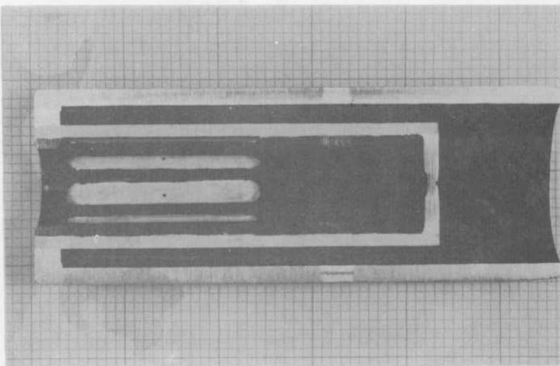  
FIG. 8   
Cross Section of Hydraulic Bearing

Figure 9 is a photograph of an assembled unmounted pump with the sealed rotor motor and with bearings at either end. This pump was tested in water without its impeller, and the shaft was found to rotate for several minutes after current to the motor was stopped, indicating exceptionally low friction in the bearings despite the use of a stainless steel shaft in stainless steel bearings. As was expected, the liquid around the motor armature caused rather large windage losses. Tests on the pumping characteristics of this test model with water gave results which were predicted by design calculation. Since the pressure produced was rather low, no attempt was made to operate the bearings from the pump outlet. Additional studies of the hydraulic bearings will be made to determine the best compromise between simple construction and efficient operation.

A hydraulic bearing pump for liquid metals at temperatures above $1000^{\circ}\mathrm{F}$ with a capacity of 10 gpm at 200 ft has been designed, and construction will start shortly. Since this high a head cannot be obtained efficiently at such a low flow rate using a centrifugal pump, a turbine impeller pump will be used. A 3-hp motor is already being fitted with a sealed rotor for use with this pump.

# PHYSICAL PROPERTY DETERMINATIONS

A. R. Frithsen*

During the past quarter equipment was designed, and construction started on equipment for the determination of the thermal conductivity of metals at temperatures up to $1800^{\circ}\mathrm{F}$ and for the determination of the specific heats of both liquids and solids in the same temperature range; the design of equipment for measuring the thermal diffusivity of high temperature liquids was begun; and preliminary arrangements were made with the Office of Air Research for assistance in setting up a program outside the Laboratory for measuring the physical properties of some of the materials of interest to the ANP. Thermal property information is urgently needed on a wide variety of materials for the design of the ANP reactor. The current dearth of information is due in part to the high temperatures involved, and in part to the unusual materials being considered.

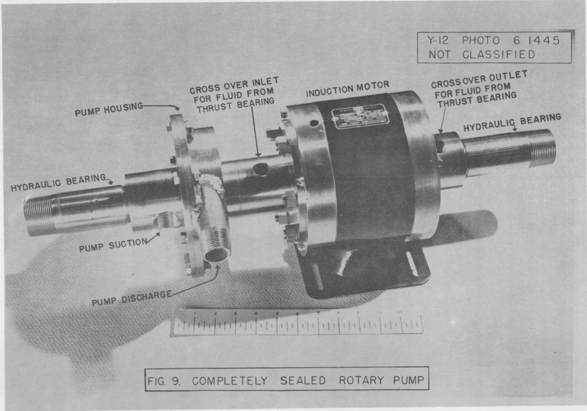

# LIQUID METALS HANDBOOK

R. N. Lyon

A Liquid Metals Handbook was published by the Government Printing Office and is now on sale by the Superintendent of Documents. The major editorial responsibility for the handbook has rested with ORNL. Because of the cooperation of other AEC and Navy installations this manual is the first complete compilation of liquid metal data and experience.

A proposal for effecting a continuously up to date, loose leaf liquid metals handbook was drawn up and preliminary negotiations for establishing such a handbook were made with the Technical Information Division, NEPA, and the Committee on the Basic Properties of Liquid Metals.

# LIQUID METALS IN-PILE EXPERIMENT

0. Sisman

The mechanical components of the test loop have been built and partially tested. Heating tests with the loop contained in stacks of graphite and concrete blocks indicate that heaters to reach the required $1800^{\circ}\mathrm{F}$ present no particular problem, but that a cooling jacket may be required to prevent overheating of the graphite and the concrete shield in the X-10 reactor.

Tests on the G. E. electromagnetic pump with lithium have begun, and equipment has been set up to calibrate the electromagnetic flowmeter with both lithium and sodium.

The first experiment planned for the in-pile equipment will be a study of Brehmsstrahlung from the $\beta$ rays produced by lithium. This experiment is expected to require only a short time, once the equipment is in place.

When the lithium studies have been completed, it is planned to study radiation damage and corrosion with the system refilled with sodium.

# METALLURGY AND MATERIALS

# E. C. Miller, Metallurgy Division

The principal efforts of the Metallurgy Division in the ANP Program are being directed toward a solution of the more immediate problems of the ARE. The corrosion testing work is now taking the form of an investigation of the resistance of materials to sodium at temperatures ranging from about $1200^{\circ}\mathrm{F}$ to $1800^{\circ}\mathrm{F}$ . However, since this redirection of effort has only occurred recently, relatively little information on corrosion in sodium is available in reportable form, and the work reported herein deals primarily with the earlier work with lithium and, to a lesser extent, sodium hydroxide and lead.

There is, fortunately, some evidence available from earlier work at other sites that the austenitic stainless steels, 304, 316, 310, and 347, possess good resistance to sodium and NaK up to the boiling points of the liquids. Because of their good mechanical properties at elevated temperatures, a special effort is being made to investigate types 310 and 316 stainless steels to determine their suitability for reactor construction from other standpoints in addition to the one of corrosion resistance. These include creep-rupture (both in and out of liquid metals environments), welding and fabrication into plumbing systems, and feasibility of incorporation into suitable fuel elements.

# STATIC CORROSION TESTING

This phase of the liquid metal corrosion testing program is designed to find suitable high temperature materials of construction for use in contact with various coolants. Sorting tests on lithium, bismuth, and lead have continued into this quarter, and these are being extended to cover sodium, NaK, and sodium hydroxide in the $600^{\circ}$ to $1000^{\circ}\mathrm{C}$ temperature range. A more extensive study of the corrosion behavior of the stainless steels in molten lithium is in progress.

Stainless Steels in Lithium. Stainless steel alloys were corrosion tested in $1000^{\circ}\mathrm{C}$ (1832°F) lithium for exposures of 4, 40, and 400 hours. The alloys tested included the ferritic chromium steels, 405, 430, and 446, and the austenitic grades 304, 310, 316, and 347.

Tests were conducted in the usual manner: sealing the test specimen with a controlled amount of lithium in an evacuated Armco iron capsule, heating to the desired temperature, and holding at temperature for the specified time. The ratio of test specimen surface to lithium volume varied between 0.5 and 0.7. All tests were run in triplicate.

The 4, 40, and 400 hour results are tabulated in Table 10a. Weight change $(\mathrm{mg} / \mathrm{cm}^2)$ data are reported as averages of three specimens tested. Penetration, as measured during metallographic examination, is reported on the photomicrographs. Analysis of the bath metal after test was made spectrographically.

To aid in understanding the nature and depth of attack and to determine the degree of selective leaching of constituents in the bath metal, an extensive metallographic examination of the 40-hour test specimens is in progress.

All specimens were cut diagonally and mounted with protection bars at the exposed surface to reduce edge rounding during polishing. Thickness measurements were taken at the center area to compare with similar measurements made on the specimens prior to test. Maximum corrosion depths reported on the photomicrographs refer to penetration measured beyond the exposed surface from one side of the specimen. Six fields were measured to obtain a representative value.

The following photomicrographs were prepared for study:

1. Etched transverse section of the specimen, showing surface condition and structure prior to testing.   
2. Unetched transverse section of corroded specimen showing condition of metal at the exposed surface. Examination of the specimen prior to etching was considered necessary because etching might destroy films or other corrosion effects at the interface.   
3. Transverse section of corroded specimen etched by alkaline potassium ferricyanide to bring out the carbide in the structure:   
4. Transverse section of corroded specimen etched with oxalic acid to resolve the grain structure.

The photomicrographs for each of the seven stainless alloys tested are shown in Figs. 10 through 16.

# TABLE 10a

# Corrosion Results of Stainless Steels in $1000^{\circ}\mathrm{C}$ Lithium

Specimen Size 1 in. $\times \frac{1}{2}$ in. $\times \frac{1}{2}$ in.

<table><tr><td>STAINLESS STEELS</td><td>NUMBER SAMPLES TESTED</td><td>TEST DURATION (Hours)</td><td>AVERAGE WEIGHT CHANGE IN mg/cm2</td><td>BATH ANALYSIS AFTER TEST (ppm)</td><td>REMARKS</td></tr><tr><td rowspan="3">304</td><td>3</td><td>4</td><td>-1.39</td><td rowspan="3">Fe 20-90 Ni 90-250 Cr N.D.</td><td rowspan="3">Moderate resistance; 40 hour micro shows inter-crystalline attack to a depth of two mils and some evidence of a phase transformation near the attacked grain boundary.</td></tr><tr><td>3</td><td>40</td><td>-5.62</td></tr><tr><td>3</td><td>400</td><td>-16.06</td></tr><tr><td rowspan="3">310</td><td>3</td><td>4</td><td>-4.08</td><td>Fe 20-70 Ni 140-250 Cr N.D.</td><td rowspan="3">Fair resistance; 40 hour micro shows heavy inter-crystalline attack to a depth of one mil.</td></tr><tr><td>3</td><td>40</td><td>-30-75</td><td rowspan="2">Fe 25-54 Ni 310-450 Cr N.D.</td></tr><tr><td>3</td><td>400</td><td>-64.76</td></tr><tr><td rowspan="3">316</td><td>3</td><td>4</td><td>-1.56</td><td rowspan="3">Fe 23-71 Ni 91-270 Cr N.D.</td><td rowspan="3">-- Moderate resistance; 40 hour micro shows inter-crystalline type attack to a depth of four mils and some evidence of a possible phase transformation near attacked grain boundary.</td></tr><tr><td>3</td><td>40</td><td>-6.70</td></tr><tr><td>3</td><td>400</td><td>-25.27</td></tr><tr><td rowspan="3">347</td><td>3</td><td>4</td><td>-1.97</td><td rowspan="3">Fe 25-60 Ni 170-200 Cr and Cb N.D.</td><td rowspan="3">-- Moderate resistance; micro shows intercrystalline attack to a depth of three mils.</td></tr><tr><td>3</td><td>40</td><td>-10.49</td></tr><tr><td>3</td><td>400</td><td>-27.24</td></tr><tr><td rowspan="3">405</td><td>3</td><td>4</td><td>-1.09</td><td rowspan="3">Fe 73-150 Cr N.D.</td><td rowspan="3">Good resistance; micro showed practically no intercrystalline atta K.</td></tr><tr><td>3</td><td>40</td><td>-3.44</td></tr><tr><td>3</td><td>400</td><td>-8.36</td></tr><tr><td rowspan="3">430</td><td>3</td><td>4</td><td>-1.26</td><td rowspan="3"></td><td rowspan="3">Good corrosion resistance; micro showed practical-ly no evidence of intercrystalline attack.</td></tr><tr><td>3</td><td>40</td><td>-4.13</td></tr><tr><td>3</td><td>400</td><td>-9.97</td></tr><tr><td rowspan="3">446</td><td>3</td><td>4</td><td>-3.24</td><td rowspan="3">Fe 50-150 Cr N.D.</td><td rowspan="3">-- Moderate resistance; micro showed decarburization and grain growth at exposed surface.</td></tr><tr><td>3</td><td>40</td><td>-9.79</td></tr><tr><td>3</td><td>400</td><td>-44.51</td></tr></table>

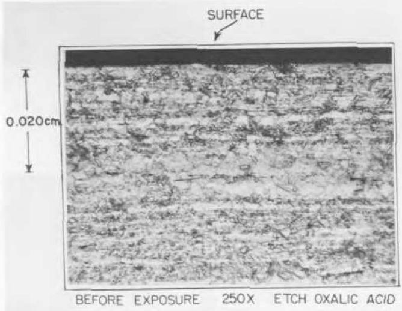

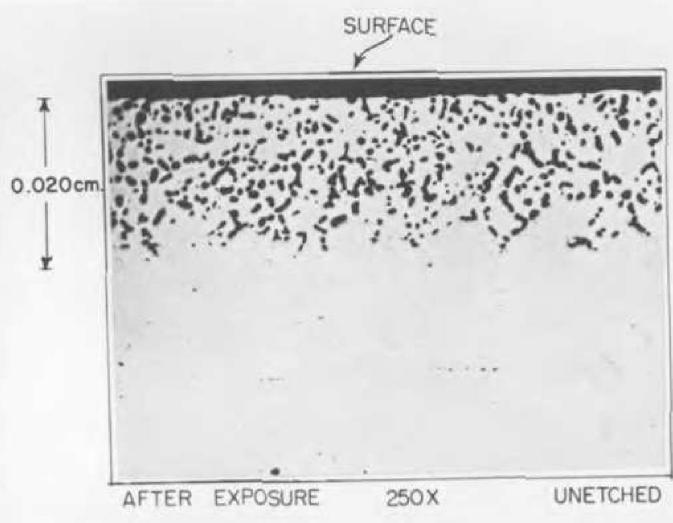

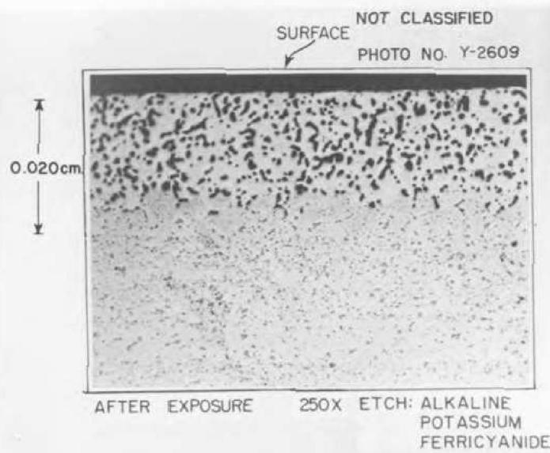

中  
CENTER OF SPECIMEN   
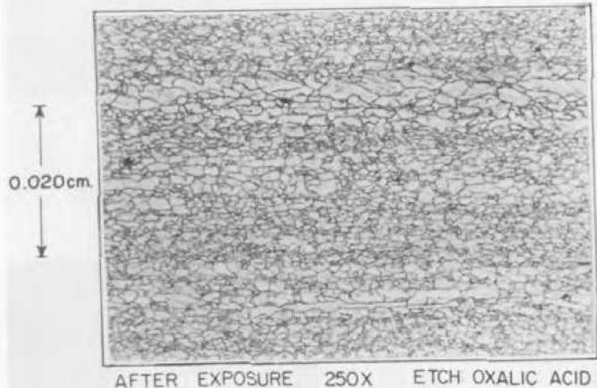  
SPECIMEN THICKNESS BEFORE TEST---0.572 cm.  
SPECIMEN THICKNESS AFTER TEST---0.569 cm. MAX. CORROSION DEPTH---0.018cm.

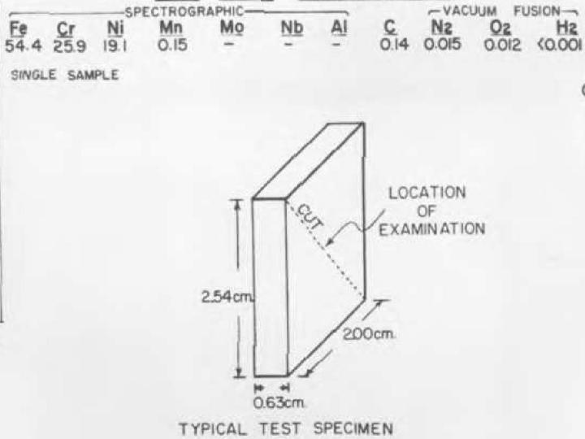  
PER CENT COMPOSITION

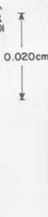

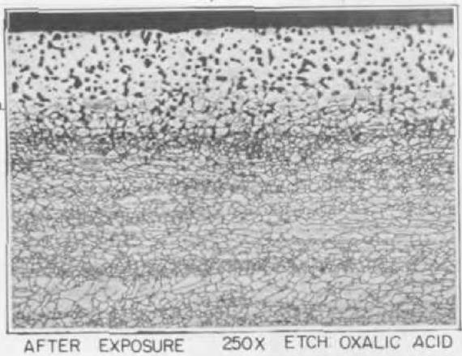  
Fig. 10

TYPE 310

STAINLESS STEEL EXPOSED TO MOLTEN LITHIUM

1000°C FOR FORTY HOURS

R.J. Gray

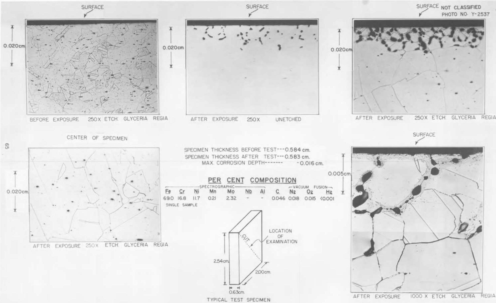  
TYPE 316

STAINLESS STEEL EXPOSED TO MOLTEN LITHIUM

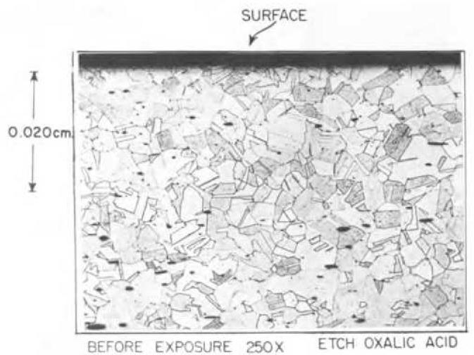

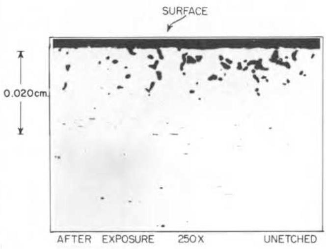

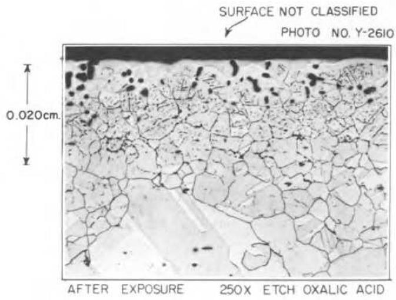

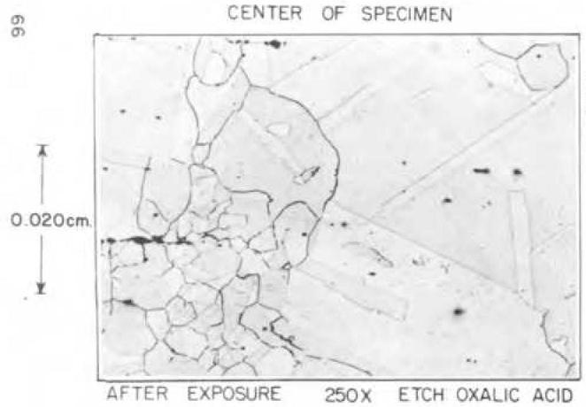

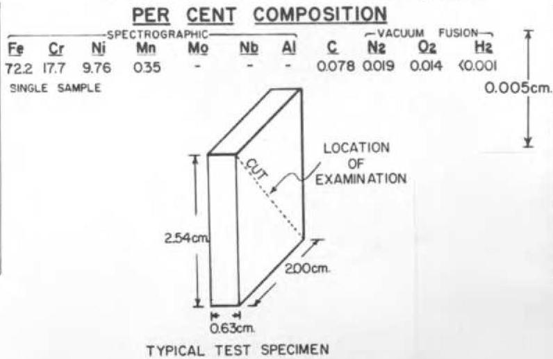  
SPECIMEN THICKNESS BEFORE TEST-0.585cm. SPECIMEN THICKNESS AFTER TEST-0.584cm MAX.CORROSION DEPTH 0.013cm

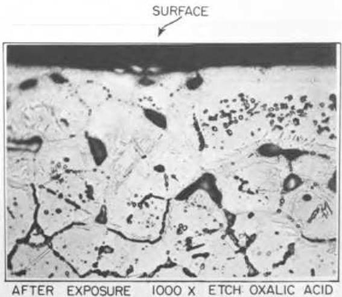  
Fig. 12

TYPE 304

STAINLESS STEEL EXPOSED TO MOLTEN LITHIUM

1000°C FOR FORTY HOURS

R.J. Gray

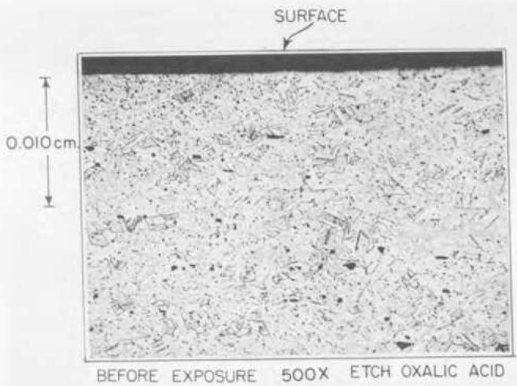

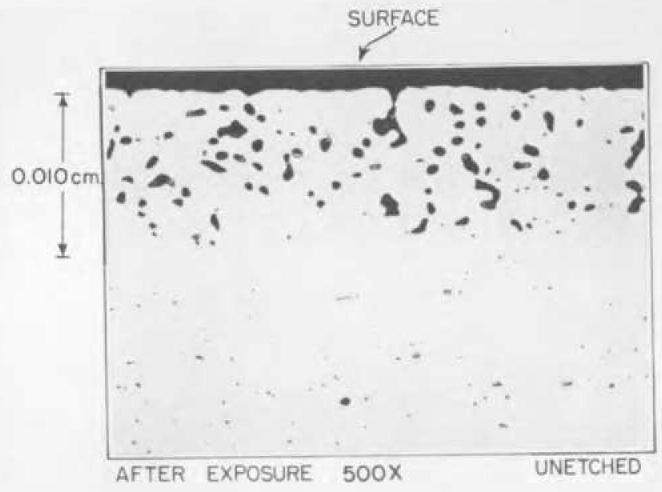

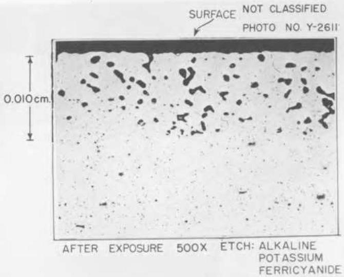

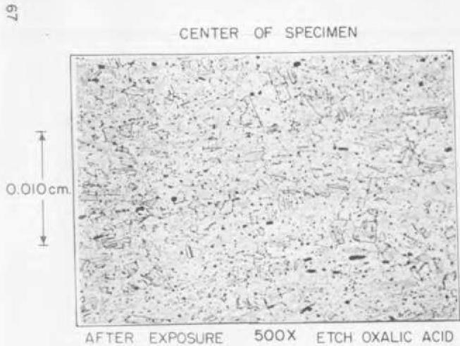  
SPECIMEN THICKNESS BEFORE TEST-0.585cm. SPECIMEN THICKNESS AFTER TEST-0.584cm MAX CORROSION DEPTH 0.011cm

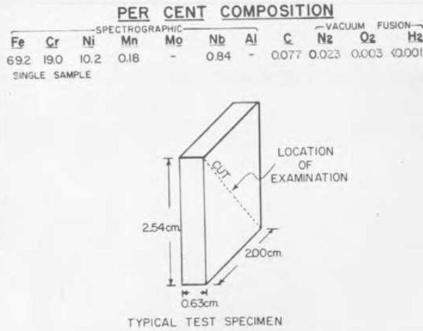

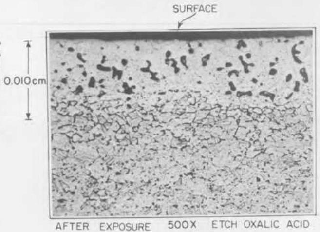  
Fig. 13

TYPE 347

STAINLESS STEEL EXPOSED TO MOLTEN LITHIUM

1000°C FOR FORTY HOURS

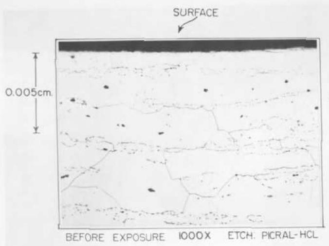

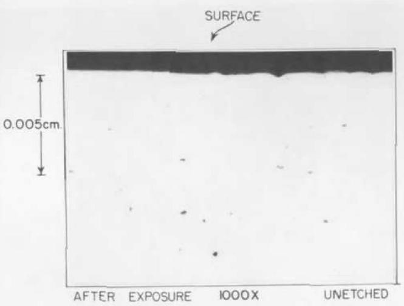

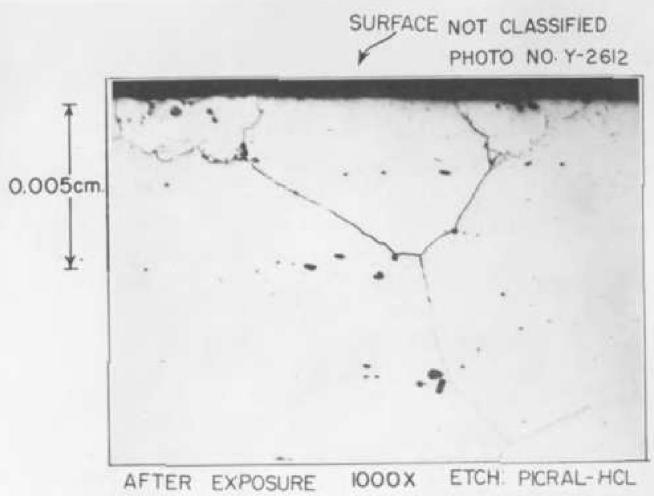

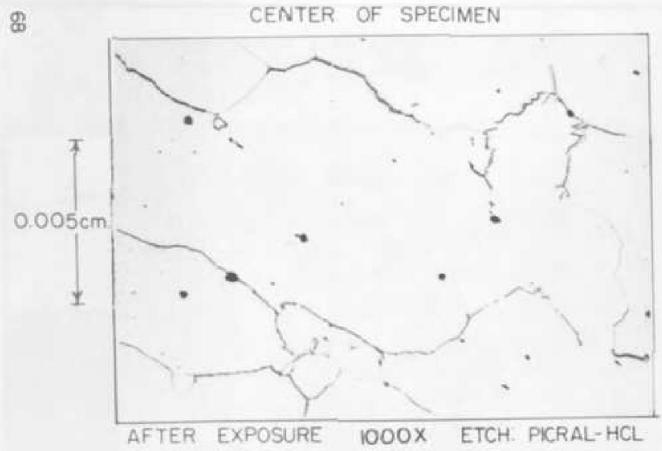

SPECIMEN THICKNESS BEFORE TEST---0.587cm. SPECIMEN THICKNESS AFTER TEST---0.586cm. PARTIAL SOLUTION- 0.003cm.

PER CENT COMPOSITION VACUUM FUSION Fe Cr Ni Mn Mo Nb Al C Ng Q2 Hg 86.3 13.3 - - - 0.42 0.078 0.018 0.003 0.001 SINGLE SAMPLE

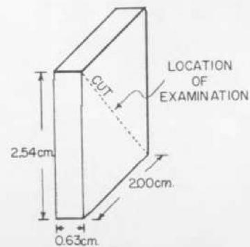  
TYPICAL TEST SPECIMEN

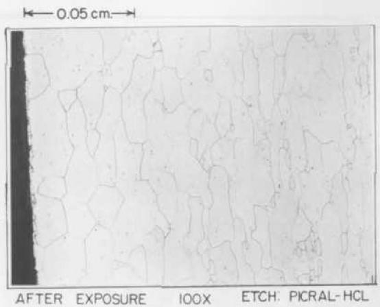  
TYPE 405

STAINLESS STEEL EXPOSED TO MOLTEN LITHIUM

1000°C FOR FORTY HOURS

R.J.Gray

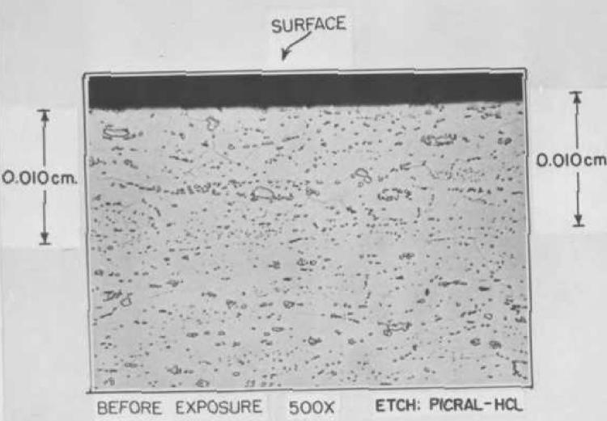  
69

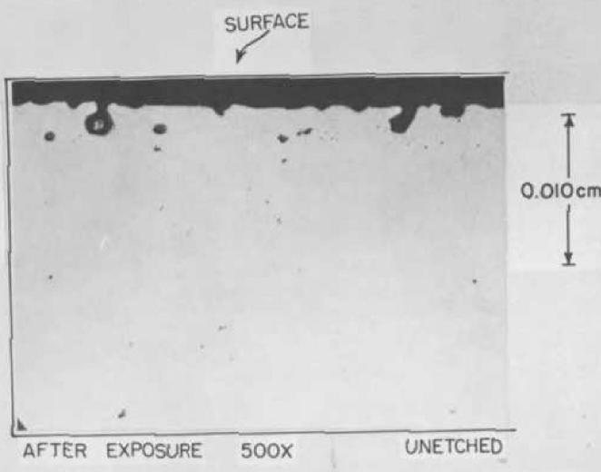

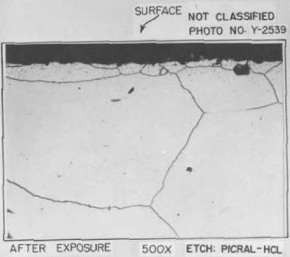

SPECIMEN THICKNESS BEFORE TEST----0.631 cm.

SPECIMEN THICKNESS AFTER TEST-0.627cm

PARTIAL SOLUTION- -0.015cm.

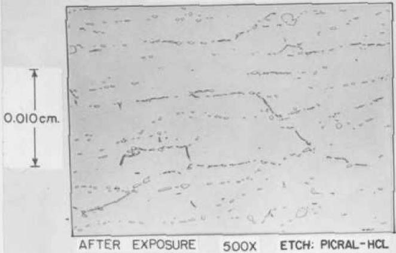  
CENTER OF SPECIMEN

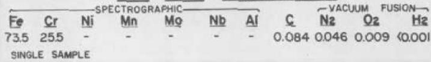  
PER CENT COMPOSITION

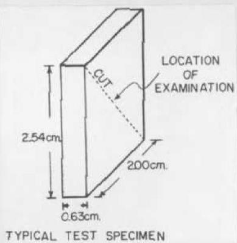

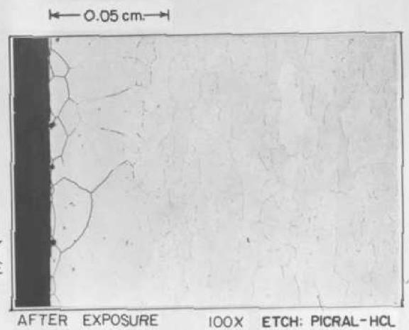  
TYPE 446

STAINLESS STEEL EXPOSED TO MOLTEN LITHIUM

1000°C FOR FORTY HOURS

R.J. Gray


  
SPECIMEN THICKNESS BEFORE TEST---0.577cm.  
SPECIMEN THICKNESS AFTER TEST---0.575cm.  
PARTIAL SOLUTION ----0.008cm.


  
TYPICAL TEST SPECIMEN

  
TYPE 430

STAINLESS STEEL EXPOSED TO MOLTEN LITHIUM

1000°C FOR FORTY HOURS

Although this investigation is incomplete, the ferritic iron-chromium alloys appear to be somewhat more resistant to $1000^{\circ}\mathrm{C}$ lithium than the austenitic alloys on short exposures; the available evidence, however, is not sufficient to permit recommendation of the ferritic alloys as container materials. The austenitic grades, 304, 310, 316, and 347, were all attacked intergranularly while the ferritic alloys showed little evidence of this type attack. The iron-chromium alloy, 446, showed a decarburized area accompanied by marked grain coarsening to a depth of 30 mils. There is evidence that a part of the structure immediately adjacent to the attacked grain boundaries in the 304, 316, and 347 grades has undergone a phase change, i.e., upon slow cooling a rim of ferrite surrounds the austenite grains, presumably as a result of removal of an austenite-former, perhaps carbon, by diffusion and solution in the lithium. Magnetic tests of these areas with a colloidal solution of iron verified the phase transformation from austenite to ferrite. Further metallographic work is in progress to check the presence of small quantities of sigma phase in the 310 stainless steel test specimens.

In an effort to learn something about the rate of attack of stainless steel by high temperature lithium, tests were performed at different exposure times (4, 40, and 400 hours). Micrographs showing the effect of time on the attack of each of the seven stainless alloys tested are presented in Figs. 17 through 21.

Special Tests. A few tests were made to determine the effect of presaturating the coolant with graphite to inhibit decarburization and intergranular corrosion attack of the stainless alloys.

Beneficial results were noted by addition of graphite to the coolant for 40-hour exposure test of stainless alloy grades of 310 and 316 under static conditions. Decarburization was minimized and the depth of intergranular attack was reduced by at least a third. Comparison of micrographs for specimens tested with and without the graphite addition are shown in Fig. 22.

Pure Metals in Lithium. During the past quarter, 40 and 400 hour tests were run on some of the metallic elements and high temperature alloys in $1000^{\circ}\mathrm{C}$ (1832°F) lithium. Results indicated, as did the four-hour tests completed last quarter, that iron, zirconium, and columbium show good resistance to lithium at $1000^{\circ}\mathrm{C}$ . It should be noted, however, that both the zirconium

  
FOUR HOURS

  
FORTY HOURS


  
EFFECT OF TIME ON LITHIUM CORROSION OF STAINLESS STEEL AT 1000°C   
Fig. 17


  
EFFECT OF TIME ON LITHIUM CORROSION OF STAINLESS STEEL AT 1000°C   
Fig.18

  
FOUR HOURS

  
FOrTY HOURS

  
FOUR HUNDRED HOURS


  
EFFECT OF TIME ON LITHIUM CORROSION OF STAINLESS STEEL AT 1000°C   
Fig. 19

  
FOUR HOURS

  
FORTY HOURS

  
FOUR HUNDRED HOURS

EFFECT OF TIME ON LITHIUM CORROSION OF STAINLESS STEEL AT 1000°C

NOT CLASSIFIED

PHOTO NO. Y-2608

DWG.9925 NOT CLASSIFIED


and columbium specimens gained slightly in weight due to film formation. Such films may be acting as protective coatings to prevent further corrosion. Pure nickel, one of the major ingredients in stainless steel alloys, was severely attacked. The uranium test which was made in a tantalum liner showed essentially no solubility in $1000^{\circ}\mathrm{C}$ lithium.

In the case of tungsten, molybdenum, and cobalt, a mass-transfer of metal from the test specimen to the iron capsule was noted. A similar, but more striking mass-transfer of metal was observed in a four hour silicon test in $1000^{\circ}\mathrm{C}$ lithium. Such a corrosion mechanism probably precludes the use of these elements in an environment of metallic iron in liquid metal piping systems. Because of interest in molybdenum as a structural reactor material, it is planned to determine the corrosion behavior of this metal in the absence of iron.

The 40- and 400-hour test results are tabulated along with the four-hour test results for reference in Table 10b.

Refractories in Lithium. Beryllium oxide and several of the commercial refractories that might find possible application in reactor construction were corrosion tested in $1000^{\circ}\mathrm{C}$ lithium. Four-hour exposure tests were run on beryllium oxide, aluminum oxide, chromite, cordierite, silicon carbide, quartz, boron carbide, alundum, zirconium oxide, magnesium oxide, clay-graphite, and graphite. As expected, all disintegrated except beryllium oxide which showed a moderate weight loss. A similar 100-hour exposure test showed the hot-pressed beryllium oxide grade to be more resistant to $1000^{\circ}\mathrm{C}$ lithium than the refractory grade.

Pure Metals in Lead. Preliminary screening tests on resistances to lead [at $1000^{\circ}\mathrm{C}$ (1832°F) for 40-hr exposure] of some of the metallic elements indicated: moderately good resistance of tungsten, zirconium, iron and tantalum; fair resistance of molybdenum, columbium, and beryllium; and poor resistance of titanium and nickel. Detailed results will be reported upon completion of X-ray and metallographic examination of the test specimens now in progress.

Materials in Sodium Hydroxide. Several pure metals, stainless steel alloys, and refractories were corrosion tested in $1000^{\circ}\mathrm{C}$ ( $1832^{\circ}\mathrm{F}$ ) sodium hydroxide with the hope of finding potential materials for use in reactor core

# TABLE 10b

# Corrosion Data on Pure Metals in $1000^{\circ}\mathrm{C}$ Lithium

Specimen Size 1 in. $\times \frac{1}{2}$ in. $\times \frac{1}{2}$ in.

Surface-Volume Ratio 0.6-1.0

<table><tr><td>METAL</td><td>NUMBER 
SAMPLES 
TESTED</td><td>TEST 
DURATION 
(Hours)</td><td>AVERAGE WEIGHT 
CHANGE 
(mg/cm2)</td><td>EQUIVALENT PENETRATION 
(mils)</td><td>BATH ANALYSIS 
AFTER TEST 
(ppm)</td><td>REMARKS</td></tr><tr><td>Extruded</td><td>3</td><td>4</td><td>-17.19</td><td>-3.68</td><td></td><td rowspan="3">Severely attacked; micro shows scattered non-continuous film and large voids. X ray identified only Be.</td></tr><tr><td>Beryllium</td><td>3</td><td>40</td><td>-67.82</td><td>-14.67</td><td>Fe 140-930 
Be 530-9600</td></tr><tr><td></td><td>3</td><td>450</td><td>-100.82</td><td>-21.78</td><td></td></tr><tr><td>Silicon</td><td>3</td><td>4</td><td>Completely lost</td><td></td><td></td><td>All three samples apparently dissolved and deposited on capsule wall.</td></tr><tr><td>Titanium</td><td>3</td><td>4</td><td>+3.81</td><td>+0.33</td><td></td><td rowspan="3">Continuous adherent film formed identified by X ray as TiN.</td></tr><tr><td></td><td>3</td><td>40</td><td>-1.46</td><td>-0.13</td><td>Fe 40-310 
Ti 43-760</td></tr><tr><td></td><td>2</td><td>400</td><td>+3.45</td><td>+0.30</td><td></td></tr><tr><td>Vanadium</td><td>1</td><td>4</td><td>-7.68</td><td>-0.50</td><td>Fe 37,000 
V N.D.</td><td>Continuous non-uniform film formed. X ray showed VN, V2N, V, and Fe4.</td></tr><tr><td>Chromium</td><td>1</td><td>4</td><td>-5.72</td><td>-0.31</td><td>Fe 8200 
CR N.D.</td><td>X ray showed only Cr.</td></tr><tr><td>Manganese</td><td>3</td><td>4</td><td></td><td></td><td></td><td>Only thin electrolytic strip tested which apparently dissolved.</td></tr><tr><td>Armco</td><td>3</td><td>4</td><td>-0.12</td><td>-0.01</td><td></td><td>--</td></tr><tr><td>Iron</td><td>3</td><td>40</td><td>-0.95</td><td>-0.05</td><td>Fe 53-1100</td><td rowspan="2">Good resistance; micro shows no noticeable attack.</td></tr><tr><td></td><td>3</td><td>400</td><td>-0.55</td><td>-0.03</td><td></td></tr><tr><td>Sintered</td><td>2</td><td>4</td><td>-5.00</td><td>-0.22</td><td></td><td rowspan="3">Non-uniform etching attack. X ray showed α Fe.</td></tr><tr><td>Cobalt</td><td>3</td><td>40</td><td>-23.35</td><td>-1.03</td><td>Fe 210-31,000 
Co 150-3100</td></tr><tr><td></td><td>3</td><td>450</td><td>-120.71</td><td>-5.36</td><td></td></tr><tr><td>&quot;A&quot;</td><td>3</td><td>4</td><td>-86.41</td><td>-3.82</td><td></td><td rowspan="2">Severe intercrystalline type attack; X ray showed only Ni.</td></tr><tr><td>Nickel</td><td>3</td><td>400</td><td>-580-97</td><td>-25.79</td><td></td></tr></table>

TABLE 10b (Cont' d)   

<table><tr><td>METAL</td><td>NUMBER 
SAMPLES 
TESTED</td><td>TEST 
DURATION 
(Hours)</td><td>AVERAGE WEIGHT 
CHANGE 
(mg/cm2)</td><td>EQUIVALENT PENETRATION 
(mils)</td><td>BATH ANALYSIS 
AFTER TEST 
(ppm)</td><td>REMARKS</td></tr><tr><td>Bureau Mines</td><td>5</td><td>4</td><td>+0.25</td><td>+0.02</td><td></td><td>Good resistance; all samples developed brassy tarnish identified by X ray as ZrN.</td></tr><tr><td>Zirconium</td><td>4</td><td>40</td><td>+1.09</td><td>+0.07</td><td>Fe 72-1300 
Zr ND-32</td><td></td></tr><tr><td></td><td>3</td><td>400</td><td>+3.04</td><td>+0.18</td><td></td><td></td></tr><tr><td>Sintered</td><td>3</td><td>4</td><td>-0.84</td><td>-0.04</td><td></td><td>Good resistance; micro showed continuous film not yet identified.</td></tr><tr><td>Columbium</td><td>2</td><td>40</td><td>+1.06</td><td>+0.05</td><td>Fe 2,600, 
Cb N.D.</td><td></td></tr><tr><td>Sintered</td><td>3</td><td>4</td><td>+0.23</td><td>+0.01</td><td></td><td>Good resistance on short term exposure; longer exposures showed Mo deposited on Fe capsule wall.</td></tr><tr><td>Molybdenum</td><td>3</td><td>40</td><td>-18.02</td><td>-0.69</td><td>Fe 91-1000 
Mo N.D.</td><td></td></tr><tr><td></td><td>3</td><td>400</td><td>-26.91</td><td>-1.04</td><td></td><td></td></tr><tr><td>Sintered</td><td>3</td><td>4</td><td>-1.29</td><td>-0.04</td><td></td><td>Good resistance; four-hour specimen showed continuous thin film identified as TaC.</td></tr><tr><td>Tantalum</td><td>3</td><td>40</td><td>-2.90</td><td>-0.07</td><td>Fe ND-1900, 
3300-8700 Ta</td><td></td></tr><tr><td></td><td>3</td><td>400</td><td>-7.04</td><td>-0.17</td><td></td><td></td></tr><tr><td>Sintered</td><td>3</td><td>4</td><td>-2.63</td><td>-0.05</td><td>Fe 900-1300 
W-N.D.</td><td>Excellent resistance on short exposure; tungsten deposited on capsule wall on longer exposures.</td></tr><tr><td>Tungsten</td><td>3</td><td>40</td><td>-32.69</td><td>-0.67</td><td></td><td></td></tr><tr><td></td><td>3</td><td>400</td><td>-175.36</td><td>-3.58</td><td></td><td></td></tr><tr><td>Uranium</td><td>1</td><td>4</td><td></td><td></td><td></td><td></td></tr><tr><td>1040 Steel</td><td>3</td><td>4</td><td>-2.08</td><td></td><td></td><td>Micro showed decarburization throughout entire % in. specimen.</td></tr><tr><td></td><td></td><td>450</td><td>-7.73</td><td></td><td></td><td></td></tr><tr><td>Haynes Ceramel LT-1</td><td>3</td><td>4</td><td>-120.81</td><td></td><td></td><td>Drastic attack; all samples exfoliated.</td></tr><tr><td>Haynes Alloy L605</td><td>3</td><td>4</td><td>-6.78</td><td></td><td></td><td>Micro showed areas leached out immediately below exposed surface.</td></tr><tr><td>Allegheny Alloy V-36</td><td>3</td><td>40</td><td>-44.02</td><td></td><td>Ni 680-1100 
Fe 470-1000 
Cb 260-1400 
Cr 59-270</td><td>Poor resistance.</td></tr><tr><td>Haynes Alloy N-155</td><td>3</td><td>450</td><td>-85.88</td><td></td><td></td><td></td></tr></table>

N.D. Analysed for but not detected.

construction. Forty-hour tests were run in the usual manner, with nickel substituted for Armco iron as the capsule container. With the exception of the container nickel, all the metallic materials tested were drastically attacked. Caustic attack on the stainless alloys was characterized by an exfoliation type attack.

The high fired grade of BeO appeared most resistant of the materials tested. Graphite showed moderate resistance on this short exposure.

In spite of the precautions exercised in canning, numerous capsule leaks were encountered during the heating cycle. These leaks are believed to be partly due to excessive internal pressure developed during decomposition of the contaminants sodium carbonate and water. The combined amount of water and sodium carbonate present in the commercial grade of hydroxide is approximately one percent by weight.

Materials in Sodium. Because of probable use of sodium as the coolant in the core circuit of the proposed ARE, major activity in the liquid metal corrosion program has been shifted to this coolant. Tests are in progress to investigate the resistance of various engineering materials to corrosion attack by sodium liquid and vapor at high temperatures (up to $1000^{\circ}\mathrm{C}$ ). Where commercially available, tubing is used as the test capsule; otherwise, metals like chromium, cobalt, silicon, tungsten, manganese, and vanadium, in a more readily available form, are being contained in a relatively inert capsule during testing.

Initial tests indicate that Armco iron will not serve as a satisfactory capsule material at temperatures above the boiling point because of leakage of sodium through the capsule bottom. Metallographic examination of the capsules after test showed the leaks apparently followed the path of stringers in the iron. Similar tests showed that nickel can be used satisfactorily to contain sodium at $1000^{\circ}\mathrm{C}$ .

Although this testing is in the preliminary stage, it appears from visual inspection that most of the materials tested, particularly the austenitic stainless steels, are more resistant to $1000^{\circ}\mathrm{C}$ sodium than to high temperature lithium. X-ray and metallographic examination of test specimens is in progress to obtain more exact information concerning the resistance of specific materials.

# DYNAMIC CORROSION TESTING

To avoid overlapping of effort it has been agreed that the ANP Experimental Engineering Group will carry out all engineering phases of the dynamic corrosion testing program previously planned by the Metallurgy Division's ANP Materials Group. The metallurgical control and examination of all these systems will remain the responsibility of the Materials Group. This includes the thermal convection loops (harps) and the forced circulation, or electromagnetic pump, corrosion test loops.

Thermal Convection Loops. The following harps have been fabricated in the ORNL Central Shops:

4 - Type 316 stainless steel   
4 - Type 316 stainless steel - extra heavy wall   
2 - Type 347 stainless steel   
2 - Type 304 stainless steel   
1 - Low carbon iron   
2 - Nickel, Grade "A"

The following are being fabricated by Philadelphia Pipe Bending Company:

1 - Shrouded harp - V-36 alloy - low carbon steel liner   
1 - Shrouded harp - Type 310 stainless - low carbon liner   
1 - V-36 alloy harp   
1 - L-605 alloy harp   
1 - Type 316 ELC stainless steel harp   
2 - Type 446 stainless harps

These will be delivered to the Experimental Engineering Group primarily for testing in sodium when completed. Some of the harps operating in lithium and sodium will be contained in pressure vessels which will be used as inert gas-containing dry boxes. Three such vessels have been received from Central Copper Works, Inc. These dry boxes are now being filled with electrical and thermocouple connections and vacuum and helium gas connections. The component parts for the type 316 stainless steel lithium purifier and the type 347

stainless steel sodium purifier have been finished by the shops and the purifiers are being assembled. The type 316 stainless steel purifier will be turned over to the Experimental Engineering Group. At present it is tentatively planned to use sodium in both purifiers. A gas purifier, in which helium will be bubbled through a packed column filled with molten lithium, is being made by the shops. At present it is planned to make a lithium purifier similar to the ones already completed, but using a ferritic iron-chromium stainless steel wherever the lithium will come in contact with the metal.

It is planned to heat the loops by passing large currents at low voltages through the hot leg of the loop. For the first stage of the work two large low voltage transformers now in the laboratory will be used and more suitable transformers are being procured. A type 3TO stainless steel loop filled with lead-bismuth eutectic was heated satisfactorily in this manner. A hot leg temperature of $1900^{\circ}\mathrm{F}$ was obtained and a temperature drop of $800^{\circ}\mathrm{F}$ was indicated by thermocouple readings. Due to the large temperature drop obtained on this preliminary run and because only about a $300^{\circ}\mathrm{F}$ temperature drop appears to be required, work has been stopped on a liquid metal cooling system for the harps. The harps will be run in the dry boxes without any insulation other than radiation shields on the hot leg.

# CREEP-BURTURE AND STRESS-CORROSION TESTS

Creep-rupture tests will be run, both in and out of liquid metal environments, to obtain engineering design data, as well as to determine the effects of liquid metals on the corrosion of stressed metals.

Two machines have been received for this work and are now being set up and tested. Four more are on order and should be received in October.

Negotiations are in progress to have a portion of the work performed in available equipment at other laboratories.

# ASSEMBLY OF FUEL ELEMENTS

Essential equipment required for fuel element development work is on order and should be received shortly.

Compatibility tests to obtain information concerning the chemical stability of binary systems of potential fuel element materials are in progress. Materials being studied include: molybdenum, chromium, stainless steel, uranium oxide, uranium-beryllium compound, beryllium, beryllium oxide, and possibly others.

Some of this information is available from work done at other sites and will be taken into account in carrying out the program.

In addition to the straight chemical compatibility and diffusion studies of binary systems, more complex laminated structures more nearly representative of the combinations to be expected in fuel elements will be fabricated and tested for thermal and metallurgical stability and structure integrity. This phase of the work will be carried out in our own laboratory and some phases will be subcontracted to activities specializing in certain types of fabrication. The development of fuel elements for the ARE will represent a major activity of the ANP Materials Group during the next few quarters.

# RADIATION DAMAGE

# D. S. Billington, Metallurgy Division

The ANP Radiation Damage Group has engaged the cooperation of the Cyclotron Group at Y-12, which, it is felt, will contribute a great deal of help in Radiation Damage problems. It is planned to begin a series of experiments to first study the feasibility of doing damage studies inside the dees of the 86 in. cyclotron; secondly, to work out fundamental correlations on property changes in metals; thirdly, set up "in-cyclotron" experiments that will make a study of the feasibility of certain fuel element assemblies proposed by the Design Group.

# Y-12 CYCLOTRON EXPERIMENTS

The first experiments to be conducted at Y-12 are on copper and 316 stainless steel. Copper was selected since it represents a good metal and should lead to more fundamental results for use in correlating reactor damage with cyclotron irradiation than the 316 stainless steel which was selected as a result of its probable use in the ARE reactor. In addition to the use of electrical resistivity as a criterion of damage before and after measurements will also be made on the hardness and X-ray diffraction patterns.

At the present, suitable samples have been designed to enable these measurements to be made and their fabrication is in progress. It is planned that these samples will be placed in a water-cooled probe with an aluminum window and bombarded with 20 Mev protons in the Y-12 cyclotron for the accelerator studies. The Hanford Reactors will be used for the reactor studies.

The North American Special Research Group has done a great deal of work on the correlation of radiation damage induced by accelerators with the damage caused by reactors. They have shown by a study of the change in electrical resistivity in graphite that an accelerator will produce the same type of damage as a Hanford type reactor but at a rate on the average 250 times as rapid. This is an experimental correlation and is consistent with the best known theory.

It should be pointed out, however, that this correlation applies only to graphite and only to the change in electrical resistivity. Furthermore, this correlation considers only the damage induced by displaced atoms. Also, this correlation is not based on "in-pile" or "in-cyclotron" measurements but is based on observations made after samples have been removed from the accelerator or reactor, i.e., displacement effects are the only ones that normally would be observed.

There is another type of radiation damage resulting from thermal spikes that normally would be observable only during operation of the reactor or accelerator. This phenomenon, which has not been studied very extensively either theoretically or experimentally, might be expected to affect such properties as creep and diffusion.

The point to be made as a result of the above considerations is that there are two general effects to be studied: (1) total exposure--displacement damage, and (2) flux--thermal spike damage. Most of the work up to the present has concerned itself with the first type.

# NORTH AMERICAN AVIATION, INC.: LITHIUM-IRON ACCELERATOR CORROSION EXPERIMENT

There are no data available from this experiment as yet, due to fabrication difficulties, but it is expected that a successful cyclotron run will be completed in the near future.

It appears desirable to have the North American group study the corrosion of stainless steel 316 by sodium at operating temperatures proposed for the ANP program.

# PURDUE UNIVERSITY

The Purdue group has been doing some preliminary studies preparatory to studying radiation effects in molybdenum and various stainless steels. They will make before and after measurements of hardness, electrical resistivity, crystal structure.

A bombardment of molybdenum for two hours with a $0.3\mu \mathrm{ah}$ beam of 10 Mev protons resulted in no noticeable change in hardness.

# IN-PILE CREEP

The in-pile creep apparatus described in the last ANP quarterly report (ORNL 768) proved operable in bench tests. A test on 304 stainless steel stressed to 21,000 pounds per square inch at $1200^{\circ}\mathrm{F}$ was started in the ORNL reactor in late August. Data from this test are still being taken, but no reliable results are expected from this first test because of temperature control difficulties. Unfortunately, a last minute shift in hole assignments caused the test to be placed in a stringer hole adjoining a cross core hole through which cooling air passes at a very high velocity. During pile shutdown and start-up periods the temperature of the apparatus varies too fast for the D.A.T. temperature control unit to respond. A modified apparatus embodying a supplemental temperature control system to maintain constant the ambient temperature of the furnace will be ready for insertion in the ORNL reactor within two weeks.

Modification of furnace design to permit test temperatures of 1500 to $1800^{\circ}\mathrm{F}$ are underway. The feasibility of using a creep specimen in the form of a cantilever beam with a loading weight within the apparatus itself is being investigated.

The new Solid State Building is nearing completion and occupancy ought to begin by November 1, 1950.

A new series of samples for before and after experiments is being prepared for irradiation at Hanford. It is hoped these samples can be irradiated at around $400^{\circ}\mathrm{C}$ . While this temperature is below contemplated operating temperatures, it should give some preliminary data on annealing characteristics.

# NUCLEAR MEASUREMENTS

# MECHANICAL VELOCITY SELECTOR

A. H. Snell, Physics Division

A chopper time-of-flight velocity selector for operation in the neutron energy region up to several thousand electron volts is in process of design and construction. The 80-channel counting equipment is being constructed. The chopper assembly design drawings are almost ready to be turned over to the shops.

# XENON CROSS-SECTION MEASUREMENTS

A. H. Snell, Physics Division

The possibility of extending the thermal xenon cross-section vs. energy measurements of Bernstein et al. to higher neutron energies is now under active consideration. Two possible methods are being studied:

1. Epi-cadmium deactivation at high flux. This experiment is the same as earlier thermal measurements of Eliot et al. and Sugarman et al. except that the sample would be encased in cadmium. With available flux it is not possible to detect deactivation if the Xe resonance integral is less than $10^{5}$ to $10^{6}$ barns.   
2. Danger coefficients in intermediate critical assemblies with kilocurie quantities of $\mathbf{Xe}^{135}$ . It is possible with kilocurie quantities of $\mathbf{Xe}^{135}$ to detect a change in reactivity of an intermediate assembly if the resonance integral is $10^4$ to $10^5$ barns. The possibility of extracting such large amounts of $\mathbf{Xe}^{135}$ from the MTR mock-up is being studied in the Chemistry Division.

# MOLYBDENUM CROSS-SECTION MEASUREMENTS

Columbia University

The electronic time-of-flight neutron velocity selector at Columbia University, under the direction of Professor W. W. Havens, is assisting the ANP program with a measurement of the total cross section of molybdenum in

the intermediate range. Special samples of molybdenum blocks have been furnished to Columbia, and the measurements are now in progress. The molybdenum cross section is of great interest for ANP reactors since this material not only has exceptional high temperature strength but also a relatively high resistance to corrosion by liquid metals. If molybdenum should be found to have a reasonably low intermediate absorption cross section, it might be possible to employ it in the aircraft reactor even though this metal does present great difficulties in fabrication.

# REACTOR PHYSICS

The ANP Physics group during the past quarter has undertaken detailed calculations of the neutron physics of the proposed ARE reactor. These include exploratory calculations by bare reactor theory as well as a large amount of multi-group calculations, including reflector effects. Since the reactor designs now contemplated are at least partially intermediate in neutron spectrum, the work has been forced in the direction of 13-group calculations similar to those carried out at KAPL. The following sections describe the classes of calculations now underway. The first numerical results in most of these programs should be forthcoming early in the next quarter. In addition to this work, there is also described below an investigation by the Mathematics Panel on the energy dependent pile equations.

# ARE CALCULATIONS

N. M. Smith, Reactor Technology Division

Multi-Group Calculations. Following the general method given in GE-RE-1 and KAPL-39, a thirteen-group numerical calculation has been set up for a spherical prototype reflected reactor and experience has been gained for all persons involved.

Several exploratory calculations have been undertaken. These have revealed the necessity of careful monitoring of all work in addition to the regular numerical checks. In the first place, some of the internal consistency checks are insensitive, and in the second place, a large amount of work (i.e. calculation of reactor constants and certain constant numerical factors used in the multi-group calculation) is done for which there exists no adequate check other than independent calculation by another person.

Thus, through the proverbial hard way, we have learned to duplicate all work which cannot be checked by the ordinary laws of mathematical consistency, conservation of neutrons, etc.

A single 13-group calculation requires from 8-12 computer days, depending on the number of iterations required.

Comparisons have been made between different reflectors with a core of $\mathrm{UO_2}$ fuel, BeO moderated, having stainless steel structure and Na-cooled. The reflectors studied were SS-347, as compared with the bare pile. Unfortunately, errors were discovered in the reactor constants but it appeared that the steel reflector was at least as good as the BeO reflector for thicknesses below three inches. The errors made were such as to increase the leakage from the core and thus enhance the effect of a reflector. Thus, the conclusion may still be tenable.

The result with the bare core indicated that the thin reflector used (2.5 in.) did not make sufficient change of reactivity to warrant much interest in reflector control rods other than for power control. Again, this conclusion must be reevaluated.

One difficulty with the GE method has been the fact that for each group the ratio of the average slowing down density to that leaving the group must be guessed. When the guess turns out to be poor new values must be used and the group recalculated. With the steel reflector, in particular, the guesses were wild and required several tries in many groups. Two modifications of the GE method have been suggested which will remove the necessity for this guessing. One involves the calculation of the first moment in the lethargy scale of the reactor cross sections and, although more accurate, will involve several times more work per group. The other method assumes a linear change of $q$ , the slowing down density, in the group interval and has promise of eliminating the guessing with but little additional work. The assumption of linearity of $q$ is implicit in the present GE method so that the latter new method should be at least as accurate.

IBM Calculation. Following certain suggestions of H. Hurwitz of KAPL, the GE multi-group method has been modified for IBM calculation. This work is in the set-up stage. About two-thirds of the preparatory work—wiring of boards, puncturing cards, etc.—has been completed. The first calculations are to take place soon, and after several checking tests and calculations, the machines will be used to carry out routine 13-group calculations.

Reactor Constants. Routine methods for the averaging of reactor constants have been devised. The macroscopic constants for the basic reactor materials (fuel, moderator, structure, coolant) have been computed. All that is required then for calculation of the constants for a specific core or reflector

are the volume fractions of the constituents. This method has proved convenient and time saving. It still remains necessary, however, to check by making two independent computations of the reactor constants.

The same constants serve for either the multi-group multi-region calculations (for the same volume fractions) or for bare homogeneous reactor calculations. A set of constants requires two computer days for double evaluation. A new set of constants obtained by changing only one of the constituents can be obtained in about 2/3 computer days. The IBM will be made eventually to compute reactor constants also.

Adjoint Calculations. The reactor adjoint functions, necessary for perturbation calculations, have been computed in one case on a trial basis.

It has been shown (Greuling) that the adjoint of the slowing down density is the same as that of the flux. The continuity and boundary conditions on the adjoint function, including that of the thermal flux, have been worked out and calculational procedures detailed.

Bare Reactor Calculations. It has been found expedient to make exploratory calculations using bare-reactor theory. Since no spatial integration is required, a numerical bare reactor calculation can be made and checked in less than two computer hours. Thus reactivity calculations pertaining to control considerations are quickly made. Such things as xenon reactivity, coefficients, (both of power and of temperature) nuclear temperature coefficients of reactivity, expansion temperature coefficients, uranium mass-reactivity coefficients, etc., are in process of calculation for the ANP Control Panel. The bare-reactor calculations will be followed by multi-region calculations as time permits and wherever necessary.

Multi-Group Calculations in Cylindrical Geometry. Most multi-group calculations are made assuming the reactor is spherical. Detailed calculations of lattice effects (whether a lattice of control rods or of fuel elements) requires a calculation in cylindrical geometry.

The multi-group equations have been rewritten and reduced to difference equations for use with cylindrical geometry. Some exploratory calculations have been made. The indications are that the difference equations will be somewhat more complicated than in the spherical case.

# ENERGY DEPENDENT PILE EQUATIONS

M. L. Nelson, Mathematics Panel

The problem discussed here is that of a two-region pile with cross sections which are strongly dependent on energy.

These equations can be written

$$
\begin{array}{l} - \nabla^ {2} \psi (r, u) + A (u) \psi (r, u) + B (u) \dot {\psi} (r, u) \\ = \lambda F (u) \int_ {0} ^ {\infty} \Sigma (v) \psi (r, v) d v - \nabla^ {2} \underline {{\phi}} (r, u) \tag {1} \\ + C (u) \bar {\Phi} (r, u) + D (u) \bar {\Phi} (r, u) = 0, \\ \end{array}
$$

with

$$
\begin{array}{l} \begin{array}{l} \psi (r, u) = \text {f l u x i n c o r e a t p o i n t w i t h p o s i t i o n v e c t o r} r \text {a n d} \\ \text {a t l e t h a r g y} u. \end{array} \\ \tilde {\phi} (r, u) = \text {f l u x i n r e f l e c t o r}. \\ \end{array}
$$

$$
\left. \begin{array}{l} A (u) \\ B (u) \\ F (u) \\ \Sigma (u) \\ C (u) \\ D (u) \end{array} \right\} \quad \text {S i m p l e c o m b i n a t i o n s o f t h e v a r i o u s c r o s s s e c t i o n s} \quad \text {a s f u n c t i o n s o f l e t h a r g y}.
$$

The dot denotes differentiation with respect to $u$ .

The boundary conditions are taken as follows:

$\psi, \Phi$ finite within their respective regions of definition

$$
\psi (I, u) = \tilde {\phi} (I, u) \tag {a}
$$

$$
d _ {1} (u) \frac {\partial \psi (I , u)}{\partial_ {n}} = \frac {d _ {2} (u) \partial \bar {\phi} (I , u)}{\partial_ {n}} \tag {b}
$$

$$
\phi (B, u) = 0, \tag {c}
$$

where $I$ is an arbitrary point on the interface between core and reflector, $B$ an arbitrary point on the outer boundary of the system, and the derivative in (c) is, of course, the normal derivative.

The method of separation of variables works quite smoothly for these equations until one tries to fit the boundary conditions at the interface, but it breaks down at this point. In particular, the bare pile equation can be integrated explicitly. However, if one does this, one finds that the solution of the above system is not unique. A closer examination of the physical significance of the terms of the first equation in (1) shows the following. The term involving the $u$ -derivative arises from the balance between neutrons flowing into a certain $u$ -level from below, and those flowing out of this level to higher values of $u$ . The fact that this term involves only a first derivative is due to the one-way flow of neutrons in $u$ (flow only to higher $u$ , or lower energy). However, if one assumes a lowest $u$ -value (taken as $u = 0$ ), this term expresses only a flow out of the level, hence this term should be absorbed into the second, or absorption, term. If one then writes down the modified equation for $u = 0$ , the whole system will have a unique solution. Even with this modification, the dependence of the diffusion coefficients $d_{1}$ , $d_{2}$ on $u$ still offers an apparently insuperable barrier to the application of the method of separation of variables. Hence it would seem that some scheme of reduction to a multi-group problem is necessary, together with a numerical, and presumably iterated solution of the resulting set of equations. Various proposed methods, in particular the so-called GE method, are being studied from the mathematical and computing standpoint.

# DESIGN OF THE AIRCRAFT REACTOR EXPERIMENT

# FUNDAMENTAL DESIGN PRINCIPLES

C. B. Ellis, ANP Division

During the past quarter the General Design Group of the Oak Ridge National Laboratory has completed a preliminary report on the principles of the design of the ARE. This has so far been given only local distribution, as document No. Y-F5-15 and Supplements I to VIII. This report is written almost wholly from the standpoint of a reactor for a supersonic aircraft. The tentative conclusions listed are that the reactor core diameter should be in the 3-ft range, that the primary coolant should be liquid sodium, that the fissionable material should probably be $\mathrm{UO}_2$ , that the moderator should probably be BeO, that the canning material for the fuel elements should be a variety of stainless steel, and that the maximum fuel element surface temperature in contact with the liquid metal should be not more than $1800^{\circ}\mathrm{F}$ . In this report it is pointed out that the most practical type of fuel element is not yet known. The probable merits and difficulties of eight general varieties are discussed: loose powder pins, loose-sleeve moderator blocks, sandwich sheets, outside-coated coolant tubes, bonded sleeve moderator blocks, inside-coated pins, solid-filled pins, and liquid-filled pins. No final choice of the variety most suitable for a supersonic aircraft reactor can be made until a large amount of fuel element research is finished.

Also during this quarter, the NEPA Division of the Fairchild Engine and Airplane Corporation has completed a preliminary study of an overall design for a liquid-metal-cooled supersonic aircraft. This design is given the NEPA distinguishing number IL-12 and is described in the preliminary report NEPA-1520. The general appearance of the reactor shown in this report is very similar to the ORNL arrangement discussed in Y-F5-15.

During the latter part of the quarter, a decision was made to build the ARE as a prototype for a subsonic aircraft reactor, the so-called "War Model," rather than a prototype for a supersonic power source. This change makes very little difference in the features of the design listed above except to permit the lowering of the desired fuel element wall temperature from $1800^{\circ}\mathrm{F}$ to $1500^{\circ}\mathrm{F}$ . Another advantage of this change, which is yet to be felt, is that the fuel element research no longer needs to immediately result in an element capable of ultra-high power densities.

Although the two reports mentioned above are essentially in agreement on the reactor core, the NEPA design employs a divided shield whereas the ORNL design postulates a unit shield. To develop the theoretical principles on which engineering components can most advantageously be located within a unit shield and to compare the advantages of unit and divided shields, a joint ORNL-NEPA Shielding Board has been setup to begin operation September 6, 1950. This board contains both theoretical and experimental shielding specialists as well as mechanical engineers from ORNL and NEPA. The mission of this Shielding Board is to produce by October 16, 1950, fully engineered designs for both unit and divided shields in as low a gross weight as current knowledge will permit, together with an evaluation of the operational problems resulting from the use of the divided shield.

Another block of fundamental design principles which has not yet been thoroughly explored is the question of reactor controls. To investigate this field a similar joint ORNL-NEPA effort, the Control Group, has been set underway. From the work of this joint group, there is expected to arise the first version of a complete control system which will be adequate for the airplane reactor and for the ARE, from both nuclear and mechanical engineering standpoints.

Aside from the large blocks of analysis and research listed above and described in the previous section of this report, the most outstanding question of the ARE which has not yet been attacked is probably the means to avoid self-welding of the moving parts of the reactor. Research on this subject will begin shortly in the Metallurgy Division as well as will design studies to see how far the use of moving parts with contact can be eliminated from the reactor.

# DETAILED DESIGN AND CONSTRUCTION

W. P. Berggren, ANP Division

R. W. Schroeder

During the past quarter an ARE group has been set up. This group is starting from the basis of the fundamental design principles discussed in the preceding section and continuing to a completed design for the ARE reactor and all of its auxiliaries and its housing in as rapid a fashion as the arrival of research answers from the laboratory groups will permit. A preliminary

design of the building to house the ARE has now been drawn up. Problems of the remote handling equipment to permit disassembly and inspection of radioactive components are being studied. Tentative detailed drawings have been prepared for several reactor core geometries and several possible arrangements of equipment within a unit shield. These studies have been given to the Experimental Engineering Group for mock-up tests and to the Shielding Board for theoretical analysis.

As discussed in the preceding section, very few of the specifications of the ARE can yet be designed with extreme firmness since the basic research is not yet in a finished state. However, a tentative detailed design is proceeding on the assumption of the following specifications:

# TABLE 11

# Aircraft Reactor Specifications

Primary coolant

Sodium

Maximum fuel element surface temperature

1500°F

Average temperature of coolant emerging from reactor core

1400°F

Active lattice shape

Square cylinder, 3 ft diameter

Fuel element

Pins containing $\mathbf{U}\mathbf{O}_{2}$ and BeO powder

Fuel pin size

Approximately 0.1 in. $\times 3$ in. with 010 in. wall

Number of fuel pins

Roughly 100,000

Alternative detailed designs are being drawn up to cover several possibilities on which a decision has not yet been made. These include sodium vs. natural lithium as a secondary coolant, BeO vs. stainless steel as a reflector, and a single primary pump as compared with several smaller pumps to be imbedded in the unit shield. Figure 23 illustrates the tentative general core arrangement now under investigation.


FIG. 23

A.R.E.TUBULINEACTCAL PROPOSAL

DRAWN: BRIEF 8-8-50

OWG.NO. x=57-10

$\therefore m - 1 \neq  0$ ;

# PART II. LONGER RANGE ACTIVITIES

# INTRODUCTION

As described in Part I, the major part of the research and design work for the ANP program now underway at the Oak Ridge National Laboratory applies directly to the proposed fixed-fuel liquid-metal-cooled ARE reactor. However, the Laboratory and its contractors are carrying on a considerable amount of research along alternate lines which might lead to aircraft reactors even superior to this type, provided certain fundamental difficulties could be surmounted. These studies include investigation of alternate cycles employing: (a) vapor coolants with compressor jets, (b) circulating fuel homogeneous reactors, (c) fixed-fuel circulating-moderator reactors, and (d) separated lithium-7 isotopes as a primary coolant. The research and analysis underway which attempts to solve the crucial problems of each of these potential systems is described in the following sections.

# COMPRESSOR-JET CYCLES

C. Starr, North American Aviation, Inc.

The work accomplished by North American Aviation, Inc. during this period included the development and application of generalized procedures relative to the analysis of power cycles for possible utilization in a nuclear power aircraft. The results of the analysis to date indicate that the compressor-jet type power plant may be superior to the more conventional turbojet on the basis of specific thrust developed and reactor power required. However, the analysis is not yet complete, in that not all relevant parameters have been considered quantitatively. This is now being done in connection with the compressor-jet cycle employing a mercury-vapor turbine to drive the air compressor. The results obtained to date are not too encouraging due to the tremendous bulk and weight introduced by the heat exchangers and the weight of the working fluid (mercury). However, these results are quite preliminary, and it is hoped that further study will result in a more favorable configuration and arrangement of power plant for this particular cycle.

Quantitative studies similar to the mercury compressor-jet cycle are being carried out for a compressor-jet cycle using a sodium vapor turbine as the compressor drive, with consequent higher reactor temperature. Being of lower priority than the mercury unit, these studies have not progressed to the point where the results are significant.

# CIRCULATING FUEL REACTORS

In the field of circulating fuel reactors, two efforts are underway. The Atomic Energy Division of the H. K. Ferguson Company is continuing an analysis of circulating fuel reactor systems in general, which will place particular emphasis on an overall integrated design for a modified B-52 aircraft whose homogeneous reactor operates on a suspension of uranium-bearing particles in sodium hydroxide. On the other hand, the Chemical Research Divisions of the Laboratory are searching experimentally for suitable high-temperature liquid systems which will contain uranium-bearing material either in solution or suspension. These two efforts are discussed in the following sections.

# CIRCULATING FUEL REACTOR ANALYSIS

K. Cohen, H. K. Ferguson Co., Atomic Energy Division

The circulating fuel reactors which are now being considered are of two general types as follows:

1. Circulating fuel reactors in which the fuel has no moderating properties. The moderator, if any, is present as a separate liquid or solid phase.   
2. Circulating fuel-moderator reactors. In this case the fuel mixture has moderating properties and the interior of the reactor has no structures other than control rods.

A number of other possibilities have been given some brief consideration, but the two general types mentioned above appear to have the most promise.

The reason for consideration of circulating fuel reactors is the advantage of eliminating the problem of fuel element design. This at once dispenses with the most difficult set of problems now facing the airplane reactor designers. Other advantages will be seen when we consider a specific design.

Of the many liquid fuel reactor designs which have been considered, the following three possibilities have survived the initial screening. Although the other possibilities have not been completely discarded, it is felt that a successful airplane reactor can be developed from one of these bases.

1. Circulating fuel consisting of a solution of uranium in bismuth. This system has two limitations. First the solubility of uranium in bismuth appears to be somewhat limited except at very high temperature. This means that either the reactor must be very large in order to contain sufficient uranium, or the temperature must be high enough at all points in the liquid fuel circuit to insure the necessary solubility. In the second place, this fuel has no moderating properties and moderation must be supplied by structures within the reactor. Since these structures occupy a large fraction of the reactor volume, the problem of limited solubility of uranium in bismuth becomes even more intense. However, the probable resistance of such a solution to radiation damage makes this possibility interesting in spite of these limitations.   
2. A circulating-fuel-moderator consisting of the three compounds $\mathbf{U}\mathbf{F}_{4}$ , NaF, $\mathbf{E}\mathbf{e}\mathbf{F}_{2}$ . Although this system has not received very much experimental study, there seems to be a good possibility that a liquid mixture exists in a usable concentration range. The chemical stability of fluorides in general is well known.   
3. A circulating fuel-moderator consisting of a solution or stable suspension of some uranium salt in sodium hydroxide. This system appears to have the greatest potential advantages. Preliminary work on preparation of the sodium hydroxide-uranium mixture has given encouraging results, and experiments are now being pushed to explore this possibility more thoroughly.

# CIRCULATING FUEL REACTOR FOR SUPersonic PLANE

A reactor is suggested with a homogeneous core consisting of a solution or stable suspension of a uranium compound in sodium hydroxide. The core would be a sphere about 2 ft 6 in. in diameter surrounded by a 4-in. beryllium reflector and a thermal shield to absorb leakage neutron heat. The fission heat is removed by circulating the homogeneous fluid through a heat exchanger which is located within the shield and rather close to the core. An expansion vessel containing helium is an integral part of the heat exchanger and provides for expansion and contraction of the fuel under changes in temperature. The heat exchanger is cooled by a stream of sodium hydroxide which is conducted directly to the propulsion unit radiators. The reactor is designed to deliver sodium hydroxide at about $1600^{\circ}\mathrm{F}$ to the radiators with a total heat output of about 500 mw.

The concentration of uranium in the fluid will be of the order of one percent by weight, and the total uranium hold-up in the reactor system, including the hold-up in external lines and heat exchanger, will not exceed about 100 pounds. This liquid has physical properties rather similar to water at atmospheric temperatures and heat transfer coefficients in the range from 5,000 to 10,000 are not difficult to obtain.

Although sodium hydroxide is a rather corrosive fluid, there is considerable commercial experience in handling it up to around $1000^{\circ}\mathrm{F}$ . Some satisfactory experience has been obtained at temperatures higher than this using nickel and Inconel. The development program on the circulating fuel should, of course, include careful study to determine the proper metals for use in construction. In view of the low vapor pressure of sodium hydroxide at the temperatures expected in the reactor, no great problem is anticipated in the design of the reactor container.

The rather large variation in density of the circulating fuel with changes in temperature introduces a corresponding variation in reactivity which must be taken up by control rods. The extent of the variable reactivity, of course, depends on the design range of temperature which is to be encountered in the core. Since the temperature coefficient of reactivity is large and negative, it exerts a desirable stabilizing effect on fluctuations in temperature. Thus, although the variation in reactivity either requires control of a large fraction of reactivity or restriction to a narrow ray of temperatures in the reactor, the control of slight fluctuations in reactivity under operating conditions should be fairly simple. Since a fraction (approximately half) of the delayed neutrons will be emitted in the circuit outside the core, the amount of excess reactivity which can be present before reaching prompt critical will be about $.3\%$ . This does not seem to lead to inordinate difficulties in design of the control system.

A detailed report on this reactor as well as an integrated design for its use in a modified B-52 airplane will be presented during the next quarter.

# CHEMISTRY OF LIQUID FUEL SYSTEMS

# W. R. Grimes, Materials Chemistry Division

It is recognized that a reactor with a liquid fuel which could be circulated through a heat exchanger would have a number of advantages over solid

fuel models. The advantages would, moreover, be materially increased if the liquid fuel were self-modering. It seems likely that the liquid-fuel reactor would be among the most promising of the various designs if a satisfactory fuel system were available. During the past quarter studies have been initiated to ascertain whether uranium-bearing fused salt mixtures were of possible value in this connection.

General Characteristics of Fuel System. The projected high temperature reactor imposes specific and stringent restrictions on the physical and chemical properties of the fuel system. The fuel must contain a considerable amount of uranium and must consist of elements of low neutron cross section. The fuel should, if possible, contain a sufficient amount of a moderator element. The system must be thermally stable to at least $1800^{\circ}\mathrm{F}$ and must possess a low vapor pressure (preferably less than one atmosphere) at this temperature. On cooling to about $1100^{\circ}\mathrm{F}$ in the heat exchanger, the fuel must undergo no phase changes and for reasonable ease in startup it should be molten at much lower temperatures; it is hoped that melting points below $400^{\circ}\mathrm{C}$ can be obtained. The system must form a melt of low viscosity, must be a suitable conductor of heat, and must be relatively non-corrosive to some otherwise suitable structural material. In addition, the system must be chemically stable in the intense radiation field.

The restrictions suggested above, while they do not necessarily eliminate from consideration fuel systems composed of fused salts, limit severely the number of individual salts which need consideration.

Choice of Uranium Compound. No known compound of uranium has thermal properties which approximate those required. It will, accordingly, be necessary to employ some other salt or mixture of salts as the vehicle for the uranium. Table 12 lists melting and boiling points of known uranium compounds. It may be observed that only a few of these materials, notably $\mathrm{UO}_2$ , the alkali uranates, $\mathrm{UF}_4$ , and the uranium trihalides, are stable at the temperatures required. This list is further reduced by the unfavorable nuclear properties of all the halogens except fluorine.

Choice of Vehicle for Self-Moderating Systems. Beryllium or lithium would be of some help insofar as moderation of the fuel is concerned. It appears, however, that hydrogen-bearing systems alone will be completely selfmoderating. Examination of the literature reveals that sodium and potassium

hydroxides are the only hydrogen-bearing compounds which are thermally stable at the temperatures of interest. Sodium hydroxide is to be preferred by virtue of its nuclear properties.

Since the physical properties of this compound appear to be satisfactory for the purpose, a suitable solution or suspension of a uranium compound in this material might prove of considerable value. The results of experiments performed to date are described below.

TABLE 12   
Uranium Compounds   

<table><tr><td>COMPOUND</td><td>MELTING POINT (°C)</td><td>BOILING POINT (°C)</td></tr><tr><td>\( UO_2 \)</td><td>2700</td><td>-</td></tr><tr><td>\( UO_3 \)</td><td>-</td><td>dec. 650</td></tr><tr><td>\( U_3O_8 \)</td><td>-</td><td>dec. 1700</td></tr><tr><td>\( UF_3 \)</td><td>1425</td><td>2300</td></tr><tr><td>\( UF_4 \)</td><td>1036</td><td>1417</td></tr><tr><td>\( UF_6 \)</td><td>65</td><td>56</td></tr><tr><td>\( UCl_3 \)</td><td>835</td><td>1725</td></tr><tr><td>\( UCl_4 \)</td><td>590</td><td>787</td></tr><tr><td>\( UCl_5 \)</td><td>-</td><td>dec.</td></tr><tr><td>\( UCl_6 \)</td><td>179</td><td>277</td></tr><tr><td>\( UBr_3 \)</td><td>752</td><td>1567</td></tr><tr><td>\( UBr_4 \)</td><td>519</td><td>766</td></tr><tr><td>\( UI_3 \)</td><td>757</td><td>1427</td></tr><tr><td>\( UI_4 \)</td><td>502</td><td>759</td></tr><tr><td>UN</td><td>2600</td><td>dec.</td></tr><tr><td>UC</td><td>2275</td><td>dec.</td></tr><tr><td>US</td><td>1800</td><td>-</td></tr><tr><td>\( U_2S_3 \)</td><td>-</td><td>dec. 1800</td></tr><tr><td>\( US_2 \)</td><td>-</td><td>dec. 1600</td></tr><tr><td>UOS</td><td>-</td><td>Probably unstable</td></tr><tr><td>\( UO_2F_2 \)</td><td>-</td><td>dec.</td></tr><tr><td>\( UO_2Cl_2 \)</td><td>-</td><td>dec.</td></tr><tr><td>\( UOCl_2 \)</td><td>-</td><td>750</td></tr><tr><td>\( UP_2O_7 \)</td><td>m.p. of porcelain</td><td>vol.</td></tr><tr><td>\( UO_2P_2C_7 \)</td><td>-</td><td></td></tr><tr><td>\( UC_2EO_2 \)</td><td>called &quot;stable&quot; (most perborates explode)</td><td></td></tr><tr><td>\( 3UO_3B_2O_3 \)</td><td></td><td></td></tr><tr><td>\( UO_37SiO_2 \)</td><td>easily melted</td><td></td></tr><tr><td>\( Na_2UO_4 \)</td><td>stable--not melted at 800°</td><td></td></tr><tr><td>(and polyuranates, other alkali ura-nates)</td><td></td><td></td></tr></table>

Choice of Vehicle for Unmoderated Systems. If the restriction that the system be self-moderating is removed, the number of fused salts which might serve as solvent for the uranium is very considerably increased. Choice of systems for study must, in light of present knowledge of the problem, be made in a rather arbitrary manner.

The literature reveals that the alkali fluorides are compounds which are stable in this temperature range and that these compounds form low-melting binary eutectics with beryllium fluoride. The temperature-composition diagram for the sodium fluoride-uranous fluoride system is also known. The liquid state exists to about $600^{\circ}\mathrm{C}$ in this system. Since it seemed likely that among the ternary systems one of low melting point could be discovered, the preliminary studies have been concerned with these compounds. It is anticipated that study of the binary $\mathrm{UF}_4$ -alkali fluoride systems described below will be followed systematically by examination of whichever of the ternary systems seems most likely.

Stability of these compounds at high temperature in the radiation field is still a matter of question. It may be stated that from the standpoints of structural simplicity and possible rate of recombination they seem likely choices. It must be admitted, however, that the consequences of decomposition under irradiation are severe.

Systems Containing Sodium Hydroxide (J. D. Redman, L. G. Overholser, D. E. Nicholson). As noted in the preceding discussion, sodium hydroxide is in some respects the ideal choice as the vehicle for a fused salt fuel system; therefore a considerable effort has been placed during the past quarter on attempts to dissolve uranium compounds in this medium. Much more recently a program of evaluation of suspensions of uranium compounds in this material has been initiated. Work on the latter problem is still largely in the planning and literature survey stage.

1. Solubility of Uranium in Sodium Hydroxide. Initial attempts to dissolve uranium in molten caustic were made with reagent grade caustic contained in nickel crucibles exposed to air in an electric muffle furnace. In general the caustic was heated to about $750^{\circ}\mathrm{C}$ to expell most of the water; some of the carbonate was probably decomposed in this interval. The caustic was permitted to cool to near the melting point and the uranium compound in question was introduced as a finely divided anhydrous powder. The sample was then raised to

the temperature desired, usually 450 to $650^{\circ}\mathrm{C}$ , and maintained with occasional agitation for at least two hours. The melt was then allowed to settle, still at the elevated temperature and after a clear liquid was obtained a small sample was withdrawn simply by insertion of a metal rod into the top of the melt. The uranium content of the few milligrams of material so obtained was determined by the standard fluorescence procedure.

By this simple technique the solubility of sodium diuranate, $\mathrm{U}_{3} \mathrm{O}_{8}$ , $\mathrm{UO}_{3}$ and uranyl phosphate in the caustic was shown to be less than $0.03\%$ by weight.

These studies were repeated and a number of other materials were tested by use of the apparatus shown in Fig. 24. This assembly was fabricated from nickel with the 1/8-in. tube silver soldered to the reactor body. The charge of caustic and the uranium compound desired could be placed in the upper portion of the inverted assembly and a metallic filter medium with gold or copper gaskets fitted in place between the halves of the reactor. The assembly was heated in a pot furnace with the charge maintained under an inert atmosphere if desired and after a suitable interval application of the vacuum served to separate the caustic solution from the undissolved solid.

No filter cloth of sufficient fineness was found and the sintered stainless filters available reacted rapidly with the caustic. However, sections of porous nickel supplied by the laboratory at K-25 were found to be very useful.

With this apparatus, repetition of the former studies yielded values somewhat lower than those previously obtained. While there was some variation even on different experiments with the same compound the values were rarely higher than $0.005\%$ by weight. The studies were expanded to include uranyl carbonate, $\mathrm{UF}_4$ , $\mathrm{UC}_2$ and uranium metal. In each case the solubility was shown to be less than $0.01\%$ .

In addition preliminary studies indicated that although sodium hexametaphosphate dissolves up to $2\%$ of $\mathrm{UO}_3$ at elevated temperatures, mixtures of NaOH with this compound show virtually no solvent action.

The experimental effort to date has perhaps not been sufficient to demonstrate that solutions of uranium in caustic cannot be prepared. The great similarity in behavior of all the compounds tested, however, indicates that they react with the caustic to yield a common product, probably sodium uranate, which is insoluble.


2. Suspensions of Uranium in Caustic. In the studies presented above it was noted that some of the uranium compounds tested seemed to give suspensions which were difficult to filter and which required a considerable time to settle. This was especially true of those obtained by reaction of uranium metal with the caustic and by reaction of $\mathbf{U}\mathbf{F}_{4}$ with this material.

Late in the past period this laboratory was asked to attempt preparation of stable slurries of this type. The preliminary experiments have been performed in silver crucibles at moderate temperatures in the range 500 to $600^{\circ}\mathrm{C}$ and have used $\mathrm{UO}_3$ as the test material.

Microscopic examination of the resultant suspension after rapid cooling has indicated that the size of the $\mathrm{UO}_3$ particle obtained by treatment at these temperatures is of the order of five to 10 microns in diameter. From preliminary observations it appears that this diameter is largely independent of the original size and, perhaps, of the original chemical composition of the material added. Studies designed to establish this important point and to disclose the chemical composition of the suspended particles are under way.

Low Melting Fluoride Systems--Thermal Analysis (C. J. Barton, R. E. Moore, J. P. Blakely, G. J. Nessle). During the past quarter the two component systems of $\mathrm{UF}_4$ with sodium, potassium, and lithium fluorides have been explored by the methods of thermal analysis. In addition some preliminary corrosion data have been obtained with various metals in NaF- $\mathrm{UF}_4$ melts at $700^{\circ}\mathrm{C}$ in cooperation with the Y-12 Metallurgical group. The information so obtained will be of value in planning experiments on radiation stability of these materials.

The uranium tetrafluoride used in thermal analysis studies was a high purity, anhydrous material obtained from Mallinkrodt. The alkali fluorides were anhydrous reagent grade commercial preparations. Potassium fluoride was dried at elevated temperature and maintained and weighed in a dry box. The other fluorides were dried and subsequently used without special precautions.

The cooling curves were obtained in the conventional manner using 1 to 1.5 moles of the salt mixtures contained in a covered crucible of high density pure graphite. The crucible was contained in a graphite block fitted into a 5-in. Hoskins pot furnace. The crucible assembly is shown in Fig. 25. The handle of the graphite stirrer as shown was drilled out to serve as the thermocouple sleeve and extended through the furnace cover.


The entire assembly is shown in Fig. 26. A slow flow of nitrogen, deoxidized by passage through heated copper turnings and dried by passage through magnesium perchlorate, was directed into the crucible to minimize oxidation of the $\mathrm{UF}_4$ .

Chromel-alumel thermocouples with an L & N Micromax recorder have been used for the measurements performed to date. Platinum-platinum rhodium couples are to be substituted as equipment is available.

All mixtures studied were heated to temperatures above $1000^{\circ}\mathrm{C}$ and stirred well to insure complete fusion and homogeneity before cooling. The mixtures were stirred occasionally during the cooling cycle.

1. NaF-UF₄. A phase diagram for the system NaF-UF₄ has previously been reported.(1) This diagram for which a few points were checked to break in the equipment is shown as Fig. 27. It will be noted that the system is reasonably simple with one compound, NaUF₅, crystallizing from the melt and with two eutectics, the lower one melting near $610^{\circ}\mathrm{C}$ . One run in the present study used 26 mole percent UF₄ and obtained only one break in the cooling curve at $620^{\circ}\mathrm{C}$ , essentially confirming the eutectic temperature and composition reported.   
2. $KF - UF_{4}$ . The system $KF - UF_{4}$ , however, is apparently somewhat more complex. Figure 28 indicates the points on this diagram which have been ascertained with certainty. It is apparent that the compound $K_{3}UF_{7}$ , which has no counterpart in the sodium fluoride system, is quite stable and high melting. While there is not sufficient data above 30 mole percent $UF_{4}$ to justify construction of the diagram, it appears that the compounds $K_{2}UF_{6}$ and $KUF_{5}$ exist, though the former probably possesses an incongruent melting point. This system does not at present appear promising since the lowest melting point so far obtained is the $KF - K_{3}UF_{7}$ eutectic whose melting point is more than $100^{\circ}C$ higher than that obtainable in the sodium fluoride system.   
3. $LiF - UF_4$ . A large number of cooling curves have been run on mixtures of LiF and $UF_4$ in the range up to 40 mole percent $UF_4$ . The changes of slope (freezing points) in this system are not well defined as in the other two cases. The eutectic halts, however, are quite pronounced and, in contrast to the behavior exhibited by the other systems studied, often show considerable supercooling. In addition, over a portion of this range a second pronounced halt appears at a temperature 40 to $50^{\circ}C$ below the first. These phenomena are not as yet satisfactorily explained. The behavior observed suggests that the

  
11

  
FIG. 27 NoF - UF4

FIG. 28   
  
KF-UF4

freezing point curve exhibits a eutectic point but that solid solutions are obtained over a wide range of relative concentration.

The system is apparently deserving of considerably more study since it appears that the eutectic point lies below $475^{\circ}\mathrm{C}$ . Present plans call for complete investigation of this phase diagram before study of ternary systems.

4. Corrosion Studies. In a preliminary test, specimens of 18 different metals were exposed in a closed Hastelloy C container at $700^{\circ}\mathrm{C}$ for 10 days to a melt consisting of 25 mole percent $\mathrm{UF}_4$ and 75 mole percent NaF. The vessel was pumped down and sealed with somewhat more than one atmosphere of helium to prevent oxidation of the $\mathrm{UF}_4$ during the test.

The specimens are still undergoing examination in the metallurgical laboratory. Preliminary examination indicated that the high nickel alloys had not been corroded seriously in this system. The stainless steels used were apparently less satisfactory.

# FIXED FUEL CIRCULATING MODERATOR REACTORS

K. Cohen, H. K. Ferguson Company

The homogeneous circulating fuel reactors discussed in the previous section would, if obtainable, be free from all of the troubles inherent in a solid fuel element at high power densities. This feature gives very great importance to the research looking to the discovery of a suitable liquid fuel. However, even if one must be content with a solid fuel element, there are some advantages predicted for using a hydrogenous coolant instead of a liquid metal, now assumed for the ARE. The only hydrogenous-bearing liquid which is likely to be sufficiently stable at aircraft reactor temperatures is NaOH. This liquid is known to have rather good heat transfer properties and it is probable that adequate container materials can be found, although this question is not yet settled. The most debatable point in the use of sodium hydroxide at present seems to be the question of its resistance to radiation damage. Also, no very thorough integrated design has yet been completed for the adaptation of a circulating-moderator reactor to an aircraft. As mentioned in previous parts of this report, laboratory research on both the corrosion and radiation damage characteristics of sodium hydroxide is now underway.

Meanwhile, the Atomic Energy Research Division of the H. K. Ferguson Company has prepared a preliminary study of a fixed-fuel circulating-moderator design for an alternate aircraft reactor experiment. This preliminary ARE study is reported in HKF-106, some extracts from which are given below.

"A summary of the properties of the reactor is shown in Table 1.1 [Table 13 in present report]. The fuel rods are composed of compressed $\mathrm{UO}_2$ (in which the mole fraction of U-235 is 0.25) bathed in NaOH, contained in 30 mil Inconel tube 1/2 inch in diameter. 350 of these rods are spaced in an open (20:1 volume ratio) lattice in liquid NaOH. Cooling is accomplished by circulating the NaOH parallel to the rods. The reactor is surrounded by a NaOH reflector . . . . . . . . . . . . . . . . . . . . . . . . . . . . . . . . . . . . . . . . . . . . . . . . . . . . . . . . . . . . . . . . . . . . . . . . . . . . . . . . . . . . . . . . . . . . . . . . . . . ... The core diameter and height are 40 inches; the reflector is 10 inches thick, giving a reflector saving of about 5 inches.... These dimensions were arrived at by a series of design calculations to give the minimum weight of U-235 consistent with the amount of Inconel needed for heat transfer. The weight of U-235 required is 120 lbs. This allows for the very considerable self-shielding of the U-235, according to the $\psi 3$ approximation of the spherical harmonic method....

TABLE 13   
[Table 1.1 in:HKF-106]   
Chief Characteristics of NaOH-Cooled ARE Reactor   

<table><tr><td>Power level</td><td>1000 KW</td></tr><tr><td>Maximum surface temperature</td><td>1600° F.</td></tr><tr><td>Maximum coolant temperature</td><td>1500° F.</td></tr><tr><td>Coolant temperature rise</td><td>118° F.</td></tr></table>

<table><tr><td colspan="2">Reactor dimensions</td></tr><tr><td>Core (right cylinder)</td><td>40 in. diam. × 40 in. high</td></tr><tr><td>Reflector thickness</td><td>10 in.</td></tr></table>

<table><tr><td>Fuel element</td></tr><tr><td>Dimensions</td></tr><tr><td>Composition</td></tr></table>

<table><tr><td>40 in. long (net) 0.50 in. O.D.</td></tr><tr><td>UO2 sintered pellets, voids filled with NaOH, jacketed with 30 mil Inconel.</td></tr></table>

<table><tr><td>Number of fuel rods</td><td>350</td></tr><tr><td>Uranium content (U-235)</td><td>120 lb.</td></tr><tr><td>Uranium-235 concentration</td><td>25%</td></tr><tr><td>Coolant, moderator, and reflector</td><td>NaOH</td></tr><tr><td>NaOH-fuel volume ratio in core</td><td>20</td></tr></table>

<table><tr><td>Rod arrangement</td><td>Triangular lattice, vertical</td></tr><tr><td>Spacing</td><td>1.90 in. (center-to-center)</td></tr></table>

<table><tr><td colspan="2">Coolant flow</td></tr><tr><td>Path</td><td>Parallel to rods, upward</td></tr><tr><td>Rate</td><td>100 gpm</td></tr></table>

<table><tr><td>Weight of Inconel in core</td><td>450 lb</td></tr><tr><td>Heat transfer surface</td><td>150 ft.2</td></tr></table>

<table><tr><td>Maximum heat flux</td><td>57,000 Btu/ft.2 × hr. × °F</td></tr><tr><td>k0, 1500° F.</td><td>1.42</td></tr></table>

<table><tr><td>Temperature coefficient of k</td><td>-1.2 × 10-4/°F</td></tr><tr><td>Neutron flux (at 2200 m./sec.)</td><td>5.7 × 10&quot;</td></tr></table>

<table><tr><td>Fuel burn-up, central rod</td><td>1% in 300 MWD</td></tr></table>

"There is a very considerable reactivity change between operating temperature of the NaOH (1500°F.) and the melting temperature of NaOH (600°F.) due to the change in density. The xenon effect contributes a small amount. It is estimated that the total change in excess k will be about 0.14. Control rods to take 0.20 in k are provided for: these are 16 3-inch diameter Inconel tubes coated on the inside with a layer of boron and filled with beryllium to increase fast neutron absorption. The control rod fits into empty sleeves in the core of the reactor and does not have to be sealed.

"The choice of Inconel is based on HKF experience in handling caustic, which shows it to be superior to nickel from the stand point of strength and equal to it for corrosion. The $\mathrm{UO}_2$ tablets are based on French experience of Zoe, which gives good reports on high density compressed and sintered powder.

"The reactor . . . . . is intended to operate at a maximum NaOH temperature of $1500^{\circ}$ F. and a maximum fuel rod surface temperature of $1600^{\circ}$ F., at which conditions it will generate 1000 KW of heat. This heat rate was taken as a basis to conform with the general specifications set by ANP for the A.R.E. reactor. Higher heat rates could be achieved without much difficulty. The hemispherical shape of the vessel was chosen to permit easy adaptation to a homogeneous reactor . . . . .

"The heat is removed during operation by circulating the NaOH through an outside loop.... consisting of a pump and cooler. A separate drain line is provided to remove the NaOH to storage after shut-down, the flow being induced by helium pressure. In order to control the shell temperature, and specifically to heat the shell before introducing NaOH, hot combustion gases are circulated outside.... and to a stack. Insulation on the outside of the shell protects it from high temperature gradients resulting from too rapid heating or cooling.

"The heat capacities of the various parts of the reactor are sufficient to permit emergency shut-down with safety even if it is impossible to continue to circulate NaOH for heat removal.

"The control rods are operated individually by hydraulic cylinders above the top shield (in a cold region) with emergency insertion of springs .... ... Since the NaOH must be removed from the reactor after shut-down (to prevent excess buildup of reactivity as the temperature drops and to prevent solidification of NaOH) a helium circulating system is provided to remove the heat generated by fission products. ....

"Since this is an experimental unit it is designed for easy dismantling and revision of internal lattice. The reactor shell top, which contains all openings, may be removed through the shield; the fuel rods which hang from a heavy Inconel sheet, may be lifted out individually and replaced or the entire lattice may be removed as a unit and replaced by another. . . . . . . . The only critical detail in assembly is location of the control rod actuators which are contained in a portion of the top shield. This assembly must be lowered onto the reactor shell and centered on it in such a way that changes in temperature will not alter the arrangement.

"Although the temperatures at which we propose to operate are beyond usual practice in NaOH handling, we are within striking distance of present experience. The fabrication of the fuel element is not particularly critical at these low fluxes, and the bulk of the reactor is a liquid which requires no fabrication. Radiation damage to NaOH at these temperatures and fluxes should be negligible, and furthermore, the NaOH can be continuously replaced. From the standpoint of short development time, the reactor is very attractive.

"The reactor is somewhat larger than one would like to see on an airplane, but this is not a real limitation on design. The Inconel poisoning tends to increase the uranium weight and we went to a larger reactor size to keep it down. Later phases eliminate the Inconel jacketing entirely. Taking a larger core also made the mechanical details of the control rods simpler. An extremely small core could do the same thing by permitting control in the reflector,"

# LITHIUM ISOTOPE SEPARATION

Particularly for supersonic aircraft reactors, eventual use of separated lithium-7 isotopes as a liquid metal coolant appears highly attractive. Two research groups of the Oak Ridge National Laboratory are now working on possible methods for obtaining massive quantities at a sufficiently low cost. The Chemistry Division at X-10 is attempting to develop ion-exchange column methods for large-scale use, while the Materials Chemistry Division at Y-12 is exploring the molecular distillation of the liquid-liquid extraction techniques. These researches are described below.

# ION-EXCHANGE SEPARATION OF LITHIUM ISOTOPES

J. H. Gross, Chemistry Division

During the past quarter a column run at $70^{\circ}\mathrm{C}$ with a Dowex 50 bed has been completed. Assay results from this run indicate that enrichment is not improved by hot operation of the column.

Equilibrium studies for the $\mathrm{NH}_4^+$ - $\mathrm{Li}^+$ exchange on a carboxylic exchange resin have been completed. On the basis of these studies, a set of appropriate column operating conditions has been chosen, and a pilot column run has been conducted with the carboxylic exchanger. No isotopic analyses from this run have been obtained at this time.

The work mentioned here is described in detail in a quarterly report.

# LARGE-SCALE LITHIUM ISOTOPE SEPARATION METHODS

G. H. Clewett and W. M. Leaders

Materials Chemistry Division

During the last quarter the research effort has been concentrated on two different methods both of which appear to hold promise of accomplishing the separation of lithium isotopes. One of these methods is molecular distillation

which has been under investigation for several months. Additional data from the two stage still have made this method appear more promising than previous data would indicate.

The second method being considered is a chemical exchange process. This is a recent development and already has been demonstrated to be capable of achieving good separation in small scale equipment. The method uses lithium amalgam and aqueous lithium hydroxide flowing countercurrently. A controlled potential is applied across the two phases to counteract the natural tendency of the lithium to become oxidized. Reflux is accomplished by electrolysis at higher potentials. Enrichment up to $94\%$ ${}^7\mathrm{Li}$ has been achieved.

The research designed to develop other liquid-liquid systems has been nearly terminated. A summary of the more recent work is included.

Work on pulse column applications has likewise been abandoned temporarily in the favor of the amalgam system.

Lithium Amalgam-Aqueous Hydroxide System. (A. Clark, Jr., W. T. Ward, L. P. Twichell, and F. B. Waldrop). Original experimental work with lithium amalgam systems in which amalgam was contacted with a solution of lithium ion gave single stage separation factors approaching 1.05. The primary difficulty with the early approaches to application of such a system was the excessive reactivity of the amalgam. Numerous solvents were tried without success. During the quarter research was begun on an electrolysis-exchange apparatus. The fundamental principle of the idea as conceived was to counteract the reaction effect of the amalgam by applying a suitable potential between the amalgam and the aqueous phase. Preliminary experiments demonstrated that simple electrolysis apparatus could be used for the continuous preparation of lithium amalgam from dilute (one molar) aqueous solutions with greater than $97\%$ transfer of lithium into the amalgam. Such a technique is essential as a reflux mechanism in any process using amalgam for purification of ${}^{7}\mathrm{Li}$ . These initial successes made it almost mandatory to examine carefully the over-all possibilities of this process. One of the first pieces of equipment built for this work was a simple plastic box, one inch wide, two inches high, and twenty inches long. This box was divided into compartments with the use of plastic baffles every two inches. A perforated platinum electrode was provided near the top of the apparatus to act as the anode in the aqueous phase. Platinum

wires were inserted near the bottom for contact with the amalgam which is the cathode. Original experiments were made without agitation and sufficient voltage was used to electrolyze nearly all of the lithium into the amalgam. Definite enrichment of $^7\mathrm{Li}$ in the aqueous overflow was observed. It was also demonstrated with this type apparatus that by proper adjustment of the voltage applied any degree of transfer of lithium could be achieved, including zero transfer which would be desired in an equilibrium exchange process.

An additional plastic box device was constructed similar to the one described. The original unit was equipped with agitators in each compartment and connected in series flow with the second unit. Mercury and aqueous lithium hydroxide solution were fed into opposite ends of the equipment. The section which was agitated was operated with just sufficient potential applied to prevent any net transfer of lithium between the two phases. The reflux section (unstirred) was operated at approximately 10 volts and virtually all of the lithium ions were reduced into the amalgam. The reflux ratio actually attained was approximately 50 to 1. After several attempts, a successful run was made with this apparatus and a sample taken at the termination of the operation. This sample assayed $93.4\%$ ${}^{7}\mathrm{Li}$ in contrast to $92.5\%$ in the feed material.

A more substantial model "electro-exchanger" was designed on the basis of these results. It consisted of 48 compartments on one-inch centers as shown schematically in Fig. 29. This unit was incorporated into a more elaborate arrangement designed to minimize the labor and attention required during operation. The overall cycle is shown in Fig. 30 and a photograph of the apparatus as currently operated is shown in Fig. 31. Mercury was pumped from a reservoir into the reflux section and then allowed to flow by gravity through the entire train and back to the reservoir. The lithium hydroxide feed rate was controlled by a constant level siphon and flowed countercurrently to the mercury under the action of gravity. At low flow rate (10-15 cc/minute) the hydraulic heads required for this type flow are relatively small. This feature does offer some operational problems at higher flow rates. The aqueous overflow from the refluxer was collected and evaporated to check on the efficiency of the reflux section. The material collected could also be used as assay samples. A very elaborate mercury scrubbing system has been devised to insure complete removal of lithium from the mercury prior to recycle into the apparatus. The mercury is contacted first with water, then sprayed through nitric

  
421   
FIG. 29   
EXCHANGE CELLS

  
FIG. 30   
COUNTER CURRENT LITHIUM EXCHANGE


acid, and washed again with excess water. Qualitative tests on this scrubbed mercury showed that the lithium content, if present at all, was very small.

Several successful runs have been made in this apparatus using low flow rates (10-17 cc/minute each stream) and enrichments of $^{7}\mathrm{Li}$ up to $94\%$ were achieved. Additional work is planned in this equipment using flow rates up to the maximum capacity of the machine to minimize the effect of back diffusion.

It has been shown that the reflux mechanism can be included as $n$ integral part of the exchange apparatus by merely splitting the anode in the aqueous phase and using a common mercury cathode for both the exchanger and refluxer. This discovery greatly simplifies the operational problems and eliminates the necessity of pumping the liquid between the two units.

Two additional units are in process of design and fabrication and should be ready for operation during the current quarter.

All of the analyses used have been made with a modified Nier mass spectrometer. The number of analyses that can be made in any given time by this method is definitely limited. Some other method capable of handling a large number of samples in a short period of time is definitely needed to insure the most rapid progress of this research.

A statistical analysis of the mass spectrometer results on a series of nine standard samples of lithium iodide has been made. The arithmetical average of these samples was $92.51\%$ ${}^{7}\mathrm{Li}$ . The $95\%$ confidence interval on these assays has been calculated and found to be as follows: 92.34; 92.68.

Organic-Organic Systems (J. S. Drury and D. A. Lee). During this period, the work in the development of a two-phase liquid-liquid organic solvent system for the chemical separation of lithium isotopes was pursued along the following lines:

a. Preparation of lithium compounds.   
b. Solubility of lithium compounds in individual organic solvents.   
c. Distribution of lithium compounds between the phases of two immiscible organic solvents.   
d. Search for new immiscible organic solvent pairs.

1. Preparation of Lithium Compounds. In addition to the compounds previously reported the following compounds were prepared:

a. Anhydrous LiI  
b. Lithium dithionate  
c. Lithium picrate  
d. Lithium thioglycolate  
e. Lithium acid oxalate  
f. Lithium acid tartrate  
g. Lithium acid phthalate  
h. Lithium benzoate  
i. Lithium acetyl acetonate  
j. Lithium urate  
k. Lithium phenoide  
l. Lithium salicyaldehyde  
m. Lithium furoate  
n. Lithium lactate  
o. Lithium citrate  
p. Lithium amino acetate  
q. O-amino lithium phenoide

2. Solubility of Lithium Compounds in Individual Organic Solvents. For purposes of this study an arbitrary standard of solubility was adopted. One-tenth gram of the lithium compound was added to $5\mathrm{ml}$ of the solvent and the mixture was shaken thoroughly. Compounds failing to dissolve completely were said to be insoluble in the solvent. Compounds dissolving completely were termed soluble and further studies were made of this group. In general, the following solvents were used:

a. Butyl acetate  
b. Hexone  
c. Dimethyl aniline  
d. Ethyl benzoate

e. Benzaldehyde   
f. 2-ethyl hexanol   
g. Diethyl ether   
h. Nitromethane   
i. Chloroform   
j. Toluene

Lithium acid oxalate, lithium acid tartrate, lithium acetyl acetonate, lithium urate, lithium phenoxide, lithium lactate, lithium citrate, lithium amino acetate and o-amino lithium phenoxide were found to be insoluble in the solvents listed. Lithium picrate proved to be soluble in butyl acetate, hexone, and benzaldehyde. It reacted with dimethyl aniline, giving a brown product and was insoluble in the remaining solvents.

Lithium salicylaldehyde, while insoluble in the listed solvents, was soluble in ethanol. Lithium furoate was insoluble in furfural, furfuryl alcohol and the solvents listed above.

3. Distribution of Lithium Compounds Between the Phases of Two Immiscible Organic Solvents. Those compounds possessing suitable solubilities in immiscible solvents. The following immiscible solvent pairs were used:

a. Butyl acetate - ethylene glycol   
b. Hexone - ethylene glycol   
c. 2-ethyl hexanol - nitromethane   
d. Benzaldehyde - ethylene glycol   
e. Dimethyl aniline - ethylene glycol   
f. Ethyl benzoate - ethylene glycol   
g. Formamide - butyl acetate   
h. Formamide - hexone   
i. Formamide - 2-ethyl hexanol   
j. Formamide - ethyl ether   
k. Formamide - dimethyl aniline   
1. Formamide - ethyl benzoate

Normally, the procedure used to determine the distribution of the compound between the phases started by saturating each solvent of the pair with the other in order to prevent a salting out effect later. Each liquid was then equilibrated with an excess of the compound to be studied. Equal volumes of the saturated solution were then equilibrated, separated, and finally analyzed for lithium. The distribution of the compound between the phases was then calculated.

Favorable solubilities were found for LiI in various solvents. However, the distribution of LiI between two immiscible phases invariably favored the more water-like solvent of the two by a large factor. By saturating the less water-like phase with $\mathbf{I}_2$ , distribution ratios of 3.5 to 10.0 in favor of the more water-like phase were obtained. This significant change may be attributed to the formation of a complex between LiI and $\mathbf{I}_2$ in the less water-like phase. Probably the complex formed is $\mathrm{LiI} <_{\mathbf{I}_2}^{\mathbf{I}_2}$ . Table 14 gives the results of these studies.

4. Search for New Immiscible Organic Solvent Pairs. Batch runs of the systems $\mathrm{LiI}_{\mathrm{(formamide)}}$ vs. $\mathrm{LiI} + \mathrm{I}_{2(2\text{-ethyl hexanol})}$ $\mathrm{LiI}_{\mathrm{(formamide)}}$ vs. $\mathrm{LiI} + \mathrm{I}_{2(\text{hexone})}$ failed to show any isotope separation effect. In these systems the lithium is probably coordinated by the oxygen atom in each solvent. A more favorable condition for isotope separation would exist if the lithium were coordinated by an element of the second solvent which is different from that which co-ordinates the lithium in the first solvent. None of the immiscible organic pairs in which lithium compounds are soluble fulfill this condition. Consequently a search was made to find organic liquids containing N, S or P as coordinating elements which are immiscible with other organic solvents having 0 as the coordinating element. The solvents listed in Table 15 were selected as non-oxygen coordinators while the solvents listed in Table 16 represent a standard list of organics against which the solvents in Table 14 were checked for immiscibility. The solvents of Table 16 represent oxygen-coordinating liquids predominantly.

In excess of sixty immiscible organic pairs have been found from the many possible combinations made possible by comparing the solvents of Table 14 with the solvents of Table 16. This study is being continued.

Molecular Distillation (C. C. Haws, G. B. Marrow, and M. J. Fortenberry). Reduction of the experimentation with the two-stage molecular still to routine operation permitted the collection of complete data within the operating limits of the equipment. These data are given in Table 17.

TABLE 14   
Organic Solvents for Lithium Exchange   
TABLE 15   
Non-oxygen Coordinator Solvents   

<table><tr><td>Li compound</td><td>SOLVENT A</td><td>SOLVENT B</td><td>DISTRIBUTION RATIO A 13</td></tr><tr><td>LiI</td><td>CH3NO2</td><td>2-ethyl hexanol</td><td>Miscible</td></tr><tr><td>LiI</td><td>CHONH2</td><td>BuHc saturated with I2</td><td>6.5</td></tr><tr><td>LiI</td><td>CHONH2</td><td>BuAc</td><td>Miscible</td></tr><tr><td>LiI</td><td>(CH2OH)2</td><td>BuAc saturated with I2</td><td>Miscible</td></tr><tr><td>LiI</td><td>CHONH2</td><td>Hexone saturated I2</td><td>8.8</td></tr><tr><td>LiI</td><td>(CH2OH)2</td><td>Hexone saturated I2</td><td>Miscible</td></tr><tr><td>LiI</td><td>CHONH2</td><td>2-ethyl hexanol sat&#x27;d I2</td><td>3.5</td></tr><tr><td>LiI</td><td>CHONH2</td><td>Ethyl benzoate sat&#x27;d I2</td><td>4.5</td></tr><tr><td>LiI</td><td>(CH2OH)2</td><td>Ethyl benzoate sat&#x27;d I2</td><td>4.9</td></tr><tr><td>LiI</td><td>(CH2OH)2</td><td>Benzaldehyde sat&#x27;d I2</td><td>Miscible</td></tr><tr><td>LiI</td><td>CHONH2</td><td>Ethyl ether sat&#x27;d I2</td><td>Solid phase deposited</td></tr><tr><td>Li picrate</td><td>CHONH2</td><td>Hexone</td><td>Miscible</td></tr><tr><td>LiI</td><td>CHONH2</td><td>Dimethyl aniline</td><td>Reaction occurs</td></tr><tr><td>LiI</td><td>(CH2OH)2</td><td>Dimethyl aniline sat&#x27;d I2</td><td>Reaction occurs</td></tr></table>

1. Isobutyl mercaptan   
2. Benzyl mercaptan   
3. Methyl disulfide   
4. Ethyl isothiocyanate   
5. Isoamyl sulfide   
6. Ethyl thiocyanate   
7. Tri-n-butylamine   
8. Di-n-propylamine

9. Adiponitule   
10. Benzothiazole   
11. Benzonitrile   
12. Triphenyl phosphite   
13. Tricresyl phosphate   
14. Allyl iodide   
15. $\beta$ amino-n-octane   
16. Phenyl isothiocyanate

# TABLE 16

# Standard List of Organic Solvents

1. Acetone

16. n-butyl ether

2. Acetyl acetone

17. Benzyl alcohol

3. Butyl acetate

18. Diethyl ether

4. Methyl isobutyl hexone

19. Diethyl cellosolve

5. Butanol

20. Dimethyl aniline

6. Benzene

21. Diacetone alcohol

7. Carbon tetrachloride

22. Triethanolamine

8. 2-ethyl hexanol

23. Hydroxyethyl ethylene diamine

9. 2-amino - 2-methyl - 1-propanol

24. Capryl alcohol

10. Isoamyl alcohol

25. Ethylene benzoate

11. Trimethylene glycol

26. Ethylene glycol

12. Penta ether

27. Ethanol

13. Glyceral

28. Formamide

14. Furfuryl alcohol

29. Pyridine

15. Aniline

TABLE 17   
Data for Lithium Runs in the Molecular Still   

<table><tr><td rowspan="2">RUN NO.*</td><td rowspan="2">LENGTH OF RUN (hrs)</td><td rowspan="2">AVERAGE STILLPOT TEMPERATURE (°C)</td><td colspan="3">ASSAY RESULTS - PERCENT7LI</td><td rowspan="2">MAXIMUM CONCENTRATION DIFFERENCE (Percent)</td><td rowspan="2">CALC. SEP&#x27;N FACTOR (α)</td></tr><tr><td>BOAT NO.1(lower)</td><td>BOAT NO.2(middle)</td><td>BOAT NO.3(upper)</td></tr><tr><td>7</td><td>4.5</td><td>475</td><td>92.8</td><td>92.6</td><td>92.5</td><td>0.3</td><td>1.02</td></tr><tr><td>8</td><td>11</td><td>470</td><td>92.9</td><td>92.4</td><td>92.2</td><td>0.7</td><td>1.04</td></tr><tr><td>10</td><td>24</td><td>475</td><td>92.9</td><td>92.4</td><td>92.1</td><td>0.8</td><td>1.06</td></tr><tr><td>11</td><td>50</td><td>475</td><td>92.9</td><td>92.7</td><td>92.5</td><td>0.4</td><td>1.03</td></tr><tr><td>12</td><td>10.5</td><td>500</td><td>92.9</td><td>92.5</td><td>92.5</td><td>0.4</td><td>1.03</td></tr><tr><td>15</td><td>24</td><td>450</td><td>92.8</td><td>92.3</td><td>92.1</td><td>0.7</td><td>1.04</td></tr><tr><td>17**</td><td>48</td><td>455</td><td>93.1</td><td>92.9</td><td></td><td></td><td></td></tr><tr><td>18**</td><td>21</td><td>500</td><td></td><td></td><td></td><td></td><td></td></tr><tr><td>19</td><td>6.5</td><td>525</td><td></td><td></td><td></td><td></td><td></td></tr><tr><td>22**</td><td>6.5</td><td>525</td><td></td><td></td><td></td><td></td><td></td></tr></table>

* Unsatisfactory or incomplete runs omitted.   
** Results are not yet available.   
Limit of error $\pm 0.1$ percent.

From the data the following interesting observations and conclusions may be drawn:

(1) A much higher separation factor than the previously reported 1.02 may be realized. This is most significant in its effect upon product cost.   
(2) A concentration difference of $0.5\%$ exists between the lower and middle boats of runs 8, 10, and 15. This (subject to errors in assay) corresponds to a separation factor of 1.08, which is the theoretical maximum for this process.   
(3) After a certain minimum run time, extended operation apparently has no effect upon enrichment (runs 7, 8, 10, and 11).   
(4) Run 10 may have reached full equilibrium (within limits of assay errors) in its 24-hour operation.   
(5) Although the separation factor is known to decrease with increased operating temperature, no decrease is noticeable from the data.

Due to the small number of stages and the relatively large probable error involved in assay, as compared with the total enrichment involved, these data are necessarily spotty and definite conclusions may not yet be drawn. However, the data clearly demonstrate the feasibility of a multi-stage still, and in so doing are of value.

Design has been finished and construction is fully $75\%$ completed on a 15-stage molecular still of the same general design as that used in the above described work (Figs. 32, 33, and 34). Completion of this still is expected with sufficient time remaining for at least preliminary testing within the present quarter.

# KEY TO FIG. 32

# Cascade or Madorsky Still

1. Cast Copper End Heater.   
2. Cartridge Type Heater Elements.   
3. Condensing Surfaces.   
4. Evaporating Surfaces Showing Baffles and Direction of Lithium Vapor Movement.   
5. Stillpot Assembly (Photograph Fig. 5).   
6. Reflux Port Showing Liquid Lithium Flow.   
7. Calrod Type Heater Element.   
8. Cast Copper Bottom Heater.   
9. Cast Copper Side Heater.   
10. Condenser Assembly (Photograph Fig. 6).   
11. Evaporating Chamber for Coolant (Dowtherm or Mercury).   
12. Anti-Splash Baffle.   
13. Heat Exchanger Condenser for Coolant Vapors.   
14. Heat Exchanger Tubes.

  
FIGURE 32   
MADORSKY TYPE STILL


A second (vertical) still, which is much cheaper in construction, is now being designed (Fig. 35).

With the completion of the work on the two-stage still, emphasis has shifted to the collection of data on the rates of evaporation of lithium metal. Only a few runs have been attempted thus far in this phase of the investigation, the results of which were inconclusive. However, a device has been tested which promises to perform satisfactorily in the future.

# KEY TO FIG. 35

# Vertical Still

1. Reflux Section.   
2. Cartridge Type Electrical Heaters.   
3. Outlet to Pressure Manifold.   
4. Lithium Condensers (cooled by Dowtherm or Mercury under pressure).   
5. External Heaters Brazed to Shell.   
6. Evaporating Boat.   
7. Reflux Tube.   
8. Common Header for All Internal Condenser Boiling Tubes.   
9. Directional Baffles.   
10. Cartridge Heaters in Boat.   
11. Baffle to Direct Liquid into Constant Head Baffle.   
12. Constant Head Baffle.   
13. Pressure Manifold to External Condenser.

  
FIGURE 35