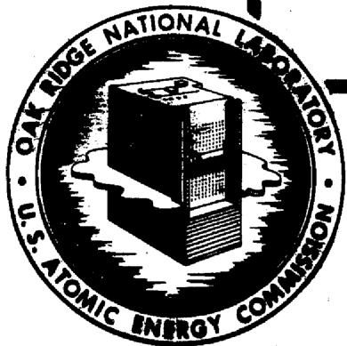
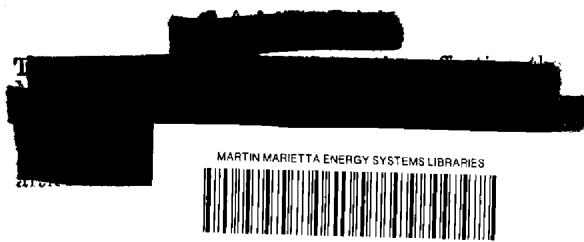
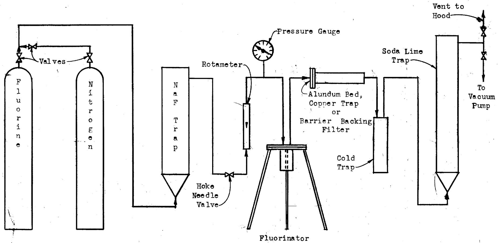
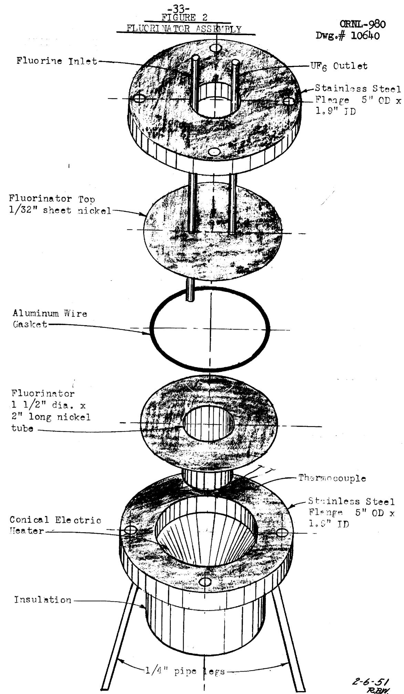
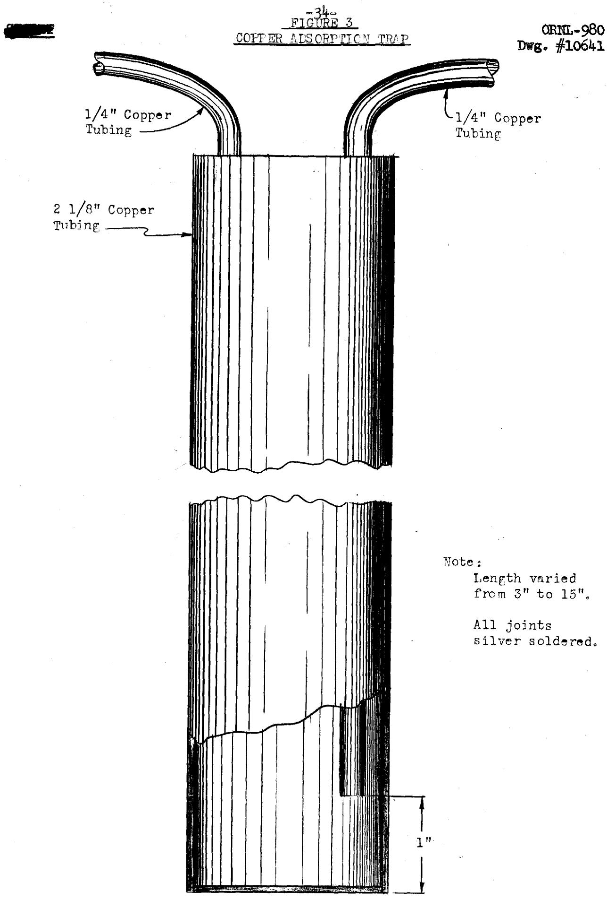
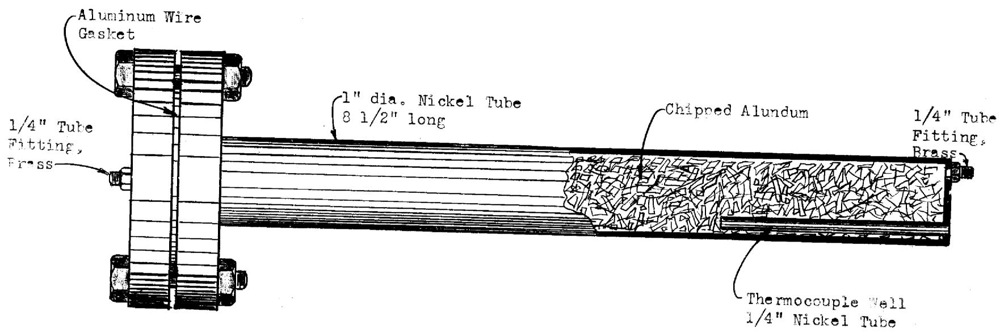
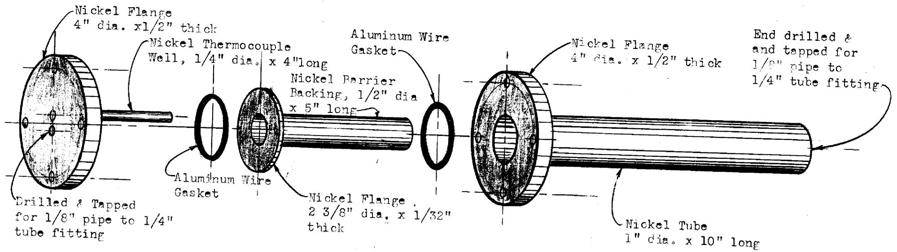

DRY FLUORIDE PABCESS STATUS REPORT 1954

R. E. LEUZE

CENTRAL RESEARCH LICHARY DOCUMENT COLLECTION

# LIBRARY LOAN COPY

DO NOT TRANSFER TO ANOTHER PERSON

If you wish someone else to see this document, send in name with document and the library will arrange a loan.

OAK RIDGE NATIONAL LABORATORY

OPERATED BY

CARBIDE AND CARBON CHEMICALS DIVISION

UNION GARBIDE AND GARBON CORPORATION

1

POTOPIOG SOX P

QAK RIDGE, TENNCEBEE

Report Number: ORNL-980

This document consists of 36

pages.

Copy of 112, Series A.

Contract No. W-7405, eng 26

CHEMICAL TECHNOLOGY DIVISION

LABORATORY SECTION

DRY FLUORIDE PROCESS STATUS REPORT

R. E. Leuze

Experimental work by:

H. B. Graham

A. B. Green

C. P. Johnston

R. E. Leuze

CLASSIFICATION CHANGED TO:

DECLASSIFIED

BY AUTHORITY OF: 710-1148   
BY: P Meunasen 27457

DATE ISSUED

MAR 27 1951

OAK RIDGE NATIONAL LABORATORY

Operated by

CARBIDE AND CARBON CHEMICALS COMPANY

A Division of Union Carbide and Carbon Corporation

Post Office Box P

Oak Ridge, Tennessee

-3

CRNL-980

# Contents

Page No.

1.0 Abstract 5   
2.0 Introduction 6   
3.0 Summary 7   
4.0 Preparation of UF6 from Uranium Metal 8

4.1 Fluorination Equipment and Procedure 9   
4.2 Fluorination Results 10

5.0 Adsorption of Fission Products and Plutonium 11

5.1 Adsorption on Copper 12   
5.2 Adsorption on Alundum 13

6.0 Filtration of Uranium Hexafluoride 14

6.1 Filtration Equipment and Procedure 14   
6.2 Filtration Results and Discussion 15

7.0 Resublimation of Uranium Hexafluoride 16

7.1 Sublimation Equipment and Procedure 16   
7.2 Resublimation Results and Discussion 17

8.0 Overall Results 17   
9.0 Recommendations 19

9.1 Preparation of Uranium Hexafluoride 19   
9.2 Adsorption Techniques 19   
9.3 Distillation Studies 19   
9.4 Phase Diagram 20

4

ORNL-980

# Contents (continued)

Page No.

9.5 Filtration

20

9.6 Equipment Development

20

# 10.0 Bibliography

21

# Tables

1. Removal of Plutonium and Fission Products from Uranium 22 by Fluorination   
2. Removal of Plutonium and Fission Products from Gaseous UF6 by Adsorption on Copper 24   
3. Removal of Plutonium and Fission Products from Gaseous UF6 by Adsorption on Alundum 25   
4. Removal of Plutonium and Fission Products from Gaseous UF6 by Filtration 26   
5. Removal of Plutonium and Fission Products from UF6 by Batch Sublimation 27   
6. Overall Results for Dry Processing 28   
7. Purity of UF6 after Dry Processing 30

# Figures

1. Schematic Diagram for Dry Fluoride Experiments 32   
2. Fluorinator Assembly 33   
3. Copper Adsorption Trap 34   
4. Alundum Adsorption Bed 35   
5. Filtration Assembly 36

# 1.0 Abstract

Uranium hexafluoride was prepared by the direct combination of irradiated uranium metal with elemental fluorine and subsequently decontaminated by adsorption, filtration, and sublimation on a laboratory scale.

# 2.0 Introduction

Early in project history, a dry fluorination method $^{(1,6)}$ was considered for separating uranium from fission products, plutonium, and other transuranic elements. This method consisted of converting uranium to the hexafluoride and effecting the separation by distillation; however, it was necessary to place the major effort on other processes which would require less development time. It now seems desirable to make a thorough evaluation of fluorination methods since they offer the following advantages over the present wet processes: (1) smaller equipment with few or no moving parts is required; (2) the waste volume is minimized since fluorine is the only major chemical used; (3) fission products are obtained in a concentrated form making them easily recoverable; (4) the uranium is recovered as UF $_6$ which requires a small storage volume and which is the feed material for the isotopic separation plants; (5) it may be possible to process short cooled material, thus reducing the uranium inventory requirements. There are two outstanding limitations to this type process: (1) the high cost of fluorinating agents and (2) the danger involved in handling volatile radioactive materials.

Before a dry fluorination process for decontaminating uranium and plutonium may be seriously considered, the actual separations obtainable must be demonstrated. Fluorination, copper adsorption, Alundum adsorption, filtration, and resublimation were investigated as methods of separating uranium from plutonium and fission products. These serve as preliminary studies upon which a future program can be based.

# 3.0 Summary

The plutonium content of UF $_6$ prepared from uranium metal irradiated 335 days in the ORNL pile and cooled 30 months was reduced to $<1$ Pu $\alpha$ ct/m/mg U by passing the UF $_6$ through a bed of Alundum, and then either filtering or resubliming the product. Fission product beta activity in the same material was reduced to 1 - 50 cts/m/mg U by filtering and resubliming the UF $_6$ .

Alundum adsorption was the most effective means of removing plutonium from UF $_6$ , giving separation factors of 13-96 and rendering that plutonium passing through the bed non-volatile so it could be removed by filtration or resublimation. Plutonium separation factors for the other steps were: fluorination, 1.l - 2.4; copper adsorption, 1.l - 74; filtration not preceded by Alundum adsorption, 1.4 - 4; and resublimation not preceded by Alundum adsorption, 1.3 - 290.

Filtration of UF6 through barrier backing at $70^{\circ}\mathrm{C}$ was the most effective method of removing the fission products and gave a beta decontamination factor of 103. Because of the larger amount of ruthenium passing through the filter at $230^{\circ}\mathrm{C}$ , the fission product beta decontamination factor was only 300. Filtration, however, has two limitations: (1) it does not remove volatile fission product fluorides, and (2) the barrier backing cannot be satisfactorily dried after washing it free of plutonium and fission products. Other beta decontamination factors were: resublimation, 12-330; fluorination,

# Summary (continued)

2-13; Alundum adsorption, 1.4; and copper adsorption, 1.1.

Uranium losses were 1 - $3\%$ for Alundum adsorption, 1 - $24\%$ for resublimation, and $0.3\%$ for fluorination, copper adsorption, and filtration. The losses in Alundum and resublimation may be reduced by improved operating techniques.

The program proposed for the immediate future includes (1) a survey of other methods of preparing UF6 from uranium metal, (2) a study of adsorption techniques for removing plutonium from UF6, and (3) an investigation of fractional distillation for removing the volatile fission product fluorides from UF6.

4.0 Preparation of UF6 from Uranium Metal

Uranium metal may be converted to uranium hexafluoride by several different methods. The metal may be reacted with hydrogen to give uranium hydride which can then be reacted with anhydrous HF to give $\mathrm{UF}_4^{(3)}$ . This $\mathrm{UF}_4$ is then reacted with fluorine to produce $\mathrm{UF}_6$ .

Uranium metal reacts with the interhalogens, $\mathrm{ClF}_3$ and $\mathrm{BrF}_3$ , to give uranium hexafluoride. Uranium may also be combined directly with elemental fluorine to produce $\mathrm{UF}_6^{(2)}$ . These various methods have certain advantages and disadvantages which will not be discussed here. The direct combination of fluorine with uranium was used to produce $\mathrm{UF}_6$ in these laboratory experiments because of its convenience and not because it was felt to be superior to the other procedures.

# 4.1 Fluorination Equipment and Procedure

Fluorine was transferred from cylinders through a bed of sodium fluoride to remove HF and then through a monel, Hoke needle valve and a glass rotameter into the fluorinator (Figure 1). The fluorinator was a cup made from a 2 inch piece of $1 - 1 / 2$ inch nickel tubing (Figure 2). The cup was placed in a stand fabricated from a stainless steel flange and stainless steel pipe. The fluorinator top was a disc of nickel sheet with a fluorine inlet and a UF6 outlet. This assembly was sealed between stainless steel flanges using an aluminum wire gasket. A conical electric heater was used to bring the reactor and uranium metal up to temperature.

The aluminum jacket was removed mechanically from a 40 - 250 gram piece of slug irradiated in the ORNL pile. The oxide film was removed in nitric acid and then the uranium was thoroughly dried and placed in the fluorinator. After evacuating the equipment, the temperature was raised to $300 - 350^{\circ}\mathrm{C}$ and $20\mathrm{ml} / \mathrm{min}$ of fluorine was fed to the reactor. A sharp rise in temperature gave evidence that the reaction had started. The external heat was then removed, and the fluorine flowrate was increased to about $250\mathrm{ml} / \mathrm{min}$ . The temperature rose to about $400^{\circ}\mathrm{C}$ and gradually dropped to $300^{\circ}\mathrm{C}$ . When fluorination was nearly complete, a rise in temperature of $150 - 200^{\circ}\mathrm{C}$ in a few seconds indicated that only a small amount of unreacted metal remained. After the reaction subsided, external heat was applied to raise the temperature to $500^{\circ}\mathrm{C}$ for 30 minutes before stopping the fluorine flow. This procedure removed the last traces of metal and lower fluorides.

Fluorination Equipment and Procedure (continued)

The UF6 produced was passed through adsorbers and/or filters to effect decontamination and finally condensed in traps cooled in dry ice and trichlorethylene (Figure 1). Gases passing through the cold trap were sent to a soda lime trap and vented to the hood exhaust.

After fluorination was complete, the equipment was evacuated and swept free of fluorine by means of nitrogen. The fluorinator was dissolved in nitric acid, and an aliquot of this solution was used for analyses.

# 4.2 Fluorination Results

The results obtained for the fluorination of uranium metal irradiated 335 days and cooled 30 months are presented in Table 1. From 4 to $20\%$ of the plutonium remained in the reactor, while only $0.0006 - 0.08\%$ of the uranium remained behind. Gross $\beta$ , Gross $\gamma$ , Ru $\beta$ , TRE $\beta$ , Cs $\beta$ , and Sr $\beta$ decontamination factors were all within the range of 2 - 13.

The higher uranium losses in experiments 1 and 14 were a result of incomplete fluorination due to too short a heating period in a fluorine atmosphere after the reaction had subsided. The high values for the fission product decontamination factors and plutonium hold up in Experiments 1, 2, and 3 resulted from increased reactor size and the uneven temperatures in the reactors. Since the only fission products present form non-volatile or only slightly volatile fluorides, the main reason for the low and inconsistent decontamination factors was solid entrainment in the gaseous $\mathrm{UF}_{6}$ .

# Fluorination Results (continued)

In experiments 7, 14, 16, and 17, the reaction was started by first filling the equipment with nitrogen instead of evacuating it. As a result, the plutonium remaining in the reactor was $30 - 40\%$ instead of $4 - 20\%$ . The reason for this difference is not understood; however, a test (Exp. 18) was made to determine plutonium hold up when the equipment was first evacuated and the uranium then fluorinated with a mixture of $55\%$ nitrogen and $45\%$ fluorine. The plutonium remaining in the reactor in this case was only $10\%$ . As yet no method is known for keeping all the plutonium in the reactor nor for removing it all by volutilization when fluorine gas is the fluorinating agent.

The direct fluorination was carried out at a rate of about 20 grams of uranium converted per hour. This rate was controlled quite easily by regulating the fluorine flowrate. There was little or no reaction noted between uranium metal and fluorine at temperatures below $300^{\circ}\mathrm{C}$ , and additional heat was needed at the end of the reaction to fluorinate the last traces of uranium metal and intermediate fluorides to $\mathbf{U}\mathbf{F}_{6}$ .

# 5.0 Adsorption of Fission Products and Plutonium

Since $\mathsf{PuF}_6$ has almost the same vapor pressure as $\mathsf{UF}_6^{(4)}$ , its separation from uranium by fractional distillation would be difficult and some other method, such as adsorption, for effecting the separation would prove to be

Adsorption of Fission Products and Plutonium (continued)

of considerable value. Previous work showed that plutonium hexafluoride is less stable than UF6 since the plutonium plated out on copper connecting lines in the experimental apparatus(5). Adsorption on copper and Alundum were tested and copper was found to be partially effective and Alundum completely satisfactory for removing plutonium from UF6. Neither the copper nor the Alundum removed enough of the Gross $\beta$ activity from the UF6 to be of value for a decontamination procedure.

Graphite and activated calcium sulfate were found to react with UF $_6$ at $100^{\circ}\mathrm{C}$ and so were not tested further. Sodium fluoride and UF $_6$ form an intermolecular compound which decomposes to give fluorine when heated. Since UF $_6$ cannot be removed from this compound by sublimation, sodium fluoride was not considered as an adsorbing medium to remove the plutonium.

# 5.1 Adsorption on Copper

Three types of copper traps were used to adsorb plutonium: (1) a coil of $\frac{1}{4}$ inch tubing 3 feet long, (2) a "U" tube 9 inches high made from $\frac{1}{8}$ inch diameter tubing and packed with copper turnings, (3) cylinders 2 inches in diameter and from 3 to 15 inches long (Figure 3). The stream of gaseous uranium hexafluoride from the reactor was passed through these vessels which were heated to $70 - 80^{\circ}\mathrm{C}$ in a water bath. After the experiments were completed, the traps were washed with dilute nitric acid to remove the plutonium, uranium, and fission products.

# Adsorption on Copper (continued)

The three feet of copper tubing removed $27\%$ of the plutonium while the trap packed with copper turnings removed $70\%$ of the plutonium.

In the experiments using the 2 inch diameter copper traps, the amount of plutonium held up was proportional to the length of the traps (Table 2). This increase of adsorption may be due to the increase of surface area, increase of contact time, or both. The plutonium hold up for the 3-1/4 inch trap was $21\%$ , for the 7-1/2 inch trap was $57\%$ , for the 9 inch trap was $98.7\%$ , and for the 15 inch trap was $92.2\%$ . The high value for the 9 inch trap is not explained. The results indicate that the last trace of plutonium may be difficult to remove by means of adsorption on copper.

The fission product decontamination factor over these traps was negligible (about 1.1). The uranium hold up was small ( $\leq 0.3\%$ ) except when the copper adsorption was preceded by condensation and resublimation as in Experiment 12. This high loss of $8\%$ may either be due to reduction of $\mathrm{UF}_6$ during the first condensation or to an inadequate sweep out of the equipment after resublimation.

# 5.2 Adsorption on Alundum

Chips from Alundum crucibles were placed in a nickel tube 1 inch in diameter and 9 inches long (Figure 4). The bed was heated to $100^{\circ}\mathrm{C}$ in a tube furnace, and the gaseous $\mathrm{UF}_6$ stream from the fluorinator was passed through the Alundum. For analytical purposes the plutonium, uranium, and fission products were removed from the Alundum by elution with $30\%$ nitric acid.

# Adsorption on Alundum (continued)

The Alundum bed removed $92 - 99\%$ of the plutonium (Table 3). The plutonium passing through was thought to be non-volatile since it could be easily removed by filtration (Experiment 22, Table 4) or by resublimation of the UF6 (Experiments 20 to 21, Table 5). The uranium loss on the Alundum was $1 - 3\%$ , and the fission product decontamination factors were only about 1.4.

# 6.0 Filtration of Uranium Hexafluoride

During early experiments a considerable quantity of fission products was carried over from the fluorinator to the cold trap. This suggested that solid particles were entrained in the gas since all the fission products present formed non-volatile or only slightly volatile fluorides. Barrier backing tubes were used as a laboratory tool in determining whether or not the activity and plutonium carry-over was due to entrainment.

# 6.1 Filtration Equipment and Procedure

A nickel, barrier backing filter tube 1/2 inch in diameter and 5 inches long was fitted with nickel ferrules. One end of the tube was closed and the other end was flanged. This assembly was sealed into a nickel tube (1"D x 8") by the use of heavy flanges and a double gasket arrangement (Figure 5). A thermocouple well extended through the end plate flange to the center of the barrier backing tube. The inlet and outlet for the filter consisted of 1/4 inch brass tube fittings silver soldered into the ends of the case.

# Filtration Equipment and Procedure (continued)

Uranium hexafluoride was passed through the barrier backing at $70 - 225^{\circ}\mathrm{C}$ . After filtration was complete, the barrier backing and ferrules were dissolved in concentrated nitric acid, and the case was washed with dilute nitric acid. These solutions were analyzed for gross $\beta$ , plutonium, and uranium.

# 6.2 Filtration Results and Discussion

When the uranium hexafluoride came directly from the fluorinator, the plutonium hold up on the filter was $30 - 75\%$ and was not a function of temperature in the range of $70^{\circ}\mathrm{C}$ to $230^{\circ}\mathrm{C}$ (Table 4). Only $0.01 - 0.15\%$ of the uranium remained on the filter. The high value of $3.7\%$ in Experiment 14 may have been caused by incomplete nitrogen sweeps of the equipment after the reaction was completed. The gross $\beta$ decontamination factor was $10^{3}$ when the filter was operated at $70^{\circ}\mathrm{C}$ and 300 when the temperature was $220 - 240^{\circ}\mathrm{C}$ . The only individual fission product decontamination factor that was substantially affected by temperature was that for ruthenium. At $70^{\circ}\mathrm{C}$ , the Ru $\beta$ decontamination factor was 200-500, and at $225^{\circ}\mathrm{C}$ it was only 15. In general, the decontamination factors for Cs $\beta$ , Sr $\beta$ , and TRE $\beta$ were slightly greater than $10^{3}$ .

When filtration was preceded by resublimation, the filtration showed little improvement in decontamination since the activity was too low for accurate analysis (Exp. 19).

Filtration Results and Discussion (continued)

When the filter was used after an Alundum adsorber (Experiment 22), $<1$ Pu $\alpha$ ct/m/mg U passed through the filter and $<0.01\%$ of the uranium stayed on the filter. The fission product decontamination factors were of the same order as for filtration of uranium hexafluoride coming directly from the fluorinator.

Since no way is known to removed plutonium, uranium, and fission products from the barrier backing except by washing, it is recommended that filtration of this type be used only as a laboratory tool and not be considered for large scale operation. After washing barrier backing, it is very difficult to dry it thoroughly enough to pass UF6 and F2 through it again.

# 7.0 Resublimation of Uranium Hexafluoride

Simple batch sublimations were made to determine their effectiveness in further decontaminating UF $_6$ from fission products and plutonium.

# 7.1 Sublimation Equipment and Procedure

Uranium hexafluoride was condensed in copper traps of various sizes, the trap most used being a cylinder 3 inches in diameter and 12 inches high. To carry out a resublimation, the trap containing uranium hexafluoride was placed in a water bath and heated to $90^{\circ}\mathrm{C}$ . The uranium hexafluoride was volatilized and passed through a copper connecting line to a similar trap placed in a bath of dry ice-trichloroethylene. A reasonable length of time was allowed for the sublimation to take place, since there was no convenient method of determining when it was complete. No nitrogen or fluorine sweeps

were made to remove the last traces of UF6.

# 7.2 Resublimation Results and Discussion

The results for batch resublimation varied considerably for two reasons: (1) the resublimation was crude and often incomplete, and (2) the previous treatment of the uranium hexafluoride varied widely.

The only fission products present form non-volatile fluorides which must have been carried into the cold trap by entrainment. The resublimation should serve primarily to remove the uranium hexafluoride gas from these solids. Since the distillations were crude, the amount of solid entrainment varied and gave a wide range of decontamination factors. Gross $\beta$ decontamination factors were 12-330 (Table 5). For resublimation preceded by filtration, the amount of activity present was so small that the gross $\beta$ decontamination factors could not be determined.

Plutonium decontamination factors over the resublimation step were probably dependent upon both the entrainment phenomenon and the adsorption of the volatile plutonium on the copper walls. Resublimation removed 80-100% of the plutonium.

Uranium losses varied widely due to incomplete sublimation and sweep out of the equipment.

# 8.0 Overall Results

Fluorination, copper adsorption, Alundum adsorption, filtration, and resublimation procedures were combined in various ways to study the separation

# Overall Results (continued)

of plutonium and fission products from uranium metal irradiated 335 days in the ORNL pile and cooled 30 months. The overall procedure and results for various experiments are given in Table 6. Purities of the uranium hexafluoride products are given in Table 7.

The most effective removal of fission products was made in the experiments involving a filtration step. The overall gross $\beta$ decontamination factors varied from $3 \times 10^{3}$ to greater than $10^{4}$ and the products contained $1 - 50\beta$ cts/m/mg U. Experiments containing a resublimation but no filtration were less effective in removing fission products. Gross $\beta$ decontamination factors were 230 to $1.4 \times 10^{3}$ with a corresponding higher activity in the product. The one experiment (No. 1) which used only fluorination and copper adsorption gave a gross $\beta$ decontamination factor of only 12.

The most effective and only satisfactory removal of plutonium was made in experiments using Alundum adsorption. In these experiments (Nos. 20, 21, 22) the plutonium decontamination factors were $6 \times 10^{3}$ to $6 \times 10^{4}$ and the uranium product contained $< 0.5$ plutonium $\mathrm{ct} / \mathrm{m} / \mathrm{mg}$ U. In all the other experiments, plutonium decontamination varied widely; however, large copper adsorbing surfaces tended to increase the decontamination factors.

Uranium losses for all the experiments were quite high. These losses were explained under the various sections in this report dealing with the individual operations. It may not be possible to reduce the uranium loss of $1 - 3\%$ on the Alundum adsorber; however, by improved operating techniques the other losses can be reduced to $<0.1\%$ .

# 9.0 Recommendations

The results of the experiments presented in this report serve primarily as a guide to further investigations. There are many problems remaining to be solved and the following recommendations deal only with those which should be studied in the immediate future.

# 9.1 Preparation of Uranium Hexafluoride

A thorough investigation of various methods of converting uranium metal to UF $_6$ is needed. From this study should come the optimum procedure from the view point of safety, ease of operation, and economics.

# 9.2 Adsorption Techniques

A more complete survey of adsorbing media for removing plutonium and of elution methods is needed. Design information should be obtained for the most promising adsorbers.

# 9.3 Distillation Studies

A program to determine the relative volatilities of various fission product fluorides is now in progress. Determination of the optimum distillation methods, and testing on a laboratory scale should be carried out.

# 9.4 Phase Diagram

Solubilities of the fission product fluorides in uranium hexafluoride should be obtained. Phase diagrams involving $\mathsf{BrF}_3$ , $\mathsf{ClF}_3$ , and HF will also be needed if these materials are to be used in the fluoride process.

# 9.5 Filtration

At present, filtration seems to be valuable only as a laboratory tool. Filtration in large scale operations is not desirable due to difficulties of washing the filter free of plutonium and fission products and then drying so it can be reused. At this time no further work need be done on this procedure.

# 9.6 Equipment Development

Special equipment and samplers are needed to study all of the previously mentioned problems. Development and testing of this equipment can best be carried out along with the investigations for which the equipment is needed.

# 10.0 Bibliography

1. Anderson, H. L., and Brown, H. S., Report CN-362, Liquid UF6 Plant for the Production of Element 94, November 27, 1942.   
2. Barry, L. A., Montillon, G. H., and Van Winkle, R., Report K-548, Fluorination of Uranium File Slugs with Elemental Fluorine, Carbide and Carbon Chemicals Corporation, K-25, December 30, 1949.   
3. Bernhardt, H. A., Gustison, R. A., Kirrisis, S. S., and Wendolkowski, W. S., Report K-345, Hydrofluorination of Massive Uranium Metal to Uranium Tetrafluoride, K-25 Laboratory Division, February 1, 1949.   
4. Florin, A., Dry Fluoride Meeting at Argonne National Laboratory, September 8, 1950.   
5. Seaborg, G. T., Williard, J. E., et al, Report CN-696, Chemical Research-Production and Extraction of Plutonium, Metallurgical Laboratory, Report for May 16-31, 1943.   
6. Webster, D. S., Report CN-1206 (A-1686), Engineering Studies of Dry Fluoride Process, Clinton Laboratories, January 10, 1944.

Removal of Plutonium and Fission Products from Uranium by Fluorination

# Conditions:

(1) Reactor: 1-1/2" OD nickel tube 2 inches deep   
(2) Uranium metal irradiated 335 days in the ORNL pile and cooled 30 months.   
(3) Reaction temperature: 250-600oc   
(4) Reaction pressure: most experiments started under vacuum and gradually increased to one atmosphere   
(5) Fluorine flowrate: started at 20 ml/min and increased to $>200$ ml/min.

Table I   

<table><tr><td rowspan="2">Experiment Number</td><td rowspan="2">Uranium Feed (grams)</td><td colspan="2">% Hold up in Fluorinator</td><td colspan="7">Decoutamination Factors</td></tr><tr><td>Uranium</td><td>Plutonium</td><td>Pu α</td><td>Gross γ</td><td>Gross β</td><td>Ru β</td><td>Cs β</td><td>Sr β</td><td>TRE β</td></tr><tr><td>1a</td><td>35.0</td><td>1.69h</td><td>27</td><td>1.5</td><td>10</td><td>10</td><td>7</td><td>11</td><td>6</td><td>10</td></tr><tr><td>2b</td><td>44.1</td><td>0.300</td><td>46</td><td>2.0</td><td>16</td><td>27</td><td>23</td><td>21</td><td>29</td><td>27</td></tr><tr><td>3b</td><td>64.1</td><td>0.080</td><td>41</td><td>2.4</td><td>15</td><td>20</td><td>15</td><td>13</td><td>18</td><td>25</td></tr><tr><td>4c</td><td>16.0</td><td>&lt;0.002</td><td>12</td><td>1.5</td><td></td><td>7</td><td></td><td></td><td></td><td></td></tr><tr><td>5d</td><td>36.1</td><td>&lt;0.002</td><td>19</td><td>2.2</td><td></td><td>4</td><td></td><td></td><td></td><td></td></tr><tr><td>6</td><td>27.0</td><td>&lt;0.060</td><td>17</td><td>1.2</td><td></td><td>6</td><td></td><td></td><td></td><td></td></tr><tr><td>7e</td><td>57.5</td><td>0.050</td><td>33</td><td>1.4</td><td>7</td><td>5</td><td>4</td><td>5</td><td>4</td><td>5</td></tr><tr><td>8</td><td>45.8</td><td>0.005</td><td>8</td><td>1.2</td><td>5</td><td>5</td><td>6</td><td>3</td><td>4</td><td>6</td></tr><tr><td>9</td><td>50.8</td><td>&lt;0.005</td><td>5.1</td><td>1.2</td><td>3</td><td>3</td><td>4</td><td>3</td><td>2</td><td>3</td></tr><tr><td>10</td><td>48.0</td><td>0.080</td><td>8.</td><td>1.4</td><td>5</td><td>7</td><td>10</td><td>5</td><td>4</td><td>7</td></tr><tr><td>11</td><td>41.0</td><td>&lt;0.006</td><td>5.4</td><td>1.4</td><td>7</td><td>7</td><td>13</td><td>6</td><td>5</td><td>7</td></tr><tr><td>12</td><td>72.2</td><td>&lt;0.004</td><td>7</td><td>1.1</td><td>4</td><td>5</td><td>4</td><td>3</td><td>4</td><td>6</td></tr><tr><td>13</td><td>75.5</td><td>0.015</td><td>14</td><td>1.6</td><td>3</td><td>3</td><td>6</td><td>3</td><td>2</td><td>3</td></tr><tr><td>14e</td><td>75.8</td><td>1.81h</td><td>40</td><td>1.9</td><td>3</td><td>4</td><td>7</td><td>3</td><td>4</td><td>5</td></tr><tr><td>15</td><td>76.0</td><td>0.020</td><td>19</td><td>1.4</td><td>4</td><td>4</td><td>10</td><td>3</td><td>3</td><td>4</td></tr><tr><td>16e</td><td>245.0</td><td>0.0006</td><td>31</td><td>1.5</td><td>3</td><td>4</td><td>6</td><td>3</td><td>3</td><td>4</td></tr><tr><td>17f</td><td>50.0</td><td>0.070</td><td>31</td><td>1.9</td><td></td><td>4</td><td></td><td></td><td></td><td></td></tr><tr><td>18g</td><td>37.8</td><td>0.034</td><td>10</td><td>1.2</td><td></td><td>3</td><td></td><td></td><td></td><td></td></tr><tr><td>19</td><td>73.3</td><td>&lt;0.004</td><td>4.0</td><td>1.1</td><td>5</td><td>7</td><td>11</td><td>4</td><td>5</td><td>14</td></tr></table>

(continued)

<table><tr><td rowspan="2">Experiment Number</td><td rowspan="2">Uranium Feed (grams)</td><td colspan="2">% Hold up in Fluorinator</td><td colspan="8">Decontamination Factors</td></tr><tr><td>Uranium</td><td>Plutonium</td><td>Pu α</td><td>Gross γ</td><td>Gross β</td><td>Ru β</td><td>Cs β</td><td>Sr β</td><td>TRE β</td><td></td></tr><tr><td>20</td><td>24.7</td><td>0.009</td><td>10.</td><td>1.2</td><td></td><td>4</td><td></td><td></td><td></td><td></td><td></td></tr><tr><td>21</td><td>39.9</td><td>&lt;0.002</td><td>10.</td><td>1.3</td><td></td><td>5</td><td></td><td></td><td></td><td></td><td></td></tr><tr><td>22</td><td>48.2</td><td>&lt;0.002</td><td>15</td><td>1.4</td><td></td><td>5</td><td></td><td></td><td></td><td></td><td></td></tr></table>

a. A larger reactor was used $2^{\prime \prime}D\times 6^{\prime \prime}$ . Temperature not uniform throughout reactor.   
b A larger reactor was used 2"D x 12". Temperature not uniform throughout reactor.   
a. Fluxination carried out at 20-26" vacuum.   
d Fluorination carried out at 4 - 7 psig.   
Fluorination started with atmosphere of nitrogen in fluorinator.   
f Started under nitrogen atmosphere. $30\% \mathrm{N}_2 - 70\% \mathrm{F}_2$ fluorinating gas.   
g Started under vacuum. $55\% \mathrm{N}_2 - 45\% \mathrm{F}_2$ fluorinating gas.   
h Insufficient heating period after reaction subsided.

Removal of Plutonium and Fission Products from Gaseous UF6 by Adsorption on Copper

# Conditions:

(1) Equipment as noted   
(2) Uranium irradiated 335 days and cooled 30 months   
(3) Temperature of trap $70 - 80^{\circ}C$   
(4) Previous process steps as noted

Table 2   

<table><tr><td rowspan="2">Experiment Number</td><td rowspan="2">Previous Process Steps</td><td rowspan="2">Copper Trap Description</td><td colspan="2">% of Original Charge Held up in Copper</td><td rowspan="2">% of Pu to trap held-up in trap</td><td colspan="7">Decontamination Factors</td></tr><tr><td>U</td><td>Pu</td><td>Pu α</td><td>Gross γ</td><td>Gross β</td><td>Ru β</td><td>Cs β</td><td>Sr β</td><td>TRE β</td></tr><tr><td>1</td><td>Fluorination</td><td>3&#x27; of 1/4&quot; tubing</td><td>0.24</td><td>19</td><td>27</td><td>1.4</td><td>1.2</td><td>1.2</td><td>2</td><td>1.1</td><td>1.1</td><td>1.1</td></tr><tr><td>7</td><td>Fluorination</td><td>1-1/8&quot;D x 9&quot; U tube packed with Cu turnings</td><td>0.30</td><td>53</td><td>70</td><td>4</td><td>&gt;5</td><td>4</td><td>1.5</td><td>4</td><td>5</td><td>4</td></tr><tr><td>8</td><td>Fluorination</td><td>2&quot;D x 3-1/4&quot;</td><td>&lt;0.01</td><td>18</td><td>21</td><td>1.3</td><td>1.03</td><td>1.03</td><td>1.03</td><td>1.03</td><td>1.04</td><td>1.04</td></tr><tr><td>9</td><td>Fluorination</td><td>2&quot;D x 7-1/2&quot;</td><td>&lt;0.01</td><td>49</td><td>57</td><td>2</td><td>1.2</td><td>1.2</td><td>1.7</td><td>1.2</td><td>1.1</td><td>1.2</td></tr><tr><td>10</td><td>Fluorination</td><td>2&quot;D x 9&quot;</td><td>-</td><td>71</td><td>99</td><td>74</td><td>1.2</td><td>1.2</td><td>1.3</td><td>1.2</td><td>1.2</td><td>1.2</td></tr><tr><td>11</td><td>Fluorination</td><td>2&quot;D x 15&quot;</td><td>&lt;0.01</td><td>66</td><td>92</td><td>13</td><td>1.1</td><td>1.07</td><td>1.2</td><td>1.07</td><td>1.07</td><td>1.07</td></tr><tr><td>12</td><td>Fluorination Resublimation</td><td>2&quot;D x 15&quot;</td><td>8.1</td><td>0.07</td><td>19</td><td>1.1</td><td>&gt;1</td><td>1.2</td><td>1.00</td><td>1.7</td><td>2</td><td>1.7</td></tr></table>

# Table 3

Removal of Plutonium and Fission Products from Gaseous UF6 by Adsorption on Alundum

# Conditions:

(1) Ca 100 grams of chipped Alundum in a nickel case $1^{''}D \times 9^{''}$   
(2) UF6 prepared by direct reaction of fluorine and uranium irradiated 335 days and cooled 30 months   
(3) Temperature of Alundum bed: 95 - 1150C

<table><tr><td rowspan="2">Experiment Number</td><td colspan="2">% of Original Charge held up in Alundum</td><td rowspan="2">% of Pu entering Alundum which was held up in the Alundum</td><td colspan="2">Decontamination Factors</td></tr><tr><td>Uranium</td><td>Plutonium</td><td>Pu α</td><td>Gross β</td></tr><tr><td>20</td><td>3.3</td><td>75</td><td>92</td><td>13</td><td>1.3</td></tr><tr><td>21</td><td>1.3</td><td>81</td><td>99</td><td>96</td><td>1.4</td></tr><tr><td>22</td><td>2.4</td><td>70</td><td>98</td><td>58</td><td>1.3</td></tr></table>

Removal of Plutonium and Fission Products from Gaseous UF6 by Filtration

# Conditions:

(1) Filter - nickel barrier backing tube 5/8"OD x 5" in a nickel case
1"D x 10"   
(2) Uranium irradiated 335 days and cooled 30 months   
(3) Temperature of filter as noted   
(4) Previous process steps as noted

Table 4   

<table><tr><td rowspan="2">Experiment Number</td><td rowspan="2">Previous Process Steps</td><td rowspan="2">Filter Temp. °C</td><td colspan="2">% of Original Charge Held up on Filter</td><td rowspan="2">% of Pu to the Fil-ter held up on Filter</td><td colspan="7">Discontamination Factors</td></tr><tr><td>U</td><td>Pu</td><td>Pu α</td><td>Gross γ</td><td>Gross β</td><td>Ru β</td><td>Ceβ</td><td>Sr β</td><td>TRE β</td></tr><tr><td>13</td><td>Fluorination</td><td>220-240</td><td>0.01</td><td>19</td><td>29</td><td>1.4</td><td>190</td><td>310</td><td>13</td><td>430</td><td>1200</td><td>930</td></tr><tr><td>14</td><td></td><td>185-205</td><td>3.69</td><td>27</td><td>53</td><td>2.1</td><td>&gt;90</td><td>410</td><td>17</td><td>&gt;800</td><td>1800</td><td>1400</td></tr><tr><td>15</td><td></td><td>70-90</td><td>0.001</td><td>27</td><td>38</td><td>1.6</td><td>&gt;40</td><td>1100</td><td>220</td><td>2200</td><td>2600</td><td>1800</td></tr><tr><td>16</td><td></td><td>65-85</td><td>0.009</td><td>20</td><td>30</td><td>1.4</td><td>&gt;80</td><td>870</td><td>490</td><td>8300</td><td>3800</td><td>1200</td></tr><tr><td>17</td><td></td><td>87-105</td><td>0.022</td><td>32</td><td>61</td><td>3</td><td></td><td>1400</td><td></td><td></td><td></td><td></td></tr><tr><td>18</td><td></td><td>85-110</td><td>0.070</td><td>57</td><td>75</td><td>4</td><td></td><td>920</td><td></td><td></td><td></td><td></td></tr><tr><td>19</td><td>Fluorination Resublimation</td><td>75-85</td><td>0.120</td><td>0.85</td><td>65</td><td>3</td><td>&gt;20</td><td>&gt;8</td><td>&gt;2</td><td>&gt;14</td><td>&gt;80</td><td>&gt;100</td></tr><tr><td>22</td><td>Fluorination Alundum Adsorption</td><td>102-110</td><td>&lt;0.01</td><td>1.15</td><td>97</td><td>30</td><td></td><td>810</td><td></td><td></td><td></td><td></td></tr></table>

Removal of Plutonium and Fission Products from UF6 by Batch Sublimation

Conditions: (1) Copper and stainless steel cold traps of various sizes were used.   
(2) The trap containing UF6 was placed in a water bath at $90^{\circ} \mathrm{C}$   
(3) Previous treatment as noted.   
(4) Uranium was irradiated335 days in the ORNL pile and cooled 30 months

Table 5   

<table><tr><td rowspan="2">Experiment Number</td><td rowspan="2">Previous Process Steps</td><td colspan="2">% of Original Charge Held up in Still Pot</td><td colspan="7">Decontamination Factors</td></tr><tr><td>U</td><td>Pu</td><td>Pu α</td><td>Gross γ</td><td>Gross β</td><td>Ru β</td><td>Cs β</td><td>Sr β</td><td>TRE β</td></tr><tr><td>2</td><td rowspan="5">Fluorination</td><td>0.9</td><td>48</td><td>19</td><td>&gt;6</td><td>46</td><td>5</td><td>190</td><td>70</td><td>140</td></tr><tr><td>3</td><td>1.6</td><td>42</td><td>100</td><td>&gt;25</td><td>20</td><td>8</td><td>27</td><td>20</td><td>21</td></tr><tr><td>4</td><td>1.1</td><td>68</td><td>95</td><td></td><td>33</td><td></td><td></td><td></td><td></td></tr><tr><td>5</td><td>4.9</td><td>43</td><td>&gt;2000</td><td></td><td>330</td><td></td><td></td><td></td><td></td></tr><tr><td>6</td><td>10.8</td><td>84</td><td>290</td><td></td><td>320</td><td></td><td></td><td></td><td></td></tr><tr><td rowspan="2">7</td><td>Fluorination</td><td>11.5</td><td>0.06</td><td>~1.3</td><td></td><td>&gt;4</td><td></td><td></td><td></td><td></td></tr><tr><td>Resublimations (2)</td><td></td><td></td><td></td><td></td><td></td><td></td><td></td><td></td><td></td></tr><tr><td rowspan="2">8</td><td>Fluorination</td><td>0.30</td><td>5.5</td><td>1.4</td><td>&gt;2</td><td>12</td><td>&gt;3</td><td>140</td><td>110</td><td>60</td></tr><tr><td rowspan="4">Copper Adsorption</td><td>5.9</td><td>52</td><td>5</td><td>&gt;32</td><td>250</td><td>60</td><td>310</td><td>340</td><td>280</td></tr><tr><td>9</td><td>2.3</td><td>35</td><td>21</td><td>&gt;34</td><td>100</td><td>5</td><td>260</td><td>600</td><td>310</td></tr><tr><td>10</td><td>0.08</td><td>0.58</td><td>5</td><td>&gt;55</td><td>120</td><td>37</td><td>140</td><td>150</td><td>140</td></tr><tr><td>11</td><td>2.5</td><td>4.5</td><td>5</td><td>&gt;13</td><td>80</td><td>18</td><td>80</td><td>70</td><td>100</td></tr><tr><td rowspan="3">12</td><td>Fluorination</td><td>16.2</td><td>77</td><td>180</td><td>~50</td><td>70</td><td>8</td><td>240</td><td>260</td><td>210</td></tr><tr><td>Resublimation</td><td></td><td></td><td></td><td></td><td></td><td></td><td></td><td></td><td></td></tr><tr><td>Copper Adsorption</td><td></td><td></td><td></td><td></td><td></td><td></td><td></td><td></td><td></td></tr><tr><td>13</td><td>Fluorination</td><td>0.16</td><td>43</td><td>19</td><td>&gt;100</td><td>8</td><td>18</td><td>&gt;10</td><td>&gt;10</td><td>&gt;24</td></tr><tr><td>14</td><td rowspan="3">Filtration</td><td>2.1</td><td>24</td><td>30</td><td>&gt;2</td><td>&gt;6</td><td>~20</td><td>&gt;6</td><td>~30</td><td>~39</td></tr><tr><td>15</td><td>0.15</td><td>44</td><td>90</td><td>&gt;2</td><td>&gt;2</td><td>&gt;3</td><td>&gt;1.3</td><td>&gt;1.4</td><td>&gt;1.4</td></tr><tr><td>16</td><td>1.4</td><td>39</td><td>6</td><td>&gt;1.1</td><td>&gt;1.2</td><td>&gt;1.7</td><td>&gt;1.5</td><td>&gt;1.4</td><td>&gt;1.2</td></tr><tr><td>19</td><td>Fluorination</td><td>14.2</td><td>86</td><td>66</td><td>31</td><td>100</td><td>32</td><td>220</td><td>110</td><td>50</td></tr><tr><td>20</td><td>Fluorination, Alundum</td><td>17.8</td><td>6.2</td><td>&gt;4000</td><td></td><td>210</td><td></td><td></td><td></td><td></td></tr><tr><td>21</td><td>Adsorption</td><td>23.8</td><td>0.84</td><td>&gt;50</td><td></td><td>100</td><td></td><td></td><td></td><td></td></tr><tr><td rowspan="2">22</td><td>Fluorination, Alundum</td><td>2.9</td><td>0.04</td><td>&gt;30</td><td></td><td>&gt;2</td><td></td><td></td><td></td><td></td></tr><tr><td>Adsorption, Filtration</td><td></td><td></td><td></td><td></td><td></td><td></td><td></td><td></td><td></td></tr></table>

Conditions: (1) Uranium irradiated 335 days in the ORNL pile and cooled 30 months

(2) Procedure as listed

Table 6   
Overall Results for Dry Processing   

<table><tr><td rowspan="2">Experiment Number</td><td rowspan="2">Process Steps(a)</td><td rowspan="2">Uranium Loss %</td><td rowspan="2">% of Pu in Product UFG</td><td colspan="7">Decontamination Factors</td></tr><tr><td>Pu α</td><td>Gross γ</td><td>Gross β x10-3</td><td>Ru β x10-3</td><td>Cα β x10-3</td><td>Sr β x10-3</td><td>TRE β x10-3</td></tr><tr><td>1</td><td>Fluorination Copper Adsorption</td><td>1.93</td><td>50</td><td>2</td><td>11</td><td>0.012</td><td>0.013</td><td>0.013</td><td>0.007</td><td>0.011</td></tr><tr><td>2</td><td rowspan="4">Fluorination Resublimation</td><td>1.20</td><td>2.74</td><td>36</td><td>&gt;110</td><td>1.3</td><td>0.11</td><td>4.3</td><td>2.0</td><td>4.0</td></tr><tr><td>3</td><td>1.60</td><td>0.41</td><td>240</td><td>&gt;380</td><td>.41</td><td>0.12</td><td>0.37</td><td>0.37</td><td>0.54</td></tr><tr><td>4</td><td>1.10</td><td>0.73</td><td>140</td><td></td><td>.23</td><td></td><td></td><td></td><td></td></tr><tr><td>5</td><td>4.90</td><td>&lt;0.02</td><td>4600</td><td></td><td>1.4</td><td></td><td></td><td></td><td></td></tr><tr><td>6</td><td>Fluorination Resublimations (2)</td><td>22.3</td><td>0.023</td><td>430</td><td></td><td>7.0</td><td></td><td></td><td></td><td></td></tr><tr><td>7</td><td rowspan="2">Fluorination Copper Adsorption</td><td>0.45</td><td>14.5</td><td>7</td><td>&gt;160</td><td>.24</td><td>0.015</td><td>3.0</td><td>2.2</td><td>1.3</td></tr><tr><td>8</td><td>5.86</td><td>13.7</td><td>7</td><td>&gt;150</td><td>1.3</td><td>0.35</td><td>0.90</td><td>1.4</td><td>1.7</td></tr><tr><td>9</td><td rowspan="3">Resublimation</td><td>2.31</td><td>1.79</td><td>60</td><td>&gt;130</td><td>.34</td><td>0.037</td><td>0.70</td><td>1.6</td><td>1.1</td></tr><tr><td>10</td><td>0.93</td><td>0.014</td><td>700</td><td>&gt;370</td><td>1.0</td><td>0.50</td><td>1.0</td><td>0.79</td><td>1.2</td></tr><tr><td>11</td><td>2.52</td><td>1.13</td><td>90</td><td>&gt;90</td><td>.50</td><td>0.28</td><td>0.48</td><td>0.40</td><td>0.70</td></tr><tr><td>12</td><td>Fluorination Resublimation Copper Adsorption</td><td>24.3</td><td>0.290</td><td>210</td><td>&gt;220</td><td>.47</td><td>0.037</td><td>1.2</td><td>&gt;2.0</td><td>2.0</td></tr><tr><td>13</td><td rowspan="6">Fluorination Filtration Resublimation</td><td>0.19</td><td>2.50</td><td>41</td><td>&gt;1000</td><td>7.0</td><td>1.2</td><td>&gt;15.</td><td>20.</td><td>&gt;60.</td></tr><tr><td>14</td><td>7.60</td><td>0.83</td><td>120</td><td>&gt;420</td><td>11.0</td><td>2.6</td><td>&gt;50.</td><td>200.</td><td>300.</td></tr><tr><td>15</td><td>0.17</td><td>0.49</td><td>200</td><td>&gt;330</td><td>8.0</td><td>4.6</td><td>&gt;24.</td><td>&gt;9.0</td><td>&gt;10.</td></tr><tr><td>16</td><td>1.43</td><td>7.66</td><td>13</td><td>&gt;260</td><td>3.9</td><td>4.8</td><td>&gt;34</td><td>&gt;10.</td><td>&gt;6.</td></tr><tr><td>17</td><td>0.09</td><td>20.1</td><td>5</td><td></td><td>6.0</td><td></td><td></td><td></td><td></td></tr><tr><td>18</td><td>0.10</td><td>18.7</td><td>5</td><td></td><td>3.0</td><td></td><td></td><td></td><td></td></tr><tr><td rowspan="2">Experiment Number</td><td rowspan="2">Process Steps(a)</td><td rowspan="2">Uranium Loss %</td><td rowspan="2">% of Pu in Product UF6</td><td colspan="7">Decontamination Factors</td></tr><tr><td>Pu α</td><td>Gross γ</td><td>Gross β x10-3</td><td>Ru β x10-3</td><td>Cs β x10-3</td><td>Sr β x10-3</td><td>TRE β x10-3</td></tr><tr><td>19</td><td>Fluorination Resublimation, Filtration</td><td>14.3</td><td>0.46</td><td>220</td><td>&gt;2,900</td><td>5.5</td><td>0.70</td><td>11.</td><td>&gt;50.</td><td>&gt;80.</td></tr><tr><td>20</td><td>Fluorination</td><td>21.1</td><td>&lt;0.001</td><td>60,000</td><td></td><td>1.0</td><td></td><td></td><td></td><td></td></tr><tr><td>21</td><td>Alundum Adsorption Resublimation</td><td>25.1</td><td>&lt;0.01</td><td>&gt;6,000</td><td></td><td>.60</td><td></td><td></td><td></td><td></td></tr><tr><td rowspan="2">22</td><td>Fluorination</td><td>5.3</td><td>&lt;0.001</td><td>70,000</td><td></td><td>&gt;10.0</td><td></td><td></td><td></td><td></td></tr><tr><td>Alundum Adsorption Filtration, Resublimation</td><td></td><td></td><td></td><td></td><td></td><td></td><td></td><td></td><td></td></tr></table>

(a) For more detailed procedure, see tables describing each operation.

Table 7

Purity of UF6 After Dry Processing

(1) Uranium irradiated 335 days in the ORNL pile and cooled 30 months   
(2) Procedure as listed

Conditions:   

<table><tr><td rowspan="2">Experiment Number</td><td rowspan="2">Process Steps(a)</td><td colspan="7">cts/m/mg U in Product</td></tr><tr><td>Pu α</td><td>Gross γ</td><td>Gross β</td><td>Ru β</td><td>Cs β</td><td>Sr β</td><td>TRE β</td></tr><tr><td>1</td><td>Fluorination Copper Adsorption</td><td>1.1 x 103</td><td>9</td><td>1.1x104</td><td>410</td><td>2.2x103</td><td>2.7x103</td><td>7 x 103</td></tr><tr><td>2</td><td rowspan="4">Fluorination Resublimation</td><td>60</td><td>&lt;0.9</td><td>100</td><td>50</td><td>6</td><td>9</td><td>19</td></tr><tr><td>3</td><td>9</td><td>&lt;0.3</td><td>300</td><td>44</td><td>70</td><td>47</td><td>140</td></tr><tr><td>4</td><td>15</td><td></td><td>600</td><td></td><td></td><td></td><td></td></tr><tr><td>5</td><td>&lt;0.6</td><td></td><td>90</td><td></td><td></td><td></td><td></td></tr><tr><td>6</td><td>Fluorination 2 Resublimations</td><td>6</td><td></td><td>25</td><td></td><td></td><td></td><td></td></tr><tr><td>7</td><td>Fluorination</td><td>330</td><td>&lt;0.7</td><td>500</td><td>510</td><td>6</td><td>7</td><td>80</td></tr><tr><td>8</td><td>Copper Adsorption</td><td>300</td><td>&lt;0.8</td><td>120</td><td>25</td><td>21</td><td>11</td><td>70</td></tr><tr><td>9</td><td>Resublimation</td><td>44</td><td>&lt;1</td><td>500</td><td>270</td><td>30</td><td>12</td><td>120</td></tr><tr><td>10</td><td></td><td>&lt;3</td><td>&lt;0.3</td><td>130</td><td>11</td><td>27</td><td>21</td><td>60</td></tr><tr><td>11</td><td></td><td>25</td><td>&lt;1</td><td>290</td><td>31</td><td>40</td><td>39</td><td>140</td></tr><tr><td>12</td><td>Fluorination Resublimation Copper Adsorption</td><td>10</td><td>&lt;0.5</td><td>300</td><td>220</td><td>15</td><td>7</td><td>48</td></tr><tr><td>13</td><td>Fluorination</td><td>60</td><td>&lt;0.2</td><td>&lt;12</td><td>&lt;5</td><td>&lt;2</td><td>&lt;0.9</td><td>&lt;1</td></tr><tr><td>14</td><td>Filtration Resublimation</td><td>17</td><td>&lt;0.2</td><td>&lt;1</td><td>&lt;2</td><td>&lt;0.5</td><td>&lt;0.1</td><td>&lt;0.3</td></tr><tr><td>15</td><td></td><td>10</td><td>&lt;0.3</td><td>&lt;9</td><td>&lt;1</td><td>&lt;1</td><td>&lt;2</td><td>&lt;6</td></tr><tr><td>16</td><td></td><td>160</td><td>&lt;0.4</td><td>15</td><td>&lt;1</td><td>&lt;0.7</td><td>1</td><td>12</td></tr><tr><td>17</td><td></td><td>600</td><td></td><td>26</td><td></td><td></td><td></td><td></td></tr><tr><td>18</td><td></td><td>600</td><td></td><td>48</td><td></td><td></td><td></td><td></td></tr></table>

(continued)

Table 7 (continued)   

<table><tr><td rowspan="2">Experiment Number</td><td rowspan="2">Process Steps(a)</td><td colspan="7">cts/m/mg U in Product</td></tr><tr><td>Pu α</td><td>Gross γ</td><td>Gross β</td><td>Ru β</td><td>Cs β</td><td>Sr β</td><td>Ine β</td></tr><tr><td>19</td><td>Fluorination Resublimation Filtration</td><td>11</td><td>&lt;0.1</td><td>31</td><td>14</td><td>&lt;0.4</td><td>1.9</td><td>1.5</td></tr><tr><td>20</td><td>Fluorination</td><td>&lt;0.05</td><td></td><td>150</td><td></td><td></td><td></td><td></td></tr><tr><td>21</td><td>Alundum Adsorption Resublimation</td><td>&lt;0.5</td><td></td><td>240</td><td></td><td></td><td></td><td></td></tr><tr><td rowspan="3">22</td><td>Fluorination</td><td>&lt;0.03</td><td></td><td>&lt;14</td><td></td><td></td><td></td><td></td></tr><tr><td>Alundum Adsorption Filtration</td><td></td><td></td><td></td><td></td><td></td><td></td><td></td></tr><tr><td>Resublimation</td><td></td><td></td><td></td><td></td><td></td><td></td><td></td></tr></table>

(a) For more detailed procedure, see tables describing each operation.

  
FIGURE 1   
SCHEMATIC DIAGRAM FOR DRY FLUORIDE EXPERIMENTS

  
FIGURE4 ALUNDUM ADSORPTION PED

Note:

All material Nickel except where noted.   
All joints silver sclcdered.

FIGURE 5

FILTRATION ASSEMBLY

