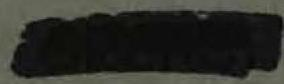
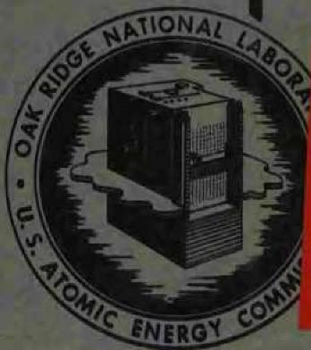
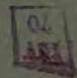
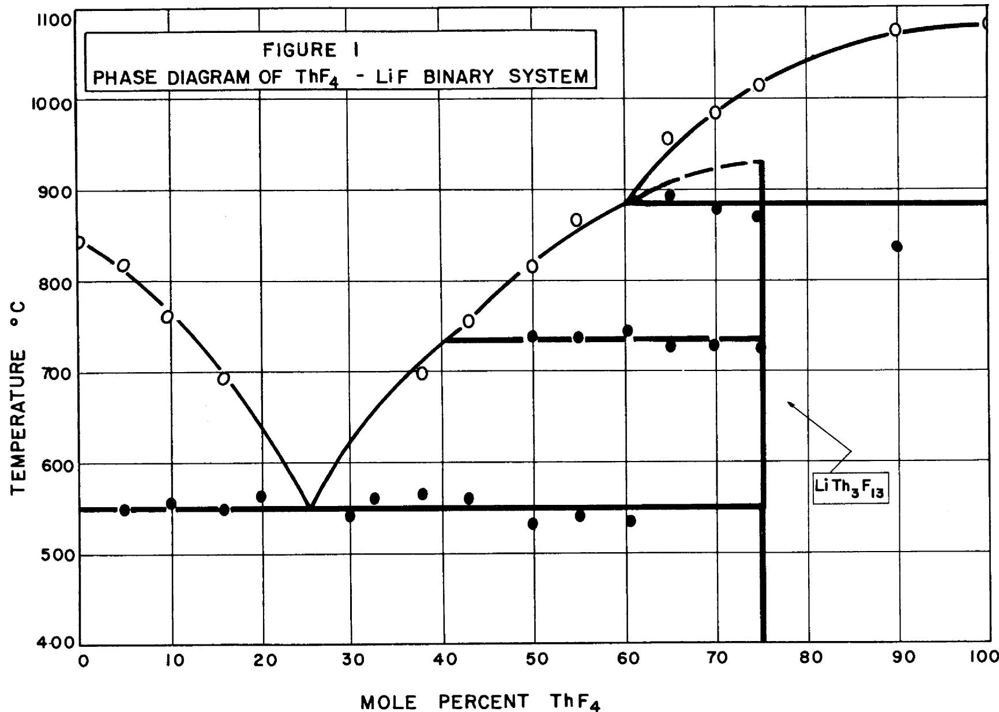
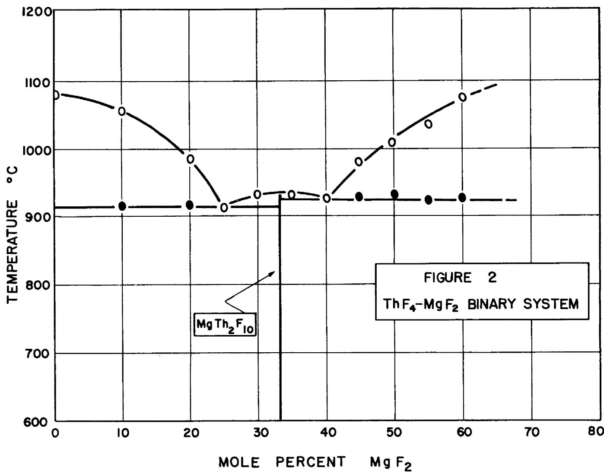
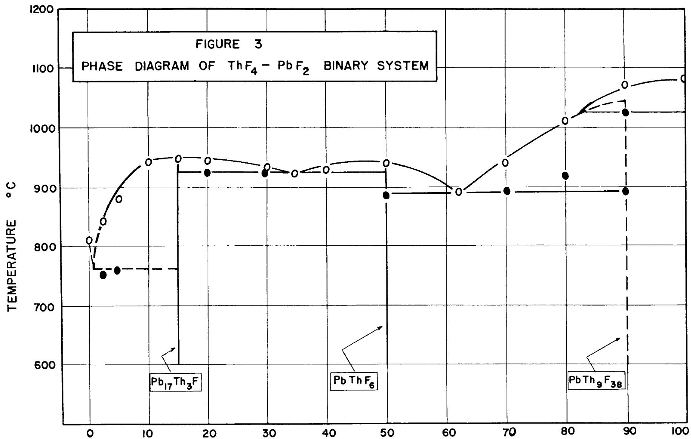

3445602848319

ARY

ORNL 1030

Reactors-Research and Power

AN INVESTIGATION OF

ThF4-FUSED SALT SOLUTIONS FOR

HOMOGENEOUS BREEDER REACTORS

J.O.Blomeke

AEG RESEARCH AND DEVELOPMENT REPORT

OAK RIDGE NATIONAL LABORATORY

CENTRAL RESEARCH LIBRARY

CIRCULATION SECTION

4500N ROOM 175

LIBRARY LOAN COPY

DO NOT TRANSFER TO ANOTHER PERSON

If you wish someone else to see this

The report, send in name with report and the letter

the library will arrange a loan.

UCN-7869(39-77)

OAK RIDGE NATIONAL LABORATORY

OPERATED BY

CARBIDE AND CARBON CHEMICALS COMPANY

A DIVISION OF UNION CARBIDE AND CARBON CORPORATION

UCC

POST OFFICE BOX P

OAK RIDGE, TENNESSEE

Report Number ORNL-1030  
This document consists of 23 pages.  
No. 9 of 125 Series A.

Contract No. W-7405, eng 26

CHEMICAL TECHNOLOGY DIVISION

AN INVESTIGATION OF $\mathsf{ThF}_4$ - FUSED SALT SOLUTIONS FOR HOMOGENEOUS BREEDER REACTORS

J. O. Blomeke

Work by:

J. O. Blomeke

C. P. Johnston

DATE ISSUED:

JUN 19 1951

OAK RIDGE NATIONAL LABORATORY

Operated by

CARBIDE AND CARBON CHEMICALS COMPANY

A Division of Union Carbide and Carbon Corporation

Post Office Box P

Oak Ridge, Tennessee

ORNL-1030

Reactors-Research

and Power

# INTERNAL DISTRIBUTION

1. G. T. Felbed (C&CCC)   
2-3. Chemistry Library   
4. Physics Library   
5. Biology Libran   
6. Health Physics Library   
7. Metallurgy Library   
8-9. Training School Library   
10-13. Central Files   
14. C. E. Center   
15. C. E. Larson   
16. W.B.Humes (K-25)

17. W. D. Lavers (Y.)   
18. A. M. Weinberg   
19. E. H. Taylor   
20. E. D. Shipl   
21. F. C. Vonderlage   
22. F. L. Steiny   
23. J. A. Swartout   
24. A.H.S1   
25. A.Holender   
26. K. Z. organ   
27. D. W. Cardwell

28. M. T. Kelley   
29. W.H. Pennington   
30. W. K. Eister   
31. F. R. Bruce   
32. F. L. Culler   
33. J.O.Davis   
34. H. K. Jackson   
35. J. O. Blomeke   
36. W.R.Grimes   
37. R. R. Hood   
38. C.H.Secoy

# EXTEFL DISTRIBUTION

39-50. Argonne National Laboratory

51-58. Atomic Energy Commission, Washington

59. Battelle Memorial Institute

60-63. Brookhaven National Laboratory

64. Bureau of Ships

65-70. Carbide and Carbides Chemicals Company (Y-12 Area)

71. Chicago Patent Group   
72. Chief of Naval Research

73-76. duPont Company,

77. H. K. Ferguson, Company

78-81. General Electric Company, Richland

82. Hanford Operations Office

83-86. Idaho Operations Offi

87. Iowa State bllege

88-91. Knolls At tioc Power Lab ratory

92-94. Los Alam

95. Massachusetts Institute of Technology (Kaufmann)   
96. Nation Advisory Committee for Aeronautics

97-98.New York Operations Office

99. North American Aviation, II.   
100. Pat L. Branch, Washington   
101. Sa mah River Operations Office

102-103. University of California Radiation Laboratory

104-107. Singhouse Electric Corporation on   
108-110. Wright-Patterson Air Force Bas   
111-125. Technical Information Service, Tak Ridge

# Abstract

A consideration of the characteristics of fused salt- $\mathrm{ThF_4}$ solutions suitable for use in homogeneous reactors is presented, together with a brief survey of the literature pertaining to such solutions and a summary of the experimental work accomplished.

# Summary

Fused salt solutions containing thorium, primarily by virtue of their generally low vapor pressures, will probably assume a role of increasing importance as blanket and fuel solutions of high temperature power and breeder reactors. The literature offers little information on $\mathsf{ThF_4}$ solutions with other salts and contains no reference to a specific solution which would be satisfactory for homogeneous reactor use. Experimental work has been initiated with a view to finding an acceptable $\mathsf{ThF_4}$ solution. Binary systems of $\mathsf{ThF_4}$ with LiF, $\mathsf{MgF_2}$ , $\mathsf{PbF_2}$ , $\mathsf{AlF_3}$ and $\mathsf{UF_4}$ have been investigated and some preliminary measurements have been made on the ternary, $\mathsf{ThF_4}-\mathsf{LiF}-\mathsf{MgF_2}$ , and the quaternary, $\mathsf{ThF_4}-\mathsf{LiF}-\mathsf{MgF_2}-\mathsf{NaF}$ . To date, the mixtures found which are of most interest are a $\mathsf{ThF_4}-\mathsf{LiF}$ binary eutectic containing 26 mole % $\mathsf{ThF_4}$ and melting at $550^{\circ}\mathrm{C}$ , and a quaternary eutectic containing 20 mole % $\mathsf{ThF_4}$ , 62.3 mole % $\mathsf{LiF}$ , 12.7% NaF and 5% $\mathsf{MgF_2}$ , melting at $530^{\circ}\mathrm{C}$ . The concentration of Th in both of these mixtures is greater than 1000 g/liter and the ratios of the neutron capture cross section of Th-232 to the sum of the cross sections of the other constituents of the mixture are 73 in the case of the binary and 16 for the quaternary.

It is believed that a further reduction of the melting point of $\mathrm{ThF}_4$ can be obtained in fluoride solutions meeting other requirements for reactor use and that the search for such solutions should be continued when the design and construction of homogeneous U-233 power-breeders comes nearer to actuality.

# Introduction

Fused salt solutions for service as either reactor fuels or breeding blankets in high-temperature power or breeder reactors appear to combine many of the more desirable features of both aqueous media and liquid metal and alloy systems. They might be expected to possess the low vapor pressures characteristic of liquid metals and alloys while, at the same time, they might contain the high concentrations of fuel or breeding material expected of aqueous systems. Since the Chemical Technology Division is a group concerned primarily with the chemical processing of reactor product solutions, it was felt that some familiarity with fused salts and especially with problems likely to arise in their processing should be acquired.

A considerable effort has been underway for some time in the Materials Chemistry Division to find a $\mathsf{UF}_4$ -fused fluoride solution suitable for use as a fuel for the aircraft reactor of the ANP Project and a survey of the literature relative to this problem has been made. (1) Other work of this nature has been carried out at Battelle. (2) Relatively little experimental work has been done with $\mathsf{ThF}_4$ in such solutions and so far as is known, no organized program of research on this subject is at present underway. Consequently, it was believed that a search for a fused fluoride solution containing Th which would be suitable for use in a U-233 breeder reactor would serve the double purpose of initiating studies along a line of great potential interest to the planning and design of future reactors and, at the same time, would serve as a starting point in the study of the chemical processing of fused salt systems in general.

# Introduction (continued)

The experimental work covered by this report represents only the first step of a search for a thorium solution satisfactory for use in some future homogeneous reactor. Considerably more effort will probably be necessary before such a solution is found.

The remainder of this report is divided into three parts. The first part deals with the specifications for an acceptable thorium reactor solution; the second deals with the results of a literature survey made at one stage of the problem; and the last part is devoted to a description and discussion of the experimental work accomplished.

# Thorium Reactor Solutions

Thorium-fused salt solutions could find use in either of two general applications in breeder reactors. One application is that in which the solution would be situated around and on the outside of the reactor core in the form of a so-called blanket; the second application might be in a self-moderated type of breeder in which the thorium would be present in the fuel solution together with U-233 and a moderator, e.g. beryllium.

With the assistance of R. B. Briggs of the Long Range Planning Group, several preliminary specifications, summarized in Table I, were proposed which could serve as a guide in the search for these thorium solutions. The four properties considered (cross section, Th composition, vapor pressure and melting point) do not represent either a complete or an inviolate list of the

# Table I

# General Requirements for Thorium Reactor Solutions

<table><tr><td>Characteristic</td><td>Blanket</td><td>Self Moderated Fuel</td></tr><tr><td>\( \sigma_{\text{Th-232}} \)</td><td>≥10</td><td>&gt;&gt;10</td></tr><tr><td>\( \angle \)other components</td><td></td><td></td></tr><tr><td>Composition</td><td>≥1000 g/L Th</td><td>Th = 1 atom
U-233 = 0.02 atom
Moderator = 100 atoms</td></tr><tr><td>Vapor Pressure</td><td>&lt;760 mm at 500-
800°C</td><td>&lt;760 mm at 500-800°C</td></tr><tr><td>Melting Point</td><td>≤300°C</td><td>≤300°C</td></tr></table>

Thorium Reactor Solutions (continued)

specifications required; they are intended to give merely a rough picture of what, in the light of current thinking, would be desirable characteristics for an eventual thorium reactor solution to possess.

In both applications, the nuclear considerations are of paramount importance. If the specifications of Table I are accepted, it becomes apparent that one is limited to only a small number of fluorides having sufficiently low capture cross sections and favorable vapor pressures to enable them to be used in a reactor solution with thorium. These salts are listed with their neutron capture cross sections and melting points in Table II.

It is realized that of the compounds listed in Table II, $\mathsf{ZrF}_4$ might prove unusable because of its tendency to sublime at temperatures of the order of several hundred degrees and $\mathsf{BiF}_3$ might eventually prove troublesome because of difficulty in preventing the displacement of $\mathsf{Bi}^{++}$ from the melt by many of the structural metals of which the container walls would normally be made. Other fluorides of slightly higher cross section than those listed in Table II might be considered for use but could, of course, be present only in relatively smaller concentrations.

# A Literature Survey

A survey of the project and open literature was made to supplement the search made by Grimes and Hill. (1) Special emphasis was placed on phase studies of the particular salts listed in Table II. The results of this survey which

Table II   
Cross Sections and Melting Points of Several Inorganic Fluorides   

<table><tr><td>Compound</td><td>Melting Point oC</td><td>Barns**</td></tr><tr><td>BeF2</td><td>800</td><td>0.03</td></tr><tr><td>Li7F</td><td>845*</td><td>0.034</td></tr><tr><td>BiF3</td><td>727</td><td>0.045</td></tr><tr><td>MgF2</td><td>1263</td><td>0.08</td></tr><tr><td>PbF2</td><td>813*</td><td>0.21</td></tr><tr><td>ZrF4</td><td>872</td><td>0.22</td></tr><tr><td>AlF3</td><td>1040</td><td>0.23</td></tr><tr><td>ThF4</td><td>1080*</td><td>7</td></tr></table>

** The cross section of F in this table has been taken as 0.01 barns.

* The figures so marked are experimental determinations made as part of the present work.

# A Literature Survey (continued)

were adjudged to be of the most interest to this problem are noted in Table III.

The $\mathsf{ThF}_4$ -KF and $\mathsf{ThF}_4$ -RbF reference was included in Table III despite the unfavorable nuclear characteristics of K and Rb because it represented the only specific reference to $\mathsf{ThF}_4$ eutectic mixtures found in the literature. Zachariasen(11) has studied double salt formation in the systems NaF- $\mathsf{ThF}_4$ and $\mathsf{KF}$ - $\mathsf{ThF}_4$ by the X-ray diffraction method but he apparently did not investigate the complete phase diagrams of these systems. $\mathsf{ThF}_4$ has also been found to form a very stable complex with Rb, having the formula, $\mathsf{Rb}_{3}\mathsf{ThF}_{7}$ . (3)

# Experimental

# Apparatus

The equipment used for this work was the same as that used by other workers for thermal analysis studies of $\mathrm{UF_4}$ salt mixtures. (12) In essence, it consisted of a 5-inch chromel-wound pot furnace capable of operation at temperatures up to $1100^{\circ}\mathrm{C}$ . The temperature of the furnace was controlled by means of a variable transformer connected in series with the A. C. supply. The salt mixtures were heated in graphite crucibles which fit into the furnace in such a manner that an atmosphere of $\mathbf{N}_2$ could be maintained over the melt during heating and cooling periods. Temperatures were measured by means of a chromel-alumel thermocouple situated on the inside of a graphite stirrer which extended to the bottom of the crucible. The temperatures were measured and recorded by a Brown "Electronik" potentiometer and tests indicated that the temperatures

Table III   
Some Published Phase Relationships of the Fluorides of Table II   

<table><tr><td>System</td><td>Eutectic Composition
Mole Percent</td><td>Eutectic Temp.
oc</td><td>Reference</td></tr><tr><td rowspan="4">ThF4-KF</td><td>17 ThF4</td><td>664</td><td rowspan="4">(3)</td></tr><tr><td>33 ThF4</td><td>750</td></tr><tr><td>57 ThF4</td><td>878</td></tr><tr><td>80 ThF4</td><td>954</td></tr><tr><td rowspan="3">ThF4RbF</td><td>15 ThF4</td><td>664</td><td rowspan="3">(3)</td></tr><tr><td>37 ThF4</td><td>762</td></tr><tr><td>80 ThF4</td><td>1000</td></tr><tr><td rowspan="2">LiF-AlF3</td><td>14.5 AlF3</td><td>706</td><td rowspan="2">(4)</td></tr><tr><td>37 AlF3</td><td>691</td></tr><tr><td>LiF-AlF3</td><td>36 AlF3</td><td>710</td><td>(5)</td></tr><tr><td>LiF-MgF2</td><td>33 MgF2</td><td>742</td><td>(6)</td></tr><tr><td>LiF-MgF2</td><td>53 MgF2</td><td>718</td><td>(7)</td></tr><tr><td>LiF-BeF2</td><td>52 BeF2</td><td>360</td><td>(8)</td></tr><tr><td rowspan="2">LiF-MgF2-NaF</td><td>10 MgF2, 43 NaF</td><td>630</td><td rowspan="2">(6)</td></tr><tr><td>29 MgF2, 12 NaF</td><td>684</td></tr><tr><td>MgF2-BeF2</td><td>Complete Miscibility</td><td></td><td>(9)</td></tr><tr><td>BiF3-PbF2</td><td>Complete Miscibility</td><td></td><td>(10)</td></tr></table>

so recorded were accurate to $\pm 5^{\circ}C$

# Materials

# ThF4

The thorium fluoride used was obtained from the Iowa State College. The thorium analyzed, gravimetrically, $75.1\%$ and the fluoride, $25.5\%$ . The theoretical Th content is $75.3\%$ . A spectrographic analysis indicated the sample was essentially free of rare earths. The melting point of this $\mathrm{ThF}_4$ was found by experiment to be $1080 \pm 5^{\circ}\mathrm{C}$ . No reference could be found to a previous melting point determination for this compound.

# AIF3

The $\mathrm{AlF}_3$ was prepared from a stock of Baker and Adamson $\mathrm{AlF}_3\cdot xH_2O$ by heating the hydrated material in an atmosphere of HF to about $600^{\circ}\mathrm{C}$ over a period of 3 to 5 hours. The vendor reported impurities in the $\mathrm{AlF}_3\cdot xH_2O$ amounting to less than $0.014\%$ . The dehydrated product analyzed $32.5\%$ Al and $67.9\%$ F. (theoretical $\mathrm{Al} = 32.1\%$ ). The high volatility of $\mathrm{AlF}_3$ in the neighborhood of $1000^{\circ}\mathrm{C}$ prevented an experimental determination of its melting point with the equipment on hand.

# MgF2

The $\mathbf{MgF}_2$ used in this work was purchased from Eimer and Amend and was reported by them to be $99\%$ pure. A spectrographic analysis indicated the major impurities to be Ca, Na, Cr, Fe and Ta.

# PbF2

The $\mathbf{FbF}_2$ used was Baker and Adamson "Purified" material and was not

$\underline{\mathrm{PbF}}_2$ (continued)

analyzed chemically. The melting point was found experimentally to be $813 \pm 5^{\circ} \mathrm{C}$ , which may be compared with a literature value of $822^{\circ} \mathrm{C}$ . (13)

LIF

The LiF was material purchased from the Maywood Chemical Works. No analysis of the LiF was carried out but an experimental determination of its melting point $(845^{\circ}\mathrm{C})$ agreed exactly with the most reliable value obtained from the literature. On the basis of this agreement and its clean appearance, it is believed that this was material of high purity.

UF4

The UF4 used was obtained from K-25 through the ORNL SF Accountability Office.

Prior to their use in this work, all of the chemicals were dried by heating in an oven at $110 - 115^{\circ}C$ for 24 hours and were stored in dessicators upon removal from the oven.

# Results

ThF4-L1F

The phase diagram for this system is given in Figure 1. A eutectic containing about 26 mole $\%$ ThF $_4$ is formed which melts at $550^{\circ}\mathrm{C}$ . Some difficulty was experienced in obtaining liquidus points from cooling curves of mixtures in the vicinity of the eutectic because of very pronounced supercooling. A compound with an incongruent melting point at about $925^{\circ}\mathrm{C}$ is formed at 75 mole $\%$ ThF $_4$ .

# ThF1-MgF2

The $\mathsf{ThF}_4$ -rich side of this system up to 60 mole $\%$ $\mathsf{MgF}_2$ was investigated and the results are shown in Figure 2. Two eutectics were found which melted at $915^{\circ}$ and $925^{\circ}$ C corresponding to compositions of 25 mole $\%$ and 40 mole $\%$ $\mathsf{ThF}_4$ , respectively. A compound with a congruent melting point of $937^{\circ}$ was indicated at 33 mole $\%$ $\mathsf{MgF}_2$ and can be represented by the formula, $\mathsf{MgTh}_2\mathsf{F}_{10}$ . The investigation of this binary system was not carried further than $60\%$ $\mathsf{MgF}_2$ because of the temperature limitations of the equipment but it seems probable that no further eutectics of immediate interest to this problem would be found at higher $\mathsf{MgF}_2$ concentrations.

# ThF-PbF2

The proposed phase diagram for this system is given in Figure 3. Two eutectics were obtained, one at 35 mole $\%$ ThF $_4$ , melting at $925^{\circ}$ and a second at 62 mole $\%$ ThF $_4$ which melted at $880^{\circ}$ C. Some indications of a third eutectic melting at about $760^{\circ}$ and containing less than 2 mole $\%$ ThF $_4$ were obtained but its presence was not definitely established. Two compounds with congruent melting points at about $950^{\circ}$ and $942^{\circ}$ C were indicated, corresponding to the formulas Pb $_{17}$ Th $_{3}$ F $_{46}$ and PbThF $_{6}$ , respectively. A third compound having an incongruent melting point of about $1045^{\circ}$ C was indicated with a formula, PbTh $_{9}$ F $_{38}$ .

Measurements of this binary proved unsatisfactory in a sense because of a reduction of the $\mathsf{Pb}^{+ + }$ to elemental Pb by the graphite crucible and stirrer. This reduction was not observed to occur appreciably at temperatures less than $800^{\circ}$ but became a greater problem with increasing temperature.

  
MOLE PERCENT Th $F_{4}$

# ThF4-A1F3

Considerable effort was expended on this system with only moderate success. The $\mathrm{AlF}_3$ sublimed at temperatures from 900 to $1100^{\circ}\mathrm{C}$ to such an extent that reliable results could not be obtained with mixtures containing more than 20 mole $\%$ $\mathrm{AlF}_3$ . A reproducible eutectic halt was obtained at about $950^{\circ}\mathrm{C}$ in the cooling curves of this binary system but the composition of the eutectic mixture could not be determined. It is estimated that it lay somewhere in the vicinity of 25 mole $\%$ $\mathrm{AlF}_3$ .

# ThF4-UF4

The isomorphism of $\mathbf{ThF}_4$ and $\mathbf{UF}_4^{(17)}$ would lead one to expect them to be miscible in both the solid and liquid states. Although supercooling prevented the accurate determination by thermal analysis of a phase diagram for this system, indications were that liquidus and solidus curves existed which exhibited neither a maximum nor minimum point. X-ray analyses of several of the solidified melts showed that solid solutions were formed.

# ThF4-L1F-MgF2

This was the only ternary system investigated to any appreciable extent and it was studied in only an exploratory manner. An indication of a ternary eutectic of high $\mathrm{ThF_4}$ content melting at $690^{\circ}$ was obtained but since this temperature was greatly in excess of the desired melting point, no formal attempt was made to establish the composition.

# ThF4-LiF-NaF-MgF2

A reference found in the literature to the NaF-LiF-MgF $_2$ eutectics(3)

ThF4-LiF-NaF-MgF2 (continued)

seemed worthy of further investigation, especially the secondary eutectic containing only $12\%$ NaF. Experiments were carried out which consisted, at first, of adding $\mathrm{ThF}_4$ to the $29\% \mathrm{MgF}_2$ , $12\%$ NaF, $59\%$ LiF eutectic mixture and finally, of changing the concentrations of the other components empirically. In this way, a quaternary eutectic was obtained which melted at $530^{\circ}\mathrm{C}$ . The approximate composition of this eutectic, expressed in mole percentages was:

20.0% ThF4

62.3 LiF

12.7 NaF

5.0 $\mathbf{MgF}_2$

UF1-L1F-NaF-MgFO

Proceeding along the same lines as described above for the case of the $\mathrm{ThF_4}$ quaternary mixture, a eutectic was found in this system which melted at about $460^{\circ}\mathrm{C}$ . Its approximate composition was:

25.0% UF4

58.2 L1F

11.8 NaF

5.0 $\mathbf{MgF}_2$

# Discussion

Of the systems studied, two eutectic mixtures stand out in the respect that their melting points are both more than $100^{\circ}$ under the next lowest melting mixture found. The eutectics referred to are the $\mathrm{ThF_4}$ -LiF binary eutectic, containing 26 mole $\%$ $\mathrm{ThF_4}$ and melting at $550^{\circ}$ and the $\mathrm{ThF_4}$ -LiF-NaF-MgF $_2$ quaternary, containing 20 mole $\%$ $\mathrm{ThF_4}$ and melting at $530^{\circ}$ C. The concentration of Th

# Discussion (continued)

in these eutectics corresponds to about $2000\mathrm{g / L}$ in the binary and $1500\mathrm{g / L}$ in the quaternary. The neutron capture cross section ratios (Table I) are 73 and 16, respectively and the vapor pressures at $800^{\circ}\mathrm{C}$ were, by observation, much less than $760~\mathrm{mm}$ . On the other hand, the melting points are still considerably higher than the $300^{\circ}\mathrm{C}$ taken as the maximum desirable melting point.

The $\mathsf{ThF}_4\text{-}\mathsf{PbF}_2$ $\mathsf{ThF}_4\text{-}\mathsf{MgF}_2$ and $\mathsf{ThF}_4\text{-}\mathsf{AlF}_3$ binary systems show no eutectic of sufficiently low melting point to be of immediate interest to this problem. Their principle value lies in the contribution they would make to a study of ternary systems containing these components. From the same viewpoint, binary systems of $\mathsf{ThF}_4$ with $\mathsf{BeF}_2$ $\mathsf{BiF}_3$ and $\mathsf{ZrF}_4$ should be investigated.

The $\mathsf{UF_4}$ -LiF-NaF-MgF $_2$ quaternary eutectic is similar in both melting point and uranium concentration to a $\mathsf{UF_4}$ -LiF-NaF ternary eutectic reported previously as being under consideration as a fuel for the ANP reactor. $^{(15)}$ Although indications are that the unavailability of Li $^7$ isotope will preclude, for the time being, the use of a LiF constituted fuel in this reactor, it should be pointed out that, other factors being equal, the better neutron economy of this quaternary would likely make it more acceptable than the ternary eutectic.

The similarity between the diagram found for the $\mathsf{ThF}_4$ -LiF system and that obtained by Grimes, et. al. (12) for $\mathsf{UF}_4$ -LiF is rather remarkable. A $\mathsf{UF}_4$ -LiF eutectic melting at $480^{\circ}\mathsf{C}$ was found at about 26 mole $\%$ $\mathsf{UF}_4$ and likewise a compound, $\mathsf{LiU}_3\mathsf{F}_{13}$ , with an incongruent melting point was obtained. The same investigators (16) have found a eutectic in the $\mathsf{UF}_4$ - $\mathsf{PbF}_2$ system at 62 mole $\%$ $\mathsf{UF}_4$

# Discussion (continued)

which melts at about $730^{\circ}$ and have obtained a diagram for the $\mathrm{UF}_4$ - $\mathrm{PbF}_2$ system which conforms in most principle respects to the character of the diagram presented in Figure 3. No attempt was made to rigorously define the extent of the similarity between $\mathrm{ThF}_4$ and $\mathrm{UF}_4$ systems but from indications obtained in this investigation, a close coordination between the work done on these two general systems should be maintained.

From the results obtained thus far in this work, the possibility seems rather remote that a mixture meeting all the specifications set for this problem will be found. On the other hand, there appears to be a very real likelihood that mixtures which come nearer meeting them than anything so far found can be obtained and such mixtures might eventually prove as satisfactory for reactor use as the "ideal" one considered here. The work done to date can be considered as no more than a start on such a search and whenever the importance of this problem is adjudged more immediate, a thorough and more nearly complete solution to the problem should be allowed.

# Bibliography

(1) Grimes, W. R. and D. G. Hill, "High Temperature Fuel Systems - A Literature Survey," Y-657, (July 20, 1950).   
(2) Chase, L. H., R. C. Crooks, J. N. Pattison, J. J. Ward and J. W. Clegg, "Chemistry of Liquid Fuels for Nuclear Reactors," BMI-T-53, (January 15, 1951).   
(3) Dergunov, E. P. and A. G. Bergman, Doklady Akad. Nauk. S.S.S.R. 60, 391-4 (1948).   
(4) Puschin, N. A. and A. V. Baskoff, Z. anorg. Chem. 81, 347 (1913).   
(5) Fedotiev, P. P. and K. Timofeev, Z. anorg. allgem. Chem. 206, 263 (1932).   
(6) Bergman, A. G. and E. P. Dergunov, Compt. rend. acad. sci. U.R.S.S. 31, 755 (1941).   
(7) Hyniski, V. P. and P. F. Antipine, Chinie et industrié 17, 601 (1927).   
(8) Roy, Della M., Rustum Roy and E. E. Osborn, J. Am. Ceram. Soc. 33, 85 (1950).   
(9) Venturello, Giovanni, Atti. acad. sci. Torino, Classe sci. fis., mat. nat. 76 I., 556-63 (1941); Chem. Zentr. 1942 I., 1114.   
(10) Croatto, Ugo, Gazz. chim. Ital. 74, 20 (1944).   
(11) Zachariasen, W. H., J. Am. Chem. Soc. 70, 2147 (1948). See also CC-3401, (Jan. 10, 1946), and CC-3426, (Feb. 9, 1946).   
(12) "Chemistry of Liquid Fuel Systems," The Aircraft Nuclear Propulsion Project Quarterly Progress Report for Period Ending August 31, 1950, ORNL-858, p. 104 ff (December 4, 1950).   
(13) Tables of Selected Values of Chemical Thermodynamic Properties, Series 2, U.S. Nat'l.Bur. Standards, 1947, p. 27-1.   
(14) , p. 91-1.   
(15) "Chemistry of Liquid Fuels," The Aircraft Nuclear Propulsion Project Quarterly Progress Report for Period Ending December 10, 1950, ORNL-919 p. 234 ff (February 26, 1951).

(16) Grimes, W. R., et al., Unpublished results.   
(17) Zachariasen, W. H., "The Crystal Structure of Fluorides of Th, U, Np and Pu," MDDC-1151, (January 11, 1947).