T 10000000000000000000000000000000000000000000000000000

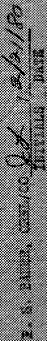

AIRCRAFT NUCLEAR PROPULSION PROJECT

QUARTERLY PROGRESS REPORT

FOR PERIOD ENDING SEPTEMBER 10, 1991

1

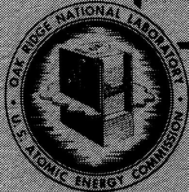

#

OAK RIDGE NATIONAL LABORATORY

C. 丙组中 ${\mathrm{F}}_{1}$ 雄性为 9：3

CABBLE AND

CARBON CHEMICALS COMPANY

C CLASSIFICATION CANCELLI. 00E kU.

1400000000000000000000000000000

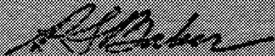

A

DFTDTFTT

1

Contract No. W-7405, Eng-26

# AIRCRAFT NUCLEAR PROPULSION PROJECT

# QUARTERLY PROGRESS REPORT

# for Period Ending September 10, 1951

R. C. Briant

Director, ANP Project

C. B. Ellis

Coordinator, ANP Project

Edited by:

W. B. Cottrell

DATE ISSUED:

17 1951

OAK RIDGE NATIONAL LABORATORY

Operated by

CARBIDE AND CARBON CHEMICALS COMPANY

A Division of Union Carbide and Carbon Corporation

Post Office Box P

Oak Ridge, Tennessee

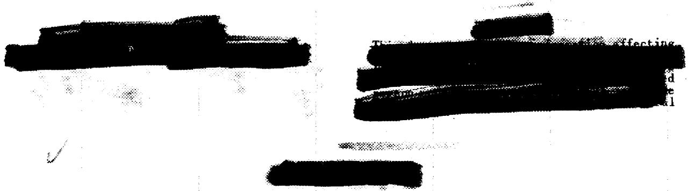

# INTERNAL DISTRIBUTION

1 G. T. Felbeck (C&CCC) 37   
2-3 Chemistry Library 38   
4 Physics Library 39   
5 Biology Library 40   
6 Health Physics Library 41   
7 Metalurgy Library 42   
8-9 Training School Library 43   
10-13 Central Files 44   
14 C.E. Center 45   
15 C.E.Larson 46   
16 W.B.Humes (K-25) 47   
17 W.D.Lavers (Y-12) 48   
18 A.M.Weinberg 49   
19 E.H.Taylor 50   
20 E. D. Shipley 51   
21 E.J.Murphy 52   
22 F.C.VonderLage 53   
23 R.C.Briant 54   
24 J.A.Swartout 55   
25 C.B.Ellis 56   
26 A.H.Snell 57   
27 A.Hollander 58   
28 F. L. Steahly 59   
29 K.Z.Morgan 60   
30 D.W.Cardwell 61   
31 M. T. Kelley 62   
32 E.M. King 63   
33 C.E.Winters 64   
34 J.A.Lane 65   
35 J.H.Buck 66   
36 J.P.Gill 76

R. W. Stoughton   
F. R. Bruce   
H. W. Savage   
W. K. Eister   
A. S. Householder   
C. B. Graham   
R. N. Lyon   
C.P.Keim   
W.R.Gall   
A.J.Miller   
R.W.Schroeder   
D. S. Billington   
E. P. Blizzard   
C. E. Clifford   
G. H. Clewett   
A. D. Callihan   
R. S. Livingston   
W. D. Manly   
J. L. Meem   
C. D. Susano   
W. B. Cottrell   
W. M. Breazeale   
W. R. Grimes   
A. Brasunas   
N. M. Smith   
H. F. Poppendiek   
F. C. Uffelman   
D. D. Cowen   
P. M. Reyling   
66-75 ANP Library   
76-81 Central Files (O.P.)

# EXTERNAL DISTRIBUTION

82-103 Aircraft Nuclear Propulsion Project, Oak Ridge

104-113 Argonne National Laboratory

114 Armed Forces Special Weapons Project (Sandia)

115-122 Atomic Energy Commission, Washington

123 Battelle Memorial Institute

124-126 Brookhaven National Laboratory

127 Bureau of Aeronautics

128 Bureau of Ships

129-134 Carbide and Carbon Chemicals Company (Y-12)

135 Chicago Patent Group

136 Chief of Naval Research

137-141 duPont Company

142-145 General Electric Company, Richland

146 H. K. Ferguson Company

147 Hanford Operations Office

148-151 Idaho Operations Office

152 Iowa State College

153-156 Knolls Atomic Power Laboratory

157-159 Los Alamos

160 Massachusetts Institute of Technology (Kaufmann)

161-162 Mound Laboratory

163-166 National Advisory Committee for Aeronautics, Cleveland

167 National Advisory Committee for Aeronautics, Washington

168-169 New York Operations Office

170-171 North American Aviation, Inc.

172 Patent Branch, Washington

173 Savannah River Operations Office

174-175 University of California Radiation Laboratory

176-179 Westinghouse Electric Corporation

180-188 Wright Air Development Center

189-203 Technical Information Service, Oak Ridge

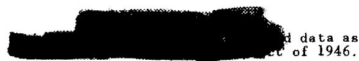

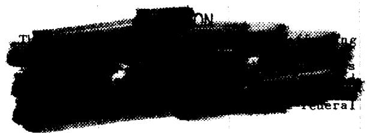

Reports previously issued in this series are as follows:

ORNL-528 Period Ending November 30, 1949

ORNL-629 Period Ending February 28, 1950

ORNL-768 Period Ending May 31, 1950

ORNL-858 Period Ending August 31, 1950

ORNL-919 Period Ending December 10, 1950

ANP-60 Period Ending March 10, 1951

ANP-65 Period Ending June 10, 1951

TABLE OF CONTENTS   
Part I. REACTOR THEORY AND DESIGN   

<table><tr><td></td><td>PAGE
NO.</td></tr><tr><td>SUMMARY</td><td>1</td></tr></table>

<table><tr><td>1. THE AIRCRAFT REACTOR EXPERIMENT</td><td>9</td></tr><tr><td>Core Design</td><td>9</td></tr><tr><td>Fluid Circuit</td><td>10</td></tr><tr><td>Heat-disposal circuit</td><td>10</td></tr><tr><td>Contamination of helium system</td><td>10</td></tr><tr><td>Control of the ARE</td><td>11</td></tr><tr><td>Liquid-fuel control system</td><td>11</td></tr><tr><td>Solid absorber rod design</td><td>11</td></tr><tr><td>Electronic computer design</td><td>12</td></tr><tr><td>Electrical Circuit</td><td>12</td></tr><tr><td>Remote-Handling Equipment</td><td>12</td></tr><tr><td>Building Facility for the ARE</td><td>12</td></tr></table>

# 2. EXPERIMENTAL REACTOR ENGINEERING 14

<table><tr><td>Liquid-Fuel Systems</td><td>14</td></tr><tr><td>Pump Development</td><td>15</td></tr><tr><td>Centrifugal pumps for figure-eight loops</td><td>15</td></tr><tr><td>ARE pump design</td><td>16</td></tr><tr><td>Canned-rotor pump</td><td>17</td></tr><tr><td>Level tank pump</td><td>17</td></tr><tr><td>Electromagnetic pumps</td><td>17</td></tr><tr><td>Test Loops</td><td>20</td></tr><tr><td>Calibration loop</td><td>20</td></tr><tr><td>Sodium manometer loop</td><td>20</td></tr><tr><td>Seal Tests</td><td>20</td></tr><tr><td>Frozen-sodium seal</td><td>21</td></tr><tr><td>Bellows seal</td><td>21</td></tr><tr><td>Graphitar and tool steel seal</td><td>21</td></tr><tr><td>Instrumentation</td><td>23</td></tr><tr><td>Stress-Rupture Tests</td><td>23</td></tr><tr><td>Self-Welding Tests</td><td>24</td></tr><tr><td>Valve-Packing Experiments</td><td>24</td></tr></table>

PAGE NO.

Contamination of Liquid-Metal Systems 25

Cleaning of liquid-metal systems 25   
Purification of liquid metals 26   
Purification of inert gases 26   
Analytical results with sodium 26

Investigation of Sodium Condensation 27

ARE Component Tests 27

Heat-Exchanger Tests 28

Building Modifications and Experimental Facilities 28

Alkali Metals Manual 30

3. REACTOR PHYSICS 31

IBM Calculations 32

Production report 32   
The multiregion reactor problem 33   
Cylindrical multigroup calculation 33   
The effect of the boron blanket in the ANP reactor 33

StaticsoftheAircraftReactorExperiment 34

Summary of calculations on the ARE 34   
Estimated critical mass of the ARE 36   
Control rod effectiveness 37

Kinetics of the Aircraft Reactor Experiment 48

Mass-reactivity coefficient 49   
Fuel conductivity 49   
Neutron lifetime 56   
Start-up accident 56   
Coolant temperature 56

Preparatory Physics Calculations 60

Correction to "Wigner formula for resonance escape" probability 60   
Effect of "Wigner formula for resonance escape" correction 64   
The transmission coefficient of the $\mathbf{B}_4\mathbf{C}$ curtain in the ANP and ARE reactors 66   
Heating in the boron carbide curtain in the ANP reactor 66   
Temperature savings in the ANP reactor 67

The Sodium Hydroxide Reactor 70

4. CRITICAL EXPERIMENTS 79

Critical Assembly of Air-Water Reactor 79

Critical Assembly of Graphite Reactor 80

# Part II. SHIELDING RESEARCH

# 5. BULK SHIELDING REACTOR 83

Reactor Operation 83

Mock-Up of the Unit Shield 83

Mock-Up of the Divided Shield 83

# 6.LID TANK 87

# 7. DUCT TEST 89

# 8. SHIELDING CALCULATIONS 91

Analysis of Bulk Shielding Reactor Neutron Data 91

Interpretation of Lid Tank Gamma-Ray Data 92

Shielding Calculations for the ARE 92

Activation of nitrogen and helium in the ARE reactor pit 92

Activation of impurities in BeO 93

Detection of leaks in the fuel elements by means of radioactive

NDA Divided-Shield Studies 93

Use of $\mathbf{NH}_3$ as a Shielding Material 94

Mechanical requirements of an ammonia shield 95

Calculational procedure 95

Comparison of shield weights using $\mathbf{NH}_3$ and $\mathbf{H}_2\mathbf{O}$ 96

# 9. NUCLEAR MEASUREMENTS 97

The 5-Mev Van de Graaff Accelerator 97

Measurement of the $(n,2n)$ Reaction in Beryllium 97

Bremsstrahlung from Li 8 98

Radiation detection equipment 98

Bremsstrahlung activity 98

Time-of-Flight Neutron Spectrometer 100

PAGE NO.

# Part III. MATERIALS RESEARCH

# 10. CORROSION RESEARCH 103

Static Corrosion by Fluoride Fuels 104

The pretreatment process 104

Corrosion of structural metals 106

Corrosion of platinum 110

Static Corrosion by Moderator Coolants 112

Capsule technique with hydroxides 113

Corrosion by sodium hydroxide 113

Corrosion by potassium hydroxide 113

Corrosion by other hydroxides 118

Corrosion by binary hydrogenous systems 118

Static Corrosion by Fluoride Coolant Mixtures 118

Static Corrosion by Sodium 118

Static Corrosion Test of a Reactor System 122

Mass Transfer Phenomenon in Static Corrosion 122

Chemical-reaction mechanism for mass transfer 122

Experimental evidence 123

Dynamic Corrosion Tests in Thermal-Convection Loops 124

Corrosion by lithium and lead 124

Corrosion by sodium 129

Dynamic Corrosion Tests in Forced-Convection Loops 131

# 11. PHYSICAL PROPERTIES AND HEAT-TRANSFER RESEARCH 132

Investigation of Free Convection Within Liquid-Fuel Elements 132

Theoretical analysis of natural convection 132

Measurement of the fuel-element temperature distribution 133

Measurement of the fuel-element velocity distribution 134

Physical Properties 134

Heat capacity 134

Thermal conductivity of liquids 135

Thermal conductivity of solids 135

Falling-ball viscometer 136

Brookfield viscometer 136

Vapor pressure 136

Density 137

Heat-Transfer Coefficients 137

Heat transfer in fused hydroxides and salts

Heat transfer in boiling-liquid-metal systems

Heat transfer in molten lithium

# 12. METALLURGY AND CERAMICS

Welding of Inconel

Tensile tests

Fatigue tests

All-weld-metal tensile tests

Corrosion of welds

Special weld tests

Welding of Molybdenum

Creep of Metals in Controlled Atmospheres

Creep of 316 stainless steel

Creep of inconel

Creep of niobium

Creep test of loaded inconel tube

Stress-Relaxation Tests

Fuel-Element Fabrication

Hot rolling

Mechanically formed matrix

Loose-powder sintering

Rubberstatic pressing

Compatibility of potential fuel-element materials

Control-Rod Fabrication

Metal Cladding of Beryllium Oxide

Refractory Metals

Ceramics Laboratory

# 13. CHEMISTRY OF HIGH-TEMPERATURE LIQUIDS

Fuel Development

Low-melting fluoride systems

Preparation of $\mathbf{U}\mathbf{F}_3$

Homogeneous fuels

Moderator-Coolant Development

Preparation of pure sodium hydroxide

Preparation of other hydroxides

Decomposition pressures of hydroxides 165

Binary hydroxide systems 166

Hydroxide-fluoride systems 167

Hydroxide-borate systems 168

Coolant Development 168

# 14. RADIATION DAMAGE 170

Creep Under Irradiation 170

Radiation Effects on Thermal Conductivity 171

Irradiation of Fluoride Fuels 173

Pile irradiation of fuel capsules 173

Cyclotron irradiation of fuel capsules 173

Corrosion of Iron by Lithium Under Cyclotron Irradiation 174

Liquid Metals In-Pile Loop 174

# Part IV. ALTERNATE SYSTEMS

# 15. SUPERCRITICAL WATER REACTOR 179

Outline of a Specific Design 179

Fuel Elements and Assemblies 180

Reactivity 180

Stability 182

Pressure Shell 183

Shield 183

# 16. CIRCULATING-MODERATOR-COOLANT REACTOR: HKF 185

Operational Characteristics 185

Reactor Characteristics 186

Core Design 186

Reactor Physics 187

# 17. CIRCULATING-MODERATOR-COOLANT REACTOR: ORNL 188

Fluid-Circuit Specifications 188

Fuel-Element Design 188

Reactor Design 188

18. HIGH-TEMPERATURE POWER PLANT STUDIES 192

Sodium-Liquid-Vapor Compressor Jet 193

Helium-Cooled Reactors 194

# Part V. APPENDIXES

19. ANALYTICAL CHEMISTRY 199

Analysis of Reactor Fuels 200

Spectrographic results 200

Development of colorimetric methods 200

Determination of platinum 201

Oxygen in Sodium 201

Oxygen in Lead 201

Oxygen in Helium 201

Oxygen and Nitrogen in Lithium 202

Carbon in Lithium 202

Uranium Trifluoride in Uranium Tetrafluoride 202

Identification of Residue in Lithium-Metal Coolant System 203

Analytical Services 204

20. LIST OF REPORTS ISSUED 205

# LIST OF TABLES

TABLE NO. TITLE NO.   
3.1 Composition and Design Data of Core 93   
3.2 Volume Fractions of the Materials in the Side and Bottom Reflectors 37   
3.3 Summary of Calculations on the ARE Core Having 25 lb of Uranium and Reflector 520 38   
3.4 Calculation of Uranium Requirement for the ARE Design of 10 June 1951 41   
3.5 B4C Transmission Coefficients 67   
8.1 Comparison of Shield Weights Using $\mathbf{NH}_3$ and $\mathbf{H}_2\mathbf{O}$ 96   
10.1 Summary of Fluoride-Corrosion Data Obtained in 100 hr at $1000^{\circ}\mathrm{C}$ (1830°F) 111   
10.2 Summary of Corrosion Data Obtained in 100-hr Tests at $815^{\circ}\mathrm{C}$ with Mixtures of Sodium Hydroxide with Sodium Hydride, Sodium, or Water 119   
10.3 Corrosion and Operational Data on Lithium-Containing Thermal-Convection Loops 125   
10.4 Corrosion and Operational Data on Lead-Containing Thermal-Convection Loops 126   
12.1 Room-Temperature Tensile Properties of Inconel Tube-to-Header "Pairs" 142   
12.2 Inconel All-Weld-Metal Tensile Values 144   
12.3 Results of Investigations of $\mathbf{ZrO}_2$ as a Control Material 152   
13.1 Summary of Promising Fluoride Fuel Systems 156   
13.2 Solubility of Uranium in Hydroxides 161   
13.3 Solubility of Uranium in Mixtures Consisting of Sodium Hydroxide and Sodium Tetraborate 162   
13.4 Purification of NaOH by Recrystallization from Ethyl Alcohol 164   
13.5 Purification of NaOH by Recrystallization from $\mathbf{H}_2\mathbf{O}$ 164   
13.6 Decomposition Pressures of $\mathrm{Ba(OH)}_2\cdot (1.9)\mathrm{H}_2\mathrm{O}$ 166   
13.7 Low-Melting Non-Uranium Fluoride Eutectics 169

<table><tr><td>TABLE
NO.</td><td>TITLE</td><td>PAGE
NO.</td></tr><tr><td>14.1</td><td>Results of 31-Mev Alpha Irradiation of Lithium in Iron Capsules</td><td>175</td></tr><tr><td>15.1</td><td>Summary of Reactor Design-Point Values</td><td>181</td></tr><tr><td>17.1</td><td>Design Coolant Condition for Maximum and Cruise Power</td><td>190</td></tr><tr><td>17.2</td><td>Temperature Throughout Sodium Hydroxide Core</td><td>190</td></tr><tr><td>19.1</td><td>Determination of Uranium Trifluoride by Two Methods</td><td>203</td></tr><tr><td>19.2</td><td>Backlog Summary</td><td>204</td></tr></table>

# LIST OF FIGURES

FIGURE PAGE NO. TITLE NO.

2.1 Fluid-Bearing (Canned-Rotor) Pump 18

2.2 Comparison of General Electric and ANP Electromagnetic Pump Data $(750^{\circ}\mathrm{F},$ Sodium) 19

2.3 Centrifugal Pump with Frozen-Sodium Seal 22

2.4 Experimental Facilities 29

3.1 Schematic Drawing of ARE Core Arrangement 35

3.2 $k_{eff}$ vs. Uranium Weight for the ARE 37

3.3 Reactivity of the ARE Core Backed by Various Reflectors or Additional Core Material 39

3.4 Reflector Savings of Various Reflectors Backing the ARE Core 40

3.5 Spatial Distribution of the Lethargic Average of the Fast Flux 42

3.6 Spatial Distribution of the Thermal Flux in the Core 43

3.7 Flux Spectrum in the ARE 44

3.8 Leakage Spectrum from the ARE Core to the Reflector 45

3.9 Leakage Spectrum from the ARE Reflector 46

3.10 Spatial Power Distribution in the ARE 47

3.11 Radial Thermal-Flux Distribution in the ARE Reactor with Seven Control Rods; Placement No. 1 48

3.12 Radial Thermal-Flux Distribution in the ARE Reactor with Seven Control Rods; Placement No. 2 48

3.13 Radial Thermal-Flux Distribution in the ARE Reactor with Seven Control Rods; Placement No. 3 48

3.14 Response of Flux to a Step Increase in Reactivity for Various Reactivity Changes 50

3.15 Response of Fuel Temperature to Step Increase in Reactivity for Various Reactivity Changes 51

3.16 Phase Plot of Flux vs. Fuel Temperature for Various Step Increases in Reactivity 52

3.17 Power Response of ARE to Step Reactivity Change of 0.009125 with Various Mass-Reactivity Coefficients 53

FIGURE PAGE NO. TITLE NO.

3.18 Response of Fuel Temperature to a Step Increase of Reactivity of 0.009125 for Various Effective Mass-Reactivity Coefficients 54   
3.19 Phase Diagram of Flux vs. Fuel Temperature for Response of ARE to a Step Increase in Reactivity of 0.009125 55   
3.20 Response of Flux to a Step Increase in Reactivity of 0.002 for Various Average Neutron Lifetimes 57   
3.21 Phase Diagram of Relative Excess Power (Flux) vs. Fuel Temperature 58   
3.22 Phase Plot of Flux (or Power) vs. Fuel Temperature 59   
3.23 Neutron Absorption vs. Penetration with the $\mathbf{B}_4\mathbf{C}$ Layer of the ARE 68   
3.24 Absorption Spectrum for the 200-megawatt Sodium Hydroxide Reactor 73   
3.25 Leakage Spectrum for the 200-megawatt Sodium Hydroxide Reactor 74   
3.26 Fission Spectrum for the Bare Water-Moderated Reactor 75   
3.27 Leakage Spectrum for the Bare Water-Moderated Reactor 76   
3.28 Fission Spectrum for the Reflected Water-Moderated Reactor 77   
3.29 Leakage Spectrum for the Reflected Water-Moderated Reactor 78   
5.1 Preliminary Gamma-Ray Spectrum at 130 cm from the Water-Reflected Reactor 85   
5.2 Bulk Shielding Facility 86   
6.1 Comparison of Shields for 3- ft Reactor 88   
7.1 Neutron Attenuation in Water Around Duct 89   
7.2 Water Patch Around Duct 90   
8.1 Typical Composite Shield, $\mathbf{H}_2\mathbf{O}$ -Pb-NH3 95   
9.1 Bremsstrahlung from In-Pile Lithium Loop 99   
9.2 Absorption of Bremsstrahlung from Li\* Beta Rays 99

10.1 Inconel Specimen from Pretreating Pot in Which Fluoride Bath Mixture was "Deactivated" at $950^{\circ}\mathrm{C}$ for 100 hr 105   
10.2 Corrosion of Inconel by 3NaF-UF4 107

# FIGURE PAGE NO. TITLE NO.

10.3 Corrosion of 347 Stainless Steel by $3\mathrm{NaF - UF}_4$ 107   
10.4 Heat-Treated Inconel Specimen 108   
10.5 Corrosion of Inconel by Pretreated Fluoride Fuels 108   
10.6 Heat-Treated 316 Stainless Steel Specimen 109   
10.7 Corrosion of 316 Stainless Steel by Pretreated Fluoride Fuels 109   
10.8 Corrosion of Inconel by Dehydrated Commercial Sodium Hydroxide 114   
10.9 Corrosion of 316 Stainless Steel by Dehydrated Commercial Sodium Hydroxide 114   
10.10 Corrosion of Nickel A by Sodium Hydroxide 115   
10.11 Corrosion of Inconel by Dehydrated Commercial Potassium Hydroxide 115   
10.12 Corrosion of 316 Stainless Steel by Dehydrated Commercial Potassium Hydroxide 116   
10.13 Corrosion of Inconel by Strontium Hydroxide 116   
10.14 Corrosion of Iron by Strontium Hydroxide 117   
10.15 Corrosion of 318 Stainless Steel by Strontium Hydroxide 117   
10.16 Corrosion of Inconel by Pretreated Fluoride Coolant 120   
10.17 Corrosion of 316 Stainless Steel by Pretreated Fluoride Coolant 120   
10.18 Corrosion of 316 Stainless Steel by Sodium 121   
10.19 Metal Crystal Formation in Loop Containing Lead 127   
10.20 Failure in 316 Stainless Steel Loop Containing Lead 128   
10.21 Thermal-Convection Loop Operated with Lead 128   
10.22 Cold Zone of 446 Stainless Steel Loop Showing Attacked Surface and Metal Crystals Which Form in Lead (Dark Areas) 130   
10.23 Cold-Zone Weld in 1010 Steel Loop Showing Metal Crystal Formation Adjacent to Pipe Wall Covered with Iron Oxide, Presumably Formed During Loop Fabrication 130   
11.1 Schematic Diagram of Free Convection Apparatus 133   
11.2 Thermal Conductivity of Copper 136

# FIGURE NO.

# TITLE

# PAGE NO.

11.3 Schematic Diagram for Determining Heat-Transfer Coefficients 138   
11.4 Comparison of ORNL Lithium Heat-Transfer Data with Those of Other Investigators 140   
12.1 Effect of Penetration of Fatigue Life on Inconel Tube-to-Header Specimens 143   
12.2 Effect of Cold-Working Stainless Steel $\mathrm{UO_2}$ Cores 148   
12.3 Effect of Cold-Working Iron-- $\mathrm{UO}_2$ 148   
12.4 Effect of Particle Size of $\mathrm{UO}_2$ 150   
12.5 Die for Rubberstatic Pressing 151   
13.1 The System NaF-LiF-UF 4 157   
13.2 The System KF-LiF-UF 4   
13.3 The System RbF-LiF-UF 4 159   
13.4 The System NaF-KF-RbF-UF 160   
13.5 Sodium Hydroxide Purification Apparatus 163   
13.6 The System $\mathrm{Sr(OH)}_2\mathrm{-Ba(OH)}_2$ 167   
13.7 The System NaOH-LiOH 168   
14.1 Composite Plot of Three Bench (o) and Three In-Pile (●) Cantilever Creep Curves 172   
14.2 Liquid-Fuel Sample Container with Thermocouple Well and Pressure Fittings 173   
15.1 Supercritical Water Reactor Flow Arrangement 180   
15.2 Cross-Section of Fuel-Element Assembly 182   
16.1 Schematic Drawing of Reactor Core 185   
17.1 Sodium Hydroxide Cooled and Moderated Reactor 189   
17.2 Temperature Throughout Sodium Hydroxide Core 190   
17.3 Sodium Hydroxide Velocity and Film Coefficient Throughout Core 191

# SUMMARY

This quarterly progress report of the Aircraft Nuclear Propulsion Program at the Oak Ridge National Laboratory is divided into five parts: Reactor Design, Shielding Research, Materials Research, Alternative Systems, and Appendixes, each of which is discussed separately in this summary.

# Part I. REACTOR DESIGN

The Aircraft Reactor Experiment (Sec. 1). The design of the high-temperature Aircraft Reactor Experiment has been modified to use the 30-in. core instead of the 36-in. core, as proposed in the last report. All reactor components are on order with delivery expected this coming quarter. Design of the external fluid circuit is essentially complete, and many of the major components are on order. Construction of the building facility is on schedule.

Experimental Reactor Engineering (Sec. 2). Recent developments have included a frozen-sodium seal for a centrifugal pump, satisfactory operation of an electromagnetic pump and of a canned-rotor pump with sodium, operation of a liquid-metal valve at $1500^{\circ}\mathrm{F}$ without self-welding, and operation of a mock-up of the reactor liquid-fuel system. Techniques have been developed further for the handling and purification of sodium and sodium systems to minimize oxygen contamination; this has contributed appreciably to the successful operation of these systems at high temperatures.

Reactor Physics (Sec. 3). The reactor physics calculations have been devoted largely to statics and kinetics

of the ARE, although some analysis of a sodium hydroxide reactor and a full aircraft-size BeO reactor were completed. The uranium investment in the ARE is 29.2 lb, the slight increase over previous estimates being due largely to increased structural and material poisons in the completed design. As the change in reactivity for normal control is relatively insensitive to the location of the six outer control rods, they have been located to maintain the most uniform flux distribution. Calculated kinetic responses of the ARE to arbitrary changes in reactivity, as a result of possible accidents or failures, show the system to be well damped. Preliminary calculations of a sodium hydroxide reactor designed at ORNL have yielded data on leakage and absorption spectra of the core and indicate a critical mass of approximately 32 lb.

Critical Experiments (Sec. 4). The preliminary reactor assemblies which are being, or have been, investigated include simulations of the air-water aircraft reactor, proposed by General Electric, and a graphite-uranium assembly to study power and flux distributions. Measurements of this latter reactor were still being made at the end of the quarter. The two modifications of the air-water reactor demonstrated the savings in critical mass to be gained by decreasing the thickness of the water layers.

# Part II. SHIELDING RESEARCH

Bulk Shielding Reactor (Sec. 5). The measurements on the mock-up of the

# ANP PROJECT QUARTERLY PROGRESS REPORT

ideal unit shield have been completed and indicate a weight of 124,000 lb for a 3.8-ft spherical reactor. Construction of the mock-up of the divided shield is essentially complete, and preliminary shadow-shielding tests have been completed.

Lid Tank (Sec. 6). Recent measurements on the lead--borated water unit shield, in which the boron concentration has been increased to $1.3\mathrm{wt}\%$ , result in a unit shield weight for a 3-ft spherical core of 101,200 lb, 6000 lb lower than that calculated by the Shielding Board in ANP-53, a year ago.

Duct Test (Sec. 7). A practical treatment for liquid-metal ducts in a reactor shield has been demonstrated by the use of an extra conical layer of water around the duct as it emerges from the reactor shield. The weight of such a patch for a single 6-in. sodium duct surrounded by a 1-in. air-filled annulus is approximately 1000 lb.

Shielding Calculations (Sec. 8). Analysis of Lid Tank data has yielded "removal cross-sections" for lead, boron, and water of 3.4, 2.0, and 0.8 barns, respectively. The theoretical analysis of the divided shield is again being scrutinized very carefully. It seems likely that, when some of the approximations are better defined, the weight may be somewhat greater than previously supposed, although not prohibitively so. A weight advantage of several tons by using ammonia in the divided shield in preference to water has been demonstrated. An analysis of some possible radiation hazards associated with the ARE has also been made.

Nuclear Measurements (Sec. 9). The 5-Mev Van de Graaff generator is in operation, and preliminary experiments indicate its useful range of energies to be from below 0.2 MeV up to 6 MeV. An in-pile lithium loop has yielded data on Bremsstrahlung intensities, and measurements of the $(n,2n)$ reaction in beryllium were made. The installation of the neutron time-of-flight spectrometer at the LITR has progressed although fabrication of the assembly has been seriously delayed during the quarter.

# Part III. MATERIALS RESEARCH

Investigation of the materials problems of a high-temperature reactor continues to comprise a major part of the effort of the Aircraft Nuclear Propulsion Project. In addition to the empirical research on corrosion, radiation damage, materials fabrication, and reactor chemistry, this program includes the determination of the basic thermal and physical constants associated with these materials at reactor temperatures.

Corrosion Research (Sec. 10). Corrosion studies have been expanded to include corrosion by hydroxides and possible fluoride coolants as well as corrosion by the liquid metals and fluoride fuels already under investigation for some time. The extensive corrosion tests with sodium, both static and in thermal convection loops, conclusively demonstrate that sodium causes negligible corrosion to either inconel or a number of stainless steels at $1500^{\circ}\mathrm{F}$ . Static corrosion tests of the pretreated fluoride fuel mixtures indicate that containing of these liquids is likewise possible under the same circumstances. Corrosion attack by such pretreated fuels

averages about 1 milon stainless steel and 2 mils on inconel after 100 hr at $1500^{\circ}\mathrm{F}$ . Corrosion attack encountered with hydroxides and with hydroxide-bearing materials, however, is a great deal more severe. Both commercial and specially pure sodium hydroxide are extremely corrosive to inconel and to the stainless steels. Corrosion by potassium hydroxide is somewhat less severe. Tests with barium and strontium hydroxides indicate these caustics to be somewhat less corrosive than either of the alkali hydroxides, but still so severe as to preclude their use at this time. Rigid control of the purity of the material, which was necessary with the fluorides, has not yet been realized but should reduce the present hydroxide corrosion rates.

Physical Properties and Heat-Transfer Research (Sec. 11). Of particular interest in the design of the reactor are the measurements of the physical properties of probable reactor materials as well as the studies of heat-transfer phenomena and associated coefficients. Heat-capacity measurements have been completed for 316 stainless steel, lithium, molybdenum, and zirconium in the range 300 to $1000^{\circ}\mathrm{C}$ . The thermal conductivity and density of the fluoride fuel have also been defined in the region of interest. Apparatus for the measurement of the viscosity of high-temperature liquids and the heat-transfer coefficients of hydroxides and fused salts is now essentially complete. Investigation of the free-convection mechanism within quiescent liquid-fuel elements is underway.

Metallurgy and Ceramics (Sec. 12). The metallurgical processes involved in the construction and assembly of a high-temperature reactor core, in

cluding welding of tubular fuel elements, fabrication of solid fuel elements, creep of metals, fabrication of control rods, and cladding of beryllium oxide moderator, are currently being investigated. It is now apparent that tube-to-header welds having tensile strength comparable to that of the parent metal may be readily effected with inconel by an electromagnetic "cone-arc" technique. Added to the list of techniques by which solid-fuel elements may be fabricated is that of "rubberstatic pressing." In all techniques the use of a screened fraction of sintered $\mathrm{UO}_2$ seems to be desirable. The creep laboratory and stress-corrosion laboratory are now in operation and are emphasizing tests on inconel and stainless steel specimens. A ceramic laboratory has been set up and is being equipped and staffed.

Chemistry of High-Temperature Liquids (Sec. 13). The chemical research on reactor fluids has been extended to include study of nonmetallic liquids for use as moderators and/or heat-transfer fluids, in addition to the development of liquids for use as high-temperature reactor fuels. Nine fluoride fuel systems, both ternary and quaternary, are singled out as covering a useful range of uranium concentration and possessing satisfactory melting points. In the development of homogeneous reactor fuels, solutions of $\mathrm{UO}_3$ in $\mathrm{NaOH - Na_2B_4O_7}$ show promise, in addition to the $\mathrm{NaOH - LiOH}$ system previously developed. The recent investigations for moderator coolants have indicated that several binary hydrogenous systems appear to be satisfactory as far as liquid ranges, moderating ability, and heat-transfer properties are concerned. Preparation of sodium hydroxide of greater than $99.8\%$ NaOH by weight was

# ANP PROJECT QUARTERLY PROGRESS REPORT

required in the above and in the associated corrosion studies. The list of nonmetallic coolants now includes ll fluoride systems of usable liquid range and low corrosiveness, although their heat-transfer properties are not sufficiently well known to permit evaluation of their usefulness.

Radiation Damage (Sec. 14). Although a number of fuel capsules have been irradiated in both the pile and cyclotron, complete data are not yet available owing to the residual activity of the capsule. From preliminary results it appears unlikely that radiation will have a significant effect on the fuel. On the other hand, the thermal conductivity of inconel appears to decrease by a factor of 2 in less than a week of exposure in the X-10 pile. The flux dependence of this decrease has not been determined, but a temperature anneal of the effect has been demonstrated. As regards creep under irradiation, there is a definite reduction in primary creep due to irradiation with 347 stainless steel. However, after long periods of strain, 200 hr and above, irradiated specimens exhibit significantly greater elongations than control specimens. Two preliminary experiments on irradiating lithium in iron capsules show no appreciable added corrosion ascribable to radiation effects.

# Part IV. ALTERNATIVE SYSTEMS

The major effort of the Aircraft Nuclear Propulsion Project at Oak Ridge National Laboratory is directed toward a $1500^{\circ}\mathrm{F}$ liquid-fuel reactor. However, research is in progress both here and at associated laboratories on several other reactor systems which show promise. Among these alternative

systems receiving consideration are the supercritical water reactor and two configurations for a circulating-moderator reactor.

Supercritical Water Reactor (Sec. 15). The design of a supercritical water reactor is being analyzed by Nuclear Development Associates, Inc. Their present concept of the reactor and shield is a 2.5-ft square-cylinder active core surrounded by an 11-ft-diameter sphere of water. The water makes two passes through the core which contains fuel elements of the sandwich design previously proposed. Studies of reactivity show that uniform thermal flux is simultaneously consistent with minimum critical mass, approximately 25 lb. The reactor is designed to deliver 400 megawatts with a maximum wall temperature of $1290^{\circ}\mathrm{F}$ .

Circulating-Moderator-Coolant Reactor; HKF (Sec. 16). A circulating-moderator-coolant reactor employing circulating sodium hydroxide as both moderator and coolant and a fixed liquid fuel of a mixture of fluorides has been proposed by The H. K. Ferguson Co. The reactor is designed to deliver 140 megawatts at the design point of 0.8 Mach and 35,000 ft in a modified B-52 airplane, with a maximum power at sea level of 230 megawatts. The uranium investment in this reactor is high, 187 lb. This is directly attributable to the poor heat-transfer characteristics of sodium hydroxide, which necessitates a large amount of inconel for heat-transfer surface.

Circulating~Moderator-Coolant Reactor: ORNL (Sec. 17). A design of a circulating-moderator-coolant reactor has also been advanced by the Reactor Design Group at Oak Ridge National Laboratory. The working fluid

of this moderator-coolant reactor is likewise specified as sodium hydroxide. A 2.5-ft spherical core using liquid fluoride fuel is expected to deliver 200 megawatts with a maximum wall temperature of $1500^{\circ}\mathrm{F}$ . An essential feature of this design is the use of annular fuel elements to attain the high ratio of heat-transfer surface to fuel volume necessary with the hydroxide coolant.

High-Temperature Power-Plant Studies (Sec. 18). North American Aviation, Inc., has conducted an investigation of high-temperature (above $1800^{\circ}\mathrm{F}$ ) helium and sodium liquid-vapor power cycles with regard to their application to a Mach 1.5, 45,000-ft-altitude aircraft. They conclude that a helium-cooled reactor cannot achieve the supersonic propulsion of aircraft even if reactor temperatures as high as $3300^{\circ}\mathrm{F}$ and helium pressures in the range 1000 to 2000 psi should be used. On the other hand, a liquid-metal-cooled reactor operating in conjunction with a sodium liquid-vapor compressor jet system does appear feasible for the supersonic aircraft.

# Part V. APPENDIXES

Analytical Chemistry (Sec. 19). Chemical analysis is required in almost every phase of the reactor program. Although some of these analyses are routine, the development of many new analytical techniques is required. In all, over 400 samples were submitted for analysis during the last quarter and over 1700 determinations were made. The n-butyl bromide method, which has been developed for the determination of oxygen in sodium, is extremely accurate for oxygen contaminations down to $0.015\%$ . The oxygen content of argon and helium is now determined by a colorimetric method which gives excellent precision below 25 ppm. Methods are also being developed for the determination of metallic corrosion products in fluoride fuels and metallic coolants and for the determination of oxygen in lithium and lead.

List of Reports Issued (Sec. 20). The reports issued during the past quarter include some fifty reports on all phases of the ANP program.

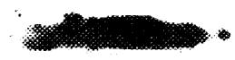

Part I

# REACTOR THEORY AND DESIGN

# 1. THE AIRCRAFT REACTOR EXPERIMENT

W. M. Breazeale  
G. A. Cristy

L. F. Hemphill

S. V. Manson

R.W.Schroeder ANP Division

The Aircraft Reactor Experiment (ARE) is a 3-megawatt reactor designed to provide first-hand experience with a high-temperature $(1500^{\circ}\mathrm{F})$ reactor. Recent modifications of the ARE design have been permitted for convenience where this has not affected the operating temperature of the core. In particular, the smaller core, proposed in the last report, has been adopted and consideration is being given to the use of NaK since this coolant would eliminate the need of preheaters.

The external-fluid, electrical, and control circuits have been generally established and detailing is now in process. The design of the fluid circuit is sufficiently well defined to permit ordering of heat exchangers, blowers, and associated tubing. The reactor control signal will now be obtained from both inlet and outlet coolant temperature. The reactor will contain six control rods symmetrically dispersed around a central safety rod.

Construction of the building facility for the ARE is proceeding as scheduled. The excavation is complete and most of the concrete foundation has been laid.

# CORE DESIGN

The core arrangement has been redesigned to provide for an active lattice 30 in. in diameter and 34 in. in length, as suggested by the Reactor Physics Group.(1) (The smaller core and thick reflector favor critical mass and power distribution.) The original core-tube and fuel-tube sizes have been retained, providing a maximum fuel capacity of 31 lb of $\mathbf{U}^{235}$ , using fused fluorides (NaF-KF-UF $_4$ ) containing 150 lb of $\mathbf{U}^{235}$ per cubic foot. The current core-pressure shell assembly provides for seven control thimbles, located in the core, and two instrument chambers, located in the reflector.

Material and component orders have been revised to include the changes and features referred to above. Detail and assembly drawings for the entire core-pressure shell assembly are being prepared. The orders for core components which were placed during the preceding quarter(2) are still outstanding. Delivery of most items is expected within the next two months. After extensive negotiations with the Norton Company, the Brush Company, AEC, and Norris, it has been decided that all moderator and reflector beryllium oxide blocks will be hot-pressed by Norton and that the original block size (3.75 in. across flats)

# ANP PROJECT QUARTERLY PROGRESS REPORT

will be retained. Initial shipments of BeO have been made.

# FLUID CIRCUIT

Detailed layouts of all aspects of the external fluid circuit are currently being made. The availability of the various components from either at-hand stock or commercial suppliers is being determined, and in some cases the procurement of these items has been initiated. The use of NaK as the reactor coolant will eliminate the need of preheaters in the coolant system. The helium monitoring circuit, the reactor room and pump-room space cooling circuits, and the control-rod cooling circuits are being reanalyzed in an attempt to obtain dual usage of some of the components.

Heat-Disposal Circuit. The heat-disposal systems provide for heat transfer from NaK to helium to ethylene glycol to water. The NaK-to-helium heat exchangers and the helium-to-glycol heat exchangers have been studied in detail, and the configurations which appeared to be most attractive have been reviewed with two prospective suppliers, the Griscom-Russell Company and the Vulcan Copper and Supply Company. Each of these companies confirmed our basic approach and have submitted formal quotations for the heat exchangers. As each of the prospective suppliers has agreed to quote on the basis of l-in. inconel tubing in the NaK heat exchanger, the tubing has been requisitioned to favor the optimum delivery date. The aforementioned companies also confirmed the calculated helium flow rates and pressure drops, enabling the release of requisitions for the helium blowers. Invitations to bid have been extended to six blower manufacturers; the bids

have been received and currently are being evaluated. The glycol-to-water heat exchangers have been found in Y-12 surplus, and their custody has been transferred to the ARE project.

It has been decided to revise the NaK system to provide for upward flow from reactor to an expansion tank, then down from the expansion tank to the heat exchangers and down from the heat exchangersto the low point immediately above the dump tank, and from there to the pump and the reactor. This revision places the pump on the low-temperature side of the heat exchanger and obviates the need for employing the pump as a surge chamber. It is planned to maintain pump level control by means of a forced helium flow through an orifice, the area of which is adjusted by the NaK level. It has also been decided to employ a mechanical valve in the dump tank line rather than to maintain the liquid level by gas pressure as previously contemplated.

Contamination of Helium System. Failure of a fuel element is expected to release xenon and krypton to the NaK circuit and in turn to the helium present at the various NaK free surfaces. Studies have indicated that the helium so contaminated must be held for several days before being released to the stack. After several possible scrubbing arrangements had been investigated, it was decided to make this helium circuit a closed loop with a valved line to the stack, permitting release after any desired waiting time. This system will include a low-pressure reservoir, a scrubber, a small compressor, a monitor, and a high-pressure reservoir.

# CONTROL OF THE ARE

# E. S. Bettis, Research Director's Division

The control of the ARE will incorporate solid absorber rods in addition to the liquid-fuel control apparatus which decreases the fuel volume in the core. The control signal is now taken from both the inlet and outlet coolant temperatures rather than from the outlet temperature only. Detailed design of the absorber control rods has been completed, and a rod and actuator assembly is being fabricated. A high-temperature fission chamber has been designed, and a satisfactory multiplier has been developed for the reactor dynamic computer.

Liquid-Fuel Control System. The elementary diagram of the control system has received major emphasis during this quarter. A completed elementary control diagram is now ready. The control-room layout, including operating console, relay and instrument racks, and interconnecting conduits, has been partially completed. Detailing of these items is now being completed.

A fundamental change in the control method was made when the source of the servo regulating signal was changed. This signal no longer originates from the coolant outlet temperature but is obtained from both coolant outlet and inlet temperatures. The equation for this signal is given by

$$
E = \left(T _ {i} - T _ {e}\right) + K \left(T _ {i} - T _ {o}\right)
$$

where

E = error signal actuating the regula ting rod

$T_{i} =$ coolant inlet temperature

$T_{e} =$ temperature of reactor core circuit at equilibrium condition at start-up with reactor power output essentially zero

$K =$ constant determined by ratio of outlet temperature rise to inlet temperature drop from start-up value $T_{e}$

$T_{o}$ = coolant outlet temperature

Using this equation a solution of the reactor kinetics is in process by the Nuclear Physics Group.

The test rig, for testing the operation of bellows for moving high-temperature liquids, has been completed and is in the Experimental Engineering building. It has not yet been put into operation, and the tests will not be started until some of the more important loop tests have been completed.

Solid Absorber Rod Design. The number of absorber rods has been established, pending verification by the critical experiments. Present designs show six rods symmetrically disposed about the center with an additional rod at the center of the reactor. Detailed designs of the control rods, thimbles, and actuators have been completed. The first work order for one complete rod and actuator assembly will go into the shop early in the next quarter.

# ANP PROJECT QUARTERLY PROGRESS REPORT

Calculations on the heat generated in the absorber rods show that these can be cooled satisfactorily with helium. The rod design, which has been completed, provides for the coolant helium to escape into the reactor pit and provides a monitoring atmosphere for the pit. Gas volumes adequate to cool $\mathbf{B}_4\mathbf{C}$ rods are being provided even though the possibility of using hafnium absorbers still exists.

A design of a fission chamber for use at elevated temperatures has been completed and such a chamber is being fabricated. This chamber will be ready for testing in about six weeks.

Electronic Computer Design. The first step toward the solution of the computer problem has been completed. A satisfactory multiplier for taking the product of two analogue voltages has been constructed. Work will continue on the computer design at the present level of endeavor.

# ELECTRICAL CIRCUIT

Finalization of some of the major fluid-circuit features has permitted an estimate of electric-power requirements. Detailed investigation of conditions following the failure of external power has indicated that the heat capacity of the system is very large compared to the post-scram heat generation. Accordingly, it is unnecessary to provide for continued operation of the main heat-disposal circuit. It is planned to provide for operation of the NaK pumps, the monitoring and control rod coolant blowers, and the space cooling systems, following failure of outside power.

On this basis it appears that the maximum battery power requirement will be less than 10 kw. The a-c-d-c motor generator set appears to be governed by the design point condition, which requires approximately 50 kw d-c power. Warm-up of the entire system from room temperature to $1500^{\circ}\mathrm{F}$ , within 24 hr, appears to require 100 kw a-c and 10 kw d-c. Circuit diagrams are being prepared on this basis.

# REMOTE-HANDLING EQUIPMENT

Conferences have been held with the Timken Bearing Company regarding bearing selection and other design features of the remote cutting machinery. On the basis of these discussions final layouts are being made, and requisitions have been released for the larger procured components. Experiments are in progress involving welding, cutting, rescarfing, and rewelding a 2-in.-thick stainless steel plate. These tests will be repeated with a 2-in.-thick inconel plate when the material currently on order is received.

# BUILDING FACILITY FOR THE ARE

The facility design has been completed by the Austin Company and the construction work has been awarded to the Nicholson Company. At the present time the building excavation is complete, the concrete pouring is nearing completion, and the building steel and the concrete reinforcing steel are on order. The Atomic Energy Commission has suggested that certain portions of the facility work that Oak Ridge

# FOR PERIOD ENDING SEPTEMBER 10, 1951

National Laboratory had intended to perform could advantageously be contracted to the Nicholson Company in the interest of hastening the final completion date. Accordingly, AEC has

been advised of several services that Nicholson can perform and that other such items probably will become indicated when ORNL facility engineering has progressed further.

# ANP PROJECT QUARTERLY PROGRESS REPORT

# 2. EXPERIMENTAL REACTOR ENGINEERING

H. W. Savage, ANP Division

The ANP Experimental Engineering Group has the responsibility for developing and/or testing materials, methods, and components applicable to the ARE and ANP reactors. Presently under development are pumps, valves, flowmeters, level and pressure indicators, preheaters, seals, heat ex-changers, etc., and, in addition, studies are being made on static and dynamic corrosion, methods for handling liquid fuels, purification and handling methods for liquid metals and blanketting gases, full-scale test facilities, and operational techniques for test equipment. Information derived from this program provides fundamental engineering data for component design and provides a basis for establishing adequate operational procedures to demonstrate the reliability of both laboratory and full-scale systems.

Work has continued on liquid-fuel systems with the result that a non-enriched sample of fluoride fuel mixture has been filtered and transferred from one fuel container to another for the first time. A frozen-sodium seal had been in operation for 700 hr at the end of the period, sealing against 26 psi in a system which contained sodium at $1500^{\circ}\mathrm{F}$ . A pump incorporating this frozen-sodium seal had also been put into operation successfully. In other tests, a graphite gas seal showed promise. Satisfactory operation was obtained with a General Electric type G-3 electromagnetic pump during tests to reproduce G. E. performance curves; good agreement was obtained up to $750^{\circ}\mathrm{F}$ .

Stress-rupture and self-welding tests were well underway, with early results indicating that moderately stressed inconel and 316 stainless steel suffered very little, if any, increase in corrosion from sodium at $1500^{\circ}\mathrm{F}$ . Inconel tends to weld to inconel only slightly in sodium at $1500^{\circ}\mathrm{F}$ ; the same is true for stainless steel. However, zirconium shows no tendency to weld to stainless steel. Methods were developed by which aging and double filtration reduced the oxygen content of sodium to less than 200 ppm, and blanketing-gas purification equipment reduced the oxygen content to below 15 ppm. Specifications were drawn up and engineering drawings are being prepared for full-scale testing of ARE components, both individually and as a unit.

# LIQUID-FUEL SYSTEMS

E. Wischhusen and D. R. Ward, ANP Division

Present plans call for the first ARE reactor to employ fuel sealed inside individual pins and inserted in the reactor. A second reactor core may contain the fused fluoride fuel in a fuel system consisting of perhaps ninety fuel tube clusters in which tube clusters would be filled and emptied by means of differential gas pressure. Full-scale mock-ups of portions of the system are being made to reveal information on such items as bubble formation, filling and dumping characteristics, valving, and operating techniques.

Mock-up No. 1 was a crude-but-quick system constructed from glass tubes, rubber stoppers, etc. and using colored water to simulate the fuel. It served primarily to indicate valving arrangements, gage requirements, and operating techniques which would be needed for working with mock-up No. 2.

Mock-up No. 2 was a carefully constructed all-glass full-size fuel system employing tetrachloroethylene (sp. gr. 1.6) to simulate the liquid fuel. Work with this system revealed data on bubble formation, filling and emptying rates, flushing methods, etc., all of which were applicable to mock-up No. 3.

Mock-up No.3, which has been assembled, is an all-metal system constructed from 316 stainless steel 3/16-in.-o.d. tubing and is capable of operating at temperatures up to $1500^{\circ}\mathrm{F}$ . In a preliminary test using tubing of this size the fuel mixture of fluorides has been successfully filtered and transferred through the tubing in the molten state.

In conjunction with uranium fuel transfer experiments, it was decided to investigate the containing of helium in equipment fabricated from 316 stainless steel and inconel of 0.030 in. wall thickness at temperatures of $1500^{\circ}\mathrm{F}$ or greater. These experiments were conducted on weld-free type 316 stainless steel and inconel tubing at $1600^{\circ}\mathrm{F}$ under 54 psi helium pressure differential and using a Westinghouse mass spectrograph helium leak detector for detecting helium. It was found that no helium diffused interstitially through the tubing walls during 150 hr, the length of the test.

# PUMP DEVELOPMENT

Pumps currently under development for the ARF and experimental loops include a variety of electromagnetic and centrifugal pumps as well as the unique canned-rotor pump and "level-tank" pump. Performance curves of two electromagnetic pumps have been obtained up to $1000^{\circ}\mathrm{F}$ . At this temperature a high contact resistance created an open circuit. The centrifugal pumps currently under development are distinguished by the type of shaft seal. The centrifugal pump discussed below embodied a gas seal; other promising pump seals are discussed under "Seal Tests." The canned rotor pump has operated for 90 hr with NaK at temperatures up to $400^{\circ}\mathrm{F}$ with no discernable wear. Among the pump developments are a Duriron pump which operates immersed in the to-be-pumped fluid and the two-stage electromagnetic pump. Other pump information is mentioned under "Loop Tests" and "Seal Tests."

A loop for testing either electromagnetic or mechanical pumps of ARE size has been designed which contains approximately 40 ft of $2 \frac{1}{2}$ -in. pipe and utilizes 7.5-kw tube furnaces for heating the circulating medium up to $1500^{\circ} \mathrm{F}$ . The loop volume, including a 3-ft³ sump tank, is approximately 5 ft³. Space is provided for electromagnetic or venturi type flowmeter instrumentation.

Centrifugal Pumps for Figure-Eight Loops (W. G. Cobb, ANP Division). The centrifugal pump for liquid metals described in the previous report(1)

# ANP PROJECT QUARTERLY PROGRESS REPORT

was installed in a figure-eight loop. Teflon packing rings were used for shaft sealing, and level indication and control were taken from the liquid surface in a tank mounted at the side of the pump housing. Flow observed during operation was 7.5 gpm at approximately 45 ft of sodium, but the difficulties of simultaneously controlling the three liquid levels in the system under dynamic conditions inhibited smooth operation. The initial run lasted for $3\frac{1}{2}$ hr at a sodium temperature of $795^{\circ}\mathrm{F}$ before failure of the shaft seal; however, operation was smooth for the final $\frac{1}{2}$ hr. A second run lasted 16 hr, reaching a temperature of $900^{\circ}\mathrm{F}$ , but terminated when the pump became starved and hence was unable to pump smoothly.

Examination of both these runs after shutdown indicated a failure of the liquid-level control system. In the first run the pressure equalizer line between the pump and level control tank became plugged, allowing sodium to rise through the seal. This situation was corrected by additional heaters and insulation on both the liquid and gas lines between the pump and level control tank. The explanation for the intermittent pumping in the second test was failure of the level indication and control equipment to maintain a satisfactory liquid level in the pump. Subsequent checks did reveal considerable variation between the two liquid levels during operation. Difficulties encountered in maintaining constant liquid level in the surge tank and in the pump indicated that this method of control was impractical.

ARE Pump Design (W. G. Cobb and J. F. Haines, ANP Division). A contract has been let with Allis-Chalmers

Company for design and fabrication of a sump type internal-bearing direct-driven centrifugal pump for testing and possible use with the ARE. This and other pumps of ARE capacity being designed by ANP Experimental Engineering personnel, are being guided by the following considerations:

1. The pump is preferred to be located on the cold side of the reactor to minimize high-temperature effects on pump structure.   
2. Separate pump sump and surge tanks are to be provided.   
3. An individual level control is to be provided for the pump. Tests are being performed to determine the feasibility of controlling pump level from a dynamic surface.   
4. A gas seal for the pump shaft is to be used.   
5. Flow direction through the pump is to be conventional with suction through the lower side and discharge from a concentric casing.   
6. The impeller is to be carried by an overhung vertical shaft with no internal bearings.   
7. Pump cooling is to be accomplished by flowing helium, which is to be monitored for coolant leakage.   
8. Bearing lubricant is to be circulated continuously; this feature provides cooling for a rotating face seal.   
9. The controlled liquid surface

in the pump is to be as small as compatible with stability.

10. The initial pump for testing is to use a cast impeller with casing and other parts to be fabricated and machined.

Canned-Rotor Pump (A. R. Frithsen and M. Richardson, Reactor Experimental Engineering Division). The $1\frac{1}{2}$ -hp fluid-bearing pump (Fig. 2.1), described in the last report, has been operated with water and NaK without detectable wear. The first test was made in a water-circulating system and continued intermittently for a total of 1200 hr running time. Examination of the pump parts after dissassembly showed no visible or measurable wear or corrosion. All clearances were the same as before the test was begun.

In a subsequent test the diametrical clearance between the motor rotors and motor cans was reduced from 0.017 to 0.012 in., and the pump was then used to circulate NaK for a total running time of 90 hr. During most of this period the temperature was held at 200 to $300^{\circ}\mathrm{F}$ , although short runs were made at room temperature and also as high as $400^{\circ}\mathrm{F}$ . No indication of wear or corrosion was found on any of the parts upon disassembly, but a considerable accumulation of alkali oxides was found at the tabs of the motor cans and close to the walls of the pump volute where the liquid is believed to have been relatively stagnant. A Fischer-Porter Flowrator was used for flow measurements and operated with complete satisfaction even at the higher $(400^{\circ}\mathrm{C})$ temperatures.

The limitation on operating temperature for this pump is believed to be determined by thermal damage to the insulation in the motor windings. To increase the permissible operating temperature, an order has been placed with the General Electric Company for winding two motor stators with class H wire which is capable of withstanding a temperature of $500^{\circ}\mathrm{F}$ . In addition, a proposal has been requested from Allis-Chalmers Company for special wire which can be used at $700^{\circ}\mathrm{F}$ . With the latter winding and by cooling the liquid fed into the motor cans, it is expected that liquid metals or salts can be pumped at $1000^{\circ}\mathrm{F}$ or higher.

A 3-hp fluid-bearing pump has been designed and has been partially fabricated to test a number of revisions in the design of the smaller pump and to determine the practicability of sealing up the smaller model. This pump is expected to be ready for check runs with water about October 1.

Level Tank Pump (W. B. McDonald, ANP Division). A Duriron conventional pump has been modified for operating while immersed in liquid metals. This pump has a capacity of approximately 12 gpm at a 40-ft developed head. A conventional packing gland is used to seal the shaft, and a labyrinth fitting closely about the shaft minimizes the amount of liquid metal by-passed to the level tank. This pump will operate while immersed in liquid metal in a level tank and will be driven by a motor on an overhung shaft mounted on top of the tank. Actual testing awaits the availability of a test loop.

Electromagnetic Pumps (J. H. Wyld and A. L. Southern, ANP Division; A. G. Grindell, Engineering and Maintenance Division). A General

# UNCLASSIFIED

# ANP PROJECT QUARTERLY PROGRESS REPORT

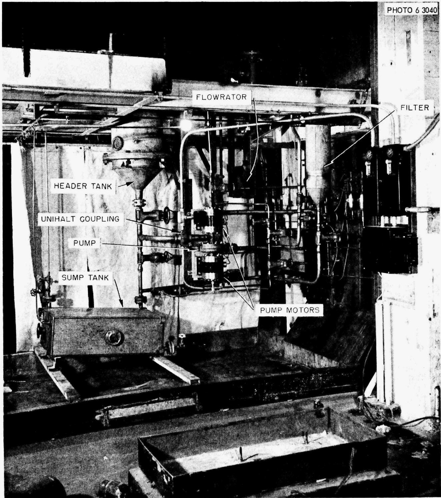  
Fig. 2.1 - Fluid-Bearing (Canned-Rotor) Pump.

Electric a-c electromagnetic pump was modified by Experimental Engineering personnel to utilize a flexible secondary conductor. Preliminary tests gave flows of approximately 16 gpm of sodium at 5 psi and $890^{\circ}\mathrm{F}$ . In a combination performance and endurance test, a G.E. type G-3 electromagnetic pump was operated in the calibration loop (see below) for 173 hr. Performance curves were obtained at temperatures of 300, 500, and $750^{\circ}\mathrm{F}$ for comparison with data supplied by G.E. The pump

failed at $1000^{\circ}\mathrm{F}$ owing to a current lug melting loose from the cell wall. This failure occurred at 250 volts input but after performance curves had been obtained for that temperature.

General Electric supplied data for their type G-1 pump whose performance closely resembles that of the type G-3 pump procured by ANP. A graph comparing operation of the G-1 and G-3 pumps is shown in Fig. 2.2. The efficiency

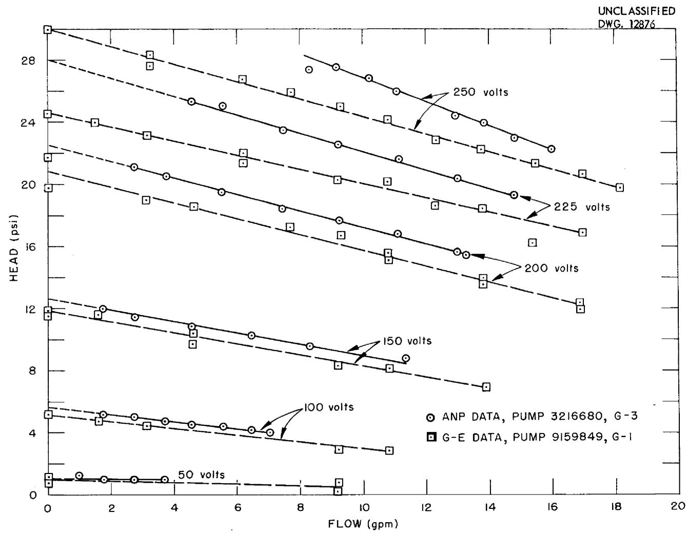  
Fig. 2.2 - Comparison of General Electric and ANP Electromagnetic Pump Data (750°F, Sodium).

# ANP PROJECT QUARTERLY PROGRESS REPORT

of these electromagnetic pumps increasess essentially linearly from $0.5\%$ at flows of 2 gpm to about $3 \%$ at flows of 14 gpm.Although performance curves were taken at lower temperatures, the larger part of the operation was conducted at $750^{\circ}\mathrm{F},$ which was the maximum temperature recommended for the pump cell in use. Operating temperature was increased to $1000^{\circ}\mathrm{F}$ to obtain performance curves and to determine the upper limit of temperature allowable with the pump cell supplied.

Engineering drawings for the two-stage electromagnetic pump were completed and submitted to the shop. Fabrication is incomplete.

# TEST LOOPS

# A. G. Grindell, Engineering and Maintenance Division

The "calibration" loop and the "sodium manometer" loop, both of which were designed to calibrate and otherwise check flowmeters, have been operated with liquid metals during the past quarter. To date the more significant application of these loops has been in conjunction with pump tests.

Calibration Loop. The calibration loop, which was designed primarily to check electromagnetic flowmeters against venturi types and to check the performance of electromagnetic pumps, has been equipped with heaters, thermocouples, pressure measuring devices, a lock valve for operating on a constant weight of sodium, and a static cold leg for continually removing oxygen from the circulating sodium.

The system was degreased with perchloroethylene, evacuated, outgassed at $800^{\circ}\mathrm{F}$ , and flushed twice with sodium at $800^{\circ}\mathrm{F}$ . In this condition it has operated satisfactorily as a test loop for the G. E. electromagnetic pump described above.

Sodium Manometer Loop. The sodium manometer loop is an experimental loop designed to afford means of developing testing, and gaining experience on flow-nozzle manometer type flowmeters and simultaneously developing and testing electromagnetic flowmeters. The first attempt to pump sodium during the period resulted in electromagnetic pump cell failure and sodium fire during the start-up.

The loop was dismantled, repaired, and restarted. In this test the electromagnetic pump was provided with a flexible secondary conductor, and during the first 2 hr of operation at constant power input, flow increased from 2.5 to 9 gpm. This increase in pumping rate was attributed to increased wetting of the pump cell wall, and increased pump input power overheated the flexible secondary conductor. Pump power was decreased, but loop temperature was taken up to $890^{\circ}\mathrm{F}$ . The pump failed after 27 hr of operation owing to the inadequate current capacity of the flexible secondary conductor; another conductor $2\%$ times the cross-sectional area of the first is now being fabricated.

# SEAL TESTS

Development of seals for pumps handling liquid metals or other coolant at $1500^{\circ}\mathrm{F}$ has received attention throughout the period. Tests have

been conducted simultaneously with pump experiments in some instances, while in others tests have been conducted in simulated equipment. The seal types include a frozen-sodium seal, metal-to-metal seals, and metal-to-metal seals at the end of a bellows.

Frozen-Sodium Seal (W. B. McDonald, ANP Division). A seal employing the principle of solidifying a column of sodium around a rotating shaft is under development. The testing device consisted of a pot containing sodium at $1500^{\circ}\mathrm{F}$ . A sleeve extended from below the sodium level in the pot to the outside, and a shaft rotated inside this sleeve. Sodium was forced by gas pressure into the annular space between the rotating shaft and the sleeve. A refrigeration coil, to cool the sodium to below its freezing point, was wound around the outside of the sleeve and soldered to it to increase thermal conductivity. The rotating shaft was $1\frac{1}{2}$ in. in diameter with a diametrical clearance of 0.032 in. between the shaft and sleeve. By the end of the period this seal had operated for approximately 400 hr against a pressure of 18 psi. The coolant employed was kerosene refrigerated by passing through a coil immersed in a dry ice and ethylene glycol bath.

At the end of the period a second test using sodium at $1500^{\circ}\mathrm{F}$ but with the pressure differential increased to 26 psi was underway. Also, a conventional centrifugal pump was modified by adding a frozen-sodium seal and was installed in a pump test loop (Fig. 2.3). The relatively short space between the pump and the bearings is expected to limit the temperature to which the circulating sodium can be raised; however, this pump was de

livering 15 gpm of sodium at $650^{\circ}\mathrm{F}$ at 2000 rpm at the end of the period.

Bellows Seal (A. P. Fraas and M. E. LaVerne, ANP Division). A Dureg stainless steel centrifugal pump $^{(3)}$ was reworked to provide radial holes in the rear face of the impeller to keep the seal cavity dry and was operated for 80 hr with sodium at temperatures up to $1000^{\circ}\mathrm{F}$ . Tests with water showed that the design is effective in scavenging liquid that leaks into the seal cavity through the labyrinth seal on the rear face of the impeller. The test with sodium was discontinued when finely divided sodium was found in the silicone oil circulated over the outer side of the bellows seal. Since only gas should have been in contact with the inner side of the seals, and since the liquid level control had given difficulty with sticking of a solenoid valve, the rig was disassembled for inspection. All parts were found in good condition except the bellows which was found to have two axial cracks on the periphery of two convolutions. The test will be repeated with another bellows.

Graphitar and Tool Steel Seal (W. B. McDonald, ANP Division). A seal consisting of a Graphitar (U. S. Graphite) ring sandwiched between a stationary member and a rotating member made of Ketos tool steel sealed successfully against a gas pressure of 10 psi at a seal temperature of $350^{\circ}\mathrm{F}$ for 450 hr. Shaft speed was approximately 2000 rpm. This test was terminated at 450 hr in order to make changes in the test equipment to enable NaK vapors to be introduced to the sealing members.

# UNCEASSIFIED

ANP PROJECT QUARTERLY PROGRESS REPORT

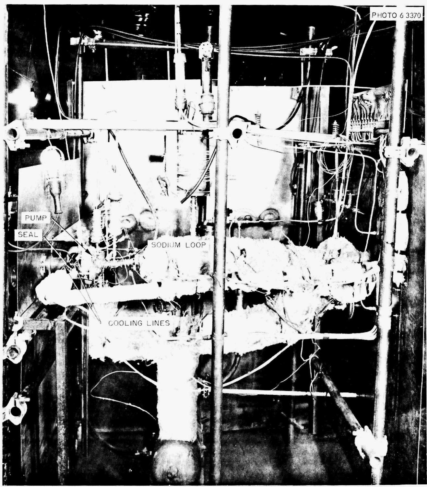  
Fig. 2.3 - Centrifugal Pump with Frozen-Sodium Seal.

These tests were underway at the end of the period.

# INSTRUMENTATION

J. F. Bailey, Consultant to ANP Division

The development of suitable instruments for indicating flows, pressures, levels, etc. is an important consideration for the adequate testing of liquid-metal systems and for the successful operation of the ARE. Recently considerable thought has been given to these instrumentation problems, with the result that a study has been made of all types of level control devices to determine the advantages and the disadvantages of each. The types studied include electroresistance, electromagnetic, electroreluctance, gas flow, and float, and recommended applications for each have been compiled. This work has been done with the view to designing a vigorous research program to develop adequate instruments for application by both the Experimental Engineering and the ARE groups.

At the present, spark plug type probes are being used to control levels. This method is simple but unreliable because of periodic shorting out of the probes. Electro-resistance probes for level indication are to be investigated in an experimental system which is presently undergoing fabrication. Experimental work is to determine the merits of this type of probe as a possible replacement for the spark plug type.

A model of the gas-flow control has been set up in the Liquid Models Test

Laboratory, and the operating characteristics are being studied with water as the liquid. Experimental work on other types is in the planning stage.

During the quarter two magnets for use with electromagnetic flowmeters were made by using two U-shaped Alnico V pieces and cold-rolled steel spacers. These magnets give a flux of 1500 gauss across a $1\frac{1}{2}$ -in. gap. Using l-in. stainless steel tubing with these magnets, a flow of 20 gpm gives an induced voltage of 10.6 mv.

The low-flux magnets have advantages in that their use permits existing equipment to be used for recording high flows, and braking effect in the flow circuit is reduced. When flows are below 10 gpm, the magnet strength should be above 2500 gauss to allow the same recording equipment to be used with higher accuracy.

# STRESS-RUPTURE TESTS

J. L. Gregg, Consultant to ANP Division

Stress-rupture tests are being conducted by the Experimental Engineering Group to determine the strength of materials at elevated temperatures. For testing, sections of a tube of type 316 stainless steel and one of inconel were machined to 0.015 in. wall thickness, pressurized to 110 psi with argon, and immersed in sodium at $1500^{\circ}\mathrm{F}$ . The gas pressure produced a hoop stress of approximately 1500 psi in the thinned section of the tube. By the end of the quarter, these tubes had been under test for approximately 500 hr without failure, indicating that attack of sodium on moderately

# ANP PROJECT QUARTERLY PROGRESS REPORT

stressed inconel and stainless steel is rather small. Equipment is being assembled for testing sheet metal in sodium at elevated temperatures.

# SELF-WELDING TESTS

J. L. Gregg, Consultant to ANP Division A. P. Fraas and M. E. LaVerne, ANP Division

Self-welding tests are being conducted in sodium at $1500^{\circ}\mathrm{F}$ to provide information pertinent to seals, valves, bearings, etc. for the ARE. Preliminary results show that inconel has only a slight tendency to weld to inconel under these conditions. The same is true for stainless steel. Inconel has shown no tendency to weld to zirconium in any experiment conducted thus far.

Consideration of their atomic structure had indicated that zirconium should be as unlikely to weld to iron-chrome-nickel alloys as any metal available. In order to test this supposition, a 304 stainless steel standard globe valve was reworked to provide a zirconium washer floating on the valve stem between the seat and the valve disk of 347 stainless steel. The reworked valve was operated in sodium for $142\mathrm{hr}$ , 48 at $1200^{\circ}\mathrm{F}$ and and 94 at $1500^{\circ}\mathrm{F}$ . Operation consisted in a number of closings and openings, the required opening torque being taken as a measure of any tendency toward welding.

No indication of welding was obtained during the test, and visual examination after completion of the test disclosed no signs of welding between the zirconium washer and either the seat or disk. A second test is being made

with three valves in parallel on the same rig, one valve having a zirconium washer, one a molybdenum washer, and one just the standard stainless steel valve disk.

# VALVE-PACKING EXPERIMENTS

W.C.Tunnell，ANP Division

Since the ARE system as designed requires valves to operate at $1500^{\circ}F$ , a program for determining valve design characteristics is underway. If conventional valves should prove unsatisfactory, it is likely that a bellows type valve would be a suitable alternative. Such a valve would require packing to provide safety features and also to permit temporary use of the valve in case of bellows failure. Experiments to determine satisfactory packing materials for use with sodium are in progress.

Following is a list of the materials tested and the pressures and temperatures reached during preliminary investigations:

1. Amosite asbestos: held sodium for 21 hr at $1500^{\circ}\mathrm{F}$ under 15 psi before leaking.   
2. Graphite powder: leaked sodium at $600^{\circ}\mathrm{F}$ under 10 psi pressure.   
3. Met-L-X: held sodium for 2 hr at $1500^{\circ}\mathrm{F}$ under 15 psi before leaking.   
4. Lead-mill slag: held sodium for 10 days at $1500^{\circ}\mathrm{F}$ under 15 psi pressure; no leaks had occurred before experiment was terminated.   
5. Nickel metal powder: held sodium for 10 days at $1500^{\circ}\mathrm{F}$ under 15

psi pressure; no leaks were observed before experiment was terminated.

6. Soda ash: leaked sodium at $1300^{\circ}\mathrm{F}$ under 10 psi pressure.

Since this experiment was considered a preliminary screening operation for selecting possible packing materials, no effort was made to operate the valve stem when the sodium reached $1500^{\circ}\mathrm{F}$ . Other equipment is being designed with smaller clearances between the sealing parts of the packing glands to afford more conclusive tests of powdered or granular materials.

# CONTAMINATION OF LIQUID-METAL SYSTEMS

The corrosion of metal containers by liquid metals, in this case primarily sodium, is attributed to the oxygen contamination in the system. Nominal precautions to exclude oxygen from liquid-metal systems, including the use of inert-gas blankets and cleaned systems, had been taken, but they did not succeed in limiting corrosion to the desired level. It became apparent that even the small remaining oxygen contamination was a fault, and consequently provisions for its reduction have been developed. The three main sources of oxygen, barring leaks, are from scale in the mechanical system, from the sodium charged to the system, and from the inert-gas atmosphere used with the system. Oxygen contamination from each of these sources is minimized by techniques now in use.

Cleaning of Liquid-Metal Systems (R. Devenish and H. R. Bronstein, ANP Division). Liquid-metal systems require careful cleaning prior to being

put into operation to remove welding scale, oxides, absorbed gases, etc., to reduce contamination of circulating coolant. These systems are now being degreased with hot perchloroethylene, after which they are evacuated and outgassed at approximately the temperature of operation. An experiment is underway in the calibration loop to test the efficiency of preconditioning a system with sodium prior to operation. In this experiment, in addition to degreasing and evacuating, sodium was circulated at $800^{\circ}\mathrm{F}$ and removed, and clean sodium was introduced. This second batch of sodium was circulated for 3 to 4 hr at $800^{\circ}\mathrm{F}$ also and then dumped. Clean sodium was provided for operational use. By the end of the period, the loop had operated for approximately 175 hr with no apparent difficulty due to faulty cleaning procedures.

Equipment has been installed for descaling stainless steel alloys by the "Virgo Salts" process promoted by Hooker Electrochemical Company. In this process the metal is immersed in a molten caustic, which converts scale to salts soluble in hot dilute hydrochloric acid. After these salts are removed by hydrochloric acid, parts are brightened and passivated by a dip in nitric acid. No results showing the efficiency of this process were available by the end of the quarter.

Removal of sodium from systems after operation is a problem also receiving attention during the period. Sodium is now removed from small tube passages by immersing the entire assembly in a water bath which is heated up to $100^{\circ}\mathrm{C}$ by live steam. When the residual sodium has melted, it is forced from the small passages by gas pressure.

# ANP PROJECT QUARTERLY PROGRESS REPORT

Of course, some burning and small explosions occur which require that the operation be conducted in the open, but no damage to equipment has been experienced. Sump tanks are now emptied by heating to above the melting point of sodium and flowing it either by gravity or gas pressure into an ash can immersed in a heated oil bath which keeps the sodium from projecting above the surface, thereby preventing a combination oil-and-sodium fire.

Purification of Liquid Metals (L. A. Mann, ANP Division). Methods of purifying liquid metals to reduce the oxide content to acceptable levels for use in convection loops, figure-eight loops, pump test loops, etc. have been improved. In the method now in use sodium or NaK is held at approximately $250^{\circ}\mathrm{F}$ for at least 24 hr to allow suspended oxide particles time to agglomerate. The metals are then filtered through a $5 - \mu$ sintered stainless steel filter into another fill tank. From this tank the metal is again filtered through a $5 - \mu$ filter into the operating system. Analytical results indicate that double filtration consistently reduces the oxide content to below 200 ppm. The results also indicate that no appreciable reduction is achieved with further filtration.

Purification of Inert Gases (L. A. Mann, ANP Division). Inert gases used for blanketing liquid metals in operating systems require purification to minimize oxygen content. Argon generally contains on the order of 20 to 50 ppm oxygen, and helium cylinders have shown as high as 65 ppm (chemical analyses are reported in Sec. 19). A purification apparatus has been put into operation which removes oxygen from blanketing gases by bubbling

through a column of NaK. Tests thus far indicate that use of this system consistently reduces the oxygen content of gases used in operating systems to below 15 ppm, which is considered a safe level. As an added precaution, helium cylinders have been set aside for the exclusive use of the ANP Experimental Engineering Group, and these cylinders are never permitted to go below 100 psi to prevent air from being introduced. These methods, which are currently in use, are considered satisfactory.

Analytical Results with Sodium (H. R. Bronstein, ANP Division). Sampling techniques instituted with existing equipment during the period removed inconsistencies in analytical results, making possible the standardization of limits of detection of impurities in sodium. Evaluation of analytical results (see Sec. 19) on sodium samples taken at the time of fill and termination showed that filtered sodium generally contained approximately $0.02\%$ oxygen, but the oxide content upon termination appeared to be a function of the size of the operating equipment. From the time of fill to termination, the oxygen content of sodium in thermal-convection loops rose from 0.02 to $0.03\%$ , while corresponding results from figure-eight loops were 0.02 and $0.06\%$ , respectively. These findings indicated the need for more thorough cleaning and outgassing procedures; consequently the technique of repeated flushing of a system with hot sodium prior to operation was instituted.

Design of a sampling device to take repeated samples of a coolant directly from the operating system at any temperature up to $1500^{\circ}\mathrm{F}$ is virtually completed. Two small loops for testing

the reliability of this sampling device prior to its installation with an operating system are under construction.

# INVESTIGATION OF SODIUM CONDENSATION

# H. R. Bronstein, ANP Division

Condensation of sodium in gas-pressurizing lines leading to operating systems was investigated further during the quarter. Electrostatic precipitation showed that plugging was due to a solid aerosol phenomenon, and that quantities of sodium removed by the precipitator were of such a magnitude that a means of returning this condensate to the main tank should be sought. Consequently, the precipitator was redesigned to allow for periodic or continuous melting of the sodium collected. The experiment was rerun on a dynamic gas flow basis with traps placed after the precipitator to collect any sodium getting through it. No sodium was detected beyond the electrostatic precipitator.

NaK traps have been suggested as a possible solution for the problem of gas-line plugging. Models of several types have been built, and their operating characteristics are being studied with air and water. From information obtained from these tests, a trap for use with operating systems may be designed.

A group from the MIT Practice School investigated three methods of reducing or preventing sodium plugging of blanketing-gas lines during the period. These methods were (1) electrostatic precipitation, (2) a sodium condenser coil immersed in a hot oil bath, and (3) a NaK bubbler. Although all methods

tested proved to be partially effective, results of work by this group indicated that the oil-bath trap was the most practical. Design improvements would increase the efficiency of all methods, however.

The oil-bath condenser causes particles to condense on the walls of the tubing because of its long length and curvature, and, upon condensation, the sodium flows back into the main tank by gravity since the oil temperature is maintained just above the melting point of sodium. Additional experiments to determine the effect of variations in tubing length and size and bath temperature were recommended.

# ARE COMPONENT TESTS

# H. P. Kackenmester and D. L. Salmon, ANP Division

Specifications have been written by the ARE Components Testing Committee and engineering drawings are being prepared for construction of facilities for full-scale ARE components testing. Five all-steel completely enclosed test cells are to be erected, four of which are identical in design and are to be used for measuring physical and operating characteristics of individual components such as pumps, pipes, valves, instruments, heat ex-changers, etc. prior to their use with the ARE. The other test area, larger in size, is to be used for testing components in combination and will include facilities for testing one complete heat-exchanger system under simulated operating conditions. A gas-fired furnace delivering 3,000,000

# ANP PROJECT QUARTERLY PROGRESS REPORT

Btu/hr is to be used to simulate the reactor. Design of piping systems and test loops for individual equipment items is progressing satisfactorily, and procedures for components testing are being established.

An apparatus has been set up for determining the pressure drop of different orifice configurations in connection with coolant-tube orifice investigations. A detail drawing has been completed for lucite headers to adapt an ARE fuel-pin cluster assembly for a water flow test, and detail drawings are being prepared of a full-size reactor flow passage mock-up to be used for measuring the pressure drop and flow distribution with water.

# HEAT-EXCHANGER TESTS

A. P. Fraas, ANP Division

The heat-exchanger model designed for testing in the figure-eight loop has been tested with NaK at 800, 1000, and $1200^{\circ}\mathrm{F}$ , and a curve of heat-transfer coefficient as a function of the flow rate has been obtained. The experimental data give values as much as $40\%$ below those calculated from Lyon's formula (4) at low flow rates, but check closely at high flow rates. As soon as endurance testing is completed, a report will be issued on the the flow and heat-transfer tests which have been carried out on heat-exchanger and fuel-element models.

# BUILDING MODIFICATIONS AND EXPERIMENTAL FACILITIES

P. L. Hill, USAF

Building modifications and the procurement of experimental equipment and facilities is progressing on a schedule compatible with that of the ARE. The 120-ft hood has been completed and is in use for testing intermediate-size liquid-metal systems. To allow maximum flexibility, no fixed partitions are provided inside the hood, but provisions have been made for placing barriers around equipment undergoing test. The exhaust system is designed to give a linear facial velocity of 100 to 150 ft/min. Four power-control panels similar to those in use for thermal-convection-loop operation have been installed in front of the hood and are ready for use. Each panel provides up to 24 kw of controlled heater power for use on systems undergoing tests. An overall view of this installation is shown in Fig. 2.4.

Areas for liquid and air test equipment have been completed, and these facilities will permit the use of water and/or air in testing the performance of pumps, flowmeters, and heat exchangers in so far as these tests may be conducted using air and water as working fluids. Design for a one-man standard chemical laboratory and a special laboratory for testing high-temperature liquid metals has been completed and equipment has been ordered. The cleaning area for degreasing and/or removing trace residues of liquid metals is designed and partially completed. Bulk residues of liquid metals or other hazardous materials are being removed in a facility outside the building. This facility

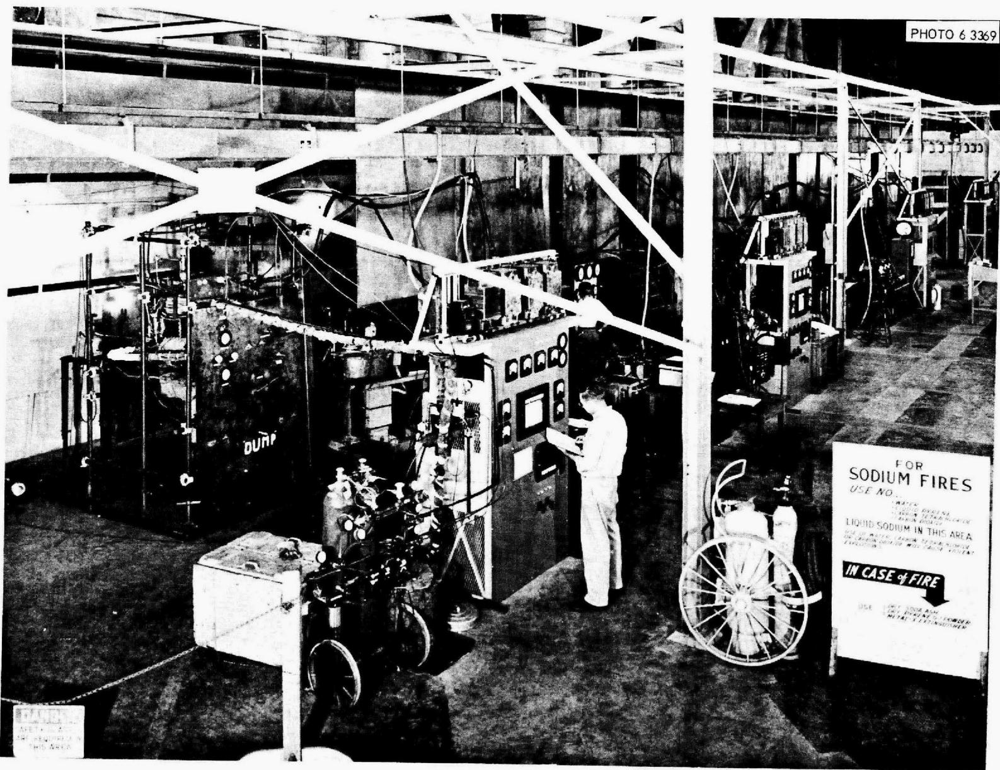  
C3I8   
Fig. 2.4 - Experimental Facilities. The pump test is in the left foreground; the hood, 120 ft. is across the top.

# ANP PROJECT QUARTERLY PROGRESS REPORT

is incomplete but was in partial operation at the end of the period.

# ALKALI METALS MANUAL

R. Devenish, ANP Division P. L. Hill, USAF

During the quarter the Y-12 Alkali Metals Guide, which sets forth safety

considerations to be observed when working with alkali metals or liquid-metal systems, was revised. The revised guide is being prepared for general distribution. In this connection, colored movies have been made of sodium fire extinguishing operations and liquid-metals disposal. The film has been edited, and a duplicate is being made for showing to interested groups.

# 3. REACTOR PHYSICS

N. M. Smith, Jr., Physics Division

The principal subjects of activity have been the calculation of the static characteristics of the design referred to here as the "ARE of 10 June 1951" and extensive calculation of the kinetic behavior of the ARE by machine techniques. The design of 10 June 1951 refers to an ARE of two-thirds the core volume of that in the design of 10 March 1951. Besides reduction of core size, manufacturing specifications and tolerances required a reduction of the average density of moderator in both core and reflector and an increase in structure and coolant volume. The effect of the density changes overrides the effect of reduction of core size, resulting in a net increase in uranium inventory requirement. Minor changes in the static coefficients which resulted are summarized in tabular and graphical form.

The uranium investment required is estimated to be 27.8 lb +10%, -20%, for the depleted, hot, poisoned, instrumented reactor with control rod thimbles in place. Allowance for expansion of liquid fuel through the boron curtain adds a requirement of 1.4 lb to the above figure, yielding a total inventory requirement of 29.2 lb of uranium.

The effectiveness of mutual shading effects of a hexagonal array of seven 2-in. $\mathbf{B}_4\mathbf{C}$ control rods has been calculated using three-group procedure made equivalent to the 32-group procedure for a homogeneous reflected reactor. With one rod in the center, and six on a ring surrounding the

center, the total reactivity effectiveness is insensitive to changes in the radius of the ring between 6.5 and 10.5 in. Absorption in the permanently placed thimbles will reduce the differential effect of the seven rods to 0.22 in $\Delta k / k$ . Mutual shading to the extent of a reduction of effectiveness of seven isolated control rods by $14\%$ is indicated by the calculations.

The kinetic response of the ARE to arbitrary changes of multiplication constant and to changes in inlet coolant temperature for various values of neutron lifetime and of fuel temperature coefficient has been studied and graphs are presented. The results show that the fuel temperature responds in an overdamped fashion to reactivity changes well over prompt critical.

A start-up accident throwing the reactor prompt critical at a low (300-watt) level was studied, resulting in a tolerable transient.

These calculations have been made by starting with steady-state initial conditions and by numerical integration of the set of nonlinear differential equations by IBM machine procedure. Work has continued on the development of other IBM calculations: multiregion problems, reactor solutions in cylindrical coordinates, and the effect of a boron layer between core and reflector.

Various problems relating to the physics of reactor calculations or to the physics of the ARE are discussed. These include a proper formulation for

# ANP PROJECT QUARTERLY PROGRESS REPORT

the age theory of the relation between neutron flux and slowing-down density, the transmission coefficient of a boron curtain, and heating in the boron curtain.

Calculations have been started on the physics of hydrogenous reactors, and in particular for a NaOH moderated and cooled reactor. Results are quoted.

# IBM CALCULATIONS

Production Report (F. C. Uffelman and P. Johnson, Uranium Control Department). Reactors. During the period ending September 1, 1951 the IBM section completed calculations on 84 reactors. Included in these 84 reactors were four bare reactors calculated by the end-point linear approximation method and three adjoint reactors. This brings the total number of reactors calculated by the EPLA method since calculations were begun in February to 182 reactors.

Programming for the calculation of reactors with an absorbing layer between core and reflector is very nearly complete. Because the method (1) used consists in making two parallel calculations for flux distributions in the reactor and combining the results of these calculations for each group before going on to the next group, the calculation of a reactor blanketed with $\mathbf{B}_4\mathbf{C}$ will take between five and six times as long as the calculation of a regular reactor.

Cores and Reflectors. During the period ending September 1, 1951 average cross-sections and constants were calculated for 26 cores and reflectors, and "constant" variations were calculated for 34 cores and reflectors. Of the cores calculated, 16 were hydrogenous and required calculation of the following factors in addition to those calculated for nonhydrogenous cores:

$$
\frac {\overline {{\sigma_ {S H}}}}{\xi \sigma_ {T}}, \tag {1}
$$

$$
\overline {{B}} ^ {N} = \frac {\pi}{R _ {0} + 0 . 7 1 (T / \Sigma_ {T R}) ^ {N}}, \tag {2}
$$

$$
\left[ \frac {\overline {{B ^ {2}}}}{\overline {{3 \xi \sigma_ {T} \sigma_ {T R}}}} \right] ^ {N}, \tag {3}
$$

$$
\overline {{\Sigma_ {T R} \cdot f}} ^ {N} = \left[ \frac {\overline {{B}}}{\tan^ {- 1} B / \Sigma_ {T R}} \cdot \frac {1}{1 / \Sigma_ {T R}} \right] ^ {N} \tag {4}
$$

$\overline{\Sigma_{TR}} \cdot f$ is calculated twice, once for a constant $B$ and once for the variable $B$ derived in formula (2) above.

A new set of cross-section boards and procedures is being set up for calculation of special cross-sections and constants. The new set-up will be more flexible but slower in operation than the specialized set-up used for regular nonhydrogenous cores, so that the old set-up will continue to be used for regular cores and reflectors.

Kinetic Calculations. Kinetic calculations for 16 different sets of conditions were completed. The length of the time interval, the number of functions, and the initial starting conditions were varied from set to set. Boards and procedures are now being set up for a kinetic calculation in which both temporal and spatial variations are made.

The Multiregion Reactor Problem (2) (C. B. Mills, Physics Division). A two-group calculation has shown that the effect of material outside the reactor reflector is important for the fast neutrons leaking out of the reactor. A formula was developed (2) for use with the IBM multigroup procedures to include the effects of these "outside" materials. A new index number is required to identify the different regions. Also, a factor eliminated in the development of the presently used formula must be retained as a factor in both the solution of the homogeneous equation, $A_{n}$ , and the corrective term, $P_{n}$ . This factor is the ratio of the values of $a^{i}$ (defined in ANP-58) (3) on each side of the interface through which the neutron flux equation is being solved, to a power given by the number of reactor space points between the first core-reflector interface and the interface of interest. Otherwise the equations are identical in form to the two-region solution.

Cylindrical Multigroup Calculation (N. Edmonson, Physics Division). It is desired to calculate the neutron

distribution and the effective multiplication constant $k_{\text{eff}}$ for a reflected cylindrical reactor with bare ends by transforming the partial differential Fermi age equation.

The neutron flux $\phi (r,u)$ and the slowing-down density $q(r,u)$ are assumed symmetrical relative to the axis of the cylinder. This assumption reduces the space variables to $r$ and $z$ . It is further assumed that in the reactor equation $r$ and $z$ may be separated. This leads to the expression of the $z$ dependence by a factor

$$
\cos \frac {\pi z}{2 (H + d)},
$$

where $H$ is the half-cylinder length and $d$ is the linear extrapolation length. It is assumed that $d$ has the same value for all lethargies and for both the core and the reflector.

It is assumed that the neutron flux $\phi (r,u)$ is finite for $r = 0$ and is equal to zero at the extrapolated boundary of the reflector. The core-reflector boundary conditions are: (1) $\phi (r,u)$ is continuous and (2) $-D(\partial \phi /\partial r)$ is continuous. Work on this problem is being carried on as rapidly as possible, and the formulation is in process of publication in report form.

The Effect of the Boron Blanket in the ANP Reactor (C. B. Mills, Physics Division). The method of solution for a reactor with an energy-dependent absorber between core and reflector(4) has been transformed(1) into the system

# ANP PROJECT QUARTERLY PROGRESS REPORT

required by IBM multigroup procedures. This consists of computation in this order:

1. Compute a flux distribution in core and reflector with a source term in the core only.   
2. Repeat step (1) for a source term in the reflector only.   
3. Compute separately currents due to sources and reflectors at the core-reflector interface. Compute four currents.   
4. Compute the corrective term for reflector flux due to a core source and the term for core flux due to a reflector source.   
5. Add flux and correction in core and reflector, and use the total flux to determine the source term for the next higher lethargy group as in the regular multi-group procedure.

# STATICS OF THE AIRCRAFT REACTOR EXPERIMENT

Summary of Calculations on the ARE (B. T. Macauley, USAF). Multigroup reflected-reactor calculations on the latest ARE design, hereafter referred to as the design of 10 June 1951 and illustrated in Fig. 3.1, were made during the past quarter. The core of this design, having a uranium inventory of 25 lb, is referred to as Core 93. The composition of the core and the design data are given in Table 3.1.

Two series of reflected reactor calculations were made; the first consisted of a spherical core having the properties listed in Table 3.1 and surrounded by the side reflector (Reflector 519), and the second series

of calculations consisted of a spherical core having the properties listed in Table 3.1 and surrounded by the bottom reflector (Reflector 520). The constituents in both the side and bottom reflectors are given in Table 3.2.

Calculations were made using the compositions of the ARE core (Core 93) except for varying the uranium concentration and using Reflector 520. The results were plotted showing how $k_{\text{eff}}$ varies with uranium investment (Fig. 3.2). Also, calculations were made using Core 93 (25 lb uranium investment) and each of Reflectors 519 and 520, varying the core thickness to show how $k_{\text{eff}}$ varies with the reflector thickness (Fig. 3.3).

Graphs of $k_{\text{eff}}$ vs. reflector thickness for the 3-ft right cylindrical core design (Core 84; incomplete curves previously reported in the last quarterly), as well as this core reduced in volume by one-third (Core 91) and one-sixth (Core 92) have been drawn and show the same general relations as indicated in Fig. 3.3 for the ARE core (Core 93).

The reflector saving for the ARE core (Core 93) is given in Fig. 3.4.

Numerical calculations were made to determine various design and nuclear coefficients. The results are summarized in Table 3.3.

Figure 3.5 is a plot of the spatial distribution of the lethargic average of the fast flux in the core, and Fig. 3.6 is a plot of the spatial distribution of the thermal flux in the core. Plots of the flux spectrum at various radii are shown in Fig. 3.7. Figures 3.8 and 3.9 show the leakage

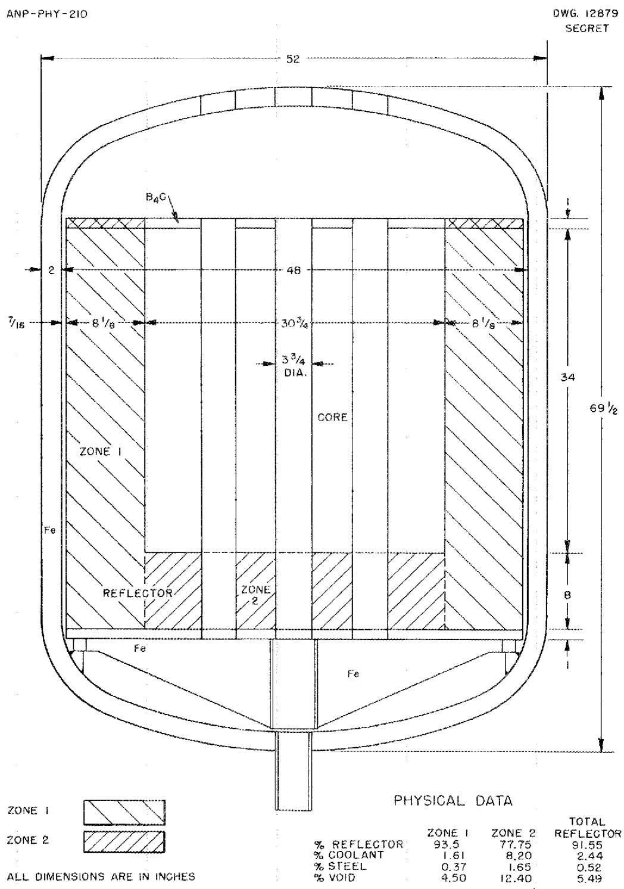  
Fig. 3.1 - Schematic Drawing of ARE Core Arrangement.

# ANP PROJECT QUARTERLY PROGRESS REPORT

TABLE 3.1   
Composition and Design Data of Core 93   

<table><tr><td>Core geometry</td><td>Cylinder</td></tr><tr><td>Core diameter (in.)</td><td>29.45</td></tr><tr><td>Core height (in.)</td><td>34.00</td></tr><tr><td>Core volume (ft3)</td><td>13.411</td></tr><tr><td>Core composition:</td><td></td></tr><tr><td colspan="2">VOLUME (ft3)</td></tr><tr><td>Moderator (ReO)</td><td>10.872</td></tr><tr><td>Liquid fuel</td><td>0.185</td></tr><tr><td>Coolant (sodium)</td><td>0.621</td></tr><tr><td>Fuel-tube metal</td><td>0.130</td></tr><tr><td>Coolant-tube metal</td><td>0.078</td></tr><tr><td>Control-tube metal</td><td>0.221</td></tr><tr><td>Void</td><td>1.304</td></tr><tr><td rowspan="3">Fuel-element dimensions</td><td>225</td></tr><tr><td>0.025</td></tr><tr><td>thick</td></tr><tr><td>No. of fuel tubes</td><td>65</td></tr><tr><td>No. of control elements</td><td>7</td></tr><tr><td>Thickness of side reflector (in.)</td><td>8.75</td></tr><tr><td>Thickness of bottom reflector (in.)</td><td>8.00</td></tr></table>

spectrum from the core and the reflector, respectively. Figure 3.10 is the spatial power distribution with a uranium investment of 25 lb.

Estimated Critical Mass of the ARE (N. M. Smith, Jr., Physics Division, and B. T. Macauley, USAF). The results of the previous section have been employed to estimate the critical mass of the ARE design of 10 June. The calculations are summarized in Table 3.4.

There results a critical mass of 27.8 lb of uranium. This is somewhat higher than the value of 21.5 lb quoted in the last quarterly report (ANP-65) for a reactor of two-thirds volume of the design of 10 March 1951. This increase has been brought about by the engineering of the core of a more realistic estimate of BeO block densities, clearances, and structural densities. The design of 10 June contains less BeO and more inconel and sodium.

TABLE 3.2   
Volume Fractions of the Materials in the Side and Bottom Reflectors   

<table><tr><td>CONSTITUENT</td><td>VOLUME (ft3)</td><td>VOLUME FRACTION (%)</td></tr><tr><td colspan="3">Reflector 519 (Side Reflector)</td></tr><tr><td>Reflector (BeO)</td><td>19.676</td><td>94.89</td></tr><tr><td>Coolant (sodium)</td><td>0.41</td><td>1.98</td></tr><tr><td>Structure (inconel)</td><td>0.074</td><td>0.36</td></tr><tr><td>Void</td><td>0.590</td><td>2.85</td></tr><tr><td colspan="3">Reflector 520 (Bottom Reflector)</td></tr><tr><td>Reflector (BeO)</td><td>2.56</td><td>81.1</td></tr><tr><td>Coolant (sodium)</td><td>0.220</td><td>6.98</td></tr><tr><td>Coolant-tube metal</td><td>0.0185</td><td>0.58</td></tr><tr><td>Control metal</td><td>0.0520</td><td>1.64</td></tr><tr><td>Void</td><td>0.3072</td><td>9.72</td></tr></table>

Control Rod Effectiveness (J. W. Webster, Physics Division, and R. J. Beeley, Oak Ridge School of Reactor Technology). The last quarterly report (ANP-65) gave the results and method of calculation on the effectiveness $(\Delta k / k)$ of an axial 2-in. $\mathbf{B}_4\mathbf{C}$ control rod. The heating due to the $(n,\alpha)$ reaction and gamma absorption was also reported.

This quarter it was decided that seven 2-in. control rods would be needed in the ARE to offset the effects of temperature and fission product poisons with a margin of safety. Calculations were made by the Nordheim-Scalettar Method (5-7) to determine the best placement for these rods to obtain the maximum effectiveness in $k$ . The physics work of the last six months on the statics of the ARE control system has been written and distributed as report Y-F10-71. (8) Included in this report is a discussion of three-group theory when, of the three solutions of

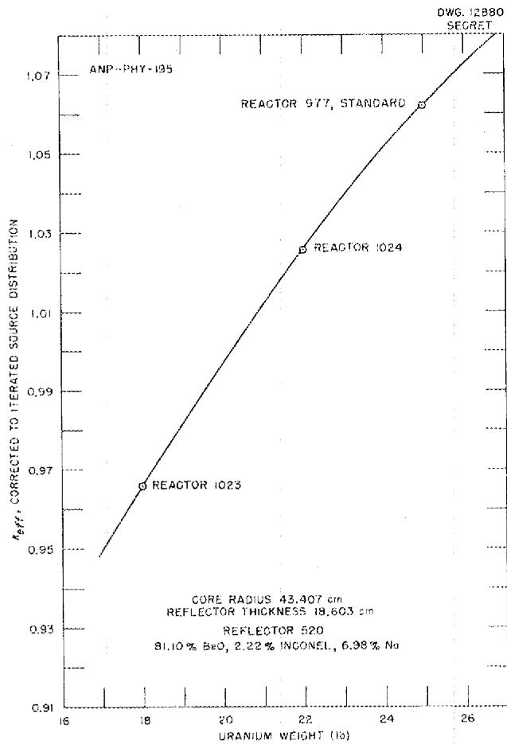  
Fig. 3.2 - $k_{eff}$ vs. Uranium Weight for the ARE.

(5)R. Scalettar and L. W. Nordheim, Theory of Pile Control Rods, MDDC-42 (decl. June 17, 1946).   
(6) C. R. McCullough, Summary Report on Design and Development of High-Temperature Gas-Cooled Power Pile, MonN-383, Appendix (Sept. 15, 1947); Criticality and Control, NEPA-6, Appendix (Oct. 1, 1948).   
(7) J. W. Webster, Control-Red Effects on Reactivity and Power Distribution, NEPA TC-50-2-52 (Feb. 7, 1950).   
(8) J. W. Webster and R. J. Beeley, Physics Calculations on the ARE Control Rods, ORNL, Y-12 site, report Y-F10-71 (Aug. 29, 1951).

# ANP PROJECT QUARTERLY PROGRESS REPORT

# TABLE 3.3

# Summary of Calculations on the ARE Core Having 25 lb of Uranium and Reflector 520

Nuclear coefficient of reactivity:

From start-up to normal operation

Temperature coefficient

Uranium mass coefficient of reactivity

Density coefficient for core materials:

Moderator

Coolant

Structure

Density coefficient for reflector materials: Moderator

Coolant

Inconel

Lifetime (Core 93 with Reflector 519)

$\%$ thermal fissions

Spatial and lethargic average of fast

$$
(0 \leq u \leq 1 8. 6) f l u x, \bar {\bar {\phi}} _ {f a s t}
$$

Spatial average of thermal $(u = 18.6)$ flux, $\tilde{\phi}_{\text{thermal}}$

Integrated flux at 3 megawatts at central position

$$
\Delta k / \overline {{k}} = - 0. 0 0 7 9 9 5
$$

$$
\Delta k / \bar {k} / ^ {\circ} F = 5. 0 4 \times 1 0 ^ {- 6}
$$

$$
\frac {\Delta k / \bar {k}}{\Delta m / m} = + 0. 3 0 0
$$

$$
\left[ \frac {\Delta k / \bar {k}}{\Delta \rho / \rho} \right] _ {\text {B e O}} = + 0. 4 8 9 4
$$

$$
\left[ \frac {\Delta k / \bar {k}}{\Delta \rho / \rho} \right] _ {N a} = - 0. 0 0 6 3 6
$$

$$
\left[ \frac {\Delta k / \overline {{k}}}{\Delta \rho / \rho} \right] _ {\text {i n c o n e l}} = - 0. 1 1 4 0
$$

$$
\left[ \frac {\Delta k / \overline {{k}}}{\Delta \rho / \rho} \right] _ {\text {B e O}} = + 0. 2 2 4 6
$$

$$
\left[ \frac {\Delta k / \overline {{k}}}{\Delta \rho / \rho} \right] _ {N a} = - 0. 0 0 0 9 3
$$

$$
\left[ \frac {\Delta k / \bar {k}}{\Delta \rho / \rho} \right] _ {\text {i n c o n e 1}} = - 0. 0 3 8 3 6
$$

$$
1. 5 3 5 \times 1 0 ^ {- 4} \sec
$$

$$
5 9. 8
$$

16.12 neutrons/cm²/sec per unit of lethargy per fission per second per cubic centimeter of core

47.99 neutrons/cm²/sec per fission per second per cubic centimeter of core

1.682 $\times 10^{14}$ neutrons/cm²/sec

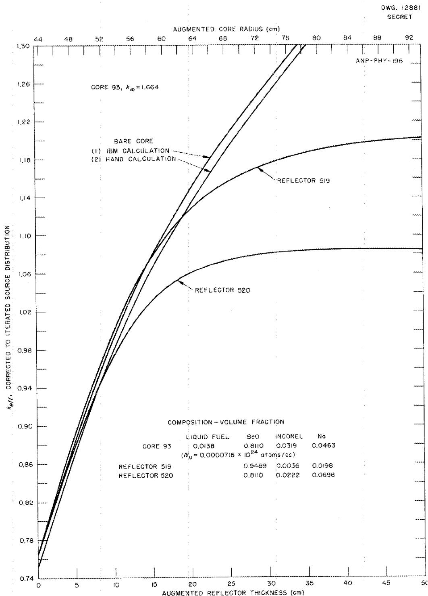  
Fig. 3.3 - Reactivity of the ARE Core Backed by Various Reflectors or Additional Core Material.

# ANP PROJECT QUARTERLY PROGRESS REPORT

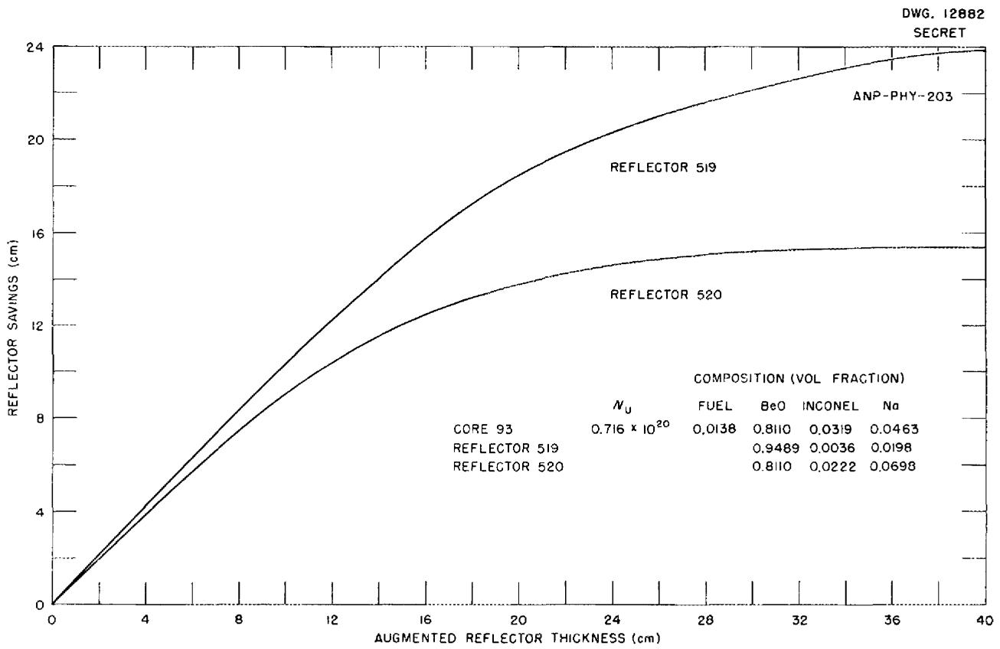  
Fig. 3.4 - Reflector Savings of Various Reflectors Backing the ARE Core.

the buckling obtained, two are complex conjugates, instead of the usual situation where all three are real, one positive and two negative. This case was encountered in the control rod studies.

The discussion of the effectiveness of the seven control rods given in Y-F10-71 follows:

The total effect on reactivity of the insertion of seven 2-in. rods was investigated. The pattern was one axial rod and a ring of six at the same radius equally spaced around the center rod. Five different distances from the axis were tried for the ring

of six. The total $\Delta \nu /\nu$ (effect of thimble not deducted) obtained for the seven rods in each case was: $29.1\%$ for a radial distance of 6.5 in., $31.1\%$ for 7.5 in., $32.0\%$ for 8.5 in., $31.3\%$ for 9.5 in., and $29.3\%$ for 10.5 in. In regard to the shadowing effect of the rods on each other, these numbers are to be compared with $7\times 5.3 = 37.1\%$ . Thus the minimum shadowing effect of (37.1 - 32.0)/37.1 = $13.7\%$ occurs with the ring of six at a radial distance of 8.5 in. off the axis and the net effect of the seven rods, deducting the effect of the thimble, is $22\%$ in reactivity.

It follows from the results that the total reactivity effectiveness

TABLE 3.4   
Calculation of Uranium Requirement for the ARE Design of 10 June 1951   

<table><tr><td>CORE</td><td>REFLECTOR</td><td>POSITION</td><td>RELATIVE VALUE</td><td>keff</td><td>WEIGHTED keff</td><td>URANIUM MASS (1b)</td></tr><tr><td>93</td><td>None</td><td>Top</td><td>1/6</td><td>0.8045</td><td>0.1341</td><td></td></tr><tr><td>93</td><td>520</td><td>Bottom</td><td>1/6</td><td>1.0730</td><td>0.1788</td><td></td></tr><tr><td>93</td><td>519</td><td>Side</td><td>2/3</td><td>1.1585</td><td>0.7722</td><td></td></tr><tr><td colspan="5">Weighted value of keff for clean homogeneous reactor</td><td>1.085</td><td></td></tr><tr><td colspan="5">Seven control rod thimbles at 0.014, each less 14% for mutual shading</td><td>-0.078</td><td></td></tr><tr><td colspan="5">Net ARE, clean, with control-rod thimble</td><td>1.007</td><td></td></tr><tr><td colspan="5">Total keff in clean reactor desired for fission poison override, experiment, and control instrumentation</td><td>1.041</td><td></td></tr><tr><td colspan="5">Additional keff needed for above</td><td>1.034</td><td></td></tr><tr><td colspan="5">Additional uranium needed for above, using Δk/k/Δm/m = 0.300</td><td></td><td>2.8</td></tr><tr><td colspan="5">Uranium in Core 93</td><td></td><td>25.0</td></tr><tr><td colspan="5">Total uranium in reacting volume (critical mass)</td><td></td><td>27.8</td></tr><tr><td colspan="5">5% allowance above and inside B4C curtain</td><td></td><td>1.4</td></tr><tr><td colspan="5">Total uranium inventory required</td><td></td><td>29.2</td></tr><tr><td colspan="5">Estimated probable error</td><td></td><td>+10%, -20%</td></tr></table>

is not sensitive to rod placement in the region investigated, i.e., 6 to 10 in. from the axis. This is caused by the fact that two opposing factors are acting. When the rods are put close to the axis they are inserted into a region of higher undisturbed flux but the shadowing effect of rods on each other is large; on the other hand, when the rods are put farther from the axis they are inserted into a region of lower undisturbed flux, but any one rod does not tend to feel such a large flux depression caused by the

insertion of neighboring rods. The two effects counteract to give a rather broad region of good rod placement. It is known from previous calculations,[5] however, that if the rods are very close to the axis or very far out toward the reflector, a sharp loss in combined effectiveness is incurred. Since the hexagon moderator blocks are about $3\%$ in. across flats, it develops that the possible radii available for rod placement are $3\%$ , 7.5, 11.25 in., etc. The closest to optimum placement is 7.5 in., and this has been adopted in the current ARE design.

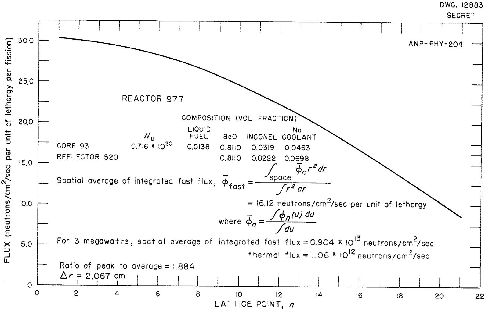  
ANP PROJECT QUARTERLY PROGRESS REPORT   
Fig. 3.5 - Spatial Distribution of the Lethargic Average of the Fast Flux.

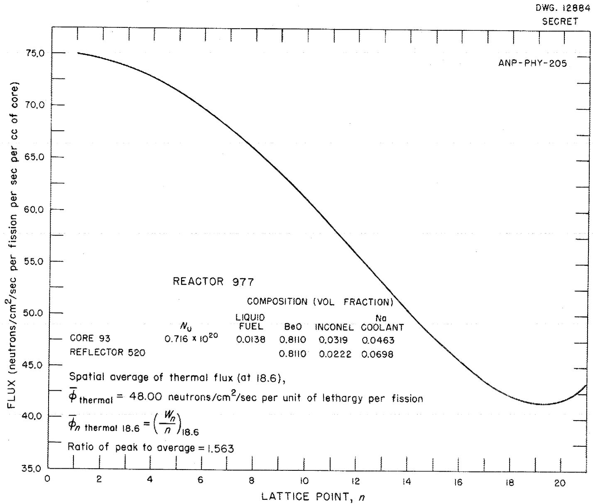

  
Fig. 3.6 - Spatial Distribution of the Thermal Flux in the Core.

# ANP PROJECT QUARTERLY PROGRESS REPORT

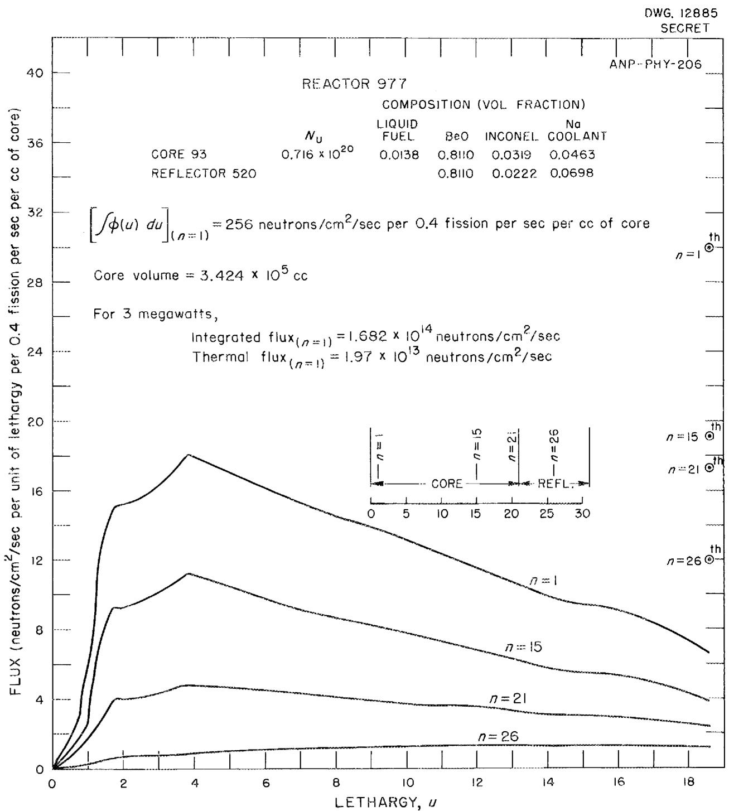  
Fig. 3.7 - Flux Spectrum in the ARE.

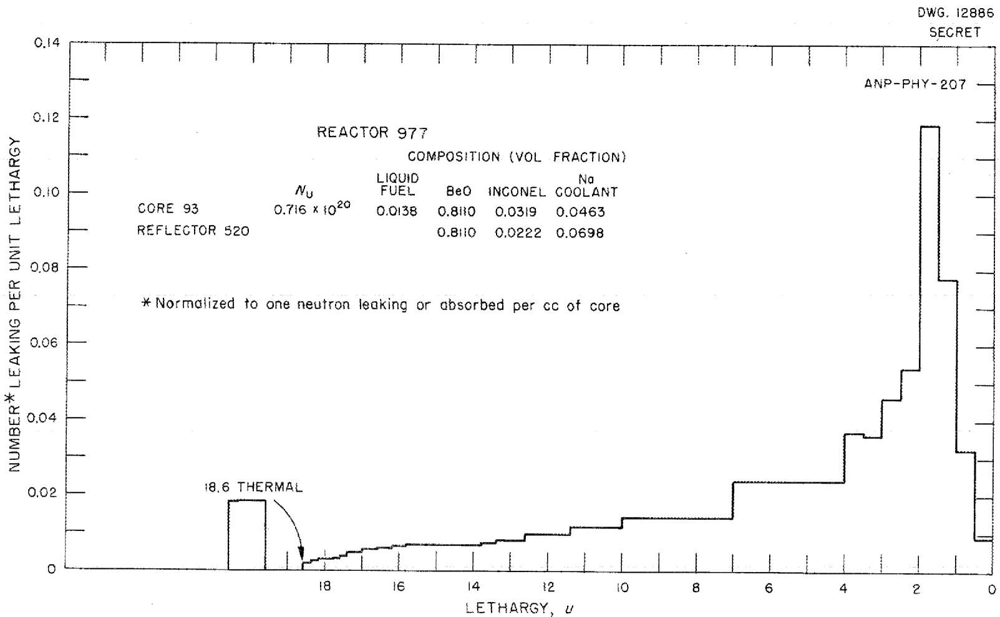  
Fig. 3.8 - Leakage Spectrum from the ARE Core to the Reflector.

1961 '0I HReBWeLdEs ONIOE DOIHed HOJ

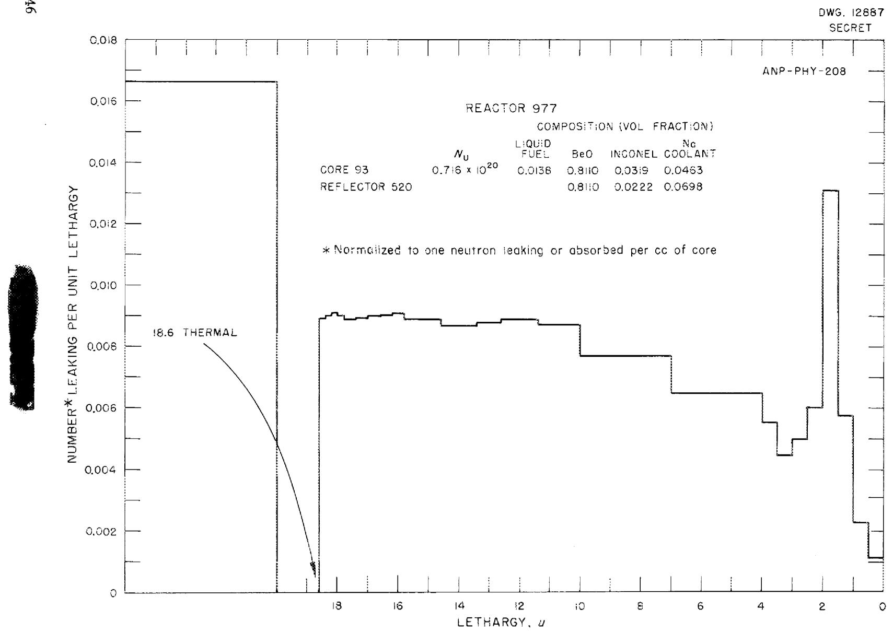  
9   
Fig. 3.9 - Leakage Spectrum from the ARE Reflector.

  
LHOHSSSEBOd ATHLNVNO JcEfoLD dN

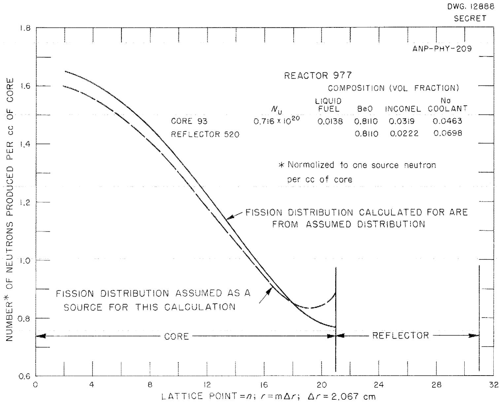  
Fig. 3.10 - Spatial Power Distribution in the ARE.

1961 0I HREWELDESNIDNEOIOHd 80J

# ANP PROJECT QUARTERLY PROGRESS REPORT

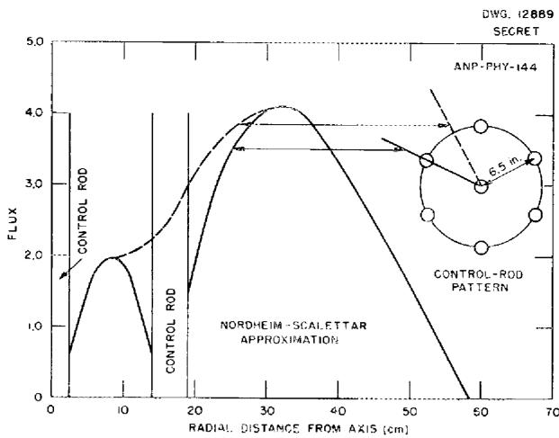  
Fig. 3.11 - Radial Thermal-Flux Distribution in the ARE Reactor with Seven Control Rods; Placement No. 1.

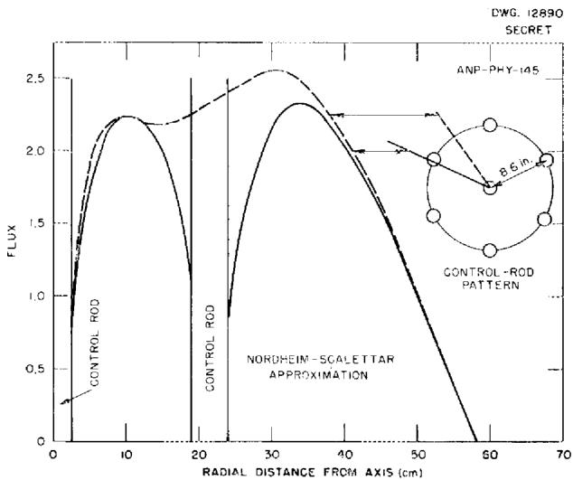  
Fig. 3.12 - Radial Thermal-Flux Distribution in the ARE Reactor with Seven Control Rods; Placement No. 2.

Figures 3.11, 3.12, and 3.13 show the distribution of the thermal flux along a radius vector through a rod and in between two rods for three different placements corresponding to radii of 6.5, 8.6, and 10.5 in..

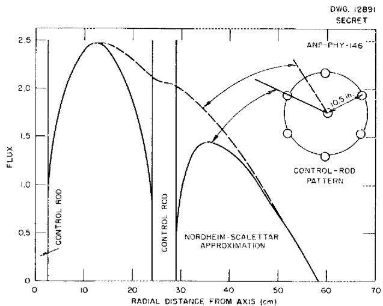  
Fig. 3.13 - Radial Thermal-Flux Distribution in the ARE Reactor with Seven Control Rods; Placement No. 3.

respectively, for the circle defined by the centers of the six outer rods.

# KINETICS OF THE AIRCRAFT REACTOR EXPERIMENT

M. J. Nielsen, USAF

J. W. Webster, Physics Division

In the last quarterly report it was mentioned that solution of the nonlinear kinetic equations for the ARE was in progress on the IBM machines. Three graphs were included showing the calculated response of flux (or power) and fuel temperature to a step increase in reactivity of 0.009125 (25% over prompt critical).

This quarter the adaptation of the kinetic equations to solution by IBM machines was continued. Three types of problems were considered: (1) the response to a step change in reactivity with the coolant inlet temperature held constant, (2) the response to a change

in the coolant inlet temperature with no control rod motion, and (3) the response to a change in the coolant inlet temperature with the control rod being activated by the change in coolant inlet and outlet temperature.

The equations and method of solution have been written up in ANP-68.(9) Solutions for the ARE (3-megawatt) and ANP (200-megawatt) reactors and for variations of parameters in the neighborhood of those for the ARE and ANP will be distributed in report form in the near future.

The results of kinetic calculations completed to date by this method are presented in the form of curves of flux vs. time, fuel temperature vs. time, and phase plots of flux vs. fuel temperature. The latter type of plot has the advantage that the new asymptotic steady-state flux and fuel temperature can be shown.

Most of the curves have to do with the response of the flux and fuel temperature to a sudden change of control rod position or to an accident such as a deformation that might cause a step increase in $k$ . The changes in reactivity inserted are $\delta k = 0.002$ , 0.004; 0.006, and 0.009125 where the last represents a 25% increase over prompt critical. The corresponding flux and fuel-temperature response are illustrated in Figs. 3.14, and 3.15. A phase plot combining these two figures is given in Fig. 3.16. Various parameters are changed to study their effect, for example, the neutron lifetime, the uranium mass-reactivity coefficient which has to do partly with the effectiveness of the B₄C

curtain at the top of the core, and the conductivity of the fuel. The reactor is assumed to be at its design power of 3 megawatts at time zero except in one calculation - investigation of start-up accident - in which the power is taken as 300 watts at $t = 0$ .

In none of the cases considered does the energy release seem sufficient to damage the reactor, and in all cases the fuel temperature responded in an overdamped fashion. The fuel temperature for the case of $\delta k = +0.009125$ stabilizes out at a new temperature $186^{\circ}\mathrm{C}$ hotter than the design value of $800^{\circ}\mathrm{C}$ when no counter control rod action is taken. There is, of course, some magnitude of $\delta k_{c}$ which would cause temperatures resulting in failure of the fuel tubes or fuel solution before the stabilization occurred.

Mass-Reactivity Coefficient. The investigation of the effect, on the response, of assuming different values for the uranium mass-reactivity coefficient (Figs. 3.17 and 3.18) demonstrated the strong sensitivity of the response to this quantity. It is clearly very important that the $\mathbf{B}_4\mathbf{C}$ curtain be as opaque to neutrons as it is possible to make it.

Fuel Conductivity. The increase in the fuel conductivity by a factor of 10 had remarkably little effect on the response to a $\delta k_{c}$ (Fig. 3.19). The explanation seems to be that the heat input to the fuel due to fission is rather large compared to the loss by heat transfer to the coolant during the time of the power pulse. Hence a change in the cooling term (which is about a factor of 2 rather than 10 since the conductivity affects only

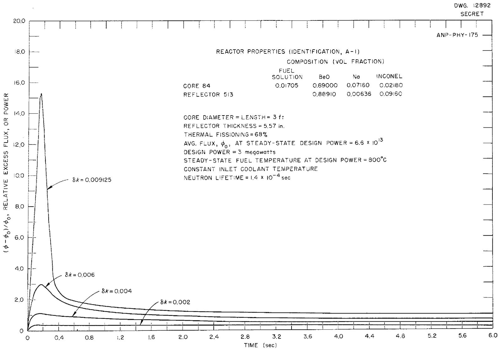  
Fig. 3.14 - Response of Flux to a Step Increase in Reactivity for Various Reactivity Changes.

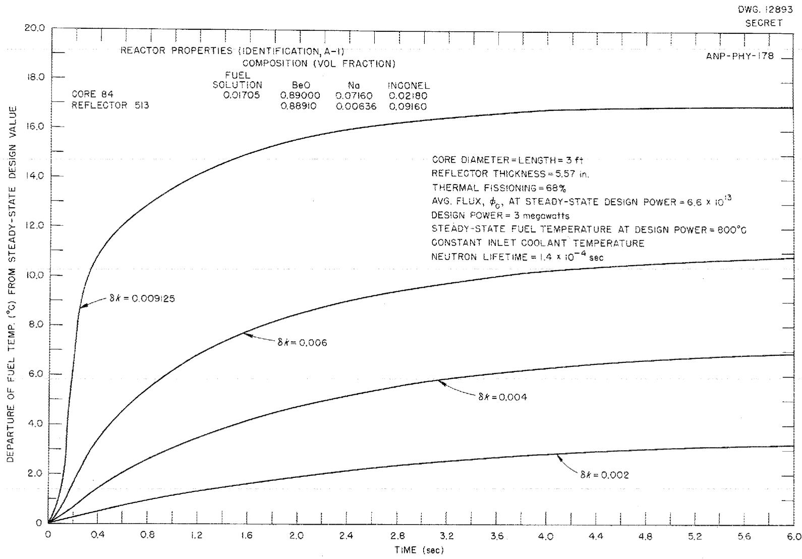  
FOR PERIOD ENDING SEPTEMBER 10, 1951   
Fig. 3.15 - Response of Fuel Temperature to Step Increase in Reactivity for Various Reactivity Changes.

DWG. 12894

SECRET

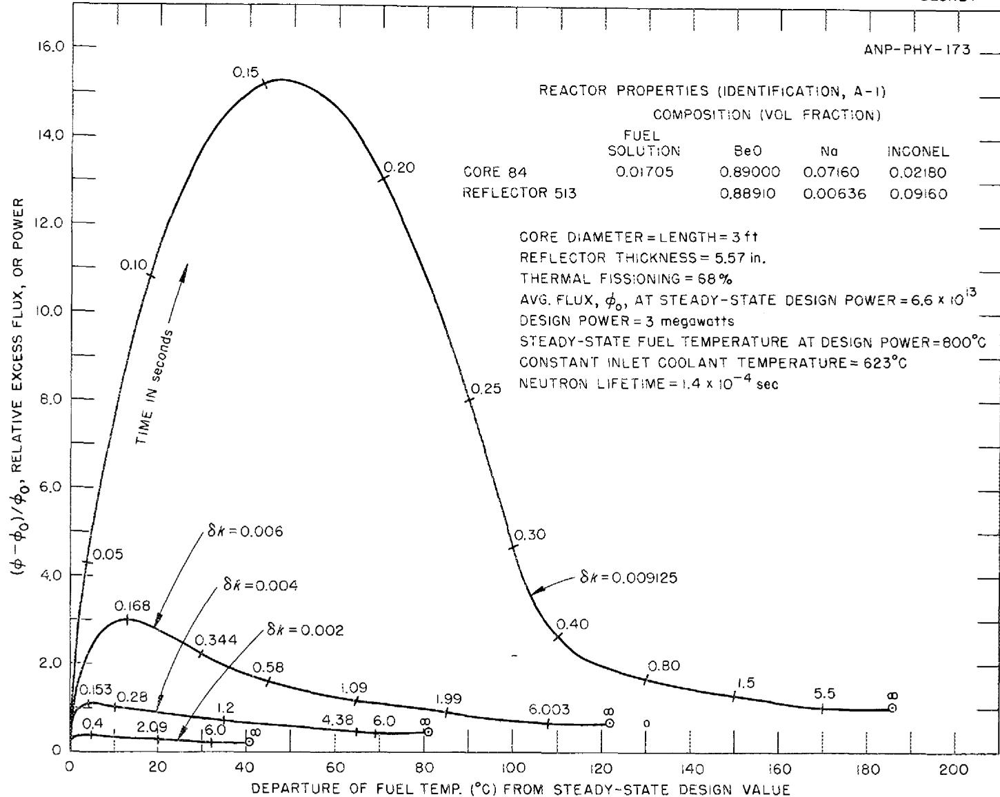  
Fig. 3.16 - Phase Plot of Flux vs. Fuel Temperature for Various Step Increases in Reactivity.

$(\phi - \phi_0) / \phi_0$ RELATIVE EXCESS FLUX, OR POWER, OVER STEADY-STATE VALUE

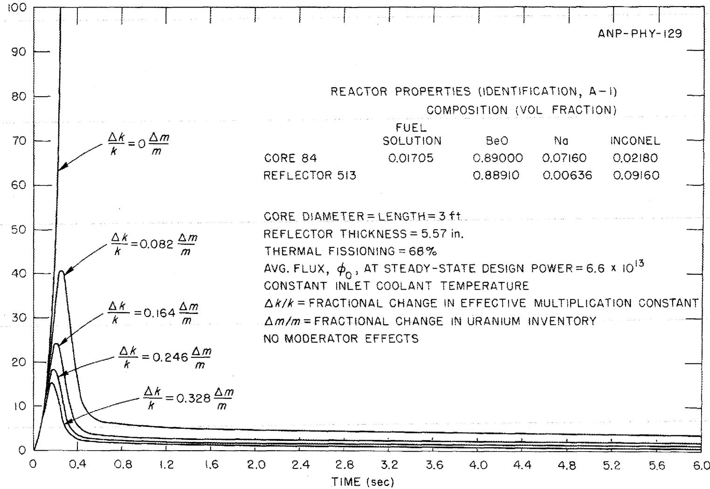  
Fig. 3.17 - Power Response of ARE to Step Reactivity Change of 0.009125 with Various Mass-Reactivity Coefficients.

DWG. 12895

SECRET

1961 0I HwAeS ONIONDIOIED

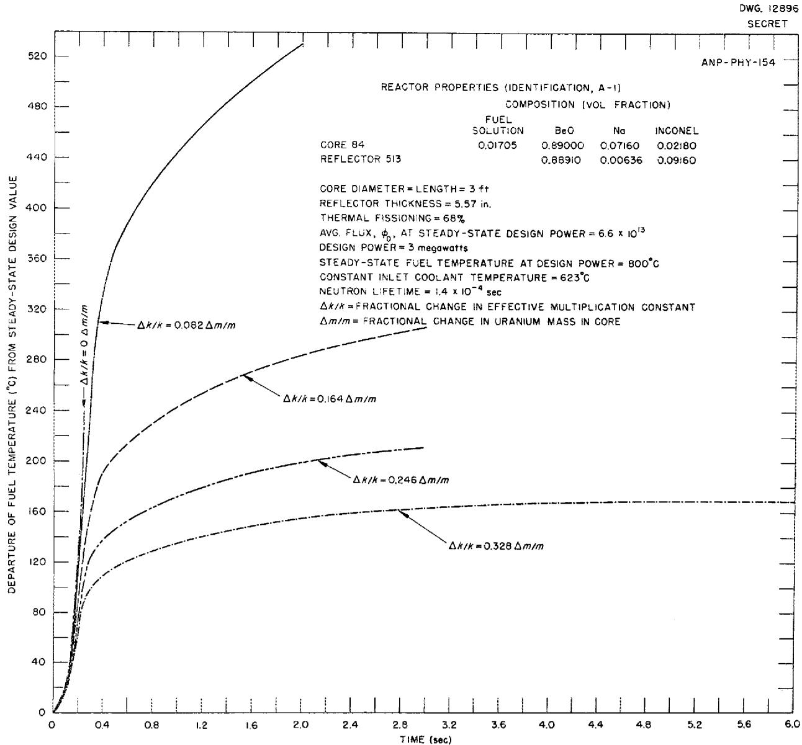  
Fig. 3.18 - Response of Fuel Temperature to a Step Increase of Reactivity of 0.009125 for Various Effective Mass-Reactivity Coefficients.

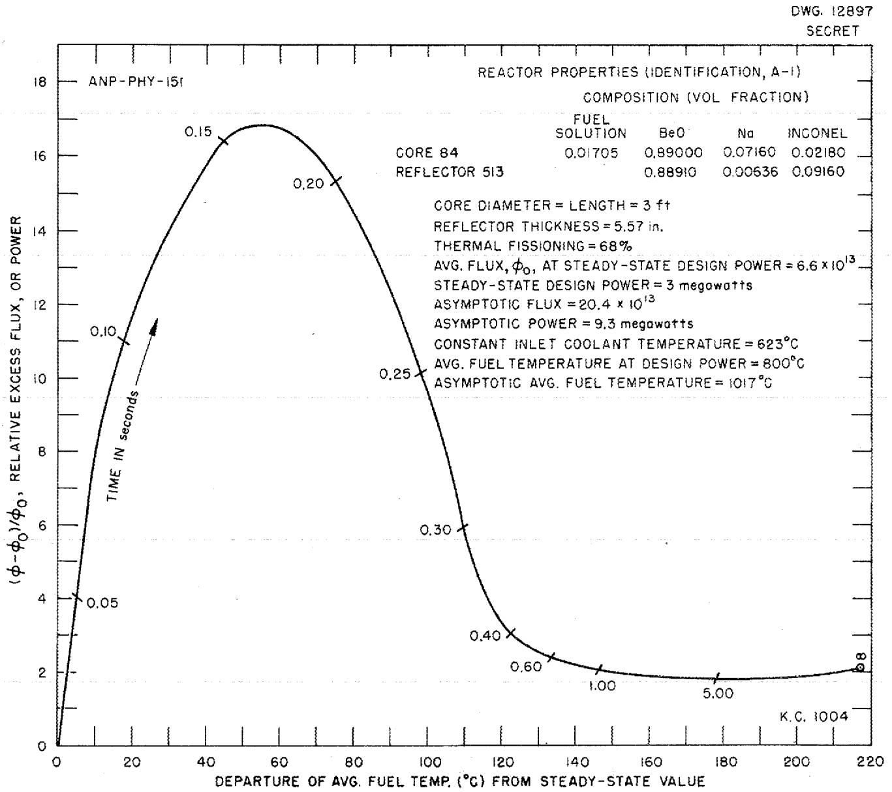  
Fig. 3.19 - Phase Diagram of Flux vs. Fuel Temperature for Response of ARE to a Step Increase in Reactivity of 0.009125. Fuel conductivity arbitrarily increased by a factor of 10.

# ANP PROJECT QUARTERLY PROGRESS REPORT

one term of several in the heat-transfer expression) does not markedly affect the shape or magnitude of the power pulse.

Neutron Lifetime. Variation of neutron lifetime $l$ was calculated only for the case of $\delta k_{c}$ less than the delayed neutron fraction (and with the stabilizing effect of the fuel expansion neglected in order to see more clearly how the lifetime affects the growth of flux). For $\delta k_{c}$ larger than $\beta$ , the delayed neutron fraction (and no self-stabilization), the flux grows, of course, approximately like

$$
\phi \propto e ^ {(\delta k c ^ {- \beta}) t / l}
$$

When $\delta k_{c}$ is less than the fraction of delayed neutrons, the flux also increases very rapidly initially (as if all fission neutrons were prompt) with an initial slope inversely proportional to the lifetime. However, after a time which is directly proportional to the lifetime, the flux curve flattens out with a rather sharp "knee" and rises from then on with the "stable" reactor period (when there are no self-stabilizing features). The stable reactor period is a function of the $\delta k_{c}$ but not of the neutron lifetime. The rapid initial rise in the flux is due to the fact that the rate at which delayed neutrons are being returned to the population is almost equal to the rate at which delayed-neutron emitters are being created, while the flux is still near the steady-state value. The reactor thus behaves momentarily as if all fission neutrons were prompt. These facts are borne out qualitatively in comparing the flux response to a $\delta k_{c} = 0.002$ for three different assumed

lifetimes (Fig. 3.20). Equation 11.35.3 of TID-386(10) provides a mathematical interpretation of the flux behavior as obtained (Fig. 3.20).

Although the effect on reactivity of the fuel expansion was not included in these calculations, it is apparent that for step changes in reactivity less than the fraction of delayed neutrons the peak power in the power pulse (when fuel expansion is allowed) will be roughly independent of the neutron lifetime for lifetimes smaller than $10^{-4}$ sec.

Start-Up Accident. In regard to the investigation of the response to a start-up accident, the results (Fig. 3.21) indicate that a step change in reactivity at low power will be less serious than the same step change at high power from the point of view of fuel temperatures reached.

Coolant Temperature. The response of the flux and fuel temperature to a step increase in the inlet coolant temperature of $100^{\circ}\mathrm{C}$ is shown in Fig. 3.22. Since the rise in the coolant temperature as the coolant passes through the ARE core (at design power of 3 megawatts) is $194^{\circ}\mathrm{C}$ , the drop through the heat exchanger is roughly the same. A rise in reactor inlet coolant temperature of $100^{\circ}\mathrm{C}$ implies a rise of heat-exchanger outlet temperature of approximately $100^{\circ}\mathrm{C}$ . The temperature drop through the heat exchanger must have been 94 instead of $194^{\circ}\mathrm{C}$ . This implies that the external power requirement was suddenly reduced from 3 to $(94 / 194)\times 3 = 1.45$ megawatts. Calculations on the reactor were made holding the reactor inlet coolant

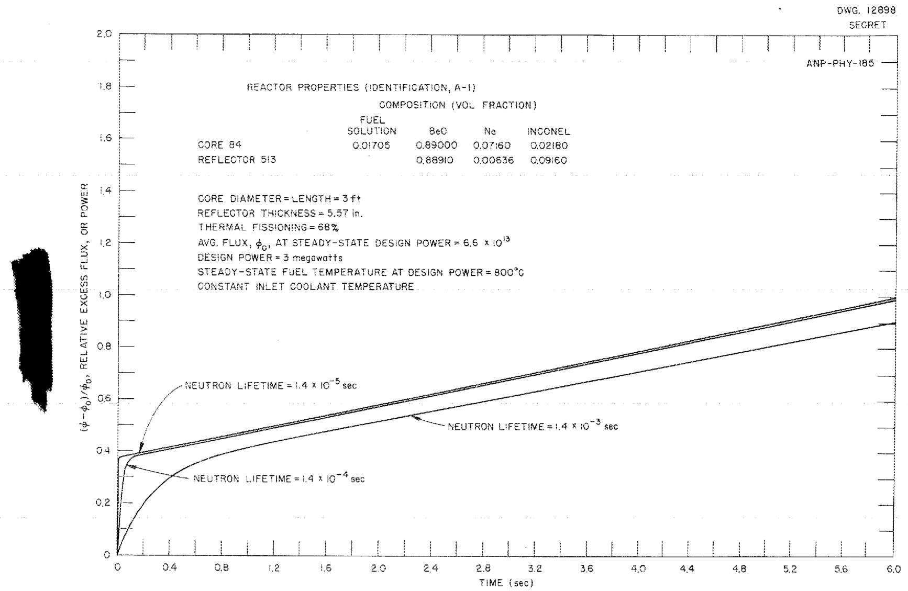  
Fig. 3.20 - Response of Flux to a Step Increase in Reactivity of 0.002 for Various Average Neutron Lifetimes. Reactivity change due to thermal expansion of the fuel not included.

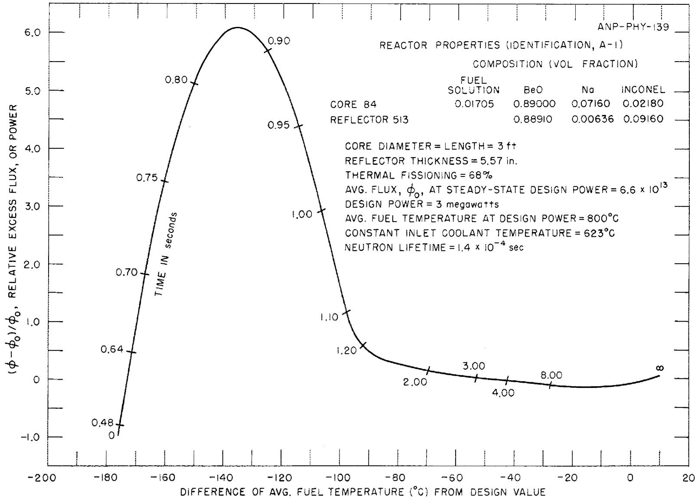  
Fig. 3.21 - Phase Diagram of Relative Excess Power (Flux) vs. Fuel Temperature. For response of ARE to a step increase in reactivity of 0.009125 when reactor power at 300 watts and initial fuel temperature are the same as the design coolant inlet temperature.

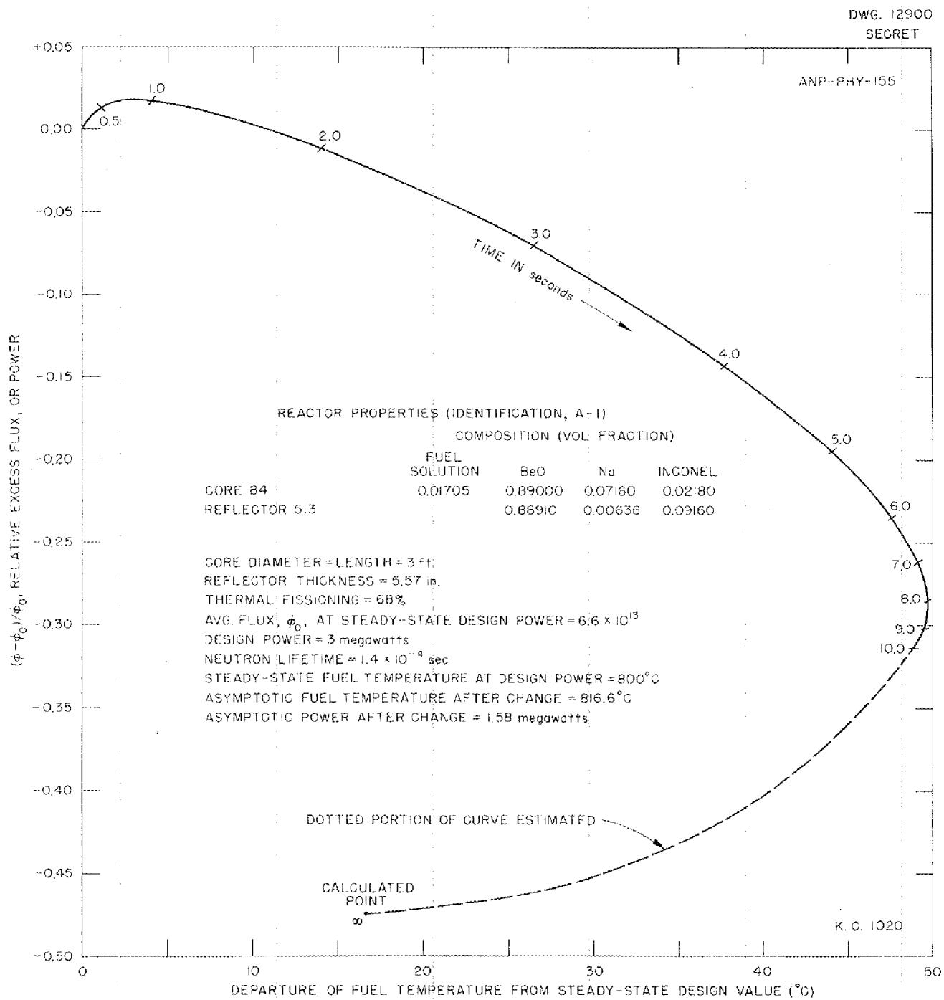  
Fig. 3.22 - Phase Plot of Flux (or Power) vs. Fuel Temperature. After increase of $100^{\circ}\mathrm{C}$ in inlet coolant temperature.

# ANP PROJECT QUARTERLY PROGRESS REPORT

temperature at $100^{\circ}\mathrm{C}$ hotter than the steady-state design value, and it was found that the reactor would, after a long time, steady out at a new power of 1.575 megawatts, assuming no change in control-rod setting. This is very close to the new power demand, but, even if the coolant circuit from heat-exchanger outlet to reactor inlet was long enough to allow the reactor to settle to this new power, several more circuits of the coolant accompanied by small incremental temperature adjustments would be required before the power output settled to the new requirement.

Actually, it is planned to set the regulating control rod in motion by an error signal which is such a function of the inlet and outlet coolant temperatures that the point in the reactor coolant pass which is at $1250^{\circ}\mathrm{F}$ under design power remains at this temperature (this point is about one-third of the way through the reactor). The inlet coolant temperature, outlet coolant temperature, and fuel temperature will adjust themselves to new conditions when a new power requirement is made, but always with the fulcrum point of the coolant at $1250^{\circ}\mathrm{F}$ . The scheme ensures that the coolant pumps which are located at the reactor coolant inlet tend will not be subjected to high-temperature coolant (approximately $1500^{\circ}\mathrm{F}$ ) when the reactor is at low power. This would occur if the control rod was not moved.

An interesting feature of the curves showing the response of the flux to a step increase in coolant temperature of $100^{\circ}\mathrm{C}$ is the "thermometer" effect of the fuel-tube expansion. This

expansion lets more fuel into the core momentarily and the power increases. The fuel itself soon feels the thermal effect of the coolant temperature, however, at which point fuel is lost to the core owing to expansion above the $\mathbf{B}_4\mathbf{C}$ curtain, and the power starts down.

# PREPARATORY PHYSICS CALCULATIONS

Correction to "Wigner Formula for Resonance Escape" Probability (11) (M. C. Edlund, Physics Division). In the present multigroup method the age-velocity equations without a source are made homogeneous in the slowing-down density by assuming that the flux per unit lethargy is related to the slowing-down density by

$$
\phi (u) = \frac {q (u)}{\xi \left(\sum_ {s} + \sum_ {a} + D B ^ {2}\right)}. \tag {1}
$$

This expression, correct for hydrogen moderator, does not hold for heavier moderators. A somewhat better approximation than that given by Eq. (1) for nonhydrogenous moderators can be obtained from the integral representation of $q$ .

The slowing-down density in a mixture of $N$ elements is given by

$$
I _ {i} = \frac {1}{1 - a _ {i}} \int_ {u - \epsilon_ {i}} ^ {u} \left\{ \begin{array}{l l} \Sigma_ {s i} & \phi (u) \\ \end{array} \right.
$$

$$
q (u) = \sum_ {i - 1} ^ {N} u _ {i} \cdot \left[ \begin{array}{c c} \Sigma_ {s i} \left(u ^ {\prime}\right) & \phi \left(u ^ {\prime}\right) \\ \hline & 1 \sim a _ {i} \end{array} \right]
$$

$$
\left. + \frac {d \left[ \sum_ {s i} \phi (u) \right]}{d u} \left(u ^ {\prime} - u\right) \right\} \quad \left(e ^ {u ^ {\prime} - u} - a _ {i}\right) d u ^ {\prime}. \tag {3}
$$

$$
\left[ e ^ {u ^ {\prime} - u} - a _ {i} \right] d u ^ {\prime} \tag {2}
$$

Integrating,

where

$$
\alpha_ {i} = \left\{ \begin{array}{l} M _ {i} - 1 \\ \frac {M _ {i} + 1}{2} \end{array} \right\} ^ {2}
$$

$M_{i} =$ mass number of the ith scatter ing nucleus,

$$
\epsilon_ {i} = \ln^ {\prime} \left(1 / a _ {i}\right).
$$

$$
I _ {i} = \xi_ {i} \Sigma_ {s i} \phi (u) + \left[ - 1 + a _ {i} \right.
$$

$$
\left. + \alpha_ {i} \epsilon_ {i} + \frac {\alpha_ {i} \epsilon_ {i} {} ^ {2}}{2} \right] \frac {1}{1 - \alpha_ {i}} \frac {d [ \Sigma_ {s i} \phi (u) ]}{d u} \tag {4}
$$

Now differentiating the original Eq. (2),

Each $\Sigma_{s i} \phi(u')$ in Eq. (2) is expanded as a Taylor's series about lethargy $u$ . If there was no capture or leakage, $\Sigma_{s} \phi(u')$ would be constant. Hence if the capture cross-sections do not vary much in a lethargy interval $\epsilon$ , the variation of $\Sigma_{s} \phi(u')$ may be given quite well by just the first two terms of the expansion. The integrals in the summation Eq. (2) after expansion of $\Sigma_{s} \phi(u')$ are of the form

$$
\begin{array}{l} \frac {d q}{d u} = \sum_ {i = 1} ^ {N} \Sigma_ {s i} \phi (u) \\ - \frac {1}{1 - \alpha_ {i}} \int_ {u - \epsilon_ {i}} ^ {u} \Sigma_ {s i} \phi \left(u ^ {\prime}\right) e ^ {u ^ {\prime} - u} d u. \tag {5} \\ \end{array}
$$

# ANP PROJECT QUARTERLY PROGRESS REPORT

Again expanding $\Sigma_{s}\phi (u^{\prime})$ about $u$ and taking only the first two terms, Eq. (5) becomes

where

$$
\begin{array}{l} \frac {d q}{d u} = \sum_ {i = 1} ^ {N} \Sigma_ {s i} \phi (u) - \frac {1}{1 - \alpha_ {i}} \int_ {u - \epsilon_ {i}} ^ {u} \left\{\Sigma_ {s} \phi (u) \right. \\ \left. + \frac {d \left[ \Sigma_ {s} \phi (u) \right]}{d u} \left(u ^ {\prime} - u\right) \right\} e ^ {u ^ {\prime} - u} d u ^ {\prime}. \tag {6} \\ \end{array}
$$

$$
\beta_ {i} \equiv \left[ 1 - a _ {i} - a _ {i} \epsilon_ {i} - \frac {a _ {i} \epsilon_ {i} ^ {2}}{2} \right] \frac {1}{1 - a _ {i}}.
$$

Defining average $\bar{\xi}$ and $\tilde{\beta}$ as

$$
\bar {\xi} = \frac {\sum_ {i = 1} ^ {N} \xi_ {i} \Sigma_ {s i}}{\Sigma_ {s}}, \tag {9}
$$

Integrating Eq. (6),

$$
\frac {d q}{d u} = \frac {d \left[ \sum_ {i = 1} ^ {N} \xi_ {i} \Sigma_ {s i} \phi (u) \right]}{d u}, \tag {7}
$$

$$
\bar {\beta} = \frac {\sum_ {i = 1} ^ {N} S _ {i} \Sigma_ {s i}}{\Sigma_ {s}},
$$

where $\Sigma_{s}$ is the total macroscopic scattering cross-section, Eqs. (7) and (8) become

and substituting Eq. (4) into Eq. (2), we obtain

$$
\frac {d q}{d u} = \frac {d [ \vec {\xi} \Sigma_ {s} \phi (u) ]}{d u}
$$

$$
q = \sum_ {i = 1} ^ {N} \xi_ {i} \Sigma_ {s i} \phi (u)
$$

$$
= \frac {d \bar {\xi}}{d u} \Sigma_ {s} \phi (u) + \bar {\xi} \frac {d [ \Sigma_ {s} \phi (u) ]}{d u}, \tag {10}
$$

$$
\frac {d \left[ \sum_ {i = 1} ^ {N} \beta_ {i} \Sigma_ {s i} \phi (u) \right]}{d u} \tag {8}
$$

$$
q = \bar {\xi} \Sigma_ {s} \phi (u) - \frac {d [ \bar {\beta} \Sigma_ {s} \phi (u) ]}{d u},
$$

or

$$
\begin{array}{l} q = \bar {\xi} \Sigma_ {s} \phi (u) - \frac {d \bar {\beta}}{d u} \Sigma_ {s} \phi (u), \\ - \bar {\beta} \frac {d [ \Sigma_ {s} \phi (u) ]}{d u}. \tag {11} \\ \end{array}
$$

The derivative terms in $\Sigma_{\delta}\phi (u)$ can now be eliminated from Eqs.(10) and (11), yielding

$$
\begin{array}{l} \bar {\beta} \frac {d q}{d u} + \bar {\xi} q (u) \\ = \left[ \bar {\xi} \left(\bar {\xi} - \frac {d \bar {\beta}}{d u}\right) + \bar {\beta} \frac {d \bar {\xi}}{d u} \right] \bar {\Sigma} _ {s} \phi (u). \tag {12} \\ \end{array}
$$

In a finite system, the rate of change of slowing-down density with lethargy is equal to the total rate of loss of neutrons in the system; i.e.,

$$
\frac {d q}{d u} = - \left(\sum_ {a} + D B ^ {2}\right) \phi (u) \tag {13}
$$

where $DB^{2}\phi (u)$ is the rate at which neutrons leak from the system.

Equations (12) and (13) now determine the relation between $\phi(u)$ and $q(u)$ . Eliminating $dq / du$ , we obtain

$$
\phi (u) = \frac {q (u)}{\eta \Sigma_ {s} + \gamma (\Sigma_ {a} + D B ^ {2})}, \tag {14}
$$

where

$$
\eta = \bar {\xi} - \frac {d \bar {\beta}}{d u} + \gamma \frac {d \bar {\xi}}{d u},
$$

$$
\gamma = \bar {\beta} / \bar {\xi}.
$$

If all the $\Sigma_{s i}(u)$ 's vary the same way with energy, $d\overline{\beta} /du$ and $d\xi /du$ become equal to zero, and Eq. (14) becomes

$$
\phi (u) = \frac {q (u)}{\xi \Sigma_ {s} + \gamma (\Sigma_ {\alpha} + D B ^ {2})}.
$$

If we have a single moderator,

$$
\gamma = \frac {1 - a - a \epsilon - a \epsilon^ {2} / 2}{1 - a - a \epsilon} \tag {15}
$$

recalling that $\xi = 1 - \alpha \epsilon /(1 - \alpha)$ and $\epsilon = -\ln \alpha$ .Rewriting Eq. (15),

$$
\gamma = \frac {1 - a + a \ln a - (a \ln^ {2} a) / 2}{1 - a \ln a}. \tag {16}
$$

In the limiting case of hydrogen moderator,

$$
\alpha = 0 \text {a n d} \lim  _ {\alpha \rightarrow 0} \gamma = 1;
$$

which checks with the rigorous result.

# ANP PROJECT QUARTERLY PROGRESS REPORT

In the limit of infinite mass scattering nuclei,

$$
a = 1 \text {a n d} \lim  _ {a \rightarrow 1} \gamma = 0.
$$

In this case there is no slowing down, and from Eq. (14) $q = 0$ .

The resonance escape probability in an infinite medium of a single type moderator may be obtained by eliminating $\phi (u)$ from Eqs.12 and 13 and integrating. In this case $B^{2} = 0$ and $S(u)$ , the neutron source, is taken to be zero in the resonance region. The resonance escape probability is

$$
p (u) = \exp \quad - \int_ {0} ^ {u} \frac {\Sigma_ {a}}{\xi \Sigma_ {s} + \gamma \Sigma_ {a}} d u. \tag {17}
$$

A. M. Weinberg has calculated the correct resonance escape probability for the case of constant cross-section; (12) the result is

$$
p (u) = e ^ {- \mu u}
$$

For carbon moderator and $\Sigma_{a} / \Sigma_{s} = 0.2$ $\mu = 1.118817$ According to Eq. (17),

$$
\mu = \frac {1}{\xi \Sigma_ {s} / \Sigma_ {a} + \gamma} = 1. 1 1 6 0 2 4
$$

for the corresponding case. If the resonance escape probability is given by the Wigner formula,

$$
p (u) = \exp - \int_ {0} ^ {u} \frac {\sum_ {a}}{\xi (\sum_ {s} + \sum_ {a})} d u,
$$

$$
\mu = \frac {1}{\xi \left(\Sigma_ {s} / \Sigma_ {a} + 1\right)} = 1. 0 5 6 4 0 1,
$$

and, if the weak capture formula is used,

$$
p (u) = \exp - \int_ {0} ^ {u} \frac {\sum_ {a}}{\xi \Sigma_ {s}} d u,
$$

$$
\mu = \Sigma_ {a} / \xi \Sigma_ {s} = 1. 2 6 7 6 8 1.
$$

It is apparent that for the regions of heavier capture the best result is given by Eq. (17) for the case in which the absorption cross-section varies only slowly with energy.

Effect of the "Wigner Formula for Resonance Escape" Correction (C. B. Mills, Physics Division). It has been shown by Edlund in the preceding section, using a method of Greuling and Goertzel, that a more correct relation

# FOR PERIOD ENDING SEPTEMBER 10, 1951

between the neutron slowing-down density $q$ and the flux $\phi$ is

$$
\frac {D B ^ {2} + \Sigma_ {a}}{\bar {\xi} \Sigma_ {s} + \gamma (\Sigma_ {a} + D B ^ {2})} q (u) + \frac {\partial q (u)}{\partial u}
$$

$$
\phi (u) = \frac {q (u)}{\bar {\xi} \Sigma_ {s} + \gamma (\Sigma_ {a} + D B ^ {2})}
$$

= fission source.

where

$$
\gamma = \frac {\overline {{\beta}}}{\overline {{\xi}}} = \frac {1 - a - a \epsilon - a \epsilon^ {2} / 2}{1 - a - a \epsilon}
$$

The corrective term $\gamma (\Sigma_{a} + DB^{2})$ must be inserted into the solution of the usual recursion formulas. Thus the average values required for multigroup constants are

for a single moderator. Here

$$
\epsilon = \ln 1 / \alpha ,
$$

$$
\left[ \frac {1}{3 \xi \Sigma_ {s} \Sigma_ {t r} + \gamma (3 \Sigma_ {a} \Sigma_ {t r} + B ^ {2})} \right] ^ {N}
$$

$$
\alpha = \left(\frac {M - 1}{M + 1}\right) ^ {2} \quad \text {w h e r e} M \quad \text {i s} \quad \text {t h e a t o m i c}
$$

$$
\left[ \frac {\Sigma_ {b}}{\xi \Sigma_ {s} + \gamma (D B ^ {2} + \Sigma_ {a})} \right] ^ {N},
$$

$$
\begin{array}{l} \overline {{\xi}} = \text {a v e r a g e l o s s i n l o g o f e n e r g y} \\ \text {p e r c o l l i s i o n ,} \end{array}
$$

$$
\left[ \frac {\Sigma_ {a}}{\xi \Sigma_ {s} + \gamma (\Sigma_ {a} + D B ^ {2})} \right] ^ {N}.
$$

$$
\sum_ {s} = \text {s c a t t e r i n g c r o s s - s e c t i o n (c m ^ {- 1})},
$$

$$
\sum_ {a} = \text {a b s o r p t i o n c r o s s - s e c t i o n (c m ^ {- 1})},
$$

$$
D = \text {d i f f u s i o n}
$$

$$
B ^ {2} = \text {g e o m e t r i c a l b u c k l i n g}.
$$

Introduction of this definition into the bare reactor equation(13) gives

The values of $\xi = \xi$ and $\gamma$ for the beryllium-moderated critical experiment are

$$
\xi = 0. 2 0 7 8,
$$

$$
\gamma = 0. 1 4 2 7.
$$

# ANP PROJECT QUARTERLY PROGRESS REPORT

A hand calculation was made in the usual way for $k_{\text{eff}}$ . The values are

$$
\text {C o r r e c t e d} k _ {e f f} = 0. 9 1 6 1 7,
$$

$$
\text {U n c o r r e c t e d} k _ {\text {e f f}} = 0. 9 0 3 4 7.
$$

The effect of the correction is seen to be small but significant.

The Transmission Coefficient of the B4C Curtain in the ANP and ARE Reactors (C. B. Mills, Physics Division). A boron carbide curtain is part of the design of the ANP and ARE reactors. The transmission coefficient as a function of lethargy of this curtain is required for determination of criticality coefficients and the neutron lethargy and space distribution.

The B $^4\mathrm{C}$ curtain is 2 in. thick in the ANP and 1 in. thick in the ARE reactor. In both cases it is a dense layer thickly studded with coolant-tube holes. For purposes of calculation the transmission of a solid slab is first computed and then a constant correction due to the total aperture of the holes is added. The transmission coefficient is almost unity for the high-energy neutrons. For thermal and near-thermal neutrons, the holes provide the only leakage through the curtain.

The transmission $\gamma$ of a layer of thickness $T$ and macroscopic absorption cross-section $\Sigma_{a}$ is given by the integral

$$
\gamma = 2 \left(\Sigma_ {a} T\right) ^ {2} \int_ {\Sigma_ {a} T} ^ {\infty} \frac {e ^ {- y}}{y ^ {3}} d y.
$$

This function has been integrated numerically. (14) The leakage through the holes is evaluated by assuming a cosine distribution of neutron velocities (as for $\gamma$ ) with a probability $p(x)$ of being $x$ cm off the axial line at each hole being $2\pi x$ . A projection of the solid angle subtended by the reflector side of the hole permits evaluation of the probability of a neutron traversing the opening. A table of the fraction of the neutrons penetrating the B4C curtain at each lethargy group is given in Table 3.5. This table will be used for a trial solution for the neutron flux in the vicinity of the absorber. An iteration, requiring new values of $\gamma$ to fit the more accurate form of the flux, may be required.

Heating in the Boron Carbide Curtain in the ANP Reactor (C. B. Mills, Physics Division). A solution of the reflected ANP reactor, including the effect of the boron carbide curtain intended to shield the fuel reservoirs, is not yet complete. The possibility of some secondary effect preventing the use of this curtain is of some interest prior to a more exact calculation. One such possibility is the heating in the curtain due to absorption by the $\mathbf{B}^{10}(n,a)\mathbf{Li}^7$ reaction, with a release of 2.88 MeV.

The model used for an approximate value of total heating per square centimeter and power distribution is a bare reactor with the ANP power distribution. The boron curtain side of the ANP reactor will be essentially bare because of the high absorption and low reflection.

TABLE 3.5   
$\mathbf{B}_{4}\mathbf{C}$ Transmission Coefficients   

<table><tr><td rowspan="2">GROUP</td><td colspan="3">ANP (2 in. B4C)</td><td colspan="3">ARE (1 in. B4C)</td></tr><tr><td>γ (slab)</td><td>γ (holes) (%-in. dia.)</td><td>γ (total)</td><td>γ (slab)</td><td>γ (holes) (%-in. dia.)</td><td>γ (total)</td></tr><tr><td>1</td><td>0.95671</td><td>0.01024</td><td>0.967</td><td>0.97800</td><td>0.00211</td><td>0.980</td></tr><tr><td>2</td><td>0.94504</td><td>0.01301</td><td>0.958</td><td>0.97200</td><td>0.00268</td><td>0.975</td></tr><tr><td>3</td><td>0.93051</td><td>0.01643</td><td>0.946</td><td>0.96428</td><td>0.00342</td><td>0.968</td></tr><tr><td>4</td><td>0.91235</td><td>0.02073</td><td>0.933</td><td>0.95464</td><td>0.00434</td><td>0.959</td></tr><tr><td>5</td><td>0.88990</td><td>0.02603</td><td>0.916</td><td>0.94244</td><td>0.00551</td><td>0.948</td></tr><tr><td>6</td><td>0.86228</td><td>0.03257</td><td>0.895</td><td>0.92720</td><td>0.00697</td><td>0.934</td></tr><tr><td>7</td><td>0.82874</td><td>0.0300</td><td>0.839</td><td>0.90828</td><td>0.00878</td><td>0.917</td></tr><tr><td>8</td><td>0.78802</td><td>0.0250</td><td>0.813</td><td>0.88492</td><td>0.01101</td><td>0.896</td></tr><tr><td>9</td><td>0.57498</td><td>0.0150</td><td>0.590</td><td>0.64038</td><td>0.01610</td><td>0.656</td></tr><tr><td>10</td><td>0.14577</td><td>0.0065</td><td>0.151</td><td>0.17710</td><td>0.02150</td><td>0.1986</td></tr><tr><td>11</td><td>0.00580</td><td>0.00539</td><td>0.0112</td><td>0.05238</td><td>0.02610</td><td>0.07858</td></tr><tr><td>12</td><td>0.00012</td><td>0.00539</td><td>0.00551</td><td>0.00524</td><td>0.03276</td><td>0.0380</td></tr><tr><td>13</td><td>0</td><td>0.00539</td><td>0.00539</td><td>0.00028</td><td>0.03276</td><td>0.0330</td></tr><tr><td>14</td><td>0</td><td>0.00539</td><td>0.00539</td><td>0.00002</td><td>0.03276</td><td>0.03276</td></tr><tr><td>15</td><td>0</td><td>0.00539</td><td>0.00539</td><td>0</td><td>0.03276</td><td>0.03276</td></tr><tr><td>16</td><td>0</td><td>0.00539</td><td>0.00539</td><td>0</td><td>0.03276</td><td>0.03276</td></tr><tr><td>31</td><td>0</td><td>0.00539</td><td>0.00539</td><td>0</td><td>0.03276</td><td>0.03276</td></tr><tr><td>91</td><td>0</td><td>0.00539</td><td>0.00539</td><td>0</td><td>0.03276</td><td>0.03276</td></tr><tr><td>92</td><td>0</td><td>0.00539</td><td>0.00539</td><td>0</td><td>0.03276</td><td>0.03276</td></tr><tr><td>93</td><td>0</td><td>0.00539</td><td>0.00539</td><td>0</td><td>0.03276</td><td>0.03276</td></tr></table>

The absorption distribution was determined for each of the 31 lethargy groups by the usual current attenuation method expressed by the F-function

$$
b ^ {2} \int_ {f} ^ {\infty} \frac {e ^ {- z}}{z ^ {3}} d z,
$$

thickness of the $\mathbf{B}_4\mathbf{C}$ layer. The power distribution was determined by addition of the contribution of each lethargy group at several points through the $\mathbf{B}_4\mathbf{C}$ curtain. The total power was 46 watts/cm² for the ANP reactor. A similar calculation gave 0.69 watt/cm² for the ARE reactor. The power distribution is given in Fig. 3.23. Most of this power is concentrated near the core surface of the curtain.

where $b = \sum_{a} d$ ; $\Sigma_{a}$ is the macroscopic absorption cross-section and $d$ is the

Temperature Savings in the ANP Reactor (R. J. Beeley, Oak Ridge School of Reactor Technology, and C. B. Mills,

# ANP PROJECT QUARTERLY PROGRESS REPORT

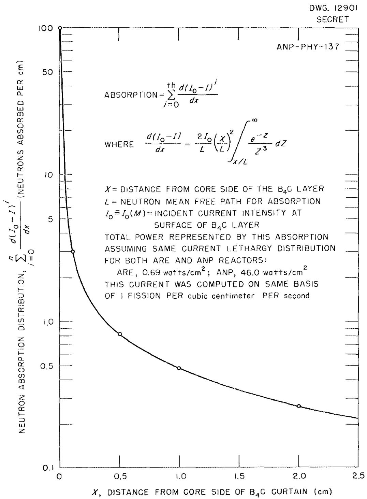  
Fig. 3.23 - Neutron Absorption vs. Penetration with the $\mathbf{B}_4\mathbf{C}$ Layer of the ARE.

Physics Division). One of the limiting factors in reactor power density is the high temperature at which the structural and heat-transfer metals must operate. The highest temperature to which reactor metals are exposed is at the inner surface of the fuel tubes. A rough estimate of the maximum value of this temperature is made below. This is compared to the temperature that would be required for the same total heat transfer if the temperature at the inner surface of the reactor fuel tubes is held constant over the length of the reactor. An axial line is chosen for maximum temperature evaluation.

The axial reactor power distribution is given, by curve fitting to four points, by

$$
\begin{array}{l} Q (z) = 1. 7 6 9 9 6 + 1 8 4. 6 7 \frac {z}{h} \\ - 3 8 0. 3 6 \left(\frac {z}{h}\right) ^ {2} + 2 1 1. 6 3 \left(\frac {z}{h}\right) ^ {3} \\ \end{array}
$$

for radial heat flow from an axial fuel tube, where $Q(z)$ is the calories per centimeter per second and $h$ is the reactor length, 98.4 cm.

The fuel temperature, $T_{3}(z)$ , is given by

$$
T _ {3} (z) = T _ {0 _ {3}} + \int_ {0} ^ {z} \frac {Q (z) d z}{M H},
$$

where

$$
T _ {0 _ {3}} = 7 0 4 ^ {\circ} \mathrm {C}, \text {t h e i n l e t t e m p e r a t u r e ,}
$$

$M = 27.9$ the mass of sodium per second (g/sec) passing $z$ ,

$H = 0.32$ the heat capacity of sodium $(\mathrm{cal / g / ^{\circ}C})$

The temperature, $T_{1}(z)$ , at the inner wall surface of the reactor is given by the relation

$$
T _ {1} (z) = \frac {\left[ Q (z) + h A _ {2} T _ {3} (z) \right] \left[ 1 + \frac {k A _ {1}}{h t A _ {2}} \right] - h A _ {2} T _ {3} (z)}{k A _ {1} / t}
$$

The physical constants required to evaluate $T_{1}(z)$ are:

$k = 0.0670 \, \text{cal/sec/cm/°C (heat conductivity of fuel tube)}$ ,

$h = 2.3\mathrm{cal / sec / cm}^2 /\mathrm{oC}$ (sodium film transfer coefficient).

Fuel tube area:

$$
A _ {1} = 1. 2 \mathrm {c m} ^ {2} / \mathrm {c m},
$$

$$
A _ {2} = 1. 5 7 \mathrm {c m} ^ {2} / \mathrm {c m}.
$$

Tube radii:

$$
r _ {1} = 0. 1 5 9 \mathrm {c m} (\text {i n n e r r a d i u s}),
$$

$$
r _ {2} = 0. 2 2 2 \mathrm {c m} (\text {o u t e r r a d i u s}),
$$

$$
\begin{array}{l} t = r _ {2} - r _ {1} = 0. 0 6 3 \mathrm {c m} (\text {t u b e w a l l} \\ \text {t h i c k n e s s}), \end{array}
$$

$$
\tilde {r} = 0. 1 9 1 \mathrm {c m} (\text {a v e r a g e r a d i u s}).
$$

Therefore,

$$
T _ {1} (z) = 1. 1 2 3 7 Q (z) + 0. 9 9 9 8 7 T _ {3} (z),
$$

# ANP PROJECT QUARTERLY PROGRESS REPORT

and

$T_{1(\max)} = 948^{\circ}C$ at the outlet end of the reactor for a heat flux of 1990 calories per coolant tube per second.

The corresponding uniform temperature is obtained by requiring the power distribution to be proportional to the coolant temperature in such a way that a surface between fuel and coolant has a constant temperature throughout the reactor. Thus

$$
T _ {1} = T _ {3} (z) + \frac {t h A _ {2} + k A _ {1}}{k h A _ {1} A _ {2}} Q (z),
$$

where $T_{3}(z)$ is the coolant temperature, $T_{1}$ is the temperature of the inner surface of the fuel tube wall, $Q(z)$ is the power per unit length of the fuel tube, and the constants are those appropriate to the situation. For the same total heat flux as above,

$$
T _ {1} = 9 2 7 ^ {\circ} \mathrm {C}.
$$

The temperature saving is thus approximately

$$
\Delta T = 2 1 ^ {\circ} \mathrm {C} = 3 8 ^ {\circ} \mathrm {F}
$$

for the case of coolant entrance into the $\mathbf{B}_4\mathbf{C}$ end of the reactor. For the symmetrical case of coolant exit from the $\mathbf{B}_4\mathbf{C}$ layer the temperature saving is only

$$
\Delta T = 2 ^ {\circ} \mathrm {C} \approx 4 ^ {\circ} \mathrm {F}.
$$

# THE SODIUM HYDROXIDE REACTOR*

# C. B. Mills, Physics Division

It is necessary to determine the critical mass of an almost spherical reactor, 1.25 ft in radius, containing sodium hydroxide as a coolant, moderator, and reflector. The fractions are

vol %

Sodium hydroxide moderator 75.00

316 stainless steel structure 20.23

Fuel, uranium, 50 lb/ft3 4.77

This problem is essentially different from those previously solved by the ANP Physics Group because of the way in which neutron diffusion and slowing down in hydrogen must be treated. Most methods of solution which treat hydrogenous materials correctly are not correct for this reactor because of the large absorption and slowing-down effect of the sodium, oxygen, and stainless steel. An admittedly approximate method, (15) first used by this group to study the effect of water on criticality on the ARE reactor, (16) which sums the effects of continuous slowing down of neutrons in heavy materials with the discontinuous slowing down in hydrogen, was applied to this problem. This method of solution has been discussed in some detail separately. (17)

A convenient proof of the significance of the results of the method used in the sodium hydroxide reactor can be found in the application of the same method to the critical experiments conducted at K-25 in 1949.(18) Both reflected and bare, large and small reactors were constructed and criticality data were obtained. A small bare and a large reflected reactor with high and low uranium concentration, respectively, were chosen for the check calculation. In addition, for one calculation the continuous slowing-down term was neglected for a check on the relative importance of this term for a known reactor. The derivation of the recursion relations used for this will serve to indicate the general method used in the above hydrogenous-reactor calculations.

The space-independent form of the Fermi age theory used for bare reactor multigroup calculations is

$$
\begin{array}{l} \frac {D B ^ {2} + \sigma_ {a}}{\xi \sigma_ {T}} q (u) + \frac {\partial q (u)}{\partial u} \\ = \nu f (u) \left[ \begin{array}{l} u _ {t h} \\ \int_ {0} ^ {u} \frac {\sigma_ {f}}{\xi \sigma_ {T}} q \left(u ^ {\prime}\right) d u ^ {\prime} + \sigma_ {f t h} \phi_ {t h} \\ 0 \end{array} \right] \tag {1} \\ \end{array}
$$

and

$$
q _ {t h} = \left(D B ^ {2} + \sigma_ {a}\right) \phi_ {t h},
$$

(18) C. D. Beck, A. D. Callihan, J. W. Morfitt, and R. L. Murray, Critical Mass Studies. Part III, C&CCC report K-343 (Apr. 19, 1949).

in which all the terms are familiar from previous discussions. Addition of the contribution at each lethargy $(u)$ by hydrogen from all lower lethargies involves the use of the term

$$
\eta (u) = e ^ {u} \int_ {u} ^ {0} \phi \left(u ^ {\prime}\right) \sigma_ {S H} \left(u ^ {\prime}\right) e ^ {+ u ^ {\prime}} d u ^ {\prime}. \tag {2}
$$

This can be expressed as

$$
\frac {\partial \eta}{\partial u} + \eta = \sigma_ {S B} \phi . \tag {3}
$$

Using this as one equation, and Eq. (1) plus $\eta(u)$ as the second, there result the two simultaneous equations

$$
(\lambda + \rho) q + \frac {\partial q}{\partial u} = \eta + g, \tag {4}
$$

$$
\eta + \frac {\partial \eta}{\partial u} = \rho q, \tag {5}
$$

where

$$
q = q (u),
$$

$$
\lambda = \left(\sigma_ {a} + D B ^ {2}\right) / \xi \sigma_ {T},
$$

$$
\rho = \sigma_ {S H} / \xi \sigma_ {T},
$$

$$
q = \xi \sigma_ {s} \phi ,
$$

$g =$ fission source term.

Here $\sigma_{T}$ does not include the hydrogen scattering cross-section $\sigma_{SH}$ (to avoid slowing down one neutron in both ways).

# ANP PROJECT QUARTERLY PROGRESS REPORT

Integrating Eqs. (4) and (5) over the lethargy range $u_{1} - u_{2} = U_{n}$ after setting $\partial q / \partial u = 0$ , so that $\eta$ is the only neutron source at each lethargy, there results

$$
\left(\bar {\lambda} _ {n} + \bar {\rho} _ {n}\right) \bar {q} _ {n} U _ {n} = \bar {\eta} _ {n} U _ {n} + \nu z _ {n}, \tag {6}
$$

$$
\overline {{\rho}} _ {n} \bar {q} _ {n} U _ {n} = \bar {\eta} _ {n} U _ {n} + \eta_ {n} - \eta_ {n - 1}. \tag {7}
$$

Solving for $\bar{q}$ in terms of $\eta_{n-1}$ and for $\eta_n$ in terms of $\bar{q}$ and $\eta_{n-1}$ ,

$$
\bar {q} _ {n} = \frac {\frac {U _ {n}}{U _ {n} / 2 + 1} \eta_ {n - 1} + \nu z _ {n}}{U _ {n} \bar {\lambda} _ {n} + \frac {U _ {n} \bar {\rho} _ {n}}{U _ {n} / 2 + 1}}, \tag {8}
$$

$$
\eta_ {n} = \frac {\bar {\rho} _ {n} U _ {n}}{U _ {n} / 2 + 1} \bar {q} _ {n} - \frac {U _ {n} / 2 - 1}{U _ {n} / 2 + 1} \eta_ {n - 1}. \tag {9}
$$

These two recursion equations, (8) and (9), are used in the usual way for a determination of the multiplication constant $k_{\text{eff}}$ .

The effects of hydrogen and heavy mass moderation in the sodium hydroxide reactor are separated in absorption and leakage spectra (Figs. 3.24 and 3.25). Neutron leakage and fission spectra are shown for the two cases

$$
\partial q / \partial u = 0, \quad \partial q / \partial u \neq 0.
$$

For the first, hydrogen moderation only is included, and, for the second, both heavy atom and hydrogen moderation are included. The same comparison is made for the water-moderated reactor in Figs. 3.26 and 3.27. Fission spectra and neutron leakage for the reflected water-moderated reactor are given in Figs. 3.28 and 3.29.

The analysis of the applicability of the Goertzel method is not yet complete (primarily because of the difficulty with which cross-section data were obtained and the multigroup constants formed), but certain tentative statements can be made:

1. Hydrogen is responsible for most of the neutron moderation in the sodium hydroxide reactor. Two calculations for the effective multiplication constant with and without the continuous slowing-down effect give results different by only $4.28\%$ for $\Delta k / k$ .   
2. The multiplication constant in the calculated water-moderated reactor is lower than the critical-experiment value by $3 \pm 1\%$ .   
3. The critical mass of the 200-megawatt sodium hydroxide moderated and cooled reactor is in the vicinity of 45 lb of uranium (enriched 93.2%). Including an $8\%$ $k_{eff}$ for control purposes, 48 lb would be required.

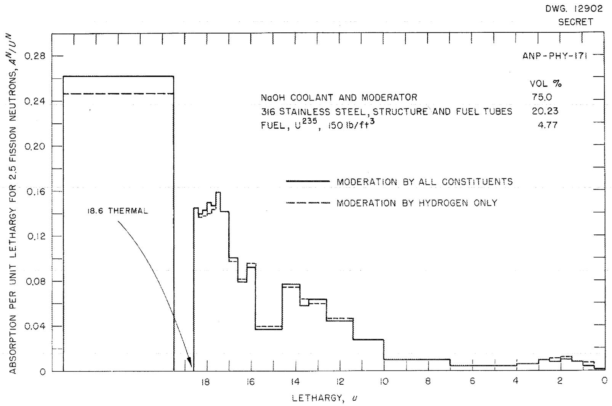  
Fig. 3.24 - Absorption Spectrum for the 200-megawatt Sodium Hydroxide Reactor.

FOR PERIOD ENDING SEPTEMBER 10, 1951

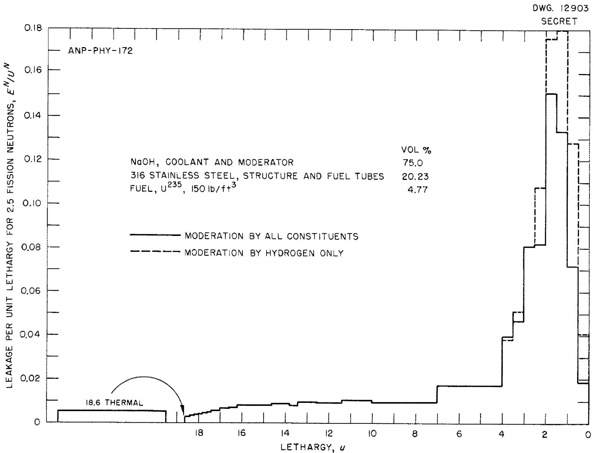  
ANP PROJECT QUARTERLY PROGRESS REPORT   
Fig. 3.25 - Leakage Spectrum for the 200-megawatt Sodium Hydroxide Reactor.

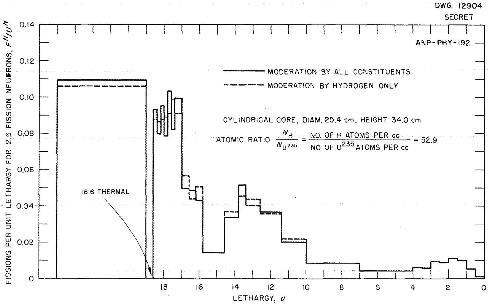  
Fig. 3.26 - Fission Spectrum for the Bare Water-Moderated Reactor.

FOR PERIOD ENDING SEPTEMBER 10, 1951

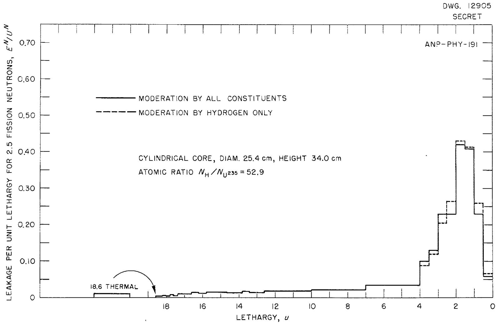

  
ANP PROJECT QUARTERLY PROGRESS REPORT   
Fig. 3.27 - Leakage Spectrum for the Bare Water-Moderated Reactor.

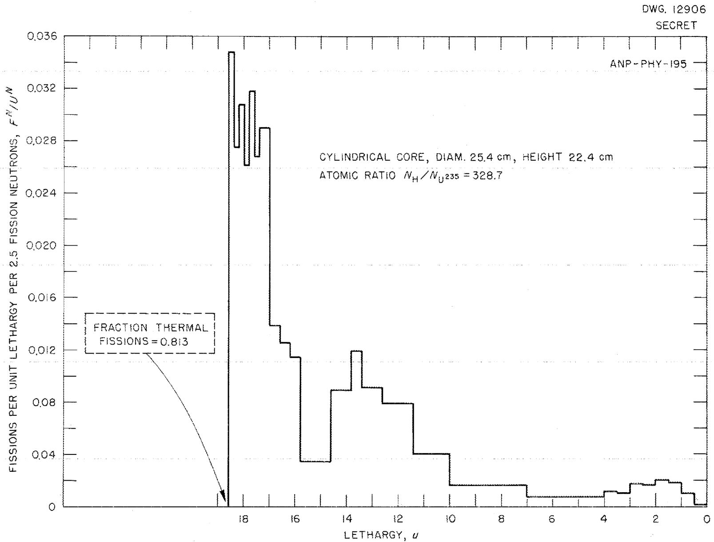  
1961 01 H3eWdEs ONIDN OIOHd HOJ   
Fig. 3.28 - Fission Spectrum for the Reflected Water-Moderated Reactor. Moderation by all constituents.

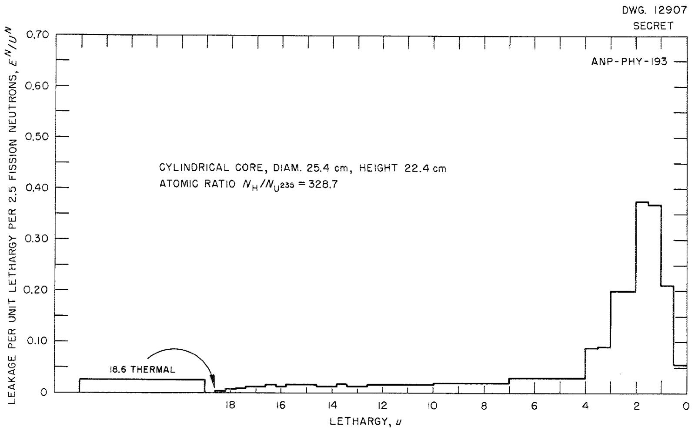  
Fig. 3.29 - Leakage Spectrum for the Reflected Water-Moderated Reactor. Moderation by all constituents.

# 4. CRITICAL EXPERIMENTS

A. D. Callihan, Physics Division

The Critical Experiment Group, which is responsible for the experimental investigation of preliminary reactor assemblies, has completed the investigation of one assembly and is now taking data on another. The first mock-up was that of the aircraft reactor, proposed by General Electric, which employs water as a neutron moderator and air as a heat-transfer medium. Two modifications of this reactor with the same hydrogen-to-carbon-to-uranium atomic ratio were considered, and the distribution of thermal neutrons throughout the components was compared. The second investigation, still in progress, is a study of the power and flux distributions through a graphite-uranium reactor with carbon-to-uranium atomic ratio of 990.

# CRITICAL ASSEMBLY OF AIR-WATER REACTOR

The study of the proposed air-water-cycle aircraft reactor, initiated at the request of the General Electric Company and executed with the cooperation of some of their personnel, has been completed for the present.

In this reactor metallic uranium of high $\mathbf{U}^{235}$ enrichment was interspersed among blocks of graphite which simulated the proposed uranium-silicon carbide core material, and a methacrylate plastic served as an adequate substitution for water. The plastic was in $1\frac{1}{2}$ -in.-thick horizontal layers between $4\frac{1}{2}$ -in.-thick layers of uranium-bearing graphite. The critical mass

of the assembly was about 29 kg. Measurements of the thermal-neutron distribution through a unit cell showed a high concentration in the hydrogenous material. The thermal flux in the plastic was 1.8 times the average in the graphite and 3.6 times that at the surface of the uranium.

The thickness of the individual uranium pieces was 0.01 in.; this introduced some self-shielding from incident neutrons. In an experiment to evaluate the extent of this effect, a standard piece of uranium was replaced by five pieces, each 0.002 in thick, with aluminum foil separating adjacent ones. In this technique recoiling fission fragments collect on the aluminum, and their activity is a measure of the fission rate in, essentially, the surface layer of the uranium adjacent to the aluminum. A comparison of the activities on the successive aluminum surfaces gives, relatively, the fission rates at 0.002-in. intervals throughout a fuel piece. In the reactor under study the average fission rate throughout a 0.01-in. fuel piece was $84\%$ of that occurring at its surface.

The observed large thermal-neutron concentration in the plastic implied that the moderator-fuel inhomogeneity was causing a significant increase in the uranium requirement. Consequently, the plastic thickness was reduced to $\frac{3}{4}$ in. and was placed between the graphite-uranium layers, maintaining the same H:C:U atomic ratio as before. It was necessary, because of the

dimensions of available materials, to alternate the $3/4$ -in. plastic layers between 3- and $1 \frac{1}{2}$ -in.-thick graphite layers, thereby probably not achieving optimum fuel-moderator homogeneity. The critical mass of this modification of the original assembly was $18.5 \mathrm{~kg}$ , and a more uniform distribution of thermal neutrons throughout the components resulted.

The data are reported more fully elsewhere. (1)

# CRITICAL ASSEMBLY OF GRAPHITE REACTOR

The inaugural program for the Critical Mass Laboratory was the study

of simple reactors of good geometry for comparison with theoretical predictions. The first of these, described in the two preceding ANP quarterly reports (ANP-60, ANP-65), was a bare cube having a beryllium moderator. Further simple reactor studies were postponed in order to carry out the air-water-cycle reactor investigation described in the above paragraphs. On completion of these studies a graphite-uranium reactor was assembled, consisting of the 0.01-in. thick uranium metal disks separated by 4-in.-thick blocks of graphite, the C:U atomic ratio being 990. It is a rectangular parallelepiped 45 by 45 by 44 in. Insufficient materials were available to make the system critical without a reflector so 3 in. of graphite surrounds four sides of the core. The loading is about $45\mathrm{kg}$ of uranium. Measurements of power and flux distributions are being made.

# Part II

# SHIELDING RESEARCH

#

# 5. BULK SHIELDING REACTOR

J. L. Meem, Physics Division

The mock-up of the unit shield has been completed with the water-reflected Bulk Shielding Reactor. Preliminary analyses of the data indicate that an ideal unit shield for a 200-megawatt reactor with a 3-ft right square cylindrical core will weigh 124,000 lb. The construction of the divided shield is nearly completed, and preparatory shadow shielding measurements are reported. The spectroscopic instruments required for the divided-shield measurement appear to be satisfactory. This reactor; formerly known as the "swimming pool" or the "Shield Testing Reactor," is now identified as the Bulk Shielding Reactor (BSR).

# REACTOR OPERATION

All measurements during the past quarter, including those on the unit shield, have been made with the water-reflected reactor.(1) Because of the urgency of the unit shield measurements, the check on the power of the reactor by measuring the heat rise of the water through the fuel elements has not been completed.

Preliminary measurements using the gamma-ray scintillation spectrometer (see below) indicated that to measure the spectrum at the face of the reactor a complete set of cold fuel elements would be required. These cold fuel elements have been obtained.

# MCK-UP OF THE UNIT SHIELD

During the past quarter the measurements on the mock-up of the unit shield have been completed and a report is being written. Preliminary analysis of the data indicates that an ideal unit shield around a 3.8-ft-diameter spherical reactor (approximating a 3-ft right square cylinder) operating at a power of 200 megawatts will weigh about 124,000 lb. Final evaluation of this weight will be given in the above-mentioned report. The limits of error of all the measurements will be analyzed so that the weight for this mock-up can be definitely bracketed.

Measurements were made of gamma-ray ionization, thermal-neutron flux, and fast-neutron dosage along the centerline beginning at the face of the shield and proceeding outward into the water. Runs were made with different concentrations of borated water up to $0.4\%$ boron by weight.

With the borated water in the shield, it was observed that the neutron-flux distribution in the reactor was altered. Since this would change the fast-neutron leakage, neutron-flux measurements with gold foils were made throughout the reactor following the procedure in ORNL-1027.

# MCK-UP OF THE DIVIDED SHIELD

The construction of the divided shield mock-up by General Electric is

# ANP PROJECT QUARTERLY PROGRESS REPORT

nearing completion. A suggested program for the measurements and calculations has been outlined.(2) The development of the spectroscopic instruments has progressed to the point where the measurements appear quite feasible. Using an underwater model of a multiple-crystal scintillation spectrometer,(3) a preliminary gamma-ray spectrum at $130~\mathrm{cm}$ from the water-reflected reactor has been obtained.(4) The spectrum is shown in Fig. 5.1. For details of the measurement see Reference 4.

An additional experiment, preliminary to the divided-shield measurements, has been completed.(5) This was a shadow shield test in which two lead

slabs, each approximately 6 ft long, 5 ft wide, and $1\frac{1}{2}$ in. thick, were placed symmetrically along the centerline north of the reactor. The rear of the first lead slab was $17\frac{1}{2}$ in. from the reactor with 2 in. between the slabs. Vertical traverses were made behind the slabs with a gamma ionization chamber. The same traverses were repeated after removing the lead slabs. The gamma traverses behind the lead are shown in Fig. 5.2.

A report on the nuclear plate camera for fast-neutron spectroscopy has been issued. For further details of spectroscopic instrument development work, see the Physics Division Quarterly Progress Report for the quarter ending in September.

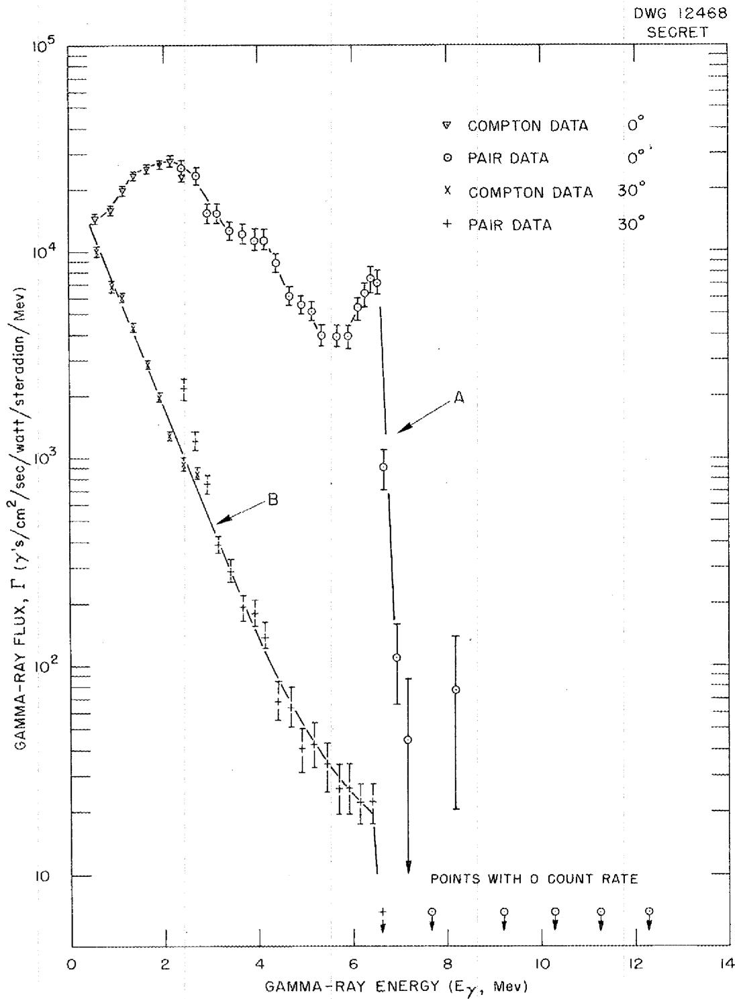  
Fig. 5.1 - Preliminary Gamma-Ray Spectrum at 130 cm from the Water-Reflected Reactor.

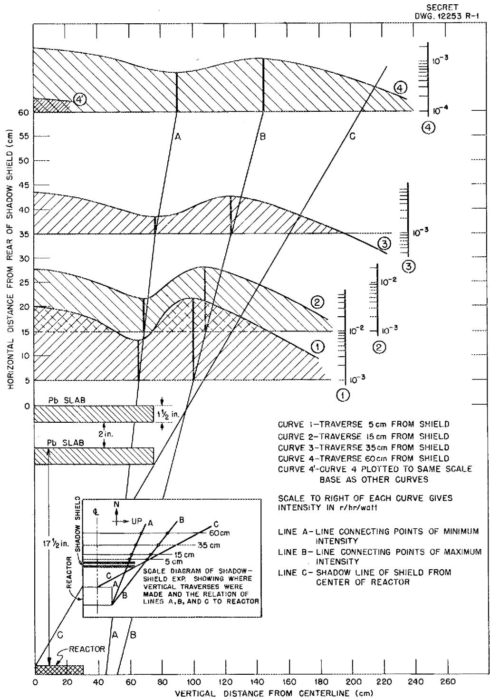  
Fig. 5.2 - Bulk Shielding Facility. A pictographic view of gamma radiation intensities existing along vertical traverses measured behind the shadow shield.

# 6. LID TANK

E.P.Blizard J.D.Flynn

C. E. Clifford M. Marney

T. V. Blosser R. Burnett

T. Hubbard Physics Division

The unit shield of lead and borated $\mathsf{H}_2\mathsf{O}$ has been optimized for a 3-ft spherical reactor using double the boron concentration, now $1.3\%$ boron by weight, of the shield presented in ANP-53.(1) Preliminary calculations now indicate that this results in an ideal shield of 50.6 tons, representing a weight saving of about 3 tons over the corresponding shield weight of 53.6 tons, using the data reported in ANP-53, Appendix B, corrected to a 3-ft reactor. This new low weight value for a unit shield differs from that in the preceding section because of the difference in the core size as well as in the boron concentration of the water.

The saving in weight is primarily the result of the addition of boron which, by further reducing the number of high-energy capture gamma rays produced in the shield, allows the lead to be placed at smaller radii for the same attenuation. It is doubtful that the optimum concentration of boron has

been reached in the unit shield, and therefore work with higher concentrations will be continued using potassium metaborate. With this salt concentrations of up to $10\%$ boron by weight can be investigated.

The compositions of the present shield, the shield of ANP-53, and the idealized shield for half dose are presented in Fig. 6.1. The shield had a nearly constant $R^2 l$ and therefore should be very close to the minimum weight for this concentration of boron. (2) Approximately ten configurations were measured before achieving the constant $R^2 l$ . It is of interest that an additional 6 tons in shield weight (i.e., 56.5 tons) will further attenuate both the gamma rays and neutrons by a factor of 2 (gamma rays from 1.10 to $0.55 \times 10^{-5}$ r/hr and neutrons from 3.6 to $1.8 \times 10^{-4}$ mrep).

SECRET

DWG. 12909

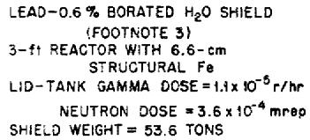  
(a)

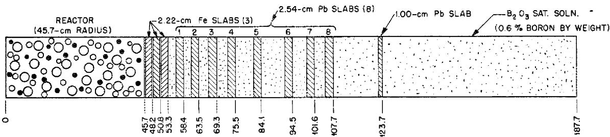  
SCALE IN CENTIMETERS

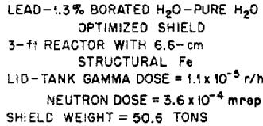  
(b)

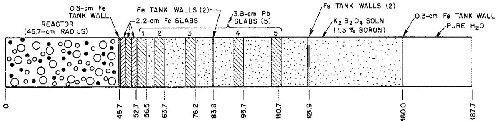  
SCALE IN CENTIMETERS

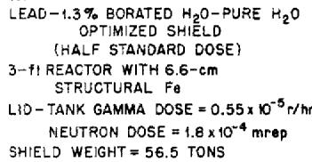  
(c)

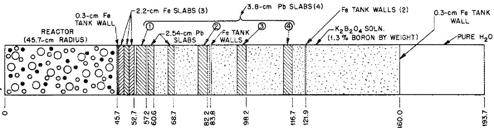  
SCALE IN CENTIMETERS   
Fig. 6.1 - Comparison of Shields for 3-ft Reactor.

# 7. DUCT TEST

E. P. Blizzard

M. K. Bullings

C. E. Clifford

M. Marney

Physics Division

A simplified design for the patch required to prevent excess neutron leakage from ducts perforating a divided (water) shield can be made on the basis of the duct test measurements completed to date. The weight of a patch needed for a single 6-in. aluminum-filled duct surrounded by a 1-in. air-filled annulus was found to be approximately 1000 lb, exclusive of duct or container.

The calculation for this patch weight was based on the data and configuration presented in Figs. 7.1 and 7.2. The duct is straight and extends beyond the shield a distance sufficient to attenuate the neutrons to the same level as $105~\mathrm{cm}$ of water, which is given in ANP-53(1) as the thickness of the divided shield on the rear of the reactor. The extension is surrounded by a cone of water which attenuates neutrons scattered radially to the appropriate level. This level is the intensity at the edge of the shield multiplied by the ratio of the area of the shield covered by the cone to the area of the cone.

Some assumption had to be made with regard to the attenuation radially from the duct since experimental limitations prevented measurement of the thickness required for such a patch. The attenuation of water for the Lid Tank source was used as an

upper limit for extending these measurements. The water curve is normalized at $Z = 0$ in Fig. 7.1 to the curve of the attenuation along the duct axis. The ratio of the heights of these two

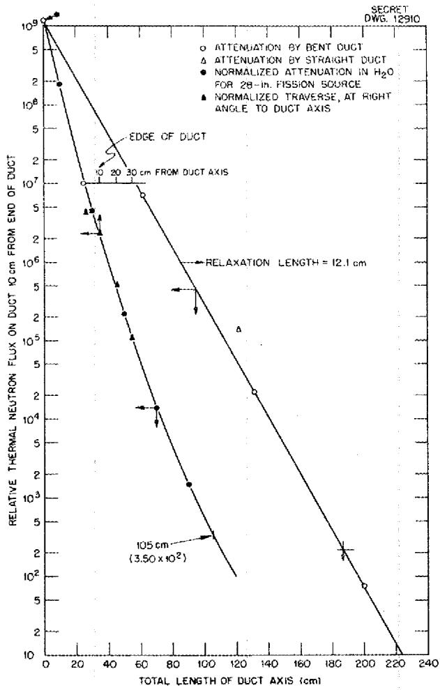  
Fig. 7.1 - Neutron Attenuation in Water Around Duct. 6-in. aluminum-filled duct with 1-in. air-filled annulus.

# ANP PROJECT QUARTERLY PROGRESS REPORT

curves at the edge of the shield (105 cm), corrected by the ratio of the areas, is taken to be the radial attenuation required of the patch.

The traverse measurements close to the end of the ducts are approximately

the same shape for all configurations measured, and this shape was fitted to the Lid Tank water curve in a region where the slopes were similar over the $30~\mathrm{cm}$ measured. The measured traverses were then extrapolated to the desired attenuation.

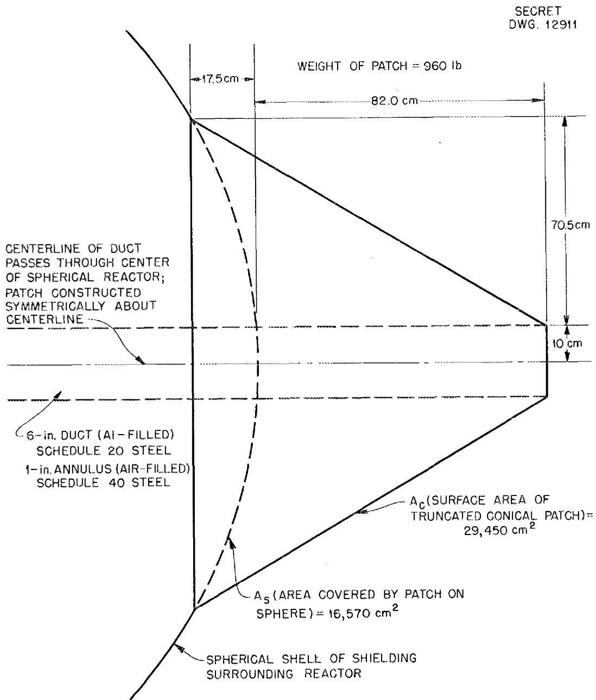  
Fig. 7.2 - Water Patch Around Duct.

# 8. SHIELDING CALCULATIONS

Analysis of the data from shield testing facilities has permitted the semiempirical establishment of important radiation attenuation relations. An expression was derived for attenuation of neutrons from a point source in water by analysis of data taken at the Bulk Shielding Reactor. Similarly, analysis of Lid Tank data has yielded an approximate formula for the total centerline gamma dose which has been applied to subsequent experiments.

In the continued investigation of radiation hazards in the ARE, further calculations were made on the activation of the BeO moderator, the detection of leaks in the fuel elements by means of radioactive tracers, and the activation of nitrogen and helium in the reactor pit.

Calculations show the divided-shield weight to be higher than originally estimated, owing chiefly to symmetry and angular distribution considerations. Some new effects have been computed relative to the shadow-shield theory which may prove that this device is much less useful than previously believed.

A shield using ammonia in place of water has been considered which would provide a decrease in shield weight of about $7\%$ at takeoff and $13\%$ at landing.

# ANALYSIS OF BULK SHIELDING REACTOR NEUTRON DATA

S. Podgor, Physics Division

An analysis of fast-neutron dosimeter data of the Bulk Shielding Reactor is

being made. The data(1) for $\mathsf{H}_2\mathsf{O}$ , $\mathsf{Pb - H_2O}$ , and $\mathsf{Fe - H_2O}$ were treated by a method similar to the one used by Welton(2) in the analysis of Lid Tank dosimeter data. A point source of neutrons was there calculated to be attenuated in water as follows:

$$
P (S) = \frac {A}{4 \pi S ^ {2}} S ^ {\prime} e ^ {- \beta S} e ^ {- 2 \sqrt {\alpha \gamma S}}
$$

where $P(S)$ is the uncollided dose at a distance $S$ from the source, $A$ is a normalizing constant to be adjusted, and $\beta$ is the oxygen "removal" cross-section in reciprocal centimeters which is assumed constant and to be adjusted. $\alpha$ comes from the fission spectrum representation

$$
N (E) = 1. 8 e ^ {- 0. 7 s E}
$$

where $N(E)$ is the number of neutrons of energy $E$ Mev per neutron emitted per Mev, and $\alpha = 0.75$ . $\gamma$ comes from the hydrogen cross-section representation

$$
\sigma (E) = \frac {0 . 7 3 5}{E + 1 . 6 6} \mathrm {c m} ^ {- 1}
$$

where $\gamma = 0.735$ . These two representations are taken from a paper by Blizzard and Welton.(3)

# ANP PROJECT QUARTERLY PROGRESS REPORT

The source was taken to be the leakage from the side of the reactor facing the detector. To simplify the analytical work the source is here assumed to be circular instead of rectangular. With these assumptions it was possible to fit the shape of the experimental attenuation curves by using removal cross-sections for lead and iron of 3.4 and 2.0 barns, respectively, which values are the same as those obtained in the analysis (4) of Lid Tank thermal data. The oxygen cross-section needed was 0.8 barn. The neutron build-up was assumed to be that for pure water, as given in preliminary form in an earlier quarterly report. (5)

# INTERPRETATION OF LID TANK GAMMA-RAY DATA

A. Simon, Physics Division

An approximate formula for the total centerline gamma dose in the Lid Tank has been applied to several experiments. The variation in gamma dose with the number of slabs in a uniform lead-water shield was reproduced satisfactorily for several positions of the detector. In addition, the variation of gamma dose with degree of boration of a uniform lead-water shield was also reproduced. Differences between experimental and theoretical normalization factors can be explained in terms of neglect of gamma build-up in water.

It is planned to apply the method to the computation of an iron-water shield and to observations in the BSF. A complete report will be prepared in the near future.

# SHIELDING CALCULATIONS FOR THE ARE

W. K. Ergen, Physics Division

Consideration of the radiation hazards associated with the ARE has led to the analytical evaluation of several such possible hazards. The instantaneous release of the nitrogen and helium in the reactor pit could possibly, but not probably, expose personnel at nearby sites to a dose equal to 20 min exposure to the accepted "maximum permissible concentration" of $C^{14}$ in air.(6) A means of detecting leaks in the ARE fuel elements by the use of radioactive tracers has been proposed. A re-evaluation of the activities of the impurities in BeO, based upon a later analysis of the impurities and a revised $\mathrm{Co}(n,\gamma)$ cross-section, still indicates no handling problem after shutdown.

Activation of Nitrogen and Helium in the ARE Reactor Pit. (7) It is proposed to fill the ARE reactor pit with nitrogen during operation as a precautionary measure in the event of a sodium leak. Assuming certain average operating conditions, about 1.3 curies of $C^{14}$ would be formed by the $N^{14}(n,p)C^{14}$ reaction. This activity, released instantaneously through a 100-ft stack

under extremely unfavorable and very rare meteorological conditions, would give personnel at X-10 and the HRE site a dose equal to a 20-min exposure to the accepted maximum permissible concentration of $\mathbf{C}^{14}$ in air. Twenty parts per million (by volume) of argon in the nitrogen would give the same biological dose as the $\mathbf{C}^{14}$ . The other probable impurities of nitrogen as well as the $\mathbf{N}^{15}(n,\gamma)\mathbf{N}^{16}$ reaction, yield negligible activities.

If the pit were filled with pure well helium, we would get, by the $\mathrm{He}^3 (n,p)\mathrm{H}^3$ reaction, $5.6\times 10^{-3}$ times the biological dose computed above for nitrogen filling.

Activation of Impurities in BeO. (8) Since Memo Y-F20-11 was issued on this subject, a more accurate chemical analysis of the BeO for the ARE showed the presence of greater amounts of impurities; also, the cobalt activation cross-section has been found to be 34 barns, and not 22 barns, as assumed in Y-F20-11 on the basis of then available data. Nevertheless, the activation of the impurities in BeO will not cause handling problems after the shutdown of the ARE, under the conditions specified.

Detection of Leaks in the Fuel Elements by Means of Radioactive Tracers. (9) A gamma-emitting substance added to the fuel elements in the ARE could be used as a means of detecting leaks of fuel into the coolant even before the ARE is operated. In order to just get a definite detection,

if any one fuel tube should break in a system of 500 fuel tubes, a total gamma activity of about 10 mc is required. How much additional radiation precaution would have to be assumed in using this method is not certain, but the possibility of leak detection without bleeding off coolant makes this method seem attractive. Investigation is also being made of a photofluorimetric method of leak detection.

# NDA DIVIDED-SHIELD STUDIES

Nuclear Development Associates, Inc.

An examination is being made of the assumptions involved in calculations of the split shield. A simplified geometry has been assumed thus far, with the reactor a point source surrounded by a spherical shield. The gamma shadow shield is represented by a spherical cap of $20^{\circ}$ half angle. The following are tentative conclusions emerging out of the calculations:

1. The assumptions made in ANP-53 in regard to neutron air scattering (isotropic, elastic scattering with penetration normal to the crew compartment sides) are conservative. It appears likely that the scattered neutron dose is one-half or less of the figure there obtained.   
2. Gamma rays can be scattered in the plastic at the crew compartment in such a manner as to increase greatly their subsequent penetration through the lead. Gamma shielding by the plastic is hence sharply reduced. It may be advisable to move the plastic back to the reactor

# ANP PROJECT QUARTERLY PROGRESS REPORT

shield, a change which will not affect the weight of the ANP-53 neutron shield.

3. The first-scattered dose at the crew, with any appreciable amount of lead crew shielding, is nearly independent of initial source energy down to around 1 MeV. Below that it drops off very rapidly owing to the increased lead absorption. The SEAC calculations by the National Bureau of Standards indicate that the radiation leaving the reactor shield does not contain any extremely large proportion of its energy in low-energy photons. The current practice of assuming the source energy flux to be concentrated at 3 MeV thus does not lead to error.   
4. Scattering in the lead at the crew shield has been calculated using build-up factors computed by The Rand Corporation. The resulting increase in dose is a factor of 2.5 for $1.55\mathrm{cm}$ of lead and about 4 for $2.5\mathrm{cm}$ of lead.   
5. It has usually been assumed that in the zone not shielded by the shadow cap the gamma rays emerge radially from the reactor shield. However, if they deviate from the radial direction, the effect of the shadow is partly nullified. Thus, if the emerging rays are uniformly distributed in angle from the radial out to $30^{\circ}$ and zero thereafter, the advantage gained by the shadow shield drops (in a typical case) from around 16 to 2. This appears to be one of the most significant effects uncovered so far.

6. Streaming of photons around the shadow cap so as to emerge in regions assumed to be covered has been examined. There is some indication, both theoretical and experimental, that this is not so important as the deviations from radial discussed above.   
7. In the absence of the effects mentioned in items 5 and 6, the shadow shield is quite effective in decreasing the first-scattered dose. However, it has little effect on the second and higher scatterings. Some preliminary calculations indicate that the second scattering can then be quite significant.

USE OF $\mathbf{NH}_3$ AS A SHIELDING MATERIAL (10)

E. P. Blizzard and H. L. F. Enlund, Physics Division

J. H. Wyld,\* ANP Division

An analysis has been completed of the weight savings realized by replacing water in a reactor shield by anhydrous ammonia. Although the number of hydrogen atoms per cubic centimeter is about the same for ammonia and water, the ammonia density is less than $70\%$ that of water. The shield weights for a 4-in.-diameter reactor delivering 200 megawatts were calculated for a divided shield employing water as the hydrogenous material and for a similar shield with ammonia. The composite (ammonia) shield is about $7\%$

lighter at takeoff and, owing to the evaporation of the boil-off ammonia, is some $13\%$ lighheer on landing. The weight savings from use of ammonia thus appear to be appreciable, but whether this advantage would be offset by the obvious disadvantage of carrying a large volume of a hard-to-handle material is still a question.

Mechanical Requirements of an Ammonia Shield. Anhydrous ammonia has a vapor pressure of 1 atm at $-28^{\circ}\mathrm{F}$ and must therefore be refrigerated to take care of inleakage of heat from the atmosphere as well as that due to neutron and gamma radiation from the reactor. The mechanical requirements for maintaining an ammonia shield are refrigeration equipment, a pressure shell to maintain the liquid at $120^{\circ}\mathrm{F}$ in case the refrigeration fails, and insulation to reduce heat influx. Since the heat flux into the shield due to nuclear radiations from the reactor is quite large, a higher temperature inner shield layer of water, conventionally cooled, and lead is provided. The lead in this inner shield is inserted as a "heat trap" to lower the heat flux into the ammonia. Approximately 1 ft of water is provided to remove neutron heat as well as to reduce secondary gamma production in the lead heat trap. The heat produced in the ammonia is calculated from the gamma flux it will receive. A section of this shield assembly is shown in Fig. 8.1.

Calculational Procedure. The total heat energy $(H$ , in British thermal units) entering the ammonia from the gamma heating of the iron and lead heat trap during a 25-hr flight may be expressed in terms of the thickness $(T$ , in centimeters) of the lead (assuming a 3-in. iron pressure shell):

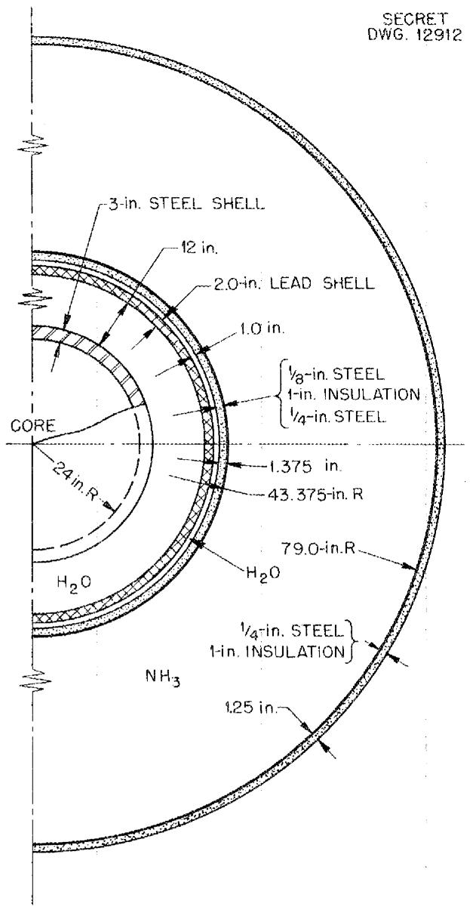  
Fig. 8.1 - Typical Composite Shield, $\mathbf{H}_2\mathbf{O} - \mathbf{Pb} - \mathbf{NH}_3$

$$
H = 2. 3 6 \times 1 0 ^ {7} e ^ {- T / 0. 9 5}
$$

Since 589 Btu may be removed by evaporating 1 lb of ammonia, the required

# ANP PROJECT QUARTERLY PROGRESS REPORT

"boil-off" of ammonia (B, in pounds) to dissipate the above heat is:

$$
B = 4. 0 1 \times 1 0 ^ {4} e ^ {- T / 0. 9 5}
$$

The lead heat trap is assumed to replace some of the lead (for gamma shielding) on the rear crew shield disk. But since increasing the thickness of the heat trap increases the total weight and also decreases the amount of $\mathrm{NH}_3$ required for boil-off refrigeration, the shield must be optimized with respect to weight for these two design variables. The thickness of ammonia neutron shield* was first calculated to be 35.6 in., and the expression for the equivalent gamma attenuation in the two lead shields is derived. When this information is combined, the total weight of the ammonia shield, which for the purposes of this calculation includes the lead heat trap, the rear crew shield, and the boil-off ammonia, may be expressed in terms of the thickness of the lead heat trap. The weight of the shield is then minimized by taking the first derivative of the variable weights with respect to the thickness of the lead trap. The thickness of this trap becomes 1.875 in. and the thickness of the rear crew shield 3.36 in.

Comparison of Shield Weights Using $\mathbf{NH}_3$ and $\mathbf{H}_2\mathbf{O}$ . A comparison of shield

# TABLE 8.1

Comparison of Shield Weights Using $\mathbf{NH}_3$ and $\mathbf{H}_2\mathbf{O}$   

<table><tr><td></td><td>H2O (1b)</td><td>NH3 (1b)</td></tr><tr><td>Water</td><td>79,800</td><td>6,520</td></tr><tr><td>Ammonia</td><td></td><td>42,300</td></tr><tr><td>Lead heat trap</td><td></td><td>15,450</td></tr><tr><td>Crew disk</td><td>9,400</td><td>8,730</td></tr><tr><td>Steel shells</td><td>6,200</td><td>8,300</td></tr><tr><td>Insulation</td><td></td><td>600</td></tr><tr><td>Total (fixed) weight</td><td>95,400</td><td>82,900</td></tr><tr><td>Ammonia boil-off radiation</td><td></td><td>5,570</td></tr><tr><td>Thermal conduction</td><td></td><td>380</td></tr><tr><td>Savings, takeoff condition</td><td colspan="2">6,550 1b</td></tr><tr><td>Landing condition</td><td colspan="2">12,500 1b</td></tr></table>

weights as calculated above, with water in one case and anhydrous ammonia and associated equipment in the other, is given in Table 8.1. It will be noted that the composite shield is 6550 lb lighter at takeoff and, owing to the evaporation of the boil-off ammonia, it will be 12,500 lb lighter on landing.

The appeal of the boil-off scheme for refrigeration lies in its simplicity and in its low weight for landing, the most critical period of the flight. In addition, it is possible that the vapors boiled off could be burned in the engines for added thrust. On the other hand, it is entirely possible that the refrigeration could be accomplished by mechanical means with considerably less weight. The Air Force at Wright Field has agreed to investigate this possibility.

# 9. NUCLEAR MEASUREMENTS

Continued efforts on the 5-Mev Van de Graaff accelerator research program have satisfactorily succeeded in lowering the machine background, providing an energy calibration accurate to a few kilovolts, and improving the ease of operation below 1.5 MeV.

Data taken from a neutron source with and without beryllium surrounding the source are being analyzed to determine the $(n,2n)$ reaction in beryllium.

An in-pile lithium loop operating at $1000^{\circ}\mathrm{F}$ for one week yielded data on Bremsstrahlung caused by beta particles from the $\mathbf{Li}^{7}(n,\beta)\mathbf{Li}^{8}$ reaction. The average intensity of the Bremsstrahlung was about $2\times 10^{9}$ Mev/cc/sec with an average energy of only 0.06 Mev.

# THE 5-MEV VAN DE GRAAFF ACCELERATOR

H. B. Willard, Physics Division

Both the neutron and gamma-ray backgrounds of the 5-Mev Van de Graaff accelerator have been reduced by the extensive use of only tantalum in the vicinity of the beam. Additional tantalum slits have been provided during the past quarter in order to further collimate the proton beam and reduce these backgrounds to a satisfactory level. In addition, the X-ray intensity coming from the reverse electron current up the tubes has been found sufficiently low to permit unshielded operation of a NaI-ThI crystal counter in the target area.

Gamma-ray yield curves resulting from the proton bombardment of fluorine

and beryllium have been obtained. These data provide a large number of energy calibration points in addition to new information regarding levels in the compound nuclei involved. By proper manipulation of the machine, it was found possible to obtain data for proton bombarding energies as low as 0.158 Mev.

In preparation for neutron cross-section work, the $\mathrm{Li}^7 (p,n)\mathrm{Be}^7$ yield in the forward direction has been extended to above 5 Mev. The response of the Bonner type neutron counter has been measured. Neutron yield curves for protons on boron and beryllium have been obtained from threshold to above 5 Mev.

# MEASUREMENT OF THE $(n,2n)$ REACTION IN BERYLLIUM

E. D. Klema, Physics Division  
David Martin and David Ott, Oak Ridge School of Reactor Technology

An experiment has been carried out in which the neutrons from an $(\alpha, n)$ source are detected by means of a long counter. The neutron source is surrounded by a sphere of beryllium, and the counting rates with bare source and source surrounded by the sphere are measured. Similar measurements are made with a carbon sphere to estimate the neutron absorption in the beryllium sphere.

Measurements have been carried out with polonium-boron and polonium-beryllium neutron sources. Beryllium spheres of 4 and 9 in. diameter and carbon spheres of 4 and $5\frac{1}{2}$ in. diameter have been measured.

# ANP PROJECT QUARTERLY PROGRESS REPORT

The data obtained are being reduced to the $(n,2n)$ cross-sections for the neutron spectra used, and the assumptions made in the calculations are being considered in detail in order to set limits on the values of the average $(n,2n)$ cross-sections for the two neutron spectra.

# BREMSSTRAHLUNG FROM Li

C. D. Baumann

W. W. Parkinson

R. M. Carroll

0. Sisman

Chester Ellis

Physics of Solids Institute

Lithium at $1000^{\circ}\mathrm{F}$ has been circulated in the X-10 reactor for one week in a 316 stainless steel loop and subsequently examined. The primary purpose of this experiment is to study the Bremsstrahlung activity produced by beta decay of lithium. $\mathbf{Li}^{8}$ , created by the reaction $\mathbf{Li}^{7}(n,\beta)\mathbf{Li}^{8}$ , decays with a 0.88-sec half-life, giving a 12.7-Mev beta ray. This beta ray is absorbed in the lithium stream and the container walls (1/16-in. stainless steel), producing the Bremsstrahlung activity. Preliminary analysis of the data indicates the average energy of the Bremsstrahlung to be about 0.06 Mev with an average intensity of $2\times 10^{9}$ Mev/cc/sec. Actual operation of the loop is discussed in this report in the section on radiation damage, where it may be noted that there was no significant amount of corrosion.

Radiation Detection Equipment. The ion chambers used in this experiment were cylindrical in shape (4 in. in diameter, 4 in. high) with one of the bases a thin-walled aluminum "window." The chamber was filled with air at atmospheric pressure, and its walls were maintained approximately 150

volts above ground. The chambers and their amplifying and recording equipment were bench-tested with Co $^{60}$ of various strengths so as to simulate the line sources of the circulating lithium in the external pile loop. A lead brick with a 2-in.-diameter hole was placed between the source and the counter to act as a collimator for radiation coming into the counter. The in situ calibration curves were approximately linear and of the form $S = AR - b$ where $S$ is the source strength per unit length of pipe, $R$ is the recorder reading (the amplified chamber response), $A$ is a constant inversely proportional to the distance of the source from the counter, and $b$ is the background correction which varies directly as pile power level, inversely as the distance of the counter from the pile, and includes the natural background. The data have not yet been corrected for the efficiency of the counter for radiations of this energy range, and the neutron flux is still in the process of being determined.

Bremsstrahlung Activity. The Bremsstrahlung activity, uncorrected for counter efficiency and neutron flux, at the three ionization chambers (or three different distances from the active lattice) for various velocities of the lithium stream is shown in Fig. 9.1. By extrapolating back to infinite velocity we find the Bremsstrahlung activity for zero decay to be $2 \times 10^{9}$ MeV/sec per cubic centimeter of natural lithium (at a flux of about $2 \times 10^{11}$ neutrons/cm²/sec). Figure 9.2 shows absorption curves for the Bremsstrahlung using iron and copper absorbers. The variation in activity with these copper and iron absorbers, interspersed between the tube containing the circulating lithium and No. 2 counter,

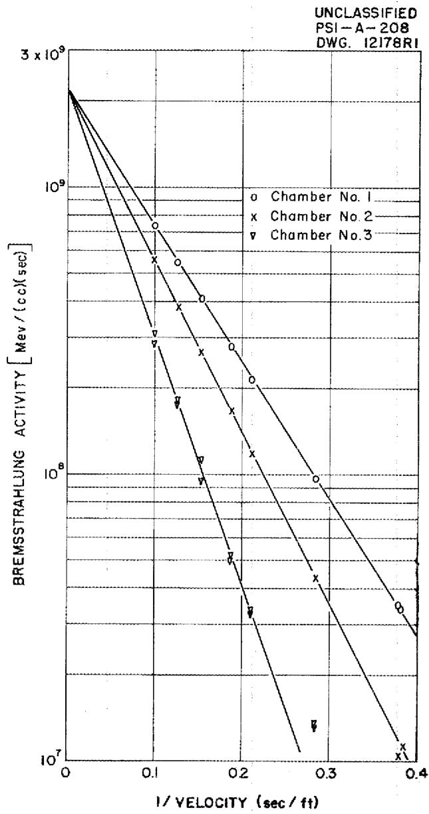  
Fig. 9.1 - Bremsstrahlung from In-Pile Lithium Loop.

gives the half-thickness of copper to be 0.025 in. and that of the iron 0.030 in. Using these figures, in conjunction with the mass absorption

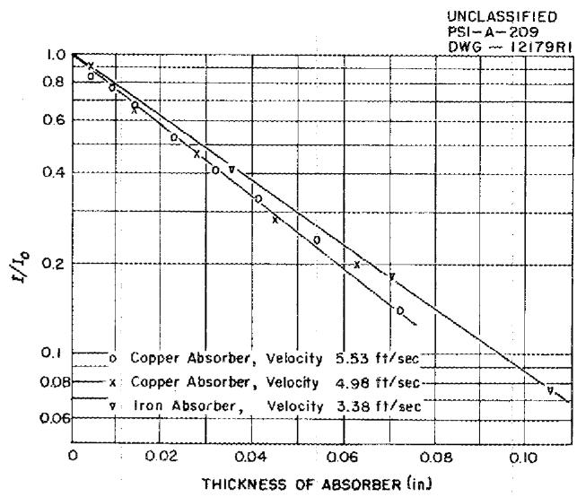  
Fig. 9.2 - Absorption of Bremsstrahlung from Li $^8$ Beta Rays.

coefficient for X-rays(1) and ignoring the scattering cross-section, the average energy of the Bremsstrahlung was found to be 0.063 and 0.058 MeV, respectively. Thus the average energy of the Bremsstrahlung arising from the circulation of lithium in type 316 stainless steel tubes is of the order of 0.06 MeV. The radiation is identified as that from Li since it shows the 0.88-sec half-life by its decay while moving from one chamber to the next.

During the week of operation of the loop, the velocity of the lithium stream was maintained most of the time at approximately 3 ft/sec in the external loop (approximately $1\frac{1}{4}$ ft/sec in the in-pile loop because of the larger diameter tubing). The velocity was changed only during the periods when runs of activity vs. velocity

(1)W. S. Snyder and J. L. Powell, Absorption of $\gamma$ Rays, ORNL-421, Supplement 3 (March 14, 1950).

were made and when the above absorption curves were determined. The velocity was increased for the absorption measurements in order to increase the starting activity. The curves of activity vs. velocity were taken periodically during the entire week of operation, but, because no significant change occurred, only one set of curves is presented. Since the intercepts and slopes of these curves showed no significant variation with time, it may be concluded that there was no appreciable corrosion of the tube by the circulating lithium. That there was no significant amount of corrosion is further shown by the results of counting the lithium from a 9-in. section of the tubes adjacent to the active pile lattice. The total count as obtained in a "100% geometry" counter was only twice background.

# TIME-OF-FLIGHT NEUTRON SPECTrometer

G. S. Pawlicki, Oak Ridge Institute Of Nuclear Studies

E. C. Smith, Physics Division

A time-of-flight neutron spectrometer for operation in the energy

range up to several thousand electron volts is being constructed. (2) Final assembly has been delayed by difficulties associated with the fabrication, i.e., brazing, of the rotor. Preparations for the installation of the spectrometer at the LITR will be completed early in October.

Serious delays occurred in the fabrication of the rotor because of a brazing operation in assembly. The use of copper brazing was abandoned in favor of silver-copper eutectic alloy. The brazing was successfully completed in an improvised hydrogenatmosphere furnace. The brazed sub-assembly is being finished-ground by an outside contractor who previously ground the shroud ring for the rotor. When the subassembly is returned, the rotor will be assembled and balanced at the laboratory. The present estimate of completion date is the end of October 1951.

(2)G. S. Pawlicki and E. C. Smith, "Time-of-Flight Spectrometer," Aircraft Nuclear Propulsion Project Quarterly Progress Report for Period Ending June 10, 1951, ANP-65, p. 129 (Sept. 13, 1951).

# Part III

# MATERIALS RESEARCH

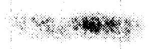

# 10. CORROSION RESEARCH

W. D. Manly, Metallurgy Division

H. W. Savage, ANP Division

W. R. Grimes and F. Kertesz, Materials Chemistry Division

The corrosion program has been expanded to include corrosion by hydroxide and fluoride coolants as well as the corrosion by liquid metals and fluoride fuels already under investigation for some time. Although the majority of the corrosion data are from static tests, a moderate number of data on liquid metals are available for thermal-convection loops. Forced-convection loops are being developed, but this development has not yielded many significant corrosion data as yet.

In general, corrosion of inconel and stainless steel by pretreated and carefully handled fuel mixtures in the absence of radiation is not sufficiently severe to cause failure in operation for several hundred hours at $800^{\circ}\mathrm{C}$ . Limited experience at higher temperatures suggests that corrosion at $1000^{\circ}\mathrm{C}$ will not be excessive. Platinum, contemplated as thermocouple shield material, is not appreciably attacked by the fuel mixture contained in a platinum or an inconel capsule. Welded or brazed joints of platinum to inconel are attacked by the molten eutectic.

Experience with fluoride coolants indicates that corrosion, at least in the absence of radiation, will not be a serious problem with either inconel or the stainless steels.

Corrosion problems encountered with hydroxides and with hydroxide-bearing materials, however, are a great deal more serious. Sodium hydroxide, either commercial or specially pure material,

is extremely corrosive to stainless steel or inconel. Copper, monel, and nickel are much more resistant although mass transfer occurs with these materials. The corrosion by commercial potassium hydroxide which has been freed from excess water is noticeably less severe than that by sodium hydroxide but is sufficiently bad to preclude use of inconel and stainless steel at the present. Some tests with barium and strontium hydroxides conducted with dehydrated commercial material have indicated that these materials are less corrosive than the alkalies. These results are preliminary, and the lack of reproducibility in multiplicate tests is a serious problem.

While the results obtained to date with hydroxide-bearing systems are not encouraging, it should be noted that (1) only in the case of sodium hydroxide has pure hydroxide been available for use; (2) inert, rather than reducing, atmospheres have been used; and (3) the metal walls have been in the as-received condition. While it is not obvious that changes in technique will result in improved corrosion resistance, it is suggested that many variables remain to be tested before it can be stated that corrosion of stainless steel and inconel by the alkalies is necessarily so severe as to preclude their use.

An extensive number of corrosion tests, both static and dynamic, have been conducted with sodium. It is now apparent as a result of this work that

# ANP PROJECT QUARTERLY PROGRESS REPORT

sodium may be contained with little if any corrosion. Recent static corrosion tests with sodium at $1000^{\circ}\mathrm{C}$ in 316 stainless steel for periods up to 1000 hr revealed no surface reaction and did not indicate any significant weight change. Operation of thermal convection loops of inconel and several of the stainless steels with sodium for 1000 hr at $815^{\circ}\mathrm{C}$ produced very little corrosion. Indeed, it now appears that little more can be learned of sodium corrosion by operating additional loops of inconel or stainless steel with sodium. It remains to be demonstrated, however, that a circulatory failure will not occur with sodium in a forced-convection loop in which flow rates are higher and temperature changes greater.

Metallographic examination of several lithium- and lead-containing thermal-convection loops, operated during the past two quarters, indicates severe corrosion of the hot leg and somewhat less severe corrosion of the cold leg. Only one of nine such loops completed the scheduled 1000-hr test; all but one of the other eight failed because of an obstruction in the cold leg of the loop. This obstruction is a buildup of corrosion products.

# STATIC CORROSION BY FLUORIDE FUELS

The experimental evaluation of static corrosion of structural metals by fluoride fuel mixtures has all been conducted by the sealed-capsule technique described in previous reports. (1-3) This technique has been demonstrated by experience to be rapid

and completely satisfactory for handling the fluorides, since mixtures thus treated have consistently demonstrated low corrosion rates on inconel and a wide variety of stainless steels. The penetration of inconel by a typical fuel mixture in 100 hr at 800 and $1000^{\circ}\mathrm{C}$ does not exceed 4 mils. The penetration of the stainless steels (304, 310, 316, 330, 347, 446) in 100 hr at 800 and $1000^{\circ}\mathrm{C}$ did not exceed 2 mils and was generally less than 1 mil. The corrosion of platinum, introduced in thermocouples, has been shown to be negligible in the fluoride fuel at these temperatures.

The Pretreatment Process (G. J. Nessle, H. S. Powers, and C. J. Barton, Materials Chemistry Division). In a previous report(3) the improvement in corrosion which resulted from treatment of the fluoride fuel with pieces of stainless steel and inconel at 850 to $900^{\circ}\mathrm{C}$ prior to filling of the corrosion capsules has been described. While no mechanism for this improvement has been demonstrated, it appears likely that this treatment removes traces of hydrogen fluoride which result from hydrolysis of some of the $\mathrm{UF_4}$ in the fuel. A photograph of an inconel sample which was used to "scavenge" the active impurities in a fluoride bath is shown in Fig. 10.1. The fluoride thus freed from the active impurities, and containing some iron, nickel, and chromium in solution, was used for making the static fluoride corrosion tests.

UNCLASSIFIED

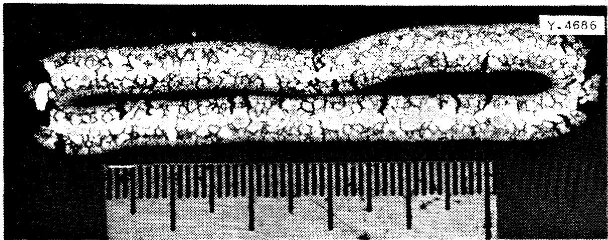  
Fig. 10.1 - Inconel Specimen from Pretreating Pot in Which Fluoride Bath Mixture was "Deactivated" at $950^{\circ}\mathrm{C}$ for 100 hr. The smallest divisions of the scale in the photograph are 1/100 in. Note very severe intergranular attack.

A comparison test has shown that corrosion by untreated fluorides which had been vigorously outgassed and then sealed with a helium atmosphere enclosed was not appreciably different from that obtained when the capsules were sealed with an air atmosphere.

Pretreatments of the metal surface has not been successful in minimizing corrosion. Pickling, oxidation, and decarburization of the metal surface have seemed to result in increased corrosion. The oxide film on the surface as received seems to have reasonably good corrosion resistance properties.

It has been found that some of the fuel samples, whether pretreated with structural metals or not, do contain appreciable quantities of uranium oxide. Sedimentation experiments in sealed capsules have shown an increase in uranium content in the lower section of the capsule without a corresponding change in the fluoride content of the various sections. In

addition, filtration of the molten fuel through sintered stainless steel has removed significant amounts of black uranium oxide. However, uranium oxide did not increase the corrosion rate.

Pretreatment of the liquid fuel with structural metals serves to introduce appreciable quantities of iron, chromium, and nickel into the fuel melt. Chemical analysis of such fuel mixtures indicates the presence of 600 to 1200 ppm of iron, 200 to 1000 ppm of chromium, and 30 to 200 ppm of nickel after pretreatment although the compounds actually involved have not been identified. The variation in concentration observed indicates that not all these impurities are dissolved. This is borne out by the fact that some sedimentation of the iron seems to occur during the 100-hr corrosion tests. It also seems evident that the nickel content of the pretreated fuels is reduced during the subsequent corrosion testing while the chromium

# ANP PROJECT QUARTERLY PROGRESS REPORT

content is not. Further studies are required, but it appears that considerable chromium is dissolved in the fuel and that the nickel present after pretreatment may be electrolytically deposited on the corrosion specimens at the expense of chromium from the test metal. The amounts involved are small enough to make demonstration of this phenomenon difficult. It seems likely, however, that pure chromium may have some advantages as the pretreatment metal.

Corrosion of Structural Metals (H. J. Buttram, N. V. Smith, C. R. Croft, and J. A. Griffin, Materials Chemistry Division; A. D. Brasunas, L. A. Abrams, and E. E. Hoffman, Metallurgy Division). It appears from studies to date that corrosion of inconel and stainless steel by carefully handled fluoride fuels is not a serious factor. Furthermore, improvement of the pretreatment process and of handling techniques for the pretreated material should result in further improvements. Three different fuel mixtures, the binary system $\mathrm{NaF - UF_4}$ (75-25 mole %), the ternary system NaF-KF-UF $^4$ (46.5-26-27.5 mole %), and the ternary system NaF-BeF $^2$ -UF $^4$ (76-12-12 mole %), have each been tested at 800 and $1000^{\circ}C$ with no significant difference in corrosion. In general, the corrosion of inconel specimens in 100 hr with each of these fuels was of the order of 2 to 4 mils; that of several stainless steels was around 1 to 2 mils.

By NaF-UF. Several static cor-rosion tests have been completed using the NaF-UF4 fluoride mixture with a composition 75 mole % NaF and 25 mole $\%$ UF4. Inconel and 347 stainless steel were exposed for 100 hr at $1000^{\circ}\mathrm{C}$ (1830°F) to the fluoride cutectic

which had been pretreated with these metals for 150 hr at $150^{\circ}\mathrm{C}$ .

The attack by treated fluoride on inconel, in the form of subsurface voids, was noted to a depth of 0.004 in. as shown in Fig. 10.2. The 347 stainless steel was less severely attacked as may be seen in Fig. 10.3, where the subsurface attack was limited to 0.002 in. The nature of the corrosion product has not been determined. An analysis of the fluoride bath after testing gave the following results:

<table><tr><td rowspan="2"></td><td colspan="3">AMOUNT (%)</td></tr><tr><td>IRON</td><td>NICKEL</td><td>CHROMIUM</td></tr><tr><td>Inconel</td><td>0.25</td><td>Not detected</td><td>0.03</td></tr><tr><td>347 stainless steel (%)</td><td>0.2</td><td>Not detected</td><td>0.05</td></tr></table>

By NaF-KF-UF. The results of corrosion testing of stainless steel and inconel with the NaF-KF-UF fluoride fuel have been very satisfactory. The pretreatment technique has reduced the corrosion of these metals to nearly negligible proportions with very little intergranular penetration of the specimens. The photomicrograph reproduced as Fig. 10.4 shows a heat-treated inconel specimen and Fig. 10.5 shows the type of corrosion to be expected from the NaF-KF-UF eutectic in 100-hr exposures at $800^{\circ}\mathrm{C}$ . Figure 10.6 shows a heat-treated 316 stainless steel specimen, and Fig. 10.7 shows the corrosion in stainless steel after 100 hr exposure to NaF-KF-UF eutectic at $800^{\circ}\mathrm{C}$ . The inconel specimen shown, attack to a depth of 2 mils, is by no means the best specimen of this metal tested. The stainless steel specimen, attacked to a depth of 1 mil, is typical of the 304, 310, 316, 330, and 347 stainless steel samples tested.

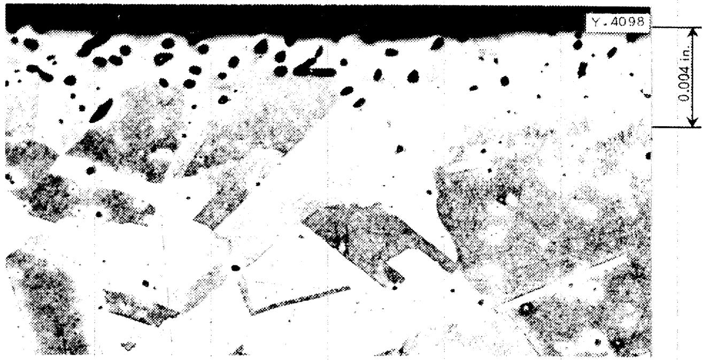

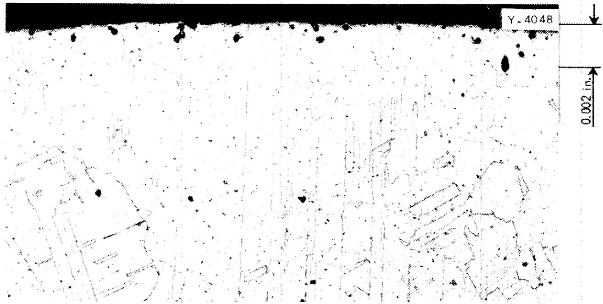  
Fig. 10.2 - Corrosion of Inconel by $3\mathrm{NaF - UF_4}$ . 250X. Specimen after 100 hr of exposure at $1000^{\circ}\mathrm{C}$ to $3\mathrm{NaF - UF_4}$ . Voids adjacent to surface represent fluoride attack to depth of 0.004 in.   
Fig. 10.3 - Corrosion of 347 Stainless Steel by $3\mathrm{NaF - UF}_4$ . 250X. Surface of specimen after 100 hr of exposure at $1000^{\circ}\mathrm{C}$ to $3\mathrm{NaF - UF}_4$ . Note formation of voids to depth of 0.002 in.

# ANP PROJECT QUARTERLY PROGRESS REPORT

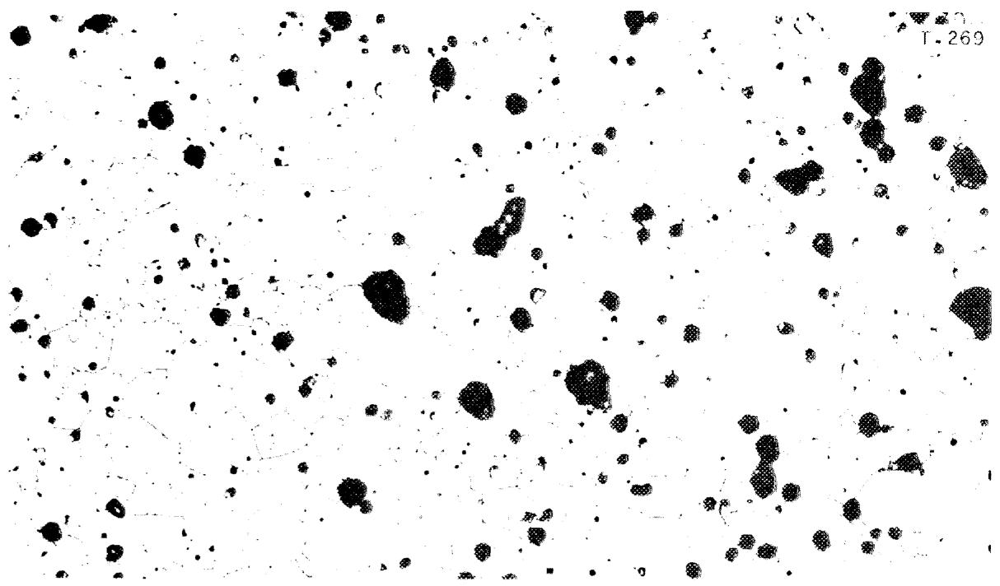  
Fig. 10.4 - Heat-Treated Inconel Specimen. 250x.

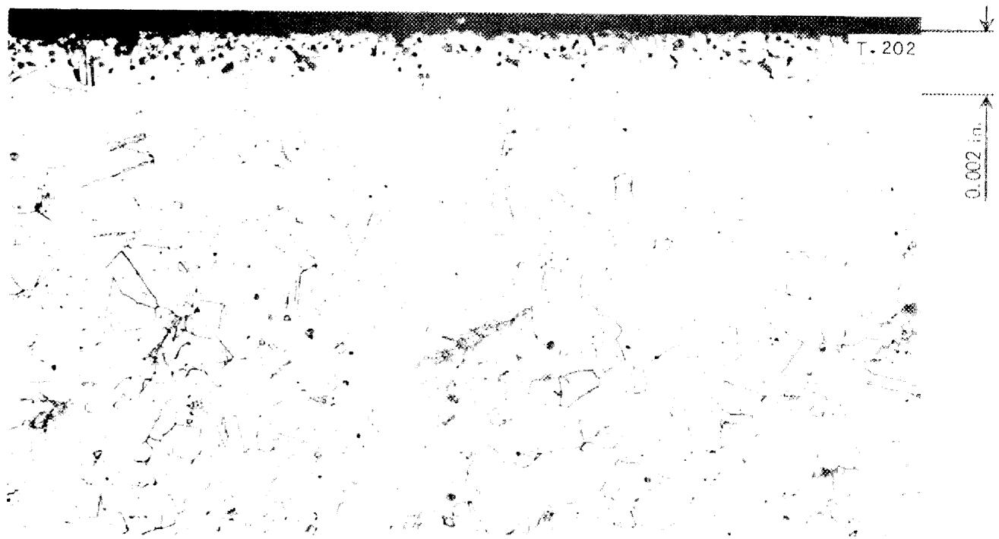  
Fig. 10.5 - Corrosion of Inconel by Pretreated Fluoride Fuels. 250X. Specimen after 100 hr at $800^{\circ}\mathrm{C}$ in NaF-KF-UF $_4$ eutectic; slight attack, to depth of 2 mils.

# FOR PERIOD ENDING SEPTEMBER 10, 1951

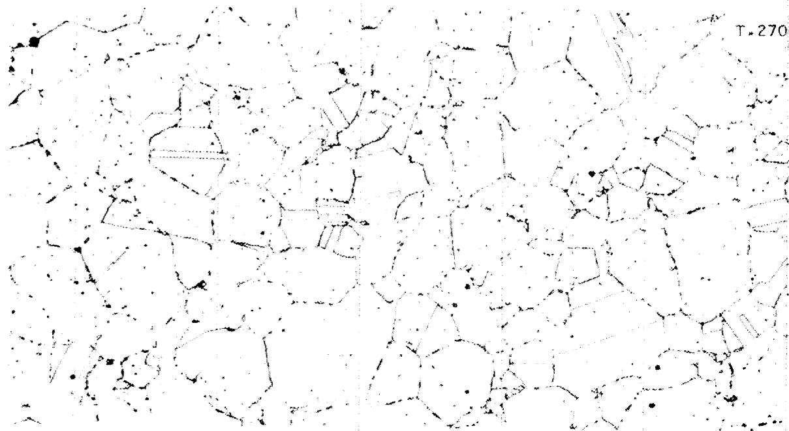  
Fig. 10.6 - Heat-Treated 316 Stainless Steel Specimen. 250X.

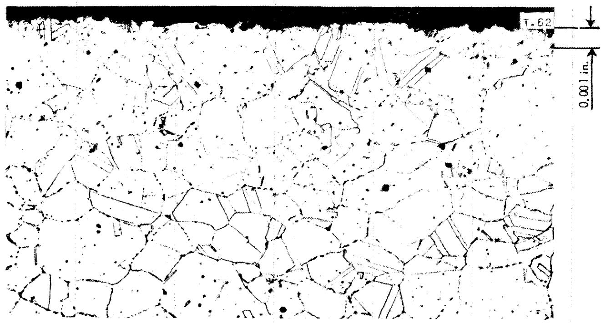  
Fig. 10.7 - Corrosion of 316 Stainless Steel by Pretreated Fluoride Fuels. 250X. Specimen after 100 hr at $800^{\circ}\mathrm{C}$ in NaF-KF-UF $_4$ eutectic; no appreciable attack.

# ANP PROJECT QUARTERLY PROGRESS REPORT

In multiplicate experiments in which individual capsules were removed at intervals for examination it has been shown that the major fraction of the corrosion observed occurs in the first few hours. Little additional effect is apparent after 1000 hr of exposure.

By NaF-BeF $_2$ -UF $_4$ . The ternary fluoride NaF-BeF $_2$ -UF $_4$ (76-12-12 mole%) was also used in corrosion testing. A 100-hr test with 310 stainless steel at $1500^{\circ}\mathrm{F}$ (815°C) showed no metallographic evidence of attack, although an analysis of the fluoride bath indicated $0.2\%$ iron, $0.02\%$ nickel, and no chromium to be present. The presence of nickel and absence of chromium is the reverse of the findings listed above for the binary fluoride mixture, NaF-UF $_4$ . However, these differences may be illusory because tests described below indicate that gravity segregation may exist in the container, and the composition of the fluoride mixture will depend on the location from which the test sample was obtained.

A number of fluoride-corrosion tests were made on commercial alloys using a mixture of 10.7 mole $\%$ $\mathrm{BeF}_2$ , 68.0 mole $\%$ NaF, and 21.3 mole $\%$ $\mathrm{UF_4}$ . The materials tested are listed in Table 10.1 together with notes taken while the exposed specimens were being studied on the metallograph and results from bath analyses. The attack in all cases was not severe. Some decarburization was observed, but this is not a highly objectionable type of surface instability.

Weight losses are undoubtedly caused by solution of the metal sample into the fluoride bath as indicated by bath analyses which are also reported in Table 10.1. Weight gains, in spite of

some loss by solution, must be interpreted as absorption of one or more bath constituents (fluoride or metal) into the metal specimen. Comparison of results of analyses of the fluoride bath at various levels of the tube after test with results of the original fluoride analysis indicate a definite decrease in beryllium, a slight decrease in sodium, and very little, if any, decrease in the uranium concentration. These changes in bath analysis may be directly associated with the weight gains observed on several test specimens.

Corrosion of Platinum (D. G. Hill, Consultant, Materials Chemistry Division). Thermocouples are to be inserted in a number of ARE fuel tubes to determine the center temperatures of these structures. Since platinum was suggested as the material for the tubular thermocouple wells, it has been necessary to examine the resistance of this metal and of some welded joints to the fluoride melt.

Platinum slugs immersed in the raw or pretreated fuel, NaF-KF-UF4, in platinum capsules showed no appreciable corrosion as measured by weight changes. Microscopic examination of prepared specimens revealed occasional shallow pitting which may have been due to local impurities. In a similar test using liquid sodium metal instead of the fluoride fuel mixture, the platinum metal was completely consumed. These test data will be reported in detail later. At this time it appears that pure platinum will prove satisfactory although perhaps nickel plating of the material will be desirable. The brazed joints must certainly be kept well above the liquid level.

TABLE 10.1   
Summary of Fluoride-Corrosion Data Obtained in 100 hr at $1000^{\circ}\mathrm{C}$ (1830°F)   
(10.7 mole % BeF $_2$ , 68 mole % NaF, 21.3 mole % UF $_4$ )   

<table><tr><td rowspan="2">MATERIAL TESTED</td><td rowspan="2">METALLOGRAPHIC NOTES</td><td colspan="3">BATH ANALYSIS AFTER TEST (ppm)</td><td rowspan="2">WEIGHT CHANGE(g/in.2)</td></tr><tr><td colspan="2">TOP</td><td>BOTTOM</td></tr><tr><td>Nickel A</td><td>Only evidence of attack was precipitation of fine particles along surface to depth of 0.002 in.</td><td>Ni</td><td>350</td><td>Ni</td><td>40</td></tr><tr><td>304 stainless steel</td><td>Shallow surface voids observed to depth of &lt;0.001 in.</td><td></td><td></td><td></td><td></td></tr><tr><td rowspan="3">316 stainless steel</td><td rowspan="3">Very few shallow surface voids observed to depth of &lt;0.001 in.</td><td>Fe</td><td>5,500</td><td>Fe</td><td>1,500</td></tr><tr><td>Ni</td><td>420</td><td>Ni</td><td>40</td></tr><tr><td>Cr</td><td>560</td><td>Cr</td><td>390</td></tr><tr><td rowspan="2">347 stainless steel</td><td rowspan="2">Surface voids observed to depth of 0.001 in.; no other visible evidence of attack</td><td>Fe</td><td>10,900</td><td>Fe</td><td>9,800</td></tr><tr><td>Cr</td><td>2,400</td><td>Cr</td><td>1,300</td></tr><tr><td>310 stainless steel</td><td>Decarburized to depth of 0.002 in.; few scattered voids in this area</td><td></td><td></td><td></td><td></td></tr><tr><td rowspan="3">330 stainless steel</td><td rowspan="3">Surface voids to depth of 0.001 in.</td><td>Fe</td><td>4,500</td><td>Fe</td><td>7,200</td></tr><tr><td>Ni</td><td>20</td><td>Ni</td><td>800</td></tr><tr><td>Cr</td><td>520</td><td>Cr</td><td>320</td></tr><tr><td rowspan="2">446 stainless steel</td><td rowspan="2">Sigma-like precipitate throughout ferritic matrix except at surface zone 0.002 in. deep; few voids observed to depth of 0.001 in.</td><td>Fe</td><td>1,440</td><td>Fe</td><td>7,410</td></tr><tr><td>Cr</td><td>50</td><td>Cr</td><td>190</td></tr><tr><td rowspan="3">Hastelloy B</td><td rowspan="3">Decarburized to depth of 0.005 in.; lightly etched phase persistent throughout</td><td>Fe</td><td>5,800</td><td>Fe</td><td>1,200</td></tr><tr><td>Ni</td><td>310</td><td>Ni</td><td>70</td></tr><tr><td>Mo</td><td>&lt;10</td><td>Mo</td><td>&lt;10</td></tr><tr><td>Inconel (as-received)</td><td>Surface voids observed to depth of approximately 0.002 in.</td><td></td><td></td><td></td><td></td></tr><tr><td rowspan="3">Inconel (decarburized)</td><td rowspan="3">Surface voids observed to depth of 0.003 in.</td><td>Fe</td><td>&lt;10</td><td>Fe</td><td>1,810</td></tr><tr><td>Ni</td><td>300</td><td>Ni</td><td>20</td></tr><tr><td>Cr</td><td>&lt;10</td><td>Cr</td><td>350</td></tr><tr><td>347 stainless steel in inconel tube</td><td>Surface roughened; voids observed to depth of 0.006 in.</td><td></td><td></td><td></td><td></td></tr></table>

# ANP PROJECT QUARTERLY PROGRESS REPORT

Platinum specimens exposed in inconel capsules in a manner such that the metals were in contact under the melt level showed similar and somewhat more severe pitting; pretreated fuels caused a slight deposit to form on the platinum. This deposit has been tentatively identified as nickel perhaps electrochemically transferred from the inconel walls. Platinum wires suspended so that they were in direct electrical contact with the inconel capsule above the melt only and were partially immersed in the fuel mixture showed only minor pitting when examined by metallographic techniques. The wires seemed stiffened and slightly roughened and may possibly have had some deposited nickel. This type of construction, which approximates that proposed for the special fuel tubes, will probably prove satisfactory.

Brazed joints of platinum and inconel, prepared with pure silver, copper, and microbraz, were shown to be completely unsatisfactory when immersed in the fuel mixture in an inconel capsule. Both the platinum and the inconel were seriously attacked; the platinum virtually disappeared from the microbrazed samples. Chemical analysis, however, revealed no dissolved platinum in any of the fluoride melts. It appears that the attack on the welded platinum must have resulted in finely divided dispersed metal or electrodeposited platinum. It will probably be necessary to design the special tubes so that the inconel tube extends beyond the active lattice and through the coolant header, with the brazed joint, therefore, outside the core and well above the coolant and fuel levels.

# STATIC CORROSION BY MODERATOR COOLANTS

H. J. Buttram C. R. Croft  
N. V. Smith J. A. Griffin  
Materials Chemistry Division

A. D. Brasunas L. A. Abrams E. E. Hoffman Metallurgy Division

Virtually all the work on moderator coolants has been confined to studies of corrosion by alkali and alkaline earth hydroxides. These materials have been studied under various conditions in copper, monel, nickel, inconel, and stainless steel Nos. 316, 321, and 347. Thus far corrosion by sodium hydroxide has been examined at some length. Preliminary data on corrosion by potassium hydroxide, barium hydroxide, strontium hydroxide, and lithium hydroxide are also presented.

The corrosion data have all been obtained in 100-hr tests at 800, 815, or $1000^{\circ}\mathrm{C}$ . In general, the corrosion by hydroxides is more severe than that by the fluoride fuels. Sodium hydroxide, in particular, is about the most corrosive of the hydroxides studied; the surface penetration of inconel and several stainless steels varies from 7 to 16 mils. Only nickel, monel, and copper of the metals tested with sodium hydroxide show better (no evidence of attack) corrosion resistance. Each of these metals, however, is subject to mass transfer. Corrosion by potassium hydroxides is severe - around 6 to 7 mils - but not nearly so severe as by sodium hydroxide. The attacks by strontium and barium hydroxide are of about the same order of severity, i.e., 5 to 7 mils.

To date the commercial grade and the dehydrated commercial grade hydroxides have been used in most of these experiments, and further reduction in corrosion rates may be expected as purer quality hydroxides become available. Weight changes of a metal corrosion specimen in pure (99.8%) sodium hydroxide was less by a factor of 3 to 4 than those obtained with commercial grade.

Capsule Technique with Hydroxides. The capsule technique used so successfully in fuel and coolant testing has required considerable modification for this study. Most of the molten hydroxides, regardless of state of purity, tend to crawl on the capsule surfaces and make welding of the closed capsule virtually impossible. It has been necessary to add the powdered hydroxide in a manner such as to avoid contact with the upper portion of the wall and to seal the capsule without melting of the material or to use a double-capsule technique in which the inner or test capsule is unsealed. Neither of these techniques is completely satisfactory and a better method is needed.

Corrosion by Sodium Hydroxide. Commercial sodium hydroxide attacks stainless steels and inconel strongly. Monel, copper, and nickel are much more resistant; nickel slugs exposed to the alkali resemble electropolished specimens. The corrosion problem with these metals is, however, complicated by the phenomenon of mass transfer for which the mechanism is still in doubt.

The corrosion tests made with sodium hydroxide using inconel and stainless steel specimens and container tubes gave evidence of appreciable interaction. Photomicrographs of inconel

and 316 stainless steel specimens exposed for 100 hr at $800^{\circ}\mathrm{C}$ to dehydrated commercial sodium hydroxide are shown in Figs. 10.8 and 10.9, respectively. These should be compared with Figs. 10.4 and 10.6. A very heavy oxide layer which contains some metallic particles is formed on the exposed surfaces. Purified sodium hydroxide containing less than $0.15\%$ each of water and $\mathrm{Na}_2\mathrm{CO}_3$ shows a similar but considerably less marked behavior with stainless steel and inconel. Weight changes observed on the metal specimens in pure sodium hydroxide are less by a factor of 3 or 4 than those obtained in similar tests with commercial material.

A photomicrograph of a nickel specimen exposed to sodium hydroxide is shown in Fig. 10.10. There is no evidence of a corrosion reaction, although some metal loss due to solution may have occurred. The possible solution-deposition phenomenon commonly referred to as "mass transfer," remains the major deterrent to the use of nickel as a hydroxide container. An intensive study of this phenomenon has been started, and apparatus is being constructed to study solution deposition in a thermal gradient under static and dynamic conditions.

Corrosion by Potassium Hydroxide. Potassium hydroxide tested only as the dehydrated commercial product also tends to attack the chromium in inconel and stainless steel. Typical photomicrographs of such tests with inconel and 316 stainless steel as shown in Figs. 10.11 and 10.12 indicate that the corrosion is very severe but is not so violent as for NaOH. Nickel, monel, and copper containers are also attacked less severely. It seems

# UNCLASSIFIED

ANP PROJECT QUARTERLY PROGRESS REPORT

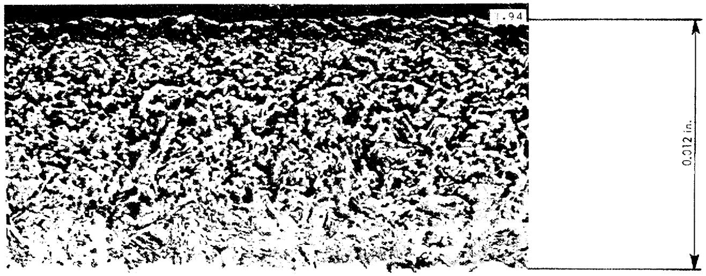

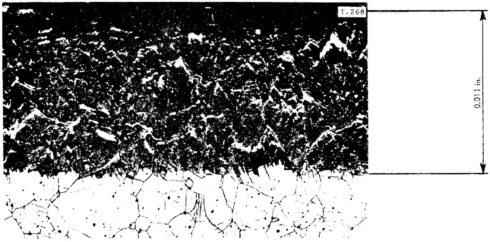  
Fig. 10.8 - Corrosion of Inconel by Dehydrated Commercial Sodium Hydroxide. Original photograph taken at $250\mathrm{x}$ ; reduced $19\%$ in reproduction. Specimen after 100 hr at $800^{\circ}\mathrm{C}$ in dehydrated sodium hydroxide; severe attack, to depth of 0.012 in. Compare with Fig. 10.4.   
Fig. 10.9 - Corrosion of 316 Stainless Steel by Dehydrated Commercial Sodium Hydroxide. Original photograph taken at $250\mathrm{x}$ ; reduced $19\%$ in reproduction. Specimen after 100 hr at $800^{\circ}\mathrm{C}$ in dehydrated sodium hydroxide; severe attack, to depth of 0.011 in. Compare with Fig. 10.6.

# UNCLASSIFIED

FOR PERIOD ENDING SEPTEMBER 10, 1951

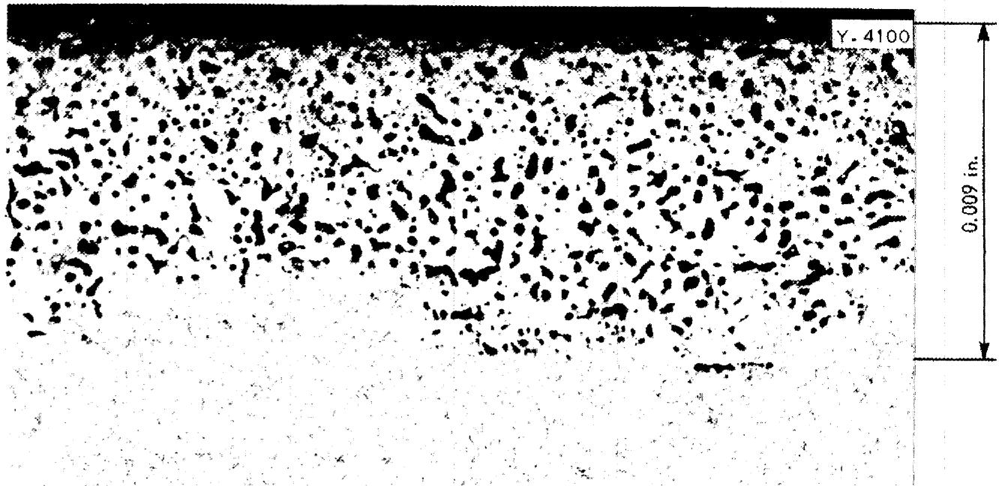

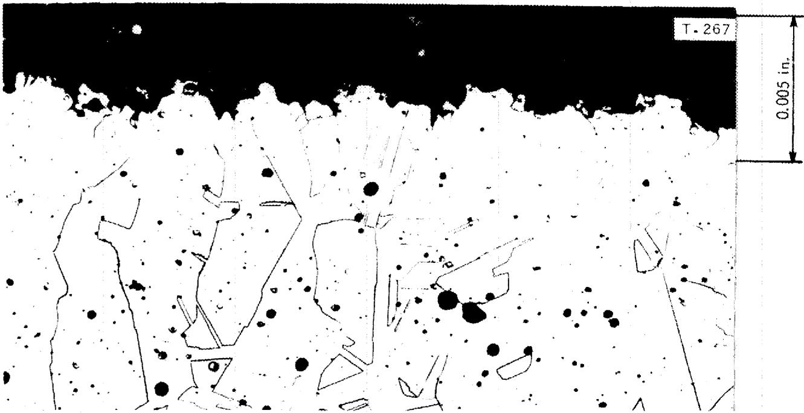  
Fig. 10.10 - Corrosion of Nickel A by Sodium Hydroxide. 250X. Surface apparently unattacked after 100 hr of exposure to sodium hydroxide at $815^{\circ}\mathrm{C}$ $(1500^{\circ}\mathrm{F})$ .   
Fig. 10.11 - Corrosion of Inconel by Dehydrated Commercial Potassium Hydroxide. 250X. Specimen after 100 hr at $800^{\circ}\mathrm{C}$ in dehydrated potassium hydroxide; considerable grain growth and penetration to depth of 0.005 in. Compare with Fig. 10.4.

# UNCLASSIFIED

ANP PROJECT QUARTERLY PROGRESS REPORT

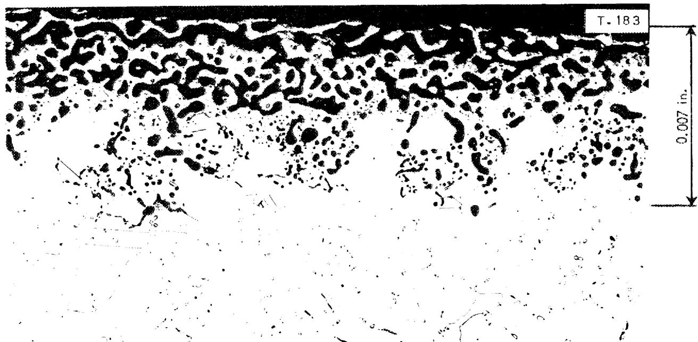  
Fig. 10.12 - Corrosion of 316 Stainless Steel by Dehydrated Commercial Potassium Hydroxide. 250X. Specimen after 100 hr at $800^{\circ}\mathrm{C}$ in dehydrated potassium hydroxide; intergranular penetration and leaching to depth of 0.007 in. Compare with Fig. 10.6.

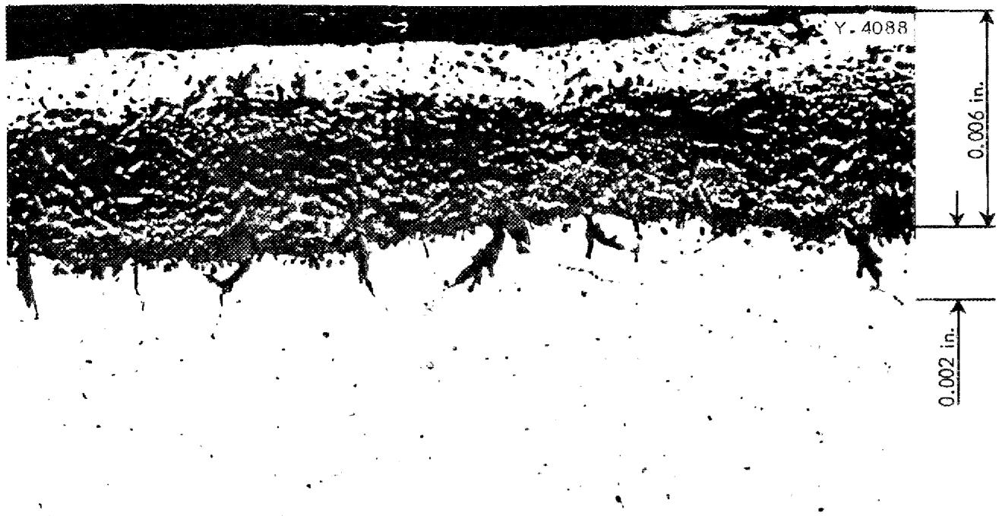  
Fig. 10.13 - Corrosion of Inconel by Strontium Hydroxide. 250X. Surface of specimen after 100 hr of exposure to strontium hydroxide at $1000^{\circ}\mathrm{C}$ . Note 0.002-in. grain boundary penetration beneath 0.006-in. corroded layer.

# UNCLASSIFIED

FOR PERIOD ENDING SEPTEMBER 10, 1951

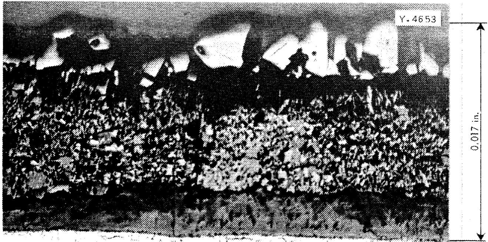

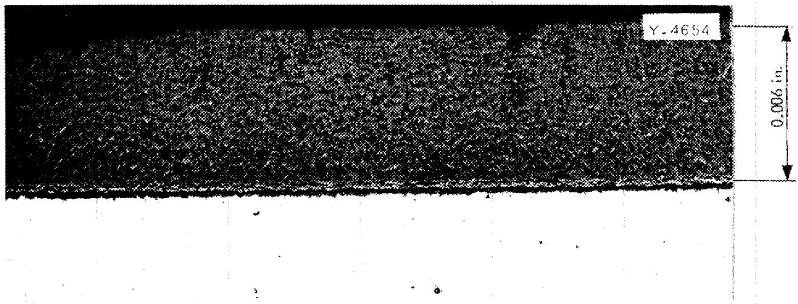  
Fig. 10.14 - Corrosion of Iron by Strontium Hydroxide. 175X. Surface of specimen after $100\mathrm{hr}$ of exposure to strontium hydroxide at $1500^{\circ}\mathrm{F}$ . Note formation of several oxide layers; approximately 0.005 in. of metal consumed to form 0.017-in. oxide layer.   
Fig. 10.15 - Corrosion of 318 Stainless Steel by Strontium Hydroxide. 150X. Surface of specimen after 100 hr of exposure to strontium hydroxide at $1500^{\circ}\mathrm{F}$ . Note retention of tiny metallic globules in oxide; 0.003 in. of metal consumed to form 0.006-in. oxide layer.

# ANP PROJECT QUARTERLY PROGRESS REPORT

possible that potassium hydroxide in a high state of purity might be useful, at least at somewhat lower temperatures. Tests with pure potassium hydroxide will be repeated as soon as the material is available.

Corrosion by Other Hydroxides. Corrosive attack by strontium and barium hydroxides appears to be less severe than the attack obtained in tests with sodium hydroxide. Nickel and copper appear moderately resistant while inconel and stainless steel are strongly attacked. Figure 10.13 illustrates the attack on inconel obtained in 100 hr at $1500^{\circ}\mathrm{F}$ with strontium hydroxide. This should be compared to the sodium hydroxide attack on inconel shown in Fig. 10.8. The attack by strontium hydroxide on iron and on 318 stainless steel at $1500^{\circ}\mathrm{F}$ in 100 hr is illustrated in Figs. 10.14 and 10.15, respectively. The oxide layer formed is quite heavy, especially in the case of iron in which several oxide layers (probably FeO and $\mathrm{Fe}_{3}\mathrm{O}_{4}$ ) are evident. The eutectic mixture of strontium and barium hydroxide did not differ appreciably from the constituent hydroxides. It should be noted that the dehydrated commercial materials have been used in these tests. It is possible that the pure materials will be less corrosive.

Lithium hydroxide tested as the relatively pure dehydrated commercial material seems to resemble sodium hydroxide in its corrosive characteristics. A thick layer of corrosion product is formed on inconel and stainless steel; copper and nickel are reasonably resistant.

Corrosion by Binary Hydrogenous Systems. A few static corrosion experiments have been made in which

varying amounts of NaH, Na, and $\mathbf{H}_2\mathbf{O}$ have been mixed with NaOH. Corrosion experiments with these mixtures on 316 stainless steel and inconel for 100 hr at $815^{\circ}\mathrm{C}$ are summarized in Table 10.2. No significant decrease in the corrosion of NaOH was observed.

# STATIC CORROSION BY FLUORIDE COOLANT MIXTURES

H. J. Buttram C. R. Croft  
N. V. Smith J. A. Griffin  
Materials Chemistry Division

Uranium-free fluoride mixtures, which are under consideration as coolants, have been investigated in static-corrosion studies using the capsule technique previously described. Photomicrographs of a typical run in which inconel and 316 stainless steel were exposed at $800^{\circ}\mathrm{C}$ for 100 hr to the NaF-KF-BeF $_2$ eutectic are shown as Figs. 10.16 and 10.17, respectively. While the number of specimens so far studied is not large, it appears that this mixture and the NaF-KF-LiFeutectic will both be satisfactory in so far as corrosion is concerned. The beryllium fluoride mixture needs careful handling to avoid hydrolysis of this compound. The alkali fluoride eutectic is much more stable in this respect.

# STATIC CORROSION BY SODIUM

A. D. Brasunas L. A. Abrams E. E. Hoffman Metallurgy Division

Liquid-metal corrosion tests now are confined mainly to sodium attack. In an effort to determine the effect

# TABLE 10.2

Summary of Corrosion Data Obtained in 100-hr Tests at $815^{\circ}\mathrm{C}$ with Mixtures of Sodium Hydroxide with Sodium Hydride, Sodium, or Water

<table><tr><td>MATERIAL</td><td>HYDROXIDE</td><td>WEIGHT CHANGE (g/in.2)</td><td>REMARKS</td><td>METALLOGRAPHIC NOTES</td></tr><tr><td>Inconel</td><td>NaOH + 3% NaH</td><td>+0.10</td><td>None</td><td>Sample severely oxidized to depth of 0.013 in.; container tube completely attacked</td></tr><tr><td>Inconel</td><td>NaOH + 5 drops of H2O</td><td>+0.12</td><td>Tube failed</td><td>0.015-in. oxidized layer</td></tr><tr><td>Inconel</td><td>NaOH + 3% Na</td><td>+0.08</td><td>None</td><td>0.012-in. oxidized layer</td></tr><tr><td>316 stainless steel</td><td>NaOH + 3% NaH</td><td>+0.011</td><td>None</td><td>0.003-in. oxide layer; 0.001-in. intergranular attack beneath</td></tr><tr><td>316 stainless steel</td><td>NaOH + 30% Na</td><td>+0.033</td><td>None</td><td>0.003-in. oxide layer; 0.002-in. intergranular attack beneath</td></tr><tr><td>316 stainless steel</td><td>NaOH + 5 drops of H2O</td><td>Data not available</td><td>Tube burst from internal pressure</td><td>0.003-in. oxide layer; 0.002-in. intergranular attack beneath</td></tr></table>

# UNCLASSIFIED

# ANP PROJECT QUARTERLY PROGRESS REPORT

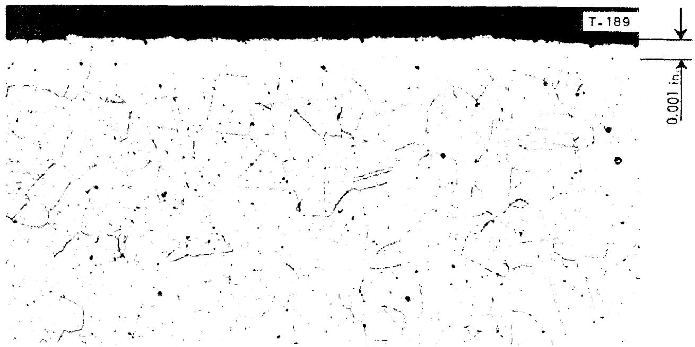  
Fig. 10.16 - Corrosion of Inconel by Pretreated Fluoride Coolant. 250X. Specimen after 100 hr in NaF-KF-BeF $_2$ eutectic; no appreciable attack. Compare with Fig. 10.4.

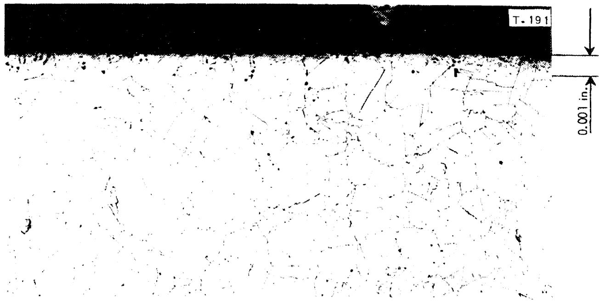  
Fig. 10.17 - Corrosion of 316 Stainless Steel by Pretreated Fluoride Coolant. 250x. Specimen after 100 hr at $800^{\circ}\mathrm{C}$ in NaF-KF-BeF $_2$ eutectic; no appreciable attack. Compare with Fig. 10.6.

of time on sodium attack of 316 stainless steel at $1000^{\circ}\mathrm{C}$ , tests were made for 1, 5, 10, 25, 100, 400, and 1000 hr. Gravimetric determinations indicated no significant weight change in any of these tests. Metallographic examination of sectioned specimens revealed no surface reaction. Visual examination revealed a velvet-like frosted appearance after the test (the specimens were highly polished prior to testing). High magnification indicated this to have been caused by a re

organization of surface metal. Grain boundaries, twin lines, and crystal faces were prominently displayed, as shown in Fig. 10.18. This surface is probably more stable than the original polished surface and merely readjusted itself either by surface diffusion or by the limited solubility of the metal components in the sodium.

Tests are now in progress to evaluate the behavior of Timken alloys 16-25-6 and 16-13-3 (Cr-Ni-Mo) in sodium at

UNCLASSIFIED

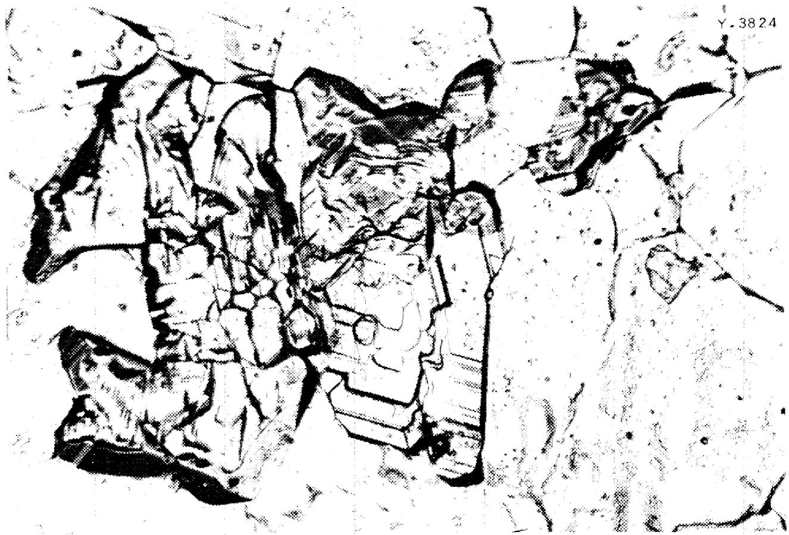  
Fig. 10.18 - Corrosion of 316 Stainless Steel by Sodium. 250X. Outer surface of specimen after 400 hr of exposure to sodium at $1000^{\circ}\mathrm{C}$ . Note development of crystal faces on certain grains and grain boundary attack.

# ANP PROJECT QUARTERLY PROGRESS REPORT

$815^{\circ}C$ $(1500^{\circ}F)$ and $1000^{\circ}C$ $(1830^{\circ}F)$ . The possibility of surface carburization of inconel, 310 stainless steel, and 316 stainless steel is being determined by using sodium to which a small amount of charcoal has been added. The indications are that carburization and embrittlement has occurred. The corrosion resistance of molybdenum-coated steels will also be evaluated when they are procured.

# STATIC CORROSION TEST OF A REACTOR SYSTEM

H. W. Savage W. C. Tunnell

E.M.Lees

ANP Division

Static-corrosion experiments to determine the extend of combined damage(4) to capsules containing fuel and immersed in sodium at $1500^{\circ}\mathrm{F}$ have continued. These tests are conducted in a vessel incorporating a series of wells or "standpipes" filled with liquid sodium. During the quarter a 316 stainless steel standpipe was used to test fuel-containing 316 stainless steel capsules. Tests were completed on the 100-, 200-, 400-, 600-, 900-, and 1000-hr capsules, but examination of these capsules has not been completed. A similar experiment is underway with inconel, and tests on the 100-, 200-, and 400-hr capsules have been completed.

# MASS TRANSFER PHENOMENON IN STATIC CORROSION

D. G. Hill, Research Participant  
R. A. Bolomey, Materials Chemistry Division

The mechanism by which nickel is removed by sodium hydroxide from the

parent metal of the container, in many cases in a very uniform manner, and redeposited on certain areas of the container or in discrete particles in the liquid is referred to as "mass transfer." It is not certain at present whether the phenomenon is shown by all the other hydroxides or whether metals other than nickel and copper exhibit the phenomenon. There is also some question as to whether it occurs in completely isothermal systems.

Mass transfer may be explained in nonisothermal systems by assuming a high thermal coefficient of solubility of nickel in the fused alkali. Such an explanation is acceptable in the case of mass transfer in liquid metals, but true solution of unreacted nickel in fused alkali is somewhat harder to accept. If the transfer can be shown to occur in completely isothermal systems, then another explanation is patently required.

Chemical-Reaction Mechanism for Mass Transfer. It is possible that the mechanism of mass transfer can be explained on the basis of chemical reactions. For purposes of this discussion nickel is used as the example. Other metals might, obviously, be chosen.

The first step in the reaction chain may be either

$$
\begin{array}{c} \mathrm {N i} + \mathrm {N a} _ {2} \mathrm {O} \longrightarrow \mathrm {N i O} + 2 \mathrm {N a} + \mathrm {H} _ {2} \\ \text {o r} \end{array}
$$

$$
2 \mathrm {N i} + 2 \mathrm {N a O H} \longrightarrow 2 \mathrm {N i O} + 2 \mathrm {N a} + \mathrm {H} _ {2}
$$

Experimental evidence for these reactions is found in the work of Villard who demonstrated the distillation of

sodium and of $\mathbf{H}_2$ by heating a nickel boat containing sodium hydroxide in a quartz tube. Sodium and $\mathbf{H}_2$ , or sometimes NaH, could be collected at the cooled end of the tube, the products depending on the conditions. Thus the second reaction shown should include the possibility that the actual product is NaH. This work demonstrates that, although the free energy change is unfavorable to the reactions, reaction does occur so that, if a further process displaced the equilibrium, continued attack on the metal might take place.

The further reaction may be the disproportionation reaction

$$
2 \mathrm {N i O} = \mathrm {N i} + \mathrm {N i O} _ {2}
$$

Under the more common conditions of aqueous solution and strong acids, the equilibrium in this type of reaction is far to the left. It is considered possible that, in the extreme conditions of high temperature and very strongly basic solvent, the equilibrium is shifted to the right. Such reversals of equilibrium with a change in conditions are well known in organic reactions. The scanty information now available on reactions in fused sodium hydroxide does not forbid the theory for this unexplored medium.

Further reactions are certainly possible:

$$
\mathrm {N i O} _ {2} + 2 \mathrm {N a O H} = \mathrm {N a} _ {2} \mathrm {N i O} _ {3} + \mathrm {H} _ {2} \mathrm {O}
$$

$$
\mathrm {N i O} _ {2} + 2 \mathrm {N a} = \mathrm {N i O} + \mathrm {N a} _ {2} \mathrm {O}
$$

The water produced in the first of these possibilities would react with metallic sodium, regenerating sodium

hydroxide for further corrosion, while the $\mathrm{Na}_2\mathrm{O}$ produced in the second would be immediately available for reaction with more nickel.

Thermodynamically the total process is only the transfer of nickel from impure wall metal to very pure nickel found in the deposit; such a process operates with a decrease of free energy even at a constant temperature. If the temperature varies from place to place or from time to time, the differing temperature coefficients of the several reactions might operate in such a way as to increase the rate of the process.

Experimental Evidence. One factor worthy of note is the experimental observation that NiO remains inert at the bottom of a platinum crucible under fused NaOH at $350^{\circ}\mathrm{C}$ , but at $750^{\circ}\mathrm{C}$ it is either suspended or more probably dissolved in the melt. If a melt of sodium hydroxide in platinum is treated with nickel at $750^{\circ}\mathrm{C}$ and the contents of the crucible are quenched rapidly to room temperature, the melt gives off a small amount of a gas on treatment with water. On analysis this gas proves to be $\mathrm{O}_2$ . This is very difficult to explain on any basis other than that suggested here, since it is known that either $\mathrm{NiO}_2$ or $\mathrm{Na}_2\mathrm{NiO}_3$ reacts with water to give oxygen.

The same type of reaction may apply to all metals that are known to exhibit mass transfer in sodium hydroxide. Even the noble metals silver and copper should react to a minute extent to give sodium, and only a very small amount may be needed to permit the disproportionation to operate. Work is in progress to study the reactions by several means, particularly by polarographic techniques and by potential measurements.

# ANP PROJECT QUARTERLY PROGRESS REPORT

# DYNAMIC CORROSION TESTS IN THERMAL-CONVECTION LOOPS

E. M. Lees, ANP Division  
J. L. Gregg, Consultant, ANP Division  
R. B. Day, Metallurgy Division

During the period June 1 to August 31, 1951, the ANP Experimental Engineering Group has continued testing dynamic corrosion of liquid metals on various materials in conjunction with the Metallurgy Division. Tests of this nature conducted in thermal convection loops afford a practical means of evaluating the usefulness of certain materials with liquid metals or other circulating coolant, supply fundamental information on the suitability of fabricating techniques, afford opportunities to test certain instruments under development, and provide experience from which adequate techniques for operating larger scale dynamic systems may be formulated.

Metallographic examination of six lead-containing and three lithium-containing loops operated during the preceding quarter(5) have been completed. Operation of all but one of these loops was prematurely (before 1000 hr) terminated, and all but one of these failures was due to internal obstruction in the cold zone of the loops. In general, the corrosive attack of both lead and lithium on the variety of steels and alloys tested is most severe in the hot zone of the loop with some attack usually apparent in the cold zone. The solid particles released to the circulating lead and lithium streams are apparently "trapped" in the cold lead, accumulate, and eventually plug the loop.

During the past quarter, primarily sodium was tested in the thermal-convection loops. In no case was there a failure with a sodium-containing convection loop in which the failure was due to sodium corrosion. The successful operation of loops with sodium at $1500^{\circ}\mathrm{F}$ and preliminary reports of metallographic examination on loops sectioned after 1000 hr of operation indicate quite strongly that inconel and types 310 and 316 stainless steel suffer very little corrosion by slowly flowing sodium at temperatures up to $1500^{\circ}\mathrm{F}$ . The successful operation of a 310 stainless steel loop fabricated from $\frac{1}{2}$ -in.-o.d. tubing with a wall thickness of only 0.020 in. may be cited to indicate the relative inertness of stainless steel to sodium at $1500^{\circ}\mathrm{F}$ .

Corrosion by Lithium and Lead. A number of thermal-convection loops which were operated with lead and lithium were examined after failure. The hot-leg temperature was approximately $1500^{\circ}\mathrm{F}$ , although much higher temperatures were obtained momentarily when internal plugging obstructed the natural convective flow. Failure occasionally occurred at these higher temperatures, not from internal corrosion by the molten metal but rather from external causes, such as arcing or high-temperature air oxidation. As flow restriction, due to corrosion, was quite frequent with both lead and lithium, so were the intervals of excessive temperature, and this probably contributed appreciably to the failure rate with these loops.

The life of the various loops tested with lithium and lead, the compositions of the loops, and metallographic notes are given in Tables 10.3 and 10.4, respectively. The metallographic

TABLE 10.3   
Corrosion and Operational Data on Lithium-Containing Thermal-Convection Loops   

<table><tr><td rowspan="2">LOOP</td><td colspan="2">LOOP TEMP. (°F)</td><td rowspan="2">LIFE OF
LOOP (hr)</td><td rowspan="2">REMARKS</td><td rowspan="2">METALLOGRAPHIC EXAMINATION</td><td colspan="2">ANALYSIS OF LOAD AFTER TEST (%)</td></tr><tr><td>HOT
ZONE</td><td>COLD
ZONE</td><td>HOT ZONE
CUP</td><td>COLD ZONE
CUP</td></tr><tr><td>No. 20,
1010 steel</td><td>1100</td><td>1020</td><td>34.5</td><td>Loop plugged (?) during operation; failed in hot zone</td><td>Intergranular attack observed in hot and cold zones to depth of 0.020 in.; hot weld region attacked to depth of 0.040 in.; no metal crystals observed in cold zone</td><td>Fe 0.0025</td><td>Fe 0.0075</td></tr><tr><td>No. 35,
Haynes
Alloy
No. 25</td><td>1500</td><td>1375</td><td>280</td><td>Loop plugged (?) internally; failed in hot zone</td><td>Intergranular attack noted to depth of 0.008 in. in hot-zone pipe, and to depth of 0.016 in. in the hot-zone weld; only 0.005 in. attack evident in cold-zone pipe, none in cold-zone weld</td><td></td><td>Fe 0.01
Ni 0.05
Cr 0.75
Co 0.75
Mn 0.02</td></tr><tr><td>No. 38,
V-36</td><td></td><td></td><td>0.0</td><td>Loop failed at start of test because heater element arced across hot-zone pipe</td><td>Some decarburization noted</td><td>Fe 0.08
Ni 0.0025
Cr 0.001
Co &lt;0.0025</td><td>Fe 0.04
Ni 0.011
Cr 0.024
Co 0.0035</td></tr></table>

# TABLE 10.4

# Corrosion and Operational Data on Lead-Containing Thermal-Convection Loops

<table><tr><td rowspan="2">LOOP</td><td colspan="2">LOOP TEMP. (°F)</td><td rowspan="2">LIFE OF LOOP (hr)</td><td rowspan="2">REMARKS</td><td rowspan="2">METALLOGRAPHIC EXAMINATION</td><td colspan="4">ANALYSIS OF LOAD AFTER TEST (%)</td></tr><tr><td>HOT ZONE</td><td>COLD ZONE</td><td>HOT ZONE CUP</td><td>HOT ZONE PIPE</td><td>COLD ZONE CUP</td><td>COLD ZONE PIPE</td></tr><tr><td>No. 19, 1010 steel</td><td>1100</td><td>885</td><td>1000</td><td>Temperature gradient in tube increased gradually, indicating partial plugging</td><td>Hot and cold zone tube walls showed very little evidence of attack; metal crystals formed in cold zones</td><td>Fe 0.0049</td><td>Fe 0.013</td><td>Fe 0.0081</td><td>Fe 0.0009</td></tr><tr><td rowspan="2">No. 18, 1010 steel (enamed exterior)</td><td rowspan="2">1400</td><td rowspan="2"></td><td rowspan="2">62</td><td rowspan="2">Loop plugged internally during operation</td><td rowspan="2">Tube walls showed very little evidence of attack; metal crystals formed in cold zones (Fig 10.23)</td><td>Fe 0.39</td><td rowspan="2">Fe 0.017</td><td rowspan="2"></td><td rowspan="2">Fe 0.0079</td></tr><tr><td>Cr 0.071</td></tr><tr><td rowspan="4">No. 32, 316 stainless steel</td><td rowspan="4">1500</td><td rowspan="4">1300</td><td rowspan="4">7</td><td rowspan="4">Loop plugged internally in cold zone; failure in hot zone due to external causes</td><td rowspan="4">Intergranular attack to depth of 20 mils noted in hot zone; none noted in cold zone; metal crystals observed in cold zone (Fig. 10.20)</td><td></td><td>Fe 0.057</td><td>Fe 8.8</td><td>Fe 0.014</td></tr><tr><td></td><td>Ni 0.064</td><td>Ni 1.5</td><td>Ni 0.36</td></tr><tr><td></td><td>Cr 0.022</td><td>Cr 3.6</td><td>Cr 0.026</td></tr><tr><td></td><td>Mo 0.020</td><td>Mn 0.13</td><td>Mn 0.11</td></tr><tr><td rowspan="5">No. 26, 316 stainless steel</td><td rowspan="5">1500</td><td rowspan="5">1300</td><td rowspan="5">138</td><td rowspan="5">Loop plugged internally during operation</td><td rowspan="5">Hot zone much more severely attacked than cold zone; metal crystals observed in cold zone</td><td>Fe 0.15</td><td>Fe 0.04</td><td>Fe 4.6</td><td>Fe 11.2</td></tr><tr><td>Ni 0.05</td><td>Ni 0.03</td><td>Ni 0.6</td><td>Ni 5.0</td></tr><tr><td>Cr 0.001</td><td>Cr 0.001</td><td>Cr 1.39</td><td>Cr 0.03</td></tr><tr><td>Mo 0.012</td><td>Mo 0.004</td><td>Mo 0.005</td><td>Mo 0.78</td></tr><tr><td></td><td></td><td>O2 0.048</td><td>O2 0.005</td></tr><tr><td rowspan="2">No. 28, 446 stainless steel</td><td rowspan="2">1500</td><td rowspan="2">1300</td><td rowspan="2">62</td><td rowspan="2">Loop plugged internally during operation</td><td rowspan="2">0.003 in. intergranular attack observed in hot zone; 0.002 in. observed in cold zone; metal crystals observed in portions of cold leg (Figs. 10.21 and 10.22)</td><td>Fe 0.03</td><td>Fe 0.045</td><td>Fe 7.8</td><td>Fe 5.1</td></tr><tr><td>Cr &lt;0.001</td><td>Cr &lt;0.001</td><td>Cr 2.92</td><td>Cr 4.64</td></tr><tr><td rowspan="5">No. 39, V-36 Alloy</td><td rowspan="5">1500</td><td rowspan="5">1200</td><td rowspan="5">84</td><td rowspan="5">Loop plugged internally during operation</td><td rowspan="5">General attack in hot zone only; cold zone showed evidence of metal crystal formation (Fig. 10.19)</td><td>Fe 0.025</td><td>Fe 0.0014</td><td></td><td>Fe 0.046</td></tr><tr><td>Ni 0.21</td><td>Ni 0.11</td><td></td><td>Ni 0.39</td></tr><tr><td>Cr 0.22</td><td>Cr 0.022</td><td></td><td>Cr 0.61</td></tr><tr><td>Mn 0.0048</td><td>Mn 0.0018</td><td></td><td>Mn 0.017</td></tr><tr><td>Co 0.52</td><td>Co 0.06</td><td></td><td>Co 0.79</td></tr><tr><td rowspan="5">No. 36, Haynes Alloy No. 25</td><td rowspan="5">1500</td><td rowspan="5">1290</td><td rowspan="5">699</td><td rowspan="5">Loop plugged internally; failed in hot zone</td><td rowspan="5">Hot zone revealed more general attack than cold zone; metal crystals observed in cold zone</td><td></td><td>Fe 0.0036</td><td>Fe 0.0083</td><td>Fe 0.016</td></tr><tr><td></td><td>Ni 0.073</td><td>Ni 0.055</td><td>Ni 0.067</td></tr><tr><td></td><td>Cr 0.018</td><td>Cr 0.031</td><td>Cr 0.030</td></tr><tr><td></td><td>Mn 0.0039</td><td>Mn 0.0018</td><td>Mn 0.0059</td></tr><tr><td></td><td>Co 0.14</td><td>Co 0.09</td><td>Co 0.15</td></tr></table>

notes were made after examination of random samples of the hot leg, cold leg, and welded sections. The extent of corrosion was dependent upon the materials involved, the temperature, and the time of interaction. It should be kept in mind that the temperature was not actually controlled but merely attained by initially selecting a certain power input to obtain approximately $1500^{\circ}\mathrm{F}$ at the beginning of the test, when convective flow was unobstructed. When partial or complete plugging developed as a result of metal crystal formation in the cold leg, as shown in Fig. 10.19, heat losses were reduced and the hot-leg temperature was increased. This was corrected manually and the test was

allowed to proceed until the loop was completely plugged or until it actually failed. A point of failure is shown in Fig. 10.20.

Although it is accepted that the corrosive attack in the hot zone is appreciable, there is a general misconception that attack in the cold zone is negligible or even nonexistent. Figure 10.21 illustrates an attack in the cold zone of a 446 stainless steel loop by lead which appears to be interdendritic in nature. Such attack releases solid particles to the circulating lead stream and may cause or accelerate plugging in this manner. A mass of metal crystals observed in the cold leg of this 446 stainless steel

UNCLASSIFIED

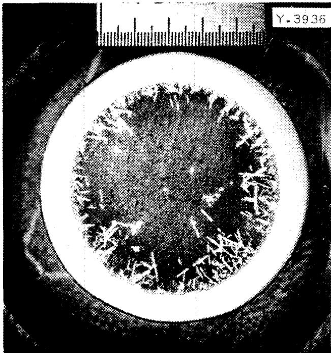

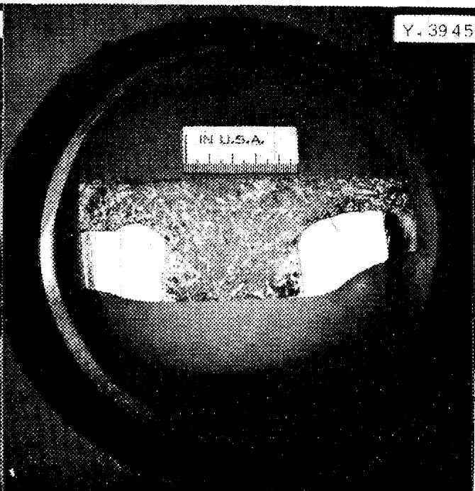  
Fig. 10.19 - Metal Crystal Formation in Loop Containing Lead. The smallest divisions on the scale are 1/100 in. (a) Transverse and (b) longitudinal sections showing formation of metal crystals adjacent to cold leg wall of V-36 thermal-convection loop containing lead after 84 hr of operation.

# UNCLASSIFIED

# ANP PROJECT QUARTERLY PROGRESS REPORT

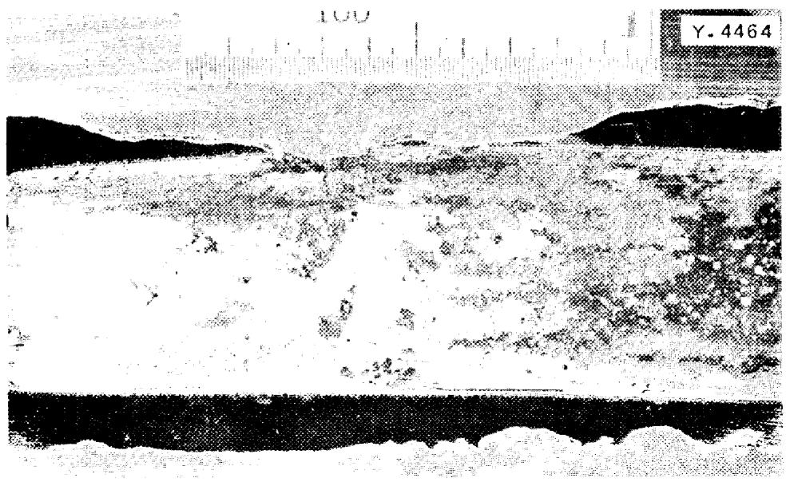

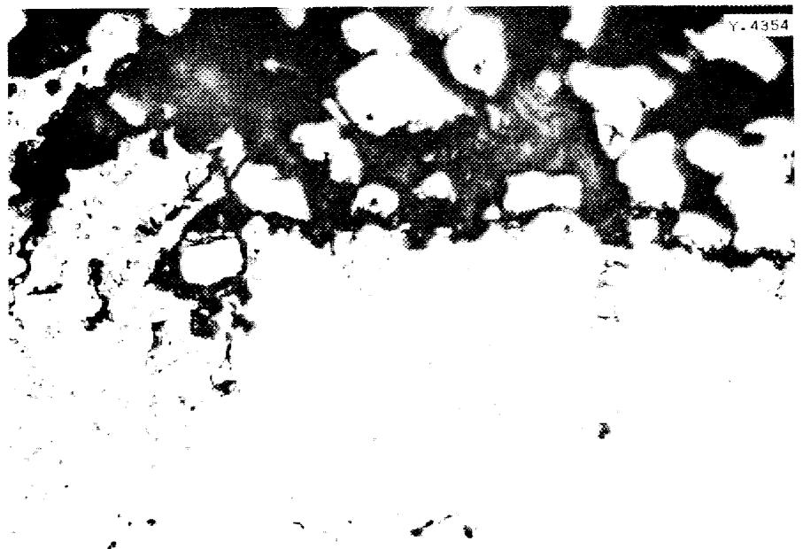  
Fig. 10.20 - Failure in 316 Stainless Steel Loop Containing Lead. 3X. Hot leg failure after 7 hr of operation at $1500^{\circ}\mathrm{F}$ of 316 stainless steel thermal convection loop containing lead. Note that failure resulted from attack on outer surface of tube wall.   
Fig. 10.21 - Thermal-Convection Loop Operated with Lead. Original photograph taken at 1000X, reduced $31\%$ in reproduction. View of internal surface of 446 stainless steel cold leg from thermal-convection loop operated with lead (area at approximately $1300^{\circ}\mathrm{F}$ ). Note that interdendritic attack releases solid particles to lead stream.

loop is shown in Fig. 10.22. These crystals need not necessarily be bonded directly to the tube walls but may merely be trapped there. The oxide layer shown in Fig. 10.23 separates the metal crystals from the loop material, making bonding impossible.

An attempt was made to determine the composition of the metal crystals by quantitative analysis. Neglecting lead, the following elements were detected:

In the cold zone of a 316 stainless steel (18% Cr, 10% Ni, 3% Mo) loop after 138 hr of operation: 67% Fe, 6% Cr, 24% Ni, 3% Mo.

In the cold zone of a 446 stainless steel (26% Cr) loop after 62 hr operation: 63% Fe, 37% Cr.

The composition varied somewhat and these values are averages of analyses made in different areas of the cold zones.

Corrosion by Sodium. Materials tested with sodium during the quarter included inconel and types 310, 316, and 347 stainless steel. Eighteen loops were taken out of service, 14 of which completed the scheduled 1000-hr tests with sodium at $1500^{\circ}\mathrm{F}$ . Three stainless steel (two 347, one 310) $\frac{1}{2}$ -in. thin-walled tubing loops failed after less than 150 hr of operation owing to leaks in the welds, and one inconel loop failed after 350 hr owing to a plugged gas line in the liquid level control system; thus none of these failures are directly attributable to the use of sodium. Included in the 14 loops completing 1000-hr tests was one 310 stainless steel thin-

walled loop. On the three loops operating with sodium at the end of the period, one inconel loop was operated at $1600^{\circ}\mathrm{F}$ , and one each of inconel and 316 stainless steel at $1500^{\circ}\mathrm{F}$ . The increase in successful runs over the preceding quarter is due largely to (1) improved methods for purifying and introducing liquid metals into the systems, (2) improved methods for degreasing, cleaning, and fabrication, and (3) improved methods for heating and temperature control.

The sodium-containing loops are now being examined. Preliminary metallographic examination of some of these loops indicates very little corrosion. Small test specimens of similar and dissimilar composition were suspended in the hot and cold legs of these loops. Examination of these specimens has indicated that although weight changes are small, the hot-zone specimens lost weight but the cold-zone specimens gained weight.

It is believed that little can be learned by operating additional thermal loops with sodium except for the purpose of testing a particular joint or component. Although it has been proved that thermal-convection loops can be operated without plugging and without appreciable attack of the loop material by sodium, it remains to be proved that a forced-convection loop can be operated with sodium in one section at $1500^{\circ}\mathrm{F}$ and 1000 to $1200^{\circ}\mathrm{F}$ in another section without plugging. Therefore future tests in figure-eight forced-convection loops will determine whether there will be sufficient attack on inconel or stainless steel to result in plugging in addition to testing simulated components or flow channels.

# ANP PROJECT QUARTERLY PROGRESS REPORT

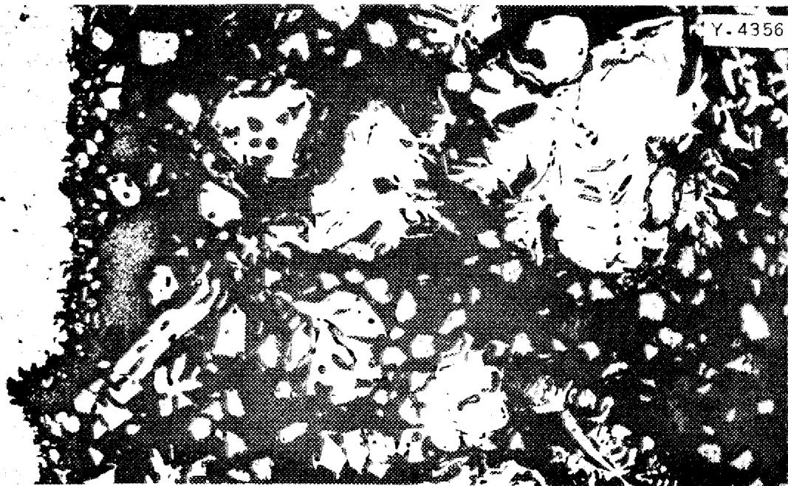

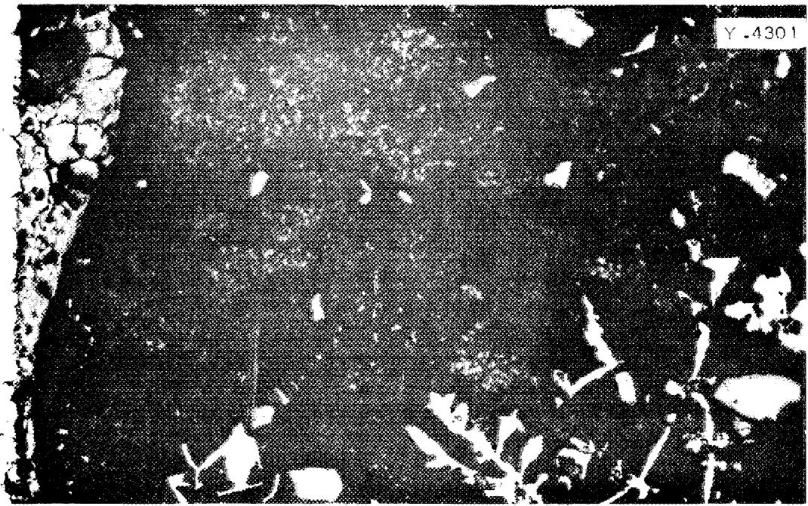  
Fig. 10.22 - Cold Zone of 446 Stainless Steel Loop Showing Attacked Surface and Metal Crystals Which Form in Lead (Dark Areas). 150X. The crystals restrict convective flow.   
Fig. 10.23 - Cold Zone Weld in 1010 Steel Loop Showing Metal Crystal Formation Adjacent to Pipe Wall Covered with Iron Oxide, Presumably Formed During Loop Fabrication. 175x.

# DYNAMIC CORROSION TESTS IN FORCED CONVECTION LOOPS

W. B. McDonald, ANP Division

Figure-eight sized loops are intermediate in size between the thermal-convection loops and full-scale ARE components and afford opportunities to test cleaning, handling, operating, and pumping techniques developed from smaller systems, in addition to supplying useful data on corrosion. Experience gained from intermediates-sized systems is necessary for developing adequate techniques and methods for assuring acceptable performance testing of full-scale ARE components. Operation of these loops to date, however, has afforded very little opportunity to observe corrosion effects.

During the past quarter one figure-eight loop constructed from 347 stainless steel was tested with a down-flow centrifugal pump designed by the Experimental Engineering Group for circulating sodium. The test was terminated

after 7 hr of operation by failure of the pump shaft seal. The seal was repaired, but during the following start-up period external arcing from electrical heaters burned a hole in the main heater section of the loop. The damage caused by the resulting fire was sufficient to require complete dismantling of the loop. Total operating time for this experiment was insufficient to test revised cleaning procedures which included repeated flushing with hot sodium until the oxide content remained low.

In an effort to prevent repetition of loop failure being caused by auxiliary equipment in future tests, a General Electric electromagnetic pump has been tested in a separate loop to determine its reliability prior to its installation in the figure-eight loop. To prevent future failures due to external electrical arcing, specifications have been drawn up for a 70,000-Btu/hr gas furnace for heating figure-eight loops, and these specifications have been submitted to the Purchasing Department for bids or proposals.

# ANP PROJECT QUARTERLY PROGRESS REPORT

# 11. PHYSICAL PROPERTIES AND HEAT-TRANSFER RESEARCH

H. F. Poppendiek, Reactor Experimental Engineering Division

The influence of the free-convection mechanism within liquid-fuel elements upon the fuel temperature structure is being investigated both experimentally and theoretically. Mock-up systems which simulate the actual fuel-element systems have been studied. Volume heat sources were produced by means of resistance heating, and temperatures were measured with thermocouples. An apparatus has been built which will be used to study the velocities of the free-convection cells. A theoretical analysis of the free-convection heat transfer existing in the fuel element has been completed for the laminar flow case; the turbulent flow analysis is currently being completed. These solutions are to be used to predict temperature distributions in liquid-fuel-element systems.

Five Bunsen ice calorimeters for the measurement of heat capacity are now in operation. Experimental work and analyses have been completed for 316 stainless steel, synthetic sapphire, lithium, molybdenum, and zirconium in the range 300 to $1000^{\circ}\mathrm{C}$ .

An improved thermal-conductivity apparatus (Deem type apparatus No. 2) for liquids has been constructed. A value has been obtained with the equipment previously described (1) (Deem type apparatus No. 1) on fuel salt mixture No. 2 (46.5 mole % NaF, 26.0 mole % KF, 27.5 mole % UF₄) in

the range 643 to $700^{\circ}\mathrm{C}$ as 0.53 Btu/hr·ft·°F. The longitudinal-flow apparatus for the determination of thermal conductivity of solids is in operation and additional conductivity measurements on various densities of boron carbide have been obtained. The radial-flow apparatus has been completed.

Two pieces of equipment have now been constructed for the measurement of liquid densities. The density of the NaF-KF-UF $_4$ eutectic has been determined in the range 535 to $1000^{\circ}\mathrm{C}$ . The apparatus for the measurement of viscosities is scheduled for completion by September. Work has been retarded by delays in fabrication of parts.

An apparatus which will be used to determine the heat-transfer coefficients of fused hydroxides and salts has been nearly completed. These fluids are potential reactor coolants. Some preliminary heat-transfer data for a boiling-mercury system have been determined and the figure-eight lithium system has yielded some data.

# INVESTIGATION OF FREE CONVECTION WITHIN LIQUID-FUEL ELEMENTS

Theoretical Analysis of Natural Convection (D. C. Hamilton and H. F. Poppendiek, Reactor Experimental Engineering Division). An analytical solution for the temperature distribution in the parallel-plate system has been derived. In this system a

fluid with a uniform heat source is in laminar flow between two parallel and infinitely long plane bounding surfaces. In the system it was postulated that heat was generated uniformly and that the long convection cells were in the laminar flow regime. A report based on this analysis is being prepared. A similar analysis will be made for a system in turbulent flow. These solutions will also be duplicated for cylindrical coordinate systems.

The solution indicates that, for a system in which the distance between the parallel plates is 0.18 in., the axial temperature gradient is $100^{\circ}\mathrm{F} / \mathrm{ft}$ and the physical properties are identical to the measured values for the NaF-KF-UF $_4$ eutectic; the temperature difference which would exist if all the heat were transferred by conduction is reduced by $25.5\%$ . This result is based on a value of 1 centipoise for the dynamic viscosity. If the viscosity is greater than 1 centipoise, the reduction in temperature difference will be smaller than $25.5\%$ .

Measurement of the Fuel-Element Temperature Distribution (F. E. Lynch and M. Tobias, Reactor Experimental Engineering Division). A new apparatus has been devised for measuring the effects of free convection on the temperature distribution in tubes filled with fluid in which heat is being generated by electrical means. Because of the fragility and complexity of previously constructed devices, considerable difficulty has been encountered in making a series of runs without interruptions due to breakage. A diagram of the present apparatus is shown in Fig. 11.1. Thermocouples are arranged in the central tube as described in previous

UNCLASSIFIED DWG 12938

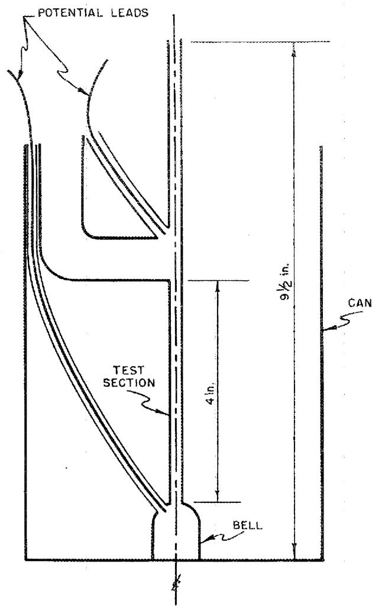  
Fig. 11.1 - Schematic Diagram of Free Convection Apparatus.

reports. (2,3) Aluminum wires are sealed into curved tubes which are

# ANP PROJECT QUARTERLY PROGRESS REPORT

joined to the ends of the straight test section and serve as potential measurement leads. The electric current which generates the heat in the central tube is led in by an electrode through the large curved tube at the top and passes along the test section and out through the bell shaped base. The entire apparatus is placed inside a stainless steel can which is filled with liquid to just below the top of the large curved tube. The central section is held vertical by a retaining clamp at the top and by a small well at the base. The return electrode is clamped to the can itself. When used with brine, or other substances of low freezing point, the system is cooled by wrapping a coil of a small thermostatically controlled refrigerating unit around the can. A stirring motor assists in maintaining a uniform temperature in the can.

Tests will be run using mercury and brine. Design of a new apparatus which will be used for the fuel salt itself is now being considered. The chief difficulty is finding a container material which will resist attack by the salt, is structurally strong, and is a nonconductor of electricity.

Measurement of the Fuel-Element Velocity Distribution (R. Redmond, Reactor Experimental Engineering Division). An apparatus has been designed and constructed for the purpose of obtaining preliminary information about the nature of the free convection patterns in the volume heat source system; temperature distributions are also to be measured. A flat plate cell which contains dilute acid is to be heated by electric current. The acid will have the generated heat removed at the walls of

the flat-plate cell by water cooling. Velocity patterns will be determined by tracing the paths of particles suspended in the solution, and the temperature distribution will be determined by thermocouple measurements.

# PHYSICAL PROPERTIES

A. R. Frithsen, USAF

M. Tobias, Reactor Experimental Engineering Division

Heat Capacity (William D. Powers, Reactor Experimental Engineering Division). The heat capacities of type 316 stainless steel, synthetic sapphire, lithium, molybdenum, and zirconium have been determined. The values which follow give the heat capacity as a function of temperature $(C_p)$ is the heat capacity at $T^{\circ}C$ in calories per gram per degree centigrade) in the indicated temperature range.

<table><tr><td>MATERIAL</td><td>TEMPERATURE RANGE (°C)</td><td>CP(cal/g/°C)</td></tr><tr><td>Type 316 stainless steel</td><td>150 - 1000</td><td>0.11 + 5.7 x 10-5T</td></tr><tr><td>Synthetic sapphire</td><td>300 - 900</td><td>0.26 + 4.4 x 10-5T</td></tr><tr><td>Lithium</td><td>250 - 1100</td><td>1.0 + 2.8 x 10-5T</td></tr><tr><td>Molybdenum</td><td>200 - 1100</td><td>0.068</td></tr><tr><td>Zirconium</td><td>150 - 1050</td><td>0.070 + 3.6 x 10-5T</td></tr></table>

Reports are forthcoming on each of these materials. The substances now under investigation are sodium hydroxide, nickel, sodium fluoride, potassium fluoride, uranium fluoride, potassium hydroxide, and fuel mixtures. Work will be started soon on lead, bismuth, and lead-bismuth eutectic.

A modification of the original ice calorimeter has been made and included in the five calorimeters. The heat content of a sample is measured by noting the change in volume of a pure ice-water mixture. The mixture is contained in a lucite shell in which a hollow finned copper cylinder is sealed. The copper cylinder receives the sample at a known temperature. Ice is melted in the lucite shell and, by noting the change in volume in the ice-water mixture, the heat content of the sample may be calculated. To prevent heat from getting into the system from any source other than the sample, the lucite shell was surrounded by ice. However, impurities in the surrounding ice lowered its melting point enough to cause noticeable freezing of the water in the lucite shell. The lucite shell was therefore surrounded by 2 in. of Sil-O-Cel insulation contained in a steel shell. The steel shell was kept at $0^{\circ}\mathrm{C}$ by surrounding it by ice. The heat leakage into the lucite shell was small.

An appreciable error can occur in the measurement of the actual temperature of the sample. At high temperatures, variations of 5 to $10^{\circ}\mathrm{C}$ have been found on the surface of capsules placed in the most uniform temperature position in the furnace. It is felt that tube furnaces longer than those now in use will reduce this error. Manufacturers are being con

sulted to see if furnaces of the desired characteristics can be furnished.

Thermal Conductivity of Liquids (M. Tobias, A. R. Frithsen, and L. Basel, Reactor Experimental Engineering Division). The thermal conductivity of the fused salt NaF-KF-UF $_4$ (composition 46.5, 26, and 27.5 mole %, respectively) has been measured using the ORNL Deem type apparatus. $^{(1)}$ The average conductivity of four measurements was 0.53 Btu/hr·ft $^{-1}$ at temperatures ranging from 643 to $700^{\circ}\mathrm{C}$ . These data were urgently needed and no check runs were made with sodium. As several imperfections in the design of the apparatus have become apparent, measurements with this apparatus have been discontinued.

A new apparatus, the ORNL Deem type No. 2, which has a bellows seal instead of the Pb-Bi seal used in apparatus No. 1, is now approximately $95\%$ complete and is scheduled for operation in September. A few check runs will be made on lead, after which data will be obtained on $\mathrm{BeF}_2$ -NaF-KF salt mixtures. A hood is being installed over the apparatus to protect operators from escaping $\mathrm{BeF}_2$ vapor.

Thermal Conductivity of Solids (M. Tobias, Reactor Experimental Engineering Division). The thermal conductivity of copper has been measured up to $600^{\circ}\mathrm{C}$ by the longitudinal flow method. (4) The data (Fig. 11.2) agree to within $\pm 4\%$ with the values given in the International Critical Tables.

# ANP PROJECT QUARTERLY PROGRESS REPORT

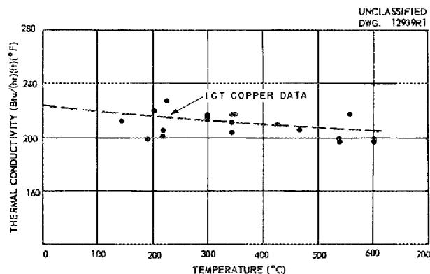  
Fig. 11.2 - Thermal Conductivity of Copper.

Improvement of the preliminary data on the thermal conductivity of boron carbide by the longitudinal flow method is continuing. In addition, experiments have been started using the radial flow apparatus to measure thermal conductivity.

Falling-Ball Viscometer (S. I. Kaplan, Reactor Experimental Engineering Division). The falling-ball viscometer is now being checked out with water. High-temperature checks with bismuth are contemplated. Delivery of the electronic equipment to measure the rate of fall of the radioactive ball was overdue and has only recently been placed in satisfactory operation. The dropping valve of the apparatus (5) has been modified to accommodate balls up to $\frac{1}{2}$ in diameter. Tantalum-plugged stainless steel balls, 0.25 i.d. with a density of $12.2 \, \text{g/cm}^3$ at room temperature, as well as 0.20-in.-diameter cobalt-coated pyrex balls with a room-temperature density of $2.6 \, \text{g/cm}^3$ are

presently available. Additional test balls of various densities are being prepared.

Brookfield Viscometer (F. A. Knox and F. Kertesz, Materials Chemistry Division). Some approximate values for viscosity of typical fuel specimens and for some fluoride mixtures of interest as coolants have been obtained by a modified Brookfield Synchro-Lectric viscometer fitted with a special spindle. The instrument was calibrated in distilled water and water-glycerol solutions at room temperature and in molten sodium chloride at 830 to $1000^{\circ}\mathrm{C}$ .

The viscosity of the NaF-KF-UF $^4$ eutectic was found to be about 32 to 35 centipoises at $600^{\circ}\mathrm{C}$ and 12.5 to 16 centipoises at $1000^{\circ}\mathrm{C}$ . The NaF-BeF $^2$ -KF eutectic, under consideration as a coolant, also showed high values. Since these samples both showed considerable quantities of suspended matter (uranium oxide in the fuel and beryllium oxide in the coolant), these values may be greatly in error.

The viscosity of the NaF-KF-LiFeutectic mixture was in the expected low range of 2.2 centipoises at $500^{\circ}\mathrm{C}$ and 1.5 centipoises at $800^{\circ}\mathrm{C}$ .

Brookfield Engineering Laboratories are designing a high-temperature rotational viscometer for this work. Preliminary designs were submitted by them for inspection, and modifications are now under study.

Vapor Pressure (R. E. Moore and C. J. Barton, Materials Chemistry Division). The temperature of the fluoride fuel at the center of the ARE fuel pins is still a subject of some uncertainty but will almost certainly

be higher than $2000^{\circ}\mathrm{F}$ . While the components of the liquid fuel are thermally stable to temperatures well above this figure, it is necessary to determine the vapor pressure of suitable fuel mixtures in this temperature range. Preliminary results indicate that the vapor pressure of the $\mathrm{KF - NaF - UF_4}$ eutectic is less than 3 mm at $1000^{\circ}\mathrm{C}$ .

The apparatus and procedure employed are those reported by Rodebush and Dixon(6) and modified by Fiock and Rodebush.(7) The prepared fuel mixture is placed in a cylindrical vessel of stainless steel which may be heated in a resistance furnace. The vessel is connected by one tube to a manometer and by a second tube to an intermittent pump and to a source of inert gas. The two tubes are connected, outside the furnace, by a differential manometer containing a light liquid.

With the container and sample maintained at the desired temperature, the inert gas pressure is reduced in small intervals by the pump. The residual inert gas pressure is equivalent to the vapor pressure of the sample at the highest pressure sufficient to maintain a permanent pressure difference in the differential manometer. This action depends on the fact that when the inert gas pressure is equal to or less than the vapor pressure of the liquid, diffusion of the inert gas is the only mechanism for equalization of the pressure in

the two tubes. If the tubes are of suitable diameter this diffusion is very slow.

Considerable difficulty has been encountered in maintaining temperature control in the resistance furnaces at the high temperatures required. It is certain, however, that the total vapor pressure of the NaF-KF-UF4 eutectic mixture is well below that of pure UF4 at temperatures in the range 0 to $1050^{\circ}\mathrm{C}$ . These experiments are being continued at present.

Density (S. I. Kaplan, Reactor Experimental Engineering Division). Following test run on sodium at $200^{\circ}\mathrm{C}$ , a determination of the density of NaF-KF-UF $_4$ eutectic was made over the range 535 to $1000^{\circ}\mathrm{C}$ (46.5, 27, 26.5 mole $\%$ , respectively) using the buoyancy apparatus described in a previous report.(8) The data can be represented by the equation

$$
\rho = 4. 7 0 2 - 0. 0 0 1 1 5 T,
$$

where $\rho$ is the density in grams per cubic centimeter and $T$ is the temperature in degrees centigrade. The test material was blanketed in an atmosphere of argon purified by bubbling through NaK. Determination of the density of various coolant and fuel salt mixtures is projected for the next quarter.

# HEAT-TRANSFER COEFFICIENTS

Heat Transfer in Fused Hydroxides and Salts (H. W. Hoffman, Reactor

# ANP DIVISION QUARTERLY PROGRESS REPORT

Experimental Engineering Division). The construction of the apparatus for the determination of the heat-transfer coefficients of fused hydroxides and salts is approximately $80\%$ complete. Operation of the system is anticipated sometime within the next month. The first material to be tested in the apparatus will be the eutectic mixture of NaF-KF-LiF having a melting point of $454^{\circ}\mathrm{C}$ . Future fluids to be tested include NaOH and the eutectic mixture of $\mathrm{Ba(OH)}_2\mathrm{-Sr(OH)}_2$ .

A schematic diagram of the experimental system is given in Fig. 11.3. The charge is first melted under vacuum in the melt tank and then moved by applying argon gas pressure to tank A. In an experimental run the molten fluid is pushed by gas pressure through the heat exchanger and into tank B. Tank B rests on a scale, and cumulative weight readings are made to determine the fluid flow rate. Temperatures of the outside surface of the heat exchanger are obtained by means of chromel-alumel thermocouples spark-welded to the tube wall. An electric current is passed through the wall of the heat exchanger tube, and the heat input is determined from the measurement of this current and the voltage drop along the heat exchanger. The inlet and outlet temperatures of the test fluid are measured by thermocouples on the tube wall in the isothermal regions immediately before and after the test section. The inside wall temperature is calculated from the outside wall thermocouple readings. At the conclusion of a run, lasting approximately 30 min, the fluid is pushed through the return line into tank A. The system is then ready for another experimental run. Temperature level and flow rate in the system can be varied within reasonable limits.

Heat Transfer in Boiling-Liquid-Metal Systems (W. S. Farmer, Reactor Experimental Engineering Division). The boiling-heat-transfer investigations have been continued during this period on the boiling-mercury experiment using a flat plate and on the boiling-sodium and -potassium experiments using a horizontal tube.

Preliminary results only were obtained for the boiling-mercury experiment owing to condenser failure in the high-frequency induction heater employed as a heat source. However, using pure mercury, temperature differences of approximately $100^{\circ}\mathrm{F}$ were observed between the metal surface and the boiling fluid for a heat flow rate of about 50,000 Btu/hr ft². The large temperature difference observed in this case was probably due to nonwetting of the heat-transfer surface by the boiling mercury. In addition, considerable temperature fluctuations were observed in the boiling liquid, accompanied by bumping. The apparatus has been moved to a new location to utilize another induction heater, and further results will be forthcoming.

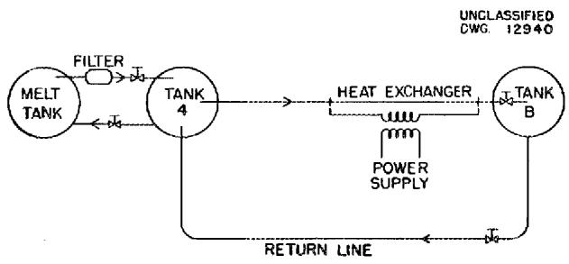  
Fig. 11.3 - Schematic Diagram for Determining Heat-Transfer Coefficients.

The construction of the horizontal tube boiler has been accelerated during this past quarter. The erection and fabrication of all tanks and piping are complete. Only the duct work and electrical construction remain to be done. This latter work should be completed and preliminary sodium and potassium runs should be possible this coming quarterly period.

Heat Transfer in Molten Lithium (C. P. Coughlen and H. C. Claiborne, Reactor Experimental Engineering Division). During the past quarter the figure-eight lithium system was placed in operation, and preliminary heat-transfer data were obtained. To remedy pump and instrumentation difficulties which were encountered during operations, extensive alterations have been made and a new Einstein-Szilard pump has been obtained on loan from Allis-Chalmers Manufacturing Company. The new pump will permit operation over a much larger range of velocities in the test heat exchanger.

The experimental results obtained with a concentric-pipe heat exchanger are preliminary because of the imperfect operation of the auxiliary equipment which prevented the attainment of complete equilibrium and because of the low flow rates obtainable (1140 to 1600 lb/hr in the annulus and 980 to 1150 lb/hr in the core pipe).

Separation of the individual heat-transfer coefficients was not possible under these conditions.

The overall heat-transfer coefficients determined experimentally ranged from 4100 to 5160 Btu/hr·ft²·°F. Heat balances checked to within 24% with an average deviation of 12.5%. The major errors in the heat-balance data undoubtedly resulted from incomplete equilibrium and the uncertainty in the flow measurements.

A comparison of the Nusselt modulus computed from the experimental data with that of Lyon(9) and that of Isakoff and Drew(10) is shown in Fig. 11.4. The experimental values are 16 to $80\%$ higher than those found by Isakoff and Drew when using mercury for an $L / D = 58$ . Since $L / D = 30$ for the lithium heat exchanger, the Nusselt moduli are expected to be somewhat higher than those for a system with $L / D = 58$ . It is emphasized that the results shown in Fig. 11.4 are based on a rough separation technique of the fluid thermal resistances. A more detailed discussion is given in ORNL CF-51-8-32.

(9)R.N.Lyon,“Liquid Metal Heat Transfer Coefficients,”Chem.Eng.Progress47，75（1951）.(10)S.E.IsakoffandT.B.Drew，“Heat and Momentum Transfer in Turbulent Flow of Mercury,to be published.

# ANP PROJECT QUARTERLY PROGRESS REPORT

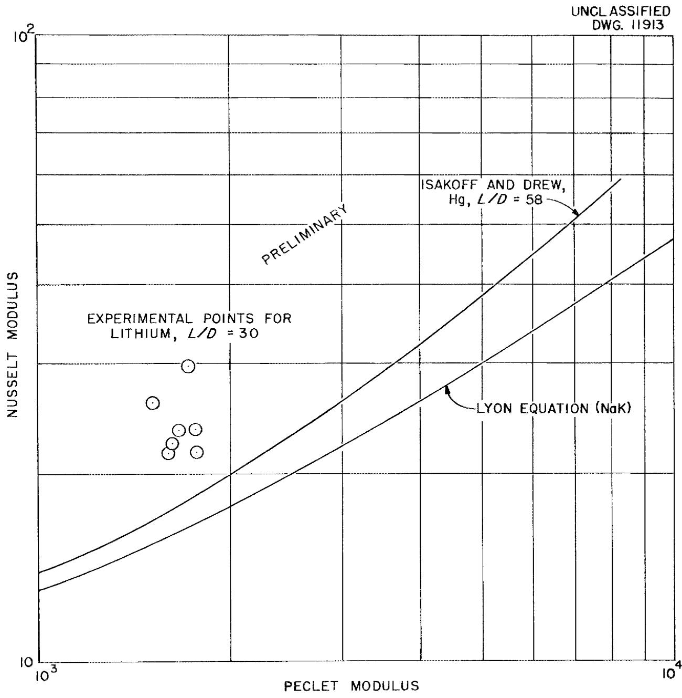  
Fig. 11.4 - Comparison of ORNL Lithium Heat-Transfer Data with Those of Other Investigators.

# 12. METALLURGY AND CERAMICS

W. D. Manly, Metallurgy Division

The installation of equipment in the creep laboratory, powder metallurgy laboratory, and arc-welding laboratory is essentially complete. The work on the stress-rupture laboratory to test metals in a liquid-metal medium is progressing, and the laboratory should be finished by October 1. In addition, a ceramic's laboratory has been established and is now in partial operation.

Welds of the tube-to-header type have been made using microbraz, cone arc, and manual arc; these welds were evaluated using tensile tests and modified fatigue tests. Strengths comparable to the parent inconel stock have been found in these joints. In creep testing the condition of the specimen is being correlated with the creep resistance of the material. The effect of heat treatment of inconel on its creep resistance is considerable.

Fabrication of fuel elements using techniques previously discussed(1) has continued. A new method of fabrication, rubberstatic pressing, has shown promise in fuel-element fabrication. Work on control-rod fabrication has been started using the different powder metallurgy techniques.

# WELDING OF INCONEL

P. Patriarca F.W.Drosten G.M.Slaughter Metallurgy Division

The bulk of work to date has been confined to basic evaluation of the quality of inconel tube-to-header welded joints described in the last report. A limited amount of fabrication of typical tube-to-header assemblies has been undertaken. Tensile tests have shown that tube-to-header welds can be made which compare favorably in both strength and ductility to the parent inconel tubing. Fatigue tests of welded joints exhibit a strong dependency on the degree of penetration of the weld, a condition not evident in tensile data. Two manually inert-arc-welded inconel tube-to-header pairs were tested in liquid sodium at $1000^{\circ}\mathrm{C}$ for 100 hr to determine the effect on the room-temperature tensile strength. The only effect observed was a slight lowering of the tensile strength and an appreciable increase in elongation due to annealing.

Tensile Tests. The results of room-temperature tests of inconel tube-to-header tensile pairs made using manual-inert-arc, cone-arc, and brazing techniques are summarized in Table 12.1. It may be noted that the strength and ductility of manually and cone-arc welded pairs were quite similar and compared favorably to the

# ANP PROJECT QUARTERLY PROGRESS REPORT

TABLE 12.1   
Room-Temperature Tensile Properties of Inconel Tube-to-Header "Pairs"   

<table><tr><td>DESCRIPTION</td><td>NO. OF TESTS</td><td>AVERAGE TENSILE STRENGTH* (psi)</td><td>AVERAGE ELONGATION,** (% in 3 in.)</td></tr><tr><td>Manual-inert-arc weld with complete penetration; tested as welded</td><td>3</td><td>93,000</td><td>23.8</td></tr><tr><td>Cone-arc weld with complete penetration; tested as welded</td><td>3</td><td>96,500</td><td>21.5</td></tr><tr><td>Cone-arc weld with average penetration of 70% of 0.062-in. header sheet; tested as welded</td><td>4</td><td>95,500</td><td>26.9</td></tr><tr><td>As-received inconel tubing</td><td>2</td><td>105,000</td><td>30.8</td></tr><tr><td>Nicrobrazed</td><td>2</td><td>82,200</td><td>28.9</td></tr><tr><td>Manual-inert-arc weld with complete penetration; tested after treatment in liquid sodium at 1000°C for 100 hr</td><td>2</td><td>89,500</td><td>36.9</td></tr></table>

* Tensile strength based on tube dimensions of 0.187 in. o.d.; 0.025-in. wall except for pairs treated in liquid sodium; tubing used was 0.188 in. o.d.; 0.030-in. wall.

$$
^ {\star \star} \text {P e r c e n t e l o n g a t i o n} = \frac {\text {f i n a l p a i r l e n g t h - i n i t i a l p a i r l e n g t h}}{\text {i n i t i a l p a i r l e n g t h}} \times 1 0 0.
$$

strength of the as-received inconel tubing used in the fabrication.

It is interesting to note that welded joints with average penetration of $70\%$ of the header thickness of 0.062 in. exhibited strength and ductility comparable to welds with complete penetration. Failures in both types of joints occurred in the heat-affected zone immediately adjacent to the weld, as would be expected since this area is that of minimum cross-section. Partial penetration requires considerably less critical control of the variables of the cone-arc method. Complete penetration is more

difficult to achieve with consistency, and it is expected that even more difficulty will be encountered when experiments with thinner header sheets and smaller tubing are attempted.

Strength values for joints brazed with microbraz in preliminary experiments are included in Table 12.1. The lower tensile strength and somewhat higher elongation of these specimens may be attributed to the annealing received in the brazing operation. Brazing of basic joints for evaluation and comparison with welded joints will receive major consideration in future work.

Fatigue Tests. In order to evaluate further the quality of tube-to-header joints, a rotating tubular beam fatigue test was developed. The header plate is immovably clamped with the tube extending into a rotating eccentric cam. The test is effectively torsionless since the eccentric cam, within which the tube end rides, is equipped with roller bearings. Specimens were 5.8 in. long and were rotated at 1125 rpm at a pre-set deflection.

A limited number of data are presented as an S-N scatter band curve in

Fig. 12.1. Further tests are necessary for conclusive evaluation. It may be noted, however, that welds incorporating complete penetration, whether manual inert arc, cone arc, or brazed, exhibited superior fatigue life to those joints with partial penetration. This condition was not evident on examination of tensile data. The lower fatigue life of these welds may be attributed to the lack of penetration, and, as a result, the presence of a "notch." The evaluation of fatigue, tensile, and corrosion properties of partially welded cone-arc joints with

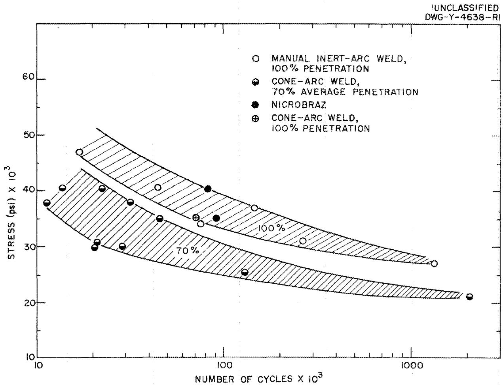  
Fig. 12.1 - Effect of Penetration of Fatigue Life on Inconel Tube-to-Header Specimens.

# ANP PROJECT QUARTERLY PROGRESS REPORT

the notch eliminated by brazing will be the subject of future work.

All-Weld-Metal Tensile Tests. The properties of weld deposits in inconel plate are of interest since the ARE reactor shell and other components will be fabricated from thick plate. A limited number of tests have been conducted using $\frac{1}{2}$ -in. inconel plate and various filler metals to provide all-weld metal 0.357-in. tensile specimens. The remaining weld deposits were reserved for quantitative analysis and static corrosion tests in liquid sodium and a fluoride fuel mixture.

The results of room-temperature tensile tests are presented in Table 12.2. It may be noted that the physical properties of the inert-arc and metal-arc weld metal were comparable with one exception. The weld deposit of the Inco No. 42 welding rod was definitely inferior. This rod was designed for oxyacetylene welding; however, chemical analysis being conducted may explain these relatively inferior physical properties.

Inspection of welds of the tube-toheader type involving a relatively intricate geometry and numerous small components is difficult. Radiography

0.357-in.-diameter test specimens; 2-in. gage length

TABLE 12.2   
Inconel All-Weld-Metal Tensile Values   

<table><tr><td>SPECIMEN
NO.</td><td>DESCRIPTION</td><td>TENSILE
STRENGTH
(psi)</td><td>ELONGATION
(% in 2 in.)</td><td>YIELD STRENGTH,
0.2% OFFSET (psi)</td></tr><tr><td>1</td><td>Inert-arc welded; 1/8-in. inconel wire filler metal</td><td>100,000</td><td>40.5</td><td>55,000</td></tr><tr><td>2</td><td>Metal-arc welded; 1/8-in. Inco No. 132 rod filler metal</td><td>85,500</td><td>31</td><td>47,200</td></tr><tr><td>3</td><td>Metal-arc welded; 1/8-in. Inco No. 132 rod filler metal</td><td>97,400</td><td>37.5</td><td>58,000</td></tr><tr><td>4</td><td>Inert-arc welded; 1/8-in. Inco No. 62 rod filler metal</td><td>98,000</td><td>44</td><td>55,500</td></tr><tr><td>5</td><td>Inert-arc welded; 1/8-in. Inco No. 62 rod filler metal</td><td>101,400</td><td>43.6</td><td>51,000</td></tr><tr><td>6</td><td>Inert-arc welded; 1/8-in. Inco No. 62 rod filler metal</td><td>92,000</td><td>36</td><td>48,000</td></tr><tr><td>7</td><td>Inert-arc welded; 1/8-in. Inco No. 42 rod filler metal</td><td>78,600</td><td>33</td><td>33,000</td></tr></table>

has been attempted with single specimens, and deliberate flaws which were located on the radiographs were much more evident with the naked eye. It is expected that the use of Dy-Chek (a compound used to check for flaws in welds), followed by microscopic examination of weld surfaces, hydraulic pressure testing of assemblies, and helium leak testing will prove useful in detecting major flaws. This procedure will be set up as part of future work as a preliminary approach to the problem.

Corrosion of Welds. The effect of sodium on the tensile strength of welded inconel tube-to-header specimens has been indicated previously.

Samples of the weld deposit from specimens 1 and 2 of Table 12.2 were treated in liquid sodium at $1000^{\circ}\mathrm{C}$ for 100 hr and in a liquid sodium-potassium-uranium fluoride mixture at $816^{\circ}\mathrm{C}$ for 100 hr. There was no significant loss or gain in weight of any of the samples. Metallographic examination indicated a weld immunity to attack by these liquid metals during the interval of test.

Special Weld Tests. A recent problem which has arisen because of departure from the tube-to-header type of reactor involves sealing off of the inconel tubing under a positive helium pressure. Preliminary experiments have been performed which indicate that pressures of 25 psig of helium can be held within inconel tubing by application of mechanical pressure to crimp the tubing. While still under mechanical pressure, the tubing is sheared from the pressure source and is then welded shut. Pressure-tight tubes with gages brazed on one end for verification have been subjected to swaging

experiments in an attempt to accomplish a uniform cylindrical closure more suitable to the newly proposed ARE design.

Another recent problem involves the use of a hydroxide as a cooling medium in preference to sodium. Negotiations are in progress with the International Nickel Company for cladding of welded inconel tube-to-header pairs with various thicknesses of nickel. These test specimens will be evaluated for corrosion properties as plated and after diffusion treatment. Plating experiments with nickel and copper will also be conducted at Oak Ridge using the facilities of the Research Shops at X-10 to supplement the work at INCO.

# WELDING OF MOLYBDENUM

A contract with Rensselaer Polytechnic Institute for an investigation of the welding of molybdenum has been granted. Initial research will involve electric resistance flash welding and will be underway during the next quarter.

# CREEP OF METALS IN CONTROLLED ATMOSPHERES

R.B.Oliver J.W.Woods C.W.Weaver Metallurgy Division

The installation of equipment in the creep laboratory is essentially complete. The installation in the stress-rupture laboratory for testing in liquid metal is about $70\%$ complete and it is hoped that testing can be started in September.

# ANP PROJECT QUARTERLY PROGRESS REPORT

The creep-testing program was started early in June. The initial emphasis was to train nine new technicians as well as to determine proper operating conditions for the equipment. Preliminary results from creep tests on 316 stainless steel, inconel, and niobium have shown that the laboratory is functioning properly. These early results are affected by some inaccuracies which are being overcome.

Creep of 316 Stainless Steel. Duplicate sheet specimens of 316 stainless steel (0.500- by 0.065-in. reduced section) have been loaded to 3000, 4000, 6000, 7000, and 8000 psi at $815^{\circ}\mathrm{C}$ in an argon atmosphere. There is considerable scatter of the results, and this work is being repeated with closer attention to details. The scatter probably reflects the structural instability of the stainless steel.

Creep of Inconel. Sheet specimens of inconel in the as-received temper (0.500- by 0.065-in. reduced section) have been loaded to 3000, 5000, 6000, and 8000 psi at $815^{\circ}\mathrm{C}$ in an argon atmosphere. Duplicate tests check very well, and the results are close to the published data. Also, specimens were heated to $1120^{\circ}\mathrm{C}$ in vacuum for 2 hr and air-cooled; the treatment increased the grain size by a factor of about 16. Following this anneal, specimens were loaded to 5000 and 8000 psi. At 8000 psi there was close agreement between duplicate tests, but the rupture life was much shorter than with the fine-grained specimens. With the 5000-psi loading the elongation vs. time curves for the coarse- and fine-grained materials were nearly identical. Loadings of coarse- and fine-grained material will be made at 3000 psi; it is expected that the

coarser grained material will have a considerably longer rupture life at this and lower stress levels.

Severe intergranular cracking has been observed on the inconel sheet specimens. These cracks appear to originate at the edge. To see if this is truly an edge effect, one inconel 0.505-in. bar specimen has been loaded to 3000 psi. Unless the same type of cracks develops on the round bar, it can be assumed that this type of cracking is an edge phenomenon and need be considered only in the rare case in which exposed and stressed edges occur.

Creep of Niobium. Two niobium specimens were loaded to rupture at $815^{\circ}\mathrm{C}$ in argon. Rupture occurred at 26,000 psi with about $20\%$ elongation. One specimen loaded to 6000 psi has been in test for 650 hr with a negligible elongation. Work on niobium has been temporarily suspended pending delivery of additional sheet stock.

Creep Test of Loaded Inconel Tube. A study is being made of the effects of multicomponent stress systems on creep. An inconel tube $\frac{1}{2}$ in. in o.d. with the wall thickness reduced to 0.010 in. for a length of $3\frac{1}{4}$ in. was sealed at one end and loaded to 66.6 psi internal pressure with argon. The tube was heated to $1800^{\circ}\mathrm{F}$ , and the pressure was maintained until the tube ruptured, the failure being longitudinal. This loading gave the following stresses:

Tangential 1500 psi (tension)

Longitudinal 750 psi (tension)

Radial 35 psi (compression)

Rupture occurred in approximately 400 hr with the following deformations:

Length

0.8% increase

Circumference

2.8% increase

Internal cross-sectional area

5.7% increase

Volume

6.5% increase

A similar sheet specimen loaded in tension to 1500 psi at $1800^{\circ}$ F ruptured in 200 hr with about $6\%$ elongation.

# STRESS-RELAXATION TESTS

R. B. Oliver, Metallurgy Division

Eight simulated stress-relaxation tests for type 316 stainless steel were conducted at stress levels of 5000, 10,000, and 20,000 psi using the Baldwin creep-rupture machine. All tests were made at a temperature of $1500^{\circ}\mathrm{F}$ . After 16 hr the stress was about 4600 to 4800 psi regardless of the initial stress level. Stress-relaxation curves are also to be obtained for inconel and nickel A.

Design work for stress-relaxation tests on inconel bolts in sodium at $1500^{\circ}\mathrm{F}$ has been completed, but construction of the equipment has not been finished.

# FUEL-ELEMENT FABRICATION

G.M.Adamson E.S.Bomar J.H.Coobs Metallurgy Division

The work on fabrication of solid fuel elements has progressed along the

lines discussed in the last report. An additional fabrication technique, rubberstatic pressing, is now also being investigated. With all fabrication techniques the use of a screened fraction of sintered $\mathrm{UO}_2$ seems to be desirable.

Hot Rolling. After a plate has been fabricated by hot-rolling it is desirable that it be drawn to final size. Since a suitable drawbench is not available, cold-rolling was substituted. A set of plates was fabricated by the procedure outlined in ORNL-987. They were hot-rolled at $1100^{\circ}\mathrm{C}$ to a reduction of $75\%$ . Six plates, each containing $30\% \mathrm{UO}_2$ , were made; three had matrices of iron and three of 302 stainless steel. Plates from each set were then given additional cold reductions of 10, 25, and $50\%$ by hand-rolling. The plates with iron matrices rolled very well, showing only minor evidence of segregation of the $\mathrm{UO}_2$ . However, the units with matrices of stainless steel suffered considerable segregation and striation of the $\mathrm{UO}_2$ . In neither case was the bond between the core and cladding material altered. Figures 12.2 and 12.3 are representative of this work.

To determine the effect of using coarse $\mathrm{UO}_2$ in the fabrication of cores a high-temperature induction furnace was assembled. A total of $330\mathrm{g}$ of a special high-purity $\mathrm{UO}_2$ was sintered at $2100^{\circ}\mathrm{C}$ in a hydrogen atmosphere. The average weight change amounted to a loss of $0.5\%$ . After being sintered the coarse fragments of $\mathrm{UO}_2$ were uniformly gray in color and quite hard. The apparent density had been increased by a factor of 3. The sintered product was then ground and divided into various size ranges by screening.

# ANP PROJECT QUARTERLY PROGRESS REPORT

Y-4110

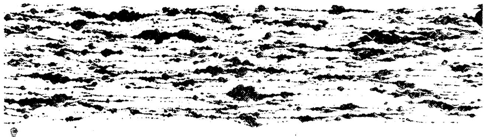  
Fig. 12.2 - Effect of Cold-Working Stainless Steel— $\mathsf{UO}_2$ Cores. 175x.

Y.4227

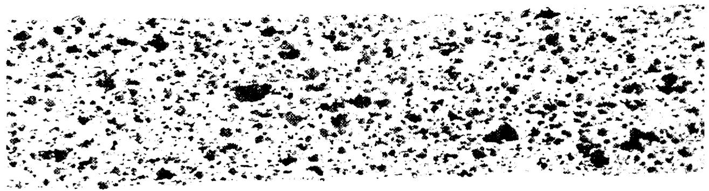  
Fig. 12.3 - Effect of Cold-Working Iron— $\mathbf{UO}_2$ Cores. 175X.

The -100, +200 mesh size fraction of the $\mathrm{UO}_2$ was mixed in two batches with -100 and -325 mesh 302 stainless steel. Compacts were prepared in the usual manner and rolled at $1120^{\circ}\mathrm{C}$ to reductions of 50, 75, and $90\%$ . Metallographic examination indicated segregation of the coarse $\mathrm{UO}_2$ (Fig. 12.4a) to be less sensitive to the particle size of the matrix stainless steel powder than is normal $\mathrm{UO}_2$ (Fig. 12.4b). However, a tendency to agglomerate into localized groups for reductions greater than $75\%$ was noted. There was also some evidence of the $\mathrm{UO}_2$ particles penetrating into the cladding layers.

To conserve on stainless steel an attempt was made to use mild steel tubing instead of stainless as the protective covering. The samples were rolled at $1100^{\circ}\mathrm{C}$ ; however, they were heavily oxidized before receiving the first pass through the mill. On metallographic examination it was evident that the oxidizing conditions had penetrated to the compact and had prevented adequate bonding. Further tests will be made, and it is hoped that a satisfactory atmosphere may be obtained by changing the adjustment on the gas dissociator.

Mechanically Formed Matrix. The work in the X-10 Shops on developing a method for punching molybdenum plates and obtaining a high percentage of open area, has been held up waiting the delivery of carbide punches. Other methods of forming a suitable mechanical matrix are being placed on an inactive basis until the accompanying bonding problems have been solved. A low-temperature induction furnace is being assembled for these solid-phase bonding studies. Bonding will be tried both with and without load. The

furnace is nearly completed and is expected to be placed in operation as soon as the induction furnaces are ready.

Loose-Powder Sintering. Work on the sintering of loose powders is now being carried out in our own furnaces. The first run was to be one of a series to determine optimum sintering temperature and was to be run at $1250^{\circ}\mathrm{C}$ . Instead of the intended as-received $\mathrm{UO}_2$ , a size fraction (-100, +325 mesh) of the high-density sintered $\mathrm{UO}_2$ was used by mistake. With 30% coarse $\mathrm{UO}_2$ in 320 stainless steel a fair bond was found at $1250^{\circ}\mathrm{C}$ . Increasing the temperature to $1280^{\circ}\mathrm{C}$ did not give a definite improvement in the bond. Another sample using regular $\mathrm{UO}_2$ was prepared and sintered as above; however, very little bond was obtained.

Rubberstatic Pressing. Rubberstatic pressing has been used during this quarter as an additional fabrication technique. A drawing (Fig. 12.5) shows how this procedure may be used to press a powder layer onto the inner surface of a tube. Pressure applied to the steel punches is transmitted through the rubber and presses the powder tightly onto the inner side of the tube. This is followed by a sintering operation. This technique is being used as a fabrication method on both solid fuel elements and control rods.

In the first specimen tried in the fuel-element work the lower half of the powder layer was 302 stainless steel, and the upper half was electrolytic iron. After being pressed under 40 tsi and sintered at $1250^{\circ}\mathrm{C}$ , the stainless steel was well bonded but the iron had pulled away during sintering. A series of samples was

# ANP PROJECT QUARTERLY PROGRESS REPORT

Y.4428

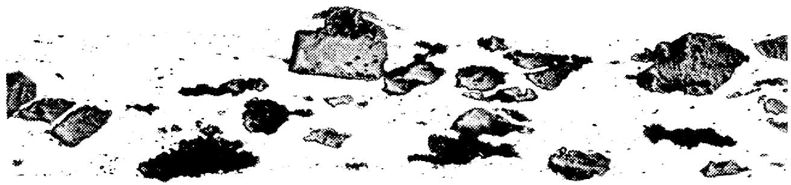

a

Y-4184

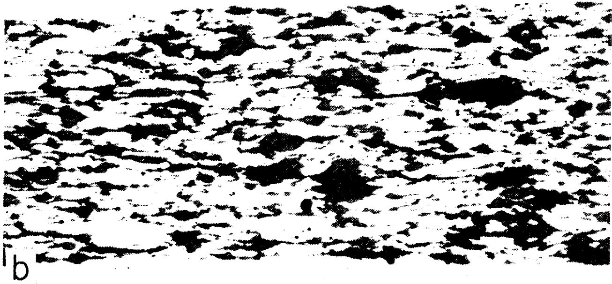  
Fig. 12.4 - Effect of Particle Size of $\mathbf{U}\mathbf{O}_{2}$ . (a) Coarse $\mathbf{U}\mathbf{O}_{2}$ , $175\mathrm{x}$ . (b) Normal $\mathbf{U}\mathbf{O}_{2}$ , $250\mathrm{x}$ .

UNCLASSIFIED DWG-12717

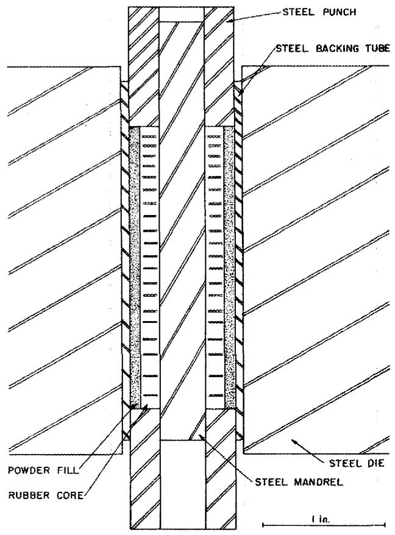  
Fig. 12.5 - Die for Rubberstatic Pressing.

then prepared using $30\%$ by volume of high-density coarse $\mathrm{UO}_2$ with various particle sizes in -325 mesh 320 stainless steel matrices. All the compacts were pressed at 30 psi and sintered at $1250^{\circ}\mathrm{C}$ . The sample with -325 mesh $\mathrm{UO}_2$ was not bonded, while another with -200, +325 mesh $\mathrm{UO}_2$ was bonded only superficially. However, two samples using -100, +200 mesh and -60, +100 mesh $\mathrm{UO}_2$ were well bonded.

Compatibility of Potential Fuel Element Materials. To determine the

compatibility of $\mathrm{UO}_2$ -iron or $\mathrm{UO}_2$ 302 stainless steel cores in contact with 316 stainless steel, cladding sections of hot-rolled plates were sealed in evacuated tubes. The tube and its contents were held at $1000^{\circ}\mathrm{C}$ for 100 hr. Metallographic examination disclosed a diffusion layer of less than 0.001 in. between the iron cores and the 316 cladding and none between the 316 cladding and the 302 cores. Both of these results were in agreement with earlier tests.

# CONTROL-ROD FABRICATION

G.M.Adamson E.S.Bomar J.H.Coobs Metallurgy Division

This group is now starting work on the fabrication of control rods for the ARE. While hot-rolling and rubberstatic pressing are both being investigated as possible fabrication procedures, the most likely method, at present, seems to be a simple canning of powders. Materials now being investigated as possible control materials are $\mathbf{B}_4\mathbf{C}$ and $\mathrm{HfO_2}$ , but the investigation is being expanded to include development of refractory boron, hafnium, or cadmium compounds.

As a preliminary investigation $\mathsf{ZrO}_2$ was used as a substitute for $\mathrm{HfO}_2$ , and some plates were prepared with the standard hot-rolling technique. While these two compounds are similar chemically, there is a considerable difference in their density; however, it is not likely to affect this preliminary work. Cores with $30\%$ by volume of $\mathsf{ZrO}_2$ in nickel, iron, and 302 stainless steel were fabricated. They were clad with nickel or 316 stainless steel by hot-rolling at $1100^{\circ}\mathrm{C}$ . Table 12.3 is a summary of the results of this investigation.

# ANP PROJECT QUARTERLY PROGRESS REPORT

TABLE 12.3   
Results of Investigations of $\mathbf{ZrO}_2$ as a Control Material   

<table><tr><td>CORE (vol %)</td><td>CLADDING</td><td>REDUCTION (%)</td><td>BOND OF CLADDING TO CORE</td><td>REMARKS</td></tr><tr><td rowspan="2">30 ZrO2, 70 Ni</td><td rowspan="2">Nickel</td><td>56</td><td>Very good</td><td>Distribution of ZrO2good</td></tr><tr><td>80</td><td>Very good</td><td>Distribution of ZrO2good</td></tr><tr><td>30 ZrO2, 70 Ni</td><td>316 stainless steel</td><td>92</td><td>Good</td><td>Tendency toward clumping of oxide particles</td></tr><tr><td rowspan="2">30 ZrO2, 70 Fe</td><td rowspan="2">316 stainless steel</td><td>53</td><td>Fair</td><td>Distribution good</td></tr><tr><td>74</td><td>Fair</td><td>Slight tendency toward clumping</td></tr><tr><td>30 ZrO2, 70 Fe</td><td>316 stainless steel</td><td>92</td><td>Good</td><td>Extreme clustering of ZrO2particles; some penetration of ZrO2into cladding</td></tr><tr><td>30 ZrO2, 70 302 stainless steel</td><td>316 stainless steel</td><td>77</td><td>Very good</td><td>Distribution very good</td></tr></table>

# METAL CLADDING OF BERYLLIUM OXIDE

Gerity Michigan Company of Adrian, Michigan, has been attempting to develop a plating procedure for cladding beryllium oxide. The only oxide readily available at the beginning of this investigation was some high-fired material left from the Daniels reactor and several crucibles of low-density porous material. The high-fired material had a dark film on the surface which prevented any bonding. The porous material introduced considerable difficulty from gases and/or solutions becoming entrapped in the pores and then forming blisters during subsequent heating. If this problem can be solved, the Gerity investigators are quite optimistic that a successful cladding may be plated on. However, two samples which they gave us and which appeared to be satisfactory did not have enough mechanical bond to allow mounting for metallographic

study. They have been asked to give this phase of the work a low priority and to push their electroforming investigation.

# REFRACTORY METALS

A survey of the literature on molybdenum and niobium has been undertaken in preparation for future work with these metals. Simple tests are being run on available specimens to confirm or disprove some of the questionable data.

# CERAMICS LABORATORY

# T. N. McVay, Consultant

The ceramics laboratory located at Y-12 has been established as part of the Metallurgy Division. The group will consist of nine men under the direction of Dr. John M. Warde. The

work of the laboratory is to be of three types, namely, basic or long-term ceramic research, engineering development, and service research for other divisions of Oak Ridge National Laboratory. A considerable amount of equipment has been received, and it is expected that a large part of the laboratory will be in operation by October 1.

Work has already been started on ceramic fuel elements, and the first to be studied are alumina-uranium oxide compositions. Some work has

also been done on the use of hot-pressed beryllia for valve parts to handle liquid sodium, as it has been found that beryllia hot-pressed at Argonne National Laboratory was resistant to sodium at $1500^{\circ}\mathbf{F}$ .

The Metallurgy Division has a working agreement with the Electrotechnical Laboratory of the Bureau of Mines, Norris, Tennessee, whereby the latter will fabricate crucibles and other small refractory parts for ORNL and will carry on some engineering development projects in the nuclear energy field.

# ANP PROJECT QUARTERLY PROGRESS REPORT

# 13. CHEMISTRY OF HIGH-TEMPERATURE LIQUIDS

W. R. Grimes, Materials Chemistry Division

Research in the ANP Chemistry Group has, as indicated by previous reports in this series, been concerned almost entirely in the past with development of liquids for use as aircraft reactor fuels. While such studies still constitute an appreciable fraction of this effort, the program has been broadened in recent months to include study of nonmetallic liquids for use as moderators and/or heat-transfer fluids (coolants) for such a reactor. These researches have included a small number of physical property determinations, as well as the phase-equilibrium and thermal-stability studies necessary to demonstrate the chemical properties of the liquids.

Nine fluoride-fuel systems, both ternary and quaternary, may be singled out as covering a useful range of uranium concentration (up to about 200 lb of uranium per cubic foot) and with satisfactory melting points (below $550^{\circ}\mathrm{C}$ ). $\mathrm{UF}_3$ , which might be used as a fluoride-fuel component, has been prepared with only 0.8 wt % of impurities. In the development of homogeneous reactor fuels, solutions of $\mathrm{UO}_3$ in $\mathrm{NaOH - Na_2B_4O_7}$ show promise, together with the $\mathrm{NaOH - LiOH}$ system previously developed.

The moderator-coolant program requires a stable (at $800^{\circ}\mathrm{C}$ ) hydrogenous liquid with good heat-transfer properties. While sodium hydroxide, a satisfactory moderator, is an acceptable heat-transfer medium, the existence of a corrosion-

resistant container for this fluid at this temperature has not been demonstrated. For these studies quantities of sodium hydroxide assaying better than $99.8\%$ NaOH by weight are now routinely prepared. In addition, potassium hydroxide, barium hydroxide, strontium hydroxide, lithium hydroxide, rubidium hydroxide, and several binary hydrogenous systems are being considered for this application.

The development of nonmetallic coolants has been largely confined to consideration of non-uranium-bearing fluoride systems in conjunction with the fuel development program. Eleven fluoride systems of usable liquid range and low corrosiveness are listed, although their heat-transfer properties are not sufficiently well known to permit evaluation of their usefulness.

# FUEL DEVELOPMENT

Research on liquid fuels is still directed toward development of low-melting solutions of $\mathrm{UF_4}$ in alkali and alkaline earth fluorides and toward development of self-moderating fuels, with the former program having the major emphasis. Research on the fluorides has progressed so that it is possible to list nine liquid systems, covering a wide range of uranium concentrations, which have satisfactory melting points. $\mathrm{UF_3}$ , which is a possible fuel component, has been prepared in batch samples which assay $99.2\%$ $\mathrm{UF_3}$ by weight.

Solutions of $\mathrm{UO}_3$ in NaOH-LiOH and in NaOH- $\mathrm{Na}_{2}\mathrm{B}_{4}\mathrm{O}_{7}$ both show some promise as homogeneous reactor fuels.

Low-Melting Fluoride Systems (J. P. Blakely, L. M. Bratcher, and C. J. Barton, Materials Chemistry Division; D. G. Hill, Consultant). Phase equilibrium studies of systems containing uranium tetrafluoride have been continued by the technique of thermal analysis previously described.(1-3) Studies of the ternary systems have been extended to include four component systems in an effort to define systems in which low-melting regions were available in a wide range of uranium concentrations. The system NaF-KF-RbF-UF4 is considered the most promising of the four-component systems investigated to date.

At present the nine systems listed in Table 13.1 below are those of definite promise as fuels. In addition, at least three systems containing $\mathsf{PbF}_2$ have been shown to have suitable melting points at useful uranium concentrations. It is not likely, however, that $\mathsf{PbF}_2$ can be shown to be stable in contact with structural metals. The recent success in small-scale separation of the

isotopes of lithium(4) prompted the investigation of systems containing lithium fluoride. From an inspection of Table 13.l it is apparent that lithium fluoride would be a valuable addition to the list of possible fuel components. The most valuable mixtures without LiF would seem to be the first three listed in the table.

The various fuel systems studied during the period are discussed briefly under appropriate headings below.

NaF-LiF-UF4. Previous studies(5) had indicated the existence of a low-melting region in this ternary diagram around 31 mole $\%$ UF4 and 16 mole $\%$ NaF. Recent data have permitted construction of the equilibrium diagram, as shown in Fig. 13.1. The low-melting region covers a wide area on the diagram; two separate eutectic points apparently exist inside the $550^{\circ}\mathrm{C}$ contour.

$KF - LiF - UF_{4}$ . Substitution of KF for NaF resulted in higher melting points in nearly all parts of the diagram. The areas showing melting points below $525^{\circ}C$ are very small although the $550^{\circ}C$ contour encloses a large area of the diagram. The equilibrium diagram for this system is shown in Fig. 13.2.

RbF-LiF-UF. The equilibrium diagram for this system is shown in Fig. 13.3. The $550^{\circ}\mathrm{C}$ contour includes uranium concentrations from 20 to 42 mole % while the $500^{\circ}\mathrm{C}$ contour includes an area nearly as

# ANP PROJECT QUARTERLY PROGRESS REPORT

TABLE 13.1   
Summary of Promising Fluoride Fuel Systems   

<table><tr><td>COMPONENTS</td><td>RANGE OF UF4 CONC. OF MIXTURE MELTING AT 550°C OR LOWER (mole %)</td><td>LOWEST MELTING POINT FOUND (°C) (each ±10)</td><td>COMP. OF LOWEST MELTING MIXTURE (mole %)</td></tr><tr><td>NaF-RbF-UF4</td><td>24-41</td><td>500</td><td>32.0 UF423.0 RbF45.0 NaF</td></tr><tr><td>NaF-KF-RbF-UF4</td><td>18-41</td><td>500</td><td>25.0 UF456.3 NaF15.0 RbF3.7 KF</td></tr><tr><td>NaF-KF-UF4</td><td>26-30</td><td>530</td><td>27.5 UF426.0 KF46.5 NaF</td></tr><tr><td>KF-LiF-UF4</td><td>0-41</td><td>520</td><td>35.0 UF48.0 KF57.0 LiF</td></tr><tr><td>NaF-LiF-UF4</td><td>15-39</td><td>450</td><td>31.0 UF416.5 NaF52.5 LiF</td></tr><tr><td>RbF-LiF-UF4</td><td>21-42</td><td>456</td><td>35.0 UF49.0 RbF56.0 LiF</td></tr><tr><td>LiF-UF4</td><td>24-32</td><td>480</td><td>26.5 UF473.5 LiF</td></tr><tr><td>NaF-BeF2-UF4</td><td>0-21</td><td>480</td><td>10.0 UF415.0 BeF275.0 NaF</td></tr><tr><td>NaF-KF-BeF2-UF4</td><td>0-25</td><td>478</td><td>10.0 UF454.0 NaF22.5 BeF213.5 KF</td></tr></table>

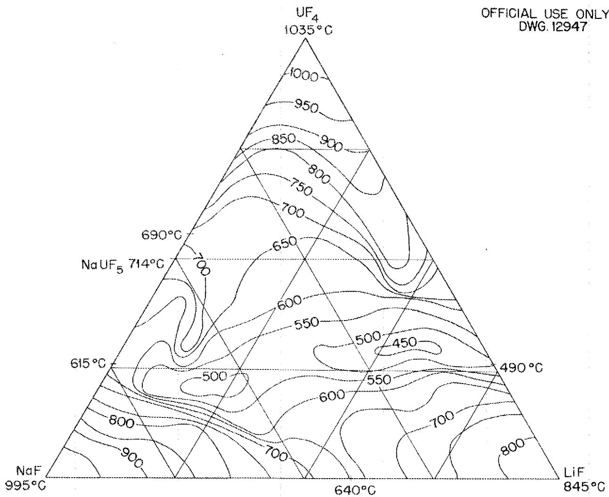  
Fig. 13.1 - The System NaF-LiF-UF4.

great. The minimum-melting mixture (456 ± 10°C) contains 82 wt % UF4 and 7 wt % RbF.

NaF-KF-PbF2-UF4. This system was studied only in a preliminary fashion because of the reaction of PbF2 with metal containers at elevated temperatures. The system appears to be less valuable than the NaF-KF-UF4 system in so far as high uranium concentra

tions are concerned. The lowest melting point so far demonstrated is at $493 \pm 10^{\circ} \mathrm{C}$ at 20 mole $\%$ UF $_4$ and 48 mole $\%$ NaF, although there is evidence for another eutectic at $470^{\circ} \mathrm{C}$ of as yet undiscovered composition.

$NaF - KF - BeF_{2} - UF_{4}$ . This system has been studied in some detail up to 30 mole $\%$ UF $_{4}$ where the melting

# ANP PROJECT QUARTERLY PROGRESS REPORT

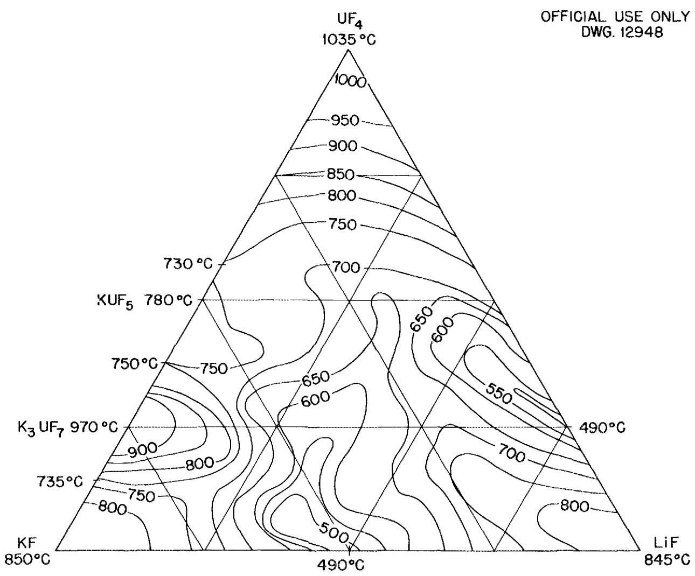  
Fig. 13.2 - The System $\mathbf{KF}$ -LiF-UF4.

points have become too high for effective use. The $550^{\circ}\mathrm{C}$ contour surface in the pyramidal diagram extends from 0 to 25 mole $\%$ $\mathbf{U}\mathbf{F}_4$ . At the 10 mole $\%$ $\mathbf{U}\mathbf{F}_4$ level the $550^{\circ}\mathrm{C}$ contour area encloses a large fraction of the triangle, permitting wide variation in the proportions of NaF, KF, and $\mathbf{BeF}_2$ . This system may be of considerable interest if low concentrations of uranium are required.

NaF-KF-RbF-UF. This four-component system has been studied in somewhat more detail than any of the others since it provides low-melting mixtures containing up to 40 mole $\%$ UF. A sketch from the model of the contour area enclosing all compositions melting below $550^{\circ}C$ is shown in Fig. 13.4. For this purpose the solid model was constructed using triangular prism coordinates and was viewed from the

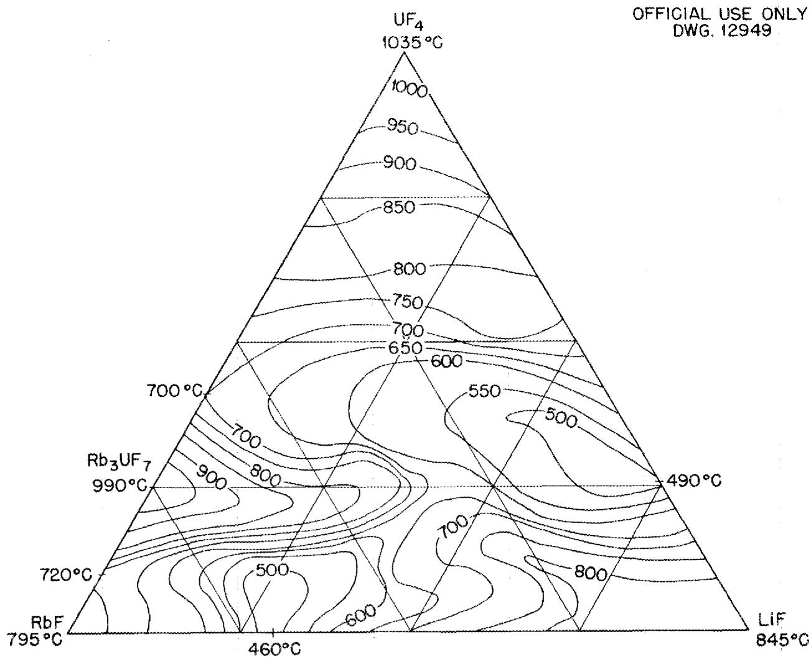  
Fig. 13.3 - The System RbF-LiF-UF4.

NaF edge of the model. A study of the data indicates that mixture melting below $550^{\circ}\mathrm{C}$ may be prepared with uranium content varying between 18 and 41 mole%. The lowest melting mixture found in this system $(500^{\circ}\mathrm{C})$ contains 25, 56.3, 15, and 3.7 mole% $\mathrm{UF}_4$ , NaF, RbF, and KF, respectively.

Preparation of UF₃ (W. C. Whitley, Research Participant; C. J. Barton, Materials Chemistry Division).

Uranium trifluoride is of interest to the Fuel Research Group primarily as a possible fuel component but also as a possible product of radiation damage to $\mathrm{UF_4}$ . Since the compound is not readily available, a method for its preparation in a high state of purity has been developed.

Of the procedures which have been described for preparation of this material, the method using reduction

# ANP PROJECT QUARTERLY PROGRESS REPORT

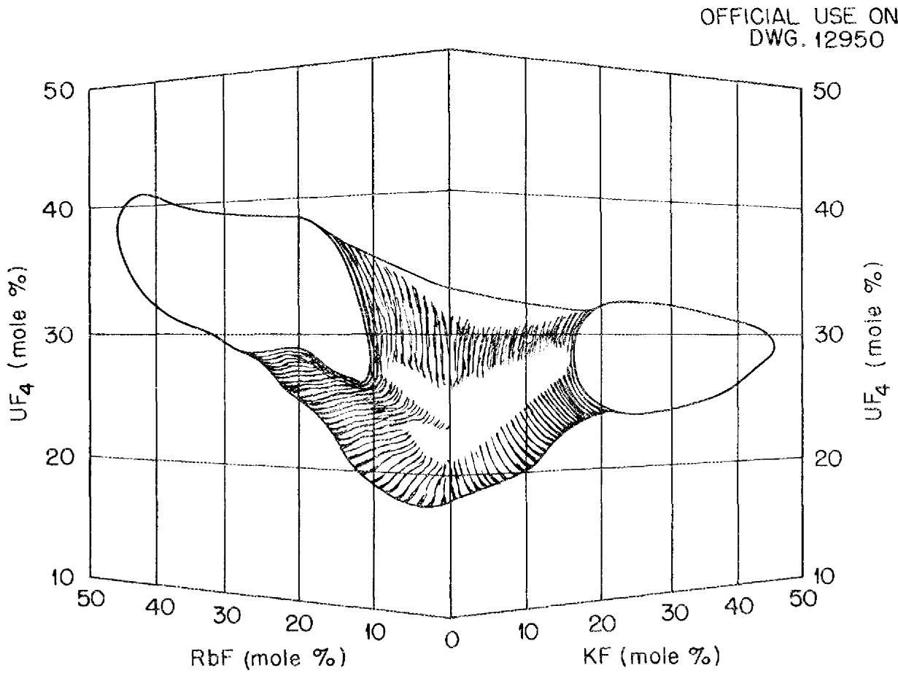  
Fig. 13.4 - The System NaF-KF-RbF-UF4.

of $\mathbf{U}\mathbf{F}_{4}$ by uranium metal(6) at temperatures above $1050^{\circ}C$ seemed to be best. While the product of that reaction had been characterized as $\mathbf{U}\mathbf{F}_{3}$ by X-ray-diffraction methods, no determinations of the purity of the product were made.

Preliminary experiments served to demonstrate that temperatures in excess of $1000^{\circ}\mathrm{C}$ were not superior to the range 850 to $900^{\circ}\mathrm{C}$ in so far

as yield of $\mathbf{U}\mathbf{F}_{3}$ is concerned. From these preliminary studies products of varying purity were obtained for study. Typical material from these runs was shown to be a black material of specific gravity 8.83 (X-ray density 9.06) which was insoluble in all except oxidizing solvents. Chemical analysis showed the material to be about 90 wt $\%$ $\mathbf{U}\mathbf{F}_{3}$ .

Experiments in cooperation with personnel from the Mass Spectrometer Group of the Stable Isotopes Division showed that 10 to 12 wt $\%$ UF $_4$ was left unreacted in the product. It

was shown that at $750^{\circ}\mathrm{C}$ $\mathrm{UF}_3$ is stable under $10^{-5}$ mm Hg but that at $800^{\circ}\mathrm{C}$ the disproportionation into $\mathrm{UF}_4$ and metallic uranium is significant; the disproportionation rate increases rapidly with temperature.

Since it appeared that low-temperature reaction for prolonged periods with proper precautions to ensure homogeneity of the reaction mass and to prevent build-up of reaction products on unreacted $\mathrm{UF_4}$ offered the optimum conditions for preparation of pure $\mathrm{UF_3}$ , the following procedure was adopted: Pure $\mathrm{UF_4}$ was vacuum-dried at $450^{\circ}\mathrm{C}$ for several hours and ground to pass a 200-mesh sieve. This $\mathrm{UF_4}$ was charged into a 10-in.-long by 3-in.-diameter stainless steel container with the stoichiometric quantity of clean uranium turnings and several stainless steel balls. The reagents were again vacuum-dried at $450^{\circ}\mathrm{C}$ for several hours before reduction of the uranium to powder by repeated formation and decomposition of $\mathrm{UH_3}$ . After final decomposition of the hydride, the container was evacuated and sealed. The contents were homogenized by grinding with the steel balls. The reaction was allowed to proceed 16 hr at $900^{\circ}\mathrm{C}$ , and, after cooling and grinding of the contents, the sealed container was maintained at $900^{\circ}\mathrm{C}$ an additional 8 hr.

The product of this reaction has been shown by chemical analysis to be 99.2 wt $\%$ UF $_3$ . This material is of sufficient purity for use in phase equilibrium studies. It seems likely that this material is of considerably higher purity than any which has previously been produced elsewhere. A report on this research will be issued in the near future.

Homogeneous Fuels (J. D. Redman and L. G. Overholser, Materials Chemistry Division). The high solubility of uranium as $\mathrm{UO}_3$ in mixtures of sodium and lithium hydroxides has been discussed in a previous report.(7) This solution might well be of interest as a homogeneous fuel if separated lithium isotopes were available and if the corrosive liquid could be contained. A small amount of research has been done to ascertain whether similar solubility of uranium can be demonstrated with other hydroxide-bearing materials.

The data in Table 13.2 indicate that mixtures of barium hydroxide with lithium or sodium hydroxide are of little value in this connection. It is established that, at moderately high temperatures, the solubility of uranium increases with temperature and with increasing concentration of lithium hydroxide; the solubility at $750^{\circ}\mathrm{C}$ , however, never reaches a value high enough to be of interest as a fuel.

TABLE 13.2   
Solubility of Uranium in Hydroxides   

<table><tr><td colspan="3">AMOUNT OF HYDROXIDE USED (wt %)</td><td rowspan="2">TEMP. (°C)</td><td rowspan="2">SOLUBILITY OF URANIUM (wt %)</td></tr><tr><td>LiOH</td><td>Ba(OH)2</td><td>NaOH</td></tr><tr><td>25</td><td>75</td><td></td><td>650</td><td>0.1</td></tr><tr><td>25</td><td>75</td><td></td><td>750</td><td>0.2</td></tr><tr><td>50</td><td>50</td><td></td><td>650</td><td>0.1</td></tr><tr><td>50</td><td>50</td><td></td><td>750</td><td>0.3</td></tr><tr><td>75</td><td>25</td><td></td><td>650</td><td>0.4</td></tr><tr><td></td><td>50</td><td>50</td><td>750</td><td>0.1</td></tr></table>

# ANP PROJECT QUARTERLY PROGRESS REPORT

The solubility of $\mathrm{UO}_3$ in mixtures of sodium hydroxide and sodium tetraborate with and without additional boric oxide is indicated by the data in Table 13.3. It is obvious that considerable amounts of the tetraborate ion must be present if significantly large quantities of uranium are to be dissolved. The solubility again shows a sharp temperature dependence. Unfortunately, the addition of borate in amounts more than 5 wt % increases the melting point of the mixture considerably; mixtures containing 15 wt % melt at about $500^{\circ}\mathrm{C}$ . These studies are to be extended to include other hydroxide-borate systems.

TABLE 13.3   
Solubility of Uranium in Mixtures Consisting of Sodium Hydroxide and Sodium Tetraborate   

<table><tr><td colspan="3">AMOUNT OF CONSTITUENT IN MIXTURE (wt %)</td><td rowspan="2">TEMP. (°C)</td><td rowspan="2">SOLUBILITY OF URANIUM (wt %)</td></tr><tr><td>NaOH</td><td>Na2B4O7</td><td>B2O3</td></tr><tr><td>95</td><td>5</td><td></td><td>650</td><td>0.1</td></tr><tr><td>95</td><td>5</td><td></td><td>800</td><td>0.1</td></tr><tr><td>85</td><td>15</td><td></td><td>800</td><td>0.4</td></tr><tr><td>80</td><td>20</td><td></td><td>800</td><td>0.5</td></tr><tr><td>55</td><td>45</td><td></td><td>800</td><td>5.0</td></tr><tr><td>70</td><td>15</td><td>15</td><td>650</td><td>0.9</td></tr><tr><td>70</td><td>15</td><td>15</td><td>800</td><td>2.7</td></tr><tr><td>60</td><td>15</td><td>25</td><td>800</td><td>4.7</td></tr></table>

# MODERATOR-COOLANT DEVELOPMENT

To be effective as a moderator—heat-transfer fluid for the aircraft reactor the liquid must obviously have good heat-transfer properties, must be thermally stable above $800^{\circ}\mathrm{C}$ , and must contain hydrogen. Hydrogen-bearing compounds

with the required thermal stability, even without regard to probable radiation stability, are not numerous.

Development of moderator coolants is concerned at present primarily with preparation of very pure alkali and alkaline earth hydroxides and with phase equilibrium studies of various mixtures of these materials with other compounds. In so far as liquid ranges, moderating power, and heat-transfer properties are concerned, several of the materials and mixtures tested could be considered satisfactory. In addition to the pure hydroxides several binary hydrogenous systems, such as hydroxide-hydroxide, hydroxide-fluoride, and hydroxide-borate, are being examined.

Preparation of sodium hydroxide assaying better than $99.8\%$ NaOH by weight has been placed on a routine basis. Pure potassium hydroxide has not yet been prepared in quantity although small-scale preparations using recrystallization from isopropyl alcohol have been accomplished. Pure barium hydroxide, prepared by recrystallization from aqueous solution followed by dehydration of the resulting octahydrate, should soon be available in sufficient quantity for corrosion and physical property testing. Methods for purification of lithium and rubidium hydroxides are still under study.

Preparation of Pure Sodium Hydroxide (L. G. Overholser, D. E. Nicholson, F. A. Vingiello, Research Participant, and C. W. Harrill, Materials Chemistry Division). Pure sodium hydroxide has been purified by a modification of the method used by

FOR PERIOD ENDING SEPTEMBER 10, 1951

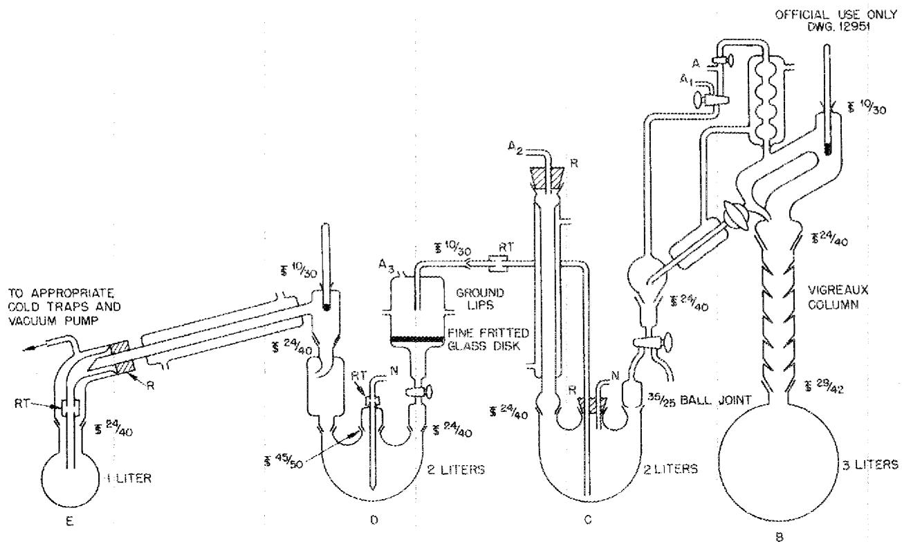  
Fig. 13.5 - Sodium Hydroxide Purification Apparatus.

workers at the Carnegie Institute of Technology (8) for use in corrosion studies and physical property determinations. The purification steps are effected in the pyrex apparatus shown in Fig. 13.5. Ethyl alcohol (1.5 liters) is charged into flask B and refluxed over magnesium plus a small quantity of iodine to dehydrate the alcohol. The dry alcohol is distilled over into flask C which contains $150\mathrm{g}$ of reagent grade sodium hydroxide pellets and is heated until most of the hydroxide

has dissolved. The hot solution is passed through the fritted glass filter to remove insoluble material (sodium carbonate, sodium chloride, etc.) and then heated to remove the alcohol until a thick suspension of the sodium hydroxide—alcohol remains in flask D. This flask is removed to a dry box, and the slurry is sucked fairly dry on a fritted glass filter. The solid is then washed with a small volume of cold dry ethyl alcohol, and the solid material is transferred to a suction flask. The suction flask is heated to about $130^{\circ}\mathrm{C}$ under vacuum for at least 24 hr until all the alcohol is decomposed and a dry powder remains.

# ANP PROJECT QUARTERLY PROGRESS REPORT

Obviously, the atmosphere in the flasks and in the dry box must be free of carbon dioxide and water. This is accomplished in the case of the flasks by introducing purified nitrogen. This gas is used to force the solution from flask C into flask D and also is bled into flask D to reduce bumping during the removal of alcohol. The nitrogen atmosphere prevents the formation of the brown polymerization products which form rapidly in the alcohol if air is admitted at elevated temperatures.

The results of analysis of a number of batches of purified sodium hydroxide are given in Table 13.4 along with similar data for the starting material. The first three batches were prepared during the early part of the program. Subsequent modification in equipment and technique resulted in a purer product, as shown by the results for Nos. 4 through 7. At present, sodium hydroxide is being routinely produced with a carbonate content of $0.15\%$ or less and a water

TABLE 13.4   
Purification of NaOH by Recrystallization from Ethyl Alcohol   

<table><tr><td>MATERIAL</td><td>TOTAL ALKALINITY (%) (Calc. as NaOH)</td><td>Na2CO3(%)</td><td>SiO2(%)</td></tr><tr><td rowspan="3">Commercial NaOH</td><td>97.5</td><td>1.5</td><td>0.006</td></tr><tr><td>96.8</td><td>1.4</td><td>0.006</td></tr><tr><td>98.0</td><td>2.0</td><td>0.005</td></tr><tr><td>Purified NaOH 1</td><td>99.73</td><td>0.31</td><td></td></tr><tr><td>Purified NaOH 2</td><td>99.81</td><td>0.36</td><td></td></tr><tr><td>Purified NaOH 3</td><td>99.83</td><td>0.31</td><td></td></tr><tr><td>Purified NaOH 4</td><td>99.90</td><td></td><td></td></tr><tr><td>Purified NaOH 5</td><td>99.98</td><td>0.13</td><td></td></tr><tr><td>Purified NaOH 6</td><td>100.0</td><td>0.16</td><td>0.008</td></tr><tr><td>Purified NaOH 7</td><td>99.88</td><td>0.07</td><td>0.007</td></tr></table>

content of $0.1\%$ or less. The silica values show that there is virtually no pickup of silica in the process used. The yield per batch is approximately $65\mathrm{g}$ , and a total of about 5 lb of purified sodium hydroxide has been prepared by this method.

The results of several runs indicate that pure sodium hydroxide may also be obtained by removal of carbonate from a concentrated aqueous solution of the hydroxide, followed by dehydration at $450^{\circ}\mathrm{C}$ under vacuum. For this method a 50 wt $\%$ solution of sodium hydroxide is made up in a wax-lined vessel, the suspended sodium carbonate is removed by filtration, and the clear filtrate is dehydrated in a nickel vessel, first at $200^{\circ}\mathrm{C}$ and finally at $450^{\circ}\mathrm{C}$ under vacuum.

The results of the analysis of sodium hydroxide purified by this method are given in Table 13.5. A comparison of these data with those given previously indicates that the hydroxide may be about as effectively purified by this method as by the ethyl alcohol process. This method may be applied to quantity production more easily than the ethyl alcohol process.

TABLE 13.5   
Purification of NaOH by Recrystallization from $\mathbf{H}_2\mathbf{O}$   

<table><tr><td></td><td>TOTAL ALKALINITY (%) (Calc. as NaOH)</td><td>Na2CO3(%)</td><td>SiO2(%)</td></tr><tr><td>Purified NaOH 1</td><td>100.0</td><td>0.11</td><td>0.005</td></tr><tr><td>Purified NaOH 2</td><td>99.87</td><td>0.20</td><td>0.004</td></tr><tr><td>Purified NaOH 3</td><td>99.99</td><td>0.16</td><td>0.007</td></tr><tr><td>Purified NaOH 4</td><td>99.71</td><td></td><td></td></tr><tr><td>Purified NaOH 5</td><td>100.0</td><td></td><td></td></tr><tr><td>Purified NaOH 6</td><td>99.78</td><td></td><td></td></tr><tr><td>Purified NaOH 7</td><td>99.94</td><td>0.15</td><td></td></tr></table>

Preparation of Other Hydroxides (D. E. Nicholson, C. W. Harrill, and D. R. Cuneo, Materials Chemistry Division; F. A. Vingiello, Research Participant, Materials Chemistry Division; and R. P. Metcalf, Physics Division). Preliminary studies have shown that potassium hydroxide cannot be purified by the ethyl alcohol process used for sodium hydroxide. Apparently the potassium hydroxide—alcoholate is extremely soluble in ethyl alcohol and also is relatively low melting and probably more stable than the corresponding sodium compound. Limited success has been obtained by using isopropyl alcohol, and a study of the use of this compound and of other alcohols is underway.

Equipment is being set up for the purification of strontium and barium hydroxides. The method used entails separation of the insoluble carbonate in aqueous solution, recrystallization as the octahydrate, and finally dehydration under carefully controlled conditions. The setup, which is constructed of nickel, should permit purification of pound batches of the hydroxides.

Purified lithium hydroxide monohydrate, available commercially, was dehydrated at $200^{\circ}\mathrm{C}$ under vacuum. The dehydrated material so obtained contains approximately $0.1\%$ lithium carbonate and less than $0.1\%$ water. Rubidium hydroxide, reported to be $99.5\%$ pure, was found to contain approximately $5\%$ carbonate and $15\%$ water. The dehydration of this material is being investigated at present.

Decomposition Pressures of Hydroxides (E. O. Price, Research

Participant, Materials Chemistry Division). Experimental work has been confined to a study of the decomposition pressures of barium hydroxide hydrates and anhydrous barium hydroxide. The existence of the monohydrate and octahydrate has been established by numerous experimenters, but there appears to be some doubt regarding the existence of the trihydrate. The decomposition pressures for the following systems have been reported: (9,10)

$$
\mathrm {B a} (\mathrm {O H}) _ {2} (l) \xrightarrow {\dots \dots \dots} \mathrm {B a O} (s) + \mathrm {H} _ {2} \mathrm {O} (g)
$$

$$
\mathrm {B a} (\mathrm {O H}) _ {2} \cdot \mathrm {H} _ {2} \mathrm {O} (s) \xrightarrow {\dots \dots \dots \dots} \mathrm {B a} (\mathrm {O H}) _ {2} (s) + \mathrm {H} _ {2} \mathrm {O} (g)
$$

$$
\mathrm {B a} (\mathrm {O H}) _ {2} \cdot 8 \mathrm {H} _ {2} \mathrm {O} (s) \xrightarrow {\dots \dots} \mathrm {B a} (\mathrm {O H}) _ {2} \cdot \mathrm {H} _ {2} \mathrm {O} (s) + 7 \mathrm {H} _ {2} \mathrm {O} (g)
$$

These references also include comparable data for the strontium hydroxide systems. It might be noted that for anhydrous barium hydroxide the decomposition pressure reaches 1 atm at about $1000^{\circ}\mathrm{C}$ and the corresponding temperature for anhydrous strontium hydroxide is $700^{\circ}\mathrm{C}$ . The hydrates exert too high pressures at elevated temperatures to be of very much practical value.

Pressure measurements have been made on barium hydroxide systems by means of two different types of apparatus. One type uses a nickel chamber equipped with a diaphragm for containing the sample, and the pressure exerted against the diaphragm is measured by balancing against a known pressure on the opposite side

# ANP PROJECT QUARTERLY PROGRESS REPORT

of the diaphragm. This instrument was used for measuring the pressure of a sample of barium hydroxide approximating $\mathrm{Ba(OH)}_2\cdot (1.9)\mathrm{H}_2\mathrm{O}$ at relatively low temperatures. Values obtained are given in Table 13.6. These values are in fair agreement with those reported in the literature. Measurements were not made at higher temperatures because of difficulties in temperature control.

TABLE 13.6   
Decomposition Pressures of $\mathbf{Ba(OH)}_2\cdot (1.9)\mathbf{H}_2\mathbf{O}$   

<table><tr><td>TEMPERATURE (°C)</td><td>PRESSURE (mm Hg)</td><td>TEMPERATURE (°C)</td><td>PRESSURE (mm Hg)</td></tr><tr><td>44</td><td>6.6</td><td>69</td><td>19.7</td></tr><tr><td>45</td><td>6.8</td><td>73</td><td>21.2</td></tr><tr><td>51</td><td>8.1</td><td>76</td><td>24.5</td></tr><tr><td>52</td><td>9.3</td><td>78</td><td>25.4</td></tr><tr><td>54</td><td>10.6</td><td>82</td><td>27.8</td></tr><tr><td>66</td><td>16.3</td><td></td><td></td></tr></table>

The other type of apparatus employed a tin manometer, using nitrogen to balance the manometer. Experiments with this apparatus using barium hydroxide containing about $2\%$ water showed no measurable pressure at $370^{\circ}\mathrm{C}$ . For material corresponding to barium hydroxide monohydrate, a pressure in excess of 1 atm at $390^{\circ}\mathrm{C}$ was observed. These measurements are all of a preliminary nature and additional work must be done before any conclusive results will be forthcoming.

Binary Hydroxide Systems (K. A. Allen and W. C. Davis, Stable Isotopes Research and Production Division; C. J. Barton and J. P. Blakely, Materials Chemistry Division). The

system $\mathrm{Ba(OH)}_2\mathrm{-Sr(OH)}_2$ has been studied in some detail by thermal-analysis methods because these materials have been reported to be somewhat less corrosive than the alkali hydroxides. Figure 13.6 shows the completed phase diagram for this system. There is evidence for a solid transition in the composition range near the eutectic. While these researches were made with dehydrated commercial materials which contained some carbonate, it is safe to say that mixtures of usefully low melting point are available in this system. It is likely, however, that the decomposition pressures are relatively high at $1500^{\circ}\mathrm{F}$ .

The system LiOH-NaOH has been examined because certain mixtures of these materials dissolve appreciable quantities of $\mathrm{UO}_3$ . The equilibrium diagram is shown in Fig. 13.7. The low-melting eutectic $(219^{\circ}\mathrm{C})$ contains 27 mole % LiOH; there is evidence of a compound NaOH·LiOH with incongruent melting point. The thermal effects observed at about $180^{\circ}\mathrm{C}$ are probably due to a solid transition.

Phase diagrams for the systems NaOH-KOH, NaOH-RbOH, and RbOH-KOH have been reported. (11) Phase studies of the other possible combinations will be deferred until more pressing problems are finished or until it becomes clear that one of the systems offers appreciable advantages from the corrosion standpoint.

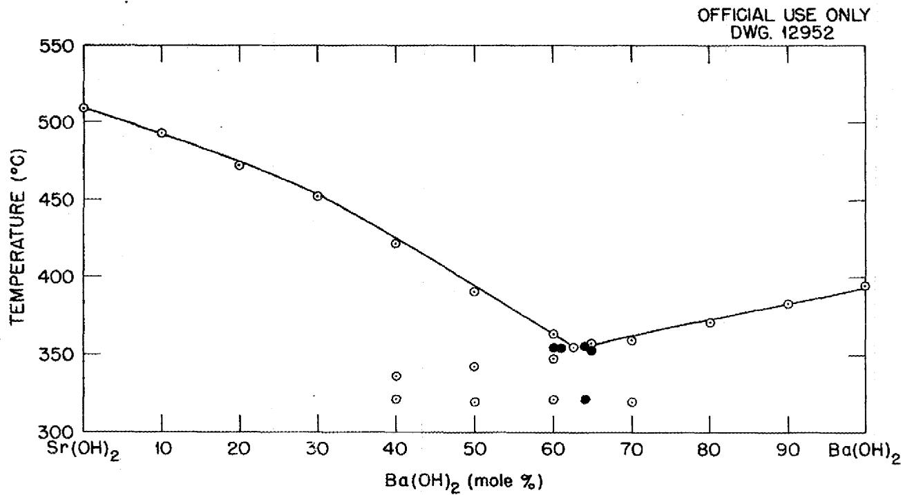  
Fig. 13.6 - The System $\mathrm{Sr(OH)}_2\text{-Ba(OH)}_2$

Hydroxide-Fluoride Systems (W. C. Davis and K. A. Allen, Stable Isotopes Research and Production Division; C. J. Barton and J. P. Blakely, Materials Chemistry Division). Scarpa $^{(12)}$ has published studies of the NaOH-NaF and KOH-KF systems. According to his experiments the former binary shows the formation of mixed crystals with a solubility break with the melting points of all the mixtures intermediate between those of the pure components. The KOH-KF system is similar, with melting points intermediate between those of the pure components but with the

compounds completely miscible in the solid state.

These data have not been completely confirmed in this laboratory. The incomplete study of the KOH-KF system seems to show a eutectic at about 40 mole % KF melting at $630^{\circ}\mathrm{C}$ . It is apparent, however, that materials with a useful melting point may be obtained only at high concentrations of hydroxide; these mixtures would probably be similar to pure hydroxides in so far as corrosion is concerned.

Addition of NaOH to the ternary LiF-NaF-KF eutectic to the extent of 10 mole % can be accomplished without great elevation of the melting point. This system and the analogous system

# ANP PROJECT QUARTERLY PROGRESS REPORT

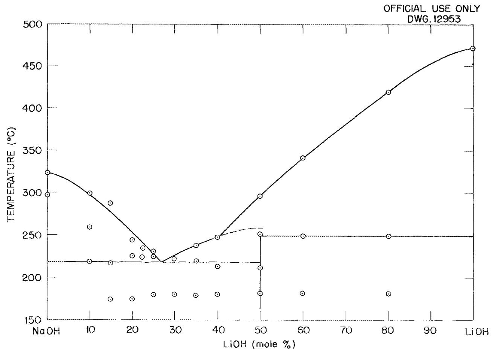  
Fig. 13.7 - The System NaOH-LiOH.

using KOH will be examined in more detail.

Hydroxide-Borate Systems (K. A. Allen and W. C. Davis, Stable Isotopes Research and Production Division; C. J. Barton and J. P. Blakely, Materials Chemistry Division). These materials are of interest because of their solvent action on $\mathrm{UO}_3$ and also because of the possibility of reducing considerably the corrosiveness of the alkali by incorporation of the borate. The data on the sodium hydroxide-sodium tetraborate system

indicate a eutectic at 95 wt % of sodium hydroxide. The liquidus curve climbs steeply from this eutectic and shows a break at the composition corresponding approximately to the orthoborate.

# COOLANT DEVELOPMENT

Recently initiated studies leading to development of nonmetallic coolants have been largely confined to studies of the alkali and alkaline earth fluoride systems. While mixtures of

useful liquid range and low corrosiveness are in hand, the heat-transfer properties are not yet known with precision sufficient to permit evaluation of their usefulness. Table 13.7 lists the several fluoride systems which are discussed in the literature or which have been studied in the course of the fuel development program and which show melting points low enough to be of interest to the program.

It should be noted that these materials are largely by-products of the fuel research, and it is likely that a concentrated effort will serve to add to this list and to produce materials of lower melting point and viscosity. A program of study of other fused salt systems which are likely to be better heat-transfer agents is underway.

TABLE 13.7 Low-Melting Non-Uranium Fluoride Eutectics   

<table><tr><td>COMPOSITION (mole %)</td><td>MELTING
POINT (°C)</td></tr><tr><td>50% KF - 50% LiF</td><td>492</td></tr><tr><td>56% KF - 44% AlF3</td><td>570</td></tr><tr><td>60% KF - 40% PbF2</td><td>470</td></tr><tr><td>33% NaF - 67% PbF2</td><td>505</td></tr><tr><td>30% LiF - 70% PbF</td><td>460</td></tr><tr><td>58% NaF - 42% BeF2</td><td>342</td></tr><tr><td>42% KF - 58% BeF2</td><td>315</td></tr><tr><td>40% RbF - 60% BeF2</td><td>435</td></tr><tr><td>48% LiF - 52% BeF2</td><td>360</td></tr><tr><td>46.5% LiF - 42.0% KF - 11.5% NaF</td><td>454</td></tr><tr><td>30% NaF - 5% KF - 65% BeF2</td><td>345</td></tr></table>

# ANP PROJECT QUARTERLY PROGRESS REPORT

# 14. RADIATION DAMAGE

D. S. Billington, Physics of Solids Institute

A. J. Miller, Research Director's Division

Radiation damage and radiation-induced corrosion in the prime constituents of the airplane reactor core have been under examination during the past few months. The X-10 graphite pile, the Y-12 cyclotron, and the Berkeley cyclotron have been utilized as radiation sources. The limitations in the significance of the information being obtained are due mainly to the low flux in the graphite pile and the lack of methods for correlating effects of accelerator particles with those of pile radiations. In addition, the Berkeley cyclotron has a low beam current, and the Y-12 cyclotron needs a more uniform beam and efficient target-cooling mechanisms that will allow it to be used for irradiating the specimens with the high beam currents that are available. While using the presently available sources, the experimental groups are expending the maximum effort to design and construct equipment suitable for use in the LITR and MTR and to use higher beam currents in the Y-12 cyclotron. In the following description of the experimental procedures and the results to date, the significant items are the stability of the molten fuel in inconel capsules during graphite pile and cyclotron irradiation, the small changes in creep rate of 347 stainless steel during graphite pile irradiation, and the large decrease in inconel thermal conductivity detected in one experiment in the graphite pile.

# CREEP UNDER IRRADIATION

J.C.Wilson J.C.Zukas W.W.Davis

Physics of Solids Institute

A series of three fairly reproducible cantilever creep tests conducted in the ORNL graphite reactor exhibited increased total creep strain, compared to bench tests, after approximately 100 hr of operation. Up to this test time there appears to be slightly less creep under irradiation than on the bench. The in-pile specimens show about $10\%$ greater creep strain after 200 hr and nearly $20\%$ more strain than the corresponding bench test after about 250 hr. Type 347 stainless steel was the metal tested, the maximum fiber stress was 1500 psi, and the temperature was $1500^{\circ}\mathrm{F}$ .

The creep of 347 stainless steel at $1500^{\circ}\mathrm{F}$ and a maximum fiber stress of 1500 psi has been measured by the cantilever creep apparatus in the X-10 pile. The measurements previously reported have been extended, and to date three fairly reproducible 250-hr cantilever creep tests have been made. Up to 100 hr the creep under irradiation is slightly less than that of

the unirradiated control specimens. However, the in-pile specimens exhibit about $10\%$ greater elongation after 200 hr than the control specimen, and nearly $20\%$ greater elongation after 250 hr.

A composite plot of all the creep data is given in Fig. 14.1. The reproducibility is good except for the test represented by curve $O$ , which has been disregarded in this analysis of the data. The diminished creep rate observed during pile shutdowns (plotted on a larger scale in the lower right-hand corner of Fig. 14.1) substantiates the conclusion drawn from the total extensions, namely, that irradiation increases the total creep strain after the initial stages of the creep history. It was also the main reason for the summary disregard of curve $O$ in analyzing the data. If the divergence between the bench and in-pile curves is real, then the difference in creep strain should be quite large, percentagewise, after longer times. Accordingly, a set of specimens will be irradiated for 500-hr periods and the total strain measured after removal from the reactor. In this way any possible errors in strain measurement because of radiation effects on the microformer will be eliminated. A more complete description of all the above work has been given. $^{(2)}$

The observation of diminished creep at shorter times is in agreement with our earlier work.(3) Other workers(4,5) have reported only decreased creep under irradiation, but in the tests

reported here the duration of the test is much longer and the total strains much smaller than in any other reported creep tests under irradiation. This could, in view of the ignorance of the mechanisms accounting for creep deformation at slower rates, be responsible for the apparent difference in results.

These creep measurements under irradiation will be supplemented by a tensile creep apparatus which is being designed for use with the LITR. This tensile apparatus will provide an independent check of the cantilever creep apparatus measurements of creep under irradiation. Another creep apparatus to be operated in the LITR will provide stress-corrosion creep data. This apparatus, now in the design stage, is basically a modified sodium loop.

# RADIATION EFFECTS ON THERMAL CONDUCTIVITY

A. F. Cohen, Physics of Solids' Institute

Preliminary in-pile tests have been made on one sample of inconel. (6) The thermal conductivity at $820^{\circ}\mathrm{C}$ decreased by a factor of 2 in less than one week of exposure in the X pile and then maintained a fairly constant value. The effect of an in-pile temperature anneal (by increasing the temperature of the specimen $70^{\circ}\mathrm{C}$ for 40 min and then returning the specimen to $820^{\circ}\mathrm{C}$ )

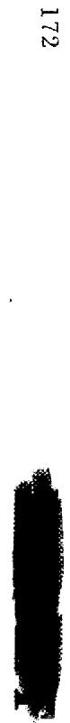  
#

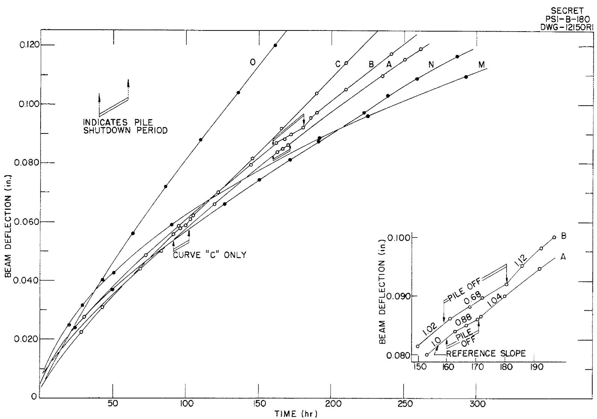  
Fig. 14.1 - Composite Plot of Three Bench (o) and Three In-Pile (o) Cantilever Creep Curves. 347 stainless steel at $1500^{\circ}\mathrm{F}$ ; 1500 psi maximum fiber stress; irradiated in hole 15 of ORNL graphite reactor, fast flux $\approx 4 \times 10^{10}$ neutrons/cm²/sec. On the ordinate, 0.001 deflection $\approx 15 \times 10^{-6}$ in./in. strain.

  
LdRssR0d ATHLVNO LefoD dN

was to cause annealing out of approximately $20\%$ of the damage (i.e., the decrease in thermal conductivity). With further irradiation the thermal conductivity returned to the former equilibrium value. Experiments planned to give information on the flux dependence of the thermal conductivity are in progress on types 310 and 316 stainless steel and on pure nickel.

# IRRADIATION OF FLUORIDE FUELS

G. W. Keilholtz, Materials Chemistry Division

The effect of radiation on the stability of the molten fluoride fuel contained in inconel is currently under investigation using the X-10 pile and Y-12 cyclotron. Detailed analyses of irradiated samples are not yet available. Preliminary spectrographic analysis of the first cyclotron-irradiated capsule showed no detectable radiation-induced corrosion. Capsules containing fuel prepared with uranium enriched in $\mathbf{U}^{235}$ showed no evidence of pressure build-up under pile irradiation.

Pile Irradiation of Fuel Capsules (J. G. Morgan, C. C. Webster, P. R. Klein, R. L. Cooper, D. F. Weekes, and D. D. Davies, Physics of Solids Institute). Inconel capsules containing fuel prepared with normal uranium and with uranium enriched in $\mathbf{U}^{235}$ were tested for pressure build-up due to fuel decomposition in the X-10 pile. The fuel composition was standard NaF-KF-UF $_4$ , 46.5-27-26.5 mole %. The containers were pressurized to $58 \pm 1$ psi with helium at $1500^{\circ}\mathrm{F}$ in the pile. During 200 hr of irradiation there was no detectable increase in the pressure. Figure 14.2 shows the construction of

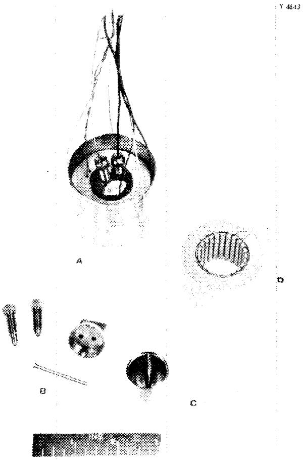  
Fig. 14.2 - Liquid-Fuel Sample Container with Thermocouple Well and Pressure Fittings.

the inconel sample container with thermocouple well and pressure fittings. Examination of the capsules and their contents for radiation-induced corrosion and for fuel decomposition is in progress.

Cyclotron Irradiation of Fuel Capsules (W. J. Sturm and M. J. Feldman, Physics of Solids Institute; R. J. Jones, J. S. Luce, and C. L. Viar, Electromagnetic Research Division). The cyclotron experiments

# ANP PROJECT QUARTERLY PROGRESS REPORT

have been directed toward the determination of the effects of proton bombardment(7) upon the inconel capsules containing the standard NaF-KF-UF4 ARE fuel.

Four capsules were bombarded with 2 to $3\mu a$ of 20-Mev protons which provided an energy dissipation of approximately 20 watts per cubic centimeter of fuel. Two 1-hr and two 4-hr runs were made. Radiation cooling was employed. The first capsule melted in the region of intense beam, but in subsequent runs temperatures were maintained in the region 1300 to $1350^{\circ}\mathrm{F}$ . A partial analysis has been made on one of the 1-hr samples. No significant changes in fuel composition, trace element content, or corrosion rate due to irradiation have been detected. However, some grain growth has been detected in the inconel from both the irradiated and an unirradiated control sample.

One capsule was mounted on a water-cooled block and irradiated with a 20-µa beam current for 1 hr at $1500^{\circ}\mathrm{F}$ . This capsule has not yet been examined owing to its high radioactivity.

# CORROSION OF IRON BY LITHIUM UNDER CYCLOTRON IRRADIATION

North American Aviation, Inc.

W. W. Parkinson, Physics of Solids Institute

Bombardments of iron in contact with molten lithium have been carried out in the Berkeley 60-in. cyclotron to provide information about the

behavior of structural materials under irradiation while in contact with liquid metals.

Corrosion data on the first three capsules irradiated are given in Table 14.1. There is no evidence of accelerated corrosion due to irradiation.

Micrographs were made of cross-sections in the irradiated and unirradiated zones of the capsule from run 1. These micrographs (8) show that in some areas, apparently distributed at random through the irradiated zone, an increase in grain size has taken place. No conclusions have been drawn yet as to the nature of this change. The microhardness was found to have an average value of 89.5 Knoop hardness numbers in the irradiated zone and 89.3 in the unirradiated, compared with an average of 106.5 over the whole surface before bombardment.

Additional irradiations of molten lithium in iron capsules have been carried out, and the analytical results are being obtained. This will complete the study of lithium in iron for the present time. The next series of irradiations will be made on molten fluoride fuels in inconel capsules.

# LIQUID METALS IN-PILE LOOP

C. D. Baumann O. Sisman

R. M. Carroll W. W. Parkinson C. Ellis

Physics of Solids Institute

Lithium at $1000^{\circ}\mathrm{F}$ has been circulated in the X-10 reactor for one week.

TABLE 14.1   
Results of 31-Mev Alpha Irradiation of Lithium in Iron Capsules   

<table><tr><td>RUN NO.</td><td>TEMPERATURE (°C)</td><td>TIME AT TEMP. (hr)</td><td>EXPOSURE (μa-hr)</td><td>Fe IN Li CHARGE(a) (%)</td><td>RADIOACTIVITY OF CHARGE(b) (counts/min)</td></tr><tr><td>1</td><td>625</td><td>9.0</td><td>25.1</td><td>0.008</td><td>2</td></tr><tr><td>2</td><td>910</td><td>6.2</td><td>13.6</td><td>0.23(c)</td><td>2700(c)</td></tr><tr><td>3</td><td>675</td><td>17.3</td><td>3.8</td><td>0.004 - 0.006</td><td>2</td></tr><tr><td>Control</td><td>906</td><td>5.7</td><td>None</td><td>0.004 - 0.006</td><td>None</td></tr></table>

$(a)$ Surface to volume ratio, $5.1~\mathrm{cm}^2/\mathrm{cm}^3$ with 1.24 g of lithium in each capsule.   
(b) Activity measured on step 1 of BerkeleyScaler, model Decimal 2000.   
$(c)$ Leak developed in capsule. Iron oxide may have flaked into charge.

A detailed description of the experimental equipment was presented in the last quarterly report.(9) The principal components of the apparatus are a $1/4$ -in.-i.d. 316 stainless steel loop which extends to the center of the pile connected to a 3/16-in.-i.d. loop external to the pile, an electromagnetic flowmeter, and three ionization chambers to measure the activity at various points on the external circuit of the lithium loop. The primary purpose of this experiment was to study the Bremsstrahlung activity

from the decay of $\mathbf{L}\mathbf{i}^{\mathbf{s}}$ created by the $(n,\gamma)$ reaction on $\mathbf{L}\mathbf{i}^{\gamma}$ . The analysis of this activity is reported in Sec. 9, "Nuclear Measurements."

A cursory visual examination of the tube from which the lithium had been removed showed no signs of damage. Also, there was no evidence found of radioactive corrosion products in the lithium. Further investigation will be made when the tubes become somewhat less radioactive. Rather than pursue the corrosion due to lithium any further at this time, an inconel loop containing sodium is to be operated at temperatures up to $1500^{\circ}\mathrm{F}$ .

Part IV

ALTERNATE SYSTEMS

# 15. SUPERCRITICAL WATER REACTOR(1)

Nuclear Development Associates, Inc.

As a result of an extensive analysis of the supercritical water reactor first proposed in WASH-24, (2) Nuclear Development Associates has advanced detailed specifications for a feasible design. The reactor and shield comprise an 11-ft-diameter sphere of water with a 2.5-ft square-cylinder active core at its center. The reactor will deliver 400 megawatts with a maximum wall temperature of $1290^{\circ}\mathrm{F}$ and a fuel investment of approximately 25 lb. The proposed fuel elements are of the sandwich design considered in the last quarterly report, (3) and the core design utilizes a flat neutron flux. The pressure shell introduced some problem of weight, but the overall shield weight, 180,000 lb, remains well within specifications.

# OUTLINE OF A SPECIFIC DESIGN

Apart from some insertions (pressure shell, thermal shield for pressure shell, gamma-ray shadow shielding cap, flow headers, etc.) the reactor and its shield may be approximately visualized as an 11-ft-diameter sphere of water, in the interior of which are spaced some 200 parallel fuel assemblies to form a 2.5-ft square-cylinder

central core. Each fuel assembly is a tube about an inch square, in the interior of which is a fine-scale structure of fuel-bearing plates and water coolant passages. The fuel assemblies occupy about one-fourth of the core volume, the remaining space between them being filled with moderating water. The spacing between assemblies is least at the axis of the core, and increases radially outward* in such manner as to keep the thermal-neutron flux approximately the same for all the assemblies. Thus the heat load is the same for all the tubes, the stainless steel heat transfer surface is being used to maximum effectiveness in all the tubes, and the amounts of stainless steel and fuel required in the reactor are minimized.

Two water flows may be distinguished in this arrangement: (1) the high-speed flow through the fuel assemblies, which picks up the fission recoil heat, and (2) the slow flow of the moderating water between the assemblies, which picks up a smaller amount of heat, principally from neutrons and gamma rays. The relative speed of these two flows can be adjusted by a valve as indicated in Fig. 15.1. This has desirable features for shim control since it permits varying the temperature rise (and thus the density) of the moderating water without any temperature or pressure changes in the

# ANP PROJECT QUARTERLY PROGRESS REPORT

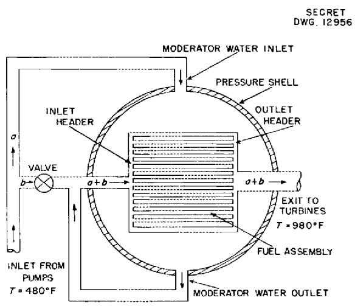  
Fig. 15.1 - Supercritical Water Reactor Flow Arrangement.

external power plant system. Table 15.1 summarizes some of the numerical values for the example selected.

# FUEL ELEMENTS AND ASSEMBLIES

Further consideration of the fuel-element possibilities discussed in the last quarterly report(3) has led to the selection of an oxide type element. The use of powder metallurgy techniques to form a fuel sandwich composed of a sintered $\mathrm{UO}_2$ and stainless steel powder layer rolled between two pieces of stainless steel seems particularly attractive. The original work at ORNL(3,4) produced successful sandwiches of this type with an overall thickness of 30 mils; however, other research has indicated that this

figure might be lowered considerably. The powder metallurgy technique distributes the $\mathrm{UO}_2$ in separate tiny pockets in the interior of, in effect, an otherwise continuous piece of stainless steel. It appears that there will be sufficient free volume to accept the fission gases at moderate pressure. Thus, pending in-pile tests of this fuel-element type, we are inclined toward some optimism regarding its chances for ultimate successful development.

A stainless steel (347 or 316 Nb) sandwich of 20 mils total thickness, with the central layer about 10 mils thick and containing some $10\% \mathrm{UO}_2$ by volume, is suitable. There are many conceivable ways of arranging such plates into assemblies. Figure 15.2 illustrates one arrangement designed to give stiffness, maintain spacings, permit thermal expansions, etc. Here alternate flat and corrugated fuel plates are stacked to fill a square unfueled tube. The contact of the two fueled walls has been estimated from NACA-TN-2257 to run $30^{\circ}\mathrm{F}$ hotter than the average metal wall temperature.

# REACTIVITY

It appears desirable to keep the thermal-neutron flux radially flat in the core to minimize the amount of stainless steel needed for heat-transfer purposes. If the amount of fuel needed was dependent only upon the amount of steel used, then this flat-flux design would obviously minimize the critical mass as well. Furthermore it is actually found, with appropriate simplifying assumptions, that uniform thermal flux in the core does accompany minimum critical mass. Thus flattening the neutron flux operates directly to

TABLE 15.1   
Summary of Reactor Design-Point Values   

<table><tr><td>Heat output</td><td>400,000 kilowatts(a)</td></tr><tr><td>Core size</td><td>2.5-ft square cylind</td></tr><tr><td>Water inlet temperature</td><td>480°F</td></tr><tr><td>Water outlet temperature</td><td>980°F</td></tr><tr><td>Maximum wall temperature</td><td>1290°F(b)</td></tr><tr><td>Fuel plate thickness</td><td>0.020 in.</td></tr><tr><td>Maximum heat flux from fuel plate</td><td>1,250,000 Btu/hr·ft2</td></tr><tr><td>Longitudinal maximum/average power ratio</td><td>1.4</td></tr><tr><td>Average heat flux from fuel plate</td><td>900,000 Btu/hr·ft2</td></tr><tr><td>Weight of stainless steel fuel plates</td><td>572 lb</td></tr><tr><td>Percent of unfueled steel added in fabrication</td><td>22</td></tr><tr><td>Total weight of stainless steel in core</td><td>700</td></tr><tr><td>Average density of water in core(c)</td><td>0.73 g/cm3</td></tr><tr><td>Critical mass in most favorable idealized case(d)</td><td>10 - 12 kg of U235</td></tr><tr><td>Pressure shell inside diameter (sphere)</td><td>4.5 ft</td></tr><tr><td>Pressure shell thickness</td><td>1.5 in.</td></tr><tr><td>Pressure shell weight</td><td>4000 lb</td></tr><tr><td>Cooling stream hydraulic diameter</td><td>0.065 in.</td></tr><tr><td>Cooling stream inlet velocity</td><td>12 ft/sec</td></tr><tr><td>Cooling stream exit velocity</td><td>73 ft/sec</td></tr><tr><td>Cooling stream pressure drop</td><td>25 psi</td></tr><tr><td>Water flow rate</td><td>430 lb/sec</td></tr><tr><td>Percentage of core volume occupied by:</td><td></td></tr><tr><td>Stainless steel fuel plates</td><td>9.3</td></tr><tr><td>Additional unfueled stainless steel</td><td>2.0</td></tr><tr><td>Water in high-speed channels</td><td>15.2</td></tr><tr><td>Low-speed moderating water</td><td>73.5</td></tr></table>

$(a)$ The heat output required for level supersonic flight at altitude is approximately 300,000 kilowatts in WASH-24 and NEPA-1843; WASH-24 indicates a maximum power (sea-level) requirement of 398,000 kilowatts, which figure has not been checked by United Aircraft.   
$(b)$ Including allowance of $30^{\circ}\mathbf{F}$ for hot spots.   
$(c)$ When the moderator flow rate and density are as high as possible in Fig. 15.1.   
$(d)_{\text{Unpoisoned water density at the above maximum value, no losses from coarseness of structure, etc.}}$

# ANP PROJECT QUARTERLY PROGRESS REPORT

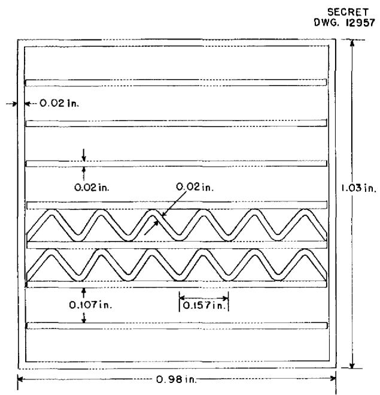  
SCALE: ABOUT $2 \frac{1}{2}$ TIMES ACTUAL SIZE   
Fig. 15.2 - Cross-Section of Fuel-Element Assembly.

minimize the fuel content, as well as indirectly by minimizing the amount of steel.

The problem solved was the following: Given a region containing moderator and given some fuel (pure fissionable material, or a definite mixture of fissionable material and structure), what is the minimum amount of the fuel and how should it be distributed in the moderator in order to obtain a critical assembly? By assuming that (1) the reactor is thermal, and (2) the volume occupied by the fuel is negligible, it was proved that there is a region in the moderator in which fuel should be placed, and in this region the thermal flux should be constant. The fuel

distribution can be obtained for suitably shaped systems.

The above restrictions are well satisfied for pure $\mathbf{U}^{235}$ immersed in an infinite sea of water, heavy water, beryllium, or carbon. Thus we are now in a position to calculate the minimum critical mass of a chain-reacting assembly moderated by any of the usual moderators. This calculation has not yet been carried out. A calculation for the same power output, and the results of an illustrative calculation using the same power output and with the same assumptions otherwise, comparing a reactor with uniform fuel-tube loading with the flat-flux reactor has been made. Both reactors had cores 75 cm long and 67 cm in diameter and reflectors with outer diameters of 100 cm. The flat-flux reactor had 300 kg of stainless steel. The uniform fuel reactor required, for the same power output, 1.54 as much stainless steel and 1.41 as much uranium.

# STABILITY

Calculations of the equivalent bare reactor have been expanded to include the detailed flux shape in the reflected reactor and a fairly detailed representation of the space variations of flow and heat transfer. First results have been obtained and will be reported as soon as they have been analyzed.

The general procedure is to consider first small oscillations from equilibrium. The periods of the system are then obtained as the eigenvalues of the problem. A variational principle is used to convert the system of partial differential equations to a matrix problem, which

is then handled by methods discussed in a recent report.(5) In this method of approach the accuracy of the results for the periods and time behavior is limited only by one's diligence and ingenuity in applying the variational principle.

# PRESSURE SHELL

Between the pressure shell and the reactor core is a layer of heavy material to cut down the gamma heat release in the shell. Both this thermal-shielding layer and the shell itself are of substantially constant thickness all around the reactor and represent a substantial fraction of the total gamma-shield weight. Since divided-shield arrangements tend to concentrate the heavy material at the side of the reactor facing the crew, the pressure shell and its thermal shield reduce the efficiency of the overall shield design by putting substantial amounts of material in the wrong place.

To keep down the weight associated with the pressure shell we may (1) keep the shell nearly spherical and its radius fairly small, (2) reduce the thermal-shielding layer until heat transfer from the shell begins to be troublesome, (3) make the shell of high-strength alloys such as U. S. Steel stainless W or Armco 17-7 PH or 17-4 PH, (4) run the pressure-induced stresses quite high in the shell, or (5) permit thermal strains large

enough to cause yielding in the outer fibers.*

For application in the above-mentioned gamma heating problem, methods have been devised for calculating the the gamma leakage from spherical reactors with radial variation in component concentrations. The gamma build-up processes occurring inside the reactor have been included approximately, and calculations have also been made of the angular distribution of the emerging photons. Present uncertainties in the energy distribution of gammas produced as a result of fission prevent accurate calculation of the leakage; conservative assumptions have been made, but they could be off by $50\%$ or more.

# SHI ELD

Preliminary estimates of divided-shield weights were made for the supercritical water cycle for a range of reactor core sizes, reactor-crew separation distances, and reactor powers. The basic shield used was essentially that described in ANP-53, (5) modified to include several inches of iron near the core because of the pressure shell and its heat shielding. This iron layer was considered useful shielding material, since the fast-neutron flux for this design was considerably smaller at the pressure shell than the primary gamma flux. (The thermal-neutron flux reaching the iron was considered stopped by a boron layer.) Then an

# ANP PROJECT QUARTERLY PROGRESS REPORT

appropriate thickness of lead was removed from the shadow disks and all the lead was removed from the sides of the crew compartment.* From the results of this preliminary study, assuming a 44-ft separation distance

(center of reactor to rear face of crew compartment), the following shield weights for the power and core diameter of Table 15.1 were estimated:

Core shield weight 58,500 lb

Crew shield weight 21,500

Total shield weight 80,000 lb

The shield weight allowed for in the airplane design (WASH-24 and NEPA-1843) is 91,600 lb.

# 16. CIRCULATING-MODERATOR-COOLANT REACTOR: HKF (1)

Atomic Energy Division, The H. K. Ferguson Co., Inc.

A study of a subsonic aircraft reactor using circulating sodium hydroxide as both moderator and coolant and a fixed fuel of $\mathbf{U}\mathbf{F}_{4}$ dissolved in alkali and alkaline earth fluorides has been completed by the Atomic Energy Division of The H. K. Ferguson Co. under contract to ORNL. As a result of this study it was concluded that the circulating-moderator-coolant reactor can provide ample power for a subsonic airplane. Actually the performance of the aircraft is intermediate between the NaOH homogeneous and the UBi circulating-fuel reactors discussed in previous quarterly reports.(2,3) Principal advantages of the circulating moderator-coolant system over the other two include the use of a moderator of known properties and behavior and the fact that the secondary coolant is not made radioactive, which simplifies the shielding problem. The main drawback, in addition to the fact that a suitable container for sodium hydroxide is not yet assured, is the multitude of metallic heat-transfer tubes in the core through which heat is transferred from fuel to coolant. The present study was confined to the reactor because it was

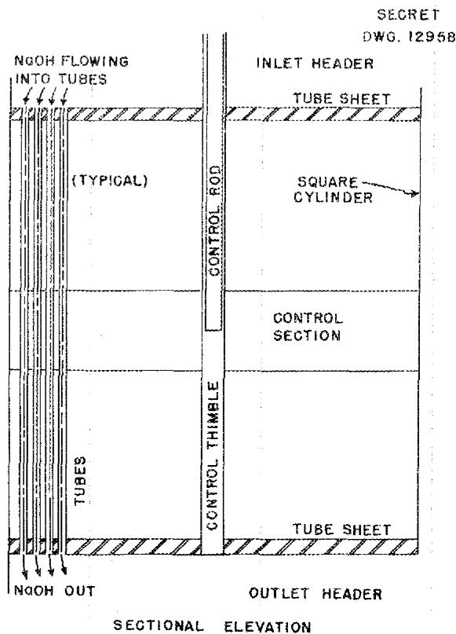  
Fig. 16.1 - Schematic Drawing of Reactor Core.

known at the outset that the intermediate heat exchanger and remainder of the power plant would be almost identical with those designed for the homogeneous sodium hydroxide reactor and that the power requirements are similar. A schematic diagram of this reactor core is shown in Fig. 16.1.

# OPERATIONAL CHARACTERISTICS

The circulating-moderator-coolant reactor is designed to provide power

# ANP PROJECT QUARTERLY PROGRESS REPORT

to operate a modified B-52 type plane cruising at 35,000 ft altitude and Mach 0.8. The maximum metal temperature was set at $1500^{\circ}\mathrm{F}$ . The problems of a solid moderator are eliminated and a simpler structure is adequate. The liquid fuel specified has the advantages that it can be drained upon landing, which permits a large saving in fuel inventory for a fleet of nuclear aircraft; the fuel can expand out of the core, which provides a stabilizing effect for reactor control.

The reactor delivers 140,000 kw at the design point of 35,000 ft and Mach 0.8, with a coolant outlet temperature of $1380^{\circ}\mathrm{F}$ , inlet $1180^{\circ}\mathrm{F}$ . The maximum heat flux is 530,000 Btu/ft²·hr. At sea level it provides 230,000 kw. This increase is accomplished by increasing the temperature rise through the reactor (inlet $1007^{\circ}\mathrm{F}$ , outlet $1335^{\circ}\mathrm{F}$ ) while increasing the heat flux (maximum 870,000), and it permits climb from sea level at 720 ft/min at a speed of 250 knots.

# REACTOR CHARACTERISTICS

The present reactor design has the characteristics of all fixed-fuel reactors: (1) the heat must be transferred first through the fuel and then through the canning material; (2) the coolant flow must be distributed in accordance with the flux distribution; and (3) the core must contain a complicated structure subject to thermal and mechanical stress and to radiation damage. This reactor utilizes the type of liquid fuel planned for use in the proposed ARE reactor at ORNL, the essential difference being the use of sodium hydroxide as the combined coolant and moderator as compared with the ORNL use of a fixed moderator of

BeO and a coolant of sodium. Sodium hydroxide was specified as the moderator coolant in the HKF proposal because it is considered to have the best combination of properties for this use: adequate slowing-down power; does not freeze, decompose, or have a high vapor pressure in the operating temperature range; and its neutron absorption is not excessive for this type of reactor.

An advantage of this design over the homogeneous sodium hydroxide reactor and the circulating-fuel reactor is that the fuel does not circulate outside the reactor during operation. This tends to decrease the reactor shield weight, and, more important, avoids irradiation of the heat exchanger and outside coolant fluid with delayed neutrons. It also eliminates loss of delayed neutrons outside the core. The large number of heat-transfer tubes, common to all noncirculating-fuel aircraft reactors, is a disadvantage compared to the homogeneous reactor. Probably more important than the problems and advantages of the mechanical design are the materials problems. If materials resistant to corrosion by sodium hydroxide with good high-temperature characteristics can be found, the circulating-moderator-coolant reactor appears to be capable of powering the subsonic aircraft.

# CORE DESIGN

The reactor core is a square cylinder 32 in. in diameter. The sodium hydroxide moderator coolant flows downward through small, closely spaced inconel tubes. Fuel occupies the space between the tubes. A jacket of sodium hydroxide around the core acts

as a reflector as does the sodium hydroxide in the top and bottom headers. Lead provides a gamma shield to protect the pressure shell against overheating. The sodium hydroxide flows inside the tubes, thereby ensuring against hot spots which could be caused by interruptions in flow, which would occur if the flow were outside the tubes. This positive flow path is believed necessary, as sodium hydroxide has poorer heat-transfer properties than sodium, for example.

The fuel was designed to be drainable, in order to decrease greatly the uranium inventory for a group of planes. This advantage, however, brings with it a serious leakage problem. Since the fuel is in a common container, it could all escape through a large leak. The effect of small leaks is minimized by balancing pressures so that coolant leaks into the fuel, rather than the reverse.

# REACTOR PHYSICS

The uranium weight is high, 187 lb of $\mathbf{U}^{235}$ in the core. This is mostly

because of the large amount of inconel, necessary for heat-transfer surface. The reactor could not be much smaller without exorbitant uranium content. The uranium could be reduced somewhat by going to larger sizes, at the expense of increased shield weight.

The sodium hydroxide reflector brings up the thermal-neutron flux, and therefore power production, in the core near the boundary. The effect does not extend as far toward the center as would be desired, owing to the large absorption in the reactor, and the effect on leveling out the neutron flux is only moderate.

The amount of fuel in the middle of the reactor is varied to give a total shim control of $10\%$ reactivity. For inherent temperature stability the fuel in the end zones, which is $80\%$ of the total, can expand to chambers outside the reactor. No provision is made for xenon override, as draining and replacing the fuel after shutdown makes it unnecessary.

# ANP PROJECT QUARTERLY PROGRESS REPORT

# 17. CIRCULATING-MODERATOR-COOLANT REACTOR: ORNL

L.F.Hemphill R.W.Schroeder

H. R. Wesson

ANP Division

A preliminary design of a hydroxide cooled and moderated reactor has been defined. A 2.5-ft spherical reactor should be able to deliver 200 megawatts with a maximum wall temperature of $1500^{\circ}\mathrm{F}$ and a maximum coolant outlet temperature of $1450^{\circ}\mathrm{F}$ . Only 115 megawatts is believed adequate for flight at Mach 0.75 at 35,000 ft. An essential feature of the design is the use of annular fuel elements to attain a high ratio of heat-transfer surface to fuel volume. These design studies were based on the use of sodium hydroxide, as its properties are better known than those of the other possible hydroxides.

# FLUID-CIRCUIT SPECIFICATIONS

After exploratory investigations, it was decided to attempt to design a 200-megawatt reactor with a 2.5-ft spherical core, with a maximum wall temperature in contact with the coolant of $1500^{\circ}\mathrm{F}$ , and with coolant inlet and outlet temperatures of 1100 and $1450^{\circ}\mathrm{F}$ , respectively. These temperatures imply a permissible coolant film drop of $400^{\circ}\mathrm{F}$ at the inlet end, and $50^{\circ}\mathrm{F}$ at the outlet end. The thermal conductivity of sodium hydroxide is poor relative to the thermal conductivities of liquid metals, causing heat-transfer coefficients and film temperature drops to suffer. Attainment of the $50^{\circ}\mathrm{F}$ film drop at the outlet end therefore indicated special treatment to be necessary. With all other variables fixed, film drop varies directly with

unit power and inversely with $V^{0.8}$ , where $V$ is fluid velocity. Therefore the design should be such as to permit the coolant to exit from a region of minimum power, and such as to permit high coolant velocities at the discharge end of the flow path. Conversely, lower velocities can be employed at stations farther removed from the discharge end, thereby minimizing pressure drop.

# FUEL-ELEMENT DESIGN

Fuel-element studies indicated the ratio of heat-transfer surface required to fuel volume required to be high, approximately 1000 ft² surface to 0.33 ft³ volume. (The fuel volume is based on the use of fused fluorides with a uranium density of 150 lb/ft³, and an estimated critical mass of 50 lb.) The use of cylindrical fuel elements with fuel filling the elements would have involved a prohibitive number of very small tubes. The use of annular fuel elements, with fuel in the annulus and coolant moderator flowing inside and outside the element, permitted acceptable fuel temperature gradients, and a mechanical design of enhanced simplicity and ruggedness.

# REACTOR DESIGN

The foregoing considerations led to the configuration illustrated in Fig. 17.1. The entering fluid is passed through the reflector region first

  
FOR PERIOD ENDING SEPTEMBER 10, 1951

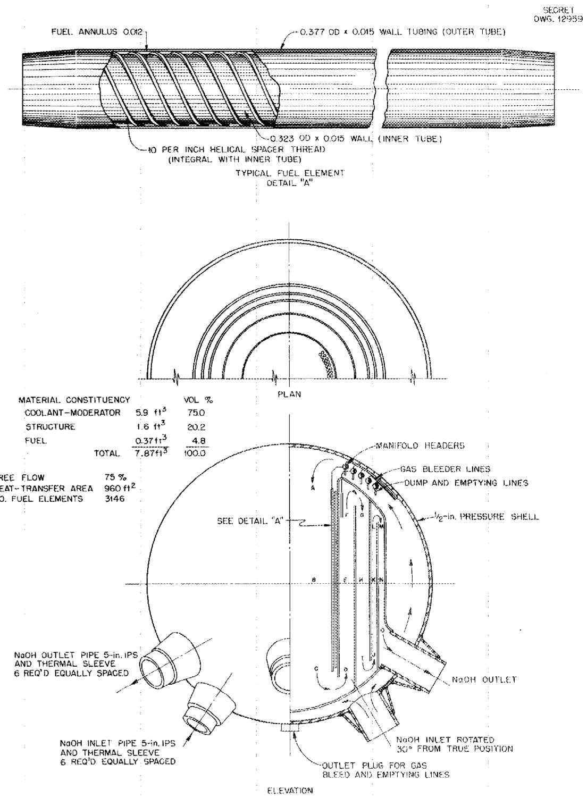  
Fig. 17.1 - Sodium Hydroxide Cooled and Moderated Reactor. Dimensions are in inches unless otherwise specified.

# ANP PROJECT QUARTERLY PROGRESS REPORT

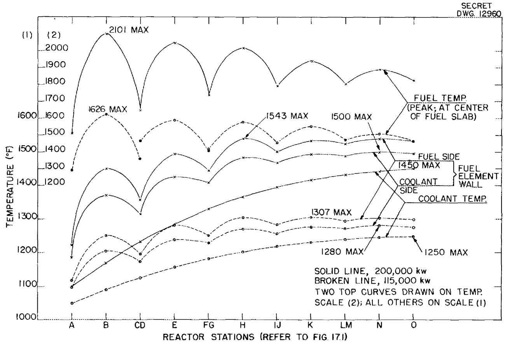  
Fig. 17.2 - Temperature Throughout Sodium Hydroxide Core.

(the fluid comprising the reflector) to enable the pressure shell to operate at the lowest temperature in the cycle. It is then passed through the core via five parallel passes, starting at the core centerline and discharging from the peripheral pass.

Reactor temperatures, flow velocities, and heat-transfer coefficients are plotted against flow path length in Figs. 17.2 and 17.3. Data are plotted corresponding to two design conditions in Table 17.1. The 115-megawatt conditions correspond to the requirements for Mach 0.75 at 35,000

# TABLE 17.1

Design Coolant Condition for Maximum and Cruise Power   

<table><tr><td></td><td>COOLANT
INLET
TEMP. (°F)</td><td>COOLANT
OUTLET
TEMP. (°F)</td></tr><tr><td>Maximum power
200 megawatts</td><td>1100</td><td>1450</td></tr><tr><td>Cruise power
115 megawatts</td><td>1050</td><td>1250</td></tr></table>

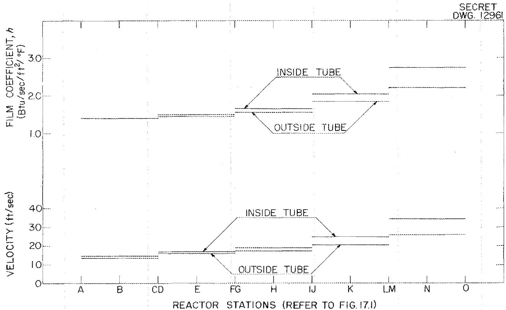  
Fig. 17.3 - Sodium Hydroxide Velocity and Film Coefficient Throughout Core. Velocity and $h$ for 200,000 kw; same for 125,000 kw.

ft, based on NEPA studies for their type IL-14 power plant. The 200-megawatt conditions were selected initially for design purposes and were intended to include calculated requirements with a generous contingency margin.

Design features currently under investigation include a fuel header and fission product gas bleed-off system, and a control system involving displacement of reflector sodium hydroxide by inert gas. Both systems include negative acceleration features.

# ANP PROJECT QUARTERLY PROGRESS REPORT

# 18. HIGH-TEMPERATURE POWER PLANT STUDIES (1)

North American Aviation, Inc.

At the request of Oak Ridge National Laboratory, North American Aviation has conducted an investigation of high-temperature (above $1800^{\circ}\mathrm{F}$ ) helium and sodium liquid-vapor power cycles with regard to their application to the Phase II (Mach 1.5, 45,000 ft) aircraft. This work has been completed, and detailed reports are being prepared for publication. A brief summary of the conclusions reached as a result of these studies is presented here.

Aerodynamic studies here indicate that $L / D$ ratios of the order of 4.0 to 5.0 represent a maximum attainable range for large supersonic aircraft at Mach 1.5 and 45,000 ft. Values at the higher end of the range can be achieved only with an exceptionally clean airframe and high-impulse engines. (This is in sharp contrast to $L / D$ values of the order of 5.7 to 6.5 quoted generally in the literature for systems with relatively low-impulse engines.) A consequence of reduced aerodynamic performance is increased power plant impulse, and this in turn requires engineering a higher temperature power plant than is presently under consideration elsewhere. As a reference, the necessity of high-temperature power plants for the supersonic propulsion of nuclear aircraft has previously been indicated by NAA.(2)

North American has investigated compressor jets as a means for the attainment of the necessary high temperatures. In the binary compressor-jet cycles, the working medium in contact with the high-temperature components need not necessarily be an oxidizing fluid. If the operating temperature of the radiator is maintained below $1800^{\circ}\mathrm{F}$ , the problems of obtaining suitable high-temperature materials may be significantly reduced, since all high-temperature components are not subject to oxidation.

On the basis of experiments conducted at North American and elsewhere, there appear to exist materials capable of withstanding high temperatures (up to $3500^{\circ}\mathrm{F}$ ) in nonoxidizing atmospheres. Before these materials can be considered seriously for engineering application, a major developmental effort is required to establish techniques by which they can be fabricated into useful components. Furthermore, much has to be learned about the corrosion resistance of these materials to the various coolants and the working medium proposed. Some preliminary experimental work along these lines has been undertaken at this laboratory. To date, results are encouraging but not yet conclusive. For example, static corrosion rates of $3250^{\circ}\mathrm{F}$ sodium vapor on molybdenum are apparently well within the required limits for the aircraft power plants.

North American has conducted an analytical investigation of high-temperature compressor jets to determine the plausibility of such systems and to provide a guide for any future experimental work that might be undertaken. The aim in this work has not been to establish the feasibility of systems that might be constructed in the near future. The aim has been rather to determine whether an extensive materials and component development program for high-temperature compressor-jet application would be justified.

An integrated reactor, power plant, and airframe study has been conducted for several proposed systems, carried out in sufficient detail to determine if a plausible supersonic airplane is achievable. Some systems quickly appeared severely limited in performance and only a small amount of analytical detail was required. This was true for the gas-cooled reactors. The sodium liquid-vapor compressor jet was developed in considerable detail and appears to be one plausible system. In all cases the analysis was dependent on extrapolations of relatively meager experimental data on properties of materials and working fluids. The numerical results that have come out of these analyses are not intended to be final and fixed and should be considered in the light of their intended exploratory purpose.

# SODIUM LIQUID-VAPOR COMPRESSOR JET

A liquid-metal-cooled reactor operating in conjunction with a sodium liquid-vapor compressor-jet system has been investigated. On the basis of this study the following specifications for a supersonic aircraft have been established:

# General:

Mach no. (cruise) 1.5

Altitude (cruise) 45,000 ft

L/D (cruise) 5.0

Takeoff speed 170 knots

Landing speed 170 knots

# Weight:

Gross weight 400,000 lb

Power plant weight 140,000 lb

Reactor and shield (divided) 120,000 lb

Structure weight and miscellaneous 120,000 lb

Pay load weight 20,000 lb

# Reactor:

Diameter 4.0 ft

Length 4.0 ft

Moderator BeC + C

Fuel U homoge- neously impreg- nated in moderator

# Coolant

Reactor wall temperature \~3000°F

Fuel inventory 731b

Reactor power 535,000 kw

# Power plant:

Sodium evaporation temperature 2600°F (dry

saturated vapor)

Sodium evaporation pressure

Sodium condensate temperature

Maximum air temperature

Air flow rate

Air specific impulse

290 psia

$1700^{\circ}\mathrm{F}$

$\sim 1450^{\circ} \mathrm{F}$

1515 1b/sec

528 1b thrust/1b air/sec

Several airframe configurations and power plant arrangements were considered, each being optimized to arrive at the best overall performance. In the final configuration the entire power plant is housed within the fuselage, and side inlet scoops are provided for air intake. A shielded crew compartment is in the nose of the ship some 50 ft forward of the reactor and capable of housing five

# ANP PROJECT QUARTERLY PROGRESS REPORT

crew members and the necessary control equipment; The power plant is aft of the reactor; the fuselage diameter is approximately 13 ft at this section. The power plant consists of a sodium-vapor generator heated by molten tin, located immediately aft of the shielded reactor. Sodium vapor passes to five turbines mounted circumferentially around and entirely within the fuselage. Each turbine is directly coupled to a 303-lb/sec air compressor which drives air aft and across a common radiator, the sodium condenser, which occupies the entire fuselage diameter. Air continues aft through a nozzle producing the propulsive thrust; the sodium condensate is pumped forward to the vapor generator.

The task of developing such a power plant as described above would require a very extensive effort. However, if the appraisal of supersonic aerodynamic performance is correct, and if a manned, supersonic nuclear vehicle is required, a program of this sort should be undertaken. The sodium cycle is suggested as one possible approach, not necessarily a unique one, which on the basis of preliminary studies appears to have no fundamental limitations that preclude its development.

# HELIUM-COOLED REACTORS

In addition to compressor-jet systems in which helium serves both as a reactor coolant and working medium, several turbo-jet systems were investigated in combination with helium-cooled reactors.

These investigations have indicated that a major development effort utilizing helium-cooled reactors for

supersonic propulsion of aircraft cannot be justified. In no case does it appear that a supersonic vehicle can be achieved, even when considering reactor temperatures as high as $3300^{\circ}\mathrm{F}$ and helium pressures in the range of 1000 to 2000 psi. There are fundamental limitations involved having to do with the comparatively poor heat-transfer characteristics of the gaseous coolants.

A basic requirement for a high-performance aircraft is light, compact heat-exchange equipment with minimum auxiliary power requirement. It is well known that at moderate pressures and temperatures gaseous coolants are several orders of magnitude poorer in these regards than the liquid coolants. Increasing gas pressure tends to reduce this difference, as does increasing temperature differentials between hot and cold fluids. At high pressures equipment becomes more compact and pumping power is reduced, but little or no weight saving is accomplished since heavier walled equipment is required to accommodate the increased pressure. The requirement that temperature differentials in heat-exchange equipment be large forces the maximum power plant temperatures to a high level without any realizable thermodynamic benefit. While temperatures in this analysis as high as $3300^{\circ}\mathrm{F}$ were considered, air specific impulses remained relatively low (approximately 30 lb thrust/lb air/sec). In all specific designs considered for the helium system, no plausible supersonic vehicle was found. Specific power plant weights in excess of 2.6 lb of power plant per pound thrust were obtained in all instances. Even assuming an $L / D$ ratio of 5.0, which is hardly realizable with these low-impulse engines, an aircraft of a gross weight well in excess of 450,000 lb is

FOR PERIOD ENDING SEPTEMBER 10, 1951

required. On this basis it was recom- devoted to the helium, or other gas, mended that no additional effort be cycle.

Part V

APPENDIXES

# 19. ANALYTICAL CHEMISTRY(1)

C. D. Susano, Analytical Chemistry Division

Satisfactory chemical methods have been developed or suitably modified for the determination of metallic corrosion products - principally iron, nickel, chromium, molybdenum, and platinum - in reactor fuels composed of eutectic mixtures of fluoride salts. Two colorimetric methods for low concentrations of cobalt in fluoride salt mixtures and alkali hydroxides were found to be too insensitive (sensitivity, 100 ppm) for the purpose. Work is continuing on this problem.

A crystalline material, which was deposited in the lithium at a hot-cold junction in a coolant test system during an extended shutdown period, was identified by X-ray-diffraction analysis and chemical analysis as a mixture of slightly contaminated lithium hydride and hydroxide. A method for the determination of carbon in lithium, both carbide and carbonate carbon, has been developed.

A review of the analytical work for the various phases of the ANP Program shows that approximately $50\%$ of the work is concerned with the analysis of reactor fuels of the mixed fluoride salt types, $30\%$ with the analysis of sodium and lithium, and the remainder with miscellaneous samples quite varied in nature. A total of 1781 determinations (75% chemical, 25% spectrographic) were made on 310 samples.

The $n$ -butyl bromide method, which is now being used regularly for the determination of oxygen in sodium, is found to yield excellent results for oxygen concentrations of $0.015\%$ or greater. Studies are being made of refinements of this method so that it may be applied with reasonable accuracy at even lower concentrations. A search is being made to find a liquid medium suitable for use in melting sodium samples from metal tube containers; certain hydrocarbons which are under test appear to be promising for this application. Preliminary tests directed toward the adaptation of the method of Pepkowitz and Judd(2) (for oxygen in sodium) to the determination of oxygen and nitrogen in lithium do not appear promising. However, an apparatus is under construction for use in determining the oxygen content of metallic lead. The method to be used incorporates modifications and refinements of the technique used by Funston and Reed(3) for the determination of oxygen in bismuth.

The oxygen content of inert gases (principally helium) is now being determined by a colorimetric method which gives excellent precision below 25 ppm; at higher concentrations of oxygen the precision drops off sharply. An alternate method will be tested as

# ANP PROJECT QUARTERLY PROGRESS REPORT

soon as fabrication of the required apparatus is complete.

# ANALYSIS OF REACTOR FUELS

R. Rowan, Jr. J. C. White W. J. Ross

Analytical Chemistry Division

In the course of the development of methods for the determination of metallic corrosion products in NaF-KF-UF and NaF-BeF2-UF eutectic fuel mixtures, a considerable amount of information has been accumulated as to the solubilities of these mixtures in various reagents. This information is being compiled and will be issued as a separate report.

Methods and techniques have been developed for the determination of metallic corrosion products - chiefly iron, nickel, chromium, and molybdenum - in two reactor fuels, the ternary eutectics NaF-KF-UF $_4$ and NaF-BeF $_2$ -UF $_4$ . At present only the NaF-KF-UF $_4$ mixture is of interest from the standpoint of corrosion studies. Platinum and silver are found in the eutectic since thermocouples of these metals are used. The technique of removing the eutectic from metal sample tubes after heat treatment, which was described in previous reports, (4.5) has also been applied successfully to samples contained in tubes of unusually small size (1/8 in. i.d.), which have to be used in corrosion studied in the X pile.

Spectrographic Results. The eutectic mixture was prepared for spectrographic analysis of corrosion products as described in previous reports.(4,5) The agreement of spectrographic and chemical results was satisfactory for iron, nickel, and chromium. Molybdenum was not determined spectrographically. Since the spectrographic preparation is time-consuming and the results essentially substantiate the chemical results, spectographic tests have been discontinued.

Development of Colorimetric Methods. Two reagents for the determination of traces of cobalt in fluoride eutectics and fused alkali metal hydroxides, tetraphenyl arsenium chloride and sodium diethyl thiocarbamate, were investigated. Neither showed sufficient sensitivity under the conditions imposed in this case, i.e., the limited amount of sample available and the number of other determinations required on the same sample. The lower limit of sensitivity for these reagents is of the order of 100 ppm. Other reagents, nitroso R salt in particular, will be tried, and the procedures examined for possible means of increasing sensitivity.

The procedure for the colorimetric determination of chromium has been standardized to give $5\%$ accuracy in the range 100 to 20,000 ppm by adopting the procedure of G. F. Smith(6) which assures holding all the chromium in the same valence state.

Excellent precision has been obtained in determining molybdenum in quantities

less than 100 ppm by using the thio-cyanate—stannous chloride complex and extracting with butyl acetate.

Determination of Platinum. Platinum is currently being used as a thermocouple material in studies of the physical properties of the fluoride eutectic fuel mixtures, and it is therefore necessary to analyze these mixtures for platinum. Samples analyzed for platinum have generally been found to contain less than 100 ppm.

Platinum(7) may be determined colorimetrically as the yellow chloroplatinous ion, $\mathrm{PtCl}_6^{4-}$ , the reduction from Pt(IV) to Pt(II) being accomplished by stannous chloride in acidic solution. The color is stable at acid concentrations of about 0.25 N. Palladium interferes in the procedure. The interference of yellow U(VI) ion is eliminated by extraction of the uranium with tributyl phosphate.

# OXYGEN IN SODIUM

R. Rowan, Jr., and J. C. White Analytical Chemistry Division

The $n$ -butyl bromide method for the determination of oxygen in sodium is being used on a routine basis for samples of oxygen content of about $0.015\%$ or more. Studies are now progressing to determine the accuracy of this and other methods (Pepkowitz and Judd in particular) in the range 0.001 to $0.005\%$ .

# OXYGEN IN LEAD

D. L. Manning and W. K. Miller Analytical Chemistry Division

The need for a method for the determination of small amounts of oxygen in lead has led to the investigation of the method of Funston and Reed.(3) This method involves the measurement of the reduction in volume of hydrogen when heated in contact with the sample; however, the total volume of the apparatus is so large in comparison with the small change in volume during the reaction that the method is highly inaccurate. A new apparatus is being designed to correct this failing in which a small known volume of hydrogen is introduced into a combustion chamber and allowed to burn with the oxygen from the lead. When the reaction is complete, the remainder of the hydrogen is swept out of the chamber with $\mathrm{CO}_{2}$ , the $\mathrm{CO}_{2}$ absorbed in reaction with KOH, and the volume of the remaining hydrogen determined.

# OXYGEN IN HELIUM

J. C. White and W. J. Ross Analytical Chemistry Division

The method of Brady $^{(8)}$ discussed in the last quarterly progress report $^{(9)}$ has been modified and used with good results. The new procedure is to measure the volume of test gas required to produce a $5\%$ change in transmission of the sodium anthraquinone sulfonate reagent, which change is

# ANP PROJECT QUARTERLY PROGRESS REPORT

directly proportional to the oxygen content of the gas. The precision of the results is good at oxygen concentrations of less than 25 ppm, but drops off sharply at higher concentrations because of the smaller test gas volumes used. This is illustrated by the following typical results of 26 determinations made on 12 helium cylinders:

<table><tr><td>TEST</td><td>VOLUME OF HELIUM (ml)</td><td>\( {\mathrm{O}}_{2} \) (ppm)</td></tr><tr><td rowspan="3">A</td><td>3.96</td><td>12</td></tr><tr><td>2.26</td><td>10</td></tr><tr><td></td><td>11 (avg.)</td></tr><tr><td rowspan="4">B</td><td>0.45</td><td>81</td></tr><tr><td>0.17</td><td>130</td></tr><tr><td>0.23</td><td>300</td></tr><tr><td></td><td>170 (avg.)</td></tr></table>

A modification of the Winkler method for the determination of oxygen as developed by Pepkowitz(10) will be tried for comparison with the method now in use. The necessary apparatus is being fabricated.

# OXYGEN AND NITROGEN IN LITHIUM

R. Rowan, Jr. W. K. Miller

D. L. Manning

Analytical Chemistry Division

An attempt was made to apply the method of Pepkowitz and Judd(2) for oxygen in sodium to this problem without success. The reaction does not proceed until the temperature of the mixture of mercury and lithium is raised almost to the melting point of

lithium, and then takes place with much violence. Adaptation of this reaction to a controllable procedure does not seem imminent.

# CARBON IN LITHIUM

R. Rowan, Jr. W. K. Miller

D. L. Manning

Analytical Chemistry Division

Most of the carbon in lithium is present as lithium carbide, $\mathrm{Li}_2\mathrm{C}_2$ which decomposes on contact with water to form acetylene, $\mathrm{C}_2\mathrm{H}_2$ ; however, some carbon may exist as carbonate and graphite. Preliminary investigation is being made of a method for simultaneously determining carbide and carbonate which involves dissolving in dilute acid a sample containing lithium carbonate and carbide. The evolved carbon dioxide is absorbed in ascarite and weighed; the acetylene is bubbled through an alkaline solution of potassium iodomercurate, $\mathrm{K}_2\mathrm{HgI}_4$ , and titrated as the acetylride $(\mathrm{HC} = \mathrm{C})_2\mathrm{Hg}$ ; and the graphitic carbon is determined by combustion of the wet residue.

# URANIUM TRIFLUORIDE IN URANIUM

# TETRAFLUORIOE

W. K. Miller and D. L. Manning

Analytical Chemistry Division

Uranium trifluoride has recently been prepared in anticipation of its use in eutectic fuel mixtures for nuclear reactors. Since its preparation generally includes reduction of $\mathbf{UF}_4$ , analytical procedures used to determine $\mathbf{UF}_3$ purity must be able to separate the two fluorides. It was hoped to find an oxidizing agent which would oxidize U(III) to U(IV) with no effect on the tetravalention already present.

Of those mild oxidizing agents which were tried, including water, ammoniacal silver nitrate, and ferric sulfate—hydrofluoric acid, only water appeared promising, although ammoniacal silver nitrate is still under investigation.

The amount of $\mathbf{U}\mathbf{F}_{3}$ may also be determined by measuring evolved hydrogen by the reaction

$$
4 \mathrm {U F} _ {3} + 4 \mathrm {H C l} \longrightarrow \mathrm {U C l} _ {4} + 3 \mathrm {U F} _ {4} + 2 \mathrm {H} _ {2}
$$

The apparatus used for this is similar to that for the Dumas nitrogen determination except that a reaction flask fitted with a dropping funnel replaces the Dumas combustion tube. The evolved hydrogen is swept into the gas buret by a stream of $\mathrm{CO}_{2}$ . Early results are not too consistent, but it is believed that by reducing the volume of the apparatus better precision can be attained.

The most promising method so far considered is based on the total reducing power of the sample. An excess of standard ceric sulfate is added to a mixture of the sample and aluminum sulfate, and the excess is titrated with standard ferrous ammonium sulfate. Results obtained from this method are compared with those from the hydrogen evolution method on a single sample in Table 19.1.

# IDENTIFICATION OF RESIDUE IN LITHIUM-METAL COOLANT SYSTEM

W. K. Miller and D. L. Manning  
Analytical Chemistry Division

During a two-week period of repair on a lithium-metal coolant system, one

TABLE 19.1 Determination of Uranium Trifluoride by Two Methods   

<table><tr><td rowspan="2">TEST</td><td colspan="2">UF3 (%)</td></tr><tr><td>CERIC SULFATE METHOD</td><td>HYDROGEN EVOLUTIONMETHOD</td></tr><tr><td>1</td><td>91.1</td><td>97.5</td></tr><tr><td>2</td><td>91.2</td><td>92.5</td></tr><tr><td>3</td><td>89.9</td><td>86.2</td></tr><tr><td>4</td><td>89.2</td><td>91.5</td></tr><tr><td>5</td><td>93.5</td><td>89.7</td></tr><tr><td>6</td><td>90.7</td><td>98.1</td></tr><tr><td>Avg.</td><td>90.9</td><td>92.9</td></tr></table>

portion of the system remained at the operating temperature of about $500^{\circ}\mathrm{F}$ while an adjacent section was cooled to room temperature. The entire system was then allowed to cool. Clusters of pink transparent crystals were found embedded in the lithium matrix in the zone of contact between the cold and hot sections. The crystals dissolved completely in water with a vigorous evolution of gas, indicating that they were probably lithium carbide or lithium hydride. A few crystals were mechanically separated from most of the matrix and submitted to the Isotopes Physics Department for X-ray-diffraction analysis. The sample was identified as a mixture of lithium hydride and lithium hydroxide and possibly small amounts of lithium nitride. It is probable that the LiOH was formed by hydrolysis at the surface of the sample and that freshly separated crystals are almost pure LiH. A hydrogen determination by combustion was unsuccessful, probably because of the presence of some adhering lithium; however, it is planned to determine

# ANP PROJECT QUARTERLY PROGRESS REPORT

hydrogen by a gas evolution procedure when the apparatus described above under "Oxygen in Lead" becomes available.

# ANALYTICAL SERVICES

L. J. Brady and J. W. Robinson  
Analytical Chemistry Division

J. A. Norris, Isotope Research and Production Division

Fifty percent of the service analyses during the past quarter involved reactor fuels, i.e., the two eutectic mixtures $\mathrm{UF_4}$ -NaF-KF and $\mathrm{UF_4}$ -BeF $_2$ -NaF; $30\%$ involved sodium and lithium metals; and the remainder involved beryllium

compounds, residues, metals, etc. There were 1781 determinations made on 310 samples, $75\%$ chemically and $25\%$ spectrographically. A summary of service analyses performed is shown in Table 19.2.

# TABLE 19.2

# Backlog Summary

Samples on hand May 26, 1951 58

No. of samples received 403

Total number of samples 461

No.of samples reported 310

Backlog as of August 10, 1951 151

# 20. LIST OF REPORTS ISSUED

<table><tr><td>REPORT NO.</td><td>TITLE OF REPORT</td><td>AUTHOR(S)</td><td>ISSUED</td></tr><tr><td colspan="4">Design of the ARE</td></tr><tr><td>Y-F27-8</td><td>ARE Operation with Especial Regard to the Coolant Circuit</td><td>W. M.</td><td>Breazeale 7-9-51</td></tr><tr><td>Y-F20-15</td><td>Detection of Leaks in the Fuel Elements by Means of Radioactive Tracers</td><td>W. K.</td><td>Ergen 7-10-51</td></tr><tr><td>Y-F10-57</td><td>Activity of Fission Products and Heavy Elements in ARE Fuel</td><td>Glen Putnam</td><td>7-12-51</td></tr><tr><td colspan="4">Reactor Physics</td></tr><tr><td>Y-F10-56</td><td>Simple Correction on Multiplication Constant for Difference Between Assumed and Resulting Fission Distribution in Multigroup Calculations</td><td>N. M.</td><td>Smith, Jr. 5-22-51</td></tr><tr><td rowspan="2">Y-F10-55</td><td rowspan="2">The Contribution of the (n,2n) Reaction to the Beryllium Moderated Reactor</td><td>C. B.</td><td>Mills 6-5-51</td></tr><tr><td>N. M.</td><td>Smith, Jr.</td></tr><tr><td>Y-F10-58</td><td>A Discussion of Normalization in IBM Adjoint Calculations</td><td>M. J.</td><td>Nielsen 6-26-51</td></tr><tr><td>Y-F10-61</td><td>IBM Procedure for B4C Layer Between Core and Re-flector by the Coveyou Method</td><td>C. B.</td><td>Mills 6-28-51</td></tr><tr><td>Y-F10-60</td><td>Recommendation on Alternative Loading</td><td>N. M.</td><td>Smith, Jr. 6-29-51</td></tr><tr><td>Y-F10-59</td><td>The Spherical Reactor with a B4C Layer Between Core and Reflector</td><td>C. B.</td><td>Mills 7-6-51</td></tr><tr><td>Y-F10-62</td><td>The Transmission Coefficient of the B4C Curtain in the ANP Reactor</td><td>C. B.</td><td>Mills 7-19-51</td></tr><tr><td>Y-F10-65</td><td>NaOH Cooled and Moderated Reactor</td><td>N. M.</td><td>Smith, Jr. 7-24-51</td></tr><tr><td>Y-F10-68</td><td>The Multiregion Reactor Problem as Applied to the Multigroup Method</td><td>C. B.</td><td>Mills 8-16-51</td></tr><tr><td>Y-F10-66</td><td>Numerical Technique for Criticality Calculations on Hydrogen Moderated Reactors</td><td>J. W.</td><td>Webster 8-20-51</td></tr><tr><td>Y-F10-64</td><td>Heating in the B4C Curtain Due to Neutron Absorption and the B10(n,a)Li7 Reaction</td><td>C. B.</td><td>Mills 8-16-51</td></tr><tr><td>Y-F10-67</td><td>Effect on Radioactivity of Flooding Coolant Channels with Borated Water</td><td>J. W.</td><td>Webster 8-14-51</td></tr><tr><td>Y-F10-70</td><td>Reduction of Peak Temperatures in Fuel Tubes</td><td>R. J.</td><td>Beeley 8-23-51</td></tr></table>

# ANP PROJECT QUARTERLY PROGRESS REPORT

<table><tr><td>REPORT NO.</td><td>TITLE OF REPORT</td><td>AUTHOR(S)</td><td>DATE
ISSUED</td></tr><tr><td>Y-F10-72</td><td>The Calculation of Eigenvalues of Differential Systems by Numerical Integration</td><td>R. R. Coveyou</td><td>8-30-51</td></tr><tr><td colspan="4">Shielding Research</td></tr><tr><td>CF-51-5-74</td><td>Calibration of the Fast Neutron Dosimeter Used at the Bulk Shielding Facility</td><td>R. G. Cochran</td><td>5-11-51</td></tr><tr><td>CF-51-8-7</td><td>Suggested Program for Divided Shield Measurements and Calculation of Air Scattering</td><td>J. L. Meem
R. H. Ritchie</td><td>8-1-51</td></tr><tr><td>ORNL-1027</td><td>Determination of the Power of the Shield Tasting Reactor. I. Neutron Flux Measurements in the Water-Reflected Reactor</td><td>J. L. Meem
E. B. Johnson</td><td>8-13-51</td></tr><tr><td>ORNL-1046</td><td>A Nuclear Plate Camera for Fast Neutron Spectroscopy at the Bulk Shielding Facility</td><td>J. L. Meem
E. B. Johnson</td><td>9-14-51</td></tr><tr><td>CF-5-8-253</td><td>Preliminary Gamma-Ray Spectral Measurements at the Bulk Shielding Facility</td><td>F. C. Maienschein
R. H. Ritchie</td><td>8-27-51</td></tr><tr><td>CF-51-8-252</td><td>Experiment 5 at the Bulk Shielding Facility - The Shadow Shield</td><td>H. E. Hungerford</td><td>8-8-51</td></tr><tr><td>Y-F5-55</td><td>NDA Quarterly Report of ANP Activities from June 1 to August 31, 1951 - Divided Shield Studies</td><td>NDA</td><td>8-31-51</td></tr><tr><td>Y-F5-57</td><td>The Divided Shield</td><td>L. A. Wills</td><td>9-17-51</td></tr><tr><td>CF-51-6-53</td><td>The Shielding of Mobile Reactors</td><td>E. P. Blizzard
T. A. Welton</td><td>To be published in Reactor Science and Technology</td></tr><tr><td colspan="4">Heat-Transfer Research</td></tr><tr><td>CF-51-8-32</td><td>Status Memorandum on the Analysis of Heat-Transfer Characteristics of the Lithium Figure-Eight System</td><td>H. C. Claiborne</td><td>8-6-51</td></tr><tr><td>ORNL-1040</td><td>The Design and Construction of an Ice Calorimeter</td><td>R. F. Redmond
J. Lones</td><td>8-27-51</td></tr><tr><td colspan="4">Radiation Damage</td></tr><tr><td>ORNL-928</td><td>Physical Properties of Irradiated Plastics</td><td>O. Sisman
C. D. Bopp</td><td>6-29-51</td></tr><tr><td>ANP-67</td><td>Radiation Damage and the ANP Reactor</td><td>L. P. Smith</td><td>7-25-51</td></tr><tr><td colspan="4">Metallurgy</td></tr><tr><td>Y-F31-2</td><td>Cleanliness of Sodium Circuits</td><td>E. C. Miller</td><td>7-4-51</td></tr><tr><td>Y-B4-16</td><td>Literature Search on Metal-Ceramic Materials</td><td>E. P. Carter</td><td>7-11-51</td></tr><tr><td>Y-F31-3</td><td>Techniques for Molybdenum Plating from Carbonyl Vapor of Solution</td><td>E. C. Miller</td><td>7-27-51</td></tr><tr><td>CF-51-8-256</td><td>Literature Survey on Columbium</td><td>W. C. Hagel</td><td>8-21-51</td></tr><tr><td colspan="4">Experimental Engineering</td></tr><tr><td>Y-F23-5</td><td>Tests Required for Reactor Components</td><td>G. A. Cristy
W. C. Tunnell
D. F. Salmon</td><td>6-13-51</td></tr><tr><td>Y-F30-1</td><td>Report on Test of Extinguishing Agents for Lithium Metal Fires</td><td>E. S. Wilson
P. O. Nadler</td><td>6-18-51</td></tr><tr><td>Y-F8-22</td><td>Preliminary Engineering Study of NaOH Cooled and Moderated Reactor</td><td>R. W. Schroeder</td><td>8-9-51</td></tr><tr><td>Y-F31-4</td><td>Testing and Examination on Thermal-Convection Loops Operated with Lithium and Lead</td><td>R. B. Day
A. D. Brasunas</td><td>8-20-51</td></tr><tr><td colspan="4">Alternative Systems</td></tr><tr><td>NDA Docu-
ment</td><td>Estimated Divided Shield Weights for Supercritical Water Cycle</td><td>NDA</td><td>6-8-51</td></tr><tr><td>HKF-112</td><td>Circulating Moderator Reactor for Subsonic Aircraft</td><td>H. K. Ferguson Co.</td><td>9-1-51</td></tr><tr><td colspan="4">Miscellaneous</td></tr><tr><td>Y-B31-260</td><td>Analytical Chemistry-ANP Program Quarterly Progress Report for Period Ending May 31, 1951</td><td>Analytical Chemistry 5-31-51 Division</td><td></td></tr></table>