#

E

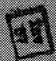

#

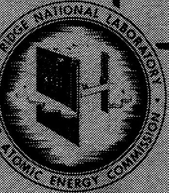

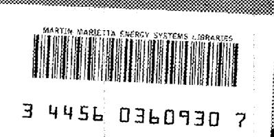

ORNL-1170
Progr aas Report
%

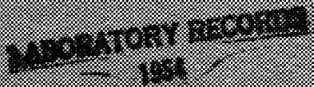

AIRCRAFT NUCLEAR PROPULSION PROJECT

QUARTERLY PROGRESS REPORT

FOR PERIOD ENDING DECEMBER 10, 1951

特

#

中  
$\therefore m - 1 \neq  0$ ;

CENTRAL RESEARCH LIBRARY DOCUMENT COLLECTION

LIBRARY LOAN COPY

DO NOT TRANSFER TO ANOTHER PERSON

If you wish someone else to see this document, send in name with document and the library will arrange a loan.

OAK RIDGE NATIONAL LABORATORY

C

CARBIDE AND CARBON CHEMICALS COMPANY

4. D、B、C、D、F、A、H、O、N、G、H、I、K、L、M、N、O、P、Q、R、S、T、U、V、W、X、Y、Z

图

HOST OFFICE BOX F

CAXI

ORNL-1170

This document consists of 191 pages.

Copy of 208 Series A.

Contract No. W-7405, eng. 26

# AIRCRAFT NUCLEAR PROPULSION PROJECT QUARTERLY PROGRESS REPORT

for Period Ending December 10, 1951

R.C.Briant

Director, ANP Project

Edited by:

W. B. Cottrell

DATE ISSUED

FEB 20 1952

OAK RIDGE NATIONAL LABORATORY

Operated by

CARBIDE AND CARBON CHEMICALS COMPANY

A Division of Union Carbide and Carbon Corporation

Post Office Box P

Oak Ridge, Tennessee

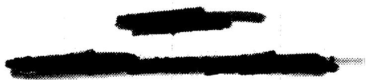

34456 0360930？

ORNL-1170

Progress

# INTERNAL DISTRIBUTION

1. G. T. Felbeck (C&CCC)   
2-3. Chemistry Library   
4. Physics Library   
5. Biology Library   
6. Health Physics Library   
7. Metalurgy Library   
8-9. Training School Library   
10-13. Central Files   
14. C. E. Center   
15. C. E. Larson   
16. W.B.Hume (K-25)   
17. W. D. Lavers (Y-12)   
18. A. M. Weinberg   
19. E. H. Taylor   
20. E. D. Shipley   
21. E. J. Murphy   
22. F. C. VonderLage   
23. R. C. Briant   
24. J. A. Swartout   
25. J. M. Cisar   
26. A. H. Snell   
27. A. Hollaender   
28. F. L. Steahly   
29. K. Z. Morgan   
30. D. W. Cardwell   
31. M. T. Kelley   
32. E. M. King   
33. C. E. Winters   
34. J. A. Lane   
35. J. H. Buck   
36. J. P. Gill

37. R.W.Stoughton   
38. F. R. Bruce   
39. H. W. Savage   
40. W. K. Eister   
41. A. S. Householder   
42. C. B. Graham   
43. R. N. Lyon   
44. C. P. Keim   
45. W. R. Gall   
46. A. J. Miller   
47. R. W. Schroeder   
48. D. S. Billington   
49. E. P. Blizzard   
50. C. E. Clifford   
51. G. H. Clewett   
52. A. D. Callihan   
53. R. S. Livingston   
54. W. D. Manly   
55. J. L. Meem   
56. C. D. Susano   
57. W. B. Cottrell   
58. W. M. Breazeale   
59. W. R. Grimes   
60. A. Brasunas   
61. H. F. Poppendiek   
62. F. C. Uffelman   
63. D. D. Cowen   
64. P. M. Reyling   
74. ANP Library   
83. Central Files (O.P.)

ORNL-1170

Progress

# EXTERNAL DISTRIBUTION

84-86. Air Force Engineering Office

87-108. General Electric Co., Oak Ridge, Tenn.

109-118. Argonne National Laboratory

119. Armed Forces Special Weapons Project (Sandia)

120-127. Atomic Energy Commission, Washington

128. Batelle Memorial Institute

129-131. Brookhaven National Laboratory

132. Bureau of Aeronautics

133. Bureau of Ships

134-139. Carbide and Carbose Chemicals Company (Y-12)

140. Chicago Latent Group

141. Chief of Naval Research

142-146. duPont Company

147-150. General Electric Company, Richland

151. H. K. Fergusson Company

152. Hanford Operations Office

153-156. Idaho Operations Office

157. Iowa State College

158-161. Knoll Atomic Power Laboratory

162-164. Los Amigos

165. Massachusetts Institute of Technology (Kaufmann)

166-167. Mound Laboratory

168-171. National Advisory Committee for Aeronautics, Cleveland

172. National Advisory Committee for Aeronautics, Washington

173-174 New York Operations Office

175-176. North American Aviation, 18.

17. Patent Branch, Washington

178. Savannah River Operations Office

179 180. University of California Radiation Laboratory

181-184. Westinghouse Electric Corporation

185-193. Wright Air Development Center

194-208. Technical Information Service, Oak Ridge

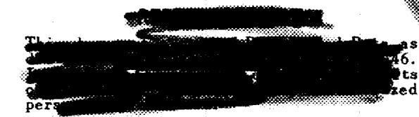

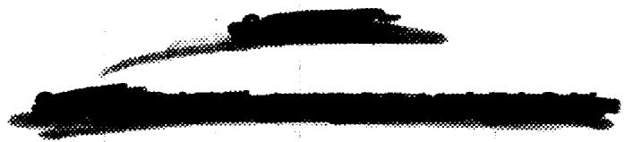

Reports previously issued in this series are as follows:

ORNL-528 Period Ending November 30, 1949

ORNL-629 Period Ending February 28, 1950

ORNL-768 Period Ending May 31, 1950

ORNL-858 Period Ending August 31, 1950

ORNL-919 Period Ending December 10, 1950

ANP-60 Period Ending March 10, 1951

ANP-65 Period Ending June 10, 1951

ORNL-1154 Period Ending September 10, 1951

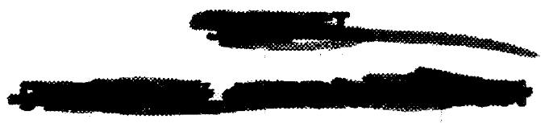

# TABLE OF CONTENTS

PAGE

FOREWARD 1

# PART I REACTOR THEORY AND DESIGN

SUMMARY AND INTRODUCTION 5

1. CIRCULATING-FUEL AIRCRAFT REACTOR 7

Airplane and Overall Arrangement 7   
Reactor 8   
Engine 8   
Radiators 9   
Shielding 9   
Accessory Systems 9

2. LIQUID-METAL-COOLED AIRCRAFT REACTOR EXPERIMENT 11

Core-Reflector-Pressure Shell 11   
11   
Reactor Control 11   
Control system 12   
High temperature fission chamber 12   
Reactor dynamic computer 12   
Instrumentation 12   
ARE Building Facility 12   
Remote-Handling Equipment 12

3. REACTOR PHYSICS 13

13   
Circulating-Fuel Reactors 14   
Beryllium-oxide moderated reactor 14   
Water-moderated reactor 17   
Comparison of $\mathbf{H}_2\mathbf{O}$ - and BeO-moderated reactors 29   
Effect of delayed neutrons on kinetic response 30   
Circulating-Moderator Reactors 31   
31

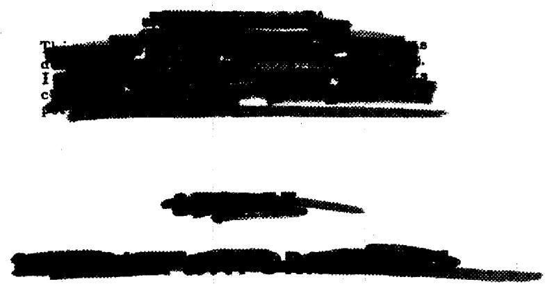

PAGE

4. CRITICAL EXPERIMENTS 35

Preliminary Assembly of Direct-Cycle Reactor 35

Graphite Reactor 37

5. NUCLEAR MEASUREMENTS 38

The 5-Mev Van de Graaff Accelerator 38

Measurements of the $(n,2n)$ Reaction in Beryllium 38

Time-of-Flight Neutron Spectrometer 39

6. EXPERIMENTAL REACTOR ENGINEERING 40

Pump Development 40

Centrifugal pumps for figure-eight loops 41

AREcentrifugal pump design 41

Canned-rotor pump 42

Frozen-sodium-seal pump 42

Two-stage electromagnetic pump 42

Electromagnetic pump cell development 42

Seal Tests 43

Frozen-sodium seal 43

Frozen-fluoride seal 43

Graphitar ring-ketos tool steel gas seal 43

Test Loops 44

Calibration loop 44

Sodium manometer loop 44

Self-welding tests 44

Materials tests 44

Valve tests 45

Heat-Exchanger Tests 45

NaK to NaK heat exchanger 45

Sodium to air radiator 47

Liquid-Fuel Systems 47

Instrumentation 47

Level control and indication 48

Flow measurement 48

Pressure-measuring devices 48

Full-Scale ARE Component Test Facilities 48

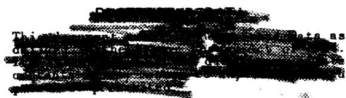

PAGE

Fluoride Production 49

Cleaning of Fluorides from Systems 49

NaK Disposal 50

Alkali Metals Manual 50

# PART II SHIELDING RESEARCH

SUMMARY AND INTRODUCTION 53

7. BULK SHIELDING REACTOR 54

Reactor Operation 54

Mockup of the Unit Shield 55

Mockup of the Divided Shield 59

8. DUCT TESTS 65

Air-Filled Duct Tests in Lid Tank 65

Cylindrical ducts 65

Annularducts 72

Liquid-Metal Duct Test in Thermal Column 72

9. SHIELDING INVESTIGATIONS 73

Tower Shielding Facility Proposal 73

Circulating-Fuel Reactor Shields 74

NDA Divided-Shield Studies 74

# PART III MATERIALS RESEARCH

SUMMARY AND INTRODUCTION 77

10. CHEMISTRY OF HIGH-TEMPERATURE LIQUIDS 79

Low Melting-Fluoride Fuel Systems 79

LiF-KF-UF 80

LiF-NaF-KF-UF4 80

LiF-NaF-RbF-UF4 80

NaF-BeF2-UF4 81

LiF-NaF-BeF2UF4 81

Ionic Species in Fused Fluorides 82

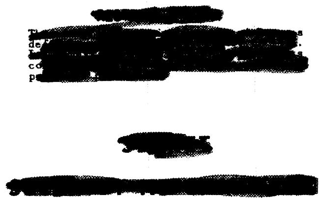

PAGE

Experimental procedures 82

Results of electrolyses 82

Homogeneous Fuels 83

Uranium solubility in hydroxide-borate mixtures 83

Uranium solubility in hydroxides with various additives 83

Moderator-Coolant Development 84

Preparation of pure hydroxides 84

KOH-LiOH 85

Hydroxide-fluoride systems 85

Coolant Development 85

RbF-LiF 85

NaF-BeF, 86

NaF-KF-RbF 86

KF-LiF-RbF 86

NaF-LiF-RbF 86

Ternary systems containing $\mathbf{BeF}_2$ 87

Service Functions 87

11. CORROSION RESEARCH 88

Static Corrosion by Fluorides 89

Static Corrosion by Hydroxides 89

Corrosion of uncoated metals 90

Corrosion of coated metals 98

Dissolution of metals in sodium hydroxide 100

Static Corrosion by Fluoride-Hydroxide Systems 102

Static Corrosion by Sodium Cyanide 103

Static Corrosion by Liquid Metals 103

Sodium on stainless steel 103

Lithium on coated stainless steel 103

Static Corrosion of Fuel Capsules in Sodium 105

Dynamic Corrosion in Thermal Convection Loops 106

Fluoride corrosion 107

Hydroxide corrosion 107

Fundamental Corrosion Research 110

EMF measurements in hydroxides 110

Polarographic study of sodium hydroxide 110

Survey of the mass-transfer phenomena 111

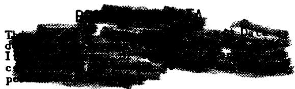

# PAGE

# 12. HEAT-TRANSFER RESEARCH AND PHYSICAL PROPERTIES 115

Natural Convection in Liquid-Fuel Elements 115

Heat-Transfer Coefficients 116

Heat transfer in fused hydroxides and salts 116

Heat transfer in molten lithium 117

Entrance-region heat transfer in a sodium system 118

Heat transfer in a circulating fuel system 120

Heat Capacity 120

Thermal Conductivity 120

Thermal conductivity of liquids 120

Thermal conductivity of solids 122

Thermal conductivity of diatomaceous silica powder 122

Density of Liquids 123

Viscosity 123

Falling-ball viscometer 124

Zahn type viscometer 124

Viscosity of fluoride mixtures 126

Vapor Pressure of Liquid Fuels 126

# 13.METALLURGYAND CERAMICS 128

Solid-Fuel-Element Fabrication 128

Effect of $\mathrm{UO}_2$ particle size 129

Effect of rolling temperature 130

Effect of elimination of capsule 130

Preparation of tubular fuel elements 132

Welding Techniques 132

Cone arc welding 132

Resistance welding 132

Brazing Techniques 135

Effect of brazing time 135

Brazing of clad fuel elements 135

Nickel-palladium brazing alloy 135

Creep and Stress Rupture of Metals 137

Operation of creep and stress-rupture equipment 138

Creep-rupture tests of inconel 139

Creep of nickel Z 140

Stress-rupture tests 140

PAGE

Ceramics Laboratory 141

Equipment 141

Subcontract work 141

# 14. RADIATION DAMAGE 142

Irradiation of Fused Materials 142

Pile irradiation of fuel and KOH capsules 142

Cyclotron irradiation of fuel and KOH capsules 143

In-Pile Circulating Loops 144

Creep Under Irradiation 144

Radiation Effects on Thermal Conductivity 145

# PART IV APPENDIXES

# SUMMARY AND INTRODUCTION 149

# 15. SUPERCRITICAL-WATER REACTOR 150

Analysis of Supercritical Water Reactor by NDA 150

Stability 150

Start-up 150

Analysis of Supercritical-Water Reactor by ORNL 151

Compressor-jet cycle 151

Results 151

# 16. ANALYTICAL CHEMISTRY 152

Studies of Diatomaceous Earth 152

Determination of Ni, NiO, and O in Alkali Hydroxides 153

Available oxygen 153

Metallic nickel 153

Nickel oxide 153

Studies of Ternary Alkali Fluoride Eutectic 154

$\mathsf{pH}$ of aqueous solutions of alkali fluorides 154

Composition of the eutectic 155

Metallic impurities 155

Corrosion of Metal Containers by Hydroxide Solutions 155

Determination of Uranium Trifluoride 155

Determination of Oxygen in NaK 155

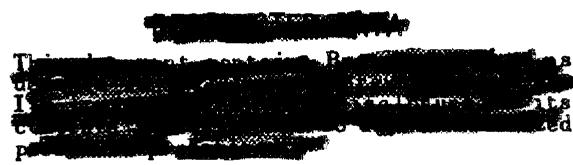

PAGE

Determination of Oxygen in Helium 156   
Preparation of Oxygen-Free Sodium Samples 156   
Clarity of Borated Water in Concrete Tanks 157   
Analytical Services 157   
17. LIST OF REPORTS ISSUED 158   
18. DIRECTORY OF ACTIVE ANP RESEARCH PROJECTS AT ORNL 161   
Reactor and Component Design 161   
Shielding Research 164   
Materials Research 165   
Analysis of Other Nuclear Reactor Systems 172   
19. TECHNICAL ORGANIZATION OF THE ANP PROJECT 173

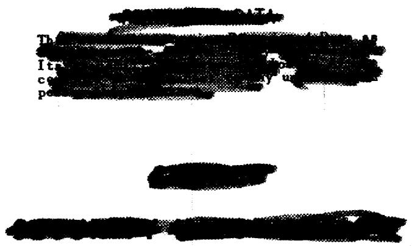

# LIST OF TABLES

# TABLE TITLE PAGE

1.1 Features of the Circulating-Fuel Aircraft Reactor 8   
1.2 Performance of Engines at Design Point, Mach 1.5 at 45,000 ft   
3.1 Design Values for the BeO-Moderated Circulating-Fuel Reactor 14   
3.2 Design Values for the NaF-UF4 - Cooled Water-Moderated Reactor 17   
3.3 Design Values for the Water-Moderated Circulating-Fuel Reactors for Use with the NaF-BeF $_2$ and LiF-KF-NaF Fuel-Coolants 22   
3.4 Comparison of BeO- and $\mathbf{H}_2\mathbf{O}$ -Moderated Reactor 29   
3.5 The NaOH-Cooled and - Moderated Reactor 31   
3.6 Reactivity Calculation Results on the Alkali Hydroxide Reactors 32   
3.7 Critical Assembly Sizes, Composition, and Calculated Multiplication Constants 33   
10.1 Summary of Promising Fluoride Fuel Systems of Low Uranium Content 80   
10.2 The Pseudo-Binary System (LiF-NaF-KF)-UF 81   
10.3 The Pseudo-Binary System (LiF-NaF-RbF)-UF4 81   
10.4 The Pseudo-Binary System (LiF-NaF-BeF $_2$ )-UF $_4$ 81   
10.5 Solubility of Uranium in Hydroxide-Borate Mixtures 83   
10.6 Effect of Various Additives on the Solubility of Uranium in Hydroxides 84   
10.7 Container Filling Services 87

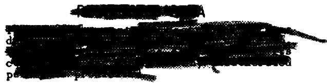

xii

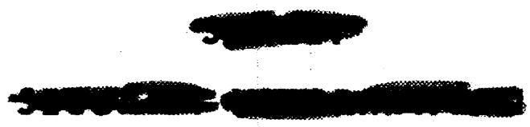

# TABLE TITLE PAGE

11.1 Summary of Corrosion by $\mathrm{Ba(OH)}_2$ at $816^{\circ}\mathrm{C}$ for 100 hr 90   
11.2 Summary of Corrosion by $\mathrm{Sr(OH)_2}$ at $816^{\circ}C$ for 100 hr 91   
11.3 Summary of Corrosion by Sodium Hydroxide at $815^{\circ}\mathrm{C}$ for 100 hr 92   
11.4 Summary of Corrosion by Lithium Hydroxide at $816^{\circ}\mathrm{C}$ for 100 hr 92   
11.5 Summary of Hydroxide Corrosion of Clad Metal Specimens at $816^{\circ}\mathrm{C}$ for 100 hr 99   
11.6 Metal Content of Sodium Hydroxide at Function of Temperature 102   
11.7 Corrosion Data Obtained at $816^{\circ}\mathrm{C}$ Using Molten Sodium Cyanide for 100 hr 104   
11.8 Static Corrosion Tests in Sodium 105   
11.9 Analysis of Inconel Fuel Capsules in Sodium at $800^{\circ}\mathrm{C}$ 106   
11.10 Analysis of 316 Stainless Steel Fuel Capsules in Sodium at $800^{\circ}\mathrm{C}$ 106   
11.11 Analysis of Hydroxide From Nickel Thermal Convection Loops After Plugging 113   
12.1 Heat Capacities of Various Substances 121   
12.2 Data on Several Fused Salt Mixtures 124   
12.3 Vapor Pressure of the NaF-KF-UF4 Eutectic 127   
14.1 Tests on Standard NaF-KF-UF and KOH 143   
16.1 pH Values of Aqueous Solutions of Certain Alkali Fluorides at $25^{\circ}C$ 154   
16.2 Summary of Service Analyses 157

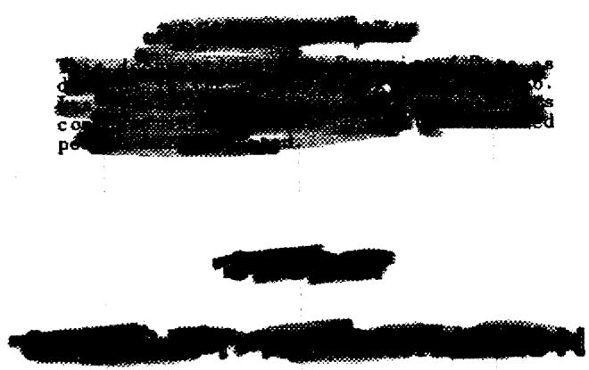

# LIST OF FIGURES

FIGURE TITLE PAGE

3.1 Total Uranium Inventory and Uranium in Core as a Function of the Volume Fraction Fuel Coolant in the Core for BeO-Moderated Circulating-Fuel Reactors with 3-, 3 1/2-, and 4-ft-Diameter Cores 15   
3.2 Total Uranium Investment in BeO-Moderated Circulating-Fuel Reactor as a Function of Reactor Core Diameter for Several Assumed Holdup Volumes External to Core 16   
3.3 Percent Thermal Fissions as a Function of the Fuel-Coolant Volume Fraction in the 3- and 4-ft-Diameter Cores of the BeO-Moderated Circulating-Fuel Reactor 17   
3.4 Fission Spectrum vs. Lethargy for the BeO-Moderated Circulating-Fuel Reactor with a 3 1/2-ft-Diameter Core 18   
3.5 Absorption Spectrum vs. Lethargy for the BeO-Moderated Circulating-Fuel Reactor with a 3 l/2-ft-Diameter Core 19   
3.6 Leakage Spectrum vs. Lethargy for the BeO-Moderated Circulating-Fuel Reactor with a 3 l/2-ft-Diameter Core 20   
3.7 Neutron Flux Spectrum vs. Lethargy for the BeO-Moderated Circulating-Fuel Reactor with a 3 l/2-ft-Diameter Core 21   
3.8 Total Uranium Inventory and Uranium in the Core as a Function of the Volume Fraction Fuel-Coolant in the 3-ft-Diameter-Core Water-Moderated Reactor with NaF-UF4 Fuel-Coolant 22   
3.9 Total Uranium Inventory and Uranium in Core as a Function of the Volume Fraction Fuel-Coolant in the Core for the Water-Moderated Circulating-Fuel Reactor with 2 1/2-, 3-, and 3 1/2-ft-Diameter Cores 23   
3.10 Fission Spectrum vs. Lethargy for the $\mathbf{H}_2\mathbf{O}$ -Moderated Circulating-Fuel Reactor with 3-ft-Diameter Core 24   
3.11 Absorption Spectrum vs. Lethargy for the $\mathbf{H}_2\mathbf{O}$ -Moderated Circulating-Fuel Reactor with 3-ft-Diameter Core 25

# FIGURE

# TITLE

# PAGE

3.12 Leakage Spectrum vs. Lethargy for the $\mathbf{H}_2\mathbf{O}$ -Moderated Circulating Fuel Reactor with 3-ft-Diameter Core 26   
3.13 Neutron Flux Spectrum vs. Lethargy for the $\mathbf{H}_2\mathbf{O}$ -Moderated Circulating-Fuel Reactor with 3-ft-Diameter Core 27   
3.14 Total Uranium Inventory and Uranium in Core as a Function of Volume Fraction Fuel-Coolant in the Core for $\mathsf{H}_2\mathsf{O}$ -Moderated Circulating-Fuel Reactors with 2 1/2-, 3-, and 3 1/2-ft-Diameter Cores and LiF-NaF-KF-UF4 Fuel-Coolant 28   
3.15 Fractional Change in Neutron Flux as a Function of Time for 0, 67, and $80\%$ Decrease in Delayed Neutrons 30   
3.16 Effective Multiplication Constant as a Function of Volume Fraction of Stainless Steel in the Core for the 2 l/2-ft-Diameter-Core NaOH-Moderated and - Cooled Reactor 32   
4.1 Mid-Cross-Section of Second Mockup of Direct-Cycle Reactor 36   
6.1 Sodium to Air Radiator 46   
7.1 Gamma Radiation Intensity for the Unit-Shield Experiments 56   
7.2 Thermal-Neutron Flux for the Unit-Shield Experiments 57   
7.3 Fast-Neutron Dosage for the Unit-Shield Experiments 58   
7.4 Dependence of the Weight of the Unit Shield on its Thickness 60   
7.5 Installation of Divided-Shield Mockup with Reactor in Position 61   
7.6 Shadow-Shield Experiment with Sodium Source 62   
7.7 Bulk Shielding Facility Fast-Neutron Data 63   
8.1 An Array of Four 2-in. Steel Conduit Ducts with Three $90^{\circ}$ Bends 66

# FIGURE

# TITLE

# PAGE

8.2 Lid Tank Duct Test D-915, X Traverse (Vertical) and Z Centerline Measurements of Neutron Flux for Two Arrays of 2-in. Steel Conduit 67   
8.3 LidTankDuctTestD-10，YTraversesin $\mathbf{H}_2\mathbf{O}$ behind54-in.Rubber Conduit（2in.i.d.)withTwoBendsofVariableRadius 68   
8.4 LidTankDuctTestD-11,YTraverses(Horizontal)in $\mathbf{H}_2\mathbf{O}$ behind 52-in.RubberConduit(2-3/8in.i.d.)withVariableBends 69   
8.5 LidTankDuct-TestAnnular-DuctRectangularCross-Section，1/8-in.SteelPlateWelded 70  
8.6 LidTankTestD-12，Y(Horizontal)andZTraversesbehindAnnularduct 71   
10.1 The System KOH-LiOH 85   
10.2 The System RbF-LiF 85   
10.3 The System NaF-BeF 2 86   
10.4 The System NaF-KF-RbF 86   
10.5 The System KF-LiF-RbF 86   
10.6 The System NaF-LiF-RbF 87   
11.1 Surface of 304 Stainless Steel after 100 hr of Exposure to Barium Hydroxide at $816^{\circ}\mathrm{C}$ 93   
11.2 Surface of 446 Stainless Steel Specimen after 100 hr of Exposure to Barium Hydroxide at $816^{\circ}\mathrm{C}$ 93   
11.3 Surface of Inconel Specimen after 100 hr of Exposure to Barium Hydroxide at $816^{\circ}\mathrm{C}$ 94   
11.4 Surface of Nickel Z Specimen after 100 hr of Exposure to Barium Hydroxide at $816^{\circ}\mathrm{C}$ 95

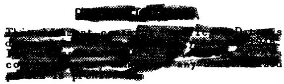

# FIGURE

# TITLE

PAGE

11.5 Surface of Chromium Specimen after 100 hr of Exposure to Sodium Hydroxide at $816^{\circ}\mathrm{C}$ 95   
11.6 Surface of Inconel Specimen after 100 hr of Exposure to Lithium Hydroxide at $800^{\circ}\mathrm{C}$ 96   
11.7 Surface of Inconel Specimen after 100 hr of Exposure to Rubidium Hydroxide at $800^{\circ}\mathrm{C}$ 96   
11.8 Effect of Exposure Time on the Corrosion of Inconel by Sodium Hydroxide at $800^{\circ}\mathrm{C}$ 97   
11.9 Effect of Exposure Time on the Corrosion of Inconel by Potassium Hydroxide at $800^{\circ}\mathrm{C}$ 97   
11.10 Effect of Temperature on the Corrosion of Inconel by Potassium Hydroxide in 100 hr 98   
11.11 Weight Loss of Inconel Specimen in Potassium Hydroxide for 100 hr as a Function of Temperature 99   
11.12 Surface of 304 Stainless Steel Coated with 3-mil Nickel Electroplate after 100 hr of Exposure to Barium Hydroxide at $816^{\circ}\mathrm{C}$ 100   
11.13 Nickel-Clad Inconel (Nickel Sheet) after 100 hr of Exposure to Sodium Hydroxide at $816^{\circ}\mathrm{C}$ 101   
11.14 Nickel-Clad Inconel (Nickel Powder) after 100 hr of Exposure to Sodium Hydroxide at $816^{\circ}\mathrm{C}$ 102   
11.15 Nickel Thermal-Convection Loop Walls with Potassium Hydroxide 108   
11.16 Plugged Section Nickel Thermal Convection Loop with Sodium Hydroxide Coolant 109   
11.17 Deposit of Silver Crystals by Mass Transfer in Silver Capsule Containing Sodium Hydroxide 112   
12.1 Temperature Ratio in a 3-mm Tube Filled with Brine in Which Heat is Generated Uniformly 116

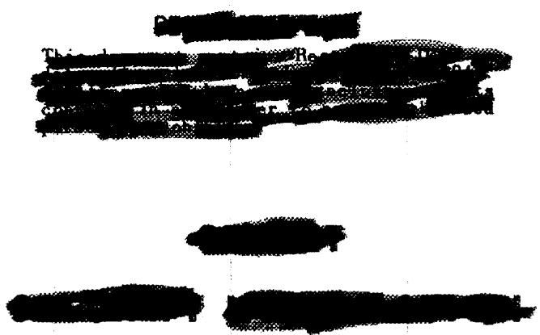

XVii

# FIGURE TITLE PAGE

12.2 Flow Diagram for Lithium Heat-Transfer Experiment 118   
12.3 Thermal Conductivity of Diatomaceous Earth 123   
12.4 Viscosity Apparatus 125   
13.1 Effect of $\mathbf{U}\mathbf{O}_2$ Particle Size on $\mathbf{U}\mathbf{O}_2$ Distribution 129   
13.2 Effect of Rolling Temperature on $\mathrm{UO}_2$ Distribution 130   
13.3 Effect of Elimination of Capsule on $\mathbf{U}\mathbf{O}_2$ Distribution 131   
13.4 Seamless-Tube Fuel Elements Formed by "Rubberstatic" Pressing 133   
13.5 Transverse Section of a 0.015-in.-Thick Inconel Sheet Spot Welded to an 0.188-in.-o.d. Inconel Tube of 0.025-in. Wall Thickness 134   
13.6 Section of a Spot Weld Joining Two Stainless Steel—Clad Fuel Plates 134   
13.7 Longitudinal Sections of a Type 316 Stainless Steel Tube-to-Header Joint Microbrazed at $1120^{\circ}\mathrm{C}$ in a Dry Hydrogen Atmosphere 136   
13.8 Transverse Section of a Stainless Steel-Clad Fuel-Element Butt Microbrazed to a Stainless Steel Sheet 137   
13.9 Transverse Section of an Inconel Tube-to-Header Joint Brazed with a $60\%$ Pd - $40\%$ Ni Alloy in Dry Hydrogen at $1270^{\circ}\mathrm{C}$ for 20 min 138   
13.10 Stress-Rupture Time for Inconel Sheet 139   
13.11 Time-Elongation Curve for Nickel Z 140

xvi i

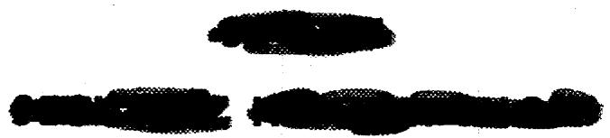

# FOREWORD

This is the quarterly progress report of the Aircraft Nuclear Propulsion Project at the Oak Ridge National Laboratory and summarizes the technical progress on the project during the period covered. It includes not only the work of the Laboratory under its own contract, Y-7405, Eng 26, but such research for the national ANP program

as is performed by Laboratory personnel. The report is divided into four parts: I, Reactor Theory and Design; II, Shielding Research; III, Materials Research; and IV, Appendixes. As each of these parts may be regarded as a separate entity, each has a separate "Summary and Introduction" which precedes the part in this report.

Part I

REACTOR THEORY AND DESIGN

The search for a nonoxidative high-temperature fluid other than sodium which would be suitable as a reactor coolant has lead to the proposed use of fused fluoride salts containing uranium (Sec. 1). The resulting circulating-fuel reactor would have the important advantage of eliminating a heat-transfer stage within the reactor core. Preliminary design studies of such a reactor indicate that a 3.5-ft-diameter beryllium oxide—moderated circulating-fuel reactor will produce around 350 Mw at a maximum temperature of $1500^{\circ}\mathrm{F}$ . The design point of the aircraft incorporating this reactor is Mach 1.5 at 45,000 ft. Performance and weights of the airplane, reactor, shield, engines, and radiators are being explored.

Although the Aircraft Reactor Experiment (Sec. 2) was originally intended as a prototype of the sodium-cooled quiescent-liquid-fuel aircraft reactor, substantial portions of the equipment would be applicable to the circulating-fuel reactor. Consequently, construction, design, and procurement of equipment have proceeded on the original schedule. The building facility itself is $80\%$ complete and most components are on their design or delivery schedule.

Reactor physics calculations (Sec. 3) have been devoted primarily to the statics, and to some lesser extent the kinetics, of the circulating-fuel reactor. The minimum uranium investment in the beryllium oxide—moderated circulating-fuel reactor has been determined as 69 lb of which 26 lb is in the core. (The uranium investment in a water-moderated circulating-fuel reactor is somewhat lower because of the better moderating capacity of water, but design considerations appear to favor the use of BeO.) The percent

thermal fissions of this BeO-moderated reactor is 52, i.e., the reactor lies between epithermal and intermediate. Kinetic studies, which have shown the practicality of the conservation of delayed neutrons, imply that the design of the reactor must provide for as high a fuel volume as practical, possibly even at the expense of the uranium investment.

A second mockup of the General Electric "direct cycle" reactor has been assembled (Sec. 4). The critical mass of this assembly was 90 lb of uranium.

The cross-sections of iron and beryllium are being determined for refined reactor physics calculations (Sec. 5). Measurements of fast neutrons in the 5-Mev Van de Graaff give an average total cross-section for iron which varies from 2.5 barns at 0.6 Mev to 3.2 barns at 3.6 Mev. Upper limits for the $(n,2n)$ cross-section has been determined in one case to be $\leq 0.56$ barn and in another to be $\leq 0.26$ barn. Final adjustment is being made on the time-of-flight neutron spectrometer with which resolutions of at least $1.2\mu \mathrm{sec}$ per meter are anticipated.

The development of reactor plumbing and associated hardware, while largely concerned with that for a sodium-cooled reactor, has been redirected to the requirements of the circulating-fuel reactor (Sec. 6). Valves, pumps, seals, heat exchangers, and related equipment are being developed for both fluids for operation at reactor temperatures, i.e., up to $1500^{\circ}\mathrm{F}$ . However, extensive development with the fluoride fuels has first necessitated a program for their manufacture, purification, and handling; hence, to date the experimental work with fluorides has

# ANP PROJECT QUARTERLY PROGRESS REPORT

been somewhat limited. A frozen- fluid-seal centrifugal pump which was successful with sodium is being modified for use with the fused fluorides. A centrifugal pump with a gas seal, however, has already been used to pump the fluorides satisfactorily for

short periods. Valve tests in sodium systems show significant increase in torque with time although several combinations of metals appear to resist self-welding. A NaK to NaK heat exchanger has now operated for 550 hr with a maximum temperature of $1200^{\circ}\mathrm{F}$ .

# 1. CIRCULATING-FUEL AIRCRAFT REACTOR

R.W. Schroeder, ANP Division

The objective of the Oak Ridge National Laboratory in the national Aircraft Nuclear Propulsion Program is the development of high-performance reactors, i.e., for supersonic propulsion. This implies the use of liquid-coolant systems which require small core sizes and have good heat-transfer characteristics. The specific objective of the ORNL-ANP project is, accordingly, the exploitation of nonoxidative high-temperature fluids. This line of research avoids not only the high pressures associated with some cycles but also the oxidation inherent to others. A sodium-cooled quiescent-liquid-fuel reactor was the Laboratory's first considered proposal as a reactor with potentialities for supersonic flight. However, the almost prohibitively difficult task of assuring the safety of a sodium-cooled and water-shielded reactor, as well as the limitations of a unifunctional coolant, has enhanced the search for a more versatile, and less inflammable, coolant. As a result of this search, ORNL has turned toward the use of fused fluoride salts (generally a ternary or quaternary system composed of uranium fluoride and a mixture of two or three alkali fluorides or beryllium fluoride) - not for just the heat-transfer medium, however, but as the reactor fuel as well. In addition to the advantageous physical properties of the fused salts (although not so good as sodium from the standpoint of heat transfer) and their noninflammability in air and water, an important advantage of such a circulating-fuel reactor is that it eliminates a heat-transfer stage within the reactor core.

The advantage to be gained from separating core and heat exchanger

cannot be overemphasized. Although it is perhaps possible to conceive of a small and at the same time a well-designed 500 Mw heat exchanger, the requirements of these entities are so different that it is difficult to design the heat exchanger into the reactor without severely penalizing both. Furthermore, whereas the sodium-cooled reactor required considerable departure from conventional design practice to remove approximately 200 Mw from a 3-ft core, it now appears feasible, from a fabricational and fluid-flow standpoint, to remove 350 Mw from a $3\frac{1}{2}$ -ft core employing circulating fuel.

The circulation of fissionable material external to the core directs attention to design studies of the entire system -- reactor, radiator, engine, etc. Although the circulating-fuel system has not been studied sufficiently long to ensure the performance of the resulting aircraft, the more outstanding problems of this cycle have been appreciated. The preliminary design studies which have been initiated for the exploration of a supersonic airplane application of a circulating-fuel reactor are encouraging. However, performance and weights of the airplane, reactor, shielding, engines, radiators, and other components are so interrelated that it was found necessary to make studies of the overall arrangement. The studies have not yet been completed, and it is not possible to draw conclusions at this time. However, the arrangement being studied may be cursorily described.

# AIRPLANE AND OVERALL ARRANGEMENT

The airplane visualized is designed for a speed of Mach 1.5 at 45,000 ft,

with a gross weight of approximately 350,000 lb, an $L / D$ ratio of approximately 6.5, and a wing loading of approximately 70 lb/ft². A divided shield is employed with gamma and neutron shielding about the crew compartment and neutron shielding about the reactor. Six turbojet engines are arranged in the fuselage in a circle aft of the reactor-shield assembly, and circulating fuel is ducted directly from the reactor to the engine radiators, thereby eliminating the weight and temperature loss associated with the use of intermediate heat exchangers.

# REACTOR

Water-moderated and solid-moderated reactors have been explored, and tentatively, both types appear to be feasible. However, the water-moderated and -reflected reactor would, for this application, require a water-cooling system capable of disposing of approximately 30,000 kw with a small radiator temperature difference and a small air temperature rise. The small temperature difference would require very large radiators, and the small air temperature rise would entail very large cooling air flow requirements. Further, the use of water as a moderator involves a potential hazard associated with rapid steam formation if a failed fuel tube should permit abrupt mixing of fuel and water. Accordingly, the studies outlined here are based on the use of BeO as a moderator and reflector. Moderator heat is removed by the circulating fuel and is employed usefully in the propulsion cycle. By proper allocation of coolant flows and coolant-tube surface areas, it is possible to maintain maximum coolant-tube wall temperatures only slightly in excess of the circulating-fuel maximum temperature. To permit removing reflector heat with a high radiator temperature difference, the design under study postulates cooling

the reflector with a non-fuel-bearing fluoride mixture. This reactor conforms to the specifications given in Table 1.1.

Table 1.1   
Features of the Circulating-Fuel Aircraft Reactor   

<table><tr><td>Size</td><td>3.5-ft sphere</td></tr><tr><td>Moderator</td><td>Be0</td></tr><tr><td>Moderator</td><td>~65%</td></tr><tr><td>Fuel</td><td>~33%</td></tr><tr><td>Structural</td><td>~2%</td></tr><tr><td>Design point</td><td></td></tr><tr><td>Power</td><td>~325,000 Btu/sec</td></tr><tr><td>Reactor fuel inlet temp.</td><td>~1000°F</td></tr><tr><td>Reactor fuel outlet temp.</td><td>~1500°F</td></tr></table>

# ENGINE

A circulating-fuel type reactor should be inherently capable of supplying propulsive power by means of a turbojet cycle or either of several vapor cycles. The relative superiority of these cycles has not yet been completely established, but, pending comparisons, the use of the turbojet cycle has been presumed. Preliminary optimization studies have indicated that a compression ratio in the region of 6.1, with a turbine inlet temperature of approximately $1250^{\circ}\mathrm{F}$ , is desirable. Further increases in the compression ratio would diminish the radiator weight at the expense of engine weight, and further increases in turbine inlet temperature (with fixed reactor conditions), would favor turbojet weight to the detriment of the radiator log mean temperature difference and radiator weight. More rigorous evaluations of these component weights will be required before the turbojet specifications indicated here can be accepted with any degree of finality.

Installational convenience favors the use of a small number of relatively large engines, whereas engine development and availability considerations favor the use of a larger number of smaller engines. It is difficult to predict at this time the size of engine that could be made available when an airplane of the type studied would require these engines, but it appears that the validity of the overall study is relatively insensitive to the number of engines presumed. Therefore the use of six engines conforming to the general specifications listed in Table 1.2 has been assumed.

Table 1.2   
Performance of Engines at Design Point, Mach 1.5 at 45,000 ft   

<table><tr><td>Thrust</td><td>8200 lb</td></tr><tr><td>Maximum diameter</td><td>61 in.</td></tr><tr><td>Compression ratio</td><td>6.1</td></tr><tr><td>Turbine inlet temperature</td><td>1250°F</td></tr><tr><td>Equivalent sea-level airflow</td><td>665 lb/sec</td></tr></table>

Calculations have indicated a specific impulse of approximately 30 and overall efficiency of $30\%$ . This latter is defined as the ratio of net thrust horsepower to reactor thermal horsepower.

# RADIATOBs

Radiators with heat-transfer capacity per unit volume in excess of the best obtained to date will be desired for any liquid-cycle supersonic nuclear-powered airplane. Arrangements are being made to receive the advice and consultation of established heat-exchanger manufacturers relative to the design of radiators for such applications. This advice will not be available for at least several months, however, and it was necessary to achieve a preliminary radiator design

in order to permit related phases of the study to continue. The design conceived of, which may be far from optimum, involves a radial grouping of rectangular-shaped banks about the engine centerline between the compressor and turbine. Liquid-conveying tubes are passed through, and normal to, closely spaced sheet fins. The flow pattern contemplated is countercurrent, as dictated by the temperatures of the two fluids. The arrangement entails the use of dividing baffles between adjacent banks, and the installation of by-pass valves in these baffles will permit controlling turbine inlet temperature while a substantially constant liquid temperature is maintained.

# SHIELDING

Shielding calculations currently are in process, and it is not possible to make a quantitative description of the shielding at this time. Initial studies have indicated (see "Circulating-Fuel-Reactor Shields" in Sec. 8), however, that the circulating fuel in the radiators and the associated plumbing may remain unshielded provided that sufficient neutron and gamma shielding is placed about the crew compartment, and also provided that the payload, and possibly other components, are protected by local shielding.

It currently is contemplated that the reactor shield will include only hydrogenous material.

# ACCESSORY SYSTEMS

Accessory circuits are required to permit cooling the reflector and shield and to provide power for pumps and general aircraft accessory demands. As it appears that many of the accessories are favored by the use of variable-speed drives, the overall

# ANP PROJECT QUARTERLY PROGRESS REPORT

accessory system contemplated involves the use of individual pneumatic turbines for power supply. The energy is supplied, and reflector cooling is achieved, by passing compressor bleed-off air through the reflector radiators and then to the accessory turbines and to parallel propulsive nozzles. The accessory turbines are controlled by means of variable-area discharge nozzles, which provide some net thrust after imparting energy to the accessory turbines. Preliminary analysis of this system indicates that it not only provides reflector cooling and acces

sory power adequately, but that the reflector cooling system, when considered as an open Brayton cycle power plant, has a favorable cycle efficiency and power-weight ratio. The use of individual accessory drive turbines permits supplying the accessories with power and speed control without special mechanical, hydraulic, or electrical transmission systems.

The shield-water radiator is cooled by low-pressure compressor bleed-off air, and the air is then discharged through a propulsive nozzle.

# 2. LIQUID-METAL-COOLED AIRCRAFT REACTOR EXPERIMENT

R. W. Schroeder, ANP Division

Aircraft reactor cycles other than the sodium-cooled stationary liquid-fuel cycle have been(1) and are (Sec. 1) under active study. A large portion of design effort has, therefore, been diverted to study of these alternate cycles. These investigations have indicated a high probability that substantial portions of the equipment, designed for the original sodium-cooled reactor experiment, would still be usable if the ARE were to be a prototype of one of these other cycles. Accordingly, design and procurement of the building and equipment have been continued on the original basis.

At the present time the facility under contract to the Nicholson company is approximately $80\%$ complete. All major fluid-circuit components have been designed and are on order or under construction locally, and all core and pressure shell components are either scheduled for fabrication or have already been completed. Instrumentation, electrical circuits, and remote-handling equipment have been partially designed, and items requiring long fabricational time spans have been ordered.

# CORE-REFLECTOR-PRESSURE SHELL

Approximately $90\%$ of the BeO moderator and reflector blocks have been received. The inconel pressure-shell billet has been shipped from International Nickel Co. to Lukenweld, and the shell is scheduled for December rolling at Lukenweld. The fuel

element tubing has been drawn by Superior Tube Company and the 1.235-in. coolant tubes are in process at Superior. Miscellaneous sheet and bar stock for the core have been received.

Detailed core manufacturing drawings have been made and retained pending material availability.

# FLUID CIRCUIT

The fluid-circuit design for the original NaK system (the use of NaK was a modification, to eliminate preheating, of the use of sodium) is approximately $80\%$ complete, and all major components have been released for procurement or local manufacture. These include (1) inconel pipe, (2) dump tanks, (3) all heat exchangers, (4) helium blowers for heat disposal loop, (5) Vickers variable-speed hydraulic drive system for helium blower drive, (6) space-cooling--heat-exchanger--fan combinations, (7) control-rod cooling rotary blowers, and (8) NaK purification assembly.

# REACTOR CONTROL

# E. S. Bettis   Research Director's Division

Because of the proposed modifications in the ARE design, work on the control system for this reactor has necessarily slowed down. However, satisfactory design of most of the components of the control system had already been attained. The high-temperature fission chamber failed at $700^{\circ}\mathrm{F}$ and is being redesigned. Development of the reactor dynamic computer has continued.

Control System. Detailing of the control room, console, instrument racks, and interconnecting cables has continued. Discussion of the manufacture of the hardware incorporating these designs was held with possible outside vendors. Several companies have indicated willingness to contract for these items, but no commitments have been made.

High-Temperature Fission Chamber. The high-temperature fission chamber was completed and tested. It failed at about $700^{\circ}\mathrm{F}$ because the insulators were inadequate. A new chamber, correcting this difficulty, is presently under construction and will be ready for test in about six weeks. No difficulty is anticipated in providing a satisfactory fission chamber for use in the ARE.

Reactor Dynamic Computer. The reactor dynamic computer has progressed to a point where it will be ready for use in about six weeks. The converter, from d-c to digital notation, and the multiplier have been tested and debugged.

# INSTRUMENTATION

About $5\%$ of the instruments required for the ARE have been received, and an additional $75\%$ are on order and should be received within four months. Ten percent will probably be constructed by the Laboratory because of unavailability from industrial concerns. The remaining $10\%$ are in a deferred status

pending the outcome of experimental engineering investigations currently in progress.

# REMOTE-HANDLING EQUIPMENT

Remote-handling equipment design is in process, and some components have been ordered. Demonstrations have been made simulating installation, removal, and reinstallation of the core dome, involving a sequence of welding, cutting, scarfing, and rewelding. These demonstrations will continue and will employ the automatic cutting equipment intended for the ARE.

Remote removal of the core dome after power operation of the reactor will be accomplished by means of rubber-bonded abrasive cut-off wheels, operating under water, driven by a Vickers hydraulic system and guided by peripheral tracks. This equipment has been designed, some components have been requisitioned, and other components have been released to Y-12 shops for fabrication.

# ARE BUILDING FACILITY

The building shell is virtually complete; walls and roofing are in place. Painting, plumbing, and internal partitioning are in process. ORNL engineering of special internal features is approximately $80\%$ complete and should be ready for transmittal to Nicholson via AEC in approximately four weeks.

# 3. REACTOR PHYSICS

Nicholas M. Smith, Jr., ANP Division

Significant studies by the ANP Physics Group have been the surveys of the circulating-liquid-fuel designs. These surveys have been conducted using bare-reactor theory (i.e., a condition under which space and lethargy variables are separable) and for several parametric variations. For a given moderator these parameters were core diameter and the volume ratio of circulating fuel to that of the moderator. The rather extensive bare-reactor calculations were made possible by having the calculation set up entirely on the Card Programming Computer IBM equipment.

Considered first are the values of these parameters leading to a minimum fissionable material inventory in the overall system. When the core diameter is fixed, it is seen that as the fuel-coolant volume fraction increases, the critical mass increases but that the uranium density in the fuel-coolant at first decreases, then increases. The result is that there is a minimum in the uranium investment in the overall system. This minimum usually results in a reactor with about half thermal fissions, i.e., a reactor on the borderline between the epithermal and the intermediate.

It is known from kinetic studies that the ratio of fuel in the reactor to that in the overall system should be as high as is practical in order to conserve delayed neutrons. Thus, in comparison to the condition of minimum critical uranium mass, the condition of minimum overall uranium mass results in a higher reactor-to-system volume ratio and favors the kinetic behavior. The kinetic behavior can be favored to an even greater extent by choosing a fuel-

coolant volume ratio greater than that resulting in a minimum uranium inventory. Since the curves of total uranium inventory vs. fuel-coolant volume ratio have a very broad minimum, it is possible to design for a greater fuel-volume ratio without greatly increasing the uranium requirement.

Thus it becomes advisable to design the reactor with as high a fuel volume ratio as practical - say, one increasing the uranium requirement $5\%$ over that of the minimum - in order to favor the kinetic response. The conditions of near-minimum uranium mass and of favorable kinetic behavior thus result in an increase of the neutron spectrum, yielding a reactor just barely in the intermediate class. The trend of the nuclear design to one of the intermediate class is thus inescapable.

Very satisfactory agreement within theory and critical experiment is reported for intermediate uranium-graphite and uranium-water assemblies. The agreement gives corroboration to the explanation that the discrepancy between theory and experiment for the uranium-beryllium assembly is caused by omission of a significant physical phenomenon, possibly the $(n,2n)$ reaction.

# REACTOR CALCULATIONS ON IBM EQUIPMENT

F.C.Uffelman W.C.DeMarcus

Phyllis Johnson

Uranium Control and Computing Department

The extensive bare-reactor calculations were made possible by having the calculations set up entirely on the CPC-IBM equipment. During the past quarter the IBM equipment was

also employed in the calculation of cross-sections for cores and reflectors and kinetic calculations of various reactors. The division of effort is itemized as follows:

1. Reactors. During the period from September 1 to November 16, 1951, the IBM section completed calculations on 29 EPLA (end-point linear approximation) reflected reactors, bringing the total to 211 since the start in February. Programming was initiated and completed for two series of bare-reactor calculations, hydrogenous and nonhydrogenous. Twenty-nine hydrogenous and 43 nonhydrogenous calculations were made.   
2. Cores and Reflectors. During this same period average cross-sections were calculated for 117 cores and reflectors, and "constant" variations were made for two cores and reflectors.   
3. Kinetic Calculations. Programming was completed for the dual space-time variable kinetic calculations and three such calculations were made, one for time running to 15 sec and the other two only up to 4 sec each. One calculation, with time the only variable, was also performed.

# CIRCULATING-FUEL REACTORS

C. B. Mills, ANP Division

The circulating-fuel reactor under study consists simply of a spherical moderating core with circular fuel-coolant tubes penetrating the length of the core into the reflector. The reflector is a spherical shell of core moderator material of 6 in. reflector savings. The moderator is expected to be either beryllium oxide

or light water. If BeO is utilized as a moderator, its cooling will be provided by the circulating fuel itself, making the "reflector" also a neutron multiplying region. If water is so employed, it will be insulated from the circulating fuel by a thin layer of, say. $\mathrm{SiO}_2$ , and the moderator cooling will be accomplished by circulating the water in a secondary system, with its separate heat exchanger.

Beo-Moderated Reactor. A series of bare-reactor calculations have been made to determine optimum size and composition. Reflector savings were included by adding a constant 15.24 cm of core material plus 1.13 cm of extrapolation distance to the variable core radius. A series of a maximum of 27 calculations is sufficient to determine the optimum size and shape with the variable of reactor core diameter, volume fraction of fuel-coolant or moderator, uranium mass, and total uranium inventory. Thermal base effects, median energy for fission, and neutron absorption, fission leakage, and flux lethargy (or energy) distributions are obtained in the same group of calculations. The reactor design values used in this series are given in Table 3.1.

Table 3.1   
Design Values for the BeO-Moderated Circulating-Fuel Reactor   

<table><tr><td>CORE COMPONENTS</td><td colspan="5">VOLUME FRACTIONS</td></tr><tr><td>Fuel-coolant (NaF-UF4)</td><td>0.10</td><td>0.20</td><td>0.30</td><td>0.35</td><td>0.40</td></tr><tr><td>Structure (inconel)</td><td>0.015</td><td>0.015</td><td>0.015</td><td>0.015</td><td>0.015</td></tr><tr><td>Moderator (BeO)</td><td>0.855</td><td>0.755</td><td>0.655</td><td>0.650</td><td>0.555</td></tr><tr><td>Void (assumed)</td><td>0.03</td><td>0.03</td><td>0.03</td><td>0.03</td><td>0.03</td></tr></table>

These volume fractions given in Table 3.1 were used for three reactor core diameters: 3, $3\%$ , and 4 ft. The BeO reflector thickness was 6 in. The uranium mass reactivity coefficient, $\Delta k / k \div \Delta m / m$ , was examined in the process of the determination of the minimum critical mass. The value of the coefficient decreased by about $20\%$ in changing the volume coolant fraction of the coolant from 0.1 to 0.4. The critical mass and total

uranium inventory as a function of volume fraction fuel-coolant are given in Fig. 3.1 for 3-, $3\%$ and 4-ft reactor cores. The total uranium inventory was a minimum of 66 lb at 0.28 volume fraction of fuel in the 4-ft-diameter core. The total uranium inventory with the fuel-coolant holdup in cubic feet in the heat exchanger as a parameter is given in Fig. 3.2 as a function of reactor core diameter length.

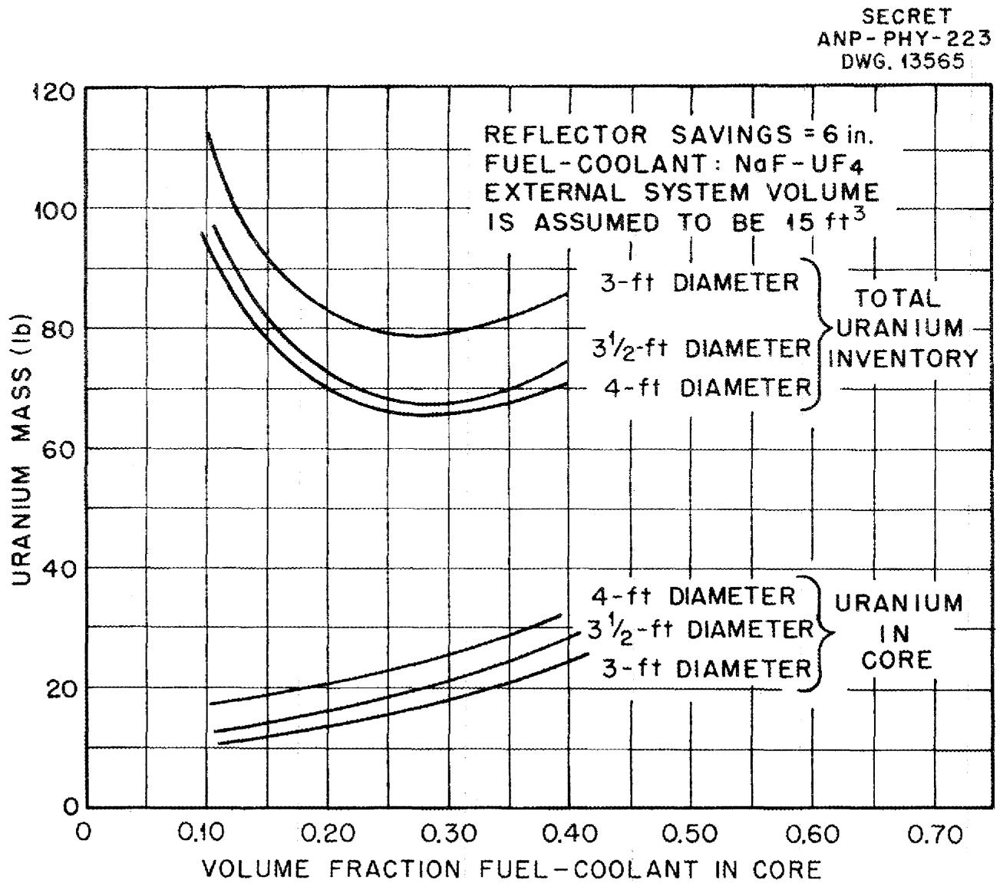  
Fig. 3.1. Total Uranium Inventory and Uranium in Core as a Function of the Volume Fraction Fuel Coolant in the Core for BeO-Moderated Circulating-Fuel Reactors with $3-$ , $3\frac{1}{2}$ -, and 4-ft-Diameter Cores.

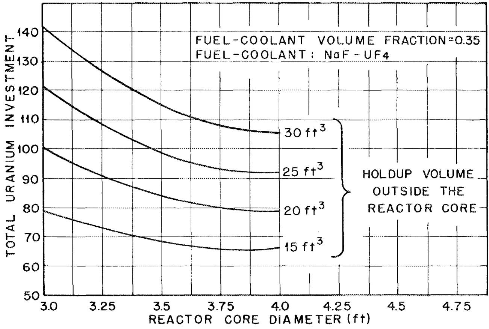  
SECRET ANP-PHY-224 DWG.13566   
Fig. 3.2. Total Uranium Investment in BeO-Moderated Circulating-Fuel Reactor as a Function of Reactor Core Diameter for Several Assumed Holdup Volumes External to Core.

The percent thermal fissions as a function of fuel-coolant volume percentage is shown in Fig. 3.3 for the 3- and 4-ft-diameter cores. Apparently the ANP reactors are in the epithermal to intermediate energy range of neutron energy distribution. Fissioning, absorption, and leakage spectra for the $3\frac{1}{2}$ -ft-diameter core are given in Figs. 3.4, 3.5, and 3.6, respectively. The percent thermal fissions for this reactor is 59, the percent thermal absorption is 41.6, and the percent thermal escape is 8, all at lethargy of 18.6. The neutron flux distribution (Fig. 3.7) is high

and rather uniform over all lethargy intervals above thermal.

The poisoning effect of stainless steel for this reactor has been estimated as $6\%$ change in $k_{\text{eff}}$ for a change in volume fraction of stainless steel of 0.01 in the vicinity of a total volume fraction of 0.028.

The set of data is not yet sufficiently complete to do more than specify the region of design interest. Apparently the reactor will have approximately $35\%$ fuel-coolant and $65\%$ BeO moderator, with a structure

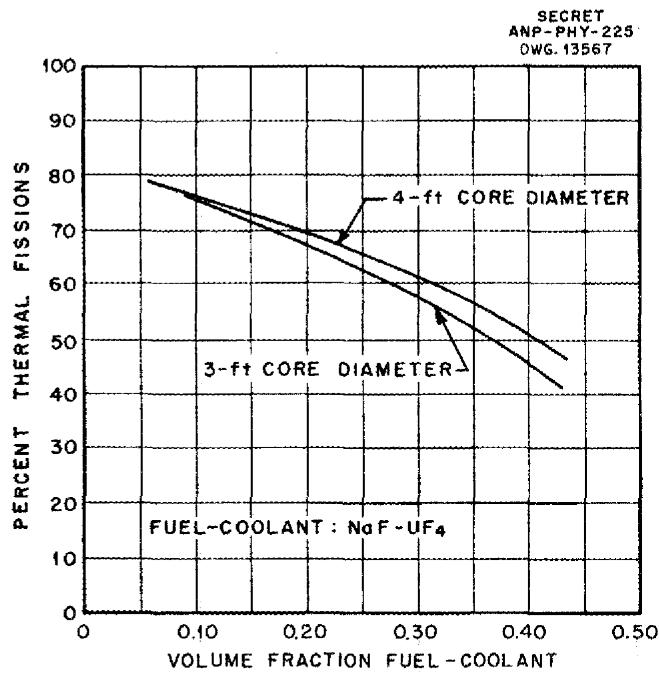  
Fig. 3.3. Percent Thermal Fissions as a Function of the Fuel-Coolant Volume Fraction in the 3- and 4-ft-Diameter Cores of the BeO-Moderated Circulating-Fuel Reactor.

and void volume percent to be specified by design considerations.

Water-Moderated Reactor. The first calculations on the water-moderated circulating-fuel reactor were made with the NaF- $\mathrm{UF_4}$ fuel-coolant since density values on other possible fluoride mixtures were not available. The appearance of some data on the new fuels NaF-BeF- $\mathrm{UF_4}$ and NaF-LiF-KF- $\mathrm{UF_4}$ for use with circulating-fuel reactors subsequently permitted initiation of a more complete set of calculations. Critical mass was determined as a function of reactor size and percent fuel-coolant for all fuel-coolants. The thickness of reflector for saturated reflectors savings was estimated in all cases, and the actual core radius was increased by a fraction of this amount (plus augmentation distance) to obtain the radius of the equivalent bare reactor. This reflector thickness in

each case was such that a 6-in. reflector was still unsaturated. The assumption that the reflector is equivalent to added core material is thus sufficiently accurate. All calculations in the first survey have been done on this equivalent bare reactor.

NaF-UF4 Fuel-Coolant. This series of bare-reactor calculations were made on a design series of the same type as that used with the BeO-moderated reactor. Cores $2\frac{1}{2}$ , 3, and $3\frac{1}{2}$ ft in diameter were used, with volume percents of $\mathrm{H}_2\mathrm{O}$ varying from 10 to $80\%$ . The first set of calculations was made with the NaF-UF4 fuel-coolant, since density values for the two new coolants were not initially available. A reflector savings of 6 in. was included in the usual way. Volume fractions for the NaF-UF4-cooled water-moderated reactor are given in Table 3.2. The core diameter for this set was 3 ft. Calculations of uranium mass vs. $k_{eff}$ for this core indicated that the critical mass is a very slowly varying function of the percent fuel-coolant, since a change from 15 to $35\%$ results in an increase of only $8\%$ in critical mass in the vicinity of 18 lb. Figure 3.8 indicates the total uranium inventory and critical mass as a function of fuel-coolant fraction for 15 ft³ in the heat exchanger. With the fuel-coolant NaF-UF4 and a 3 ft core, the uranium inventory will be near 75 lb.

Table 3.2   
Design Values for the NaF-UF4-Cooled Water-Moderated Reactor   

<table><tr><td>CORE COMPONENTS</td><td colspan="3">VOLUME FRACTIONS</td></tr><tr><td>Fuel-coolant (NaF-UF4)</td><td>0.15</td><td>0.25</td><td>0.35</td></tr><tr><td>Structure (inconel)</td><td>0.015</td><td>0.015</td><td>0.015</td></tr><tr><td>Moderator (H2O)</td><td>80.5</td><td>70.5</td><td>60.5</td></tr><tr><td>Void (assumed)</td><td>0.03</td><td>0.03</td><td>0.03</td></tr></table>

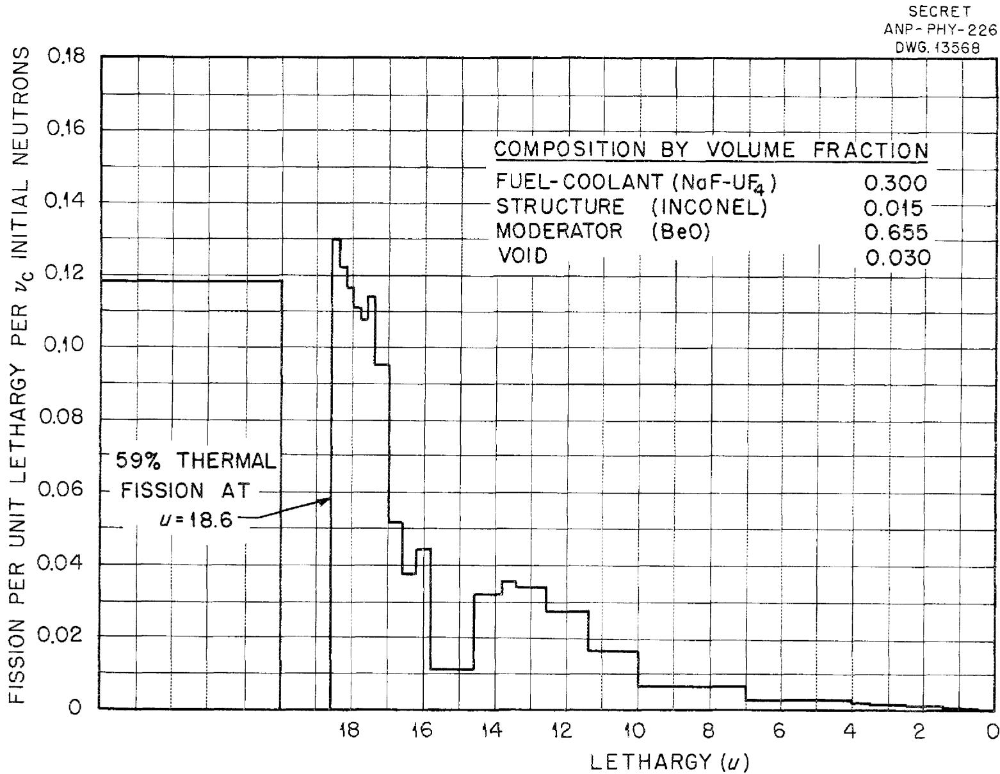  
Fig. 3.4. Fission Spectrum vs. Lethargy for the BeO-Moderated Circulating-Fuel Reactor with a $3\frac{1}{2}$ -ft-Diameter Core.

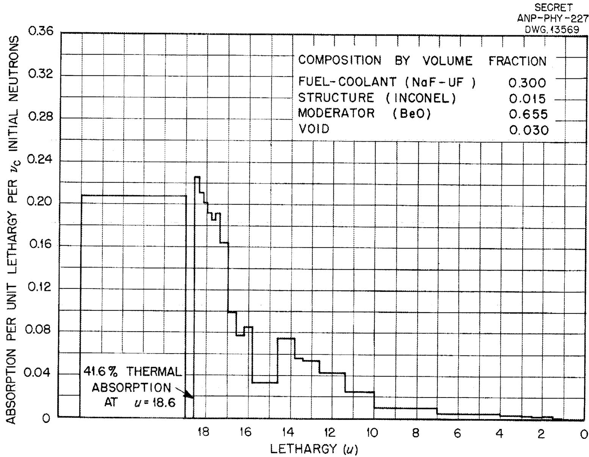  
Fig. 3.5. Absorption Spectrum vs. Lethargy for the BeO-Moderated Circulating-Fuel Reactor with a $3\frac{1}{2}$ -ft-Diameter Core.

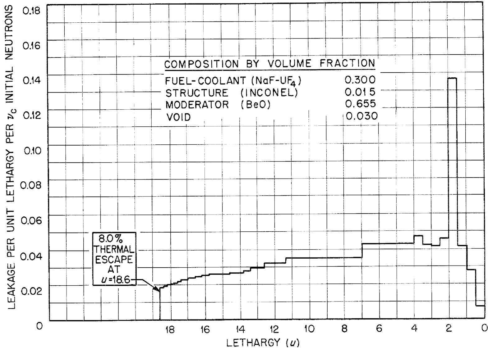  
Fig. 3.6. Leakage Spectrum vs. Lethargy for the BeO-Moderated Circulating-Fuel Reactor with a $3\frac{1}{2}$ -ft-Diameter Core.

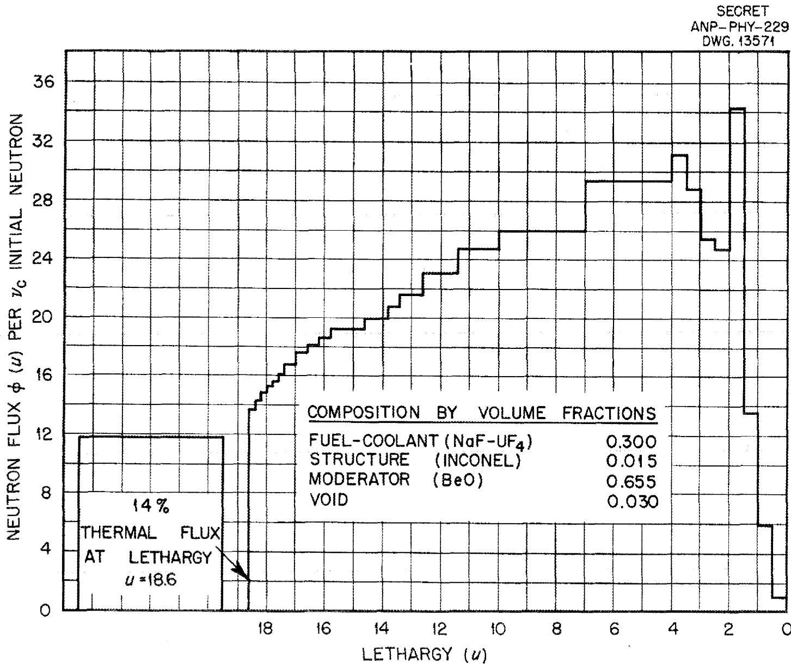  
Fig. 3.7. Neutron Flux Spectrum vs. Lethargy for the BeO-Moderated Circulating-Fuel Reactor with a $3\frac{1}{2}$ -ft-Diameter Core.

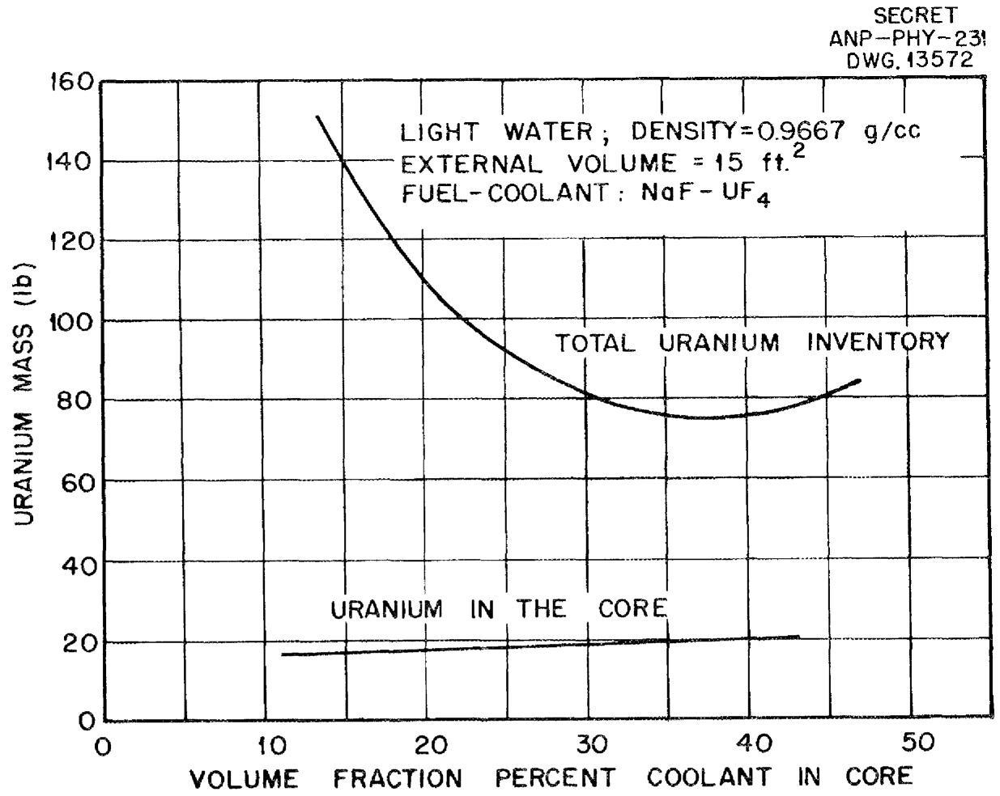  
Fig. 3.8. Total Uranium Inventory and Uranium in the Core as a Function of the Volume Fraction Fuel-Coolant in the 3-ft-Diameter-Core Water-Moderated Reactor with NaF-UF4 Fuel-Coolant.

$BeF_{2} - NaF - UF_{4}$ Fuel Coolant. Reactor design values for this coolant in the water-moderated core are given in Table 3.3 and are applicable to each of the $2\frac{1}{2}-, 3-$ , and $3\frac{1}{2}$ -ft-diameter cores.

The uranium mass reactivity coefficient, $\Delta k / k \div \Delta m / m$ , decreased by only $30\%$ for values of volume fraction of fuel-coolant in the core from 0.3 to 0.8. The critical mass and the total uranium inventory in the core as a function of the volume fraction fuel-coolant are given in Fig. 3.9 for a $2\frac{1}{2}$ -, 3-, and $3\frac{1}{2}$ -ft-diameter reactor

Table 3.3   
Design Values for the Water-Moderated Circulating-Fuel Reactors for Use with the NaF-BeF $_2$ and LiF-KF-NaF Fuel-Coolants   

<table><tr><td>CORE COMPONENTS</td><td colspan="4">VOLUME FRACTIONS</td></tr><tr><td>Fuel-coolant</td><td>0.30</td><td>0.45</td><td>0.60</td><td>0.80</td></tr><tr><td>Moderator (H2O)</td><td>0.6038</td><td>0.4681</td><td>0.3325</td><td>0.1255</td></tr><tr><td>Structure (inconel)</td><td>0.0100</td><td>0.0150</td><td>0.0200</td><td>0.027</td></tr><tr><td>Void (assumed)</td><td>0.0862</td><td>0.0669</td><td>0.0475</td><td>0.0495</td></tr></table>

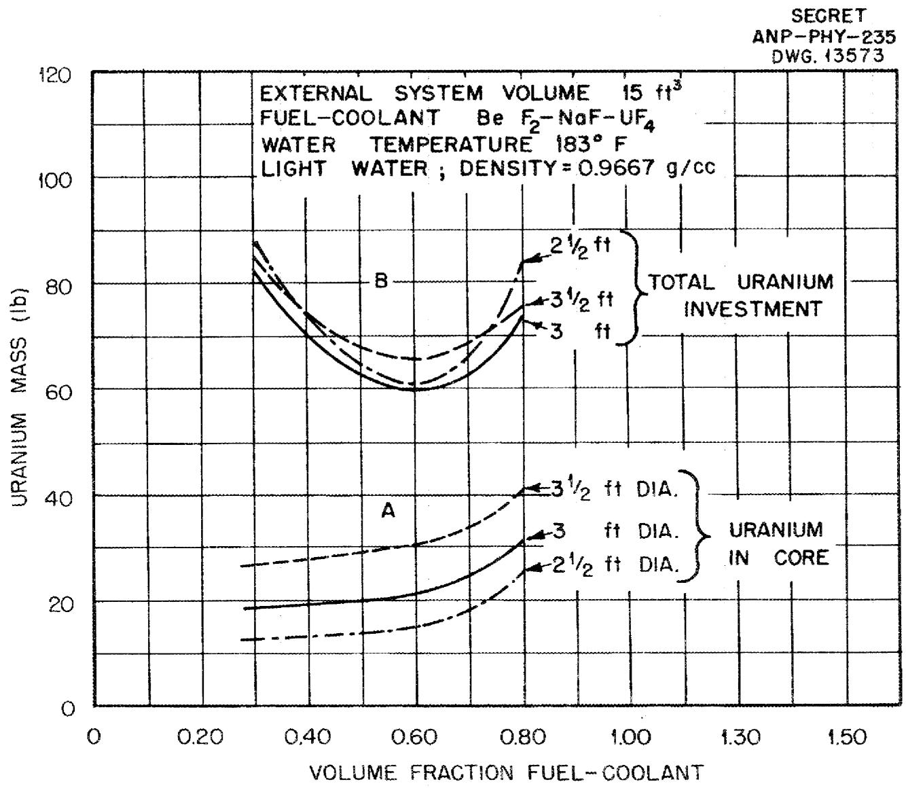  
Fig. 3.9. Total Uranium Inventory and Uranium in Core as a Function of the Volume Fraction Fuel-Coolant in the Core for the Water-Moderated Circulating-Fuel Reactor with $2\frac{1}{2}$ -, 3-, and $3\frac{1}{2}$ -ft-Diameter Cores.

core. The total uranium inventory was a minimum of 60 lb at 0.60 volume fraction of fuel in the 3-ft core. The minimum critical mass with water moderation is realized with a smaller core than that required with beryllium oxide moderation, primarily because water is a better moderator.

Fissioning, absorption, and leakage spectra for all the 3-ft diameter

water-moderator cores with 0.60 volume fraction fuel-coolant are given in Figs. 3.10, 3.11, and 3.12, respectively. The percent thermal fissions for this reactor is 86.4, the percent thermal absorption is 86.4, and the percent thermal escape is 14.6, all at a lethargy of 19.6. This is, therefore, an epithermal reactor. The neutron-flux distribution (Fig. 3.13) has a high peak in the high-energy (low-lethargy) range.

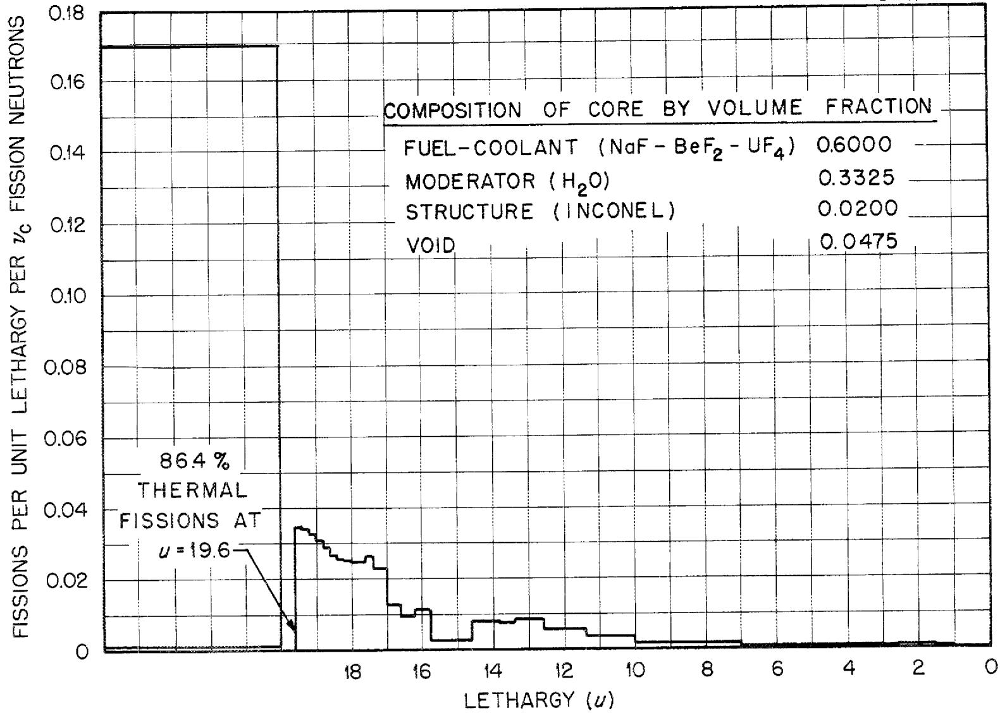  
Fig. 3.10. Fission Spectrum vs. Lethargy for the $\mathbf{H}_2\mathbf{O}$ -Moderated Circulating-Fuel Reactor with 3-ft-Diameter Core.

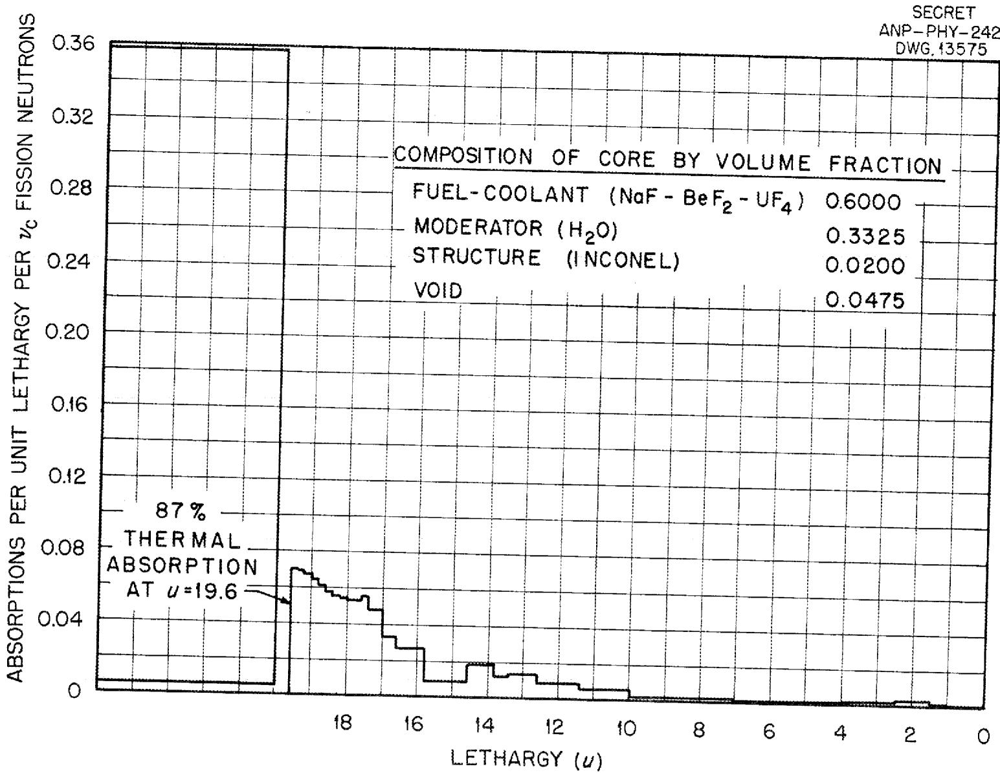  
Fig. 3.11. Absorption Spectrum vs. Lethargy for the $\mathbf{H}_2\mathbf{O}$ -Moderated Circulating-Fuel Reactor with 3-ft-Diameter Core.

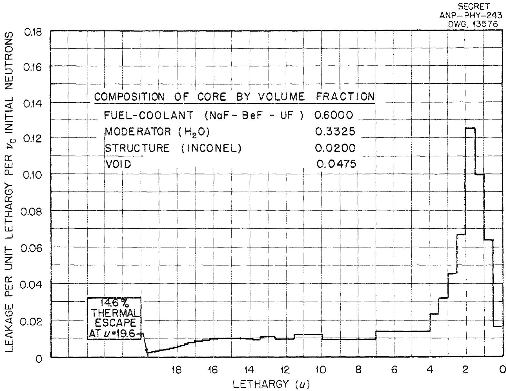  
Fig. 3.12. Leakage Spectrum vs. Lethargy for the $\mathbf{H}_2\mathbf{O}$ -Moderated Circulating-Fuel Reactor with 3-ft-Diameter Core.

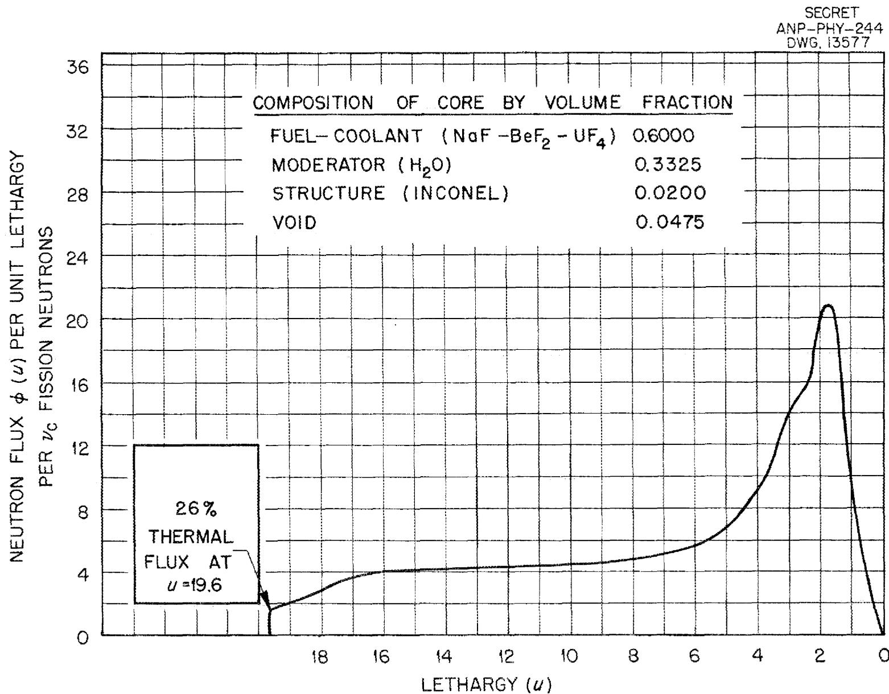  
Fig. 3.13. Neutron Flux Spectrum vs. Lethargy for the $\mathbf{H}_2\mathbf{O}$ -Moderated Circulating-Fuel Reactor with 3-ft-Diameter Core.

The fuel-coolant density value used for this design set was $2.1\mathrm{g/cm}^3$ . Evaluation of the fuel-coolant density reactivity coefficient as well as of the reactivity coefficients for structure and moderator will be completed soon. An estimate of the water-moderator temperature coefficient, made to determine the effect of water cooling stability on reactivity, was found to be:

The stainless steel poisoning effect was determined as a loss of $2.55\%$ in $k_{\text{eff}}$ per 0.01 increase in volume fraction of stainless steel. A change from 0.015 to 0.030 in stainless steel volume fraction changed $k_{\text{eff}}$ in the water-moderated reactor with $35\%$ fuel-coolant from 1.024 to 0.987.

$$
\frac {\Delta k / k}{\Delta T} = - 7. 8 \times 1 0 ^ {- 5} \text {p e r d e g r e e F a h r e n h e i t}.
$$

$NaF - KF - LiF - UF_{4}$ Fuel Coolant. The reactor design values for this coolant in the water-moderated reactor core are the same as those given in Table 3.3.

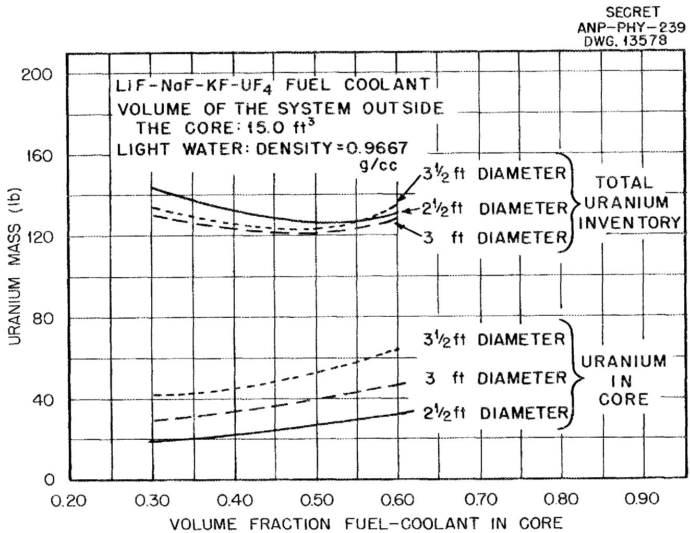  
Fig. 3.14. Total Uranium Inventory and Uranium in Core as a Function of Volume Fraction Fuel-Coolant in the Core for $\mathbf{H}_2\mathbf{O}$ -Moderated Circulating-Fuel Reactors with $2\frac{1}{2}$ , $3\cdot\cdot\cdot$ , and $3\frac{1}{2}$ -ft-Diameter Cores and LiF-NaF-KF-UF4 Fuel-Coolant.

Figure 3.14 presents the summary graphs for the system, showing critical mass values for the cores and indicating the minimum uranium requirements for the systems to be 127 lb for the $2\frac{1}{2}$ -ft-diameter core, and 122 lb for the 3- and $3\frac{1}{2}$ -ft-diameter cores. The optimum volume fraction for fuel-coolant in the core is near 0.50, with a very small sensitivity to this parameter indicated by the small rate of change between 0.30 and 0.60 volume fractions.

This reactor has approximately $80\%$ thermal fissions.

Comparison of $\mathbf{H}_2\mathbf{0}$ - and BeO-Moderated Reactors. These reactor series serve to indicate the regions of interest for possible designs. No attempt has been made to compute any one design in detail because of the sensitivity of reactivity calculations to shape and constituents. The relative accuracy of the results depends not only on the usual assumptions but also on

the proximity of the estimated physical constants (such as the fuel-coolant density) to their actual values, as well as on the structural details.

Some of the differences between the water-moderated and the BeO-moderated reactors are given in Table 3.4. More detailed comparisons may be made directly from the various spectra that are presented for both types of reactor.

In addition to the items compared in Table 3.4, the poisoning effect of stainless steel is somewhat worse for the BeO-moderated reactor. On the other hand, there is a great deal more escape of fast neutrons from the $\mathrm{H}_{2}\mathrm{O}$ -moderated reactor. However, no important "physical" difference between the reactors has appeared to date, so that design considerations must be given the greater weight in choice of a reactor type. Attention is called to the large increase in uranium inventory caused by the use

Table 3.4   
Comparison of BeO- and $\mathbf{H}_2\mathbf{O}$ -Moderated Reactor   

<table><tr><td>ITEM COMPARED</td><td>BeO REACTOR</td><td>H2O REACTOR</td></tr><tr><td>Fuel</td><td>NaF-UF4</td><td>NaF-BeF2-UF4</td></tr><tr><td>Core diameter (ft)</td><td>3.5 to 4.0</td><td>3</td></tr><tr><td>Fuel-coolant volume fraction</td><td>0.36</td><td>0.71</td></tr><tr><td>Critical mass(a)(lb)</td><td>26 to 30</td><td>26</td></tr><tr><td>External fuel volume (estimated) (ft3)</td><td>15</td><td>15</td></tr><tr><td>Total uranium inventory(a)(lb)</td><td>69 to 72</td><td>63</td></tr><tr><td>Ratio of fuel in core to total fuel</td><td>0.37 to 0.42</td><td>0.41</td></tr><tr><td>Percent thermal fissions</td><td>52 to 55</td><td>69</td></tr><tr><td>Moderator density-temperature reactivity coeffi-cient, l/°F</td><td>0.6 x 10-5</td><td>7.8 x 10-5</td></tr><tr><td>At 183°F</td><td>-0.93 x 10-5</td><td>-14 x 10-5</td></tr><tr><td>At 1500°F</td><td>-0.85 x 10-5</td><td></td></tr></table>

$(a)$ The necessary heterogeneity of structure will increase these values somewhat.

of large amounts of potassium in the fuel-coolant. It is also very important to minimize the structure volume fraction in any of the above reactors.

Effect of Delayed Neutrons on Kinetic Response (C. B. Mills, ANP Division). The importance of delayed neutrons for controlling the speed of response of a stationary-liquid-fuel ARE (Aircraft Reactor Experiment) was determined by repeating a calculation in which an increase in inlet coolant temperature of $25^{\circ}\mathrm{C}$ is introduced stepwise and then maintained and a

control rod is actuated to insert or remove 0.00025 unit of reactivity per second. Two-thirds and four-fifths of the delayed neutrons were removed from the kinetic response equations, and the two curves for $(\phi - \phi_0) / \phi_0$ vs. time were compared with the curve for no loss of delayed neutrons.

The results in Fig. 3.15 indicate a rate of change of flux three times as great as normal when the fraction of delayed neutrons is decreased by $80\%$ . For a $67\%$ decrease the rate of change of flux is almost twice as great as normal.

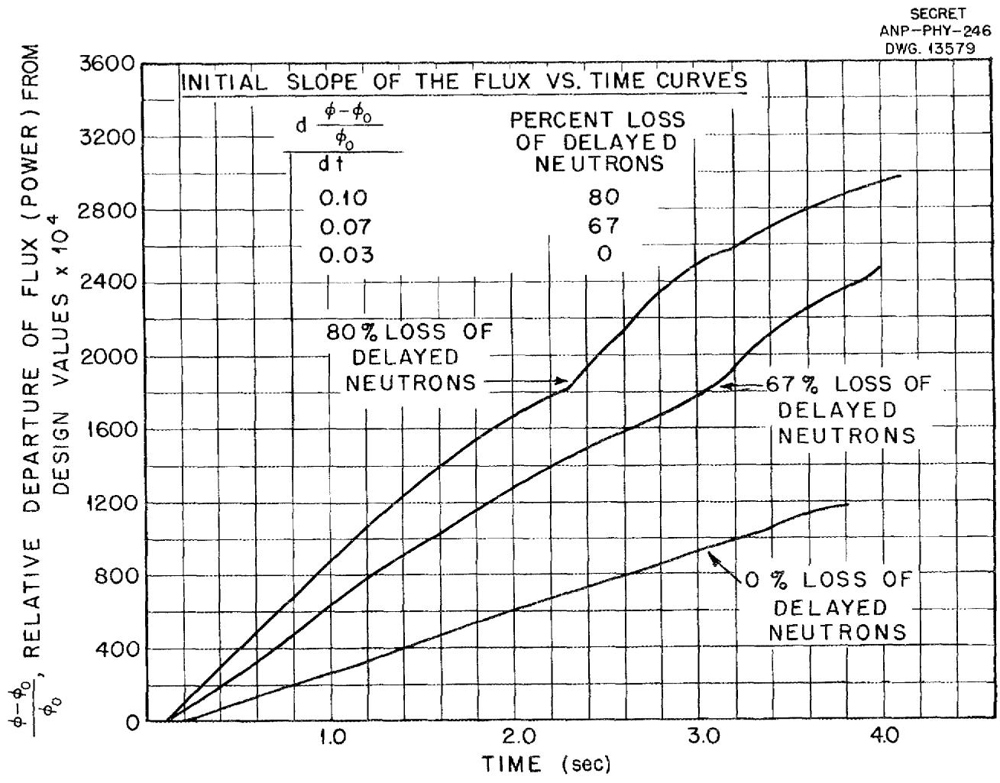  
Fig. 3.15. Fractional Change in Neutron Flux as a Function of Time for 0, 67, and $80\%$ Decrease in Delayed Neutrons.

These results were then extrapolated to the case of kinetic response of the circulating-fuel reactor. The factors in the kinetic calculations described above are about the same for the stationary and the circulating fuel reactors with the single exception of fuel expansion in the fuel tubes. However, for times less than 0.5 sec there is very little difference in the rate of change of flux between the case with fuel expansion, as it occurs in the stationary fuel and the case with no expansion. It appears therefore that if a disturbance such as the one specified above is introduced, the kinetic response within 1 sec thereafter is not sensitive to fuel expansion and the circulating-fuel-reactor flux will follow a rate-of-change curve very similar to that shown on Fig. 3.15. The loss of delayed neutrons from the core up to $80\%$ of those there for the stationary-fuel case should not increase the kinetic response rate of the liquid fuel reactor by more than a factor of three times that for the reactors with stationary fuel for which kinetic response data are available.

# CIRCULATING-MODERATOR REACTORS

B. T. Macauley C. B. Mills  
ANP Division

Tentative designs for alkali hydroxide--moderated reactors have been computed to determine the reactor criticality constants. These are the 200- and 400-Mw sodium hydroxide--moderated and -- cooled reactors. The design data are given in Table 3.5.

Reactor criticality constants for the 200- and 400-Mw sodium hydroxide reactor and for a 200-Mw potassium hydroxide reactor are given in Table 3.6.

Table 3.5   
The NaOH-Cooled and - Moderated Reactor   

<table><tr><td colspan="3">(July 12, 1951)</td></tr><tr><td>Reactor power (Mw)</td><td>200</td><td>400</td></tr><tr><td>Reactor core diameter (ft)</td><td>2½</td><td>3½</td></tr><tr><td>Reactor core material (volume fractions)</td><td></td><td></td></tr><tr><td>Stationary liquid fuel (NaF-UF₄)</td><td>0.0477</td><td>0.0148</td></tr><tr><td>Fuel-element structure</td><td>0.1766</td><td rowspan="2">0.1252</td></tr><tr><td>Baffle structure</td><td>0.0257</td></tr><tr><td>Moderator-coolant</td><td>0.7500</td><td>0.8600</td></tr></table>

Apparently a larger reactor will be required if it is necessary to use KOH. However, the critical mass for a $3\frac{1}{2}$ -ft-diameter KOH-moderated reactor is only 70 lb. The higher critical mass of the smaller core (see table) is necessitated by the greater leakage of that core. More complete data and analysis of these hydroxide reactors will be presented in the next report.

Figure 3.16 shows the sensitiveness of this reactor to the stainless steel used for structure. Evidently stainless steel is an important reactor poison.

# ERRORS IN REACTOR PHYSICS CALCULATIONS

C. B. Mills, ANP Division

The value of the present method(1,2) of reactor calculations lies in the large amount of accurate information

Table 3.6   
Reactivity Calculation Results on the Alkali Hydroxide Reactors   

<table><tr><td></td><td>NaOH, 200 Mw</td><td>NaOH, 400 Mw</td><td>KOH, 200 Mw</td></tr><tr><td>Core diameter (ft)</td><td>2%</td><td>3%</td><td>2%</td></tr><tr><td>Critical mass (lb)</td><td>52</td><td>77</td><td>220</td></tr><tr><td>Δk/k(Δm/m)U235</td><td>.47</td><td>.48</td><td>0.065 (at 60 lb mass)</td></tr><tr><td>Percent thermal fissions</td><td>55.5</td><td>77.1</td><td>42.9</td></tr><tr><td>Median energy for fission (ev)</td><td>0.04</td><td>Thermal</td><td>0.15</td></tr><tr><td>Δk/k(Δρ/ρ)moderator</td><td>.209</td><td></td><td></td></tr><tr><td>Δk/k(Δρ/ρ)structure</td><td>-0.221</td><td></td><td></td></tr><tr><td>Δk/k/ΔR/R (R = radius)</td><td>0.5347</td><td></td><td></td></tr></table>

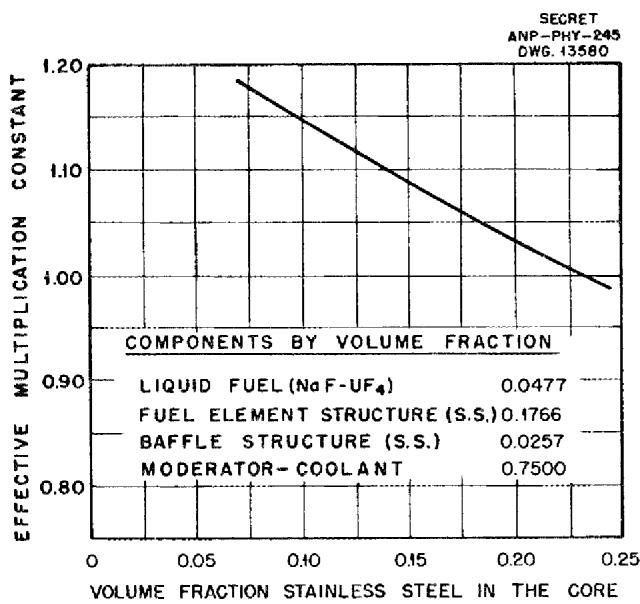  
Fig. 3.16. Effective Multiplication Constant as a Function of Volume Fraction of Stainless Steel in the Core for the $2\frac{1}{2}$ -ft-Diameter-Core NaOH-Moderated and - Cooled Reactor.

obtained, its speed, and its relatively small cost. Almost any reactor can be computed by this method if the cross sections of the constituents are known.

Results of a comparison between uncorrected bare-reactor calculations and experiment show a surprising consistency for the very simple multigroup method used. Consistency of multiplication constant determination is about $\pm 1\%$ with an average error of $-2\%$ for water-moderated reactors of any size of uranium concentration, $-1\%$ for the carbon-moderated reactor experiment, and $-10\%$ for the beryllium-moderated critical experiment. The error in the beryllium calculation is being investigated in some detail and seems to be due to the omission of a significant physical effect [the $(n,2n)$ reaction, for instance] and to known

Table 3.7   
Critical Assembly Sizes, Composition, and Calculated Multiplication Constants   

<table><tr><td colspan="9">Water-Moderated Reactors (a Right Cylinder, with Extreme Variation in NH/NU)</td></tr><tr><td></td><td>CALCULATION
(core No.)</td><td>DIAMETER
(cm)</td><td>HEIGHT
(cm)</td><td>NH/NU235</td><td colspan="2">MASS OF U235
(kg)</td><td colspan="2">k_eff
CALCULATED</td></tr><tr><td>Reflected</td><td>106</td><td>25.40</td><td>22.40</td><td>328.7</td><td colspan="2">0.893</td><td colspan="2">0.970</td></tr><tr><td>Reflected</td><td>107</td><td>38.10</td><td>44.30</td><td>999.0</td><td colspan="2">1.31</td><td colspan="2">0.988</td></tr><tr><td>Bare</td><td>109</td><td>25.40</td><td>34.00</td><td>52.9</td><td colspan="2">7.90</td><td colspan="2">0.984</td></tr><tr><td>Bare</td><td>110</td><td>25.40</td><td>32.30</td><td>43.9</td><td colspan="2">8.80</td><td colspan="2">0.985</td></tr><tr><td colspan="9">Carbon Critical Experiment (a Cube)</td></tr><tr><td></td><td>CALCULATION
(core No.)</td><td>AREA
(in. x in.)</td><td>LENGTH
(in.)</td><td>N*U235</td><td>N*C</td><td>N*A1</td><td>MASS OF U235
(kg)</td><td>k_eff
CALCULATED</td></tr><tr><td>Bare</td><td>146</td><td>51 x 51</td><td>44.111</td><td>0.725</td><td>770</td><td>36.8</td><td>44.6</td><td>0.991</td></tr><tr><td colspan="9">Beryllium Critical Experiment</td></tr><tr><td></td><td>CALCULATION
(core No.)</td><td>AREA
(in. x in.)</td><td>LENGTH
(in.)</td><td>N*U235</td><td>N*Be</td><td>N*A1</td><td>MASS OF U235
(kg)</td><td>k_eff
CALCULATED</td></tr><tr><td>Bare</td><td>60</td><td>21 x 21</td><td>23.22</td><td>3.08</td><td>1074</td><td>36.5</td><td>19.3</td><td>0.903</td></tr></table>

\*x 10-25 per cc.

simplifications in the conservation equations. Reactors that have had both critical-experiment test and bare-reactor calculations are described in Table 3.7.

The calculations on the four watermoderated reactors were based on the theory of Goertzel and Selengut(3) described in the last quarterly report.(4) Two bare and two reflected

critical experiments were computed using the modified age equations described in detail elsewhere. The two reflected-reactor calculations used a correction on the core radius equal to the slowing-down length of neutrons in water.

Bare-reactor multigroup calculations were made on the four reactors with the multiplication constant $(k_{\text{eff}})$ resulting as shown in Table 3.7. Note that these reactors were selected to give the worst

possible case for results, as is indicated by the large changes in critical mass and atomic density of $\mathbf{U}^{235}$ . The experiments are described in detail in report K-343. (6)

It was necessary to use a variable buckling $[B^2 (u)]$ in the age equation because of the small size of the reactors. Constant buckling results were lower by $\Delta k = -0.0208$ .

The relative importance of hydrogen moderation was determined by ignoring moderation by all other

atomic constituents. This lowered $k_{\text{eff}}$ of $\Delta k = -0.0247$ .

A Fermi age equation solution of this problem without consideration of the effects of hydrogen moderation separately results in an error in $k_{\text{eff}}$ of $\Delta k_{\text{eff}} = 0.192$ .

The details of the leakage and fissioning lethargy distribution were presented previously. (7) Note that the percent thermal fission values change from $94\%$ for core 107 to $41.5\%$ for core 110, i.e., from thermal to intermediate reactor fission distributions for equally good results.

# 4. CRITICAL EXPERIMENTS

A. D. Callihan, Physics Division

A second mockup of the General Electric direct-cycle (air-water cycle) reactor was completed, and the critical mass of the assembly was found to be 90 lb of uranium. The inhomogeneities of the mockup are serious, however, and the extrapolations of the critical mass of this assembly to that of the aircraft reactor are not yet reliable.

Considerable data have been taken on the uranium graphite assembly, but the results have not been reduced.

# PRELIMINARY ASSEMBLY OF DIRECT-CYCLE REACTOR

At the request of the General Electric Company and with its cooperation, studies are being made of the proposed direct-cycle nuclear reactor for aircraft propulsion. This reactor, as presently conceived, will be air cooled and water moderated, with stainless steel as one of the principal structural materials. Beryllium will be the reflector. One series of experiments was outlined in the preceding report(1) and has been described more fully elsewhere.(2)

During the period reported here a second mockup has been assembled and made critical. The core is an approximate right cylinder, 36 in. long and 51 in. in diameter, the periphery of which is not smooth because the

smallest structural unit is $1\frac{1}{2}$ in. square. The axis of the cylinder is horizontal. The mid-cross-section is shown in Fig. 4.1. The hydrogenous material, a methacrylate plastic, is placed in horizontal layers, 1 in. thick. These layers are separated by an open structure of stainless steel and uranium about 2 in. thick. This structure consists of six sheets of steel, each 0.017 in. thick and 36 in. long. The edges of each piece are bent under in order to separate adjacent stacked sheets by about 0.25 in., simulating the air ducts of the reactor. The upper three of each group of six vertically stacked pieces are inverted, i.e., the plane surfaces of the center pair are in contact. The 3-in.-diameter 0.010-in.-thick enriched uranium metal disks are placed, with planes horizontal, in the interspace between the central steel sheets. (In some instances, because of insufficient large disks, four $1\frac{1}{2}$ -in.-diameter disks are used.) The center-to-center spacing between disks is 3.6 in. in the direction of the cylinder axis and 3 in. in the horizontal direction perpendicular to the axis, the latter being fixed by the dimensions of the square aluminum tube matrix into which the reactor components are built. The lateral surface of the core is enclosed by a 6-in.-thick reflector of beryllium; the ends of the reactor, including the beryllium jacket, have a graphite reflector 6 in. thick. Insufficient available beryllium necessitated the substitution of graphite as the end reflector. The void fraction in the core is 0.57 and the $\mathrm{H} / \mathrm{U}^{235}$ atomic ratio is 225. The fuel and moderator inhomogeneities are serious. The critical mass is $41\mathrm{kg}$ of uranium or $38\mathrm{kg}$ of $\mathrm{U}^{235}$ .

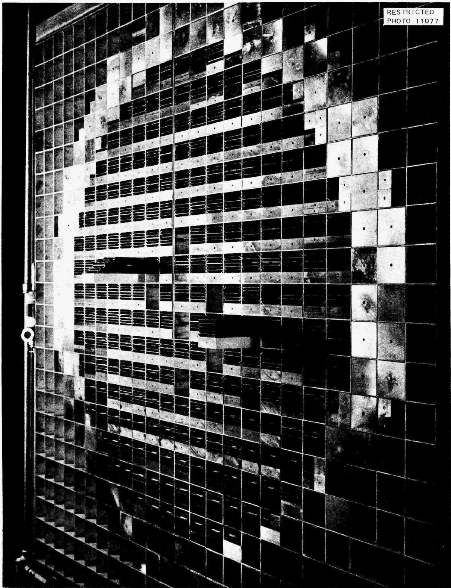  
Fig. 4.1. Mid-Cross-Section of Second Mockup of Direct-Cycle Reactor.

# GRAPHITE REACTOR

In the time available prior to the inception of the program described above, a series of measurements was made on the uranium-graphite assembly described in an earlier quarterly

report.(3) The results, obtainable from these data, have not been realized.

# 5. NUCLEAR MEASUREMENT

Data for gamma-ray and neutron yields from proton bombardment of some materials has been extended using the 5-Mev Van de Graaff accelerator. This accelerator has also been used to measure the total cross-section of iron from 0.6 to 3.6 Mev and $(p,n)$ thresholds for $\mathbf{F}^{19}$ and $\mathbf{Na}^{23}$ . Upper limits have been set for the $(n,2n)$ cross-sections in beryllium in an experiment in which a neutron source was surrounded with a beryllium sphere. Final adjustments are being made on the time-of-flight spectrometer for neutrons.

# THE 5-Mev Van DE GRAAFF ACCELERATOR

H. B. Willard, Physics Division

The gamma-ray and neutron yields from the proton bombardment of $\mathbf{Li}^7$ , $\mathbf{Be}^9$ , and $\mathbf{F}^{19}$ have been extended to approximately 5.4 MeV. These curves are to be printed in the Physics Division quarterly report for period ending December 20, 1951.

The $(p,n)$ thresholds for $\mathbf{F}^{19}$ and $\mathbf{Na}^{23}$ have been determined to be $4.253 \pm 0.005$ and $5.091 \pm 0.010$ Mev, respectively.

The total cross-section of ordinary iron for fast neutrons has been measured from 0.6 to 3.6 Mev with a resolution of 35 kev. Unresolved levels occur every 100 kev, with indications that with better resolution many more would be observed. The average cross-section varies from 2.5 barns at 0.6 Mev to 3.2 barns at 3.6 Mev. These total cross-section data have not yet been reduced to specific cross-sections, which are used in shield calculations.

# MEASUREMENT OF THE $(n,2n)$ REACTION IN BERYLLIUM

E. D. Klema, Physics Division

The data on the $(n,2n)$ reaction in beryllium discussed in the previous quarterly progress report(1) have been reduced by G. B. Arfken to an average $(n,2n)$ cross-section for the spectra of the two sources used. The calculations were made under the assumption that a neutron which makes any sort of collision $[(n,n), (n,\alpha),$ or $(n,2n)]$ in the beryllium sphere is lost as far as producing the $(n,2n)$ reaction is concerned. The absorption of neutrons by the beryllium sphere was estimated from the data obtained with the carbon spheres.

The upper limits for the $(n,2n)$ cross-sections as determined by this experiment are as follows:

$$
\begin{array}{l l} \text {P o - a - B s o u r c e ,} & \overline {{\sigma}} _ {(n, 2 n)} \leq 0. 2 5 \text {b a r n} \\ \text {P o - a - B e s o u r c e ,} & \overline {{\sigma}} _ {(n, 2 n)} \leq 0. 5 6 \text {b a r n} \end{array}
$$

The upper limit of this cross-section, although appreciably lower than that reported by Houtermans, $^{(2)}$ is still so high as to be capable of introducing a significant error in the critical mass of a reactor assembly employing beryllium. In reality, this cross-section is the suspected cause of the discrepancy in the calculated (disregarding the cross-section altogether) and actual critical mass of the

beryllium- reflected graphite-uranium critical assembly.(3)

TIME-OF-FLIGHT NEUTRON SPECTrometer

G. S. Pawlicki, ORINS

E. C. Smith, Physics Division

The spectrometer is essentially completed, and calibration and adjustment of the instrument are in progress. The best resolution to be expected

with this rotor is 1.2 $\mu$ sec per meter, which is comparable to that of the best operating spectrometers. Another rotor has been ordered which should improve this resolution by a factor of 2. Details of the apparatus will be found in the Physics Division quarterly reports for June 20 and September 20.

# 6. EXPERIMENTAL REACTOR ENGINEERING

H. S. Savage, ANP Division

The activities of the Experimental Engineering Group now center around the vigorous pursuit of the technology of both sodium and the fused fluorides to provide fundamental engineering data through the development of actual components: valves, pumps, seals, heat exchangers, etc. Consideration of the advantages of a circulating-fuel-coolant reactor for aircraft application necessitated a program for manufacturing fluorides and for determining their effects on container materials and reactor components. Approximately 400 lb of eutectic LiF-KF-NaF has been produced for test purposes.

A pump incorporating a gas seal has satisfactorily pumped fused fluorides up to $1300^{\circ}\mathrm{F}$ for 35 hr. Also, fluoride transfer through small tubes has been repeatedly demonstrated, as has successful filtration through a $10 - \mu$ sintered stainless steel filter. Thus far, fluorides appear to reduce oxides inside the system and to be severely corrosive only in the presence of oxygen. Equipment is being assembled as rapidly as possible for conducting self-welding and pump-shaft-seal experiments with fluorides.

Continued work with liquid-metal systems during the quarter resulted in a pump incorporating a frozen sodium seal operating approximately 450 hr with sodium at temperatures up to $1100^{\circ}\mathrm{F}$ with a pressure across the seal of 25 psig. In other equipment, a seal test rig operated with sodium at $1500^{\circ}\mathrm{F}$ sealing successfully against 107 psig. Electromagnetic pump-cell development reached the stage at which sodium was pumped at temperatures up to $1300^{\circ}\mathrm{F}$ for approximately 160 hr; test-loop heater limitations prevented

the attainment of higher sodium temperatures. Self-welding tests were continued with sodium, and equipment is being modified to continue work of this nature with fluorides.

Valve testing was continued to evaluate certain commercially available varieties for use in liquid-metal systems. In some cases instrumentation needs for fluorides are radically different from those required for liquid-metal systems; this program has thus undergone change compatible with the changes in ARE. Null-type pressure-measuring devices were being tested with both liquid-metal and fluoride systems at the end of the quarter. Preliminary work on heat exchangers and analytical methods for sodium were continued during the period, as were cleaning procedures for both fluoride and liquid-metal systems. Planning of full-scale ARE component testing facilities were being continued along only such lines as would allow the facilities to be used for testing either liquid-metal or fluoride systems.

# PUMP DEVELOPMENT

The centrifugal pump employing a gas seal of graphite set against a flat sealing face has operated with NaK and subsequently with the fluoride eutectic LiF-KF-NaF. The latter test system was operated for 35 hr at $1300^{\circ}\mathrm{F}$ and was terminated because of a leak outside the pump. The design of the centrifugal pump of the above type for the liquid-metal (NaK) ARE has been completed. The $1\frac{1}{2}$ -hp canned-rotor pump, as rebuilt with high-temperature $(500^{\circ}\mathrm{F})$ windings, has been satisfactorily pretested with water, but some difficulty has arisen in canning

the rotor. The 6-hp canned-rotor pump operated poorly because of an inefficient suction inlet, which is being redesigned. The centrifugal pump with a frozen-sodium seal operated with no indication of seal failure for $450\mathrm{hr}$ with fluid temperatures up to $1100^{\circ}\mathrm{F}$ . Limited development of electromagnetic pumps has continued, and two new design cells have been tested.

Centrifugal Pumps for Figure-Eight Loops (W. G. Cobb, ANP Division). The centrifugal pump for liquid metals(1) was operated on two occasions with NaK as the pumped fluid. In the first test pumping was continuous for 12 hr and the NaK temperatures reached $820^{\circ}\mathrm{F}$ before a leak in a welded joint necessitated a shutdown. The second test also was conducted with NaK, and temperatures reached $940^{\circ}\mathrm{F}$ during the 12-hr pumping period. Excessive gas leakage through the shaft packing and gasketed joint under the stuffing box necessitated termination of this test.

The pump and system were cleaned, reassembled, and provided with heaters and insulation to allow preheating to approximately $1000^{\circ}\mathrm{F}$ . The system was then filled with the eutectic LiF-KF-NaF. Flow, metered by a sharp-edged orifice with pressures being indicated by gas trapped in bulbs connected to the orifice taps, was approximately 4.8 ft/sec (about 6 gpm). Level control was accomplished by means of electrical probes and gas pressure directly in the pump body. The test system ran continuously for 35 hr, pumping at temperatures up to $1300^{\circ}\mathrm{F}$ . Considerable encouragement was derived from the fact that gas leakage through the shaft seal was negligible throughout the run, and a small but definite

signal was observed from the electromagnetic flowmeter. Moreover, smooth operation was obtained with a gas-held level control. Although several small leaks in the system developed, one of which eventually caused termination, the pump itself operated satisfactorily throughout the run.

ARE Centrifugal Pump Design. (W. G. Cobb, L. V. Wilson, and J. F. Haines, Consultant, ANP Division). The design and detailing of a centrifugal pump employing NaK for the ARE has been completed. General design features are compatible with those listed previously (2) with the exception of level-control features. Avoiding the necessity for simultaneously developing a satisfactory pump and a level control device appeared advisable; this pump is therefore to be located in the fluid circuit on the same level as the expansion tank. Therefore, the liquid level in the pump is determined by the level in the expansion tank, and sufficient shaft overhang has been incorporated to compensate for level variations occurring in the surge tank. A gas seal of graphite against a flat sealing face has been incorporated in the design, and temperature control of bolted joints and pump body above the casing is to be effected by circulating gas. Also, provisions for internal cooling of the shaft by circulating gas have been included. All bearings are external to the gas space above the coolant being pumped, and a circulated lubricant serves the bearings as well as the graphite seal. All parts except the impeller are to be of fabricated and machined construction. Impellers of Worthite have been received from Worthington Pump Corporation.

Canned-Rotor Pump (M. Richardson, Reactor Experimental Engineering Division). The NaK test loop discussed in the previous report is being modified to include a 30-kw heater and a vertical double-tube heat exchanger in which water flows as a falling film down the 8-ft length of the inside 2-in. tube and the sodium-potassium alloy rises in the annulus formed by a 3-in. pipe. The two canned $\frac{3}{4}$ -hp motors, wound with $500^{\circ}\mathrm{F}$ Class H windings, have been tested in water and found to operate satisfactorily. Attempts are being made to can the rotor elements to protect them from corrosion at high temperatures. Stainless steel has been used and found to operate satisfactorily, but the increase in gap caused by the 0.010-in. wall of stainless steel causes the current load to become excessive. Some magnetic material will be tried next which will protect the rotor and reduce the stator-rotor gap.

The 3- to 6-hp canned-rotor pump was operated for a short period but the performance was poor. It is believed that this poor performance was caused by the turbulence and thrust load which, in turn, were caused by the poor design of the suction inlet to the pump. This is being corrected by straightening out the sharp bend at the suction face and placing a baffle at the inlet to reduce the pressure on the shaft at this point. A sleeve bearing will be introduced within the motor can which will protect the can from damage caused by misalignment but will allow the rotor bearings to operate hydraulically.

A new wire insulating material which is manufactured by the Bentley-Harris Insulating Company of Coshocton, Pa., would allow the canned-rotor pumps to operate at $1200^{\circ}\mathrm{F}$ . This

insulation will be included in future pumps. Investigations are underway to determine the possibility of making the rotors of suitable material, which will make canning unnecessary.

Frozen-Sodium-Seal Pump (W. B. McDonald, ANP Division). Testing the frozen-sodium seal under dynamic conditions was effected in an isothermal test loop containing a modified Worthington centrifugal pump. This test ran approximately 450 hr at sodium temperatures up to $1100^{\circ}\mathrm{F}$ , alimitation imposed by silver-solder pump-casting repairs. Flows up to 40 gpm were attained, and the pressure differential across the seal was 25 psig. No indication of seal failure was observed during the test.

Two-Stage Electromagnetic Pump (J. H. Wyld and A. L. Southern, ANP Division). Some parts of the two-stage electromagnetic pump have been received from the main shop; however, the increase in emphasis on fused fluorides has necessitated postponing plans for immediate testing.

Electromagnetic Pump Cell Development (A. G. Grindell, Engineering and Maintenance Division). Two types of electromagnetic pump cells designed by ANP personnel for high-temperature liquid-metal applications were given preliminary tests during the period. The first of these featured integral construction of the throat and electrodes from type 316 stainless steel. Initial tests indicated that severe local overheating occurred. The second cell, employing nickel lugs inserted into the stainless steel pump throat and welded in place with inconel filler, operated satisfactorily for approximately 160 hr, pumping sodium at temperatures up to $1300^{\circ}\mathrm{F}$ . Test-loop heater limitations prevented raising the sodium temperature above the $1300^{\circ}\mathrm{F}$ value.

# SEAL TESTS

W. B. McDonald, ANP Division

Many problems arising in connection with pump development for liquid metals and fluorides may be more properly classified as seal problems. A program is underway in which various types of seals are evaluated on pumps as well as in simulated equipment. Seals currently being developed are the frozen-sodium seal, the frozen-fluoride seal, and the graphite ring-tool steel gas seal. The frozen-sodium seal has been successfully tested for 1150 hr with pressure across the seal of up to 107 psig. Only limited success has yet been experienced with the two other seals.

Frozen-Sodium Seal. During this quarter one phase of testing the frozen-sodium seal was successfully completed. Using the seal-testing device described in a previous report, the frozen-sodium seal operated for a total of 1150 hr at sodium bath temperatures up to $1500^{\circ}\mathrm{F}$ . Maximum pressure across the seal with no indication of failure was 107 psig. Just prior to termination, however, the pressure was raised to 150 psig, resulting in a small amount of sodium being forced out of the system around the shaft. Pressure was further increased to 200 psig in an effort to make the seal fail completely, but the leakage observed appeared to be no worse than at 150 psig. Leakage was at no time sufficient to cause a serious sodium fire; rather, it was characterized by sparks emerging from around the shaft.

A design has been completed in which the refrigeration coil, used in the tests above to freeze the sodium, has been replaced by copper cooling fins attached to the stainless steel sleeve.

Calculations indicate that a section approximately 5 in. long and containing $3\frac{1}{4}$ -in.-diameter fins spaced 1/8 in. apart are sufficient to freeze sodium around the shaft by convective cooling only. This radiant-cooled seal has not been tested.

Frozen-Fluoride Seal. Design and assembly have been completed on a device with which to determine the feasibility of a frozen-fluoride seal. The principle involved is identical to that of the frozen-sodium seal in which the liquid is solidified in an annulus between a sleeve and a rotating shaft.(3)

The first test has been completed in which the shaft, extending through a finned cooling sleeve into a pot containing eutectic NaF-KF-LiF-UF at $1200^{\circ}\mathrm{F}$ , was driven by a 5-hp motor. Pressure across the seal was 20 psig. The test lasted for 19 hr before a heater failure and a leak caused termination.

Postrun inspection revealed that material was deposited on both the shaft and sleeve, and some scoring at the bottom end of the shaft was observed. Whether the attack on the shaft is chemical or mechanical was undetermined, but the material deposits were found to be magnetic.

Graphitar Ring--Ketos Tool Steel Gas Seal. Testing of a graphitarring--Ketos tool steel gas seal was continued during the period. This type of seal, consisting of a graphitarring sandwiched between a stationary and a rotating member both made of Ketos tool steel full hardened, was tested in the presence of air and of helium to secure control data for comparison with runs made in the presence of NaK vapors. Successful sealing was obtained in these instances with differential pressures of 5 psig.

Three tests were conducted with the seal operating in the presence of vapor from NaK bath at $600^{\circ}\mathrm{F}$ , a seal temperature of $500^{\circ}\mathrm{F}$ , a spindle speed of 1300 rpm, and a differential pressure of 5 psig. The first test failed after 24 hr, and postrun examination indicated that the graphitar had been attacked. Subsequent tests operated under similar conditions with no apparent attack on the graphitar ring for 70 and 170 hr, respectively. Failure in both cases appeared to be due to eccentricity in the seal test device. As the period ended, a fourth test had been in progress for 220 hr with no indication of failure. Apparently the graphitar in the first test was faulty.

# TEST L0OPS

# A. G. Grindell, Engineering Maintenance Division

A calibration loop for checking electromagnetic pumps and flow measuring devices is now being used routinely for this purpose. The sodium manometer loop for measuring flow rates has not proved successful.

Calibration Loop. The calibration loop was designed for testing electromagnetic pumps and flow measuring devices. During the previous period this loop was used for reproducing manufacturer's performance curves for a type G-3 General Electric electromagnetic pump. This work was continued into the present period with the result that two electromagnetic pump cells designed by ANP personnel were tested. Results of these tests are included in the section "Electromagnetic Pump Cell Development" (see above).

Sodium Manometer Loop. During the previous quarter, the sodium manometer loop, designed for developing and

testing flowmeters, was used for testing an electromagnetic pump. First attempts to determine sodium flow in the system resulted in plugging of the small tubes connecting the flow nozzle to the primary manometer. Efforts to prevent this plugging by using NaK in place of sodium as the working fluid failed because NaK shorted electrical probes in the level control device. De-emphasis on liquid metals systems in favor of fused salts caused this project to be placed on a standby basis.

# SELF-WELDING TESTS

The self-welding of metal to metal contacts in a high-temperature fluid stream, as might occur in reactor pumps or valves, is being examined. Tests of five pairs of metals under static load in sodium for 100 hr have been completed. Stellite against stellite and inconel against zirconium exhibited no welding. Test of valves in sodium systems indicated a significant increase in opening torque with time. The valve had a stellite face and a 316 stainless steel seat.

Materials Tests (G. M. Adamson, Metallurgy Division). Several materials were examined to determine their self-welding properties at high temperatures in the presence of liquid sodium. A series of three cylinders with diameters of 1/8, 1/4, and 3/8 in. were machined from one material to be tested, and three corresponding cylinders 1/2 in. in diameter were machined from either the same or different material. After being polished, pairs of these were placed end to end in the desired liquid bath under a load of 75 lb for 100 hr. The results, obtained in sodium at $1500^{\circ}\mathrm{F}$ , were:

[Inconel-incone] (120 grit)

Few points of welding but broke during handling

Inconel-inconel (polished)

Welding had just started but pieces could be handled

Inconel-zirconium

No welding

347 stainless steel 347 stainless steel

Few points of welding on two smallest cylinders

Stellite-stellite

No welding in 65 hr

Valve Tests (W. C. Tunnell and K. W. Reber, ANP Division). Valve testing experiments were begun during the quarter to determine the suitability of commercially obtained valves for use in liquid-metal systems. The first test was conducted on a $\frac{1}{2}$ -in. Powell bellows valve with a stellite face and a 316 stainless steel seat. The valve was installed in the hot leg of a thermal-convection loop which was filled with sodium and heated to $1500^{\circ}\mathrm{F}$ . The valve was to be left open for 24 hr and then closed for 24 hr with a torque of 20 ft-lb. The torque required for opening the valve varied widely during the 323 hr of the test, although the valve was operable at all times. Postrun inspection of the valve awaits availability of suitable inspection equipment.

A second test was started in which two $\frac{1}{2}$ -in. Powell bellows valves were placed in parallel in the test loop in order that the valves could be alternately opened and closed on 24-hr cycles, thereby permitting convection flow of the sodium at all times. The valves in this test also had stellite faces and 316 stainless steel seats and were closed with 35 ft-lb torque. Torques required to open each ranged from 20 to 53 ft-lb. The time of closure was increased from 24 to 48 hr, and the torque required to open the first valve was 76 and 44 ft-lb after the first two cycles, while the second valve required 46 ft-lb after one cycle. Valve tests were still underway at the end of the period.

The study of bellows type valves, with the bellows surrounded by con

ventionaI packing material, has been suspended owing to the successful operation of the conventional valves and the emphasis on fluorides.

# HEAT-EXCHANGER TESTS

A. P. Fraas and M. E. LaVerne  
ANP Division

A heat exchanger with NaK as both the primary and secondary fluid has operated for 550 hr at temperatures up to $1200^{\circ}\mathrm{F}$ . The agreement between actual and expected heat transfer is good at high (11 gpm) flow rates but is poor at low (5 gpm) flow rates. A heat exchanger (radiator) with sodium as the primary fluid and air as the secondary fluid has been designed and built.

NaK to NaK Heat Exchanger. The NaK heat exchanger figure-eight loop has completed 550 hr of operation at temperatures up to $1200^{\circ}\mathrm{F}$ and flows of 5 and 11 gpm. Increased temperature could be achieved only by reducing the flow rate. Present plans call for continuing testing until 1000 hr of operation has been completed.

Thus far there has been indication of neither any increase in pressure drop across the heat exchanger nor any loss in heat-transfer performance. This has been reassuring since the heat-exchanger matrix was made of 1/8-in.-o.d. tubes spaced 0.04l in. apart, and it had been feared that clogging might be a problem. All experimental features of this loop have proved quite satisfactory; for example, the microbrazed electromagnetic pump cell, by-pass filter, venturi, and null-type pressure units have given no trouble.

Heat-transfer data at high flow rates agree well with values computed from Lyon's formula, but data at low

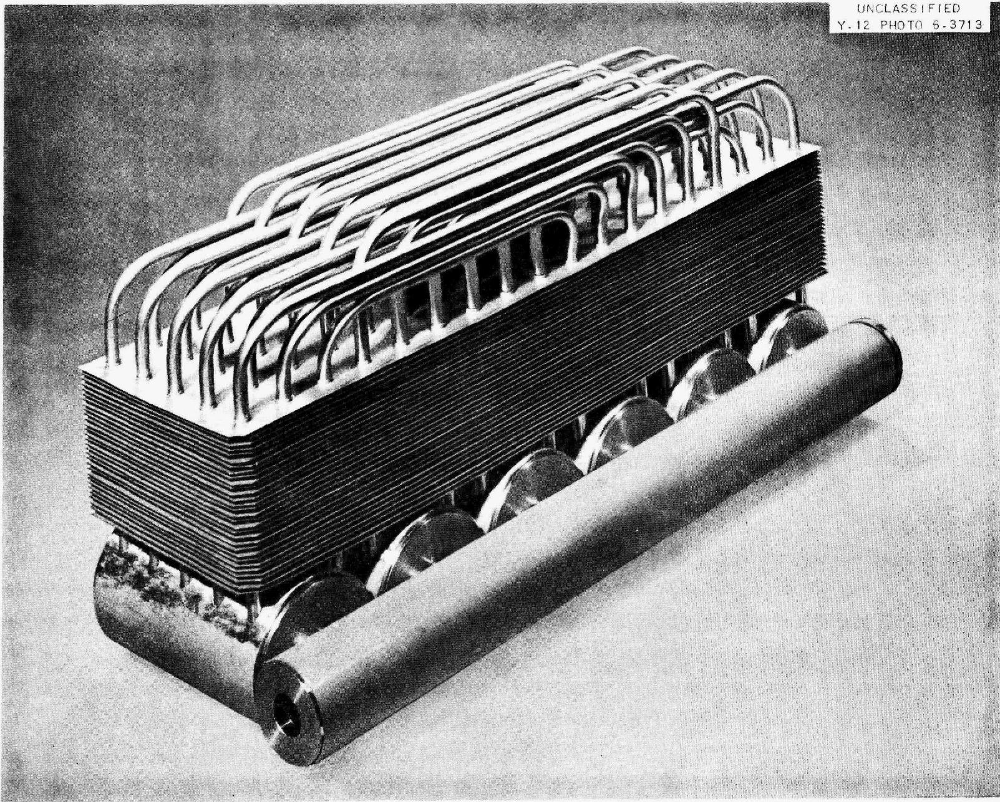  
Fig. 6.1. Sodium to Air Radiator.

flow rates give heat-transfer coefficients as much as $40\%$ below the theoretical values.

Sodium to Air Radiator. A high-performance air-radiator core section suitable for use in a J-53 turbojet engine has been designed and constructed (Fig. 6.1). The core matrix consists of 0.010-in.-thick stainless steel fins spaced 15 to the inch on 3/16-in.-o.d. stainless steel tubes. The latter have been placed in a square spacing on 2/3-in. centers. Parts for the core-element test section have been completed and are ready for microbrazing. Preliminary testing is to be effected with air supplied by a blower extracting the heat which is supplied by electrically heated NaK pumped through the radiator.

# LIQUID-FUEL SYSTEMS

# E. Wischhusen and D. R. Ward   ANP Division

The fluid dynamics of the liquid-fuel system of the liquid-metal-cooled reactor have been studied from mockups of the fuel system. The first two mockups were primarily glass systems with a colored fluid and yielded useful qualitative information on such problems as filling and emptying rates, valving requirements, bubble formation and migration, and flushing methods. A third mockup of the static-fuel system was intended, but the design change to a circulating-fuel system and the difficulty in transferring molten fluorides has directed attention to their handling.

The fuel-transfer apparatus consists essentially of two tanks, one in which the raw material is introduced and a second to which the molten fluorides

are transferred through a filter by gas pressure. Fuel lines are 347 stainless steel while all other components are of 316 stainless steel. The filter is of $5 - \mu$ stainless steel. After the first transferral, a viewing window was provided in the charge tank.

The fuel has been successfully filtered and transferred from one tank to the other. The unfiltered fluid is generally dark, the filtered fluid rather bright green and uniform in appearance. At the transfer temperature, $1400^{\circ}\mathrm{F}$ (the melting point of the fuel, NaF-KF-LiF- $\mathbf{U}\mathbf{F}_{4}$ , is $960^{\circ}\mathrm{F}$ ), the fuel has a watery consistency and a concave meniscus. Postrun examination of the equipment revealed a black layer of uranium oxides on the bottom of the supply tank and on the inlet side of the filter. Portions of the system wet by the fuel mixture exhibited a rather bright satinlike appearance, indicating the removal of welding scale and oxides. Subsequent transfer resulted in a leak in a connecting fitting and after that a plugged transfer line. Examination of the filter now shows the presence of bundles of dendritic metal crystals which are being analyzed.

# INSTRUMENTATION

# J. F. Bailey and P. W. Taylor   ANP Division

# A. G. Grindell, Engineering and Maintenance Division

Instruments capable of giving adequate indication and control of either liquid-metal or fluoride systems must be developed. Work is being carried out on the development of level-control, flow-measurement, and pressure-measurement devices for the ARE. Spark plugs appear satisfactory for level control since molten fluorides conduct electricity. Venturi methods

appear to be best suited for the measurement of the flow of fluorides. The null-balance type pressure-measuring devices are suited for both liquid-metal and fluoride systems.

Level Control and Indication. Work on instrumentation for level control and indication for liquid-metal systems centered around the testing of resistance type probes. An experimental loop for testing level control and indicating devices was fabricated in which a resistance type probe immersed in sodium was connected to a Brown potentiometer through a Wheatstone bridge. As the sodium level fluctuated, the resulting resistance change of the probe produced a signal which both indicated and controlled the level. This method proved unsatisfactory since the probe resistance constantly changed as a result of sodium buildup.

Limited experience with fused fluorides indicates that sparkplug type level controls are adequate for laboratory-scale systems. Solid-state fluorides are nonconductors, which eliminates the problem of electrical shorting of probes previously encountered with sodium.

Flow Measurement. The shift in emphasis to fused fluorides caused a change in flowmeter development. Electromagnetic flowmeters had received major consideration for use with liquid metals, but the comparatively poor electrical conductivity of fused fluorides as compared to container materials made this means for detecting flow appear impractical. On the other hand, venturi methods of flow measurement appear to be quite practicable, having virtue in their simplicity of construction and small head loss under operation. Since this method involves differential pressure measurement, null-balance type pressure-measuring devices are being examined.

Pressure-Measuring Devices. Seeking suitable methods for measuring pressure in liquid-metal systems led to the modification of null-balance type devices to meet specific needs. The device in use, as modified, operates on the principle of balancing pressure on either side of a bellows and employing electrical methods for establishing approximate bellows expansion or position. The bellows volume is essentially filled with trapped gas which transmits circulating-fluid pressure. This pressure is, in turn, balanced by gas pressure applied external to the bellows. The vent valve enables the pressure of the system to be "bracketed" between two values within 0.1 psi, the pressure required to expand the bellows sufficiently to make electrical contact which is indicated by a signal light and/or a buzzer.

Although these pressure-measuring devices were designed and fabricated primarily for use with liquid-metal systems, the only foreseeable objection to their use with systems containing fused fluorides is the methods used for joining the bellows to bellows heads. The search for suitable methods for making these connections centers around heliarc welding, resistance seam welding, and microbrazing. Thus far, two devices have been assembled using microbrazing for joining bellows and heads and have been installed on the gas-seal fluoride pump.

# FULL-SCALE ARE COMPONENT TEST FACILITIES

# H. P. Kackenmester and G. A. Cristy   ANP Division

Plans for full-scale testing facilities for ARE components to be located in Bldg. 9201-3 were reviewed in relation to providing them by late winter or early spring, 1952. For

the present, utilities and services are being provided sufficient to handle fluorides and other equipment capable of being safely operated without test cell enclosures.

Plans and specifications have been developed for construction of an equipment train in which fluid-flow measuring instruments can be calibrated and pumping characteristics can be determined by weight-rate measurement of fluid flow. Equipment for the calibration system will be capable of handling either liquid metals or molten salts. Inquiries to manufacturers indicate that low-frequency (60-cycle) induction heating apparently offers a versatility along with higher heat-input rates to vessels containing either liquid metals or molten salts than can be achieved by radiant- or conductive-heating equipment. Also, investigations of fume-collecting equipment show that several types of relatively inexpensive commercial equipment are available which will collect $99^{+}\%$ of condensed dispersoids of liquid metals or liquid salts in large quantities (20,000 to 50,000 cfm) of air in temperature ranges of 0 to $2000^{\circ}\mathrm{F}$ .

# FLUORIDE PRODUCTION

L. A. Mann, ANP Division

The decision to make engineering-scale tests on eutectic salts of LiF-NaF-KF activated earlier plans for assembling and fabricating production type equipment and storage containers for this fluoride mixture. Liaison with the Liquid Fuels Chemistry Group was maintained in the effort to ensure adequate quality and purity of product.

Early runs were made by charging c.p. salts into a melt tank in proper proportions for producing the eutectic

mixture, purging air from the system, and melting at $1825^{\circ}F$ under 5 psi of helium. Material was forced from the melt tank into the receiver through a $5 - \mu$ sintered 316 stainless steel filter by helium gas pressure. After three melts, succeeding runs were made under approximately a $500 - \mu Hg$ vacuum. Also, 316 stainless steel scrap was put into the chamber to "precondition" the mixture. Thus far, seven melts have been made, totaling approximately 400 lb of eutectic fluorides. The addition of desired amounts of $\mathbf{U}\mathbf{F}_4$ to certain batches has been accomplished in the receiving tank. The entire contents are agitated by bubbling helium through the mixture.

# CLEANING OF FLUORIOES FROM SYSTEMS

R. Devenish, ANP Division

With the advent of fused fluorides, the problem of removing the residue from containers in a safe and efficient manner arose. Sodium and potassium fluoride constituents are comparatively water soluble and hence present less difficulty; however, lithium fluoride, being only slightly soluble in water, adhered to the container walls. The best method found thus far for removing this material is with hot 25 vol % nitric acid solution. Aluminum nitrate for this application proved unsatisfactory.

In collaboration with the Health Physics group the following precautions have been temporarily established for working with fluorides:

1. Dust respirators should be worn by personnel when charging the fluorides of lithium, sodium, and potassium into production furnace pots.   
2. Assault masks with M-11 canisters should be used when working with

# ANP PROJECT QUARTERLY PROGRESS REPORT

molten fluorides in open containers.

# NaK DISPOSAL

R. Devenish, ANP Division

A method was formulated for disposing of used NaK which previously had presented difficult storage problems. In this procedure NaK was mixed with graphite powder and kerosene, and the resulting slurry was oxidized off with steam. A continuous fire was observed until all the NaK was consumed.

# ALKALI METALS MANUAL

R. Devenish, ANP Division

The Alkali Metals Manual setting forth safety considerations to be observed when working with alkali metals was distributed during the period. Also, a Y-12 plant procedure covering handling of liquid metals was prepared by joint effort of the Y-12 Alakli and Liquid Metals Safety Committee and the Plant Procedures Group. This procedure was submitted to the Y-12 plant superintendent for approval.

Part II

SHIELDING RESEARCH

# SUMMARY AND INTRODUCTION

E. P. Blizzard, Physics Division

The aircraft unit shield design as specified over one year ago by the Lid Tank optimization experiments has been verified in the Bulk Shielding Facility (Sec. 7). The calculations are now complete and show a slightly lighter shield (127,700 lb actual weight) than was originally predicted. The experiments in this shielding reactor have been started on the divided shield. A long period of detailed measurement will ensue, however, before a divided shield weight will be available.

The most significant progress in the shielding art has been the airduct theory, which grew directly out of a series of tests in the Lid Tank (Sec. 8). Measurements of the neutron attenuation in air ducts agree to within $20\%$ of the calculated dose. For these duct sizes (2 in. i.d.) with bends, no correction is necessary for streaming and the net effect of the ducts on the shield weight is of the

order of 1 to 2 tons. This favorable result with air ducts implies that liquid-metal ducts would have a negligible effect on total shield weight.

The divided shield mockup, mentioned above, cannot provide shield weights with the degree of accuracy possible with the unit shield because of the uncertainty associated with the transmission of gamma rays in air. Consequently, a proposal has been submitted to the AEC for a "Tower Shielding Facility" with which air scattering, as well as the effect of this scattering on the crew shield, may be determined (Sec. 9). Shielding weights and thicknesses have been estimated for the circulating-fuel reactor and do not appear to be significantly different from those for the sodium-cooled reactor in spite of the circulating fissionable material.

# 7. BULK SHIELDING REACTOR

J. L. Meem H. E. Hungerford   
R. G. Cochran E. B. Johnson   
M.P.Haydon J.K.Leslie   
K.M.Henry F.C.Maienschein   
L. B. Holland G. M. McCammon

T. N. Roseberry

Physics Division

During this quarter the main efforts at the Bulk Shielding Facility have been devoted to analyzing and reporting the results of the measurements on the unit shield mockup and in preparing for and installing the divided shield mockup.

# REACTOR OPERATION

Preliminary measurements on the temperature rise of the water flowing through one of the reactor fuel elements have been made, and the results look reasonable. However, to obtain an accurate value for the heat released per fission, an especially insulated fuel element is being ordered and the measurements will be repeated.

Since the presence of the borated water in the unit shield mockup altered the power distribution in the reactor, it was necessary to redetermine the power with neutron-flux measurements. The total power of the reactor against the borated shield was only $3\%$ less than the value found previously with the reactor in water without the shield. However, the power generated in the front row of fuel elements was $16\%$ less with the reactor against the shield than with no shield.

These new power measurements were used to calculate (2) the leakage from

the front face of the reactor into the shield. The leakage $L$ from a reactor is given by

$$
L = F \int_ {Z _ {0}} ^ {Z _ {1}} P (Z) e ^ {- Z / \lambda} d Z,
$$

where

$F$ is a factor converting from the power produced to the appropriate type of radiation dosage escaping,

$Z$ is the distance into the reactor from the surface,

$P(Z)$ is the power per unit volume as a function of $Z$ ,

$Z_{0}$ and $Z_{1}$ are appropriate limits of integration, and

$\lambda$ is the relaxation length of the escaping radiation.

$P(Z)$ was determined from the above-mentioned experiment and a value of $\lambda = 9.2$ cm. The factor $F$ need not be evaluated as will be seen later.

The leakage from the Bulk Shielding Reactor was found to be

$$
L = F \times 0. 7 3 5 \mathrm {w a t t s} / \mathrm {c m} ^ {2}
$$

with reactor operating at a power of 10 kw. Taking into account the attenuation of a small amount of water and aluminum between the reactor face and

the inside surface of the shield, the leakage from the reactor into the unit shield was

$$
L _ {u} = F \times 0. 6 0 7 \mathrm {w a t t s / c m} ^ {2}
$$

at 10 kw power.

# MOCKUP OF THE UNIT SHIELD

The results of the unit shield experiments are presented in detail in ORNL-1147. The experimental curves for gamma rays, thermal neutrons, and fast neutrons are shown in Figs. 7.1, 7.2, and 7.3.

In one experiment (Exp. 3) measurements were made starting from the surface of the last lead layer and proceeding outward in the water of the pool along the centerline. In another experiment (Exp. 4) a tank of borated water was placed around the shield as described in an earlier progress report, (4) and measurements were made outward from the wall of the tank. As the boron concentration was increased, gamma measurements were repeated, as shown in Fig. 7.1, until a concentration of $0.4\%$ was reached.

The weight of the unit shield as specified by the Shielding Board(5) was 134,000 lb for a 200-Mw reactor in the shape of a 3-ft right square cylinder with a dose of 1 r/hr allowed at the crew, 50 ft away.

The power density of the aircraft reactor was assumed to be constant,

and accordingly the leakage is calculated to be

$$
L _ {\alpha} = F \times 3. 0 7 \times 1 0 ^ {3} \text {w a t t s / c m} ^ {2}
$$

with reactor at 200 Mw.

It is convenient for the purpose of these calculations to define a dosage unit $D$ as follows: The $D$ unit is the maximum dosage rate of nuclear radiations that may be taken by military personnel during a 25-hr flight of a nuclear-powered aircraft. Accordingly,

$1D = 1\mathrm{r / hr}$ of gamma radiation or 0.1 rep/hr of fast neutrons

The tolerance dosage of $lD$ is not to be exceeded in any combination of fast neutrons and gamma rays.

If $1D$ is the tolerance dosage at the crew compartment, then the allowed dosage, $D_{a}$ , at the surface of the shield measured at the Bulk Shielding Reactor is

$$
D _ {a} = D \times \left(\frac {S}{R}\right) ^ {2} \times \frac {L _ {u}}{L _ {a}} \times \frac {r _ {u}}{r _ {a}}
$$

where

$S$ is the crew separation $= 50$ ft,

$R$ is the outside radius of shield required,

$L_{u}$ and $L_{a}$ are the leakages defined above,

$r_u$ is the radius of the unit shield reactor $= 33\mathrm{cm}$ and

$r_{a}$ is the radius of the aircraft reactor $= 58$ cm.

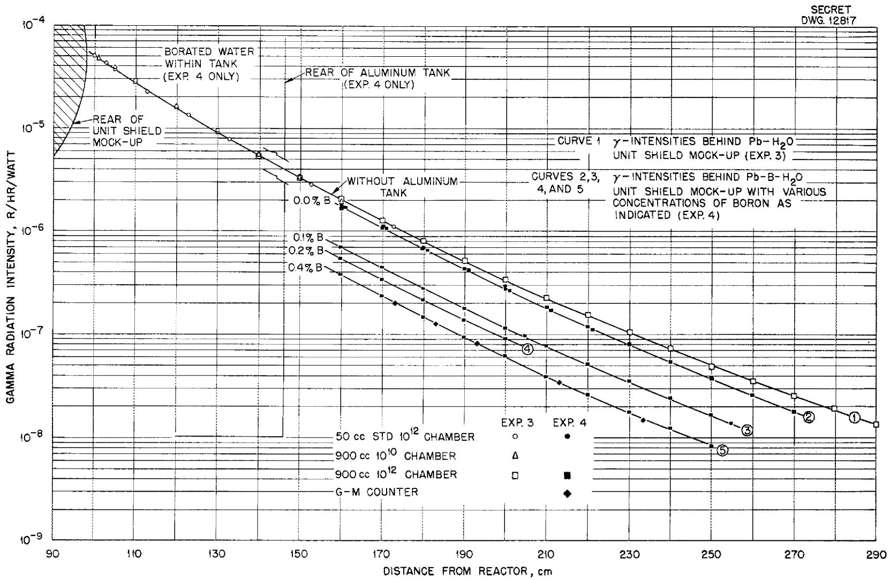  
Fig. 7.1. Gamma Radiation Intensity for the Unit-Shield Experiments.

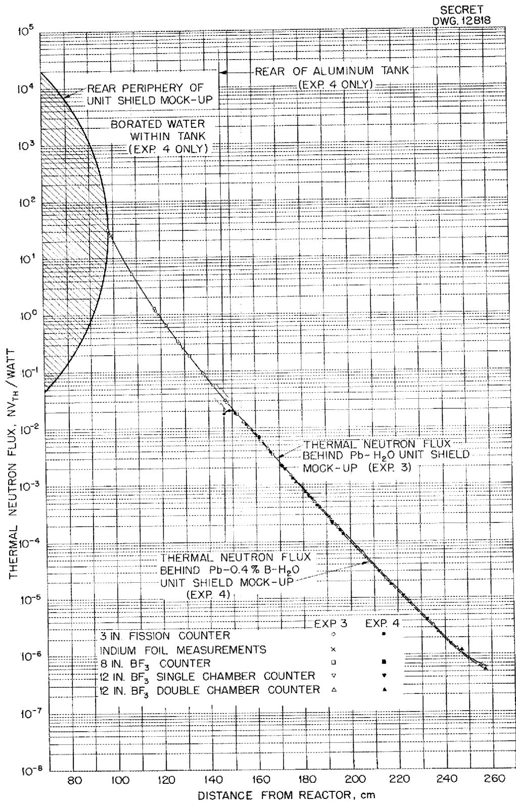  
Fig. 7.2. Thermal-Neutron Flux for the Unit-Shield Experiments.

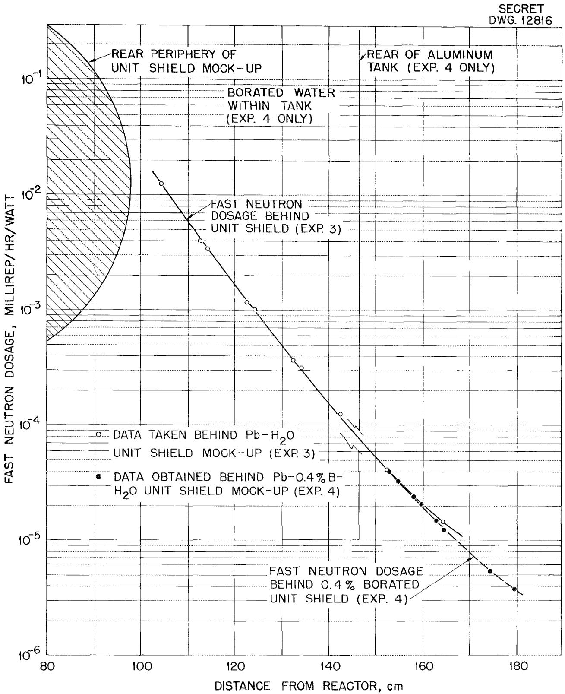  
Fig. 7.3. Fast-Neutron Dosage for the Unit-Shield Experiments.

For these calculations the 3-ft square cylindrical aircraft reactor is closely approximated by a 3.8-ft sphere. The significance of each term in this expression is:

$(S / R)^{2}$ is the inverse-square-law attenuation due to reactor-crew separation,

$L_{u} / L_{a}$ is the ratio of leakages of the two reactors, and

$r_u / r_a$ is a factor which represents the geometrical attenuation in a shield with spherical surfaces.

Using this formula and the data of Figs. 7.1, 7.2, and 7.3, the shield thickness was determined and the weight of the aircraft shield was found to be 129,200 lb. Since the insertion of a layer of lead in water has a negligible effect on the neutron attenuation, and since the effective relaxation length for gamma rays in lead at this position in the shield has been established as 3 cm at the Lid Tank, it is interesting to calculate the effect of adding or subtracting lead in the last layers of the shield. This is done by holding the total neutron plus gamma dosage constant but varying the fraction of the dosage taken in either neutrons or gamma rays. When lead is subtracted, the apportioned gamma dosage goes up and a thicker outside layer of water must be added to bring the apportioned neutron dosage down, and vice versa.

The results of these calculations are shown in Fig. 7.4, where the shield weight is plotted against both the shield thickness and the outside radius of the shield around the Bulk Shielding Reactor. The percentage of the dosage taken in neutrons is also shown. In Shield No.1, which was the shield actually measured as weighing 129,200 lb (mentioned above), $44\%$ of the dose is taken in neutrons and the rest in

gammas. For ease of construction of the mockup all lead layers were made with l-in. thicknesses. Actually, the shield specified by the Shielding Board was only 0.4 in. thick in the last lead layer. If this excess lead is peeled off and water added, the weight goes down to 127,600 lb, as shown under Shield No. 2 in Fig. 7.4. This is the minimum weight of shield which is possible with the present lead spacing and boron concentration. This shield is identical with that predicted by the Shielding Board except it has 6 cm less water. The agreement in weight is within $5\%$ . All the combined errors in measurement and calculation from the bulk shielding data do not add up to an error of $5\%$ in shield weight. It is estimated that these combined errors would amount to less than a ton.

The important result of these experiments is not that an aircraft shield will weigh 127,600 lb, since this is an ideal shield. The necessary engineering will undoubtedly increase its weight, while current Lid Tank experiments indicate that the addition of more boron to the water with a subsequent reoptimization of the lead spacing may decrease the weight by as much as $10\%$ . The real significance of these tests is that the methods of calculation used by the Shielding Board have been confirmed. Given the proper specifications about the reactor and airplane, it is probable that the weight of an engineered unit shield can be calculated from existing data to within a few tons.

# MCKUP OF THE DIVIDED SHIELD

The divided-shield mockup has been installed in the pool and measurements are now underway. A photograph of the installation with the reactor in place

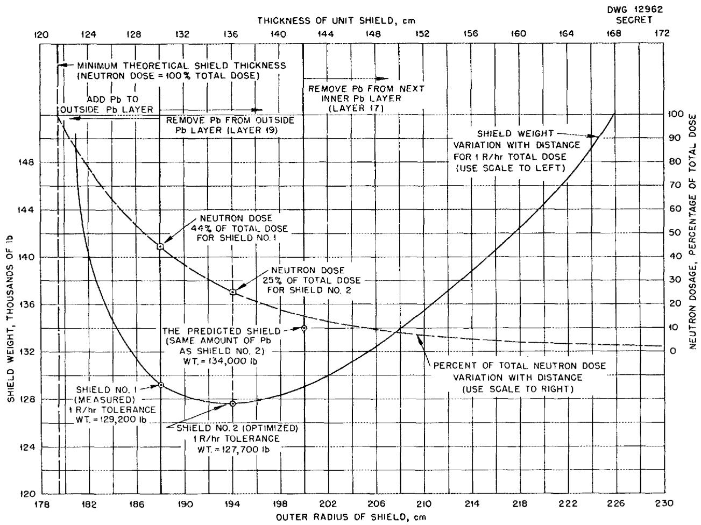  
Fig. 7.4. Dependence of the Weight of the Unit Shield on its Thickness.

is shown in Fig. 7.5. A report on the gamma-ray spectrometer being used for the gamma-ray measurements is being prepared.(6)

In the last quarterly report(7) an experiment was described in which the gamma radiations from the reactor were used as a source to observe the effectiveness of a lead slab as a shadow shield. The objective was to obtain information which would be of help in

designing the lead shadow disk within the hydrogenous reactor shield. This problem is common to many divided shield designs. The reactor plus the capture gamma rays it produces in the water proved to be too diffuse a source for definitive conclusions. Consequently, the experiment has been repeated during this quarter using a can of radioactive sodium which is small enough to simulate a point source. The layout of the experiment and the shadow patterns observed behind the lead slabs are shown in Fig. 7.6.

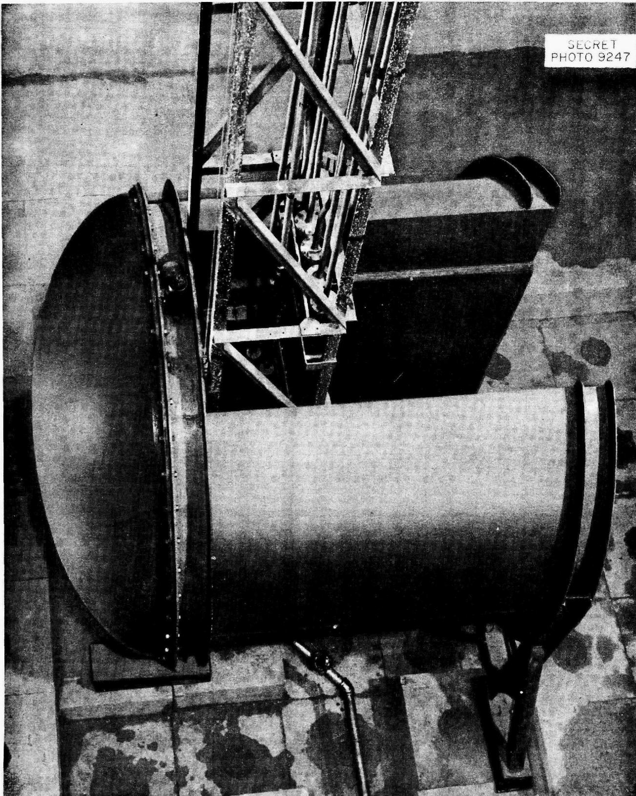  
Fig. 7.5. Installation of Divided-Shield Mockup with Reactor in Position.

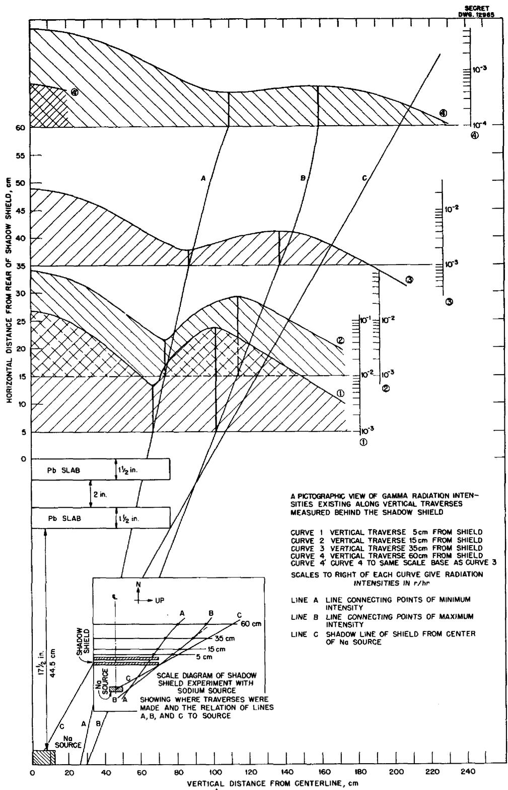  
Fig. 7.6. Shadow-Shield Experiment with Sodium Source.

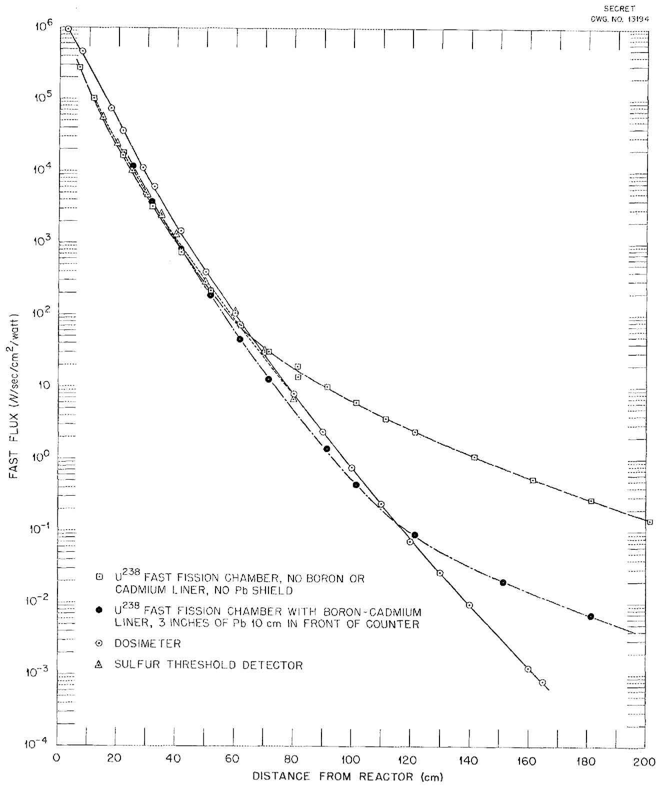  
Fig. 7.7. Bulk Shielding Facility Fast-Neutron Data.

# ANP PROJECT QUARTERLY PROGRESS REPORT

Measurements are now available(9) on the fast-neutron flux from the Bulk Shielding Reactor using the dosimeter, a U²³⁸ fission chamber, and sulfur threshold detectors. The

results of the three types of measurement are shown in Fig. 7.7. "Fast-neutron flux" is in itself a nebulous quantity and is defined differently for each of the three detectors used. The agreement obtained was nevertheless, quite gratifying and gives added confidence to all previous results using the fast-neutron dosimeter.

# 8. DUCT TESTS

C. E. Clifford, Physics Division

Following the decision of General Electric to build an air-cooled reactor, it was decided that the Lid Tank could do some useful experiments to aid in the design of the air ducts which penetrate the water-reactor shield. As these experiments proceeded, the results indicated that the problem of penetrating a water shield with ducts, even though only filled with air, was not so difficult as had been previously supposed. Once a theoretical evaluation of the experiments has been made, the prediction of the transmission through sodium-filled ducts would introduce only minor complications.

# AIR-FILLED DUCT TEST IN LID TANK

A. Simon J. D. Flynn

T. V. Blosser

Physics Division

Two types of air ducting are under consideration: (1) small round pipes with various bends, and (2) annular ducts with various bends. In the annular ducts the flow is confined to the region between two large cylinders. Bends are effected by displacing the center of the ducts in fractions of its diameter with both ends remaining approximately fixed.

Cylindrical Ducts. Considerable work was done on the round pipes since they were believed to be the most favorable arrangement. The size of the ducts investigated was chosen on the basis of pressure-drop calculations made by the G.E. group. This indicated that the pressure drop due to an array of approximately 200 small circular ducts on the order of 2 to 3 in. indiameter would not be excessive. Design studies by the G.E. ANP group have indicated that the ducting system

is not radically changed in contemplated supersonic applications.

The measurements were concentrated on the inlet air ducts, since these ducts would face the crew compartment and therefore would probably have the greatest effect on the shield weight due to the larger attenuation required in that direction. After some experimentation it became apparent that an array of 2-in. ducts on a 3.7-in. triangular lattice, four of which are shown in Fig. 8.1, could be used without seriously increasing the radiation transmitted by the shield. This array was built up of 2-in.-i.d. electrical conduit, the walls of which were 1/16-in. steel. Standard $90^{\circ}$ elbows were used which were bent on a 10-in. radius. Each elbow had two 5-in. straight sections, so that when two were joined by means of a standard coupling, a 10-in. straight section resulted. The assembled elbows were held in place by wooden spacers and the whole array was mounted in the Lid Tank on a plywood table.

Neutron Transmission. The effect of this duct array on the transmitted radiation is shown in Fig. 8.2. This shows the thermal-neutron-flux distribution in the water beyond an array of 15 ducts, three rows high and five rows wide. It was possible to measure only thermal neutrons in these tests because of time limitations and the necessity of taking a large number of data. However, it is felt that these thermal measurements can be readily interpreted in terms of fast-neutron dose by correlations obtained from measurements made in water of both thermal-neutron and fast-neutron dose under the same conditions. All that is required is that at some point in the thermal neutron measurements the

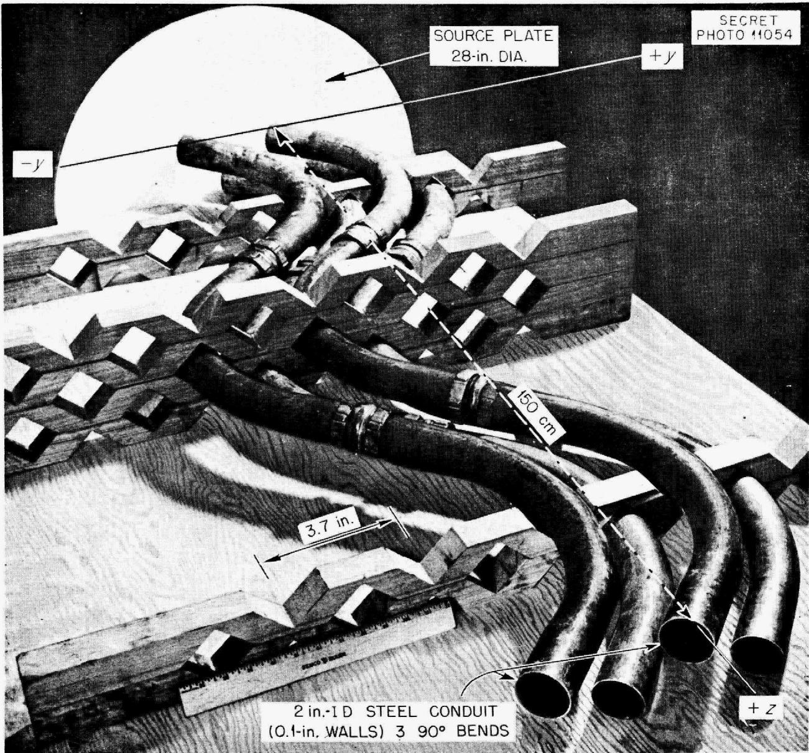  
Fig. 8.1. An Array of Four 2-in. Steel Conduit Ducts with Three $90^{\circ}$ Bends.

slope be in excess of 6 cm after correction for geometrical attenuation. Measurements were taken both with two elbows joined and with three elbows joined. The two-elbow array penetrated approximately 40 in. of the shield and the three-elbow array penetrated 60 in. of the shield.

An integration of the vertical traverse for the two-bend case should

give the transmission of an infinite array. The measured dose agrees within $20\%$ with the dose calculated by taking account of only the reduced density due to the voids. The infinite array is the only geometry in which the true reduced density effect can be calculated. For this duct size in these bends no correction is necessary for streaming, a very encouraging result. As a consequence the effect

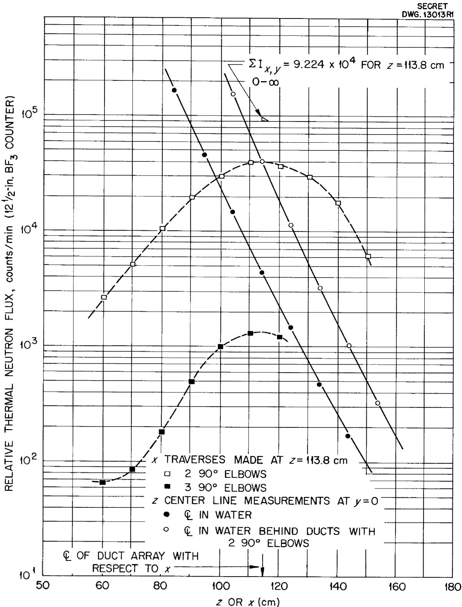  
Fig. 8.2. Lid Tank Duct Test D-915, $X$ Traverse (Vertical) and Z Centerline Measurements of Neutron Flux for Two Arrays of 2-in. Steel Conduit.

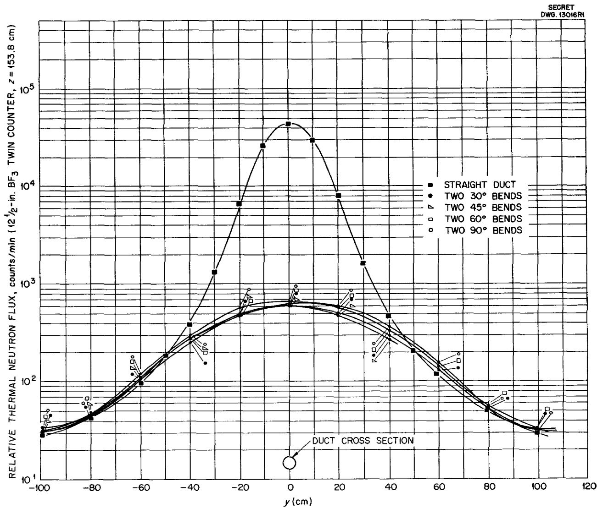  
Fig. 8.3. Lid Tank Duct Test D-10, Y Traverses in $\mathbf{H}_2\mathbf{O}$ behind 54-in. Rubber Conduit (2 in. i.d.) with Two Bends of Variable Radius.

of the ducts on the shield weight is very small - of the order of 1 to 2 tons - since the only additional shielding required is a conical patch along the periphery of the ducting system.

Transmission with Variable Bends. From the point of view of pressure drop it was desirable to determine the minimum amount of bending required in the duct to limit transmission to the

simple reduced density effect. To determine this, experiments were undertaken in the Lid Tank with flexible tubing of 2 in. i.d. and 2-3/8 in. o.d.

Figure 8.3 gives the results obtained by introducing two bends of various degrees in a 54-in. section of rubber conduit. The data indicate that even two bends of only $30^{\circ}$ are more than sufficient to give a geometrical

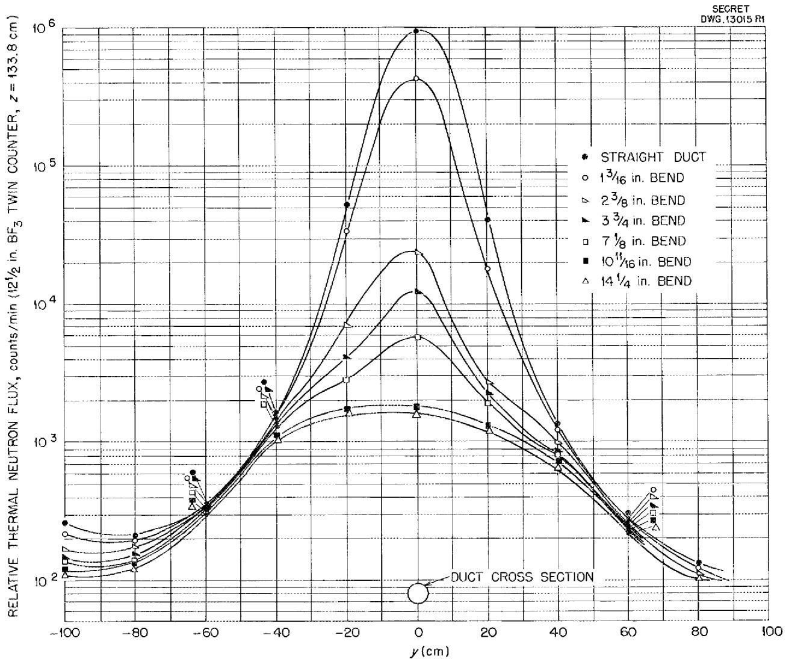  
Fig. 8.4. Lid Tank Duct Test D-11, Y Traverses (Horizontal) in $\mathbf{H}_2\mathbf{0}$ behind 52-in. Rubber Conduit (2-3/8 in. i.d.) with Variable Bends.

attenuation down the duct that is larger than the attenuation of the surrounding shielding material (water).

Since large duct sizes and fewer bends reduce the pressure drop, the next experiment was done on a 2-3/8-in. rubber conduit 52 in. long with only one bend. Results of this experiment are presented in Fig. 8.4. The experiment was conducted by measuring first the transmission of the straight duct in the water beyond the end of the

duct, and then by measuring the transmission as the center of the duct was displaced by multiples of its diameter from the centerline of the straight duct. As the center of the duct was displaced, the transmitted intensity was reduced. The first measurement, in which the center was displaced by one-half the diameter, gave a reduction of approximately a factor of 2, corresponding closely to the reduction in the area of the source which could be seen from the center of the other end

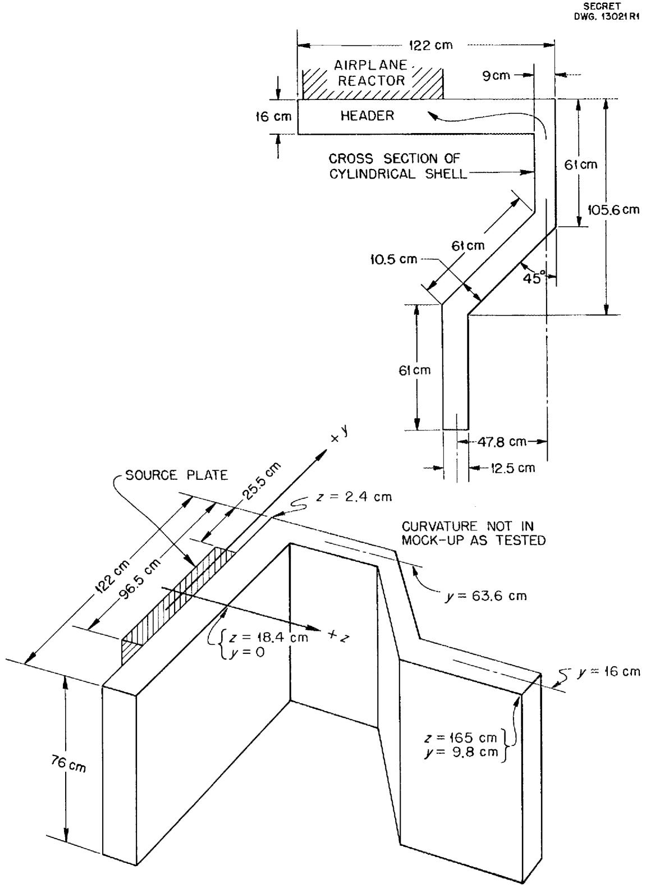  
Fig. 8.5. Lid Tank Duct-Test Annular-Duct Rectangular Cross-Section, 1/8-in. Steel Plate Welded.

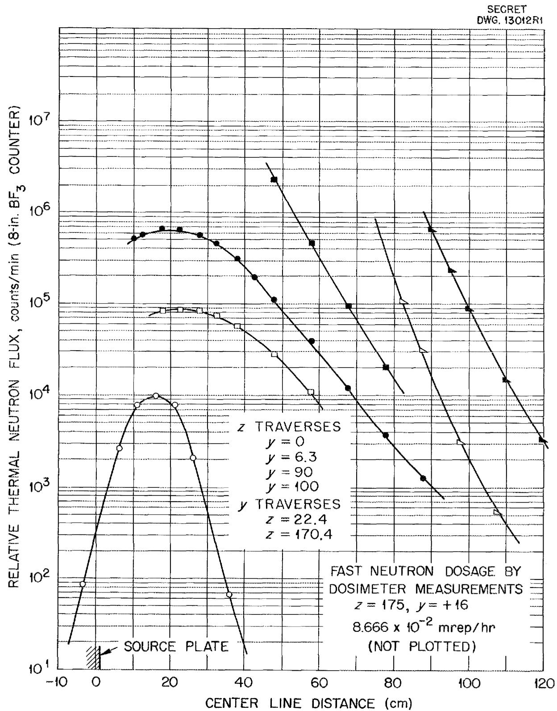  
Fig. 8.6. Lid Tank Test D-12, Y (Horizontal) and Z Traverses Behind Annular Duct.

of the duct. When the center was displaced one diameter, entirely eliminating a line of sight transmission down the duct, the largest decrease was noted, approximately a factor of 40. Further displacement of the center gave smaller decreases until, finally, beyond a $30^{\circ}$ bend no further decrease was noted. Calculations for this bend indicated that the intensity was about what would be expected for the reduced density shield.

Theoretical Duct Attenuation. On the basis of these data a simple theory was derived which would predict the geometrical attenuation of the duct to within 20 to $40\%$ for the various configurations tested. The theory is based on the picture of virtual sources created at the bends of the duct with the neutrons emerging with an isotropic distribution from the walls. Since these sources are small, the geometrical attenuation is large for duct lengths that are many times the diameter of the duct (in comparison to the exponential attenuation of the surrounding water). A fuller account of this theory will be reported after further experimental correlation.

Annular Ducts. One quick experiment was done on a mockup fabricated by G.E. to simulate a segment of an annular duct (Fig. 8.5). The measurements taken on this mockup are presented in Fig. 8.6. These data have not been subject to analysis as yet,

but seem to indicate that the attenuation of high-energy neutrons (which contribute more effectively to the dose) is greater than that of the lower energy neutrons. An analysis by G.E. of these data indicates that such a duct could be used, although it results in a sizable increase in the shield weight. The principal reason for using this type of duct is to increase the accessibility of the reactor faces for control mechanisms.

Liquid-Metal Duct Test in Thermal Column (F. J. Muckenthaler and M. K. Hullings, Physics Division). With the thermal column facility (previously referred to as the "Duct Test" or "Duct Test Facility") the measurements carried out over the last year, on the 6- and 8-in. liquid-metal coolant ducts supplied by KAPL for all the interesting combinations, have been completed. The analysis of these data is in process and a complete report will be written. The experimental program in this facility is now aimed at obtaining further experimental correlation with the simplified theory of air ducts. Neutron transmission will be measured for a set of small, flexible, air-filled ducts in water, in which the length, the diameter, the degree of bending, and the source size will be varied. Preliminary measurements have been completed on a 3-in. duct 60 in. long for five bends from 0 to $90^{\circ}$ .

# 9. SHIELDING INVESTIGATIONS

E. P. Blizzard, Physics Division

Present shielding facilities do not permit a divided-shield mockup which incorporates the effects of crew-compartment shielding and air scattering on the radiations emerging from the reactor shield. Because of the importance of this effect on aircraft shield weights, a proposal has been submitted to the AEC for a new shielding facility, called the "Tower Shielding Facility," with which air scattering and a crew shield mockup can be effected. This facility could be constructed at an estimated cost of about $694,650.

Shielding weights and thicknesses for circulating fuel reactors have been estimated for application to configurations as they are developed. In general, these shields are perturbations of the divided shield for the sodium-cooled reactor. Divided-shield design studies are continuing at NDA in their effort for optimization of this shield weight.

# TOWER SHIELDING FACILITY PROPOSAL

E.P.Blizard H.L.F.Enlund

C.E.Clifford J.L.Meem

A. Simon

Physics Division

It was recognized in the Shielding Board Report(1) that the calculations leading to divided-shield weight were not on so firm a ground as those leading to the weight of unit shields. Unit shields have subsequently been mocked-up in both the Lid Tank and the Bulk Shielding Facility, and the

resultant weights were in excellent agreement with those predicted by the Shielding Board. A divided-shield is now being mocked-up in the Bulk Shielding Facility. However, the information to be obtained from this mockup is only the intensity and direction of the radiations emerging from the reactor part of the divided shield. One of the larger uncertainties in divided-shield weights is the assumed scattering of the complex spectra emerging from the reactor shield and the effect of this radiation at the crew shield after having been air-scattered.

Since an increase of 1 lb in shield weight entails an increase of $2\frac{1}{2}$ lb in aircraft weight, (2) considerable effort is justified in specifying shield weights as closely as possible. Full-scale shielding experiments, including air-scattering and crew-shield effects, offer the cheapest, quickest, and most accurate method of optimizing the divided shield. (By comparison, an aircraft design based on calculations would be appreciably heavier because of the required conservatism.) Consequently, a proposal (3) for a Tower Shielding Facility to effect full-scale shielding experiments has been submitted to the AEC by the Oak Ridge National Laboratory.

The proposal is to mount a small MTR type water-cooled reactor and shield mockup in a tower with a crew shield mockup supported 50 ft above the reactor. The tower would be tall

# ANP PROJECT QUARTERLY PROGRESS REPORT

enough so that ground scattering would be unimportant. A preliminary cost estimate indicates that the equipment, including tower, reactor, building, security fence, and roads, would cost about $694,650.

# CIRCULATING-FUEL REACTOR SHIELDS

# E. P. Blizzard and F. H. Murray Physics Division

The current designs of circulating-fuel reactors present new problems in divided-shield design. These are being attacked on a cursory basis in order to approximate shield weights for the power-plant configurations as they are developed.

A preliminary estimate of the required shielding thickness has been derived for the Reactor Design Group.(4) Tentative conclusions based upon the layout of the preliminary design show that the crew shield will require about 13 in. (see footnote 5) of plastic on all sides (somewhat less on the front) for shielding of delayed

neutrons. There appears to be no reason that some of this shielding could not be removed from the reactor shield, but some other modification may be required, for example, the location of gamma shielding around the crew.

No calculations have been made concerning the gamma shielding, but for the present it seems safe to assume that the exposed fuel will not constitute a source much worse than some cases already considered, namely, the sodium coolant discussed in ANP-53.(1) It is also apparent that the divided shield for the circulating-fuel reactor is not fundamentally different from, but merely a perturbation of, the shield design for the sodium-cooled reactor.

# NDA DIVIDED-SHIELD STUDIES

Nuclear Development Associates, Inc., are continuing their analysis of divided-shield design. The ANP-53 designs appear to be adequate in weight, although the details of design will undoubtedly change. The final report of their work will include specific recommendations for the full-scale divided-shield experiments now contemplated by ORNL.

Part III

MATERIALS RESEARCH

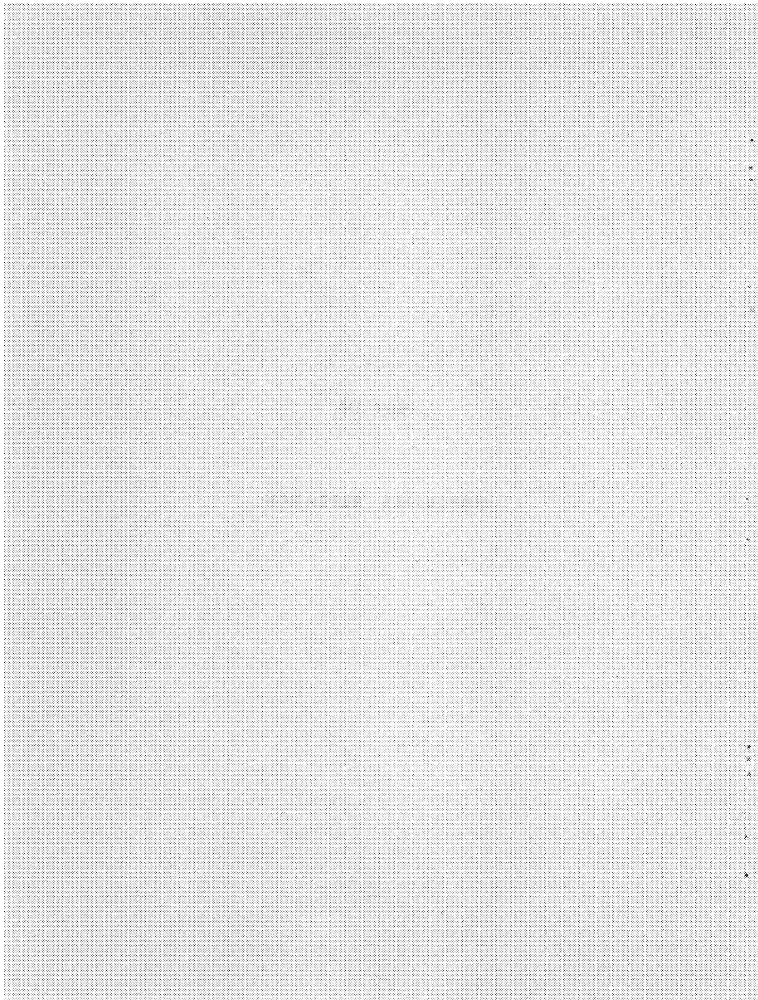

# SUMMARY AND INTRODUCTION

Recent interest in the high temperature circulating-fuel reactor has emphasized the need for liquid fuels or low (below $450^{\circ}\mathrm{C}$ ) melting point with relatively low (4 to 8 lb/ft³) uranium concentration. Five fluoride systems fulfilling these requirements have been studied. Research on the chemistry of these and other high-temperature liquids, such as, the development of liquid moderators, self-moderating fuels, and the investigation of fluoride mixtures as possible reactor coolants, are reported in Sec. 10. Several ternary systems of alkali fluorides and beryllium fluoride are shown to be suitable coolants and are also of potential value as solvents for $\mathrm{UF_4}$ in the development of fuels.

Static corrosion tests of fluoride fuels indicate that these fluids are readily contained at $1500^{\circ}\mathrm{F}$ by inconel and any one of a number of stainless steels (Sec. 11). Dynamic corrosion tests in inconel have been similarly successful, but the two stainless steel loops in which the fluorides have been circulated have plugged, presumably as a result of mass transfer. The static and dynamic corrosion of these fluoride mixtures, which are of primary interest to the circulating-fuel reactor, are, except for the dynamic test in stainless steel loops, reasonably satisfactory. Considerable research has been undertaken in attempts to contain the alkali hydroxides in nickel and the structural metals. Static-corrosion tests of hydroxides have shown, however, that only nickel, copper, and the more noble metals will withstand the corrosive action of these media. Furthermore, dynamic-corrosion tests of hydroxides in nickel have indicated severe plugging, also, as with the fluoride in stainless steel, the result of mass transfer. Fundamental studies of this phenomenon

indicate that oxygen may play an important role in mass transfer, at least in hydroxide-nickel systems.

Heat-transfer research (Sec. 12) has been concerned primarily with the determination of heat-transfer coefficients of various systems, including those of the fluorides, hydroxides, and liquid metals. Although satisfactory data have not yet been obtained, mathematical solutions have been derived for the temperature structure in forced-convection fluoride systems. Excellent agreement has been obtained between theory and practice for the natural convection in a brine solution simulating the fuel elements; the peak temperature is substantially reduced from that computed assuming conduction only. Routine measurements are now being made on the heat capacity of materials and the density of high-temperature fluids. Some data are also available on the thermal conductivity of materials and the vapor pressure and viscosity of the fluoride salts.

The metallurgical processes involved in the construction and assembly of a high-temperature core, including welding of fuel tubes, fabrication of solid fuel elements, and creep and stress rupture of metals, are currently under investigation (Sec. 13). The fabrication of solid-fuel elements has been further refined by the evaluation of the effects of the particle size of the $\mathrm{UO}_2$ powder, rolling temperature, and elimination of the capsule during hot rolling. Satisfactory spot welding and brazing of these fuel-plate laminates has also been demonstrated. The creep and stress-rupture testing of reactor fuel tubes in sodium has been initiated. Stainless steel tubes have withstood hoop stress up to 2600 psi for 1000 hr at $1500^{\circ}\mathrm{F}$ in sodium, whereas similarly stressed inconel tubes failed.

# ANP PROJECT QUARTERLY PROGRESS REPORT

Although no pronounced radiation damage effects have yet been observed in irradiation of the constituents of the aircraft reactor in the X-10 graphite pile or the Y-12 cyclotron, the one irradiation of a fuel capsule in the higher-flux LITR showed an increase of corrosion products in the fuel, an increase in the decomposition of the fuel, and an increase in

corrosion of the capsule (Sec. 14). It is not yet possible to draw any conclusions regarding the significance of radiation damage to the aircraft reactor until confirmatory experiments are completed. A second irradiation of inconel in the X-10 pile at temperatures up to $575^{\circ}\mathrm{C}$ has not confirmed the decrease in thermal conductivity reported earlier.

# 10. CHEMISTRY OF HIGH-TEMPERATURE LIQUIDS

Warren Grimes, Materials Chemistry Division

Research in the ANP Chemistry Group has been concerned almost entirely with studies of high-temperature liquids for use as fuels, moderators, and/or heat-transfer fluids for an aircraft reactor. The general properties required of such liquids along with progress in development of such materials have been described in previous reports (see p. iv for list). The research effort is at present concerned with fuel and moderator development with somewhat less emphasis on the heat-transfer fluid (coolant) development program.

Recent interest in a high-temperature circulating-fuel reactor has emphasized the need for liquids of extremely low melting point with relatively low uranium concentration (4 to 8 lb of uranium per cubic foot). Five systems fulfilling these requirements have been studied, but the program for the development of selfmoderating fuels has not produced materials more satisfactory than those previously described.[1] Several moderator-coolant systems have been examined, but this program has not been vigorously pursued pending the demonstration, in design studies and corrosion research, of the applicability of these systems. Investigation of fluoride mixtures as possible reactor coolants have shown several ternary systems of the various alkali fluorides and beryllium fluoride to be suitable.

# LOW MELTING-FLUORIDE FUEL SYSTEMS

J.P.Blakely L.M.Bratcher

C. J. Barton

Materials Chemistry Division

Phase equilibrium studies utilizing the technique of thermal analysis $^{(2,3)}$ were directed initially toward development of fluoride mixtures with high uranium content and melting points below $550^{\circ}\mathrm{C}$ . A previous report $^{(4)}$ listed nine systems which promised to fit these qualifications. However, only three of these systems show low melting points in the range 0 to 2.5 mole $\%$ $\mathrm{UF_4}$ and promise to be of use in circulating fuel reactors. This relative scarcity of suitable fuel mixtures along with the desirability of lower melting liquids for such reactors has prompted additional study of systems containing low concentrations of $\mathrm{UF_4}$ . In addition it has been necessary to re-examine in greater detail the low-uranium regions of some of the known systems.

At present the five systems listed in Table 10.1 are those which appear promising as circulating fuels. The examination of several of these listed systems is far from complete, and it

Table 10.1   
Summary of Promising Fluoride Fuel Systems of Low Uranium Content   

<table><tr><td>COMPONENTS</td><td>URANIUM CONC. OF SYSTEM MELTING AT OR BELOW 500°C (mole % UF4)</td><td>LOWEST MELTING POINT FOUND (°C)</td><td>COMPOSITION OF LOWEST MELTING MIXTURE (mole %)</td></tr><tr><td>LiF-KF-UF4</td><td>0 - 7</td><td>470</td><td>40 LiF, 55 KF, 5 UF4</td></tr><tr><td>LiF-NaF-KF-UF4</td><td>0 - 6</td><td>450</td><td>97 (LiF-NaF-KF), 3 UF4</td></tr><tr><td>LiF-NaF-RbF-UF4</td><td>0 - 4</td><td>425</td><td>97.5 (LiF-NaF-RbF), 2.5 UF4</td></tr><tr><td>NaF-BeF2-UF4</td><td>0 - 12</td><td>330</td><td>47 NaF, 50 BeF2, 3 UF4</td></tr><tr><td>LiF-NaF-BeF2-UF4</td><td>0 - 15</td><td>255</td><td>30 LiF, 20 NaF, 49 BeF2, 1 UF4</td></tr></table>

is possible that continued study will result in compositions of lower melting point. In addition, it should be emphasized that the search for such fuels was initiated quite recently and it is likely that the list will be extended considerably in the future. As it is probable that four-component systems will be required for melting points below $350^{\circ}\mathrm{C}$ , such research will consequently be relatively slow.

Examination of Table 10.1 indicates that $\mathbf{BeF}_2$ is a component of the lowest melting systems. Indeed, it seems certain that $\mathbf{BeF}_2$ and LiF will be components of any fluoride system melting below $350^{\circ}\mathrm{C}$ .

The various fuel systems studied are described briefly under appropriate headings below.

LiF-KF-UF. Re-examination in detail of the low uranium concentration region of this system indicate that the diagram previously presented(5)

is substantially correct. The lowest melting point found in this system was $470 \pm 10^{\circ}\mathrm{C}$ at 5 mole $\%$ $\mathrm{UF}_4$ , 55 mole $\%$ KF, and 40 mole $\%$ LiF while the melting point at 1 mole $\%$ $\mathrm{UF}_4$ would be approximately $485^{\circ}\mathrm{C}$ .

LiF-NaF-KF-UF4. A few mixtures of the pseudo-binary system obtained by treating the LiF-NaF-KF eutectic(6,7) as the single component have been studied. The data, shown in Table 10.2, indicate that the addition of several mole percent of UF4 to this eutectic does not raise the melting point appreciably. This system will be of definite interest and will receive additional study if it appears that melting points of the order of $450^{\circ}\mathrm{C}$ can be tolerated.

LiF-NaF-RbF-UF. A limited number of studies in which this system has been treated as a pseudo-binary with

Table 10.2   
The Pseudo-Binary System (a) (LiF-NaF-KF)-UF   

<table><tr><td>UF4(mole %)</td><td>MELTING POINT (℃)</td></tr><tr><td>0</td><td>455</td></tr><tr><td>1.1</td><td>450</td></tr><tr><td>5.0</td><td>485</td></tr><tr><td>10</td><td>597</td></tr><tr><td>15</td><td>615</td></tr><tr><td>20</td><td>625</td></tr><tr><td>30</td><td>630</td></tr></table>

(a)42 mole %LiF, 11.5 mole % NaF, 46.5 mole % KF.

the alkali fluoride ternary eutectic as one component have been performed. The data in Table 10.3 show that small additions (up to 2.5 mole %) UF4 do not appreciably affect the melting point, but additions of larger amounts markedly increase this property. While the melting points obtained are slightly lower than those of the system immediately above, it is not likely that the slight benefit will justify the use of RbF.

Table 10.3   
The Pseudo-Binary System $(a)$ (LiF-NaF-RbF)-UF   

<table><tr><td>UF4 (mole %)</td><td>MELTING POINT (°C)</td></tr><tr><td>0</td><td>444</td></tr><tr><td>2.5</td><td>425(b)</td></tr><tr><td>5</td><td>615</td></tr><tr><td>10</td><td>724</td></tr><tr><td>20</td><td>660</td></tr><tr><td>30</td><td>547</td></tr><tr><td>40</td><td>600</td></tr></table>

$(a)_{42}$ mole $\%$ LiF, 6 mole $\%$ NaF, 52 mole $\%$ RbF.   
(b) This mixture showed signs of supercooling.

$\mathbf{NaF - BeF}_2 - \mathbf{UF}_4$ . The equilibrium diagram for this system has been presented in a previous report.(8) A re-examination of the NaF-BeF2system (see section on Coolant Development below) and additional data at low uranium concentrations has resulted in some changes in the contour lines in this portion of the diagram. This system is still under study and a revised diagram will be presented later.

Difficulty in establishing true melting points at high $\mathrm{BeF}_2$ concentrations was encountered as before as a result of the extensive supercooling of such mixtures. The minimum melting point so far established is $330 \pm 10^{\circ}\mathrm{C}$ at 3 mole $\% \mathrm{UF}_4$ and 50 mole $\% \mathrm{BeF}_2$ .

LiF-NaF-BeF $_2$ -UF $_4$ . Some low-melting mixtures from the LiF-NaF-BeF $_2$ ternary system (see section on Coolant Development below) have been treated as pseudo-binary systems with UF $_4$ . The most encouraging of these results are shown in Table 10.4.

Table 10.4   
The Pseudo-Binary System $(\alpha)$ (LiF-NaF-BeF2)-UF4   

<table><tr><td>UF4(mole %)</td><td>MELTING POINT (°C)</td></tr><tr><td>0</td><td>245-265</td></tr><tr><td>1</td><td>255</td></tr><tr><td>2.5</td><td>245-270</td></tr><tr><td>5</td><td>405</td></tr><tr><td>10</td><td>490</td></tr><tr><td>20</td><td>612</td></tr><tr><td>30</td><td>675</td></tr><tr><td>40</td><td>720(b)</td></tr></table>

(a) 30 mole % LiF, 20 mole % NaF, 50 mole % BeF $_2$ .   
(b) This sample showed definite supercooling.

These data show that this system offers the lowest melting point available to date. Although some of these mixtures were stirred at temperatures well below $300^{\circ}\mathrm{C}$ , it is possible that extensive supercooling occurred. It is not possible to give any estimates of the viscosity at these low temperatures although such studies are being made.

# IONIC SPECIES IN FUSED FLUORIDES

M. T. Robinson

Materials Chemistry Division

Determination of the electrolytic transference numbers in fused mixtures of $\mathrm{UF_4}$ and alkali fluorides has been attempted in an effort to determine the nature of the ionic species in these systems. In advance of the experiments it was thought that the uranium existed in solution as $\mathbf{U}^{4 + }$ or as some species of negative complex ion, e.g., $\mathrm{UF}_{5}^{-}$ . Electrolytic transference experiments should distinguish clearly between these two possibilities but would be less likely to determine, with certainty, details of the nature of species differing slightly from those mentioned, e.g., $\mathrm{UF}^{3 + }$ or $\mathrm{UF}_{6}^{2 - }$ .

Experimental Procedure. The electrolytic vessel consists of a graphite cup acting as the anode in which is suspended a graphite rod cathode. The anolyte and catholyte are separated by a diaphragm of platinum sponge. The apparatus is sealed, evacuated, provided with an inert atmosphere, and maintained at temperature in a molten lead bath. The electrolytic current provided by two 6-v storage batteries is maintained at about 0.3 amp for 90 min, after which the apparatus is cooled. The anolyte and catholyte are removed separately, dissolved in $\mathrm{HNO}_3$ -Al $(\mathrm{NO}_3)_3$ solution, and analyzed for U, F-, and alkali metal ions.

Electrolyses have been performed at both 750 and $900^{\circ}\mathrm{C}$ on a binary mixture containing 28 mole $\%$ UF $_4$ and 72 mole $\%$ NaF. From the chemical analyses before and after the experiment, and from a knowledge of the quantity of electricity passed, it is possible to derive the transference numbers of the various ions present.

Results of Electrolysis. It appears that both sodium and uranium are deposited at the cathode and that fluorine is evolved at the anode. No uranium (from anodic formation of $\mathrm{UF}_6$ ) has been detected in the vacuum lines of the apparatus. A deposit of NaF has been observed in the quartz tube containing the electrolysis cell. This is probably due to volatilization of sodium and subsequent reaction with evolved fluorine. The apparent deposition of both metals is in agreement with the reported partial reduction of $\mathrm{UF}_4$ by metallic sodium. $^{(9)}$

The data indicate that no appreciable quantity of uranium is transferred into or out of either compartment. If complex ions of the type $\mathrm{UF}_n^{4 - n}$ are assumed to be present, only the assumption that $n = 4$ yields results in which the transference numbers of all ions are between 0 and unity. However, the conclusion that $n = 4$ does not mean that uranium is present as un-ionized $\mathrm{UF}_4$ , but simply that no detectable transfer of uranium takes place. This result is in excellent agreement with the theory of Frenkel (10) of the electrical conductivity of fused salts. Briefly, Frenkel states that the conductivity of a fused salt may be taken as due only to the smallest ion present. The ionic radii of the $\mathrm{Na}^+$ , $\mathbf{F}^{-}$ , and $\mathrm{U}^{4 + }$ ions are 0.98, 1.33, and

0.97, respectively.(11) Since the sodium and uranium(IV) ions are about the same size, it appears that uranium is complexed with fluoride in some manner, although the precise nature of the complex cannot be elucidated from the presently available data.

It is intended to extend the work to another solution of $\mathbf{U}\mathbf{F}_{4}$ in NaF and to two solutions of $\mathbf{U}\mathbf{F}_{4}$ in KF. Since the radius of the potassium ion is about the same as that of the fluoride ion, it may be possible to throw more light on the nature of the uraniferous ion from measurements on mixtures containing KF.

# HOMOGENEOUS FUELS

# J. D. Redman and L. G. Overholser   Materials Chemistry Division

The solubility of uranium trioxide in mixtures of sodium hydroxide and sodium tetraborate with and without additional boric acid has been previously reported.(12) It was found that the presence of borate increases the solubility of uranium in sodium hydroxide but that the concentration of borate required to give a useful solubility is so high that the melting point of the resulting mixture is above $500^{\circ}\mathrm{C}$ . Additional studies have been made utilizing other hydroxides and borates in an attempt to find a mixture which will dissolve sufficient uranium and still possess a sufficiently low melting point. Neither the addition of borates nor of any of several other materials appears likely to yield a hydroxide mixture melting below $600^{\circ}\mathrm{C}$ and containing 2 to 4 wt % dissolved uranium. All experiments

were performed at $650^{\circ}\mathrm{C}$ with 5 wt $\%$ uranium added as uranium trioxide.

Uranium Solubility in Hydroxide-Borate Mixtures. The results of some of the experiments in which borate-hydroxide mixtures were used as solvents are summarized in Table 10.5. These data indicate that the solubility of uranium at $650^{\circ}\mathrm{C}$ is too low to be of any interest. It does not appear likely that any combination of hydroxide and borate will be found having a melting point below $500^{\circ}\mathrm{C}$ and dissolving 2 to $4\%$ uranium at $600^{\circ}\mathrm{C}$ .

Table 10.5   
Solubility of Uranium in Hydroxide-Borate Mixtures   

<table><tr><td colspan="4">CONSTITUENT IN MIXTURE (wt %)</td><td rowspan="2">SOLUBILITY OF URANIUM (wt %)</td></tr><tr><td>NaOH</td><td>KOH</td><td>LiOH</td><td>B2O3</td></tr><tr><td>85</td><td></td><td></td><td>15</td><td>0.3</td></tr><tr><td rowspan="9">70</td><td>95</td><td></td><td>30</td><td>1.3</td></tr><tr><td>90</td><td></td><td>5</td><td>0.3</td></tr><tr><td>85</td><td></td><td>10</td><td>0.7</td></tr><tr><td>80</td><td></td><td>15</td><td>1.6</td></tr><tr><td>75</td><td></td><td>20</td><td>1.5</td></tr><tr><td></td><td></td><td>25(a)</td><td></td></tr><tr><td></td><td>92</td><td>8</td><td>0.3</td></tr><tr><td></td><td>84</td><td>16</td><td>0.9</td></tr><tr><td></td><td>80</td><td>20</td><td>0.8</td></tr><tr><td>48</td><td></td><td>47</td><td>5(b)</td><td>1.0</td></tr><tr><td>43</td><td></td><td>42</td><td>15</td><td>1.7</td></tr></table>

(a)Melte above $700^{\circ}\mathrm{C}$   
(b) When 10 wt.% cesium fluoride was added to this mixture the solubility was found to be 1.1%.

Uranium Solubility in Hydroxides with Various Additives. Some additional experiments have been performed to determine the effect of other materials on the solubility of uranium in sodium and lithium hydroxides. The

results of some of the runs made at $650^{\circ}\mathrm{C}$ are given in Table 10.6. None of the materials listed shows an appreciable beneficial effect on the solubility.

Table 10.6   
Effect of Various Additives on the Solubility of Uranium in Hydroxides   

<table><tr><td colspan="5">CONSTITUENT IN MIXTURE (wt %)</td><td rowspan="2">SOLUBILITY OF URANIUM (wt %)</td></tr><tr><td>LiOH</td><td>NaOH</td><td>LiF</td><td>Na2B2O3</td><td>RbOH</td></tr><tr><td>95</td><td></td><td>5</td><td></td><td></td><td>0.6</td></tr><tr><td>48</td><td>47</td><td>5</td><td></td><td></td><td>0.3</td></tr><tr><td>48</td><td>47</td><td></td><td>5</td><td></td><td>1.0</td></tr><tr><td>45</td><td>45</td><td></td><td></td><td>10</td><td>1.2</td></tr><tr><td>40</td><td>40</td><td></td><td></td><td>20</td><td>0.8</td></tr></table>

The addition of $\mathsf{RbOH}$ to mixtures of sodium and lithium hydroxide appears to have a slight detrimental effect on the solubility of uranium. Uranium has been shown to dissolve in $\mathsf{RbOH}$ to the extent of about 0.1 wt $\%$ at $650^{\circ}\mathrm{C}$ . Addition of uranium trioxide to $\mathsf{RbOH}$ does, however, produce a slurry very similar to that obtained with $\mathsf{NaOH}^{(13,14)}$ . It should be noted that the $\mathsf{RbOH}$ used contained about $5\%$ $\mathsf{Rb}_2\mathsf{CO}_3$ .

# MODERATOR-COOLANT DEVELOPMENT

Development of moderator-coolants is still concerned primarily with preparation of pure alkali and alkaline earth hydroxides and with phase equilibrium studies of various mixtures

of these materials with other compounds. Since it is apparent that the most difficult problem in use of these materials is control of the corrosion, major emphasis in the program is in that field (see Sec. ll, Corrosion Research).

Relatively pure samples of the hydroxides of sodium, potassium, barium, strontium, and lithium have been prepared. Study of one binary hydroxide system and several hydroxide fluoride systems were completed during the past quarter. Pending encouragement from corrosion studies no further studies of this kind seem justified at present.

Preparation of Pure Hydroxides (L. G. Overholser, D. E. Nicholson, E. E. Ketchen, and D. R. Cuneo, Materials Chemistry Division). Sodium hydroxide has been purified in pound batches by removing sodium carbonate from a $50\%$ aqueous solution of NaOH followed by dehydration. The residual sodium carbonate concentration is about 0.5 wt%. Attempted methods for purifying potassium hydroxide have included recrystallization of this material from isopropyl alcohol and precipitation of carbonate as barium carbonate in aqueous medium. While not completely satisfactory, the former method has proved the better, yielding potassium hydroxide with a total alkalinity greater than $99\%$ and with less than 0.5 wt% potassium hydroxide. Approximately 10 lb of barium hydroxide has been purified by removing the carbonate in aqueous solution, recrystallizing barium hydroxide octahydrate, and dehydrating under carefully controlled conditions. The resulting samples have contained less than 0.4 wt% contaminant in the form of either the oxide or carbonate. Strontium hydroxide is being purified in an analogous manner. Commercial lithium hydroxide monohydrate has been found to be quite pure on dehydration.

KOH-LioH (J. P. Blakely, L. M. Bratcher, and C. J. Barton, Materials Chemistry Division). This system closely resembles the NaOH-LioH system previously described.(15) The eutectic point at 70 mole % KOH is at $225^{\circ}C$ while the incongruity melting compound appears unstable above $315^{\circ}C$ . The series of halts at $245^{\circ}C$ on the KOH side of the eutectic, as shown in Fig. 10.l, is probably due to the solid transformation of KOH reported by von Hevesy(16) at $248^{\circ}C$ .

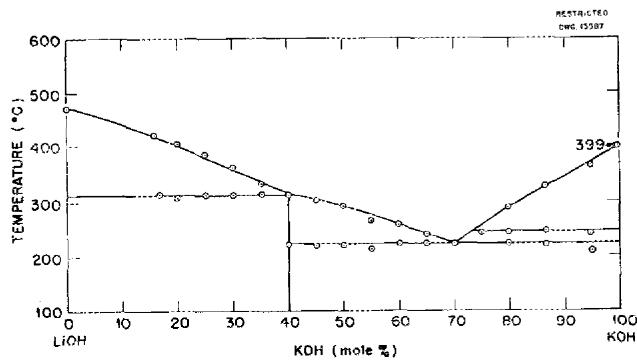  
Fig. 10.1. The System KOH-LioH.

Hydroxide-Fluoride Systems (J. P. Blakely, L. M. Bratcher, and C. J. Barton, Materials Chemistry Division). The relatively few determinations made in the system RbOH-RbF indicate that these materials, like the analogous sodium and potassium compounds, form solid solutions with the melting point of the mixture rising sharply up to about 50 mole % RbF and then somewhat less steeply in the range 50 to 100 mole % RbF.

The pseudo-binary systems NaOH-(LiF-NaF-KF) and KOH-(LiF-NaF-KF) in which the alkali fluoride composition represents the ternary eutectic have been studied to ascertain whether

low-melting liquids of low hydroxide content can be prepared. It is apparent that up to 15 mole % NaOH or up to 30 mole % KOH can be added to the alkali fluoride eutectic without elevation of the melting point.

# COOLANT DEVELOPMENT

J.P.Blakely L.M.Bratcher C.J.Barton Materials Chemistry Division

Investigation of low-melting fluoride mixtures of possible application as coolants has been continued during the past quarter. While a few binary mixtures have been examined, largely to fill gaps in the available literature, most of these studies have been concerned with ternary systems of the various alkali fluorides and beryllium fluoride. In addition to the value of such data in coolant development, any low-melting compositions which are found are of potential value as solvents for $\mathrm{UF_4}$ in the development of fuels of low uranium content.

RbF-LiF. This binary system has been examined in order to complete the ternary systems containing these compounds. As indicated in Fig. 10.2, this system forms a simple eutectic melting at $470 \pm 10^{\circ}\mathrm{C}$ at 42 mole% LiF.

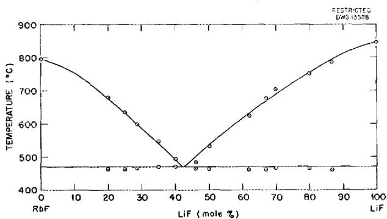  
Fig. 10.2. The System RbF-LiF.

NaF-BeF2. The phase diagram from the open literature(6) has been used in construction of ternary diagrams involving these materials. Various difficulties with some of these diagrams has, however, prompted reexamination of this system. Figure 10.3 shows the results obtained. Below 50 mole % BeF2 the published diagram was essentially confirmed although some minor differences were noted. In the region above 50 mole % BeF2 thermal data are apparently unreliable. The dotted curve in this region shows the quenching data of Roy, Roy, and Osborne.(17)

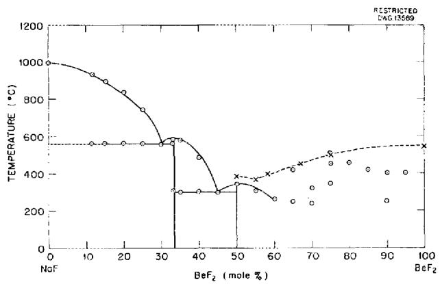  
Fig. 10.3. The System NaF-BeF $_2$ .

NaF-KF-RbF. The lowest melting point found in this system is at $621 \pm 10^{\circ} \mathrm{C}$ at 74 mole % RbF and 21 mole % NaF. The failure to find a low-melting region on this diagram (Fig. 10.4) is probably due to the high melting points of the solid solutions of RbF and KF.

KF-LiF-RbF. The equilibrium diagram shown in Fig. 10.5 indicates that LiF is considerably more effective than NaF in lowering melting points in the KF-RbF system. The data on this system are still far from complete and

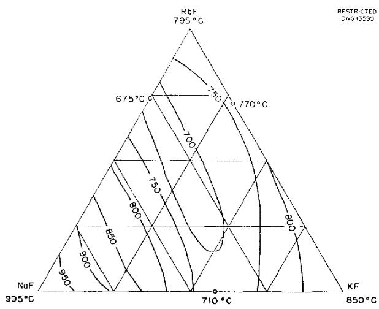  
Fig. 10.4. The System NaF-KF-RbF.

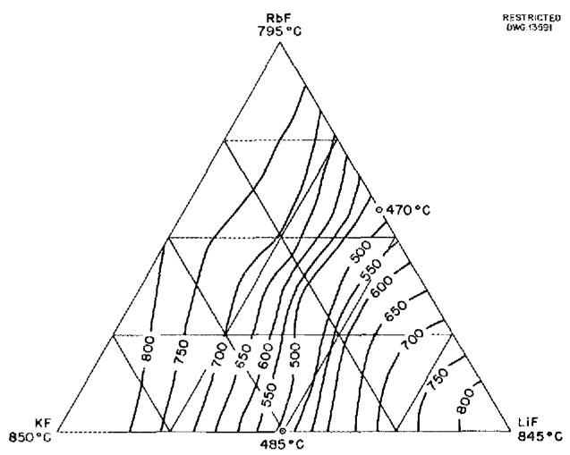  
Fig. 10.5. The System KF-LiF-RbF.

further study may change the contours considerably. The lowest melting point so far discovered is $440 \pm 10^{\circ} \mathrm{C}$ at 27.5 mole $\%$ RbF and 40 mole $\%$ LiF.

NaF-LiF-RbF. The incomplete data on this system have been used to plot the diagram shown in Fig. 10.6. Since all three binary systems form simple eutectics, the melting point available with this system is considerably lower than that with the two immediately preceding. The ternary eutectic appears to melt at about $425^{\circ}\mathrm{C}$ and

to be near 42 mole % LiF and 6 mole % NaF.

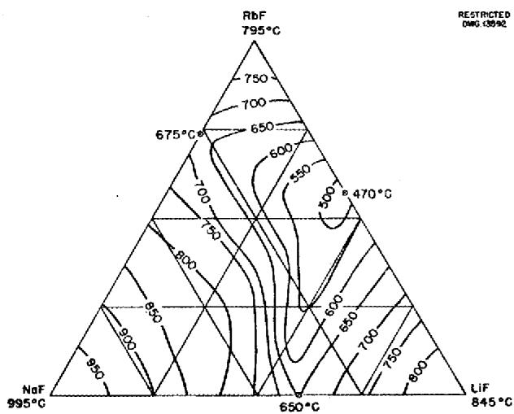  
Fig. 10.6. The System NaF-LiF-RbF.

Ternary Systems Containing $\mathsf{BeF}_2$ . Three ternary systems containing $\mathsf{BeF}_2$ are under investigation at present. Study of these systems is difficult both because of the precautions necessary in handling the $\mathsf{BeF}_2$ and because of the supercooling and generally poor thermal behavior of the melts. The lowest melting points so far observed are at $345^{\circ}\mathrm{C}$ in the NaF-KF-BeF, $325^{\circ}\mathrm{C}$ in the LiF-KF-BeF, and $220^{\circ}\mathrm{C}$ (possibly considerably supercooled) in the LiF-NaF-BeF systems. Study of these materials is continuing because of their possible use in very-low-melting fuel systems.

# SERVICE FUNCTIONS

G.J.Nessle V.C.Love

H. S. Powers C. J. Barton

Materials Chemistry Division

The Fuel Preparation and Service Group was called upon to fill a wide variety of containers during the past quarter. The amount of fuel required ranged from 0.5 to $3900\mathrm{g}$ . The $3900\mathrm{-g}$ batch of material required the construction of special equipment for melting and filtering the fused salt. This equipment has been used several times successfully. The filtering material is sintered stainless steel. Table 10.7 shows the number of containers filled for different types of experiments.

Table 10.7   
Container Filling Services   

<table><tr><td>TYPE OF EXPERIMENT</td><td>NO. OF CONTAINERS FILLED</td></tr><tr><td>Static corrosion tests</td><td>112</td></tr><tr><td>Cyclotron bombardment</td><td>31</td></tr><tr><td>Radiation damage</td><td>23</td></tr><tr><td>Loop tests</td><td>2</td></tr><tr><td>Circulating system</td><td>1</td></tr><tr><td>Density measurement</td><td>1</td></tr></table>

In addition to the container-filling services, about fifty batches of fused fluoride mixtures have been prepared for various uses. This group has also started tests designed to elucidate the mechanism of fluoride fuel stabilization and to indicate the best method of carrying out this stabilization.

# 11. CORROSION RESEARCH

H. W. Savage

ANP Division

W. D. Manly

Metallurgy Division

W. R. Grimes

Materials Chemistry Division

During the past quarter a considerable change in emphasis occurred in the corrosion testing program. While fluoride fuels and coolants continued to receive some attention, a major effort was placed on attempts to contain the alkali hydroxides in nickel and the structural metals. Corrosion tests have been run at 800 to $815^{\circ}\mathrm{C}$ in various nonmetallic media, including the molten hydroxides of barium, stronium, sodium, lithium, and potassium and molten sodium cyanide. Some tests were run on the liquid metals sodium and lead to check previous results.

In the corrosion tests with the hydroxides it was found that only nickel, copper, and the more noble metals silver, gold, and platinum will withstand the corrosive action of these media. Therefore coatings of copper and nickel on structural materials, stainless steels and inconel, were tried with variable results. Tests are underway to determine the minimum coating thickness needed. The hydroxides exhibit considerable metal transport (mass transfer) in tests when there is a temperature gradient across the tube and the hydroxides are flowing. Sodium, potassium, and lithium hydroxides, circulated in nickel thermal-convection loops at $1400^{\circ}\mathrm{F}$ , each provoked sufficient mass transfer to plug their respective loops. This mass transfer phenomenon is being studied with thermal-convection loops of two different designs and with two additional pieces of equipment, a thermal gradient standpipe furnace and a

"seesaw" furnace in which the hydroxides are sloshed back and forth from the hot to the cold portion of a tube.

In addition, work has been started on a fundamental approach to the problem of the reaction of the hydroxides with metals at high temperature. Some of the first tests to be run in the NaOH-nickel system demonstrate the role oxygen plays in the metal transport phenomenon; in thermal-convection loops the presence of oxygen will increase the amount of mass transfer. Results from thermal gradient standpipe tests have shown the effect of hydrogen atmosphere on metal transport. Considerable research will be needed, however, before the transport phenomenon will be understandable.

There is no evidence of unusual problems concerning the behavior of fluoride mixtures in static tests with structural metals. Such tests have demonstrated that the pretreated fluoride mixtures can be contained in capsules of inconel or 316 stainless steel. Dynamic-corrosion tests of fluorides in inconel convection loops have been completely satisfactory although similar tests in stainless steel loops have shown appreciable mass transfer. There is evidence that the iron and nickel content of the pretreated fuel decreases after 100 hr of exposure in the structural metal while the chromium content of the fuel increases. This phenomenon, however, is not completely certain and is being investigated further because of the light it may shed on the pretreatment problem.

# STATIC CORROSION BY FLUORIDES

H. J. Buttram C. R. Croft  
N. V. Smith J. M. Didlake  
Materials Chemistry Division

No information was obtained which would change the previously reported(1) conclusions that properly treated fluoride mixtures present no serious corrosion problems with structural metals, such as inconel and stainless steel, in static tests for periods up to several hundred hours. This applies also to the low-uranium-content fuels, as well as to the uranium-free alkali fluoride mixtures. Exposure at temperatures up to $900^{\circ}\mathrm{C}$ for 100 hr also yielded satisfactory results.

Although the fluorides were pretreated in the majority of cases, untreated fluorides did not seriously attack inconel test specimens. Pretreatment with a single metal rather than by alloys appears to be feasible. The mechanism of the pretreatment process is not completely clarified yet, but it is receiving further attention.

Mixtures containing lead fluoride (60 mole % NaF, 23 mole % PbF₂, 17 mole % UF₄) were subjected to the standard corrosion test. Materials containing PbF₂ are unsatisfactory. The mixture was found to be unstable and the metallic lead which formed alloyed with the container metal. No further tests are planned with mixtures containing lead fluoride.

Stabilization of capsules of stainless steel and inconel by pretreatment with elemental fluorine was attempted without significant effect. No difference was observed in corrosion

resistance to fluorides of these materials as compared with untreated specimens.

# STATIC CORROSION BY HYDROXIDES

W. D. Manly, Metallurgy Division F. Kertesz, Materials Chemistry Division

A number of corrosion tests have been made at 800 and $8.16^{\circ}C$ for 100 hr in nonmetallic media which might find possible application as reactor moderators or coolants. These include the molten hydroxides of barium, sodium, strontium, lithium, and potassium. The media were dehydrated commercial products and especially pure sodium, potassium, and barium hydroxides. Purified sodium hydroxide appeared somewhat less corrosive than did the dehydrated commercial material; similar benefits do not appear from purification of potassium and barium hydroxides.

Without reference to change in mechanical properties it would appear that potassium hydroxide is less corrosive on inconel than is sodium hydroxide. Changes in mechanical properties of the test specimens have not been examined. In these tests, however, nickel and copper resisted chemical reaction with most of the hydroxides. Stainless steels coated with copper and nickel were therefore a logical development to combine strength with corrosion resistance. It has been found, however, that thin coatings are not effective in suppressing corrosion whereas heavier coatings do show promise. Tests are underway to determine the minimum coating thickness required and the factors which influence the adherence of these coatings.

The temperature dependence of the attack was also investigated; at $500^{\circ}\mathrm{C}$ potassium hydroxide showed only a very

slight penetration which increased somewhat at $600^{\circ}\mathrm{C}$ and became much stronger when temperatures of 700 and $800^{\circ}\mathrm{C}$ were reached. As far as time was concerned, it appeared that most of the attack occurred during the first few hours of the exposure.

Corrosion of Uncoated Metals (A. D. Brasunas, D. C. Vreeland, E. E. Hoffman, and R. B. Day, Metallurgy Division). Several metals were tested in molten hydroxides of sodium, lithium, potassium, barium, and strontium for 100 hr and at temperatures up to $816^{\circ}\mathrm{C}$ . These tests were conducted in evacuated

containers of the same composition as the metal specimen. The results with barium, strontium, sodium, and lithium hydroxides are summarized in Tables 11.1, 11.2, 11.3, and 11.4, respectively. Most metals and alloys are susceptible to hydroxide corrosion in varying degrees, the notable exceptions being nickel, copper, and monel.

These results were obtained with especially purified sodium hydroxide, while the potassium hydroxide was a dehydrated commercially pure product. There was evidence of decreased corrosion in sodium hydroxide which

Table 11.1   
Summary of Corrosion by $\mathrm{Ba(OH)}_2$ at $816^{\circ}\mathrm{C}$ for 100 hr   
All specimens tested in evacuated capsules of like materials   

<table><tr><td>MATERIAL</td><td>WT. CHANGE (g/in.2)</td><td>DEPTH OF METAL AFFECTED (mils)</td><td>METALLOGRAPHIC NOTES</td></tr><tr><td>304 stainless steel</td><td></td><td>5.5</td><td>0.010-in. oxide layer</td></tr><tr><td>310 stainless steel</td><td>+0.046</td><td>3.5</td><td>0.005-in. oxide layer</td></tr><tr><td>316 stainless steel</td><td></td><td>9.0</td><td>0.010-in. oxide layer</td></tr><tr><td>318 stainless steel</td><td>-0.061</td><td>4.5</td><td>0.006-in. oxide layer</td></tr><tr><td>321 stainless steel</td><td>-0.740</td><td>4.5</td><td>0.005-in. oxide layer</td></tr><tr><td>347 stainless steel</td><td>-0.083</td><td>4.7</td><td>0.006-in. oxide layer</td></tr><tr><td>446 stainless steel</td><td></td><td>5.0</td><td>0.008-in. oxide layer (Fig. 11.5)</td></tr><tr><td>Copper (O.F.H.C.)</td><td>-0.003</td><td>0.5</td><td>No evidence of attack</td></tr><tr><td>Iron (Globe)</td><td>-0.994</td><td>8.5</td><td>Heavy oxide formed</td></tr><tr><td>Zirconium</td><td>-0.221</td><td>9.0</td><td>0.001-in. gray oxide layer; voids observed to depth of 0.004 in.</td></tr><tr><td>Hastelloy B</td><td>-1.109</td><td>9.5</td><td>Heavy oxide formed</td></tr><tr><td>Inconel X</td><td></td><td>6.5</td><td>0.020-in. oxide layer (Fig. 11.6)</td></tr><tr><td>Nickel Z</td><td></td><td>6.0</td><td>Erratic attack, 0.002 in. average, (Fig. 11.7) 0.006 in. maximum</td></tr><tr><td>Monel</td><td>-0.005</td><td>0.0</td><td>No evidence of attack</td></tr></table>

All specimens tested in evacuated capsules of like material except where noted

Table 11.2   
Summary of Corrosion by $\mathrm{Sr(OH)}_2$ at $816^{\circ}\mathrm{C}$ for 100 hr   

<table><tr><td>MATERIAL</td><td>DEPTH OF METAL AFFECTED (mils)</td><td>METALLOGRAPHIC NOTES</td></tr><tr><td>304 stainless steel</td><td>12.0</td><td>Heavy oxide layer; specimens cracked on bending</td></tr><tr><td>310 stainless steel</td><td>4.7</td><td>Very brittle oxide layer</td></tr><tr><td>316 stainless steel</td><td>3.0</td><td>0.003-in. oxide layer</td></tr><tr><td>318 stainless steel</td><td>2.9</td><td>0.006-in. oxide layer</td></tr><tr><td>321 stainless steel</td><td>4.5</td><td>0.006-in. oxide layer</td></tr><tr><td>347 stainless steel</td><td>7.0</td><td>0.020-in. oxide layer</td></tr><tr><td>446 stainless steel</td><td>4.0</td><td>0.011-in. oxide layer</td></tr><tr><td>Iron (Globe)</td><td>2.0</td><td>Heavy oxide layer, 0.017 in., on specimen (Fig. 11.8)</td></tr><tr><td>Inconel X</td><td>3.0</td><td>0.007-in. oxide layer</td></tr><tr><td>Hastelloy B</td><td>9.0</td><td>Specimen heavily oxidized and embrittled</td></tr><tr><td>Copper (O.F.H.C.)</td><td>0.0</td><td>No evidence of attack</td></tr><tr><td>Nickel A</td><td>0.0</td><td>No evidence of attack</td></tr><tr><td>Nickel Z</td><td>1.5</td><td>0.002-in. layer of attacked zone</td></tr><tr><td>Zirconium*</td><td>7.5</td><td>0.001-in. oxide layer</td></tr></table>

*Tested in nickel capsule.

could be ascribed to purification. Potassium hydroxide did not show any improvement when especially purified.

The depth of attack on the different stainless steels tested varied from 2.9 mils $\left[\mathrm{Sr}(\mathrm{OH})_{2}\right.$ on 318 stainless steel] to 24.5 mils (LiOH on 304 stainless steel). Typical oxide layers are shown in Figs. 11.1 and 11.2 which illustrate the attack by barium hydroxide on 304 and 446 stainless steel, respectively. Inconel is attacked to a depth of 6.5 mils by barium hydroxide with the formation of a 20-mil oxide

layer (Fig. 11.3). The attack by barium hydroxide on nickel Z was erratic, with a maximum depth of attack of about 6 mils (Fig. 11.4). Chromium, while suffering a uniform surface solution to a depth of 3 mils in sodium hydroxide, showed no evidence of this attack (Fig. 11.5). The attack by lithium hydroxide on inconel seems to be of a different nature, as can be seen in Fig. 11.6. The penetration does not follow the grain boundaries but shows a wavelike pattern. On the basis of the tests performed to date, dehydrated RbOH attacks inconel

Table 11.3

Summary of Corrosion by Sodium Hydroxide at $816^{\circ}\mathrm{C}$ for 100 hr

Specimens tested in evacuated capsules of like material except where noted

Table 11.4   

<table><tr><td>MATERIAL</td><td>WT. CHANGE (g/in.2)</td><td>DEPTH OF SPECIMEN AFFECTED (mils)</td><td>METALLOGRAPHIC NOTES</td></tr><tr><td rowspan="2">304 stainless steel Chromium</td><td rowspan="2">-0.1</td><td>24.5</td><td>0.025-in. oxide layer</td></tr><tr><td>3.0</td><td>No evidence of attack; uniform solution only (Fig. 11.9)</td></tr><tr><td>Zirconium*</td><td>-2.0</td><td>82.0</td><td>Very severe attack; specimen almost completely consumed</td></tr><tr><td>Nickel A</td><td>+0.001</td><td>0.0</td><td>Slightly attacked</td></tr><tr><td>Nickel Z</td><td>+0.6</td><td>20.0</td><td>Severely attacked</td></tr><tr><td>Al2O3(sapphire)*</td><td></td><td>2.3</td><td>Uniform solution; attack not severe</td></tr></table>

*Tested in a nickel capsule.

Summary of Corrosion by Lithium Hydroxide at $816^{\circ}C$ for 100 hr

All specimens tested in evacuated capsules of like material

<table><tr><td>MATERIAL</td><td>WT. CHANGE (g/in.2)</td><td>DEPTH OF SPECIMEN AFFECTED (mils)</td><td>METALLOGRAPHIC NOTES</td></tr><tr><td>304 stainless steel</td><td>-0.185</td><td>4.5</td><td>0.014-in. oxide layer</td></tr><tr><td>Inconel</td><td>+0.043</td><td>4.0</td><td>0.006-in. oxide layer</td></tr><tr><td>Nickel A</td><td>-0.001</td><td>0.0</td><td>No evidence of attack</td></tr></table>

more severely (Fig. 11.7) than KOH under the standard test conditions.(2)

Effect of Exposure Time (H. J. Buttram, N. V. Smith, C. R. Croft,

and J. M. Griffin, Materials Chemistry Division). In order to have a standard to which subsequent results might be compared, two series of experiments were initiated. They consisted of a study of the attack of sodium and potassium hydroxides on inconel as a function of exposure time, using $800^{\circ}\mathrm{C}$

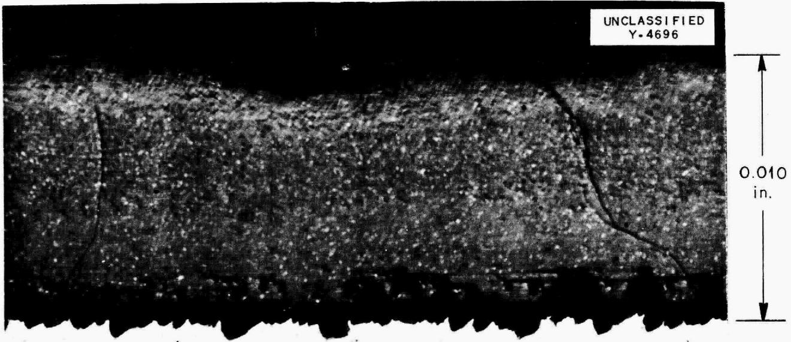

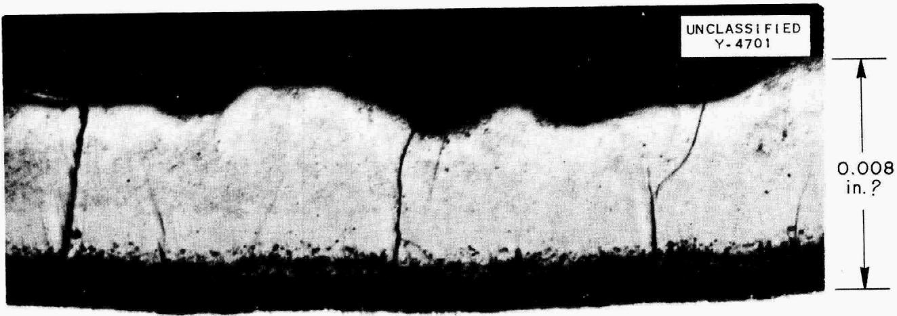  
Fig. 11.1. Surface of 304 Stainless Steel after 100 hr of Exposure to Barium Hydroxide at $816^{\circ}\mathrm{C}$ .   
Fig. 11.2. Surface of 446 Stainless Steel Specimen after 100 hr of Exposure to Barium Hydroxide at $816^{\circ}\mathrm{C}$ .

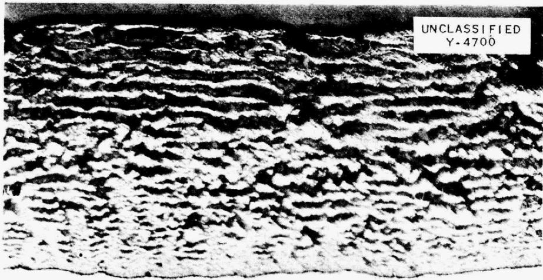

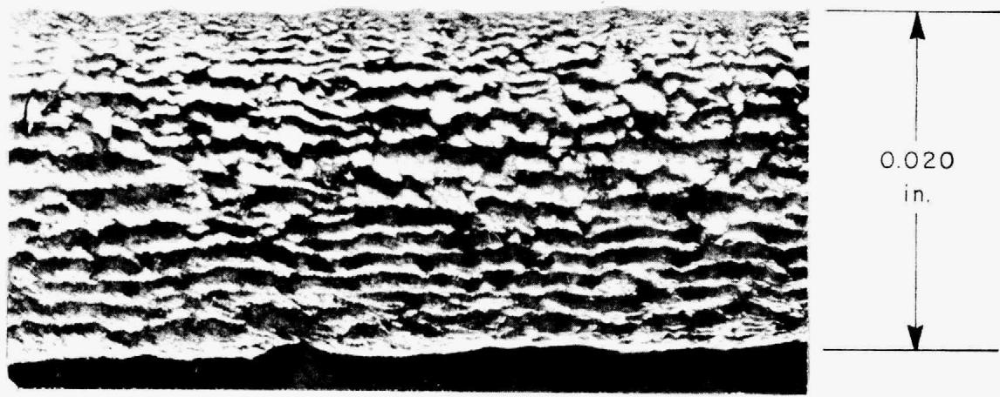  
Fig. 11.3. Surface of Inconel Specimen after 100 hr of Exposure to Barium Hydroxide at $816^{\circ}\mathrm{C}$ .

as the reference temperature. The periods of exposure were 1, 25, 50, 100, 250, 500, and 1000 hr. These tests are complete except for the 1000-hr runs.

Figure 11.8 demonstrates the corrosion of inconel by sodium hydrox-

ide at $800^{\circ}\mathrm{C}$ as a function of time. After 1 hr the metal is penetrated to a depth of 3 to 4 mils; this increased after 50 hr to 3 to 10 mils. After 100 hr a nonmetallic layer is visible under the corroded metallic layer. Little additional attack is evident after 250 hr.

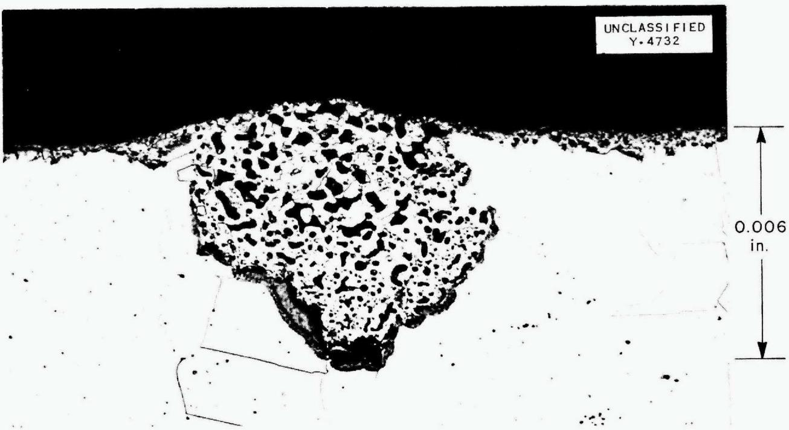

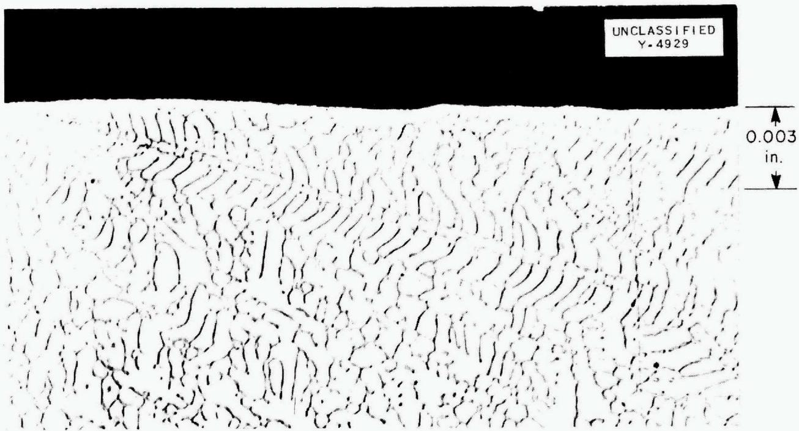  
Fig. 11.4. Surface of Nickel Z Specimen after 100 hr of Exposure to Barium Hydroxide at $816^{\circ}\mathrm{C}$ .   
Fig. 11.5. Surface of Chromium Specimen after 100 hr of Exposure to Sodium Hydroxide at $816^{\circ}\mathrm{C}$ .

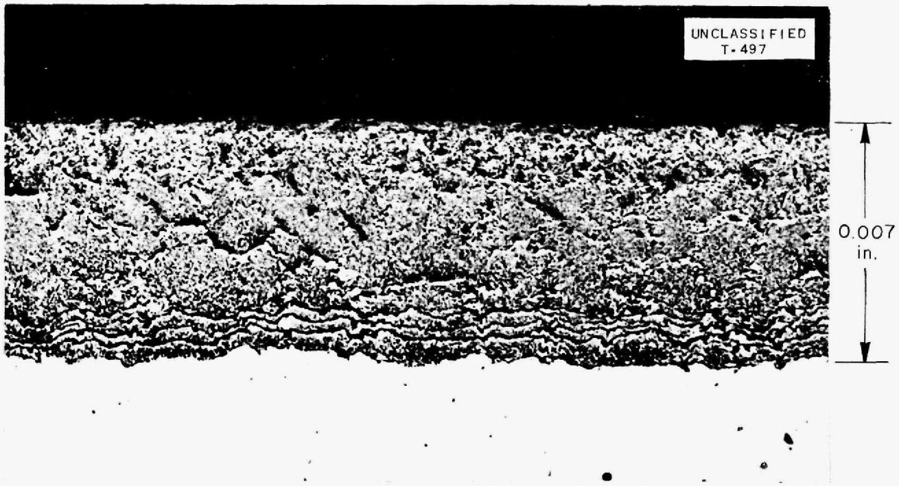  
Fig. 11.6. Surface of Inconel Specimen after 100 hr of Exposure to Lithium Hydroxide at $800^{\circ}\mathrm{C}$ .

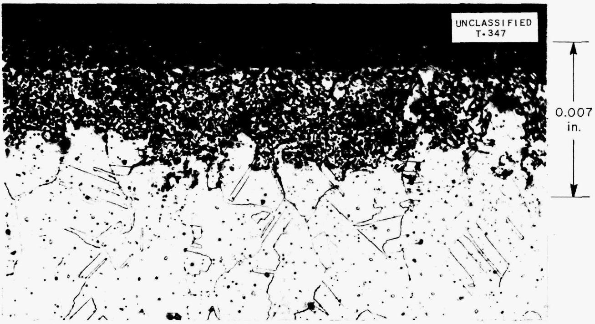  
Fig. 11.7. Surface of Inconel Specimen after 100 hr of Exposure to Rubidium Hydroxide at $800^{\circ}\mathrm{C}$ .

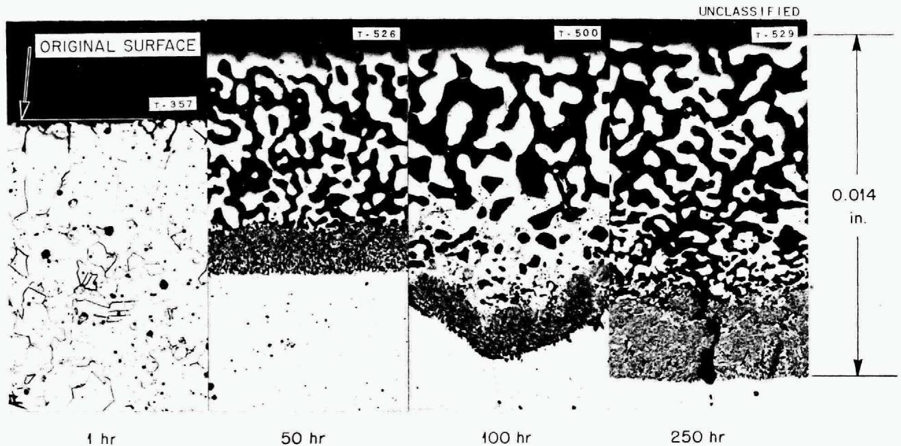  
Fig. 11.8. Effect of Exposure Time on the Corrosion of Inconel by Sodium Hydroxide at $800^{\circ}\mathrm{C}$ .

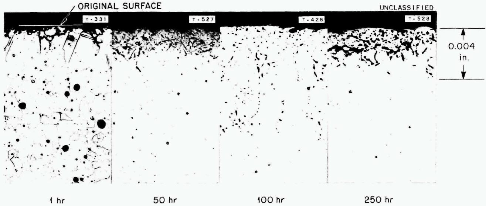  
Fig. 11.9. Effect of Exposure Time on the Corrosion of Inconel by Potassium Hydroxide at $800^{\circ}\mathrm{C}$ .

Figure 11.9 shows the analogous attack on inconel at $800^{\circ}\mathrm{C}$ by potassium hydroxide. After 1 hr the penetration is only 1 to 2 mils, and relatively slight additional attack occurs during succeeding test periods. Measurements indicate $3\%$ weight loss of the specimen after 500 hr. Apparently KOH is less

corrosive than NaOH under these conditions.

Effect of Temperature (H. J. Buttram, N. V. Smith, C. R. Croft, and J. M. Griffin, Materials Chemistry Division). Of equal importance is the effect of the test temperature. It was desirable

# ANP PROJECT QUARTERLY PROGRESS REPORT

to determine the temperature at which only negligible attack occurs during the usual period of 100 hr. Figure 11.10 shows the behavior of potassium hydroxide in inconel at 500, 600, 700, and $800^{\circ}\mathrm{C}$ . At $500^{\circ}\mathrm{C}$ there is no visible attack. At $600^{\circ}\mathrm{C}$ there is localized attack. In the sample shown a penetration of 5 to 6 mils can be observed. This is not found to be the case in other portions of the test specimen and is pictured here to illustrate occasional erratic behavior of the hydroxide-metal systems. At $700^{\circ}\mathrm{C}$ there is some pitting and penetration which does not always follow the grain boundaries. The attack at $800^{\circ}\mathrm{C}$ is considerably worse. Weight loss data (plotted in Fig. 11.11) indicate a strong increase with increasing temperature.

A series of thermal standpipe tests is in progress using potassium hydroxide at 538 to $815^{\circ}\mathrm{C}$ in an attempt to determine the rate of reaction at these temperatures and the effect of the types of atmosphere above the hydroxide on the rate. Vacuum, air, and hydrogen are being used. Preliminary results in air and vacuum indicate that both

316 stainless steel and inconel are attacked. The depth of attack at $538^{\circ}\mathrm{C}$ is of the same order of magnitude as that noted in a static corrosion test at $816^{\circ}\mathrm{C}$ , i.e., around 0.006 in. In hydrogen, however, no corrosion product was noted on either 316 stainless steel or inconel at $538^{\circ}\mathrm{C}$ . At $704^{\circ}\mathrm{C}$ shallow corrosion had occurred. Verification of the above preliminary results is being sought.

Corrosion of Coated Metals. Nickel and copper have been found to be among the few metals which are resistant to molten hydroxides. Therefore these materials have been applied as protective coatings on stainless steels for use in contact with the hydroxides. Preliminary results indicate that corrosion protection can be achieved in this manner.

Type 304 stainless steel was found to be severely attacked by sodium hydroxide at $815^{\circ}\mathrm{C}$ in a 100-hr test. The depth of metal showing oxidation by the molten caustic was 25 mils. Consequently, it was decided to evaluate the protective coatings of nickel and copper by depositing them on this steel.

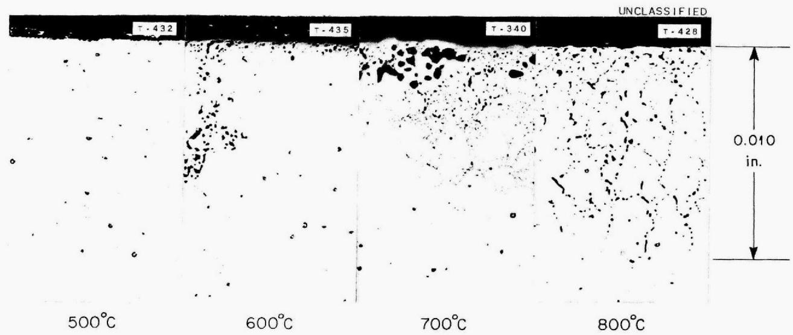  
Fig. 11.10. Effect of Temperature on the Corrosion of Inconel by Potassium Hydroxide in 100 hr.

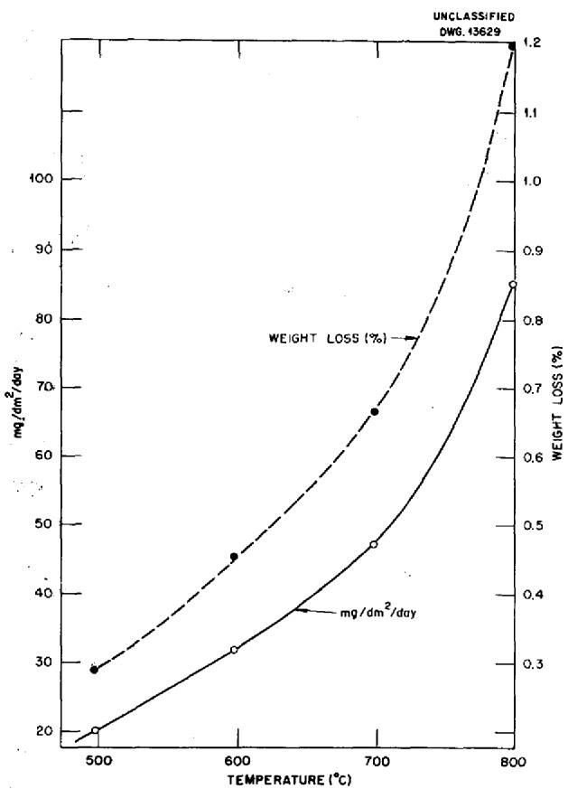  
Fig. 11.11. Weight Loss of Inconel Specimen in Potassium Hydroxide for 100 hr as a Function of Temperature.

Electroplated Specimens. A 3-mil copper-plated coating on 304 stainless steel reduced attack by sodium hydroxide to 5 mils in 100-hr tests at $816^{\circ}\mathrm{C}$ . A 3-mil nickel plate also resulted in a reduced attack of 9 mils on the underlying stainless steel. Copper-plated specimens were tested in copper capsules, and nickel-plated specimens were tested in nickel capsules. Electroplated specimens tested in sodium hydroxide appeared to have poor plate adherence while those tested in barium hydroxide were very adherent. The data are summarized in Table 11.5.

In tests with barium hydroxide for 100 hr at $816^{\circ}\mathrm{C}$ the 3-mil nickel plate on 304 stainless steel offered good protection. The 10-mil oxide layer which was obtained with the uncoated specimen (Fig. 11.1) is almost entirely eliminated although a small amount of oxidation, as shown in Fig. 11.12, was observed. With the 3-mil copper plate the specimens were severely attacked with the exception of the corners, which were relatively unattacked. This may possibly be attributed to the heavier electroplate which occurs

Table 11.5   
Summary of Hydroxide Corrosion of Clad Metal Specimens at $816^{\circ}\mathrm{C}$ for 100 hr   

<table><tr><td>STAINLESS STEEL</td><td>COATING</td><td>BATH</td><td>DEPTH OF METAL ATTACKED (in.)</td><td>WT. CHANGE (g/in.2)</td><td>REMARKS</td></tr><tr><td>304</td><td>None</td><td>NaOH</td><td>0.025 (uniform)</td><td></td><td>Uniform attack</td></tr><tr><td>304</td><td>3 mils of Cu</td><td>NaOH</td><td>0.005 (uniform)</td><td>+0.094</td><td>Cu plate not adherent</td></tr><tr><td>304</td><td>3 mils of Ni</td><td>NaOH</td><td>0.009 (uniform)</td><td>-0.094</td><td>Ni plate not adherent</td></tr><tr><td>304</td><td>None</td><td>Ba(OH)2</td><td>0.029 (uniform)</td><td>-1.0</td><td>Uniform attack</td></tr><tr><td>304</td><td>3 mils of Cu</td><td>Ba(OH)2</td><td>0.094 (maximum)</td><td>-1.92</td><td>Adherent Cu plate</td></tr><tr><td>304</td><td>3 mils of Ni</td><td>Ba(OH)2</td><td>0.027 (average)</td><td>+0.002</td><td>Adherent Ni plate</td></tr></table>

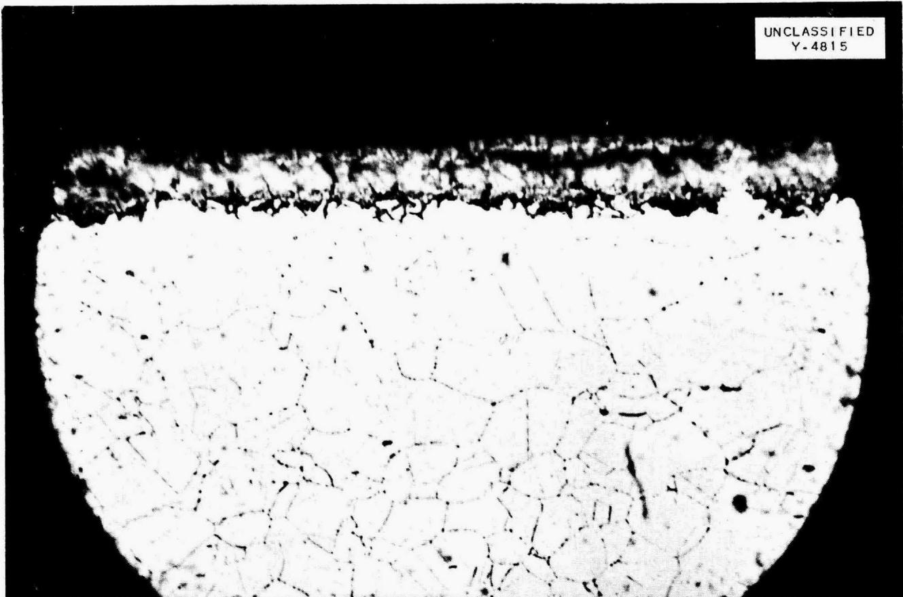  
Fig. 11.12. Surface of 304 Stainless Steel Coated with 3-mil Nickel Electroplate after 100 hr of Exposure to Barium Hydroxide at $816^{\circ}\mathrm{C}$ . Original magnification $500\times$ ; reduced to $96\%$ .

at the corners. Heavier copper coatings will be tried in order to test this possibility.

Clad Specimens. Nickel-clad 316 stainless steel and nickel-clad inconel specimens were prepared using the "picture frame" technique and tested in sodium hydroxide for $100\mathrm{hr}$ at $816^{\circ}\mathrm{C}$ . The nickel coating was approximately 5 mils thick at the sides and appreciably heavier at the ends. The thin sections of nickel were attacked but the thicker end sections were not (Fig. 11.13). There is no satisfactory explanation for this behavior at this time. On inconel and 316 stainless steel a heavier nickel cladding (10

mils) produced from nickel powder gave excellent protection from corrosion in NaOH at $816^{\circ}\mathrm{C}$ for 100 hr (Fig. 11.14). No evidence of oxidation is apparent.

Dissolution of Metals in Sodium Hydroxide (C. R. Croft and N. V. Smith). Attempts have been made to determine the amounts of various metals dissolved in sodium hydroxide under inert atmospheres as a function of temperature and exposure time. The sodium hydroxide is melted under an argon atmosphere in a container fabricated from the test metal, or of nickel in the case of hard-to-fabricate metals such as chromium. Filings of the test metal

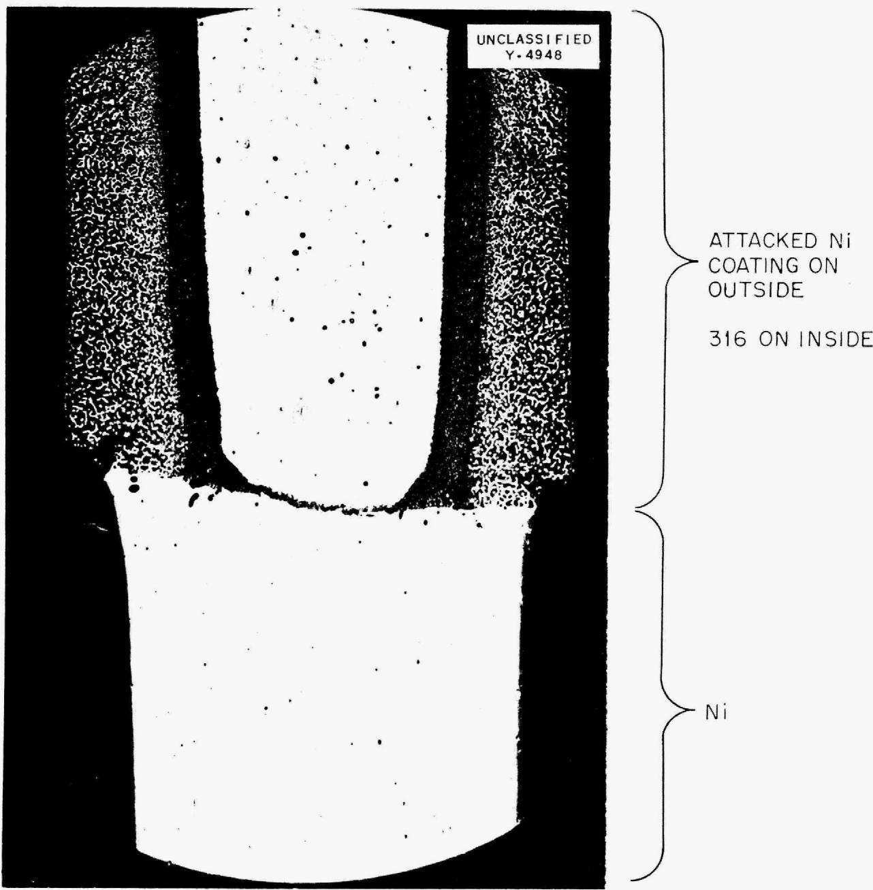  
Fig. 11.13. Nickel-Clad Inconel (Nickel Sheet) after 100 hr of Exposure to Sodium Hydroxide at $816^{\circ}\mathrm{C}$ . 50X

were present in all cases to increase the rate at which equilibrium could be established. The sample was maintained at temperature for 4 hr before a sample was drawn from the container through a filter of graphite to avoid the dispersed but undissolved metal.

The metal content of the hydroxide was then determined by analysis.

Table 11.6 lists the results obtained to date. The oxidation state of the dissolved metal and the mechanism of process are as yet unknown.

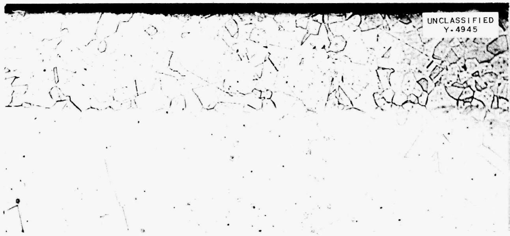  
Fig. 11.14. Nickel-Clad Inconel (Nickel Powder) after 100 hr of Exposure to Sodium Hydroxide at $816^{\circ}\mathrm{C}$ . 100X

Table 11.6   
Metal Content of Sodium Hydroxide as Function of Temperature   

<table><tr><td rowspan="2">METAL</td><td colspan="5">METAL CONTENT (wt %)</td></tr><tr><td>4 HR AT 400°C</td><td>4 HR AT 600°C</td><td>4 HR AT 700°C</td><td>24 HR AT 400°C</td><td>24 HR AT 600°C</td></tr><tr><td>Copper</td><td>0.15</td><td>0.19</td><td>0.6</td><td>0.16</td><td>0.54</td></tr><tr><td>Nickel</td><td>0.14</td><td>0.15</td><td></td><td></td><td>0.26</td></tr><tr><td>Chromium</td><td>0.40</td><td>1.94</td><td></td><td>0.60</td><td></td></tr><tr><td>Iron</td><td>0.17</td><td>1.07</td><td></td><td></td><td>1.17</td></tr></table>

# STATIC CORROSION BY FLUORIDE-HYDROXIDE SYSTEMS

H. J. Buttram

C. R. Croft

N. V. Smith

J. M. Griffin

Materials Chemistry Division

Mixtures of sodium hydroxide—sodium fluoride and potassium hydroxide—potassium fluoride were studied because of their potentialities as coolants

with moderating properties. Results obtained show some reduction of corrosion on inconel and stainless steel, but it appears that the improvement is mostly due to the dilution of the hydroxide by the fluoride. This fluoride addition cannot be great for otherwise the melting point will be above the desired range. The systems are mutually soluble in each other without evidence of eutectic formation.

# STATIC CORROSION BY SODIUM CYANIDE

A. D. Brasunas

R. B. Day

E. E. Hoffman

D. C. Vreeland

Metallurgy Division

Numerous molten salts have been considered for use in a reactor, but cyanides do not appear to have been mentioned. This nonoxidizing salt is quite stable at high temperatures and has been used extensively in the heat treating and carburization of metals. Pure sodium cyanide melts at $564^{\circ}\mathrm{C}$ (1047°F); however, this temperature can be lowered by suitable additions. The specific heat of sodium cyanide is reported as 0.25 Btu/lb (solid) and 0.40 Btu/lb (liquid); the heat of fusion is 135 Btu/lb. Uranium is appreciably soluble in sodium cyanide at $816^{\circ}\mathrm{C}$ . A number of static corrosion tests on a variety of metals and alloys were run at $816^{\circ}\mathrm{C}$ for 100 hr using evacuated capsules. The results are given in Table 11.7.

The cyanide reaction consists in carbon and/or nitrogen absorption by the metal. This frequently results in embrittlement as determined by a simple bend test at room temperature. There is, of course, the possibility that embrittlement does not occur at high temperatures but is merely a room-temperature phenomenon.

The superiority of nickel and high nickel alloys (inconel and nichrome V) in resistance to carburization is well known. Iron also appeared to be quite inert to the molten cyanide, while stainless steels showed varying tendencies for reaction. The results obtained with iron were somewhat surprising. The lack of carburization and subsequent embrittlement could be caused by the absence of oxygen which is essential to this reaction.(3)

Silicon additions are known to be very potent in suppressing carburization of commercial alloys that are ordinarily susceptible to carbon adsorption.

# STATIC CORROSION BY LIQUID METALS

A. D. Brasunas

R. B. Day

E. E. Hoffman

D. C. Vreeland

Metallurgy Division

Corrosion tests of up to 1000 hr of sodium on 315 stainless steel and lithium on coated 304 stainless steel have been completed. The attack by sodium was negligible even at temperatures up to $1000^{\circ}\mathrm{C}$ and did not appear to increase after the first 100 hr. Molybdenum and chromium coatings on stainless steel have somewhat, though not yet sufficiently, reduced the attack by lithium.

Sodium on Stainless Steel. Long-time tests in liquid metals initiated some time ago have recently been evaluated. Tests have been run with 316 stainless steel in contact with sodium up to a thousand hours at 816 and $1000^{\circ}\mathrm{C}$ . The attack was negligible at both temperatures. Static corrosion tests have also been made on 347 and 316 stainless steel and inconel in sodium at 650, 704, and $816^{\circ}\mathrm{C}$ for 100 hr. Attack in these tests was also negligible, although some embrittlement was noted. The results are summarized in Table 11.8.

Lithium on Coated Stainless Steel. Type 304 stainless steel specimens were thinly coated with molybdenum and chromium by the Linde Air Products Company. These specimens were tested in lithium at $1000^{\circ}\mathrm{C}$ for 100 hr in the usual manner. The attack of the underlying metal, although somewhat minimized, was not eliminated as much as had been hoped. It is believed that

Table 11.7   
Corrosion Data Obtained at $816^{\circ}\mathrm{C}$ Using Molten Sodium Cyanide for 100 hr   

<table><tr><td>METAL</td><td>DEPTH OF METAL AFFECTED (in.)</td><td>EMBRITTLED</td><td>REMARKS</td></tr><tr><td>Iron (Globe)</td><td>0.000</td><td>No</td><td>No evidence of attack</td></tr><tr><td>Nickel A</td><td>0.000</td><td>No</td><td>No evidence of attack</td></tr><tr><td>Nickel Z</td><td>0.005</td><td>Yes</td><td>0.002-in. outer layer; gray constituent formed to depth of 0.005 in.</td></tr><tr><td>Inconel</td><td>0.003</td><td>No</td><td>Integranular penetration of gray constituent to 0.003 in.</td></tr><tr><td>Hastelloy B</td><td>0.020</td><td>Yes</td><td>0.002-in. outer layer, nitride needles throughout</td></tr><tr><td>Hastelloy C</td><td>0.003</td><td></td><td>0.003-in. outer layer only (nitride?)</td></tr><tr><td>Nichrome V</td><td>0.005</td><td>No</td><td>0.001-in. outer layer; carburized to 0.005 in.</td></tr><tr><td>Uranium</td><td>0.01</td><td></td><td>Appreciable solution</td></tr><tr><td>Beryllium</td><td>0.002</td><td></td><td>Gray layer formed to depth of 0.002 in.</td></tr><tr><td>405 stainless steel</td><td>0.002</td><td>Yes</td><td>0.002-in. layer of scattered voids</td></tr><tr><td>430 stainless steel</td><td>0.020</td><td>Yes</td><td>Completely carburized; voids to depth of 0.002 in.</td></tr><tr><td>446 stainless steel</td><td>0.003</td><td>Yes</td><td>0.001-in. outer layer; 0.002-in. carburized layer beneath</td></tr><tr><td>304 stainless steel</td><td>0.011</td><td>Yes</td><td>0.001-in. outer layer; 0.011-in. carburized layer beneath</td></tr><tr><td>316 stainless steel</td><td>0.007</td><td>Yes</td><td>0.002-in. outer layer; 0.007-in. carburized layer beneath</td></tr><tr><td>347 stainless steel</td><td>0.007</td><td>Yes</td><td>0.002-in. outer layer; 0.007-in. carburized layer beneath</td></tr><tr><td>310 stainless steel</td><td>0.012</td><td>Partly</td><td>0.002-in. outer layer; 0.012-in. carburized layer beneath</td></tr></table>

thicker coatings would probably be more effective and additional tests are

planned in order to check this possibility.

Table 11.8   
Static Corrosion Tests in Sodium   

<table><tr><td rowspan="2">MATERIAL</td><td colspan="2">TEMP. TIME OF TEST</td><td rowspan="2">WT. CHANGE (g/in.2)</td><td rowspan="2">REMARKS</td></tr><tr><td>(℃)</td><td>(hr)</td></tr><tr><td>316 stainless steel</td><td>1000</td><td>1000</td><td>+0.001</td><td>No attack; no subsurface phase</td></tr><tr><td>316 stainless steel</td><td>815</td><td>1000</td><td>+0.013</td><td>Thin film; no cracks on bending 90°; subsurface phase to depth of 1 mil</td></tr><tr><td>316 stainless steel</td><td>815</td><td>100</td><td>+0.014</td><td>Thin film cracked on bending 90°; specimen contains a subsurface phase to a depth of 1 mil</td></tr><tr><td>316 stainless steel</td><td>704</td><td>100</td><td>+0.009</td><td>No attack; no evidence of cracking on 135° bend</td></tr><tr><td>316 stainless steel</td><td>650</td><td>100</td><td>+0.006</td><td>No attack; cracked slightly on 90° bend</td></tr><tr><td>347 stainless steel</td><td>815</td><td>100</td><td>+0.016</td><td>No attack; no cracking on 135° bend</td></tr><tr><td>347 stainless steel</td><td>704</td><td>100</td><td>+0.394</td><td>Thin surface deposit; no attack but trace of subsurface phase present; cracked on 90° bend</td></tr><tr><td>347 stainless steel</td><td>650</td><td>100</td><td>+0.010</td><td>No attack; no cracking; trace of subsurface phase</td></tr><tr><td>Inconel</td><td>815</td><td>100</td><td>+0.004</td><td>No attack; cracked on 135° bend</td></tr><tr><td>Inconel</td><td>704</td><td>100</td><td>+0.003</td><td>No attack; broke on 45° bend</td></tr><tr><td>Inconel</td><td>650</td><td>100</td><td>+0.002</td><td>No attack; cracked on 135° bend</td></tr></table>

# STATIC CORROSION OF FUEL CAPSULES IN SODIUM

H. W. Savage and W. C. Tunnell  
ANP Division

Static-corrosion tests on fuel-containing capsules to determine the combined corrosion effects of the fluoride fuel NaF-BeF $_2$ -UF $_4$ and sodium at $1500^{\circ}$ F were completed during the

period. These tests included static runs on inconel fuel-containing capsules in sodium of 600, 800, 900, and 1000 hr duration. In all, one complete series of tests has been run on inconel and on 316 stainless steel fuel capsules. Each series specified that seven capsules be tested in sodium at $1500^{\circ}\mathrm{F}$ for periods of 100, 200, 400, 600, 800, 900, and 1000 hr. Each capsule contained a slug of the capsule

material in addition to the fuel. The analysis of the capsule and fuel are reported in Tables 11.9 and 11.10 for the inconel and the 316 stainless steel capsule tests, respectively. In general, the effect of either corrosive fluid was no greater than that obtained in tests in which the other fluid is not present.

# DYNAMIC CORROSION IN THERMAL CONVECTION LOOPS

G. M. Adamson, Metallurgy Division

During this period the major effort with thermal-convection loops has been divided into corrosion studies with fluorides and hydroxides. Various

Table 11.9   
Analysis of Inconel Fuel Capsules in Sodium at $800^{\circ}\mathrm{C}$   

<table><tr><td rowspan="2">RUN TIME (hr)</td><td rowspan="2">WT. CHANGES(a) OF CAPSULE (mg/dm2/day)</td><td rowspan="2">WT. CHANGES(b) OF SLUG (mg/dm2/day)</td><td colspan="3">ANALYSIS OF FUEL (ppm)</td></tr><tr><td>Fe</td><td>Ni</td><td>Cr</td></tr><tr><td>0 (start)</td><td>0</td><td>0</td><td>125</td><td>1065</td><td>20</td></tr><tr><td>100</td><td>-14.3</td><td>+1.0</td><td>100</td><td>110</td><td>4180</td></tr><tr><td>200</td><td>-7.5</td><td>-6.9</td><td>120</td><td>66</td><td>2880</td></tr><tr><td>400</td><td>-5.8</td><td>-1.6</td><td>215</td><td>180</td><td>1880</td></tr><tr><td>800</td><td>-2.6</td><td>+0.7</td><td>400</td><td>870</td><td>2550</td></tr></table>

(a) Weight changes of capsule are due to sodium corrosion from the outside.   
(b) Weight changes of slug are due to fuel corrosion.

Table 11.10   
Analysis of 316 Stainless Steel Fuel Capsules in Sodium at $800^{\circ}\mathbf{C}$   

<table><tr><td rowspan="2">RUN TIME (hr)</td><td rowspan="2">WT. CHANGE(a) OF CAPSULE (mg/dm2/day)</td><td rowspan="2">WT. CHANGE(b) OF SLUG (mg/dm2/day)</td><td colspan="3">ANALYSIS OF FUEL (ppm)</td></tr><tr><td>Fe</td><td>Ni</td><td>Cr</td></tr><tr><td>0 (start)</td><td>0</td><td>0</td><td>125</td><td>1065</td><td>20</td></tr><tr><td>200</td><td>-4.32</td><td>-11.15</td><td>85</td><td>&lt;15</td><td>3650</td></tr><tr><td>400</td><td>-8.78</td><td>-5.88</td><td>1750</td><td>300</td><td>6640</td></tr><tr><td>600</td><td>-2.05</td><td>-4.44</td><td>90</td><td>&lt;20</td><td>630</td></tr><tr><td>626</td><td>-1.5</td><td>-5.97</td><td>110</td><td>&lt;20</td><td>1820</td></tr><tr><td>900</td><td>-2.21</td><td>-0.848</td><td>140</td><td>&lt;20</td><td>2310</td></tr><tr><td>1000</td><td>-4.97</td><td>-1.58</td><td>150</td><td>35</td><td>1110</td></tr></table>

$(a)$ Weight changes of capsule are due to sodium corrosion from outside.   
(6) Weight changes of slug are due to fuel corrosion.

hydroxides have been run in nickel loops, and in every case excessive mass transfer has taken place. Fluoride salt mixtures have been successfully circulated in inconel but have plugged in stainless steel.

Fluoride Corrosion. On the basis of preliminary tests, inconel appears to be the most desirable material for circulating fluorides. An inconel loop has now been operating at $1500^{\circ}\mathrm{F}$ for 240 hr with the fluoride fuel 11.7 wt % NaF, 59.1 wt % KF, and 29.2 wt % LiF to which enough $\mathrm{UF_4}$ has been added to make 1.1 mole%. Since no falling off is being found in the cold-leg temperatures, mass transfer does not seem to be taking place. Another inconel loop has been operating with the above fluoride mixture with $\mathrm{UF_4}$ for 570 hr, again without any sign of mass transfer. The 316 stainless steel loop containing the same mixture plugged completely in 82 hr. The loop has been X-rayed and shows both light and dark patches in the hot leg. Which constituent caused the plugging and the exact location of the plug could not be determined. A 316 stainless steel loop was terminated after 173 hr of operation with the uraniumless fluoride mixture. This loop developed a leak about the center of the vertical portion of the hot leg. While the leak was responsible for the termination, the cold-leg temperature had dropped $55^{\circ}\mathrm{F}$ , which indicates that some mass transfer was also taking place. X rays of this loop also showed several dark areas in the hot leg. Whether these are segregation or gas pockets formed on cooling can be determined only when the loop is sectioned. However, since the cold leg does not show any, they are most likely to be segregation. Metallographic examinations have not yet been made on these loops.

Hydroxide Corrosion. Sodium, potassium, and lithium hydroxides were circulated in nickel with a hot-leg

temperature of $1400^{\circ}\mathrm{F}$ . All these loops failed by plugging in the hot leg as a result of mass transfer. The operating times were: sodium hydroxide, 54 hr; potassium hydroxide, 51 hr; and lithium hydroxide, 317 hr. The lithium hydroxide loop has not yet been completely examined but appears to be like the other two which are almost identical.

Photomicrographs of both the hot and cold leg of the KOH loop are shown in Fig. 11.15. Although the surface of the hot leg appears to be well polished, examination under the microscope shows that this is a false surface which has been pulled away from the original material. Under the microscope, the cold leg surface appears quite rough with a layer of equi-axis crystals on the surface. Held in the rough spots on this surface is a considerable quantity of a nonmetallic constituent. Dendritic crystals were found lightly attached to the wall in all sections of the loop except the hottest part of the hot leg. The walls in all sections of the loop have been partially dissolved. In the sodium hydroxide loop about 0.002 in. had been dissolved from the cold leg and 0.007 in. from the hot leg. The figures are even higher with the potassium hydroxide loop. From X rays and dissolving out the hydroxides, which leaves the dendritic masses in place, the plugs in all loops have been found to be located in the horizontal section and lower part of the vertical section of the hot leg. Although dendrites were found attached to the wall in the cold leg, no large crystal masses were found in this section. Figure 11.16 is two views of the plug in the horizontal section of the sodium hydroxide loop. The top view is as cut while in the bottom the hydroxide has been washed out. The metallic masses are high-purity nickel. From X rays of the plug the

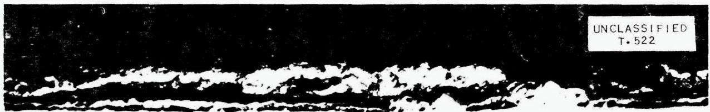

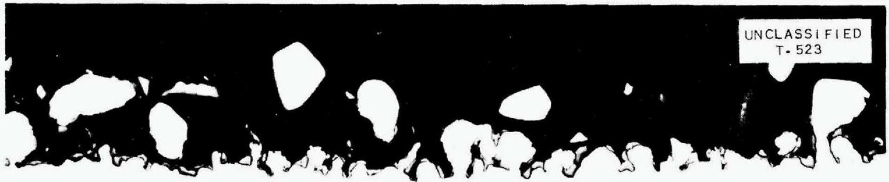  
(a)   
(b)   
Fig. 11.15. Nickel Thermal-Convection Loop Walls with Potassium Hydroxide. (a) Hot Leg. (b) Cold Leg. 250X

UNCLASSIFIED

Y-4884

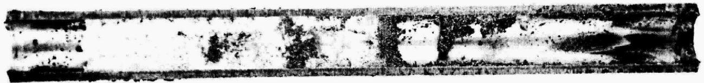

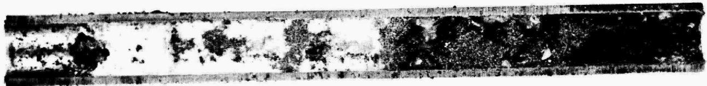

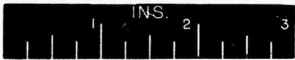  
(a)

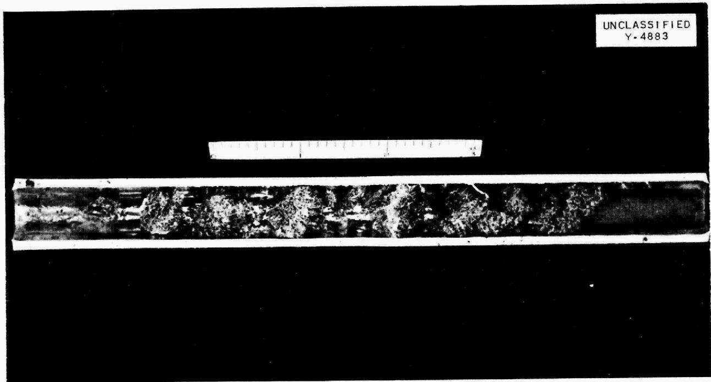  
(b)   
Fig. 11.16. Plugged Section Nickel Thermal Convection Loop with Sodium Hydroxide Coolant. (a) As Cut. (b) Metallic Constituent.

crystals appear to grow from the bottom of the pipe and slant into the coolant stream. No intergranular type of attack was found in any portion of these loops.

Inconel loops were terminated after 1000 hr with sodium at $1600^{\circ}\mathrm{F}$ and with NaK at $1500^{\circ}\mathrm{F}$ . Neither loop developed serious amounts of mass transfer or corrosion. A small amount of pitting was found in the hot area, but no intergranular type of attack was found.

# FUNDAMENTAL CORROSION RESEARCH

W. D. Manly  
Metallurgy Division  
W. R. Grimes  
Materials Chemistry Division

Reported failure of the empirical approach to furnish a satisfactory container material for molten hydroxides has emphasized the need for fundamental understanding of the mechanism of corrosion and mass transfer of metals by these liquids. At present it is not possible to state with certainty the nature of the chemical reactions taking place; attempts to minimize or control the corrosive action are difficult to plan systematically.

Efforts to understand the nature of the reacting species are, at present, directed along two parallel lines. Electrochemical studies of two different types are attempting to define the ionic species involved in corrosion and mass transfer and are intended as useful tools for study of these complex phenomena. In addition, a careful study of mass transfer, as well as other aspects of corrosion such as diffusion of various atoms from liquid phase into the solid phase, and the effects of various atmospheres and other environmental factors on corrosion has been undertaken. One of the

primary aims of this work will be concerned with the development of a suitable inhibitor for corrosion in the chemical sense and for inhibition of metal crystal (mass transfer) formation. These programs have been initiated only recently, and results to date are tentative and incomplete. Sufficient progress has been made, however, to indicate that useful data will result from these approaches.

EMF Measurements in Hydroxides (A. R. Nichols, Jr., Materials Chemistry Division). Apparatus and materials are being assembled for the measurement of electrode potentials in fused hydroxides. The apparatus will permit measurements involving a range of temperatures (325 to $1000^{\circ}\mathrm{C}$ ) of solvents (fused hydroxides), of solutes $(\mathrm{NiO}, \mathrm{Cr}_2\mathrm{O}_3, \mathrm{FeO}, \mathrm{etc.})$ , of electrode materials (Ni, Fe, Cr, Ag, Pt, C, alloys), and of atmospheres $(\mathrm{H}_2, \mathrm{He}, \mathrm{vacuum})$ . A nonmetallic cell container and diaphragm will be used over as much of the temperature range as possible.

An attempt will be made to develop reversible electrodes which correspond to reactions of the type involved in the corrosion and mass transport phenomena. If such electrodes can be devised, it will be possible to determine free energies and temperature dependencies. This may provide an understanding of the mechanisms of these processes and hence point the direction for their prevention.

Measurements now in progress involve the concentration cell

Ni, NiO (dissolved in NaOH at $c_{1}$ ) NiO (in NaOH at $c_{2}$ ), Ni

to determine whether the Ni-dissolved-NiO half-cell is reversible.

Polarographic Study of Sodium Hydroxide (R. A. Bolomey, Materials

Chemistry Division). Techniques for the study of polarographic curves to indicate the presence of contaminants in fused caustic are under investigation. Because of the high conductivity of molten NaOH, a rather elaborate compensating circuit is required in order to distinguish the polarographic waves. As presently operated, using a Brown recorder to trace the curves, the position of the waves is indicated by sharp peaks in an otherwise ascending current-voltage curve.

Sufficient reproducibility has not yet been achieved, but the results are encouraging. Trials with a stationary platinum electrode showed two peaks with NaOH contained in a platinum crucible under a nitrogen atmosphere. These peaks, at -1 and -1.4 volts, may have been attributable to platinite and platinate ions. The instrument was modified and it was found advisable to operate the polarographic cell in a vacuum to avoid erratic behavior apparently due to convection currents caused by surface cooling in the presence of a gas. Hydrogen was an outstanding offender in this connection. It will be of interest to modify the apparatus so that gaseous products from the mixture can be analyzed. So far it seems improbable that the peaks can be associated with Na+ or NaH.

Experiments with NaOH contained in silver give peaks occurring at different voltages than those encountered in platinum; however, the experiment is being repeated under improved conditions. The solidified NaOH contained a mat of fine metallic needles which appeared to have been freely suspended in the upper part of the melt. These are pictured in Fig. 11.17 but have not yet been identified.

Survey of the Mass-Transfer Phenomenon (W. D. Manly, Metallurgy Division; F. F. Blankenship, and R. P. Metcalf,

Materials Chemistry Division). The phenomenon of mass transfer of nickel in systems containing caustic has been reported from a number of installations which have experimented with these materials under a variety of conditions. The experiments which have definitely shown this phenomenon are described briefly below.

Summary of Experimental Observations. Experimental Engineering thermal-convection loops have shown adherent wall deposits in colder regions and spongy dendritic plugs in hotter regions in three experiments using loops of $\frac{1}{2}$ -in. nickel pipe approximately 90 in. in circumference. Velocities of about 25 ft/min and a temperature differential of 760 to $680^{\circ}\mathrm{C}$ prevailed in these experiments.

NACA. Temperature gradient loops with centrifugal circulation utilizing a temperature differential of 815 to $800^{\circ}\mathrm{C}$ with velocities of 15 ft/sec gave massive wall deposits in cooler regions. Mass transfer was accelerated by the addition of sodium metal.

BMI. Corrosion tests in a nickel pot having a thermocouple well, gas inlet tube, and specimen support immersed in the melt showed heavy deposition of nickel at the liquid level around metal walls and at colder portions.

NACA. Corrosion tests in sealed crucibles with a temperature differential of 815 to $730^{\circ}\mathrm{C}$ from top to bottom gave rise to a crystalline deposit in the colder portion.

X-10. A single low-velocity thermal convection loop loaded under hydrogen utilizing a temperature differential of 700 to $425^{\circ}\mathrm{C}$ developed a scattered deposit on the cold wall with small evidence of dendritic plugging in in 300 hr of operation.

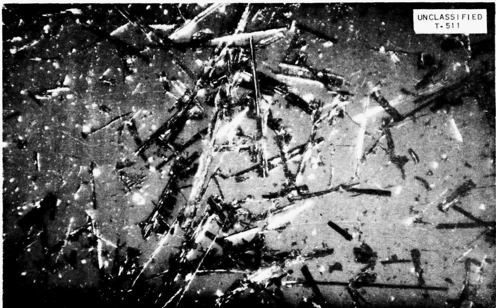  
Fig. 11.17. Deposit of Silver Crystals by Mass Transfer in Silver Capsule Containing Sodium Hydroxide.

Y-12. Corrosion tests in sealed tubes with temperature cycling showed small amounts of deposited metal after 12 cycles of 8 hr each from 800 to $200^{\circ}\mathrm{C}$ using helium gas inside sealed tubes.

Instances in which directly observable deposits of metal were not apparent were as follows:

Y-12. Isothermal corrosion tests (25 experiments) in capsules sealed under helium and heated in a vacuum at $800^{\circ}\mathrm{C}$ for 100 hr showed erratic weight losses but no significant mass transfer.

X-10. Temperature-gradient corrosion tests with hydrogen covering the melt and surrounding a vertical tube 17 in. long, $400^{\circ}\mathrm{C}$ at top, $800^{\circ}\mathrm{C}$ at middle, and $600^{\circ}\mathrm{C}$ at bottom, gave no

evidence of mass transfer and very little oxidation product in 100 hr.

Chemical Examination of Plugged Convection Loops. In view of the failure of mass transfer to develop in certain cases in which it was expected, particular attention has been paid to the contents of plugged loops obtained from the Experimental Engineering experiments mentioned above and described in greater detail elsewhere in this report.

A mapping of the extent and general appearance of deposited metal was carried out. No correlations were achieved, largely because of the lack of uniformity of the deposit on colder walls. There rough sparse deposits were blotted with dull surfaces and with regions containing fine dense crystals. Occasionally the line of

demarcation between sharp, bright needlelike crystals and a dull surface was surprisingly sharp. Such lines occurred in both the upper and lower arms, running longitudinally along the tube as though tracing a liquid level. Uniformly, the hotter sections beyond the dendritic plugs were highly polished. Surfaces in the immediate vicinity of plugs were visibly pitted but bright.

Hydroxide from various portions of the loops was submitted for analysis with the results shown in Table 11.11. A careful study of the oxidation products from sections of the KOH loop is still in progress. On being leached with water, the hotter portions gave rise to a gelatinous black precipitate which dried to a brownish powder. Colder regions yielded brown

powder, and the trap contained a mixed green and black powder. Tiny metallic crystals were also found in each case. X-ray-diffraction methods showed only NiO and nickel in varying proportions in the residues obtained from nine different regions in the KOH loop.

An extensive black deposit from the cold leg of the LiOH appeared to be NiO from the standpoint of X-ray diffraction, but the chemical analysis showed only $49\%$ Ni. There was much less discoloration of the surface of the hydroxide as found in the filling chamber in the case of LiOH.

Spectrographic examination of the pipe of which the nickel loop (containing NaOH) was constructed showed

Analysis of Hydroxide From Nickel Thermal Convection Loops After Plugging   

<table><tr><td rowspan="2">REGION</td><td colspan="2">LiOH</td><td colspan="3">NaOH</td><td colspan="2">KOH</td></tr><tr><td>Ni (%)</td><td>NiO (%)</td><td>Ni (%)</td><td>NiO (%)</td><td>NiO2 (%)</td><td>Ni (%)</td><td>NiO (%)</td></tr><tr><td>Hot leg</td><td>1.02</td><td>1.35</td><td>3.79(a)</td><td>0.0</td><td>0.01</td><td>23.3(a)</td><td>0.01(b)</td></tr><tr><td>Cold leg</td><td>1.31</td><td>15.4(c)</td><td>0.06</td><td>0.01</td><td>0.06</td><td></td><td></td></tr><tr><td>Top arm</td><td>0.08</td><td>1.58</td><td></td><td></td><td></td><td>400 ppm</td><td>0.01</td></tr><tr><td>Bottom arm</td><td>9.45</td><td>0.01</td><td></td><td></td><td></td><td>24.4</td><td>0.01</td></tr><tr><td>Darkest crust from fill chamber</td><td>0.3</td><td>1.2</td><td>6.07</td><td>0.83</td><td>0.20</td><td>1.92</td><td>20.2</td></tr><tr><td>Clean hydroxide from fill chamber</td><td>1 ppm</td><td></td><td></td><td></td><td></td><td>100 ppm</td><td>Total Ni</td></tr></table>

$(a)$ Sample contained some metallic dendritic sponge.   
(b) X-ray-diffraction analysis of this sample showed 40 to $70\%$ NaOH, 20 to $40\%$ Ni, and (probably present) 5 to $15\%$ NiO.   
$(c)_{A}$ large amount of oxide adhered to the wall near the bottom of the cold leg. In this respect the case of LiOH was unique.

# ANP PROJECT QUARTERLY PROGRESS REPORT

1.3% Fe, 0.6% Co, 0.8% Cu, and 0.04% Mn. The dendritic sponge contained 0.04% Fe, 0.3% Co, 0.8% Cu, and 0.01% Mn, indicating that cobalt and copper tend to be transported to a greater extent than iron and manganese.

Conclusions. Regardless of differences in proposed mechanisms, the oxidation of nickel is an essential part of all plausible explanations of mass transport. There is reason to believe that, even with large temperature gradients, mass transfer would

not be a problem in nickel--molten hydroxide systems operated under conditions such that the oxidation of nickel does not occur.

A small step toward this end has been the attempted development of nickel vessels suitable for carrying out the final stages of hydroxide purification, and of such design that the molten hydroxide could be transferred to experimental apparatus without exposure to air or other sources of contamination.

# 12. HEAT-TRANSFER RESEARCH AND PHYSICAL PROPERTIES

H. F. Poppendiek, Reactor Experimental Engineering Division

Experimental temperature measurements in a simulated liquid-fuel element, using a brine solution as the heat-generation medium, indicated significant reduction of fuel-element center temperatures at high heat fluxes as a result of free convection. These results are in general agreement with the theoretical work which has been carried on.

The fused-salt heat-transfer apparatus has been completed, and test-section heat-loss calibrations are currently being made. Upon completion of these calibrations heat-transfer coefficient measurements for the NaF-KF-LiF eutectic are to be obtained. Progress has been made in liquid-metal heat-transfer work on lithium and sodium systems. Analysis of data on entrance-region heat transfer in sodium is presented, along with mathematical solutions. Mathematical solutions have also been derived for forced-convection heat transfer (laminar and turbulent flow) in long smooth pipes containing fluids with uniform-volume heat sources.

Data are being obtained on heat capacity, density, and vapor pressure of materials. Some data have been obtained on viscosity and thermal conductivity, but further measurements await the completion and testing of additional equipment. Heat-capacity data have been determined for uranium fluoride, a lead-bismuth alloy, a fluoride-fuel mixture, nickel, and sodium hydroxide. Measurements on thermal conductivity of diatomaceous earth have been obtained by use of a radial-flow apparatus, while other equipment for measuring this property in liquids and in solids is nearing completion. Data on density and

vapor pressure of fluoride salt mixtures have been obtained, from which coefficients of expansion and heat of vaporization have been calculated. Some values for the viscosity of fluoride salt mixtures have been obtained, while other viscosity apparatus remains under construction.

# NATURAL CONVECTION IN LIQUID-FUEL ELEMENTS

F. E. Lynch, ANP Division  
D. C. Hamilton, R. F. Redmond, and M. Tobias, Reactor Experimental Engineering Division

Preliminary data have been obtained on a new simulated fuel-element system, described in the previous quarterly report. A $25\%$ solution of NaCl in water was used as the heat-generation medium, and cooling was effected by natural convection from the wall of a 3-mm quartz tube to a stirred bath. The results plotted in Fig. 12.1 are for six series of tests at coolant temperatures of 8, 12, 17, 29, 32, and $66.5^{\circ}\mathrm{F}$ , respectively. The ordinate $\theta / \theta_{c}$ is the ratio of the measured temperature difference between the wall and the axis of the tube to the temperature difference computed from the conduction equation for the system. The data are in general agreement with analytical (laminar flow) solutions for values of the source term that are less than 110 watts/cm³; at this point the ordinate decreases sharply. This decrease is attributed

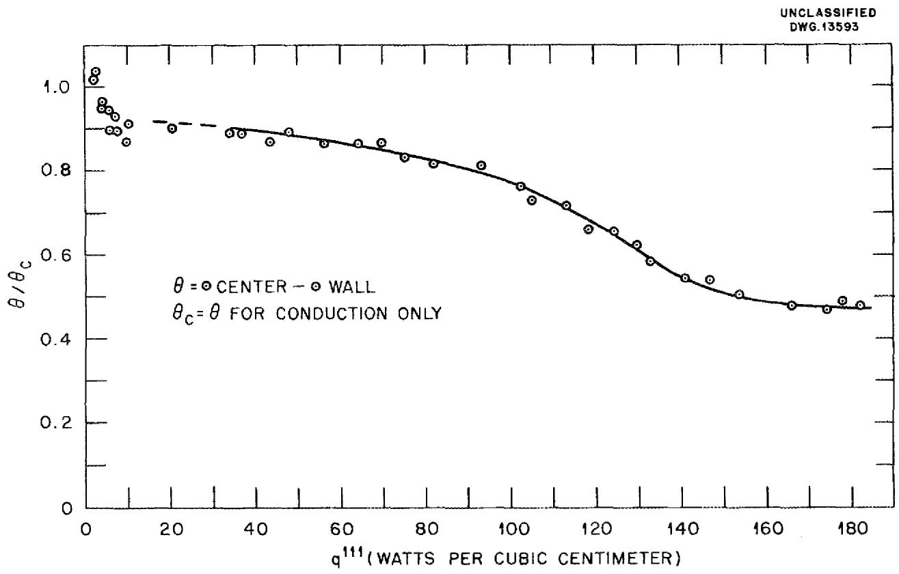  
Fig. 12.1. Temperature Ratio in a 3-mm Tube Filled with Brine in which Heat is Generated Uniformly.

to a change in the flow from the laminar to the turbulent regime.

A coolant jacket is being added to the quartz-tube system so that the cooling will be accomplished by forced flow parallel to the quartz tube. The flow rate and the axial temperature gradient of the coolant will be measured.

Four analytical solutions which relate radial temperature distributions to several dimensionless moduli, including such variables as pipe diameter, volume heat source, physical properties of the fuel and coolant, and coolant fluid flow rates for free-convection systems, have been obtained for the laminar flow region.(2)

Similar solutions for the turbulent-flow regime are being sought. A new parallel-plate apparatus in which the velocity distribution will be measured is being constructed which will employ an electrolyte as the heat-generating medium.

# HEAT-TRANSFER COEFFICIENTS

Heat Transfer in Fused Hydroxides and Salts (H. W. Hoffman and J. Lones, Reactor Experimental Engineering Division). The apparatus for the determination of the heat-transfer coefficients of molten salts and hydroxides has been completed. Heat loss calibrations of the test section are being carried out. Heat-transfer measurements using a fluoride mixture will be made upon completion of these calibrations.

Since the last report the experimental system has been fully instrumented, and all tanks and flow lines have been cleaned with a nitric acid solution and filled with approximately 200 lb of the NaF-KF-LiF eutectic. During the filling operation several cold spots were noted in the system, and the auxiliary heating circuit was altered to eliminate these regions. The system has been further modified to include mixing pots of a helical-coil design immediately preceding and following the test section in order to determine more accurately the entering and leaving mixed-mean temperature of the test fluid.

Heat Transfer in Molten Lithium (H. C. Claiborne and G. M. Winn, Reactor Experimental Engineering Division). It was previously reported that the modified figure-eight system for the determination of lithium heat-transfer coefficients had been successfully operated, and that preliminary heat-transfer data had been obtained. To facilitate accurate separation of the individual thermal resistances from the experimental overall heat transfer coefficients, a large pump (approximately 40 gpm at 100 psi) is required. Since a pump of the required capacity appeared to be unavailable in the next few months, it was decided to hold the figure-eight system in standby until the required capacity pump is obtained and to build a smaller system utilizing a heat-transfer section that is resistance-heated by an electrical current. The latter method obviates fluid thermal-resistance separation techniques and has the additional advantage that it allows the measurement of the actual heat flux distribution along the tube length.

Construction of the new system is about $95\%$ complete. Data are expected to be obtained by January, 1952, for Reynolds moduli up to 40,000.

The design qualifications for the test section are:

1. About $95\%$ of the heat is generated in the tube wall.   
2. The average temperature difference between the wall and the fluid mean temperature is at least $10^{\circ}\mathbf{F}$ .   
3. The axial mean temperature rise is at least $10^{\circ}\mathrm{F}$ .   
4. At least $75\%$ of the thermal resistance is in the lithium.   
5. There is a maximum of 3000 amp to the test section.   
6. The length-to-diameter ratio of the test section is 100.

Qualifications 1 and 2 require a metal having high thermal and electrical conductivities. Copper was selected as the material for the test section. A 10-hr static corrosion test (4) at $450^{\circ}\mathrm{F}$ indicated that a polished copper specimen lost only $0.02\%$ in weight. Therefore it appears that copper will resist attack by lithium long enough (about 2 or 3 hr) to take the necessary data if the maximum operating temperature does not exceed $450^{\circ}\mathrm{F}$ .

A flow diagram of the system is shown in Fig. 12.2. The dimensions of the test section are: length, $11\%$ in.; i.d., 0.1175 in.; and o.d., 0.1715 in. Flow is produced by two electromagnetic pumps in series (previous operational data indicate that this arrangement will give 1.7 gpm at 40 psi). Flow measurements will be made with an

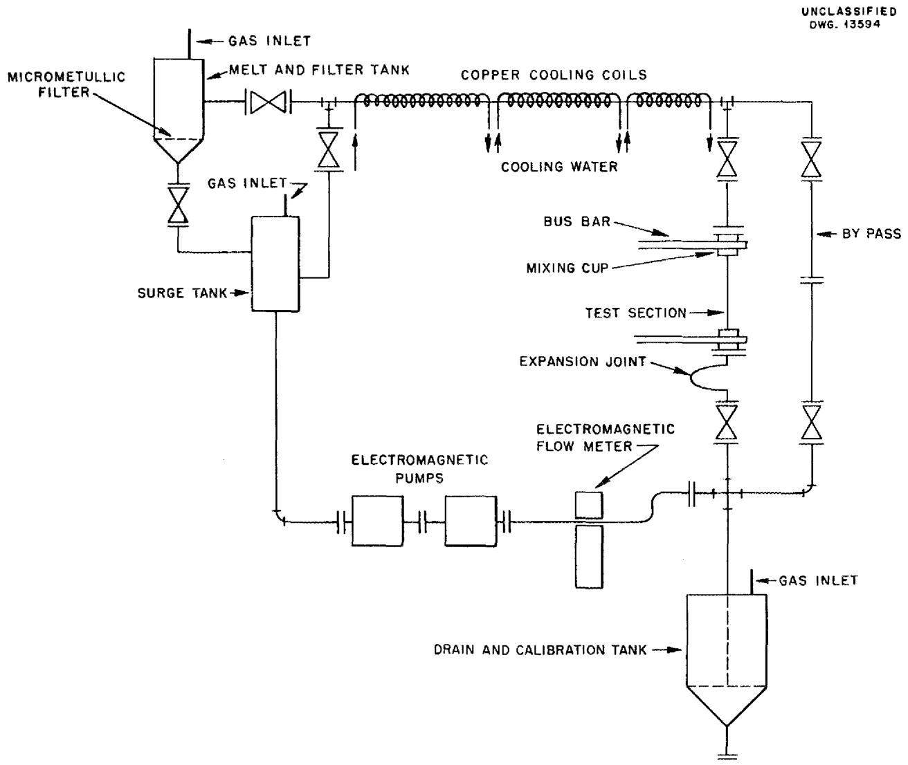  
Fig. 12.2. Flow Diagram for Lithium Heat-Transfer Experiment.

electromagnetic flowmeter that will be calibrated in place. The bypass is used for testing the circuit and for obtaining approximate equilibrium. This prevents unnecessary exposure of the copper test section to lithium. Before data on the test section are obtained, the bypass will be frozen and disconnected to prevent short-circuiting of the heating current to the test section. The tube can be easily replaced in case of failure.

It is felt that the described system will produce satisfactory

lithium heat-transfer data and, with modification of the test section, will allow the heat-transfer characteristics of other liquid metals to be determined in the same apparatus.

Entrance-Region Heat Transfer in a Sodium System (W. B. Harrison, Reactor Experimental Engineering Division). The system built for obtaining entrance-region heat-transfer coefficients to molten sodium has been described in previous quarterly reports (see p. iv for list of previous reports). Briefly, the test section consists of a circular

copper plate having a hole in the center and a tube around the periphery. Sodium flows through the center hole, and a cooling or heating medium is circulated through the tube at the periphery. The plate is insulated to promote radial conduction, and the temperatures at different radial positions were measured in order to determine the copper surface temperature at the copper-sodium interface and the rate of heat flow through the plate.

A total of 48 experimental runs have been made to date. Plates of 1/16 and 1/8 in. thickness have been used in conjunction with hole diameters of 1/16, 5/64, and 3/32 in. Values of $P_{e}$ $D / L$ ranged from 140 to 585, where $P_{e}$ is the Peclet modulus, $D$ is hole diameter, and $L$ is the plate thickness. All data were taken with the sodium in turbulent flow at temperatures between 250 and $310^{\circ}\mathrm{F}$ . The data have been extremely erratic and very low when compared with the predictions based on the postulates of slug flow (uniform velocity distribution) with heat transfer by molecular conduction only. In a number of cases the data were low even when compared with predictions based on the postulate of laminar flow (parabolic velocity distribution).

Following are several possible explanations for the low data:

1. Peculiar velocity distribution. This might be caused by creep of the gasket upstream from the plate. It was found that some creep actually does take place. However, the effect was practically eliminated by giving the gaskets a preliminary compression set at the operating temperature.

2. Nonwetting of the copper by the sodium. There are few data available on wetting of surfaces

by sodium, but it appears that a clean surface is wet by sodium without difficulty, even at the low operating temperature. The surface in the test section was degreased with a detergent and electrochemically polished. No significant changes resulted in the data.

3. Precipitation of oxide on the heat-exchange surface. This was considered to be a possibility during the runs in which the sodium was being cooled. The apparatus was equipped for heating the sodium without significant improvement of the data.

4. Contamination of the sodium such that its properties have been altered; particularly, the thermal conductivity has been reduced. The chief contaminant is the oxide, with some iron particles also in suspension. This appears to be the most likely cause for the erratic and low data. The system is presently being cleaned and modified so as to minimize contamination. There has been a fairly consistent decrease in the heat-transfer coefficients with time, implying that the condition is being aggravated by a buildup of contaminant. It is believed that particles of oxide and iron have been suspended in the stream, such that the extent of contamination exceeds the equilibrium solubility of sodium oxide in sodium. The oxygen comes from three sources: (a) residual oxygen in the system prior to loading the sodium; (b) residual oxygen in the form of oxide on the surfaces of sodium bricks which were loaded into the system; and (c) oxygen present in the argon used in the system. A filter is being installed in the sodium line so as

to remove oxide in excess of the equilibrium solubility. In order to eliminate the oxide introduced during loading of bricks directly into the system, a separate melt tank will be used. From this tank the sodium will be transferred into the system through a filter. In order to reduce contamination from the gas, helium will be passed through a NaK scrubber before it reaches the system. These changes in the system are being incorporated at the present time. It is hoped that the system may be started up again by the middle of December.

Heat Transfer in a Circulating Fuel System (H. F. Poppendiek and L. Palmer, Reactor Experimental Engineering Division). Mathematical solutions have been derived for temperature structure in the case of forced-convection heat transfer (laminar and turbulent flow) in long smooth pipes containing fluids with uniform-volume heat sources; heat is transferred to or from the fluids at the pipe wall. Some specific evaluations of the radial temperature distributions for the case of no heat transfer to or from the fluid at the pipe wall have been made for laminar and turbulent flow. Dimensionless temperature profiles for the case of turbulent flow are presented in terms of Reynolds modulus, Prandtl modulus, the volume heat source, and the boundary heat transfer.

# HEAT CAPACITY

W. D. Powers G. C. Blalock R. M. Burnett, Reactor Experimental Engineering Division

The heat capacities of nickel, sodium hydroxide, uranium fluoride, a lead-bismuth alloy, and a fuel mix

have been determined by means of Bunsen ice calorimeters. (5,6) The equations in Table 12.1 give the heat capacity as a function of temperature; $H_{t} - H_{0°C}$ is in cal/g, $C_{p}$ is in cal/g°C, and $T$ is in degrees centigrade.

# THERMAL CONDUCTIVITY

A Deem type apparatus for the measurement of thermal conductivity of liquids has been completed and is currently being tested with lead. A longitudinal flow apparatus for measuring thermal conductivity of solids is nearing completion. Some measurements of thermal conductivity and sintering have been made on diatomaceous earth, a material anticipated for use as insulation in the circulating-fuel-water-moderated reactor.

Thermal Conductivity of Liquids (S. J. Claiborne and M. Tobias, Reactor Experimental Engineering Division). A Deem type apparatus for the measurement of the thermal conductivity of liquids has been modified as indicated in an earlier report.(7) The apparatus is now complete and is being tested using lead. Some difficulty has been encountered in keeping thermocouple wells leak-free, but this problem has been solved, at least for lead as the test liquid. Replacement of the stainless steel bellows with one of nickel-plated copper or brass is now contemplated, because the present bellows is very stiff and causes a certain amount of distortion in the apparatus. An additional apparatus is

Table 12.1   

<table><tr><td colspan="4">Heat Capacities of Various Substances</td></tr><tr><td>Nickel</td><td>250 - 1000°C</td><td>H_T(solid) - H_0°C(solid) = 0.26 + 0.119T + 1.53 × 10^-5T^2</td><td>C_p= 0.12 + 3.1 × 10^-5T</td></tr><tr><td>NaOH</td><td>340 - 1000°C</td><td>H_T(liquid) - H_0°C(solid) = 69 + 0.49T</td><td>C_p= 0.49 ± 0.02</td></tr><tr><td>UF_4</td><td>300 - 930°C</td><td>H_T(solid) - H_0°C(solid) = 4.0 + 0.073T + 3.1 × 10^-5T^2</td><td>C_p= 0.073 + 6.1 × 10^-5T</td></tr><tr><td>Pb-Bi alloy (55.3 mole % Be)</td><td>200 - 950°C</td><td>H_T(liquid) - H_0°C(solid) = 5.8 + 0.0345T</td><td>C_p= 0.034 ± 0.0015</td></tr><tr><td>Fuel mixture (46.5 mole % NaF, 26.0 mole % KF, 27.5 mole % UF_4)</td><td>240 - 535°C</td><td>H_T(solid) - H_0°C(solid) = -0.3 + 0.15T</td><td>C_p= 0.15 ± 0.01</td></tr><tr><td></td><td>535 - 1000°C</td><td>H_T(liquid) - H_0°C(solid) = -13.4 + 0.23T</td><td>C_p= 0.23 ± 0.01</td></tr></table>

being build so that delays caused by failure of equipment parts may be reduced.

Thermal Conductivity of Solids (W. D. Powers, Reactor Experimental Engineering Division). Construction of an additional logitudinal flow apparatus for the thermal conductivity of solids is $90\%$ complete and will be checked with Armco iron shortly. This apparatus can be used in a vacuum or in an inert atmosphere and will permit more accurate measurements than the original (8) apparatus.

Thermal Conductivity of Diatomaceous Silica Powder (D. F. Salmon, ANP Division). Research on the circulating-fuel-water-moderated reactor has led to a search for an insulating material for the fuel containers. This insulation would allow the water to be maintained at a considerably lower temperature than the fuel mixture, thereby simplifying many of the problems associated with high-temperature high-pressure systems. Diatomaceous silica powder seemed feasible; hence tests were made to determine thermal conductivity and sintering effect at reactor temperatures under atmospheric and reduced pressures. The material used was a Johns-Manville product, Celite.

The apparatus consisted of two annuli formed by concentric tubes around a standard 750-watt 115-v tubular heating element. The annulus next to the heater element contained diatomaceous silica while the outer annulus was a water passage. Experimental parameters included heater power, sheath temperature, density to which insulation was packed, water flow rate, and water inlet and outlet temperatures.

The first series of tests was made at atmospheric pressure. The heater element sheath temperature was maintained at $1500^{\circ}\mathrm{F}$ for 75 hr at $1675^{\circ}\mathrm{F}$ for 100 hr, and at $1800^{\circ}\mathrm{F}$ for 100 hr. During this entire series the temperature rise of the water never exceeded $10^{\circ}\mathrm{F}$ . Figure 12.3 shows the variation in thermal conductivity with temperature both from the literature values $^{(9)}$ and from the experimental ones. Inspection at the conclusion of these tests showed that a thin layer of the powder next to the heater element had darkened considerably, probably as a result of oxidation of the inconel sheath. Apparently no significant change in physical properties had occurred, since the thermal conductivity remained consistent throughout the tests.

A second series of tests was begun in which the powder annulus was evacuated to determine the effect of the presence of air on thermal conductivity and sintering. The insulation annulus was loaded to a packing density of 15.7 lb/ft³ and evacuated to approximately 0.17 mm Hg. Other experimental conditions were unchanged.

At a heater sheath temperature of $1800^{\circ}\mathrm{F}$ , an apparent conductivity of 0.025 Btu/hr·ft·°F was calculated, representing a reduction of some $60\%$ over that at atmospheric pressure. After 24 hr of operation, however, the conductivity began to increase as evidenced by a decrease in sheath temperature, while the power on the heater element remained essentially constant; however, insufficient time had elapsed to establish the extent of this increase. Examination of the powder after testing indicated that a layer approximately 1/16 in. thick around the heater had sintered and darkened appreciably in color.

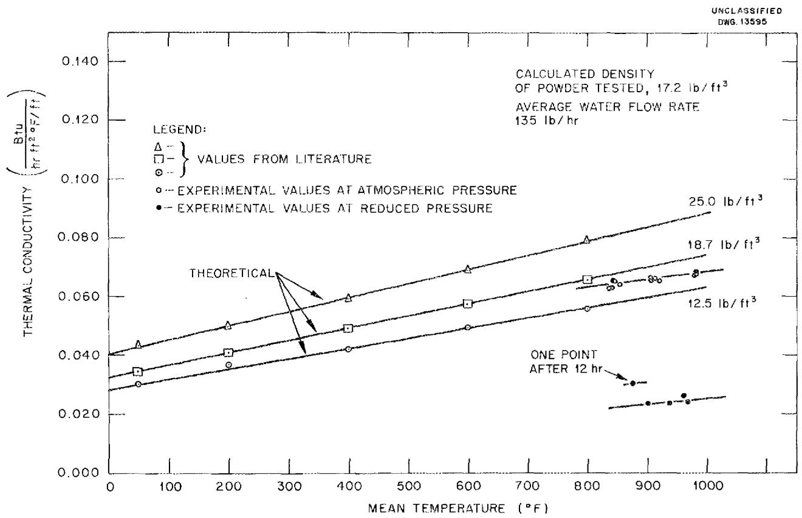  
Fig. 12.3. Thermal Conductivity of Diatomaceous Earth.

No reason has been advanced to explain why diatomaceous silica sintered at reduced pressure but failed to sinter at atmospheric pressure. Further tests at reduced pressure are underway.

# DENSITY OF LIQUIDS

# J. M. Cisar, ANP Division

Density measurements have been made on three more fused salt mixtures. Compositions, melting points, and temperature ranges over which data were taken are given in Table 12.2. The equations representing the data within $\pm 5\%$ are indicated, where $\rho =$ density and $T =$ temperature (°C).

The data on the NaF-KF-LiF-UF4 mixture, although consistent in them

selves, may not be reliable, as the salt was accidentally allowed to remain exposed to air for a 3-hr period before the runs were made. A sample is being analyzed to determine the effect of hydrolysis during this period. The apparatus used for these determinations is based on liquid buoyancy principles; it was described in a previous quarterly report.(10) In addition, a second density apparatus of this type has been built and is now in operation.

# VISCOSITY

The falling-ball viscometer has been modified and tested with satisfactory results. Approximate results

Table 12.2   
Data on Several Fused Salt Mixtures   

<table><tr><td colspan="2">COMPOSITION</td><td rowspan="2">MELTING POINT (℃)</td><td rowspan="2">TEMPERATURE RANGE (℃)</td><td rowspan="2">EQUATION</td></tr><tr><td>COMPOUND</td><td>(mole %)</td></tr><tr><td>NaF</td><td>48.2</td><td>558</td><td>625 - 890</td><td>\( \rho = 4.54 - 0.0011T \)</td></tr><tr><td>KF</td><td>26.8</td><td></td><td></td><td></td></tr><tr><td>\( UF_4 \)</td><td>25.0</td><td></td><td></td><td></td></tr><tr><td>NaF</td><td>10.9</td><td>430 - 440</td><td>525 - 850</td><td>\( \rho = 2.647 - 0.00090T \)</td></tr><tr><td>KF</td><td>43.5</td><td></td><td></td><td></td></tr><tr><td>LiF</td><td>44.5</td><td></td><td></td><td></td></tr><tr><td>\( UF_4 \)</td><td>1.1</td><td></td><td></td><td></td></tr><tr><td>NaF</td><td>11.5</td><td>455</td><td>550 - 850</td><td>\( \rho = 2.385 - 0.00059T \)</td></tr><tr><td>KF</td><td>42.0</td><td></td><td></td><td></td></tr><tr><td>LiF</td><td>46.5</td><td></td><td></td><td></td></tr></table>

are expected with the use of a Zahn type viscometer now nearing completion. Some values for fluoride salt mixtures have been obtained using the modified Brookfield Synchro-Lectric viscometer (Fig. 12.4).

Falling-Ball Viscometer (S. I. Kaplan and T. N. Jones, Reactor Experimental Engineering Division). The falling-ball viscometer has been tested at room temperatures, using SAE 10 lubricating oil as the test fluid. The viscosity of the oil was checked with a Brookfield viscometer and found to agree with the result of the falling-ball instrument to within about $10\%$ . After high-temperature testing is complete, the instrument will be used for investigations of molten salt mixtures.

Recent modifications of the falling ball viscometer include removal of the solenoid valve at the bottom and substitution of an externally heated straight pipe extension and instal

lation of a removal cap to permit cleaning.

Zahn Type Viscometer (M. Tobias, Reactor Experimental Engineering Division). A Zahn type viscometer has been designed to give rapid, approximate values for fuel and coolant-salt mixtures. The viscometer will consist of a stainless steel cup, at the base of which is a hole 1 in. long and 1 mm in diameter. The cup will be dipped into the melt whose viscosity is desired. The melt container will then be dropped away from the cup and the time of efflux of $5\mathrm{cm}^3$ of molten material from the cup will be measured. Since the apparatus will be inside a furnace, the discharge time will be obtained by weighing the cup either continuously with a dial-indicating balance or by noting when the weight of the cup plus its contents falls below a predetermined amount. To minimize corrosion, the apparatus will be operated in an inert gas atmosphere. The device will be calibrated using

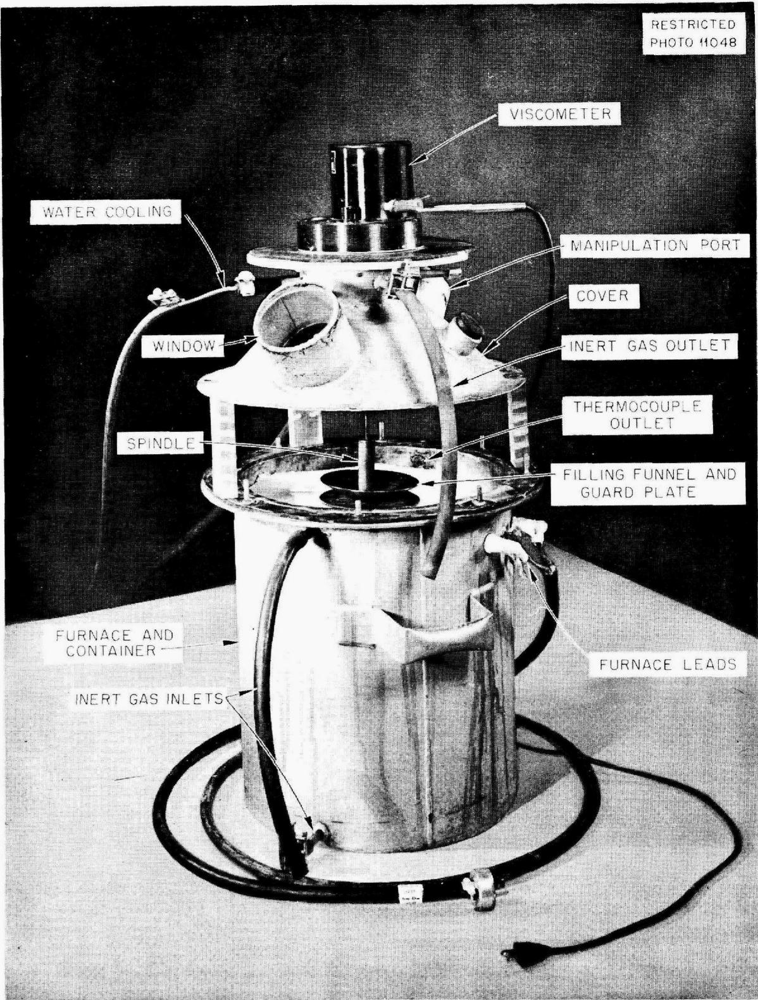  
Fig. 12.4. Viscosity Apparatus.

materials of known viscosity, both at room temperature and at high temperatures. The equation which an apparatus of this type obeys is of the form

$$
\nu = A t - B / t
$$

where $\nu$ is the kinetic viscosity of the liquid, $A$ and $B$ are constants characteristic of the apparatus, and $t$ is the time of efflux.

Viscosity of Fluoride Mixtures (F. A. Knox and F. Kertesz, Materials Chemistry Division). Preliminary viscosity determinations of the various fluoride mixtures were continued. Although trials were made with a Saybolt type apparatus, it was found desirable to continue the use of a modified Brookfield Synchro-Lectric viscometer. In order to eliminate at least some of the disadvantages of the earlier techniques, the furnace was enclosed in a metallic shell, covered with a gas-tight cover which contained the measuring instrument, a glass-covered viewing hole, and an opening for a rubber glove to permit certain manipulations while the experiment was in progress. The enclosed unit was under slight argon pressure. In this way oxidation of the material during measurements should be reduced very considerably. Details of the apparatus can be seen in Fig. 12.4.

The need for such an essentially gas-tight apparatus was apparent from the results obtained with beryllium-bearing fluoride mixtures. In a poorly sealed system the mixture became cloudy while the measurements were in progress, indicating the formation of insoluble beryllium oxide. The viscosity values at a given temperature continued to increase as repeated measurements were made, resembling the behavior of a suspension with rheopectic

properties rather than a Newtonian liquid.

In order to establish the effect of the uranium concentration on the viscosity, the viscosity was determined for fluoride salt mixtures containing various amounts of uranium fluoride. The latest values for the viscosity of the NaF-KF-LiF ternary eutectic range around 3 centipoises at $800^{\circ}\mathrm{C}$ . Results with 2 and 15 wt $\%$ UF $_4$ in the eutectic show that these mixtures have essentially the same viscosity as the uranium-free composition.

# VAPOR PRESSURE OF LIQUID FUELS

# R. E. Moore, Materials Chemistry Division

The apparatus and procedure employed in this work have been described in a previous report.(11) The cylindrical vessel of 316 stainless steel containing the NaF-KF-UF4 eutectic mixture was heated in a monol block in a pot furnace wound with Kanthal A wire. Temperatures were measured by chromel-alumel thermocouples attached to the outer wall of the vessel. A hand-controlled Powerstat was used to regulate the temperature of the furnace.

A preliminary test of the apparatus and procedure was made in which vapor pressures of mercury were determined at several temperatures using a manometer containing Hyvac oil for pressure measurement. The results showed this method was satisfactory; hence measurements with fused salts were initiated.

The results of the vapor pressure determination of the NaF-KF-UF4

eutectic mixture are given in Table 12.3. The values at 1199 and $1267^{\circ}\mathrm{C}$ were obtained with a mercury manometer and are not so accurate as the others, which were obtained with a manometer containing Hyvac oil. These data are represented by the equation

$$
\log_ {1 0} P _ {\mathrm {m m H g}} = - 9 5 0 0 / T + 7. 2 3 4.
$$

The heat of vaporization as calculated from the equation is 43.5 kcal/mole.

Table 12.3   
Vapor Pressure of the NaF-KF-UF4 Eutectic   

<table><tr><td>TEMPERATURE (°C)</td><td>PRESSURE, OBSERVED, (mm Hg)</td></tr><tr><td>1073</td><td>1.43</td></tr><tr><td>1131</td><td>2.82</td></tr><tr><td>1138</td><td>3.34</td></tr><tr><td>1199</td><td>6.5</td></tr><tr><td>1242</td><td>9.02</td></tr><tr><td>1267</td><td>12.0</td></tr></table>

# 13. METALLURGY AND CERAMICS

W. D. Manly, Metallurgy Division

T. N. McVay, Consultant

Solid-fuel-element fabrication has been studied in order that the effect of several variables on the metallurgical bond between the fuel-bearing core and the protective cladding and the distribution of the $\mathrm{UO}_2$ in the metallic carrier in the core may be understood. Previous reports have outlined this effect by such variables as percentage hot reduction, percentage $\mathrm{UO}_2$ present, composition of cladding, particle size of the metallic carrier in the core, and degree of cold-working of the flat plate after rolling. In this report the following variables have been investigated: effect of $\mathrm{UO}_2$ particle size range, effect of rolling temperature, and elimination of the capsule used during hot-rolling.

Preliminary experiments have shown that fuel-plate laminates may be spot-welded together. Fuel-tube bundles can be held together by spot-welding bundle straps to the individual tubes. A study of high-temperature brazing indicates Microbraz to be quite useful in joining two fuel-plate laminates without floating the $\mathsf{UO}_2$ to the surface and for joining a fuel plate to a stainless steel sheet in a T joint. A new brazing alloy containing $60\%$ Pd and $40\%$ Ni has been found which has a favorable nuclear cross-section as well as good high-temperature brazing properties.

The creep and stress-rupture laboratory for the testing of materials in an inert gas atmosphere has been completed. Results are presented which show the effect of grain size on the creep strength of inconel and of heat treatment on the creep strength of Duranickel.

Installation of equipment for the ceramics laboratory is still in process although the laboratory has been in partial operation since early fall. The work to date has included ceramic coating of radiators and the hot pressing of alumina.

# SOLID-FUEL-ELEMENT FABRICATION

E. S. Bomar and J. H. Coobs Metallurgy Division

Of the three basic approaches to preparing a solid-fuel element outlined in earlier reports (see p. iv for list), the one upon which primary emphasis has been placed to date makes use of picture frames and cladding plates. The objectives of these investigations are twofold: (1) to obtain a metallurgical bond between a fuel-bearing core and protective cladding, and (2) to create a distribution of the solid fuel in a metallic carrier which will give acceptable heat-transfer conditions. The results of completed experiments indicate that flat or curved fuel plates can be fabricated with 300 series stainless steel cladding on a $\mathrm{UO}_2$ ceramic core.

Earlier reports listed the effects of the following variables:

1. Percent hot reduction.   
2. Percent $\mathbf{U}\mathbf{O}_{2}$ present.   
3. Composition of cladding.   
4. Particle size of metallic carrier in core.   
5. Coarse $\mathbf{U}\mathbf{O}_{2}$ particles.   
6. Cold-working of flat plates following hot-rolling.

To these we may now add:

1. Effect of $\mathbf{U}\mathbf{O}_{2}$ particle size,   
2. Effect of rolling temperature.   
3. Elimination of capsule (originally used during hot-rolling).

Preparation of tubular sections is more difficult and a satisfactory end product is not yet assured.

Effect of $\mathsf{UO}_2$ Particle Size. Variation in distribution of $\mathsf{UO}_2$ with three different sizes of $\mathsf{UO}_2$ particles is shown in Fig. 13.1. The mesh grades employed supplied particles measuring from 250 to less than $10\mu$ , the distribution improving inversely as the size of the particles. This range of particle sizes is of interest since it is believed to contain the minimum size which will suppress radiation damage to a tolerable level.

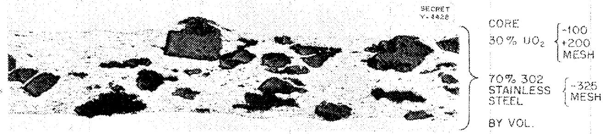  
(a)

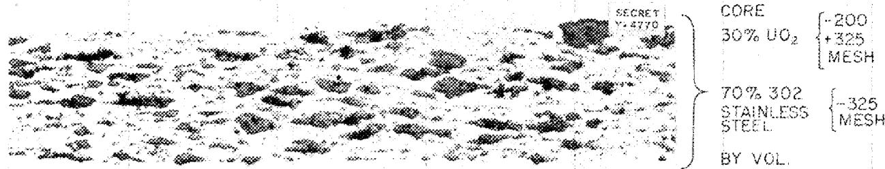

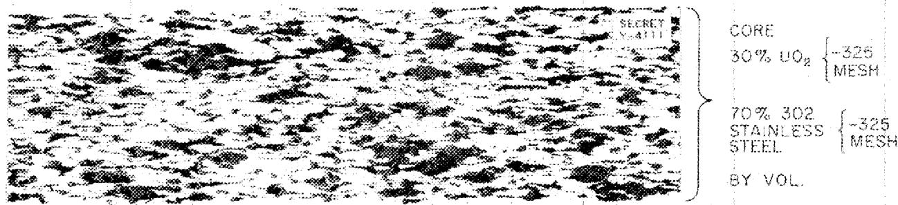  
(b)   
(c)   
Fig. 13.1 | a, b, c. Effect of $\mathbf{U}\mathbf{O}_2$ Particle Size on $\mathbf{U}\mathbf{O}_2$ Distribution. 175x.

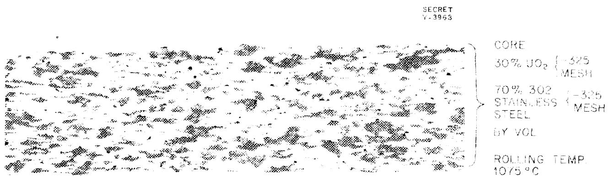

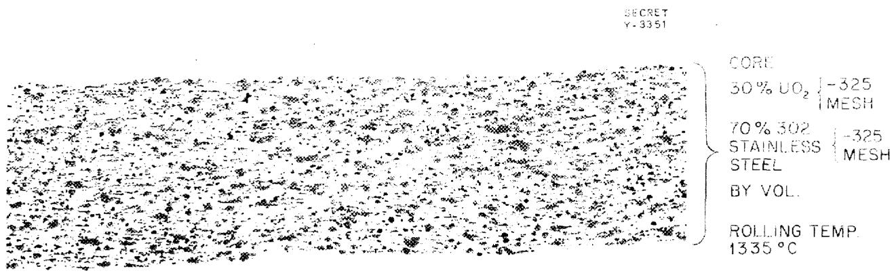  
(a)   
(b)   
Fig. 13.2 a, b. Effect of Rolling Temperature on $\mathbf{U}\mathbf{O}_2$ Distribution. 175X.

Effect of Rolling Temperature. Dependence of oxide distribution on rolling temperature is shown in Fig. 13.2. The obvious benefits of the higher temperature are somewhat offset by the deeper penetration of surface oxidation of the samples during rolling.

Effect of Elimination of Capsule. The first sample fuel plates were prepared by enclosing a stainless steel "picture frame," fuel-bearing ceramic, and cladding plates in an evacuated

capsule during hot-rolling.(1.2) This step, however, proved to be one of the more time-consuming items in the fabrication schedule. Production of fuel plates in large numbers would be facilitated by working out a schedule omitting the capsulating step.

Two samples were processed without protective capsules with results which were quite encouraging.

The first laminate was heliar-cwelded around its outer edges in a dry box containing a purified helium atmosphere. The second laminate was prepared by a combination sintering and hot-forging operation. A thin

band of stainless steel powder was painted around the outer periphery of the picture frame using Microbraz cement as a binder; cladding plates were spot welded on and the assembly sintered overnight at $1250^{\circ}\mathrm{C}$ . The sintered laminate was next hot-forged at 900 to $1000^{\circ}\mathrm{C}$ by pressing at 5 tsi. Photomicrographs of specimens taken from the samples after hot-rolling are shown in Fig. 13.3.

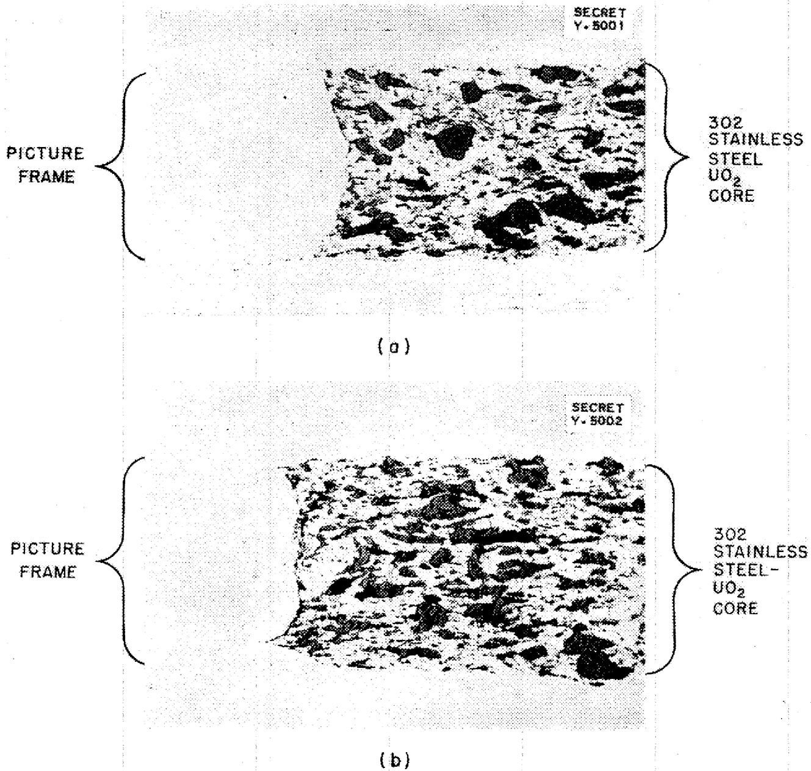  
Fig. 13.3 a, b. Effect of Elimination of Capsule on $\mathbf{U}\mathbf{O}_2$ Distribution. $150\times$

Preparation of Tubular Fuel Elements. Short segments of tubular geometry have been prepared in two ways: (1) cold-forming of flat plates into semicircles and joining with heliarc welds, and (2) "rubberstatic" pressing of fuel bearing mixtures inside a seamless cladding tube.

A series of 12 specimens was prepared, 11 by the first method and one by the second, cold-drawn at Superior Tube Company, and examined at Oak Ridge National Laboratory.

Three metal powders were used as carriers for the $\mathrm{UO}_2$ in the core 302 stainless steel, nickel, and iron. In every instance, however, the cladding was type 316 stainless steel. Metallographic examination revealed in every specimen a tendency toward a stringer type of $\mathrm{UO}_2$ distribution, varying from moderate in the iron cores to severe in the 302 cores. Cladding-to-core bonding was in most instances satisfactory after the cold-drawing. Further work will have to be done to determine conditions of drawing under which more acceptable $\mathrm{UO}_2$ distribution results. Two of these seamless-tube fuel elements formed by "rubberstatic" pressing at 40 tsi with 302 powder are shown in Fig. 13.4.

# WELDING TECHNIQUES

P. Patriarca and G. M. Slaughter  
Metalurgy Division

Cone Arc(3) Welding. Cone-arc apparatus which incorporates a fixed magnet nozzle on an inert-arc welding torch has been used with moderate success to fabricate typical inconel tube-to-header assemblies. The inconel

tubes were 0.188 in. o.d. with a 0.025-in. wall thickness. Headers were stamped from 0.0625-in.-thick inconel sheet.

Although the feasibility of tube-to-header welded construction was demonstrated by these experiments, results were somewhat inconsistent. Apparatus has been completed which incorporates a Selsyn stator as part of the magnetic inert-arc welding torch nozzle as described in a previous report.(3) It is felt that the proper control of the additional welding variables introduced by this method will improve the consistency of results.

An investigation of the effect of these parameters on the type and quality of welded tube-to-header joints will be conducted concurrently with fabrication of full-sized tube-to-header assemblies for testing by the Experimental Engineering Group.

Resistance Welding. Experiments have been conducted using available equipment which has demonstrated the feasibility of joining tube bundle straps to fuel tubes by spot welding. A typical spot weld is presented in Fig. 13.5 and shows a 0.016-in.-thick inconel strap spot-welded to an inconel tube 0.188-in. o.d., 0.025 in. wall thickness. It may be seen that penetration and soundness of the spot weld is excellent.

A preliminary investigation has been conducted to determine the feasibility of spot-welding clad fuel elements together. The fuel elements consisted of a mixture of $\mathrm{UO}_2$ and 302 stainless steel powder. A sound spot weld could be made which apparently bonded the two sheets together without any gross macroscopic movements of the powder layers. This is illustrated in Fig. 13.6.

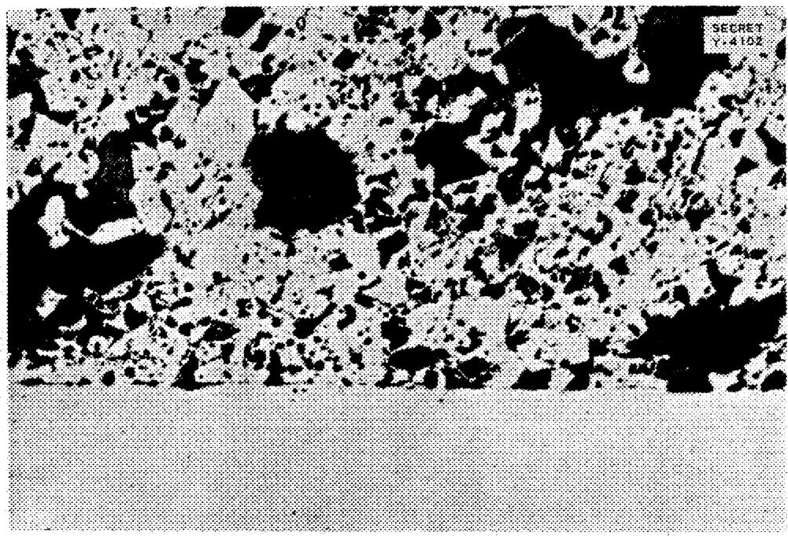  
(a)

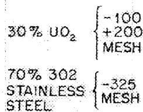  
PRESSED AT 40TSI SINTERED   
1250°C

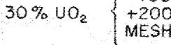  
316 TUBE   
70% 302  
STAINLESS  
STEEL

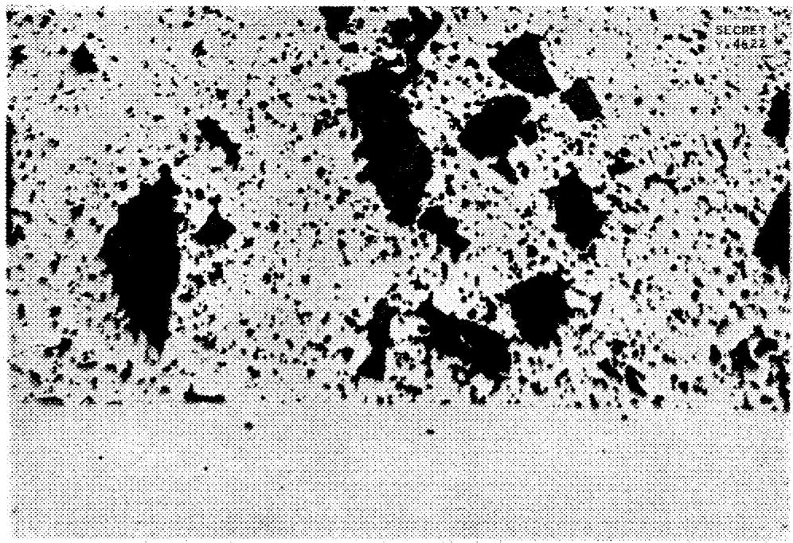  
PRESSED AT 40TSI SINTERED   
1310°C   
316 TUBE   
(b)   
Fig. 13.4. Seamless-Tube Fuel Elements Formed by "Rubberstatic" Pressing. (a) $250 \times$ . (b) $175 \times$ .

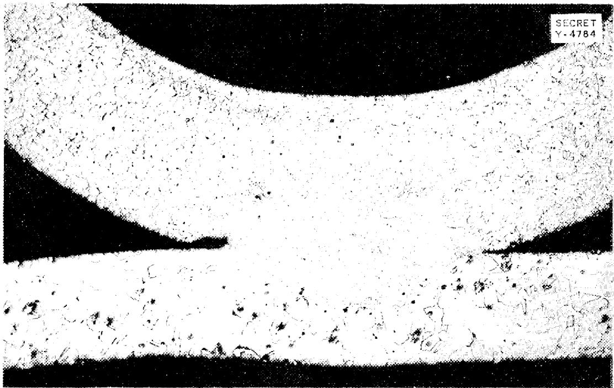

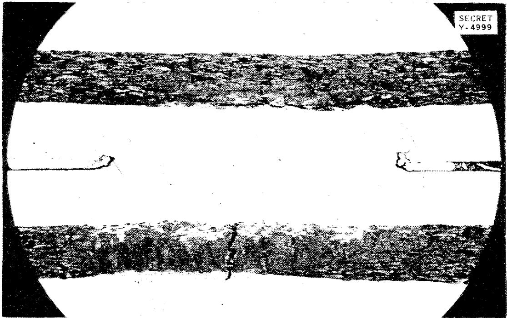  
Fig. 13.5. Transverse Section of a 0.015-in.-Thick Inconel Sheet Spot Welded to an 0.188-in.-o.d. Inconel Tube of 0.025-in. Wall Thickness. Etchant, aqua regia and glycerin. 175X.   
Fig. 13.6. Section of a Spot Weld Joining Two Stainless Steel—Clad Fuel Plates. Etchant, aqua regia and glycerin. 60X.

A 20-kva combination spot and projection welder with suitable electronic controls has been ordered for further experiments. It is expected that the production of a multitude of resistance welds with consistent results will require precise mechanical and electronic control.

# BRAZING TECHNIQUES

# P. Patriarca and G. M. Slaughter Metallurgy Division

An introductory study has been directed to the subject of furnace brazing under a controlled hydrogen atmosphere. The use of a commercial high-temperature brazing alloy (Nicrobraz) has been investigated, and the effects of some of the brazing variables have been studied. From the work to date, it appears that Nicrobrazing is an entirely feasible technique of fabricating reactor components. However, since Nicrobraz contains on the order of $4\%$ boron, the use of this brazing alloy for fabrication of reactor components is somewhat limited. Tests performed using a modified Nicrobraz in which beryllium was substituted for boron have shown little promise. The wetting properties of this modified alloy were poor. Further research is necessary to completely evaluate this approach to the problem.

Effect of Brazing Time. The influence of brazing time on Microbraz joints made in type 316 stainless steel can be seen in Fig. 13.7. The joint held for 5 min at the brazing temperature shows somewhat less diffusion of the brazing alloy into the base metal than that held at the brazing temperature for 30 min, indicating that time at temperature is not critical within these limits. A similar Microbrazed joint on 304

stainless steel was struck by a sharp hammer blow at $1500^{\circ}\mathrm{F}$ . The high-temperature ductility of the joint was excellent.

Brazing of Clad Fuel Elements. A preliminary investigation has been conducted on the brazing of clad fuel elements. From the rather limited amount of work that has been done on this subject, it seems entirely feasible that these elements can be brazed either to a stainless steel sheet or to another clad fuel element. Figure 13.8 shows a clad fuel element. Microbrazed to a stainless steel sheet. As can be seen, the brazing alloy wets the stainless steel very well and apparently has little tendency to float any of the fuel powders to the surface. A Microbrazed edge-to-edge joint of two clad fuel elements was formed, and, although stainless steel in this case is also wet very well by the brazing alloy, the powder appeared to be recessed in each sheet. This probably resulted from the preliminary grinding operation, since no brazing alloy was observed in the recessed area and the powder did not appear to be contaminated by the brazing alloy.

Nickel-Palladium Brazing Alloy. In another attempt to find a brazing alloy with a more favorable nuclear cross-section, consideration has been given to the nickel-palladium system with minor additions of silicon for melting point control. Figure 13.9 is a photomicrograph of an inconel tube-to-header joint using $40\%$ nickel- $60\%$ palladium alloy brazed at $1270^{\circ}\mathrm{C}$ in dry hydrogen for 20 min. As can be seen, the flow characteristics and wetting properties are apparently good. Room temperature tube-to-header tensile strengths were of the order of 80,000 psi. Further consideration will be given this alloy system pending results of corrosion tests being conducted in molten coolants and fuels.

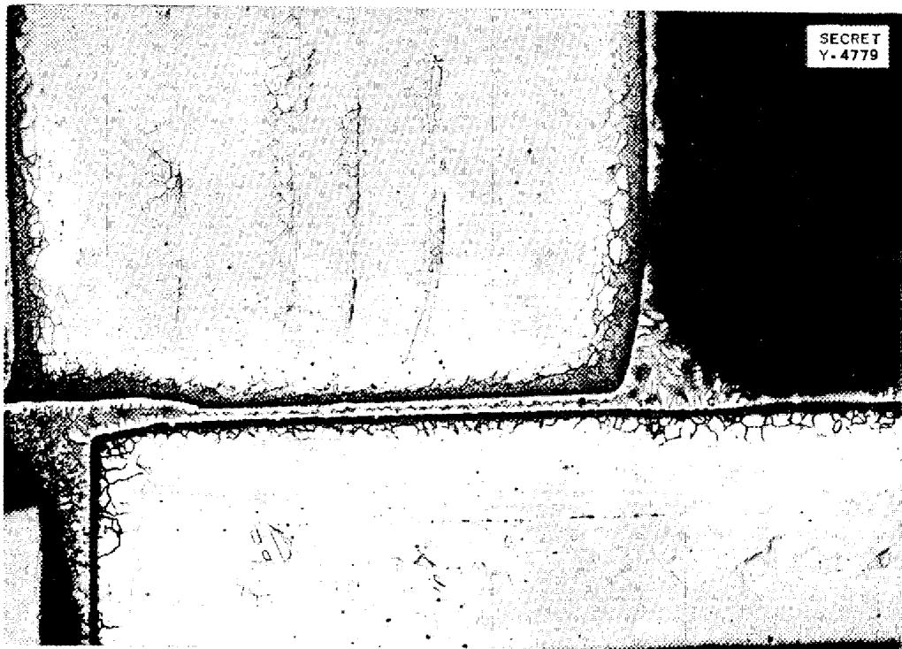  
(a)

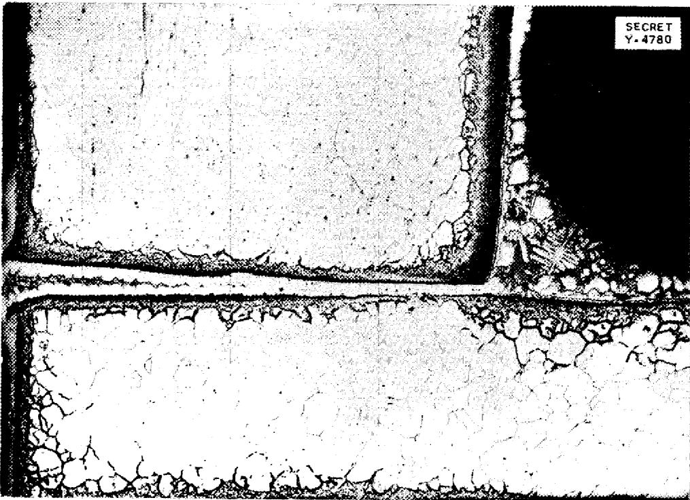  
(b)   
Fig. 13.7. Longitudinal Sections of a Type 316 Stainless Steel Tube-to-Header Joint Microbrazed at $1120^{\circ}C$ in a Dry Hydrogen Atmosphere. Etchant, aqua regia and glycerin. 75X. (a) Microbrazed for 5 min. (b) Microbrazed for 30 min.

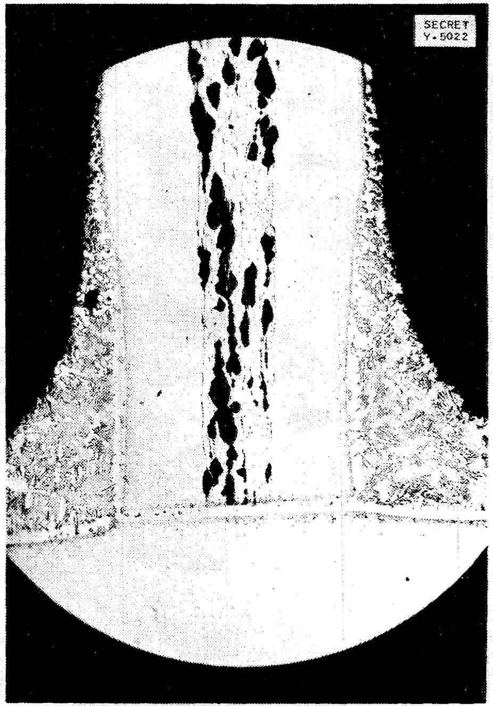  
Fig. 13.8. Transverse Section of a Stainless Steel—Clad Fuel-Element Butt Microbrazed to a Stainless Steel Sheet. Etchant, none. 40X.

# CREEP AND STRESS RUCTURE OF METALS

R.B.Oliver G.M.Adamson C.W.Weaver Metallurgy Division

The laboratories for creep and stress-rupture tests and for the

testing of metals immersed in liquid media are essentially complete. Extension measurements in the former have been modified for greater accuracy and recalibrated. A stress-rupture curve has been obtained for both "coarse" and "fine" grained inconel at

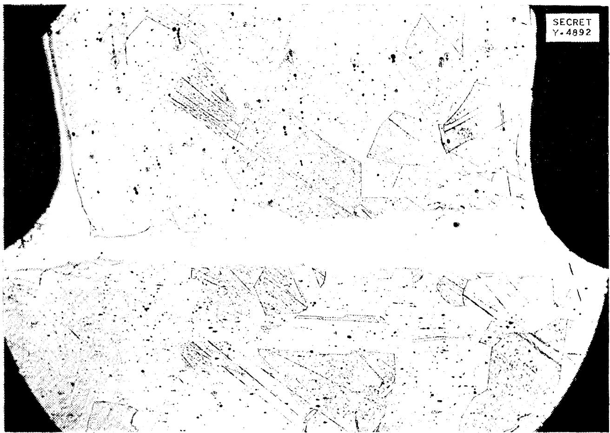  
Fig. 13.9. Transverse Section of an Inconel Tube-to-Header Joint Brazed with a $60\%$ Pd - $40\%$ Ni Alloy in Dry Hydrogen at $1270^{\circ}\mathrm{C}$ for 20 min. Etchant, aqua regia and glycerin. $75\times$ .

$815^{\circ}C$ Several elongation curves were obtained for a variety of heat-treated nickel Z (Duranickel) specimens.

Operation of Creep and Stress-Rupture Equipment. The creep and stress-rupture testing laboratory was placed in operation without having been properly instrumented in order to train technicians and to avoid the delay associated with the development of an extension-measuring system. During the past quarter it was necessary to revise the existing measuring system as it showed the creep of the entire specimen, the threaded con

nections, and pull rods, and the seating of the knife edges of the lever arm, as well as the differential expansion of the entire assembly and an effect from the sealing bellows.

The extension is now measured by attaching a scribed platinum strip extensometer across the gage length of the specimen. Marks are selected on the center strip, and either of the side strips and the distances between the pairs of marks are measured with a micrometer microscope having a least scale division of 0.00005 in. The Instrument Development Group has built

and is testing a recording extensometer designed around a motor-driven micrometer screw. This system was selected because it has an optimum combination of range, sensitivity, and stability.

The loading of all machines was checked with a 65-mil sheet specimen on which were mounted two SR-4 strain gages connected in series. This standard specimen in turn was calibrated on the Baldwin tensile-testing machine using a Baldwin type L strain indicator.

The effective area of the bellows was evaluated by enclosing the cali-

brated specimen in the furnace chamber; then at several pull-rod loads the change in specimen load was observed for vacuum and several positive pressures. The area so measured averaged 3.47 in.²; for example, under vacuum the bellows delivers a compressive load of 51 lb.

Creep-Rupture Tests of Inconel. Seventeen creep-rupture tests on inconel sheet have been run or are in process. These tests were made at $815^{\circ}\mathrm{C}$ in an argon atmosphere. Figure 13.10 is a plot of the logarithm of stress vs. the logarithm of rupture time. The percentage figures placed

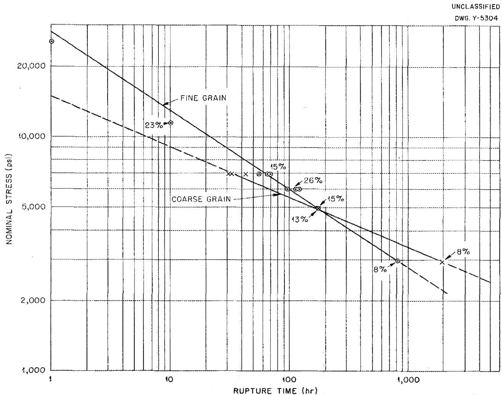  
Fig. 13.10. Stress-Rupture Time for Inconel Sheet.

on the chart are the elongations determined from measurement of the specimens before and after testing. One set of points relates the stresses and rupture times for specimens from the annealed sheet and is indicated as fine grained. The other set of points refers to specimens that were heated to $2050^{\circ}\mathrm{F}$ for 1 hr and air cooled prior to testing; this curve is designated as coarse grained. These grains were about 16 times larger than the grains in the annealed sheet.

Creep of Nickel Z. Five tests were conducted on Nickel Z (Duranickel) sheet; the elongation-vs.-time curves are presented in Fig. 13.11. The elongations indicated were measured with a dial gage on the pull rod and hence include errors from several sources. These tests were conducted at $815^{\circ}\mathrm{C}$ in argon atmosphere, and, as indicated, several of the specimens

were in the cold-rolled temper and others were quenched and aged. It is interesting to note that the effect of heat treatment is retained at the testing temperature.

Stress-Rupture Tests. Lack of adequate stress-rupture data for materials at elevated temperatures under nonoxidizing conditions has required conducting tests to provide this information. Values obtained in this laboratory in molten sodium, fluorides, and other materials will be compared with those obtained elsewhere in vacuum and inert atmospheres. Because many of the stresses found in reactor auxiliary systems are hoop stresses, these were the first type to be investigated. Test specimens were prepared by machining tube samples to desired thicknesses over a 2-in. section, welding one end closed, applying helium pressure inside the tube, and then immersing the tube in a

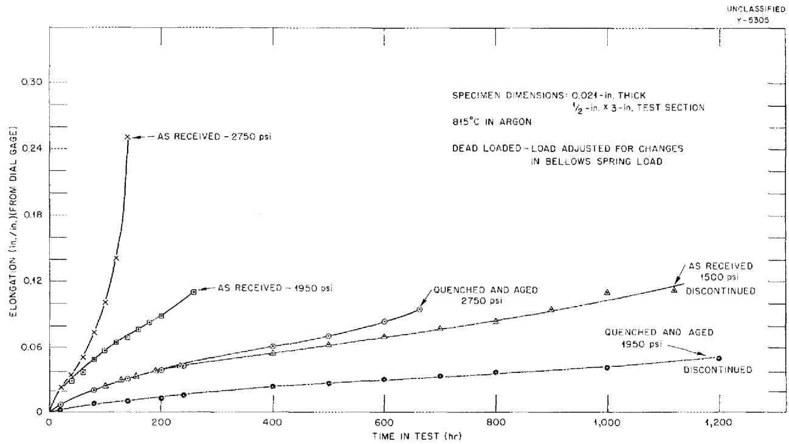  
Fig. 13.11. Time-Elongation Curve for Nickel Z.

bath of molten material for 1000 hr or until it ruptured.

Two tubes of type 316 stainless steel lasted 1000 hr in $1500^{\circ}$ F sodium with hoop stresses of 1900 and 2600 psi, respectively. Examination revealed little or no stress corrosion or attack on either specimen. On the other hand, two inconel samples stressed at approximately 1500 psi failed in less than 1000 hr, these failures apparently resulting from intergranular attack inside the tube rather than from exterior sodium attack. An inconel sample was later prepared from a new lot of seamless tubing and stressed to 1200 psi in sodium; it failed in 465 hr through a small area which seemed to be high in impurities. Again, the rupture was due to interior attack although exterior attack up to 0.003 in. deep was noted.

As a supplement to the above tests a program for determining stress-rupture values by applying a dead load to flat thin (0.020-in.) plates of test materials immersed in sodium is being carried out. Approximate values obtained for inconel stressed at 13,000 and 10,000 psi and for type 316 stainless steel stressed at 7000 psi indicate that sodium at $1500^{\circ}\mathrm{F}$ has no marked effect.

Both the tube-burst and stress-rupture machines are undergoing modification to permit use of molten fluorides as bath materials.

# CERAMIC LABORATORY

# T. N. McVay, Consultant Metallurgy Division

Active work in placing the laboratory in operation was started in August and

is now practically complete. Preliminary work on protective coatings for the radiator of the ARE has been initiated at Ohio State University, Laboratory facilities for carrying on this work at ORNL are now virtually complete.

Since $\mathrm{Cr - UO_2}$ cermets are being considered for fuel elements, equipment for processing and testing cermets is being designed and should be in operation within four months. Some work has been done on the hot pressing of alumina, and it is planned to proceed with a study of a $\mathrm{Al}_{2}\mathrm{O}_{3} - \mathrm{UO}_{2}$ material for fuel elements.

Equipment. A vacuum dilatometer and a Smith vacuum furnace for phase studies has been completed, and the dilatometer is in operation. Work has started on a vacuum induction furnace, and apparatus for tensile strength tests at high temperatures has been ordered. Equipment for the hydrostatic pressing of ceramic bodies; a high temperature X-ray camera, a molybdenum wound tube furnace, and specific heat and conductivity equipment are in the design stages.

Subcontract Work. A working agreement has been negotiated between Carbide and Carbon Chemicals Company and the Electrotechnical Laboratory of the U. S. Bureau of Mines, and work on beryllia crucibles and other special refractory shapes has started.

Thomas Shevlin, of the Ohio State Engineering Experiment Station, is working on Ni-BeO cermets for valve seats to hold liquid metals. Also, hot-pressed beryllia is available at the Experiment Station for various refractory shapes including valve parts.

# 14. RADIATION DAMAGE

D. S. Billington, Physics of Solids Institute

A. J. Miller, Research Director's Division

Studies have continued on the effects of radiation on the physical and chemical stability of the constituents of the airplane reactor. Considerable data have been obtained from experiments in the X-10 graphite pile, and emphasis has shifted to preliminary experiments in the higher flux LITR facility. In all phases of the work preparations are being made for further experimentation in the LITR and tests in the MTR. Additional radiation damage experiments have been carried out with the Y-12 and Berkeley cyclotrons.

The work has been concerned to a large extent with the stability of the fused fluoride salt mixture (NaF-KF-UF $_4$ , 46.5-26-27.5 mole %) proposed as fuel for the sodium-cooled reactor. In the X pile a series of runs was made in which approximately 65 watts was dissipated for 450 hr in each cubic centimeter of U $^{235}$ -enriched fuel. With the Y-12 cyclotron energy dissipations up to 415 watts/cm $^3$ for 1 hr were achieved with 20-Mev protons. In both cases no evidence of radiation damage was observed. Some radiation damage appeared to take place in the single preliminary experiment made in the LITR at about 1000 watts for 115 hr, but a more exacting control run and additional experiments are necessary before a conclusion can be reached in the matter.

The low uranium content of the fused fluorides proposed for use in the circulating-fuel reactor would reduce the power production during pile irradiation by a factor of 15 or 20. In this case only in the MTR and cyclotron can power dissipations of aircraft reactor intensity, about

3000 watts/cm³, be achieved. Preparations for experiments with circulating type fuels and materials with related compositions are underway.

Additional information on the fuel stability studies and information from experiments on fused KOH stability, thermal conductivity of metals, and creep are contained in the following sections of this report. Complete details on all radiation-damage studies are contained in the Physics of Solids Institute quarterly report for period ending October 31, 1951.

# IRRADIATION OF FUSED MATERIALS

# G. W. Keilholtz, Materials Chemistry Division

The effects of radiation on the stability of the fused fluorides and on fused KOH have been under investigation using the X pile, the Y-12 cyclotron, and the LITER. In experiments with fused fluorides in inconel at 1470 to $1500^{\circ}\mathrm{F}$ no evidence of radiation damage was found in the X-pile or cyclotron run. Some evidence of what appears to be radiation damage was found in the single preliminary LITER experiment, which still requires control and check runs. Data from the single experiment on escape of xenon from the melt was inconclusive. Pressure build-up measurements on capsules of fused KOH in the X pile and LITER indicated no instability to radiation.

Pile Irradiation of Fuel and KOh Capsules (J.G.Morgan,H.E.Robertson, C.C.Webster,P.R.Klein,and B. Kinyon,Physics of Solids Institute). For reasons of safety,capsules containing the fused materials were first

checked in the pile for pressure evolution at low fluxes, and then at higher fluxes. The capsules were pressurized with helium and the pressures were continuously measured by means of a strain gage to an accuracy of $\pm 0.5$ psi. The standard NaF-KF-UF $_4$ fuel and KOH were tested as shown in Table 14.1 with no evidence of pressure increases due to irradiation.

When pressure tests on the fused fluoride mixture were completed in the X pile, $0.5\mathrm{g}$ samples of the material enriched in $\mathbf{U}^{235}$ were subjected to a thermal flux of $10^{12}$ at $1472^{\circ}\mathrm{F}$ wall temperature in sealed inconel capsules. After several preliminary tests, five capsules of 0.223 i.d. were irradiated for 300 to 450 hr at $1472^{\circ}\mathrm{F}$ and one at pile ambient temperature. Chemical and metallographic analyses, which are mostly completed, have showed no increase of iron, chromium, or nickel in the fuel, decomposition of the fuel, or observable effect on the inconel as compared to bench tests. The capsule in Table 14.l, which was used in the LITR pressure test, with a power dissipation of about 1000 watts/cm³, showed increased damage in all three

respects. However, a control sample prepared simultaneously is yet to be bench-tested and examined.

In order to determine if xenon is evolved from the fluoride melt under irradiation, the following experiment was conducted. A sample of enriched uranium metal was placed in a flux of $10^{12}$ neutrons/cm² and irradiated for the same length of time as a sealed microcapsule of melted salt. Both were removed and the microcapsule was opened. When they were counted, no significant difference between the two was noted, which seemed to indicate that the xenon formed did not escape from the melt. This test is not considered conclusive and a more significant experiment is planned.

Cyclotron Irradiation of Fuel and KOH Capsules (W. J. Sturm and M. J. Feldman, Physics of Solids Institute; R. J. Jones, J. S. Luce, and C. L. Viar, Electromagnetic Research Division). Sixteen inconel pins, 0.052 and 0.100 in. i.d., containing the standard fuel were bombarded with 20-Mev protons. Thermocouples on the irradiated surface of the pins indicated average run temperatures between

Table 14.1   
Tests on Standard NaF-KF-UF and KOH   

<table><tr><td rowspan="2">MATERIAL</td><td rowspan="2">MATERIAL WEIGHT (g)</td><td rowspan="2">CAPSULE MATERIAL</td><td colspan="2">FREE SPACE</td><td rowspan="2">MATERIAL TEMP. (°F)</td><td rowspan="2">PILE</td><td rowspan="2">APPROXIMATE THERMAL FLUX (n/cm2·sec)</td><td rowspan="2">TIME (hr)</td></tr><tr><td>CAPSULE (cm3)</td><td>TOTAL (cm3)</td></tr><tr><td>Fuel</td><td></td><td></td><td></td><td></td><td></td><td></td><td></td><td></td></tr><tr><td>Normal uranium</td><td>10</td><td>Inconel</td><td>6</td><td>17</td><td>200-1472</td><td>X pile</td><td>8.5 × 1011</td><td>12</td></tr><tr><td>93.4% U235</td><td>10</td><td>Inconel</td><td>6</td><td>17</td><td>1472-1560</td><td>X pile</td><td>8.5 × 1011</td><td>170</td></tr><tr><td rowspan="3">KOH</td><td>0.5</td><td>Inconel</td><td>2</td><td>13</td><td>1370-1500</td><td>LITR</td><td>1.6 × 1013</td><td>116</td></tr><tr><td>5</td><td>316 Stain-less steel</td><td>6</td><td>17</td><td>805</td><td>X pile</td><td>8.5 × 1011</td><td>16</td></tr><tr><td>3</td><td>Inconel</td><td>3</td><td>13</td><td>805</td><td>LITR</td><td>1.6 × 1013</td><td>68</td></tr></table>

1200 and $1475^{\circ}\mathrm{F}$ . Pins irradiated with low beam currents were usually radiation-cooled, while those irradiated with high currents were attached to a cold-water coil. In the case of the water-cooled pins there was probably a layer of solid fuel at the water-cooled face. Five of the inconel cases melted owing to local overheating, which probably occurred in all pins to some extent. Energy dissipations between 30 and 415 watts per cubic centimeter of fuel were achieved in various runs, usually of 1 hr duration. Analyses of the fuel and metallographic examinations of the capsules indicated no radiation-induced damage when comparison was made with the results from eight bench-tested controls. Several irradiations by deuterons of fuel in inconel containers have been made by the North American Aviation group with the Berkeley 60-in. cyclotron. The results are being analyzed.

Stainless steel pins containing fused KOH have been irradiated with protons, and analyses of the results are in progress. Capsules containing dilute circulating type fuel are being prepared.

# IN-PILE CIRCULATING LOOPS

0. Sisman

W. E. Brundage

W. W. Parkinson

R. M. Carroll

A. S. Olson

C. D. Baumann

C. Ellis

Physics of Solids Institute

The general results of circulating lithium at $1000^{\circ}\mathrm{F}$ through hole 58N of the X pile were reported last quarter. (1) A detailed metallographic

examination now has been made of various sections of the 316 stainless steel loop. No evidence was found of increased intergranular penetration or other damage due to radiation.

An inconel loop for circulating sodium in the X pile at $1500^{\circ}\mathrm{F}$ has been designed and partially constructed. Design of equipment is nearing completion for stress corrosion and creep tests on inconel in circulating sodium at $1500^{\circ}\mathrm{F}$ in the LITR.

# CREEP UNDER IRRADIATION

J.C.Wilson J.C.Zukas W.W.Davis

Physics of Solids Institute

Work during last quarter(2) on cantilever creep showed that X-pile radiation at a flux of $4 \times 10^{10}$ fast neutrons/cm² caused an increase in total creep strain of about 20% in 347 stainless steel after about 250 hr of exposure, the duration of the tests. Extrapolation of the bench and in-pile curves to longer times indicated that the difference between them increased with time. The first of the current tests should supplement the above observations. The time has been extended to 500 hr under the same conditions (1500°F at 1500 psi), but, because the expected beam deflection would exceed the range of the microformer, the transducer has been omitted and fiducial marks on the loading beam and baseplate will permit measurement of the total extension after the experiment has been withdrawn from the reactor. The deflection will then be compared with that observed in a bench test at the same

temperature and stress levels. The irradiation has been completed, and the activity of the apparatus is being permitted to decay to a safe level for handling. Metallographic and X-ray comparison of bench and irradiated samples will be made.

A second test is still in the pile. It was stressed to 8.000 psi and for its first 500 hr has been operating at $1200^{\circ}\mathrm{F}$ . The temperature will be subsequently raised in steps to observe the temperature dependence of strain rate under irradiation for comparison with a companion bench test. Preparations for tensile type tests and for experiments in the LITR and MTR are in progress.

# RADIATION EFFECTS ON THERMAL CONDUCTIVITY

A. Foner Cohen, Physics of Solids Institute

In a preliminary relative thermal conductivity experiment on inconel, reported last quarter, (3) a large decrease in thermal conductivity was observed upon three days of irradiation at approximately $825^{\circ}\mathrm{C}$ in the X pile. To check this result, a carefully heat-treated inconel specimen has been irradiated at 575 and $250^{\circ}\mathrm{C}$ with no apparent effects due to the radiation. Testing at $825^{\circ}\mathrm{C}$ is in progress.

In addition to the above experiment, an absolute measurement of the thermal conductivity of a 316 stainless steel specimen at 100 to $200^{\circ}\mathrm{C}$ is being carried out in the LITR.

Part IV

APPENDIXES

# SUMMARY AND INTRODUCTION

The survey of the supercritical-water reactor by the Oak Ridge National Laboratory's subcontractor Nuclear Developments Associates, Inc., is essentially complete and has confirmed the feasibility of aircraft nuclear propulsion using that reactor. Although ORNL will not further pursue this reactor cycle because of the prevailing belief in the greater potentialities of low-pressure liquid-coolant reactors, NDA will continue its work, together with Pratt and Whitney, under direct AEC contract. The new results in the NDA survey of the cycle for ORNL are outlined in Sec. 15, together with a brief cycle analysis that was undertaken at ORNL.

A large analytical chemistry program is required to support the materials research program now being undertaken by the ANP project. This includes not only routine service analysis - 688 individual samples were analyzed during the past quarter - but in many cases the development of new analytical procedures. This development, as reported in Sec. 16, is largely concerned with the determination of oxygen in gases and fused mixtures and similar studies of hydroxides and fluorides.

The "List of Reports Issued," Sec. 17, includes seven laboratory reports and 39 informal documents on all phases of the ANP project.

A directory of the research projects of the Aircraft Nuclear Propulsion Project of the Oak Ridge National Laboratory is given in Sec. 18. The research projects of the Laboratory's subcontractors to its ANP project are listed, as well as the research now in progress at the Laboratory. In addition, such research as is being performed by ORNL for the ANP programs of other organizations is included and marked as such.

A chart of the technical organization of the Aircraft Nuclear Propulsion Project at ORNL is included (Sec. 19) to identify the personnel and emphasis associated with the various phases of the project. There are now about 285 scientific and technical people employed on the project and about 26 active consultants. Although contractual changes at the start of this fiscal year shifted several former Laboratory subcontractors to the AEC, there are, in all, seven allied laboratories performing research for the ANP project, where ORNL has either the direct contract or technical supervision.

# 15. SUPERCRITICAL-WATER REACTOR

For the past year (see p. iv for list of previous reports) Nuclear Development Associates have been studying the supercritical-water reactor first proposed in Wash-24.(1) A first survey analysis by NDA is essentially complete and a final report is being written. This report, when issued, will complete the subcontract work by NDA for ORNL on the supercritical-water reactor. NDA will, however, continue its work in this field under subcontract with Pratt and Whitney Aircraft Division.

In addition to the above-mentioned survey of the supercritical-water reactor, an analysis of the cycle was undertaken at ORNL. This analysis, which will also soon be issued as a separate report, is summarized below.

# ANALYSIS OF SUPERCRITICAL WATER REACTOR BY NDA

The only new results since the last quarterly report pertaining to the supercritical-water reactor system are in the control aspects. The reactor has been shown to be stable for small oscillations, and a start-up technique has been outlined in which the control mechanism is derived from change of water density in the reactor.

Stability. A calculation has been carried out $^{(2)}$ on the stability of the design point reactor (400,000 kw, 2.5-ft square cylinder core, flux flat radially) connected between constant-pressure reservoirs. The system was studied with equilibrium xenon concentration. Under the assumptions made, the stabilizing density effects

on reactivity were found to compensate the unstabilizing effect of the xenon; the reactor is stable for small oscillations. The longest two decay periods were calculated as 5.9 min and 22 sec.

The response to a sudden step-function increase in reactivity is such as to cause the power level to overshoot its equilibrium increase by a factor of 10. When the reactivity is raised linearly during an interval of 2 sec, the overshoot is by a factor of 2; when 10 sec is taken to accomplish the linear reactivity increase, there is no overshoot.

Start-up. The start-up problem has been considered in a preliminary way with the reactor connected to a simple heat-exchanger external system and with no control mechanism other than that afforded by changes of water density in the machine.

The envisaged start-up procedure is as follows: (1) Fill the system with high-temperature high-pressure water whose density is too low to make the machine reactive; (2) keeping the system at constant pressure, circulate and slowly cool the water; the cooling rate is adjusted (3) so as to bring the reactor power safely up to some fraction (say, $3\%$ ) of rated output, the circulation rate being large enough so that the water density is still substantially uniform throughout the reactor; (3) adjust the cooling rate so as to hold the reactor power constant at this $3\%$ level, and slowly reduce the circulation rates through the moderator chamber and fuel tubes, while the density variation along the fuel tubes builds up to the normal operating pattern.

Questions concerning the external equipment called for and how and when the reactor can be switched to connect to the power plant system have not been investigated.

# ANALYSIS OF SUPERCRITICAL-WATER REACTOR BY ORNL

One of the most widely advocated methods of utilizing the supercritical-water reactor for aircraft nuclear propulsion is to use the compressor-jet propulsion cycle. A brief study of this fundamental cycle to discover the relations existing among the various parameters involved is described.

Compressor-Jet Cycle. In this cycle energy is added to the airstream in a low compression ratio blower and then in a radiator. The supercritical steam from the reactor expands through a turbine which operates the airblower and the water-return pump. The turbine exhaust steam is then condensed, and it transfers its heat of vaporization to the airstream flowing through the radiator.

The particular parameters that have been considered — condenser air-inlet face area, condenser weight, and airflow rate — were evaluated per pound of thrust in terms of the temperature and pressure of the steam leaving the reactor and the condenser pressure. This was accomplished for flight at 45,000 ft altitude at Mach numbers of 0.9 and 1.5.

Reasonable values were assumed for component efficiencies and actual test data used for the condenser performance. The results should give attainable performance of the fundamental cycle at the two design points investigated. Somewhat better performance can probably be obtained through a program of optimization of the cycle and equipment. However, the data presented here should give per

formance not far from the optimum, and hence should be useful for preliminary design studies of the system.

Results. The results of this investigation indicate that for reactor outlet steam conditions ranging from 1000 to $1500^{\circ}\mathrm{F}$ and pressures from 5000 to 10,000 psi, the following statements can be made:

1. The specific impulse is low in all cases (from 15 to 20 lb per pound of air per second at a flight Mach No. of 0.9 and from 9 to 14 lb per pound of air per second at a flight Mach No. of 1.5).   
2. Increasing the reactor outlet steam temperature or pressure or condenser pressure effects some improvement in all cases and in all parameters considered, i.e., specific impulse, specific heat consumption, and specific radiator weight and frontal area.   
3. Increasing steam condenser pressures above 400 psi gives relatively little improvement in performance.   
4. Increasing the reactor steam outlet pressures from 5000 to 10,000 psi gives relatively little improvement in performance.   
5. Cycle performance is insensitive to the relative amounts of energy put into the air by the turbine-compressor and by the condenser.

In general, the obvious advantages of this cycle are the use of water, a familiar and fairly noncorrosive substance, for both coolant and moderator. The disadvantages include an inherently low specific impulse and the necessity of developing an entirely new type of aircraft engine.

# 16. ANALYTICAL CHEMISTRY

C. D. Susano, Analytical Chemistry Division

Since the use of diatomaceous earth as an insulating agent in the aircraft reactor is being contemplated, studies are presently being made of the composition of these materials with particular attention to elements of high neutron-capture cross-section, of which boron and the rare earths are the most important. Preliminary results on two samples of diatomaceous earth indicate that these materials may contain several hundred parts per million of boron, which is higher than can be tolerated.

It has been necessary to develop or adapt methods for the determination of metallic nickel, nickel oxide (NiO), and available oxygen in alkali hydroxide melts in connection with tests in which these hydroxides are circulated through nickel loops at $1400^{\circ}\mathrm{F}$ . These methods appear to be satisfactory with the exception that, if the nickel occurs in a massive crystalline form, difficulty is encountered in separating it completely from the oxide.

As a part of the corrosion test program for the evaluation of fluoride eutectic coolants, methods are under study for the determination of iron, nickel, chromium, molybdenum, and copper in these materials. Methods for the precise determination of the major constituents are also under consideration. A study of the pH values of aqueous solutions of one of the alkali fluoride eutectics and its components is reported.

Tests were made to determine whether or not alkali and alkaline earth hydroxide melts could be removed from metal tubes by dissolution in water without appreciable corrosion of the container material during the dissolution step. Monel, inconel, nickel,

and stainless steels 316 and 347 were attacked to only a negligible degree and copper was corroded only slightly more.

The development of two methods for the determination of uranium trifluoride has been completed. It appears that the method involving measurement of the hydrogen evolved on reaction of of the $\mathrm{UF}_3$ with acid is more precise than the method which depends upon the total oxidizing power of the sample. Although some additional work remains to be done, it appears that oxygen can be determined in sodium-potassium alloy (NaK) by a modification of the $n$ -butyl bromide method for the determination of oxygen in sodium.

A survey of the results obtained in the determination of oxygen in tanks of Bureau of Mines helium is presented. Approximately $85\%$ of the cylinders tested contained less than 25 ppm of oxygen and were, therefore, acceptable for use by the ANP Experimental Engineering Group.

Tests are being made for the purpose of producing a borated water solution (1% boron) at minimum cost which will retain its clarity in contact with concrete, inconel, and iron.

Summaries of the service analysis work, which indicate the distribution with respect to sample type and groups originating the samples, are presented.

# STUDIES OF DIATOMACEOUS EARTH

# J. C. White and W. J. Ross Analytical Chemistry Division

The use of diatomaceous earth as an insulating agent in the aircraft

reactor is contemplated, and studies are being made of the composition of these materials with particular attention to elements of high cross-section for thermal-neutron capture, chiefly boron and the rare earths.

Diatomaceous earth, which consists almost entirely of the siliceous skeletons of minute marine animals, is composed essentially of $\mathrm{SiO}_2$ but may vary significantly in minor and trace constituents. An effort is being made to find an infusorial earth of suitably low boron content (less than 10 ppm).

Spectrographic analysis of two types has been completed to date: one, a type used primarily as a paint pigment, showed 600 ppm of boron and no detectable rare earths; the second, a "fresh-water" earth with the tradename "Sil-o-cel," showed 300 ppm of boron and no detectable rare earths. Since these concentrations are higher than can be tolerated, the possibility of reducing the boron content of these materials by washing with hydrochloric acid and other solutions is under investigation.

A new method for the determination of boron is under study. This method depends upon the color complex between boron and $1,1^{\prime}$ -dianthrimide which is formed in sulfuric acid in aqueous medium. Preliminary tests indicate that the method is extremely sensitive $(0.01\mu g$ of boron per milliliter).

# DETERMINATION OF Ni, NiO, AND 0 IN ALKALI HYDROXIDES

J. C. White

Analytical Chemistry Division

A series of tests has been conducted in which lithium, sodium, and potassium

hydroxides were circulated through nickel loops at $1400^{\circ}\mathrm{F}$ . The loops were operated for various periods, ranging from 51 hr for KOH to roughly 300 hr for LiOH, before the runs were terminated because of the formation of plugs. The loops were X-rayed in order to determine the location of the plugs, cut in sections, and submitted for both chemical and metallographic examination. Some development effort was necessary to arrive at suitable methods for the determination of nickel, nickel oxide, and available oxygen in these plugs.

Available Oxygen. A method similar to that employed for the determination of available oxygen in lead peroxide is used in this case. The amount of iodine liberated from an acidic iodide solution is titrated with standard sodium thiosulfate. In only one case was an appreciable amount of available oxygen found in the samples submitted.

Metallic Nickel. Since the plugs were formed from large, lustrous nickel dendrites, metallic nickel was determined directly. Samples from other sections of the loops were characterized by the presence of much more finely divided nickel, and in these cases the displacement technique was applicable. This method depends upon the displacement from solution of a metal lower than nickel in the electromotive series. The excess of the added $5\%$ copper sulfate reagent can be determined and is a measure of the amount of metallic nickel originally present.

Nickel Oxide. Work is underway to separate nickel and nickel oxide when the metal exists largely in a massive crystalline form. The use of iodine to convert the metal to $\mathrm{NiI}_2$ will be investigated. In samples in which the nickel is more finely divided, the oxide is separated out by filtering the insoluble nickel oxide and copper metal from the solution used for the

determination of nickel by the displacement method. The residue is digested with acid, and the nickel is determined by the dimethylglyoxime precipitation.

Studies of the higher oxides of nickel are being made in an attempt to gain an understanding of the reactions which are taking place in the molten hydroxides under the conditions of these tests.

# STUDIES OF TERNARY ALKALI FLUORIDE EUTECTIC

J. C. White Analytical Chemistry Division

A proposed coolant for the ARE reactor is the ternary alkali fluoride eutectic composed of $11.7\%$ sodium fluoride, $59.1\%$ potassium fluoride, and $29.2\%$ lithium fluoride by weight. This eutectic melts at $450^{\circ}\mathrm{C}$ . Work on this eutectic is confined at present to study of the pH of aqueous solutions of the eutectic and its components, of the composition of the eutectic, and analysis of the eutectic for metallic impurities.

pH of Aqueous Solutions of Alkali Fluorides. The alkali fluorides will hydrolize completely at temperatures

Table 16.1   
pH Values of Aqueous Solutions of Certain Alkali Fluorides at $25^{\circ}\mathrm{C}$   

<table><tr><td>SALT</td><td>MOLAR CONCENTRATION</td><td>pH</td></tr><tr><td>LiF</td><td>0.05</td><td>5.3-5.4</td></tr><tr><td>LiF (fused)</td><td>0.05</td><td>8.3-8.4</td></tr><tr><td>NaF</td><td>1.0</td><td>7.2-7.3</td></tr><tr><td>NaF (fused)</td><td>1.0</td><td>8.9</td></tr><tr><td>KF</td><td>7.95</td><td>9.2</td></tr><tr><td>KF (fused)</td><td>7.95</td><td>9.9</td></tr></table>

around $1000^{\circ}\mathrm{C}$ but not significantly at room temperature. Hence, a determination of the $\mathsf{pH}$ of an aqueous solution of the cooled fused salt at room temperature will indicate the degree of hydrolysis which has taken place at the high temperature required for fusion (pyrohydrolysis) and is a measure of the moisture present at these temperatures. Table 16.1 shows typical values for the higher $\mathsf{pH}$ of the fused salts as compared to comparable concentrations of unheated c.p. reagent grade salts. The following comments may be made:

1. The increase in basicity on fusion is very likely a consequence of pyrohydrolysis, the water being already present in the salt. Potassium hydroxide, despite its hygroscopic nature, appeared more stable to pyrohydrolysis than the other alkali metal fluorides. Aqueous solutions of this fluoride are more basic, however, than solutions of either sodium or lithium fluoride.   
2. The alkali fluorides may be classified as salts of strong bases and fairly weak acids (the ionization constant of hydrofluoric acid is $7.7 \times 10^{-4}$ ), so that aqueous solutions of these salts should be slightly basic. However, aqueous lithium fluoride tested acidic and sodium fluoride nearly neutral. This is believed due to the presence of some free hydrofluoric acid or acid fluoride salt in the reagent.   
3. pH is relatively independent of concentration except possibly in the case of unfused anhydrous potassium fluoride, the reason for this is under current investigation.

The pH of a saturated solution of the eutectic, determined from three

lots prepared in various container materials, was 9.8, roughly that of a solution of fused potassium fluoride. A fourth lot, prepared using hydrated potassium salt dried overnight under vacuum, had a pH of 6.9, which is nearly neutral. Evidently some basicity may be removed by this drying process.

Composition of the Eutectic. Preliminary studies have been made to compare gravimetric and flame-photometric methods for the determination of individual alkali metals in the eutectic. It appears that flame-photometric methods will not be sufficiently accurate but that total alkali and total fluoride determinations will provide all the information required. Total alkali can be determined gravimetrically and total fluoride will be determined by pyrohydrolysis.

Metallic Impurities. As a part of the corrosion test program, the trace impurities iron, nickel, chromium, molybdenum, and copper will be determined in the eutectic. Colorimetric methods are being developed for this purpose.

# CORROSION OF METAL CONTAINERS BY HYDROXIDE SOLUTIONS

J. C. White Analytical Chemistry Division

The present method for removing alkali and alkaline earth metal hydroxides from metal containers in preparation for the determination of metal constituents involves dissolution of the hydroxide melt with water. This procedure exposes the container to a warm, saturated hydroxide solution for as long as 2 to 3 hr in some cases; hence, a study was made to determine the extent of corrosion of the container metal from this source. Results indicated that this procedure has

little effect, and that the present method is suitable for all containers with the possible exception of copper.

# DETERMINATION OF URANIUM TRIFLUORIDE

W. K. Miller and D. L. Manning  
Analytical Chemistry Division

In a previous report(2) two methods for the determination of uranium trifluoride were described. It was reported that the ceric sulfatemethod appeared more promising than the hydrogen evolution method, although it was believed that the precision of the latter could be improved by reducing the volume of the apparatus. This modification has resulted in a marked improvement in the results by the hydrogen evolution method, which is now considered more precise. Although no standard sample is available for a direct test of the two methods, the agreement between the methods indicated that either can be satisfactorily used to determine trivalent uranium.

# DETERMINATION OF OXYGEN IN NaK

J. C. White and W. J. Ross Analytical Chemistry Division

Efforts are currently being directed toward the application of the $n$ -butyl bromide method for the determination of oxygen in sodium to the determination of oxygen in sodium-potassium alloy (NaK), a eutectic composed of $22\%$ sodium and $78\%$ potassium. The principal physical and chemical properties of the alloy which are of

significance in this particular study are: (1) It is a free-flowing liquid above $15^{\circ}\mathrm{C}$ , (2) it has a rather high coefficient of expansion upon freezing, and (3) it is extremely reactive toward oxygen. Owing to the high reactivity of NaK with n-butyl bromide, the reagent must be added in small increments rather than in one single portion. The reaction is complete within 1 hr for 1- to 2-g samples of NaK.

The results obtained on test samples have shown somewhat higher oxygen content (about $0.25\%$ ) than has usually been the case for sodium samples.

# DETERMINATION OF OXYGEN IN HELIUM

J. C. White and W. J. Ross Analytical Chemistry Division

Data for the determination of oxygen in helium by the Brady method have shown that about $85\%$ of the United States Bureau of Mines cylinders tested have oxygen contents below 25 ppm, and hence, according to the present standards, are acceptable for use. No attempt was made to determine the average oxygen content, as this method is unreliable for concentrations greater than 50 ppm.

Because of its wider working range, a modification of the Winkler method, as modified by Pepkowitz, $^{(4)}$ has been considered as a substitute for the Brady method. It has been impossible to determine the precision of this method since acceptable low- or zero-oxygen standards have not been obtained.

# PREPARATION OF OXYGEN-FREE SODIUM SAMPLES

H. R. Bronstein, ANP Division

Widely varying results on sodium samples taken from operating systems

pointed out the unreliability of analytical methods for determining quantitatively the oxygen in sodium. Unreliability was felt to be largely due to lack of suitable standards by which analytical methods could be evaluated. Consequently, a search was begun to find suitable methods for producing samples containing a known amount of oxygen.

A literature search revealed a method believed suitable for producing standard samples. Briefly, the method consists in immersing a highly evacuated glass bulb containing a filament in a bath of molten sodium nitrate. An electrode (anode) is also immersed in the bath external to the evacuated bulb. The filament is heated by a 220-v alternating current; at the same time, a 220-v direct current is placed on the filament and anode. Sodium ions are pulled out of the glass, neutralized by electrons from the filament, and replaced in the glass by sodium ions from the bath. This method allows pure sodium to be plated out on the inner side of the bulb. Amounts deposited may be determined by either weighing the bulb before and after electrolysis or calculated by Faraday's law of electrolysis. Standard samples may be produced by adding known amounts of oxygen to known amounts of sodium by high-vacuum techniques.

During the quarter equipment was assembled, and preliminary experiments were conducted to evaluate the equipment and method. Both appear to be adequate, and sufficient experience has been gained to proceed with preparing actual samples.(5)

# CLARITY OF BORATED WATER IN CONCRETE TANKS(6)

H. P. House Analytical Chemistry Division

It has been proposed that the containing concrete tank of the ARE be filled with borated water (at least $1\%$ boron by weight) after shutdown, while subsequent disassembly operations are performed remotely. Hence, several solutions of boron salts have been tested for prolonged clarity while in contact with concrete. Saturated borax solution met the requirement for clarity, but contained only $0.8\%$ boron by weight. Potassium tetraborate met both requirements, but its higher cost discourages its use. Mixtures of the two salts in aqueous solution form a precipitate on contact with concrete. Final studies are being made to determine the optimum borated solution.

(6) H. P. House and C. D. Susano, Clarity of Borated Water in Concrete Tanks, C&CCC Y-12 Memo YB-31-273 (July 24, 1951).

# ANALYTICAL SERVICES

H.P.House J.W.Robinson L.J.Brady

The bulk of the analytical work carried out during the quarter for the ANP Project consisted of determinations of (1) corrosion products in reactor fuels (fluoride salt mixtures), (2) purity of components used in compounding reactor fuels and for coolants, (3) corrosion products in sodium, potassium, and barium hydroxides, and (4) oxygen and corrosion products in sodium and NaK.

A summary of service analyses performed this quarter is shown in Table 16.2.

Table 16.2   
Summary of Service Analyses   

<table><tr><td>Samples on hand 8/10/51</td><td>151</td></tr><tr><td>No. of samples received</td><td>686</td></tr><tr><td>Total no. of samples</td><td>937</td></tr><tr><td>No. of samples reported</td><td>688</td></tr><tr><td>Backlog as of 11/2/51</td><td>149</td></tr></table>

17. LIST OF REPORTS ISSUED   

<table><tr><td>REPORT NO.</td><td>TITLE OF REPORT</td><td>AUTHOR(S)</td><td>DATE ISSUED</td></tr><tr><td colspan="4">Reactor Physics</td></tr><tr><td>CF 51-10-83</td><td>Enlargement of Cross-section Program</td><td>C. E. Larson</td><td>10-12-51</td></tr><tr><td>CF 51-11-92</td><td>Pile Simulator Study of Flux, etc.</td><td>S. Hanauer</td><td>11-12-51</td></tr><tr><td rowspan="2">Y-F10-73</td><td rowspan="2">Suggested Correction to Age-Diffusion Equation as Used by the ANP Physics Group</td><td>R. R. Coveyou</td><td>11-6-51</td></tr><tr><td>B. T. Macauley</td><td></td></tr><tr><td>Y-F10-69</td><td>Numerical Integration of Differential Equations; Multi-Point Boundary Problems</td><td>R. R. Coveyou</td><td>8-20-51</td></tr><tr><td>Y-F10-71</td><td>Physics Calculations on the ARE Control Rods</td><td>R. J. Beeley</td><td>8-29-51</td></tr><tr><td rowspan="2">ORNL-1099</td><td rowspan="2">The Elements of Nuclear Reactor Theory, Part I</td><td>S. Glasstone</td><td>No date</td></tr><tr><td>M. C. Edlund</td><td></td></tr><tr><td>Y-B4-39</td><td>Nuclear Properties of U234. A Literature Search</td><td>E. P. Carter</td><td>9-12-51</td></tr><tr><td>Y-F10-64</td><td>Heating in the B4C Curtain Due to Neutron Absorption and the B10(n,a)Li7 Reaction</td><td>C. B. Mills</td><td>8-16-51</td></tr><tr><td>Y-F10-67</td><td>Effect on Reactivity of ARE of Flooding Coolant Channels with Borated Water</td><td>J. W. Webster</td><td>8-14-51</td></tr><tr><td rowspan="2">ANP-68</td><td rowspan="2">Solution of Kinetic Equations of Cylindrical Reactor</td><td>M. J. Nielsen</td><td>9-18-51</td></tr><tr><td>J. W. Webster</td><td></td></tr><tr><td>Y-F10-74</td><td>Note on the Doppler Effect</td><td>R. R. Coveyou</td><td>11-26-51</td></tr><tr><td rowspan="2">Y-F10-66</td><td rowspan="2">Some Results of Criticality Calculations on BeO and Be Moderated Reactors</td><td>J. W. Webster</td><td>10-15-51</td></tr><tr><td>O. A. Schulze</td><td></td></tr><tr><td colspan="4">Shielding Research</td></tr><tr><td>ORNL-1130</td><td>Analysis of Bulk Shielding Facility Neutron Dosimeter Data</td><td>S. Podgor</td><td>11-26-51</td></tr><tr><td>CF 51-9-112</td><td>Power Calculations of the Unit Shield Reactor</td><td>E. B. Johnson</td><td>9-18-51</td></tr><tr><td>CF 51-10-70</td><td>Introduction to Shield Design</td><td>E. P. Blizzard</td><td>10-12-51</td></tr><tr><td>CF 51-10-94</td><td>Calculations of Leakage from the Bulk Shielding Facility Reactor</td><td>J. L. Meem</td><td>10-5-51</td></tr><tr><td>CF 51-10-203</td><td>Tentative Comparison of Ionization Chambers</td><td>R. H. Ritchie</td><td>10-31-51</td></tr><tr><td rowspan="2">CF 51-10-212</td><td rowspan="2">Application of a Scintillation Counter to Gamma Ray Dosimeter</td><td>F. K. McGowan</td><td>10-16-51</td></tr><tr><td>C. E. Clifford</td><td></td></tr><tr><td>CF 51-11-95</td><td>Experiment V-A at Bulk Shielding Facility; Shadow Shield Measurements with a Na24 Source</td><td>H. E. Hungerford</td><td>11-15-51</td></tr><tr><td>CF 51-11-96</td><td>Fast Neutron Measurements at Bulk Shielding Facility</td><td>R. G. Cochran
H. E. Hungerford</td><td>11-20-51</td></tr><tr><td>CF 51-11-139</td><td>Preliminary Estimate of Circulating-Fuel Reactor Shielding</td><td>E. P. Blizzard</td><td>11-26-51</td></tr><tr><td>Y-F5-57</td><td>The Divided Shield</td><td>L. A. Wills</td><td>9-17-51</td></tr><tr><td>CF 51-11-168</td><td>Proposal for Divided Shield Experiments</td><td>E. P. Blizzard
C. E. Clifford
A. Simon
H. L. F. Enlund
J. L. Meem</td><td>No Date</td></tr><tr><td colspan="4">Component of Reactor Systems</td></tr><tr><td>Y-F12-6</td><td>Status of Reactor Coolant Pump Program</td><td>J. F. Haines</td><td>10-26-51</td></tr><tr><td>Y-F17-9</td><td>Performance Characteristics for a General Electric G-3 Electromagnetic Pump</td><td>A. G. Grindell</td><td>10-24-51</td></tr><tr><td>ANP-72</td><td>Containment of Helium in Stainless Steel and Inconel at the 1500°F+ Range</td><td>E. Wischhusen</td><td>10-16-51</td></tr><tr><td>ANP-71</td><td>Thermal Conductivity of Steel Wool and Some Granular Solids</td><td>D. F. Salmon
J. F. Bailey</td><td>11-23-51</td></tr><tr><td colspan="4">Metallurgy</td></tr><tr><td>CF 51-11-23</td><td>Hydroxide Corrosion</td><td>W. D. Manly</td><td>11-5-51</td></tr><tr><td>CF 51-11-67</td><td>Fission Product Analysis of ANP Material</td><td>S. A. Reynolds</td><td>11-14-51</td></tr><tr><td>CF 51-11-72</td><td>High Temperature Mechanical Properties</td><td>G. H. Boss</td><td>11-15-51</td></tr><tr><td>Y-B4-38</td><td>Bismuth - Selected Physical Properties in the Temperature Range 100 to 1000°C</td><td>Martha Wilson</td><td>9-14-51</td></tr><tr><td>Y-B4-41</td><td>Selected Physical Properties of Stainless Steel in the Temperature Range 100 to 1000°C</td><td>Frances Sachs</td><td>10-1-51</td></tr><tr><td>Y-811</td><td>Y-12 Alkali and Liquid Metal Safety Committee</td><td>P. L. Hill</td><td>8-13-51</td></tr><tr><td colspan="4">Physical Properties and Heat Transfer Research</td></tr><tr><td>CF 51-11-78</td><td>Density of One Mixture of NaF-KF-UF4</td><td>J. M. Cisar</td><td>11-14-51</td></tr><tr><td>CF 51-9-64</td><td>Heat Capacity of Fuel Mix</td><td>W. D. Powers</td><td>9-13-51</td></tr><tr><td>CF 51-10-178</td><td>Temperature Distribution in Thin Walled Reactor Passages</td><td>W. S. Farmer</td><td>10-23-51</td></tr><tr><td>CF 51-11-47</td><td>Review of Air Cycle Heat Transfer Analysis</td><td>W. B. Harrison</td><td>11-9-51</td></tr><tr><td>CF 51-10-178</td><td>Temperature Distribution in Thin Walled Reactors Having Noncircular Flow Passages</td><td>W. S. Farmer</td><td>10-23-51</td></tr></table>

# ANP PROJECT QUARTERLY PROGRESS REPORT

<table><tr><td>REPORT NO.</td><td>TITLE OF REPORT</td><td>AUTHOR(S)</td><td>DATE ISSUED</td></tr><tr><td>ORNL-1087</td><td>Heat Capacity of Molybdenum</td><td>T. A. Redfield
J. H. Hill</td><td>9-24-51</td></tr><tr><td>Y-F30-3</td><td>Forced Convection Heat Transfer in a Pipe System with Volume Heat Sources Within the Fluids</td><td>H. F. Poppendiek
L. Palmer</td><td>11-20-51</td></tr><tr><td></td><td>Miscellaneous</td><td></td><td></td></tr><tr><td>Y-B31-305</td><td>Analytical Chemistry - ANP Program Quarterly Progress Report for Period Ending November 20, 1951</td><td>C. D. Susano</td><td>11-20-51</td></tr><tr><td>CF 51-10-194</td><td>The H2O Moderated, Salt Cooled Heterogeneous Aircraft Reactor</td><td>A. M. Weinberg</td><td>10-8-51</td></tr><tr><td>CF 51-11-129</td><td>NDA Quarterly Report on Supercritical Water Reactor Work, September 1 to November 23, 1951</td><td>Gale Young</td><td>11-21-51</td></tr><tr><td>Y-F26-25</td><td>Directory of Active ANP Research Projects at ORNL</td><td>W. B. Cottrell</td><td>12-1-51</td></tr><tr><td>CF 51-11-159</td><td>Review of the Feasibility of the Air Cycle Nuclear Reactor</td><td>J. F. Lane</td><td>12-29-51</td></tr><tr><td>Y-F26-23</td><td>ANP Information Meeting of Nov. 14, 1951</td><td>W. B. Cottrell</td><td>11-21-51</td></tr></table>

# 18. DIRECTORY OF ACTIVE ANP RESEARCH PROJECTS AT ORNL (1)

# December 1, 1951

# I. REACTOR AND COMPONENT DESIGN

# A. Aircraft Reactor Design

1. Core and Pressure Shell 9704-1 Wislicenus   
9201-3 Schroeder   
2. Heat Exchanger and Radiator 9704-1 Fraas   
9204-1 Hamilton   
3. Pumps and Plumbing 9204-1 Wyld

4. Control 9704-1 Ergen   
9201-3 Bettis   
5. Shielding 9704-1 Ergen   
3022 Blizzard   
6. Nuclear Physics 9704-1 Ergen

Mills

# B. ARE Reactor Design

1. Core and Pressure Shell 9201-3 Hemphill   
Wesson   
2. Fluid Circuit Design 9201-3 Cristy

Lawrence

3. Pressure and Flow Instrumentation 9201-3 Reese   
4. Structural Analysis 9201-3 Maxwell   
5. Thermodynamic and Hydrodynamic Analysis 9201-3 Lubarsky   
6. Remote Handling Equipment 9201-3 Hutto

7. Hazards Analysis 9704-1 Ergen   
8. Monitoring Equipment for Na Leaks K-1005 Cameron

McKown

9. Electrical Power Circuits 3500 Owens

Owens

Beler

# C. ARE Control Studies

1. High Temperature Fusion Chamber 2005 Hanauer   
2. Control System Design 2005 Epler

Kitchen

Ruble

# D. ARE Building Facility

1. Construction 7501 Nicholson Co.   
2. Internal Design 1000 Browning

# E. Reactor Statics

1. Statics of the Circulating Fuel Reactor 9704-1 Mills   
2. Parametric Studies of $\mathbf{H}_2\mathbf{O}$ Moderated Circulating Fluoride-Fuel Reactor 9704-1 Mills Macauley   
3. Statics of the Critical Experiments 9704-1 Mills   
4. Statics of the NaOH Moderated Reactor 9704-1 Mills   
5. Final Report on Sodium Cooled Stationary 9704-1 Mills

# Liquid Fuel Reactors

6. Investigation of Simplified Calculations 9704-1 Prohammer   
7. Preparation of Reactor Calculations and 9704-1 Edmonson Cylindrical Coordinates for the IBM   
8. Investigation of Errors in Multigroup 9704-1 Coveyou Procedures   
9. Problem of Minimum Critical Mass 9704-1 Coveyou   
10. Energy Distribution of Thermal and Epi- 9704-1 Coveyou Thermal Neutrons   
11. IBM Calculations for the ORNL ARE Proposals 9704-1 Macaule   
12. IBM Calculations for the GE-ANP Proposals 9704-1 Macaule   
13. Age Calculations of Hydrogen-Moderated Reactor (GE) 9704-1 Macauley Leeth (G)   
14. Simplified Reactor Theory 9704-1 Thompson

# F. Reactor Dynamics

1. Kinetics of the Circulating-Fuel Reactor 9704-1 Mills   
Smith   
Macauley   
Ergen   
2. Perturbation Calculation of Kinetics of 9704-1 Smith Circulating-Fuel Reactor   
3. Kinetics of the Stationary Liquid Fuel Reactor 9704-1 Mills

Smith Macauley

# G. Critical Experiments

1. Graphite Critical Test Assembly 9213 Callihan

Zimmerman

Williams

Haake

Scott

<table><tr><td>2. Air-Water Critical Assembly (GE)</td><td>9213</td><td>Callihan
Zimmerman
Williams
Haake
Scott</td></tr><tr><td>3. ARE Critical Experiments</td><td>9213</td><td>Callihan
Zimmerman
Williams
Scott
Haake</td></tr><tr><td>Pump Development</td><td></td><td></td></tr><tr><td>1. Centrifugal Pump-Gas Seal</td><td>9201-3</td><td>McDonald
Cobb</td></tr><tr><td>2. Centrifugal Pump-Oil-Graphite Seal</td><td>9201-3</td><td>McDonald
Grindell</td></tr><tr><td>3. Centrifugal Pump for ARE</td><td>9201-3</td><td>McDonald
Cobb</td></tr><tr><td>4. Electromagnetic Pump</td><td>9201-3</td><td>Haines
McDonald
Southern
Wylid</td></tr><tr><td>5. Canned Rotor Pump</td><td>9201-3</td><td>Richardson
Blalock</td></tr><tr><td>6. Frozen Sodium Seal Pump</td><td>9201-3</td><td>McDonald
Huntley</td></tr><tr><td>7. Frozen Fluoride Seals</td><td>9201-3</td><td>McDonald
Smith</td></tr><tr><td>8. Mechanical Seals</td><td>9201-3</td><td>McDonald
Huntley</td></tr><tr><td>9. Rocking Channel Sealless Pump</td><td>BMI</td><td>Dayton</td></tr><tr><td>10. Seals for NaOH</td><td>BMI</td><td>Simons
Allen</td></tr><tr><td>Valve Development</td><td></td><td></td></tr><tr><td>1. Self-Welding Tests</td><td>9201-3</td><td>Adamson
Petersen
Reber</td></tr><tr><td>2. Bellows Tests at High Temperatures</td><td>9201-3</td><td>Reber</td></tr><tr><td>Heat Exchanger and Radiator Development</td><td></td><td></td></tr><tr><td>1. Liquid to Liquid</td><td>9201-3</td><td>Fraas
Wyld</td></tr><tr><td>2. Liquid to Air</td><td>9201-3</td><td>LaVerne
Fraas
Whitman</td></tr><tr><td>3. Boeing Turbojet with Na Radiator</td><td>9201-3</td><td>Fraas
LaVerne</td></tr><tr><td>4. Fuel to Liquid</td><td>9201-3</td><td>Fraas
Whitman</td></tr></table>

5. Radiator Design

9201-3 Fraas

# K. Fluid Dynamics

1. Full Scale ARE Test Facilities

9201-3 Kackenneste

2. Fuel Manifold Mockups

9201-3 Wischhusen

Ward

# II. SHIELDING RESEARCH

# A. Cross-Section Measurements

1. Neutron Velocity Selector

2005 Pawlicki

2. Be (n, 2n) Cross-Section

Smith

3. Analysis for He in Irradiated Be

2005 Klema

4. Total Cross-Sections of Fe

Arfken

5. Total Cross-Sections of N (GE)

3026 Parker

6. Cross-Sections for BeO and C

Ergen

Willard

Bair

Kingston

9201-2 Willard

Bair

Kingston

3001 Clifford

Flynn

Blosser

# B. Shielding Measurements

1. Divided Shield Mockup Tests (GE)

3010 Meem, etc.

2. Gamma Shadow Shield Experiment (GE)

3010 Hungerford

3. Bulk Shielding Reactor Power Calibration

3010 Johnson

4. Bulk Shielding Reactor Operation

McCammon

5. Heat Release per Fission

3010 Holland

6. Metal Duct Tests

Leske

7. Li $^{8}$ Bremsstrahlung Measurement

Roseberry

8. Air Duct Tests (GE)

3010 Meem

# C. Shielding Theory and Calculations

1. Survey Report on Shielding

3022 Blizzard

9704-1 Welton

2. Shielding Section for Reactor Technology

3022 Blizzard

3. Calculations of Removal Cross Sections

3022 Blizzard

4. Theory of Neutron Transmission in Water

3022 Blizzard

Enlund

5. Interpretation of $\mathrm{Pb - H}_2\mathrm{O}$ Lid Tank Data 2005 Simon   
6. Divided Shield Calculations 3022 Murray   
7. Divided Shield Theory and Design NDA Goldstein

8. Design of Liquid Ammonia Unit Shield 3022 Blizzard   
9. Air Duct Theory (GE) 3001 Clifford

# D. Shielding Instruments

1. Gamma Scintillation Spectrometer 3010 Maienschein   
2. Neutron Dosimeter Improvement 3010 Hurst

Glass

Cochran

3. Proton recoil Spectrometer for Neutrons 3010 Cochran   
4. He3 Counter for Neutrons 3010 Cochran   
5. Li I Crystals for Neutrons 3010 Maienschein

6. Neutron Spectroscopy with Photographic Plates 3010 Johnson

Haydon

Honeycutt

# E. Shielding Materials

1. Preparation of High Hydrogen Rubber Goodrich Davidson   
Co.   
2. Development of Hydrides for Shields MHI Banus

# III. MATERIALS RESEARCH

# A. Corrosion by Liquid Metals

1. Static Corrosion Tests in Liquid Metals 2000 Vreeland   
2. Static Corrosion Tests in Liquid Metal Alloys 2000 Vreeland   
3. Static Corrosion Tests in Low Melting Point 2000 Vreeland   
Alloys Day   
4. Dynamic Corrosion in Na-Isothermal 2000 Vreeland

Trotter

5. Dynamic Corrosion Research in Harps 2000 Adamson   
6. Effect of Crystal Orientation on Corrosion 2000 Smith   
Adamson   
Smith

Cathcart

Bridges

7. Effect of Carbides on Liquid Metal Corrosion 2000   
8. Mass Transfer in Molten Metals 2000   
9. Diffusion of Molten Media into Solid Metals 2000   
10. Structure of Liquid Pb and Bi 2000   
11. Alloys, Mixtures and Combustion of Liquid Sodium 2000

Brasunas

Richardson

Brasunas

Richardson

Richardson

Smith

Bridges

Smith

# B. Corrosion by Fluorides

1. Static Corrosion of Metals in Fluoride Fuels 2000   
2. Static Corrosion of Special Alloys in Fluoride 2000 Fuels   
3. Static Corrosion Tests in Fluoride Salts 9766   
4. Mechanism of Fluoride Corrosion 9766   
5. Dynamic Corrosion Tests in Fluoride Corrosion 9201-3   
6. Effect of Flow Velocity on Fluoride Corrosion 9201-3   
7. Effect of Contaminants on Fluoride Corrosion 9201-3

Vreeland

Day

Hoffman

Vreeland Day

Hoffman

Kertesz

Buttram

Smith

Meadows

Kertesz

Buttrain

Smith

Adamson

Coughlen

Adamson

Coughlen

Adamson

Coughlen

# C. Corrosion by Hydroxides

1. Static Corrosion of Metals 2000   
2. Static Corrosion of Special Alloys in Hydroxides 2000   
3. Mass Transfer in Molten Hydroxides 2000   
4. Physical Chemistry of the Hydroxide Corrosion 2000 Phenomenon   
5. Static Corrosion by Hydroxides 9766

Vreeland

Day

Hoffman

Vreeland

Day

Brasunas

Richardson

Cathcart

Smith

Kertesz

Buttram

Croft

Smith

Meadows

Jaffee

Craighead

Pray

Kertesz

Buttram

Smith

6. Static Corrosion by Hydroxides BMI   
7. Mechanism of Hydroxide Corrosion BMI   
8. Anodic Protection of Metals in Hydroxides 9766

9. Dynamic Corrosion Tests in Hydroxides 9201-3 Adamson   
10. Corrosion by Homogeneous Fuels 9766 Kertesz

Croft

# D. Physical Properties of Materials

1. Density of Liquids 9204-1 Kaplan   
2. Viscosity of Liquids 9204-1 Tobias   
Cisar   
Tobias

Kaplan

Kaplan

Tobias

Powers

Chandler

Claiborne

Powers

Jones

Tobias

Cisar

Wischhusen

Ward

Affe1

Kertesz

Knox

Barton

Moore

Patterson

Clegg

# E. Strength of Materials

1. Creep Tests in Fluoride and Hydroxides 9201-3 Adamson   
2. Creep and Stress Rupture Tests of Metals in 2000 Oliver

Woods

Weaver

3. Creep and Stress Rupture Tests of Materials in 2000 Oliver   
Liquid Media Woods   
4. High Temperature Cyclic Tensile Tests 2000 Oliver   
5. Tube Burst Tests 9201-3 Adamson   
6. Tube Burst Tests 2000 Oliver

7. Relaxation Tests of Reactor Materials 2000 Oliver

Woods   
Weaver

Weaver

# ANP PROJECT QUARTERLY PROGRESS REPORT

8. Creep Tests in Thermal Convection Loops 9201-3 Adamson   
9. Creep Tests of Materials (GE) 2000 Oliver

Woods

Weaver

# F. Metals Fabrication Methods

1. Welding Techniques for ARE Parts 2000 Patriarca   
2. Brazing Techniques for ARE Parts 2000 Patriarca   
3. Molybdenum Welding Research BMI Parke   
4. Molybdenum Welding Research MIT Wulff   
5. Resistance Welding for Mo and Clad Metals RPI Nippes   
6. Welds in the Presence of Various Corrosion Media 2000 Vreeland

7. Nondestructive Testing of Tube to Header Welds 2000 Patriarca   
8. Basic Evaluation of Welds Metal Deposits in 2000 Patriarca

Thick Plates

9. Evaluation of the Cone Arc Welding Technique 2000 Patriarca   
10. Evaluation of the High Temperature Brazing 2000 Patriarca

Alloys

11. Development of High Temperature Brazing Alloys Wall Peaslee

12. Welding in Presence of Hydroxides 9766 Kertesz   
Kertesz

# G. New Metals Development

1. Mo and Ch Alloy Studies 2000 Bomar   
2. Heat Treatment of Metals 2000 Bomar

Buttram   
Croft

# H. Ceramics and Metals Ceramics

1. BeO Fabrication Research Gerity Graaf

Mich.   
2. Metal Cladding for BeO Gerity Graaf

Mich.   
3. B.C Control Rod Development 2000 Bomar

4. Hot Pressing of Tungsten Carbide Bearings 2000 Bomar   
5. Hot Temperature Firing of Uranium Oxide to 2000 Bomar

Produce Selective Power Sizes

6. Development of $\mathrm{Cr - UO_2}$ Cermets for Fuel Elements 9766 Johnson   
7. Ceramic Coatings for Stainless Steel 9766 White   
8. Valve Parts for Liquid Metals and Fluorides 9766 Shevlin

9. Application of Ceramic Materials to Reactors   
10. Crucible Development for High Temperatures

9766 Johnson

Norris Wilson

Elect. Doney

Lab.

# I. Solid Fuel Element Fabrication

1. Solid Fuel Element Fabrication   
2. Diffusion-Corrosion in Solid Fuel Elements   
3. Determination of the Engineering Properties of Solid Fuel Elements   
4. Electroforming Tube to Header Configurations   
5. Electroplating Mo and Cb   
6. Carbonyl Plating of Mo and Cb   
7. Rolling of Fuel Plate Laminates (GE)

2000 Bomar   
Coobs   
2000 Bomar   
Coobs   
2000 Bomar   
Coobs   
Gerity Graaf Mich.   
Gerity Graaf Mich.   
2000 Bomar   
3012 Cunningham   
2000 Bomar Leonard

# J. Liquid Fuel Chemistry

1. Phase Equilibrium Studies   
2. Preparation of Standard Fuel Samples   
3. Mechanism of Fuel Pretreatment   
4. Reaction of Fluoride Fuels with $\mathbf{O}_2$ and $\mathbf{H}_2\mathbf{O}$   
5. Ionic Species in Fluoride Fuels   
6. Development of Homogeneous Fuels   
7. Stability of Slurries of $\mathrm{UO}_3$ in NaOH   
8. Phase Equilibria Among Silicates, Borates, etc.   
9. Fuel Mixtures Containing Hydrides   
10. Chemical Literature Searches

9733-2 Barton Blakely Bratcher   
9733-2 Barton Nessle Powers Love   
9733-2 Barton Nessle Powers Love   
9733-2 Barton Nessle Powers Love   
9733-3 Barton Robinson   
9733-3 Overholser Redman   
BMI Patterson   
BMI Crooks   
MHI Banus   
9704-1 Lee

# K. Liquid Moderator Chemistry

1. Preparation of Pure Hydroxides

9733-3 Overholser Nicholson Cuneo

# ANP PROJECT QUARTERLY PROGRESS REPORT

2. Thermal Stability of Hydroxide Mixtures   
3. Solubility of Metals in Hydroxides   
4. Moderator Systems Containing Hydrides   
5. Hydroxide-Metal Systems

9733-3 Overholser

Ketchen

Nicholson

9766 Kertesz

Croft

Smith

MHI Banus

3550 Bredig

# L. Liquid Coolant Chemistry

1. Phase Equilibrium Studies   
2. Preparation of Standard Coolant Samples   
3. Reaction of Fluorides with Alkali Metals

9733-2 Barton

Blakely

Bratcher

9733-2 Nessle

Powers

Love

9733-3 Blankenship

# M. Radiation Damage

1. Liquid Compound Irradiations in LITR   
2. Liquid Compound Irradiations in Cyclotron   
3. Liquid Compound Irradiations in MTR   
4. Fluoride Fuel Irradiation in Berkeley Cyclotron   
5. Liquid Metal Corrosion in X-Pile Loops

3005 Keilholtz

Morgan

Webster

Robertson

Klema

Kinyon

9201-3 Keilholtz

Feldman

Sturm

Jones

3025 Keilholtz

Klein

Kinyon

NAA Pearlman

Brundage

Parkinson

Ellis

Olsen

Sisman

Bauman

Carroll

Sisman, etc.

3025 Wilson

Zukas

Davis

3005 Cohen

Templeton

Keilholtz, etc.

3005 Sisman

Trice

Lewis

3550 Taylor

# N. Materials Analysis and Inspection Methods

1. Determination of Oxygen in Sodium and NaK 9733-2 White   
2. Determination of Oxygen and Nitrogen in Lithium 9733-2 White   
3. Determination of Trace Impurities in Sodium by 9733-2 White Colorimetric Methods Ross   
4. Analytical Studies of Fluoride Eutectics 9733-2 White   
5. Determination of Oxygen in Inert Gases 9733-2 White   
6. Composition of Diatomaceous Earth 9733-2 White   
7. Trace Quantities of Boron by Colorimetric Methods 9733-2 White   
8. Determination of Nickel and Nickel Oxides in 9733-2 White Alkali Metal Hydroxides Baxter   
9. Clarity Tests of Borated Water Solutions 9733-2 House   
10. Chemical Methods of Fluid Handling 9201-3 Bronstein   
11. Metallographic Examination 2000 Gray   
12. Coordination of Chemical and Analytical Data 9733-3 Blankenship on Loops Metcalf   
13. Reaction Products of Chromium and Alkali Metal 9733-2 White Hydroxides Baxter   
14. Lead in Fluoride Eutectics and in Alkali Metal 9733-2 White Hydroxides

# 0. Heat Transfer

1. Convection in Liquid Fuel Elements 9204-1 Hamilton   
Redmond Lynch Tobias   
2. Heat Transfer in Circulating Fuel Reactor 9204-1 Poppendiek

Palmer Hamilton

3. Heat Transfer Coefficients of Fluorides and 9204-1 Hoffman Hydroxides Lonas   
4. Heat Transfer Coefficients of Lithium 9204-1 Claiborne

5.Boiling Liquid-Metal Heat Transfer 9204-1 Farmer   
6. Sodium Heat Transfer Coefficients in Short Tubes 9204-1 Harrison   
7. Heat Transfer in Special Reactor Geometries 9204-1 Claiborne

# P. Fluoride Handling

1. Fluoride Production 9201-3 Kackenmester

# ANP PROJECT QUARTERLY PROGRESS REPORT

2. Fluoride System Cleaning 9201-3 Mann   
3. Fluoride Salvage and Disposal 9201-3 Mann   
4. Preheating of Fluoride Systems 9201-3 Affel

5. Fluoride Pressure and Flow Measurements 9201-3 Bailey   
Taylor   
6. Experimental Joints for Hot Liquid Systems 9201-3 Reber

Wyld

# Q. Liquid Metal Handling

1. Equipment Cleaning Techniques 9201-3 Mann   
2.Continuous and Batch Sodium Purification 9201-3 Mann   
3. Sampling Techniques 9201-3 Mann   
4. Sodium Vapor Trapping 9201-3 Mann   
5. Liquid Metal Salvage and Disposal 9201-3 Devenish

6. Liquid Metal Safety Equipment 9201-3 Devenish   
7.Blanket Gas Purification 9201-3 Mann

# R. Dynamic Liquid Loops

1. Operation of Convection Loops 9201-3 Adamson   
2. High Flow-Rate Convection Loop 9201-3 Tunnell   
3. Operation of Figure-Eight Loops 9201-3 Coughlen   
4. Bi-Fluid Systems 9201-3 Coughlen   
5. Fluoride Fuel Flow Transfers 9201-3 Wischhusen

6. $\mathsf{UO}_3$ -NaOH Slurry Loop BMI Simons  
7. Operation of Thermal Convection Loops 2000 Cathcart

Bridges

Smith

# IV. ANALYSIS OF OTHER NUCLEAR REACTOR SYSTEMS

# A. Supercritical Water Reactor

1. Cycle Analysis 9704-1 Fraas   
Cohen   
2. Cycle Analysis NDA Gruber, etc.

# B. Helium-Cooled System

1. System Analysis NAA

Schwartz,etc.

# C. Na-Vapor Compressor-Jet System

1. System Analysis NAA

Schwartz,etc.

# D. Air-Water Cycle

1. Survey of Air-Water Cycle 9204-1 Lane

Lane

Noderer

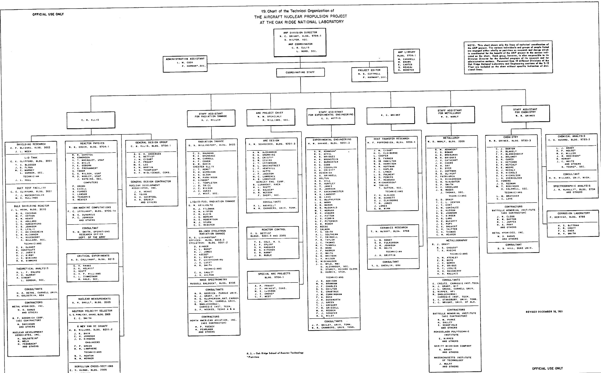