DECLASSIFIED

BY Authority OF, ${AEC} = 4 - 1 - {C02}$

3445600507262

ORNL-1227

Progress Report 66

AIRCRAFT NUCLEAR PROPULSION PROJECT

QUARTERLY PROGRESS REPORT

FOR PERIOD ENDING MARCH 10, 1952

CENTRAL RESEARCH LIBRARY

DOCUMENT COLLECTION

LIBRARY LOAN COPY

DO NOT TRANSFER TO ANOTHER PERSON

If you wish someone else to see this document, send in name with document and the library will arrange a loan.

OAK RIDGE NATIONAL LABORATORY

OPERATED BY

CARBIDE AND CARBON CHEMICALS COMPANY

A DIVISION OF UNION CARBIDE AND CARBON CORPORATION

UCC

POST OFFICE BOX P

OAK RIDGE, TENNESSEE

M

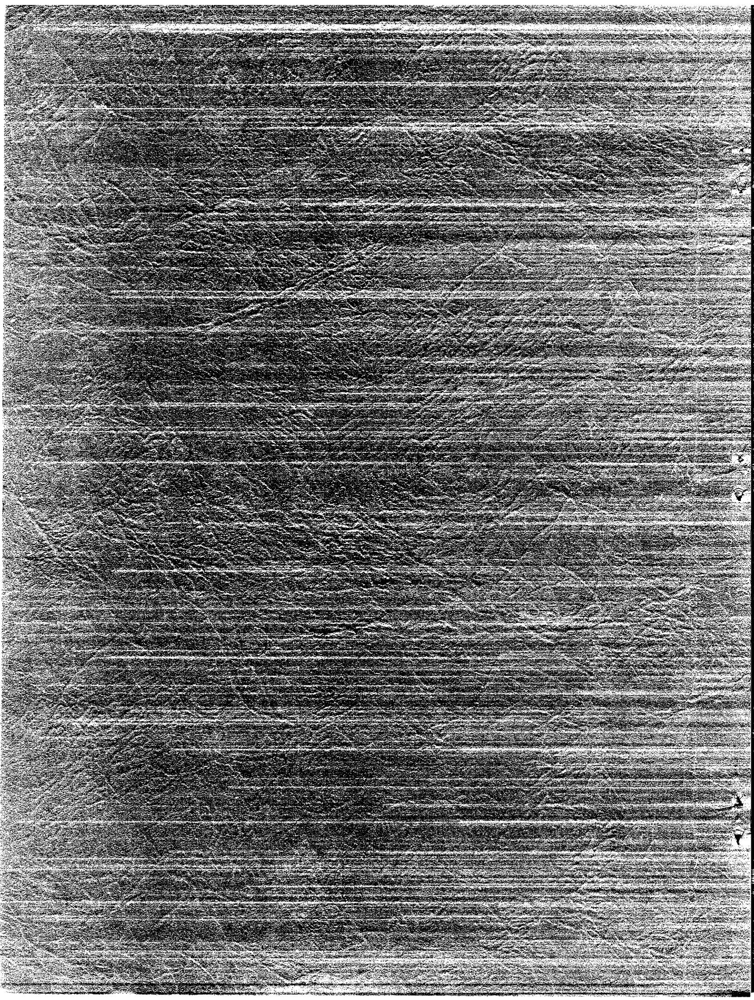

ORNL-1227

This document consists of 214 pages.

Copy 6 of 222. Series A.

Contract No. W-7405-eng-26

# AIRCRAFT NUCLEAR PROPULSION PROJECT

# QUARTERLY PROGRESS REPORT

# FOR PERIOD ENDING MARCH 10, 1952

R. C. Briant, Director

A. J. Miller, Assistant Director

Edited by:

W. B. Cottrell

DATE ISSUED

MAY 7 1952

OAK RIDGE NATIONAL LABORATORY

operated by

CARBIDE AND CARBON CHEMICALS COMPANY

A Division of Union Carbide and Carbon Corporation

Post Office Box P

Oak Ridge, Tennessee

REOTRATED DATA

This document contains Resonance Data as defined in the following sections.

It is an important tool for the disclosure of its

Content:

pehithed

SECRE

34456 00507262

# SECURITY INFORMATION

# INTERNAL DISTRIBUTION

ORNL-1227

Progress

G.M. Adamson

35. W. D. Lavers (Y-12)

2. C. J. Barton

36. R. S. Livingston

3. D. S. Billington

37. R. N. Lyon

4. E.P. Blizzard

38. W. D. Manly

5. A. Brasunas

39. W. B. McDonald

6. R.C.Briant

40. J.L. Meem

7. F. R. Bruce

41. A. J. Miller

8. J. H. Buck

42. K. Z. Morgan

9. A. D. Callahan

43. E. J. Murphy

10. D. W. Cardwell

44. H. F. Poppendiek

11. C. E. Center

45. P. M. Reyling

12. J. M. Cisar

46. H. W. Savage

13. G.H.Clewett

47. R. W. Schroeder

14. C. E. Clifford

48. E. D. Shipley

15. W. B. Cottrell

49. 0. Sisman

16. D. D. Cowen

50. A. H. Snell

17. W. K. Eister

51. F. L. Steahly

18. W. K. Ergen

52. R. W. Stoughton

19. G. T. Felbeck (C&CCC)

53. C. D. Susano

20. A. P. Fraas

54. J. A. Swartout

21. W.R.Gall

55. E. H. Taylor

22. C. B. Graham

56. F. C. Uffelman

23. W. R. Grimes

57. F. C. VonderLage

24. A. Hollander

58. A. M. Weinberg

25. A. S. Householder

59. C. E. Winters

26. W. B. Humes (K 25)

60. Biology Library

27. R. J. Jones

61-62. Chemistry Library

28. G. W. Keilhoftz

63. Health Physics Library

29. C. P. Keim

64. Metallurgy Library

30. M. T. Kelley

§5. Physics Library

31. F. Kertes

66-67. Training School Library

32. E. M. King

68-77 ANP Library

33. J. A. Lane

78-81. Central Files

34. C. E. Larson

82-91. Central Files (O.P.)

# RESTRICTED_DATA

This document contains Restricted Data as defined in the Atomic Energy Act of 1946. Its transmittal or the disclosure of its contents in any manner to any unauthorized person is prohibited.

# SECREI

SECURITY INFORMATION

# SEGRET

# SECURITY INFORMATION

# EXTERNAL DISTRIBUTION

92-10 Argonne National Laboratory

103. Armed Forces Special Weapons Project (Sandia)

104-111. Atomic Energy Commission, Washington

112. Battelle Memorial Institute

113-117. Brookhaven National Laboratory

118. Bureau of Aeronautics

119. Bureau of Ships

120-125. Carbide and Carbon Chemicals Company (Y-12)

126. Chicago Patent Group

127. Chief of Naval Research

128-132. duPont Company

133-157. General Electric Company, Oak Ridge

158-161. General Electric Company, Richland

162. H. K. Ferguson Company

163. Hanford Operations Office

164-167. Idaho Operations Office

168. Iowa State College

169-170. Lockland Area Office, AEC

171-174. Knolls Atomic Power Laboratory

175-177. Lo Alamos

178. Massachusetts Institute of Technology (Kaufmann)

179-180: Mound Laboratory

181-184. National Advisory Committee for Aeronautics, Cleveland

185. National Advisory Committee for Aeronautics, Washington

186-187. New York Operations Office

188-189. North American Aviation, Inc.

190. Patent Branch, Washington

191. Savannah River Operations Office

192-193. University of California Radiation Laboratory

194-197. Westinghouse Electric Corporation

198-207. Wright Air Development Center

208-222. Technical Information Service, Oak Ridge

# RESTRICTED DATA

This document contains Restricted Data as defined in the Atomic Energy Act of 1946. Its transmitter or the disclosure of its contents in any manner to any unauthorized

person is prohibited.

# SECURITY INFORMATION

Reports previously issued in this series are as follows:

ORNL-528 Period Ending November 30, 1949

ORNL-629 Period Ending February 28, 1950

ORNL-768 Period Ending May 31, 1950

ORNL-858 Period Ending August 31, 1950

ORNL-919 Period Ending December 10, 1950

ANP-60 Period Ending March 10, 1951

ANP-65 Period Ending June 10, 1951

ORNL-1154 Period Ending September 10, 1951

ORNL-1170 Period Ending December 10, 1951

# SECRET

# SECURITY INFORMATION

# TABLE OF CONTENTS

# FOREWORD 1

# PART I. REACTOR THEORY AND DESIGN 3

# SUMMARY AND INTRODUCTION 5

# 1. CIRCULATING-FUEL AIRCRAFT REACTOR 7

Reactor with Tandem Heat Exchangers 7

Reactor with Annular Heat Exchangers 9

Reactor Shield Designs 9

Design procedure 9

Activation of the secondary coolant 11

Shield weights and specifications 11

# 2. CIRCULATING-FUEL AIRCRAFT REACTOR EXPERIMENT 13

# Core Design 13

Primary coolant circuit 15

Secondary coolant circuit 15

Core temperature distribution 16

# External Fluid Circuit 16

Pumps 16

Heat exchangers 18

Primary coolant system 18

Secondary coolant system 18

Monitoring circuit 18

# Preheating System 18

Reactor assembly 19

Piping 19

# RESTRICTED DATA

This document contains Restricted Data as defined in the Atomic Energy Act of 1946. Its transmitter is the disclosure of its contents in any manner to any unauthorized person is prohibited.

# SECRET

654 002

# SECURITY INFORMATION

# SECRET

# SECURITY INFORMATION

Heat exchangers 19

Electrical Power Circuits 19

Control System 20

Shim control 20

Regulating and safety rods 20

High-temperature fission chamber 21

Control console and panel 21

Reactor dynamic computer 21

Instrumentation 21

Building 22

3. EXPERIMENTAL REACTOR ENGINEERING 23

Seals and Closures 23

Frozen sodium seal 24

Frozen fluoride seal 24

Bellows type of face seal for ARE pump 24

Stuffing-box seals for molten fluorides 25

Lubrication of seals and shafts 26

Pumps 26

AREcentrifugal pump 26

Laboratory frozen-fluoride-sealed centrifugal pump 27

Worthite frozen-sodium-sealed pump 27

Modified Durco centrifugal pumps 27

Forced-convection-cooled sodium-sealed pumps 29

Canned-rotor pumps 29

Valves 29

Packing-gland seal test equipment 29

# RESTRICTED DATA

This document contains Restricted Data as defined in the Atomic Energy Act of 1946. Its transmittal or the disclosure of its contents in any manner to any unauthorized person is prohibited.

054 003

# SECRET

SECURITY INFORMATION

# SECURITY INFORMATION

30

Ball check valves 30

Valve seat test 30

Heat Exchangers 30

Aircraft type of radiator 30

Sodium-to-air radiator 31

Fluoride-to-fluoride heat exchanger 31

NaK-to-NaK heat exchanger 32

Heat transfer in circulating fluoride loops 32

Instrumentation 33

Flow measurement 33

Pressure measurement 34

Temperature measurement 34

Level controls and level indicators 34

Heating and Cooling of High-Temperature Systems 35

External heating systems 35

Induction heating 36

Resistance heating 36

Insulation testing 36

ARE core preheating 37

Technology of High-Temperature Liquids 37

Fluoride preparation and handling 37

Sampling and analyzing techniques 39

Diffusivity of helium through stainless steel 39

Cleaning and inspection techniques 39

4. REACTOR PHYSICS 41

Circulating-Fuel Aircraft Reactor 41

# RESTRUCTED DATA

This document contains Restricted Data as defined in the Atomic Energy Act of 1946. Its transmitting of the disclosure of its contents in any manner to any unauthorized person is prohibited.

# SECRET

84 04

# SECURITY INFORMATION

# SECURITY INFORMATION

Oscillations 42

Slow kinetic effects 44

Critical mass 44

Neutron leakage spectra 46

Alkali Hydroxide Moderated Aircraft Reactor 48

Survey Calculations of the Circulating-Fuel ARE 48

AREcore design 48

Critical mass and total uranium investment 50

Reactivity coefficients 50

Power distribution 51

Neutron flux and leakage spectra 52

StaticsofAREControls 54

Shim control requirements 54

Regulator rod 54

Safety rods 55

Specific Design Problems of the Circulating-Fuel ARE 57

5. CRITICAL EXPERIMENTS 59

Direct-Cycle Reactor 59

Control rod calibration 59

Temperature effects 61

Reflector studies 61

Graphite Reactor 62

Circulating-Fuel Reactor 62

Correlation of Theory and Critical Experiments 63

Criticality with nonhydrogenous moderators 63

Criticality with hydrogenous moderators 65

RESTRICTED DATA

This document contains Restricted Data as defined in the Atomic Energy Act of 1946. Its transmittal of the disclosure of its contents in any manner to any unauthorized person is prohibited.

654 005

SECRET

# SECURITY INFORMATION

65

Danger coefficients 66

Rod sensitivity 66

Gap experiment 68

PART II. SHIELDING RESEARCH 69

SUMMARY AND INTRODUCTION 71

6. BULK SHIELDING REACTOR 73

Mockup of the Divided Shield 73

Reactor Calibration 76

7. DUCT TESTS 79

Theoretical Treatment of Duct Transmission 79

Measurement of Air-Filled Ducts in Water 80

Straight ducts 80

Ducts with bends 80

Comparison with theory 80

8．TOWERSHIELDINGFACILITY 89

TowerFacility Design 89

Experimental Program 89

9. NUCLEAR MEASUREMENTS 93

Measurements with the 5-Mev Van de Graaff Accelerator 93

Total cross section of iron 93

Inelastic scattering levels in iron 93

Time-of-Flight Neutron Spectrometer 93

Background measurements 93

Indium resonances 94

# RESTRICTED DAT

This document contains unrestricted Data as defined in the Atomic Energy Act of 1946. Its contents are on the disclosure of its contents in any manner to any unauthorized person is prohibited.

# PART III. MATERIALS RESEARCH 95

# SUMMARY AND INTRODUCTION 97

# 10. CHEMISTRY OF HIGH-TEMPERATURE LIQUIDS 99

Low-Melting-Fluoride Fuel Systems 99

NaF-BeF2-UF4 100

KF-BeF2-UF4 101

RbF-BeF2-UF 101

LiF-NaF-BeF2-UF4 101

Fuel containing zirconium fluoride 101

Simulated Fuel Mixture for Cold Critical Experiment 102

Ionic Species in Fused Fluorides 102

Preparation of Standard Fuel Samples 103

Preparation of Pure Hydroxides 104

Coolant Development 104

LiF-ZrF 105

NaF-ZrF 105

$\mathbf{KF - ZrF_4}$ 105

RbF-ZrF 105

NaF-KF-ZrF 105

NaF-RbF-ZrF 105

NaF-KF-LiF-ZrF 106

Preparation of Pure Fluorides 106

Fuel preparation equipment 106

Fuel handling equipment 107

# 11. CORROSION RESEARCH 109

Static Corrosion by Fluorides 110

# RESTRICTED DATA

This document contains Restricted Data as defined in the Atomic Energy Act of 1946. Its transmittal or the disclosure of its contents in any manner to any unauthorized person is prohibited.

654.007

SECRET

SECURITY INFORMATION

# SECURITY INFORMATION

Effect of pretreatment of fuel 110

Corrosion of structural metals 110

Corrosion by fluorides with various additives 112

Melting point of fluorides after corrosion tests 113

Static Corrosion by Sodium Hydroxide 114

Corrosion of special alloys 114

Corrosion by sodium hydroxide with various additives 115

Corrosion of refractory materials 116

Static Corrosion by Liquid Metals 116

Corrosion by low melting point alloys 116

Corrosion by sodium-lead alloy 118

Facilities for Dynamic Corrosion Testing 119

Thermal convection loops 119

Seesaw corrosion tests 120

Differential temperature tests 120

Rotating dynamic corrosion tests 120

Forced convection loops 122

Dynamic Corrosion by Fluorides 122

Corrosion by fluorides in thermal convection loops 122

Corrosion by fluorides in a seesaw furnace 124

Standpipe tests of fluoride corrosion 124

Dynamic Corrosion by Hydroxides 127

Corrosion by hydroxides in thermal convection loops 127

Corrosion by sodium hydroxide in seesaw tests 129

Standpipe tests of sodium hydroxide corrosion 129

Fundamental Corrosion Research 129

Possible equilibria among fluorides and metals 132

RESTRICTED DATA

This document contains Restricted Data as defined in the Aromas Energy Act of 1946. Its transmitting of the disclosure of its contents in any manner to any unauthorized person is prohibited.

SECRET

SECURITY INFORMATION

# SECURITY INFORMATION

EMF measurements in fused fluorides 135   
Electrode potentials in fused sodium hydroxide 135   
Polarography of sodium hydroxide in silver and platinum 136   
Magnetic susceptibility of stainless steel exposed to fluorides 136

# 12. METALLURGY AND CERAMICS 139

Fabrication of Reactor Elements 139

Cold drawing of tubular solid fuel elements 140

ARE control rod 140

Cone-Arc Welding 142

Equipment 142

Principle of operation 142

Experimental procedure 142

Brazing 143

Flow tests 144

Corrosion of brazing alloys 144

Mechanical Testing of Materials 147

Inconel creep and stress data 147

Tube-burst tests 148

Operation of creep and stress-rupture equipment 148

Ceramics Laboratory 151

Ceramic applications to reactors 151

Coatings for the radiator 151

Ceramic laboratory equipment 152

Microscopic examination of fluorides 152

# 13. HEAT TRANSFER AND PHYSICAL PROPERTIES RESEARCH 153

Viscosity of Fluoride Mixtures 153

# RESTRICTED DATA

This document contains Restricted Data as defined in the Atomic Energy Act of 1946.

Its transmitior on the disclosure of its contents in any manner to any unauthorized person is prohibited.

654.009

ECRET

# SECRET

# SECURITY INFORMATION

Viscosity of NaF-KF-LiF 153

Viscosity of NaF-KF-LiF-UF 154

Modifications of viscosity apparatus 154

Thermal Conductivity of Liquids and Solids 154

Heat Capacities 155

Vapor Pressure of Liquid Fuels 155

Physical Property Data 156

Natural Convection in Confined Spaces with Internal Heat Generation 156

Analysis of Heat Transfer in a Circulating-Fuel System 159

Heat Transfer Coefficients 161

Heat transfer in molten lithium 161

Heat transfer to fused salts and hydroxides 161

Entrance region heat transfer in a sodium system 161

Heat Transfer of Boiling Liquid Metals 162

14. RADIATION DAMAGE 163

Irradiation of Fused Materials 163

Pile irradiation of fuel 164

Cyclotron irradiation of fuel 165

Inpile Circulating Loops 165

Creep Under Irradiation 165

Radiation Effects on Thermal Conductivity 166

PART IV. APPENDIXES 167

SUMMARY AND INTRODUCTION 169

15. THE SUPERCRITICAL-WATER REACTOR 171

# RESTRICTED DAT

This document contains Restricted Data as defined in the Atomic Energy Act of 1946. Its transmittal on the disclosure of its contents in any manner to any unauthorized person is prohibited.

# SECRET

# SECURITY INFORMATION

# SECRET

# SECURITY INFORMATION

Description of Reactor 171

Conclusion of the NDA Study 171

Recommendations of the NDA Study 172

# 16. ANALYTICAL CHEMISTRY 175

Studies of Diatomaceous Earth 175

Analytical Studies of Fluoride Eutectics 175

Uranium 176

Beryllium 176

Total alkali metals 176

Total fluoride 176

Nickel 177

Chromium 177

Manganese 177

Silicon 177

Solubility of Boric Acid in Water 177

Clarity of Borated Water 177

Studies of Alkali and Alkaline Earth Hydroxide Coolants 178

Analytical Services 178

# 17. LIST OF REPORTS ISSUED 179

# 18. DIRECTION OF ACTIVE ANP RESEARCH PROJECTS AT ORNL 183

Reactor and Component Design 183

Shielding Research 185

Materials Research 186

Technical Administration 191

# RESTRICTED DATA

This document contains Restricted Data as defined in the Atomic Energy Act of 1946. Its transmission or the disclosure of its contents is an unwarranted person is prohibited.

LIST OF FIGURES   

<table><tr><td>FIGURE</td><td>TITLE</td><td>PAGE</td></tr><tr><td>1</td><td>Tandem Heat Exchanger Arrangement for Circulating-Fuel Reactor</td><td>8</td></tr><tr><td>2</td><td>Annular Heat Exchanger Arrangement for Circulating-Fuel Reactor</td><td>10</td></tr><tr><td>3</td><td>Circulating-Fuel ARE Core Design</td><td>14</td></tr><tr><td>4</td><td>Arrangement of External Fluid Circuit Equipment</td><td>17</td></tr><tr><td>5</td><td>Frozen Fluoride Seal Tester</td><td>25</td></tr><tr><td>6</td><td>ARE Centrifugal Pump</td><td>28</td></tr><tr><td>7</td><td>Ball Check Valve</td><td>30</td></tr><tr><td>8</td><td>Schematic Diagram of Circulating-Fuel Aircraft Reactor</td><td>45</td></tr><tr><td>9</td><td>Leakage Spectrum Through the Reflector of the Circulating-Fuel Aircraft Reactor</td><td>46</td></tr><tr><td>10</td><td>Leakage Spectrum Around the Fuel Pipes of the Circulating-Fuel Aircraft Reactor</td><td>47</td></tr><tr><td>11</td><td>Critical Mass vs. Core Diameter for Hydroxide Reactors with Thick Reflectors of the Same Composition</td><td>49</td></tr><tr><td>12</td><td>Power Distribution in the Core of the Circulating-Fuel ARE</td><td>52</td></tr><tr><td>13</td><td>Leakage Spectrum from the Reflector of the Circulating-Fuel ARE</td><td>53</td></tr><tr><td>14</td><td>Leakage Spectrum from the Open Ends of the Circulating-Fuel ARE</td><td>53</td></tr><tr><td>15</td><td>Transverse Neutron Flux Spectrum for Three Sections Through the Core of the Circulating-Fuel ARE</td><td>54</td></tr><tr><td>16</td><td>Radial Neutron-Flux Distribution in the Core of the Circulating-Fuel ARE</td><td>55</td></tr><tr><td>17</td><td>Loading Chart of Critical Assembly of Direct-Cycle Reactor</td><td>60</td></tr><tr><td>18</td><td>Reactivity as a Function of Control Rod Position</td><td>61</td></tr><tr><td>19</td><td>Reactivity vs. Temperature</td><td>61</td></tr></table>

RESTRICTED DATA

This document contains Restricted Data as defined in the Atomic Energy Act of 1946. Its transmittal or the disclosure of its contents is in any manner to any unauthorized person is prohibited.

SECRET

# FIGURE TITLE P A G E

20 Relative Position of Reactor, Divided Shield, and Gamma-Ray Spectrometer in Bulk Shielding Facility 74   
21 Gamma-Ray Spectra at 130 cm from the Water-Reflected Reactor 75   
22 Fuel Assembly Arrangement of Bulk Shielding Facility Reactor 77   
23 Center Line Measurements of Neutron Transmission Through Cylindrical Ducts in Water 81   
24 Traverse Measurements of Neutrons in Water Beyond Cylindrical Ducts 82   
25 Center Line Measurements of Neutron Transmission in Water Through Cylindrical Ducts with Variable Bends 83   
26 Traverse Measurements of Neutrons in Water Beyond Cylindrical Ducts with Variable Bends 84   
27 Comparison of Relative Source Strengths $(n_0)$ from Various Ducts 87   
28 Comparison of Relative Source Strengths $(n_0)$ from Various Geometries of the 3-in. Duct 88   
29 Proposed 300-ft Tower Shielding Facility 90   
30 X-6 Aircraft Shield Mockup on Tower Shielding Facility 91   
31 Total Cross Section of Iron 94   
32 Corrosion of Inconel in a Fluoride Fuel $\left[(NaF - KF - UF_4) + 2\% Zr\right]$ for 100 hr at $816^{\circ}C$ 113   
33 Intergranular Attack of Type-310 Stainless Steel Tested in 44% Lead-56% Bismuth Alloy for 100 hr at $1500^{\circ}\mathrm{F}$ 117   
34 Alloying Attack of Inconel Tested in $43\%$ Tin- $57\%$ Bismuth Alloy for 100 hr at $1500^{\circ}\mathrm{F}$ 117   
35 Seesaw Apparatus for Dynamic Corrosion Tests 121   
36 Sections of Hot and Cold Legs of an Inconel Convection Loop After Circulating the Fluoride Fuel (NaF-KF-LiF-UF $_4$ ) for 500 Hours 125

RESTRICTED DATA

This document concerns Restricted Data as defined in the Act of Energy Act of 1946. Its transmitter is the disclosure of its contents in any manner to any unauthorized person is prohibited.

# FIGURE TITLE PAGE

37 Sections of Hot and Cold Legs of a Type-316 Stainless Steel Convection Loop After Circulating the Fluoride Fuel (NaF-KF-LiF-UF $_4$ ) for 123 Hours 126   
38 Nickel Thermal Convection Loop Operated for 117 hr with Sodium Hydroxide Under an Air Atmosphere 128   
39 Nickel Thermal Convection Loop Operated for 296 hr with Sodium Hydroxide Under a Hydrogen Atmosphere 130   
40 Inconel Thermal Convection Loop Operated for 135 hr with Potassium Hydroxide Under a Hydrogen Atmosphere 131   
41 Sectional View of $L$ -Nickel Specimen after 117 hr (14,000 cycles) with Molten Sodium Hydroxide in Seesaw Apparatus 132   
42 Transverse Sections Through 4-in. OD, Cold-Drawn, Tubular, Solid Fuel Elements 141   
43 Corrosion Test of Microbrazed Inconel Tube-to-Header Specimens Exposed to NaOH for 100 hr at $1500^{\circ}\mathrm{F}$ 145   
44 Corrosion Test of Microbrazed Inconel Tube-to-Header Joint Exposed to NaF-KF-LiF-UF $_4$ for 100 hr at $1500^{\circ}$ F 146   
Corrosion of Inconel Tube-to-Header Joint Brazed with a $60\%$ Manganese- $40\%$ Nickel Alloy after 100 hr at $1500^{\circ}\mathrm{F}$ in NaOH 147   
46 Creep and Stress-Rupture Data for Fine-Grained Inconel Sheet 149   
47 Creep and Stress-Rupture Data for Coarse-Grained Inconel Sheet 150   
48 Dimensionless, Wall-Mixed Mean Temperature Difference as a Function of Reynold's and Prandtl's Moduli for a Heat Transfer System with Insulated Pipe Walls 160   
49 Heat Transfer Coefficients for Boiling Mercury 162   
50 Comparison of Fench and Inpile Creep Rates of Nickel 166

# RESTRICTED DATA

This document protects Restricted Data as defined in the Atomic Energy Act of 1946. Its transmission or the disclosure of its contents is in any manner to any unauthorized person as prohibited.

# SECRET

654 014

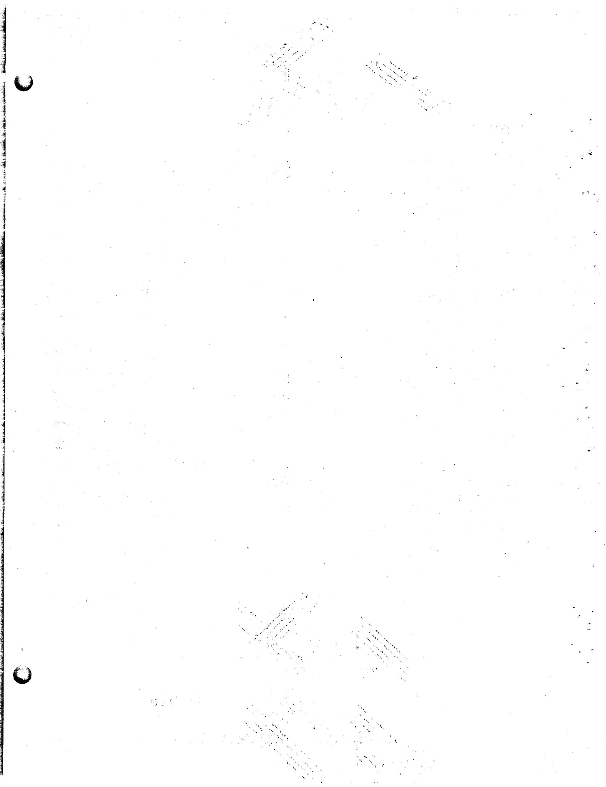

# SECURITY INFORMATION

LIST OF TABLES

TABLE TITLE PAGE

1 Shields for Circulating-Fluoride-Fuel Reactors 12   
2 Fuel Temperature After Each Pass Through Core 16   
3 Performance of Fluoride-to-Fluoride Heat Exchanger 32   
4 Analysis of Heater Section (Model A-1) 33   
5 Composition of Various Fluoride Fuels and Coolants 38   
6 Volume Fractions of the Circulating-Fuel ARE Core and Reflector 50   
7 Uranium Requirements of the ARE 50   
8 Reactivity Coefficients 51   
9 Shim Control Requirements 56   
10 Comparison of Control Rod Calibrations 61   
11 Reactivity Change Introduced by Substituting Beryllium for Air 62   
12 Reactivity Change Effected by Substituting Plastic and Stainless Steel for Beryllium in the Reflector 62   
13 Experimental Data on Critical Assemblies 1 and 4 64   
14 Calculated Results for Critical Assemblies 1 and 4 64   
15 Comparison of Experimental and Calculated Values of the Ages of Thermal Neutrons in Peryllium and Graphite 64   
16 Experimental and Calculated Values for the Cadmium and Cadmium-Indium Ratios 66   
17 Experimental and Calculated Values for the Total Loss in $k_{eff}$ upon Introduction of Various Materials into Assembly 4 67   
18 Comparison of Calculated Effective Source Strength for Straight, Cylindrical Ducts 85

# RESTRICT DATA

This document contains Restricted Data as defined in the Atomic Energy Act of 1946. Its transmitter is the disclosure of its contents in any manner to any unauthorized person is prohibited.

# SECRET

654 0.15

# TABLE TITLE PAGE

19 Comparison of Calculated Effective Source Strength for Bent, Cylindrical Ducts 86   
20 Improvement of Count-to-Background Ratio with Aluminum and Beryllium Filters 94   
21 Comparison of Break Temperatures from Heating and Cooling Curves of the System NaF-BeF $_2$ -UF $_4$ 100   
22 Break Temperatures from Cooling Curves of the System KF-BeF $_2$ -UF $_4$ 101   
23 Break Temperatures from Cooling Curves of the System RbF-BeF $_2$ -UF $_4$ 101   
24 Break Temperatures from Heating and Cooling Curves of Zirconium-Bearing Fuel Mixtures 102   
25 Disposition of Standard Fuel Samples 103   
26 Static Corrosion of Various Materials in the Untreated Fluoride Fuel (NaF-KF-LiF- $\mathbf{U}\mathbf{F}_{4}$ ) in 100 hr at $1500^{\circ}\mathrm{F}$ 111   
27 Static Corrosion of Inconel and Type-309 Stainless Steel by the Fluoride Fuel (NaF-KF-LiF-UF $_4$ ) with Magnesium and Zirconium Additives in 100 hr at $1500^{\circ}$ F 112   
28 Melting Points of Samples of Fluoride from Corrosion Tests 114   
29 Static Corrosion of Structural Metals by Sodium Hydroxide with Various Additives in 100 hr at $1500^{\circ}\mathrm{F}$ 115   
30 Melting Points of Various Alloys 116   
31 Corrosion of Types-310 and -317 Stainless Steel and Inconel by Various Low Melting Point Alloys in 100 hr at $1500^{\circ}\mathrm{F}$ 118   
32 Corrosion Data from Inconel and Stainless Steel Thermal Convection Loops Operated with Various Fluorides 123   
33 Free Energies and Equilibrium Constants for Reactions of Metals with Alkali Fluorides 133   
34 Free Energies and Equilibrium Constants for Reduction of Uranium Tetrafluoride with Metals 134

RESTRICTED DATA

This document contains Restricted Data as defined in the Atomic Energy Act of 1946. Its transmittal or the disclosure of its contents in any manner to any unauthorized person is prohibited.

# SECURITY INFORMATION

TABLE TITLE PAGE

35 Viscosity of NaF-KF-LiF-UF4 Mixtures as a Function of Uranium Tetrafluoride Concentration 154   
36 Physical Properties of Fluoride Salts 157   
37 Physical Properties of Miscellaneous Materials 158   
38 LITER Tests on Fused Fluoride Fuels in Inconel at $1500^{\circ}\mathrm{F}$ 164   
39 Summary of Service Analyses 178

# RESTRICTED DATA

This document contains a restricted Data as defined in the Atomic Energy Act of 1946. Its transmitter or the disclosure of its contents is in any manner to any unauthorized person is prohibited.

SEGRET

SECURITY INFORMATION

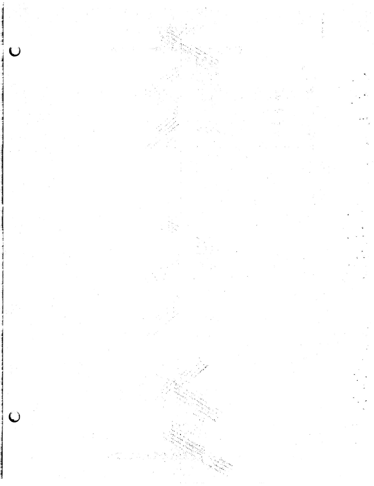

# ANP PROJECT QUARTERLY PROGRESS REPORT

FOREWORD

This is the quarterly progress report of the Aircraft Nuclear Propulsion Project at the Oak Ridge National Laboratory and summarizes the technical progress on the project during the period covered. It includes not only the work of the Laboratory under its own contract, W-7405-eng-26, but also the research for the national ANP program performed by Laboratory personnel. The report is divided into four parts: I. Reactor Theory and Design; II. Shielding Research; III. Materials Research; and IV. Appendixes. Each part may be regarded as a separate entity and has a separate "Summary and Introduction."

RESTRICTED DATA

This document contains restricted Data as defined in the Atomic Energy Act of 1946. Its transmittal or the disclosure of its contents in any manner to any unauthorized person is prohibited.

SECRET

SECURITY INFORMATION

654 018

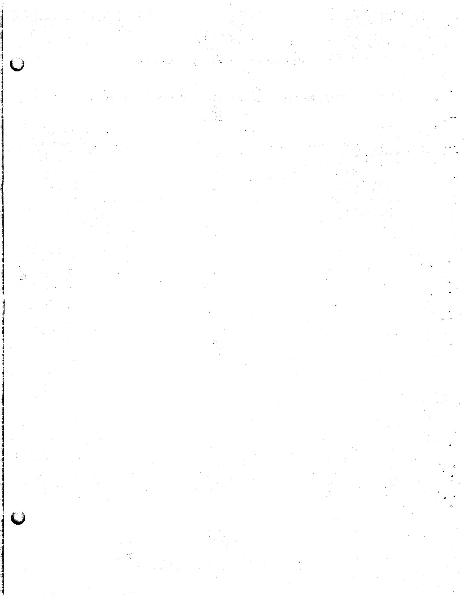

Part 1

REACTOR THEORY AND DESIGN

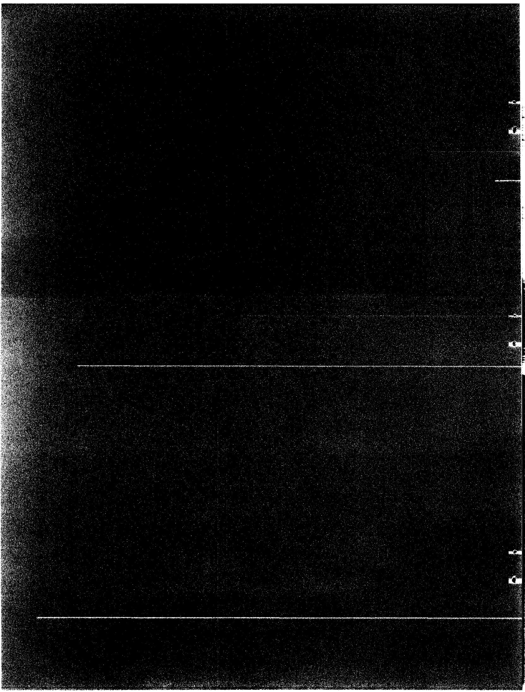

# SUMMARY AND INTRODUCTION

Analysis of the circulating-fuel aircraft reactor has been extended to systems incorporating intermediate heat exchangers, various secondary coolants, liquid moderators, and the use of heavier reactor shielding (sec. 1). All these systems utilize the fundamental advantage of the bifunctional fuel-coolant, and appear to be capable of supersonic nuclear propulsion. The location of the heat exchangers around the reactor results in lower shield weight, even with a larger shielded-volume diameter, than a tandem reactor and heat exchanger arrangement. In order to perform a limited amount of aircraft maintenance without special shielding, various modifications of the minimum divided shield specifications have been investigated.

Studies of the performance and design of the circulating-fuel aircraft reactor are sufficiently encouraging that the first Aircraft Reactor Experiment (ARE) to be constructed by the Oak Ridge National Laboratory will be of this type (sec. 2). The reactor core, as designed for the ARE, consists of a beryllium oxide moderator with a multipass fuel-coolant system. The core and a surrounding beryllium oxide reflector are contained in an Inconel pressure shell. Design of the reactor, fluid circuits, building, and associated equipment are essentially complete. The reactor is expected to be in operation early in 1953.

The developmental work in reactor plumbing and associated hardware has been primarily concerned with the technology of high-temperature fluoride mixtures, and a secondary effort has been the study of liquid metals (sec.

3). The techniques of the preparation, purification, and handling of the fluoride mixtures have been developed so that 100-lb batches of the treated fluoride may be prepared and loaded in adequately cleaned test equipment. Techniques of pumping, sealing, and controlling the fluoride coolants and lubricating moving parts of the systems have been demonstrated at temperatures above $1300^{\circ}\mathrm{F}$ , and it is considered that these techniques are adequate for ARE application. A centrifugal-flow fluoride pump has operated for weeks with neither mechanical failure nor leakage. Liquid sodium technology appears to be well in hand, since continued success has been experienced in the operation of sodium (or NaK) pumps, seals, and heat exchangers. The NaK-to-NaK heat exchanger loop has now operated for 2300 hr with a maximum temperature of $1500^{\circ}\mathrm{F}$ . Gross heat transfer studies indicate that space-economical systems and components can be built to handle copious quantities of heat, as required by fluoride systems, at temperatures between 1200 and $1800^{\circ}\mathrm{F}$ .

The reactor physics calculations, which have further defined the statics of the circulating-fuel ARE, have led to some general observations regarding the kinetics of both the circulating-fuel ARE and ANP reactor (sec. 4). Although the thrombosis effect is an important concern in the control of these reactors, the loss of the delayed neutrons may not be if the circulation of the fuel itself is as good a damping mechanism as now indicated. These kinetic difficulties are of less concern to the ARE than to the ANP, since the circulation rate in the ARE is so slow that the control rods can cope with the thrombosis effect and a large fraction of the delayed neutrons are

# ANP PROJECT QUARTERLY PROGRESS REPORT

emitted into the active volume. The current ARE design has a critical mass of 22.3 lb, a total uranium investment of 74 lb, $71\%$ thermal fissions, and a leakage-to-absorption ratio of about 1 to 3. Brief studies of hydroxide moderated reactors (including KOH, LiOH, NaOH, RbOH, and SrOH) show that, except for KOH, the hydroxide moderated reactors require low critical masses and small core volumes for minimum critical mass.

Measurements on the critical experiment of the simulated General

Electric direct-cycle reactor have been completed and the simulated circulating-fuel reactor is now being assembled (sec. 5). Evaluations, in terms of contributions to reactivity, have been made of several reflectormodifications of the direct-cycle assembly. In addition, the data from the earlier graphite reactor assembly have been correlated with the data from theoretical calculations of the assembly. The correlation lacks precision but gives results that are at least consistent with the experimental facts.

# 1. CIRCULATING-FUEL AIRCRAFT REACTOR

A. P. Fraas, ANP Division

A circulating-fuel aircraft reactor system in which the fluid fuel circulates directly through the turbojet radiators was described in the last report.(1) Other circulating-fuel aircraft reactor systems, incorporating such features as intermediate heat exchangers, various secondary coolants, the use of liquid moderators, and heavier reactor shielding, have been considered in an attempt to determine the most practical system for a functional supersonic aircraft. All these systems utilize the fundamental advantage of the bifunctional fuel-coolant - the elimination of a heat transfer stage within the reactor core.

Two series of shielded, full-size, circulating-fuel aircraft designs have been studied; one involves an annular, or "wrap-around," type of heat exchanger, and the other is a tandem arrangement with the heat exchanger behind the reactor. Analyses show that the annular arrangement gives the lower shield weight. These design studies brought forth the important technique of lacing the heat exchanger matrix with about 8 vol % B4C to keep the radiation from sodium or NaK in the secondary circuit to tolerable values even with something approaching a unit shield.

It also appears from these studies that it would be advantageous to use a liquid moderator such as water or fused hydroxides. Not only would the problem of cooling the moderator and reflector be greatly simplified, but by using perhaps a 12-in.-thick reflector, the problem of heating of the

pressure shell by gammas, neutron captures, and inelastic scattering would be greatly reduced. More detailed studies of the practicability of design for cooling the structure with a liquid moderator have been initiated.

# REACTOR WITH TANDEM HEAT EXCHANGERS

The first basic configuration considered was one in which the reactor core and the intermediate heat exchanger were placed in tandem. A longitudinal section of a tandem reactor and heat exchanger arrangement is shown in Fig. 1. A basic premise was that by interposing the heat exchanger between the pumps and the reactor core, a uniform flow distribution among the fuel tubes would be assured. The design required that the liquid fluoride fuel flow through the tubes in the reactor core at $11\mathrm{ft} / \mathrm{sec}$ for operation at 400,000 kw with a temperature rise through the reactor of $400^{\circ}\mathrm{F}$ . The basic layout is best adapted to a liquid moderator (i.e., $\mathrm{H}_2\mathrm{O}$ or $\mathrm{NaOH}$ ) from the standpoint of fabrication and of means for cooling the moderator and reflector.

In this design, the fuel enters the reactor at the top rear, makes a complete loop through the fuel tubes in the core, and discharges to the heat exchanger. The fuel tubes are of stainless steel with 1 l/2-in. ID and 0.015-in. wall thickness. If water were the moderator, a double-walled construction could be used. It may be noted that if the inner tube (containing circulating fuel) ruptured or cracked, the only fuel lost would be the amount that filled up the space between tubes before it froze in contact with the cold outer tube.

  
#   
521 109

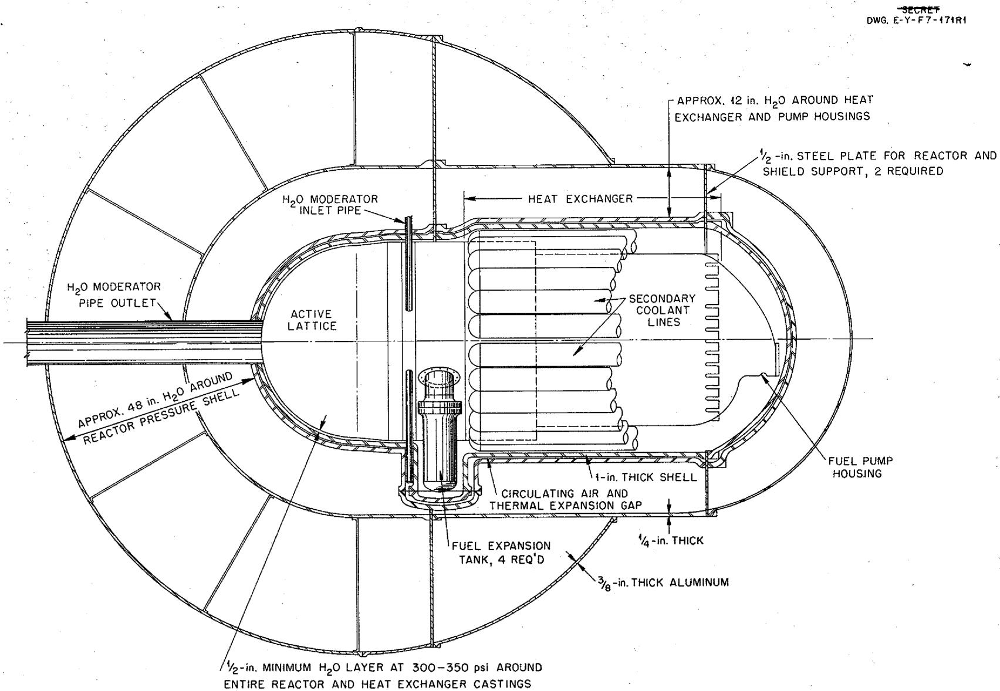  
C   
Fig. 1. Tandem Heat Exchanger Arrangement for Circulating-Fuel Reactor.   
LHReSSR00d ATRELYNO LERFOd dNV

The water (or hydroxide) moderator enters the active lattice around the periphery of the rear of the reactor and flows toward the outlet at the forward end of the reactor. As the moderator flows in it is distributed by a baffle sheet that is orificed to give the flow distribution required by the power distribution within the active lattice.

The control system for this proposed circulating-fuel reactor design consists of two curtains of cadmium rods mounted on two endless tracks. The curtains are moved from the reflector into the active lattice by an endless chain-sprocket type of mechanism. Each cadmium rod is mounted upon two steel shafts with steel rollers attached to the ends of the shafts. These rollers are linked together to form an endless chain. The sprocket is driven by a worm-gear drive, which in turn is driven by a hydraulic pump mounted within the pressure shell. Each cadmium rod is a cylinder approximately 1/2 in. OD by 1/4 in. ID by 12 in. long, and there are about 50 rods in each control curtain.

# REACTOR WITH ANNULAR HEAT EXCHANGERS

The second basic configuration considered was a reactor with an annular, or "wrap-around," type of heat exchanger such as shown schematically in Fig. 2. Radial webs are used both to separate the annular heat exchanger into sectors and to support the shell around the outside of the reflector. To permit assembly, the reactor pressure shell would have to be split axially, probably on the center line. The pressure shell and other structures are jacketed and cooled by NaOH at around $1200^{\circ}\mathrm{F}$ . A heat exchanger to cool the NaOH is provided in the region where the NaK enters the pressure shell. Although not an essential element in this general

type of design, the concentric helical coil carrying the NaOH moderator through the reactor core is interesting because it eliminates a header problem. By using perhaps ten tube fittings, welds at the ends of these coiled tubes could be avoided so that a material such as molybdenum might be used.

# REACTOR SHIELD DESIGNS

It is important to know the effects of various parameters on the weight of the aircraft reactor and shield, but it is difficult to determine these effects quantitatively since the present knowledge of shielding does not permit weight estimates closer than $\pm 5\%$ , at best. However, engineering designs have been completed for the shields for the preceding reactor arrangements, and real weight differences that result in lighter weight shields for the annular arrangement than for the tandem arrangement have been found to exist. In the shield weights calculated the use of $\mathbf{B}_4\mathbf{C}$ in the heat exchanger and between the reactor and heat exchanger has been found to substantially reduce the activity of the secondary coolant.

Design Procedure. The primary objective in the design of these shields was to minimize the activation of the secondary coolant by delayed neutrons from the fuel. This has been effected by (1) attenuating the neutron leakage from the active lattice to a level below that of the delayed neutrons in the heat exchanger, and (2) lacing the heat exchanger with enough neutron absorbing material $(\mathbf{B}_4\mathbf{C})$ so that relatively few neutrons would be absorbed in the secondary coolant. The header sheet and a 5-in. $\mathbf{B}_4\mathbf{C}$ layer between core and heat exchanger was sufficient to reduce the neutron leakage flux to the heat exchanger, whereas the use of $\mathbf{B}_4\mathbf{C}$ in

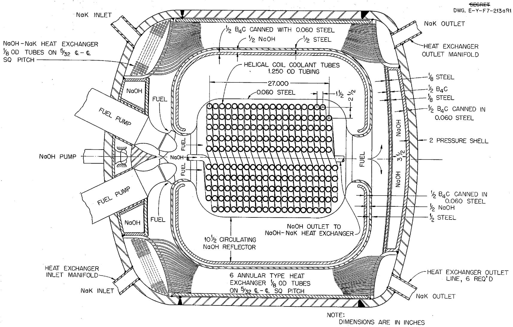  
ANP PROJECT QUARTERLY PROGRESS REPORT   
Fig. 2. Annular Heat Exchanger Arrangement for Circulating-Fuel Reactor.

every ninth tube in the heat exchanger served to suppress the activity of the circulating fuel.

The balance of the shield design work was straight-forward and followed the procedures outlined by the Shielding Board. Both Lid Tank and Bulk Shielding Facility test data were used. The fission-product-decay gamma rays for the equilibrium fission-product concentration at full power were taken as being equivalent to three 1.0-Mev gamma rays and one-half of a 3.0-Mev gamma ray per fission.

Activation of the Secondary Coolant. The degree of activation of the secondary coolant is, of course, a function of the materials in that coolant. Since NaK (56% Na and 44% K) has many advantages as a high-temperature heat transfer medium, and since it would probably be about as bad from the activation standpoint as any coolant that could be used, an estimate of its activation was made with the heat exchanger shielded and laced with $\mathsf{B}_4\mathsf{C}$ as outlined above. It was found that if 25% of the NaK in the system were considered as concentrated at a point and the self-absorption of the sodium-decay gamma rays released in the air radiator or other similar component

were assumed to be $50\%$ , the dose at 1.5 meters (5 ft) from the center of the source would be $200 \, \text{r/hr}$ after long periods of operation at a reactor heat output of $400,000 \, \text{kw}$ .

The activation of a quite different coolant, a fused salt consisting of approximately $60\%$ LiCl, $30\%$ $\mathrm{MgCl}_2$ , and $10\%$ KCl, was also estimated. Although with no $\mathrm{B_4C}$ in the heat exchanger the activity of this fused salt was only $5\%$ of that of the NaK, the activity for the case with the $\mathrm{B_4C}$ in the heat exchanger was $35\%$ of that of the NaK. Thus, it appears that there is little to be gained from the shielding standpoint in the use of this molten chloride in place of NaK.

Shield Weights and Specifications. Several engineering designs of shields have been completed for both the tandem and annular heat exchanger arrangements. For either reactor arrangement the divided shield resulted in the lowest shield weight. However, the desire to be able to carry out a limited amount of airplane maintenance work without special shielding argues in favor of more shielding around the reactor. The various shield designs for the two reactor and heat exchanger arrangements are given in Table 1. For comparable shields the annular heat exchanger and reactor assembly gives appreciably lower weight than the tandem arrangement.

TABLE 1   
Shields for Circulating-Fluoride-Fuel Reactors   

<table><tr><td rowspan="2"></td><td colspan="4">TANDEM HEAT EXCHANGER PARTIALLY DIVIDED</td><td colspan="2">ANNULAR HEAT EXCHANGER PARTIALLY DIVIDED</td></tr><tr><td>1</td><td>2</td><td>3</td><td>4</td><td>1</td><td>2</td></tr><tr><td>Details in report</td><td>Y-F15-10</td><td>Y-F15-10</td><td>Y-F15-10</td><td>Y-F15-10</td><td>Y-F15-10</td><td>Y-F15-10</td></tr><tr><td>Date of design</td><td>Jan. 1952</td><td>Jan. 1952</td><td>Jan. 1952</td><td>Jan. 1952</td><td>Feb. 1952</td><td>Feb. 1952</td></tr><tr><td>Reactor shield diameter (in.)</td><td>150</td><td>150</td><td>121</td><td>121</td><td>148</td><td>118</td></tr><tr><td>Crew shield weight (lb)</td><td>5,000</td><td>11,000</td><td>36,000</td><td>14,000</td><td>5,000</td><td>36,000</td></tr><tr><td>Weight of reactor, intermediate heat exchanger, and reactor shield (lb)</td><td>151,000</td><td>130,000</td><td>75,000</td><td>75,000</td><td>123,000</td><td>62,000</td></tr><tr><td>Total weight of reactor, intermediate heat exchanger, and all shielding (including crew shield) (lb)</td><td>156,000</td><td>141,000</td><td>111,000</td><td>89,000</td><td>128,000</td><td>98,000</td></tr><tr><td>Reactor power (kw)</td><td>400,000</td><td>400,000</td><td>400,000</td><td>400,000</td><td>400,000</td><td>400,000</td></tr><tr><td>Diameter of reactor core (in.)</td><td>32</td><td>32</td><td>32</td><td>32</td><td>32</td><td>32</td></tr><tr><td>Liquids in primary and secondary circuits</td><td>Fluoride-NaK</td><td>Fluoride-NaK</td><td>Fluoride-NaK</td><td>Fluoride-NaK</td><td>Fluoride-NaK</td><td>Fluoride-NaK</td></tr><tr><td>Temperature loss in intermediate heat exchanger (°F)</td><td>100</td><td>100</td><td>100</td><td>100</td><td>100</td><td>100</td></tr><tr><td>Pressure loss in intermediate heat exchanger (psi)</td><td>100</td><td>100</td><td>100</td><td>100</td><td>50</td><td>50</td></tr><tr><td>Crew shield size (ft)</td><td>6½ × 7½ × 12½</td><td>6½ × 7½ × 12½</td><td>6½ × 7½ × 12½</td><td>5 × 5 × 12½</td><td>6½ × 7½ × 12½</td><td>6½ × 7½ × 12½</td></tr><tr><td>Reactor-crew separation distance (ft)</td><td>50</td><td>50</td><td>50</td><td>120</td><td>50</td><td>50</td></tr><tr><td>Radiation inside crew compartment (r/hr)</td><td>1</td><td>1</td><td>1</td><td>1</td><td>1</td><td>1</td></tr><tr><td>Radiation 5 ft from center of reactor (r/hr)</td><td>300</td><td>2,400</td><td>380,000</td><td>380,000</td><td>300</td><td>380,000</td></tr><tr><td>Radiation 50 ft from center of reactor (r/hr)</td><td>7</td><td>36</td><td>5,600</td><td>5,600</td><td>7</td><td>5,600</td></tr><tr><td>Radiation 300 ft from center of reactor (r/hr)</td><td>1</td><td>6</td><td>156</td><td>156</td><td>1</td><td>156</td></tr></table>

# 2. CIRCULATING-FUEL AIRCRAFT REACTOR EXPERIMENT

R. W. Schroeder, ANP Division E. S. Bettis, Reactor Projects Division

The studies of the circulating-fuel aircraft reactor using fused fluoride have culminated in the design of two aircraft reactor systems (one with and one without an intermediate heat exchanger), both of which are potential power plant systems for supersonic nuclear propulsion. Furthermore, these aircraft reactor systems appear to permit higher performance than the sodium-cooled reactor, primarily because of the bifunctional capacities of the primary coolant, which is the circulating fuel. Consequently, the ARE to be constructed by the Oak Ridge National Laboratory at Oak Ridge will be a circulating-fuel type of reactor.

The circulating fuel of the reactor will be a mixture of molten alkali metal fluorides plus uranium fluoride. The structural metal of the core and container shell will be Inconel, since this metal has been on order for the liquid-metal ARE and currently appears at least as corrosion resistant to the circulating fluorides as any of the stainless steels. The reactor can advantageously be moderated with beryllium oxide, which is also currently available for the previously contemplated liquid-metal ARE.

The power is generated within the circulating fuel as it is passed through the beryllium oxide moderated core. The core is provided with a beryllium oxide side reflector, which is housed with the core within an Inconel pressure shell. The reflector and pressure shell are cooled by a separate circuit using a mixture of nonuranium-bearing fluorides. Power is abstracted from the fuel by means of four fuel-to-helium heat exchangers through which the fuel is circulated.

The helium is cooled by passage through four helium-to-water heat exchangers and the water - the ultimate heat source - is discharged.

Control of the reactor is provided in three forms, (1) shim control, (2) regulating rods, and (3) safety rods. Shim control is achieved by varying the uranium concentration in the circulating fuel. One boron rod, which passes through the core center line and effects approximately $0.75\% \Delta k / k$ , serves as the regulating rod. The boron safety rods, equally spaced about the center of the core, have approximately $5\% \Delta k / k$ per rod.

# CORE DESIGN

The core design is illustrated by Fig. 3. It may be noted that the over-all assembly includes an Inconel pressure shell in which beryllium oxide moderator and reflector blocks are stacked and through which fuel tubes, reflector coolant tubes, and control assemblies pass. The innermost region of the lattice is the core, which is a cylinder 3 ft in diameter and 3 ft long. The core is divided into six 60-degree sectors, each of which includes 13 vertical stacks of hexagonal beryllium oxide blocks. Each sector includes one serpentine, fuel-tube coil, which passes through the 13 moderator stacks in series, as illustrated. The six serpentine coils are connected in parallel by means of external manifolds.

A reflector with a nominal thickness of 6 in. is located between the core and the pressure shell on the cylindrical surface only. The reflector consists of beryllium oxide

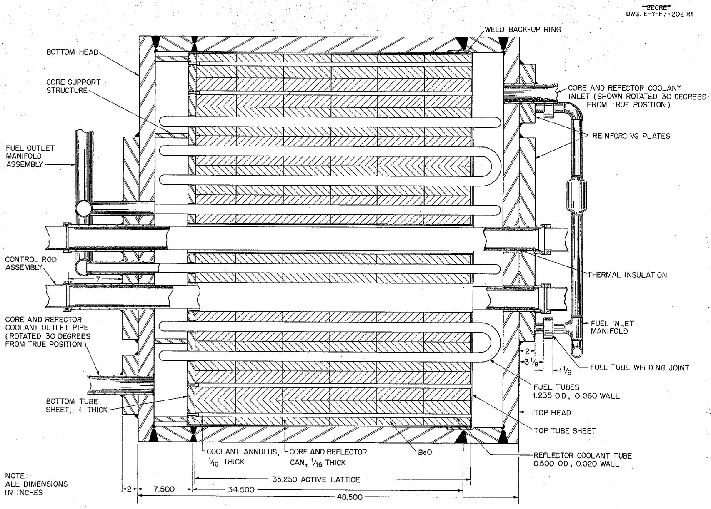  
Fig. 3. Circulating-Fuel ARE Core Design.

blocks similar to the moderator blocks but with $\frac{1}{2}$ -in. holes for the passage of reflector coolant. The reflector coolant enters at one end of the pressure shell, passes through the reflector, bathes the pressure shell and fills the moderator interstices, and exits at the other end of the pressure shell.

Primary Coolant Circuit. Hydrodynamic and thermodynamic considerations have influenced the design to such an extent that a discussion of these problems appears to be desirable prior to description of the primary coolant circuit itself. In a circulating-fuel type of reactor, heat is generated in the flowing fuel. The particle heat generation is dependent on the particle residence time within the reactor. As the flow proceeds through the tubes, the velocities adjacent to the walls are lower than the bulk mean velocities, so that the fuel particles adjacent to the walls are subjected to higher temperature rises. This effect is mitigated by convection within the fuel stream, but a temperature difference will exist between the wall and the stream center line. Studies have indicated that this temperature difference is directly proportional to the fuel power density, tube diameter, Prandtl's number, and Reynold's number. Application of these studies to various postulated ARE configurations have established that excessive temperature differences are encountered in the laminar flow region (Reynold's number below 5000) but that small temperature differences are encountered in the turbulent flow region. Consequently, the reactor core was designed for a Reynold's number of 10,000, thereby allowing for some deviation of flow rate or fluid physical properties.

The design for a straight-through flow core arrangement was revised because the calculated Reynold's

number was less than 1000. Consideration of the parameters for increasing Reynold's number indicated that the desired correction would entail increasing tube diameter, increasing the number of tubes in series, increasing the volumetric flow rate, or decreasing the volume of fuel within the core, or combinations thereof. Investigation of these variables led to the observation that a few series passes would be required even with maximum feasible exploitation of the other variables. Since this was the case, and since the design problems involved in the use of many series passes appeared to be similar to those associated with the use of a lesser number of series passes, it was decided to use 13 series passes and avoid compromising the volumetric flow rate or the core fuel volume.

Secondary Coolant Circuit. The use of a liquid circuit other than the fuel circuit within the pressure shell is desired for the following reasons: (1) to maintain the pressure shell essentially isothermal at a temperature of approximately $1150^{\circ}\mathrm{F}$ ; (2) to cool the beryllium oxide reflector with a fluid other than circulating fuel; and (3) to fill the beryllium oxide moderator interstices and other internal voids with a liquid maintained at a pressure higher than the fuel pressure to prevent a fuel tube leak from adding reactive material to the core. The liquid to be used has to be compatible with the structural material under dynamic conditions and should cause no undesirable reaction with the fuel in the event of a leak in the separating wall. At the present time it is believed that nonuranium-bearing fluorides, perhaps the fuel carrier without the $\mathrm{UF_4}$ , will best meet these specifications.

The possibility of cooling the moderator by positive flow of this fluid through the moderator interstices

# ANP PROJECT QUARTERLY PROGRESS REPORT

has been studied. It has been found, however, that the mass flow through a gap of constant periphery varies as the third power of the gap width (in the laminar flow region, with fixed pressure drop). Temperature analyses with postulated gap width distributions indicated that gross temperature inequalities could exist throughout the moderator because of tolerance accumulations affecting interstice widths. Accordingly, it has been decided to obstruct flow through the moderator so as to render it virtually stagnant. The moderator heat then is conducted to the fuel stream, and thus a relatively accurate analytical determination of moderator temperatures can be obtained.

Core Temperature Distribution. The circulating fuel in the ARE core flows in parallel through six serpentine tubes, each tube traversing the core 13 times. In passing through the core 13 times, the fuel is heated from 1150 to $1500^{\circ}\mathrm{F}$ . The calculated mixed mean fuel temperatures at various stations in the reactor are given in Table 2.

TABLE 2   
Fuel Temperature after each Pass Through Core   

<table><tr><td>STATION</td><td>MIXED FUEL
TEMPERATURE (°F)</td></tr><tr><td>Entering reactor</td><td>1150</td></tr><tr><td>Leaving pass No. 1</td><td>1171</td></tr><tr><td>2</td><td>1191</td></tr><tr><td>3</td><td>1211</td></tr><tr><td>4</td><td>1233</td></tr><tr><td>5</td><td>1257</td></tr><tr><td>6</td><td>1281</td></tr><tr><td>7</td><td>1305</td></tr><tr><td>8</td><td>1335</td></tr><tr><td>9</td><td>1365</td></tr><tr><td>10</td><td>1392</td></tr><tr><td>11</td><td>1426</td></tr><tr><td>12</td><td>1462</td></tr><tr><td>13</td><td>1500</td></tr></table>

There are two sources of heat for the fuel circulating through the reactor: internal heat generation (from fission and gamma-ray absorption) and heat transferred to the fuel from the remainder of the core. The heat transferred from the remainder of the core is produced in the following manner. Heat is generated in the moderator and the parasitic core material as a result of gamma-ray absorption, and additional heat is generated in the moderator by neutron slowing down. All this heat is transferred to the circulating fuel and results in a temperature gradient across the fuel, moderator, and parasitic material.

# EXTERNAL FLUID CIRCUIT

The ARE fluid circuit, intended to handle toxic and corrosive fluids at $1500^{\circ}\mathrm{F}$ , requires a considerable amount of design and developmental effort. Where possible, commercially available components are used, but pumps, heat exchangers, and certain other components are being constructed especially for the ARE. The location of the major system components, including the reactor pits, the heat exchanger room, the reactor, and the two heat disposal loops, is illustrated in Fig. 4. It may be noted that the heat exchanger room is shielded from the reactor pits to permit servicing after fuel drainage and flushing. The shield was designed to minimize activation of fluid circuit structure by reactor neutrons during power operation and to attenuate reactor post-shutdown gamma rays to a level permitting access to fluid circuit components after shutdown.

Pumps. The pumps to be used in the fuel and moderator coolant circuits are vertical-shaft, tangential-discharge, centrifugal pumps in which a

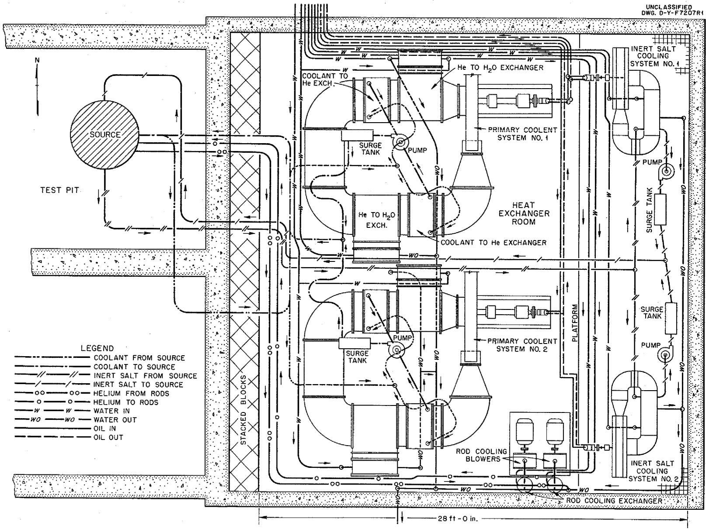  
Fig. 4. Arrangement of External Fluid Circuit Equipment.

# ANP PROJECT QUARTERLY PROGRESS REPORT

gas seal is used and the liquid level is maintained. The gas seal is formed by a floating graphite ring between the stationary nose on a bellows seal and the hardened rotating nose on the shaft. The primary pump seal carries no appreciable pressure differential and, consequently, requires that the oil-circulating system above the seal be pressurized to balance that of the circulating system below the seal. The circulating oil serves to cool the shaft, bearing, and lower seal. In addition, internal cooling of the structure is obtained by the circulation of helium. Another feature of the pump is that the entire rotating assembly can be put together outside the pumping casing, and in event of a failure it can be installed with comparative ease.

Heat Exchangers. The fuel-to-helium heat exchangers are on order with the Griscom-Russell Company; they were designed by Griscom-Russell to ORNL specifications. The heat ex-changers are of the cross-flow type with the fuel flowing through 1-in.-OD, 0.109-in. wall Inconel tubing. The tubing is finned on the gas side with stainless steel, helically wound strips. Each heat exchanger includes five parallel tube banks; each bank consists of seven to nine horizontal tubes in series with integral return bends. The fuel inlet and outlet headers are constructed of 4-in. pipeto which the five tube banks are welded.

The helium-to-water heat exchangers also are finned-tube, cross-flow ex-changers, but steel tubes with copper fins are used.

Primary Coolant System. Fuel flows from the six core tubes to a common header, and a common trunk line conveys the fuel into the heat exchanger room. The fuel then divides into two completely independent loops, each

capable of dissipating $1500^{\circ}\mathrm{F}$ kw. Within each loop the fuel divides into two parallel 750-kw fuel-to-helium heat exchangers and then passes through a centrifugal pump to a common return trunk (Fig. 4).

In an individual loop, helium flows from a centrifugal blower through a fuel-to-helium exchanger in which the temperature of the helium is increased from 250 to $750^{\circ}\mathrm{F}$ . The helium is then cooled to $250^{\circ}\mathrm{F}$ in a helium-to-water exchanger from which it passes through another heating and cooling cycle and is returned to the blower. This so-called "double-sandwich" arrangement permits two helium heat transports per cycle and thereby halves the helium flow rate required through the blower and ducting for a specified power and temperature rise.

Secondary Coolant System. The reflector and pressure shell coolants system, as in the case of the fuel system, is divided into two heat disposal loops, each capable of handling the load associated with 1500-kw reactor power. Heat is conveyed from the primary coolant to helium and then to the water sink.

Monitoring Circuit. All lines and components containing fuel or reflector coolant are double-jacketed, with helium passing through the annulus. The helium pumping head is maintained by drawing helium from the system, cooling it, and admitting it to rotary-type compressors at various points in the system as indicated. Monitoring for fluoride leaks into the helium is achieved by passing helium samples through halogen detectors.

# PREHEATING SYSTEM

The relatively high melting points of the circulating fuel and secondary coolant (around 752 to $932^{\circ}\mathrm{F}$ , depending

upon the particular fuel composition) require that all equipment within which these coolants are to be maintained be preheated to permit loading and unloading.

Reactor Assembly. The insulation heat leakage at operating temperature has been calculated to be approximately 15 kw, and the heat capacity of the assembly has been established as approximately 4000 Btu per ${}^{\circ}\mathrm{F}$ . After having studied various preheating methods, including pumping hot fluids through the fuel passages or through the moderator interstices, it was decided that the simplest method entailed the application of electrical resistance heaters to the outside of the pressure shell, with heat transport to the inner regions by conduction. With a constant heat input of 14 kw, in addition to the insulation losses, it is estimated that the assembly can be heated from room temperature to $1200^{\circ}\mathrm{F}$ in approximately four days. With this heat input rate, certain calculated temperature gradients are as follows:

1. Across pressure shell, $20^{\circ}\mathrm{F}$   
2. Across helium gap between shell inside diameter and reflector outside diameter, approximately $100^{\circ}\mathbf{F}$   
3. From reflector outside diameter to core center line, approximately $250^{\circ}\mathrm{F}$ .

Piping. The heat capacity of the piping is small relative to the piping insulation leakage. Consequently, the power required to preheat the piping is substantially the same as the power required to maintain it at the ultimate temperature. If the liquid-bearing pipes are empty, as is the case during preheating, the pipe resistance to axial heat flow is high, and the application of heat to specific points on

the pipe surface tends to cause large temperature valleys to exist between the points of heat application. By attaching electrical resistance heaters to the outer pipe of the double-walled piping, however, the flowing helium acts as a thermal conveyor and facilitates axial heat transport. Accordingly, substantially isothermal helium contacts the inner pipe, and it is thus possible to heat the pipe uniformly.

Heat Exchangers. The fuel-to-helium heat exchangers require preheating prior to filling and the addition of heat to compensate for thermal leakage during filling or at any time after filling when the fuel pumps are inoperative. These heat exchangers have a total of approximately 40 ft² of exposed free-flow area (both upstream and downstream), which, if allowed to radiate to the adjacent cold structure, would dissipate approximately 40 kw when the tubes are at $1325^{\circ}\mathrm{F}$ . Accordingly, it appears necessary to include radiation barriers in the form of gates that can be lowered during warm-up or zero- or low-power operation. When these radiation barriers are in position, the fuel-to-helium heat exchangers are enclosed and may be preheated by means of hot helium supplied by the external piping annuli.

# ELECTRICAL POWER CIRCUITS

Because of the extreme inconveniences associated with forced reactor shutdown, fuel drainage, refilling, and restarting, the objective has been to design the system so that no one failure will necessitate a forced shutdown. Critical pumps, blowers, etc. are duplicated, and each set is served by an independent d-c circuit that includes independent

# ANP PROJECT QUARTERLY PROGRESS REPORT

buses, switches, and a-c-d-c motor-generator sets. The use of direct current for these circuits permits convenient speed control where required and the use of battery sets floating on the line to safeguard against outside power failures. Alternating-current instruments are fed from the d-c circuits via d-c-a-c motor-generator sets so that these instruments will derive their power from the batteries in an emergency.

The heat capacity of the system is large relative to the heat leakage rate, so that no large temperature loss will be incurred for about 6 hr in an emergency. Consequently, it is not necessary to use battery power for system heat addition. System heaters, therefore, are connected directly to the 440-v a-c circuit. Similarly, the building crane and certain other items will not need to be operative during any short period in which it is necessary to use battery power, so these components are supplied by the 440-v a-c system.

# CONTROL SYSTEM

The ARE is controlled by three essentially separate systems: (1) regulating, (2) shim, and (3) safety. A mechanical regulating rod is provided, since the time-constants of the self-stabilizing effects of the fuel expansion in the ARE are too long to provide stiff control of the reactor. Shim control is conveniently effected by the addition of higher-uranium concentration fuel to the circulating-fuel volume.

Specifications for the control console and panel have been released with a specified delivery date of October 1, 1952. The high-temperature fission chamber has operated at $1292^{\circ}\mathrm{F}$ , and an MTR-type servo for the regulating rod has been ordered. The kinetic

behavior is currently being analyzed on the analogue computer.

Shim Control. Fuel enrichment will be accomplished by adding enriched molten fuel at the surge tank. The molten concentrate will be introduced through a small $(1/4$ -in.) line, which, by means of a video pickup device, can be observed from the control room while fuel additions are being made. The fuel-enrichment mechanism has been laid out in elementary form. The principles of operation have been established, but the tanks, weighing devices, valves, heaters, etc. have not been detailed. This system is much simpler than was first thought possible and it makes possible a safe and relatively easy technique of bringing the reactor to critical after the initial loading.

Regulating and Safety Rods. Because of the low power density of the circulating-fuel ARE, the temperature coefficient of the fuel must be supplemented by a servo-actuated regulating rod if transient conditions are to be controlled. This servo will operate in exactly the same manner as the fuel temperature coefficient. The error signal that actuates the servo will be a mixed signal of temperature and neutron flux; it is given by the equation

$$
\epsilon = \left(\theta_ {i} - \theta_ {i, 0}\right) + 5 8. 5 (p - p _ {0}),
$$

where

$$
\epsilon = \text {e r r o r}
$$

$$
\theta_ {i} - \theta_ {i, 0} = \text {r e a c t o r i n l e t e r r o r i n} ^ {\circ} F,
$$

$$
\left(p - p _ {0}\right) = \text {r e a c t o r} p o w e r e r r o r i n m e g a w a t t s (\text {t h e f a c t o r} 5 8. 5 \text {i s i n} ^ {\circ} F \text {p e r m e g a - w a t t}).
$$

When $\epsilon < 0$ the servo withdraws the rod, and when $\epsilon > 0$ the servo inserts the rod. This servo equation is different from that previously reported as a result of a change in reactor design.

A change has been made in the location of the drive mechanisms for the regulating and safety rods. They will not be located over the reactor pit, and they will have straight linkages to the rods. This change will allow considerable simplification of the overall mechanical control system.

An MTR-type servo has been ordered for the regulating rod. The regulating rod and safety rod designs have been determined and the fabrication of these rods has been turned over to the Metallurgy Division. After fabrication, the rods will be run in the "cold" critical assembly to determine their worth. Calculations indicate that the safety rods are worth approximately $5\% \Delta k / k$ , and the regulating rod will be loaded so as to be worth about $0.75\% \Delta k / k$ . One safety rod operating mechanism has been finished by the machine shop. This assembly has not been tested, but the design seems to be satisfactory.

High-Temperature Fission Chamber. The fission chamber has been operated at $700^{\circ}\mathrm{F}$ but no insulator material has been found that will withstand higher temperatures. A design is in progress that eliminates the insulator in the high-temperature region. This chamber has not been tested and there is no certainty that it will function properly. Because of the uncertainty of high-temperature operation of the fission chambers, sufficient cooling is being provided to maintain the chambers at $400^{\circ}\mathrm{F}$ , where it is known they will function.

Control Console and Panel. Complete specifications for the components of the control room have been released, including detailed construction drawings and fabricational and material specifications. Sets of these specifications have been mailed to ten prospective bidders, and the bids are to be received by March 1. The instructions to bidders specified that the complete order is to be filled by October 1, 1952.

The items covered in these drawings and specifications include an operating console, instrument racks, relay racks, recorders for nuclear measurements, amplifiers, power supplies, and assorted mounting hardware. Items not covered in this outside order are nuclear chambers, some preamplifiers, servos, and process instruments. The order takes care of from 90 to $95\%$ of the electronic equipment needed for the ARE.

Reactor Dynamic Computer. The entire circuit of the ARE has been put on the analogue computer, and the kinetic behavior of the system is being analyzed. The analysis is not yet complete, but the work is progressing satisfactorily and indications are that a fairly comprehensive study will result from this work. This computer analysis has received the full attention of two engineers for the past eight months.

# INSTRUMENTATION

A basic purpose of the ARE is the acquisition of experimental data, so the importance of complete and reliable instrumentation cannot be over-emphasized. Most ARE process instrumentation is intended to observe and record rotational speeds, flow rates, temperatures, pressures, or liquid levels. In the low-temperature

# ANP PROJECT QUARTERLY PROGRESS REPORT

loops, this equipment is sufficiently conventional to obviate the need for detailed descriptions. The high-temperature loops involve special sensory problems, however, which may merit some discussion. In some instances several alternate sensory principles are under development concurrently. No attempt will be made to describe each of these alternate methods in detail in this report; however, the various techniques that are being used or developed are outlined in the section on "Experimental Reactor Engineering" (sec. 3).

# BUILDING

The building to house the ARE is proceeding on schedule. Additional contracts have been negotiated with the contractor to complete work not specified in the original contract, and this new work is to be completed so that the building can be released to ORNL by June 1, 1952. The auxiliary power specifications have been completed and orders for the equipment are being released. An elementary electrical diagram for this equipment has been drawn.

# 3. EXPERIMENTAL REACTOR ENGINEERING

H. W. Savage, ANP Division

Liquid metals, hydroxides, and mixed fluorides are being investigated as heat transfer media and fuels for aircraft reactor experimentation at temperatures of 1200 to $1800^{\circ}\mathrm{F}$ . Some developmental effort on the use of sodium and sodium-potassium alloy continues, although the effort on the technology of molten fluoride mixtures, as required by the circulating-fuel reactor, predominates. The development of fluoride systems is limited by the corrosion problem (see sec. 11 "Corrosion Research"). Chemical and physical treatment of fluoride components to eliminate contaminants and improving handling, storing, and transfer techniques to avoid reintroduction of contaminants are being studied as means of limiting corrosion.

The applicability of known methods of pumping, sealing, controlling, and measuring properties and quantities of these high-temperature coolants and fuels is being investigated. The high-temperature reactor systems, however, place unique restrictions on materials, lubricants, leakage, and performance of mechanical devices and associated equipment. Pumping has been accomplished with conventional hydraulic designs, but alleviation of thermal distortions and stresses, cooling of bearings, and the development of liquid- and gas-tight seals have been required. Alleviation of thermal distortions and the development of liquid-tight seals have also been required for valves. In addition, the valves must contain seal materials that will not interdiffuse in the presence of the coolant at high temperatures. Lubrication of the moving parts of these devices at high temperatures has been accomplished. The cumbersome, and at times massive, geometry of

these devices has made it necessary to provide auxiliary heating to avoid freezing of the coolant.

Heating and cooling of liquid metals, hydroxides, and mixed fluorides are being investigated from room temperature to $1800^{\circ}\mathrm{F}$ . The high melting temperatures of hydroxides and fluorides have introduced preheating, insulation, and operational complexities, since it is desirable to avoid freezing of the coolant and possible bursting of containers upon remelting. Heat transfer studies at temperatures at which the materials are molten thus far appear to be straightforward, and the technology advances at the rate at which the controlling physical properties are defined.

Equipment performance is improving markedly, and a number of mechanical and other devices for fluorides have been operated for periods exceeding 1000 hr in some cases without visible equipment damage and without leakage. Heat exchangers are being designed for aircraft and laboratory application, and the NaK-to-NaK heat exchanger has now operated for over 2000 hr at $1500^{\circ}\mathrm{F}$ . Flow, volume, pressure, and temperature control appear to be straightforward if care is exercised at the high temperatures involved.

# SEALS AND CLOSURES

Frozen-sodium-sealed pumps have operated over extended periods, and frozen fluorides that have been used for sealing shafts show considerable promise of giving satisfactory service. The metallic braid with self-contained packing lubricant appears to be highly

# ANP PROJECT QUARTERLY PROGRESS REPORT

satisfactory for use with molten fluorides. Controlled isolation of two sections of a fused salt system has been accomplished by the use of a "freeze valve." Welded or metal-gasketed joints are used in piping systems. Improved weld designs and welding techniques that allow full penetration of weld metal have made possible the operation of equipment without failure for extended periods. Flanged joint seals with oval-ring gaskets have proved satisfactory for operation at temperatures to $1300^{\circ}\mathrm{F}$ .

Frozen Sodium Seal. The frozen-sodium-sealed pump reported in the last quarterly report $^{(1)}$ has operated approximately 1500 hr during this quarter without failure of the frozen sodium seal. A modified Durco centrifugal pump has been constructed that has a finned sleeve for forming a frozen sodium seal by means of convective cooling.

Frozen Fluoride Seal (W. B. McDonald and P. W. Smith, ANP Division). An additional 160 hr of testing was accomplished during this period with the frozen fluoride seal previously reported(2) (Fig. 5). Initial tests were conducted to determine whether a frozen fluoride seal is feasible, and additional tests were conducted to determine (1) the effect of fluorides on the Stellar-coated shaft around which the seal is formed; (2) the maximum pressure that can be sealed without leakage; (3) the problems encountered in starting the shaft after it has been stopped and the fluorides permitted to freeze around the shaft; and (4) the determination of design and operational parameters with this

type of seal. These tests indicate that greater clearance is desirable between shaft and cooling sleeve than was used in the frozen sodium seal. A build-up of magnetic, metallic material, from 1 to 2 mils thick, was found on the shaft and cooling sleeve. Several shallow surface scratches were found on the shaft; however, these were no more severe than those normally encountered with stuffing-box packing materials. A significant difference was found between a frozen fluoride seal and a frozen sodium seal; when rotation is stopped and fluorides are permitted to freeze around the shaft, it is necessary to apply heat to the shaft in order to free it for continued operation. Maximum pressure limits for this seal were not determined; however, the seal was operated against 60-psi pressure, which is satisfactory for the operation of the ARE.

Bellows Type of Face Seal for ARE Pump. Sealing of the ARE pump is accomplished by two bellows type of face seals installed in series. The seal below the bearing space consists of a graphite ring floating between two hardened, metallic sealing faces, one on the nose of the bellows and the other attached to and rotating with the shaft.

Sealing against the atmosphere is accomplished by the conventional lapped face seal above the bearings. This arrangement permits the lower seal, which must operate at higher temperatures, to operate with no pressured differential across it and thus lengthens the life of the seal. This arrangement would also permit complete isolation of the system from the ambient atmosphere in the pump room if leakage should occur in the primary seal.

The temperature of the upper high-pressure seal can be easily controlled

and should present no problem. Any leakage of bearing lubricant into the system would be trapped immediately below the seal and could be easily removed from the system.

Stuffing-Box Seals for Molten Fluorides (H. R. Johnson, ANP Division). Thin-walled bellows have thus far been unsatisfactory for sealing against high-temperature flucrides

UNCLASSIFIED

DWG.14424

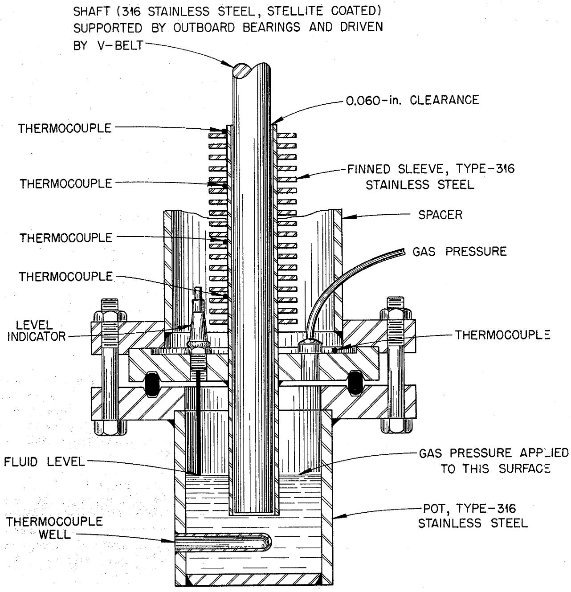  
Fig. 5. Frozen Fluoride Seal Tester.

owing to metal and weld failures. A stuffing-box seal for a valve stem has been developed that will furnish a positive seal against fluorides at $1500^{\circ}\mathrm{F}$ . Such a seal has operated satisfactorily and has sealed against fluid pressures to 50 psig. The seal consists of a conventional type of stuffing box in which successive layers of Inconel braid, graphite, nickel powder, and another layer of Inconel braid are packed under compression around a shaft. A conventional stainless steel globe valve with the stem packed in this manner has operated during this period for more than 700 hr at $1500^{\circ}\mathrm{F}$ and 30-psi pressure and is still in operation.

The molten fluorides pump described in the following is sealed with a conventional stuffing-box arrangement by using four rings of commercial-graphite-impregnated asbestos packing separated by Teflon washers. The washers are machined from Teflon bar stock, since it has been determined that sheet Teflon formed by extrusion or rolling processes has a "memory" for its preextruded shape and at elevated temperatures tends to return to this shape. The stuffing box is surrounded by a cooling coil through which refrigerated ethylene glycol is circulated.

Lubrication of Seals and Shafts (H. R. Johnson, ANP Division). Tests indicate that when the valve stem seal described above is lubricated periodically (a few drops each week) with tricresyl phosphate (a compound used for lubricating wire-drawing dies), friction is reduced to the point where this high-temperature valve can be operated with as little friction as a standard valve operated at room temperature.

Further tests show that when such a gland is packed with Inconel braid and finely powdered $\mathrm{UF_4}$ is substituted for the nickel and graphite powders, a

shaft can be rotated at 1000 rpm with the entire assembly heated to $1500^{\circ}\mathrm{F}$ with no damage to the shaft.

According to the Celanese Corporation of America, extensive tests indicate that tricresyl phosphate has approximately six times the film strength of a lubricating oil of approximately the same viscosity. Continuous heating at well over $200^{\circ}\mathrm{F}$ in the presence of air is required to bring about decomposition. "The lubricating effect of tricresyl phosphate on iron is believed to be due to formation of iron phosphide $\mathsf{Fe}_3\mathsf{P}$ ."(3) A valve stem lubricated periodically (a few drops once a week) with tricresyl phosphate has operated 660 hr, and it remains very easy to turn.

# PUMPS

Development of a mechanical pump has progressed to the point where reliable operation can be expected in forced-circulation systems containing either liquid metals or molten fluorides with fluid temperatures in the pump as high as $1300^{\circ}\mathrm{F}$ . Designs have been completed, and fabrication of pumps, which are expected to operate reliably at $1500^{\circ}\mathrm{F}$ or above, is under way. All pumps tested to date are of laboratory size; however, pumps designed to meet ARE flow and head requirements have been designed and are to be fabricated.

ARE Centrifugal Pump (W. G. Cobb, G. F. Wislicenus, J. F. Haines, and A. G. Grindell). The ARE fluid circuit consists of two pumps in the circulating-fuel system and two pumps in the moderator coolant system. The head and flow requirements for each of

these pumps are identical. Each must deliver approximately 45 gpm with a head of approximately 45 ft of fluid pumped. Two models have been proposed and designed for ARE service.

The ARE centrifugal pump, Model D, requires a gas seal, whereas ARE centrifugal pump, Model F, has a frozen fluoride seal. The design features of Model D were described in the last quarterly report. The assembly of this pump is shown in Fig. 6. The Y-12 shops are presently in the process of fabricating three Model D pumps from type-316 stainless steel. The Model F frozen-fluoride-sealed pump is almost identical to the Model D pump, with the exception of the inclusion of a gas-cooled section in which the fluorides surrounding the shaft will be frozen. The principle of the frozen fluoride seal has been described in the section on "Seals and Closures" as well as in the two previous quarterly reports.

Laboratory Frozen-Fluoride-Sealed Centrifugal Pump (W. G. Cobb and P. W. Taylor). The laboratory size centrifugal pump described previously(4) has been used to circulate molten fluorides in an isothermal loop operating at temperatures up to $1300^{\circ}\mathrm{F}$ for more than 500 hours. Although some shutdowns have occurred because of leaks in the plumbing system, no indication of failure has been encountered in the pump itself. This pump has been modified to incorporate a Graphit-ter, rotary face seal in place of the graphite-impregnated-asbestos stuffing-box seal, and the parting faces of the pump casing have been moved to a point above the liquid level in the pump. These modifications are expected to make it possible for this pump to

circulate fluids at temperatures in excess of $1500^{\circ}\mathrm{F}$ .

Worthite Frozen-Sodium-Sealed Pump (W. B. McDonald and W. R. Huntley). The Worthite centrifugal pump modified to incorporate the frozen-sodium seal, testing of which was described in the last report, $^{(1)}$ has been transferred from an isothermal loop to operation in a figure-8 loop. This pump has operated for a total of approximately 1500 hr with no seal failure. Occasional shutdowns for repair have been caused by the mass transfer of copper from the gasket used to seal the parting faces of the pump to the shaft in the cold section of the sealing annulus. This resulted in a build-up on the sleeve, which filled the annulus and froze the shaft. The copper gasket has been replaced by a soft nickel gasket and the mass transfer condition has apparently been remedied. Maximum sodium temperature in this loop is $1500^{\circ}\mathrm{F}$ and the sodium temperature at the pump is between 1000 and $1100^{\circ}\mathrm{F}$ .

During the total operating time no difficulty has been experienced in starting the cold pump from stand-by conditions. As soon as molten sodium is lifted from the sump to the pump the shaft rotates freely. Some bearing failures have been encountered owing to the proximity of the bearing housing to the high-temperature pump casing. Further modifications have been designed for moving the bearing housing away from the pump and also for furnishing better lubrication to the bearings. Such a pump is expected to operate at $1500^{\circ}\mathrm{F}$ .

Modified Durco Centrifugal Pumps. Three Durco centrifugal pumps are currently being modified for the forced circulation of fluorides or sodium. The sodium pump will incorporate a frozen sodium seal, and the two fluoride pumps will be modified, one to a frozen fluoride seal and the other to a stuffing-box seal.

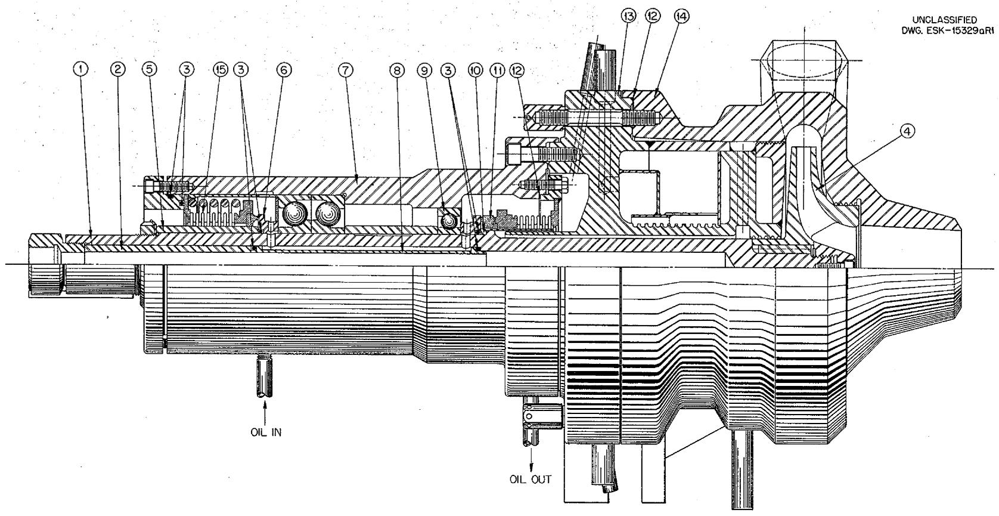  
Fig. 6. ARE Centrifugal Pump.

ANP PROJECT QUARTERLY PROGRESS REPORT

1. Shaft, type-316 stainless steel.   
2. Shaft liner spacer, any 300-series stainless steel.   
3. "O" ring, material to be recommended by seal manufacturer.   
4. Impeller, type-316 corrosion-resistant steel casting.   
5. Pressure sleeve, any 300-series stainless steel.   
6. Seal face ring, Ontario steel.   
7. Bearing housing, type-316 corrosion-resistant steel.

8. Shaft liner, any 300-series stainless steel.   
9. Single-row radial ball bearings.   
10. Slinger, type-316 stainless steel.   
11. Special graphite ring, alternate with seal arrangement.   
12. Gasket, copper.   
13. Pump body assembly.   
14. Impeller casing assembly.   
15. Bellows shaft seal.

Construction is under way on a type-316 stainless steel Durco centrifugal pump having a conventional stuffing box packed with Inconel braid and a lubricant similar to that described in the first part of this section. The portion of the shaft passing through the stuffing box is hard-faced with a layer of Stellite 1/16-in. thick.

A Durco centrifugal pump (Model H 34MDVX-80) made of type-316 stainless steel has been modified to incorporate a frozen sodium seal. The seal is cooled by forced convection. The lubricating oil for the bearings is circulated through a cooling radiator. This pump will deliver 45 gpm with a head of 45 ft of fluid and is expected to operate over a temperature range of 1000 to $1300^{\circ}\mathrm{F}$ . The modified pump is being assembled in an isothermal loop that has temperature measurement, flow measurement, and control equipment.

Forced-Convection-Cooled Sodium-Sealed Pump. A type-316 stainless steel Durco pump similar to that described above has been modified to incorporate a copper-finned-sleeve frozen sodium seal that will be cooled by forced-air convection. This pump is designed to be used for supplying sodium at approximately $1500^{\circ}\mathrm{F}$ to a fluid-to-air radiator for the operation of a Boeing turbojet engine. The pump will operate at 3000 rpm and deliver 50 gpm of sodium at 20 psig. The temperature of the sodium at the pump will be approximately $1100^{\circ}\mathrm{F}$ .

Canned-Rotor Pump (M. Richardson, Reactor Experimental Engineering Division). The new, 3/4-hp, canned-rotor pump for the NaK loop has been installed and operated for about 8 hours. At present the pump motors are of two different types - a standard wound motor and a motor with G-E Class H insulation for $500^{\circ}$ F operation. The

$1000^{\circ}F$ , Bentley-Harris, insulated wire has arrived and is in the shop to be wound. It appears that the No. 22 wire will fit in the existing stator slots without enlarging the slots.

The loop was started with considerable difficulty because of a partial plug in the suction-line valve seat. However, the plug was partly cleared and the loop checked to temperatures of 500 to $650^{\circ}\mathrm{F}$ by using the newly installed cooler that feeds cold metal back through the motors. Only a slight rise above normal operating temperatures for the motors was noted. The pump was shut down when a leak occurred at the discharge flange.

# VALVES

In the construction of a plumbing system for the forced circulation of high-temperature fluids such as will be encountered in the ARE, it will be necessary at several points to incorporate valves that will operate reliably in any emergency. Some of these valves may be normally open or normally closed and required to open only once, whereas others may be required to open at more frequent intervals. It is an absolute requirement, however, that each valve incorporated in the system perform its designated function quickly and reliably at any desired time during the entire life of the system. During this period emphasis has been placed on the development of valves for such application.

Packing-Gland Seal Test Equipment. Equipment has been designed and is now being constructed for extensive testing of the packing-gland type of seal described above (see "Seals and Closures"). Although initial tests have produced a valve that appears to be reliable, the optimum design of such a seal, as well as the most

satisfactory packing materials and lubricants, should be determined.

Frozen Fluorides Valve (W. G. Cobb). It has been determined in actual tests that two sections of a high-temperature forced-circulation fluoride system can be isolated from each other by means of freezing a short section of the connecting pipe. This frozen section can be melted and operation resumed at any desired time. Such a valve, however, is not quick-acting. Several minutes are required to either freeze or melt the fluoride. It is thought that a valve of this type used in series with the conventional valve described above would provide adequate protection against leakage past a valve seat. Such an application would be the isolation of the dump tanks from the ARE system.

Ball Check Valves (D. R. Ward). Specially designed ball check valves (Fig. 7) have been operated to transfer fluoride at $1400^{\circ}\mathrm{F}$ . The balls were constructed of type-440 (passivated) stainless steel and the housing and fittings were of type-316 stainless steel. There was some slight evidence of the balls sticking in the open position, but in all cases increased pressure or slight tapping of the valve corrected this condition.

Valve Seat Test (A. P. Fraas and G. Petersen). Zirconium and molybdenum were recommended and tested as valve seat materials because neither element diffuses readily at high temperatures, and zirconium does not readily alloy with other metals. Both materials operated satisfactorily as valve seats for 175 hr in sodium at temperatures up to $1500^{\circ}\mathrm{F}$ . Metallurgical examination following this test indicated that the zirconium was slightly attacked but there was no evidence of attack on the molybdenum.

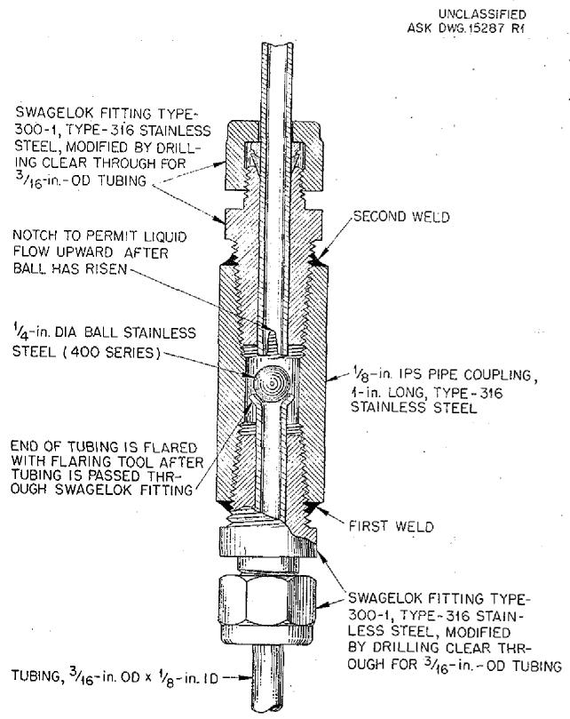  
Fig. 7. Ball Check Valve.

# HEAT EXCHANGERS

Heat transfer studies of the fluorides and liquid metals indicate that essentially conventional types of heat exchangers will be applicable to these systems once the corrosion problems with these fluids are surmounted. The NaK-to-NaK heat exchanger has now operated for well over 2000 hr with no apparent loss in performance. Other heat exchangers have been designed for aircraft application as well as for use in other laboratory tests.

Aircraft Type of Radiator (J. F. Bailey and W. C. Tunnell, ANP Division). A literature survey of the present fluid-to-gas heat exchangers

indicated that some aircraft and locomotive radiators with similar requirements for space, weight, and efficiency have been operated with the gas passing through the tubes and the fluid flowing through the interstices between the closely stacked tubes. This has resulted in a design proposed for a fluoride-to-air radiator.

Preliminary calculations on the basis of arbitrarily chosen dimensions indicate that 1/2-in.-OD by 0.010-in.-wall Inconel tubes flattened to a rectangular cross section and stacked in close contact with each other may result in a desirable heat exchanger configuration. Air will flow through the flattened tubes and fluorides around the tubes in the interstices. The advantages of the design appear to be: (1) parallel (essentially) counter-flowing fluids, (2) no serious thermal expansion problems, (3) low air pressure drop across the exchanger, (4) low specific volume (in.3 per megawatt of heat transferred) of the heat exchanger, (5) simplified fabrication because all welds are exposed for easy inspection and repair, and (6) versatile tube spacing.

Sodium-to-Air Radiator (A. P. Fraas and G. D. Whitman). The testing of the high-performance, air-radiator, core element described in the last report(5) has not yet been accomplished because of delays encountered in Microbrazing the parts. The contractor who is performing the Microbrazing operation has promised delivery by March 10.

The forced-circulation sodium loop for testing the performance of this heat exchanger has been completed. The

loop is heated by $I^2 R$ losses in the piping. An air flow test of the core element, which was made prior to the Microbrazing operation, indicates that the air pressure drop is approximately 30% lower than had been estimated for the "cold" condition.

Fluoride-to-Fluoride Heat Exchanger (D. Salmon). The performance of a small shell-and-tube heat exchanger operating with fluoride mixtures in pure counterflow in a single-fluid figure-8 system was investigated. Tubing chosen for the study was 0.10-in.-ID by 0.025-in.-wall Inconel, and the parameters taken were flow rate, number of tubes, and length of exchanger. The results of the investigation were plotted over a range of flows from 1 to 1000 lb/hr/tube and for lengths from 1 to 10 feet.

Considering the limitations of available heat sources and pumps, a heat exchanger containing 52 tubes and having an effective length of 1.5 ft was analyzed using the above data. Its performance is shown in Table 3 for a constant heat input to the system of 70,000 Btu/hr.

For obtaining heat transfer it would be desirable to have the Reynold's number range extend well into the turbulent region, and it is seen from the tabulated data that the turbulent region would be barely penetrated at the highest flow for the heat exchanger analyzed.

The main value of such a heat exchanger system would be for endurance testing to determine the effect of high-temperature dynamic corrosion and possible deterioration of heat transfer performance for a heat exchanger in which small tubes and delicate fabricating techniques are used.

TABLE 3   
Performance of Fluoride-to-Fluoride Heat Exchanger   

<table><tr><td>SYSTEM FLOW RATE (gpm)</td><td>HEAT TRANSFER IN EXCHANGER (Btu/hr)</td><td>PRESSURE DROP IN EXCHANGER (psi)</td><td>REYNOLDS NO. IN EXCHANGER</td><td>INLET COLD TEMP. FOR INLET HOT TEMP. OF 1500°F (°F)</td></tr><tr><td>0.52</td><td>37,500</td><td>0.027</td><td>104</td><td>970</td></tr><tr><td>1.56</td><td>30,000</td><td>0.26</td><td>312</td><td>1336</td></tr><tr><td>5.2</td><td>23,500</td><td>2.5</td><td>1040</td><td>1456</td></tr><tr><td>10.4</td><td>20,000</td><td>10.0</td><td>2080</td><td>1478</td></tr><tr><td>15.6</td><td>18,500</td><td>21.0</td><td>3120</td><td>1486</td></tr></table>

NaK-to-NaK Heat Exchanger (A. P. Fraas). The previously reported(6) NaK-to-NaK heat exchanger, core element consisting of 52 tubes 1/8 in. OD has continued in operation. The total running time has reached 2230 hr, over 2000 hr of which have been with a heat exchanger inlet temperature of $1500^{\circ}\mathrm{F}$ and an outlet temperature of $1000^{\circ}\mathrm{F}$ for the hot stream. The cold stream is about $50^{\circ}\mathrm{F}$ lower at inlet and outlet.

No apparent losses in heat transfer performance or increase in pressure drop have occurred. The only difficulty experienced after the initial "shake-down" of the loop has been that the accumulation of oxide in the header tank became great enough after 2000 hr to interfere with the operation of the level control. The header tank and filter have been removed, cleaned out, reinstalled, and operation resumed.

Heat Transfer in Circulating Fluoride Loops. A series of loops are being constructed for circulating

fluorides at various rates to obtain thermodynamic, hydraulic, and other engineering data. The first loop uses convection circulation and has been in operation for 500 hours. The loops are made of 1/2-in.-ips Inconel pipe, heated by electric tube furnace elements, and cooled by natural convective air over a coiled pipe section. By means of a heat balance on the heater section, flow rates, velocities, and heat transfer coefficients are calculated. Data derived from the first loop, designated Model A-1, are given in Table 4.

A natural circulation loop (designated Model B) has been designed to maintain $600^{\circ}\mathrm{F}$ temperature difference between hot and cold legs. The diameter of the tubing between the hot and cold legs is reduced to achieve velocities of the order of 5 ft per second. This loop, fabricated from l-in.-ips Inconel pipe with a finned-tube cooling section, will be heated by electric tube furnace elements. The loop is expected to operate with a maximum hot-leg temperature of 1500 to $1600^{\circ}\mathrm{F}$ and a cold-leg temperature of 900 to $1000^{\circ}\mathrm{F}$ .

TABLE 4   
Analysis of Heater Section (Model A-1)   

<table><tr><td rowspan="2"></td><td colspan="4">RUN NUMBER</td></tr><tr><td>1</td><td>2</td><td>3</td><td>4</td></tr><tr><td>Heat input (Btu/hr)</td><td>36,460</td><td>36,660</td><td>33,600</td><td>29,600</td></tr><tr><td>Over-all heat transfer coefficient (Btu/hr·ft2·°F)</td><td>43.0</td><td>34.0</td><td>34.8</td><td>37.5</td></tr><tr><td>Flow rate (lb/sec)</td><td>0.09</td><td>0.08</td><td>0.07</td><td>0.03</td></tr><tr><td>Velocity (ft/sec)</td><td>0.35</td><td>0.30</td><td>0.29</td><td>0.13</td></tr><tr><td>Inside heat transfer coefficient (Btu/hr·ft2·°F)</td><td>132</td><td>82</td><td>108</td><td>129</td></tr><tr><td>Heater outlet temperature (°F)</td><td>1,450</td><td>1,275</td><td>1,343</td><td>1,580</td></tr><tr><td>Heater inlet temperature (°F)</td><td>1,172</td><td>950</td><td>1,029</td><td>977</td></tr><tr><td>Flow rate from hydraulic analysis (lb/sec)</td><td>0.03</td><td></td><td></td><td></td></tr></table>

# INSTRUMENTATION

Operation of a high-temperature forced-circulation system with either liquid metals or molten fluorides necessitates maintenance of level indication and control, accurate determination of flow rates, and reliable pressure measurements at several points in the system. Since the use of most commercially available equipment for performing these functions is limited to temperatures considerably lower than the minimum operating temperature, an extensive developmental program has been carried out to either produce new instruments or remove the temperature limitations placed on existing instrumentation. Development has now progressed to the point where levels can be controlled in both high-temperature fluoride and sodium systems with great reliability for periods extending more than 2000 hours. Although equipment is still lacking for the calibration of flow measuring devices, means are now available for

extended periods. The degree of accuracy eventually attainable will depend upon the procurement of accurate calibration equipment. Pressures are reliably measured at many points in fluoride and sodium forced-circulation systems with both commercial and locally developed instrumentation.

Flow Measurement. Electromagnetic flowmeters have proved to be very reliable when used with systems circulating sodium or other liquid metals having good electrical conductivity. With liquid metals it is possible to measure to as high a degree of accuracy as is permitted by the calibrating equipment. In the case of fluorides, which have very low electrical conductivity, the prospects of using an electromagnetic flowmeter are nil. A venturi section with associated pressure sensing instruments appears to be the most attractive device for measuring flow in a high-temperature fluoride system because of the low head

# ANP PROJECT QUARTERLY PROGRESS REPORT

loss. The extrapolation of water-calibrated ventures to fluorides has been sufficiently accurate.

Pressure Measurement. No pressure-sensitive instrument has been developed at ORNL or found commercially available that will operate at the temperatures encountered in the forced-circulation systems. The highest temperature rating of any known commercial instrument is $450^{\circ}\mathrm{F}$ . Consequently, all pressure measuring devices have used trapped gas, which results in the pressure at the gas-liquid interface being measured instead of that of the liquid stream. However, this error in pressure measurement can be minimized by calibrating each set of instruments and associated gas traps with accurate weigh-tank calibration equipment.

Bourdon tube pressure gages are sufficiently reliable for rough pressure measurements but are not desirable if a high degree of accuracy is to be obtained. Bourdon tube gages, which indicate the differential pressures directly, are commercially available.

The null balance type of pressure gages indicate differential pressure on a single gage to the nearest hundredth of a pound per square inch. Although use of this instrument is limited by temperature, it was connected to the hot liquid stream by gas lines and was operated successfully with the gage at room temperature.

Manometers have also been used to measure differential pressure. Although they provide a reasonably accurate measurement of the differential pressure, these devices are more difficult to seal than the other systems described and are therefore not recommended for use with a trapped gas system.

Temperature Measurement. Temperatures up to $2000^{\circ}\mathrm{F}$ are measured by

means of Chromel-Alumel thermocouples and are recorded on multipoint Brown temperature recorders. It has been found that the accuracy of temperature measurement depends to a great extent on the fabrication and installation of the thermocouples. Two methods of thermocouple attachment are being used: (1) pulse-welding each thermocouple wire to the outside surface of pipes or containers and (2) forming a beaded junction of the two thermocouple wires. In each case the thermocouple is given additional rigidity by tying it down with nichrome wire. With either of these methods a temperature error is introduced if the thermocouple is not insulated from ambient air or other adjacent material. Borax has been found to form an airtight coating that prevents further oxidation.

Tests conducted with thermocouples placed in deep wells centered in the flowing stream and other couples directly opposite on the external surface of the pipe have revealed that there is no more than a $15^{\circ}\mathrm{F}$ temperature drop between the internal thermocouple and that placed on the outside. Thermocouples made by beading the wires are accurate within $\pm 1^{\circ}\mathrm{F}$ .

The Brown temperature recorders, with careful adjustment, will record temperatures accurately within $\pm 1^{\circ}\mathrm{F}$ over the full range from 0 to $2000^{\circ}\mathrm{F}$ . They do however show a tendency to drift after extended periods of operation, and cause errors of the order of $5^{\circ}\mathrm{F}$ . This necessitates frequent calibration of the instruments; therefore a program for routine inspection has been set up, which should reveal any instrumentation errors soon after their occurrence.

Level Controls and Level Indicators (A. L. Southern, ANP Division). Four level indicating devices have proved

satisfactory for use in high-temperature liquids. The conventional probETYPE of level control operates a relay or solenoid when the level of the conducting fluid rises to short out the probe. Such a level control has proved most satisfactory both with liquid metals and molten fluorides, although in the case of liquid metals some difficulty was encountered because condensation on the spark plug insulation shorted out the plug.

Another level indicator using the principle of a resonant cavity has been designed, and simulated experiments indicate that this instrument may give satisfactory performance.

The variable inductance level indicator consists of a small coil wound on the outside of the tank in which the level is controlled and a tapered iron core mounted on a float inside the tank. The change in level raises and lowers the tapered core inside the coil and alters the inductance. Tests made with the iron core at room temperature demonstrate that it gives a linear response that can be directly correlated to a level inside the system.

The fourth level indicator developed consists of a small tube extending to the bottom of the tank in which the level is to be controlled. Gas flowing through this tube bubbles through the liquid. The pressure required to maintain a constant flow of gas through the liquid is directly related to the height of the liquid level above the end of the tube and is measured by a manometer connected between the gas tube and the gas space above the free surface of the liquid. Such an instrument can be used for indicating and controlling liquid levels.

# HEATING AND COOLING OF HIGH-TEMPERATURE SYSTEMS

Heating and cooling of liquid metals, hydroxides, and mixed fluor-rides are being investigated from room temperature to $1800^{\circ}\mathrm{F}$ . Laboratory methods of heating, some of which are applicable to reactor preheating, have included a variety of electrical means, and gas heating ovens are being installed. Cooling has been accomplished by liquid-to-liquid and liquid-to-air heat exchange. Knowledge of heat transfer properties, film coefficients, and the effects of turbulence is increasing.

Initial attempts at preheating systems to be used in handling fused fluoride mixtures melting between 800 and $1000^{\circ}\mathrm{F}$ resulted in an epidemic of heater failures. Heating methods used with sodium were studied and improved to avoid overheating of heater elements, and the insulation, which had been chosen for inertness in contact with sodium, was improved to reduce heat losses. The heating techniques described below, which were developed for use with fluorides, are equally applicable to hydroxides and liquid metals.

External Heating Systems. Several varieties of external heater units have been tested in fluoride systems. The different heat units included an integral heater-insulation assembly that can be prefabricated in the desired shape, a flexible heater cable that can be wrapped around the object to be heated, and calrod heaters that are specially constructed to have greater contact with the surface to which they are attached. The limiting temperature of these heaters is determined by the heater elements and varies from 1250 to $1800^{\circ}\mathrm{F}$ , depending upon the desired lifetime.

# ANP PROJECT QUARTERLY PROGRESS REPORT

The integral heater-insulation assembly, which can be prefabricated in a variety of sizes, consists of a conventional clamshell tube furnace element inserted into and attached to preformed insulation by means of clamps. This assembly has resulted in a substantial saving of installation time as well as in reduced heat loss to the ambient air. The heaters have operated more than 500 hr with filament temperatures at $1800^{\circ}\mathrm{F}$ without becoming detached from the insulation Heaters of this type are preferred when assembly time is at a premium.

A flexible heater cable that can be tightly wound on surfaces of complex geometry has been used to obtain contact heating and reduction of heat-up time. The heater, consisting of nichrome wire covered with a double layer of fiberglass tubular insulation, has been used successfully with filament temperature of $1250^{\circ}\mathrm{F}$ . Nichrome wire commercially covered with this insulation has been procured and is being tested. This thin insulation is superior to other types of insulation, such as ceramic beads, since the wire can be more closely wound on the surface to be heated and the temperature drop from heater wire to heated surface is considerably lower.

Dies have been constructed for flattening the tubular calrod heaters to give greater contact with the pipe to which they are attached. As modified, one side of the heater is shaped to conform to the curvature of the pipe for nearly the full length of the heater. Care must be exercised in such shaping since it decreases the volume of the heater that contains the magnesium oxide insulation and results in heater filament relocation and distortion and subsequent hot spots in operation.

Induction Heating (A. L. Southern, ANP Division). High-frequency heating is advantageous and available as a means for rapid heating of small components. Megatherms producing 20 kw of power at 220 kc have been modified with water-cooled coils to obtain temperatures over $1500^{\circ}\mathrm{C}$ . This method of heating is uniform when the material to which heat is applied is of symmetrical geometry. On complex surfaces, however, that section closest to the coil is heated as much as $200^{\circ}\mathrm{C}$ higher than the rest of the material. The power producing equipment is readily adaptable to heating components containable in a space up to 24 in. in diameter and length.

Resistance Heating (R. G. Affel, ANP Division). The generally applicable method for rapid heating of equipment appears to be direct resistance heating. This type of heating is superior to other types, in cases where applicable, since the heat is generated internally at the point where it is desired and heat conduction by means of air or other gas is eliminated. Direct resistance heating has been used successfully for heating sections of pipe where freezing would be critical and for preheating thermal-convection loops in preparation for the filling operation. Sections of 1-in.-ips pipe 6 ft long have been heated to $1500^{\circ}\mathrm{F}$ and convection loops to $2000^{\circ}\mathrm{F}$ , for the purpose of cleaning with hydrogen-firing. Heating rates of the order of $100^{\circ}\mathrm{F} / \mathrm{min}$ may be obtained. The uniform heating obtained and the elimination of heater failures make this method of heat application attractive.

Insulation Testing (R. G. Affel, ANP Division). The most satisfactory insulation for use with sodium and sodium-potassium alloy has proved to

be the lead-mill slag-wool type because of its relative inertness when in contact with these liquids at high temperatures. For fluorides, however, the chemicals themselves are relatively inert and the insulation is only required to be nonoxidizing and nonexplosive when suddenly placed in intimate contact with the high-temperature liquid. However, with fluorides it was found necessary to reduce heat losses through insulation to alleviate overheating of heater elements, and Johns-Manville "Superex" insulation, rated for $1900^{\circ}\mathrm{F}$ service, was used since it is available in preformed shapes to cover standard pipe sizes. This new insulation has reduced the insulation surface temperature on $1500^{\circ}\mathrm{F}$ thermal-convection and forced-circulation loops from $400^{\circ}\mathrm{F}$ for the lead-mill slag to an average of $200^{\circ}\mathrm{F}$ for the Johns-Manville "Superex" insulation.

ARE Core Preheating (D. F. Salmon, ANP Division). The effectiveness of various methods of preheating the ARE core is being examined analytically and by test. The most promising preheating methods are believed to be:

1. Electric resistance elements applied directly to the outside of the pressure shell,   
2. Circulation of a high-temperature gas or liquid through the coolant tubes or core interstices,   
3. Cyclic charging and dumping of the actual reactor coolant, heating the fluid between cycles, and utilizing a portion of the temperature excess above its freezing point.

The test vehicle would be a full-size 60-deg $\pi$ segment of the reactor. The methods of preheating may be tried

singly or in combination and core temperature vs. time for varying quantities of heat input recorded, in order to determine actual requirements and to gain operating experience.

In the course of the investigation a graphical solution of the transient heating of a hollow cylinder of beryllium oxide with a constant flow of helium at $1500^{\circ}\mathrm{F}$ inside the cylinder was made. A thermal diffusivity constant of 0.186 ft²/hr for beryllium oxide was assumed, and an effective internal heat transfer coefficient of 25 Btu/hr·ft²·°F was used. The solution indicated that the time required to reach an outer beryllium oxide surface temperature of 1200°F with the above conditions is approximately 40 minutes. The low heat capacity of helium gas would obviously be the controlling factor for preheating time and would greatly increase the time required.

# TECHNOLOGY OF HIGH-TEMPERATURE LIQUIDS

The successful operation of equipment containing liquid metals, fluorides, and hydroxides at high temperatures is largely dependent upon purity of the fluid sample and cleanliness of the ultimate container. Attainment of the desired purity of the fluid will require close monitoring of each fluid batch from the time it is prepared until it is sealed in its container and the development of special equipment for the preparation, storage, and transfer of the various fuel mixtures. Similar precautions must be taken to ascertain the cleanliness of fluid containers, and degreasing, pickling, hydrogen-firing, and electrolytic cleaning may be involved.

Fluoride Preparation and Handling (R. C. MacPherson, H. P. Kackenmester, L. A. Mann, J. C. White, E. Wischhusen, ANP Division). Pilot-plant-scale

# ANP PROJECT QUARTERLY PROGRESS REPORT

preparation and handling of several eutectic fluoride mixtures, Table 5, have been accomplished by using techniques specified by the Materials Chemistry Division. For most of these batches, the mixed components were liquified in an inert atmosphere in the presence of stainless steel and Inconel chips at $1800^{\circ}\mathrm{F}$ to remove some of the objectionable contaminants. They were subsequently stored solid or transferred for use in the molten state under helium or argon gas pressure.

simply forcing the fluid through a frangible diaphragm located between the two chambers. The pretreatment consists of heating the fluorides to $1800^{\circ}\mathrm{F}$ for several hours in the presence of stainless steel and Inconel chips before filtering.

Storage and handling require that the fluorides are not reintaminated and that they are contained in simple equipment in suitable physical condition for handy use. These requirements are somewhat contradictory, and

TABLE 5   
Composition of Various Fluoride Fuels and Coolants   

<table><tr><td></td><td>FLINAK</td><td>FULINAK*</td><td>FUNAK</td><td>FUBENA</td></tr><tr><td>Mixture Number</td><td>12</td><td>14</td><td>2</td><td>17</td></tr><tr><td>Composition (wt %)</td><td></td><td></td><td></td><td></td></tr><tr><td>UF4</td><td></td><td>7.8</td><td>71.4</td><td>12.6</td></tr><tr><td>NaF</td><td>11.7</td><td>10.8</td><td>16.1</td><td>39.5</td></tr><tr><td>KF</td><td>59.1</td><td>54.5</td><td>12.5</td><td></td></tr><tr><td>LiF</td><td>29.2</td><td>26.9</td><td></td><td></td></tr><tr><td>BeF2</td><td></td><td></td><td></td><td>47.9</td></tr><tr><td>Composition (mole %)</td><td></td><td></td><td></td><td></td></tr><tr><td>UF4</td><td></td><td>1.1</td><td>27.5</td><td>2.0</td></tr><tr><td>NaF</td><td>11.5</td><td>10.9</td><td>46.5</td><td>47.0</td></tr><tr><td>KF</td><td>42.0</td><td>43.5</td><td>26.0</td><td></td></tr><tr><td>LiF</td><td>46.5</td><td>44.5</td><td></td><td></td></tr><tr><td>BeF2</td><td></td><td></td><td></td><td>51.0</td></tr></table>

*Made by adding $\mathbf{U}\mathbf{F}_4$ to Flinak

The equipment for fluoride melting and treatment has been redesigned and simplified in construction and operation. The mixing chamber, storage chamber, filter, and transfer lines can be enclosed within a single furnace to assure more adequate heating, and filtration can be accomplished by

for the present all fluorides are stored in the solid state under purified inert gas when received from the melting and pretreatment equipment. Handling is accomplished by connecting the storage containers to test equipment and making a pressure transfer after remelting the fluorides.

Since fluoride fuels in other than solid and liquid form may be needed ultimately, preliminary experiments, which were quite successful, have been carried out on pelleting the eutectic salts.

Sampling and Analyzing Techniques (J. P. Blakely, Materials Chemistry Division). A molten fuel sampler has been designed, constructed, and used successfully to obtain a sample of molten fuel during the filling of a convection loop. The sampler consists of a heavy-walled, 100-cc, graphite crucible held between two metal plates with necessary transfer and gas lines attached. The sampler can be used either independently of or in conjunction with the actual filling of a loop.

Another sampler has been designed that will make possible repeated sampling of a system that is in operation. When in use, molten fuel will continuously drip through the sampler and the sample container can be moved as desired to intercept the drops.

Analysis of the individual fluorides and eutectic mixtures of NaF-KF-LiF-UF $_4$ (taken in this manner) have shown traces of oxygen, hydrochloric acid, sulphur dioxide, silicon, silicon tetrafluoride, sodium, potassium, boron trifluoride, and lead chloride. Lithium and uranium have not been observed. $^{(7)}$

Diffusivity of Helium Through Stainless Steel (E. Wischhusen, ANP Division). Helium is generally preferred for an inert gas blanket because of its low density and relative mobility. Recent tests have demonstrated that helium, under 54-psi constant pressure, may be contained

in stainless steel and/or Inconel seamless tubing of 0.030-in. wall thickness at $1500^{\circ}\mathrm{F}+$ for 150 hr without detectable diffusion through the walls. A Westinghouse mass spectrograph type of helium leak detector, sensitive to 1 part in 3.5 million, was employed in this test. $^{(8)}$

Cleaning and Inspection Techniques (L. A. Mann and D. R. Ward, ANP Division). Metal components have been received in various conditions of cleanliness and soundness; therefore inspection and cleaning specifications for components and assemblies have been established to eliminate structural defects such as crevices and pits and to remove oxides and other contaminants from metal surfaces. The cleaning techniques include degreasing, pickling, hydrogen-firing, and possibly electrolytic cleaning. In addition to these techniques, the use of additional flushing solutions is required when cleaning previously used equipment. The cleanliness of internal surfaces may be determined with a boroscope.

The process used for degreasing metal parts depends upon the type of grease encountered, the completeness of degreasing required, and the tolerable amount of film or deposit that can be left on or in the degreased part. Tettrachloroethylene appears to be the most promising of all degreasers for these purposes and trichloroethylene the next.

Following the degreasing operation, pickling with $\mathrm{HNO}_3$ has been established as the most satisfactory general cleaning process for nickel, Inconel, Monel, and stainless steel equipment. This type of pickling leaves the metal

# ANP PROJECT QUARTERLY PROGRESS REPORT

covered with what is thought to be essentially a monomolecular layer of protective (against many corrodents) oxide; otherwise, it is as clean as possible. Oxides may then be removed from the surface of these metals by contacting the metal (oxide) surface with very dry oxygen-free hydrogen gas at temperatures of from about $1500^{\circ}\mathrm{F}$ for nickel to above $1800^{\circ}\mathrm{F}$ for chromium. The hydrogen is dried to a $-40^{\circ}\mathrm{F}$ dew point by first passing it over a palladium (or other) catalyst at room temperature and then passing it through activated alumina.

Electrolytic cleaning has also been examined as a possible technique, although inherently it has the difficulty of requiring properly shaped and placed internal electrodes. Of the various electrolytic procedures examined, only the anodic treatment in phosphoric acid solution evidenced the high degree of cleaning desired.

In used equipment most of the fluorides may be drained out while molten. However, a coating will remain that

is dangerous if radioactive or toxic fluorides are present. It has been determined that some molten salts and hydroxides will remove the fluorides by flushing at temperatures above the melting point of the fluorides, but such a treatment is difficult and could easily mask the surface condition by additional corrosion. Of the several noncorrosive cleaning solutions tested, tap water and water containing 10 to $50\%$ $\mathrm{H}_2\mathrm{O}_2$ gave the best results, the latter being perhaps slightly more effective. However, the results obtained amounted only to softening the fluorides so that they could be easily removed mechanically by brushing or with high-velocity water.

Prior to assembly all metal parts are visually inspected for surface defects and cleanliness. Internal surfaces are examined by use of a boroscope that will reveal major internal flaws, scale, slag, etc., but its effectiveness is limited by the patience and thoroughness of each individual inspector.

# 4. REACTOR PHYSICS

W. K. Ergen, ANP Division

The statics and uranium investment of the 350-megawatt circulating-fuel aircraft reactor were described in the last report(1) and at present are not a major concern. However, the kinetic behavior of a circulating-fuel reactor introduces several new considerations into a somewhat obscure kinetic picture. Malfunctions that brought an increase as large as $3\%$ of uranium into the reacting zone would cause an average temperature rise of $\sim 100^{\circ}\mathrm{C}$ if a thermal expansion coefficient of $3 \times 10^{-4}$ per $^\circ \mathrm{C}$ is assumed for the fuel. (An example of this type of malfunction is the thrombosis effect, in which a precipitation of uranium accumulates outside the active lattice and is suddenly transported into the reactor.) In addition to the thermal expansion of the fuel, direct nuclear effects could yield a temperature coefficient of reactivity whose sign is not now known. The loss of delayed neutrons from the active lattice, caused by the circulation of the fuel, has been previously viewed with concern because of the damping effect associated with the presence of these neutrons in static-fuel reactors. It now appears plausible, although not yet proved, that the circulation of the fuel itself acts as a damping mechanism, and possibly as a powerful one.

The kinetic difficulties are not very serious for the ARE. The flow velocities of the fuel are so low that the control rods can keep up with the possible entrance of excess fuel into the reacting zone or with the exit of poison from this zone.

Consequently, the negative temperature coefficient of reactivity will not be called upon to compensate for large reactivity changes. The residence time of the fuel in the reactor is comparable with the longest delayed-neutron periods; therefore a considerable fraction of the delayed neutrons is given off in the reacting volume and is available for the damping of oscillations. Since it can reasonably be expected that the uranium will be returned to the U²³⁵ stockpile, the uranium investment is, within limits, a minor problem. The work on the ARE was mainly concerned with specific design problems and culminated in a fairly detailed study of the specific design selected for the feasibility study. The critical mass of this design was 22.3 lb, which led to a total uranium investment in the system of 74 pounds.

# CIRCULATING-FUEL AIRCRAFT REACTOR

The kinetics of the circulating-fuel aircraft reactors are currently under intense investigation. The problems are the thrombosis effect, direct nuclear effects, and fast oscillations.

The considerable amount of fuel outside the reactor could cause malfunctions to occur and bring an excessive amount of fuel into (or out of) the reacting zone. As presently conceived, the main mechanism that compensates for these reactivity changes before any control rods can act is the thermal expansion of the liquid fuel. For thermal volume expansion coefficients of $3 \times 10^{-4}$ per $^\circ \mathrm{C}$ , an increase by $3\%$ of the fissionable material in the reactor

would call for temperature rise of $100^{\circ}\mathrm{C}$ . Actually, the temperature rise would be somewhat larger because at short times after a sudden increase of fissionable material in the reactor a temperature overswing occurs, and at longer times the effective fuel expansion coefficient is decreased by the expansion of the fuel tubes. Furthermore, the temperature rise of $100^{\circ}\mathrm{C}$ refers to the average temperature, and local temperatures may increase somewhat more. All this limits the allowable change in fuel concentration in the reactor to about $3\%$ - a very stringent requirement.

In addition to the thermal expansion of the liquid fuel, direct nuclear effects, such as adaptation of the neutron temperature to the fuel temperature or Doppler broadening of resonance lines, could yield a temperature coefficient of reactivity. Should it develop that such a temperature coefficient is positive and of the same order of magnitude as the negative temperature coefficient resulting from fuel expansion, then the circulating-fuel ANP reactor would be almost impractical. However, it is hoped that the direct nuclear effect can be made to yield a negative temperature coefficient of reactivity once these effects are well understood. A negative temperature coefficient would aid the fuel expansion effect. A strenuous effort is being made to investigate the temperature coefficient of reactivity resulting from direct nuclear effects. This is a very difficult problem and in its full extent is somewhat novel. No reportable results have been obtained thus far.

In conventional reactors, any oscillations of periods that were short compared with control rod action times would be very effectively damped out by delayed neutrons. The circulating-fuel reactor loses a large

fraction of its delayed neutrons in the volume exterior to the reacting zone, and at the beginning of this quarter considerable concern existed as to the possibility of undamped or increasing oscillations. This concern has been greatly alleviated by the reasoning given below, in which it is shown that it is plausible that the circulation of the fuel itself will act as a damping mechanism, and possibly as a powerful one.

The uranium investment of circulating-fuel reactors is at present not a major concern. However, an investigation of the use of low-assay uranium (say $10\% \mathrm{U}^{235}$ ) is planned, but no work has been completed thus far.

oscillations. Work in reactor kinetics was concentrated on the effect of the circulation of the fuel. It appears likely that the circulation of the fuel itself acts as a damping mechanism. It should be emphasized that the following reasoning does not constitute a rigid proof and that there is not yet any quantitative measure of the damping effect of the fuel circulation. Furthermore, antidamping as a result of coupling between mechanical and nuclear oscillations is still a possibility. The following simplifying assumptions were made for this analysis of the circulating-fuel reactor kinetics:

1. All particles of the fuel spend the same time, $\theta$ , in the reactor.

2. The flux and power distributions are constant over the reactor so that the temperature rise of a fuel particle during a time interval $dt$ is proportional to the total reactor power $P(t)$ and the proportionality constant $\epsilon$ is independent of spatial coordinates, and so that a temperature change of an element of fuel influences the reactivity to an extent that is

independent of the position of the element.

3. Delayed neutrons are neglected.   
4. A change $\Delta T$ of the average fuel temperature, $T$ , causes an instantaneous change $-\alpha \Delta T$ in the reactivity.   
5. The reactor inlet temperature is constant.

The equations used are

$$
\begin{array}{l} \dot {P} = - \frac {\alpha}{\tau} P T (1) \\ \dot {T} = \epsilon P - \frac {\epsilon}{\theta} \int_ {t - \theta} ^ {t} P (\sigma) d \sigma . (2) \\ \end{array}
$$

In addition to the symbols already specified, $\tau$ is the prompt generation time, $P$ and $T$ are functions of the time $t$ ; and $T$ is the deviation of the average fuel temperature from the value that gives zero excess reactivity.

With these simplifying assumptions, Eq. 1 is equivalent to the first of Eqs. 1 in an HRP quarterly report.(2) Equation 2 can be understood by considering that $T$ changes during a time element $dt$ for two reasons: it increases by $\epsilon Pdt$ as a result of the power input and it decreases because hot fuel is expelled from the reactor. (This explanation would be very simple if $T$ were defined as the excess of the temperature over the constant reactor inlet temperature. Such a definition of $T$ would differ from the one used here only by an additive constant that disappears if the time

derivative $T$ is formed.) The decrease is proportional to the fuel outlet temperature, which is $\epsilon$ times the integral of the power over the time the expelled fuel spent in the reactor. The factor $1 / \theta$ is used because the temperature of the expelled fuel influences the average temperature $T$ only to the extent of the ratio of the volume of the expelled fuel to the total volume of fuel in the reactor; for the fuel expelled during $dt$ this ratio is $dt / \theta$ .

By dividing Eq. 1 by $P$ , differentiating twice with respect to $t$ , substituting $T$ from Eq. 2, and differentiating again with respect to $t$ , the following equation is obtained:

$$
\frac {d ^ {3}}{a t ^ {3}} \log P + \frac {\alpha \epsilon}{\tau} \dot {P} - \frac {\alpha \epsilon}{\tau \theta} [ P (t) - P (t - \theta) ] = 0. \tag {3}
$$

This third-order, non-linear, differential-difference equation has, evidently, a simple solution if $P(t)$ happens to be periodic with the period $\theta / n$ , where $n$ is a whole number. This special case occurs, of course, only if $\theta$ has a specific relation to the parameters determining the period of oscillation $(\alpha \varepsilon / \tau$ , and the amplitude and average value of $P$ ). In the special case the solution turns out to be identical with the well-known solution for constant power extraction.(3) This is also physically easy to visualize: if each particle sees, on its transit through the reactor, a whole number of cycles, then each particle attains the same temperature by the time it reaches the reactor outlet. With constant outlet temperature, the power extraction is constant.

# ANP PROJECT QUARTERLY PROGRESS REPORT

If the period is not $\theta / n$ , the case of small oscillations can be considered, that is, the linearized form of Eq. 3. The Nyquist theorem, or its equivalent, then shows that there are no antidamped oscillations.

In the nonlinear case, the following reasoning may be used to make it plausible that all oscillations are damped:

Divide Eq. 1 by $P$ , and multiply by Eq. 2:

$$
- \frac {\alpha}{\tau} T \dot {T} = \epsilon \dot {P} - \frac {\epsilon}{\theta} \frac {d}{d t} \log P (t) \int_ {t - \theta} ^ {t} P (\sigma) d \sigma .
$$

Integrate from $a$ to $a + p$ , using partial integration on the last term on the right. $a$ and $a + p$ are, so far, arbitrary times.

times, this relation cannot be fulfilled for all particles, and the right side is really negative if the oscillations are undamped. Apparently this discrepancy between the vanishing left side and the nonvanishing, negative right side disappears if the oscillations are damped, and hence $P(\sigma)$ is depressed as compared with $P(\sigma - \theta)$ .

Slow Kinetic Effects. (5) Slow kinetic effects are those that occur in times of 1 sec or longer. These effects are not a major worry because of the possibility of compensating for them by control rods and servomechanisms. Hence, the slow effects have not been investigated systematically for the aircraft reactor. However, a study was made of the net positive reactivity coefficient resulting from the reduction in the xenon absorption cross section with

$$
\left\{\frac {\alpha}{2 \tau} T ^ {2} + \epsilon P - \frac {\epsilon}{\theta} \log P (t) \int_ {t - \theta} ^ {t} P (\sigma) d \sigma \right\} _ {t = a} ^ {t = a + p} = - \frac {\epsilon}{\theta} \int_ {a} ^ {a + p} \log P (\sigma) [ P (\sigma) - P (\sigma - \theta) ] d \sigma .
$$

Now assume that there is an undamped periodic oscillation, and identify $p$ with the period. Then the left side of the equation vanishes and the right side is, by a known theorem (4) $\leq 0$ . Presumably the right side is equal to zero only if the transit time $\theta$ is in a certain relation to the other parameters of the oscillation. Since, in reality, different particles of the fuel have different transit

increased moderator temperature. The study shows that for a 200-megawatt reactor, an introduction of an excess reactivity of 0.0091 causes a temperature increase of only $39^{\circ}\mathrm{F}$ in the first second. (For further specifications of the assumptions, see ref. 6.)

Critical Mass. Instead of the NaF- $\mathbf{U}\mathbf{F}_4$ coolant used in the corresponding calculations of the last quarterly report, (6) a NaF-BeF $_2$ -UF $_4$

SECRET

DWG. 14425

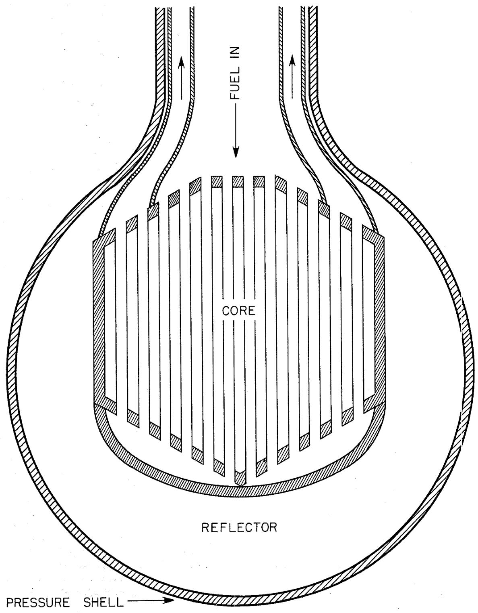  
Fig. 8. Schematic Diagram of Circulating-Fuel Aircraft Reactor.

654 060

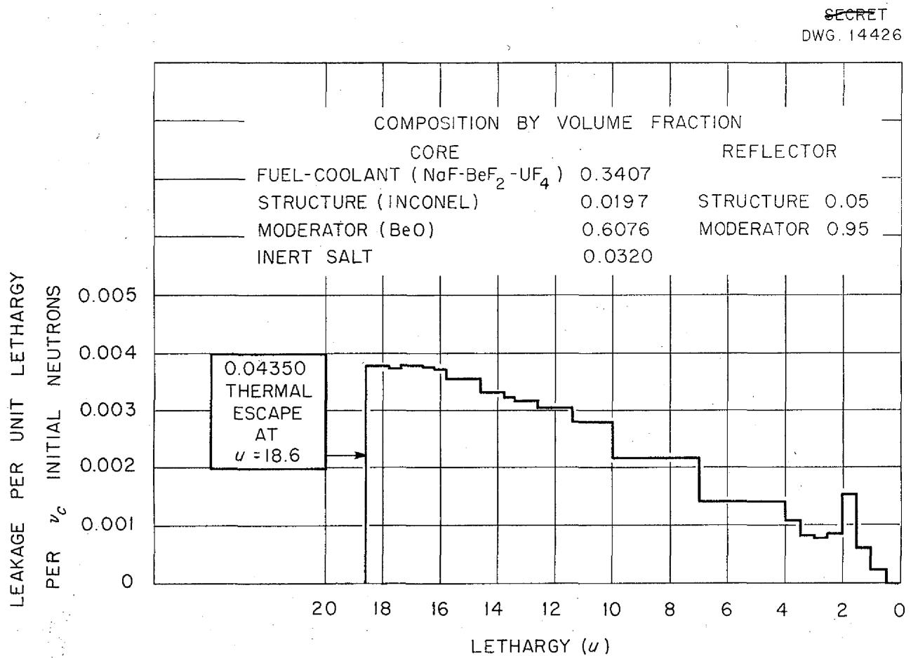  
Fig. 9. Leakage Spectrum Through the Reflector of the Circulating-Fuel Aircraft Reactor.

coolant was used.(7) Furthermore, the Inconel structure was assumed to occupy $2\%$ of the reactor volume (instead of $1.5\%$ as in the last report). The net effect of these two changes was a small decrease in critical mass. Using beryllium metal instead of beryllium oxide as a moderator would reduce the critical mass by only $6.5\%$ . The fuel self-shielding corresponds to changes $\Delta k$ of 2.2 and $5.8\%$ for 1-in.-ID and 2-in.-ID tubing, respectively.

Neutron Leakage Spectra. As has been described, $^{(8)}$ leakage spectra for an aircraft reactor were computed. The reactor is shown schematically in Fig. 8. It has two-pass fuel flow, and the core, which is a right cylinder with conical ends, is surrounded on all but the fuel entrance sides by a thick beryllium oxide reflector. Leakages through the reflected sides and end, through both the thin, unreflected annulus around the fuel-coolant pipe, and through the pipe itself (cut off 6 in. from the core surface), are shown in Figs. 9 and 10.

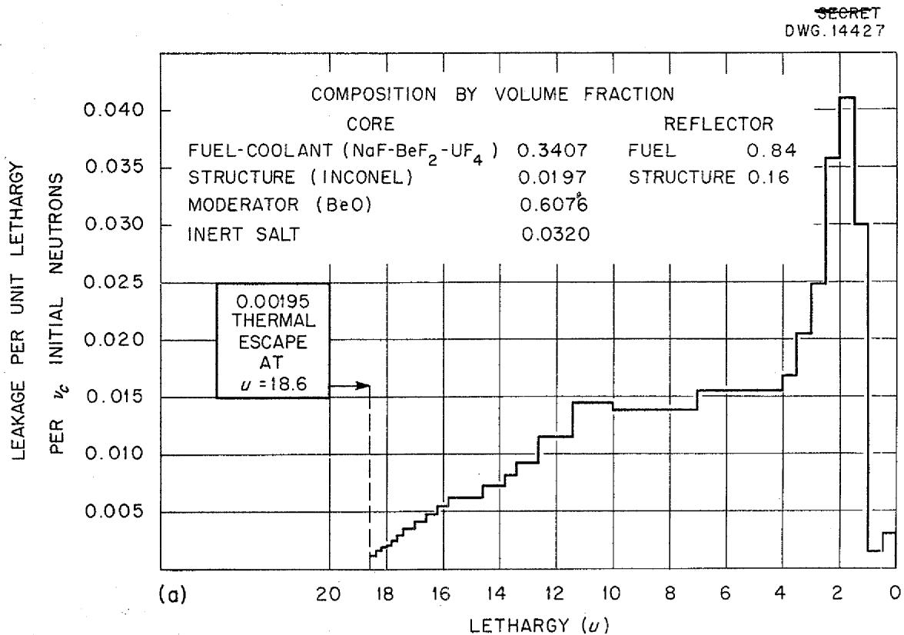

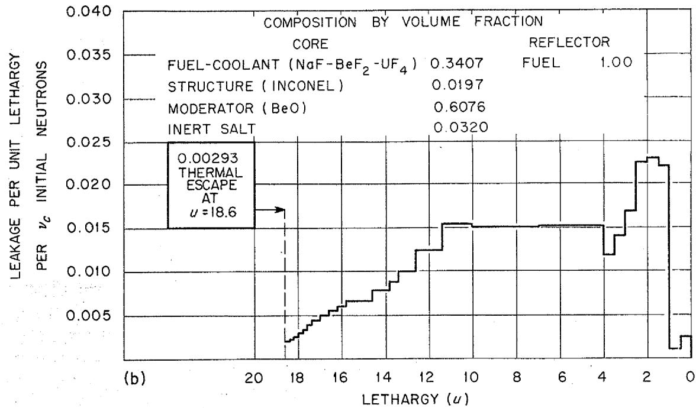  
Fig. 10. Leakage Spectrum Around the Fuel Pipes of the Circulating-Fuel Aircraft Reactor. (a) Through the annular area around the fuel pipes. (b) Through the fuel pipes.

# ALKALI HYDROXIDE MODERATED REACTOR(9)

In continuation of the work on circulating-moderator reactors reported in the last quarterly report, (6) the critical masses plotted in Fig. 11 as functions of core diameter were computed by the bare-reactor multigroup method. A thick hydroxide reflector was assumed, the cross section of uranium and the hydroxides only were included (thus neglecting the poisoning by structures, etc.), and the following density values (in g/cc) were used: $\mathrm{LiOH} = 1.21$ , $\mathrm{NaOH} = 1.61$ , $\mathrm{KOH} = 1.59$ , $\mathrm{RbOH} = 2.9$ , $\mathrm{Sr(OH)}_2 = 3.4$ . All curves would show minimums if extended to lower reactor volumes. The large critical masses for potassium hydroxide result from the large absorption and small scattering cross section of potassium, and these cross sections also explain the moving of the minimum to large core volumes. Except with potassium hydroxide, the hydrogen moderation results in small critical masses.

# SURVEY CALCULATIONS OF THE CIRCULATING-FUEL ARE

C.B.Mills,ANP Division

At the beginning of this quarter, a survey calculation was carried out $^{(10)}$ on the circulating-fuel ARE. The main variable was the volume fraction occupied by the fuel-coolant. Although this fraction varied from 6.85 to $22.4\%$ , the total uranium investment (assuming 6.8 ft $^3$ of fuel external to the reactor) varies only from 41 to 43 lb and goes through a flat minimum of 40 lb around a value of $15\%$ for

this fraction. The per cent thermal fission decreases from 83 to 67, as the fuel volume fraction increases over the above range. The most recent version of the ARE has a small (7.60) volume per cent of fuel-coolant circulating in a series-parallel piping arrangement. Critical mass, reactivity coefficients, and other numbers of design interest for the circulating-fuel ARE are presented.

A specific ARE design, now obsolete, was investigated(11) prior to the work on the ARE design presented here.

ARE Core Design. The cross section of the circulating-fuel ARE core normal to the axis consists of 82 hexagons of beryllium oxide with central holes for 78 fuel tubes and 4 control rods. The fuel tubes are 1.235 OD and have 0.060-in. wall thickness. The core length is 35.25 in., and the ends of the core are bare.

The reflector is composed of hexagonal blocks of beryllium oxide with 57 central cooling holes constructed to build out the core plus reflector to a right cylinder with a diameter of 47.750 inches. A 2-in.-thick Inconel pressure shell with 48 in. ID, 52 in. OD, and 48.50 in. in length encloses the core and re-reflector assemblies.

The fuel-coolant volume in the heat exchanger and the plumbing outside the reactor is 4.4 ft³ (does not include 0.2 ft³ in tube bends at the reactor ends). The total core volume is 20.42 ft³, so there is 1.55 ft³ of fuel in the core. The ratio of fuel in the core to total fuel is 0.26. Volume fractions of the core and reflector, as used in the design calculations, are given in Table 6.

SECRET

DWG.14428

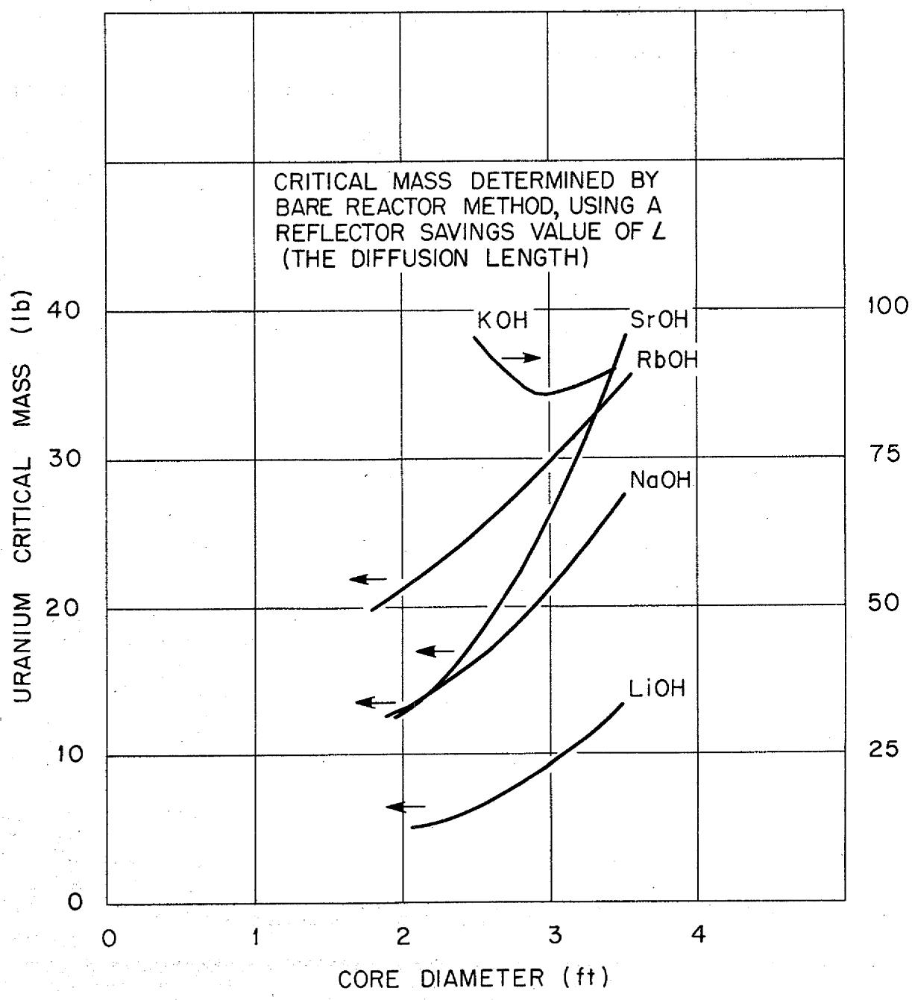  
Fig. 11. Critical Mass vs. Core Diameter for Hydroxide Reactors with Thick Reflectors of the Same Composition.

# ANP PROJECT QUARTERLY PROGRESS REPORT

TABLE 6

Volume Fractions of the Circulating-Fuel ARE Core and Reflector*

TABLE 7   
Uranium Requirements of the ARE   

<table><tr><td></td><td>CORE (vol %)</td><td>REFLECTOR (vol %)</td></tr><tr><td>Fuel-coolant</td><td>7.6</td><td></td></tr><tr><td>Beryllium oxide</td><td>80.7</td><td>92.23</td></tr><tr><td>Inconel</td><td>1.96</td><td>0.69</td></tr><tr><td>Inert salt</td><td>8.26</td><td>6.34</td></tr><tr><td>Void</td><td>1.40</td><td>0.64</td></tr></table>

*Communicated by R. W. Schroeder, February 8, 1952.

Critical Mass and Total Uranium Investment. The critical mass for the circulating-fuel ARE is obtained from bare $^{(12)}$ and reflected $^{(13)}$ reactor calculations of equivalent spherical core with the volume fractions as given in the preceding section. The critical mass is arrived at by a series of approximations in which the $k_{eff}$ corresponding to an arbitrary uranium mass is calculated until the mass corresponding to the required $k_{eff}$ is found. The $k_{eff}$ from the bare and reflected calculations are weighted when determining the actual $k_{eff}$ of the ARE according to the percentage surface area of the core, which is assumed to be either bare or reflected.

The resulting critical mass of the ARE reactor described in the preceding section is 22.3 lb and will provide a

maximum $k_{eff}$ of 1.034, which is distributed among the various reactivity effects as follows:

criticality 1.000

fission-product override 0.005

excess for experiment 0.024

excess for delayed neutron loss 0.0054

The uranium investment in the circulating-fuel ARE is summarized in Table 7.

Uranium reacting volume 22.3 lb

Total uranium inventory 85 lb

Assumed error range + 10% to 20% 94 to 68 lb

A "best" guess allowing -4.5% for critical experiment correlation 74 lb

There will be a small reduction in the uranium requirement as the result of reflection and fissioning in the end reflector region, which was assumed to be bare. The reflected reactor has $70.73\%$ thermal fissions and a leakage-to-absorption ratio of about 1 to 3.

Reactivity Coefficients. The values of the reactivity coefficients, summarized in Table 8, were obtained by bare reactor calculation methods.(12,13) These methods appear justified, since the corresponding bare reactor calculation for critical mass gave $k_{\text{eff}} = 1.054$ for 15 lb of uranium, which is close to the value of $k_{\text{eff}} = 1.0398$ for the reflected reactor. However, the reflected reactor calculations for $\Delta k / k$ per $^{\circ}\mathrm{F}$ gave $-0.64 \times 10^{-6}$ , so that the actual reactor (whose surface is 13.92/41.39 bare and 27.47/41.39 reflected) would have a $\Delta k / k$ per $^{\circ}\mathrm{F}$ of $-1.95 \times 10^{-6}$ .

For the change $\Delta k / k$ corresponding to a temperature change from 68 to $1283^{\circ}\mathrm{F}$ , the value calculated for a reflected reactor is very nearly equal to the above value of -0.0318 calculated for a bare reactor.

is that of fission fragments in the fuel-coolant. Figure 12 presents the results of the three separated power densities. The power density in the fuel-coolant is shown both as fissions/cc/sec and normalized to an

TABLE 8   
Reactivity Coefficients   

<table><tr><td>WITH CHANGE OF</td><td>RANGE OF VARIABLE
OF COLUMN 1</td><td>SYMBOL</td><td>VALUE</td></tr><tr><td>Thermal base (reactor temperature)</td><td>1283 to 1672°F</td><td>Δk/k/°F</td><td>-5.76 x 10-7</td></tr><tr><td></td><td>68 to 1283°F</td><td>Δk/k</td><td>-0.03180*</td></tr><tr><td>Uranium mass</td><td>11.75 to 15 lb</td><td>Δk/k/(Δm/m)U</td><td>0.404</td></tr><tr><td>Coolant density</td><td>90 to 100% of quoted density</td><td>Δk/k/(Δρ/ρ)coolant</td><td>0.0153</td></tr><tr><td>Moderator density</td><td>95 to 100% of quoted density</td><td>Δk/k/(Δρ/ρ)moderator</td><td>0.505</td></tr><tr><td>Density of structure (Inconel)</td><td>100 to 140% of quoted density</td><td>Δk/k/(Δρ/ρ)structure</td><td>-0.174</td></tr><tr><td>Core radius</td><td>100 to 101% of quoted radius</td><td>Δk/k/(ΔR/R)core</td><td>0.438</td></tr></table>

*Total change over range of column 2.

Power Distribution. The power distribution in the ARE fuel-coolant has been evaluated by separating the total fission energy into three parts: fission fragment energy absorbed in the fuel-coolant; fission-neutron energy absorbed in the moderator; and gamma-ray energy from direct fission, fission products, and $(n,\gamma)$ absorptions. The large energy density

average of 1 fission/cc/sec in the reactor core. The factor converting this to watts/cc from fission fragments in the fuel-coolant solution is given on the graph, and to this must be added the gamma-ray heating, which is given on the graph directly in watts per cubic centimeter. Power density in the moderator as a result of heating by gamma rays is also given

# ANP PROJECT QUARTERLY PROGRESS REPORT

on the graph in watts per cubic centimeter. The assumption is made that gamma-ray heating is the same for moderator and coolant. A first approximation to the total power density in watts/cc in the moderator is obtained by adding gamma-ray heating to neutron heating. A refined calculation will be made when the design is fixed.

Neutron Flux and Leakage Spectra. Neutron leakage from the surface of the reactor is shown in Figs. 13 and 14. Leakage from the reflector surface in neutrons/cm²/sec and leakage from the ends are also presented in Figs. 13 and 14, and the relative importance of open ends on neutron flux out of the reactor core may be noted.

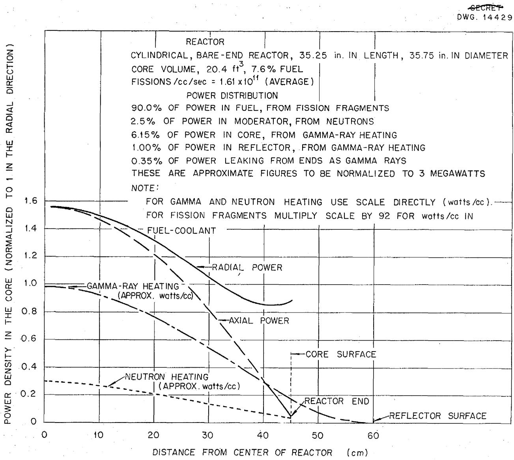  
Fig. 12. Power Distribution in the Core of the Circulating-Fuel ARE.

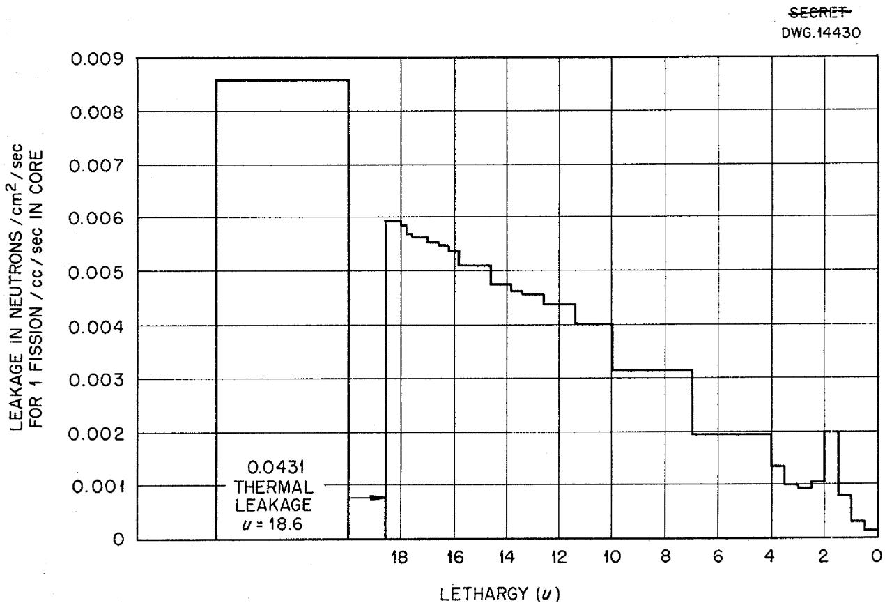

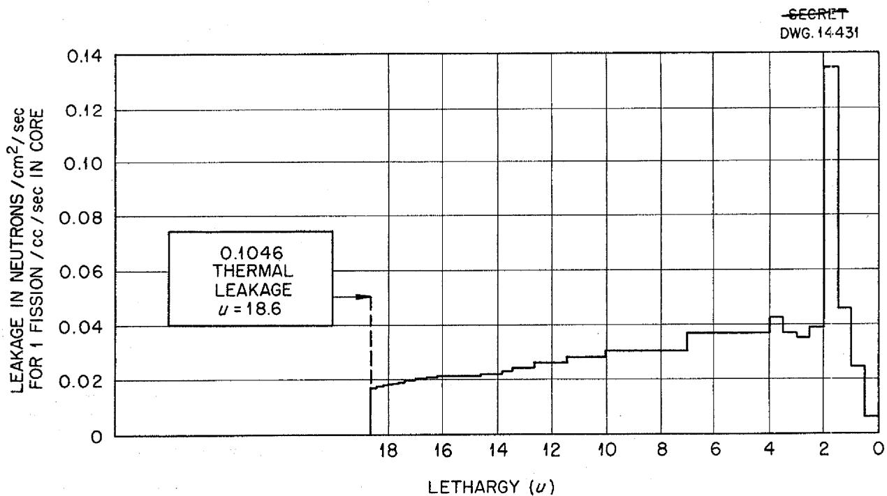  
Fig. 13. Leakage Spectrum from the Reflector of the Circulating-Fuel ARE.   
Fig. 14. Leakage Spectrum from the Open Ends of the Circulating-Fuel ARE.

Neutron flux normalized to 1 fission/cc/sec was computed to be 364 for the nonthermal neutrons and 80 for the thermal neutrons in this reactor. At full power, 3 megawatts, the total integrated flux in the center of the reactor is $16.7 \times 10^{13}$ neutrons/sec/cm². The thermal flux is $3.0 \times 10^{13}$ neutrons/sec/cm², and the fast flux is $13.7 \times 10^{13}$ neutrons/sec/cm². Neutron flux spectra at three points in the reactor are given in Fig. 15. The important difference is that of amplitude. Note that high-energy neutron flux is relatively somewhat higher toward the reactor center, but the difference is small. Figure 16 shows the corresponding plots of flux vs. radius for four energies. The importance of moderation by the reflector is quite apparent.

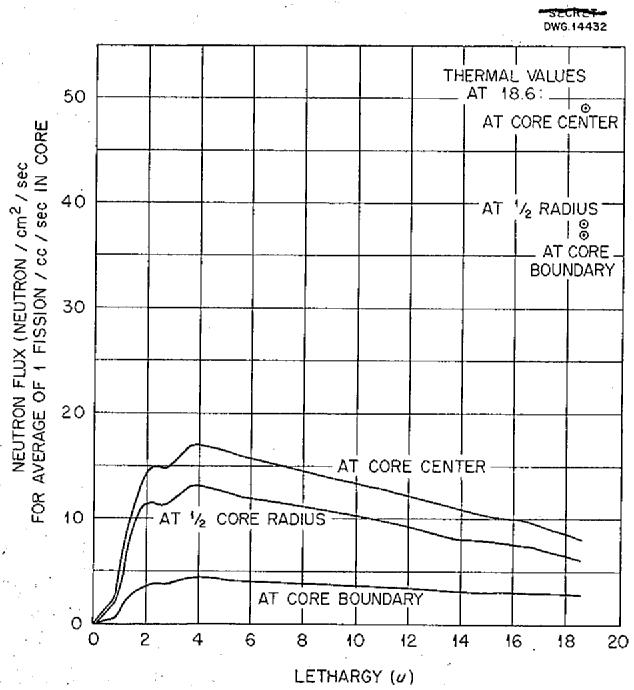  
Fig. 15. Transverse Neutron Flux Spectrum for Three Sections Through the Core of the Circulating-Fuel ARE.

# STATICS OF ARE CONTROLS

Static calculations of the various mechanisms for the regulation, safety, and shim control of the circulating-fuel ARE are given in terms of changes in reactivity. The one boron carbide regulator rod, fully inserted, effects a net change in reactivity of 0.0075. The three safety rods each effect a net change in reactivity of 0.053. Details of the operation of these control mechanisms are given in sec. 2.

Shim Control Requirements. Estimated reactivity changes, $\Delta k / k_{eff}$ , from room temperature to $1000^{\circ}\mathrm{F}$ and to an assumed controlled reactor temperature of $1283^{\circ}\mathrm{F}$ are given in Table 9.

The effect on reactivity of xenon at full power is to reduce the $k_{eff}$ of the clean reactor calculation by $\Delta k = 0.0031$ . Maximum transient xenon reduces $k_{eff}$ further by $\Delta k = 0.0082$ . The temperature coefficient as a result of the xenon at full power is

$$
\left[ \frac {\Delta k / k}{\Delta T} \right] _ {X e} = + 6. 4 \times 1 0 ^ {- 7} \text {p e r} ^ {\circ} \mathrm {F}
$$

in the vicinity of $1400^{\circ}\mathrm{F}$

Regulator Rod. In the poison control system, there is one axial boron carbide regulator rod lying along the longitudinal axis of the cylindrical reactor. The permanent reactivity effect of the regulator structural material is included in the core volume fractions. Detailed calculations have been made for the sodium-cooled ARE reactor for this reactor control system design. The only important reactor characteristic that affects the control rod effectiveness is the neutron spectrum, and this spectrum is quite similar for

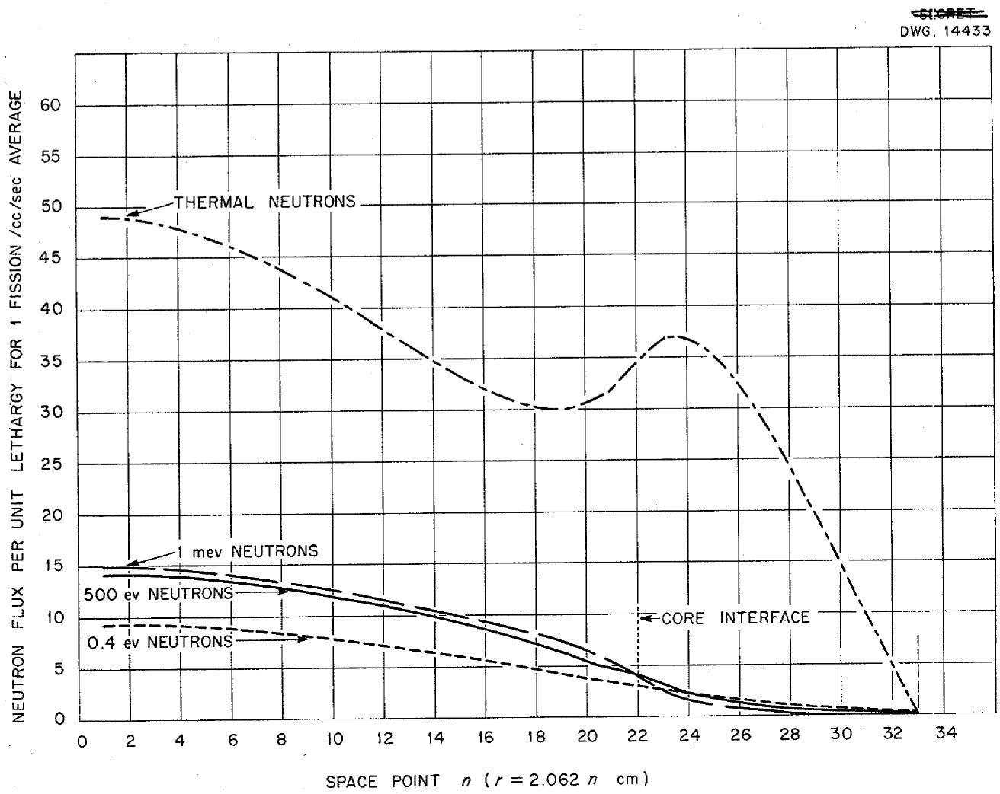  
Fig. 16. Radial Neutron-Flux Distribution in the Core of the Circulating-Fuel ARE.

the sodium-cooled reactor and the present ARE. Hence, the control rod effect on reactivity is assumed to be the same.

The net change in reactivity when the regulator rod is fully inserted is to be made 0.0075.

Safety Rods. Three safety rods are equally spaced on a 15-in. circle around the reactor axis. The spacing is sufficiently large to reduce the shadowing effect of each rod on the others to a relatively small value, and this effect is not considered.

These rods are 2-in. diameter cylinders of boron carbide with wall thickness of 0.335 in., and a beryllium oxide rod is attached to the end of each rod. The normal position of the safety rods is out, so that beryllium oxide will be added to core material with a resulting decrease in the uranium requirement. The net change in $k_{eff}$ for each rod is thus the sum of two reactivity contributions: (1) from the removal of beryllium oxide moderating material and (2) from the insertion of a 2-in.-diameter boron carbide neutron-absorbing rod. Each boron carbide rod is worth -5.3% in

TABLE 9   
Shim Control Requirements   

<table><tr><td rowspan="2">EFFECT</td><td rowspan="2">ASSUMPTION</td><td rowspan="2">EQUATION FOR (Δk/k_eff)/ΔT</td><td colspan="3">Δk/k_eff FOR CHANGE</td></tr><tr><td>FROM 100 TO 1000°F</td><td>FROM 1000 TO 1283°F</td><td>OF 1°F AT OPER. TEM.</td></tr><tr><td>Expansion of liquid fuel</td><td>Volume expansion coefficients per °F; fuel, 1.67 x 10-4(melting ignored), Inconel, 0.20 x 10-4; difference, 1.47 x 10-4</td><td>1.47 x 10-4[Δk/k/(Δm/m)U + Δk/k/(Δρ/ρ)coolant]</td><td>-0.0554</td><td>-0.0174</td><td>-6.16 x 10-5</td></tr><tr><td rowspan="2">Dimensional expansion with constant material</td><td>Radial expansion determined by Inconel; axial, by BeO.</td><td>6.1 x 10-6Δk/k/(ΔR/R)core</td><td>0.0024</td><td>0.00076</td><td>2.67 x 10-6</td></tr><tr><td>Linear expansion coefficients per °F; Inconel, 6.7 x 10-6, BeO, 4.9 x 10-6, weighted average expansion coefficient: linear 6.1 x 10-6, volume 18.3 x 10-6per °F</td><td>18.3 x 10-6Δk/k/(Δρ/ρ)moderator</td><td>-0.0083</td><td>-0.0026</td><td>-0.92 x 10-5</td></tr><tr><td>Change of density of Inconel in core</td><td>Inconel volume expansion coefficient per °F, 20 x 10-6</td><td>20 x 10-6Δk/k/(Δρ/ρ)structure</td><td>+0.0031</td><td>+0.00098</td><td>+3.5 x 10-6</td></tr><tr><td>Change of density of reflector BeO</td><td>Same as metal-cooled ARE</td><td></td><td>-0.0054</td><td>-0.0017</td><td>-5.7 x 10-6</td></tr><tr><td>Change of cross sections (except Xe) with reactor temperature</td><td></td><td>Δk/k/°F</td><td>-0.0271</td><td>-0.0047</td><td>-2 x 10-6</td></tr><tr><td>Change of Xe cross section with reactor temperature</td><td>0.26 of decay products in the core, remainder in external</td><td></td><td></td><td></td><td>+0.6 x 10-6</td></tr><tr><td></td><td></td><td>Total Δk/k</td><td>-0.0907</td><td>-0.0247</td><td>-7.2 x 10-5</td></tr></table>

$\Delta k / k$ , and each beryllium oxide rod in the same position is worth $+0.16\%$ The Inconel around the boron carbide rods is not an effective poison when the rods are inserted and results in a decrease in poison rod effect of $0.21\%$ .The net effect of insertion of the three safety rods is thus $15.9\%$ in $k_{eff}$ .This value is larger than that quoted for the metalcooled reactor because there is no poison NaK to displace. The maximum effect of control rod motion is thus $16\%$ in $k_{eff}$ , corresponding to about 6 lb of uranium in the core.

# SPECIFIC DESIGN PROBLEMS OF THE CIRCULATING-FUEL ARE

Dumping all the ARE fuel into a single tank does not result in a critical mass in the tank. The assumptions pertinent to this conclusion are given in Ref. 14; the most important assumption is the absence of good moderators in or near the tank.

Two ARE designs with volume fractions of fuel in the core of 6.85 and $22.5\%$ were compared as to the sensitivity of their critical mass to the addition of potassium (which has a large absorption cross section) to the fuel mixture.(15) Of importance

during the discussion was whether the existing beryllium oxide blocks should be cut to accommodate the larger fuel percentage. For the $6.85\%$ design, increase of the potassium fluoride mole fraction in the fuel from 0 to $60\%$ increased the critical mass by $55\%$ . For the $22.5\%$ design, the corresponding increase was $105\%$ . Since the use of potassium may be necessary, the large sensitivity of the $22.5\%$ design to potassium works to the disadvantage of this design.

The power generation in a boron carbide curtain on one end of a 3-megawatt ARE reactor was found to be 0.53 watts/cm², 20% of which is developed in the first 0.05 centimeter. (16)

The problems of fuel-tube-wall corrosion may not be completely solved by the time the ARE is being built, and for this reason, as well as for reasons of fabrication, it is highly desirable to use thick tube walls. Under assumptions specified in the reference, (17) increasing the tube wall thickness from 20 to 40 or 60 mils increases the critical mass by 18.5 and $43\%$ , respectively.

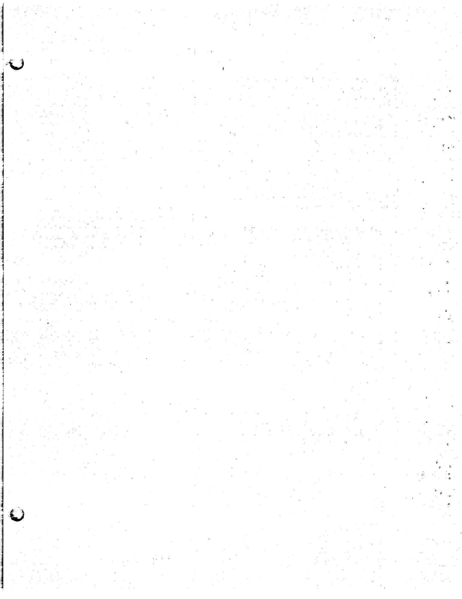

# 5. CRITICAL EXPERIMENTS

A. D. Callihan, Physics Division

The group responsible for studies of preliminary reactor assemblies has continued investigations during the past quarter with the mockup of the G-E, direct-cycle reactor described in the preceding report.(1) Relative evaluations, in terms of contributions to reactivity, have been made of several reflector modifications. Data obtained several months ago from a critical assembly of uranium and graphite have been analyzed, and preliminary plans for experiments on the liquid-fuel-coolant aircraft reactor have been made. The data from the graphite assembly have been correlated with the theoretical calculations of the assembly. The correlation lacks precision but gives results that are at least consistent with experimental fact.

# DIRECT-CYCLE REACTOR(2)

E. V. Haake and D. V. P. Williams Physics Division

W. G. Kennedy Pratt and Whitney Aircraft Division

Dunlap Scott  
ANP Division

The preceding quarterly report(1) described briefly an assembly of uranium, beryllium, methacrylate plastic, and stainless steel that was designed to yield information of value to the General Electric Company

in the development of the direct-cycle nuclear reactor for aircraft propulsion. A loading chart of this assembly is shown in Fig. 17. During this quarter temperature effects on reactivity have been studied, and some comparisons have been made of the effect on reactivity of the beryllium reflector and of varying relative thicknesses of stainless steel and plastic substituted for the beryllium. A control rod calibration was made, and although the data obtained are unique to the direct-cycle reactor, they are of value for other types of reactors, since they indicate the method and precision of evaluating reactivity changes introduced by changes in reflector, structural elements, and other components.

Control Rod Calibration. The change in reactivity introduced by displacement of each control rod has been determined by two methods. In the first, the "period" method, a measurement is made of the period of the supercritical system resulting from the insertion of a control rod, and the corresponding change in reactivity is determined. In the second, the "rod-drop" method, a safety rod is evaluated from the transient occurring in the flux as the safety rod is rapidly removed from the assembly. Since each control rod is practically coaxial with a safety rod (Fig. 17), the over-all value of corresponding rods is taken to be equal.

A comparison of the total rod calibrations obtained from the rod-drop method with the integrated value from the period measurements is given in Table 10. Changes in reactivity are expressed in "cents," where 100 cents ("one dollar") is equivalent to

SECRET

DWG.14434

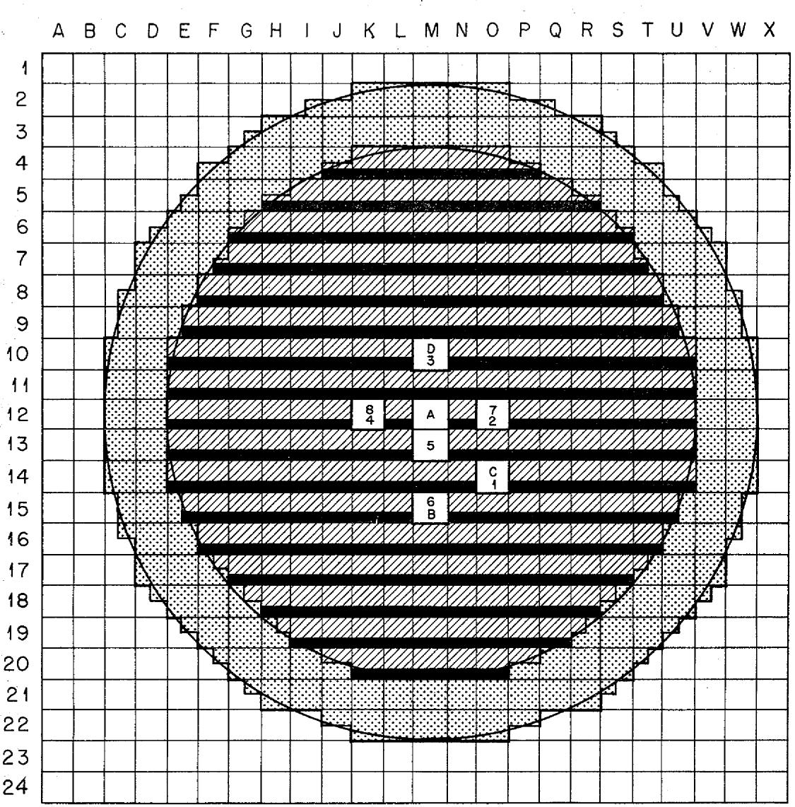

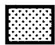

Be REFLECTOR, JACKET 18 in. LONG, EACH HALF BACKED BY 6 in. OF GRAPHITE (END).

FUEL ELEMENT, EACH 18 in. LONG, EACH HALF BACKED BY 6 in. OF GRAPHITE. TOP: 6 LAYERS OF STAINLESS STEEL, WITH 5 TO 10 - mil BY 3 in. URANIUM DISKS, HORIZONTAL. BOTTOM: 1 in. OF PLEXIGLAS.

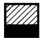  
Fig. 17. Loading Chart of Critical Assembly of Direct-Cycle Reactor.

- STAINLESS STEEL, AIR, FUEL
- PLEXIGLAS

LETTERS REPRESENT CONTROL ROD POSITIONS; NUMBERS, SAFETY ROD POSITIONS.

0.00730 $\Delta k / k$ . It is believed that the precision of the rod-drop method is no greater than $\pm 2$ cents, so the agreement in some cases is fortuitous.

TABLE 10   
Comparison of Control Rod Calibrations   

<table><tr><td rowspan="2">CONTROL
ROD</td><td rowspan="2">CORRESPONDING
SAFETY ROD</td><td colspan="2">REACTIVITY CHANGE</td></tr><tr><td>PERIOD,
INTEGRATED
(cents)</td><td>ROD DROP
(cents)</td></tr><tr><td>A</td><td>5</td><td>18.2</td><td>16</td></tr><tr><td>B</td><td>6</td><td>15.9</td><td>16</td></tr><tr><td>C</td><td>1</td><td>15.9</td><td>18</td></tr><tr><td>D</td><td>3</td><td>18.3</td><td>18</td></tr></table>

Data obtained in the incremental calibration of control rod $A$ by the period method are shown in Fig. 18, which gives the change in reactivity occurring when the rod is withdrawn from the reactor.

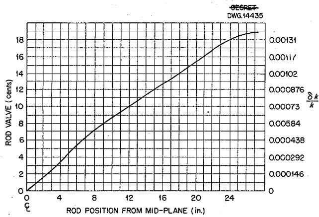  
Fig. 18. Reactivity as a Function of Control Rod Position.

Temperature Effects. During the operation of reactor assemblies an irreproducibility of varying degree has been observed occasionally in day-to-day locations of control rods

required for criticality under constant loading conditions. In the work reported here these variations exceeded the sensitivity required to detect the reactivity differences produced by some structural changes under study. Investigations have indicated the probable cause to be ambient temperature changes. The concomitant reactivity differences, from the reactivity at $72.9^{\circ}\mathrm{F}$ , are plotted as functions of temperature in Fig. 19.

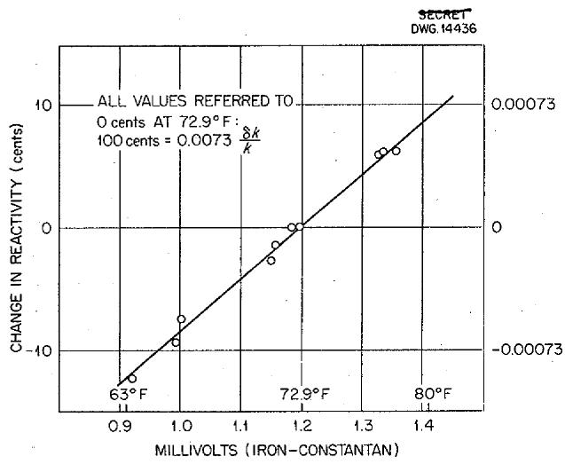  
Fig. 19. Reactivity vs. Temperature.

Reflector Studies. An experiment was initiated before the reactor was in final form to compare the reactivity value of a reflector element with that of a fuel element to ascertain the most satisfactory location of the safety rod. A section of the beryllium reflector 22 in. long (one-half of the 44-in. total reflector jacket length) was removed from positions M-21, V-11, and W-11 (Fig. 17), and the resulting change in reactivity was ascertained by a calibrated control rod. The resulting data (Table 11) give the reactivity change (with an estimated error of $\pm 1$ cent) when a beryllium-filled tube is substituted for an air-filled tube.

TABLE 11   
Reactivity Change Introduced by Substituting Beryllium for Air   

<table><tr><td>TEST CELL</td><td>REACTIVITY CHANGE (cents)</td></tr><tr><td>M-21</td><td>4.4</td></tr><tr><td>V-11</td><td>10.9</td></tr><tr><td>V-11 and W-11</td><td>27.5</td></tr></table>

In a second series of experiments, with final reactor geometry, the beryllium in a section 9 by 36 by 6 in. thick(3) was replaced by a type-310 stainless steel section 9 by 36 by 3 in. thick. This change was made separately at the side of the reactor, at the top, and at the bottom. Results giving the change in reactivity effected by the substitution and the changes in location of the reflector alterations are listed in Table 12 (designations are the same as in Fig. 17). The system was more reactive with the beryllium reflector.

# GRAPHITE REACTOR

# E. L. Zimmerman, Physics Division

Limited effort has been directed to the analysis of data obtained from a uranium-graphite reactor and to correlation of the data with theory. This material will be presented when the analysis is complete. Such results as are now available are discussed in a subsequent paragraph on the "Correlation of Theory and Critical Experiments."

# CIRCULATING-FUEL REACTOR

# Dunlap Scott, ANP Division

A preliminary assembly is to be made of the projected aircraft propulsion reactor by using beryllium oxide as a moderator and reflector and molten $\mathrm{UF}_4\text{-BeF}_2\text{-NaF}$ as a circulating fuel and coolant. This assembly is to be operated at room temperature and essentially zero power and will utilize

TABLE 12   
Reactivity Change Effected by Substituting Plastic and Stainless Steel for Beryllium in the Reflector   

<table><tr><td rowspan="2">LOCATION IN REACTOR</td><td rowspan="2">INITIAL POSITION</td><td colspan="2">FINAL POSITION</td><td rowspan="2">REACTIVITY CHANGE (cents)</td></tr><tr><td>PLASTIC IN</td><td>STAINLESS STEEL IN</td></tr><tr><td>Side</td><td>V, W-11, 12, 13</td><td>V-11, 12, 13</td><td>W-11, 12, 13</td><td>-56.5</td></tr><tr><td>Top</td><td>L, M, N-2, 3</td><td>L, M, N-3</td><td>L, M, N-2</td><td>-41.3</td></tr><tr><td>Bottom</td><td>L, M, N-21, 22</td><td>L, M, N-21</td><td>L, M, N-22</td><td>-33.0</td></tr></table>

the powder mixture will have the same uranium-sodium atomic ratio as the design fuel. However, it will probably not be possible to achieve the overall fuel density of the design fuel in this mockup. Design of fuel containers and control and safety devices is under way.

# CORRELATION OF THEORY AND CRITICAL EXPERIMENTS

D. K. Holmes, Physics Division

An attempt has been made to determine how closely theory can be made to check with results from critical experiments. The several types of results that are subject to theoretical analysis include (1) criticality with a nonhydrogenous moderator and with a hydrogenous moderator, (2) foil exposures, (3) danger coefficients, (4) rod sensitivity, and (5) the gap experiment.

Although criticality calculations for both hydrogenous and nonhydrogenous moderated reactors are acceptably consistent, the results could be improved in the case of a beryllium moderator by the existence of better cross-section data. Multigroup calculations of hydrogen moderated reactors yield high multiplication constants. Danger coefficient data provide a further check of the multigroup method, and the cross sections upon which these calculations are based agree reasonably well, at least in the cases of iron and nickel. Foil measurements also show appreciable correlation with predicted values. However, elementary theory on the loss of reactivity in the gap experiment is consistently about $50\%$ low.

Criticality with Nonhydrogenous Moderators. Since considerable effort has been devoted to setting up the "multigroup" technique for numerical

integration of the age-diffusion equation, (4) a very definite attempt has been made to determine whether these calculations can predict experimental results. Two separate bare assemblies have been studied, one with beryllium as moderator and the other with graphite. Two assemblies are described in Table 13.

The results of the multigroup calculations on these two reactors are given in Table 14.

The values of $k_{eff}$ listed in Table 14 encourage the belief that the method and the cross sections on which the calculation is based are accurate; however, these results are somewhat offset by the calculations of the ages of thermal neutrons in beryllium and in graphite. Since both these calculations involve the same multigroup method and the same cross sections, the correlation with experimental data would be expected to be similar to that for the multiplication constants. Table 15 shows that whereas the calculated value for graphite may be acceptable, the calculated age for beryllium is not acceptable. The following possible explanations for this discrepancy have been examined:

1. Incorrect experimental value for the age,   
2. Incorrect values for the beryllium scattering cross section,   
3. Neglect of $p$ -scattering in beryllium.

The measurements of the age in beryllium seem to be in good agreement. Changes in either the total scattering cross section or the $p$ -scattering contribution such as to give the correct value for the age, when

# ANP PROJECT QUARTERLY PROGRESS REPORT

applied to the criticality calculations, lead to values for $k_{eff}$ of around 0.90.

An additional complication is introduced by the possibility of the existence of a significant cross section for the $(n,2n)$ reaction in

beryllium.(5) Various experimental estimates for this cross section may lead to increases of as much as $20\%$ in the calculated $k_{eff}$ for assembly 1. At present the best approach to matching the calculations with experimental data is probably that of allowing some $p$ -scattering to raise the calculated

TABLE 13   
Experimental Data on Critical Assemblies 1 and 4   

<table><tr><td></td><td>ASSEMBLY 1</td><td>ASSEMBLY 4</td></tr><tr><td>Critical dimensions</td><td>21 x 21 x 23.22 in.</td><td>51 x 51 x 44.111 in.</td></tr><tr><td>Volume fractions of constituent materials</td><td></td><td></td></tr><tr><td>Fuel (93.4% U235)</td><td>0.00658</td><td>0.0015032</td></tr><tr><td>Beryllium</td><td>0.90202</td><td></td></tr><tr><td>Carbon</td><td></td><td>0.88916</td></tr><tr><td>Stainless steel</td><td>0.000826</td><td>0.0003127</td></tr><tr><td>Aluminum</td><td>0.03004</td><td>0.06073</td></tr><tr><td>Total mass 93.4% U235</td><td>19.36 kg</td><td>57.092*</td></tr></table>

*This figure is the total mass of fuel which would be present if the loading had been carried uniformly to the outside of the assembly. Actually, this was not the case, but the difference is considered to be negligible for purposes of calculation since the affected region is only 3 in. wide (as compared with over-all dimension of 51 in.) and is at the very outside where the fuel has its lowest importance.

TABLE 14   
Calculated Results for Critical Assemblies 1 and 4   

<table><tr><td></td><td>ASSEMBLY 1</td><td>ASSEMBLY 4</td></tr><tr><td>keff</td><td>0.98*</td><td>0.9912*</td></tr><tr><td>Median energy for fission</td><td>1.1 ev</td><td>0.15</td></tr><tr><td>Fraction of fissions that are thermal</td><td>0.107</td><td>0.274</td></tr></table>

*These figures are based on uranium cross sections corrected for self-shielding owing to fuel lumping (10-mil disks). The removal of the self-shielding factors (calculations may be open to question) made only a 1 to 2% difference in $k_{\text{eff}}$ .

TABLE 15   
Comparison of Experimental and Calculated Values of the Ages of Thermal Neutrons in Beryllium and Graphite   

<table><tr><td></td><td>BERYLLIUM (cm2)</td><td>GRAPHITE (cm2)</td></tr><tr><td>Measured age</td><td>93</td><td>350</td></tr><tr><td>Calculated age</td><td>69</td><td>391</td></tr></table>

(5) W. K. Ergen, On the $(n, 2n)$ Reaction in Beryllium with Neutrons of a Polonium-Beryllium Source, Y-F20-12, Apr. 30, 1951.

age and also some $(n,2n)$ cross section to bring the $k_{eff}$ back to unity. In the absence of reliable experimental data on both points, such calculations would be purely speculative. In any case, it seems fair to conclude that the method of calculation gives results that are at least consistent with experimental fact.

Criticality with Hydrogenous Moderators. A modified form of the multigroup method has been used to calculate the multiplication constants for four critical assemblies consisting of either bare or reflected cores of solutions of uranium hexa-fluoride in water. An extra term is added to the usual age-diffusion equation to take account of the relatively large energy losses of the neutrons because of scattering in hydrogenous materials. Since the reflectors, when used, were essentially infinite and of water, a simple, reflector-saving correction to the bare calculation was used. The results(6) gave effective multiplication constants ranging from 0.97 to 0.988 for the critical assemblies. Since the reactors ranged from 41.5 to 94% thermal and a simple age-diffusion, multigroup calculation gave effective multiplication constants about 20% too high, it may be expected that the method of calculation will give acceptable results, in general, for hydrogenous reactors.

Foil Exposures. It is possible to calculate the activity of an aluminum catcher foil placed against a fuel disk, either bare, cadmium covered, or cadmium-indium covered, if the neutron flux in the region and the uranium and cadmium capture cross sections are known as functions of energy. By denoting the activations, bare, cadmium covered, and cadmium-indium covered by

$A_{B}, A_{C}, A_{CI}$ , respectively, the following proportionalities are obtained:

$$
A _ {B} \sim \int_ {E _ {t h}} ^ {E _ {0}} \sum_ {f} (E) \phi (E) d E
$$

$$
A _ {C} \sim \int_ {E _ {t h}} ^ {E _ {0}} f _ {C} (E) \quad \sum_ {f} (E) \phi (E) d E
$$

$$
A _ {C I} \sim \int_ {E _ {t h}} ^ {E _ {0}} f _ {C I} (E) \quad \sum_ {f} (E) \phi (E) d E
$$

where

$$
E _ {0} = \begin{array}{l} \text {s o m e h i g h n e u t r o n e n e r g y ,} \\ \text {s a y 1 0 M e v} \end{array}
$$

$$
E _ {t h} = \text {t h e r m a l}
$$

$$
\begin{array}{r l} \sum_ {f} (E) & = \text {m a c r o s c o p i c f i s s i o n c r o s s} \\ & \text {s e c t i o n o f t h e f u e l d i s k s ,} \end{array}
$$

$$
\begin{array}{r l} \phi (E) & = \text {n e u t r o n f l u x a s a f u n c t i o n} \\ & \text {o f e n e r g y ,} \end{array}
$$

and $f_{C}(E)$ and $f_{CI}(E)$ are the fractions of the incident neutrons of energy $E$ that reach the fuel disk. From these expressions it may be seen that the extent to which a calculation of foil activities checks experimental results is some measure of the accuracy of the calculation of the flux as a function of energy. For purposes of comparison, ratios of activations are used. The results are given in Table 16 (both calculation and experiment refer to assembly 4, the graphite assembly). The variation of the ratios over the reactor must be attributed to the loading in assembly 4 not continuing uniformly to the edge of the assembly so that the outer 3 in. gave a reflector-like effect; thus a higher fraction of the neutron flux is thermal near the edge of the reactor. The calculation represents

# ANP PROJECT QUARTERLY PROGRESS REPORT

an average over the entire reactor. The calculated values reported in Table 16 do not take into account the relative depression of the low energy end of the flux spectrum near the foil upon introduction of the cadmium. Including this effect would tend to raise both calculated values.

TABLE 16   
Experimental and Calculated Values for the Cadmium and Cadmium-Indium Ratios   

<table><tr><td rowspan="2"></td><td colspan="2">EXPERIMENTAL</td><td rowspan="2">CALCULATED</td></tr><tr><td>CENTER OF ASSEMBLY</td><td>OUTSIDE EDGE OF ASSEMBLY</td></tr><tr><td>Cadmium ratio = AB / AC</td><td>2.11</td><td>2.60</td><td>2.72</td></tr><tr><td>Cadmium-indium ratio = AB / ACI</td><td>3.40</td><td>3.90</td><td>2.98</td></tr></table>

Danger Coefficients. A further check of the multigroup method and the cross sections on which calculations are based is available in the danger coefficient measurements. Experimentally, the measurement consists of determining the loss in reactivity when a block of some material is placed in the center of the assembly. (The comparison is with a void of the same size and at the same position as the block of material; the experiments were performed on assembly 4.) There are two methods of calculation that may be used to check these experiments. In the "difference method," the reactivity is recomputed for the assembly using the multigroup method with the proper additional amount of the particular material added to the assembly. [Since the material is, by this procedure, essentially spread

uniformly over the volume of the reactor, whereas in the experiment the material is concentrated at the center of the assembly, the calculated results are multiplied by $(\pi /2)^3$ to properly weight the importance of the center of the reactor.] The new $k_{eff}$ is then compared with the old one obtained before the introduction of new material. Since the volume fractions of the added materials are relatively small, this method involves taking small differences of large numbers; however, it is felt that the numerical methods used are quite adequate for this case, and the method has the advantage of including the scattering cross section and the $\xi$ for the added material as well as its absorption cross section. The second method is a perturbation technique that involves the calculation of an "importance" function(1) (of energy) for the assembly. The perturbation method allows the material to be placed directly at the center of the reactor but, as used for the danger coefficient calculations, takes into account only the absorption cross section of the added material; thus any gain in moderation over the void is not included in the perturbation method. In Table 17 the total loss in $k_{eff}$ upon introduction of a block of the material of the size listed into assembly 4 is given.

An additional effect owing to the lumping of the added material, which would reduce the effective absorption cross section, was not included in the calculation; such an effect would reduce the magnitudes of the numbers calculated.

Rod Sensitivity. The control rods for assembly 4 were typical sections about 3 by 3 in. in cross section and extended from the center to the edge of the assembly. An experiment, which is of interest from a theoretical point

TABLE 17   
Experimental and Calculated Values for the Total Loss in $k_{eff}$ upon Introduction of Various Materials into Assembly 4   

<table><tr><td rowspan="3">MATERIAL</td><td rowspan="3">SIZE OF BLOCK (in.)</td><td colspan="3">Δkeff×10</td></tr><tr><td rowspan="2">EXPERIMENTAL</td><td colspan="2">CALCULATED</td></tr><tr><td>DIFFERENCE</td><td>PERTURBATION</td></tr><tr><td>Sodium</td><td>3 × 3 × 1</td><td>0.066</td><td>0.002</td><td></td></tr><tr><td>Iron</td><td>3 × 3 × 1</td><td>1.44</td><td>1.42</td><td>2.23</td></tr><tr><td>Iron</td><td>3 × 3 × ¼</td><td>0.450</td><td>0.368</td><td>0.560</td></tr><tr><td>Nickel</td><td>3 × 3 × ½</td><td>0.657</td><td>0.700</td><td></td></tr><tr><td>Molybdenum</td><td>3 × 3 × ½</td><td>1.31</td><td>0.600</td><td>0.960</td></tr></table>

of view, is the measurement of the incremental sensitivity of such a rod as a function of position in the assembly, i.e.,

$$
- \left[ \frac {1}{k _ {\textit {e f f}}} \frac {\triangle k _ {\textit {e f f}}}{\triangle x} \right]
$$

evaluated when the control rod is withdrawn (from the center) a distance $x$ . In the relatively simple case of a very thin poison rod (which leaves behind a negligible void as it is withdrawn) the data for assembly 4 fitted the theoretically expected importance function, i.e.,

$$
- \left[ \frac {1}{k _ {e f f}} \frac {\Delta k _ {e f f}}{\Delta x} \right] _ {\text {t h i n p o i s o n r o d}} \sim \cos^ {2} \gamma x
$$

where $x$ is measured from the center of the reactor, and $\gamma = \pi / L$ , where $L$ is the length of the reactor. However, the "typical-element" control rod, which does leave a 3 by 3 in. void

channel behind as it is withdrawn, showed an entirely different behavior. The sensitivity was fairly constant as a function of $x$ until the rod had been withdrawn somewhat over three-quarters of the total rod length, at which point the sensitivity rose to a maximum (about 20% above its value at the center of the assembly) and then fell rapidly as the edge of the reactor was approached.

It seems fairly certain that the removal of a block of moderator of width $\Delta x$ at a point $x$ in the reactor (leaving a thin void section behind) should give a change in $k_{eff}$ that varies again as $\cos^2\gamma x$ ; thus the peculiar behavior of the rod sensitivity seems most likely to be the result of the void channel, which is of length $(L/2) - x$ when the rod has been withdrawn a distance $x$ . Thus it is possible that a term provided by the transport of neutrons along the channel from near the center of the reactor to a region of much lower importance near the outside might account for the

# ANP PROJECT QUARTERLY PROGRESS REPORT

experimental result. A typical form for the theoretical estimate of this effect is:

has the values for the void effect given by the integration above, and to choose $A$ and $B$ so that an acceptable

$$
- \left[ \frac {1}{k _ {e f f}} \frac {\Delta k _ {e f f}}{\Delta x} \right] _ {\text {v o i d}} \sim \frac {d}{d x} \int_ {0} ^ {x} \int_ {0} ^ {x} I \left(x ^ {\prime} \rightarrow x ^ {\prime \prime}\right) P \left(x ^ {\prime} \rightarrow x ^ {\prime \prime}\right) d x ^ {\prime} d x ^ {\prime \prime}
$$

where $P(x' \to x'')$ is the probability that a neutron will make a flight through the void, leave the channel walls at $x'$ , and re-enter at $x''$ . This term will depend upon the flux at $x'$ and the solid angle subtended at $x'$ by a small area at $x''$ . $I(x' \to x'')$ is the change in importance of a neutron while being transported from $x'$ to $x''$ . Since the integral is over all values of $x'$ and $x''$ , account is taken of the gain in importance owing to transport toward the center of the reactor, but this will be smaller than the loss of importance since the flux falls off from the center as $\cos \gamma x$ . Numerical evaluation of the integrals shown indicates that the void contribution to the rod sensitivity rises from zero at the center of the assembly to a maximum near the three-quarter point and then falls off rapidly. It is possible to write

$$
\begin{array}{l} \left[ \frac {1}{k} \frac {\Delta k}{\Delta x} \right] _ {\text {t o t a l}} \\ = \left\{A \left[ \frac {1}{k} \frac {\Delta k}{\Delta x} \right] _ {\text {m o d e r a t o r}} + B \left[ \frac {1}{k} \frac {\Delta k}{\Delta x} \right] _ {\text {v o i d}} \right\} \\ \end{array}
$$

where

$$
\left[ \frac {1}{k} \frac {\Delta k}{\Delta x} \right] _ {\text {m o d e r a t o r}} = \cos^ {2} \gamma x
$$

fit to the experimental data is obtained.

Gap Experiment. With calibrated control rods it is possible to measure the loss in reactivity upon separating the two halves of the reactor at the center plane. Such an experiment was performed on assembly 4 with separations up to 0.3 in. and losses in reactivity up to about 0.005. A calculation has been made by using the multigroup method and allowing an apparent absorption cross section at each lethargy corresponding to the probability for loss of neutrons from the gap [with a weighting factor of $(\pi /2)^{3}$ to account for the fact that the losses are actually from the center of the reactor]. The leakage losses from the gap were calculated by using the results given in CP-3443.(7) The calculated losses in $k_{eff}$ are uniformly about $50\%$ lower than the experimental results. However, since the maximum separation of halves is only 0.3 in., whereas the dimension of a face of the reactor is 51 in., the entire experiment is in the range of "small gap" for which the results of CP-3443 are known to underestimate the leakage from the gap. An improvement of the method of CP-3443 has been made, and the losses are now being recalculated on the new basis.

Parf II

SHIELDING RESEARCH

#

#

# SUMMARY AND INTRODUCTION

E. P. Blizzard, Physics Division

The mockup of the divided shield is now being measured in the Bulk Shielding Facility (sec. 6). The angular and energy-dependent gamma-ray measurements that have been obtained are gratifyingly detailed. It is not certain that the neutron spectral and angular distributions will be as amenable to measurements; the instruments for these measurements are still being developed.

Research on ducts has included detailed measurement of the effect of duct geometry on neutron transmission, as well as the experimental corroboration of a simplified theory of neutron transmission in ducts (sec. 7). The agreement between theory and experiment for duct transmission is within a factor of 2 for attenuations as high as $10^{-6}$ . Duct parameters investigated include diameter, length, and angles of a single bend.

A comprehensive design of the Tower Shielding Facility, which will make

possible full-scale (but not full-intensity) measurements of divided shields has been completed (sec. 8). The resulting configuration, basically a 300-ft tower with a 100-ft cross member for the reactor and crew shield, meets all requirements regarding freedom from spuriously scattered radiation and flexibility. It is estimated that this facility will cost about two million dollars and that it will be completed in the middle of 1953.

Additional cross-section measurements have been obtained on the 5-Mev Van de Graaff and the time-of-flight neutron spectrometer for use in reactor cross-section measurements has been completed (sec. 9). The spectrometer has been installed and the counting rates optimized and tested on the LITR. Measurements of the total cross section of iron on the 5-Mev accelerator extend from 0.7 to 3.6 MeV.

#

#

# 6. BULK SHIELDING REACTOR

J. L. Meem

H. E. Hungerford

R. G. Cochran

E. B. Johnson

M. P. Haydon

J. K. Leslie

K. M. Henry

F. C. Maienschein

L. B. Holland

G. M. McCammon

T. N. Roseberry

Physics Division

The divided shield mockup, supplied by the General Electric Company, has been installed in the Bulk Shielding Facility. For these measurements the reactor was reloaded to completely fill the lattice of the reactor and to minimize the effect of the borated water. The gamma-ray spectroscopy is well under way, but instrumentation required for the neutron spectroscopy will not be completed until this summer.

# MCKUP OF THE DIVIDED SHIELD

The divided shield mockup consists of a tank cylindrical on the sides and roughly hemispherical in front (Fig. 20). A vertical slot that barely allows clearance for the reactor is cut along the length of the cylindrical section so that the reactor and its supporting bridge may be moved back out of the shield. Cylindrical air voids on the sides provide a region of no attenuation for neutrons and gamma rays. This has the effect of simulating a reactor 4 ft in diameter and extending out to the walls of the air voids. Mounting brackets are provided to hold two, large, roughly hemispherical, lead dishes that can be installed to mock up the lead shadow shield. These lead dishes are not being used for the present experiments.

For the experiments now under way the shield has been filled with borated water (0.4 wt % boron), and all

measurements are being taken along the center line out from the front face of the reactor, as follows:

1. Center line measurements of thermal-neutron flux, fast-neutron dosage, and gamma-ray dosage, such as were made on the unit-shield mockup,   
2. Energy and angular distribution of gamma rays,   
3. Energy and angular distribution of neutrons.

Unit-shield measurements will provide a temporary estimate of measurement 1, and measurement 2, the gamma-ray spectroscopy, is well under way. Assuming 140 cm to be a typical shield thickness, measurements have been made with the spectrometer(1) at various angles with respect to the center line (see Fig. 20). The results have been described by Maienschein(2) and are shown in Fig. 21. These data supersede the preliminary spectra data previously reported.(3)

  
#

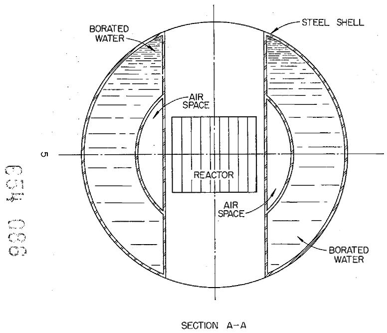  
C

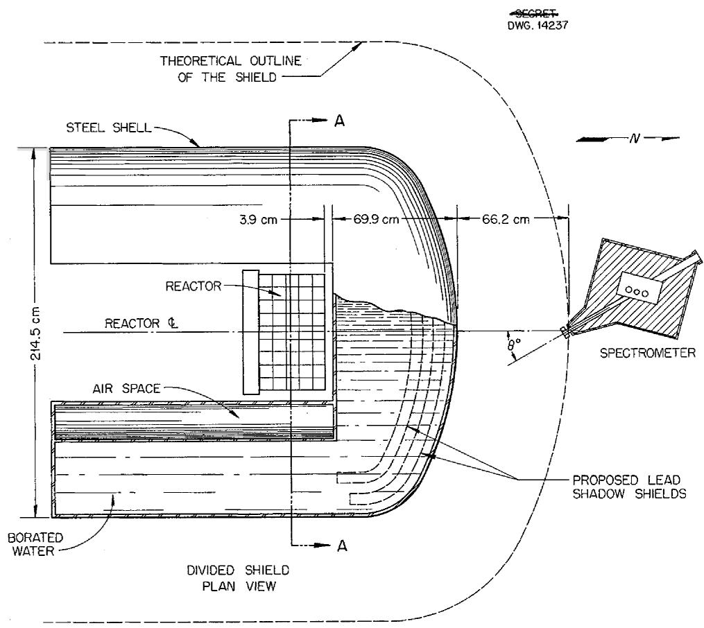  
Fig. 20. Relative Position of Reactor, Divided Shield, and Gamma-Ray Spectrometer in Bulk Shielding Facility.

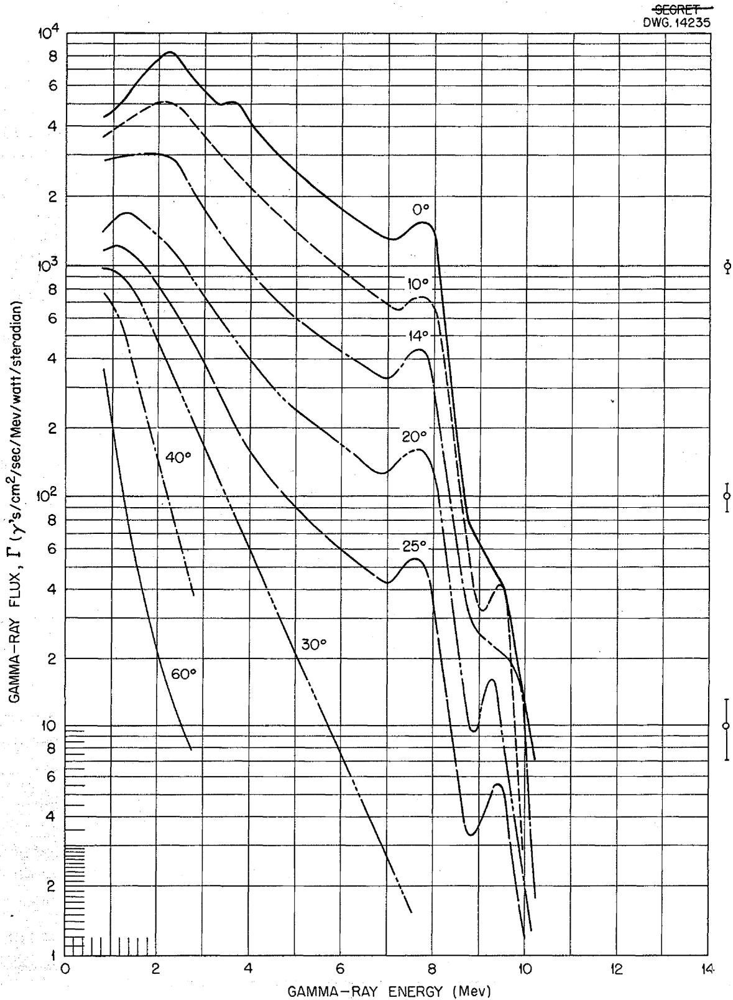  
Fig. 21. Gamma-Ray Spectra at 130 cm from the Water-Reflected Reactor.

# ANP PROJECT QUARTERLY PROGRESS REPORT

Measurements are now being made at various other distances from the reactor. The reactor will then be moved out of the shield into the open water, and a few of the measurements will be repeated for comparison with the spectra in the borated-water shield. Finally, an attempt will be made to measure the spectrum of gamma rays emerging from the face of the reactor.

The third measurement, the energy and angular distribution of the neutrons, will be undertaken as soon as the necessary instruments have been developed, which now appears likely to be some time this summer.

# REACTOR CALIBRATION

For the divided-shield experiments the reactor was loaded so as to completely fill the lattice when rolled into the shield as shown in Fig. 20. Furthermore, since the shield contained borated water and duplicate measurements were to be made with the reactor in the open water behind the shield, the reactor was loaded so as to minimize the effect of the borated

water and was surrounded on four sides with beryllium oxide reflector as shown in Fig. 22. Fuel elements were added in the interior of the lattice until criticality was reached with $3.1\mathrm{kg}$ of $\mathbf{U}^{235}$ . The complete interior could not be filled, but two positions (44 and 46) had extra beryllium oxide elements and two positions (43 and 47) were left filled with water. Repeating the critical experiment in the open water necessitated a slight rearrangement of the extra beryllium oxide elements, which amounted to exchanging the positions of the extra beryllium oxide elements (44 and 46 above) with that of the water (43 and 47). The final assembly required about $30\mathrm{g}$ less of fuel.

The power distribution of the two critical assemblies is being measured with gold foils, following the method of Meem and Johnson.(4) All data on the divided-shield measurements will be normalized to 1 watt using these power calibrations.

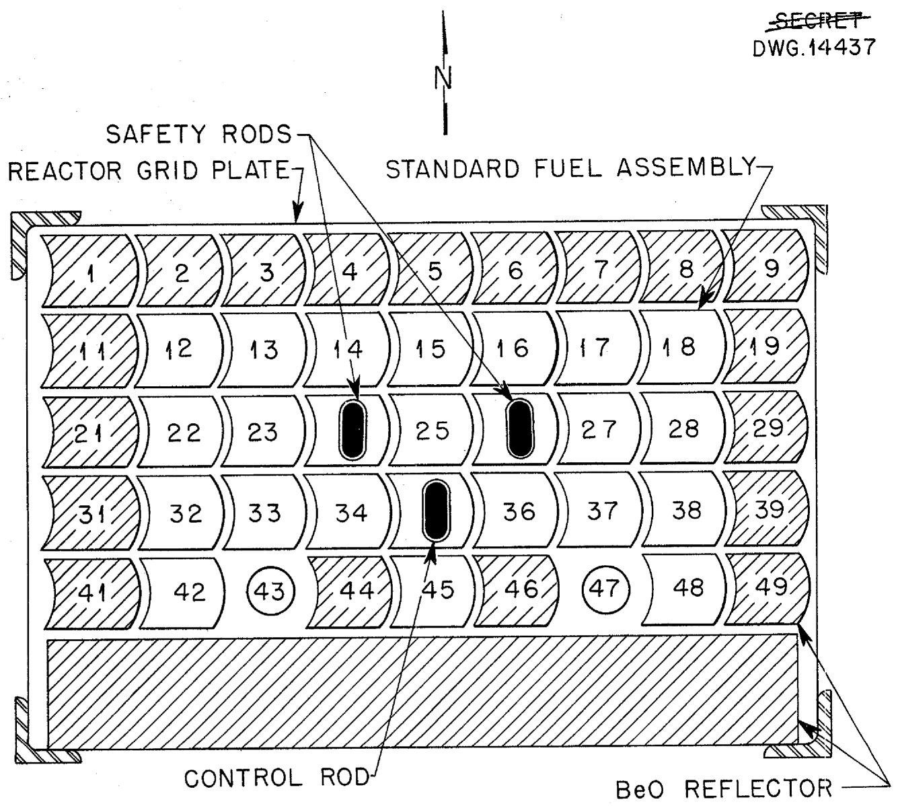  
Fig. 22. Fuel Assembly Arrangement of Bulk Shielding Facility Reactor.

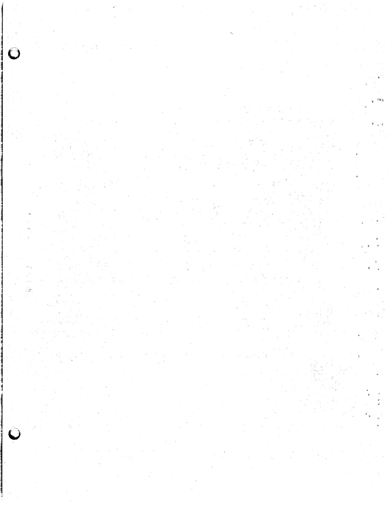

# 7. DUCT TESTS

C. E. Cliffoord

F. Muckenthaler

M. Hullings

L. Abbott

A. Simon

Physics Division

Duct work has been directed toward obtaining further experimental corroboration of the simplified theory of neutron transmission through cylindrical, air-filled ducts in water. The effects of further variations in duct diameters, lengths, and angles of a single bend (with straight sections of equal length) on neutron transmission through the duct have been measured in the Thermal Column Facility. In addition to the above variations, measurements have also been made to predict the effective source area that contributes to the radiation reaching the exit of a single duct. An increase of a factor of 6 in the calculated source strength resulted when the source was increased from an area equal to that of the duct mouth to a much larger area. This was measured for only one duct size (3 in. ID) and is reported to indicate the order of magnitude of the effect. This is, of course, very important for extrapolating the single-duct data to a reactor design in which an array is used.

The agreement with the theory has remained good in that the dose can be predicted for a given duct geometry within a factor of 2 when the geometrical attenuation of the duct is as high as $10^{-6}$ . A report of all the experimental and theoretical work on ducts is essentially complete and will be issued during the next quarter.

# THEORETICAL TREATMENT OF DUCT TRANSMISSION

The generalized equation used to predict a measured dose at the end of

aduct can be written as follows:

$$
D = n _ {0} \left[ \frac {\pi a ^ {2}}{4} \right] \left\{\frac {a ^ {2}}{8 l _ {1} ^ {2}} \right\} \frac {\lambda a ^ {2}}{8 l _ {2} ^ {2} \sin \theta_ {1}} \dots
$$

$$
\frac {\lambda a ^ {2}}{8 l ^ {2} _ {m + 1} \sin \theta_ {m}}, \tag {1}
$$

where

$$
\begin{array}{l} D = \text {r e l a t i v e d o s e (t h e r m a l - n e u t r o n} \\ \text {f l u x}), \end{array}
$$

$$
\begin{array}{l} n _ {0} = \text {r e l a t i v e s o u r c e s t r e n g t h p e r} \\ \text {u n i t a r e a ,} \end{array}
$$

$$
a = \text {d i a m e t e r o f d u c t},
$$

$$
l _ {m} = \text {l e n g t h o f m t h s t r a i g h t s e c t i o n},
$$

$$
\begin{array}{l} \lambda = \text {e x p e r i m e n t a l l y d e t e r m i n e d} \\ \text {c o n s t a n t , i n c l u d i n g n e u t r o n} \\ \text {a l b e d o , e t c . ,} \end{array}
$$

$$
\begin{array}{l} \theta_ {m} = \text {a n g l e b e t w e e n m t h a n d m t h + 1} \\ \text {s t r a i g h t s e c t i o n .} \end{array}
$$

For the special case of equal-length straight sections with bends of equal angles, the equation becomes:

$$
D = n _ {0} \left[ \frac {\pi a ^ {2}}{4} \right] \left[ \frac {a ^ {2}}{8 l ^ {2}} \right] \left[ \frac {\lambda a ^ {2}}{8 l ^ {2} \sin \theta} \right] ^ {m - 1}, \tag {2}
$$

where $m$ is the number of straight sections. This case gives minimum transmission for a given center line length. It should be noted that the equations are not valid for angles of bend that are so small that neutrons can pass directly through the duct

without a wall collision. The formula becomes increasingly more accurate as the angle of bend approaches 90 degrees.

# MEASUREMENT OF AIR-FILLED DUCTS IN WATER

For correlation with the above theory, measurements were made with various configurations of air-filled, cylindrical ducts in the Thermal Column water tank, including straight ducts and ducts with single bends up to 90 degrees. The source areas were also varied. The measured results have been compared with the preceding theory and are within a factor of 2 for a given duct geometry.

Straight Ducts. One end of the duct was placed against a fission source (uranium slugs) in the Thermal Column water tank, and the counter was located in the various slots of the counter holder at the other end of the duct. (These ducts had 1/4-in. lucite walls and were closed at each end with a 1/4-in. lucite disk.) The fission-source box included a movable cadmium shutter to cover the source for background measurements.

Measurements were taken on all straight-duct configurations with the full source, which consisted of 24 natural uranium slugs, 1 l/8 by 4 l/8 in., in a rectangular array (9.3 by 12.4 in.). Additional measurements were made on the 6-in.-ID ducts using a 6-in.-diameter circular source by placing a cadmium shutter with a 6-in.-diameter hole beneath the slugs. Typical curves for the neutron transmission, as measured along the center line of the 6-in.-ID ducts, are given in Fig. 23, and traverse measurements are shown in Fig. 24.

Ducts with Bends. The transmission of neutrons through a flexible rubber

hose (60 in. in length, 1/4-in. walls) with single bends of 0 to 90 degrees was measured with both the full rectangular source and a 3-in.-diameter circular source. The ducts were sealed with 1 1/2-in. rubber plugs to give an actual air column of 57 inches. The two straight sections shortened as the angle of bend increased, since the hose was always bent with a 12-in. radius of curvature. For each angle the straight sections were of equal length.

The smallest angle of bend was equivalent to a displacement of the center of the duct by one diameter to prevent neutrons from reaching the counter without having made at least one collision or having penetrated the surrounding water. Center line and traverse measurements for the full source are shown in Figs. 25 and 26. Center line measurements were also made on a 4 l/4-in.-diameter duct with aluminum walls.

Comparison with Theory. In order to compare the measured results with the predictions of Eq. 1 or Eq. 2, an effective source strength must be determined. To simplify the calculations and also to give some idea of the change in duct transmission with energy, the effective source strengths have been arbitrarily defined as the relative thermal flux (the response of a specified counter at 10, 20, and 30 cm of water from the end of the duct) multiplied by the geometrical attenuation of the duct, that is, $D / n_{0}$ from Eq. 1 or Eq. 2. It was assumed that the counter was large enough to give a reading proportional to the integral of the flux leaving the duct. This can be shown to be nearly correct by a comparison of integrals under the traverses with the center line readings for various ducts. If the formula is correct, $n_{0}$ should be a function only of the distance from the duct end, provided,

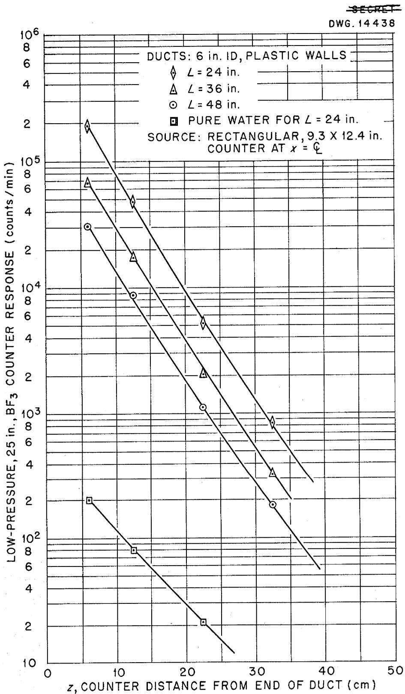  
Fig. 23. Center Line Measurements of Neutron Transmission Through Cylindrical Ducts in Water.

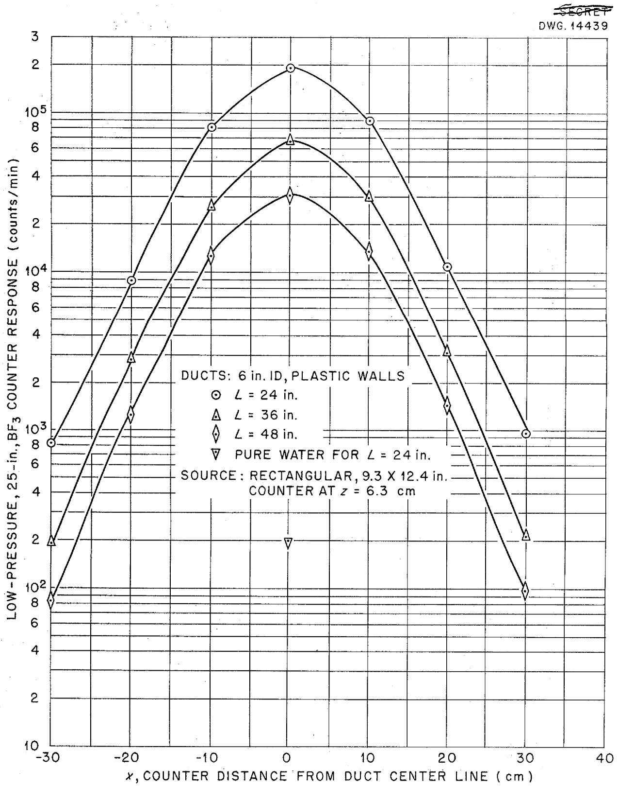  
Fig. 24. Traverse Measurements of Neutrons in Water Beyond Cylindrical Ducts.

SECRET

DWG. 14440

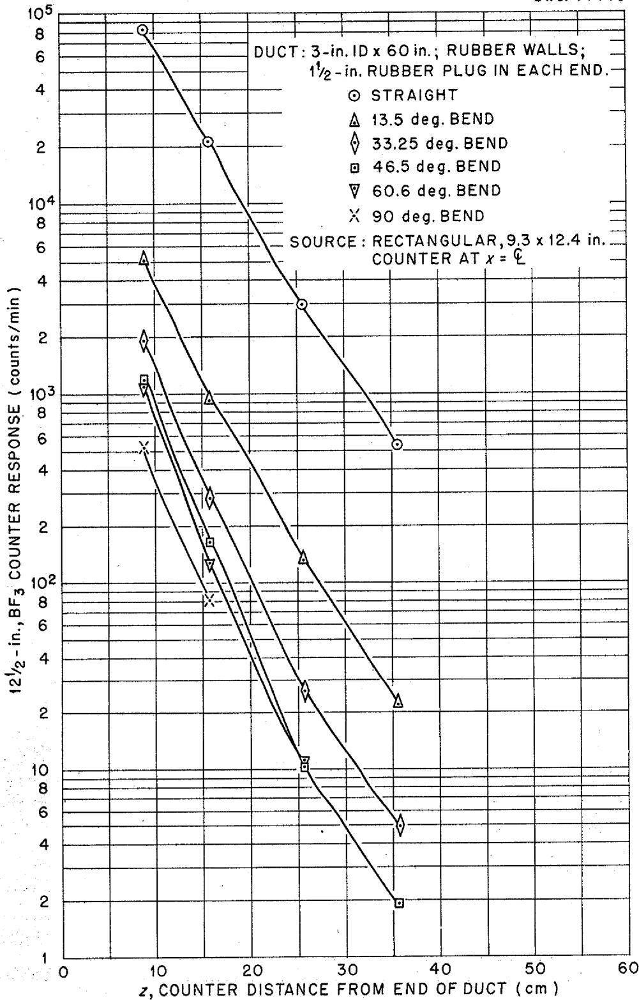  
Fig. 25. Center Line Measurements of Neutron Transmission in Water Through Cylindrical Ducts with Variable Bends.

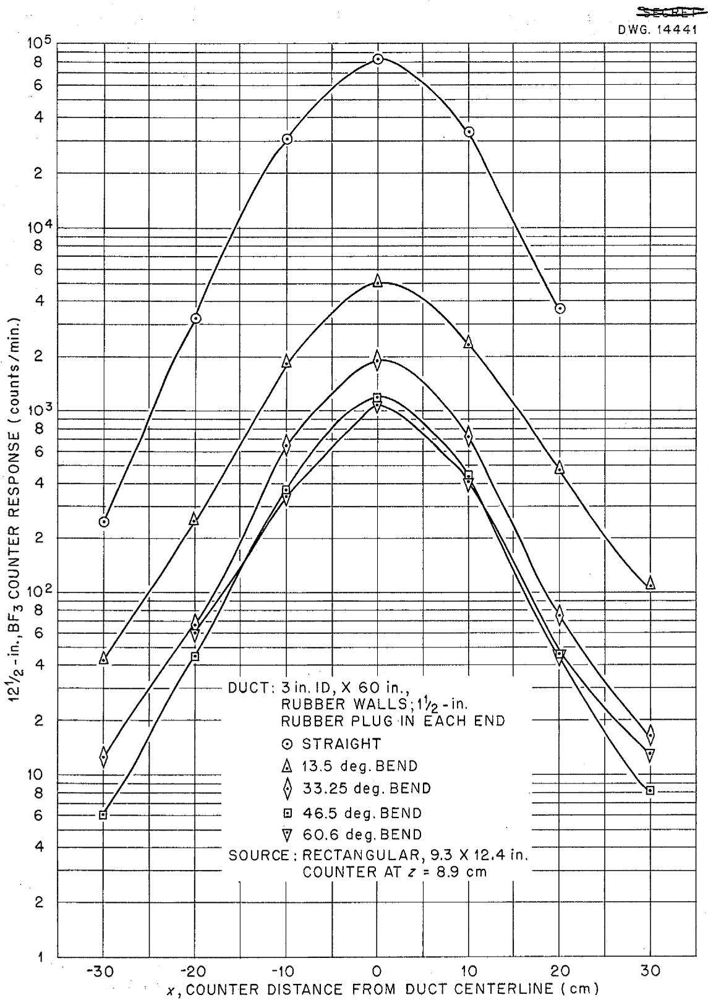  
Fig. 26. Traverse Measurements of Neutrons in Water Beyond Cylindrical Ducts with Variable Bends.

of course, that the source is either the same size as the duct mouth or essentially infinite in extent. That the formula is accurate to within a factor of 2 may be seen in Table 18, for straight ducts, and Table 19, for ducts with bends. These tables summarize the calculations of $n_0$ for each duct geometry measured to date. The measurements will continue on a series of 4 1/4-in. cylindrical ducts.

The effective source strength, $n_0$ , is plotted as a function of the equivalent centimeters of water between the counter and the end of the duct

in Fig. 27. The lower group applies to the 3-in. duct with the 1 1/2-in. rubber plug adjacent to the source, whereas the upper group represents data from ducts that did not have rubber plugs. The difference is not simply ascribable to the attenuation of the plug since this correction had already been applied. No satisfactory explanation has yet been obtained. Further work is being done to clarify the above enigma. The increase in $n_0$ upon increasing the source size beyond the area of the duct mouth is shown in Fig. 28, which also shows angular correlation.

# TABLE 18

# Comparison of Calculated Effective Source Strength for Straight, Cylindrical Ducts

Low-pressure, 25-in., $\mathbf{BF}_3$ counter

Calculated from counter responses at 10, 20, and $30~\mathrm{cm}$ of water from end of duct

<table><tr><td rowspan="2">DUCT DIAMETER (in.)</td><td rowspan="2">\( \mathbf {D U C T}^{(a)} \) LENGTH (in.)</td><td rowspan="2">SOURCE</td><td colspan="3">EFFECTIVE SOURCE STRENGTH \( n_0 \)(neutrons/cm2/sec)</td></tr><tr><td>10 cm</td><td>20 cm</td><td>30 cm</td></tr><tr><td rowspan="3">6</td><td>24</td><td>\( \mathbf {F u l l}^{(b)} \)</td><td>\( 1.05 \times 10^3 \)</td><td>\( 1.29 \times 10^2 \)</td><td>\( 1.58 \times 10 \)</td></tr><tr><td>36</td><td>Full</td><td>\( 2.64 \times 10^2 \)</td><td>\( 1.14 \times 10^2 \)</td><td>\( 1.51 \times 10 \)</td></tr><tr><td>48</td><td>Full</td><td>\( 7.25 \times 10^2 \)</td><td>\( 1.08 \times 10^2 \)</td><td>\( 1.59 \times 10 \)</td></tr><tr><td rowspan="3">6</td><td>24</td><td>\( 6\ in.^{(c)} \)</td><td>\( 4.1 \times 10^2 \)</td><td>\( 5.62 \times 10 \)</td><td>7.96</td></tr><tr><td>36</td><td>6 in.</td><td>\( 3.43 \times 10^2 \)</td><td>\( 5.28 \times 10 \)</td><td>7.92</td></tr><tr><td>48</td><td>6 in.</td><td>\( 3.04 \times 10^2 \)</td><td>\( 4.91 \times 10 \)</td><td>7.96</td></tr><tr><td rowspan="3">8</td><td>24</td><td>Full</td><td>\( 7.4 \times 10^2 \)</td><td>\( 9.99 \times 10 \)</td><td>\( 1.33 \times 10 \)</td></tr><tr><td>36</td><td>Full</td><td>\( 7.99 \times 10^2 \)</td><td>\( 1.04 \times 10^2 \)</td><td>\( 1.33 \times 10 \)</td></tr><tr><td>48</td><td>Full</td><td>\( 7.1 \times 10^2 \)</td><td>\( 9.62 \times 10 \)</td><td>\( 1.33 \times 10 \)</td></tr></table>

(a) Includes plastic ends.   
(b) 24 uranium slugs, 1 1/8 by 4 1/8 in., in rectangular array, 9.3 by 12.4 inches.   
(c) 6-in.-diameter circular source.

# TABLE 19

# Comparison of Calculated Effective Source Strength for Bent, Cylindrical Ducts

Low-pressure, 25-in., BF₃ counter Calculated from counter responses at 10, 20, and 30 cm of water from end of duct(a)

<table><tr><td rowspan="2">DUCT DIAMETER (in.)</td><td rowspan="2">DUCT CENTER LINE LENGTH (in.)</td><td rowspan="2">SOURCE</td><td rowspan="2">ONE-BEND ANGLE (deg.)</td><td colspan="3">EFFECTIVE SOURCE STRENGTH \( {n}_{0} \) (neutrons/cm \( {}^{2}/\mathrm{{sec}} \) )</td></tr><tr><td>10 cm</td><td>\( {20}\mathrm{\;{cm}} \)</td><td>30 cm</td></tr><tr><td rowspan="6">3</td><td rowspan="6">57</td><td>\( {\text{Full}}^{\left( b\right) } \)</td><td>0</td><td>\( {6.7} \times  {10}^{2} \)</td><td>\( {9.18} \times  {10} \)</td><td>\( {1.29} \times  {10} \)</td></tr><tr><td>Full</td><td>13.5</td><td>\( {1.32} \times  {10}^{3} \)</td><td>\( {1.87} \times  {10}^{2} \)</td><td>\( {3.57} \times  {10} \)</td></tr><tr><td>Full</td><td>33.25</td><td>\( {1.37} \times  {10}^{3} \)</td><td>\( {1.22} \times  {10}^{2} \)</td><td>\( {1.68} \times  {10} \)</td></tr><tr><td>Full</td><td>46.5</td><td>\( {1.26} \times  {10}^{3} \)</td><td>\( {9.1} \times  {10} \)</td><td>9.0</td></tr><tr><td>Full</td><td>60.6</td><td>\( {1.45} \times  {10}^{3} \)</td><td>\( {9.25} \times  {10} \)</td><td>9.2</td></tr><tr><td>Full</td><td>90</td><td>\( {6.6} \times  {10}^{2} \)</td><td>\( {6.1} \times  {10} \)</td><td></td></tr><tr><td rowspan="3">3</td><td rowspan="3">57</td><td>\( 3\operatorname{in}.{}^{\left( c\right) } \)</td><td>0</td><td>\( {1.1} \times  {10}^{2} \)</td><td>\( {1.64} \times  {10} \)</td><td>4.22</td></tr><tr><td>3 in.</td><td>13.5</td><td>\( {1.71} \times  {10}^{2} \)</td><td>\( {2.60} \times  {10} \)</td><td>6.05</td></tr><tr><td>3 in.</td><td>33.25</td><td>\( {1.57} \times  {10}^{2} \)</td><td>\( {2.14} \times  {10} \)</td><td>3.29</td></tr><tr><td rowspan="2">4.25</td><td rowspan="2">40</td><td>3 in.</td><td>0</td><td>\( {2.68} \times  {10}^{2} \)</td><td>\( {4.4} \times  {10} \)</td><td>6.95</td></tr><tr><td>3 in.</td><td>90</td><td>\( {3.99} \times  {10}^{2} \)</td><td>\( {3.92} \times  {10} \)</td><td>4. 31</td></tr></table>

(a) Includes rubber plugs on all 3-in. ducts.   
(b) 24 uranium slugs, 1 1/8 by 4 1/8 in., in rectangular array, 9.3 by 12.4 in.   
$(c)_{3 - \mathrm{in.}}$ -diameter circular source.

SE

DWG.14442

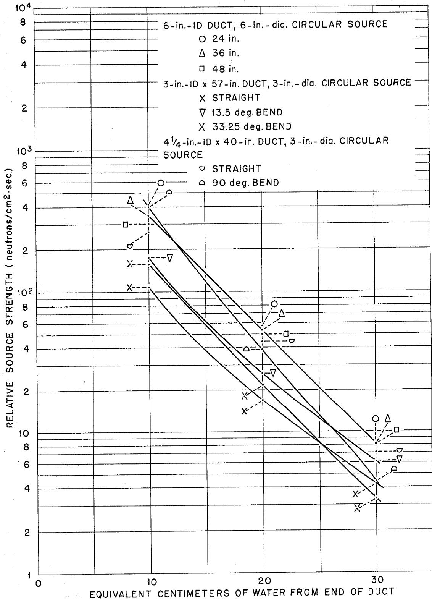  
Fig. 27. Comparison of Relative Source Strengths $(n_0)$ from Various Ducts. Source area equal to duct mouth area.

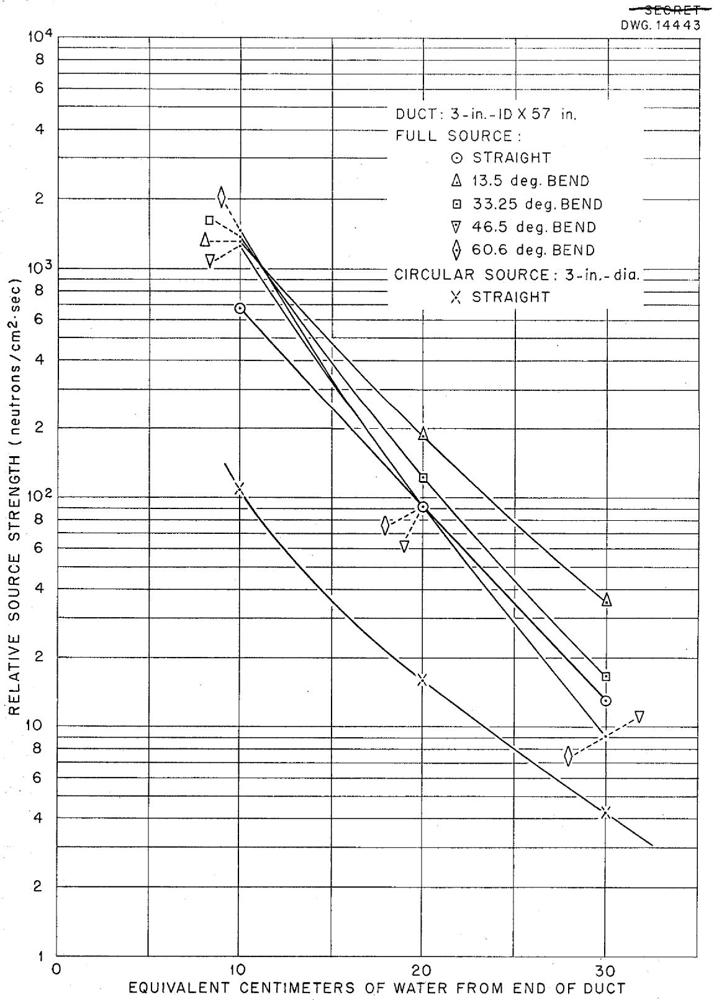  
Fig. 28. Comparison of Relative Source Strengths $(n_0)$ from Various Geometries of the 3-in. Duct.

# 8. TOWER SHIELDING FACILITY

E.P.Blizard J.L.Meem

C. E. Clifford A. Simon

Physics Division

The preliminary proposal(1) for the Tower Shielding Facility has been considerably revised, and a firm proposal will soon be submitted to the AEC. Calculations of spurious scattering from the ground and structure indicate that the shield components (reactor and crew shields) should be at least 200 ft from the ground and free of scattering material in the immediate vicinity of either component. As a consequence, the original configuration has been discarded in favor of the present design, which calculations indicate will satisfy the requirements.

A new cost estimate for this Tower Shielding Facility, based on much more complete analysis, indicates that the total capital expenditure will be about two million dollars.

# TOWER FACILITY DESIGN

The tower will consist of two vertical members 300 ft high connected at the top by a 200-ft bridge. At the center of the bridge is a 100-ft cross member from the ends of which will be suspended a shielded reactor on one side and a crew shield on the other (Fig. 29). The distance from the reactor or crew shield to the ground will be variable up to about 250 ft; above 250 ft the scattering from the cross member would interfere. The normal operating altitude will be about 200 feet. The variable height will make it possible to identify and

measure the ground scattering. This is a very welcome potentiality since the calculations of this effect may not be accurate and it can thus be assured that the divided-shield measurements do not incorporate an unknown spurious component. In addition, it will be possible to estimate the added crew exposure from ground scattering that will be incurred on take-off and landing.

It will be possible to mount large pieces of structural material (e.g., aluminum) at various locations around the reactor or crew shields to simulate airplane structure. Thus the radiation scattering from the airplane itself can be estimated on the basis of direct experimental evidence.

# EXPERIMENTAL PROGRAM

The program for the Tower Shielding Facility as presently conceived will consist of four parts:

1. Calibration of the facility and determination of background from spurious scatterings,   
2. Measurement of a shield mockup for the X-6 airplane (Fig. 30),   
3. A general study of divided shields, including optimization with respect to weight and parametric studies of reactor-crew separation, weight distribution, diameter of reactor shield, size of crew compartment, etc.,   
4. A study of the scattering to be expected from aircraft structure, engines, and ground.

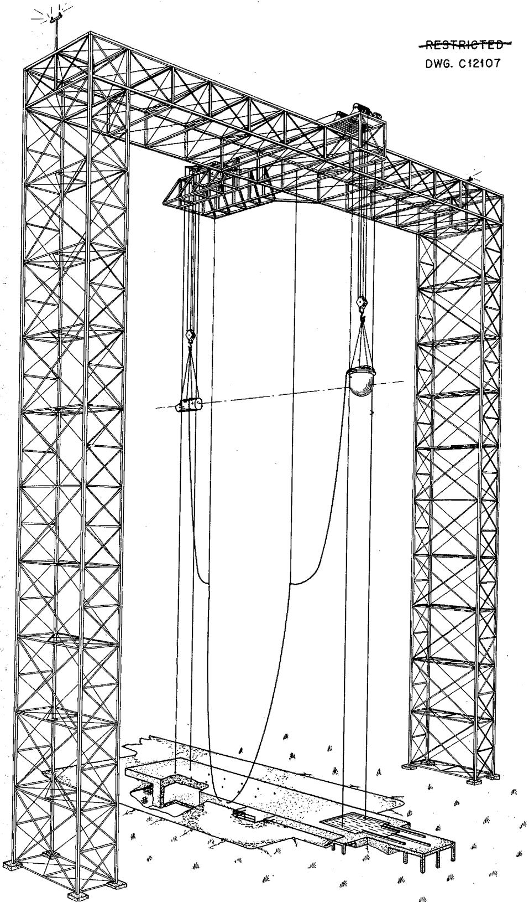  
Fig. 29. Proposed 300-ft Tower Shield Facility.

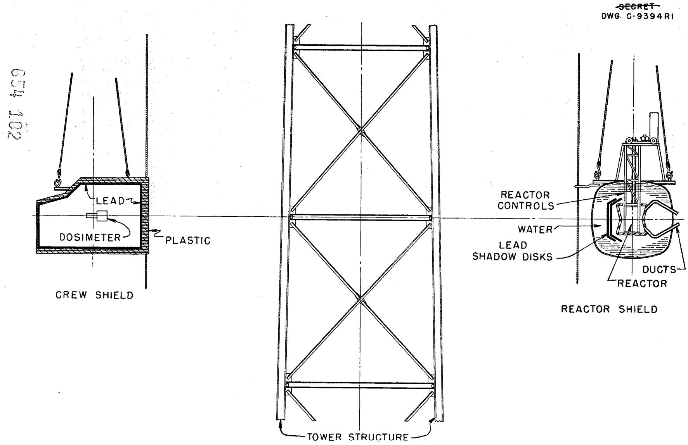  
Fig. 30. X-6 Aircraft Shield Mockup on Tower Shielding Facility.

# 9. NUCLEAR MEASUREMENTS

A. H. Snell, Physics Division

The total cross section of iron has been measured on the 5-Mev Van de Graaff from 0.7 to 3.6 Mev with a resolution of approximately 35 kev. Measurements of the inelastic scattering levels in iron are now under way with the accelerator. The time-of-flight neutron spectrometer has been installed in the LITR and used (after optimization of the background-to-count ratio) to scan the transmission of indium at a resolution of 1.25 $\mu$ sec per meter.

# MEASUREMENTS WITH THE 5-Mev Van de GraAFF ACCELERATOR

H. B. Willard

C. H. Johnson

J. K. Bair

J. D. Kingdon

Physics Division

During the last quarter the 5-Mev Van de Graaff accelerator has been used to obtain detailed information on the total cross section of iron and the inelastic scattering levels excited in iron by fast neutrons. In addition, equipment has been assembled and preliminary measurements have been made on the total cross sections of $\mathbf{L}\mathbf{i}^6$ and $\mathbf{L}\mathbf{i}^7$ and the fission cross sections of $\mathbf{U}^{235}$ and $\mathbf{U}^{238}$ .

Total Cross Section of Iron. The total cross-section curve for iron was measured with a resolution of 35 kev (Fig. 31). The dotted curve of this figure indicates the real variation (outside the statistical error of $3\%$ ) of cross section with energy and shows many unresolved resonances.

Inelastic Scattering Levels in Iron. Measurement of inelastic scattering levels in iron by fast

neutrons places the first level excited by this process at 0.83 MeV above the ground state. No absolute cross sections have been obtained.

# TIME-OF-FLIGHT NEUTRON SPECTrometer

G. S. Pawlicki, ORINS

E. C. Smith, Physics Division

The time-of-flight neutron spectrometer for operation up to several thousand electron volts has been installed in the LITR and checked with indium. When the hard background level was attenuated by a 3-in.-thick beryllium filter, the transmission of indium was satisfactorily scanned at a resolution of 1.25 $\mu$ sec per meter.

Background Measurements. The instrument for background measurements, as originally installed in hole HB-1 of the LITR, looked directly at fuel elements, and the transmission of the shutter was not up to design expectations. A spectrum check made with the instrument indicated a surplus of neutrons above a $1 / E$ distribution at energies greater than 1 kev. A large fraction of these high-energy neutrons was subsequently shown to have an energy above 0.1 Mev. As a temporary measure an aluminum filter was first used that did improve the background-to-count ratio at some sacrifice in counting rate and definitely confirmed the suspected reason for the poor background observed.

By reloading the lattice to provide 3 in. of beryllium in the beam, the background was reduced to design expectation without loss of counting rate. The tabulation in Table 20 shows the counting rates and backgrounds

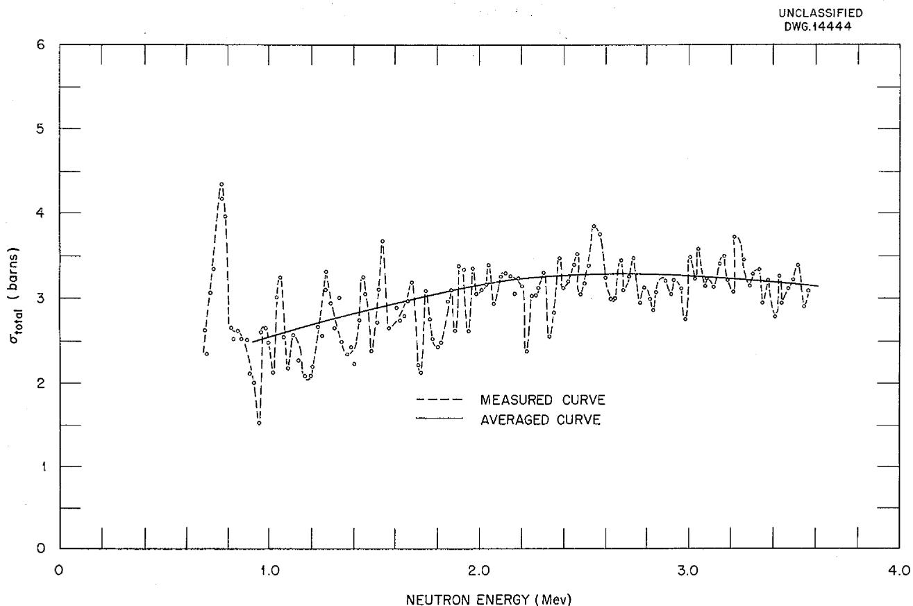  
Fig. 31. Total Cross Section of Iron.

TABLE 20   
Improvement of Count-to-Background Ratio with Aluminum and Beryllium Filters   

<table><tr><td></td><td>COUNTS
(No./min)</td><td>BACKGROUND
(No./min)</td></tr><tr><td>Original loading</td><td>209</td><td>38</td></tr><tr><td>Aluminum filter</td><td>149</td><td>6</td></tr><tr><td>3-in. beryllium filter</td><td>256</td><td>12</td></tr></table>

observed for 20 $\mu$ sec channels at a resolution of 6.8 $\mu$ sec per meter.

Indium Resonances. With the re-loaded lattice the transmission of indium has been surveyed at a resolution of 1.25 $\mu$ sec per meter. The three known resonances at 1.43, 3.9, and 9.5 ev were scanned. In addition, resonances were observed at 10.6, 15.4, 23.8, 48, 78, and 90 ev. The region of 3.9 ev and higher will be repeated with separated isotope samples of known purity and enrichment.

Part III

MATERIALS RESEARCH

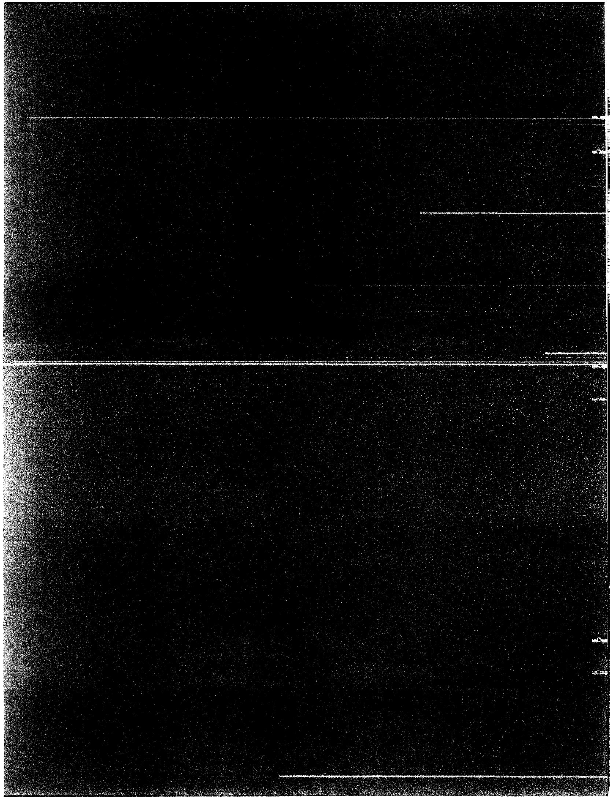

# SUMMARY AND INTRODUCTION

The research on high-temperature liquids has been almost entirely concerned with the development of a fuel-coolant for the circulating-fuel reactor, and the effort on liquid moderators and coolants has been correspondingly reduced (sec. 10). The proposed reactor loading technique requires that the circulating-fuel solution permit widely varying uranium concentration with near uniform melting point. However, for the added requirement of low (< 10 cp) viscosity, the previously proposed system, NaF-BeF $_2$ -UF $_4$ , would provide a suitable fuel. Of the other available fluorides, however, several compositions in the system NaF-KF-ZrF $_4$ -UF $_4$ appear promising on the basis of the limited data available. In addition to this system, numerous other systems containing zirconium fluoride are being examined.

The effort on corrosion research was divided among static and dynamic tests of fluoride and hydroxide corrosion and static tests of liquid metal corrosion (sec. 11). The severe corrosion experienced in dynamic tests with fluorides at $1500^{\circ}\mathrm{F}$ - despite relative inertness in static tests - has redirected attention to fluoride corrosion phenomena. Although there is attack of up to 14 mils, the 0.622-in.-ID Inconel convection loops will circulate the fuel, NaF-KF-LiF- $\mathrm{UF}_4$ , for the duration of 500- and 1000-hr tests without plugging. On the other hand, the 300-series stainless steel loops have a life expectancy (before plugging) of 150 hr and the 400-series stainless steel loops plug in less than 50 hours. It is known that the uranium-free fluorides are less corrosive than uranium-bearing fluorides and that in tests with the latter uranium dioxide crystals form in the cold zone. The effect of various additives on both fluoride and hydroxide corrosion is now being evaluated

and dynamic corrosion of hydroxides is being determined in various environments. In one such experiment with potassium hydroxide in Inconel under hydrogen, there was no corrosion or mass transfer after 135 hr at $715^{\circ}\mathrm{C}$ .

The metallurgical processes involved in the construction and assembly of a high-temperature reactor core, including fabrication of control rods, welding and brazing of core structure, and creep and stress-rupture of metals, are being investigated (sec. 12). The cone-arc welding method may be adapted for tube-to-header welds in the core, but the complexity of the heat ex-changers suggests the use of a brazing technique. Several boron-free brazing alloys are being tested to determine their qualities as brazing material and their corrosion resistance. ARE safety rods will probably be constructed of type-430 stainless steel because of its compatibility with boron carbide. Stress-rupture and creep data have been obtained on fine- and coarse-grained Inconel sheet.

Heat transfer research and physical properties measurements have been largely directed to the immediate needs of circulating-fuel reactor studies for these data. Measurements of viscosity, thermal conductivity, heat capacity and vapor pressure of one or more of the various fluoride mixtures are being obtained. The theoretical analysis of heat transfer in a circulating-fuel reactor has established the design parameters for the core fuel circuit (assuming no wall heat transfer). Mathematical natural convections for liquid fuel elements have been developed for the case of turbulent flow. Some data have been obtained on the heat transfer of boiling mercury, and data should soon be available on the heat transfer of fused salts, hydroxides, and lithium.

# ANP PROJECT QUARTERLY PROGRESS REPORT

Radiation damage studies included irradiated fuel capsules and inpile liquid loops and measurements of the effect of irradiation on creep and thermal conductivity. In several of the inpile experiments with fluoride mixtures in Inconel capsules, the rate of attack on the container material has been considerably higher than that observed in the out-of-pile controls.

Radioactive decay curves were taken while sodium was being circulated in the inpile loop for 165 hours. Partial confirmation of the previously observed decrease in the thermal conductivity of Inconel at $1500^{\circ}\mathrm{F}$ under irradiation has been obtained. The creep of nickel under irradiation has a higher rate than its bench counterpart after about 115 hours.

# 10. CHEMISTRY OF HIGH-TEMPERATURE LIQUIDS

Warren Grimes, Materials Chemistry Division

The research on high-temperature liquids has been concerned almost entirely with their development for use as fuels and/or moderators for an aircraft reactor. The properties required of these liquids along with periodic descriptions of progress in development of such materials have been the subject of previous reports.(1) During the past quarter, however, effort on reactor coolants and on liquid moderator materials has been markedly reduced, in spite of the potential long-range importance of the latter, to increase the effort on various aspects of the fluoride program.

The interest in a circulating-fuel ARE has emphasized a need for liquids of very low melting point at low uranium concentration. In addition, it is very desirable to choose the fuel system so that a dilute (subcritical) fuel solution may be introduced to fill the core, and small increments of a concentrated solution of uranium in the same solvent may be added to bring the system to criticality. This requires that solutions widely varying in uranium content and melting at temperatures well below the operating range be available and that no high-melting compounds be formed at intermediate concentrations.

The qualifications seem to be met adequately by the system $\mathrm{NaF - BeF_2 - UF_4}$

However, it appears that the viscosity of this liquid in the lowest melting region of the system is too high. Of the other available materials, several compositions in the system NaF-KF-ZrF $_4$ -UF $_4$ appear promising on the basis of the limited data available. Numerous other systems containing zirconium fluoride are being examined.

Studies of the ionic species in molten fluorides by determination of transference numbers have not proved capable of unique interpretation. General planning for production of the simulated fuel for the "cold" critical experiment has been completed and experimental preparation of fuel and fuel assemblies is under way.

# LOW-MELTING-FLUORIDE FUEL SYSTEMS

J. P. Blakely

R. E. Traber, Jr.

L. M. Bratcher

C. J. Barton

Materials Chemistry Division

The previous report(2) presented a preliminary list of five promising fluoride fuel systems of low uranium concentration, of which four contained lithium fluoride as a component. Since lithium fluoride would be attractive as a component only if the heavier isotope of lithium were to become available in high concentration, only the NaF-BeF $_2$ -UF $_4$ system appeared promising for immediate use. However, the toxicity of beryllium fluoride and the preliminary indications of high viscosity of beryllium fluoride-bearing liquids have prompted efforts to find other systems for immediate use. Promising results have been obtained recently with mixtures containing zirconium fluoride.

# ANP PROJECT QUARTERLY PROGRESS REPORT

It has been necessary to study the binary and ternary systems of zirconium fluoride with the alkali fluorides. Work on these uranium-free materials is reported under "Coolant Development" in the following. Addition of small amounts (1 to 5 mole %) of uranium fluoride to several of the systems has been shown to affect the melting points only slightly, and it appears likely that any of the low-melting coolants obtained from the preliminary studies can be readily converted to fuels. The available data on zirconium fuels are reported under appropriate headings in the following, along with additional data on several systems containing beryllium fluoride.

NaF-BeF $_2$ -UF $_4$ . Difficulty in establishing reproducible melting points by thermal analysis of mixtures of high beryllium fluoride concentration has been discussed.(2) In an effort to overcome this difficulty, heating curves have been compared with cooling curves for a number of compositions in this system. Selected mixtures were heated to 850 to $900^{\circ}\mathrm{C}$ and cooled, with stirring, by techniques previously described. The solidified materials were then reheated and the heating curve, measured with chromel-alumel thermocouples, was recorded in the manner previously described.

The data shown in Table 21 afford a comparison between break temperatures

TABLE 21   
Comparison of Break Temperatures from Heating and Cooling Curves of the System NaF-BeF $_2$ -UF $_4$   

<table><tr><td colspan="3">COMPOSITION (mole %)</td><td colspan="2">BREAK TEMPERATURE* (°C)</td></tr><tr><td>NaF</td><td>BeF2</td><td>UF4</td><td>ON HEATING</td><td>ON COOLING</td></tr><tr><td>48</td><td>52</td><td>0</td><td>345, 375, 380</td><td>332**</td></tr><tr><td>47.5</td><td>51.5</td><td>1</td><td>330, 365, 385</td><td>350**</td></tr><tr><td>47</td><td>51</td><td>2</td><td>365, 385</td><td>340**</td></tr><tr><td>46.5</td><td>50.5</td><td>3</td><td>245, 315, 369, 385</td><td>355**</td></tr><tr><td>46</td><td>50</td><td>4</td><td>295, 325, 385</td><td>342**</td></tr><tr><td>45.5</td><td>49.5</td><td>5</td><td>270, 360, 395</td><td>352**</td></tr><tr><td>40</td><td>60</td><td>0</td><td>230, 300, 330, 365</td><td>250, 390</td></tr><tr><td>39.6</td><td>59.4</td><td>1</td><td>290, 330, 355</td><td>270, 415</td></tr><tr><td>39.2</td><td>58.8</td><td>2</td><td>325, 355</td><td>295, 445</td></tr><tr><td>38.8</td><td>58.2</td><td>3</td><td>325, 370, 400, 405</td><td>315, ** 430</td></tr><tr><td>38.4</td><td>57.6</td><td>4</td><td>325, 365</td><td>285, 290, 315</td></tr><tr><td>38.0</td><td>57.0</td><td>5</td><td>330, 360</td><td>317</td></tr></table>

* Highest break temperature considered most reliable indication of melting point.   
\*\*Supercooling definitely indicated.

taken from heating curves and cooling curves, which were made with the same materials and equipment. The highest temperature at which a break is shown in the heating curve is considered the most reliable indication of melting point available. As the data indicate, melting points for this system are little affected by uranium concentration in the range studied. It appears that mixtures of useful uranium concentration may be prepared with melting points below $400^{\circ}\mathrm{C}$ .

$\mathbf{KF - BeF}_2 - \mathbf{UF}_4$ A previous document(3) presented some preliminary data on the system $\mathbf{KF - BeF}_2 - \mathbf{UF}_4$ Results of additional studies with these materials are shown in Table 22. All the mixtures studied show melting points considerably higher than those available in the NaF-BeF $^2$ -UF $^4$ system.

TABLE 22   
Break Temperatures from Cooling Curves of the System KF-BeF $_2$ -UF $_4$   

<table><tr><td colspan="3">COMPOSITION (mole %)</td><td rowspan="2">BREAK TEMPERATURES* (°C)</td></tr><tr><td>KF</td><td>BeF2</td><td>UF4</td></tr><tr><td>52</td><td>48</td><td>0</td><td>400, 475, 520</td></tr><tr><td>51.2</td><td>47.3</td><td>1.5</td><td>397, 514, 533, 563</td></tr><tr><td>50.5</td><td>46.5</td><td>3</td><td>390, 472, 525</td></tr><tr><td>49.5</td><td>45.5</td><td>5</td><td>385, 510, 600**</td></tr><tr><td>44.5</td><td>40.5</td><td>10</td><td>385, 525, 607</td></tr></table>

*Highest break temperature considered most reliable indication of melting point.   
** Temperature uncertain.

RbF-BeF2-UF4. Additional data on mixtures of low uranium content in the system RbF-BeF2-UF4 are presented in Table 23. Although it appears that the melting points are somewhat higher

TABLE 23   
Break Temperatures from Cooling Curves of the System RbF-BeF $_2$ -UF $_4$   

<table><tr><td colspan="3">COMPOSITION (mole %)</td><td rowspan="2">BREAK TEMPERATURES* (°C)</td></tr><tr><td>RbF</td><td>BeF2</td><td>UF4</td></tr><tr><td>40</td><td>60</td><td>0</td><td>375, 420</td></tr><tr><td>39.4</td><td>59.1</td><td>1.5</td><td>380, 440</td></tr><tr><td>38.2</td><td>58.2</td><td>3</td><td>325, 370, 445</td></tr><tr><td>38.0</td><td>57.0</td><td>5</td><td>365, 442</td></tr><tr><td>36.0</td><td>54.0</td><td>10</td><td>430, 544</td></tr></table>

* Highest break temperature considered most reliable indication of melting point.

than those for NaF-BeF $_2$ -UF $_4$ mixtures, the RbF-BeF $_2$ -UF $_4$ system seems to show promise, especially below 5 mole% uranium tetrafluoride. The physical properties of this system are probably very similar to those of analogous sodium fluoride-bearing systems.

LiF-NaF-BeF2-UF4. The above-mentioned heating technique has been applied to various mixtures in the system LiF-NaF-BeF2-UF4 in an attempt to verify the very low melting points tentatively reported(2) for these materials. Although it is possible that mixtures melting below $325^{\circ}\mathrm{C}$ may be prepared from these materials, the data previously reported seem to be much too low. Additional studies of this system will probably be postponed in favor of more immediate problems.

Fuels Containing Zirconium Fluoride. Data from a number of studies of alkali fluoride-zirconium fluoride mixtures is reported in a following section on "Coolant Development." Only a limited number of experiments on mixtures containing uranium tetrafluoride have been completed and the results are summarized in Table 24. It seems likely from this data and that presented under "Coolant Development" that the NaF-KF-ZrF $_4$ -UF $_4$ system may be

# ANP PROJECT QUARTERLY PROGRESS REPORT

of definite value as a fuel. Measurements of viscosity have not yet been made for this material, but microscopic examination of the solidified melt has indicated a complete absence of glasses. It is likely that the viscosity of the liquids will resemble those of typical fused salt mixtures rather than glasses. Additional experiments with this and similar systems are under way.

TABLE 24   
Break Temperatures from Heating and Cooling Curves of Zirconium-Bearing Fuel Mixtures   

<table><tr><td colspan="4">COMPOSITION (mole %)</td><td rowspan="2" colspan="3">BREAK TEMPERATURES* (°C)</td></tr><tr><td>NaF</td><td>KF</td><td>ZrF4</td><td>UF4</td></tr><tr><td>37.5</td><td>20</td><td>42.5</td><td>0</td><td>395,</td><td>465,</td><td>475</td></tr><tr><td>37.1</td><td>19.8</td><td>42.1</td><td>1</td><td>263,</td><td>380,</td><td>460</td></tr><tr><td>36.7</td><td>19.6</td><td>41.7</td><td>2</td><td>395,</td><td>410,</td><td>450</td></tr><tr><td>36.3</td><td>19.4</td><td>41.3</td><td>3</td><td>390,</td><td>410,</td><td>440</td></tr><tr><td>35.9</td><td>19.2</td><td>40.9</td><td>4</td><td>375,</td><td>451,</td><td>505 (?)</td></tr><tr><td>35.5</td><td>19.0</td><td>40.5</td><td>5</td><td>375,</td><td>400,</td><td>455</td></tr><tr><td>5</td><td>52</td><td>43</td><td>0</td><td>305,</td><td>405,</td><td>425</td></tr><tr><td>4.9</td><td>51</td><td>42.1</td><td>0</td><td>360,</td><td>380,</td><td>425</td></tr></table>

* Highest break temperature considered most reliable indication of melting point.

# SIMULATED FUEL MIXTURE FOR COLD CRITICAL EXPERIMENT

D. R. Cuneo L. G. Overholser  
Materials Chemistry Division

The cold critical experiment is designed to yield data at room temperature that will be of value in calculating the critical mass of the final high-temperature ARE. The primary requirement of the simulated fuel is that the density of uranium in the tubes of fuel mixture be uniform and equal to the design density of uranium in the ARE fuel at operating temperatures.

In addition, it is desirable to have the sodium-to-uranium ratio equal to that in the real ARE fuel and, if possible, to have the over-all density of the simulated and real fuels the same. The hydrogen-to-uranium ratio must be considerably less than 1; this will be possible if the water content of the materials is less than $0.01\%$ .

It is presently anticipated that the ARE fuels will be simulated for this experiment by packing realistic fuel tubes with a mixture of uranium tetrafluoride and sodium fluoride powders. The Y-12 Production Division will be responsible for preparing the enriched fuel and for filling the fuel tubes. The ANP chemistry group will render assistance in formulation of the mixture and experimental study of tube filling and packing conditions.

Preliminary experiments with uranium tetrafluoride and sodium fluoride powders designed to yield information as to effect of particle size, mixture composition, water content, and packing technique on uranium density, over-all density, and ease of segregation of the mixture are under way.

# IONIC SPECIES IN FUSED FLUORIDES

# M. T. Robinson   Materials Chemistry Division

Determination of the electrolytic transference numbers in fused fluoride mixtures containing uranium tetrafluoride was attempted in an effort to ascertain the nature of the ionic species in these systems. The equipment and general technique used in the study of electrolysis of fused fluorides have been discussed in a previous report.(4) Uncertainties owing to the use of an electrically conducting

diaphragm in the cell and, in part, to the lack of high accuracy in the analytical methods available limit the usefulness of the data obtained. Consequently, no further studies of electrolytic transference are now anticipated. Before these experiments can be improved, an electrical insulator capable of holding the salts without reaction and considerably better analytical methods than now exist will be needed. (An excellent review of such experiments has been given by Baimakov and Samusenko.(5)) The following experimental results from the recent study are, however, of interest.

The number of electrons necessary to reduce one uranium(IV) ion to metal decreases from about four in the more dilute solutions to less than two in the more concentrated ones. The changes in the ion fraction of uranium in the two compartments of the cell are not altogether consistent. The anolyte concentration of uranium does not differ significantly from that found before electrolysis, whereas the change in the catholyte concentration is little more than the experimental error. On the other hand, the alkali metal concentration rises sharply in the catholyte and slightly in the anolyte.

The apparent deviations from Faraday's law may represent a case of stenolysis, i.e., electrode processes occurring in the pores of the diaphragm separating the anolyte and catholyte. If all current passing through the cell did so by a stenolytic mechanism, two electrons would apparently suffice to reduce one uranium(IV) ion to metal, whereas complete absence of stenolysis would require four electrons per reduced uranium(IV). It is possible that the diaphragm used was

not completely permeable to uranium(IV) and that the deviations from Faraday's law result from an increase of stenolysis with increasing uranium tetrafluoride concentration. A photomicrograph of the surface of the diaphragm, however, seemed to indicate a pore size sufficient to pass any of the ions probably present.

The stenolytic behavior, coupled with the observed concentration changes, indicates that the quadrivalent uranium is probably not present as $\mathbf{U}^{+4}$ . The small radius of this ion and its large charge indicate a high mobility. That this is not observed is evidence for the presence of some more complicated species.

# PREPARATION OF STANDARD FUEL SAMPLES

G. J. Nessle

J. E. Eorgan

V. C. Love

Jack Truitt

C. J. Barton

Materials Chemistry Division

A total of 68 batches of fluoride fuels was prepared during the past quarter, including two large (3 to $4\mathrm{kg}$ ) batches of pretreated and filtered material for experiments in dynamic corrosion in thermal convection loops. The materials were used to fill equipment furnished by other ANP groups as indicated in Table 25.

TABLE 25   
Disposition of Standard Fuel Samples   

<table><tr><td>TYPE OF EXPERIMENT</td><td>NUMBER OF
CONTAINERS FILLED</td></tr><tr><td>Static corrosion tests</td><td>243</td></tr><tr><td>Cyclotron bombardment</td><td>26</td></tr><tr><td>Radiation damage</td><td>15</td></tr><tr><td>Viscosity measurement</td><td>8</td></tr><tr><td>Density measurement</td><td>4</td></tr><tr><td>Loop test</td><td>2</td></tr></table>

# ANP PROJECT QUARTERLY PROGRESS REPORT

# PREPARATION OF PURE HYDROXIDES

D. R. Cuneo

D. E. Nicholson

E. E. Kitchen

L. G. Overholser

Materials Chemistry Division

Development of moderator-coolants has been limited during the past quarter to preparation of pure alkali and alkaline earth hydroxides for corrosion studies. Barium, strontium, and sodium hydroxide have been prepared with acceptable purity, that is, containing less than 0.1, 0.06, and $0.1\%$ , respectively, of their carbonates. Purification of the potassium hydroxide has not been so successful.

Barium hydroxide has been prepared, in a quantity sufficient for use in dynamic corrosion experiments, by a procedure (6) that yields 1-lb batches of material containing less than 0.1 wt % barium carbonate. Strontium hydroxide prepared by the same process contained 0.06% of strontium carbonate, and spectrographic analysis showed about 0.1% barium hydroxide. Strontium hydroxide may be dehydrated without difficulty but is not yet available in large quantity.

Additional batches of sodium hydroxide have been purified by removing sodium carbonate from a $50\%$ aqueous solution of sodium hydroxide and dehydrating under vacuum at $425^{\circ}\mathrm{C}$ . These batches have assayed $100.0\%$ sodium hydroxide, and the sodium carbonate content has been less than $0.1\%$ in all cases.

Potassium carbonate can be removed from potassium hydroxide by dissolution of the latter compound in isopropyl alcohol, but it has not proved possible to remove the alcohol from potassium hydroxide without carbonization and contamination of the potassium hydroxide. Potassium hydroxide prepared

by dehydration of an aqueous solution containing 5 wt % potassium hydroxide, which had been treated with barium hydroxide, still contained about $0.3\%$ potassium carbonate. The potassium carbonate content of higher concentration potassium hydroxide solutions decreased, however. There was $0.1\%$ potassium carbonate in the 38 wt % aqueous solution of potassium hydroxide. Recent experimental determinations have shown that barium carbonate is appreciably soluble in potassium hydroxide. Preliminary studies of the feasibility of using calcium hydroxide for this carbonate removal are in progress. In addition, equipment is under construction for preparing potassium hydroxide by reaction of pure water with metallic potassium.

# COOLANT DEVELOPMENT

J. P. Blakely

R.C.Traber，Jr.

L. M. Bratcher

C. J. Barton

Materials Chemistry Division

Investigation of low-melting fluoride mixtures for possible application as coolants has been continued during the past quarter. In addition to possible value as coolants, any low-melting compositions discovered are of potential value as solvents for uranium tetrafluoride in the preparation of fuels of low uranium content.

Recent interest in fuel systems containing zirconium fluoride has led to a considerable program of study in phase equilibria in alkali fluoride-zirconium fluoride systems. Although several of these systems show promise, in no case are the data sufficient for construction of the phase diagram. In many of these mixtures well-defined thermal breaks occur well below the liquidus temperature. It has not been definitely established whether these effects are the result of solid transitions or the presence of some

impurity such as $\mathbf{ZrOF}_2$ , which is known to be present in the only available zirconium fluoride.

LiF-ZrF₄. The system LiF-ZrF₄, which is of possible future interest, is under study in order to obtain a complete picture of the alkali fluoride-zirconium fluoride systems. Cooling curves have been run on nine mixtures ranging between 15 and 70 mole % zirconium fluoride. There appears to be a eutectic at about 39 mole % zirconium fluoride melting at 560 ± 10°C. No congruently melting compounds were observed, but there is some evidence for an incongruently melting compound that is probably Li₂ZrF₆. Breaks other than melting points or the eutectic halt were observed at 590, 515, and 470°C in some mixtures. This study will be continued in greater detail at some future date.

NaF-ZrF₄. The study of the system NaF-ZrF₄ is still in progress; mixtures between 10 and 50 mole % zirconium fluoride have been studied. It appears likely that there is a eutectic at approximately 35 mole % zirconium fluoride, melting at 595 ± 10°C. Breaks other than melting points or eutectic halts were observed at approximately 735, 530, and 495°C with some mixtures.

KF-ZrF₄. Although cooling curves have been run on a rather large number of mixtures in the system KF-ZrF₄, covering the range from 5 to 95 mole % zirconium fluoride, the melting point of some compositions has not been determined with certainty. The existence of a eutectic at 13 mole % zirconium fluoride, melting at 765 ± 10°C, was established and a compound K₃ZrF₇, melting congruently at 910 ± 10°C, has been demonstrated. Mixtures in the range 30 to 60 mole % zirconium fluoride show well-defined breaks or halts at 415 to 435 and 485°C for some compositions.

$\mathbf{RbF - ZrF_4}$ . The system $\mathrm{RbF - ZrF_4}$ has been studied in the range 5 to 60 mole $\%$ zirconium fluoride and appears to be quite similar to the $\mathbf{KF - ZrF_4}$ system. There is a eutectic at about 6 mole $\%$ zirconium fluoride, melting at $720\pm 10^{\circ}C,$ and the compound $\mathrm{Rb}_{3}\mathrm{ZrF}_{7}$ melts congruently at $870\pm 10^{\circ}C.$ It appears likely that there is a eutectic between 30 and 40 mole $\%$ zirconium fluoride, melting at $575\pm 10^{\circ}C,$ but there are also well-marked breaks on the cooling curves for mixtures in this range at about $405^{\circ}C.$

NaF-KF-ZrF $_4$ . Cooling curves have been run on more than 50 mixtures in the ternary system NaF-KF-ZrF $_4$ , and it should be possible to draw contours for this system when the corresponding binary phase diagrams are completed. The lowest melting composition that has been found in this system contained 43 mole % zirconium fluoride, 5 mole % sodium fluoride, and 52 mole% potassium fluoride. This mixture exhibited no break in the cooling curve above $405^{\circ}\mathrm{C}$ and stirred down to this temperature. When heated, it started stirring at $405^{\circ}\mathrm{C}$ and showed no further break up to $500^{\circ}\mathrm{C}$ , at which temperature the experiments were terminated. Other similar systems showed considerably higher melting points. The $405^{\circ}\mathrm{C}$ melting point therefore seems to require further verification. Compositions with about the same amount of zirconium fluoride as the above-mentioned mixture but with more sodium fluoride and less potassium fluoride show well-marked breaks in the cooling curves at approximately $450^{\circ}\mathrm{C}$ , which may indicate a eutectic melting at this temperature; the composition of this eutectic has not been established.

NaF-RbF-ZrF₄. The NaF-RbF-ZrF₄ system has been investigated about as thoroughly as the NaF-KF-ZrF₄ system. The lowest melting point recorded was 460°C for the mixture containing 52

# ANP PROJECT QUARTERLY PROGRESS REPORT

mole % zirconium fluoride, 11 mole % rubidium fluoride, and 37 mole % sodium fluoride. Other breaks were observed in the cooling curve for this and other compositions at temperatures ranging from 410 to $440^{\circ}\mathrm{C}$ . These could be caused by a solid transition or by a eutectic of unknown composition.

NaF-KF-LiF-ZrF4. Only a few mixtures were prepared in the four component system NaF-KF-LiF-ZrF4. Increasing amounts of zirconium fluoride were added to the ternary NaF-KF-LiFeutectic (42 mole % KF, 46.5 mole % LiF, 11.5 mole % NaF), which was considered to be one component of a pseudobinary mixture. The cooling curves that were run after each addition of zirconium fluoride showed that the melting point climbs rather rapidly, reaches a maximum of 810°C at 20 mole % zirconium fluoride, drops sharply to 450°C at 30 mole % zirconium fluoride, and then rises again.

# PREPARATION OF PURE FLUORIDES

G. J. Nessle

F. F. Blankenship

J. E. Eorgan

W. R. Grimes

Materials Chemistry Division

The lack of successful operation of the thermal loops with fluoride fuel material as presently supplied and the definite plans for an ARE in the relatively near future have emphasized the need for research on equipment for preparation of pure, homogeneous, fluoride solutions and handling of the liquids so as to keep them free from contamination until they are used. The mass-transfer phenomenon, which transfers metal from hot to cold regions of the thermal loops, is still not well understood. However, all the plugs so far observed have contained considerable quantities of oxides sludge admixed with the metal particles. It has not been established that the oxides are primarily responsible for

corrosion, but freedom of the system from oxides would certainly help to clarify the picture. In addition, it is essential for reactor operation that the fuel be free from sludge formation.

The raw materials for fuel manufacture are, in general, quite hygroscopic; it is difficult to prevent some pickup of water during the unavoidable handling of the powders. Furthermore, any water picked up by the fluorides will hydrolyze uranium tetrafluoride to insoluble uranium dioxide when the temperature is raised. Uranium tetrafluoride also oxidizes readily at elevated temperatures to yield volatile uranium hexafluoride and soluble and corrosive $\mathrm{UO}_2\mathrm{F}_2$ if any oxygen is present. It seems evident therefore that improvement of the corrosion picture would result if satisfactory means existed for preparing and handling fluorides so that oxidation or hydrolization could not occur. Consequently, equipment designed to prevent these reactions during fuel preparation and transfer are being developed.

Fuel Preparation Equipment. The fuel preparation equipment will be a reactor in which all lines in contact with the molten fluorides are of nickel so that they can readily be reduced with hydrogen to remove oxide films and scale. The reactor will be charged with dry, pure fluorides, sealed by the gasketed flanges to the gas manifold, and evacuated to remove as much adsorbed oxygen and water as possible at low temperatures. The mixture will then be melted and treated at 500 to $600^{\circ}\mathrm{C}$ with dry oxygen-free hydrogen to reduce any $\mathrm{UO}_2\mathrm{F}_2$ or $\mathrm{UF}_6$ formed by oxidation or present in the uranium tetrafluoride used. The water will react with the uranium tetrafluoride at this temperature and yield hydrogen fluoride, which will be swept and pumped out, and

uranium dioxide, which will be suspended in the melt. By treatment of the molten liquid at 500 to $600^{\circ}\mathrm{C}$ with dry hydrogen fluoride, the suspended oxides can be reconverted to fluorides. The excess hydrogen fluoride will be pumped off, the liquid swept with pure helium, and the pure liquid transferred through a nickel filter to a clean receiver by use of helium pressure.

The pure material will be used for capsule and dynamic loop corrosion studies, as well as for all physical property measurements. It is anticipated that a number of preparations will be made under varying conditions of temperature, exposure time, liquid composition, etc. to define the optimum

conditions for operation before the material is used for systematic testing.

Fuel Handling Equipment. If the fuel preparation is to be conducted under such stringent conditions, it will obviously be undesirable to have it contaminated before testing. Consequently, a capsule-filling rig is being developed in which corrosion capsules can be treated with hydrogen, hydrogen fluoride, fluorine, or any desired reagent, filled with an inert gas, connected to a source of pure fuel, filled, sealed, and welded without exposure to air or to an uncontrolled atmosphere.

# 11. CORROSION RESEARCH

W. R. Grimes, Materials Chemistry Division W. D. Manly, Metallurgy Division H. W. Savage, ANP Division

The major emphasis in the corrosion testing program returned, during the past quarter, to the problem of container materials for the fused fluoride mixtures. This effort was extended considerably following the difficulties encountered during circulation of the fluorides by forced convection in closed metal systems. Empirical testing of corrosion of fluoride mixtures by the static capsule technique previously described has been continued, and dynamic testing of fluoride corrosion is being intensively investigated by several techniques, for example, thermal convection loops, seesaw tests, and standpipes. In addition, a large program of a more fundamental nature dealing with possible reactions of metals with the fluoride melts has been initiated.

Static corrosion testing under generally isothermal conditions has been continued with several high-temperature liquids and structural metals by using slight variations of the capsule technique previously described. Other materials have been tested in the molten fluorides to find possible bearing materials and valve seat materials that would not be seriously attacked by the fluoride mixture.stellite, which is a good valve seat material, is apparently unattacked in the fluoride mixture when tested statically. Additions of zirconium and magnesium as possible corrosion inhibitors were made to the fluorides prior to running corrosion tests. It was found that magnesium increased the corrosion attack, whereas additions of zirconium decreased the attack of the fluorides on 300-series stainless steels.

Static corrosion tests have also been run on low melting point alloys for secondary coolants, such as sodium-lead alloys and the hydroxides. Low melting point alloys containing mixtures of lead, tin, cadmium, and bismuth have been tested to find suitable container material. It has been found that lead-cadmium and bismuth-cadmium alloys can be statically contained in type-317 stainless steel. Corrosion testing in sodium-lead alloyshas shown that the addition of sodium to lead lessens the attack on stainless steels and Inconel. Additions of zirconium, sodium, sodium carbonate, sodium cyanide, and sodium hydride were made to sodium hydroxide prior to running static corrosion tests, and the effects of these additions have been tabulated.

Although the static capsule technique has proved satisfactory for routine screening of materials, it lacks sufficient sensitivity to anticipate the results of the more difficult, large-scale, dynamic tests. When routine dynamic tests that can be conducted in large numbers are developed, the static capsule method will be discarded. Thermal convection loops, which have hitherto been used almost exclusively for dynamic corrosion tests, have now been supplemented by a seesaw capsule technique and standpipe tests.

Dynamic corrosion of the fluorides and hydroxides has been studied with these devices. Dynamic corrosion testing reveals the corrosion behavior of different alloys with the fluorides, the effect of inhibitor additions, and provides a means for determining the

# ANP PROJECT QUARTERLY PROGRESS REPORT

effect on the reaction of various atmospheres, such as argon, hydrogen, oxygen, and vacuum, in contact with the bath. One dynamic experiment has shown that potassium hydroxide can be successfully contained in Inconel without corrosion or mass transfer. For this experiment, the loop was operated under a hydrogen atmosphere for 135 hr with a hot-leg temperature of $715^{\circ}\mathrm{C}$ and a cold-leg temperature of $440^{\circ}\mathrm{C}$ . This effort on container materials for molten hydroxides is supplemental to a fundamental approach to the corrosion problem through reactions of hydroxides with structural metals at high temperatures.

# STATIC CORROSION BY FLUORIDES

F. Kertesz  
Materials Chemistry Division

D. C. Vreeland Metallurgy Division

During the past quarter testing techniques have been improved and corrosion tests of a wide variety of materials in various fluorides have been completed. Even so, weight change and penetration data from the recent tests with dilute fuels do not justify a conclusion as to which metal among Inconel and stainless steels types-316, -321, -347 and -316 ELC is superior. The latest static tests of Inconel and 300-series stainless steels in carefully prepared fluoride mixtures support the earlier conclusion that there is little corrosive reaction at $1500^{\circ}\mathrm{F}$ .

A series of screening tests in the untreated fluoride fuel (NaF-KF-LiF- $\mathbf{U}\mathbf{E}_{4}$ ) for 100 hr at $1500^{\circ}\mathrm{F}$ showed that the refractory metals and Stellite were unaffected and that the stainless steels were attacked to a depth no greater than 1 mil. Analyses of the fluorides after corrosion tests have

indicated that no major reaction capable of changing the physical properties of the fluoride melt had occurred. The effects of several additives to the fluoride have been determined. Zirconium and uranium dioxide apparently decrease the corrosiveness of the fluoride, whereas magnesium and uranium oxide increase the corrosion.

Effect of Pretreatment of Fuel (H. J. Buttram, N. V. Smith, R. E. Meadows, C. R. Croft, Materials Chemistry Division). The original tests with fuels of high uranium content (120 to 140 lb of uranium per ft³) showed extensive corrosion (4 to 8 mils) if the materials, as received, were melted under inert atmospheres and used in the tests. After treatment with stainless steel and Inconel, however, these fuels showed considerably reduced corrosion (0.5 to 2 mils) in 100 hr at $800^{\circ}\mathrm{C}$ . The more dilute fuels (5 to 10 lb of uranium per ft³) containing lithium fluoride and beryllium fluoride, which are under study at present, are not appreciably improved by the treatment procedure; they show 1 to 3 mils of penetration whether treated or not treated.

Corrosion of Structural Metals (D. C. Vreeland, E. E. Hoffman, R. B. Day, L. D. Dyer, Metallurgy Division). In addition to a series of screening tests of various materials in an untreated fluoride fuel for 100 hr at $1500^{\circ}\mathrm{F}$ , some data have been obtained on the corrosion of the treated fuel on molybdenum, cold-worked Inconel, and stainless steel. There is no discernable temperature effect between 850 and $1000^{\circ}\mathrm{C}$ on the corrosion of Inconel and several stainless steels.

The screening tests of various materials in fluoride fuel (43.5 mole % KF, 44.5 mole % LiF, 10.9 mole % NaF,

and 1.1 mole $\% \mathrm{UF}_4$ have been completed. These tests were run with dehydrated, untreated, fluoride mixtures for 100 hr at $816^{\circ}\mathrm{C}$ under vacuum. Molybdenum, columbium, Monel, and Stellarite 25 were apparently un-attacked. All the 300-series stainless steels tested (types-310, -317, -321, -347, and -304 ELC) were attacked to a depth of 1 mil or less, except type-304 ELC, which was attacked to a depth of 2 mils. Stainless steels of

the 400 series were not attacked over 1 mil. Z-nickel, which was the most severely attacked material of those tested, was affected to a depth of 5 mils. The attack on Inconel was 3 mils. Details of these tests are presented in Table 26.

Molybdenum, Timken Alloy 6 (16% Cr, 26% Ni, 6% Mo, balance Fe), Timken Alloy 3 (16% Cr, 13% Ni, 3% Mo, balance Fe), and a 74% nickel-26%

TABLE 26   
Static Corrosion of Various Materials in the Untreated Fluoride Fuel (NaF-KF-LiF-UF $_4$ )* in 100 hr at $1500^{\circ}$ F   

<table><tr><td>MATERIAL</td><td>DEPTH OF METAL AFFECTED (mils)</td><td>METALLOGRAPHIC NOTES</td></tr><tr><td>Globe iron</td><td>2</td><td>Surface of specimen very rough</td></tr><tr><td>Molybdenum</td><td></td><td>Surface of specimen roughened</td></tr><tr><td>Type-310 stainless steel</td><td>1</td><td>Subsurface voids</td></tr><tr><td>Type-317 stainless steel</td><td>1</td><td>Intergranular penetration</td></tr><tr><td>Type-321 stainless steel</td><td>0 to 1/2</td><td>Intergranular penetration</td></tr><tr><td>Type-347 stainless steel</td><td>1</td><td>Subsurface voids</td></tr><tr><td>Type-430 stainless steel</td><td>1</td><td>Slight intergranular penetration and decarburization</td></tr><tr><td>Type-446 stainless steel</td><td>1</td><td>Subsurface voids</td></tr><tr><td>Hastelloy B</td><td>0 to 1/4</td><td>Subsurface voids</td></tr><tr><td>Hastelloy C</td><td>2</td><td>Subsurface voids</td></tr><tr><td>Inconel X</td><td>1</td><td>Subsurface voids</td></tr><tr><td>Stellite 25 (L-605)</td><td></td><td>No visible attack</td></tr><tr><td>Z-Nickel</td><td>5</td><td>Voids along grain boundaries</td></tr><tr><td>Tantalum</td><td>1</td><td>Surface of specimen roughened</td></tr><tr><td>Columbium</td><td></td><td>Surface of specimen roughened</td></tr><tr><td>Monel</td><td></td><td>No apparent attack</td></tr><tr><td>Nichrome V</td><td>3</td><td>Subsurface voids, some following grain boundaries</td></tr><tr><td>Inconel</td><td>3</td><td>Subsurface voids, some following grain boundaries</td></tr><tr><td>Type-304 ELC stainless steel</td><td>2</td><td>Subsurface voids, some following grain boundaries, attack somewhat irregular</td></tr></table>

*Composition in mole %: NaF, 43.5; KF, 44.5; LiF, 10.9; UF₄, 1.1.

# ANP PROJECT QUARTERLY PROGRESS REPORT

molybdenum alloy have been tested in a pretreated fluoride fuel (composition in mole $\%$ : NaF, 46.5; KF, 26.0; $\mathrm{UF}_4$ , 27.5) for 100 hr at $816^{\circ}\mathrm{C}$ . Molybdenum was not attacked, and the Timken alloys and molybdenum-nickel alloy were attacked only slightly (1 mil or less).

Static tests have also been run on specimens of as-received and approximately $20\%$ cold-worked Inconel and $20\%$ cold-worked types-316 and -310 stainless steel in the above-mentioned fluoride fuel at $816^{\circ}\mathrm{C}$ for 100 hours. This amount of cold working appeared to have no significant effect on the corrosion properties of these materials under the testing conditions employed. Tests have also been run at 850, 900, and $1000^{\circ}\mathrm{C}$ for 100 hours. The extent of attack varied from 2 to 5 mils, but no definite correlation between temperature of test and amount of

attack could be established. Apparently these materials are insensitive to test temperatures within this range.

Corrosion by Fluorides with Various Additives. A short series of tests on Inconel and type-309 stainless steel have been run using fluoride fuel (NaF-KF-LiF- $\mathrm{UF}_4$ ) with zirconium and magnesium added to the tests in the form of turnings. The results are summarized in Table 27.

The additions of magnesium apparently increased the corrosion of both type-309 stainless steel and Inconel. Additions of zirconium appeared to lessen the attack of the fluoride on these metals. In the tests with the zirconium additions it was noted that built-up surface layers of 1 l/2 to 2 mils and 1/2 mil in thickness were present on the Inconel

TABLE 27   
Static Corrosion of Inconel and Type-309 Stainless Steel by the Fluoride Fuel (NaF-KF-LiF-UF $_4$ )* with Magnesium and Zirconium Additives in 100 hr at $1500^{\circ}$ F   

<table><tr><td>METAL</td><td>BATH ADDITIVE</td><td>DEPTH OF METAL AFFECTED (mils)</td><td>METALLOGRAPHIC NOTES</td></tr><tr><td>Inconel</td><td>None</td><td>2</td><td>Subsurface voids</td></tr><tr><td>Inconel</td><td>2% magnesium</td><td>5</td><td>Large voids</td></tr><tr><td>Inconel</td><td>2% zirconium</td><td>1</td><td>Surface layer 1 l/2 to 2 mil thick, 1/2 to 1 mil of at-tack beneath the surface layer</td></tr><tr><td>Type-309 stainless steel</td><td>None</td><td>2</td><td>Subsurface voids</td></tr><tr><td>Type-309 stainless steel</td><td>2% magnesium</td><td>5</td><td>Subsurface voids, irregular attack</td></tr><tr><td>Type-309 stainless steel</td><td>2% zirconium</td><td></td><td>No visible attack, specimen had surface layer 1/2 mil deep</td></tr></table>

*Composition in mole %: NaK, 10.9; KF, 43.5; LiF, 44.5; UF₄, 1.1.

and type-309 stainless steel, respectively. A photomicrograph of the Inconel corrosion specimen is shown in Fig. 32. An attempt is being made to identify these layers by spectrographic methods.

Preliminary experiments have indicated that addition of uranium dioxide to the fuels does not increase the corrosion in static experiments. Addition of uranium oxide has, however, greatly increased the corrosion observed even in the static tests. It is likely that this is true of any hexavalent uranium compound including $\mathrm{UO}_2\mathrm{F}_2$ , which is the expected product of oxidation of uranium tetrafluoride. This is discussed in a separate section below.

Melting Point of Fluorides After Corrosion Tests (J. M. Didlake, G. J. Nessle, C. J. Barton, Materials Chemistry Division). Samples from 26 static corrosion capsules and dynamic loop experiments were recovered to establish whether any changes in the melting point of the material had occurred as a consequence of the corrosion reactions. As indicated by the data in Table 28, the melting point of these samples is not affected by the corrosion. In some cases removal of the liquid from the capsule left some very high melting point materials behind. Although analyses of these materials show them to be wet with the molten fluoride, they seemed to consist of oxides of uranium and the structural metals and

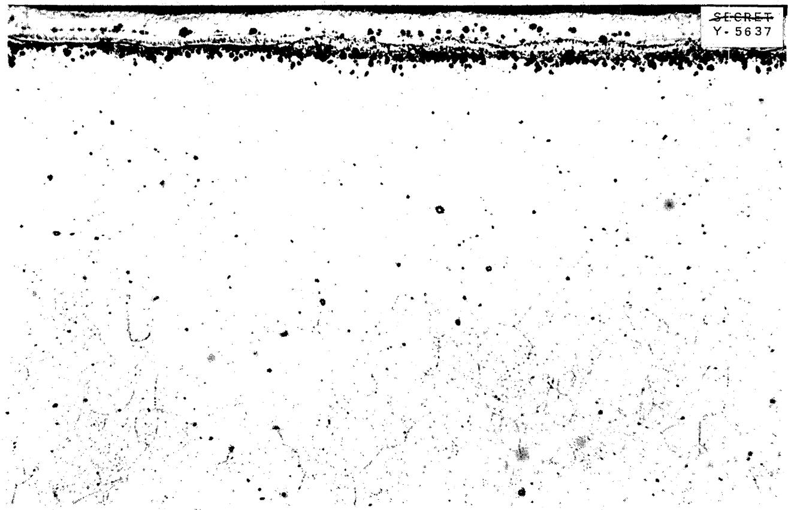  
Fig. 32. Corrosion of Inconel in a Fluoride Fuel $\left[(\mathrm{NaF - KF - UF}_4) + 2\% \mathrm{Zr}\right]$ for 100 hr at $816^{\circ}\mathrm{C}$ . 200X.

# ANP PROJECT QUARTERLY PROGRESS REPORT

of metallic particles from the container walls. It was clear that no major reaction capable of changing the physical properties of the fluoride melt had occurred.

# STATIC CORROSION BY SODIUM HYDROXIDE

D. C. Vreeland

E. E. Hoffman

R. D. Day

L. D. Dyer

Metallurgy Division

The static corrosion of sodium hydroxide has been determined with a variety of specimens and the addition

of presumed inhibitors. None of a number of special alloys that were tested was severely corroded after 100 hr at $1500^{\circ}\mathrm{F}$ , although the attack was erratic. The corrosion of structural metals in sodium hydroxide with various additives was in no case reduced to insignificance. Of several refractory materials exposed to the test conditions only vitrified beryllium oxide survived without crumbling, and it lost considerable weight.

Corrosion of Special Alloys. A few tests of special alloys have been

TABLE 28   
Melting Points of Samples of Fluoride from Corrosion Tests   

<table><tr><td rowspan="2"></td><td rowspan="2">NO. OF SAMPLES</td><td colspan="2">MELTING POINT (℃)</td></tr><tr><td>FINAL*</td><td>ORIGINAL</td></tr><tr><td>CAPSULE MATERIAL</td><td></td><td></td><td></td></tr><tr><td>Type-316 stainless steel</td><td>9</td><td>527</td><td>530</td></tr><tr><td>Inconel</td><td>1</td><td>526</td><td>530</td></tr><tr><td>Type-316 stainless steel</td><td>10</td><td>450</td><td>452</td></tr><tr><td>Inconel</td><td>1</td><td>450</td><td>452</td></tr><tr><td>Type-316 ELC stainless steel</td><td>2</td><td>450</td><td>452</td></tr><tr><td>Type-321 stainless steel</td><td>1</td><td>456</td><td>452</td></tr><tr><td>Type-347 stainless steel</td><td>1</td><td>450</td><td>452</td></tr><tr><td>Type-316 stainless steel</td><td>2</td><td>458</td><td>460</td></tr><tr><td>Type-316 stainless steel</td><td>4</td><td>338</td><td>345</td></tr><tr><td>LOOP SECTION MATERIAL</td><td></td><td></td><td></td></tr><tr><td>Type-316 stainless steel (hot)</td><td>1</td><td>455</td><td>452</td></tr><tr><td>Type-316 stainless steel (cold)</td><td>1</td><td>455</td><td>452</td></tr><tr><td>Type-410 stainless steel (bottom)</td><td>1</td><td>453</td><td>452</td></tr><tr><td>Type-410 stainless steel (hot)</td><td>1</td><td>453</td><td>452</td></tr><tr><td>Type-410 stainless steel (cold)</td><td>1</td><td>453</td><td>452</td></tr></table>

*Mean value if more than one sample was used.

run in sodium hydroxide for 100 hr at $1500^{\circ}\mathrm{F}$ . A $26\%$ molybdenum- $74\%$ nickel alloy showed light attack to a depth of 2 mils, whereas a $25\%$ nickel- $75\%$ iron alloy was attacked to a depth of only 1 mil. Other alloys composed of equal parts of iron and nickel; iron, nickel, and cobalt; and nickel and cobalt have also been tested. Although one of these alloys was severely corroded, in general, the attack was quite erratic with deep local penetrations. Since the capsules and specimens were machined from as-cast bars without prior working or annealing, it is believed that the cast structure of these materials may have caused this type of attack. It

is planned to test materials of similar compositions that have been hot-worked and annealed so as to have a more uniform structure.

Corrosion by Sodium Hydroxide with Various Additives. A series of tests were run with sodium hydroxide and various addition agents, including zirconium, sodium, sodium carbonate, sodium cyanide, and sodium hydride. The addition of approximately $50\%$ of sodium cyanide appeared to lessen attack somewhat on type-316 stainless steel and Inconel. None of the agents tested appeared to reduce corrosion to an insignificant level. Details of these tests are presented in Table 29.

TABLE 29   
Static Corrosion of Structural Metals by Sodium Hydroxide with Various Additives in 100 hr at $1500^{\circ}\mathbf{F}$   

<table><tr><td>MATERIAL</td><td>ADDITIVE</td><td>WEIGHT CHANGE (mg/in.2)</td><td>DEPTH OF METAL AFFECTED (mils)</td><td>METALLOGRAPHIC NOTES</td></tr><tr><td>Type-304 stainless steel</td><td></td><td></td><td>2</td><td>5-mil oxide layer</td></tr><tr><td>Type-304 stainless steel</td><td>10% Zr</td><td></td><td>2 1/2</td><td>6-mil oxide layer</td></tr><tr><td>Type-304 stainless steel</td><td>30% Na2CO3</td><td></td><td>3</td><td>6-mil oxide layer</td></tr><tr><td>A-Nickel</td><td>7% Zr</td><td></td><td></td><td>No attack</td></tr><tr><td>Inconel</td><td>12% Zr</td><td></td><td>3</td><td>11-mil oxide layer</td></tr><tr><td>Type-316 stainless steel</td><td>48% NaCN</td><td>-286.6</td><td>2</td><td>Intergranular attack</td></tr><tr><td>Inconel</td><td>49% NaCN</td><td>-207.3</td><td>7</td><td>Intergranular attack</td></tr><tr><td>Inconel</td><td>7.4% Na</td><td></td><td>Complete penetration</td><td>Specimen converted completely to corrosion product</td></tr><tr><td>Inconel</td><td>50% Na</td><td></td><td>Complete penetration</td><td>Specimen converted completely to corrosion product</td></tr><tr><td>A-Nickel</td><td>14% Na</td><td>+51.1</td><td></td><td>No corrosion product, but edge of specimen rough</td></tr><tr><td>A-Nickel</td><td>54% Na</td><td>-2.5</td><td></td><td>No attack</td></tr><tr><td>Inconel</td><td>31% NaH</td><td></td><td>Complete penetration</td><td>Specimen converted completely to corrosion product</td></tr><tr><td>Type-304 stainless steel</td><td>31% NaH</td><td>-24.9</td><td>4 1/2</td><td>Oxide layer</td></tr></table>

Corrosion of Refractory Materials. A number of refractory materials were tested in sodium hydroxide in capsules of nickel at $800^{\circ}\mathrm{C}$ for 100 hours. Carbides of tungsten, tantalum, columbium, titanium, and silicon and zirconium nitride, all in the hot-pressed condition, disintegrated during the test. Vitrified beryllium oxide lost considerable weight but survived without crumbling.

# STATIC CORROSION BY LIQUID METALS

D.C.Vreeland

E. E. Hoffman

R. B. Day

L. D. Dyer

Metallurgy Division

Liquid metal corrosion studies during the past quarter have been limited to the testing of various low melting point alloys of potential use as a secondary coolant and a number of lead-sodium alloys. Inconel and types-310 and -317 stainless steel were tested in the low melting alloys for 100 hr at $1500^{\circ}\mathrm{F}$ . The type-317 stainless steel was unattacked by the $82\%$ lead- $18\%$ columbium alloy and only slightly attacked by the $60\%$ bismuth- $40\%$ cadmium alloy, whereas Inconel and the type-310 stainless steel were generally subject to somewhat greater attack. Lead-sodium alloys containing as little as $5\%$ sodium have been successfully contained in Inconel and a number of 300- and 400-series stainless steels with no greater than 1/2-mil attack after 100 hr at $1500^{\circ}\mathrm{F}$ .

Corrosion by Low Melting Point Alloys. A low melting point alloy is being considered as a coolant in a secondary heat exchanger, so several eutectic compositions of low melting point alloys have been employed as corroding mediums in static corrosion tests with types-310 and -317 stainless steel and Inconel. The compositions

and melting points of the eutectic alloys used are listed in Table 30.

# TABLE 30

# Melting Points of Various Alloys

COMPOSITION BY WEIGHT

MELTING POINT (°C)

<table><tr><td>4 4%</td><td>Pb-56%</td><td>Bi</td><td>124</td></tr><tr><td>43%</td><td>Sn-57%</td><td>Bi</td><td>138.5</td></tr><tr><td>60%</td><td>Bi-40%</td><td>Cd</td><td>144</td></tr><tr><td>68%</td><td>Sn-32%</td><td>Cd</td><td>176</td></tr><tr><td>38%</td><td>Pb-62%</td><td>Sn</td><td>183</td></tr><tr><td>82%</td><td>Pb-18%</td><td>Cd</td><td>248</td></tr></table>

In these experiments, which were run for 100 hr at $816^{\circ}\mathrm{C}$ under vacuum, all the low melting point alloys containing tin (except Inconel in $68\%$ tin- $32\%$ cadmium alloy) proved to be extremely vigorous in their attack on the metals tested. It is believed that the type of attack in these mediums can be classified either as intergranular, as in Fig. 33 that shows the characteristic penetration along the grain boundaries sometimes accompanied by voids, or as an alloying type of attack in which the attacked surface actually alloys with the molten coolant being tested, as shown in Fig. 34.

Inconel did not show much promise in the tests. Type-317 stainless steel was unattacked by the $82\%$ lead- $18\%$ cadmium alloy and only slightly attacked by the $60\%$ bismuth- $40\%$ cadmium alloy. The results of these tests are summarized in Table 31. It is planned to test other structural materials in the low melting point alloys that proved least corrosive in the initial tests.

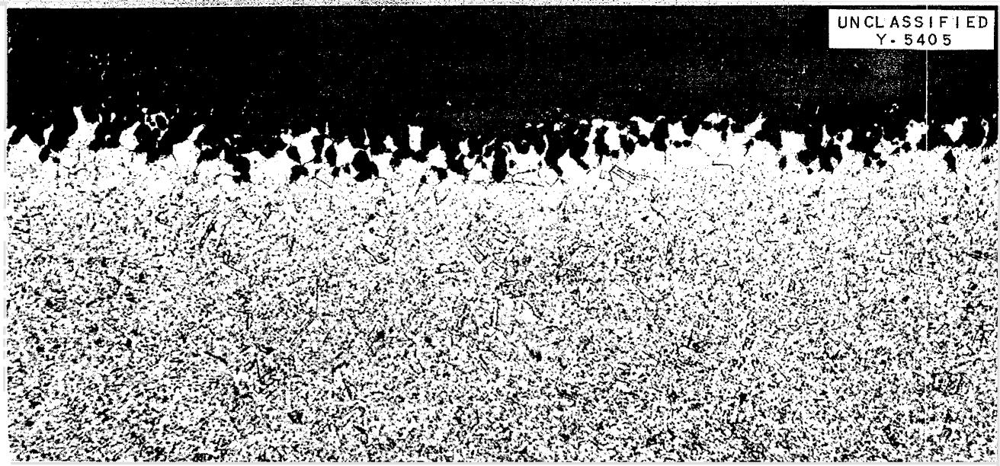  
Fig. 33. Intergranular Attack of Type-310 Stainless Steel Tested in $44\%$ Lead- $56\%$ Bismuth Alloy for 100 hr at $1500^{\circ}\mathrm{F}$ . $200\times$ .

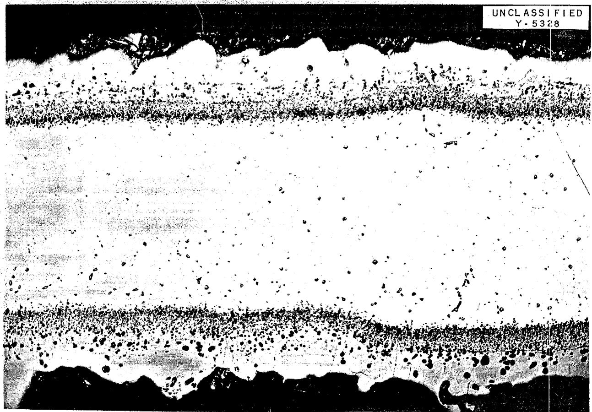  
Fig. 34. Alloying Attack of Inconel Tested in $43\%$ Tin-57% Bismuth Alloy for 100 hr at $1500^{\circ}\mathrm{F}$ . 100X.

TABLE 31   
Corrosion of Types-310 and -317 Stainless Steel and Inconel by Various Low Melting Point Alloys in 100 hr at $1500^{\circ}\mathbf{F}$   

<table><tr><td>ALLOY COMPOSITION BY WEIGHT</td><td>MATERIAL</td><td>DEPTH OF METAL AFFECTED (mils)</td><td>METALLOGRAPHIC NOTES</td></tr><tr><td>43% Sn-57% Bi</td><td>Type-310 stainless steel</td><td>10</td><td>Many large voids</td></tr><tr><td>43% Sn-57% Bi</td><td>Type-317 stainless steel</td><td>11</td><td>Irregular attack, many voids</td></tr><tr><td>43% Sn-57% Bi</td><td>Inconel</td><td>8</td><td>5-mils of a uniform layer on surface with an underlying layer of voids, 3-mils in thickness</td></tr><tr><td>60% Bi-40% Cd</td><td>Type-310 stainless steel</td><td>15</td><td>Attack very irregular, varying 0 to 15 mils, both grains and grain boundaries attacked in some cases</td></tr><tr><td>60% Bi-40% Cd</td><td>Type-317 stainless steel</td><td>2</td><td>Intergranular penetration and voids in a few areas</td></tr><tr><td>60% Bi-40% Cd</td><td>Inconel</td><td>Complete penetration of specimens</td><td>Voids throughout entire specimen, tube attacked to a depth of 20 mils</td></tr><tr><td>38% Pb-62% Sn</td><td>Type-310 stainless steel</td><td>Complete penetration of specimens</td><td>Erratic attack</td></tr><tr><td>38% Pb-62% Sn</td><td>Type-317 stainless steel</td><td>Complete penetration of specimens</td><td>Erratic attack, only 2 mils affected in places</td></tr><tr><td>38% Pb-62% Sn</td><td>Inconel</td><td>8</td><td>Erratic attack</td></tr><tr><td>68% Sn-32% Cd</td><td>Type-310 stainless steel</td><td>Complete penetration of specimen</td><td>Erratic attack, tube failed by penetration of wall</td></tr><tr><td>68% Sn-32% Cd</td><td>Type-317 stainless steel</td><td>Complete penetration of specimen</td><td>Erratic attack</td></tr><tr><td>68% Sn-32% Cd</td><td>Inconel</td><td>2</td><td>Uniform attack</td></tr><tr><td>82% Pb-18% Cd</td><td>Type-310 stainless steel</td><td>2</td><td>Intergranular attack</td></tr><tr><td>82% Pb-18% Cd</td><td>Type-317 stainless steel</td><td>0</td><td>No attack on specimen or tube</td></tr><tr><td>82% Pb-18% Cd</td><td>Inconel</td><td>10</td><td>Intergranular attack</td></tr><tr><td>44% Pb-56% Bi</td><td>Type-310 stainless steel</td><td>6</td><td>Intergranular attack varying from 2 to 6 mils</td></tr><tr><td>44% Pb-56% Bi</td><td>Type-317 stainless steel</td><td>15</td><td>Intergranular attack</td></tr><tr><td>44% Pb-56% Bi</td><td>Inconel</td><td>4</td><td>Intergranular attack varying from 1 to 4 mils</td></tr></table>

Corrosion by Sodium-Lead Alloy. A series of static corrosion tests of various materials in three different sodium-lead mixtures (80% sodium-20%

lead; $50\%$ sodium- $50\%$ lead; and $5\%$ sodium- $95\%$ lead) has been completed. The tests were run at $816^{\circ}\mathrm{C}$ for 100 hr under vacuum. Only in the case of

Inconel in the $5\%$ sodium- $95\%$ lead mixture was the depth of attack greater than 1/2 mil; Inconel was affected to a maximum depth of 3 mils. The various test combinations included Inconel and types-317 and -346 stainless steel in all the alloys, type-316 stainless steel in the 50-50 alloy, and type-304 stainless steel in the $5\%$ sodium- $95\%$ lead alloy. Except for the aforementioned case of Inconel, the $5\%$ sodium- $95\%$ lead alloys show no attack whatsoever. All specimens were ductile on bending 180 degrees.

It was noted that some of the stainless steel specimens that had been tested in the $80\%$ sodium- $20\%$ lead mixture had apparently become carburized. This phenomenon has been observed before in testing similar materials in sodium.(1) No carburization of any of the stainless steels was noted with the $50\%$ sodium- $50\%$ lead or $5\%$ sodium- $95\%$ lead mixtures, which indicates that occurrence of carburization is enhanced by the presence of higher percentages of sodium in the bath metal. Future plans include running static corrosion tests with lower percentages of sodium in the bath metal.

# FACILITIES FOR DYNAMIC CORROSION TESTING

Static corrosion tests are satisfactory for the routine screening of corrosion resistant materials, but they lack the sensitivity to anticipate the results of dynamic testing. The mass transfer phenomenon and the deep penetration in the hot zone that are characteristic of all the dynamic thermal convection loops are not observable in static isothermal capsule studies. These latter experiments are, however, easy to

perform in large numbers and under conditions of better reproducibility. Dynamic corrosion testing in the thermal convection loops in which the bulk of the testing has been performed has now been supplemented by a number of techniques that promise to duplicate the phenomena shown in the large loops with much smaller and more economical equipment. One of these techniques is the standpipe test in which controlled thermal gradients may be introduced. The most promising, however, is the seesaw technique with which fluid motion as well as thermal gradients are readily attained.

Thermal Convection Loops. The large thermal convection loops, which have been in operation for almost two years, have been described in previous reports. (2,3,4) The loops are usually fabricated of 1/2-in. pipe and are shaped roughly in the form of a rectangle 1 ft wide and 3 ft high. When the bottom and an adjacent side of the rectangle are heated, convection forces in the contained fluid establish a flow that attains a velocity of up to 8 ft/min depending upon the temperature difference across the hot and cold sides of the rectangle.

Recently, smaller convection loops have been used in these experiments. These loops afford the simplest and most direct means of studying mass transfer, since the

# ANP PROJECT QUARTERLY PROGRESS REPORT

characteristics are such as to accentuate the effects leading to mass transfer. The loops can be adapted to allow the exclusion of oxygen, water vapor - and to some extent metallic oxides - from the system. The loops are formed of 1/2-in.-ID tubing with a nominal wall thickness of 0.035 in. into the form of a rectangle, 7 by 17 in., with a loading tube extending above the hot leg of the loop. A dehydration pot is connected with the loop by standard 1/4-in. tubing. Glass tubing is attached at the tops of the loading legs of both the loop and the dehydration pot by means of Kovar seals for connecting vacuum and hydrogen lines. The furnaces for heating the loops are constructed from heating coils mounted in split, cylindrical ceramic forms fitted around the sections of the loop.

Seesaw Corrosion Tests. The seesaw tests require a sealed metal tube approximately one-third full of molten material. The capsules are placed in a furnace capable of heating to $1700^{\circ}\mathrm{F}$ , and up to 18 sealed corrosion capsules may be heated at one time. To create a temperature differential, the capsules may be placed so that one end emerges from the furnace. The tubes are gently rocked on a central fulcrum similar to a seesaw so that the molten medium flows by gravity to both ends of each tube. The apparatus is shown in Fig. 35. After several thousand cycles, the tubes are sectioned for examination. It is anticipated that in this manner the mass transfer and enhanced corrosion phenomena can be obtained and a variety of conditions for improvement studied.

Differential Temperature Tests. A type of test frequently referred to as the standpipe test involves capsules similar to those used in the seesaw tests, except that they are almost completely filled with the fluid and

are held stationary in a vertical position. This is not a true dynamic test because the fluid is essentially immobile. With this type of test, however, the temperature gradient may be controlled so that it is hottest at the top, bottom, or center. Normal convection provides the only means of circulation. After a suitable time, the tubes are sectioned and examined.

Another design with which a large thermal gradient may be obtained employs a U-shaped tube. In this apparatus there is a large temperature differential between the two legs, but there is the smallest possible $\Delta T$ from top to bottom of each leg (to minimize local convection currents). The object of such tests with this apparatus is to determine the contribution of temperature difference alone to corrosion and/or metal transport.

A third type of apparatus will permit one portion of a metal specimen to be water-cooled internally. One end of the metal will be immersed in a crucible containing stirred or un-stirred molten test fuel at a specified temperature. This equipment will be contained in a 5-in. pot furnace.

Rotating Dynamic Corrosion Tests. Another tester incorporates means for preparing the liquid to be used and for inserting a rotating specimen that acts as a small pump for agitating the liquid. Basic components of the apparatus are a lined pot for the preparation of the eutectic and a lined receiver with a screen between the pot and receiver. The sequence of operations includes preparing the eutectic from components in the pot, with desired pretreatment, and then up-ending the device to allow themolten fluoride to run into thereceiver. The pots are then separated in a dry box and the receiver fastened onto the stuffing-box assembly that includes a weighed and measured rotating

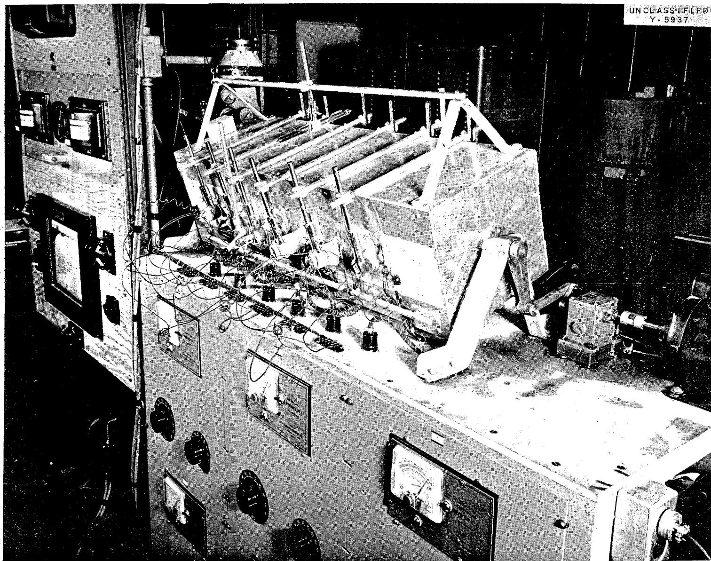  
Fig. 35. Seesaw Apparatus for Dynamic Corrosion Tests.

# ANP PROJECT QUARTERLY PROGRESS REPORT

test specimen. After a test at any desired temperature the specimen can be completely examined and the eutectic analyzed.

Forced Convection Loops. Forced circulation loops are not routinely used for corrosion research. Several pump loops, heat exchanger loops, etc. are operating with both sodium and the fluorides, but these are primarily for the development of the mechanical equipment (sec. 3). The flow rates attainable in thermal convection loops have been adequate to expose corrosion phenomena. When corrosion tests with higher flow rates are necessary, they will be performed in forced convection loops.

# DYNAMIC CORROSION BY FLUORIDES

A program for dynamic testing of various fluoride mixtures in containing materials is being conducted in the large (1/2 in. ID) thermal convection loops. During this period the emphasis has been on screening tests to determine the more feasible container materials. At present none of the stainless steels or Inconel will satisfactorily contain the fluoride mixtures under dynamic conditions at $1500^{\circ}\mathrm{F}$ . In general, the uranium bearing fluoride (NaF-KF-LiF- $\mathbf{U}\mathbf{F}_4$ ) is more corrosive than the eutectic mixture NaF-KF-LiF. Furthermore, with the above fluoride fuel mixture, no 400-series stainless steel loop has operated more than 15 hr before plugging, whereas no 300-series stainless steel loop has operated for more than 150 hr before plugging. Inconel loops, on the other hand, generally run to scheduled termination at 500 hr without plugging, but the loop material is usually attacked to 10 mils or more.

Preliminary results of fluoride corrosion in seesaw tests have substantiated previous results, which

indicated that uranium-free fluorides were less corrosive than similar systems containing uranium tetrafluoride. In these seesaw tests, as well as similar standpipe tests, the formation of uranium dioxide crystals in the cold zone was observed.

Corrosion by Fluorides in Thermal Convection Loops (G. M. Adamson, K. W. Reber, Metallurgy Division). It is of particular interest that no system or mechanical device other than convection loops has ceased operation because of plugging, parent metal pipe failure, or liquid leakage (except at poorly designed welds). It is equally true, however, that some of the other systems would not have endured had the walls and parts been thin enough to permit full penetration of intergranular corrosion. All loops, with one exception, have been of the same design and have been fabricated from 1/2-in.-ips, schedule-40 pipe.

Table 32 is a summary of the corrosion data from all loops, including those still in operation, in which tests have been made with fluorides. It is evident that considerable corrosion occurred in all loops examined so far and that the presence of uranium in the coolant accelerates plugging. The two stainless steel loops that contain fluoride mixtures without uranium show no signs of plugging after $350\mathrm{hr}$ of operation, whereas all stainless steel loops containing the uranium-bearing fluorides have plugged.

The 300-series stainless steels with uranium-bearing fluorides usually plugin from 100 to 200 hr in convective systems, and the life appears to be on the order of 10 hr/mil (0.001 in.) of thickness. The 400-series stainless steels usually plug in 50 hr or less. Inconel loops, on the other hand, have not plugged in any of the 500- and

# TABLE 32

# Corrosion Data from Inconel and Stainless Steel Thermal Convection Loops Operated with Various Fluorides

<table><tr><td rowspan="2">LOOP NO.</td><td rowspan="2">MATERIAL</td><td rowspan="2">COOLANT</td><td rowspan="2">TIME OF CIRCULATION (hr)</td><td rowspan="2">REASON FOR TERMINATION</td><td rowspan="2">HOT LEG TEMPERATURE (°F)</td><td rowspan="2">MINIMUM TEMPERATURE (start) (°F)</td><td rowspan="2">MINIMUM TEMPERATURE (termination) (°F)(a)</td><td rowspan="2">X-RAY STUDIES</td><td colspan="2">METALLOGRAPHIC NOTES</td></tr><tr><td>HOT LEG</td><td>COLD LEG</td></tr><tr><td>78</td><td>Inconel</td><td>Flinak 12(b)</td><td>1000</td><td>Scheduled</td><td>1500</td><td>1220</td><td>1220</td><td></td><td>Intermittent layer of pits, 5 mils, intergranular attack, 10 mils</td><td>No attack, no mass transfer</td></tr><tr><td>111</td><td>Type-316 stainless steel</td><td>Flinak 12</td><td>173</td><td>Leak</td><td>1525</td><td>1210</td><td>1150</td><td></td><td>Very coarse-grained metal, inter-granular attack 10 mils, some reduction of wall</td><td>Very coarse-grained metal, continuous layer, 1 mil, no attack</td></tr><tr><td>112</td><td>Type-316 stainless steel</td><td>Flinak 14(c)</td><td>82</td><td>Plug</td><td>1500</td><td>1210</td><td>960</td><td>Second phase in hot leg, possibly in cold leg</td><td>Intergranular attack up to 8 mils</td><td>Intermittent mass transfer layer</td></tr><tr><td>113</td><td>Type-316 stainless steel</td><td>Flinak 14</td><td>123</td><td>Plug</td><td>1600(d)</td><td>1250</td><td>?</td><td></td><td>Intergranular attack 8 mils, some pitting</td><td>Thin mass transfer layer</td></tr><tr><td>210</td><td>Inconel</td><td>Flinak 14</td><td>500</td><td>Scheduled</td><td>1500</td><td>1245</td><td>1245</td><td></td><td>Layer of pits 10 mils, with maximum of 15 mils; layer on surface 2 mils</td><td>Slight surface roughening</td></tr><tr><td>211</td><td>Inconel</td><td>Flinak 14</td><td>500</td><td>Scheduled</td><td>1500</td><td>1250</td><td>1245</td><td>Second phase in hot horizontal end cold legs</td><td>Layer of pits, 4 to 8 mils, rough surface</td><td>Thin continuous layer on surface, surface rough</td></tr><tr><td>212</td><td>Inconel</td><td>Flinak 14</td><td>38</td><td>Leak</td><td>1500</td><td>1230</td><td>1230</td><td></td><td>Intermittent layer of pits, 5 mils</td><td></td></tr><tr><td>40</td><td>Type-410 stainless steel</td><td>Flinak 14</td><td>9</td><td>Plug</td><td>1500</td><td>1240</td><td>1115</td><td>Second phase in hot horizontal and cold legs, possibly in hot leg</td><td></td><td></td></tr><tr><td>43</td><td>Type-410 stainless steel</td><td>Flinak 14</td><td>12</td><td>Plug</td><td>1500</td><td>1230</td><td>1160</td><td>Second phase in both parts of hot leg</td><td></td><td></td></tr><tr><td>48</td><td>Type-430 stainless steel</td><td>Flinak 14</td><td>8</td><td>Plug</td><td>1500</td><td>1250</td><td>?</td><td>Second phase found in all sections</td><td></td><td></td></tr><tr><td>49</td><td>Type-430 stainless steel</td><td>Flinak 14</td><td>9</td><td>Leak</td><td>1500</td><td>1250</td><td>1150</td><td></td><td></td><td></td></tr><tr><td>275</td><td>Type-347 stainless steel</td><td>Flinak 14</td><td>39</td><td>Leak</td><td>1500</td><td>1250</td><td>1100</td><td>Second phase in hot horizontal leg</td><td>Intergranular attack, 8 to 13 mils, grains 50 times larger than in cold leg</td><td>Layer of 1 mil with nonmetallic particles on and in it</td></tr><tr><td>251</td><td>Type-310 stainless steel</td><td>Flinak 14</td><td>73</td><td>Plug</td><td>1500</td><td>1260</td><td>1140</td><td>Second phase in hot horizontal leg, possibly in cold leg</td><td></td><td></td></tr><tr><td>104</td><td>Nickel</td><td>Flinak 14</td><td>500</td><td>Scheduled</td><td>1500</td><td>1260</td><td>1185</td><td>Second phase in all parts of hot leg, possibly in cold leg</td><td></td><td></td></tr><tr><td>118</td><td>Type-316 stainless steel(e)</td><td>Flinak 14</td><td>147</td><td>Plug(f)</td><td></td><td></td><td></td><td></td><td></td><td></td></tr><tr><td>214</td><td>Inconel</td><td>Flinak 12 + NaK</td><td>500</td><td>Scheduled(f)</td><td></td><td></td><td></td><td></td><td></td><td></td></tr><tr><td>116</td><td>Type-316 stainless steel</td><td>Flinak 12</td><td>350</td><td>(g)</td><td></td><td></td><td></td><td></td><td></td><td></td></tr><tr><td>119</td><td>Type-316 stainless steel</td><td>Flinak 12 + NaK</td><td>350</td><td>(g)</td><td></td><td></td><td></td><td></td><td></td><td></td></tr><tr><td>213</td><td>Inconel(g)</td><td>Flinak 14</td><td>200</td><td>(g)</td><td></td><td></td><td></td><td></td><td></td><td></td></tr><tr><td>216</td><td>Inconel</td><td>Fubena 17(h)</td><td>225</td><td>(g)</td><td></td><td></td><td></td><td></td><td></td><td></td></tr><tr><td>217</td><td>Inconel</td><td>Fubena 17</td><td>375</td><td>(g)</td><td></td><td></td><td></td><td></td><td></td><td></td></tr><tr><td>365</td><td>Nimonic(i)</td><td>Flinak 14</td><td>225</td><td>(g)</td><td></td><td></td><td></td><td></td><td></td><td></td></tr><tr><td>276</td><td>Type-347 stainless steel</td><td>Flinak 14</td><td>19</td><td>(g)</td><td></td><td></td><td></td><td></td><td></td><td></td></tr></table>

(a) Last recorded temperature, usually 1 to 2 hr before termination.   
(b) Flinak: 11.5 mole % NaF, 42.0 mole % KF, 46.5 mole % LiF.   
(c)Fulinak: 10.9 mole % NaF, 43.5 mole % KF, 44.5 mole % LiF, 1.1 mole % UF4.   
(d) This loop held at $1500^{\circ}\mathrm{F}$ for 70 hr and then turned up to $1600^{\circ}\mathrm{F}$ for the remaining time.   
(e)Hydrogen-fired with $\mathsf{H}_2$ atmosphere.

$(f)_{\mathrm{Loops}}$ recently terminated, other data not available.

$(g)$ loop still operating.

(h)Fubenoe: 51 mole $\%$ BeF, 47 mole $\%$ NnF, 2 mole $\%$ UF.

(i) This loop two-thirds usual size.

100-hr tests, and corrosion data indicate a life on the order of 100 hr/mil of thickness.

Chemical analyses of hot- and cold-leg materials after operation indicate an increase in concentration of heavier components in the cold leg and of lighter components in the hot leg. The tube walls of the hot and cold legs from an Inconelloop (No. 210) that ran for 500 hr with the fluoride fuel (NaF-KF-LiF- $\mathrm{UF_4}$ ) are shown in Fig. 36. The attack shown in the hot leg is more than can be tolerated if a thin-walled tube is to be used. Very little, if any, attack is found in the cold-leg section. The hot and cold legs of a type-316 stainless steel loop (No. 113) that plugged after 123 hr of circulating the fluoride fuel are shown in Fig. 37. The mechanism and nature of the plugging in the stainless steel loops have not yet been determined. Metallic dendrites can be found in these loops, but as yet it is not certain that they are present in sufficient quantities to cause the plugging.

Corrosion by Fluorides in a Seesaw Furnace (A. D. Brasunas and L. S. Richardson, Metallurgy Division). Two seesaw tests were made with the fluoride mixture (10.9 mole % NaF, 43.5 mole % KF, 44.5 mole % LiF, 1.1 mole % UF4) contained in Inconel tubes in which the tubes were "rocked" for 162,000 cycles (450 hr). The hot-zone temperature was approximately 800°C and temperature drops of 120 and 180°C were maintained. Many tiny, metal dendrites were observed embedded in the fluoride at the hot and cold ends of the tubes. They were presumably attached to the wall prior to the solidification of the fluoride and have been identified as face-centered-cubic metal with a lattice parameter of 3.541 Å. An analysis of these crystals indicated the following

composition: $13.6\%$ iron, $4.9\%$ chromium, and $81.5\%$ nickel. The fluoride mixture was also analyzed for metal constituents, and chromium was found to be the major metallic impurity. This explains the change in composition of the crystals and tube surface from that of the original Inconel (14% Cr, 6.5% Fe, 79.5% Ni).

The cold zone also contained appreciable quantities of black crystals of high melting point embedded in the fluoride. These crystals were identified by x-ray diffraction as uranium dioxide. The oxygen may have come from impurities added to the fluoride during preparation or loading. The roughened surfaces of the hot zones of the tubes indicated that some crystal deposition may have occurred throughout the tube.

Preliminary experiments employing the seesaw capsules indicated that the uranium-free fluoride systems do not show the mass transfer phenomenon and that they are generally less corrosive than similar systems containing uranium tetrafluoride. The mass transfer phenomenon is not yet understood, but it is probably caused by the reaction of higher valence compounds of uranium.

Standpipe Tests of Fluoride Corrosion (A. D. Brasunas and L. S. Richardson, Metallurgy Division). Results have been obtained from tests with Inconel capsules containing the fluoride fuel (10.9 mole % NaF, 43.5 mole % KF, 44.5 mole % LiF, 1.1 mole % UF $_4$ ). In duplicate tests, with a maximum temperature of $815^{\circ}\mathrm{C}$ and a temperature difference of $165^{\circ}\mathrm{C}$ , one capsule showed very slight mass transfer and the other none. In both these tests, however, separation of a second, reddish-black phase occurred, which was assumed to be uranium dioxide.

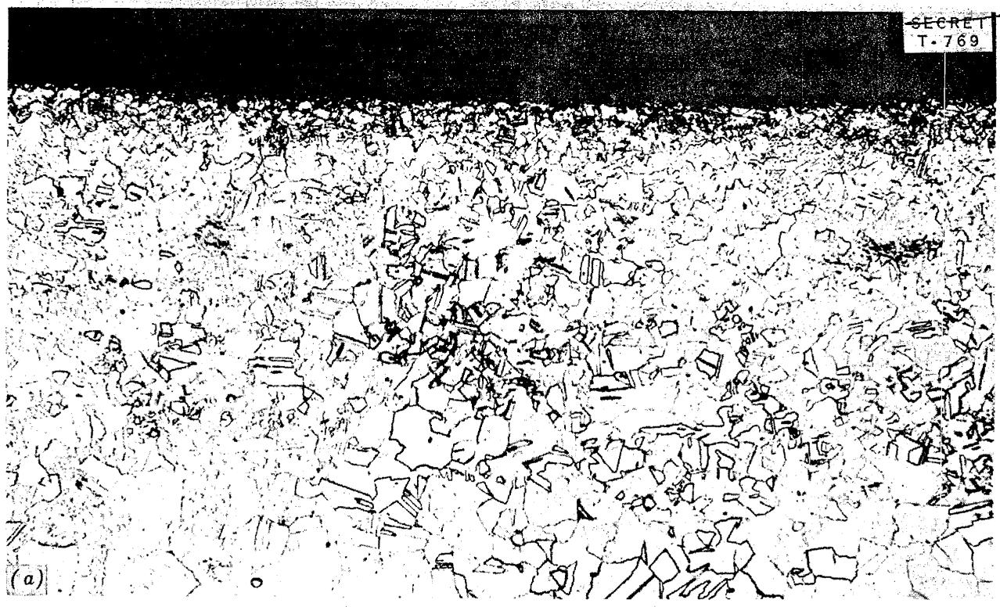

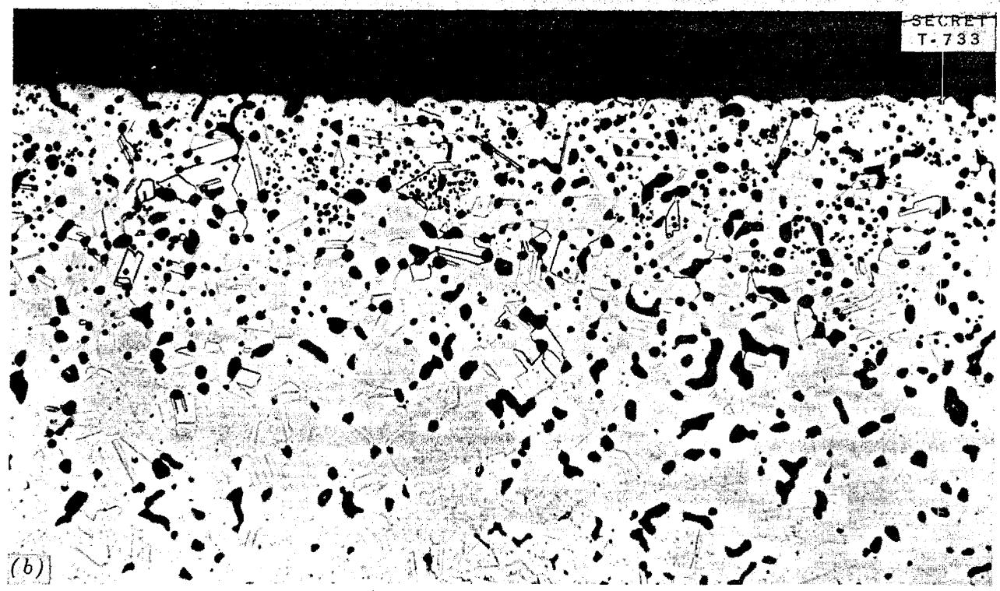  
Fig. 36. Sections of Hot and Cold Legs of an Inconel Convection Loop After Circulating the Fluoride Fuel (NAF-KF-LiF-UF $_4$ ) for 500 Hours. (a) Cold leg section, $1250^{\circ}\mathrm{F}$ . 250X. (b) Hot leg section, $1500^{\circ}\mathrm{F}$ . 250X.

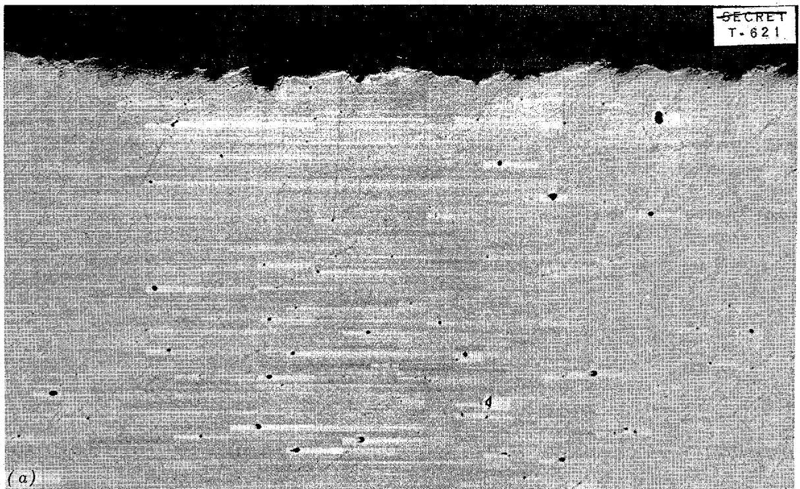

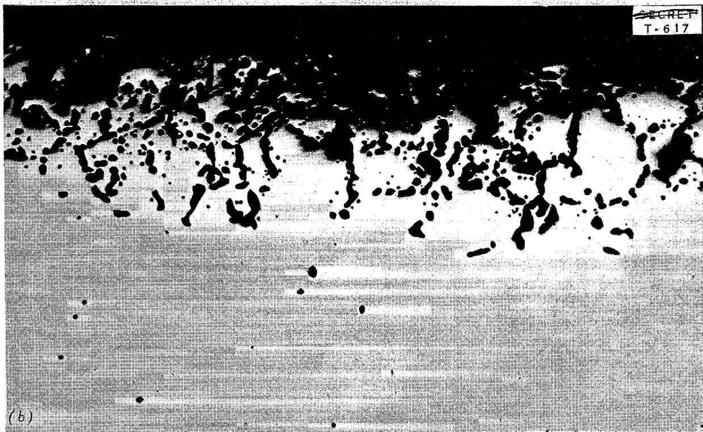

  
Fig. 37. Sections of Hot and Cold Legs of a Type-316 Stainless Steel Convection Loop After Circulating the Fluoride Fuel (NaF-KF-LiF-UF $_4$ ) for 123 Hours. (a) Cold leg section, $<1250^{\circ}\mathrm{F}$ . 250x. (b) Hot leg section, 70 hr at $1500^{\circ}\mathrm{F}$ , 63 hr at $1600^{\circ}\mathrm{F}$ . 250x.

# DYNAMIC CORROSION BY HYDROXIDES

The dynamic corrosion of sodium hydroxide in nickel convection loops and of potassium hydroxide in Inconel loops has been investigated. Both these systems have been operated in a carefully maintained hydrogen atmosphere, and comparable runs have been obtained with the sodium hydroxide-nickel system in air and in vacuum. All these loops were carefully cleaned and hydrogen-fired. The hydrogen itself was first dehydrated and then loaded and maintained under the desired pressure.

Appreciable mass transfer occurred in the three sodium hydroxide-nickel thermal convection loops that have been operated. The presence of oxygen definitely increased the oxidative corrosion in the loop; this type of corrosion can possibly be completely eliminated if the loop is operated under an atmosphere of hydrogen.

One Inconel-potassium hydroxide loop operated for 135 hr showed neither mass transfer nor appreciable corrosion. The maximum hot-leg temperature was only $715^{\circ}\mathrm{C}$ .

Preliminary tests in the seesaw furnace and standpipe have been conducted with sodium hydroxide. Standpipe tests under hydrogen atmosphere have shown neither mass transfer nor oxidation with hot-zone temperatures of $740^{\circ}\mathrm{C}$ . Both seesaw and standpipe tests under vacuum have shown the now-familiar crystal formation (predominately nickel oxide) and mass transfer.

Corrosion By Hydroxides in Thermal Convection Loops (G. P. Smith, J. V. Cathcart, W. H. Bridges, Metallurgy Division). Five Inconel loops containing potassium hydroxide and four nickel loops containing sodium hydroxide have been operated. These

loops are of the second type previously described under "Thermal Convection Loops." The care taken in these experiments is exemplified by the following procedure:

1. The loop and hydroxide (in the attached loading pot) were hydrogen-fired at temperatures up to $150^{\circ}\mathrm{C}$ .   
2. The hydroxide was dehydrated by maintaining the system under vacuum for 48 hr at $500^{\circ}\mathrm{C}$ .   
3. The system was refired with hydrogen.   
4. The hydroxide was loaded into the loop under hydrogen pressure,   
5. The hydroxide in the loop was maintained under hydrogen, air, or vacuum, as the case may have been.

Operation of one of the sodium hydroxide-nickel systems ended prematurely. The remaining three loops were operated in air, vacuum, or hydrogen, and in each loop a considerable amount of mass transfer occurred between the hot and cold legs. In the loop operated under vacuum for 317 hr, there were moderately heavy deposits of nickel in the cold leg both in the form of dendritic needles and as a dense, compact layer on the loop walls.

The loop run under an oxygen atmosphere for 117 hr (Fig. 38) showed no polished regions even in the hot leg. However, the wall surfaces of the entire inside of the loop were covered with a heavy, black powder that was found to contain nickelous oxide, metallic nickel, and an unidentified constituent. Crystals of nickel could be distinguished in the cold leg, and there was an extremely heavy deposit of nickel crystals in the

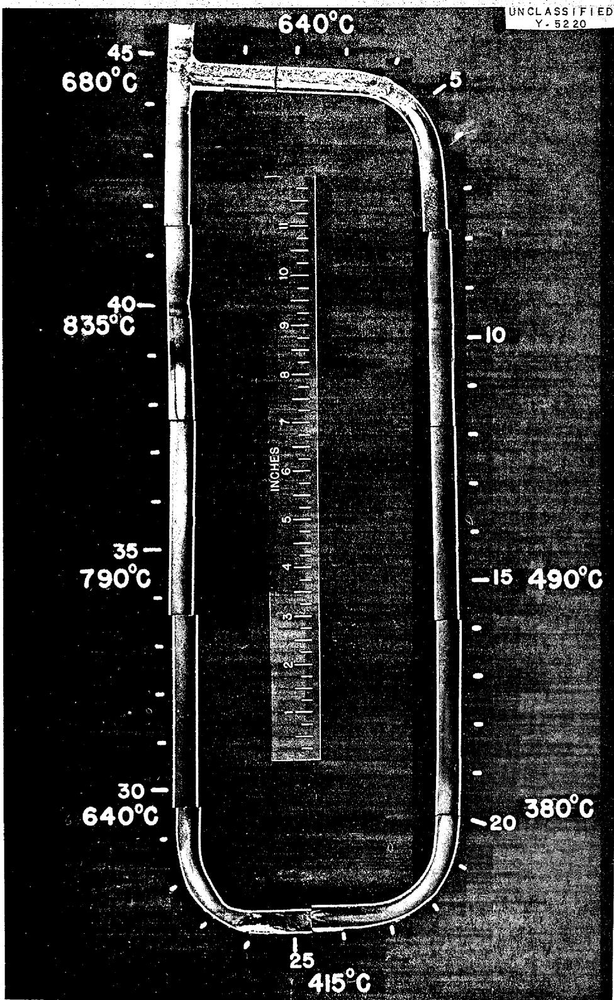  
Fig. 38. Nickel Thermal Convection Loop Operated for 117 hr with Sodium Hydroxide Under an Air Atmosphere.

top crosspiece of the loop. There was no evidence of intergranular attack.

The sodium hydroxide-nickel system, which operated under hydrogen for 296 hr (Fig. 39), showed considerable mass transfer between the hot and cold leg. The hot region showed a high surface polish that extended over the entire high-temperature region. It was significant that no oxidation occurred inside the loop, as evidenced by a complete absence of black powder. Metallographic examination of this loop has not been completed, and hence no information is available concerning the extent of removal of metal from the hot-leg walls.

Operation of four of the five Inconel loops with potassium hydroxide ended prematurely, but the fifth loop was operated for 135 hr with hot- and cold-leg temperatures of 715 and $440^{\circ}\mathrm{C}$ , respectively (Fig. 40). The run had to be stopped at 135 hr because a failure of the temperature controller allowed the cold leg to freeze. No mass transfer occurred in this loop. Virtually no change could be noted in the wall thickness of either the hot or the cold legs. A slight smoothing out of the irregularities in the loop wall was noted in both the hot and cold legs, but otherwise there was little evidence of corrosion.

Corrosion by Sodium Hydroxide in Seesaw Tests (A. D. Brasunas and L. S. Richardson, Metallurgy Division). Several tests were made in the seesaw dynamic corrosion apparatus by using ASTM-grade nickel in conjunction with molten sodium hydroxide in a vacuum. An abundance of crystals was formed in the cold zones of the tube after 117 hr, and the usual surface polishing was noted in the hot zones (Fig. 4l). Similar tests with nickel and sodium hydroxide produced, in addition to the usual metal crystals, appreciable

quantities of nonmetallic crystals. Both the black, comb-like crystals and the hexagonal, green platelets were positively identified as nickel oxide.

Standpipe Tests of Sodium Hydroxide Corrosion (A. D. Brasunas and L. S. Richardson, Metallurgy Division). Two standpipe tests with molten caustic have been completed. One of the tests with nickel and sodium hydroxide was operated under vacuum and the other under a hydrogen atmosphere. For the test in vacuum, the maximum hot-zone temperature was $820^{\circ}\mathrm{C}$ and a thermal gradient of $140^{\circ}\mathrm{C}$ was maintained over the length of the pipe. A moderate amount of metal crystal formation occurred, and some oxidation was noted. The test under hydrogen, with a maximum hot-zone temperature of $740^{\circ}\mathrm{C}$ and a temperature gradient of $140^{\circ}\mathrm{C}$ , showed neither mass transfer nor oxidation.

# FUNDAMENTAL CORROSION RESEARCH

Several fundamental approaches to an understanding of corrosion phenomena are being pursued. It is still too early to say how successful these studies will be; however, simple, free-energy and equilibrium-constant data have confirmed some of the experimental results, for example, chromium, iron, and nickel are attacked by uranium tetrafluoride. Chromium was the most severely attacked and nickel the least. Measurements of the potential differences between cells of various fluorides are being undertaken. Electrode potentials in sodium hydroxide will be measured as a means of ascertaining the purity or thermal history of nickel, nickel oxide, and sodium hydroxide. Polarographic studies of the sodium hydroxide-nickel oxide system will be undertaken if preliminary tests are promising.

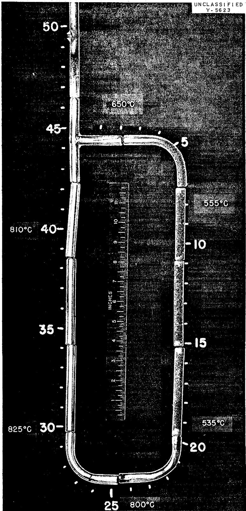  
654 138   
Fig. 39. Nickel Thermal Convection Loop Operated for 296 hr with Sodium Hydroxide Under a Hydrogen Atmosphere.

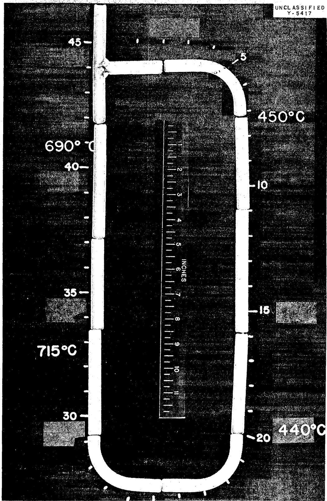  
Fig. 40. Inconel Thermal Convection Loop Operated for 135 hr with Potassium Hydroxide Under a Hydrogen Atmosphere.

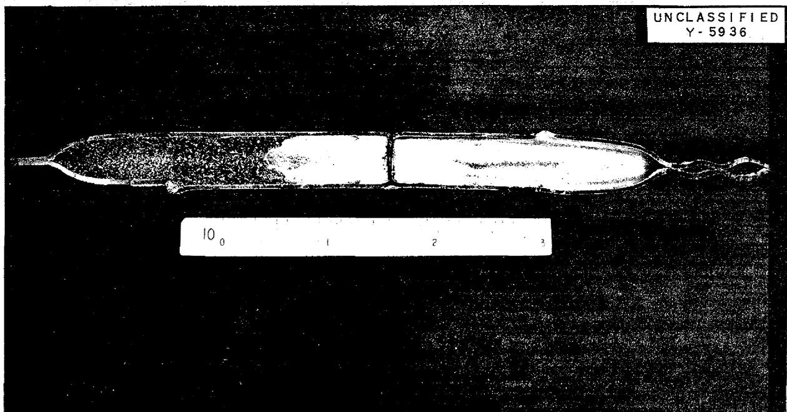  
Fig. 41. Sectional View of $L$ -Nickel Specimen After 117 hr (14,000 cycles) with Molten Sodium Hydroxide in Seesaw Apparatus. Note polishing at hot zone and abundant crystal formation at cold zone.

Possible Equilibria Among Fluorides and Metals (L. E. Topol and L. G. Overholser, Materials Chemistry Division). The values of the free energy and equilibrium constant of the following reaction were computed at 1000 and $1500^{\circ}\mathrm{K}$ from known thermodynamic data: (5)

$$
M + x A F = M F _ {x} + x A,
$$

where $M$ is iron, chromium, or nickel, and $A$ is potassium or sodium.

The activities were calculated assuming $M$ and $AF$ to be of unit activity and

$$
a _ {A} = a _ {M F _ {x}} = K ^ {1 / (x + 1)}.
$$

Table 33 lists the values of $\Delta F$ and $K$ and also approximate estimates of the activity of the metallic fluoride.

These results indicate: sodium fluoride is less corrosive than potassium fluoride and the reaction increases with temperature; chromium is the most soluble of the metals considered, iron is second, and nickel last; and the trivalent cations are slightly less reactive than the divalent (however, from free energy considerations the trivalent ions are the more stable at the temperatures considered).

Converting the values of $a$ to parts per million, a concentration of $10^{-1}$ ppm is found for $\mathrm{Fe}^{+2}$ at $1000^{\circ}\mathrm{K}$ . This figure is much less than the experimentally determined value (similar results are found for the others), and if the activity of $AF$ is corrected (since mixtures of alkali fluorides

are used), the metallic fluoride (MF) concentrations are further decreased. Thus it seems impossible to explain the corrosion of metals by alkali fluorides at high temperatures by postulating the above-mentioned equilibrium reaction to be the chief effect.

where $M$ is iron, chromium, or nickel, and the corresponding equilibrium constant is

$$
K = \frac {\left(\mathrm {U F} _ {3}\right) ^ {x} \left(M F _ {x}\right)}{(M) \left(\mathrm {U F} _ {4}\right) ^ {x}},
$$

in which the activities of the molecular species are denoted by parentheses.

TABLE 33   
Free Energies and Equilibrium Constants for Reactions of Metals with Alkali Fluorides   

<table><tr><td>M</td><td>AF</td><td>T(°K)</td><td>ΔF (cal)</td><td>K</td><td>a</td></tr><tr><td rowspan="2">Fe+2</td><td rowspan="2">KF</td><td>1000</td><td>+84,800</td><td>10-18.6</td><td>10-6</td></tr><tr><td>1500</td><td>80,000</td><td>10-12</td><td>10-4</td></tr><tr><td rowspan="2">Fe+3</td><td rowspan="2">KF</td><td>1000</td><td>143,700</td><td>10-31.4</td><td>10-7.5</td></tr><tr><td>1500</td><td>138,200</td><td>10-20.2</td><td>10-5</td></tr><tr><td rowspan="2">Cr+2</td><td rowspan="2">KF</td><td>1000</td><td>69,800</td><td>10-15.3</td><td>10-5</td></tr><tr><td>1500</td><td>62,000</td><td>10-9.1</td><td>10-3</td></tr><tr><td rowspan="2">Cr+3</td><td rowspan="2">KF</td><td>1000</td><td>111,700</td><td>10-24.4</td><td>10-5</td></tr><tr><td>1500</td><td>101,000</td><td>10-14.7</td><td>10-3.7</td></tr><tr><td rowspan="2">Ni+2</td><td rowspan="2">KF</td><td>1000</td><td>93,800</td><td></td><td></td></tr><tr><td>1500</td><td>90,500</td><td></td><td></td></tr><tr><td rowspan="2">Fe+2</td><td rowspan="2">NaF</td><td>1000</td><td>91,000</td><td></td><td></td></tr><tr><td>1500</td><td>86,500</td><td></td><td></td></tr></table>

The available free-energy data(5) and several assumptions were used to evaluate the reaction of iron, nickel, and chromium with uranium tetrafluoride at $1000^{\circ}\mathrm{K}$ and the activity of the metallic fluoride.

The reaction involved may be written

$$
M + x U F _ {4} = x U F _ {3} + M F _ {x},
$$

The activity of $M = 1$ , and assuming $a_{\mathbf{UF}_3} = a_{MF_x} = a$ , then

$$
K = \frac {x ^ {x} a ^ {x + 1}}{\left(\mathrm {U F} _ {4}\right) ^ {x}},
$$

from which

$$
a = \left[ \frac {K}{x ^ {x}} \right] ^ {1 / (x + 1)} \cdot \left(\mathrm {U F} _ {4}\right) ^ {x / (x + 1)}.
$$

# ANP PROJECT QUARTERLY PROGRESS REPORT

If uranium tetrafluoride is the sole reactant present its activity is also 1, and yields

$$
a _ {1} = \left[ \frac {K}{x ^ {x}} \right] ^ {1 / (x + 1)}
$$

If the uranium tetrafluoride is one of several components of a system, its activity will be approximated by its mole fraction, and therefore the metallic fluoride activity will be decreased.

Table 34 gives the values found for free energy, $\Delta F$ , equilibrium constant, $K$ , and metallic fluoride activities, $a_1$ (if $a_{\mathrm{UF}_4} = 1$ ), $a_2$ (if equilibrium concentration of $\mathrm{UF}_4 = \mathrm{initial}$ concentration = 1 mole %), and $a_3$ (if equilibrium concentration of $\mathrm{UF}_4 = 0.1$ mole %).

From these results it is seen that although the trivalent forms of iron and chromium are more stable, the divalent ions will be preferentially formed. In fact, it can easily be shown thermodynamically that any trivalent iron or chromium formed

will readily be reduced by the pure metal. Of the metals considered chromium is the most readily attacked, iron is next, and nickel last. In addition, a comparison of these results with those found for the alkali fluorides indicates that uranium tetrafluoride is the much better oxidizing agent of the two. (It should be stated that the accuracy of the data used is not certain and even qualitative conclusions may be in error.)

There is some experimental evidence that beryllium oxide will react with uranium tetrafluoride at high temperatures to form uranium dioxide and beryllium fluoride, according to the following formulas:

$$
2 \mathrm {B e O} + \mathrm {U F} _ {4} = \mathrm {U O} _ {2} + 2 \mathrm {B e F} _ {2},
$$

$$
K = \frac {\left(\mathrm {U O} _ {2}\right) \left(\mathrm {B e F} _ {2}\right) ^ {2}}{\left(\mathrm {B e O}\right) ^ {2} \left(\mathrm {U F} _ {4}\right)}
$$

(the activity of a molecular species is denoted by parentheses). From

TABLE 34   
Free Energies and Equilibrium Constants for Reduction of Uranium Tetrafluoride with Metals   

<table><tr><td>M</td><td>ΔF (kcal)</td><td>K</td><td>α1</td><td>α2</td><td>α3</td></tr><tr><td>Fe+2</td><td>+20.0</td><td>10-4·4</td><td>10-1.6</td><td>10-2.9</td><td>10-3.6</td></tr><tr><td>Fe+3</td><td>45.0</td><td>10-9·5</td><td>10-2.7</td><td>10-4.2</td><td>10-5</td></tr><tr><td>Cr+2</td><td>4.0</td><td>10-0.88</td><td>10-0.5</td><td>10-1.8</td><td>10-2.5</td></tr><tr><td>Cr+3</td><td>13.0</td><td>10-2.85</td><td>10-1</td><td>10-2.5</td><td>10-3.2</td></tr><tr><td>Ni</td><td>28.0</td><td>10-6.1</td><td>10-2.2</td><td>10-3.5</td><td>10-4.2</td></tr></table>

available data, $(5,6,7)$ the free energy and equilibrium constant of this reaction were calculated to be $+4.2$ kcal and $10^{-0.9}$ , respectively, at $1000^{\circ}\mathrm{K}$ .

If the beryllium oxide and uranium tetrafluoride are assumed to be of unit activity, and $a_{\mathrm{UO}_2} = a_{\mathrm{BeF}_2} = a$ , the equilibrium constant is given by

$$
K = 4 a ^ {3}.
$$

This results in a value of $10^{*0.4} = 0.4$ for the approximate activity of uranium dioxide and 0.8 for beryllium fluoride at equilibrium.

Although the accuracy of the data is unknown, there seems to be sufficient evidence for the assumption that the above reaction occurs to a reasonable extent.

EMF Measurements in Fused Fluorides (L. E. Topol, L. G. Overholser, Materials Chemistry Division). A series of experiments are planned for studying the possible mechanisms of fluoride corrosion by measuring the potential differences of various cells containing the fluorides of nickel, chromium, or iron dissolved in fused alkali fluorides.

Concentration cells of the following type will be investigated:

$M / MF^{\bullet}(C)$ in fused $AF / MF^{\bullet}(C)$ in fused $AF / M$

where $M$ is iron, chromium, or nickel, and $A$ is sodium, potassium, or lithium.

Binary and tertiary mixtures of the alkali fluorides will be studied, and the effect of small additions of uranium fluoride will be evaluated, if possible.

Electrode Potentials in Fused Sodium Hydroxide (Ambrose R. Nichols, Jr., Materials Chemistry Division). The apparatus previously described has undergone continued modification over the past three months. It consists of a nickel vessel within which is placed a porous cup, which divides the contents into two electrode compartments. A nickel electrode is suspended in each compartment. Chromel-Alumel thermocouples in nickel walls are located against the outer wall of the nickel cup and in each of the compartments. The whole assembly sits at the bottom of a closed stainless steel container that rests in a 5-in. pot furnace. Helium purified by passing over copper turnings at $450^{\circ}\mathrm{C}$ and through magnesium perchlorate tubes is passed through the container at a pressure slightly in excess of atmospheric.

When a measurement is to be made, the desired amounts of purified sodium hydroxide and nickel oxide are weighed in a dry box and placed in the two electrode compartments of a nickel container. The closed container is then removed to the furnace and the necessary connections made. Helium circulation is started before heating begins. After the chosen temperature has been reached, the potential between the two electrodes is determined by using a type-K potentiometer, although in some cases a recording potentiometer has also been used.

The results have thus far not been reproducible. The measured potentials have changed with time, even to the extent of reversal of polarity. It was observed in each case that the electrode in the more concentrated solution developed a deposit of fine nickel crystals, whereas that in the more dilute solution appeared to have undergone polishing. This mass transfer has so far appeared to be independent of temperature over the narrow temperature range used.

Three principal experimental difficulties exist and each could account for the poor results: (1) failure to find a suitable diaphragm material; (2) lack of knowledge of the true nickel oxide concentration in the solutions in which the electrodes are placed; and (3) difficulty of maintaining a uniform temperature throughout the cell. Until these problems are overcome, it is not possible to ascertain the effect of such factors as the purity or the thermal history of the nickel, nickel oxide, or sodium hydroxide.

Polarography of Sodium Hydroxide in Silver and Platinum (R. A. Bolomey, Materials Chemistry Division). In previous reports it was stated that anhydrous sodium hydroxide heated to a temperature of 350 to $600^{\circ}\mathrm{C}$ in either a silver or platinum crucible in vacuum resulted in the production of ionic species that gave characteristic polarographic waves. It was also mentioned that the voltage at which the peaks occurred was temperature-dependent. To date, 85 polarograms on sodium hydroxide in silver crucibles and 88 polarograms on sodium hydroxide in platinum crucibles have been obtained. Even though all the data were not obtained at the same temperature, enough information has been obtained to analyze the reproducibility of the results. Such an analysis revealed considerable

randomness in the waves and that the curves of a given series show only qualitative similarity.

The source of randomness in the position of the polarographic waves is not understood. It is possible that it is to be found in the instrument itself as a result of the method employed to collect the data. Attempts to obtain the data by allowing the readings to come to equilibrium after each setting proved to be impractical because of the slow rate of equilibrium attainment. The present method of collecting the data requires that the potential on the cell be varied at a uniform rate, since any fluctuation in the rate of potential changes can produce anomalous effects on a current-voltage curve of the type obtained with a polarograph and stationary microelectrodes. It may be that these anomalous effects are more apparent when operating the cell at the high temperatures required in this work than when operating at room temperatures in aqueous solutions.

Equipment for differential thermal analysis has been gathered so that preliminary tests may be made to study the feasibility and applicability of this method to the study of corrosion mechanisms. It is intended first to apply the method to the system sodium hydroxide-nickel oxide under an inert atmosphere.

Magnetic Susceptibility of Stainless Steel Exposed to Fluorides (W. C. Tunnell, ANP Division). It has been observed repeatedly that the surfaces of all normally nonmagnetic steels become magnetic after exposure to high-temperature fluorides. Surface layers have been removed and analyzed, and it appears that the iron-to-chromium ratio increased. A micro-spectrographic analysis, under electromagnetization using a colloidal dispersion of iron particles, revealed

$$
6 5 4 \quad 1 4 4
$$

the magnetic material to be at the grain boundaries where intergranular penetration had occurred.

In one test using a gasket ring of type-316 stainless steel, the magnetic surface was submerged in concentrated nitric acid, and a 1-to 2-mil layer of strongly magnetic material separated that was chemically analyzed as $>90\%$ iron, $2.5\%$ chromium, and $1.5\%$ nickel. The material under the layer was not magnetic. In another test the hot section of an Inconel loop that had been exposed to Fulinak was examined, since it seemed more magnetic than the cold section. Immersion in concentrated nitric acid left pits and made the material less magnetic, and the remaining surface layer appeared to be pure nickel. Another specimen

of type-316 stainless steel that had been in contact with Flinak became porous after treatment with concentrated nitric acid and lost all its magnetic properties.

It may be concluded that, as in most intergranular corrosion of stainless steels, the chromium is preferentially leached at the grain boundaries, possibly by the usual device of carbide precipitation, which exposes excess iron and nickel for attack and gives the magnetic susceptibility. Photomicrographs appear to bear out a phenomenon of this type. The attack on iron always appears greater than on nickel, as has been shown, for example, by tests where the rate of penetration appears to be proportional to the amount of iron in the metal.

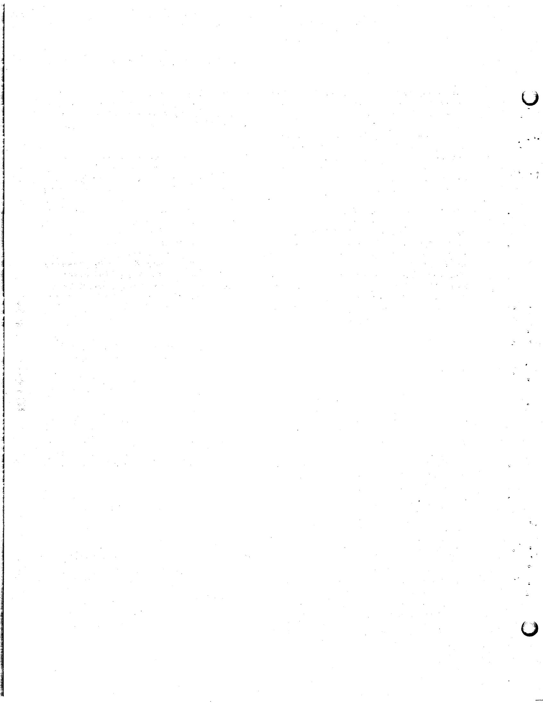

# 12. METALLURGY AND CERAMICS

W. D. Manly, Metallurgy Division

T. N. McVay, Consultant

The drawing of tubing from the previously prepared solid fuel plates has been accomplished, and the results of the drawing on the bond continuity and oxide distribution of the solid fuel elements are discussed. From this work it was found that the best core material to use in the uranium oxide mixture was iron powder. Compatibility experiments have shown boron carbide to react rather extensively with the 300-series stainless steels and Inconel but to be inert to type-430 stainless steel; therefore the ARE safety rods will probably be constructed of type-430 stainless steel. The solid-phase bonding of metals is always difficult with materials that are in intimate contact at elevated temperatures. Consequently, self-welding experiments are being conducted on the possible combinations of materials to be used in the safety rods.

The use of the cone-arc welding process for the production of tubeto-header joints is being investigated to determine the applications and limitations of the process, since there is a need for a reliable automatic or semiautomatic welding method for the production of the many tubeto-header joints in ANP core and heat exchanger designs. A description of the equipment and operating procedure and a discussion of the variables being studied are presented. Because of the complexity of the ANP type of heat exchangers, it is probable that extensive brazing will be necessary in fabrication. Preliminary work for heat exchanger assemblies indicates that brazing can produce sound joints if proper control of the brazing variables is exercised. Microbrazing alloys, Pd-Ni, Mn-Ni, Ag-Pd, Ni-Cr-Sr,

and Ni-Cr-Si-Mn, are being studied and their corrosion in hydroxides and fluorides is being investigated. Since Inconel has been designated as the structural material for the ARE extension, rupture and creep data are being obtained at the operating temperature of the reactor. Data are presented to show (1) the time required to produce deformations of various percentages and for rupture to occur as a function of the applied stress for fine- and coarse-grain Inconel, and (2) the minimum creep rate and per cent deformation per hour for the two types of Inconel plotted as a function of applied stress.

The oxide ceramics or combinations of ceramics and oxides appear most promising for reactor application because they offer the best combination of structural integrity and thermal properties. Ceramic coatings for Inconel and stainless steel are being tested. Of those tested, the NBS Ceramic-Coating A-418, with its high temperature and oxidation resistance characteristics, shows promise as a coating for the ARE radiator and possibly other structural parts.

# FABRICATION OF REACTOR ELEMENTS

E. S. Bomar J. S. Coobs Metallurgy Division

Tubular, solid, fuel elements in which the fuel compact is between two concentric tubes are being developed but have not yet proved entirely satisfactory. The bonding and distribution of the uranium dioxide powder between the tubes after cold drawing has varied from very poor to

fair. It is hoped that better initial bonding and a different cold-drawing technique may yet yield good, small, tubular, solid, fuel elements.

Tests for solid-phase bonding (self-welding) of the movable parts of the ARE control rods at reactor temperatures $(1472^{\circ}\mathrm{F})$ indicate a fair amount of reaction between the boron carbide type-316 stainless steel and boron carbide Inconel systems in 100 hours. Of the few materials tested the reaction between boron carbide and type-430 stainless was the least marked.

Cold Drawing of Tubular Solid Fuel Elements. Tubular, solid, fuel elements fabricated by joining two semicircular laminated plates either with seam welds or by "rubberstatic" (1) pressing methods have been subjected to cold-drawing operations at the Superior Tube Company. All samples, except the one prepared by rubberstatic pressing, were given an initial hot reduction of 62 to $75\%$ to bond-pressed core, picture frame, and cladding. This operation was carried out on the flat stock before forming into tubes. The cores of the samples were $30 \, \text{vol}\%$ uranium dioxide and $70 \, \text{vol}\%$ metal (type-302 stainless steel, iron, or nickel).

A reduction schedule based on commercial practice was set up at values ranging from 18 to $28\%$ after a test reduction of $38\%$ caused a tube failure. The weld seams were satisfactorily smoothed in this pass, and the tubes were subsequently reduced $87.5\%$ in seven passes, which yielded tubes of 1/4-in. OD by 0.015-in. wall thickness. Three of these tubes were then further reduced to yield tubes 1/8-in. OD by

0.015-in. wall thickness. Metallographic examination of specimens taken from the tubes showed that bonding and uranium dioxide distribution varied from very poor to fair for tubes prepared from rolled plate and was also fair for one specimen prepared by rubberstatic pressing. Sections transverse to the direction of drawing are shown in Fig. 42 at reductions of $87.5\%$ , that is, for 1/4-in.-OD tubes. In general, further reductions to 1/8-in.-OD tubing only exaggerated the defects found in the 1/4-in.-OD stock.

Although plug drawing was not tried on any of the composite tubes, it was the opinion of some of the technical staff at Superior Tube Company that plug drawing would not disturb the core of a laminated structure so much as drawing on a mandrel, which was the technique used in all drawings to date. Rod drawing produces slip cracks in the core because of slightly uneven reduction of the two cladding layers, but it is believed that plug drawing should give uniform reduction. Variation in the reduction schedules used for these tubes will be tried by using the Metallurgy Division draw-bench and emphasizing less severe reductions. Mandrels are now on order to supplement dies already on hand. Equipment for plug drawing is not available at present.

ARE Control Rod. At the operating temperature of the ARE, there exists the possibility of solid-phase bonding of metallic components that are in close contact. This phenomenon could possibly lead to malfunctioning of the control rods if it occurred between the control rod cladding and the walls of the tubes in which they are housed.

Several tests have been made in which samples of two different metals were pressed together at $1472^{\circ}\mathrm{F}$ . One-eighth-inch-diameter specimens of the

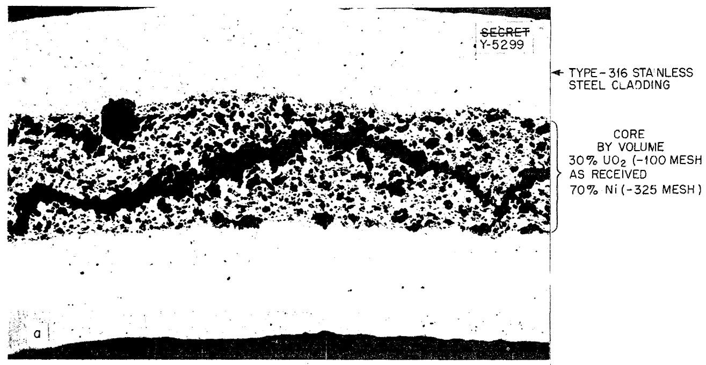

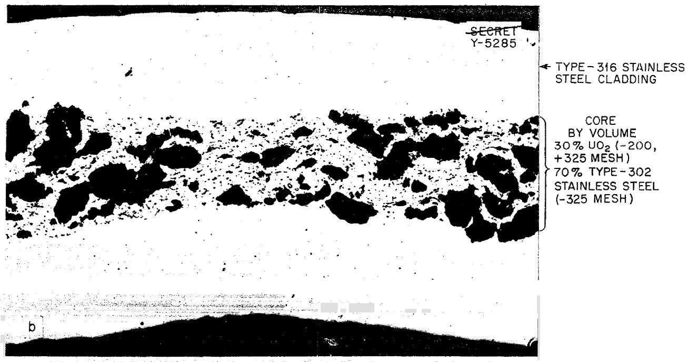  
Fig. 42. Transverse Sections Through $\frac{1}{4}$ -in. -0D, Cold-Drawn, Tubular, Solid Fuel Elements. (a) Tube prepared from rolled plate. $200\mathrm{x}$ . (b) Tube prepared by rubberstatic pressing. $200\mathrm{x}$ . (Prints reproduced $83\%$ of original size.)

dissimilar materials were subject to 250 psi for 100-hr intervals. This pressure is probably higher than would be encountered radially at the control rod and control-rod-tube contact points. Type-316 stainless steel and Inconel, in various atmospheres, were used in the initial tests. However, results of compatibility tests made available after a portion of the welding tests had been run indicated a fair amount of reaction between the boron carbide-type-316 stainless steel and boron carbide-Inconel systems. A less marked interaction was found when boron carbide was contained in type-430 stainless steel. The solid-phase welding schedule was revised to include the type-430 vs. type-316 stainless steel and Inconel systems. However, the only bonding evidenced that could not be removed with finger pressure was between similar metals. Tests of the type-430 vs. type-316 stainless steel system with tank helium atmosphere are now being conducted. Exposure to the other atmospheres will be carried out if results indicate that this is desirable.

# CONE-ARC WELDING

P. Patriarca G. M. Slaughter Metallurgy Division

The feasibility of the use of the cone-arc welding process for production of tube-to-header joints has been demonstrated by previous investigations. The welding group of the Metallurgy Division is investigating the applications and limitations of the process, since the need for a reliable automatic or semiautomatic process for production of the many tube-to-header joints required by

ANP core and heat exchanger designs is evident.

Equipment. The apparatus consists of a G-E, 200-amp, direct-current welding generator with the addition of a resistor circuit that permits the use of currents as low as 3 amp, if desired. A Miller Electric Company, high-frequency, spark-gap oscillator provides the high frequency required for starting the inert welding arc without having to touch the $1\%$ thoriated tungsten electrode to the work. The apparatus has been provided with a timer and contactor control circuit to render the arc timing an automatic operation.

Principle of Operation. The cone arc welding technique is particularly suited to welding a tube to a header plate. The nozzle of the welder is a permanent Alnico magnet that sets up lines of flux to the tube and plate over which the nozzle is held. Since the welding arc will strike from the electrode tip to a point on the periphery of the tube, the arc stream is cut by the lines of flux at a small angle. This angle sets up resultant forces tangential to the tube periphery in the plane of the header sheet, and the forces rotate the arc around the tube at very high speeds. To the observer the arc appears as a cone; hence, the name "cone arc." The arc raises the temperature of the tube edge and the periphery of complete header hole in a uniform manner until the melting point is reached and a circumferential weld results.

Experimental Procedure. Some of the variables that may affect the operation are:

1. Arc current and time,

2. Arc distance, which affects the arc voltage and the angle between the arc stream and the magnetic lines of flux,

3. Magnetic nozzle to work distance,   
4. Choice of inert gas and rate of flow, which affect the arc voltage (higher for helium than argon) and the turbulence,   
5. Work geometry, that is, tubing size, header thickness, and heat transfer uniformity of header hole-to-hole distance, hole-to-header-edge distance, and centering of work and electrode.

In the initial experiments header holes without tubing were used, since it was assumed that the behavior of the arc in the formation of a circumferential molten pool would yield representative information with or without a tube. The header material used was type-304 stainless steel sheet 1/8 in. thick. Holes were 3/16 in. in diameter and spaced 3/8 in. center to center. Welding conditions were as follows:

1. 1/16-in. diameter electrode,   
2. Electrode to plane of work distance, 0.070 in.,   
3. Magnetic nozzle (tip of soft iron) to plane of work distance, 0.41 in.,   
4. Argon flow, 30 ft³/hr,   
5. Open circuit voltage, 70,   
6. Arc voltage, 11,   
7. Current, variable,   
8. Time, variable.

During welding, pools of molten metal formed around the periphery of the hole about 20 sec after the arc was struck. The pools grew until they encompassed the entire periphery of the hole and effected the desired

weld. As would be expected, the size of the heat-affected zone, as determined by the size of the heat-tinted zone surrounding the header hole, diminished with increasing current and decreasing arc time. The limiting value of permissible hole-to-hole distance will probably be a function of the arc current and time for a given header thickness and hole size. Experiments will be conducted to determine these limiting values, since ANP designs may require as small a hole-to-hole distance as possible in order to obtain the maximum number of heat exchanger tubes per unit area of header sheet.

The results from the few experiments made were inconclusive, but it is expected that further work during the coming quarter may yield sufficient information for a comprehensive study of the quality of cone-arc welded, tube-to-header joints as a function of the welding variables.

# BRAZING

P. Partriarca G. M. Slaughter Metallurgy Division

Experiments were made to determine the feasibility of brazing since it is quite probable that this method may be used extensively in the fabrication of the ANP type of heat exchangers. Tube compacts with tubes, 0.100 in. OD with 0.010-in. wall thickness, have been successfully brazed to baffle plates that were 0.020 in. in thickness. Preliminary work on such assemblies indicates that brazing can be used advantageously in the production of sound joints if proper control is maintained of such brazing variables as joint fit, joint geometry, degree of base-metal cleanliness, and quality of the furnace atmosphere during the brazing process. Corrosion tests of Microbraz and a $60\%$ palladium- $40\%$

# ANP DIVISION QUARTERLY PROGRESS REPORT

nickel alloy in sodium hydroxide and in $\mathrm{UF_4}$ -NaF-KF-LiF mixture showed the palladium-nickel alloy to be far more corrosion resistant in both fluids at $1472^{\circ}\mathrm{F}$ , but the attack by the fluoride on either braze was severe.

Flow Tests. A relatively long-term program for evaluating various brazing alloys for the high-temperature ANP type of application is anticipated because of the promising results obtained in the experiments on the feasibility of brazing. A series of tests were conducted to determine the minimum temperature at which the various brazing alloys flow readily. The test specimen consisted of a moderate amount of brazing alloy placed at one end of a 6-in.-long butt joint. Both legs of the joint were 0.062-in. Inconel strips, one of which was milled flat on the mating surface to facilitate the production of a tight-fitting joint. The specimens were then heated until the temperature was found at which the brazing alloy flowed freely up the entire joint length of 6 inches. It became apparent during these experiments that any oxide scale on the metal specimens is highly undesirable. The brazing alloy does not easily wet scaled surfaces and flow around a joint is impeded. A very dry hydrogen atmosphere, with a dew point in the range of $-60^{\circ}\mathrm{F}$ or below, prevented scaling in most cases; therefore moisture was apparently the prominent factor in scale formation. It was suspected that if the hydrogen continuously reduced any oxide and there were subsequently moisture formation in the hydrogen atmosphere, the exit dew point of the hydrogen would decrease with increasing flow rate. A series of experiments proved this hypothesis. Tests with an inlet-gas dew point of $-78^{\circ}\mathrm{F}$ and high hydrogen flow rates showed that exit dew points approximating those at the inlet were attained. The experiments were significant in that they made it obvious

that a relatively large hydrogen flow rate during furnace brazing was desirable.

Corrosion of Brazing Alloys. The resistance to corrosion of the various brazing alloys, alone and in combination with various base metals such as found in joints, is important in the selection of suitable joining media; therefore emphasis has been placed on the results of corrosion tests of the brazing alloys in fluorides and hydroxides. Extensive tests were conducted on Microbraz, a boron-containing alloy, which is an excellent brazing alloy for use in conventional high-temperature applications. Samples of the pure alloy were subjected to corrosion experiments in fluorides and hydroxides and the baths were later analyzed chemically for boron.

A sample of Microbraz treated in sodium hydroxide for 100 hr at $1500^{\circ}\mathrm{F}$ , showed the heavy corrosive attack characteristic of this medium. There was generally heavy surface attack to a depth of 60 mils and severe local attack. The sample tested in the NaF-KF-LiF- $\mathrm{UF_4}$ mixture for 100 hr at $1500^{\circ}\mathrm{F}$ was moderately pitted, particularly near the intermetallic components, to a depth of 4 mils. Other surface areas were relatively untouched. Results of the chemical analyses of the contents of both the fluoride and hydroxide baths indicate that boron is preferentially leached from the alloy. An attempt will be made to determine the actual percentage loss of the boron from the alloy.

The corrosion resistance of Microbrazed tube-to-header joints with Inconel as the base-metal has been studied. A section of a tube-to-header joint exposed to sodium hydroxide exhibited excessive attack both at the brazed joint and on the base-metal, as shown in Fig. 43a and, with a higher magnification, in Fig. 43b. The relatively mild attack of

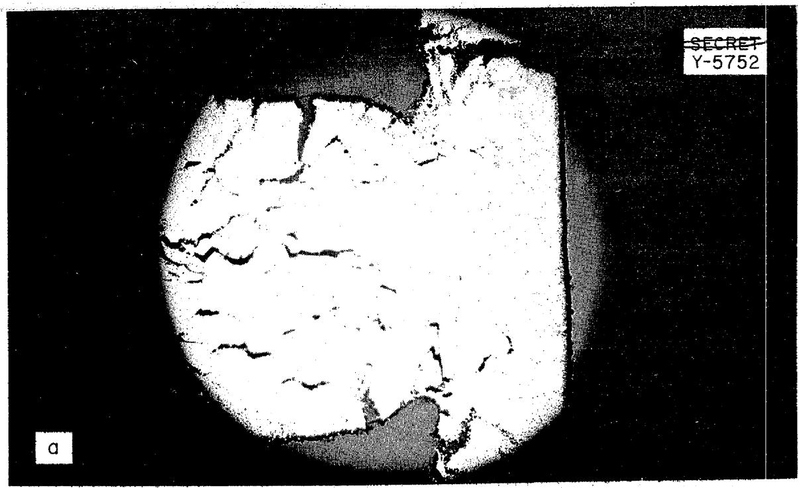

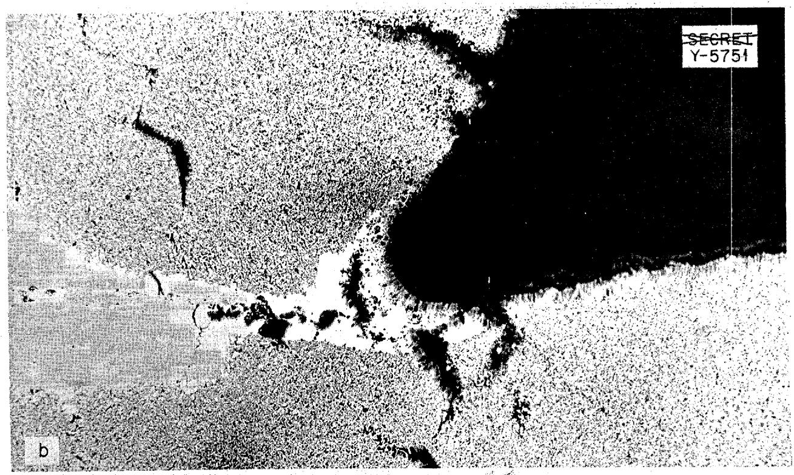  
Fig. 43. Corrosion Test of Microbrazed Inconel Tube-to-Header Specimens Exposed to NaOH for 100 hr at $1500^{\circ}\mathbf{F}$ . (a) $25\times$ . (b) $250\times$ .

# ANP DIVISION QUARTERLY PROGRESS REPORT

the mixture NaF-KF-LiF- $\mathbf{U}\mathbf{F}_{4}$ on these joints is shown in Fig. 44, which is a photomicrograph of a joint tested in the fluoride mixture. Chemical analyses of the baths will be given in later reports.

A few experiments have also been conducted on the $60\%$ palladium- $40\%$ nickel and $60\%$ manganese- $40\%$ nickel alloy systems. Small ingots of the palladium-nickel alloy were tested for 100 hr at $1500^{\circ}\mathrm{F}$ in both the sodium hydroxide and the NaF-KF-LiF- $\mathbf{U}\mathbf{F}_4$ mixture and gave promising results. The corrosion resistance of this alloy was excellent; the attack was less than 2 mils in both cases. An Inconel tube-to-header joint brazed with the $60\%$ manganese- $40\%$ nickel alloy was

tested for 100 hr at $1500^{\circ}\mathrm{F}$ in sodium hydroxide, and there was moderate attack at the joint (Fig. 45). More extensive corrosion tests on these alloys will be performed, and the baths will be analyzed for the presence of the various elements in the brazing alloy being investigated.

Similar tests will be conducted on other high-temperature brazing alloys of current interest, including $75\%$ silver- $20\%$ palladium- $5\%$ manganese, $64\%$ silver- $33\%$ palladium- $3\%$ manganese, $60\%$ palladium- $37\%$ nickel- $3\%$ silicon, $16.5\%$ chromium- $73.5\%$ nickel- $10\%$ silicon, $16.5\%$ chromium- $71.5\%$ nickel- $10\%$ silicon- $2.5\%$ manganese. No data are yet available on the resistance to corrosion of these alloys. Methods

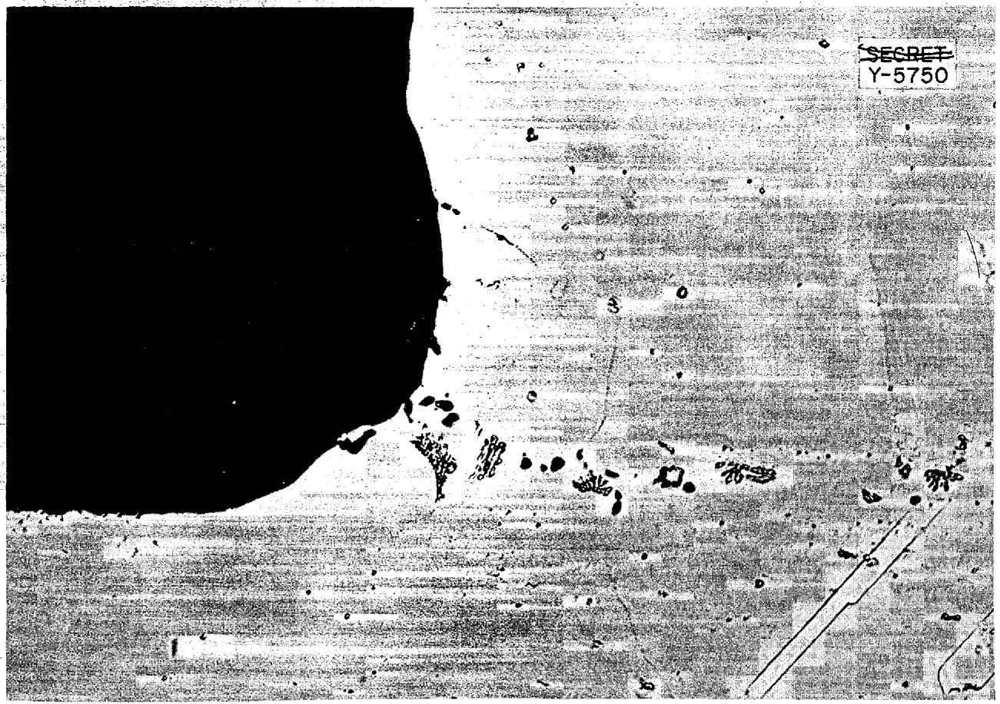  
Fig. 44. Corrosion Test of Microbrazed Inconel Tube-to-Header Joint Exposed to NaF-KF-LiF-UF $_4$ for 100 hr at $1500^{\circ}$ F. 250X.

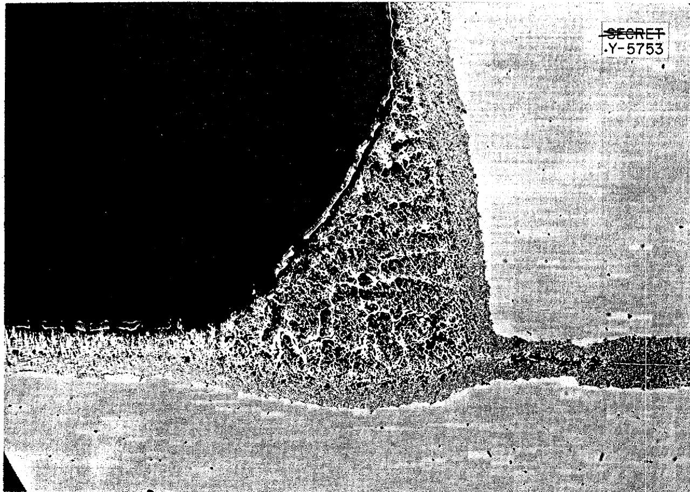  
Fig. 45. Corrosion of Inconel Tube-to-Header Joint Brazed with a $60\%$ Manganese- $40\%$ Nickel Alloy after 100 hr at $1500^{\circ}\mathrm{F}$ in NaOH. $100\times$

have been devised for coating the inside of the standard nickel test capsules with brazing alloy so that corrosion resulting from dissimilar metal combinations can be eliminated when testing samples of the pure brazing alloy. When brazed joints are tested for corrosion, a capsule of the same metal as that of the joint base-metal is used to eliminate dissimilar metal combinations.

# MECHANICAL TESTING OF MATERIALS

R.B.Oliver J.W.Woods

C. W. Weaver

Metalurgy Division

The structural integrity of Inconel at the operating temperature of the

reactor is being accurately determined. Elongation, rupture, and creep rates vs. stress curves have been obtained for fine- and coarse-grained Inconel specimens tested in argon at $1500^{\circ}\mathrm{F}$ . Three tube-burst tests with stresses up to 4000 psi have been running continuously for 1300 hr without developing detectable leaks.

Inconel Creep and Stress Data. Elongation, rupture, and creep rate vs. stress curves were obtained with fine- and coarse-grained Inconel sheet specimens 0.065 in. thick, 0.500 in. wide, and 3 in. long. The extension was measured during the test by observing the relative displacement of two platinum strips fastened at opposite ends of the test section. A Gaertner

# ANP DIVISION QUARTERLY PROGRESS REPORT

micrometer microscope having a least division of $50\mu \mathrm{in}$ was used to evaluate this relative motion.

The time to produce deformations of 0.1, 0.5, 1, 2, 5, and $10\%$ and the time for rupture to occur, as a function of the applied stress for fine-grained Inconel, are shown in Fig. 46. Also presented is the minimum creep rate in percentage of deformation per hour as a function of the applied stress. The percentages appearing above the rupture curve are the total elongations at the several stresses. The fine-grained material was cold rolled and bright annealed at $1650^{\circ}\mathrm{F}$ to produce a grain size of approximately $0.105 \mathrm{~mm}$ (90 grains $\mathrm{mm}^{2}$ ). Similar data for the coarse-grained Inconel-sheet specimens are presented in Fig. 47, but the curve representing the times to produce deformations of $10\%$ is omitted since it is nearly coincident with the rupture curve. This Inconel sheet was annealed for 2 hr at $2050^{\circ}\mathrm{F}$ in a hydrogen atmosphere to produce a grain size of approximately $0.250 \mathrm{~mm}$ (15 grains $\mathrm{mm}^{2}$ ).

Two separate creep rates were obtained for the fine-grained specimens tested at 3000 and 1850 psi; these rates were observed during three different tests. Linear sections were observed on the strain-time plots at 50 to 150 hr and again at about 300 and 600 hours. The earlier of the two linear periods exhibited creep rates of one-third to one-half of the rate found during the later linear period.

Tube-Burst Tests. Three tube-burst tests with tangential stresses of about 1000, 3000, and 4000 psi, respectively, have been running for approximately 1300 hr without developing detectable leaks in the type-316 stainless steel tubes. These tubes, with 480 mils OD and 10-mil wall thickness,

were loaded internally with argon under pressure and exposed to an environment of stagnant air. Since no method exists to gage tubular specimens during the test, the results will be based on before and after measurements.

A second phase of this work is to obtain data on physical properties of metals in the fluorides. Apparatus used for a similar study of sodium has been modified and calibrated so that fluorides may be used. Two tube-burst tests were run in NaF-KF-LiF- $\mathrm{UF_4}$ (10.9 mole % NaF, 43.5 mole % KF, 44.5 mole % LiF, 1.1 mole % UF $_4$ ) by using the apparatus described in the previous ANP quarterly report. Type-316 stainless steel has withstood a hoop stress of 2320 psi and the Inconel 2170 psi. Both these tests have been in operation over 400 hours. Stress-to-rupture tests in the same environment and temperature but of 1000-hr duration were also run on Inconel and type-316 stainless steel tubes. These materials withstood hoop stresses of 1200 psi and 1700 psi, respectively, and the diameters increased 1.7 and $0.7\%$ , respectively.

Operation of Creep and Stress-Rupture Equipment. The center of gravity of the lever-arm counter weight on each testing machine was raised approximately 2 in. above the plane of the knife edges prior to making a series of creep and stress-rupture tests. With the counter weights thus raised, the tare weight of the lever arm was increased by the same amount that the spring load of the compressed sealing bellows was decreased, so that a constant load could be maintained during test. The initial, or tare, load of each testing machine was measured with wire strain gages mounted on a duplicate specimen and the constancy of the load was also verified.

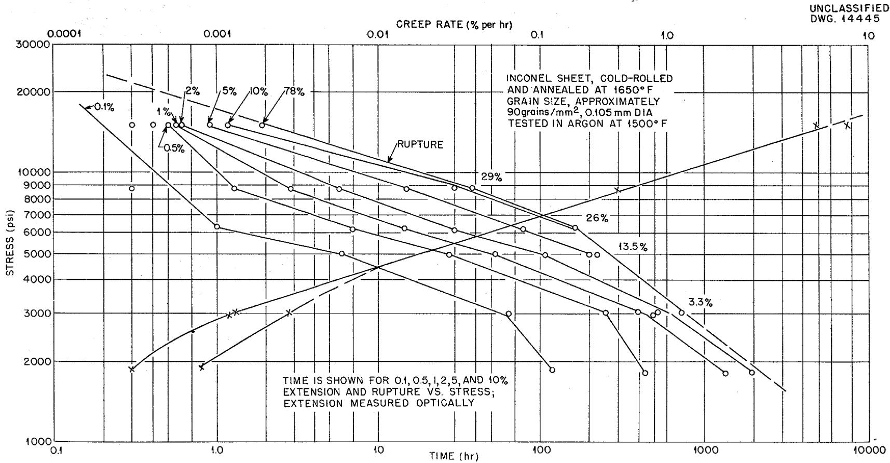  
Fig. 46. Creep and Stress-Rupture Data for Fine-Grained Inconel Sheet.

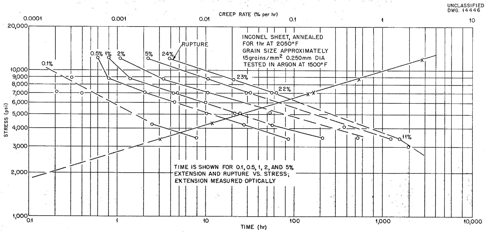  
Fig. 47. Creep and Stress-Rupture Data for Coarse-Grained Inconel Sheet.

# CERAMICS LABORATORY

T. N. McVay, Consultant

Consideration of the possible application of ceramics-coated materials to reactors has indicated several potentialities that require further development. A ceramic coating has been applied to a high-temperature radiator and appears to offer excellent oxidation resistance. Petrographic examination of fluoride fuels is being undertaken and additional equipment - mainly high-temperature furnaces - have been added to the laboratory facilities.

Ceramic Applications to Reactors. Some general conclusions can be given concerning the usefulness of ceramics in reactors on the basis of an analysis of their physical properties and other information.(3)

1. Glass and glass-bonded ceramics, which include nearly all "conventional" ceramics, are not useful in high-temperature reactors as structural elements because of a tendency to soften at relatively low temperatures, brittleness, poor mechanical and thermal shock properties, and poor thermal conductivities. However, if they can be used as liquids, grains, powder, or coatings they may be considered.   
2. Oxide ceramics generally have most of the above-mentioned disadvantages, often to a lesser degree, but they do not exhibit the tendency to soften at low temperatures. All the oxides with the exception of beryllium oxide have thermal conductivities considerably less than those of most metals. If the thermal and structural requirements are not too great and the coolant corrosion problems can be

met, oxides may be used in reactors, perhaps even as structural material. Oxides in combination with other materials offer the greatest promise.

3. Carbides, nitrides, borides, hydrides, and sulfides have been investigated, but most of them need further study. Beryllium carbide was intensively investigated and developed in the NEPA project and will be studied further under G.E. It has many desirable properties and if successfully coated to prevent corrosion (particularly oxidation) and loss of fission products, should prove useful in high-temperature reactors. Although many of these unusual materials are very refractory, they are also very reactive at high temperatures, particularly in the presence of oxygen and water vapor.

4. Ceramic-metal combinations (Cermets) have been studied intensively by groups sponsored by the Air Force. Both structural materials and coatings have been developed. A few that have shown promise are $\mathrm{Al}_{2}\mathrm{O}_{3}$ -Cr, $\mathrm{Al}_{2}\mathrm{O}_{3}$ -Fe, $\mathrm{Al}_{2}\mathrm{O}_{3}$ -Ni, MgO-Ni, and TiC-Co. The $\mathrm{Cr}-\mathrm{Al}_{2}\mathrm{O}_{3}$ Cermets have some interesting properties such as reasonably high strength at temperatures up to $2372^{\circ}\mathrm{F}$ and very good oxidation resistance at these temperatures. They are somewhat brittle, however, and are not too resistant to thermal shock. This property depends on the oxide content. Fabrication techniques have been well developed for some shapes. Considerable further study will be necessary to determine their usefulness in high-temperature reactors.

Coatings for the Radiator. A considerable amount of work has been done this quarter in applying ceramic coatings to stainless steel and Inconel, since these may be required in a liquid-to-air radiator. Much promise for high-temperature and oxidation resistance for reactor materials has

# ANP DIVISION QUARTERLY PROGRESS REPORT

been shown by NBS Ceramic-Coating A-418. Samples coated to about 2 mils thickness are currently undergoing testing. The computed oxide composition of the frit (glass phase of the coating) is:

SiO, 37.5%

$\mathbf{B}_2\mathbf{O}_3$ 6.5

BaO 44.0

CaO 3.5

ZnO 5.0

$\mathrm{Al}_{2}\mathrm{O}_{3}$ 1.0

$\mathbf{ZrO}_2$ 2.5

100.0

Similar coatings developed for the Air Force have been shown to protect stainless steel at $2000^{\circ}\mathrm{F}$ for over 200 hr, or $1800^{\circ}\mathrm{F}$ for an almost indefinite period. Testing procedures for these coatings are described in the literature.(4)

(4) W. N. Harrison, D. G. Moore, and J. C. Richmond, "Ceramic Coatings for High-Temperature Protection of Steel," RPL773, J. Research Nat. Bur. Standards 38, 293-307 (March 1947).

Ceramic Laboratory Equipment. A high-temperature molybdenum-wound furnace designed by Thomas Shevlin, Consultant from Ohio State University, will be used for Cermet work. The shell and accessory components are being fabricated in the Y-12 shops. The refractories and windings are either on hand or on order.

The high-temperature x-ray furnace and the small, high-temperature vacuum furnace have been built. The thermal-diffusivity and thermal-expansion equipment have been designed and are in the shops. The high-temperature dilatometer is in use.

Microscopic Examination of Fluorides. Petrographic examination of fluoride fuels is under way, and the solubility of uranium tetrafluoride in beryllium fluoride glass is being studied. Five mole per cent of the uranium tetrafluoride appears to be soluble in the beryllium fluoride. No glass was present in the one fused mixture of NaF-KF-ZrF $_4$ -UF $_4$ studied.

# 13. HEAT TRANSFER AND PHYSICAL PROPERTIES RESEARCH

H. F. Poppendiek, Reactor Experimental Engineering Division

Viscosities of NaF-KF-LiF eutectic have been determined over a wide temperature range by utilizing three types of viscometers that range from about 8 centipoises at $550^{\circ}\mathrm{C}$ to 3 centipoises at $800^{\circ}\mathrm{C}$ . The addition of up to 30 wt % of uranium tetrafluoride increased the viscosity of this fluoride from 5 to 7 centipoises at $700^{\circ}\mathrm{C}$ but only from 4.0 to 4.3 centipoises at $800^{\circ}\mathrm{C}$ . Some preliminary thermal conductivity information on this coolant has also been obtained. Heat capacity determinations have been made for two different compositions of $\mathrm{NaF - BeF_2 - UF_4}$ mixtures over wide temperature ranges. A table summarizing physical properties of materials of interest to ANP is included.

A series of corrosion failures has made it impossible, for the present, to obtain fundamental heat transfer data for fused salts and hydroxides. The heated-tube, lithium system has been completed and is to be used to determine heat transfer characteristics for this coolant in the near future. Some experimental boiling heat transfer data for a mercury system have been obtained.

The mathematical analysis of circulating-fuel heat transfer for turbulent flow has been evaluated for a series of Reynold's and Prandtl's moduli for the case of no wall heat transfer. Mathematical solutions for the natural convection of liquid fuel elements have been developed for turbulent flows.

# VISCOSITY OF FLUORIDE MIXTURES

M. Tobias S. I. Kaplan Reactor Experimental Engineering Division

J. M. Cisar  
ANP Division

F. A. Knox F. Kertesz Materials Chemistry Division

The viscosity of the various fluoride fuels proposed for the circulating-fuel reactor is of great importance, since a low value (less than 10 centipoises at $800^{\circ}\mathrm{C}$ ) is required. The mixture NaF-KF-LiF-UF $_4$ appears to meet this requirement, whereas NaF-KF-UF $_4$ does not.

Viscosity of NaF-KF-LiF. The viscosity of the NaF-KF-LiF eutectic (11.5 mole % NaF, 42.0 mole % KF, 46.5 mole % LiF) was measured by using three different viscometers, a modified Brookfield viscometer, an efflux unit, and the previously described falling-ball instrument.(1) The data obtained(2,3) range from about 8 ± 1 centipoises at $550^{\circ}\mathrm{C}$ to 3 ± 1 centipoises at $800^{\circ}\mathrm{C}$ .

# ANP DIVISION QUARTERLY PROGRESS REPORT

Viscosity of NaF-KF-LiF-UF4. The previously described(4) apparatus consisting of a modified Brookfield viscometer and a controlled atmosphere furnace with certain improvements to guard against hydrolysis and oxidization was used during the past quarter to determine the viscosity of NaF-KF-LiF-UF4. Increasing the amount of uranium fluoride, up to 30 wt%, failed to cause a substantial change in the viscosity, as shown in Table 35.

TABLE 35   
Viscosity of NaF-KF-LiF-UF $_4$ MIXTURES as a Function of Uranium Tetrafluoride Concentration   

<table><tr><td rowspan="2">UF4 CONCENTRATION* (wt %)</td><td colspan="2">VISCOSITY + 0.5 (centipoises)</td></tr><tr><td>700°C</td><td>800°C</td></tr><tr><td>0</td><td>5.2</td><td>4.0</td></tr><tr><td>2</td><td>5.2</td><td>4.1</td></tr><tr><td>15</td><td>6.0</td><td>4.3</td></tr><tr><td>30</td><td>7.2</td><td>4.3</td></tr></table>

*Solvent (mole %): 11.5, NaF; 4.2, KF; 46.5, LiF.

Modifications of Viscosity Apparatus. The efflux and Brookfield viscometers are being installed in a dry box filled with inert gas to study the viscosity of beryllium-containing fluoride mixtures after hydrofluorination to remove insoluble oxides formed by oxidation and hydrolysis. A new, nickel viscometer tube has been installed in the falling-ball apparatus for further high-temperature salt work.

The length of the measured fall path has been increased by about one-fourth and the amount of material needed decreased by one-third.

# THERMAL CONDUCTIVITY OF LIQUIDS AND SOLIDS

L. Cooper M. Tobias

W. D. Powers S. J. Claiborne

Reactor Experimental Engineering Division

The thermal conductivity apparatus was further checked by calibration with a molten metal. The value of the thermal conductivity of lead obtained with this device agreed within $13\%$ of the value given in the literature. Experiments to study Flinak (LiF-NaF-KF eutectic) were initiated; however, at the end of one run a corrosion failure (attack on a weld and a stainless steel bellows) halted the experimental work. The preliminary results of this single run indicated that the thermal conductivity of Flinak was severalfold greater than that of the fluoride heavily laden with uranium (46.5 mole $\%$ NaF, 26.0 mole $\%$ KF, and 27.5 mole $\%$ UF $_4$ ) that had been studied previously. Modification of the system will be attempted so that corrosion will be minimized. Upon the completion of this modification, further thermal conductivity measurements of the fluorides will be made.

A new, longitudinal flow apparatus, originally developed to investigate solids, has been erected. This device will now be used for studing liquids with high thermal conductivities. It is believed that the minor free-convection currents that might occur in this system will not significantly influence the heat transfer (conduction being the important heat transfer mode in this case).

# HEAT CAPACITIES

W. D. Powers R. M. Burnett G. C. Blalock

Reactor Experimental Engineering Division

The enthalpies and heat capacities of the following salt mixtures have been determined by the use of Bunsen ice calorimeters. For the 76 mole % NaF-12 mole % BeF $_2$ -12 mole % UF $_4$ mixture at 250 to $465^{\circ}\mathrm{C}$ ,

$$
\begin{array}{l} H _ {T} (s) - H _ {0 ^ {\circ} \mathrm {C}} (s) = 0. 2 2 T - 5 (\mathrm {c a l / g}), \\ c _ {p} = 0. 2 2 \pm 0. 0 2 (\mathrm {c a l} / \mathrm {g} ^ {\cdot} \mathrm {C}), \\ \end{array}
$$

and at 520 to $1000^{\circ}\mathrm{C}$

$$
\begin{array}{l} H _ {T} (l) - H _ {0} \circ_ {\mathbf {C}} (s) = 0. 3 2 T - 3 5 (\mathrm {c a l / g}), \\ c _ {p} = 0. 3 2 \pm 0. 0 3 (\mathrm {c a l} / \mathrm {g} ^ {\cdot} \circ \mathrm {C}). \\ \end{array}
$$

For the 25 mole % NaF-60 mole % BeF $_2$ -15 mole%UF $_4$ mixture at 280 to $1000^{\circ}\mathrm{C}$ ,

$$
\begin{array}{l} H _ {T} - H _ {0 ^ {\circ} C} = 0. 3 2 T - 4 5 (\mathrm {c a l / g}), \\ c _ {p} = 0. 3 2 \pm 0. 0 2 (\mathrm {c a l / g} ^ {\circ} \mathrm {C}). \\ \end{array}
$$

The enthalpy-temperature curve of the second salt mixture exhibited no discontinuities and thus indicated the characteristics of a glass.

At present the heat capacities of Inconel, potassium hydroxide, barium hydroxide, and a lithium-sodium potassium-fluoride mixture are being determined.

# VAPOR PRESSURE OF LIQUID FUELS

R. E. Moore  
Materials Chemistry Division

Previous determinations of the vapor pressure of uranium tetrafluoride

are in disagreement; therefore new measurements were made between 1037 (slightly above the melting point) and $1185^{\circ}\mathrm{C}$ . The apparatus and procedure employed were described previously. $(^{5,6})$ The data may be represented by the equation

$$
\log_ {1 0} P (\mathrm {m m H g}) = (- 9 1 3 0. 5 / T) + 7. 7 7 4,
$$

which gives a maximum variation from the measured values of $4.6\%$ . The heat of vaporization, as calculated from the equation, is 42.1 kg-cal/mole.

In earlier work Johnson $^{(7)}$ used a static method for determining the vapor pressure of solid uranium tetrafluoride, and Ryon and Twitchell $^{(8)}$ measured a series of boiling points at reduced pressures. The highest vapor pressure obtained with the solid was approximately $6.5 \mathrm{~mm}$ at $1000^{\circ} \mathrm{C}$ , but in the present work this pressure was observed at about $1040^{\circ} \mathrm{C}$ . The boiling-point method gave a much higher heat of vaporization than that calculated from the data in this report; that is, the pressures obtained at higher temperatures were considerably higher, and those obtained at lower temperatures considerably lower, than the values reported herein. The difficulty of obtaining reliable boiling points in the low pressure range and the fact that the points were scattered might account for some of the differences.

Vapor pressures of sodium fluoride and potassium fluoride, the other two components of the NaF-KF-UF $_4$ eutectic

# ANP DIVISION QUARTERLY PROGRESS REPORT

mixture, have been determined by Wartenberg and Schulze.(9) The data for sodium fluoride and potassium fluoride, as well as the data reported here for uranium tetrafluoride, were extrapolated to $1267^{\circ}\mathrm{C}$ , the highest temperature at which the vapor pressure of the eutectic mixture was measured. The ideal partial pressures at $1267^{\circ}\mathrm{C}$ of each of the components of the mixture, as calculated by Raoult's law, show 6.4 mm for sodium fluoride, 31 mm for potassium fluoride, and 19 mm for uranium tetrafluoride. The ideal total pressure is therefore approximately 56 mm, whereas the experimental vapor pressure at $1267^{\circ}\mathrm{C}$ is 11.6.(5)

Association in the mixture probably accounts for the large deviation from ideal behavior. A likely possibility is the presence of complex ions formed by association of fluoride ions and uranium tetrafluoride molecules.

# PHYSICAL PROPERTY DATA

M. Tobias

Reactor Experimental Engineering Division

Summaries of the available data on the physical properties of fluoride salts and other reactor materials are presented in Tables 36 and 37. Most of the data were obtained by the physical properties group at ORNL; however, pertinent physical property measurements obtained by other organizations are also included. The ORNL physical property measurements are being made for the purpose of quickly supplying the ANP project with data of a reasonable accuracy. The general

accuracies assigned to the data presented in the tables are noted as follows:

1. Melting point: within about $\pm 10^{\circ}\mathrm{C}$   
2. Heat Capacity: within about $\pm 10\%$ .   
3. Thermal conductivity: preliminary checks on the thermal conductivity device for liquids, made by using molten lead, indicated that the data fell within about $\pm 30\%$ of the known values. An error analysis, assuming pessimistic Chromel-Alumel thermocouple deviations, suggested that the NaF-KF-UF4 data were accurate to within about $\pm 30\%$ . Further checks are being made.   
4. Viscosity: the results so far are preliminary. A definite accuracy cannot yet be assigned.   
5. Density: within about $\pm 5\%$ .

Only the existence of preliminary physical property data has been noted on Tables 36 and 37; when the results have been confirmed, the data will be listed.

# NATURAL CONVECTION IN CONFINED SPACES WITH INTERNAL HEAT GENERATION

D.C.Hamilton L.Palmer

F.E.Lynch R.F.Redmond

Reactor Experimental Engineering Division

Analytical solutions have been developed for natural convection systems in which the heat source and the wall flux are uniform and the aspect ratio is very high (i.e., $L / d$ very large). Three memorandums have been published regarding the laminar

# TABLE 36

Physical Properties of Fluoride Salts   

<table><tr><td></td><td>MOLE %</td><td>APPROXIMATE(a) MELTING POINT (°C)</td><td>HEAT CAPACITY (cal/°C·g)</td><td>THERMAL CONDUCTIVITY (Btu/hr·ft2-°F/ft)</td><td>VIScosity (centipoise)</td><td>DENSITY (g/cc)</td><td>VOLUME EXPANSION COEFFICIENT</td></tr><tr><td>NaF-FeF2-UF4</td><td>76, 12, 12</td><td>480</td><td>Solid, 0.22 at 250°C &lt; T &lt; 465°C; liquid, 0.32 at 520°C &lt; T &lt; 1000°C(b)</td><td></td><td></td><td></td><td></td></tr><tr><td>NaF-FeF2-UF4</td><td>25, 60, 15</td><td>635 (starts solidifying)</td><td>0.32 at 280°C &lt; T &lt; 1000°C(b)</td><td></td><td></td><td></td><td></td></tr><tr><td>NaF-KF-UF4(eutectic)</td><td>46.5, 26, 27.5</td><td>530</td><td>Solid, 0.15 at 240°C &lt; T &lt; 535°C, liquid, 0.23 at 535°C &lt; T &lt; 1000°C(c)</td><td>0.53 at 550°C &lt; T &lt; 750°C(d)</td><td></td><td>4.70 - 1.15 x 10-3T at 535°C &lt; T &lt; 1000°C(e)</td><td>2.82 x 10-4at 535°C 3.24 x 10-4at 1000°C</td></tr><tr><td>NaF-KF-UF4</td><td>48.2, 26.8, 25</td><td>558</td><td></td><td></td><td></td><td>4.54 - 1.1 x 10-3T at 600°C &lt; T &lt; 900°C(f)</td><td>2.84 x 10-4at 600°C 3.10 x 10-4at 900°C</td></tr><tr><td>NaF-KF-LiF (Flinak)</td><td>11.5, 42, 46.5</td><td>455</td><td>Preliminary results</td><td></td><td>Preliminary results: 8 at 550°C to 3 at 800°C</td><td>2.39 - 5.9 x 10-4T at 530°C &lt; T &lt; 850°C(g)</td><td>2.84 x 10-4at 530°C 3.12 x 10-4at 850°C</td></tr><tr><td>UF4-LiF-NaF-KF (Fulinak)</td><td>1.1, 44.5, 10.9, 43.5</td><td>455</td><td></td><td></td><td></td><td>2.65 - 9.0 x 10-4T at 530°C &lt; T &lt; 850°C(h)</td><td>4.15 x 10-4at 530°C 4.79 x 10-4at 850°C</td></tr><tr><td>UF4</td><td></td><td>1035(i)</td><td>0.073 + 6.1 x 10-5T at 280°C &lt; T &lt; 950°C(b)</td><td></td><td></td><td></td><td></td></tr></table>

$(a)_{C}$ . J. Barton, ORNL Materials Chemistry Division, personal communication.   
(b)W.D.Powers,ORNL CF-51-11-195,Nov.30,1951.   
$\{c\} _W$ D.Powers,ORNI.CF-51-9-64,Sept.13,1951.   
$(d)_{\mathrm{L}}$ .Basel and M.Tobias,ORNL CF-51-7-169,July 31,1951.   
$(e)_{S}$ . I. Kaplan, ORNI CF-51-8-97, Aug. 13, 1951.   
$\langle f\rangle$ J.Cisar,ORNL CF-51-11-78,Nov.14,1951.   
$(g)J.$ Cisar, ORNL CF-51-12-91, Dec. 14, 1951.   
$(h)$ J.Cisar,ORNL CF-51-11-198,Nov.30，1951.   
$(i)_{A}$ D.Ryon and L.P.Twitchell,H-5,385.2,July 25,1947.

# TABLE 37

Physical Properties of Miscellaneous Materials   

<table><tr><td></td><td>APPROXIMATE MELTING POINT (°C)</td><td>HEAT CAPACITY (cal/°C·g)</td><td>THERMAL CONDUCTIVITY (Btu/hr·ft2·°F/ft)</td><td>VISCOSITY (centipoise)</td></tr><tr><td rowspan="3">Sodium hydroxide</td><td rowspan="3">323(a)</td><td rowspan="3">Liquid, 0.49 at 340°C &lt; T &lt; 990°C (b)</td><td rowspan="3">0.81 at 520°C(c)</td><td>4.0 at 350°C(d)</td></tr><tr><td>2.2 at 450°C</td></tr><tr><td>1.5 at 550°C</td></tr><tr><td rowspan="2">Lead-bismuth alloy (55.3 mole % Bi)</td><td rowspan="2">125(e)</td><td rowspan="2">Liquid, 0.035 at 175°C &lt; T &lt; 1000°C (b)</td><td>5.32 at 160°C(e)</td><td rowspan="2">1.0 at 650°C</td></tr><tr><td>6.53 at 320°C</td></tr><tr><td rowspan="2">Nickel</td><td rowspan="2">1452(f)</td><td rowspan="2">Solid, 0.12 + 3.1 x 10-5T at 240°C &lt; T&lt; 980°C(b)</td><td>36 at 0°C(g)</td><td rowspan="2"></td></tr><tr><td>32 at 300°C</td></tr><tr><td rowspan="2">Type-316 stainless steel</td><td rowspan="2">1370 to 1400(h)</td><td rowspan="2">Solid, 0.1093 + 5.66 x 10-5T at 150°C &lt; T &lt; 1000°C(i)</td><td>9.02 at 100°C(h)</td><td rowspan="2"></td></tr><tr><td>12.4 at 500°C</td></tr><tr><td rowspan="2">Lithium</td><td rowspan="2">186(f)</td><td rowspan="2">Liquid, 1.001 + 2.76 x 10-5T at 250°C &lt; T &lt; 1000°C(i)</td><td rowspan="2">20.6 to 26.6 at m.p.(e)</td><td>0.60 at 205°C(d)</td></tr><tr><td>0.41 at 1000°C</td></tr><tr><td rowspan="3">Zirconium</td><td rowspan="3">1700(f)</td><td rowspan="3">Solid, 0.0697 + 3.62 x 10-5T at 150°C &lt; T &lt; 1050°C(i)</td><td>11.3 at room temp.(j)</td><td rowspan="3"></td></tr><tr><td>11.2 at 200°C</td></tr><tr><td>10.7 at 500°C</td></tr><tr><td rowspan="3">Molybdenum</td><td rowspan="3">2620(f)</td><td rowspan="3">Solid, 0.0675 at 150°C &lt; T &lt; 1050°C(i)</td><td>70.3 at 540°C(k)</td><td rowspan="3"></td></tr><tr><td>62.9 at 870°C</td></tr><tr><td>56.5 at 1145°C</td></tr></table>

$(a)$ C. J. Barton, ORNL Materials Chemistry Division, personal communication.   
(b) W. D. Powers, ORNL CF-51-11-195, Nov. 30, 1951.   
$(c)$ H. R. Deem, Battelle Memorial Institute, personal communication.   
$(d)_{\mathbf{H}}$ R. Stephan, NEPA IC-50-4-20, Apr. 10, 1950.   
(e) Liquid Metals Handbook, p. 31, June 1, 1950.

$(f)$ Chemical Engineer's Handbook, 2d. ed., p. 313-367.

$(g)_{Ib i d.,p.949}$

$(h)$ United States Steel Corporation, Fabrication of U.S.S. Stainless and Heat Resisting Steels, 1950 ed.

$(i)_{\mathbb{W}}$ .D.Powers,ORNL-1154,p.134.

$(j)_{G}$ Bing, F. W. Fink, and H. B. Thompson, BMI-65, Apr. 16, 1951.

$(k)$ E. Mikol, ORNL-1131, Feb. 14, 1952.

flow case.(10.11.12) One analysis involves a parallel plane system and consists of solving the heat conduction equation by using a simplified velocity distribution; a similar analysis has been made for a circular pipe system; and a third analysis consists of solving the hydrodynamic and heat flow equations simultaneously. The temperature distributions and critical Reynold's moduli for the third analysis, which was more exact than the first, were almost identical.

The following comments apply only to the ideal systems treated in these memorandums. In small tubes (0.2 in. in diameter) a temperature reduction as a result of natural convection does not seem to occur for practical values of the variables. The ratio of the difference in center line wall temperature and the temperature when conduction is the only mechanism present is represented by $\phi_0$ . For laminar flow in very large tubes, $\phi_0$ may be as small as 0.3. In the case of turbulent flow, $\phi_0$ is smaller by an order of magnitude. To attain turbulent flow and the resulting low values of $\phi_0$ in small tubes, large temperature differences are necessary. It should be noted, however, that systems using large-diameter tubes would yield turbulent flow with much smaller temperature differences.

An apparatus is being constructed to obtain an over-all temperature difference for a cylindrical system in

the turbulent flow region. The new design will facilitate the measurement of wall temperature. Mercury will be used as the heat generation medium.

A flat plate apparatus is being designed to permit visual study of the velocity distribution in the laminar region. (13) A dilute sulfuric acid solution will be used as the heat generation medium.

# ANALYSIS OF HEAT TRANSFER IN A CIRCULATING-FUEL SYSTEM

H. F. Poppendiek L. Palmer Reactor Experimental Engineering Division

Mathematical solutions for laminar and turbulent heat transfer in the circulating-fuel systems were described in a previous report. (14) The wall-mixed mean fluid temperature difference in the established flow region for laminar flow is

$$
t _ {w} - t _ {m m} = \frac {G r _ {0} ^ {2}}{k} \left[ \frac {1 1 F - 8}{4 8} \right]
$$

where

$$
G = \text {v o l u m e . h e a t s o u r c e ,}
$$

$$
r _ {0} = \text {p i p e}
$$

$$
k = \text {f l u i d t h e r m a l c o n d u c t i v i t y},
$$

$$
F = 1 - \frac {2}{G r _ {0}} \left[ \frac {d q}{d A} \right] _ {0},
$$

$$
\left. \left[ \frac {d q}{d A} \right] _ {0} \right. = \text {p i p e w a l l h e a t t r a n s f e r r a t e}.
$$

# ANP DIVISION QUARTERLY PROGRESS REPORT

The wall-mixed mean fluid temperature difference for turbulent flow is found to be a function of Reynold's modulus (Re), Prandtl's modulus (Pr), the volume heat source, the fluid thermal

conductivity, the pipe radius, and the function $F$ . The turbulent solution for the case of no wall heat transfer ( $F = 1$ ) has been evaluated for a range of Re and Pr and graphed in Fig. 48.

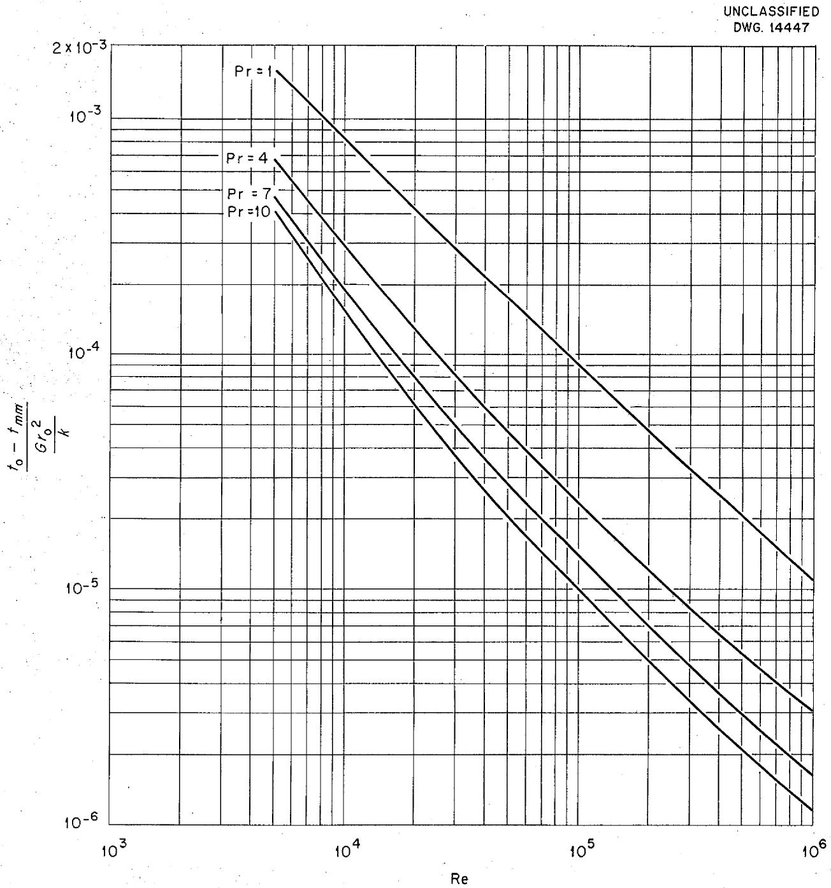  
Fig. 48. Dimensionless, Wall-Mixed Mean Temperature Difference as a Function of Reynold's and Prandtl's Moduli for a Heat Transfer System with Insulated Pipe Walls.

These solutions for laminar and turbulent flows can be used in designing circulating-fuel systems.

# HEAT TRANSFER COEFFICIENTS

Heat Transfer in Molten Lithium (H. C. Claiborne and G. M. Winn, Reactor Experimental Engineering Division). The apparatus for measuring heat transfer coefficients with an electrically heated tube was completed. Internal cleaning and degreasing were accomplished by thorough flushing with ethanol and trichloroethylene. The system was outgassed by heating and repeated flushing with argon scrubbed with lithium and eutectic sodium-potassium alloy to remove the oxygen and nitrogen contaminants. The flushing procedure consisted of raising the pressure to about 35 psig with scrubbed argon and bleeding the pressure down to about 2 psig. After filling with lithium, the system, when not in operation, was kept under 35 psig with scrubbed argon to prevent air contamination.

Sixteen pounds of lithium was added to the system through the filter in 4-lb batches. The lithium used was the low-sodium grade purchased from the Metalloy Corporation. To keep contamination down to a minimum, the film of nitrides and oxides adhering to the 1-lb cylinders of solid lithium was shaved off and the solid metal soaked in trichloroethylene. This operation was done in a dry box filled with argon. The lithium was successfully pumped around the system (via the test section by-pass) by the two electromagnetic pumps in series. The electromagnetic flow meter was calibrated by using the drain tank that had been previously calibrated with water.

After the system was prepared for obtaining heat transfer data, it was

found that an electrical current could not be passed through the test section. Examination revealed that the test section had melted at one point. Apparently too much current was passed through the section while testing the transformer circuit. A new test section is being fabricated and other minor changes are being made. Another attempt to get heat transfer data will be made as soon as this work is complete.

Heat Transfer to Fused Salts and Hydroxides (H. W. Hoffman and J. Lones, Reactor Experimental Engineering Division). Flinak was removed from the heat transfer system and replaced with sodium hydroxide during the last quarter. Corrosion by the Flinak had caused leaks in several welds and in one of the mixing pots, and it was necessary to replace these parts of the system. A redesigned mixing pot consisting of a section of 1-in. nickel pipe $2\frac{1}{2}$ in. long and capped at both ends was installed. The fluid enters at one end of the pot tangentially to the inside surface of the pipe, passes through a perforated nickel disk, and leaves at the bottom. A thermocouple is located in front of the exit.

Entrance Region Heat Transfer in a Sodium System (W. B. Harrison, Reactor Experimental Engineering Division). The modifications and additions to the experimental system proposed in the last quarterly report(15) have been made, and preparations are being made for loading the system with sodium.

Extremely high values of the heat transfer coefficient should be achieved with the use of sodium in an entrance region (e.g., 200,000 Btu/hr ft²·°F); therefore good wetting of the copper

test section by the sodium is of considerable importance. There are no sodium wetting data available for copper, but the data for similar metals indicate that copper may be well wetted by sodium even at the low operating temperatures (up to $300^{\circ}\mathrm{F}$ ). A test will be conducted to determine the degree of wetting and possible ways of improving it if it should be poor. The study will consist of measuring relative electrical resistances across a few copper-sodium interfaces as functions of temperature. The interfaces proposed at present are sodium in contact with copper that has been silver plated, mercury plated, and oxidized. The equipment has been assembled for this experiment, and data should be available in the near future. Work on the heat transfer system is being deferred in order to capitalize on any positive results of the wetting studies.

# HEAT TRANSFER OF BOILING LIQUID METALS

W. S. Farmer

Reactor Experimental Engineering Division

The previous boiling-mercury data for the horizontal plate system(16) have been analyzed and compared with existing information in the literature on nucleate boiling and free convection. A plot of this data is shown in Fig. 49. The Nusselt numbers $(hL / k)$ obtained experimentally fall below the values predicted by correlations of Insinger and Bliss(17) for nucleate boiling and Jakob(18) for free convection. Over most of the

temperature difference range the experimental values are approximately one-fourth the predicted values. Existing correlations may not correctly take into account Prandtl's number and wetting, which may be of importance in liquid metal boiling.

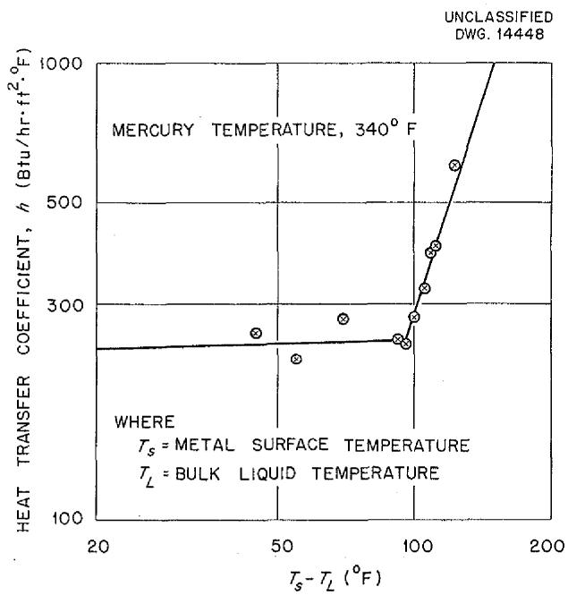  
Fig. 49. Heat Transfer Coefficients for Boiling Mercury.

Minor changes are to be made in the horizontal flat plate system in order to evaluate wetting characteristics and heat transfer surface resistances. In addition, a small, inexpensive, mercury circulation unit is to be constructed. Mercury will then be used as the condenser coolant for experiments in which the heat transfer coefficients of boiling sodium will be measured.

The experimental apparatus for investigating heat transfer coefficients of boiling liquid metals by using a horizontal tube geometry was completed this quarter. Preliminary tests using water as a boiling fluid are now in progress.

# 14. RADIATION DAMAGE

D. S. Billington, Solid State Division

A. J. Miller, ANP Division

Studies have continued on the the effect of radiation on the stability of airplane reactor constituents. Considerable data have been obtained from experiments in the X-10 graphite pile, the higher flux LITR, and the Y-12 cyclotron. In all phases of the work, preparations are being made to carry out additional studies in the LITR and to utilize the MTR facility when it becomes available. This work has been concerned largely with the stability of fused fluoride salt mixtures of the type proposed as fuel for circulating fuel reactors. In several of the inpile experiments with the salts in Inconel capsules, the rate of attack on the container material has been considerably higher than that observed in the out-of-pile controls. However, the evidence is not conclusive that the increased corrosion rate is caused by the radiation field.

Other radiation damage studies have included inpile liquid metal loop experiments and creep of metal. Sodium was circulated in the inpile loop for 165 hr, during which time radioactive decay curves were taken. The thermal conductivity of metals under irradiation has also been studied. The earlier creep and thermal conductivity data have been partially substantiated by recent tests. One such creep test with nickel indicates that the inpile creep rate becomes higher than its bench counterpart after about 115 hours. Additional details on radiation damage studies are contained in a quarterly report of the Physics of Solids Institute.(1)

# IRRADIATION OF FUSED MATERIALS

G. W. Keilholtz  
Materials Chemistry Division

The effects of radiation on the stability of fused fluorides in contact with Inconel have been investigated by use of the X-10 graphite pile, the LITR, and the Y-12 cyclotron. Reasonably detailed inspection of materials from experiments carried out in the X-10 graphite pile and cyclotron at $1500^{\circ}\mathrm{F}$ showed no positive evidence of fuel decomposition or increased corrosion of the Inconel when compared to out-of-pile control tests. However, two fused fluoride fuels irradiated in the LITR at power densities of 800 and 84 watts/cc in approximately 1/8-in.-ID tubes have exhibited increases in the corrosion rate as indicated by analyses of the fuel for corrosion products. One of these has the composition NaF-KF-UF $_4$ , 46.5, 26, and 27.5 mole %, respectively, in which the power dissipated when irradiated in the LITR is about 800 watts/cc of material. The second fuel has a composition NaF-BeF $_2$ -UF $_4$ , 47, 51, and 2 mole %, respectively, and a power dissipation of about 84 watts/cc. This is in the power range of that occurring in the large-diameter tubes of the proposed ARE. In both cases there is some question as to whether the inpile tests are being carried out in a manner sufficiently isothermal to prevent increased corrosion rates by thermal gradients in the capsules. In the case of the low-uranium-concentration fluoride mixture, irradiated at 84 watts/cc, analytical results are available from only one experiment. These results are in sharp contrast to those from

# ANP DIVISION QUARTERLY PROGRESS REPORT

an experiment on a similar beryllium type of fuel containing a higher percentage of uranium, which had a power dissipation of 554 watts/cc. The latter experiment showed no evidence of increased corrosion, on the basis of an impurity analysis of the fuel, as compared with the control.

Preparations are being made to carry out studies on the escape of xenon from the melt in the X-10 graphite pile and on fuel stability in the MTR.

Pile Irradiation of Fuel (J. G. Morgan, P. R. Klein, C. C. Webster, B. W. Kinyon, M. J. Feldman, H. E. Robertson, Solid State Division). Experiments during the past quarter have been conducted entirely on fused fluoride fuels in the LITR.

Results of these experiments as compared with the control runs are shown in Table 38. The corrosion of the Inconel in some LITR runs is not only deeper and more general than that in the controls, but there are also two kinds present - the intergranular-type found in the control runs and a type of corrosion that is confined within the grain and shows evidence of being preferential in the grains attacked.

The capsules are considerably corroded above the point where the liquid level is assumed to be. There is a small amount of such corrosion in the capsules irradiated in the X-10 graphite pile but little evidence of corrosion of Inconel in contact with the vapor phase in control runs. Chemical analyses in Table 38 indicate that less chromium is dissolved in the irradiated fuel than in the control

TABLE 38 LITR Tests on Fused Fluoride Fuels in Inconel at $1500^{\circ}\mathrm{F}$   

<table><tr><td rowspan="2">FUEL COMPOSITION (mole %)</td><td rowspan="2">TIME (hr)</td><td rowspan="2">IRRADIATION (watts/cc)</td><td colspan="3">INCONEL COMPONENTS IN FUEL AFTER TEST</td><td rowspan="2">CAPSULE CONDITION</td></tr><tr><td>Ni</td><td>Cr</td><td>Fe</td></tr><tr><td rowspan="5">46.5 NaF-26 KF-27.5 UF4</td><td>115</td><td>800</td><td>26,878</td><td>1878</td><td>16,329</td><td>Generally corroded to depth of 2 to 3 mils</td></tr><tr><td>115</td><td>Control</td><td>1,034</td><td>754</td><td>1,270</td><td>Occasional 1 to 2 mil intergranular attack</td></tr><tr><td>161</td><td>800</td><td>45,169</td><td>950</td><td>6,414</td><td>Generally corroded to depth of 2 to 3 mils</td></tr><tr><td>161</td><td>Control</td><td>1,100</td><td>645</td><td>2,655</td><td>Occasional 1 to 2 mil intergranular attack</td></tr><tr><td>136</td><td>800</td><td>1,380</td><td>160</td><td>1,220</td><td>No corrosion*</td></tr><tr><td rowspan="2">47 NaF-51 BeF2-2 UF4</td><td>143</td><td>84</td><td>80,000</td><td>2450</td><td>3,100</td><td>Inspection incomplete</td></tr><tr><td>136</td><td>Control</td><td>1,123</td><td>3300</td><td>811</td><td>Inspection incomplete</td></tr><tr><td rowspan="2">25 NaF-60 BeF2-15 UF4</td><td>139</td><td>554</td><td>1,490</td><td>1060</td><td>1,200</td><td>Inspection incomplete</td></tr><tr><td>131</td><td>Control</td><td>1,540</td><td>7380</td><td>2,300</td><td>Inspection incomplete</td></tr></table>

\*At $824^{\circ}\mathrm{F}$ (solid)

samples but that there is a large increase in the nickel and iron content of the irradiated fuel compared with that in the control.

Cyclotron Irradiation of Fuel (W. J. Sturm and M. J. Feldman, Solid State Division, R. J. Jones and R. L. Knight, Electromagnetic Research Division). Fuel irradiations in the cyclotron with 20-Mev protons described in the previous quarterly report $^{(2)}$ were carried out at 30 to 415 watts/cc of fuel for a short period of time, usually an hour. During the past quarter smaller Inconel capsules have been developed to avoid terminations of runs because of uneven temperatures. A helium cooling system has been designed and is being constructed to allow higher power dissipations. With the Inconel microcapsules it was possible to bombard a lithium-bearing fuel - KF-NaF-LiF-UF $_4$ , 43.5, 10.9, 44.5, and 1.1 mole %, respectively - up to 8 hr with 100 to 400 watts/cc. Fuel analyses and metallographic examinations are being made.

Additional fuel irradiations are being carried out by North American Aviation with the use of the 60-in. Berkeley cyclotron.

# INPILE CIRCULATING LOOPS

O. Sisman

C. Ellis

W. W. Parkinson

W. E. Brundage

A. S. Olson

R. M. Carroll

C. D. Baumann

Solid State Division

Sodium was circulated at a velocity of 1 ft/sec in the X-10 graphite pile through a loop of Inconel for 50 hr at $1000^{\circ}\mathrm{F}$ and 115 hr at $1500^{\circ}\mathrm{F}$ . An

electromagnetic pump was used, and the temperature of the material in the pump cell was $1000^{\circ}\mathrm{F}$ . The flow rate of sodium through the loop gradually decreased, and eventually the loop could not be operated. When the activity of the loop has decayed sufficiently, an examination will be made to determine the condition of the loop and the cause of the flow stoppage. At various times while the flow was stopped, radioactive decay curves were obtained for the part of the loop outside the pile. The curves are being examined for long-lived corrosion products from the Inconel tube walls.

A second sodium loop for the X-10 graphite pile and a sodium loop for operation in the LITR are being constructed. A fused fluoride fuel loop for operation in the MTR is being designed.

# CREEP UNDER IRRADIATION

J.C.Wilson J.C.Zukas

W. W. Davis

Solid State Division

It was previously reported $^{(3)}$ that a cantilever creep test at $1500^{\circ}\mathrm{F}$ and 1500 psi showed that X-10 graphite pile irradiation at a flux of $4 \times 10^{10}$ fast neutrons/cm $^2$ caused an increase in total creep strain of about $20\%$ in type-347 stainless steel after about 250 hr of exposure, which was the duration of the tests. Extrapolation of the bench and inpile curves to longer times indicated that the difference between them increased with time. In order to obtain further information on this point, a 500-hr test was run in the pile with no

strain measuring microformer (since in 500 hr the creep strain would exceed the maximum microformer travel). The beam deflection was measured with cathetometer after withdrawal from the reactor. The strain in the bench test exceeded that of the inpile test by $5\%$ . Since this is contrary to what would be expected from extrapolation of the earlier data, the experiment will be repeated.

One inpile test was run on an electrolytic nickel sample at $1300^{\circ}\mathrm{F}$ at a maximum fiber stress of 2000 psi. The material was annealed at $1500^{\circ}\mathrm{F}$ for 5 hr following a cold reduction of $40\%$ . The temperature of $1300^{\circ}\mathrm{F}$ was chosen as the maximum at which the grain structure was known to remain stable during the test. Figure 50 shows a plot of creep rate vs. time for both inpile and bench tests. In common with the earlier work on type-347 stainless steel, the curves show that the inpile strain-time curve

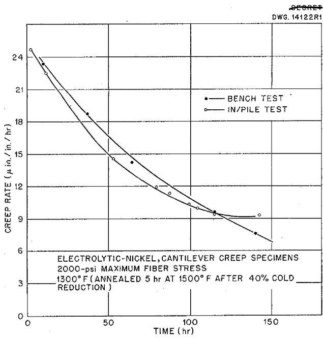  
Fig. 50. Comparison of Bench and Inpile Creep Rates of Nickel.

becomes more linear and shows a lesser strain but a higher rate than its bench counterpart after about 115 hours. At about 120 hr the inpilerig had reached an approximately constant strain rate, whereas the rate in the bench test was still decreasing.

# RADIATION EFFECTS ON THERMAL CONDUCTIVITY

A. F. Cohen L. C. Templeton Solid State Division

In a preliminary relative thermal conductivity experiment on Inconel, previously reported, $^{(4)}$ a large decrease in thermal conductivity was observed after three days of irradiation at approximately $1517^{\circ}\mathrm{F}$ in the X-10 graphite pile. To check this result, a carefully annealed Inconel specimen was irradiated at 482 and $1067^{\circ}\mathrm{F}$ and showed apparently no effects from their radiation. When raised to $1517^{\circ}\mathrm{F}$ there was again some apparent lowering of thermal conductivity, the cause of which has not yet been determined. In relative thermal conductivity tests of high-purity cobalt-free nickel in the X-10 graphite pile, no lowering has been observed during long periods at low temperatures and several weeks of testing in the region of $1500^{\circ}\mathrm{F}$ . An absolute thermal conductivity test is being run in the LITR at $1500^{\circ}\mathrm{F}$ on Inconel that has been heat-treated to precipitate all the carbides that can be precipitated by thermal treatment.

In an absolute thermal conductivity test on type-316 stainless steel in the fast flux of the LITR at 212 to $392^{\circ}\mathrm{F}$ the thermal conductivity was shown to be unaffected by the irradiation.

Part IV

APPENDIXES

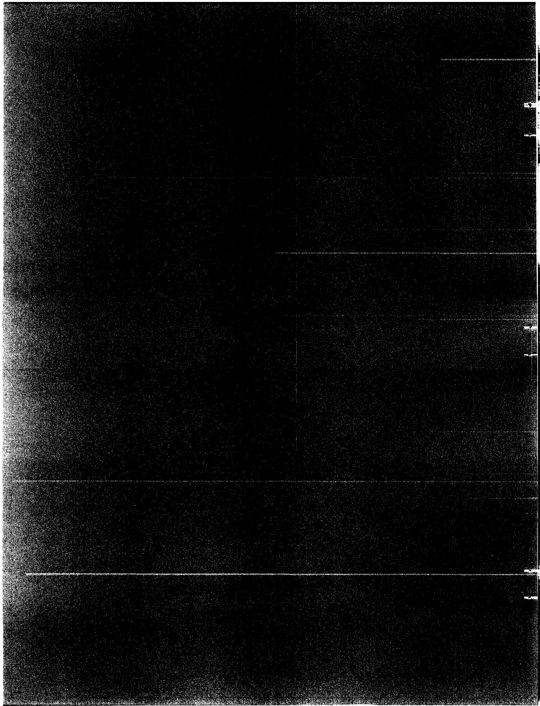

# SUMMARY AND INTRODUCTION

The survey of the supercritical-water reactor by the Oak Ridge National Laboratory's subcontractor, Nuclear Development Associates, Inc., is complete. NDA has concluded (sec. 15) that a reactor of this type may be developed for supersonic propulsion but that the reactor is an intricate machine and will present a difficult design job. Although ORNL will not pursue this reactor cycle because of the prevailing belief in the greater potentialities of low-pressure liquid-coolant reactors, NDA will continue its work, together with Pratt and Whitney, under direct AEC contract.

The large, analytical chemistry program required in support of the materials research program included the routine analysis of 574 samples and the development of new analytical

procedures where necessary. This development (sec. 16) is largely concerned with the analysis of fluoride mixtures for corrosion products and changes in composition.

The "List of Reports Issued" (sec. 17) includes formal reports and informal documents on all phases of the ANP Project.

A directory of the research projects of the Aircraft Nuclear Propulsion Project of the Oak Ridge National Laboratory is given in sec. 18. The research projects of the Laboratory's subcontractors on the ANP Project are listed, as well as the research now in progress at the Laboratory. The research projects being performed by ORNL for the ANP programs of other organizations are included and marked as such.

# 15. THE SUPERCRITICAL-WATER REACTOR

Nuclear Development Associates, Inc.

The supercritical-water cycle, first proposed in Report Wash-24,(1) has been under continuous investigation by the Nuclear Development Associates, Inc., for over a year. NDA has now completed their analysis of the supercritical-water reactor for ORNL and a final report has been written.(2) This report concludes the subcontract work by NDA for ORNL on the supercritical-water reactor. NDA will, however, continue its work in this field in conjunction with Pratt and Whitney Aircraft Division in a study of the engine and hardware aspects of this system. The conclusions and recommendations in the final NDA report are quoted in detail below. This study was concerned only with the reactor and shield; the power plant and engine aspects of the proposal are outside the scope of the present summary.

# DESCRIPTION OF REACTOR

The reactor consists of a structure of stainless steel plates immersed in a vessel of water that is above the critical pressure, so that it can be heated to high temperatures without phase change. The plates contain the fuel and provide surfaces for transferring the heat to the water. The water serves several functions: it is the coolant that carries away the heat from the plates; it is the moderator that slows down the neutrons in the chain reaction; through variations in its density it controls the reactivity of the machine; it is the neutron reflector that surrounds the reactor core; and it is the innermost portion of the reactor shield.

# CONCLUSIONS OF THE NDA STUDY

It is the conclusion of NDA that it is possible to develop a reactor of this type but that it is an intricate machine and will present a difficult design job. NDA does not believe that this reactor represents an easy short cut on the difficult road to supersonic flight but that it may offer one not-impossible path to that goal. It is further stated that this study represents only an early step toward evolving such a reactor and definitely does not provide a preliminary design ready for detailing. An attempt is made to display the potentialities of the machine and to set forth at least some of the problems - the study has not solved the problems. The impressions that have been gained in regard to particular items are:

1. The heat output (400,000 kw) reported(1) appears attainable with a reactor having a modest size core (2.5-ft-square cylinder) and a reasonable fuel inventory (20 kg).   
2. The present estimate (85,000 lb) for the weight of a divided shield with a crew compartment of intermediate size compares favorably with the allowance (90,000 lb) made in the report, or with the somewhat higher weights allowed for in the preliminary Boeing studies.   
3. This shield, like other divided shields, does not permit normal approach to the airplane after it has landed. Additional awkward shielding provisions are needed for ground handling.   
4. In view of industrial experience with high pressures, the pressure

# ANP DIVISION QUARTERLY PROGRESS REPORT

(5000 psi) called for in this reactor does not in itself appear to constitute a major difficulty. Departure from standard pressure vessel practice will be necessitated by the low-weight requirement in the present application; although this will pose important design problems, it is thought that they can be worked out satisfactorily.

5. There is considerable experience with water and stainless steel, and, at least in the absence of radiation effects, the use of these materials appears to be quite promising.   
6. A type of fuel element plate under development at ORNL appears promising for use in this reactor.   
7. Incorporation of the basic fuel plates into satisfactorily cooled assemblies is a complex problem that will require major effort. The reactor calls for a very fine-scale fuel-bearing structure worked at tremendous heat load.   
8. A particular difficulty is that of maintaining equal temperatures in parallel cooling streams because of their sensitivity (arising from the large expansion of the fluid) to differences in heat load or other quantities. This tends to increase the amount by which the maximum wall temperature exceeds the exit mixed temperature of the coolant. Thus, the important temperatures are sensitive to complex details of the reactor power pattern and to imperfections in the design and fabrication of the machine.   
9. Variations in water density provide a substantial amount of self-regulation, as well as a convenient mechanism for slow

external control of the reactor. The machine appears quite amenable to control under steady conditions.

10. A detailed study of startup procedure, which would also involve the power plant, has not been made. However, it appears possible, with only density controls, to start up the reactor when it is attached to a simple external system.   
11. A useful amount of shim control can, in principle, be obtained by variation of water density in the reactor. However, the effects of density change upon the power pattern (cf. 8 above) have not yet been investigated, and it may prove desirable to incorporate mechanical or other slowly acting controls to assist in startup or in shim control.

# RECOMMENDATIONS OF THE NDA STUDY

If the supercritical-water reactor is deemed sufficiently promising to be of further interest for aircraft or other applications, the following recommendations for further work are in order:

1. Refinement of reactor and shield design generally,   
2. Development of fuel assembly design and fabrication,   
3. Out-of-pile work on heat transfer, corrosion, and fluid flow,   
4. Inpile tests of corrosion, water decomposition, structural materials, and fuel element life in the relevant range of neutron fluxes, temperature, and pressure,   
5. Experimental and theoretical work on the general "flat flux" concept of reactor design,

6. Critical-assembly experiments for the supercritical-water reactor in particular, including such items as fuel content, lumping effects, power pattern, and the effects of water-density variation and nonuniformities,   
7. Semi mockup measurements of overall shield effectiveness and of the radiation heat load in the neighborhood of the pressure shell,   
8. Refinement of stability, control and startup considerations, with

attention to the coupling between reactor and power plant,

9. Consideration of a reduced-power reactor experiment for studying the dynamics and control of startup, and also consideration of any other conceivable experiments that might shed light on these problems, e.g., the coupling (via a water-density sensing device) of an electrically heated supercritical-water system to a neutron simulator.

# 16. ANALYTICAL CHEMISTRY

# C. D. Susano Analytical Chemistry Division

The major portion of the effort in the field of Analytical Chemistry is concerned with the analysis of ternary and quaternary eutectics composed of alkali-metal, beryllium, and uranium fluorides that have been subjected to corrosion tests in stainless steel and nickel alloy containers. Studies made during the past quarter led to revisions in the methods for the determination of uranium, iron, nickel, chromium, manganese, and molybdenum. The revised methods are yielding satisfactory results. The determinations of beryllium, total alkali metal, fluoride, and silicon present more serious problems, but progress is being made in the modification of existing methods or the development of new methods for determining these constituents. The feasibility of separating beryllium from uranium by the use of anion exchange resins is being studied, with very promising results. A method has been worked out for the determination of fluoride, which, it is believed, will show a marked improvement in accuracy and expenditure of time over the presently used pyrohydrolysis method. Efforts are being made to adapt the colorimetric silico-molybdate method for the determination of silicon in fluoride eutectics.

Several further attempts to remove boron from diatomaceous earth by washing with hydrochloric acid have shown that the boron content can be reduced to 50 ppm or less.

# STUDIES OF DIATOMACEOUS EARTH

J. C. White W. J. Ross Analytical Chemistry Division

Several attempts to remove boron from one type of diatomaceous earth

(with the trade name "Sil-O-Cel") by washing with hydrochloric acid in concentrations from 33 to $67\%$ resulted in lowering the boron content from 300 ppm to 50 ppm or less. This investigation has been hampered by the lack of a more sensitive method for the determination of boron in quantities less than 50 ppm; therefore the ultimately possible reduction of the boron content is indeterminate at this time.

A method for the determination of boron that involves the color complex between boron and $1,1^{\prime}$ -dianthrimide in sulfuric acid $^{(1)}$ is more sensitive than the spectrographic method being used, but its application to diatomaceous earth samples has not been successful.

# ANALYTICAL STUDIES OF FLUORIDE EUTECTICS

J. C. White

C. K. Talbott

W.J.Ross

C. M. Boyd

Analytical Chemistry Division

The major portion of the effort for the ANP program in the field of Analytical Chemistry is concerned with the analysis of ternary and quaternary eutectics composed of alkali-metal, beryllium, and uranium fluorides that have been subjected to corrosion tests in stainless steel and nickel alloy containers. Determinations of uranium, beryllium, total alkali metals, and fluorides are made for the purpose of following possible changes in composition of the eutectics, and determinations of impurities such as iron,

# ANP DIVISION QUARTERLY PROGRESS REPORT

nickel, chromium, manganese, and molybdenum are required in order to determine the extent of corrosion of the metal container. Since the presence of silicon in these mixtures has been detected by examination with the mass spectrometer, methods of determining silicon are also being developed. The adaptation of existing methods of analysis to the fluoride eutectic type of sample has been the principal problem of the group.

Uranium. The determination of uranium in fluoride eutectics is being satisfactorily accomplished by the potentiometric method of titrating uranium(IV) with ferric sulfate. $^{(2)}$

Beryllium. The separation of beryllium from uranium is generally based on the selective precipitation of one component, such as the precipitation of beryllium hydroxide in carbonate solution. The determination of beryllium is ordinarily completed gravimetrically by precipitation of the hydroxide, but a volumetric procedure would be preferable. The feasibility of separating beryllium from uranium by the use of anion exchange resins is being studied. Both column and batch tests, with the use of Dowex-1 in the chloride and sulfate forms, have indicated that uranium is adsorbed by such resins and that beryllium is not adsorbed. Such a separation will permit the direct titration of beryllium.

Another method for the separation of uranium and beryllium, recommended by Fischer (reported by Rodden $^{(2)}$ ), depends upon the extraction of the uranium salt of 1-nitroso-2-naphthol with amyl alcohol. This method will be investigated.

Total Alkali Metals. In the procedure now in use, all the cations except the alkali metal ions are precipitated by $\mathrm{NH}_4\mathrm{OH}$ from a sulfate solution of the eutectic and evaporated, and the alkali metals are weighed as sulfates.

Total Fluoride. The determination of total fluoride in the eutectics is accomplished by hydrolysis of the powdered eutectic in the presence of $\mathrm{U}_{3}\mathrm{O}_{8}$ and steam at $1000^{\circ}\mathrm{C}$ , followed by the titration of the hydrogen fluoride contained in the distillate.

The problem of removing interfering ions is well on the way to being solved by a method that involves fusion of the material with sodium carbonate. Leaching the carbonate fusion mixture with water dissolves the fluorides, which can then be separated from the insoluble residue by filtration. Beryllium, uranium dioxide, and all the metal impurities except molybdenum, generally a very minor component, are retained in the residue. Fluoride is precipitated in the filtrate as lead chlorofluoride, which may be dried and weighed. Alternatively, a volumetric determination of chloride, after dissolution of the precipitate in nitric acid, also yields the fluoride content. Recovery of fluoride was from 99.3 to $100.6\%$ complete when the chloride concentration ranged from two to five times the theoretical amount. The volumetric method is less satisfactory, and further work is being done to correct its deficiencies.

The carbonate fusion method offers two main advantages over the hydrolysis procedure: (1) it is more adaptable to use on a large scale, in that it requires no special equipment and is more rapid, and (2) it permits the determination of a number of constituents on the same sample; in fact, when necessary, all the desired constituents

can be determined on a single sample of the fused mixture.

Nickel. The dimethylglyoxime method being used for the colorimetric determination of nickel employs special treatment for application to fluoride eutectics. (3)

Chromium. The use of diphenylcarbazide to form a violet complex with chromium(IV) for the colorimetric determination of chromium is well established; choice of a suitable oxidant, unfortunately, is not. Permanganate has been used satisfactorily in this capacity, but sodium bismuthate has also been extensively studied.

Manganese. The colorimetric method for the determination of manganese $^{(4)}$ prescribes the use of sodium bismuthate as the oxidant to produce permanganate ions. This method, however, has proved unsatisfactory for the corrosion-test samples currently being received, because they have been found to contain high chromium-to-manganese ratios. As an alternative, the periodate method has been studied and found to be more applicable, owing chiefly to the possibility of retarding the oxidation of chromium without affecting the oxidation rate of manganese through the control of the acidity of the system.

Silicon. In the colorimetric determination of silicon, the complex molybdosilicic acid is extracted with either butyl or amyl alcohol, and the molybdenum blue complex is measured spectrophotometrically. Although this method yields results that are sometimes difficult to duplicate, it is

widely used for the determination of soluble silicon in low concentration ranges.

Dissolution of the fluoride eutectic to yield all the silicon in the form of soluble silica is a critical step. Hoffman and Lundell(5) made a thorough study of the determination of silicon in the presence of fluoride and recommended sodium carbonate fusion of the solid. Small concentrations of silicon can be leached out of the fusion mixture with water. The use of this method in preliminary tests indicated the presence of substantial quantities of silicon in certain fluoride eutectics. An effort is being made to adapt the method for application to the fluoride eutectics and to the individual components of the eutectics.

# SOLUBILITY OF BORIC ACID IN WATER

A. P. Fraas G. F. Petersen

ANP Division

The solubility in water of the boric acid, $\mathrm{H}_3\mathrm{BO}_3$ is so low that the increase in the water density is slight. However, by adding $11.85\mathrm{g}$ of lithium hydroxide to $100\mathrm{ml}$ of water, it was possible to effectively dissolve $66\mathrm{g}$ of boric acid per $100\mathrm{ml}$ of water, with a resulting density of $1.2\mathrm{g} / \mathrm{cc}$ . This method has been considered as a device for reducing shield weight.

# CLARITY OF BORATED WATER

H. P. House

Analytical Chemistry Division

Little work was carried out on this project during the quarter, and no further work is planned because the use of borated water is no longer contemplated in the ARE.

# STUDIES OF ALKALI AND ALKALINE EARTH HYDROXIDE COOLANTS

J.C. White

Analytical Chemistry Division

No work has been done on analytical methods applicable to alkali and alkaline earth hydroxide coolants this quarter because of the increased emphasis on the study of fluoride eutectics.

# ANALYTICAL SERVICES

H.P.House L.J.Brady J.W.Robinson

Analytical Chemistry Division

Analytical service work is now centralized in the ANP analytical Chemistry Laboratory in Building

9201-2. Over $70\%$ of the samples analyzed this quarter were from reactor chemistry studies of reactor fuels and coolants. Emphasis shifted from alkali and alkaline earth hydroxides to fluorides, uranium, alkali metals, and corrosion products in various fluoride salt mixtures. Other determinations, such as the purity of salt mixtures, oxygen in helium and argon, and iron in beryllium oxide, were also made. A summary of service analyses performed is shown in Table 39.

# TABLE 39

# Summary of Service Analyses

Samples on hand 11/2/51 149

Number of samples received 638

Total number of samples 787

Number of samples reported 574

Backlog as of 2/2/52 213

17. LIST OF REPORTS ISSUED   

<table><tr><td>REPORT NO.</td><td>TITLE OF REPORT</td><td>AUTHOR(S)</td><td>DATE ISSUED</td></tr><tr><td colspan="4">Design</td></tr><tr><td>Y-F15-10</td><td>Design Study of Closely-Coupled Reactor-Heat-Exchanger-Shield Combinations for Use with a Fused Fluoride Circulating Fuel</td><td>A. P. FraasG. F. Wislicenus</td><td>(to be issued)</td></tr><tr><td>ORNL-1177</td><td>The Supercritical Water Reactor</td><td>Nuclear Development Associates, Inc.</td><td>2-1-52</td></tr><tr><td>ORNL-1255</td><td>Basic Performance Characteristics of the Steam Turbine-Compressor-Jet Aircraft Propulsion Cycle</td><td>G. H. CohenA. P. Fraas</td><td>(to be issued)</td></tr><tr><td>Y-F26-29</td><td>Regarding Homogeneous Aircraft Reactors</td><td>W. B. CottrellC. B. Mills</td><td>1-29-52</td></tr><tr><td colspan="4">Reactor Physics</td></tr><tr><td>ANP-66</td><td>Some Results of Criticality Calculations on BeO and Be Moderated Reactors</td><td>J. W. WebsterO. A. Schulze</td><td>10-15-51</td></tr><tr><td>Y-F10-75</td><td>Some Results of Kinetic Studies on the ARE Design of 10 June 1951</td><td>J. W. WebsterM. J. Nielsen</td><td>10-19-51</td></tr><tr><td>Y-F10-76</td><td>The Circulating Fuel ARE Core Series of December 13, 1951</td><td>C. B. Mills</td><td>12-27-51</td></tr><tr><td>ORNL-1176</td><td>Criticality Calculations for Hydrogen Moderated Reactors from Microscopic Data</td><td>M. ShapiorS. Preiser</td><td>11-29-51</td></tr><tr><td>Y-F10-77</td><td>Physics of the Aircraft Reactor Experiment</td><td>C. B. Mills</td><td>1-5-52</td></tr><tr><td>Y-F10-81</td><td>Statics of the ANP Reactor - A Preliminary Report</td><td>C. B. Mills</td><td>1-8-52</td></tr><tr><td>Y-F10-85</td><td>Effect of Potassium in the Fuel-Coolant Solution in Two ARE Reactors</td><td>C. B. Mills</td><td>1-21-52</td></tr><tr><td>Y-F10-63</td><td>A Flux Transient Due To a Positive Reactivity Coefficient</td><td>C. B. Mills</td><td>1-14-52</td></tr><tr><td>Y-F10-78</td><td>Water Moderated Reactors</td><td>C. B. Mills</td><td>1-7-52</td></tr><tr><td>Y-F10-82</td><td>The ARE with Circulating Fuel-Coolant</td><td>C. B. Mills</td><td>1-11-52</td></tr><tr><td>Y-F10-89</td><td>Effect of Structure on Criticality of the ARE of January 22, 1952</td><td>C. B. Mills</td><td>1-29-52</td></tr></table>

ANP DIVISION QUARTERLY PROGRESS REPORT   

<table><tr><td>REPORT NO.</td><td>TITLE OF REPORT</td><td>AUTHOR(S)</td><td>DATE ISSUED</td></tr><tr><td>Y-F10-79</td><td>Effect of the Delayed Neutrons on the Kinetic Response of the Stationary Liquid Fuel ARE</td><td>C. B. Mills</td><td>1-7-52</td></tr><tr><td>CF-52-1-2</td><td>Theoretical and Experimental Analyses of Natural Convection Within Fluids in which Heat is being Generated. Part III. Heat Transfer from a Fluid in Laminar Flow to the Walls to a Cylindrical Tube: A Simplified Velocity Distribution was Postulated</td><td>D. C. Hamilton
R. F. Redmond
L. D. Palmer</td><td>1-11-52</td></tr><tr><td>CF-52-1-3</td><td>Theoretical and Experimental Analyses of Natural Convection Within Fluids in which Heat is being Generated. Part IV. Heat Transfer from a Fluid in Turbulent Flow to Two Parallel Plane Bounding Walls</td><td>H. F. Poppendiek
D. C. Hamilton
L. D. Palmer</td><td>(to be issued)</td></tr><tr><td>CF-52-1-5</td><td>Theoretical and Experimental Analyses of Natural Convection Within Fluids in which Heat is being Generated. Part V. Natural Convection Velocity Measurement in a Parallel Plane System</td><td>R. F. Redmond</td><td>2-12-52</td></tr><tr><td>CF-52-1-4</td><td>Theoretical and Experimental Analyses of Natural Convection Within Fluids in which Heat is being Generated. Part VI. Heat Transfer from a Fluid in Turbulent Flow to the Walls of a Cylindrical Tube</td><td>D. C. Hamilton
H. F. Poppendiek
L. D. Palmer</td><td>(to be issued)</td></tr><tr><td>CF-52-1-76</td><td>Heat Transfer in Nuclear Reactors</td><td>R. N. Lyon
W. B. Harrison</td><td>No date</td></tr><tr><td colspan="4">Physical Properties</td></tr><tr><td>CF-51-11-195</td><td>Heat Capacities</td><td>W. D. Powers
G. Blalock</td><td>11-30-51</td></tr><tr><td>CF-51-11-198</td><td>Density of Fulinak</td><td>J. M. Cisar</td><td>11-30-51</td></tr><tr><td>CF-51-12-91</td><td>Density of Flinak</td><td>J. M. Cisar</td><td>12-14-51</td></tr><tr><td>Y-F30-5</td><td>Physical Property Charts of Some Reactor Coolants, Fuels, and Miscellaneous Materials</td><td>M. Tobias
H. F. Poppendiek</td><td>1-28-52</td></tr><tr><td>Y-F30-6</td><td>Measurements of the Viscosity of Flinak</td><td>M. Tobias</td><td>2-26-52</td></tr><tr><td></td><td>Viscosity Measurements of Flinak by the Falling-Ball Viscometer</td><td>S. I. Kaplan</td><td>(to be issued)</td></tr><tr><td>ORNL-1131</td><td>The Thermal Conductivity of Molybdenum over the Temperature Range 1000-2000°F</td><td>E. P. Mikol</td><td></td></tr><tr><td>Y-F10-86</td><td>Critical Masses of Some Alkali-Hydroxide Moderated Reactors</td><td>C. B. Mills</td><td>1-21-52</td></tr><tr><td>Y-F10-87</td><td>The Power Generation in a B4C Curtain ARE on One End of the ARE No. 1 Reactor</td><td>C. B. Mills</td><td>1-21-52</td></tr><tr><td>Y-F10-91</td><td>ARE with Fuel-Coolant in the Reflector</td><td>C. B. Mills</td><td>2-27-52</td></tr><tr><td colspan="4">Shielding Research</td></tr><tr><td>Y-F5-73</td><td>Notes on the Ideal Unit Shield</td><td>C. B. EllisL. A. Wills</td><td>7-10-51</td></tr><tr><td>ORNL-1046</td><td>A Nuclear Plate Camera for Fast Neutron Spectroscopy at the Bulk Shielding Facility</td><td>J. L. MeemE. B. Johnson</td><td>1-11-52</td></tr><tr><td>CF-51-8-290</td><td>An Estimate of the Photoneutron Flux in the Water Surrounding the Bulk Shielding Facility Reactor</td><td>J. M. LaRueG. P. LetzT. J. MorleyJ. N. Renaker</td><td>8-24-51</td></tr><tr><td>CF-51-12-185</td><td>Estimate of Background at Tower Shielding Facility</td><td>A. Simon</td><td>12-17-51</td></tr><tr><td>Y-F5-75</td><td>Rough Notes From Selected Shielding Literature</td><td>C. B. Ellis</td><td>12-5-51</td></tr><tr><td>ORNL-1142</td><td>Multiple-Crystal Gamma-Ray Spectrometer</td><td>F. C. Maienschein</td><td>(to be issued)</td></tr><tr><td>CF-52-3-1</td><td>Gamma-Ray Spectra from the Divided Shield Part I</td><td>F. C. Maienschein</td><td>3-3-52</td></tr><tr><td>ORNL-1217</td><td>Neutron Attenuation Through Air-Filled Ducts in Water</td><td>C. E. Clifford, et al.</td><td>(to be issued)</td></tr></table>

# Heat Transfer Research

<table><tr><td rowspan="3">CF-51-12-70</td><td rowspan="3">Theoretical and Experimental Analyses of Natural Convection Within Fluids in which Heat is being Generated. Part I. Heat Transfer from a Fluid in Laminar Flow to Two Parallel Plane Bounding Walls: A Simplified Velocity Distribution was Postulated</td><td>D. C. Hamilton</td><td rowspan="3">12-18-51</td></tr><tr><td>H. F. Poppendiek</td></tr><tr><td>L. D. Palmer</td></tr></table>

ANP DIVISION QUARTERLY PROGRESS REPORT   

<table><tr><td>REPORT NO.</td><td>TITLE OF REPORT</td><td>AUTHOR(S)</td><td>DATE ISSUED</td></tr><tr><td>Addendum to CF-51-12-70</td><td>Classified Addendum to Unclassified Memo CF-51-12-70 on Natural Convection in Confined Spaces</td><td>D. C. Hamilton H. F. Poppendiek L. D. Palmer</td><td>12-19-51</td></tr><tr><td>CF-52-1-1</td><td>Theoretical and Experimental Analyses of Natural Convection Within Fluids in which Heat is being Generated. Part II. Heat Transfer from a Fluid in Laminar Flow to Two Parallel Bounding Walls</td><td>R. F. Redmond D. C. Hamilton L. D. Palmer</td><td>1-22-51</td></tr><tr><td colspan="4">Chemistry</td></tr><tr><td>Y-F35-2</td><td>The Vapor Pressure of Some Salts II. Z. fur Electrochemie 27, 568-573 (1921) (translated by Mary E. Lee)</td><td>H. v. Wartenberg H. Schulze</td><td>1-21-52</td></tr><tr><td>Y-B31-324</td><td>Effect of pH and Concentration of Ammonium Persulfate on Colorimetric Determination of Nickel by Dimethylglyoxime Method</td><td>J. C. White</td><td>1-17-52</td></tr><tr><td>Y-F35-1</td><td>Concerning the Thermal Behavior of Sodium Compounds, Specifically of Sodium Oxide and Sodium Sulfide and Their Reactions with Metals, Z. fur Anorg. Chem. 254, 1-30 (1947) (translated by Mary E. Lee)</td><td>E. G. Bunzel F. J. Kohlmeyer</td><td>1-3-52</td></tr><tr><td>Y-F35-3</td><td>The Phase Diagrams for the Systems KF-MgF2and RbF2. Rec. Trav. Chim. 59, 516-525 (1940) (translated by Mary E. Lee)</td><td>H. Remy W. Seeman</td><td>1-23-52</td></tr><tr><td colspan="4">Metallurgy and Ceramics</td></tr><tr><td>CF-51-11-186</td><td>Operation of a Ni-NaOH Thermal Convection Loop</td><td>Metallurgy Division</td><td>11-29-51</td></tr><tr><td>Y-B32-88</td><td>Changes in Melting Point of Fluorides During Corrosion Tests</td><td>G. J. Nessle C. J. Barton</td><td>2-12-52</td></tr><tr><td>CF-52-1-144</td><td>Ceramic Materials as Related to the Reactor Program</td><td>J. R. Johnson</td><td>1-18-52</td></tr><tr><td>CF-52-1-192</td><td>Safety Rods for the ARE</td><td>W. D. Manly E. S. Bomar</td><td>1-29-52</td></tr><tr><td colspan="4">Miscellaneous</td></tr><tr><td>Y-F26-31</td><td>ANP Information Meeting of February 20, 1952 W. B. Cottrell</td><td>2-28-52</td><td></td></tr><tr><td>Y-F26-23</td><td>ANP Information Meeting of November 14, 1951 W. B. Cottrell</td><td>11-21-51</td><td></td></tr></table>

# 18. DIRECTORY OF ACTIVE ANP RESEARCH PROJECTS AT ORNL (1)

March 1, 1952

# I. REACTOR AND COMPONENT DESIGN

# A. Aircraft Reactor Design

1. Survey of Circulating-Fuel Cycle 9704-1 Fraas   
2. Survey of Air-Water Cycle (G.E.) 9204-1 Lane, Noderer

# B. ARE Reactor Design

1. Core and Pressure Shell 9201-3 Hemphill, Wesson   
2. Fluid Circuit Design 9201-3 Cristy, Lawrence, Jackson, Eckerd, Scott   
3. Pressure and Flow Instrumentation 9201-3 Hluchan   
4. Structural Analysis 9201-3 Maxwell, Walker   
5. Thermodynamic and Hydrodynamic Analysis 9201-3 Lubarsky, Greenstreet 9204-1 Longyear, Palmer   
6. Remote Handling Equipment 9201-3 Hutto, Alexander   
7. Shielding Studies for the ARE 9201-3 Enlund   
8. Electrical Power Circuits 1000 Walker

# C. ARE Control Studies

1. High-Temperature Fission Chamber 2005 Hanauer   
2. Control System Design 2005 Epler, Kitchen, Ruble   
3. Control Rod Design 9201-3 Estabrook

# D. ARE Building

1. Construction 7503 Nicholson Company   
2. Internal Design 1000 Browning

# E. Reactor Statics

1. Statics of the Circulating-Fuel Reactors 9704-1 Mills, Edmonson, Uffelman, Johnson   
2. Parametric Studies of $\mathsf{H}_2\mathsf{O}$ Moderated Circulating- 9704-1 Mills, Edmonson, Fuel Reactor Uffelman, Johnson   
3. Statics of the Critical Experiments 9704-1 Mills, Holmes   
4. Statics of the NaOH Moderated Reactor 9704-1 Mills, Edmonson, Uffelman, Johnson   
5. Preparation of Reactor Calculations and Cylindrical 9704-1 Edmonson Coordinates for the IBM

# ANP DIVISION QUARTERLY PROGRESS REPORT

6. Problem of Minimum Critical Mass 9704-1 Coveyou   
7. Energy Distribution of Thermal and Epithermal Neutrons 9704-1 Coveyou   
8. IBM Calculations for the ORNL ARE Proposals 9704-1 Mills, Edmonson   
9.IBM Calculations for G-E Reactors (G.E.) 9704-1 Leeth (G.E.), Johnson   
10. Age Calculations of Hydrogen-Moderated Reactor (G.E.) 9704-1 Macauley, Leeth (G.E.)   
11. Temperature Coefficients of Reactivity 9704-1 Osborne   
12. Effect of Voids 9704-1 Tamor

# F. Reactor Dynamics

1. Kinetics of the Circulating-Fuel Reactor 9704-1 Ergen, Prohammer, Thompson, Coveyou

# G. Critical Experiments

1. ARE Critical Assembly 9213 Callihan, Zimmerman, Keen, Williams, Haake, Scott, Kennedy (P&W)   
2. Air-Water Reactor Critical Assembly (G.E.) 9213 Same as above

# H. Pump Development

1. Gas-Seal Centrifugal Pump 9201-3 McDonald, Cobb   
2. Frozen-Seal Pump for Sodium and Fluorides 9201-3 Cobb, Huntley, Smith, Taylor   
3. ARE Pump Design and Development 9201-3 Cobb, Grindell, Taylor, Southern   
4. Electromagnetic Pump 9201-3 McDonald, Southern, Wyld   
5. Canned-Rotor Pump 9204-1 Richardson   
6. Rocking-Channel Sealless Pump BMI Dayton   
7. Seals for NaOH Systems BMI Simons,Allen   
8. Seals for High-Temperature Systems 9201-3 Cobb, Johnson, Smith, Taylor, Grindell

# I. Valve Development

1. Self-Welding Tests 9201-3 Adamson, Petersen, Reber   
2. Bellows Tests at High Temperatures 9201-3 Johnson   
3. Valves for High-Temperature Systems 9201-3 Cobb, Ward, Johnson

# J. Heat Exchanger and Radiator Development

1. NaK-to-NaK Heat Exchanger 9201-3 Fraas, Wyld, LaVerne,   
2. Sodium-to-Air Radiator 9201-3 Fraas, LaVerne,

3. Boeing Turbojet with Na Radiator 9201-3 Fraas, LaVerne   
4. Fuel-to-Liquid Heat Exchanger 9201-3 Fraas, Whitman, McDonald, Salmon, Bailey

5. Fuel-to-Gas Radiator 9201-3 McDonald, Bailey,   
Salmon, Tunnel 1   
6. Radiator and Heat Exchanger Design Studies 9201-3 Fraas, Bailey, Salmon,

# K. Instrumentation

1. Heater Development and Application 9201-3 McDonald, Affel   
2. Development of High-Temperature Measurement Techniques 9201-3 McDonald, Affel   
3. Development of Flow and Pressure Measuring Devices for Fluoride Systems 9201-3 Cobb, Southern, Taylor   
4. Leak Detection for Fluoride Systems 9201-3 Cobb, Southern, Taylor   
5. Monitoring Equipment for Sodium Leaks K-1005 Cameron, McKown   
6. Development of High-Temperature Strain Gage Cornell Puffer, Grey, Donovan Aero.

# II. SHIELDING RESEARCH

# A. Cross-Section Measurements

1. Neutron Velocity Selector 2005 Pawlicki, Smith   
2. Analysis for He in Irradiated Be 3026 Parker   
3. Total Cross Sections of $\mathbf{N}^{14}$ and $\mathrm{O^{16}}$ (G.E.) 9201-2 Willard, Bair, Johnson   
4. Elastic Scattering Differential Cross Section 9201-2 Willard, Johnson, Bair of $\mathbf{N}^{14}$ and $\mathbf{O}^{16}$ (G.E.)   
5. Total Cross Sections of $\mathbf{Li}^6$ , $\mathbf{Li}^7$ , $\mathbf{Be}^9$ , $\mathbf{B}^{10}$ , $\mathbf{B}^{12}$ , $\mathbf{C}^{12}$ 9201-2 Johnson, Willard, Bair   
6. Fission Cross Sections 9201-2 Lamphere, Willard   
7. Cross Sections of Be and C 3001 Clifford, Flynn, Blosser   
8. Inelastic Scattering Energy Levels 9201-2 Willard, Bair, Kingston

# B. Shielding Measurements

1. Divided-Shield Mockup Tests (G.E.) 3010 Meem and group   
2. Bulk Shielding Reactor Power Calibration 3010 Johnson, McCammon   
3. Bulk Shielding Reactor Operation 3010 Holland, Leslie, Roseberry   
4. Heat Release per Fission 3010 Meem   
5. Metal Duct Tests 3001 Hullings, Hull   
6. Na Bremsstrahlung Measurement 3025 Sisman   
7. Air Duct Tests (G.E.) 3001 Clifford, Flynn, Blosser

# C. Shielding Theory and Calculations

1. Survey Report on Shielding 3022, Blizzard, Welton 9204-1   
2. Shielding Section for Reactor Technology 3022 Blizzard   
3. Calculations of Removal Cross Sections 3022 Blizzard   
4. Theory of Neutron Transmission in Water 3022 Blizzard, Enlund

# ANP DIVISION QUARTERLY PROGRESS REPORT

5. Interpretation of $\mathbf{Pb - H}_2\mathbf{O}$ Lid Tank Data 2005   
6. Divided-Shield Theory and Design NDA   
7．AirDuctTheory(G.E.) 3001   
8. Shielding Section for Reactor Handbook 3022   
9. Consultation on Radiation Hazards (G.E.) 2001

Simon

Goldstein, Feshback, Stern

Clifford, Simon

Blizard, Hungerford, Simon, Ritchie, Meem, Lansing, Cochran, Maienschein Morgan

# D. Shielding Instruments

1. Gamma Scintillation Spectrometer 3010   
2. Neutron Dosimeter Development 3010   
3. ProtonRecoil Spectrometer for Neutrons 3010   
4. He3 Counter for Neutrons 3010   
5. LiI Crystals for Neutrons 3010   
6. Neutron Spectroscopy with Photographic Plates 3006

Maienschein

Hurst, Glass, Cochran

Cochran, Henry, Hungerford

Cochran

Maienschein, Schenck

Johnson, Haydon

# E. Shielding Materials

1. Preparation of High-Hydrogen Rubber Goodrich Company   
2. Development of Hydrides for Shields MHI

Davidson

Banus

# III. MATERIALS RESEARCH

# A. Liquid Fuel Chemistry

I. Phase Equilibrium Studies of Fluorides 9733-3   
2. Preparation of Standard Fuel Samples 9733-3   
3. Special Methods of Fuel Purification 9733-3   
4. Evaluation of Fuel Purity 9733-3   
5. Thermodynamic Stability and Electrochemical Properties of Fuel Mixtures 9733-3   
6. Hydrolysis and Oxidation of Fuel Mixtures 9733-3   
7. Simulated Fuel for Critical Experiment 9733-3   
8. Stability of Slurries of $\mathrm{UO}_3$ in NaOH BMI   
9. Phase Equilibria Among Silicates, Borates, etc.   
10. Fuel Mixtures Containing Hydrides MHI   
11. Chemical Literature Searches 9704-1   
12. Solution of Metals in Their Halides 3550

Barton, Bratcher, Traber

Nessle, Truitt, Morgan, Love

Grimes, Blankenship, Nessle

Overholser, Sturm

Overholser, Topol

Blankenship, Metcalf

Overholser, Cuneo

Patterson

Crooks

Banus

Lee

Bredig, Johnson, Bronstein

# B. Liquid Moderator Chemistry

1.Preparation and Evaluation of Pure Hydroxides 9733-3

Overholser, Ketchen

2. Electrochemical Behavior of Metal Oxides in 9733-2 Bolomey, Nichols Molten Hydroxides   
3. Moderator Systems Containing Hydrides MHI Banus

# C. Corrosion by Liquid Metals

1. Static Corrosion Tests in Liquid Metals and Their 2000 Vreeland, Day, Alloys Hoffman   
2. Dynamic Corrosion Research in Harps 9201-3 Adamson, Reber   
3. Effect of Crystal Orientation on Corrosion 2000 Smith, Cathcart, Bridges   
4. Effect of Carbides on Liquid Metal Corrosion 2000 Brasunas, Richardson   
5. Mass Transfer in Molten Metals 2000 Brasunas, Richardson   
6. Diffusion of Molten Media into Solid Metals 2000 Richardson   
7. Structure of Liquid Pb and Bi 2000 Smith   
8. Alloys, Mixtures, and Combustion of Liquid Sodium 2000 Bridges, Smith

# D. Corrosion by Fluorides

1. Static Corrosion of Metals and Alloys in Fluoride 2000 Vreeland, Day, Hoffman Salts   
2. Isothermal Static Corrosion Tests in Fluoride Salts 9766 Kertesz, Buttram, Smith, Meadows   
3. Fluoride Corrosion in Small-Scale Dynamic Systems 9766 Kertesz, Buttram, Smith, Meadows   
4. Dynamic Corrosion Tests of Fluoride Salts 9201-3 Adamson, Reber   
5. Corrosion of Metals and Their Oxides in HF 9766 Kertesz, Buttram, Croft   
6. Magnetic Susceptibility Due To Fluoride Corrosion 9201-3 Tunnell   
7. Fluoride Corrosion in Rotating Cylinder Apparatus 9201-3 Tunnel   
8. Reaction of Metals with Fluorides and Contaminants 9733-3 Overholser, Redman, Powers   
9. Loop Tests with Fluorides 2000   
10. Dynamic Corrosion Testing of Fluorides 2000   
11. Equilibria Between Electropositive and Transition Metals in Halide Melts 3550

# E. Corrosion by Hydroxides

1. Static Corrosion of Metals and Alloys in Hydroxides 2000 Vreeland, Day, Hoffman   
2. Mass Transfer in Molten Hydroxides 2000 Brasunas, Richardson, Smith, Cathcart   
3. Physical Chemistry of the Hydroxide Corrosion 2000 Cathcart, Smith Phenomenon   
4. Static Corrosion by Hydroxides 9766   
5. Static Corrosion by Hydroxides BMI Jaffee, Craighead

# F. Physical Properties of Materials

1. Density of Liquids 9204-1 Cisar, Kaplan   
2. Viscosity of Liquids 9204-1 Tobias, Cisar, Kaplan, Jones

# ANP DIVISION QUARTERLY PROGRESS REPORT

3. Thermal Conductivity of Solids 9204-1 Powers, Burnett   
4. Thermal Conductivity of Liquids 9204-1 Claiborne, Cooper   
5. Specific Heat of Solids and Liquids 9204-1 Powers, Blalock   
6. Thermal Diffusivity 9204-1 Tobias   
7. Electrical Resistance of Fluoride Salts 9201-3 Affel   
8. Viscosity of Fluoride Fuel Mixtures 9766 Kertesz, Knox   
9. Vapor Pressure of Fluoride Fuels 9733-2 Barton, Moore   
10．Vapor Pressure of $\mathrm{BeF}_2$ BMI Patterson, Clegg

# G. Heat Transfer

1. Convection in Liquid Fuel Elements 9204-1 Hamilton, Redmond,   
2. Heat Transfer in Circulating-Fuel Reactor 9204-1 Poppendiek, Palmer   
3. Heat Transfer Coefficients of Fluorides and 9204-1 Hoffman, Lones Hydroxides   
4. Heat Transfer Coefficient of Lithium 9204-1 Claiborne, Winn   
5.Boiling Liquid Metal Heat Transfer 9204-1 Farmer   
6. Sodium Heat Transfer Coefficients in Short Tubes 9204-1 Harrison   
7. Heat Transfer in Special Reactor Geometries 9204-1 Claiborne

# H. Fluoride Handling

1. Fluoride Production 9201-3 White, Courtney, Mann   
2. Design of Special Fluoride Handling Equipment 9733-3 Grimes, Blankenship, Nessle   
3. Pretreatment of Fluoride-Containing Systems 9201-3 Mann, Wischhusen   
4. Inspection of Components of Fluoride Systems 9201-3 Reber, Mann   
5. Filling Techniques for Fluoride Systems 9201-3 Mann, Wischhusen   
6. Pretreating of Fluoride Systems 9201-3 McDonald, Affel   
7. Decontamination of Fluoride Systems 9201-3 Mann, Wischhusen   
8. Fluoride Salvage and Disposal 9201-3 Mann, Courtney, White

# I. Liquid Metal Handling

1. Equipment Cleaning Techniques 9201-3 Mann   
2. Continuous and Batch Sodium Purification 9201-3 Mann   
3. Sampling Techniques 9201-3 Mann, Blakely   
4. Sodium Vapor Trapping 9201-3 Mann   
5. Liquid Metal Salvage and Disposal 9201-3 Devenish, Mann   
6. Liquid Metal Safety Equipment 9201-3 Devenish, Mann   
7. Blanket Gas Purification 9201-3 Mann

# J. Dynamic Liquid Loops

1. Operation of Convection Loops 9201-3 Adamson, Reber   
2. Operation of Figure-Eight Loops 9201-3 Coughlen

3. $\mathrm{UO}_{3}$ -NaOH Slurry Loop

BMI

Simons

4. Operation of Thermal Convection Loops

2000

Cathcart, Bridges, Smith

# K. Materials Analysis and Inspection Methods

1. Analysis of Fluorides for Metallic Corrosion Products

9201-2

White, Talbott

2. Analysis of Alkali Fluoride Eutectics

9201-2

White, Boyd, Ross

3. Trace Impurities in Alkali Fluorides

9201-2

White

4. Determination and Removal of Boron in Diatomaceous Earth

9201-2

White, Ross

5. Metallic and Oxide Impurities in Alkali Hydroxides

9201-2

White

6. Chemical Methods of Fluid Handling

9201-3

Mann, Blakely

7. Metallographic Examinations

2000

Gray, Krouse, Roeche

8. Identification of Compounds in Solidified Fuels

9733-2

Barton, Anderson

9. Preparation of Tested Specimens for Examination

9733-2

Nessle, Truitt, Didlake

10. Identification of Corrosion Products from Dynamic Loops

9733-3

Hoffman, Blankenship

11. Assembly and Interpretation of Corrosion Data from Dynamic Loop Tests

9733-3   
9201-3

Blankenship, Elakely Adamson

# L. Radiation Damage

1. Liquid Compound Irradiations in LITR

3005

Keilholtz, Morgan, Webster, Robertson, Klein, Kinyon

2. Liquid Compound Irradiations in Cyclotron

9201-3

Keilholtz, Feldman, Sturm, Jones

3. Liquid Compound Irradiations in MTR

3025

Keilholtz, Klein, Kinyon

4. Fluoride Fuel Irradiation in Berkeley Cyclotron

NAA

Pearlman

5. Liquid Metal Corrosion in X-10 Graphite Pile Loops

3001

Sisman, Bauman, Carroll, Brundage, Parkinson, Ellis, Olsen

6. Stress Corrosion and Creep in LITR Loops

3005

Sisman, Bauman, Carroll, Brundage, Parkinson, Ellis, Olsen

7. Creep of Metals in X-10 Graphite Pile and LITR

3001   
3025

Wilson, Zukas, Davis

8. Thermal Conductivity of Metals in X-10 Graphite Pile and LITER

3001, 3005

Cohen, Templeton

9. Diffusion of Fission Products from Fuels

3001

Keilholtz, Morgan, Webster, Robertson, Klein, Kinyon

10. Neutron Spectrum of LITR

3005

Sisman, Trice, Lewis

11. Irradiation of Water (G.E.)

3550

Taylor

# M. Strength of Materials

1. Creep Tests in Fluoride Fuels

9201-3

Adamson,Reber

2. Creep and Stress-Rupture Tests of Metals in Vacuum and in Fluid Media

2000

Oliver, Woods, Weaver

# ANP DIVISION QUARTERLY PROGRESS REPORT

3. High-Temperature Cyclic Tensile Tests 2000 Oliver, Woods, Weaver   
4. Tube Burst Tests 9201-3 Adamson, Reber   
5. Tube Burst Tests 2000 Oliver, Woods, Weaver   
6. Relaxation Tests of Reactor Materials 2000 Oliver, Woods, Weaver   
7. Creep Tests of Reactor Materials (G.E.) 2000 Oliver, Woods, Weaver

# N. Metals Fabrication Methods

1. Welding Techniques for ARE Parts 2000 Patriarca, Slaughter   
2. Brazing Techniques for ARE Parts 2000 Patriarca, Slaughter   
3. Molybdenum Welding Research BMI Parke   
4. Molybdenum Welding Research MIT Wulff   
5. Resistance Welding for Mo and Clad Metals RPI Nipples, Savage   
6. Welds in the Presence of Various Corrosion Media 2000 Vreeland, Patriarca, Slaughter   
7. Nondestructive Testing of Tube-to-Header Welds 2000 Patriarca, Slaughter   
8. Basic Evaluation of Weld-Metal Deposits in Thick 2000 Patriarca, Slaughter Plates   
9. Evaluation of the Cone-Arc Welding Technique 2000 Patriarca, Slaughter   
10. Development of High-Temperature Brazing Alloys Wall- Peaslee Colmonoy   
11. Evaluation of the High-Temperature Brazing Alloys 2000 Patriarca, Slaughter

# 0. New Metals Development

1. Mo and Cb Alloy Studies 2000 Bomar, Coobs   
2. Heat Treatment of Metals 2000 Bomar, Coobs

# P. Solid Fuel Element Fabrication

1. Solid Fuel Element Fabrication 2000 Bomar, Coobs   
2. Diffusion-Corrosion in Solid Fuel Elements 2000 Bomar, Coobs   
3. Determination of the Engineering Properties of 2000 Bomar, Coobs Solid Fuel Elements   
4. Electroforming Fuel-Tube to Header Configurations Gerity Graaf Michigan   
5. Electroplating Mo and Cb Gerity Graaf Michigan   
6. Carbonyl Plating of Mo and Cb 2000 Bomar   
7. Rolling of Fuel Plate Laminates (G.E.) 3012, Bomar, Cunningham, Leonard

# Q. Ceramics and Metals Ceramics

1. BeO Fabrication Research Gerity Graaf Michigan   
2. Metal Cladding for BeO Gerity Graaf Michigan   
3. $\mathbf{B}_{\Delta}\mathbf{C}$ Control Rod Development 2000 Bomar, Coobs

4. Hot Pressing of Tungsten Carbide Bearings 2000 Bomar, Coobs   
5. High-Temperature Firing of Uranium Oxide to 2000 Bomar, Coobs Produce Selective Power Sizes   
6. Development of $\mathrm{Cr - UO_2}$ Cermets for Fuel Elements 9766 Johnson, Shevlin   
7. Ceramic Coatings for Stainless Steel 9766 White   
8. Ceramic Valve Parts for Liquid Metals and Fluorides O.S.U. Shevlin   
9. Application of Ceramic Materials to Reactors 9766 Johnson   
10. Crucible Development for High Temperatures Norris Wilson, Doney Electric Lab.

# IV. TECHNICAL ADMINISTRATION OF AIRCRAFT NUCLEAR PROPULSION PROJECT AT OAK RIDGE NATIONAL LABORATORY

PROJECT DIRECTOR

R. C. Briant*

ASSISTANT DIRECTOR FOR COORDINATION

A. J. Miller*

ASSOCIATE DIRECTOR FOR ARE

J. H. Buck

Assistant for Coordination

B. T. Macauley

Administrative Assistant

L. M. Cook

Project Editor

W. B. Cottrell

PROJECT DIRECTION

SECTION NUMBER

STAFF ASSISTANT FOR PHYSICS

W. K. Ergen*

Shielding Research

E.P.Blizard II B,C,D,E

Reactor Physics

W. K. Ergen* I E,F

Critical Experiments

A. D. Callihan I G

Nuclear Measurements

A.H.Snell II A

STAFF ASSISTANT FOR RADIATION DAMAGE

Radiation Damage

A. J. Miller*

STAFF ASSISTANT FOR GENERAL DESIGN

D. S. Billington III L

General Design

A. P. Fraas*

STAFF ASSISTANT FOR ARE

A.P.Fraas\* I A

ARE Design

E. S. Bettis*

Reactor Control

R.W.Schroeder I B,D

Special ARE Projects

E. S. Bettis* I C

STAFF ASSISTANT FOR ENGINEERING RESEARCH

unassigned I K

Experimental Engineering

R. C. Briant*

Heat Transfer Research

H.W.Savage I H,I,J,K;

III D,H,I,K

H. F. Poppendiek III F,G

Ceramics

STAFF ASSISTANT FOR METALLURGY

Metalurgy

STAFF ASSISTANT FOR CHEMISTRY

Chemistry

Corrosion Research

Chemical Analyses

T. N. McVay

III Q

W. D. Manly*

III C,D,E,J,M,N, O,P,Q

W. D. Manly*

W. R. Grimes*

W. R. Grimes*

III A,B

F. Kertesz

III D,E

C. D. Susano

III K

\*Dual capacity.