3445603605846

IEC RESEARCH AND DEVELOPMENT REPORT

REACTOR PROGRAM

of the

AIRCRAFT NUCLEAR

PROPULSION PROJECT

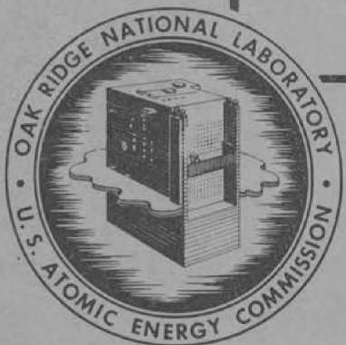

CENTRAL RESEARCH LIBRARY DOCUMENT COLLECTION

LIBRARY LOAN COPY

DO NOT TRANSFER TO ANOTHER PERSON

If you wish someone else to see this document, send in name with document and the library will arrange a loan.

OAK RIDGE NATIONAL LABORATORY

OPERATED BY

CARBIDE AND CARBON CHEMICALS COMPANY

A DIVISION OF UNION CARBIDE AND CARBON CORPORATION

OAK RIDGE, TENNESSEE

Index No. ORNL-1234

This document contains 138 pages.

This is copy of 216, Series A.

Subject Category: Reactors-Research

and Power

# REACTOR PROGRAM

of the

# AIRCRAFT NUCLEAR PROPULSION PROJECT

by

Members of the

Aircraft Nuclear Propulsion Project

Wm. B. Cottrell, Editor

June 2, 1952

OAK RIDGE NATIONAL LABORATORY

Operated by

CARBIDE AND CARBON CHEMICALS COMPANY

A Division of Union Carbide and Carbon Corporation

Oak Ridge, Tennessee

Contract No. W-7405-eng-26

3 4456 03605846

# Internal Distribution:

1. G. M. Adams n   
2. C.J.Barton   
3. E. S. Bettis   
4. D. S. Billington   
5. F. F. Blankenship   
6. E.P.Blizard   
7. A. Brasunas   
8. R.C.Briant   
9. F. R. Bruce   
10. J. H. Buck   
11. T. H. J. Burnett   
12. A. D. Callihan   
13. C. E. Center   
14. G. H. Clewett   
15. C. E. Clifford   
16. W.B.Cottrell   
17. W. K. Eister   
18. L. B. Emlet   
19. W. K. Ergen   
20. G. T. Felbeck   
21. A. P. Fraas   
22. W.R.Grimes   
23. L. F. Hemphill   
24. A. Hollaender   
25. W.B.Humes   
26. R.J.Jones   
27. G. W. Keilholtz   
28. C. P. Keim   
29. F. Kertes   
30. J. A. Lane   
31. C. E. Larson   
32. R. S. Livingston

33. R.N. Lyon   
34. W.D. Manly   
35. B. McDonald   
36. J. L. Meem   
37. A.J.Miller   
38. C. B. Mills   
39. K. Z. Morgan   
40. E.J. Murphy   
41 H. F. Poppendiek   
H.W.Savage   
3. R.W.Schroeder   
44. E. D. Shipley   
45. O. Sisman   
46. L.P.Smith   
47. A. H. Snell   
48. F. L. Steahly   
49. C. D. Susano   
50. J.A.Swartout   
51. E. H. Taylor   
52. F.C.Uffelman   
53. F.C.Vonderlager   
54. A. M. Weinberg   
55. E.P.Wigner   
56. C. E. Winters   
57. Biology Library   
58. Chemistry Library   
59-60. Health Physics and Metallurgy Library   
61. Physics Library   
62. Training School Library   
63-72. ANP Library   
73-77. X-10 Central Files   
78-83. Reports Office, TID

Issuing Office

Technical Information Department, Y-12 Area

Date Issued: JUL 23 1952

# External Distribution

Index No. ORNL-1234 Reactors-Research and Power (Special)

84-94. Argonne National Laboratory

95. Armed Forces Special Weapons Project (Sandia)

96-103. Atomic Energy Commission, Washington

104. Battelle Memorial Institute

105-109. Brookhaven National Laboratory

110. Bureau of Sips

111-112. California Research and Development Company

113. Chicago Patent Group

114. Chief of Naval Research

115-119. duPont Company

120-139. General Electr Company (ANPP)

140-143. General Electrict Company, Richland

144. Hanford Operations Office

145-151. Idaho Operations Office

152. Iowa State College

153-156. Knolls Atomie Power Laboratory

157. Lockland Area Offi te

158-160. Los Alamo

161. Massachusetts Institute of Technology (Kaufmann)

162. Massachusetts Institute of Technology (Benedict)

163-165. Mound Laboratory

166-168. National Advisory Committee for Aeronautics, Cleveland

169. National Advisory Committee for Aeronautics, Washington

170-171. New York Operations Office

172-173. North American Aviation, Inc.

174. Nuclei r Development Associates (NDA)

175. Paten Branch, Washington

176. Rancorporation

177. Savinnah River Operation, Office (Augusta)

178. Savannah River Operations Office (Wilmington)

179. US AF-Headquarters-Office of Assistant for Atomic Energy

180-181. University of California Radiation Laboratory

182. Vitro Corporation of America

183-186. Vestinghouse Electric Corporation

187-201. Wright Air Development Center

202-216. Technical Information Service, Oak Ridge

# TABLE OF CONTENTS

Page

No.

FOREWORD 10

# PART I. CIRCULATING-FAEL AIRCRAFT REACTORS

INTRODUCTION 13

CHARACTERISTICS OF CIRCULATING-FUEL REACTORS 15

Heat Transfer in Circulating Fuel Reactor Systems 16

Physics of Circulating-Fuel reactors 17

Other Considerations 19

DESIGN STUDIES OF AIRCRAFT REACTOR SYSTEM 21

Circulation of Fuel Through Turbojet Radiators 23

Beryllium Oxide-Moderated Circulating-Fuel Reactor 25

Engines and Radiators 27

Shielding 29

Accessory Systems 31

Circulation of Fuel Through Intermediate Heat Exchangers 31

Tandem Heat Exchanger and Shield Design 33

Annular Heat Exchanger and Shield Design 36

Spherical Heat Exchanger and Shield Design 39

# PART II.

# THE CIRCULATING-FUEL AIRCRAFT REACTOR EXPERIMENT

INTRODUCTION 43

ENGINEERINGDESIGN 47

General Description 47

Core Design 49

Primary Cooling Circuit 52

Secondary Cooling Circuit 54

Structural Assembly 54

Core Temperature Distribution 54

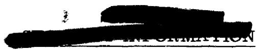

External Fluid Circuit 55

Primary Cooling System 58   
Secondary Cooling System 58   
Monitoring Circuit 58   
Pumps 58   
Heat Exchanger 62

Preheating System 63

Reactor Assembly 63   
Piping 63   
Heat Exchangers 63

Reactor Controls 64

Shim Control 65   
Regulating System 67   
Safety System 68

Electrical Power Circuits 71

Instrumentation 73

Flow Measurement 73   
Pressure Measurement 77   
Temperature Measurement 77   
Liquid Level Indicators and Controls 78

REACTOR PHYSICS 79

Statics 79

Reactor Volume Fractions 81   
Critical Mass and Total Uranium Investment 81   
Reactivity Coefficients 84   
Power Distribution 84   
Neutron Flux and Leakage Spectra 86

Kinetics 86   
Control 91   
Shim Control Requirements 91   
Regulating Rod 93   
Safety Rods 93

REACTOR MATERIALS 94

High-Temperature Liquid Fuels 94   
Homogeneous Fuels 95   
Nonmoderating Fuels 95   
Chemical Properties 97   
Physical Properties 100   
Chemical Processing 101

Page

No.

Structural Metals 103

Static Corrosion 104

Dynamic Corrosion 106

Control Rod Fabrication 110

Stress-Corrosion Tests 111

Radiation Damage 112

CRITICAL EXPERIMENTS 116

Experimental Materials 116

Experimental Assembly 116

Experimental Program 117

REACTOR OPERATION 118

Pretesting 119

Loading and Start-Up 120

Power Operation 121

Operation of the Servo-Controls 122

Shut Down 123

ARE BUILDING 125

Building Schedule 125

Arrangement 125

Utilities 129

CONSTRUCTION SCHEDULE 131

CONCLUSIONS 133

# PART III. APPENDIXES

BIBLIOGRAPHY 137

# LIST OF FIGURES

# Fig.

# Title

Page No.

1 Uranium Investment as a Function of Various Reactor Parameters 18   
2 Mach 1.5 Aircraft with a Circulating-Fuel Reactor 24   
3 BeO-Moderated Circulating-Fuel Aircraft Reactor 26   
4 Power-Plant Arrangement 28   
5 H2O-Moderated, Circulating-Fuel Reactor with a Tandem Heat Exchanger 35   
6 NaOH-Moderated, Circulating-Fuel Reactor with an Annular Heat Exchanger 37   
7 Reactor with a Spherical Heat Exchanger 40   
8 Schematic Arrangement of the Aircraft Reactor Equipment 48   
9 Elevation Section of the Experimental Reactor 50   
10 Plan Section of the Experimental Reactor 51   
11 Temperature Profile in Fuel Tube and Moderator 56   
12 Fluid Circuit Equipment Arrangement 57   
13 Primary Coolant Circuit 59   
14 Secondary Coolant Circuit 60   
15 ARE Centrifugal Pump 61   
16 Fuel Injection System 66   
17 Reactor Control Elements 69   
18 Reactor Control Mechanism 70   
19 Safety Interlock and Scram Circuit 72   
20 Electrical Power Circuit 74   
21 Fluid Circuit Instrumentation 75

# Fig.

# Title

Page No.

22 Radial Power Distribution in the Experimental Reactor 85   
23 Axial Power Distribution in the Experimental Reactor 87   
24 Leakage Spectrum from the Reflector of the Experimental Reactor 88   
25 Leakage Spectrum from the Open Ends of the Experimental Reactor 88   
26 Neutron Flux Spectra at Various Locations in the Experimental Reactor 89   
27 Radial Neutron Flux Distribution in the Experimental Reactor 90   
28 The System NaF-BeF $_2$ -UF $_4$ 98   
29 The System NaF-KF-ZrF4 99   
30 Density of NaF-KF-ZrF4-UF4 as a Function of Temperature 102   
31 Viscosity of NaF-KF-ZrF4-UF4 as a Function of Temperature 102   
32 Effect of NaK Additive on the Corrosion of Inconel Thermal Convection Loops by NaF-LiF-KF (11.5-42.0-46.5-mol %) 107   
33 Corrosion of Inconel Thermal Convection Loops by NaF-KF-ZrF4-UF4 (4.8-50.1-41.3-3.8 mol %) After 500 Hours at $1500^{\circ}\mathbf{F}$ 108   
34 Effect of Neutron Irradiation on the Static Corrosion of Inconel by NaF-KF-UF $_4$ (46.5-26.0-27.5 mol %) at $1500^{\circ}\mathbf{F}$ 114   
35 The ARE Building Facility (Looking Northwest) 126   
36 Plan of the Building Facility 127   
37 Elevation of the Building Facility 128

LIST OF TABLES   

<table><tr><td>Table No.</td><td>Title</td><td>Page No.</td></tr><tr><td>1</td><td>Weight Breakdown of the Mach 1.5 Airplane</td><td>23</td></tr><tr><td>2</td><td>Design Specifications of the Circulating-Fuel Aircraft Reactor</td><td>25</td></tr><tr><td>3</td><td>Engine Performance at Mach 1.5 and 45,000 Ft</td><td>27</td></tr><tr><td>4</td><td>Allowed Contributions to the Total Radiation Dose in Crew Compartment</td><td>30</td></tr><tr><td>5</td><td>The Principle Shield Dimensions</td><td>30</td></tr><tr><td>6</td><td>Shield Weights for Circulating-Fuel Reactors with Various Intermediate Heat Exchangers</td><td>34</td></tr><tr><td>7</td><td>Aircraft Reactor Experiment Design Data</td><td>45</td></tr><tr><td>8</td><td>Summary of Design Data of the Experimental Reactor</td><td>82</td></tr><tr><td>9</td><td>Reactivity Effects Provided for by the Critical Mass</td><td>83</td></tr><tr><td>10</td><td>Uranium Requirements of the Experimental Reactor</td><td>83</td></tr><tr><td>11</td><td>Reactivity Coefficients of the Experimental Reactor</td><td>84</td></tr><tr><td>12</td><td>Shim Control Requirements</td><td>92</td></tr><tr><td>13</td><td>Melting-Point Data for Potential Fuel Systems</td><td>96</td></tr><tr><td>14</td><td>Static Corrosion of Structural Metals by Potential Fuels</td><td>105</td></tr><tr><td>15</td><td>Chemical Analysis of the NaF-KF-ZrF4-UF4 Fuel for Corrosion Products</td><td>109</td></tr><tr><td>16</td><td>Inconel Stress-Rupture Data</td><td>111</td></tr><tr><td>17</td><td>File Irradiation Tests on Fused Fluoride Fuels in Inconel</td><td>113</td></tr></table>

# FOREWORD

In addition to fundamental research on problems pertinent to the aircraft applications of nuclear power, the ultimate objective of the Aircraft Nuclear Propulsion Project at the Oak Ridge National Laboratory is the design, construction, and operation of a nuclear power plant capable of supersonic aircraft propulsion. Toward this latter end the Laboratory has investigated all the promising types of reactors proposed in the three years of the existence of the project at ORNL. During this time it has been guided by the results of the Technical Advisory Board (a joint NEPA-ORNL advisory committee), the work of the NEPA project, and the study by the Lexington Project. These earlier surveys suggested the feasibility of aircraft nuclear propulsion by any one of several systems, but it was left for subsequent investigations to extend the necessary research and analytical studies to permit a detailed evaluation of the various systems. As a result of its studies, the Laboratory has selected the circulating-fuel reactor, employing a molten mixture of metal fluorides, as the type of reactor with which the objective of supersonic propulsion will be achieved most readily.

Since for any type of aircraft reactor the extrapolation of present knowledge is too uncertain to permit the immediate construction of that reactor, a low-power experimental reactor was recognized as a necessary step toward the ultimate goal. This report outlines the practicality and potentialities of the circulating-fuel aircraft reactor (Part I) and then describes in detail the ARE-Aircraft Reactor Experiment (Part II)—with which pertinent and reliable data can most economically be obtained to permit the design, development, and construction of the actual aircraft reactor.

1. "Report of the Technical Advisory Board to the Technical Committee of the Aircraft Nuclear Propulsion Program," ANP-52, Aug. 4, 1950.   
2. "Final Status Report of the Fairchild NEPA Project," NEPA-1830, 1951.   
3. "Nuclear Powered Flight, A Report to the Atomic Energy Commission by the Lexington Project," Lex P-1, Sept. 30, 1948.

# PART I

CIRCULATING-FUEL AIRCRAFT REACTORS

# INTRODUCTION

The development of a supersonic aircraft is so extremely difficult that to date few have been built and these have achieved supersonic speeds for only a few minutes. The concurrent development of a light, compact nuclear power plant to propel a supersonic aircraft would appear to be vastly more difficult, and yet the resulting weapon would be so potent as to warrant extensive effort. One objective of the Oak Ridge National Laboratory in the National Aircraft Nuclear Propulsion Program is the development of a nuclear power reactor with which supersonic aircraft propulsion can be obtained.

The ultimate reactor must attain the highest possible output per pound of machinery and the greatest possible thrust per square foot of frontal area. In fact, unless very good values for these two parameters are attainable, an operational supersonic airplane is simply not feasible. Obviously, the better the performance of the power plant over and above the acceptable minimum, the easier and more reasonable the airplane design and development problems become. Practically all the weight and harmful frontal area of a complete aircraft with a nuclear power plant are in the engines and in the reactor-shield assembly. (The part of the frontal area that consists of air duct inlets need not cause much drag.) The engine thrust per unit of both weight and frontal area increases with turbine air inlet temperature irrespective of whether a turbojet, turboprop, or a ducted-fan type of engine is used. Since the product of the thermodynamic and propulsive efficiencies also increases though less rapidly than engine thrust, an increase in operating temperature also means a reduction in the reactor power required and, hence a smaller and lighter reactor-shield assembly for a given total thrust. Possibly an even more important factor is that the frontal area and the weight of the reactor-shield assembly increase rapidly with reactor diameter for a given power output. The performance of the airplane will therefore improve with increases in either the temperature and/or the power density obtainable in the reactor provided, of course, that the temperature increase can be accomplished without impairing the reliability of the power plant.

In surveying the reactor systems that have been proposed for supersonic aircraft propulsion, it has seemed to the ANP group at ORNL that the circulating-fuel type promises the highest temperature and power density—and hence the highest over-all performance—of any power plant whose

construction currently appears feasible. In this connection it is to be noted that the Technical Advisory Board concluded that a homogeneous reactor has outstanding advantages for nuclear aircraft propulsion (although contingent upon the containment of hydroxides at high—around $1500^{\circ}\mathrm{F}$ —temperatures). Furthermore, the circulating-fuel reactor, as presently conceived, has incorporated essentially all of the advantages attributed to the homogeneous type of reactor (without having to resort to the use of hydroxides). The mutual advantages of these two reactor systems are (1) separation of the heat exchange function from the reactor core, (2) a simple, rugged core structure, (3) self-stabilization associated with a liquid fuel, (4) simplified fuel removal and reprocessing, and (5) an arrangement whereby the highest system temperature occurs in the working fluid.

# CHARACTERISTICS OF CIRCULATING-FUEL REACTORS

The established requirements1,2 of a high-performance reactor for supersonic aircraft propulsion are high operating temperature---as required by the thermodynamics of aircraft engines, and high power density---as required to minimize the size of the shielded volume. These requirements imply the use of liquid cooling systems that not only permit small reactor cores but which also have good heat transfer characteristics. For some time the specific objective of the ORNL-ANP project has been the development of a liquid-cooled reactor employing a nonoxidative high-temperature liquid.

However, in addition to the above criteria of high temperature and high power density, two fundamental concepts constitute the real justification of the circulating-fuel reactor now being developed by the Laboratory. These are (1) inherent self-stabilization of the reactor against random transients and outright power change, and (2) elimination of the heat exchanger from the active lattice of the reactor. The first concept again implies a liquid fuel; the second, a system in which the fuel itself is the medium that carries the heat out of the core.

In their scope these concepts include both the circulating-fuel and homogeneous types of reactors. However, at the present stage of materials development satisfactory high-temperature homogeneous fuels do not exist. (A solution of $\mathrm{UO}_3$ in a hydroxide now appears to be the most promising homogeneous fuel, but the hydroxides cannot be contained at the required temperatures without excessive corrosion.) On the other hand, molten fluoride salt mixtures containing the uranium salt have not only been contained but also circulated, pumped, and otherwise manipulated for long periods of time at temperatures of $1500^{\circ}\mathrm{F}$ . They do not, however, possess a substantial capacity for moderation. Consequently most of the design work to date on the molten-fluoride circulating-fuel reactor, has employed beryllium oxide as the moderator.

2. C. B. Ellis, "The Technical Problems of Aircraft Reactors," ANP-64, Parts I and II, June 1, 1951 and Jan. 1, 1952.   
3. See sections on "Corrosion Research" in the last several Quarterly Progress Reports of the Aircraft Nuclear Propulsion Project at the Oak Ridge National Laboratory, ORNL-1154, -1170 and -1227.   
4. A similar reactor using the molten fluorides as a homogeneous fuel, i.e., no moderator employed in the reactor, is feasible and constitutes a more advanced reactor design upon which the second ARE may be based.

The engineering separation of the reactor core and the heat exchanger greatly simplifies the design and fabrication and improves the efficiency of each. However, this separation is achieved at the expense of a larger shielded volume since the intensely radioactive fuel solution must be carried outside the reactor for heat removal. The radiator, or intermediate heat exchanger, is then so radioactive that it requires roughly two-thirds as much shielding as the reactor core. Since the shielded volume and the shield weight thus increase beyond that required for the reactor alone, it is not obvious that the circulating-fuel system is advantageous compared to the several fixed-fuel proposals. This point has been examined with great care and it was only after it became clear that the shield weights were reasonable that the present path was chosen.

The circulating-fuel reactors described here embody all the concepts discussed above and lead to the design of rugged, high-flux power sources. The reactors are designed with a fuel exit temperature of $1500^{\circ}\mathrm{F}$ and should permit very high power densities. Furthermore, the only heat transfer within the core is a relatively small amount from the moderator, because the circulating-fuel carries the heat out of the core to external heat ex-changers. The reactors should be stable because the rise in fuel temperature accompanying any increase in power causes some of the liquid fuel to be expelled from the core as a consequence of simple thermal expansion of the fuel.

# Heat Transfer in Circulating-Fuel Reactor Systems

The advantage of separating the heat exchanger and core is readily apparent from a consideration of heat transfer in fixed-fuel reactors. Since the heat flux to achieve high power density in any static fuel reactor is very large, it is necessary to have a large heat transfer surface to keep the heat flux to an attainable magnitude. However, because of the nuclear poison introduced by the available metal heat transfer surfaces when these are incorporated in the active lattice of the reactor, there is a limit to the amount of metal surface that can be tolerated within the reactor. Even if the poison were of no concern and unlimited fuel material were available, there is still quite a finite limit to the surface-to-volume ratio. This imposes an upper limit—that is not high—to the power that can be extracted from a given volume of a fixed-fuel reactor. This constraint is avoided in the circulating-fuel reactor by removing the heat from the reactor by circulating the fuel through heat exchangers external to the core where nuclear poison considerations no longer pertain.

The heat thus developed in the circulating-fuel reactor can be transferred to the engine air stream either directly (by circulating the fuel through the air radiators) or through the use of an intermediate heat exchanger and fluid. In either case, this reactor design has removed the heat transfer problem from the reactor core so that extremely high power densities may be achieved therein. At the same time, it becomes possible to make the fuel temperature at the reactor outlet approach that of the temperature of any structure in the system, and provision can even be made to cool the structure through the use of a circulating liquid moderator. Furthermore, it is possible to reduce the temperature differential between the peak metal temperature in the reactor and the air temperature in the engine turbine to a value even less than that obtainable in the "direct" air cycle. In addition, the upper temperature limit of the system is imposed by the strength and corrosion characteristics of the structural metal, which are better in a molten salt environment than in air. Therefore, since turbojet performance improves rapidly with an increase in turbine air inlet temperature, the circulating-fuel reactor promises to give the highest performance—in this respect—of any nuclear power plant proposed to date.

It may be emphasized that the problems avoided here—heat transfer and hot spots within the reactor core—are critical problems for both the air and supercritical-water cycles. The circulating-fuel reactor is technologically distinct. Similar difficulties will not beset it.

# Physics of Circulating-Fuel Reactors

Surveys of the circulating-fuel reactor system have been conducted for several parametric variations. For a given moderator these parameters were core diameter and the ratio of the volume of circulating-fuel to that of the moderator. A simplified calculation method was used, and the assumed fuel probably differed somewhat in composition from that which will ultimately be used. Thus, the absolute values of the results shown in Figure 1 are not exact, although the important parametric relationships are applicable to any circulating-fuel system. If the core diameter is fixed, the critical mass increases as the fuel-coolant volume fraction increases, but the uranium density in the fuel-coolant at first decreases and then increases. Since from 60 to $80\%$ of the liquid fuel is in the heat exchanger, pumps, or piping, the minimum uranium investment in the overall system is obtained with a more dilute fuel solution than that for minimum critical mass. This minimum total uranium investment usually results in a reactor with about half thermal fissions, i.e., a reactor on the borderline between the epithermal and the intermediate. Although the data for

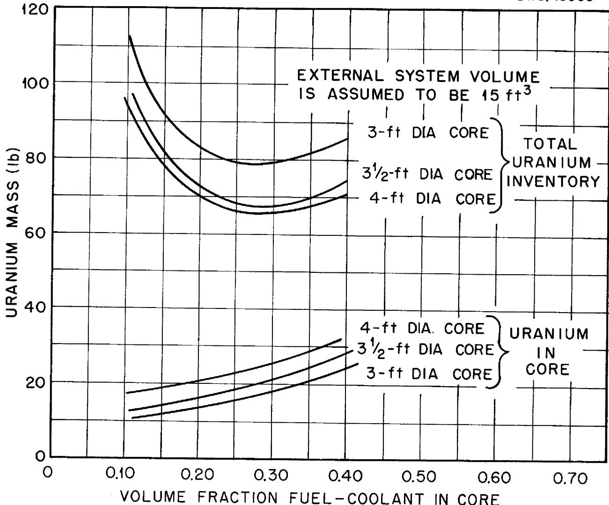  
FIGURE I. URANIUM INVESTMENT AS A FUNCTION OF VARIOUS REACTOR PARAMETERS

Figure 1 were prepared for a beryllium oxide-moderated reactor, other calculations indicate that if water were substituted for the beryllium oxide the curves would be shifted less than $10\%$ , and if sodium hydroxide were substituted for the beryllium oxide the curves would be shifted upward a little and considerably to the left.

The enormous power density required in an aircraft reactor coupled with the demand for accurate and dependable control essential for aircraft use make it imperative that the reactor possess an inherent stability against anomalous transients. This requirement is most easily met if the fuel consists of a liquid with a relatively large volume increase with increasing temperature. Since power is produced in the fuel, this volumetric change should lag the power production very little and the desired self-stabilization should result. The use of circulating liquid fuel (as well as static liquid fuels) results in reactors with self-stabilizing characteristics. On the other hand the loss of delayed neutrons from the active lattice, caused by the circulation of the fuel, had been viewed with concern because these neutrons have a damping effect on oscillations in reactor power. It now appears that the loss of these delayed neutrons may be compensated by a damping mechanism associated with the circulation of the fuel.

# Other Considerations

Although the most vital considerations in the selection of a nuclear aircraft power plant are weight and frontal area per pound of thrust—which are both a function of turbine inlet temperature—other factors are also important. The amount of fissionable material required per airplane; the time, cost, and inventory of fissionable material involved in reprocessing the fuel; the composition of the fuel; and the ease of maintenance of the complete aircraft power plant are also pertinent factors. Fortunately, the proposed circulating fluoride fuel should be relatively easy to reprocess, and the fissionable material installed in each airplane should run less than 100 pounds. Both of these factors combine to give what appear to be the lowest total fissionable material investment per operational airplane (including material in reprocessing, inventory, etc.) for any aircraft reactor yet proposed.

The possibility of draining the liquid fuel from the reactor after a flight can greatly simplify the airplane maintenance problem. The refueling problem is obviously vastly easier than changing solid fuel elements. In addition, design studies have shown that it is possible to design the reactor so that specially shielded or remotely controlled ground handling equipment need be provided only for the fuel filling and draining operations

and yet keep the weight of a 400,000-kw reactor, intermediate heat exchanger, and shield combination under 120,000 pounds. Even if a lighter, divided shield were used, once the fuel was drained radiation should impose practically no limitations on maintenance work. The combined benefits of these factors should decrease ground time, and very possibly make the in-service time of an airplane using a circulating-fuel reactor a high multiple of that of one with a solid fuel.

# DESIGN STUDIES OF AIRCRAFT REACTOR SYSTEMS

The circulation of fissionable material external to the core of the reactor directs attention to design studies of components of the entire system, such as the reactor, radiator, and engine. Although the circulating-fuel system has not been studied sufficiently to define the performance of the resulting aircraft, enough work has been done to appreciate the more outstanding problems. The preliminary design studies—both with and without an intermediate heat exchanger—of a supersonic airplane application of a circulating-fuel reactor are encouraging. These studies were not intended to establish the final design for such an aircraft but to resolve some general questions regarding the feasibility of supersonic aircraft with circulating-fuel reactor power plants.

The decision to employ a circulating-fuel type of reactor did not necessarily resolve the alternative choices that exist in the several other features of the reactor system, namely, the type of moderator, the type of heat exchanger and shield system, or even the nature of the fuel. At this time, however, it is considered that the fuel will be a mixture of metal fluorides, including uranium fluoride. Certain of these salt mixtures have particularly advantageous combinations of desirable physical properties, including high heat capacity, good thermal conductivity, adequate thermal expansion, satisfactory viscosity, sufficiently low melting point, low nuclear cross sections, excellent corrosion characteristics, and satisfactory radiation stability. It has not been possible, however, to make an irrevocable decision at the present time regarding either the type of moderator or the type of heat exchanger and shield system that will ultimately prove most desirable for supersonic aircraft application.

Several broad classes of moderator were reviewed for applicability to the circulating-fuel concept, including:

1. low-temperature hydrogenous liquids (such as water),   
2. intermediate-temperature hydrogenous liquids (such as hydroxides),   
3. high-temperature solid moderators (such as beryllium oxide).

Each of these possible moderator arrangements appears to offer some unique advantages and some disadvantages. Consequently, each of the reactor-shield combinations presented below employs a different type of moderator. No attempt is made in this report to evaluate the relative merits of the various moderator arrangements, nor is it clear that any one is superior to the others.

There exists a fundamental choice regarding the heat transfer system in the airplane, i.e., whether to circulate the fuel directly through the engine radiator or to employ an intermediate heat exchanger and a secondary heat transfer fluid. The former technique would appear to require the simplest mechanical system, but it is restricted to the use of a divided shield and only certain special types of airplane configuration because of the intense source of radiation external to the core; the latter technique would be readily adaptable to a wide range of airplane configurations and would permit the use of near-unit shields, which would greatly facilitate servicing and maintenance of the aircraft. At this stage in the design of a supersonic nuclear aircraft the system that will ultimately prove superior is largely a matter of opinion. A fairly complete outline of a design of a supersonic airplane in which the fuel is circulated to the turbojet radiator is presented together with several reactor and intermediate heat exchanger arrangements employing various approximations to a unit shield to give some notion of the possibilities of liquid-fuel aircraft reactors.

In the design of an aircraft reactor it is most important to know the effects of various parameters on the weight of the aircraft reactor and shield, but it is very difficult to determine these effects quantitatively because a shield having anything like the minimum weight is a very closely integrated, complex unit. The only course seems to be to make quite a number of different detail designs on essentially the same bases and then compare them. Unfortunately, the bases cannot be identical because any engineered shield involves many compromises and, at present, many estimates and assumptions. As a result, even for comparative purposes weight data on engineered shields probably cannot be estimated closer than $\pm 5\%$ if a wide variety of shield types is considered. This follows from the fact that there is of necessity a considerable variation in conditions, e.g., activation of sodium in a secondary circuit is a much more serious problem with a circulating fuel than with sodium as a primary coolant. These conditions should be kept in mind in comparing the shield weights presented in this report. In all cases the shielding was designed to give $1\mathrm{r / hr}$ in the crew compartment at full power output. These studies have been reported in greater detail in separate reports. One of these reports concerns the design in which the fuel is circulated through the engine radiator; the other, the reactor and shield design studies in which the fuel is circulated through an intermediate heat exchanger.

# Circulation of Fuel Through Turbojet Radiators

The circulation of fuel through the turbojet radiator permits the direct transfer of nuclear heat to the air stream. Thus, as in the air-cycle reactor, there is no temperature loss associated with an intermediate heat exchanger. The circulating-fuel reactor, however, can have a less complex design and more rugged structure than an air-cycle reactor because it does not also function as a heat exchanger. The shielding problem changes from one of shielding a large reactor with air ducts to one of shielding the crew from the radioactive fuel in the radiator and other plumbing external to the core. This, of course, necessitates the use of a divided shield, with the major portion of the shield around the crew because the size and number of the air radiators makes it quite impractical to shield them.

An airplane with a design point of Mach 1.5 at 45,000 ft, incorporating a circulating-fuel reactor in which the fuel is circulated through the engine radiators has been outlined. This aircraft, Figure 2, has a gross weight of approximately 350,000 lb, a L/D ratio of approximately 6.5, and a wing loading of approximately 70 lb/ft². A divided shield is employed with hydrogenous shielding about the reactor and with hydrogenous and lead shielding about the crew compartment. By confining the six turbojet engines to the space in the fuselage behind the reactor, by using a 120-ft reactor to crew separation distance, and by employing a small crew compartment (4.5 by 5.5 by 12 ft) it appears possible to keep the weight of the reactor-shield-crew combination down to around 105,000 pounds. The weights of various components of the aircraft are given in Table 1.

<table><tr><td colspan="2">TABLE 1</td></tr><tr><td colspan="2">WEIGHT BREAKDOWN OF THE MACH 1.5 AIRPLANE</td></tr><tr><td>Component</td><td>Weight (lb)</td></tr><tr><td>Airframe</td><td>105,700</td></tr><tr><td>Engines</td><td>59,900</td></tr><tr><td>Radiators</td><td>23,800</td></tr><tr><td>Auxiliary equipment (pumps, ducting, etc.)</td><td>15,300</td></tr><tr><td>Reactor and reactor shield</td><td>48,400</td></tr><tr><td>Crew shield</td><td>56,600</td></tr><tr><td>Payload</td><td>20,000</td></tr><tr><td>Contingencies</td><td>20,300</td></tr><tr><td>Total</td><td>350,000</td></tr></table>

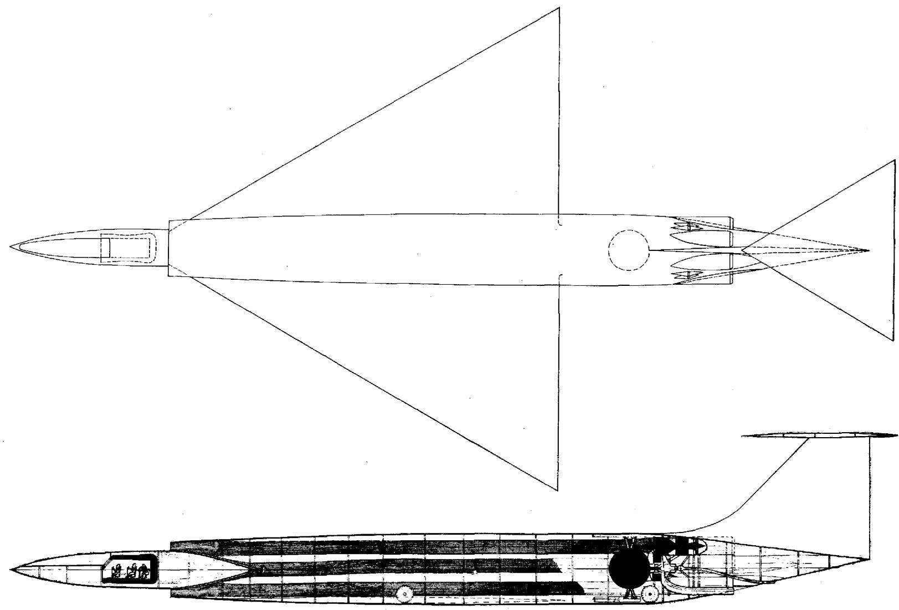  
FIGURE 2. MACH 1.5 AIRCRAFT WITH A CIRCULATING-FUEL REACTOR

The reactor and fuel system has sufficient overload capacity to provide approximately 155,000 pounds thrust for take-off and landing, with approximately double design point reactor power. The radiation dose received by the crew could be permitted to double (from $1\mathrm{r / hr}$ to $2\mathrm{r / hr}$ ) for the short periods involved in these operations as well as during the initial climb. As will all divided shield reactor arrangements, special provision would have to be made for ground personnel:

# Beryllium Oxide-Moderated Circulating-Fuel Reactor

The reactor designed for use with the airplane outlined above employed beryllium oxide for both moderator and reflector. The core consists of a number of parallel tubes, arranged in two-series passes, to convey circulating fuel through the beryllium oxide lattice. The beryllium oxide reflector is provided adjacent to all core surfaces except the fluid inlet and outlet end. Moderator heat is removed by the circulating fuel and is employed usefully in the propulsion cycle. By proper allocation of coolant flows, coolant-tube wall temperatures should run only slightly in excess of the circulating-fuel maximum temperature. To permit removing reflector heat with a high radiator temperature difference, the design under study postulates cooling the reflector with a non-fuel-bearing fluoride mixture. This reactor, Figure 3, conforms to the specifications given in Table 2.

<table><tr><td colspan="2">TABLE 2</td></tr><tr><td colspan="2">DESIGN SPECIFICATIONS OF THE CIRCULATING-FUEL AIRCRAFT REACTOR</td></tr><tr><td>Size</td><td>3.5-ft sphere</td></tr><tr><td>Uranium Investment (Total System)</td><td>120 lb</td></tr><tr><td>Core Constituents</td><td></td></tr><tr><td>Moderator</td><td>BeO</td></tr><tr><td>Fuel</td><td>Fluoride Fuel Mixture</td></tr><tr><td>Structure</td><td>Inconel</td></tr><tr><td>Core Volume Fractions</td><td></td></tr><tr><td>Moderator</td><td>~0.65</td></tr><tr><td>Fuel</td><td>~0.33</td></tr><tr><td>Structure</td><td>~0.02</td></tr><tr><td>Design Point Characteristics</td><td></td></tr><tr><td>Power</td><td>~320,000 Btu/sec</td></tr><tr><td>Fuel inlet temperature</td><td>~1000°F</td></tr><tr><td>Fuel outlet temperature</td><td>~1500°F</td></tr></table>

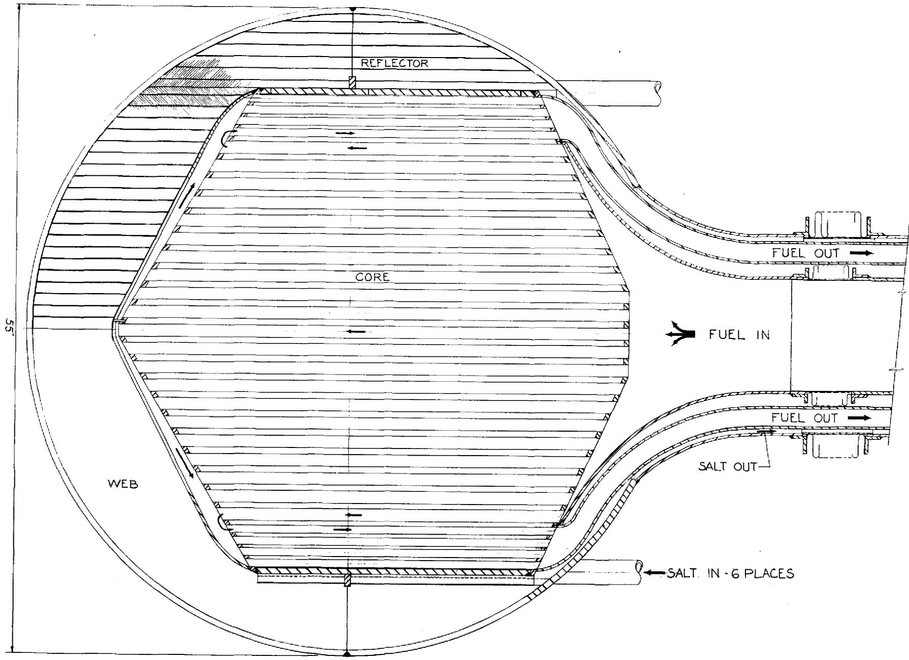  
R

# Engines and Radiators

A circulating-fuel type of reactor should be inherently capable of supplying propulsive power by means of a turbojet cycle or any of several vapor cycles. The relative performance of these cycles has not yet been clearly established, but, pending comparisons, the use of the turbojet cycle has been presumed. Preliminary optimization studies have indicated that a compression ratio in the region of 6:1 with a turbine air inlet temperature of approximately $1250^{\circ}\mathrm{F}$ is desirable. Further increases in the compression ratio would diminish the radiator weight at the expense of engine weight, and further increases in turbine inlet temperature (with fixed reactor conditions) would favor turbojet weight to the detriment of the radiator log mean temperature difference and radiator weight.

Having established the total air flow requirements, the compressor inlet area needed was established on the basis of NACA developmental experience. The number of engines necessary to accommodate the total air flow (or to provide the total inlet area needed) will depend on the size engine that can be made available when an airplane of the type described will require engines. Consequently the specification of the actual number of engines at this time would be very arbitrary. The use of any number of engines, within reason, would have only secondary effects on the overall airplane weight. However, since the use of six engines appears to be convenient from an installation standpoint, the use of six engines, Figure 4, conforming to the general specifications listed in Table 3, has been assumed.

TABLE3 ENGINE PERFORMANCE AT MACH 1.5 AND 45,000 FT   

<table><tr><td>Thrust per engine</td><td>8100 lb</td></tr><tr><td>Compression ratio</td><td>6:1</td></tr><tr><td>Turbine inlet temperature</td><td>1250°F</td></tr><tr><td>Equivalent sea-level airflow</td><td>665 lb/sec</td></tr></table>

The total thrust provided by the six engines plus that from the auxiliary systems was found to be approximately 54,000 lbs. Calculations have indicated a specific impulse of approximately 28 and an over-all thermal efficiency of $29\%$ . This latter is defined as the ratio of net thrust horsepower to reactor thermal horsepower.

The radiator design involves a radial grouping of rectangular-shaped banks about the engine centerline between the compressor and turbine. Liquid-conveying tubes are passed through, and normal to, closely spaced

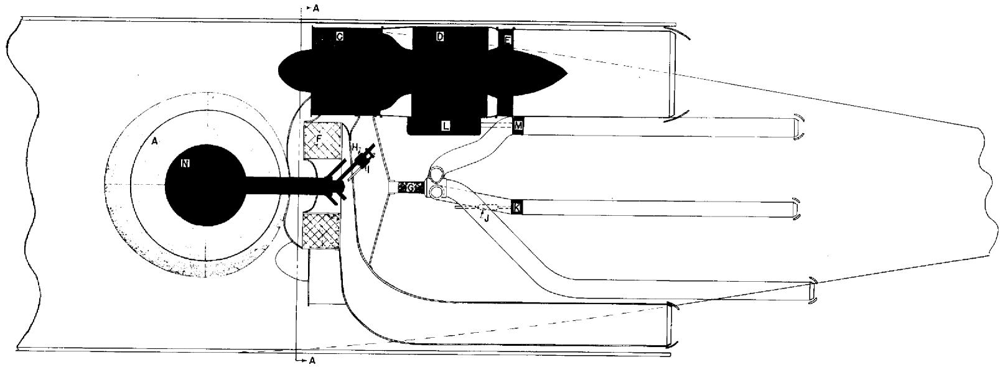

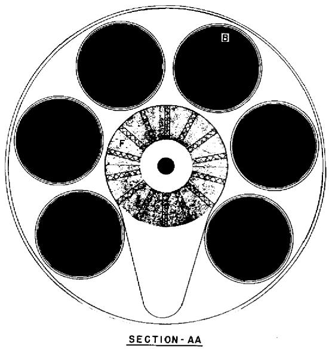

A. REACTOR SHIELD ASSEMBLY   
B. MAIN TURBOJET ENGINE   
C. MAIN ENGINE COMPRESSOR   
D. FUEL-TO-AIR RADIATORS   
E. MAIN ENGINE TURBINE   
F. SHIELD WATER RADIATOR   
G. REFLECTOR COOLANT RADIATOR   
H. FUEL PUMP   
I. REFLECTOR COOLANT PUMP   
J. WATER PUMP   
K. WATER PUMP AIR TURBINE   
L. ELECTRIC GENERATOR   
M. ELECTRIC GENERATOR AIR TURBINE   
N. REACTOR

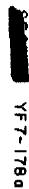  
FIGURE 4 POWER PLANT ARRANGEMENT

sheet fins. The flow pattern contemplated is countercurrent, as dictated by the temperatures of the two fluids. The arrangement entails the use of dividing baffles between adjacent banks, and the installation of by-pass valves in these baffles will permit controlling turbine inlet temperature while substantially constant liquid mean temperature is maintained.

# Shielding

The circulating fuel introduces new problems in shielding, due to the delayed neutrons and fission product gamma rays which must be shielded out at the crew position. These radiations specify the crew shield thicknesses within rather narrow limits, thus removing much of the freedom usually enjoyed in the design of a divided shield. Furthermore, this shield differs from other divided shields in that the reactor shield is of uniform thickness throughout, and all the lead shielding is located at the crew compartment inside the plastic layer.

The method of design is much like that of ANP-53, and is described in another report. However, considerable uncertainty exists in the strength of the fission product gamma source, which is the dominant component. As a consequence, it was necessary to incorporate considerable conservatism in the design. The total tolerance dose was taken to be $\frac{1}{r} / hr$ , divided as shown in Table 4. The resulting principle shield dimensions are shown in Table 5.

TABLE 4   
ALLOWED CONTRIBUTIONS TO THE TOTAL RADIATION DOSE   
IN CREW COMPARTMENT   
TABLE 5   

<table><tr><td rowspan="2">Component</td><td colspan="2">Radiation Dose</td><td rowspan="2">Flux</td></tr><tr><td>rem/hr</td><td>rep/hr</td></tr><tr><td>A. Neutrons</td><td></td><td></td><td></td></tr><tr><td>a. Radiators to rear</td><td>0.02</td><td>0.002</td><td>29.4/cm2sec</td></tr><tr><td>b. Radiators to sides</td><td>0.02</td><td>0.002</td><td>1/4(29.4/cm2sec) per side</td></tr><tr><td>c. Radiators to front</td><td>0.005</td><td>0.0005</td><td>7.25/cm2sec</td></tr><tr><td>d. Reactor to rear</td><td>0.10</td><td>0.010</td><td></td></tr><tr><td>e. Reactor to sides</td><td>0.10</td><td>0.010</td><td></td></tr><tr><td>f. Reactor to front</td><td>0.005</td><td>0.005</td><td></td></tr><tr><td>Total</td><td>0.25</td><td>0.025</td><td></td></tr><tr><td>B. Gamma Rays</td><td></td><td></td><td></td></tr><tr><td>a. Radiators to rear</td><td>0.250</td><td>0.250</td><td>5 x 104hard gamma/cm2sec</td></tr><tr><td>b. Radiators to sides</td><td>0.300</td><td>0.300</td><td>See ANP-53</td></tr><tr><td>c. Radiators to front</td><td>0.025</td><td>0.025</td><td>1.38 x 104mev/cm2sec</td></tr><tr><td>d. Reactor to rear</td><td>0.100</td><td>0.100</td><td></td></tr><tr><td>e. Reactor to sides</td><td>0.05</td><td>0.05</td><td></td></tr><tr><td>f. Reactor to front</td><td>0.025</td><td>0.025</td><td></td></tr><tr><td>Total</td><td>0.75</td><td>0.75</td><td></td></tr></table>

THE PRINCIPLE SHIELD DIMENSIONS   

<table><tr><td>Shield</td><td>Material</td><td>Thickness (cm)</td></tr><tr><td>Reactor (all sides)</td><td>Water</td><td>78</td></tr><tr><td>Crew Shield</td><td></td><td></td></tr><tr><td>Rear</td><td>Lead and Plastic</td><td>22.4 and 33.4</td></tr><tr><td>Sides</td><td>Lead and Plastic</td><td>2.75 and 39.0</td></tr><tr><td>Vertical Front</td><td>Lead and Plastic</td><td>0.62 and 37.3</td></tr><tr><td>Slanting Front</td><td>Lead and Plastic</td><td>1.50 and 38.0</td></tr></table>

# Accessory Systems

Accessory circuits would be required to permit cooling the reflector and shield and to provide power for pumps and general aircraft accessory demands. Since it appears that many of the accessories are favored by the use of variable-speed drives, the over-all accessory system comtemplated involves the use of individual pneumatic turbines for power supply. The energy is supplied, and reflector cooling is achieved, by passing compressor bleed-off air through the reflector radiators and then to the accessory turbines and to parallel propulsive nozzles. The accessory turbines are controlled by means of variable-area discharge nozzles, which provide some net thrust after imparting energy to the accessory turbines. Preliminary analysis of this system indicates that it not only provides reflector cooling and accessory power adequately, but that the reflector cooling system, when considered as an open Brayton-cycle power plant, has a favorable cycle efficiency and power-to-weight ratio. The use of individual accessory-drive turbines permits supplying the accessories with power and speed control without special mechanical, hydraulic, or electrical transmission systems.

The radiator for the shield water is cooled by low-pressure compressor bleed-off air, and the air is then discharged through a propulsive nozzle.

# Circulation of Fuel Through Intermediate Heat Exchangers

The limitations imposed by partially shielded nuclear power plants on ground handling, servicing, and maintenance of nuclear aircraft are quite serious. The circulation of the reactor fuel to the turbojet radiators imposes a further constraint on possible aircraft serviceability. In addition to serviceability, however, significant limitations are also imposed on crew compartment size, airplane configuration, and possibly on aerodynamic stability and control in nuclear aircraft that employ divided shields. It is therefore apparent that strong incentives exist for developing reactor arrangements which are amenable to a unit type of shield.

It is notable that for the range of sizes of reactor and crew compartments under consideration, and with the separation distances involved, the divided shield results in the lowest shield weight; unit shields are appreciably heavier. Obviously, a type of shield can exist that is intermediate in weight and concept, between these two extremes which would permit a

mechanic without special shielding to service the engine and reactor—albeit for short periods of time. An upper limit on the radiation does from such an intermediate shield was established as $1 \, \text{r/hr}$ at 50 ft from the reactor operating at $5\%$ full power.

A circulating-fuel reactor system in which the ground handling and servicing are greatly facilitated may be effected by incorporating a compact reactor design that permits easy and complete fuel drainage with a quasi-unit shield such as that defined above. The reactor heat would then have to be transferred from the circulating fuel to a secondary fluid in an intermediate heat exchanger located within the reactor shield.

Since the use of intermediate heat exchangers enclosed within the reactor shield substantially increases the size of the shielded volume, considerable effort has been devoted to determining the optimum configuration and location of the heat exchangers. Three heat exchanger and reactor arrangements have been investigated; each was somewhat better than its predecessor. The three arrangements, in chronological order of analysis, are: tandem, annular, and spherical. Each arrangement is distinguished by the location of the heat exchanger with respect to the reactor core. Identical assumptions were made in the design of the shield for each arrangement. In the arrangements discussed, the use of both low-temperature (water) and high-temperature (sodium hydroxide) moderators in the reactor core are described. No attempt has been made at this time to select the optimum moderator from among these and the previously discussed beryllium oxide moderator.

In all cases the heat exchanger was separated from the reactor only by enough material to reduce the reactor neutron-leakage flux entering the heat exchanger to the level of the delayed-neutron flux. This required the equivalent of about 10 in. of water between the active lattice and the heat exchanger matrix. It was found that by lacing the intermediate heat exchanger with 8.5 vol % boron carbide it should be possible to utilize practically any material in the secondary circuit without encountering an intolerable amount of activation, because most of the neutrons absorbed in the heat exchanger would be absorbed by the boron. Probably no coolant likely to be used would be inclined to become much more radioactive than NaK, yet even with NaK this heat exchanger arrangement should make it possible to keep the maximum radiation dose down to less than about 20 r/hr at 5 ft from the engine radiators immediately after a long flight. With fresh NaK (or NaK that had been allowed to decay for 5 days) the corresponding dose after 1.5 hr of warm-up at 5% power would be only .1 r/hr. Estimates of the activation of other coolants such as natural lithium, water, a eutectic melt of LiCl-MgCl₂-KCl, and a noninflammable sodium-lead alloy were found to give activities from 1 to 50% of that of NaK.

It is gratifying to find that it is possible to design something like a unit shield of about 120,000 lb that makes possible servicing and tune-up work with circulating-fuel reactors even with the reactor running and permits ground personnel to approach a nuclear airplane for short periods without special shielding in the event of a minor landing accident or the like. A summary of the various arrangement and design conditions together with the resulting shield weights are given in Table 6.

# Tandem Heat Exchanger and Shield Design

The first arrangement considered was one in which the heat exchangers were grouped behind the reactor core (Figure 5). This reactor design was based on the use of water as a moderator although it is readily adaptable to sodium hydroxide or some other liquid moderator. The reactor core is composed of tubes through which the liquid fluoride fuel flows at about 10 ft/sec for operation at 400,000 kw with a $400^{\circ}\mathrm{F}$ temperature rise through the reactor. The fuel enters at the top aft end of the reactor, makes a complete loop through the fuel tubes in the core, and discharges to the heat exchanger. A divided shield and two quasi-unit shields, as summarized in Table 6, were designed for this heat exchanger arrangement. The shield design features and specifications are discussed for each case.

The first shield designed for the tandem heat exchanger arrangement was a divided shield somewhat similar to the NEPA divided shield. The reactor shield was designed to provide no heavy material except in its structure. For simplicity, the shielding material was considered to be principally borated water containing two atoms of boron for every 100 atoms of hydrogen. The thickness of the reactor shield was taken as being such as to give approximately the same dose at the rear of the crew shield as in the NEPA shield, except that the lead shadow-shield disks at the reactor in the NEPA shield were moved to the rear of the crew compartment. The thick layer of steel (3.75 in) in the form of the core pressure shell and shield inner shells coupled with a layer of lead shielding around the heat exchanger made it possible to remove the lead from the sides of the NEPA crew compartment. The total weight of reactor, intermediate heat exchanger, reactor shield, and crew shield was found to be 111,000 pounds.

A second shield for the same reactor was designed to provide something as nearly like a unit shield as possible. In this design enough shielding was provided at the reactor to bring the radiation leakage from the reactor shield down to the same level as that from the sodium in the secondary circuit. This was done by introducing a layer of lead, 5.4 in. in thickness, around the reactor and a layer, 10.4 in. in thickness around the heat exchanger. The thicknesses of the water layers around both the

PARTIALLY DIVIDED SHELDS FOR CIRCULATING-FUEL REACTORS WITH VARIOUS INTERMEDIATE HEAT EXCHANGERS   

<table><tr><td rowspan="2"></td><td colspan="4">Tandem Heat Exchanger</td><td colspan="3">Annular Heat Exchanger</td><td colspan="3">Spherical Heat Exchanger</td></tr><tr><td>1</td><td>2</td><td>3</td><td>4</td><td>1</td><td>2</td><td>3</td><td>1</td><td>2</td><td>3</td></tr><tr><td>Reactor shield diameter (in.)</td><td>150</td><td>150</td><td>121</td><td>121</td><td>148</td><td>118</td><td>118</td><td>148</td><td>118</td><td>118</td></tr><tr><td>Crew shield weight (lb)</td><td>5,000</td><td>11,000</td><td>36,000</td><td>14,000</td><td>5,000</td><td>36,000</td><td>14,000</td><td>5,000</td><td>36,000</td><td>14,000</td></tr><tr><td>Weight of reactor, intermediate heat exchanger, and reactor shield (lb)</td><td>151,000</td><td>130,000</td><td>75,000</td><td>75,000</td><td>123,000</td><td>62,000</td><td>62,000</td><td>115,000</td><td>54,000</td><td>54,000</td></tr><tr><td>Total weight of reactor, intermediate heat exchanger, and all shielding (including crew shield) (lb)</td><td>156,000</td><td>141,000</td><td>111,000</td><td>89,000</td><td>128,000</td><td>98,000</td><td>76,000</td><td>120,000</td><td>90,000</td><td>68,000</td></tr><tr><td>Reactor power (kw)</td><td>4000,000</td><td>400,000</td><td>400,000</td><td>400,000</td><td>400,000</td><td>400,000</td><td>400,000</td><td>400,000</td><td>400,000</td><td>400,000</td></tr><tr><td>Diameter of reactor core (in.)</td><td>32</td><td>32</td><td>32</td><td>32</td><td>32</td><td>32</td><td>32</td><td>32</td><td>32</td><td>32</td></tr><tr><td>Liquids in primary and secondary circuits</td><td>Fluoride-NaK</td><td>Fluoride-NaK</td><td>Fluoride-NaK</td><td>Fluoride-NaK</td><td>Fluoride-NaK</td><td>Fluoride-NaK</td><td>Fluoride-NaK</td><td>Fluoride-NaK</td><td>Fluoride-NaK</td><td>Fluoride-NaK</td></tr><tr><td>Temperature loss in intermediate heat exchanger(oF)</td><td>100</td><td>100</td><td>100</td><td>100</td><td>100</td><td>100</td><td>100</td><td>100</td><td>100</td><td>100</td></tr><tr><td>Pressure loss in intermediate heat exchanger (psi)</td><td>100</td><td>100</td><td>100</td><td>100</td><td>100</td><td>100</td><td>100</td><td>100</td><td>100</td><td>100</td></tr><tr><td>Crew shield size (ft)</td><td>6½ x 7½ x 12½</td><td>6½ x 7½ x 12½</td><td>6½ x 7½ x 12½</td><td>5 x 5 x 12½</td><td>6½ x 7½ x 12½</td><td>6½ x 7½ x 12½</td><td>5 x 5 x 12½</td><td>6½ x 7½ x 12½</td><td>6½ x 7½ x 12½</td><td>5 x 5 x 12½</td></tr><tr><td>Reactor-crew separation distance (ft)</td><td>50</td><td>50</td><td>50</td><td>120</td><td>50</td><td>50</td><td>120</td><td>50</td><td>50</td><td>50</td></tr><tr><td>Radiation inside crew compartment (r/hr)</td><td>1</td><td>1</td><td>1</td><td>1</td><td>1</td><td>1</td><td>1</td><td>1</td><td>1</td><td>1</td></tr><tr><td>Radiation 5 ft from center of reactor (r/hr)</td><td>300</td><td>2,400</td><td>380,000</td><td>380,000</td><td>300</td><td>380,000</td><td>380,000</td><td>300</td><td>380,000</td><td>380,000</td></tr><tr><td>Radiation 50 ft from center of reactor (r/hr)</td><td>7</td><td>36</td><td>5,600</td><td>5,600</td><td>7</td><td>5,600</td><td>5,600</td><td>7</td><td>5,500</td><td>5,600</td></tr><tr><td>Radiation 300 ft from center of reactor (r/hr)</td><td>1</td><td>6</td><td>156</td><td>156</td><td>1</td><td>156</td><td>156</td><td>1</td><td>156</td><td>156</td></tr></table>

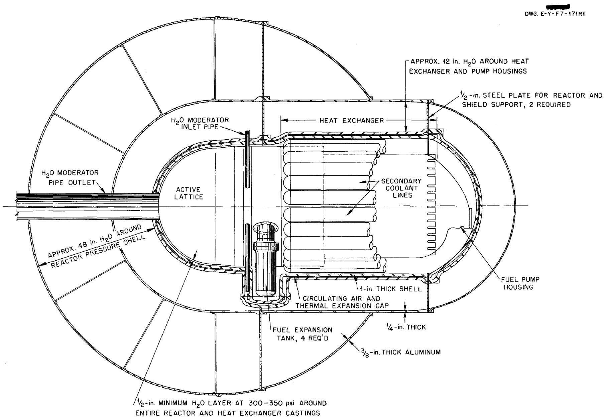  
FIGURE 5. $\mathsf{H}_2\mathsf{O}$ MODERATED CIRCULATING-FUEL REACTOR WITH A TANDEM HEAT EXCHANGER

reactor and heat exchanger were also increased. A light shield at the crew was then used to bring the total dose in the crew compartment down to the tolerance of $1 \, \text{r/hr}$ at full power output. The total weight of reactor, heat exchanger, and shield was found to be 156,000 pounds.

Since the above shield seemed to be excessively heavy, an attempt was made to reduce the thickness of lead in the reactor shield and increase the amount of shielding at the crew. It was felt that even if a mechanic could not remain in the vicinity of the reactor for an extended length of time it would be a tremendous advantage to be able to carry out a limited amount of airplane maintenance work. The bulk of the maintenance work would then be carried out after the fuel and secondary coolant had been drained, and yet there would be an opportunity for checks, adjustments, and other tune-up work as the power plant was being warmed up. Accordingly, a shield was designed that permitted a dose of something like $1\mathrm{r / hr}$ at 50 ft from the center of the reactor at $5\%$ of full power output. In this design some of the lead and water was removed from the reactor and heat exchanger shield evolved for the preceding design and the shield thicknesses at the sides and rear of the crew compartment were increased accordingly. The total weight of this reactor, heat exchanger, and shield was found to be 141,000 pounds.

The design study covering an airplane in which the circulating fluoride fuel was carried directly from the reactor to the engine air radiators utilized a reactor-to-crew separation distance of 120 ft and a smaller crew compartment than that employed in the shields of this study. To get some idea of these effects a new crew shield was designed to go with the first reactor shield design. A greater reactor-to-crew separation distance reduced the dose at the crew by a factor of about 6, and the smaller size of the crew compartment gave another factor of nearly 2 in crew-shield surface area. This made possible a saving of 22,000 lb in the weight of the crew shield.

# Annular Heat Exchanger and Shield Design

Since much of the weight in the tandem heat exchanger arrangement seemed to arise from the large surface area of the long pressure shell of the reactor-heat exchanger combination, the more compact arrangement inherent in the annular heat exchanger arrangement seemed promising. The layout shown in Figure 6 was prepared for a sodium hydroxide moderated and reflected reactor. Critical mass calculations indicated that even with only $25 \text{ vol}\%$ sodium hydroxide in the core the critical mass of an unpoisoned 26 in. dia sphere would be about 35 pounds. In the design shown, a series of concentric helical coils of tubing were provided to carry the sodium hydroxide through the reactor core with a circulation

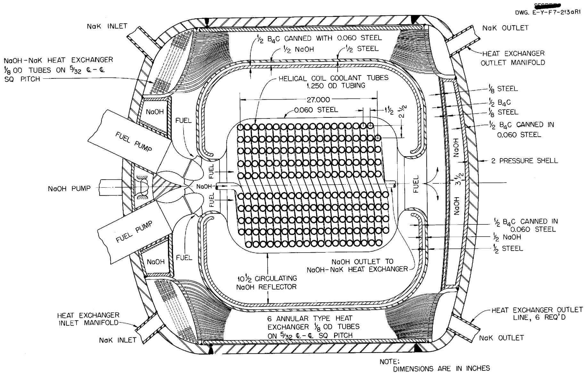  
FIGURE 6. NaOH-MODERATED CIRCULATING-FUEL REACTOR WITH AN ANULAR HEAT EXCHANGER

rate high enough through both core and reflector to keep the outlet temperature to $1250^{\circ}\mathrm{F}$ with an inlet temperature of $1050^{\circ}\mathrm{F}$ . A special small heat exchanger was placed in the inlet manifold for the NaK of the secondary circuit to provide cooling of the sodium hydroxide. The reflector was made 11 in thick and was separated from the heat exchanger by a 1 in. thick layer of boron carbide to attenuate the neutron leakage flux from the reactor to the level of the delayed-neutron flux from the fuel in the heat exchanger. As in all these heat exchanger designs, the center tube of every square cluster of nine was a "dead" tube filled with boron carbide and sealed off at the ends.

The shield designs were similar to those prepared for the tandem heat exchanger except for their shape and reduced volume. It was found that both the delayed neutrons and the decay gammas from the fuel in the heat exchanger were attenuated more rapidly in passing through the shield than the prompt neutrons and gammas released in the core. Thus, the bulk of the radiation leakage from the shield surface came from the core instead of from the fuel in the heat exchanger. In fact, the material in the heat exchanger was moderately effective as shielding material (roughly $60\%$ as effective as water); hence, the heat exchanger actually at least partly "paid its own way" instead of being completely parasitic.

Two by-products of the design study with the 11 in. thick reflector followed by 1 in. of boron carbide appear to be so important that they alone would justify the use of a thick reflector. If a considerable amount of boron is provided in the shield water to suppress secondary gammas from neutron captures in hydrogen, the indications are that with a thin reflector the steel pressure shell becomes a more important source of gammas than the reactor core, so far as leakage from the outer surface of the shield is concerned. Closely associated with this is the fact that with a thin reflector the problem of gamma heating of the pressure shell is quite serious, whereas with the arrangement used it was not. Calculations indicate that a reflector thickness equivalent to 10 in. of water followed by 1 in. of boron carbide is the minimum that should be provided from these two standpoints. The layer of boron carbide would, of course, require careful and thorough cooling by passing sodium hydroxide or some other coolant through tubes imbedded in the canned boron carbide.

The weights of the reactor-annular heat exchanger-shield combinations were found to be 98,000 and 128,000 lb for the divided and near-unit shields, respectively, a saving of 13,000 lb over the tandem arrangement for the divided shield and 28,000 lb for the near-unit shield. Fairly complete specifications are presented in Table 6.

The large saving in shield weight effected by going from the tandem to the annular heat exchanger arrangement was most encouraging. It immediately suggested that a further substantial reduction in weight might be realized by going to a more nearly spherical configuration. A novel heat exchanger in which the tube matrix was laid out in the form of a spherical shell was devised to form a basis for further designs. The basic configuration envisioned is shown in Figure 7.

The heat exchanger tubes were grouped in bundles. Each bundle had a rectangular cross section except where the bundles terminated in circular disk headers. If the two pumps are taken as being at the North and South poles respectively, each tube bundle would lie on a variable pitch helix running from approximately the Arctic to the Antarctic Circle. The angle between tube centerlines and the Equator would be about 40 deg, whereas the corresponding angle at the Arctic circle would be about 90 degrees. This would make it possible to keep the center-to-center spacing of the tubes independent of latitude. Although the tube bundle shape is quite unusual, fabrication of the heat exchanger should not be too difficult. After jigs had been prepared for building up a tube bundle, one tube bundle after another could be assembled, brazed and/or welded into its header disks, pressure tested, inspected, and assembled in the spherical steel shell. A simple fillet weld between the header disk and the pressure shell would suffice to complete the installation.

In other respects the heat exchanger and shield design of Figure 7 is essentially similar to the tandem and annular arrangements described previously. The 11 in. thick reflector of the annular heat exchanger design was used again, as was the same type of shield construction employed in both of the other designs. One difference was that boron carbide was placed in the baffles between tube bundles instead of in "dead" tubes.

The reactor design is suggestive of a homogeneous reactor, which it really approaches quite closely. The calculated critical mass proved to be reasonably low—only 20 pounds. Credit for this must go to the thick beryllium oxide reflector. The latter would be cooled by a nonuranium bearing fluoride salt. It should be possible through careful design of the moderator cooling passages and the diffusing vanes at the reactor core inlet to keep the metal temperature at all points below the average temperature of the fuel leaving the reactor. Thus, the hottest metal anywhere in the system would be the tube walls at the fuel inlet end of the heat exchanger.

As shown by the data in Table 6, the spherical heat exchanger design reduced the over-all weight of the reactor-heat exchanger-shield combination for the design conditions to only 90,000 lb for the combination using a divided shield and 120,000 lb for the near-unit shield, a savings of roughly 8000 lb in both instances over the annular heat exchanger arrangement.

FIGURE 7. REACTOR WITH A SPHERICAL HEAT EXCHANGER   
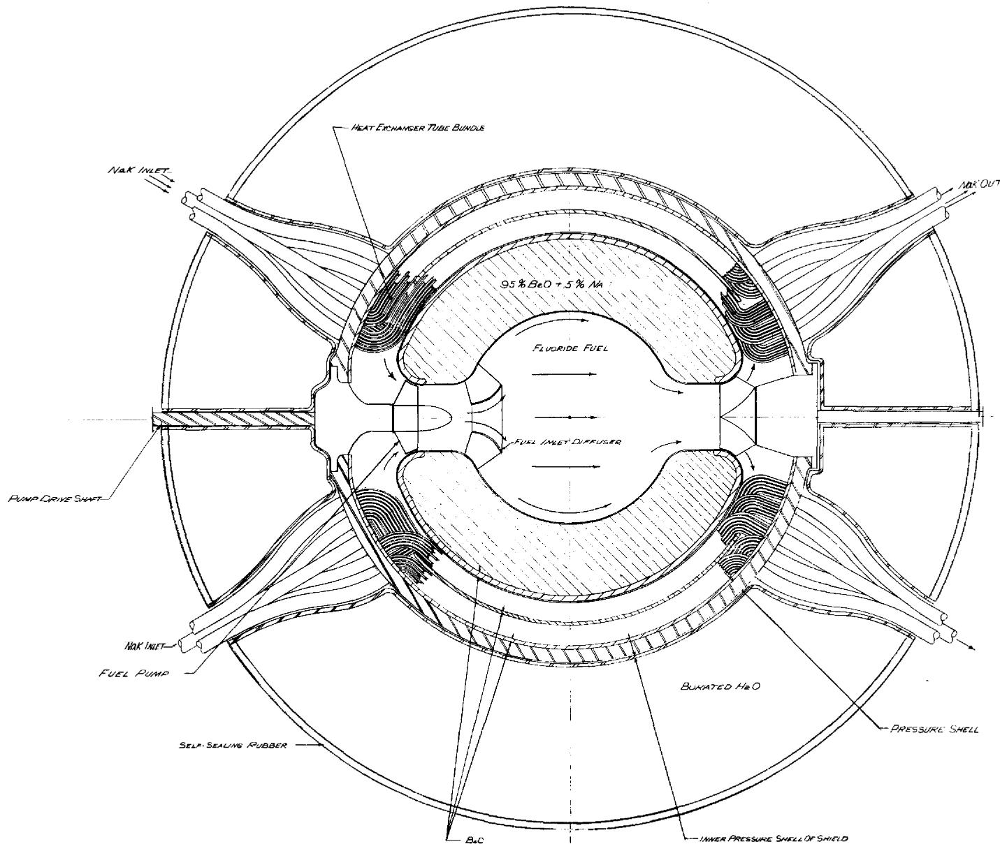  
∠92-∠3-∠

# PART II

# THE CIRCULATING-FUEL AIRCRAFT REACTOR EXPERIMENT

# INTRODUCTION

The ARE is a reactor experiment which has as its fundamental objective the acquisition of useful and reliable data that cannot be obtained faster and cheaper by any other means. Accordingly, these data must be of such nature that they will expedite the development and fabrication of the aircraft reactor in such a manner as to reduce the aircraft reactor cost, in time and money, below what this cost would be without the ARE. It is the opinion of the members of the ANP Project of the ORNL that the aircraft reactor will most economically be attained through the information to be obtained from this Aircraft Reactor Experiment. Indeed, as the task of flying a supersonic airplane on nuclear energy is so exceedingly complex and the necessary data are so meager, more than one experimental reactor may be required before sufficient information and experience are obtained to permit the design and construction of a reactor for a useful airplane.

The experimental reactor is, as nearly as is practical, a prototype of 350-megawatt, BeO-moderated, circulating-fuel aircraft reactor. The core is approximately a 3-ft-square beryllium oxide cylinder in an Inconel shell. The fuel is circulated through the central portion of the beryllium oxide moderator and thence to an external heat exchanger, pump, and back to the core. While in the core, the fission processes raise the temperature of the fuel by several hundred degrees to $1500^{\circ}\mathrm{F}$ . The reflector and pressure shell are cooled by a secondary system independent of the circulating fuel. This basic nuclear design of the ARE is capable of developing many times the power output at which it will be run in the experiment.

As the primary purpose of the ARE is to obtain experience in the high-temperature range with a nuclear power source, the reactor will be operated at design-point power for as much of its lifetime as operating difficulties permit. However, it is planned to limit the operational life of the reactor to about 1000 hours, but with as much time at design power of 3 megawatts as possible. Other critical parameters of the experimental reactor are as nearly in one-to-one correspondence with aircraft reactor specifications, as practical considerations permit. For example, the maximum temperature in each is $1500^{\circ}\mathrm{F}$ and the temperature drop across the ARE is $350^{\circ}\mathrm{F}$ , while that in the aircraft reactor would be around $500^{\circ}\mathrm{F}$ . No attempt, however, will be made to make a useful disposition of the output power which will be dumped directly as heat energy. It is ultimately carried away by a waste water system.

Although most of the thermodynamics of the fuel can be evaluated without the use of a chain-reacting system, there is no way of simulating the heat production of the fission process. Therefore, the power-production

and heat-removal functions of the experimental reactor will be as thoroughly studied as the operation time of the experiment permits. Another most important aspect of the ARE is the information to be obtained on the control and stability of such circulating-fuel reactors. Answers to such questions as effect on reactivity of temperature fluctuations in the fuel and effect on stability of the "lost" delayed neutrons may then be ascertained.

Obviously, to build a circulating-fuel reactor requires the existence of a liquid fuel and structural metal, both capable of prolonged operation in a mutual environment at high temperatures and radiation fluxes. In addition, these materials must both possess certain rather restrictive physical, chemical, and nuclear characteristics. In particular, the fuel must have a low viscosity and a reasonably high heat capacity to effect the desired heat removal from the cores. A fuel which seems to possess the minimum requirements in these categories is the system of fluorides of sodium, potassium, zirconium, and uranium. This fuel has been studied to a considerable extent, and the data on the fuel characteristics indicate that it can be satisfactorily employed in the ARE.

The fuel tubes and structural members of the reactor will be fabricated of Inconel, as this metal appears to possess the best combination of the required characteristics. Even Inconel, however, does not possess entirely satisfactory corrosion resistance, although there is every indication that the dynamic corrosion of this metal by the fluoride fuel may be improved. Otherwise, the metal, the fuel, and the beryllium oxide moderator possess the desired high-temperature characteristics.

Experiments have shown that the proposed materials suffer no radiation instability at the intended operating flux levels of the ARE. However, there is some uncertainty regarding the existence and extent of the radiation-induced corrosion at neutron fluxes approaching that to be expected in the aircraft reactor.

Aircraft reactors would require minimum structural thicknesses within the reactor, as well as components with the minimum size and weight. At the present time, however, information on corrosion rates and properties of structural materials under the proposed operating conditions, is too meager to permit the incorporation of aircraft-type mechanical features into the ARE without jeopardizing the entire experiment. Accordingly, in instances where the relevance of the experiment is not unduly compromised, the design of ARE components has emphasized durability and reliability.

In general, therefore, the design of the ARE is analogous to that of an engine dynamometer test cell, in that in both instances the relevance of the item under test is preserved, whereas the power absorption equipment and other accessories are not intended to simulate those of the ultimate applica

tion. Thus, insofar as possible, the experimental reactor is a low-power 3-megawatt prototype of the 350-megawatt circulating-fuel reactor proposed for supersonic aircraft propulsion.

Summarily, the ARE project stands at a crucial point in the ANP program where some five years of analytical work have failed to establish the impossibility of achieving nuclear-powered flight, but where gaps in available data do not permit the analytical proof that success can be attained. The purpose of the ARE is to furnish some of the crucial data that are lacking so that with these data the solution of the problem can go forward. If efficient use is to be made of the substantial effort being expended in the ANP program, the expeditious completion of the ARE program is imperative. It is the purpose of this report to describe the design and operation of the facility and as accurately as possible to establish the time schedule for accomplishing the Aircraft Reactor Experiment. The design data for this reactor are given in Table 7.

# TABLE 7

# AIRCRAFT REACTOR EXPERIMENT DESIGN DATA

General

Location

Operator

Purpose

Neutron Energy

Status

Oak Ridge

ORNL

Experimental

Epithermal

Design

Power

Heat, Max (kw)

Heat flux (Btu/hr/sq ft)

Power (max/avg)

Power density, max (kw/liter of core)

Specific power (kw/kg of fissionable material)

3000

Heat transported out by circulating fuel

\~2:1

5

<400

Materials and Amounts

Fuel

Uranium enrichment (\% U235)

Critical mass (kg)

Total uranium inventory (kg)

Fuel elements

NaF-KF-ZrF4-UF4

93.4

\~12.5

~65

66 parallel tubes (each 3 ft long, 1.235

in., OD, 60-mil wall) containing the circulating liquid fuel

Fuel-element jacket

Moderator

Inconel

BeO

(Table 7 contd.)   

<table><tr><td>Reflector</td><td>BeO</td></tr><tr><td>Shield</td><td>Concrete</td></tr><tr><td>Primary coolant</td><td rowspan="2">The circulating fuel
NaF-KF-ZrF4</td></tr><tr><td>Reflector coolant</td></tr><tr><td>Circulating Fuel-Coolant</td><td></td></tr><tr><td>Maximum fuel-coolant temperature (OF)</td><td>1500</td></tr><tr><td>Maximum sheath temperature (OF)</td><td>1510</td></tr><tr><td>Maximum Inconel temperature (OF)</td><td>1510</td></tr><tr><td>Maximum moderator temperature (OF)</td><td>1675</td></tr><tr><td>Consumption at max power (g/day)</td><td>3.0</td></tr><tr><td>Design lifetime (hr)</td><td>1000</td></tr><tr><td>Burnup in 1000 hr at max power (%)</td><td>0.25</td></tr><tr><td>Inlet temperature (OF)</td><td>1150</td></tr><tr><td>Outlet temperature (OF)</td><td>1500</td></tr><tr><td>Flow velocity (ft/sec)</td><td>4</td></tr><tr><td>Flow velocity (gpm)</td><td>83</td></tr><tr><td>Pumping power (hp)</td><td>10</td></tr><tr><td>Neutron Flux Density (Avg)</td><td></td></tr><tr><td>Thermal-max (n/cm2/sec)</td><td>3 x 1013</td></tr><tr><td>Thermal-av (n/cm2/sec)</td><td>1.5 x 1013</td></tr><tr><td>Fast-max (n/cm2/sec)</td><td>7 x 1013</td></tr><tr><td>Fast-av (n/cm2/sec)</td><td>3 x 1013</td></tr><tr><td>Intermediate-av (n/cm2/sec)</td><td>4 x 1013</td></tr><tr><td>Dimensions</td><td></td></tr><tr><td>Core</td><td>33 in. dia, 35-1/4 in.</td></tr><tr><td>Reflector thickness</td><td>7-1/2 in. on side, end</td></tr><tr><td>Shield thickness</td><td>Approx. 7-1/2 ft con.</td></tr><tr><td>Over-all (reactor and heat-exchanger pits)</td><td>42 ft w x 85 ft 1 x 2</td></tr><tr><td>Control</td><td></td></tr><tr><td>Shim control</td><td>Increase UF4 concentration</td></tr><tr><td>Regulation</td><td>One B4C absorber row
1-1/4 in. ID)</td></tr><tr><td>Safety</td><td>Three B4C absorber no
1-1/4 in. ID)</td></tr></table>

# ENGINEERING DESIGN

# General Description

A brief description of the over-all ARE system is given to facilitate an understanding of the relationship between the various components of the system, and the components are described in detail. A schematic arrangement of the reactor system is shown in Figure 8.

Heat is generated within the circulating fuel as it is pumped through the beryllium oxide-moderated core. The core is provided with a beryllium oxide side reflector that is housed, with the core, within an Inconel pressure shell. The reflector and pressure shell are cooled by a separate cooling circuit employing a mixture of fluorides containing no uranium. Circulation of both the primary and secondary circuit fluid mixtures is obtained by sump-type centrifugal pumps. The heat is abstracted from the circulating-fuel outside the core by means of four fuel-to-helium heat exchangers through which the fuel is circulated. The helium is then cooled by passing it through four helium-to-water heat exchangers, and the hot water is discharged.

Helium flow rates in the fuel-to-helium heat exchanger are controlled by variable-speed hydraulic systems that drive the helium blowers. Control of the helium flow rate in this manner permits smooth control of reactor power at any reactor temperature for which the nuclear controls are set, within the capacity of the heat removal system. At very low powers the temperature of the helium passing through the fuel heat exchanger closely approaches the fuel temperature. The system is designed so that when the rate of power generation is equal to or less than the power loss through insulation, electrically heated helium passes through the fuel-to-helium heat exchanger.

Leakage monitoring is achieved by the use of double-walled piping that provides an annulus through which helium is pumped outside the fuel. The helium is bled from the annulus at established stations and passed through sensory equipment. Several detectors, including the GE type-H leak detector, are under investigation, but the final decision regarding the type to be employed has not been made.

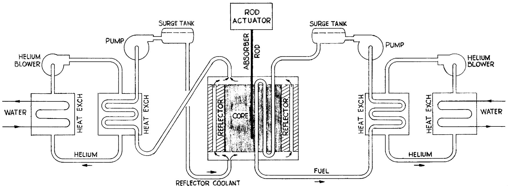  
FIGURE 8. SCHEMATIC ARRANGEMENT OF THE AIRCRAFT REACTOR EXPERIMENT

In accordance with current concepts, preheating, as well as the addition of heat during low power operation, will be accomplished by means of electrical heaters attached to the core pressure shell and to the outer pipe of the double-walled fuel piping. In the piping, the helium flow in the annulus acts as a heat conveyer, and transports heat to sections that are not directly in contact with heaters.

Fill and dump tanks for fuel are provided, and will be installed in a shielded pit adjacent to the reactor and heat exchanger pits. The tanks have not yet been designed in detail, but provision is being made for heat addition to maintain the fuel mixture in a molten condition and for removing from the fuel dump tank the afterheat evolved within dumped fuel after power operation.

Control of the reactor is obtained by the following features:

1. Regulation-one boron rod passes through the core centerline with approximately $0.75\% \Delta k / k$   
2. Safety-three boron rods pass through the inner portion of the core with approximately $5.0\% \Delta \mathrm{k} / \mathrm{k}$ per rod.   
3. Shim-shimming is achieved by varying the uranium tetrafluoride concentration in the circulating fuel.

The external fluid circuit equipment is located in shielded pits adjacent to the reactor pit. Two reactor pits are furnished to permit installation of a second reactor prior to complete decontamination of the pit used for the first reactor. The heat disposal equipment is placed in a room outside the well-shielded reactor pit in order to allow servicing after draining and flushing fuel. The heat exchanger room is shielded, of course, because of the activity of the circulating fuel during and after power operation.

# Core Design

The ARE reactor assembly consists of an Inconel pressure shell in which beryllium oxide moderator and reflector blocks are stacked and through which pass fuel tubes, reflector cooling tubes, and control assemblies. Elevation and plan sections of this reactor are shown in Figures 9 and 10, respectively. The innermost region of the lattice is the core, which is a cylinder approximately 3 ft in dia and 3 ft long. The core is divided into six 60 deg sectors, each of which includes one serpentine fuel tube coil that passes through 11 stacks in series, as illustrated. The six serpentine coils are connected in parallel by means of external manifolds.

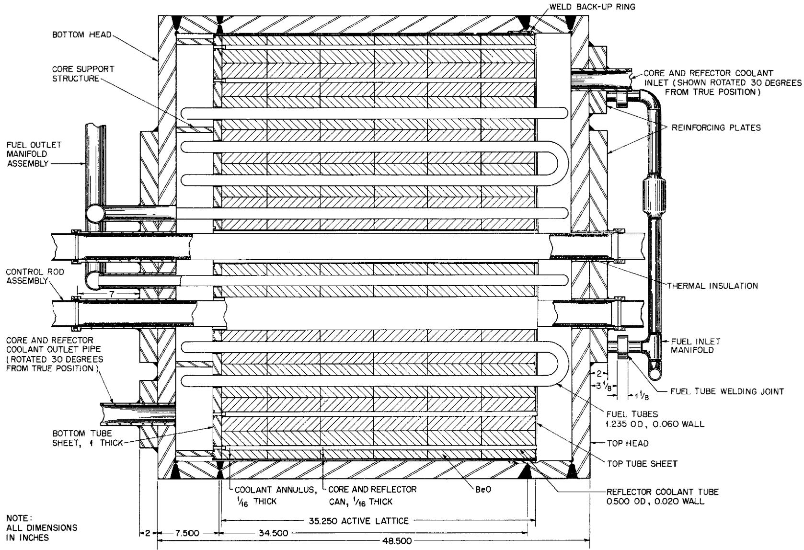  
FIGURE 9. ELEVATION SECTION OF THE EXPERIMENTAL REACTOR

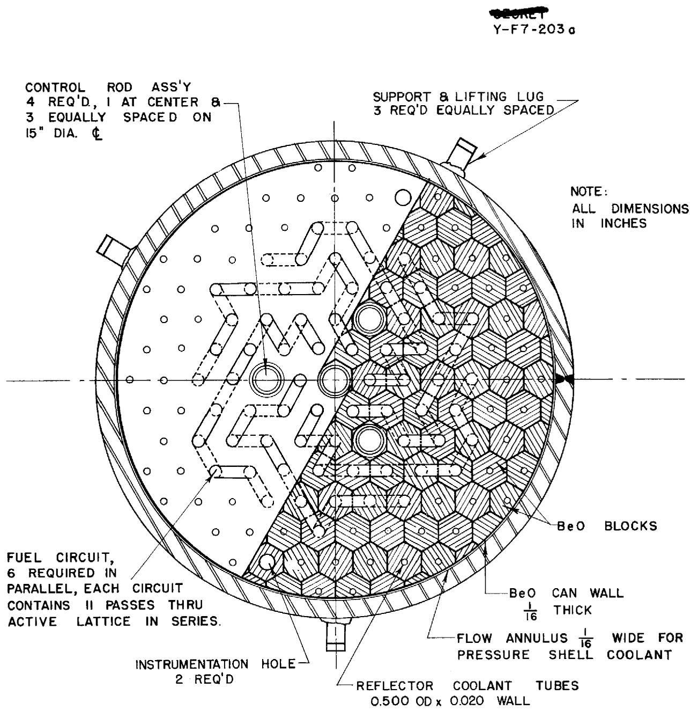  
FIGURE IQ. PLAN SECTION OF THE EXPERIMENTAL REACTOR

A reflector with a nominal thickness of 7.5 in. is located between the pressure shell and the cylindrical surface of the core. The reflector consists of beryllium oxide blocks similar to the moderator blocks but with 0.5 in. holes for the passage of the reflector coolant. The reflector coolant is admitted at one end of the pressure shell, passes through the reflector, bathes the pressure shell, fills the moderator interstices, and exits at the other end of the pressure shell.

# Primary Cooling Circuit

Hydrodynamic and thermodynamic considerations have influenced the ARE core design to such an extent that an appreciation of these problems appears to be desirable prior to description of the primary cooling circuit. In a circulating-fuel reactor in which the heat is generated, and transported by the fuel, there may be a significant temperature gradient in the fuel and tube wall. In order to prevent an excessive fuel tube wall temperature, the fuel flow in the tubes throughout the core must be turbulent. Analyses indicate that laminar flow would result in fuel wall temperatures of the order of several hundred degrees F higher than the mixed mean outlet fuel temperature. The transition between laminar flow and turbulent flow occurs in the Reynolds number range 2000 to 5000. Maintaining turbulent flow is so important that it was thought best to design for a Reynolds number of 10,000 and thereby allow for some deviation in flow rate or fluid physical properties.

It is inherent in the nature of the circulating-fuel reactors and the fluids involved that the necessity of turbulent flow imposes more stringent design requirements on the Aircraft Reactor Experiment than on the actual aircraft reactor. The power to be abstracted from a circulating-fuel reactor is a function of the fuel volume flow—a higher powered reactor results if higher flow rates are employed. The viscosity of the fuel is such that the flow rates required by the aircraft reactor result in fluid flow well into the turbulent flow region. However, since flow rates are reduced to achieve the desired power level for the ARE, the fluid flow—if straight-through flow is employed—falls well into the non-turbulent flow region. In order to maintain turbulent flow, a multipass flow arrangement, as well as a low viscosity fuel, must be employed.

If the core is to include fuel tubes parallel to the core axis with a combination of series-parallel connections, then:

$$
R = \frac {P Q N D L}{\mu V},
$$

where $\mathbf{R} =$ Reynolds Number,

$$
\boldsymbol {\rho} = \text {f l u i d d e n s i t y},
$$

$\mathbf{Q} =$ fluid volumetric flow rate,

$\mathbf{N} =$ number of tubes in series,

$\mathbf{D} =$ tube diameter,

$\mathbf{L} =$ reactor core length,

$\mu =$ viscosity,

$\mathbf{V} =$ fuel volume within reactor core.

Analysis of the relationship between these design variables indicated that attainment of the desired Reynolds number would require a few series passes, even with maximum feasible exploitation of the other variables. This being the case, and since the design problems involved in the use of many series passes appeared to be similar to those associated with the use of a lesser number of series passes, it was decided to employ 11 series passes and avoid compromising the volumetric flow rate of the core fuel volume.

Several means of achieving multipass series flow in the core were studied. An arrangement consisting of six long tubes, each bent so as to constitute 11 series passes, appears to offer several important advantages. The six bent tubes require a total of 12 end connections to manifolds outside the pressure shell. The fuel flow within, or adjacent to, the active lattice is confined to the interior of constant-diameter circular tubes, and eliminates abrupt flow cross section transitions with indeterminate flow patterns. The six parallel tubes are almost symmetrical relative to the core centerline, and obviate the need for individual orificing.

The series fuel tube arrangement with vertical tubes involves problems of gas removal and liquid drainage. Purging of bubbles from the coils has been investigated experimentally and analytically. Both investigations indicate that at the design flow velocities bubbles and gas traps should be swept out of the core.

# Secondary Cooling Circuit

The use of a liquid circuit within the pressure shell, other than the fuel circuit, is desired (1) to maintain the pressure shell essentially isothermal at a temperature of approximately $1150^{\circ}\mathrm{F}$ , (2) to cool the reflector with a fluid other than circulating fuel, and (3) to fill moderator interstices and other internal voids with a liquid maintained at a pressure higher than the fuel pressure to prevent a fuel tube leak from adding reactive material to the core.

The liquid to be employed must be compatible with the structural material under dynamic conditions and should cause no undesirable reaction with the fuel in the event of a leak in the separating wall. The fluoride mixture NaF-KF-ZrF₄ (mole % 36-18-46), i.e., the fuel carrier without the UF₄ is well suited for this purpose.

The possibility of cooling the moderator by positive flow of this fluid through the moderator interstices has been studied. It has been found, however, that the mass flow through a gap of constant periphery varies as the third power of the gap width (in the laminar flow region, with fixed pressure drop). Temperature analyses with postulated gap width distributions indicated that gross temperature inequalities could exist throughout the moderator because of tolerance accumulations affecting interstice widths. Accordingly, no attempt has been made to have positive flow through the moderator blocks, but the presence of the "stagnant" salt around the moderator permits moderator heat to be conducted to the fuel stream.

# Structural Assembly

The mechanical design of the Inconel pressure shell has been the subject of coordination between ORNL and the fabricator, Lukenweld Co., Inc., and it is expected that the shell as constructed will resemble very closely that illustrated in Figure 9. The serpentine tubes may be bent in flat planes, with welded connections employed from plane to plane, or "U" tubes welded to straight core tubes may be employed throughout. These alternatives have been investigated by commercial, tube-bending concerns, and one concern has contracted to furnish the completed coils.

# Core Temperature Distribution

The circulating fuel in the ARE reactor core flows in parallel through six serpentine tubes, and each tube traverses the core 11 times. In passing through the core, the fuel is heated from 1150 to $1500^{\circ}\mathrm{F}$ .

The two sources of heat for the fuel circulating through the reactor are internal heat generation - resulting from fission and gamma-ray absorption - and heat transferred to the fuel from the remainder of the core. The heat transferred from the remainder of the core is produced both from gamma-ray absorption in the moderator and the parasitic core material and from neutron slowing-down in the moderator. All this heat is transferred to the circulating fuel and results in a temperature gradient across the fuel, moderator, and parasitic material.

The resultant temperature profile across the fuel and adjacent moderator block and parasitic material is shown in Figure 11 for both the entrance and exit condition. There are four distinct media in each temperature profile: the fuel, the fuel tube wall, the stagnant salt between the fuel tube and the moderator block, and the beryllium oxide moderator block. The maximum tube wall temperature in the reactor is about $1500^{\circ}\mathrm{F}$ .

The temperature differential in the beryllium oxide block is entirely due to internal heat generation (heat transfer between adjacent beryllium oxide blocks was neglected). The temperature differentials in the stagnant salt and fuel tube wall are almost entirely caused by transferring the heat generated externally, since the effect of internal heat generation is small. The temperature differential across the fuel, which occurs mainly in the boundary and buffer layers is principally caused by the temperature differential associated with transferring into the fuel the heat generated in the moderator and parasitic material. The contribution to the temperature differential resulting from the variation of fuel residence times with radius is only about $5^{\circ}\mathrm{F}$ . The radial and axial distributions of fission, gamma, and neutron heating used in this analysis were taken from data reported in the section on "Reactor Physics."

# External Fluid Circuit

The ARE fluid circuit is intended to handle toxic and corrosive fluorides at $1500^{\circ}\mathrm{F}$ , and requires a considerable amount of design and developmental effort. Where possible, commercially available components are employed but pumps, heat exchangers, and certain other components are being constructed especially for use with the ARE. The locations of the major components of the system, including the reactor pits, heat exchanger room, reactor, and two heat disposal loops are illustrated in Figure 12. The heat exchanger room is shielded from the reactor pits to permit servicing after fuel drainage and flushing. The shield is designed to minimize activation of fluid circuit structure by reactor neutrons during power operation and to attenuate reactor post-shutdown gammas to a level permitting access to fluid circuit components after shutdown.

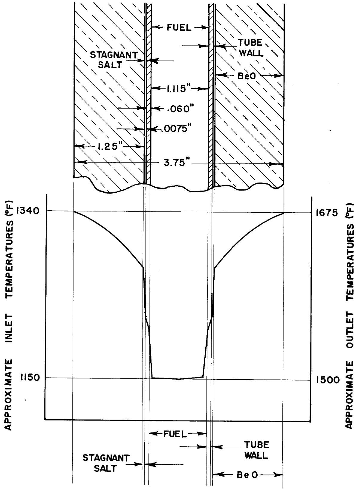  
FIGURE II. TEMPERATURE PROFILE IN FUEL TUBE AND MODERATOR

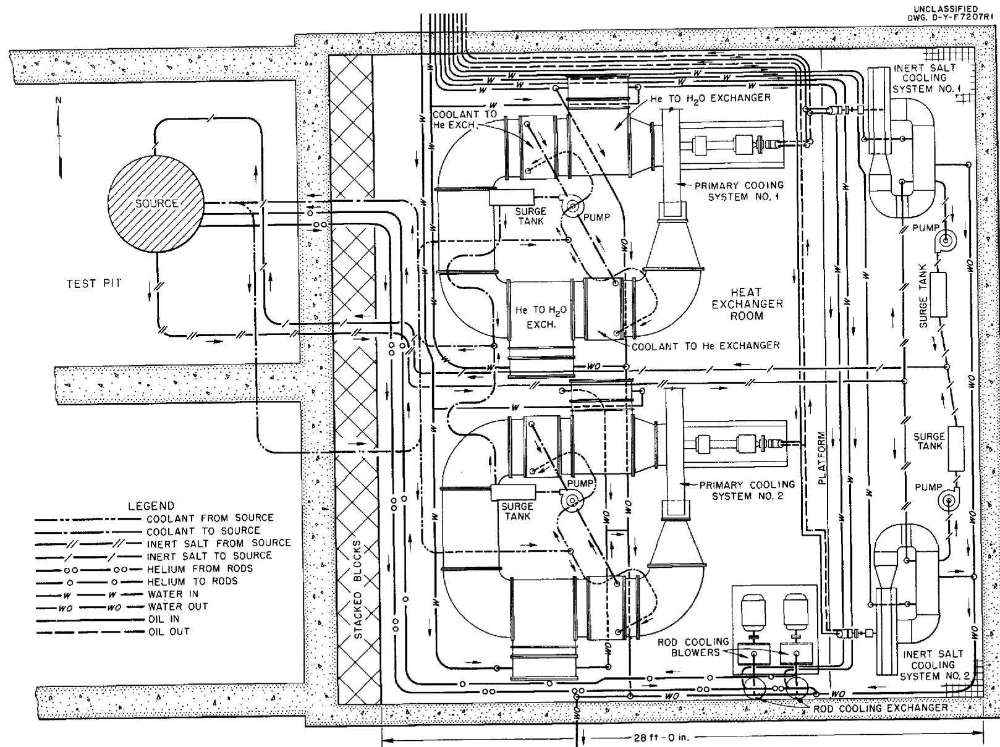  
FIGURE 12. FLUID CIRCUIT EQUIPMENT ARRANGEMENT

# Primary Cooling System

Fuel flows from the six core tubes to a common header, and a common trunk line conveys the fuel into the heat exchanger room. The fuel then divides into two completely independent loops, each capable of dissipating $1500\mathrm{kw}$ . Within each loop the fuel divides into two parallel $750\mathrm{kw}$ fuel-to-helium heat exchangers, passes through a centrifugal pump, and then to a common return trunk. A line diagram of the primary cooling circuit is shown in Figure 13.

In an individual loop, helium flows from a centrifugal blower through a fuel-to-helium exchanger in which its temperature is increased from 250 to $750^{\circ}\mathrm{F}$ . After the helium is cooled to $250^{\circ}\mathrm{F}$ in a helium-to-water exchanger, it passes through another heating and cooling cycle and is returned to the blower. This so-called "double-sandwich" arrangement permits two helium heat transports per cycle and thereby halves the helium flow rate required through the blower and ducting for a specified power and temperature rise.

# Secondary Cooling System

The reflector and pressure shell cooling system, as in the case of the fuel system, is divided into two heat disposal loops, each capable of handling the load associated with 1500 kw reactor power. Heat is conveyed from the primary coolant to helium and then to the water sink. A line diagram of the secondary cooling circuit is shown in Figure 14.

# Monitoring Circuit

All lines and components containing fuel or reflector coolant are double-jacketed and helium passes through the annulus. The helium pumping head is maintained by drawing helium from the system, cooling it, and admitting it to rotary-type compressors at various points in the system. Monitoring for fluoride leaks into the helium is achieved by passing helium samples through halogen detectors.

# Pumps

The pumps to be used in the fuel circuit and in the moderator coolant circuit are vertical-shaft, tangential-discharge, centrifugal pumps employing a gas seal and a maintained liquid level. A pump of this type, designed specifically for the ARE, will provide flow of 41 gpm with a 40 ft head (Figure 15). Electromagnetic pumps cannot be used because of the poor elec

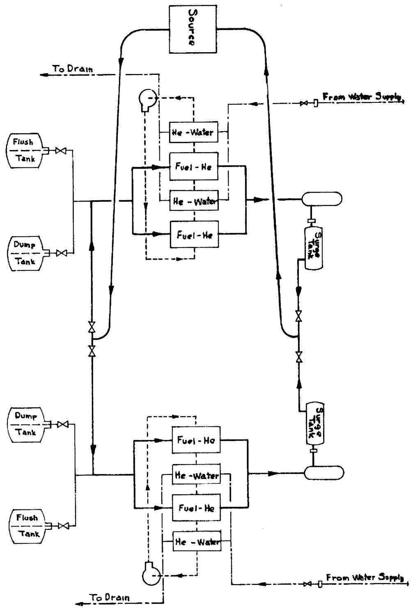  
FIGURE 13. PRIMARY COOLING CIRCUIT

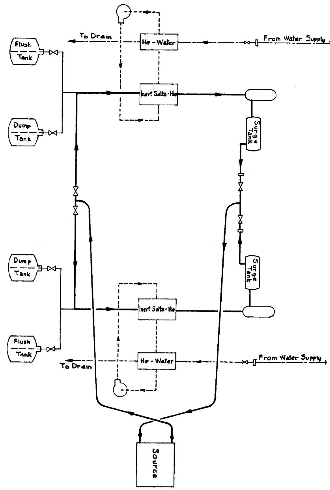  
FIGURE 14. SECONDARY COOLING CIRCUIT

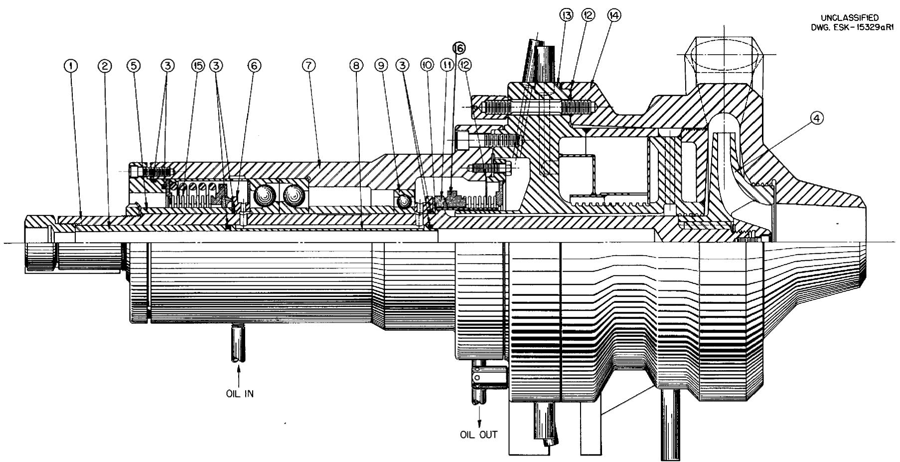  
FIGURE 15. ARE CENTRIFUGAL PUMP

I. SHAFT, TYPE-316 STAINLESS STEEL.   
2. SHAFT LINER SPACER, ANY 300-SERIES STAINLESS STEEL.   
3. "O" RING, MATERIAL TO BE RECOMMENDED BY SEAL MANUFACTURER.   
4. IMPELLER, TYPE-316 CORROSION-RESISTANT STEEL CASTING.   
5. PRESSURE SLEEVE, ANY 300-SERIES STAINLESS STEEL.   
6. SEAL FACE RING, ONTARIO STEEL.   
7. BEARING HOUSING, TYPE-316 CORROSION-RESISTANT STEEL.

8. SHAFT LINER, ANY 300 SERIES STAINLESS STEEL.   
9. SINGLE-ROW RADIAL BALL BEARINGS  
10. SLINGER, TYPE-316 STAINLESS STEEL   
II. SPECIAL GRAPHITE RING,ALTERNATE WITH SEAL ARRANGEMENT.   
12. GASKET, COPPER.   
13. PUMP BODY assembly.   
14. IMPELLER CASING ASSEMBLY.   
15. BELLOWS SHAFT SEAL, FULTON SYLPHON 8815R.

16.BELLOWS SHAFT SEAL, FULTON SYLPHON 8816,7R.

trical conductivity of the fluoride fuels. It is possible that a centrifugal pump employing a frozen fluoride seal—a technique in which fluorides are frozen about the pump shaft effecting a seal—may be adapted; however, a gas seal pump has been satisfactorily operated at temperatures above $1200^{\circ}\mathrm{F}$ for several hundred hours.

The gas seal is formed by a floating graphite ring located between the stationary nose on a bellows seal and the hardened rotating nose on the shaft. The level of the pumped fluid in the expansion chamber is maintained by gas pressure so that the fluid cannot come in contact with the seal. The primary pump seal enclosing the bearings carries no appreciable pressure differential and, consequently, requires that an oil-circulating system above the seal be pressurized to balance that of the circulating system below the seal. The circulating oil serves to cool the shaft bearing and lower seal. In addition, internal cooling of the pump structure is obtained by the circulation of helium.

Another advantage of this pump, in addition to the proved sealing device, is that the entire rotating assembly can be assembled outside the pump casing and in event of failure can be installed with relative ease. None of the liquid lines need be broken to accomplish this replacement nor will any of the welded joints in the pump permit fuel holdup. All mechanical pumps that seal directly against system pressure are provided with a monitoring space to permit the detection of leakage, should such occur. The pumps will be constructed of type 316 stainless steel except that those parts in contact with the fluid stream will be of Inconel.

# Heat Exchangers

The fuel-to-helium heat exchangers are on order with the Griscom-Russell Co., who designed them to ORNL specifications. The heat ex-changers are of the cross-flow type with the fuel flowing through 1 in.OD, 0.109 in. wall Inconel tubing. The tubing is finned on the gas side with helically wound, stainless steel strip. Each heat exchanger includes five parallel tube banks; each bank consists of seven to nine horizontal tubes in series with integral return bends. The fuel inlet and outlet headers are constructed of 4 in. pipe to which the five tube banks are welded.

The helium-to-water heat exchangers also are of the finned-tube cross-flow type, but steel tubes with copper fins are used.

# Preheating System

The relatively high melting point of the circulating fuel and the secondary coolant (around $500^{\circ}\mathrm{C}$ for the NaF-KF-ZrF $_4$ -UF $_4$ fuel with a composition in mole $\%$ of 34.7-17.4-44.4-3.5) requires that all equipment within which these coolants would be circulated be heated to permit loading, unloading, and also the possibility of low power operation.

# Reactor Assembly

The insulation heat-leakage at operating temperature has been calculated to be approximately 15 kw, and the heat capacity of the assembly has been estimated at 4000 Btu/°F. After having studied various preheating methods, including pumping hot fluids through the fuel passages or through the moderator insterstices, it was decided that the simplest method was the application of electrical resistance heaters to the outside of the pressure shell, with heat transport to the inner regions by conduction. With a constant heat input of 14 kw in addition to the insulation losses, it is estimated that the assembly can be heated from room temperature to 1200°F in approximately four days.

# Piping

The heat capacity of the piping is small relative to the piping-insulation leakage. Consequently, the power required to preheat the piping is substantially the same as the power required to maintain it at temperature. If the fluid circuit pipes are empty, as during preheating, the pipe resistance to axial heat flow is high, and the application of heat to specific points on the pipe surface tends to cause large temperature valleys to exist between the points of heat application. By attaching electrical resistance heaters to the outer pipe of the double-walled piping, however, the flowing helium acts as a thermal conveyer and facilitates axial heat transport. Accordingly, substantially isothermal helium contacts the inner pipe, and enables it to be heated uniformly.

# Heat Exchangers

The fuel-to-helium heat exchangers require preheating prior to filling and require the addition of heat to compensate for thermal leakage during filling and after filling at any time that the fuel pumps are inoperative. These heat exchangers have a total of approximately $40\mathrm{ft}^2$ of exposed freeflow area (both upstream and downstream) that, if allowed to radiate to ad-

jacent cold structure, would dissipate approximately 40 kw with the tubes at $1325^{\circ}\mathbf{F}$ . Accordingly, it appears necessary to include radiation barriers in the form of gates that can be lowered during warm-up, zero, or low power operation. When these radiation barriers are in position, the fuel-to-helium heat exchangers are enclosed and may be preheated by means of hot helium supplied by the external piping annuli.

# Reactor Controls

A significant characteristic of the entire ARE-ANP control philosophy is that the power extracted from the reactor is determined solely by that part of the over-all power plant external to the reactor. In the power regime, reactor control rods do not influence the steady-state power production. Conversely, the power extraction from the reactor does not influence the steady-state reactivity of the reactor. A reactor that satisfies the criterion given here is almost certain to have these control characteristics regardless of whether or not circulating fuel is used.

The fact should not be overlooked that if the reactor behavior for a low power level differs radically from the behavior of the aircraft reactor, there is less incentive for building an ARE. Much of the data obtained from such a low power experiment would be functionally dependent upon power level. However, the two basic characteristics of the circulating-fuel reactor are: (1) the reactor operating temperature is independent of the external pumps and heat exchanger; and (2) the power extracted is independent of reactor control rod motion.

Essentially then, the objective of the ARE control work is to provide satisfactory reactor control and external system control for the entire experiment. In addition to creating satisfactory control for the experiment, the system should be such that control data can be obtained for use in designing the aircraft reactor. These data will be essentially time-response data for perturbations in reactor temperature and external power load, as well as transient and steady-state data on the coupling between reactor and load.

There are three separate parts to the control system for the ARE: (1) shim control (2) regulating system, and (3) safety system. Since these three divisions perform distinctive functions and since each is almost, if not entirely autonomous, each will be treated separately here. Reactivity calculations of the various control mechanisms are reported under 'Reactor Physics.' Additional information involving the reactor controls is discussed under 'Reactor Operation.'

# Shim Control

The reactor will be made critical only after the fuel-carrying liquid has been brought up to a temperature of approximately $1200^{\circ}\mathrm{F}$ . The liquid will then be maintained at as nearly constant temperature over the entire primary circuit loop as the external heating system will allow. After the system has been checked for leaks and found to be tight, a fuel enrichment system will be used to bring the reactor to critical at the temperature of $1200^{\circ}\mathrm{F}$ . This fuel-enrichment system comprises the shim control of the reactor and is designed only to add uranium to the carrier; there is no plan to try to go subcritical by fuel depletion.

At the surge tank, located between the heat exchanger and the reactor inlet, a positive-volume fuel-injection system is provided. This fuel-injection operation is accomplished by means of a mechanism shown in Figure 16. A small fuel line first carries the fuel from the storage tank to the transfer tank and thence to the surge tank. The enriched fuel is held in the transfer tank where it is weighed, and when the gas pressure over the liquid in the tank is raised, fuel is forced through the connecting line into the system surge tank. The transfer tank is hung from a beam balance so that an accurate determination of the weight of fuel is directly obtainable.

This method of fuel addition permits the addition of known amounts of fuel, and the magnitude of these quantities can be controlled over a considerable range as a critical loading is approached. By introducing the fuel into the circulating system just before the liquid enters the reactor, safe loading of the system is assured. Should a slight excess of fuel be added to part of the fuel stream, the reactor would give an indication of supercriticality when the enriched liquid entered the lattice and before the uranium concentration of the entire fuel circuit had been increased. If this occurred, the fuel addition could be stopped and subsequent mixing of the supercharged liquid with subcritical fuel would lower the reactivity.

After each fuel injection, which will be made with the three safety rods cocked and the regulating rod in mid-position, the regulating rod will be withdrawn in accordance with regular procedure for critical loading of any reactor. Should this shimming be slightly overdone, which would result in the reactor going on a long positive period beyond the compensating worth of the regulating rod when fully inserted, the temperature of the fuel-coolant can be raised enough to restore the reactor to the critical condition. After

FIGURE 16. FUEL INJECTION SYSTEM   
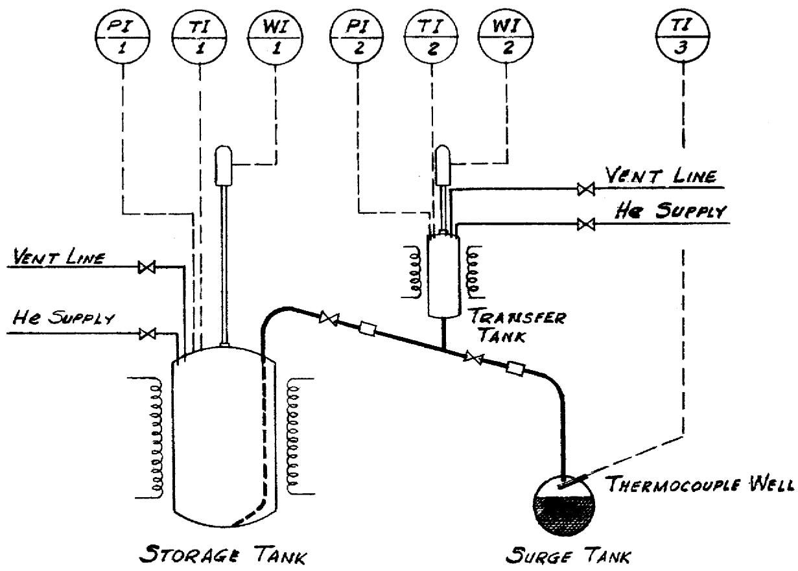  
HEATERS   
REMOTEVALVE   
FOEZEVALVE   
WEIGH CELL

PI PRESSURE INDICATOR

TI TEMPERATURE INDICATOR

WEIGHT INDICATOR

the loading is accomplished at the starting temperature of approximately $1200^{\circ}\mathrm{F}$ mean fuel temperature, additional injections can be made when it is desired to raise the mean fuel temperature. If it becomes necessary to lower the mean fuel temperature before termination of the experiment, the safety rods can be lowered slightly into the core. Although not planned in the operation of the reactor, such action is possible if conditions should demand.

# Regulating System

The reason for providing a mechanical regulating system is that the magnitude of the reactivity change effected by the expansion of the fuel cannot be accurately predetermined. To supplement the negative temperature coefficient, in case it is of insufficient magnitude, a single absorber rod having a total value of approximately $0.75\% \Delta k / k$ is provided in the center of the reactor.

The absorber rod is located in a 3 in dia hole that runs through the pressure shell and core in the center of the lattice. By means of a direct drive, a 2 in dia boron absorber rod is inserted into this hole. The rod is moved by one of two possible drive motors. One of the motors is a 60-cycle reversible motor of constant speed that is manually actuated by a zero-position, momentary-contact, reversing switch located on the operating console. The motor drive is used to make manual adjustments during the critical experiment and during the rod calibration operation. It is also available for manual control of the reactor during the power regime.

The other drive, which can be independently used to actuate the regulating rod, is a d-c servo motor of the same design as that used on the MTR and also on the MTR mockup - the LITR. This drive can never be operated manually, and it is actuated at all times by the control function system in accordance with the operation of the reactor, as subsequently described. The servo drive will run during the entire reactor experiment. However, except for the brief period of time required for the dynamic test of the reactor, the servo will be disconnected from the rod and used only to drive a monitor selsyn to aid in following the behavior of the reactor while it is under manual control.

The servo system is arranged so that the reactivity changes introduced by the regulating rod behave like a negative temperature coefficient associated with the fuel. When the regulating rod is connected to the servo drive and temperature or flux perturbations are introduced into the reactor, control of the reactor will be accomplished.

During normal operation of the reactor, when power changes are being made at a slow rate, the reactor will be manually controlled. Improper manipulation of the manual control, which would result in getting the reactor on too short a period, is safeguarded by the cocked safety system plus the coefficient of reactivity associated with the expanding fuel. Precautions in the form of limit switches, interlocks, alarms, etc., in accordance with previous reactor installations, are provided to further minimize the opportunity for improper manipulation of the manual control.

The regulating rod drives are located on the concrete slab directly over the reactor and are accessible to personnel at all times. The rod linkage goes through holes in the concrete slab and provides means for positioning the absorber portion of the rod in the center hole provided in the reactor. The general arrangement of the regulating rod and drive mechanism is shown in Figures 17 and 18.

Since the regulating rod will run within the core while the reactor is running at full power, the rod must be cooled. This is accomplished by the forced circulation of helium in a closed loop down around the rod.

The nuclear instrumentation (fission chambers, ion chambers, etc.) and the electronic components (preamplifiers, power amplifiers, etc.) are copies of similar instruments and gear in use on other reactors. Therefore it is not necessary to describe these items in detail. Since the fission chambers will be located in a high-temperature region within the reactor reflector, helium cooling will be used to keep the chambers within a safe temperature range.

# Safety System

Three safety rods for the ARE are located on 120 deg points at a radius of 7.5 in. from the center of the reactor. The rods insert into 3 in. sleeves that pass through the reactor shell and core vertically from top to bottom. The rods are of hot-pressed boron carbide slugs canned in stainless steel sections slipped over a flexible tube. Sections of the rod are cored to permit passage of helium down through the rod for cooling purposes. Helium also passes down around the rod in the space between the rod can and the core sleeve so that cooling of the outside surface and the inside of the rod is accomplished by a parallel helium flow.

Located above the reactor, on top of the reactor pit, are the actuating mechanisms for each rod. An actuator is provided for each rod but all actuators are energized simultaneously and the maximum speed of withdrawal of the rods is fixed by the speed of the constant speed a-c motor used to actuate the driving mechanism.

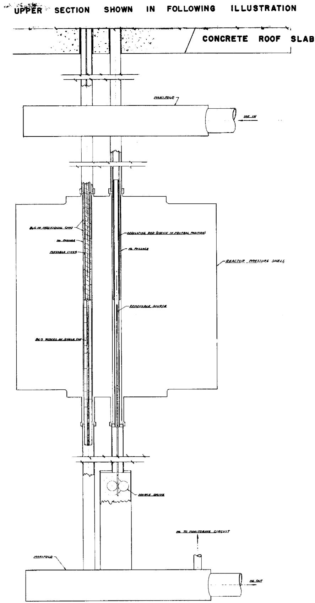  
FIGURE 17. REACTOR CONTROL ELEMENTS

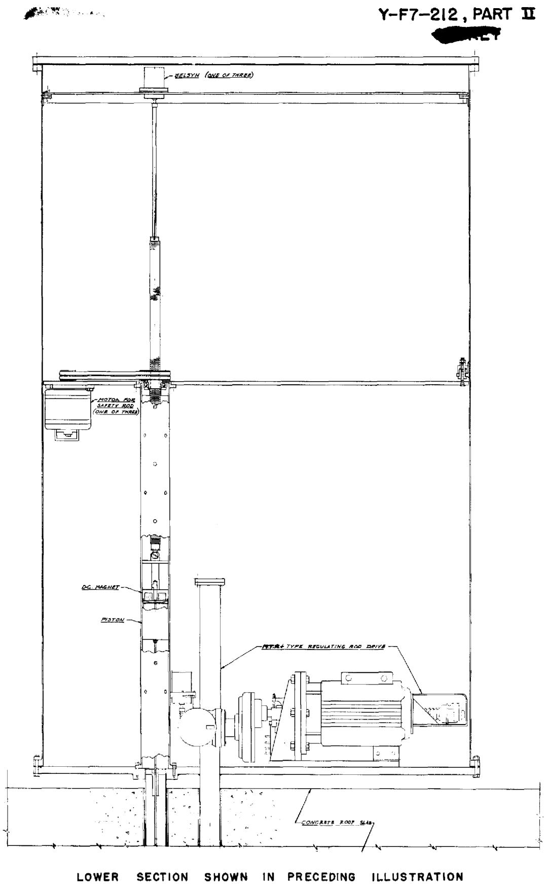  
FIGURE 18. REACTOR CONTROL MECHANISM

- The driving mechanism is comprised of a reversible 60-cycle motor connected to a drive screw that is arranged so as to drive an electromagnet in a vertical travel of 36 inches. The drive screw operates inside a cylindrical enclosure, and the magnet has a keeper that fits as a piston inside the cylindrical enclosure. The piston has a small cable attached concentrically; the other end of the cable is attached to the absorber rod. When the magnet is energized, the drive screw moves the piston vertically within the cylinder and by the cable attachment either raises the safety rod or allows it to fall under the action of gravity as the piston is lowered on the drive screw. When the magnet is de-energized, the piston falls and permits the safety rod to drop home. As the piston reaches its end of travel, gas is compressed in the cylinder to a degree controlled by vent holes in the cylinder wall and acts as a pneumatic cushion for the rod. Details of this actuator system and the safety rod are also shown in Figure 17 and 18.

The principle of suspending safety rods on electromagnets has been used in the MTR, and the ARE design has taken advantage of the experience gained in this reactor operation. A linediagram of the scram circuits with the actuating signals and interlocks is given in Figure 19. Additional circuits may be added as the design is completed.

Since false scams are particularly objectionable to the ARE because of the limited life of the reactor, every effort is being made to reduce the probability of their occurrence. The magnet circuits are expected to have a release time no shorter than 0.1 sec, which will allow much more positive operation of the system so far as spurious scams are concerned. The design of the reactor with the liquid fuel makes possible this relaxation of the release time. In the event of a short pile period, the fuel and reactor core can stand a greater power surge without ill effects than is possible with solid fuel reactors of more complex core construction.

Each of the three safety rods has approximately $5\% \Delta k / k$ negative reactivity when inserted in the reactor. Thus a total of approximately $15\%$ is available to shut down the reactor. Three large rods are used because statistics indicate that at least one of the three rods is certain to drop without hesitation at a signal to scram.

# Electrical Power Circuits

The extreme inconveniences associated with forced reactor shutdown, fuel drainage, refilling, and restarting dictate the need of auxiliary systems so that no one failure will necessitate a forced shutdown. Critical pumps, blowers, etc., are duplicated, and each set is served by an independent

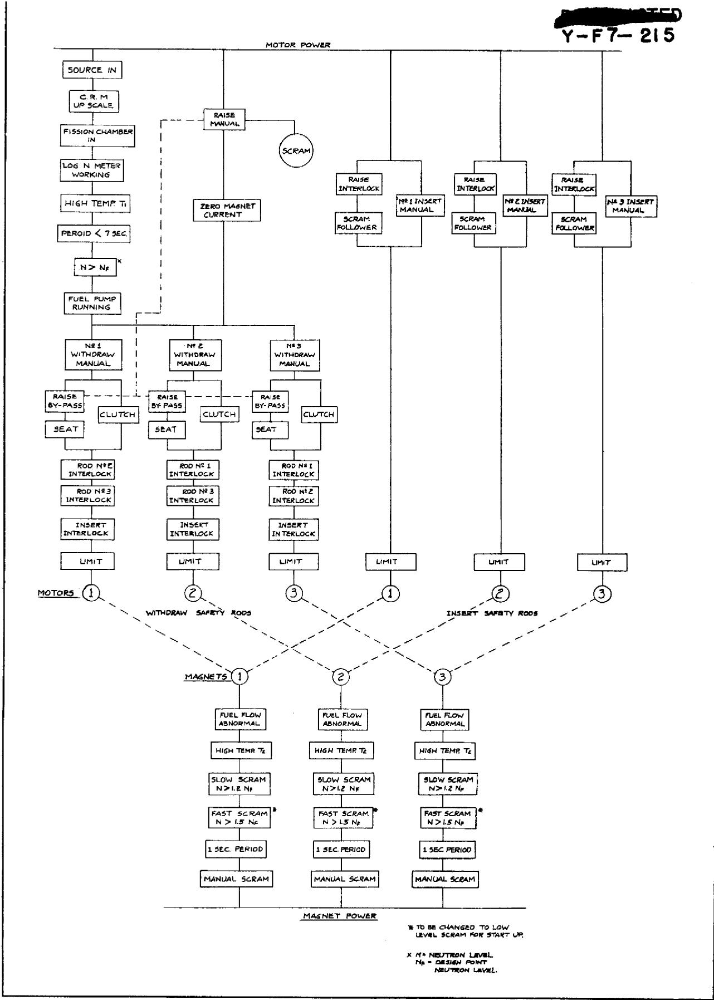  
FIGURE 19. SAFETY INTERLOCK AND SCRAM CIRCUIT

d-c circuit including independent buses, switches, and a-c/d-c motor generator sets. The use of direct current for these circuits permits convenient speed control where required and the use of battery sets floating on the line to safeguard against outside power failures. Alternating current instruments are fed from the d-c circuits via d-c/a-c motor generator sets to enable these instruments to derive their power from the batteries in an emergency. This electrical power circuit is shown in Figure 20.

The heat capacity of the system is large relative to the heat leakage rate so that no large temperature loss will be incurred during a power interruption of 2 to 3 hours. Consequently, it is not necessary to employ battery power for system heat addition. System heaters therefore are connected directly to the 440-v a-c circuit. Similarly, the building crane and certain other items need not be operative during any short period in which operation from battery power is required, and these components are supplied only by the 440-v a-c system.

# Instrumentation

Since a basic purpose of the Aircraft Reactor Experiment is the acquisition of experimental data, the importance of complete and reliable instrumentation cannot be over-emphasized. Most ARE process instrumentation is intended to observe and record rotational speeds, flow rates, temperatures, pressures, or liquid levels. The various stations and measurements desired around the ARE fluids circuits are shown in Figure 21. Since most commercially available equipment for performing these functions is limited to temperatures considerably lower than the minimum operating temperature of the ARE, an extensive developmental program has been carried out to either produce new instruments or remove the temperature limitations placed on existing instrumentation. Development has now progressed to the point where levels can be controlled in high-temperature fluorides with great reliability for extended periods of more than 2000 hours. Although equipment is still lacking for the calibration of flow-measuring devices, such devices are now available and have operated for extended periods. The degree of accuracy eventually attainable will depend upon the procurement of accurate calibration equipment. Pressures are reliably measured at many points in fluoride forced-circulation systems with both commercial and locally developed instrumentation.

# Flow Measurement

Electromagnetic flowmeters have proved to be very reliable when used with systems circulating sodium but are not applicable with fluorides, which have a very low electrical conductivity.

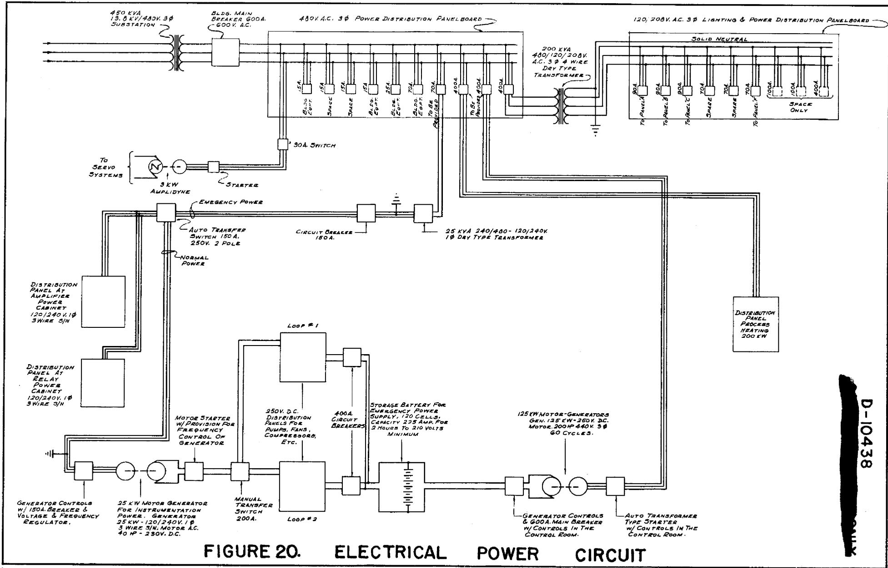  
D-10438

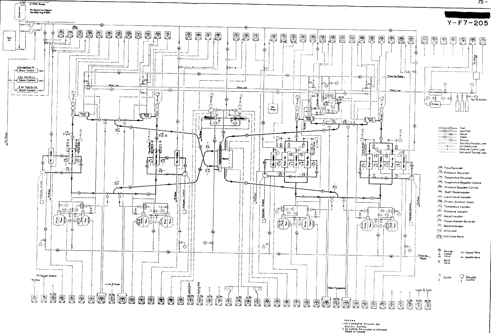  
FIGURE 21. FLUID CIRCUIT. INSTRUMENTATION

A venturi section, with associated pressure sensing instruments, appears to be the most attractive device for measuring flow in a high-temperature fluoride system because of low head loss. The extrapolation of water-calibrated venturi measurements to fluorides is reasonably accurate.

# Pressure Measurement

To date, no pressure-sensitive instrument has been developed or found commercially available that will operate at the temperatures to be encountered in the ARE fluid circuits. The highest temperature rating of any commercial instrument known is $450^{\circ}\mathrm{F}$ . As a consequence, all pressure-measuring devices have used trapped gas, and as a result the measured pressure is that at the gas-liquid interface instead of liquid stream. However, this error in pressure measurement can be minimized by calibrating each set of instruments and associated gas traps with accurate weigh-tank calibration equipment.

Bourdon-tube pressure gages are sufficiently reliable for rough pressure measurements but are not desirable if a high degree of accuracy is to be obtained. Bourdon-tube gages, which indicate the differential pressures directly, are commercially available.

Null-balance type of pressure gages indicate differential pressure on a single gage to the nearest hundredth of a pound per square inch. Although this instrument is temperature-limited, it was connected to the above-described gas trap tanks and operated successfully at room temperature.

# Temperature Measurement

Temperatures to $2000^{\circ}\mathrm{F}$ are measured by means of Chromel-Alumel thermocouples and recorded on multipoint Brown temperature recorders. It has been found that the accuracy of temperature measurement depends to a great extent on the fabrication and installation of thermocouples. Two methods of thermocouple attachment are used at present: (1) pulse welding each thermocouple wire to the outside surface of pipes or containers, and (2) forming a beaded junction of the two thermocouple wires. In each method the thermocouple is given additional rigidity by tying it down with nichrome wire. With either of these methods a temperature error is introduced if the thermocouple is not insulated from ambient air or other adjacent material. A borax coating has been found to form an airtight coating that prevents further oxidation.

Tests conducted with thermocouples placed in deep wells centered in the flowing stream and other couples directly opposite on the external sur-

face of the pipe have revealed that there is no more than a 15 deg temperature drop from the internal thermocouple to that placed on the outside. Thermocouples made by beading the wires are accurate within $\pm 1^{\circ}\mathbf{F}$ .

The Brown temperature recorders, with careful adjustment, will record temperatures accurately within $\pm 1^{\circ}\mathrm{F}$ over the full range from 0 to $2000^{\circ}\mathrm{F}$ . They do, however, show a tendency to drift after extended periods of operation and cause errors of the order of $5^{\circ}\mathrm{F}$ . This necessitates frequent calibration of the instruments; therefore a program for routine inspection has been setup that should reveal any instrumentation errors soon after their occurrence.

# Liquid Level Indicators and Controls

Four level-indicating devices have proved satisfactory for use in high-temperature liquids. The conventional probe type of level control operates a relay or solenoid when the level of the conducting fluid rises to short out the probe. Such a level control has proved most satisfactory with molten fluorides.

Another level indicator using the principle of a resonant cavity has been designed and simulated experiments indicate that this instrument may give satisfactory performance.

The variable inductance level indicator consists of small coil wound on the outside of the tank in which the level is controlled, and a tapered iron core is mounted on a float inside the tank. The change in level raises and lowers the tapered core inside the coil and alters the inductance. Tests made with the iron core at room temperature demonstrate that it gives a linear response that can be directly correlated to a level inside the system.

The fourth level indicator consists of a small tube that extends to the bottom of the tank in which the level is to be controlled. Gas flowing through this tube bubbles through the liquid. The pressure required to maintain a constant flow of gas through the liquid is directly related to the height of the liquid level above the end of the tube and is measured by a manometer connected between the gas tube and the gas space above the free surface of the liquid. Such an instrument can be used for both indicating and controlling liquid levels.

# REACTOR PHYSICS

The total uranium investment of the ARE comes out reasonably low, in spite of the fact that the reactor has not been optimized to give the lowest uranium investment. Engineering considerations and expediences designed to shorten the construction time were in many cases regarded as more important than optimization.

Little concern is felt about the possibility of self-sustained oscillations. Because of the low power they would be slow enough so that a servo system could damp them out. Furthermore almost all delayed neutrons are given off in the reactor, and are available for the damping of oscillation.

# Statics

The static calculations are based on the multigroup method, as described in references 10 and 11. For reflected reactors this method is at present available only for spherical geometry. However, the geometry of the ARE involves a cylindrical core with a side reflector and a partial end reflector, the side reflector and end reflectors being of somewhat different composition and thickness. In order to get $\mathbf{k}_{\mathrm{eff}}$ for this geometry, two reflected reactor calculations for spherical geometry were made.

The first of these calculations used a core of a radius and composition equal to the radius and composition of the actual cylindrical core, and a reflector composition and thickness equal to the composition and thickness of the side reflector. The second calculation used a core of the composition of actual core, a core radius equal to $\sqrt{\mathrm{h}^2 + \frac{1}{2}\mathrm{R}^2}$ , (where $2\mathrm{h}$ is the height of the actual cylinder core and $\mathbf{R}$ is its radius), and a reflector corresponding in composition and thickness to the end reflector.

A few bare reactor calculations for spherical geometry yield a curve, giving $\mathbf{k}_{\mathrm{eff}}$ versus the buckling, or reactor radius. With this curve the $\mathbf{k}_{\mathrm{eff}}$ values from each of the above reflected reactor calculations were compared. This gave for each reflected reactor an equivalent bare reactor radius. By subtracting from each of these equivalent radii the corresponding radius assumed for the core, the reflector savings is obtained. The reflector saving for the side reflector is then added to the cylinder radius, and the savings for the two end reflectors are added to the cylinder axis. An equivalent cylinder is thus obtained, for which a bare reactor

calculation can easily be performed. A number of these bare reactor calculations for different amounts of uranium yields a curve from which the amount of uranium required for any given $\mathbf{k}_{\mathrm{eff}}$ is specified.

The above calculation is carried out assuming homogeneous distribution of the materials in the core and the same for the reflector. The effects of "lumping" and self-shielding of the material are computed afterwards. If they appear important, an iteration of the multigroup calculation is usually necessary.

The multigroup calculations depend, of course, on the cross-section data. Fortunately, the ARE has about two-thirds of the fissions occurring at thermal energy and is, for this reason, not too sensitive to the uncertainties of high energy cross-section data, including the ratio of the fission cross-section to the absorption cross-section of $\mathbf{U}^{235}$ . The data used were essentially preliminary data of the AEC Neutron Cross-Section Advisory Group and are probably in agreement with those published in BNL-710 and AECU-2040. Whether or not any minor discrepancies exist has not been determined as the publications were just received.

The fissioning power distribution for the equivalent spherical reactor is obtained from the multigroup calculation. For the cylinder, the radial distribution in a plane through the center and perpendicular to the axis is assumed to be the same as that for the equivalent sphere. The distribution along the cylinder axis is assumed to be a cosine distribution, reaching zero at a point beyond the core boundary, by a distance given by reflector savings plus extrapolation distance.

The fissioning power is, of course, proportional to the neutron flux so that both can be represented by the same curve. The radial distribution curve is multiplied by a normalizing factor, so that the total power (or neutron flux) per cc averaged over the whole core comes out to be one. That is, the points on the curve are multiplied by $2\pi$ and the radius $r$ . The result is integrated over $r$ , and this integral is divided by the cross-sectional area of the core to get the average over the cross-section; this average is then multiplied by $2 / \pi$ to get the average in the axial direction under the assumed axial cosine distribution. The final result is one, due to the choice of the normalizing factor. The axial power distribution can be normalized in the same way.

The multigroup calculation also gives the neutron spectrum, from which the power generation by moderation of neutrons can be computed. The spatial distribution of fissions and absorptions - and hence the sources of gammas - is derived from the spatial distribution of the neutron flux. The $\gamma$ heating may then be determined. The energy contained in the motion of the fission fragments is given off entirely in the fuel tubes. Neutron moderation creates heat essentially in the moderator. Gamma-ray heat is generated in all parts of the reactor, in accordance with their energy absorption coefficients (see for instance ORNL-421).

From the neutron spectra, one also obtains the neutron leakage from the reactor surface, which is of some importance to the calculation of the activation of external structure and so on. The leakage from the ends is, of course, obtained from the spherical calculation using the end reflector composition and thickness, and the leakage from the sides is obtained using the side reflector data.

A coefficient of reactivity is the change of $\mathbf{k}$ with the change in some parameter of the reactor. For instance, the temperature coefficient of reactivity is the change of reactivity with reactor temperature. Reactivity coefficients are obtained by performing the multigroup calculations for at least two values of the parameters in question, and taking the ratio of the reactivity change over the change in the parameter.

It should be noted that this procedure will not give the change of reactivity with fuel temperature correctly if a great fraction of the fissions or absorptions occur in the high energy "Doppler" region. However, the ARE is largely thermal, and no concern was felt regarding the Doppler effect.

In the past, the multigroup method has given good agreement with experimental data regarding critical mass. It is not absolutely certain that this implies that the method will give power and spectral distribution correctly, in particular since the method is obviously based on a number of approximations. For this reason, critical experiments, now in preparation, will be carried out prior to the operation of the ARE.

# Reactor Volume Fractions

The design data of the reactor are given in Table 7, pp. 45-46. For the purpose of the reactor calculation, the total volume of the reactor was broken down into five regions which are listed in Table 8, together with their compositions. The "solvent" for the $\mathbf{U}\mathbf{F}_4$ was the fluoride mixture NaF-KF-ZrF $_4$ (mole % 36-18-46 respectively). The fuel now postulated for the reactor has a somewhat different composition, but the computation can be performed in an analogous manner for the new fuel.

# Critical Mass Total Uranium Investment

The $\mathbf{k}_{\mathrm{eff}}$ required by the ARE is 1.0415 as computed in Table 9. The calculations described above then show that 27.6 lbs of $\mathbf{U}^{235}$ are required in the reacting volume. Table 10 summarizes the computation of the "best guess" for the total uranium requirement, the result being 120 lbs.

The reflected reactor has about two-thirds thermal fissions and a leakage-to-absorption ratio of about 1:3.

TABLE 8   

<table><tr><td colspan="3">SUMMARY OF DESIGN DATA OF THE EXPERIMENTAL REACTOR</td></tr><tr><td>No. fuel tubes</td><td>66</td><td></td></tr><tr><td>Core length</td><td>35.250 in.</td><td></td></tr><tr><td>Core diameter</td><td>33.000 in.</td><td></td></tr><tr><td>Fuel tube size</td><td>1.235 in. O.D. x 0.060 in. wall</td><td></td></tr><tr><td>No. control rods</td><td>4</td><td></td></tr><tr><td>Item</td><td>Volume (ft3)</td><td>Volume (%)</td></tr><tr><td colspan="3">Space Between Pressure Shell and Top of Core</td></tr><tr><td>Fuel</td><td>0.134</td><td>6.57</td></tr><tr><td>Structure</td><td>0.058</td><td>2.84</td></tr><tr><td>Inert salts</td><td>1.815</td><td>88.97</td></tr><tr><td>Control rod</td><td>0.033</td><td>1.62</td></tr><tr><td>Totals</td><td>2.040</td><td>100.00</td></tr><tr><td></td><td>Core</td><td></td></tr><tr><td>BeO</td><td>14.235</td><td>81.63</td></tr><tr><td>Fuel</td><td>1.315</td><td>7.54</td></tr><tr><td>Inert salts</td><td>1.225</td><td>7.03</td></tr><tr><td>Structure</td><td>0.378</td><td>2.16</td></tr><tr><td>Control rod</td><td>0.286</td><td>1.64</td></tr><tr><td>Totals</td><td>17.439</td><td>100.00</td></tr><tr><td colspan="3">Control Rod Structure In Core</td></tr><tr><td>Structure</td><td>0.030</td><td>0.17</td></tr><tr><td>BeO</td><td>0.24</td><td>1.38</td></tr><tr><td>He</td><td>0.016</td><td>0.09</td></tr><tr><td>Totals</td><td>0.286</td><td>1.64</td></tr><tr><td colspan="3">Space Between Pressure Shell and Bottom of Core</td></tr><tr><td>Fuel</td><td>0.134</td><td>6.57</td></tr><tr><td>Inert salts</td><td>1.450</td><td>71.07</td></tr><tr><td>Structure</td><td>0.423</td><td>20.74</td></tr><tr><td>Control Rod</td><td>0.033</td><td>1.62</td></tr><tr><td>Totals</td><td>2.040</td><td>100.00</td></tr><tr><td></td><td>Reflector</td><td></td></tr><tr><td>BeO</td><td>17.947</td><td>92.2</td></tr><tr><td>Inconel</td><td>0.136</td><td>0.7</td></tr><tr><td>Inert salt</td><td>1.246</td><td>6.4</td></tr><tr><td>Void</td><td>0.136</td><td>0.7</td></tr><tr><td>Totals</td><td>19.465</td><td>100.0</td></tr></table>

TABLE 9   
REACTIVITY EFFECTS PROVIDED FOR BY THE CRITICAL MASS   
TABLE 10   

<table><tr><td>Effect</td><td>Reactivity (k)</td></tr><tr><td>Critical</td><td>1.0000</td></tr><tr><td>Fission product override</td><td>0.0050</td></tr><tr><td>Excess for experiment</td><td>0.0240</td></tr><tr><td>Excess for delayed neutron loss</td><td>0.0050</td></tr><tr><td>Excess for control</td><td>0.0075</td></tr><tr><td>Total</td><td>1.0415</td></tr></table>

URANIUM REQUIREMENTS OF THE EXPERIMENTAL REACTOR   

<table><tr><td>Location</td><td>Pounds</td></tr><tr><td>Uranium in reacting volume</td><td>28</td></tr><tr><td>Additional uranium in tube bends at ends of reactor</td><td>3</td></tr><tr><td>Uranium required in the reactor</td><td>31</td></tr><tr><td>Total uranium requirement in the system</td><td>140</td></tr><tr><td>A best guess of the ultimate uranium requirement allowing -2 1/2% in keff for critical experiment correlation</td><td>120</td></tr></table>

# Reactivity Coefficients

The values of the reactivity coefficients, summarized in Table 11 were obtained by bare reactor calculation methods, for a fuel slightly different from that now preferred. The values are, however, essentially correct for the new fuel.

# Power Distribution

The power distribution in the ARE fuel-coolant has been evaluated by separating the total fission energy into three parts: (1) fission-fragment energy absorbed in the fuel-coolant (2) fission-neutron energy absorbed in the moderator and (3) gamma-ray energy from direct fission, fission products, and $(n, \gamma)$ absorptions. The large energy density is that of fission fragments in the fuel-coolant. The radial power distribution curve is shown in Figure 22.

The experimental reactor core has an axial peak-to-average power-density ratio of 1.6. Three megawatts in 17.4 ft³ core volume represents an average power density of 6 kw/liter, 88% of which is in the fuel-coolant. The normalizing factor for the radial power distribution curve is 1.4.

TABLE 11   
REACTIVITY COEFFICIENTS OF THE EXPERIMENTAL REACTOR   

<table><tr><td>Change of Reactivity With Change Of</td><td>Range of Variable</td><td>Symbol</td><td>Value</td></tr><tr><td rowspan="2">Thermal base (reactor temperature)</td><td>1283 to 1672°F</td><td>Δk/k/OF</td><td>5 x 10-6</td></tr><tr><td>68 to 1283°F</td><td>Δk/k</td><td>-0.011</td></tr><tr><td>Uranium mass</td><td>at k = 1.0</td><td>(Δk/k/Δm/m)U</td><td>0.4</td></tr><tr><td>Coolant density</td><td>90 to 100% of quoted density</td><td>(Δk/k/Δρ/ρ)coolant</td><td>-0.05</td></tr><tr><td>Moderator density</td><td>95 to 100% of quoted density</td><td>(Δk/k/Δρ/ρ)mod</td><td>0.5</td></tr><tr><td>Density of structure (Inconel)</td><td>100 to 140% of quoted density</td><td>(Δk/k/Δρ/ρ)Inc</td><td>-0.17</td></tr></table>

Hence the multiplying constant to determine radial power-density distribution (Figure 22) in the fuel coolant is thus $70 \times 1.4 = 100 \, \text{kw/liter}$ . The power density in the moderator has an average value of $12\%$ of the reactor power in $83\%$ of the reactor volume.

# Neutron Flux and Leakage Spectra

Neutron leakage from the surface of the reactor has been calculated. Leakage from the side reflector surface in neutrons/sec. $\mathbf{cm}^2$ is shown in Figure 23 and leakage from the ends is presented in Figure 24. The relative importance of the almost-open ends on neutron flux out of the reactor core may be noted.

At full power, 3 megawatts, the total flux in the center of the reactor is $17 \times 10^{13}$ neutrons/sec. $\mathrm{cm}^2$ . The thermal flux is $3.0 \times 10^{13}$ neutrons/sec. $\mathrm{cm}^2$ , and the fast flux is $14 \times 10^{13}$ neutrons/sec. $\mathrm{cm}^2$ . The non-thermal flux averaged over the whole core is $7 \times 10^{13}$ neutrons/sec. $\mathrm{cm}^2$ and the likewise averaged thermal flux $1.5 \times 10^{13}$ neutrons/sec. $\mathrm{cm}^2$ . Neutron flux spectra at three points in the reactor are given in Figure 25. The important difference is that of amplitude. Note that high-energy neutron flux is relatively somewhat higher toward the reactor center, but the difference is small. Figure 26 shows the corresponding plots of flux vs radius for four energies. The importance of moderation by the reflector is quite apparent.

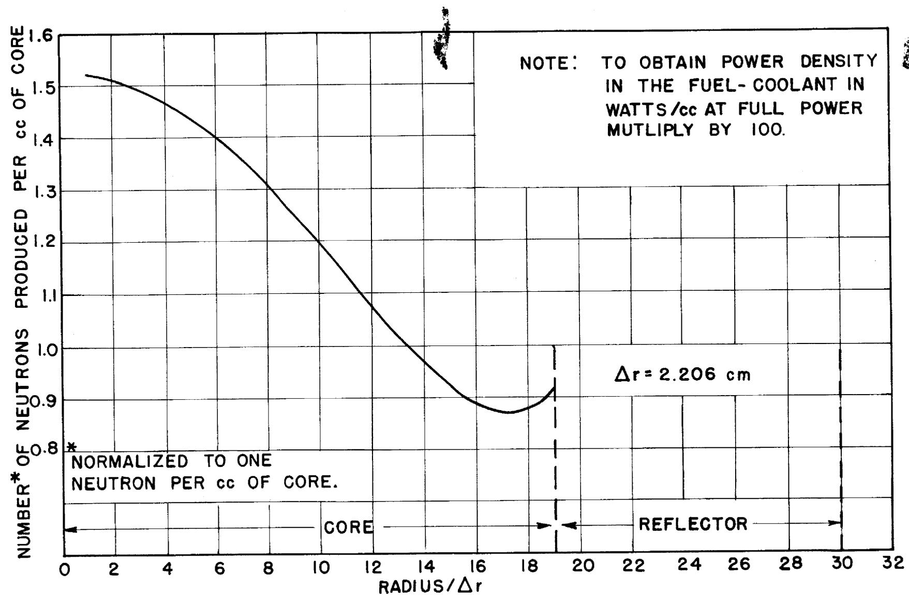  
FIGURE22. RADIAL POWER DISTRIBUTION IN THE EXPERIMENTAL REACTOR

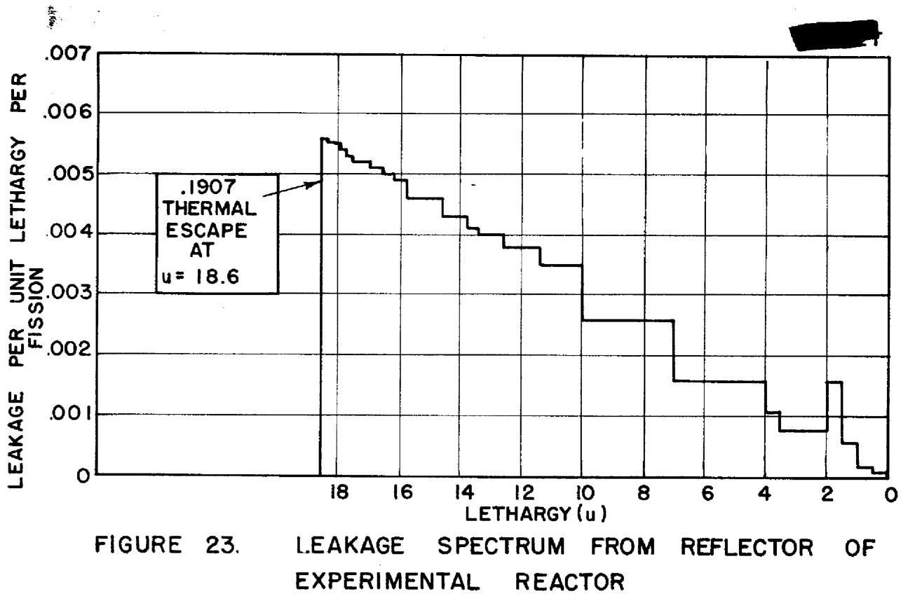

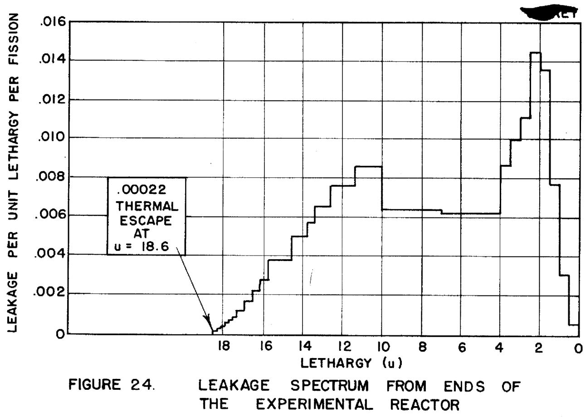

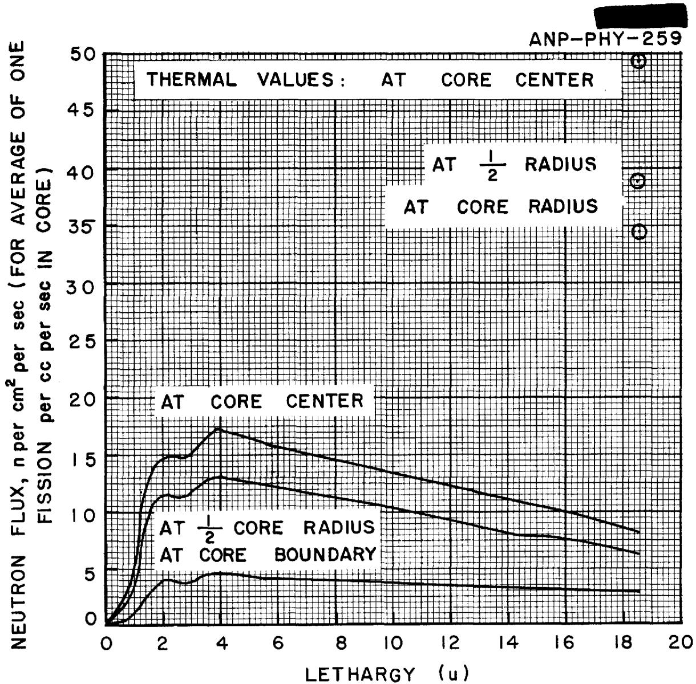  
FIGURE 25. NEUTRON FLUX SPECTRUM AT VARIOUS LOCATIONS IN THE EXPERIMENTAL REACTOR

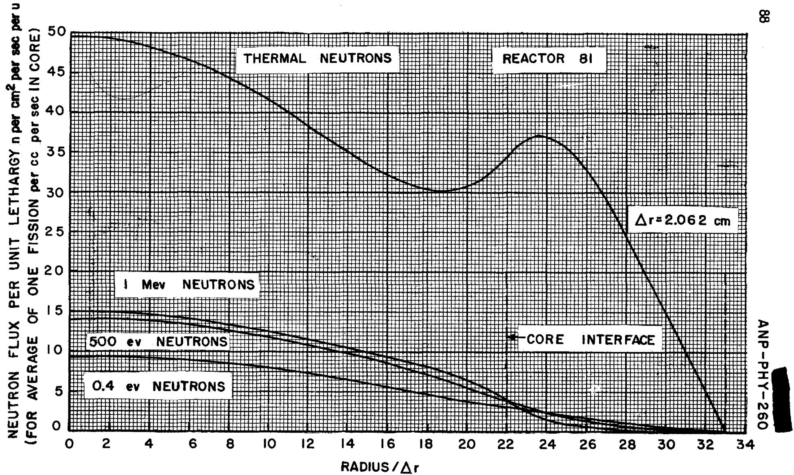  
FIGURE 26. RADIAL NEUTRON FLUX DISTRIBUTION IN THE EXPERIMENTAL REACTOR

# Kinetics

The above temperature coefficients of reactivity refer to slow changes in temperature. For sudden power surges, only the fuel temperature follows the power, and only $\frac{\Delta k / k}{(\Delta m / m)}$ and $\frac{\Delta k / k}{(\Delta \rho / \rho)_{\text{coolant}}}$ are effective. They

give, together, a negative temperature coefficient of about $10^{-4} / ^{\circ}\mathrm{C}$ . There appears to be no conceivable mechanism by which a large change of $\mathbf{k}_{\mathrm{eff}}$ could be introduced very much faster than it can be compensated for by the control rods. However, if the control rods lagged behind the reactivity change to the extent that $\Delta \mathbf{k}_{\mathrm{eff}}$ remained uncompensated, a temperature increase of $\Delta \mathbf{k}_{\mathrm{eff}} / (10^{-4} / ^{\circ}\mathrm{C})$ would result. For $\Delta \mathbf{k}_{\mathrm{eff}} = 1\%$ , this amounts to $100^{\circ}\mathrm{C}$ .

Fast power oscillations would have a period given by $2\pi \sqrt{\lambda_0aSP}$ 12 where

$\lambda_{0}$ is the reciprocal of the mean neutron lifetime, about $10^{+4} \sec^{-1}$ , $\mathbf{a}$ the temperature coefficient of reactivity about $10^{-4} \mathsf{OC}$

S the reciprocal of the heat capacity of the total fuel, 6.4 x $10^{-3} \mathrm{O} / \mathrm{W}$ att sec (assuming a heat capacity per unit volume of about 1 cal/cc $^{\circ} \mathrm{C}$ )

$\mathbf{P}_0$ the reactor power, 3 megawatt

This yields a period of $1 - 1/2$ sec, long enough for a servo system to keep up with the oscillation.

Furthermore, at 4 ft/sec it takes the fuel about 8 sec to pass through the eleven tubes, each 3 ft. long. Hence, about $\frac{3}{4}$ of the delayed neutrons are given off inside the reactor and the loss of delayed neutrons due to fuel circulation does not appreciably decrease the damping which the delayed neutrons afford. Furthermore the circulation of the fuel itself creates a certain amount of damping, as yet not evaluated quantitatively.

The damping effect due to the circulation of the fuel is illustrated by Figure 27 taken from Y-F10-109, "Note on the Non-Linear Kinetics of Circulating-Fuel Reactor," by S. Tamor. The curve illustrated refers to a somewhat simplified model, having the following properties:

(1) All particles of the fuel spend the same time $\theta$ in the reactor.   
(2) The flux and power distributions are constant over the reactor; so that the temperature rise of a fuel particle during a time interval dt is proportional to the total reactor power P(t), the proportionality constant being independent of spatial coordinates; and so that a temperature change of an element of fuel influences the reactivity to an extent independent of the position of the element.

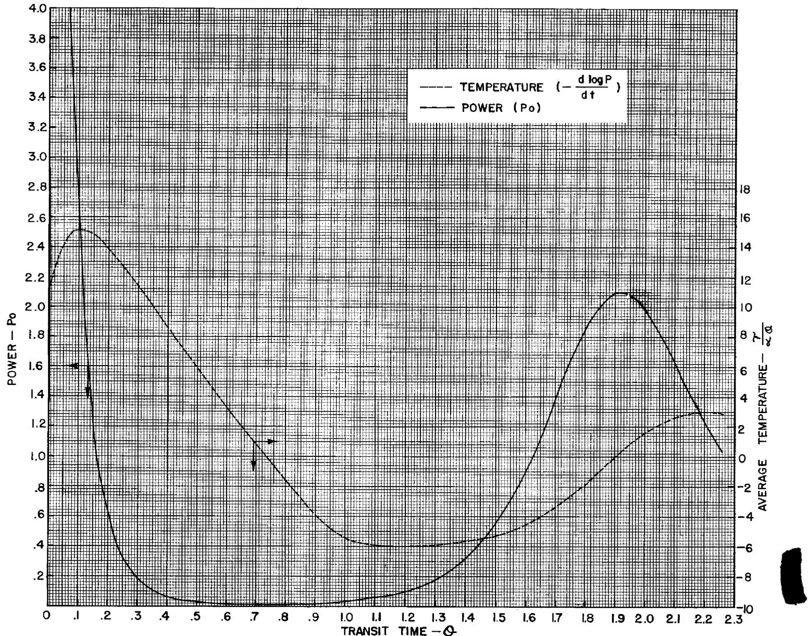  
FIGURE 27. POWER AND TEMPERATURE OSCILLATIONS OF A CIRCULATING FUEL REACTOR

(3) A deviation $T$ of the average fuel temperature from the equilibrium value $T = 0$ causes instantaneously a reactivity change proportional and opposite in sign to $T$ .   
(4) The reactor inlet temperature is constant.

The numerical values used were: temperature coefficient of reactivity $\alpha = 10^{-4} / ^{\circ}\mathbf{C}$ , fast generation time $\tau = 10^{-4}$ sec, reciprocal total heat capacity of fuel $2.67 \times 10^{-6}\mathrm{OC} / \mathrm{watt}$ sec, average power $\mathbf{P}_{\mathrm{o}} = 3 \times 10^{6}$ watts, fuel transit time through the reactor $1 / 8$ sec. These values fall in the region applicable to ANP size reactors, but the general kinetic behavior is the same for an ARE. The initial conditions were: power equal to $\mathbf{P}_{\mathrm{o}}$ at all times up to $1 / 10$ of a transit time before $\mathfrak{t} = 0$ . For a period of $1 / 10$ transit time just before $\mathfrak{t} = 0$ , the power is forcibly held at $10\mathbf{P}_{\mathrm{o}}$ . At $t > 0$ , the system is left to itself. The unit of the abscissa is the transit time $\theta$ . The ordinate on the right side is $\mathbb{P}$ in units of $\mathbf{P}_{\mathrm{o}}$ , and the ordinate on the left is the average temperature $\mathbf{T}$ in units of $\tau / \alpha \theta$ . It can be seen that already the second overswing is much smaller than the first disturbance. This problem of damping fuel circulation is discussed in somewhat more general terms in Y-F10-98.

# Control

Static calculations of the various mechanisms for the regulation, safety, and shim control of the circulating-fuel ARE are given in terms of changes in reactivity. The one boron carbide regulator rod, fully inserted, effects a net change in reactivity of 0.0075. The three safety rods each effect a net change in reactivity of 0.053. Details of the design of these control mechanisms are given under "Engineering Design" and their operation is further discussed under "Reactor Operation."

# Shim Control Requirements

Estimated reactivity changes, $\Delta k / k_{\mathrm{eff}}$ , from room temperature to $1000^{\circ}\mathrm{F}$ and to an assumed controlled reactor temperature of $1283^{\circ}\mathrm{F}$ are given in Table 12. (Though this table was computed for a somewhat different fuel, it is essentially correct for the presently preferred fuel.)

The effect of xenon on reactivity at full power is to reduce the $\mathbf{k}_{\mathrm{eff}}$ of the clean reactor by $\Delta \mathbf{k} = 0.0031$ . Maximum transient xenon reduces $\mathbf{k}_{\mathrm{eff}}$ further by $\Delta \mathbf{k} = 0.0082$ . The temperature coefficient as a result of the xenon at full power is $\left(\frac{\Delta \mathbf{k} / \mathbf{k}}{\Delta \mathbf{T}}\right)_{\mathrm{Xe}} = +6.4 \times 10^{-7}$ per $^{\circ}\mathrm{F}$ in the vicinity of $1400^{\circ}\mathrm{F}$ .

# TABLE 12

SHIM CONTROL REQUIREMENTS   

<table><tr><td rowspan="2">Effect</td><td rowspan="2">Assumption</td><td rowspan="2">Equation for (Δk/keff)/ΔT</td><td colspan="3">Δk/kefffor Change</td></tr><tr><td>from 100 to 1000°F</td><td>from 1000 to 1283°F</td><td>of 1°F at oper. temp.</td></tr><tr><td>Expansion of liquid fuel</td><td>Volume expansion coefficients per OF: fuel, 1.67 x 10-4(melt-ing ignored). Inconel, 0.20 x 10-4.Difference, 1.47 x 10-4.</td><td>-1.47 x 10-4[Δk/k(Δm/m)U + Δk/k(Δρ/ρ)coolant]</td><td>-0.046</td><td>-0.015</td><td>-5.2 x 10-5</td></tr><tr><td>Dimensional expansion with constant material density</td><td>Radial expansion determined by inconel, axial by BeO.</td><td>6.1 x 10-6Δk/k(ΔR/R)core</td><td>+0.002</td><td>+0.001</td><td>+0.3 x 10-5</td></tr><tr><td>Change of BeO density</td><td>Linear expansion coefficients per OF: Inconel, 6.7 x 10-6, BeO, 4.9 x 10-6. Weighted average expansion coefficients linear, 6.1 x 10-6; volume, 18.3 x 10-6per OF.</td><td>-18.3 x 10-6Δk/k(Δρ/ρ)mod</td><td>-0.008</td><td>-0.003</td><td>-0.9 x 10-5</td></tr><tr><td>Change of density of inconel in core</td><td>Inconel volume expansion coefficient per OF, 20 x 10-6.</td><td>-20 x 10-6Δk/k(Δρ/ρ)Inc</td><td>+0.003</td><td>+0.001</td><td>+0.3 x 10-5</td></tr><tr><td>Change of density of reflector BeO</td><td>Same as metal cooled ARE (See Y-F10-77).</td><td></td><td>-0.005</td><td>-0.002</td><td>-0.6 x 10-5</td></tr><tr><td>Change of cross sections with reactor temperature</td><td>Except Xe cross section.</td><td>Δk/k/OF</td><td>-0.027</td><td>-0.005</td><td>-0.2 x 10-5</td></tr><tr><td>Change of Xe cross section with reactor temperature</td><td>0.26 of decay products in the core, remainder in external circuits.</td><td></td><td></td><td></td><td>+0.1 x 10-5</td></tr><tr><td></td><td>TOTAL</td><td>Δk/k</td><td>0.081</td><td>-0.023</td><td>-6.2 x 10-5</td></tr></table>

# Regulating Rod

In the poison control system there is one axial boron carbide regulator rod lying along the longitudinal axis of the cylindrical reactor. The permanent reactivity effect of the regulator structural material is included in the core volume fractions. Detailed calculations have been made for the sodium-cooled ARE reactor of this reactor control system design. The only important reactor characteristic that affects the control rod effectiveness is the neutron spectrum, and this spectrum is quite similar for the sodium-cooled reactor and the present ARE. Hence, the control rod effect on reactivity is assumed to be the same. The net change in reactivity when the regulator rod is fully inserted is 0.0075.

# Safety Rods

Three safety rods are equally spaced on a 15-in. circle around the reactor axis. The spacing is sufficiently large to reduce the shadowing effect of each rod on the others to a relatively small value, so this effect is not considered. The rods are 2-in. -dia cylinders of boron carbide with wall thickness of 0.335 in., and a beryllium oxide rod is attached to the end of each rod. The normal position of the safety rods is out so that beryllium oxide will be added to core material with a resulting decrease in the uranium requirement. The net change in $\mathbf{k}_{\mathrm{eff}}$ for each rod is thus the sum of two reactivity contributions: (1) from the removal of beryllium oxide moderating material, and (2) from the insertion of a 2-in. -dia boron carbide neutron-absorbing rod. Each boron carbide rod is worth -5.3% in $\Delta \mathbf{k} / \mathbf{k}$ , and each beryllium oxide rod in the same position is worth +0.16%. The Inconel around the boron carbide rods is not an effective poison when the rods are inserted and results in a decrease in poison rod effect of 0.21%. The net effect of insertion of the three safety rods is thus 15.75% in $\mathbf{k}_{\mathrm{eff}}$ . This value is larger than that quoted for the metal-cooled reactor because there is no poison NaK to displace. The 15.75% in $\mathbf{k}_{\mathrm{eff}}$ corresponds to about 6 lb of uranium in the core.

# REACTOR MATERIALS

# High-Temperature Liquid Fuels

High-temperature reactors in which the fuel is liquid promise certain advantages in power output per unit weight, control characteristics, and ease of fuel recovery over comparable solid fuel models. However, such designs impose stringent specifications on the liquid chosen as the fuel. Among the general and specific characteristics of the liquid which must be considered are:

1. The liquid must contain sufficient uranium for criticality.   
2. No elements of high cross section can be present.   
3. The melting point must be safely below lowest design temperature.   
4. The vapor pressure must be low at the highest design temperature.   
5. The viscosity must be low throughout the design temperature range.   
6. The coefficient of thermal expansion must be large.   
7. The heat transfer properties (specific heat, thermal conductivity, and heat transfer coefficient) must be favorable.   
8. The material must be radiation stable at design temperature and otherwise suitable structural metals must be able to serve as container materials.   
9. The fuel must be amenable to simple chemical reprocessing.   
10. Additional advantages may be obtained if the liquid contains sufficient light elements to make it self-moderating.

The recent adoption of a design in which the liquid fuel is circulated to the heat exchanger effects some considerable engineering simplifications, particularly in removing the heat transfer system from the core. Such designs, however, impose additional demands on the fuel system in terms of efficient start-up of the reactor. It will obviously be advantageous to melt the fuel to a mobile fluid at the lowest possible temperature to minimize the required preheating of the reactor. In addition, the liquid system must be chosen so that a dilute (subcritical) fuel solution may be introduced into the core, and small increments of a concentrated solution of uranium in the same solvent may be added to bring the system to criticality. This requires that solutions of widely differing uranium content melting at temperatures well below the operating range be available and that no high-melting-point compounds be formed at intermediate concentrations.

Liquid fuels possessing the capacity for self-moderation would permit the simplest reactor design. Although a mixture of sodium hydroxide and lithium hydroxide will dissolve sufficient uranium, hydroxide mixtures cannot be contained at reactor temperatures, and adequate quantities of the heavy lithium isotope are not available. For liquid fuels in which no moderator is present, solutions of uranium in liquid metals and inorganic salts are the two outstanding possibilities. Although it has not been possible to prepare a solution of suitable uranium concentration in liquid metals, a number of fluoride salt combinations, all including $\mathbf{U}\mathbf{F}_4$ , have been developed as potential reactor fuels. Of these, the system NaF-KF-ZrF4-UF4 appears to best fulfill the required characteristics of the fuel for the ARE, as itemized above.

# Homogeneous Fuels

The logical, and indeed almost the only, choice of materials for selfmoderating fuels are solutions of uranium compounds in the alkali hydroxides. Preparation of such solutions in the proper concentration ranges is not a simple matter. Uranium trioxide seems to be soluble in a mixture of sodium and lithium hydroxides to an extent that would permit construction of a homogeneous high-temperature reactor if the low cross-section lithium isotope were available.[13] Lack of this isotope and a suitable container for the resulting liquid does not permit construction of a feasible reactor at present.

# Nonmoderating Fuels

From the standpoint of heat transfer properties and probably from that of minimum radiation damage, solutions of uranium metal in liquid metals would be a superior fuel. It does not, however, seem feasible to prepare a solution with suitable uranium concentration and especially solutions with relatively wide ranges of concentrations at the proper operating temperatures in such systems.

Liquid fuels in which uranium compounds are dissolved in fused salts appear more promising. (Although such fuels seem practical for the ARE, considerably more experimental effort will be required to demonstrate their utility in a full-scale aircraft reactor.) The restrictions on vapor

pressure, thermal stability, and low neutron cross section, as well as preliminary experiments on radiation stability, suggest fluorides as the best chemical compound for this purpose. Of the uranium compounds, $\mathbf{U}\mathbf{F}_4$ seems to offer the most promise although the little-known $\mathbf{U}\mathbf{F}_3$ might offer certain advantages. The high melting points of the pure compounds involved seem to be the greatest disadvantage.

A number of inorganic fluorides, notably NaF, KF, BeF $_2$ , ZrF $_4$ , LiF, PbF $_2$ , and BiF $_3$ , are useful, especially in combination, in lowering the melting point of UF $_4$ . As the data in Table 13 indicates melting points sufficiently low for reactor operation may be obtained by dissolving UF $_4$ in any of several different systems. Most of these systems, however, show low melting points only at high uranium concentrations.

TABLE 13   
MELTING-POINT DATA FOR POTENTIAL FUEL SYSTEMS   

<table><tr><td rowspan="2">System</td><td rowspan="2">U Concentration Range 
Melting below 550°C 
(mole % UF4)</td><td colspan="2">Lowest Melting Mixture</td></tr><tr><td>M. P. (±10°C)</td><td>Composition (mole %)</td></tr><tr><td>NaF-BeF2-UF4</td><td>0-15</td><td>330</td><td>50 - 47 - 3</td></tr><tr><td>LiF-NaF-KF-UF4</td><td>0-6</td><td>450</td><td>97 (LiF-NaF-KF)* - 3 UF4</td></tr><tr><td>NaF-RbF-UF4</td><td>24-41</td><td>500</td><td>45 - 23 - 32</td></tr><tr><td>NaF-KF-RbF-UF4</td><td>18-41</td><td>500</td><td>56.3 - 3.7 - 15.0 - 25.0</td></tr><tr><td>NaF-KF-UF4</td><td>26-30</td><td>530</td><td>46.5 - 26.0 - 27.5</td></tr><tr><td>NaF-LiF-UF4</td><td>15-39</td><td>450</td><td>16.5 - 52.5 - 31.0</td></tr><tr><td>LiF-UF4</td><td>24-32</td><td>480</td><td>73.5 - 26.5</td></tr><tr><td>LiF-NaF-BeF2-UF4</td><td>0-15</td><td>255</td><td>49 - 30 - 20 - 1</td></tr><tr><td>NaF-PbF2-UF4</td><td>0-22</td><td>480</td><td>57 - 28 - 15</td></tr><tr><td>NaF-KF-ZrF4-UF4</td><td>0-5</td><td>425</td><td>5 - 51 - 42 - 2</td></tr></table>

\*LiF-42 mole $\%$ NaF-11.5 mole $\%$ KF-46.5 mole

For the circulating-fuel reactor the desired uranium concentration is about 4 mole % (15 to 20 lb of U $^{235}$ per ft $^3$ ). Thus, many of the potential systems are not suitable with high U $^{235}$ enrichment. $^{14}$ Use of more nearly normal uranium would result in increased critical masses and would probably be feasible at reasonable penalty only for the NaF-RbF-UF $_4$ , Li $^7$ F-NaF-UF $_4$ , or Li $^7$ F-RbF-UF $_4$ systems.

* Phase equilibria in the system NaF-BeF $_2$ -UF $_4$ (Figure 28) show this system to have a wide range of uranium concentration even at melting points as low as $350^{\circ}\mathrm{C}$ . However, because of its relatively high viscosity the system may not be used in the ARE although it could be advantageously employed in an aircraft reactor system.

The most promising fuel for the ARE seems to be obtained by addition of $\mathbf{U}\mathbf{F}_4$ to suitable compositions in the ternary system NaF-KF-ZrF $_4$ shown in Figure 29. Mixtures obtained by addition of 5 mole % of $\mathbf{U}\mathbf{F}_4$ to a melt containing 46 mole % ZrF $_4$ , 36 mole % NaF, and 18 mole % KF melt in the range 465 to $495^{\circ}\mathrm{C}$ . It appears practical, therefore, to start the reactor by adding small, uranium-rich portions to a dilute, subcritical fuel. The viscosity of this fuel has been shown to be low enough to permit turbulent flow in the ARE core system.

In addition, the ternary system NaF-RbF-ZrF₄ seems to be of considerable value as a fuel solvent. The cross section of rubidium is markedly lower than that for potassium, and the melting points available with RbF appear to be considerably lower than those for the KF prototypes. Although RbF is not now commercially available in quantity at a reasonable price, it would definitely seem to be worthy of future consideration.

If necessary, $\mathbf{U}\mathbf{F}_3$ could probably be substituted for $\mathbf{U}\mathbf{F}_4$ with little penalty so far as melting point is concerned. It should be noted, however, that if the heavy isotope of lithium were available in pure form, several additional low-melting-point systems of possible value would warrant immediate consideration.

# Chemical Properties

Uranium tetrafluoride is the most reactive of the materials contemplated for use in the reactor fuel. This well-known material reacts with oxygen at elevated temperatures to yield $\mathrm{UO}_2\mathrm{F}_2$ and $\mathrm{UF}_6$ as the major reaction products. It reacts readily with water vapor at temperatures above

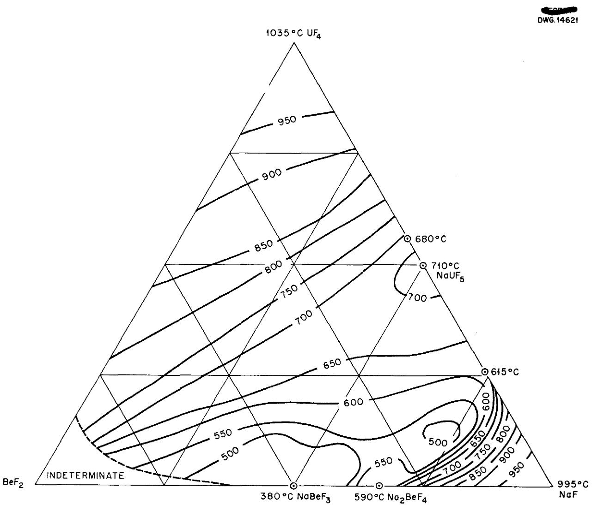  
FIGURE 28. THE SYSTEM NaF-BeF $_2$ -UF $_4$

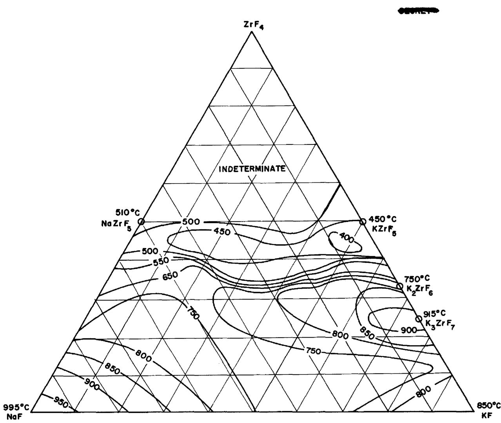  
FIGURE 29, THE SYSTEM NaF-KF-ZrF4 (TENTATIVE)

$500^{\circ}\mathrm{C}$ to give HF and $\mathrm{UO_2}$ . The alkali fluorides are capable of slight hydrolysis at elevated temperatures into HF, and the alkali hydroxides and $\mathrm{ZrF_4}$ are intermediate between the alkali fluorides and $\mathrm{UF_4}$ in ease of hydrolysis. None of the latter compounds react appreciably with oxygen. $\mathrm{UF_3}$ would almost certainly hydrolyze readily and probably would be oxidized simultaneously; the major products probably would be $\mathrm{UO_2}$ and $\mathrm{UF_4}$ if the reaction took place in insufficient oxygen.

It is essential that such reactions be avoided since the oxides formed would be insoluble in the melt. In addition to the possibility that the oxides would contribute to the corrosion difficulties, they would certainly segregate and lead to control troubles during reactor operation. Prevention of oxidation of these materials should present little difficulty since they would be prepared in a closed system and thoroughly outgassed at low temperatures before the melting operation. The alkali fluorides and beryllium fluoride, however, are extremely hydroscopic materials and cannot be dried in reasonable periods of time by evacuation at low temperatures. Elevation of the temperature after addition of $\mathbf{U}\mathbf{F}_4$ would result in hydrolysis of the material.

It should be possible to dry the materials separately and then perform all the operations in completely dry atmospheres. It seems more reasonable, however, to mix the materials in a reasonably dry condition and accomplish the final drying and reconversion to fluoride of any oxide produced by hydrofluorination at 500 to $600^{\circ}\mathrm{C}$ . Under these temperature conditions $\mathrm{UO}_2$ would be completely converted to $\mathrm{UF}_4$ by treatment with dry HF. The acid fluorides of the alkali metals are completely decomposed at $400^{\circ}\mathrm{C}$ so that complete removal of the excess HF would present no problem. The purified and oxygen-free fuel would be maintained under a completely inert atmosphere in its original container and charged as a liquid directly into the reactor.

# Physical Properties

Since a final choice of the fuel composition cannot be made until after the critical experiment, it is not possible to cite specific values for the physical properties. Several compositions in the system NaF-KF-ZrF $_4$ -UF $_4$ are under concerted study at present.

It seems apparent that the vapor pressure of the NaF-KF-ZrF $_4$ -UF $_4$ system will be low (probably less than 5 mm) at $1500^{\circ}\mathbf{F}$ . The vapor pressure of $\mathrm{ZrF_4}$ is estimated in the open literature at $10^{-4}$ atmospheres at $9000\mathrm{K}$ and the vapor pressure of UF $_4$ is known to be about 6 mm at $1273^{\circ}\mathrm{K}$ . Sodium and potassium fluorides are even less volatile. However, neither $\mathrm{ZrF_4}$ nor UF $_4$ exists as such in these fuels. The zirconium is apparently

combined in complexes of the type $\mathrm{Na_2ZrF_6}$ and $\mathrm{NaZrF_5}$ , whereas the uranium fluoride seems to exist in similar compounds. These materials, along with the alkali fluorides, are considerably less volatile.

The coefficient of thermal expansion has been studied for a number of fused salt mixtures containing uranium tetrafluoride. The value of $3 \times 10^{-4}$ / $\mathrm{^o C}$ should be sufficient for control purposes. The density for a fuel containing 18 to 20 lb of uranium tetrafluoride per cubic foot is about $3.0\mathrm{g} / \mathrm{cc}$ at $1500^{\mathrm{o}}\mathrm{F}$ . The density of this fuel NaF-KF-ZrF $_4$ -UF $_4$ (mole % 34.7-17.4-44.4-3.5) is shown in Figure 31.

One of the more important physical properties, so far as the ARE design is concerned, is the viscosity of the fuel throughout the temperature range of operation. Examination of the literature has indicated that the viscosities of pure fused salts, including fluorides, should be 1 to 2 centipoises at temperatures 300 to $400^{\circ}\mathrm{C}$ above their melting points. Preliminary experiments with the system NaF-KF- $\mathbf{U}\mathbf{F}_4$ at high uranium concentrations indicated that the viscosities were relatively high (2 1/2 to 4 centipoises at $800^{\circ}\mathrm{C}$ ). There was definite indication that even higher viscosity values would be obtained if hydrolysis occurred and if appreciable amounts of $\mathbf{U}\mathbf{O}_2$ were suspended in the measured liquid.

Experiments with various mixtures in the NaF-KF-ZrF₄-UF₄ system containing 2.0 mole % UF₄ have shown the viscosity to be less than 10 centipoises at 625°C; these data are shown in Figure 30. Although further study will be necessary to establish accurate values for the actual fuel mixture (containing 3.5 mole % UF₄) it is evident that the viscosity values will be within acceptable limits.

# Chemical Processing

An attractive feature of the liquid fuel reactors is the ease with which the fuel may be removed from the core, manipulated by remote-control devices, and chemically processed to decontaminate and recover the uranium for subsequent reuse. For the liquid fluoride fuels, at least two simple methods of chemical processing should be feasible.

The fluoride fuels may be dissolved in aqueous solutions containing oxidants and agents capable of strong complexing of fluoride ion. The liquid fuel could be drained to a remote, shielded container, cooled, dissolved in an aqueous solution of aluminum nitrate and nitric acid, and treated with additional aluminum nitrate to form a solution from which the uranium may be recovered by extraction with organic solvents. The organic solvent layer could subsequently be selectively washed to remove various fission products and finally scrubbed to recover the uranium in aqueous solution.

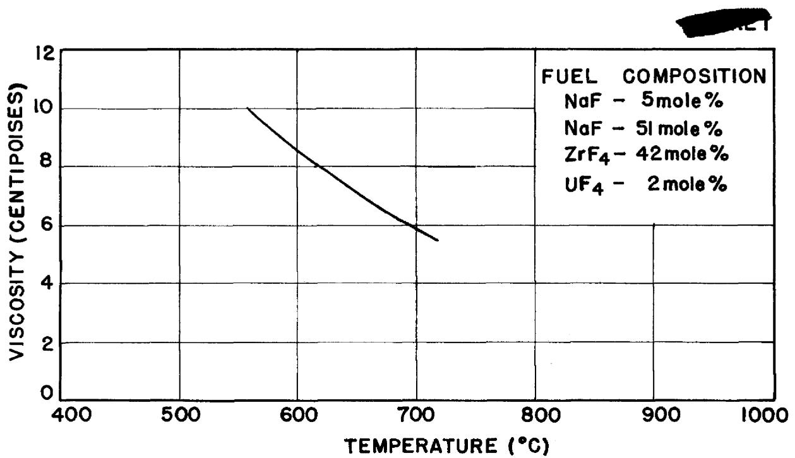  
FIGURE 30 VISCOSITY OF NaF-KF-ZrF4-UF4 AS A FUNCTION OF TEMPERATURE

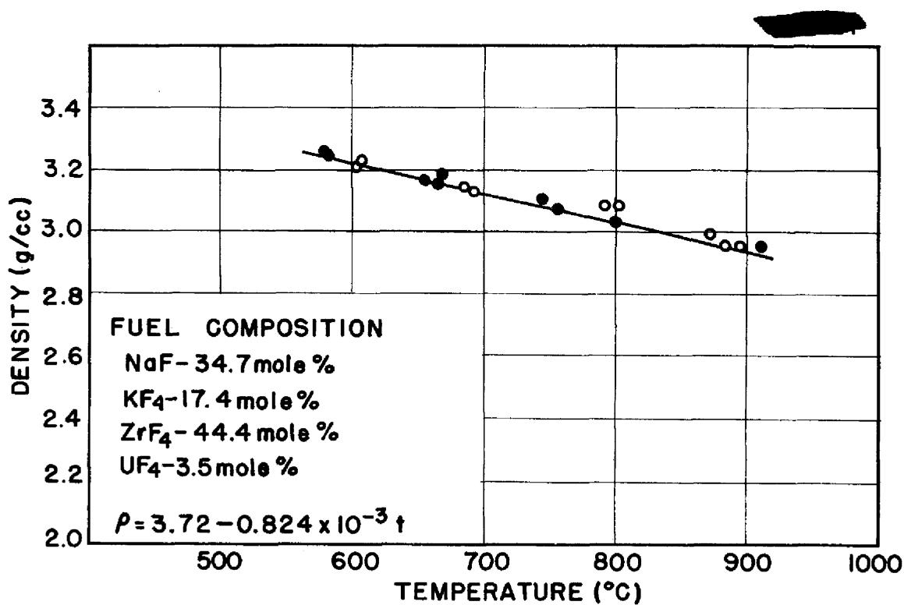  
FIGURE 3I DENSITY OF NaF-KF-ZrF4-UF4 AS A FUNCTION OF TEMPERATURE

This uranium would, presumably, be precipitated with ammonia or hydrogen peroxide, calcined to $\mathrm{U}_{3}\mathrm{O}_{8}$ or $\mathrm{UO}_3$ , reduced with hydrogen to $\mathrm{UO}_2$ , and hydrofluorinated to $\mathrm{UF}_4$ . If all these operations were to be carried out by means of remote-control devices, as should be possible, a particularly high degree of decontamination would not be required.

Another possible recovery cycle of apparent attraction involves successive hydrofluorination and fluorination of the solidified fuel. In this method the fuel would be drained from the reactor into storage tanks behind proper shielding, allowed to solidify, and treated with gaseous HF at elevated temperatures to remove all fission products whose lower valence fluorides are volatile. At the conclusion of the hydrofluorination reaction, gaseous fluorine would be admitted at considerably lower temperatures to volatilize the contained uranium as $\mathbf{U}\mathbf{F}_6$ . The sodium, potassium, and zirconium fluorides contaminated with the fission products that failed to form volatile fluorides would be left. The $\mathbf{U}\mathbf{F}_6$ could be reduced directly to $\mathbf{U}\mathbf{F}_4$ by use of an organic reducing agent at a moderate temperature in the presence of sufficient sodium, potassium, and zirconium fluorides to form a liquid suitable for reuse as fuel. This set of reactions could probably be conducted by remote control; it remains to be seen whether adequate decontamination of the uranium would be provided.

# Structural Metals

The structural metals for the final aircraft reactor must be carefully selected to satisfy a large number of very stringent requirements. Since heat transfer will be a major problem, the heat exchanger design must make use of large numbers of extremely thin-walled tubes. The metal chosen must therefore be easy to fabricate in reasonably intricate leak-tight assemblies and must be virtually completely resistant to the fluorides sofar as corrosion and mass transfer are concerned. In addition, high-temperature strength, creep strength, etc., of the metal must be satisfactory in the thin wall sections, and these properties must be unaffected by the fluorides and their corrosive action.

Not all these problems are of great importance in operation of the ARE. The heat exchanger system to withdraw power at the modest design rate need not be elaborate; therefore thin-walled tubing in the heat exchanger region is not necessary. Within the reactor the critical mass is not particularly sensitive to thickness of the metal tube walls; the ARE may be designed with large factors of safety from all points of view and, if necessary, considerable corrosion by the fuel may be tolerated.

Molybdenum, which would be superior from a high-temperature strength viewpoint, cannot yet be fabricated easily. Among the common high-temperature structural metals none appears clearly superior in strength, and several of them (Inconel, 400 and 300 series stainless steels) possess sufficient high-temperature strength and creep resistance to be suitable, especially if thick-walled tubing is used. Choice of the metal for the ARE can therefore be made largely on the basis of resistance to corrosion by molten fluorides.

Many structural metals, including nickel, Inconel, and the 300 and 400 series stainless steels, have been shown to be adequate containers for the fluoride mixtures under static, isothermal conditions. Nickel and Inconel, however, appear to be most resistant to these materials under dynamic conditions. In 500 hr of exposure, with the heated portion of a convection loop at 1500 and $250^{\circ}\mathrm{F}$ temperature gradient, some 3 to 7 mils of pitting has been observed on an Inconel test loop containing carefully prepared NaF-KF-ZrF $_4$ -UF $_4$ mixture. The ARE Inconel fuel tubes with 60 mil walls should certainly be adequate for the scheduled 1000 hr of reactor operation; meanwhile, it is believed that this corrosion can be materially reduced.

# Static Corrosion

Corrosion of a variety of structural metals under static isothermal conditions was shown to be very slight when the melt consisted of $\mathbf{U}\mathbf{F}_4$ in alkali and alkaline—earth fluorides with and without zirconium fluoride. Mixtures containing lead fluoride were unsatisfactory since structural metals reduced this compound to metallic lead.

The metals which proved to have adequate resistance to static corrosion by mixtures of alkali, alkaline earth, zirconium, and uranium fluorides are Inconel, nickel, molybdenum, and the stainless steels of the 300 series. The corrosion observed by metallographic examination of the capsule wall generally consisted of intergranular penetration of the metal and attack at the grain boundaries to the extent of 2 mils or less. In these static tests Inconel seemed to be slightly more resistant to attack than did the 300 series stainless steels; the 400 series stainless steels appeared somewhat less satisfactory. On the basis of a few tests, molybdenum appeared somewhat better than any of the metals listed. It appears possible that molybdenum, when its fabrication is better understood, will be of value in later and higher temperature models.

The data in Table 14 indicate that at $1500^{\circ}\mathbf{F}$ , and for intervals of 100 hr, it is possible to contain the fluorides in Inconel or type 316 stainless steel with little corrosive action.

TABLE 14   
STATIC CORROSION OF STRUCTURAL METALS BY POTENTIAL FUELS   
(100 hr Tests at $1500^{\mathrm{OF}}$ )   

<table><tr><td>Fluoride Fuel</td><td>Container</td><td>Weight Change (mg/dm2/day)</td><td>Penetration</td></tr><tr><td>NaF-KF-LiF-UF4*</td><td>Type-316 stainless steel</td><td>-21</td><td>No attack</td></tr><tr><td>NaF-KF-LiF-UF4</td><td>Type-316 stainless steel</td><td>-33</td><td>No attack</td></tr><tr><td>NaF-KF-LiF-UF4</td><td>Type-316 stainless steel</td><td>-36</td><td>Slight pitting</td></tr><tr><td>NaF-KF-LiF-UF4</td><td>Type-316 stainless steel</td><td>-56</td><td>1 mil</td></tr><tr><td>NaF-KF-LiF-UF4</td><td>Type-316 stainless steel</td><td>-3</td><td>0.5 mil</td></tr><tr><td>NaF-KF-LiF-UF4</td><td>Type-316 stainless steel</td><td>-29</td><td>0.5 mil</td></tr><tr><td>NaF-KF-LiF-UF4</td><td>Type-316 stainless steel</td><td>-20</td><td>1 mil</td></tr><tr><td>NaF-KF-LiF-UF4</td><td>Inconel</td><td>-3</td><td>No attack</td></tr><tr><td>NaF-KF-LiF-UF4</td><td>Inconel</td><td>-1</td><td>No attack</td></tr><tr><td>NaF-KF-LiF-UF4</td><td>Inconel</td><td>-2</td><td>No attack</td></tr><tr><td>NaF-KF-LiF-UF4</td><td>Inconel</td><td>+48</td><td>1 to 2 mils</td></tr><tr><td>NaF-KF-LiF-UF4</td><td>Inconel</td><td>+5</td><td>1 to 2 mils</td></tr><tr><td>NaF-KF-LiF-UF4</td><td>Inconel</td><td>+1</td><td>1 mil</td></tr><tr><td>NaF-KF-LiF-UF4</td><td>Inconel</td><td>-7</td><td>1 mil</td></tr><tr><td>NaF-KF-LiF-UF4</td><td>Inconel</td><td>+7</td><td>No attack</td></tr><tr><td>NaF-KF-LiF-UF4</td><td>Inconel</td><td>+10</td><td>1 mil</td></tr><tr><td>NaF-KF-ZrF4-UF4**</td><td>Inconel</td><td>+14</td><td>Light pitting</td></tr><tr><td>NaF-KF-ZrF4-UF4</td><td>Inconel</td><td>+14</td><td>Very light pitting</td></tr><tr><td>NaF-KF-ZrF4-UF4</td><td>Type-316 stainless steel</td><td>+1</td><td>No apparent attack</td></tr><tr><td>NaF-KF-ZrF4-UF4</td><td>Type-316 stainless steel</td><td>-6</td><td>No apparent attack</td></tr><tr><td>NaF-KF-ZrF4-UF4</td><td>Inconel</td><td>-2</td><td>Very light pitting</td></tr><tr><td>NaF-KF-ZrF4-UF4</td><td>Type-316 stainless steel</td><td>-16</td><td>Very light pitting</td></tr><tr><td>NaF-KF-ZrF4-UF4</td><td>Inconel</td><td>-5</td><td>Very light pitting</td></tr><tr><td>NaF-KF-ZrF4-UF4</td><td>Type-316 stainless steel</td><td>-18</td><td>Very light pitting</td></tr></table>

* Composition in mole %: 10.9-43.5-44.5-1.1.   
** Composition in mole %: 5.0-51.0-42.0-2.0.

In similar static tests other special alloys such as Timken alloys Nos. 3 and 6 and Stellite, as well as Hastelloy B, Nimonic, and some molybdenum-nickel alloys, have shown good corrosion resistance. The former alloys will probably be of value in bearings and seals, and the latter may be shown to be superior structural materials.

# Dynamic Corrosion

In tests in which the fluorides are circulated through closed loops by forced thermal convection, however, a definite and more severe corrosion pattern has been revealed. The loops for these tests have been prepared by heliarc welding of $1/2$ in. -IPS schedule 40—pipe of the desired material. The hot leg of the loop is maintained at $1500^{\circ}\mathbf{F}$ by electrical resistance heaters. Temperatures in the cold leg of the loops are maintained at 150 to $180^{\circ}\mathbf{F}$ below those of the hot leg. The loops are sealed with an atmosphere of dry, oxygen-free helium above the liquid. Under these conditions of operation the circulation rate is 6 to 8 ft/min.

In initial tests using mixtures of $\mathbf{U}\mathbf{F}_4$ with alkali fluorides only loops of Inconel and nickel have operated for 500 hr at temperature without difficulty. Loops of series 400 stainless steel were plugged by the deposition of high-melting-point material in the cold leg after less than 30 hours. Loops of 300 series stainless steel showed similar but less rapid plugging, and circulation was stopped by this phenomenon after 100 to 150 hours. Examination of the Inconel loops after scheduled termination of the tests indicated some mass transfer of metal from the hot to the cold portion of loops, but the quantity was insufficient to cause failure of the loop.

Solutions of $\mathbf{U}\mathbf{F}_4$ in $\mathbf{NaF - BeF_2}$ have been shown to be somewhat less corrosive than similar solutions of this material in NaF-KF-LiF mixtures. In general, however, the NaF-KF-LiF mixtures without $\mathbf{U}\mathbf{F}_4$ have been less corrosive than either.

Addition of small quantities of NaK to the NaF-KF-LiF mixtures (without $\mathbf{U}\mathbf{F}_4$ ) considerably improved the corrosion resistance of structural metals. Tests of 500 hr duration in loops of stainless steel have indicated virtually negligible corrosion; photomicrographs of hot-leg sections of loops exposed to NaF-KF-LiF mixture with and without added NaK are shown in Figure 32.

Recent tests in which solutions of $\mathbf{U}\mathbf{F}_4$ in NaF-KF-ZrF $_4$ mixtures have been exposed for 500 hr in Inconel yielded considerably more favorable results. The hot legs of the loops showed scattered pitting to a depth of 3 to 4 mils with infrequent intergranular attack to a depth of 7 mils (see Figure 33). A thin (perhaps 1 mil) nonmetallic layer was observed in the

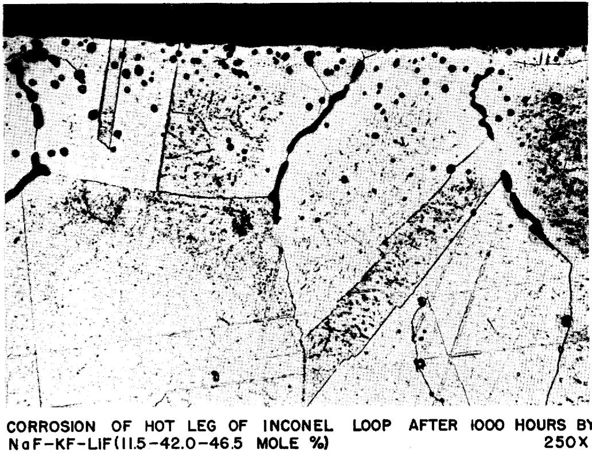

UNCLASSIFIED PHOTO NO. T-966

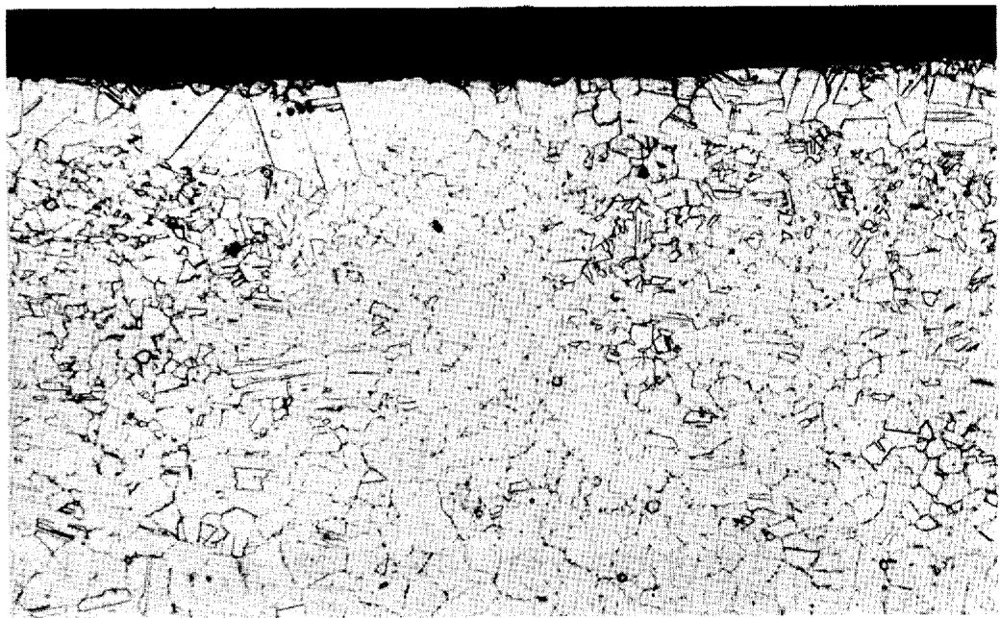

CORROSION OF HOT LEG OF INCONEL LOOP AFTER 500 HOURS BY NaF-KF-LIF (11.5-42.0-46.5 MOLE %) WITH 3.5 VOL.% NaK ADDITIVE 250X FIGURE 32. EFFECT ON NaK ADDITIVE ON THE CORROSION OF INCONEL THERMAL CONNECTION LOOPS BY NaF-LiF-KF AT $1500^{\circ}$ F.

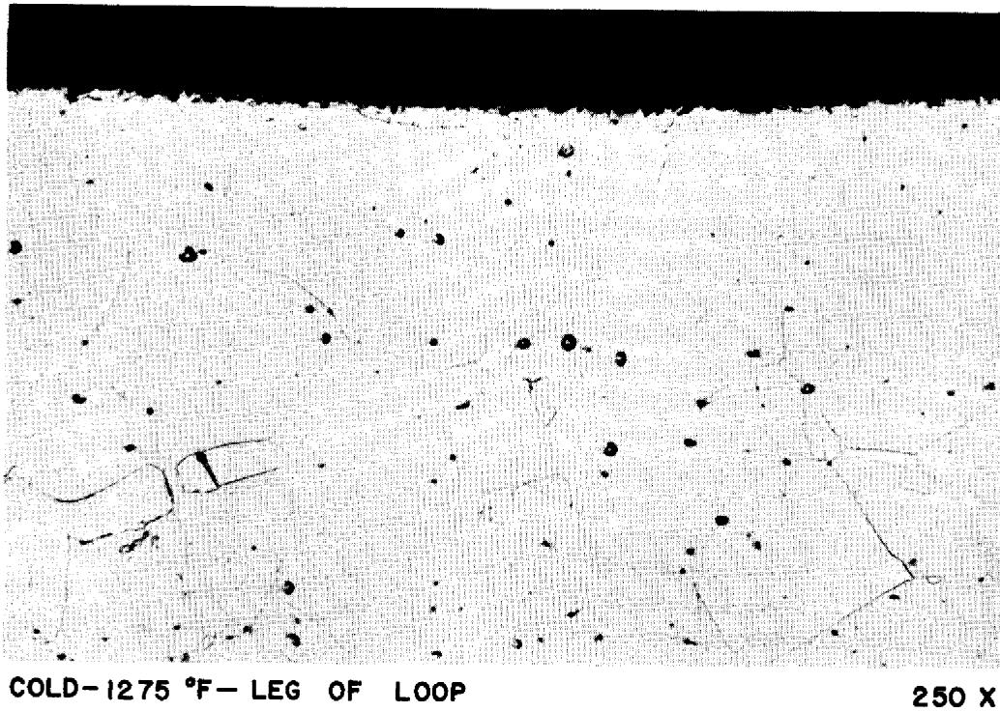

PHOTO NO. T-1334

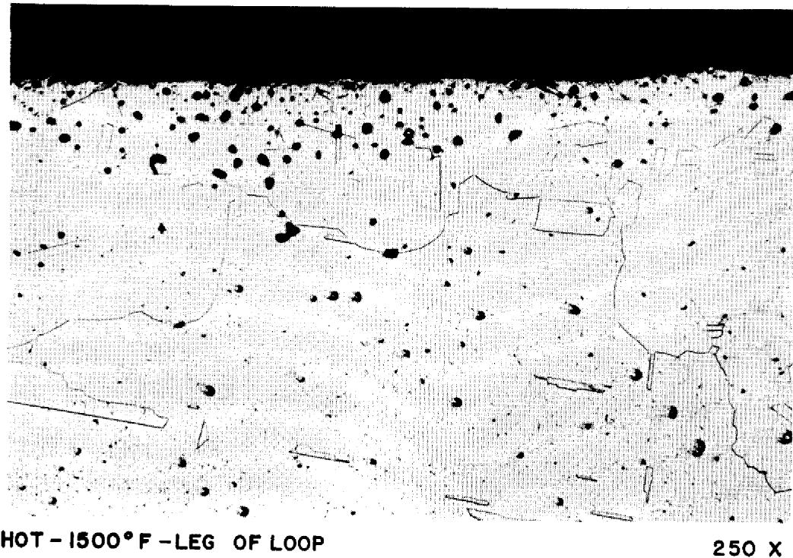  
FIGURE 33. CORROSION OF INCONEL THERMAL CONVECTION
LOOP BY NaF-KF-ZrF4-UF4 (4.8-50.1-41.3-3.8 MOLE %)
AFTER 500 HOURS.

cold legs of the loops; virtually no metallic deposits, such as are produced by mass transfer, were visible. It is believed that the improved results can be attributed to the recently initiated techniques for purification of the liquid fuels before test. It seems certain that the optimum conditions for such purification have not been established and that continued improvement in corrosion resistance of Inconel to the melts is to be expected. Chemical analysis of the fuel before and after operation in the loop is given in Table 15.

TABLE 15 CHEMICAL ANALYSIS OF THE NaF-KF-ZF4-UF4 FUEL FOR CORROSION PRODUCTS   

<table><tr><td colspan="7">(circulated in an Inconel loop for 500 hr)</td></tr><tr><td>Origin of Fuel Material</td><td>Temperature (°F)</td><td>U(%)</td><td>F(%)</td><td>Fe (ppm)</td><td>Ni (ppm)</td><td>Cr (ppm)</td></tr><tr><td>Original batch analysis</td><td>75</td><td>5.90</td><td>39.4</td><td>180</td><td>470</td><td>50</td></tr><tr><td>Hot vertical leg of loop</td><td>1550</td><td>3.88</td><td>40.1</td><td>445</td><td>30</td><td>480</td></tr><tr><td>Hot horizontal leg of loop*</td><td>1250 to 1500</td><td>5.69</td><td>39.6</td><td>240</td><td>20</td><td>480</td></tr><tr><td>Cold vertical leg of loop*</td><td>1250</td><td>5.68</td><td>39.5</td><td>250</td><td>40</td><td>460</td></tr><tr><td>Cold horizontal leg of loop</td><td>1370</td><td>5.61</td><td>39.8</td><td>190</td><td>30</td><td>510</td></tr></table>

* The results presented are the average of two samples from these sections of the loop.

The very considerable improvement in corrosion by uranium-free alkali fluorides that resulted from addition of NaK would seem to offer another possible technique for controlling the corrosion problem. To the extent that this improvement was the result of the cleansing action of NaK on oxidized metal surfaces, and, therefore, to the extent that prior treatment with NaK would effect the benefit, this improvement can be readily realized. If the mechanism requires the continued presence of elemental alkali metal there is the possibility of reduction of $\mathbf{U}\mathbf{F}_4$ and $\mathbf{ZrF_4}$ to compounds of lower valence states and to the metals. Whether the free alkali metal can be tolerated (and to what extent) in the fuel and what benefit can be obtained by cleaning with NaK and its removal prior to fuel addition is under study at present.

The increased corrosion resulting from inclusion of uranium tetrafluoride in the fused salt mixtures, if it is real, may be caused by the oxidizing power of $\mathbf{U}\mathbf{F}_4$ or more probably some material (perhaps $\mathrm{UO_2F_2}$ ) added as an impurity with the uranium. If the oxidizing action of $\mathbf{U}\mathbf{F}_4$ is the cause, then $\mathbf{U}\mathbf{F}_3$ should be a superior material to use. In the other event, increasing the purity of the fuel mixture should improve the situation.

In any case, it appears that for the ARE the corrosion that must at present be considered normal in Inconel for periods up to 1000 hr would not be prohibitive. Present designs for the reactor call for 60-mil tube walls in the hot zone. Corrosion at the rate observed at present would not seriously weaken this structure; it is apparent, therefore that the ARE is feasible even with the corrosion rates presently observed.

# Control Rod Fabrication

The control rod system for the Experimental Reactor consists of three safety rods and one control (regulating) rod. The material for these rods will be produced by powder metallurgy techniques employing hot pressing. The safety rods are constructed of a canned Fe-B $_4$ C mixture. The annular cans are fabricated of type-316 stainless steel and have an inner diameter of 1 l/4 in. and an outer diameter of 2 inches. The annulus between the two walls is filled with the Fe-B $_4$ C mixture. The cans are 1.95 in. long, and about 18 cans will be required per control rod assembly. The B $_4$ C-Fe slugs contain approximately 20% by volume iron, which acts as a binder. The B $_4$ C slugs are 1.86 O.D. by 1.26 I.D. by 1.895 in. long.

At this time 20 of the $\mathbf{B}_4\mathbf{C}$ slugs have been successfully hot pressed. The slugs were fabricated by hot pressing at $1520^{\circ}\mathrm{C}$ under a pressure of 2500 psi using graphite dies. The first few slugs made with this process cracked longitudinally owing to the difference of thermal coefficient of expansion of the $\mathbf{B}_4\mathbf{C}-\mathbf{Fe}$ mixture and the graphite mandrel. This difficulty has been overcome by pressing the mandrel out of the slug while at the hot-pressing temperature.

The regulating rod will be made by using slugs of $\mathrm{Al}_{2}\mathrm{O}_{3}$ impregnated with $\mathbf{B}_4\mathbf{C}$ contained in one of the 300 series stainless steels. Rods of two strengths, in which the only difference will be the amount of $\mathbf{B}_4\mathbf{C}$ added to $\mathrm{Al}_{2}\mathrm{O}_{3}$ , will be made for evaluation in the hot critical experiment. In one case 0.022 to $0.024\mathrm{g / cc}$ of $\mathbf{B}_4\mathbf{C}$ will be added to $\mathrm{Al}_{2}\mathrm{O}_{3}$ , and the other rod will contain 0.005 to $0.006\mathrm{g / cc}$ of $\mathbf{B}_4\mathbf{C}$ with $\mathrm{Al}_{2}\mathrm{O}_{3}$ . The $\mathrm{Al}_{2}\mathrm{O}_{3}$ slugs will have the same dimensions as the $\mathbf{B}_4\mathbf{C}$ slugs except that they will be longer. The dilute slugs will be 2.14 in. long and the strong slugs will be 2 in. long. The slugs for the regulating rod being made are hot pressed at $1675^{\circ}\mathrm{C}$ in graphite dies under pressure of 2500 psi.

Metallographic examination of a slug of $\mathrm{Al}_{2}\mathrm{O}_{3}$ and $\mathbf{B}_4\mathbf{C}$ has shown that the two materials are quite compatible at the operating temperature of the control rods and that there is no undue reaction between this mixture and the 300 series stainless steel container materials. Some of the $\mathbf{B}_4\mathbf{C}$ -Fe slugs have been canned in 300 series stainless steel and brazed through the Microbrazing cycle, which consists of heating at $1130^{\circ}\mathrm{C}$ for $10\mathrm{min}$ ; they

were then held at $815^{\circ}\mathrm{C}$ for 100 hr with slight reaction. Therefore it can be concluded that there will be no difficulty in the fabrication and operation of the regulating and safety rods for the ARE.

# Stress-Corrosion Tests

Any time a structural metal is used in a stressed condition and also subjected to a corrosive media there is the possibility of a stress-corrosion phenomenon. Physical tests are being conducted to obtain data that will indicate whether the structural metal of this reactor, e.g., Inconel, is subject to this phenomenon when in contact with the fluorides. Two types of physical tests have been conducted: (1) tube burst tests to furnish hoop stress data for metals in contact with the fluoride medium and (2) stress-rupture tests in which the specimen is in a fluoride environment.

In the stress-rupture tests, dead weight loading is transmitted to a small sample by means of a bellows. Elongation is measured by the movement of the end of the load lever arm. The sample is held in a bath of fluoride maintained at $816^{\circ}\mathrm{C}$ . In a tube burst test one section of the tube wall is reduced to a known wall thickness and serves as the gage length. The hoop stress is produced by placing an inert gas atmosphere inside the tube while the outside of the tube is bathed in the fluorides at $816^{\circ}\mathrm{C}$ . This test only yields time-to-rupture and total elongation data.

Table 16 is a summary of the stress-rupture data being obtained on Inconel specimens in the fluoride salt, NaF-KF-LiF-UF $_4$ (mole % 10.9-43.5-44.5-1.1), at $816^{\circ}\mathrm{C}$ . The Inconel is used in the as-received condition. These data are compared with that obtained from tests using fine-grain as-received Inconel in an argon atmosphere. As can be seen, the fluorides did not impair the load carrying abilities of the materials appreciably.

TABLE 16   
INCONEL STRESS-RUPTURE DATA   

<table><tr><td rowspan="2">Stress (psi)</td><td colspan="2">Time to Rupture (hr)</td></tr><tr><td>NaF-KF-LiF-UF4</td><td>Argon</td></tr><tr><td>12,500</td><td>6.5</td><td>6</td></tr><tr><td>10,000</td><td>20</td><td>19</td></tr><tr><td>7,500</td><td>25.7*</td><td>80</td></tr><tr><td>5,000</td><td>575**</td><td>270</td></tr><tr><td>4,000</td><td>661***</td><td>430</td></tr></table>

* Average of three tests.   
Test apparatus failed before rupture.   
** Specimen ruptured in weld area of grip rather than in test section.

In addition to the tests listed in the table, one Inconel sample has been under a stress of 4000 psi for 350 hr and another has withstood 5000 psi for 525 hr without undue elongation. Furthermore, Inconel tube burst tests have successfully operated from 500 to 1000 hr at stresses of 2000 to 3000 psi without severe corrosion being induced by the stress.

# Radiation Damage

Inconel capsules containing several different fluoride mixtures have been irradiated in both the LITR and the X-10 graphite pile. Radiation damage studies with the NaF-KF-ZrF $_4$ -UF $_4$ fuel are not yet available because of the time required for the analysis of hot specimens. Nevertheless, the irradiation of other fluoride mixtures at power levels in the range that will exist in the ARE (approximately 100 watts/cc) have shown no apparent increase in decomposition or corrosion owing to the radiation field. However, in the case of one fuel, irradiation at power levels approaching that in the aircraft reactor have yielded results that may be interpreted as considerably increased corrosion under strong irradiation, but no increase was evident in similar tests with a second type of fuel.

Significant data are now available on irradiations of both the NaF-KF- $\mathbf{U}\mathbf{F}_4$ and NaF-BeF $_2$ -UF $_4$ mixtures at various power levels. These data are summarized in Table 17 for several irradiations. Metallographic examination of the metal specimen and analysis of the fluoride melts for metal corrosion products are the methods used for detecting radiation damage. The data from the irradiated specimen are compared with similar data from a control specimen not irradiated but otherwise subjected to as nearly as possible identical treatment. The irradiation intensity is given as watts dissipated per cubic centimeter of specimen, since this is more meaningful than neutron flux when irradiating fissionable material.

As indicated in Table 17, exposures of samples of the NaF-KF-UF $_4$ fuel in Inconel at the maximum flux of the X-10 graphite pile caused a power dissipation of approximately 65 watts/cc of material and have been quite satisfactory. The irradiated samples showed no detectable gas evolution because of the irradiation, nor--after exposures up to 400 hr--was there any positive evidence of damage. The corrosion of the capsule, as measured by metallographic techniques, was the same order of magnitude of that in similar tests conducted outside the radiationfield (Figure 34), as was the chemical analysis for structural elements in the solidified liquid.

Exposure of similar samples in the LITR at $800^{\circ}\mathrm{C}$ resulted in power dissipations of 800 watts/cc of material but yielded results that may be interpreted as considerably increased corrosion under the strong irradiation. Although it appears probable that at sufficiently high radiation

TABLE 17 PILE IRRADIATION TESTS ON FUSED FLUORIDE FUELS IN INCONEL   

<table><tr><td rowspan="2">Fuel Composition (mole %)</td><td rowspan="2">Temperature (°F)</td><td rowspan="2">Time (hr)</td><td rowspan="2">Irradiation (watts/cc)</td><td colspan="3">Inconel Components in Fuel After Test (ppm)</td><td rowspan="2">Capsule Condition (Photomicrograph)</td></tr><tr><td>Ni</td><td>Cr</td><td>Fe</td></tr><tr><td>NaF-KF-UF4, 46.5-26-27.5</td><td>1500</td><td>458</td><td>65</td><td>194</td><td>194</td><td>1,030</td><td></td></tr><tr><td>NaF-KF-UF4, 46.5-26-27.5</td><td>1500</td><td>458</td><td>65</td><td>262</td><td>20</td><td>1,630</td><td></td></tr><tr><td>NaF-KF-UF4, 46.5-26-27.5</td><td>1500</td><td>458</td><td>65</td><td>20</td><td>188</td><td>1,130</td><td></td></tr><tr><td>NaF-KF-UF4, 46.5-26-27.5</td><td>1500</td><td>472</td><td>0(bench)</td><td>160</td><td>125</td><td>2,630</td><td>No apparent attack.</td></tr><tr><td>NaF-KF-UF4, 46.5-26-27.5</td><td>1500</td><td>299</td><td>65</td><td>93</td><td>232</td><td>1,530</td><td></td></tr><tr><td>NaF-KF-UF4, 46.5-26-27.5</td><td>1500</td><td>299</td><td>65</td><td>148</td><td>532</td><td>2,340</td><td>Intergranular attack, maximum penetration 1 mil.</td></tr><tr><td>NaF-KF-UF4, 46.5-26-27.5</td><td>1500</td><td>299</td><td>65</td><td>183</td><td>146</td><td>622</td><td></td></tr><tr><td>NaF-KF-UF4, 46.5-26-27.5</td><td>1500</td><td>344</td><td>0(bench)</td><td>98</td><td>186</td><td>548</td><td></td></tr><tr><td>NaF-KF-UF4, 46.5-26-27.5</td><td>75</td><td>---</td><td>---</td><td>123</td><td>207</td><td>311</td><td>Original salt analyses.</td></tr><tr><td>NaF-KF-UF4, 46.5-26-27.5*</td><td>1500</td><td>115</td><td>800</td><td>26,800</td><td>1,870</td><td>16,300</td><td>Intergranular, plus &quot;diffusion&quot; type of attack to a depth of 2 to 3 mil.</td></tr><tr><td>NaF-KF-UF4, 46.5-26-27.5*</td><td></td><td></td><td></td><td></td><td></td><td></td><td>Discarded because of faulty weld.</td></tr><tr><td>NaF-KF-UF4, 46.5-26-27.5</td><td>1500</td><td>126</td><td>0(bench)</td><td>1,030</td><td>754</td><td>1,270</td><td></td></tr><tr><td>NaF-KF-UF4, 46.5-26-27.5</td><td>1500</td><td>164</td><td>800</td><td>45,100</td><td>950</td><td>6,410</td><td>Intergranular attack, not dense, to a depth of 0.5 to 1 mil.</td></tr><tr><td>NaF-KF-UF4, 46.5-26-27.5</td><td>1500</td><td>161</td><td>0(bench)</td><td>1,100</td><td>645</td><td>2,650</td><td>No apparent attack.</td></tr><tr><td>NaF-KF-UF4, 46.5-26-27.5</td><td>824 (solid)</td><td>136</td><td>800</td><td>1,380</td><td>160</td><td>1,220</td><td>Very small amount of intergranular attack, approximately 0.5 mil with generally clean interface.</td></tr><tr><td>NaF-BeF2-UF4, 25-60-15</td><td>1500</td><td>126</td><td>554</td><td></td><td></td><td></td><td></td></tr><tr><td>NaF-BeF2-UF4, 25-60-15*</td><td>1500</td><td>131</td><td>0(bench)</td><td>1,540</td><td>7,380</td><td>2,300</td><td>Subsurface voids or pitting effects 1 to 1/2 mil deep.</td></tr><tr><td>NaF-BeF2-UF4, 25-60-15*</td><td>1500</td><td>139</td><td>554</td><td>1,490</td><td>1,060</td><td>1,200</td><td>Generally free from attack.</td></tr><tr><td>NaF-BeF2-UF4, 25-60-15</td><td>1500</td><td>137</td><td>554</td><td></td><td></td><td></td><td>Metallurgy in process.</td></tr><tr><td>NaF-BeF2-UF4, 25-60-15</td><td>1500</td><td>137</td><td>554</td><td>450</td><td>1,810</td><td>780</td><td>Metallurgy in process.</td></tr><tr><td>NaF-BeF2-UF4, 47-51-2*</td><td>1500</td><td>26</td><td>84</td><td>5,610</td><td>3,900</td><td>1,430</td><td></td></tr><tr><td>NaF-BeF2-UF4, 47-51-2*</td><td>1500</td><td>136</td><td>0(bench)</td><td>1,120</td><td>3,300</td><td>811</td><td></td></tr><tr><td>NaF-BeF2-UF4, 47-51-2*</td><td>1500</td><td>143</td><td>84</td><td>58,500</td><td>2,450</td><td>3,100</td><td>Some coarse intergranular attack approximately 1 mil deep. The corrosion interface is generally free from attack.</td></tr><tr><td>NaF-BeF2-UF4, 47-51-2*</td><td>1500</td><td>115</td><td>84</td><td>1,880</td><td>1,880</td><td>2,690</td><td></td></tr><tr><td>NaF-BeF2-UF4, 47-51-2</td><td>1500</td><td>145</td><td>0(bench)</td><td>60</td><td>4,450</td><td>445</td><td>Subsurface voids or pitting effects to 1/2 mil deep (effect less dense than in sample seven lines above).</td></tr><tr><td>NaF-BeF2-UF4, 47-51-2</td><td>75</td><td>---</td><td>---</td><td>50</td><td>330</td><td>540</td><td>This was the original salt analysis before loading in capsule.</td></tr></table>

* Pressure tested, no evidence of buildup.

Y-5460

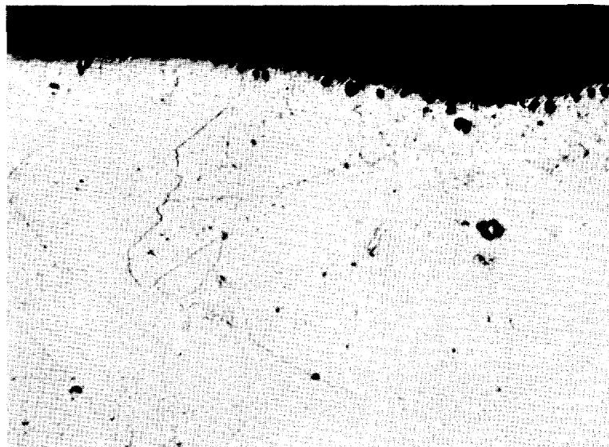

CORROSION OF UNIRRADIATED CAPSULE AFTER 115 HOURS. 300 X

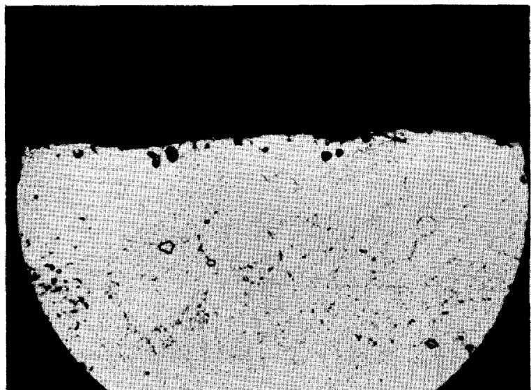  
FIGURE 34. EFFECT OF NEUTRON IRRADIATION ON THE STATIC CORROSION OF INCONEL BY NaF-KF-UF4 (46.5 - 26.0 - 27.5 MOLE%) AT 1500°F

CORROSION OF IRRADIATED CAPSULE AFTER 299 HOURS IN A NEUTRON FLUX WITH AN EQUIVALENT POWER DENSITY OF 65 WATTS PER CC OF FUEL. 300X

intensity the pure fused salt fuels under static conditions may suffer considerable radiation damage, the above experiment is not conclusive evidence of this since temperature gradients in the fuel or irradiation of impurities in the fuel could be the mechanism for the observed increase in damage. Refined preparation and handling techniques will reduce the impurities. It might be possible to reduce the potentially available fluorine by substitution of $\mathbf{U}\mathbf{F}_3$ for the $\mathbf{U}\mathbf{F}_4$ or by dissolving a small amount of an active metal in the fluoride melt.

In another series of fuel-capsule irradiations the NaF-BeF $_2$ -UF $_4$ system in an Inconel capsule has been exposed in the LITR to power dissipations of both 84 and 554 watts/cc of fuel. In only one of five exposures (Table 17) was there any indication of damage beyond that experienced in the control specimen. The nickel content of the salt was high, but upon metallographic examination few signs of radiation induced corrosion were present. These particular results are most encouraging since they represent power levels considerably in excess of that to be realized in the ARE.

Unless studies in progress on the NaF-KF-ZrF $_4$ -UF $_4$ system show it to be more susceptible than either the NaF-KF-UF $_4$ or NaF-BeF $_2$ -UF $_4$ systems, it is not apparent that radiation damage will introduce any considerable uncertainty at the fluxes to be maintained in the ARE. On the basis of the above static tests, the ARE at this point appears feasible from the standpoint of radiation damage.

# CRITICAL EXPERIMENTS

A preliminary experimental study of the nuclear design of the experimental reactor is to be made during the summer of 1952 at ORNL by building some of the major components into a system that will be made critical with enriched uranium. The experiments will be done at a power level of the order of 1 watt, maximum, at room temperature and will yield information on uranium requirements, control problems, and power and neutron-flux distributions. It is expected that assembly of the mockup will start about June 1 and that the system will be made critical about July 15.

# Experimental Materials

The beryllium oxide hexagonal blocks prepared for the ARE will be used as the reflector and moderator in these experiments and will be transferred to the ARE later. The fuel is to be a dry-packed powder having nuclear properties closely approximating those of the ARE fuel. At present the latter is designed to be a molten mixture of the fluorides $\mathsf{ZrF_4}$ , NaF, KF, and UF $_4$ . In the preliminary assembly the fuel is expected to be a mixture of $\mathsf{ZrO_2}$ , NaF, KF, enriched UF $_4$ , and graphite. The $\mathsf{ZrO_2}$ is being substituted for the $\mathsf{ZrF_4}$ because the latter is unavailable at this time; the graphite is being added to give total moderation equivalent to that of the fluorine. The composition will be that required to give the design uranium density of the ARE fuel. It is probable that the relative quantities of the constituents will approach ARE design, with the over-all density somewhat lower. The simulated reflector coolant has the same composition as the simulated fuel except for the omission of the UF $_4$ .

The materials will be packed as a dry powder in stainless steel tubes, 1 l/4 in. in dia and 40 in. long, that can be sealed to minimize moisture pick-up. The stack of beryllium oxide blocks will be surrounded by an Inconel shell.

# Experimental Assembly

The beryllium oxide blocks will be stacked, with axes vertical, in a right cylinder, 36 in. high and 47 in. in dia; also with its axis vertical. The fuel and coolant mixtures in the stainless steel tubes, will be inserted vertically through the axial holes in the beryllium oxide blocks. Some of

the tubes will be movable by remote operation and will serve as control rods. A section of tubing containing a nuclear poison will be attached above other fuel elements, and the fuel elements will be magnetically supported. Upon release by the magnet, the fuel tubes will fall out of the core and will be replaced by the poison. This safety mechanism will be operated both manually and by a high-flux-level detection instrument.

Provisions will be made for inserting neutron-detecting foils, such as indium and gold, through the reflector and moderator. The usual neutron-sensitive and gamma-sensitive detectors will be placed adjacent to the assembly for operational control and safety and will feed recording and indicating instruments in the control room.

# Experimental Program

The first result, obtained from the initial loading, will be the mass of uranium required for the assembly to become critical, thereby fixing the uranium density. After calibration of the control rods, reactivity changes incurred by the introduction into the reactor of other materials can be evaluated. For example, at least one fuel element designed for the ARE itself will be used. In addition, the nuclear properties of different types of control devices can be initially tested. It is intended that extensive studies will be made of the distribution of neutrons throughout the assembly by the usual activation method.

# REACTOR OPERATION

The operation of the reactor may be broken down into three separate phases, each of varying importance. The start-up phase involves pretesting of the fluid circuit, loading to criticality, and regulating rod calibration. The subsequent power operation of the reactor following the addition of enriched fuel material is the most important phase as far as the aircraft reactor is concerned. It is there that the kinetic response of the aircraft reactor may be determined and all other nuclear experiments are performed. Following the power operation is the reactor shutdown phase.

The probable elapsed time for each of the steps and sub-steps in the operational procedure is difficult to predict. Of the 500-odd total hours available for operation of the system after the original loading with enriched fuel, probably not more than 100 hours will be available for power operation. A careful budgeting of time and rationing of operating hours is being made and will be revised as zero hour for operation approaches. The actual number of hours of power operation and the magnitude of the power output from the system cannot be known until the experiment has become history. However, all pertinent experimentation must be performed during this time.

During the power regime it is planned to run a shielding experiment completely independent of the primary ARE objective. This will involve the determination of energies of the delayed fission neutrons. Arrangements are being made to make these measurements in the fluid circuit external to the reactor pit. The circulating fuel system provides a unique facility for making such a determination.

Determination of one other basic phenomenon, the evaluation of xenon or its precursor, will be attempted. This will markedly affect design and operational considerations for an aircraft propulsive unit particularly as it relates to behavior after shutdown when xenon poison becomes of major importance.

The schedule outlined below represents an ideal and almost certainly it will have discontinuities in the form of start-ups following scams, shutdowns for plumbing and mechanical repairs, etc. Every effort will be made to minimize these backings and fillings but it is unrealistic to assume that none will be necessary.

# Pretesting

After the reactor plumbing has been installed and the system is ready for checking, both the primary (fuel) and secondary (reflector-pressure shell) circuits will be given a pneumatic test. These tests will be made before the annular chaser pipes have been joined over the welds in the liquid lines and before the heaters and insulation have been applied to the annular chaser lines.

Air or other gas will be held at a pressure of approximately 75 psi at room temperature and all welds and joints of any kind will be gone over with a bubble solution for the purpose of locating leaks. This technique should reveal all gross leak faults in both liquid circuits.

After both circuits are tested pneumatically, helium at 75 psi will be substituted for the gas in the primary circuit and a vacuum will be pulled on the secondary circuit. The secondary circuit will be monitored for helium to determine whether or not there is a leak in the primary circuit within the core.

After both circuits have been made tight as far as the above tests are able to reveal, they will then be filled with NaK, which will be circulated at some point near design flow rate. In addition to giving a further leak test, this will allow checking of pumps, tanks, and level controls under ambient temperature conditions.

After the system has been checked out with room temperature NaK, the heaters will be installed, annular joints closed and insulation installed around all the system. Since this job is quite extensive, it will require many mandays of effort. When the heating system is installed, both liquid circuits will be operated at increasingly higher temperature levels until the system operates satisfactorily at an isothermal temperature of some $1200^{\circ}\mathrm{F}$ with NaK. In addition to checking the system hydraulically at high temperature, this circulation of hot NaK cleans the system of oxide. The $\mathrm{Na}_2\mathrm{O}$ formed in this cleaning is trapped out of the system as it is formed.

Following the hot NaK test and after any leaks have been repaired the NaK will be drained from both liquid circuits. While maintaining temperatures at $1200^{\circ}\mathrm{F}$ both circuits will be evacuated by pumping with vapor traps ahead of the pumps. When all residual NaK has been boiled out of the system, it will reach a steady state pressure, from which point rates of rise of pressure can be used to detect the fluid tightness of the system. It is hoped that this final test will leave the circuits tight and that no further leaks will occur. After the fluorides are introduced, repair of the circuit will be more difficult, even in some extreme instance impossible.

# Loading and Start-Up

In initial loading the fuel carrier fluoride melt is released from the fill tanks into the evacuated fuel system. Checking for voids in the core and piping will be done by observing any liquid level change in the surge tank when the gas pressure over the liquid is raised. After the system has circulated until it is proved to be tight and all temperatures are stable, the system is ready for critical loading. (The secondary circuit filling is an identical procedure.)

Critical loading is effected by a fuel injection system which is filled with highly concentrated $\mathbf{U}\mathbf{F}_4$ in the NaF, KF, $\mathbf{ZrF_4}$ carrier. The system is so arranged that samples of known weight can be introduced into the surge tank at a controlled rate. The first load will be injected at such a rate that the "quantum" of fuel, which is about six pounds, will require three circuit transit times for complete injection. Since the fuel transit time is about forty seconds, the "quantum" injection will require about two minutes. This will insure a uniform distribution of fuel in the circulating system.

As the calculated critical loading is approached, the amount of fuel in each "quantum" can be reduced from the maximum of six pounds to any reasonable low value so as to minimize the chance of loading to a super critical degree. The standard checks for criticality in loading any reactor will be employed in the ARE and the reactor will be brought to critical with the use of all possible safety precautions. The objective will be to go critical at a temperature of $1200^{\circ}\mathrm{F}$ with the shim rods as nearly completely withdrawn as the controlled loading will permit.

As a safety precaution, attempts will be made to measure the temperature coefficient of reactivity and to obtain a rough calibration of the regularity rod as soon as possible. The first attempt to make these measurements will be done when the reactor has reached a value of $k = \sim 0.98$ or at a source multiplication of about 50. The first experiment will be an attempt to determine the sign of the temperature coefficient of reactivity. To do this the fuel temperature will be lowered from the equilibrium value of $1200^{\circ}\mathrm{F}$ to approximately $1175^{\circ}\mathrm{F}$ when the source multiplication is approximately 50. If the multiplication increases with this lowering of the temperature, it will show that the temperature coefficient is negative, and further loading can proceed. If, however, the multiplication should decrease, it will show that the temperature coefficient is positive, and the experiment should terminate at this point since a reactor which has a positive coefficient is considered to be too dangerous to operate. However, this latter eventuality is not anticipated.

Following this experiment, an attempt will be made to obtain a rough calibration of the regulating rod. Since the moderator is beryllium oxide there will be an indeterminate number of gamma-n neutrons, and when the fuel is circulating, some of the delayed neutrons are lost in the reacting system. These two effects make the calibration of the regulating rod by pile period measurement practically meaningless. However, a rough calibration can be obtained by noting the change in source multiplication as the regulating rod position is changed. It is believed that a first measurement can be made when the reactivity is approximately 0.98 with higher accuracy results obtainable as $k$ is increased toward 1.00. This will give a fair calibration of the rod in terms of $\Delta k / k$ before actual criticality is reached. After criticality is reached the rod will be calibrated by noting the change in rod position for criticality with small additions of fuel.

After the rod calibration has been made to the best degree warranted the reactor will be raised in temperature by the external heating facilities to a temperature of some $1300^{\circ}\mathrm{F}$ since this is the mean temperature level for all future operation. At this new temperature fuel addition will be made to again bring the reactor critical—but with the shim rods now inserted to a distance of some four inches in the core. This will provide of the order of $2\%$ in k available in shim rods to take care of poison as the reactor operates so that no further fuel addition should be necessary after the critical loading at $1300^{\circ}\mathrm{F}$ has been accomplished.

The next step in reactor operation comprises raising the reactor power from near zero to some nominal value. This will be done by withdrawing the regulating rod sufficiently to start the reactor on a positive period of some twenty to thirty seconds. When this period has increased to near an infinite period, as it will by virtue of the temperature coefficient, the reactor will be at a power level of some ten kilowatts. This point can also be checked roughly by the reading of the Log N meter. The reactor is now ready for the power regime.

# Power Operation

Operation at power will be attained as quickly as possible after the reactor has been brought up to the nominal value of some ten kilowatts. Up to this point there has been no power extraction from the system, but when the reactor has stabilized at a nominal (ten) kilowatt level, the helium blowers will be started. Heat extraction will be at a controlled rate, so that the reactor inlet temperature will not be brought too low. Every precaution will be used to insure no danger of freezing the fuel-coolant.

Since the object of the experiment is to obtain as much operation time as possible at full power, an effort will be made to reach rated power as quickly as possible. The mean fuel temperature of $1300^{\circ}\mathbf{F}$ will be maintained quite closely, but the fuel inlet temperature will drop and the reactor outlet temperature will rise until at full power there will be a temperature rise across the reactor of some $350^{\circ}\mathbf{F}$ .

Should there be a false scream when operating at power, the helium will automatically be cut off to insure against freezing the fuel. During the power regime the system will be left very nearly alone. A minimum of changes in power demand will be made and as nearly as possible the reactor will be operated in a steady state condition. Undoubtedly, interruptions of one kind or another will occur, but there will be no intentional "juggling" of any part of the system beyond the minimum required to establish a pattern of the transient response. The servo-regulating system will not be employed unless it is found to be necessary because of an insufficiently large negative temperature coefficient.

# Operation of the Servo-Control

During all of the run outlined so far the reactor has been under manual control. The servo system has been operating but it has been disengaged from the regulating rod and hence has not been controlling the reactor. At some time during the power operation regime, the servo will be connected to the regulating rod so that the reactor will be on automatic control. Under these conditions, since the servo is made to operate exactly as the fuel temperature coefficient, the system response to power demands will simulate the kinetic behavior of a reactor operating at high power output.

A suitable servo error signal is the following:

$$
\mathbf {E} = \mathrm {a} _ {\mathrm {i}} \boldsymbol {\Phi} + \mathrm {a} _ {2} \Theta_ {\mathrm {i}} + \mathrm {a} _ {3} \Theta_ {\mathrm {o}} + \mathrm {a} _ {4}
$$

where $a_1, a_2, a_3, a_4$ are proportionality constants,

$$
\Phi = \text {f l u x}
$$

$\Theta_{i} =$ reactor inlet temperature

$$
\Theta_ {0} = \text {r e a c t o r o u t l e t t e m p e r a t u r e}
$$

In the steady state this error signal is independent of the external load. For load changes both $\Theta_{\mathrm{i}}$ and $\Theta_{\mathrm{o}}$ change, and the regulating rod will maintain its original position. Furthermore, the power demand is made through $\Theta_{\mathrm{i}}$ from the external load.

To raise the mean fuel temperature at constant load, $a_4$ is the driving function and can be changed manually and slowly. Increasing $a_4$ causes

withdrawal of the regulating rod, an increase in $\Phi$ followed by an increase in $\Theta_{i}$ , and later a decrease in $\Phi$ until the error signal is again zero, after the entire system, reactor and heat exchanger, have reached equilibrium. Once equilibrium has been reached the regulating rod will no longer be at its mid-position because the reactor has a temperature coefficient independent of the servo error function. Changing the shim rod position after equilibrium has been reached merely moves the regulating rod to its mid-position. This error signal characteristic is to be used for another purpose. It will be noted that changing the shim rods will give a steady state zero error signal. There is no way to raise or lower the mean fuel temperature by moving the shim rod. Furthermore, any slow depletion or poisoning would cause the regulating rod to move slowly out from its mid-position at constatn power. An effect like this should be looked for since it may suggest fuel precipitation in some part of the circuit.

It is proposed to use the recently developed pile simulator for determining the $\Delta k / k$ for the regulating rod. It is likely that this simulator is only reasonably accurate for a circulating-fuel ARE because it has not been considered advisable to simulate transport lags in the system. However, if the simulator is operated with no provision for the temperature coefficient and adequate control is maintained solely with the external servo loop, then the actual control of the reactor with a negative temperature coefficient should also be adequate. It will be possible to determine the maximum $\Delta k / k$ step for which the system is stable and permits no more than $10\%$ overshoot of mean temperature. Essentially this is done by simulating the MTR servo system so that the servo simulator controls the pile simulator. By this means the $\Delta k / k$ permissible in the regulating rod can be determined and if it is desired a suitable factor may be employed. With a safety factor in the permissible regulating rod $\Delta k / k$ and in the minimum period for actuating the scram, the control system would be quantitatively described, but not in terms of some arbitrary step function response. The only arbitrary quantities would be the selection of the MTR servo system and the length and weight of the regulating rod. It might be said that the reactor will be controlled by the servo system to the limits of the system's capabilities and that for more severe control demands the scram system will take over. The safety factors insure that these two systems overlap.

# Shut Down

After the power run has been made, the reactor will be scrambled. When temperatures have reached equilibrium and after the iodine has had time to decay into xenon, an attempt will be made to go critical again. If xenon or iodine is evolved as a gas from the liquid fuel, the reactor should

be made to go critical at essentially the same conditions (as far as rods are concerned) as obtained when it was shut down since the xenon poison will not be present. If, however the reactor will not go critical with shim rod adjustment, no fuel will be added but additional time will be allowed to elapse and another attempt to go critical will be made. If this latter attempt is successful it may be assumed that the xenon has had time to decay and that the poison on the first attempt was xenon which had not evolved from the fuel.

The fuel circuit will then be drained as much as possible but it is expected that some of the fuel mixture will remain in the bends of the fuel tubes. Non-uranium bearing fluorides will then be introduced into the system to flush out the fuel into the hot fuel dump tanks. This flushing will be continued until the fuel is sufficiently extracted from the system. The remaining fluoride mixture will then be drained (probably leaving some in the core) and the system will be allowed to cool so that physical inspection can be started as soon as possible.

# AREBUILDING

The ARE building is a mill type of structure designed to house the ARE and the necessary facilities for its operation (Figure 35). The building has a full basement $80 \times 105$ ft, a crane bay $42 \times 105$ ft, and a one-story service wing $38 \times 105$ feet. The reactor and the necessary heat disposal systems are located in shielded pits in the part of the basement serviced by the crane bay. Half of the main floor area is open to the reactor and heat exchanger pits in the basement below; the other half houses the control room, office space, shops, and change rooms.

# Building Schedule

The Nicholson Company, contractor for the Test Facility Building, was notified to proceed on July 6, 1951, and this contract work is now approximately $95\%$ complete. The architect-engineer for this phase of the work was the Austin Company. The AEC is now negotiating an addendum to the initial contract for the remaining portion of the capitalized addition and for some of the noncapital addition. The additional work includes the concrete test pits, concrete heat exchanger pit, basement floor, crane bay floor, additional partitions, process water supply lines, process water disposal lines, settling pond, parking area, and paving. The engineering for this phase of the work was performed by the ORNL Engineering Department, and it is estimated that the Nicholson Company will complete the work by June 1, 1952. At completion, drawings will be available so that the Laboratory may begin installation of equipment, shielding, and additional process services.

# Arrangement

The building consists of a full basement $80 \times 105$ feet. In half of the basement are located the shielded reactor and heat exchanger pits; the other half of the basement is service area. The control room, office space, and some shops are located on the first floor over the service area. The first floor does not extend over that half of the basement containing the pits, and this area is serviced by the crane bay. The crane is a floor-operated 10-ton bridge crane having a maximum lift of 25 ft above the main floor level. Plan and elevation drawings of the building are shown in Figures 36 and 37.

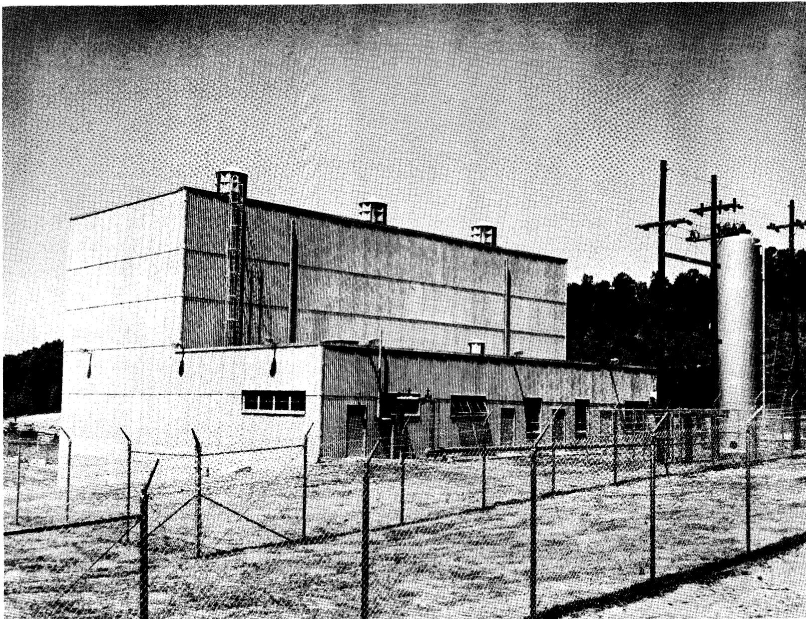  
X-1O PHOTO 0085  
UNCLASSIFIED   
FIGURE 35. ARE BUILDING (LOOKING NORTHWEST.)

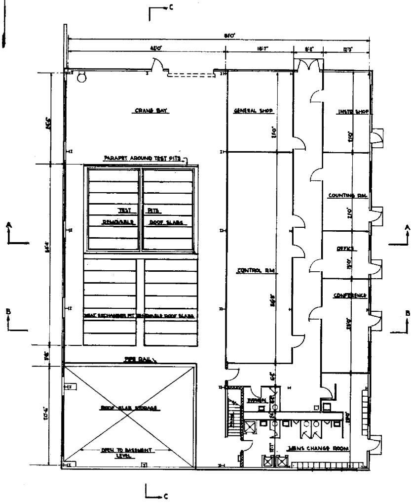  
FIRST FLOOR PLAN

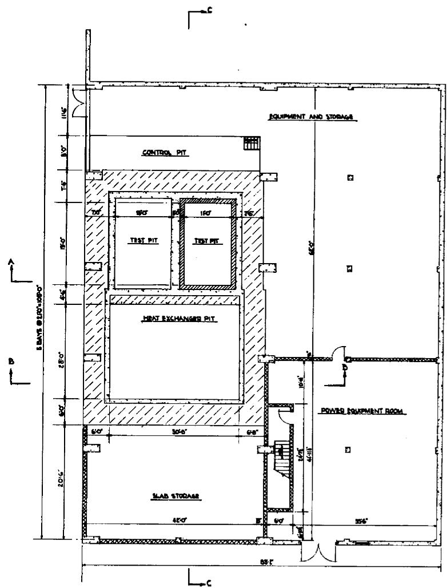  
BASEMENT PLAN

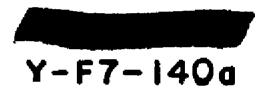

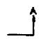

LEGEND

STANDARD MIX CONCQETE   
SOLIC CONC. MAHONYRy·STD. MIX   
SOLID CONC BLOCKS LAID DAY SMRR   
REMOVABLE SPECIAL MIX BLOCKS

  
FIGURE 36. PLAN OF ARE BUILDING

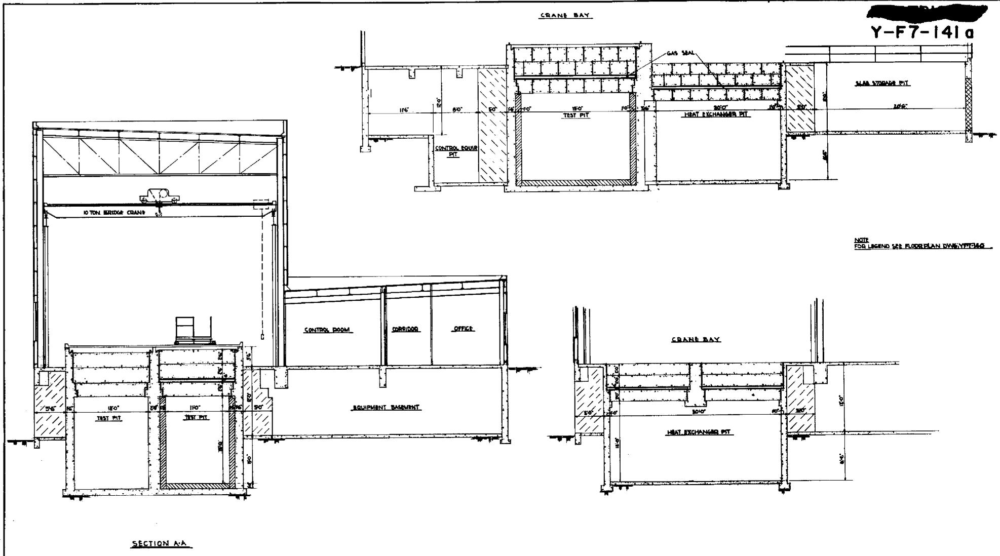  
FIGURE 37. ELEVATION OF ARE BUILDING

The basement includes the test and heat exchanger pits and space for emergency power equipment and direct-current operational power equipment. Crane access is provided to the heat exchanger and test pits by removable roof slabs. The slabs cover the entire roof area of the test and the heat exchanger pits except for supporting beams. Lifting hooks in each slab enables it to be removed and stored in the slab storage pit, or if contaminated beyond a usable condition, it may be loaded onto a truck and disposed of. The main floor plan shows the control room, general shop, instrument shop, conference and office space, and toilet and locker room. The western portion or crane bay provides a truck loading area, a slab storage pit, and the removable roof slabs of the heat exchanger and test pits.

The building foundation, basement walls, and all floors are of reinforced concrete. The frame is structural steel with insulated flexboard walls, and there is built-up roofing on precast gypsum slabs. The partitions in the service wing are movable and made of insulated metal, and the ones in the basement are of masonry block. The test pits are provided with process water supply and disposal lines to permit flooding for disassembly work. The walls and floor are designed to be watertight. It is planned to further waterproof this structure by application of Amercoat on the interior. Flanged sleeves that may be covered after removal of piping and before flooding are provided through the walls.

The shielding of the test and heat exchanger pits is provided by monolithic concrete walls and solid masonry concrete blocks stacked dry on the sides and removable concrete slabs on the top. The masonry blocks stacked dry were used to permit greater flexibility for future experiments. The monolithic concrete walls were therefore held to a minimum thickness consistent with accepted design. Removable blocks within the test pit are shown in Figure 37. These blocks are designed to prevent contamination of the monolithic concrete walls and will be disposed of as required.

# Utilities

The building is to be heated with plant steam, and the pipe lines are being constructed. Fin-type radiators and steam unit headers are used throughout the building. Forced ventilation is furnished to the interior rooms of the service wing. The crane bay is provided with gravity-type ventilators mounted on the roof.

The electrical supply to the building consists of an extension of the plant area 13.2-kv line. Both 440 and 110 to 208-v distribution are made within the building. Direct current for all prime operating power will be

provided by ac.—dc. rotating equipment. A portion of direct-current power will be converted to alternating-current power for instrumentation. Batteries will be provided in a floating arrangement to insure continuous operation.

A 100,000-gal earth settling pond is provided approximately 1500 ft south of the building and connected to the test pits by a buried steel pipeline. The pond will permit disposal and decay of contaminated water used as shielding in disassembly work. The pond may be emptied by means of a syphon into a branch of White Oak Creek.

# CONSTRUCTION SCHEDULE

Scheduling of the construction of the ARE is obviously a function of the manpower available. So far as can be determined, the activities of the Laboratory that will be competing for available manpower have been taken into consideration in the preparation of the timetable for the ARE. Every effort has been made to be completely realistic in setting up the schedule.

At present all major layout plans are frozen and no basic changes are contemplated. Core detail shop drawings are $99\%$ complete. Heat ex-changers, dump tanks, helium blowers, and valves are being fabricated either by outside vendors or by local shop facilities. Control components (actuators, housings, and absorber rods) are in process of manufacture. Heaters for the fluid circuits are on order. Instruments are about $90\%$ ordered, the remaining $10\%$ are awaiting final detailing as the operational procedure modifications dictate.

A schedule of the Experiment is tabulated below:

<table><tr><td></td><td>Completion Date:</td></tr><tr><td>1. Building accepted from contractor</td><td>June 15, 1952</td></tr><tr><td>2. Detailed equipment fabrication drawings</td><td>July 1, 1952</td></tr><tr><td>3. Approximately 60% of components available</td><td>July 1, 1952</td></tr><tr><td>4. Pump for use of fuel circuit tested at design flow and temperature</td><td>August 15, 1952</td></tr><tr><td>5. Cold critical experiment completed</td><td>September 15, 1952</td></tr><tr><td>6. Installation of electrical system, pipe fitting, and all reactor circuit components completed</td><td>November 15, 1952</td></tr><tr><td>7. Reactor plumbing, ducting, and interconnecting completed</td><td>January 15, 1953</td></tr><tr><td>8. Control room wired and checked</td><td>January 15, 1953</td></tr><tr><td>9. Reactor system hydraulically tested and tight</td><td>March 1, 1953</td></tr><tr><td>10. Reactor dry-run test with inert fuel at temperature, completed and reactor ready for final loading</td><td>April 15, 1953</td></tr><tr><td>11. Critical experiment at temperature followed by run at power</td><td>May 15, 1953</td></tr></table>

In order to carry out the many details of the ARE, the effort is divided into four main categories, each of which is the definite responsibility of one engineer. These divisions are:

Building construction

Equipment installation

Equipment design, procurement, and assembly

Operation

All operations are under way and although eventualities cannot be foreseen, the ARE should meet the schedule of operation outlines above.

# CONCLUSIONS

It is felt that sufficient basic work has been done to establish the possibility of building a circulating-fuel reactor for operation at a maximum fuel temperature of approximately $1500^{\mathrm{O}}\mathrm{F}$ for a significant number of hours. Much more work on corrosion and fuel characteristics will be done and significant improvement, such as in the case of corrosion resistance, is anticipated during the construction period of the ARE.

The present reactor does not represent an optimum design. Rather, it represents a compromise dictated by several concepts evolving from procurement difficulties. No important principle has been sacrificed in effecting the final design, but in the interest of getting much-needed data, it was decided to get the ARE into operation as quickly as possible.

The first effect to be checked on the experimental reactor is the reactivity change as a function of temperature. General experience in the operation of a high-temperature circulating-fuel reactor will be gained. Checks on nuclear calculations that must be used on aircraft reactors will result from the operation of this experiment. Some additional corrosion data will be obtained but should not be significantly different from that which can be taken from less involved experiments. Information involving interaction of the various separate problems, which could not be achieved except by the integrated operation of the entire system, will be obtained. The ARE, in effect, established the first outpost in a new frontier of reactor design. When design considerations are as critical as those demanded for aircraft adaptation, they provide a sufficient, if rather nebulous, criterion by which to evaluate the worth of the experiment.

A second ARE almost certainly should be built, and possibly a third. Each reactor should be planned to supplement the previous one and to bridge the gap as completely as possible between its predecessor and the ultimate aircraft reactor.

Materials research should continue at the greatest possible level of effort. Specifically, the fabrication of molybdenum should receive considerable attention. Liquid hydrogenous moderators, such as hydroxides,

have been studied experimentally. The results have shown promise but are far from conclusive. Further work on such moderators should be carried on at a high level of endeavor. A second ARE should incorporate improved structure, moderator, and fuel materials so far as these developments warrant.

# PART III

# APPENDIXES

BIBLIOGRAPHY   

<table><tr><td>Report No.</td><td>Title of Report</td><td>Author(s)</td><td>Date Issued</td></tr><tr><td>ANP-65</td><td>Aircraft Nuclear Propulsion Project Quarterly Progress Report for the Period Ending June 10, 1951</td><td>R. C. Briant
C. B. Ellis
W. B. Cottrell</td><td>Sept. 13, 1951</td></tr><tr><td>ORNL-1154</td><td>Aircraft Nuclear Propulsion Project Quarterly Progress Report for the Period Ending Sept.
10, 1951</td><td>R. C. Briant
C. B. Ellis
W. B. Cottrell</td><td>Dec. 14, 1951</td></tr><tr><td>ORNL-1170</td><td>Aircraft Nuclear Propulsion Project Quarterly Progress Report for the Period Ending Dec.
10, 1951</td><td>R. C. Briant
W. B. Cottrell</td><td>Feb. 18, 1952</td></tr><tr><td>ORNL-1227</td><td>Aircraft Nuclear Propulsion Project Quarterly Progress Report for the Period Ending March
10, 1952</td><td>R. C. Briant
A. J. Miller
W. B. Cottrell</td><td>May 5, 1952</td></tr><tr><td>ORNL-1294</td><td>Aircraft Nuclear Propulsion Project Quarterly Progress Report for the Period Ending June
10, 1952</td><td>R. C. Briant
A. J. Miller
W. B. Cottrell</td><td>to be issued</td></tr><tr><td>Lex P-1</td><td>Nuclear Powered Flight - A Report to the Atomic Energy Commission by the Lexington Project</td><td></td><td>Sept. 30, 1948</td></tr><tr><td>ANP-52</td><td>Report of the Technical Advisory Board to the Technical Committee of the Aircraft Nuclear Propulsion Project</td><td></td><td>Aug. 4, 1950</td></tr><tr><td>NEPA-1830</td><td>Final Status Report of the Fairchild NEPA Project</td><td></td><td>no date, circa late 1951</td></tr><tr><td>ANP-53</td><td>Report of the Shielding Board for the Aircraft Nuclear Propulsion Program</td><td></td><td>October 16, 1950</td></tr><tr><td>ORNL-1287</td><td>Preliminary Investigation of a Circulating-Fuel Reactor System for Supersonic Aircraft Propulsion</td><td>R. W. Schroeder</td><td>to be issued</td></tr><tr><td>Y-F15-10</td><td>Several Circulating-Fuel Reactor - Heat Exchanger - Shield Designs for Supersonic Aircraft</td><td>A. P. Fraas
G. F. Wislicenus</td><td>to be issued</td></tr></table>

Y-F10-103

StaticsoftheAREReactor,SummaryReport

C. B. Mills

to be issued

ANP-64, Part I

The Technical Problems of Aircraft Reactors, Part I

C. B. Ellis

June 1, 1951

ANP-64, Part II

The Technical Problems of Aircraft Reactors, Part II

C. B. Ellis

Jan. 2, 1952

