3445603609646

A DESIGN STUDY OF A NUCLEAR-POWERED

AIRPLANE IN WHICH CIRCULATING FUEL

IS PIPED DIRECTLY TO THE

ENGINE AIR RADIATORS

OAK RIDGE NATIONAL LABORATORY

CENTRAL RESEARCH LIBRARY

DOCUMENT COLLECTION

LIBRARY LOAN COPY

DO NOT TRANSFER TO ANOTHER PERSON

If you wish someone else to see this

document, send in name with document

and the library will arrange a loan.

CN-7769

3.2.1

OAK RIDGE NATIONAL LABORATORY

OPERATED BY

CARBIDE AND CARBON CHEMICALS COMPANY

A DIVISION OF UNION CARBIDE AND CARBON CORPORATION

ORNL-1287

This document consists of 66 pages.

Copy 63 of 170 copies. Series A.

Contract No. W-7405-eng-26

# A DESIGN STUDY OF A NUCLEAR-POWERED AIRPLANE IN WHICH CIRCULATING FUEL IS PIPED DIRECTLY

# TO THE ENGINE AIR RADIATORS

R.W. Schroeder and B. Lubarsky

DATE ISSUED:

MAR 31 1953

OAK RIDGE NATIONAL LABORATORY

Operated by

CARBIDE AND CARBON CHEMICALS CORPORATION

A Division of Union Carbide and Carbon Corporation

Post Office Box P

Oak Ridge, Tennessee

3 4456 0360964 b

，

#

# INTERNAL DISTRIBUTION

1. R. G. Affel   
2. E. S. Bettis   
3. D. S. Billington   
4. F. F. Blankenship   
5. E. P. Blizzard   
6. R. C. Briant   
7. R. B. Briggs   
8. J. H. Buck   
9. D. W. Cardwell   
10. C. E. Center   
11. G.H.Clewett   
12. C. E. Clifford   
13. W. B. Cottrell   
14. D. D. Cowen   
15. L. B. Emlet (Y-12)   
16. W. K. Ergen   
17. A. P. Fraas   
18. W. R. Gall   
19. W. R. Grimes   
20. A. Hollaender   
21. A. S. Householder   
22. W. B. Humes (K-25)   
23. C. P. Keim   
24. M. T. Kelley   
25. E. M. King   
26. C. E. Larson   
27. R. S. Livingston   
  
D   
#   
$\therefore m = \frac{3}{11}$   
.   
  
  
上工  
LS   
  
  
lington   
kenship   
  
Zare   
1   
.   
Center

28. B. Rubarsky

29. R.N. Lyon

30. W.D. Manly

31. J.L. Meem

32. J. Miller

33. Z. Morgan

34. H. F. Poppendiek

35. P. M. Reyling

36 H. W. Savage

37. E. D. Shipley

3 A. H. Snell

F. L. Steahly

10. R. W. Stoughton

41. C. D. Susano

42. J. A. Swartout

43. E. H. Taylor

44. F. C. VonderLage

45. A. M. Weinberg

46. G. C. Williams

47. C. E. Winters

52. ANP Library

53. Biology Library

59. Central Files

50. Health Physics Library

51. Reactor Experimental

Engineering Library

2-63. Central Research Library

# EXTERNAL DISTRIBUTION

64-74. Argonne National Laboratory

75. Armed Forces Special Weapons Project (Sandia)

76-80. Atomic Energy Commission, Washington

81. Battelle Memorial Institute

82-84. Brookhaven National Laboratory

85. Bureau of Ships

86-87. California Research and Development Company

88-93. Carbide and Carbon Chemicals Company (Y-12 Plant)

94. Chicago Patent Group

Th

Ent

in any

${13}/{14}$

${12}/{14}$

$\therefore m = \frac{3}{11}$

${12}/{14}$

$\therefore m = \frac{3}{11}$

${12}/{14}$

${12}/{14}$

${12}/{14}$

${13}/{14}$

${13}/{14}$

${12}/{12}$

${13}/{14}$

${12}/{12}$

${13}/{14}$

$\therefore m = \frac{3}{11}$

${13}/{14}$

$\therefore m = \frac{3}{11}$

$\therefore m = \frac{3}{11}$

$\therefore m = \frac{3}{11}$

$\therefore m = \frac{3}{11}$

${13}/{14}$

$\therefore m = \frac{3}{11}$

${12}/{12}$

${13}/{14}$

omics

${12}/{14}$   
${12}/{14}$   
${12}/{14}$   
${12}/{14}$   
${19}/{19}$   
${12}/{14}$   
${12}/{14}$   
${12}/{14}$   
${12}/{14}$   
${12}/{14}$   
${12}/{14}$   
${12}/{14}$   
${12}/{14}$   
${12}/{14}$   
${12}/{14}$   
${12}/{14}$   
${12}/{14}$   
${12}/{14}$   
${12}/{14}$   
${12}/{14}$   
${12}/{14}$   
${12}/{14}$   
${12}/{14}$   
${12}/{14}$   
${12}/{14}$   
${12}/{14}$   
${13}/{14}$   
#   
注：  
${12}/{14}$   
${12}/{14}$   
${12}/{14}$   
${12}/{14}$   
${12}/{14}$   
${13}/{14}$   
${13}/{14}$   
4.1   
图1  
1. 实验原理   
191   
75   
图  
图2  
${13}/{14}$   
${13}/{14}$   
${x}^{2} + {5x} - 6 = 0$   
$\therefore m = \frac{3}{11}$   
$\therefore m = \frac{3}{11}$   
${13}/{14}$   
1. 实验原理

$\therefore m = \frac{3}{11}$

${13}/{14}$

${13}/{14}$

${13}/{14}$

$\therefore m = \frac{3}{11}$ ;

${13}/{14}$

${12}/{14}$

$\therefore m = \frac{3}{11}$ ;

$\therefore m = \frac{3}{11}$ ;

${12}/{12}$

$\therefore m = \frac{3}{11}$ ;

-

一

${13}/{14}$

${19}/{19}$

${14}/{14}$

${13}/{14}$

#

-

一

${19}/{19}$

$\therefore m = \frac{3}{11}$

${13}/{14}$

${13}/{14}$

${13}/{14}$

$\therefore m = \frac{3}{11}$

$\therefore m = \frac{3}{11}$

$\therefore m = \frac{3}{11}$

$\therefore m = \frac{3}{11}$

${12}/{12}$

${12}/{12}$

${12}/{12}$

${12}/{12}$

${12}/{12}$

${13}/{14}$

${13}/{14}$

#

1

$\therefore m = \frac{3}{11}$

$\therefore m = \frac{3}{11}$ ;

${12}/{14}$

${12}/{14}$

${12}/{14}$

${12}/{14}$

${12}/{14}$

${12}/{14}$

${12}/{14}$

${13}/{14}$

#

$\therefore m = \frac{3}{11}$

$\therefore m = \frac{3}{11}$

${13}/{14}$

${13}/{14}$

${13}/{14}$

${13}/{14}$

${10}/{12}$

${13}/{14}$

${13}/{14}$

${13}/{14}$

A

${13}/{14}$

$\therefore m = \frac{3}{11}$

$\therefore m = \frac{3}{11}$

$\therefore m = \frac{3}{11}$

${13}/{14}$

${13}/{14}$

${13}/{14}$

${13}/{14}$

${13}/{14}$

P

${12}/{12}$

${14}/{14}$

${12}/{12}$

${13}/{14}$

${19}/{19}$

${13}/{14}$

${13}/{14}$

${13}/{14}$

$\therefore m = \frac{3}{11}$

${12}/{14}$

${12}/{14}$

${12}/{14}$

${12}/{14}$

${12}/{14}$

${12}/{14}$

${12}/{14}$

$\therefore m = \frac{3}{11}$ ;

${12}/{12}$

${12}/{12}$

${12}/{12}$

${12}/{12}$

${12}/{12}$

${12}/{12}$

${12}/{14}$

${12}/{14}$

${12}/{14}$

${12}/{14}$

#

${13}/{14}$

${12}/{12}$

${12}/{14}$

${12}/{14}$

${12}/{14}$

${12}/{14}$

$\therefore m = \frac{3}{11}$

${13}/{14}$

${13}/{14}$

$\therefore m = \frac{3}{11}$

${13}/{14}$

${19}/{19}$

${13}/{14}$

${13}/{14}$

${12}/{14}$

${12}/{14}$

${12}/{14}$

${12}/{14}$

${13}/{14}$

$\therefore m = \frac{3}{11}$

${13}/{14}$

$\therefore m = \frac{3}{11}$

$\therefore m = \frac{3}{11}$

$\therefore m = \frac{3}{11}$ ;

$\therefore m = \frac{3}{11}$ ;

$\therefore m = \frac{3}{11}$ ;

$\therefore m = \frac{3}{11}$ ;

$\therefore m = \frac{3}{11}$ ;

#

2. 4月前

$\therefore m = \frac{3}{11}$ ;

$\therefore m = \frac{3}{11}$ ;

$\therefore m = \frac{3}{11}$ ;

$\therefore m = \frac{3}{11}$ ;

95. Chief of Naval Research   
96. Department of the Navy - Op 36

97-101. duPont Company

102-104. General Electric Company (ANPP)

105-108. General Electric Company, Richland

109. Hanford Operations Office

110-116. Idaho Operations Office

117. Iowa State College

118-121. Knolls Atomic Power Laboratory

122-123. Los Alamos Scientific Laboratory

124. Massachusetts Institute of Technology (Kaufmann)

125-127. Mound Laborator

128. National Advisory Committee for Aeronautics, Cleveland   
129. National Advisory Committee for Aeronautics, Washington

130-131. New York Operations Office

132-133. North America, Aviation, Inc.

134. Nuclear Development Associates, Inc.   
135. Patent Branch, Washing   
136. Rand Corporation   
137. San Francisco Operations Office   
138. Savannah River Operations Office, Augusta   
139. Savannah Paper Operations Office, Wilmington

140-141. Universit $f$ of California Radiation Laboratory

142. Vitro Corporation of America   
143. Walter Kinde Nuclear Laboratories, Inc.

144-147. Westinghouse Electric Corporation   
148-155. Wright Air Development Center   
156-170. Technical Information Service, Oak Ridge

# CONTENTS

INTRODUCTION AND SUMMARY 1

DESIGN OF AIRPLANE AND POWER PLANT FOR MACH 1.5 AT 45,000 FEET . . . . . . 4

Reactor Core 4

Physical description 5

Power distribution 7

Engines and Accessories 9

General description of the power plant 9

Main engine system 9

Shield-cooling system 13

Reflector-cooling system 14

Accessory system 16

Over-all power plant performance 16

Physical arrangement of power plant 17

Power plant weight 17

Power Plant Radiators 19

Physical description 19

Radiator design relationships 21

Fuel-to-air radiator 23

Auxiliary radiators 25

Airplane 25

Airplane configuration 25

Airplane lift-to-drag ratio 28

Airplane pitch control 31

Airframe weights 32

SEA-LEVEL PERFORMANCE 33

SHIELDING ANALYSIS 35

Assignment of Radiation Contributions 35

Configuration to be Shielded 35

Basic Data for Shield Design 36

Calculation of Shield Dimensions 37

Delayed neutrons into crew compartment rear 37

Delayed neutrons to crew compartment sides 37

Delayed neutrons into front 37

Gamma rays from the exposed fuel 37

Gammas from radiators into rear of crew compartment 38

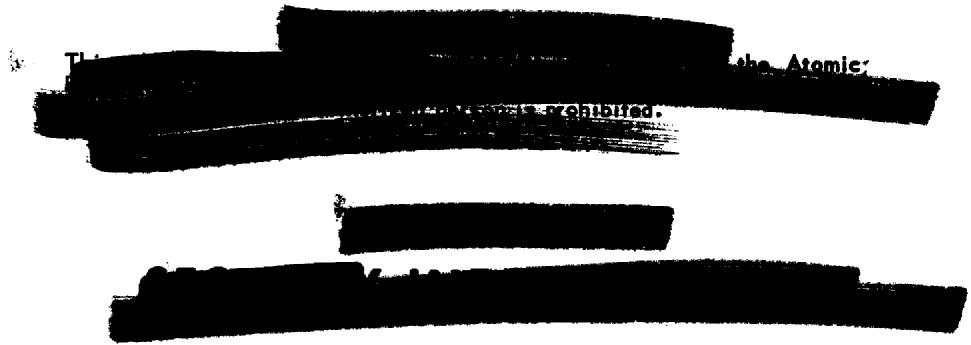

Gammas from radiators to sides 38   
Radiator gammas into front 39

Specification of Reactor Shield Thickness 39

Reactor neutrons into crew shield rear 39   
Reactor neutrons into crew shield sides 40   
Reactor neutrons into front of crew shield 40   
Reactor gamma rays into crew shield rear 41   
Gamma rays from reactor to crew shield sides 41   
Gamma rays from reactor to crew shield front 41

Special Shielding Considerations 42

Crew shield sides near the rear 42   
Slanting front wall 43

Physical Description of Shield 43

STATIC CHARACTERISTICS OF THE REACTOR 45   
REACTOR CONTROL 56   
Control Features Determined by Simulator Study 57   
Pressure in Fuel Tubes 58

# ACKNOWLEDGEMENT

The authors are indebted to E. P. Blizzard and F. H. Murray who prepared the section entitled "Shielding Analysis," to W. K. Ergen and C. B. Mills for the section on "Reactor Statics," and to E. R. Mann for the section on "Reactor Control." The advice and assistance of J. Y. Estabrook, B. L. Greenstreet, E. L. Hutto, J. D. Jackson, and A. B. Longyear* materially contributed to the completion of the calculations and drawings contained herein. Special recognition is due R. C. Briant, whose criticisms and suggestions have substantially improved the technical content of this report.

*On loan from Aerojet Engineering Corp.

# A DESIGN STUDY OF A NUCLEAR-POWERED AIRPLANE IN WHICH CIRCULATING FUEL IS PIPED DIRECTLY TO THE ENGINE AIR RADIATORS

R. W. Schroeder

B. Lubarsky(1)

# INTRODUCTION AND SUMMARY

The search for a nuclear power plant capable of propelling an airplane at supersonic speeds at high altitudes has led to a close study of circulating-fuel reactors. One of the advantages of such a reactor is that the heat developed in the fuel may be transmitted to the air stream in several ways. The heat might be employed in a vapor cycle so that use of a compressor-jet engine would be possible, or the heat might be transferred to a liquid coolant that would be used in a turbojet engine.

In the divided-shield concept, all parts of the aircraft except the crew compartment are subjected to thoroughly uninhabitable radiation conditions. Ground handling of such an airplane imposes problems that are perhaps not even now thoroughly appreciated. However, if it is assumed that these problems are soluble in a practical manner, then it is not only prudent but necessary to investigate the extreme of such a system.

The inherent adaptability of the fluid fuels being developed permits the study of a high-powered system wherein the heat is transmitted directly to the air in the engine. The first asset of such an arrangement is that the liquid-to-liquid heat exchanger is eliminated. The first difficulty is, of course, shielding. In this arrangement, the intensely radioactive fuel would have to be carried through a

large space between the reactor and the engine radiators. The shield would be, then, in some sense, the opposite extreme of a unit shield. The notion must of necessity exploit shadow shields to the utmost. Since the airplane and the surrounding air would be subjected to more radiation than in any other scheme, the air and structure scattering are of maximum importance, as would be expected.

In most nuclear airplane proposals it is impossible, really, to separate power plant and airframe studies. In this instance, any such separation would be completely impossible; therefore this report covers in an initial way the design of a circulating-fuel-direct-to-air tactical airplane operating at Mach 1.5 and 45,000 feet.

The reactor, fluid circuit, heat exchangers, shielding, and airplane studied are described and illustrated in the body of this report. However, a brief description of the entire system is presented at this point to orient the reader.

The reactor investigated includes beryllium oxide as a moderator and reflector, Inconel as a structural material, and fused fluoride salts combined with uranium tetrafluoride as the fuel. The fuel, which is in the liquid state at operational temperatures, is pumped through Inconel fuel tubes that pass through the moderator.

The fuel leaves the reactor at a temperature of $1500^{\circ}\mathrm{F}$ and is routed to fuel-to-air radiators located in each

# DESIGN STUDY

of six turbojet engines. After being cooled to $1000^{\circ}\mathrm{F}$ in the radiators, the fuel is pumped back to the reactor by axial-flow pumps driven by air turbines.

The system postulated is not predicated on any specific radiator design; however, the radiator designs studied included Inconel tubes (with Inconel fins) through which the fuel passes. The designs studied were such that the heat exchanger frontal area requirements exceeded the engine frontal area by a large factor. Accordingly, the heat exchangers shown have been divided into rectangular banks and placed parallel to the engine longitudinal axis. Compressor-discharge air flows parallel to the engine axis, makes a right angle turn to pass through the radiator, and then is directed toward the turbine nozzle box.

The turbojet engines employed were designed for a turbine inlet temperature of $1250^{\circ}\mathrm{F}$ and a compressor pressure ratio of 6.1 while operating at Mach 1.5 at 45,000 feet. They are similar in principle to current turbojet engines except for deletion of the chemical burners and addition of fuel-to-air radiators.

A divided shield with water surrounding the reactor and lead and hydrogenous plastic around the five-man crew compartment is employed. The shield has been designed for a maximum dosage of 1 r/hr within the crew compartment at design-point operation (Mach 1.5 at 45,000 ft).

No mechanical control system has been shown. As discussed more fully in the body of the report, it is expected that the negative temperature coefficient of reactivity of the reactor described will cause the reactor to behave as a slave to the external heat-removal system (engines and radiators). If this premise is valid, the primary control requirements may be satisfied by a fuel-enrichment shim for start-up purposes and fuel drainage provisions for shut-down. The

ANP Aircraft Reactor Experiment will, it is hoped, clarify the validity of these premises.

The airframe has a delta-wing configuration. The empennage includes a triangular planform rudder and elevator. The center of lift and center of gravity, which coincide, are forward of the reactor and engines because of the crew-compartment moment. The bomb load has been located at the center of gravity to avoid changes in trim concurrent with bomb release. The engines are located behind the reactor-shield assembly, but as close to it as possible to minimize fluid-piping length. The engines are also located as close to the airplane center line as their size permits to minimize fuselage diameter and to obtain maximum shadow shielding by the reactor shield assembly. The engine air intake is located forward of the wing leading edge and is in the form of an annulus surrounding the fuselage.

The descriptions and discussions contained in the body of the report have been prepared as concisely as the complexity of the subject matter permits, and no attempt has been made to summarize this material. Comments regarding the ultimate feasibility of the cycle described, or comparisons between this cycle and other cycles, would be premature because much more detailed study, experimentation, and advancement of the related arts are needed. It may be said, however, that the studies made to date indicate a high performance potential and have not revealed the presence of inherent limitations or obstacles that are believed to be insurmountable. It is expected that the Aircraft Reactor Experiment and parallel research and development being conducted by the Oak Ridge National Laboratory may clarify many of the premises and suppositions included in this study, and, in addition, advance the technology of high-temperature circulating-fuel reactors.

Problems such as airplane operation, flight stability, ground handling, maintenance, and repair are not discussed in detail. These matters require exhaustive study and are regarded as being beyond the scope of this report. However, with regard to ground handling and maintenance, any nuclear-powered airplane with a so-called "divided shield" will require supplementary shielding for airplane access during ground operation or after shut-down. The amount of such supplementary shielding required will depend on the power history of the reactor, the distribution of sources of radiation within the airplane, and the amount of shielding permanently installed about these sources. The configuration discussed here will require a greater thickness of supplementary shielding than one in which the fuel circuit is more deeply submerged in the airplane shielding. The extent to which this will complicate the ground-handling problem would require very detailed investigations. Also, with regard to airplane operation, flight stability, and other such considerations, it should be recognized that only a few experimental airplanes have to date achieved supersonic speeds, and none of these approach in size the airplane discussed here. Determination of the optimum aerodynamic configuration, stability criteria, incidence angles required for take-off and landing, etc. will involve further aerodynamic research and airframe design studies. The airframe configuration illustrated should therefore be regarded as highly tentative. These studies deal primarily with the power plant and the shielding. Changes in the airframe will have little effect on these studies unless the reactor-to-crew separation distance or power requirements are affected significantly.

The calculated performance of the system studied is summarized as follows:

<table><tr><td></td><td>AT SEA LEVEL</td><td>AT 45,000 FEET</td></tr><tr><td>Speed</td><td>Take-off</td><td>Mach 1.5</td></tr><tr><td>Total net thrust (lb)</td><td>165,600</td><td>53,850</td></tr><tr><td>Take-off distance (ft)</td><td>2,500</td><td></td></tr><tr><td>Total air flow (lb/sec)</td><td>4,137</td><td>1,751</td></tr><tr><td>Turbine inlet temperature (°F)</td><td>1,125</td><td>1,250</td></tr><tr><td>Fuel temperature (°F) reactor inlet</td><td>1,000</td><td>1,000</td></tr><tr><td>Fuel temperature (°F) reactor outlet</td><td>1,500</td><td>1,500</td></tr><tr><td>Fuel flow (lb/sec)</td><td>3,130</td><td>1,650</td></tr><tr><td>Maximum reactor tube temperature (°F)</td><td></td><td></td></tr><tr><td>Inside surface</td><td>1,583</td><td>1,554</td></tr><tr><td>Outside surface</td><td>1,608</td><td>1,567</td></tr></table>

A summary of the weights of the various portions of the aircraft is given in the following:

<table><tr><td></td><td>WEIGHT (1b)</td></tr><tr><td colspan="2">Airplane</td></tr><tr><td>Wing</td><td>46,000</td></tr><tr><td>Tail</td><td>9,200</td></tr><tr><td>Fuselage</td><td>29,900</td></tr><tr><td>Landing gear</td><td>18,900</td></tr><tr><td>Controls</td><td>2,100</td></tr><tr><td>Total</td><td>106,100</td></tr><tr><td colspan="2">Power Plant</td></tr><tr><td>Engines</td><td>59,900</td></tr><tr><td>Auxiliary system</td><td>5,000</td></tr><tr><td>Inlet and exhaust ducting</td><td>10,300</td></tr><tr><td colspan="2">Radiators</td></tr><tr><td>Core</td><td>17,900</td></tr><tr><td>Baffles, structure, headers, contained fuel, etc.</td><td>6,000</td></tr><tr><td>Total</td><td>99,100</td></tr><tr><td colspan="2">Shielding</td></tr><tr><td colspan="2">Crew shield</td></tr><tr><td>Lead</td><td>30,800</td></tr><tr><td>Plastic</td><td>25,900</td></tr><tr><td colspan="2">Reactor shield assembly</td></tr><tr><td>Reactor assembly</td><td>10,000</td></tr><tr><td>Water</td><td>28,200</td></tr><tr><td>Structure, insulation, etc.</td><td>10,200</td></tr><tr><td>Total</td><td>105,100</td></tr></table>

# DESIGN STUDY

<table><tr><td>Payload</td><td></td></tr><tr><td>Crew (5 at 250 lb)</td><td>1,250</td></tr><tr><td>Furnishing</td><td>850</td></tr><tr><td>Pressurizing and oxygen</td><td>550</td></tr><tr><td>Communicating equipment and jamming radar</td><td>600</td></tr><tr><td>Bombing and navigating equipment</td><td>1,700</td></tr><tr><td>Photographic equipment</td><td>50</td></tr><tr><td>Instruments</td><td>400</td></tr><tr><td>Bomb load</td><td>10,000</td></tr><tr><td>Firepower (tail turret and ammunition)</td><td>3,000</td></tr><tr><td>Contingencies peculiar to shielded cockpit</td><td>1,600</td></tr><tr><td>Total</td><td>20,000</td></tr><tr><td>Contingency</td><td>19,700</td></tr><tr><td>Total airplane weight</td><td>350,000</td></tr></table>

A summary of the fuel holdup in the various portions of the power

<table><tr><td colspan="2">plant is given below (there are 3.14
lb of U235 per cubic foot of fuel).</td></tr><tr><td colspan="2">FUEL HOLDUP
(ft3)</td></tr><tr><td>Reactor</td><td></td></tr><tr><td>Core</td><td>7.96</td></tr><tr><td>Headers</td><td>3.65</td></tr><tr><td>Radiators</td><td></td></tr><tr><td>Core</td><td>6.9</td></tr><tr><td>Headers</td><td>8.4</td></tr><tr><td>Piping between reactor and
radiators</td><td></td></tr><tr><td>Common inlet piping</td><td>2.5</td></tr><tr><td>Common outlet piping</td><td>2.3</td></tr><tr><td>Individual piping between
lines and radiator (including
pumps, etc.)</td><td>4.0</td></tr><tr><td>Total</td><td>35.71</td></tr></table>

# DESIGN OF AIRPLANE AND POWER PLANT FOR MACH 1.5 AT 45,000 FEET

# REACTOR CORE

A general discussion of a reactor intended to provide sufficient power to operate an airplane at Mach 1.5 and 45,000 ft is presented in this chapter.

The decision to explore the potentialities of circulating-fuel reactors necessitated the review of several broad classes of moderators: (1) low-temperature hydrogenous liquids (such as water) used with double-wall construction or insulation between the fuel and the moderator, (2) high-temperature hydrogenous liquids used with single-wall construction, and (3) solid moderators, such as beryllium oxide. Each of these possible moderator arrangements appears to offer some advantages and some disadvantages, but it is not possible to make an irrevocable decision at this time as to which one should be used.

Use of the first moderator would involve the difficult problem of

rejecting the moderator heat from a low-temperature source to a relatively high-temperature sink. The required air-flow rates would be large, inasmuch as the permissible air temperature rise would be limited and the driving temperature differences would be low. Furthermore, the double-wall construction within the reactor appears to involve serious problems because of differential expansion between the cold tubes and the hot tubes, tubes sheets, headers, etc. Accordingly, it was decided to avoid this approach for the present. The second moderator appears to be attractive in many respects. At present, however, there are no combinations of high-temperature hydrogenous fluids and structural materials that are known to be compatible at the operating temperatures of circulating-fuel reactors. Therefore active consideration of this possible moderator must be deferred. The third arrangement has been employed in the design studies outlined here because it appears to involve no major

material uncertainties and permits a relatively simple core design.

Inasmuch as the heat of the fuel is not transferred within the core, incorporation of a heat exchanger lattice within the core is not necessary, and relative coarseness of core geometry is permitted. As the fuel-tube surface area is diminished, however, two constraints appear that influence the required tube diameter, tube surface area, and fluid velocity. First, the moderator heat inflow to the fuel stream causes a film temperature drop, $\theta$ , which increases the fuel-tube temperature. Second, the lower velocities of the fuel particles adjacent to the walls lead to greater fuel residence times and higher wall temperatures. In the geometry achieved after several iterations, the first effect was found to dominate. The film drop associated with moderator heat inflow may be expressed as

$$
\theta = \frac {Q}{A} \frac {1}{h} \propto \frac {Q}{A} \frac {D ^ {0} \cdot 2}{V ^ {0} \cdot 8},
$$

where

$$
\begin{array}{l} \theta = \text {t e m p e r a t u r e} ^ {\circ} \mathrm {F}, \\ \frac {Q}{A} = \text {h e a t f l u x}, \text {B t u / s e c} \cdot \text {f t} ^ {2}, \\ \begin{array}{l} h = \text {h e a t t r a n s f e r c o e f f i c i e n t ,} \\ \mathrm {B t u / s e c} ^ {\circ} \mathrm {F} \cdot \mathrm {f t} ^ {2}, \end{array} \\ D = \text {t u b e} \\ V = \text {f l u i d v e l o c i t y , f t / s e c .} \\ \end{array}
$$

If it is desired to achieve a maximum wall temperature of approximately $1550^{\circ}\mathrm{F}$ with a fluid inlet temperature of $1000^{\circ}\mathrm{F}$ and a fluid outlet temperature of $1500^{\circ}\mathrm{F}$ , the permissible $\theta$ will be $550^{\circ}\mathrm{F}$ at the inlet end and $50^{\circ}\mathrm{F}$ at the outlet end. The high permissible inlet $\theta$ can be employed advantageously by using a two-pass arrangement in which the cold inlet fluid is passed first through the region of highest power generation - the central portion of the core. Since wall temperatures in this region were found to be readily controllable, relatively low flow velocities and large tube diameters could be used.

Wall temperatures near the outlet end of the reactor tended to become more critical as the fuel temperature increased. This tendency was alleviated by the reduction in specific power generation as the fuel approached the unreflected end of the peripheral pass. Further alleviation was provided by decreasing the tube size and increasing the number of tubes, which also increased the surface-to-volume ratio, and by increasing flow velocities in the second pass. After several iterations, a geometry was achieved that resulted in maximum fuel-tube wall temperatures, in each pass, of approximately $1550^{\circ}\mathrm{F}$ .

The core (Fig. 1) consists of a series of parallel tubes, arranged in two series passes, that convey circulating fuel through a beryllium oxide block lattice. A beryllium oxide reflector adjacent to all core surfaces except the fluid inlet and outlet end has been provided and is to be cooled by circulation of nonuranium-bearing fused fluorides.

Physical Description. The reactor, as shown in Fig. 1, can be considered as being contained in a 55-in.-dia sphere if the fuel inlet and outlet lines and reflector coolant (salt) lines are excluded. The reactor core consists of parallel tubes arranged in concentric circles and contained in a 40.4-in.-dia cylinder with conical and truncated-conical ends. Each core tube is surrounded by a moderator in the form of hot-pressed beryllium oxide. Specific design features are presented in the following:

1. The cylindrical core has manifolds on the ends to provide for two-pass flow of the fuel.   
2. The fuel, metal tubing, and moderator volume fractions are held constant throughout the core. The cylindrical core contains approximately $34\%$ fuel, $2\%$ metal tubing, and $63\%$ moderator.   
3. The fuel used for the calculations of this study is a molten

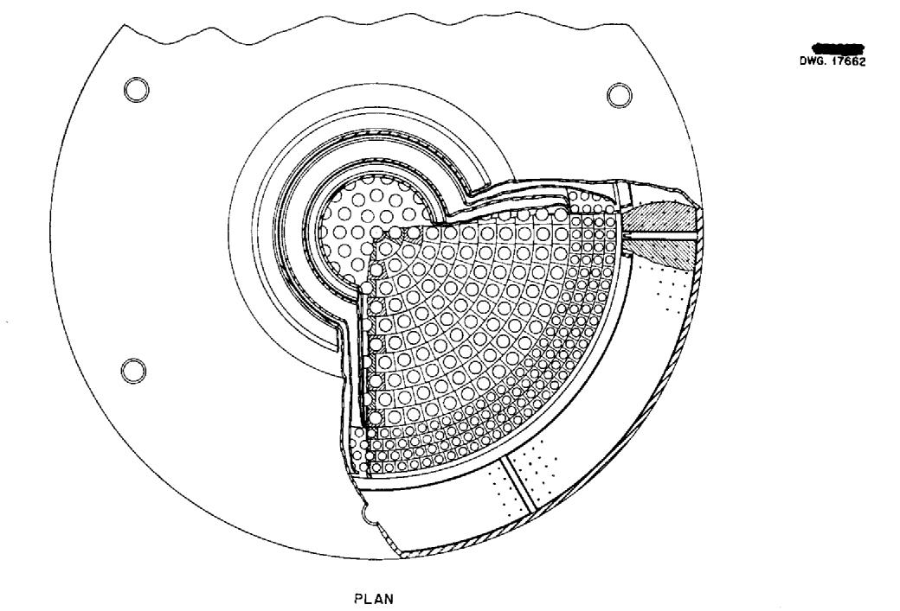

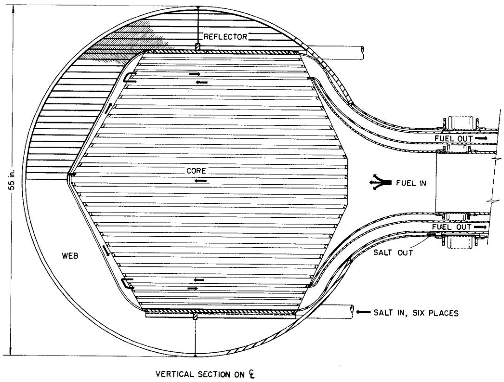  
Fig. 1. Beryllium Oxide-Moderated, Circulating-Fuel Reactor.

mixture of fluoride salts, one of which is uranium tetrafluoride in a low concentration.

4. The moderator and reflector are beryllium oxide blocks.

5. The reflector is situated about the core as shown in Fig. 1.

6. The core shell is perforated around the cylindrical section to permit the influx of reflector coolant to fill the core-moderator interstices. Six small tubes connect the core to the reflector through the crossover header to augment filling the interstices. The coolant will be maintained at an absolute pressure above that of the fuel circuit to prevent the accumulation of stagnant fuel in the moderator interstices in the event of an internal leak in the fuel circuit.

7. The tube sheet, at the unreflected end of the core, is separated between the fuel inlet and outlet to permit the differential expansion that occurs because of the temperature rise in the core.

8. Minimum pressure loss and minimum volume (uranium holdup) were considered in designing the inlet, outlet, and crossover headers. The inlet header is a single 9.5-in. line that feeds all core tubes in the first pass through a single header. This inlet line extends 5 ft from the reactor to a collector manifold that, in turn, receives all fuel returning from the engine radiators. The outlet is a 1.5-in. annulus that receives all outgoing fuel from the second-pass core tubes and transmits the fuel to a common, annular manifold that, in turn, feeds all engine radiators. The reactor outlet annular header is concentric with the reactor inlet line. This header arrangement eliminates any adverse flow conditions that may arise if one or more engines are shut down as a result of malfunction or battle damage.

9. All metallic parts that come in contact with either the fuel or

the coolant are Inconel, which has been shown to have the best corrosion resistance to molten salts and also good high-temperature strength characteristics.

Power Distribution. The six turbojet engines require a reactor power output of 321,000 Btu/sec and a fuel flow rate of 14.7 cfs. The freezing point of the molten salt mixture dictates a minimum, reactor-inlet, mixed-mean fluid temperature on the order of $1000^{\circ}\mathrm{F}$ . The strength of the materials of the reactor core and pressure shell dictates a maximum, reactor-outlet, mixed-mean fluid temperature of $1500^{\circ}\mathrm{F}$ .

The physical properties of the molten salt mixture used in the calculations of mixed-mean fluid temperature and fuel-tube wall temperatures are given in the following:

Specific heat, C 0.39 Btu/lb·°F

Density 112 lb/ft3

Thermal conductivity 0.5 Btu/hr·ft² (°F/ft)

Viscosity 8.3 to 2.1 centipoises

The power distribution within the core is determined in the section entitled "Static Characteristics of the Reactor" and is shown in Fig. 29. Five per cent of the total power generated was assumed to be generated in the moderator. This power is transmitted to the fuel via heat conduction through beryllium oxide, interstices filled with molten salt, and the tube wall, and then by convection to the fuel. The power distribution in the moderator was assumed to be the same as the fuel power distribution.

Fuel-tube wall temperatures based on these power distributions were calculated for various tube stations in both the first and second pass, as shown in Fig. 2. A temperature profile through a typical core section is shown in Fig. 3.

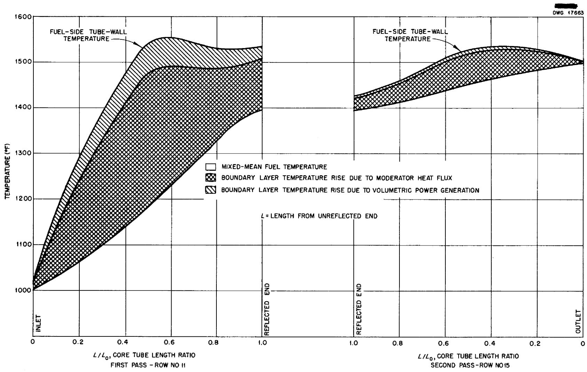  
Fig. 2. Longitudinal Temperature Pattern in Fuel Tubes in Reactor Core.

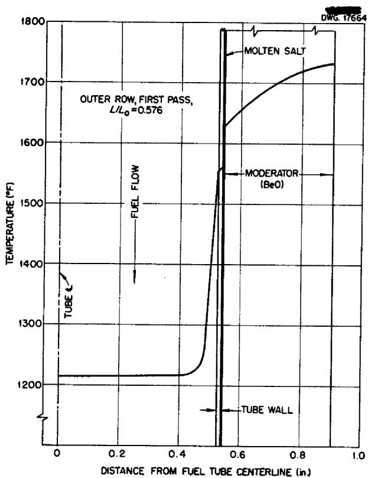  
Fig.3.Temperature Profile Through Fuel Tube and Moderator.

# ENGINESE AND ACCESSORIES

A turbojet cycle, in which fuel-to-air radiators are substituted for the conventional chemical burners, is employed to provide sufficient thrust for operating the design airplane. Compressor bleed-off air is used for the reflector- and the shield-cooling systems; some of this air is then expanded through turbines to furnish power for accessories, and the remainder is expanded through adjustable nozzles to give propulsive thrust.

Once the total air-flow requirement was established, the total compressor inlet area needed was determined on the basis of NACA developmental experience. The number of engines necessary to accommodate the total air flow (or to provide the total inlet area) will depend on the size of engine that can be made

available when an airplane of the type described is constructed. At present, any determination of the number of engines to be used will be very arbitrary. The use of six engines has been postulated because of the convenience from the standpoint of installation. The use of a different number of engines, within reason, would have only secondary effects on the over-all airplane weight and performance.

General Description of the Power Plant. Figure 4 is a schematic diagram of the main engines and accessories. The main engines are turbojets with circulating-fuel-to-air-radiators instead of the conventional combustors. Heat is generated in the circulating fuel as it passes through the reactor and is then transferred to the engine air flow in the circulating-fuel-to-air radiators. Air is bled from the compressors of the main engines to auxiliary radiators to remove heat from the reactor-shield coolant and the reflector coolant. A portion of the air passing through the reflector-coolant radiator is used to operate a number of air turbines that drive all the liquid pumps in the power plant. All the air bled from the main compressors is eventually discharged rearward and provides some additional thrust. With an airplane gross weight of 350,000 lb and an airplane lift-to-drag ratio of 6.5, the power plant is required to produce a total thrust of 53,850 lb at design flight conditions.

The power plant may be considered as consisting of four principal portions: the main engine system, the shield-cooling system, the reflector-cooling system, and the accessory system.

Main Engine System. The air for all four of the systems enters the inlet duct of the airplane and passes through the diffuser. It is then carried in ducting around the reactor shield and into the compressors of the

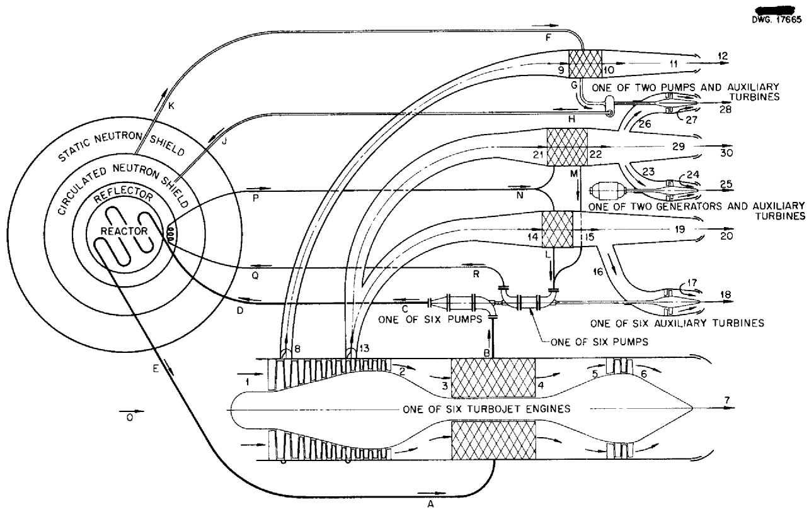  
Fig. 4. Schematic Diagram of Power Plant.

<table><tr><td>LOCATION</td><td>FLUID</td><td>TOTAL PRESSURE(psi)</td><td>TOTAL TEMPERATURE(°F)</td><td>TOTAL WEIGHT FLOW(lb/sec)</td><td>LOCATION</td><td>FLUID</td><td>TOTAL PRESSURE(psi)</td><td>TOTAL TEMPERATURE(°F)</td><td>TOTAL WEIGHT FLOW(lb/sec)</td></tr><tr><td>A. Radiator Inlet Line</td><td>Fuel</td><td>105</td><td>1500</td><td>1646</td><td>8. First-Stage Bleed</td><td>Air</td><td>8.68</td><td>145</td><td>85.6</td></tr><tr><td>B. Radiator Outlet Line</td><td>Fuel</td><td>25</td><td>1000</td><td>1646</td><td>9. Radiator Inlet Line</td><td>Air</td><td>8.46</td><td>145</td><td>85.6</td></tr><tr><td>C. Pump Outlet Line</td><td>Fuel</td><td>175</td><td>1000</td><td>1646</td><td>10. Radiator Outlet Line</td><td>Air</td><td>7.60</td><td>300</td><td>85.6</td></tr><tr><td>D. Reactor Inlet Line</td><td>Fuel</td><td>160</td><td>1000</td><td>1646</td><td>11. Jet Pipe</td><td>Air</td><td>7.38</td><td>300</td><td>85.6</td></tr><tr><td>E. Reactor Outlet Line</td><td>Fuel</td><td>120</td><td>1500</td><td>1646</td><td>12. Auxiliary Jet</td><td>Air</td><td>2.142</td><td></td><td>85.6</td></tr><tr><td>F. Radiator Outlet Line</td><td>Water</td><td>200</td><td>350</td><td>61.8</td><td>13. Eight-Stage Bleed</td><td>Air</td><td>29.0</td><td>430</td><td>110.7</td></tr><tr><td>G. Radiator Outlet Line</td><td>Water</td><td>167</td><td>300</td><td>61.8</td><td>14. Radiator Outlet Line</td><td>Air</td><td>28.3</td><td>430</td><td>104.9</td></tr><tr><td>H. Pump Outlet Line</td><td>Water</td><td>211</td><td>300</td><td>61.8</td><td>15. Radiator Outlet Line</td><td>Air</td><td>25.4</td><td>1000</td><td>104.9</td></tr><tr><td>J. Shield Inlet Line</td><td>Water</td><td>206</td><td>300</td><td>61.8</td><td>16. Auxiliary Turbine</td><td>Air</td><td>24.7</td><td>1000</td><td>7.3</td></tr><tr><td>K. Shield Outlet Line</td><td>Water</td><td>205</td><td>350</td><td>61.8</td><td>17. Auxiliary Turbine</td><td>Air</td><td>7.24</td><td>717</td><td>7.3</td></tr><tr><td>L. Radiator to Pump Line</td><td>Salt</td><td>137</td><td>1000</td><td>195.2</td><td>18. Auxiliary Jet</td><td>Air</td><td>2.142</td><td></td><td>7.3</td></tr><tr><td>M. Radiator Outlet Line</td><td>Salt</td><td>137</td><td>1000</td><td>10.8</td><td>19. Jet Pipe</td><td>Air</td><td>24.7</td><td>1000</td><td>97.6</td></tr><tr><td>N. Radiator Inlet Line</td><td>Salt</td><td>165</td><td>1200</td><td>206</td><td>20. Auxiliary Jet</td><td>Air</td><td>2.142</td><td></td><td>97.6</td></tr><tr><td>P. Reflector Outlet Line</td><td>Salt</td><td>170</td><td>1200</td><td>206</td><td>21. Radiator Inlet Line</td><td>Air</td><td>28.3</td><td>430</td><td>5.8</td></tr><tr><td>Q. Reflector Inlet Line</td><td>Salt</td><td>175</td><td>1000</td><td>206</td><td>22. Radiator Outlet Line</td><td>Air</td><td>25.4</td><td>1000</td><td>5.8</td></tr><tr><td>R. Pump Outlet Line</td><td>Salt</td><td>180</td><td>1000</td><td>206</td><td>23. Auxiliary Turbine</td><td>Air</td><td>24.7</td><td>1000</td><td>5.18</td></tr><tr><td>O. Aircraft Ambient Line</td><td>Air</td><td>2.142</td><td>-67</td><td></td><td>Inlet Line</td><td>Air</td><td>7.24</td><td>717</td><td>5.18</td></tr><tr><td>1. Compressor Inlet Line</td><td>Air</td><td>7.24</td><td>108</td><td>1948</td><td>Auxiliary Turbine</td><td>Air</td><td>2.142</td><td></td><td>5.18</td></tr><tr><td>2. Compressor Outlet Line</td><td>Air</td><td>43.5</td><td>544</td><td>1751</td><td>Auxiliary Jet</td><td>Air</td><td>24.7</td><td>1000</td><td>0.17</td></tr><tr><td>3. Radiator Inlet Line</td><td>Air</td><td>42.4</td><td>544</td><td>1751</td><td>Auxiliary Turbine</td><td>Air</td><td>7.24</td><td>717</td><td>0.17</td></tr><tr><td>4. Radiator Outlet Line</td><td>Air</td><td>38.0</td><td>1250</td><td>1751</td><td>Outlet Line</td><td>Air</td><td>2.142</td><td></td><td>0.17</td></tr><tr><td>5. Turbine Inlet Line</td><td>Air</td><td>36.9</td><td>1250</td><td>1751</td><td>Auxiliary Jet</td><td>Air</td><td>2.142</td><td></td><td>0.17</td></tr><tr><td>6. Turbine Outlet Line</td><td>Air</td><td>10.6</td><td>824</td><td>1751</td><td>Jet Pipe</td><td>Air</td><td>24.7</td><td>1000</td><td>0.62</td></tr><tr><td>7. Jet</td><td>Air</td><td>2.142</td><td></td><td>1751</td><td>Auxiliary Jet</td><td>Air</td><td>2.142</td><td></td><td>0.62</td></tr></table>

six main engines. The air required for the shield-cooling, the reflectorcooling, and the accessory systems is bled from various stages of the main compressors, as will be described. The air for the main engine system passes through the compressors and enters the fuel-to-air radiators, where it is heated by the fuel circulating from the reactor. The air then expands through the turbines that drive the compressors and is exhausted rearward through variable-area exhaust nozzles.

A thermodynamic calculation was carried out to determine the specific impulse and cycle efficiency of the turbojet engines for various values of compressor-pressure ratio, turbine

inlet temperature, and pressure drop in the radiators and associated ducting between the radiators and the compressors and turbines. The following efficiencies were used for the various components:

<table><tr><td>Diffuser and inlet ducting pressure recovery factor (actual total pressure per ideal total pressure)</td><td>0.92</td></tr><tr><td>Compressor efficiency, total - to-total adiabatic</td><td>0.85</td></tr><tr><td>Turbine efficiency, total - to-total adiabatic</td><td>0.90</td></tr><tr><td>Exhaust nozzle velocity coefficient</td><td>0.97</td></tr></table>

Figures 5 and 6 show the specific impulse and cycle efficiency of the

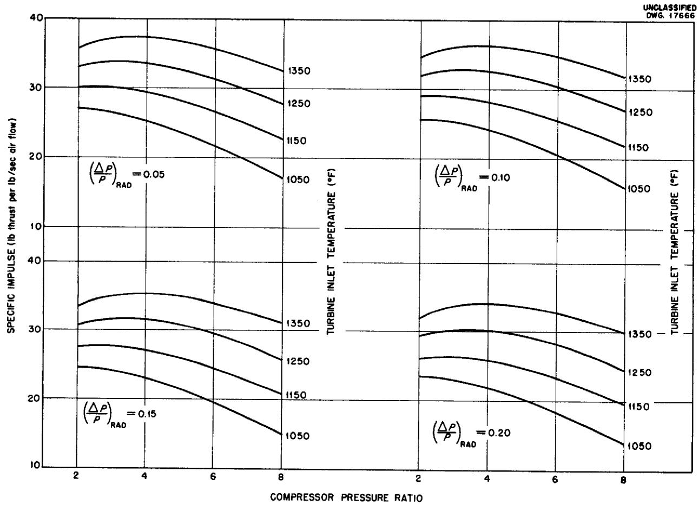  
Fig. 5. Variation of Specific Impulse with Compressor Pressure Ratio for Turbojet Engines. Altitude, 45,000 ft; Mach, 1.5; diffuser efficiency, 0.92; compressor efficiency, 0.85; turbine efficiency, 0.90; nozzle efficiency, 0.95. All efficiencies are total-to-total adiabatic.

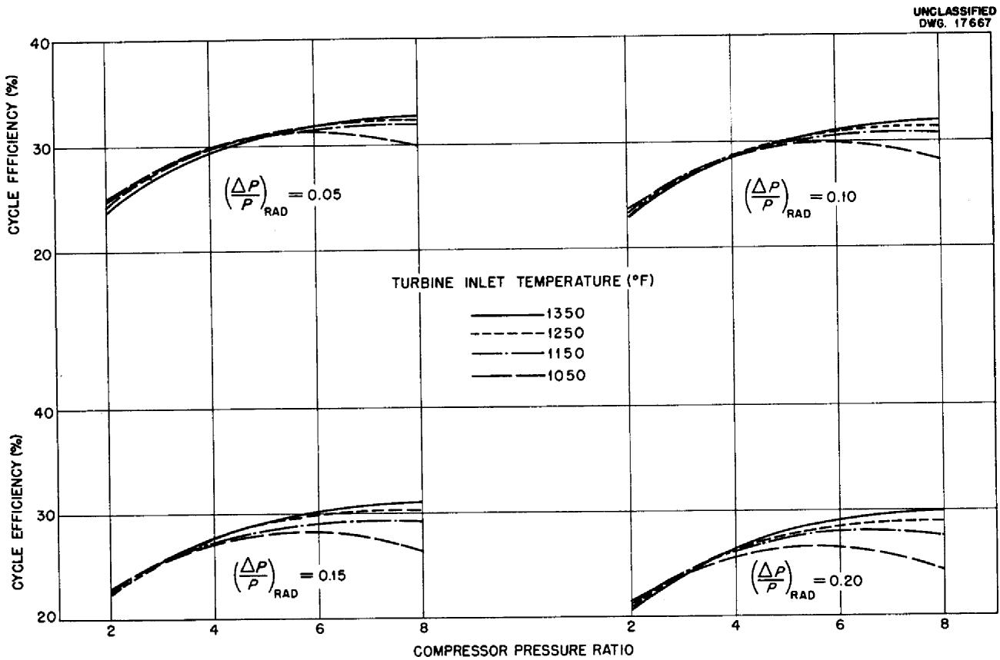  
Fig. 6. Variation of Cycle Efficiency with Compressor Pressure Ratio for Turbojet Engines. Conditions and efficiencies same as in Fig. 5.

turbojet engines for compressor-pressure ratios from 2 to 8, turbine inlet temperatures from 1050 to $1350^{\circ}\mathrm{F}$ , and pressure drops in the radiators and associated ducting of 5 to 20 per cent.(1) These curves, together with the radiator data included in the "Power Plant Radiators" section, permitted selection of the following design-point conditions:

Compressor-pressure ratio 6.0:1

Turbine inlet temperature 1250°F

Pressure drop in radiator and radiator ducting 15%

It will be noted that the engines alone would be favored by lower compression ratios, higher turbine inlet temperatures, and lower radiator

(1) In the actual power plant, the specific impulse and cycle efficiency will be reduced somewhat by compressor bleed-off. More exact specific impulses and cycle efficiencies are presented in a later section on "Over-All Power Plant Performance."

pressure drops and that the radiators alone would be favored by higher compression ratios (greater densities), lower turbine inlet temperatures (greater driving forces), and higher pressure drops (greater velocities). Several preliminary engine and radiator design studies, in which various combinations of the controllable variables were used, indicate that the design-point conditions selected are close to optimum.

With the use of the efficiencies and other factors given, thermodynamic calculations were made of the air circuit of the main engine system. Allowance was made for the quantities of bleed air needed for the other systems. Pertinent values of air pressure, temperature, and weight flow at various stations in the main engine system are given in Table 1 and

Fig. 4. The values of weight flow are for all six engines combined.

The thrust produced by the six main engines is 48,690 pounds. This is approximately $90.4\%$ of the required thrust, the remaining $9.6\%$ being produced by the other systems. The specific impulse of the main engine air is 27.8 lb of thrust per pound of air per second. The amount of power that must be generated in the fuel and moderator of the reactor is 321,000 Btu/sec.

The heat generated in the reactor core (fuel and moderator) is transferred to the main engine radiators by the circulating fuel. The maximum fuel temperature leaving the reactor was set at $1500^{\circ}\mathrm{F}$ . Higher temperatures would, of course, be desirable but would make the problem of designing the various components appreciably more difficult. The temperature entering the reactor was chosen as $1000^{\circ}\mathrm{F}$ . This, again, is a compromise between conflicting requirements. Higher reactor inlet temperatures would reduce the size of the radiators but would increase the fuel flow rate and hence the duct sizes for the same pressure drop, thus increasing the

amount of fuel in the system. Lower values of temperature would, in addition to increasing the radiator size, increase the danger of freezing the fuel. Therefore the value of $1000^{\circ}\mathrm{F}$ was selected as a reasonable compromise. The total weight flow of fuel for all six engines is 1646 lb/sec. Values of fuel temperature and pressure at various stations in the main engine system are listed in Table 2 and Fig. 4.

The properties used in the analysis of the circulating fuel are:

<table><tr><td>Density</td><td>112 lb/ft3</td></tr><tr><td>Specific heat</td><td>0.39 Btu/lb·°F</td></tr><tr><td>Thermal conductivity</td><td>0.5 Btu/hr·ft2 (°F/ft)</td></tr><tr><td>Viscosity</td><td>4.84 lb/hr·ft</td></tr></table>

(2)Report of the Shielding Board for the Aircraft Nuclear Propulsion Program, ANP-53 (Oct. 16, 1950).

Shield-Cooling System. A conservative estimate of the rate of heat generation in the reactor shield is $1\%$ of the core heat generation rate.(2) Therefore 3210 Btu/sec must be removed from the reactor shield. This is accomplished by circulating the shield

TABLE 1. AIR PRESSURES, TEMPERATURES, AND WEIGHT FLOWS AT VARIOUS STATIONS IN THE MAIN ENGINE SYSTEMS   

<table><tr><td></td><td>TEMPERATURE (°F)</td><td>PRESSURE (psia)</td><td>WEIGHT FLOW (1b/sec)</td></tr><tr><td>Station 0, ambient conditions</td><td>-67</td><td>2.142</td><td></td></tr><tr><td>Station 1, compressor inlet</td><td>108</td><td>7.24</td><td>1948</td></tr><tr><td>Station 2, compressor exit</td><td>544</td><td>43.5</td><td>1751*</td></tr><tr><td>Station 3, radiator inlet</td><td>544</td><td>42.4</td><td>1751</td></tr><tr><td>Station 4, radiator outlet</td><td>1250</td><td>38.0</td><td>1751</td></tr><tr><td>Station 5, turbine inlet</td><td>1250</td><td>36.9</td><td>1751</td></tr><tr><td>Station 6, turbine exit</td><td>824</td><td>10.6</td><td>1751</td></tr><tr><td>Station 7, exhaust jet**</td><td></td><td></td><td>1751</td></tr></table>

*Air (197 lb/sec) is bled from various stages of the main engine compressors for the shield-cooling, the reflector-cooling, and the accessory systems.   
$\text{一} ^ { \text{一} }$ Velocity $= 2345$ fpa.

# DESIGN STUDY

water through a radiator. The temperature that can be maintained in the shield without boiling the shield water is, of course, dependent on the pressure maintained. To keep the pressure reasonably low, a shield-water temperature of $350^{\circ}\mathrm{F}$ and a pressure of 200 psia were selected. The shield-water temperature is reduced $50^{\circ}\mathrm{F}$ in the radiator. The weight flow of shield water required is 61.8 lb/sec. The temperatures and pressures of the shield water at various stations in the shield-cooling system are given in Table 3 and Fig. 4.

Air for the shield-water radiator is bled after the first stage of the main engine compressors, because at that point the shield water is at a low temperature; bleeding at a later stage would increase the temperature of the bled air. It would be possible in flight to use ram air to feed the shield-water radiator, but it seems more desirable to design the system

to use air bled after the first compressor stage, since this will permit cooling of the shield water while stationary on the ground without the use of auxiliary equipment external to the airplane. The temperature of the air entering the shield-water radiator is $145^{\circ}\mathrm{F}$ , and the temperature leaving the radiator is $300^{\circ}\mathrm{F}$ . The weight flow of air is 85.6 lb/sec. After the air passes through the shield-water radiator, it is exhausted through a variable-area nozzle and produces some thrust. Air temperatures and pressures at various stations in the shield-cooling system are given in Table 4 and Fig. 4. The thrust produced by the jet is 425 lb, and the specific impulse is about 4.96 lb of thrust per pound of air per second.

Reflector-Cooling System. It is estimated that the rate of heat generation in the reflector will be about $5\%$ of the core heat generation rate. Therefore 16,050 Btu/sec must

TABLE 2. FUEL TEMPERATURES AND PRESSURES AT VARIOUS STATIONS IN THE MAIN ENGINE SYSTEM   

<table><tr><td></td><td>TEMPERATURE (°F)</td><td>PRESSURE (psia)</td></tr><tr><td>Station A, radiator inlet</td><td>1500</td><td>105</td></tr><tr><td>Station B, radiator outlet</td><td>1000</td><td>25</td></tr><tr><td>Station C, pump outlet</td><td>1000</td><td>175</td></tr><tr><td>Station D, reactor inlet</td><td>1000</td><td>160</td></tr><tr><td>Station E, reactor outlet</td><td>1000</td><td>120</td></tr></table>

TABLE 3. WATER TEMPERATURES AND PRESSURES AT VARIOUS STATIONS IN THE SHIELD-COOLING SYSTEM   

<table><tr><td></td><td>TEMPERATURE (°F)</td><td>PRESSURE (psia)</td></tr><tr><td>Station F, radiator inlet</td><td>350</td><td>200</td></tr><tr><td>Station G, radiator outlet</td><td>300</td><td>167</td></tr><tr><td>Station H, pump outlet</td><td>300</td><td>211</td></tr><tr><td>Station J, shield inlet</td><td>300</td><td>206</td></tr><tr><td>Station K, shield outlet</td><td>350</td><td>205</td></tr></table>

be removed from the reflector. This is accomplished by circulating a molten mixture of fluoride salts (containing no uranium tetrafluoride) through the reflector and then through a radiator, where the heat picked up by the salt in the reflector is removed. The reflector inlet temperature of the salt was set at $1000^{\circ}\mathrm{F}$ and the outlet temperature at $1200^{\circ}\mathrm{F}$ . The weight flow of salt required is 206 lb/sec. The temperatures and pressures of the salt at various stations in the reflector-cooling system are given in Table 5 and Fig. 4. The properties used for the circulating-fuel analysis could be used for this salt analysis because the fuel has a low uranium concentration.

Air for the reflector-coolant radiator is bled after the eighth stage of the main engine compressors.

This bleedpoint is a compromise between the conflicting requirements of over-all engine performance (which favor bleeding at an earlier stage) and radiator and duct size (which favor bleeding at a later stage). No attempt has been made to optimize the bleed point, but one possible compromise was selected. The air temperature entering the reflector-coolant radiator is $430^{\circ}\mathrm{F}$ and the outlet temperature is $1000^{\circ}\mathrm{F}$ . A weight flow of 110.7 lb/sec is required. After the air has passed through the reflector-coolant radiator, a portion of it (12.48 lb/sec) is used to operate a number of air turbines that drive the power plant accessories. The air that is not diverted to the accessory system is exhausted through a variable-area exhaust nozzle. Values of air temperatures, pressures, and weight

TABLE 4. AIR TEMPERATURES AND PRESSURES AT VARIOUS STATIONS IN THE SHIELD-COOLING SYSTEMS   

<table><tr><td></td><td>TEMPERATURE (°F)</td><td>PRESSURE (psia)</td></tr><tr><td>Station 8, bleed point after first compressor stage</td><td>145</td><td>8.68</td></tr><tr><td>Station 9, radiator inlet</td><td>145</td><td>8.46</td></tr><tr><td>Station 10, radiator outlet</td><td>300</td><td>7.60</td></tr><tr><td>Station 11, exhaust nozzle entrance</td><td>300</td><td>7.38</td></tr><tr><td>Station 12, exhaust jet*</td><td></td><td></td></tr></table>

\*Velocity $= 1610$ fps.

TABLE 5. SALT TEMPERATURES AND PRESSURES AT VARIOUS STATIONS IN THE REFLECTOR-COOLING SYSTEM   

<table><tr><td></td><td>TEMPERATURE (°F)</td><td>PRESSURE (psia)</td></tr><tr><td>Stations L and M, radiator outlet</td><td>1000</td><td>137</td></tr><tr><td>Station N, radiator inlet</td><td>1200</td><td>165</td></tr><tr><td>Station P, reflector outlet</td><td>1200</td><td>170</td></tr><tr><td>Station Q, reflector inlet</td><td>1000</td><td>175</td></tr><tr><td>Station R, pump outlet</td><td>1000</td><td>180</td></tr></table>

# DESIGN STUDY

flows at various stations in the reflector-cooling system are given in Table 6 and Fig. 4. The thrust produced by the jet is 4530 lb, and the specific impulse is about 46 lb of thrust per pound of air per second.

Accessory System. Power must be provided to drive the liquid pumps in the power plant and to drive the electric generators that furnish electrical power for the airplane. This is accomplished by using a portion of the air coming out of the reflector-coolant radiator to operate a number of air turbines that drive the power plant pumps and the electric generators. By assuming a pump efficiency of $80\%$ and a total generator capacity of about 425 kw, the required pumping power for the power plant at design flight conditions has been calculated to be about 1310 horsepower. (At sea level the required pumping power is much greater, and the pumps and air turbines must be designed to handle this greater load; also, a greater portion of the reflector-cooling system air flow must be diverted to the accessory system. This has been provided for and is described

in the chapter on "Sea-Level Performance."

The weight flow of air required for the air turbines has been calculated. For the calculation, it was assumed that the turbine exit pressure was equal to the ram pressure (7.24 psia) and that the turbine efficiency was $70\%$ . The weight flow required is 12.48 lb/sec. Values of air temperatures and pressures at various stations in the accessory system are given in Table 7 and Fig. 4. The various jets produce a thrust of about 210 lb, and the specific impulse is about 16.8 lb of thrust per pound of air per second.

Over-All Power Plant Performance. The combined thrust of the shield-cooling, the reflector-cooling, and the accessory systems is about 5160 pounds. This thrust, added to the main engine thrust of 48,690 lb, gives a total power plant thrust of 53,850 lb, the required value. The average specific impulse of the power plant is about 27.64, and the over-all cycle efficiency (with the power generated in the reflector and shield included in the power input) is about $29.63\%$ .

TABLE 6. AIR TEMPERATURES, PRESSURES, AND WEIGHT FLOWS AT VARIOUS STATIONS IN THE REFLECTOR-COOLING SYSTEM   

<table><tr><td></td><td>TEMPERATURE (°F)</td><td>PRESSURE (psia)</td><td>WEIGHT FLOW (lb/sec)</td></tr><tr><td>Station 13, bleed point after eighth compressor stage</td><td>430</td><td>29.0</td><td>110.7</td></tr><tr><td>Stations 14 and 21, radiator inlet</td><td>430</td><td>28.3</td><td>110.7 (total)</td></tr><tr><td>Stations 15 and 22, radiator outlet</td><td>1000</td><td>25.4</td><td>110.7 (total)</td></tr><tr><td>Stations 19 and 29, exhaust nozzle entrance</td><td>1000</td><td>24.7</td><td>98.22 (total)</td></tr><tr><td>Stations 20 and 30, exhaust nozzle*</td><td></td><td></td><td>98.22 (total)</td></tr></table>

*Velocity = 2930 fps.

TABLE 7. AIR TEMPERATURES AND PRESSURES AT VARIOUS STATIONS IN THE ACCESSORY SYSTEM   

<table><tr><td></td><td>TEMPERATURE (°F)</td><td>PRESSURE (psia)</td></tr><tr><td>Stations 15 and 22, reflector-cooling radiator outlet</td><td>1000</td><td>25.4</td></tr><tr><td>Stations 16, 23, and 26, turbine inlet</td><td>1000</td><td>24.7</td></tr><tr><td>Stations 17, 24, and 27, turbine outlet</td><td>717</td><td>7.24</td></tr><tr><td>Stations 18, 25, and 28, exhaust jet*</td><td></td><td></td></tr></table>

*Velocity = 1990 fps.

Physical Arrangement of Power Plant. One possible layout of the required power plant equipment is shown in Fig. 7. The six turbojet engines are arranged circumferentially around the cowl and as far outward as they would go. (There is space left in the bottom of the cowl where there is no engine, because it was originally thought that the main wing spar might come through at that location. It is apparent from Fig. 7 that for this particular airplane configuration the spar will not be at that location, and therefore the engines could actually be spaced differently.) The main engine fuel-to-air radiators occupy the space normally occupied by the combustors of the turbojet engines. The shield-coolant radiator is located just behind the reactor in the central hole between the engines. The reflector-coolant radiator is divided into seven parts. One part, located in the central hole, is of sufficient size that the air handled by it is adequate to operate the air turbines that drive the shield-water pumps and the electric generators. These turbines, pumps, and generators are also located in the central hole. The remainder of the reflector-coolant radiator is divided into six equal parts that are located in the triangular spaces between the engines, outboard

of the engine center-line circle. A portion of the air flow from each of these reflector-radiator sections is used to operate six air turbines that drive six fuel pumps and six reflector-coolant pumps. The air turbines are located in the triangular spaces between the engines, outboard of the engine center-line circle. The fuel and reflector-coolant pumps are located in the central hole, the power being transmitted by gears and shafting from the air turbines. Space has been left in this section of the fuselage for the installation of the rear landing gear, which is shown dotted.

Power Plant Weight. The turbojet engine weight was calculated by each of three methods: (1) the empirical method described in the TAB report, (3) (2) the method of Rand Corporation, (4) and (3) by using the specific weight data (pounds of engine weight per pound of sea-level air flow), published by the manufacturer, for an advanced turbojet model. Since the engine is a proprietary model, its identity will not be divulged.

The last method yielded the highest estimated weight and was employed in

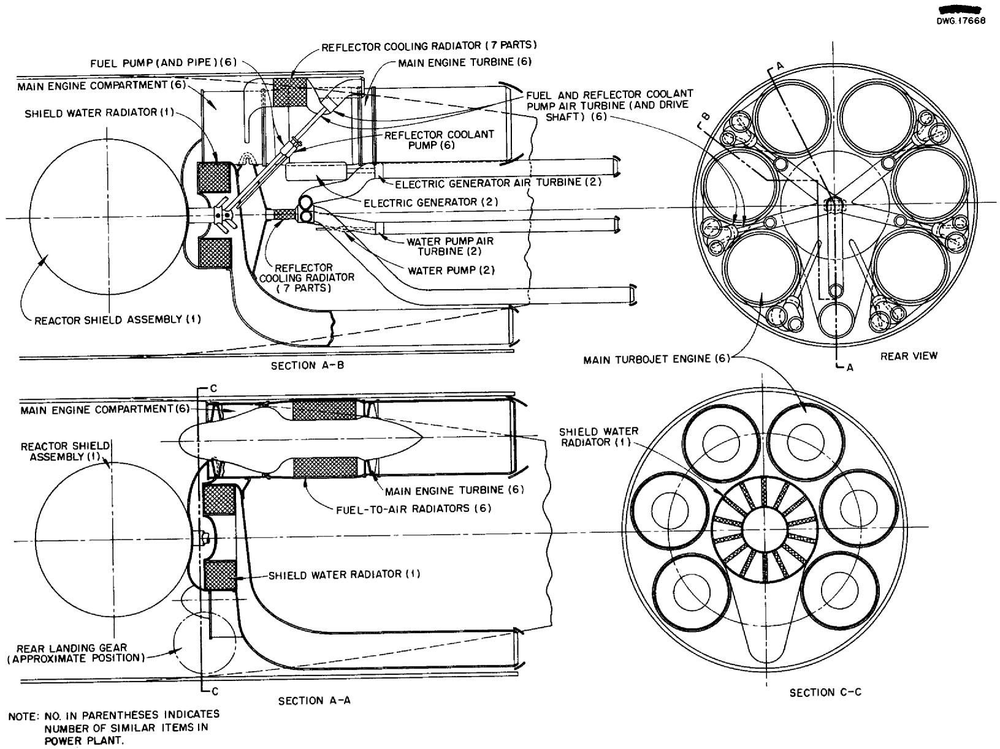  
Fig. 7. Power Plant Arrangement.

the weight summaries (a specific weight of 15.8 lb per pound of sea-level air flow or 33.2 lb per lb/sec design-point air flow). It was assumed that the weight increase associated with the longer shaft, which was needed because of the heat exchangers, was compensated for by omission of the combustion chambers. The air flow of the six engines of the aircraft consists of three parts: 1751 lb/sec passes through the entire engine; approximately lll lb/sec is bled at the eighth compressor stage; approximately 86 lb/sec is bled at the first compressor stage. The engine weight was calculated by assuming 33.2 lb of engine per lb/sec of air flow as the flow that passes through the entire engine; $40\%$ of this value was assumed for the air flow bled after the eighth compressor stage; and $10\%$ was assumed for the air flow bled after the first compressor stage. The weight of the engines, less radiators, therefore is 59,900 pounds. The weights of the main engine radiators and the reflector-and shield-coolant radiators are presented and discussed in the section on "Power Plant Radiators." The total weight of the main radiators, including baffles, structure, headers, circulating fluid, etc., is 23,900 pounds.

The weight of the auxiliary radiators, pumps, air turbines, electric generators, and liquid piping, including circulating liquid for all the radiators, is estimated at 5000 pounds. The weight of the inlet and exhaust air ducting was calculated by a method similar to that used in the TAB report(3) and found to be 10,300 pounds. Therefore the weight of the entire power plant is 99,000 pounds.

# POWER PLANT RADIATORS

All the nuclear powered aircraft studied to date require heat transfer equipment with surface-to-volume and surface-to-weight ratios beyond those required in normal industrial practice.

To achieve the ratios required, close surface-to-surface spacing and thin-walled surfaces must be used. These design criteria, coupled with the high operating temperatures and the strong incentives to minimize pressure loss, create heat exchanger design problems without precedent. Various heat exchanger lattices have been explored, and, as might be expected, an improvement in performance or compactness would increase fabricational difficulties and probably decrease durability. Determination of the best compromise between these conflicting considerations will require a considerable amount of fabricational development and functional testing by a competent heat exchanger manufacturer. The radiators described here are believed to be in the proper surface area, size, and weight range, but it is not intended to imply that any radiators ultimately developed for this application will resemble in detail those illustrated (Figs. 8, 9, 10).

Physical Description. Figure 8 shows a representative fuel-to-air radiator; Figs. 9 and 10 show the reflector- and shield-coolant radiators. The three different types of radiators in the power plant are of the same general design, that is, the tube and fin type with the liquid passing through the tubes and the air across the tubes. Each tube is bent into a serpentine coil and aligned so that the air flows across the tube along the axis of the tube coil. This arrangement permits the combination of a counterflow log mean temperature differential and a crossflow heat transfer coefficient. The various serpentine coils are arranged in the over-all lattice so that the individual tubes form a conventional, triangular pattern.

The over-all radiator dimensions resulting from this design are generally of the order of several inches thick, 2 to 18 in. high and 50 to 350 ft

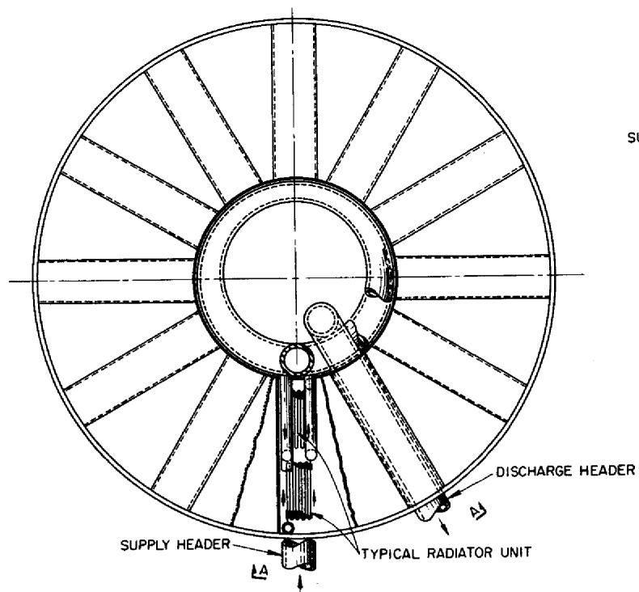

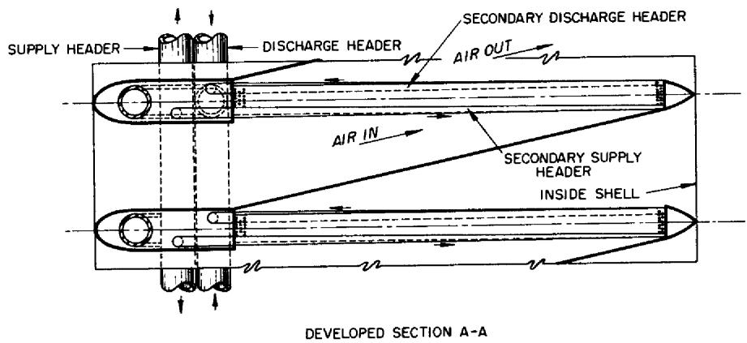

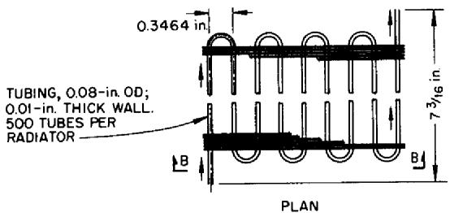

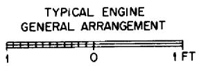

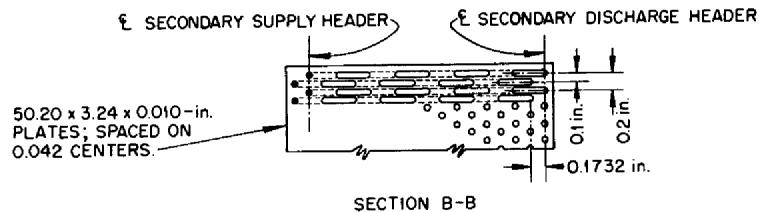

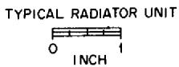  
Fig. 8. Fuel-to-Air Engine Radiator.

<table><tr><td>RADIATOR FOR:</td><td>REQ&#x27;D</td><td>DIM.&quot;A&quot;</td><td>DIM.&quot;B&quot;</td></tr><tr><td>WATER PUMP AND GENERATOR</td><td>12</td><td>26 1/2</td><td>25 1/4</td></tr><tr><td>FUEL PUMP AND REFLECTOR COOLANT PUMP</td><td>2</td><td>18 1/2</td><td>17 1/4</td></tr></table>

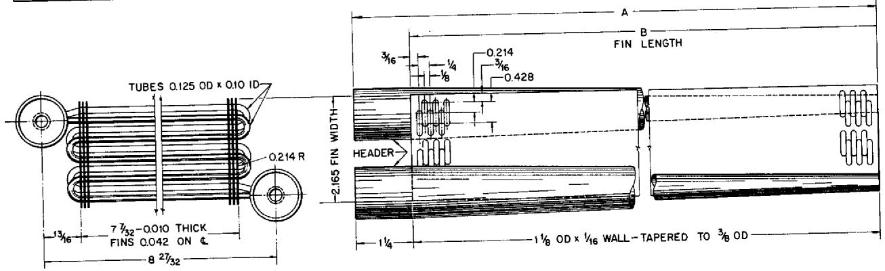  
ALL DIMENSIONS ARE IN INCHES   
Fig. 9. Reflector-Coolant Radiator.

long. Obviously, some method of dividing the radiator into sections and arranging these sections into a somewhat more compact space is needed. Accordingly, each fuel-to-air radiator has been divided into a number of sections of equal length and these sections grouped cylindrically like the teeth of a spur gear (Fig. 9). There are from one to three sections of radiator (stacked one above the other) to each "tooth of the gear," and there are 12 teeth in all. The faces of the radiator sections are parallel to the normal path of the air flow, and therefore the air must be turned 90 deg to enter the radiator and then turned back 90 deg upon leaving the radiator. This is accomplished by dividing the space between the "gear teeth" into two parts with a reinforced sheet that connects the front of one "tooth" with the rear of the next. The space between two teeth therefore acts as the inlet air duct for one tooth and the outlet air duct for the other. To permit control of the turbine inlet temperature in relation to fixed reactor temperatures, provision has been made for a controllable by-pass in the reinforced sheet that will permit the engine air to by-pass the radiator, if desired.

The fuel is brought to the radiator from the reactor in a 3-in. pipe and distributed to the 12 teeth by a tapered ring header; short, constant-diameter lines perpendicular to the ring header lead to the radiator sections, and long, tapered tubes parallel to the "gear teeth" feed the individual serpentine coils. The outlet headers are similar to the inlet headers described above.

The precise division and arrangement of the auxiliary radiators is different from that of the fuel-to-air radiators, but the principle is similar.

All radiators were designed with the tubes having both large, common, sheet fins (Figs. 8 and 9) and individual round fins (Fig. 10). Either of these alternate methods of construction would result in approximately the same radiator performance. The former is probably preferable from a fabricational viewpoint.

Radiator Design Relationships. The following relationships for heat transfer and pressure drop were used in designing the radiators.

Air-Side Heat Transfer. A correlation was made from a curve by Kern(5) that was based on the data of Jameson,

(5) D. Q. Kern, Process Heat Transfer, McGraw-Hill, New York, 1950.

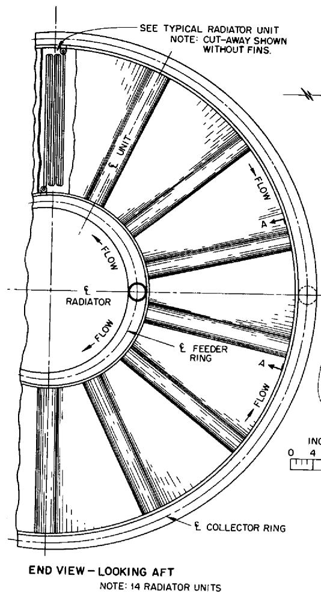  
NOTE: ALL DIMENSIONS IN INCHES

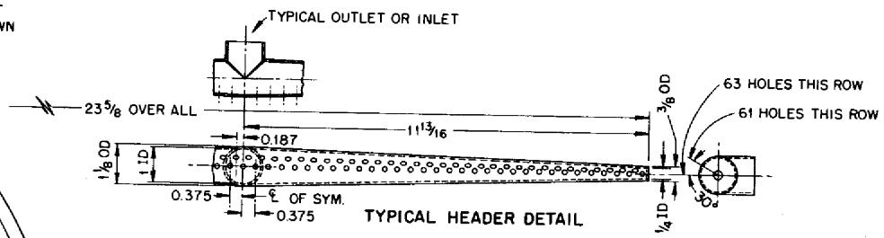

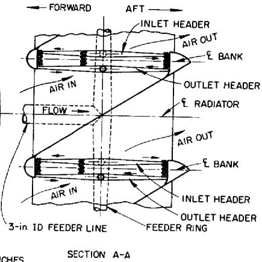  
SECTION A-A

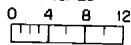

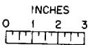

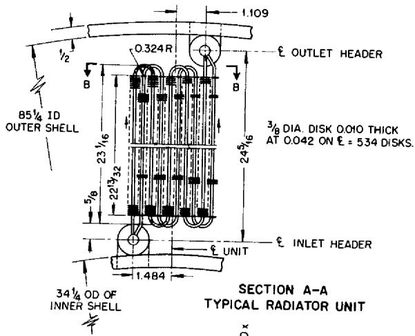

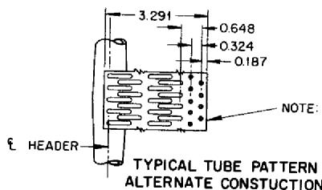

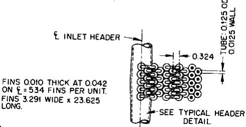  
SECTION B-B-TYPICAL TUBE PATTERN NOTE: SEE ALTERNATE CONSTRUCTION.   
Fig. 10. Shield-Water Radiator.

Foster-Wheeler, and Tate and Cartinhour:

$$
\mathrm {N u} = 0. 0 9 2 \mathrm {R e} ^ {0 \cdot 7 2 3} \mathrm {P r} ^ {0 \cdot 3 3},
$$

$$
D _ {H} = \frac {2}{\pi} \frac {\text {s u r f a c e o f f i n a n d t u b e}}{\text {p r o j e c t e d p e r i m e t e r o f f i n a n d t u b e}},
$$

where $\mathbf{Nu} = \mathbf{Nusselt}$ number, $\mathbf{Re} =$ Reynolds number, $\mathbf{Pr} = \mathbf{Prandtl}$ number, and $D_{\pi}$ is used for the diameter term.

Air-Side Pressure Drop. The data of Gunter and Shaw(6) were used.

Fin Efficiency. The curves of Gardner(7) for circular fins of uniform thickness were used.

Liquid-Side Heat Transfer. The calculation was made by using the following relationship:

$$
\mathrm {N u} = 0. 0 2 3 \mathrm {R e} ^ {0 \cdot 8} \mathrm {P r} ^ {0 \cdot 4}.
$$

Liquid-Side Pressure Drop. The calculation was made by using the following equations:

$$
\Delta P = 4 \rho f \frac {L}{D} \frac {V ^ {2}}{2 g},
$$

$$
f = \frac {0 . 0 4 6}{\operatorname {R e} ^ {0 . 2}}
$$

where

$\Delta P =$ pressure drop,

$\rho =$ liquid density, $\mathrm{lb / ft^3}$

$f =$ friction factor,

$L / D =$ equivalent length-to-diameter ratio,

$\pmb{V} =$ liquid velocity, fps,

$g =$ gravitational constant, 32.2 ft/sec².

An allowance of 75 equivalent diameters was taken for the pressure drop in an 180-deg bend.

The following liquid properties were used both for the fuel and for the reflector-cooling salt.

Density 112 lb/ft3

Specific heat 0.39 Btu/lb.°F

Thermal conductivity 0.5 Btu/hr·ft² (°F/ft)

Viscosity 2 centipoises

Fuel-to-Air Radiator. A number of fuel-to-air radiators were designed and

(6) A. Y. Gunter and W. A. Shaw, Trans. ASME 67, 643 (1945).

(7) K. A. Gardner, Trans. ASME 67, 621 (1945).

a complete tabulation of the geometry and performance of these radiators is contained in Table 8. All values listed in the table and mentioned below are for the radiator for one of the six engines. The radiator design actually used in the power plant is presented in column 1. It is designed to transfer 53,500 Btu/sec; the fuel enters at $1500^{\circ}\mathrm{F}$ and leaves at $1000^{\circ}\mathrm{F}$ ; the air enters at $544^{\circ}\mathrm{F}$ and leaves at $1250^{\circ}\mathrm{F}$ ; the air flow is 292 lb/sec and the fuel flow is 275 lb/sec; the inlet air pressure is 42.4 psia.

The radiator geometry is as follows: The tubes are 0.06 in. ID with 0.020 in. walls. The fins are 0.25 in. in diameter, 0.010 in. thick, and spaced 24 to the inch. The tubes are arranged in a triangular pattern with a 0.25-in. center-to-center spacing. The tube material is Inconel, and the fins are type 430 stainless steel. The radiator face area is 67.2 ft²; the radiator height is 4 in. and there are 18 banks longitudinal to the flow.

The radiator was designed to have an air-side pressure drop of $10\%$ of the inlet pressure and a liquid-side pressure drop of under 75 psi. The liquid-side pressure drop for the radiator of column l is 23 psi. The fuel volume contained in the radiator core is 1,15 ft³. A manifold system was designed for the radiator of column l (but not for any of the other radiators) that contained 1.4 ft³ of fuel and caused a pressure drop of 57 psi. The radiator, including core, structure, headers, baffles, contained fuel, etc. weighed about 4000 pounds.

Columns 2 to 15 of Table 8 indicate the effect of variations in geometry and performance of the fuel-to-air radiators. Columns 2 to 11 illustrate changes in geometry. Columns 2 and 3 show the effect of varying the number of banks while holding the air-side pressure drop constant. Column 4 is similar to column 1, except that the

TABLE 8. FUEL-TO-AIR RADIATORS   

<table><tr><td></td><td>1</td><td>2</td><td>3</td><td>4</td><td>5</td><td>6</td><td>7</td><td>8</td><td>9</td><td>10</td><td>11</td><td>12</td><td>13</td><td>14</td><td>15</td><td></td></tr><tr><td>Heat transfer, Btu/sec</td><td>53,500</td><td>53,500</td><td>53,500</td><td>53,500</td><td>53,500</td><td>53,500</td><td>53,500</td><td>53,500</td><td>53,500</td><td>53,500</td><td>53,500</td><td>53,500</td><td>57,900</td><td>49,300</td><td>56,100</td><td>55,600</td></tr><tr><td>Air flow, lb/sec</td><td>292</td><td>292</td><td>292</td><td>292</td><td>292</td><td>292</td><td>292</td><td>292</td><td>292</td><td>292</td><td>292</td><td>292</td><td>273</td><td>253</td><td>305</td><td>292</td></tr><tr><td>Fuel flow, lb/sec</td><td>275</td><td>275</td><td>275</td><td>275</td><td>275</td><td>275</td><td>275</td><td>275</td><td>275</td><td>275</td><td>275</td><td>275</td><td>297</td><td>269</td><td>288</td><td>285</td></tr><tr><td>Air inlet temperature, °F</td><td>544</td><td>544</td><td>544</td><td>544</td><td>544</td><td>544</td><td>544</td><td>544</td><td>544</td><td>544</td><td>544</td><td>544</td><td>430</td><td>544</td><td>544</td><td>544</td></tr><tr><td>Air outlet temperature, °F</td><td>1250</td><td>1250</td><td>1250</td><td>1250</td><td>1250</td><td>1250</td><td>1250</td><td>1250</td><td>1250</td><td>1250</td><td>1250</td><td>1250</td><td>1250</td><td>1350</td><td>1250</td><td>1275</td></tr><tr><td>Fuel inlet temperature, °F</td><td>1500</td><td>1500</td><td>1500</td><td>1500</td><td>1500</td><td>1500</td><td>1500</td><td>1500</td><td>1500</td><td>1500</td><td>1500</td><td>1500</td><td>1500</td><td>1500</td><td>1500</td><td>1500</td></tr><tr><td>Fuel outlet temperature, °F</td><td>1000</td><td>1000</td><td>1000</td><td>1000</td><td>1000</td><td>1000</td><td>1000</td><td>1000</td><td>1000</td><td>1000</td><td>1000</td><td>1000</td><td>1000</td><td>1000</td><td>1000</td><td>1000</td></tr><tr><td>Air inlet pressure, psia</td><td>42.4</td><td>42.4</td><td>42.4</td><td>42.4</td><td>42.4</td><td>42.4</td><td>42.4</td><td>42.4</td><td>42.4</td><td>42.4</td><td>42.4</td><td>42.4</td><td>28.3</td><td>42.4</td><td>42.4</td><td>42.4</td></tr><tr><td>Tube ID, in.</td><td>0.060</td><td>0.060</td><td>0.060</td><td>0.060</td><td>0.060</td><td>0.080</td><td>0.10</td><td>0.10</td><td>0.10</td><td>0.10</td><td>0.10</td><td>0.10</td><td>0.060</td><td>0.060</td><td>0.060</td><td>0.060</td></tr><tr><td>Tube wall thickness, in.</td><td>0.020</td><td>0.020</td><td>0.020</td><td>0.010</td><td>0.0125</td><td>0.0125</td><td>0.0125</td><td>0.0125</td><td>0.0125</td><td>0.0125</td><td>0.0125</td><td>0.0125</td><td>0.010</td><td>0.010</td><td>0.0125</td><td>0.0125</td></tr><tr><td>Fin diameter, in.</td><td>0.25</td><td>0.25</td><td>0.25</td><td>0.20</td><td>0.17</td><td>0.21</td><td>0.25</td><td>0.286</td><td>0.3125</td><td>0.25</td><td>0.25</td><td>0.20</td><td>0.20</td><td>0.20</td><td>0.17</td><td>0.17</td></tr><tr><td>No. of fins per in.</td><td>24</td><td>24</td><td>24</td><td>24</td><td>24</td><td>24</td><td>24</td><td>24</td><td>24</td><td>24</td><td>24</td><td>24</td><td>24</td><td>24</td><td>24</td><td>24</td></tr><tr><td>Fin thickness, in.</td><td>0.010</td><td>0.010</td><td>0.010</td><td>0.010</td><td>0.010</td><td>0.010</td><td>0.010</td><td>0.010</td><td>0.010</td><td>0.010</td><td>0.010</td><td>0.010</td><td>0.010</td><td>0.010</td><td>0.010</td><td>0.010</td></tr><tr><td>Tube spacing, in.</td><td>0.25</td><td>0.025</td><td>0.025</td><td>0.20</td><td>0.17</td><td>0.21</td><td>0.25</td><td>0.286</td><td>0.3125</td><td>0.286</td><td>0.219</td><td>0.20</td><td>0.20</td><td>0.17</td><td>0.17</td><td>0.17</td></tr><tr><td>Tube material</td><td>Inconel</td><td>Inconel</td><td>Inconel</td><td>Inconel</td><td>Inconel</td><td>Inconel</td><td>Inconel</td><td>Inconel</td><td>Inconel</td><td>Inconel</td><td>Inconel</td><td>Inconel</td><td>Inconel</td><td>Inconel</td><td>Inconel</td><td>Inconel</td></tr><tr><td>Fin material</td><td>430 SS</td><td>430 SS</td><td>430 SS</td><td>Inconel</td><td>Inconel</td><td>Inconel</td><td>Inconel</td><td>Inconel</td><td>Inconel</td><td>Inconel</td><td>Inconel</td><td>Inconel</td><td>Inconel</td><td>Inconel</td><td>Inconel</td><td>Inconel</td></tr><tr><td>No. of banks (longitudinal to flow)</td><td>18</td><td>20</td><td>16</td><td>18</td><td>18</td><td>16</td><td>16</td><td>16, 18</td><td>18</td><td>20</td><td>10</td><td>16</td><td>26</td><td>20</td><td>20</td><td>20</td></tr><tr><td>Frontal area, ft2</td><td>67.2</td><td>71.6</td><td>63.2</td><td>57.2</td><td>68.4</td><td>65.6</td><td>70.5</td><td>36.6, 67.6</td><td>62.0</td><td>58.6</td><td>85.6</td><td>69.4</td><td>59.2</td><td>57.1</td><td>57.1</td><td>57.1</td></tr><tr><td>Radiator height, in.</td><td>4.0</td><td>2.52</td><td>7.6</td><td>6.0</td><td>7.2</td><td>5.0</td><td>9.0</td><td>13.8, 6.85</td><td>9.75</td><td>6.6</td><td>18</td><td>6.0</td><td>3.0</td><td>9.0</td><td>10.2</td><td>10.2</td></tr><tr><td>Air inlet velocity, fps</td><td>83.0</td><td>78.2</td><td>88.5</td><td>97.1</td><td>99</td><td>102</td><td>96</td><td>96, 89</td><td>91</td><td>97</td><td>102</td><td>92.7</td><td>80.7</td><td>117.6</td><td>117.6</td><td>117.6</td></tr><tr><td>Liquid velocity, fps</td><td>6.6</td><td>3.7</td><td>15.2</td><td>9.3</td><td>7.7</td><td>15.6</td><td>4.7</td><td>12.5, 5.0</td><td>7.6</td><td>6.8</td><td>7.3</td><td>7.0</td><td>4.9</td><td>7.4</td><td>8.4</td><td>8.4</td></tr><tr><td>Air-side heat transfer coefficient, Btu/sec·ft2·°F</td><td>0.0288</td><td>0.0276</td><td>0.0303</td><td>0.0346</td><td>0.0355</td><td>0.0340</td><td>0.0311</td><td>0.0307, 0.0293</td><td>0.0290</td><td>0.0318</td><td>0.0330</td><td>0.0270</td><td>0.0307</td><td>0.0402</td><td>0.0402</td><td>0.0402</td></tr><tr><td>Fuel-side heat transfer coef- ficient, Btu/sec·ft2·°F</td><td>0.60</td><td>0.38</td><td>1.12</td><td>0.82</td><td>0.47</td><td>0.99</td><td>0.40</td><td>0.78, 0.40</td><td>0.62</td><td>0.47</td><td>0.58</td><td>0.67</td><td>0.47</td><td>0.46</td><td>0.52</td><td>0.52</td></tr><tr><td>Air-side pressure drop, psi</td><td>4.24</td><td>4.24</td><td>4.24</td><td>4.24</td><td>4.24</td><td>4.24</td><td>4.24</td><td>4.24, 4.24</td><td>4.24</td><td>4.24</td><td>4.24</td><td>2.83</td><td>4.24</td><td>6.36</td><td>6.36</td><td>6.36</td></tr><tr><td>Fuel-side pressure drop, psi Core Headquarters</td><td>23 57</td><td>7.6</td><td>147</td><td>44</td><td>49</td><td>29</td><td>12.5</td><td>68, 12.3</td><td>35.5</td><td>16.8</td><td>17.4</td><td>34.3</td><td>18.6</td><td>42</td><td>70</td><td></td></tr><tr><td>Fuel volume, ft3 Core Headquarters</td><td>1.15 1.4</td><td>1.34</td><td>0.954</td><td>1.222</td><td>1.68</td><td>2.08</td><td>3.0</td><td>2.19, 2.75</td><td>2.15</td><td>2.72</td><td>2.54</td><td>1.32</td><td>1.82</td><td>1.59</td><td>1.59</td><td>1.59</td></tr><tr><td>Radiator weight, lb</td><td>3980</td><td>4540</td><td>3520</td><td>3040</td><td>3110</td><td>3160</td><td>3550</td><td>3570, 4110</td><td>3940</td><td>3340</td><td>3070</td><td>3220</td><td>3840</td><td>3020</td><td>3020</td><td>3020</td></tr></table>

tube wall thickness has been changed to 0.010 in., the fins to 0.020 in., and the fin material to Inconel. Columns 5, 6, and 7 indicate the effect of varying tube inner diameter. The tube wall thickness in columns 5, 6, and 7 is 0.0125 in., and the ratio of fin diameter to the tube outer diameter has been held constant at 2. Columns 8 and 9 are similar to column 7, except that the ratio of fin diameter to tube outer diameter has been varied. Columns 10 and 11 are also similar to column 7, except that while the fin diameter has been held constant, the tube spacing has been changed. (This is possible only if the tubes are individually finned. The large sheet fin type of construction will not permit this variation.) In the radiator described in column 11, the fins are actually interlocking.

Columns 12 to 15 indicate the effect of variations in radiator performance. Since variations in radiator performance will cause changes in power plant performance, these radiators were all designed so that the thrust of the power plant remained constant. Column 12 is similar to column 4, except that is is designed for air inlet conditions that correspond to a compressor pressure ratio of 4 instead of a compressor pressure ratio of 6, as is found in the actual power plant. Column 13 is similar to column 4, except that the air outlet temperature has been raised from 1250 to $1350^{\circ}\mathrm{F}$ . Columns 14 and 15 are similar to column 5, except that the air-side pressure drop has been increased from 10 to $15\%$ of the air inlet pressure. In column 14, the air outlet temperature was maintained at $1250^{\circ}\mathrm{F}$ , but in column 15 it was raised to $1275^{\circ}\mathrm{F}$ . This temperature was selected so that the thrust per pound of air handled by the power plant is the same in columns 5 and 15.

Auxiliary Radiators. The designs of the reflector- and shield-coolant radiators are quite similar to that of

the fuel-to-air radiators. A description of their geometry and performance is given in Table 9.

# AIRPLANE

In accordance with the general premises of the "Introduction," an airplane is presented that preliminary studies indicate will meet the requirements for flight at Mach 1.5 at 45,000 ft with the designed power plant. No attempt has been made to present a final design; the aim is, rather, to present a reasonably plausible design that may serve as a starting point for more detailed study. The general configuration of the airplane, an aerodynamic calculation of the airplane lift-to-drag ratio, a brief consideration of the sea-level performance of the airplane, and an estimate of the weights of the various components of the aircraft structure are presented.

Airplane Configuration. Figure 11 shows the general configuration of the airplane, and Fig. 12, a longitudinal section, shows the location of the crew, reactor, and power plant. The reasoning governing the location of the various items in Figs. 11 and 12 is presented in the following.

The center of lift and center of gravity of the aircraft, which, of course, coincide, were taken as the reference point. The wing and tail were placed suitably, forward and aft of the center of lift, so that the resultant of the lift of the wing and horizontal tail surface occurred at the center of lift, and the center of lift of the horizontal tail was 85 ft from the airplane center of lift. (It may be noted in Fig. 11 that a triangular planform is used for the wing and horizontal tail surface. It is normal practice in current triangular-wing aircraft to have no horizontal tail surface but, rather, to use elevons in the wings to provide control in the pitch direction. The moment of inertia of this aircraft,

TABLE 9. REFLECTOR- AND SHIELD-COOLANT RADIATORS   

<table><tr><td></td><td>REFLECTOR-COOLANT
RADIATOR</td><td>SHIELD-COOLANT
RADIATOR</td></tr><tr><td>Heat transfer, Btu/sec</td><td>16,050</td><td>3210</td></tr><tr><td>Air flow, lb/sec</td><td>113</td><td>82.6</td></tr><tr><td>Liquid flow, lb/sec</td><td>201</td><td>59.4</td></tr><tr><td>Air inlet temperature, °F</td><td>430</td><td>145</td></tr><tr><td>Air outlet temperature, °F</td><td>1000</td><td>300</td></tr><tr><td>Liquid inlet temperature, °F</td><td>1200</td><td>350</td></tr><tr><td>Liquid outlet temperature, °F</td><td>1000</td><td>300</td></tr><tr><td>Air inlet pressure, psia</td><td>29</td><td>8.44</td></tr><tr><td>Liquid inlet pressure, psia</td><td></td><td>200</td></tr><tr><td>Tube ID, in.</td><td>0.10</td><td>0.10</td></tr><tr><td>Tube wall, in.</td><td>0.0125</td><td>0.0125</td></tr><tr><td>Fin diameter, in.</td><td>0.25</td><td>0.375</td></tr><tr><td>No. of fins per in.</td><td>24</td><td>24</td></tr><tr><td>Fin thickness, in.</td><td>0.010</td><td>0.010</td></tr><tr><td>Tube material</td><td>Inconel</td><td>Aluminum</td></tr><tr><td>Fin material</td><td>Inconel</td><td>Aluminum</td></tr><tr><td>No. of banks longitudinal to flow</td><td>10</td><td>10</td></tr><tr><td>Frontal area, ft²</td><td>30.2</td><td>49.4</td></tr><tr><td>Radiator height, in.</td><td>7.2</td><td>23.1</td></tr><tr><td>Liquid-side pressure drop, psi</td><td>28</td><td>33</td></tr><tr><td>Air-side pressure drop, psi</td><td>2.9</td><td>0.844</td></tr><tr><td>Radiator weight (including baffles, headers, structure, contained liquid, etc.), lb</td><td>1400</td><td>800</td></tr></table>

however, is going to be quite large because of the heavy crew shield in the nose of the airplane, and therefore a horizontal tail was added to secure a longer lever arm for the control forces in the pitch direction. Whether this is actually necessary is not known; the problem of control in the pitch direction is considered further in a subsequent paragraph.) The size, shape, and proportions of the wing and tail surfaces were determined from aerodynamic considerations and are discussed in the following subsection.

In order to avoid changes in the balance of the airplane when the bomb load is dropped, this load was located at the center of lift. The reactor and power plant were grouped sufficiently aft of the center of lift to balance the moment caused by the crew shield in the nose of the aircraft and the resultant moment caused by the weights of the various components of the airplane structure. The engines were placed behind the reactor to afford some shadow shielding of the fore portion of the aircraft; and,

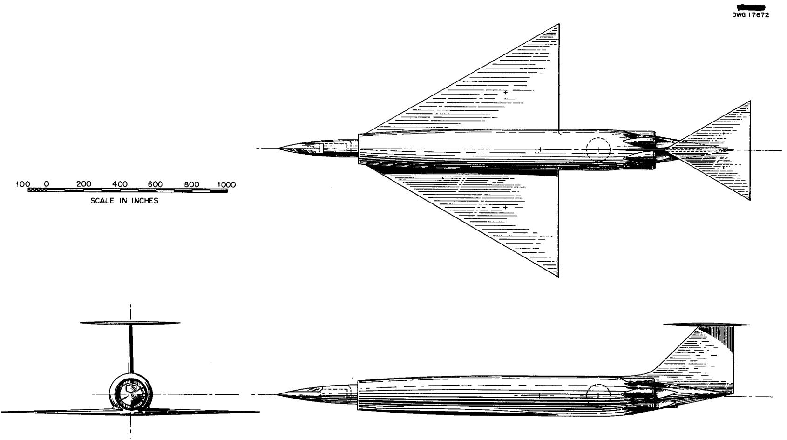  
Fig. 11. Airplane Configuration.

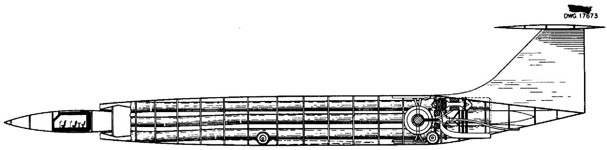  
Fig. 12. Longitudinal Section of Airplane.

furthermore, they were placed as close as possible to the reactor to minimize the fuel volume in the ducts to and from the main engine radiators.

The cowl, the central portion of the fuselage, was made large enough in diameter to permit the passage of the engine air flow around the reactor shield; and it was extended rearward to the engine exhaust nozzles and forward far enough to permit the air intake to be ahead of the wing. The engines were placed as far out in the cowl as they would go. The crew and crew shield were placed in the nose ogive, forward of the cowl, which gave a separation distance of 120 ft between the reactor and the crew compartment (center to center). The diameters and proportions of the nose ogive and tail boom were chosen to meet the spatial and structural requirements and to give low aerodynamic drag. (The nose ogive is located on the center line of the airplane; there is therefore considerable air inlet area above the ogive. Recent NACA aerodynamic studies indicate that at high angles of attack this portion of the air intake may be "smothered" by a very thick boundary layer. This difficulty could be alleviated by raising the nose ogive with respect to the air inlet until the upper surface of the ogive was actually an extension of the cowl.) The diameter of the nose ogive and the inlet air-flow area requirements are such that they permit the cowl to be tapered in the manner shown in Fig. ll.

Airplane Lift-to-Drag Ratio: The various aerodynamic formulas in this section were taken from the following references:

1. Eugene S. Love, *Investigations at Supersonic Speeds of 22 Triangular Wings Representing Two Airfoil Sections* for each of *Eleven Apex Angles*, RM L9D07, May 10, 1949.   
2. Generalized Lift and Drag Characteristics at Subsonic, Transonic, and Supersonic Speeds, Consolidated Vultee Aircraft Corporation, Fort Worth, Texas, FZ AO4la, November 27, 1950.   
3. NACA Conference on Aircraft Propulsion Systems Research, Lewis Flight Propulsion Laboratory, Cleveland, Ohio, January 18 and 19, 1950.   
4. Notes and Tables for use in the Analysis of Supersonic Flow, NACA Technical Note 1428, December 1947.

The airplane wing is of triangular planform with a 60-degree sweep and a $3\%$ thickness-to-chord ratio. The wing profile is that of a circular-arc airfoil with an elliptic leading edge. The nose ogive, tail boom, and cowl are parabolic bodies of revolution, and the nose ogive and tail boom are pointed at the ends. The following lift and drag formulas were used for the calculation of the airplane lift-to-drag ratio.

Wing

Wave drag:

$$
\frac {C _ {D}}{(T R) ^ {2}} = m \beta \tan \epsilon - 0. 6 5,
$$

where

$C_{D_{\nu}} =$ wave drag coefficient based on exposed planform area,

TR = thickness ratio = ratio of maximum thickness to chord, $m = 4.9$ at Mach 1.5,

$$
\beta = \sqrt {M _ {0} ^ {2} - 1},
$$

$M_0 =$ flight Mach number, $\epsilon = 90$ deg minus the sweep angle. Induced drag:

Aspect Ratio $C_{D_i} / C_L^2$

4 0.341

3 0.342

2.31 $(\epsilon = 30^{\circ})$ 0.352

where

$C_{D_i} =$ induced drag coefficient based on exposed planform area,

$C_L =$ lift coefficient based on exposed planform area.

Friction drag:

$$
C _ {D _ {f}} = \frac {0 . 0 3 0 6}{\operatorname {R e} ^ {1 / 7} \left[ 1 + \frac {\gamma - 1}{4} M _ {0} ^ {2} \right] ^ {5 / 7}},
$$

where

$C_{D_f} = \text{friction drag coefficient}$ based on total wetted surface,

$\gamma =$ ratio of specific heats of air,

Re = Reynold's number, $V_{0} c \rho / \mu$ ,

$V_{0} =$ forward velocity, fps,

$c =$ average wing chord, ft,

$\dot{\rho} =$ ambient density, lb/ft³,

$\mu =$ ambient viscosity, lb/sec·ft.

Optimum lift coefficient:

$$
C _ {L _ {\text {o p t}}} = \sqrt {\frac {C _ {D _ {o}}}{C _ {D _ {i}} / C _ {L} ^ {2}}}
$$

where

$C_{L_{opt}} =$ lift coefficient at maximum lift-to-drag ratio (based on exposed planform area),

$$
C _ {D _ {o}} = C _ {D _ {w}} + C _ {D _ {f}} \times \frac {A _ {w}}{A},
$$

A = exposed plan form area

$$
= \frac {\text {a i r p l a n e g r o s s w e i g h t}}{C _ {L _ {\text {o p t}}} \times 1 / 2 \rho V _ {0} ^ {2}},
$$

$A_{\infty} =$ total wetted surface $\sim 2A$

Total wing lift:

$$
L _ {w} = C _ {L _ {\text {o p t}}} A q,
$$

where

$$
L _ {w} = \text {t o t a l w i n g l i f t},
$$

$$
q = \frac {1}{2} \rho V _ {0} ^ {2}.
$$

Total wing drag:

$$
D _ {w} = \left[ C _ {D _ {0}} + C _ {D _ {i}} \right] A q,
$$

where

$$
D _ {w} = \text {t o t a l w i n g d r a g}.
$$

# Tail

The horizontal tail is geometrically similar to the wing and has an area equal to $20\%$ of the wing area. The vertical tail has a 45-degree sweep angle, a $3\%$ thickness ratio, and an area equal to $15\%$ of the combined wing and horizontal tail area. The lift and drag of the tail surfaces were calculated by using the same formulas as those used for the wing.

Nose Ogive and Tail Boom

Wave drag:

$$
C _ {D} ^ {\prime} \quad_ {w} = \frac {1 0 . 7}{(F R) ^ {2}} ,
$$

where

$C_{D}^{\prime}$ = wave drag coefficient based on maximum frontal area,

$FR =$ fineness ratio (ratio of length to maximum diameter).

Friction drag:

$$
C _ {D _ {f}} ^ {\prime} = 1. 0 5 \times \frac {0 . 0 3 0 6}{\operatorname {R e} ^ {1 / 7} \left[ 1 + \frac {\gamma - 1}{4} M _ {0} ^ {2} \right] ^ {5 / 7}},
$$

where

$C_{D_f}^{\prime} = \text{friction drag coefficient based on total wetted surface,}$

Re = Reynold's number, $V_{0}L\rho/\mu$ ,

$L =$ length, ft.

# DESIGN STUDY

Total nose ogive and tail boom drag:

$$
D ^ {\prime} = \left[ C _ {D _ {w}} ^ {\prime} A ^ {\prime} + C _ {D _ {f}} ^ {\prime} A _ {w} ^ {\prime} \right] q,
$$

where

$D^{\prime} =$ total drag of the nose ogive and tail boom,

$A^{\prime} =$ maximum frontal area,

$A_{\varphi} =$ total wetted surface.

Comega

Wave drag of fore-portion: A table of wave drag coefficients for the

Cowl area ratio $=$ ratio of outlet area to area at station of maximum diameter,

$L =$ length of the aft-portion of the cowl.

Friction drag: The friction drag coefficient for the cowl may be calculated from the formula used for obtaining the fuselage friction drag coefficient if $L$ is defined as the length of the cowl.

Total cowl drag:

$$
D ^ {\prime \prime} = \left\{\left[ C _ {D _ {w}} ^ {\prime \prime} \right] _ {\text {f o r e - p o r t i o n}} + \left[ C _ {D _ {w}} ^ {\prime \prime} \right] _ {\text {a f t - p o r t i o n}} \right\} A ^ {\prime \prime} q + C _ {D _ {f}} ^ {\prime \prime} A _ {w} ^ {\prime \prime} q,
$$

portion of the cowl forward of the station of maximum diameter follows:

<table><tr><td>COWL</td><td>AREA</td><td>RATIO</td><td>L/D</td><td>\( C_{D}^{\prime \prime}\sqrt{M_{0}} \)</td></tr><tr><td></td><td>0.4</td><td></td><td>10</td><td>0.0040</td></tr><tr><td></td><td></td><td></td><td>8</td><td>0.0065</td></tr><tr><td></td><td></td><td></td><td>6</td><td>0.010</td></tr><tr><td></td><td></td><td></td><td>4</td><td>0.0185</td></tr><tr><td></td><td>0.6</td><td></td><td>10</td><td>0.0020</td></tr><tr><td></td><td></td><td></td><td>8</td><td>0.0025</td></tr><tr><td></td><td></td><td></td><td>6</td><td>0.0040</td></tr><tr><td></td><td></td><td></td><td>4</td><td>0.0080</td></tr><tr><td></td><td>0.8</td><td></td><td>10</td><td>0.0010</td></tr><tr><td></td><td></td><td></td><td>8</td><td>0.0015</td></tr><tr><td></td><td></td><td></td><td>6</td><td>0.0025</td></tr><tr><td></td><td></td><td></td><td>4</td><td>0.0040</td></tr><tr><td></td><td>1.0</td><td></td><td>A11</td><td>0</td></tr></table>

where

$C_{D}^{\prime \prime} =$ wave drag based on maximum frontal area,

Cowl area ratio $=$ ratio of inlet area to area at station of maximum diameter,

$L =$ length of fore-portion of the cowl,

$D =$ maximum diameter of cowl section.

Wave drag of aft-portion: The wavel drag coefficient of the portion of the cowl aft of the station of maximum diameter may be taken from the same table as the fore-portion by using the following definitions:

where

$D'' = \text{total drag of cowl}$ ,

$A'' =$ maximum cowl frontal area,

$A_{w}^{\prime \prime} =$ total cowl wetted surface.

It is assumed that there is no increase in drag due to the interference of wing, fuselage, cowl, and tail; therefore

$$
\left(\frac {L}{D}\right) _ {\text {a i r p l a n e}} = \frac {L _ {w} + L _ {h t}}{D + D _ {h t} + D _ {v t} D ^ {\prime} + D ^ {\prime \prime}},
$$

where

$L / D_{\text{airplane}} = \frac{\text{airplane lift-to-drag}}{\text{ratio,}}$

$L_{h\mathfrak{t}} =$ lift of the horizontal tail,

$D_{ht} = \text{drag of the horizontal tail},$

$D_{\nu t} =$ drag of the vertical tail.

Calculations made by using the above formulas for the airplane of Fig. 12 give:

Wing

$$
C _ {D _ {w}} = 0. 0 0 2 2 7
$$

$$
C _ {D _ {i}} / C _ {2} ^ {2} = 0. 3 5 2
$$

$$
C _ {D _ {f}} = 0. 0 0 1 8 2
$$

$$
C _ {D _ {o}} = 0. 0 0 5 9 1
$$

$$
C _ {L _ {\text {o p t}}} = 0. 1 2 9 8
$$

$$
C _ {D _ {i}} = 0. 0 0 5 9 1
$$

$$
A = 4 6 2 0
$$

$$
L = 2 9 1, 1 0 0
$$

$$
D = 2 6, 5 4 0
$$

Horizontal tail

$$
C _ {D} = 0. 0 0 2 2 7
$$

$$
C _ {D _ {i}} / C _ {2} ^ {2} = 0. 3 5 2
$$

$$
C _ {D _ {f}} = 0. 0 0 1 9 0
$$

$$
C _ {D _ {o}} = 0. 0 0 6 0 8
$$

$$
C _ {L _ {\text {o p t}}} = 0. 1 3 1 5
$$

$$
C _ {D _ {i}} = 0. 0 0 6 0 8
$$

$$
A _ {h t} = 9 2 4
$$

$$
L _ {h t} = 5 8, 9 0 0
$$

$$
D _ {h t} = 5 4 8 0
$$

$$
\left(\frac {L}{D}\right) _ {\text {a i r p l a n e}} = \frac {\sum \text {L i f t}}{\sum \text {D r a g}} = \frac {2 9 1 , 1 0 0 + 5 8 , 9 0 0}{2 6 , 5 4 0 + 5 , 4 8 0 + 3 , 3 5 0 + 6 , 2 8 0 + 8 , 1 5 0} = \frac {3 5 0 , 0 0 0}{4 9 , 0 0 0} = 7. 0 3.
$$

Vertical tail

$$
C _ {D _ {\text {甲}}} = 0. 0 0 4 3 5
$$

$$
C _ {D _ {f}} = 0. 0 0 1 9 8
$$

$$
C _ {D _ {o}} = 0. 0 0 8 3 1
$$

$$
A = 8 3 2
$$

$$
D _ {v t} = 3 3 5 0
$$

Nose Ogive and Tail Boom

The nose ogive and tail boom combined are assumed to be similar to a parabolic body of revolution of about 95 ft in length and about 10 ft in maximum diameter.

$$
C _ {D _ {v}} ^ {\prime} = 0. 1 1 8 5
$$

$$
C _ {D} ^ {\prime} = 0. 0 0 1 8 1
$$

$$
A ^ {f} = 7 8. 5
$$

$$
A _ {w} ^ {\prime} = \text {a p p r o x .} 2 0 0 0
$$

$$
D ^ {\prime} = 6 2 8 0
$$

Cowl

The cowl is evaluated as if the nose ogive and tail boom were not present, since their drag has already been accounted for. The inside surface of the cowl is actually engine ducting and engines and its drag has already been accounted for by the efficiency of the various engine components.

$$
\left[ C _ {D _ {w}} ^ {\prime \prime} \right] _ {\text {f o r e}} = 0. 0 1 0 0 (\text {a p p r o x .})
$$

$$
\left[ C _ {D} ^ {\prime \prime} \omega \right] _ {\text {a f t}} = 0. 0 1 0 0 (\text {a p p r o x .})
$$

$$
C _ {D _ {f}} ^ {\prime \prime} = 0. 0 0 1 8 0
$$

$$
A ^ {\prime \prime} = 2 6 9
$$

$$
A _ {w} ^ {\prime \prime} = 6 3 3 0 (\text {a p p r o x .})
$$

$$
D ^ {\prime \prime} = 8 1 5 0
$$

The airplane lift-to-drag ratio is therefore

For the sake of conservation and because of the uncertainties present in the lift-to-drag ratio calculation, a value of 6.5 was used for the lift-to-drag ratio; this leaves a contingency of 0.53 in the ratio.

A calculation was made for a rectangular wing of $3\%$ thickness, $25\%$ taper ratio, and an aspect ratio of 3, and the lift-to-drag ratio was about 10.55, as compared with about 10.98 for the delta wing.

Airplane Pitch Control. The problem of controlling the aircraft in the pitch direction may become acute because of the heavy weight of the crew shield far forward in the airplane. For this reason it was decided to have a horizontal tail surface with an 85-ft lever arm to provide this control rather than elevons in the wings as in the normal practice. A calculation showed the mass moment of inertia of the airplane in the pitch direction to

# DESIGN STUDY

be about $3.8 \times 10^{7}$ slug ft². If the entire horizontal tail surface was movable, as it is in some recent aircraft, it would be possible to exert a torque of $3.70 \times 10^{7}$ ft·lb (assuming a maximum lift coefficient of 1.l for the surface). This would provide an angular acceleration of 55.0 deg/sec² to the aircraft, which would probably be more than ample. The angular acceleration in the pitch direction required of a large airplane of this type is not known at this time. If this requirement were established, some other arrangement of control surfaces might prove more desirable.

Airframe Weights. The following formulas for the weights of the various components of the airplane structure are taken from the TAB report(3) and from various Rand reports, primarily R-143.(4)

Wing Weight. The wing weight was calculated in the same manner as in the TAB report.

$$
W _ {w} = 1. 1 5 \frac {K _ {3} A + \frac {K _ {4} n S ^ {3}}{(T R) A} \left[ W f _ {2} (\lambda) - W _ {d} f _ {3} (\lambda , k) \right]}{1 + \frac {K _ {4} n S ^ {3}}{(T R) A} f _ {2} (\lambda)},
$$

where

$$
\begin{array}{r l} w _ {w} & = \text {w e i g h t o f w i n g}, \\ W & = \text {l i f t i n g f o r c e p r o v i d e d b y w i n g} \\ & = 2 9 1, 1 0 0 \mathrm {l b}, \end{array}
$$

$$
K _ {3} = \text {a c o n s t a n t} = 4. 0 \mathrm {l b / f t} ^ {2},
$$

$$
K _ {4} ^ {3} = \text {a c o n s t a n t} = 1 2. 5 \times 1 0 ^ {- 6} f t ^ {- 1},
$$

$$
\overrightarrow {A} = \text {w i n g a r e a} = 4 6 2 0 f t ^ {2},
$$

$$
n = \text {l o a d f a c t o r} = 4. 0,
$$

$$
T R = \text {t h i c k n e s s} = 0. 0 3,
$$

$$
f, = 0. 1 1 3 ^ {(8)}
$$

$$
f _ {2} ^ {*} = 0. 0 6 4 ^ {(8)}
$$

$$
f _ {2} = 0 ^ {(8)}
$$

$$
\begin{array}{l} W _ {d} ^ {s} = \text {d i s t r i b u t e d w e i g h t i n w i n g s} = 0, \\ k = \text {p o r t i o n o f s p a n o v e r w h i c h} W _ {d} \\ \text {i s d i s t r i b u t e d} = 0, \end{array}
$$

$$
\lambda = \text {t a p e r} = 0,
$$

$$
S = \text {s t r u c t u r a l} \quad \text {s p a n} \quad (\text {l e n g t h} \quad \text {s p a n} \quad \text {m e a s u r e d} \quad \text {a l o n g} \quad \text {t h e} \quad \text {m i d p o i n t s} \quad \text {o f t h e} \quad \text {c h o r d s}) = 1 3 6. 5 \quad \text {f t}.
$$

(5) Schairer, Murrow, and Sturdevant, op. cit.; $f_{1}, f_{2},$ and $f_{3}$ plotted on p. 120.

By the above formula, the wing weight is 46,000 pounds.

Tail Weight. The weights of the horizontal and vertical tail surfaces were estimated by two methods. The method of the TAB report, (3) which assumes that the total tail weight is $20\%$ of the wing weight, resulted in a total tail weight of 9200 pounds. The method of the Rand report, (4) which gives relations for the weight of the horizontal and vertical tail surfaces similar to the wing relationship above, resulted in a total tail weight of 8100 pounds. The more conservative estimate of 9200 pounds was used.

Fuselage Weight. The fuselage weight was estimated by the same method in the TAB report and in the Rand report.

$$
W _ {f} = D _ {f} L _ {f} \left[ 4. 0 + \frac {1 5 . 0 n L _ {f} \left(W _ {f} + W _ {f c}\right)}{1 0 ^ {6} D _ {f} ^ {2}} \right]
$$

where

$$
W _ {f} = \text {w e i g h t o f f u s e l a g e},
$$

$$
D _ {f} ^ {\prime} = \text {f u s e l a g e m a x i m u m d i a m e t e r},
$$

$$
L _ {f} ^ {\prime} = \text {l e n g t h o f f u s e l a g e},
$$

$$
\acute {n} = \text {l o a d f a c t o r} = 4. 0,
$$

$$
W _ {f c} = \text {w e i g h t o f f u s e l a g e c o n t e n t s}.
$$

This equation gives a weight of 8200 lb for the nose ogive and tail boom and a weight of 21,700 lb for the cowl. The total fuselage weight is therefore 29,900 pounds.

Landing Gear Weight. The weight of the landing gears was estimated by the method of Rand, which assumes that the landing gear weight is $5.4\%$ of the gross weight of the aircraft. This is slightly more conservative than the TAB method, which assumes the landing gear weight to be $5.0\%$ of the airplane gross weight. The weight of the landing gear is therefore 18,900 pounds.

Controls Weight. The weight of the airplane controls was estimated by the method of the TAB report, (3) which

assumed the controls weight to be $0.6\%$ of the airplane gross weight. For this airplane, the controls weight is therefore 2100 pounds.

Total Airframe Weight. The total weight of the airframe, including wing, tail, fuselage, landing gear, and aircraft controls is 106,100 pounds.

# SEA-LEVEL PERFORMANCE

The optimization of engine and radiator performance was based on design-point operation, but liquid-line sizes and pump capacities were based on the higher flow rates that would be required at sea level. In studying design-point performance, the engines and radiators were sized to permit the attainment of a stipulated thrust. In considering sea-level static performance therefore the design is constrained by the geometry selected to meet design-point (45,000 ft) conditions. These constraints still permit broad operational latitude, however, and additional operational constraints were established to permit solving for sea-level performance, as follows:

Engine rpm: take-off engine speed was selected as equal to design-point engine speed.

Engine air flow: take-off air flow was selected as equal to design-point air flow on a corrected air flow basis, that is, constant $w\sqrt{\theta} / \delta$ , where $w$ is the mass air flow, $\theta$ varies as the compressor inlet temperature, and $\delta$ is the compressor inlet pressure.

Reactor inlet and outlet temperatures: take-off reactor inlet and outlet temperatures were selected as equal to those at design point. Since the mean reactor temperatures are therefore substantially the same as at design point, there is no need for shimming. A higher reactor $\Delta T$ would entail exceeding the established metallurgical limits; a lower reactor $\Delta T$ would entail large increases in pumping power for a given power abstraction.

With these specifications, a specific solution for reactor power, fuel flow rate, turbine inlet temperature and engine thrust can be obtained. Decreasing the operational altitude increases the engine mass air flow, which in turn increases the radiator heat-removal capacity and therefore demands increased reactor power. Were the entire system to operate at design-point temperatures, the power flow would increase directly with fluid flow rates, and it would be necessary for heat transfer coefficients to vary with flow rate to the first power. Actually, however, the heat transfer coefficients will vary as flow rate to some fractional power. Consequently an increase in driving temperature difference is required to permit the higher sea-level powers. This requirement for a higher temperature difference causes the system to stabilize at a lower turbine inlet temperature than was attained at design point (1125°F at sea level; 1250°F at design point). However, the greatly increased air flow permits a total thrust of 165,000 lb at sea level, compared with 53,850 lb at design point. This take-off thrust appears to be adequate, since it permits a calculated take-off ground roll of approximately 2500 feet.

A reactor power of 640,000 kw is required. This will increase the crew radiation dosage but has not been considered in connection with shield design because of the presumably short duration of operation at this power level. Sea-level performance is summarized in Table 10.

TABLE 10. SEA-LEVEL STATIC PERFORMANCE   

<table><tr><td></td><td>PRESSURE (psia, approx.)</td><td>TEMPERATURE (°F)</td><td>WEIGHT FLOW (1b/sec)</td></tr><tr><td colspan="4">Fuel Circuit</td></tr><tr><td>Radiator inlet</td><td>292</td><td>1500</td><td>3130</td></tr><tr><td>Radiator outlet</td><td>25</td><td>1000</td><td>3130</td></tr><tr><td>Pump outlet</td><td>525</td><td>1000</td><td>3130</td></tr><tr><td>Reactor inlet</td><td>475</td><td>1000</td><td>3130</td></tr><tr><td>Reactor outlet</td><td>342</td><td>1500</td><td>3130</td></tr><tr><td colspan="4">Air Circuit</td></tr><tr><td>Aircraft ambient</td><td>14.7</td><td>59</td><td></td></tr><tr><td>Compressor in</td><td>14.7</td><td>59</td><td>4137</td></tr><tr><td>Compressor out</td><td>87.7</td><td>461</td><td>3720</td></tr><tr><td>Radiator in</td><td>85.5</td><td>461</td><td>3720</td></tr><tr><td>Radiator out</td><td>78.0</td><td>1125</td><td>3720</td></tr><tr><td>Turbine in</td><td>76.1</td><td>1125</td><td>3720</td></tr><tr><td>Turbine out</td><td>24.1</td><td>728</td><td>3720</td></tr><tr><td>Jet</td><td>14.7</td><td>Jet vel. = 1360 ft/sec</td><td>3720</td></tr></table>

Air flow to shield coolant radiator, 182 lb/sec

Air flow to reflector coolant radiator, 235 lb/sec

Portion to air turbines, 88 lb/sec

Portion directly to jet, 147 lb/sec

Thrust from main circuit, 155,900 lb

Thrust from portion of reflector coolant airflow that goes directly to jet assuming radiator outlet air temperature $= 875^{\circ}\mathrm{F}$ , which comes from assuming

$$
\left(\theta_ {S L} / \theta_ {D e s}\right) _ {\text {m a i n r a d .}} = \left(\theta_ {S L} / \theta_ {D e s}\right) _ {\text {r e f l . c o o l r a d .}} = 9 7 0 0 \mathrm {l b}
$$

Thrust from portion of reflector cooling circuit through air turbines and from shield cooling circuit assumed $= 0$

$$
\text {T o t a l} = 1 6 5, 6 0 0 \mathrm {l b}
$$

Maximum reactor tube wall temperatures

DESIGN POINT SEA LEVEL

Inside tube

1554

1583

Outside tube

1567

1608

Take-off ground roll to $110\%$ of stall speed

stall speed = 165 mph, assuming all lift from wing

$$
C _ {L _ {\max }} = 1. 1
$$

ground roll = 2480 ft

# SHIELDING ANALYSIS

The shield design for the aircraft requires an extension of the methods described in the report of the Shielding Board(1) to take account of the delayed neutrons and fission-product gamma rays from the exposed part of the circulating fuel.

The first step in the shield design was to assign fractions of the radiation tolerance to the several radiation sources. This was done on the basis of an approximate estimate of the weight penalty for shielding each component. After careful analysis, the dose distribution can presumably be revised, with some weight reduction, but the analysis will not be made at this time. Next, the crew shield was designed to provide protection from the delayed neutrons and gamma rays from the unshielded circulating fuel. Finally, the reactor shield was chosen so that in conjunction with the crew shield the primary radiations would be approximately attenuated.

Structure scattering was calculated separately and treated as a perturbation on the design determined without it. The crew shield thicknesses were then slightly increased to take account of the structure scattering.

# ASSIGNMENT OF RADIATION CONTRIBUTIONS

A total-gamma-dose to total-neutron-dose ratio of 3 was chosen, since neutron shielding is accomplished with less weight than gamma shielding. Another reason for adhering to this ratio is that much less is known about the relative biological effectiveness of neutrons, and by keeping this contribution to a small part of the total, the over-all uncertainty is correspondingly reduced.

For both neutrons and gamma rays the contributions through the crew shield rear and sides were taken to be the same. The reasoning in this case was that although the area of

(1) Report of the Shielding Board for the Aircraft Nuclear Propulsion Program, ANP-53 (Oct. 16, 1950).

the rear is much less than that of the sides, the difference is almost offset because the radiation entering the rear is mostly unscattered and hence harder than that incident on the crew shield sides.

For radiation entering the front of the crew shield, an appreciably smaller contribution is assigned, since not only is the radiation scattered, and hence comparatively soft but the area of the front shield slab is small.

In distributing the contributions between reactor and exposed fuel in the radiators, account was taken of the relative hardness (energy of 1 photon) of the radiations. For both neutrons and gamma rays the radiator radiations are more easily shielded and hence these are assigned a smaller contribution. The results of these deliberations are given in Table ll. In the following sections the numbers Ia, etc. refer to the contributions as listed in Table ll.

The biological tolerance is specified as the maximum at any location in the crew shield; the calculation of the radiation level at all points of the interior is beyond the scope of this report. As an estimate, the maximum is taken to be the sum of contributions from front, all four sides, and rear. In Table 11, "sides" means total contribution from four sides.

# CONFIGURATION TO BE SHIELDED

The reactor is a sphere 3/5 ft in diameter, with a 6-in. beryllium oxide reflector. It releases heat at the rate of 325 megawatts. The reactor-to-crew separation distance is 120 ft, and the radiator-to-crew separation distance is 132 feet. The fuel is divided as follows:

<table><tr><td>Radiators and headers</td><td>15.6 ft3</td></tr><tr><td>Pipes, etc.</td><td>10.4 ft3</td></tr><tr><td>Reactor</td><td>8 ft3</td></tr><tr><td>Total</td><td>34 ft3</td></tr></table>

TABLE 11. ALLOWED CONTRIBUTIONS TO THE TOTAL DOSE   

<table><tr><td rowspan="2">COMPONENT</td><td colspan="2">DOSE</td><td rowspan="2">FLUX (neutrons/cm2·sec)</td></tr><tr><td>rem/hr</td><td>rep/hr</td></tr><tr><td>I. Neutrons</td><td></td><td></td><td></td></tr><tr><td>a. Radiators to rear</td><td>0.02</td><td>0.002</td><td>29.4</td></tr><tr><td>b. Radiators to sides</td><td>0.02</td><td>0.002</td><td>1/4 × 29.4 per side</td></tr><tr><td>c. Radiators to front</td><td>0.005</td><td>0.0005</td><td>7.25</td></tr><tr><td>d. Reactor to rear</td><td>0.10</td><td>0.010</td><td></td></tr><tr><td>e. Reactor to sides</td><td>0.10</td><td>0.010</td><td></td></tr><tr><td>f. Reactor to front</td><td>0.005</td><td>0.0005</td><td></td></tr><tr><td>Total</td><td>0.25</td><td>0.025</td><td></td></tr><tr><td>II. Gamma Rays</td><td></td><td></td><td></td></tr><tr><td>a. Radiators to rear</td><td>0.250</td><td>0.250</td><td>5 × 104(hard photons)</td></tr><tr><td>b. Radiators to sides</td><td>0.300</td><td>0.300</td><td>See reference 1</td></tr><tr><td>c. Radiators to front</td><td>0.025</td><td>0.025</td><td>1.38 × 104Mev/cm2·sec</td></tr><tr><td>d. Reactor to rear</td><td>0.100</td><td>0.100</td><td></td></tr><tr><td>e. Reactor to sides</td><td>0.05</td><td>0.05</td><td></td></tr><tr><td>f. Reactor to front</td><td>0.025</td><td>0.025</td><td></td></tr><tr><td>Total</td><td>0.75</td><td>0.75</td><td></td></tr></table>

The total circulation time for the fuel is 2.45 sec, of which 0.54 sec is spent in the core, 0.25 sec in the headers inside the shield, 0.05 sec in reaching the shield exterior, and 1.61 sec in the radiators and external and return pipes.

# BASIC DATA FOR SHIELD DESIGN

Gamma ray equivalents:

$$
1 r = 2 \times 1 0 ^ {9} M e v / c m ^ {2},
$$

$$
\begin{array}{l} 1 r / h r = 5. 5 \times 1 0 ^ {5} M e v / c m ^ {2} \cdot s e c, \\ = 2 \times 1 0 ^ {5} h a r d p h o t o n s / c m ^ {2} \cdot s e c. \\ \end{array}
$$

Neutron equivalents:

$$
\begin{array}{l} 1 \text {r e p} / \mathrm {h r} = 1 0 \text {r e m} / \mathrm {h r} (\text {b i o l o g i c a l d o s e}), \\ 1 \text {r e m} / h r = 6 9 3 0 \text {f a s t n e u t r o n s} / c m ^ {2} \cdot \sec , \\ \begin{array}{l} 1 \text {r e m / h r} = 1 4, 7 0 0 \text {d e l a y e d n e u -} \\ \text {t r o n s / c m} ^ {2} \cdot \sec (\text {f r o m S n d y d e r ' s} \\ \text {R B E c u r v e s} ^ {(2)}), \end{array} \\ \end{array}
$$

Delayed neutrons per neutron formed in fission, $7.3 \times 10^{-3}$ ,

Neutrons per fission, 2.5,

Fissions per watt·sec, $3 \times 10^{10}$ .

Mean free paths for neutrons in air (from reactor):

$$
E = 3 \text {M e v}, \lambda = 1 3 0 \text {m e t e r s},
$$

$$
\begin{array}{l} E = 0. 5 \text {M e v (d e l a y e d n e u t r o n s)}, \\ \lambda = 4 0 \text {m e t e r s}. \end{array}
$$

Mean free paths for gammas in air (from reactor):

$$
\begin{array}{l} E \sim 2 \text {t o} 3 \text {M e v}, \lambda \sim 2 1 0 \text {m e t e r s ,} \\ E \sim 0. 5 \text {M e v}, \lambda \sim 9 0 \text {m e t e r s .} \end{array}
$$

Beryllium oxide reflector:

$$
\text {D e n s i t y} = 2. 8 \mathrm {g} / \mathrm {c m} ^ {3},
$$

$$
\lambda_ {\text {v e n t}} = 7. 8 \mathrm {c m},
$$

$$
\lambda_ {\gamma} = 1 1. 8 \mathrm {c m} (\text {f o r 3 M e v / p h o t o n}),
$$

Attenuation of beryllium oxide for reactor neutrons = 1/6.8.

Relaxation lengths:

Prompt neutrons

In water 10 cm

In polyethene 8.4 cm

In lead 9 cm

In iron 6 cm

Delayed neutrons

In water 2.7 cm

In polyethelene 2.26 cm

Gamma rays

In water 23 cm

In polyethelene 24.8 cm

In lead 2.2 cm

Iniron 4 cm

The values for polyethene are based on its density of 0.93 for gamma rays and its hydrogen density of $8 \times 10^{-22} \, \text{cm}^{-3}$ , as compared with water.

# CALCULATION OF SHIELD DIMENSIONS

Delayed Neutrons into Crew Compartment Rear (Ia). The delayed-neutron source strength is obtained from the product of the power of the reactor, the fissions per sec per unit power, the total neutrons per fission, and the delayed fraction.

$$
\begin{array}{l} S _ {d r} = 3. 2 5 \times 1 0 ^ {8} \times 3 \times 1 0 ^ {1 0} \\ \times 2. 5 \times 7. 3 \times 1 0 ^ {- 3} \\ \end{array}
$$

$$
= 1. 7 8 \times 1 0 ^ {1 7} \text {n e u t r o n s / s e c .}
$$

Of these, 15.6/34 are produced in the radiators, one half are intercepted by the reactor shield, and a further factor of 1/3 is introduced to take account of self-absorption in the radiators.

Scattering calculations based on single collisions in the fuselage indicate that the number of delayed neutrons arriving on the crew shield rear will be increased by about $14\%$ because of the scattering.

The flux incident on the crew shield rear is thus

$$
\begin{array}{l} [ 1. 7 8 \times 1 0 ^ {1 7} \times (1 5. 6 / 3 4) \times 1 / 2 \times 1 / 3 \\ \times 1. 1 4 ] / 4 \pi (1 3 2 \times 3 0. 5) ^ {2} = 7. 6 \times 1 0 ^ {7} \\ \end{array}
$$

neutrons/cm²·sec.

The allowed tolerance for this component is $14,700 \times 0.002$ neutrons/ $\mathrm{cm}^2\cdot \mathrm{sec} = 29.4$ neutrons/ $\mathrm{cm}^2\cdot \mathrm{sec}$ . The lead in the rearwall acts primarily as a scatterer; so its attenuation is taken to be only $1/2$ .

The water thickness for crew shield rear is thus

$$
\begin{array}{l} t _ {1 0} = 2. 7 \ln [ (7. 6 \times 1 0 ^ {7}) / 2 9. 4 ] \\ = 3 9. 8 \mathrm {c m} \text {o f w a t e r} \\ = 3 9. 8 \times (6. 7 / 8) = 3 3. 4 \text {c m o f} \quad \text {p l a s t i c (p o l y e t h e l e n e)}. \\ \end{array}
$$

Delayed Neutrons to Crew Compartment Sides (Ib). The delayed-neutron source for scattering into the sides includes neutrons produced in the exterior piping, as well as one-third of those produced in the radiators.

$$
\begin{array}{r l} S _ {d s} & = 1. 7 8 \times 1 0 ^ {1 7} \times (1 5. 6 / 3) \times 3 4 \\ & + (1 0. 4 / 3 4) = 8. 2 \times 1 0 ^ {1 6}. \end{array}
$$

The simple isotropic scattering formula is used to obtain the flux incident on the crew shield side walls:

$$
\frac {8 . 2 \times 1 0 ^ {1 6}}{8 \pi \lambda d} = 2 \times 1 0 ^ {7} \text {n e u t r o n s} / \mathrm {c m} ^ {2} \cdot \sec ,
$$

where $d$ is the separation distance, 132 ft, and $\lambda$ is the mean free path in air, 40 meters.

Scattering from the cowl into the sides increases the flux by about $14\%$ , as determined from single-scattering calculation. The wing contributes only a negligible fraction. The side wall thicknesses are, if only one-quarter of the dose is allowed to enter each wall,

$$
\begin{array}{l} 2. 7 \ln [ 2 \times 1 0 ^ {8} \times (1. 1 4 / 1 4, 7 0 0) \\ \times 0. 0 0 2 \times 0. 2 5 ] = 4 6. 5 c m o f w a t e r \\ = 3 9 \mathrm {c m} \text {o f p l a s t i c}. \\ \end{array}
$$

Delayed Neutrons into Front (Ic). The scattered neutron flux into the front face based on isotropic scattering would be $(\pi /2) - 1$ times that incident on the side.

The flux on the front is thus

$$
\begin{array}{l} [ (\pi / 2) - 1 ] \times 2 \times 1 0 ^ {8} \\ = 1. 1 4 \times 1 0 ^ {8} \text {n e u t r o n s} / \mathrm {c m} ^ {2} \cdot \sec . \\ \end{array}
$$

Thicknesse are

$$
\begin{array}{l} t _ {d f} = 2. 7 \ln [ 1. 1 4 \times (1 0 ^ {8} / 1 4, 7 0 0) \times 0. 0 0 0 5 ] \\ = 4 4. 5 \mathrm {c m} \text {o f w a t e r} \\ = 3 7. 3 \mathrm {c m} \text {o f p l a s t i c}. \\ \end{array}
$$

Gamma Rays from the Exposed Fuel.

The time required for fuel to travel from the reactive region to the exterior is about 0.3 sec, and therefore periods shorter than 0.3 sec can be ignored. This is fortunate because no data exist for delay times less than about 0.25 sec. The available data, however, are not by any means

# DESIGN STUDY

adequate for the present purposes; so the numbers used represent conservative estimates rather than well-measured values. The data include the work of Bernstein et al., $^{(3,4)}$ who measured the number of gammas of energy sufficient to photodisintegrate deuterium and beryllium from the fission products of $\mathsf{U}^{235}$ . All numbers discussed will be in terms of photons per fission. Bernstein et al. obtained a value of 2.5 hard gammas per fission on the basis of deuterium disintegration, but the value is quite uncertain because 1.58 of this quantity is attributed to a gamma of 2.25 Mev, an energy which is so close to the threshold that it is subject to considerable cross-section uncertainty for even slight energy variation. A new determination made by Bell and Elliott, $^{(5)}$ which gives a threshold value of 2.237 Mev, further emphasizes the uncertainty. The energy determination for the fission-product gamma rays was not good enough to make Bernstein's value meaningful.

Accordingly, reliance must be placed on the data of Sugarman et al.,(6) who report that in the interval 10 sec to 2 hr there are 0.8 photons of 2.2 Mev. By integration of their extrapolated curves, it is deduced that there is, at most, 3 Mev of gammas per fission in the period from 0 to 10 sec. For the present purposes, it will be assumed that there are 1.5 3-Mev photons per disintegration. Ergen,(7) by independent analysis, arrived at a value of 0.5 hard gammas per fission; so it appears that the value 1.5 is quite conservative.

Gammas from Radiators into Rear of Crew Compartment (IIa). The total hard fission product calculation is made in nearly the same manner as was that for the delayed-neutron source.

$$
S _ {n r} = 3. 2 5 \times 1 0 ^ {8} \times 3 \times 1 0 ^ {1 0} \times 1. 5
$$

= 1.46 × 10¹⁹ photons/sec. Of these, 15.6/34 are produced in the reactor, one half are intercepted by the reactor shield, and a factor of 1/2 is taken for self-absorption. As in the case of the neutrons, 14% is added for structure scattering.

The gamma flux incident on the rear of the crew compartment shield is thus

$$
\begin{array}{l} [ 1. 4 6 \times 1 0 ^ {1 9} \times (1 5. 6 / 3 4) \times 1 / 2 \times 1 / 2 \\ \left. \times 1. 1 4 \right] / 4 \pi (1 3 2 \times 3 0. 5) ^ {2} = 9. 4 \times 1 0 ^ {9} \\ \end{array}
$$

hard photons/cm²·sec.

The rear crew shield plastic will attenuate by a factor of exp (33.4/24.8) or exp (1.35).

The compressor, forward of the radiators, constitutes a shield equivalent to about 1 in. of Fe and gives an attenuation of exp (2.5/4) or exp (0.625). The lead thickness must therefore be

$$
\begin{array}{l} t _ {p b} (\text {r e a r}) = 2. 2 \ln [ (9. 4 \times 1 0 ^ {9}) / (0. 2 5 \\ \times 2 \times 1 0 ^ {5}) - 1. 3 5 - 0. 6 2 5 ] \\ = 2 2. 4 \mathrm {c m} \text {o f l e a d}. \\ \end{array}
$$

Gammas from Radiators to Sides (IIb). For the radiator gammas scattered in air, the pipes are included in the source, and self-absorption is taken as $1/4$ . The source is then

$$
\begin{array}{l} 1. 4 6 \times 1 0 ^ {1 9} \times (2 6 / 3 4) \times 1 / 4 \\ = 2. 8 \times 1 0 ^ {1 8} \text {p h o t o n s / s e c}. \\ \end{array}
$$

In order to use the curves in ANP-53,(8) it is necessary to convert this to the equivalent source for a 50-ft separation. This is

$$
\begin{array}{l} 2. 8 \times 1 0 ^ {1 8} \times (5 0 / 1 3 2) \\ = 1. 0 6 \times 1 0 ^ {1 8} \text {p h o t o n s / s e c}. \\ \end{array}
$$

Structure scattering is neglected here because of the slant penetration of the shield by the structure-scattered gammas. Slant penetration is probably more effective in the

attenuation of gammas than neutrons because of the energy degradation accompanying turning of gammas in the shield.

According to the reference, 6.25 cm of lead are required to reduce the dose to 0.3 r/hr. Since some of the lead is replaced by plastic, the lead thickness is

$$
\begin{array}{l} t _ {p b s} = 6. 2 5 - 3 9 \times (2. 2 / 2 4. 8) \\ = 2. 7 5 \mathrm {c m} \text {o f} \text {l e a d}. \\ \end{array}
$$

Radiator Gammas into Front (IIc). For this calculation, gamma scattering is assumed isotropic, with a cross section equal to the average overscattering angles from $\pi /2$ to $\pi$ , that is, about $0.4\times 10^{-26}\mathrm{cm}^2$ per electron per steradian.(9)

The electron density of air is approximately

$$
\begin{array}{l} d _ {e} = \frac {0 . 6 0 2 \times 1 0 ^ {2 4} \times 1 4 . 4}{2 2 , 4 1 2} \\ = 3. 8 7 \times 1 0 ^ {2 0} \mathrm {c m} ^ {- 3}. \\ \end{array}
$$

The effective mean free path is then 1

$$
\begin{array}{l} 4 \pi \times 0. 4 \times 1 0 ^ {- 2 6} \times 3. 8 7 \times 1 0 ^ {2 0} \\ = 5. 1 \times 1 0 ^ {4} \mathrm {c m} = 5 1 0 \text {m e t e r s}. \\ \end{array}
$$

The flux incident on the front face, obtained by using the previous source, is

$$
\begin{array}{l} 2. 8 \times 1 0 ^ {1 8} \left(\frac {\pi}{2} - 1\right) = 3. 0 7 \times 1 0 ^ {8}, \\ \lambda = 5. 1 \times 1 0 ^ {4} \mathrm {c m}, \\ d = 1 3 2 \times 3 0. 5 \mathrm {c m}. \\ \end{array}
$$

It will be reasonable to assign to these gamma rays the energy for a scattering through an angle of $\pi$ , since for smaller angles of scattering the slant penetration of the shield will compensate for the higher energy. The energy is 0.24 Mev, for which the relaxation lengths of plastic and lead are 8.4 and 0.147 cm, respectively.

The required number of relaxation lengths is

$$
\ln \left(\frac {3 . 0 7 \times 1 0 ^ {8} \times 0 . 2 4}{0 . 0 2 5 \times 5 . 5 \times 1 0 ^ {5}}\right) = \ln (5. 3 6 \times 1 0 ^ {3})
$$

= 8.6 relaxation lengths.

The lead thickness required, with some of the lead replaced by plastic, is $t_{\text{Pbf}} = 8.6 \times 0.147 - 37.3 \times (0.147 / 8.4)$

$$
= 0. 6 2 \mathrm {c m} \text {o f} \text {l e a d}.
$$

# SPECIFICATION OF REACTOR SHIELD THICKNESS

In the following sections, a reactor shield is presented that in conjunction with the radiator-controlled crew shield will attenuate the reactor sources to the levels specified in Table 11.

Reactor Neutrons into Crew Shield Rear (Id). For comparison with Bulk Shielding Facility (BSF) data, it is necessary to make some comparison of the relative leakages of the BSF reactor and the circulating-fuel reactor. When the mean free path is much less than the average chord length of the core, the leakage should be inversely proportional to the latter. A fair approximation for the average chord length is

$$
\frac {4 v}{s} = 1 1. 7 \text {i n . f o r t h e B S F r e a c t o r}
$$

= 28 in. for the circulating-fuel reactor,

where $v$ is the volume and $s$ the surface of the core. The comparison factors must also include the ratio of the circulating-fuel reactor power, $3.25 \times 10^{8}$ watts, to the BSF reactor power, which is normalized to 1 watt. In addition, the attenuations of the beryllium oxide reflector (1/6.8) and of the iron shells (1/1.53) are included. The factor by which the BSF data must be multiplied in order to obtain the expected value in the circulating-fuel reactor configuration is thus

$$
\begin{array}{l} F = 3. 2 5 \times 1 0 ^ {8} \times (1 1. 7 / 2 8) \times (1 / 6. 8) \\ \times (1 / 1. 5 3) = 1. 3 \times 1 0 ^ {7}. \\ \end{array}
$$

# DESIGN STUDY

With the inverse square attenuation for reactor-crew separation included, the governing expression is

$$
\begin{array}{l} 0. 0 1 \mathrm {r e p} / \mathrm {h r} = D _ {\mathrm {B S F}} ^ {(\text {r e a r})} \times 1. 3 \times 1 0 ^ {7} \\ \times \left(r _ {0} / 1 2 0\right) ^ {2} \\ \end{array}
$$

or

$$
\begin{array}{l} D _ {B S F} ^ {(r e a r)} = 1. 1 \times 1 0 ^ {- 5} / r _ {0} ^ {2} \mathrm {r e p} / \mathrm {h r} \\ = 1. 1 \times 1 0 ^ {* 4} / r _ {0} ^ {2} D u n i t s, \\ \end{array}
$$

where $r_0$ is the outside radius of the reactor shield in ft $(r_0 = 5)$ .

The equation is satisfied for $130~\mathrm{cm}$ of water $(^{10})$ of which $40~\mathrm{cm}$ , or its equivalent in plastic, are located effectively at the crew compartment. The lead at the crew compartment can be counted on for further attenuation, since the reactor neutrons are of high enough energy so that inelastic scattering will be important. On the other hand, the lead is not backed up by hydrogenous material and therefore cannot be allowed its usual $9\text{-cm}$ relaxation length. A conservative value of $18~\mathrm{cm}$ is chosen, which gives an attenuation of

exp (22.4/18) = exp (1.2), or 12 cm of water. The resultant reactor shield thickness becomes t (reactor front) = 78 cm.

Reactor Neutrons into Crew Shield Sides (Ie). The ratio of flux incident on crew shield sides to that on the rear is, according to simple first-scattering calculations,

$$
\frac {\frac {S _ {0}}{8 \pi \lambda d}}{\frac {S _ {0}}{4 d ^ {2}}} = \frac {d}{2 \lambda}.
$$

For this case, the ratio is

$(120 / 2)\times 130\times 3.28 = 0.141$ where 3.28 is the number of feet perimeter, 130 is the mean free path of neutrons in air, and 120 is the separation distance in feet.

The allowed dose into one side is one-fourth the total side dose or one-fourth of the dose in the rear, since the allowances for sides and rear are the same (Table 11). The dose to be measured in the BSF to correspond to the proper thickness of water for attenuating the side neutrons will thus be that which attenuates by a factor of $4 \times 0.14$ more than the thickness chosen for the rear. Thus

$$
\begin{array}{l} D _ {\text {B S F}} ^ {\text {(o n e s i d e)}} = \frac {1 . 1 \times 1 0 ^ {- 5}}{4 \times 0 . 1 4 1} \frac {1}{r _ {0} ^ {2}} \mathrm {r e p / h r} \\ = (1. 9 5 \times 1 0 ^ {- 5}) / r _ {0} ^ {2} \mathrm {r e p} / \mathrm {h r} \\ \end{array}
$$

The thickness corresponding to this condition is 122 cm of water, for $r_0$ equal to 5 feet. Of this thickness, 46.5 cm of water equivalent is supplied at the crew compartment, and thus 76 cm is required at the reactor. The lead at the crew compartment is ignored, since it is not very thick and is not backed up by hydrogenous material. To allow for some structure scattering, a total reactor shield thickness of 78 cm is specified. Since this value agrees with that for the reactor shield thickness calculated in the previous paragraph, a uniform shield thickness is chosen.

Reactor Neutrons into Front of Crew Shield (If). The scattered neutron flux into the front face on the basis of isotropic scattering is $(\pi /2) - 1$ or 0.57, times that incident on the side. The allowed flux is one-fifth that for one side (one-twentieth of the dose from four sides).

The ratio of the attenuation required of the front shield to that of the side shield is

$$
5 \times 0. 5 7 = 2. 8 5.
$$

On the other hand, the front shield is thinner than the side shield by about 2 cm, which corresponds to a factor of about 1.22. The over-all dose entering the front is greater than the tolerable dose by

$$
1. 2 2 \times 2. 8 5 = 3. 5.
$$

There are two factors that tend to minimize this excess: (1) the air scattering is not isotropic but rather strongly forward for the high-energy neutrons; and (2) the neutron beam is attenuated in air. This attenuation is certainly important for the neutrons entering the front with the present, large, reactor-to-crew separation distance. These two effects will more than compensate for the factor of 3.5. Note that the forwardness of scattering is not characteristic of the delayed neutrons, so that this saving could not be used for delayed neutrons.

Reactor Gamma Rays into Crew Shield Rear (IId). For gamma rays, the relative escape probabilities in the circulating-fuel reactor and the BSF reactor are

$$
\frac {\lambda_ {C F R}}{\lambda_ {B S F}} \times \frac {\left(\frac {4 v}{s}\right) _ {B S F}}{\left(\frac {4 v}{s}\right) _ {C F R}} = \frac {1 2 c m}{1 5 c m} \times \frac {1 1 . 7 i n .}{2 8 i n .} = 0. 3 3.
$$

A more exact calculation, made by using the method of Murray,(11) gives a ratio of 0.46, which will be used.

The beryllium oxide reflector gives an attenuation of 3.65; so the effective factor of comparison is:

For 78 cm of water, the BSF data show $0.25 \mathrm{r} / \mathrm{hr}$ . In addition to the water, there are 1 in. of iron, 24.4 cm of lead, and 33.4 cm of polyethene plastic. Thus the total attenuation is $\exp (2.54 / 4) + (22.4 / 2.2)$

$$
\begin{array}{l} f _ {\gamma} = (0. 4 6 / 3. 6 5) \times 3. 2 5 \times 1 0 ^ {8} = 4. 1 \times 1 0 ^ {7}. \\ + (3 3. 4 / 2 4. 8) = \exp (1 2. 2). \\ \end{array}
$$

The gamma dose contribution in the crew compartment is accordingly

$$
\begin{array}{l} 0. 2 5 \mathrm {r} / \mathrm {h r} \times 4. 1 \times 1 0 ^ {7} \\ \times \exp (- 1 2. 2) (- 5 / 1 2 0) ^ {2} \\ = 8. 8 \times 1 0 ^ {- 2} r / h r. \\ \end{array}
$$

The allowed quantity, 0.100 r/hr is thus almost exactly correct.

Gamma Rays from Reactor to Crew Shield Sides (IIe). As in the previous section, 78 cm of water corresponds to $0.25 \times 4.1 \times 10^{7}$ exp $(-2.54 / 4)$

$$
= 5. 4 \times 1 0 ^ {6} r / h r
$$

for the gamma dose measured at the shield exterior. The equivalent point source of 3-Mev gamma rays is thus

$$
\begin{array}{l} 5. 4 \times 1 0 ^ {6} \mathrm {r} / \mathrm {h r} \times 5. 5 \\ \times 1 0 ^ {5} \text {M e v} / \mathrm {c m} ^ {2} \cdot \sec / (\mathrm {r} / \mathrm {h r}) / (3 \text {M e v} / \text {p h o t o n}) \\ \times 4 \pi (5 \times 3 0. 5) ^ {2} \mathrm {c m} ^ {2} = 2. 9 \\ \times 1 0 ^ {1 7} \text {3 - M e v p h o t o n s / s e c .} \\ \end{array}
$$

At a separation distance of 50 ft, this would correspond to

$$
\begin{array}{l} 2. 9 \times 1 0 ^ {1 7} \times (5 0 / 1 2 0) \\ = 1. 2 \times 1 0 ^ {1 7} 3 - M e v p h o t o n s / \sec . \\ \end{array}
$$

For a dose of 0.05 r/hr, the curve in ANP-53(8) specifies a thickness of 6.25 cm of lead. This is the same as the basic amount calculated for the radiator gamma rays; so the sides are adequate.

Gamma Rays from Reactor to Crew Shield Front (IIf). This calculation is carried out in a manner similar to that for IIc. The flux incident on the front face is thus:

$$
\begin{array}{l} \frac {2 . 9 \times 1 0 ^ {1 7}}{8 \pi \lambda d} \left(\frac {\pi}{2} - 1\right) \\ = 3. 5 \times 1 0 ^ {7} \text {p h o t o n s / c m} ^ {2} \cdot \sec \\ \lambda = 5. 1 \times 1 0 \mathrm {c m}, \\ d = 1 2 0 \times 3 0. 5 \mathrm {c m}. \\ \end{array}
$$

The required number of relaxation lengths is

$$
\begin{array}{l} \ln \left(\frac {3 . 5 \times 1 0 ^ {7} \times 0 . 2 4}{0 . 0 2 5 \times 5 . 5 \times 1 0 ^ {5}}\right) = \ln (6. 1 4 \times 1 0 ^ {2}) \\ = 6. 4. \\ \end{array}
$$

Previously the requirement was for 8.6 relaxation lengths to take care of the radiator gamma rays. The present design is thus safe. It is

# DESIGN STUDY

inadvisable to reduce the lead on the front of the crew compartment below the 0.62 cm previously specified, since this will ensure that no large number of soft gamma rays will enter this area through the plastic.

The basic thicknesses of lead and plastic required for the crew shield for a reactor with 78 cm of water on all sides are listed in the following:

<table><tr><td></td><td>LEAD (cm)</td><td>PLASTIC (cm)</td></tr><tr><td>Rear</td><td>22.4</td><td>33.4</td></tr><tr><td>Sides</td><td>2.75</td><td>39</td></tr><tr><td>Front</td><td>0.62</td><td>37.3</td></tr></table>

# SPECIAL SHIELDING CONSIDERATIONS

Crew Shield Sides Near the Rear. In this region it is possible that radiation entering the rear will be scattered in the plastic side-walls and penetrate the sides. To take care of this eventuality, the lead must be thickened in this region and

tapered off to the side-wall thickness specified in Table 11.

To estimate this effect, it is assumed that the optimum angle of scattering is $\pi /4$ , for which a 3-Mev gamma ray would be degraded to about 1 Mev. The effective solid angle to be considered is about 1 steradian. The electron density of the plastic is: $(0.602\times 10^{24}\times 0.95\times 8) / 14$

$$
= 3. 3 \times 1 0 ^ {2 3} \text {e l e c t r o n s} / \mathrm {c m} ^ {3}.
$$

The cross section per steradian about an angle of $\pi /4$ is, from the Rand report,(9)

$$
\begin{array}{l} 1. 3 6 1 \times 3. 3 \times 1 0 ^ {2 3} \times 1 0 ^ {- 2 6} \\ = 4. 4 \times 1 0 ^ {- 3} \mathrm {c m} ^ {- 1}. \\ \end{array}
$$

The total cross section is

$$
\begin{array}{l} 0. 1 1 3 6 \times 1 0 ^ {- 2 4} \times 3. 3 \times 1 0 ^ {2 3} \\ = 3. 7 5 \times 1 0 ^ {- 2} \mathrm {c m} ^ {- 1}; \\ \end{array}
$$

so the fraction scattered near the proper angle is $0.44 / 3.75 = 0.117$ . Equating the attenuation along the paths through the rear lead disk to the plastic plus the slant lead paths, after scattering,

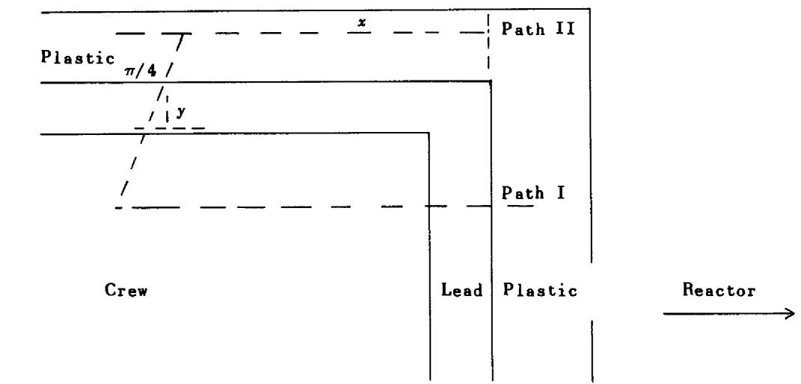

$$
\left. e ^ {- 2 2. 4 / 2. 2} \right] _ {\text {P a t h I ,}} = 0. 1 1 7 \left. e ^ {- x / 2 4. 8} \cdot e ^ {- 1. 4 y / 1. 2 5} \right] _ {\text {P a t h I I}},
$$

where 1.25 is the relaxation length in the lead for 1-Mev gammas, and 1.4 is the secant of $\pi /4$

$$
\begin{array}{l} \frac {2 2 . 4}{2 . 2} = 2. 1 4 + \frac {x}{2 4 . 8} + 1. 1 2 y \\ 1 0. 1 8 = 2. 1 4 + 0. 0 4 x + 1. 1 2 y \\ y = 7. 1 - 0. 0 3 6 x. \\ \end{array}
$$

At the inside corner of the crew shield, $x$ is 22.4 cm, so

$$
\begin{array}{l} y = 7. 1 - 0. 0 3 6 \times 2 2. 4 \\ = 6. 3 \mathrm {c m} \text {o f} \text {l e a d}. \\ \end{array}
$$

The lead thickness never will be below 2.75 cm on the sides, for other reasons. The value of $x$ at which this value is here specified for $y$ is:

$$
\begin{array}{l} 2. 7 5 = 7. 1 - 0. 0 3 6 x \\ x = \frac {7 . 1 - 2 . 7 5}{0 . 0 3 6} \\ = 1 2 0 \mathrm {c m}. \\ \end{array}
$$

Thus the side lead is decreased linearly in thickness from 6.3 cm at the rear corner to 2.75 cm at a location 120 cm forward of this. From that point forward, the 2.75-cm thickness is specified constantly.

Slanting Front Wall. The shield for the slanting front wall must have about 38 cm of plastic, as can be seen from inspection of Table ll, and about 1.5 cm of lead.

# PHYSICAL DESCRIPTION OF SHIELD

A five-man crew shield and a reactor shield assembly were designed by using the thicknesses of lead and plastic prescribed in the preceding paragraphs. Figures 13 and 14 show the reactor and the crew shield assemblies, respectively. It is important to note that the thickness of water in the reactor shield is greater than the 78 cm mentioned in the preceding paragraphs. This is due to the fact that the thickness of 78 cm was calculated for water of normal density, that is 62.4 lb/ft³. The water in the reactor shield is actually less dense than this (due to its temperature), and the thickness of the water was increased to compensate for the lower density.

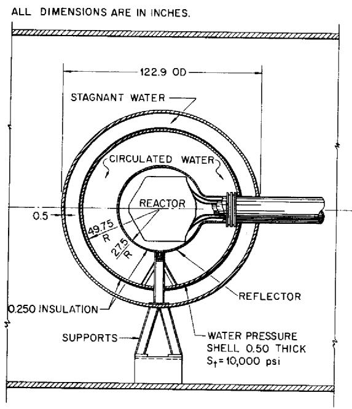  
LONGITUDINAL SECTION

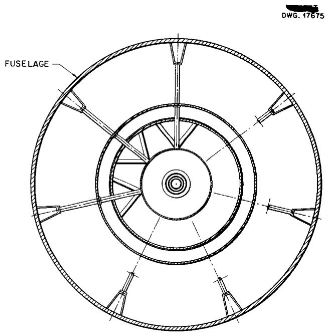  
VERTICAL SECTION   
Fig. 13. Reactor Shield Assembly

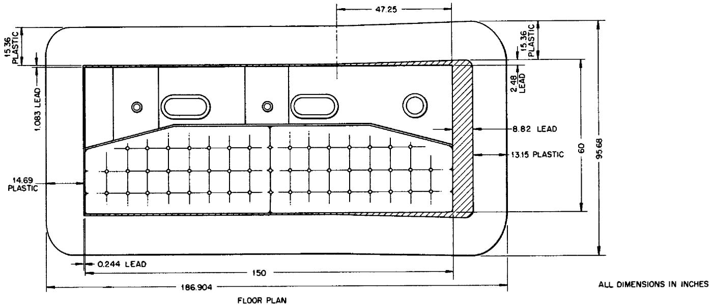

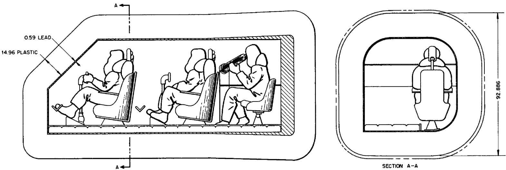  
Fig. 14. Five-Man-Crew Shield Assembly.

The weights of the resultant crew shield and reactor shield assembly are as follows:

Five-man crew shield, lb

<table><tr><td>Lead</td><td>30,800</td></tr><tr><td>Plastic</td><td>25,900</td></tr><tr><td>Total</td><td>56,700</td></tr></table>

Reactor shield assembly, lb

Outside $\mathbf{H}_2\mathbf{O}$ layer at $145^{\circ}\mathbf{F}$ 14,500

Inside H,0 layer at 350°F 13,700

Outside Boral shell 2,300

Inner $\mathbf{H}_2\mathbf{O}$ pressure shell 4,500

Insulation and its canning 1,600

Reactor assembly 10,000

Reactor and shield 46,600

Structure within shield 1,800

Total shielded package 48,400

Total shield weight, 1b 105, 100

# STATIC CHARACTERISTICS OF THE REACTOR

The reactor has the appearance of a gourd, with the circulating-fuel-coolant passing through the stem in two concentric tubes. A third concentric tube, enclosing the fuel, contains an inert molten salt that cools the beryllium oxide reflector that surrounds the cylindrical core. The reflector is separated from the core by a 1/2-in.-thick Inconel pressure shell. A second, spherical, 1/2-in.-thick, Inconel pressure shell encloses the entire assembly and merges smoothly into the stem. From the physics point of view, this reactor is relatively homogeneous in the core because of the small self-shielding effect of uranium and the thin beryllium oxide and Inconel structural members. The 1/2-in.-thick pressure shell between core and reflector is a strong absorbing layer for thermal neutrons, and a thick fuel-coolant layer at the closed end of the core introduces an important neutron source discontinuity. Both of these effects can be evaluated, but not easily; the latter effect is especially troublesome. In addition,

the unreflected stem of the reactor permits high neutron leakage from the core and results in a region of low importance for uranium in the vicinity of the core.

The reactor was divided into four sections, each of which has, essentially, a different reflector. These sections are (Fig. 1):

A. the cylindrical sides,   
B. the beryllium oxide reflected end,   
C. the section of the fuel-reflected end adjoining the cylindrical sides (where there is considerable structure in the reflector),   
D. the section of the fuel-reflected end farthest from the cylindrical sides (where there is no structure in the reflector).

Each section was then separately treated as if it were part of a spherical reactor with geometry similar to that of the pertinent section. Table 12 indicates the data used for the four sections of the reactor. Table 13 summarizes some of the results of the reflected-reactor calculations. Figures 15 through 26 present the power distribution, fission

TABLE 12. PHYSICAL DIMENSIONS AND CONSTITUENTS OF THE FOUR SECTIONS OF THE REACTOR   

<table><tr><td rowspan="2">REACTOR SECTION</td><td rowspan="2">Δr*</td><td rowspan="2">B*</td><td rowspan="2">B&#x27; *</td><td colspan="4">CORE CONSTITUENTS (vol %)</td><td colspan="4">REFLECTOR CONSTITUENTS (vol %)</td></tr><tr><td>Fuel</td><td>Structure</td><td>Inert Salt</td><td>Moderator</td><td>Fuel</td><td>Structure</td><td>Inert Salt</td><td>Moderator</td></tr><tr><td>A</td><td>2.138</td><td>24</td><td>33</td><td>35.00</td><td>2.76</td><td>5.00</td><td>57.24</td><td></td><td>10</td><td>5</td><td>85</td></tr><tr><td>B</td><td>2.039</td><td>26</td><td>37</td><td>34.07</td><td>1.97</td><td>3.20</td><td>60.76</td><td></td><td>5</td><td></td><td>95</td></tr><tr><td>C</td><td>2.039</td><td>26</td><td>33</td><td>34.07</td><td>1.97</td><td>3.20</td><td>60.76</td><td>84</td><td>16</td><td></td><td></td></tr><tr><td>D</td><td>2.039</td><td>26</td><td>37</td><td>34.07</td><td>1.97</td><td>3.20</td><td>60.76</td><td>100</td><td></td><td></td><td></td></tr></table>

*Core radius is $B \Delta r$ , cm; extrapolated radius to reflector boundary is $B' \Delta r$ , cm.

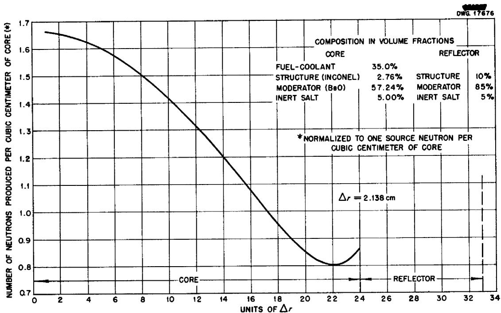

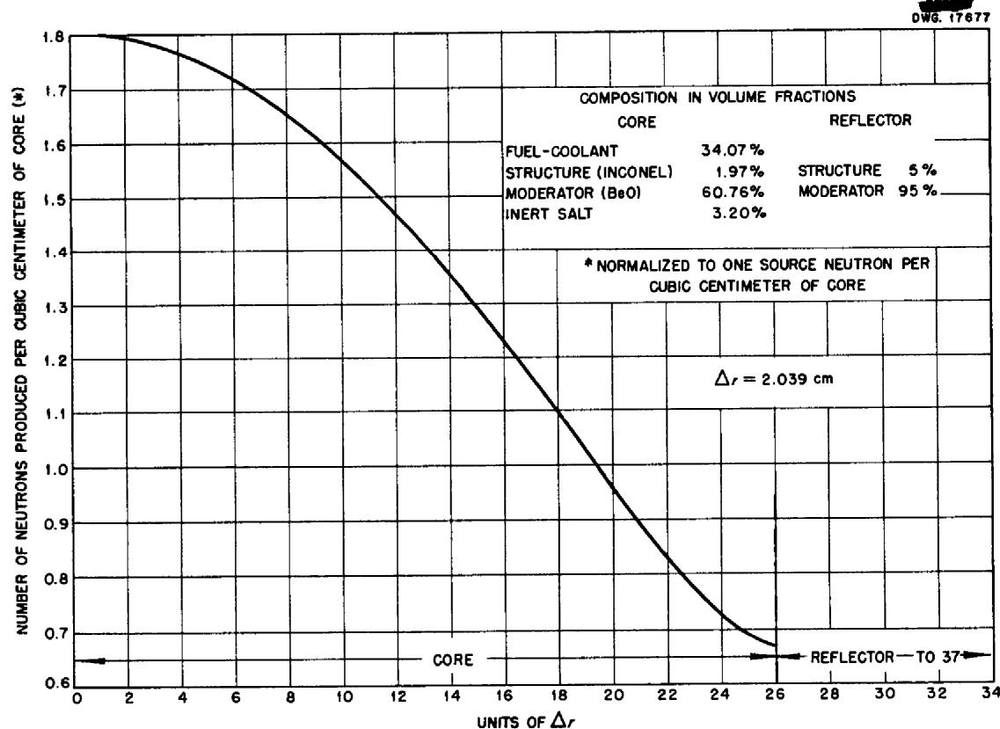  
Fig. 15. Spatial Power Distribution for Reactor Section A - The Cylindrical Sides.   
Fig. 16. Spatial Power Distribution for Reactor Section B - The Beryllium Oxide Reflected End.

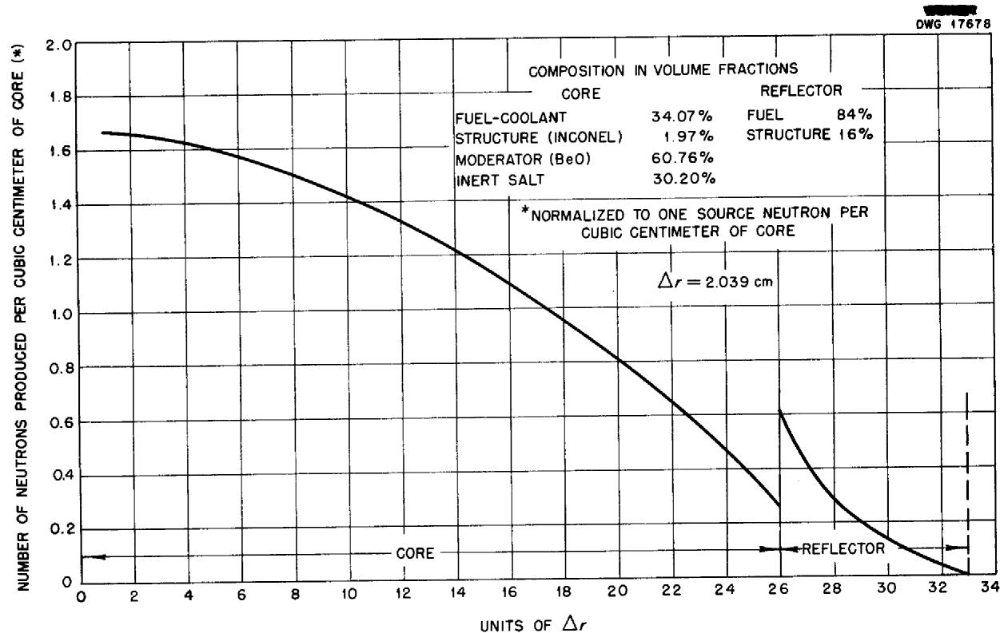

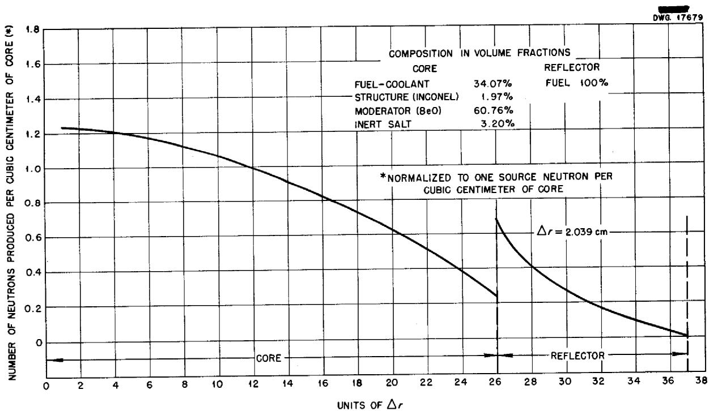  
Fig. 17. Spatial Power Distribution for Reactor Section C - The Fuel-Reflected End Adjoining the Cylindrical Sides.   
Fig. 18. Spatial Power Distribution for Reactor Section D - The Fuel-Reflected End Farthest from the Cylindrical Sides.

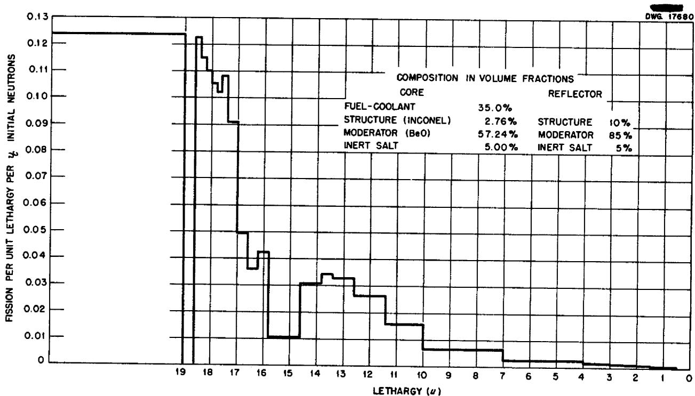  
Fig. 19. Fission Spectrum vs. Lethargy for Reactor Section A - The Cylindrical Sides.

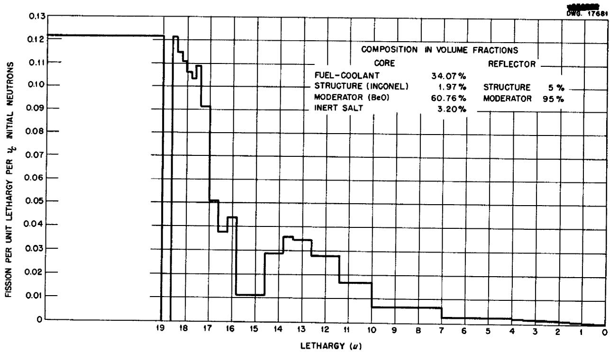  
Fig. 20. Fission Spectrum vs. Lethargy for Reactor Section B - The Berylium Oxide Reflected End.

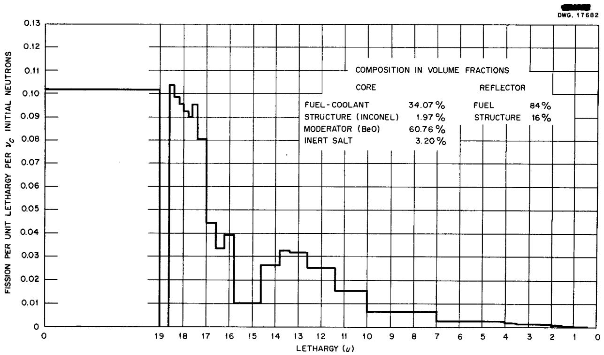

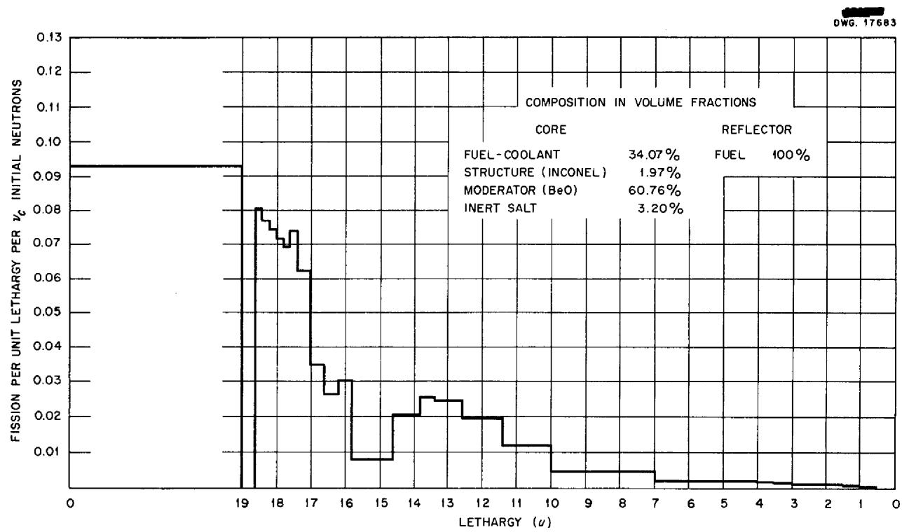  
Fig. 21. Fission Spectrum vs. Lethargy for Reactor Section C - The Fuel-Reflected End Adjoining the Cylindrical Sides.   
Fig. 22. Fission Spectrum vs. Lethargy for Reactor Section D - The Fuel-Reflected End Farthest from the Cylindrical Sides.

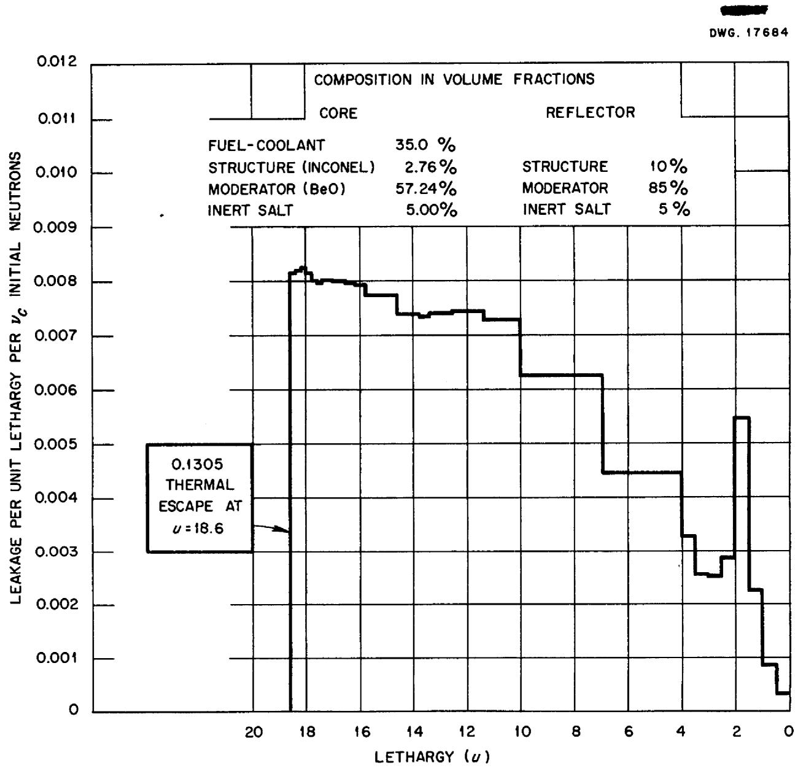  
Fig. 23. Leakage Spectrum vs. Lethargy for Reactor Section A - The Cylindrical Sides.

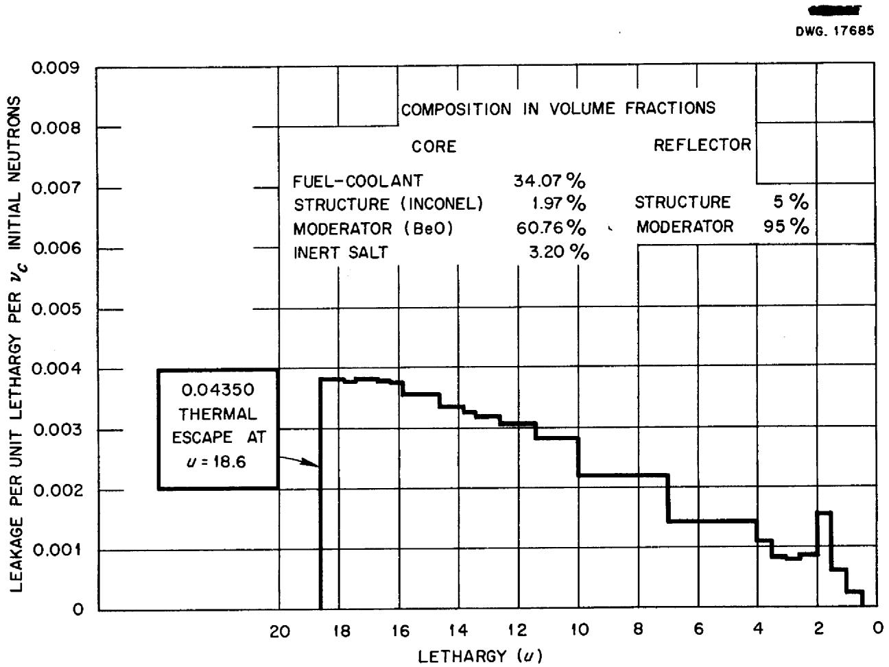  
Fig. 24. Leakage Spectrum vs. Lethargy for Reactor Section B - The Beryllium Oxide Reflected End.

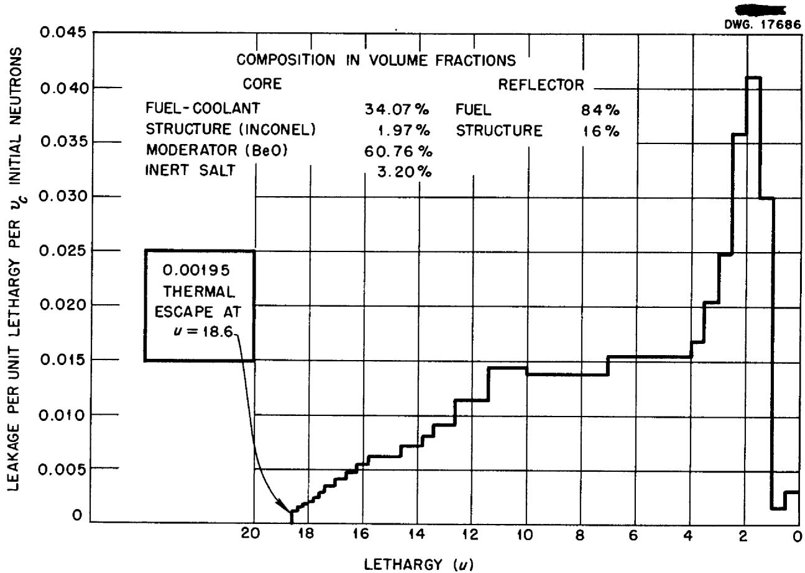  
Fig. 25. Leakage Spectrum vs. Lethargy for Reactor Section C - The Fuel-Reflected End Adjoining the Cylindrical Sides.

spectra, and the neutron-leakagespectra for the four sections of thereactor.

The effect of uranium self-shielding in the fuel-coolant tubes is indicated in Fig. 27. The change in effective multiplication constant with tubes size and the corresponding uranium

weight in the reactor core are given as a function of fuel-coolant tube diameter. These were computed by the bare-reactor method for survey purposes. Uranium weight in the core vs. $k_{eff}$ is given in Fig. 28.

Reactivity coefficients for the reactor, which have been evaluated approximately, are given in Table 14.

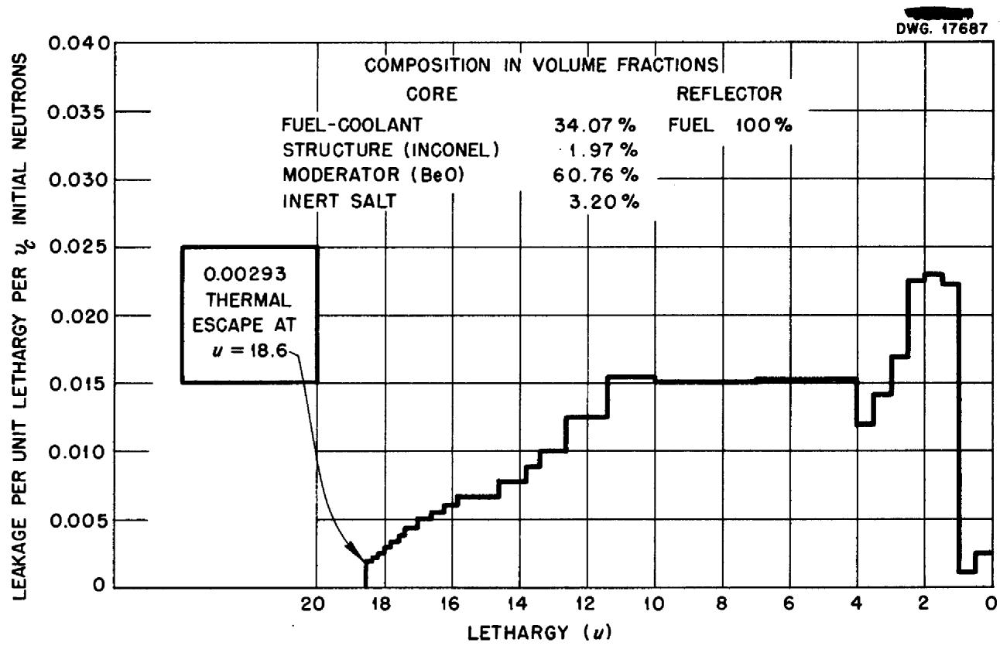  
Fig. 26. Leakage Spectrum vs. Lethargy for Reactor Section D - The Fuel-Reflected End Farthest from the Cylindrical Sides.

TABLE 13. SOME RESULTS OF THE REFLECTED-REACTOR CALCULATIONS   

<table><tr><td>REACTOR SECTION</td><td>k_eff*</td><td>PERCENTAGE OF THERMAL FISSIONS</td><td>REFLECTOR THICKNESS (cm)</td><td>(Δk/k)/ΔT (°F)</td></tr><tr><td>A</td><td>0.914</td><td>62.0</td><td>17.8</td><td>-1.6 × 10-5</td></tr><tr><td>B</td><td>0.972</td><td>60.9</td><td>20.4</td><td>-0.13 × 10-5</td></tr><tr><td>C</td><td>0.949</td><td>50.9</td><td>12</td><td>-0.03 × 10-5</td></tr><tr><td>D</td><td>1.103</td><td>46.6</td><td>20</td><td>-0.45 × 10-5</td></tr></table>

*For 22.5 lb of U $^{235}$ in reactor core, $k_{eff} = 0.963$ by area weighting. Critical uranium mass in core is 25 pounds.

# DESIGN STUDY

The net(1) temperature reactivity coefficient due to thermal expansion and thermal base change is $-0.66 \times 10^{-4}$ per $^\circ \mathrm{F}$ ; the critical uranium weight in the core is 25 lb; the uranium requirement for 27.7 ft³ of fuel outside the core is 87 lb. The uranium weight is that of $\mathbf{U}^{235}$ in a $93.4\%$ enriched uranium fuel.

The power density in watts/cm³ in the moderator and the fuel-coolant has been evaluated for this reactor

(1) Expansion coefficients assumed: BeO, 14.8 x $10^{-6}$ ; fuel-coolant, 1.47 x $10^{-4}$ per ${}^{\circ}\mathrm{F}$ .

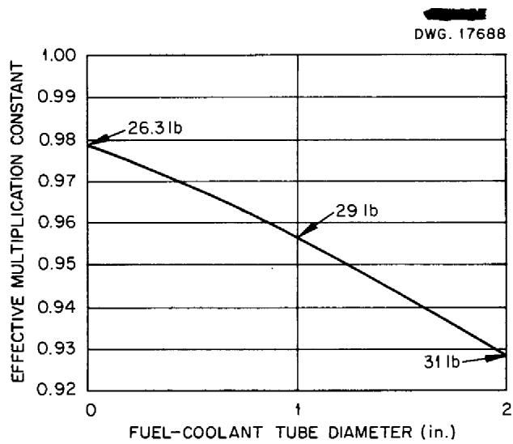  
Fig. 27. Effect of Uranium Self-shielding in the Fuel-Coolant Tubes.

and is shown in Fig. 29. The values given are a first approximation, since the fuel reservoir at the blind end of the reactor is omitted and the effect of the $1/2$ -in. absorbing layer (Inconel) at the core boundary is included by addition to the reflector material. The integrated neutron flux normalized to one fission per unit volume $(\mathrm{cm}^3)$ of core per second is 512 neutrons/ $\mathrm{cm}^2\cdot$ sec. The average flux at full power is $8 \times 10^{15}$ , with a peak value of $2 \times 10^{16}$ neutrons/ $\mathrm{cm}^2\cdot$ sec at the center of the reactor.

The possibility of decreasing critical mass significantly by using beryllium instead of beryllium oxide because of its larger density of moderating nuclei has been evaluated.

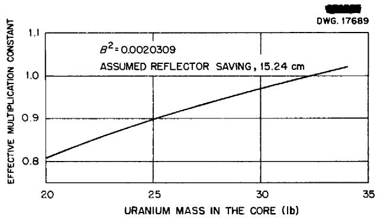  
Fig. 28. Uranium in Core vs. Effective Multiplication Constant.

TABLE 14. REACTIVITY COEFFICIENTS FOR THE REACTOR   

<table><tr><td></td><td>REACTIVITY COEFFICIENT</td><td>RANGE OF VALUE</td></tr><tr><td>Moderator (BeO) density [(Δk/k)/(Δρ/ρ)]</td><td>0.321</td><td>99 to 100% of quoted density</td></tr><tr><td>Coolant density [(Δk/k)/(Δρ/ρ)]</td><td>0.011</td><td>90 to 100% of quoted density</td></tr><tr><td>Structure (Inconel) density [(Δk/k)/(Δρ/ρ)]</td><td>-0.147</td><td>100 to 125% of quoted vol.%</td></tr><tr><td>Thermal base (reactor temperature) [(Δk/k)/ ΔT(°F)]</td><td>-1.20 × 10-5</td><td>1283 to 1672°F</td></tr><tr><td>Uranium weight [(Δk/k)/(ΔM/M)]</td><td>0.348</td><td></td></tr></table>

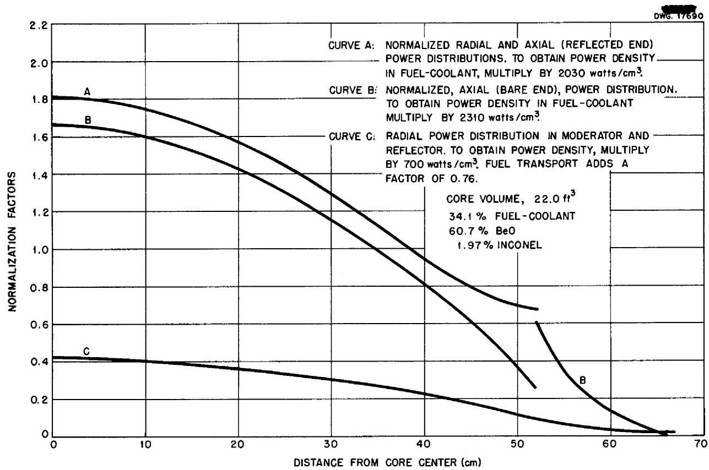  
Fig. 29. Power Density in Fuel-Coolant and Moderator of Circulating-Fuel Reactor.

A net reduction of only $6.5\%$ in critical mass would result from this change. At the present time a flat increase in $k_{eff}$ of $5\%$ by means of control apparatus is a maximum value to over-ride maximum transient xenon and other fission products and loss in delayed neutrons for the operating temperature range. The presently available data indicate that a net

increase in $k_{eff}$ of $10\%$ will be required to raise the reactor from room to operating temperature. The uranium requirement per aircraft in flight will thus be a maximum of approximately 75 lb in core, plumbing, and heat exchanger. This value will not be changed significantly if some other, nonpoisoning, fuel-coolant solution is used.

# REACTOR CONTROL

An ANP power plant electronic simulator was set up with design-point values for the various reactor parameters. By means of this simulator, the following time variables were determined as the system response to various stepped changes in reactor excess reactivity: power level $(p / p_0)$ ,

rate of change of power level $(\dot{p} / p_0)$ , mean fuel temperature $(\theta_f)$ , and rate of change of mean fuel temperature $(\theta_f)$ . Figures 30 through 33 show these quantities plotted as a function of time for steps in excess reactivity $(\Delta k / k)$ of 0.002, 0.004, and 0.006. The fuel temperature coefficient of

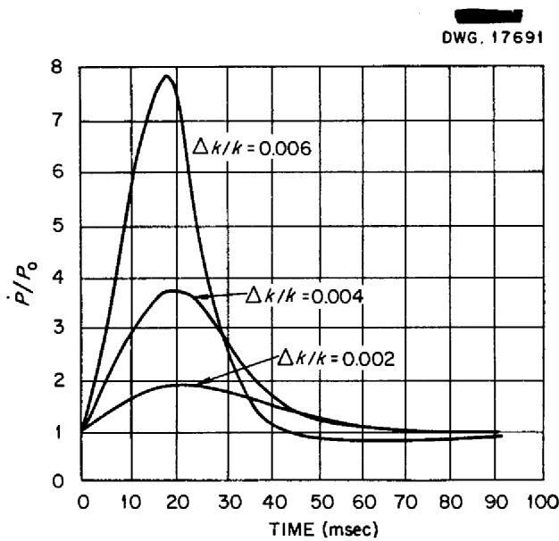  
Fig. 30. Power Level After Various Step Changes in Excess Reactivity.

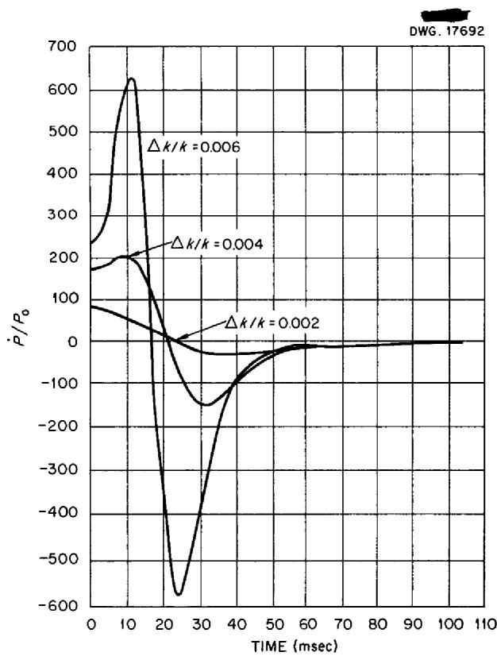  
Fig. 31. Rate of Change of Power Level After Various Step Changes in Excess Reactivity.

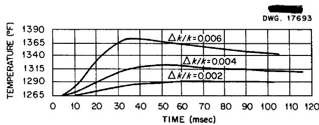  
Fig. 32. Mean Fuel Temperature After Various Step Changes in Reactivity.

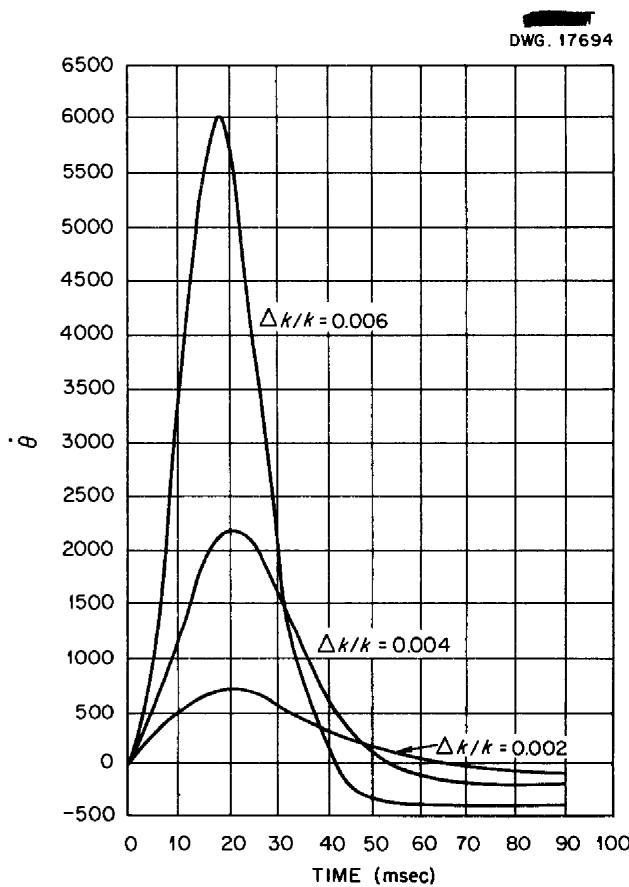  
Fig. 33. Rate of Change of Fuel Temperature After Various Step Changes in Reactivity.

reactivity, $(\Delta k / k) / \Delta T$ (°F), used in obtaining Figs. 30 through 33 is $-8 \times 10^{-5}$ . This value was determined by taking the temperature coefficient of reactivity due to the volumetric expansion of the fuel and dividing by 2 to allow for other forseeable and unforseeable fast effects. The temperature coefficient of reactivity

due to the moderator, structure, etc. was neglected as being too slow to affect the fast transients.

The delayed-neutron steady-state contribution, usually designated as $\sum_{i} \alpha_{i} \beta_{i}$ , for this circulating-fuel reactor was taken as 0.00172; for $\alpha_{i} = 1$ , that is, non-circulating fuel, $\sum_{i=1}^{6} \alpha_{i} \beta_{i} = 0.0073$ . The mean neutron life-time was taken as $2.65 \times 10^{-5}$ sec.

# CONTROL FEATURES DETERMINED BY SIMULATOR STUDY

A few control features of significant merit are characteristic of the circulating-fuel type of reactor. When fuel expansion with temperature rise provides a negative reactivity temperature coefficient, the power demand signal from the turbojet engines is transmitted through the circulating-fuel coolant and provides an over-all power plant in which the reactor is a slave to the external loading system, that is, the engines. Since the major portion of the reactor power is generated in the fuel, the fuel has the fastest temperature response time of any element of the reactor. Accordingly, the reactor power follows the load demand more closely for the circulating fuel than for a circulating moderator, or for that matter, it follows more closely the load demand than is possible for any other type of coolant.

As a consequence of the above-described feature, external coupling in the form of servo control loops with sensors, actuators, control rods, etc. are not necessary in a reactor such as this. In fact, studies made of this reactor by using an electronic power plant simulator indicate that only the self-stabilizing features inherent in the negative-reactivity temperature coefficient make possible control of this power plant in which

the power density is so high and such a large portion of the normally static fuel delayed-neutron contributions are not effective in the control. This comes about because of these severe servo system response times needed for control. These simulator studies indicate that servo frequency responses of as high as 500 cps would be required to control a similar but nonself-stabilized reactor in any manner comparable to the control provided by the negative-reactivity temperature coefficient. Furthermore, regulating rods would require accelerations comparable to impacts to provide comparable control. Such servo systems lie considerably beyond the presently known control art.

Surge pressures derived from fluid temperature transients constitute the limiting features of ANP controllability. The first and second time derivatives of the mean fuel temperature were determined by using the simulator, and from these data the pressure surges were calculated and found to be tolerable.

Relatively slow control of the reactor can be provided by some shimming means, either rods or enrichment. The shimming provided by rods takes care of the system poisoning, and either rods or enrichment would provide for fuel depletion. Essentially, rod motion merely changes the mean fuel temperature and does not control the load power.

# PRESSURE IN FUEL TUBES

The increase in temperature of the fuel in the core, owing to a step change in reactivity, causes an increase in fuel volume. Inasmuch as the fuel is incompressible, the incremental fuel volume must be transferred from the reactor core to the surge tank as rapidly as it is generated, that is, in approximately 40 milliseconds. The rapid acceleration of the fuel required to transfer the generated volume results in appreciable inertial

forces in addition to the frictional forces involved. These inertial and frictional forces have been evaluated, both in the reactor core and in the piping to the surge tank (the surge tank is 2 ft from the reactor inlet). Figure 34 is a plot of the variation with time of the incremental pressure at the reactor core outlet, at which point the incremental pressure is at a maximum, for a step change in reactivity of 0.0025. Figure 35 is a plot of the maximum incremental pressure at the reactor core outlet for various step changes of reactivity. For a step change in reactivity of 0.006, the maximum incremental pressure at the reactor core outlet is 100 psi. For 0.65-in.-OD tubes with 0.025-in. walls, the incremental

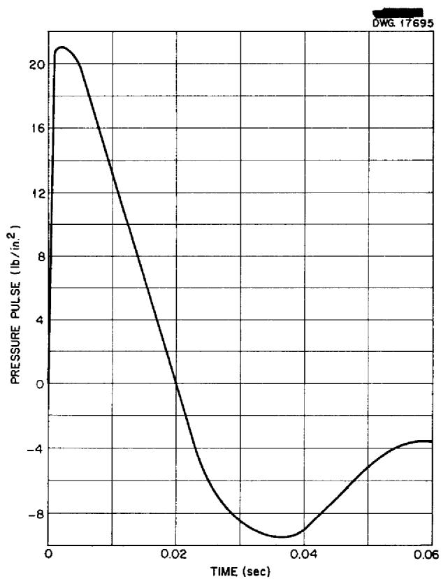  
Fig. 34. Pressure Pulse vs. Time $(\Delta k / k = 0.0025)$ .

pressure of 100 psi will give a hoop stress of approximately 3250 lb/in.². The tensile yield point of Inconel is about 13,000 lb/in.² at $1500^{\circ}\mathrm{F}$ . The maximum incremental pressure allowable, based on the tensile yield point, is 400 lb/in.². The apparent factor of safety is 4.

Basing the mechanism of failure on the maximum shear stress theory gives a maximum incremental pressure of 800 lb/in.²; basing the mechanism of failure on the distortion-energy theory gives a maximum incremental pressure of about 900 lb/in.². In any case, the least apparent factor of safety is 4.

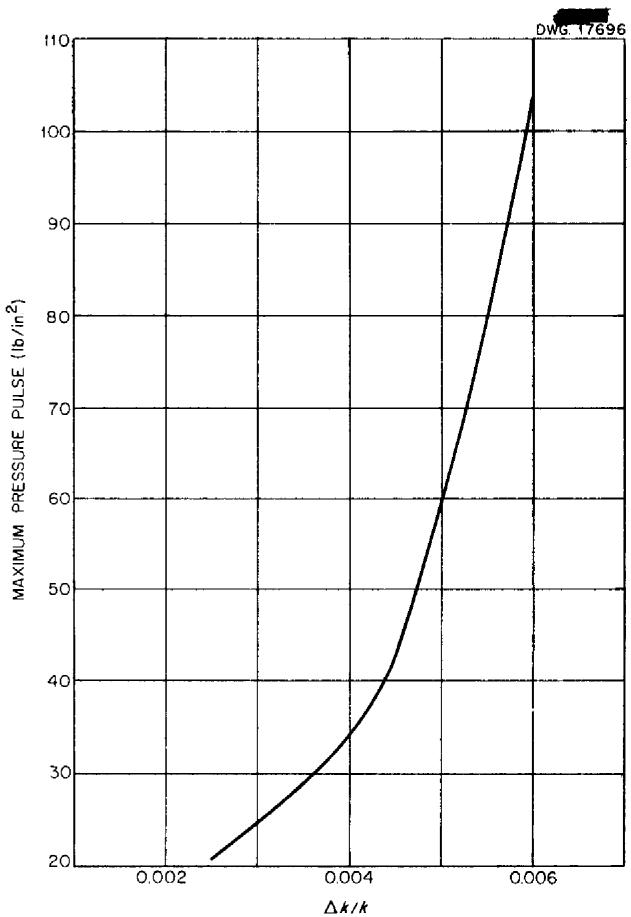  
Fig. 35. Pressure Pulse at Core Outlet for Various Changes in Reactivity.