ASSIFIED

${ABC} = 6 - {25} = {12}$

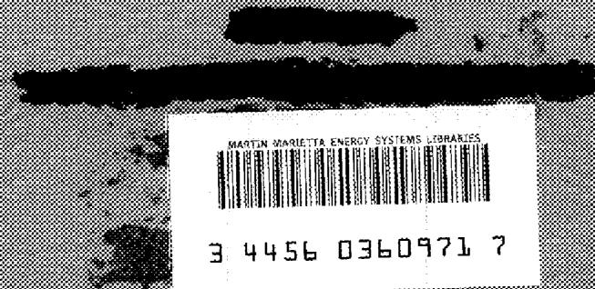

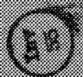

ORNL-1294

Progress

C. $\mathrm{A}$

AC RESEARCH AND DEVELOPING REPORT

AIRCRAFT NUCLEAR PROPULSTON PROJECT

QUARTERLY PROGRESS REPORT

CENTRAL RESEARCH LIBRARY

DOCUMENT COLLECTION

LIBRARY LOAN COPY

DO NOT TRANSFER TO ANOTHER PERSON

If you wish someone else to see this document, send in name with document and the library will arrange a loan.

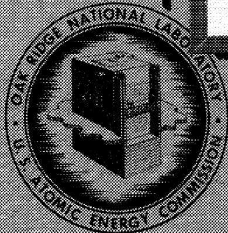

OAK RIDGE NATIONAL LABORATORY

中

CARBIDE AND CARBON CHEMICALS COMP

A DIVISION OF UNION CANCIDE AND CANCEROSIS PRODUCTION

图

POST OFFICE BOX P

OAK FIDGE, TENNEDGE

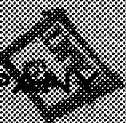

ORNL-1294

This document consists of 202 pages

Copy of 239, Series A.

Contract No. W-7405-eng-26

# AIRCRAFT NUCLEAR PROPULSION PROJECT

# QUARTERLY PROGRESS REPORT

# for Period Ending June 10, 1952

R.C.Briant,Director

J. H. Buck, Associate Director

A. J. Miller, Assistant Director

Edited by:

W. B. Cottrell

DATE ISSUED

2013-4 1982

OAK RIDGE NATIONAL LABORATORY

operated by

CABBIDE AND CARBON CHEMICALS COMPANY

A Division of Union Carbide and Carbon Corporation

Post Office Box P

OAK RIDGE, TENNESSEE

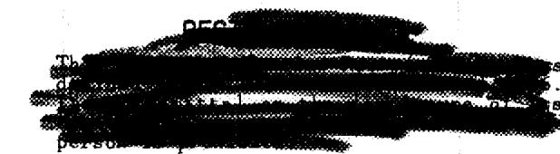

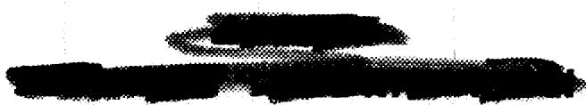

3445603609717

# INTERNAL DISTRIBUTION

1. G. M. Adamson   
2. C. J. Barton   
3. D. S. Billington   
4. F. F. Blankenship   
5. E. P. Blizzard   
6. A. Brasunas   
7. R.C. Briant   
8. F. B. Bruce   
9. J. H. Buck   
10. A. D. Callihan   
11. D. W. Cardwell   
12. C. E. Center   
13. J. M. Cisar   
14. G. H. Clewett   
15. C. E. Clifford   
16. W. B. Cottrell   
17. D. D. Cowen   
18. W. K. Eister   
19. L. B. Emlet (Y-12)   
20. W. K. Ergen   
21. G. T. Felbeck (C&CCC)   
22. A. P. Fraas   
23. W.R.Gall   
24. C. B. Graham   
25. W. W. Grigorieff (Consultant)   
26. W. R. Grimes   
27. L. F. Hemphill   
28. A. Hollander   
29. A. S. Householder   
30. W. B. Humes (K-25)   
31. R. J. Jones   
32. G.W. Keilholtz

33. C. P. Keim   
34. M. T. Kelley   
35. F. Kertesz   
36. E. M. King   
37. J. A. Lane   
38. C. E. Larson   
39. R. S. Livingston   
40. R.N. Lyon   
41. W.D. Manly   
42. W. B. McDonald   
43. J. L. Meem   
44. A. J. Miller   
45. K. Z. Morgan   
46. E. J. Murphy   
47. H. F. Poppendiek   
48. P. M. Reyling   
49. H. W. Savage   
50. R. W. Schroeder   
51. E. D. Shipley   
52. O. Sisman   
53. L.P. Smith

(Consultant)

54. A. H. Snell   
55. F. L. Steahly   
56. R. W. Stoughton   
57. C. D. Susano   
§8. J. A. Swartout   
5 E. H. Taylor   
60. F. C. Uffelman   
61. F. C. VonderLage   
62. A.M. Weinberg   
63. E. P. Wigner

(Consultant)

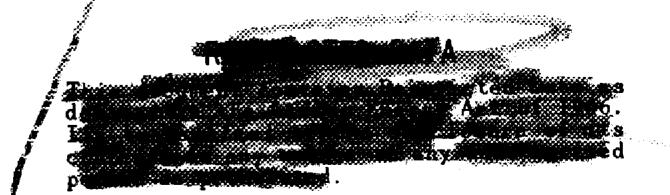

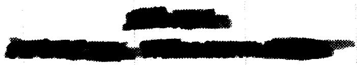

64. C. E. Winters

83. Metalurgy Library

65-74. ANP Library

84. Physics Library

75 Biology Library

85-89. Technical Information Department (Y-12)

76-79. Central Files

90-91. Training School Library

80-81. Chemistry Library

82. Health Physics Library

# EXTERNAL DISTRIBUTION

92-102. Argonne National Laboratory

103. Armed Forces Special Weapons Project (Sandia)

104-111. Atomic Energy Commission, Washington

112. Battelle Memorial Institute

113-115. Brookhaven National Laboratory

116. Bureau of Aeronautics (Grant, through TIS)

117. Bureau of Ships

118-119. California Research and Development Company

120-125. Carbide and Carbo Chemicals Company (Y-12 Area)

126. Chicago Patent Group

127. Chief of Naval Research

128-132. duPont Company

133-157. General Electric Company (ANPP)

158-161. General Electric Company, Richland

162. Hanford Operations Office

163. USAF-Headquarters, Office of Assistant for Atomic Energy

164-171. Idaho Operations Office

172. Iowa State College

173-176. Knolls Atomic Power Laboratory

177-178. Lockland Area Office

179-181. Los Alamos

182. Massachusetts Institute of Technology (Benedict)

183. Massachusetts Institute of Technology (Kaufmann)

184-186. Sound Laboratory

187-190. National Advisory Committee for Aeronautics, Cleveland

191. National Advisory Committee for Aeronautics, Washington

192-193 New York Operations Office

194-198. North American Aviation, Inc.

196. Nuclear Development Associates (NDA)

19. Patent Branch, Washington

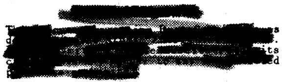

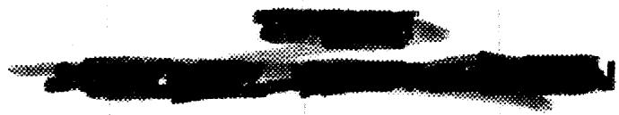

198-199. Rand Corporation

200. Savannah River Operations Office (Augusta)   
201. Savannah River Operations Office (Wilmington)

202-203. University of California Radiation Laboratory

204. Vitro Corporation of America

205-208. Westinghouse Electric Corporation   
209-224. Wright Air Development Center   
225-239. Technical Information Service, Oak Ridge

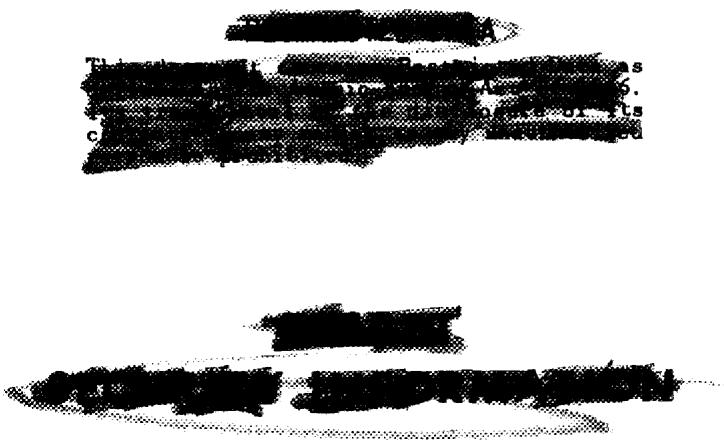

Reports previously issued in this series are as follows:

ORNL-528 Period Ending November 30, 1949

ORNL-629 Period Ending February 28, 1950

ORNL-768 Period Ending May 31, 1950

ORNL-858 Period Ending August 31, 1950

ORNL-919 Period Ending December 10, 1950

ANP-60 Period Ending March 10, 1951

ANP-65 Period Ending June 10, 1951

ORNL-1154 Period Ending September 10, 1951

ORNL-1170 Period Ending December 10, 1951

ORNL-1227 Period Ending March 10, 1952

ORNL-1234 Reactor Program of the Aircraft Nuclear Propulsion Project

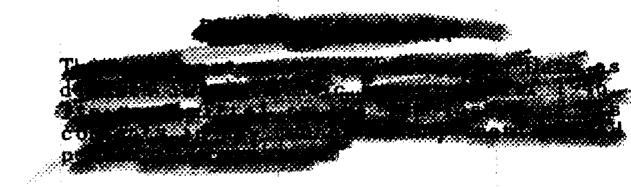

TABLE OF CONTENTS

FOREWORD 1

PART I REACTOR THEORY AND DESIGN 3

SUMMARY AND INTRODUCTION 5

1. CIRCULATING-FUEL AIRCRAFT REACTORS 6

Reflector-Moderated Circulating-Fuel Reactor 6

Spherical Heat Exchanger and Shield Design 7

2. CIRCULATING-FUEL AIRCRAFT REACTOR EXPERIMENT 9

Core and Pressure Shell 9

Stress analysis of the pressure shell 9

Fluid Circuit 10

Control 12

Operation 12

Pretesting 12

Critical loading 12

Power operation 13

Shutdown 13

Building 13

Electrical power 13

Shielding by concrete pits 13

3. EXPERIMENTAL REACTOR ENGINEERING 15

Seals and Closures 16

Seal tester 16

Stuffing-box seals 16

Bellows tests 17

Oval-ring seal 17

Pumps 17

AREcentrifugal pump 17

Laboratory-size maintained-level gas-sealed pump 17

Worthite frozen-sodium-sealed pump 18

Durco convection-cooled frozen-sodium-sealed pump 18

Durco frozen-fluoride-sealed pump 18

Fluoride pumps with stuffing-box seals 19

Valves 19

Wide-open valve 20

Closed valve 20

Throttling valve 20

Canned-rotor-driven valve 20

Heat Exchangers 20

NaK-to-NaK heat exchanger 22

Tube-matrix spacer tests 22

Sodium-to-air radiator 24

Fluoride-to-liquid-metal heat transfer system 26

Instrumentation 26

Pressure measurement 26

Liquid-level indicators 26

Fluid Dynamics of the ARE 28

Technology of Fluoride Handling 29

Fluoride production 29

Fluoride removal 29

Pretreatment of pipeline helium 29

Pickling procedures for fluoride containers 30

4. REACTOR PHYSICS 31

Oscillations in the Circulating-Fuel Aircraft Reactor 31

Calculations for the Circulating-Fuel ARE 32

Methods for Reactor Computation 33

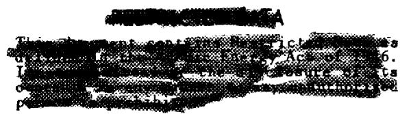

# 5. CRITICAL EXPERIMENTS 34

Direct-Cycle Reactor 34

Shelf-type reactor assembly 34

Box-type reactor assembly 36

Circulating-Fuel Reactor 38

Reactor materials 38

Reactor assembly 38

Graphite Reactor 39

Critical mass 39

Control rod calibration 39

Gap effect 39

Flux and power distribution 39

Danger coefficient measurements 40

# PART II SHIELDING RESEARCH 41

# SUMMARY AND INTRODUCTION 43

# 6. BULK SHIELDING REACTOR 43

Mockup of the Divided Shield 44

Air-Scattering Experiments 47

Shield arrangement 47

Radiation dosage at crew compartment 47

Attenuation of gamma rays by lead 49

Comparison of experiment with standard design conditions 49

Determination of the Albedo of Neutrons and Gamma Rays 52

Irradiation of Animals 54

Irradiation of Electronic Equipment 54

# 7. GAMMA-RAY ATTENUATION EXPERIMENTS IN THE LID TANK 54

63% Iron-37% Water Thermal Shield 54

$63\%$ Iron- $37\%$ Borated Water Thermal Shield 55

Solid Iron Thermal Shield in Water 55

Solid Lead Shadow Shields in Water 55

8. DUCT TESTS 69

Duct Tests in the Thermal Column 69

Straight ducts 69

Ducts with bends 71

Wall-scattering experiment 71

Comparison with theory 72

GE-ANP Annular Air Ducts 72

9. NUCLEAR MEASUREMENTS 76

Cross-Section Measurements with Van de Graaff Accelerator 76

Time-of-Flight Neutron Spectrometer 76

PART III MATERIALS RESEARCH 79

SUMMARY AND INTRODUCTION 81

10. CHEMISTRY OF HIGH-TEMPERATURE LIQUIDS 82

Low-Melting-Point Fluoride Fuel Systems 83

NaF-KF-ZrF4-UF4 8.3

$\mathrm{KF - ZrF_4 - UF_4}$ 85

NaF-ZrF4-UF 85

NaF-RbF-ZrF4-UF4 85

Analyses of Fluoride Compounds 85

X-ray examination of solid, complex fluorides 85

Spectrographic analysis 86

Study of solid phases in the NaF-BeF2-UF4 system 86

Petrographic examination of fluorides 88

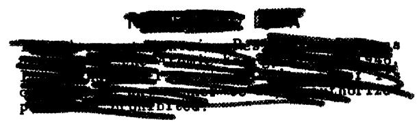

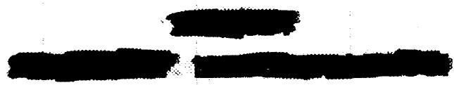

Simulated Fuel Mixture for Cold Critical Experiment 89

Preparation of Pure Hydroxides 89

Sodium hydroxide 90

Lithium hydroxide 90

Potassium hydroxide 90

Coolant Development 90

NaF-ZrF 91

$\mathrm{KF - ZrF_4}$ 91

RbF-ZrF 92

NaF-KF-ZrF 92

NaF-RbF-ZrF 93

NaF-ZnF 94

$\mathrm{KF - ZnF}_{2}$ 94

RbF-ZnF 96

NaF-KF-ZnF 96

Fuel Preparation and Liquid Handling 96

Zirconium fluoride production 97

Preparation of pure fuel mixtures 97

Liquid handling equipment 99

Solubility of Uranium in Sodium Cyanide 99

11. CORROSION RESEARCH 100

Static Corrosion by Fluorides 101

Effect of additives 101

Temperature dependence 103

Effect of plating metals 103

Effect of cold-work 104

Corrosion of ceramic materials 104

Static Corrosion by Hydroxides 105

Effect of additives 105

Effect of plating metals 105

Dynamic Corrosion by Liquid Metals 107

Dynamic Corrosion by Fluorides 107

Corrosion by fluorides in seesaw tests 107

Corrosion by fluorides in thermal convection loops 109

Corrosion in rotating dynamic test rig 116

Dynamic Corrosion by Hydroxides 116

Corrosion by hydroxides in seesaw tests 116

Standpipe tests of hydroxide corrosion 118

Hydroxide corrosion in cold-finger thermal convection apparatus 118

Modified thermal convection apparatus - TCA 118

Fundamental Corrosion Research 119

Interaction of fluorides and structural metals 119

Synthesis of complex fluorides 120

Examination of corrosion products 121

X-ray-diffraction studies 123

EMF measurements in fused fluorides 124

Reactions in fused sodium hydroxide 124

Compounds resulting from hydroxide corrosion 125

Mechanism of fluoride corrosion 126

Free-energy relations of fluorides and structural metals 128

Solution of metals in molten halides 128

Fluoride corrosion phenomena 129

12. METALLURGY AND CERAMICS 131

Loose Powder Bonding 131

Sintering temperature 132

Sintering time 132

Fuel-component particle size 132

Surface preparation 135

Sintering under load 135

Control Rod Fabrication 135

Safety rod slugs 135

Regulating rod slugs 135

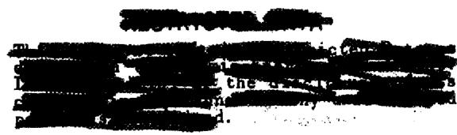

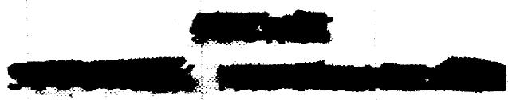

Mechanical Testing of Materials 136   
Stress-rupture tests in argon 136   
Stress-corrosion tests 136

Cone-Arc Welding 138

Effect of welding conditions 138   
Heat exchanger assembly 139

Tests of Brazing Alloys 140

Nicrobraz 140   
Manganese-nickel 140   
Palladium-nickel 143   
Ni-Cr-Si-Mn alloys 143   
Silver-base alloys 143

Ceramics 144

Ceramic coatings for metals 144   
Ceramics laboratory program 146

13. HEAT TRANSFER AND PHYSICAL PROPERTIES RESEARCH 146

Viscosity of Fluoride Mixtures 146

BeF2-bearing fluorides 147   
$\mathbf{ZrF_4}$ -bearing fluorides 147   
Material from corrosion loops 148   
NaF-KF-LiF and NaF-KF-LiF-UF mixtures 148

Thermal Conductivity 149   
Heat Capacity 149   
Density 150   
Vapor Pressure of Fluorides 150   
Beryllium fluoride 150   
$\mathbf{ZrF_4}$ -bearing fluoride mixtures 150   
Physical Property Data 152   
Heat Transfer in Sodium Hydroxide 152

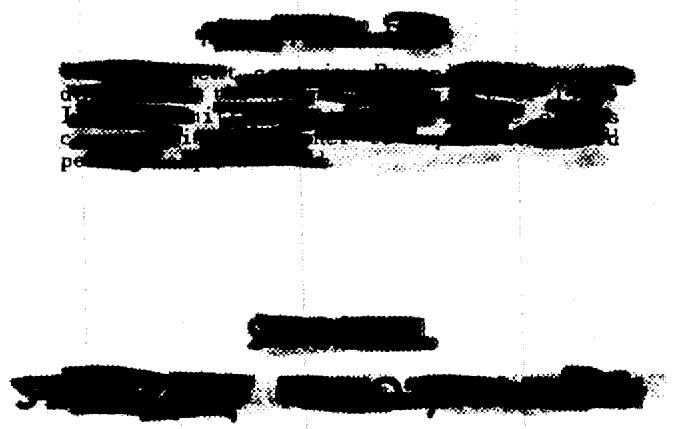

Boiling Heat Transfer 156

Entrance Region Heat Transfer 156

Natural Convection in Confined Spaces with Internal Heat Generation 158

Circulating-Fuel Heat Transfer Studies 159

# 14. RADIATION DAMAGE 159

Irradiation of Fused Materials 160

Pile irradiation of fuel 160

Cyclotron irradiation of fuel 163

Inpile Circulating Loops 163

Creep Under Irradiation 164

Radiation Effects on Thermal Conductivity 164

PART IV APPENDIXES 167

# SUMMARY AND INTRODUCTION 169

# 15. ANALYTICAL CHEMISTRY 170

Analyses for Components of Fluoride Mixtures 170

Total alkali metals 170

Sodium, potassium, and lithium 170

Beryllium 170

Zirconium 170

Analyses for Impurities in Fluoride Mixtures 171

Iron 171

Chromium 171

Analyses for Impurities in Fluoride Compounds 171

Sulfate and sulfide 171

Zirconium oxide and oxyfluoride 172

Water 172

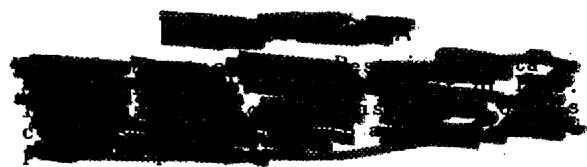

Service Analysis 172

16. LIST OF REPORTS ISSUED 173

17. DIRECTORY OF ACTIVE ANP RESEARCH PROJECTS 176

Reactor and Component Design 176

Shielding Research 178

Materials Research 179

Technical Administration of Aircraft Nuclear Propulsion Project at Oak Ridge National Laboratory 184

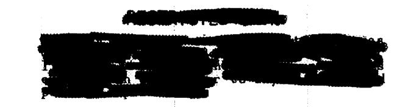

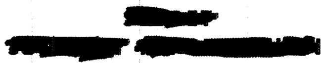

1

，

1

# ANP PROJECT QUARTERLY PROGRESS REPORT

FOREWORD

The Aircraft Nuclear Propulsion Project at the Oak Ridge National Laboratory is comprised of some 300 technical and scientific personnel engaged in many phases of research directed toward the nuclear propulsion of aircraft. A considerable portion of this research is carried out to provide support for other organizations participating in the national ANP effort. However, the purpose of the bulk of the ANP research at ORNL is the development of a circulating-fuel type of reactor. The nucleus of this effort is now centered on the Aircraft Reactor Experiment - a 3-Mev, high-temperature prototype of a circulating-fuel reactor suitable for the propulsion of aircraft.

This quarterly progress report of the Aircraft Nuclear Propulsion Project at ORNL records the technical progress of the research on the circulating-fuel reactor and all other ANP research of the Laboratory under its contract, W-7405-eng-26. The report is divided into four parts; I. Reactor Theory and Design; II. Shielding Research; III. Materials Research; and IV. Appendixes. Each part has a separate "Summary and Introduction."

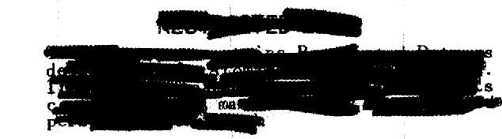

中

[

Part I

# REACTOR THEORY AND DESIGN

# SUMMARY AND INTRODUCTION

Analysis of the circulating-fuel aircraft reactor systems incorporating intermediate heat exchangers has led to the use of a spherical-shell type of heat exchanger and shield arrangement. This arrangement has resulted in an engineered reactor-shield assembly weighing about 8000 lb less than the best arrangement previously examined. A most promising design study has been undertaken of a circulating-fluoride-fuel reactor core in which a thick reflector replaces the moderator. Such a design, which results in a homogeneous-fluoride reactor, has been shown to have a low critical mass and a neutron lifetime more than adequate to permit control. This compact, spherical-core design is compatible with the low-weight spherical-shell type of heat exchanger and shield arrangements (sec. 1).

The Aircraft Reactor Experiment to be constructed by the Oak Ridge National Laboratory was described in the last report. Only minor modifications in the design have occurred during the past quarter; the most significant changes were the reduction in number of fuel passes through the core and the reversal of the inlet and outlet fuel headers. The design effort is concentrated on detailing drawings of components of the reactor and the procurement of these parts. The building for the ARE was released on June 6 to ORNL by the construction contractor, and installation of equipment is proceeding as rapidly as the receipt of parts permits (sec. 2).

The emphasis of the research and development program for reactor plumbing and associated hardware continues to be placed on the technology of high-temperature fluoride mixtures (sec. 3). Both pumps and valves have been operated successfully

with molten fluoride mixtures for extended periods of time at $1500^{\circ}\mathrm{F}$ . In both instances the problem reduces to that of sealing a moving shaft; this has been satisfactorily effected by both frozen seals and stuffing-box seals. NaK-to-NaK and Na-to-air heat exchangers have been operated - the former for over 3000 hours. In addition considerable effort has been devoted to developing instruments for measuring flow and pressure and for liquid level indication and control as required both by the ARE and the experimental high-temperature-liquid systems. Satisfactory techniques have been developed for the manufacture, transfer, and loading of fluoride mixtures without introducing contamination.

Studies of the kinetics of the circulating-fuel aircraft reactor have led to the conclusion that in spite of the loss of some delayed neutrons power oscillations in such reactors will be strongly damped by a mechanism associated with the actual circulation of the fuel (sec. 4). Physics research for the aircraft reactor experiment has involved numerous static calculations consequent to significant, but more or less minor, design changes.

A critical assembly of the box-type, direct-cycle reactor was investigated for the GE-ANP program. Fission rate, flux measurements, reflector effects, and temperature response were determined. Upon completion of these measurements, a mockup of the circulating-fuel aircraft reactor will be assembled - the components are now on hand. The beryllium oxide machined for the ARE will be used in the critical assembly, together with a simulated fluoride mixture. A resume of the results from an earlier series of experiments with a graphite-moderated reactor is also presented (sec. 5).

# 1. CIRCULATING-FUEL AIRCRAFT REACTORS

A. P. Fraas, ANP Division

Several circulating-fuel aircraft reactor systems employing closely coupled intermediate heat exchangers were described in the last report.(1) The extension of these design studies led to consideration of a spherical-shell type of heat exchanger and shield arrangement that resulted in a saving of about 8000 lb in engineered shield weight over the best arrangements previously examined.(2) In addition, a modified core design having all of the moderator removed from the core and added to the reflector now appears to be an attractive possibility. With the modified design, the critical mass would not be large, the neutron lifetime would be longer than with previous designs (which would ease the control problem), and the structure in the core would be eliminated.

# REFLECTOR-MODERATED CIRCULATING-FUEL REACTOR

Calculations made on the basis of relations derived for thermal reactors had indicated that circulating-fuel reactors employing a mixture of fluoride salts as a homogeneous working fluid would require a very high critical mass and would be difficult to control. Multigroup two-region IBM machine calculations made during the past quarter have shown that this is not the case. Removal of the moderator from the core of a circulating-fuel reactor does not result in excessive fuel requirements if a thick reflector is employed. In a large measure this comes about because the removal of the moderator also means the removal of the poisoning effect of a

substantial amount of stainless steel. Critical mass calculations have been made on the IBM machines for two core diameters. With a 12-in.-thick beryllium oxide reflector, critical masses of 23 and 19 lb were obtained for 16- and 32-in.-dia spherical reactor cores. The structural simplicity and attendant advantages of this type of reactor are obvious.

At first it also seemed that these unmoderated circulating-fuel reactors would have a high median energy for fission and hence might present a serious control problem. However, about one-third of the fissions are caused by thermal or near thermal neutrons that have spent a large fraction of their lifetimes in the relatively poison-free reflector. Thus the effective neutron lifetime from the control standpoint may actually be greater than in beryllium oxide-moderated circulating-fuel reactors that have of necessity a substantial amount of stainless steel in the core.

It was also feared that the power density at the core-reflector interface would be many times the average power density. However, the attenuation length for the fission-producing neutrons from the reflector was about 10 cm, so the high power density region was found to be quite thick. Since approximately two-thirds of the volume of a sphere lies between its surface and the surface of a smaller concentric sphere, or "island," having a radius two-thirds that of the larger sphere, much of the volume of the core falls in the high power-density region. As a result, the ratio of peak-to-average power density was about 2 for both of the reactors studied.

Further calculations are being made to determine the effects of a spherical island of moderator in the center. Since the extra structural complication should not prove to be too great, this may be very worth while from the standpoint of both uranium investment and power density considerations.

# SPHERICAL HEAT EXCHANGER AND SHIELD DESIGN

The last report(2) showed the large saving in shield weight effected by going from the tandem to the annular heat exchanger arrangement. This suggested that a further reduction in weight might be realized by going to a more nearly spherical configuration. A heat exchanger in which the tube matrix is laid out in the form of a spherical shell was therefore devised to form a basis for further designs. The basic configuration envisioned is shown in Fig. l; note that it incorporates the reflector-moderated reactor discussed above. This spherical heat exchanger design reduced the over-all weight of the reactor, heat exchanger, and shield combination for the design conditions(1) to only 90,000 lb for the divided shield and 120,000 lb for the near unit shield (a shield permitting 3 r/hr 50 ft from center of reactor), a saving of roughly 8000 lb over the annular heat exchanger arrangement.(1) Both shields are designed for 1 r/hr in the crew compartment.

The heat exchangers tubes are grouped in bundles and each bundle has a rectangular cross section except where the bundles terminate in circular-disk headers. If the two pumps are at the North and South poles respectively, each tube bundle will lie on a variable-pitch helix running from approximately the "Arctic" to the

"Antarctic Circle." The angle between tube centerlines and the "equator" will be about 40 deg, whereas the corresponding angle at the Arctic Circle will be about 90 degrees. This will make it possible to keep the center-to-center spacing of the tubes independent of "latitude." Although the tube bundle shape is quite unusual, fabrication of the heat exchanger should not be too difficult. After jigs have been prepared for building up a tube bundle, one tube bundle after another can be assembled, brazed and/or welded into its header disks, pressure tested, inspected, and assembled in the spherical, steel shell. A simple fillet weld between the header disk and the pressure shell should suffice to complete the installation.

In other respects the heat exchanger and shield design of Fig. 1 is essentially similar to the tandem and annular arrangements described in the previous report.(1) The 11-in.-thick reflector of the annular heat exchanger design was used again as was the same type of shield construction employed in both of the other designs. One difference is the use of boron carbide in the baffles between tube bundles instead of in "dead" tubes.

This reactor design is suggestive of a homogeneous reactor, which it really approaches quite closely. The thick beryllium oxide reflector could be cooled by either metallic sodium or a nonuranium-bearing fluoride salt. It should be possible through careful design of the moderator cooling passages and the conical diffusing vanes at the reactor core inlet to keep the metal temperature at all points below the average temperature of the fuel leaving the reactor. Thus the hottest metal anywhere in the system would be the heat exchanger tube walls at the fuel inlet end.

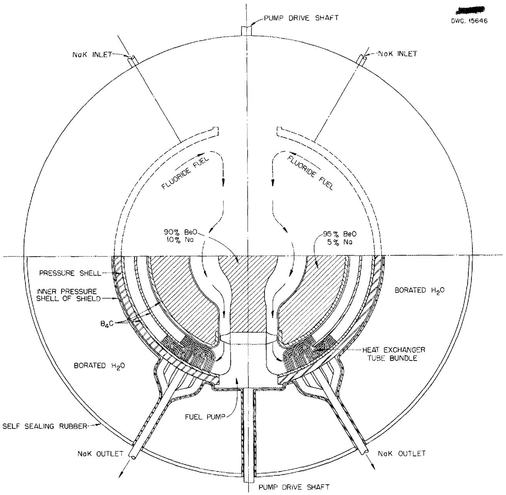  
Fig. 1. Spherical Heat Exchanger - Shield Arrangement for a Circulating-Fuel Reactor.

# 2. CIRCULATING-FUEL AIRCRAFT REACTOR EXPERIMENT

R. W. Schroeder, ANP Division

The reactor system description given in the previous report(1) is applicable to the current system and will not be repeated. Furthermore, detailed descriptions and illustrations of this reactor system and its components are the topic of a separate report.(2) The several changes made during the last quarter and the progress made in detailing the system and procuring outside manufactured components will be discussed, as well as a procedure that has been outlined for the operation of the reactor.

# CORE AND PRESSURE SHELL

The core design has been revised to provide 11 tubes per serpentine pass instead of 13. This change was dictated by the number of beryllium oxide-moderator blocks available and had no major effect on the functional performance of the core. Calculations indicated a fuel-film temperature gradient of approximately $40^{\circ}\mathrm{F}$ due to moderator heat inflow. This maximum gradient occurred near the core center and, as the fuel exited from this region, was additive to a $1500^{\circ}\mathrm{F}$ datum, which caused a fuel-tube wall temperature of $1540^{\circ}\mathrm{F}$ . Accordingly, the fuel flow direction was reversed so that the $40^{\circ}\mathrm{F}$ gradient is additive to a $1150^{\circ}\mathrm{F}$ datum (fuel inlet temperature). The moderator heat inflow is very small at the fuel outlet end (core periphery), so the maximum wall temperature is expected to be in the region of 1500 to $1510^{\circ}\mathrm{F}$ .

The core and pressure shell assembly has been completely detailed. The elevation section of the core shown in the last report (3) is applicable except for the described changes in fuel inlet and outlet headers and the number of fuel passes. A plan section of the reactor showing the revised core is presented in Fig. 2. A better concept of the core itself may be obtained from a photograph of the beryllium oxide blocks that have been sized and stacked (Fig. 3). In the near future these blocks will be used for a criticality test prior to their use in the experimental reactor. The pressure shell will be welded by Luchenweld, and its shipment within several weeks is anticipated. The fuel tubes, as well as all other core material, have been ordered, and delivery of all outstanding material is scheduled for June, July, and August 1952.

Stress Analysis of the Pressure Shell (R. L. Maxwell and J. W. Walker, Consultants, ANP Division). The analysis of the stresses in the pressure shell as a function of the internal pressure has been completed. At a pressure of 30 psi the maximum bending stress on the heads of the shell is 2560 psi. This is approximately one-half the stress for a creep rate of $0.10\%$ in 10,000 hr for Inconel at the operating temperature of $1150^{\circ}\mathrm{F}$ . There will be stress concentrations due to holes in the head, but in all cases where these holes occur in areas of high stress the holes have been reinforced. Without reinforcement the stress concentration factor would not be greater

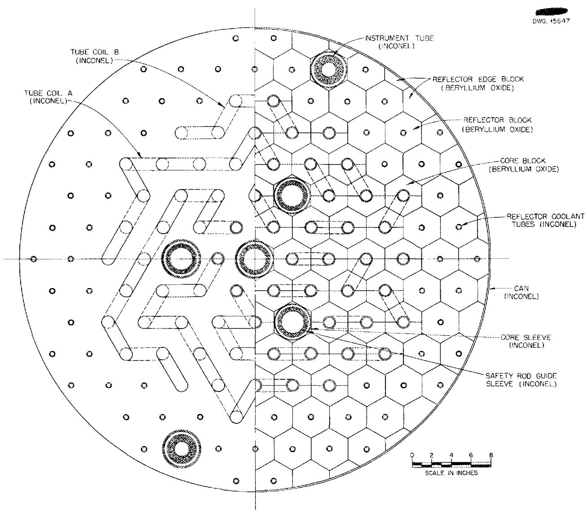  
Fig. 2. Plan Section of the Experimental Reactor.

than 2, so the creep rate would not exceed $0.10\%$ in 10,000 hours. Also, the stress concentration would be relieved at operating temperatures.

The stresses on the sidewalls of the shell as a function of internal pressure have also been analyzed. At a pressure of 30 psi the maximum axial stress in the cylinder is 2230 psi. This is somewhat less than the maximum bending stress in the head. The creep rate is less than one-half the creep rate of $0.10\%$ in 10,000 hours.

# FLUID CIRCUIT

The fluid circuit remains as described and illustrated in the previous report and recent efforts have been devoted to detailing and ordering outside manufactured components. Many detailed drawings have been released for manufacture, including the helium ducts for the main heat disposal loop, the radioactive-fuel dump tank, etc. Of outside-manufactured components, the Vickers hydraulic drive systems for the main heat disposal circuits have been

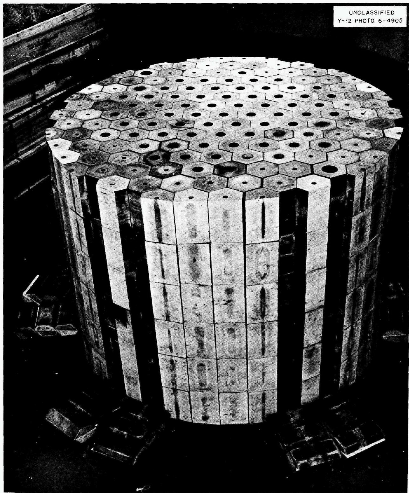  
Fig. 3. Beryllium Oxide Moderator Blocks Machined and Stacked.

received, and most of the other components, including heat exchangers, blowers, heaters, etc., are scheduled for delivery in June, July, and August 1952. Delivery of several components, including heat exchangers and valves, has been jeopardized by the manufacturer's inability to procure stainless steel, and it has been necessary to supply material from local stock.

# CONTROL

The interlock circuit for the ARE has been completed in its elementary form and integrated with the process instrumentation and operational plan so that it will be possible to begin the interconnection wiring diagrams for the various control components. Detailing of the control rods and control rod actuators is $90\%$ complete. Fabrication of the shim-rod absorber elements for one rod to be used in the critical assembly has been completed by the X-10 Metallurgy Division (cf., sec. 12).

# OPERATION

An operational procedure has been outlined in detail(2) and will be only briefly reviewed here. The operation of the experimental reactor may be divided into four separate stages; pretesting, critical loading, power operation, and shutdown.

Pretesting. After the reactor plumbing has been installed and the system is ready for checking, both the primary and secondary circuits will be given a pneumatic test. In addition to eliminating any leaks to atmosphere, it is also important that any cross-talk between the primary and the secondary circuits be eliminated. With helium in the primary circuit and vacuum in the secondary

circuit, it will be possible to determine both the presence and extent of the cross-talk between the two. After both circuits have been made tight so far as the above tests are able to reveal, they will be filled with NaK, which will be circulated at near design flow rates. In addition to giving a further leak test, the circulation of the NaK will permit checking of pumps, tanks, and level controls under ambient temperature conditions. The NaK will also further clean the system and permit easy repair, and up to temperatures of about $1200^{\circ}\mathrm{F}$ it will not deteriorate the piping. Upon completion of this phase of the pretest, the hot NaK will be removed from the system by evacuating the system and then evaporating the residual NaK under vacuum. Then, with the vacuum maintained, the fuel carrier (fluoride melt without $\mathrm{UF}_4$ ) will be released into the evacuated fuel system.

Critical Loading. For the critical loading of the reactor, a fuel injection system, which will be filled with highly concentrated $\mathrm{UF}_4$ in the in the fuel carrier, will be employed to inject the critical mass into the fuel circuit. The injection system is so arranged that samples of known weight can be introduced into the fuel system at a controlled rate. The injection system is also equipped with two weighing devices and a television pickup to monitor the injection of fuel into the reactor fuel circuit. The $\mathrm{UF}_4$ -rich fuel will be charged to the reactor in distinct fuel quanta and in such a manner as to be equally distributed throughout the reactor fuel circuit. As a safety precaution attempts will be made to measure the temperature coefficient of reactivity when the reactor has reached the value of $k = \sim 0.98$ . To do this the fuel temperature will be lowered from the equilibrium value of $1200^{\circ}\mathrm{F}$ to approximately $1175^{\circ}\mathrm{F}$ . If

the reactivity increases with this lowering of the temperature, it will show that the temperature coefficient is negative and that the loading to criticality may safely continue. At this time an attempt will also be made to obtain a rough calibration of the regulator rod.

Power Operation. Operation at power will commence as quickly as possible commensurate with safety. After the control rod has been calibrated, the temperature of the reactor will be raised to $1300^{\circ}\mathrm{F}$ and the regulating rod withdrawn sufficiently to put the reactor on a positive period of about 20 to 30 seconds. The reactor will then be at a power level of about 10 kw. At this point the helium blowers will be started and heat extraction will have been initiated. The mean fuel temperature of $1300^{\circ}\mathrm{F}$ will be maintained closely, but the fuel inlet temperature will drop and the reactor outlet temperature will rise until at full power there will be a temperature drop across the reactor of about $350^{\circ}\mathrm{F}$ . The servo regulating system will not be employed unless it is found to be necessary because of an insufficiently large negative temperature coefficient.

Shutdown. After the power run has been made the reactor will be scrambled. When temperatures have reached equilibrium and after iodine has had time (6 to 8 hr) to decay into xenon, an attempt will be made to go critical again. If xenon has evolved as a gas from the fuel, the reactor should go critical at essentially the same rod conditions, since the xenon poison will not be present. If, however, the reactor will not go critical with shim rod adjustment, instead of adding fuel, further time will be allowed to elapse and another attempt to go critical will be made. If this attempt is successful, it may be assumed that the xenon has had time to decay and

that the poison preventing criticality in the first attempt was the xenon that was not evolved from the fuel. Nonuranium-bearing fluorides will then be introduced into the system to flush the fuel into the radioactive-fuel dump tanks.

# BUILDING

The building for the ARE was released on June 6 to ORNL by the construction contractor, the Nicholson Company. Figure 4 illustrates the building exterior, and Fig. 5 is an interior view showing the reactor test pit, dump tank pit, and heat exchanger rooms.

Electrical Power. The building electrical system has been outlined. Detailed drawings of the heater circuits, main conduits, etc. are being prepared. Requisitions have been released for most of the major components such as motor-generator sets, motors, and motor controls, but few orders have been placed. The delivery of these items will tend to be critical and special follow-up will be required.

Shielding by Concrete Pits (H. L. F. Enlund, Physics Division). The sources of radiation from the aircraft reactor experiment may be divided into two categories: the reactor itself and the components of the system external to the reactor. Further, the sources must be considered from a full-power as well as a shutdown condition. The shutdown condition is important because of the necessity for servicing. Since the reactor core is the originating point, either directly or indirectly, of all the radiation in the form of active particles, particular attention was given to the determination of gamma-radiation sources, neutron leakage, and activity in the circulating fuel.

UNCLASSIFIED PHOTO 10079

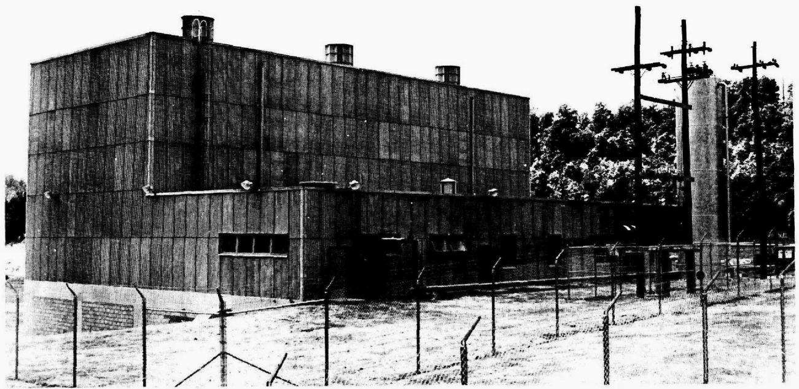  
Fig. 4. Exterior View of the ARE Building.

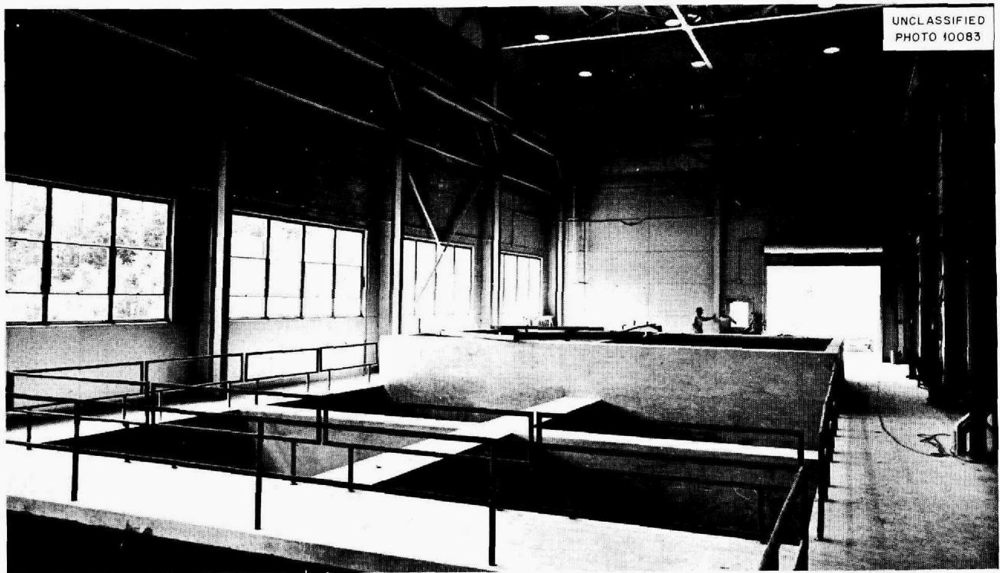  
Fig. 5. Interior View of the ARE Building.

The reactor physics group furnished core- and reflector-composition and neutron-escape data based on multigroup calculations for the experimental reactor.

The shielding effectiveness of the walls of the reactor pit was calculated on the basis of the leakage data. It was recommended that the 7 l/3 ft of wall shielding be constructed of 4 to 5 ft of barytes-concrete blocks at the control pit wall and 6 ft at the side wall adjacent to the control instrument bay instead of being entirely of ordinary concrete blocks. This will give factors of safety of about 8 based on a tolerance of 7.5 mr/hr. The roof over the reactor pit was found to give attenuation sufficient to reduce the dosage to below laboratory tolerance. The end leakage from the reactor was less than from the sides because of the greater thickness of the Inconel shell.

In the vicinity of the proposed reactor control instruments the

shielding provided by the Inconel shell, and to a much lesser degree by the thermal insulation blanket, reduces the radiation leakage to the following at a distance of 30 cm from the boundary of the side reflector of the reactor:

Gammas

$$
\begin{array}{l} 2. 5 \mathrm {M e v} = 9 \times 1 0 ^ {1 0} / \mathrm {c m} ^ {2} \cdot \sec \\ 7. 0 \mathrm {M e v} = 4. 7 \times 1 0 ^ {1 0} / \mathrm {c m} ^ {2} \cdot \sec \\ \end{array}
$$

Neutrons

$$
\begin{array}{l} \text {T h e r m a l} = 4. 7 \times 1 0 ^ {1 0} / c m ^ {2} \cdot s e c \\ 2 5 0 - k v t h e r m a l = 8. 6 \times 1 0 ^ {1 1} / c m ^ {2} \cdot s e c \\ \text {F a s t} (\text {a b o v e} 2 5 0 \mathrm {k v}) = 4. 5 \times 1 0 ^ {1 0} / \mathrm {c m} ^ {2} \cdot \sec . \\ \end{array}
$$

The side wall of the heat exchanger room is sufficient to reduce the activity from the equipment to below tolerance levels, that is, about 0.1 mr/hr. Calculations are being made for determining activity within the heat exchanger space so that working tolerances can be predicted for personnel servicing equipment.

# 3. EXPERIMENTAL REACTOR ENGINEERING

H. W. Savage, ANP Division

The primary effort of the Experimental Engineering Group is the development of major components for systems circulating high-temperature fluids (1500 to $1800^{\circ}\mathrm{F}$ ) that will operate reliably over extended periods. These components consist of pumps, valves, liquid-level indicating and control instruments, pressure sensing instruments, and flow measuring devices. Other than certain design considerations to compensate for thermal distortion and thermal expansion, the pump and valve problems

resolve themselves into the single problem of developing a zero-leakage seal for the pump shaft or valve stem. Considerable progress has been made and it is now possible to report that satisfactory means of sealing against molten fluoride mixtures at temperatures up to $1500^{\circ}\mathrm{F}$ are available. Both pumps and valves have been operated successfully at $1500^{\circ}\mathrm{F}$ and experience in the design, construction, and operation of high-temperature fluoride and liquid metal systems is continuing to accumulate. Investigations are

under way to evaluate the several sealing arrangements that have been developed, and new designs are being worked out, constructed, and tested in order to improve on present sealing methods.

Increased emphasis has been placed on instrumentation for flow and pressure measurement and liquid-level indication and control in high-temperature systems. This work has resulted in instruments that accomplish these functions with reasonable reliability; however, continued effort is being made to improve both accuracy and reliability.

Tests are being continued to determine the over-all heat transfer from fluorides to liquid metals and liquid metals to air. Thin-walled tube-finned radiators are being investigated in sodium-to-air heat transfer experiments to evaluate the several design parameters.

Mockups of the ARE core and fluid circuits are being made for studying the fluid dynamics of the circuit and for the development of techniques for filling and emptying high-temperature fluid systems such as the proposed ARE.

Progress has been made in the technology of fluoride handling to the point where the manufacturing and handling of most fluoride fuels, including the filling of systems, has become routine. Fuels composed of sodium, potassium, lithium, and uranium fluorides are being produced in sufficient quantities to meet the experimental engineering requirements, and equipment is almost ready for producing the zirconium-bearing fluorides in like quantities.

# SEALS AND CLOSURES

Several satisfactory sealing arrangements have been developed for sealing rotating shafts and valve stems at high temperatures. Frozen seals have proved reliable for both sodium and fluorides at temperatures approaching $1500^{\circ}\mathrm{F}$ . Stuffing-box seals packed with Inconel braid and nickel and graphite powder have successfully sealed against $1500^{\circ}\mathrm{F}$ fluorides in both valves and pumps. A program is under way to test the effectiveness of bellows as a valve-stem seal in intimate contact with $1500^{\circ}\mathrm{F}$ fluorides.

Seal Tester (P. G. Smith, ANP Division). A seal-testing device has been designed and is presently being constructed that may be used for testing either packed, stuffing-box seals or frozen seals for $1500^{\circ}$ F fluoride systems. The equipment includes a bearing housing and pump volute mounting from a CG-1 Worthite pump that can be easily converted to pumping service when no longer needed for sealing tests. The sealing section has been designed to incorporate a Calrod heater, which has proved essential in stopping and restarting frozen-fluoride seals. Shafts hard-faced with Stellar No. 3, Stellar No. 6, and chromium plating will be tested.

Stuffing-Box Seals (H. R. Johnson, ANP Division). Stuffing-box seals with both rotating and reciprocating shafts have been operating for several hundred hours. The shafts are made of type-316 stainless steel with chromium-plated surfaces. The stuffing boxes are packed with Inconel braid and nickel and graphite powder, and liquid tricresyl phosphate is added as a lubricant. This type of seal

operates satisfactorily for long periods against $1500^{\circ}\mathrm{F}$ fluorides so long as frequent additions of tricresyl phosphate are made. However, both the rotary and the reciprocating shafts show tendencies to seize if not frequently lubricated. This condition is being corrected in actual pump applications by the addition of a forced-lubrication system that will continuously add tricresyl phosphate to the packing materials at a low rate.

Bellows Tests (P. W. Taylor, ANP Division). Thin-walled bellows made of type-347 stainless steel have been tested in $1300^{\circ}\mathrm{F}$ fluorides for possible use as a valve-stem seal. Initial tests indicate that this type of bellows will not be satisfactory when exposed to high-temperature fluorides. The bellows tested ruptured at the convolutions within 100 cycles at 1/4-in. deflection.

Inconel bellows with thicker walls will be tested as soon as such bellows can be obtained. A bellows tester is presently being designed in which the bellows will operate in a cooled, trapped-gas volume to eliminate exposure of the bellows material to high-temperature fluorides.

Oval-Ring Seal (W. G. Cobb, ANP Division). A gasketed joint for sealing fluoride salts at $1500^{\circ}\mathrm{F}$ has shown excellent results in operation. This joint was made with a Goetz oval-ring gasket, size R-49 (6 3/4-in. pitch diameter, 5/16 in. wide), made of type-316 stainless steel. The 7/8-in.-thick flange contained twelve 5/8 N.C. bolts, on an 8-in. diameter, that were tightened to 100 ft-lb torque (in 20 ft-lb steps) with lubricated threads.

The joint was operated at temperatures of 1200 to $1500^{\circ}\mathrm{F}$ for approximately 960 hr and then cooled to

room temperature and reheated several times to further increase the severity of the test.

# PUMPS

Mechanical pumps that have been successfully operated for pumping $1500^{\circ}\mathrm{F}$ fluorides have demonstrated a high degree of reliability. Pumps with a variety of shaft sealing arrangements have been operated in the range of 1200 to $1500^{\circ}\mathrm{F}$ , and sufficient experience has been obtained to indicate that pumping at these temperatures is not extremely difficult when the pumps are carefully constructed from sound engineering designs.

ARE Centrifugal Pump (A. G. Grindell, Engineering and Maintenance Division). Most of the components for the first ARE centrifugal pump (gas-sealed Model DA) have been fabricated and the pump is nearly ready for assembly. The second pump, Model E, incorporating a frozen-fluoride seal with a closed cooling circuit, has been completely designed and is being fabricated. It is expected that pump components for the assembly of three ARE pumps will be available to begin pump tests by early summer. The components for associated fluid circuits are presently being fabricated.

The first of these pumps will be fabricated for initial tests from type-316 stainless steel as a matter of expediency because of long delivery dates for Inconel. The components exposed to high-temperature fluorides in the final ARE pump will be constructed of Inconel.

Laboratory-Size Maintained-Level Gas-Sealed Pump (W. G. Cobb, ANP Division). The gas-sealed pump previously reported(1) as operating

in an isothermal circulating loop was restarted after repairs to the loop and installation of a new type of throttling valve. Operation was continuous at temperatures of at least $1200^{\circ}\mathrm{F}$ for a period of 314.5 hours. Termination was caused by a leak in the loop near the valve. The exact cause of failure is yet to be determined. The final $100\mathrm{hr}$ of operation was at $1500^{\circ}\mathrm{F}$ . Some leakage from the pump body occurred during the latter stages of operation but the leak was essentially "self-healing" and pump operation was not affected. The total operating time for the pump was 964.5 hours.

The pump has been redesigned to substitute a rotary mechanical seal for the stuffing-box seal and to relocate the parting faces of the pump to avoid exposure to high-temperature fluids. Most of the parts for two pumps of this model have been received and one pump is assembled and awaiting test.

Worthite Frozen-Sodium-Sealed Pump. The frozen-sodium-sealed pump previously reported $^{(1)}$ has now logged over 3000 hr of operation in a figure-8 loop. The cooling arrangement for the seal has been altered so that the seal is now cooled by water instead of refrigerated kerosene, and as a result the pump can be operated at higher temperatures. The sodium temperature at the pump has been increased from approximately 800 to $1200^{\circ}\mathrm{F}$ . It is expected that the pump will operate with the fluid temperature near $1500^{\circ}\mathrm{F}$ ; however, with the present heater and insulation limitations on the figure-8 loop, this is not possible without a shutdown for a major heater overhaul, which will be effected in the near future.

The sealing annulus on the pump was remachined to give approximately 0.035 in. of radial clearance between shaft and sleeve, and a solid shaft

was substituted for the original hollow shaft. Neither of these changes seems to affect the ability to form a frozen seal around the shaft, and as a result the shaft clearance over a fairly wide range is not thought to be a critical parameter in the design of such a seal. Heat removed from the seal with the temperature of the stream at $1200^{\circ}\mathrm{F}$ is approximately 2500 Btu/hr.

Durco Convection-Cooled Frozen-Sodium-Sealed Pump (W. R. Huntley, ANP Division). A Durco pump (Model H24 MBR654) has been designed to incorporate a frozen-sodium seal that is convection cooled. The pump and associated fluid circuit equipment are being fabricated by the Y-12 shops. The seal consists of a copper-finned sleeve approximately 5 l/4 in. long with 3 5/8-in.-dia fins. Heat transfer calculations indicate that this seal will operate effectively against $1500^{\circ}\mathrm{F}$ sodium. The pump will deliver approximately 20 gpm against a 20-ft head.

Durco Frozen-Fluoride-Sealed Pump (P. G. Smith, ANP Division). The Durco centrifugal pump (Model H34 MDVX-80) previously reported(1) was operated for more than 500 hr in an isothermal loop to pump $1100^{\circ}\mathrm{F}$ fluorides. It was then modified to incorporate a frozen-fluoride seal that was cooled by blowing air across a finned sleeve constructed of type-316 stainless steel. Diametrical clearance between shaft and sleeve was 0.060 inch. The parting faces of the pump were sealed with a nickel ring gasket.

The operation of this pump was limited to $1100^{\circ}\mathrm{F}$ because of differential thermal expansion between the shaft and pump housing that caused interference between the impeller and the housing when attempts were made to operate at higher temperatures. Although the test was terminated because of a slow leak at the parting

face of the pump, the seal was completely successful during the more than 500 hr of operation.

Upon examination of the pump shaft and the internal surfaces of the finned sleeve it was found that there was only a very slight amount of scoring of the shaft. The scoring was not considered to be detrimental to the operation of the pump, and it probably can be eliminated completely by coating the shaft with a harder grade of Stellite than was used. No difficulty was encountered with the outboard pump bearings that were cooled by continuously circulating the lubricating oil through an air-cooled radiator.

A new pump is being fabricated that incorporates an improved design of the frozen-fluoride seal. This design employs a Calrod heater for heating the portion of the seal in which the fluorides are normally frozen. The frozen seal is backed up by a stuffing-box seal so that the pump can be operated with either the frozen seal or the packed seal. Additional clearance has been provided between the impeller and the pump housing and it is expected that this pump will operate to pump fluorides at temperatures approaching $1500^{\circ}\mathrm{F}$ .

Fluoride Pumps with Stuffing-Box Seals (W. R. Huntley, H. R. Johnson, ANP Division). A small coolant pump (manufactured by Eastern Industries, Inc.), driven by a 1/15-hp motor, was operated for approximately 300 hr to pump $1500^{\circ}\mathrm{F}$ fluorides. The shaft had a diameter of 1/8 in. through the seal, which was the conventional stuffing-box type packed with Inconel braid and nickel and graphite powder. The shaft operated at approximately 5000 rpm, and the pumping rate was approximately 5 gpm. The test was terminated when the 1/8-in. shaft broke at the outside end of the packing gland. Since the

test was run for about 300 hr before failure, it is significant in that it demonstrates the feasibility of using commercial pumps without extensive modification for pumping high-temperature fluids.

A larger pump (Durco Model H-24 MBR-654) that has been modified to incorporate similar packing will be placed in operation at an early date. The modification consists of machining a suction plate of type-316 stainless steel to improve the sealing arrangement of the parting faces and increasing the depth of the packing gland to 2 l/2 inches. Means for constant-pressure lubrication of the seal with tricresyl phosphate have been added. It is expected that this pump will operate with fluorides at temperatures approaching $1500^{\circ}\mathrm{F}$ .

# VALVES

D. R. Ward P. G. Smith  
ANP Division

Three types of valves that may be needed for handling molten fluorides at 1200 to $1800^{\circ}\mathrm{F}$ in ARE-type reactors are the wide-open valve (open except for occasional closing), the closed valve (closed except for occasional opening), and the throttling valve (requiring frequent adjustment). Extra valve-stem seals may be desirable as a precaution against loss of fluid in case the primary seals fail. Leakage of molten fluorides into the cool region of the bonnet would form a "frozen seal" between the stem and the bonnet. Such leakage must be avoided because the frozen seal thus formed would immobilize the valve stem and probably make the valve inoperable.

Certain valve features and components can best be studied on an individual basis rather than as a group incorporated in the same valve. Such studies include (1) selection of stem

packing and lubricants, (2) selection of anti-galling lubricants for threaded members in the high-temperature region, and (3) determination of the effects of differential expansion between stem and bonnet during heating and cooling. Tests are under way to assist in these studies.

Wide-Open Valve. One design of a wide-open valve utilizes back-seating of the valve in the open position as the primary stem seal, which is followed by a stuffing-box seal. With this arrangement the packing will not be exposed to the fluid until the valve is closed and then only for a short time.

Closed Valve. A closed valve may be obtained by modifying the design of the wide-open valve described above. If the direction of flow through the valve is chosen properly, the fluid will not contact the packing until the valve is opened.

Throttling Valve. The designs of throttling valves are being examined. One design, which is essentially complete, consists of a 1 l/2 I.P.S. globe valve machined from Inconel bar stock. A stem packing is used in the high-temperature fluoride region, and a finned temperature-gradient section of the bonnet leads up to a bellows seal located in the cool region.

Another throttling valve under consideration employs an Inconel braid and graphite and nickel powder packing in the high-temperature region and a convectional stem packing in the cool region, with provision for introducing inert gas into the region between the two seals. By carefully controlling the gas pressure between the seals, the tendency for the molten fluoride to escape through the high-temperature packing will be balanced by the opposing gas pressure against the packing.

A third design of throttling valve, the poppet type, employs a bellows seal in the cool upper region of the bonnet and no auxiliary stem seals in the lower valve-body region. This valve will rely on a cone of trapped gas to prevent the molten fluorides from leaving the high-temperature region and reaching the bellows. Obviously, this valve will not be suitable for use in systems requiring wide variations in pressure or filling while evacuated, and it will operate in only one position with respect to the direction of gravity.

Canned-Rotor-Driven Valve (W. B. McDonald, A. L. Southern, ANP Division). Tests are under way to determine the feasibility of using a canned-rotor drive for valves in high-temperature-fluid circuits. The proposed design is shown in Fig. 6. Preliminary tests indicate that a rotor constructed of a permanent magnet can be operated in a cooled, trapped-gas space with the actuating-field coil separated from the rotor by a stainless steel or Inconel can up to 1/16 in. thick. Complete control of the actuation of such a valve may be obtained by using a multiple-position rotary switch to rotate the poles of a three-phase induction-wound motor. One complete rotation of the switch causes the rotor to follow at the same speed in the direction the switch is rotating. Bearings could possibly be eliminated by mounting the rotor on a shaft having screw threads on one side of the rotor and a guide sleeve on the other and thus permitting the rotor to travel axially in the magnetic field.

# HEAT EXCHANGERS

A heat exchanger with NaK in both the primary and secondary circuits operated at inlet temperatures up to $1500^{\circ}\mathrm{F}$ for over 3000 hr; the test was voluntarily terminated. The agreement

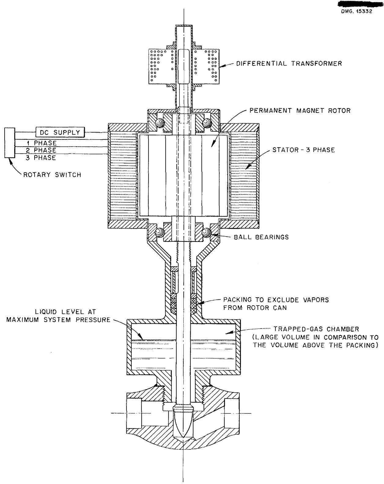  
Fig. 6. Proposed Design for Canned-Rotor-Driven Valve.

between the experimental heat transfer data and those calculated from Lyon's equation was poor at low flows but good at high flows. The heat transfer coefficient showed little change for 2000 hr and at completion of the endurance run was within $12\%$ of the initial value. Pressure drops, both through and around the tubes, showed no particular trend with time.

Tests on a variety of heat-exchanger tube-matrix spacers showed that a spacer friction factor, defined as the ratio of the spacer head loss to the incident-velocity head, was a unique function of the Reynolds number in the tube bundle. Data for the several sets of spacers were correlated with model parameters to obtain a single curve of friction factor against Reynolds number.

The sodium-to-air radiator operated for 330 hr at sodium inlet temperatures up to $1600^{\circ}\mathrm{F}$ . The overall heat transfer coefficients were between 6 and 12 Btu/hr·ft²·°F, that is, about 20% below predicted values.

NaK-to-NaK Heat Exchanger (M. E. LaVerne and A. P. Fraas, ANP Division). The NaK-to-NaK heat exchanger previously reported(2) has completed heat transfer tests at inlet temperatures from 800 to $1200^{\circ}\mathrm{F}$ and flows from 3.5 to 17 gpm and an endurance run of 2835 hr at an inlet temperature of $1500^{\circ}\mathrm{F}$ and a flow of 5.2 gpm. The total operating time was 3006 hr and the test was voluntarily terminated.

Results of the heat transfer tests are shown in Fig. 7. It is apparent from the figure that a considerable discrepancy exists between the results reported here and the heat transfer data computed from Lyon's equation, (3)

particularly at low flows. However, the convergence of the predicted and experimental curves is such as to indicate good agreement (within $10\%$ ) for flows in excess of about 15 gpm.

An item of some concern at the time the heat exchanger tests were begun was the possibility of serious performance deterioration with operating time. It was noticed that changes in the heat transfer coefficient were negligible for the first 2000 hr - the mean curve did not fall outside the probable scatter band until 2200 hours. The coefficient at completion of the run was within $12\%$ of that at the beginning. Pressure-drop measurements taken both through and around the tubes during the endurance run displayed a singular independence of operating time. The observed scatter was of the size expected with careful gage readings and was as prone to be down as up, with the result that there was no discernible trend in pressure drop with time.

A view of the inlets and exits of the cut-up heat exchanger is shown in Fig. 8; note the cleanness of the hot end (operating at $1500^{\circ}\mathrm{F}$ ) and the extremely dirty appearance of the "cool" end (operating at about $900^{\circ}\mathrm{F}$ ). These pieces are being examined metallographically.

Tube-Matrix Spacer Tests (M. E. LaVerne and A. P. Fraas, ANP Division). Information on the flow characteristics of spacers is of considerable interest because the losses across spacers of the type used in the NaK-to-NaK heat exchanger may constitute an appreciable portion of the total losses. Since this information does not appear to exist in the literature, tests were run on a variety of spacers with the expectation of obtaining a general set of characteristics.

A model of the tube matrix comprising a 10 by 10 bundle of 1/8-in.-dia

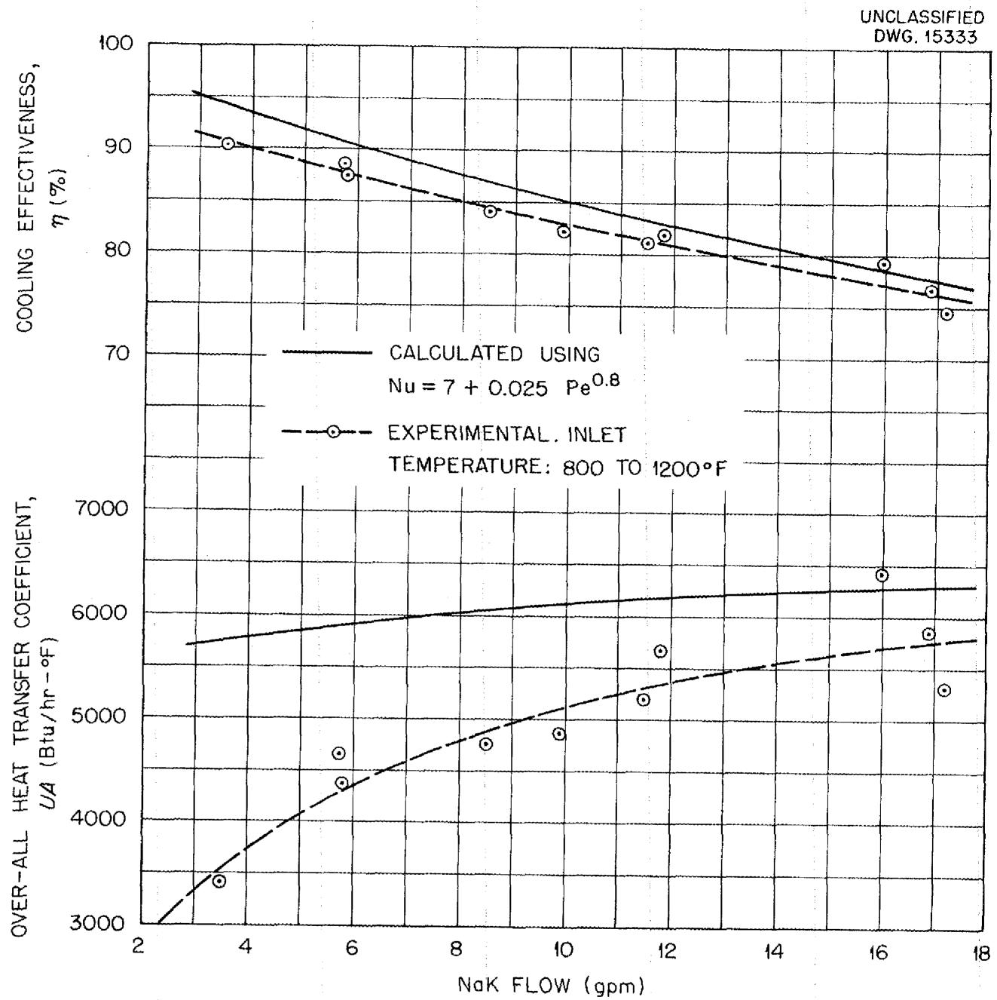  
Fig. 7. Cooling Effectiveness and Over-all Heat Transfer Coefficient vs. Flow in the NaK-to-NaK Heat Exchanger.

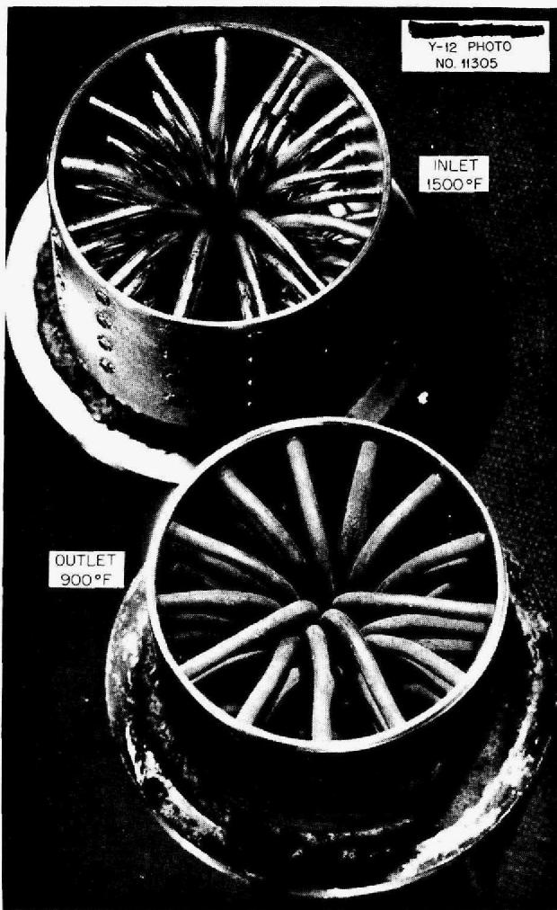  
Fig. 8. Inlet and Outlet Headers of the NaK-to-NaK Heat Exchanger.

stainless steel rods was built for testing with air. The matrix was clamped between top and bottom pieces and sides made of wood. Pressure taps along the top allowed determination of pressure gradients along the model. The head loss chargeable to the spacers was taken as the difference in head loss between a section containing a set of spacers and a section of equal length containing no spacers. The spacer friction factor was then defined as the ratio of the spacer head loss to the incident-velocity head. For a given set of spacers, the friction factor so defined was found to be a

unique function of the Reynolds number in the tube bundle.

The data for the several sets of spacers were correlated with the spacer-thickness-to-width and spacer-thickness-to-tube-diameter ratios as parameters. Figure 9 gives the final result; note that the two sections of the curve have the same slopes (-1 and -1/4 for the laminar and turbulent regions, respectively) as the corresponding curve for smooth pipe.

Sodium-to-Air Radiator (G. D. Whitman, ANP Division). The sodium-to-air radiator previously described(4) operated for 330 hr before developing a leak. During this time the average temperature of the sodium entering the radiator was $1200^{\circ}\mathrm{F}$ , including 140 hr during which the inlet temperature was between 1500 and $1600^{\circ}\mathrm{F}$ .

The over-all heat transfer coefficients obtained were between 6 and 12 Btu/hr·ft²·°F. The maximum coefficient was about 20% lower than the predicted value. There was no marked change in coefficient with increase in fluid temperature, and there was a slight decrease in the coefficient with respect to time. Varying the sodium flow between 1 and 3.5 gpm did not affect the over-all coefficient since the local sodium film is not controlling. The maximum rate of over-all heat transfer was approximately 100,000 Btu/hr. The air-pressure drop across the radiator at the maximum heat transfer rate was 11.8 in. of water.

The exact cause of the failure is not yet known, but the radiator section is now being examined metallographically. One plausible explanation of the failure is that excess Microbraz at the joint between fin and tube may have caused undercutting or local reduction of tube wall

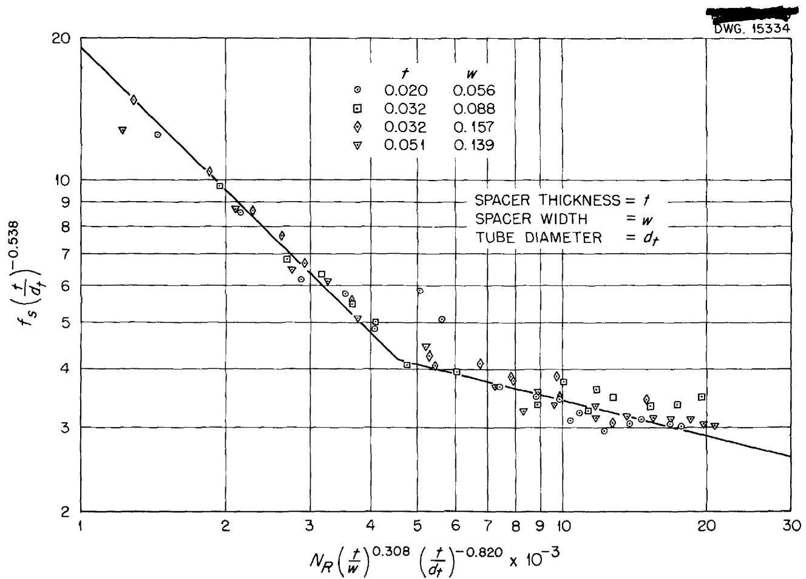  
Fig. 9. Modified Spacer Friction Factor vs. Modified Reynolds Number.

thickness during the brazing operation. The failure resulted in a small sodium fire in a tube at a point between the top fin and a header drum. This section of the tube was on the sodium inlet side of the heat exchanger and was not exposed to the air stream. Aside from this failure the radiator appeared to be in excellent condition. There is evidence that the leak started 40 hr before shutdown was necessary. During this period the system pressure at the pump discharge was observed to fall from 15.9 to 14.9 psi.

The core section tested was a continuous fin-and-tube two-pass counterflow exchanger with 3/16-in.-OD tubes spaced 2/3 in. on a square

pitch. The 0.010-in.-thick fins were spaced so that there were 10.5 per inch of tube. The air inlet face was 2 by 3 3/8 in. and the length in the direction of air flow was 12 inches. The air-side surface had a total area of 12.78 ft². Heat transfer data were taken at sodium inlet temperatures between 700 and $1600^{\circ}\mathrm{F}$ and flow rates between 1 and 3.5 gpm. The air flow was varied between 0.06 and 0.16 lb/sec, which gave a maximum Reynolds number of 12,000. The maximum air temperature rise was from 80 to $1100^{\circ}\mathrm{F}$ .

Additional tests are planned in which the core element to be used will have 16 to 18 fins per inch and will be coated with a thin layer of ceramic to reduce oxidation.

Fluoride-to-Liquid-Metal Heat Transfer System. A heat transfer system has been designed and is under construction that will transfer heat from a fluoride to a liquid metal to air. This system will be tested to determine endurance, heat transfer coefficients of fluorides, and the effect of corrosion, if any, on heat transfer performance and pressure drop.

The system, which is being fabricated from Inconel pipe or tubing, has electric tube-furnace elements for use as heaters and a double-pipe intermediate heat exchanger. A centrifugal gas-sealed pump will be used for circulating the fluorides, and an electromagnetic pump will circulate the liquid metal. Fabrication of the system is approximately $50\%$ complete. Testing is planned over a range of Reynolds numbers from laminar to approximately 80,000 at a maximum fluoride temperature of $1500^{\circ}\mathrm{F}$ .

# INSTRUMENTATION

Pressure Measurement (P. W. Taylor, ANP Division). Several techniques are being tested in order to develop a reliable method of measuring pressures of high-temperature $(1500^{\circ}\mathrm{F})$ fluoride systems. These techniques include a pressure-sensitive diaphragm, two null-balance systems and the use of the Pourdon tube gage.

Bourdon Tube Gage. The Bourdon tube gage consists of a pressure-pot facsimile to which gages are attached through stainless steel and copper tubing. Experiments with this type of gage should determine the cause of gas-line plugging and also the reliability of this type of pressure indicator. The fluid will be pumped to the pressure pot at $1500^{\circ}\mathrm{F}$ , but the gage will be at such a distance from

the pot that it can be maintained at room temperature.

Pressure-Sensitive Diaphragm. A pressure-measuring instrument consisting of a pressure-sensitive Inconel diaphragm, 13 by 1/16 in., is being tested. The deflection of the diaphragm is a linear function of the pressure exerted upon it. At 60 psi and $1000^{\circ}\mathrm{F}$ the diaphragm should deflect approximately 10 mils. The deflection is sensed by a microformer transformer that operates a servo dial-indicating device. The accuracy of this type of instrument is limited by the temperature variation of the sensing element; therefore, the instrument must be maintained at the temperature at which it is calibrated.

Nullmatic. A commercial instrument, the Moore Nullmatic 1:1 pressure transmitter is being tested. This pneumatic instrument contains a stainless steel bellows and utilizes a null-balance principle that should eliminate all temperature effects. However, since this device is not rated for high-temperature service, the purpose of the current test is to determine its performance at high temperatures when subjected to corrosive vapors.

G-E Null-Balance Device. A null-balance transmitter with a corrugated diaphragm as the pressure-sensitive element has been built and tested by the General Electric Company at $1000^{\circ}\mathrm{F}$ with good results. This instrument is now being tested to determine its performance in the $1500^{\circ}\mathrm{F}$ range.

Liquid-Level Indicators (A. L. Southern, ANP Division). Several different types of liquid-level indicators are being developed for use in high-temperature liquid systems. In addition to level indication, the indicators can also be adapted for level control.

Variable-Inductance Level Indicators. The variable-inductance level indicator consists of a laminated, tapered core enclosed in an Inconel tube. The pick-up coil is wound on a form 1 in. in diameter and 1 in. long. The design of the coupling rod between the float and the core is such that the response of the indicator is linear for only 10 in. of the 18-in. level change for which it was designed. The accuracy of this indicator is approximately $0.75\%$ . An endurance run of 1500 hr gave no trouble, nor was any change encountered in the operation of the indicator. Level can be controlled with this indicator to $0.5\%$ of the total indication by using limit switches on the indicating millivolts meter. In addition, by using two of these indicators together a null-balance system can be obtained that will hold one level even with another one.

Bubbler Type of Level Indicator. A working model of the bubbler-type of indicator described in the previous quarterly report(5) has been designed and tested to operate over a level range of 18 inches.

Two tanks were constructed with a transfer line between them to give the required level change. The fluoride, NaF-KF-LiF (composition in mole $\% : 11.5 - 42.0 - 46.5$ ), was alternately pushed from one tank to the other by gas pressure and the rate of level change could be varied. A well-type manometer was used to get a constant zero and then only one reading was needed from the manometer. (No. 3 Merian manometer fluid was used in the manometer.) A Nullmatic pressure regulator was used to hold a constant pressure over the liquid, and the temperature was varied between 1000

and $1200^{\circ}\mathrm{F}$ . The gas flow through the dip tube was indicated by a Fisher and Porter flowrator. Level control was accomplished by a "Thermocap" capacitance control that worked off of the fluid in the manometer. The level in the tank was checked by means of a variable-inductance pick-up coil in which inductance was varied by an iron core mounted on a float.

The accuracy of this type of level indicator depends on the difference in specific gravity of the manometer fluid and the liquid. In this experiment the ratio was 1:3 and the accuracy of the level was determined to 0.04 inch. The experiment has operated for 140 hr under dynamic conditions, with over 1000 cycles of operation, and 742 hr under static conditions. As a result of tests with this model, it is concluded that the level in a $1500^{\circ}\mathrm{F}$ fluid system can be remotely indicated and controlled by this technique.

Resonant-Cavity Type of Liquid-Level Indicator. A liquid-level indicator that uses the principle of a resonant cavity has been designed and will be tested as soon as the commercial equipment now on order is delivered. The frequency used will be in the S-band microwave region, and all S-band microwave components will be used. The control signal will be the energy absorbed by the cavity. This signal will operate a servo system which will in turn control the frequency of the Klystron tube. Only simulated experiments have been made with this indicator and it will be between three and six months before the actual tests are made. This level indicator is well suited for use in a reactor system because all parts that will be within the reactor shield can be made of metal and thereby eliminate the danger of a leak or radiation damage.

# FLUID DYNAMICS OF THE ARE

L. A. Mann D. F. Salmon ANP Division

Since criticality of the ARE reactor depends, among other considerations, upon the amount of fuel in the core of the reactor and since the present design of the core presents opportunities for entrapment of gas or vapor, a full-size hydraulic model of the fuel passages is being built (Fig. 10) of transparent materials for observation of fluid-flow patterns, gastrapping characteristics, and for testing filling, draining, and emptying of the system.

A simple system that is similar to the fuel system of the ARE core

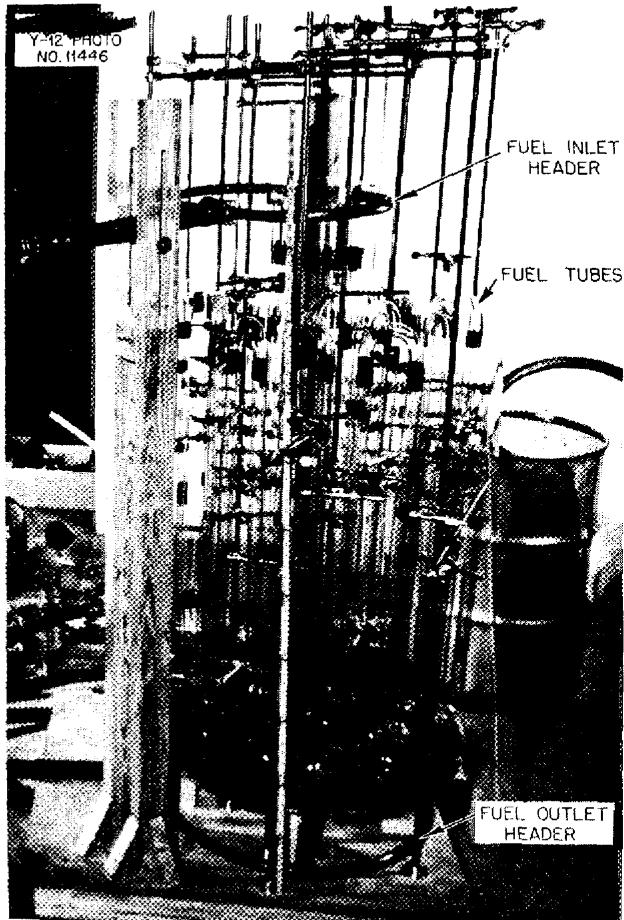  
Fig. 10. Hydraulic Model of the ARE.

has already been built and tested for filling and emptying. The test system consisted of six parallel sets of six loops; each loop had 1/2-in. Tygon tubing between the inlet and discharge headers and an appropriate pump, flowmeter, and tanks external to the headers. Tests were made with (1) water and air and (2) $56\%$ zinc chloride in water $(\text{sp. gr.} = 1.65)$ and kerosene $(\text{sp. gr.} = 0.82)$ , and the hydraulic similarity to the reactor was based on the Reynolds number. Test results were as follows:

1. With a gradual increase in the pumping rate, 17 gpm of water was required to completely fill a system originally filled with air.   
2. With a constant pumping rate, 12 gpm of water was required to fill the system from all air to all water.   
3. With a gradually increasing pumping rate, 7 gpm of zinc chloride solution was required to completely replace the kerosene.   
4. With a gradually increasing pumping rate, 9 gpm of kerosene was required to completely replace the zinc chloride solution.   
5. 15-psia air failed to remove the water, kerosene, or zinc chloride solution from a full system. It did, however, remove the liquid from any one circuit fairly completely if the other five circuits were closed.   
6. With a gradual increase of pumping rate or gas pressure each of the above removals was stepwise in character. That is, after replacing the fluid in one circuit, an increase in pumping rate was required to replace the fluid in another of the remaining parallel circuits. The increases required were approximately equal increments for each additional circuit cleared.

7. At the design flow rate for the reactor all bubbles were swept through the tubes, but at considerably lower flow rates bubbles were observed to cling to the inside radii of the bottom bends. It was noticed that a large bubble would sweep out a collection of smaller bubbles.

# TECHNOLOGY OF FLUORIDE HANDLING

Fluoride Production (J. C. White, ANP Division; F. F. Blankenship, Materials Chemistry Division). The need for large-scale testing of corrosion by fluoride fuels in pump loop and heat exchanger assemblies has necessitated the preparation of the pure fuels in up to 100-lb batches. The equipment for effecting hydrogenation and hydrofluorination is being installed in Building 9928, which has been modified to receive it.

The fluoride-production process involves six steps (cf., sec. 10 gives the specific process conditions):

1. Charge the reaction vessel with an intimate mixture of the components.   
2. Treat the charge with HF and with $\mathbf{H}_2$ at temperatures below the melting point.   
3. Melt the charge under an inert atmosphere or one of the treating gases.   
4. Treat the melt at temperatures in the range of 1500 to $1800^{\circ}\mathbf{F}$ with HF and $\mathbf{H}_2$ .   
5. Strip the treating gases from the melt with inert gas.   
6. Filter into a receiver. Control of batch temperature and atmospheric pressure is available at all steps. Mechanical agitation is available in steps 3, 4, and 5. Treating and

stripping gases are introduced through a perforated bubbler. An electrically driven stirrer will be used to mix the material during passage of the gaseous reagents.

The equipment will be able to produce from 5 to 100 lb of mixture in a sealed, and easy to sample, receiver as needed, and should be in operation by June 15. At that time sufficient zirconium fluoride should be available for large-scale production.

Fluoride Removal (D. R. Ward, ANP Division). Tests were made to determine the best practical means for removing the fluoride salts after completing the operation of test equipment. Specimens were prepared by cutting rings containing solidified Fulinak from the Inconel tubing used for a previous test. The specimens were then soaked in various chemicals and the degree or ease of fluoride removal was noted. No solvent for the fluorides was found. Running water appeared to be the best practical fluoride softener, although up to 48 hr was required for softening in some cases. Also, mechanical assistance was usually needed. Removal of most of the fluorides while they are molten will simplify the final cleaning problem.

Pretreatment of Pipeline Helium (L. A. Mann, ANP Division). Pretreatment of the bulk helium supply will be accomplished by using the following equipment (in series as listed) (1) dry-ice cold trap, (2) NaK bubbler, (3) molten-fluoride bubbler, (4) water-cooled cold trap. Item 3 was added to previous pretreatments so that the gas will have at least a short-time contact with the type of fluoride material it is later to protect. Item 4 was added to remove gross, condensible vapors. The equipment is being constructed.

Pickling Procedures for Fluoride Containers (D. C. Vreeland, E. E. Hoffman, R. B. Day, L. D. Dyer, Metallurgy Division). Some experiments in which various pickling procedures were used on type-321, -304 and -446 stainless steels and Inconel have been carried out to determine the efficiency of the pickling procedures on these types of alloys. Three-inch lengths of 1/2-in. tubing were welded at one end to subject them to the oxidizing conditions that occur in tube preparation prior to static corrosion testing. After welding, the tubes were cut in half, longitudinally, to facilitate observation of the interior surface of the tube during and after pickling. Some tests were conducted on 1 by 1 by 1/4-in. specimens that had been oxidized in an air atmosphere furnace at various temperatures to test the action of the pickling solutions on oxide coatings that were heavier than could be obtained on the welded tubing. Before pickling, the specimens were degreased by immersing in a $10\%$ solution of sodium phosphate at $93^{\circ}\mathrm{C}$ for 15 min, and then rinsed in warm water.

The pickling treatments tried are listed below. Treatments that were most successful in these tests were 3 (b) for types-321 and -304 stainless steel and 4 for type-446 stainless steel or Inconel. Treatment 4 for type-446 stainless steel and Inconel was effective only for light-temper-colored oxide films. Treatment 3 (b) for types-304 and -321 stainless steel appeared to be helpful on all types of oxides tested, but it was most effective on the thinner coatings.

1. (a) Immerse in Virgo for 15 min at $615^{\circ}\mathrm{C}$ and rinse in cold water. Immerse in $10\% \mathrm{H}_2\mathrm{SO}_4$ using thiourea as inhibitor, for 30 min at $65^{\circ}\mathrm{C}$ and rinse in hot water, cold water, and again in hot water. Immerse in a solution of $10\% \mathrm{HNO}_3$ plus $1\frac{1}{2}\%$ hydrofluoric acid for 10 min at $60^{\circ}\mathrm{C}$ and rinse in cold and hot water. Immerse in $20\% \mathrm{HNO}_3$ for $1/2\mathrm{hr}$ at $60^{\circ}\mathrm{C}$ and rinse in cold and hot water, and dry.

(b) Substitute Hibitite for thio-urea in 1 (a).

2. (a) Immerse in Virgo for 15 min at $615^{\circ}\mathrm{C}$ and rinse in cold water. Immerse in $10\% \mathrm{H}_2\mathrm{SO}_4$ , using thiourea as inhibitor, for 30 min at $65^{\circ}\mathrm{C}$ and rinse in hot water, cold water, and again in hot water.

(b) Substitute Hibitite for thio-urea in 2 (a).

3. (a) Immense in $10\% \mathrm{H}_2\mathrm{SO}_4$ using thiourea as inhibitor, for 30 min at $65^{\circ}\mathrm{C}$ and rinse in hot water, cold water, and again in hot water. Immense in a solution of $10\% \mathrm{HNO}_3$ plus $1\mathrm{l} / 2\%$ HF for 10 min at $60^{\circ}\mathrm{C}$ and rinse in cold and hot water. Immense in $20\% \mathrm{HNO}_3$ for $1/2\mathrm{hr}$ at $60^{\circ}\mathrm{C}$ and rinse in cold and hot water.

(b) Substitute Hibi itite for thiourea in 3 (a).

4. Immerse in a solution of $10\% \mathrm{HNO}_3$ and 4 to $5\%$ HF for 30 min at $30^{\circ}\mathrm{C}$ and rinse in cold water.

# 4. REACTOR PHYSICS

W. K. Ergen, ANP Division

The belief that the circulation of the fuel causes damping of power oscillations in all practical cases has been strengthened further by theoretical considerations. Furthermore, specific examples have been computed on the differential analyzer at the University of Pennsylvania, and some of the examples show the damping to be extremely powerful. The damping will counteract any antidamping tendencies that the circulating-fuel reactor, like any other high-powered reactor, might have for various reasons.

The critical-mass and power-distribution calculations for circulating-fuel aircraft reactors, although incomplete, have been directed toward determining how far it is possible to go - in the interest of ease of fabrication and mechanical ruggedness - in increasing the fuel tube size and decreasing the number of tubes. In fact, the limiting case of a homogeneous fluoride reactor with all the beryllium oxide-moderator in the reflector was computed (cf., "Reflector-Moderated Circulating-Fuel Reactor," sec. 1). The critical mass in this case is not far different from the values obtained with multitube reactors - a very gratifying result. A possible difficulty may be a positive temperature coefficient due to the large number of fissions caused by high-energy neutrons.

Work on the aircraft reactor experiment was directed towards important, but more or less minor, design questions. In addition, the large number of ANP Physics Division memorandums on computational techniques and various reactor designs are being reviewed with the intention of assembling the information into systematic reports. A

glossary of reactor terms is also being prepared.

# OSCILLATIONS IN THE CIRCULATING-FUEL AIRCRAFT REACTOR

S. Tamor, ANP Division

The kinetic equations of a somewhat idealized circulating-fuel reactor, given in the last ANP quarterly, (1) were further investigated. At the beginning of the reporting period it was known that the power oscillations are always damped if they are small to begin with, and it seemed plausible that even large oscillations are never antidamped. (2,3)

Solutions of the kinetic equations for representative values of the parameters and initial conditions have been obtained by Professor Cornelius Weygandt and his staff on the differential analyzer of the University of Pennsylvania. The data are not expected to arrive at Oak Ridge before the end of the present reporting period, but a preliminary communication confirms that none of the solutions is antidamped; and, furthermore, under some conditions, the damping due to the circulation of the fuel is so strong that only an aperiodic motion without any "ringing" occurs.

As to the general theory of these equations, it was shown that the power always stays between an upper and a

lower bound determined by the parameters of the equation. In other words, there are certainly no oscillations with amplitude that increase to infinity. The practical value of this statement is somewhat impaired by the fact that the bounds appear to be serious over-estimates of the amplitudes, and while the oscillations themselves may stay within acceptable limits, if the bounds were reached, it might mean destruction of the reactor. It was shown that no periodic oscillation other than the ones with period $\theta / n$ can persist.

# CALCULATIONS FOR THE CIRCULATING-FUEL ARE

C. B. Mills, ANP Division

The following results were obtained from calculations assuming NaF-BeF $_2$ -UF $_4$ fuel in the circulating-fuel ARE, but the results are expected to hold for the recently proposed ZrF $_4$ -bearing fuels:

1. If the outermost 12 or 24 fuel tubes in the core were eliminated, leaving everything else constant, the number of tubes could be reduced from the originally contemplated 78 to 66 or 54. This would mean a decrease in reactor size, but the reflector size would increase. The net effect on total uranium investment would amount to an increase of only a few per cent for each of the two groups of 12 tubes eliminated. Hence, from the uranium investment viewpoint, there is no objection to some reduction of the number of tubes.(4)

2. The fission heating of the ARE and ANP reactors was investigated.(5)

3. An engineering simplification in the reactor could be obtained, if the inert-salt coolant were eliminated. If the fuel-coolant were circulated, for cooling purposes, through the reflector, $6\%$ of the fissions would occur in the reflector, and the neutron leakage would increase and shift somewhat toward higher energies.(6)

From calculations assuming the most recently proposed $\mathbf{ZrF_4}$ -bearing fuels, the following results were obtained.7

1. Two fuels were compared; the inert part (fuel minus $\mathrm{UF}_4$ ) of one had the following composition (in mole $\%$ ): $43\% \mathrm{ZrF}_4$ , $37\% \mathrm{NaF}$ , $20\% \mathrm{KF}$ , and the inert part of the other was $43\% \mathrm{ZrF}_4$ , $5\% \mathrm{NaF}$ , $52\% \mathrm{KF}$ . The fuel with the high KF content gave a critical mass only $10\%$ greater than that of the low KF content fuel in spite of the large K absorption cross section.   
2. The 2-in. Inconel layer around the reactor does not act appreciably as a reflector, since the neutron spectrum is rather low in energy.   
3. For the $20\%$ KF content fuel, the "best guess" for the total uranium requirement is 124 lb of $93.4\%$ assay $\mathbf{U}^{235}$ . This includes the uranium in the reactor and the external circuit, with allowance being made for $k_{eff} = 1.034$ , (8) additional uranium for control, and uranium in tube bends at the ends of the core.   
4. The important reactivity coefficients

$$
\left(\Delta k / k\right) / \left(\Delta m / m\right) _ {U}
$$

and

$$
\left(\Delta k / k\right) / \left(\Delta m / m\right) _ {\text {m o d e r a t o r}}
$$

are 0.4 and 0.5, respectively - the same as quoted in the last quarterly. (9)

5. About two-thirds of the fissions are thermal.   
6. The approximate distribution of the neutron absorption over the reactor constituents in the reactor is given in Table 1.

TABLE 1   
Neutron Absorptions in the Constituents of the Core of the ARE Reactor   

<table><tr><td>CORE
CONSTITUENT</td><td>NUMBER OF NEUTRONS NORMALIZED
TO 1 FISSION (2.5 neutrons)
PER CUBIC CENTIMETER OF CORE</td></tr><tr><td>Uranium</td><td>1.113</td></tr><tr><td>Zirconium</td><td>9.9 × 10-3</td></tr><tr><td>Potassium</td><td>0.171</td></tr><tr><td>Sodium</td><td>2.9 × 10-3</td></tr><tr><td>Fluorine</td><td>7.0 × 10-3</td></tr><tr><td>Beryllium</td><td>2.49 × 10-2</td></tr><tr><td>Inconel</td><td>0.409</td></tr><tr><td>Oxygen</td><td>0</td></tr></table>

7. When the aircraft reactor experiment is completed, the fuel-coolant will be dumped into a tank cooled by water in 2-in. tubing. Assuming 100 lb of U²³⁵ in the equivalent of a 1.8-ft-radius sphere and considering the self-shielding of the uranium as well as of the water, the tank will be subcritical. Furthermore, boron will be added to the cooling water as a safety factor.

8. The loading of the ARE will be accomplished by slowly adding a rich solution of uranium to the hot, circulating coolant. An estimate of the criticality of 150 lb of U²³⁵ in 1.3 ft³ of rich fuel solution gave a value for $k_{eff}$ of 0.45, which is far subcritical.

# METHODS FOR REACTOR COMPUTATION

# B. T. Macanley C. B. Mills ANP Division

The Reactor Physics group is attempting to expand its computational techniques to cover reactors with hydrogen in the core and/or reflector. No entirely satisfactory method to take into account the correlation between scattering angle and energy loss has been found, and other unsolved problems exist. Nevertheless, correspondence between calculations and the few available experiments is quite satisfactory, at least as far as the critical mass is concerned. No experimental data are available regarding power distribution and neutron spectrum, and this, together with the above objections on theoretical grounds, prevents reporting these attempts for general circulation at present.

In order to simplify the survey of variations of the ARE and similar reactors, the results of the two-group equations for the critical mass have been presented, (10) with parameters of the equations given numerically for a beryllium oxide moderator. The equations prove quite valuable, since they agree within a few per cent with the results of the machine calculations.

# 5. CRITICAL EXPERIMENTS

A. D. Callihan, Physics Division

The investigation of the direct-cycle aircraft reactor has continued during this quarter with the use of the critical assembly described in the preceding report. Fission-rate and neutron-flux measurements have been made and further changes in reactivity produced by reflector modifications have been observed. A significant rearrangement of the components that was intended to reduce the neutron channeling decreased the reactivity to a degree requiring additional end reflector to retain a critical system. This new assembly has a temperature response similar to that of the earlier one.

The components of the low-temperature mockup of the ARE are being assembled and the fuel composition has been modified to conform closely with the present ARE fuel design. Zirconium oxide is to be substituted for zirconium fluoride since the latter is unavailable at this time.

A resume of the results from an earlier series of experiments with a graphite-moderated reactor is included.

# DIRECT-CYCLE REACTOR

E. V. Haake D. V. P. Williams

Physics Division

R.C.Keen

Louisiana State University

W. G. Kennedy

Pratt and Whitney Aircraft Division

Dunlap Scott

ANP Division

The results reported here were obtained in a program carried on by

Oak Ridge National Laboratory at the request of the General Electric Company to provide design data for the watermoderated, air-cooled aircraft reactor. Two arrangements of the reactor loading have thus far been made: one, now referred to as the "shelf type," has been described completely elsewhere;(1) and the second, called the "box type," will be described here. Data showing the dependence of reactivity on various composite reflectors have been reported elsewhere.(2)

Shelf-Type Reactor Assembly. Studies have been made of the power distribution, neutron-flux distribution, and self-shielding of a shelf type of reactor assembly.

Power Distribution. A gross power distribution throughout the core of the reactor assembly shown in the preceding report(1) has been measured by the usual "catcher-foil" method in which aluminum placed in contact with the metallic uranium collects recoiling fission fragments. The resulting activity is a measure of the fission rate. This distribution, along the axis of the reactor, is shown in Fig. 11 in which the relative activity is plotted against the distance from the mid-plane. The distribution is also shown in a direction parallel to the axis at three locations on the periphery of the core. Some fission rate data were also obtained by counting the induced activity in the uranium and the results are plotted. It is to be noted that the two methods are consistent.

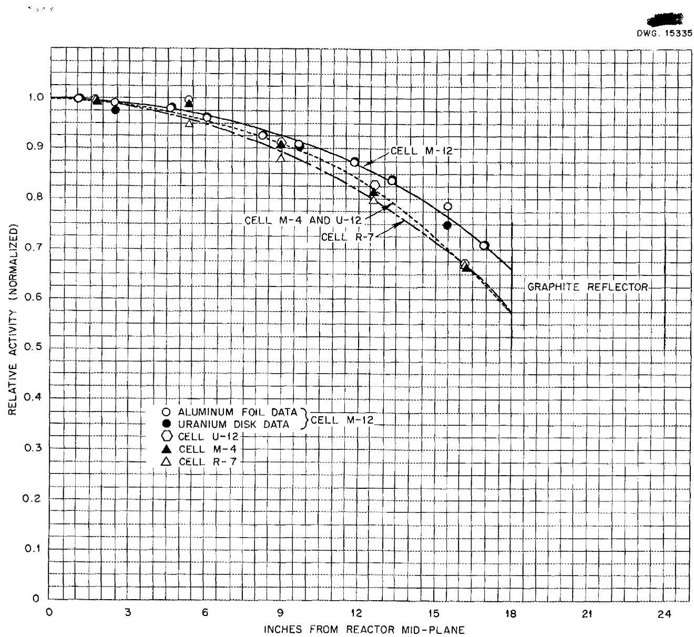  
Fig. 11. Power Distributions Extending from Reactor Mid-plane to Graphite End Reflector.

Neutron-Flux Distribution. The neutron-flux distributions along a radius vertically below the axis in the mid-plane of the reactor and extending into the beryllium reflector are plotted in Fig. 12. The results are from the activation of indium foils, both bare and covered by 20 mils of cadmium. The difference between the two experimental curves shows the distribution of neutrons

with energies below the cadmium cutoff at about 0.5 ev.

Self-shielding. The uranium fuel pieces are 0.01 in. thick, and a measurement has been made of the shielding imposed by the uranium on fission neutrons. It was possible to substitute five disks, each 0.002 in. thick, for one of the 0.01-in.-thick fuel pieces and to interpose aluminum

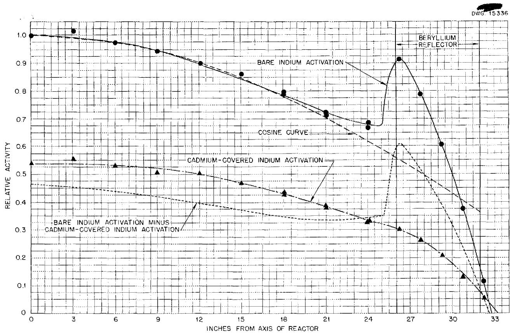  
Fig. 12. Gross Indium Traverse Vertically Down in Plane of Interface (M-12 through M-22).

foil between adjacent disks. The resulting fission fragment activities as measured by the aluminum foils show the variation of fission rate through the fuel and indicate an average fission rate of $88\%$ of that on the surface. As a measure of the energy of the neutrons producing fission, the fission rate of a fuel disk was measured with and without a 20-mil cadmium cover. It was shown that about $90\%$ of the fissions are caused by neutrons with energies below the cadmium cut-off.

Box-Type Reactor Assembly. In another design of the direct-cycle reactor; the alternate moderator and fuel-coolant channels are annular. In order to more nearly simulate this design in the mockup discussed here,

some of the elements $^{(3)}$ consisting of plastic, stainless steel, and uranium were rotated through 90 deg with the intent of reducing the channeling in the horizontal fuel layers of the first assembly. The final loading arrangement of this model is shown in Fig. 13. The components are the same as in the shelf type with two significant exceptions: the plastic was omitted from the central element, M-12, to give better symmetry, and an additional 2 in. of graphite reflector (a total of 8 in.) were required on one end to make the system critical. It has not yet been possible to measure

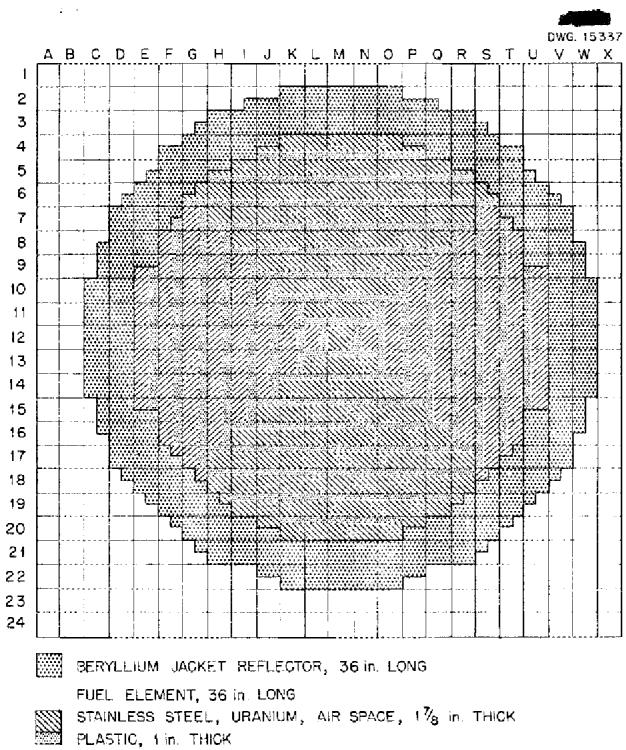  
Fig. 13. Loading Diagram.

the net loss in reactivity incurred by the fuel element rotation, but it is estimated at one dollar, that is, a change in reactivity of the order of the delay fraction of fission neutrons.

Control Rod Calibration. All control rods have been recalibrated and found to be comparable in value to those of the shelf-type reactor except the one at the center, which, as pointed out above, does not contain plastic. Its removal corresponds to a decrease in reactivity of 29 cents, whereas each of the other rods corresponds to about 17 cents. This difference is due to the variation in neutron distribution caused by the change in plastic distribution. It is interesting to note that the calibrations of the rods are unaffected by a transverse gap up to 0.8 in. thick at the reactor mid-plane.

Temperature Effects. The dependence of reactivity on reactor temperature, referred to in Fig. 19 of the previous report, (1) was again examined and found to be greater for the present assembly. The current value is $1.46 \phi / {}^{\circ}\mathrm{F}$ compared with $1.25 \phi / {}^{\circ}\mathrm{F}$ in the shelf-type reactor.

Variation of Reactivity with Plastic Thickness. Also of interest was an experiment in which the variation in reactivity with plastic-layer thickness was measured. The thickness of the plastic in cells designated by column K and rows 1 through 16 in Fig. 13 was varied from 0.5 to 1.25 in. and concomitant changes in reactivity were noted. The void resulting from the removal of the plastic was not filled and in the last test one stainless steel sheet was removed. It was observed that the reactivity was a maximum with the plastic 7/8 in. thick and that it fell sharply with thickness changes in both directions. A reduction to 0.5 in. and an increase to 1.25 in. decreased the reactivity about 10 cents.

Variation of Reactivity with Separation at Reactor Mid-Plane. The construction of the assembly in two parts, one of which is movable by remote control, permitted separating the core along its mid-plane in an axial direction. The accompanying changes in reactivity have been measured and the results are shown in Fig. 14 in which the separation of the parts is plotted against the corresponding reactivity change. The accuracy of the separation distances is no greater than $\pm 0.02$ inch. The purpose of the experiment was to ascertain the degree of operational safety incorporated in the mechanism for separating the parts of the assembly.

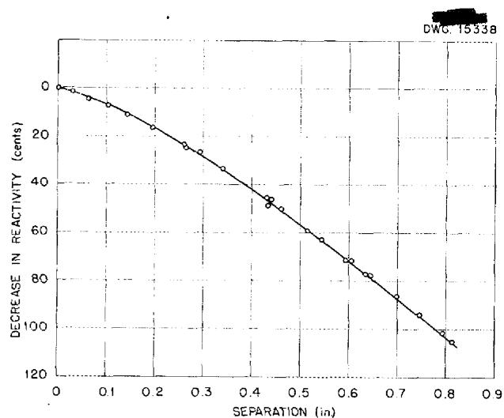  
Fig. 14. Variation of Reactivity with Axial Separation of Mid-plane.

# CIRCULATING-FUEL REACTOR

D. Scott, ANP Division

A preliminary, experimental study of the nuclear design of the experimental reactor is to be made during the summer of 1952 at ORNL by building some of the major components into a system that will be made critical with enriched uranium. The experiments will be done at a power level of the order of $1\mathrm{~W}$ , maximum, and at room temperature, and will yield information on uranium requirements, control problems, and power and neutron-flux distributions. It is expected that assembly of the mockup will commence June 1 and that the system will be made critical around July 15.

Reactor Materials. The beryllium oxide hexagonal blocks prepared for the ARE will be used as the reflector and moderator in these experiments and transferred to the ARE later. The fuel is to be a dry-packed powder with nuclear properties closely approximating those of the ARE fuel (cf., sec. 10). At present the ARE fuel is designed to be a molten mixture of the

fluorides $\mathrm{ZrF_4}$ NaF, and $\mathrm{UF_4}$ with the possible inclusion of some KF. In this preliminary assembly the fuel is expected to be a mixture of $\mathrm{ZrO_2}$ NaF, enriched $\mathrm{UF_4}$ , and graphite. The $\mathrm{ZrO_2}$ is being substituted for the $\mathrm{ZrF_4}$ because the latter is unavailable at this time; the graphite is being added to give a total scattering cross section of oxygen and carbon equivalent to that of the fluorine. The composition will be that required to give the designed uranium density of the ARE fuel. It is probable that the ratio of zirconium to sodium fluoride will approach ARE design, but the overall density will be somewhat lower. The simulated reflector coolant of the ARE to be used in this preliminary study has the same composition as the fuel, with the omission of the $\mathrm{UF_4}$ .

These materials will be packed as a dry powder in stainless steel tubes, 1 l/4 in. in diameter and 40 in. long, which can be sealed to minimize moisture pick-up. The stack of beryllium oxide blocks will be surrounded by an Inconel shell.

Reactor Assembly. The beryllium oxide blocks will be stacked, with axes vertical, in a right cylinder, also with its axis vertical, 36 in. high and 47 in. in diameter. The fuel and coolant mixtures in stainless steel tubes will be placed vertically through the axial holes in the beryllium oxide blocks. Some of the tubes will be movable, by remote operation, and will serve as control rods. A section of tubing containing a nuclear poison will be attached above other fuel elements. The fuel elements will be magnetically supported. Upon release by the magnet, the fuel tubes will fall out of the core and will be replaced by the poison. This safety mechanism will be operated both manually and by a high-flux-level detection instrument.

Provisions will be made for inserting neutron-detecting foils, such as indium and gold, through the reflector and moderator. The usual neutron- and gamma-sensitive detectors will be placed adjacent to the assembly for operational control and safety. They will feed recording and indicating instruments in the control room.

# GRAPHITE REACTOR

# E. L. Zimmerman, Physics Division

A critical assembly of enriched uranium and graphite was described in earlier reports, (4) and a summary of the results obtained with this assembly is given here. The core of the assembly was essentially a cube 45 by 45 by 44.11 in. covered by a 3-in.-thick graphite reflector on four sides.

Critical Mass. Although the quantity of uranium available limited the loading, the assembly became critical with $41.5\mathrm{kg}$ of $\mathbf{U}^{235}$ . Measurements indicated that little increase in reactivity would have resulted had uranium been included in the reflector layer. Therefore, for purposes of calculation the reactor was considered to be unreflected, with dimensions 51.0 by 51.0 by 44.1 in., and to contain 52.48 kg of $\mathbf{U}^{235}$ . The difference between the two mass values is that required to fill the 3-in. reflector to the same uranium density as the core. A multi-group calculation for the assembly, (5) in which a value for the buckling, $B^2$ of 0.0018628 cm $^{-2}$ and an extrapolation distance of 2 cm were used, gave an effective multiplication of 0.9912. The disadvantage factor due to lumping of the fuel in 0.01-in.-thick disks was measured and found to be 0.94 ± 0.04, which is comparable to the value

of 0.95 used in the calculation. The calculations gave values of 0.15 ev for the mean fission energy and $27.41\%$ for the fraction of fissions in the thermal group.

Control Rod Calibration. Control rods of the core-removal type were calibrated by a "rod-drop" method and by the observation of stable reactor periods. The form of the control rod calibration curves indicated a contribution due to neutron streaming in the void formed by withdrawing the rod as well as the expected cosine-squared variation. A comparison using a flat strip of cadmium as a poison rod, which left essentially no void when removed, showed good agreement with a cosine-squared sensitivity curve.

Gap Effect. The loss in reactivity as a function of a gap between the assembly halves showed a loss of multiplication of 0.00635 due to a gap 0.3 in. wide. This agrees fairly well with a recent calculation, (6) but is roughly double the value calculated by an earlier method. (7)

Flux and Power Distribution. Bare-indium and cadmium-covered-indium foils were exposed in various parts of the assembly to observe the flux distribution both macroscopically and microscopically. Power distributions were observed by means of aluminum catcher foils in contact with the uranium. An experiment showed the catcher-foil technique to be insensitive to the neutron spectrum. Comparison between activations of bare, cadmium-covered, and cadmium-indium-covered fuel disks gave values of the ratio

# (Fuel activation) Bare (Fuel activation) Cadmium covered

(6) S. Tamor, unpublished work.   
(7) M. G. Goldberger, M. L. Goldberger, and J. E. Wilkins, Jr., The Effect of Gaps on Pile Reactivity, CP-3443 (Feb. 20, 1946).

of between 2.1 and 2.6 compared with a calculated average value of 2.72. The values of the ratio

# (Fuel activation) Bare

(Fuel activation) Cadmium and indium covered

varied between 3.4 and 3.9; the calculated value was 2.98. The variation in observed ratios was due to the 3-in. graphite reflector on four sides of the assembly.

Danger Coefficient Measurements. Danger coefficients were calculated

for sodium, iron, nickel, and molybdenum by using the neutron spectrum determined by multigroup calculations and the known cross-section data. The values agreed substantially with the corresponding observed values. As a further experiment, a 3- by 2-in. hole extending from the center of the assembly to the outside along a major axis was filled step-wise with sodium. Plugging the hole with sodium caused a slight increase in multiplication, whereas completely filling the hole gave a small net loss.

# Part II

# SHIELDING RESEARCH

# SUMMARY AND INTRODUCTION

E.P.Blizard J.L.Meem

Physics Division

Measurements of the energy and angular distribution of gamma rays from the divided-shield mockup around the Bulk Shielding Reactor have continued, and development of the proton-recoil counter for neutron spectral measurements is progressing (sec. 6). In another experiment with this reactor the effect of radiation from the side of the reactor shield that scatters in air and penetrates the crew compartment was measured. These data for neutrons were reasonable, but the gamma rays appear to be undershielded. The albedo of neutrons and gamma rays on concrete has been determined with artificial sources to facilitate calculations for the Tower Shielding Facility.

Both GE-ANP and NDA shield design groups have come upon the difficult problem of calculating secondary gamma production from neutrons absorbed or scattered in the thermal shields and pressure shells of reactors. Since these problems are insoluble with the

presently available nuclear constants and would be very difficult even if all data were well known, an extensive survey was carried out in the Lid Tank. This survey has enabled both groups to proceed with their respective designs (sec. 7).

The air-duct research in the Lid Tank and Thermal Column Facilities has continued. The Lid Tank research has been concentrated on large-scale mockups of annular designs, and the Thermal Column work has been on a series of experiments to provide primarily a better understanding of the important attenuation processes (sec. 8).

The total neutron cross section of $\mathsf{Li}^6$ has been measured up to 4 Mev on the 5-Mev Van de Graaff. The measurements show only one resonance, which is at $270\mathrm{kv}$ . The time-of-flight spectrometer has been operating satisfactorily with a full resolution width of less than $1.2\mu \mathrm{sec / meter}$ .

# 6. BULK SHIELDING REACTOR

J. L. Meem

R.G.Cockran E.B.Johnson

M.P.Haydon J.K.Leslie

K.M.Henry T.A.Love

L. B. Holland F. C. Maienschein

H. E. Hungerford T. N. Roseberry

Physics Division

The requirements for divided-shield research were explored quite completely during the past quarter. A set of experiments at the Bulk Shielding Reactor was executed to examine the possibility of testing divided shields

on a limited basis, that is, testing the radiation that penetrates the side of the reactor shield, air-scatters, and enters the side wall of the crew shield. The experiments were necessarily so unclean that it

is difficult to extrapolate from the radiation measured to that to be expected in the aircraft. This fact is much more meaningful than the actual results, which on a crude interpretation seemed to indicate that the divided shield described in ANP-53(1) was properly designed for shielding from neutrons but that in regard to gamma rays it was somewhat undershielded.

When it became apparent that such partial experiments would not supply adequate information, considerable effort was expended in designing a new facility that would be satisfactory. To facilitate design work, other experiments were carried out to determine the scattering to be expected from the ground, and calculations were made to determine the minimum requirements for power and altitude. A proposal describing a divided-shield testing facility has been prepared and submitted to the Atomic Energy Commission for review and possible approval. The study revealed that if the reactor operates at 100 kw and the fast-neutron do-dimeter sensitivity is increased by a factor of 10, full-scale divided-shield mockups can be tested and optimized. The tower configuration shown in the last quarterly report continues to be the favored design.

Measurements of the energy and angular distribution of gamma rays from the divided-shield mockup have continued, and development of the proton-recoil counter for neutron spectral measurements is progressing. Other activities involving the Bulk Shielding Reactor include partial participation in an experiment on the determination of the threshold for eye cataract formation for the Biology

Division and irradiations of electronic equipment for the Solid State Division and the Wright Air Development Center.

# MCKUP OF THE DIVIDED SHIELD

Additional gamma-ray spectral measurements with the divided-shield mockup(2) have been obtained and a report on the spectra measured to date is being prepared.(3) Table 2 lists the spectrometer positions for the measurements, and Fig. 15 shows spectra at various distances from the reactor with and without the divided-shield mockup. For all the measurements in Fig. 15 the spectrometer was at zero degrees, that is, facing the center of the reactor. From this data relaxation lengths as a function of energy have been determined that are not inconsistent with shielding theory. An angular distribution has been plotted from the data obtained at $147.6\mathrm{cm}$ from the reactor, and the gamma-ray flux at this position has been converted to dosage, which may be compared with ion chamber readings. Details will be given in the report being prepared by Maienschein.(3) A lead shadow shield has been added to the mockup(4) for the gamma-ray spectral measurements now being made.

Centerline measurements of the thermal-neutron flux, fast-neutron dose, and gamma-ray dose are nearing completion and will be reported at a later date.

Development of the proton-recoil counter for neutron spectral measurements is progressing. The instrument will measure the spectrum of an

TABLE 2   
Spectrometer Positions for Gamma-Ray Spectral Measurements with the Divided-Shield Mockup   

<table><tr><td>ARRANGEMENT</td><td>DISTANCE FROM REACTOR (cm)</td><td>ANGLE BETWEEN REACTOR CENTER LINE AND SPECTrometer COLLIMATOR (deg)</td></tr><tr><td rowspan="2">DSM* (borated)</td><td rowspan="2">96.6</td><td>0</td></tr><tr><td>20</td></tr><tr><td>DSM (unborated)</td><td>96.6</td><td>0</td></tr><tr><td rowspan="3">Water</td><td rowspan="3">96.6</td><td>0</td></tr><tr><td>20</td></tr><tr><td>40</td></tr><tr><td rowspan="8">DSM (borated)</td><td rowspan="8">147.6</td><td>0</td></tr><tr><td>10</td></tr><tr><td>14</td></tr><tr><td>20</td></tr><tr><td>25</td></tr><tr><td>30</td></tr><tr><td>40</td></tr><tr><td>60</td></tr><tr><td>DSM (unborated)</td><td>147.6</td><td>0</td></tr><tr><td rowspan="4">Water</td><td rowspan="4">147.6</td><td>0</td></tr><tr><td>14</td></tr><tr><td>20</td></tr><tr><td>40</td></tr><tr><td>DSM (borated)</td><td>207.6</td><td>0</td></tr><tr><td>Water</td><td>207.6</td><td>0</td></tr><tr><td>DSM (borated)</td><td>267.6</td><td>0</td></tr><tr><td>Water</td><td>267.6</td><td>0</td></tr></table>

*Divided-shield mockup.

artificial neutron source quite satisfactorily, as will be described in a Physics Division quarterly progress report; (5) however, the feasibility of collimating the neutrons for a measurement of the reactor shield spectrum is still to be demonstrated.

Research on this problem is being done with the Cockcroft-Walton Accelerator.

Measurements have been completed on the power distribution of the beryllium oxide-reflected reactor used for the divided-shield-mockup experiments. A report will be prepared during the next quarter.

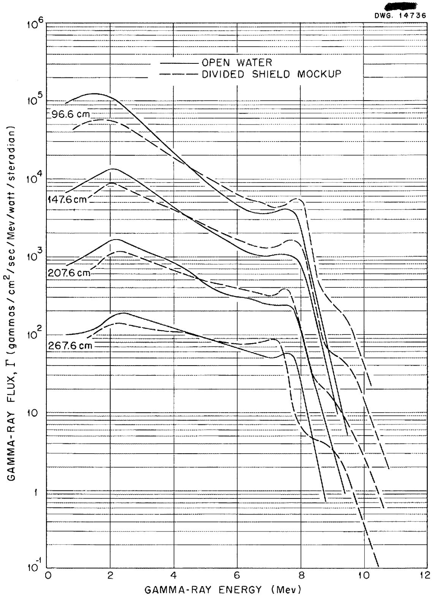  
Fig. 15. Gamma-Ray Flux as a Function of Energy and Distance from the Bulk Shielding Facility Reactor.

# AIR-SCATTERING EXPERIMENTS

During preparation of the Tower Shielding Facility Proposal, the question arose as to whether a meaningful experiment on a divided shield that would include the effect of air scattering into the crew box could be carried out in the Bulk Shielding Facility. An experiment was devised(6) to determine the attenuation of the radiation leaving the sides of the reactor shield, scattering in air, and penetrating the side wall of the crew shield. The results of this experiment were compared with the standard divided-shield design of the ANP Shielding Board.(1)

Shield Arrangement. The standard divided-shield design is shown in Fig. 16, and the experimental arrangement is shown in Fig. 17. The water level of the pool was lowered to a predetermined distance above the Bulk Shielding Reactor to mock up a given reactor side shield thickness for the standard design. Some of the radiation leaving the surface of the water above the reactor was scattered in air and reflected down into the water about 5 meters away where measurements were made. By lowering a counter under the water to a given depth, the attenuation of the side wall of the crew shield could be simulated.

Three lead slabs with a total thickness of 4.5 in. were placed in front of the reactor so that the tops of the slabs were at an angle to the center of the Bulk Shielding Reactor that corresponded to the angle of interception of the gamma rays by the lead in the divided-shield design. The lead slabs plus the approximately 5 meters of water essentially blacked out the direct beam of both neutrons

and gamma rays toward the point of measurement.

Radiation Dosage at Crew Compartment. The experimental results are shown in Figs. 18 and 19. Data were taken at 30, 60, and 90 cm above the active core of the reactor. In Fig. 18 the neutron-dosage rate is plotted against the distance of the counter from the water surface. As the counter went below the water surface a sharp break in each curve was noted and the break was taken to define the position of the surface of the water. Similar data for gamma-ray dosage is shown in Fig. 19. The uncorrected data are given elsewhere.(6)

As can be seen in the standard design (Fig. 16), the thickness of the reactor shield side wall was $113~\mathrm{cm}$ , which is equivalent to $116~\mathrm{cm}$ of water if corrections for the fast-neutron cross sections of beryllium carbide, iron, and gasoline are made. Since it was necessary to run the reactor at its maximum power to obtain data with $90~\mathrm{cm}$ of water over the reactor, the neutron data were extrapolated to $116~\mathrm{cm}$ , as shown in Fig. 18. At the position of the detector below the water corresponding to the thickness of the side wall of the crew shield the dose was $8 \times 10^{-8}$ mrep/hr/w.

For the gamma-ray measurements the effective thickness of the reactor shield side wall was obtained from the $\rho t$ (density times thickness) of the standard design, which was $142\mathrm{g / cm}^2$ (Fig. 16). Since this is equivalent to $142\mathrm{cm}$ of water, the gamma-ray data were extrapolated to that value (Fig. 19). The value observed through $17.8\mathrm{cm}$ of water at the crew position was $5.4\times 10^{-7}\mathrm{r / hr / w}$ without any lead. Referring to Fig. 16, it can be seen that the standard design called for $1.54\mathrm{cm}$ of lead on the

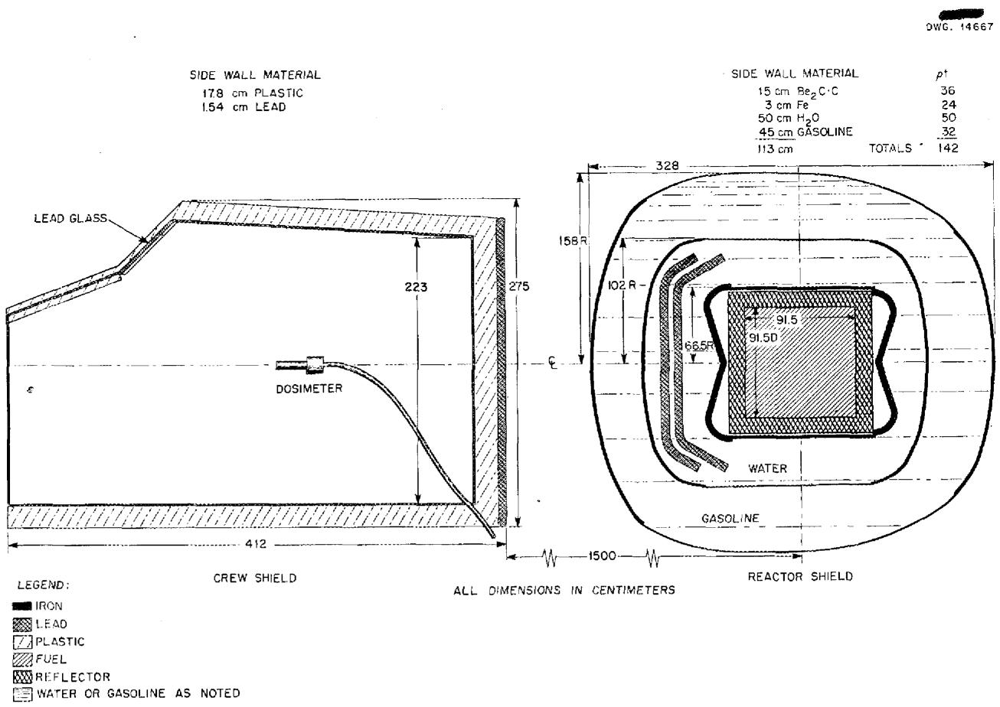

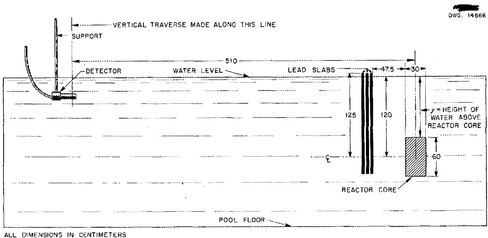  
Fig. 16. Standard Divided Shield Design.   
Fig. 17. Arrangement for Air-Scattering Experiment.

inside of the plastic wall of the crew shield.

Attenuation of Gamma Rays by Lead. A separate experiment was performed to determine the attenuation of the

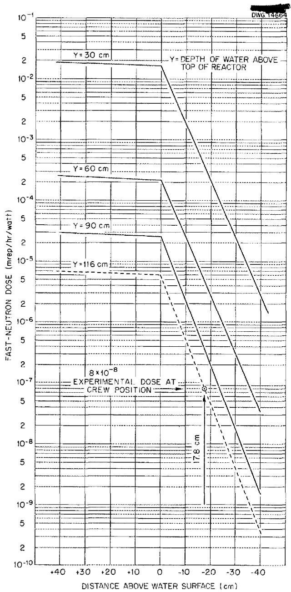  
Fig. 18. Air-Scattering Experiment Fast-Neutron Dosimeter Readings at Crew Position for Various Reactor Shield Thicknesses.

gamma rays by the lead. An 18-in.-dia water-tight container for an anthracene-crystal gamma-ray counter was constructed. The container had 3 in. of lead on the sides, 1 in. of lead on the bottom, and a thin aluminum top. Sheets of lead varying in thickness up to 1 in. were placed on top of the container, and for each lead thickness the assembly was lowered 17.8 cm below the surface of the water at the simulated crew position. The resulting curve for lead absorption is shown in Fig. 20.

Comparison of Experiment with Standard Design Conditions. The standard design specified (1) that 21.5 mrep/hr of neutrons and 0.25 r/hr of gamma rays would be received through the side walls of the crew compartment with the reactor at 200 megawatts of power. In order to compare the experimental data with the standard design specifications, it was necessary to calculate a scale-up factor.

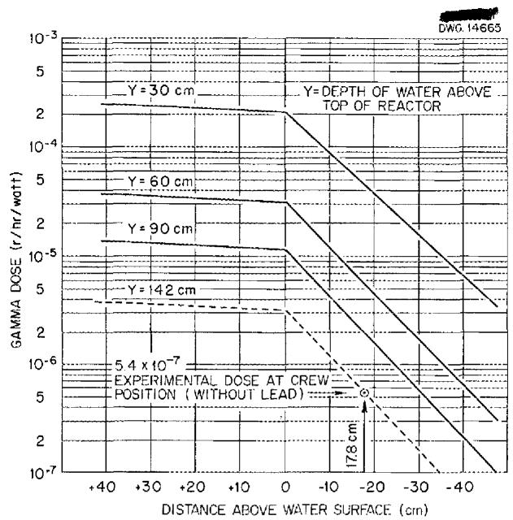  
Fig. 19. Air-Scattering Experiment Gamma-Ray Dosage Readings at Crew Position for Various Reactor Shield Thicknesses (No Lead at Crew Position).

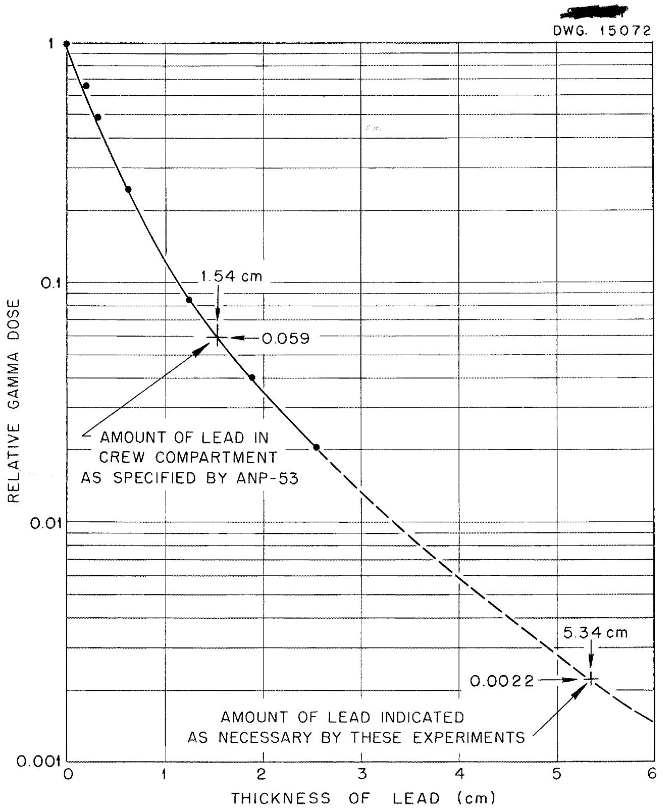  
Fig. 20. Air-Scattering Experiment Gamma-Ray Attenuation by Lead at Crew Compartment.

If

$$
\phi = \text {n e u t r o n d o s e , m r e p / h r / w , a s}
$$

$$
\Gamma = \begin{array}{l} \text {g a m m a d o s e , r / h r / w , a s m e a s u r e d} \\ \text {i n t h e e x p e r i m e n t ,} \end{array}
$$

$$
D _ {n} = \text {a i r p l a n e n e u t r o n d o s e , m r e p / h r} \\ \text {a t} 2 \times 1 0 ^ {8} w,
$$

$$
D _ {\gamma} = \begin{array}{l} \text {a i r p l a n e g a m m a - r a y d o s e ,} \\ \text {r / h r} \\ \text {a t 2 \times 1 0 ^ {8} w ,} \end{array}
$$

then

$$
D _ {n} = \phi \frac {A _ {a}}{A _ {b}} \frac {L _ {a}}{L _ {b}} \sqrt {\frac {r _ {s}}{r _ {a}}} P _ {a} \frac {d _ {b}}{d _ {a}},
$$

where

$$
\frac {A _ {a}}{A _ {b}} = \text {r a t i o o f e f f e c t i v e s o u r c e} \quad \text {a r e a s e x p o s e d (e x p l a i n e d} \quad \text {b e l o w)} = 1 6,
$$

$$
\frac {L _ {a}}{L _ {b}} = \text {r a t i o o f l e a k a g e s p e r w a t t} = 0. 2,
$$

$$
\begin{array}{r l} \sqrt {\frac {r _ {s}}{r _ {a}}} & = \text {c o r r e c t i o n f a c t o r f o r t h e} \\ & \text {l e a k a g e f r o m a c y l i n d r i c a l} \\ & \text {s h i e l d s u r f a c e i n s t e a d o f a} \\ & \text {p l a n e s u r f a c e = 1 . 8 ,} \end{array}
$$

$$
P _ {a} = \text {a i r c r a f t r e a c t o r p o w e r} = 2 \times 1 0 ^ {8} \mathrm {w},
$$

$$
\frac {d _ {b}}{d _ {a}} = \begin{array}{l} \text {c o r r e c t i o n , b a s e d o n s i n g l e} \\ \text {s c a t t e r i n a i r , f o r t h e} \\ \text {f a c t t h a t t h e s e p a r a t i o n} \\ \text {d i s t a n c e i n t h e e x p e r i m e n t i s} \\ 5 \text {m e t e r s i n s t a n d o f 1 5 m e t e r s} \\ \text {a s i n t h e a i r p l a n e .} \end{array}
$$

$A_{a}$ is the area of the cylindrical side surface of the airplane reactor, and $A_{b}$ is the area of the top of the Bulk Shielding Reactor. In the experiment the only radiation escaping upward through the surface of the

water is assumed to have originated on the top area of the reactor. This is to be compared with the radiation emerging from the cylindrical side surface of the airplane reactor (not including the front and rear surfaces). As discussed in more detail elsewhere, (6) the ratio of areas was found to be 16.

In the unit shield report(7) the ratio of the leakages per watt for the airplane reactor and the Bulk Shielding Reactor was found to be about 0.2. $r_{a}$ is the aircraft reactor radius and $r_{s}$ is the aircraft reactor shield radius. The factor $\sqrt{r_{s} / r_{a}}$ is a correction to take into account the fact that the airplane shield is cylindrical, whereas the Bulk Shielding Reactor shield is flat.(6) Applying all the corrections,

$$
\frac {A _ {a} L _ {a}}{A _ {b} L _ {b}} \sqrt {\frac {r _ {s}}{r _ {a}}} P _ {a} \frac {d _ {b}}{d _ {a}} = 3. 8 \times 1 0 ^ {8}.
$$

This should be an upper limit. The best estimates of the amount of scattering from the walls of the pool, reactor bridge structure, etc., indicate that wall-scattered radiation was 2 or 3 times the air-scattered radiation for the experiment for both neutrons and gamma rays. A lower limit on the scale-up factor is then $1.3 \times 10^{8}$ with a most probable value of around $2.1 \times 10^{8}$ . By using the latter value for the calculations:

$$
D _ {n} = (2. 1 \times 1 0 ^ {8}) \phi ,
$$

and since $\phi$ was measured to be $8 \times 10^{-8}$ mrep/hr/w,

$$
D _ {n} = 1 6. 8 \mathrm {m r e p / h r}.
$$

This compares reasonably well with the specified dose of 21.5 mrep/hr.

In converting the experimental gamma-ray dose, $\Gamma$ , to the airplane dose, $D_{\gamma}$ , an additional factor, $f(Pb)$ , must be introduced for the attenuation of the lead inside the crew shield:

$$
D _ {\gamma} = \Gamma \frac {A _ {a}}{A _ {b}} \frac {L _ {a}}{L _ {b}} \sqrt {\frac {r _ {s}}{r _ {a}}} P _ {a} \frac {d _ {b}}{d _ {a}} f (P b),
$$

$$
D _ {\gamma} = \Gamma (2. 1 \times 1 0 ^ {8}) f (P b).
$$

The experimental gamma-ray dose, $\Gamma$ , was $5.4 \times 10^{-7} \mathrm{r/hr/w}$ through 17.8 cm of water, and if the specified value of 0.25 r/hr is used for $D_{\gamma}$ , the factor by which the lead should attenuate the gamma rays can be found; that is,

$$
\begin{array}{l} f (P b) = \frac {D _ {\gamma}}{\Gamma^ {7} \left(2 . 1 \times 1 0 ^ {8}\right)} = \frac {0 . 2 5}{5 . 4 \times 1 0 ^ {- 7} \times 2 . 1 \times 1 0 ^ {8}} \\ = 2. 2 \times 1 0 ^ {- 3}. \\ \end{array}
$$

Inspection of Fig. 19 shows that $5.34\mathrm{cm}$ of lead is required to attenuate the gamma rays by this amount. The standard design specified $1.54\mathrm{cm}$ of lead, which would give an attenuation of $5.9 \times 10^{-2}$ . The gamma dose in the standard design would therefore be too large by a factor of about 27. The additional lead required if it were placed inside the crew compartment is $3.8\mathrm{cm}$ . This much lead would weigh approximately 25,000 pounds. Perhaps considerable savings in weight could be made by placing the lead in the reactor shield. The experiment gave no information concerning such a disposition of the lead.

The approximations made in converting the experimental dosage rate to that expected in the airplane

configuration are admittedly crude. Furthermore, the effect of the walls of the pool and building in scattering the radiation back to the point of detection has not been determined. However, the disconcerting fact remains that the neutron data is in rough agreement with the calculations of the Shielding Board, whereas the gamma-ray dosage appears to be high by a factor, which, while less than 50, seems to be at least as high as 15. Further experiments, at 100 kw reactor power, are contemplated to verify or correct this high factor.

# DETERMINATION OF THE ALBEDO OF NEUTRONS AND GAMMA RAYS

To aid in the calculations of backgrounds at the proposed Tower Shielding Facility several short experiments were performed to determine the reflection of neutrons and gamma rays. By using a neutron source and the fast-neutron dosimeter shown in Fig. 21, measurements were made with the source and counter at varying heights above the concrete floor in the Bulk Shielding Reactor.

By using the relation(9)

$$
F = \frac {\alpha N _ {0}}{1 0 \pi d ^ {2}},
$$

where $F$ is the scattered flux, $N_{0}$ is the source strength, and $d$ is the distance above the floor, the albedo, $\alpha$ , for neutrons was found to be 0.12 for concrete. A similar experiment in which an ion chamber and a Co source with lead shielding was used gave the reflection coefficient of gamma rays on concrete as 0.04.

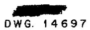

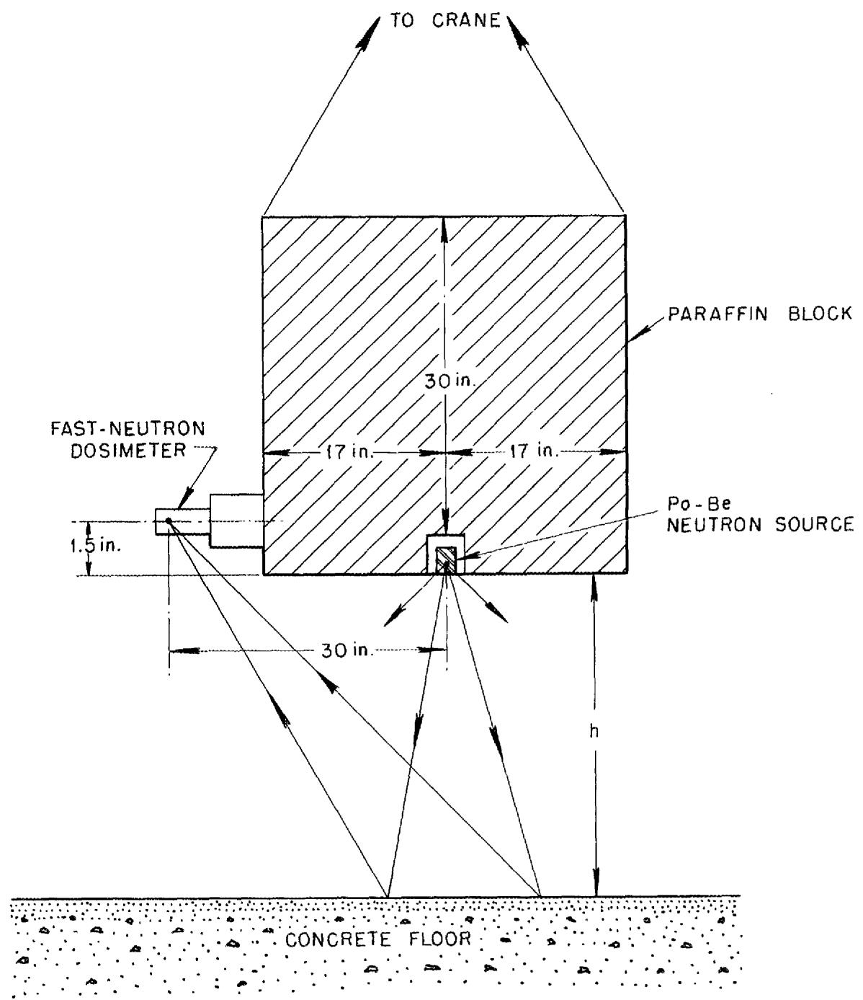  
Fig. 21. Arrangement of Apparatus for Albedo Experiment.

# ANP PROJECT QUARTERLY PROGRESS REPORT

# IRRADIATION OF ANIMALS

In the interest of determining the threshold for eye cataract formation, time on the Cockcroft-Walton accelerator has been furnished to members of the Biology Division for exposures of rats, mice, and rabbits to source intensities of $10^{8}$ neutrons/sec with 14-Mev energy. Approximately 60 hr of irradiation time on the machine has been used for these experiments during this quarter. Results will be published by members of the Biology Division. This irradiation program will continue.

# IRRADIATION OF ELECTRONIC EQUIPMENT

In cooperation with the Solid State Division and the Wright Air Development Center, the Bulk Shielding Reactor is being used on week ends to irradiate electronic equipment. Reactor operators furnished by the Air Force have been trained by ORNL personnel. The first piece of equipment, a radio compass, has been exposed for 100 hr to a fast-neutron flux of between $10^{7}$ and $10^{8}$ neutrons/sec with no appreciable effect. Detailed results will be reported by the Solid State Division.

# 7. GAMMA-RAY ATTENUATION EXPERIMENTS IN THE LID TANK

C. E. Clifford M. K. Hullings

T. V. Blosser L. S. Abbott

J. D. Flynn M. C. Marney

Physics Division

A series of short experiments on the gamma-ray attenuation of heavy materials (iron and lead) in regions close to the source have been completed in the Lid Tank. The experiments planned to aid in the design of both thermal and shadow shields for various aircraft reactors were necessary because of the difficulty of calculating the production of neutron-induced secondary gamma rays in these regions.

# 63% IRON-37% WATER THERMAL SHIELD

Specific shield configurations requested by Goldstein of NDA for possible use in the supercritical-water reactor are shown as part of Figs. 22 through 26. The iron-water mixtures were placed at various distances from the source to simulate the varying water-reflector thicknesses present in the reactor design; although the reactor is cylindrical, it is surrounded by a spherical pressure shell and thermal shield.

The shield configurations were mocked up with one to six 2.22-cm iron slabs separated by 1.3 cm of water, and they were placed at various distances from the source. In each series the sixth slab was moved forward to touch the preceding slab to simulate a pressure shell, as shown in Fig. 26. The measurements were made with both an air-filled ionization chamber and an anthracene scintillation counter.

Figure 27 indicates the gamma-ray dosage distribution in water, and Figs. 22 through 26 give the gamma-ray measurements behind the iron-water thermal shields. A curve of the dose at a constant $z$ (distance from the source) as a function of the water thickness between the source and the nearest iron slab (referred to as reflector thickness) is also shown. The tabulated "z measurements to back of last slab" (inset in each figure) are probe measurements of the distance from the source to the back of the last slab in each array. As would be

expected, the data indicate that for thick thermal shields the secondary gamma-ray production is predominant up to rather large reflector thickness (i.e., 20 cm).

# 63% IRON-37% BORATED WATER THERMAL SHIELD

A study of the effect of borating the water in the region of the thermal shield was made to determine the resulting reduction of secondary gamma-ray production (Figs. 28, 29, 30). The configurations were chosen to match the neutron and gamma-ray leakage in the Lid Tank with that of the reactor on the basis of a calculation by Goldstein. A scale-up factor was also calculated and used to determine the required Lid Tank dosage beyond the thermal shield. The 2.22-cm iron slabs were separated by the borated water, and since sufficient attenuation was obtained with a four-slab (27% borated water) thermal shield, attenuation of the pressure shell (two adjacent slabs) was then measured (Fig. 30). The measurements were made with the $10^{10}$ ionization chamber (air-filled).

A comparison of attenuation of the borated-water thermal shield with that of the unborated-water shields previously measured indicates that at this reflector thickness (20 cm) a reduction in intensity to 70% of the iron-water case (at $z = 80 \, \text{cm}$ ) was obtained. The reduction of intensity as the water reflector thickness was increased to 30 cm indicates that secondary gamma-ray production is not entirely suppressed by the 1% boration of the thermal shield water. This is not surprising in view of the large volume percentage of iron in this region. There may also be some inelastic scattering of gamma rays, which would of course not be affected by the boron.

# SOLID IRON THERMAL SHIELD IN WATER

As a continuation of the thermal shield investigation, the gamma-ray attenuation of a 9-cm iron thermal shield was measured for the GE-ANP design group. Four 2.2-cm iron slabs were clamped together and placed in the Lid Tank at various distances from the source, as indicated in Fig. 31. Since the iron slabs are not flat, water (approximately 0.3 cm) was present in the space between adjacent slabs.

The measurements presented in Fig. 31 were obtained with the usual air-filled ionization chamber, which is, unfortunately, neutron-sensitive owing to the nitrogen $(n,p)$ reaction. This invalidates the measurements close to the iron, but since the neutron relaxation length in water behind solid iron is short (4 to $6\mathrm{cm}$ ), the neutron effect should be negligible beyond about $30~\mathrm{cm}$ of water. Measurements that indicate the magnitude of the neutron effect and confirm the fact that it is negligible beyond $30~\mathrm{cm}$ have been made on similar mockups by using $\mathrm{CO}_{2}$ in the ionization chamber.

# SOLID LEAD SHADOW SHIELDS IN WATER

Measurements were taken in the Lid Tank at the request of GE-ANP to determine the effect of various water-reflector thicknesses on the gamma attenuation of solid lead shadow shields. Since the experiment was performed in water, a large amount of secondary gamma-ray production reduced the effectiveness of the lead by a factor greater than 40 in the worst case. As the thickness of the water layer between the source and the lead was increased, the secondary gamma-ray production was, of course, reduced at a rate equivalent to the neutron attenuation of the water.

# ANP PROJECT QUARTERLY PROGRESS REPORT

The gamma-ray measurements for the shadow shields consisting of one, two, and three adjacent 3.8-cm lead slabs are given in Figs. 32, 33, and 34. The "z measurements to back of last slab" are probe measurements and include water gaps caused by warpage of the slabs. In each case the water-reflector thickness was held constant

by wooden spacers inserted between the source and the first slab.

The gamma measurements were made with the $10^{10}$ ionization chamber. During the course of the experiment $\mathrm{CO}_{2}$ was substituted for air as the ion-chamber gas to eliminate the nitrogen $(n,p)$ reaction, since measurements were required in a high neutron flux.

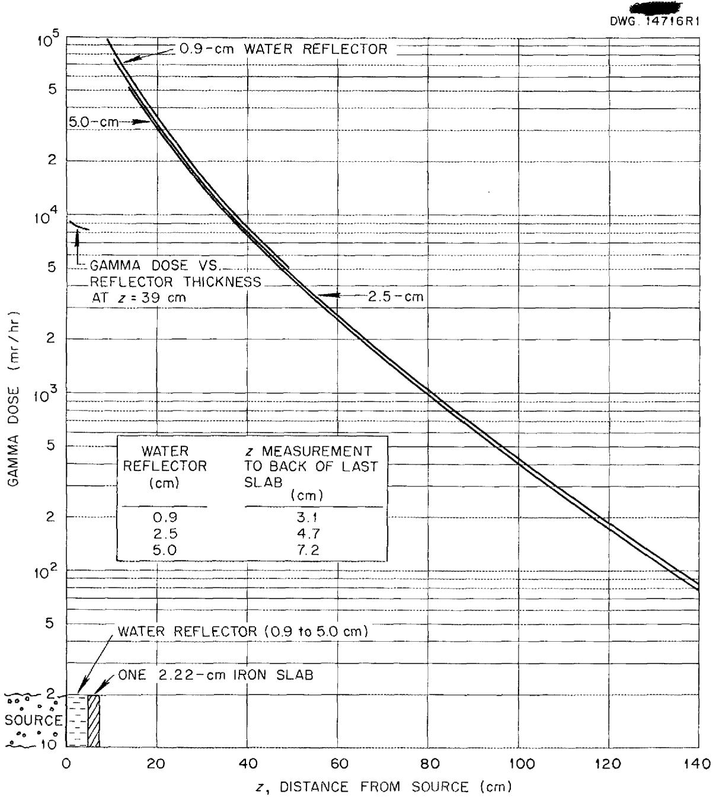  
Fig. 22. Thermal Shield Measurements - Gamma-Ray Dose Beyond One 2.22-cm Iron Slab with Various Water-Reflector Distances.

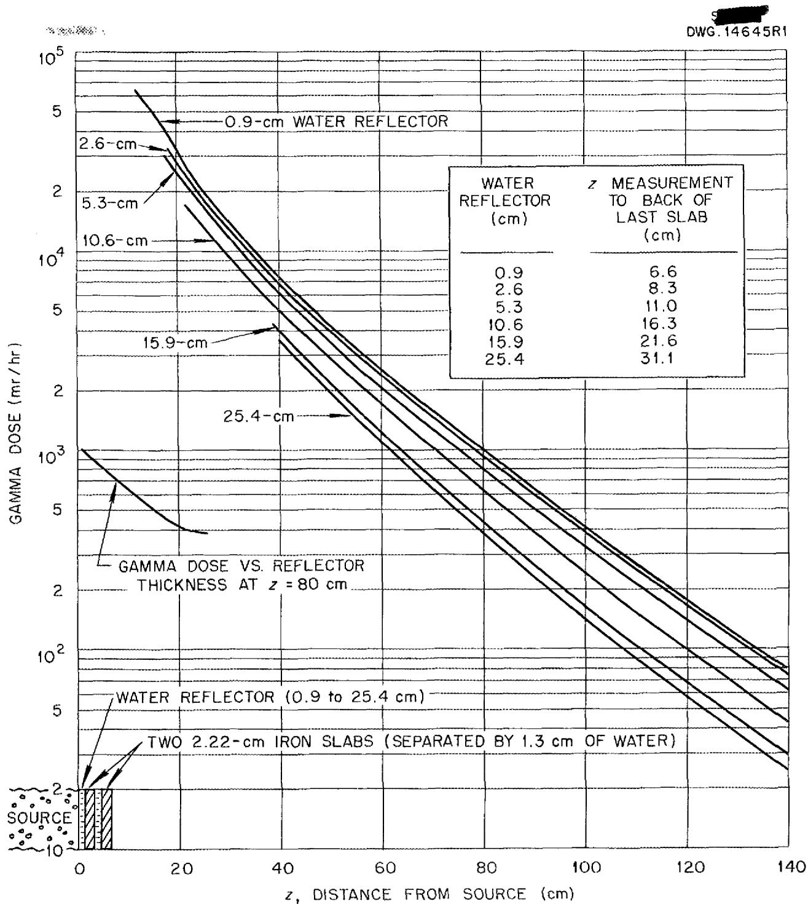  
Fig. 23. Thermal Shield Measurements - Gamma-Ray Dose Beyond Two 2.22-cm Iron Slabs (Separated by 1.3 cm of Water) with Various Water-Reflector Distances.

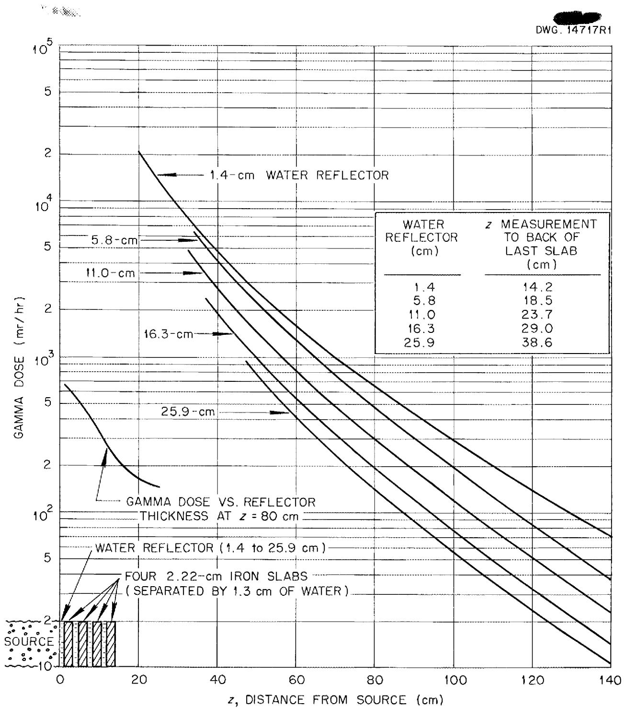  
Fig. 24. Thermal Shield Measurements - Gamma-Ray Dose Beyond Four 2.22-cm Iron Slabs (Separated by 1.3 cm of Water) with Various Water-Reflector Distances.

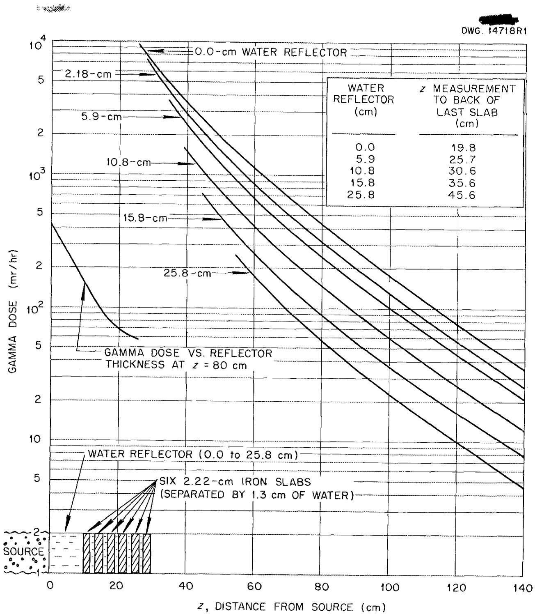  
Fig. 25. Thermal Shield Measurements - Gamma-Ray Dose Beyond Six 2.22-cm Iron Slabs (Separated by 1.3 cm of Water) with Various Water-Reflector Distances.

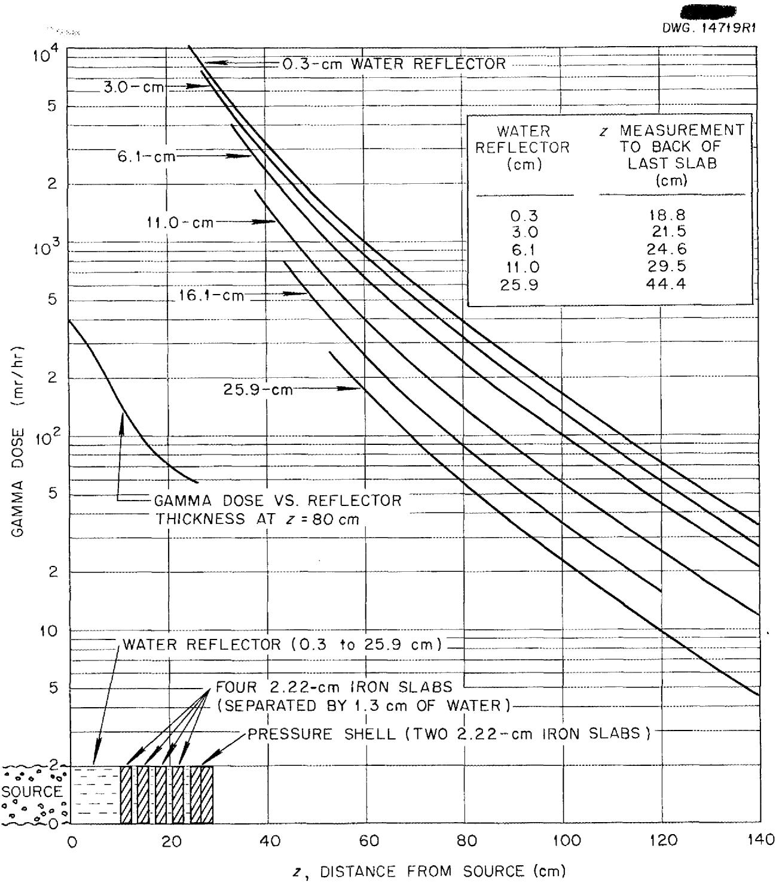  
Fig. 26. Thermal Shield Measurements - Gamma-Ray Dose Beyond Six 2.22-cm Iron Slabs (Four Slabs Separated by 1.3 cm of Water, Two Slabs Effecting a Pressure Shell) with Various Water-Reflector Distances.

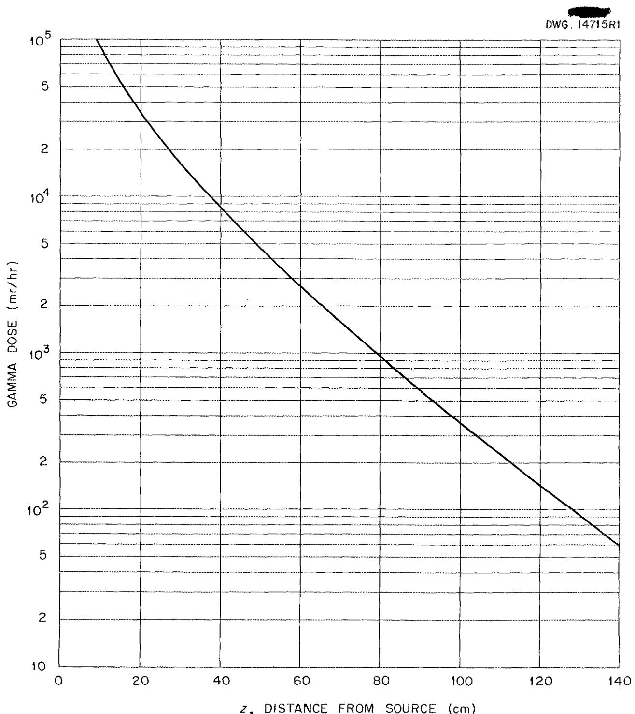  
Fig. 27. Gamma-Ray Dose Beyond Water Shield.

  
Fig. 28. Gamma-Ray Dose Beyond Iron-Borated Water Thermal Shield with 20-cm Water Reflector.

DWG.14905R1


  
FOUR 2.22-cm IRON SLABS SEPARATED

  
FOUR 2.22-cm IRON SLABS SEPARATED   
Fig. 29. Schematic Diagrams for Gamma-Ray Measurements Beyond Iron-Borated Water Thermal Shield. See Fig. 30 for plotted data.

  
Fig. 30. Gamma-Ray Dose Beyond Iron-Borated Water Thermal Shield (1% Boron Solution). See Fig. 29 for schematic diagrams.

  
Fig. 31. Gamma-Ray Dose Beyond Solid Iron Thermal Shield.

  
Fig. 32. Thermal Shield Measurements - Gamma-Ray Dose Beyond One 3.8-cm Lead Slab with Various Water-Reflector Thicknesses.

  
Fig. 33. Thermal Shield Measurements - Gamma-Ray Dose Beyond Two 3.8-cm Lead Slabs with Various Water-Reflector Thicknesses.

  
Fig. 34. Thermal Shield Measurements - Gamma-Ray Dose Beyond Three 3.8-cm Lead Slabs with Various Water-Reflector Thicknesses.

# 8. DUCT TESTS

F. J. Muckenthaler

A. Simon

C. E. Clifford

M. K. Hullings

Physics Division

Duct work in the Thermal Column(1) has continued to obtain further experimental corroboration of the simplified duct theory(2) of neutron transmission through cylindrical air-filled ducts in water. Measurements have been made on ducts with two and three bends to supplement the data previously reported on straight ducts and ducts with one bend. Some effort has been made to determine what portion of the flux measured by the counter is due to neutrons suffering at least one collision in the walls of a straight duct; the measured contribution appears to be somewhat higher than was predicted theoretically. Agreement with the theory has remained good; however, the value of the constant $\lambda$ , which concerns the albedo at the corners and other factors assumed to be constant, had to be redetermined.

An extensive survey of the radiation transmitted by the annular air ducts designed by G.E. has been started. The lid Tank will be used for this survey for approximately six weeks.

# DUCT TESTS IN THE THERMAL COLUMN

Straight Ducts. Various lengths of a straight, 4 l/4-in.-dia aluminum-wall (1/8 in. thick) duct were measured. A circular fission source (4 3/8 in. in diameter) was used for all the 4 l/4-in.-dia duct measurements. Typical curves for the neutron transmission measured along an extension of the duct center lines are given in Fig. 35.

  
Fig. 35. Neutron Transmission Through Water in Cylindrical Ducts with Variable Bends.

  
Fig. 36. Configurations of 4 1/4-in.-ID Air Ducts, 20-in. Straight Sections, and 45-deg Bends (Aluminum Walls).

Ducts with Bends. Neutron measurements were made on the 41/4-in.-dia ducts with one to three bends formed by 20-in. straight sections joined at 45 deg angles. Further experimental data for the angular correlation were obtained by using three ducts with single sharp bends of various angles (31, 65, and 90 deg). Typical duct configurations are shown in Fig. 36.

To prevent neutrons from traveling the full length of the ducts in air without scattering at the bend, the smallest angle of bend afforded more than a one-diameter displacement of the center of the duct. Measurements of the neutron transmission along the duct center lines are given in Fig. 37.

Wall-Scattering Experiment. The duct transmission theory that has been used ignores all wall-scattering except at the bends, so the attenuation of each straight section is proportional to the square of its length. If single scattering in the walls of the

  
Fig. 37. Measurement of Thermal-Neutron Flux as a Function of the Level of the Water Surrounding the Duct.

straight sections is considered, a component attenuated according to the cube of the length should be added. Therefore, an experiment was carried out to investigate the magnitude of the inverse-cube component.

A 6-in.-dia by 36-in. duct (plastic wall) and a fission source (6 in. in diameter) were mounted in the Thermal Column water tank so that the level of the water surrounding the vertical duct could be varied. A counter was mounted $10\mathrm{cm}$ from the upper end of the duct and surrounded by a small volume of water, as shown in Fig. 38. The neutron flux was then measured as a function of the depth of water around the duct.

A second set of measurements was made with the upper two-thirds of the duct filled with water. This prevented

  
Fig. 38. Duct Configuration for Wall-Scattering Experiment.

the neutrons that would ordinarily travel the length of the duct in air from reaching the counter. The difference of the two curves should give the flux contributed by scattering in the walls.

According to calculations(2) the ratio of the flux contributed to the counter by the neutrons that make one collision in the walls to those which travel the full length of the duct directly in air is approximately equal to $\pi r / 2L$ , where $r$ is the radius of the duct and $L$ is the length. For a 6-in.-dia by 36-in. duct the ratio should be approximately 0.15, which is about a factor of 3 lower than the ratio found in the experiment. The curve in Fig. 37 shows that the contribution is not linear but peaks at the end of the duct farthest from the source.

Comparison with Theory. The results of the measurements with both the straight and bent aluminum-wall ducts indicate good agreement with the theory (Fig. 39). If agreement were perfect, all the curves in Fig. 39 would coincide. The spread indicates the errors in predictions of attenuations, which in some cases are as much as 10. A new value for $\lambda$ , the constant independent of duct geometry, has been obtained that gives a better prediction of the transmitted dose. The redetermination of $\lambda$ was necessary because of the two- and three-bend experimental results.

Preliminary measurements of the wall-scattered components are higher than was predicted by the theory. The discrepancy is for the most part the result of degradation in energy of the neutrons. Since thermal measurements were made, the degraded neutrons were

counted efficiently. The position of the counter was approximately 10 cm from the end of the duct to correspond to the 10-cm point used in the previous duct measurements. Calculations of the scattered components for these points were also high compared with the theory. If, however, the 20-cm points of the previous duct measurements are compared with the theory, the agreement is markedly improved, which is in accordance with the above reasoning.

Except for the three points nearest the source, the shape of the curve shown in Fig. 37 is about what would be expected. Failure of the initial points to agree with the theory is not understood, and plans are being made to repeat this experiment under different conditions.

# GE-ANP ANNULAR AIR DUCTS

Mockups of the inlet and outlet air ducts that penetrate the shield in the G-E direct-cycle design have been supplied by G.E. for a Lid Tank experiment. Measurements will be made to provide complete neutron and gamma-ray isodose plots in the water shield surrounding the duct. Such plots will indicate points of excessive leakage that may require additional shielding.

A schematic diagram of the outlet air duct is shown in Fig. 40. The steel section between the source and the duct consists of alternate 1 1/2-in. air and water layers perpendicular to the source and simulates the transition region (perforated reflector) in the reactor design. A photograph of the inlet air duct and transition region is shown in Fig. 41.

  
Fig. 39. Comparison of Calculated Effective Source for Cylindrical Ducts in Water.

  
Fig. 40. Schematic Diagram of GE-ANP Mockup of Outlet Air Duct.

  
Fig. 41. GE-ANP Mockup of Inlet Air Duct.

# ANP PROJECT QUARTERLY PROGRESS REPORT

# 9. NUCLEAR MEASUREMENTS

A. H. Snell, Physics Division

The total neutron cross section of $\mathbf{Li}^6$ has been measured up to 4 Mev on the 5-Mev Van de Graaff. The measurements show only one resonance, which is at $270\mathrm{kv}$ . The time-of-flight neutron spectrometer has been operating satisfactorily with a full resolution width of less than $1.2\mu \mathrm{sec / meter}$ .

# CROSS-SECTION MEASUREMENTS WITH VAN DE GRAAFF ACCELERATOR

H. B. Willard, Physics Division

The total neutron cross section of $\mathbf{L}\mathbf{i}^6$ has been measured on the 5-Mev Vande Graaff by a transmission experiment. In this experiment the lithium sample was $89\%$ $\mathbf{L}\mathbf{i}^6$ , but the resulting data has been corrected for the $\mathbf{L}\mathbf{i}^7$ . The cross-section curve up to 4 Mev is shown in Fig. 42. Only one resonance, which is at $270~\mathrm{kv}$ , was observed in this energy range.

Preliminary measurements of the fission cross section of $\mathbf{U}^{234}$ have

been made up to 4 Mev. In addition detailed information on the $\mathbf{T}(p,\gamma)\mathbf{H}\mathbf{e}^{\mathbf{4}}$ reaction, the $\mathbf{B}''(p,n)''$ angular distribution, the $\mathbf{C}^{13}(p,n)\mathbf{N}^{13}$ yield, and the $(p,n)$ thresholds in neon is reported in the Physics Division quarterly progress report.(1)

# TIME-OF-FLIGHT SPECTrometer

G. S. Pawlicki E. C. Smith Physics Division

The neutron time-of-flight spectrometer has been operating satisfactorily with a full resolution width of less than $1.2\mu \mathrm{sec / meter}$ . Isotopic assignment of the levels of indium has been reported.(1) Preliminary measurements indicate levels in copper at $700\pm 100$ and $2200\pm 600$ ev. Measurements of the cross sections of the uranium isotopes are in progress.

  
Fig. 42. Total Neutron Cross Section of $\mathbf{L}\mathbf{i}^6$ .

Part III

MATERIALS RESEARCH

# SUMMARY AND INTRODUCTION

The research on high-temperature liquids has been devoted almost entirely to the development of a satisfactory fluoride fuel for the aircraft reactor experiment (sec. 10). The phase diagrams of numerous binary, ternary, and quaternary fluoride systems have been examined, and a number of compositions in the NaF-ZrF $_4$ -UF $_4$ and NaF-KF-ZrF $_4$ -UF $_4$ systems with as much as 4 mole % UF $_4$ have been shown to have melting points around $500^{\circ}\mathrm{C}$ . Although it is not certain that either of these fluoride mixtures can be used with the envisioned loading technique, preliminary data are encouraging. A substantial program of research and pilot-scale production of liquid fuels of high purity and a study of high-temperature transfer methods have recently been initiated.

The corrosion research effort was divided among static and dynamic tests of fluorides, hydroxides, and liquid metals, with the fluoride corrosion tests predominating (sec. 11). Static tests and the modified dynamic tests (seesaw tests) that have been developed are useful for screening a large number of samples but are inadequate for precisely predicting the corrosiveness of a circulating liquid. However, the tests have shown that small additions of sodium, potassium, manganese, and calcium are beneficial in minimizing fluoride corrosion.

Various fluoride mixtures were circulated in thermal convection loops during the past quarter. Stainless steel loops generally plug after short periods, whereas Inconel loops consistently operate for up to 1000 hours. Some reduction in dynamic fluoride corrosion has been obtained as a

result of improved fluoride- and loop-preparation techniques. Fluoride attack on Inconel is believed to be the result of chromium diffusion out of the metal lattice. A considerable program of corrosion research on both hydroxides and fluorides has been undertaken.

The metallurgical processes involved in the construction and assembly of a high-temperature reactor, including fabrication of control rods, welding and brazing, and fabrication of solid fuel elements, are being successfully developed (sec. 12). Brazing alloys were tested for flowability, corrosion resistance, and joint strength, and the $60\%$ Pd- $40\%$ Nialloy proved superior in a fluoride environment. Powder mixtures of $\mathbf{B}_4\mathbf{C}$ with Fe and with $\mathrm{Al}_{2}\mathrm{O}_{3}$ are being hot pressed for the safety and regulating rods, respectively, of the ARE. Loose-powder sintering has been investigated as a technique for the fabrication of solid fuel elements.

Heat transfer and physical property measurements on the various fluorides have continued, together with some measurements on hydroxides (sec. 13). Determinations of viscosity, thermal conductivity, density, heat capacity, and vapor pressure have been made on several fluoride mixtures. It is apparent that the physical properties of the $\mathrm{ZrF_4}$ -bearing fuels are compatible with reactor design requirements. In particular, the viscosity, which was so high in the NaF-BeF $_2$ -UF $_4$ fuel mixture as to necessitate its rejection, is less than 10 centipoises for the NaF-KF-ZrF $_4$ -UF $_4$ fuel mixture at all reactor temperatures. Mathematical analyses pertaining to circulating fuel heat transfer systems have been developed. A measurement of the heat

transfer coefficient of molten sodium hydroxide showed it to be similar to that of ordinary fluids rather than liquid metals.

Pile irradiations of proposed fuel mixtures in Inconel capsules comprised the greater part of the effort on the radiation damage program, although measurements have continued on inpile creep and thermal conductivity of metals (sec. 14). Irradiation of Inconel capsules containing the NaF-KF-UF4 fuel mixture at power

densities considerably in excess of that to be found in the ARE caused an increased rate of attack on the container. However, similar capsules containing $\mathrm{BeF}_2$ -bearing fuels showed no positive evidence of radiation-induced corrosion. An increase in the secondary creep rate of irradiated Inconel similar to that previously observed in nickel and stainless steel was found. No detectable change was observed in the thermal conductivity of irradiated specimens of specially heat-treated Inconel or nickel.

# 10. CHEMISTRY OF HIGH-TEMPERATURE LIQUIDS

W. R. Grimes

Materials Chemistry Division

Research on high-temperature liquids has been concerned almost entirely with their development for use as fuels for an aircraft reactor. In addition, some effort has been devoted to the purification of alkali hydroxides and the determination of the high-temperature properties of these materials. The principal research work has been the phase equilibrium studies necessary to define the optimum concentration of the fuels, and, in conjunction with others, the determination of the physical properties and corrosiveness of these high-temperature systems. It has also been necessary to intensify the efforts to identify chemical species in the cooled melts by x-ray diffraction and other techniques.

Research on liquid fuels is still directed toward development of low-melting-point solutions of $\mathbf{U}\mathbf{F}_{4}$ in mixtures of permissible fluorides. The experimental reactor (the ARE) will require about 16 lb of $\mathbf{U}^{235}$ per cubic foot of fuel solution, so it will be necessary to incorporate about 4 mole % of $\mathbf{U}\mathbf{F}_{4}$ in the fluoride fuel.

A number of compositions in the NaF-ZrF $_4$ -UF $_4$ and NaF-KF-ZrF $_4$ -UF $_4$ systems with as much as 4 mole% UF $_4$ have been shown to melt below $550^{\circ}\mathrm{C}$ . In addition, it has been demonstrated that the viscosity of typical mixtures of these materials is sufficiently low for successful operation (cf., sec. 13). For easy startup, it is necessary to fill the reactor with a dilute (subcritical) fuel and add small increments of a concentrated solution to bring the system to criticality. This requires that solutions of widely varying uranium content and melting points considerably below the operating range be available and that no high-melting-point compounds be formed at intermediate concentrations. It is not yet certain, although preliminary data are encouraging, that the NaF-KF-ZrF $_4$ -UF $_4$ system meets this requirement.

A substantial program of research and pilot-scale production of liquid fuels of high purity and a study of high-temperature transfer methods have recently been initiated. A smaller program for the study of

chemical reactions of high-temperature fluorides and hydroxides is presently concerned with reactions that may help to explain the corrosion behavior of these liquids. Toward this end, a quenching apparatus for studying solid phases in the NaF-BeF $_2$ -UF $_4$ system has been placed in operation, and x-ray examination of complex mixtures in the NaF-KF-ZrF $_4$ system has yielded valuable information as to species present.

Experimental preparation of simulated fuel for the cold critical experiment has been continued. Specifications for the powdered mixture can be completed as soon as the actual ARE fuel composition is fixed.

# LOW-MELTING-POINT FLUORIDE FUEL SYSTEMS

L. M. Bratcher R. E. Traber, Jr. C. J. Barton

Materials Chemistry Division

The high viscosity of the melts has virtually eliminated the $\mathrm{BeF}_2$ -bearing salt mixtures from consideration as ARE fuels, and the emphasis is now being placed on systems containing $\mathrm{ZrF}_4$ .

In the previous report(1) it was indicated, on the basis of very limited data, that the addition of 1 to 5 mole $\%$ UF $_4$ to systems containing ZrF $_4$ affected the melting point only slightly. Further investigation has shown that the addition of 1 or 2 mole $\%$ UF $_4$ depresses the melting point of most alkali fluoride-zirconium tetrafluoride mixtures slightly but that further additions produce an increase in melting point.

The first separation of a solid phase from these fused mixtures is frequently accompanied by a small thermal effect that makes detection of melting points by thermal analysis difficult. In several instances a second break, probably corresponding to a eutectic temperature, has been mistaken for the melting point. Some difficulty has been experienced with poor reproducibility of data. This may be due in part to sensitivity of the melting point to variances in the $\mathrm{ZrF_4}$ concentration in the fused mixtures. Loss of $\mathrm{ZrF_4}$ may result from both volatilization and conversion to zirconium oxide. These phenomena will be investigated in detail as soon as possible.

NaF-KF-ZrF4-UF. Most of the effort on ZrF4-bearing fuels has been concentrated on the NaF-KF-ZrF4-UF4 system, since preliminary studies indicated that it was most likely to produce a suitable fuel. Heating and cooling curves have been run on a large number of mixtures containing 4 mole% UF4 and varying concentrations of the other three fluorides. The rather small thermal effect noted when the first solids crystallize from these systems has encouraged the use of larger samples (200 to 300 g) in these studies. Zirconium tetrafluoride purified by vacuum sublimation was used in all the experiments reported.

The data in Table 3 show the expected melting points when 4 mole $\%$ $\mathrm{UF_4}$ is added to various mixtures in the NaF-KF-ZrF $_4$ system. The data are not sufficiently complete to state the optimum fuel composition at present. It is obvious, however, that fuels with melting points below $550^{\circ}\mathrm{C}$ can be obtained over fairly wide ranges of NaF-KF and ZrF $_4$ concentration. These studies are being continued to define the optimum concentration.

TABLE 3   
Melting Points of NaF-KF-ZrF4-UF4 Mixtures Containing 4 mole % UF4   

<table><tr><td colspan="3">COMPOSITION (mole %)</td><td rowspan="2">FIRST BREAK TEMPERATURE (°C)</td></tr><tr><td>NaF</td><td>KF</td><td>ZrF4</td></tr><tr><td>7.7</td><td>40.3</td><td>48.0</td><td>668</td></tr><tr><td>8.2</td><td>44.6</td><td>43.2</td><td>540</td></tr><tr><td>4.8</td><td>50.0</td><td>41.2</td><td>540</td></tr><tr><td>9.1</td><td>48.5</td><td>38.4</td><td>490 (?)</td></tr><tr><td>9.6</td><td>52.8</td><td>33.6</td><td>585</td></tr><tr><td>15.4</td><td>32.6</td><td>48.0</td><td>615</td></tr><tr><td>17.3</td><td>35.5</td><td>43.2</td><td>565</td></tr><tr><td>18.7</td><td>38.9</td><td>38.4</td><td>575</td></tr><tr><td>20.2</td><td>42.2</td><td>33.6</td><td>555</td></tr><tr><td>22.9</td><td>22.6</td><td>50.5</td><td>620</td></tr><tr><td>24.9</td><td>25.6</td><td>45.5</td><td>565</td></tr><tr><td>27.8</td><td>27.4</td><td>40.8</td><td>490</td></tr><tr><td>29.8</td><td>30.2</td><td>36.0</td><td>535</td></tr><tr><td>30.1</td><td>15.4</td><td>50.5</td><td>605</td></tr><tr><td>33.7</td><td>16.8</td><td>45.5</td><td>550</td></tr><tr><td>34.6</td><td>17.3</td><td>44.1</td><td>545</td></tr><tr><td>36.7</td><td>18.5</td><td>40.8</td><td>515</td></tr><tr><td>39.8</td><td>20.2</td><td>36.0</td><td>540</td></tr><tr><td>36.5</td><td>13.5</td><td>46.0</td><td>540</td></tr><tr><td>52.8</td><td>9.6</td><td>33.6</td><td>545</td></tr></table>

The data in Table 4 show the effect of large additions of $\mathbf{U}\mathbf{F}_{\mathbf{4}}$ to a single, ternary NaF-KF-ZrF $^4$ mixture. It appears from these data that the start-up operation could be safely conducted if the temperature were maintained at $700^{\circ}C$ and if concentrations of more than 25 mole $\%$ UF $^4$ were avoided at all times. In a similar study UF $^4$ was added as NaF-KF-UF $^4$ eutectic (46.5-26.0-27.5 mole $\%$ ) to a NaF-KF-ZrF $^4$ mixture (33-16.1-50.9 mole $\%$ ) in several proportions. No high melting points were observed at the intermediate compositions. These studies are encouraging, but they must be repeated when the final fuel composition is chosen.

Should it become possible to operate the ARE with a lower uranium content than now seems to be needed, the low-melting-point $(410^{\circ}\mathrm{C})$ composition previously reported $^{(2)}$ (4.9 mole % NaF, 51 mole % KF, 42.1 mole % ZrF $_4$ , and 2 mole % UF $_4$ ) would be quite important. It does not appear likely that compositions, of

TABLE 4   
Effect of $\mathbf{U}\mathbf{F}_4$ on the Melting Point of a NaF-KF-ZrF $^4$ Mixture   

<table><tr><td colspan="4">COMPOSITION (mole %)</td><td rowspan="2" colspan="4">BREAK TEMPERATURES* (℃)</td></tr><tr><td>NaF</td><td>KF</td><td>ZrF4</td><td>UF4</td></tr><tr><td>36</td><td>18</td><td>46</td><td>0</td><td>440,</td><td>425,</td><td>395</td><td></td></tr><tr><td>34.6</td><td>17.3</td><td>44.1</td><td>4.0</td><td>545,</td><td>493,</td><td>412</td><td></td></tr><tr><td>32.4</td><td>16.2</td><td>41.4</td><td>10.0</td><td>553,</td><td>505,</td><td>465,</td><td>405</td></tr><tr><td>30.6</td><td>15.3</td><td>39.1</td><td>15.0</td><td>585,</td><td>575,</td><td>500,</td><td>395</td></tr><tr><td>28.8</td><td>14.4</td><td>36.8</td><td>20.0</td><td>626,</td><td>580,</td><td>480,</td><td>400</td></tr><tr><td>27.0</td><td>13.5</td><td>34.5</td><td>25.0</td><td>663,</td><td>575,</td><td>495</td><td></td></tr></table>

*Highest break temperature considered most reliable indication of melting point.

any uranium concentration, melting below $400^{\circ}\mathrm{C}$ will be found in this system.

KF-ZrF4-UF. Only a few compositions in the KF-ZrF4-UF4 system, all with 4 mole % UF4, have been tested. Since all these mixtures showed melting points at about $600^{\circ}\mathrm{C}$ (about $150^{\circ}\mathrm{C}$ higher than the corresponding KF-ZrF4 binaries), it is not likely that a satisfactory fuel exists in this ternary system.

NaF-ZrF4-UF. The data obtained on the NaF-ZrF4-UF4 system, shown in Table 5, indicate that fuels containing up to 4 mole % UF4 and melting

TABLE 5   
Melting Points of NaF-ZrF4 Mixtures Containing 4 mole % UF4   

<table><tr><td colspan="2">COMPOSITION (mole %)</td><td rowspan="2">MELTING POINT (℃)</td></tr><tr><td>NaF</td><td>ZrF4</td></tr><tr><td>44.0</td><td>52.0</td><td>527</td></tr><tr><td>50.0</td><td>46.0</td><td>513</td></tr><tr><td>46.0</td><td>50.0</td><td>505</td></tr><tr><td>52.8</td><td>43.2</td><td>521</td></tr><tr><td>57.0</td><td>39.0</td><td>535</td></tr></table>

around $500^{\circ}C$ can be obtained with this system.

It may prove feasible to start the reactor with a suitable NaF-ZrF4 binary and build the fuel to criticality by addition of the NaF-UF4 binary eutectic (27 mole % UF4; melting point, 620°C). The difference in behavior of the NaF-ZrF4-UF4 and KF-ZrF4-UF4 systems is certainly due to the strong tendency of KF to form stable, high-melting-point compounds with UF4.

$\mathbf{NaF - RbF - ZrF_4 - UF_4}$ A few mixtures have been investigated in the NaF-RbF-ZrF-UF4 system to determine whether substitution of RbF for KF would result in lower melting points. Data obtained with such mixtures (Table 6) indicate that RbF has no decided advantage over KF as a component of a $\mathbf{ZrF_4}$ fuel as far as melting point is concerned.

# ANALYSES OF FLUORIDE COMPOUNDS

X-Ray Examination of Solid, Complex Fluorides (P. A. Agron, Materials Chemistry Division). To assist in the identification of the solid, complex fluorides encountered in phase studies of fuel mixtures, the technique

TABLE 6   
Effect of $\mathbf{U}\mathbf{F}_{4}$ on Melting Point of NaF-RbF-ZrF4 Mixtures   

<table><tr><td colspan="4">COMPOSITION (mole %)</td><td rowspan="2">FIRST BREAK TEMPERATURE (°C)</td></tr><tr><td>NaF</td><td>RbF</td><td>ZrF4</td><td>UF4</td></tr><tr><td>35.0</td><td>20.0</td><td>45.0</td><td>0</td><td>445</td></tr><tr><td>34.3</td><td>19.6</td><td>44.1</td><td>2.0</td><td>480</td></tr><tr><td>34.0</td><td>19.4</td><td>43.6</td><td>3.0</td><td>540</td></tr><tr><td>33.6</td><td>19.2</td><td>43.2</td><td>4.0</td><td>575</td></tr><tr><td>10.0</td><td>45.0</td><td>45.0</td><td>0</td><td>445</td></tr><tr><td>9.6</td><td>43.2</td><td>43.2</td><td>4.0</td><td>485</td></tr></table>

of x-ray-diffraction examination on a high-angle spectrometer was adopted. Analyses of the binary complexes occurring in cooled melts from the equilibrium phase studies indicate the presence of the compounds and polymorphic forms listed in Table 7.

The crystal structures of the two polymorphic forms of $\mathbf{K}_2\mathbf{ZrF}_6$ have not yet been established. An examination of other concentrations in the $\mathbf{KF - ZrF_4}$ and the NaF-ZrF $^4$ systems is being made.

Spectrographic Analysis (Russell Baldock, Stable Isotope Research and Production Division). Efforts to develop a mass spectrometer method for investigation of aircraft fuels has been delayed by the discovery that the molecular fragmentation patterns of the fuel ingredients were more complex than was anticipated. In particular, the $\mathrm{UF_4}$ dissociation pattern was largely masked by the superposition of the dissociation fragments from $\mathrm{UF_5}$ . It is now believed that the $\mathrm{UF_5}$ comes from $\mathrm{UO_2F_2}$ , which is a contaminant in the $\mathrm{UF_4}$ , and arrangements are being made to use some isotopically enriched ingredients to establish the origin and magnitude of the $\mathrm{UF_5}$ . The presence of $\mathrm{UF_5}$ as a contaminant in fuel mixtures could give rise to considerable corrosion.

The investigations of elemental compounds are summarized in the following statements. Uranium trifluoride dissociates at temperatures above $700^{\circ}\mathrm{C}$ into $\mathrm{UF}_4$ and uranium metal, in agreement with findings reported in the literature, but at lower temperatures than heretofore reported. No evidence of the sublimation of $\mathrm{UF}_3$ , as such, could be found at temperatures up to $750^{\circ}\mathrm{C}$ with the mass spectrometer or up to $1000^{\circ}\mathrm{C}$ in sublimation tests. Even $\mathrm{UF}_3$ prepared by the reduction of

$\mathbf{U}\mathbf{F}_{4}$ with uranium metal shows some evidence of higher valence compounds of uranium that give rise to $\mathbf{U}\mathbf{F}_{5}$ on heating. All unheat-treated $\mathbf{U}\mathbf{F}_{4}$ examined has shown pronounced evidence of $\mathbf{U}\mathbf{F}_{5}$ contamination when examined in the mass spectrometer.

Study of Solid Phases in the NaF-BeF $_2$ -UF $_4$ System (A. G. H. Andersen, ANP Division, and C. J. Barton, Materials Chemistry Division). A study of the solid phases in the NaF-BeF $_2$ -UF $_4$ system was initiated at the time beryllium fuel was being considered for use in the ARE. Since a fuel composition in this system may be suitable for use in a reactor design not requiring a low viscosity fuel, this study has been continued.

A furnace has been set up for the heat treatment of fluorides or fluoride mixtures sealed in quartz tubes under a vacuum. The furnace is arranged so that a number of samples can be heat-treated simultaneously and quenched by dropping into liquid nitrogen or some other quenching medium. The quartz capsules are heated to a definite temperature $(\pm 10^{\circ}\mathrm{C})$ for intervals ranging from 16 to 60 hr and then quenched or cooled slowly. The samples are then examined with a petrographic microscope and by x-ray diffraction.

In the $\mathrm{UF_4 - BeF_2}$ system, three crystalline phases have been identified: $\mathrm{UF_4}$ , $\mathrm{BeF_2}$ , and $\mathrm{UO_2}$ . In addition, a $\mathrm{BeF_2}$ glass is present in mixtures high in $\mathrm{BeF_2}$ . This glass can be converted into crystalline $\mathrm{BeF_2}$ by long heating at 300 to $600^{\circ}\mathrm{C}$ . The $\mathrm{UO_2}$ present is produced either by hydrolysis or oxidation of the $\mathrm{UF_4}$ during the original sample preparation. An unidentified phase appeared in a 90 mole % $\mathrm{BeF_2}$ -10 mole % $\mathrm{UF_4}$ mixture heated at $300^{\circ}\mathrm{C}$ for 60 hours.

TABLE 7   
Phase Studies of Complex Fluoride Compounds   

<table><tr><td>Compound</td><td>Crystal Form</td><td>Lattice Dimensions(a) (Å)</td><td>Dz(b) (g/cc)</td></tr><tr><td>α-K3UF7</td><td>Cubic</td><td>a = 9.21</td><td>4.12</td></tr><tr><td>α1-K3UF7</td><td>Tetragonal</td><td>a1= 9.20 a3= 18.40</td><td>4.13</td></tr><tr><td>β1-K2UF6</td><td>Hexagonal</td><td>a1= 6.54 a3= 3.76</td><td>5.10</td></tr><tr><td>β2-K2UF6</td><td>Hexagonal</td><td>a1= 6.53 a3= 4.04</td><td>4.77</td></tr><tr><td>KUF5</td><td>Rhombohedral</td><td>a = 9.387 α = 107° 15&#x27;</td><td>5.38</td></tr><tr><td>KU2F9</td><td>Orthorhombic</td><td>a1= 8.68 a2= 7.02 a3= 11.44</td><td>6.49</td></tr><tr><td>Na3UF7</td><td>Tetragonal</td><td>a1= 5.448 a3= 10.896</td><td>4.49</td></tr><tr><td>β2-Na2UF6</td><td>Hexagonal</td><td>a1= 5.94 a3= 3.74</td><td>5.74</td></tr><tr><td>NaUF5</td><td>Rhombohedral</td><td>a = 9.08 α = 107° 56&#x27;</td><td>5.81</td></tr><tr><td>K3ZrF7</td><td>Cubic</td><td>a = 8.951(c)</td><td></td></tr><tr><td>A-K2ZrF6(d)</td><td></td><td></td><td></td></tr><tr><td>B-K2ZrF6(d)</td><td></td><td></td><td></td></tr></table>

(a)W. H. Zachariasen, The Crystal Structure of $N_{3}UF_{7}$ , AECD-1798 (Mar. 3, 1948); The Crystal Structure of $\gamma-Na_{2}UF_{6}$ , AECD-2089 (June 29, 1948); New Crystal Structure Results, Part I., AECD-2093 (June 28, 1948); The Crystal Structure of Alpha-Phase Compounds $A_{2}XF_{6}$ and $AXF_{4}$ , AECD-2162 (July 19, 1948); The Crystal Structure of Beta-Phase Compounds $A_{2}XF_{6}$ and $AXF_{4}$ , AECD-2163 (July 20, 1948).   
(b) Theoretical density calculated from X-ray-diffraction data.   
(c)G.C.Hampson and L.Pauling,J.Am.Chem.Soc.60,2702(1938).   
$(d)_{A - K_2ZrF_6}$ is the low-temperature, stable polymorphic form, and $B - K_2ZrF_6$ is the high-temperature form.

# ANP PROJECT QUARTERLY PROGRESS REPORT

In the NaF-BeF $_2$ binary system, only three samples have been prepared: one with 40 mole % NaF and two with 50 mole % NaF. An unidentified phase, NaBeF $_3$ , appeared in these mixtures.

Only one composition in the NaF-BeF $_2$ -UF $_4$ system has been examined: 47 mole % NaF, 51 mole % BeF $_2$ , and 2 mole % UF $_4$ (composition 17). In each sample of this mixture, held at temperatures ranging from 250 to $500^{\circ}\mathrm{C}$ , either crystalline or glassy BeF $_2$ has appeared. Some $\mathrm{UO}_2$ was present but UF $_4$ was not positively identified. An unidentified phase appeared in this mixture also.

Petrographic Examination of Fluorides (T. N. McVay, Consultant, Metallurgy Division). Several hundred examinations have been made of binary mixtures of $\mathbf{KF - ZrF_4}$ , $\mathbf{NaF - ZrF_5}$ , $\mathbf{NaF - UF_4}$ , $\mathbf{BeF_2 - UF_4}$ , and $\mathbf{KF - UF_4}$ as well as ternary and quaternary mixtures of a number of the fluoride components. In addition, numerous samples of fuels taken from capsules and loops have been examined.

The optical properties of a number of fluoride compounds not found in the literature have been determined. All index of refraction determinations are probably accurate to $\pm 0.003$ .

$$
L i _ {3} C r F _ {6}
$$

$$
\text {B i a x i a l}
$$

$$
2 V = \text {a b o u t} 4 0 \mathrm {d e g}
$$

$$
A l p h a = 1. 4 4 4
$$

$$
G a m m a = 1. 4 6 4
$$

$$
K _ {3} C r F _ {6} \quad C u b i c
$$

$$
n = 1. 4 2 2
$$

$$
N a _ {3} C r F _ {6} \text {C u b i c}
$$

$$
n = 1. 4 1 1
$$

$$
K U _ {2} F _ {9} \text {O r t h o r h o m b i c}
$$

$$
\text {B i a x i a l n e g a t i v e}
$$

$$
2 V = 1 0 \mathrm {d e g}
$$

$$
\text {A l p h a} = 1. 5 4 4
$$

$$
G a m m a = 1. 5 8 8
$$

$$
U F _ {4} \quad M o n o c l i n i c
$$

$$
\begin{array}{c} \text {B i a x i a l n e g a t i v e} \end{array}
$$

$$
2 V = 7 5 \mathrm {d e g}
$$

$$
\text {A l p h a} = 1. 5 0 0
$$

$$
\text {B e t a} = 1. 5 8 5
$$

$$
G a m m a = 1. 5 9 8
$$

$$
\text {A n o m a l o u s i n t e r f e r e n c e c o l o r s}
$$

$$
z = \text {d a r k g r e e n}
$$

$$
x = \text {l i g h t}
$$

The following systems and indices were determined by previous investigators:

$$
N a _ {2} B e F _ {4} \text {O r t h o r h o m b i c}
$$

$$
Y \mid | C, l o w b i r e f r i n g e n c e
$$

$$
\text {A v e r a g e} = 1. 3 0 3
$$

$$
N a U F _ {5} H e x a g o n a l
$$

$$
\text {U n i a x i a l}
$$

$$
O = 1. 5 2 0
$$

$$
E = 1. 5 1 2
$$

$$
K U F _ {5} H e x a g o n a l
$$

$$
\text {U n i a x i a l n e g a t i v e}
$$

$$
O = 1. 5 1 2
$$

$$
U F _ {3} H e x a g o n a l
$$

$$
\text {L o w b i r e f r i n g e n c e}
$$

$$
n = 1. 7 3
$$

$$
\text {A n o m a l o u s i n t e r f e r e n c e c o l o r s}
$$

BeF2 Crystallized

Anisotropic

Low birefringence

$$
n = 1. 3 2 8
$$

The optical properties of several other compounds have been determined, but the compounds have not as yet been identified.

It was found in the examination of capsules containing fuel 21 that the oxygen present reacted with the $\mathrm{ZrF_4}$ to form $\mathrm{ZrO_2}$ . The evidence to date is that the oxygen present will react with $\mathrm{ZrF_4}$ to form well-crystallized $\mathrm{ZrO_2}$ . Zirconium tetrafluoride appears to be a more potent getter for oxygen than $\mathrm{UF_4}$ .

# SIMULATED FUEL MIXTURE FOR COLD CRITICAL EXPERIMENT

D. R. Cuneo L. G. Overholser  
Materials Chemistry Division

The lack of complete definition of the ARE fuel has prevented preparation of final specifications for the simulated fuel for the ARE critical experiment. Since the ARE fuel will probably contain $\mathsf{ZrF}_4$ , NaF, KF, and $\mathsf{UF}_4$ , experimental studies have been confined to mixtures containing these fluorides.

Lack of an adequate supply of hafnium-free $\mathbf{ZrF_4}$ has made necessary the substitution of $\mathbf{ZrO_2}$ in the powder mixture. Carbon is also added to the mixture to compensate for the difference in moderating power of the $\mathbf{ZrO_2}$ and $\mathbf{ZrF_4}$ .

Calcination of the hafnium-free $\mathrm{ZrO}_2$ at $800^{\circ}\mathrm{C}$ is sufficient to reduce the water content to below $0.1\%$ . Sodium fluoride has been shown to be sufficiently pure and dry as received,

but some samples of KF may require vacuum drying.

By grinding $\mathrm{UF_4}$ , $\mathrm{ZrO_2}$ , NaF, KF, and activated carbon in a small ball mill and by packing the mixed powder into stainless steel tubes, it has been possible to obtain a bulk density of about 1.8. The powder so packed can be made to show a uniform uranium density of the proper value, and no detectable segregation of the $\mathrm{UF_4}$ occurs with normal handling. By use of reasonable precautions, such as drying of the $\mathrm{ZrO_2}$ and KF and subsequent handling of the powders in a dry box and a sealed ball mill, the water content of the final mixture can be kept below $0.2\%$ . The hydrogen-to-uranium ratio that may be tolerated corresponds roughly to $0.5\%$ $\mathrm{H}_2\mathrm{O}$ in the mixture.

Grinding, blending, and canning of the fuel and the preparation of the large quantity of uranium-free base material for the plenum chamber will be started soon after the final ARE fuel composition is chosen.

# PREPARATION OF PURE HYDROXIDES

E. E. Ketchen L. G. Overholser Materials Chemistry Division

The only experimental work on moderator-coolants during the past quarter has been concerned with purification of several of the alkali hydroxides. Sodium hydroxide with less than $0.1\% \mathrm{Na}_2\mathrm{CO}_3$ has been consistently prepared, and a practical technique for the removal of carbonate and sodium ions from LiOH has been developed. Pure KOH has been prepared both by removing the carbonate from commercial material and by the reaction of potassium and water. The latter technique is expected to ultimately produce the purest products; however, the best material prepared

to date by either method has contained $0.10\% \mathrm{K}_2\mathrm{O}_3$

Sodium Hydroxide. Because of continued interest in purified NaOH, additional batches have been prepared by the method in which $\mathrm{Na_2CO_3}$ is removed by filtration from a $50\%$ aqueous solution of NaOH and the clear supernatant liquid is dehydrated under vacuum at $450^{\circ}\mathrm{C}$ . The material has assayed $100.0\%$ NaOH, and the $\mathrm{Na_2CO_3}$ content has been less than $0.1\%$ in all runs.

Lithium Hydroxide. A limited amount of work has been devoted to the purification of LiOH by using the apparatus previously described for the purification of $\mathrm{Ba(OH)}_2$ . Since the method proved to be effective in removing the two major impurities, sodium and carbonate ions, it appears to be a practical procedure for the preparation of very pure LiOH when the demand warrants such production.

Potassium Hydroxide. The major effort has again been devoted to the preparation of pure KOH by removing the carbonate as $\mathrm{BaCO_3}$ in an aqueous medium and dehydrating the filtrate under vacuum at $475^{\circ}C$ . Determination of the solubility of $\mathrm{BaCO_3}$ as a function of KOH concentration indicated that the minimum carbonate content could be obtained if a KOH concentration of 45 to $50\%$ were used. Under these conditions it appeared possible to prepare a product containing carbonate equivalent to $0.07\%$ $\mathrm{K}_2\mathrm{CO}_3$ . To date, only one run has given a product corresponding to $0.10\%$ $\mathrm{K}_2\mathrm{CO}_3$ and containing $0.11\%$ Ba. The low value for carbonate is due in part to a redesigned dehydration vessel that eliminates contamination

of the KOH by atmospheric $\mathrm{CO}_{2}$ ; this preparation probably approaches the lowest value possible by this method. Substitution of $\mathrm{Ca(OH)}_{2}$ for $\mathrm{Ba(OH)}_{2}$ to precipitate the carbonate proved unsatisfactory.

One run has been made in which pure potassium was reacted with excess water and the resultant solution of KOH was dehydrated by heating under vacuum at $500^{\circ}\mathrm{C}$ . The apparatus used allowed very slow addition of water and removal of both hydrogen and heat, thus the reaction occurred under carefully controlled conditions. The apparatus was design so that the dehydration could be accomplished in the same vessel in which the water reacted with the potassium. Material from this first run contained $0.10\%$ $\mathbf{K}_2\mathbf{CO}_3$ . A vacuum dry box in which a very pure atmosphere can be attained will be used in future work, and the dehydration system will be modified to improve its vacuum performance. With these refinements it is expected that a purer product will be obtained.

# COOLANT DEVELOPMENT

L. M. Bratcher R. E. Traber, Jr.

C. J. Barton

Materials Chemistry Division

The studies of uranium-free fluoride systems to determine their possibilities as coolants as well as fuel solvents have been confined to systems containing $\mathsf{ZnF}_2$ and $\mathsf{ZrF}_4$ for which preliminary data have been presented previously. (4) It now appears that the previous data on systems containing $\mathsf{ZrF}_4$ was influenced by the presence of $\mathsf{ZrO}_2$ or $\mathsf{ZrOF}_2$ in the samples studied. Sublimed $\mathsf{ZrF}_4$ of high purity became available in quantity during the past quarter and has been used in all the studies

reported here. The simpler thermal data obtained with the highly pure material have helped to clarify the phase relationships to some extent. It should be emphasized, however, that the application of the thermal analysis technique to the study of alkali fluoride-zirconium fluoride systems has not yet produced completely satisfactory phase equilibrium diagrams. The diagrams presented here should be regarded as tentative and subject to revision after further study. Thermal studies are being supplemented by examination of solid phases by means of the petrographic microscope and x-ray-diffraction equipment. The results of these studies are given elsewhere in this report.

The two- and three-components systems containing $\mathbf{ZnF}_2$ have not shown melting points sufficiently low to be of interest at present; however, they may be of value as constituents of more complex mixtures.

NaF-ZrF₄. Cooling curves for the NaF-ZrF₄ system have been obtained from a large number of mixtures containing from 5 to 60 mole % ZrF₄, but the data obtained do not give a satisfactory phase diagram. The compound NaZrF₅ melts at 510 ± 10°C and there is a eutectic at approximately 43 mole% ZrF₄ that melts at 480 ± 10°C.

KF-ZrF. Thermal breaks for KF-ZrF mixtures containing from 5 to 65 mole $\%$ ZrF are shown in Fig. 43.

  
Fig. 43. The System $\mathbf{KF} - \mathbf{ZrF}_4$ .

The melting point of the eutectic at 13 mole $\%$ $\mathrm{ZrF_4}$ (765°C) and of the compound $\mathrm{K}_3\mathrm{ZrF}_7$ (915°C) were reported earlier. The data indicate additional eutectics at 42 and 55 mole $\%$ $\mathrm{ZrF_4}$ with melting points at 430 and $440^{\circ}\mathrm{C}$ , respectively. The compound $\mathrm{KZrF_5}$ appears to melt congruently at $445^{\circ}\mathrm{C}$ . The compound $\mathrm{K}_2\mathrm{ZrF}_6$ probably exists, but efforts to determine its melting point with fused mixtures of KF and $\mathrm{ZrF_4}$ and with commercially obtained material have been unsuccessful. Data on mixtures containing more than 65 mole $\%$ $\mathrm{ZrF_4}$ are unreliable because of the volatility of $\mathrm{ZrF_4}$ .

RbF-ZrF. The phase equilibrium diagram for the RbF-ZrF4 system is shown in Fig. 44. The melting point of the eutectic at 6 mole $\%$ ZrF4 is $725^{\circ}\mathrm{C}$ and that of the compound $\mathrm{Rb}_{3}\mathrm{ZrF}_{7}$ is $880^{\circ}\mathrm{C}$ . The eutectic at about 40 mole $\%$ ZrF4 appears to melt at $400 \pm 10^{\circ}\mathrm{C}$ . There is probably a compound $\mathrm{RbZrF}_{5}$ melting at $425 \pm 10^{\circ}\mathrm{C}$ . The data at 55 and 60 mole $\%$ ZrF4 do not show whether the compound melts congruently. There is some evidence for the existence of the $\mathrm{Rb}_{2}\mathrm{ZrF}_{6}$ compound, but, as in the case of $\mathrm{K}_{2}\mathrm{ZrF}_{6}$ , it was not possible to determine its melting point by the conventional thermal analysis techniques with mixtures of RbF and $\mathrm{ZrF}_{4}$ .

(5) Ibid., p. 105.

NaF-KF-ZrF. Tentative contour lines for the NaF-KF-ZrF system

  
Fig. 44. The System RbF-ZrF4.

are shown in Fig. 45. There appears to be a low-melting region between 40 and 50 mole $\%$ $\mathrm{ZrF_4}$ that extends almost all the way across the diagram. The lowest melting region lies close to the KF-ZrF eutectic. The data give no definite indication of ternary compound formation. No attempt has been made to obtain data on mixtures containing more than 55 mole $\%$ $\mathrm{ZrF_4}$ because of the high volatility of $\mathrm{ZrF_4}$ .

NaF-RbF-ZrF. The tentative contours for the NaF-RbF-ZrF4 system, shown in Fig. 46, differ to a considerable extent from those for the NaF-KF-ZrF4 system. The lowest melting region appears to occur at higher ZrF4 concentrations except for the region very close to the RbF-ZrF4 eutectic. On the basis of the data available at this time, this system shows no definite advantage over the

  
Fig. 45. Tentative Contours for the System NaF-KF-ZrF4.

NaF-KF-ZrF₄ system, and no further work on it is contemplated at present.

$\mathbf{NaF - ZnF_2}$ . The equilibrium diagram for the NaF-ZnF system is shown in Fig. 47. Only one compound is formed in this system: $\mathrm{NaZnF}_3$ , which has a melting point of $748\pm 10^{\circ}C$ .The two eutectics are at approximately 32.5 and 69 mole $\%$ $\mathbf{ZnF_2}$ and melt at 640 and $685^{\circ}C$ , respectively.

$\mathbf{KF - ZnF_2}$ . The data for the $\mathbf{KF - ZnF_2}$ binary system, as shown in Fig. 48, give some evidence for the formation of $\mathbf{K}_2\mathbf{Z}\mathbf{n}\mathbf{F}_4$ and $\mathbf{K}\mathbf{Z}\mathbf{n}\mathbf{F}_{3}$ .The $\mathbf{K}\mathbf{Z}\mathbf{n}\mathbf{F}_{3}$ melts congruently at $850\pm 10^{\circ}C$ ,and the $\mathbf{K}_2\mathbf{Z}\mathbf{n}\mathbf{F}_4$ appears to melt (with decomposition) at $720\pm 10^{\circ}C$ .The two eutectics at about 21 and 80 mole $\% \mathrm{ZnF_2}$ melt at 670 and $740^{\circ}C,$ respectively.

  
Fig. 46. Tentative Contours for the System NaF-RbF-ZrF4.


  
Fig. 47. The System NaF-ZnF2.   
Fig. 48. The System $\mathbf{KF} - \mathbf{ZnF}_2$ .

$\mathbf{RbF - ZnF_2}$ Strong evidence for the existence of the $\mathrm{Rb}_{2}\mathrm{ZnF}_{4}$ compound is found in the equilibrium diagram for the $\mathrm{RbF - ZnF_2}$ system, as shown in Fig. 49. This compound melts incongruity at $620\pm 10^{\circ}C$ whereas $\mathrm{RbZnF_3}$ melts congruently at $730\pm 10^{\circ}C$ The lowest melting eutectic in this system is at approximately 20 mole $\% \mathrm{ZnF}_2$ and it melts at $595\pm 10^{\circ}C$ The other eutectic, which is near 70 mole $\% \mathrm{ZnF}_2$ ,melts at $650\pm 10^{\circ}C$

NaF-KF-ZnF. Not enough data have been obtained for the NaF-KF-ZnF ternary system to define the location of contour lines accurately. The lowest melting point found was $626^{\circ}\mathrm{C}$ for the mixture containing 25 mole $\%$ ZnF, 30 mole $\%$ NaF, and 45 mole $\%$ KF. The cooling curves do not indicate that any lower melting compositions exist in the system, so no further

work on it is contemplated at this time.

# FUEL PREPARATION AND LIQUID HANDLING

F. F. Blankenship

Materials Chemistry Division

Because of the need for liquid fuel samples for chemical examination, physical property evaluation, and corrosion testing, a program for preparation of the molten liquids on research and pilot-plant scales has been started. The need for materials of high purity for the final reactor fuel, as well as the indications that corrosion by the liquids is strongly dependent on purity of the materials, has directed the research program to a study of feasible methods for

  
Fig. 49. The System $\mathbf{RbF - ZnF}_2$ .

preparation of very pure liquids and methods for handling the liquids to minimize contamination.

Preparation of pure $\mathbf{ZrF_4}$ has been accomplished by vacuum sublimation of impure commercial preparations and incompletely hydrofluorinated materials available in this laboratory. The preparation of this material will be handled in the future by the Y-12 Production Division; a supply of up to 50 lb per week of pure, sublimed $\mathbf{ZrF_4}$ will be available after about June 15.

The preparation of pure liquid fuels of various types has, apparently, been accomplished on a research (5-lb batch) scale. Installation of similar equipment to turn out 10- to 100-lb batches for larger scale testing should be complete by the time the $\mathrm{ZrF_4}$ production permits their use.

Zirconium Fluoride Production (C. M. Blood, J. E. Eorgan, G. J. Nessle, Materials Chemistry Division). The sudden large demand for $\mathsf{ZrF_4}$ , which developed when mixtures containing $\mathsf{BeF_2}$ were shown to be unsatisfactory, could not be met without delay. Delivery from commercial suppliers was slow, and their products contained up to $20\%$ of $\mathsf{ZrO_2}$ and $\mathsf{ZrOF_2}$ .

The commercial material has been purified satisfactorily by vacuum sublimation in nickel equipment capable of handling 1 to $1.5\mathrm{kg}$ of material per charge. The sublimers are 4-in. cylinders, 18 inches in length, containing disk-shaped baffles arranged to provide a tortuous path for the vapor. An air-cooled fingers suspended from the gasketed lid serves to condense the pure $\mathbf{ZrF_4}$ . Thermocouples and inert gas and vacuum connections are introduced through the lid.

The output of the sublimers has increased, along with the supply of

raw material, to about $10\mathrm{kg}$ per week. The best index of purity of the material has been examination of the product with the petrographic microscope to ascertain uniformity and the presence of not more than trace quantities of $\mathrm{ZrO}_2$

With the equipment and charge material available at present it appears that the sublimation of 1500-g portions is best conducted at $800^{\circ}\mathrm{C}$ for about 4 hr at a pressure of 450 microns. Under these conditions virtually all the $\mathbf{ZrF}_4$ is volatilized and about $80\%$ of the material is deposited on the cold finger. The rest is deposited on the upper portion of the cylinder walls and is added to another batch to be sublimed.

Under optimum conditions the product is snow-white. However, a slightly green coloration appears, which increases with time, temperature, and decreasing pressure. This discoloration seems to be from nickel fluoride formed by attack by HF, which is formed from the hydrolysis of $\mathrm{ZrF_4}$ by the trace of water it contains.

Arrangements have been completed for the Y-12 Production Division to supply 50 lb per week of pure, sublimed $\mathsf{ZrF_4}$ beginning in mid-June. The plant for hydrofluorination of hydrous zirconium oxide and sublimation of the product is scheduled to be finished June 1. This plant, which should be capable of double the design figure if necessary, is also adaptable to the use of hafnium-free $\mathsf{ZrO_2}$ when this becomes desirable.

# PREPARATION OF PURE FUEL MIXTURES

C.M.Blood A.J.Weinberger

F. P. Boody G. J. Nessle

Materials Chemistry Division

Several impurities are known to be present in the materials that are

incorporated in the fuel preparations. The sodium and potassium fluorides are hygroscopic and contain up to $0.4\% \mathrm{H}_2\mathrm{O}$ and about 200 to 300 ppm of sulfur, mostly as sulfate. The $\mathrm{ZrF_4}$ even after sublimation contains traces of $\mathrm{ZrO_2}$ and probably $\mathrm{ZrOF_2}$ . The commercial $\mathrm{UF_4}$ contains small amounts of water, up to $1\%$ of hexavalent uranium probably as $\mathrm{UO_2F_2}$ , and traces of $\mathrm{UO_2}$ . Sulfur compounds are known to be quite corrosive especially to nickel and its alloys and hexavalent uranium is a strong oxidant. Water reacts at elevated temperatures with $\mathrm{UF_4}$ and $\mathrm{ZrF_4}$ to yield $\mathrm{UO_2}$ (and $\mathrm{ZrO_2}$ ) and HF. Accordingly, a purification technique has been developed for the preparation of small batches of fuel for laboratory research purposes. This technique has been adapted to equipment capable of the production of 10- to 100-lb batches (cf., "Fluoride Production" in sec. 3).

It appeared that a sequence of operations that would reduce $\mathrm{SO}_4^{\mathrm{=}}$ and $\mathrm{UO}_2^{++}$ to lower valence states followed by high-temperature hydrofluorination of the liquid would be desirable. The sulfur, which had been reduced to $\mathbf{S}^{\text{一}}$ , would be eliminated as $\mathrm{H}_2\mathrm{S}$ , and the oxides and oxyfluorides of uranium and zirconium formed by hydrolysis would be reconverted to fluorides.

The apparatus used for this purpose is shown schematically in Fig. 50. The heated copper and titanium traps for removing oxygen from the inert gas and the cold trap assembly for removing water from the inert gas and hydrogen are not shown.

The fuel constituents are mixed as powders and charged to the vessel. The air is removed and an HF atmosphere is introduced by repeated evacuation and flushing. The melting operation

  
Fig. 50. Apparatus for Fuel Hydrofluorination.

is then conducted under an HF atmosphere to minimize the hydrolysis produced from the small amounts of water adsorbed on the powders. Hydrogen is bubbled through the molten liquid for 2 hr at $600^{\circ}\mathrm{C}$ to reduce the uranium to the quadrivalent state. Hydrofluorination of the liquid is carried out for at least 1 hr at $600^{\circ}\mathrm{C}$ or higher to insure conversion of the oxides. The HF is removed by stripping with an inert gas at $800^{\circ}\mathrm{C}$ and the fuel is forced through a sintered-nickel filter to the receiver. After the sample has cooled to room temperature under an inert gas the container can be detached and sealed without exposure of the material to an uncontrolled atmosphere.

The apparatus and all associated lines exposed to HF at high temperature are made of nickel. Lines carrying HF at low temperatures are made of copper, and copper is also used as the gasket material. The valves seats are Monel or Fluorothane. The major difficulties at present are those associated with maintaining a high-temperature system (600 to $800^{\circ}\mathrm{C}$ ) that will contain HF without leaks. The receiver must be connected and disconnected for each run, and the connections are somewhat vulnerable to the extreme conditions of exposure.

Approximately twenty 2-kg batches of fuel have been prepared during the quarter. The present production rate is 3 batches per week.

The hydrogenation and hydrofluorination treatment seems to be effective in removing sulfur compounds. It is significant that hydrolysis is minimized, and re-hydrofluorination seems quite successful, since no $\mathrm{UO}_2$ or $\mathrm{ZrO}_2$ has appeared in or on the nickel filter.

Liquid Handling Equipment (C. M. Blood, F. P. Boody, A. J. Weinberger,

G. J. Nessle, Materials Chemistry Division). Purification procedures have been perfected to the point that the handling of the fuel materials after purification can be the major source of contamination. However, equipment has been developed to accomplish transfer of fuels without exposure to contaminating atmospheres.

In this equipment, molten fluoride from a large reservoir is transferred by inert-gas pressure to a small container equipped with an overflow so that a sample of constant size is caught. This sample is then transferred to the capsule or other receiver by pressure of inert gas. There are no valves in the liquid lines and transfers from the container to the metering volume and thence to the receiver are controlled by valves in the inert gas-vacuum manifold. Except for the gas and vacuum lines, the whole system must be maintained at about $600^{\circ}\mathrm{C}$ while transfers are in progress. Access to vacuum, HF, and $\mathbf{H}_2$ manifolds is provided; the receiving container can be hydrogenated, hydrofluorinated, or otherwise treated as required.

Trials to date have shown that the method is feasible and indicate that the apparatus can be operated on a routine basis after a few modifications to eliminate some of the minor difficulties. It is worthy of note that apparatus of this type should be quite useful for bringing the reactor slowly to criticality by injection of a concentrated solution of $\mathbf{U}\mathbf{F}_4$ in the alkali fluorides.

# SOLUBILITY OF URANIUM IN SODIUM CYANIDE(6)

Sodium cyanide has been proposed for use as a fuel carrier because of its stability at high temperatures

and its nonoxidizing characteristics. Accordingly, several tests have been run in an effort to determine the solubility of uranium in this cyanide. It was considered necessary to filter the molten NaCN after a soaking period at high temperature to eliminate any particles of uranium that might possibly be present. For this reason the test was conducted in the following manner. Sodium cyanide containing uranium turnings was sealed into the lower end of the test container, which consisted of a piece of 1/2-in.-OD type-1035 steel tubing with an iron filter welded in at the center. After holding for 100 hr at $816^{\circ}\mathrm{C}$ , the tube was inverted and held for 24 hr at $816^{\circ}\mathrm{C}$ to allow the molten NaCN to filter through into the other end of the tube. When the filtering period had ended, the tube was allowed to cool and the NaCN was removed and analyzed for uranium. The analysessthat were received from these tests are listed in Table 8. Since the test was run in a type-1035 steel tube, an iron analysis was also made.

It is believed that the relatively high percentage of uranium in the first test might be due to a leak between the filter that was welded into the tube and the tube wall. A small amount of free sodium was found in the upper part of the tubes at the conclusion of the tests. Since NaCN is hygroscopic, it is possible that much of the uranium may have united with the water that was present instead of dissolving in the NaCN. Therefore it is planned to run similar tests with dehydrated NaCN to determine whether the solubility of uranium can be increased in this manner.

TABLE 8 Solubility of Uranium in Sodium Cyanide   

<table><tr><td>TEST</td><td>URANIUM (%)</td><td>IRON (%)</td></tr><tr><td>1</td><td>0.026</td><td>0.01</td></tr><tr><td>2</td><td>0.001</td><td>0.026</td></tr><tr><td>3</td><td>0.001</td><td>0.038</td></tr></table>

# 11. CORROSION RESEARCH

W. D. Manly, Metallurgy Division

W. R. Grimes, Materials Chemistry Division

H. W. Savage, ANP Division

Dynamic corrosion tests in thermal convection loops have been conducted with uranium-bearing fluoride mixtures and nonuranium-bearing fluoride mixtures in an effort to find a suitable container for the fluoride fuels to be used in the aircraft reactor experiment. Thirty loops have been run with fluoride as a circulating medium. The container materials tested have included the 300- and 400-series stainless steels, Nimonic, and Inconel. The stainless steel loops operated only a short period of time before plugging, whereas the Inconel loops

operated for 500 and 1000 hr successfully. However, the Inconel suffered severe corrosion to a depth of 10 to 15 mils with the formation of voids. The formation of these subsurface holes at the hot zone was found to be the result of chromium diffusion to the molten bath. Lattice vacancies resulting from such diffusion merely "precipitate" to form the observed voids. Static and modified dynamic tests are being made in a concentrated effort to ascertain possible inhibitors for fluoride corrosion. Additions of sodium, potassium, manganese, and

calcium metals have been shown to be quite beneficial in minimizing the corrosive action of the fluorides on the container material. Several static tests on the compatibility of various fluoride mixtures with beryllium oxide and other ceramics have been performed.

Other static and modified dynamic tests were conducted in an effort to find a possible corrosion and/or mass-transfer inhibitor for the metal-hydroxide systems. Preliminary experiments have shown that the corrosion and mass transfer usually associated with the metal-hydroxide systems can be appreciably reduced by the removal of oxygen from the system with purified hydrogen. In the study of the reaction products of container materials and the hydroxides, a new compound has been found that is believed to be $\mathrm{NaNiO}_2$ . This is the first time that $\mathrm{NaNiO}_2$ has been shown to exist. A similar compound, $\mathrm{NaFeO}_2$ , has also been found as a reaction product of iron with sodium hydroxide, but this compound has been identified by previous investigators. Two simplified methods for studying dynamic corrosion have been developed. Preliminary tests using these methods for studying the metal-hydroxide mass-transfer phenomenon have shown that the methods operate successfully.

In the belief that a better understanding of the hydroxide and fluoride corrosion mechanism will ultimately lead to the reduction if not the elimination of corrosion, considerable effort is being devoted to fundamental corrosion studies. The work includes not only the synthesis and determination of corrosion reaction products, but also such problems as emf measurements of mass-transport phenomena and determination of the free energy of postulated reactions.

# STATIC CORROSION BY FLUORIDES

D. E. Vreeland

R. B. Day

E. E. Hoffman

L. D. Dyer

Metallurgy Division

Static corrosion tests, while not conclusively indicative of the corrosion resistance of a material under dynamic conditions, are useful for the preliminary screening of a large number of specimens. In particular, the effect on corrosion of various additives in a fluoride mixture and the effect of fluoride corrosion of plated metals have been examined by the static-capsule technique. Neither the additives nor the plating was significantly beneficial, and when an imperfection existed in the plating the resulting attack of the base metal was quite severe. Measurements of the static corrosion resistance of Inconel and stainless steel have shown little or no correlation with temperature between 538 and $1000^{\circ}\mathrm{C}$ .

Effect of Additives. Static corrosion tests of several materials in fluoride mixture NaF-KF-LiF-UF $_4$ (10.9-43.5-44.5-1.1 mole %) with approximately 10 wt % additions of Zr, Na, and U and also approximately 5 wt % additions of Li, K, Ca, Li, and Mn have been run for 100 hr at $816^{\circ}\mathrm{C}$ . These additions appeared to have some effect in inhibiting corrosion in these tests. Inconel, type-321 stainless steel, and A nickel were the metals tested. Specimens and tubes from the tests with Zr and U additions had developed surface layers. A nickel tested with the 5% Na additive also showed some evidence of developing a surface layer. Inconel developed surface layers in the Li, Ca, and Ti addition tests. Type-321 stainless steel developed surface layers in the Na and Ca addition tests. In those

tests in which no surface layers were observed, it is, of course, possible that a surface layer may have been inadvertently removed during stripping. In a previous test with type-309 stainless steel in the same fluoride

mixture with a Zr addition, a surface layer was also developed. This layer was examined by x-ray diffraction and reported to be composed of $\mathrm{UO}_2$ and $\mathrm{ZrO}_2$ . The results of the most recent tests are summarized in Table 9.

TABLE 9   
Effect of Various Additives on the Static Corrosion of Several Metals by NaF-KF-LiF-UF4 After 100 hr at 816°C   

<table><tr><td>MATERIAL</td><td>ADDITION</td><td>METALLOGRAPHIC NOTES</td></tr><tr><td>Type-321 stainless steel</td><td>10% Zr</td><td>1/2-mil surface layer on specimen and tube, no attack beneath layer</td></tr><tr><td>Inconel</td><td>10% Zr</td><td>1 1/2-mil surface layer on specimen and tube, sub-surface voids to 1 mil under surface layer</td></tr><tr><td>A nickel</td><td>10% Zr</td><td>2 1/2-mil surface layer, no attack under layer</td></tr><tr><td>Type-321 stainless steel</td><td>10% Na</td><td>No attack</td></tr><tr><td>Inconel</td><td>10% Na</td><td>No attack</td></tr><tr><td>A nickel</td><td>10% Na</td><td>1/2-mil surface layer on tube only, no attack</td></tr><tr><td>Type-321 stainless steel</td><td>10% U</td><td>2- to 3-mil surface layer, no attack under layer</td></tr><tr><td>Inconel</td><td>10% U</td><td>1- to 3-mil surface layer, voids to 1 mil under layer</td></tr><tr><td>A nickel</td><td>10% U</td><td>2-mil surface layer, no attack under layer</td></tr><tr><td>Inconel</td><td>5% Li</td><td>1-mil surface layer on specimen, tube has traces of surface layer; specimen attacked less than 1/2 mil</td></tr><tr><td>Type-321 stainless steel</td><td>5% Li</td><td>No attack</td></tr><tr><td>Inconel</td><td>5% K</td><td>No attack</td></tr><tr><td>Type-321 stainless steel</td><td>5% K</td><td>No attack</td></tr><tr><td>Inconel</td><td>5% Ca</td><td>1/2-mil surface layer on tube, no attack beneath tube; specimen lost</td></tr><tr><td>Type-321 stainless steel</td><td>5% Ca</td><td>Tube has surface layer 1/2 to 1 mil thick; specimen was attacked and has a surface layer about 1/2 mil in depth</td></tr><tr><td>Inconel</td><td>5% Ti</td><td>Surface layer of 1/2 mil present, no attack beneath layer</td></tr><tr><td>Type-321 stainless steel</td><td>5% Ti</td><td>No attack</td></tr><tr><td>Inconel</td><td>5% Mn</td><td>No attack</td></tr><tr><td>Type-321 stainless steel</td><td>5% Mn</td><td>Subsurface voids to 1/2 mil on specimen and 1 mil on tube</td></tr></table>

Temperature Dependence. Temperature dependence tests in NaF-KF-LiF-UF $_4$ (10.9-43.5-44.5-1.1 mole %) have been completed. Inconel and types-430, -304, and -321 stainless steel have been tested for 100 hr at 538, 704, and $1000^{\circ}\mathrm{C}$ . The maximum penetrations of both containers and specimens are listed in Table 10. The results of previous tests of these materials at $816^{\circ}\mathrm{C}$ are also included for comparison. It would appear from these results that in static corrosion tests with these materials there is little or no effect on the extent of corrosion that can be traced to varying the temperature within the range mentioned above. Apparently the phenomenon of sensitization occurring in type-304 stainless steel and Inconel has little if any effect on corrosion by these fluoride mixtures under the testing conditions employed. The temperature range for sensitization is usually accepted as 400 to $850^{\circ}\mathrm{C}$ .

The first three test temperatures in Table 10 are within the sensitization range (538, 704, and $816^{\circ}\mathrm{C}$ ). The final test temperature of $1000^{\circ}\mathrm{C}$ is well above the sensitization range, and

yet no significant reduction of corrosion can be noted.

Effect of Plating Metals. A specimen of type-304 stainless steel that had been electroplated with approximately 8 mils of nickel was lightly cut along one face with a hacksaw in order to expose the base metal. This specimen was then tested in NaF-KF-LiF $\mathbf{UF}_4$ (10.9-43.5-44.5-1.1 mole %) for 100 hr at $816^{\circ}\mathrm{C}$ under vacuum. The nickel plating was apparently unattacked, although many voids, which may have occurred during plating, could be noted. At the sawcut the type-304 stainless steel was more severely attacked than any other steel corrosion specimen that had been tested in the static fluoride mixtures. There was a layer approximately 12 mils thick of either corrosion product or unremoved fluoride, beneath which was a region of severe intergranular attack 15 mils deep (Fig. 51).

The results of this test might be interpreted as giving some indication that an electrochemical type of attack had taken place. It is well known in aqueous corrosion, in which it has been

TABLE 10 Depth of Attack of Metal Specimens in NaF-KF-LiF-UF $^4$ for 100 hr at Various Temperatures   

<table><tr><td rowspan="3">METAL</td><td colspan="8">DEPTH OF ATTACK (mils)</td></tr><tr><td colspan="2">538°C</td><td colspan="2">704°C</td><td colspan="2">816°C</td><td colspan="2">1000°C</td></tr><tr><td>Specimen</td><td>Container</td><td>Specimen</td><td>Container</td><td>Specimen</td><td>Container</td><td>Specimen</td><td>Container</td></tr><tr><td>Inconel</td><td>Slight roughening</td><td>Slight roughening</td><td>4</td><td>1 1/2</td><td>1 1/2</td><td>3</td><td>3</td><td>3</td></tr><tr><td>Type-430 stain-less steel</td><td>&lt; 1</td><td>&lt; 1</td><td>1/2</td><td>1/2</td><td>1/4</td><td>1/4</td><td>Specimen lost</td><td>No attack</td></tr><tr><td>Type-304 stain-less steel</td><td>&lt; 1</td><td>&lt; 1</td><td>2</td><td>1 1/2</td><td>2</td><td>2</td><td>1 1/2</td><td>1</td></tr><tr><td>Type-321 stain-less steel</td><td>&lt; 1</td><td>&lt; 1</td><td>&lt; 1</td><td>&lt; 1</td><td>1/2</td><td>1/2</td><td>1 1/2</td><td>1 1/2</td></tr></table>

  
Fig. 51. Nickel-Plated Type-304 Stainless Steel, with Exposed Base Metal, Static Corrosion Tested in NaF-KF-LiF-UF $_4$ for 100 hr at $816^{\circ}$ C.

established that electrochemical attack takes place, that if a metal is coated with a more noble metal and then the coating is broken and exposes a relatively small area of the anodic material beneath the cathodic coating, the small exposed area will suffer from accelerated corrosion attack. It would appear that a similar process had taken place in this test with molten fluoride.

Effect of Cold Work. Previous static corrosion tests in NaF-KF-LiF- $\mathbf{U}\mathbf{F}_{4}$ (10.9-43.5-44.5-1.1 mole %) on Inconel that had been cold worked approximately 20% prior to testing showed no increase in corrosion over as-received material. Tests have now been completed on Inconel with 52 and also 74% cold working prior to test. There appeared to be no increase in corrosion even after this severe cold working. In these tests for 100 hr at $816^{\circ}C$ both the specimens and tubes were attacked to a depth of approximately 1 mil - the tubing was not cold worked.

Corrosion of Ceramic Materials (C. R. Croft, N. V. Smith, R. Meadows, H. J. Buttram, Materials Chemistry

Division). A number of refractory ceramic materials were tested in various fluoride mixtures. The main purpose of this study was to find container materials suitable for electrochemical studies. In addition, the behavior of beryllium oxide in contact with several fluoride mixtures was especially investigated because of the importance of this material as the moderator for the ARE.

The time of exposure for these exploratory tests was reduced to 25 hr from the usual 100 hours. Comparison of results in NaF-KF-LiF- $\mathbf{U}\mathbf{F}_{4}$ fuel and in the corresponding nonuranium-bearing mixture at $800^{\circ}C$ showed that the attack is heavier in the fuel since the $\mathbf{U}\mathbf{F}_{4}$ appears to react with the oxides to form a coating of $\mathbf{U}\mathbf{O}_{2}$ . In both mixtures, vitrified beryllium oxide was found to be the most satisfactory material; it showed weight gains of $7\%$ in the uranium-bearing mixtures and $1\%$ in the uranium-free mixtures but no dimensional changes. The materials tested included zircon, various grades of aluminum oxide, magnesium oxide, and sapphire. Also, a number of hot-pressed refractory carbides were tested in the uranium-bearing mixture. Silicon carbide was penetrated, but the carbides of titanium, tantalum, and columbium did not show visible signs of attack. The penetration of silicon carbide might have been due to the porosity of the sample.

A special recrystallized aluminum oxide, Morganite, satisfactorily resisted attack by the NaF-KF-LiF mixture but gained over $90\%$ when $\mathrm{UF_4}$ was present because of the formation of a heavy layer of $\mathrm{UO_2}$ on the surface. A similar deposit but a much lower weight gain (18%) occurred when a NaF-BeF $_2$ - $\mathrm{UF_4}$ fuel was used.

The resistance of vitrified beryllium oxide to uranium-free $\mathbf{ZrF_4}$ -bearing mixtures was followed in a series of

experiments using exposure times up to 500 hours. The weight gains ranged from $0.3\%$ after 100 hr to over $11\%$ after 500 hours. X-ray-diffraction studies showed a layer containing considerable amounts of $\mathrm{ZrO}_2$ on the surface of the specimen, whereas the zirconium content of the liquid decreased. It is possible that the $\mathrm{ZrO}_2$ layer will protect the body of material from further attack.

Beryllium oxide specimens tested in a NaF-BeF $_2$ mixture at $800^{\circ}\mathrm{C}$ showed no apparent attack on the surface; the specimens increased in weight by $0.7\%$ after 100 hr, $1.5\%$ after 250 hr, and $8.7\%$ after 500 hours.

# STATIC CORROSION BY HYDROXIDES

D. C. Vreeland

R.B.Day

E. E. Hoffman

L. D. Dyer

Metallurgy Division

Static screening tests have also been conducted on the effect of various additives on hydroxide corrosion. Although there was some indication that manganese addition had an inhibiting effect on corrosive attack, the corrosion was still quite severe. The nickel plating of hydroxide corrosion specimens is not yet an entirely reliable technique of reducing hydroxide corrosion, but it is most effective when the plating layer is thick, that is, much greater than 4 mils.

Effect of Additives. There was some indication in several tests that when Inconel is tested in NaOH additions of manganese may be beneficial in inhibiting attack. Inconel, when tested in regular static corrosion tests with NaOH, is severely attacked; the entire thickness of a 35 mil

specimen is often affected. In order to check the possible inhibiting characteristics of manganese, static corrosion tests were run with approximately $4\%$ and also 1 $1/2\%$ additions of manganese powder and a 1 $1/2\%$ addition of electrolytic manganese. The manganese additions did seem to have some inhibiting effect on corrosive attack, with the manganese powder additions being the most effective; however, corrosion was still quite severe even with these additions.

A nickel-zirconium alloy (1/4% zirconium) was also tested in NaOH. This alloy has attracted attention because of its better physical properties at high temperatures as compared with pure nickel. The results of the static corrosion test (110 hr, 816°C, vacuum) were encouraging. The only attack that could be noted was 1/2 mil of light intergranular penetration.

Effect of Plating Metals. A series of tests in NaOH of some specimens of Inconel and Inconel X that were plated with different thicknesses of nickel by the International Nickel Company has been completed. All the specimens with platings under 4 mils were severely attacked, but several of the specimens with thicker platings were unattacked even though the nickel plating appeared to have many voids (Fig. 52). Nickel plating as a means of protecting materials against attack by hydroxides does not appear to be entirely dependable. When protection is afforded, it is complete and excellent; but when this protection is not complete, attack is very severe. The plated specimens used were vacuum-diffusion heat treated before testing for 100 hr at $816^{\circ}\mathrm{C}$ under vacuum. A summary of metallographic observations is presented in Table 11.


  
(a) 2 mils of nickel plate on Inconel X. 75X.   
(b) 12 mils of nickel plate on Inconel. 100X.   
Fig. 52. Effect of Thickness of Nickel Plate on Static Corrosion by Sodium Hydroxide after 100 hr at $816^{\circ}\mathrm{C}$ .

Base metal: Inconel

TABLE 11   
Corrosion of Nickel-Plated Materials Tested in NaOH at $816^{\circ}\mathrm{C}$ for 100 Hours   

<table><tr><td>THICKNESS OF
NICKEL PLATE (mils)</td><td>METALLOGRAPHIC NOTES</td></tr><tr><td>1</td><td>45 mils of oxide between plating and specimen; unattacked material de- creased from 241 to 180 mils</td></tr><tr><td>2</td><td>Most of specimen covered with 10 to 35 mils of oxide on base material; no attack on plating or base material along part of specimen</td></tr><tr><td>3</td><td>Corrosion product up to 50 mils between plating and specimen</td></tr><tr><td>4</td><td>Base material. unattacked; no thickness change; some voids apparent in nickel plating</td></tr><tr><td>8</td><td>No apparent attack on plating or base material; no thickness change</td></tr><tr><td>12</td><td>No apparent attack; some voids apparent in nickel plating</td></tr><tr><td>26</td><td>51 mils of oxide on base material; unattacked base material decreased from 241 to 182 mils; many voids in plating</td></tr></table>

# DYNAMIC CORROSION BY LIQUID METALS

A. D. Brasunas L. S. Richardson Metallurgy Division

Two tests on the dynamic corrosion of liquid metals were performed with the seesaw corrosion apparatus previously described.(1) The tests were made at a $1500^{\circ}\mathrm{F}$ hot-zone temperature and a $950^{\circ}\mathrm{F}$ cold-zone temperature; the specimens were made of type-310 stainless steel. One specimen contained lead and the other contained lead plus $3\%$ sodium. After 187 hr (50,000 cycles) the specimens were sectioned for examination. Metallographic examination of the specimens showed intergranular corrosion at the hot zone and metal-crystal deposition at the cold

zone (Fig. 53). Both corrosion and mass transfer were less severe in the test specimen containing $3\%$ sodium. A similar test is being made with an appreciably greater addition of sodium.

# DYNAMIC CORROSION BY FLUORIDES

Corrosion by Fluorides in Seesaw Tests (C. R. Croft, N. V. Smith, R. Meadows, H. J. Buttram, Materials Chemistry Division; A. D. Brasunas, L. S. Richardson, Metallurgy Division). All studies performed to date have justified the former conclusion that when carefully prepared fluoride preparations are tested in sealed capsules the corrosion on Inconel and stainless steel can be tolerated at temperatures above $1500^{\circ}\mathrm{F}$ . Recent experiments have also verified that when the fuel contains less than about 10 mole $\%$ UF pretreatment of the


  
(a) Lead with no sodium addition. 150X.   
(b) Lead with $3\%$ sodium addition. 250X. Cold End $(950^{\circ}\mathrm{F})$ Hot End $(1500^{\circ}\mathrm{F})$   
Fig. 53. Effect of Sodium Additive on the Corrosion of Type-310 Stainless Steel by Lead After 187 hr at $1500^{\circ}\mathrm{F}$ in a Seesaw Test.

stainless steel or Inconel does not appreciably improve the corrosion behavior.

Addition of $\mathrm{UO}_2$ to various fuel preparations has not resulted in increased corrosion by the mixtures; addition of hexavalent uranium as $\mathrm{U}_3\mathrm{O}_8$ or as $\mathrm{UO}_2\mathrm{F}_2$ , however, results in considerably increased corrosion. It still appears likely, therefore, that oxidation of the fuel components during preparation is more important than hydrolysis in so far as the corrosion behavior is concerned.

Addition of sulfate, as $\mathrm{Na}_2\mathrm{SO}_4$ , to various fuel samples has resulted in large increases in corrosion. The increase in penetration and weight loss of the specimens seems to be proportional to the sulfate added. It does not appear likely, however, that the small quantities of sulfate present in the commercial fluorides used can be responsible for the corrosion routinely observed.

The evidence to date justifies the conclusion that the $\mathbf{ZrF_4}$ -bearing fuel mixtures are somewhat less corrosive to Inconel and stainless steel than any of the mixtures previously tested. Static testing has indicated that negligible corrosion results when these materials are tested in stainless steel and Inconel. Studies with the tilting furnace seem to indicate the superiority of Inconel to stainless steel as a container material for the zirconium-bearing fuels. These experiments are being continued and extended to recently developed fuel compositions as rapidly as possible.

Seesaw tests with NaF-KF-LiF-UF $_4$ (10.9-43.5-44.5-1.1 mole %) fuel have been made with type-304 and type-304 ELC stainless steel for 190 hr with a hot-zone temperature of $715^{\circ}\mathrm{C}$ and a cold-zone temperature of $575^{\circ}\mathrm{C}$ . The tests revealed no difference in

behavior between these two specimens, and confirmed the theory that the carbon content plays an exceedingly small role, if any, in fluoride corrosion under these conditions. The hot zone revealed voids to a depth of 4 mils; whereas a film slightly less than 1 mil thick was observed on the cold-zone surface. Similar tests with Inconel have repeatedly shown about 5 mils of voids in the hot zone and a small amount of crystal deposition at the cold zone. Various additions are being made to the fuel in an effort to minimize or eliminate this attack. Thus far, three additions, namely, chromium, magnesium, and sodium, have met with success in single tests. These results should be confirmed by either static or additional dynamic tests. However, it is felt that chromium additions should be expected to be effective in suppressing void formation, since it has been demonstrated that the voids are caused by chromium depletion.

Corrosion by Fluorides in Thermal Convection Loops. (G. M. Adamson, K. W. Reber, Metallurgy Division). The program of dynamic testing with thermal convection loops has received greater emphasis during the past quarter. Tests with new zirconium fluoride fuel have produced optimistic results. Although it appears that the fluoride fuel NaF-KF-LiF-UF $_4$ (10.9-43.5-44.5-1.1 mole %) will not be used as the coolant, it is the only possible one now available in large quantities, so the preliminary work with it has been continued. Considerable corrosion has been measured with all container materials in which this fluoride was circulated. The same combination of fluorides, but without the uranium, is not nearly so corrosive, and the addition of small amounts of NaK reduces corrosion even more. The attack, at least in Inconel, appears to be a leaching out of the chromium

in the metal and a gathering of the voids.

Two Inconel loops and one type-316 stainless steel loop were operated with NaF-KF-ZrF $_4$ -UF $_4$ (4.8-50.1-41.3-3.8 mole %) at $1500^{\circ}\mathrm{F}$ . One Inconel loop and the type-316 stainless steel loop (No. 124) were cleaned by passing dry hydrogen through them at $1950^{\circ}\mathrm{F}$ , whereas the other Inconel loop was degreased. In the degreased loop the attack was very similar to that found with the NaF-KF-LiF-UF $_4$ fuel but only about half the number of pits was present (Fig. 54). The depth of pitting varied from 3 to 7 mils. In the hydrogen-cleaned loops the number of pits was reduced further and the attack was more nearly confined to a few grain boundaries; however, in a few cases the attack extended to a depth of 13 mils (Fig. 54). The increase in depth of attack is thought to have been caused by the large grain size produced by the hydrogen firing, which would not be present with other cleaning methods. Very thin deposits were found in the cold legs of both loops.

The other special coolant tested was $\mathrm{NaF - BeF_2 - UF_4}$ (47.0-51.0-2.0 mole%). This mixture was circulated in two Inconel loops at $1500^{\circ}\mathrm{F}$ . Intergranular pitting that varied from heavy to moderate was found in the hot leg. The attack varied in depth from 6 to 13 mils. Thin deposits were present in the cold legs of both loops. Coolant samples from both loops showed slightly lower uranium concentration in all sections than reported for the original batches. This may be an indication that some uranium precipitated from the system.

As mentioned above, since the NaF-KF-LiF-UF $^4$ mixture was the only fuel available in quantities, most of the work has been done with it. The data from the loops in which this

mixture has been circulated are tabulated in the following tables. The results from a few of these loops were listed in the last report, but they are repeated here for comparison. Table 12 summarizes the results from the Inconel loops, Table 13 those from the 300-series stainless steel loops, and Table 14 those from the remaining loops. A study of the data presented in these tables leads to the following conclusions:

1. If NaF-KF-LiF-UF $_4$ is used as the circulating media, all stainless steel loops plug in a relatively short time. The 400-series steel loops plug in a shorter time than the 300 series loops.

2. Inconel loops have not plugged when any of the fluorides have been circulated in them; however, considerable corrosion has been evident.

3. By comparing either Inconel or stainless steel loops in which NaF-KF-LiF has been circulated with those in which NaF-KF-LiF- $\mathrm{UF_4}$ has been circulated, it is evident that the presently available $\mathrm{UF_4}$ accelerates both plugging and corrosion.

4. When NaF-KF-LiF-UF $_4$ is circulated in a loop in which chromium is one of the alloying elements, the chromium concentration of the mixture increases and the iron concentration decreases. Little, if any, changes takes place in the nickel and uranium concentrations. This is discussed further below.

5. When NaF-KF-LiF is circulated, no large changes are found in the concentration of the impurities.

6. A thin metallic layer is deposited on the walls of the cold leg. This deposit is usually thickest in the top, or hotter, part of the cold leg.


  
(a) Hot leg of degreased loop.   
(b) Hot leg of hydrogen-fired loop.   
Fig. 54. Corrosion of Inconel Thermal Convection Loop by NaF-KF-ZrF $_4$ -UF $_4$ After 100 hr at $1500^{\circ}$ F, Showing Effect of Hydrogen Firing. Etched with aqua regia. 250X.

#

TABLE 12   
Corrosion Data from Inconel Thermal Convection Loops Containing Various Fluoride Mixtures   

<table><tr><td rowspan="2">LOOP NO.</td><td rowspan="2">COOLANT*</td><td rowspan="2">TIME OF CIRCULATION (hr)</td><td rowspan="2">REASON FOR TERMINATION</td><td rowspan="2">HOT LEG TEMPERATURE (°F)</td><td colspan="2">METALLOGRAPHIC NOTES</td><td rowspan="2">CHEMICAL NOTES</td></tr><tr><td>Hot Leg</td><td>Cold Leg</td></tr><tr><td>78</td><td>NaF-KF-LiF</td><td>1000</td><td>Scheduled</td><td>1500</td><td>Layer of pits, 5 mils; intergranular attack, 10 mils; considerable grain growth</td><td>No attack; possibly a very thin deposit</td><td>Cr increased, Fe decreased; Cr slightly higher in cold leg</td></tr><tr><td>214</td><td>NaF-KF-LiF+ NaK</td><td>500</td><td>Scheduled</td><td>1500</td><td>Slight intergranular attack, 1 to 3 mils</td><td>Penetration, 1 mil; no metal deposition</td><td>All impurities low; Ni slightly higher than normal</td></tr><tr><td>210</td><td>NaF-KF-LiF-UF4</td><td>500</td><td>Scheduled</td><td>1500</td><td>Layer of pits, 10 mils, with maximum of 15 mils; possible surface layer, 2 mils</td><td>Slight roughening</td><td>Large increase in Cr, Fe decreased, Ni variable; Cr higher in cold leg</td></tr><tr><td>211</td><td>NaF-KF-LiF-UF4</td><td>524</td><td>Scheduled</td><td>1500</td><td>Intergranular pitting attack, 4 to 8 mils; some pitting in grains</td><td>Metallic deposit, 0.5 mil; no attack</td><td>Cr increased, Fe decreased; even distribution</td></tr><tr><td>212</td><td>NaF-KF-LiF-UF4</td><td>37</td><td>Leak</td><td>1500</td><td>Intermittent layer of intergranular pits, 5 mils</td><td>No attack</td><td>Cr, Fe, and Ni all show large increases in both hot and cold leg</td></tr><tr><td>213</td><td>NaF-KF-LiF-UF4</td><td>500</td><td>Scheduled</td><td>1500</td><td>Intergranular pitting, 2 to 11 mils; some pitting in grains</td><td>Thin, continuous metallic layer with an intermittent nonmetallic layer on it</td><td>Large increase in Cr, Fe decreased; no systematic distribution; H2fired, H2atmosphere</td></tr><tr><td>218</td><td>NaF-KF-LiF-UF4</td><td>500</td><td>Scheduled</td><td>1300</td><td>Intergranular pitting, 6 to 10 mils</td><td>Metallic deposit, 0.1 to 1 mil; appeared to be two layers; the second layer was not continuous and contained inclusions</td><td>Cr increased, Fe decreased, %F decreased, no systematic distribution</td></tr><tr><td>219</td><td>NaF-KF-LiF-UF4</td><td>480</td><td>Heater failure</td><td>1500</td><td>Heavy pitting, 5 to 13 mils</td><td>Wall rough with thin layer; bottom layer metallic with discontinuous nonmetallic layer (particles) on top</td><td>Large increase in Cr, Fe decreased; cold leg high in Fe and Cr</td></tr><tr><td>216</td><td>NaF-BeF2-UF4</td><td>574</td><td>Scheduled</td><td>1500</td><td>Heavy to moderate intergranular attack, 6 to 13 mils; in hot horizontal leg there was attack only on one side</td><td>No attack; some nonmetallic particles on wall</td><td>Large increase in Cr, Fe decreased, slight decrease in U</td></tr><tr><td>217</td><td>NaF-BeF2-UF4</td><td>500</td><td>Scheduled</td><td>1500</td><td>Heavy to moderate intergranular attack up to 13 mils</td><td>No attack; light metal deposit as layer and crystals</td><td>Increase in Cr, decrease in Fe and U</td></tr><tr><td>220</td><td>NaF-KF-LiF-UF4</td><td>2</td><td>Scheduled</td><td>1500</td><td>Light pitting, 2 to 4.5 mils</td><td>Scattered crystal deposit</td><td>Cr decreased slightly in cold leg and considerably in hot leg, Fe decreased slightly in both legs</td></tr><tr><td>221</td><td>NaF-KF-ZrF4-UF4</td><td>500</td><td>Scheduled</td><td>1500</td><td>Light to moderate intergranular pitting, 3 to 7 mils</td><td>Rough surface; thin nonmetallic layer</td><td></td></tr><tr><td>222</td><td>NaF-KF-LiF-UF4</td><td>500</td><td>Scheduled</td><td>1650</td><td></td><td></td><td></td></tr><tr><td>228</td><td>NaF-KF-ZrF4-UF4</td><td>500</td><td>Scheduled</td><td>1500</td><td>Light intergranular pitting, 3 to 13 mils</td><td>Rough surface; thin deposited layer</td><td></td></tr></table>

Composition of coolants: NaF-KF-LiF - 11.5-42.0-46.5 mole %; NaF-KF-LiF-UF $^4$ - 10.9-43.5-44.5-1.1 mole %; NaF-BeF2-UF4 - 47.0-51.0-2.0 mole %; NaF-KF-ZrF4-UF4 - 4.0-50.1-41.3-3.8 mole %.

# TABLE 13

# Corrosion Data from Stainless Steel Thermal Convection Loops Containing Various Fluoride Mixtures

<table><tr><td rowspan="2">LOOP NO.</td><td rowspan="2">TYPE OF STAINLESS STEEL</td><td rowspan="2">COOLANT(a)</td><td rowspan="2">TIME OF CIRCULATION (hr)</td><td rowspan="2">REASON FOR TERMINATION</td><td rowspan="2">HOT LEG TEMPERATURE (°F)</td><td colspan="2">METALLOGRAPHIC NOTES</td><td rowspan="2">CHEMICAL NOTES</td></tr><tr><td>Hot Leg</td><td>Cold Leg</td></tr><tr><td>111</td><td>316</td><td>NaF-KF-LiF</td><td>174</td><td>Leak</td><td>1500</td><td>Intergranular attack, 10 mils; some wall reduction; tremendous grain growth</td><td>No attack; continuous layer, 1 mil; some grain growth</td><td>Large increase in Cr, Fe variable; gas leak around spark plug</td></tr><tr><td>116</td><td>316</td><td>NaF-KF-LiF</td><td>500</td><td>Scheduled</td><td>1500</td><td>Some intergranular pitting, 2 to 4 mils; surface layer shows grain growth</td><td>Thin, continuous metallic deposit with inclusions</td><td>No impurities increased; no systematic variations</td></tr><tr><td>119</td><td>316</td><td>NaF-KF-LiF + NaK</td><td>500</td><td>Scheduled</td><td>1500</td><td>Surface rough with some depressions, 2 mils; no pitting or intergranular attack</td><td>No attack or deposit</td><td>All impurities very low - much lower than at start</td></tr><tr><td>112</td><td>316</td><td>NaF-KF-LiF-UF4</td><td>82</td><td>Plug</td><td>1500</td><td>Intergranular attack, 8 mils; grain growth</td><td>Intermittent thin layer; grain growth</td><td>Large increase in Cr, Fe decreased</td></tr><tr><td>113</td><td>316</td><td>NaF-KF-LiF-UF4</td><td>123</td><td>Plug</td><td>1500(b)</td><td>Intergranular attack, 8 mils; some pitting</td><td>Thin deposited layer</td><td>Large increase in Cr, decrease in Fe but irregular, U higher in cold leg</td></tr><tr><td>118</td><td>316</td><td>NaF-KF-LiF-UF4</td><td>147</td><td>Plug</td><td>1500</td><td>Intergranular attack, 5 to 12 mils; some grains removed</td><td>Rough surface with 1 mil layer</td><td>Cr increased, Fe decreased, highest in cold horizontal leg; H2fired, H2atmosphere</td></tr><tr><td>121</td><td>316</td><td>NaF-KF-LiF-UF4</td><td>153</td><td>Plug</td><td>1300</td><td>Heavy intergranular attack, 8 to 10 mils; some grains removed</td><td>Deposited layer, 0.5 to 1.5 mil; irregular in thickness</td><td>Increase in Cr, decrease in Fe; no systematic distribution</td></tr><tr><td>275</td><td>347</td><td>NaF-KF-LiF-UF4</td><td>39</td><td>Leak</td><td>1500</td><td>Intergranular attack, 8 to 13 mils; tremendous grain growth</td><td>Metallic deposit, 0.5 to 1 mil; contains inclusions</td><td>Cr increased with no large variation; Fe decreased irregularly</td></tr><tr><td>276</td><td>347</td><td>NaF-KF-LiF-UF4</td><td>125</td><td>Plug</td><td>1500</td><td>Intergranular attack, 2 to 4 mils</td><td>Rough surface with a thin deposited layer</td><td>Cr increased, Fe decreased; both slightly higher in cold leg</td></tr><tr><td>251</td><td>310</td><td>NaF-KF-LiF-UF4</td><td>75</td><td>Plug</td><td>1500</td><td>Very heavy intergranular pitting, 8 to 15 mils; surface rough; tremendous grain growth</td><td>General nonmetallic deposit with thin metallic layer; some crystals attached to surface</td><td>Cr increased, Fe decreased; cold leg slightly higher</td></tr><tr><td>252</td><td>310</td><td>NaF-KF-LiF-UF4</td><td>368</td><td>Plug and instrument failure</td><td>1500</td><td>Very heavy intergranular pitting, up to 20 mils</td><td>Thin deposited layer; large crystals attached to surface</td><td>Chemical analyses irregular and no definite trends were discernable; metallic plug found in lower cold leg</td></tr><tr><td>122</td><td>316</td><td>NaF-KF-LiF-UF4</td><td>87</td><td>Leak</td><td>1700</td><td>Heavy intergranular attack, 3 to 7 mils; some grains removed</td><td>Metallic layer 2 mils thick</td><td></td></tr><tr><td>123</td><td>316</td><td>NaF-KF-LiF-UF4</td><td>500</td><td>Scheduled</td><td>1650</td><td></td><td></td><td></td></tr><tr><td>40</td><td>410</td><td>NaF-KF-LiF-UF4</td><td>9</td><td>Plug</td><td>1500</td><td>No pitting or intergranular attack; up to 10 mils removed; considerable martensitic structure</td><td>Metallic deposit with inclusions; slight attack; grain growth</td><td>Cr increased, Fe decreased; both higher in cold leg</td></tr><tr><td>43</td><td>410</td><td>NaF-KF-LiF-UF4</td><td>12</td><td>Plug</td><td>1500</td><td>No pitting or usual intergranular attack; however, many grains are loose; considerable martensitic structure</td><td>Metallic deposit with inclusions; grain growth</td><td>Cr increased in cold leg but only slightly in hot leg, Fe decreased but varied; metallic crystals found in cold leg</td></tr><tr><td>48</td><td>430</td><td>NaF-KF-LiF-UF4</td><td>8</td><td>Plug</td><td>1500</td><td>Heavily pitted, 2 mils; general removal of about 2 mils</td><td>Metallic deposit with inclusions; surface rough under the deposit</td><td>Cr increased, Fe decreased; both higher in hot leg</td></tr><tr><td>49</td><td>430</td><td>NaF-KF-LiF-UF4</td><td>9</td><td>Plug and leak</td><td>1500</td><td></td><td></td><td></td></tr></table>

(a) Compositions of coolants: NaF-KF-LiF - 11.5-42.0-46.5 mole %; NaF-KF-LiF-UF - 10.9-43.5-44.5-1.1 mole %.   
$\{b\}$ Operated for 72 hr at $1500^{\circ}C$ and at $1600^{\circ}C$ for remaining time.

# TABLE 14

Corrosion Data From Miscellaneous Thermal Convection Loops Containing NaF-KF-LiF-UF

Composition of NaF-LiF-UF: 10.9-43.5-44.5-1.1 mole %

<table><tr><td rowspan="2">LOOP NO.</td><td rowspan="2">MATERIAL</td><td rowspan="2">TIME OF CIRCULATION (hr)</td><td rowspan="2">REASON FOR TERMINATION</td><td rowspan="2">HOT LEG TEMPERATURE (°F)</td><td colspan="2">METALLOGRAPHIC NOTES</td><td rowspan="2">CHEMICAL NOTES</td></tr><tr><td>Hot Leg</td><td>Cold Leg</td></tr><tr><td>104</td><td>Nickel</td><td>500</td><td>Scheduled</td><td>1500</td><td>Surface polished; no pitting or inter-granular attack; up to 9 mils removed; some grain growth</td><td>No attack; layer of crystals, 1 to 3 mils</td><td>Fe and Cr unchanged, Ni higher in cold leg; some evidence of plugging; crystals found in all sections</td></tr><tr><td>107</td><td>Nickel</td><td>1000</td><td>Scheduled</td><td>1500</td><td>Surface polished; no intergranular attack or pitting; from 8 to 10 mils removed; large grains</td><td>Crystal deposit</td><td></td></tr><tr><td>340</td><td>Monel</td><td>117</td><td>Leak</td><td>1500</td><td>No pitting or inter-granular attack</td><td>No attack; no deposit</td><td>No appreciable change in impurities</td></tr><tr><td>365</td><td>Nimonic</td><td>500</td><td>Scheduled</td><td>1500</td><td>Intergranular pitting, 8 to 13 mils, a few spots up to 15 mils</td><td>No attack; thin de- posited layer</td><td>Cr increased, Fe decreased, slight increase in Ni</td></tr><tr><td>341</td><td>Monel</td><td>31</td><td>Leak</td><td>1500</td><td>No intergranular attack or pitting; up to 14 mils removed</td><td>No attack; no deposit</td><td></td></tr><tr><td>44</td><td>Iron</td><td>25</td><td>Plug</td><td>1350</td><td>Rough surface with no large attack evident</td><td>Rough surface with no attack or deposit</td><td></td></tr><tr><td>375</td><td>Hastelloy B</td><td>60</td><td>Plug</td><td>1500</td><td></td><td></td><td></td></tr></table>

7. The addition of NaK to NaF-KF-LiF reduces corrosion in both Inconel and type-316 stainless steel and suppresses formation of the metallic-layer deposit.

8. The mechanism of plugging in the loops has not been determined. Definite crystal masses were found during sectioning and melting out of the fluorides in only three loops (Nos. 43, 252, and 104; see Tables 13 and 14). In the other loops either no metallic crystals or only a few scattered ones were found. The chemistry group has checked melting points and viscosities of both hot- and cold-leg material without finding changes from the original values.

9. The attack is about the same at $1300^{\circ}\mathrm{F}$ as it is at $1500^{\circ}\mathrm{F}$ .

As an additional step in the understanding of corrosion in Inconel loops, successive samples were drilled from the inside of a section of hot-leg pipe and analyzed. The results are reported in Table 15. Since the pipe from which these samples were drilled was not perfectly round, the figures in Table 15 should only be used for discerning trends. The poor sampling is one reason for the apparent presence of fluorides at considerable depths. In spite of the discrepancies it is obvious that chromium was being removed from the wall and that iron and nickel were remaining essentially unchanged.

TABLE 15   
Chemical Analyses of Subsurface Layers from an Inconel Thermal Convection Loop in Which NaF-KF-LiF-UF $_4$ Was Circulated   

<table><tr><td rowspan="2">DEPTH OF CUT (in.)</td><td colspan="9">COMPOSITION (%)</td></tr><tr><td>Fe</td><td>Ni</td><td>Cr</td><td>Fe/Ni</td><td>KF(a)</td><td>LiF(a)</td><td>NaF(a)</td><td>UF4(a)</td><td>Total(b)</td></tr><tr><td>0.002</td><td>7.33</td><td>80.84</td><td>8.74</td><td>0.091</td><td>0.45</td><td>0.55</td><td>0.18</td><td>ND(c)</td><td>98.09</td></tr><tr><td>0.005</td><td>7.42</td><td>80.42</td><td>8.73</td><td>0.092</td><td>1.50</td><td>0.55</td><td>0.36</td><td>ND</td><td>98.98</td></tr><tr><td>0.010</td><td>7.46</td><td>79.60</td><td>9.39</td><td>0.094</td><td>1.20</td><td>0.55</td><td>0.36</td><td>ND</td><td>98.56</td></tr><tr><td>0.015</td><td>7.60</td><td>79.98</td><td>10.63</td><td>0.095</td><td>0.30</td><td>0.30</td><td>0.18</td><td>ND</td><td>98.99</td></tr><tr><td>0.020</td><td>7.48</td><td>79.88</td><td>11.08</td><td>0.095</td><td>0.30</td><td>0.30</td><td>0.18</td><td>ND</td><td>99.22</td></tr><tr><td>0.025</td><td>7.15</td><td>77.57</td><td>13.18</td><td>0.092</td><td>0.15</td><td>0.15</td><td>0.07</td><td>ND</td><td>98.27</td></tr><tr><td>0.030</td><td>7.20</td><td>76.90</td><td>14.15</td><td>0.094</td><td>0.15</td><td>0.15</td><td>0.07</td><td>ND</td><td>98.62</td></tr><tr><td>Exterior</td><td>7.08</td><td>76.46</td><td>15.85</td><td>0.093</td><td></td><td></td><td></td><td></td><td>99.39</td></tr><tr><td>Inconel specifications</td><td>7</td><td>77</td><td>15</td><td>0.091</td><td></td><td></td><td></td><td></td><td>99</td></tr></table>

(a) These values were calculated from the spectrographic analyses for the metal with the assumption that all the metal was present as the fluoride.

(b) In addition to the items reported, the percentages of cobalt, copper, silicon, and manganese would add an additional 0.65 to $0.75\%$ to the total.

(c) $\mathbf{ND} =$ none detected.

The chromium was being removed from depths that appear by metallographic examination to be unattacked.

As a further study of this attack, the metallographic section was asked to determine whether the apparently unconnected spherical holes observed actually connected to the surface. The section was examined and photographed while successive 1-mil layers were being removed. By examining the photographs and trying to follow the holes, it was determined that they did not connect to the surface.

Corrosion in Rotating Dynamic Test Rig (W. C. Tunnell, ANP Division). As mentioned in the last quarterly report,(1) the rotating dynamic test rig is an attempt to determine corrosion effects more conveniently than in the thermal convection loops. The apparatus was calibrated for temperature measurements with lead and appeared to be accurate within $5^{\circ}\mathrm{F}$ . The rig was charged with NaF-KF-LiF (11.5-42.0-46.5 mole %) contained in nickel liners. The mixture was held below the melting temperature $(550^{\circ}\mathrm{F})$ and under 5-micron pressure for several days to dehydrate the fluoride. Following this pretreatment the temperature was raised to $1500^{\circ}\mathrm{F}$ and held for one day. Raising the temperature did not affect the vacuum, so it was assumed that the material was dry. The rigs were then allowed to cool and the stuffing-box seal assembly was installed with the Inconel specimens. The temperature was then raised to $1500^{\circ}\mathrm{F}$ and the specimens were rotated for 100 hours.

The Inconel specimens were examined metallographically and the fuel mixture was subjected to chemical analysis. The fluoride mixture before rotation showed 1340 ppm of Ni, 35 ppm of Cr, and 170 ppm of Fe, but after rotation

one fluoride sample showed less than 20 ppm of Ni, 160 ppm of Cr, and 75 ppm of Fe and the other sample showed less than 20 ppm of Ni, 45 ppm of Cr, and 80 ppm of Fe. Photomicrographs of the Inconel have not yet been made, but preliminary examination on the metallograph does not show an appreciable change.

# DYNAMIC CORROSION BY HYDROXIDES

Corrosion by Hydroxides in Seesaw Tests (A.D. Brasunas, L.S. Richardson, Metallurgy Division). Since oxygen, as NiO or as $\mathrm{O_2}$ , added to NaOH has resulted in greatly accelerated mass transfer of nickel in nickel tubes, a series of oxygen getters have been added to seesaw tests. These have included Na, NaH, Be, Mg, Al, and Zr. None has shown beneficial results with the possible exception of Zr, which has given very erratic results. A summary of the seesaw test results is given in Table 16. The temperatures listed in Table 16 are not the liquid temperatures but merely the temperatures measured with a thermocouple spot welded to the metal tube. Preliminary experiments show that the temperature gradient is probably in error by $100^{\circ}\mathrm{C}$ .

The data in Table 16, in conjunction with previous experimental work, lead to several general conclusions.

1. Mass transfer is accelerated by the presence of relatively large quantities of oxygen.

2. Apparently there is a low temperature limit below which little or no mass transfer occurs.

3. Additions to the NaOH have little or no beneficial effect on mass transfer.

TABLE 16   
Results of Various Test Conditions on Mass Transfer of Nickel in Nickel Tubes Containing NaOH   

<table><tr><td colspan="5">TEST CONDITIONS</td><td rowspan="2">AMOUNT OF Ni DEPOSITED AT COLD ZONE</td></tr><tr><td>Time (hr)</td><td>No. of Cycles</td><td>Environment</td><td>Hot-Zone Temperature (°C)</td><td>Cold-Zone Temperature (°C)</td></tr><tr><td></td><td></td><td></td><td></td><td></td><td></td></tr><tr><td>117</td><td>14,000</td><td>Vacuum</td><td>797</td><td>505</td><td>Light to moderate</td></tr><tr><td>100</td><td>12,000</td><td>Vacuum</td><td>600</td><td>377</td><td>Practically none</td></tr><tr><td>125</td><td>45,000</td><td>Vacuum</td><td>645</td><td>475</td><td>Light</td></tr><tr><td>72</td><td>19,600</td><td>Oxygen atmosphere</td><td>750</td><td>540</td><td>Very heavy</td></tr><tr><td>147</td><td>39,500</td><td>Hydrogen atmosphere</td><td>740</td><td>520</td><td>Moderate</td></tr><tr><td>147</td><td>39,500</td><td>Hydrogen atmosphere</td><td>765</td><td>515</td><td>Moderate</td></tr><tr><td>250</td><td>69,000</td><td>Argon</td><td>775</td><td>560</td><td>Light to moderate</td></tr><tr><td>8</td><td>2,000</td><td>Vacuum + 5% Na</td><td>715</td><td>500</td><td>Heavy</td></tr><tr><td>8</td><td>2,000</td><td>Vacuum + 10% NaH</td><td>750</td><td>500</td><td>Heavy</td></tr><tr><td>0.2</td><td>50</td><td>Vacuum + 30% NaH</td><td>750</td><td>300</td><td>Failed immediately</td></tr><tr><td>102</td><td>27,000</td><td>Vacuum + 2% NaH</td><td>700</td><td>555</td><td>None</td></tr><tr><td>142</td><td>38,000</td><td>Vacuum + 1/4% ZrO2</td><td>720</td><td>540</td><td>Very light</td></tr><tr><td>104</td><td>28,000</td><td>Vacuum + 1/4% Al</td><td>750</td><td>660</td><td>Light to moderate</td></tr><tr><td>104</td><td>28,000</td><td>Vacuum + 1/4% B</td><td>750</td><td>665</td><td>Light</td></tr><tr><td>104</td><td>28,000</td><td>Vacuum + 1/4% C</td><td>770</td><td>660</td><td>Moderate</td></tr><tr><td>104</td><td>28,000</td><td>Vacuum + 1/4% Mn</td><td>770</td><td>650</td><td>Very heavy</td></tr><tr><td>168</td><td>45,000</td><td>Vacuum + 1/4% Be</td><td>730</td><td>575</td><td>Heavy</td></tr><tr><td>114</td><td>31,000</td><td>Vacuum + 1/4% Ag</td><td>710</td><td>560</td><td>Very heavy</td></tr><tr><td>114</td><td>31,000</td><td>Vacuum + 1/4% Li</td><td>790</td><td>635</td><td>Moderate</td></tr></table>

Standpipe Tests of Hydroxide Corrosion (A. D. Brasunas, L. S. Richardson, Metallurgy Division). A standpipe test run with A nickel and NaOH yielded deposition at a $700^{\circ}\mathrm{C}$ zone surrounded by higher temperature zones and solution at another $700^{\circ}\mathrm{C}$ zone surrounded by lower temperature zones. These results indicate that, as observed many times, mass transfer can occur in a so-called "static" system if a temperature gradient or temperature cycle is present.

Hydroxide Corrosion in Cold-Finger Thermal Convection Apparatus. (J. V. Cathcart, W. H. Bridges, G. P. Smith, Metallurgy Division). A new type of thermal convection apparatus, designated as the "cold-finger" apparatus, has been developed for use in the corrosion testing of hydroxides. In principle, the cold-finger apparatus consists of a small-diameter tube that is sealed off at one end and inserted into a pot containing molten hydroxide. The inside of the small tube is cooled by a jet of air to create a temperature differential between the inner tube, or cold-finger, and the walls of the hydroxide pot. As a result of the temperature difference convection currents are set up in the hydroxide. This new apparatus has several advantages over the thermal convection loops commonly used in corrosion research: (1) few welds are required in its construction; (2) it is more easily operated and repaired; and (3) it has a relatively large area of contact between hydroxide and blanket-ing atmosphere. It is probable that the effective rate of flow in a thermal convection loop is greater than that in the new apparatus, but the rate of flow in the cold-finger apparatus is sufficiently large to cause copious mass transfer under conditions that were known to produce mass transfer in a loop.

With the apparatus completely assembled except for the quartz jacket, the hydroxide pot was filled with c.p.-grade NaOH pellets, which were then dehydrated at $500^{\circ}\mathrm{C}$ under a vacuum of approximately 0.04 mm Hg for 48 hours. The temperature was then increased until the outside of the hydroxide pot reached the desired temperature. At the same time the air jet was turned on and regulated so that the cold finger remained at a temperature of approximately $500^{\circ}\mathrm{C}$ .

In the first of two runs in the apparatus the hydroxide was blanketed with a hydrogen atmosphere. The pot walls and the cold finger were maintained at temperatures of 625 and $525^{\circ}\mathrm{C}$ , respectively, for a period of 117 hours. Neither loose dendritic crystals nor mass transfer of any sort was noted during this run. The second run was carried out under a vacuum of about $0.04\mathrm{mmHg}$ , and the temperature was adjusted so that the pot walls and the cold finger were at 725 and $500^{\circ}\mathrm{C}$ , respectively. Heavy mass transfer occurred between the walls of the dehydration pot and the cold finger. Large quantities of dendritic crystals were observed on the surface of the cold finger.

It was shown that at least under the conditions specified for the first run, a blanketing atmosphere of hydrogen effectively stopped mass transfer in a nickel-sodium hydroxide system.

Modified Thermal Convection Apparatus - TCA (J. V. Cathcart, W. H. Bridges, G. P. Smith, Metallurgy Division). A second, modified, thermal convection apparatus, representing a simplification of both the thermal convection loop and the cold-finger apparatus, has been constructed and given preliminary testing. Because of its simplicity, the modified apparatus

is easy to erect, requires a small amount of laboratory space, and can be put into operation in a short period of time. The apparatus is designated as the TCA, or thermal convection apparatus. It consists of a 1-ft length of 1-in.-dia nickel tubing with a 1/8-in. plate welded on the bottom. A Kovar seal is attached to the top end. A nickel vane about 3 in. long is positioned inside the tube near the bottom. There is sufficient space below the vane to permit circulation. The nickel tube is placed between 4-in., split-core, semicircular heaters and the system is connected to hydrogen and vacuum lines. The desired blanketing atmosphere is then introduced, and one of the semicircular heaters is removed to expose one side of the apparatus to the atmosphere. The power in the other heater may be increased until the wall temperature on the hot side of the apparatus reaches $800^{\circ}\mathrm{C}$ . This procedure results in the formation of a temperature differential between opposite sides of the tube and sets up convection currents in the hydroxide.

In the two runs to date with sodium hydroxide the walls in the hot zone in the vicinity of the heater were highly polished whereas those in the cold zone had a roughened appearance. Massive deposits of crystals were found only at the hydroxide-vacuum interface. On the basis of these results it is felt that the TCA represents an apparatus, which, because of its simplicity and ease of operation, might be well suited to preliminary corrosion testing in new systems. It is planned to continue the development of the equipment.

# FUNDAMENTAL CORROSION RESEARCH

In addition to the program of empirically testing corrosion of structural metals by fused salts, considerable effort has been devoted

to a number of studies designed to assist in the discovery of the corrosion mechanism. These studies have included careful examination by physical and chemical means of corrosion products formed during large-scale cyclic corrosion tests, examination of reactions of structural metals with high-temperature liquids in sample systems, and studies of possible reactions of molten fluorides and hydroxides under applied potentials. A considerable program of preparation of complex fluorides of the structural metals has been conducted to assist in the identification of corrosion products. Preliminary results have been obtained by several independent groups, but the corrosion phenomena and mechanisms proposed are not yet entirely consistent.

Interaction of Fluorides and Structural Metals (H. Powers, J. D. Redman, L. G. Overholser, Materials Chemistry Division). The interaction of fluorides and structural metals at high temperatures is being studied in an attempt to define the mechanism of attack on containers and to assist in development of measures to control the corrosion observed.

In general the studies have been concerned with the NaF-KF-LiF eutectic, with and without UF. This fluoride mixture is heated in contact with type-316 stainless steel at $800^{\circ}\mathrm{C}$ for about 6 hr under an inert atmosphere and then cooled to room temperature. After representative samples are taken for analysis, the remainder is re-heated under an inert atmosphere, and samples are removed by application of vacuum to the filter in which the porous diaphragm is sintered nickel or a thin membrane of graphite.

As the data in Table 17 indicate, the reaction of the NaF-KF-LiF mixture under these conditions tends to solubilize some iron but virtually no

TABLE 17   
Reaction of LiF-NaF-KF-UF4 Mixtures with Stainless Steel at 800°C   

<table><tr><td rowspan="3">\( UF_4 \) CONTENT (mole %)</td><td colspan="6">STRUCTURAL METAL IN LIQUID (ppm)</td></tr><tr><td colspan="3">Before Filtration</td><td colspan="3">After Filtration</td></tr><tr><td>Fe</td><td>Cr</td><td>Ni</td><td>Fe</td><td>Cr</td><td>Ni</td></tr><tr><td>0</td><td>4600</td><td>1600</td><td>600</td><td>3500</td><td>20</td><td>20</td></tr><tr><td>0</td><td>6400</td><td>1200</td><td>470</td><td>2600</td><td>20</td><td>30</td></tr><tr><td>0</td><td>6300</td><td>1500</td><td>500</td><td>2400</td><td>20</td><td>30</td></tr><tr><td>0</td><td>8500</td><td>2200</td><td>1300</td><td>2300</td><td>20</td><td>30</td></tr><tr><td>2</td><td>8300</td><td>2000</td><td>800</td><td>7400</td><td>1700</td><td>20</td></tr><tr><td>2</td><td>9200</td><td>2400</td><td>1600</td><td>7100</td><td>500</td><td>700</td></tr><tr><td>2</td><td>8100</td><td>2400</td><td>500</td><td>6000</td><td>1400</td><td>100</td></tr><tr><td>2</td><td>8600</td><td>2000</td><td>1100</td><td>7000</td><td>1600</td><td>180</td></tr></table>

chromium or nickel. Although the iron passing the filters shows considerable variation from test to test, at least 2000 ppm are solubilized by this technique. It is significant to note that the use of nickel filters (Micro-Metallic Corporation), which are considerably more porous than the graphite, does not change the values for soluble iron and chromium compounds; also, when nickel filters are used, the nickel content of the filtrate rises to about 300 ppm. In general the agreement of results from the two filters indicates that the material found in the filtrate is dissolved rather than suspended and that reaction with the filter is probably not significant in so far as iron and chromium are concerned.

When $\mathbf{U}\mathbf{F}_{4}$ is a constituent of the mixture, however, significant changes are apparent. The iron content of the filtrates rises considerably (2 to 3 fold) and the chromium obviously becomes solubilized to a large extent. The nickel content of the filtrates

also rose significantly, except in one case (as yet unexplained) in which the soluble nickel remained at a low level.

These studies have not yet yielded sufficient concentrations of the soluble corrosion products for identification by x-ray diffraction or other means. However, it is believed, in view of data presented below, that the soluble materials are complex fluorides. Similar and somewhat more detailed studies are planned for the more complex $\mathrm{NaF - ZrF_4 - UF_4}$ systems in the near future.

Synthesis of Complex Fluorides (B. J. Sturm, L. G. Overholser, Materials Chemistry Division). Analyses of the various fluoride fuels after static or dynamic corrosion testing have shown that significant amounts of the container (chiefly iron, nickel, and chromium from Inconel or stainless steels) interact with the fused fluorides. Identification of the chemical combinations in which these

structural elements occur is an important part of the study of the reaction mechanism. It was assumed that the iron, nickel, and chromium are present as simple or complex fluorides in the mixture of alkali fluorides; consequently, the preparation of various fluorides containing iron, nickel, or chromium was undertaken.

The dehydration of most fluorides can be accomplished without hydrolysis only if an atmosphere of HF is maintained over the material. Dehydration of KF, NaF, and LiF by heating under vacuum or inert gas results in hydrolysis of the alkali fluorides; the production of a free base may easily be detected by measuring the pH of a solution of the dehydrated alkali fluoride. Melting of hydrated nickelous and chromic fluorides results in extensive hydrolysis unless the materials are kept under an atmosphere of HF while heating. Ammonium bifluoride may be added as an alternate to provide the protective atmosphere.

Anhydrous nickelous, chromic, and manganic fluorides have been prepared from the commercially available fluorides. Ferrous fluoride has been prepared by the decomposition of $\mathrm{NH_4FeF_4}$ at $800^{\circ}\mathrm{C}$ ; the ferric fluoride results from decomposition at a lower temperature. The $\mathrm{NH_4FeF_4}$ may be prepared by reacting anhydrous $\mathrm{FeCl}_3$ with $\mathrm{NH_4HF_2}$ at $350^{\circ}\mathrm{C}$ .

Compounds corresponding to $\mathbf{K}_3\mathrm{CrF}_6$ $\mathrm{Na}_{3}\mathrm{CrF}_{6}$ and $(\mathrm{NH}_4)_3\mathrm{CrF}_6$ have been prepared by heating the proper molar quantities of the corresponding acid fluorides with chromic fluoride. Samples of $\mathrm{Li}_{3}\mathrm{CrF}_{6}$ were prepared by heating LiF with $(\mathrm{NH}_4)_3\mathrm{CrF}_6$ . $\mathrm{NaK_2CrF_6}$ has been prepared by fusing a mixture of fluorides corresponding to this composition. Attempts to prepare $\mathrm{Na}_{2}\mathrm{KCrF}_{6}$ by a similar method yielded $\mathrm{NaK_2CrF_6}$ contaminated with excess NaF

and some unidentified chromium compound. Preparations of complex fluorides of iron and nickel with the alkali fluorides are under way.

Examination of Corrosion Products (D. C. Hoffman, F. F. Blankenship, Materials Chemistry Division). Loop tests in which $\mathsf{ZrF}_4$ -bearing fuel mixtures have been circulated by thermal convection have not shown any restriction to flow in tests up to 500 hr, however, stainless steel loops in which NaF-KF-LiF-UF $_4$ mixtures have been circulated nearly always plugged after intervals of about 100 hours. During the past quarter a concerted effort has been made to determine the nature and location of these plugs.

The loop sections to be examined were selected, in general, to contain the portion indicated by radiographs to be the most dense. The apparent density differences, however, seem to be a result of contraction and rearrangement of the melt on cooling and do not necessarily reveal the presence of a metallic phase. The presence of large metallic deposits could be deduced from the radiogram in the few cases where they have been shown to exist, but this technique was completely unreliable for the more finely dispersed metallic crystals. Examination of representative sections throughout the loops demonstrated that the trap and the vertical cold leg contained most of the deposited metal if there were any.

One section from the hot leg, two sections from the cold leg, the trap, and any additional sections showing radiographic deposits were customarily examined. Material was removed from the sections, examined under the microscope, and separated by means of a magnet before and after selective leaching with aluminum nitrate or ammonium oxalate solutions. The magnetic fractions and any others that

could be separated by the selective leaching procedures were submitted for examination by chemical microscopy, x-ray diffraction, and spectrographic and chemical analyses.

Loops in which NaF-KF-LiF was circulated in type-316 stainless steel and loops in which NaF-KF-LiF eutectic plus 2 mole $\%$ UF $_4$ was circulated in types-310, -316, -347, -410, and -430 stainless steel, nickel, Inconel, and Nimonic were examined. In addition, one Inconel loop in which NaF-KF-ZrF $_4$ -UF $_4$ was circulated has been examined.

Metal "plugs" in quantity sufficient to stop the flow were observed in loops of types-410, -430, and possibly, -310 stainless steel. In all other cases, regardless of whether the loops had plugged or not, only scattered metal crystals, if any, were found, therefore it does not seem possible that physical plugging of the tubes by these small quantities of material could have occurred.

In the loops of types-316, -347, -410, and -430 stainless steel the metallic phase was highly magnetic and all examinations indicated that the material was nearly pure iron. The deposit in the type-310 stainless steel loop was only weakly magnetic and showed a high chromium content; the x-ray-diffraction pattern indicated the presence of a noncubic crystal in addition to a material that was presumably a chrome-iron with a shifted iron lattice. No evidence of deposits of metallic nickel has been found in loops of any of these alloys, although in nickel loops copious quantities of nickel crystals were obtained.

Unidentified sulfides often seem to concentrate in the vicinity of the metallic crystals, as revealed by the evolution of $\mathbf{H}_2\mathbf{S}$ during leaching with acidified aluminum nitrate solution.

A green, crystalline substance that was sparingly soluble in aluminum nitrate solutions was found associated with $\mathrm{UO}_2$ and the metallic crystals in many of the loops examined. In addition, layers of the same material were observed in containers in which NaF-KF-LiF-UF $_4$ fuels were prepared and stored. Spectrographic analysis of samples from these sources indicated the presence of Na, K, and Cr but virtually no iron. X-ray-diffraction studies by Agron and microscopic examination by McVay indicated the material to be a cubic crystal with an index of refraction close to 1.422. By comparison with complex fluorides prepared by Sturm and Overholser, the material has been positively identified as $\mathrm{K}_2\mathrm{NaCrF}_6$ . This material, which appears quite soluble in the molten fuels at temperatures above $1000^{\circ}\mathrm{F}$ , seems to be the major product of attack on chromium by the fluorides.

Since the chromium in this compound is trivalent, whereas $\mathrm{Cr}^{+2}$ would be expected from the reaction

$$
\mathrm {C r} ^ {0} + 2 \mathrm {U} ^ {+ 3} \longrightarrow 2 \mathrm {U} ^ {+ 3} + \mathrm {C r} ^ {+ 2},
$$

it appears likely that reduction of $\mathbf{U}^{+4}$ does not explain the occurrence of this compound.

Examination of the Inconel loop, which circulated NaF-KF-ZrF4-UF4 for 500 hr with a hot-leg temperature of $1500^{\circ}\mathrm{F}$ and showed no signs of plugging, revealed only very slight quantities of metal deposition in the trap. These metal crystals, which have not yet been identified, grew to a length of about 1/8 in. in a band perhaps 3/16 in. wide. No other metallic deposits or crystals were observed. No $\mathsf{H}_2\mathsf{S}$ odor was detectable on leaching the material from this loop with acidified aluminum nitrate solution. Since the fuel mixture used was treated with $\mathbf{H}_2$ and HF prior to transfer to the loop, the sulfur should have been at a low level prior to the run.

Chromium has been shown by other groups on the project to be selectively removed from Inconel and stainless steel containers by the molten fluorides; however, chromium was rarely found in metallic deposits from these experiments. Quantitative analysis generally revealed the presence of large amounts (about 3000 ppm) of chromium in the fluoride melts from the loop tests; the chromium was generally uniformly distributed in both hot and cold legs of the loops in a manner such as to suggest that it was dissolved in some fashion.

Chromium removal is still being studied, but it is suggested that it may be explained by the reaction

$$
3 \mathrm {U F} _ {4} + 2 \mathrm {C r} _ {2} \mathrm {O} _ {3} \longrightarrow 3 \mathrm {U O} _ {2} + 4 \mathrm {C r F} _ {3}.
$$

If this is the reaction, then all active oxygen in the system would eventually be converted to $\mathrm{UO}_2$ at the expense of solubilization of the chromium. The fact that $\mathrm{UO}_2$ is a constant component of material from corrosion tests, whereas $\mathrm{UF}_3$ has not been positively identified, would seem to lend support to this hypothesis.

It is certain that difficulty from the reaction

$$
2 \mathrm {U F} _ {4} + \mathrm {C r} \longrightarrow 2 \mathrm {U F} _ {3} + \mathrm {C r F} _ {2}
$$

would be experienced. It seems, however, that a large portion of the corrosion presently observed may be due to the other mechanism and that elimination of oxides and active oxygen will remove a major portion of this trouble.

X-Ray-Diffraction Studies (P. Agron, Materials Chemistry Division). Standard, x-ray-spectrometer, diffraction patterns were obtained for $\mathsf{ZrF}_4$ , $\mathsf{ZrOF}_2$ , $\mathsf{ZrO}_2$ , $\mathsf{UF}_4$ , $\mathsf{UF}_3$ , and $\mathsf{UO}_2$ to facilitate their identification in

fuels before and after corrosion tests. The patterns of $\mathsf{FeF}_2$ , $\mathsf{FeF}_3$ , $\mathsf{FeO}$ , $\mathsf{CrF}_3$ , and $\mathsf{Cr}_2\mathsf{O}_3$ were also considered in the examination of test samples.

The indexed lines of known complexes, such as $\mathbf{K}_3\mathbf{FeF}_6$ , $\mathbf{Na}_3\mathbf{FeF}_6$ , and $\mathbf{KNiF}_3$ , were compared with unknown lines found in corrosion studies. None of the latter materials were identified. However, synthesis of the two new compounds $\mathbf{K}_3\mathbf{CrF}_6$ and $\mathbf{K}_2\mathbf{NaCrF}_6$ (prepared by B. J. Sturm, Materials Chemistry Division) showed that the latter double-alkali complex was a residue commonly found in corrosion tests with the NaF-KF-LiF-UF4 mixture. Table 18 lists the crystal structure of the complexes discussed above.

Examinations of synthesized compounds of iron and chromium complexed with sodium and lithium fluorides are in progress. An attempt is being made to synthesize $\mathrm{K}_2\mathrm{NaFeF}_6$ .

X-ray-diffraction patterns have been obtained for several fuel compositions and two uranium-free eutectic mixtures. Further study of these

TABLE 18   
Complex Fluoride Compounds Formed by Fluoride-Container Reactions   

<table><tr><td rowspan="2">COMPOUND(a)</td><td rowspan="2">LATTICE DIMENSION, a (Å)</td><td colspan="2">DENSITY (g/cc)</td></tr><tr><td>Dx</td><td>De</td></tr><tr><td>KNiF3</td><td>4.02</td><td></td><td></td></tr><tr><td>K3FeF6</td><td>8.62</td><td>2.96</td><td></td></tr><tr><td>K3CrF6(b)</td><td>8.53</td><td></td><td>2.99</td></tr><tr><td>K2NaCrF6(b)</td><td>8.27</td><td></td><td></td></tr><tr><td>Na3FeF6</td><td>7.95</td><td></td><td></td></tr></table>

$(a)$ Each of these compounds had a cubic crystal form.   
(b) Isomorphous with K₃FeF₆.

materials will be required to establish whether solid complexes and/or solid solutions occur.

EMF Measurements in Fused Fluorides (L. E. Topol, L. G. Overholser, Materials Chemistry Division). Research on the electrochemistry of fused salts has been undertaken in order to learn more regarding the fundamental aspects of corrosion. The current approach to the problem involves the decomposition-potential measurement of various fluorides (pure and in mixtures). From these decomposition voltages and the equation

$$
E _ {i} = E _ {0 i} - \frac {R T}{n F} \ln a _ {i},
$$

some knowledge should be obtained about the activities of the components in these mixtures. In addition, a relative, chemical-activity series of metals in fused fluorides can be formed analogous to that in aqueous solutions. This series can be compared to one determined from emf measurements if a suitable reference electrode can be found. A cell assembly employing nickel as the reference electrode, of the type

# TABLE 19

Reversible Decomposition Voltages of Various Fluorides   

<table><tr><td rowspan="2">FLUORIDE</td><td colspan="4">DECOMPOSITION VOLTAGE (v) AT 
VARIOUS TEMPERATURES</td></tr><tr><td>298.1°K</td><td>500°K</td><td>1000°K</td><td>1500°K</td></tr><tr><td>NaF</td><td>5.60</td><td>5.39</td><td>4.86</td><td>4.45</td></tr><tr><td>KF</td><td>5.52</td><td>5.28</td><td>4.72</td><td>4.31</td></tr><tr><td>LiF</td><td>6.05</td><td>5.88</td><td>5.40</td><td>4.95</td></tr></table>

Several electrolyses have been made with KF at $885^{\circ}C$ by using nickel electrodes and a helium atmosphere. In all cases there was a definite break in the voltage vs. current curve at about 1.2 volts.

Two different crucibles have been used as containers. Morganite, a special recrystallized aluminum oxide, did not hold up at all and virtually disintegrated after a few hours of contact with the molten salt. However, the Norton alumina RA 7232 crucible, which had a much greater wall thickness, survived contact with the molten salt fairly well, although

Ni $|\mathrm{NiF}_2(c_1)$ in a fluoride, or fluoride mixture $\mid \mathbf{MF}_{\pmb{x}}(c_{2})$ in same fluoride composition $\mid \mathbf{M}$

where the concentrations $c_1$ and $c_2$ are in mole % and are approximately equal and $M = Cr$ , Fe, etc., would yield the desired results. Finally, from the temperature coefficients of the measured potentials, if reversible, useful thermodynamic information may be obtained. (The accuracy of these data depends on the current efficiency and nature of the electrodes used.)

From known free energy data (Quill's Thermodynamics), the reversible decomposition voltages of NaF, KF, and LiF have been calculated for various temperatures (Table 19).

it is doubtful whether it can be used again.

Additional work is planned with KF with and without added $\mathbf{NiF}_2$ in which crucibles of BeO, MgO, graphite, and Ni and electrodes of Ni, Pt, and graphite will be used.

Reactions in Fused Sodium Hydroxide $^{(2)}$ (A. R. Nichols, Jr., Materials Chemistry Division). Morganite has been found to withstand fused NaOH at $700^{\circ}\mathrm{C}$ sufficiently well to permit

its use as a vessel for potentiometric and electrolytic experiments. Because of difficulties in obtaining reproducible results from the concentration cells previously described, efforts have been made to use the measurements of decomposition potentials as an approach to the evaluation of electrode potentials; however, attention is still being given to the relationship of temperature to potential. Preliminary measurements indicate that a nickel electrode placed in a hot region of NaOH melt becomes negative with respect to one in a cooler region. This is consistent with present ideas of the processes occurring during mass transport.

Voltage-current curves have been obtained for the electrolysis of fused NaOH with and without added NiO by using nickel electrodes. For the sizes and spacings of electrodes used, currents ranged up to 2 ampat voltages of up to 2 volts. With only NaOH, extrapolation of the linear part of the curve gave an apparent decomposition potential between 1.2 and 1.4 volts, whereas in the melts containing added NiO, an additional electrode process having an apparent decomposition potential of 0.7 to 0.8 volt was indicated. The melts containing NiO gave a large deposit of metallic nickel at the cathode but little or no attack on the anode. Further experiments will be necessary to obtain more quantitative information about these processes.

Various phenomena observed during the electrochemical experiments described have led to experiments concerned with reactions occurring in fused NaOH in the absence of applied electric fields. In each case in which NaOH and NiO were in contact at temperatures of $700^{\circ}\mathrm{C}$ or higher, a fine, crystalline deposit of metallic nickel was observed when the melt was cooled and leached with water. This

has been observed whether the container used was nickel, recrystallized alumina, or corrundum. The nickel may be presumed to be formed by the same process as that taking place as the second step of the mass transport phenomenon.

When NiO and NaOH are held at $700^{\circ}\mathrm{C}$ in a nickel vessel for several hours and then slowly cooled, the solidified melt is found to contain wiry, black needles or fibers. These fibers are from 0.001 to 0.003 in. in diameter and up to 1/4 in. in length. Their chemical analysis, $44\%$ nickel and $29\%$ sodium, does not correspond well with any simple formula. X-ray-diffraction studies of this material indicate that it is crystalline but not identical with any compound for which data are available. When this material is allowed to stand in water, it slowly changes from black to dark green in color without changing noticeably in crystalline form. These washed needles contain no sodium and have a nickel content corresponding fairly closely to the formula $\mathrm{Ni(OH)}_2 \cdot 2\mathrm{H}_2\mathrm{O}$ . X-ray diffraction shows lines characteristic of $\mathrm{Ni(OH)}_2$ . However, its index of refraction of approximately 1.652 is well below that of $\mathrm{Ni(OH)}_2$ . Studies of the nature of these products are continuing.

Compounds Resulting from Hydroxide Corrosion (G. P. Smith, L. D. Dyer, B. Borie, Metallurgy Division). Studies are being made of reactions that can occur in fused hydroxide media. In making these studies, compounds have been prepared that are believed to be $\mathrm{NaNiO_2}$ and $\mathrm{NaFeO_2}$ . This is the first time that $\mathrm{NaNiO_2}$ has been shown to exist. In preparing the $\mathrm{NaNiO_2}$ , c.p.-grade NaOH was heated in a nickel tube at $700^{\circ}\mathrm{C}$ and oxygen was bubbled through the melt for 48 hours. The tube of hydroxide was then quenched in oil and the top portions of the melt were immediately placed in absolute ethanol.

When the hydroxide had dissolved, black crystals were obtained. These crystals were washed with absolute ethanol until the washings failed to turn a phenolphthalein solution red. The product was vacuum dried over Drierite and then washed with water. The compound obtained by washing with water was identified by x-ray diffraction as $\mathrm{Ni}_2\mathrm{O}_3\cdot \mathrm{H}_2\mathrm{O}$ , which is a known compound. The compound obtained by washing with alcohol gave an x-ray-diffraction pattern that could not be identified; however, this compound reacted with water to form $\mathrm{Ni}_2\mathrm{O}_3\cdot \mathrm{H}_2\mathrm{O}$ . The product obtained by washing with absolute alcohol was analyzed for nickel, sodium, and carbon. The results of the analysis are given in Table 20.

TABLE 20   
Analysis of Hydroxide Corrosion Product   

<table><tr><td>ELEMENT</td><td>FOUND
(%)</td><td>THEORETICAL FOR
NaNiO2 (%)</td></tr><tr><td>Nickel</td><td>51.02</td><td>51.6</td></tr><tr><td>Sodium</td><td>21.2</td><td>20.2</td></tr><tr><td>Oxygen</td><td></td><td>28.2</td></tr><tr><td>Carbon</td><td>0.1</td><td>0.0</td></tr></table>

In a similar experiment using a Globe iron tube as the container for the molten hydroxide, $\mathrm{NaFeO_2}$ crystals were formed. This compound was identified by x-ray diffraction.

Mechanism of Fluoride Corrosion (G. M. Adamson, A. D. Brasunas, L. S. Richardson, Metallurgy Division). As mentioned in the last report, (3) magnetic changes were noted in stainless steels after exposure to fluorides. Similar changes have also been noted in the hot legs of the Inconel loops. As an additional check on the

corrosion mechanism, a microscopic, magnetic method for determining the presence of these transformed layers has been developed. Figure 55 shows that the transformation in an Inconel loop follows a fairly straight-line interface and extends to a depth of approximately two-thirds the depth of the holes. This change of Inconel to a magnetic material may be explained by the removal of chromium, which leaves an iron-nickel alloy. The fact that complete removal of chromium is not necessary for this transformation, explains the observation that the area of apparent attack extends deeper than the transformed layer.

A study of these facts leads to the conclusion that the corrosion mechanism of fluorides in Inconel is a leaching of chromium from the surface of the Inconel followed by diffusion of new chromium from the interior of the pipe to the surface from which it in turn is also leached. As the chromium diffuses to the surface, very small voids are left behind. These voids seem to concentrate in grain boundaries and at similar areas of weakness faster than nickel or iron can diffuse inward to fill them.

A number of other experiments have been made that strongly indicate that these are true voids caused simply by chromium depletion of the surface regions. It has already been established that the chromium content of fluoride is high after corrosion testing. Such preferential solution would necessarily result in reduced chromium at the surface of the metal. In one test, metal crystals precipitated from the fluoride contained $4.9\%$ Cr.(4)

Calculations of void volume based on such chromium depletion are in good agreement with the density of voids

  
(a) Hot-leg section before magnetic test.

  
(b) Transformed layer of hot-leg section.   
Fig. 55. Magnetic Susceptibility of Inconel Thermal Convection Loop After 100 hr at $1500^{\circ}\mathrm{F}$ with NaF-KF-LiF-UF4.

actually observed; hence, such voids may be expected. Similar vacancies have been reported(5,6) in diffusion experiments by other investigators.

It would be reasonable to expect the formation of voids if chromium depletion were accomplished by other means. Therefore two tests were made. (1) Inconel was oxidized at $1200^{\circ}\mathrm{C}$ for 200 hours. Chromium was selectively oxidized and left a chromium-depleted area. (2) Inconel and an $80\%$ Ni- $20\%$ Cr alloy were heated to $1375^{\circ}\mathrm{C}$ for 42 hours. The vapor pressure of chromium was appreciably greater than that of iron or nickel. The voids formed in both cases appeared to be identical with those formed in fluoride media.

As a further verification of the theory that holes are caused merely by chromium depletion, a test was made using NaF-KF-LiF-UF $_4$ (10.9-43.5-44.5-1.1 mole %) in Inconel at $850^{\circ}\mathrm{C}$ for 100 hours. (This test has always resulted in hole formation.) About $10\%$ of -300 mesh chromium powder was added to saturate the fluoride with chromium, and, as expected, no voids were formed.

These data and observations are in complete agreement with the theory that the holes observed in fluoride-attacked alloys are true voids caused by selective solution of an alloy component. The mechanisms discussed above apply to Inconel, but further work is necessary to determine whether they also hold for fluoride corrosion of stainless steels.

Free-Energy Relations of Fluorides and Structural Metals (R. C. Briant, M. E. Lee, L. A. Mann, ANP Division). Considerable effort is being devoted to determining the causes and mechanisms

of corrosion of structural materials by liquid fluoride salts. Free energies of formation of a considerable number of fluorides, oxides, and miscellaneous pertinent compounds have been calculated and plotted against temperature as basic data for determining the likelihood of proposed chemical mechanisms as well as the concentrations of resulting products.

Solution of Metals in Molten Halides (M. A. Bredig, J. W. Johnson, H. F. Bronstein, Chemistry Division). A general survey of the subject of solutions of metals in their molten halides and some preliminary experimentation were carried on during 1951(7) following a suggestion made in 1950(8) that melts containing "subhalides" or, in other words, "halogen (fluorine) deficient" melts may behave more favorably in regard to corrosion than halides of normal stoichiometry.

Although the general aspects of the subject, including thermodynamics, phase equilibria, and atomic and electronic structure of such melts, continue to be studied on systems containing a variety of melts and halogens, a more specific investigation of fluoride melts of particular interest to the ANP work has been started during the past quarter. The results obtained may be summarized as follows: (1) 3 mole $\%$ potassium metal dissolved at $860^{\circ}\mathrm{C}$ in the molten binary eutectic of KF and NaF; (2) 1.6 mole $\%$ potassium dissolved at $860^{\circ}\mathrm{C}$ in the molten ternary eutectic KF-NaF-LiF; (3) sodium and lithium metal added to these eutectics would reduce considerable amounts of potassium fluoride and some sodium fluoride and thus change the composition and melting points of the

molten mixtures; (4) the solubility of potassium metal at lower temperatures is expected to be considerably smaller, perhaps by a factor of 10 at $500^{\circ}\mathrm{C}$ , and is now being measured.

It appears as a result of thermodynamic considerations that even small concentrations of potassium metal added and dissolved in the fluoride melt, of the order of $0.1\%$ , can be expected to have a considerable beneficial effect on corrosion.

For details the Chemistry Division quarterly progress report for the period ending March 31, 1952 (ORNL-1285) should be consulted.

Fluoride Corrosion Phenomena (M. A. Bredig, J. W. Johnson, H. F. Bronstein, Chemistry Division). The observation that alkali metals dissolve in appreciable quantities in the melts of their halides is of significance in several respects. In the absence of other corrosive agents such as oxides, corrosive mass transfer under "dynamic" conditions and the absence for practical purposes of corrosion under "static" conditions may be explained. The equilibrium in corrosion reactions of the type $\mathrm{Fe} + 2\mathrm{KF} \rightleftharpoons \mathrm{FeF}_2 + 2\mathrm{K}$ may be favorably influenced by the addition of alkali metal to the fluoride mixture.

Thermodynamic estimates of equilibrium constants for reactions of this type, based on the most recent data available in the literature,(9) indicate concentrations of $\mathrm{CrF}_2$ $\mathrm{FeF_2}$ or $\mathrm{NiF}_2$ at $1500^{\circ}\mathrm{F}$ to be of the order of $10^{-4}\cdot 8$ $10^{-5}\cdot 8$ and $10^{-6}\cdot 3$ respectively. At $1200^{\circ}\mathrm{F}$ the figures are $10^{-6}$ $10^{-7}$ and $10^{-8}$ respectively, that is, for each metal the concentrations are less by more than a factor

of 10 than at $1500^{\circ}\mathrm{F}$ . Thus the constituents of the structural metal dissolved as fluorides at $1500^{\circ}\mathrm{F}$ can crystallize out as metallic elements at $1200^{\circ}\mathrm{F}$ as a result of almost complete reversal of the reaction occurring at $1500^{\circ}\mathrm{F}$ . Assuming rapid establishment of equilibrium for 2000 g of molten NaF-KF-LiF (11.5-42.0-46.5 mole %) in both legs of the thermal loops and a flow rate of 1 cycle per minute, a quantity of $6000 \times 2000 \times 10^{-58}$ or approximately 15 g of metallic iron would deposit in the cold leg for 6000 cycles in 100 hours. For chromium and nickel, these quantities are approximately 100 and 6 g, respectively. These are very crude estimates that are probably correct to only within a factor of 10 except for the relations between Fe, Cr, and Ni, which appear qualitatively of the right order. The effect of the formation of complexes such as $\mathrm{K}_{3} \mathrm{CrF}_{6}$ , for which thermodynamic data are not available at present, remains to be considered in more accurate calculations.

It is clear that the establishment of equilibrium in a static test, that is, without thermal gradients, would not, with a mole fraction of the order of $10^{-5}$ to $10^{-6}$ of $\mathrm{CrF}_2$ , $\mathrm{FeF}_2$ , or $\mathrm{NiF}_2$ , produce any considerable corrosion. In fuel mixtures containing $\mathrm{UF}_4$ , the free energy of reactions of $\mathrm{UF}_4$ , such as $\mathrm{Fe} + 2\mathrm{UF}_4 \rightleftharpoons 2\mathrm{UF}_3 + \mathrm{FeF}_2$ ( $\Delta F \approx 6$ kg/cal), is much less positive than for the reactions discussed thus far for KF ( $\Delta F = \sim 80$ kg/cal). The comparatively small increase in corrosion and mass transfer observed with NaF-KF-LiF-UF compared with NaF-KF-LiF, in spite of the large disparity of the free-energy changes of the reactions, is explained by the much lower concentration of the $\mathrm{UF}_4$ .

It has been possible to rather dramatically demonstrate the occurrence, under suitable conditions, of the reaction $\mathrm{Fe} + 2\mathrm{KF} \rightleftharpoons \mathrm{FeF}_2 + 2\mathrm{K}$ .

A mixture of iron powder and potassium fluoride was heated for several hours at $920^{\circ}\mathrm{C}$ in an evacuated stainless steel tube that had an air-cooled section and a water-cooled section. After the test it was found that most of the potassium fluoride had evaporated and redeposited at the air-cooled portion. A very small quantity of black particles were found that were insoluble on dissolution of the fluoride in water. The particles, which were metallic iron, were probably produced by the partial back reaction $\mathrm{FeF}_{2(\mathbf{g})} + 2\mathrm{K}_{(\mathbf{g})} = \mathrm{Fe}_{(\mathbf{s})} + 2\mathrm{KF}_{(\mathbf{s})}$ . At the water-cooled part, approximately $1\mathrm{g}$ of potassium metal was collected, which was the portion that could not react backwards with $\mathrm{FeF}_{2(\mathbf{g})}$ because of rapid precipitation of the latter at the air-cooled part of the walls.

It is impossible to state at present with certainty that the corrosive mass transfer observed in thermal loops must be entirely or partly due to fluoride reactions of this sort rather than to oxide reactions as long as the possibility of the presence of oxide in some form cannot be ruled out. Equilibria of the type

$$
F e + F e _ {3} O _ {4} \rightleftharpoons 4 F e O
$$

or

$$
\mathrm {F e} + \mathrm {U O} _ {2} \mathrm {F} _ {2} \rightleftharpoons \mathrm {F e F} _ {2} + \mathrm {U O} _ {2}
$$

obviously may also produce corrosive mass transfer of metal. It seems that recent observations on the decrease or absence of corrosive mass transfer in fuel mixtures containing $\mathsf{ZrF_4}$ instead of LiF or $\mathsf{BeF_2}$ have been attributable to improved purification and decreased oxygen content. Although the removal of oxygen appears to be a necessary condition for a low corrosion rate,

the possibility of a fluoride reaction cannot be neglected. Sufficiently accurate thermodynamic data for $\mathrm{ZrF_4}$ are not available. The heat of formation of $\mathrm{ZrF_4}$ , $\Delta F = 445 \pm 30 \, \mathrm{kg / cal}$ , is 10 times that of KF, and the equilibrium concentration of $\mathrm{FeF_2}$ at $1100^{\circ} \mathrm{K}$ , which is from $10^{-5}$ to $10^{-9}$ , is one-thousandth that of KF. If the figure $10^{-5}$ were correct, it would be necessary to find an explanation for the low rate of corrosive mass transfer actually observed. Observations on the peculiar behavior (the apparent self-welding) of nickel in fluoride melts containing $\mathrm{ZrF_4}$ , which might perhaps be connected with some alloying of nickel with zirconium produced by the reaction $\mathrm{ZrF_4} + 2 \mathrm{Ni} \rightleftharpoons 2 \mathrm{NiF_2} + \mathrm{Zr}$ , may indicate a possible way of reconciling the large figure of $10^{-5}$ for the concentration of $\mathrm{FeF_2}$ (if it is correct) with the low corrosion rate observed in the thermal loop. Zirconium from the above reaction might be thought to plate out on, or form an alloy with, the steel or the Inconel. This could reduce the corrosion rate by at least two independent mechanisms: (1) formation of a protective surface film containing zirconium and (2) absence of transport of zirconium to the cold leg for reversal of the equilibrium there, which reversal alone would make new attack by KF in the hot leg possible.

It is obvious that much more work is required to completely elucidate the mechanism of corrosive mass transfer. However, the possible occurrence of zirconium plating or alloying may lead to the development of methods other than the use of fluorine-deficient melts that may permit general control of corrosion and mass transfer in fluoride melts.

# 12. METALLURGY AND CERAMICS

W. D. Manly J. M. Warde Metallurgy Division

High-temperature brazing alloys have been studied for possible use in the heat exchanger and reactor assemblies. The tests conducted on brazing alloys include flowability of the braze, determination of the physical properties of the resulting joint, and static corrosion tests of the brazed joint in reactor fluids. The $60\%$ Pd- $40\%$ Ni alloy was found to be the best brazing material to use in contact with fluoride mixtures. Additional experiments have been conducted on the cone-arc techniques to obtain an understanding of the variables of the process. Some work has been completed on the practical application of cone-arc welding to fabrication of the tube-to-header joints of heat exchangers.

Loose powder sintering has been studied as a method for the production of solid fuel elements. This technique involves sintering a loose powder of the uranium-bearing mixture to a solid backing plate. The variables studied have included sintering temperature, sintering time, fuel-component particle size, cold working and resintering, surface preparation, and sintering under load. Powder mixtures of boron carbide and $20\%$ iron by volume have been hot pressed to make slugs for the safety rod of the ARE. Hot-pressed mixtures of aluminum oxide and boron carbide are being studied for use in the regulating rod of the ARE.

An oxidation-resistant ceramic coating has been successfully applied to stainless steel, and similar coatings are being developed for nickel and for a stainless steel radiator intended for use with the experimental reactor.

# LOOSE POWDER BONDING

E. S. Bomar J. H. Coobs Metallurgy Division

In the development of fuel elements utilizing a solid fuel, a variety of possible configurations has been suggested for incorporating the fuel with a structural material. One method of fabrication would be to bond a fuel-bearing powder to an appropriate backing material by sintering the powder either with or without application of pressure. Preliminary experiments to prepare flat sheets covered on one side with a sintered fuel-bearing powder were carried out in a furnace at the Micro-Metallic Corporation in New York. This work has been reported elsewhere.(1,2)

A furnace with a suitable reducing atmosphere has been made available at ORNL and used for further work on this problem. Several variables of the bonding technique, including sintering temperature, sintering time, fuel-component particle size, surface preparation, and sintering under load, have been investigated. Samples processed to include these variables were also cold worked and resintered, and they were examined metallographically for evaluation of results. Only the sintering temperature and the fuel-component particle size had appreciable effect on the bond. Both the higher temperatures and larger particle sizes tested were shown to be beneficial.

The materials used in these bonding experiments included type-302 stainless steel (-325 mesh) as the metallic component in the powder mixture and $\mathrm{UO_2}$ fired to $2100^{\circ}\mathrm{C}$ in a hydrogen atmosphere as the fuel component. Standard U.S. screens were used for sizing particles. A Globar heated, ceramic-tube furnace was used for all the runs excepting those requiring loading of the samples. These were carried out in a larger, molybdenum-wound furnace equipped with an Inconel tube. The furnace atmosphere in every instance was hydrogen that had been passed over a platinum catalyst and through an activated-alumina drying column. The type-316 stainless steel stock was annealed in the hydrogen atmosphere prior to coating with the powder mixture.

Sintering Temperature. The trend was toward improved strength of bond between the backing sheet and powder with increasing sintering temperatures. After sintering at $1300^{\circ}\mathrm{C}$ and lower, bonding of the $30\%$ by volume $(-200, +325$ mesh) $\mathrm{UO}_2 - 70\%$ $(-325$ mesh) type-302 stainless steel mixture used was very poor, whereas the samples sintered at $1360^{\circ}\mathrm{C}$ or higher showed considerable tenacity even on bending.

The four samples shown in Fig. 56 were sintered at 1300, 1325, 1360, and $1385^{\circ}\mathrm{C}$ , respectively. The powder mixture was placed on the backing and leveled to approximately 0.030 in. in thickness. Retention of the powder became successively poorer as the sintering temperature was lowered. In an effort to consolidate the powder layer, the composites were rolled to a $40\%$ reduction in area and heated to $1250^{\circ}\mathrm{C}$ for 30 minutes. These samples are also illustrated in Fig. 56.

Sintering at high temperatures caused transformation of some of the austenite to delta ferrite, which appeared as needle-like crystals in

the type-302 stainless steel matrix and as a band about individual grains of the type-316 stainless steel. The latter distribution of the ferrite might be expected to lead to a preferential grain boundary attack if the backing were subsequently exposed to one of the coolants of current interest. The presence of the magnetic phase in the type-316 stainless steel was made evident by placing a drop of an aqueous suspension of a colloidal iron compound on the surface of the metallographic specimens and then exposing the samples to a magnetic field.

Sintering Time. The sintering-time study indicated there was no appreciable increase in the quality of the bond obtained with samples heated for times up to 2 hr over that for a sample held at temperature for 30 minutes. Duplicate samples from this group were also given a $40\%$ cold reduction and reheated to $1250^{\circ}\mathrm{C}$ for 30 minutes. In every case the rolled and sintered samples showed well-consolidated structures with relatively small amounts of porosity. The $\mathrm{UO}_2$ retention in several instances was poor and the $\mathrm{UO}_2$ could be removed by polishing. The poor retention is thought to be caused by partial crushing of the oxide particles during rolling.

Fuel-Component Particle Size. The quality of bond between the metallic particles in the powder layer and backing sheet showed general improvement as the particle size of the $\mathrm{UO}_2$ was increased. Particle sizes ranging from -100, +140 mesh to -325 mesh were used. The better continuity of metallic particles with the larger sizes is shown in Fig. 57. Both the material sintered at $1300^{\circ}\mathrm{C}$ for 45 min and its the rolled and resintered counterpart are illustrated in the figure. Cold rolling followed by reheating at $1250^{\circ}\mathrm{C}$ resulted in considerable compacting, as shown in Fig. 57.


  
1300°C 200X）

  
1325°C (200X)


  
1360°C (250 X)

  
1385°C (200 X)

  
Fig. 56. Effect of Sintering Temperature on Loose Powder Bonding. Sintered 45 minutes. (a) As sintered. (b) Cold rolled to $40\%$ reduction in area and resintered 30 min at $1250^{\circ}\mathrm{C}$ .

（b）

  
134


  
(a)   
(b)   
Fig. 57. Effect of Fuel Component Particle Size on Loose Powder Bonding. Sintered 45 min at $1300^{\circ}\mathrm{C}$ . (a) As sintered. (b) Cold rolled to $40\%$ reduction in area and resintered 30 min at $1250^{\circ}\mathrm{C}$ . 200X.   
ANP PROJECT QUARTERLY PROGRESS REPORT

Surface Preparation. Contrary to the results obtained with samples sintered at the Micro-Metallic Corporation plant, surface preparation of the type-316 stainless steel sheet had little effect on the degree of bonding to the powder layer. Some small benefit may have been obtained in roughening by sand blasting or by using annealed as-received stock as opposed to electropolished sheet.

Sintering Under Load. Samples were loaded during sintering with steel weights to obtain unit pressures of 1/2 to 5 psi. Cross sections of these samples indicated that no gross improvements were effected by the maximum loading used.

# CONTROL ROD FABRICATION

Several important decisions have been reached concerning materials to be used in these rods, and fabrication of the components has begun. After considering the availability of stock for the cans and the time schedule, it was decided to make the cans from the types-316 and -304 stainless steel tubing on hand. These steels are admittedly not the best materials for compatibility with boron carbide and perhaps not the best from the self-welding viewpoint; however, the delay necessary to obtain the more desirable type-430 stainless steel tubing is prohibitive. The cans are being fabricated by the Y-l2 Shops, and they will be loaded with slugs and brazed with Colomonoy Microbraz by the Welding Group.

Safety Rod Slugs. The safety rod slugs are being fabricated by hot pressing an iron-boron carbide mixture containing $56\%$ by weight (80% by volume) boron carbide. The mixture was selected as an alternate to pure boron carbide because the latter offers special fabrication problems and is

considerably more expensive. The slugs are prepared from boron carbide that has been milled 16 hr in a steel mill with steel balls and blended 8 hr with the requisite amount of -325 mesh iron powder. The mixture is then fabricated by hot pressing at $1520^{\circ}\mathrm{C}$ and 2500 psi. Enough slugs to prepare one safety rod have been pressed with little difficulty. Cracking of the samples because of the difference in thermal expansion of the iron-boron carbide compact and the graphite mandrel was overcome by ejecting the mandrel at temperature. The pressed parts have densities of 2.80 g/cc (about 80% of theoretical) and will be brought within acceptable dimensional tolerances by grinding.

Four slugs less than full size have been pressed, canned, and brazed; two in type-304 and two in type-316 stainless steel. One can of each material was sectioned and examined after the brazing cycle. There appeared to be no appreciable interaction between the cermet insert and the container. The other two samples were held for 100 hr at $815^{\circ}\mathrm{C}$ before opening for examination. In each of these a thin layer of a white, crystalline compound that was slightly soluble in hot water was found on the inside surface of the container. The white, crystalline compound was present in greater concentration at points wet by the Microbraz. Efforts are being made to establish the identity of the compound by x-ray-diffraction techniques.

Regulating Rod Slugs. The requirements for the regulating (shim) rod are somewhat different. For this purpose a small amount of boron (3 to 12.5 g) must be uniformly dispersed in a material relatively transparent to neutrons, such as $\mathrm{Al}_{2}\mathrm{O}_{3}$ . A 1-in. by 1/2-in.-dia slug was made by hot pressing a mixture composed of $99\%$ grade 38-500 $\mathrm{Al}_{2}\mathrm{O}_{3}$ plus $0.17\%$ $\mathrm{B}_{4}\mathrm{C}$ at at $1750^{\circ}\mathrm{C}$ in a graphite die under a

pressure of 2500 psi. Metallographic examination revealed that the two materials are compatible. A second slug containing $0.74\%$ by weight of -325 mesh $\mathbf{B}_4\mathbf{C}$ , prepared by the same technique, had a density of $3.45\mathrm{g / cc}$ ( $86\%$ of theoretical) and possessed satisfactory physical properties. The composition of this compact corresponds closely to that of material to be used in the "high- $\mathbf{B}_4\mathbf{C}$ content" regulating rod.

# MECHANICAL TESTING OF MATERIALS

R. B. Oliver

C. W. Weaver

D. A. Douglas

J. W. Woods

Metallurgy Division

The installation of facilities for stress-rupture testing in liquid metals and fused salts is complete. The testing machines were calibrated with a standard-sheet test specimen on which SR-4 strain gages had been mounted, and this specimen in turn was calibrated against a standard proving ring. The testing chambers were originally designed to contain sodium or other low-melting-point materials. With the change in the program and the need for data from tests using the higher melting fused fluorides, a few minor design changes had to be made. Containers to charge and empty the testing chambers have been designed and are being constructed of Inconel. These containers are designed to also fit the apparatus used to produce the fluoride mixtures. Testing will be started shortly after the first lot of fluoride mixture is received.

The primary purpose of these tests will be to study the effect of stress-corrosion on the creep rate and stress-rupture life of these materials. Both Inconel and type-316 stainless steel are being tested in the new machines in an argon atmosphere in the same stress ranges as they were previously

tested in the old machines. A comparison of these two sets of data will establish the effects of the inherent variables of the new testing systems, and thus the results of the corrosive action can be studied.

Stress-Rupture Tests in Argon. Both fine- and coarse-grained Inconel specimens are being tested at stresses from 1500 to 4500 psi in argon at $815^{\circ}\mathrm{C}$ . The expected test duration in this stress range is from 800 to 3000 hours. Upon completion of these tests, revised design curves will be compiled. A short series of tests at $815^{\circ}\mathrm{C}$ in air are being initiated to obtain data for a comparison of the effects of oxidation and fluoride attack on the creep rate and rupture life.

Type-316 stainless steel specimens are being tested in argon in both the old and the modified test chambers at 5300, 5800, 6300, 6800, and 7300 psi. These duplicate sets of data will serve to correlate the work in the two types of testing chambers and will furnish data for a design curve for type-316 stainless steel tested in argon.

Stress-Corrosion Tests (G. M. Adamson, K. W. Reber, Metallurgy Division). Preliminary experiments to determine the effect of fluoride corrosion on the physical properties of structural metals have continued in the crude apparatus currently available pending the installation of more sensitive equipment. Both stress-rupture and tube-burst tests were carried out during this period.

The tube-burst tests have been described in previous reports; however, it should be noted that these tests are designed to yield hoop stress-rupture data. Table 21 is a summary of the data obtained by immersing the specimen under the desired stress in

NaF-KF-LiF-UF4（10.9-43.5-44.5-1.1 mole $\%$ )at $1500^{\circ}\mathrm{F}$

The stress-rupture apparatus transmits a dead-load stress to the specimen by means of a lever arm and a bellows arrangement. A thin flat specimen is subjected to a tensile stress while immersed in a bath at the desired temperature. For all these tests a bath of NaF-KF-LiF-UF4 held at $1500^{\circ}\mathrm{F}$ was used. The data obtained are tabulated in Table 22. The third

column in this table presents data obtained in argon atmospheres.

It is readily apparent that a contradiction is present in these data. At high stresses the two sets of data check, whereas at stresses below 10,000 psi there is no correlation. In such testing, as the stresses are lowered the relative effects of errors become larger. It is apparent that the corrosion-stress-rupture apparatus is not sufficiently sensitive at the very low stresses.

TABLE 21   
Tube-Burst Data for Structural Metals Tested in NaF-KF-LiF-UF4   

<table><tr><td rowspan="2">STRESS (psi)</td><td colspan="2">HOURS TO RUCTURE</td><td rowspan="2">INCREASE IN DIAMETER (%)</td></tr><tr><td>In Inconel</td><td>In Type-316 Stainless Steel</td></tr><tr><td>1200</td><td>1000*</td><td></td><td>1.7</td></tr><tr><td>1600</td><td></td><td>1000*</td><td>0.7</td></tr><tr><td>2135</td><td>688</td><td></td><td>2.8</td></tr><tr><td>2030</td><td></td><td>880</td><td>2.8</td></tr><tr><td>2490</td><td>128</td><td></td><td>2.2</td></tr></table>

*Did not rupture.

TABLE 22   
Inconel Stress-Rupture Data   

<table><tr><td rowspan="2">STRESS (psi)</td><td colspan="2">HOURS TO RuptURE</td></tr><tr><td>In NaF-KF-LiF-UF4</td><td>In Argon Atmosphere</td></tr><tr><td>12,500</td><td>6.5</td><td>6</td></tr><tr><td>10,000</td><td>20</td><td>19</td></tr><tr><td>7,500</td><td>31</td><td>80</td></tr><tr><td></td><td>21.5</td><td></td></tr><tr><td></td><td>14.5</td><td></td></tr><tr><td>5,000</td><td>575(a)</td><td>270</td></tr><tr><td>4,000</td><td>661(b)</td><td>430</td></tr></table>

$(a)$ Test apparatus failed before rupture.   
(b) Specimen ruptured in weld area of grip rather than in test section.

# CONE-ARC WELDING

# P. Patriarca G. M. Slaughter Metallurgy Division

It was found desirable to determine the applicability of cone-arc welding techniques to fabrication of tube-to-header joints in heat exchangers. This study was given precedence over the long-range approach of determining the individual and combined effects of the various cone-arc welding process variables. However, the variables, such as arc time, arc current, and electrode gap distance, have been extensively tested on materials and geometries applicable to heat exchanger designs. One heat exchanger was fabricated, and the fabrication of test assemblies by cone-arc welding will continue. However, studies to evaluate the fundamental effects of the cone-arc welding variables will receive concurrent attention in future work. Equipment used for cone-arc welding experiments was described previously.(3)

Effect of Welding Conditions. A series of headers were fabricated to conform to a close-packed tube and hole arrangement in a circular header. The header material used was type-304 stainless steel sheet 1/8 in. thick. Nineteen tube holes were drilled to receive type-316 stainless steel tubing, 0.100 in. OD with 0.010-in. wall thickness. The basic pattern was an equilateral triangle with a tube hole at each apex. Each tube was 0.100 in., or one diameter, from its nearest neighbor. Tube-hole to header-edge distances were initially chosen as 0.050 in. but were increased in subsequent experiments to 0.100

inch. Suitable welding conditions were chosen individually by experiment before being applied to a 19-hole header assembly for a consistency evaluation.

Figure 58 illustrates a series of typical tube-to-header consistency determinations. Each header was fabricated by using adifferent welding condition, as set forth in Table 23, to illustrate the flexibility of the cone-arc process.

Cone-arc welds within the limits of the material and joint design of this investigation may be made over a range of welding conditions. Although the welds illustrated by Fig. 58 and Table 23 are not representative of a systematic study, their examination reveals trends to be verified by future work. It appears from comparison of these welds that the primary effect of shortening the arc distance is to recess the cone-arc weld. Although welds $a$ , $b$ , and $c$ illustrate the comparable net effect of increasing


  
Fig. 58. Typical Cone-Arc Welds. For description of the welding conditions for each of these samples see Table 23.

TABLE 23   
Cone-Arc Welding Conditions for Tube-to-Header Joints   

<table><tr><td>HEADER DESIGNATION
(Ref. to Fig. 58)</td><td>DISTANCE FROM ELECTRODE
TIP TO PLANE OF WORK
(in.)</td><td>ARC CURRENT
(amp)</td><td>ARC TIME
(sec)</td></tr><tr><td>a</td><td>0.020</td><td>64</td><td>1.5</td></tr><tr><td>b</td><td>0.050</td><td>60</td><td>1.8</td></tr><tr><td>c</td><td>0.040</td><td>70</td><td>1.2</td></tr><tr><td>d</td><td>0.100</td><td>70</td><td>2.0</td></tr><tr><td>e</td><td>0.100</td><td>84</td><td>1.4</td></tr><tr><td>f</td><td>0.050</td><td>60</td><td>1.8</td></tr></table>

current with a corresponding decrease in arc time, it is not believed possible to determine these effects on variables such as weld penetration without thorough metallographic examination. Welds $d$ and $e$ illustrate the combined effects of further increasing arc length, arc current, and arc time - a condition is reached that indicates superfluous welding. This is apparent by observing the relatively large welds and the tendency to form a rosette pattern on the header edges. The heat flow pattern, the uniformity of which seems to be an important variable in cone-arc welding, appears to have been distorted on prolonged heating. It may be noted that the outer holes of headers $e$ and $f$ do not contain welded tubing. The tube-periphery to header-edge distance in this case was 0.050 inch. This distance was found to upset the uniformity of the heat flow pattern and welding conditions were not found which would give satisfactory welds.

There is a tendency for an arc that is terminated instantaneously without a current taper to leave a crater. Examination of the periphery of cone-arc welds reveals a small spot that is characterized by a small amount of

scale. The extent of these craters indicates that porosity due to cratering is not a serious problem. However, the presence of a single pronounced crater on the cone-arc weld periphery tends to confirm the belief that the cone-arc may be a single, rotating-arc beam.

Heat Exchanger Assembly. Cone-arc welding as applied to a heat exchanger assembly is illustrated in Fig. 59. This photograph shows one end of an Inconel counterflow heat exchanger consisting of 52 tubes, 0.150 in. OD with 0.025-in. wall thickness, cone-arc welded into a cylindrical Inconel header, 3 in. ID with 1/8-in. wall thickness. A total of 104 welds (the other end of the heat exchanger is identical to the one illustrated), were made by using the following conditions:

<table><tr><td>Arc current</td><td>102 amp</td></tr><tr><td>Arc time</td><td>2 sec</td></tr><tr><td>Electrode</td><td>3/32-in.-dia thoriated-tungsten, pointed</td></tr><tr><td>Distance from elec-
trode to plane of 
work</td><td>0.165 in.</td></tr><tr><td>Shielding gas -
argon</td><td>30 cfh</td></tr></table>

  
Fig. 59. One End of A cone-Arc-Welded Inconel Heat Exchanger Assembly.

# TESTS OF BRAZING ALLOYS

P. Patriarca G. M. Slaughter  
Metallurgy Division

The primary objective of the high-temperature brazing alloy investigation during the past few months has been to screen brazing alloys for aircraft reactor applications by using flowability and static corrosion tests in sodium hydroxide and NaF-KF-LiF-UF4 fuel mixture. After these preliminary investigations, promising alloys can be further studied in physical property tests such as butt-tensile tests (at both room and elevated temperatures), elevated-temperature creep tests, dynamic corrosion tests, and room- and elevated-temperature ductility tests. Such screening procedures seem appropriate in view of the large number of alloys now under consideration.

In Table 24 the results of preliminary investigations of eight high-temperature brazing alloys are recorded. Static corrosion tests on

joints brazed with some of these alloys are being made, and the results will be reported later. The melting points of the various alloys are only approximate and will vary somewhat since chemical analyses of various heats of the same alloy differ slightly. Although most of the brazing alloys tested flowed satisfactorily, none exhibited satisfactory corrosion resistance in sodium hydroxide. Microbraz, $60\%$ Pd-40% Ni (with and without a 3% Si addition), and $64\%$ Ag-33% Pd-3%Mn were the only alloys not severely attacked by the fluoride fuel NaF-KF-LiF-UF4 (10.9-43.5-44.5-1.1 mole%).

At the present time, static tests on A nickel joints brazed with promising alloys are being conducted. It is hoped that better resistance of the brazing alloys to corrosion by sodium hydroxide can be obtained, since nickel is attacked only slightly by NaOH - this may not hold true with the introduction of a bimetallic system.

Nicrobraz. Static corrosion tests of Nicrobrazed joints on Inconel and type-316 stainless steel in both NaF-KF-LiF- $\mathbf{U}\mathbf{F}_{4}$ fuel mixture and NaOH for 100 hr at $1500^{\circ}\mathrm{F}$ have been completed. Photomicrographs of corrosion-tested, Nicrobrazed, Inconel joints were presented in a previous report.(4) Nicrobrazed specimens of type-316 stainless steel tested in both the fluoride mixture, NaF-KF-LiF- $\mathbf{U}\mathbf{F}_{4}$ , and NaOH are shown in Fig. 60. The fluoride bath had a relatively minor corrosive effect on this joint, whereas the sodium hydroxide was much more severely corrosive.

Manganese-Nickel Alloy. The $60\%$ Mn-40% Ni alloy was found to be extremely brittle and many brazed joints made with it were subject to severe cracking. This brazing alloy was found to have

TABLE 24   
Summary of Flowability and Corrosion Tests of Various Brazing Alloys   

<table><tr><td rowspan="2">BRAZING ALLOY</td><td rowspan="2">APPROXIMATE MELTING POINT (°F)</td><td rowspan="2">BRAZING TEMPERATURE (°F)</td><td rowspan="2">FLOWABILITY OBSERVATIONS</td><td colspan="2">STATIC CORROSION RESULTS ON BRAZED INCONEL</td><td colspan="2">STATIC CORROSION RESULTS ON BRAZED TYPE-316 STAINLESS STEEL</td></tr><tr><td>In Fluoride No. 14</td><td>In NaOH</td><td>In Fluoride No. 14</td><td>In NaOH</td></tr><tr><td>Nicrobraz (70.17% Ni-13.95% Cr-5.86% Fe-4.59% Si-4.92% B)</td><td>1850</td><td>2050</td><td>Excellent</td><td>Slight attack with leaching of boron</td><td>Extremely severe</td><td>Moderate</td><td>Severe</td></tr><tr><td>60% Mn-40% Ni</td><td>1850</td><td>1960</td><td>Poor flow, cracking prevalent</td><td>Severe</td><td>Severe</td><td></td><td></td></tr><tr><td>60% Pd-40% Ni</td><td>2260</td><td>2320</td><td>Excellent</td><td>No apparent attack</td><td>Severe</td><td></td><td></td></tr><tr><td>(60% Pd-40% Ni) + 3% Si</td><td>2150</td><td>2200</td><td>Excellent</td><td>Moderate</td><td>Severe</td><td>Moderate</td><td>Severe</td></tr><tr><td>16.5% Cr-10.0% Si-73.5% Ni</td><td>2100</td><td>2200</td><td>Moderate</td><td></td><td></td><td></td><td></td></tr><tr><td>16.5% Cr-10.0% Si-2.5% Mn-71.0% Ni</td><td>2100</td><td>2200</td><td>Moderate</td><td>Severe</td><td>Severe</td><td>Moderate</td><td>Severe</td></tr><tr><td>64% Ag-33% Pd-3% Mn</td><td>2130</td><td>2200</td><td>Excellent</td><td>Moderate</td><td>Severe</td><td>Very slight</td><td>Severe</td></tr><tr><td>75% Ag-20% Pd-5% Mn</td><td>2100</td><td>2200</td><td>Excellent</td><td>Severe</td><td>Severe</td><td></td><td></td></tr></table>


  
(a) Tested in NaF-KF-LiF-UF   
(b) Tested in NaOH   
Fig. 60. Type-316 Stainless Steel Joints Microbrazed and Static Corrosion Tested for 100 hr at $1500^{\circ}$ F. Etched with aqua regia. 200X.

low resistance to corrosion in the media in which it was tested; it was severely attacked by the fluoride mixture, NaF-KF-LiF-UF4, and NaOH (as shown in the previous quarterly report(5)). The poor corrosion resistance coupled with relatively poor flow properties seem to make this alloy unsuitable for circulating-fuel reactor applications.

Palladium-Nickel Alloy. The $60\%$ Pd- $40\%$ Ni brazing alloy has excellent flowability properties, and the rather limited experimental data obtained to date indicate that it has better than average resistance to corrosion by the fluorides. The insignificant attack of the fluoride mixture, NaF-KF-LiF-UF on an Inconel joint brazed with this alloy is shown in Fig. 61. It can be seen that intimate bonding with the base metal is obtained during brazing, since the grain boundaries of the brazing alloy have the same orientation as the parent Inconel grains.

The $60\%$ Pd- $40\%$ Ni alloy, with $3\%$ silicon added for its effect upon melting-point lowering, was also investigated. The silicon addition caused phenomenal flow that traversed the entire length of a 6-in. joint and even flowed up the scratches. However, the room-temperature tensile strength of type-316 stainless steel joints butt-brazed with the alloy was low, and the brazed joint was very brittle. In addition, the resistance to corrosion in the fluorides of brazed Inconel joints seems to have been lowered somewhat by the addition of the silicon to the $60\%$ Pd- $40\%$ Ni alloy.

Further attempts to lower the melting point of the $60\%$ Pd- $40\%$ Ni alloy by the addition of a third component are being made. A $1\%$ beryllium addition and a $10\%$ manganese

addition are being studied, but more work has to be done before the desirability of such additions can be determined.

Ni-Cr-Si-Mn Alloys. Two brazing alloys of the Ni-Cr-Si-Mn type have been investigated in preliminary experiments. The $16.5\%$ Cr-10.0% Si-73.5% Ni and the 16.5% Cr-10.0% Si-2.5% Mn-71.0% Ni alloys have desirable flowability characteristics, but they are apparently attacked to some extent by the fluorides and rather severely by sodium hydroxide. Static corrosion tests for 100 hr at $1500^{\circ}\mathrm{F}$ on Inconel joints brazed with the alloy containing a small amount of manganese have been completed. Typical sections of joints show moderate attack in the fluoride, NaF-KF-LiF-UF4, and rather severe attack in sodium hydroxide.

Silver-Base Alloys. Two silver-base brazing alloys of the compositions $64\%$ Ag- $33\%$ Pd- $3\%$ Mn and $75\%$ Ag- $20\%$ Pd- $5\%$ Mn, which melt at approximately $2100^{\circ}\mathrm{F}$ , have also been investigated. The flowability of these alloys is very good, but the static corrosion results look promising in only a few instances. Inconel and type-316 stainless steel joints brazed with the $64\%$ Ag- $33\%$ Pd- $3\%$ Mn alloy were static corrosion tested for 100 hr at $1500^{\circ}\mathrm{F}$ in both NaF-KF-LiF- $\mathbf{U}\mathbf{F}_{4}$ and NaOH. The fluorides were relatively noncorrosive (Fig. 62), particularly on the stainless steel, whereas the sodium hydroxide was severely corrosive.

Inconel joints brazed with the $75\%$ Ag-20% Pd-5% Mn alloy have been tested in NaF-KF-LiF-UF and NaOH for 100 hr at $1500^{\circ}\mathrm{F}$ . The resistance to corrosion of both joints in these media was poor, as evidenced by severe attack, particularly in sodium hydroxide.

# CERAMICS

J. M. Warde, Metallurgy Division

National Bureau of Standards ceramic coating A-418 has been successfully applied to samples of stainless steel, and it showed good resistance to oxidation at $900^{\circ}\mathrm{C}$ in a 100-hr test. Work is in progress to apply a ceramic coating to nickel and to develop a technique for coating a complete assembly of a radiator intended for the ARE. A study of the effect of ceramic coatings on the thermal efficiency of a radiator is under consideration. Moderator blocks for use in the ARE have been fabricated from beryllium oxide at the U. S. Bureau of Mines Station at Norris.

Ceramic Coatings for Metals. Work was continued during the past quarter

on the application of ceramic coatings to metals for possible use in a radiator. National Bureau of Standards coating A-418 applied to about 2 mils thickness to three stainless steels (types-302, -316, -347) successfully retarded oxidation of the metals in a 100-hr test at $900^{\circ}\mathrm{C}$ . The frit composition of this coating has been described in a previous report.(6) An attempt to apply a ceramic coating to nickel is now in progress and a technique for coating the complete radiator assembly is under consideration. It is proposed to construct a thermal conductivity apparatus for the purpose of determining the effect of ceramic coatings on the thermal efficiency of the radiator.

  
Fig. 61. Inconel Joint Brazed with a $60\%$ Pd- $40\%$ Ni Alloy and Static Corrosion Tested in NaF-KF-LiF- $\mathbf{U}\mathbf{F}_{4}$ for 100 hr at $1500^{\circ}\mathrm{F}$ . Etched with aqua regia. 100X.

  
(a) Inconel joint. Electroetched; etchant, $10\%$ HCl in $\mathbf{H}_2\mathbf{O}$ .

  
(b) Type-316 stainless steel joint. Unetched.   
Fig. 62. Joints Brazed with a $64\%$ Ag- $33\%$ Pd- $3\%$ Mn Alloy and Static Corrosion Tested in NaF-KF-LiF- $\mathbf{U}\mathbf{F}_{4}$ for 100 hr at $1500^{\circ}\mathrm{F}$ . 100x.

Ceramics Laboratory Program. Among the projects planned for the Ceramics Laboratory that are of particular interest to the ANP are the investigation of ceramic metal combinations (cermets) for reactor components, radiation

damage studies of ceramic materials, and a program of measurement of physical properties of ceramic materials for use in reactor design. These programs are developing as rapidly as equipment can be completed and installed.

# 13. HEAT TRANSFER AND PHYSICAL PROPERTIES RESEARCH

H. F. Poppendiek

Reactor Experimental Engineering Division

The viscosities of NaF-KF-LiF- $\mathbf{U}\mathbf{F}_{4}$ (10.9-43.5-44.5-1.1 mole %) and two $\mathrm{BeF}_2$ -bearing fluorides have been determined with a rotational viscometer. The viscosities of NaF-KF-LiF- $\mathbf{U}\mathbf{F}_4$ range from about 9 centipoises at $530^{\circ}C$ to about 3 centipoises at $750^{\circ}C$ . The viscosities of both $\mathrm{BeF}_2$ -bearing fluoride mixtures were so high, greater than 12 centipoises at $725^{\circ}C$ and greater than 25 centipoises at $600^{\circ}C$ , that $\mathrm{BeF}_2$ was eliminated from further consideration as a potential fuel constituent for the ARE. Preliminary viscosity measurements of the NaF-KF-ZrF4- $\mathbf{U}\mathbf{F}_4$ fuel mixture (5-51-42-2 mole %) have been obtained with the efflux viscometer. The viscosities, which were from about 10 centipoises at $570^{\circ}C$ to about 4 centipoises at $750^{\circ}C$ , appear satisfactory for the ARE.

Thermal conductivity measurements on NaF-KF-LiF (eutectic) have indicated a mean value of about 2.6 Btu/hr·ft² (°F/ft) over the temperature range 500 < t < 750°C. Heat capacity data on barium and potassium hydroxide have been determined. The density-temperature relations of several of the zirconium fluoride salt mixtures have been determined. In addition, the vapor pressures of BeF₂⁺ and a ZrF₄⁻-bearing fuels have been measured. A table summarizing some of the physical properties of materials of interest to the ANP Project is included.

Experimental determinations were made of the heat transfer coefficients of molten sodium hydroxide flowing turbulently in a heated tube. Results indicated that sodium hydroxide heat transfer was similar to convective heat transfer of ordinary fluids. Fundamental experimental information on heat transfer of turbulently flowing mercury in thermal entrance regions has been obtained; the experimental results are in agreement with previous theoretical determinations. Mathematical analyses pertaining to circulating-fuel heat transfer systems have been developed. In one analysis a study of the thermal structure in the entrance region was made, and another analysis considered non-isothermal heat transfer. Some experimental velocity information on natural convection in an idealized liquid fuel has been obtained.

# VISCOSITY OF FLUORIDE MIXTURES

J. M. Cisar, ANP Division

F. A. Knox F. Kertesz Materials Chemistry Division

R. F. Redmond T. N. Jones Reactor Experimental Engineering Division

Study of the viscosity of fluoride mixtures has been continued with both the rotational (Brookfield) and efflux viscometers that were modified

to obtain control over the melt. In the case of the efflux viscometer, the whole system has been housed in a small dry box so that determinations can be made in inert atmospheres. The efflux viscometer and the container for the test liquid are instrumented with several thermocouples so that a reasonably accurate value of the liquid temperature can be obtained while making determinations. Temperature errors due to thermal radiation losses have been reduced in the system by reducing the radiation-configuration factor. The dry box is divided into two sections; one contains the furnace, viscometer, and balance, and the other can be used to load containers with test materials. The Brookfield apparatus was similarly enclosed.

With the modified apparatus, the viscosities of several $\mathrm{BeF}_2$ -bearing fluorides, one $\mathrm{ZrF}_4$ -bearing fluoride, and several other fluoride mixtures were determined. The two $\mathrm{BeF}_2$ -bearing fluorides had viscosities greater than 12 centipoises at $725^{\circ}\mathrm{C}$ and both approached 25 centipoises at $650^{\circ}\mathrm{C}$ . These viscosities were too high to permit satisfactory heat transfer in the experimental reactor, and as a result a search is being made for a lower viscosity fuel. The one $\mathrm{ZrF}_4$ -bearing fluoride measured has a satisfactory viscosity, that is, 8 centipoises at $600^{\circ}\mathrm{C}$ , which decreases to 4 centipoises at $750^{\circ}\mathrm{C}$ .

$\mathsf{BeF}_2$ -Bearing Fluoride Mixtures. The viscosities of two $\mathsf{BeF}_2$ -bearing mixtures were determined with the Brookfield viscometer in the range 600 to $800^{\circ}\mathrm{C}$ . For these measurements it was necessary to minimize the formation of beryllium oxide by bubbling HF gas through the molten liquid prior to the run and maintaining an atmosphere of HF over the melt during the measurement. The first mixture contained 51 mole $\%$ $\mathsf{BeF}_2$ ,

47 mole % NaF, and 2 mole % UF4 and showed viscosities from 12 centipoises at $800^{\circ}\mathrm{C}$ up to about 25 centipoises at $650^{\circ}\mathrm{C}$ . Another preparation of considerably lower $\mathrm{BeF}_2$ concentration contained 12 mole % $\mathrm{BeF}_2$ , 76 mole % NaF, and 12 mole % UF4 and was considerably less viscous at the high-temperature end of the range. However, the viscosity (5 centipoises at $810^{\circ}\mathrm{C}$ ) rose rapidly as the temperature was lowered, reached 13 centipoises at $725^{\circ}\mathrm{C}$ , and approached 25 centipoises at $650^{\circ}\mathrm{C}$ .

These findings are in agreement with the fact that $\mathrm{BeF}_2$ is a glass formed with directionally bonded atoms; its viscosity increases with decreasing temperature considerably more rapidly than the viscosity of other ionically bonded salt mixtures. These high viscosities have virtually eliminated $\mathrm{BeF}_2$ from the list of potential compounds for the ARE fuel mixture.

$\mathbf{ZrF_4}$ -Bearing Fluoride Mixtures. Preliminary viscosity measurements have been obtained for a $\mathbf{ZrF_4}$ -bearing fuel mixture, NaF-KF-ZrF4-UF4 (5-51- 42-2 mole%), on the efflux viscometer. The results are shown in Fig. 63. Although the viscosity is satisfactory for the present ARE, this mixture does not contain sufficient uranium for criticality. However, the increase in the uranium concentration that would be required should not have a significant effect on the viscosity.

In an attempt to determine possible variations of viscosity with various compositions of the mixture, measurements have been made with the rotational viscometer on a mixture of 55 mole $\%$ $\mathrm{ZrF_4}$ -45 mole $\%$ KF after additions of varying quantities of NaF. The viscosity of the $\mathrm{ZrF_4}$ -KF binary was quite low: 3 centipoises at $800^{\circ}\mathrm{C}$ and 8.5 centipoises at $600^{\circ}\mathrm{C}$ . Four successive additions, which brought


  
Fig. 63. Absolute Viscosity of Several Fluoride Mixtures as a Function of Temperature.

the NaF content up to $20\%$ by weight, resulted in no detectable change in the viscosity.

Material from Corrosion Loops. A number of dynamic corrosion loops of type-316 stainless steel have shown signs of plugging during circulation of NaF-KF-LiF-UF $_4$ mixtures. The melting point of the fluoride mixture remained unchanged during the runs and, in some cases, no physical evidence of a plug was found. Repeated determinations have shown that the viscosity of the mixture

after circulation was identical, within experimental error, with that before circulation. Measurements made immediately after melting the mixture were also identical with those made after keeping it molten under a blanket of inert gas for 24 hours.

NaF-KF-LiF and NaF-KF-LiF-UF4 Mixtures. The falling-ball apparatus has been used to obtain the viscosity of NaF-KF-LiF (11.5-42.0-46.5 mole %) at several temperatures in order to

check earlier results by other methods and to study behavior of the apparatus -- the results checked satisfactorily. The modified Brookfield viscometer has been used to measure viscosities in the 10-centipoise range at high temperatures. Data on the viscosity of NaF-KF-LiF-UF $_4$ (10.9-43.5-44.5-1.1 mole %) have been obtained with this instrument. The results are shown in Fig. 63.

# THERMAL CONDUCTIVITY

L. Cooper W. D. Powers   
S.J.Claiborne R.M.Burnett

Reactor Experimental Engineering Division

Three separate experimental determinations of the thermal conductivity of NaF-KF-LiF (eutectic) are presented in Table 25. These determinations were made with a modified, Deem-type apparatus that had previously been checked by making measurements of fluids of known conductivity. An error analysis of these thermal conductivity measurements indicated that no abnormal deviations existed. It is next planned to measure the conductivity of NaF-KF-LiF-UF and the $\mathbf{ZrF}_4$ -bearing fuel mixtures.

TABLE 25   
Thermal Conductivity of NaF-KF-LiF   

<table><tr><td>TEMPERATURE RANGE (°C)</td><td>THERMAL CONDUCTIVITY [Btu/hr·ft2(°F/ft)]</td></tr><tr><td>634 to 747</td><td>2.9</td></tr><tr><td>490 to 590</td><td>2.6</td></tr><tr><td>567 to 670</td><td>2.5</td></tr></table>

The longitudinal heat flow apparatus has been adapted to measure the thermal conductivity of liquid

metals contained in thin-walled capsules. A numerical analysis of the heat flow in the apparatus indicated unidimensional heat flow in the region where measurements are made. The apparatus is designed to minimize convective heat flow. Measurements on liquid sodium agree with the values given in the literature to within about $10\%$ .

# HEAT CAPACITY

W. D. Powers G. C. Blalock

Reactor Experimental Engineering Division

The enthalpies and heat capacities of the following hydroxides have been determined by the use of Bunsen ice calorimeters:

Barium hydroxide (470 to $900^{\circ}\mathrm{C}$ )

$$
\begin{array}{l} H _ {T} (\text {l i q u i d}) - H _ {o} O _ {c} (\text {s o l i d}) = 0. 2 0 T + 7 \\ c _ {p} = 0. 2 0 \pm 0. 0 1 \\ \end{array}
$$

Potassium hydroxide (400 to $950^{\circ}\mathrm{C}$ )

$$
\begin{array}{l} H _ {T} (\text {l i q u i d}) - H _ {\mathrm {o}} o _ {\mathrm {c}} (\text {s o l i d}) = 0. 3 5 T + 5 8 \\ c _ {p} = 0. 3 5 \pm 0. 0 2 \\ \end{array}
$$

where $H$ is in cal/g and $T$ in ${}^{\circ}\mathrm{C}$ . At present the heat capacities of LiOH, $\mathrm{Sr(OH)}_2$ , a NaF-KF-LiF mixture with and without $\mathrm{UF}_4$ , and a NaF-KF-ZrF₄-UF₄ mixture are being determined.

The following empirical heat capacity relation has been found to approximate the fused fluoride and hydroxide data:

$$
c _ {p} \frac {M}{m} = 9,
$$

where $c_p$ is the specific heat in cal/g $^{\circ}$ C, $M$ is the average molecular weight, and $m$ is the average number of species present (the metal and

fluorine atoms and the hydroxyl radical being considered as separate species). This relation follows from Kopp's rule and holds to within $20\%$ for the liquids investigated.

# DENSITY

# J. M. Cisar, ANP Division

The densities of several fuel mixtures have been measured in the new dry-box density system designed to obtain control of the atmosphere over the melt. The results for several fuel compositions are given in Table 26. Further density measurements on the $\mathrm{ZrF_4}$ -bearing fuels are being made in order to obtain the uranium concentration vs. density information necessary to make the final fuel selection.

# VAPOR PRESSUREOFFLUORIDES

# R. E. Moore

# Materials Chemistry Division

The vapor pressures of pure $\mathrm{BeF}_2$ and of a typical $\mathrm{ZrF}_4$ -bearing fuel mixture have been determined during

the past quarter by using the apparatus and procedure previously described. (1, 2)

Beryllium Fluoride. Since $\mathrm{BeF}_2$ had earlier been considered as a possible fuel component, a determination of its vapor pressure was made. Considerable scatter of data in the low-temperature region was observed. At high temperatures (above $920^{\circ}\mathrm{C}$ ), however, reasonable reproducibility was obtained. The vapor pressure data are shown in Table 27 and may be represented by the equation

$$
\log P (\mathrm {m m H g}) = - \frac {8 4 7 6 . 6}{T (\mathrm {^ {\circ} C})} + 8. 5 0.
$$

The heat of vaporization was calculated to be $39\mathrm{kg}\cdot \mathrm{cal} / \mathrm{mole}$ and the extrapolated boiling point is $1240^{\circ}\mathrm{C}$ .

$\mathbf{ZrF_4}$ -Bearing Fluoride Mixtures. Since fluoride mixtures containing $\mathbf{ZrF_4}$ show considerable promise as fuels, vapor pressure measurements

TABLE 26   
Densities of Some NaF-KF-ZrF $_4$ -UF $_4$ Mixtures   

<table><tr><td>MOLE %</td><td>DENSITY
(ρ = g/cc, t = °C)</td><td>TEMPERATURE RANGE
(°C)</td></tr><tr><td>5-51-42-2</td><td>ρ = 3.78 - 1.09 × 10-3t</td><td>430 &lt; t &lt; 600</td></tr><tr><td>4.8-50.1-41.3-3.8</td><td>ρ = 4.27 - 1.63 × 10-3t</td><td>750 &lt; t &lt; 900</td></tr><tr><td>34.7-17.4-44.4-3.5</td><td>ρ = 3.78 - 0.909 × 10-3t</td><td>580 &lt; t &lt; 900</td></tr><tr><td>35.0-17.6-49.9-2.5</td><td>ρ = 3.65 - 0.800 × 10-3t</td><td>580 &lt; t &lt; 900</td></tr></table>

TABLE 27   
Vapor Pressure of Beryllium Fluoride   

<table><tr><td>TEMPERATURE (°C)</td><td>OBSERVED PRESSURE (mm Hg)</td></tr><tr><td>828</td><td>8.7</td></tr><tr><td>838</td><td>10.6</td></tr><tr><td>846</td><td>10.1</td></tr><tr><td>851</td><td>12.4</td></tr><tr><td>889</td><td>13.8</td></tr><tr><td>891</td><td>13.6</td></tr><tr><td>893</td><td>14.5</td></tr><tr><td>893</td><td>17.0</td></tr><tr><td>896</td><td>17.1</td></tr><tr><td>899</td><td>17.8</td></tr><tr><td>901</td><td>22.5</td></tr><tr><td>901</td><td>19.5</td></tr><tr><td>903</td><td>22.5</td></tr><tr><td>920</td><td>24.4</td></tr><tr><td>925</td><td>28.5</td></tr><tr><td>935</td><td>30.5</td></tr><tr><td>966</td><td>44.5</td></tr><tr><td>966</td><td>44.0</td></tr><tr><td>984</td><td>59.5</td></tr><tr><td>987</td><td>62.5</td></tr><tr><td>1019</td><td>89.5</td></tr><tr><td>1019</td><td>88.5</td></tr></table>

for a typical composition have been performed over the temperature range 768 to $961^{\circ}C$ . The mixture contained 42 mole $\%$ $\mathrm{ZrF}_4$ , 51 mole $\%$ KF, 5 mole $\%$ NaF, and 2 mole $\%$ UF. The data are given in Table 28, and may be represented by the equation

$$
\log P (\mathrm {m m H g}) = - \frac {5 3 5 2 . 1}{T (° C)} + 5. 8 4 2.
$$

In determining the best straight line on the plot, the higher values were favored because it is believed that some of the low values resulted from unsaturation. (3) The heat of vapor-

TABLE 28   
Vapor Pressure of NaF-KF-ZrF $_4$ - UF $_4$   

<table><tr><td>TEMPERATURE (°C)</td><td>OBSERVED PRESSURE (mm Hg)</td></tr><tr><td>768</td><td>5.0</td></tr><tr><td>772</td><td>5.8</td></tr><tr><td>866</td><td>13.1</td></tr><tr><td>866</td><td>13.4</td></tr><tr><td>866</td><td>13.8</td></tr><tr><td>866</td><td>14.5</td></tr><tr><td>901</td><td>15.7</td></tr><tr><td>901</td><td>19.3</td></tr><tr><td>906</td><td>16.9</td></tr><tr><td>911</td><td>18.1</td></tr><tr><td>916</td><td>19.3</td></tr><tr><td>926</td><td>22.7</td></tr><tr><td>929</td><td>23.0</td></tr><tr><td>931</td><td>23.0</td></tr><tr><td>954</td><td>31.4</td></tr><tr><td>956</td><td>30.8</td></tr><tr><td>961</td><td>31.8</td></tr></table>

zation is $24.6\mathrm{kg}$ cal/mole, and the extrapolated boiling point is $1530^{\circ}\mathrm{C}$ .

Analyses of material distilled out of the apparatus during the measurements showed that the vapor above the liquid at the temperatures employed was virtually pure $\mathbf{ZrF}_4$ .

At $927^{\circ}C$ the estimated boiling point of $\mathsf{ZrF}_4$ (4) the vapor pressure of the mixture is only 24 mm Hg as compared with the 320 mm Hg to be expected from Raoult's law. The considerable negative deviation from ideality is not unexpected since compounds such as $\mathbf{K}_3\mathbf{ZrF}_7$ $\mathbf{K}_2\mathbf{ZrF}_6$ and $\mathsf{KZrF_5}$ are known to be quite stable.

# PHYSICAL PROPERTY DATA

Physical Properties Group

Reactor Experimental Engineering

Division

Summaries of pertinent available data on the physical properties of fluoride salts and hydroxides are presented in Tables 29 and 30. Most of the data were obtained by the Physical Properties Group at ORNL; however, pertinent physical property measurements obtained by other organizations are also included. The ORNL physical property measurements are being made to quickly supply the ANP Project with data of reasonable accuracy. The general accuracies assigned to the data presented in the tables are listed below.

1. Melting point: within about $t10^{\circ}$ C.   
2. Heat capacity: within about $\pm 10\%$ .   
3. Thermal conductivity: recent checks with the thermal conductivity device for liquids (made by using molten lead) indicated that the data fell within $\pm 15\%$ of the known values, and an error analysis of the system (containing platinum, platinum-rhodium thermocouples) also suggested that the data are probably within $\pm 15\%$ of the true values.   
4. Viscosity: results so far are preliminary, so a definite accuracy can not yet be assigned.   
5. Density: within about $\pm 5\%$ .

Some preliminary physical property data are presented; other preliminary data are merely referred to and are to be presented in the future.

# HEAT TRANSFER IN SODIUM HYDROXIDE

H. W. Hoffman J. Lones

Reactor Experimental Engineering Division

Experimental determinations were made of the heat transfer coefficients for molten sodium hydroxide flowing by forced convection through a heated tube. Measurements were made in the Reynolds modulus range of 5,000 to 12,000. Results show that molten sodium hydroxide may be considered an ordinary fluid - that is, any fluid other than the liquid metals - so far as heat transfer is concerned.

The system used to make the study consisted of two heated tanks separated by a long tube, part of which was the heated test section. The test section, a 24-in. length of the A nickel tube (0.1875 in. OD, 0.1175 in. ID), was heated by passing a high-amperage electric current through the tube wall. Chromel-alumel thermocouples (36 gage) were welded to the outside of the tube wall. The test fluid was moved by inert-gas pressure from one tank to the other through the test section and the fluid flow rate was determined by weighing the fluid as it left the test section.

The heat transfer coefficients were calculated from the experimentally obtained tube-surface and fluid temperatures and the heat input by the equation:

$$
h = \frac {\frac {q}{A}}{t _ {s} - t _ {m}},
$$

where $q / A$ is the heat flux in Btu/hr\*ft2 through the tube wall based on the heat gained by the fluid in passing through the test section, $t_s$ is the

# TABLE 29

Physical Properties of Fluoride Salt Mixtures   

<table><tr><td></td><td>MELTING RANGE (°C)</td><td>HEAT CAPACITY (cal/°C·g)</td><td>THERMAL CONDUCTIVITY [Btu/hr·ft2 (°F/ft)]</td><td>VISCOSITY (centipoise)</td><td>DENSITY (g/cc)</td><td>VOLUME EXPANSION COEFFICIENT</td></tr><tr><td>NaF-KF-ZrF4-UF45-51-42.2 mole %</td><td></td><td></td><td></td><td>Preliminary results available(a)</td><td>3.78-1.09 × 10-3t at 430°C &lt; t &lt; 600°C(a)</td><td>3.29 × 10-4at 430°C3.49 × 10-4at 600°C(a)</td></tr><tr><td>4.8-50.1-41.3-3.8 mole %</td><td></td><td></td><td></td><td></td><td>4.27-1.63 × 10-3t at 750°C &lt; t &lt; 900°C(a)</td><td>5.35 × 10-4at 750°C5.81 × 10-4at 900°C(a)</td></tr><tr><td>34.7-17.4-44.4-3.5 mole %</td><td>450 to 510(b)</td><td></td><td></td><td></td><td>3.78-0.909 × 10-3t at 580°C &lt; t &lt; 900°C(b)</td><td>2.79 × 10-4at 580°C3.07 × 10-4at 900°C(b)</td></tr><tr><td>35.0-17.6-44.9-2.5 mole %</td><td>450 to 510(b)</td><td></td><td></td><td></td><td>3.65-0.800 × 10-3t at 580°C &lt; t &lt; 900°C(b)</td><td>2.51 × 10-4at 580°C2.73 × 10-4at 900°C(b)</td></tr><tr><td>NaF-KF-LiF11.5-42-46.5 mole %</td><td>455(c)</td><td>Preliminary results: 0.46 at 500°C &lt; t &lt; 900°C</td><td>2.6 at 500°C &lt; t &lt; 750°C</td><td>Preliminary results: 10 at 530°C3.2 at 700°C2 at 800°C(d)</td><td>2.39-0.59 × 10-3t at 530°C &lt; t &lt; 850°C(e)</td><td>2.84 × 10-4at 530°C3.12 × 10-4at 850°C</td></tr><tr><td>NaF-KF-LiF-UF410.9-43.5-44.5-1.1 mole %</td><td>455(c)</td><td></td><td></td><td>Preliminary results: 9 at 530°C6 at 610°C3 at 750°C</td><td>2.65-0.90 × 10-3t at 530°C &lt; t &lt; 850°C(b)</td><td>4.15 × 10-4at 530°C4.79 × 10-4at 850°C</td></tr></table>

$\{a\}_{J}$ Cisar, memo to be issued.   
(6)J.Ciaror,ORNL CF-52-5-209 (May 28,1952).

(c)C. J. Barton, ORNL Materials Chemistry Division, personal communication.

$(d)_{M}$ . Tobias and S. I. Kaplan, "The Measurement of the Viscosity of Flinak," February 2, 1952 (personal communication).

(e)J.Cisar,ORNL CF-51-12-91 (Dec.14,1951).

$(f)J.$ Cisar, ORNL CF-51-11-198 (Nov. 30, 1951).

Physical Properties of Hydroxides   

<table><tr><td></td><td>NaOH</td><td>Ba(OH)2</td><td>KOH</td></tr><tr><td>Approximate melting point(a)(°C)</td><td>323</td><td>395</td><td>360.4</td></tr><tr><td>Heat capacity (cal/°C·g)</td><td>Liquid, 0.49 at 340°C &lt; t &lt; 990°C(b)</td><td>0.30 ± 0.01 at 470°C &lt; t &lt; 900°C(c)</td><td>0.35 ± 0.02 at 400°C &lt; t &lt; 950°C(d)</td></tr><tr><td>Thermal conductivity [Btu/hr·ft2(°F/ft)]</td><td>0.81 at 520°C(e)</td><td></td><td></td></tr><tr><td rowspan="5">Viscosity(f) (centipoise)</td><td>4.0 at 350°C</td><td></td><td>2.3 at 400°C</td></tr><tr><td>2.2 at 450°C</td><td></td><td>1.7 at 450°C</td></tr><tr><td>1.5 at 550°C</td><td></td><td>1.3 at 500°C</td></tr><tr><td></td><td></td><td>1.0 at 550°C</td></tr><tr><td></td><td></td><td>0.8 at 600°C</td></tr><tr><td rowspan="4">Density (g/cc)</td><td>1.786 at 320°C</td><td></td><td rowspan="4">141.6 - 0.035 t at 720°F &lt; t &lt; 825°F(g)</td></tr><tr><td>1.771 at 350°C</td><td></td></tr><tr><td>1.746 at 400°C</td><td></td></tr><tr><td>1.722 at 450°C(f)</td><td></td></tr></table>

(a) C. J. Barton, ORNL Materials Chemistry Division, personal communication.   
(b) W. D. Powers, ORNL CF-51-11-195 (Nov. 30, 1951).   
(c) W. D. Powers and G. D. Blalock, ORNL CF-52-4-186.   
$(d)$ W. D. Powers and G. C. Blalock, ORNL CF-52-3-229.

(e) H. R. Deem, Battelle Memorial Institute, personal communication.

$(f)$ Arndt and Ploetz, Z. physik. Chem. 121, 439-455 (1926).

$(g)_{\text{International Critical Tables}}$ 3, 24.

temperature of the tube wall at the metal-fluid interface, and $t_{m}$ is the mixed-mean fluid temperature. The pertinent data corresponding to that part of the tube beyond the entrance region are tabulated in Table 31. The heat transfer coefficients for sodium hydroxide are presented in Fig. 64 and compared with the Dittus-Boelter correlation for the heating of fluids other than the liquid metals.

The variation of $h$ with distance from the entrance of the test section is shown in Fig. 65 for a particular set of experimental conditions (Re = 10,000 and Pr = 4.3) - note that for these conditions the local coefficient lies 10% above the established value within 35 diameters of the entrance.

The experimental system is being modified so that it can be used to study heat transfer in the NaF-KF-LiF mixture. The new system will be made

of type-316 stainless steel tanks with Inconel liners. Flanges are to be used in place of all-welded construction to yield a more flexible experimental system.

  
Fig. 64. Experimental Heat Transfer Coefficients for Sodium Hydroxide.

TABLE 31   
Experimental NaOH Heat Transfer Results   

<table><tr><td>RUN</td><td>q1*(Btu/hr)</td><td>q2*(Btu/hr)</td><td>q2/A(Btu/hr·ft2)</td><td>ts-tm(°F)</td><td>tst(avg)(°F)</td><td>Re</td><td>Nu</td><td>Pr</td></tr><tr><td>1</td><td>4891</td><td>4500</td><td>73,100</td><td>22.6</td><td>757</td><td>8,450</td><td>51.7</td><td>5.82</td></tr><tr><td>2</td><td>4920</td><td>4540</td><td>73,750</td><td>22.1</td><td>774</td><td>10,200</td><td>48.9</td><td>5.46</td></tr><tr><td>3</td><td>8038</td><td>7739</td><td>125,837</td><td>33.2</td><td>773</td><td>12,170</td><td>61.8</td><td>5.33</td></tr><tr><td>4</td><td>9064</td><td>8823</td><td>143,431</td><td>39.5</td><td>832</td><td>10,024</td><td>59.3</td><td>4.53</td></tr><tr><td>5</td><td>9044</td><td>8293</td><td>134,823</td><td>40.0</td><td>830</td><td>9,916</td><td>55.0</td><td>4.55</td></tr><tr><td>6</td><td>7520</td><td>6166</td><td>100,241</td><td>35.8</td><td>853</td><td>10,036</td><td>45.7</td><td>4.25</td></tr><tr><td>7</td><td>8968</td><td>6756</td><td>109,830</td><td>61.0</td><td>876</td><td>5,124</td><td>29.4</td><td>3.97</td></tr></table>

$q_{1}$ is the total heat generation in the tube based on electrical measurement, and $q_{2}$ is the heat gained by the fluid in passing through the test section. The difference between the two is the external heat loss.

  
Fig. 65. Local Heat Transfer Coefficients for Sodium Hydroxide Flowing in a Tube under Uniform Heat Flux Conditions.

# BOILING HEAT TRANSFER

W. S. Farmer

Reactor Experimental Engineering Division

Experiments using water as the heat transfer medium have been conducted on the horizontal-tube boiling apparatus. Heat transfer coefficients were computed from temperature measurements taken at several circumferential positions in the tube wall. The resulting values exhibited the same variation with position as found for nonboiling heat transfer. The coefficients measured on the sides of the tube were much higher than those found on the top surface. During an experiment at a heat transfer flux level of 600,000 Btu/hr·ft², vapor binding occurred on the tube surface and caused a rapid rise of several thousand degrees in the metal temperature and subsequent melting of the heat transfer tube. A new tube has been fabricated, and consideration is now being given to operation of the boiler in its present position with boiling sodium. A test is to be conducted to evaluate the safety hazard associated with operating a tank of sodium vapors at high temperature under vacuum.

The flat-plate experimental boiler has been revised and reassembled for operation. The heat transfer of boiling mercury to a copper-plated surface will be the first test made with this system. Amalgamation between the copper and mercury will result in complete wetting of the heat transfer surface. The results will then be compared with previous data obtained for mercury boiling on a chromium-plated surface that was only partially wet by the mercury.

# ENTRANCE REGION HEAT TRANSFER

W. B. Harrison

Reactor Experimental Engineering Division

Several months ago, experimental work was initiated on heat transfer to sodium in an entrance region. After considering a number of possible explanations for rather scattered and inconsistent results, it was suspected that sodium was not wetting the copper heat transfer surface. In order to obtain heat transfer through a surface which was wetted by the medium, mercury was used in contact with copper. Data that resulted from the use of three different test sections are shown in Fig. 66, and compared with predictions from conduction solutions. The range of operating conditions for the tests is indicated in Table 32.

The experimental results tend to corroborate the predictions for the thermal entrance region as well as the suspicion that sodium was not wetting copper. The implication is that if sodium were used in a wetted test section in the same range of conditions heat transfer coefficients as high as 400,000 Btu/hr·ft²·°F should be achieved.

  
Fig. 66. Heat Transfer to Mercury in a Thermal Entrance Region.

TABLE 32   
Entrance Region Heat Transfer to Mercury   

<table><tr><td>TEST SECTION</td><td>LENGTH (in.)</td><td>DIAMETER (in.)</td><td>REYNOLDS MODULUS</td><td>h(Btu/hr·ft2·°F)</td></tr><tr><td>1</td><td>1/8</td><td>1/8</td><td>26,200 to 197,000</td><td>10,300 to 42,600</td></tr><tr><td>2</td><td>1/16</td><td>1/16</td><td>32,100 to 89,400</td><td>24,600 to 66,300</td></tr><tr><td>3</td><td>1/16</td><td>1/8</td><td>24,100 to 100,500</td><td>14,750 to 48,000</td></tr></table>

# NATURAL CONVECTION IN CONFINED SPACES WITH INTERNAL HEAT GENERATION

D. C. Hamilton

F. E. Lynch

Reactor Experimental Engineering Division

The flat-plate natural-convection apparatus, Fig. 67, is now operating successfully. The test section is defined by the two parallel copper plates and the plastic end walls. The copper plates serve as electrodes for the electrolyte solution in the test section. The heat is generated by electrical resistance heating in the volume of the liquid electrolyte. The test section is approximately 0.75 by 6 by 20 inches. The generated heat is carried away by the heat exchanger brazed to the copper plates.

The velocity traverse was obtained by visually timing the movement of suspended particles of bentonite. The temperature traverse was obtained by a traversing thermocouple assembly. Qualitative velocity measurements were taken in the laminar flow regions. The mass flow rate and the velocity distribution observed compare favorably with theoretical analyses referred to in previous reports. Temperature traverses are currently being obtained.

  
Fig. 67. Flat-Plate Natural-Convection Apparatus.

The cylindrical-annulus free-convection apparatus has been constructed and will be operated after the flat-plate studies have been completed.

# CIRCULATING-FUEL HEAT TRANSFER STUDIES

H. F. Poppendiek L. Palmer Reactor Experimental Engineering Division

The evaluation of the mathematical analysis of forced-convection heat transfer in a pipe system with volume heat sources within the fluids(5) was

completed for turbulent flow for Prandtl moduli greater than 1 and less than 10. An evaluation of the solution for the low-Prandtl-modulus region (liquid metals) has been initiated.

Several thermal analyses have been completed for laminar flow in entrance regions (short tubes); numerical methods were used to obtain these solutions. The specific systems studied corresponded to the ARE reactor.

A mathematical heat transfer solution for a laminar-flow circulating-fuel system has been outlined that pertains to fluids whose viscosities vary with fluid temperatures.

# 14. RADIATION DAMAGE

D. S. Billington, Solid State Division A. J. Miller, ANP Division

Studies of radiation damage have continued in the X-10 graphite pile, the LITER, and the 86-in. cyclotron. Previously reported experiments on the effects of irradiation on the fused fluoride fuels, the operation of liquid metal loops, the creep of metals, and the thermal conductivity of metals have been extended and supplemented. Preparations are under way to continue these studies in the higher flux MTR.

An increased rate of attack on the container was caused by irradiation in the LITR of Inconel capsules containing the NaF-KF-UF4 type of fuel mixtures, whereas capsules containing beryllium-bearing fuels showed no signs of radiation-induced corrosion. The evidence to date indicates that the increased rate of corrosion by the NaF-KF-UF4 fuel mixtures was due to the radiation field, but that the

mechanism probably involved the impurities in the fuel rather than any inherent instability of the fused fluorides.

The inpile experiments on cantilever creep were extended to Inconel. As in the previously reported experiments with stainless steel and nickel, the graphite-pile irradiation at the temperatures and stresses applied caused an increase in the secondary creep rate.

Thermal conductivity studies in the graphite pile and LITR on stabilized Inconel and high-purity nickel demonstrated that there was no detectable effect due to irradiation.

Additional details on radiation damage studies are contained in the quarterly report of the Solid State Division.

# IRRADIATION OF FUSED MATERIALS

# G. W. Keilholtz   Materials Chemistry Division

The study of the radiation stability of fused fluorides in contact with Inconel has continued in the LITR and the 86-in. cyclotron. Experiments on beryllium-bearing fuel samples in the LITR indicate that they are stable during exposures of $140\mathrm{hr}$ in fields producing power dissipations up to 550 watts/cc of sample. Cyclotron experiments of short duration have shown that the lithium-bearing fuel samples are stable to proton beams dissipating 750 watts/cc of sample. However, a slight amount of radiation-induced corrosion is produced by beams dissipating 4500 watts/cc.

Pile Irradiation of Fuel (J. G. Morgan, P. R. Klein, C. C. Webster, M. S. Feldman, M. T. Robinson, H. E. Robertson, Solid State Division; B. W. Kinyon, X-10 Engineering Division). Experiments have been conducted during the past quarter on beryllium- and zirconium-bearing fuels irradiated in the LITR. The results of all the experiments on beryllium-bearing fuels are shown in Table 33. A photomicrograph of an irradiated Inconel specimen that contained the beryllium-bearing fuel is shown in Fig. 68. The final runs in the graphite pile and the entire data from the LITR irradiations of the NaF-KF-UF $_4$ fuel mixture are also shown in Table 33. A photomicrograph of an irradiated Inconel specimen that contained this fuel is shown in Fig. 69. Analytical results are not yet available on irradiated capsules of zirconium-bearing fuel.

Equipment similar to that to be used for testing fuels in the MTR was successfully operated in the LITR. A concentrated NaF-UF4 mixture was successfully irradiated at a power

dissipation of 2450 watts/cc of fuel. Bench tests indicate that the equipment is suitable for a power dissipation of 3500 watts/cc. Equipment has been constructed for carrying out preliminary experiments on the escape of xenon from inpile samples of the fused fluorides.


  
(a) Unirradiated control sample. 250x.   
(b) Inconel sample irradiated by neutrons with an equivalent power density of 554 watts/cc of fuel. $300\mathrm{x}$   
Fig. 68. Effect of Neutron Irradiation on the Static Corrosion of Inconel by NaF-BeF $_2$ -UF $_4$ (26-60-15 mole %) after 135 hr at $1500^{\circ}\mathrm{F}$ .

Table 33   
Pile Irradiation Tests on Fused Fluoride Fuels in Inconel   

<table><tr><td rowspan="2">FUEL COMPOSITION(mole %)</td><td rowspan="2">TEMPERATURE(°F)</td><td rowspan="2">TIME(hr)</td><td rowspan="2">IRRADIATION(watts/cc)</td><td colspan="3">INCONEL COMPONENTS INFUEL AFTER TEST (ppm)</td><td rowspan="2" colspan="2">CAPSULE CONDITION</td></tr><tr><td>Ni</td><td>Cr</td><td>Fe</td></tr><tr><td rowspan="15">NaF-KF-UF446.5-26-27.5</td><td>1500</td><td>458</td><td>65</td><td>194</td><td>194</td><td>1,030</td><td></td><td></td></tr><tr><td>1500</td><td>458</td><td>65</td><td>262</td><td>20</td><td>1,630</td><td></td><td></td></tr><tr><td>1500</td><td>458</td><td>65</td><td>20</td><td>188</td><td>1,130</td><td></td><td></td></tr><tr><td>1500</td><td>472</td><td>0</td><td>160</td><td>125</td><td>2,630</td><td colspan="2">Very slight corrosion</td></tr><tr><td>1500</td><td>299</td><td>65</td><td>93</td><td>232</td><td>1,530</td><td></td><td></td></tr><tr><td>1500</td><td>299</td><td>65</td><td>148</td><td>532</td><td>2,340</td><td colspan="2">Very slight corrosion</td></tr><tr><td>1500</td><td>299</td><td>65</td><td>183</td><td>146</td><td>622</td><td></td><td></td></tr><tr><td>1500</td><td>334</td><td>0</td><td>98</td><td>186</td><td>548</td><td></td><td></td></tr><tr><td></td><td></td><td></td><td>123</td><td>207</td><td>311</td><td colspan="2">(Original salt analysis)</td></tr><tr><td>1500</td><td>115</td><td>800</td><td>26,800</td><td>8870</td><td>16,300</td><td colspan="2">Considerable corrosion; pressure testshowed no evidence of buildup;see Fig. 69</td></tr><tr><td></td><td></td><td></td><td></td><td></td><td></td><td></td><td></td></tr><tr><td>1500</td><td>115</td><td>Bench</td><td>1,030</td><td>754</td><td>1,270</td><td colspan="2">See Fig. 69</td></tr><tr><td>1500</td><td>164</td><td>800</td><td>45,100</td><td>950</td><td>6,410</td><td colspan="2">Considerable corrosion</td></tr><tr><td>1500</td><td>161</td><td>Bench</td><td>1,100</td><td>645</td><td>2,650</td><td colspan="2">Very slight corrosion</td></tr><tr><td>824solid</td><td>136</td><td>800</td><td>1,380</td><td>160</td><td>1,220</td><td colspan="2">Very slight corrosion</td></tr><tr><td rowspan="5">NaF-BeF2-UF425-60-15</td><td>1500</td><td>126</td><td>554</td><td></td><td></td><td></td><td colspan="2">Very slight corrosion</td></tr><tr><td>1500</td><td>131</td><td>Bench</td><td>1,540</td><td>7380</td><td>2,300</td><td colspan="2">Very slight corrosion; pressure testshowed no evidence of buildup;see Fig. 68</td></tr><tr><td>1500</td><td>139</td><td>554</td><td>1,490</td><td>1060</td><td>1,200</td><td colspan="2">Very slight corrosion; pressure testshowed no evidence of buildup;see Fig. 68</td></tr><tr><td>1500</td><td>137</td><td>554</td><td></td><td></td><td></td><td colspan="2">Very slight corrosion</td></tr><tr><td>1500</td><td>137</td><td>554</td><td>450</td><td>1810</td><td>780</td><td colspan="2">Very slight corrosion</td></tr><tr><td rowspan="6">47-51-2</td><td>1500</td><td>26</td><td>84</td><td>5,610</td><td>3900</td><td>1,430</td><td colspan="2">Pressure test showed no evidence of buildup</td></tr><tr><td>1500</td><td>136</td><td>Bench</td><td>1,120</td><td>3300</td><td>811</td><td colspan="2">Pressure test showed no evidence of buildup</td></tr><tr><td>1500</td><td>143</td><td>84</td><td>58,500</td><td>2450</td><td>3,100</td><td colspan="2">Very slight corrosion; pressure testshowed no evidence of buildup</td></tr><tr><td>1500</td><td>115</td><td>84</td><td>1,880</td><td>1880</td><td>2,690</td><td colspan="2">Very slight corrosion; pressure testshowed no evidence of buildup</td></tr><tr><td>1500</td><td>145</td><td>Bench</td><td>60</td><td>4450</td><td>445</td><td colspan="2">Very slight corrosion</td></tr><tr><td></td><td></td><td></td><td>50</td><td>330</td><td>540</td><td colspan="2">(Original salt analysis)</td></tr></table>

  
(a) Unirradiated control sample. 300X.

  
(b) Inconel sample irradiated by neutrons with an equivalent power density of 800 watts/cc of fuel. $300\mathrm{x}$ .   
Fig. 69. Effect of Neutron Irradiation of the Static Corrosion of Inconel by NaF-KF-UF $_4$ (46.5-26-27.5 mole %) after 115 hr at $1500^{\circ}\mathrm{F}$ .

Cyclotron Irradiation of Fuel (W. J. Sturm and M. J. Feldman, Solid State Division; R. J. Jones and R. L. Knight, Electromagnetic Research Division). Fuel of composition NaF-KF-UF $_4$ (46.5-26-27.5 mole %) was irradiated at $1500^{\circ}\mathrm{F}$ in Inconel capsules with 20-Mev protons for up to 8 hr with a power dissipation of 365 watts/cc of fuel. Chemical analysis of the fuel and metallographic examination of the capsules showed no evidence of radiation-induced corrosion.

With the newly developed, small Inconel capsules, fuel of composition NaF-KF-LiF-UF $_4$ (10.9-43.5-44.5-1.1 mole %) was irradiated up to 6 hr with a power dissipation of 425 watts/cc of fuel. However, the fraction of fuel irradiated in these capsules is so small that such a power dissipation is actually 4000 watts/cc of irradiated fuel. In the single experiment at this intensity, slightly enhanced corrosion of the capsule was found in the region of proton bombardment. In other runs on lithium-bearing fuel of 6-hr irradiation at 75 watts/cc, 2 hr at 150 watts/cc, and 1 hr at 125 watts/cc there was no evidence of radiation-induced corrosion.

# INPILE CIRCULATING LOOPS

0. Sisman

R. M. Carroll

W. W. Parkinson

C. D. Bauman

J. B. Trice

W. E. Brundage

A. S. Olsson

C. Ellis

M. T. Morgan

D. T. James

Solid State Division

As reported last quarter, sodium was circulated at a velocity of 1 ft/sec in the X-10 graphite pile through a loop of Inconel for 50 hr at $1000^{\circ}\mathrm{F}$ and 115 hr at $1500^{\circ}\mathrm{F}$ . An electromagnetic pump was used, and the temperature of the material in the pump cell was $1000^{\circ}\mathrm{F}$ . The flow rate of sodium through the loop gradually

decreased and eventually the loop could not be operated.

When the activity of the loop had decayed sufficiently, an examination was made to determine the condition of the loop and the cause of flow stoppage. It was found that there were several constrictions caused by penetration of welds. One of the constrictions in the cold part of the loop was almost completely closed by grey, powdery material. X-ray examination showed the powder to be largely nickel, and it is now being analyzed spectrographically.

At various times while the flow of the loop was halted, radioactive decay curves were obtained for the part of the loop outside the pile. An analysis of these curves showed that the sodium contained no long-lived corrosion products from the Inconel tube walls. Specimens of the Inconel from the in-pile and out-of-pile portions of the loop are being examined metallographically.

A second sodium loop was operated in the X-10 graphite pile for 95 hr at $1500^{\circ}\mathrm{F}$ ; operation was discontinued because of a leak in the pump cell. An examination of this loop is being made. Another sodium loop containing several engineering improvements is being constructed for operation in the graphite pile. Design and construction of the sodium loop for operation in the LITR is under way, and a fused-fluoride-fuel loop is being designed for operation in the MTR.

The neutron spectrum and gamma-ray heating in hole HB-3 in the LITER are being determined. This horizontal beam hole has been used for a large number of experiments by the GE-ANP project and is expected to be available for a considerable amount of experimentation by the ORNL-ANP group in the near future.

# CREEP UNDER IRRADIATION

J.C.Wilson J.C.Zukas W.W.Davis Solid State Division

Three cantilever creep tests on Inconel have been completed in the graphite pile; the results are shown in Fig. 70. It appears that Inconel as it is now heat treated (1650 or $1700^{\circ}\mathrm{F}$ anneal) is an unstable material with respect to its creep properties under irradiation. This is analogous to the results previously reported for type-347 stainless steel and nickel. A cantilever creep test on Inconel with the standard, ARE, $1700^{\circ}\mathrm{F}$ anneal is in progress in the higher flux LITR.

The first model of a bellows-loaded tensile creep apparatus for irradiation experiments in the MTR has been designed and construction has begun. The specimen to be tested is 1/2-in.-OD, 0.035-in. wall Inconel tubing. Several models of the furnace that will reside inside the specimen have been bench tested. An attempt is being made to minimize temperature gradients.

Bench testing is in progress on an extensometer that utilizes a Bourdon tube and an electrical contact. It is believed that this type of extensometer will be operable in the MTR because of its low mass and simple geometry. A type-5734 RCA transducer tube has been placed in the can with the cantilever creep test in the LITR so that the effect of neutron radiation on its static and emission characteristics can be studied. Approximately 0.003-in. movement of the sensitive element of the tube gives a change in output voltage of about 40. The low mass of the tube should permit it to be used in high-flux reactors without excessive gamma-ray heating.

A piece of natural quartz, 0.18 in. square and 1.3 in. long, was irradiated

in the LITR for a one-week period to determine whether irradiation produced dimensional changes, since the thermal expansion of quartz along the Z axis appears usable for calibrating extensometers in a reactor. A slight discoloration of the crystal was noted after irradiation, but, within the precision of measurement (0.05%), no dimensional changes were found.

# RADIATION EFFECTS ON THERMAL CONDUCTIVITY

A. F. Cohen L. C. Templeton Solid State Division

Recent experiments in the X-10 graphite pile and LITER on heat-stabilized Inconel and high-purity nickel show that the irradiation has no measurable effect on thermal conductivity. In previously reported experiments on Inconel at high temperatures some loss of conductivity was suffered by the inpile specimens. In light of the recent results, this now appears likely to be the result of phase changes in unstabilized material induced or accelerated by the irradiation.

Two fabricated Inconel samples were stabilized by heat treating for $1/2 \, \text{hr}$ at $2050^{\circ} \text{F}$ , slowly cooled to $1550^{\circ} \text{F}$ where they were held for $24 \, \text{hr}$ , and then furnace cooled to room temperature. This heat treatment caused precipitation of chromium carbides during the slow cooling so that the specimen would be in the most stable condition from room temperature to $1500^{\circ} \text{F}$ . One of these samples was used for a relative type of experiment in the graphite pile and the other for an absolute conductivity experiment in the LITR.

The relative experiment in the graphite pile was in a fast-neutron flux of approximately $3 \times 10^{11}$ . The specimen was held at lower temperatures

  
Fig. 70. Cantilever Creep Tests of Inconel at $1500^{\circ}$ F.

and then at $1500^{\circ}\mathrm{F}$ for five weeks. No change in conductivity greater than 1 to $2\%$ was observed.

The absolute thermal conductivity specimen was a long cylinder with an internal heater in which the heat flowed radially outward. The specimen was placed in the hole HB-3, and the maximum power level of the LITR during the experiment was 1000 kw. Changes in thermal conductivity were sought as a function of irradiation time at a given flux level and a given specimen temperature after thermal equilibrium was reached. The time required to reach equilibrium is of the order of 2 to 4 hr after a change in reactor power level or a change in the heater current. The highest temperature at which measurements were made was $1300^{\circ}\mathrm{F}$ . No decrease in the conductivity was observed at $1300^{\circ}\mathrm{F}$ over a period of 24 hours. At lower tempera

tures no decrease in conductivity was observed during a four-week period.

One absolute conductivity experiment, mostly at low temperatures, was carried out in the LITER on an ARE heat-treated Inconel specimen. Preparations are being made for two more such experiments at elevated temperatures.

A cylindrical, high-purity nickel specimen was used in an absolute thermal conductivity experiment in hole HB-3 of the LITR. A series of experiments were performed at various LITR power levels and at various temperatures up to $1475^{\circ}\mathrm{F}$ . Half of the 17-day total irradiation time was at a power level of $1500\mathrm{kw}$ . No changes in conductivity as a function of irradiation time were found. The constancy of the variables involved is such that a $5\%$ change in conductivity would be very easily detected.

Part IV

APPENDIXES

# SUMMARY AND INTRODUCTION

The analytical chemistry program required in support of the materials research program included the routine analysis of 1316 samples as well as the development of new analytical procedures when necessary (sec. 16). In particular, the substitution of zirconium fluoride for beryllium in the fuel mixture has necessitated a review of the existing methods of fuel and corrosion-product analysis.

The list of reports that have been issued by the project during the past

quarter includes 13 formal reports and 33 informal documents on all phases of the ANP Project (sec. 17).

The directory of research projects of the Aircraft Nuclear Propulsion Project of the Oak Ridge National Laboratory is given in sec. 18. Included are the research projects of the Laboratory's subcontractors on the ANP Project and the research projects being performed by ORNL for the ANP programs of other organizations.

# 15. ANALYTICAL CHEMISTRY

C. D. Susano Analytical Chemistry Division

The substitution of zirconium tetrafluoride for beryllium in the fuel mixture has necessitated a review of existing methods for the determination of alkali metals, uranium, and the major corrosion products - iron, nickel, and chromium - to determine their applicability to the new fuel mixtures.

A rapid and accurate method for the determination of total alkali metals has been developed. In this method, the hydrogen ion displaced from a cation-exchange resin by the alkali metals is titrated. A cation-exchange column is also being used successfully for the quantitative separation of sodium and potassium.

A volumetric method for the determination of zirconium is being studied. This method, which depends upon the titration of the base liberated when a fluoride is added to zirconium hydroxide, appears promising, and it is expected to be more rapid than the

gravimetric method presently being used.

Improvements that eliminate the interference of zirconium have been made in the method for the determination of iron. In the determination of sulfide in fluorides and eutectics, the colorimetric method that depends upon the formation of methylene blue has been adapted. A method is currently being studied for the determination of total sulfur in these materials by reduction of all sulfur compounds and subsequent determination as sulfide by the same method.

It has been found that zirconium oxide can be determined in zirconium tetrafluoride because of its insolubility in oxalic or tartaric acid. However, a successful method for the determination of zirconium oxyfluoride is not yet available. A method is being sought for the determination of water in eutectic components to a lower limit of $0.05\%$ .

# ANALYSES FOR COMPONENTS OF FLUORIDE MIXTURES

J. C. White

W.J.Ross

C. M. Boyd

C. K. Talbott

Analytical Chemistry Division

Total Alkali Metals. A rapid and accurate method for the determination of total alkali metals in fluoride eutectics has been developed. In this method, which makes use of an ion-exchange resin, a sulfate solution of the alkali metals, separated from uranium and other cations, is passed through a cation-exchange column. The alkali metals are retained by the resin and replaced by equivalent amounts of hydrogen ions, and the sulfuric acid formed is eluted from the column with water. Two titrations are required: the first to determine the free-acid content of the starting solution and the other to determine the total acidity of the eluted sulfuric acid solution. The difference in acidity is equivalent to the alkali metals present.

The success of this method depends upon the removal of all cations except the alkali metals, since other cations will also replace hydrogen ions on the resin. In the case of uranium, the separation is effected by passing the solution through an anion-exchange column in which uranium is retained as an anionic sulfate complex. The alkali metal ions, which are not retained, are quantitatively eluted with dilute sulfuric acid. The resulting alkali metal sulfate solution is then ready to be passed through the cation-exchange column. The method has so far been applied to fuel mixtures containing only uranium in addition to alkali metals. The same technique for separating uranium and alkali metals should, however, be applicable to solutions containing zirconium, since zirconium also forms anionic complexes in $\mathrm{LN}$ sulfuric acid; this

will be investigated. Approximately $1\%$ precision in the range 35 to $90\%$ can be obtained with this method of determining total alkali metals.

Sodium, Potassium, and Lithium. In view of the desirability of determining individual alkali metals in the presence of each other, attention has been given to methods of separating the constituents. Lithium can be separated from sodium and potassium by extraction of the alkali chlorides with 2-ethyl hexanol.(1) The use of ion-exchange columns is being studied for separating sodium and potassium. By means of a 70 by 2 cm column of Dowex-50 (50 to 100 mesh), sharp separations of sodium and potassium in quantities of the order of $100\mathrm{mg}$ can be achieved by using $2N$ hydrochloric acid solution as the elution agent. Although the procedure is extremely time-consuming (approximately 8 hr per separation), it has the advantage that very little attention by the operator is required. Standard methods are used for the determination of the separated alkali metals.

Beryllium. The volumetric method of determining beryllium proposed by McClure and Banks(2) has been used with success. The separation of beryllium from interfering cations, uranium in this case, by means of anion-exchange resins has been described in a previous report.(3)

Zirconium. The addition of zirconium salts to the fuel mixture necessitated a number of changes in the methods of dissolving and analyzing these materials. A mixture of aqua regia and

sulfuric acid proved to be satisfactory for dissolving the samples and for volatilizing the fluoride. Because of the interference of zirconium, the method previously used to determine iron could not be applied to the analysis of the new fuel samples. An alternate method employing hydroquinone as the reducing agent, ammonium acetate to adjust the pH and prevent the precipitation of zirconium, and orthophenanthroline as the chromogenic agent is now in use. Zirconium is determined by gravimetric methods in which phenylarsonic acid(4) or mandelic acid(5) are used as the precipitating agents. This method has proved satisfactory with respect to accuracy and precision.

When large numbers of determinations are required, however, volumetric methods are generally more satisfactory; hence, investigations are now under way to determine the feasibility of a volumetric method that would increase the output of zirconium determinations. Sawaya and Yamashita $^{(6)}$ indicated that a fluoride complex could serve as a basis for a volumetric method. Zirconium is first precipitated as $\mathrm{Zr(OH)_4}$ , KF is added to form the zirconium-fluoride complex ion, and the liberated base is titrated.

# ANALYSES FOR IMPURITIES IN FLUORIDE MIXTURES

Iron. The method previously used for the colorimetric determination of iron in fluoride eutectics has not been satisfactory when employed for zirconium-containing salt mixtures because of the precipitation of zirconium hydroxide. To avoid the

necessity for removing zirconium from the solution, the method was satisfactorily modified by employing ammonium acetate, which prevents hydrolysis of the zirconium ion. Hydroquinone is used as the reductant for iron, and orthophenanthroline is used as the chromogenic agent.

Chromium. The diphenylcarbazide method for the determination of chromium, in which perchloric acid is used as the oxidant, has proven satisfactory in the presence of zirconium.

# ANALYSES FOR IMPURITIES IN FLUORIDE COMPOUNDS

A study is being made of the impurities in the individual components of eutectics. The impurities are alkali metal, beryllium, zirconium, and uranium(IV) fluorides. Determinations of traces of silicon, nitrate, chloride, sulfate, sulfide, and oxides have either been made or are currently in progress. Details of methods for the determinations of the above elements, with the exception of sulfate, sulfide, and zirconium oxide in zirconium tetrafluoride, have been described in a previous report.(3)

Sulfate and Sulfide. The presence of traces of sulfide in fluoride eutectics is believed to be a cause of corrosion of metal containers (stainless steels and Inconel) at high temperatures. During the cleaning (with acidic solutions) of containers used for the preparation of the eutectics, a distinct odor of hydrogen sulfide has been noticed. Colorimetric determinations of sulfide by the methylene blue method have shown that traces of sulfide are present. Development work is currently in progress on methods for the determination of the sulfur content of

individual components of fuels, since this is probably the only possible source of sulfur contamination. The method currently under study involves the reduction of all sulfur compounds (sulfate, sulfite, and thiosulfate) to sulfide with a reducing mixture composed of hydriodic, hydrochloric, and phosphorous acids, and the determination of sulfide colorimetrically. Preliminary tests have shown this method to be applicable to fluoride salts. It will also be extended to eutectics.

Zirconium Oxide and Oxyfluoride. A method for the determination of the oxide in the fluoride has been developed. This procedure is based on the fact that $\mathrm{ZrO_2}$ is insoluble in saturated solutions of oxalic acid $(\mathrm{pH} = 0.6)$ or tartaric acid $(\mathrm{pH} = 0.7)$ , which readily dissolve $\mathrm{ZrF_4}$ . No soluble zirconium was detected in tests in which $\mathrm{ZrO_2}$ was refluxed for 40 hr with oxalic acid solution or tartaric acid solution. Unfortunately, this method does not separate all the oxygen-containing materials, since the oxyfluoride is nearly as soluble as the the fluoride in oxalic or tartaric acid solutions. Attention is being given to chemical means for determining all the oxygen in zirconium fluoride.

Some lots of $\mathbf{ZrF_4}$ that were tested contained as much as $9.5\%$ of $\mathbf{ZrO}_2$ . Examinations of sublimed $\mathbf{ZrF_4}$ by the oxalic acid procedure have shown no detectable residue.

Water. The water content of alkali metal fluorides and zirconium oxide must be taken into account in calculations connected with cold critical experiments. For this reason, and also because traces of water may contribute to the corrosive properties of the fuel, it is important that methods be available for the determination.

Two methods were tested. One, a modified method of Feibig and Warf (8) in which sodium carbonate is used to react with any HF liberated during combustion, yielded results which showed that the lower limit for the determination $(0.05\%)$ could not be attained under the conditions used. Indications are that the size of sample must be increased to permit the weighing of significant amounts of water. Preliminary tests are in progress in which a large sample is dried in a vacuum oven.

The second method, that of Karl Fischer, with certain modifications in iodine concentration, may be used for the determination of traces of water in alkali metal fluorides. However, there is some uncertainty in this method when applied to solid materials, since a part of the water may be trapped in the solid phase and not come in contact with the Karl Fischer reagent.

# SERVICE ANALYSIS

H.P.House L.J.Brady J.W.Robinson

Analytical Chemistry Division

Expansion of the work of the ANP Reactor Chemistry group during the last quarter resulted in more than a twofold increase in the analytical services required. Approximately $85\%$ of the samples analyzed were from reactor chemistry studies of various fluoride salt mixtures. During the latter part of the period there was a decrease in the number of fuel samples containing beryllium, but fuel mixtures in which zirconium fluoride is a major constituent have become increasingly important.

Attempts were made to supplement information, gained by metallographic methods, concerning preferential leaching of the components of the container wall by analyzing samples of consecutive thin layers taken from the inner surfaces of tubes that had been in contact with the molten salt. Because of lack of uniformity of the surface of the tubes only small amounts of sample could be collected and thus limitations were imposed on the analytical results that could be obtained.

Most of the remaining $15\%$ of the samples analyzed during this period were alkali fluoride fuels derived from tests conducted by the ANP Experimental Engineering group. The Experimental Engineering group has also been interested in determining preferential

corrosion of the components of the alloys used to fabricate the test loops. A limited number of samples were also derived from the following projects: ANP Critical Experiments, ANP Radiation Damage Research, and studies with the 5-Mev Van de Graaff. A summary of the backlog of analyses is presented in Table 34.

TABLE 34   
Backlog Summary   

<table><tr><td>Samples on hand February 2</td><td>213</td></tr><tr><td>Number of samples received</td><td>1302</td></tr><tr><td>Total number of samples</td><td>1515</td></tr><tr><td>Number of samples reported</td><td>1316</td></tr><tr><td>Backlog as of May 10</td><td>199</td></tr></table>

16. LIST OF REPORTS ISSUED   

<table><tr><td>REPORT NO.</td><td>TITLE OF REPORT</td><td>AUTHOR(S)</td><td>DATE ISSUED</td></tr><tr><td colspan="4">Design</td></tr><tr><td>ORNL-1234</td><td>Reactor Program of the Aircraft Nuclear Propulsion Project</td><td>W. B. Cottrell</td><td>(to be issued)</td></tr><tr><td>ANP-64, Part II</td><td>The Technical Problems of Aircraft Reactors-Part II</td><td>C. B. Ellis</td><td>5-13-52</td></tr><tr><td>Y-F26-33</td><td>ARE (CF-SM) Design Data</td><td>W. B. Cottrell</td><td>4-9-52</td></tr><tr><td>ORNL-1255</td><td>Basic Performance Characteristics of the Steam Turbine-Compressor-Jet Aircraft Propulsion Cycle</td><td>A. P. Fraas
G. Cohen</td><td>5-14-52</td></tr><tr><td colspan="4">Reactor Physics</td></tr><tr><td>Y-F10-93</td><td>A Simple Criticality Relation for Be-Moderated Intermediate Reactors</td><td>C. B. Mills</td><td>3-10-52</td></tr><tr><td>Y-F10-96</td><td>Optimization of Core Size for the Circulating-Fuel ARE Reactor</td><td>C. B. Mills</td><td>3-28-52</td></tr><tr><td>Y-F10-98</td><td>Physics Considerations of Circulating-Fuel Reactors. (Lecture at Second Fluid Fuels Development Conference, April 17, 1952)</td><td>W. K. Ergen</td><td>4-16-52</td></tr></table>

ANP PROJECT QUARTERLY PROGRESS REPORT   

<table><tr><td>REPORT NO.</td><td>TITLE OF REPORT</td><td>AUTHOR(S)</td><td>DATE ISSUED</td></tr><tr><td>Y-F10-99</td><td>Note on the Linear Kinetics of the ANP Circulating-Fuel Reactor</td><td>F. G. Prohammer</td><td>4-22-52</td></tr><tr><td>Y-B23-1</td><td>Preliminary Direct-Cycle Reactor Assembly- Part I</td><td>A. D. Callihan</td><td>2-26-52</td></tr><tr><td>ORNL-1246</td><td>Study of the Kinetics of the Direct-Cycle Aircraft Reactor</td><td>J. J. Stone</td><td>3-24-52</td></tr><tr><td rowspan="2">CF-52-1-12</td><td rowspan="2">Control of Nuclear Reactors</td><td>J. D. Trimmer</td><td rowspan="2">1-3-52</td></tr><tr><td>J. H. Jordan</td></tr><tr><td>Y-F10-103</td><td>Statics of the ARE Reactor</td><td>C. B. Mills</td><td>5-8-52</td></tr><tr><td colspan="4">Heat Transfer Research</td></tr><tr><td>CF-52-4-37</td><td>Experimental Heat Transfer Coefficients for Molten Sodium Hydroxide</td><td>H. W. Hoffman</td><td>4-2-52</td></tr><tr><td>CF-52-3-20</td><td>Bubble Behavior Within Liquids Flowing in Tubes Containing "U" Bends</td><td>H. F. Poppendiek</td><td>3-3-52</td></tr><tr><td>ORNL-1248</td><td>A Critical Review of the Literature on Pressure Drop in Noncircular Ducts and Annuli</td><td>H. C. Claiborne</td><td>5-6-52</td></tr><tr><td>ORNL-914</td><td>Forced-Convection Heat Transfer in Thermal Entrance Regions - Part IIPhysical Properties</td><td>H. F. PoppendiekL. D. Palmer</td><td>5-26-52</td></tr><tr><td>CF-52-3-230</td><td>Densities of Certain Salt Mixtures at Room Temperature</td><td>M. TobiasS. I. KaplanS. J. Claiborne</td><td>3-26-52</td></tr><tr><td>CF-52-3-229</td><td>Heat Capacity of Potassium Hydroxide</td><td>W. D. PowersG. C. Blalock</td><td>3-31-52</td></tr><tr><td>CF-52-4-186</td><td>Heat Capacity of Barium Hydroxide</td><td>W. D. PowersG. Blalock</td><td>4-30-52</td></tr><tr><td>CF-52-5-209</td><td>Densities of Fuel Mixtures Nos. 25 and 25aShielding Research</td><td>J. M. Cisar</td><td>5-28-52</td></tr><tr><td>CF-51-10-70</td><td>Introduction to Shield Design. Part I: The Sources of Radiation, the Attenuation Processes, and Geometry of Shielding</td><td>E. P. Blizzard</td><td>1-30-52</td></tr><tr><td>CF-51-10-70</td><td>Introduction to Shield Design. Part II: Comparison Method of Shield Design</td><td>E. P. Blizzard</td><td>3-7-52</td></tr><tr><td>CF-52-3-180</td><td>Copies of Powell-Snyder Gamma Cross Sections</td><td>E. P. Blizzard</td><td>3-19-52</td></tr><tr><td>CF-52-3-219</td><td>Transformation from Disk to Point-Source Geometry</td><td>E. P. Blizzard</td><td>3-27-52</td></tr><tr><td>CF-52-4-85</td><td>Proposal for a Divided Shield for Testing Facility</td><td>E. P. Blizzard</td><td>4-17-52</td></tr><tr><td>CF-52-4-99</td><td>Some Ground-Scattering Experiments Performed at the Bulk Shielding Facility</td><td>H. E. Hungerford</td><td>4-16-52</td></tr><tr><td>CF-52-4-124</td><td>Fission Cross Section of U236</td><td>R. W. Lamphere</td><td>4-23-52</td></tr><tr><td>CF-52-4-126</td><td>Gamma Dose Behind Solid Iron Thermal Shield as a Function of the Water-Reflector Thickness</td><td>C. E. Clifford</td><td>4-23-52</td></tr><tr><td>CF-52-4-157</td><td>Shielding Requirements and Heat Generation, etc.</td><td>R. Stephenson</td><td>4-28-52</td></tr><tr><td>ORNL-1147</td><td>The Unit Shield Experiments at the Bulk Shielding Facility</td><td>J. L. Meem H. E. Hungerford</td><td>4-30-52</td></tr><tr><td>CF-52-5-40</td><td>Gamma Dose Behind Iron-Water Thermal Shield of Various Thicknesses as a Function of Water-Reflector Thickness</td><td>C. E. Clifford</td><td>5-7-52</td></tr><tr><td>CF-52-5-41</td><td>Gamma Dose Behind Iron-Borated Water Thermal Shield with 18-, 20-, and 3-cm Water Re-flector</td><td>C. E. Clifford</td><td>5-7-52</td></tr><tr><td>CF-52-5-163</td><td>Gamma Attenuation Behind 3.8-7.6- and 11.4-cm Solid Lead Shadow Shield in Pure Water as a Function of Water-Reflector Thickness Chemistry</td><td>C. E. Clifford</td><td>5-20-52</td></tr><tr><td>ORNL-1252</td><td>General Information Concerning Fluorides</td><td>M. E. Lee</td><td>2-19-52</td></tr><tr><td>Y-B31-336</td><td>Clarity of Borated Water</td><td>H. P. House C. D. Susano</td><td>3-5-52</td></tr><tr><td>ORNL-1279</td><td>Methods of Determination of Uranium Tetrafluoride</td><td>D. L. Manning W. K. Miller R. Rowan, Jr.</td><td>5-22-52</td></tr><tr><td>ORNL-1286</td><td>The Determination of Oxygen in Sodium</td><td>J. C. White W. J. Ross R. Rowan, Jr.</td><td>5-23-52</td></tr></table>

# ANP PROJECT QUARTERLY PROGRESS REPORT

<table><tr><td>REPORT NO.</td><td>TITLE OF REPORT</td><td>AUTHOR(S)</td><td>DATE ISSUED</td></tr><tr><td colspan="4">Metallurgy</td></tr><tr><td>CF-52-4-128</td><td>Liquid Metal Corrosion by Sodium, Lithium, Lead at Elevated Temperatures</td><td>A. des Brasunas</td><td>4-25-52</td></tr><tr><td>CF-52-4-130</td><td>The Structure of Liquid Bismuth and Liquid Lead</td><td>G. P. Smith</td><td>4-25-52</td></tr><tr><td>CF-52-4-131</td><td>Creep and Stress-Rupture Facilities at ORNL</td><td>R. B. Oliver</td><td>4-24-52</td></tr><tr><td>ORNL-1114</td><td>Stress-Strain-Time Phenomena in Mechanical Testing</td><td>A. G. H. Andersen</td><td>5-9-52</td></tr><tr><td colspan="4">Miscellaneous</td></tr><tr><td>Y-854</td><td>Radiation Effects on Inorganic Liquids. A Preliminary Literature Search</td><td>E. P. Carter</td><td>3-12-52</td></tr><tr><td>ORNL-1227</td><td>Aircraft Nuclear Propulsion Project Quarterly Progress Report for Period Ending March 10, 1952</td><td>W. B. Cottrell</td><td>5-7-52</td></tr><tr><td>Y-F26-36</td><td>ANP Information Meeting of May 21, 1952</td><td>W. B. Cottrell</td><td>6-6-52</td></tr><tr><td>CF-52-3-172</td><td>Induced Activity in the Cooling Water - ARE</td><td>T. H. J. Burnett</td><td>3-24-52</td></tr><tr><td>CF-52-3-147</td><td>Health Physics Instruments Recommended for the ARE</td><td>T. H. J. Burnett</td><td>3-20-52</td></tr></table>

# 17. DIRECTORY OF ACTIVE ANP RESEARCH PROJECTS (1)

June 1, 1952

# I. REACTOR AND COMPONENT DESIGN

# A. Aircraft Reactor Design

1. Survey of Circulating-Fuel Cycle

9704-1 Fraas

# B. ARE Reactor Design

1. Core and Pressure Shell

9201-3 Hemphill, Wesson

2. Fluid Circuit Design

9201-3 Cristy, Lawrence, Jackson, Eckerd, Scott, Bussard

3. Pressure and Flow Instrumentation

9201-3 Hluchan, Affel, Williams

4. Structural Analysis

9201-3 Maxwell, Walker

5. Thermodynamic and Hydrodynamic Analysis

9201-3, Lubarsky, Greenstreet, 9704-1 Longyear

6. Remote-Handling Equipment 9201-3 Hutto   
7. Electrical Power Circuits 9201-3 Enlund   
8. Electrical Power Circuits 1000 Walker

# C. ARE Control Studies

1. High-Temperature Fission Chamber 2005 Hanauer   
2. Control System Design 2005 Epler,   
3. Control Rod Design 9201-3 Estabrook, Alexander

# D. ARE Building Facility

1. Construction 7503 Nicholson Company   
2. Internal Design 1000 Browning

# E. Reactor Statics

1. IBM Calculations for the ORNL ARE and ANP Proposals 9704-1, Mills, Uffelman,   
9766-1A DeMarcus, Johnson   
2. Summary Reports on Multigroup Technique 9704-1 Mills, Holmes   
3. Analysis of Critical Experiments 9704-1 Arfken   
4. Temperature Coefficients of Reactivity 9704-1 Osborn, Ikenberry   
5. Boltzmann Equation on Computing Machines 2068 Edmonson   
6. Review of Cross-Section Data 9704-1 Wilson   
7. Odd Reactor Geometries 9704-1 Worley

# F. Reactor Dynamics

1. Kinetics of Circulating-Fuel Reactors 9704-1 Tamor, Thompson,

# G. Critical Experiments

1. ARE Critical Assembly 9213 Callihan, Zimmerman,   
Williams, Haa Kennedy, Keen   
2. Air-Water Reactor Critical Assembly (GE) 9213 Callihan, Zimmerman,

Williams, Haake, Scott,

Kennedy, Keen

# H. Pump Development

1. Gas-Seal Centrifugal Pump 9201-3 Cobb   
2. Frozen-Seal Pump for Sodium and Fluorides 9201-3 McDonald, Cobb, Smith,

3. ARE Pump Design and Development 9201-3 Cobb, Grindell, Southern   
4. Electromagnetic Pump 9201-3 McDonal   
5. Rocking-Channel Sealless Pump BMI Dayton   
6. Seals for NaOH Systems BMI Simons, Allen   
7. Seals for High-Temperature Systems 9201-3 Johnson, Ward   
8. Packed-Seal Pump for High-Temperature Fluorides 9201-3 Cobb, Huntley, Johnson   
9. Thermal Cycling Tests 9201-3 Cobb   
10. Inpile Fluoride Pump 9201-3 Cobb

# ANP PROJECT QUARTERLY PROGRESS REPORT

# I. Valve Development

1. Self-Welding Tests 9201-3 Adamson, Petersen, Reber,   
2. Bellows Tests at High Temperatures 9201-3 McDonald, Taylor   
3. Valves for High-Temperature Systems 9201-3 Ward, Johnson, Southern,   
4. Canned-Rotor-Operated Valve for High-Temperature Fluid Control 9201-3 McDonald, Southern, Ward

# J. Heat Exchanger and Radiator Development

1. NaK-to-NaK Heat Exchanger 9201-3 Fraas, LaVerne, Petersen   
2. Sodium-to-Air Radiator 9201-3 Fraas, LaVerne, Whitman,   
3. Boeing Turbojet with Na Radiator 9201-3 Fraas, LaVerne, Whitman   
4. Fuel-to-Liquid Heat Exchanger 9201-3 Frass, Whitman, Bailey,   
5. Fuel-to-Gas Radiator 9201-3 McDonald, Bailey, Salmon, Whitman, Tunnel   
6. Radiator and Heat Exchanger Design Studies 9201-3 Fraas, Bailey, Salmon,

# K. Instrumentation

1. Flow Measurement Devices for High-Temperature Fluids 9201-3 McDonald, Bailey, Taylor   
2. Pressure Measurement in High-Temperature Fluid Systems 9201-3 McDonald, Taylor   
3. Level Indication and Control in High-Temperature Fluid Systems 9201-3 McDonald, Southern, Bailey   
4. Leak Detection for Fluoride Systems 9201-3 McDonald, Southern, Taylor   
5. High-Temperature Fluid Flow Measurement 9201-3 McDonald, Anderson

# II. SHIELDING RESEARCH

# A. Cross-Section Measurements

1. Neutron Velocity Selector 2005 Pawlicki, Smith   
2. Analysis for He in Irradiated Be 3026 Parker   
3. Total Cross Sections of $\mathbf{N}^{14}$ and $\mathbf{O}^{16}$ (GE) 9201-2 Willard, Bair, Johnson   
4. Elastic-Scattering Differential Cross Section of 9201-2 Johnson, Bair, Willard, N $^{14}$ and O $^{16}$ (GE) Fowler   
5. Total Cross Sections of $\mathbf{Li}^6$ , $\mathbf{Li}^7$ , $\mathbf{Be}^9$ , $\mathbf{B}^{10}$ , $\mathbf{B}^{12}$ , $\mathbf{C}^{12}$ 9201-2 Johnson, Willard, Bair   
6. Fission Cross Sections 9201-2 Lamphere, Willard   
7. Cross Sections of Be, C, W, Cu 3001 Clifford, Flynn, Blosser, Chapman, Watson   
8. Inelastic Scattering Energy Levels 9201-2 Willard, Bair, Kingston

# B. Shielding Measurements

1. Divided Shield Mockup Tests (GE) 3010 Meem and group   
2. Bulk Shielding Reactor Power Calibration 3010 Johnson, McCammon

<table><tr><td>3. Bulk Shielding Reactor Operation</td><td>3010</td><td>Holland, Leslie, Roseberry</td></tr><tr><td>4. Heat Release per Fission</td><td>3010</td><td>Meem and group</td></tr><tr><td>5. Na Bremsstrahlung Measurement</td><td>3025</td><td>Sisman</td></tr><tr><td>6. Air Duct Tests - Single Pipes (GE)</td><td>3001</td><td>Muckenthaler, Hullings</td></tr><tr><td>7. Air Duct Tests - Large Mockups (GE)</td><td>3001</td><td>Clifford, Flynn, Blosser, Hullings, Muckenthaler</td></tr><tr><td>8. Thermal Shield Measurements (NDA)</td><td>3001</td><td>Clifford, Flynn, Blosser, Hullings, Muckenthaler</td></tr></table>

# C. Shielding Theory and Calculations

<table><tr><td>1. Survey Report on Shielding</td><td>3022
9204-1</td><td>Blizard, Welton</td></tr><tr><td>2. Shielding Section for Reactor Technology</td><td>3022</td><td>Blizard</td></tr><tr><td>3. Theory of Neutron Transmission in Water</td><td>3022</td><td>Blizard, Enlund</td></tr><tr><td>4. Interpretation of Pb-H2O Lid Tank Data</td><td>2005</td><td>Simon</td></tr><tr><td>5. Divided-Shield Theory and Design</td><td>NDA</td><td>Goldstein</td></tr><tr><td>6. Air Duct Theory (GE)</td><td>3001</td><td>Clifford, Simon</td></tr><tr><td>7. Shielding Section for Reactor Handbook</td><td>3022</td><td>Blizard, Hungerford, Simon,
Ritchie, Meem, Lansing,
Cochran, Maienschein,
Burnett</td></tr><tr><td>8. Consultation on Radiation Hazards (GE)</td><td>2001</td><td>Morgan</td></tr></table>

# D. Shielding Instruments

<table><tr><td>1. Gamma Scintillation Spectrometer</td><td>3010</td><td>Maienschein</td></tr><tr><td>2. Neutron Dosimeter Development</td><td>3010</td><td>Hurst, Glass, Cochran</td></tr><tr><td>3. Proton recoil Spectrometer for Neutrons</td><td>3010</td><td>Cochran, Henry, Hungerford</td></tr><tr><td>4. He3 Counter for Neutrons</td><td>3010</td><td>Cochran</td></tr><tr><td>5. LiI Crystals for Neutrons</td><td>3010</td><td>Maienschein, Schenck</td></tr><tr><td>6. Neutron Spectroscopy with Photographic Plates</td><td>3006</td><td>Johnson, Haydon</td></tr></table>

# E. Shielding Materials

III. MATERIALS RESEARCH   

<table><tr><td>1. Preparation of High-Hydrogen Rubber</td><td>Goodrich
Company</td><td>Born</td></tr><tr><td>2. Development of Hydrides for Shields</td><td>MHI</td><td>Banus</td></tr></table>

# A. Liquid Fuel Chemistry

<table><tr><td>1. Phase Equilibrium Studies of Fluorides</td><td>9733-3</td><td>Barton, Bratcher, Traber, Truitt</td></tr><tr><td>2. Preparation of Standard Fuel Samples</td><td>9733-3</td><td>Nessle, Truitt, Morgan, Love</td></tr><tr><td>3. Special Methods of Fuel Purification</td><td>9733-3</td><td>Grimes, Blankenship, Nessle, Blood, Weinberger</td></tr><tr><td>4. Evaluation of Fuel Purity</td><td>9733-3</td><td>Overholser, Sturm</td></tr><tr><td>5. Thermodynamic Stability and Electrochemical Properties of Fuel Mixtures</td><td>9733-3</td><td>Overholser, Topol</td></tr></table>

# ANP PROJECT QUARTERLY PROGRESS REPORT

6. Hydrolysis and Oxidation of Fuel Mixtures 9733-3 Blankenship, Metcalf   
7. Simulated Fuel for Critical Experiment 9733-3 Overholser, Cuneo   
8. Stability of Slurries of $\mathrm{UO}_3$ in NaOH BMI Patterson   
9. Phase Equilibria Among Silicates, Borates, etc. BMI Crooks   
10. Fuel Mixtures Containing Hydrides MHI Banus   
11. Chemical Literature Searches 9704-1 Lee   
12. Solution of Metals in Their Halides 3550 Bredig, Johnson, Bronstein   
13. Preparation and Properties of Complex Fluorides of Structural Elements 9733-3 Overholser, Sturm   
14. Reactions of Fluorides and Metal Oxides 9733-3 Blankenship, Hoffman   
15. Preparation of $\mathbf{U}\mathbf{F}_{3}$ 9733-3 Coleman   
16. Preparation of Pure $\mathbf{ZrF_4}$ 9733-2 Nessle, Ergen   
17. Preparation of Specimens for Radiation Damage 9733-2 Truitt

# B. Liquid Moderator Chemistry

1.Preparation and Evaluation of Pure Hydroxides 9733-3 Overholser, Ketchen   
2. Electrochemical Behavior of Metal Oxides in Molten Hydroxides 9733-2 Bolomey, Nichols   
3. Moderator Systems Containing Hydrides MHI Banus   
4. Hydroxide-Metal Systems 3550 Bredig

# C. Corrosion by Liquid Metals

1. Static Corrosion Tests in Liquid Metals and Their Alloys 2000 Vreeland, Day, Hoffman   
2. Dynamic Corrosion Research in Harps 9201-3 Adamson, Reber   
3. Effect of Crystal Orientation on Corrosion 2000 Smith, Cathcart, Bridges   
4. Effect of Carbides on Liquid Metal Corrosion 2000 Brasunas, Richardson   
5. Mass Transfer in Molten Metals 2000 Brasunas, Richardson   
6. Diffusion of Molten Media into Solid Metals 2000 Richardson   
7. Structure of Liquid Pb and Bi 2000 Smith   
8. Alloys, Mixtures, and Combustion of Liquid Sodium 2000 Bridges, Smith

# D. Corrosion by Fluorides

1. Static Corrosion of Metals and Alloys in Fluoride 2000 Vreeland, Day, Hoffman   
2. Isothermal Static Corrosion Tests in Fluoride Salts 9766 Kertesz, Buttram, Smith, Meadows, Croft   
3. Fluoride Corrosion in Small-Scale Dynamic Systems 9766, Kertesz, Buttram, Croft, 2000 Smith, Meadows,   
4. Dynamic Corrosion Tests of Fluoride Salts 9201-3 Adamson, Reber   
5. Magnetic Susceptibility Due to Fluoride Corrosion 9201-3, Tunnell, Brasunas, Gray 2000

<table><tr><td>6. Fluoride Corrosion in Rotating Cylinder Apparatus</td><td>9201-3</td><td>Tunnell, Coughlen</td></tr><tr><td>7. Reaction of Metals with Fluorides and Contaminants</td><td>9733-3</td><td>Overholser, Redman, Powers, Sturm</td></tr><tr><td>8. Equilibria Between Electropositive and Transition Metals in Halide Melts</td><td>3550</td><td>Bredig, Johnson, Bronstein</td></tr><tr><td>9. Corrosion by Fluorides in Standpipes</td><td>9766</td><td>Kertesz, Buttram, Croft</td></tr><tr><td>Corrosion by Hydroxides</td><td></td><td></td></tr><tr><td>1. Static Corrosion of Metals and Alloys in Hydroxides</td><td>2000</td><td>Vreeland, Day, Hoffman</td></tr><tr><td>2. Mass Transfer in Molten Hydroxides</td><td>2000</td><td>Brasunas, Richardson, Smith, Cathcart</td></tr><tr><td>3. Physical Chemistry of the Hydroxide Corrosion Phenomenon</td><td>2000</td><td>Cathcart, Smith</td></tr><tr><td>4. Static Corrosion by Hydroxides</td><td>9766</td><td>Kertesz, Croft</td></tr><tr><td>5. Static Corrosion by Hydroxides</td><td>BMI</td><td>Jaffee, Craighead</td></tr></table>

# F. Physical Properties of Materials

<table><tr><td>1. Density of Liquids</td><td>9204-1</td><td>Cisar</td></tr><tr><td>2. Viscosity of Liquids</td><td>9204-1</td><td>Cisar, Redmond, Jones</td></tr><tr><td>3. Thermal Conductivity of Solids</td><td>9204-1</td><td>Powers, Burnett</td></tr><tr><td>4. Thermal Conductivity of Liquids</td><td>9204-1</td><td>Claiborne, Cooper</td></tr><tr><td>5. Specific Heat of Solids and Liquids</td><td>9204-1</td><td>Powers, Blalock</td></tr><tr><td>6. Viscosity of Fluoride Fuel Mixtures</td><td>9766</td><td>Kertesz, Knox</td></tr><tr><td>7. Vapor Pressure of Fluoride Fuels</td><td>9733-2</td><td>Barton, Moore</td></tr><tr><td>8. Vapor Pressure of BeF2</td><td>BMI</td><td>Patterson, Clegg</td></tr></table>

# G. Heat Transfer

<table><tr><td>1.</td><td>Convection in Liquid Fuel Elements</td><td>9204-1</td><td>Hamilton, Redmond, Lynch</td></tr><tr><td>2.</td><td>Heat Transfer in Circulating-Fuel Reactor</td><td>9204-1</td><td>Poppendiek, Palmer</td></tr><tr><td>3.</td><td>Heat Transfer Coefficients of Fluoride and Hydroxide Systems</td><td>9204-1</td><td>Hoffman, Lones</td></tr><tr><td>4.</td><td>Heat Transfer Coefficient of Lithium Systems</td><td>9204-1</td><td>Claiborne, Winn</td></tr><tr><td>5.</td><td>Boiling-Liquid-Metal Heat Transfer</td><td>9204-1</td><td>Farmer</td></tr><tr><td>6.</td><td>Sodium Heat Transfer Coefficients in Short Tubes</td><td>9204-1</td><td>Harrison</td></tr><tr><td>7.</td><td>Heat Transfer in Special Reactor Geometries</td><td>9204-1</td><td>Claiborne</td></tr></table>

# H. Fluoride Handling

<table><tr><td>1. Production of Fluorides for ARE</td><td>9201-3</td><td>White, Blankenship</td></tr><tr><td>2. Design of Special Fluoride Handling Equipment</td><td>9733-3</td><td>Grimes, Blankenship, Nessle</td></tr><tr><td>3. Pretreatment of Fluoride-Containing Systems</td><td>9201-3</td><td>Mann, White, Nessle</td></tr><tr><td>4. Inspection of Components of Fluoride Systems</td><td>9201-3</td><td>Reber, Mann</td></tr><tr><td>5. Filling Techniques for Fluoride Systems</td><td>9201-3</td><td>Mann, White, Coughlen</td></tr><tr><td>6. Scale- and Full-Size Systems</td><td>9201-3</td><td>Tunnell, Salmon</td></tr></table>

# ANP PROJECT QUARTERLY PROGRESS REPORT

7. Decontamination of Fluoride Systems 9201-3 Mann, Coughlen   
8. Fluoride Salvage and Disposal 9201-3 Mann, White, Coughlen   
9. Tanks and Piping for High-Temperature Fluid Systems 9201-3 Mann

10. Small-Scale Handling of High-Temperature Liquids 9733-2 Nessle, Boody, Weinberger

# I. Liquid Metal Handling

1. Equipment Cleaning Techniques 9201-3 Mann   
2. Sampling Techniques 9201-3 Mann, Blakely   
3. Liquid Metal Salvage and Disposal 9201-3 Devenish, Mann   
4. Liquid Metal Safety Equipment 9201-3 Devenish, Mann   
5.Blanket-Gas Purification 9201-3 Mann

# J. Dynamic Liquid Loops

1. Operation of Convection Loops 9201-3 Adamson, Reber   
2. Operation of Figure-Eight Loops 9201-3 Coughlen   
3. $\mathrm{UO}_{3}$ -NaOH Slurry Loop BMI Simons  
4. Operation of Thermal Convection Loops 2000 Cathcart, Bridges, Smith   
5. Fluoride-to-Liquid Metals Heat Exchanger System 9201-3 Salmon   
6. Fluid Circuit Mockups 9201-3 Mann   
7. Reactor Mockups 9201-3 Tunnell

# K. Materials Analysis and Inspection Methods

1. Determination of Metallic Corrosion Products in Fluoride Eutectics 9201-2 White, Talbott   
2. Analysis of Fluoride Eutectics 9201-2 White, Boyd, Ross   
3. Determination of Trace Impurities in Inorganic Fluorides 9201-2 White, Ross   
4. Chemical Methods of Fluid Handling 9201-3 Mann, Blakely   
5. Metallographic Examinations 2000 Gray, Krouse, Roeche   
6. Identification of Compounds in Solidified Fuels 9733-2 Barton, Anderson   
7.Preparation of Tested Specimens for Examination 9733-2 Truitt,Didlake   
8. Identification of Corrosion Products from Dynamic 9733-3, Hoffman, Blankenship, Loops 2000 Smith, Borie, Dyer   
9. Assembly and Interpretation of Corrosion Data from 2000, Smith, Vreeland, Dynamic Loop Tests 9201-3, Adamson, Blankenship, 9733-3 Blakely   
10. Liquid and Gas Quality Control 9201-3 Mann   
11. High-Temperature Mass Spectrometry 9735 Baldock   
12. X-Ray Study of Complex Fluorides 3550 Agron   
13. Petrographic Examination of Fuels 9766 McVay

# L. Radiation Damage

1. Liquid Compound Irradiation in LITR 3005 Keilholtz, Morgan, Webster, Robertson, Klein, Kinyon, Feldman

2. Liquid Compound Irradiations in Cyclotron 9201-2 Keilholtz, Feldman, Sturm, Jones, Knight   
3. Liquid Compound Irradiations in MTR 3025 Keilholtz, Klein, Kinyon, Morgan, Robertson   
4. Fluoride Fuel Irradiation in Berkeley Cyclotron   
5. Liquid Metal Corrosion in X-10 Graphite Pile Loops   
6. Stress Corrosion and Creep in LITR Loops   
7. Creep of Metals in X-10 Graphite Pile and LITR   
8. Thermal Conductivity of Metals in X-10 Graphite Pile and LITR   
9. Diffusion of Fission Products from Fuels   
10. Neutron Spectrum of LITR

# M. Strength of Materials

1. Creep Tests in Fluoride Fuels   
2. Creep and Stress-Rupture Tests of Metals in Vacuum and in Fluid Media   
3. High-Temperature Cyclic Tensile Tests   
4. Tube-Burst Tests   
5. Tube-Burst Tests   
6. Relaxation Tests of Reactor Materials   
7. Creep Tests of Reactor Materials (GE)   
8. High-Temperature Strain Gauges   
9. High-Temperature Strain Gauges

9201-3 Adamson,Reber   
2000 Oliver, Woods, Weaver

2000 Oliver, Woods, Weaver   
9201-3 Adamson,Reber   
2000 Oliver, Woods, Weaver   
2000 Oliver, Woods, Weaver   
2000 Oliver, Woods, Weaver   
BLH Tatnall

Cornell Puffer, Grey, Donovan Aero Lab.

# N. Metals Fabrication Methods

1. Welding Techniques for ARE Parts   
2. Brazing Techniques for ARE Parts   
3. Molybdenum Welding Research   
4. Molybdenum Welding Research   
5. Resistance Welding for Mo and Clad Metals   
6. Welds in the Presence of Various Corrosion Media   
7. Nondestructive Testing of Tube-to-Header Welds   
8. Basic Evaluation of Weld Metal Deposits in Thick Plates   
9. Evaluation of the Cone-Arc Welding Technique   
10. Development of High-Temperature Brazing Alloys   
11. Evaluation of the High-Temperature Brazing Alloys

2000 Patriarca, Slaughter

2000 Patriarca, Slaughter

BMI Parke

MIT Wulff

RPI Nipples, Savage

2000 Vreeland, Patriarca, Slaughter

2000 Patriarca, Slaughter

2000 Patriarca, Slaughter   
2000 Patriarca, Slaughter

Wall-Colmonoy Peaslee

2000 Patriarca, Slaughter

# 0. New Metals Development

1. Mo and Cb Alloy Studies 2000 Bomar, Coobs   
2. Heat Treatment of Metals 2000 Bomar, Coobs

# P. Solid Fuel Element Fabrication

1. Solid Fuel Element Fabrication 2000 Bomar, Coobs   
2. Diffusion-Corrosion in Solid Fuel Elements 2000 Bomar, Coobs   
3. Determination of the Engineering Properties of Solid Fuel Elements 2000 Bomar, Coobs   
4. Electroforming Fuel Tube-to-Header Configurations Gerity Mich. Graaf   
5. Electroplating Mo and Cb Gerity Mich. Graaf   
6. Carbonyl Plating of Mo and Cb 2000 Bomar   
7. Rolling of Fuel Plate Laminates (GE) 3012, Bomar, Cunningham, 2000 Leonard

# Q. Ceramics and Metals Ceramics

1. BeO Fabrication Research Gerity Mich. Graaf   
2. Metal Cladding for BeO Gerity Mich. Graaf   
3. $\mathbf{B}_4\mathbf{C}$ Control Rod Development 2000 Bomar, Coobs   
4. Hot Pressing of Tungsten Carbide Bearings 2000 Bomar, Coobs   
5. Hot-Temperature Firing of Uranium Oxide to Produce Selective Power Sizes 2000 Bomar, Coobs   
6. Development of Cermets for Reactor Components 9766 Johnson, Shevlin   
7. Ceramic Coatings for Stainless Steel 9766 White   
8. Ceramic Valve Parts for Liquid Metals and Fluorides OSU Shevlin

# IV. TECHNICAL ADMINISTRATION OF AIRCRAFT NUCLEAR PROPULSION PROJECT AT OAK RIDGE NATIONAL LABORATORY

PROJECT DIRECTOR R.C.Briant\*

ASSOCIATE DIRECTOR FOR ARE J. H. Buck*

ASSISTANT DIRECTOR FOR COORDINATION A.J.Miller\*

Administrative Assistant L.M.Cook

Project Editor W.B.Cottrell

PROJECT DIRECTION SECTION NO.

STAFF ASSISTANT FOR PHYSICS W. K. Ergen*

Shielding Research E.P.Blizard II A,B,C,D,E

Reactor Physics W. K. Ergen* I E,F

Critical Experiments A. D. Callihan I G

Nuclear Measurements A. H. Snell II A

# FOR PERIOD ENDING JUNE 10, 1952

STAFF ASSISTANT FOR RADIATION DAMAGE

Radiation Damage

A. J. Miller*

D. S. Billington III L

STAFF ASSISTANT FOR GENERAL DESIGN

General Design

A. P. Fraas*

A.P.Fraas\* I A

STAFF ASSISTANT FOR ARE

ARE Operations

J. H. Buck*

E. S. Bettis I C,D

ARE Design

R.W.Schroeder I B,D

STAFF ASSISTANT FOR ENGINEERING RESEARCH

Heat Transfer and Physical Properties

Ceramics

Experimental Engineering

R. C. Briant*

H. F. Poppendiek III F,G

J.M.Warde III Q

H.W.Savage I H,I,J,K

III D,H,I,J,K

STAFF ASSISTANT FOR METALLURGY

Metalurgy

W. D. Manly*

W.D.Manly III C,D,E,J,K,M,

N,O,P,Q

STAFF ASSISTANT FOR CHEMISTRY

Chemistry

Chemical Analyses

W. R. Grimes*

W.R.Grimes\* III A,B,D,E,F,H

C. D. Susano III K