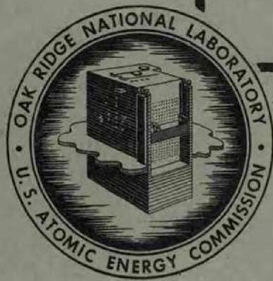
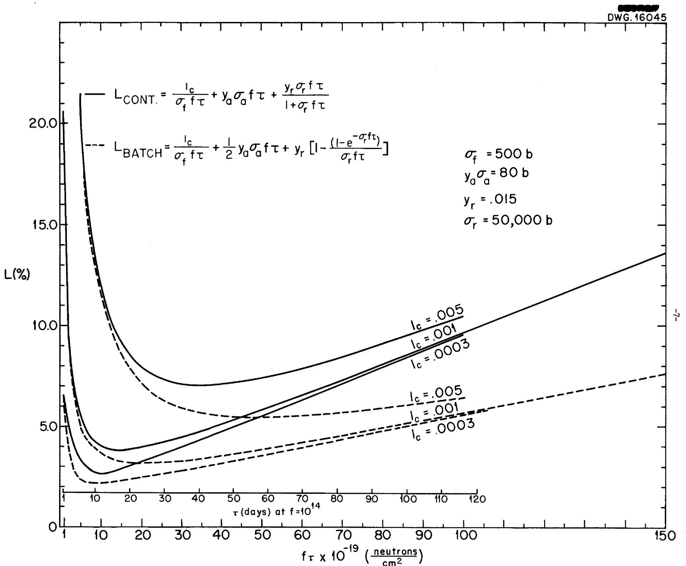
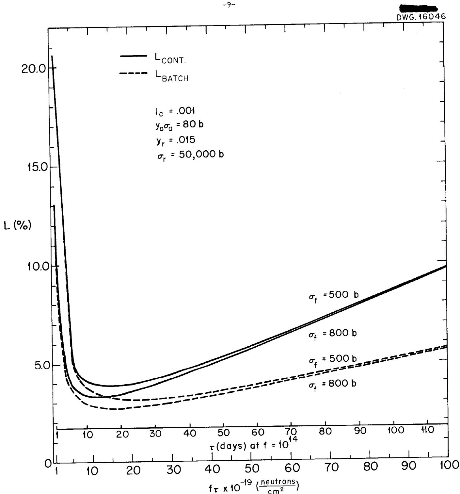
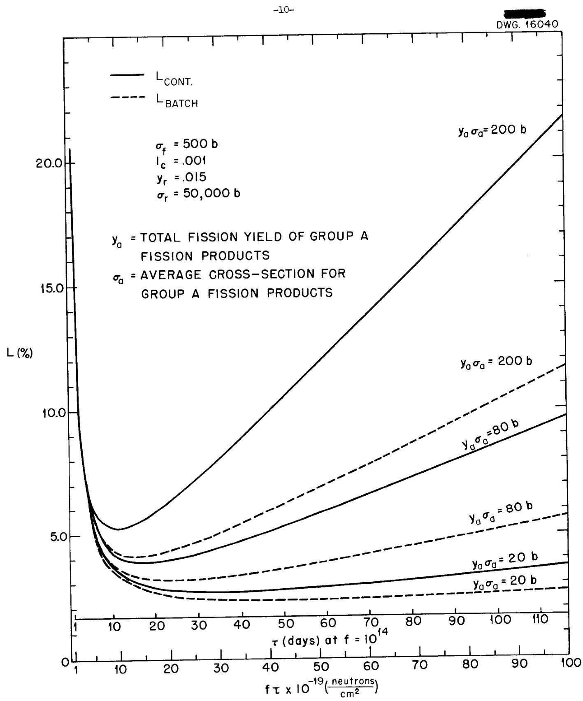
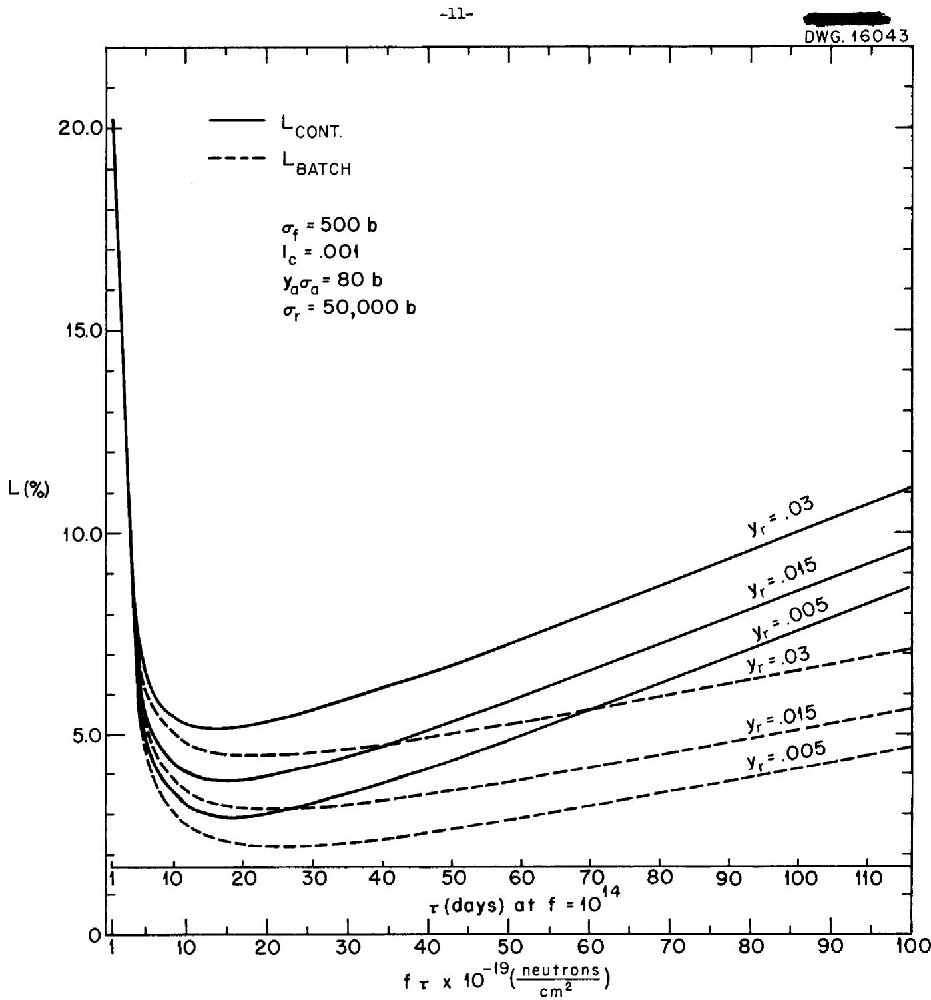
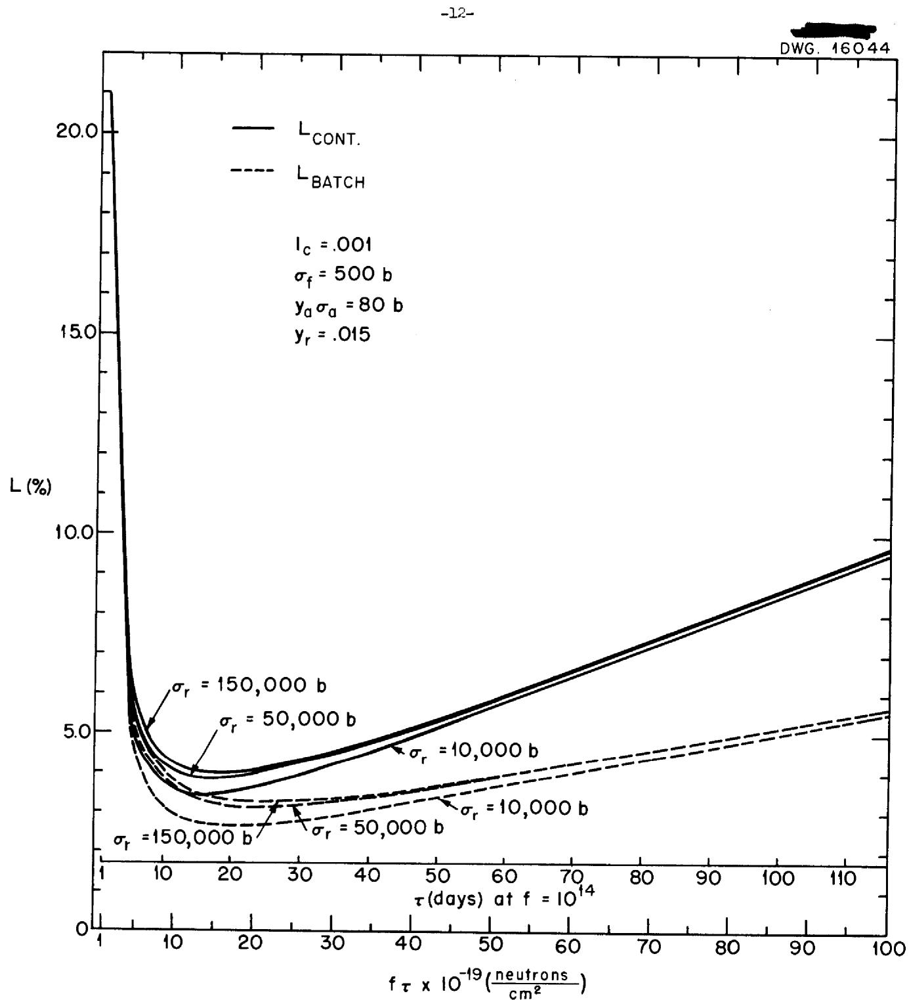
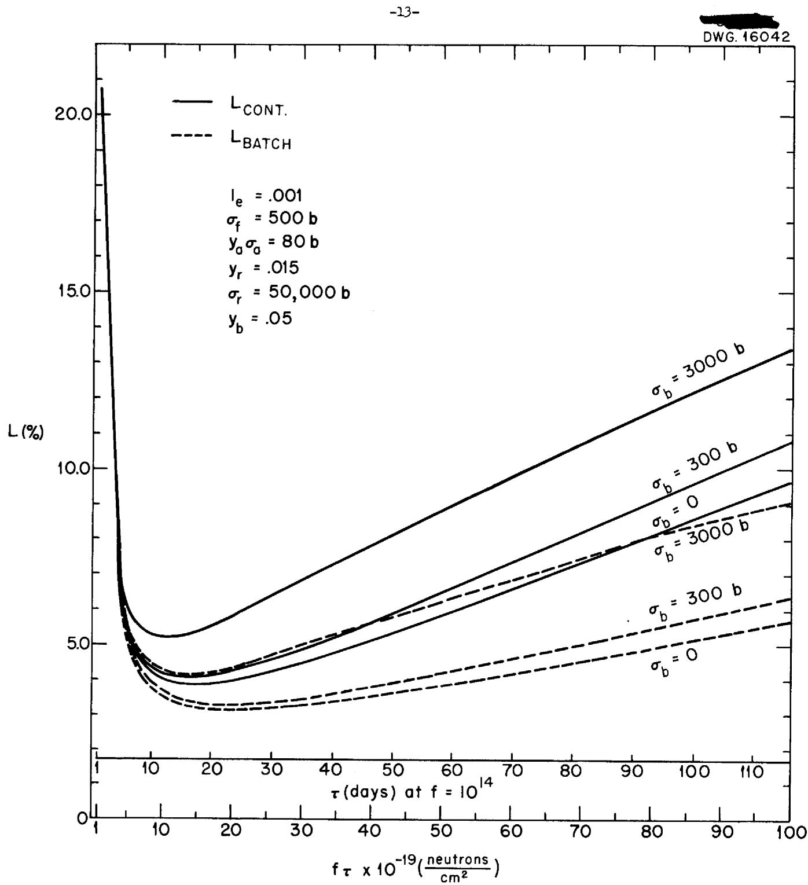
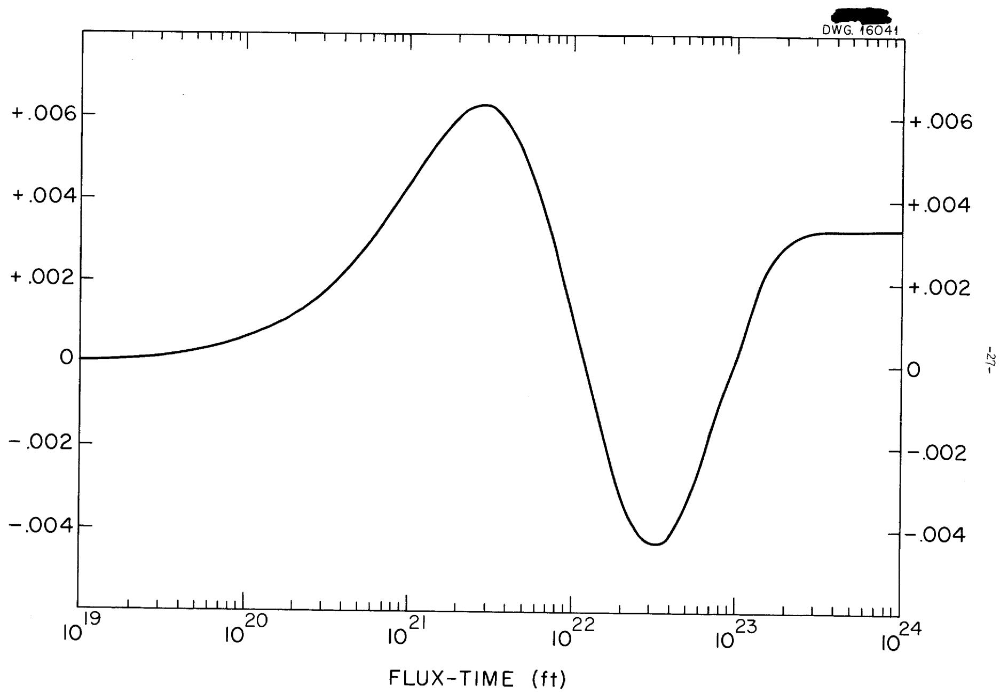
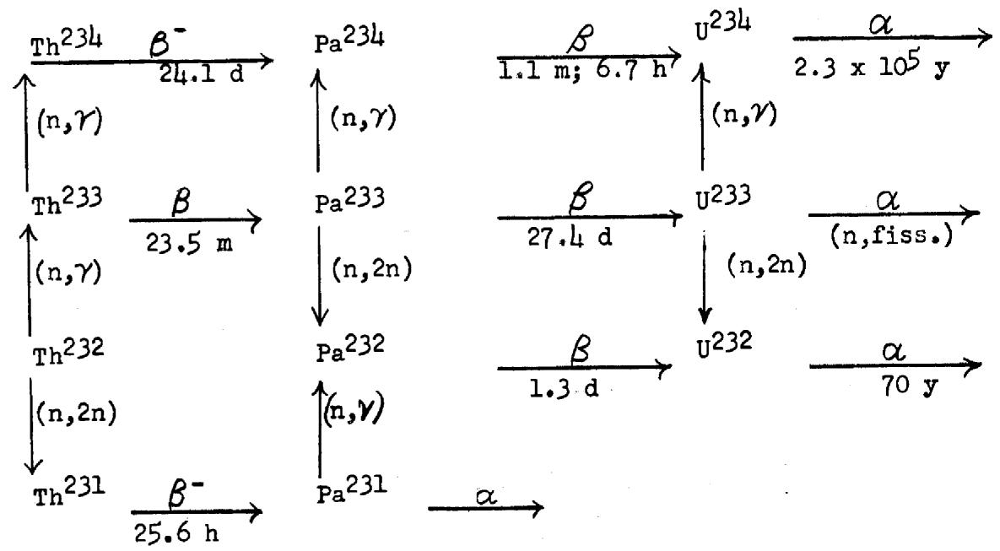

ORNL 1368

Reactors-Research and Power

SOME EFFECTS OF TRANSMUTATION

PRODUCTS ON U233 BREEDER PILE OPERATION

CENTRAL RESEARCH LIBRARY DOCUMENT COLLECTION

LIBRARY LOAN COPY

DO NOT TRANSFER TO ANOTHER PERSON

If you wish someone else to see this document, send in name with document and the library will arrange a loan.

OAK RIDGE NATIONAL LABORATORY

OPERATED BY

CARBIDE AND CARBON CHEMICALS COMPANY

A DIVISION OF UNION CARBIDE AND CARBON CORPORATION

UCC

POST OFFICE BOX P

OAK RIDGE, TENNESSEE

ORNL-1368

This document consists of 40 pages.

Copy 8 of 158, Series A.

Contract No. W-7405, Eng. 26

SOME EFFECTS OF TRANSMUTATION PRODUCTS

ON U233 BREEDER TILE OPERATION

CHEMISTRY DIVISION

J. Halperin and R. W. Stoughton

DECLASSIFIED CLASSIFICATION CHANGED TO: AEC J#7 BY:

Date Issued: SEP 29-30,

OAK RIDGE NATIONAL LABORATORY

Operated by

CARBIDE AND CARBON CHEMICALS COMPANY

A Division of Union Carbide and Carbon Corporation

Post Office Box P

Oak Ridge, Tennessee

3445603606033

# INTERNAL DISTRIBUTION

1. L T. Felbeck (C&CCC)   
2-3. Chemistry Library   
4. Phys.cs Library   
5. BioLibrary   
6. Health Physics Library   
7. Metallicity Library   
8-9. Trainin School Library   
10. Reactor Experimental Engineer Library   
11-14. Central Fins   
15. C. E. Cente   
16. C. E. Larson   
17.W.B.Humes (25)

18. L. B. Emlet (Y-12)   
19. A. M. Weinberg   
20. E. H. Taylor   
21. E. D. Shipley   
22. S. C. Lind   
23. F. C. VonderLage   
24. R. C. Briant   
25. J. A. Swartout   
26. F. L. Steahly   
27. A. H. Snell   
28. A. Hollaender   
29. M. T. Kelley   
30. G. H. Clewett

31. K. Z. Morgan   
32. J. S. Felton   
33. A. S. Householder   
34. C. S. Harrill   
35. C. E. Winters   
36. D. W. Cardwell   
37. E. M. King   
38. J. A. Wethington   
39. D. D. Cowen   
40. F. R. Bruce   
41. D. E. Ferguson   
43. J. Halperin   
45. R. W. Stoughton

# EXTERNAL DISTRIBUTION

46-58. Argonne National Laboratory (1 copy to W. M. Manning and 1 copy to John Huizenga)

59. Armed Forces Special Weapons Project (Sandia)

60-68. Atomic Energy Commission, Washington (1 copy to J. A. Lane)

69. Battelle M. Prial Institute

70-73. Brookhaven National Laboratory (1 copy to D. E. Koshland, Jr.)

74. Bureau of Shi

75-76. California Research and Development Company

77-82. Carbide and Calor Chemicals Company (Y-12 Area)

83. Chicago Patent Group

84. Chief of Naval Research

85-89. duPont Company

90-92. General Electric Company (ANPP)

93-96. General Electric Company, Richland

97. Hanford Operations Of t

8-104. Idaho Operations Offic

105. Iowa State College

6-109. Knolls Atomic Power Laboratory

7-112. Los Alamos

113. Massachusetts Institute of Technology (Kaufmann)   
114. Massachusetts Institute of Technology (Benedict)

115-117. Mound Laboratory

118. National Advisory Committee foreronautics, Cleveland   
119. National Advisory Committee forronautics, Washington

120-121. New York Operations Office

122-123. North American Aviation, Inc.

124. Nuclear Development Associates (NDA)   
125. Patent Branch, Washington   
126. Rand Corporation   
127. Savannah River Operations Office, August   
128. Savannah River Operations Office, Wilmington

129-130. University of California Radiation Laboratory

131. Vitro Corporation of America

132-135. Westinghouse Electric Corporation   
136-143. Wright Air Development Center   
144-158. Technical Information Service, Oak Ridge

Two mutually dependent factors influencing the feasibility of breeding are the losses of fuel atoms in chemical processing and the losses of neutrons due to absorption by fission products. If the fission products are removed by processing exceedingly frequently, the neutron losses mentioned would be low but the fuel atoms lost would be exhorbitant; conversely if processing were conducted less and less frequently, the fuel atoms lost in processing would diminish but the neutrons absorbed by fission products would become prohibitive. Hence it seems desirable to minimize the sum of these two losses with respect to processing period and to estimate the magnitude of the losses around the optimum value. It is felt that sufficient data are available on certain processing losses and cross-section values to give a reasonable estimate of the probable range of these combined losses and of the optimum processing periods.

(1)

J. A Lane, et al., have considered the various factors influencing the financial and neutron efficiencies of a U233 breeder. For a particular pile configuration, they computed the U233 production as a function of processing period.

The purpose of the first part of the current paper was to construct an expression for the fuel losses due to chemical processing plus the neutron losses due to absorption by fission products and to investigate the influence of the various parameters on the magnitude of the losses and on the optimum processing period.

In these calculations the fission products have been divided into three classes: those removed continuously as rare gases, those with relatively low cross-sections and those with quite high cross-sections. Then the sum of the two types of losses under consideration has been minimized with respect to processing period. Our interest here has been limited largely to the $U^{233}$ breeder although the treatment should hold for any homogeneous thermal reactor.

The second part of the paper deals with the build-up of heavy isotopes both in the reactor and blanket of a $\mathsf{U}^{233}$ breeder and the effects of these species on neutron economy and chemical processing. The build-up and the effects of $\mathsf{U}^{234}$ , $\mathsf{U}^{235}$ , and $\mathsf{U}^{236}$ have been quite thoroughly considered by S. Visner. Some of these higher isotope computations

(1) ORNL-1096, Part IV (Dec. 10, 1951); also see ORNL-855, pp. 50-55 (Oct. 16, 1950).

have been repeated here, however, since it was felt desirable to include effects of $U^{237}$ and some still higher species.

# I. Fission Product Poison Losses vs Processing Losses

In considering the factors determining reactor efficiency, one must optimize with respect to some pertinent parameter. For converter and power reactors one wants the cost per unit product optimized. However, for breeder piles, until we are convinced that breeding is feasible, it seems more reasonable to minimize neutron plus fuel losses.

A calculation of the optimum processing period was carried out on the basis of a number of simplifying assumptions. All the variables considered have been extended through a reasonable range of values, and it is felt that the actual values to be realized in a given reactor system should lie within the range covered.

The fission products were rather arbitrarily divided into three groups:

<table><tr><td></td><td>Fission symbol</td><td>yield value</td><td>Average Neutron capture symbol</td><td>cross-section value</td></tr><tr><td>G: Removed from reactor as rare gases</td><td>--</td><td>0.385</td><td>--</td><td>--</td></tr><tr><td>R: Highly capturing Rare Earths</td><td>yr</td><td>0.015</td><td>r</td><td>50,000 b</td></tr><tr><td>A: Remaining</td><td>ya</td><td>1.6</td><td>σa</td><td>50 b</td></tr></table>

The values of $y_{\mathbf{r}}$ and $\sigma_{\mathbf{r}}$ for the highly absorbing rare earths are rounded off figures from the results of Ingraham, Hayden and Hess [Phys. Rev. 79, 271 (1950)], and consist mainly of $\mathrm{Sm}^{149}$ ( $y = 0.011$ , $\sigma = 47,000$ ) and $\mathrm{Sm}^{151}$ ( $y = 0.0044$ , $\sigma = 7200$ ). The actual value of $\sigma_{\mathbf{r}}$ is not very important as this group is essentially entirely removed by neutron capture, and this condition would not be altered significantly by rather large changes in $\sigma_{\mathbf{r}}$ .

The yield for all the fission products with rare gas ancestors was estimated by Coryell, Turkevich et al. in 1944 to be about $30\%$ ; it was estimated that this fraction of all the -fission products could in principle be removed as gases leaving $70\%$ or 1.4 atoms per fission in a homogeneous reactor solution. A yield of 0.6 for the removable fission products is probably optimistic under any practical conditions: perhaps 0.4 is more realistic. The actual value used was 0.385 (i.e. 0.4 less 0.015) so the total yield per fission would be exactly two. The cross-section value of 50 barns is somewhat larger than the value of

(3)

E. P. Steinberg for the average cross-sections for fission products (other than rare earths) resulting from a Hanford slug which had been irradiated for 10 months and cooled for three years; their value was 38 barns. A more pessimistic value was taken since the average value for short-lived fission products almost certainly will be different from that of long-lived species and the value may be higher. Steinberg et al. concluded that with the possible exception of the 275 d Ce $^{144}$ (yield = 0.053), there are no long-lived fission products of unknown high cross-section.

If no fission products were removed as gases, the value of $y_{a}$ would become essentially 2.0 (actually 2.0 less 0.015 less 0.061) and a new "group" of fission products would be added, namely $Xe^{135}$ with a yield of 0.061 and an essentially infinite cross-section.

The total losses per fission, L, is here defined as the sum of the chemical losses of fuel atoms plus the neutron losses due to fission product capture weighted by the relative importance of a fuel atom and a neutron. This relative importance is here assumed to be unity. (Actually a better figure is the ratio of fuel atoms produced to fuel atoms burned.) Hence the total loss at any time t is given by

$\mathbf{L} = \mathbf{h}$ (fuel atoms lost/fission) + neutrons lost to poisons/fission   
$= h(U^{233}$ atoms lost in chem. proc./cycle)/(fissions/cycle) +(n's captured by F. P.'s/ cycle)/(fissions/cycle),

where $\underline{\mathbf{h}}$ may be considered equal to the breeding gain; we shall let $\mathbf{h} = \mathbf{unity}$ .

Then the first term on the right is equal to $\frac{1}{\mathfrak{p}} \widetilde{\tau}_{\mathfrak{p}}$

where $l_{c} =$ chemical losses, i.e., atoms $U^{233}$ lost/atom processed.

$\mathbf{f} =$ neutron flux

$\overline{G} =$ fission cross-section of the fuel atoms

$\mathcal{T} =$ processing period.

It is assumed here that the chemical processing losses are directly proportional to the amount of fuel processed.

For batch processing, i. e. periodic processing of the entire reactor fuel the neutron losses may be computed as follows:

(3)

ANL-4449, pp. 82-5 (Oct. 1950).

$\frac{\mathrm{d}\mathbf{N}_{\mathbf{r}}}{\mathrm{d}t} =$ rate of change of highly absorbing rare earth atoms within a processing period

$$
\begin{array}{l} = y _ {r} f N _ {f} \sigma_ {f} - f \sigma_ {r} N _ {r} \\ \mathrm {o r} \mathrm {N} _ {2 ^ {\circ}} = \frac {\mathrm {y} _ {\mathrm {r}} \mathrm {N} _ {\mathrm {f}} \sigma_ {\mathrm {f}}}{\sigma_ {\mathrm {r}}} (1 - \mathrm {e} ^ {- \mathrm {f}} \sigma_ {\mathrm {r t}}) \\ \end{array}
$$

1

where $t'$ is time after the end of the last period

$$
\begin{array}{l} N _ {f} = \text {n u m b e r o f f u e l a t o m s (h e l d c o n s t a n t)} \\ \overline {{\sigma}} _ {f} = \text {f i s s i o n c o r s s - s e c t i o n o f u e l a t o m s} \\ \end{array}
$$

It is assumed that the loss of atoms $\mathbf{N}_{\mathbf{T}}$ by beta decay is negligible compared to loss by neutron capture; if this is not the case, the above differential equation should contain an additional term, $-\lambda_{\mathbf{T}}\mathbf{N}_{\mathbf{T}}$ .

In the case of the remaining fission products (not removed as gases) it is assumed that neutron absorption or decay results in transmutation to a species of the same average capture cross-section. With this assumption these poison atoms grow in linearly with time, i.e.,

$$
\mathrm {N} _ {\mathrm {a}} = \mathrm {y} _ {\mathrm {a}} \mathrm {N} _ {\mathrm {f}} \mathrm {f} \text {O} _ {\mathrm {f}} \mathrm {t}
$$

The term involving neutron loss per fission will then be

$$
\frac {1}{N _ {f} f \sigma_ {f} \tau} \int_ {0} ^ {\tau} \left(N _ {a} \sigma_ {a} + N _ {r} \sigma_ {r}\right) f d t = \frac {1}{2} y _ {a} f \sigma_ {a} \tau + y _ {r} \left[ 1 - \left(\frac {1 - e ^ {- f \sigma_ {r} \tau}}{f \sigma_ {r} \tau}\right) \right]
$$

Putting this term back in the original expression for total losses per fission, with $\mathbf{L}$ being replaced by $\mathbf{L}_{\mathbf{b}}$ indicating batch processing,

$$
\mathrm {L b} = \frac {\mathrm {l} _ {\mathrm {c}}}{\sigma_ {\mathrm {f}} \mathrm {f} T} + \frac {\mathrm {y} _ {\mathrm {a}} \mathrm {f} \sigma_ {\mathrm {a}} T}{2} + \mathrm {y} _ {\mathrm {r}} \left[ 1 - \frac {(1 - \mathrm {e} ^ {- \mathrm {f}} \sigma_ {\mathrm {r}} T)}{\mathrm {f} \sigma_ {\mathrm {r}} T} \right]
$$

It is interesting that $\mathcal{T}$ always appears in the equation as the product $f\mathcal{T}$ ; hence $\mathbf{L}_{\mathbf{b}}$ can be optimized with respect to $f\mathcal{T}$ and then for any value of $\mathbf{f}$ the optimum $\mathcal{T}$ is readily obtained. To obtain the optimum period one may differentiate with respect to $f\mathcal{T}$ , equate to zero and solve for $f\mathcal{T}$ ; or one may simply plot $\mathbf{L}_{\mathbf{b}}$ against $\mathcal{T}$ or $f\mathcal{T}$ . The latter method gives more information for relatively little more work since solving the differential equation would be done by trial and error or by plotting anyway. Inspection of this equation shows that for positive values of $f\mathcal{T}$ and for the range of variables studied here only one minimum is possible.

A simplified approximation for the optimum f7 results if $f \sigma_{\mathbf{r}}$ is quite large. In this case $N_{\mathbf{r}}$ rapidly approaches its equilibrium value of $y_{\mathbf{r}} N_{\mathbf{f}} \sigma_{\mathbf{f}} / \sigma_{\mathbf{r}}$ and then $L_{b}$ becomes

$$
L _ {b} = \frac {1 c}{\sigma_ {f} f \gamma} + \frac {1}{2} y _ {a} \sigma_ {a} f \gamma + y _ {r}
$$

On differentiation and setting the derivative equal to zero, the resulting optimum $f$ is given by

$$
f \tau = \frac {2 l _ {c}}{y _ {a} \sigma_ {a} \sigma_ {f}}
$$

Perhaps a more meaningful basis than loss per fission would be loss per fuel atom destroyed. The values given by the above equation may be converted to losses per fuel atom destroyed by dividing $\mathbf{L}_{\mathbf{b}}$ by $(1 + \alpha)$ , where $\alpha$ is the neutron capture to fission ratio for fuel atoms. $(1 + \alpha)$ , of course, equals $\frac{\sigma_{\mathrm{f}} + \sigma_{\mathrm{c}}}{\sigma_{\mathrm{f}}}$ .

For continuous processing the fission product concentrations approach constant values rather soon and then remain constant.

$$
\frac {\mathrm {d} \mathrm {N} _ {\mathrm {r}}}{\mathrm {d t}} = \mathrm {y} _ {\mathrm {r}} \mathrm {f N} _ {\mathrm {r}} \sigma_ {\mathrm {r}} - \mathrm {N} _ {\mathrm {r}} (\mathrm {f} \sigma_ {\mathrm {r}} + 1 / \tau) = 0
$$

or

$$
N _ {r} = \frac {y _ {r} f N _ {f} \sigma_ {f}}{f \sigma_ {r} + 1 / \gamma} = \frac {y _ {r} N _ {f} \sigma_ {r} f \gamma}{1 + \sigma_ {r} ^ {f} \gamma}
$$

$$
\frac {d N _ {a}}{d t} = y _ {a} N _ {f} \sigma_ {f} f - N _ {a} / \gamma = 0
$$

or

$$
\mathrm {N a} = \mathrm {y} _ {\mathrm {a}} \mathrm {N} _ {\mathrm {f}} \overline {{\mathrm {O} _ {\mathrm {f}}}} \mathrm {f} \mathcal {T}
$$

The neutron loss term per period becomes

$$
\frac {1}{N _ {f} \sigma_ {f} f \tau} (N _ {a} \sigma_ {a} + N _ {r} \sigma_ {r}) f \tau = y _ {a} \sigma_ {a} f \tau + \frac {y _ {r} \sigma_ {r} ^ {f} \tau}{1 + \sigma_ {r} ^ {f} \tau}
$$

Then

$$
L _ {c} = \frac {l _ {c}}{\sigma_ {f} ^ {f} T} + y _ {a} \sigma_ {a} f \tau + \frac {y _ {r} \sigma_ {r} ^ {f} T}{1 + \sigma_ {r} f T}
$$

For $\mathcal{O}_{\mathbf{r}}f$ greater than unity the approximate expression for the optimum value of $f$ becomes

$$
r \tau \approx \sqrt {\frac {l c}{Y _ {a} \sigma_ {a} (0 _ {f} ^ {2})}}
$$

As more detailed information on fission product yields and cross-sections becomes available, the neutron absorption effects can be broken up into several terms like the last two in the equations for $\mathbf{L}_{\mathbf{c}}$ and $\mathbf{I}_{\mathbf{b}}$ above. The magnitudes of the cross-sections and yields would determine the number of terms desired and the bulk of the species with smaller cross-sections would as here be lumped into a single term. Also for radioactive species such terms should include decay constants; these of course go into the differential equations as additional coefficients of the $\mathbf{M}_{\mathbf{f}}$ and $\mathbf{N}_{\mathbf{a}}$ terms. The present status of our knowledge concerning chemical processing losses as well as fission product yields and cross-sections does not justify a more detailed calculation at present. The data which now exist may be found in the National Bureau of Standards Circular 499 and Supplements to this circular by K. Way, L. Farro, M. R. Scott and K. Thew. These data have been summarized by R. P. Schuman, KAPL-634 (August 1951).

$L_{c}$ and $L_{b}$ are plotted against $f\gamma$ for various values of the variables in Figs. 1, 2, 3, 4, 5 and a summary of the optimum values is given in Table I. In Table I the first column indicates the variables in question, the second column lists the standard values of these variables and the third column shows the values of the variables in question used in calculating the results given on each line.

Fig. (1) shows the effect of changing the chemical processing losses $l_{c}$ from 0.0003 to 0.005. Fig. 1 can also be interpreted as showing the influence of varying the factor $h$ (the relative value of a U233 atom and a neutron) while keeping $l_{c}$ and the other variables constant. The $l_{c} = 0.0003$ curves correspond to $h = 0.3$ and $l = 0.001$ and the $l_{c} = 0.005$ curves correspond to $h = 5$ and $l_{c} = 0.001$ . If $h$ is considered as the breeding gain, its value would very likely lie between 0.90 and 1.25; however, if $h$ is used to signify the relative dollar value of a U233 atom and a neutron it may differ from unity by as much as a factor of five.

  
FIG.1 LOSSES AS A FUNCTION OF THE CHEMICAL LOSS, $I_{c}$

Fig. (2) shows the effects of increasing the fission cross-section of the fuel $\mathcal{O}_{\mathrm{f}}$ from 500 to 800 barns; this is about the difference which would occur if the fuel were changed from $U^{233}$ to $\mathrm{Pu}^{239}$ . In Fig. (3) the product of fission yield and absorption cross-section, $y_{\mathrm{a}}$ , is varied from 20 to 200 barns; this essentially indicates the effect of varying the value of $\mathcal{O}_{\mathrm{a}}$ from 12.5 to 125 barns. Also from Fig. (3) an indication of the magnitude of the change to be expected on raising $y_{\mathrm{a}}$ from 1.6 to 2.0 may be deduced. The effects of varying $y_{\mathrm{r}}$ and $\mathcal{O}_{\mathrm{r}}$ are shown in Figs. (4) and (5). Fig. (6) shows the effects of adding another fission product of yield 0.05 and cross-section of 300 or 3000 barns to those already considered.

From these curves it can be concluded that in all cases batch processing affords (a) smaller losses, (b) minimum losses at a larger value of $f$ , and (c) a flatter minimum, than the continuous processing. It may further be concluded that for any reasonable value of the variables in a particular case, the losses due to processing and neutron absorption by fission products are expected to be in the range of 2.5 to $6.0\%$ . The best estimates at present seem to be about $3.0\%$ for batch processing and about $3.5\%$ for continuous processing, the percentages here being given on the basis of neutron losses per fissionable atom destroyed (by neutron absorption). Incidentally conclusion (a) holds for any conceivable combination of half lives and cross-sections among the fission species; see Appendix A.

In spite of the advantages of batch processing mentioned here, any isolated reactor system would undoubtedly be processed on a continuous basis because of the large hold-up of fissionable material which would be required for batch processing. At least twice the capacity of the reactor would have to be on hand if it were desirable to keep the pile operating while processing the removed fuel; intermittent pile operation and processing, to avoid such hold-up of material, would seem to be at least equally undesirable. If on the other hand, several reactors were located at one installation then only one additional reactor-full of held-up material should be required if all piles were processed batchwise in series. The percentage of material held-up and not in pile operation would be much smaller--perhaps as small as in the case of continuous processing. Under these circumstances

  
FIG.2 LOSSES AS A FUNCTION OF FISSION CROSS-SECTION, $\sigma_{\mathrm{f}}$

  
FIG. 3 LOSSES AS A FUNCTION OF THE PRODUCT $y_{0} \sigma_{a}$

  
FIG. 4 LOSSES AS A FUNCTION OF FISSION YIELD OF GROUP R FISSION PRODUCTS

  
FIG. 5 LOSSES AS A FUNCTION OF THE AVERAGE CROSS-SECTION OF GROUP R FISSION PRODUCTS, $\sigma_{r}$

  
FIG. 6 LOSSES AS A FUNCTION OF THE AVERAGE CROSS-SECTION OF GROUP B FISSION PRODUCTS, $\sigma_{b}$

the advantages of batch processing may well outweigh the disadvantages. It has been pointed out that the assumption that the processing losses will be proportional to the fuel atoms processed may not be valid for all methods of processing. For example, with an ion exchange method, fuel solution could be poured through an absorption column until the radiation had destroyed the usefulness of the resin or until the column was loaded with fission products and the uranium losses on the column might be essentially independent of the rate of throughput. This might be true and in such a case the treatment given here would not necessarily be expected to hold for ion-exchange processing; it is not entirely clear, however, exactly how an ion-exchange continuous process would be carried out. It is felt that the calculations made in this report would be pertinent to a solvent extraction process whether conducted in light water or directly in heavy water.

Minimum Losses in % Due to Chemical Processing Plus Fission Product Neutron Absorption Per

Fuel Atom Destroyed. (Fuel Atom Lost Assumed Equivalent to Neutron Lost).

TABLEI   

<table><tr><td>variable</td><td>std. value</td><td>value</td><td>Ib</td><td>fτx10-19</td><td>T(Days) at f = 1014</td><td>Ic</td><td>fτx10-19</td><td>T(Days) at f = 1014</td></tr><tr><td>--</td><td>--</td><td>std.</td><td>2.9</td><td>21</td><td>24</td><td>3.5</td><td>15</td><td>18</td></tr><tr><td>Ic</td><td>0.001</td><td>0.0003</td><td>2.0</td><td>10</td><td>12</td><td>2.4</td><td>10</td><td>12</td></tr><tr><td>Ic</td><td>.001</td><td>.005</td><td>5.0</td><td>50</td><td>58</td><td>6.5</td><td>35</td><td>41</td></tr><tr><td>σf</td><td>500</td><td>800</td><td>2.5</td><td>16</td><td>19</td><td>3.0</td><td>12</td><td>14</td></tr><tr><td>yr</td><td>.015</td><td>.005</td><td>2.0</td><td>22</td><td>26</td><td>2.6</td><td>15</td><td>17.5</td></tr><tr><td>yr</td><td>.015</td><td>.03</td><td>4.1</td><td>19</td><td>22</td><td>4.7</td><td>14</td><td>16</td></tr><tr><td>σr</td><td>50,000</td><td>10,000</td><td>2.4</td><td>18</td><td>21</td><td>3.1</td><td>14</td><td>16</td></tr><tr><td>σr</td><td>50,000</td><td>150,000</td><td>3.0</td><td>20</td><td>23</td><td>3.6</td><td>16</td><td>19</td></tr><tr><td>ya6a</td><td>80</td><td>20</td><td>2.1</td><td>40</td><td>47</td><td>2.4</td><td>30</td><td>35</td></tr><tr><td>ya6a</td><td>80</td><td>200</td><td>3.8</td><td>13</td><td>15</td><td>4.8</td><td>10</td><td>12</td></tr><tr><td>σb</td><td>0</td><td>300</td><td>3.0</td><td>19</td><td>22</td><td>3.7</td><td>14</td><td>16</td></tr><tr><td>σb</td><td>0</td><td>3000</td><td>3.8</td><td>14</td><td>16</td><td>4.7</td><td>10</td><td>12</td></tr></table>

# II. The Effects of Build-Up of Heavy Isotopes

In a U233 thermal breeder the U233 concentration in the core will remain essentially constant by addition of new material as the fuel is burned, and the isotopes U234, U235 and U236 will slowly grow in and attain concentrations of roughly the same order of magnitude as that of the U233. Other species, e. g. U237, Np237, Np238, Pu238, Pu239, U231, U232, etc., will also grow in in smaller amounts and the methods and schedule of processing the fuel will determine the maximum levels of the Np and Pu isotopes. The following schematic diagram indicates most of the pertinent reactions which will occur in the core. Neutron fission reactions are omitted although U231, U232, U233, U235, U237 and Pu239 are known or expected to undergo fission with thermal neutrons.

$$
\mathrm {P u} ^ {2 3 8} (\mathrm {n}, \gamma) \mathrm {P u} ^ {2 3 9}
$$

$$
\beta = \begin{array}{l l} 2. 0 d & \beta - 2. 3 d \\ \hline \end{array}
$$

$$
\mathbf {N p} ^ {2 3 7} (\mathbf {n}, \gamma) \xrightarrow {\mathbf {N p} ^ {2 3 8}} \mathbf {N p} ^ {2 3 9}
$$

$$
\beta^ {\uparrow 6. 9 d} \quad \beta^ {\uparrow 2 3. 5 m}
$$

$$
\mathrm {U} ^ {2 3 1 (\mathrm {n}, 2 \mathrm {n})} \mathrm {U} ^ {2 3 2 (\mathrm {n}, 2 \mathrm {n})} \xrightarrow {\text {U} ^ {2 3 3 (\mathrm {n} , \gamma)}} \xrightarrow {\mathrm {U} ^ {2 3 4 (\mathrm {n} , \gamma)}} \xrightarrow {\mathrm {U} ^ {2 3 5 (\mathrm {n} , \gamma)}} \xrightarrow {\mathrm {U} ^ {2 3 6 (\mathrm {n} , \gamma)}} \xrightarrow {\mathrm {U} ^ {2 3 7 (\mathrm {n} , \gamma)}} \xrightarrow {\mathrm {U} ^ {2 3 8 (\mathrm {n} , \gamma)}} \mathrm {U} ^ {2 3 9}
$$

The nuclides U231, U238, U239, Np239 and Pu239 will not be discussed subsequently since they will exist in rather small concentrations and since calculations concerning their build-up would be very unreliable.

The effects of the uranium isotopes consist largely of increasing the total uranium concentration and specific alpha activity. The total uranium concentration at equilibrium becomes about 2.18 times that at the start-up of the pile. The alpha activity change will depend largely on the $\mathsf{U}^{232} / \mathsf{U}^{233}$ ratio as discussed below. In addition, the $\mathsf{U}^{237}$ growing in will cause even the "decontaminated" fuel to contain appreciable quantities of beta and gamma radioactivities. The effect on neutron economy is small.

Considering first the major heavy isotopes, the differential equations for growth are

$$
\begin{array}{l} \frac {d N _ {2 4}}{d t} = N _ {2 3} f \delta c (2 3) - N _ {2 4} f \delta c (2 4) \\ \frac {d N _ {2 5}}{d t} = N _ {2 4} f \sigma_ {c} (2 4) - N _ {2 5} f \sigma_ {a} (2 5) \\ \frac {d N _ {2 6}}{d t} = N _ {2 5} f \mathcal {I} c (2 5) - N _ {2 6} f \mathcal {I} c (2 6) \\ \end{array}
$$

Where $f$ represents the neutron flux, $\sigma_{c}$ and $\sigma_{a}$ indicate respectively cross-sections for neutron capture and for neutron absorption (i.e. fission plus capture). The $N$ 's indicate the concentrations of the various species; the subscript and parenthetical numbers are the usual code symbols for the heavy isotopes, e.g. 23 represents element 92, mass 233. The fission cross-sections for both $U^{234}$ and $U^{236}$ are negligibly small.

The final equilibrium values of the relative concentrations of $\mathsf{U}^{233}$ , $\mathsf{U}^{234}$ , $\mathsf{U}^{235}$ , and $\mathsf{U}^{236}$ are obtained by equating these differential equations to zero and solving for the various isotopic ratios. The following ratios are obtained using the cross-sections given in Table II.

$$
\begin{array}{l} \frac {N _ {2 4}}{N _ {2 3}} = \frac {\sigma_ {c} (2 3)}{\sqrt {c} (2 4)} = \frac {5 0}{7 0} \quad = 0. 7 1 4 \\ \frac {N _ {2 5}}{N _ {2 3}} = \frac {\sigma_ {c} (2 3)}{\sigma_ {a} (2 5)} = \frac {5 0}{6 4 0} = 0. 0 7 8 \\ \frac {N _ {2 6}}{N _ {2 3}} = \frac {\sigma_ {c} (2 5) \sigma_ {c} (2 3)}{\sigma_ {c} (2 6) \sigma_ {a} (2 5)} = \frac {1 0 0 x 5 0}{2 0 x 6 4 0} = 0. 3 9 1 \\ \end{array}
$$

From these values one sees that the final equilibrium number of uranium atoms per atom of $U^{233}$ is 2.18, i.e. the uranium concentration increases by this factor.

Thermal Neutron Cross-Sections of Heavy Isotopes Used in this Report. (Values Given in

Barns).

TABLE II   

<table><tr><td>Nuclide</td><td>σc</td><td>σa</td><td>Remarks</td></tr><tr><td>Th232</td><td>7.0</td><td>7.0</td><td>Value from H. S. Pomerance, ORNL-51, p. 16 (1948).</td></tr><tr><td>Th233</td><td>1350</td><td>1350</td><td>Hyde, et al. ANL-4165, 6-25-48 reports σc = 1350 ÷ 100 barns. σa assumed equal to σc.</td></tr><tr><td>Pa231</td><td>150</td><td></td><td>A better value is probably σc = 290 ÷ 20%, reported by R. E. Elson and P. Sellers, ANL-4112, p. 27 (1947).</td></tr><tr><td>Pa233</td><td>50</td><td>--</td><td>L. I. Katzin and F. T. Hagemann, CC-3699 (1946), report 37 ÷ 14 for σc(13), but there is evidence from Hanford irradiations of Th that their figure is too low</td></tr><tr><td>U232</td><td>50&#x27;</td><td>100</td><td>A. Van Winkle, R. Olson, W. C. Bentley and A. Ghiorso, CF-3795 (1947), obtained σf(22) = 83. The value of σa (22) used here is purely a guess.</td></tr><tr><td>U233</td><td>50</td><td>550</td><td>G. Haines and K. Way, ORNL-86, report as a consistent set of values, σc = 74, σa = 564, n = 2.35.</td></tr><tr><td>U234</td><td>70</td><td>70</td><td>σc(24) = 88 was reported by H. Pomerance, Reactor Science and Technology 2, No. 1, p. 83 (April 1952); this is probably the best value.</td></tr><tr><td>U235</td><td>100</td><td>640</td><td>G. Haines and K. Way, ORNL-86, report as a consistent set of values, σc = 98, σa = 644, n = 2.12.</td></tr><tr><td>U236</td><td>20</td><td>20</td><td>P. R. Fields and G. L. Pyle ANL-4490, p. 5 (1950) give σc = 23.5. H. Pomerance, ibid., gives 5.8.</td></tr><tr><td>U237</td><td>--</td><td>840</td><td>A guess, giving σa(27) + λ27/f = 2 x 10-21 at f = 1015, T1/2(27) = 6.9 d.</td></tr><tr><td>Np237</td><td>180</td><td>--</td><td>Value quoted for pile neutrons by P. R. Fields and G. L. Pyle, ibid.</td></tr><tr><td>Pu238</td><td>460</td><td>480</td><td>G. Reed and W. Bentley, CC-3780(1947) report σc = 300 - 800.</td></tr></table>

On solving the differential equations, the isotopic ratios as a function of

time become

$$
\frac {N _ {2 4}}{N _ {2 3}} = \frac {\sigma_ {c} (2 3)}{\sigma_ {c} (2 4)} \quad \left(1 - e ^ {- \sigma_ {c} (2 4) f t}\right) = 0. 7 1 4 2 8 5 7 1 4 \left(1 - e ^ {- \sigma_ {c} (2 4) f t}\right)
$$

$$
\begin{array}{l} \frac {N _ {2 5}}{N _ {2 3}} = \frac {\sqrt {c} (2 3)}{\sqrt {a} (2 5)} - \frac {\sqrt {c} (2 3)}{\sqrt {a} (2 5) - \sqrt {c} (2 4)} e ^ {- \sqrt {c} (2 4) f t} + \frac {\sqrt {c} (2 3) \sqrt {c} (2 4)}{\sqrt {a} (2 5) \left[ \sqrt {a} (2 5) - \sqrt {c} (2 4) \right]} e ^ {- \sqrt {a} (2 5) f t} \\ = 0. 0 7 8 1 2 5 - 0. 0 8 7 7 1 9 2 9 8 2 e ^ {- \sigma_ {c} (2 4) f t} + 0. 0 0 9 5 9 4 2 9 8 2 4 e ^ {- \sqrt {a} (2 5) f t} \\ \end{array}
$$

$$
\begin{array}{l} \frac {N _ {2 6}}{N _ {2 3}} = \frac {\sigma_ {c} (2 3) \sigma_ {c} (2 5)}{\sigma_ {a} (2 5) \sigma_ {c} (2 6)} (1 - e ^ {- \sigma_ {c} (2 6) f t}) + \frac {\sigma_ {c} (2 3) \sigma_ {c} (2 5)}{\left[ \sigma_ {a} (2 5) - \sigma_ {c} (2 4) \right] \left[ \sigma_ {c} (2 4) - \sigma_ {c} (2 6) \right]} \left[ \begin{array}{l l} - \sqrt {c} (2 4) f t & - \sigma_ {c} (2 6) f t \\ e & - e \end{array} \right] \\ - \frac {\sqrt {c} (2 3) \sigma_ {c} (2 4) \sigma_ {c} (2 5)}{\sqrt {\sigma_ {a}} (2 5) - \sigma_ {c} (2 6) / \sqrt {\sigma_ {a}} (2 5) - \sigma_ {c} (2 4) / \sigma_ {a} (2 5)} \quad (e ^ {- \sigma_ {a} (2 5) f t} - e ^ {- \sigma_ {c} (2 6) f t}) \\ = 0. 3 9 0 6 2 5 + 0. 1 7 5 4 3 8 5 9 6 5 e ^ {- \sqrt {6} (2 4) f t} - 0. 0 0 1 5 4 7 4 6 7 4 5 8 e ^ {- \sqrt {a} (2 5) f t} - 0. 0 2 0 5 2 7 8 5 9 2 3 4 e ^ {- \sqrt {c} (2 6) f t} \\ \end{array}
$$

Values of $\mathbb{N}_{24} / \mathbb{N}_{23}$ , $\mathbb{N}_{25} / \mathbb{N}_{23}$ and $\mathbb{N}_{26} / \mathbb{N}_{23}$ as a function of ft are given in Table III. At short times, i.e. up to ft = 10^21 neutrons/cm², the approximation

$$
\frac {N _ {2 6}}{N _ {2 3}} = \frac {1}{6} \widehat {O c} (2 3) \widehat {O c} (2 4) \widehat {O c} (2 5) f ^ {3} t ^ {3}
$$

may be used with a maximum error of $20\%$ at the highest ft.

Relative Concentrations of $\mathsf{U}^{233}$ , $\mathsf{U}^{234}$ , $\mathsf{U}^{235}$ and $\mathsf{U}^{236}$ as a Function of Flux times Time, ft

TABLE III   

<table><tr><td>ft x 10-19</td><td>N24/N23</td><td>N25/N23</td><td>N26/N23</td></tr><tr><td>1</td><td>4.998 x 10-4</td><td>1.746 x 10-7</td><td>5.845 x 10-11</td></tr><tr><td>3</td><td>1.498 x 10-3</td><td>1.564 x 10-6</td><td>1.567 x 10-9</td></tr><tr><td>10</td><td>4.983 x 10-3</td><td>1.709 x 10-5</td><td>5.728 x 10-8</td></tr><tr><td>30</td><td>1.484 x 10-2</td><td>1.468 x 10-4</td><td>1.492 x 10-6</td></tr><tr><td>100</td><td>4.829 x 10-2</td><td>1.395 x 10-3</td><td>4.894 x 10-5</td></tr><tr><td>300</td><td>0.1353</td><td>8.428 x 10-3</td><td>9.646 x 10-4</td></tr><tr><td>1000</td><td>.3596</td><td>0.03458</td><td>1.556 x 10-2</td></tr><tr><td>3000</td><td>.6268</td><td>.06738</td><td>.10230</td></tr><tr><td>5000</td><td>.6927</td><td>.07548</td><td>.1882</td></tr><tr><td>7000</td><td>.7090</td><td>.07747</td><td>.2527</td></tr><tr><td>10,000</td><td>--</td><td>--</td><td>.3144</td></tr><tr><td>15,000</td><td>.7143</td><td>.07812</td><td>.3625</td></tr><tr><td>20,000</td><td>.7143</td><td>.07812</td><td>.3803</td></tr><tr><td>30,000</td><td>.7143</td><td>.07812</td><td>.3892</td></tr><tr><td>∞</td><td>.7143</td><td>.07812</td><td>.391</td></tr></table>

In view of the beta and gamma activity associated with $U^{237}$ as well as its possible fissionability, the concentration of this isotope as a function of time was also determined as follows:

Symbolic forms of the equations for $\mathbb{N}_{26} / \mathbb{N}_{23}$ and $\mathbb{N}_{27} / \mathbb{N}_{23}$

1.e. $\frac{\mathrm{N}_{26}}{\mathrm{N}_{23}} = \mathrm{a} + \mathrm{b}\mathrm{e}^{-\sigma \mathrm{c}(24)\mathrm{f}\mathrm{t}} + \mathrm{c}\mathrm{e}^{-\sigma \mathrm{a}(25)\mathrm{f}\mathrm{t}} + \mathrm{d}\mathrm{e}^{-\sigma \mathrm{c}(26)\mathrm{f}\mathrm{t}},$   
and $\frac{\mathrm{N}_{27}}{\mathrm{N}_{23}} = a^{i} + b^{j} e^{-\sigma_{c}(24) f t} + c^{j} e^{-\sigma_{a}(25) f t} + d^{i} e^{-\sigma_{c}(26) f t} + g^{j} e^{-\sigma_{q} f t}$

were put into the differential equation,

$$
\frac {\mathrm {d} \mathbf {N} _ {2 7}}{\mathrm {d} t} = \mathbf {N} _ {2 6} \mathbf {f} \overline {{\mathbf {U}}} \mathbf {c} (2 6) - \mathbf {N} _ {2 7} \mathbf {q} \mathbf {f},
$$

where $q = \sigma_{a(27)} + \lambda_{27 / f}, \lambda_{27}$ being the radioactive decay constant of $U^{237}$ .

The values of $a', b', c'$ ; $d'$ and $g'$ were obtained in terms of $q$ , the various cross-sections, and the values of $a$ , $b$ , $c$ , and $d$ ; the latter numerical values are those in the last form of the equation for $N_{26} / N_{23}$ presented previously.

$$
a ^ {\prime} = \frac {a \bar {O c} (2 6)}{q}; b ^ {\prime} = \frac {b \bar {O e} (2 6)}{q - \bar {O c} (2 4)}; c ^ {\prime} = \frac {c \bar {O c} (2 6)}{q - \bar {O a} (2 5)}; d ^ {\prime} = \frac {d \bar {O c} (2 6)}{q - \bar {O c} (2 6)}; g ^ {\prime} = - a ^ {\prime} - b ^ {\prime} - c ^ {\prime} - d ^ {\prime}.
$$

Then at $f = 10^{15}$ ,

$$
\frac {N _ {2 7}}{N _ {2 3}} = \begin{array}{l} 0. 0 0 3 9 0 6 2 5 + 0. 0 0 1 8 1 8 0 1 6 5 4 3 9 5 e ^ {- \sigma c (2 4) f t} - 0. 0 0 0 0 2 2 7 5 6 8 7 4 3 7 8 e ^ {- \sigma a (2 5) f t} \\ - \sigma c (2 6) f t ^ {- q f t} \\ - 0. 0 0 5 7 0 2 1 8 3 1 2 0 6 e ^ {+ 0. 0 0 0 0 0 0 6 7 3 4 5 1 9 8 4 e} \end{array} +
$$

The value of q used for $f = 10^{15}$ was $2 \times 10^{-21} \, \text{cm}^2$ .

While these calculations are quite elaborate, the methods used here are considered better, if a desk calculator is available, then using sufficiently precise approximate expressions.

Values of $\mathbf{N}_{27} / \mathbf{N}_{23}$ and curies of $U^{237}$ per gram of $U^{233}$ are shown in Table IV. The subsequent approximate expressions were used to obtain the values of $\mathbf{N}_{27} / \mathbf{N}_{23}$ at the shortest times and to check the values at $t \times 10^{-5} = 1$ , 3 and 10 and at the longest times.

The first involves substituting the approximate expression for $\mathbf{N}_{26} / \mathbf{N}_{23}$ , i.e., the expression proportional to $\underline{\mathbf{t}}^3$ , into the differential equation, for $\mathbf{N}_{27}$ growth given previously, solving the resulting equation, expanding the exponential term in the solution and dropping off higher terms.

$$
\begin{array}{l} \frac {d N _ {2 7}}{d t} = N _ {2 6} f \sigma_ {c} (2 6) - N _ {2 7} q f \\ = \frac {1}{6} \widetilde {\sigma_ {c}} (2 3) \widetilde {\sigma_ {c}} (2 4) \widetilde {\sigma_ {c}} (2 5) \widetilde {\sigma_ {c}} (2 6) f ^ {4} t ^ {3} - N _ {2 7} q f \\ N _ {2 7} = \frac {1}{2 4} \sigma_ {\mathrm {c}} (2 3) \sigma_ {\mathrm {c}} (2 4) \sigma_ {\mathrm {c}} (2 5) \sigma_ {\mathrm {c}} (2 6) f ^ {4} t ^ {4} [ 1 - \frac {q f t}{5} ] \\ \end{array}
$$

The second approximation, which actually can be as accurate as one wishes with enough work, providing $\mathbf{N}_{26} / \mathbf{N}_{23}$ is known as a function of time, utilizes the assumption that $\mathbf{N}_{26}$ can be considered constant over small increments of ft at the higher values of the latter. On this assumption the differential equation becomes

$$
\mathrm {d N} _ {2 7} / \mathrm {d t} \simeq \overline {{\mathrm {N} _ {2 6}}} f \sigma_ {\mathrm {c}} (2 6) - \mathrm {N} _ {2 7} q f,
$$

where $\overline{\mathbf{N}_{26}}$ is the average value of $\mathbf{N}_{26}$ over the time increment in question $\Delta t = t - t'$ . If now $\mathbf{N}_{27}$ is the concentration of $\mathbf{U}^{237}$ at time $t$ , $\mathbf{N}_{27}'$ the value at $t'$ and $\triangle \mathbf{N}_{27} = \mathbf{N}_{27} - \mathbf{N}_{27}'$ , the solution may be expressed alternatively

$$
\frac {N _ {2 7}}{N _ {2 3}} = \frac {\overline {{N _ {2 6}}}}{N _ {2 3}} \frac {\sigma c (2 6)}{q} \left[ 1 - \left(1 - \frac {q N _ {2 7} ^ {\prime} / N _ {2 3}}{\sigma c (2 6) \overline {{N _ {2 6}}} / N _ {2 3}}\right) e ^ {- q \Delta (f t)} \right]
$$

or $\triangle \frac{\mathrm{N}_{27}}{\mathrm{N}_{23}} = \left\{\frac{\mathrm{N}_{26} \sigma \mathrm{c}(26)}{\mathrm{N}_{23} \mathrm{q}} - \frac{\mathrm{N}_{27}^{\prime}}{\mathrm{N}_{23}}\right\}\left[1 - \mathrm{e}^{-\mathrm{q} \Delta (\mathrm{ft})}\right]$

The equilibrium value of $\mathbf{N}_{27} / \mathbf{N}_{23}$ , unlike the ratios of the lower uranium isotopes, is flux dependent.

$$
\begin{array}{l} \frac {N _ {2 7}}{N _ {2 3}} = \frac {N _ {2 6}}{N _ {2 3}} \frac {\sigma c (2 6)}{q} = \frac {N _ {2 6}}{N _ {2 3}} \frac {f \sigma c (2 6)}{\left(\lambda_ {2 7} + f \sigma_ {a} (2 7)\right)} \\ = 0. 0 0 3 9 1 a t a f l u x o f 1 0 ^ {1 5} \\ \end{array}
$$

Table IV   
$\mathrm{U}^{237} / \mathrm{U}^{233}$ Ratios as a Function of Irradiation Time at Flux of 1015   

<table><tr><td>t(sec x 10-5)*</td><td>N26/N23</td><td>N27/N23</td><td>Curies U237/g U233</td></tr><tr><td>0.1</td><td>5.83 x 10-11</td><td>2.91 x 10-15</td><td>2.35 x 10-10</td></tr><tr><td>.3</td><td>1.57 x 10-9</td><td>2.36 x 10-13</td><td>1.91 x 10-8</td></tr><tr><td>1.0</td><td>5.73 x 10-8</td><td>2.8 x 10-11</td><td>2.27 x 10-6</td></tr><tr><td>3</td><td>1.49 x 10-6</td><td>2.01 x 10-9</td><td>1.63 x 10-4</td></tr><tr><td>10</td><td>4.89 x 10-5</td><td>1.77 x 10-7</td><td>1.43 x 10-2</td></tr><tr><td>30</td><td>9.65 x 10-4</td><td>6.46 x 10-6</td><td>5.22 x 10-1</td></tr><tr><td>100</td><td>1.56 x 10-2</td><td>1.40 x 10-4</td><td>11.3</td></tr><tr><td>300</td><td>0.102</td><td>9.99 x 10-4</td><td>80.8</td></tr><tr><td>1,000</td><td>.314</td><td>3.14 x 10-3</td><td>254.</td></tr><tr><td>3,000</td><td>.389</td><td>3.89 x 10-3</td><td>314.</td></tr><tr><td>10,000</td><td>.391</td><td>3.90 x 10-3</td><td>315.</td></tr><tr><td>∞</td><td>.391</td><td>3.91 x 10-3</td><td>316.</td></tr></table>

*One day is 0.864 x 105 sec.

The concentration of $\mathsf{Np^{237}}$ will depend on the processing method, i.e. whether or not neptunium is removed from the fuel during processing. If it is not removed it will continue to build up with time and its relative concentration will be given by

$$
\frac {N _ {3 7}}{N _ {2 3}} = \int_ {0} ^ {t} \frac {\lambda_ {2 7 N _ {2 7} d t}}{N _ {2 3}}
$$

until its destruction rate by neutron absorption becomes significant. The accurate expression for $\mathrm{N}_{27} / \mathrm{N}_{23}$ given previously may be put into this equation and integrated, thereby giving an accurate expression for $\mathrm{N}_{37} / \mathrm{N}_{23}$ for shorter times. At longer times the concentration would be obtained by integrating the equation

$$
\frac {\mathrm {d} \mathrm {N} _ {3 7}}{\mathrm {d t}} = \lambda_ {2 7} \mathrm {N} _ {2 7} - \mathrm {N} _ {3 7} f \sigma_ {\mathrm {e}} (3 7)
$$

If the neptunium is partly removed in chemical processing the differential equation becomes

$$
\frac {\mathrm {d} \mathrm {N} 3 7}{\mathrm {d t}} = \lambda_ {2 7} \mathrm {N} 2 7 - \mathrm {N} _ {3 7} (\mathrm {f} \sigma \widetilde {\mathrm {c}} (3 7) + \mathrm {a} / \tau)
$$

Where $\underline{\tau}$ is the processing period and $\underline{a}$ is the fraction of Np removed from the fuel in processing. (Complete removal in processing corresponds to $\underline{a} = 1$ ). The maximum possible relative concentration of Np237 at equilibrium, assuming $\underline{a} = 0$ and assuming the values of cross-sections given in Table II, would then be

$$
\frac {N _ {3 7}}{N _ {2 7}} = \frac {\lambda_ {2 7} ^ {2}}{q f ^ {2} \sigma c (3 7)}
$$

or

$$
= 0. 0 3 7 \text {a t} f = 1 0 ^ {1 5}, q = 2 x 1 0 ^ {- 2 1}
$$

Considering the growth of $\mathsf{Np}^{237}$ for intermediate and long times under the condition where none of it is removed by chemical processing, it may be assumed that the production of $\mathsf{Np}^{237}$ is equal to the neutron capture by $\mathsf{U}^{236}$ less the neutron absorption by $\mathsf{U}^{237}$ and $\mathsf{Np}^{237}$ , i.e.,

$$
\frac {\mathrm {d} \mathrm {N} _ {3 7}}{\mathrm {d t}} = \overline {{\mathrm {N} _ {2 6}}} f \sigma_ {\mathrm {c}} (2 6) \frac {\lambda_ {2 7}}{\mathrm {q f}} - \mathrm {N} _ {3 7} f \sigma_ {\mathrm {c}} (3 7)
$$

where $\overline{\mathbf{N26}}$ is the average concentration of $U^{236}$ over any interval $\triangle t$ or $\triangle (\mathrm{ft})$ . On integration the increase of $\mathbf{Np}^{237}$ in any interval becomes

$$
\Delta \frac {\mathrm {N} _ {3 7}}{\mathrm {N} _ {2 3}} = \left\{\frac {\mathrm {N} _ {2 6}}{\mathrm {N} _ {2 3}} \frac {\sigma_ {\mathrm {c}} (2 6)}{\sigma_ {\mathrm {c}} (3 7)} \frac {\lambda_ {2 7}}{\mathrm {q f}} - \frac {\mathrm {N} _ {3 7} ^ {\prime}}{\mathrm {N} _ {2 3}} \right\} \left\{1 - e ^ {- \sigma_ {\mathrm {c}} (3 7) \Delta (\mathrm {f t})} \right\}
$$

where $\mathbf{N}_{37}^{\prime}$ is the concentration of $\mathbf{Np}^{237}$ at the beginning of the interval $\triangle$ (ft). This expression should be quite accurate for longer times of reactor operation providing the $\mathbf{Np}^{237}$ is not removed by chemical processing. If the $\mathbf{Np}$ is removed by processing then $\triangle \mathbf{N}^{37}$ may be taken as the amount of $\mathbf{Np}^{237}$ produced since the end of the last processing period if the processing is conducted batchwise. In the latter case, $\mathbf{N}_{37}^{\prime} / \mathbf{N}_{23} = 0$ and $\triangle$ (ft) becomes $fT$ at the end of a processing period; with these substitutions the above equation gives $\mathbf{N}_{37} / \mathbf{N}_{23}$ at the end of a period (providing the period is long compared to the 7 day half life of $\mathbf{U}^{237}$ ):

$$
N _ {3 7} / N _ {2 3} = \left\{\frac {\overline {{N _ {2 6}}}}{N _ {2 3}} \frac {\sigma_ {c} (2 6)}{\sigma_ {c} (3 7)} \frac {\lambda 2 7}{q f} \right\} \left\{1 - e ^ {- \sigma_ {c} (3 7) f T} \right\} \tag {1}
$$

If continuous processing is employed and $\mathbf{Np}$ is removed with high chemical efficiency, an approximate expression for $\mathrm{N}_{37} / \mathrm{N}_{23}$ is

$$
\frac {d N _ {3 7}}{d t} = \overline {{N _ {2 6}}} f \sigma_ {c} (2 6) \frac {\lambda 2 7}{q f} - N _ {3 7} \left\{f \sigma_ {c} (3 7) + \frac {1}{T} \right\} = 0
$$

or

$$
\frac {\mathrm {N} _ {3 7}}{\mathrm {N} _ {2 3}} = \frac {\overline {{\mathrm {N} _ {2 6}}}}{\mathrm {N} _ {2 3}} \quad \frac {\lambda_ {2 7}}{\mathrm {q f}} \quad \frac {\sigma_ {\mathrm {c}} (2 6) \mathrm {f} \tau}{1 + \sigma_ {\mathrm {c}} (3 7) \mathrm {f} \tau} \tag {2}
$$

where $\mathcal{T}$ is the processing period.

In view of the uncertainty in the factors which determine the $\mathbf{Np}^{237}$ concentration, it was not felt meaningful to calculate the $\mathbf{Pu}^{238}$ concentrations except under certain extreme conditions. It seems pointless to carry out more calculations on Pu until a given reactor system is designed. As an example, however, the $\mathbf{N}_{48}$ in a reactor where equation (2) holds and where Pu is also removed by continuous chemical processing may be obtained in a manner similar to the $\mathbf{N}_{37}$ :

$$
\frac {d N _ {4 8}}{d t} = N _ {3 7} f \sigma_ {c} (3 7) - N _ {4 8} (f \sigma_ {a} (4 8) + \frac {1}{T}) = 0
$$

$$
\frac {N _ {4 8}}{N _ {2 3}} = \frac {N _ {3 7}}{N _ {2 3}} \frac {\sigma_ {c} (3 7) f T}{1 + \sigma_ {a} (4 8) f T} = \frac {\overline {{N _ {2 6}}}}{N _ {2 3}} \frac {\lambda 2 7}{q f} \frac {(\sigma_ {c} (2 6) f T)}{(1 + \sigma_ {c} (3 7) f T)} \cdot \frac {\sigma_ {c} (3 7) f T}{(1 + \sigma_ {a} (4 8) f T)} \tag {3}
$$

Table V shows the relative concentrations of $\mathbf{Np}^{237}$ and $\mathbf{Pu}^{238}$ compared to $\mathbf{U}^{233}$ as a function of ft (flux times time of pile operation) for two different values of fT for continuous processing. Column five shows corresponding $\mathbf{N}_{37} / \mathbf{N}_{23}$ ratios for batch processing at fT = 10²².

The neutron loss due to the absorption by $U^{234}$ , $U^{235}$ and $U^{236}$ less the reproduction of neutrons by fission of $U^{235}$ is given by equation (4).

$$
\begin{array}{l} L _ {n} = \frac {\text {n e u t r o n l o s s}}{U ^ {2 3 3} \text {a t o m s d e s t r o y e d}} = \frac {N _ {2 4}}{N _ {2 3}} \frac {\sigma_ {c} (2 4)}{\sigma_ {a} (2 3)} + (1 - \eta_ {2 5}) \frac {N _ {2 5}}{N _ {2 3}} \frac {\sigma_ {a} (2 5)}{\sigma_ {a} (2 3)} + \frac {N _ {2 6}}{N _ {2 3}} \frac {\sigma_ {c} (2 6)}{\sigma_ {a} (2 3)} \\ = 0. 0 0 3 2 9 5 4 5 4 5 4 + 0. 0 2 9 7 9 2 6 6 3 4 7 e ^ {- \sigma_ {c} (2 4) f t} - 0. 0 1 2 5 6 0 2 5 8 7 7 e ^ {- \sigma_ {a} (2 5) f t} \\ - 0. 0 2 0 5 2 7 8 5 9 2 3 4 e ^ {- \sigma_ {c} (2 6) f t} \tag {4} \\ \end{array}
$$

Here, $\eta_{25} =$ neutrons emitted per neutron absorbed by $U^{235}$ and is here assumed equal to 2.12. A plot of $\mathbf{L}_{\mathfrak{n}}$ vs. ft is shown in Fig. 7. The losses are seen to increase to a maximum value of 0.0063 (i.e. $0.63\%$ ) at about ft $= 3\times 10^{21}$ , then decrease to

  
$L_{n}$ (NET NEUTRON LOSSES PER U233 ATOM DESTROYED)   
FIGURE 7. NET NEUTRON LOSSES DUE TO $U^{234}$ , $U^{235}$ AND $U^{236}$ BUILD-UP

Concentrations of $\mathbf{Np}^{237}$ [Equation (2)] and $\mathbf{Pu}^{238}$ [Equation (3)] as a

Function of ft for Continuous Processing Where Both Np and Pu Are Chemically Removed by Processing.

(t is time after reactor first starts up.)

Table V   

<table><tr><td></td><td colspan="2">N37/N23</td><td colspan="2">N37/N23*</td><td colspan="2">N48/N23</td></tr><tr><td>ft x 10-21</td><td>N26/N23</td><td>fT = 1020</td><td>fT = 1022</td><td>fT = 1022</td><td>fT = 1020</td><td>fT = 1022</td></tr><tr><td>1**</td><td>4.9 x 10-5</td><td>5.7 x 10-8</td><td>2.0 x 10-6</td><td>2.6 x 10-6</td><td>9.7 x 10-10</td><td>6.3 x 10-7</td></tr><tr><td>3</td><td>9.6 x 10-4</td><td>1.1 x 10-6</td><td>4.0 x 10-5</td><td>5.2 x 10-5</td><td>1.9 x 10-8</td><td>1.2 x 10-5</td></tr><tr><td>10</td><td>1.6 x 10-2</td><td>1.9 x 10-5</td><td>6.6 x 10-4</td><td>8.6 x 10-4</td><td>3.2 x 10-7</td><td>2.0 x 10-4</td></tr><tr><td>30</td><td>0.102</td><td>1.2 x 10-4</td><td>4.2 x 10-3</td><td>5.5 x 10-3</td><td>2.0 x 10-6</td><td>1.3 x 10-3</td></tr><tr><td>100</td><td>.31</td><td>3.6 x 10-4</td><td>1.3 x 10-2</td><td>1.7 x 10-2</td><td>6.1 x 10-6</td><td>4.0 x 10-3</td></tr><tr><td>300</td><td>.39</td><td>4.5 x 10-4</td><td>1.6 x 10-2</td><td>2.1 x 10-2</td><td>7.7 x 10-6</td><td>5.0 x 10-3</td></tr><tr><td>∞</td><td>.39</td><td>4.5 x 10-4</td><td>1.6 x 10-2</td><td>2.1 x 10-2</td><td>7.7 x 10-6</td><td>5.0 x 10-3</td></tr></table>

\*Batch processing, calculated by Equation (1).   
\*\*Unity here would be about 11.6 days at $f = 10^{15}$ or 116 days at $f = 10^{14}$ .

a minimum of $-0.0043$ (i.e. a net neutron gain) at about $3 \times 10^{22}$ and then increase again and level off at an equilibrium value of $0.0033$ above $3 \times 10^{23}$ . The equilibrium value alone, of course, can be obtained from the above equation in its first form by insertion of the equilibrium values of the relative concentrations $\mathrm{N}_{24} / \mathrm{N}_{23}$ , $\mathrm{N}_{25} / \mathrm{N}_{23}$ and $\mathrm{N}_{26} / \mathrm{N}_{23}$ . It is interesting that while the total uranium atoms per atom of $\mathrm{U}^{233}$ approaches 2.18, the maximum neutron loss is only about $0.6\%$ and the equilibrium value is only about $0.3\%$ .

# Breeder Blanket

In the blanket the following scheme was considered:

The primary reaction sequence, of course, is

$$
\mathrm {T h} ^ {2 3 2} (\mathrm {n},) \mathrm {T h} ^ {2 3 3} \xrightarrow {\beta^ {-}} \mathrm {P a} ^ {2 3 3} \xrightarrow {\beta^ {-}} \mathrm {U} ^ {2 3 3}
$$

and the other reactions may be considered according to their effects on the production of $\mathsf{U}^{233}$ . Neutron capture by the members of the 233-chain involves a double loss, i.e. a neutron is lost and an actual or a potential $\mathsf{U}^{233}$ atom is converted into a nonfissionable $\mathsf{U}^{234}$ atom. Higher isotopes may be built up by neutron capture if the blanket is not processed very frequently. Fission of $\mathsf{U}^{233}$ need not involve a net

loss since most of the resulting fission neutrons should be absorbed in the blanket, especially since most of the fissions will occur toward the inner edge of the blanket (i.e. the edge nearer the reactor). It may be reasonable to assume then that absorption by $U^{233}$ results in neither a neutron loss or gain.

Should some fast neutrons come in contact with the blanket, the (n,2n) reactions will occur to a small extent. These will involve a small neutron gain (a negative loss). The principle (n,2n) reaction may be expected to be

$$
\mathrm {T h} ^ {2 3 2} (\mathrm {n}, 2 \mathrm {n}) \mathrm {T h} ^ {2 3 1} \xrightarrow {\beta^ {-}} \mathrm {P a} ^ {2 3 1}
$$

in view of the high relative concentration of Th $^{232}$ . The net gain would obviously be equal to the number of (n,2n) reactions by thorium less the number of neutrons absorbed by the Pa $^{231}$ .

The principle effect of the $U^{232}$ will be to increase the specific alpha activity of the product. $U^{232}$ decays to the 1.9 y Th $^{228}$ , all the daughters of which are much shorter than 1.9 y. Hence the activity resulting from any $U^{232}$ will grow with a 1.9 y half life and finally attain a disintegration rate six times that of the parent $U^{232}$ (i.e. five additional alphas from the daughters). The effect of $U^{234}$ , in addition to the losses mentioned above, is merely one of diluting the product with a non-fissioning isotope.

All the calculations made here assume constant flux, i.e. invariant in time and independent of position. While this assumption is reasonably good for the reactor, it is much poorer for the blanket. Should the fuel and blanket be intimately mixed in a one core reactor, the results here would be somewhat better for the blanket reactions and somewhat poorer for the reactions concerning the fuel. In the cases of the (n,2n) reactions the calculations are based upon cross-sections for (n,2n) reaction per unit thermal flux; obviously any particular value for such a cross-section can hold only for a particular geometrical configuration. Hence the (n,2n) calculations are particularly poor

unless an appreciable amount of fissioning of $\mathbf{U}^{233}$ occurs in the blanket or unless a one region breeder reactor is being considered.

The losses due to capture by members of the 233-chain may be estimated as follows:

For any reasonable irradiation time, the Th $^{233}$ concentration will be at its steady state value because of the short half-life of this species (23.5 m).

Hence

$$
\frac {d N _ {O 3}}{d t} = N _ {O 2} f \sigma_ {c} (0 2) - \lambda_ {O 3} N _ {O 3} = 0
$$

or $\mathbf{N}_{03} = \frac{\mathbf{N}_{02}\mathbf{f}\sigma_{\mathbf{c}}(02)}{\lambda_{03}}$

The resulting loss of $\mathbf{Th}^{233}$ atoms per $\mathbf{U}^{233}$ atom produced will then be approximately

$$
\frac {\mathrm {N} _ {0 3} \mathrm {f} \sigma_ {\mathrm {c}} (0 3) \mathrm {t}}{\mathrm {N} _ {0 2} \mathrm {f} \sigma_ {\mathrm {c}} (0 2) \mathrm {t}} = \frac {\mathrm {f} \sigma_ {\mathrm {c}} (0 3)}{\lambda_ {0 3}}
$$

and will remain independent of irradiation time as long as the $\mathrm{U}^{233}$ production is directly proportional to irradiation time.

As long as the fraction of $\mathsf{Pa}^{233}$ and $\mathsf{U}^{233}$ atoms absorbing neutrons is small, the concentrations of these two species may be simply expressed:

$$
\begin{array}{l} \frac {d N _ {1 3}}{d t} = \text {n e u t r o n s a b s o r b e d b y T h l e s s d e c a y o f P a} ^ {2 3 3} \\ = N _ {0 2} f \sigma_ {c} (0 2) - \lambda_ {1 3} N _ {1 3} \\ \text {o r} \mathrm {N} _ {1 3} = \frac {\mathrm {N} _ {0 2} \mathrm {f} \sigma_ {\mathrm {c}} (0 2)}{\lambda_ {1 3}} \left\{1 - e ^ {- \lambda_ {1 3} t} \right\} \\ N _ {2 3} = N _ {0 2} f \sigma_ {c} (0 2) t - N _ {1 3} \\ = N _ {0 2} ^ {f} \sigma_ {c} (0 2) t \left[ 1 - \frac {1}{\lambda_ {1 3} t} (1 - e ^ {- \lambda_ {1 3} t}) \right] \\ \end{array}
$$

For long irradiation times or very high fluxes, more accurate expressions will be required which take into account the loss of $\mathrm{Pa}^{233}$ and $\mathrm{U}^{233}$ atoms by neutron absorption. For the present purposes, however, this is not thought necessary especially in view of the question concerning the value of the capture cross-section of $\mathrm{Pa}^{233}$ . In any case, the methods employed here will be satisfactory for checking more accurate calculations; also in combination with successive approximations for the neutron absorptions mentioned the methods used here can be made essentially as accurate as one wishes.

The total loss (of neutrons and neutron-equivalence of 233-chain atoms) per U $^{233}$ atom produced is then

$$
\begin{array}{l} L = (1 + h) \left[ f \sigma_ {c} (0 3) / \lambda_ {0 3} + \frac {1}{N _ {O _ {2}} \sigma_ {c} (0 2) f t} \int_ {0} ^ {t} N _ {l 3} \sigma_ {c} (1 3) f d t \right] \\ = 2. 2 \left[ f \sigma_ {c} (0 3) / \lambda_ {0 3} + \frac {f \sigma_ {c} (1 3)}{\lambda_ {1 3}} \left(1 - \frac {1}{\lambda_ {1 3} ^ {t}} (1 - e ^ {- \lambda_ {1 3} t}) \right] \right. \\ \end{array}
$$

where $h$ is the breeding gain (i.e. the $U^{233}$ atoms produced per $U^{233}$ atom destroyed) and may be assumed equal to about 1.2. The absorption of neutrons by $U^{233}$ while producing little or no net neutron losses will cause a time loss in that for each $U^{233}$ atom destroyed a $Th^{233}$ atom is assumed to be produced and this atom must decay through $Pa^{233}$ to $U^{233}$ .

The $U^{234}$ formed is produced by capture by $Th^{233}$ and $Pa^{233}$ and $U^{233}$ , the $U^{234}$ to $U^{233}$ ratio being given approximately by the equation

$$
\frac {N _ {2 4}}{N _ {2 3}} = f \sigma_ {\mathrm {c}} (0 3) / \lambda_ {0 3} + \frac {1}{N _ {0 2} \sigma_ {\mathrm {c}} (0 2) f t} \left[ \int_ {0} ^ {t} N _ {1 3} \sigma_ {\mathrm {c}} (1 3) f d t + \int_ {0} ^ {t} N _ {2 3} \sigma_ {\mathrm {c}} (2 3) f d t \right]
$$

$$
\begin{array}{l} = f \bar {\sigma} _ {c} (0 3) / \lambda_ {0 3} + \frac {f \bar {\sigma} _ {c} (1 3)}{\lambda_ {1 3}} \left[ 1 - \frac {1}{\lambda_ {1 3} ^ {t}} (1 - e ^ {- \lambda_ {1 3} t}) \right] + \bar {\sigma} _ {c} (2 3) f t \left[ \frac {1}{2} - \frac {1}{\lambda_ {1 3} t} \right. \\ \left. + \frac {1}{\lambda^ {2} 1 3 t ^ {2}} (1 - e ^ {- \lambda 1 3 t}) \right] \\ \end{array}
$$

$$
\begin{array}{l} \text {I f n o w} \sigma_ {\mathrm {c}} (1 3) = \overline {{\sigma_ {\mathrm {c}}}} (2 3) = \overline {{\sigma_ {3}}} \\ \frac {N _ {2 4}}{N _ {2 3}} = f \bar {\sigma} _ {c} (0 3) / \lambda_ {0 3} + \frac {1}{2} \bar {\sigma} _ {3} f t \\ \end{array}
$$

Thus within the accuracy of the above assumptions the $\mathsf{U}^{234}$ produced by $\mathsf{Th}^{233}$ capture per $\mathsf{U}^{233}$ produced depends on flux only while the $\mathsf{U}^{234}$ produced from the other two members of the 233-chain per $\mathsf{U}^{233}$ atom produced depends directly on the product $\underline{\mathsf{ft}}$ . The $\mathsf{U}^{234} / \mathsf{U}^{233}$ at any given irradiation time is, of course, directly proportional to the neutron flux.

Some figures on U²³³ production, U²³⁴/U²³³ ratios and losses due to U²³⁴ production are given in Table VI.

The production of $\mathsf{Pa}^{231}$ and $\mathsf{U}^{232}$ will now be considered. In these calculations some of the cross-sections are either unknown or poorly known, and hence the results may be considered as very rough estimates or guesses. Since the half life of $\mathsf{Th}^{231}$ is short compared to the probable irradiation time, $\mathsf{Th}^{232}$ may be considered to be transformed directly to $\mathsf{Pa}^{231}$ by (n,2n) reaction.

$$
\begin{array}{l} \frac {d N _ {1 1}}{d t} = N _ {0 2} \bar {\sigma} n, 2 n (0 2) f - N _ {1 1} \bar {\sigma} c (1 1) f \\ \frac {N _ {1 1}}{N _ {0 2}} = \frac {\sigma_ {n , 2 n (0 2)}}{\sigma_ {c} (1 1)} (1 - e ^ {- \sigma_ {c} (1 1) f t}) \\ = 1. 0 \times 1 0 ^ {- 4} (1 - e ^ {- \sigma_ {c} (1 1) f t}) \\ \end{array}
$$

The symbol $\overline{\sigma}_{\mathbf{n},2\mathbf{n}}(02)$ stands for a number which when multiplied by the thermal neutron flux gives the specific rate of transformation of Th²³² to Th²³¹. Actually this (n,2n) reaction can occur only with neutrons of kinetic energy greater than the binding energy of one neutron in Th²³², and hence the value of the cross-section can vary greatly at constant thermal neutron flux. In a given pile assembly, however, the value of $\overline{\sigma}_{\mathbf{n},2\mathbf{n}}(02)$ will be constant in time,

# Table VI

U233 and U234 Production in U233 Breeder Blanket

Losses Resulting from Neutron Capture by Th $^{233}$ and Pa $^{233}$

(All figures are for flux of $10^{14}$ and are directly proportional to flux)

<table><tr><td rowspan="2">t(days)</td><td rowspan="2">N13/N02</td><td rowspan="2">N23/N02</td><td rowspan="2">N13 + N23/N02</td><td colspan="3">N24/N23* Resulting From</td><td rowspan="2">L x 102i.e. in %</td></tr><tr><td>Pa233 Capture</td><td>U233 Capture</td><td>Total 233chain**</td></tr><tr><td>1</td><td>5.97 x 10-5</td><td>0.08 x 10-5</td><td>6.05 x 10-5</td><td>2.14 x 10-4</td><td>1.82 x 10-6</td><td>5.04 x 10-4</td><td>0.110</td></tr><tr><td>3</td><td>1.76 x 10-4</td><td>0.06 x 10-4</td><td>1.82 x 10-4</td><td>6.35 x 10-4</td><td>1.56 x 10-5</td><td>9.38 x 10-4</td><td>.203</td></tr><tr><td>10</td><td>5.35 x 10-4</td><td>0.70 x 10-4</td><td>6.05 x 10-4</td><td>1.99 x 10-3</td><td>1.68 x 10-4</td><td>2.45 x 10-3</td><td>.501</td></tr><tr><td>30</td><td>1.28 x 10-3</td><td>0.54 x 10-3</td><td>1.82 x 10-3</td><td>5.13 x 10-3</td><td>1.37 x 10-3</td><td>6.79 x 10-3</td><td>1.19</td></tr><tr><td>50</td><td>1.72 x 10-3</td><td>1.30 x 10-3</td><td>3.02 x 10-3</td><td>7.43 x 10-3</td><td>3.37 x 10-3</td><td>1.11 x 10-2</td><td>1.70</td></tr><tr><td>70</td><td>2.00 x 10-3</td><td>2.24 x 10-3</td><td>4.24 x 10-3</td><td>9.15 x 10-3</td><td>6.00 x 10-3</td><td>1.53 x 10-2</td><td>2.07</td></tr><tr><td>100</td><td>2.21 x 10-3</td><td>3.84 x 10-3</td><td>6.05 x 10-3</td><td>1.09 x 10-2</td><td>1.07 x 10-2</td><td>2.19 x 10-2</td><td>2.46</td></tr><tr><td>150</td><td>2.37 x 10-3</td><td>6.71 x 10-3</td><td>9.08 x 10-3</td><td>1.28 x 10-2</td><td>1.96 x 10-2</td><td>3.27 x 10-2</td><td>2.88</td></tr><tr><td>200</td><td>2.40 x 10-3</td><td>9.7 x 10-3</td><td>12.1 x 10-3</td><td>1.38 x 10-2</td><td>2.93 x 10-2</td><td>4.35 x 10-2</td><td>3.10</td></tr><tr><td>300</td><td>2.41 x 10-3</td><td>15.8 x 10-3</td><td>18.2 x 10-3</td><td>1.51 x 10-2</td><td>5.00 x 10-2</td><td>6.53 x 10-2</td><td>3.39</td></tr></table>

\*Ratios given are for complete decay of the Pa233.   
Ratios given are for complete accuracy in the $^{**}$ A constant value of 2.88 x 10 $^{-4}$ is included in this column for neutron capture by Th $^{233}$ .   
\*\*\*Neutron plus fuel atom losses due to neutron capture by Th233 and Pa233.

at constant power, and will vary somewhat with the space coordinates; in an external blanket the value will vary to a greater extent with space coordinates, decreasing rather rapidly with increasing distance from the source of fast neutrons. The value of $\sigma_{\mathbf{n},2\mathbf{n}}(02)$ used here is 0.015 barns which is approximately the value for the (n,2n) reaction on $\mathbf{U}^{238}$ in the Hanford piles. I. Perlman (MB-IP-624, November 15, 1952) gives a figure of 0.007 barns for the $\mathbf{U}^{238}$ (n,2n) reaction for pile neutrons and suggests that the $\mathbf{Th}^{232}$ (n,2n) may be a little lower. On the other hand Perlman suggests a higher value, i.e., 290 rather than 150 barns, for the cross-section for the subsequent $\mathbf{Pa}^{231}$ (n, $\gamma$ ) reaction.

For the $U^{232}$ formed by neutron capture by $\mathsf{Pa}^{231}$ followed by beta decay of $\mathsf{Pa}^{232}$

$$
\begin{array}{l} \frac {d N _ {2 2}}{d t} = N _ {1 1} \sigma_ {c} (1 1) f - N _ {2 2} \sigma_ {a} (2 2) f \\ \frac {N _ {2 2}}{N _ {O _ {2}}} = \frac {\sigma_ {n , 2 n (0 2)}}{\sigma_ {a} (2 2)} + \frac {\sigma_ {n , 2 n (0 2)}}{\sigma_ {c} (1 1) - \sigma_ {a} (2 2)} e ^ {- \sigma_ {c} (1 1) f t} - \frac {\sigma_ {n , 2 n (0 2)} \sigma_ {c} (1 1)}{\sigma_ {a} (2 2) [ \sigma_ {c} (1 1) - \sigma_ {a} (2 2) ]} e ^ {- \sigma_ {a} (2 2) f t} \\ = 1. 5 \times 1 0 ^ {- 4} (1 + 2. 0 e ^ {- \sigma_ {c} (1 1) f t} - 3. 0 e ^ {- \sigma_ {a} (2 2) f t}) \\ \end{array}
$$

At small values of t

$$
\frac {N 2 2}{N _ {0 2}} \approx 1. 5 \times 1 0 ^ {- 4} \left[ \left(\bar {\sigma_ {c}} ^ {2} (1 1) - \frac {3}{2} \bar {\sigma_ {a}} ^ {2} (2 2)\right) f ^ {2} t ^ {2} + \left(\frac {1}{2} \bar {\sigma_ {a}} ^ {2} (2 2) - \frac {1}{3} \bar {\sigma_ {c}} ^ {3} (1 1)\right) f ^ {3} t ^ {3} \right]
$$

The relative concentrations $\mathrm{N_{11} / N_{02}}$ and $\mathrm{N}_{22} / \mathrm{N}_{02}$ at various values of ft are given in Table VII.

It does not seem feasible to estimate with any accuracy the amount of $\mathbf{U}^{232}$ produced by (n,2n) reaction on $\mathbf{U}^{233}$ or by (n,2n) reaction on $\mathbf{Pa}^{233}$ followed by beta decay of the $\mathbf{Pa}^{232}$ , as these (n,2n) cross-sections for pile neutrons are entirely unknown. If, however, the (n,2n) cross-sections for $\mathbf{Pa}^{233}$ and $\mathbf{U}^{233}$ are the same as for $\mathbf{Th}^{232}$ , then the amount of $\mathbf{U}^{232}$ produced from these two species

will be about 1/20 that calculated in Table VII as formed from Th²³² via Pa²³¹ up to about ft = 10²²; above this ft value the U²³² formed from Pa²³³ plus U²³³ approaches about 3/5 that shown in Table VII.

Pa231/Th232 and U232/Th232 Ratios Formed in Blanket Due to Reactions Th232 (n,2n) Th231→Pa231(n,δ)Pa232→U232

Table VII   

<table><tr><td>ft</td><td>N11/N02</td><td>N22/N02</td></tr><tr><td>1019</td><td>1.50 x 10-7</td><td>1.12 x 10-10</td></tr><tr><td>3 x 1019</td><td>4.50 x 10-7</td><td>1.01 x 10-9</td></tr><tr><td>1020</td><td>1.50 x 10-6</td><td>1.12 x 10-8</td></tr><tr><td>3 x 1020</td><td>4.49 x 10-6</td><td>0.99 x 10-7</td></tr><tr><td>1021</td><td>1.39 x 10-5</td><td>1.04 x 10-6</td></tr><tr><td>3 x 1021</td><td>3.62 x 10-5</td><td>7.92 x 10-6</td></tr><tr><td>1022</td><td>7.77 x 10-5</td><td>5.14 x 10-5</td></tr><tr><td>3 x 1022</td><td>9.89 x 10-5</td><td>1.31 x 10-4</td></tr><tr><td>1023</td><td>1.00 x 10-4</td><td>1.50 x 10-4</td></tr><tr><td>∞</td><td>1.00 x 10-4</td><td>1.50 x 10-4</td></tr></table>

# Appendix A

# Relative Losses for Batch and Continuous Processing

It might be argued that with some combination of half lives and cross-sections of the shorter lived fission products it is conceivable that continuous processing might afford lower losses than batch processing. It can easily be shown that this is not possible.

Consider a hypothetical fission product of yield $y_1$ , capture cross-section of $\overline{v}_1$ , decay constant $\lambda$ , and concentration $N_1$ ; and define $\Lambda = \lambda_1 + f\sigma_1$ . Then in the batch case, at time $t$ after the last processing $N_1$ becomes

$$
N _ {1} = \frac {Y _ {1} N f \sigma_ {f} ^ {f}}{\Lambda} (1 - e ^ {- \Lambda t}),
$$

and the contribution of this species to the overall loss per fission

$$
I _ {b} = \frac {1}{N _ {f} \bar {\cup} _ {f} f} \int_ {0} ^ {T} N _ {1} \bar {\cup} _ {1} f d t = \frac {y _ {1} \bar {\cup} _ {1} f}{\Lambda} \left[ 1 - \frac {1}{\Lambda \tau} (1 - e ^ {- \Lambda \tau}) \right]
$$

In the continuous case the steady state concentration $\mathbf{N}_1$ and the contribution to the overall losses $\mathbf{L}_0$ become

$$
N _ {1} = \frac {y _ {1} N _ {f} \sigma_ {f} f \tau}{1 + \wedge \tau} \quad \text {a n d} L _ {c ^ {\prime}} = \frac {N _ {1} \sigma_ {1} f \tau}{N _ {f} \sigma_ {f} f \tau} = \frac {y _ {1} \sigma_ {1} f \tau}{1 + \wedge \tau}
$$

Now consider the total losses $\mathbf{L}_{\mathbf{b}}$ and $\mathbf{L}_{\mathbf{c}}$ with the contribution from the species $\mathbf{N}_{\mathbf{l}}$ :

$$
L _ {b} = \frac {h L _ {c}}{\sigma_ {f} f T} + \frac {1}{2} y _ {a} \sigma_ {a} f + y _ {r} \left[ 1 - \frac {1}{\sigma_ {r} f T} (1 - e ^ {- \sigma_ {r} f T}) \right] + \frac {y _ {1} \sigma_ {1} f}{\Lambda} \left[ 1 - \frac {1}{\Lambda T} (1 - e ^ {- \Lambda T}) \right]
$$

$$
L _ {C} = \frac {h l _ {c}}{\sigma_ {f} f \tau} + y _ {a} \sigma_ {a} f \tau + \frac {y _ {r} \sigma_ {r} f \tau}{1 + \sigma_ {r} f \tau} + \frac {y _ {l} \sigma_ {l} f \tau}{1 + \Lambda \tau}
$$

Comparing these equations term by term at $\mathcal{T} =$ optimum processing period for continuous processing, it is readily seen that the two first terms are equal. Each of the other terms is smaller in the batch case than the corresponding term in the continuous case; this is obvious for the two second terms. The third terms are very similar to the fourth ones (i.e. they become exactly similar in the limiting case where $\lambda_{1} = 0$ ); hence the argument to be made for fourth terms will also hold for the third ones.

Take the ratio

$$
\frac {L _ {b} ^ {1}}{L _ {c} ^ {1}} = \frac {1 + \wedge \tau}{\wedge \tau} 1 \frac {1}{\wedge \tau} (1 - e ^ {- \wedge \tau})
$$

This ratio is equal to $\frac{1}{2}$ at $\Lambda T = 0$ , continues to increase as $\Lambda T$ increases and finally approaches unity as $\Lambda T$ gets indefinitely large. Hence it is always less than unity for finite $\Lambda T$ . Any further breaking up of fission products into additional groups will give further terms like those already considered, and therefore would not alter the conclusions drawn here. A possibility not explicitly covered so far is the production of a highly absorbing species from a moderately long-lived fission product of lower cross-section; such a case would tend to favor batch processing even more than those considered above.

The argument so far proves that if the optimum $\mathcal{T}$ for continuous processing is employed for both types of processing the batch method affords lower losses. Obviously if the batch case were optimized independently with respect to $\mathcal{T}$ it would afford even lower losses.