3445603606051

ORNL-1370

Physics

TURBULENT FORCED CONVECTION

HEAT TRANSFER IN CIRCULAR TUBES

CONTAINING MOLTEN SODIUM HYDROXIDE

CENTRAL RESEARCH LIBRARY

DOCUMENT COLLECTION

LIBRARY LOAN COPY

DO NOT TRANSFER TO ANOTHER PERSON

If you wish someone else to see this document, send in name with document and the library will arrange a loan.

OAK RIDGE NATIONAL LABORATORY

OPERATED BY

CARBIDE AND CARBON CHEMICALS COMPANY

A DIVISION OF UNION CARBIDE AND CARBON CORPORATION

UCC

POST OFFICE BOX P

OAK RIDGE, TENNESSEE

Contract No. W-7405, eng 26

Reactor Experimental Engineering Division

TURBULENT FORCED CONVECTION HEAT TRANSFER IN CIRCULAR TUBES CONTAINING MOLTEN SODIUM HYDROXIDE

H.W.Hoffman

Date Issued:

OAK RIDGE NATIONAL LABORATORY

Operated by

CARBIDE AND CARBON CHEMICALS COMPANY

A Division of Union Carbide and Carbon Corporation

Post Office Box P

Oak Ridge, Tennessee

# INTERNAL DISTRIBUTION

1. G. T. Felbeck (C&CCC)   
2-3. Chemistry Library   
4. Physics Library   
5. Health Physics Library   
6. Biology Library   
7. Metallurgy Library   
8-9. Training School Library   
10. Reactor Experimental Engineering Library   
11-14. Central Files   
15. C. E. Center   
16. W. B. Humes (K-25)   
17. L. B. Emlet (Y-12)   
18. C. E. Larson   
19. A. M. Weinberg   
20. E. H. Taylor   
21. E. D. Shipley   
22. C. E. Winters   
23. F. C. VonderLage   
24. R. C. Briant   
25. J. A. Swartout   
26. S. C. Lind   
27. F. L. Steahly   
28. A. Hollander   
29. A. H. Snell   
30. G. H. Clewett   
31. K. Z. Morgan   
32. M. T. Kelley

33. J. S. Felton   
34. A. S. Householder   
35. C. S. Harrill   
36. D. S. Billington   
37. D. W. Cardwell   
38. E. M. King   
39. R. N. Lyon   
40. J. H. Buck   
41. R. B. Briggs   
42. A. S. Kitzes   
43. 0. Sisman   
44. R. W. Stoughton   
45. C. B. Graham   
46. W. R. Gall   
47. H. F. Poppendiek   
48. S. E. Beall   
49. W. M. Breazeale   
50. J. P. Gill   
51. W. P. Berggren   
52. E. S. Bettis   
53. R. W. Schroeder   
54. A. P. Fraas   
55. D. C. Hamilton   
56. B. Lubarsky   
57. H. W. Savage   
58. D. D. Cowen   
59. P. M. Reyling   
60. H. C. Claiborne 88-127. H. W. Hoffman   
128. M. J. Skinner

# EXTERNAL DISTRIBUTION

129. R. F. Bacher, California Institute of Technology

130-384. Given distribution as shown in TID-4500 under Physics Category

DISTRIBUTION PAGE TO BE REMOVED IF REPORT IS GIVEN PUBLIC DISTRIBUTION

# ABSTRACT

An experimental determination has been made of the heat transfer coefficients for molten sodium hydroxide flowing in turbulent forced convection through a tube of circular cross section and a length to diameter ratio of 200. Heat transfer coefficients in the region of fully developed turbulent flow are reported for the Reynolds modulus range of 6000-12000 and the temperature range of $700 - 900^{\circ}\mathrm{F}$ . The equation, $\mathrm{Nu} / \mathrm{Pr}^{0.4} = 0.021\mathrm{Re}^{0.8}$ , was found to correlate the data for (L/D) values above 100. Thermal entry lengths are calculated for each run. Results show that molten sodium hydroxide may be considered an ordinary fluid - i.e., any fluid other than the liquid metals - as far as heat transfer is concerned.

# TABLE OF CONTENTS

4

I. INTRODUCTION 5

II. EXPERIMENTAL WORK 7

A. Description of Apparatus 7   
B. System Calibration 15   
C. Method of Operation 18

III. RESULTS 21

A. Method of Calculation 21   
B. Correlation of Heat Transfer Coefficient 24   
C. Thermal Entrance Region 29   
D. Analysis of Errors 32

IV. NOMENCLATURE 33

V. BIBLIOGRAPHY 35

APPENDIX I. Sample Calculation 36

APPENDIX II. Physical Properties 38

APPENDIX III. Solution of Conduction Equation for Tube with Heat Generation in Wall 40

# I. INTRODUCTION

Sodium hydroxide can be used as a high temperature heat transfer medium. This fluid freezes at $604^{\circ}\mathrm{F}$ and possesses temperature stability to at least $1200^{\circ}\mathrm{F}$ . No data on the heat transfer properties of molten sodium hydroxide are available in the technical literature. Therefore, an experimental investigation was undertaken to determine the convective heat transfer coefficient for this fluid in turbulent flow within tubes of circular cross section.

In designing heat transfer equipment it is necessary to know the conductance, or coefficient of heat transfer, between a surface and the fluid flowing past the surface so as to be able to estimate the amount of heat transferred or to predict the temperature differences existing within the system. This coefficient is defined by the equation

$$
\mathrm {h} = \frac {\mathrm {q} / \mathrm {A}}{\mathrm {t} _ {\mathrm {B}} - \mathrm {t} _ {\mathrm {M}}} \tag {1}
$$

where $(\mathbf{q} / \mathbf{A})$ is the heat flux through the metal-fluid interface in Btu/hr-ft², $t_{s}$ , the temperature of the metal surface at this interface and $t_{m}$ , the fluid mixed-mean temperature. A number of investigators have developed systems, both of the double-tube exchanger type and the single-tube electrically heated wall type, which enable determination of the temperature, $t_{s}$ . For reasons of simplicity of assembly and more accurate determination of the heat input and the heat transfer area, the electrically heated test section was chosen for this experiment.

Several factors must be considered in designing this type of test unit for use with molten sodium hydroxide.

1. Corrosion. The extreme corrosiveness of molten sodium hydroxide drastically restricts the materials available for constructing the system. At the time the problem was begun, static corrosion tests² indicated that only three construction materials would be acceptable for a system containing sodium hydroxide. These were pure silver, graphite and A-nickel. Of these silver appeared to be the best material. However, silver is structurally weak and at high temperatures is unable to support its own weight. To be effective corrosionwise the silver must be oxygen free and thus the cost of a silver-lined system becomes prohibitive. Graphite would require heavy, awkward structural sections to give sufficient strength. Hence, nickel remains as the only feasible construction material. While weaker than most construction metals it still possesses reasonable strength at high temperatures and is commercially available in most of the required forms.

2. Electrical Conductivity. While the electrical conductivity of molten sodium hydroxide is not high as compared to the liquid metals, it is still sufficiently large to necessitate that the system be designed to minimize the heat generation in the test fluid. From this aspect nickel was also satisfactory since its electrical conductivity was such as to allow $95\%$ of the heat generation to occur in the tube wall for a reasonably sized experimental system.

3. Pumps. Due to the unavailability of pumps for handling molten sodium hydroxide another method of causing fluid flow through the system must be devised. This was accomplished by pushing the fluid through the system under the pressure of an inert gas, argon.

4. Melting Point. The high melting point of sodium hydroxide $(604^{\circ}\mathrm{F})$ increases the difficulty of system design.

# II. EXPERIMENTAL WORK

# A. Description of Apparatus

The experimental system designed to measure the heat transfer coefficient is illustrated schematically in Figure 1. It consisted of a sump tank, a test section with associated power supply and temperature and power indicating devices, a tank resting on a scale for measuring the fluid flow rate and a gas system for moving the fluid through the test section. Figures 2, 3, and 4 present several views of the apparatus.

The sump and weigh tanks were electrically heated by strip heaters, and the lines connecting the test section to the tanks were traced with Calrod heaters. The entire system was well-lagged and was maintained at a temperature of $650^{\circ}\mathrm{F}$ . Preliminary tests indicated that even when the weigh tank was rigidly connected to the rest of the system the scale readings were consistent and accurate. This was checked by visually observing the scale action while introducing weighed amounts of water into the tank and while placing weighed lead bricks on the scale. It was possible to read the weight of fluid entering or leaving the weigh tank to within 1/2 pound.

Fig.1. Schematic Representation of System for Measuring Heat Transfer Coefficients of Molten Sodium Hydroxide.   
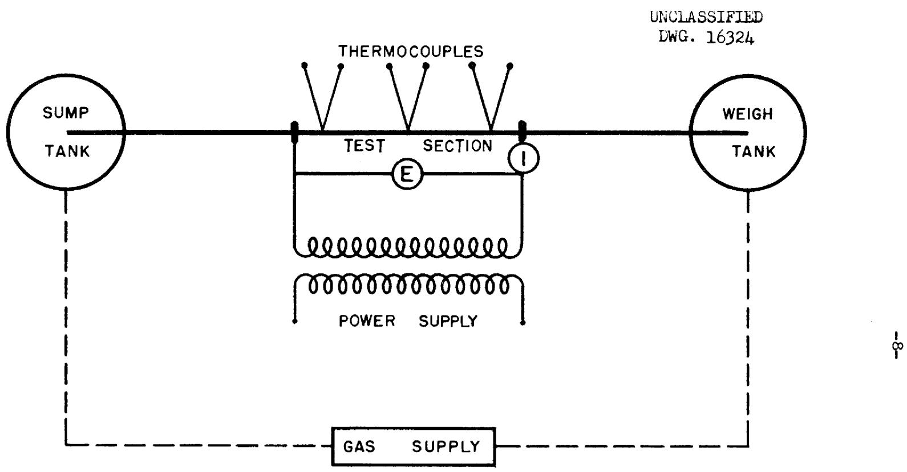  
Test Section: Nickel Tube - 3/16" O.D. X O.035"   
Wall Thickness X 24" Long.   
22 Thermocouples welded to outside tube wall.

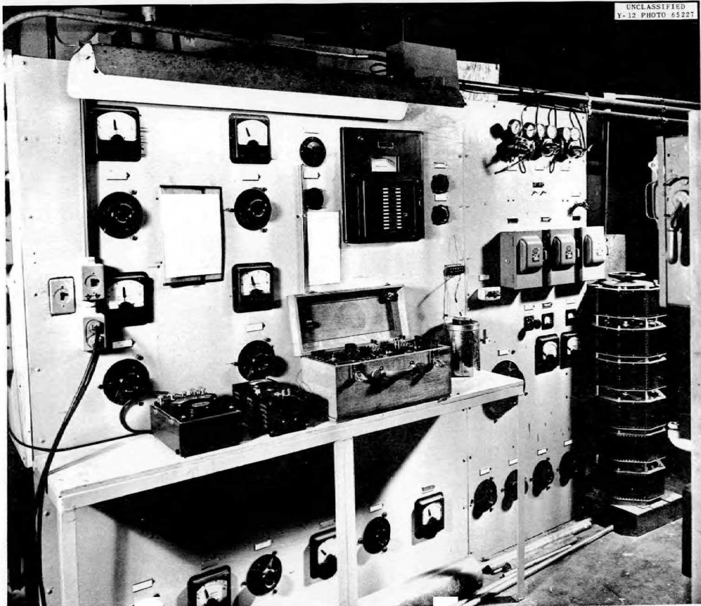  
FIGURE 2. VIEW OF PANEL BOARD

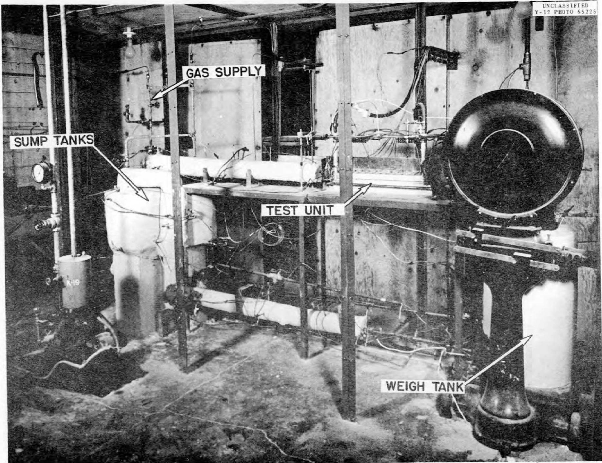  
FIGURE 3. GENERAL VIEW OF EXPERIMENTAL SYSTEM

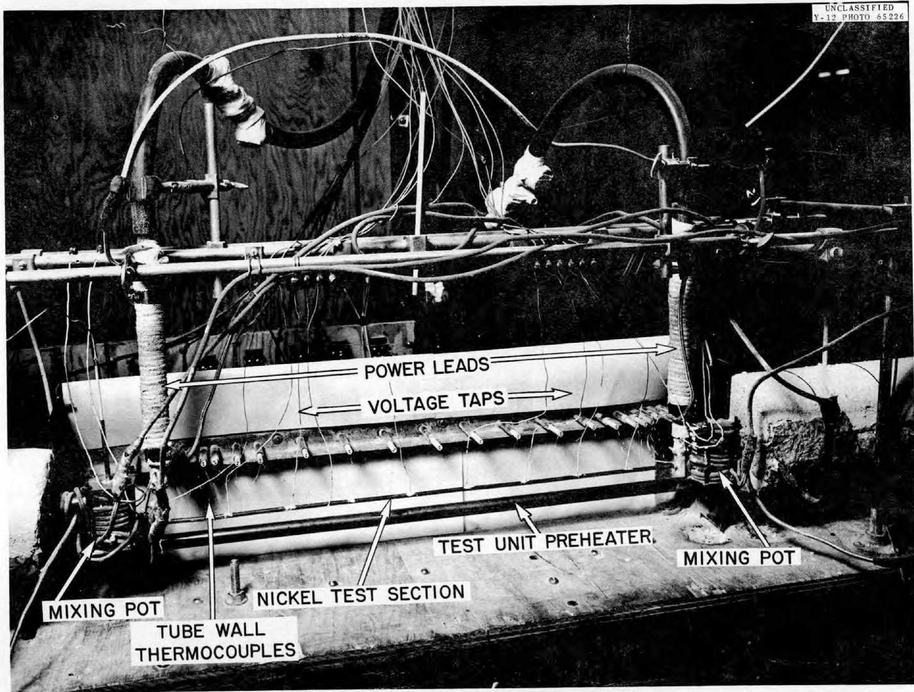  
FIGURE 4. TEST UNIT

In the design of an electrically heated test section, the size of the tubing used is dictated by several factors; namely, allowable pressure drop through the test section, desired length to diameter ratio, availability of the proper size tubing, the temperature drop through the tube wall as related to the temperature difference between the inside tube surface and the fluid mixed-mean, the physical size of the system as related to the fluid inventory, the minimization of heat generation in the test fluid and the total power available. On the basis of these considerations a test section was designed of nickel tubing, $3/16''$ O.D. x 0.035" wall thickness, 24 inches long. With this test section a flow at a Reynolds modulus of $10^4$ could be obtained with a pressure drop of 35 psi. The heat generated in the tube wall accounted for $95\%$ of the total heat generation.

Since gas pressure was used to move the molten sodium hydroxide through the test section, the system was capable only of intermittent operation with the fluid flowing first from the sump to the weigh tank and then from the weigh to the sump tank. A total of 220 pounds of sodium hydroxide was put into the system.

The power was supplied to the test section by a transformer capable of delivering a maximum of 360 amperes at 7.5 volts. This was introduced to the test section through small rectangular copper flanges silver-soldered to the tube at the inlet and outlet of the test section. The current to the test section was measured with a multi-range ammeter. The accuracy of this meter is claimed as $3 / 4\%$ .

The temperature of the outer surface of the test section was measured at 20 points along the tube and at the power flanges at the inlet and outlet of the test section. The couples were of 36 gage chromel and alumel wire

and were welded to the tube surface by a single-pulse resistance welder. They were then wrapped around the tube for about one-quarter of a turn in order to minimize conduction losses along the thermocouple leads. At the two ends of the test section thermocouples were encased in pieces of two-hole ceramic insulator, inserted in small holes in the power flanges and arc-welded to the tube wall. All couples were then connected to a Leeds and Northrup portable precision potentiometer through selector switches. A common cold junction was used. This consisted of an ice-water mixture in a one pint Dewar flask which was jacketed by a can filled with thermal insulation.

Temperatures for control purposes were measured by thermocouples of 28 gage iron and constantan wires located along the tubing and in thermowells in the tanks. The temperatures were indicated on a precision temperature indicator.

The voltage was measured at the 10 locations along the test section indicated in Figure 5. Two of these voltage taps were located on the power flanges to the test section. The voltage taps were of 28 gage bare copper wire, arc-welded to the tube. These were then coated with #7 Sauereisen cement to reduce oxidation of the copper at the operating temperature of the system. The voltage was measured by a multiple-range Ballantine electronic voltmeter, for which an accuracy of $2\%$ is claimed.

The mixed-mean temperature of the fluid entering and leaving the test section was obtained by inserting mixing pots in the test line. These were located one inch from the inlet and outlet of the test section. The mixing pot was a two inch length of standard one inch nickel pipe capped at both ends. A perforated nickel disc was located at the center. The inlet and outlet were tangentially positioned at the top and bottom.

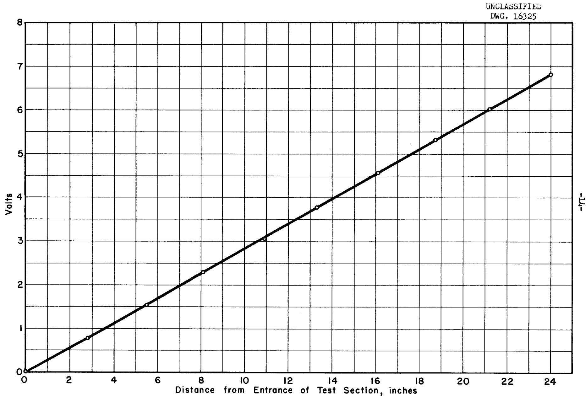  
Fig. 5. Voltage Impressed on Test Section as a Function of Tube Length.

Thermowells were placed immediately behind the inlet and before the outlet. A mixing pot is shown in Figure 4. It is believed that with the whirling flow caused by the tangential inlet and the mixing caused by the diffuser disc, a good mixed-mean temperature was obtained. An analysis of the error due to conduction losses by the thermowell at an average fluid temperature of $950^{\circ}\mathrm{F}$ shows the correction to the observed thermocouple reading to be negligibly small. The mixing pots were wrapped with a double layer of monel-sheathed nichrome heating wire. The current through these heaters was adjusted to maintain a temperature of approximately $650^{\circ}\mathrm{F}$ in the mixing pot so as to prevent freezing of the sodium hydroxide and reduce heat loss from the fluid.

The entire test unit - test section plus mixing pots - was jacketed by a metal container filled with thermal insulation.

# B. System Calibration

# 1. Heat Loss

In order to obtain an estimate of the heat loss from the system, current was passed through the tube wall without fluid flow through the test section. At equilibrium, the power input for a given average tube wall temperature with no fluid flow was taken to be the system heat loss for the same average tube wall temperature with fluid flow. The outside tube wall temperature is shown in Figure 6 as a function of the distance along the test section for various power levels. Figure 7 shows the system heat loss as a function of $\Delta t$ , where $\Delta t$ is the average outside tube wall temperature, $t_{W,ave}$ , minus the temperature of the system environment, $t_e$ . The average outside tube wall temperature was obtained by graphical integration of the curves of Figure 6.

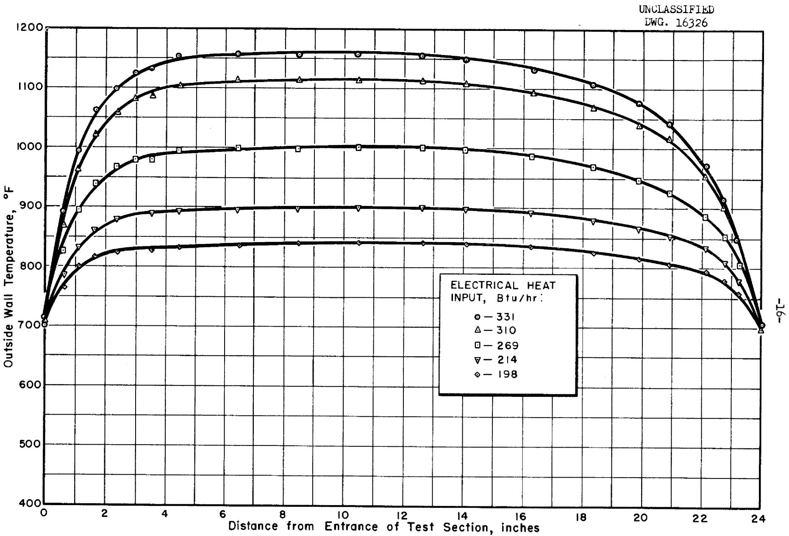  
Fig. 6. Axial Profiles of Outside Tube Wall Temperature for Varying Heat Input with no Fluid Flow.

UNCLASSIFIED DwG. 16327

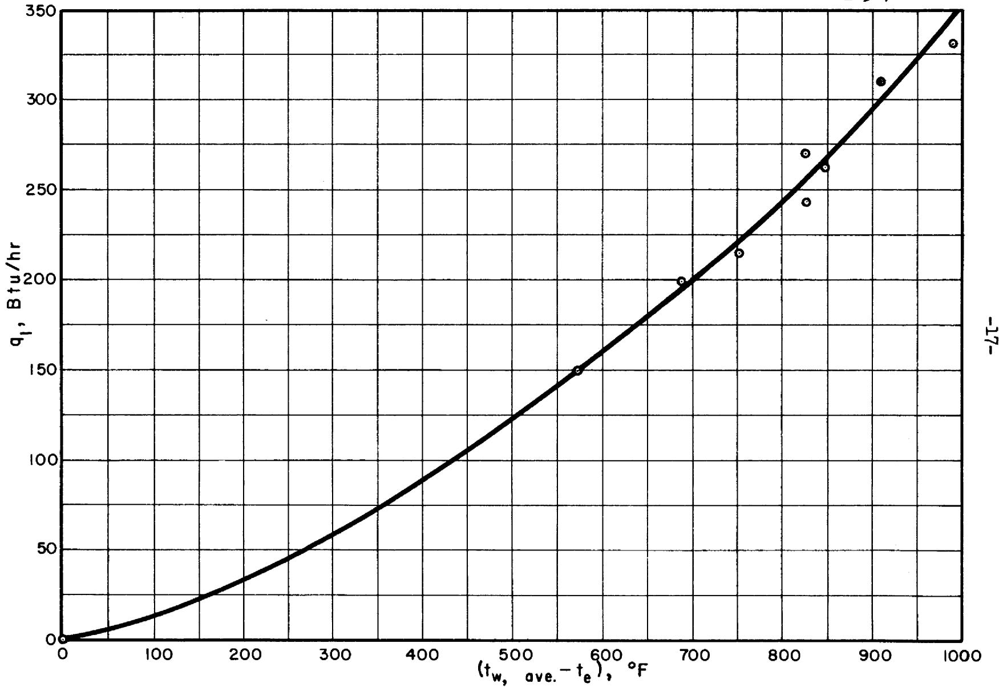  
Fig. 7. Heat Loss from Test Section

# 2. Thermocouple Calibration

Bead thermocouples of 36 gage chromel and alumel wire were calibrated at the melting points of lead and zinc. Samples of the wire used for the tube wall thermocouples were calibrated in a tube furnace. The results of these calibrations are indicated in Figure 8. A maximum correction of $5^{\circ}\mathrm{F}$ at $900^{\circ}\mathrm{F}$ was observed.

# 3. Effect of Tube Current on Thermocouples

The possible effect of the current flowing through the tube wall on the readings of the thermocouples attached to the wall was considered. Therefore, with no flow through the tube, the system was allowed to reach equilibrium and the reading of one wall thermocouple recorded. The power to the tube was then turned off and readings of this thermocouple taken every 15 seconds. These power-off readings were then extrapolated back to zero time. As is seen from Figure 9, the current in the tube wall has no effect on the readings of the thermocouples.

# C. Method of Operation

Prior to operation, the entire system - sump and weigh tanks and the test unit - was heated to an average temperature of $650^{\circ}\mathrm{F}$ . During a sequence of runs this temperature would drift up to about $750^{\circ}\mathrm{F}$ due to the heat put into the fluid by the test section. The desired flow rate was obtained by proper adjustment of the gas pressures at the sump and weigh tanks. Runs lasted from 20 to 40 minutes depending on the fluid flow rate. It was found that during this period the system reached approximate equilibrium. This is indicated in Figure 10 which gives the readings

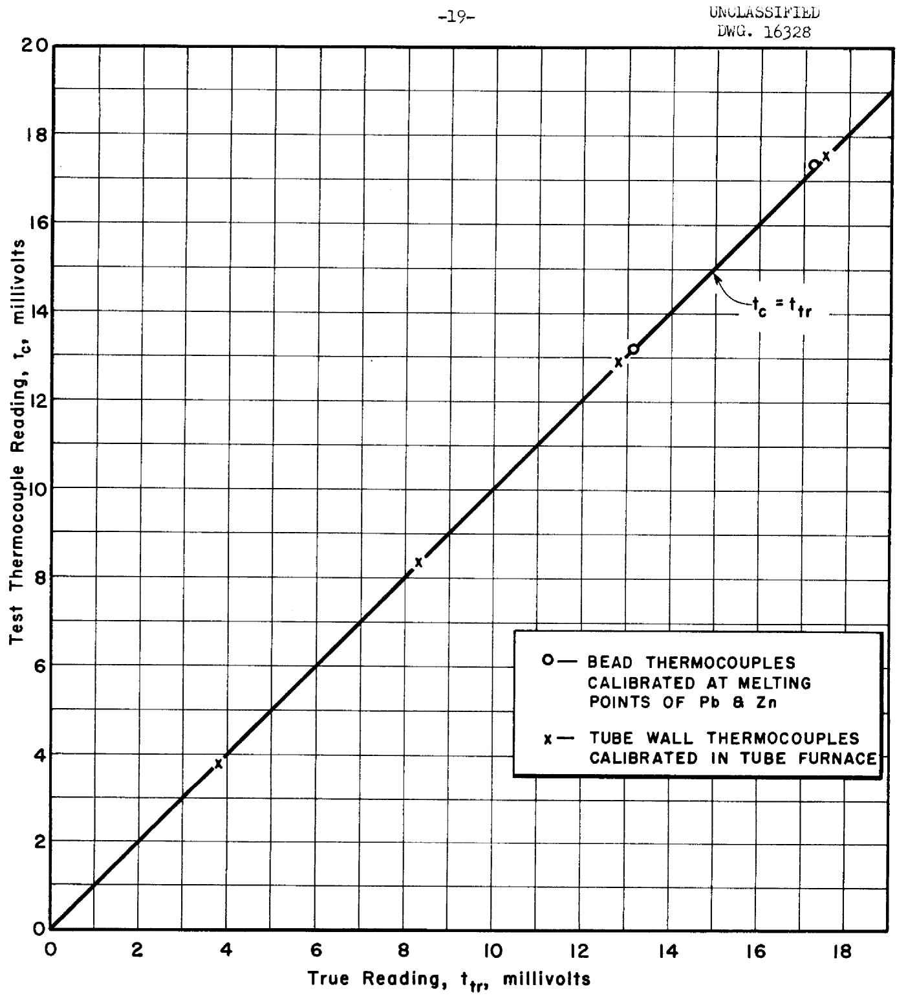  
Fig. 8. Calibration of Thermocouples

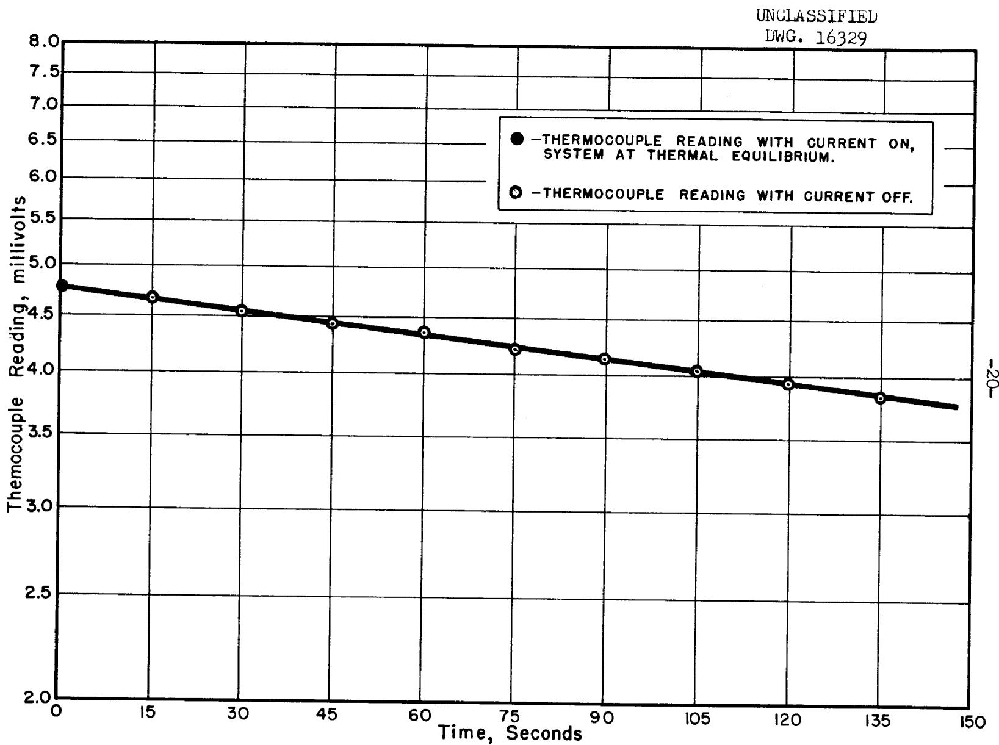  
Fig.9. Effect of Current on Tube Wall Temperatures

from a given thermocouple as a function of time during an experimental run. The tube wall thermocouples were read every 3 to 5 minutes during a run. Data were obtained with the fluid flowing from the weigh to the sump tank, as well as from the sump to the weigh tank.

The sodium hydroxide charged to the system had an original assay of $98.5\%$ NaOH, $0.31\%$ $\mathrm{Na_2CO_3}$ and the rest water. The water was removed during the melting cycle by maintaining the system under vacuum.

# III. RESULTS

# A. Method of Calculation

The coefficient of heat transfer at any point, $x$ , along the test section is known as the local coefficient of heat transfer and is defined by the equation

$$
h _ {X} = \frac {(q / A) _ {X}}{(t _ {S} - t _ {m}) _ {X}} \tag {2}
$$

For values of $x$ large enough to be beyond the thermal entrance region, $h_{X}$ reaches a limiting value, $h$ , the coefficient of heat transfer for the region in which turbulent flow has been fully established both thermally and hydrodynamically.

In order to determine the local coefficient of heat transfer, it is necessary to obtain from the experimental data the heat flux, the temperature of the inside wall of the tube and the fluid mixed-mean temperature at each point along the tube.

The inside tube wall temperature is calculated from the measured outside tube wall temperature by the equation

$$
t _ {W} - t _ {S} = \frac {W}{2 k _ {N 1}} \left(r _ {W} ^ {2} \ln r _ {W} / r _ {S} - \frac {r _ {W} ^ {2} - r _ {S} ^ {2}}{2}\right) \tag {3}
$$

where the subscripts $w$ and $s$ indicate the outside and inside tube walls, respectively, and $r$ is the tube radius; $k_{Ni}$ is the thermal conductivity of the nickel tube.

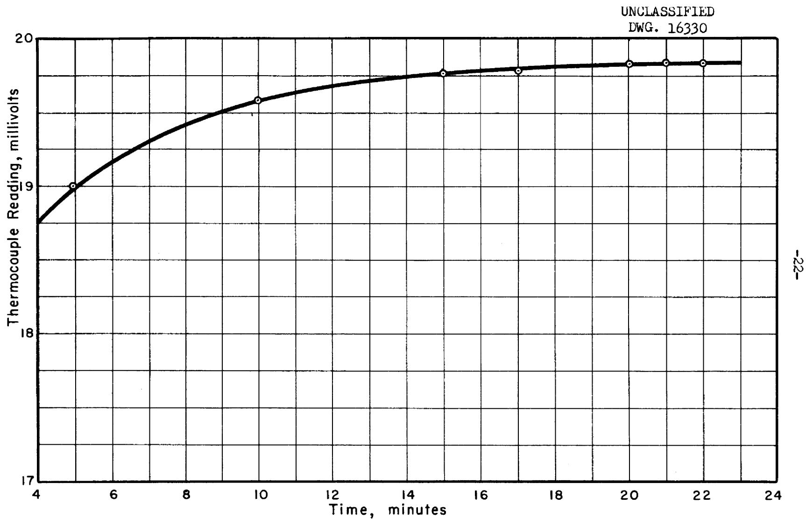  
Fig.10. Variation with Time of Thermocouple IO During Run 12 Showing Approach to Equilibrium.

This equation takes into account the effect of the heat generation in the tube wall on the temperature drop through the wall. The derivation of this equation is given in Appendix III. The source term, $W$ , is given by

$$
W = \frac {C E I}{V} \tag {4}
$$

where E and I are the voltage and current at the test section, c is the conversion factor, 3.413 Btu/hr-watt, and V is the volume of metal in the tube wall of the test section.

It is assumed that the heat generation is uniform in the tube wall. This is borne out by Figure 5 which shows the voltage impressed on the test section as a function of distance along the tube for a typical run. With uniform heat generation, the fluid mixed-mean temperature as a function of the distance down the tube is given by a straight line drawn between $t_{m,i}$ and $t_{m,o}$ , the fluid mixed-mean inlet and outlet temperatures, respectively. Actually, due to heat losses in the vicinity of the power flanges, not all of the heat generated is transferred into the test fluid. This results in a slightly lower slope for the mixed-mean temperature curve in the immediate vicinity of the power flanges and a correspondingly slight raising of the slope through the central portion. However, since the heat loss through the power flanges was found to be low, less than $2\%$ of the total heat input, the error introduced by assuming a straight line between $t_{m,i}$ and $t_{m,o}$ is small.

The total heat generation in the tube wall is determined from the measured voltage drop across the test section and the current passing through the tube wall. Part of the total heat goes to external loss and the rest into heating the fluid in the test section. The external

heat loss can be obtained from Figure 7 for the average outside tube wall temperature for the given set of experimental data. The heat transferred into the fluid in passing through the test section is given by the equation

$$
q _ {p} = w e _ {p} \left(t _ {m, 0} - t _ {m, i}\right) \tag {5}
$$

where $w$ is the fluid flow rate in $\text{lbs/hr}$ , and $t_{\text{m,o}}$ and $t_{\text{m,i}}$ the fluid mixed-mean outlet and inlet temperatures, respectively. The heat transfer area is taken as the inside surface area of the test section between the two power flanges. The heat flux was based on the heat gained by the fluid as given by equation (5). This was checked by the electrical power input corrected for the measured external heat loss. A maximum deviation between these two of $9\%$ was observed. The heat balance for each run is shown in Table I.

A sample calculation for the determination of the local coefficient of heat transfer is presented in Appendix I. Figure 11 shows a typical temperature profile for the inside tube wall.

The physical properties of sodium hydroxide necessary to these calculations are presented graphically in Appendix II. The physical properties were evaluated at the average fluid mixed-mean temperature.

# B. Correlation of the Heat Transfer Coefficient

By considering the dimensionless differential equations describing heat transfer and fluid flow, a number of dimensionless moduli arise which characterize forced convection heat transfer in similar systems. These dimensionless parameters (Nusselt, Reynolds and Prandtl moduli) are functionally related by the equation

$$
\mathrm {N u} = \Phi (\mathrm {R e}, \mathrm {P r}) \tag {6}
$$

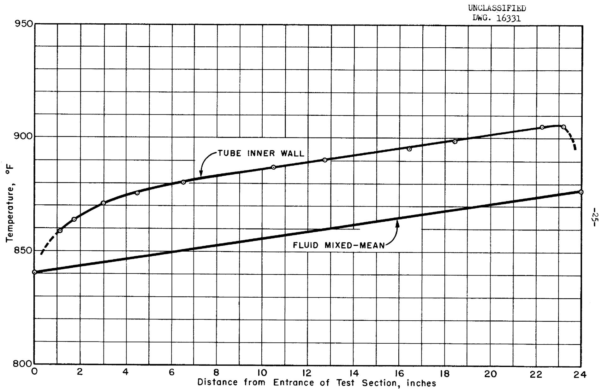  
Fig. II. Typical Temperature Profiles Along Axis of Electrically Heated Test Section.

Reynolds12, Prandtl11, von Karman6, Boelter, Martinelli and Jonassen1 and others have determined the analytical form of the function, $\Phi$ , for turbulent flow by comparing heat and momentum transfer within the fluid for several ideal systems approximating real systems.

For convenience, equation 6 is usually written in the empirical form

$$
\mathrm {N u} = \mathrm {a R e} ^ {\mathrm {n}} \mathrm {P r} ^ {\mathrm {p}} \tag {7}
$$

where the constants $a$ , $n$ and $p$ are experimentally determined. In general $\underline{n}$ is taken as 0.8. Dittus and Boelter3 found that equation 7 could be written as

$$
\mathrm {N u} = 0. 0 2 4 3 \mathrm {R e} ^ {0. 8} \mathrm {P r} ^ {0. 4} (\text {f o r h e a t i n g}) \tag {8}
$$

and

$$
\mathrm {N u} = 0. 0 2 6 5 \mathrm {R e} ^ {0. 8} \mathrm {P r} ^ {0. 3} (\text {f o r c o o l i n g}) \tag {9}
$$

McAdams9 correlated data for both heating and cooling by the equation

$$
\mathrm {N u} = 0. 0 2 3 \mathrm {R e} ^ {0. 8} \mathrm {P r} ^ {0. 4} \tag {10}
$$

In Table I are listed the pertinent measurements and calculated results of the present sodium hydroxide experiment. The heat transfer coefficient was calculated for a position for down-stream (L/D = 100 or greater) where fully developed turbulent flow existed.

Plotting the experimental data as $\text{Nu}$ vs $\text{Pr}$ for various values of $\text{Re}$ , it is seen that $\underline{\mathfrak{p}}$ in equation 7 is approximately 0.4. A least squares analysis of the data then yields the result, $\text{a} = 0.021$ . That is, the experimental turbulent forced convection data for molten sodium hydroxide can be correlated by the equation

$$
\mathrm {N u} = 0. 0 2 1 \mathrm {R e} ^ {0. 8} \mathrm {P r} ^ {0. 4} \tag {11}
$$

TABLE I   
EXPERIMENTAL DATA AND CALCULATED RESULTS - DETERMINATION OF   
HEAT TRANSFER COEFFICIENT OF MOLTEN SODIUM HYDROXIDE   

<table><tr><td>Run</td><td>qF/A Btu/hr-ft2</td><td>w lbs/hr</td><td>ts-tmOF</td><td>tm,0-tm,i OF</td><td>tw,ave OF</td><td>tm,ave OF</td><td>h Btu/hr-ft2OF</td><td>Heat Balance (qF+q1&#x27;qe)</td><td>Re</td><td>Pr</td><td>Nu</td></tr><tr><td>1</td><td>27,312</td><td>365</td><td>9.2</td><td>8.6</td><td>713</td><td>718</td><td>2970</td><td>0.93</td><td>6283</td><td>6.8</td><td>48.4</td></tr><tr><td>2</td><td>74,636</td><td>500</td><td>18.2</td><td>17.7</td><td>791</td><td>768</td><td>4100</td><td>0.97</td><td>10092</td><td>5.6</td><td>69.6</td></tr><tr><td>3</td><td>122,448</td><td>563</td><td>27.4</td><td>26.0</td><td>814</td><td>781</td><td>4470</td><td>0.96</td><td>11757</td><td>5.4</td><td>72.9</td></tr><tr><td>4</td><td>142,801</td><td>419</td><td>38.2</td><td>42.6</td><td>879</td><td>835</td><td>3740</td><td>0.98</td><td>10151</td><td>4.5</td><td>61.0</td></tr><tr><td>5</td><td>133,844</td><td>410</td><td>38.1</td><td>40.2</td><td>876</td><td>830</td><td>3515</td><td>0.94</td><td>9808</td><td>4.6</td><td>57.3</td></tr><tr><td>6</td><td>113,604</td><td>392</td><td>30.7</td><td>36.4</td><td>895</td><td>859</td><td>3700</td><td>0.96</td><td>10019</td><td>4.2</td><td>60.3</td></tr><tr><td>7</td><td>122,561</td><td>204</td><td>67.2</td><td>76.2</td><td>947</td><td>873</td><td>1830</td><td>0.99</td><td>5377</td><td>4.0</td><td>29.8</td></tr><tr><td>8</td><td>128,950</td><td>366</td><td>38.5</td><td>43.7</td><td>850</td><td>805</td><td>3350</td><td>0.94</td><td>8172</td><td>5.0</td><td>54.6</td></tr><tr><td>9</td><td>124,220</td><td>319</td><td>42.5</td><td>47.4</td><td>861</td><td>812</td><td>2925</td><td>0.91</td><td>7258</td><td>4.9</td><td>47.7</td></tr><tr><td>10</td><td>83,447</td><td>491</td><td>19.1</td><td>21.0</td><td>855</td><td>832</td><td>4370</td><td>0.95</td><td>11759</td><td>4.5</td><td>71.3</td></tr><tr><td>11</td><td>138,509</td><td>449</td><td>32.8</td><td>38.3</td><td>879</td><td>839</td><td>4225</td><td>0.96</td><td>10957</td><td>4.4</td><td>69.0</td></tr><tr><td>12</td><td>134,868</td><td>336</td><td>41.3</td><td>50.7</td><td>914</td><td>866</td><td>3265</td><td>0.96</td><td>8758</td><td>4.1</td><td>53.2</td></tr><tr><td>13</td><td>135,258</td><td>293</td><td>46.0</td><td>59.2</td><td>943</td><td>890</td><td>2940</td><td>0.95</td><td>8029</td><td>3.8</td><td>47.9</td></tr><tr><td>14</td><td>129,786</td><td>312</td><td>43.3</td><td>53.2</td><td>937</td><td>887</td><td>3000</td><td>0.93</td><td>8543</td><td>3.8</td><td>48.9</td></tr><tr><td>15</td><td>143,728</td><td>422</td><td>36.3</td><td>42.5</td><td>875</td><td>832</td><td>3960</td><td>0.99</td><td>10094</td><td>4.6</td><td>64.6</td></tr><tr><td>16</td><td>119,960</td><td>193</td><td>65.6</td><td>79.0</td><td>946</td><td>874</td><td>1835</td><td>0.98</td><td>5103</td><td>4.0</td><td>30.0</td></tr></table>

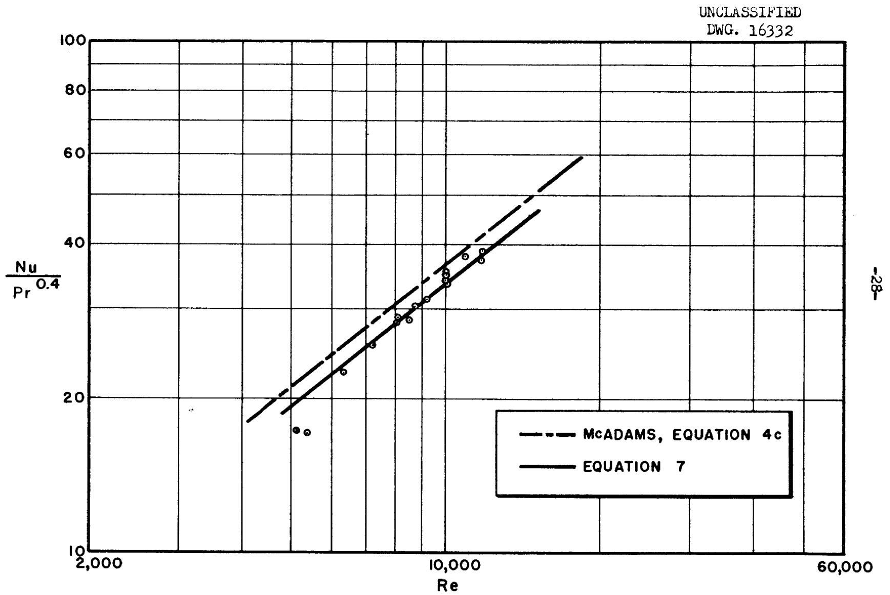  
Fig.12. Experimental Heat Transfer Coefficients for Sodium Hydroxide.

for values of the Reynolds modulus between 6000 and 12000.

The standard deviation of the data from this equation, assuming that the Reynolds modulus is exactly known, is 0.001.

The experimental data are shown in Figure 12 with relation to the derived correlating equation,11, and the McAdams equation,10. It is seen that the data lie approximately $9\%$ below equation 10.

# C. Thermal Entrance Region

It was possible to obtain from the experimental data for each run, the thermal entrance length. This length is defined as the distance from the entrance of the test section at which the heat transfer coefficient has reached a value within a given percentage of the established value. The entrance length is normally expressed in terms of the number of tube diameters from the entrance.

The local coefficient of heat transfer is shown in Figure 13 as a function of the ratio, $(\mathrm{L} / \mathrm{D})$ , for a typical experimental run. Figure 14 gives the variation of the thermal entrance length, $(\mathrm{L} / \mathrm{D})_{\mathrm{e}}$ , with the Peclet modulus (Re·Pr). In the present investigation $(\mathrm{L} / \mathrm{D})_{\mathrm{e}}$ was taken as the $(\mathrm{L} / \mathrm{D})$ at which the local conductance had dropped to a value of 1.1 of the established value.

Poppendiek10 reviews the thermal entrance length data for an air system (Humble, Lowdermilk and Desmon8 measurements) and for a mercury system (English and Barrett4 measurements). Both of these experiments were conducted under conditions of uniform heat flux. Based on the thermal entrance length criterion used in the present report, he found that for air, $(\mathrm{L} / \mathrm{D})_{\mathrm{e}} = 15$ or greater, and for mercury, $(\mathrm{L} / \mathrm{D})_{\mathrm{e}} = 5$ or greater.

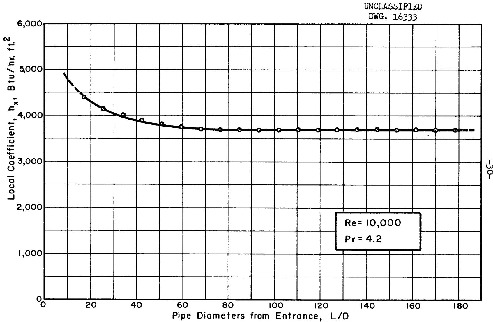  
Fig. 13. Local Heat Transfer Coefficients for Sodium Hydroxide Flowing in a Pipe Under Uniform Flux Conditions.

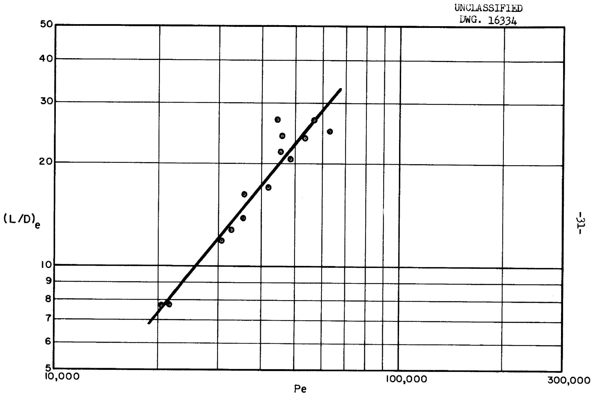  
Fig.14. Thermal Entrance Length for Molten Sodium Hydroxide

# D. Analysis of Errors

Error theory shows that for a function of several variables, $M = f(m_1, m_2, \ldots, m_n)$ , the maximum error in $M$ , $\triangle M$ , can be approximated by the expression,

$$
\Delta m = \frac {\partial M}{\partial m _ {1}} \Delta m _ {1} + \frac {\partial M}{\partial m _ {2}} \Delta m _ {2} + \dots + \frac {\partial M}{\partial m _ {n}} \Delta m _ {n}.
$$

However, it is to be noted that the actual error in M might not equal the maximum error calculated, as errors in the various measured quantities might offset each other.

Applying this type of analysis to the present experiment, the following errors can be tabulated:

1. For the heat flux, $(q_{f} / A)$

a. error in $(t_{m,0} - t_{m,i})$ , $1\%$   
b. error in flow rate, w, 0.6%   
c. error in heat transfer area, A, 1.4%

for a total error of $3 \%$

2. For the temperature difference, $(t_{\mathrm{s}} - t_{\mathrm{m}})$

a. error in temperature, $t_w$ , 0.5%   
b. error in temperature drop through tube wall, $t_{\mathrm{W}} - t_{\mathrm{S}}$ , 2%   
c. error in fluid mixed-mean temperature, $t_m$ , 2%

for a total error of $4.5\%$

Thus, the maximum possible error in h is $7.5\%$ .

The precision of the experiment as indicated by the standard deviation obtained through a least squares analysis of the data is $4.8\%$ .

# IV. NOMENCLATURE

a

Constant in heat transfer correlating equation 7

c

Conversion factor, 3.413 Btu/hr-watt

cp

Specific heat of fluid at constant pressure, Btu/lb. fluid-0F

a

Inside diameter of tube, ft

h

Coefficient of heat transfer in region of fully developed turbulent flow, Btu/hr-ft $^2$ - $^6$ F; hx, coefficient at position x on tube.

k

Thermal conductivity of fluid, Btu/hr.ft² $\mathbf{O}_{\mathrm{F}} / \mathrm{ft}$ ; kNi, thermal conductivity of nickel

n,p

Constants in heat transfer correlating equation 7

q

Rate of heat transfer, Btu/hr; $q_p$ , heat gained by the fluid, $q_1$ , heat loss to the environment; $q_e$ , electrical heat input

#

Radius of tube, ft; $\mathbf{r}_{\mathbb{W}}$ outside wall, $\mathbf{r}_{\mathbb{S}}$ inside wall

te

Temperature of environment, ${}^{\mathrm{OF}}$

tm

Fluid mixed-mean temperature, $^{\mathrm{o}}\mathbb{F}$ ; $t_{m,i}$ , at test section inlet; $t_{m,o}$ , at test section outlet; $t_{m,ave}$ , arithmetic average of $t_{m,i}$ and $t_{m,o}$ .

ts

Inside tube wall temperature; $t_{s,ave}$ , average

W

Outside tube wall temperature; $t_{\text{W,ave}}$ , average

W

Mass rate of flow, lbs. fluid/hr

A

Heat transfer surface, ft²

E

Voltage impressed on test section, volts

G

Mass velocity, lbs. fluid/hr-(ft² of tube cross section)

I

Current passing through test section, amperes

L

Distance down tube from entrance, ft.

(L/D)

Length to diameter ratio for tube, dimensionless; $(\mathrm{L} / \mathrm{D})_{\mathrm{e}}$ , at end of thermal entrance region

V

Volume of metal in tube wall, ft³

W

Volume heat generation, Btu/hr-ft3

#

Temperature difference, $^\circ \mathbf{F}$

$\mu$ Absolute viscosity of fluid lbs/hr.ft

Density of fluid lbs/ft³

Nu Nusselt modulus, dimensionless, (hd/k)

Pr Prandtl modulus, dimensionless, $(\mathbf{c_p}\mu /\mathbf{k})$

Reynolds modulus, dimensionless, (dG/μ)

Pe Peclet modulus, dimensionless, Re·Pr, $\left(\frac{c_p dG}{k}\right)$

# V. BIBLIOGRAPHY

1. Boelter, L. M. K., Martinelli, R. C., Jonassen, F., Trans. A.S.M.E., 63, 447 (1941).   
2. Corrosion Handbook, ed. Uhlig (1940).   
3. Dittus, F. W., Boelter, L. M. K., Univ. Cal. Publ. in Engr. 2, No. 13, 443 (1930).   
4. English, D., Barrett, T., Atomic Energy Research Establishment, Ministry of Supply, Harwell, Berks, AERE E/R 547, Unclassified, (1950).   
5. Hoffman, H. W., Doctoral Thesis, The Johns Hopkins University Library (1951).   
6. Karman, T. von, Trans. A.S.M.E., 61, 705 (1939).   
8. Humble, L. V., Lowdermilk, W. H., Desmon, L. G., Nat. Adv. Comm. Aero., Report 1020 (1951).   
9. McAdams, W. H., "Heat Transmission", 2nd edition, p 168 (1942).   
10. Poppendiek, H. F., Oak Ridge National Laboratory, Physics Report 913, Unclassified (1951).   
11. Prandtl, L., Physik. Zeitschr., 29, 487 (1928).   
12. Reynolds, O., Proc. Manch. Lit and Phil. Soc., 14, 7 (1874); Collected Papers, 1, 81 (1900), Cambridge.

# APPENDIX I

# Sample Calculation

Calculations are based on run number 6.

1. Experimental Data

(a) $\mathbf{w} = 392 \, \mathrm{lbs/hr}$   
(b) $t_{m,1} = 840.3 \mathrm{~oF}$   
(c) $t_{\text{III}, \text{O}} = 876.7^{\circ} \text{F}$   
(d) Outside tube wall temperatures, $t_{\mathrm{w}}$   
(e) $\mathbf{E} = 6.8$ volts   
(f) I = 324 amperes   
(g) $t_{\mathrm{e}} \cong 100^{\circ} \mathrm{F}$

2. Inside tube wall temperature

$$
t _ {w} - t _ {s} = \frac {W}{2 k _ {N i}} \left(\frac {r _ {w} ^ {2}}{2} \ln \frac {r _ {w}}{r _ {3}} - \frac {r _ {w} 2 _ {-} r _ {s} ^ {2}}{2}\right)
$$

$$
\mathbf {r} _ {\mathbf {W}} = 0. 0 1 5 6 3 \mathbf {f t}
$$

$$
\mathbf {r} _ {\mathbf {s}} = 0. 0 0 9 7 9 \mathbf {f t}
$$

$$
k _ {N i} = 3 0. 4 8 B t u / h r. f t. ^ {\circ} F a t t _ {W, a v e}
$$

$$
W = \frac {C E I}{V}
$$

$$
w h e r e \quad c = 3. 4 1 3 B t u / h r - w a t t
$$

$$
V = 0. 0 0 0 9 3 2 r t ^ {3}
$$

thus,

$$
\begin{array}{l} t _ {w} - t _ {S} = \frac {(3 . 4 1 3) (6 . 8) (3 2 4) (0 . 0 0 0 4 8)}{(0 . 0 0 0 9 3 2) (2) (3 0 . 4 8)} \\ = 6. 3 \mathrm {o} _ {\mathrm {F}} \\ \end{array}
$$

$$
o r \quad t _ {s} = t _ {w} - 6. 3
$$

A plot of $t_s$ vs. L is shown in Figure 11.

3. Electrical heat input

$$
\begin{array}{l} q _ {e} = c E I = (3. 4 1 3) (6. 8) (3 2 4) \\ = 7 5 2 0 \mathrm {B t u} / \mathrm {h r} \\ \end{array}
$$

4. Heat gained by fluid

$$
\begin{array}{l} \mathrm {q} _ {\mathrm {f}} = \mathrm {w c p} \left(\mathrm {t} _ {\mathrm {m}, \mathrm {o}} - \mathrm {t} _ {\mathrm {m}, \mathrm {i}}\right) \\ = (3 9 2) (0. 4 9) (3 6. 4) \\ = 6 9 8 8 \text {B t u / h r} \\ \end{array}
$$

5. Heat loss

$$
F r o m \quad F i g u r e 7, q _ {1} = 2 3 9 B t u / h r a t t w, a v e - t e = 7 9 5 ^ {\circ} F
$$

6. Heat balance

$$
\left(q _ {1} + q _ {2}\right) / q _ {e} = \frac {6 9 8 8 + 2 3 9}{7 5 2 0} = 0. 9 6
$$

7. Heat flux

$$
\left(q _ {F} / A\right) _ {x} = \frac {6 9 8 8}{(0 . 0 0 6 1 5)} = 1 1 3, 6 0 4 B t u / h r - f t ^ {2}
$$

8. Temperature difference

From Figure 11, the difference $t_s - t_m$ can be obtained for various L's. These were taken at 2,3,4,5,..., 22 inches.

9. Heat transfer coefficient

$$
h _ {x} = \frac {\left(q _ {f} / A\right) _ {x}}{\left(t _ {s} - t _ {m}\right) _ {x}}
$$

$h_x$ was calculated for the values of $(t_s - t_m)$ at the position $x$ . E.g. at $L = 20$ inches, $t_s - t_m = 30.7^{\circ}F$ and $h = 3700 Btu/hr.ft^2$ oF. $h_x$ as a function of $L$ is shown in Figure 13.

10. Dimensionless moduli

$$
R e = \frac {d G}{\mu} = \frac {(0 . 0 0 9 7 9) (5 . 2 5 x 1 0 ^ {6})}{(5 . 1 3)} = 1 0 0 1 9
$$

$$
\mathrm {N u} = \frac {\mathrm {h d}}{\mathrm {k}} = \frac {(3 7 0 0) (0 . 0 0 9 7 9)}{(0 . 6)} = 6 0. 3
$$

$$
\Pr = \frac {c _ {p} \mu}{k} = \frac {(0 . 4 9) (5 . 1 3)}{(0 . 6)} = 4. 2
$$

$$
\mathrm {N u} / \mathrm {P r} ^ {0. 4} = 3 4. 0
$$

$$
\mathrm {P e} = \mathrm {R e} \cdot \mathrm {P r} = 4 2, 0 8 0
$$

# APPENDIX II

Physical Properties of Molten Sodium Hydroxide

The physical properties of sodium hydroxide were obtained from the following sources:

cp: Terashkevich and Vishnerskii - J. Gen. Chem. (U.S.S.R.), 7 (1937)

$\mu$ : Arndt and Ploetz - Zeitsch. fur phys. chem., 121, 439 (1926)

p : Ibid

k : Deem, Battelle Memorial Institute, personal communication. For the temperature range of the experimental data reported here, a value of $\mathrm{k} = {0.6}\mathrm{{Btu}}/\mathrm{{hr}} - \mathrm{{ft}} - {}_{\mathrm{F}}^{\mathrm{o}}$ was used.

The physical properties as a function of temperature are shown in Figure 15.

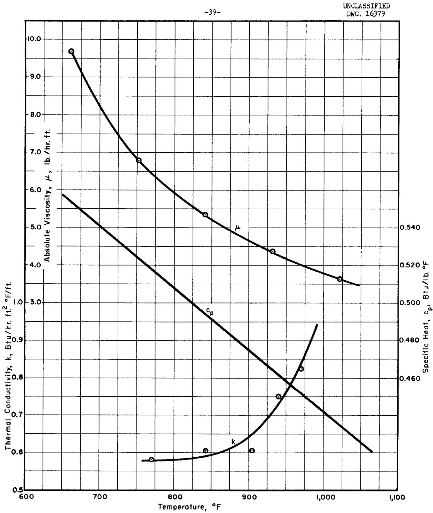  
Fig. 15. Variation of Physical Properties of Sodium Hydroxide with Temperature

# APPENDIX III

Derivation of Equation for Temperature Drop Across

a Tube Wall in which Heat is being Generated

The transient conduction equation for the case in which heat generation exists within the solid is

$$
- \frac {\partial t}{\partial \theta} = \alpha \nabla^ {2} t + \frac {W}{\rho c _ {p}} \tag {1}
$$

where

$$
\begin{array}{l} \alpha = \text {t h e r m a l d i f f u s i t y} = \frac {k}{\rho^ {\prime} c _ {p}} \\ \nabla^ {2} t = \text {L a p l a c i a n o f} t \\ W = \text {s o u r c e} \\ \end{array}
$$

Then for steady state conditions, $\frac{\partial t}{\partial \theta} = 0$ , and uniform heat generation,

$W =$ constant. For a circular tube, the Laplacian as expressed in cylindrical

coordinates is

$$
\nabla^ {2} t = \frac {\partial^ {2} t}{\partial r ^ {2}} + \frac {1}{r} \frac {\partial t}{\partial r} + \frac {\partial^ {2} t}{\partial z ^ {2}} + \frac {1}{r ^ {2}} \frac {\partial^ {2} t}{\partial \Phi^ {2}}
$$

Since the temperature distribution is symmetrical with respect to $\Phi$ , $\frac{\partial^2 t}{\partial \Phi^2} = 0$ and since beyond the entrance region, $\frac{\partial t}{\partial z} = \text{const}$ ,

$$
\frac {\partial^ {2} t}{\partial z ^ {2}} = 0
$$

equation 1 thus reads

$$
\begin{array}{l} 0 = \frac {k}{c _ {p} \rho} \left(\frac {d ^ {2} t}{d r ^ {2}} + \frac {1}{r} \frac {d t}{d r}\right) + \frac {W}{\rho c _ {p}} \\ - \frac {\mathrm {d} ^ {2} t}{\mathrm {d} r ^ {2}} + \frac {1}{r} - \frac {\mathrm {d} t}{\mathrm {d} r} = - \frac {W}{k} \tag {2} \\ \end{array}
$$

if let $\mathbf{s} = \frac{\mathrm{d}\mathbf{t}}{\mathrm{d}\mathbf{r}}$

Then, equation 2 becomes

$$
\frac {\mathrm {d} s}{\mathrm {d} r} + \frac {1}{r} s = - \frac {W}{k} \tag {3}
$$

This is of the form

$$
\frac {\mathrm {d} \mathbf {y}}{\mathrm {d} x} + \mathbf {P} \mathbf {y} = 0 \tag {4}
$$

where $\mathbf{P} = \mathbf{f}_{\perp}(\mathbf{x}) = \frac{1}{\mathbf{r}}$

$$
Q = f _ {2} (x) = - W / k
$$

which has the solution,

$$
y = e ^ {- \int P d x} \left(\int e ^ {\int P d x} Q d x + C _ {1}\right) \tag {5}
$$

$$
\int P d x = \int \frac {1}{r} d r = l n r \tag {6}
$$

$$
e ^ {- \int P d x} = e ^ {- \ln r} = \frac {1}{r} \tag {7}
$$

$$
e ^ {- \int P d x} = e ^ {\ln r} = r \tag {8}
$$

thus,

$$
\begin{array}{l} s = \frac {1}{r} \left(\int - r \frac {W}{k} d r + c _ {1}\right) \\ = \frac {1}{r} \left(- \frac {W}{k} \frac {r ^ {2}}{2} + c\right) \tag {9} \\ \end{array}
$$

$$
\frac {\mathrm {d} t}{\mathrm {d} r} = - \frac {W}{k} \frac {r}{2} + \frac {C}{r} \tag {10}
$$

The heat flow through the surface defined by

$$
\mathbf {r} = \mathbf {r} _ {\mathrm {M}} \text {i s}
$$

$$
\left(\mathrm {q} / \mathrm {A}\right) _ {\mathrm {w}} = - \mathrm {k} \left(\frac {\mathrm {d t}}{\mathrm {d r}}\right) _ {\mathrm {r} = \mathrm {r} _ {\mathrm {w}}}
$$

$$
\left(\frac {\mathrm {d} t}{\mathrm {d} \overline {{r}}}\right) _ {\overline {{r}} = r _ {W}} = - \frac {(q / A) _ {W}}{k} \tag {11}
$$

then, substituting this boundary condition into equation 10,

$$
- \frac {(q / A) _ {W}}{k} = - \frac {W}{k} \frac {r _ {W}}{2} + \frac {C}{r _ {W}}
$$

$$
C = r _ {w} ^ {2} \frac {W}{2 k} - r _ {w} \frac {(q / A) _ {w}}{k} \tag {12}
$$

# APPENDIX III(CONT'D)

Substituting for C in equation 10,

$$
\begin{array}{l} \frac {d t}{d r} = - \frac {W}{k} \frac {r}{2} + \left(r _ {w} ^ {2} \frac {W}{2 k} - r _ {w} \frac {(q / A) _ {W}}{k}\right) \frac {1}{r} \\ = - \frac {W}{2 k} \left(r - r _ {w} 2 \frac {1}{r}\right) - \frac {(q / A) _ {w}}{k} r _ {w} \frac {1}{r} \tag {13} \\ \end{array}
$$

integrating equation 13

$$
\begin{array}{l} t _ {w} - t _ {s} = - \frac {W}{2 k} \left(\frac {r ^ {2}}{2} - r _ {w} ^ {2} \ln r\right) \left| \begin{array}{l} r _ {w} \\ r _ {s} \end{array} - \frac {(q / A) _ {w}}{k} r _ {w} \ln r \right| \begin{array}{l} r _ {w} \\ r _ {s} \end{array} \\ = - \frac {W}{2 k} \left(\frac {r _ {w} ^ {2} - r _ {s} ^ {2}}{2} - r _ {w} ^ {2} \ln \frac {r _ {w}}{r _ {s}}\right) - \frac {(q / A) _ {w}}{k} r _ {w} \ln \frac {r _ {w}}{r _ {s}} \tag {14} \\ \end{array}
$$

For the particular problem under consideration $\frac{\mathrm{d}t}{\mathrm{d}\mathbf{r}}$ at $\mathbf{r} = \mathbf{r}_{\mathbf{w}}$ is essentially zero. Thus, equation 14 reduces to

$$
t _ {w} - t _ {s} = \frac {W}{2 k} \left(r _ {w} ^ {2} \ln \frac {r _ {w}}{r _ {s}} - \frac {r _ {w} ^ {2} - r _ {s} ^ {2}}{2}\right) \tag {15}
$$