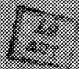

OHNL-1375

Progress 944

CLASSIFIED

AC - 6 - 12

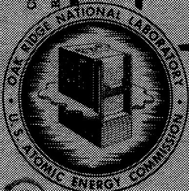

MARTIN MARIETAYE NERNEY SYSTEMS HUMAN

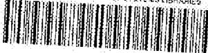

34456 03531499

AIRCRAFT NUCLEAR PROPULSION PROJECT

QUARTERLY PROGRESS REPORT

FOR PERIOD ENDING SEPTEMBER, 10, 1952

CENTRAL RESEARCH LIBRARY DOCUMENT COLLECTION

LIBRARY LOAN COPY

DO NOT TRANSFER TO ANOTHER PERSON

If you wish someone else to see this document, send in name with document and the library will arrange a loan.

OAK RIDGE NATIONAL LABORATORY

OP位为A或B，D为

CARBIDE AND CARBON CHEMICALS COMPANY

A DIVISION OF UNION CARBON AND CARBON COMPOHATION

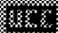

POCTOPFCBQX

DAM RIOGE TENNERSGE

ORNL-1375

This document consists of 180 pages.

Copy of 237 copies. Series A.

Contract No. W-7405-eng-26

# AIRCRAFT NUCLEAR PROPULSION PROJECT

# QUARTERLY PROGRESS REPORT

# for Period Ending September 10, 1952

R.C.Briant,Director

J. H. Buck, Associate Director

A. J. Miller, Assistant Director

EDITED BY:

W. B. Cottrell

DATE ISSUED

OAK RIDGE NATIONAL LABORATORY

Operated by

CARBIDE AND CARBON CHEMICALS COMPANY

A Division of Union Carbide and Carbon Corporation

Post Office Box P

Oak Ridge, Tennessee

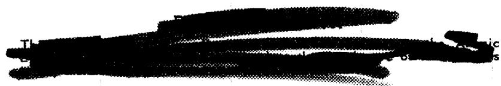

MARTIN MARIETTA ENERGY SYSTEMS LIBRARIES

3 4456 0353149 9

# INTERNAL DISTRIBUTION

1. G. M. Adamson   
2. C. R. Baldock   
3. C.J. Barton   
4. D. S. Billington   
5. F. Blankenship   
6. E. P. Blizzard   
7. M. A. Erdig   
8. R.C.Brent   
9. R.B.Brits   
10. F. R. Bruce   
11. J. H. Buck   
12. A. D. Calliha   
13. D. W. Cardwell   
14. C. E. Center   
15. J. M. Cisar   
16. G. H. Clewett   
17. C. E. Clifford   
18. W. B. Cottrell   
19. D. D. Cowen   
20. W. K. Eister   
21. L. B. Emlet (Y-12)   
22. W. K. Ergen   
23. G. T. Felbeck (C&CCC)   
24. A. P. Fraas   
25. W. R. Gall   
26. C. B. Graham   
27. W. W. Grigorieff (concentant)   
28. W. R. Grimes   
29. A. Hollander   
30. A. S. Householder   
31. W. B. Humes (K-25)   
32. R. J. Jones   
33. G. W. Keilholtz   
34. C. P. Keim   
35. M. T. Kelley   
36. F. Kertesz   
37. E.M. King   
38. C. E. Larsen   
39. R. S. Livingston

40. R.N. Lyon

41. D. Manly

42. B. McDonald

43. J. L. Meem

44. A. J. Miller

45. K. Z. Morgan

46 E.J.Murphy

A. H. F. Poppendiek

8. P. M. Reyling

49. H. W. Savage

50. R. W. Schroeder

51. E. D. Shipley

52. 0. Sisman

53. E. C. Smith

54. L. P. Smith (consultant)

55. A. H. Snell

56. F. L. Steahly

57. R. W. Stoughton

58. C. D. Susano

59. J. A. Swartout

60. E. H. Taylor

61. F. C. Uffelman

62. F. C. VonderLage

63. J. M. Warde

64. A. M. Weinberg

65. E. P. Wigner (consultant)

66. H. B. Willard

67. J. C. Wilson

68. C. E. Winters

78. ANP Library

79. Biology Library

5. Central Files

Health Physics Library

8 Metallurgy Library

88. Reactor Experimental Engineering Library

89-93. Technical Information

Department (Y-12)

94-95. Training School Library

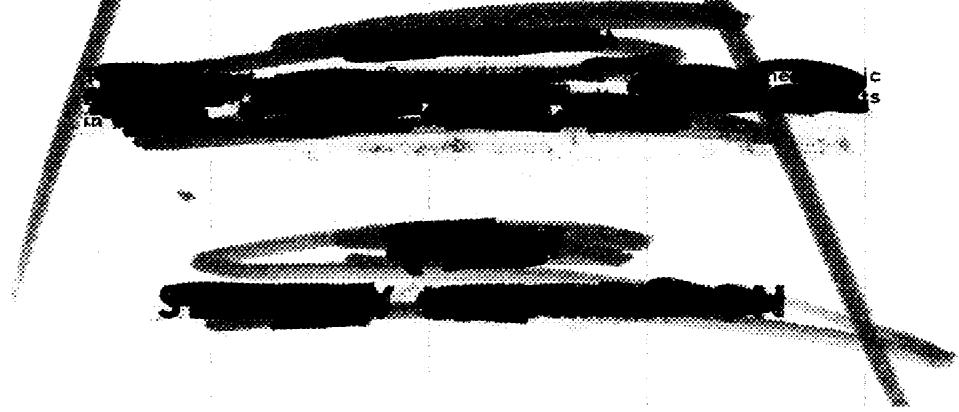

# EXTERNAL DISTRIBUTION

96-106. Argonne National Laboratory (1 copy to Kermit Anderson)

107. Armed Forces Special Weapons Project (Sandia)

108-115. Atomic Energy Commission, Washington

116. Battelle Memorial Institute

117-119. Brookhaven National Laboratory

120. Bureau of Aeronautics (Grant)

121. Bureau of Ships

122-123. California Research and Development Company

124. Chicago Patent Group

125. Chief of Naval Research

126-130. duPont Company

131-155. General Electric Company, ANPP (3 copies to AF Engineering Office)

156-159. General Electric Company, Richland

160. Hanford Operations Office

161. USAF-Headquarters, Office of Assistant for Atomic Energy (Attn: Lt. Col. R. E. Greer)

162-169. Idaho Operations Office (1 copy to Phillips Petroleum Co.)

170. Iowa State College

171-174. Knolls Atomic Power Laboratory

175-176. Lockland Area Office

177-179. Los Alamos

180. Massachusetts Institute of Technology (Benedict)

181. Massachusetts Institute of Technology (Kaufmann)

182-184. Mound Laboratory

185-188. National Advisory Committee for Aeronautics, Cleveland (3 copies to A. Silverstein)

189. National Advisory Committee for Aeronautics, Washington

190-191. New York Operations Office

192-193. North American Aviation, Inc.

194. Nuclear Development Associates (NDA)

195. Patent Branch, Washington

196-197. Rand Corporation (1 copy to V. G. Henning)

198. Savannah River Operations Office (Augusta)

199. Savannah River Operations Office (Wilmington)

200-201. University of California Radiation Laboratory

202. Vitro Corporation of America

203-206. Westinghouse Electric Corporation

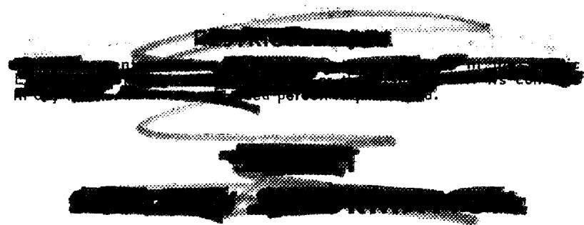

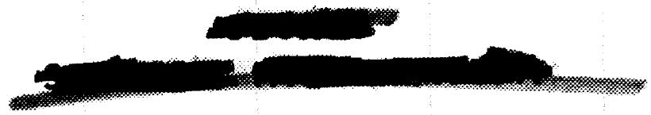

207-222. Wright Air Development Center

copies to B. Roman

1 copy to C. P. L. Hill

1 copy, Lt. Corr. N. I. Nielson

2 carries to Consolidated Vulture Aircraft Corporation

copy to Pratt and Whitney Aircraft Division

1 copy to Boeing Airplane Company

223-227. Technical Information Service, Oak Ridge, Tennessee

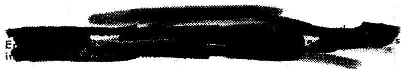

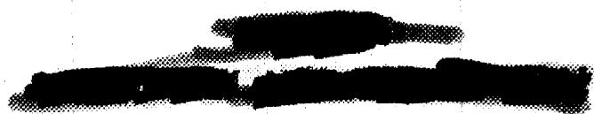

Reports previously issued in this series are as follows:

ORNL-528 Period Ending November 30, 1949

ORNL-629 Period Ending February 28, 1950

ORNL-768 Period Ending May 31, 1950

ORNL-858 Period Ending August 31, 1950

ORNL-919 Period Ending December 10, 1950

ANP-60 Period Ending March 10, 1951

ANP-65 Period Ending June 10, 1951

ORNL-1154 Period Ending September 10, 1951

ORNL-1170 Period Ending December 10, 1951

ORNL-1227 Period Ending March 10, 1952

ORNL-1234 Reactor Program of the Aircraft Nuclear Propulsion Project

ORNL-1294 Period Ending June 10, 1952

TABLE OF CONTENTS

P A G E

FOREWORD 1

PART I. REACTOR THEORY AND DESIGN 3

SUMMARY AND INTRODUCTION 5

1.CIRCULATING-FUEL AIRCRAFT REACTOR EXPERIMENT 6

Fluid Circuit 6

Pressure-Shell Stress Analysis 7

Reflector Coolant 11

Instrumentation 12

Off-Gas System 12

Reactor Control System 12

Shielding 13

2. EXPERIMENTAL REACTOR ENGINEERING 13

Pumps 15

Frozen-sodium-sealed pump in figure 8 loop 15

Durco frozen-fluoride-sealed pump. 15

Laboratory-size maintained-level gas-sealed pump 16

Durco pump with shaft packing 17

AREcentrifugal pump. 17

Valves 19

Bellows type of valve-stem seal 19

High-temperature valve-stem packings 19

Self-welding of seat materials 20

Canned-rotor-driven valve 20

Heat Exchangers 20

Test of core element of sodium-to-air radiator 20

Bifluid heat transfer loop 21

NaK-to-NaK heat exchanger 23

Instrumentation 23

Rotameter type of flowmeter 23

Rotating-vane type of flowmeter 24

Moore nullmatic pressure-measuring device 25

Diaphragm pressure-measuring device 25

Diaphragm pressure transmitters 25

Moving-probe level indicator 26

Null-balance level control 26

Strain-gage level indicator 26

Fluid Dynamics 26

ARE core mockup 26

#

Possible fuel-header manifold for the reactor core 29   
Technology of Fluoride Handling 29   
Fluoride production 29   
Removal of fluorides from contaminated systems 30   
Purity of pipe line helium 31   
Fluoride plug-removal test from simulated ARE core 31   
Injection of NaK into a flowing fluoride stream 31   
Gas-line-plugging tests 32   
Cooled-baffle vapor trap for zirconium-bearing fluoride fuel 34   
34

3. REACTOR PHYSICS 35

Oscillations in the Circulating-fuel Aircraft Reactor 36   
Effect of Gaps on Reactivity 38   
Slowing-Down Kernels 40

4.CRITICAL EXPERIMENTS 40

Direct-cycle Reactor 40   
Reflector studies 41   
Poison rod calibrations 42   
ARE Critical Assembly 43

PART II. SHIELDING RESEARCH 45

SUMMARY AND INTRODUCTION 47

5.LID TANK EXPERIMENTS 48

Air Ducts 48   
R-1 Reactor Gamma Shielding 53   
Other Lid Tank Experiments 56   
Correlation of Neutron Attenuation Data 63

6. BULK SHIELDING REACTOR 63

Mockup of the Divided Shield 64   
Air-scattering Experiments 64   
Reactor Power Determination 64   
Irradiation of Animals 66   
Irradiation of Electronic Equipment 69   
Capture Gamma-Ray Measurements 70

7．TOWER SHIELDING FACILITY 70   
8. NUCLEAR MEASUREMENTS 71

Fission Cross Section of $\mathbf{U}^{234}$ and $\mathbf{U}^{236}$ . 71

Total Cross Section of $\mathbf{N}^{14}$ 71

Time-of-Flight Spectrometer 72

PART III. MATERIALS RESEARCH 73

SUMMARY AND INTRODUCTION 75

9. CHEMISTRY OF HIGH-TEMPERATURE LIQUIDS 76

Fuel Mixtures Containing UF 77 NaF-KF-ZrF4-UF 77 NaF-ZrF4-UF 78 NaF-ZrF4-BeF2-UF 78 ZnF2-UF 79 Fuel Mixtures Containing UF 79 NaF-KF-LiF-UF 79 KF-UF 81 NaF-UF 81 Preparation of compounds of UF 81

Alkali Fluoroborate Systems 82  
Vapor pressures of commercial fluoroborates 82  
Thermal data for fluoroborate systems 82  
Differential Thermal Analysis 84  
X-Ray Studies of Complex Fluoride Systems 85 $\mathrm{Na}_3\mathrm{ZrF}_7\mathrm{-Na}_3\mathrm{UF}_7$ 85 $\mathrm{Na}_2\mathrm{ZrF}_6\mathrm{-Na}_2\mathrm{UF}_6$ 86 $\mathrm{NaZrF}_5\mathrm{-NaUF}_5$ 86

Spectrographic Analysis of Fluorides 87  
Simulated Fuel Mixture for Cold Critical Experiment 87  
Moderator Coolant Development 88  
Coolant Development 89  
RbF-AlF₃ 89  
NaF-KF-AlF₃ 89  
NaF-ZrF₄-AlF₃ 89  
NaF-ZrF₄ 89  
ZrF₄-BeF₂ 90

Hydrolysis and Oxidation of Fuel Mixtures 90  
Heat of solution and heat of formation of uranyl fluoride 90  
Free energy change for the reaction of uranium tetrafluoride with oxygen 90

Fuel Purification Research 91  
Purification of molten fluorides 91  
Preparation of pure zirconium tetrafluoride 92  
Preparation of pure aluminum fluoride 93

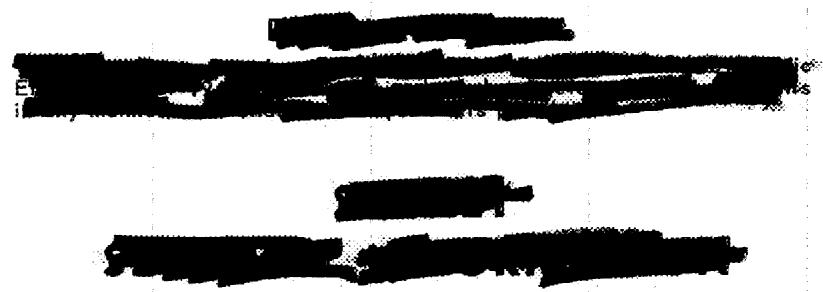

Reaction of Fuels with Alkali Metals 93

Service Functions 94

CORROSION RESEARCH 95

Parametric Studies of Fluoride Corrosion 96

Temperature of test 96   
Length of test 96   
Residual stresses in specimen 99   
Carbon content of specimen 99   
Corrosion inhibitors 100   
Pretreatment 101

Seesaw and Static Tests with Fluorides Containing $\mathbf{ZrF_4}$ 103

Fluoride Corrosion in Thermal Convection Loops 103

Fluoride mixtures containing $\mathbf{ZrF_4}$ 104   
Effect of cleaning loops 104   
Corrosion inhibitors 108   
Crevice corrosion 109   
Temperature variations 110   
Variations in alloy composition of the walls 110   
Postrun examination of fuels 112

Compatibility of Beryllium Oxide with Various Fluoride Mixtures 112

Hydroxide Corrosion 114

Temperature of test 114   
Residual stresses in specimen 114   
Corrosion inhibitors 115   
Hydrogen atmosphere 115

Liquid Metal Corrosion 117

Mass transfer in liquid lead 117   
Effect of temperature on lead corrosion 118   
Lead-sodium mixtures 118   
Spinner tests with sodium 119   
Type 1020 chromized steel in low-melting-point alloys 119   
Compatibility of beryllium oxide with sodium, NaK, and lead 119

Fundamental Corrosion Research 121

Interaction of fluorides with structural metals 121   
Synthesis of complex fluorides 122   
EMF measurements in fused fluorides 123   
Polarographic studies in sodium hydroxide 124   
Electrochemistry of sodium hydroxide 124   
Mechanism of fluoride corrosion 126   
Tripositive nickel compounds from hydroxide corrosion 127   
Solutions of metals in molten halides 130   
Fluoride corrosion phenomena 130

# 11.METALLURGYAND CERAMICS 131

Control Rod Fabrication 131

Mechanical Testing of Materials 132

Physical testing in fluorides 132

Creep and stress-rupture tests in argon 133

Welding 133

Cone-arc welding 135

Specifications for ARE welding 135

Tests of Brazing Alloys 138

Static corrosion tests of brazed joints 138

Tensile strength of brazed joints 138

Brazing of molybdenum 140

Dry-hydrogen brazing furnace 140

Reduction of Molybdenum Disulfide 141

Ceramics Research 143

Ceramic coatings for metals 143

Ceramic reflector 143

# 12. HEAT TRANSFER AND PHYSICAL PROPERTIES RESEARCH 144

Viscosity of Fuel Mixtures 145

NaF-ZrF4-UF4fuels 145

Capillary viscometer 145

Thermal Conductivity of Liquids 146

Heat Capacity 146

Density 147

Vapor Pressure of Fuel Constituents 147

Zirconium tetrafluoride 147

Zirconium-bearing fluoride mixtures 147

Convective Heat Transfer in Molten Sodium Hydroxide 148

Boiling Heat Transfer in Mercury 149

Natural Convection in Confined Spaces with Volume Heat Generation 149

Heat and Momentum Transfer Analysis of the Thermal Convection Loops 152

# 13. RADIATION DAMAGE 152

Irradiation of Fused Materials 153

In-Reactor Circulating Loops 154

Creep Under Irradiation 154

Radiation Effects on Thermal Conductivity 156

PART IV. APPENDIXES 157

# SUMMARY AND INTRODUCTION 159

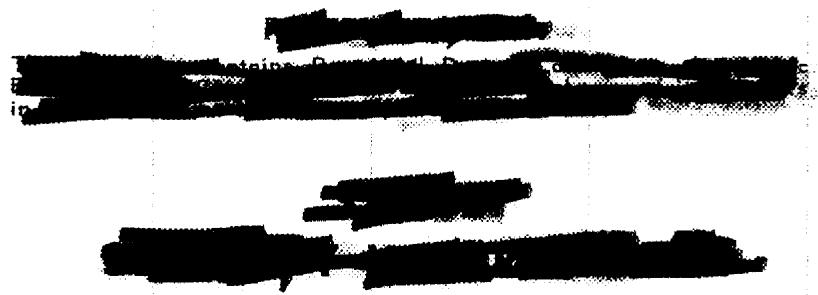

14. ANALYTICAL CHEMISTRY 159

Analytical Studies of Components of Fluoride Mixtures 159

Alkali metals 159   
Zirconium 160

Analytical Studies of Impurities in Fluoride Mixtures 160

Chromium 160   
Nickel 161   
Oxygen 161   
Chloride 161   
Water 162

Determination of Carbon in $\mathbf{ZrF_4}$ and $\mathrm{ZrO}_2$ -NaF-C Mixtures 162   
Compatibility of Reactor Fuels and NaK 162   
Service Analysis 163

15. LIST OF REPORTS ISSUED 164

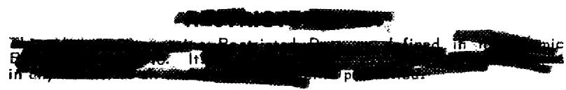

# ANP PROJECT QUARTERLY PROGRESS REPORT

FOREWORD

The Aircraft Nuclear Propulsion Project is comprised of some 300 technical and scientific personnel engaged in many phases of research directed toward the nuclear propulsion of aircraft. A considerable portion of this research is performed in support of other organizations participating in the national ANP effort. However, the bulk of the ANP research at ORNI is directed toward the development of a circulating-fuel type of reactor. The nucleus of this effort is now centered upon the Aircraft Reactor Experiment - a 3-megawatt high-temperature prototype of a circulating-fuel reactor for the propulsion of aircraft.

This quarterly progress report of the Aircraft Nuclear Propulsion Project at ORNL records the technical progress of the research on the circulating-fuel reactor and all other ANP research at the laboratory under its Contract W-7405-eng-26. The report is divided into four parts: I. Reactor Theory and Design; II. Shielding Research; III. Materials Research; and IV. Appendixes. Each part has a separate Summary and Introduction.

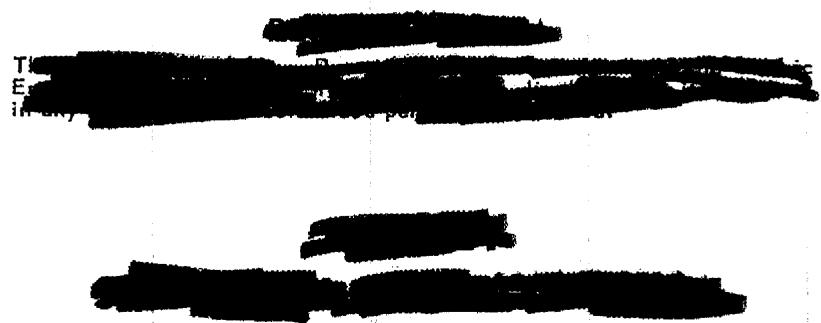

Part I

REACTOR THEORY AND DESIGN

# SUMMARY AND INTRODUCTION

The over-all concept and design of the Aircraft Reactor Experiment were set forth in the two preceding reports. The most significant modifications during the past quarter have been those attendant to the specification of NaK as the reflector coolant and the NaF-ZrF $_4$ -UF $_4$ mixture as the circulating fuel. Most of the equipment for the experiment is now on order and some has already been received and installed in the ARE Building. The safety aspects of the reactor are being analyzed, particularly, the off-gas disposal system and the effect of a postulated fuel-tube rupture (sec. 1).

Valves, pumps, and instrumentation for the fluid circuit of the Aircraft Reactor Experiment are being developed (sec. 2). Valves with both bellows seals and packed seals have been successfully used with molten fluorides, but the bellows seal appears to be the more reliable. Water tests with the maintained-level gas-sealed pump proposed for the ARE have been unsatisfactory. Since the packed seal is satisfactory when the back end is maintained at temperatures below the fluoride melting point, a pump incorporating this seal has been specified for the ARE. Instrumentation for the ARE fluid circuits must be designed so as to be unaffected by the high volatility and subsequent condensate of the $\mathrm{ZrF_4}$ -containing fuel. Accordingly, flowmeters, pressure-measurement

devices, and fluid-level indicators and controls are being redesigned and tested for this application. Data from the NaK-to-air radiator tests correspond exceptionally well with theoretical values. A hydrodynamic mockup of the ARE core has served to illustrate the problems associated with fuel loading and draining. Also of significance to the ARE is an experiment in which a fuel-tube rupture is simulated so that NaK (the reflector coolant) is injected into the fuel stream.

Theoretical investigations of the kinetics of the circulating-fuel reactor indicate that all subsequent oscillations will be moderate if the reactor survives the first, short, maximum excursion. The applicability of multigroup calculations to reactors with vastly different core and reflector materials is uncertain pending critical experiments. An improved method of computing the effects of gaps on reactivity has been developed (sec. 3).

The recent experiments on the critical assembly of the General Electric air-cooled water-moderated reactor (R-1) have included reflector studies and poison-rod calibrations. The preliminary assembly of the circulating-fuel reactor for the ARE has been critical with a uranium mass in excellent agreement with that predicted (sec. 4).

# 1. CIRCULATING-FUEL AIRCRAFT REACTOR EXPERIMENT

E. S. Bettis R. W. Schroeder  
ANP Division

The main core design and the general concept of the circulating-fuel aircraft experiment are essentially the same as reported in the preceding quarterly report.(1) The few changes made in the design and in the instrumentation were necessary because of certain fuel characteristics; the most probable fuel $\mathrm{(NaF - ZrF_4 - UF_4)}$ has higher vapor pressure and higher viscosity than expected, and some fluid-circuit design characteristics have had to be altered accordingly. NaK has been selected as the reflector coolant after an examination of the hazards introduced by a postulated fuel-tube rupture. Although a fuel-tube plug would almost certainly result if the rupture were large, studies on the simulator indicate that the reactor could be safely scrambled and drained. The off-gas system incorporating a vapor trap and a low-temperature carbon absorber unit is being designed. Final drawings of the reactor assembly and fluid-circuit flow sheet are shown in Figs. 1 and 2. A detailed description and design drawings of the ARE were published in the ARE status report.(2)

# FLUID CIRCUIT

G. A. Cristy, ANP Division

Some problems have arisen regarding the design of the fluid circuit as a result of the high viscosity of the NaF-ZrF $_4$ -UF $_4$ fuel. Since the viscosity of this circulating-fuel mixture is

twice as high as originally anticipated, it caused a reduction of one-half in the Reynold's number within the heat exchanger tube system, that is, from approximately 8000 to approximately 4000. This, in turn, has caused a reduction in the tube-side heat-transfer coefficient, such that the calculated minimum film temperatures are in the vicinity of the freezing point of the fuel mixture $(940^{\circ}\mathrm{F})$ . In order to re-establish the minimum film temperature sufficiently above the freezing point, two major changes were made. First, the operating temperature range was raised from between 1150 and $1500^{\circ}\mathrm{F}$ to between 1200 and $1500^{\circ}\mathrm{F}$ , which increased the flow rate by a factor of 7/6 and increased the minimum bulk fuel temperature by $50^{\circ}\mathrm{F}$ . Also, the heat exchanger tube arrangement was modified. In contrast to the previous arrangement with five tubes in parallel, the present arrangement has all the fluid passing through two tubes in parallel and thence through a second bank of three tubes in parallel. By incorporating these two changes, the minimum calculated film temperature was increased to about $1050^{\circ}\mathrm{F}$ . The changes also increased the system pressure drop and the pressure level within the pressure shell. The consequences of these differences are discussed in the following section.

The gas-sealed pump originally designed for use with Na or NaK has been found to be unusable for fluoride circulation without extensive modification of the seal. Since the surge tank design is intimately related to that of the pump, details on the surge tank will not be released prior to resolution of the pump problem. All other details of the fluid circuits

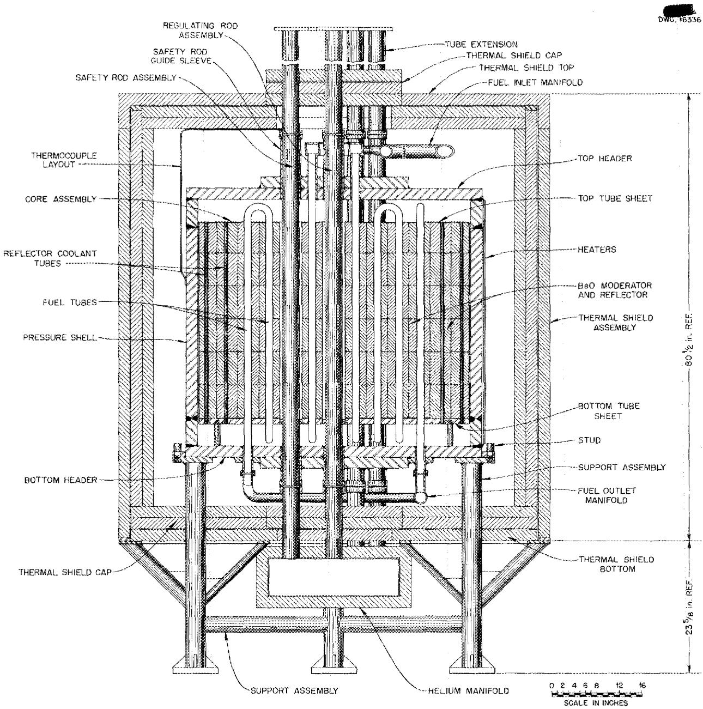  
Fig. 1. Experimental Reactor (Elevation Section).

are proceeding as rapidly as drafting man power permits. The fuel-injection system has been completely detailed, and the equipment is now being fabricated in the local shops. The bellows valves for use in the fluoride circuits are being supplied from an outside vendor. It was found that the welding of these units could be done better by

ORNI, and arrangements for doing this welding for the vendor were completed.

# PRESSURE-SHELL STRESS ANALYSIS

R. L. Maxwell J. W. Walker

Consultants, ANP Division

For a pressure of 100 psi in the pressure shell, the maximum bending

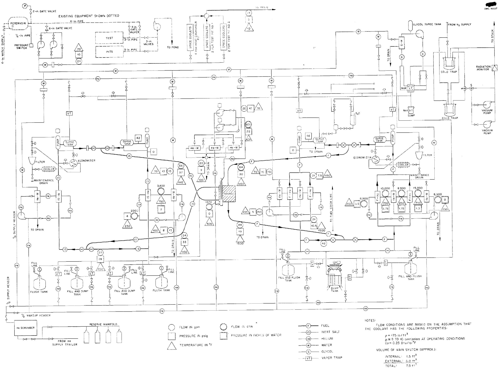  
Fig. 2. Fluid-Circuit Flow Schematic.

stress in the heads of the shell would be 8500 psi. At a temperature of $1150^{\circ}\mathrm{F}$ this gives a creep rate of about $1\%$ in 10,000 hr and a factor of safety of 1.6 based on stress-rupture in 1000 hours. By plate reinforcing, the maximum bending stresses are reduced to 6000 psi. This is slightly less than the stress for a creep rate of $0.10\%$ in 10,000 hours. As stated in the previous report, all holes that occur in areas of high stress are reinforced.

With added reinforcing, the stresses in the side walls have also been reduced to a maximum axial stress in the cylinder of about 6000 psi. Without added reinforcing, the stress at 100 psi is 7430 psi. The reinforced side walls give a creep rate somewhat in excess of $0.10\%$ in 10,000 hr and a factor of safety of 1.8 based on stress-rupture in 1000 hours.

# REFLECTOR COOLANT

# E. S. Bettis, ANP Division

The fuel-carrier NaF-ZrF $_4$ was originally considered as the most probable choice for the reflector coolant. However, recent dynamic tests of the corrosion of the beryllium oxide reflector by a similar fluoride mixture, NaF-KF-ZrF $_4$ , showed that the beryllium oxide was dissolved to an extent that would prohibit the use of that fluoride as a reflector coolant.

Two alternative secondary coolants have been considered: NaK and the fluoride eutectic NaF-BeF $_2$ . The choice between these two coolants resolves to an analysis of the hazards attendant to a fuel-tube rupture that would connect the fuel and reflector-coolant circuits. Although it is unlikely that a rupture will occur and allow the coolant to leak into the core, the possibility of such a leak must be

admitted. Furthermore, if such a leak does occur, the reactor must and will be shut down no matter what reflector coolant is used.

The fluoride eutectic $\mathrm{NaF - BeF_2}$ has acceptable physical characteristics and is compatible with both the beryllium oxide reflector-moderator and the fluoride fuel. An objection to the use of this coolant is the expense and time involved in producing a sufficient quantity for the ARE. Another objection, which would not be present if NaK were used, emerges from the consequences of a fuel-tube leak. With the relatively inert $\mathrm{NaF - BeF_2}$ mixture as the reflector coolant, in the case of a fuel-tube leak there is the possibility that sufficient fuel could seep into the moderator interstices to overcome all control rod effects.

NaK, however, is known to reduce fluorides such as $\mathsf{ZrF_4}$ and $\mathsf{UF_4}$ to lower valence states of the metal. Since these reduced compounds have higher melting points than the original material, a fuel-tube plug could readily occur. That this would actually happen with a sufficiently large rupture has been demonstrated experimentally (cf., sec. 2, "Experimental Engineering").

The reactor system simulator was used to study the effect of a leak of NaK into the fuel channel of such magnitude that the channel is completely plugged. When this occurs the temperature of the plugged fuel passage begins to rise at a rate of about $36^{\circ}\mathrm{F} / \mathrm{sec}$ and will rise to an asymptotic value of about $800^{\circ}\mathrm{F}$ above the fuel temperature at the time of the plugging. This condition obtains by the temperature coefficient alone if no control rod correction is employed. When the plugged tube begins to heat the reactor goes on a 25-sec negative period. The outlet temperature of the

five unplugged passages drops at the rate of about $15^{\circ}\mathrm{F}$ per second. This drop in temperature of five out of six outlet fuel tubes provides a unique symptom of plugging that will enable the reactor to be shut down by scrambling and subsequent draining of fuel.

Since there appears to be some additional safety to be realized from the use of NaK and NaK has the most favorable physical properties of the coolants considered, it will be used as the reflector coolant in the ARE. The secondary heat exchanger and associated gear are being designed for use with this coolant.

# INSTRUMENTATION

# S. A. Hluchan, Instrument Department

Some ARE instrumentation has had to be modified because of the high vapor pressure of the $\mathrm{ZrF_4}$ component of the fuel mixture. Sufficient $\mathrm{ZrF_4}$ condensate would accumulate in the gas space above the hot liquid to completely clog the open instrument lines in a few hours if the liquid temperature was around $1200^{\circ}\mathrm{F}$ . Consequently, the instrument lines previously contemplated for use in measuring liquid level, pressure, and liquid flow had to be replaced by devices with no open lines. Bellows were substituted as pressure indicators and a fluid-immersed inductance type of instrument was substituted for measuring flow and liquid level. A discussion of these instruments appears in the "Experimental Engineering" section of this report (sec. 2).

# OFF-GAS SYSTEM

# T. Roseberry, ANP Division

A carbon absorber unit at liquid nitrogen temperature is being used to completely remove the fission gas

$(\mathbf{Br}_2,\mathbf{I}_2,\mathbf{Kr},\mathbf{Xe})$ from the helium stream coming from the NaK vapor trap before it is released to the stack. The unit consists of four 4-in.-IPS stainless steel tubes connected in series by 2-in.-IPS stainless steel tubes. The first and second tubes cool the gas stream and solidify the $\mathbf{Br}_2$ and $\mathbf{I}_2$ ,and the third and fourth tubes, which contain approximately 700 in.3 of 20-28 mesh CXA carbon, absorb Kr and Xe.

With normal off-gassing (unit designed for 10 ft³/hr; probably the flow will be less and not continuous), the carbon bed has a break-through time of at least 800 hours. If it becomes necessary to purify the helium atmosphere in the heat exchanger pit because of a hot leak, each of the two units can take a flow rate of 100 ft³/hr for at least 70 hours.

The break-through time of the unit was obtained as follows: (3)

$$
t ^ {\frac {1}{2}} = 2. 3 0 + 2 6. 1 \left(\frac {M}{Q}\right) ^ {\frac {1}{2}}
$$

where

$$
M = \text {w e i g h t o f c a r b o n (g)},
$$

$$
Q = \text {f l o w r a t e} (\mathrm {c c} / \min ),
$$

$$
t = \text {t i m e o f b r e a k - t h r o u g h (h r)}.
$$

# REACTOR CONTROL SYSTEM

E.P.Epler

Research Director's Division

The reactor control system is essentially the same as outlined in previous reports.(4) Detailed drawings

have now been completed for the ionization-chamber liner-and-shield installation and for the ionization-chamber gas system. Layout and wiring diagrams for the relay cabinet are being prepared. The construction of ionization chambers, preamplifiers, amplifier cabinets, relay cabinets, control console, and recorder panels by the Radiation Counter Laboratories is on schedule for October delivery.

Components for a simplified servo control have been assembled for testing with the analog computer. The regulating rod speed has been established at $0.1\% \Delta k / k$ per second, with a total of $0.4\% \Delta k / k$ in a total rod travel of 12 inches.

The pilot model of the high-temperature fission chamber is ready for test. Two additional assemblies are being constructed with completion expected in October.

# SHIELING

H. L. F. Enlund, Physics Division

The adequacy of the shielding and the anticipated radiation levels in

various components of the ARE are being studied. To date nothing untoward has been brought to light.

The servicing of equipment in the heat exchanger room will be governed more by radiation that comes directly from activated equipment and fission-product deposition than that which comes through the concrete wall from the fuel dump tank or the shut-down reactor. The rate of deposition and the retention of fission products on Inconel surfaces are not readily predictable, except by experiment. It would appear that satisfactory removal of fission products may be possible if methods analogous to those for the decontamination of solid-fuel processing equipment were used.

An upper limit to the activation of the Inconel by thermalized delayed neutrons has been calculated by assuming all are captured in the Inconel.

The cold trap in the helium scrubber system is being investigated for the heat generation caused by the retention of radioactive xenon and krypton on the activated carbon.

# 2. EXPERIMENTAL REACTOR ENGINEERING

H. W. Savage, ANP Division

Continued emphasis by the experimental engineering group on the development of components for high-temperature fluid-circulating systems has resulted in improvements in pumps, valves, seals, and instruments such as those for indicating and controlling liquid levels, measuring system pressures, and measuring flow rates.

Valves for use in high-temperature fluid systems, such as the ARE, must

operate with complete reliability for long periods over a temperature range of from 1200 to $1500^{\circ}\mathrm{F}$ . The stem seal is considered the most critical problem in the operation of valves at high temperatures; conventional sealing materials are inadequate. Consequently, the major effort of the valve program has been on seal development, and progress has been made in sealing valves with both Inconel bellows seals and stuffing-box seals packed with

Inconel braid and graphite and nickel powders. Some time has been spent, also, in considering several valve configurations and in determining whether self-welding of valve seating materials may be encountered in the presence of the ARE fuel at operating temperatures.

Seals are also the critical problem in pumps. Gas seals, packed seals, frozen seals, and combination packed and frozen seals have been tested with varying degrees of success. The combination of packed and frozen seals appears to furnish the most positive sealing action against high-temperature fluoride fuel mixtures. The hydrodynamic tests of the first model (Model DA) of the ARE pump, with water as the circulated fluid, indicated that the pump sealing arrangement had to be modified. Two avenues of modification were then open: a sump type of pump could be used in which the fluid is not in contact with the shaft seal but is separated by an inert gas volume, or a combination packed and frozen seal could be used. The latter was selected for use in the ARE.

Heat transfer tests have continued with sodium-to-air radiators with varying fin spacing. The test results correlate with the changes in fin spacing made in the radiator configurations tested and are in excellent agreement with the theoretical heat transfer. A test loop is near completion to make measurements of overall heat transfer coefficients of fluorides to liquid metals.

Instrumentation for the ARE cannot incorporate gas-sensing lines that contact the liquid fluoride surface because of the high-vapor pressure of the zircouium fluoride. Accordingly, flowmeters, pressure-measuring devices, and fluid-level indicators and controls are being designed with closed liquid

surfaces. Two types of high-temperature fluid flow meters are being developed. A rotameter type of flowmeter incorporating a tapered iron core and an induction coil as the sensing element is being tested. A rotating-vane flowmeter that uses a permanent magnet and a pick-up coil as the sensing element is being prepared for test. Several pressure-measuring devices are being developed. These are divided into two general types in which the sensing element, either bellows or diaphragm, operates in a cooled, trapped-gas volume or is completely submerged in the high-temperature fluid. A float type of level indicator and controller that uses a tapered iron core and induction coil to sense and control levels has been developed that will reliably maintain two levels within 0.1 in. of each other when used in connection with a venturi for flow measurement. Other level indicators are also being developed.

Hydrodynamic tests have been conducted with a glass mockup of the ARE core. With 45-gpm flow it was demonstrated that the system could be filled with certainty when evacuated to a pressure of 28 in. Hg, but under no circumstances can all the fluid be removed from the core structure. Later tests indicate that with 50-gpm flow, vacuum is not required for complete filling.

A possible reactor header arrangement has been developed that gives an optimum flow pattern through a reactor core that has single-pass, parallel fuel tubes. This design greatly reduces the amount of stagnant fuel that would be held up in the header as compared with that held up in the conventional plenum chamber.

The technology of fluoride handling has progressed. Fuel production equipment capable of meeting current

fuel needs is in operation. The equipment for producing the ARE fuel and moderator coolant is being designed. Methods have been developed for cleaning fluoride-contaminated systems with high-pressure steam jets.

Tests were conducted in an attempt to determine whether a plug of solid fluoride fuel mixture could be remelted in the ARE core-tube bends without rupturing the tubes. Repeated cycles of increasing severity failed to rupture the tube under test, but a slight swelling was noted in the bend at the conclusion of the experiment.

Fuel-flow stoppage resulted when rapid additions of NaK, which is one of the proposed ARE moderator-coolants, were made to a stream of fuel, NaF $\mathrm{ZrF_4 - UF_4}$ , at $1500^{\circ}\mathrm{F}$ in a small, forced-circulation loop. This test simulated a large fuel tube rupture that, if developed in the ARE fuel tubes, would permit the moderator coolant to leak into the fuel system.

The vapor pressure of $\mathrm{NaF - ZrF_4 - UF_4}$ (46.0-50.0-4.0 mole%) is high compared with other fuel mixtures considered, and at ARE operating temperatures some $\mathrm{ZrF_4}$ is sublimed from any free surfaces. This sublimed material plugs cool control-gas lines in dynamic fluid systems and makes their operation difficult. The vapor pressure problem with this fuel is being studied, and equipment that may alleviate the problem is being developed.

# PUMPS

Frozen-Sodium-Sealed Pump in Figure 8 Loop (W. R. Huntley, ANP Division). The Worthite frozen-sodium-sealed pump test first reported in ORNL-1154(1) was terminated

after more than 4000 hr of pumping sodium at temperatures from 800 to $1200^{\circ}\mathrm{F}$ . During the major portion of the test the sodium temperature at the pump was approximately $1100^{\circ}\mathrm{F}$ . A weld failure and a simultaneous flange failure in the test loop caused the termination of the test.

Shaft speed during the greater part of the test was 2000 rpm. Pump operation was smooth during the test except for a short period during which there was interference between the impeller and the pump housing. An inspection of the pump shaft after disassembly showed the shaft to be in excellent condition except for a build-up of nickel on the shaft at the solid sodium-liquid interface. The build-up of nickel was caused by mass transfer from the nickel sealing ring at the parting faces to the cold region of the seal. Although this build-up caused no operational difficulty, it indicates that nickel will not be entirely satisfactory for use as a sealing gasket for parting faces for high-temperature pumps that are to be operated for extended periods.

The loop is to be disassembled for complete examination and oxygen analysis of the sodium in the system and in the cold stub that was placed in the loop for trapping oxides from the system.

Durco Frozen-Fluoride-Sealed Pump (W. B. McDonald, W. G. Cobb, P. G. Smith, ANP Division). The Durco centrifugal pump (Model H34MDVX-80) incorporating an improved design of the frozen-fluoride seal has been constructed and is being assembled into a test loop. Previous tests of a frozen-fluoride seal on a similar pump, which operated for over 500 hr at $1200^{\circ}\mathrm{F}$ , indicated that such a seal will furnish a positive sealing action against high-temperature fluorides. Failure occurred at the parting-face

seal and some scoring of the shaft occurred in the sealing area.

The operational characteristics of the seal are considered to be the most perplexing problem encountered. The pump in the first test could not be stopped for periods longer than 5 min without considerable difficulty in restarting. Upon stopping, the frozen fluorides in the seal bonded the shaft tightly to the sleeve and it was necessary to apply sufficient heat to melt the fluorides before operation could be resumed. The improved design incorporates a 2000-watt Calrod heater by means of which the heat input for melting of the fluorides in the seal can be carefully controlled so that the pump can be more easily restarted after shutdown. The cooling fins on this seal are baffled so that the air flow across these seals can be accurately controlled. This degree of close control over the temperature at which the seal is operated should enable a better determination of its optimum operating conditions. The shaft for this pump is coated with Stellite No. 3, which is harder than the Stellite No. 6 used in the previous test, to reduce shaft wear and scoring.

The weakest point of the pump is the high-compression sealing joint at the parting faces; nevertheless, it is expected that this pump can be operated with the fluoride temperature approaching $1500^{\circ}\mathrm{F}$ .

Laboratory-Size Maintained-Level Gas-Sealed Pump (W. G. Cobb, P. W. Taylor, G. D. Whitman, ANP Division). The redesigned gas-sealed pump reported previously(2) has been constructed and placed in operation. The

redesign consisted of the following modifications:

1. The ring-joint parting-face seal was moved from the region in which it was in contact with high-temperature fluorides to a higher position where it now seals against helium only.   
2. Heat-radiation baffles were placed between the high-temperature liquid-gas interface and the top flange of the pump.   
3. The stuffing-box shaft seal was replaced by a carbon-ring hardened-tool-steel face seal.

The fluoride fuel $\mathrm{NaF - ZrF_4 - UF_4}$ has been pumped for over 250 hr at $1200^{\circ}\mathrm{F}$ with this pump. The flow rate is approximately 10 gpm, the shaft speed is 2500 rpm, and a 16-ft head of fluid is developed. Some operational difficulties have been experienced which, although not severe, indicate that some further minor design changes are needed. Turbulence of the free liquid surface in the pump is rather violent and prevents true level indication by the spark-plug probes. The shaft speed is limited to between 2500 to 3000 rpm because of this disturbance. Some oil leakage has occurred from the bearing housing past the carbon-ring face seal and/or the "O"-ring oil seal into the oil catch basin immediately below. Although this basin is drained continuously and no oil is permitted to drain into the fluorides, the system is probably contaminated by oil vapors. The extent of this contamination will be determined when the pump is shut down and analysis of the fluorides made. With only the above difficulties, which are not considered to be serious, this pump continues to operate very smoothly and its success to date is very encouraging.

Durco Pump with Shaft Packing (W. R. Huntley, P. W. Taylor, H. R. Johnson, ANP Division). Although packed seals that will operate satisfactorily have been developed for high-temperature pump shafts, such seals must either be tightened at all times to the point where shaft wear is likely to result or maintained at a temperature below the freezing point of the circulated fluid. During the operation of a standard Durco pump that was modified to incorporate a stuffing-box seal packed with Inconel braid and nickel and graphite powders, it was found that the pump could be operated for long periods with zero leakage of the stuffing-box seal only when the back end of the seal was permitted to operate at a temperature below the melting point of the fluid pumped. When only the metallic packing is at a temperature above the melting point of the fluid, a small amount of fluid penetrates the packing into the cold region near the compression member, where it freezes to seal the pump (leakage rate approximately 1 g of solid material in 24 hr). This pump has operated for 450 hr, pumping the fluoride fuel NaF-ZrF $_4$ -UF $_4$ at temperatures from 1150°F to 1300°F. The flow rate is 16 gpm, and an approximately 35-ft fluid head is developed at a shaft speed of 1500 rpm.

This sealing method was derived because when the entire stuffing box, including the compression member, was heated to a temperature substantially above the melting point of the fluid, considerable leakage at a rapid rate resulted. When the heat source was removed from the back end of the seal, the leakage immediately stopped and the pump continued to operate smoothly without leakage.

Operation of this Durco pump with shaft packing is smoother than operation of the Durco pump with the frozen seal. When the pump operating power

is measured, power surges of approximately 0.5 kw and about 1/2-min duration are found to occur at intervals of 2 to 3 minutes. Similar power surges occurred in operation with the frozen seal that contained no packing, but they were greater in magnitude because of the longer frozen section.

The amount of wear on the shaft, which is hard-surfaced with Stellite, cannot be determined until the pump is shut down for examination; however, the pump operation is sufficiently smooth to indicate that the shaft wear may not be severe. Two lubricants (tricresyl phosphate-molybdenum disulphide mixture and lead borate glass) have been introduced into the seal in an attempt to eliminate the power surges. Either lubricant reduces the amplitude of the power surges temporarily but does not reduce their frequency.

ARE Centrifugal Pump (W. G. Cobb, A. G. Grindell, G. D. Whitman, ANP Division). The Model DA gas-sealed pump originally designed for the ARE has undergone hydraulic tests in a closed loop with water as the circulated fluid. As designed, a combination surge tank, de-gasser, and pump fluid-level control has been placed in the loop at the pump discharge. Figure 3 shows a schematic outline of this circuit. The tank carries full flow and in addition is connected to the pump with liquid and gasequalizer lines. The liquid connection leads from the bottom of the surge tank, enters the pump above the impeller housing, and feeds a narrow, annular volume surrounding the shaft to form a liquid seal for the impeller shaft. The gas equalizer interconnects the two gas volumes in the pump and surge tank.

Successful pumping has not been obtained except when the gas equalizer is valved shut. With this interconnecting line open as designed, the

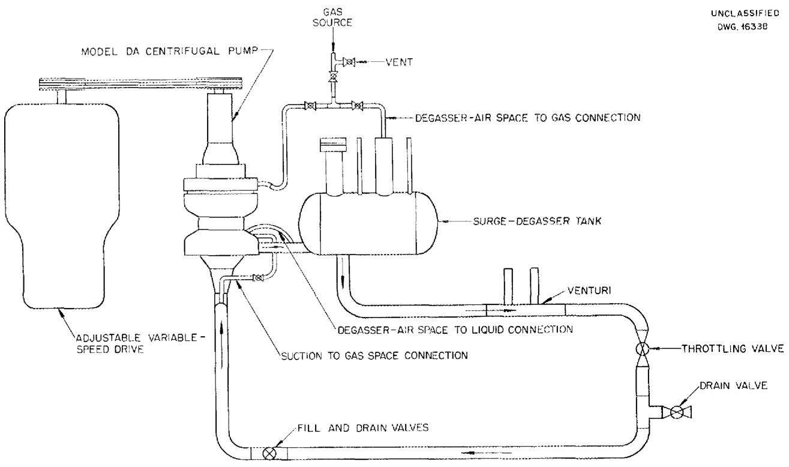  
Fig. 3. Loop for Water Test of ARE Pump.

pump loses its prime and, as observed in a glass pipe section in the pump discharge, the flow is almost wholly gas. With the gas equalizer closed, but with the liquid equalizer either open or closed, satisfactory pump performance data have been obtained. The performance data are presented in Fig. 4.

Liquid-level detection in the pump has been attempted by means of a sight glass, and satisfactory indicated levels have been maintained with separate gas-pressure supplies on the pump and surge tank through a wide range of flows. However, small, rapid, pressure perturbations in the system communicable to the pump will cause the liquid level to rise or fall unduly in the shaft annulus without these changes being indicated on the pump-level sight glass. Thus overfilling of the pump body or gassing of the liquid being pumped can occur.

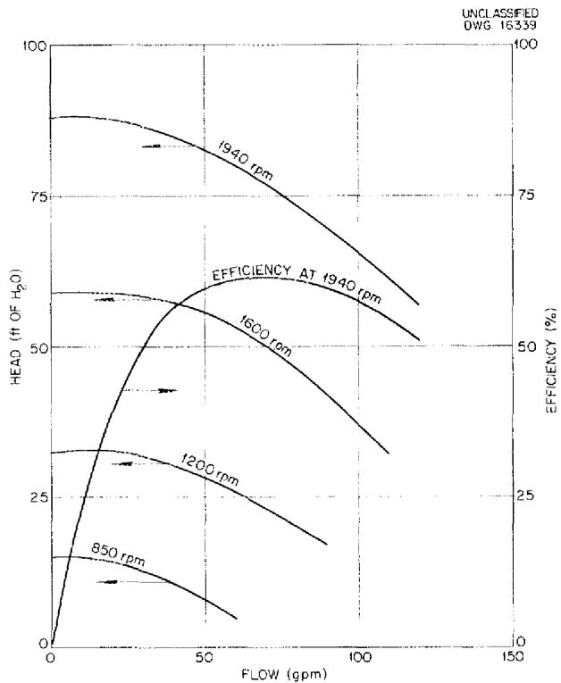  
Fig. 4. Water-Test Performance Data for ARE Pump.

Either overfilling or gassing would result in flow stoppage if the fluid involved was a fluoride.

Although it may be possible to render perturbations of this type harmless by some combination of stationary vanes in part of the annulus, by increased flow (or decreased head loss) from the surge tank through the liquid equalizer line, or by packing dampers in the annulus, the development work required appears to be considerable. In view of the requirements of the ARE for high mechanical certainty of operation and the progress on packed seals, further development work on the Model DA pump has been postponed indefinitely.

Modifications for using the same impeller and housing in both the sump type of pump and packed-seal pump are being carried out.

# VALVES

Bellows Type of Valve-Stem Seal (P. W. Taylor, ANP Division). One of the most promising valve-stem seals appears to be that constructed of three-ply Inconel bellows, each ply in the bellows being approximately 0.009 in. thick. Results of tests of two such bellows have been so highly satisfactory that this type of seal has been incorporated in the design of 1 1/2-in. throttling valves for use in the ARE system and in pump test loops.

One test was terminated for examination of the bellows after operation for 1000 hr submerged in a bath of fluorides at $1500^{\circ}\mathrm{F}$ . The bellows was cycled once each 12 hr through its maximum rated travel of 9/32 inch. Upon examination it was found that only the first ply of the bellows has been penetrated by the fluorides. A

second such bellows has been operated under similar conditions for over 1600 hr with no indication of failure. This bellows has been cycled 127 times during the test, which will continue until failure.

High-Temperature Valve-Stem Packings (D. R. Ward, H. R. Johnson, ANP Division; R. N. Mason, Engineering and Maintenance Division). A program for investigating high-temperature valve-stem packing materials is under way. Considerable operating experience has been accumulated with valves packed with Inconel and graphite powder and lubricated with tricresyl phosphatemolybdenum disulfide mixture. Such valves have proved quite successful in laboratory operation; however, some stem seizure has been encountered that required heating of the valve bonnet to free the stem, and in some instances leakage of fluoride around the stem has occurred. At the present time reliability of a valve packed in this manner is not completely assured for long-time maintenance-free operation with fluorides at 1200 to $1500^{\circ}\mathrm{F}$ .

It is possible that powdered packing materials that are not wetted by the molten fluorides may give better stem sealing and better valve operation. A test apparatus has been constructed to investigate the wettability of various powdered materials by the fluorides, and tests are presently being conducted.

Experience to date with high-temperature packing materials indicates that in almost every instance stuffing boxes have required retightening after reaching operating temperature. For example, with powdered-graphite packing a tightening motion of 0.030 in. per inch of packing length is required to re-establish the original degree of compression after the packing temperature has been elevated to $1100^{\circ}\mathrm{F}$ . A packing-expansion testing

rig has been constructed and the expansion rates of various packing materials will be investigated in the search for a powdered material that will show minimum dimensional change upon being heated.

Tricresyl phosphate has proved valuable as an antigalling lubricant. The application of this fluid to threads during assembly has permitted greater ease of disassembly after valves have operated for many hours at $1500^{\circ}\mathrm{F}$ .

Self-welding of Seat Materials (D. R. Ward, ANP Division; R. N. Mason, Engineering and Maintenance Division). Preliminary tests were conducted to determine whether selfwelding is encountered in the presence of high-temperature fluorides with the following combinations of materials: type 315 vs. type 316 stainless steel, type 316 stainless steel vs. Inconel, and Inconel vs. Inconel. Test specimens were clamped tightly together and submerged in fluorides for 187 hr at $1300^{\circ}\mathrm{F}$ . Although visual examination showed no evidence of self-welding in any of the specimens, metallographic examination showed some evidence of interdiffusion of the specimens of similar materials. Investigation of self-welding is being continued.

Canned-Rotor-Driven Valve (W. B. McDonald, A. L. Southern, ANP Division). Preliminary tests of the driving elements of the canned-rotor-driven valve indicate that an operating mechanism can be built that will operate such a valve satisfactorily. A design of a canned-rotor-driven valve has been completed, but the priority given to the bellows valve has delayed construction. The favorable performance of the three-ply Inconel bellows indicates that a canned-rotor type of drive may not be required.

# HEAT EXCHANGERS

Test of Core Element of Sodium-to-Air Radiator (G. D. Whitman, A. P. Fraas, M. E. LaVerne, ANP Division). The second performance and endurance test of the core element of the sodium-to-air radiator was initiated on June 6, 1952, and 200 hr of operation was logged before failure. The average sodium inlet temperature during the test was $1200^{\circ}\mathrm{F}$ , and a maximum temperature of $1600^{\circ}\mathrm{F}$ was held for 74 hr before failure.

As in the first radiator core test, failure occurred in a tube between the top fin and header on the sodium inlet side of the radiator. Metallographic examination of both core elements indicated failure at a brazed tube-to-header joint because of local porosity in the joint. In both cases the failure was accelerated by the attack of the sodium on the outer surface of the tube.

When the second test had been in progress 72 hr a building power-supply failure occurred and the sodium froze in the radiator before it could be drained. To resume the test, sufficient preheat was obtained through normal methods to restart sodium flow without difficulty. Electric strip heaters were used on the outside of the air duct.

The second radiator core element contained Nicrobrazed joints and was identical in construction to the first except that the fin spacing was altered to give 15 fins per inch instead of 10.5 fins per inch as on the first core element.

Some fabrication difficulties have been encountered in producing these radiators. Since the furnace at Y-12 is too small to accommodate brazing of air radiators for the turbojet project, an attempt was made to

establish the technique in a new and larger furnace located in the rolling mill at X-10. The second core is an excellent example of successful brazing of an intricate design; however, to complete the radiator as planned, the header caps had to be heliarc welded in place. From the results of several unsuccessful attempts to do this it may be concluded that the heliarc method does not produce a sound welded joint in the presence of Microbraz metal.

Heat transfer data from the first and second cores (10.5 and 15 fins per inch, respectively) were plotted as Nusselt number vs. Reynolds number. When the physical properties of air at the mean temperature of the free stream were used to calculate these parameters, the points were segregated on a temperature basis with a large spread between the data taken with sodium temperatures of about $500^{\circ}\mathrm{F}$ and those taken with sodium temperatures of $1500^{\circ}\mathrm{F}$ . Since NACA RM-No. E8LO3 recommends basing physical properties of the air on the boundary layer rather than on the mean free-stream temperature, the data were replotted. (The mean sodium temperature in the radiator was taken as being equivalent to the air temperature in the boundary layer.) As shown in Fig. 5, this gave excellent correlation of the data. It should be noted that in calculating these data full allowances were made for variations in fine efficiency resulting from variations in both heat transfer coefficient and thermal conductivity of the fins.

The air-pressure-drop data were correlated on the basis of the mean temperature of the free air stream. As shown in Fig. 5, this gave good correlation of the data for each of the two fin spacings tested.

A third radiator with interrupted fins has been assembled and brazed

and is now being tested. The fins have been cut through and slightly offset every 2 in. (about 50 hydraulic radii) in the direction of the air flow. Preliminary data show that interruption of the fins yields an increase in heat transfer coefficient of approximately $30\%$ depending on the Reynolds number. The concomitant increase in pressure drop is only $10\%$ . Not only do the interrupted fins give an increased heat transfer coefficient, but it appears that they make the heat transfer coefficient almost independent of fin temperature at a given air-weight flow rate instead of falling off rapidly with an increase in fin temperature, as was found to be the case for the plain fins.

The use of pure nickel in place of stainless steel as a fin material should produce a substantial improvement in fin efficiency because its thermal conductivity is nearly three times as high. A ceramic coating is desirable, however, to protect the nickel from oxidation if it is used at temperatures above about $1200^{\circ}\mathrm{F}$ . The ceramics group have developed a suitable coating (mainly chrome oxide) and are able to get good adherence if the nickel is first bright-annealed in a wet-hydrogen atmosphere. A test on a radiator of this type is planned as soon as priorities permit.

Bifluid Heat Transfer Loop (D. F. Salmon, ANP Division). Fabrication of components for a loop to measure heat transfer from fluoride fuel mixtures to NaK has been completed, and the components are awaiting assembly (Fig. 6).

The tube side of the double-pipe heat exchanger has been calibrated with water. The friction factor was determined over a range of Reynolds numbers from 3,000 to 90,000. An average value of 0.032 was obtained. The calibration of pressure drop vs.

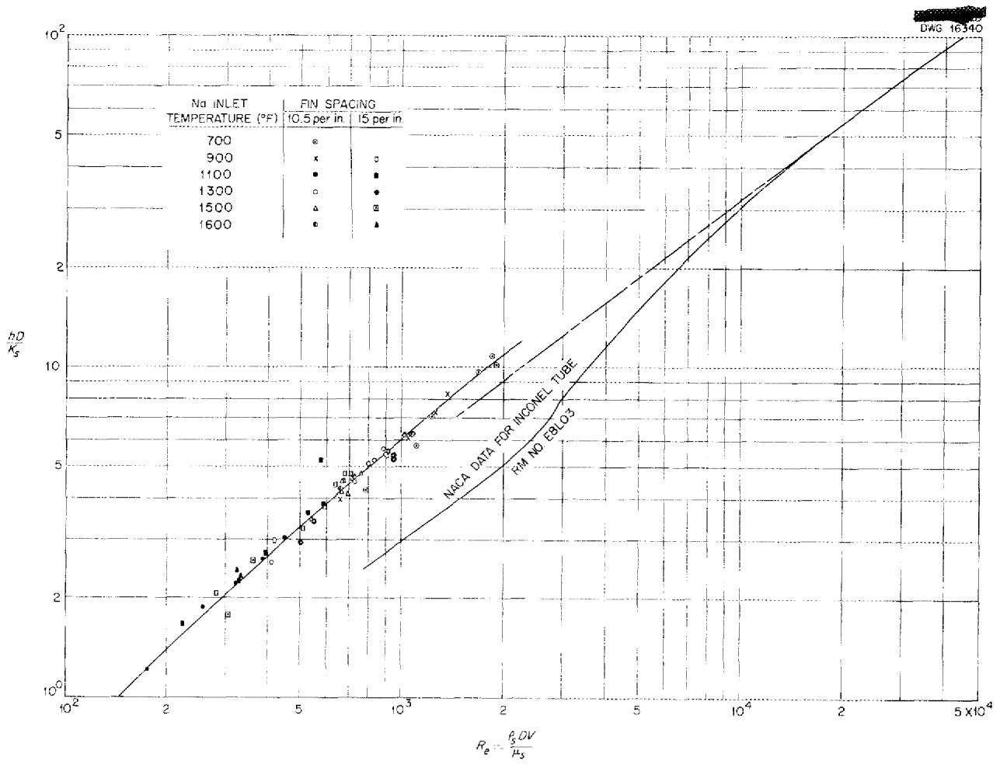  
Fig. 5. Performance of Core Element of Sodium-to-Air Radiator. Type 304 stainless steel fins, 0.010 in. thick; 3/16-in. tubes on 2/3-in. center line to center line square spacing.

flow will be used as a secondary method of measuring tube-side flow rate. Venturis for flow measurement in both primary and secondary systems have been calibrated with water.

A calculated prediction of the heat transfer performance of the system has been made to determine operating characteristics. The original calculations for the loop were based on the fluoride mixture NaF-KF-LiF (11.5-42.0-46.5 mole %). The fluoride fuel NaK-ZrF₄ - UF₄ (46-50-4 mole %),

which has approximately $100\%$ greater density and viscosity, will now be used for tests and, consequently, the range of operation will be reduced. The pressure drop with the NaK-ZrF4-UF4 fuel will be greater for the same flow rate than with the NaF-KF-LiF mixture, and as a result the operating pressures for the system will be higher. The maximum flow rate probably will be reduced so that the maximum Reynolds number will be in the order of 30,000 instead of 80,000 as originally reported.

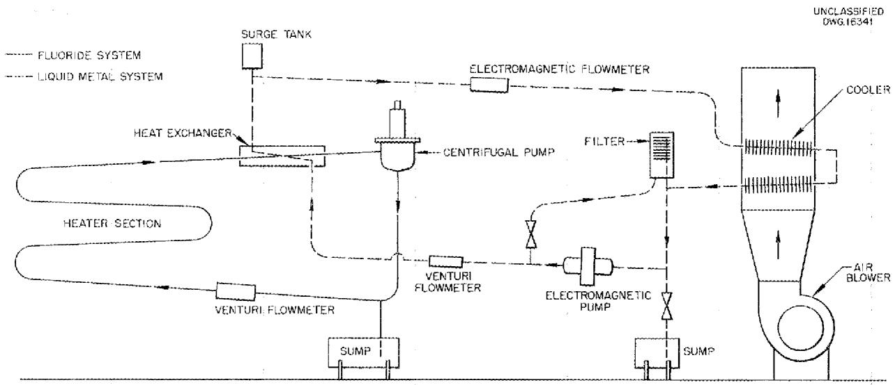  
Fig. 6. Schematic Diagram of Bifluid Loop.

NaK-to-NaK Heat Exchanger (M. E. LaVerne, A. P. Fraas, ANP Division; E. E. Hoffman, Metallurgy Division). Metallographic examination of the section of the NaK-to-NaK heat exchanger described in the previous quarterly reports(4) has been completed. Two tube failures were discovered in the Microbrazed tube-to-header joint that were not detectable from separation. It was concluded that these failures were caused by the vibration in the system and the etching effect the circulating NaK had on the tubes in the hot zones. These failures were encouraged by the embrittlement of the areas near the joint by the brazing alloy and the large grain size of the 16-mil-wall, type 304 stainless steel tubes. No fractures were detected in the 19.5-mil-wall, type 347 stainless steel, Microbrazed, tube-to-header joints.

Upon sectioning the heat exchanger, it was found that the hot (inlet) end was very bright, whereas the cold

(outlet) end was covered with a dark, powdery film. Spectrographic examination of the dark and bright surfaces revealed the only detectable difference to be a manganese content present in the dark (cold) surface that was two to three times the expected value for type 347 stainless steel. The x-ray powder pattern of the dark powder scraped from the surface of a tube in the cold zone showed NiO, Cr, and type 347 stainless steel base material.

# INSTRUMENTATION

Rotameter Type of Flowmeter (P. G. Smith, A. L. Southern, ANP Division). A rotameter type of flow-measuring device has been designed for measuring the flow of a fluoride stream at 1200 to $1500^{\circ}\mathrm{F}$ . This instrument consists of a conventional rotameter float operating in a tapered barrel. The float position is indicated by a tapered iron core, chrome plated to resist corrosion, which operates in a cylinder of static fluorides extending downward from the flowmeter (Fig. 7). An inductance coil that is capable of

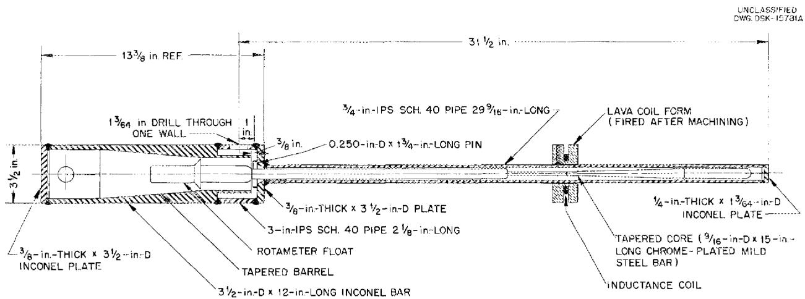  
Fig. 7. Rotameter Type of Flowmeter with Variable Inductance Core.

being operated at a constant temperature of $1300^{\circ}\mathrm{F}$ is placed around this cylinder in the vicinity of the tapered core, and as the core moves in the field of the inductance coil, the movement is sensed by suitable instrumentation. The core movement may be calibrated to very accurately indicate the flow rate of the fluid through the rotameter barrel. The initial test of this instrument in a high-temperature dynamic fluid system was somewhat disappointing. Thermal distortion of the cylinder in which the tapered core is located resulted in binding of the moving parts and preventing further operation of the instrument. A new design, which should eliminate this difficulty, has been completed that allows greater clearance between the tapered core and the containing cylinder and requires stress relieving of the parts before assembly. The new instrument is being constructed and will soon be incorporated in a test loop.

Rotating-Vane Type of Flowmeter (W. B. McDonald, J. M. Trummel, ANP Division; F. A. Anderson, Research Participant). A rotating-vane type of flowmeter manufactured by the

Potter Instrument Company and modified for expected high-temperature application has been calibrated on water and is awaiting test in a high-temperature fluid system.

This instrument consists of a permanent magnet rotated in the fluid stream by a small turbine. A pick-up coil is placed outside the flowmeter in close proximity to the rotating magnet. This coil, when connected to a Hewlett-Packard electrical tachometer through a preamplifier furnishing 60 db of amplification, will very accurately sense the rate of rotation of the permanent magnet. At room temperature this arrangement was calibrated in terms of accurate flow measurement with a pick-up coil located as much as 3 in. from the magnet. It is expected that this instrument can be operated at high temperatures with the pick-up coil located as close as 1/2 in. to the magnet. The limitation of this flowmeter is expected to be the curie point of the permanent magnet, although some operational difficulty may be encountered with the Carboloy bearings on which the magnet and the rotating vanes are mounted. Operation of this instrument will be examined at fluid temperatures to between 1250 and $1300^{\circ}\mathrm{F}$ .

Moore Nullmatic Pressure-Measuring Device (P. W. Taylor, ANP Division). The design of the Moore pressure transmitter, reported previously,[5] has been modified to prevent the high-temperature fluid from contacting the pressure-sensing bellows at high pressures. The modified instrument is rated at 0 to 60 psi at $1200^{\circ}\mathrm{F}$ maximum temperature. The temperature of the fluid stream at the point of pressure determination may be as high as $1500^{\circ}\mathrm{F}$ . This instrument incorporates the trapped-gas principle used in the previous design and must be operated in a vertical position. Further designs are under way that will incorporate three-ply Inconel bellows. The trapped-gas space will be eliminated and the bellows pressure-sensing element will be completely submerged in the high-temperature fluid. Such an instrument may be located in any position and at any point in the system.

Diaphragm Pressure-Measuring Device (P. W. Taylor, ANP Division). The diaphragm pressure-measuring device, Fig. 8, utilizes a linear differential

transformer to measure the deflection of a 1/16-in.-thick Inconel diaphragm. The deflection will be calibrated in terms of the applied pressure. This instrument, which is being procured from an outside vendor, incorporates the trapped-gas-space principle; however, test results indicate that the high-temperature fluid may be in contact with the diaphragm without resulting instrument failure. The instrument is rated at 0 to 60 psi at a maximum diaphragm deflection of 0.010 inch. The operating temperature is limited to $1000^{\circ}\mathrm{F}$ at the diaphragm to minimize the creep rate of the Inconel; however, by using a riser leg to the pot and diaphragm and by cooling either the trapped gas or the fluid to this temperature, the instrument should accurately measure the pressure of a fluid stream at $1500^{\circ}\mathrm{F}$ .

Diaphragm Pressure Transmitters (P. W. Taylor, ANP Division). Six pneumatic null-balance pressure transmitters are being fabricated. These pressure transmitters will be constructed of Inconel and will have 0.014-in. Inconel X diaphragms. The instrument is rated at 0 to 100 psi at $1000^{\circ}\mathrm{F}$ ; however, since the pressures

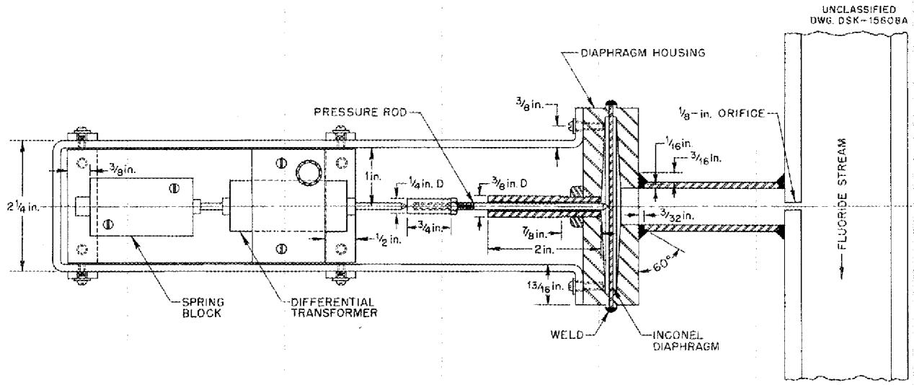  
Fig. 8. Diaphragm Pressure-Measuring Device.

on opposing sides of the diaphragm are balanced, it may be run at higher temperatures without too great a sacrifice of accuracy. These transmitters will be tested completely filled with high-temperature fluid.

Moving-Probe Level Indicator (P. W. Taylor, A. L. Southern, ANP Division). A level indicator has been designed that incorporates a conventional spark plug probe moving through a high-temperature packed seal. For the first test the probe level is controlled manually by means of a lead screw mechanism. If the packed seal proves to be an effective gas seal and if the first test is encouraging, an automatic control for the probe will be incorporated into the design.

Null-Balance Level Control (P. W. Taylor, A. L. Southern, ANP Division). Fluid flow in high-temperature systems is presently measured by means of a venturi with trapped-gas pressure pots to sense the pressures of the venturi entrance and throat. Unequal levels in the pressure pots result in considerable flow measurement error, particularly with fluids of high density. A null-balance level controller (Fig. 9) has been developed that equalizes the level in the two pressure pots and greatly increases the accuracy of flow measurement. This level controller consists of a tapered core operating in the field of an induction coil. The core is attached to a float that rides on the free surface of the fluid in the pressure pots. This instrument will maintain the levels in the pots within 0.1 in. of each other.

In operation, when flow is started in the system, fluid rises in the venturi entrance and throat pressure pots, with the fluid rising to a higher level in the high pressure pot. The level device causes the

voltage output of circuit No. 1 to be greater than that of circuit No. 2. This voltage differential appears partially across variable resistor (A) and is fed to a Brown controller. The signal in the controller operates a limit switch to open a solenoid valve, which bleeds gas into the high pressure pot and forces the level down. When the levels equalize, the voltages in the two circuits buck each other and the signal from the controller drops to zero. The solenoid valve then closes and shuts off the gas supply. This sequence is repeated at any time the levels in the two pots become unequal.

Strain-Gage Level Indicator (A. L. Southern, ANP Division). A level indicator is being designed that incorporates a three-ply Inconel bellows to transmit pressures exerted by rising levels to a high-temperature strain gage. This device will be limited to use in systems pressurized within the limits of the bellows. A questionable feature, which must be tested, is the long-time reliability of high-temperature strain gages.

The advantage of such an instrument is that the bellows sensing element is completely submerged in the high-temperature fluid and is not subject to failure or loss of calibration as a result of solid deposits sublimed from the free surface of fuels having a high vapor pressure, such as the fuels containing zirconium fluoride.

# FLUID DYNAMICS

ARE Core Mockup (L. A. Mann, ANP Division). A full-scale mockup of the fuel passages of the ARE core, as reported and illustrated previously, (6) was completed and tested for flow

UNCLASSIFIED

DWG 16342

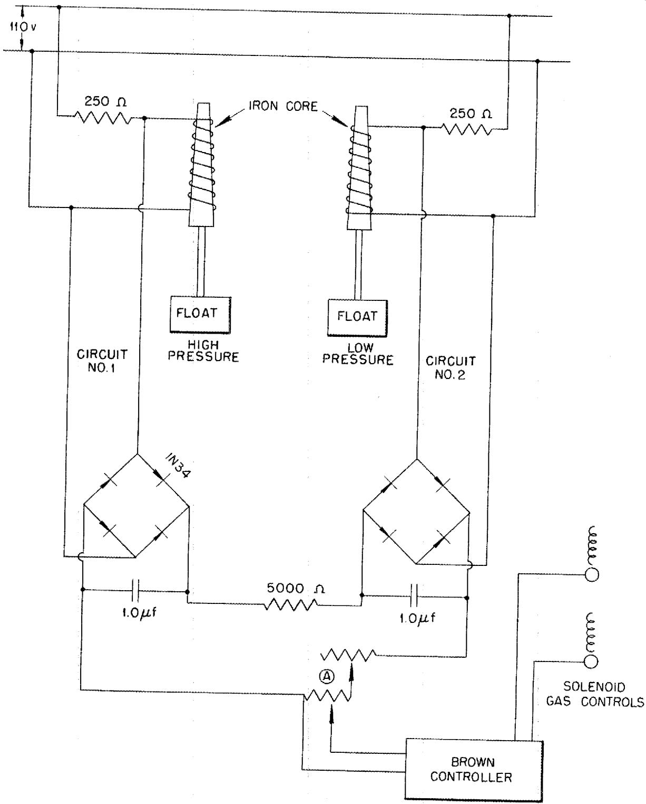  
Fig. 9. Null-Balance Level Controller.

characteristics, ease of filling, and case of emptying. The tubes were assembled from 1-in. glass tubing and bends with flanged joints, and the headers were constructed of copper sheet and tubing. A centrifugal pump, a rotameter, a vacuum pump, and a 50-gal reservoir were the major pieces of auxiliary equipment. Both water and a zinc chloride solution were circulated in this mockup. The zinc chloride was used to simulate the fluorides because of its density (1.7 g/cc) and viscosity (10 cp) at the operating temperature (90°F) of the mockup. The operating characteristics of the mockup on both water and zinc chloride are given in Table 1.

Table 1   
PRESSURE AND FLOW IN THE ARE CORE MockUP   

<table><tr><td></td><td>TAP WATER</td><td>ZnCl2SOLUTION</td></tr><tr><td>Pressure at pump (psi)</td><td>20</td><td>38</td></tr><tr><td>Pressure at core entrance (psi)</td><td>10</td><td>18</td></tr><tr><td>Rotameter reading (gpm)</td><td>43</td><td>&gt;50</td></tr></table>

Evacuation of the core prior to filling was a definite aid, as indicated by the percentage of tests in which all six parallel circuits were filled completely with zinc chloride solution at three core pressure levels (Table 2).

When the core was first evacuated to 28 in. Hg and the bottom header then opened to the liquid $(\mathrm{ZnCl}_2$ solution) supply with the vacuum pump continuing to operate, all tubes filled almost completely. When the vacuum connection was shut off, the

Table 2   
PERCENTAGE OF TESTS IN WHICH CORE FILLED COMPLETELY   

<table><tr><td>CORE PRESSURE</td><td>TESTS FILLED COMPLETELY (%)</td></tr><tr><td>Atmospheric</td><td>80</td></tr><tr><td>26 in. Hg vacuum</td><td>95</td></tr><tr><td>28 in. Hg vacuum</td><td>100</td></tr></table>

top header opened, and the pump started, the remaining gas was swept out and the core filled completely with liquid. In all tests with zinc chloride solution, many small bubbles remained in suspension in the liquid throughout all test runs, with some runs being as long as 20 min; however, this equipment did not utilize a surge and degassing tank as incorporated in the ARE design.

All attempts to completely empty the core by blowing out the fluid with air failed. When 20-psig air was applied to the top header an estimated $15\%$ of the liquid remained in the tubes, unevenly divided between circuits. The largest remaining volumes were approximately 18 in. (of tube length) in some tubes. In each test one or two tubes emptied almost completely, and it appears that no reasonable gas pressure will remove all the fluid from all circuits.

Tests of evenness of flow in the six parallel circuits, with both water and zinc chloride solution, were made by suddenly adding ink to the fluid reservoir and observing the relative flow rate through each of the six circuits. With water, no difference in flow rate was observed. With zinc chloride solution, one circuit lagged 2 to 3 sec behind the others. It is planned to install

greater pump and rotameter capacity for making further tests at 80- to 100-gpm flow rates. Surge tanks and a water mockup of the ARE fluid circuit are being constructed that will be combined with the core mockup for hydrodynamic tests of the combined systems.

Possible Fuel-Header Manifold for the Reactor Core (W. C. Tunnell, ANP Division). A possible reactor core for ANP use would comprise upper and lower fuel headers joined by fuel tubes in parallel. Such an arrangement has the advantage of complete drainability and allows some increased flexibility in the external fuel circuit.

The major problem of design is reducing the header volume to avoid large, relatively stagnant volumes of fuel in regions adjacent to the high-neutron flux of the core or in regions subjected to delayed-neutron effects, and at the same time providing for optimum flow conditions in all the parallel fuel tubes. Coptimum flow in a right-cylinder reactor core will provide uniform flow in all tubes if the reactor flux is uniform throughout the core volume or the flow conditions vary inversely with the flux.

For purposes of investigation, a half-scale plastic model of the bottom half of the ARE core was built in which all of the tubes were headered. This was tested with water at flow rates up to 125 gpm.

The header design started as two plates. One of the plates served as the tube header sheet and had grooves milled in it to provide communication to all tubes, and the other plate provided the tube sheet closure and had a circular milled groove in open communication with the network of grooves in the tube sheet. No location

of inlet with respect to the tube sheet closure passage was found that resulted in optimum flow.

After a series of tests it was found that the insertion between the original tube and closure sheets of a third plate with appropriately positioned small holes, like a salt shaker, and a thin annular plenum chamber in the closure sheet over all the holes in the middle added plate resulted in optimum flow conditions. It is also apparent from the tests that variations in the flow pattern can be obtained by variations in the arrangement of holes in the middle plate.

As a point of interest, the volume of fuel in an ARE-size header and supply pipes would be approximately 1942 in.3, as compared to 2780 in.3 of fuel within the tubes.

# TECHNOLOGY OF FLUORIDE HANDLING

Fluoride Production (G. Nessle, Materials Chemistry Division). The design of equipment capable of producing $3\mathrm{kg}$ of treated fuel was completed July 1.

Briefly, the treatment consists of bubbling hydrogen through molten fuel for 1 hr followed by hydrogen fluoride for 2 hr at $1550^{\circ}\mathrm{F}$ . The initial heating and melting of the fuel mix is done under a hydrogen fluoride atmosphere. The equipment has operated with only one failure, which was due to faulty welding, since being placed in operation on July 14.

Following the success of the 3-kg-batch equipment, the design was scaled up for construction of equipment to produce 25 to 30 kg per batch (50 to 75 lb). Unlike the smaller apparatus, the 25-kg equipment requires a receiver

furnace that can be lowered away from the receiver to facilitate removal of the filled receiver without disturbing the remainder of the apparatus. Since some zirconium tetrafluoride (around $50\mathrm{g}$ in 5 hr) is evolved during the treatment of the fluorides at $1500^{\circ}\mathrm{F}$ , a trap containing copper servo has been introduced to prevent clogging of the hydrogen fluoride and helium purge lines and damage to the valves in those lines. The trap signal, which is sized according to the size of the production equipment, has been quite satisfactory and requires only minor attention.

Calrod heaters were used to heat the 3/8-in.-OD nickel tubing transfer line. The treated fuel is transferred from the treatment reactor to the receiver by inert gas pressure. Construction of this apparatus began July 16 and the first run was successfully made on July 25.

At the end of August the total production was $128.3\mathrm{kg}$ of treated fuel. Table 3 gives a break-down of the production in the two units. Although the equipment, which is capable of producing $60\mathrm{kg}$ per week if needed, is not operating at maximum capacity, production is well ahead of the demand.

Equipment is now being designed to produce the mixture $\mathrm{NaF - ZrF_4 - UF_4}$ (46-50-4 mole %) in the quantities required to meet ARE fuel requirements. The production of fluoride fuel is dependent upon the production of sublimed $\mathrm{ZrF_4}$ . Arrangements have been made to obtain sufficient hafnium-bearing $\mathrm{ZrF_4}$ to permit adequate production of fluoride fuel for experimental needs. It is now possible to produce 300 lb of sublimed $\mathrm{ZrF_4}$ per week starting from the base material $\mathrm{ZrCl_4}$ .

Table 3   
FLUORIDE PRODUCTION   

<table><tr><td>SMALL APPARATUS (3 kg)</td><td>LARGE APPARATUS (25 kg)</td></tr><tr><td>1.869</td><td>21.054</td></tr><tr><td>1.970</td><td>21.509</td></tr><tr><td>1.837</td><td>20.300</td></tr><tr><td>2.003</td><td>26.900</td></tr><tr><td>1.984</td><td>27.138</td></tr><tr><td>1.770</td><td></td></tr><tr><td>11.433 kg</td><td>116.901 kg</td></tr></table>

Every batch of $\mathbf{ZrF}_4$ fluoride produced is now being crushed and sampled prior to use in the fuel mixture. The $\mathbf{ZrF}_4$ thus far obtained has been of very good quality, but it is grayish in color because of entrained carbon. After September, hafnium-free $\mathbf{ZrF}_4$ will be available for the production of ARE fuel.

Removal of Fluorides from Contaminated Systems (L. A. Mann, ANP Division). High-pressure (140-psig) steam jets are used successfully for removing fluorides from contaminated systems. Heavy fluoride deposits are removed completely without damage to the equipment. It has been found desirable to select a steam-jet size compatible with the size of the equipment to be cleaned so that high-velocity steam will always impinge directly on the deposits to be removed, and there will be sufficient clearance for the spent steam to escape from the container. In several instances this method has reduced time of cleaning from 48 to 4 or 5 hours. In other cases parts have been cleaned

by this method that could not be economically cleaned by methods used previously. When systems or components are contaminated with a thin fluoride coating, steam jets furnish no particular advantage over washing with water and scrubbing with a wire brush.

Purity of Pipe Line Helium (L. A. Mann, ANP Division). Installation of the helium line direct to the tank car located outside the building is complete. After the lines were purged the oxygen content of the helium was reduced to a level not detectable by analyzing equipment sensitive to ppm. Helium of this high purity is now distributed to all major points of usage in the experimental engineering areas of Building 9201-3, and the requirements for bottled helium and argon have been greatly reduced.

Fluoride Plug-Removal Test from Simulated ARE Core (L. A. Mann, ANP Division). Some operational experience indicated that it would be very difficult to remelt a plug of frozen fluoride in a pipe line without rupturing the pipe. Since the ARE core as presently designed cannot be completely drained, tests have been conducted to determine whether the residual fluorides can be remelted without damaging the core structure. A type 316 stainless steel tube bent to simulate an ARE core U-tube was filled with NaF-ZrF $_4$ -UF $_4$ fuel, which was then permitted to freeze. The assembly was placed in a high-temperature pot furnace and cycled three times at a heating rate of $18^{\circ}\mathrm{F/hr}$ between 850 and $950^{\circ}\mathrm{F}$ . No failure occurred. More fuel was then added to the tube and insulation was placed around the upper legs of the tube to simulate the beryllium oxide in the ARE core. The assembly was again taken through eight temperature cycles, and again no failure resulted.

Additional cycles over the same temperature range were then made at increased heating rates, with the final cycle being made at full furnace power. Again no failure resulted. Final examination of the tube showed that it had expanded 0.030 in. at one point and 0.050 in. at another point. These tests did not entirely duplicate ARE conditions but were probably just as severe.

Injection of NaK into a Flowing Fluoride Stream (L. A. Mann, ANP Division; F. F. Blankenship, Materials Chemistry Division; T. N. McVay, Consultant, Metallurgy Division). NaK is one of the coolants being considered for the ARE reflector and moderator. Since the fuel tubes will be immersed in the coolant, it is necessary to determine the extent of the NaK-fluoride reaction that would result from a fuel-tube rupture. A test apparatus to determine the extent of this effect consisted of a small, forced-circulation loop with an Eastern centrifugal pump to circulate fluoride fuel, NaF-ZrF $_4$ -UF $_4$ (46-50-4 mole %), at 1500°F and a flow rate of approximately 3 ft/sec. The effect of both slow and rapid injection of NaK into the fluid stream will be measured. A NaK injection unit was attached to this loop and when the temperature of both the fluorides and the NaK reached 1500°F, a quantity of NaK (approximately 5% of the volume of the fuel in the system) was injected into the stream. After the injection the pump was permitted to operate for approximately 6 min, at which time all heat was turned off, the pump was stopped, and the entire assembly was rotated through 90 deg to a horizontal position and permitted to freeze.

According to the exothermal reactions $\mathrm{Na} + \mathrm{UF}_4 \longrightarrow \mathrm{NaF} + \mathrm{UF}_3$ and $\mathrm{Na} + \mathrm{ZrF}_4 \longrightarrow \mathrm{NaZrF}_4$ , heat evolution

was expected and did occur. This was indicated by an immediate temperature rise of $200^{\circ}\mathrm{F}$ that was measured by a thermocouple immediately above the NaK injection point.

Examination of the system showed incomplete mixing of the NaK and the fuel and indicated that the system was almost completely plugged by the reaction products. Possibly flow had stopped completely. This test indicates that if such a failure (a large fissure type of break) occurred in an ARE core fuel tube during actual operation and permitted a similar NaK injection, the flow in the tube would be completely stopped or considerably slowed down. The fuel residence time in the tube would thus be increased to the point where very high temperatures would result and perhaps bring about complete rupture of the tube. The possibility that the plug would heal the leak and prevent the flow of fuel into the interstices of the moderator is still a matter of speculation.

The loop was sectioned into seven large pieces and most of the pieces were subsequently subdivided as indicated in Fig. 10. Also, the general appearance and the complexity of the products observed are suggested in Fig. 10.

The extent and distribution of the altered fuel suggests that complete or nearly complete plugging of the loop occurred very soon after the NaK was injected. Material in the surge tank had been attacked only slightly and even less reaction had occurred on the side of the loop opposite the injection point. The plugging and consequent lack of circulation were, of course, responsible for the system being very far from chemical equilibrium and for the large differences observed between this experiment and the static systems described in the section on

"Chemistry of High-Temperature Liquids" (sec. 9).

Samples of material from each section of this loop have been examined by x-ray diffraction, chemical analysis, and the petrographic microscope. Since the material found varies considerably from the center to the edge of each section, as well as along the axis of the pipe, complete characterization of all the material has proved virtually impossible.

Such phases as the crystal solution of $\mathrm{NaUF}_5$ in $\mathrm{NaZrF}_5$ , $\mathrm{Na}_2\mathrm{ZrF}_6$ , $\mathrm{UF}_3$ , and numerous complex compounds of KF occur in abundance. In addition, metallic zirconium occurs in sections 3B and 4 just above the NaK injection point. At least two additional phases, which are unknown, are recognized in considerable quantity in this loop. One is the dark-brown phase that is pleochroic and has an average index of refraction at about 1.556. The other is an orange-red phase generally associated with, and perhaps formed from, the brown phase. This mineral has an average index of refraction of about 1.588, with low birefringence, and is probably monclinic. It is probably a compound of $\mathrm{UF}_3$ , since some crystals are available that seem to indicate transitions from this red phase to pure $\mathrm{UF}_3$ .

A second test will be conducted during which NaK will be injected into the fuel stream at a much slower rate to determine the effects of a very slow leak. It is thought that fuel circulating at high velocity will perhaps sweep the reaction products from a very slow leak out of the reactor core.

Gas-Line-Plugging Tests (W. B. McDonald, P. W. Taylor, ANP Division). The vapor pressure of the fluoride fuel NaF-ZrF $_4$ -UF $_4$ (46-50-4 mole %) at

Fig. 10. Distribution of Reaction Products from Injection of NaK into Fluoride Loop.   
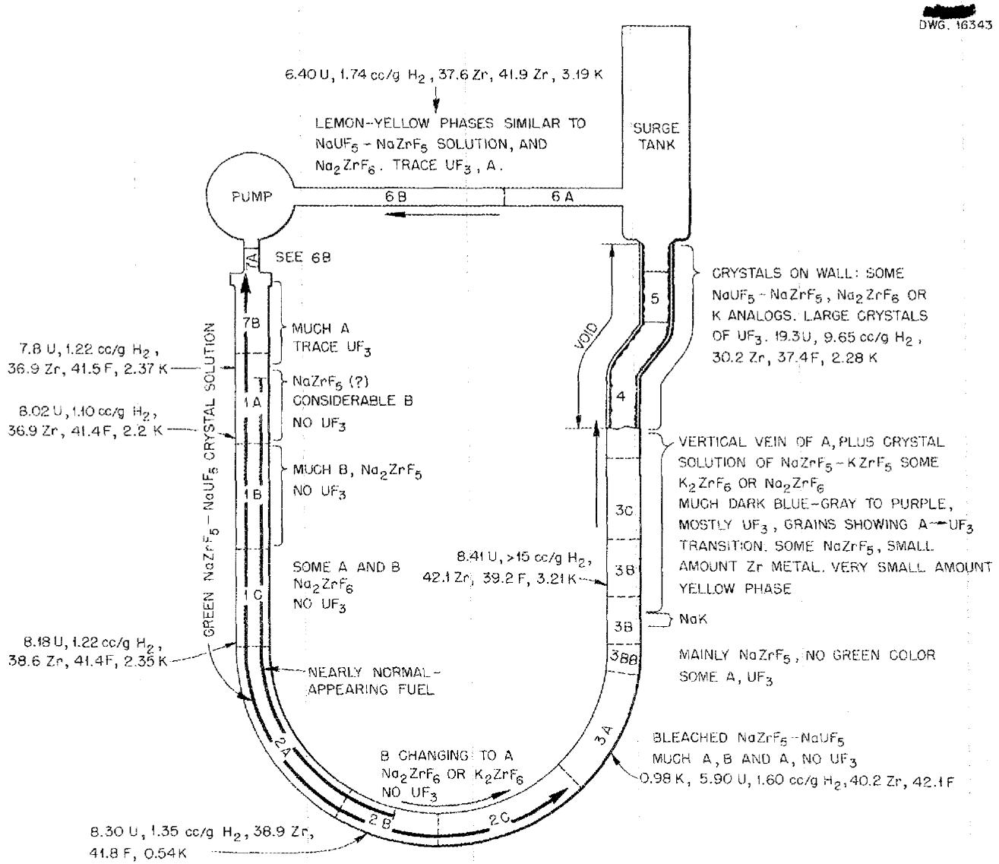  
A = RED-ORANGE UNKNOWN, AVG n = 1.588, PROBABLY MONOCLINIC.   
B = DARK BROWN UNKNOWN, PLEOCHROIC, AVG n = 1.556.   
MAY CHANGE GRADUALLY TO A AS REDUCTION PROCEEDS   
SINCE SOME CRYSTALS ARE BROWN ON ONE END AND RED ON THE OTHER

$950^{\circ}\mathrm{F}$ , or slightly above, is 0.016 mm. At $1250^{\circ}\mathrm{F}$ it is 1 mm and at $1500^{\circ}\mathrm{F}$ it is 13.26 mm. Tests were conducted to determine the rate at which gas lines are plugged by sublimed $\mathrm{ZrF_4}$ rising from the free surface of this fluoride fuel at various temperatures. Gas lines ranging from 1/8 to 1/4 in. in

diameter were connected to a pot containing the fuel, which was heated to $1500^{\circ}\mathrm{F}$ . High-purity helium was introduced into the pot, swept across the free surface, and exhausted through the gas lines at relatively slow flow rates. All lines plugged solid in less than 100 hr of operation.

The fluoride temperature was reduced to $1050^{\circ}\mathrm{F}$ and a second test was started under conditions corresponding to the first test. This test has logged more than 1300 hr with no evidence of line plugging.

Cooled-Baffle Vapor Trap for Zirconium-Bearing Fluoride Fuel (W. B. McDonald, J. M. Trummel, ANP Division; F. A. Anderson, Research Participant). A cooled-baffle vapor trap was developed to condense and collect the $\mathrm{ZrF_4}$ vapor that evolves from the NaF- $\mathrm{ZrF_4}$ - $\mathrm{UF_4}$ fuel. The vapor trap consisted of a 3-in.-diameter pipe 24 in. long containing 28 baffles spaced at 3/4-in. intervals, with the openings in the baffles alternated from one side of the pipe to the other. A cooling coil through which water was circulated was placed around the complete length of the baffled pipe. High-purity helium was passed across the free surface of the $1500^{\circ}\mathrm{F}$ fuel and exhausted through the baffled pipe. Filter paper was placed at the exhaust port to collect any solid particles not trapped by the baffles. The flow rate of the helium across the free surface was approximately 15 cfh.

After slightly more than 50 hr of operation the baffled pipe was so completely plugged by the material sublimed from the fuel that greatly increased pressure was required to maintain the specified gas flow rate. This pressure increase resulted in the bulging of the top and bottom of the flat fuel container to such an extent that the test was terminated. Examination showed that the baffle pipe was completely plugged by a hard crystalline deposit at the point of entry into the fuel container. The remainder of the pipe contained heavy deposits of fine, powdery material.

This test indicates that a baffled vapor trap is entirely unsatisfactory for the prevention of gas-line plugging. Other types of liquid vapor traps are presently being tested. One of these tests consists of passing the gas from the free surface of zirconium-bearing fuel through a bath of NaF-KF-LiF (11.5-42.0-46.5 mole %) at $1500^{\circ}\mathrm{F}$ , and there is a similar test in which the vapors from zirconium-bearing fuel are passed through a bath of NaK at $1500^{\circ}\mathrm{F}$ . These tests are still in operation and the results have not yet been determined.

Descaling and Pickling Tests (D. C. Vreeland, E. E. Hoffman, R. B. Day, L. D. Dyer, Metallurgy Division). In connection with the problem of removing welding scale from ARE components some tests have been run to check different methods of descaling and pickling oxidized Inconel. Sodium and NaK were mentioned as being two of the most promising descalers (from a handling viewpoint) to be tested. Oxidized Inconel specimens were treated, in static corrosion test tubing, for various times and temperatures with sodium and with NaK. The results of these tests are best summarized by reference to Fig. 11. It is quite apparent that in these tests neither sodium nor NaK was efficient as an oxide scale remover until the test temperature was raised to approximately $800^{\circ}\mathrm{C}$ . In order to determine whether a dynamic NaK system would be any more efficient as a scale remover, an oxidized Inconel specimen was fastened into the bottom of an Inconel tube by crimping. The tube was then half filled with NaK, sealed, and run in the rocker furnace for 4 hr at approximately $700^{\circ}\mathrm{C}$ . The oxide scale was not removed by this treatment and so, apparently, the temperature of test is the deciding factor in scale removal.

  
INCONEL, AS OXIDIZED

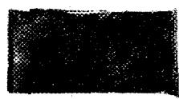  
Na   
1 hr AT 200°C

  
1 hr AT $300^{\circ}C$

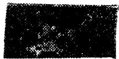  
1hr AT 500°C

  
5 hr AT 600°C

  
Na   
3 hr AT 700°C

  
10 hr AT 700°C

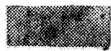  
3 hr AT 800°C

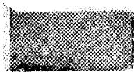  
7 hr AT $800^{\circ}C$

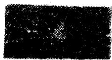  
NaK   
2 hr AT $300^{\circ}C$

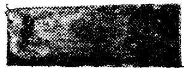  
2 hr AT 500°C

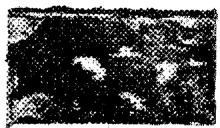  
2 hr AT 700°C

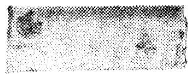  
2 hr AT 800°C   
Fig. 11. Descaling Properties of Na and NaK on Oxidized Inconel.

# 3. REACTOR PHYSICS

W. K. Ergen, ANP Division

The theoretical investigations of the kinetics of the circulating-fuel reactor continued, still disregarding for the present the possible coupling between "nuclear" oscillation and

mechanical vibration. With this simplified concept, a large temporary disturbance was assumed to be applied to the reactor, and it was found that if the reactor survived the first

short maximums of power and temperature the following power and temperature maximums would be rather moderate.

The general properties of the reflector-moderated circulating-fuel reactor were discussed in the last report.(1) A number of multigroup IBM calculations has since been performed. However, this is the first time that the method has been applied to reactors with very different properties in core and reflector and with absorptions that are fairly large and also vary within a lethargy interval. Hence, confirmation of the results by critical experiment is necessary.

A calculation was performed regarding the critical mass, power distribution, and neutron spectrum of a mockup of the ARE for use in critical experiments. So far only the critical mass has been determined experimentally. The agreement with the calculation was very good (cf., sec. 4, "Critical Experiments").

A previously known method of computing the effects of gaps on reactivity was refined and has yielded satisfactory agreement with experiment. In addition, several slowing-down kernels have been expressed in terms of known functions.

# OSCILLATIONS IN THE CIRCULATING-FUEL AIRCRAFT REACTOR

S. Tamor, ANP Division

A summary report $^{(2)}$ was issued regarding the work on the kinetic equations $^{(3)}$ of a somewhat idealized

circulating-fuel reactor. In addition to the results quoted in the last report, (4) it was found that rather satisfactory limits can be set on the second power and temperature maximum following a disturbance of the reactor.

A large disturbance, such as introduction of excess reactivity, will be followed by large power and temperature maximums. However, these maximums are of short duration and can, within limits, be tolerated, if it can be ascertained that they will not be followed by maximums of similar height. Hence, it was regarded as important to investigate the second power and temperature maximums. The third and following maximums are smaller than the second because of the damping of the reactor oscillations.

No general relationship has been set up between the upper limit for the second maximums and the other parameters of the reactor. However, two specific examples have been investigated by numerical integration. Both integrations refer to a reactor with the following parameters, which fall in the general range of contemplated ANP design: temperature coefficient of reactivity, $\alpha$ , $10^{-4} / ^{\circ}\mathrm{C}$ ; prompt generation time, $\tau$ , $10^{-4}$ sec; reciprocal heat capacity of total fuel in the reactor, $2.67 \times 10^{-6} / ^{\circ}\mathrm{C} / \mathrm{watt} \cdot \mathrm{sec}$ ; reactor power, $P_{0}$ , $3 \times 10^{8}$ watts; fuel transit time, $\theta$ , through reactor, $1 / 8$ sec.

One integration referred to the case in which the power is four times the average power, $P_0$ , for all times $t < 0$ . At $t > 0$ , the kinetic equations of ORNL-1227 apply. The other case involved normal power, $P_0$ , at all times up to one-tenth of a transit time before $t = 0$ . For a period of

one-tenth transit time duration before $t = 0$ , the power is $10P_{0}$ . As before, at $t > 0$ the kinetic equations of ORNL-1227(2) are valid. The power and temperature as a function of time were calculated through the second overswing. The results are shown in Figs. 12 and 13. It can be seen that the extreme values of $P$ and $T$ were nearly exactly the same for the two cases, indicating that they are close to the most extreme values obtainable.

For the reactor constants given, it is found that after the first overswing has passed, $P$ is bounded by $0.013 < P / P_0 < 2.1$ , and the bounds on $T$ are $-50^{\circ}C < T < +26^{\circ}C$ .

The similar shape and limiting values of the curves in the two above cases are easy to understand. After the large initial disturbance, the reactor almost shuts itself off. The period of very low power is essentially the same in both cases, about one transit time, and it determines the future time behavior of the reactor. For this reason, the following fictitious limiting case is plotted in Fig. 14. The power is zero for $t < 0$ . At $t = 0$ , the power is suddenly brought to $P_0$ , and thereafter the kinetic equations of ORNL-1227 apply. Even in this case, the power and temperature oscillation is not much more violent than in Figs. 12 and 13.

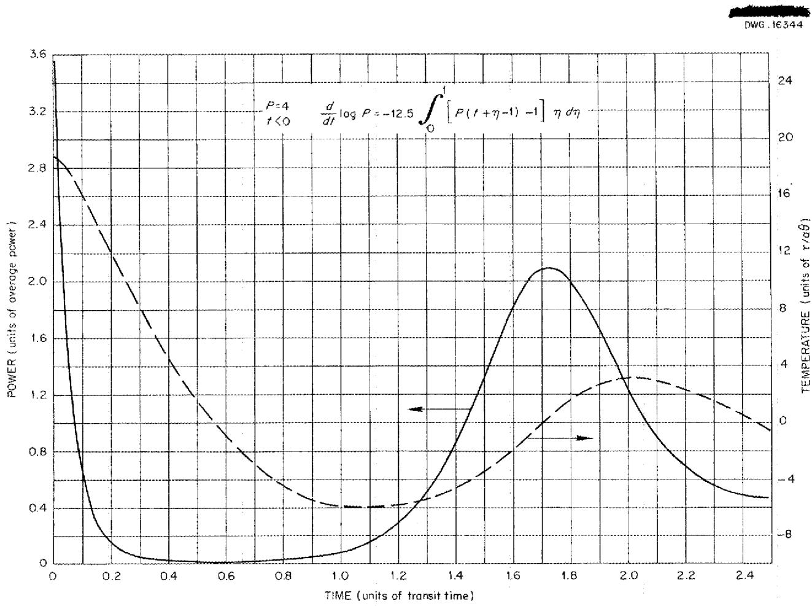  
Fig. 12. Power and Temperature vs. Time for $P = 4P_{0}$ , $t < 0$ .

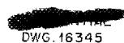

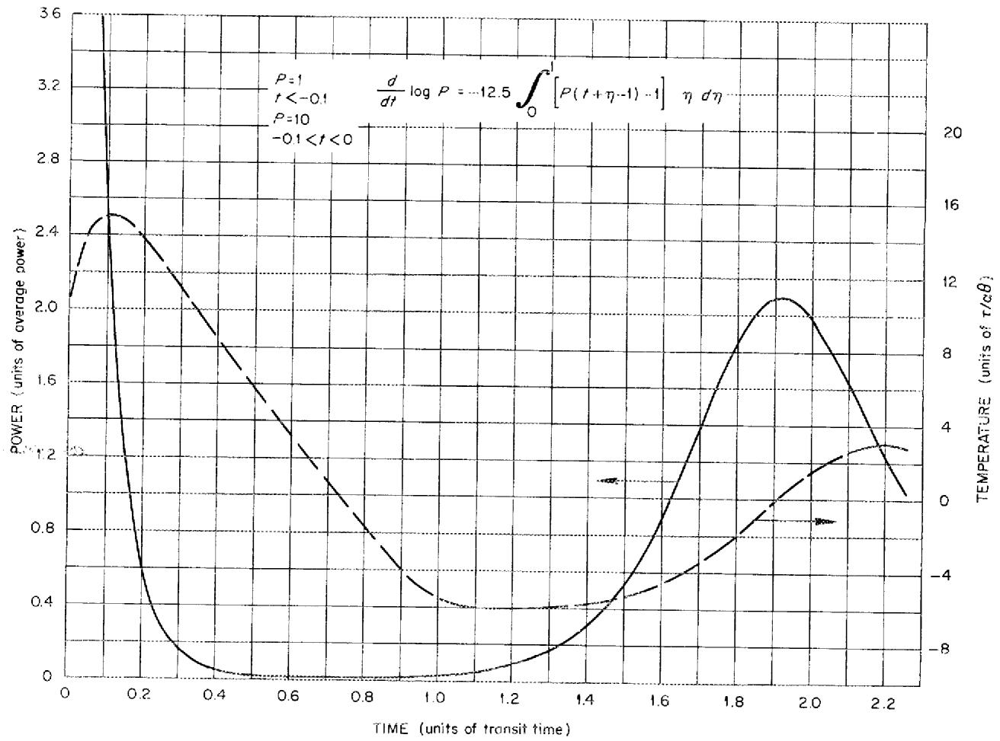  
Fig. 13. Power and Temperature vs. Time for $P = P_0$ , $t < -0.1$ ; $P = 10P_0$ , $-0.1 < t < 0$ .

Of course, these calculations have to be qualified. It is necessary for the survival of the reactor that the first temperature maximum stay within tolerable limits. Furthermore, if sufficient excess reactivity were added for a prolonged period, the average temperature of the reactor would increase beyond allowable limits for a long time. Also, the above calculations neglect any possible coupling between the "nuclear" oscillations and mechanical vibrations. All these qualifications apply to

stationary-fuel reactors as well and are not uniquely problems of a circulating-fuel reactor.

# EFFECT OF GAPS ON REACTIVITY

# S. Tamor, ANP Division

As mentioned in the last report, (5) calculations regarding the effect of a transverse gap through a reactor have

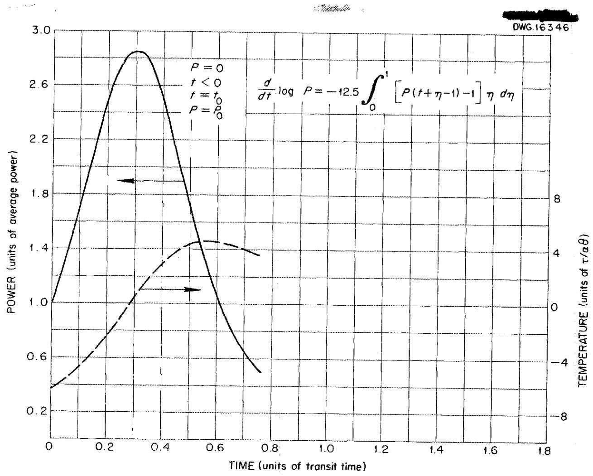  
Fig. 14. Power and Temperature vs. Time for $P = 0$ , $t < 0$ ; $P = P_0$ , $t = 0$ .

been carried out. $^{(6)}$ These calculations refer to a bare, large reactor and a gap that is small compared with the transverse reactor dimension. They do not neglect, as in earlier calculations $^{(7)}$ on the same problems, the fact that neutrons preferentially stream toward points of low neutron density. The new calculations constitute an improvement over the earlier ones in cases where the gap is small.

Figure 15 shows a comparison between calculations based on the earlier method, the calculation according to the new method, and the experiments on a 130-by 112-by 112-cm, rectangular, graphite-moderated reactor with the gap perpendicular in the long dimension and slightly off center. The abscissa is essentially the gap width.

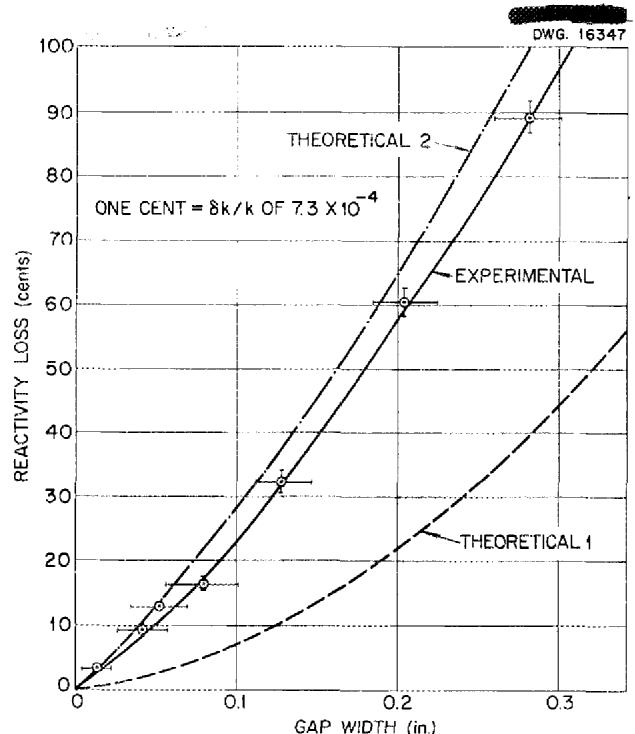  
Fig. 15. Reactivity Loss vs. Gap Width.

# SLOWING-DOWN KERNELS

R. D. Worley, USAF

The following kernels, of interest to reactor theory, have been expressed in terms of known and tabulated functions: (8) (1) the Fermi age kernel in the case of weak absorption, (2) the kernel describing, for an infinite medium, the slowing down of a neutron according to age theory and the subsequent diffusion at thermal energy, and (3) the kernel describing the slowing down of a neutron in an infinite space filled with a medium of uniform scattering, slowing down, and absorption properties, except that a finite part of the space also contains an additional absorber with an absorption line at a definite energy.

(8) R. D. Worley, Slowing-Down Kernel with Absorption and the Convolution of Various Kernels, Y-F10-105 (to be issued).

# 4. CRITICAL EXPERIMENTS

A. D. Callihan, Physics Division

Measurements have continued on the mockup of the G-E direct-cycle, air-cooled, water-moderated reactor. Some beryllium in the reflector was replaced by a plastic and steel composite reflector to compare the two arrangements with respect to reflector savings and reactivity. Loss in reactivity incurred by the insertion of boron carbide control rods was determined.

The preliminary assembly of the fluoride-salt circulating-fuel aircraft reactor experiment was completed, and criticality was attained with $5.8\mathrm{kg}$ of $\mathbf{U}^{235}$ in the core and a total investment of $6.5\mathrm{kg}$ of $\mathbf{U}^{235}$ . An analysis of the results indicated almost perfect agreement with theoretical calculations.

# DIRECT-CYCLE REACTOR

R.C.Keen D.V.P.Williams Physics Division

D. Scott, ANP Division

The study of a mockup of the G-E direct-cycle reactor has continued at ORNL. The critical assembly was fully described in earlier reports, (1) and the data summarized here have appeared in more detail elsewhere. (2)

(1) E. V. Haake, D. V. P. Williams, W. G. Kennedy, and D. Scott, Aircraft Nuclear Propulsion Project Quarterly Progress Report for Period Ending March 10, 1952, ORNL-1227, p. 59; E. V. Haake, D. V. P. Williams, R. C. Keen, W. G. Kennedy, and D. Scott, Aircraft Nuclear Propulsion Project Quarterly Progress Report for Period Ending June 10, 1952, ORNL-1294, p. 34.

(2) A. D. Callihan, Preliminary Direct Cycle Reactor Assembly, Part III, Y-B23-5 (June 18, 1952), and Part IV, Y-B23-7 (June 30, 1952).

Reflector Studies. Some measurements have recently been made with the beryllium in a section of the reflector replaced by a composite of stainless steel and a hydrogenous plastic. Boron, when placed between the components of this composite reflector, will reduce the neutron-induced gamma radiation from the iron. The purpose of this study was to compare the reflector savings of the plastic and steel composite reflector and the neutron distribution in it with and without the boron. The test section was 5 3/4 in. thick, 14 3/8 in. wide and 36 in. long. The beryllium reflector in these cells was replaced by type 310 stainless steel except for a 5/16-in.-thick layer adjacent to the core, which was filled with Boral strips 36 in. long. The Boral strips were prepared from a boron carbide and aluminum mixture that contained 35 wt% boron carbide. The mixture was sandwiched between two layers of aluminum sheets about 0.04 in. thick and wrapped with masking tape. The system was made critical by the addition of beryllium at locations remote from the test section and by control rod adjustment, and the loss in reactivity was measured. By keeping the over-all dimensions of the test section constant, the thickness of the steel was reduced and plastic was added between the core and the Boral in a step-wise manner until all the steel had been removed. The changes in reactivity that were incurred by these reflector alterations, referred to the all-beryllium reflector, are recorded in Fig. 16. An additional experimental point on Fig. 16, designated as "2 9/16-in. Plexiglas and 2 7/8-in. stainless steel," shows the result of removing the Boral from one plastic and steel composite reflector section. Another, measured with the Boral replaced by 5/16 in. of plastic, shows that the effect of a 5/16-in. void between the plastic and the steel is

small. The change in reactivity upon removal of all material from the test cell is also shown on the graph. It is noted that with the hydrogenous component 3 in, or more thick, the presence of the boron does not greatly reduce the reflector savings. Comparison of these data with earlier results show, however, that the boron reduces the reactivity up to $30\%$ for plastic thicknesses approaching zero.

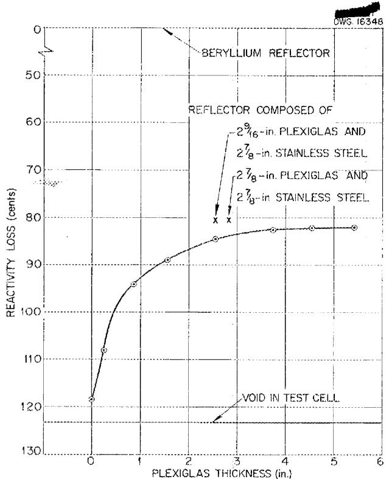  
Fig. 16. Reactivity Losses vs. Plexiglas Thickness for Stainless Steel-Plexiglas-Boral Composite Reflector.

Bare-indium and cadmium-covered- indium traverses were made through one of the above stainless steel, Plexiglas, and Boral composite reflectors starting at a point 9 in. inside the core periphery and terminating at the edge of the reflector. The reflector consisted of an outside layer of 2 7/8 in. of stainless steel separated from a 2 9/16-in. Plexiglas

inner layer by the 5/16-in. Boral sheet. The data for the traverses through the composite reflector when the Boral strips were present in the test cells are given in Fig. 17. Curve 1 is the bare-indium activation, curve 2 shows that obtained for the cadmium covered indium, and curve 3 shows the difference between curves 1 and 2. All data were plotted as a function of the distance from the outside of the test section. Similar traverses were made with the Boral strips omitted and the space left empty. Figure 18 shows the bare-indium and cadmium-covered-indium activations and their difference plotted also as a function of the distance from the outside of the test section.

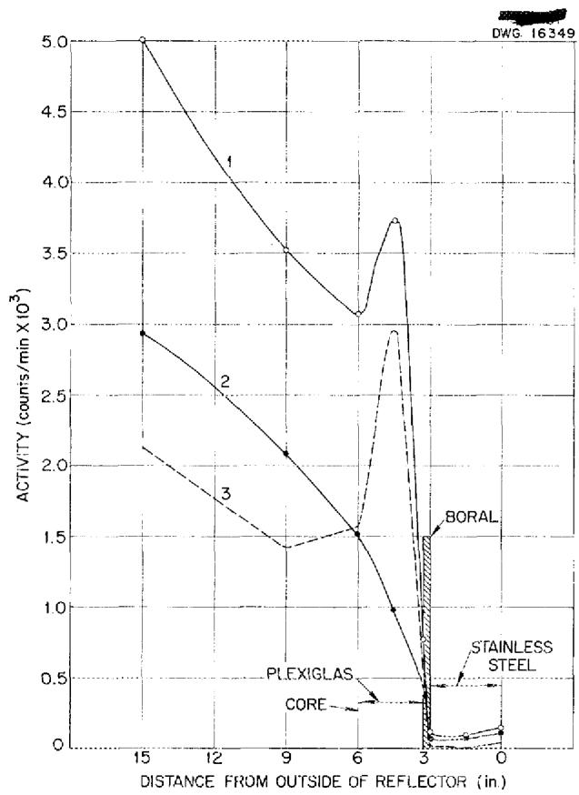  
Fig. 17. Bare and Cadmium-Covered Indium Traverses Through Stainless Steel-Plexiglas-Boral Composite Reflector.

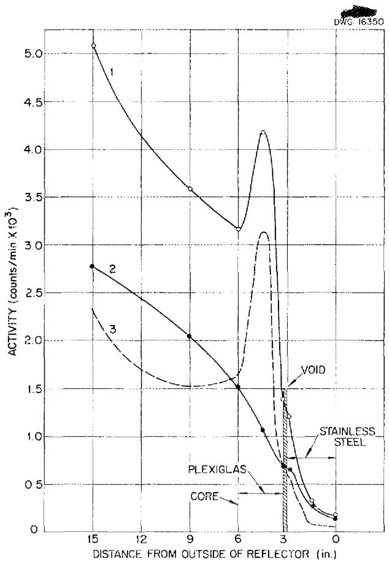  
Fig. 18. Bare and Cadmium-Covered Indium Traverses Through Stainless Steel-Plexiglas Composite Reflector.

Poison Rod Calibrations. A measurement was made of the reactivity depression by each of three boron carbide rods furnished by the General Electric Co. for test as poison control rods. The rods were 1/2 in. in diameter and about 36 in. long and differed slightly in internal structure; one contained a plastic insert within the boron carbide and the other contained aluminum. The loss in reactivity incurred by substituting the poison for plastic within the reactor was found to be about 20 cents at the center of the core and about 11 cents at the

edge. All the rods were of comparable value.

# ARE CRITICAL ASSEMBLY

D. Scott C. B. Mills  
ANP Division

The preliminary assembly of the ARE was described in the preceding report. The moderator and the reflector are beryllium oxide and the fuel is enriched $\mathrm{UF_4}$ . Hexagonal beryllium oxide blocks with vertical axial holes are stacked in a cylinder 36 in. high and 47 in. in diameter. In the central blocks, a section about 33 in. in diameter, are placed stainless steel tubes 1 l/4 in. in diameter and 40 in. long containing a mixture of 66 wt % $\mathrm{ZrO_2}$ , 24 wt % NaF, and 10 wt % graphite to which was added sufficient $\mathrm{UF_4}$ to give a $\mathrm{U^{235}}$ design density of 0.16 g/cc. These components, as dry powders, have a density of about 1.9 g/cc. The same mixture, without the uranium, has been packed in 1/2-in.-dia tubes and placed in the holes in the peripheral beryllium oxide reflector blocks. The assembly was made critical on August 21 with a loading equivalent to slightly more than 61 fuel tubes containing approximately 5.8 kg of $\mathrm{U^{235}}$ in the core. The total uranium investment, including the sections of the tubes

extending beyond the beryllium oxide, is about $6.5\mathrm{kg}$ of $\mathbf{U}^{235}$ .

Before the critical experiment was performed, a calculation of the critical mass, power distribution, and neutron spectrum had been carried out. According to this calculation, the assembly should have gone critical with about 58 tubes. However, the following three effects, which had not been included in the computation, each add about one tube to the computed critical mass so that there is almost perfect agreement between experiment and theoretical prediction.

1. A chemical analysis of the Inconel actually used was received after the computation was finished. The analysis showed the Inconel to be more of a poison than anticipated.   
2. The computation did not consider the loss of reactivity caused by voids into which additional fuel tubes would have been inserted if necessary.   
3. Over and above the poison considered in the computation, some poison was introduced by a stainless steel piece in the control assembly.

No experimental data are available, as yet, regarding power distribution or neutron spectrum.

Part II

SHIELDING RESEARCH

# SUMMARY AND INTRODUCTION

E.P.Blizard J.L.Meem Physics Division

The lid tank facility was used primarily for tests of the reactor shield for the G-E direct-cycle design (sec. 5). Extensive surveys have been made on the flux patterns in and around large annular air ducts. In addition, a study has been carried out on the production of secondary gamma rays in a metal layer near the reactor. The attempted correlation between the water-neutron data from the lid tank and the bulk shielding facilities indicated that the data from the lid tank facility give an attenuation that is low by a factor of about 2. This is of particular importance because of the number of shield designs based on lid tank data.

The gamma-ray spectral measurements on the divided shield mockup have been completed in the bulk shielding facility (sec. 6). The last measurements made gave the energy and angular distribution of the gamma rays streaming around the edge of the lead shadow shield. Approval has been obtained to operate the bulk shielding reactor at $100\mathrm{kw}$ instead of $10\mathrm{kw}$ and experiments have been started to remeasure the air scattering from the divided

shield. An experiment is being carried out to determine the amount of energy released per fission, and a special fuel element has been constructed for this purpose. Irradiation of mice, rats, and rabbits by neutrons from the Cockcroft-Walton accelerator was continued, and plans are being made to expose monkeys to the radiation from the bulk shielding reactor. A graphite thermal column has been installed and will be used with the gamma-ray spectrometer for measuring capture gamma rays.

Construction of the tower shielding facility has recently been approved, and the design criteria have been completed (sec. 7). Preliminary design work on mechanical and electronic components is under way, and orders have been placed for some of the commercially available components.

Fission cross sections of $\mathbf{U}^{234}$ and $\mathbf{U}^{236}$ up to 4 MeV and the total cross section of $\mathbf{N}^{14}$ have been measured by using the 5-Mev Van de Graaff neutron accelerator (sec. 8). Some measurements with the time-of-flight spectrometer have been made on $\mathbf{U}^{238}$ and Th.

# 5. LID TANK EXPERIMENTS

C. E. Clifford

G. T. Chapman

L. S. Abbott

F. N. Watson

J. D. Flynn

J. M. Miller

M. K. Hullings Physics Division

C. L. Storrs, General Electric Co.

Experimental efforts in the lid tank facility have centered around the design of the shield for the G-E direct-cycle reactor. Studies made on a mockup of the outlet air ducts in the GE-ANP initial engine have provided estimates of the radiation that will penetrate the G-E aircraft-reactor shield. These estimates agree with the approximate values obtained theoretically by using assumptions of isotropic scattering at the bends and geometrical attenuation down the ducts.

The gamma shield for the side of the G-E reactor was also mocked up in an attempt to optimize the arrangement of the components. In addition, the contribution of a metal layer near the reactor is being evaluated both in terms of the increase in shield weight and the reduction in radiation level.

Calculations have been made in an attempt to correlate the neutron attenuation data obtained in the lid tank facility with those obtained in the bulk shielding reactor. The lid tank measurements seem to be lower by a factor of about 2, depending on the distance from the source. Since many shield designs are based on lid tank data, an attempt is being made to improve this situation by altering the lid tank geometry source.

# AIR DUCTS

A mockup of the air outlet section of the GE-ANP initial engine, comprising a transition section and duct

(Fig. 19), has been examined in the lid tank facility. Measurements were made of the thermal-neutron intensity, the fast-neutron dose, and the gamma dose. Figures 20 and 21 give the results plotted as isodose curves, and Figs. 22 and 23 give fast-neutron traverses as taken.

These measurements are primarily of interest in estimating the radiation that will penetrate the shield of the G-E aircraft reactor. The geometry is so complex that calculations of the effect of the duct are difficult and (with the present knowledge) not very reliable. To a very rough first approximation, however, the measured transmission of neutrons agrees with calculations based on the assumptions of isotropic scattering at the bends and geometrical attenuation down the duct.(1)

At the sides of the tank, where the neutron flux varied laterally across the counters, discrepancies appeared as a result of different counter diameters. This is attributed to the fact that the effective center of counting is not the geometric center of the counters. Careful corrections for this effect were not made, and as a consequence the dosages given may be in error by an amount corresponding to a 1- or 2-cm displacement in the water. The relative spacing of the isodoses, however, is considerably more accurate.

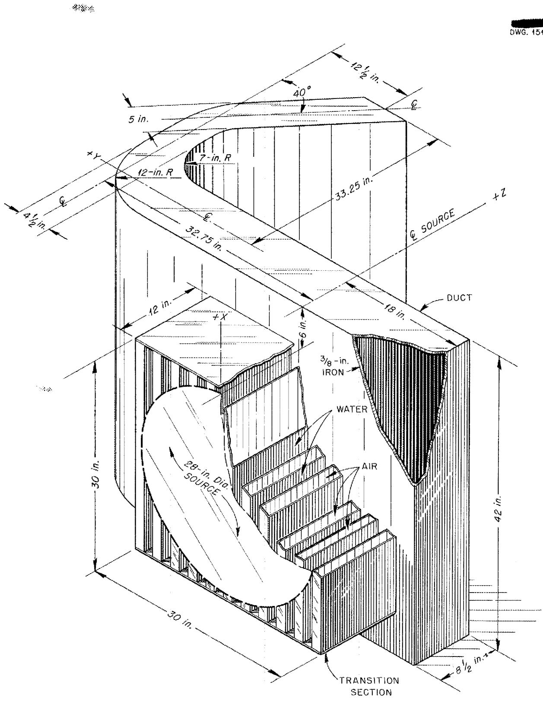  
Fig. 19. G-E Outlet Air Duct.

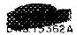

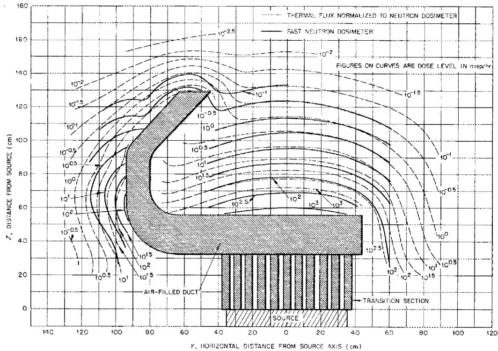

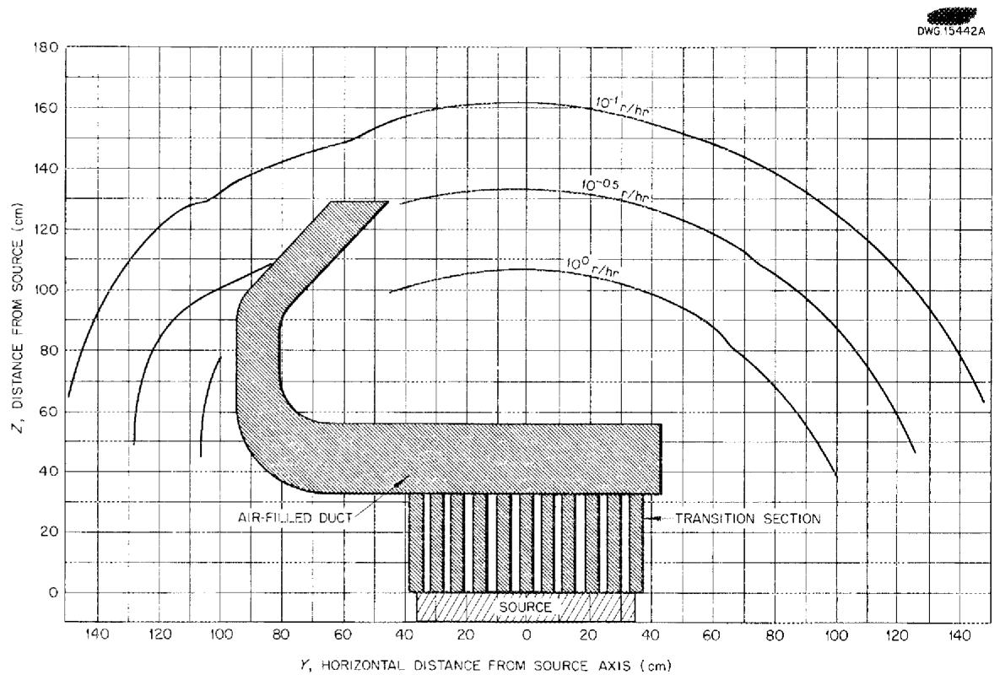  
Fig. 20. Neutron Isodose Measurements with G-E Outlet Air Duct Mockup.   
Fig. 21. Gamma Isodose Measurements on G-E Outlet Air Duct.

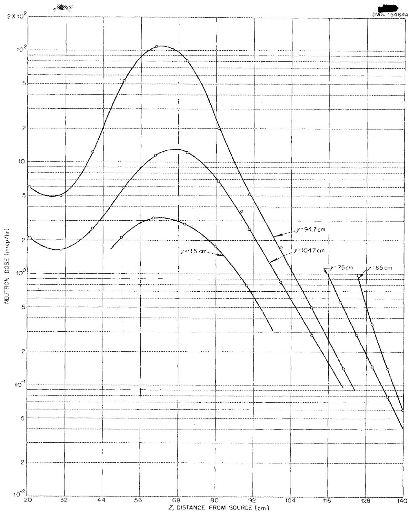  
Fig. 22. Fast-Neutron Dosimeter Measurement on G-E Outlet Air Duct Showing z Traverses for Various Values of y.

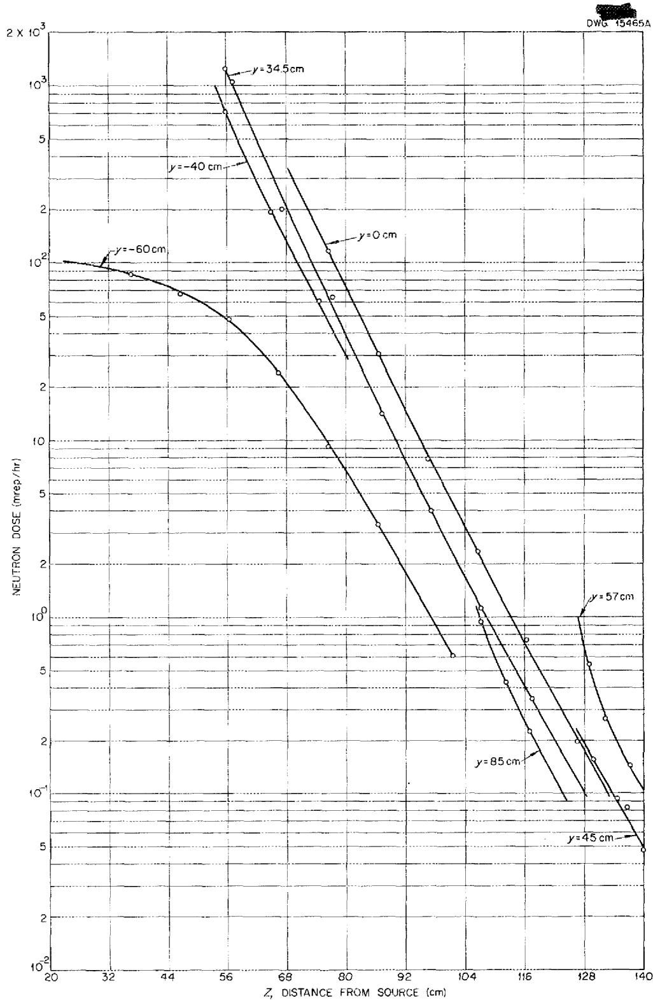  
Fig. 23. Fast-Neutron Dosimeter Measurement on G-E Outlet Air Duct Showing z Traverses for Various Values of y.

All the neutron data given were obtained with the shutter between the reactor and the source plate open. The counting rate with the shutter closed, that is, with only the background neutrons from the reactor, was between 2 and $10\%$ of the rate with the shutter open.

Most of the thermal-neutron data were obtained by using an automatic counting-rate plotter connected to a counter that was moved at a constant rate across the tank. Some isodoses were subsequently obtained directly with an automatic isodose plotter. The data obtained by the two methods are in good agreement.

The fast-neutron dose was obtained at several fixed positions with a polyethylene-lined dosimeter. (2) The thermal-neutron fluxes can thus be normalized to fast-neutron dose, to which they should be directly proportional, provided there are no major perturbations in the neutron spectra.

The gamma background dose with the shutter closed was of the order of $50\%$ of that with the shutter open and therefore not negligible. Since, furthermore, this ratio varies with position, the difference was perforce measured for all points to obtain the dose attributable to the fission source.

The distribution of neutron and gamma dose around this duct was also measured for various lengths of transition section. The gamma-dose distributions for transition section lengths of 0, 6, 12, and 18 in. have been completed. For each geometry a centerline traverse was made (Fig. 24) and an isodose curve plotted (Figs. 25 and 26). Figure 27 shows several isodose

curves made with only water in the tank.

The center-line measurement given in Fig. 23 shows the difference between the readings with the shutter open and closed. The isodose plots have not been subtracted, since it is apparent that the transition section has no marked effect upon the dose.

The gamma isodoses are all automatically normalized to a local reactor power monitor. Since this monitor reads less by a factor of 0.777 when the shutter is closed, the corresponding isodoses represent a dose higher by 1/0.777 than the shutter-open isodoses, as is noted on the figures. In the case of the pure-water isodoses, the resulting curves very nearly coincide, whereas with the duct mockup in place there is a separation of about 10 cm. This can be attributed to the presence of gammas from thermal-neutron capture in the iron of the duct. The thermal-neutron flux, of course, is considerably affected by the shutter.

# R-1 REACTOR(3) GAMMA SHIELDING

The gamma shielding on the side of the G-E aircraft reactor was mocked up in the lid tank facility, and measures were taken to determine its optimum position in relation to the pressure shell. The shield design under consideration consisted of 4 in. of pure-water reflector next to the reactor, a 1-in. steel pressure shell, and additional iron and lead in borated water. The question under consideration here was whether the additional iron and lead could be placed next to the pressure shell or whether it was

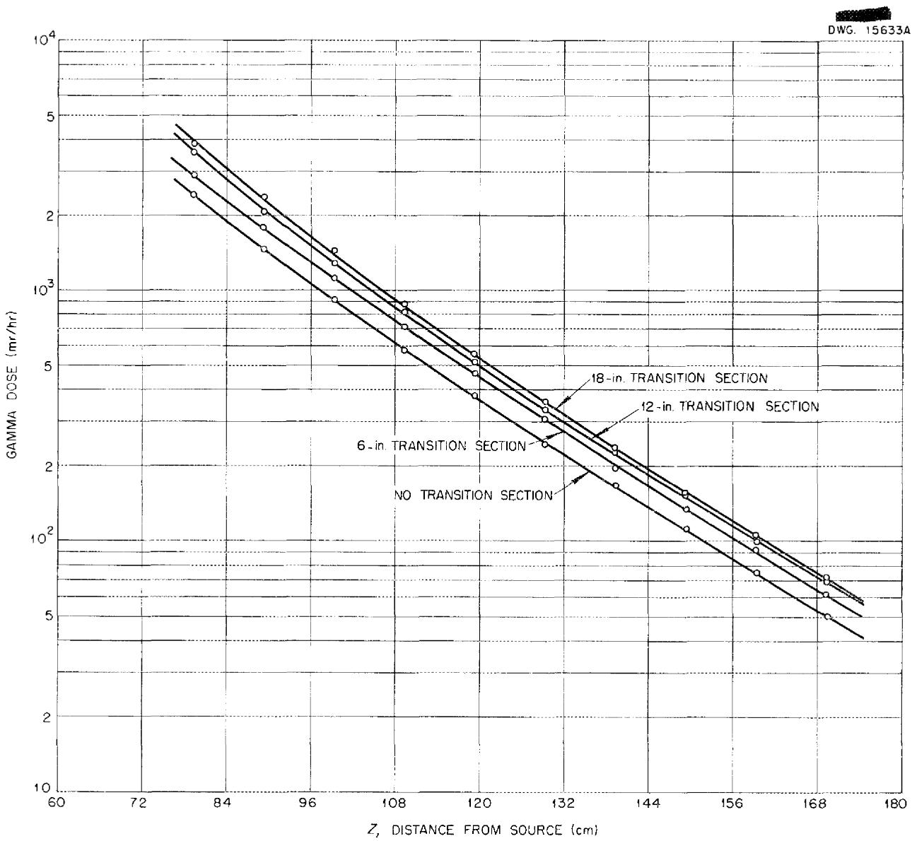  
Fig. 24. Gamma Center Line Measurements with G-E Outlet Air Duct.

necessary to locate it farther out in the borated water to reduce secondary gamma production.

In the mockup used in the lid tank facility, one 2.2-cm iron slab was placed 4 in. from the source to represent the pressure shell. This was followed by a 38-in.-wide steel tank, the inner wall of which (0.32 cm) is considered part of the pressure shell. This tank was filled with

bored (0.6 wt % boron) water in which the gamma shield was moved with respect to the source. The gamma shield, consisting of one layer of iron and two unequal layers of lead with each layer separated by small thicknesses of borated water, is shown in Fig. 28. The gamma rays were measured in the water behind the tank for six positions of the gamma shield with both an ion chamber and an anthracene scintillation counter. A seventh configuration was

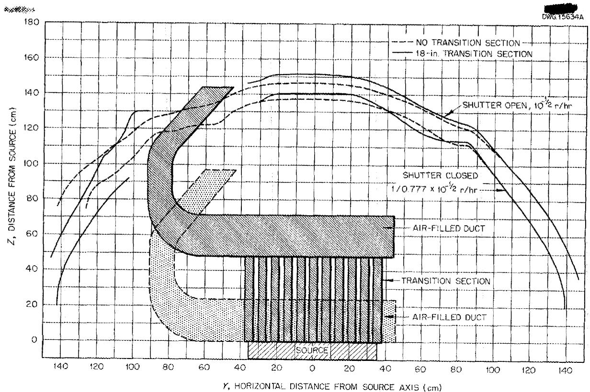

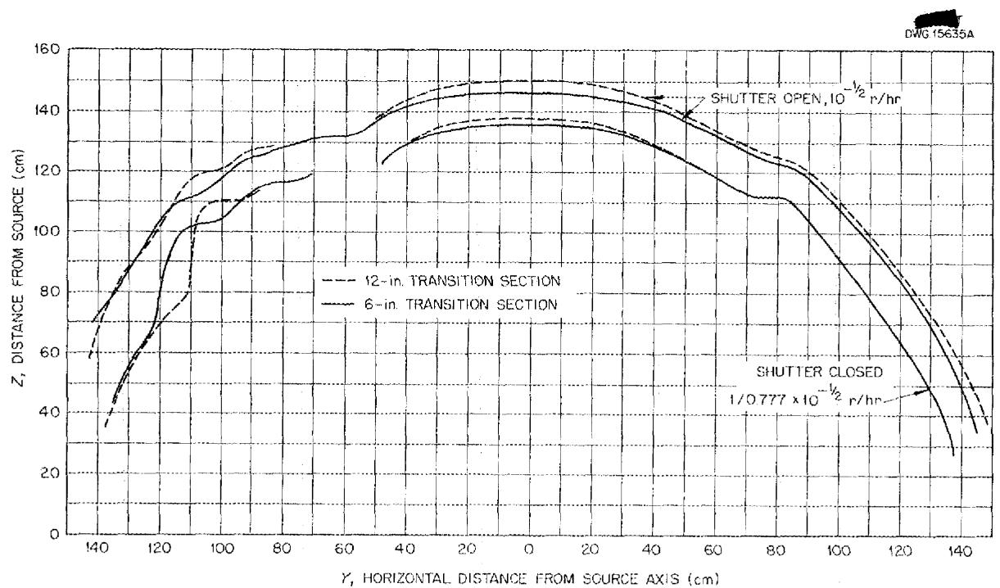  
Fig. 25. Gamma Isodose Curves with G-E Outlet Air Duct Showing Effect of Transition Section.   
Fig. 26. Gamma Isodose Curves with G-E Outlet Air Duct Showing Effect of Transition Section.

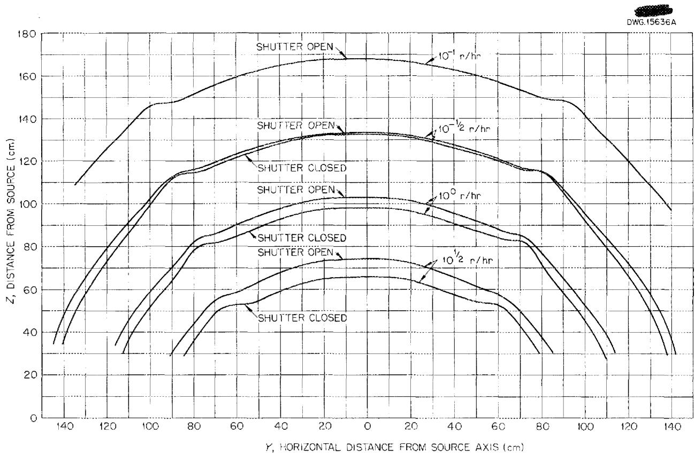  
Fig. 27. Gamma Isodose Curves with Pure Water.

also measured in which the gamma shield was at the outside of the tank (farthest from the source) and the 2.2-cm iron slab for the pressure shell was removed. These data are shown graphically in Figs. 29, 30, and 31. Figure 32 shows the variation in gamma dose at 70 cm from the source as a function of gamma shield position.

Moving the gamma shield back 28 cm from the pressure shell reduced the gamma intensity by only $20\%$ although the weight of this component was increased by 5000 pounds. This intensity reduction can be achieved, on the other hand, by adding only 1 cm of iron 28 cm back from the main gamma shield with a corresponding weight increase of only 2000 pounds. The iron slab 10.16 cm from the source reduced the radiation by about $20\%$ , whereas it would have reduced the

gamma intensity by about $33\%$ if neutron-capture gammas in the iron itself had been eliminated.

# OTHER LID TANK EXPERIMENTS

Other work that has just been completed in the lid tank facility and has not been published consists of measurements on a mockup of the inlet air duct(4) of the G-E aircraft reactor and a mockup of an array of round, wavy ducts (Fig. 33), which are still considered to be a possible means of carrying the cooling air to and from the reactor. Work is now under way to determine the effect on thermal-neutron dosage of borating the water around the exit air duct.

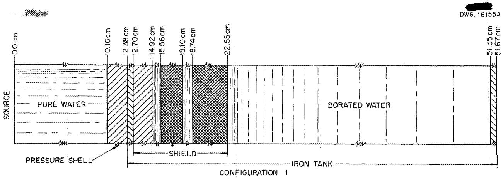

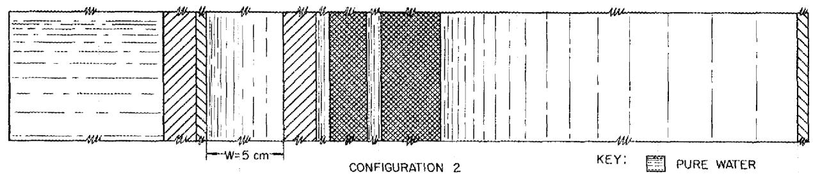  
CONFIGURATION 3 SAME AS ABOVE EXCEPT W =10 cm   
CONFIGURATION 4 SAME AS ABOVE EXCEPT W=15 cm   
CONFIGURATION 5 SAME AS ABOVE EXCEPT W=20 cm

PURE WATER

IRON

BORATED WATER

LEAD

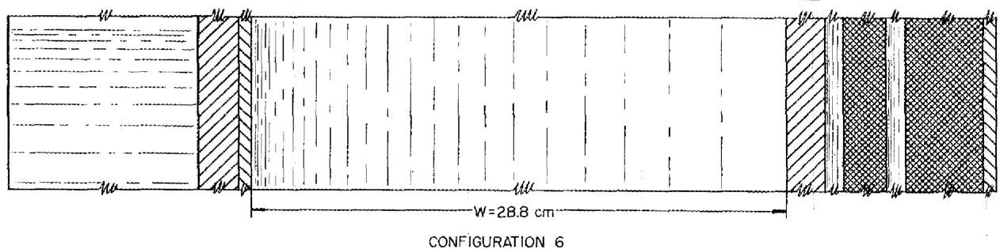

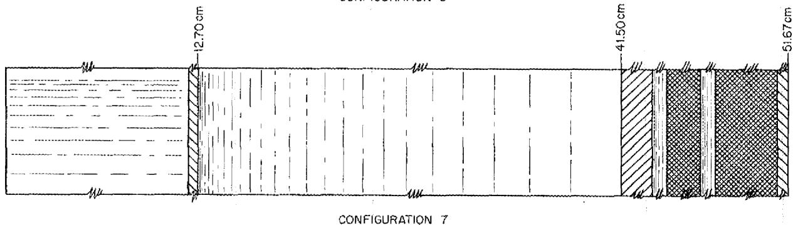  
Fig. 28. Mockup of Gamma Shield for Side of GE-ANP Reactor.

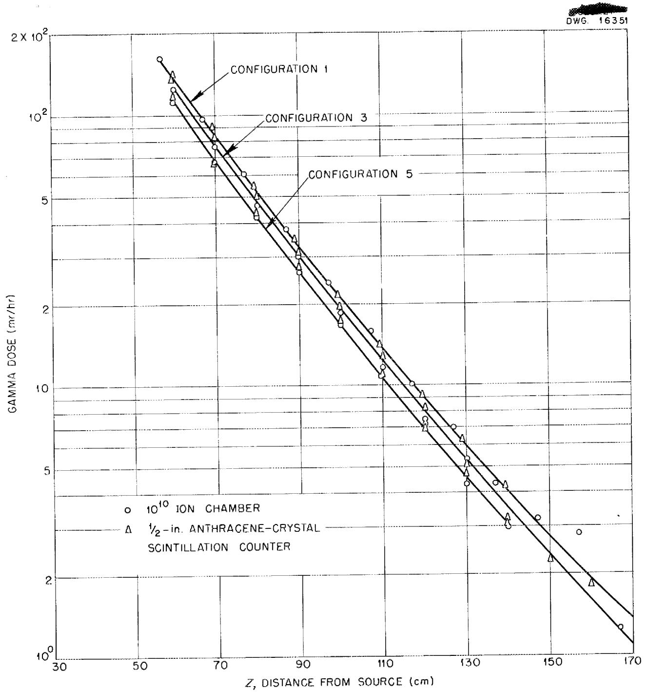  
Fig. 29. Gamma Measurements Beyond Mockup of Side Shield for GE-ANP Reactor. Configurations 1, 3, and 5.

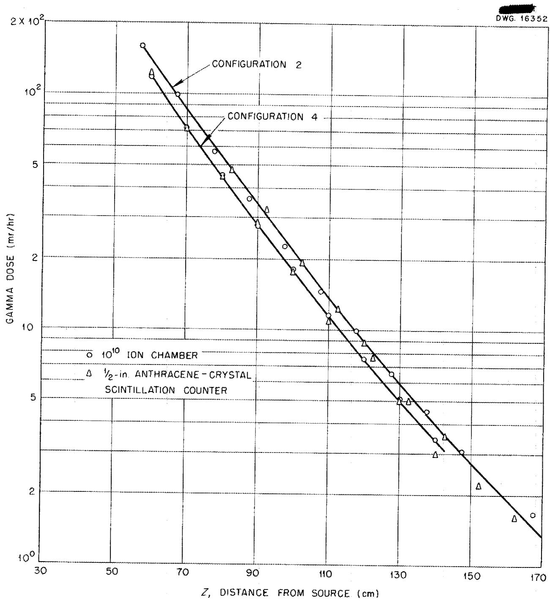  
Fig. 30. Gamma Measurements Beyond Mockup of Side Shield for GE-ANP Reactor. Configurations 2 and 4.

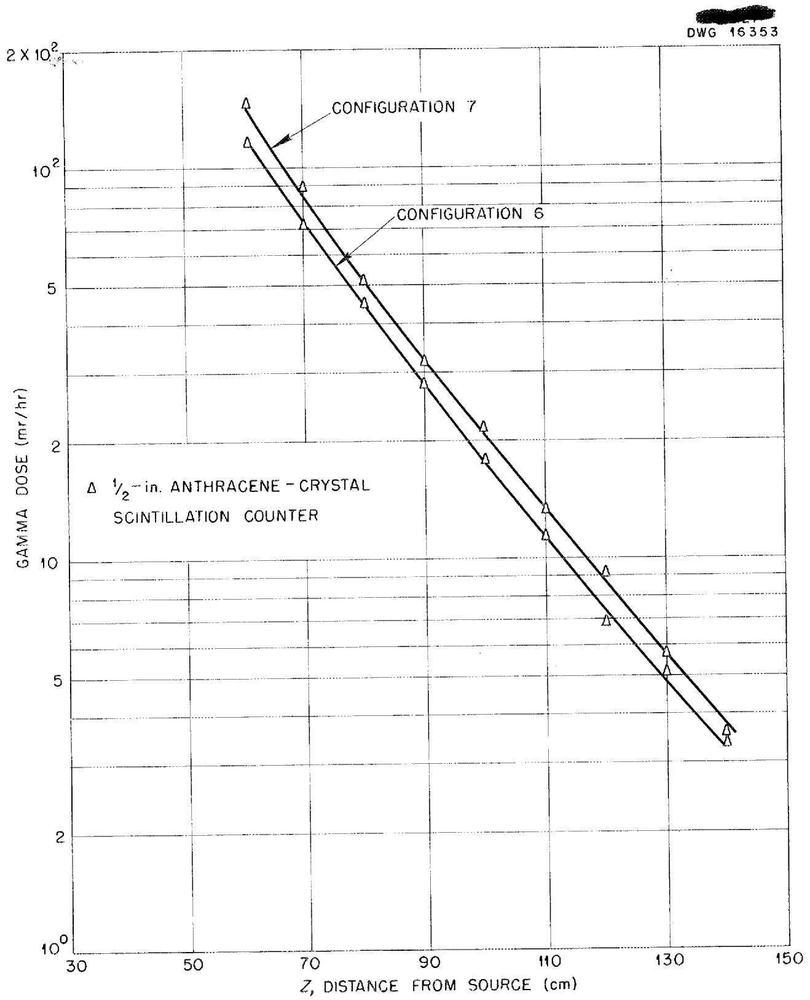  
Fig. 31. Gamma Measurements Beyond Mockup of Side Shield for GE-ANP Reactor. Configurations 6 and 7.

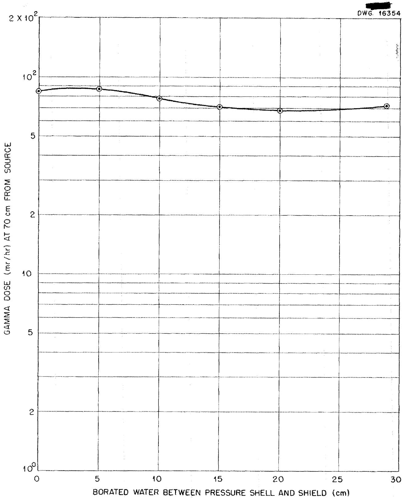  
Fig. 32. Gamma Dose as a Function of Borated Water Thickness in Side Shield Mockup.

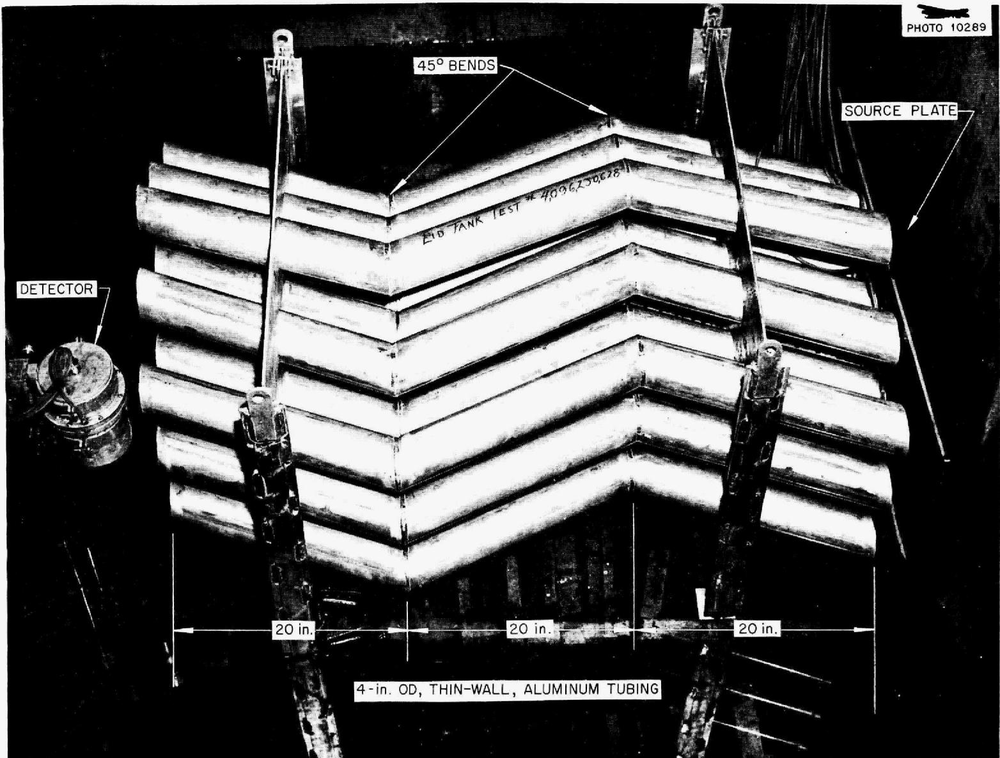  
Fig. 33. Wavy-Duct GE-ANP Mockup in Lid Tank.

# CORRELATION OF NEUTRON ATTENUATION DATA

# E. P. Blizzard Physics Division

By the use of somewhat elaborate transformations, the water-neutron attenuation data from the lid tank facility and the bulk shielding reactor have been compared. The lid tank data seem to be lower by a factor of somewhat less than 2 at large distances but more than 2 close to the sources. The reason for this discrepancy is

not understood, but several possible explanations have been suggested. Primary among these is the possibility that the lid tank source plate is actually operating at a somewhat lower power than was indicated by early measurements. The calculation of lid tank source-plate leakage is complicated by the rather difficult geometry of the cylindrical, natural-uranium slugs of which the source is made. Installation of new, thin-plate $\mathbf{U}^{235}$ is being studied to determine how much this might be expected to improve the situation. Indications are that it would be very desirable since so many shield designs are based on lid tank data.

# 6. BULK SHIELDING REACTOR

J. L. Meem H. E. Hungerford   
R. G. Cochram E. J. Johnson   
M.P.Haydon J.K.Leslie   
K. M. Henry T. A. Love   
L. B. Holland F. C. Maienschein

G. M. McCammon

Physics Division

The first series of studies of gamma-ray spectra and angular distributions with the divided shield mockups have been completed. The final measurements incorporated a lead shadow shield and data obtained with this arrangement will be used to calculate the gamma-ray dose at the crew compartment.

Plans are being made for using the recoil-proton spectrometer to measure spectra and angular distributions of fast neutrons leaving the reactor part of the divided shield mockup.

In order to resolve the uncertainty of the power of the bulk shielding reactor, an attempt is being made to obtain a more accurate value of the

energy released per fission. A special fuel element equipped with thermocouples and water-flow tubes has been constructed so that the energy per fission can be determined as a measure of temperature rise and water flow.

Preparations are under way to expose monkeys to radiation from the bulk shielding reactor, and a tentative program has been arranged. Animals previously irradiated by the Cockcroft-Walton accelerator are now under observation.

A graphite thermal column has been installed in the bulk shielding facility to provide an intense source of thermal neutrons. With this source, the gamma rays produced by neutron capture can be studied.

# MCKUP OF THE DIVIDED SHIELD

Gamma-ray spectral measurements during the past quarter were made with a lead shadow shield added to the mockup of the aircraft divided shield.(1) These measurements complete the first series of studies of gamma-ray spectra and angular distributions with the divided shield mockup. The data obtained will be used for a preliminary calculation of the gamma-ray dose received at the crew-compartment location, which will then be compared with the estimates of the Shielding Board.(2)

The results obtained with the lead shields are shown in a series of five figures. Figure 34 shows a gamma-ray isodose curve obtained by using an ion chamber without the lead disks. This curve is very nearly a segment of a circle with a radius of $168.2\mathrm{cm}$ and a center near the reactor center. The other curve in Fig. 34 shows the dose along this same circle after addition of the leak disks.

From these data it was decided to examine the energy and angular distributions at the angles $\psi = 0$ deg and $\psi = 50$ deg, where $\psi$ is the angle between the aircraft axis and a line connecting the pseudo reactor center and the nose of the spectrometer collimator. The energy spectra obtained for various values of the angle $\theta$ are shown in Figs. 35 and 36 for $\psi = 0$ and 50, respectively, where $\theta$ is the angle between the spectrometer collimator and the line joining the pseudo reactor center and the nose of the spectrometer collimator. The corresponding angular distributions are shown in Figs. 37 and 38.

Development of the recoil-proton spectrometer is continuing. Plans are being made to use the instrument for measuring spectra and angular distributions of fast neutrons leaving the reactor part of a divided shield mockup when the air-scattering experiments are completed. A report on the theory of this instrument has recently been published.(3)

# AIR-SCATTERING EXPERIMENTS

A memorandum(4) giving the details of the air-scattering experiments described in the previous report has been issued. Similar experiments at 100-kw reactor power are now getting under way.

# REACTOR POWER DETERMINATION

One of the largest uncertainties in the determination of the power of the bulk shielding reactor rests in the lack of an accurate value for the energy released per fission. A special fuel element has been constructed to be used in measuring this quantity (Fig. 39). The center fuel plate of the element is removable and disks are punched out of the plate. The gamma activities of these uranium-bearing disks are counted after an exposure to determine the number of fissions that occurred in the fuel element and then compared with the gamma activity in a similar disk previously calibrated in the standard reactor.

The special fuel element is equipped with thermocouples and water-flow tubes. Special precautions against

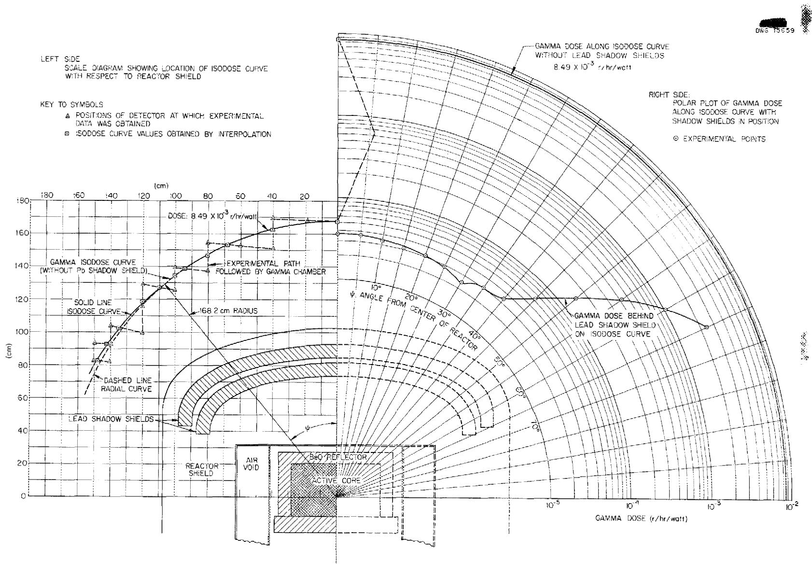  
Fig. 34. Gamma Isodose Curve Around Reactor Shield Without Shadow Disks and Dose Along Isodose Curve with Shadow Disks in Position.

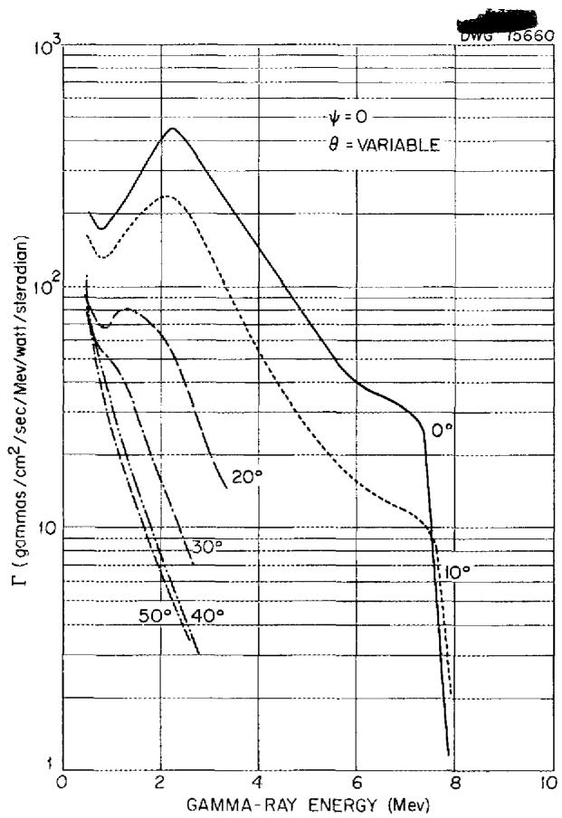  
Fig. 35. Gamma-Ray Flux Behind Lead Disks.

spurious loss of heat are taken so that the heat generated in the fuel element is measured directly from water flow and temperature rise. Making allowance for the net leakage of gamma radiation into or out of the fuel element, the energy per fission can then be calculated. The experiment is well under way.

# IRRADIATION OF ANIMALS

In cooperation with the Health Physics Division and the USAF School of Aviation Medicine, preparations are being made to expose monkeys to radiation from the bulk shielding reactor. Special water-tight cages

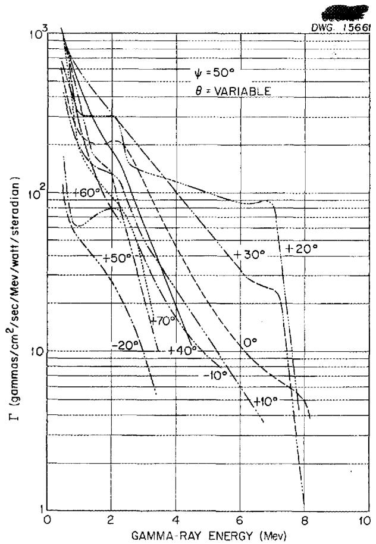  
Fig. 36. Gamma-Ray Flux Behind Lead Disks.

are being constructed in which the monkeys will be placed under water near the reactor. The tentative program for the irradiation of the monkeys is presented in Table 4.

In addition to the animals irradiated, 12 animals will be used for control immersions in the bulk shielding facility.

After completion of the exposures the monkeys will be returned to the Primate Laboratory, USAF-SAM, at Austin, Texas. Particular attention is to be devoted to examination for eye cataract.

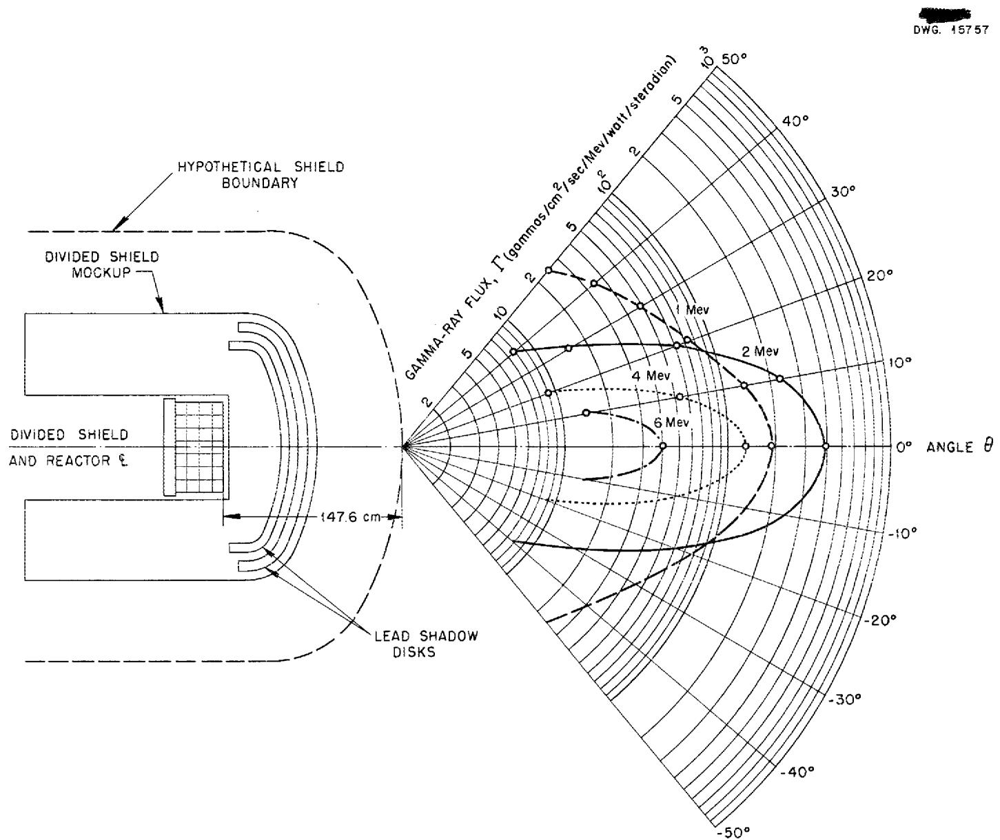  
Fig. 37. Gamma-Ray Flux as a Function of Angle for Energies as Shown Behind Lead Disks (DSML, $\psi = 0^{\circ}$ ).

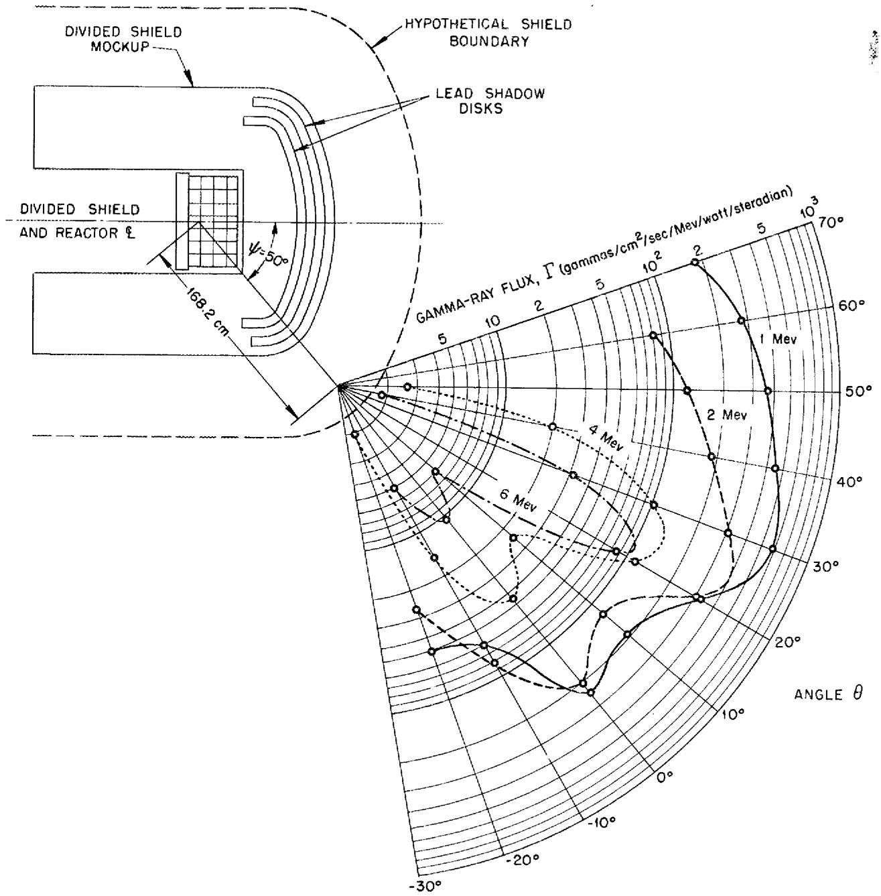  
Fig. 38. Gamma-Ray Flux as a Function of Angle for Energies as Shown Behind Lead Disks (DSML, $\psi = 50^{\circ}$ ).

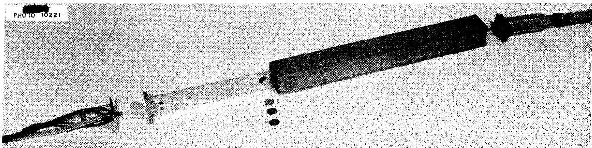  
Fig. 39. Special Fuel Element for Measurement of the Energy Released per Fission (Partly Disassembled).

Table 4 TENTATIVE PROGRAM FOR IRRADIATION OF MONKEYS IN THE BULK SHIELDING FACILITY   

<table><tr><td></td><td>SERIES 1</td><td>SERIES 2</td></tr><tr><td>Exposure rate* (rem/hr)</td><td>1</td><td>0.25</td></tr><tr><td>Number of exposures</td><td>8</td><td>16</td></tr><tr><td>Time per exposure (hr)</td><td>16</td><td>8</td></tr><tr><td>Time between exposures (days)</td><td>7</td><td>7</td></tr><tr><td>Total exposure (rem)</td><td>128</td><td>32</td></tr><tr><td>Animals used</td><td>12</td><td>12</td></tr></table>

*One-half of dose will be in neutrons and one-half in gamma rays to the animals irradiated.

The initial irradiations of mice, rats, and rabbits on the Cockcroft-Walton accelerator have been completed. The animals were subjected to total fast-neutron doses of 14-Mev neutrons ranging from $10^{7}$ to $3 \times 10^{10}$ neutrons per $\mathrm{cm}^2$ . It is expected that the threshold for eye cataract will lie in this interval and the animals are now under observation. The results will be published by members of the Biology Division.

# IRRADIATION OF ELECTRONIC EQUIPMENT

Additional electronic equipment from the Air Force was exposed to radiation from the bulk shielding reactor early in the quarter. No appreciable damage was observed. The exposures have been discontinued temporarily because of conflicting higher priority work.

# CAPTURE GAMMA-RAY MEASUREMENTS

Of considerable importance in shielding calculation is a knowledge of the gamma rays produced by neutron capture in the various materials of the shield. Upon completion of the gamma-ray spectral measurements with the divided shield mockup, the spectrometer(5) will be used for measuring capture gamma rays from many materials of interest. To provide an intense

source of thermal neutrons for the production of such gamma rays, a graphite thermal column has been installed in one corner of the pool. A 4- by 6- by 7-ft stack of AGOT-grade graphite has been installed, and the spectrometer is being adapted to the new program.

(5) F. C. Maienschein, Multiple-Crystal Gao and $\alpha$ -Ray Spectrometer, ORNL-1142 (July 3, 1952).

# 7. TOWER SRIIELDING FACILITY

C. E. Clifford T. V. Blosser Physics Division

The tower shielding facility, as described in the recent proposal, has been approved for construction. Calculations of structure and ground scattering to be expected in the tower shielding facility have been completed and published in an ORNL report.

Design criteria for the tower and buildings have been prepared for submission to an architect engineer who will complete the detailed design. Completion of the design contracts should require three to four months, and construction should be completed in approximately nine months.

Orders have been placed for a majority of the reactor control components and instrumentation, and an investigation is being made to determine the best solution to the rather difficult problem of rigging the cables for this configuration. Orders for components of the experimental instrumentation that are commercially available are being placed, and preliminary design of both the mechanical and electronic components of the remote instrumentation is in progress.

A supersensitive fast-neutron dosimeter is being developed with the assistance of G. S. Hurst of the Health Physics Division, who developed the original instrument. The first approach will be to try to make use of multiple sensitive chambers operating a single electronic recording circuit.

# 8. NUCLEAR MEASUREMENTS

A. H. Snell, Physics Division

Fission cross-section curves of $\mathbf{U}^{234}$ and $\mathbf{U}^{236}$ relative to $\mathbf{U}^{235}$ for incident neutron energies up to 4 Mev have been determined by using the 5-Mev Van de Graaff neutron accelerator. The $\mathbf{N}^{14}$ total cross section has been measured from 1.6 to 4 Mev on this accelerator. Some energy levels in thorium and resonance values in $\mathbf{U}^{238}$ were observed with the time-of-flight spectrometer.

# FISSION CROSS SECTION OF $\mathbf{U}^{234}$ AND $\mathbf{U}^{236}$

H. B. Willard, Physics Division

The shapes of the fission cross-section curves for $\mathbf{U}^{234}$ and $\mathbf{U}^{236}$ relative to $\mathbf{U}^{235}$ have been determined by using the 5-Mev Van de Graaff accelerator. (1) The statistical error was $2\frac{1}{2}\%$ when taking readings about

50 kev apart up to 4 Mev. A tritium-gas target that gave an rms energy spread varying from 60 to 100 kev was used. Owing to foil uncertainties, however, the ordinate scale factors are in doubt to a probable error of $14\%$ for $\mathbf{U}^{234}$ and $9\%$ for $\mathbf{U}^{236}$ . Thresholds were found to be 0.37 and 0.69 Mev for $\mathbf{U}^{234}$ and $\mathbf{U}^{236}$ , respectively. Two minimums were found in each curve at different neutron energies for the two isotopes, which indicates that they are true minimums for $\mathbf{U}^{234}$ and $\mathbf{U}^{236}$ rather than maximums in $\mathbf{U}^{235}$ .

# TOTAL CROSS SECTION OF $\mathbf{N}^{14}$

H. B. Willard, Physics Division

The total cross section of $\mathbf{N}^{14}$ has also been measured with the 5-Mev Van de Graaff accelerator. Resolution of 35 kev was obtained between 1.6 and 4 MeV. The graph of these results is shown in Fig. 40.

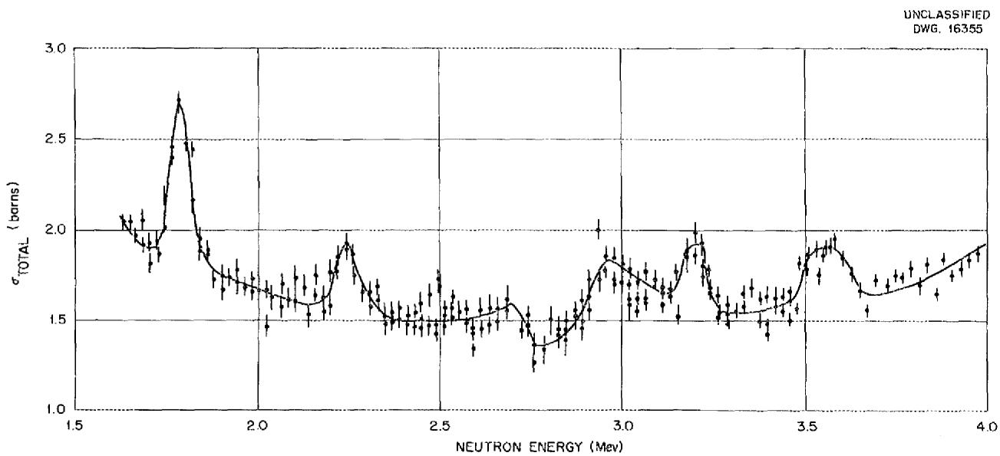  
Fig. 40. Total Cross Section of $\mathbf{N}^{14}$ (35-kev Resolution).

These measurements corroborate the mean free path values used in airscattering calculations for the divided shield. (2) Eventual extension of these data up to 8 Mev will also be of interest, although it is unlikely that the extended data will indicate any gross differences from the extrapolated values. The data are sufficiently detailed for IBM calculations of air scattering as far as incident neutron energy is concerned, but there is still considerable uncertainty regarding the energy and angular distribution of scattered neutrons. When the latter data are available, and when the energy and angular distribution of neutrons leaving the reactor shield have been measured in the bulk shielding facility, it will then be possible to make machine calculations of neutron air

scattering. These calculations should provide valuable information prior to operation of the tower shielding facility.

# TIME-OF-FLIGHT SPECTrometer

G. S. Pawlicki E. C. Smith P. E. F. Thurlow Physics Division

The time-of-flight spectrometer has been used to measure the transmissions of thick samples of thorium oxide and depleted uranium oxide $\left(\mathrm{U}_{3} \mathrm{O}_{8}\right.$ with less than 7 ppm $\left.\mathrm{U}^{235}\right)$ . Energy levels were observed in thorium at 23.5, 35, 71, 127, 260, and 870 electron volts. Resonances were also observed in $\mathrm{U}^{238}$ at 6.8, 21, 39, 62, 110, 200, and 1700 electron volts. Further details will be found in the next Physics Division quarterly report.

Part III

# MATERIALS RESEARCH

The research on high-temperature liquids has been directed primarily toward the production of a fuel for the ARE. The longer range work is principally concerned with studies of fluoborate systems and the purification of hydroxides (sec. 9). The ARE fuel is in the system $\mathrm{NaF - ZrF_4 - UF_4}$ , and the most probable composition is 46 mole % NaF, 50 mole % $\mathrm{ZrF_4}$ , and 4 mole % $\mathrm{UF_4}$ . The melting point of this composition is $510^{\circ}\mathrm{C}$ and its vapor pressure and viscosity are tolerable. A satisfactory loading technique involving the addition of $\mathrm{ZrF_4 - UF_4}$ to an $\mathrm{NaF - ZrF_4}$ base has been proposed. Numerous fluoride systems, with and without $\mathrm{UF_4}$ , have been examined, and systems containing $\mathrm{UF_3}$ have been prepared. The study of the reaction of fluorides with alkali metals has indicated that large quantities of NaK may be added to the system $\mathrm{NaF - ZrF_4 - UF_4}$ before producing any free $\mathrm{UF_3}$ .

Most of the corrosion research during the past quarter has centered around the determination of corrosion characteristics of fluoride mixtures containing $\mathrm{ZrF_4}$ (sec. 10). Both static and dynamic tests indicate that this class of fuels and coolants is less corrosive than the previously tested fluoride fuel systems, an improvement which may result from better material production and testing techniques. Static tests and dynamic tests have been run with fluorides and hydroxides to determine the effects of such variables as time, temperature, additives, stress, and environment. A curious result was the apparent decrease of fluoride attack with increasing temperature. This may have been the result of the formation of a protective oxide coating. Aside from the reduced attack that may have resulted from improved preparation techniques, the most significant

advance during the last quarter came from the addition of $\mathsf{ZrH}_2$ to the NaF-KF-LiF-UF4 mixture. To supplement corrosion tests, considerable effort has been applied to fundamental studies of the corrosion mechanism, including synthesis and identification of corrosion products. The hypothesis that fluoride corrosion of Inconel depletes the chromium from the metal lattice and the resulting voids precipitate has been supported by further tests and observations.

The metallurgical methods for the construction and assembly of the Aircraft Reactor Experiment, including welding and brazing, fabrication of control rods, and ceramic coating of radiator fins, have been developed (sec. 11). Specifications have been established on procedure and qualifications for inert-arc welding of Inconel pipe and fittings for highly corrosive applications. The $\mathbf{B}_4\mathbf{C}$ -Fe and the $\mathrm{Al}_{2}\mathrm{O}_{3} - \mathrm{B}_{4}\mathrm{C}$ inserts for the ARE control and regulating rods have been pressed. An apparently satisfactory high-temperature ceramic coating has been applied to nickel sheet for use in a liquid metal-to-air radiator. In addition, the creep and stress of Inconel are being determined in air and argon, and the mechanical and corrosion-resistance properties of brazed joints are being investigated. Tensile tests have shown brazed-joint efficiencies as high as $92\%$ .

Heat transfer and physical properties measurements on various fluorides have resulted in lessening the effort on liquid metal and hydroxide measurements (sec. 12). The viscosity of the ARE fuel, NaF-ZrF $_4$ -UF $_4$ (46-50-4 mole%), ranges from 20 to 7 centipoises between 580 and $830^{\circ}\mathrm{C}$ . The vapor pressure of this fuel increases from 12 to 84 mm Hg between 807 and $940^{\circ}\mathrm{C}$ .

Thermal conductivity, heat capacity, and density measurements have been made on several high-temperature liquids. The experimental heat transfer data for sodium hydroxide may be represented by an equation that can be evaluated to within $9\%$ of the values normally used for ordinary fluids. A heat-momentum-transfer analysis of a thermal convection loop indicates a circulation velocity of about 0.1 ft/sec.

The radiation damage program includes irradiation of fluoride fuel mixtures, measurements of the effect of radiation on creep and thermal

conductivity, and operation of in-reactor loops (sec. 13). Reactor irradiations of a mixture containing $\mathrm{ZrF_4}$ indicate that no significant radiation-induced corrosion will occur at ARE intensities. An experiment to determine the rate of diffusion of $\mathrm{Xe^{135}}$ from the irradiated static fuel mixture NaF-BeF $_2$ -UF $_4$ indicated that almost all the xenon will remain in the fuel unless flushed out. The $1700^{\circ}\mathrm{F}$ annealing temperature proposed for the ARE fuel tubes appears to be of some consequence in minimizing creep and thermal conductivity changes under irradiation. No radiation-induced corrosion was observed in the sodium in-reactor loop.

# 9. CHEMISTRY OF HIGH-TEMPERATURE LIQUIDS

W. R. Grimes, Materials Chemistry Division

Research in the ANP chemistry group has been concerned almost entirely with studies of fluoride mixtures for use as fuels and coolants for an aircraft reactor. Although the major effort has necessarily been directed to problems of immediate concern to the ARE, a number of longer range studies is being carried out.

The program in research and pilot-scale production of liquid fuels of high purity is still actively followed, although responsibility for production of the large quantities of such materials needed for engineering evaluation is now shared with the experimental engineering group.

Efforts continue on definition of the optimum composition of the ARE fuel and on studies of corrosion of metals by the various high-temperature liquids being considered. The previous attempts to identify chemical species in the cooled melts before and after corrosion testing have continued.

A study of the possible reactions of the fuel mixture with alkali metals at elevated temperature has been initiated to ascertain in quantitative fashion the effect of a leak between the fuel and moderator circuits. Detailed study of the system after reduction of $\mathrm{UF_4}$ and/or $\mathrm{ZrF_4}$ has indicated that the mixture of products is quite complex even if chemical equilibrium is obtained. Some indications of equilibrium among $\mathrm{UF_3}$ , $\mathrm{UF_4}$ , $\mathrm{ZrF_4}$ , and lower valence fluorides of zirconium suggest, however, that addition of small amounts of alkali metals may be beneficial as far as corrosion is concerned.

Detailed explanation of the systems obtained by addition of NaK to the various fluoride fuels has necessitated reactivation of the study of the preparation and the properties of $\mathrm{UF_3}$ . Preparation of the pure material has been accomplished on a moderate scale, and studies of its chemical properties and phase equilibriums in systems of which it is a component are under way.

The preparation of a simulated fuel for the ARE critical experiment has been concluded, and the tubes have been filled with powder by the Y-12 Production Division. Satisfactory progress is being made on the only remaining problem - filling one tube with a solid rod of fuel.

A small program dealing with the purification of alkali hydroxides and the determination of the high-temperature properties of these materials has been maintained.

# FUEL MIXTURES CONTAINING $\mathbf{U}\mathbf{f}_{4}$

L. M. Bratcher R. E. Traber, Jr. C. J. Barton

Materials Chemistry Division

Several binary systems have been studied because of the need for this information in construction on the three-component systems containing them. The binary and ternary mixtures containing aluminum fluoride that have been examined show little promise of successful application,

The four-component system NaF-KF-ZrF $_4$ -UF $_4$ appears to yield no melting points below $510^{\circ}\mathrm{C}$ at the 4 mole % UF $_4$ level. Since this temperature can be achieved in the NaF-ZrF $_4$ -UF $_4$ system at this uranium level, more attention has been paid to the simpler three-component system.

The mixture containing 50 mole $\%$ $\mathrm{ZrF_4}$ 46 mole $\%$ NaF, and 4 mole $\%$ UF4 appears at present to be the most promising of the fuel mixtures. This material, which melts at $510^{\circ}C,$ shows a partial pressure of $\mathrm{ZrF_4}$ of 13 mm at $1500^{\circ}\mathrm{F},$ and its viscosity seems satisfactory for the ARE (cf., "Heat Transfer and Physical Properties Research," sec. 12). Slightly lower (8 mm) vapor pressure and lower viscosity values are available with

the similar mixture containing 46 mole $\%$ $\mathrm{ZrF_4}$ , 50 mole $\%$ NaF, and 4 mole $\%$ UF. This mixture, which appears to freeze to a single solid solution of $\mathrm{NaUF}_5$ in $\mathrm{NaZrF_4}$ , melts sharply at $520^{\circ}C$ . The final choice between these mixtures has not been made. Their preparation, handling, and corrosion problems appear very similar.

Start-up of the reactor by filling the machine with NaF-ZrF₄ (corresponding to either of these fuels) and adding the NaF-UF₄ eutectic (26 mole % UF₄) to bring the fuel to criticality would not be an easy operation, since a mixture melting as high as 700°C could be produced by local concentrations and inadequate mixing.

However, on the line representing 50 mole % NaF the melting point decreases gradually from $\mathrm{NaUF}_5$ (m.p., $710^{\circ}\mathrm{C}$ ) to $\mathrm{NaZrF}_5$ (m.p., $510^{\circ}\mathrm{C}$ ). All intermediate mixtures appear to be solid solutions of the two compounds. The mixture containing 25 mole % UF and 75 mole % ZrF melts at $610^{\circ}\mathrm{C}$ and should contain about 105 lb of uranium per cubic foot at $800^{\circ}\mathrm{C}$ . This mixture could, presumably, be used to bring the reactor to criticality at temperatures above $625^{\circ}\mathrm{C}$ .

$\mathbf{NaF - KF - ZrF_4 - UF_4}$ Data presented previously(1) showed that at the 4 mole $\%$ UF4 level two compositions in the NaF-KF-ZrF4-UF4 system yielded melting points below $500^{\circ}C$ .Reexamination of the system indicates that these determinations were in error. The lowest melting point verified in this system is at $505^{\circ}C$ and corresponds to 38.4 mole $\%$ ZrF4, 18.7 mole $\%$ NaF, 38.9 mole $\%$ KF, and 4.0 mole $\%$ UF4.

Material containing 53 mole % KF, 5 mole % NaF, 40 mole % ZrF₄, and 2 mole % UF₄ melts at 410°C, and it would prove to be a very satisfactory fuel for a future model with sufficient volume to contain a critical mass of this composition.

$\mathbf{NaF - ZrF_4 - UF_4}$ . Tentative contours for the $\mathrm{NaF - ZrF_4 - UF_4}$ system are shown in Fig. 41. Although some difficulty was experienced in reproducing data in this system, possibly because of the ease of oxidation and hydrolysis of the quadrivalent fluorides, repeated measurements have indicated that the contours are not in serious error,

especially in the low-melting-point region. It should be possible to use up to 8 mole $\%$ UF $_4$ should this be necessary with melting points below $550^{\circ}\mathrm{C}$ .

NaF-ZrF4-BeF2-UF4. Systems containing BeF2 have previously been shown to possess high viscosities in the 600 to $700^{\circ}\mathrm{C}$ range, but a number of such systems have usefully low melting points. Some attempts have been made to decrease the melting point of the NaF-ZrF4-UF4 system by addition of BeF2. Additions of BeF2 to a mixture containing 50 mole % NaF, 46 mole % ZrF4, and 4 mole % UF4

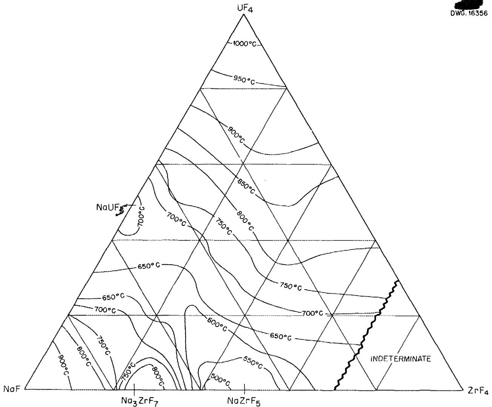  
Fig. 41. The System NaF-ZrF $_4$ -UF $_4$ .

reduced the melting point to $487^{\circ} \mathrm{C}$ . Mixtures with 10 and 15 mole $\%$ $\mathrm{BeF}_{2}$ apparently melted at this temperature.

Addition of $\mathsf{ZrF_4}$ to a ternary mixture of NaF-BeF2-UF4 (76-12-12 mole %, respectively; m.p., 480°C) caused an initial rise in melting point. At 10 mole % $\mathsf{ZrF_4}$ , the mixture melted at $670^{\circ}\mathsf{C}$ ; at 20 mole % $\mathsf{ZrF_4}$ , the melting point was $570^{\circ}\mathsf{C}$ .

If the viscosities of these mixtures are usefully low, additional study of the four-component system will be attempted.

$\mathsf{ZnF}_2\text{-UF}_4$ .Thermal data were obtained with a number of mixtures in the $\mathsf{ZnF}_2$ - $\mathsf{UF}_4$ system. The data indicate compound formation but do not show definitely the composition or melting point of the compound. The lowest melting point observed was $730\pm 10^{\circ}\mathrm{C}$ Since none of the alkali fluoride-zinc fluoride systems showed low melting points, further work on this system is not presently contemplated.

# FUEL MIXTURES CONTAINING UF3

V. S. Coleman W. C. Whitley Materials Chemistry Division

Study of the phase relationships of uranium trifluoride with other fluorides is of interest for several reasons. This compound may be a product of radiation damage to fuels containing uranium tetrafluoride. It has a lower vapor pressure than uranium tetrafluoride and might produce fuels with more suitable liquid-temperature ranges than uranium tetrafluoride. Since it is a much less powerful oxidant, uranium trifluoride may be less corrosive to container material than uranium tetrafluoride. Uranium trifluoride has been observed in the product after NaK has been added to fuels containing uranium tetrafluoride.

About $3000\mathrm{g}$ of $\mathbf{U}\mathbf{F}_{3}$ has been prepared by the method described in a previous report. (2) This material, the analysis of which is higher than $99\%$ $\mathbf{U}\mathbf{F}_{3}$ , has been used in all the studies reported below.

Uranium trifluoride is quite stable at room temperature but oxidizes rapidly at elevated temperatures in the presence of traces of water vapor or other oxidizing agents. It is therefore necessary to protect $\mathrm{UF}_3$ from all oxidizing agents when it is involved in high-temperature studies. This is accomplished in these experiments by use of the apparatus diagrammed in Fig. 42. This apparatus contains a stuffing-box seal (3) packed with an oil-free graphite-asbestos product. This seal permits the removal of air and water vapor by means of a vacuum pump; an inert atmosphere is then maintained while the sample is studied at high temperature.

NaF-KF-LiF-UF3. Some preliminary experiments were performed with the eutectic mixture of NaF, KF, LiF, and varying amounts of UF3 up to 10 mole%. It was observed that the freezing point of the eutectic mixture was depressed by an amount up to $13^{\circ}\mathrm{C}$ . However, the molten material diffused through the graphite crucible and stirrer and cemented them quite firmly to the stainless steel container. Examination of the product showed that some of the UF3 had been oxidized, some had been converted into alkali fluoride complexes, and some remained as unreacted UF3.

The reaction of NaF-LiF-KF eutectic plus $\mathbf{U}\mathbf{F}_{3}$ with the graphite crucibles

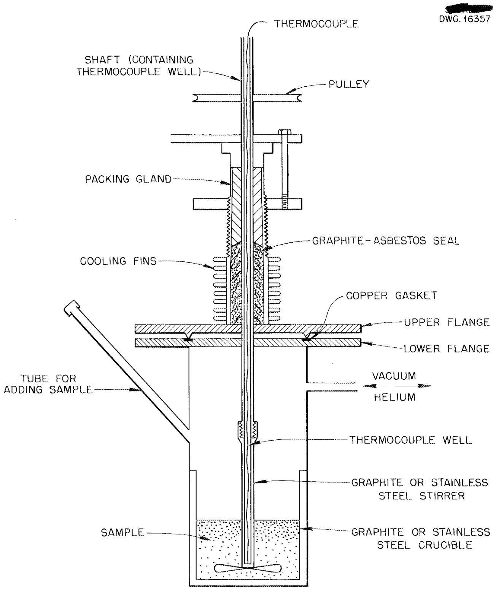  
Fig. 42. Apparatus for Phase Studies of Fluoride Systems Containing $\mathbf{U}\mathbf{F}_{3}$ .

is a matter of interest in itself. This reaction does not occur with the eutectic when $\mathrm{UF_4}$ is used instead of $\mathrm{UF_3}$ . Three pieces of graphite exposed to 5 mole $\%$ $\mathrm{UF_3}$ in the NaF-LiF-KF eutectic at temperatures up to $900^{\circ}\mathrm{C}$ were found to contain 11.8 wt% uranium. The pronounced odor of acetylene when the mixture is exposed to moisture suggests that a uranium carbide is produced. Since the lowest recorded temperature for the reaction of uranium metal and carbon was $1200^{\circ}\mathrm{C}$ and most workers reported $1700^{\circ}\mathrm{C}$ or higher, the uranium carbide is being formed at a much lower temperature than would be expected. Examination of the broken graphite with binoculars magnifying $30\times$ shows the presence of red-orange, green, and white crystals. Intergranular penetration of the carbon is obvious. Since the reacted mixtures smell strongly of acetylene when exposed, it appears that the carbide compound diffused throughout the melt.

KF-UF3. Attempts to study the simpler binary system, KF-UF3, showed that the mixture containing 5 mole % UF3 yielded breaks in the cooling curve at 824 and at 711°C. However, the molten material again diffused through and reacted with the graphite crucible to such an extent that further work on this system could not be attempted in graphite containers.

$\mathbf{NaF - UF_3}$ .Studies are now being made on the $\mathrm{NaF - UF_3}$ system. The molten material in this system does not diffuse through a graphite crucible. Cooling curves have been taken on two mixtures, and in each case two breaks were observed:

<table><tr><td>UF3(mole %)</td><td>FIRST BREAK(℃)</td><td>SECOND BREAK(℃)</td></tr><tr><td>5</td><td>957</td><td>588</td></tr><tr><td>10</td><td>922</td><td>588</td></tr></table>

These few studies suggest that a eutectic exists at $588^{\circ}C$ , but the location is as yet indefinite. These studies will be continued.

Preparation of Compounds of $\mathbf{U}\mathbf{F}_{3}$ Attempts have been made to prepare compounds of $\mathbf{U}\mathbf{F}_{3}$ of known composition that would aid in identification of unknown compounds in phase equilibrium studies. For this purpose samples corresponding to NaF- $\mathbf{U}\mathbf{F}_{3}$ , 2NaF- $\mathbf{U}\mathbf{F}_{3}$ , KF- $\mathbf{U}\mathbf{F}_{3}$ , and $\mathbf{ZrF}_{4}-\mathbf{U}\mathbf{F}_{3}$ have been mixed and added to reaction tubes that were then evacuated, flushed, filled with helium, sealed, and heated to $900^{\circ}C$ for about 1 hour. The materials produced were examined by the techniques of x-ray diffraction and chemical microscopy.

Although the products are not all completely characterized, it appears that $\mathrm{NaUF}_4$ is prepared in reasonable yield by heating the first three mixtures. The samples corresponding to $\mathrm{NaF - UF_3}$ show some unreacted $\mathrm{UF}_3$ , a suggestion of a second compound, but no NaF. The 2NaF- $\mathrm{UF}_3$ samples show material that is presumably $\mathrm{NaUF}_4$ with unreacted NaF, no $\mathrm{UF}_3$ , and some poorly defined crystals that may be an additional compound.

The $\mathrm{KF - UF_3}$ sample shows a dark-red cubic compound with a refractive index of 1.556 and essentially complete reaction, as revealed by failure to detect the starting materials. It is likely that the red material is $\mathrm{KUF_4}$ .

The $\mathrm{UF}_3\text{-ZrF}_4$ sample appeared to be mossy-green when in large crystals and mustard-yellow when finely ground. A new phase is evident, with 15 to $20\%$ of the $\mathrm{UF}_3$ remaining and with some $\mathrm{ZrF}_4$ and $\mathrm{UF}_4$ . The refractive index of the material is in the range 1.56 to 1.58. Incomplete examination of the material

does not permit evaluation of the reaction

$$
\mathrm {U F} _ {3} + \mathrm {Z r F} _ {4} \xrightarrow {\angle} \mathrm {U F} _ {4} + \mathrm {Z r F} _ {3}
$$

or additional complex compounds of these materials.

# ALKALI FLUOBORATE SYSTEMS

J. G. Surak R. E. Moore C. J. Barton

Materials Chemistry Division

The long-range interest in fuel mixtures with melting points and viscosities lower than those under consideration for the ARE has prompted examination of the alkali fluoborate systems. It is obvious that separation of boron isotopes would be required to make such a fuel feasible and that appreciable pressures of $\mathrm{BF}_3$ would exist over such a fuel in the temperature range proposed for aircraft reactors. Since neither of these obstacles would appear to be insurmountable, the study of phase relationships and decomposition pressures of some alkali fluoborate systems was started. To date, only the commercially available fluoborates of sodium and potassium have been used in this study.

Figure 43 shows a schematic diagram of the apparatus employed for measurement of decomposition pressures of these materials. Graphite liners were tried initially as containers for the fluoborates, but they were discarded in favor of stainless steel liners because of the adsorption of gases by the graphite. Nickel and Monel thermocouple wells proved unsatisfactory because of corrosion and embrittlement in a few hours of exposure. Stainless steel wells are, apparently, quite satisfactory. It should be noted that the corrosion described resulted from contact with commercial $\mathrm{NaBF_4}$ and $\mathrm{KBF_4}$ , which are

known to contain appreciable amounts of impurities.

The apparatus used for thermal analysis of fluoborate systems is the same as that used for phase studies with $\mathbf{U}\mathbf{F}_{3}$ . The preliminary studies have shown that the techniques and apparatus are satisfactory. Extension of this research with pure $\mathrm{NaBF_4}$ and $\mathrm{KBF_4}$ and with mixtures of these materials with alkali fluorides will be attempted.

Vapor Pressures of Commercial Fluoborates. The vapor pressures of the commercial $\mathrm{NaBF}_4^{(4)}$ and $\mathrm{KBF}_4^{(5)}$ and one mixture of these two materials have been measured. The data may be expressed by the equation:

$$
\log P (\mathrm {m m H g}) = - \frac {A}{^ {\circ} K} + B.
$$

Table 5 gives the values for the constants $A$ and $B$ together with the values reported in the literature, which were presumably obtained with purer materials. The vapor pressures observed with the commercial $\mathrm{NaBF}_4$ are slightly lower than the values calculated from the equation in the literature. The pressures observed with the commercial $\mathrm{KBF}_4$ are much higher than the literature values. Since the $\mathrm{NaBF}_4$ contained about twice as much silicon as the $\mathrm{KBF}_4$ , the discrepancy must be due to other volatile impurities in the $\mathrm{KBF}_4$ .

Thermal Data for Fluoborate Systems. Data obtained from cooling curves of the commercial $\mathrm{NaBF}_4$ and some mixtures are given in Table 6.

The cooling curves obtained on $\mathrm{NaBF}_4$ - $\mathrm{KBF}_4$ mixtures give no indication of a eutectic in this system; the melting points deviate only slightly

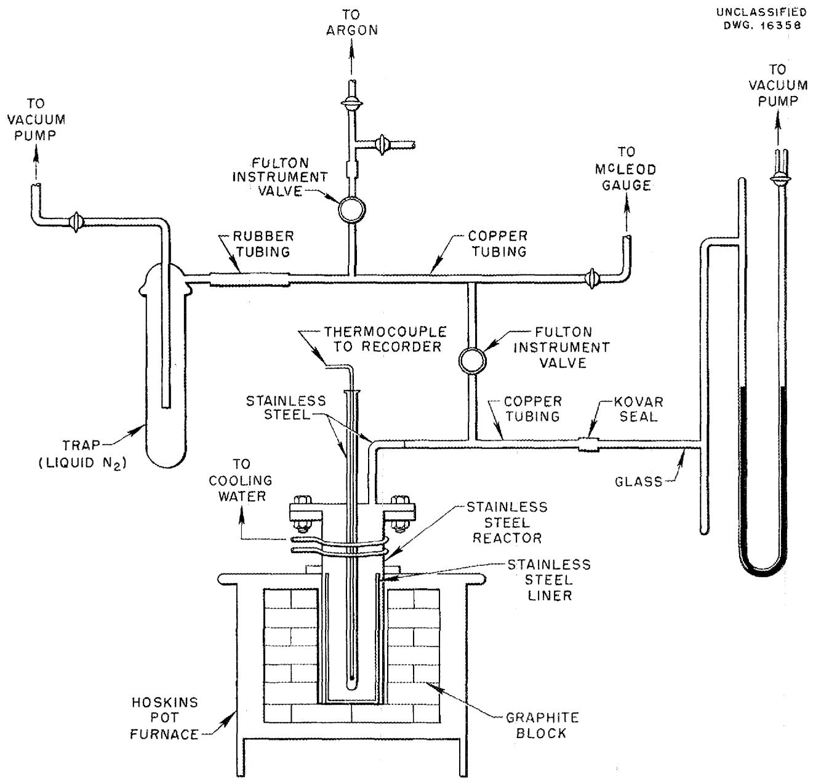  
Fig. 43. Dissociation Pressure Apparatus.

from a straight line connecting the melting points of $\mathrm{NaBF}_4$ and $\mathrm{KBF}_4$ . The thermal data for the commercial $\mathrm{NaBF}_4$ check with the literature values quite well, but the melting point of the commercial $\mathrm{KBF}_4$ is considerably higher than the literature value.

Thermal data on the two mixtures of $\mathrm{NaBF}_4$ and $\mathrm{NaUF}_5$ that have been examined

are rather inconclusive. It appears that a mixture of 10 mole $\%$ NaUF $_5$ in NaBF $_4$ has a melting point appreciably greater than that of the NaBF $_4$ .

A 95 mole % NaBF₄-5 mole % NaUF₅ mixture was examined with the petrographic microscope. In addition to NaBF₄, an unidentified, green, crystalline phase in larger amounts than

Table 5 VAPOR-PRESSURE CONSTANTS FOR ALKALI FLUOBORATES   

<table><tr><td rowspan="3">MATERIAL</td><td colspan="4">VALUES FOR CONSTANTS</td></tr><tr><td colspan="2">This Laboratory</td><td colspan="2">Literature</td></tr><tr><td>A</td><td>B</td><td>A</td><td>B</td></tr><tr><td>NaBF4</td><td>3820</td><td>6.68</td><td>3650</td><td>6.63</td></tr><tr><td>KBF4</td><td>6660</td><td>9.065</td><td>6317</td><td>8.15</td></tr><tr><td>90 mole % NaBF4-10 mole % KBF4</td><td>3870</td><td>6.64</td><td></td><td></td></tr><tr><td>80 mole % NaBF4-20 mole % KBF4</td><td>3895</td><td>6.55</td><td></td><td></td></tr><tr><td>10 mole % NaBF4-90 mole % KBF4</td><td>6330</td><td>8.99</td><td></td><td></td></tr></table>

Table 6 THERMAL DATA FOR FLUOBORATE SYSTEMS   

<table><tr><td rowspan="2">MATERIAL</td><td colspan="2">THERMAL EFFECTS</td></tr><tr><td>Melting Point (℃)</td><td>Solid Transition (℃)</td></tr><tr><td>General Chemical Co. NaBF4</td><td>381</td><td>238</td></tr><tr><td>General Chemical Co. KBF4</td><td>563</td><td>277</td></tr><tr><td>90 mole % KBF4-10 mole % NaBF4</td><td>535</td><td>242</td></tr><tr><td>80 mole % KBF4-20 mole % NaBF4</td><td>515</td><td>233</td></tr><tr><td>70 mole % KBF4-30 mole % NaBF4</td><td>498</td><td>232</td></tr><tr><td>60 mole % KBF4-40 mole % NaBF4</td><td>470</td><td>215</td></tr><tr><td>50 mole % KBF4-50 mole % NaBF4</td><td>450</td><td>205</td></tr></table>

would be expected from the amount of $\mathsf{NaUF}_5$ added and an unidentified, colorless, crystalline phase were present. On the basis of this information, the existence of a complex fluoborate compound containing uranium may be postulated.

# DIFFERENTIAL THERMAL ANALYSIS

R.J.Sheil R.E.Traber,Jr. C.J.Barton

Materials Chemistry Division

The need for a more sensitive thermal analysis procedure, especially

for careful examination of important samples, has been evident for sometime. Two different experimental arrangements have recently been used for differential thermal analysis, with promising results. It is expected that increasing use of equipment of this type will be made. Equipment for accurate control of heating and cooling rates will be incorporated as soon as possible; manual adjustment of these rates, however, seems to lead to useful information.

For the smaller apparatus, a nickel block was drilled to accommodate the 1- to 2-g samples, the $\mathrm{Al}_{2}\mathrm{O}_{3}$ reference material, and a thermocouple. The block, the differential thermocouple, the temperature recording couple, and the metal tube for introduction of inert gas are mounted together and inserted into a ceramic tube within a vertical l-in. tube furnace. The output of the platinum-platinum-rhodium couples is fed to a preamplifier and to a Brown recorder.

Tracings were obtained with two NaF-ZrF $_4$ -UF $_4$ fuels of the compositions 50-46-4 mole % and 46-50-4 mole %. The latter curve is shown in Fig. 44. Neither fuel exhibited thermal effects in these tracings above the stated melting points of the fuels. However, both materials showed thermal effects in at least two regions at lower temperatures.

An apparatus that handles larger samples and in which the sample is stirred has also been devised that has the sensitivity of the differential method. Although only a few measurements with this apparatus have been performed, it appears that use of iron-constantan couples fed directly to a Micromax recorder will be satisfactory. This apparatus will be used in the study of difficult systems such as those containing $\mathrm{BeF}_2$ .

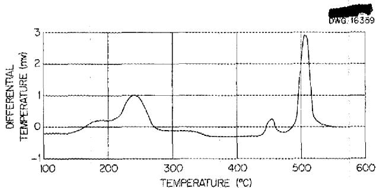  
Fig. 44. Differential Temperature Curve of NaF-ZrF $_4$ -UF $_4$ (46-50-4 mole %) vs. Al $_2$ O $_3$ in Nickel-Cup, Pt-Pt, Rh Thermocouples.

# X-RAY STUDIES OF COMPLEX FLUORIDE SYSTEMS

P. Agron, Chemistry Division

The binary $\mathrm{NaF - ZrF_4}$ $\mathrm{NaZrF_5 - NaUF_5}$ systems, and several systems involving the trivalent uranium fluoride and possibly a reduced form of $\mathrm{ZrF_4}$ have been examined on the x-ray spectrometer. The trivalent uranium fluoride systems are at an early stage of development, and their comprehensive treatment will require further experiments and study.

Fused mixtures analogous in composition to compounds found in the NaF $\mathbf{UF}_4$ system were examined. Interpretation of their x-ray patterns gave the crystal structures listed in Table 7.

$\mathbf{Na}_{3}\mathbf{ZrF}_{7} - \mathbf{Na}_{3}\mathbf{UF}_{7}$ . The structure of $\mathrm{Na}_3\mathrm{ZrF}_7$ is isomorphous with $\mathrm{Na}_3\mathrm{UF}_7$ (tetragonal; $a = 5.45, c = 10.90$ ). It may safely be inferred from the similarity of the two crystal structures that their solid solutions should exist. This is confirmed by the observation that the $\mathrm{Na}_3\mathrm{UF}_7$ goes into the lattice of the $\mathrm{Na}_3\mathrm{ZrF}_7$ with the expected expansion of the crystal structure of the latter.

$\mathrm{Na}_{2}\mathrm{ZrF}_{6} - \mathrm{Na}_{2}\mathrm{UF}_{6}$ . The results from the x-ray study of melts approximating the formulation of $\mathrm{Na}_{2}\mathrm{ZrF}_{6}$ , shown in Table 7, have been grouped together since detailed diffraction analysis is lacking at present. Compositions ranging from 28.5 to 33 mole $\%$ $\mathrm{ZrF}_{4}$ show some similarities in their diffraction patterns. At 33 mole $\%$ $\mathrm{ZrF}_{4}$ , certain differences in the x-ray pattern appear when samples are prepared either under an inert atmosphere, in a sealed tube, or in large batches in the hydrofluorinator. At 28 to 29 mole $\%$ $\mathrm{ZrF}_{4}$ , additional dissimilarities are evident when the sample is formed under an inert atmosphere or obtained commercially. It seems probable that solid solutions of $\mathrm{Na}_{3}\mathrm{ZrF}_{7}$ and $\mathrm{NaZrF}_{5}$ in the $\mathrm{Na}_{2}\mathrm{ZrF}_{6}$ structure are to some extent responsible for the variations observed.

$\mathbf{NaZrF_5 - NaUF_5}$ .The crystal structure of $\mathrm{NaZrF_5}$ is also isomorphous with that of $\mathrm{NaUF}_5$ (hexagonal; $a = 14.72$ $c = 9.76)$ .These compounds should also form solid solutions with each other.Detailed information as to the extent of the mutual solubilities

in the $\mathrm{NaZrF_5 - NaUF_5}$ system is of interest both for the initial loading and the operation of a reactor using this type of fuel.

A series of compositions corresponding to 4, 8, and 12 mole $\%$ NaUF $_5$ was made by melting NaF, ZrF $_4$ , and UF $_4$ in their proper concentrations. In addition, fused mixtures were prepared from NaZrF $_5$ and NaUF $_5$ corresponding to 3NaZrF $_5$ -NaUF $_5$ , NaZrF $_5$ -NaUF $_5$ , and NaZrF $_5$ -3NaUF $_5$ . The x-ray diffraction patterns of the above materials indicate that the distribution of NaUF $_5$ in the lattice of NaZrF $_5$ causes a uniform increase with concentration in its lattice up to a region lying between 12 and 25 mole $\%$ NaUF $_5$ . The diffraction pattern also indicates that the major phase present at 25 mole $\%$ is the solid solution of NaUF $_5$ in the NaZrF $_5$ crystal. At the 50 mole $\%$ composition both the expanded lattice of NaZrF $_5$ and the contracted lattice of NaUF $_5$ are observed in major concentrations, demonstrating that two solid solutions are present in the solidified melt. The pattern for the NaZrF $_5$ -3NaUF $_5$ melt shows that the

Table 7 X-RAY ANALYSIS OF NaF-ZrF, COMPOSITIONS   

<table><tr><td>COMPOSITION</td><td>CRYSTAL STRUCTURE</td><td>LATTICE DIMENSIONS (Å)</td><td>CHEMICAL FORMULA*</td></tr><tr><td>25 mole % ZrF4-75 mole % NaF</td><td>Tetragonal</td><td>a = 5.3, c = 10.7</td><td>Na3ZrF7</td></tr><tr><td>28.5 mole % ZrF4-71.5 mole % NaF**</td><td rowspan="2">Unknown</td><td></td><td rowspan="2">(Na2ZrF6)***</td></tr><tr><td>33 mole % ZrF4-67 mole % NaF</td><td></td></tr><tr><td>50 mole % ZrF4-50 mole % NaF</td><td>Hexagonal</td><td>a = 14.1, c = 9.6</td><td>NaZrF5</td></tr></table>

The analogy with crystal forms observed in the NaF-UF4 system is the criterion used for assignment of formulas. The range of compositions probably involves solid solutions with resultant distortions of the $\mathrm{Na_2ZrF_6}$ lattice. A definite compound in this region is supported by thermal analysis.

predominant phase is the solid solu-tion of $\mathrm{NaZrF_5}$ in the $\mathrm{NaUF_5}$ lattice. In samples with lower concentrations of $\mathrm{NaZrF_5}$ in $\mathrm{NaUF_5}$ (made by fusion of NaF, $\mathrm{UF_4}$ , and $\mathrm{ZrF_4}$ ), however, the presence of unreacted $\mathrm{UF_4}$ would indicate that complete equilibrium had not been attained. It is apparent from these studies that the fluoride fuel $\mathrm{NaF - ZrF_4 - UF_4}$ (50-46-4 mole %) may be represented as a solid solution of approximately 8 mole % $\mathrm{NaUF_4}$ in the lattice of $\mathrm{NaZrF_5}$ .

# SPECTROGRAPHIC ANALYSIS OF FLUORIDES

C. R. Baldock

Stable Isotope Research and Production Division

The mass spectrometry group is now engaged in making both qualitative and quantitative examination of reactor fuels. The qualitative examination is intended to yield only a rough estimate of the elements and simple compounds that are volatilized from the fuel material at temperatures obtainable in the mass spectrometer ovens. Ion sources currently in use can heat a sample of 1 to 2 mg to about $1500^{\circ}\mathrm{C}$ , or larger amounts, up to 50 mg, to about $700^{\circ}\mathrm{C}$ . A more recently developed source oven is satisfactory up to $2100^{\circ}\mathrm{C}$ . Ions of the base metals are easily obtained, and it is anticipated that the temperature will be adequate to produce measurable quantities of ions from such refractory materials as the oxides of uranium.

The spectrometer has recently been employed in the determination of the contamination of $\mathrm{UF_4}$ with higher valence compounds of uranium that yield $\mathrm{UF_5}$ upon heating. A 2- to 3-mg sample of $\mathrm{UF_4}$ , which was used in making fuel studies, was examined at a constant temperature for a time sufficiently long to vaporize the sample completely. The continuously

recorded peak heights were then corrected for mutual interference of $\mathbf{U}\mathbf{F}_{4}$ and $\mathbf{U}\mathbf{F}_{5}$ , and the resulting intensities were graphically integrated over the period of observation. The ratio of these integrated intensities over the period of observation yields the percentage of $\mathbf{U}\mathbf{F}_{5}$ in $\mathbf{U}\mathbf{F}_{4}$ . This resulted in a value of approximately $1\%$ , which is in close agreement with the chemical estimate for the sample. The sensitivity of this type of analysis is very high, especially when isotope dilution is employed. The development of higher temperature ion sources will greatly expand the utility of this type of analysis.

Qualitative examination of plug materials removed from the cold legs of loops in which NaF-KF-LiF-UF4 had been circulated showed the known components chromium, iron, and $\mathrm{KNa}_2\mathrm{CrF}_6$ and also evidence of trace amounts of $\mathrm{BF}_3$ , $\mathrm{SiF}_4$ , K, and Hg. It should be noted that the base materials of these samples, namely, iron, chromium, and $\mathrm{KNa}_2\mathrm{CrF}_6$ were not observed with the $700^{\circ}\mathrm{C}$ source because the temperature obtainable has been too low to produce adequate vaporization.

# SIMULATED FUEL MIXTURE FOR COLD CRITICAL EXPERIMENT

D. R. Cuneo L. G. Overholser  
Materials Chemistry Division

The fuel composition for the cold critical experiment has been based on a tentative choice of $\mathrm{NaF - ZrF_4 - UF_4}$ (46-50-4 mole %) for the ARE fuel. The powder fuel base was therefore established as 68 wt $\%$ $\mathrm{ZrO_2}$ and 21.4 wt $\%$ NaF, with 10.6 wt $\%$ carbon added to mock up the moderating effect of the missing fluoride ions. A large portion of this work was done in cooperation with the Y-12 Chemical Production Division.

The chemically pure NaF used contained about $0.1\%$ water and was used without drying. The hafnium-free (less than 50 ppm Hf) $\mathrm{ZrO_2}$ contained about $0.2\%$ water. The carbon was ground in a micropulverizer before mixing. The carbon powder passed 200-mesh screen and the $\mathrm{ZrO_2}$ passed 100-mesh screens before the blending operation. Blending of the fuel base was accomplished in two batches of about 200 lb each by rolling the mixture in a stainless steel drum for at least 72 hours. Chemical analysis for $\mathrm{ZrO_2}$ , Na, and C in samples from various locations in the drum was used to estimate the degree of homogeneity. The moisture content of the final fuel base was less than $0.3\%$ , well below the tolerance value of $0.5\%$ .

About 225 lb of the fuel mixture was prepared by addition of enriched $\mathrm{UF_4}$ to small amounts of the fuel bas to bring the uranium concentration to 10.19 lb/ft, after the fuel was packed into stainless steel tubes 1.1 in. ID and 40 in. long. The powder density of 1.8 was uniform in these tubes. The 70 fuel elements thus prepared were sealed by screw caps of stainless steel.

Sixty coolant tubes of stainless steel 1/2 in. ID and 40 in. long were packed to a density of 1.8 with the fuel base. These tubes were sealed by inserting stainless steel plugs and then welding. The remaining fuel base mixture has been retained for use if it should be necessary to change the fuel concentration for another trial.

It is still necessary to load the one experimental tube with a mixture of NaF-ZrF4-UF4of high density and with proper ratios of Na to Zr to U. All necessary materials are on hand for this operation, which will be accomplished by casting fuel slugs to fit the tube or by packing the tube

with sized powder prepared from a fused mixture of these materials.

# MODERATOR COOLANT DEVELOPMENT

# E. E. Ketchen L. G. Overholser   Materials Chemistry Division

Most of the work done during the past quarter has involved the purification of sodium and potassium hydroxides by methods previously reported, and virtually no experimental work was done on the development of new methods of purification.

Production of purified sodium hydroxide, by removal of $\mathrm{Na}_2\mathrm{CO}_3$ from a $50\%$ aqueous solution of NaOH and subsequent dehydration under vacuum at $450^{\circ}\mathrm{C}$ , has averaged about 1 lb per week. The purified hydroxide continues to be of the same order of purity as previously reported, with the weight per cent of $\mathrm{Na}_2\mathrm{CO}_3$ and of $\mathrm{H}_2\mathrm{O}$ being less than 0.1.

A batch of lithium hydroxide has been purified by the method previously described, (6,7) and the purified hydroxide was found to contain significantly less carbonate and sodium than batches previously purified.

Several batches of $\mathrm{Sr(OH)}_2$ have been purified by the method described and previously used (6,7) for both $\mathrm{Sr(OH)}_2$ and $\mathrm{Ba(OH)}_2$ . The $\mathrm{SrCO}_3$ content of the purified $\mathrm{Sr(OH)}_2$ was found to be 0.2 to $0.3\%$ , which is higher than the values for batches previously purified by the method.

The purification of potassium hydroxide by removing the carbonate as

$\mathrm{BaCO_3}$ in an aqueous medium and dehydrating the filtrate under vacuum at $475^{\circ}C$ has continued to yield material containing about $0.2\% \mathrm{K}_2\mathrm{CO}_3$ and an equivalent amount of barium. The lowest value for $\mathrm{K}_2\mathrm{CO}_3$ attained so far is $0.1\%$ . Because of the continual high values obtained for carbonate, this method has been shelved in favor of the method using potassium. This method, described previously, involves the interaction of water with pure potassium and dehydration of the potassium hydroxide solution. Four runs have been made since a larger vacuum dry box became available for transferring the potassium to the reaction vessel. Approximately 1/2 lb of potassium hydroxide has been prepared per run, and the $\mathrm{K}_2\mathrm{CO}_3$ content has varied from 0.05 to $0.15\%$ . It appears possible to prepare potassium hydroxide containing $0.1\%$ or less of both $\mathrm{K}_2\mathrm{CO}_3$ and $\mathrm{H}_2\mathrm{O}$ by this method. The only impurity present in determinable amount in the potassium used is sodium, which occurs to the extent of $0.2\%$ .

# COOLANT DEVELOPMENT

L. M. Bratcher R. E. Traber, Jr. C. J. Barton Materials Chemistry Division

Investigation of nonuranium fluoride systems of interest as possible coolants or as a base for preparing fuel mixtures has continued. Although $\mathbf{ZrF_4}$ was a component of a number of the systems being considered, the field of interest was broadened by the addition of $\mathbf{BeF_2}$ and $\mathbf{AlF_3}$ to the list of components. Zinc fluoride received very little attention. Few of the systems have been investigated thoroughly enough to warrant definite conclusions on their usefulness, but preliminary tests have not, for the most part, been very encouraging.

RbF-AlF₃. RbAlF₄ (8) and Rb₃AlF₆ (9) have been described in the literature. A melting point of 985°C was reported for the Rb₃AlF₆ compound; the mixture corresponding to this compound, prepared in this laboratory, showed a melting point of 925°C. The fused mixture has not been analyzed; so the reason for the difference is not known at present. The data obtained on this entire system, although incomplete, indicate a eutectic melting at 525°C. Cooling curves for mixtures containing about 40 mole % AlF₃ also show a thermal effect, which is as yet unexplained, at approximately 475°C. RbAlF₄ appears to melt at 450 ± 10°C.

NaF-KF-AlF₃. Partial phase diagrams for the binary systems NaF-AlF₃ and KF-AlF₃ are given in the literature. Neither diagram extends beyond 50 mole % AlF₃ because of the volatility of AlF₃. The fact that the KF-AlF₃ system was reported to have a eutectic melting at 565°C led to a study of the ternary system. No low-melting-point compositions have been found among the few mixtures tested thus far, but the study is continuing.

$\mathrm{NaF - ZrF_4 - AlF_3}$ Even though the use of two volatile components in a ternary system seems rather unpromising, a number of compositions in the $\mathrm{NaF - ZrF_4 - }$ $\mathrm{AlF_3}$ system has been subjected to thermal analysis. The addition of 5 mole $\%$ $\mathrm{AlF_3}$ to the NaF-ZrF eutectic and of 5 mole $\%$ $\mathrm{ZrF_4}$ to the NaF-AlF eutectic apparently raised the melting point. The cooling curves give no indication of the existence of a eutectic melting at lower than $460^{\circ}C$ in this system.

NaF-ZrF₄. Na₂ZrF₆ prepared in an HF atmosphere melted at 625 ± 10°C. The

addition of NaF raised the melting point of the $\mathrm{Na}_{2}\mathrm{ZrF}_{6}$ very sharply to a maximum of $830^{\circ}\mathrm{C}$ near 25 mole $\%$ $\mathrm{ZrF}_{4}$ , which indicates the probable existence of the compound $\mathrm{Na}_{3}\mathrm{ZrF}_{7}$ . The preparation containing 57 mole $\%$ NaF and 43 mole $\%$ $\mathrm{ZrF}_{4}$ melts at $480^{\circ}\mathrm{C}$ and appears to be the lowest melting composition of this system. This material expands sufficiently on solidification to break graphite crucibles. Neither $\mathrm{Na}_{2}\mathrm{ZrF}_{6}$ nor $\mathrm{NaZrF}_{5}$ has been found to act this way.

$\mathbf{ZrF_4 - BeF_2}$ .Melting points of mixtures in the $\mathrm{ZrF_4 - BeF_2}$ system were of interest in connection with the NaF $\mathrm{ZrF_4 - BeF_2}$ system.Three mixtures were prepared containing 25,50,and 75 mole $\%$ ZrF. Their melting points were 650,740,and $825^{\circ}C$ ,respectively. These three points,together with the melting point of $\mathrm{BeF}_2$ (543°C),made almost a straight line.The melting point of $\mathrm{ZrF_4}$ has not yet been determined.The extrapolation of the liquidus curve to $100\%$ $\mathrm{ZrF_4}$ gives a value of about $910^{\circ}C$

# HYDROLYSIS AND OXIDATION OF FUEL MIXTURES

R. P. Metcalf  
Materials Chemistry Division

In connection with the oxidation of fuel mixtures, the reaction of uranium tetrafluoride with oxygen is of interest. Previous investigators of this reaction (10, 11) have attempted to estimate the free energy change in the reaction

$$
2 \mathrm {U F} _ {4} + \mathrm {O} _ {2} \longrightarrow \mathrm {U F} _ {6} + \mathrm {U O} _ {2} \mathrm {F} _ {2}.
$$

The availability of an alternate method of estimating the heat of formation of $\mathrm{UO}_2\mathrm{F}_2$ has prompted a new calculation using an extrapolation of recently published data on $\mathrm{UF}_4$ and $\mathrm{UO}_2\mathrm{F}_2$ .

Heat of Solution and Heat of Formation of Uranyl Fluoride. For the calculation of the free energy change for the reaction, the heat of formation of uranyl fluoride was required. To aid in estimating this quantity, the heat of solution of uranyl fluoride was measured.

A glass Dewar flask was used as the calorimeter, with $0.5\text{M}$ perchloric acid as the solvent. The determination of the heat capacity of the calorimeter was based on the known heat of solution of sodium nitrate. The result obtained for the heat of solution was

$$
\begin{array}{l} \mathrm {U O} _ {2} \mathrm {F} _ {2} (\text {c r e s t a l}) + \mathrm {H} ^ {+} \longrightarrow \mathrm {U O} _ {2} \mathrm {F} ^ {+} + \mathrm {H F}, \\ \Delta H _ {2 9 8} = - 5. 3 \pm 0. 5 k c a l / m o l e. \\ \end{array}
$$

From an estimate of the heat of ionization of the complex ion $\mathrm{UO}_2\mathrm{F}^+$ (12) together with known data, the heat of formation of uranyl fluoride was calculated to be

$$
\begin{array}{l} \mathrm {U} (\text {c r y s t a l}) + \mathrm {O} _ {2} (\text {g a s}) \\ + \mathrm {F} _ {2} (\text {g a s}) \longrightarrow \mathrm {U O} _ {2} \mathrm {F} _ {2} (\text {c r y s t a l}), \\ \end{array}
$$

$$
\Delta H _ {2 9 8} = - 3 9 1. 3 \pm 3 k c a l / m o l e.
$$

Free Energy Change for the Reaction of Uranium Tetrafluoride with Oxygen. The values of the thermodynamic functions for $\mathrm{O}_2$ and $\mathrm{UF}_6$ at high temperatures, calculated from spectroscopic data, are in the literature. Values of the functions for $\mathrm{UF}_4$ and $\mathrm{UO}_2\mathrm{F}_2$ were estimated by extrapolation

of published heat capacity data at lower temperatures. Results of the calculations are given in Table 8.

# Table 8

# STANDARD FREE ENERGY CHANGE AND EQUI-LIBRIUM CONSTANT OF THE REACTION

$$
2 \mathbf {U} \mathbf {F} _ {4} + \mathbf {0} _ {2} \longrightarrow \mathbf {U} \mathbf {F} _ {6} + \mathbf {U} \mathbf {0} _ {2} \mathbf {F} _ {2}
$$

<table><tr><td>T (°K)</td><td>\( \bigtriangleup F(kcal) \)</td><td>K</td></tr><tr><td>298.16</td><td>-10.7</td><td>\( 7 \times 10^7 \)</td></tr><tr><td>500</td><td>-10.6</td><td>\( 4 \times 10^4 \)</td></tr><tr><td>800</td><td>-9.4</td><td>\( 4 \times 10^2 \)</td></tr><tr><td>900</td><td>-8.4</td><td>\( 1 \times 10^2 \)</td></tr><tr><td>1000</td><td>-7.1</td><td>\( 4 \times 10^1 \)</td></tr><tr><td>1100</td><td>-5.6</td><td>\( 1 \times 10^1 \)</td></tr><tr><td>1200</td><td>-3.7</td><td>5</td></tr><tr><td>1300</td><td>-1.3</td><td>2</td></tr></table>

For temperatures below $1000^{\circ}\mathrm{K}$ , the principal uncertainties in the calculations probably arise from the experimental errors in the heats of formation of $\mathrm{UF_4}$ , $\mathrm{UF_6}$ , and $\mathrm{UO_2F_2}$ . The resulting uncertainties in $\Delta F$ are of the order of $\pm 8\mathrm{kcal}$ .

At temperatures above $1000^{\circ}\mathrm{K}$ , uranyl fluoride is known to be unstable, with one of the principal decomposition products being uranium tetrafluoride. $^{(13)}$ It has been predicted that uranium hexafluoride would also be unstable above this temperature. $^{(14)}$ Thus, the present calculations are not expected to have much significance for temperatures higher than $1000^{\circ}\mathrm{K}$ . Subject to these limitations, the calculations confirm the

earlier conclusion that the oxidation proceeds at low temperatures except where the reaction rate is too slow. The calculations also indicate that $\Delta F$ is somewhat more negative than the previous estimates and that the reaction proceeds at temperatures 200 deg higher. However, the difference is still within the limits of error of the heats of formation employed.

# FUEL PURIFICATION RESEARCH

F. F. Blankenship F. P. Boody

R.E.Thoma,Jr. C.M.Blood

Materials Chemistry Division

Purified samples of fluoride mixtures have been prepared satisfactorily in a routine manner by the hydrogenation-hydrofluorination technique previously described. (15) Purification of small samples of enriched fuels for radiation-damage testing has been accomplished by a modification of this technique.

Purification of pure zirconium fluoride from oxide-bearing material by sublimation has been discontinued, except for special samples, since the Y-12 production facility is now in position to supply the pure material. Preparation of $\mathbf{ZrF_4}$ in a melt containing NaF by liquid-phase hydrofluorination appears to be very promising.

Purification of Molten Fluorides. A previous document(15) from this laboratory described the apparatus and techniques used in the high-temperature treatment of fluoride melts with hydrogen and HF. By application of this procedure on a routine basis, a total of about 80 kg of purified fluorides was produced during the

quarter. This material was, for the most part, mixtures containing both $\mathbf{U}\mathbf{F}_4$ and $\mathbf{ZrF_4}$ but a few uranium-free fuel-solvent materials and some possible moderator-coolant mixtures containing $\mathbf{BeF}_2$ were included.

Although replacement of the transfer lines and sintered nickel filters must occasionally be made, the nickel apparatus has performed in a very satisfactory manner. Results from this program have justified construction of similar apparatus of the same size, as well as equipment to produce 50-lb batches of fuels by this technique.

Corrosion of the equipment by the fluorides has not seriously limited the reactor life. Accidental inclusion of some stainless steel sections in the reactor below the liquid led to considerable contamination of three batches of product with iron, chromium, and nickel. Samples prepared in all-nickel equipment generally show less than 100-ppm nickel. Careful examination of the product by chemical microscopy rarely reveals the presence of oxides in detectable amounts.

The removal of sulfur by reduction of oxidized compounds and evolution of $\mathrm{H}_2\mathrm{S}$ appears quantitative; chemical analysis reveals no trace of this element. Although no analytical data are available, it appears likely that the traces of chloride present in the $\mathrm{ZrF_4}$ presently being used are also removed.

Preparation of Pure Zirconium Tetrafluoride. Ease of hydrofluorination of $\mathbf{ZrO}_2$ by gaseous HF at elevated temperatures is a function of previous history of the $\mathbf{ZrO}_2$ . Zirconium hydroxide may be hydrofluorinated quite easily; $\mathbf{ZrO}_2$ , which has been calcined at $800^{\circ}\mathrm{C}$ or higher, however, reacts incompletely with HF at temperatures as high as $700^{\circ}\mathrm{C}$ even

when reaction times of the order of 20 hr are used. (16) Unfortunately, the hafnium-free product from the Y-12 production plant is purified by precipitation with phthallic acid and must be calcined at high temperature to remove the last traces of carbon. Accordingly, plans have been made to produce the hafnium-free $\mathrm{ZrF_4}$ by hydrofluorination of $\mathrm{ZrCl_4}$ prepared from an oxide by the Bureau of Mines.

The difficulty in obtaining complete reaction of $\mathrm{ZrO_2}$ with gaseous HF is probably due to a combination of several factors. It is difficult to obtain good contact of the gas with the particulate solid in most apparatus. The reaction product tends to coat the surface of the unreacted oxide and prevent reaction. In addition, high concentrations of HF are achieved only at elevated pressures.

In an attempt to improve the conversion of $\mathbf{ZrO}_2$ to $\mathbf{ZrF}_4$ , a series of experiments in which the reaction is performed in the liquid state has been performed. The $\mathbf{ZrO}_2$ , which had been calcined at $800^{\circ}\mathrm{C}$ , was charged, along with NaF, into a graphite-lined nickel apparatus similar to the fuel purification apparatus previously described. The HF was admitted at atmospheric pressure and the temperature was slowly raised until liquid phase was present. Evolution of HF accompanied by water of reaction occurred at temperatures above $110^{\circ}\mathrm{C}$ , and the temperature was slowly raised over a period of 3 to 4 hr until HF evolution ceased at about $500^{\circ}\mathrm{C}$ . At this stage, HF was bubbled through the fused-salt mixture containing suspended $\mathbf{ZrO}_2$ while the temperature was raised to $800^{\circ}\mathrm{C}$ and maintained there for 2 to 3 hours. By this technique, good contact and high HF concentrations are assured at the

low-temperature range. In the high-temperature range the $\mathbf{Z}\mathbf{r}\mathbf{F}_4$ produced dissolves in the melt and leaves the $\mathbf{Z}\mathbf{r}\mathbf{O}_2$ free to react.

The optimum conditions for smooth and complete conversion of the $\mathbf{ZrO}_2$ have not yet been demonstrated. It has been demonstrated, however, that complete conversion of $1\mathrm{-kg}$ charges can be accomplished in 8 to 10 hr and with three to four times the stoichiometric quantity of HF. These experiments are being continued; if the present optimistic results are verified, the technique may be extended to preparation of cryolites and $\mathbf{BeF}_2$ mixtures.

Preparation of Pure Aluminum Fluoride. Pure, anhydrous $\mathrm{AlF_3}$ has been prepared by dehydration of commercially available $\mathrm{AlF_3\cdot H_2O}$ under a flowing atmosphere of HF in nickel equipment at 300 to $600^{\circ}C$ for 6 hours. Several batches of material, totaling 7 lb of anhydrous product, have been made available for phase-equilibrium studies.

# REACTION OF FUELS WITH ALKALI METALS

R.J.Sheil E.E.Ketchen

N. V. Smith D. C. Hoffman

F. F. Blankenship

Materials Chemistry Division

P. Agron

Chemistry Division

The reducing action of alkali metals on $\mathbf{U}\mathbf{F}_{4}$ and $\mathbf{ZrF_4}$ is well known, and under proper conditions the free heavy metals can be produced readily by this method. However, when relatively small amounts of alkali metal are added to fluoride mixtures the reaction proceeds not to the metal but to a complex series of intermediate reduction products, including $\mathbf{U}\mathbf{F}_3$

On the basis of available thermodynamic estimates, the reduction of $\mathbf{U}\mathbf{F}_4$ to $\mathbf{U}\mathbf{F}_3$ is more likely than that of $\mathbf{ZrF_4}$ . However, when the $\mathbf{U}\mathbf{F}_4$ is dissolved in NaF, where strong complexing may occur, and when a large excess of $\mathbf{ZrF_4}$ is present, the reduction of $\mathbf{U}\mathbf{F}_4$ is not necessarily the first step in the process. In fact, preliminary evidence indicates that, in the presence of excess $\mathbf{ZrF_4}$ , up to $40\%$ of the NaK theoretically required to reduce all the $\mathbf{U}\mathbf{F}_4$ present may be added without producing detectable amounts of free $\mathbf{U}\mathbf{F}_3$ .

Although much remains to be learned about the reaction products of NaK with $\mathrm{ZrF_4}$ -bearing fuels, the following conclusions, typical of material containing 50 mole % NaF, 46 mole % $\mathrm{ZrF_4}$ , and 4 mole % $\mathrm{UF_4}$ , are of interest.

Slow heating of sealed capsules containing the powdered, purified fuel with a few weight per cent of NaK shows that the rapid exothermic reaction takes place at about $250^{\circ}\mathrm{C}$ . In a typical case, 1 g of NaK with 50 g of fuel yielded a sudden temperature increase from 240 to $286^{\circ}\mathrm{C}$ . The reaction will, presumably, be very rapid at all temperatures above $250^{\circ}\mathrm{C}$ .

Although there is evidence from other sources that $\mathbf{U}\mathbf{F}_{3}$ forms compounds with NaF, KF, and other fluorides, the bulk of this material formed in such capsule tests appears on examination of the cooled melts as pure $\mathbf{U}\mathbf{F}_{3}$ at the bottom of the capsules. The solubility of $\mathbf{U}\mathbf{F}_{3}$ in the reaction melt at temperatures from 600 to $800^{\circ}C$ is not yet known, but it appears to be relatively low at temperatures well above the freezing point of the mixture.

If one equivalent of NaK is defined as the quantity required to reduce the $\mathbf{U}\mathbf{F}_{4}$ present to $\mathbf{U}\mathbf{F}_{3}$ , addition

of less than 0.4 equivalent produces a yellowish tinge in the green, solidified melt. The yellow color replaces the normal green color of the fuel by the time 1 equivalent has been added. Segregated $\mathbf{U}\mathbf{F}_{3}$ in a yellow matrix results when 2 equivalents are used; the solid solution of $\mathbf{NaUF}_5$ in $\mathbf{NaZrF}_5$ , typical of the unreacted fuel, is considerably altered, and a yellow, fine-grained phase, some of which forms a cubic crystal of $n = 1.476$ , has appeared.

When 4 equivalents are added, the yellow, cubic phase, a colorless cubic phase of $n = 1.430$ , considerable $\mathrm{UF}_3$ , an opaque phase that may be metal, and $\mathrm{Na}_2\mathrm{ZrF}_6$ appear in the melts. When 8 equivalents are added, the yellow phase and the solid solution are not detected. Some $\mathrm{Na}_2\mathrm{ZrF}_6$ and the opaque material are present, and all the uranium seems to be present as $\mathrm{UF}_3$ . The material appears to the eye as a gray-white matrix containing $\mathrm{UF}_3$ .

Examination of the cooled and ground melts for production of $\mathbf{H}_{2}$ on reaction with dilute acids shows that the reducing power is much less than expected from the amount of NaK added. This is surprising since UF yields the theoretical volume of H after similar grinding and handling in air.

X-ray diffraction studies have indicated that prominent but unidentified lines have disappeared from spectra run on the same sample at a later date. It is possible that a low-valence compound of zirconium that is unstable when handled in air may be responsible for this behavior.

Although it is evident that a sudden large leak of NaK at elevated temperatures into the fuel stream would have serious consequences, it is not evident that a leak small enough to permit

chemical equilibrium to be maintained would be disastrous. If reducing conditions are desirable in the fuel, it may be possible, on the basis of these data, to provide up to 0.2 equivalent of reducing power (fluorine deficiency) without precipitation of $\mathbf{U}\mathbf{F}_{3}$ . It may be that the corrosive behavior of these fuels could be further improved in this fashion. A considerable effort will be maintained on this complex problem.

# SERVICE FUNCTIONS

# J. Truitt C. J. Barton Materials Chemistry Division

The need for preparation of small batches of fluoride mixtures for standards in x-ray diffraction or petrographic microscope work, for enriched uranium fuels, and for other purposes still exists. About 30 batches of fluoride mixtures ranging in size from $10\mathrm{g}$ for enriched uranium fuels to about $200\mathrm{g}$ were prepared during the last quarter. In addition, various containers were filled with fluoride mixtures, as shown in Table 9. Fluoride mixtures were removed from 406 corrosion-testing tubes by melting in an inert atmosphere; the recovered melts were prepared for analysis by grinding to a fine powder.

Table 9 CONTAINER-FILLING SERVICES   

<table><tr><td>TYPE OF CONTAINER</td><td>NO. OF CONTAINERS FILLED</td></tr><tr><td>Cyclotron tubes</td><td>59</td></tr><tr><td>Corrosion tubes</td><td>286</td></tr><tr><td>Radiation-damage capsules</td><td>5</td></tr><tr><td>Heat-capacity capsules</td><td>4</td></tr><tr><td>Vapor-pressure pots</td><td>3</td></tr></table>

# 10. CORROSION RESEARCH

W. R. Grimes, Materials Chemistry Division

W. D. Manly, Metallurgy Division

H. W. Savage, ANP Division

The emphasis in dynamic corrosion testing in thermal convection loops has shifted from testing the fuel NaF-KF-LiF-UF to testing various coolants and fuels containing zirconium fluoride. The coolants and fuels containing zirconium fluoride are not so corrosive to Inconel as the NaF-KF-LiF-UF fuel. This is probably due to the more careful preparation and handling prior to the corrosion tests. With the zirconium fuels, the corrosion in the hot leg is approximately 5 mils after 500 hr of operation compared with the 10- to 15-mil depth of corrosion that was previously experienced.

The effect of different cleaning procedures on the corrosive action of the fluorides on Inconel is being studied. Static tests and modified dynamic tests have been used to determine the effect of time, temperature, and various additives on the corrosion behavior of the fluorides. It has been found that most of the corrosion occurs in the first 500 hr of operation. Strange results were obtained in corrosion testing at extremely high temperatures; the amount of corrosion appreciably decreased. This was probably due to the formation of a thin film of uranium oxide on the surface of the test capsule. The addition of strong getters has markedly decreased the corrosive action of the fluorides. The most striking example was the addition of zirconium hydride to the NaF-KF-LiF-UF4 fuel that was

circulated in a thermal convection loop. Upon examining the thermal convection loop after 500 hr at $1500^{\circ}\mathrm{F}$ , it was found that the loop suffered the least amount of attack of any thermal convection loop run with the fluorides; the maximum depth of attack was 0.5 mil.

Tests of chemical compatibility of several possible moderator coolants with the beryllium oxide moderator material have shown that $\mathsf{ZrF_4}$ -bearing melts are not useful in this connection. Sodium, NaK, and molten lead appear to be satisfactory, as do fused salts containing beryllium fluoride.

Tests on the mass transfer properties of lead have been conducted in which additions of 3, 5, and $50\%$ sodium were made to lead. These additions had a very marked effect on the mass transfer characteristics and the corrosive action on the container materials.

Additional static and dynamic tests were run in an attempt to find inhibitors for the mass transfer and corrosion exhibited in the metal-hydroxide systems. Additional tests have shown that the mass transfer experienced in nickel-hydroxide systems can be stopped by the use of purified hydrogen over the system.

In addition to the program of empirical corrosion testing, a number of studies designed to explain the

corrosion mechanism has been conducted. Careful examination by physical and chemical means has been made of the corrosion products formed during large-scale dynamic corrosion tests, and studies have been made of the reactions of structural metals with high-temperature liquids in simple systems and the possible reactions of molten fluorides and hydroxides under applied potentials. A considerable number of complex fluorides of the structural metals has been prepared and characterized to assist in the identification of corrosion products. A study of the compounds formed by the interaction of nickel in the hydroxides has shown the appearance of two new compounds, $\mathrm{NaNiO_2}$ and $\mathrm{LiNiO_2}$ . These compounds, which have been named sodium nickelate(III) and lithium nickelate(III), have been identified by chemical analysis for nickel and the alkali metals; by several chemical reactions, including a quantitative determination of the oxidizing power; by the reaction that gives a known trivalent nickel compound; and by complete crystal structure analysis.

# PARAMETRIC STUDIES OF FLUORIDE CORROSION

A. des Brasuns

E. E. Hoffman

L. S. Richardson

R.B.Day

D.C.Vreeland

L. D. Dyer

Metallurgy Division

F. Kertesz

Materials Chemistry Division

The efforts to understand and minimize fluoride corrosion have logically led to a study of the many parameters that enter into corrosion phenomena and corrosion tests. Included among these parameters are temperature of test, length of test, effect of residual stresses in the

corrosion specimen, carbon content of the specimen, effect of additives, and effect of pretreatment. Each of these parameters, except for the carbon content of the specimen, affected the corrosion in some measurable manner. Additives were both good and bad, pretreatment was beneficial, and corrosion decreased with increasing time or temperature.

Temperature of Test (A. des Brasunas, L. S. Richardson, D. C. Vreeland, E. E. Hoffman, R. B. Day, and L. D. Dyer, Metallurgy Division). Inconel was tested at a series of temperatures for 200-hr periods in molten fluoride NaF-KF-LiF-UF $_4$ (10.9-43.5-44.5-1.1 mole%). A rather surprising effect was noted; at the higher temperatures void formation became less prominent, as shown by Fig. 45 and by the data of Table 10.

The analyses of the fluoride baths, after the tests, were in agreement with the observations given in Table 10; in the test at $800^{\circ}\mathrm{C}$ , 1800 ppm chromium was detected in the bath, whereas the fluoride of the test at $1300^{\circ}\mathrm{C}$ yielded only 65 ppm chromium. The nature of the film detected on the Inconel surface of the high-temperature tests has been identified as $\mathrm{UO}_2$ by x-ray diffraction,

Length of Test. A series of tests was made to determine the extent of corrosion as a function of time. Inconel test specimens were prepared for testing at several time intervals ranging up to 3000 hr in the seesaw test apparatus, in which the cold zone was at about $800^{\circ}\mathrm{C}$ and the hot zone at about $650^{\circ}\mathrm{C}$ .

The test data are summarized in Table 11 and plotted in Fig. 46. These data indicate that most of the corrosion occurs in the first $500\mathrm{hr}$ ; beyond this time the additional amount of attack is quite small.

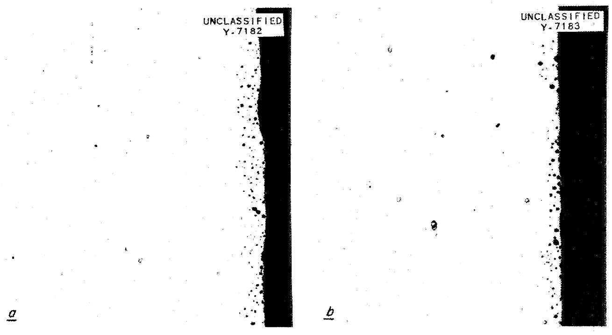

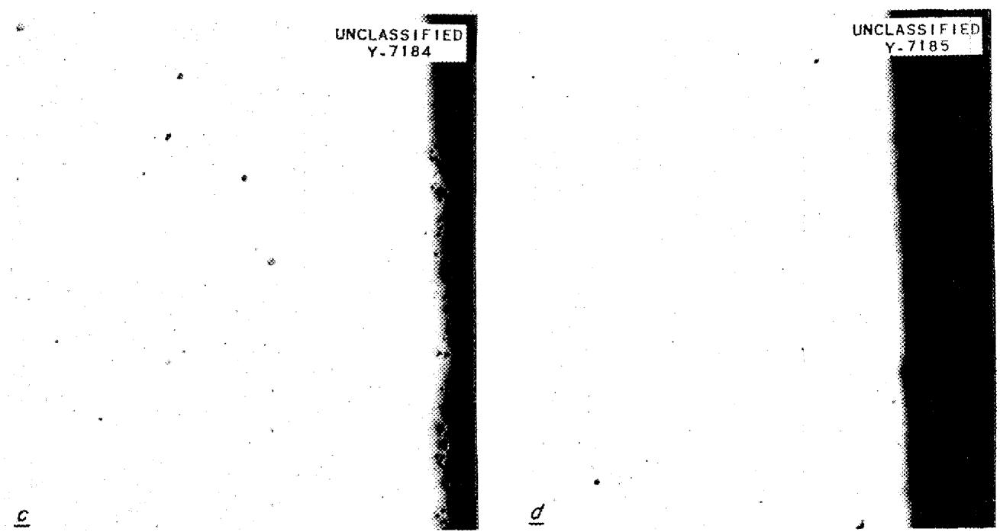  
Fig. 45. Depth of Void Formation as a Function of Temperature in Inconel by NaF-KF-LiF-UF4. (a) 900°C. (b) 1000°C. (c) 1100°C. (d) 1200°C. Unetched. 250X

Table 10   
CORROSION OF INCONEL BY NaF-KF-LiF-UF4 AS A FUNCTION OF TEST TEMPERATURE  

<table><tr><td>TEST TEMPERATURE (°C)</td><td>DEPTH OF VOID FORMATION (mils)</td><td>THICKNESS CHANGE OF SPECIMEN</td></tr><tr><td>800</td><td>20</td><td>None</td></tr><tr><td>900</td><td>15</td><td>None</td></tr><tr><td>1000</td><td>10</td><td>None</td></tr><tr><td>1100</td><td>10</td><td>None</td></tr><tr><td>1200</td><td>0.5*</td><td>None</td></tr><tr><td>1300</td><td>0.2*</td><td>None</td></tr></table>

*Thin film of $\mathsf{UO}_2$ observed on metal surface.

Table 11   
EFFECT OF TIME ON THE DEPTH OF FLUORIDE ATTACK ON INCONEL AS DETERMINED BY THE SEESAW TEST   

<table><tr><td rowspan="3">TEST</td><td rowspan="3">TIME (hr)</td><td rowspan="3">NO. OF CYCLES</td><td colspan="2">TEMPERATURE (°C)</td><td colspan="3">METALLOGRAPHIC OBSERVATIONS</td></tr><tr><td rowspan="2">Hot Zone</td><td rowspan="2">Cold Zone</td><td colspan="2">Depth of Void Formation in Hot Zone</td><td rowspan="2">COLD ZONE</td></tr><tr><td>Average (mils)</td><td>Maximum (mils)</td></tr><tr><td>SSF-3</td><td>66</td><td>18,500</td><td>812</td><td>618</td><td>0.5</td><td>1</td><td>No evidence of reaction</td></tr><tr><td>SSF-4</td><td>115</td><td>30,200</td><td>780</td><td>600</td><td>1</td><td>2</td><td>No evidence of reaction</td></tr><tr><td>SSF-5</td><td>210</td><td>55,200</td><td>780</td><td>630</td><td>2</td><td>5</td><td>No evidence of reaction</td></tr><tr><td>SSF-6</td><td>500</td><td>132,000</td><td>750</td><td>610</td><td>3</td><td>7</td><td>Metallic deposit 0.5 mil thick</td></tr><tr><td>SSF-8</td><td>750</td><td>198,000</td><td>816</td><td>620</td><td>3.5</td><td>6</td><td>Metallic deposit 0.5 mil thick</td></tr><tr><td>SSF-7</td><td>3000</td><td>786,000</td><td>800</td><td>560</td><td>4</td><td>13</td><td>Metallic deposit 0.5 mil thick</td></tr></table>

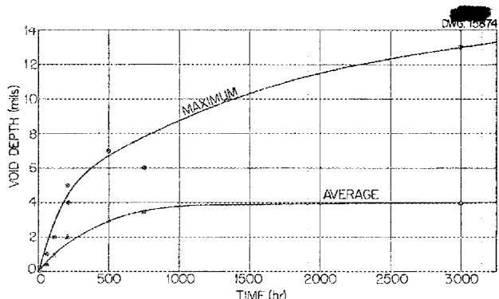  
Fig. 46. Corrosion vs. Time for Inconel in NaF-KF-LiF-UF $_4$ from Seesaw Tests at $800^{\circ}$ C.

Residual Stresses in Specimen. From quench-annealed flat stock a series of cold-worked Inconel specimens were prepared that ranged from 0 to $71\%$ reduction in thickness. These specimens were then corrosion tested in NaF-KF-LiF- $\mathbf{U}\mathbf{F}_{4}$ for 100 hr at $815^{\circ}C$ to determine possible differences in corrosion behavior. The test results listed in Table 12 show that there is a small, but nevertheless perceptible, effect.

There appears to be maximum corrosion in the range of 5 to $25\%$ reduction in thickness. Such results are not surprising, since hole formation, which is believed to be caused by the diffusion of chromium from the metal into the fluoride bath, is accelerated by the presence of cold work. The recrystallization temperature range for Inconelis is about $1500^{\circ}\mathrm{F}$ , which is the test temperature, and hence heavily cold-worked specimens recrystallize in a relatively short time. Therefore specimens that have not been cold worked and specimens that have been heavily cold-worked may be essentially stress free for most of the period of the corrosion test, and the intermediate stress range may not result in recrystallization throughout the exposure period.

Carbon Content of Specimen. To establish the effect of carbon content, if any, on the corrosion behavior of face-centered-cubic metals in NaF-KF-LiF-UF $_4$ , two seesaw test specimens were run simultaneously so that identical time and temperatures would

Table 12 VARIATION IN SUBSURFACE Void FORMATION AS A RESULT OF COLD WORK   

<table><tr><td>REDUCTION IN THICKNESS (%)</td><td>WEIGHT LOSS (g)</td><td>DEPTH OF SUBSURFACE VOIDS (mils)</td><td>THICKNESS CHANGE</td></tr><tr><td>0</td><td>0.0020</td><td>1</td><td>None</td></tr><tr><td>5.5</td><td>0.0043</td><td>2</td><td>None</td></tr><tr><td>11.5</td><td>0.0036</td><td>1.5</td><td>None</td></tr><tr><td>26.0</td><td>0.0036</td><td>1.5</td><td>None</td></tr><tr><td>50.0</td><td>0.0023</td><td>1</td><td>None</td></tr><tr><td>71.0</td><td>0.0028</td><td>1</td><td>None</td></tr></table>

prevail. One specimen was a regular, type 304 stainless steel (containing $0.08\%$ C), and the other was an extralow-carbon type 304 stainless steel $(0.006\%)$ C).

The temperature conditions for both specimens were $720^{\circ}\mathrm{C}$ in the hot zone and $600^{\circ}\mathrm{C}$ in the cold zone. The duration of the test was 190 hr, during which time the specimens were subjected to 51,150 cycles.

Examination of the specimens after testing gave identical results, namely, 5 mils of void formation in the hot zones of both. No attack or deposition was detected in the cold zones.

Corrosion Inhibitors. Static and dynamic corrosion tests at $816^{\circ}\mathrm{C}$ for 100 hr have been continued with various agents being added to check the possibility of the additions acting as corrosion inhibitors. Particular attention was given to additions of chromium because of the part chromium plays in the fluoride corrosion of Inconel (cf., paragraph on "Mechanism of Fluoride Corrosion," this section). Tests have been run with $0.17\%$ additions of sodium (previous addition tests were with higher percentages of sodium) and also additions of $\mathsf{MnO}_2$ , $\mathsf{CrF}_2$ , $\mathsf{NiF}_2$ , and $\mathsf{FeF}_3$ . In the case of the sodium addition and also in the previous tests with additions of lithium, potassium, calcium, titanium, and manganese, it was thought that these elements might possibly act as getters to reduce the available amount of oxygen in the system and thus help to reduce corrosion. The $\mathsf{MnO}_2$ additions were made to determine whether oxygen added to these tests in this form would increase corrosion.

The metal fluorides (and also sodium, lithium, and potassium) were added with the thought that perhaps a reaction of the following type might be the corrosion mechanism:

$$
2 a F + \beta \Longleftarrow \beta F _ {2} + 2 a,
$$

where $a$ could represent sodium, lithium, or potassium and $\beta$ could represent iron, nickel, or chromium. If this were the case, then additions of iron, nickel, or chromium fluorides and also sodium, lithium, or potassium should tend to drive the above reaction to the left and help reduce the corrosion. However, additions of the iron, nickel, and chromium fluorides had no effect in reducing corrosion. It should be mentioned that the purity of the salts used is not known. Additions of sodium, lithium, and potassium do seem to reduce corrosion, but, as mentioned above, their action may be that of getters rather than that of participants in the reaction.

In Table 13, the additions (in both the previous and the most recent tests) are classified according to the results of the tests. It should be emphasized that the classifications are based on tests that were run with certain percentages of these addition agents, and it is conceivable that different amounts might result in different corrosion results. Table 14 shows the results of the most recent tests in which addition agents were used. The beneficial effect of the addition of $1/4\%$ chromium to the fluoride bath is demonstrated in Fig. 47, which shows the corrosion of Inconel by NaF-KF-LiF- $\mathbf{U}\mathbf{F}_{4}$ with and without the chromium additive. The absence of subsurface voids when chromium is added agrees with the hypothesis that the voids are caused by chromium depletion of the metal by the fluorides.

Table 13   
RELATIVE EFFECTS OF ADDITION AGENTS ON CORROSION BY FLUORIDES   

<table><tr><td>AGENTS REDUCING CORROSION</td><td>AGENTS INCREASING CORROSION</td><td>AGENTS WITH LITTLE OR NO EFFECT ON CORROSION</td></tr><tr><td>Na</td><td>MnO2</td><td>CrF2</td></tr><tr><td>Li</td><td>NiF2</td><td>NiF2+ CrF2+ FeF3</td></tr><tr><td>K</td><td>FeF3</td><td>C</td></tr><tr><td>Ca</td><td>NaI</td><td>Mo</td></tr><tr><td>Ti</td><td>KI</td><td>Si</td></tr><tr><td>Mn</td><td>LiIO3</td><td>Zn</td></tr><tr><td>Be</td><td>KCl</td><td>W</td></tr><tr><td>Al</td><td>NaCl</td><td>Fe</td></tr><tr><td>U</td><td>KBr</td><td>Zn</td></tr><tr><td>Cr</td><td></td><td>Mn</td></tr><tr><td>Cu</td><td></td><td>Ag</td></tr><tr><td>NaH</td><td></td><td></td></tr></table>

Pretreatment. In an attempt to evaluate the influence of the pretreatment procedure, parallel dynamic tests of material containing NaF-KF-ZrF $_4$ -UF $_4$ (36.6-14.0-45.6-3.8 mole %) were made with samples prepared in graphite and in nickel containers without hydrofluorination and in nickel containers with hydrogenation and hydrofluorination. The material that had been hydrofluorinated was somewhat superior, although in these tests no marked differences were noted.

In other tests the fluoride mixture NaF-KF-LiF- $\mathbf{U}\mathbf{F}_{4}$ was treated by bubbling hydrogen through it for 2 hr while the molten fluoride was held at a temperature of approximately $980^{\circ}C$ .There appeared to be no significant reduction in corrosion of Inconel, type 321 stainless steel, or A nickel when the hydrogen-pretreated fluoride was used.

Table 14   
EFFECTS OF VARIOUS ADDITIONS TO NaF-KF-LiF-UF4 IN STATIC CORROSION TESTS FOR 100 hr AT 816°C IN VACUUM   

<table><tr><td>MATERIAL</td><td>ADDITION</td><td>DEPTH OF METAL AFFECTED (mils)</td><td>METALLOGRAPHIC NOTES</td></tr><tr><td>Inconel</td><td>0.17% Na</td><td></td><td>No attack</td></tr><tr><td>Type 304 stainless steel</td><td>0.17% Na</td><td></td><td>No attack</td></tr><tr><td>Inconel</td><td>10% CrF2</td><td>4</td><td>Subsurface voids</td></tr><tr><td>Inconel</td><td>10% NiF2</td><td>7</td><td>Subsurface voids</td></tr><tr><td>Inconel</td><td>10% FeF3</td><td>9</td><td>Subsurface voids</td></tr><tr><td>Inconel</td><td>3 1/3% CrF2</td><td></td><td></td></tr><tr><td></td><td>3 1/3% NiF2</td><td></td><td></td></tr><tr><td></td><td>3 1/3% FeF3</td><td>2</td><td>Subsurface voids</td></tr><tr><td>Inconel</td><td>10% MnO2</td><td>9</td><td>Subsurface voids and intergranular penetration</td></tr><tr><td>Type 309 stainless steel</td><td>10% MnO2</td><td>4</td><td>Subsurface voids and intergranular penetration</td></tr></table>

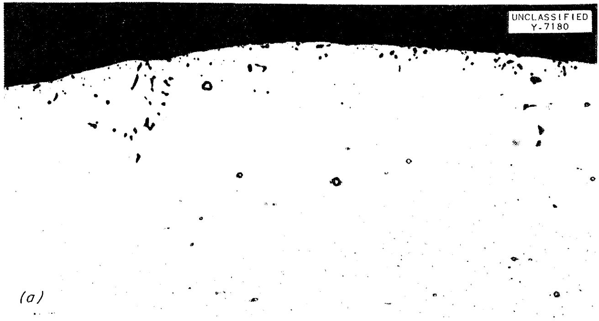

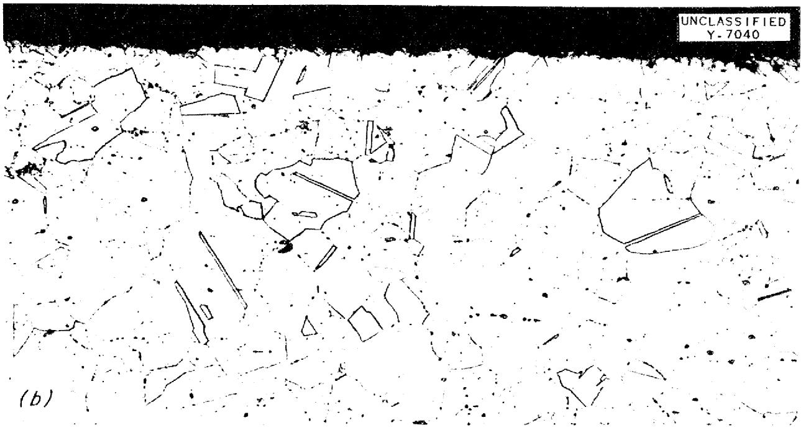  
Fig. 47. Corrosion of Inconel in Seesaw Tests by NaF-KF-LiF-UF4 With and Without Added Chromium After 200 hr at $780^{\circ}$ C. (a) No chromium added. (b) Chromium added, $1/4\%$ . 250X

# SEESAW AND STATIC TESTS WITH FLUORIDES CONTAINING $\mathbf{ZrF}_4$

C.R.Croft N.V.Smith

R.E.Meadows H.J.Buttram

Materials Chemistry Division

Ten different $\mathrm{ZrF_4}$ -bearing fused salts ranging from 58 to 44 mole $\%$ $\mathrm{ZrF_4}$ , 0 to 52 mole $\%$ NaF, 0 to 46 mole $\%$ KF, and 0 to 4 mole $\%$ UF $_4$ have been tested in sealed capsules of type 316 stainless steel and Inconel under static and dynamic conditions. The static tests were maintained for 100 hr at $800^{\circ}\mathrm{C}$ . The dynamic tests were performed with the tilting furnace previously described; the hot-zone temperature of $800^{\circ}\mathrm{C}$ and the cold-zone temperature of $650^{\circ}\mathrm{C}$ were maintained for 100 hr, during which time the fuel made 24,000 cycles.

Comparison of results from the two test procedures substantiates previous statements that corrosion, as measured by penetration, is significantly greater in the dynamic test and that mass transfer of small quantities of metal is often observed in the dynamic tests. However, even the dynamic tests are not sufficiently severe to permit evaluation of small differences in corrosion behavior.

The zirconium-bearing fluoride mixtures were shown to be less corrosive than previously tested NaF-KF-LiF- $\mathrm{UF_4}$ mixtures. Variation of corrosiveness with composition over the concentration ranges listed above could not be ascertained with accuracy. In general, corrosion in each case (as indicated by penetration data) was scattered and the depth of attack ranged from 0.5 to 2 mils on Inconel, with slightly higher values for

type 316 stainless steel. Weight changes of the specimens after test were slight and metal dissolution in the fuels was less than with fuel mixtures tested previously. Slight penetration or surface roughening was found in the hot zones of the capsules, and occasional small metallic deposits were observed in the cold zones. The corrosion observed appeared independent of the $\mathrm{UF_4}$ concentration over the range studied.

In a series of static exposures of Inconel to $\mathrm{NaF - ZrF_4 - UF_4}$ mixtures for 100 hr at $1000^{\circ}C$ the only corrosion observed was a slight surface deposit similar to that observed at lower temperatures. Tests at higher temperatures are under way.

# FLUORIDE CORROSION IN THERMAL CONVECTION LOOPS

G. M. Adamson, Metallurgy Division

The emphasis in dynamic corrosion testing has shifted from testing NaF-KF-LiF- $\mathbf{U}\mathbf{F}_{4}$ to testing various coolants containing zirconium fluoride. As a class, the zirconium fluoride coolants are less corrosive to Inconel. The method of attack appears to be the same for the two types. The zirconium fluoride coolants do have the disadvantage of a high vapor pressure that results in the sublimation of zirconium fluoride in the expansion pots of the loops.

Some work is still being done with the mixture NaF-KF-LiF- $\mathrm{UF_4}$ because it is more readily available; also, since it is more corrosive, trends are easier to discern. A portion of the work has been on the addition of possible inhibitors to the coolants. From the results obtained with a single loop, zirconium hydride will reduce corrosion, but the effect of NaK is questionable. Corrosion from

the fluorides appears to increase if crevices are present in the loop walls.

Tables 15 and 15, which summarize the results obtained from the thermal convection loops operated during this period, are continuations of Tables 12 and 13 in the previous report.(2) Even with the additional fluids being tested, none of the data in these tables conflict with the conclusions presented in the last report.

Fluoride Mixtures Containing $\mathbf{ZrF_4}$ As shown in Table 15, four additional fluoride mixtures containing zirconium fluoride have been tested in Inconel loops. The hot-leg attack in every one of these loops is less than that normally found with NaF-KF-LiF- $\mathrm{UF_4}$ fuel. Since loop 234 was cleaned only by degreasing, which previously was the standard procedure, it can be compared with the standard loops. The maximum attack in this loop was only 5 mils rather than the 10 to 15 mils normally found with the earlier fuel composition. The amount of attack was also greatly reduced, as shown in Fig. 48. Some of the other loops in which the zirconium fluoride fuels and coolants were circulated did show a maximum attack greater than 10 mils. As discussed below, the attack seems to be more a function of the cleaning procedure than of the mixture.

There does not appear to be much variation in the attack by the various zirconium-base mixtures, since all produced about the same attack under comparable conditions. The attack was about the same as that shown in Fig. 54 of the previous report,(3) which illustrated attack by a mixture

containing $\mathbf{ZrF_4}$ . Even though the number of loops run with these mixtures is limited, the attack mechanism seems to be the same as the process of leaching and diffusion of chromium, which was discussed previously $^{(4)}$ in connection with the NaF-KF-LiF-UF $_4$ fuel.

The expansion pots of two Inconel loops in which $\mathrm{NaF - ZrF_4 - UF_4}$ was circulated for 500 hr were cut open and over $200\mathrm{g}$ of sublimed zirconium fluoride was recovered from each. The material was found both on the insulated sides and exposed top of this chamber. The area of the surface from which this material escaped was only 7.4 in.², and the surface was at a temperature of about $1300^{\circ}\mathrm{F}$ . In general, large crystals were found on the sides and small ones on the top. This vaporization and subsequent sublimation of the $\mathrm{ZrF_4}$ fluoride is a major problem in the handling of these mixtures (cf., "Experimental Engineering," sec. 2).

Effect of Cleaning Loops. The standard procedure for cleaning thermal convection loops before operation has been vapor degreasing and flushing with a fresh organic solvent. This procedure was felt to be more desirable than pickling because of the variables introduced by pickling, even though it does not remove the thin oxide layers at the welds. Heating in a dry-hydrogen atmosphere seemed to be a possible method for reducing these oxides without attacking the metal. This operation was tried on several Inconel loops in which the zirconium-bearing fluorides and the earlier nonzirconium-bearing fluorides were circulated. The corrosion results were all comparable, no matter which fluoride mixture was later circulated. From this it is apparent that the

Table 15   
CORROSION DATA FROM INCONEL THERMAL CONVECTION LOOPS CONTAINING VARIOUS FLUORIDE MIXTURES   

<table><tr><td rowspan="2">LOOP NO.</td><td rowspan="2">CLEANING PROCEDURE</td><td rowspan="2">FLUORIDE MIXTURE</td><td rowspan="2">TIME OF CIRCULATION (hr)</td><td rowspan="2">REASON FOR TERMINATION</td><td rowspan="2">HOT LEG TEMPERATURE (°F)</td><td colspan="2">METALLOGRAPHIC NOTES</td><td rowspan="2">CHEMICAL NOTES</td></tr><tr><td>Hot Leg</td><td>Cold Leg</td></tr><tr><td>221</td><td>Degreased</td><td>NaF-KF-ZrF4-UF4(4.8-50.1-41.3-3.8 mole %)</td><td>500</td><td>Scheduled</td><td>1500</td><td>Light to moderate inter-granular pitting, 3 to 7 mils</td><td>Rough surface; thin non-metallic layer</td><td>Some increase in Cr, decrease in Ni, small increase in Fe, decrease in U</td></tr><tr><td>222</td><td>Degreased</td><td>NaF-KF-LiF-UF4(10.9-43.5-44.5-1.1 mole %)</td><td>500</td><td>Scheduled</td><td>1650</td><td>Intergranular attack, up to 18 mils; pitting, 6 mils</td><td>Thin deposit</td><td>Cr and Fe both decreased; no systematic variations</td></tr><tr><td>228</td><td>Hydrogen</td><td>NaF-KF-ZrF4-UF4(4.8-50.1-41.3-3.8 mole %)</td><td>500</td><td>Scheduled</td><td>1500</td><td>Light intergranular pitting, 3 to 13 mils, average 5 mils</td><td>Rough surface; thin deposited layer</td><td>Small increase in Cr, decrease in Ni, U variable</td></tr><tr><td>224</td><td>Degreased</td><td>NaF-KF-LiF-UF4+ NaK(10.9-43.5-44.5-1.1 mole %)</td><td>500</td><td>Scheduled</td><td>1500</td><td>Intergranular pitting, up to 10 mils</td><td>Thin surface layer with some adhering nonmetallic particles</td><td>Cr increased only slightly, Fe decreased</td></tr><tr><td>230</td><td>Hydrogen</td><td>NaF-KF-ZrF4(36.0-18.0-46.0 mole %)</td><td>500</td><td>Scheduled</td><td>1500</td><td>Light intergranular pitting, average 4 mils with maximum 7 mils; grains were not outlined</td><td>No deposited layer</td><td>Cr increased slightly, Fe decreased, others vary</td></tr><tr><td>226</td><td>Hydrogen</td><td>NaF-KF-ZrF4-UF4(36.6-14.0-45.6-3.8 mole %)</td><td>500</td><td>Scheduled</td><td>1500</td><td>Widely scattered inter-granular pitting, average 7 mils with maximum of 10 mils</td><td>Both metallic and non-metallic deposits</td><td>Cr increased, Fe and Ni decreased, others vary</td></tr><tr><td>229</td><td>Degreased</td><td>NaF-KF-LiF-UF4(10.9-43.5-44.5-1.1 mole %)Not treated</td><td>500</td><td>Scheduled</td><td>1500</td><td>Moderate to heavy inter-granular pitting, up to 18 mils, average 8 mils</td><td>Thin deposit at least partially nonmetallic</td><td>Large increase in Cr, Fe decreased, small decrease in U and F</td></tr><tr><td>227</td><td>Degreased</td><td>NaF-KF-LiF-UF4(10.9-43.5-44.5-1.1 mole %)</td><td>500</td><td>Scheduled</td><td>1500*</td><td>Moderate to heavy pitting, 6 to 16 mils; mainly intergranular</td><td>Very thin metallic layer</td><td>Cr increased, Fe decreased, U quite uniform</td></tr><tr><td>234</td><td>Degreased</td><td>NaF-ZrF4-UF4(46.0-50.0-4.0 mole %)</td><td>400</td><td>Power failure</td><td>1500</td><td>Light scattered intergranular pitting, up to 5 mils, average 2 mils; dirty Inconel used</td><td>Both metallic and non-metallic crystals on the walls</td><td>Cr increased, large decrease in Fe and Ni, U increased</td></tr><tr><td>236</td><td>Hydrogen</td><td>NaF-ZrF4-UF4(46.0-50.0-4.0 mole %)</td><td>462</td><td>Power failure</td><td>1500</td><td>Moderate intergranular pitting, average 8 mils with maximum of 10 mils; some pits in grains</td><td>Both metallic and non-metallic particles on wall</td><td>Cr increased, Fe and Ni decreased; U increased</td></tr><tr><td>225</td><td>Degreased</td><td>NaF-KF-LiF-UF4+ 1/2ZrH2(10.9-43.5-44.5-1.1 mole %)</td><td>500</td><td>Scheduled</td><td>1500</td><td>Very little attack; surface rough, few pits, 0.5 mil; possibly some attached crystals; precipitate formed in crystal boundaries</td><td>Metallic layer, 0.2 mil; layer was quite adherent</td><td>Cr, Fe, U, and Ni all decreased</td></tr><tr><td>231</td><td>NaK</td><td>NaF-ZrF4-UF4(46.0-50.0-4.0 mole %)</td><td>500</td><td>Scheduled</td><td>1500</td><td>Moderate general pitting, up to 9 mils</td><td>Both metallic and non-metallic particles deposited on wall</td><td>Cr increased, Fe, Ni, and U all decreased</td></tr><tr><td>237</td><td>Na</td><td>NaF-ZrF4-UF4(50.0-46.0-4.0 mole %)</td><td>500</td><td>Scheduled</td><td>1500</td><td>Typical Inconel pitting, maximum penetration 5 mils with average 3 mils</td><td>Rough surface with both metallic and non-metallic crystals ad-hering</td><td></td></tr><tr><td>238</td><td>NaK</td><td>NaF-KF-LiF-UF4(10.9-43.5-44.5-1.1 mole %)</td><td>500</td><td>Scheduled</td><td>1500</td><td></td><td></td><td></td></tr><tr><td>223</td><td>NaK</td><td>NaF-KF-LiF-UF4(10.9-43.5-44.5-1.1 mole %)</td><td>500</td><td>Scheduled</td><td>1500**</td><td></td><td></td><td></td></tr></table>

Hot leg annealed 1/2 hr at $1750^{\circ}\mathrm{F}$ .   
* *Lap joint in hot leg.

Table 16   
CORROSION DATA FROM STAINLESS STEEL THERMAL CONVECTION LOOPS CONTAINING VARIOUS FLUORIDE MIXTURES   

<table><tr><td rowspan="2">LOOP NO.</td><td rowspan="2">TYPE OF STAINLESS STEEL</td><td rowspan="2">FLUORIDE MIXTURE</td><td rowspan="2">TIME OF CIRCULATION (hr)</td><td rowspan="2">REASON FOR TERMINATION</td><td rowspan="2">HOT LEG TEMPERATURE (°F)</td><td colspan="2">METALLOGRAPHIC NOTES</td><td rowspan="2">CHEMICAL NOTES</td></tr><tr><td>Hot Leg</td><td>Cold Leg</td></tr><tr><td>123</td><td>316</td><td>NaF-KF-LiF-UF4(10.9-43.5-44.5-1.1 mole %)</td><td>500</td><td>Scheduled</td><td>1650</td><td>Intergranular attack, up to 13 mils; some grains removed</td><td>Metallic layer, 1 mil thick</td><td>Fe, Cr, and U all decreased; hot leg highest in all</td></tr><tr><td>126</td><td>316*</td><td>NaF-KF-LiF-UF4(10.9-43.5-44.5-1.1 mole %) H2treated</td><td>309</td><td>Plug</td><td>1500</td><td>Heavy intergranular attack, up to 14 mils; some grains removed</td><td>Nonuniform metallic deposit; few non-metallic crystals in top portion; slight attack in some areas</td><td>Cr increased, Fe decreased, U varied, but little change, Ni same</td></tr><tr><td>124</td><td>315</td><td>NaF-KF-ZrF4-UF4(4.8-50.1-41.3-3.8 mole %)</td><td>199</td><td>Leak</td><td>1500</td><td>Intergranular attack, usually 5 mils but occasionally up to 11 mils</td><td>Some evidence of a thin metallic deposit</td><td>Cr up slightly, Ni decreased, Fe varied but is unchanged, U lower</td></tr><tr><td>120</td><td>316</td><td>NaF-KF-LiF-UF4(10.9-43.5-44.5-1.1 mole %) Not treated</td><td>62</td><td>Plug</td><td>1500</td><td>Heavy intergranular attack, up to 12 mils; some grains removed</td><td>Thin surface deposit with both metallic and non-metallic crystals adhering</td><td>U increased, all other elements varied</td></tr><tr><td>125</td><td>316</td><td>NaF-KF-LiF-UF4(10.9-43.5-44.5-1.1 mole %)</td><td>91</td><td>Plug</td><td>1650</td><td>Heavy intergranular attack, up to 11 mils</td><td>Metallic deposit with some crystals not attached to wall</td><td>Fe and Cr varied, Ni decreased</td></tr><tr><td>128</td><td>316</td><td>NaF-ZrF4-UF4(46.0-50.0-4.0 mole %)</td><td>500</td><td>Scheduled</td><td>1500</td><td>Heavy intergranular attack, up to 8 mils; some grains removed</td><td>Surface rough; heavy layer of nonmetallic crystals in which some metallic crystals were embedded; some non-metallic crystals were encased in metal</td><td>Cr increased, Fe and Ni decreased, U increased</td></tr><tr><td>127</td><td>ELC316</td><td>NaF-KF-LiF-UF4(10.9-43.5-44.5-1.1 mole %)</td><td>43</td><td>Plug</td><td>1500</td><td>Heavy intergranular attack, up to 11 mils</td><td>Metallic deposit with some metallic crystals not adhering</td><td>Cr increased, Fe decreased, others varied</td></tr></table>

Hydrogen fired; hydrogen atmosphere.

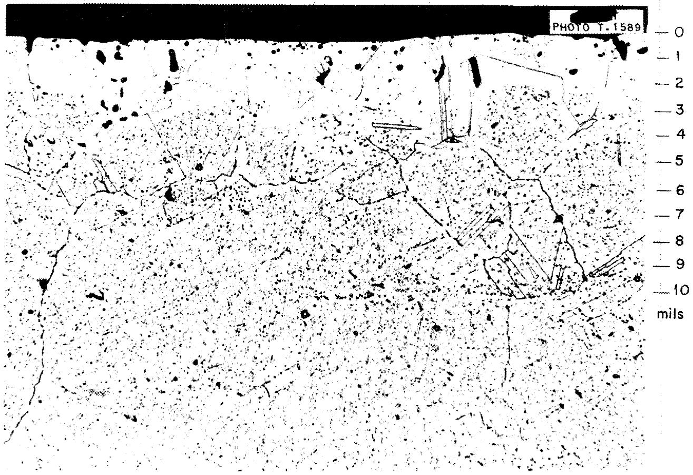  
Fig. 48. Corrosion of Inconel Thermal Convection Loop by NaF-ZrF $_4$ -UF $_4$ (46-50-4 mole %) After 500 hr at $1500^{\circ}\text{F}$ . Etched with aqua regia. 250X

cleaning cycle is just as important as the choice of fluoride mixture. Comparison of these loops with similar loops that have only been degreased shows that the amount of attack, as indicated by the number of holes, is reduced. The attack is concentrated in a few grain boundaries and actually extends to a greater depth. This is shown by Fig. 54 in the previous report.(3) In cleaning with hydrogen, temperatures in excess of $1850^{\circ}\mathrm{F}$ are necessary to provide a minimum temperature above $1750^{\circ}\mathrm{F}$ . These temperatures cause grain growth and possibly concentration of impurities in the grain boundaries. Since hydrogen firing did cut down the amount of attack, a method of removing the oxide without

the resulting grain growth would be desirable.

It was found that NaK at $1500^{\circ}\mathrm{F}$ would remove weld scale from Inconel. Therefore several Inconel loops were cleaned by heating the hot leg to $1600^{\circ}\mathrm{F}$ and the cold leg to $1500^{\circ}\mathrm{F}$ and circulating NaK for 4 hours. The NaK was drained while still hot, and the loops were then heated and evacuated to remove any remaining NaK. The one loop examined showed attack as deep as would be obtained by degreasing, or even deeper. It seems likely that when the NaK was drained, sodium or potassium oxides were left behind in cold spots, or possibly some oxides were deposited in the cold leg by the

$100^{\circ}\mathrm{F}$ temperature difference. This method of cleaning will be checked further and other methods will be tried.

Corrosion Inhibitors. In the static corrosion studies it was shown that the addition of zirconium metal to NaF-KF-LiF- $\mathrm{UF_4}$ reduced the attack. Because of the great affinity of zirconium metal for the various gases and the difficulties in obtaining adequate mixing, it was not practical to add the zirconium metal to a loop either before or after heating. Zirconium hydride was also tried as a possible inhibitor because it does not decompose until slightly below operating temperature, and the nascent hydrogen liberated during decomposition might help in cleaning up the fluorides.

The NaF-KF-LiF-UF $_4$ with $1/2\% \mathrm{ZrH}_2$ added was circulated in an Inconel loop for 500 hr at $1500^{\circ}\mathrm{F}$ . After circulation, the hot leg was found to have a roughened surface but the attack extended only to a depth of 0.5 mil; the surface is shown in Fig. 49. The attack was the least found in any loop in which fluorides have been circulated. In the hot leg, some precipitated crystals were observed just under the surface and in the grain boundaries. These crystals do not seem to be continuous enough to act as a protective layer. An adherent metallic layer about 0.2 mil thick was found in the cold leg. The lack of corrosion in this loop was further evidenced by the very low amounts of impurities in the fluorides. This test is now being repeated, and

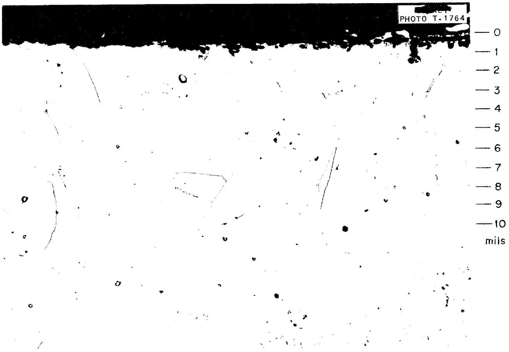  
Fig. 49. Corrosion of Inconel Thermal Convection Loop by NaF-KF-LiF-UF $_4$ with $1/2\%$ Added $\mathsf{ZrH}_2$ After 500 hr at $1500^{\circ}\mathsf{F}$ . Etched with aqua regia. 250X

the effect of a zirconium hydride addition to a zirconium-base fluoride fuel is also being studied.

It was pointed out in the previous report(5) that a small NaK addition reduced the corrosion obtained when nonuranium-bearing coolants were used. As an extension of this work, NaK was added to two other Inconel loops. Loop 224 was used to circulate NaF-KF-LiF- $\mathbf{U}\mathbf{F}_{4}$ , and Loop 241 to circulate NaF-ZrF $_4$ -UF $_4$ . About 8 cc of NaK was added to each loop. In both loops the NaK was placed in the pot and the fluorides were added to it. Loop 224 was started without difficulty and operated satisfactorily for 500 hours. The maximum hot-leg attack measured 10 mils, which is lower than the usual average but not enough to show a definite effect. However, since the metallic impurities found in the fluorides after circulation were also lower than normal, it seems possible that some actual improvement took place. Loop 241 is now operating satisfactorily, but there was considerable difficulty in start-up, which may have been due to a reaction that yielded some solid precipitates. The cold-leg temperatures were lower than normal and kept decreasing.

Another Inconel loop, in which chromium metal powder was added to the circulating NaF-KF-LiF-UF4 mixture, is operating normally.

Crevice Corrosion. Crevice corrosion has been observed but requires further investigation. In an Inconel pump loop operated with NaF-KF-LiF (11.5-42.0-46.5 mole %) very little attack was found in most of the loop, but heavy attack was found in two different types of crevices. One type of crevice resulted from sleeves joining pipe sections and the other from a thermocouple well. This loop had operated for about 1000 hr at $1250^{\circ}\mathrm{F}$ and below and 100 hr at $1500^{\circ}\mathrm{F}$ .

Several other loops were then checked for crevice corrosion by examining the top welds. The corrosion of crevices found in the hot legs of loops 219, 229, and 234 is compared in Table 17 with the corrosion of the wall directly opposite the crevice. Figure 50 shows a section through the joint of Inconel loop 219. It should be pointed out that the attack in this portion of the hot leg is considerably less than that given in Table 15, since the sections were at slightly different temperatures. One additional piece of evidence for the existence of crevice corrosion is the fact that the attack at the mouth of

Table 17   
CREVICE CORROSION IN THERMAL CONVECTION LOOPS   

<table><tr><td rowspan="2">LOOP NO.</td><td rowspan="2">FLUORIDE MIXTURE</td><td colspan="2">MAXIMUM ATTACK (mils)</td><td rowspan="2">METALLOGRAPHIC NOTES</td></tr><tr><td>Hot Leg</td><td>Crevice</td></tr><tr><td>219</td><td>NaF-KF-LiF-UF4</td><td>3</td><td>6</td><td>Two to three times more attack in the crevice</td></tr><tr><td>229</td><td>NaF-KF-LiF-UF4</td><td>4</td><td>6</td><td>Many times more attack in the crevice</td></tr><tr><td>234</td><td>NaF-ZrF4-UF4</td><td>3</td><td>5</td><td>Very little attack in hot leg with moderate amount in the crevice; tendency for attack to follow grain boundaries</td></tr></table>

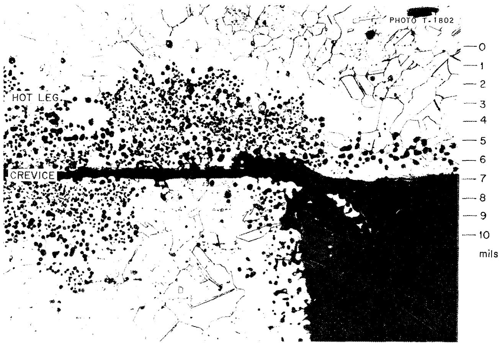  
Fig. 50. Effect of a Crevice on Corrosion of Inconel by NaF-KF-LiF-UF4 After 500 hr at $1500^{\circ}\mathrm{F}$ . Etched with aqua regia. 250x

the crevice is less than that found within. The mechanism of this attack is not yet known. Further tests will be made to determine just how serious this effect will be.

Temperature Variations. To determine the effect of temperature on the corrosion of Inconel, two loops (218 and 222) were run at 1300 and $1650^{\circ}\mathrm{F}$ , respectively. It was apparent that the attack increased slightly with temperature. The type of attack was the same at each temperature.

A type 316 stainless steel loop (123) was operated at $1650^{\circ}\mathrm{F}$ with NaF-KF-LiF- $\mathbf{U}\mathbf{F}_{4}$ . This was the first 300-series stainless steel loop to

Operate 500 hr without plugging. The attack in the hot leg was intergranular and extended to a depth of 13 mils. The test was repeated (loop 125), but the loop plugged in only 91 hours. The insulation in the second loop was not so good as in the first and the cold leg operated at a slightly lower temperature. Further work is necessary to determine whether it could be the small temperature difference that caused the plugging.

Variations in Alloy Composition of the Walls. Tables 18 and 19 present the results of chemical analyses of successive layers drilled from the inside of two loops (78 and 121) for comparison with similar data obtained from two other loops (210 and 219) and

Table 18   
CHEMICAL ANALYSES OF SUBSURFACE LAYERS OF INCONEL WALLS OF LOOP 78 IN WHICH NaF-KF-LiF WAS CIRCULATED   

<table><tr><td rowspan="2">DEPTH OF LAYER (mils)</td><td colspan="10">COMPOSITION (%)</td></tr><tr><td>Fe</td><td>Ni</td><td>Cr</td><td>Fe/Ni</td><td>KF*</td><td>LiF*</td><td>NeF*</td><td>Other</td><td>Total Fe, Ni, and Cr</td><td>Total</td></tr><tr><td>5</td><td>7.03</td><td>78.3</td><td>12.0</td><td>0.089</td><td>0.09</td><td>0.3</td><td>0.07</td><td>1.68**</td><td>97.4</td><td>99.5</td></tr><tr><td>10</td><td>8.66</td><td>77.5</td><td>11.8</td><td>0.112</td><td>0.03</td><td>0.15</td><td>0.02</td><td>1.46</td><td>98.0</td><td>99.6</td></tr><tr><td>15</td><td>6.93</td><td>77.6</td><td>13.6</td><td>0.090</td><td>0.02</td><td>0.1</td><td>0.02</td><td>1.18</td><td>98.1</td><td>99.4</td></tr><tr><td>20</td><td>6.81</td><td>77.7</td><td>13.7</td><td>0.088</td><td>0.02</td><td>0.1</td><td>0.02</td><td>1.30</td><td>98.3</td><td>99.6</td></tr><tr><td>25</td><td>6.66</td><td>77.9</td><td>14.3</td><td>0.086</td><td>0.06</td><td>0.2</td><td>0.07</td><td>1.78</td><td>98.9</td><td>101.0</td></tr><tr><td>Exterior</td><td>7.15</td><td>77.4</td><td>15.2</td><td>0.092</td><td></td><td></td><td></td><td>1.48***</td><td>99.8</td><td>101.0</td></tr></table>

These values calculated from spectrographic analysis of metals by assuming them to be present as fluorides.   
**Total of spectrographic analysis for Al, Co, Cu, Mn, Mo, Si, and Ti.   
\*\*\* Average of values above.

Table 19   
CHEMICAL ANALYSES OF SUBSURFACE LAYERS OF TYPE 316 STAINLESS STEEL WALLS OF LOOP 121 IN WHICH NaF-KF-LiF-UF $_4$ WAS CIRCULATED   

<table><tr><td rowspan="2">DEPTH OF LAYER (mils)</td><td colspan="10">COMPOSITION (%)</td></tr><tr><td>Fe</td><td>Ni</td><td>Cr</td><td>Mo</td><td>KF*</td><td>LiF*</td><td>NaF*</td><td>Other</td><td>Total Fe, Ni, Cr, Mo</td><td>Total</td></tr><tr><td>2</td><td>60.4</td><td>16.9</td><td>14.5</td><td>2.8</td><td>1.5</td><td>3.7</td><td>1.1</td><td rowspan="7">Avg. 1.6 Co, Cu, Mn, Si</td><td>94.6</td><td>102.5</td></tr><tr><td>5</td><td>60.8</td><td>16.1</td><td>14.7</td><td>2.7</td><td>0.9</td><td>3.7</td><td>1.1</td><td>95.2</td><td>101.6</td></tr><tr><td>10</td><td>63.5</td><td>14.8</td><td>15.1</td><td>2.5</td><td>0.5</td><td>2.2</td><td>0.5</td><td>95.9</td><td>100.7</td></tr><tr><td>15</td><td>64.1</td><td>14.6</td><td>15.7</td><td>2.5</td><td>0.3</td><td>1.1</td><td>0.5</td><td>96.9</td><td>100.4</td></tr><tr><td>20</td><td>65.2</td><td>14.3</td><td>16.2</td><td>2.5</td><td>0.2</td><td>0.7</td><td>0.5</td><td>98.2</td><td>101.1</td></tr><tr><td>25</td><td>65.1</td><td>14.0</td><td>16.8</td><td>2.4</td><td>0.3</td><td>0.7</td><td>0.5</td><td>99.3</td><td>101.4</td></tr><tr><td>Exterior</td><td>66.0</td><td>13.3</td><td>16.8</td><td>2.4</td><td></td><td></td><td></td><td>98.5</td><td>100.1</td></tr></table>

*These values calculated from spectrographic analysis of metals by assuming them to be present as fluorides.

presented in the previous report. Loop 78 was constructed of Inconel and circulated NaF-KF-LiF for 500 hours. In the first loop (6) the variations in chemical composition appeared to be the same as those found in loop 78, but in loop 78 they were much smaller. Chromium was depleted to a depth of at least 25 mils. Since the fluoride content was low and constant, it was evident that there was practically no penetration.

In the type 316 stainless steel loop, chromium was reduced slightly, and the iron was the major material leached out. The nickel and molybdenum contents were essentially unchanged. In this loop the fluoride content was much higher than in the other loops and decreased gradually with depth. Evidently the fluorides are trapped in crevices. A loop in which zirconium-bearing fluoride mixtures will be circulated is being prepared.

Postrun Examination of Fuels (D. C. Hoffman, F. F. Blankenship, Materials Chemistry Division). Examination of sections from a number of thermal convection loops operated by the experimental engineering group in which zirconium-bearing fluoride fuels were circulated in loops of type 316 stainless steel and Inconel has been accomplished by the method and techniques previously described.(7) The results of these investigations are briefly summarized in the following statements.

The zirconium-bearing fluoride fuels show considerably less corrosion and mass transfer than the fuelstested previously. No $\mathrm{NaK}_2\text{-CrF}_6$ has been discovered in the loops run with these fuels. Inconel seems generally superior to stainless steel.

In loops of type 316 stainless steel, a small amount of magnetic material showing an x-ray pattern resembling an iron-chromium alloy appears in and above the trap at the bottom of the cold leg.

One Inconel loop that had been hydrogen fired showed somewhat more mass-transferred metal in the cold leg than a similar section of an Inconel loop that had simply been degreased. The metal gave an x-ray diffraction pattern for iron in which the lines were shifted slightly.

In one type 316 stainless steel loop in which a mixture containing NaF-ZrF4-UF4 (46-50-4 mole %) was circulated for 500 hr, a brown unknown material (average index of refraction = 1.556) was found in the vertical hot section. A considerable amount of metallic deposit was found in the trap of this loop. Identification of the deposit is incomplete.

# COMPATIBILITY OF BERYLLIUM OXIDE WITH VARIOUS FLUORIDE MIXTURES

R.E.Meadows H.J.Buttram

Materials Chemistry Division

In the present ARE design a liquid heat transfer agent will be pumped slowly through the moderator space to maintain a uniform temperature in the beryllium oxide. The flow rate of this liquid past the beryllium oxide blocks should be at most a few feet per minute. The number and irregular shapes of the beryllium oxide specimens would seem to preclude canning or electroplating of the pieces. One of the essential characteristics of the moderator coolant therefore is chemical compatibility with the beryllium oxide.

Small specimens sawed from hot-pressed beryllium oxide blocks typical of those proposed for use in the ARE have been used in these studies. These pieces have been exposed for 100 hr in sealed capsules of type 316 stainless steel to molten alkali fluorides with and without $\mathsf{ZrF_4}$ or $\mathsf{BeF}_2$ . In all static tests the temperature was maintained at $800^{\circ}\mathrm{C}$ ; in all the dynamic capsule tests the capsule was tilted every 15 sec, with the cold end at $650^{\circ}\mathrm{C}$ and the hot end at $800^{\circ}\mathrm{C}$ .

Preliminary studies of the behavior of beryllium oxide in a static bath of molten NaF-KF-ZrF $_4$ (5-52-43 mole %) indicated that the rate of reaction was appreciable but that it decreased with time. Identification by x-ray diffraction and petrographic microscopy of a film of $\mathsf{ZrO}_2$ on the beryllium

(8) Additional beryllium oxide compatibility tests, with Na, NaK, and Pb, are reported in this section under "Liquid Metal Corrosion."

oxide blocks suggested that a protective film of $\mathrm{ZrO_2}$ might make it possible to use a coolant containing zirconium. Exposure of the blocks for longer times in static tests and for 100-hr intervals in dynamic tests, however, clearly demonstrated that zirconium-bearing mixtures are not suitable in contact with beryllium oxide. Data shown in Table 20 are representative of those obtained. The attack seems to be due to a uniform dissolution of beryllium oxide, since the corners and sharp edges of the specimens are retained.

However, as the data in Table 20 indicate, systems of alkali fluorides containing $\mathrm{BeF}_2$ are compatible with beryllium oxide. Microscopic and x-ray examination of specimens crushed after dynamic testing show $\mathrm{BeF}_2$ in the body of the beryllium oxide block. The penetration, which appears to do no damage, is undoubtedly responsible for the weight gain observed. Further studies of the $\mathrm{BeO - BeF}_2$ -alkali fluoride systems are being made.

Table 20   
REACTION OF BERYLLIUM OXIDE WITH FUSED SALTS CONTAINING $\mathbf{ZrF_4}$ OR $\mathrm{BeF_2}$ UNDER DYNAMIC CONDITIONS   

<table><tr><td rowspan="2">COOLANT</td><td colspan="2">WEIGHT CHANGE</td><td rowspan="2">REMARKS</td></tr><tr><td>In %</td><td>In mg/dm2/day</td></tr><tr><td rowspan="3">NaF-KF-ZrF4(5-52-43 mole %)</td><td>-66</td><td>-5879</td><td>Specimen in hot end of tube</td></tr><tr><td>-16</td><td>-1432</td><td>Specimen in cold end of tube</td></tr><tr><td>-60</td><td>-4907</td><td>Specimen dissolved uniformly*</td></tr><tr><td rowspan="2">NaF-KF-BeF2(30-5-65 mole %)</td><td>+4.1</td><td>+362</td><td>Specimen appeared unchanged</td></tr><tr><td>+6.9</td><td>+594</td><td>Salt apparently penetrates blocks</td></tr></table>

*Original dimensions, 0.508 by 0.253 in.; final dimensions, 0.410 by 0.176 in.

# HYDROXIDE CORRCTION

F. Kertesz

Materials Chemistry Division

A. des Brasunas E. E. Hoffman

G. P. Smith

Metallurgy Division

The effectiveness of a hydrogen atmosphere in inhibiting hydroxide corrosion was demonstrated previously $^{(9)}$ in at least two independent tests. Recent tests in a thermal gradient apparatus have substantiated the results. Furthermore, addition of the reducing agent, sodium hydride, has reduced mass transfer in an Inconel system tested with potassium hydroxide. A series of temperature-dependence tests indicated that the corrosion of Inconel by sodium hydroxide is negligible up to $450^{\circ}\mathrm{C}$ ; more extensive tests at $600^{\circ}\mathrm{C}$ gave evidence of severe attack. Corrosion tests of a stressed specimen indicated increased corrosion.

Temperature of Test. A series of temperature-dependence tests of Inconel in sodium hydroxide has been completed. From the results listed in Table 21, it would appear that in 100-hr tests, corrosion of Inconel is negligible until the test temperature is raised to above $450^{\circ}\mathrm{C}$ .

Nickel was tested similarly in sodium hydroxide at a series of hot-zone temperatures ranging from about 400 to $800^{\circ}\mathrm{C}$ . This was done in the hope of finding a threshold temperature below which no mass transfer occurs. However, the results indicated that as the maximum temperature was diminished, the amount of nickel crystals in the cold zone was diminished; mass transfer was not eliminated.

More extensive corrosion data are available at $600^{\circ}\mathrm{C}$ , at which temperature a variety of materials was subjected to 100-hr exposures to sodium hydroxide. These data are summarized in Table 22. Crystal-bar zirconium was heavily attacked even at this temperature, although it is possible that the canning in type 347 stainless steel may have adversely affected its behavior. Of the alloys tested, Monel showed the least corrosion. It is obvious that the use of these alloys with sodium hydroxide under an inert atmosphere is not possible.

Residual Stresses in Specimen. Tests have been run to check the effect of residual stresses on the corrosion resistance of Inconel in sodium hydroxide at $816^{\circ}\mathrm{C}$ . The stresses were induced by cold rolling. The tests were first run for 50 hr, but

Table 21   
TEMPERATURE-DEPENDENCE TESTS OF INCONEL IN SODIUM HYDROXIDE FOR 100 HOURS   

<table><tr><td>TEMPERATURE OF TEST (°C)</td><td>WEIGHT CHANGE (g/in.2)</td><td>METALLOGRAPHIC NOTES</td></tr><tr><td>350</td><td>None</td><td>No attack</td></tr><tr><td>450</td><td>None</td><td>No attack</td></tr><tr><td>550</td><td>+0.0050</td><td>3 to 4 mils of intergranular penetration</td></tr><tr><td>593</td><td>+0.0060</td><td>3 to 4 mils of intergranular penetration</td></tr></table>

Table 22   
STATIC CORROSION TESTING MATERIALS IN SODIUM HYDROXIDE AT $600^{\circ}\mathrm{C}$ FOR 100 HOURS   

<table><tr><td>MATERIAL</td><td>WEIGHT CHANGE (mg/dm2/day)</td><td>RESULTS</td></tr><tr><td rowspan="2">Crystal-bar zirconium</td><td>-7199 (74.5% of specimen)</td><td>Specimen retained its original shape and appeared to be uniformly dissolved</td></tr><tr><td>-8787 (88.4% of specimen)</td><td>Specimen retained its original shape and appeared to be uniformly dissolved</td></tr><tr><td>Inconel</td><td>+459</td><td>Surface oxidized to depth of 6 to 7 mils with a very thin layer on outside of attack; attack proceeded intergranularly</td></tr><tr><td>Type 316 stainless steel</td><td>-79</td><td>Surface oxidized to 7 mils deep; attack proceeded evenly</td></tr><tr><td rowspan="2">Type 321 stainless steel</td><td>-182</td><td>Surface oxidized to 6 mils deep; attack proceeded intergranularly</td></tr><tr><td>+13</td><td>Surface oxidized to 6 mils deep; attack proceeded intergranularly</td></tr><tr><td rowspan="2">Monel</td><td>+8</td><td>Light intergranular attack 1 to 2.5 mils deep</td></tr><tr><td>+10</td><td>Light intergranular attack 1 to 2.5 mils deep</td></tr><tr><td>Hastelloy B</td><td>-350</td><td>General pitting, 4 mils deep; specimen very brittle</td></tr></table>

the specimens were all corroded throughout their entire thickness. The time was then cut to 8 hours. The results of the 8-hr tests, listed in Table 23, seem to indicate that residual stresses of this nature do have a deleterious effect on the corrosion resistance of Inconel in sodium hydroxide. Similar tests were run on A nickel for 50 hr, but there was no evidence of attack even on the most severely cold worked (71% reduction in area) specimens tested.

Corrosion Inhibitors. Inconel was tested in potassium hydroxide with a $2\%$ NaH addition. Very little evidence of mass transfer was evident after 100 hr (51,200 cycles) with a hot-zone temperature of $750^{\circ}\mathrm{C}$ and a cold-zone temperature of $550^{\circ}\mathrm{C}$ . The temperatures were measured by spot-welded external thermocouples.

Hydrogen Atmosphere. Earlier(10)

Table 23   
EFFECT OF RESIDUAL STRESSES ON CORROSION OF INCONEL BY SODIUM HYDROXIDE FOR 8 hr AT $816^{\circ}$ C   

<table><tr><td>REDUCTION IN THICKNESS (%)</td><td>ORIGINAL THICKNESS (mils)</td><td>WEIGHT CHANGE (g/in.2)</td><td>METALLOGRAPHIC NOTES</td></tr><tr><td>71</td><td>10</td><td>-0.0011</td><td>Attacked throughout</td></tr><tr><td>50</td><td>17.5</td><td>+0.0088</td><td>9 mils of penetration, 2 to 3 mils of unattacked material</td></tr><tr><td>26</td><td>26</td><td>+0.0188</td><td>7 to 8 mils of penetration, 12 mils of unattacked material</td></tr><tr><td>11</td><td>31</td><td>+0.0171</td><td>4 to 5 mils of penetration, 23 mils of unattacked material</td></tr><tr><td>6</td><td>33</td><td>+0.0203</td><td>3 to 5 mils of penetration, 25 mils of unattacked material</td></tr><tr><td>0</td><td>35</td><td>+0.0210</td><td>3 to 5 mils of penetration, 27 mils of unattacked material</td></tr></table>

studies of mass transfer with small thermal convection loops indicated that a hydrogen atmosphere had an appreciable effect in reducing nickel mass transfer. This effect was more closely investigated with the thermal convection apparatus described in the last report.(11) A number of experiments has been performed with this apparatus. The results are illustrated by two typical tests. In both tests the temperature of the nickel cup was about $725^{\circ}\mathrm{C}$ , whereas the temperature of the inner nickel tube was $525^{\circ}\mathrm{C}$ , a temperature difference of 200 degrees.

The first test was conducted with a static vacuum over the hydroxide

melt. In 40 hr a copious quantity of dendritic nickel crystals had encrusted the inner nickel tube and extended more than half way across the hydroxide melt. This is a case of normally expected nickel mass transferin sodium hydroxide for a large temperature difference. In the second test a purified hydrogen atmosphere replaced the static vacuum. In 170 hr, as compared with 40 hr for the first test, the only evidence of mass transfer obtained was a tiny band of nickel crystals on the inner nickel tube at the gas-liquid interface. This band was about 1 mm wide and 0.1 mm thick.

Confirmatory evidence for the inhibiting effect of hydrogen was also obtained with the tilting-furnace apparatus. The test with nickel and

sodium hydroxide at a hot-zone temperature of about $750^{\circ}\mathrm{C}$ and a cold-zone temperature of $600^{\circ}\mathrm{C}$ gave very little evidence of mass transfer after a 100-hr test when a hydrogen atmosphere of about 1 atm was maintained. This represents a very appreciable reduction in mass transfer when compared with tests made under similar conditions in vacuum.

# LIQUID METAL CORROSION

A. des Brasunas G. P. Smith

D. C. Vreeland

Metallurgy Division

F. Kertesz

Materials Chemistry Division

The desirability of lead as a coolant is largely offset by its susceptibility to mass transfer and its attack on most commercially available heat-resistant alloys. The use of a lead-sodium mixture would be advantageous if it possessed predominately the corrosion characteristics of the sodium and the radioactive characteristics of the lead. Tests indicate that the corrosiveness of lead is diminished with the addition of increasing amounts of sodium. In other corrosion tests with lead, the mass transfer phenomenon and the effect of temperature have been examined further. Sodium corrosion was measured in the "spinner" test in a new, revolving, corrosion apparatus. Tests of type 1020 chromized steel in various low-melting-point alloys show that this steel cannot be recommended as a container for the alloys tested. In addition, the compatibility of beryllium oxide with such probable moderator coolants as lead, sodium, and NaK is being investigated.

Mass Transfer in Liquid Lead. Studies are being undertaken of the mass transfer of molybdenum and Inconel in liquid lead. Preliminary to the corrosion studies, research has been conducted on the handling and purification of liquid lead, and a few mass transfer measurements have been made. Since molybdenum is difficult to weld and oxidizes excessively at high temperatures, the molybdenum corrosion tests were conducted on specimens of the metal in convection loops made of quartz or pyrex. These materials are resistant to corrosion by lead(12) and do not present the problem of a bimetallic system.

Studies were made of the deoxidation of high-purity lead. From the quantity of oxide that collected on the surface of lead melted under purified hydrogen, it was concluded that the original material had contained a considerable amount of occluded oxide. A number of experiments was performed in which hydrogen was passed in fine bubbles formed by a fritted pyrex disk through molten lead at 450 to $500^{\circ}\mathrm{C}$ for 20 hr, and the lead was then filtered through a fritted pyrex disk. There were no visible oxide films on the surface of the filtered lead, but a small amount of oxide was found on the filter. This indicated that the hydrogen reduction had not been complete. Further studies of the conditions required for complete reduction by hydrogen will be made.

No results of the corrosion of either molybdenum or Inconel in the convection loops have yet been obtained because of difficulties associated with the operation of such

loops. However, a preliminary experiment was performed to determine whether there is mass transfer of molybdenum during temperature cycling in the manner reported(13) for copper in bismuth. A mechanically polished molybdenum specimen, contained in lead, was cycled every 12 min for 42 hr between 500 and $510^{\circ}\mathrm{C}$ . At the end of the test period the lead was filtered at $500^{\circ}\mathrm{C}$ . No mass transfer crystals were found. This result should be taken as preliminary because the molybdenum was undoubtedly coated with an oxide film that may have prevented contact with the molten lead.

(13)G. P. Smith, and J. V. Cathcart, Metallurgy Division Quarterly Progress Report for Period Ending January 31, 1952, ORNL-1267, p. 85.

Effect of Temperature on Lead Corrosion. Temperature-dependence tests of several materials in molten lead have been run. The only attack that was noted in these tests was at $700^{\circ}\mathrm{C}$ and above. The results of the tests, which were run for 100-hr periods, are given in Table 24.

Lead-Sodium Mixtures. Seesaw corrosion tests of lead-sodium mixtures were very encouraging in that both corrosion and mass transfer were minimized. The tests in type 310 stainless steel were made with additions of 0, 3, and 50 wt% sodium to the lead. The test capsules had a hot-leg temperature of $780^{\circ}\mathrm{C}$ and a cold-leg temperature of $475^{\circ}\mathrm{C}$ . The

Table 24   
TEMPERATURE-DEPENDENCE TESTS OF VARIOUS MATERIALS IN MOLTEN LEAD  

<table><tr><td>TEMPERATURE (°C)</td><td>MATERIAL</td><td>METALLOGRAPHIC NOTES</td></tr><tr><td rowspan="3">400</td><td>Inconel</td><td>No attack</td></tr><tr><td>Type 446 stainless steel</td><td>No attack</td></tr><tr><td>Type 309 stainless steel</td><td>No attack</td></tr><tr><td rowspan="3">500</td><td>Inconel</td><td>No attack</td></tr><tr><td>Type 446 stainless steel</td><td>No attack</td></tr><tr><td>Type 309 stainless steel</td><td>No attack</td></tr><tr><td rowspan="3">600</td><td>Inconel</td><td>No attack</td></tr><tr><td>Type 446 stainless steel</td><td>No attack</td></tr><tr><td>Type 309 stainless steel</td><td>No attack</td></tr><tr><td rowspan="3">700</td><td>Inconel</td><td>Specimen attacked to about 1/2 mil</td></tr><tr><td>Type 446 stainless steel</td><td>No attack</td></tr><tr><td>Type 309 stainless steel</td><td>No attack</td></tr><tr><td rowspan="2">816</td><td>Inconel</td><td>Specimen attacked 5 to 9 mils</td></tr><tr><td>Type 446 stainless steel</td><td>Slight roughening of surface</td></tr></table>

tests were for 190-hr periods, during which time the capsules were cycled 51,000 times.

Examination of the specimens after test indicated: (1) the usual mass transfer in the cold zone of the sodium-free test, (2) reduced mass transfer when $3\%$ sodium was added to the lead, (3) no mass transfer when $50\%$ sodium- $50\%$ lead was used. The attack in the hot zone was reduced from 6 mils in the case of the sodium-free lead to 1 mil in the case of the $50\%$ sodium- $50\%$ lead mixture.

Spinner Tests with Sodium. The spinner test, designed to supply what might be called "high-velocity" corrosion data, has been used for two tests with molten sodium. The spinner consists of a large pot of type 347 stainless steel for holding the molten bath and a rotating shaft with specimen holders that extend into the pot. The spinner is equipped with a gastight cover so that an inert gas atmosphere can be contained during test. The entire assembly is lowered into a pot furnace to attain the required test temperature.

The first spinner test was conducted with Inconel specimens in sodium. During the test the specimens were immersed in sodium first at $450^{\circ}\mathrm{C}$ , but not in motion, for 189 hr; next at 450 to $816^{\circ}\mathrm{C}$ , in motion, for 11 hr; and finally at $816^{\circ}\mathrm{C}$ , in motion, for 72 hours. The total time of the test was 272 hours. The spinning speed was 400 ft/min; a helium atmosphere was used; and 8.9 lb of sodium was in the test container. The specimens were three 1 3/4-in. lengths of 1/2-in.-OD Inconel tubing with the leading end flared to 3/4 in. in diameter. After the test, a very light, crystalline deposit approximately 1/2 mil in depth was noted on the three specimens and all had weight gains of approximately 1%. Under a microscope it was

apparent that beneath this deposit there was a layer of voids approximately 1 mil deep in the Inconel. Some of the crystalline deposit was scraped from the tubing and sent for chemical analysis. The analysis reported was $64\%$ nickel, $27.5\%$ chromium, $8.3\%$ iron, $0.15\%$ aluminum, $0.23\%$ copper, and $0.12\%$ titanium. There was an increase in chromium and iron content and a decrease in nickel content as compared with the normal Inconel composition ( $80\%$ nickel, $15\%$ chromium, $5\%$ iron). Since the spinner pot is constructed of type 347 stainless steel, it is not known whether the surface layer and voids were a velocity effect or were due to the presence of the two dissimilar metals, the Inconel of the specimen and the type 347 stainless steel of the container. It is planned to run a test using type 347 stainless steel specimens to obtain a monometallic system.

Type 1020 Chromized Steel in Low-Melting-Point Alloys. Tests of type 1020 chromized steel have been run in various low-melting-point alloys. In some cases it was difficult to estimate the exact extent of attack because of the adherence of bath metal to the specimen. In all these tests, however, attack appeared to be sufficiently severe to preclude the use of type 1020 chromized steel as a container material for the low-melting-point alloys tested. However, the chromium layer on these materials appeared to be quite porous in nature. The tests were for 100 hr at $816^{\circ}\mathrm{C}$ , and except in one case both the specimens and tubes were chromized steel. Results of the tests are presented in Table 25.

Compatibility of Beryllium Oxide with Sodium, NaK, and Lead. Metallic lead would be a satisfactory moderator coolant from the standpoint of compatibility with the fuel and with the beryllium oxide. As the data in

Table 25   
RESULTS OF TESTS OF TYPE 1020 CHROMIZED STEEL IN VARIOUS LOW-MELTING-POINT ALLOYS FOR 100 hr at $816^{\circ}\mathrm{C}$   

<table><tr><td>BATH</td><td>METALLOGRAPHIC NOTES</td></tr><tr><td>67.8% Sn-32.2% Cd</td><td>Test of chromized specimen in Inconel tube; specimen apparently unattacked; however, it was only partially covered by bath metal</td></tr><tr><td>67.8% Sn-32.2% Cd</td><td>Specimen completely penetrated in places</td></tr><tr><td>43% Sn-57% Bi</td><td>Erratic attack to 10 mils</td></tr><tr><td>60% Bi-40% Cd</td><td>Erratic attack to 8 mils</td></tr></table>

Table 26 show, insignificant weight gains without appreciable change in appearance and dimensions result when beryllium oxide is tested with lead in static systems. Dynamic tests have as yet not been run with lead, but it appears likely that the conclusions stated above will be substantiated.

As the data in Table 26 indicate, the beryllium oxide specimens often crack during treatment with NaK. The liberation of considerable hydrogen for intervals up to 1 hr when the specimens are placed in water after test suggests that the NaK is present in considerable amounts in fine cracks

Table 26   
CORROSION OF BERYLLIUM OXIDE BY NaK AND LEAD   

<table><tr><td rowspan="2">TYPE OF EXPOSURE</td><td rowspan="2">METAL USED</td><td colspan="2">WEIGHT CHANGE</td><td rowspan="2">METALLOGRAPHIC NOTES</td></tr><tr><td>In %</td><td>In mg/dm2/day</td></tr><tr><td rowspan="5">Static</td><td>Pb</td><td></td><td>+3</td><td>Slight coat of green material</td></tr><tr><td>Pb</td><td></td><td>+8</td><td>No attack visible</td></tr><tr><td>Pb</td><td></td><td>+7</td><td>No attack visible</td></tr><tr><td>NaK</td><td>+1.45</td><td>+128</td><td>No attack visible</td></tr><tr><td>NaK</td><td>+0.98</td><td>+83</td><td>Specimen cracked</td></tr><tr><td rowspan="2">Dynamic</td><td>NaK</td><td>1.0</td><td>+79</td><td>Specimen cracked</td></tr><tr><td>NaK</td><td>1.3</td><td>+99</td><td>Specimen cracked</td></tr></table>

in the structure. It is possible that prior to heating the NaK enters fine cracks that are caused in the sawing operation and that subsequent expansion of the trapped NaK enlarges the fissures until they are easily visible. Attempts to crack the blocks by thermal shock, which might occur because of the superior heat transfer properties of NaK, have not been successful when the capsules contained only beryllium oxide and helium.

The spinner test was also run with molten sodium and specimens of hot-pressed beryllium oxide such as will be used in the ARE. After the test it was noted that some spalling had taken place, particularly on specimen No.1. In the test data given in Table 27, the weight losses and

Table 27   
DATA FROM SPINNER TEST OF BERYLLIUM OXIDE IN SODIUM   

<table><tr><td></td><td>SPECIMEN 1</td><td>SPECIMEN 2</td></tr><tr><td colspan="3">Weight Data</td></tr><tr><td>Before test (g)</td><td>21.2583</td><td>23.7735</td></tr><tr><td>After test (g)</td><td>20.0749</td><td>23.7465</td></tr><tr><td>Loss (g)</td><td>1.1834</td><td>0.0270</td></tr><tr><td>Loss (%)</td><td>5.6</td><td>0.11</td></tr><tr><td colspan="3">Dimensional Data</td></tr><tr><td colspan="3">Length (in.)</td></tr><tr><td>Before test</td><td>1.443</td><td>1.545*</td></tr><tr><td>After test</td><td>1.427</td><td>1.545*</td></tr><tr><td colspan="3">Width (in.)</td></tr><tr><td>Before test</td><td>0.545</td><td>0.548</td></tr><tr><td>After test</td><td>0.528</td><td>0.546</td></tr><tr><td colspan="3">Thickness (in.)</td></tr><tr><td>Before test</td><td>0.568</td><td>0.556</td></tr><tr><td>After test</td><td>0.556</td><td>0.553</td></tr></table>

*Surface very irregular, accurate measurements difficult to obtain.

dimensional changes are due to this spalling. It was also noted that sodium had apparently penetrated the specimens, so they were placed in alcohol and then water for 24 hr, that is, until the absorbed sodium ceased reacting. In the test the spinning speed was 400 ft/min, and the specimens were submerged in sodium, first at $450^{\circ}\mathrm{C}$ , but not spinning, for 31 hr; next at 450 to $816^{\circ}\mathrm{C}$ , spinning, for 8 hr; and finally at $816^{\circ}\mathrm{C}$ , spinning, for 100 hours. The total time of the test was 139 hours. Test data are summarized in Table 27.

# FUNDAMENTAL CORROSION RESEARCH

In addition to the program of empirical corrosion testing, considerable effort has been devoted to a number of studies designed to assist in the discovery of the corrosion mechanism. These studies include the synthesis and identification of corrosion products and studies of reactions in fluorides and hydroxides under applied potentials. Of particular significance is the mass of experimental data supporting the postulated (14) fluoride corrosion of Inconel, that is, chromium depletion of the metal and precipitation of the resulting voids.

Interaction of Fluorides with Structural Metals (H. Power, J. D. Redman, L. G. Overholser, Materials Chemistry Division). Examination of the reaction between iron, chromium, and type 316 stainless steel with a fluoride melt containing LiF, NaF, and KF under an inert atmosphere has been extended to cover a range of temperatures and reaction times. In this study the finely divided metal has been contacted with the melt under an atmosphere of helium at 600 to $800^{\circ}\mathrm{C}$

for various periods followed by filtration at high temperature. The concentration of structural elements in the filtrate is then determined by chemical analysis.

Previous examination $^{(15)}$ indicated that little (20 to 100 ppm) chromium and nickel and large amounts (1500 to 3000 ppm) of iron were solubilized by a 6-hr treatment of type 316 stainless steel with the NaF-KF-LiF eutectic at $800^{\circ}\mathrm{C}$ . Parallel tests have shown that exposure for 72 hr raised the chromium and nickel values slightly (40 to 400 ppm) without perceptible increase in iron concentration. The amount of reaction required to produce soluble products appears similar when structures of graphite or nickel serve as the reaction vessel. There is some indication that the values for nickel and chromium are slightly higher when filtration is performed at 600 rather than $800^{\circ}\mathrm{C}$ . It was reported previously that when the NaF-KF-LiF eutectic contained added $\mathrm{UF_4}$ , the iron content of the filtrate rose to 6000 to 7000 ppm and the amount of soluble chromium increased to 500 to 2000 ppm. When metallic iron is exposed to the eutectic mixture at $800^{\circ}\mathrm{C}$ , 1500 to 2500 ppm of iron appears in the filtrate. The dissolved iron seems to be trivalent in all cases. When chromium powder is used, 150 to 450 ppm of the element is solubilized. Examination of the cooled filtrate indicates the presence of $\mathrm{NaK_2CrF_6}$ . However, when materials that have been exposed in circulating-loop corrosion tests are recovered, filtered, and analyzed, a different pattern is revealed.

The NaF-KF-LiF eutectic containing 2 mole $\%$ UF $_4$ when filtered after exposure in equipment of Inconel or stainless steel shows 100 to 300 ppm

Fe, 20 to 100 ppm Ni, and 100 to 2000 ppm Cr. The decrease in solubility of iron without an appreciable increase in solubility of the other elements may, perhaps, be due to the deposition of iron by the mass transfer mechanism. Experiments of this type will be continued.

Synthesis of Complex Fluorides (B. J. Sturm, L. G. Overholser, Materials Chemistry Division). There has been no indication of simple fluorides of the structural elements in the fluoride mixtures following interaction of the melts with the containers. However, the presence of $\mathrm{NaK}_2\mathrm{CrF}_6$ has been confirmed, and it is not unlikely that more sensitive means of detection will show the presence of other complex fluorides. The preparation of complex fluorides has continued as an aid in identifying the various materials formed during static and dynamic corrosion tests. The complex fluorides synthesized in these studies have been identified or characterized by x-ray diffraction patterns and/or by optical crystallographic data.

It has been demonstrated that $\mathrm{NaK}_2\mathrm{CrF}_6$ is the only stable complex fluoride of sodium, potassium, and trivalent chromium. Attempts to prepare complexes of other proportions resulted in mixtures containing $\mathrm{NaK}_2\mathrm{CrF}_6$ and either NaF or KF.

Fusion of various fluorides in ratios corresponding to $\mathrm{LiK}_2\mathrm{CrF}_6$ $\mathrm{Li}_2\mathrm{KCrF}_6$ $\mathrm{Na}_2\mathrm{LiCrF}_6$ and $\mathrm{NaLi}_2\mathrm{CrF}_6$ yielded products with characteristic x-ray diffraction pattern, indicating that each is probably a definite compound. In addition, materials that should correspond to the compounds $\mathrm{RbK}_2\mathrm{CrF}_6$ and $\mathrm{CsK}_2\mathrm{CrF}_6$ have x-ray patterns similar to that of $\mathrm{NaK}_2\mathrm{CrF}_6$ but they show slight shifts of the lines that indicate somewhat different lattice constants.

$\mathsf{K}_2\mathsf{FeF}_5$ has been precipitated by slow addition of KF in aqueous solution in less than stoichiometric quantity to an aqueous solution of $\mathsf{FeCl}_3$ acidified with HF. $\mathsf{K}_3\mathsf{FeF}_6$ may be prepared by fusion of $\mathsf{K}_2\mathsf{FeF}_5$ with $\mathsf{KHF}_2$ or by fusion of KF with $\mathsf{NH}_4\mathsf{FeF}_4$ . The optical properties of these preparations agree with those of $\mathsf{K}_3\mathsf{FeF}_6$ , which is prepared by addition of aqueous $\mathsf{FeF}_3$ to aqueous solutions of KF, as described in the literature.(16) Fusion of $\mathsf{K}_2\mathsf{FeF}_5$ with $\mathsf{NaHF}_2$ yields $\mathsf{NaK}_2\mathsf{FeF}_6$ , which appears to be isomorphous with $\mathsf{NaK}_2\mathsf{CrF}_6$ .

Hydrated $\mathsf{KNiF}_3$ is formed when proper quantities of aqueous KF solution are added to $\mathsf{NiF}_2$ in aqueous hydrofluoric acid solution. Fusion of a mixture of $\mathsf{KHF}_2$ with hydrated $\mathsf{NiF}_2$ and subsequent extraction with water yields a yellow powder that corresponds, by chemical analysis, to $\mathsf{K}_2\mathsf{NiF}_4$ . The analogous complex compounds of LiF and NaF are prepared in a similar manner. The x-ray data from this series of materials are incomplete.

Manganic fluoride forms a series of purple to reddish-violet products upon fusion with the alkali fluorides. Compositions corresponding to $\mathrm{K}_2\mathrm{MnF}_5$ and $\mathrm{K}_3\mathrm{MnF}_6$ yield x-ray patterns typical of pure compounds after fusion. Other materials prepared in similar fashion have not yet been identified.

Since only $\mathrm{NaK}_2\mathrm{CrF}_6$ has been positively identified in the products of corrosion and since many other compounds are readily formed from the corresponding fluorides, it might be surmised that complex compounds of the other metals are unstable in the presence of chromium. Fusion of $\mathrm{NaK}_2\mathrm{FeF}_6$ (m.p., $970^{\circ}\mathrm{C}$ ) with metallic

chromium for 18 hr in an inert atmosphere demonstrated that the reaction

$$
\mathrm {C r} + \mathrm {N a K} _ {2} \mathrm {F e F} _ {6} \longrightarrow \mathrm {F e} + \mathrm {N a K} _ {2} \mathrm {C r F} _ {6}
$$

takes place almost quantitatively. The melting points of the pure compounds have been shown to be: $\mathrm{K}_3\mathrm{CrF}_6$ $1055^{\circ}\mathrm{C}$ . $\mathrm{NaK_2CrF_6}$ $1000^{\circ}\mathrm{C}$ and $\mathrm{NaK_2FeF_6}$ $970^{\circ}\mathrm{C}$

EMF Measurements in Fused Fluorides (L. E. Topol, L. G. Overholser, Materials Chemistry Division). Decomposition potential measurements in molten fluorides have been continued. Whereas previous work dealt with the electrolysis of KF at nickel electrodes, subsequent work deals with the effects of additions of small amounts of NiF $_2$ (approximately 0.3 wt %) to the KF. Containers of graphite, magnesia, and alumina were used. Graphite is advantageous in that it is fairly stable in the presence of fused fluorides but is disadvantageous in that it is an electrical conductor.

The plot of $E$ vs. $I$ was a straight line through the origin and yielded a resistance of 0.7 ohm when magnesia was used as the container. In this test neither electrode changed in appearance, but the amount of nickel formed in the cell was greater than could be accounted for by simple electrochemical processes. The magnesia vessel absorbed the molten fluoride and cracked in numerous places.

Norton Alundum crucibles (RA 7232) are the most satisfactory of the containers tried despite the slow dissolution of the $\mathrm{Al}_{2}\mathrm{O}_{3}$ by the fused fluorides. The degree to which this effects electrochemical results is unknown. Breaks in the voltage-current curves were noted at 0.4 and 0.8 to 0.9 volts. Both electrodes had undergone attack in this test, and the

presence of nickel throughout the melt and of $\mathrm{NiF}_2$ near the anode was noted. The significance of the breaks in the voltage-current curves is difficult to ascertain because the dissolution of $\mathrm{Al}_{2}\mathrm{O}_{3}$ complicates the picture and because there is evidence that the $\mathrm{NiF}_2$ thermally decomposed at the temperatures used (850 to $900^{\circ}\mathrm{C}$ ).

The thermal decomposition of $\mathbf{NiF}_2$ appears impossible based on thermodynamic considerations ( $\Delta F = 120\mathrm{kcal}$ and the equilibrium partial pressure of $\mathbf{F}_2 = 10^{-23}\mathrm{atm}^{(17)}$ ). However, the excessive nickel formation in the electrolysis experiments suggested that decomposition was occurring and led to experiments that verified it.

A series of experiments was run in which various stock samples of $\mathbf{NiF}_2$ were heated for 4 to 5 hr under helium, first with KF and then with $\mathbf{NiF}_2$ , alone, in cups of nickel, graphite, alumina, and porcelain. In all cases with temperatures from 675 to $900^{\circ}\mathrm{C}$ , the compound, which is somewhat volatile, decomposed and yielded various amounts of nickel. Neither the introduction of a CuO train, heated at $600^{\circ}\mathrm{C}$ , into the helium line nor the use of an activated charcoal-liquid nitrogen trap had any effect. This indicates that reducing substances in the helium were not responsible for the reduction to nickel, which leaves possible impurities in the $\mathbf{NiF}_2$ as the only cause for the nickel formation other than thermal decomposition. Experiments with $\mathbf{K}_2\mathbf{NiF}_4$ gave similar results.

In studies of other materials it was found that $\mathbf{F e F}_{2}$ heated at $860^{\circ}C$ showed some magnetic properties, whereas $\mathrm{CrF_3}$ at the same temperature appeared to have been converted to

$\mathrm{CrF_2}$ . Nickel oxide that was heated above $800^{\circ}\mathrm{C}$ showed some decomposition, but not so much as $\mathrm{NiF_2}$ . Samples of NiO studied in the mass spectrometer have shown dissociation into nickel and the diatomic gas molecule at temperatures of 1000 to $1050^{\circ}\mathrm{C}$ . Tentative results with $\mathrm{NiF_2}$ also indicate that dissociation occurs at lower temperatures.

Polarographic Studies in Sodium Hydroxide (R. A. Bolomey, Materials Chemistry Division). The collection of polarographic data on the sodium hydroxide-platinum system has continued. The data have been analyzed in terms of the location of the maximum and half-wave values as affected by temperature. Many of the polarographic waves were found to be too poorly defined to obtain reliable half-wave-potential values. In general, however, the half-wave potentials were found to closely parallel the maximum values. Data obtained in the past year have been analyzed and a status report has been written.

Electrochemistry of Sodium Hydroxide (A. R. Nichols, Materials Chemistry Division). Measurements of thermogalvanic potentials were made to study the mechanisms of corrosion and metal transport in fused hydroxide systems. These measurements were made by determining the potential between two nickel electrodes maintained at different known temperatures in a melt of sodium hydroxide in the apparatus described previously.(18) Since the voltage developed by the thermogalvanic cell depends upon the temperature difference between the electrodes and also upon the part of the temperature scale in which the cell is operated, the results are conveniently expressed by plotting the quantity

$Q = E / \Delta T$ , in millivolts per degree, against the mean of the electrode temperatures. The hotter electrode was negative in these trials.

Although curves showing some features in common were obtained under an atmosphere of purified helium, erratic changes in potential were observed, whether hydrogen-fired or untreated nickel electrodes were used. However, when a hydrogen atmosphere was used, the results were fairly reproducible.

Figure 51 shows the result of a trial in which the charge consisted of sodium hydroxide and approximately 0.2 mole % nickel oxide. It is noted that a maximum value of $Q$ of between 0.8 and 0.9 is maintained over a range from approximately 400 to $600^{\circ}\mathrm{C}$ , with a gradual decrease to about 0.2 at a temperature above $750^{\circ}\mathrm{C}$ . These values do not change appreciably with time; it is possible to retrace the curve through a cooling and a second heating and cooling, with good agreement. Trials with a helium atmosphere, in addition to giving less smooth and reproducible curves, showed gross changes with time and gave generally higher $Q$ values in the higher temperature range.

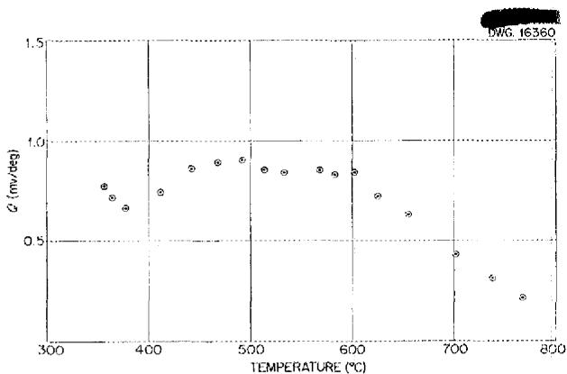  
Fig. 51. Potentials in Molten Sodium Hydroxide as a Function of Temperature Gradient.

In addition to the trials in which nickel oxide was added, several trials were made with sodium hydroxide alone. With hydrogen-fired electrodes and a helium atmosphere, it was found that the value of $Q$ was erratic and actually reversed its sign occasionally, which indicated that the cold electrode became negative. When this experiment was carried out in hydrogen, the value of $Q$ became negative after an initial positive interval, during which, presumably, traces of oxide were removed from the electrodes, and remained slightly negative during successive heating and cooling cycles.

It is evident that if some form of dissolved nickel, represented in these experiments by the added nickel oxide, is present in molten sodium hydroxide, which is in contact with nickel surfaces at different temperatures, a potential will develop that is of the proper sign to correspond to oxidation (attack) of the nickel metal at the hot surface and to reduction (deposition) of nickel at the cooler surface.

The process may be represented by the following equations:

$$
\begin{array}{l} \begin{array}{r l} \mathrm {N i (m e t a l)} & \longrightarrow (\mathrm {N i} ^ {+ +}) + 2 \text {e l e c t r o n s} \\ & \quad (\text {a t h o t s u r f a c e}), \end{array} \\ \begin{array}{r l}(\mathrm {N i} ^ {+ +}) + 2 \text {e l e c t r o n s}&\rightarrow \mathrm {N i} (\text {m e t a l})\\&(\text {a t c o l d s u r f a c e}).\end{array} \\ \end{array}
$$

Since little is known of the actual state of the nickel in these melts, the term $(\mathrm{Ni}^{+ + })$ must be interpreted as being some ion containing divalent nickel in a form capable of electrochemical equilibrium with metallic nickel.

The experiment with sodium hydroxide containing no added nickel oxide and a hydrogen atmosphere showed that under these conditions no concentration of dissolved ionic nickel develops

and, hence, no potential corresponding to metal transport is observed. The potential of opposite sign that was observed has not been clearly accounted for. It would appear to be dependent upon some process involving the hydrogen and sodium hydroxide, with the nickel electrodes serving only as carriers for the hydrogen gas and thus acting as hydrogen electrodes.

The measurement of the thermogalvanic potential appears to offer a fundamental method of studying the sodium hydroxide system apart from any participation by the electrode metal itself. It is significant in relation to the corrosion and metal transport processes that the use of a hydrogen atmosphere cleans up traces of nickel oxide and leaves the melt free of dissolved nickel and hence incapable of developing the potential corresponding to metal transport.

The work described establishes the existence of thermogalvanic potentials between nickel electrodes in fused sodium hydroxide containing dissolved nickel oxide. The potentials have been shown to be of such sign and magnitude as to be capable of accounting for transport of metallic nickel in nonisothermal nickel systems in which fused sodium hydroxide is circulated.

Mechanism of Fluoride Corrosion (A. des Brasunas, L. S. Richardson, Metallurgy Division). A number of tests intended to give a better understanding of fluoride corrosion has been completed. The postulate in the previous report(19) that the subsurface voids encountered during fluoride corrosion are caused by the outward diffusion of chromium atoms,

which leaves the metal enriched with vacant lattice sites that "precipitate" to form voids, has been substantiated repeatedly. It has been demonstrated when chromium is removed from the metal lattice by either high-temperature oxidation or high-temperature vacuum treatment. Conversely, corrosion tests made with fluoride containing small amounts of chromium powder have shown that void formation can be suppressed. The basis for this conclusion may be briefly summarized as follows:

1. Even with careful nonaqueous polishing, it has never been possible to retain particles in the porous surface region.   
2. Chemical analysis of the attacked metal surface has revealed a substantial loss in chromium (from 15 to less than $5\%$ ).(20)   
3. The chromium content of the fluoride was abnormally high in comparison with the nickel and iron contents, which indicated a preferential solution of chromium from the alloy.   
4. Calculations of void area anticipated from change in chromium content are in accord with observations.   
5. Depth of void formation bears a direct relationship to the amount of chromium in the bath.   
6. Attacked specimens show weight losses but no dimensional changes.   
7. Chromium loss from the alloy caused by either high-temperature oxidation or high-temperature vacuum treatment has also resulted in similar void formation.

8. Such voids have been observed previously(21,22) in diffusion experiments in which diffusion in one direction exceeded the extent of diffusion in the opposite direction.   
9. The addition of small amounts of chromium powder to saturate the fluoride bath with chromium has prevented void formation under conditions that otherwise favor void development.   
10. Fluorine is not detected below the metal surface.

The porous surface region of an Inconel metal specimen before and after exposure to molten fluoride is shown in Fig. 52. Many of the voids, especially those not in grain boundaries, have definite shapes that bear a relationship to the metal lattice. The inclusions shown in Fig. 52 are convenient sites for the deposition of vacancies; two such sites may be seen. The corrosion of Inconel by air is known to form a chromium-rich oxide layer at elevated temperatures. In a 200-hr exposure to air at $1200^{\circ}\mathrm{C}$ $(2192^{\circ}\mathrm{F})$ , the region beneath the oxide layer of an Inconel specimen was found to contain voids similar to those observed in fluoride-attacked Inconel (Fig. 53).

The high vapor pressure of chromium relative to that of iron or nickel suggests that high-temperature vacuum treatment would also be a suitable means of removing chromium. Inconel and an $80\%$ Ni- $20\%$ Cr alloy were exposed to a vacuum of 0.1 mm Hg for 42 hr at $1375^{\circ}\mathrm{C}$ . Both samples showed many subsurface voids; those in Inconel appeared to be spherical, whereas those in the $80\%$ Ni- $20\%$ Cr alloy were

angular, as shown in Fig. 54. Chemical analysis of the entire Inconel specimen indicated a drop in chromium content from about the usual $15\%$ to $9.2\%$ .

The mechanism of void formation in Inconel is therefore believed to occur in two stages. The first involves a loss of chromium atoms by diffusion to the metal surface and then into the fluoride bath. The resulting large number of vacant lattice sites is reduced to a more stable number by "precipitation" as illustrated in Fig. 55. For ease of illustration only six vacancies are shown to constitute a void. The number of vacant atoms involved in the voids shown in previous photomicrographs is of the order of $10^{12}$ atoms.

Tripositive Nickel Compounds from Hydroxide Corrosion (J. V. Cathcart, W. H. Bridges, L. D. Dyer, B. Borie, Metallurgy Division). Two new tripositive compounds of nickel have been identified as corrosion products of nickel attacked by sodium hydroxide in the presence of oxygen. The purpose of this investigation was twofold. First, in corrosion and mass transfer studies with the hydroxides, a variety of black and colored products has been obtained that do not correspond to any known nickel compounds. The occurrence of these products has been somewhat of a difficulty in the efforts to ascertain the mechanism of hydroxide corrosion. It was desired therefore to try to identify some of the more unusual corrosion products and determine some of their physical and chemical properties to aid in future identification and to give some clue as to how they might have been formed.

The second purpose of this investigation was to determine whether nickel ions of valence greater than 2 might occur in hydroxide melts.

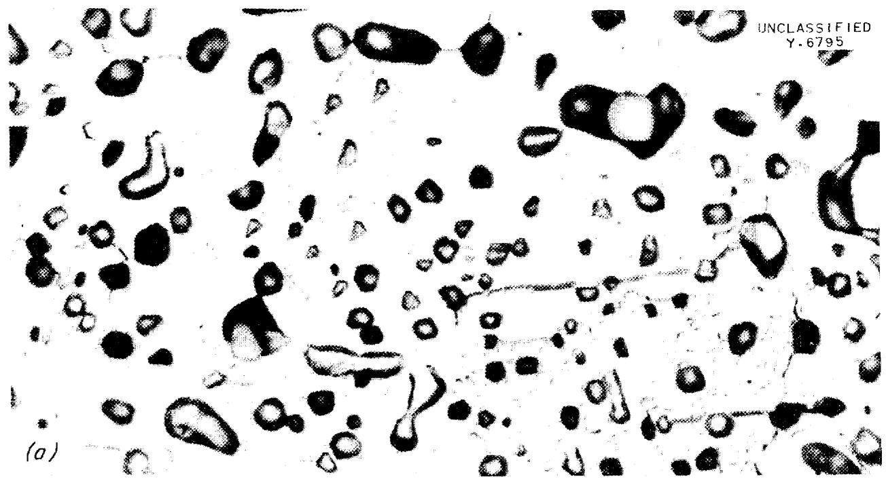

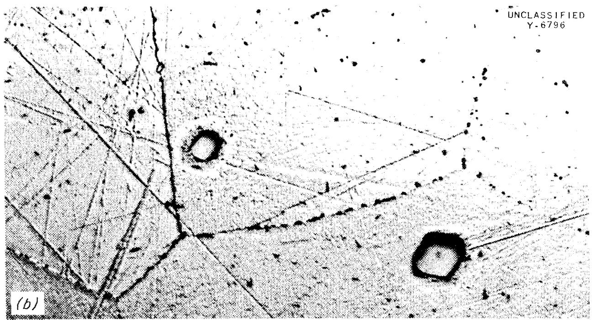  
Fig. 52. Voids Resulting from the Corrosion of Inconel by Fluorides. (a) Inconel specimen prior to fluoride attack. $2000\mathrm{x}$ . (b) Porous surface region of fluoride-attacked Inconel showing geometric-shaped voids and larger irregularly shaped voids in grain boundaries and around inclusions. $2000\mathrm{x}$ .

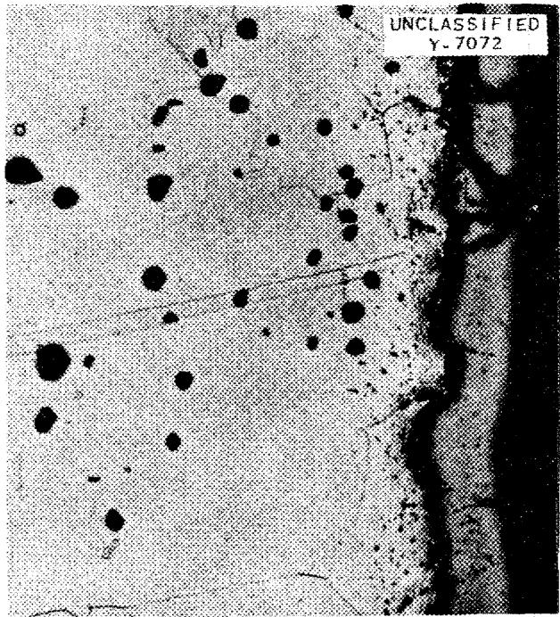  
Fig. 53. Voids Formed During Air Corrosion of Inconel at $1200^{\circ}\mathrm{C}$ . 250x.

These higher valence ions are required in the very ingenious mechanism of nickel mass transfer proposed about a year ago.(23) At that time the only nickel compounds of valence greater than 2 for which there was anything but the most tenuous evidence were four trivalent nickel oxyhydroxides and a hydrous oxide of quadrivalent nickel.

Briefly, the most important feature of the work was the preparation of two compounds whose empirical formulas are $\mathrm{NaNiO}_2$ and $\mathrm{LiNiO}_2$ . These compounds, which are named sodium nickelate(III) and lithium nickelate(III), have been identified by chemical analysis for nickel and for the alkali metals; by several chemical reactions, including

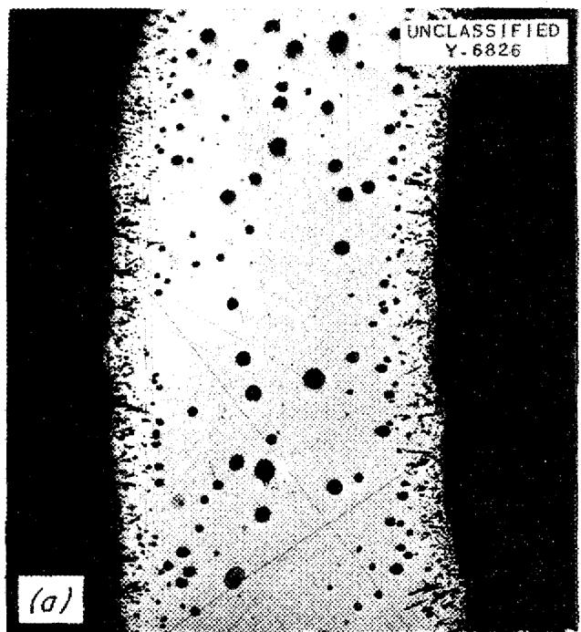  
Fig. 54. Voids in Inconel and an $80\%$ Ni-20% Cr Alloy After Vacuum Treatment at $1375^{\circ}\mathrm{C}$ . (a) Inconel. (b) 80% Ni-20% Cr Alloy. 50x

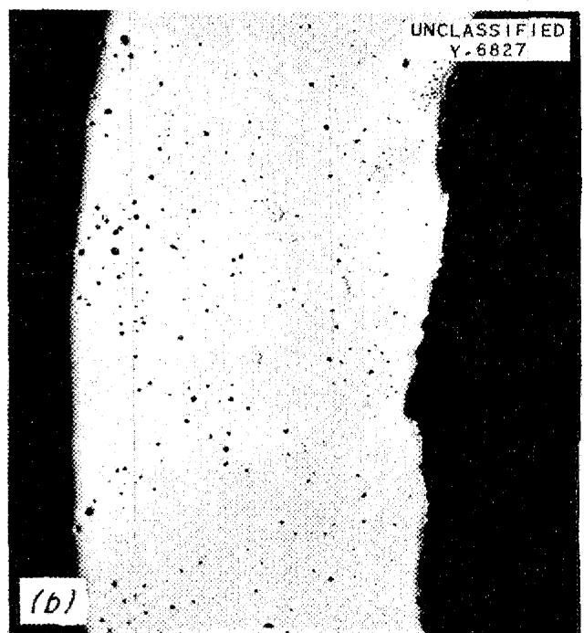

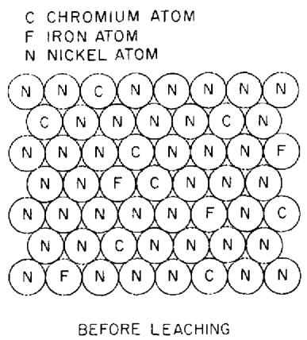

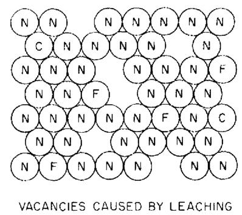

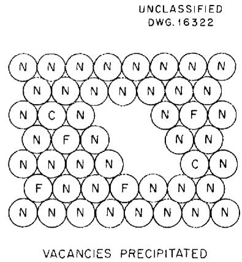  
Fig. 55. Sketch Illustrating Formation of Subsurface Voids by Removal of Chromium Atoms.

a quantitative determination of the oxidizing power; by a reaction that gives a known trivalent nickel compound; and by complete crystal structure analysis.

Solutions of Metals in Molten Halides (M. A. Bredig, J. W. Johnson, H. R. Bronstein, Chemistry Division). Considerable effort has been directed toward improving the experimental technique so that more accurate determinations can be made of the solubility of metals in the melts of their halides. With the improved technique, which does not appear to be subject to the previous objections, a solubility of 2.87 mole % potassium in the molten ternary eutectic LiF-NaF-KF at $880^{\circ}\mathrm{C}$ was obtained. The discrepancy with the value of 1.6 mole % reported previously, which is not too serious in view of the experimental difficulties, is thought to be due mainly to removal of potassium metal in the earlier experiments by leaching the salt phase with alcohol. The leaching may not, as intended, have been confined to the dissolution of metal not dissolved in the melt; the alcohol may also have attacked the metal dispersed in the solidified salt phase. Separation by alcohol leaching has been abandoned. Satisfactory separation of molten halide

and molten metal phases is now being achieved in capsules of improved design that incorporate a ball check valve between the lower part containing the salt phase and the upper part containing the metal phase and portions of the salt phase.

Among other halides systems, chlorides are receiving continued attention. In view of the possibility of chlorine isotope separation, such systems may even be of direct interest for reactor applications. In the sodium metal-sodium chloride system, an increasing solubility of the metal from amounts of the order of 1 mole $\%$ near the melting point of sodium chloride to amounts of 20 mole $\%$ $200^{\circ}\mathrm{C}$ above the melting point was observed. The disagreement of such comparatively high solubility with the solubility predicted by a current theory of metal-metal halide solutions is being studied. Possible relationships between changes in structure and volume upon melting of the molten halides and the solubility of metal in them are being investigated.

Fluoride Corrosion Phenomena (M. A. Bredig, H. R. Bronstein, J. W. Johnson, Chemistry Division). A misleading statement appears in the previous report (ORNL-1294, p. 130,

right column, fourth line from the top); instead of, "The heat of formation of $\mathbf{ZrF}_4$ , $\Delta F = 445 \pm 30 \mathrm{~kg} / \mathrm{cal}$ , is 10 times that of KF, and the equilibrium concentration of $\mathbf{FeF}_2$ at $1100^{\circ} \mathrm{K}$ , which is from $10^{-5}$ to $10^{-9}$ , is one-thousandth that of KF," it should read, "The free energy of

formation of $\mathbf{ZrF}_4$ , $\Delta F \approx -445 \pm 30$ kcal, yields for the equilibrium concentration of $\mathbf{FeF}_2$ at $1100^{\circ}\mathbf{K}$ ( $1500^{\circ}\mathbf{F}$ ) a value between $10^{-5}$ and $10^{-9}$ . The higher of these limits is ten times larger, and the lower one one-thousandth the $\mathbf{FeF}_2$ concentration in the case of corrosion by KF.

# 11. METALLURGY AND CERAMICS

W. D. Manly J. M. Warde

Metallurgy Division

A systematic study of the basic welding variables associated with the cone-arc welding process is being made. The effects of arc-current magnitude and arc-current duration on cone-arc welds are described in this report. The following welding specifications have been prepared for the joining of Inconel pipe and fittings for use with highly corrosive materials: procedure specifications for d-c inert-arc welding of Inconel pipe and fittings, and the operator's qualification specifications for d-c inert-arc welding of Inconel pipe and fittings.

The mechanical properties of high-temperature brazing alloys have been investigated, and the joint efficiency has been calculated by comparing the tensile strength of the brazed joint with the tensile strength of a specimen of the parent metal that has undergone the same temperature cycle as that used in brazing.

The preparation of the components for use in the ARE control and safety rods has been completed. Sixty of the $\mathrm{B_4C - Fe}$ inserts and 29 of the $\mathrm{Al}_{2}\mathrm{O}_{3} - \mathrm{P}_{4}\mathrm{C}$ inserts were made and canned by Microbrazing. The control rods and safety rods have been delivered to the ARE staff for calibration.

The effect of small differences in test temperature on the stress-rupture life and creep rate of Inconel has been studied. The creep properties of Inconel when tested in argon and air have been measured, and it was found that Inconel tested in an air atmosphere has a much longer stress-rupture life.

A satisfactory high-temperature ceramic coating has been applied to nickel sheet to be used in a liquid metal-to-air radiator. The possibility of the development of a glass-bonded beryllium oxide material for use as a reflector moderator is being investigated.

# CONTROL ROD FABRICATION

E. S. Bomar J. H. Coobs Metallurgy Division

The preparation of components to be used in the ARE regulating and safety rods, based on work outlined previously, (1) has been completed. A

total of 60 inserts composed of boron carbide and iron were pressed; 54 inserts were needed for three safety rods. Thirty-three cylinders composed of dilute mixtures of $\mathbf{B}_4\mathbf{C}$ and $\mathrm{Al}_{2}\mathrm{O}_{3}$ were fabricated for use in two control rods with different $\mathbf{B}_4\mathbf{C}$ investments. These two rods required 29 inserts. The surplus parts were prepared for use in case of breakage.

Only minor difficulties were encountered in producing the inserts. The first cylinders prepared cracked along their length during the cooling cycle following hot pressing. This difficulty was avoided by ejecting the graphite mandrel from the center of the slugs while they were still at temperature. Another difficulty involving differences in expansion coefficients was encountered when the first insert was sealed in a can by brazing.

The clearances originally set up were not adequate to allow for the expansion of the inner stainless steel liner when the assembly was heated to $1120^{\circ}\mathrm{C}$ for brazing. Consequently, the ceramic cylinder broke because of excessive internal loading. Increasing the inside diameter of the pressed cylinders by 0.015 in. prevented this type of failure during the canning operation. The percentage of $\mathbf{B}_4\mathbf{C}$ in the $\mathbf{B}_4\mathbf{C - Al}_2\mathbf{O}_3$ cylinders was increased to compensate for the decreased volume accompanying the increase in inside diameter. Densities of $80\%$ of those of the theoretical mixtures were obtained in pressing full-size parts of the two types of materials. The $\mathbf{B}_4\mathbf{C - Fe}$ cylinders were pressed with 2500 psi of pressure at 1520 to $1540^{\circ}\mathrm{C}$ . The $\mathbf{Al}_2\mathbf{O}_3\cdot \mathbf{B}_4\mathbf{C}$ inserts were compacted at the same pressure but were heated to $1650^{\circ}\mathrm{C}$ . In both instances graphited dies surrounded by bubble alumina insulation and an inert atmosphere of argon were used.

# MECHANICAL TESTING OF MATERIALS

R.B.Oliver J.W.Woods

D. A. Douglas G. M. Adamson

K. W. Reber

Metallurgy Division

Tests have been initiated to determine the effect of stress corrosion by molten fluoride salt mixtures on the creep rate and stress-rupture life of structural materials. The creep and stress-rupture tests in argon reported in the previous report(2) have continued, and new data for Inconel were obtained.

Physical Testing in Fluorides (G. M. Adamson, K. W. Reber, Metallurgy Division). In the physical testing program of the joint experimental engineering section of the ANP Division and the Metallurgy Division, NaF-KF-LiF-UF $_4$ continued to be the fluoride mixture tested. It will not be possible to test any of the zirconium-base fluorides in the present apparatus because of their high vapor pressures. When the emphasis was shifted from sodium to fluorides it was necessary to use the sodium-testing apparatus, since speed was a prime consideration of this program. The sodium-testing apparatus was constructed from types 316 and 347 stainless steel. Inconel was the material most likely to be used in the ARE, so it was the first material tested. The photomicrographs of specimens from the initial tests have been received, and they show that in every case in which the material was in the test for an appreciable length of time a mass-transferred layer appeared on the specimen. This is true of both the stress-rupture and tube-burst specimens. All work with Inconel has been stopped until Inconel pots and sample holders are obtained from the shop.

Inconel stress-rupture specimens have been tested in NaF-KF-LiF-UF $_4$ at $1500^{\circ}$ F under stresses of 6000 and 7000 psi. A plot of the rupture times of 131 and 94 hr falls on the line through previously obtained values. These tests were run in type 347 stainless steel pots. Stress-rupture tests of type 316 stainless steel samples are now being set up.

Several tube-burst tests have been run with type 316 stainless steel specimens. The rupture times obtained from these tests did not agree well and were much lower than expected. The tube-burst tests have consistently produced low results with both Inconel and type 316 stainless steel. Tests are now being set up with better temperature control to determine whether this is the difficulty.

An apparatus was designed for carrying out self-welding tests in the fluorides. The final design was an apparatus in which, by means of a simple adapter, the present stress-rupture equipment could be used. The apparatus will allow the two test specimens to be held apart until the fluorides have time to condition the surfaces. The specimens can then be brought together under any compressive load desired. Self-welding will be determined upon completion of the test by applying a tensile load while the apparatus is still hot. The stress necessary to separate the samples will be a measure of the amount of self-welding. This procedure would alleviate

the difficulties encountered in removing and cleaning the samples.

Creep and Stress-Rupture Tests in Argon. The stress vs. creep curves for fine- and coarse-grained Inconel sheet tested at $1500^{\circ}\mathrm{F}$ in argon presented in a previous report (3) have been revised and are presented in Figs. 56 and 57.

It has been suspected that a small difference in the test temperature could have a noticeable effect on the rupture time and perhaps also on the creep rate. Table 28 summarizes the data on tests now in progress at two temperatures.

The Inconel sheet specimens tested in argon exhibit a shorter rupture life than reported by the International Nickel Company for similar tests conducted in air. Two specimens are being tested in air to resolve this inconsistency. The data from these tests are summarized in Table 29.

# WELDING

P. Patriarca G. M. Slaughter Metallurgy Division

The systematic study of the cone-arc welding process is continuing with emphasis during the last quarter on

Table 28 CREEP AND STRESS- RUCTURE TESTS ON INCONEL IN ARGON  

<table><tr><td>TEMPERATURE (°C)</td><td>STRESS (psi)</td><td>TOTAL ELONGATION AT 1000 hr (%)</td><td>CREEP RATE (% per hr)</td></tr><tr><td>815</td><td>2000</td><td>0.5</td><td>0.0007</td></tr><tr><td>821</td><td>2000</td><td>2.0</td><td>0.0040</td></tr></table>

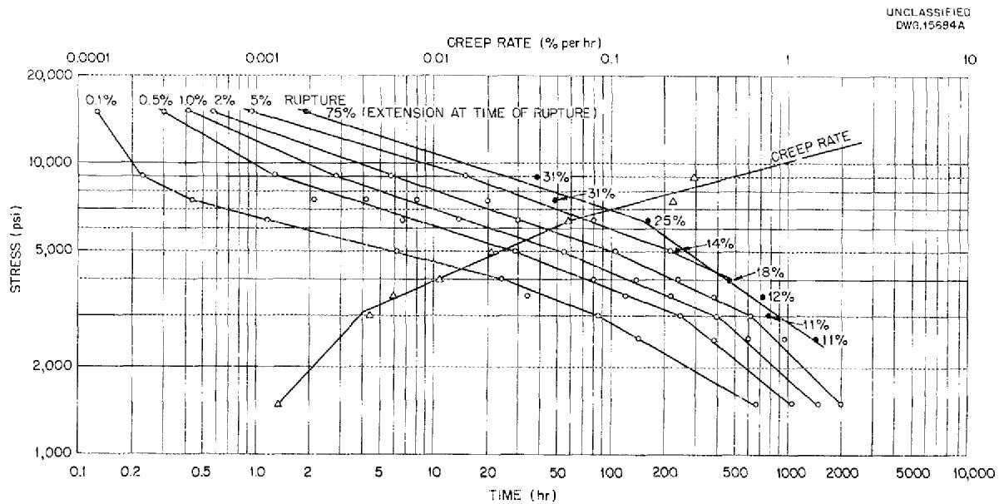  
Fig. 56. Stress vs. Creep Rate for Fine-Grained Inconel Sheet Cold Rolled at $1650^{\circ}\mathrm{F}$ and Tested in Argon at $1500^{\circ}\mathrm{F}$ . Grain size: approximately 90 grains per square millimeter, 0.105 mm in diameter. Times were measured for 0.1, 0.5, 1, 2, and 5% extension and rupture vs. stress. Extension measured optically.

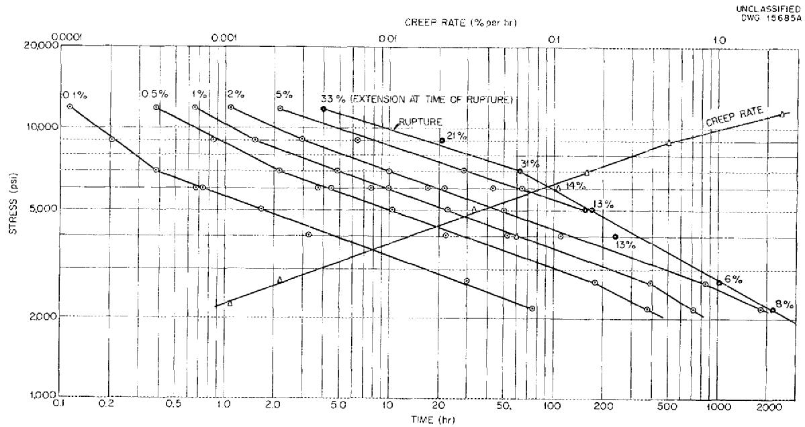  
Fig. 57. Stress vs. Creep Rate for Coarse-Grained Inconel Sheet Annealed for 1 hr at $2050^{\circ}\mathrm{F}$ and Tested in Argon at $1500^{\circ}\mathrm{F}$ . Grain size: approximately 15 grains per square millimeter, $0.250\mathrm{mm}$ in diameter. Times were measured for 0.1, 0.5, 1, 2, and $5\%$ extension and rupture vs. stress. Extension was measured optically.

Table 29   
COMPARISON OF RuptURE TIMES OBTAINED FOR INCONEL SHEET   

<table><tr><td rowspan="2">STRESS (psi)</td><td colspan="2">RUPTURE TIME (hr)</td><td rowspan="2">ORNL TEST IN AIR (time to date, hr)</td></tr><tr><td>ORNL Test in Argon</td><td>International Nickel Co. Test in Air</td></tr><tr><td>3500</td><td>700</td><td>6000</td><td>2475</td></tr><tr><td>4000</td><td>400</td><td>3000</td><td>1711</td></tr></table>

the effect of the initial surge on the resulting weld. Specifications have been prepared for the welding of components for the ARE.

Cone-Arc Welding. The feasibility of the application of the cone-arc welding process to fabrication of tube-to-header heat exchangers was determined by experiment in previous work.(4) It has been recognized, however, that the systematic determination of the behavior of the basic welding variables associated with the cone-arc welding process would contribute toward a better understanding of possible applications and limitations. The effects of arc-current magnitude and duration on the inside and outside diameters $(D_{i}$ and $D_{o})$ of the weld and on the minimum weld penetration $(P)$ have been determined. The initial arc current is generally of the order of $100\%$ greater than the steady-state value and is the subject of another study now in progress.

As in the previous work, the header configuration and material sizes consisted of 0.100-in.-OD, 0.010-in.-wall, type 316 stainless steel tubing and 0.125-in.-thick, type 316 stainless steel header sheets containing 19 tube holes drilled one diameter apart at the apex of an equilateral triangle, which was the basic pattern. All

tubes were set flush with the header surface prior to welding. A series of welds were made using the conditions outlined in Figs. 58 and 59, the variables being arc current and arc time, respectively.

Examination of Fig. 58 will reveal that the predominate effect of increasing arc current is to increase the value of $D_{o}$ . This, coupled with the relatively small increase in weld penetration $P$ and the equally small decrease in $D_{i}$ , indicates that the major portion of additional energy introduced as increasing arc current served to increase the ineffective weld area. It may be noted, however, that cone-arc welds may be made over a relatively wide range of conditions, but that operation in the higher current range should be avoided since greater header distortion becomes evident with higher energy input.

The results of a similar study are presented in Fig. 59, which presents arc time as the variable. The similarity of Figs. 58 and 59 is evident. Analysis of the curves in Fig. 59 will reveal that arc time is not a critical variable within the limits of 1.5 to 4.2 sec under the other welding conditions indicated.

Specifications for ARE Welding. The following specifications have been prepared for use in the fabrication of

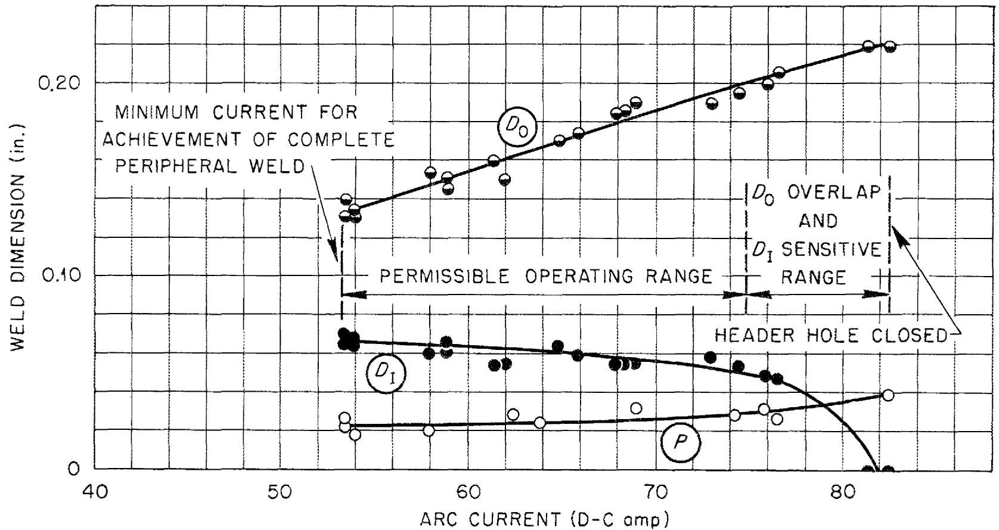  
Fig. 58. Effect of Arc Current on Cone-Arc Weld Parameters $D_{o}$ , $D_{i}$ , and $P$ .

Material: tubes, type 316 stainless steel, 0.10 in. OD, 0.010-in. wall header, type 316 stainless steel, 0.125 in. thick tube hole separation, 0.10 in. (one tube diameter)

Welding Conditions: arc time, 1.5 sec.  
arc distance, 0.05 in.  
high-thoria tungsten filament, 0.0625 in. in diameter (pointed)  
argon gas flow, 30 cfh

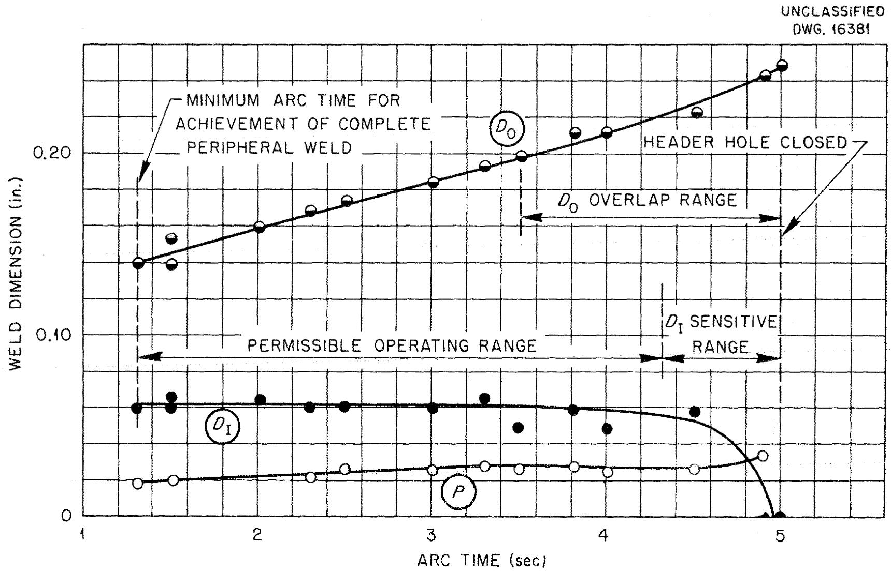  
Fig. 59. Effect of Arc Time on Cone-Arc Weld Parameters $D_{o}$ , $D_{i}$ , and $P$ .

Material: tubes, type 316 stainless steel, 0.10 in. OD, 0.010-in. wall header, type 316 stainless steel, 0.125 in. thick tube hole separation, 0.10 in. (one tube diameter)

Welding Conditions: arc current, 5.9 amp d.c. arc distance, 0.05 in. high-thoria tungsten filament, 0.0625 in. in diameter (pointed) argon gas flow, 30 cfh

the ARE: procedure specification for d-c inert-arc welding of Inconel pipe and fittings for high-corrosion applications; operator's qualification test specification for d-c inert-arc welding of Inconel pipe and fittings for high-corrosion applications.

# TESTS OF BRAZING ALLOYS

P. Patriarca G. M. Slaughter Metallurgy Division

The tensile strength and static corrosion tests of brazed joints are continuing. The corrosion tests are being extended to include static tests of brazed joints in moist air and tests of nickel joints in hydroxides. Brazing efficiencies as high as $92\%$ for butt-brazed joints have been demonstrated in tensile tests. The brazing of molybdenum is being investigated. An additional brazing research facility has been provided by the recent installation of a large G-E brazing furnace for dry-hydrogen brazing operations.

Static Corrosion Tests of Brazed Joints. The static corrosion testing of brazed joints for the high-temperature brazing alloy evaluation program is continuing. The $16.5\%$ Cr-10.0% Si-2.5% Mn-71.0% Ni alloy developed by the General Electric Company is attacked rather severely by the fluoride mixture NaF-KF-LiF-UF when brazed both on Inconel and type 316 stainless steel. Photomicrographs of these corroded joints are shown in Fig. 60.

Since A nickel has been found to be relatively unattacked in molten sodium hydroxide, static corrosion test specimens of this material brazed with several of the promising alloys have been prepared. Examination of the

samples has not been completed, but several photomicrographs of the asbrazed joints, particularly the joint brazed with $60\%$ Pd, $40\%$ Ni, and Microbraz, show excellent wettability and flow characteristics.

The resistance of brazed joints to oxidation at high temperature is an important factor, so tests are being conducted on brazed joints to determine the amount of deterioration. Butt-brazed joints of Inconel, type 316 stainless steel, and A nickel have been prepared by using several of the brazing alloys being investigated. Many of these have been tested in an atmosphere of moist air at $1500^{\circ}\mathrm{F}$ , but metallographic examination of these joints is in the preliminary stage. Effects of oxidation at higher temperatures will also be investigated, but the tests are presently being run to provide a source for the screening of the less desirable alloys.

Tensile Strength of Brazed Joints. In order that an approximate tensile strength of joints butt-brazed with the $60\%$ Pd- $40\%$ Ni alloy could be obtained, a few preliminary tensile tests were made on these joints prior to a more thorough investigation, pending the arrival of an appropriate high-temperature extensometer. Standard tensile bars 0.505 in. indiameter were machined from butt-brazed type 316 stainless steel tensile blanks. Three tensile bars were tested at room temperature and three were tested at $1500^{\circ}\mathrm{F}$ . Test bars of type 316 stainless steel, which were subjected to heating cycles similar to the brazing cycles, were also pulled as check samples on the strength of the parent metal. The results of these tests are summarized in Table 30.

The fracture of the butt-brazed joint at room temperature occurred along the diffusion zone of the joint.

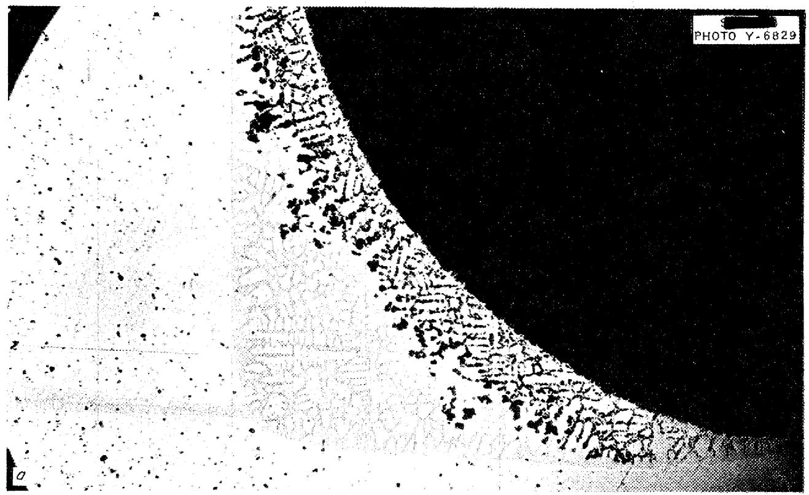

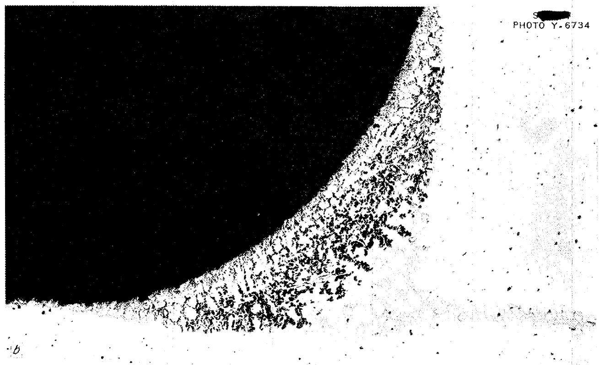  
Fig. 60. Joints Brazed With $16.5\%$ Cr-10.0% Si-2.5% Mn-71.0% Ni Alloy and Tested in NaF-KF-LiF-UF4 (10.9-43.5-44.5-1.1 mole %) for 100 hr at $1500^{\circ}\mathrm{F}$ . (a) Type 316 stainless steel joint showing moderate attack of the brazing alloy. (b) Inconel joint showing severe attack of the alloy. Unetched. 75X.

Table 30   
TENSILE STRENGTH OF TYPE 316 STAINLESS STEEL BRAZED WITH $60\%$ Pd-40% Ni ALLOY   

<table><tr><td rowspan="2">TEMPERATURE (°F)</td><td colspan="2">CHECK BARS</td><td colspan="2">BRAZED JOINT</td><td rowspan="2">BRAZING EFFICIENCY (%)</td></tr><tr><td>Tensile Strength (psi)</td><td>Elongation (%)</td><td>Tensile Strength (psi)</td><td>Elongation (%)</td></tr><tr><td>Room</td><td>75,400</td><td>40.0</td><td>82,000</td><td>75.0</td><td>92</td></tr><tr><td>1500</td><td>22,400</td><td>18.4</td><td>25,600</td><td></td><td>87</td></tr></table>

The fracture of the joint brazed at $1500^{\circ}\mathrm{F}$ resulted in a more ragged surface and occurred frequently along the braze metal-base metal interface. However, all these data suggest that the $60\%$ Pd- $40\%$ Ni alloy is very promising, although it is still extremely desirable to strive for lowering of the melting point by alloying.

Only one brazing alloy has been investigated by using the larger 0.252-in.-dia butt-brazed tensile bars. A high-temperature extensometer designed for use with this size of specimen has arrived, and work on this phase of the brazing alloy evaluation program should proceed much more rapidly. A series of tensile tests at room temperature and at $1500^{\circ}\mathrm{F}$ were completed for Inconel brazed with the $75\%$ Ag- $20\%$ Pd- $5\%$ Mn alloy. The Inconel check bar has not yet been tested. At room temperature, the average tensile stress of the brazed joint was 55,900 psi, and the average elongation in a 1-in. gage length was $9\%$ . At $1500^{\circ}\mathrm{F}$ the average tensile stress of the brazed joint was 19,700 psi, and the average elongation was $2.5\%$ . These results apparently mean that the brazed joint decreases in strength with increasing temperature more rapidly than does the base Inconel. The elongation of the base metal is quite large at room temperature, whereas at $1500^{\circ}\mathrm{F}$ there is very little elongation.

Brazing of Molybdenum. In view of the interest shown in the fabrication of molybdenum, it was decided to conduct a limited program on the brazing of this metal with the various high-temperature alloys presently being investigated. The wettability characteristics of the various brazing alloys on bright-annealed molybdenum sheet in a dry-hydrogen atmosphere are listed in Table 31.

A further indication of the strength of molybdenum brazed joints should be obtained from the tensile test specimens to be prepared in future work. If a small quantity of ductile molybdenum can be obtained, tensile tests will be made on this material, since more reliable data should result.

Dry-hydrogen Brazing Furnace. A 24-kw, 312-amp, G-E brazing furnace has been installed for use in dry-hydrogen brazing operations. A "Square D" stainless steel muffle, welded shut at one end, was built into this furnace for the purpose of obtaining the atmospheres required for many furnace-brazing problems. The physical dimensions of this muffle are such as to accommodate a sample of the following dimensions: width at base, 6 in.; height at center, 5 in.; length to be heated at one time, approximately 4 ft (hot zone of furnace); total length, approximately 9 ft (includes a 5-ft cooling chamber). A stainless

Table 31   
WETTABILITY CHARACTERISTICS OF VARIOUS BRAZING ALLOYS ON BRIGHT-ANNEALED MOLYBDENUM SHEET IN A DRY-HYDROGEN ATMOSPHERE  

<table><tr><td>BRAZING ALLOY</td><td>WETTING PROPERTIES</td></tr><tr><td>60% Pd-40% Ni</td><td>Excellent</td></tr><tr><td>Nicrobraz</td><td>Fair</td></tr><tr><td>16.5% Cr-10.0% Si-2.5% Mn-71.0% Ni</td><td>Good</td></tr><tr><td>50% Pd-40% Ni-10% Mn</td><td>Very good</td></tr><tr><td>40% Pd-40% Ni-20% Mn</td><td>Good</td></tr><tr><td>60% Pd-37% Ni-3% Si</td><td>Excellent</td></tr><tr><td>73.5% Ni-16.5% Cr-10.0% Si</td><td>Excellent</td></tr><tr><td>75% Ag-20% Pd-5% Mn</td><td>Excellent</td></tr><tr><td>64% Ag-33% Pd-3% Mn</td><td>Excellent</td></tr></table>

steel pipe was welded into the sealed end of the muffle to permit the entry of dry hydrogen.

A system, Fig. 61, for providing a dry-hydrogen atmosphere is attached to this furnace. Included in this system is a nitrogen cylinder (to purge the hydrogen lines of air), a Deoxo Duridryer, and a Lectrodryer dehumidifier. The dryer converts oxygen to water and the dehumidifier removes the water. Dew points of $-120^{\circ}\mathrm{F}$ can be obtained, although $-60^{\circ}\mathrm{F}$ is satisfactory for most applications.

When the need arises for the furnace brazing of assemblies larger than the stainless steel muffle permits, it is convenient to use canning techniques. Such techniques consist of enclosing the assembly in a stainless steel can, which is then welded shut. Stainless steel entrance and exit tubes are provided in the can for the hydrogen

flow. With the controlled atmosphere located entirely in the stainless can, any furnace of proper size and temperature limits can be used as the source of heat. The sodium-to-air heat exchanger, Fig. 62 (approximate dimensions, 12 by 6 by 8 in.) is typical of the assemblies that can be brazed by this canning technique.

Nicrobraz powder was placed on all of the joints, including approximately 2500 tube-to-baffle plate joints. Good hydrogen flow over the entire assembly was needed for proper flow of the brazing alloy, and it is expected that a series of baffle plates inside the can will be required to attain this flow for brazing of similar, but larger, heat exchanger units.

# REDUCTION OF MOLYBDENUM DISULFIDE

G. P. Smith, Metallurgy Division

Simple thermodynamic calculations have been made in an effort to determine in a preliminary fashion the

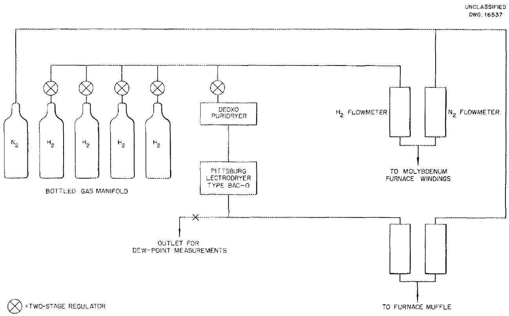  
Fig. 61. Manifold System for Dry-Hydrogen Furnace Brazing.

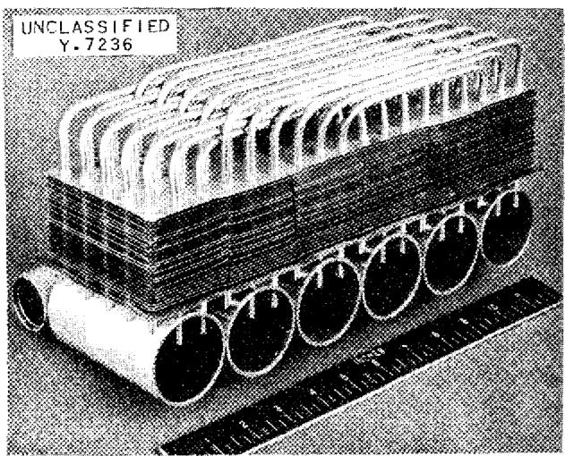  
Fig. 62. Heat Exchanger Test Unit Microbrazed by Canning Technique.

possibility of reducing molybdenum disulfide with hydrogen or zinc. These calculations show that flowing hydrogen should be capable of reducing molybdenum disulfide at temperatures in the neighborhood of $1000^{\circ}\mathrm{C}$ . Solid zinc is thermodynamically capable of reducing molybdenum disulfide and would probably work as well as molten zinc.

The reduction of molybdenum disulfide by hydrogen would be accomplished by the following reaction:

$$
\mathrm {M o S} _ {2} + 2 \mathrm {H} _ {2} = \mathrm {M o} + 2 \mathrm {H} _ {2} \mathrm {S},
$$

from which

$$
p _ {\mathrm {H} _ {2} \mathrm {S}} = p _ {\mathrm {H} _ {2}} K,
$$

where $p$ is the equilibrium pressure and $K$ is the appropriate equilibrium constant, as implicitly defined by the above equation. Values of $K$ are given by Kelley.(8)

For a hydrogen pressure of 760 mm the equilibrium pressure of $\mathrm{H}_2\mathrm{S}$ at $910^{\circ}\mathrm{C}$ is 6.65 mm, and at $1100^{\circ}\mathrm{C}$ it is 14.5 mm. These are quite appreciable pressures, and it should be easy to reduce molybdenum disulfide at these temperatures if the reaction rate is at all reasonable. It would be necessary to remove $\mathrm{H}_2\mathrm{S}$ from the reacting mixture, but this could be accomplished with a current of hydrogen.

The reduction of molybdenum disulfide by zinc can be represented by the following equation:

$$
\mathrm {M o S} _ {2} + 2 \mathrm {Z n} \longrightarrow \mathrm {M o} + 2 \mathrm {Z n S}.
$$

The standard free energy change for this reaction in the case of solid zinc may be obtained from the data given by Kelley. (9)

$$
\begin{array}{l} \Delta F ^ {\circ} = - 2 8, 3 4 0 - 2. 5 6 T \log T + 2. 4 0 \times 1 0 ^ {- 3} T ^ {2} \\ + 2. 1 9 8 \times 1 0 ^ {- 5} T ^ {- 1} + 9. 1 2 T. \\ \end{array}
$$

Thus at $25^{\circ}\mathrm{C}$ , $\Delta F^{\circ} = -26.6\mathrm{kcal / g}$ -atom of $\mathsf{MoS}_2$ . The standard free energy equation does not exist, and calculations of $\Delta F^{\circ}$ at elevated temperatures would quantitatively be somewhat deceiving. However, the reduction is thermodynamically possible at $25^{\circ}\mathrm{C}$ , and the $\Delta F^{\circ}$ is sufficiently substantial to warrant consideration of this method of reduction at elevated temperatures.

# CERAMICS RESEARCH

J. M. Warde, Metallurgy Division

A ceramic coating to inhibit oxidation at elevated temperatures has been successfully applied to nickel to be used in the construction of a radiator for the ANP. Beryllium oxide shapes for use in ANP reactor experiments have been made and fired at the U. S. Bureau of Mines Electrotechnical Laboratory at Norris, Tennessee. Preliminary work on the development of a glass-bonded beryllium oxide material for use as a reflector-moderator for a liquid-cycle aircraft reactor was completed.

Ceramic Coatings for Metals. Further work was carried out on the application of a ceramic coating to nickel to provide oxidation resistance at elevated temperatures. Successful application of such a coating would make it possible to use nickel in a radiator. It was found that by annealing specimens of pyrometallurgical nickel, 10 mils thick, in an atmosphere of wet hydrogen for 65 hr at $1000^{\circ}\mathrm{C}$ , good adherence was obtained with National Bureau of Standards ceramic coating A-418, 1 to 2 mils thick, applied at $1700^{\circ}\mathrm{F}$ . The frit composition of this coating has been described in a previous report.(10) Specimens coated with the A-418 composition showed no signs of oxidation in a 9-day oxidation test at $1500^{\circ}\mathrm{F}$ . It is proposed that in the near future this coating be applied to actual radiator parts fabricated from nickel.

Ceramic Reflector. To satisfy the requirements for an efficient and economical material for use as a reflector-moderator for a liquid-cycle aircraft reactor, a glass-bonded beryllium oxide material has been proposed. This material would have

nearly zero porosity and would contain a minimum of 75 mole $\%$ beryllium oxide. The glass forming the bond would also contain a small amount of beryllium oxide, consistent with viscosity requirements for fabrication. Simulated mixes using soda-lime-silica glass and silica sand were prepared on a small scale, and it was determined that such a material could be made successfully. The density of a selected, glass-bonded beryllium oxide, reflector-moderator material was determined as $2.6\mathrm{g / cc}$ . It is proposed that the reflector be cooled by metal pipes embedded in the

glass-bonded beryllium oxide. The pipes would contain flowing sodium as a coolant, and once the glass-bonded beryllium oxide had been poured into the shell and had flowed around the cooling pipes, the reactor shell would not be allowed to cool below a temperature just above the annealing range of the glass bond. Further refinements and engineering tests will be made, should this material be of interest. Among these would be the determination of the devitrification tendency of the glassy matrix and the corrosion effect of the glass with selected metals.

# 12. HEAT TRANSFER AND PHYSICAL PROPERTIES RESEARCH

# H. F. Poppendiek, Reactor Experimental Engineering Division

Viscosity measurements have been made for two zirconium-bearing fluoride fuel mixtures. For the probable ARE fuel $\mathrm{NaF - ZrF_4 - UF_4}$ (46-50-4 mole %) the viscosities range from 20 centipoises at about $580^{\circ}\mathrm{C}$ to 7 centipoises at about $830^{\circ}\mathrm{C}$ , and for the fuel $\mathrm{NaF - ZrF_4 - UF_4}$ (50-46-4 mole %) the viscosities range from 17 centipoises at about $580^{\circ}\mathrm{C}$ to 6 centipoises at about $830^{\circ}\mathrm{C}$ . A capillary viscometer is being assembled and will be used to obtain data to supplement the data from the existing viscometers,

Some preliminary thermal conductivity experiments on the fuel NaF-KF-LiF-UF $_4$ (10.9-43.5-44.5-1.1 mole %) have yielded the conductivity value 2.2 ± 0.2 Btu/hr $\cdot$ ft $^2$ ( $^\circ$ F/ft) over the temperature range 500 to $750^{\circ}\mathrm{C}$ . The vapor pressures of $\mathsf{ZrF_4}$ and $\mathsf{ZrF_4}$ -bearing fuel mixtures are being determined. Zirconium tetrafluoride is the most prevalent vapor phase above $\mathsf{ZrF_4}$ -bearing fuel to the extent of about 10 mm Hg at $800^{\circ}\mathrm{C}$ . Enthalpy and heat capacity have been determined for lithium hydroxide.

Experimental, forced-convection, heat transfer data for molten sodium hydroxide flowing turbulently in circular tubes were represented by the equation

$$
\mathrm {N u} = 0. 0 2 1 \mathrm {R e} ^ {0} \cdot^ {8} \mathrm {P r} ^ {0} \cdot^ {4}
$$

over the Reynolds number range of 6,000 to 12,000. This equation is within $9\%$ of the one normally used to describe convective heat transfer of ordinary fluids. Information on thermal entrance lengths was also determined.

Some experimental, pool-boiling data for a mercury system have been obtained for several pressure levels and two different kinds of heat-transfer-surface materials.

Heat and momentum transfer analyses have been made for the ANP thermal-convection harps for predicting the liquid circulation velocities. This information is needed in the interpretation of the harp corrosion results. In the one case examined, the circulation velocity was approximately 0.1 ft/sec.

# VISCOSITY OF FUEL MIXTURES

The viscosities of two $\mathrm{ZrF_4}$ -bearing fuel mixtures have been determined on the rotational viscometer. Some viscosity measurements are now being made for NaOH and $\mathrm{NaNO}_3$ by using the efflux viscometer. In addition, the importance of viscosity of fuel and moderator-coolant mixtures in design of the ARE components has prompted study of additional methods for determination of this property at high temperatures. An improved capillary viscometer has been constructed. Also, a new structure has been completed that will permit the operation of the Brookfield viscometer, the efflux viscometer, and the density device when working with toxic materials.

NaF-ZrF4-UF4 Fuels (R. F. Redmond, D. F. Smith, T. N. Jones, Reactor Experimental Engineering Division). Viscosity measurements have been made with the Brookfield rotational viscometer for the zirconium-bearing fuel mixtures NaF-ZrF4-UF4 (46-50-4 mole %) and NaF-ZrF4-UF4 (50-46-4 mole %), and they have been plotted in Fig. 63. The viscosities of both mixtures are

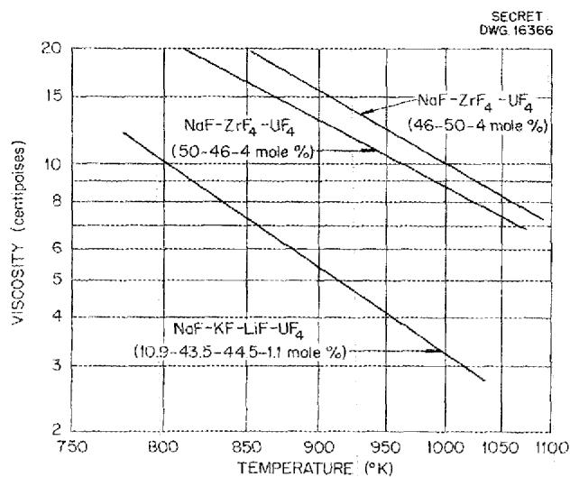  
Fig. 63. Viscosity of NaF-ZrF $_4$ -UF $_4$ Salt Mixtures.

approximately twice as high as that of the NaF-KF-LiF-UF4.

Capillary Viscometer (F. A. Knox, N. V. Smith, F. Kertesz, Materials Chemistry Division). The method employed in the capillary viscometer consists of forcing the liquid through the measuring tube with the help of a vacuum pump, which establishes a pressure differential between the outside and inside liquid surfaces. The pressure difference is automatically stabilized at predetermined levels through a circuit that has leads into a mercury manometer. The liquid travels upward through the calibrated tube and reaches a wider tube in which three electrically insulated metal probes are immersed. The time elapsed between reaching a lower and a higher level is measured with an electric timer connected to these leads. Upon completion of the time measurement, a relay closes the valve to the vacuum pump and opens a valve to compressed argon, the pressure of which can also be regulated. The liquid is then forced back to its original position and the apparatus is ready for another measurement. The temperature is regulated and recorded during the experiment with a Micromax recorder. A 5-gal container is used to reduce the pressure fluctuations of the vacuum pump. During the whole operation the surface of the melt is protected with a blanket of argon from contamination by the air.

Preliminary trials with the apparatus have indicated satisfactory performance. Calibration studies utilizing a number of fused salts are now in progress. In the only experiment to date on material of interest, the viscosity of the mixture containing 50 mole % NaF, 46 mole % ZrF₄, and 4 mole % UF₄ was found to be about 13 centipoises at

$600^{\circ}\mathrm{C}$ and about 4 centipoises at $800^{\circ}\mathrm{C}$ . These data must be considered tentative until the calibration studies are completed and evaluated.

# THERMAL CONDUCTIVITY OF LIQUIDS

L. Cooper S. J. Claiborne

W. D. Powers R. M. Burnett

Reactor Experimental Engineering

Division

Preliminary thermal conductivity values have been obtained for the fuel NaF-KF-LiF- $\mathbf{U}\mathbf{F}_4$ by using apparatus described previously.2 The values obtained and some of the data on the fused salts studied previously are given in Table 32.From the data of Table 32 it appears that the thermal conductivity increases as the percentage concentration of the heavy $\mathbf{U}\mathbf{F}_4$ compound is decreased in the salt mixture.The $\mathbf{ZrF_4}$ -bearing fuels are currently being studied.

A thermal conductivity device (a modification of apparatus previously described for use with solids) that is particularly useful for studying liquid metals has been used to check values for liquid sodium; the measurements obtained were within $20\%$ of the

values given in the literature. Preliminary data for the lead-bismuth eutectic have been obtained. Lithium is currently being studied.

A transient hot-wire method is being studied in connection with thermal conductivity measurements. This method, which involves imposing a transient temperature distribution on a wire surrounded by the fluid to be investigated, appears to be well suited to the study of the molten fluorides and hydroxides.

# HEAT CAPACITY

W. D. Powers C. G. Blalock

Reactor Experimental Engineering

Division

The enthalpy and the heat capacity of lithium hydroxide have been determined by Bunsen ice calorimeters for the temperature range of 500 to $900^{\circ}\mathrm{C}$ and are given by the equations

$$
H _ {T} (\text {l i q u i d}) - H _ {0 ^ {\circ} \mathrm {C}} (\text {s o l i d}) = 0. 8 5 T + 1 1 0, \tag {1}
$$

$$
c _ {p} = 0. 8 5 \pm 0. 0 6, \tag {2}
$$

where $H$ is in $\mathrm{cal} / \mathrm{g}$ , $T$ in ${}^{\circ}\mathrm{C}$ , and $c_{p}$ in $\mathrm{cal} / \mathrm{g}^{\circ}\mathrm{C}$ .

Some of the 12-in. heating furnaces for the calorimeters have been replaced by 24-in. furnaces that have yielded more uniform capsule temperatures; this modification has reduced

Table 32   
THERMAL CONDUCTIVITY VALUES FOR VARIOUS FLUORIDE SALT MIXTURES   

<table><tr><td>FLUORIDE SALT MIXTURE</td><td>COMPOSITION (mole %)</td><td>THERMAL CONDUCTIVITY, Btu/hr·ft2(°F/ft)</td></tr><tr><td>NaF-KF-UF4</td><td>46.5-26.0-27.5</td><td>0.53 at 550°C &lt; t &lt; 750°C</td></tr><tr><td>NaF-KF-LiF-UF4</td><td>10.9-43.5-44.5-1.1</td><td>2.0 to 2.5 at 500°C &lt; t &lt; 750°C</td></tr><tr><td>NaF-KF-LiF</td><td>11.5-42.0-46.5</td><td>2.6 at 500°C &lt; t &lt; 750°C</td></tr></table>

the scatter of the enthalpy data. Several fluoride fuels with $\mathrm{Sr(OH)}_2$ added and the LiCl-KCl eutectic are currently being studied.

# DENSITY

D. F. Smith

Reactor Experimental Engineering Division

Preliminary density data on NaF-ZrF $_4$ -UF $_4$ (46-50-4 mole %), NaF-ZrF $_4$ -UF $_4$ (50-46-4 mole %), $\mathrm{NaNO}_3$ , and molten NaOH are being obtained. A mean value for the density of the 50-46-4 mole % mixture at $640^{\circ}\mathrm{C} < t < 870^{\circ}\mathrm{C}$ is 3.3 g/cc. The BeF $_2$ -bearing mixtures are to be studied next.

# VAPOR PRESSUREOFFUELCONSTITUENTS

R. E. Moore

Materials Chemistry Division

The vapor-pressure data for solid $\mathbf{ZrF}_4$ and for two typical $\mathbf{ZrF}_4$ -bearing fuel mixtures have been obtained during the past quarter by use of techniques and apparatus previously described.(4,5,6)

Zirconium Tetrafluoride. Since salt mixtures containing $\mathbf{ZrF_4}$ are under consideration as fuels, and since $\mathbf{ZrF_4}$ is the only important component of the vapor phase above these molten salt mixtures, a determination of the vapor pressure of solid zirconium tetrafluoride was made in the temperature range 722 to $854^{\circ}C$ . The

data, given in Table 33, may be represented by the equation

$$
\log P (\mathrm {m m} \mathrm {H g}) = - \frac {1 1 3 2 0}{T (^ {\circ} \mathrm {K})} + 1 2. 4 6.
$$

The heat of sublimation is 52 kcal/mole and the sublimation point is $908^{\circ}\mathrm{C}$ , as calculated from the equation. The value for the sublimation point is in fair agreement with the estimate $(927^{\circ}\mathrm{C})$ found in the literature.(7)

# Table 33

VAPOR PRESSURE OF ZIRCONIUM TETRAFLUORIDE   

<table><tr><td>TEMPERATURE (°C)</td><td>OBSERVED PRESSURE (mm Hg)</td></tr><tr><td>722</td><td>13.5</td></tr><tr><td>741</td><td>21</td></tr><tr><td>743</td><td>22</td></tr><tr><td>754</td><td>27</td></tr><tr><td>776</td><td>43</td></tr><tr><td>777</td><td>48</td></tr><tr><td>778</td><td>45.5</td></tr><tr><td>854</td><td>278</td></tr></table>

Zirconium-Bearing Fluoride Mixtures. In a previous report (6) the vapor pressure of a mixture containing 42 mole $\%$ ZrF₄, 51 mole $\%$ KF, 5 mole $\%$ NaF, and 2 mole $\%$ UF₄ was reported. Since then interest has centered on the system ZrF₄-NaF-UF₄, and vapor pressure data for two compositions in this system have been obtained.

The data for the solution containing 50 mole $\%$ ZrF $_4$ , 46 mole $\%$ NaF, and 4 mole $\%$ UF $_4$ are given in Table 34. The equation

$$
\log P (\mathrm {m m H g}) = - \frac {8 0 9 5}{T (^ {\circ} \mathrm {K})} + 8. 5 5 6
$$

(7)L. L. Quill (ed.), The Chemistry and Metallurgy of Miscellaneous Materials: Thermodynamics, McGraw-Hill, New York, 1950.

best represents the data. The calculated heat of vaporization is 37 kcal/mole.

Table 34   
VAPOR PRESSUREOF MIXTURECONTAINING 50mole $\%$ ZrF4，46mole $\%$ NaF,and 4mole $\%$ UF   

<table><tr><td>TEMPERATURE (°C)</td><td>OBSERVED PRESSURE (mm Hg)</td></tr><tr><td>807</td><td>12</td></tr><tr><td>842</td><td>21</td></tr><tr><td>876</td><td>31</td></tr><tr><td>907</td><td>45</td></tr><tr><td>936</td><td>72</td></tr><tr><td>940</td><td>84</td></tr></table>

Vapor pressure data for the solution containing 46 mole $\%$ ZrF, 50 mole $\%$ NaF, 4 mole $\%$ UF are presented in Table 35. The equation

$$
\log P (\mathrm {m m H g}) = - \frac {7 6 3 0}{T (^ {\circ} K)} + 7. 9 8 8
$$

was obtained from the data. The heat of vaporization as calculated from the equation is 35 kcal/mole. An increase of 4 mole $\%$ ZrF $_4$ content results in a considerable increase in vapor pressure. It seems likely that, since ZrF $_4$ is by far the most volatile component of the mixtures being considered, the vapor pressure will, in general, increase with increasing ZrF $_4$ content, although probably not in a regular fashion.

Table 35   
VAPOR PRESSURE OF MIXTURE CONTAINING 46 mole $\%$ ZrF $^4$ ，50 mole $\%$ NaF,and 4 mole $\%$ UF  

<table><tr><td>TEMPERATURE (°C)</td><td>OBSERVED PRESSURE (mm Hg)</td></tr><tr><td>807</td><td>8</td></tr><tr><td>858</td><td>17</td></tr><tr><td>872</td><td>22</td></tr><tr><td>906</td><td>33</td></tr></table>

# CONVECTIVE HEAT TRANSFER IN MOLTEN SODIUM HYDROXIDE

H. W. Hoffman J. Lones

Reactor Experimental Engineering

Division

Final results have been obtained from the turbulent forced-convection heat transfer experiment in which molten sodium hydroxide flowed through a circular tube. The apparatus was described in detail in previous reports.(8) The experimental data for the region of fully established flow are correlated by the equation

$$
\mathrm {N u} = 0. 0 2 1 \mathrm {R e} ^ {0. 8} \mathrm {P r} ^ {0. 4}
$$

for a Reynolds modulus range of 6,000 to 12,000 and temperatures between 700 and $900^{\circ}\mathrm{F}$ . This equation is compared with the McAdams' equation for the heating and cooling of ordinary fluids (fluids other than the liquid metals) in Fig. 64. The curve lies $9\%$ below the McAdams' correlation.

(8) H. W. Hoffman and J. Lones, op. cit., ORNL-1294, p. 152, and Aircraft Nuclear Propulsion Project Quarterly Progress Report for Period Ending March 10, 1952, ORNL-1227, p. 161.

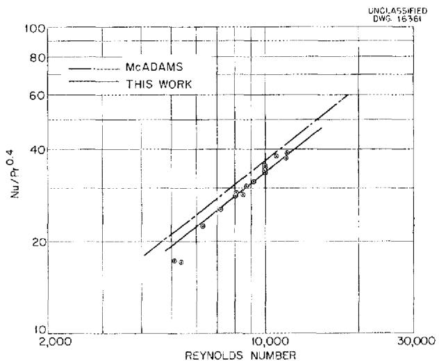  
Fig. 64. Experimental Heat Transfer Coefficients for Sodium Hydroxide.

Thermal entrance lengths were obtained for each run. This length is defined as the distance from the entrance of the test section, in terms of tube diameters, at which the local heat transfer coefficient, or conductance, reaches a value within a given percentage of the established value. A $10\%$ value was used here. Figure 65 presents the thermal entrance length as a function of the Peclet modulus (Reynolds modulus times Prandtl modulus).

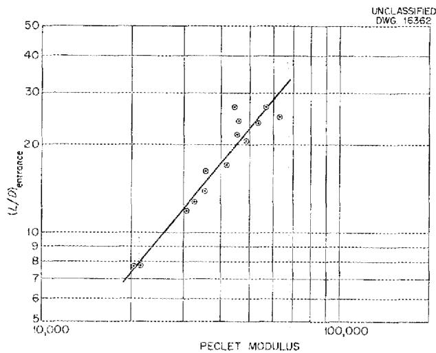  
Fig. 65. Thermal Entrance Length for Molten Sodium Hydroxide.

A new apparatus to be used to determine the convective conductances for the NaF-KF-LiF mixture is now being assembled. This system is similar to the one used in the sodium hydroxide experiment. Owing to the corrosive nature of the NaF-KF-LiF mixture, all system components except the test section are constructed of Inconel. The test section will be made of nickel tubing because the proper size of Inconel tubing is not available.

# BOILING HEAT TRANSFER IN MERCURY

W. S. Farmer Reactor Experimental Engineering Division

Further measurements have been obtained on free-convection boiling of mercury from horizontal surfaces. The experimental heat transfer vs. temperature difference data are presented in Fig. 66. From this plot the mean heat transfer coefficients shown in Fig. 67 were computed. The increase in pressure accompanying a change in boiling temperature from 350 to $550^{\circ}\mathrm{F}$ produced an approximately threefold increase in the heat transfer coefficient for any given heat flux level. On the basis of these results, boiling and condensing mercury should prove to be a good medium for heat transfer in high-temperature power cycles. A large difference between the heat transfer coefficient data for the mercury-copper (wetted) and mercury-chromium (nonwetted) systems may be observed. There are insufficient data at this time to establish accurately the specific interface-fluid temperature difference at which boiling is initiated, as well as other boiling curve characteristics. However, it does appear that the boiling coefficients rise rapidly at the higher temperature increments, as in the case of boiling water.

# NATURAL CONVECTION IN CONFINED SPACES WITH VOLUME HEAT GENERATION

D.C.Hamilton F.E.Lynch Reactor Experimental Engineering Division

Preliminary data obtained with the flat-plate apparatus described in

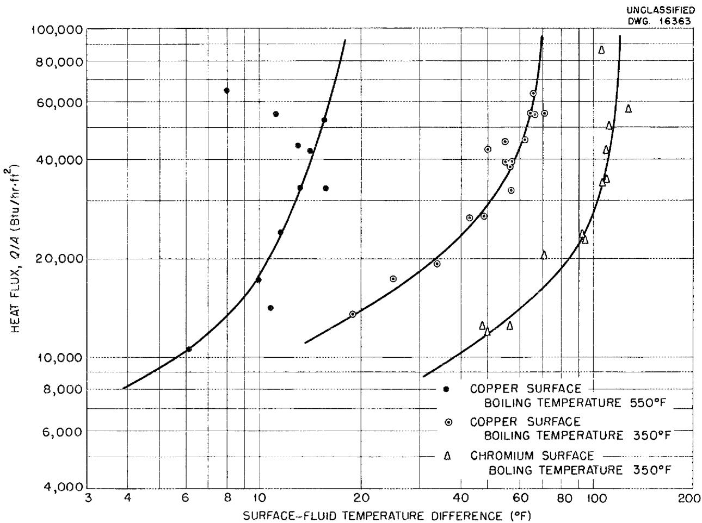  
Fig. 66. Experimental Data for Free-Convection Boiling Heat Transfer from Horizontal Surfaces to Mercury.

previous reports(9) appear to be in general agreement with the temperature profile predicted by the laminar flow analysis.(10) Repeated short circuits from the electrolyte through the delicate, quartz, traversing-thermocouple assembly to the thermocouple have prevented obtaining other than preliminary data. A new technique for joining the assembly appears to have alleviated this problem.

The circular annulus apparatus has been constructed and assembled. The cooling systems for the upper electrode and the test section have been tested for leaks, and the system will be ready to operate when the flat-plate data have been obtained. This apparatus was designed to operate in the high-laminar and low-turbulent flow regions. The upper limit is set by the 10-kw maximum power now available. The validity of all previous data was in question because it was not possible to directly measure the wall temperature. Since the temperature gradient is maximum at the wall, it is difficult to determine the wall temperature from "near-the-wall" measurements.

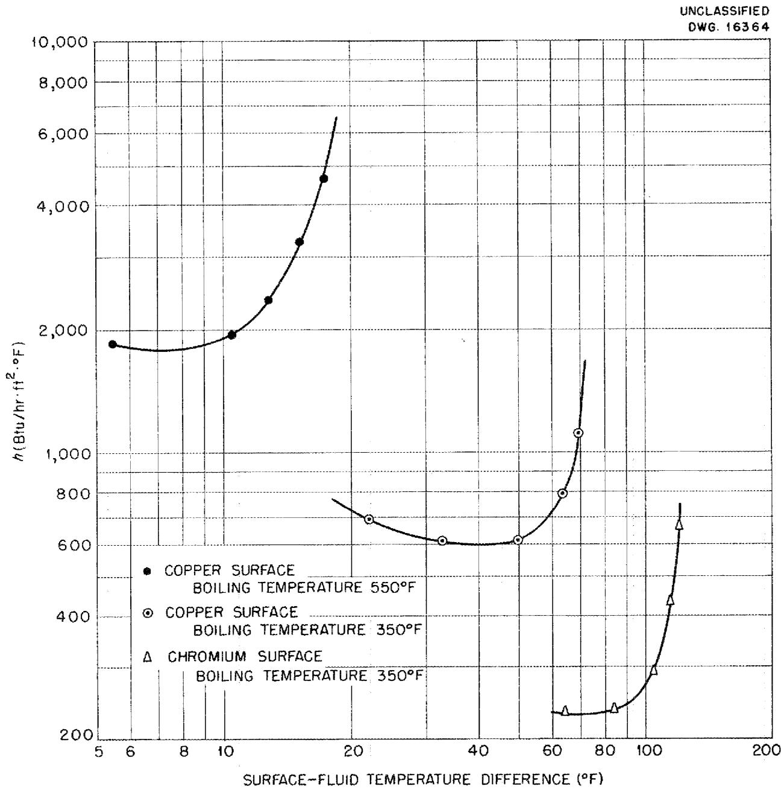  
Fig. 67. Free-Convection Boiling Heat Transfer Coefficients for Mercury.

The present apparatus consists essentially of a 1/2-in.-ID, thick-walled, copper tube that is electrically insulated on the inner surface by a baked enamel coating. In this design it is possible to install a thermocouple in the wall to measure the wall temperature. This represents

a great improvement over previous designs.

The cross-section view in Fig. 68 shows the method of installation of the center and wall thermocouples. The center thermocouple is located in a quartz capillary tube.

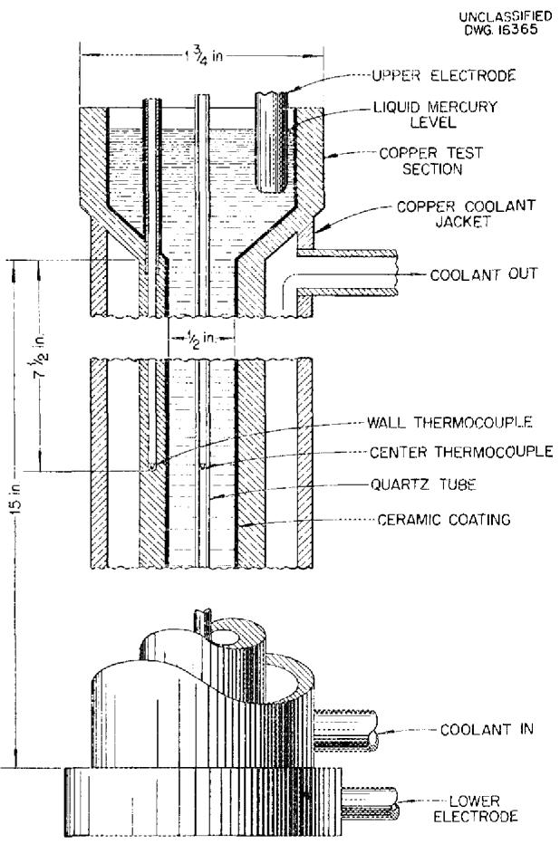  
Fig. 68. Annulus Type of Free-Convection Apparatus.

# HEAT AND MOMENTUM TRANSFER ANALYSIS OF THE THERMAL CONVECTION LOOPS

H. F. Poppendiek L. Palmer Reactor Experimental Engineering Division

Mean circulation velocities should be known in order to properly interpret corrosion results in thermal convection loops. At present, ANP convection harps are instrumented so that approximate wall-temperature distributions of the cold legs and power inputs to electrical heaters on the hot legs are measured. This information can be used to estimate some maximum and minimum circulating velocities that represent limiting situations. However, to obtain more exact velocities it is necessary to solve the combined heat and momentum transfer problem numerically. Some incomplete numerical analyses indicate that the calculated circulation velocities fall within the estimated range close to the minimum value. Thus it appears that the circulating velocities in the convection harps are approximately 0.1 ft/sec when the fluid is NaF-KF-LiF (11.5-42.0-46.5 mole %). It should be possible to increase these velocities by heating the hot legs and cooling the cold legs in such a way that uniform wall-temperature distributions exist in those legs.

# 13. RADIATION DAMAGE

D. S. Billington, Solid State Division

A. J. Miller, ANP Division

The radiation damage studies of materials exposed in the ORNL graphite reactor, the LITR, and the 86-in. cyclotron have continued. Further experiments have been carried out on the effects of irradiation on the fused fluoride fuels, the performance of liquid metal loops, the creep of metals, and the thermal conductivity of metals.

As in the case of the beryllium-bearing fuels previously reported, the evidence to date indicates that there is no significant radiation-induced corrosion with zirconium-bearing fuels undergoing fission at the rates that will occur during operation of the ARE. Apparatus is currently being assembled and inserted in the MTR to provide an exposure facility for the

fused fluoride fuels in which fission rates comparable to those that would occur in an aircraft reactor can be achieved. Measurements made in the graphite reactor on the escape of $\mathrm{Xe}^{135}$ from a capsule of molten fluoride fuel showed that only a small fraction of the xenon diffused out of the liquid.

Examination of an Inconel loop through which sodium had been circulated at a peak temperature of $1500^{\circ}\mathrm{F}$ in the graphite reactor disclosed no positive evidence of radiation-induced corrosion.

In-reactor cantilever creep measurements were made on Inconel specimens subjected to the $1700^{\circ}\mathrm{F}$ anneal proposed for the ARE fuel tubes. Under some conditions of stress and flux there was no increase in the creep rate due to the irradiation, such as was previously reported for specimens annealed at lower temperatures. It was also found that the thermal conductivity of Inconel given the ARE-specified heat treatment was unaffected by irradiation in the LITR.

Additional details on radiation damage studies are contained in the quarterly reports of the Solid State Division.

# IRRADIATION OF FUSED MATERIALS

G. W. Keilholtz

D. F. Weeks

J. G. Morgan

M. T. Robinson

H. E. Robertson

D. D. Davies

C. C. Webster

A. Richt

P. R. Klein

W. J. Sturm

M. J. Feldman

Solid State Division

R.J.Jones R.L.Knight

Electromagnetic Research Division

B. W. Kinyon

ORNL Engineering Division

Three samples of the zirconium-bearing reactor fuel, NaF-KF-ZrF4-UF4

(4.8-50.1-41.3-3.8 mole %), were irradiated at $1500^{\circ}\mathrm{F}$ for 140 hr in Inconel capsules in the LITR. Energy was dissipated in the fuel at a rate of 125 watts per cubic centimeter of fuel, which is in the range of the peak power dissipation expected during operation of the ARE. As with the beryllium-bearing fuels previously irradiated, chemical analyses of the zirconium-bearing fuels and metallographic examinations of the capsules showed no evidence of radiation-induced corrosion when compared with two out-of-reactor control runs.

Bombardment of zirconium-bearing fuel in an Inconel capsule for 8 hr in the cyclotron with a beam of 22.5-Mev protons dissipating 2500 watts per cubic centimeter of fuel caused a slight increase in the corrosion of the Inconel. This is similar to the result reported previously for a lithium-bearing fuel. $^{(1)}$

An experiment was performed to determine the rate of diffusion of $\mathrm{Xe^{135}}$ from the fused fluoride fuels under essentially stagnant or nonturbulent conditions. Two runs were made in the ORNL graphite reactor at $1300^{\circ}\mathrm{F}$ with $\mathrm{NaF - BeF_2 - UF_4}$ (25-60-5 mole %) fuel containing natural uranium in Inconel capsules. In the first run xenon was flushed out by bubbling helium through the melt, whereas in the other the gas was simply swept over the surface. The xenon removed in the sweeping experiment was equivalent to only 2.5% of that removed with the flushing procedure.

Additional work in progress on irradiation of the fused fluorides includes melting-point determinations of irradiated fuels, rocking-capsule tests to simulate the ARE cycling, a

study of the relative importance of "knock-ons" vs. ionization effects in the proton beam, and longer cyclotron beam exposures. The MTR exposure facility for irradiation of fuel capsules at 2,500 to 10,000 watts per cubic centimeter of fuel has been completed. The initial experiment at 2500 watts is expected to be run during September.

# IN-REACTOR CIRCULATING LOOPS

O. Sisman R.M.Carroll

W. W. Parkinson C. D. Bauman

J.B.Trice C.Ellis

A. S. Olson W. E. Brundage

M. T. Morgan D. T. James

F. M. Blacksher

Solid State Division

Metallographic examination of the in-reactor and out-of-reactor portions of the $1500^{\circ}\mathrm{F}$ sodium loop described previously $^{(2)}$ showed no evidence of radiation-induced corrosion of the Inconel.

A loop with improved welds and a by-pass circuit for filtering the sodium is being constructed for additional experiments in the graphite reactor. Considerable progress has been made on fabrication of the stress-corrosion sodium loop for operation in the LITER. In addition, an in-reactor system for circulating fluoride fuel is being designed.

# CREEP UNDER IRRADIATION

W.W.Davis J.C.Wilson

J. C. Zukas

Solid State Division

Increasing the annealing temperature from 1650 to $1700^{\circ}\mathrm{F}$ appears to

(2)0. Sisman et al., op, cit., ORNL-1294, p. 163.

reduce the adverse effect of neutron bombardment on the creep of Inconel at $1500^{\circ}\mathrm{F}$ and 1500 psi reported previously. The bench result and an in-reactor result after annealing at $1700^{\circ}\mathrm{F}$ are shown in the two lower curves in Fig. 69; the upper four curves, reported previously, are shown for comparison. Although the difference in behavior is attributed to the heat treatment, there was a difference in the manner of annealing that could have been partly responsible. The $1650^{\circ}\mathrm{F}$ anneals were carried out in situ and only the gage length was exposed to the desired temperature, so some long-time metallurgical changes in and beyond the fillets could have occurred. During the $1700^{\circ}\mathrm{F}$ anneals the full length of the specimen was heated in a large furnace.

The possibility of some metallurgical change, such as grain growth, causing the increased creep rate following the $1650^{\circ}\mathrm{F}$ anneal is not unlikely in Inconel. The sluggishness of the recrystallization process in Inconel when only small amounts of cold reduction have preceded the anneal is well known. Although the metallurgical history of the plate from which these specimens were made is unknown, hardness measurements indicate that it received about a $5\%$ cold reduction following the penultimate anneal. Evidence of structural changes over long periods was found in the marked increase in intensity of all x-ray diffraction lines following a 1000-hr soak at $1500^{\circ}\mathrm{F}$ after the usual anneal of 2 hr at $1700^{\circ}\mathrm{F}$ . Diffraction patterns of the outer fibers of both compression and tension sides of all the Inconel bench test specimens have been made. More data are required for

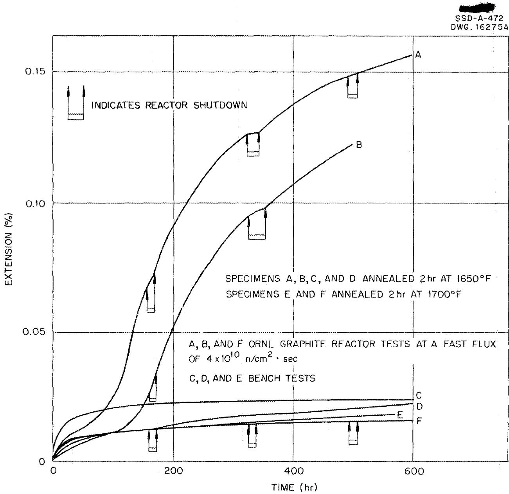  
Fig. 69. Cantilever Creep Tests of Inconel at $1500^{\circ}\mathrm{F}$ and 1500 psi.

a detailed analysis, but it has been noted in all cases that the (111) line is much more intense on the compression than on the tension side. No change in the lattice constant of Inconel was found within the accuracy of measurement, approximately 1 part in 3000.

Strain-time curves for Inconel annealed at $1700^{\circ}\mathrm{F}$ for 2 hr have been obtained in the graphite reactor and the LITR at 2000 psi and $1500^{\circ}\mathrm{F}$ . The data indicate that a number of additional experiments are necessary in order to fully explore the variables.

# RADIATION EFFECTS ON THERMAL CONDUCTIVITY

A. Foner Cohen L. C. Templeton Solid State Division

Absolute thermal conductivity measurements were made on an ARE heat-treated specimen on Inconel by using a radial-heat-flow method at temperatures up to $1240^{\circ}\mathrm{F}$ before irradiation, at temperatures up to $1500^{\circ}\mathrm{F}$ during irradiation in hole HB-3 of the LITR, and at various temperatures immediately

following irradiation. The fast flux in the HB-3 hole is of the order of $10^{12}$ neutrons/cm $^2$ ·sec. The thermal conductivity values calculated, so far, from the results of this experiment show that before and after irradiation the thermal conductivity values are the same within the accuracy of the measurements, which is of the order of a few per cent. The "during-irradiation" data show no change in the conductivity as a function of time at constant temperature, and they agree with the out-of-reactor measurements.

Part IV

# APPENDIXES

# SUMMARY AND INTRODUCTION

The analytical chemistry program in support of the materials research and equipment development programs included the routine analysis of 1179 individual samples, as well as the development of new analytical procedures (sec. 14). In particular, new methods have been developed for the quantitative determination of the constituents and impurities in fluoride fuels. The

current work is concerned with the improvement and simplification of these analytical techniques.

The list of reports that have been issued by the project during the last quarter includes 17 formal reports and 56 informal documents (not including internal documents) on all phases of ANP research at ORNL (sec. 15).

# 14. ANALYTICAL CHEMISTRY

C. D. Susano

Analytical Chemistry Division

Progress has been made in improving and simplifying the methods of analyses of reactor fuels. A volumetric method has been developed for the determination of alkali metals that depends upon separation of the elements by ion exchange and their indirect determination by titration of an equivalent quantity of chloride ion. The investigation of a volumetric method for the determination of zirconium in fuels has continued. Zirconium in fuels can be determined by a volumetric method, in the absence of uranium, with an accuracy of about $1\%$ . It appears that this determination can also be performed in the presence of uranium, and this phase of the problem is still being investigated. The use of silver peroxide as an oxidant in the determination of chromium by means of diphenylcarbazide has been studied, and a new and improved method, based on this study, has been adapted for the determination of chromium. Attempts to determine nickel in reactor fuels by means of nitroso salicylic acid were not successful.

A method similar to the Dean and Stark method (1) has been developed for the determination of trace amounts

of water in finely divided solid materials. This method is particularly valuable for use with some fluorides with which other methods fail. The products of the reaction between NaK and reactor fuels have been studied. It was found that uranium(IV) is reduced to $\mathrm{UF}_3$ , and at least one other constituent of the fuel, which must be zirconium(IV), is also reduced.

A review of the service analyses performed during the quarter is presented.

# ANALYTICAL STUDIES OF COMPONENTS OF FLUORIDE MIXTURES

R. Rowan, Jr. C. M. Boyd

J.C. White W.J.Ross

C. K. Talbott

Analytical Chemistry Division

Alkali Metals. The emphasis on ternary mixtures of fluoride salts containing only a single alkali metal fluoride has greatly simplified the problem of the determination of alkali

metals and has reduced the need for methods of separation of alkali metals from each other. An indirect method was, however, developed for the separation and determination of sodium and potassium that involved the titration of the chloride equivalent to the alkali metal ion. The separation is accomplished by means of ion-exchange resins. Although the separation is time-consuming, by using several columns the time for each determination is far less than is required by the conventional techniques for this separation.

Zirconium. A volumetric method for the determination of zirconium that makes use of the fluoride complex was suggested by Sawaya and Yamashita.(2) In essence, the procedure used in this study is to precipitate zirconium hydroxide by the addition of sodium hydroxide, adjust the pH of the slurry to 8.5, add a 15- to 20-fold excess of potassium fluoride, neutralize the potassium hydroxide formed with excess standard nitric acid solution, and titrate the excess acid to a pH of 7.5 with standard sodium hydroxide solution. The reactions involved are not stoichiometric, and as a result the method must be standardized empirically.

Data gathered thus far have shown that by standardization against a known quantity of zirconium it is possible to titrate the element with an error of less than $1\%$ , under the conditions described, for a range of zirconium concentration of 15 to 60 mg in a volume of 200 ml. The error for larger amounts has not been determined with any degree of certainty, as yet.

The addition of uranium to zirconium sulfate solutions results in some interference, since uranium forms a slightly soluble hydrous oxide.

Compensation for this interference was made on the basis that 2.22 moles of sodium hydroxide (3) is consumed to precipitate each mole of uranium. The results on samples containing 3, 6, and 12 mg of uranium per 60 mg of zirconium agreed within 1% after the application of the necessary correction factor for uranium. The application of this method to sulfate solutions of reactor fuels showed that the results for zirconium by the volumetric procedure (with uranium correction) were generally 3 to 5% higher than those obtained gravimetrically by the phenylarsonic acid precipitation method. The study of the application of this method is continuing.

# ANALYTICAL STUDIES OF IMPURITIES IN FLUORIDE MIXTURES

Chromium. The use of silver peroxide(4) as an oxidant for chromium(III) in the colorimetric determination of chromium by diphenylcarbazide has been investigated, and a procedure in which silver nitrate and potassium persulfate solutions are employed in the oxidation step was adapted for the determination of chromium in reactor fuels. The precision of the method is equal to that obtained when any other oxidant is used, and the method is probably the most rapid of any currently in use. An additional feature is that the chromium(VI) formed is stable for at least 24 hr after oxidation, which is not true in the case of a number of the other oxidants commonly employed in this determination. This work is described elsewhere(5) in greater detail.

Nickel. The commonly used dimethylglyoxime method, with certain modifications in procedure to adapt it to use with fluoride fuels, is employed for the determination of nickel. Because the quantity of nickel appearing as a corrosion product in the fuels currently being tested is generally smaller than has been the case in the past, the lower limit of determination of nickel has become more critical. A practical limitation is imposed on the sample size used because of the presence of zirconium and the high acid concentration necessary to prevent its hydrolysis. The lower limit of determination of the present method is 10 ppm, and the use of absorption cells of 5-cm path length is necessary to achieve this figure.

A brief investigation was made of a method for the determination of nickel that involves extraction of nickel at a pH of 5 to 6 with nitroso salicylic acid. The obvious advantage of this method is that the color can be developed in slightly acidic solution instead of the strongly basic solution required in the dimethylglyoxime procedure. Unfortunately, the zirconium concentration is so high that the large quantity of complexing agent (oxalate, tartrate, or fluoride) retards the formation of the colored complex. It appears that the use of 5-cm absorption cells will be necessary in most cases to obtain satisfactory absorbancy measurements for nickel in the range of less than 50 ppm.

Oxygen. The determination of oxygen in reactor fuels is a problem of considerable importance, since the presence of oxygen is generally considered to be a contributing factor in the corrosion of container materials. Bromine trifluoride is known to react,

with the liberation of oxygen, with virtually all the oxides that can possibly be present in these reactor fuels $(\mathrm{UO}_2, \mathrm{ZrO}_2, \mathrm{Fe}_2\mathrm{O}_3, \mathrm{Cr}_2\mathrm{O}_3, \mathrm{NiO})$ and it is believed that this reaction can be made to serve as a basis for a determination of oxygen.

An apparatus in which $\mathsf{BrF}_3$ will be reacted with the fuel at elevated temperatures of the order of $325^{\circ}\mathrm{C}$ is being fabricated at the present time. The reaction bomb and the high-pressure system are constructed of nickel. The oxygen liberated from the reaction will be determined by a simple gasometric measurement of the oxygen pressure in an evacuated system at a reduced temperature. This method appears favorable because of its simplicity and the relatively short time required for each determination. A pyrex unit to perform this operation has been fabricated and leak-tested. If unexpected difficulties arise, however, other methods for the determination of the oxygen evolved in the reaction are available.

Chloride. The zirconium tetrafluoride used in the preparation of reactor fuels is prepared by the hydrofluorination of zirconium tetrachloride. Since chlorine is an undesirable impurity in fuels because of its rather high neutron-capture cross section, it is necessary to determine chloride in zirconium tetrafluoride to assure that its concentration is below tolerable limits.

Several attacks were made on this problem. A semiquantitative test was devised in which a turbidimetric comparison was made between a hydrofluoric acid, silver nitrate solution of the unknown sample of zirconium tetrafluoride, and standard quantities of chloride in similar solutions. As little as $0.01\%$ of chloride imparted an easily visible cloudiness to the

solution. It is significant that none of the samples of zirconium tetrafluoride tested so far have produced a visible cloudiness, which indicates a chloride content less than $0.01\%$ for these samples.

A second method of attack was to oxidize the chloride present to chlorine and determine it iodometrically. By using a sample of suitable size, it was possible to determine as little as $0.05\%$ chlorine. Potassium permanganate, ceric sulfate, and lead dioxide were tested as oxidants. Permangante is generally unsatisfactory; it yields results averaging $20\%$ high. This is believed to be caused principally by decomposition of permanganic acid during refluxing. Ceric sulfate gave low results in most cases, as did lead dioxide, which was only briefly tested.

The semiquantitative test yields results of sufficient accuracy for the present purposes.

Water. A method for the determination of trace amounts of water in fluorides, oxides, and other solids in a finely divided state has been developed. Such a method was principally required for the analysis of the mixture to be used for cold critical experiments and its components. Water is extracted from the solids by refluxing with xylene by an adaptation of the Dean-Stark method.(1) The xylene-water azerotrope is distilled into methyl alcohol and the water is titrated with Karl Fischer reagent. This method was adopted in preference to the direct titration of the solid with Karl Fischer reagent partly because of sample size limitations and partly because investigation showed that the completeness of the reaction was uncertain in the direct method. Ignition methods for the determination of water were unsuccessful due to the hydrolysis of fluoride

salts that takes place at elevated temperatures.

The extraction method has proved to be completely satisfactory. Samples of the order of 20 g can be handled, if necessary. The blank, although accounting for 50 to 75% of the total titration in some samples, has been reproducible to within less than 1%. The method has been tested against standard sodium tartrate, with the recovery of water averaging nearly 90%. In addition to NaF, ZrO₂, C, UF₄, and KF, the method has been used successfully on fluorides such as NH₄F, NH₄HF₂, NiF₂, KHF₂, and K₂FeF₅.

# DETERMINATION OF CARBON IN $\mathbf{ZrF}_4$ AND $\mathbf{ZrO}_2$ -NaF-C MIXTURES

In determining carbon in zirconium fluoride and in $\mathrm{ZrO_2}$ -NaF-C mixtures by combustion, the fluorides interfere. This difficulty has been overcome by removing the fluorides by dissolution. Zirconium fluoride is dissolved by oxalic acid and the alkali fluorides by warm water. The residue is collected in a small, quartz, filtering crucible and the carbon content is determined by combustion. Since large samples may be used, the accuracy of the carbon determination is increased.

The fluoride in the filtrate from the $\mathrm{ZrO_2}$ -NaF-C mixtures is precipitated as lead chlorofluoride, dissolved, and titrated with mercuric nitrate. The fluoride and carbon values, which can be determined rapidly by the method outlined, give an indication of the degree of homogeneity attained in the preparation of large batches by mechanical mixing.

# COMPATIBILITY OF REACTOR FUELS AND NaK

A number of experiments has been conducted to determine the reaction

products of reactor fuels (NaF-ZrF $_4$ -UF $_4$ ) and NaK under static and dynamic conditions. The conclusions drawn from the chemical analyses were: (1) NaK reduces U(IV) to UF $_3$ , which separates from the molten mass and settles to the bottom of the container; (2) the greater the concentration of NaK, the more complete the reduction; (3) a nearly linear relationship exists between the hydrogen evolved from the fuel upon acidification and the amount of NaK added to the fuel; (4) NaK, in large excess over that required to reduce quantitatively the UF $_4$ to UF $_3$ , reduces other components of the fuel, which form compounds that also evolve hydrogen from acidic solutions; (5) less than 50% of the reducing power of the NaK added was recovered in any test.

# SERVICE ANALYSIS

H. P. House L. J. Brady W. F. Vaughn

Analytical Chemistry Division

The analyses of zirconium fuels and of zirconium fluoride have received major attention during the quarter. Application was made of the methods

adapted by the research and development group for determining sulfide, sulfur, carbon oxide, water, and chloride in fused zirconium-bearing fluoride salts. In addition to zirconium samples, many samples of alkali fluorides and quaternary eutectics composed of alkali fluorides and uranium tetrafluoride were analyzed. Unrelated miscellaneous samples were tested: a number of metals and alloys; complex fluorides of iron, chromium, and nickel; inert gases; ceramics; and bonding cement.

Of a total of 1179 samples analyzed during this quarter, $80\%$ was for the reactor chemistry group, $15\%$ was for the experimental engineering group, and the remaining $5\%$ was for the ANP critical experiments group, the electromagnetic research group, and the maintenance shops.

A summary of the service analyses for ANP follows:

Samples on hand May 10, 1952 198

Number of samples received 1192

Total number of samples 1390

Number of samples reported 1179

Backlog as of August 10, 1952 211

15. LIST OF REPORTS ISSUED   

<table><tr><td>REPORT NO.</td><td>TITLE OF REPORT</td><td>AUTHOR(S)</td><td>DATE ISSUED</td></tr><tr><td colspan="4">I. GENERAL DESIGN</td></tr><tr><td>CF-52-4-191</td><td>Hydrodynamics of Homogeneous Reactors
(Presented at Second Fluid Fuels Con-
ference, Oak Ridge, Tenn., April 1952)</td><td>G. F. Wislicenus</td><td>4-30-52</td></tr><tr><td>ORNL-1234</td><td>Reactor Program of the Aircraft Nuclear 
Propulsion Project</td><td>W. B. Cottrell</td><td>6-2-52</td></tr><tr><td>Y-F12-7</td><td>Proposed ARE Design</td><td>J. F. Haines</td><td>6-10-52</td></tr><tr><td>Y-F15-10</td><td>Three Reactor-Heat Exchanger-Shield 
Arrangements for Use with Fused Fluoride 
Circulating Fuel</td><td>A. P. Fraas</td><td>6-30-52</td></tr><tr><td colspan="4">II. EXPERIMENTAL ENGINEERING</td></tr><tr><td>ORNL-1241</td><td>Fuel Flow Studies in ARE Fuel System Mockup</td><td>D. R. Ward</td><td>1-9-52</td></tr><tr><td>Y-F17-16</td><td>Study of Fluid Flow Measuring Devices</td><td>F. A. Anderson</td><td>7-7-52</td></tr><tr><td>Y-F17-17</td><td>Moore Nullmatic Pressure Transmitter Test</td><td>P. W. Taylor</td><td>7-10-52</td></tr><tr><td>Y-F17-18</td><td>Line Plug Test No. 1 - Fuel at 1500°F</td><td>P. W. Taylor</td><td>7-10-52</td></tr><tr><td>Y-F17-20</td><td>Tank Car Helium as a High Purity Helium 
Source</td><td>L. A. Mann</td><td>8-4-52</td></tr><tr><td>Y-F17-23</td><td>Production of Fluorides in Buildings 9211 
and 9201-3</td><td>H. W. Savage</td><td>8-6-52</td></tr><tr><td colspan="4">III. REACTOR PHYSICS</td></tr><tr><td>Y-F10-101</td><td>Values of Resonance Integrals</td><td>E. S. Wilson</td><td>4-30-52</td></tr><tr><td>Y-F10-102</td><td>An Outline of the General Methods of Re-
action Analyses Used by the ANP Physics 
Group</td><td>C. B. Mills</td><td>5-16-52</td></tr><tr><td>Y-F10-103</td><td>Statics of the ARE Reactor, Summary Report</td><td>C. B. Mills</td><td>5-8-52</td></tr><tr><td>GRNL-1320</td><td>The Effect of Gaps on Pile Reactivity</td><td>S. Tamor</td><td>8-14-52</td></tr><tr><td>Y-F10-106</td><td>Reactor Theory Terms</td><td>C. B. Mills 
G. B. Arfken</td><td>7-16-52</td></tr><tr><td>Y-F10-109</td><td>Note on the Non-Linear Kinetics of 
Circulating-Fuel Reactors</td><td>S. Tamor</td><td>8-15-52</td></tr><tr><td colspan="4">IV. NUCLEAR MEASUREMENTS</td></tr><tr><td>ORNL-1304</td><td>Thermal Neutron Capture Cross Sections of 
Isotopes</td><td>H. Pomerance</td><td>6-6-52</td></tr><tr><td>CF-52-6-99</td><td>Energy Absorption of Capture Gammas</td><td>H. L. F. Enlund</td><td>6-11-52</td></tr><tr><td>ORNL-1142</td><td>Multiple-Crystal Gamma-Ray Spectrometer</td><td>F. C. Maienschein</td><td>7-3-52</td></tr><tr><td>ORNL-1312</td><td>The Fission Cross Section of Uranium-234 
and Uranium-236 for Incident Neutron 
Energies up to 4 MeV</td><td>R. W. Lamphere</td><td>7-15-52</td></tr><tr><td>Y-895</td><td>Cross Sections for Carbon and Water in the 
Energy Range from 2.3 MeV to .025 ev. A 
Literature Search</td><td>Frances Sachs</td><td>8-4-52</td></tr></table>

V. CRITICAL EXPERIMENTS   

<table><tr><td>Y-B23-2</td><td>Preliminary Direct Cycle Reactor Assembly-Part II</td><td>A. D. Callihan</td><td>5-21-52</td></tr><tr><td>Y-B23-5</td><td>Preliminary Direct Cycle Reactor Assembly-Part III</td><td>A. D. Callihan</td><td>6-18-52</td></tr><tr><td>Y-B23-7</td><td>Preliminary Direct Cycle Reactor Assembly-Part IV</td><td>A. D. Callihan and associates</td><td>6-30-52</td></tr><tr><td>Y-F10-108</td><td>The ARE Critical Experiment</td><td>C. B. Mills
D. Scott</td><td>8-8-52</td></tr><tr><td>Y-B23-9</td><td>Loading of ARE Critical Experiment Fuel Tubes</td><td>Dunlap Scott</td><td>8-12-52</td></tr></table>

VI. SHEILDING   

<table><tr><td>CF-52-3-125</td><td>ORNL "Tower Shielding Facility" Preliminary Proposal</td><td></td><td>3-14-52</td></tr><tr><td>CF-52-3-146</td><td>Health Physics Instruments Recommended for ASTF</td><td>T. H. J. Burnette</td><td>3-20-52</td></tr><tr><td>CF-52-4-99</td><td>Some Ground Scattering Experiments Performed at the Bulk Shielding Facility</td><td>H. E. Hungerford</td><td>4-16-52</td></tr><tr><td>ORNL-1147</td><td>The Unit Shield Experiments at the Bulk Shielding Facility</td><td>J. L. Meem
H. E. Hungerford</td><td>5-14-52</td></tr><tr><td>CF-52-6-54</td><td>Data on Enriched Fuel Elements for the Bulk Shielding Facility</td><td>J. E. Cunningham</td><td>6-10-52</td></tr><tr><td>REPORT NO.</td><td>TITLE OF REPORT</td><td>AUTHOR(S)</td><td>DATE ISSUED</td></tr><tr><td>CF-52-7-150</td><td>Uranium Penetration of Graphite</td><td>M. K. Hullings</td><td>7-31-52</td></tr><tr><td>CF-52-8-38</td><td>Gamma Ray Spectral Measurements with 
Divided Shield Mockup. Part III</td><td>F. C. Maienschein</td><td>8-8-52</td></tr><tr><td>CF-52-6-145</td><td>Basic Research in Shielding</td><td>E. P. Blizzard</td><td>6-25-52</td></tr><tr><td>ORNL-1283</td><td>General Principles of a Proton Recoil-Fast 
Neutron Spectrometer</td><td>B. R. Gossick</td><td>8-14-52</td></tr><tr><td rowspan="2">ORNL-1273</td><td rowspan="2">Background Calculations for the Proposed 
Tower Shielding Facility</td><td>A. Simon</td><td rowspan="2">9/1952</td></tr><tr><td>R. H. Ritchie</td></tr><tr><td rowspan="2">CF-52-6-158</td><td rowspan="2">Neutron and Gamma Dose Distribution in Water 
Surrounding the GE Outlet Air Duct</td><td>C. E. Clifford</td><td rowspan="2">6-26-52</td></tr><tr><td>C. L. Storrs, Jr.</td></tr><tr><td rowspan="2">ORNL-1133 
Part 2</td><td rowspan="2">The Shielding of Mobile Reactors-II</td><td>E. P. Blizzard</td><td rowspan="2">6-30-52</td></tr><tr><td>T. A. Welton</td></tr><tr><td>CF-52-6-74</td><td>Re: Design of Inexpensive Shield for Small 
Reactor</td><td>Ralph Balent</td><td>6-10-52</td></tr><tr><td>CF-52-6-158</td><td>Neutron and Gamma Dose Distribution in Water</td><td>C. E. Clifford</td><td>6-26-52</td></tr><tr><td rowspan="2">CF-52-6-165</td><td rowspan="2">Phenomenological Theory of the Attenuation 
of Neutrons by Air Ducts in Shields</td><td>A. Simon</td><td rowspan="2">6-25-52</td></tr><tr><td>C. E. Clifford</td></tr><tr><td>CF-52-7-1</td><td>Preliminary Data on GE Outlet Air Duct</td><td>C. E. Clifford</td><td>7-1-52</td></tr><tr><td rowspan="2">CF-52-7-37</td><td rowspan="2">Air Scattering Experiment at the Bulk 
Shielding Facility</td><td>J. L. Meem</td><td rowspan="2">7-8-52</td></tr><tr><td>H. E. Hungerford</td></tr><tr><td>CF-52-7-71</td><td>Gamma Ray Spectral Measurements with the 
Divided Shield Mockup, Part II</td><td>F. C. Maienschein</td><td>7-8-52</td></tr><tr><td>CF-52-7-83</td><td>Gamma Measurements on the GE Outlet Air 
Duct as a Function of Length of Transition 
Section</td><td>C. E. Clifford</td><td>7-16-52</td></tr><tr><td>CF-52-5-40</td><td>Gamma Dose Behind Iron-Water Thermal Shield 
of Various Thicknesses as a Function of 
Water Reflector Thickness. (Investigation 
for NDA)</td><td>C. E. Clifford</td><td>5-7-52</td></tr><tr><td>CF-52-5-41</td><td>Gamma Dose Behind Iron-Borated Water Thermal 
Shield with 18-, 20-, and 30-cm Water 
Reflector</td><td>C. E. Clifford</td><td>5-7-52</td></tr><tr><td>CF-52-5-163</td><td>Gamma Attenuation in Lead-Water Shields</td><td>C. E. Clifford</td><td>5-20-52</td></tr><tr><td>CF-52-5-183</td><td>Neutron and Gamma Distribution in Water 
Containing Lead, Steel and Air</td><td>C. E. Clifford</td><td>5-26-52</td></tr><tr><td>CF-52-5-1 Part 8</td><td>Neutron and Gamma Dose Distribution Beyond Beryllium Slab (28.5 cm, Density 1.23 gm/cc)</td><td>C. E. Clifford</td><td>6-6-52</td></tr><tr><td>CF-52-6-120 Part I</td><td>Sources of Radiation, Chapter 2.1 of Reactor Handbook</td><td>E. P. Blizzard F. C. Maienschein</td><td>6-23-52</td></tr><tr><td>CF-52-6-120</td><td>Geometry, Chapter 2.7 of Reactor Handbook</td><td>E. P. Blizzard</td><td>6-24-52</td></tr></table>

# VII. HEAT TRANSFER AND PHYSICAL PROPERTIES

<table><tr><td>CF-52-8-166</td><td>A Review of the Literature on Heat Transfer in Noncircular Ducts and Annuli for Ordinary Fluids and Liquid Metals</td><td>H. C. Claiborne</td><td>to be issued</td></tr><tr><td>ORNL-1370</td><td>Turbulent Forced Convection Heat Transfer in Circular Tubes Containing Molten Sodium Hydroxide</td><td>H. W. Hoffman</td><td>to be issued</td></tr><tr><td></td><td>Liquid Metals Handbook, Chapter 6, &quot;Liquid Metal Heat Transfer&quot;</td><td>R. N. Lyon
H. F. Poppendiek</td><td>9-1-52</td></tr><tr><td>CF-52-6-148</td><td>Viscosity of Fulinak</td><td>R. F. Redmond</td><td>6-19-52</td></tr><tr><td>CF-52-7-138</td><td>Viscosity of Fuel Salt Mixtures No. 27 and No. 30</td><td>R. F. Redmond
No. 30</td><td>7-23-52</td></tr></table>

# VIII. MATERIALS CHEMISTRY

<table><tr><td>ORNL-1291</td><td>General Information Concerning Hydroxides</td><td>Mary E. Lee</td><td>4-21-52</td></tr><tr><td>CF-52-6-76</td><td>Complex Fluoride Fuel Studies - X-ray</td><td>Paul Agron</td><td>6-16-52</td></tr><tr><td>ORNL-1163</td><td>The Preparation of Thin and of Thick Targets to be Bombarded by Positive Particles</td><td>R. A. Bolomey</td><td>6-3-52</td></tr><tr><td>CF-52-6-127</td><td>Petrographic Examination of Fluoride Fuels</td><td>T. N. McVay</td><td>6-20-52</td></tr></table>

# IX. ANALYTICAL CHEMISTRY

<table><tr><td>ORNL-1286</td><td>The Determination of Oxygen in Sodium</td><td>J. C. White
W. J. Ross
R. Rowan, Jr.</td><td>4-30-52</td></tr><tr><td>Y-B31-354</td><td>Analytical Chemistry - ANP Program Quarterly
Progress Report for Period Ending May 26,
1952</td><td>M. T. Kelley</td><td>5-26-52</td></tr><tr><td>REPORT NO.</td><td>TITLE OF REPORT</td><td>AUTHOR(S)</td><td>DATE ISSUED</td></tr><tr><td>ORNL-1307</td><td>Effect of Fluoride on the Gravimetric Determination of Zirconium</td><td>R. L. McCutcheon
C. D. Susano</td><td>6-17-52</td></tr></table>

# X. METALLURGY

<table><tr><td>MM-2</td><td>Cone Arc Welding</td><td>P. Patriarca</td><td></td></tr><tr><td>MM-6</td><td>Metallographic Examination of 347 Stainless Steel Heat Exchanger from Forced Convection Loop which Operated for 3,000 Hours in NaK</td><td>E. E. Hoffman</td><td>7-15-52</td></tr><tr><td>MM-7</td><td>Metallographic Examination of Microbrazed Stainless Steel Sodium-Air Heat Exchanger Following Failure During Test</td><td>E. E. Hoffman</td><td>7-16-52</td></tr><tr><td>CF-52-7-124</td><td>Beta Treatment of Alpha Uranium</td><td>R. J. Gray</td><td>7-24-52</td></tr><tr><td>CF-52-3-123</td><td>A Simplified Apparatus for Making Thermal Gradient Dynamic Corrosion Tests (See-Saw Tests)</td><td>A. DeS. Brasunas</td><td>3-14-52</td></tr><tr><td>Y-872</td><td>Selected Physical Properties of Lead in the Temperature Range 100-1000°C. A Literature Search</td><td>Frances Sachs</td><td>5-7-52</td></tr><tr><td>ORNL-1114</td><td>Stress-Strain-Time Phenomena in Mechanical Testing</td><td>A. G. H. Andersen</td><td>5-9-52</td></tr><tr><td>Y-889</td><td>Selected Physical Properties of Mercury in the Temperature Range 100-1000°C. A Literature Search.</td><td>Frances Sachs</td><td>7-10-52</td></tr></table>

# XI. MISCELLANEOUS

<table><tr><td>ORNL-1294</td><td>Aircraft Nuclear Propulsion Project Quarterly W. B. Cottrell</td><td>8-5-52</td></tr><tr><td></td><td>Progress Report for Period Ending June 10,</td><td></td></tr><tr><td></td><td>1952</td><td></td></tr></table>

<table><tr><td>Y-F26-40</td><td>ANP Information Meeting of August 20, 1952</td><td>W. B. Cottrell</td><td>8-29-52</td></tr></table>