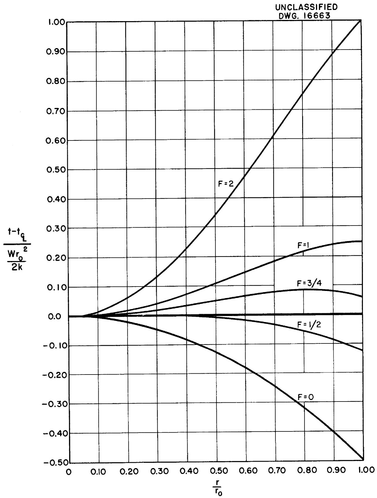
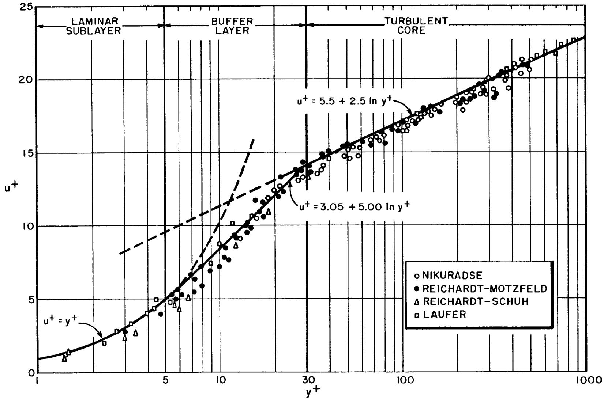
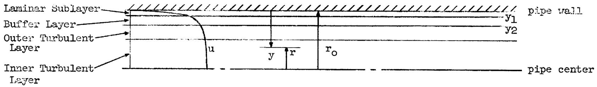
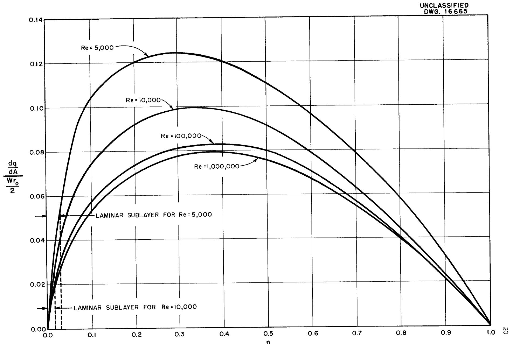
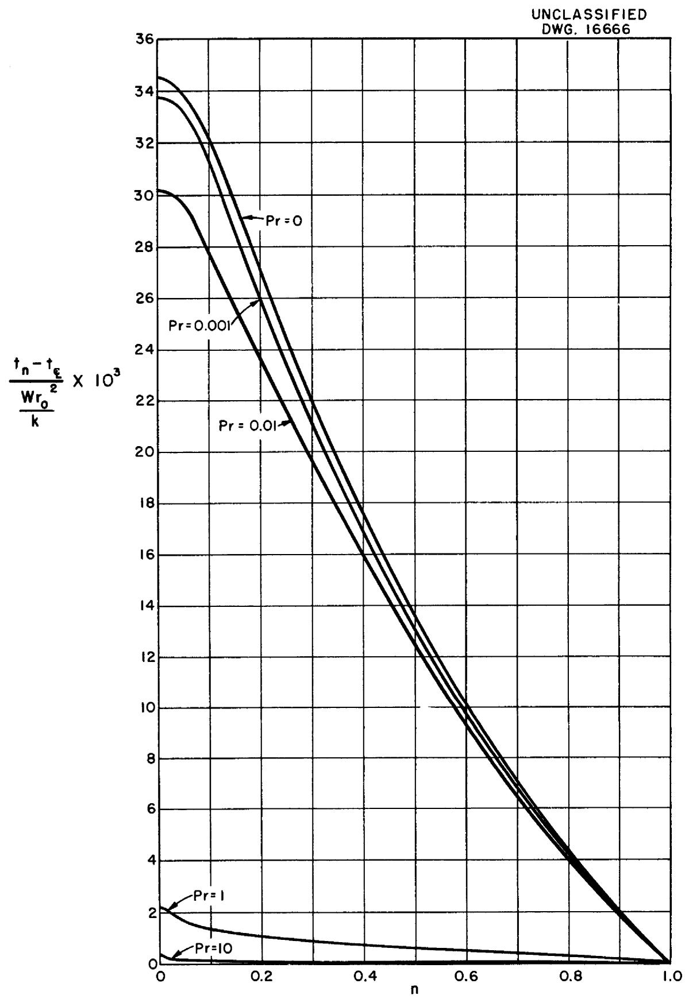
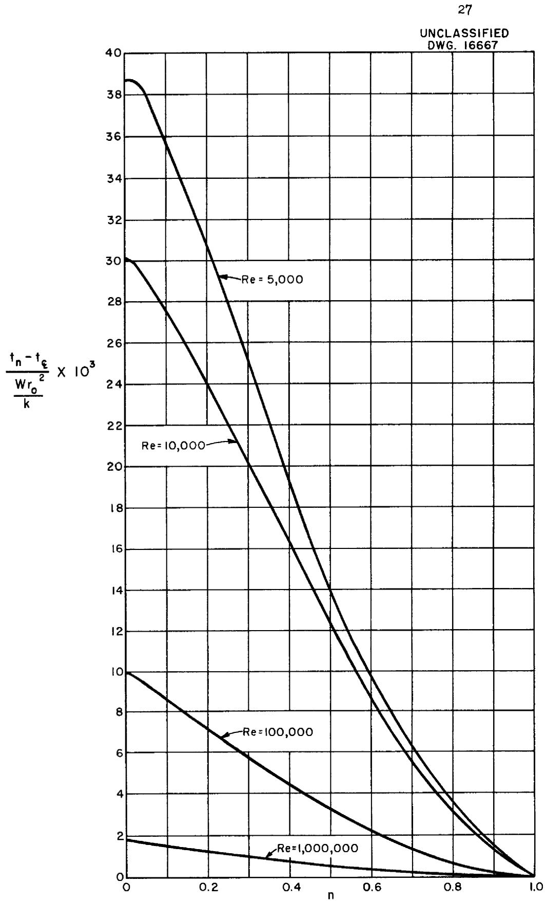
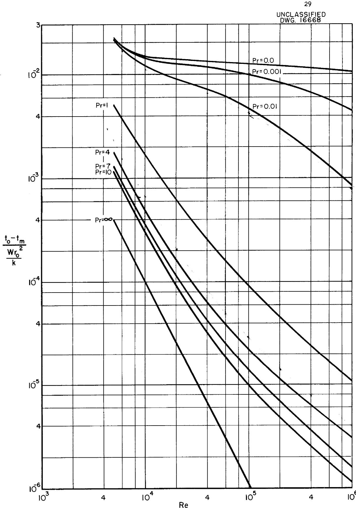
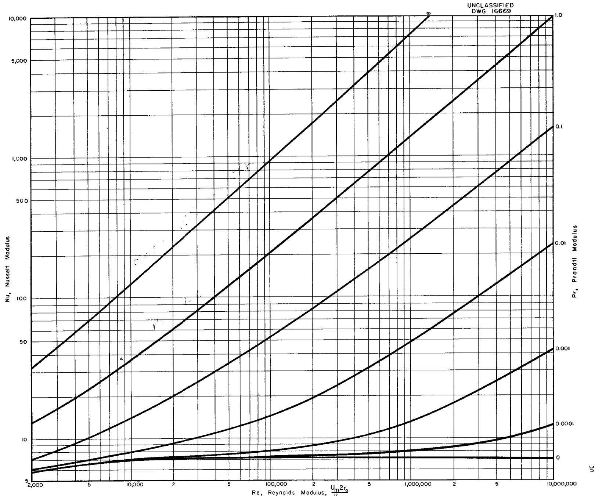

MARTIN MARIETTA ENERGY SYSTEMS LIBRARIES

3445603531774

ORNL-1395

PHYSICS

FORCED CONVECTION HEAT TRANSFER

IN PIPES WITH VOLUME HEAT SOURCES

WITHIN THE FLUIDS

OAK BIDGE NATIONAL LABORATORY

CENTRAL RESEARCH CORPORATION

DOCUMENT COLLECTION

LIBRARY LOAN COPY

DO NOT TRANSFER TO ANOTHER PERSON

If you wish someone else to see this

document send in name with document

and the library will arrange a loan.

0

32 367

1. 实验原理

OAK RIDGE NATIONAL LABORATORY

OPERATED BY

CARBIDE AND CARBON CHEMICALS COMPANY

A DIVISION OF UNION CARBIDE AND CARBON CORPORATION

UCC

POST OFFICE BOX P

OAK RIDGE, TENNESSEE

Contract No. W-7405, eng 26

Reactor Experimental Engineering Division

FORCED CONVECTION HEAT TRANSFER IN PIPES WITH VOLUME HEAT SOURCES WITHIN THE FLUIDS

by

H. F. Poppendiek

L. D. Palmer

DATE ISSUED

OAK RIDGE NATIONAL LABORATORY

Operated by

CARBIDE AND CARBON CHEMICALS COMPANY

A Division of Union Carbide and Carbon Corporation

Post Office Box P

Oak Ridge, Tennessee

3 4456

03531774

UNC

# INTERNAL DISTRIBUTION

1. G. T. Felbeck (C&CCC)   
2. Biology Library   
3. Health Physics Library   
4. Metallurgy Library

5-6. Training School Library 7. Reactor Experimental Engineering Library   
8-13. Central Files   
14. C. E. Center   
15. C. E. Larson   
16. W. B. Humes (K-25)   
17. L. B. Emlet (Y-12)   
18. A. M. Weinberg   
19. E. H. Taylor   
20. E. D. Shipley   
21. C. E. Winters   
22. F. C. VonderLage   
23. R. C. Briant   
24. J. A. Swartout   
25. S. C. Lind   
26. F. L. Steahly   
27. A. H. Snell   
28. A. Hollander   
29. M. T. Kelley   
30. W. J. Fretague   
31. G. H. Clewett   
32. K. Z. Morgan   
33. J. S. Felton   
34. A. S. Householder   
35. C. S. Harrill   
36. D. S. Billington   
37. D. W. Cardwell   
38. E. M. King   
39. R. N. Lyon   
40. A. J. Miller   
41. R. B. Briggs

42. A. S.Kitzes   
43. 0. Sisman   
44. R. W. Stoughton   
45. C. B. Graham   
46. W. R. Gall   
47. H. F. Poppendiek   
48. S. E. Beall   
49. W. M. Breazeale   
50. J. P. Gill   
51. D. D. Cowen   
52. P. M. Reyling   
53. M. J. Skinner   
54. W. B. Berggren   
55. E. S. Bettis   
56. J. O. Bradfute   
57. L. Cooper   
58. W. B. Cottrell   
59. C. P. Coughlen   
60. G. A. Cristy   
61. W. K. Ergen   
62. W. S. Farmer   
63. A. P. Fraas   
64. D. C. Hamilton   
65. W. B. Harrison   
66. H. W. Hoffman   
67. P. R. Kasten   
68. J. I. Lang   
69. N. F. Lansing   
70. B. Lubarsky   
71. F. E. Lynch   
72. C. B. Mills   
73. L. D. Palmer   
74. W. D. Powers   
75. R. F. Redmond   
76. H. W. Savage   
77. G. F. Wislicenus   
78. P. C. Zmola

# EXTERNAL DISTRIBUTION

79. C. R. Russell, AEC, Oak Ridge   
80. W. J. Larkin, AEC, Oak Ridge

81-335. Given distribution as shown in TID-4500 under Physics Category

TABLE OF CONTENTS   

<table><tr><td>SUMMARY</td><td>4</td></tr><tr><td>NOMENCLATURE</td><td>5</td></tr><tr><td>INTRODUCTION</td><td>8</td></tr><tr><td>LAMINAR FLOW ANALYSIS</td><td>10</td></tr><tr><td>TURBULENT FLOW ANALYSIS</td><td>15</td></tr><tr><td>A. Radial Heat Flow Distribution</td><td>19</td></tr><tr><td>B. Radial Temperature Distribution</td><td>19</td></tr><tr><td>Laminar Sublayer</td><td>21</td></tr><tr><td>Buffer Layer</td><td>21</td></tr><tr><td>Outer Turbulent Layer</td><td>23</td></tr><tr><td>Inner Turbulent Layer</td><td>24</td></tr><tr><td>C. Difference Between Pipe Wall and Mixed-Mean</td><td>25</td></tr><tr><td>Fluid Temperature</td><td></td></tr><tr><td>D. Superposition of Boundary Value Problems (18) and (19).</td><td>28</td></tr><tr><td>DISCUSSION</td><td>31</td></tr><tr><td>APPENDIX 1</td><td>32</td></tr><tr><td>APPENDIX 2</td><td>34</td></tr><tr><td>APPENDIX 3</td><td>37</td></tr><tr><td>REFERENCES</td><td>39</td></tr></table>

# SUMMARY

This paper concerns itself with forced convection heat transfer in long, smooth pipes whose flowing fluids contain uniform volume heat sources; also, heat is transferred uniformly to or from the fluids at the pipe walls. Dimensionless differences between the pipe wall temperature and the mixed-mean fluid temperature are evaluated in terms of several dimensionless moduli. These analyses pertain to liquid metals as well as ordinary fluids.

# NOMENCLATURE

# Letters

A cross sectional heat transfer area, ft²

a fluid thermal diffusivity, ft²/hr

$\mathbf{B}_{\circ}$ parameter in equation (f), ft/hr

parameter in equation (23), dimensionless

$\mathbf{c_p}$ fluid heat capacity, Btu/lb ${}^{\mathrm{o}}\mathbb{F}$

$\mathbf{c}_1,\mathbf{c}_2,\mathbf{c}_3$ parameters in equation (26), dimensionless

$e_0,e_1,e_2,e_3$ parameters in equation (31), dimensionless

parameter in equation (h), dimensionless

g gravitational force per unit mass, ft/hr²

$g_0, g_1, g_2$ parameters in equation (34), dimensionless

heat transfer conductance, Btu/hr ft²°F

k fluid thermal conductivity, Btu/hr ft² (°F/ft)

p fluid pressure, lbs/ft2

q heat transfer rate, Btu/hr

r radial distance from pipe centerline, ft

radial position at which the reference temperature $t_d$ is stipulated, ft

$\mathbf{r}_0$ pipe radius, ft

s1,s2 parameters in equation (33), dimensionless

t fluid temperature at position n, ${}^{\mathrm{o}}\mathbf{F}$

td a reference temperature at radius $\mathbf{r_d}$ , ${}^{\mathrm{o}}\mathbb{T}$

tm mixed-mean fluid temperature, ${}^{\mathrm{O}}\mathbb{F}$

$\mathbf{t}_0$ fluid temperature at pipe wall, ${}^{\mathrm{o}}\mathrm{F}$ $\mathbf{t}_{1}$ fluid temperature at n1, ${}^{\mathrm{o}}\mathrm{F}$ $\mathbf{t}_{2}$ fluid temperature at n2, ${}^{\mathrm{o}}\mathrm{F}$ $\mathbf{t}_{\varepsilon}$ fluid temperature at the pipe center, ${}^{\mathrm{o}}\mathrm{F}$ $\mathbf{u}$ fluid velocity at n, ft/hr $\mathbf{u}_{m}$ mean fluid velocity, ft/hr $\mathbf{W}$ volume heat source, Btu/hr ft3 $\mathbf{x}$ axial distance, ft $\mathbf{y}$ radial distance from pipe wall, ft $\gamma$ fluid weight density, lbs/ft3 $\epsilon$ eddy diffusivity, ft²/hr $\delta$ friction factor defined in equation (c), dimensionless $\mu$ absolute viscosity of fluid, lb hr/ft² $\upsilon$ fluid kinematic viscosity, ft²/hr $\rho$ fluid mass density, lbs hr²/ft4 $\tau$ fluid shear stress at position n, lbs/ft² $\tau_{o}$ fluid shear stress at pipe wall, lbs/ft²

# Terms

$$
\begin{array}{l} a ^ {\prime} = 1 - P r \\ a ^ {\prime \prime} = - 0. 0 3 0 4 \Pr \mathrm {R e} ^ {0. 9} \\ b ^ {\prime} = 0. 0 1 5 2 \Pr \mathrm {R e} ^ {0. 9} \\ b ^ {\prime \prime} = 0. 0 3 0 4 \Pr \mathrm {R e} ^ {0. 9} \\ z = \frac {d t}{d r} \\ \end{array}
$$

# Dimensionless Moduli

$$
F = 1 - \frac {2}{W r _ {0}} \left(\frac {d q}{d A}\right) _ {0}
$$

$$
n = y / r _ {0}
$$

$$
n _ {1} = y _ {1} / r _ {0}
$$

$$
n _ {2} = y _ {2} / r _ {0}
$$

$$
n _ {L} = y _ {L} / r _ {O}
$$

$\mathrm{Nu} = \hbar 2r_{0} / k$ , Nusselt Modulus

$\mathbf{Pr} = \nu \gamma \mathbf{c}_{\mathrm{p}} / \mathbf{k}$ , Prandtl Modulus

Re = u 2r0/ v, Reynolds Modulus

$$
u ^ {+} = \frac {u}{\sqrt {\frac {\tau_ {0}}{\rho}}}
$$

$$
y ^ {+} = \frac {y \sqrt {\frac {1 0}{\rho}}}{v}
$$

# INTRODUCTION

At times it is necessary to determine the radial temperature distributions in flowing fluids that possess internal sources of heat generation. Consider the heated-tube system (electric current passing through the tube walls) which is now so commonly being used to measure convective heat transfer conductances. It is of interest to know how much the electrical volume heat source influences the radial temperature distribution when a significant fraction of this source is generated within the flowing fluid. Such volume heat source problems also arise in fluid flow systems in which continuous chemical reactions are being supported within the fluids; a combustion heating system represents a specific example.

Particular volume heat source systems have been considered in this paper. Mathematical temperature solutions were developed for a circular-pipe volume heat source system for the cases of laminar and turbulent flow (reference 1). The idealized system to be considered is defined by the following postulates:

1) Thermal and hydrodynamic patterns have been established (long pipes).   
2) Uniform volume heat sources exist within the fluid.   
3) Physical properties are not functions of temperature.   
4) Heat is transferred uniformly to or from the fluid at the pipe wall.   
5) In the case of turbulent flow the generalized turbulent velocity profile defines the hydrodynamic structure.   
6) In the case of turbulent flow there exists an analogy between heat and momentum transfer.

A heat rate balance on a stationary differential lattice reveals the heat transfer mechanisms which control the thermal structure within the idealized system. At steady state, the heat generated within the lattice is lost from the lattice by axial convection and radial conduction (in the case of laminar flow) or radial eddy diffusion (in the case of turbulent flow). These heat rate balances are expressed by differential equations in the following analyses.

# LAMINAR FLOW ANALYSIS

The differential equation describing the heat transfer in the pipe system for the case of laminar flow is

$$
2 u _ {m} \left[ 1 - \left(\frac {r}{r _ {0}}\right) ^ {2} \right] \frac {\partial t}{\partial x} r = \frac {\partial}{\partial r} \left[ a r \frac {\partial t}{\partial r} \right] + \frac {W r}{\gamma c _ {p}} \tag {1}
$$

where,

$u_{m}$ , mean fluid velocity in the pipe

t, temperature

x, axial distance

r, radial distance

a, thermal diffusivity

W, uniform volume heat source

$\pmb{\gamma}$ ， fluid weight density

$\mathbf{c_p}$ , fluid heat capacity

One boundary condition for the problem consists of a uniform wall heat flux which may be positive, negative or zero,

$$
\frac {\mathrm {d} q}{\mathrm {d} A} (r = r _ {0}) = \left(\frac {\mathrm {d} q}{\mathrm {d} A}\right) _ {0} = - k \frac {\partial t}{\partial r} (r = r _ {0}) \tag {2}
$$

where $\frac{\mathrm{dq}}{\mathrm{dA}}$ is the radial heat flux and $\left(\frac{\mathrm{dq}}{\mathrm{dA}}\right)_0$ is the wall heat flux. The second boundary condition is, $t_d$ , a reference temperature, such as a wall or centerline temperature,

$$
t (r = r _ {d}) = t _ {d} \tag {3}
$$

Note, the mixed mean fluid temperature may also be specified as the reference temperature.

Downstream from the entrance region where the thermal pattern (temperature gradients) of the system has become established the axial temperature gradient, $\frac{\partial t}{\partial x}$ , is uniform and equal to the mixed-mean axial fluid temperature gradient1, $\left(\frac{\partial t}{\partial x}\right)_m$ . The latter gradient can be obtained by making the following heat balance. The heat generated in a lattice whose volume is $\pi r_0^2$ dx plus the heat transferred into (or out of) the lattice at the wall must all be lost from the lattice by convection, that is

$$
W \pi r _ {0} ^ {2} d x - \left(\frac {d q}{d A}\right) _ {0} 2 \pi r _ {0} d x = \pi r _ {0} ^ {2} u _ {m} \gamma c _ {p} \left(\frac {\partial t}{\partial x}\right) _ {m} d x \tag {4}
$$

Hence, in the established flow region the axial temperature gradient is

$$
\frac {\partial t}{\partial x} = \left(\frac {\partial t}{\partial x}\right) _ {m} = \frac {W - \frac {2}{r _ {0}} \left(\frac {d q}{d A}\right) _ {0}}{u _ {m} r c _ {p}} \tag {5}
$$

Upon substituting equation (5) into equation (1), the following total differential equation results:

$$
\frac {W}{k} \left(2 F \left[ 1 - \left(\frac {r}{r _ {0}}\right) ^ {2} \right] - 1\right) = \frac {d ^ {2} t}{d r ^ {2}} + \frac {1}{r} \frac {d t}{d r} \tag {6}
$$

where $\mathbf{F} = 1 - \frac{2}{\mathrm{Wr}_{\mathrm{o}}}\left(\frac{\mathrm{dq}}{\mathrm{dA}}\right)$ . Equation (6) can be solved by making the change of variable, $z = \frac{\mathrm{dt}}{\mathrm{dr}}$ , or

1. Note, that the mixed-mean fluid temperature at any given axial position is defined as,

$$
t _ {m} = \frac {\int_ {0} ^ {r _ {o}} t u 2 \pi r d r}{\int_ {0} ^ {r _ {o}} u 2 \pi r d r} = \frac {2}{u _ {m} r _ {o}} 2 \int_ {0} ^ {r _ {o}} t u r d r
$$

$$
\frac {\mathrm {d} z}{\mathrm {d} r} + \frac {z}{r} = \frac {W}{k} \left(2 F \left[ 1 - \left(\frac {r}{r _ {0}}\right) ^ {2} \right] - 1\right) \tag {7}
$$

The solution of equation (7) is

$$
z = \frac {d t}{d r} = \frac {1}{r} \int_ {\frac {W}{k}} \left(2 F \left[ 1 - \left(\frac {r}{r _ {0}}\right) ^ {2} \right] - 1\right) r d r + \frac {\text {c o n s t .}}{r} \tag {8}
$$

Upon integrating there results

$$
\frac {\mathrm {d} t}{\mathrm {d} r} = \frac {W}{k} \left[ (2 F - 1) \frac {r}{2} - \frac {F}{2} \frac {r ^ {3}}{r _ {0} ^ {2}} \right] \tag {9}
$$

The constant in equation (8) was found to be zero from the boundary condition given by equation (2). Note that the radial heat flow is

$$
\frac {\mathrm {d} q}{\mathrm {d} A} = - k \frac {\mathrm {d} t}{\mathrm {d} r} = \frac {W r _ {O}}{2} \left[ (1 - 2 F) \frac {r}{r _ {O}} + F \left(\frac {r}{r _ {O}}\right) ^ {3} \right] \tag {10}
$$

The desired temperature solution can be obtained by integrating equation (9),

$$
t - t _ {o} = \frac {W r _ {o} ^ {2}}{2 k} \int_ {1} ^ {\frac {r}{r _ {o}}} \left[ (2 F - 1) \frac {r}{r _ {o}} - F \left(\frac {r}{r _ {o}}\right) ^ {3} \right] d \left(\frac {r}{r _ {o}}\right) \tag {11}
$$

$$
\frac {t - t _ {0}}{\frac {\mathrm {W r} _ {0} {} ^ {2}}{2 k}} = \frac {(1 - 2 \mathrm {F})}{2} \left[ \left(\frac {\mathrm {r}}{\mathrm {r} _ {0}}\right) ^ {2} - 1 \right] + \frac {\mathrm {F}}{4} \left[ \left(\frac {\mathrm {r}}{\mathrm {r} _ {0}}\right) ^ {4} - 1 \right] \tag {12}
$$

where the reference temperature is, $t_0$ , the wall temperature. The temperature solution in terms of the centerline temperature rather than the wall temperature is given by

$$
\frac {t - t _ {\text {电}}}{\frac {W r _ {0} {} ^ {2}}{2 k}} = \frac {2 F - 1}{2} \left(\frac {r}{r _ {0}}\right) ^ {2} - \frac {F}{4} \left(\frac {r}{r _ {0}}\right) ^ {4} \tag {13}
$$

where $t_{\underline{c}}$ is the centerline temperature. Equation (13) is graphed in Figure 1 for several values of the function $F$ .

It is often of interest to know the difference between the wall temperature and the mixed-mean fluid temperature. This difference is obtained as follows:

$$
\begin{array}{l} t _ {o} - t _ {m} = \frac {\int_ {o} ^ {r _ {o}} u (t _ {o} - t) 2 \pi r d r}{u _ {m} \pi r _ {o} ^ {2}} \\ = 2 \int_ {0} ^ {1} \frac {u}{u _ {m}} \left(t _ {o} - t\right) \left(\frac {r}{r _ {o}}\right) d \left(\frac {r}{r _ {o}}\right) \tag {14} \\ \end{array}
$$

Upon substituting the laminar velocity profile relation and equation (12) into equation (14) there results,

$$
t _ {O} - t _ {m} = \frac {W r _ {o} ^ {2}}{k} \left[ \frac {1 1 F - 8}{4 8} \right] \tag {15}
$$

  
Fig.1. Dimensionless Radial Temperature Distributions in a Pipe For Laminar Flow (Equation 13)

# TURBULENT FLOW ANALYSIS

Fluid flow in a pipe under turbulent flow conditions has been characterized in terms of a laminar sublayer contiguous to the wall, a buffer layer, and a turbulent core by Nikuradse (reference 2), von Karman (reference 3) and others. Figure 2 shows the well known isothermal generalized velocity profile and some experimental data of Nikuradse (reference 2), Reichardt (reference 4), and Laufer (reference 5). Table 1 reveals some of the specific hydrodynamic relations for the various flow layers in a smooth pipe; a discussion of some of the details of this table can be found in Appendix 1.

The differential equation describing heat transfer in the pipe system for the case of turbulent flow is

$$
u (r) \frac {\partial t}{\partial x} r = \frac {\partial}{\partial r} \left[ \left(a + \epsilon (r, u)\right) r \frac {\partial t}{\partial r} \right] + \frac {W r}{r c _ {p}} \tag {16}
$$

where, $\mathbf{u}(\mathbf{r})$ , the turbulent velocity profile given in Figure 2

$\in$ , the eddy diffusivity given in Table 1

Upon substituting equation (5) into equation (16) for the established thermal region the following total differential equation results,

$$
\frac {u (r) \left[ W - \frac {2}{r _ {\mathrm {o}}} \left(\frac {\mathrm {d} q}{\mathrm {d A}}\right) _ {\mathrm {o}} \right] r}{u _ {\mathrm {m}} \gamma c _ {\mathrm {p}}} - \frac {W r}{\gamma c _ {\mathrm {p}}} = \frac {d}{\mathrm {d} r} \left[ (a + e) r \frac {\mathrm {d} t}{\mathrm {d} r} \right] \tag {17}
$$

2. The analogy between heat and momentum transfer (characterized by the postulate that the heat and momentum transfer eddy diffusivities are proportional to each other and in fact nearly equal) has been proposed by Reynolds (reference 6) and used successfully by von Karman (reference 3), Martinelli (reference 7), and others. Thus, in the present analysis it is postulated that the heat and momentum transfer eddy diffusivities are equal.

# UNCLASSIFIED DWG.16664

  
Fig. 2. Generalized Turbulent Velocity Profile in Circular Pipes and in Channels

16

<table><tr><td>REGION</td><td>GENERALIZED VELOCITY DISTRIBUTION</td><td>SHEAR STRESS</td><td>STRESS EQUATION</td><td>EDDY DIFFUSIVITY</td></tr><tr><td>Laminar Sublayer o&lt;y&lt;5 or o&lt;ro&lt;66/Re·9</td><td>u/√ro/ρ = √10 ρ y /v</td><td>T=τo</td><td>T=ρ v du/dy</td><td>ε/ν = 0</td></tr><tr><td>Buffer Layer 5&lt;y&lt;30 or 66/Re·9&lt;ro&lt;396/Re·9</td><td>u/√ro/ρ = -3.05 + 5.00 ln[y/√ro/ρ] /v</td><td>T=τo</td><td>T=ρ (v + ε) du/dy</td><td>ε/ν = .0152 Re·9 y/ro - 1</td></tr><tr><td>Outer Turbulent Layer 396/Re·9&lt;ro&lt;.5</td><td>u/√ro/ρ = 5.5 + 2.5 ln [y/√ro/ρ] /v</td><td>T=τo(1 - y/ro)</td><td>T=ρ ∈ du/dy</td><td>ε/ν = .0304 Re·9 (1 y/ro) y/ro</td></tr><tr><td>Inner Turbulent ·5&lt;ro/ro&lt;1</td><td>u/√ro/ρ = 5.5 + 2.5 ln [y/√ro/ρ] /v</td><td>T=τo(1 - y/ro)</td><td>T=ρ ∈ du/dy</td><td>ε/ν = .0076 Re·9</td></tr></table>

  
TABLEI

The boundary conditions are given by equations (2) and (3). The boundary value problem denoted by equations (17), (2) and (3) can be separated into two somewhat simpler boundary value problems whose solutions can be superposed to yield the solution of the original problem. The two boundary value problems to be considered are,

$$
\begin{array}{l} \frac {u (r)}{u _ {m}} \frac {W r}{r c _ {p}} - \frac {W r}{r c _ {p}} = \frac {d}{d r} [ (a + e) r \frac {d t}{d r} ] \\ \frac {\mathrm {d} q}{\mathrm {d} A} (r = r _ {0}) = 0 (18) \\ t (r = r _ {d}) = t _ {d} \\ \frac {u (r) \frac {2}{r _ {\mathrm {O}}} \left(\frac {\mathrm {d} q}{\mathrm {d A}}\right) _ {\mathrm {O}} r}{u _ {\mathrm {m}} r c _ {\mathrm {p}}} = \frac {d}{d r} \left[ (a + e) r \right] \frac {\mathrm {d} t}{\mathrm {d} r} \\ \frac {\mathrm {d} q}{\mathrm {d} A} (r = r _ {0}) = \left(\frac {\mathrm {d} q}{\mathrm {d} A}\right) _ {0} (19) \\ t (r = r _ {d}) = t _ {d _ {2}} \\ \end{array}
$$

Equations (18) represent a flow system with a volume heat source but with no wall heat flux, and equations (19) represent a flow system without a volume heat source but with a uniform wall heat flux. Note, that the superposition of equations (18) and (19) yields the boundary value problem defined by equations (17), (2) and (3); the sum of reference temperatures $t_{d_1}$ and $t_{d_2}$ being equal to the reference temperature $t_d$ . The problem defined by equations (19) has already been analyzed by Prandtl, von Karman, Martinelli and others (see reference 7, for example). The solution of equations (18) is carried out in the following paragraphs.

A. Radial Heat Flow Distribution

Upon integrating the differential equation of (18) once there results,

$$
\int_ {\mathbf {r} _ {0}} ^ {\mathbf {r}} \frac {\mathrm {u}}{\mathrm {u} _ {\mathrm {m}}} - \frac {\mathrm {W r}}{\gamma c _ {\mathrm {p}}} \mathrm {d r} - \frac {\mathrm {W} \left(\mathrm {r} ^ {2} - \mathrm {r} _ {0} ^ {2}\right)}{2 \gamma c _ {\mathrm {p}}} = \left[ (\mathrm {a} + \epsilon) \quad \mathrm {r} \frac {\mathrm {d t}}{\mathrm {d r}} \right] \tag {20}
$$

$$
\begin{array}{l} \text {o r} \quad \frac {\mathrm {d q}}{\mathrm {d A}} = - \gamma c _ {\mathrm {p}} (\mathrm {a} + \epsilon) \frac {\mathrm {d t}}{\mathrm {d r}} = - \frac {\mathrm {W}}{\mathrm {r}} \int_ {\mathrm {r} _ {0}} ^ {\mathrm {r}} \frac {\mathrm {u}}{\mathrm {u} _ {\mathrm {m}}} \mathrm {r} \mathrm {d r} + \frac {\mathrm {W}}{2} \left(\mathrm {r} - \frac {\mathrm {r} _ {0} {} ^ {2}}{\mathrm {r}}\right) \\ = - \frac {W r _ {0}}{\left(\frac {r}{r _ {0}}\right)} \int_ {1} ^ {\frac {r}{r _ {0}}} \frac {u}{u _ {m}} \left(\frac {r}{r _ {0}}\right) d \left(\frac {r}{r _ {0}}\right) + \frac {W r _ {0}}{2} \left(\frac {r}{r _ {0}} - \frac {r _ {0}}{r}\right) \\ = \frac {\operatorname {W r} _ {\mathrm {O}}}{(1 - \mathrm {n})} \int_ {0} ^ {\mathrm {n}} \frac {\mathrm {u}}{\mathrm {u} _ {\mathrm {m}}} (1 - \mathrm {n}) \mathrm {d n} + \frac {\operatorname {W r} _ {\mathrm {O}}}{2} \left(\frac {- 2 \mathrm {n} + \mathrm {n} ^ {2}}{1 - \mathrm {n}}\right) \tag {21} \\ \end{array}
$$

where $\mathbf{n} = \frac{\mathbf{y}}{\mathbf{r}_0}$ . The evaluation of the integral in equation (21) is presented in Appendix 2; the radial heat flow profiles for various Reynolds moduli are graphed in Figure 3.

B. Radial Temperature Distribution

The second integration of the differential equation of (18), which will yield the temperature solution, will be accomplished layer by layer utilizing the hydrodynamic relations listed in Table 1 and the radial heat flow expressions developed in Appendix 2.

  
Fig. 3. Dimensionless Radial Heat Flow Profiles in a Pipe with no Wall Heat Transfer

$$
\text {L a m i n a r S u b l a y e r ;} 0 <   n <   6 6 / \mathrm {R e} ^ {. 9}
$$

The temperature distribution is obtained by integrating the heat flow equation,

$$
\int_ {t _ {0}} ^ {t} d t = \frac {r _ {0}}{k} \int_ {0} ^ {n} \left(\frac {d q}{d A}\right) d n \tag {22}
$$

where $\mathbf{k}$ is the fluid thermal conductivity. The radial heat flow equations (i) and (k) can be represented by somewhat simpler forms in the various flow layers in order that the integrations that are to follow can be effected more simply. For example, in the laminar sublayer the heat flow may be expressed as,

$$
\frac {\mathrm {d} q}{\mathrm {d} A} = b _ {1} W r _ {O} n \tag {23}
$$

where the parameter $b_1$ is determined by fitting equation (23) to equation (i). Thus, equation (22) reduces to

$$
\frac {t - t _ {0}}{\frac {\mathrm {W r} _ {0} {} ^ {2}}{\mathrm {k}}} = \frac {\mathrm {b} _ {1}}{2} \mathrm {n} ^ {2} \tag {24}
$$

$$
B u f f e r L a y e r; 6 6 / R e \cdot 9 <   n <   3 9 6 / R e \cdot 9
$$

The temperature distribution within the buffer layer is

$$
\int_ {t _ {1}} ^ {t} d t = r _ {0} \int_ {n _ {1}} ^ {n} \frac {\left(\frac {d q}{d A}\right) d n}{k + \gamma c _ {p} \epsilon} \tag {25}
$$

In this layer the radial heat flow can be represented by

$$
\frac {\mathrm {d} q}{\mathrm {d} A} = W r _ {0} \left(c _ {1} n + c _ {2} n ^ {2} + c _ {3} n ^ {3}\right) \tag {26}
$$

The ratio $\frac{\epsilon}{\nu}$ in this layer is equal to

$$
\frac {\epsilon}{v} = 0. 0 1 5 2 \mathrm {R e} ^ {. 9} \mathrm {n} - 1 \tag {27}
$$

Thus, equation (25) becomes

$$
t - t _ {1} = \frac {\mathrm {W r} _ {0} ^ {2}}{\mathrm {k}} \int_ {\mathrm {n} _ {1}} ^ {\mathrm {n}} \frac {\left(\mathrm {c} _ {1} \mathrm {n} + \mathrm {c} _ {2} \mathrm {n} ^ {2} + \mathrm {c} _ {3} \mathrm {n} ^ {3}\right) \mathrm {d n}}{1 - \Pr + 0 . 0 1 5 2 \Pr \mathrm {R e} ^ {. 9}} \tag {28}
$$

where, Re, Reynolds modulus

Pr, Prandtl modulus

$c_{1}, c_{2}, c_{3}$ , are parameters obtained by fitting equation (26) to equations (i) and (k) in the buffer layer.

Equation (28) becomes,

$$
\begin{array}{l} \frac {t - t _ {1}}{\frac {W r _ {0} {} ^ {2}}{k}} = \left[ \frac {c _ {1} b ^ {\prime 2} - 2 a ^ {\prime} b ^ {\prime} c _ {2} + 3 a ^ {\prime} c _ {3}}{b ^ {\prime 4}} (a ^ {\prime} + b ^ {\prime} n) + \frac {b ^ {\prime} c _ {2} - 3 a ^ {\prime} c _ {3}}{2 b ^ {\prime 4}} (a ^ {\prime} + b ^ {\prime} n) ^ {2} \right. \\ + \frac {c _ {3}}{3 b ^ {4}} (a ^ {\prime} + b ^ {\prime} n) ^ {3} + \frac {b ^ {\prime} a ^ {2} c _ {2} - b ^ {\prime 2} a ^ {\prime} c _ {1} - a ^ {\prime 3} c _ {3}}{b ^ {4}} \ln (a ^ {\prime} + b ^ {\prime} n) \Bigg ] _ {n _ {1}} ^ {n} \tag {29} \\ \end{array}
$$

where, a' = 1 - Pr

$$
b ^ {\prime} = 0. 0 1 5 2 \Pr \mathrm {R e} ^ {0. 9}
$$

Outer Turbulent Layer; $396 / \mathrm{Re}^{0} < n < 0.5$

For convenience in the analysis, the turbulent core is divided into inner and outer layers. The outer layer extends from $n_2 < n < 0.5$ and the inner layer from $0.5 < n < 1.0$ . The temperature distribution within the outer layer is

$$
\int_ {t _ {2}} ^ {t} d t = \frac {r _ {Q}}{k} \int_ {n _ {2}} ^ {n} \frac {\frac {d q}{d A} d n}{1 + P r \frac {\epsilon}{\nu}} \tag {30}
$$

In this layer the heat flow can be represented by

$$
\frac {d q}{d A} = W r _ {0} \left(e _ {0} + e _ {1} n + e _ {2} n ^ {2} + e _ {3} n ^ {3}\right) \tag {31}
$$

where $e_0, e_1, e_2,$ and $e_3$ are parameters obtained by fitting equation (31) to equation (k). The $\frac{\epsilon}{\nu}$ ratio is equal to

$$
\frac {\epsilon}{v} = 0. 0 3 0 4 \operatorname {R e} ^ {0. 9} (1 - n) n \tag {32}
$$

Equation (30) then reduces to,

$$
\begin{array}{l} \frac {t - t _ {2}}{\frac {W r _ {0}}{k} ^ {2}} = \int_ {n _ {2}} ^ {n} \frac {\left(e _ {o} + e _ {1} n + e _ {2} n ^ {2} + e _ {3} n ^ {3}\right) d n}{1 + 0 . 0 3 0 4 \Pr R e ^ {0 . 9} n - 0 . 0 3 0 4 \Pr R e ^ {0 . 9} n ^ {2}} \\ = \left[ \left(\frac {e _ {2} a ^ {\prime \prime} - e _ {3} b ^ {\prime \prime}}{a ^ {\prime \prime 2}}\right) n + \frac {e _ {3}}{2 a ^ {\prime \prime}} n ^ {2} \right. \\ + \left(\frac {a ^ {\prime \prime 2} e _ {1} - a ^ {\prime \prime} b ^ {\prime \prime} e _ {2} + b ^ {\prime \prime 2} e _ {3} - a ^ {\prime \prime} e _ {3}}{2 a ^ {\prime \prime 3}}\right) \ln (a ^ {\prime \prime} n ^ {2} + b ^ {\prime \prime} n + 1) \\ + \left(e _ {0} + \frac {a ^ {\prime \prime} b ^ {\prime \prime 2} e _ {2} - 2 a ^ {\prime \prime 2} e _ {2} - a ^ {\prime \prime 2} b ^ {\prime \prime} e _ {1} + 3 a ^ {\prime \prime} b ^ {\prime \prime} e _ {3} - b ^ {\prime \prime 3} e _ {3}}{2 a ^ {\prime \prime 3}}\right) \quad \frac {\ln \frac {n - s _ {1}}{n - s _ {2}}}{\sqrt {b ^ {\prime \prime 2} - 4 a ^ {\prime \prime}}} \Bigg ] _ {n 2} ^ {n} \tag {33} \\ \end{array}
$$

where, $a^{\prime \prime} = -0.0304\mathrm{PrRe}^{0.9}$

$$
b ^ {\prime \prime} = + 0. 0 3 0 4 P r R e ^ {0. 9}
$$

$$
s _ {1} = \frac {- b ^ {\prime \prime} + \sqrt {b ^ {\prime \prime 2} - 4 a ^ {\prime \prime}}}{2 a ^ {\prime \prime}}
$$

$$
s _ {2} = \frac {- b ^ {\prime \prime} - \sqrt {b ^ {\prime \prime 2} - 4 a ^ {\prime \prime}}}{2 a ^ {\prime \prime}}
$$

Inner Turbulent Layer; $0.5 < n < 1.0$

For the inner layer, the radial heat flow relation, equation (k) can be represented by

$$
\frac {\mathrm {d} q}{\mathrm {d} A} = W r _ {O} \left(g _ {O} + g _ {1} n + g _ {2} n ^ {2}\right) \tag {34}
$$

The ratio $\frac{\epsilon}{\nu}$ in the inner turbulent layer is postulated to be uniform with radius along the lines proposed by Berggren and Brooks (reference 8),

$$
\frac {\epsilon}{\nu} = 0. 0 0 7 6 \mathrm {R e} ^ {0. 9} \tag {35}
$$

Upon substituting equations (34) and (35) into the heat flow equation and integrating, there results

$$
\begin{array}{l} \frac {t - t _ {n = 0 . 5}}{\frac {W r _ {o}}{k} ^ {2}} = \int \frac {n}{1 + 0 . 0 0 7 6 P r R e ^ {0 . 9}} \\ n = 0. 5 \\ = \frac {1}{1 + 0 . 0 0 7 6 \Pr \mathrm {R e} ^ {0 . 9}} \left[ g _ {0} n + \frac {g _ {1}}{2} n ^ {2} + \frac {g _ {2}}{3} n ^ {3} \right] _ {n = 0. 5} ^ {n} \tag {36} \\ \end{array}
$$

where $g_0, g_1$ and $g_2$ are parameters which are obtained by fitting equation (34) to equation (k) in the inner turbulent layer.

Thus, the radial temperature distribution for the case of turbulent flow in a long, smooth pipe containing a fluid with a uniform volume heat source with no wall heat flux is given by equations (24), (29), (33), and (36); some typical radial temperature profiles in dimensionless form are given in Figures 4 and 5. These profiles reveal the following characteristics: 1) the dimensionless temperature (above the centerline temperature) decreases as Reynolds modulus increases, 2) the dimensionless temperature (above the centerline temperature) decreases as the Prandtl modulus increases, and 3) dimensionless temperatures (above centerline temperatures) are high in the flow layers near the wall where the fluid velocities and eddy diffusivities are low. These characteristics could also have been derived from physical reasoning.

C. Difference Between Pipe Wall and Mixed-Mean Fluid Temperatures

The difference between the pipe wall temperature and the mixed-mean fluid temperature is obtained by evaluating the integral

  
Fig. 4. Dimensionless Radial Temperature Distributions Within a Fluid Flowing in a Pipe with Insulated Wall for Several Prandtl Moduli and $\mathsf{Re} = \mathsf{IO},\mathsf{OOO}$

  
Fig. 5. Dimensionless Radial Temperature Distributions Within a Fluid Flowing in a Pipe with Insulated Wall for Several Reynolds Moduli and $\Pr = 0.01$

$$
\begin{array}{l} \frac {t _ {o} - t _ {m}}{\frac {\mathrm {W r} _ {o}}{k} ^ {2}} = \frac {\int_ {0} ^ {r _ {o}} u \left(\frac {t _ {o} - t}{\frac {\mathrm {W r} _ {o} {} ^ {2}}{k}}\right) 2 \pi \mathrm {r d r}}{\mathrm {u} _ {m} \pi \mathrm {r} _ {o} {} ^ {2}} \\ = \underbrace {2 \int_ {0} ^ {1} \left(\frac {u}{u _ {\mathrm {m}}}\right) \left(\frac {t _ {o} - t}{W r _ {o} ^ {2}}\right) \left(\frac {r}{r _ {o}}\right) d \left(\frac {r}{r _ {o}}\right)} _ {\text {k}} \tag {37} \\ \end{array}
$$

The velocity profile is given in Table 1 and the temperature distribution by equations (24), (29), (33), and (36). The dimensionless temperature difference, $\frac{t_0 - t_m}{\frac{W r_0^2}{k}}$ , is graphed as a function of Reynolds and Prandtl moduli in Figure 6. D. Superposition of Boundary Value Problems (18) and (19).

The superposition of solutions of the boundary value problems (18) and (19) yields the more general boundary value problem defined by equations (17), (2), and (3). In the superposition process, all temperatures are expressed as temperature increments above datum temperatures. The radial temperature distribution above the wall temperature, centerline temperature, or mixed-mean fluid temperature for the composite boundary value problem defined by (17), (2), and (3) is obtained by adding the radial temperature distributions above the wall temperatures, centerline temperatures, or mixed-mean fluid temperatures, respectively of boundary value problems (18) and (19). Note also that the rise in mixed-mean fluid temperature at some point in the established flow region of a pipe above its value at the pipe

  
Fig. 6. Dimensionless Difference Between the Wall and Mixed-Mean Temperatures As Functions of Reynolds and Prandtl Moduli with Pipe Wall Insulated

entrance for the problem defined by (17), (2), and (3) is obtained by adding the corresponding temperature rises for problems (18) and (19). The solution of boundary value problem (19) expressed in terms of Nusselt, Reynolds, and Frandtl moduli as developed by Martinelli is presented in Appendix 3.

# DISCUSSION

Currently, several new forced-flow volume-heat-source analyses are being completed. One analysis pertains to a parallel plates system which is infinite in extent. Another analysis concerns itself with heat transfer in the thermal entrance region of a pipe (short tube); it should be noted that laminar flow systems in particular have long entry lengths. A third mathematical solution pertains to laminarly flowing fluids whose viscosities are dependent on temperature; only the established flow region is being considered.

Although the experimental turbulent velocity data presented in Figure 2 seem to be represented satisfactorily by the generalized velocity expressions in the various layers, the exact location of $y_1^+$ (whether it is 3, 4, 5, 6, or 7, for example) becomes important in boundary value problem (19) at high Prandtl moduli (about 10 and above) and low Reynolds moduli. This region appears to need further consideration.

It is planned to include the effects of pipe roughness and differences between heat and momentum transfer eddy diffusivities in future forced-flow volume-heat-source system which corresponds to the one investigated mathematically in the present paper.

# APPENDIX 1

# HYDRODYNAMIC RELATIONS FOR TURBULENT FLOW IN A SMOOTH PIPE

The hydrodynamic relations for turbulent flow in a smooth pipe noted in Table 1 are briefly considered. The velocity equations for the several flow layers as well as the expressions for the layer thicknesses define the generalized velocity profile under turbulent flow conditions. The fluid shear stress, $\mathcal{T}$ , varies linearly from $\mathcal{T}_0$ at the wall to zero at the pipe center. The shear stress has been postulated to be equal to $\mathcal{T}_0$ in the laminar sublayer and the buffer layer because these layers lie so near the wall; the exact linear variation is used in the turbulent core. Laminar shear stress can be expressed as the product of the fluid mass density, kinematic viscosity, and velocity gradient, and turbulent shear stress can be expressed as the product of the fluid mass density, eddy diffusivity, and velocity gradient. In the buffer layer both laminar and turbulent shear stresses must be considered, whereas in the turbulent core the laminar shear stresses are small compared to turbulent shear stresses and are thus neglected. Upon the substitution of the generalized velocity profile and the shear stress variations into the shear stress equation one can solve for the dimensionless eddy diffusivity ratio, $\epsilon / \upsilon$ , for the buffer layer and the turbulent core. These ratios can be reduced to the forms that appear in Table 1 with the aid of 1) the well known hydrodynamic expression which relates the wall shear stress, friction factor, and the mean fluid velocity in a pipe, and 2) the relation between the friction factor and Reynolds modulus for a smooth pipe. These two expressions

follow:

$$
T _ {o} = \frac {5}{8} \rho u _ {m} ^ {2} \tag {a}
$$

and

$$
\frac {5}{8} = \frac {0 . 0 2 3}{R e \cdot 2} \tag {b}
$$

where the friction factor is defined by the Weisbach equation,

$$
\frac {\Delta p}{\Delta x} = \frac {5 \gamma}{2 r _ {0}} \frac {u ^ {2}}{2 g} \tag {c}
$$

Dimensionless distances from the pipe wall, $y / r_0$ , can be expressed in terms of the parameter $y^+$ and Reynolds modulus with the aid of equations (a) and (b).

# APPENDIX 2

# RADIAL HEAT FLOW RELATIONS

The turbulent velocity profile in the radial heat flow expression, equation (21), may be represented satisfactorily by two layers (a laminar layer and a turbulent core) rather than the four layers which are used in the temperature analysis. The laminar layer, which is postulated to extend to $y^{+} = 12$ , is represented by the linear velocity expression,

$$
\frac {u}{\sqrt {\frac {\tau_ {0}}{\rho}}} = \frac {\sqrt {\frac {\tau_ {0}}{\rho}} y}{\bar {v}} \tag {d}
$$

$$
\mathrm {o r} \quad u = . 0 1 1 5 u _ {\mathrm {m}} \mathrm {R e} ^ {. 8} n, 0 <   n <   \frac {1 5 8}{\mathrm {R e} \cdot 9} \tag {e}
$$

Equation (a) was reduced to equation (e) with the aid of equations (a) and (b). The turbulent layer, which is postulated to extend from $y^{+} = 12$ to the pipe center, is represented by the one seventh power law expression,

$$
u = B _ {0} n ^ {1 / 7} \tag {r}
$$

where $B_{0}$ is related to the mean velocity on the basis that the sum of the volumetric flow rates in the laminar layer and turbulent core is equal to the total volumetric flow rate; this relation is obtained as follows:

$$
u _ {i n} = \frac {\int_ {0} ^ {r _ {o}} u 2 \pi r d r}{\pi r _ {o} ^ {2}} = \underbrace {2 \int_ {0} ^ {n _ {L}} u (1 - x) d x} _ {r _ {L}} + \underbrace {2 \int_ {r _ {L}} ^ {1} u (1 - x) d x}
$$

$$
\begin{array}{l} = 2 \int_ {0} ^ {n _ {L}}. 0 1 1 5 u _ {m} R e ^ {. 8} n (1 - n) d n + 2 \int_ {n _ {L}} ^ {1} B _ {o} n ^ {1 / 7} (1 - n) d n \\ = . 0 2 3 \operatorname {R e} ^ {. 8} u _ {m} \left(\frac {n _ {L}}{2} ^ {2} - \frac {n _ {L}}{3}\right) + 2 B _ {o} \left[ \frac {7}{8} n ^ {8 / 7} - \frac {7}{1 5} n ^ {1 5 / 7} \right] _ {n _ {L}} ^ {1} (g) \\ \end{array}
$$

$$
\mathrm {B} _ {\mathrm {O}} = \frac {\left[ 1 - . 0 2 3 \mathrm {R e} ^ {0 . 8} \left(\frac {\mathrm {n} _ {\mathrm {L}} ^ {2}}{2} - \frac {\mathrm {n} _ {\mathrm {L}} ^ {3}}{3}\right) \right] \mathrm {u} _ {\mathrm {m}}}{2 \left[ \frac {4 9}{1 2 0} - \frac {7}{8} \mathrm {n} _ {\mathrm {L}} ^ {8 / 7} + \frac {7}{1 5} \mathrm {n} _ {\mathrm {L}} ^ {1 5 / 7} \right]} = \mathrm {f u} _ {\mathrm {m}} \tag {(h)}
$$

where $n_{L}$ is the dimensionless distance from the wall equivalent to $y^{+} = 12$ , and the function, $f$ , is defined in equation (h).

The radial heat flow in the laminar layer is obtained by substituting equation (e) into equation (21) and integrating,

$$
\begin{array}{l} \frac {\frac {d q}{d A}}{\frac {W r _ {O}}{2}} = \frac {2}{1 - n} \int_ {0} ^ {n}. 0 1 1 5 R e ^ {. 8} n (1 - n) d n + \frac {n (n - 2)}{1 - n} \\ = \frac {. 0 2 3 \mathrm {R e} ^ {. 8}}{1 - n} \left[ \frac {n ^ {2}}{2} - \frac {n ^ {3}}{5} \right] + \frac {n (n - 2)}{1 - n} \tag {i} \\ \end{array}
$$

The radial heat flow in the turbulent layer is obtained by substituting equations (f) and (h) into a modified form of equation (20) (limits are $n_L$ to $n$ ),

$$
\frac {\mathrm {d} q}{\mathrm {d} A} = - c _ {p} \gamma \left[ (a + \epsilon) \frac {\mathrm {d} t}{\mathrm {d} r} \right] = \frac {r _ {L}}{r} \left(\frac {\mathrm {d} q}{\mathrm {d} A}\right) _ {L} - \underbrace {\frac {W}{r}} _ {r _ {L}} \int_ {r _ {L}} ^ {r} \frac {u}{u _ {m}} r \mathrm {d} r + \frac {W \left(r - \frac {r _ {L} ^ {2}}{r}\right)}{2} \tag {j}
$$

$$
\begin{array}{l} \text {o r} \quad \frac {\frac {\mathrm {d} q}{\mathrm {d} A}}{\frac {W r _ {0}}{2}} = \left(\frac {1 - n _ {L}}{1 - n}\right) \quad \frac {\left(\frac {\mathrm {d} q}{\mathrm {d} A}\right) _ {L}}{\frac {W r _ {0}}{2}} + \underbrace {2} _ {n _ {L}} \int_ {n _ {L}} ^ {n} \ln^ {1 / 7} (1 - n) d n + \left(\frac {- 2 n + n ^ {2} + 2 n _ {L} - n _ {L} ^ {2}}{1 - n}\right) \\ = \left(\frac {1 - n _ {\mathrm {L}}}{1 - n}\right) \frac {\left(\frac {\mathrm {d} q}{\mathrm {d} A}\right) _ {\mathrm {L}}}{\frac {W r _ {\mathrm {O}}}{2}} + \frac {2 f}{1 - n} \left[ \frac {7}{8} n ^ {8 / 7} - \frac {7}{1 5} n ^ {1 5 / 7} \right] _ {n _ {\mathrm {L}}} ^ {n} + \frac {\left(- 2 n + n ^ {2} + 2 n _ {\mathrm {L}} - n _ {\mathrm {L}} ^ {2}\right)}{1 - n} (\mathrm {k}) \\ \end{array}
$$

Equations (i) and (k) are graphed in Figure 3 as a function of Reynolds modulus.

# APPENDIX 3

TURBULENT FORCED CONVECTION IN A LONG PIPE WITH A UNIFORM WALL HEAT FLUX BUT NO VOLUME HEAT SOURCES WITHIN THE FLUID

Heat-momentum transfer analogies for the case of turbulent flow in pipes have been developed by Reynolds (reference 6), von Karman (reference 3), Martinelli (reference 7), Lyon (reference 9) and others. These analyses represent solutions to boundary value problem (19), the latter analyses being more exact. Martinelli's solution expressed in terms of Nusselt, Reynolds and Prandtl moduli is graphed in Figure 7. Note that Nusselt modulus can be expressed in terms of the wall-fluid temperature difference and the wall heat flux (pertaining to boundary value problem (19)),

$$
\mathrm {N u} = \frac {\mathrm {h} 2 \mathrm {r} _ {\mathrm {O}}}{\mathrm {k}} = \frac {\left(\frac {\mathrm {d q}}{\mathrm {d A}}\right) _ {\mathrm {O}} 2 \mathrm {r} _ {\mathrm {O}}}{\left(\mathrm {t} _ {\mathrm {O}} - \mathrm {t} _ {\mathrm {M}}\right) \mathrm {k}} \tag {l}
$$

where $h$ is the heat transfer conductance.

  
Fig. 7. Heat-Momentum Transfer Analogy for o Smooth Pipe (R.C.Martinelli)

1. Poppendiek, H. F. and Palmer, L. D., "Forced Convection Heat Transfer In A Pipe System with Volume Heat Sources Within the Fluids," Memo YF 30-3 ORNL November 20, 1951   
2. Nikuradse, J., "Gesetzmassigkeiten der turbulenten Stromung in glatten Rohren," V.D.I. Forshungsheft 356, 1932, 36 pp   
3. von Karman, T., "The Analogy Between Fluid Friction and Heat Transfer," A.S.M.E., vol 61, 1939, pp 705-710   
4. Reichardt, H., "Heat Transfer Through Turbulent Friction Layers," Technical Memo No. 1047, N.A.C.A., September 1943   
5. Laufer, John, "Investigation of Turbulent Flow In a Two Dimensional Channel," Technical Note 2123 N.A.C.A., July, 1950   
6. Reynolds, Osborne, "On the Extent and Action of the Heating Surface for Steam Boilers," Proc. of the Manchester Literary and Philosophical Society, vol 14, 1874 pp 7-12. Also "Papers on Mechanical and Physical Subjects," vol 1, Cambridge, 1890   
7. Martinelli, R. C., "Heat Transfer to Molten Metals," Trans. Am. Soc. Mech. Engr., 69, 1947, pp 947-959   
8. Brooks, F. A. and Berggren, W. P., "Remarks on Turbulent Transfer Across Planes of Zero Momentum Exchange," Trans. Amer. Geophysical Union Pt. VI, 1944, pp 889-896   
9. Lyon, R. N., "Liquid-Metal Heat Transfer Coefficients," Trans. Am. Inst. Chem. Engr., 1951, pp 75-79