# SECRET SECURTIY INFORMATION

ORNL-1407

This document consists of 116 pages.

Copy34 of 39. Series A.

Contract No. W-7405-eng-26

# AIRCRAFT REACTOR EXPERIMENT HAZARDS SUMMARY REPORT

by Members of the

Aircraft Nuclear Propulsion Project

J. H. Buck, Associate Director

W. B. Cottrell, Editor

This document is
PUBLICLY RELEASABLE
David Hamn OSTE
Authorizing Official
Date 4/17/2017

DATE ISSUED

NOV 84 1952

${12} - 7 = {10}\frac{3}{2}$

For The Atomic Energy Commission

Chief, Disciassification Branch

OAK RIDGE NATIONAL LABORATORY

Operated by

CARBIDE AND CARBON CHEMICALS COMPANY

A Division of Union Carbide and Carbon Corporation

Post Office Box P

Oak Ridge, Tennessee

RESTRICTED DATA

This document contains Restricted Data as defined in the Atomic

Energy Act of 1946: Its transmittal or the disclosure of its contents

in any manner to an unauthorized person is prohibited.

SECRET

SECURITY INFORMATION

# DISCLAIMER

This report was prepared as an account of work sponsored by an agency of the United States Government. Neither the United States Government nor any agency thereof, nor any of their employees, makes any warranty, express or implied, or assumes any legal liability or responsibility for the accuracy, completeness, or usefulness of any information, apparatus, product, or process disclosed, or represents that its use would not infringe privately owned rights. Reference herein to any specific commercial product, process, or service by trade name, trademark, manufacturer, or otherwise does not necessarily constitute or imply its endorsement, recommendation, or favoring by the United States Government or any agency thereof. The views and opinions of authors expressed herein do not necessarily state or reflect those of the United States Government or any agency thereof.

# DISCLAIMER

Portions of this document may be illegible in electronic image products. Images are produced from the best available original document.

ORNL 1407

Special Distribution

# INTERNAL DISTRIBUTION

1. E. S. Bettis   
2. E. P. Blizzard   
3. R. C. Briant   
4. J. H. Buck   
5. A. D. Callihan   
6. C. E. Center   
7. W. B. Cottrell   
8. E. P. Epler   
9. W. K. Ergen

10. A. P. Fraas

11. W. R. Grimes

12. C. E. Larson   
13. W. D. Manly   
14. E. R. Mann   
15. A. J. Miller   
16. H. W. Savage   
17. R. W. Schroeder   
18. E. D. Shipley   
19. J. A. Swartout   
20. A. M. Weinberg   
21. ANP Reports Office

# EXTERNAL DISTRIBUTION

22. Manson Benedict, Atomic Energy Commission   
23. Hymer L. Friedell, Western Reserve University   
24. A. E. Gorman, Division of Reactor Development, Washington   
25. I. B. John, Monsanto Chemical Company   
26. M. M. Mills, Princeton University   
34. Office of Research and Medicine, Oak Ridge   
35. C. R. Russell, Division of Reactor Development, Washington   
36. Frederick Seitz, University of Illinois   
37. Edward Teller, Los Alamos Scientific Laboratory   
38. Harry Wexler, United States Weather Bureau   
39. Abel Wolman, Johns Hopkins University

This document cannot be restricted Data.govs defined in the Atomic Energy Act of 2014, nor transmitted for the disclosure of its contents in any manner to an unauthorized person as is prohibited.

CTED.BAT

SEQ

SECURITY FORMATION

# FOREWORD

The Atomic Energy Commission requires that a Reactor Hazards Summary Report be submitted and approved prior to the operation of a new reactor or to the modification of an existing reactor in order to determine, and thus assure, the safety of its various reactor projects. In accordance with USAEC-OR-RDV-1, Reactor Safety Determination, this report describes the hazards that may conceivably be associated with the aircraft reactor experiment. All possible types of hazards are described as well as the extent to which these hazards have been evaluated and considered in the design and proposed operation of the reactor. The text is presented in summary form, and the detailed supporting material may be found in the appendixes or in the various references.

RESTRICTED DATA

This document contains Restricted Data as defined in the Atomic Energy Act of 1946, its transmittal or the disclosure of its contents in any manner to an unauthorized person.

SECT

SECURITY INFORMATION

# ACKNOWLEDGMENTS

The bulk of this report was prepared by the staff members of the Aircraft Nuclear Propulsion Project who are associated with the aircraft reactor experiment. However, considerable assistance has been solicited from several groups outside the project in the preparation of portions of this report. In particular, we acknowledge with thanks the splendid cooperation received from the following participants:

Robert F. Myers and J. Z. Holland of the Oak Ridge Office of the U. S. Weather Bureau, who were responsible for the meteorological studies contained herein.

Roy J. Morton and O. R. Placak, both assigned to the Health Physics Division of ORNL from the Public Health Service, and J. M. Garner of the Health Physics Division, who compiled the surface water data.

Paris B. Stockdale, Head of the Department of Geology-Geography, University of Tennessee, who submitted the geological data.

R. M. Richardson, of the Ground Water Branch, U. S. Geological Survey, who submitted the ground water studies.

RESTRICTED DATA

This document contains Restricted Data as defined in the Atomic Energy Act of 1948. Its transmitter for the disclosure of its contents in any manner shall be unauthorized persons as prohibited.

SEERET

# SPECT

# SECURITY INFORMATION

# CONTENTS

PAGE

INTRODUCTION 1

THE REACTOR AND ITS OPERATION 5

Site of the Aircraft Reactor Experiment 5

Description of the Reactor Experiment 5

Off-Gas Disposal System 13

Reactor Control and Safety Devices 23

Operating Plan 27

Experimental Program 33

Chemical Processing and Disposal 33

REACTOR HAZARDS 35

Fuel Freezing 35

Large Fuel Inventory in System 36

Fuel Leaks Within the Reactor 37

NaK Leak External to Reactor 37

NaK Leak Within the Reactor 38

Fuel Leak External to Reactor 39

Bomb Damage 41

Operational Sabotage 41

Fire, Flood, Windstorms, and Earthquakes 43

TheUltimate Catastrophe 43

HAZARDS TO THE SURROUNDING AREA IN THE EVENT OF FAILURE 45

Dispersion of Airborne Wastes 45

Surface Water Contamination 46

Geological and Hydrological Considerations 52

53

MAKE-UP OF SURROUNDING AREA 55

Distribution of Population 55

Vital Industries and Installations 55

RESTRICTED DATA

This document contains Restricted Data as defined in the Atomic Energy Act of 1946, its transmittal or the disclosure of its contents in any manner to or undeniorized persons is prohibited.

SECRET

SECURITY INFORMATION

# SECRET

# SECURITY INFORMATION

# APPENDIXES 61

A. Procedure for Repairing Leaks 61   
B. Analysis of ARE Kinetic Response on Reactor Power-Plant Simulator 62   
C. Dispersion of Airborne Wastes in the 7500 Area Meteorology and climatology Estimates of dispersion of airborne activity Basic data for ARE catastrophe 101   
D. Occurrence of Ground Water at the ARE Site 102   
E. Bedrock Geology in the Area Surrounding the ARE Site 103

# BIBLIOGRAPHY 105

# RESTRICTED DATA

This document contains Restricted Data as defined in the Atomic Energy Act of 1946. Its transmittal or the disclosure of its contents in any manner to an unauthorized person is prohibited.

# SECRET

# SECURITY INFORMATION

FIGURES   

<table><tr><td>TEXT
FIGURE NO.</td><td></td><td>PAGE</td></tr><tr><td>1</td><td>U. S. Geological Survey Map of Bethel Valley</td><td>7</td></tr><tr><td>2</td><td>Schematic Arrangement of the Aircraft Reactor Experiment</td><td>9</td></tr><tr><td>3</td><td>Experimental Reactor (Elevation Section)</td><td>10</td></tr><tr><td>4</td><td>Plan Section of the Experimental Reactor</td><td>11</td></tr><tr><td>5</td><td>Fluid-Circuit Flow Sheet</td><td>15</td></tr><tr><td>6</td><td>Plan of ARE Building</td><td>17</td></tr><tr><td>7</td><td>Elevation of ARE Building</td><td>18</td></tr><tr><td>8</td><td>Off-Gas Disposal System (Schematic)</td><td>20</td></tr><tr><td>9</td><td>Discharge of Xenon and Krypton Activity to the Atmosphere</td><td>22</td></tr><tr><td>10</td><td>Fuel-Enrichment System</td><td>25</td></tr><tr><td>11</td><td>Response of ARE to Sudden Blocking of One Fuel Tube</td><td>40</td></tr><tr><td>12</td><td>Map of Counties Surrounding Oak Ridge Area</td><td>58</td></tr></table>

APPENDIX FIGURE NO.   
B1 $a_{i}$ As n Function of $\lambda_{i}\tau_{1}$ , where $\tau_{1}$ Is Transit Time of Fuel in the Reactor and $\tau_{2}$ Is the Time Outside the Reactor 68   
B2 Reactor Power Response vs. Time 69   
B3 Mean Fuel Temperature Response vs. Time 70   
B4 Response of Temperature-Controlled ARE to Step Change in Helium Inlet Temperature from 250 to $25.5^{\circ}\mathrm{F}$ 71   
B5 Response of Servo-Controlled ARE to Helium (Load) Perturbation from $0.3P_{0}$ to $1.0P_{\mathrm{c}}$ at $t = 0$ 72   
B6 Response of Servo-Controlled ARE to a Step Change in Re-activity of $+0.2\% \Delta k / k$ at $t = 0$ 73   
C1 Distribution of Temperature Gradient 1949 to 1950 75

RESTRICTED DATA

This document contains Restricted Data as defined in the Atomic Energy Act of 1946. Its transmission or the disclosure of its contents in any manner to an unauthorized person is prohibited.

SECRET

SECURITY INFORMATION

# SECRET SECURITY INFORMATION

C2 Low-Level Temperature Soundings 76   
C3 Annual Frequency Distribution of Winds in the Vicinity of X-10 Area 78   
C4 7500 Area Seasonal Wind Roses 1951 79   
C5 Annual Frequency Distribution of Winds at X-10 and 7500 Areas 80   
C6 Low-Level Variation in Winter Winds with South-Southwest Winds at 5000-ft MSL 83   
C7 Low-Level Variation in Winter Winds with Northwest and North Winds at 5000-ft MSL 84   
C8 Pibal and Rawin Wind Roses at Knoxville and Nashville for Various Altitudes 86   
C9 Frequency of Daily Temperature Extremes and Precipitation Amounts 89   
C10 Instantaneous Hot Release 93   
C11 Continuous Surface Source Ground Concentration 98

RESTRICTED DATA

This document contains Restricted Data as defined in the Atomic Energy Act of 1946. Its transmittal or the disclosure of its contents in any manner to an unauthorized person is prohibited.

SECRET

SECURITY INFORMATION

TABLES   
APPENDIX TABLE NO.   

<table><tr><td>TEXT
TABLE NO.</td><td></td><td>PAGE</td></tr><tr><td>1</td><td>Activity of Xenon and Krypton as a Function of Holdup Time</td><td>21</td></tr><tr><td>2</td><td>Cumulative Heat After Shutdown</td><td>42</td></tr><tr><td>3</td><td>Estimated Radioactivity in Water at Selected Points in Clinch
and Tennessee River System from Dispersal of 435,000 Curies of
Activity in Clinch River Near the Mouth of White Oak Creek</td><td>49</td></tr><tr><td>4</td><td>Removal of Radioactive Isotopes by Shale</td><td>51</td></tr><tr><td>5</td><td>Activity Removal by Clays from Several Areas</td><td>52</td></tr><tr><td>6</td><td>Personnel Within the AEC Restricted Area</td><td>55</td></tr><tr><td>7</td><td>Population of the Surrounding Towns</td><td>56</td></tr><tr><td>8</td><td>Rural Population in the Surrounding Counties</td><td>57</td></tr><tr><td>9</td><td>Vital Industrial and Defense Installations in 30-Mile Radius</td><td>59</td></tr></table>

Bl Symbols Used in ARE Kinetic Equations 65   
B2 ARE Simulator Constants 67   
Cl Summary of Seasonal Frequency of Inversions 74   
C2 Annual Frequency of Wind Direction 81   
C3 1951 Seasonal Distributions of Average Hourly Wind Speed in X-10 and 7500 Areas 82   
C4 Frequencies of Wind Patterns Between 7500 and X-10 Areas 85   
C5 Annual Frequency of Wind Direction and Average Wind Speed at Knoxville (1927 to 1950) 87   
C6 Annual Frequency of Wind Direction and Average Wind Speed During Precipitation 88   
C7 Parameters for an Elevated Instantaneous Source 95

RESTRICTED DATA

This document contains Restricted Data as defined in the Atomic Energy Act of 1946. Its transmitted or the disclosure of its contents in any manner to an unauthorized person is prohibited.

SECRÉT

SECURITY INFORMATION

C8 Ground Concentration from an Elevated Instantaneous Source 96   
C9 Parameters for a Continuous Surface Source 97   
C10 Ground Concentrations from a Continuous Surface Source 99   
C11 Total Heat Obtained from Core Components 101

RESTRICTED DATA

This document contains Restricted Data as defined in the Atomic Energy Act of 1946. Its transmittal or the disclosure of its contents in any manner to an unauthorized person is prohibited.

SECRET

SECURITY INFORMATION

# AIRCRAFT REACTOR EXPERIMENT HAZARDS SUMMARY REPORT

# INTRODUCTION

The aircraft reactor experiment is a proposed medium power (3-megawatt) reactor designed primarily to test the feasibility of fluid-fuel, high-temperature, high-power-density reactors for aircraft. In such reactors the heat is carried from the reactor core by the fuel itself, thus eliminating the need for large heat transfer surfaces within the active lattice. This, in turn, reduces the amount of foreign material in the core and thus reduces the critical mass and size of the reactor.

To make such a reactor feasible the liquid fuel must have the following characteristics:

1. The liquid must contain sufficient uranium for criticality.   
2. No elements of high cross section can be present.   
3. The melting point must be safely below the lowest design temperature.   
4. The vapor pressure must be low at the highest design temperature.   
5. The viscosity must be low throughout the design temperature range.   
6. The coefficient of thermal expansion must be large.   
7. The heat transfer properties (specific heat, thermal conductivity, and heat transfer coefficient) must be favorable.   
8. The material must be stable under radiation at the design temperature, and otherwise-suitable structural metals must be able to serve as container materials.   
9. The fuel must be amenable to simple chemical reprocessing.

Additional advantages may be obtained if the liquid fuel contains sufficient light elements to make its self-moderating.

Several fluoride salt combinations have been prepared that fulfill the above requirements more or less satisfactorily. The one that best meets the requirements, at present, is the system NaF-ZrF-UF4, with a mole per cent composition of 50-46-4, respectively.

The reactor incorporating this fuel, together with a beryllium-oxide moderator in an Inconel structure, is designed for short-time operation, during which such characteristics as controllability, temperature coefficient and stability, and corrosion under radiation will be studied. The primary purpose of the reactor is to obtain data on the reactor system. The various components of the system such as pumps, seals, valves, and instrumentation have already been tested, independently, with the fluoride fuel mixture, but they must be tested in an actual reactor as an integrated unit to finally prove that such a system is feasible.

A summary of the design data for the reactor is contained in the following tabulation. A separate report(1) containing the detailed design philosophy, calculations, and description has been issued.

# AIRCRAFT REACTOR EXPERIMENT DESIGN DATA

# General

Location

Oak Ridge

Operator

ORNL

Purpose

Experimental

Neutron energy

Epithermal

Status

Design

# Power

Heat, maximum (kw)

3000

Heat flux (Btu/hr/ft²)

Heat transported out by circulating fuel

Power (max/avg)

2:1

Power density, maximum (kw/liter of core)

5

Specific power (kw/kg of fissionable material)

400

# Materials and Amounts

Fuel

NaF-ZrF-UF4, 50-46-4 mole %

Uranium enrichment (\% U235)

93.4

Critical mass (kg)

12.5

Total uranium inventory (kg)

65

Fuel elements

66 parallel tubes (each 3 ft long, 1.235 in. OD, 60-mil wall) containing the circulating liquid fuel

Fuel-element jacket

Inconel

Moderator

Beryllium oxide

Reflector

Beryllium oxide

Shield

Concrete

Primary coolant

The circulating fuel

Reflector coolant

NaK

# Circulating Fuel-Coolant

Maximum fuel-coolant temperature $(^{\circ}\mathbf{F})$

1500

Maximum Inconel temperature (°F)

1510

Maximum moderator temperature (°F)

1675

Consumption at maximum power (g/day)

3.0

Design lifetime (hr)

1000

Burnup in 1000 hr at maximum power $(\%)$

0.25

Inlet temperature (°F)

1150

Outlet temperature (°F)

1500

Flow velocity (ft/sec) 4

Flow velocity (gpm) 84

Pumping power (hp) 10

Neutron Flux Density (avg)   

<table><tr><td>Thermal, maximum (n/cm2·sec)</td><td>3 × 1013</td></tr><tr><td>Thermal, average (n/cm2·sec)</td><td>1.5 × 1013</td></tr><tr><td>Fast, maximum (n/cm2·sec)</td><td>7 × 1013</td></tr><tr><td>Fast, average (n/cm2·sec)</td><td>3 × 1013</td></tr><tr><td>Intermediate, average (n/cm2·sec)</td><td>4 × 1013</td></tr></table>

Dimensions   

<table><tr><td>Core</td><td>33 in. dia, 35½ in. high</td></tr><tr><td>Reflector thickness</td><td>7½ in. on side, ends open</td></tr><tr><td>Shield thickness</td><td>Approximately 7½ ft, concrete</td></tr><tr><td>Over-all (reactor and heat exchanger pits)</td><td>42 ft wide, 85 ft long, 28 ft high</td></tr></table>

Control   

<table><tr><td>Shim control</td><td>Increase UF4 concentration in fuel</td></tr><tr><td>Regulation</td><td>One B4C absorber rod (2 in. OD, 1¼ in. ID)</td></tr><tr><td>Safety</td><td>Three B4C absorber rods (2 in. OD, 1¼ in. ID)</td></tr><tr><td>Temperature coefficient</td><td>-6.2 × 10-5(△k/k)/°F</td></tr></table>

HPE

10 10

1

# SITE OF THE AIRCRAFT REACTOR EXPERIMENT

The aircraft reactor experiment has been located at a site 0.75 mile southeast of the center of the present ORNL area, which places it about 0.24 mile northeast of the homogeneous reactor experiment, Fig. 1. The reactor experiment is near the center of a valley that is approximately 4 miles long and 0.5 mile wide. This valley is parallel to and separated from Bethel Valley by Haw Ridge. As is typical of the valleys and ridges on the East Tennessee plateau west of the Great Smoky Mountains, the axis of the valley is oriented northwest and southwest. The Clinch River terminates both ends of the valley, as well as forming a natural boundary on an approximately 2-mile radius to the southeast of the site.

The valley is unoccupied except for the nearby homogeneous reactor experiment. Between the site of the aircraft reactor experiment (elevation, 840 ft) and Bethel Valley, containing ORNL (elevation, 820 ft), is Haw Ridge, which averages 980 ft in elevation. This ridge is continuous except for a narrow break known as White Oak Creek Gap (elevation, 770 ft) through which a portion of Bethel Valley drainage flows. This gap is about 0.65 mile west-southwest of the site and, in view of the local weather conditions, does not significantly decrease the natural protection afforded to ORNL by the intervening ridge. To the south and east of the site is a large area of high and rough terrain that extends to the Clinch River. This terrain includes Copper Ridge, which forms the immediate southeast border of the valley, and Melton Hill, the highest (1356 ft) point in the surrounding area.

Within a radius of 1.9 miles, all the land is owned by the AEC and is already a security controlled (that is, fenced and patrolled) area. Within a 2.3-mile radius, there is approximately 0.3 square mile of farm land that is not AEC owned or controlled.

# DESCRIPTION OF THE REACTOR EXPERIMENT

The aircraft reactor experiment (ARE) consists essentially of a high-temperature $(1500^{\circ}\mathrm{F})$ , intermediate-power (1 to 3 megawatts), circulating-fuel reactor and the associated pumps, heat transfer equipment, controls, and instrumentation required for safe operation. A schematic arrangement of the reactor system is shown in Fig. 2. The major functional parts of the system are discussed separately below, except for the off-gas disposal system and the reactor control and safety devices, which are described in separate sections.

Core Design. The ARE reactor assembly consists of an Inconel pressure shell in which beryllium oxide moderator and reflector blocks are stacked and through which pass fuel tubes, reflector cooling tubes, and control assemblies. Elevation and plan sections of this reactor are shown in Figs. 3 and 4. The innermost region of the lattice is the core, which is a cylinder approximately 3 ft in diameter and 3 ft long. The core is divided into six 60-deg sectors, each of which includes one serpentine fuel-tube coil that passes through 11 stacks in series, as illustrated. The six serpentine coils are connected in parallel by means of external manifolds.

A reflector with a nominal thickness of 7.5 in. is located between the pressure shell and the cylindrical surface of the core. The reflector

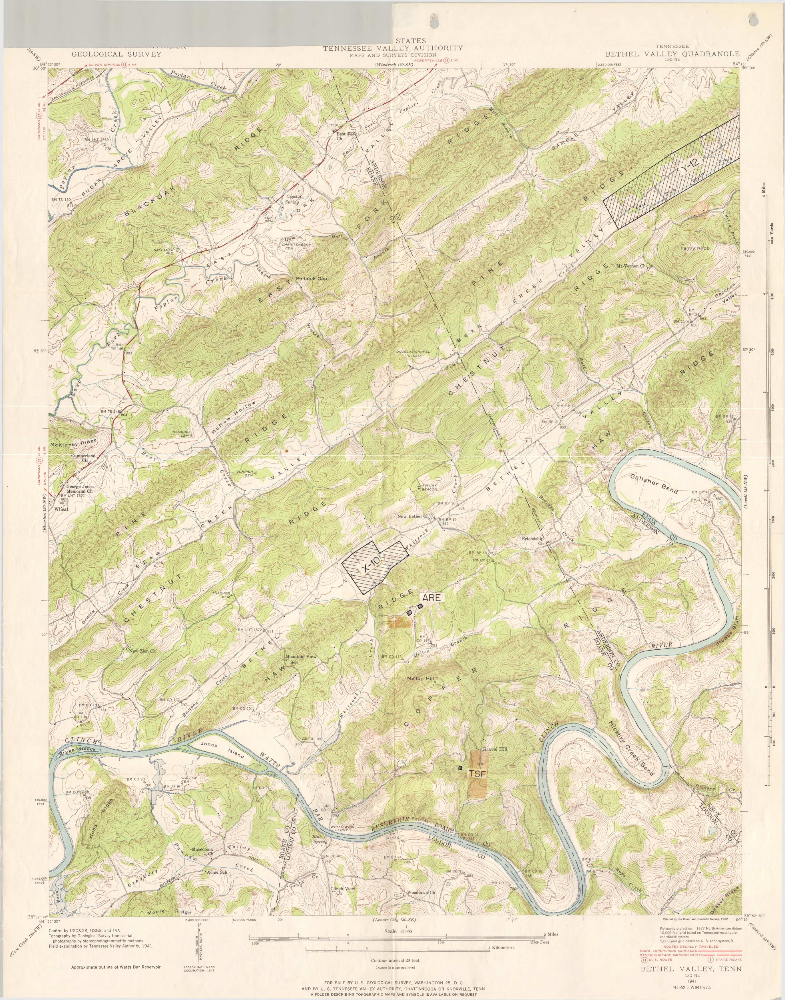

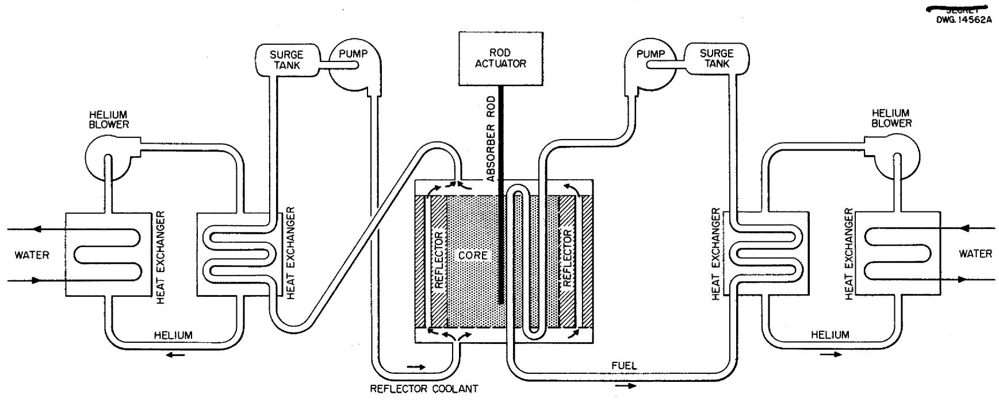  
Fig. 2. Schematic Arrangement of the Aircraft Reactor Experiment.

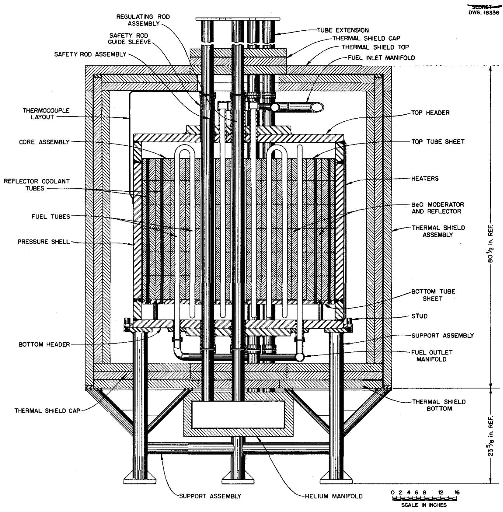  
Fig. 3. Experimental Reactor (Elevation Section).

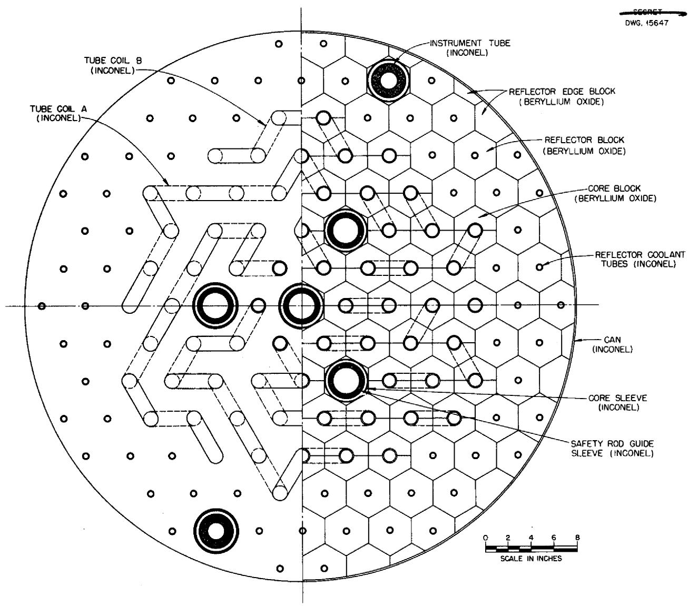  
Fig. 4. Plan Section of the Experimental Reactor.

consists of beryllium oxide blocks similar to the moderator blocks but with 0.5-in. holes for the passage of the reflector coolant. The reflector coolant (NaK) is admitted at one end of the pressure shell, passes through the reflector, bathes the pressure shell, fills the moderator interstices, and exits at the other end of the pressure shell.

Fluid Circuit. Circulation of both the fuel and NaK is obtained by packed-seal centrifugal pumps, and flow rates of 84 gpm are realized. The reactor heat is abstracted from the circulating-fuel outside the core by means of four fuel-to-helium heat exchangers, each capable of dissipating 750 kw, through which the fuel is circulated. The helium is then cooled by passing it through four helium-to-water heat exchangers, and the hot water is discharged. The Nak is cooled by a comparable NaK-to-helium-to-water heat exchange system.

Helium flow rates in the fuel-to-helium heat exchanger are controlled by variable-speed hydraulic systems that drive the helium blowers. Control of the helium flow rate in this manner permits smooth control of reactor power at any reactor temperature for which the nuclear controls are set, within the capacity of the heat removal system. At very low powers the temperature of the helium passing through the fuel heat exchanger closely approaches the fuel temperature. At design conditions, the helium will be heated and cooled $500^{\circ}\mathrm{F}$ (that is, between 250 and $750^{\circ}\mathrm{F}$ ) as it passes through the sets of heat exchangers. The system is designed so that when the rate of power generation is equal to or less than the power loss through insulation, electrically heated helium passes through the fuel-to-helium heat exchanger. The fluid circuit flow sheet is shown in Fig. 5, together with the design condition values of temperature, pressure, and flow.

# Monitoring and Preheating Systems.

Leakage monitoring of both the fuel and NaK systems is effected by the use of double-walled pipes that provide an annulus through which helium is pumped on all lines and components containing fuel or reflector coolant. The helium pumping head is maintained by drawing helium from the system, cooling it, and admitting it to rotary-type compressors at various points in the system. Monitoring for fluoride leaks into the helium is achieved by passing helium samples through halogen detectors.

The relatively high melting point of the circulating fuel (around $500^{\circ}\mathrm{C}$ for the NaF-ZrF $_4$ -UF $_4$ fuel with a composition in mole per cent of 50-46-4) requires that all equipment within which this coolant would be circulated be heated to permit loading, unloading, and also the possibility of low-power operation. Preheating, as well as the addition of heat during low-power operation, will be accomplished by means of electrical heaters attached to all components of the fuel and NaK systems, that is, pressure shell, heat exchanger, pumps, tanks, and the outer pipe of the double-walled fuel and NaK piping. Within the piping, the helium flow in the annulus acts as a heat conveyer and transports heat to sections that are not directly in contact with heaters.

Fuel Fill and Dump System. The fuel carrier, NaF-ZrF₄ (50-50 mole %), is first loaded into fill tanks provided in a shielded pit adjacent to the reactor and heat exchanger pits. This molten salt is forced into the fuel system by helium pressure. The uranium-bearing fuel component, NaF-ZrF₄-UF₄ (50-25-25 mole %), is then added by the fuel-enrichment system (cf., section on shim control under "Reactor Control and Safety Devices") the composition of the ultimate fuel, that is, the enriched mixture plus the carrier, will be

somewhere in the neighborhood of 50-46-4 mole % of NaF-ZrF₄-UF₄. The precise composition will be determined by the critical loading of the reactor.

At the conclusion of the experiment, or as a result of a reactor scram, the fuel can be dumped into a special tank designed to be subcritical when filled with the dumped fuel. At the time the fuel carrier is loaded to the reactor system, the valves to the then empty fuel-carrier fill tanks will be sealed so that the enriched fuel cannot accidentally be dumped into these tanks. The design of all the tanks has provided for heat addition to maintain the fuel mixture in a molten condition and, in the case of the fuel dump tank, for removing the afterheat evolved within dumped fuel after power operation.

Instrumentation. Since a basic purpose of the aircraft reactor experiment is the acquisition of experimental data, the importance of complete and reliable instrumentation cannot be overemphasized. Most ARE process instrumentation is intended to observe and record rotational speeds, flow rates, temperatures, pressures, or liquid levels. The values of temperature, pressure, and flow at various stations around the ARE fluid circuits are shown in Fig. 5. Most commercially available equipment for performing these functions is limited to temperatures considerable lower than the minimum operating temperature of the ARE and employs open lines in which the $\mathrm{ZrF_4}$ vapor would condense and plug the tubes. Accordingly, a bellows type of device is employed as the pressure indicator, and a fluid-immersed inductance type of instrument has been developed for measuring flow and liquid level.(1) Conventional Chromel-Alumel thermocouples located in wells are used to determine temperature.

Building. The ARE building is a mill type of structure designed to house the ARE and the necessary facilities for its operation. The building has a full basement 80 by 105 ft, a crane bay 42 by 105 ft, and a one-story service wing 38 by 105 feet. The reactor and the necessary heat disposal systems are located in shielded pits in the part of the basement serviced by the crane. One half of the main floor area is open to the reactor and heat exchanger pits in the basement below; the other one half houses the control room, office space, shops, and change rooms.

In one half of the basement are shielded reactor and heat exchanger pits; the other one half of the basement is service area. The control room, office space, and some shops are located on the first floor over the service area. The first floor does not extend over the one half of the basement that contains the pits. The crane is a floor-operated, 10-ton, bridge crane having a maximum lift of 25 ft above the main floor level. Plan and elevation drawings of the building are shown in Figs. 6 and 7.

The entire reactor system is contained in three interconnected pits: one for the reactor, another for the heat exchangers and pumps, and a third for the fuel dump tanks. These pits, which are sealed at the top by shielding blocks, are located in a large crane bay of the building. The crane bay is separated from the control room and offices, and the heating and air conditioning systems maintain the control room at a slightly higher pressure than the crane bay.

# OFF-GAS DISPOSAL SYSTEM

The off-gas disposal system provides for the collection, holdup, and controlled discharge of the radioactive, volatile, fission products that may be evolved as a consequence of reactor operation. In addition to keeping

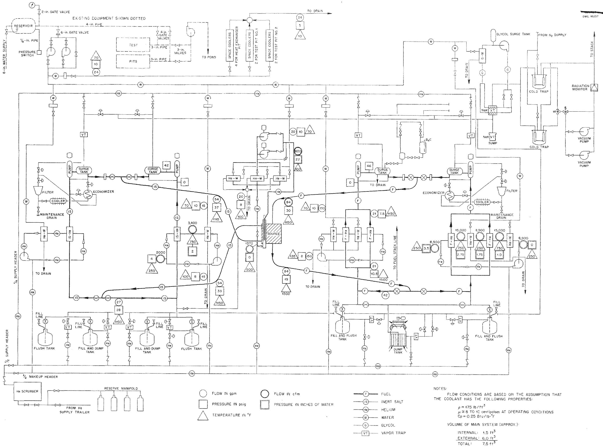  
Fig. 5. Fluid-Circuit Flow Sheet.

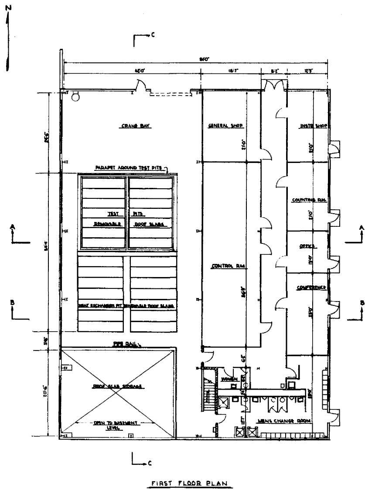

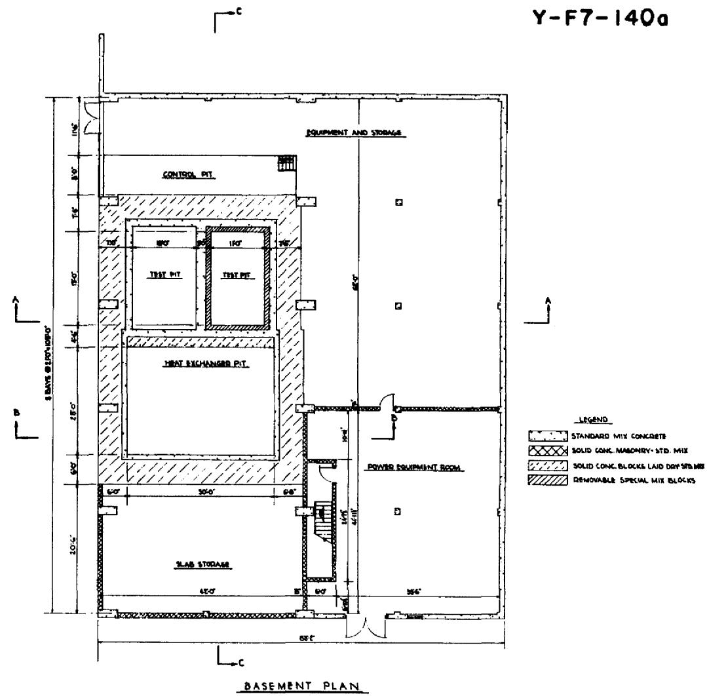  
RESTRICTED   
Y-F7-140a   
Fig. 6. Plan of ARE Building.

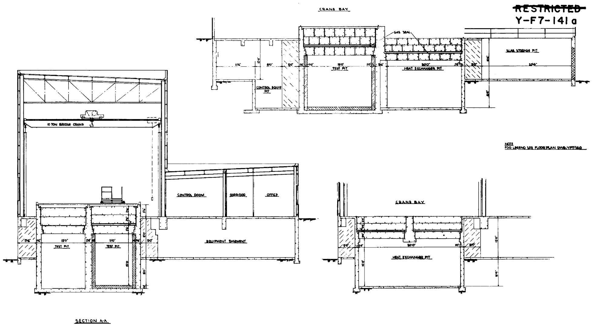  
Fig. 7. Elevation of ARE Building.

the normal release of radioactive gases within the maximum permissible concentration (MPC), the system will perform a similar function in the event of certain catastrophies (cf., chapter on "Reactor Hazards"). It is assumed throughout the discussion of the off-gas system that all of the volatile fission products that are created will evolve from the fuel and be discharged through the system. This is not the case, however, and preliminary experiments with a static fuel mixture have shown that only a small fraction (2.5% or less) of the $\mathrm{Xe}^{135}$ will evolve from the mixture.(2)

Description of System. A helium atmosphere is maintained over the surge tanks in the fuel system and the fuel dump tanks. This helium gas, which will contain the volatile fission products (Br, I, Xe, and Kr), passes through a NaK vapor trap (where the Br and I are removed), then into two holdup tanks (to permit the decay of Xe and Kr), following which the gases are released up the stack. However, the release of gases to the stack is dependent upon the following conditions: (1) the wind velocity is greater than 5 mph and (2) the activity, sensed by a monitor, is less than an established maximum value. The monitor is located between the two storage tanks, which are connected in series. Provision is also made to exhaust the reactor pits through the holdup tanks in the off-gas system at a rate of 27 cfm (the limit of the exhaust system). The off-gas system is shown schematically in Fig. 8.

With a static helium atmosphere in the surge and dump tanks, the volumetric flow rate of fission gases is a maximum of 0.0014 cfm. In order to have a measurable flow of gas, the fission gases are mixed with a fixed

(2) ANP Quar. Prog. Rep. Sept. 10, 1952, ORNL-1375, p. 153.   
(3) M. M. Mills, A Study of Reactor Hazards, NAA-SR-31 (Dec. 7, 1949).

air bleed of 10 cfm between the first holdup tank and the monitors. The minimum flow rate past the monitors then is 10 cfm and the maximum 37 cfm (that is, 10 cfm from the fixed air bleed plus 27 cfm if the room is being exhausted at the same time). The monitor setting can then be based on the premise that the flow is 37 cfm and the setting will be conservative by a factor of 3.7:1 when the minimum flow rate prevails.

The second holdup tank is placed between the monitors and the stack valve to increase the gas transit time between the monitor and the valve to ensure that the valve has time to close after the monitor signals the presence of excess activity.

Maximum Activity of Stack Gases. The maximum activity of the stack gases has been calculated, with the assumption that the average energy of disintegration is equal to 1 Mev.(3) The design of the off-gas system includes two vacuum pumps that deliver a maximum of 27 cfm and a blower that discharges 10 cfm, giving a total of 37 cfm maximum discharge through the monitor. The maximum permissible ground concentration for the l-Mev fission-product activity is

$$
M P C = 1. 6 \times 1 0 ^ {- 6} \mu c / c m ^ {3}. \tag {4}
$$

At 37 cfm or $1.05 \times 10^{6} \, \text{cm}^{3} / \text{min}$ and with a permissible activity discharge rate of 0.832 curie/min, which produces the above MPC, the activity per cubic centimeter should not exceed

$$
\frac {0 . 8 3 2}{1 . 0 5 \times 1 0 ^ {6}} = 0. 8 \mu c / c m ^ {3},
$$

as determined by the radiation monitor. The monitors that control the positions of the stack valve will be set to prevent discharge as soon as the activity of the gas rises above a predetermined level.

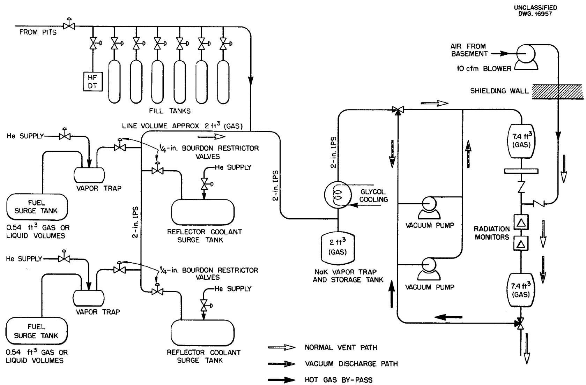  
Fig. 8. Off-Gas Disposal System (Schematic).

The discharge rate of xenon and krypton fission products to the atmosphere must be such that the activity is within the above limit. The effective system holdup, before the monitors, is 11.4 ft³ or $3.53 \times 10^5$ cm³ (the volume of one tank plus piping). If it can be assumed that the decay time of the fission products is equal to the system volume divided by the flow rate, the total energy at a particular time can be calculated. This energy must be converted to disintegrations per unit time by considering effective energy changes in relation to the variation of isotopic concentrations with time. The values of permissible and calculated stack activity have been plotted in Fig. 9, together with the permissible discharge rate, as determined by the National Committee on Radiation protection. (4) It will be noted that at 8500 min of holdup, corresponding to a discharge rate of 20.8 cm³/min through each restrictor, the ground tolerance will not be exceeded.

Normal Discharge from the Surge Tank. The maximum pressure within the surge tank is limited by a 5-psig pressure regulator in the gas supply system. The maximum discharge rate from the surge tank is limited by a Bourdon restrictor to $20~\mathrm{cm}^3/\mathrm{min}$ with

a 5-psi pressure differential. At this flow rate through each of two restrictors, the holdup volume of the system is such that it will allow sufficient decay time, as required by the above calculation, to permit the discharge of the off-gas directly up the stack. The change of effective energy owing to the persistence of the longer lived isotopes has been accounted for when considering ground concentration of this gas.

Gas Vented from the Fuel Dump Tank During Dumping. In considering waste gases from the surge tanks it has been assumed that all gaseous products escape into the surge tanks during operation. Actually, it is expected that some portion of the fission-product gases will remain in the fuel and that some fraction of this portion will be released when the fuel is admitted to the hot-fuel dump tank. When fuel is admitted to the fuel dump tank it is expected that helium will be displaced at a rate of the order of 5 cfm. This helium, after passing through the NaK scrubber and the first holdup tank, will be admitted to the monitors. Should the monitors sense excess activity, the stack valve will prevent discharge and the vacuum pumps will permit recirculation through the holdup tanks and monitors.

TABLE 1. ACTIVITY OF XENON AND KRYPTON AS A FUNCTION OF HOLDUP TIME   

<table><tr><td rowspan="2" colspan="2">STACK DISCHARGE (curie/min)</td><td colspan="2">HOLDUP TIME</td><td rowspan="3">DECAY POWER (w)</td><td rowspan="3">Mev/sec</td><td rowspan="3">EFFECTIVE ENERGY (Mev)</td><td rowspan="3">DISINTEGRATIONS PER SECOND</td><td rowspan="3">MPC \( \left( {\mu c/{\mathrm{{cm}}}^{3}}\right) \) IN AIR</td></tr><tr><td rowspan="2">Days</td><td rowspan="2">Minutes</td></tr><tr><td>Calc.</td><td>MPC</td></tr><tr><td>344</td><td>2</td><td>1/2</td><td>720</td><td>600</td><td>\( {3.75} \times  {10}^{15} \)</td><td>0.41</td><td>\( {9.15} \times  {10}^{15} \)</td><td>\( {3.9} \times  {10}^{-6} \)</td></tr><tr><td>110</td><td>2.45</td><td>1</td><td>1,440</td><td>320</td><td>\( {2.00} \times  {10}^{15} \)</td><td>0.34</td><td>\( {5.88} \times  {10}^{15} \)</td><td>\( {4.71} \times  {10}^{-6} \)</td></tr><tr><td>39.6</td><td>3.51</td><td>2</td><td>2,880</td><td>160</td><td>\( {1.00} \times  {10}^{15} \)</td><td>0.237</td><td>\( {4.22} \times  {10}^{15} \)</td><td>\( {6.75} \times  {10}^{-6} \)</td></tr><tr><td>28.5</td><td>3.94</td><td>3</td><td>3,320</td><td>128</td><td>\( {8.00} \times  {10}^{14} \)</td><td>0.211</td><td>\( {3.79} \times  {10}^{15} \)</td><td>\( {7.58} \times  {10}^{-6} \)</td></tr><tr><td>6.91</td><td>4.54</td><td>5</td><td>7,200</td><td>54</td><td>\( {3.38} \times  {10}^{14} \)</td><td>0.183</td><td>\( {1.84} \times  {10}^{15} \)</td><td>\( {8.74} \times  {10}^{-6} \)</td></tr><tr><td>3.02</td><td>4.54</td><td>7</td><td>10,080</td><td>33</td><td>\( {2.06} \times  {10}^{14} \)</td><td>0.183</td><td>\( {1.13} \times  {10}^{15} \)</td><td>\( {8.74} \times  {10}^{-6} \)</td></tr></table>

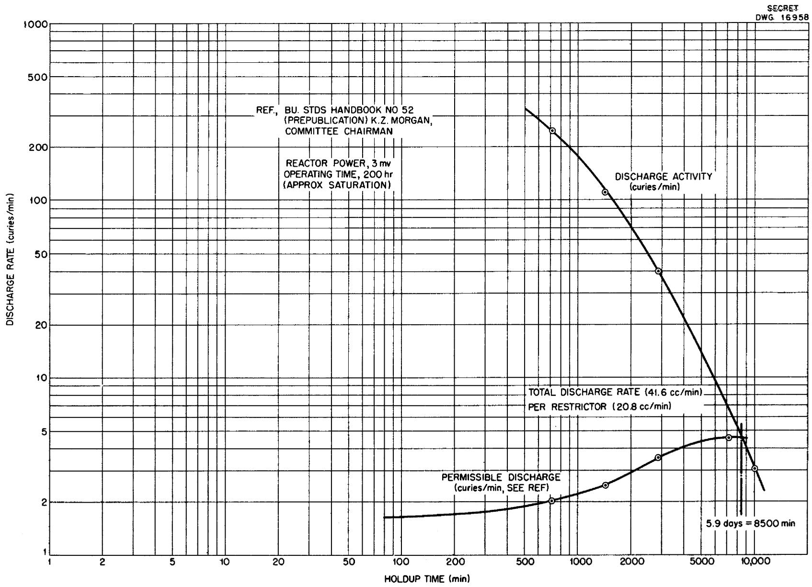  
Fig. 9. Discharge of Xenon and Krypton Activity to the Atmosphere.

The recirculation should homogenize the gases and ensure that the monitor is sensing a representative sample. When the gases have decayed sufficiently to permit release, the monitor-controlled interlock will open the stack valve.

# REACTOR CONTROL AND SAFETY DEVICES

Most of the control and safety features of the ARE are similar, and in many cases identical, to those of certain reactors now in operation. The nuclear instrumentation (such as fission chambers and ion chambers) and the electronic components (such as preamplifiers and power amplifiers) are copies of similar instruments and gear in use on other reactors (MTR, LITR, etc.). However, since the fission chambers will be located in a high-temperature region within the reactor reflector, special high-temperature chambers have been developed; helium cooling will be used to keep them within a safe temperature range. Alternate electrical power systems are provided so that none of the safety mechanisms can become paralyzed by a simple power failure in any one system.

There are three separate parts to the control system: fuel shim control, regulating system, and safety system. The motor speed and gear ratio are regulated so that safety rod withdrawal cannot add $\Delta k / k$ at a rate greater than $0.015\%/\sec$ (that is, $0.005\%/\sec$ per rod). The regulating rod can be inserted or withdrawn to change $\Delta k / k$ at a rate of $0.1\%/\sec$ . The movement of this rod will be set to provide a maximum change in $\Delta k / k$ of $0.4\%$ (approximately one dollar for steady-state fuel circulation) between the positions of maximum inserted and fully withdrawn. The fuel loading system cannot inject fuel at a greater rate than that which would increase the reactivity at a rate of $0.013\%/\sec$ .

These features are inherent in the design of the control system; furthermore, since these three divisions perform distinctive functions and since each is almost, if not entirely autonomous, each will be discussed separately in the following.

Numerous automatic, as well as optional, safety features are incorporated into the control system. The automatic features scram the reactor when activated; the optional features warn the operator of potential troubles. The specific situations for each case are listed below. For every scram the interlocks of the system are such that the helium flow in the fuel heat exchangers is cut off by opening the electrical circuits to the motors. This action is necessary to prevent fuel from freezing in the heat exchangers.

Automatic Scram Signals. For certain instrument signals the magnetic clutches holding the shim rods automatically release the rods to fall and scram the reactor. These signals are the following:

1. reactor outlet temperature, upper limit, $1550^{\circ}\mathbf{F}$   
2. fuel heat exchanger outlet temperature, lower limit, $1100^{\circ}\mathrm{F}$   
3. one second fast period,   
4. upper limit on flux, equivalent to reactor power of 4500 kw,   
5. fuel flow stoppage.

In addition, a 5-sec period inserts the shim rods, which decreases $\Delta k / k$ at a rate of $0.015\%/\mathrm{sec}$ .

Optional Scram Signals. There are certain optional scams that have not been made automatic for two reasons; namely, the sensory signals usually have already lagged the event to such an extent that a fast scam cannot provide better protection than an optional or delayed scam, and second, reaction to these signals requires limited judgment. To build judgment into the equipment would complicate the instrumentation unnecessarily. For each case requiring the exercise of

limited judgment the equipment sounds an alarm and annunciates to draw the operator's attention to the possible difficulty.

The following signals are provided for the optional scram:

1. pronounced changes in differential temperatures between reactor outlet tubes (described in section on "Reactor Hazards"),   
2. lowering level in any surge tank,   
3. rising level in any surge tank,   
4. alarm from a G-E halogen detector,   
5. alarm from a radiation monitor,   
6. lower limit on steady-state fuel-flow indicator,   
7. lower limit (1150°F) on fuel outlet temperatures in fuel heat exchangers,   
8. oxygen concentration in pits,   
9. humidity in the pits.

Shim Control. The reactor will be made critical only after the fuel-carrying liquid $\left(\mathrm{NaF}-\mathrm{ZrF}_{4}, 50-50 \text { mole } \% \right)$ has been brought up to a temperature of approximately $1200^{\circ} \mathrm{F}$ . The liquid in the entire primary loop will then be maintained at as nearly a constant temperature as can be provided by the external heating system. After the system has been checked for leaks and found to be tight, a fluoride mixture $\left(\mathrm{NaF}-\mathrm{ZrF}_{4}-\mathrm{UF}_{4}, 50-25-25 \text { mole } \% \right)$ containing enriched uranium $(93.4 \% \mathrm{U}^{235})$ will be injected into the primary fluid to bring the reactor to critical at the temperature of $1200^{\circ} \mathrm{F}$ . This technique for fuel enrichment comprises the shim control of the reactor and is designed only to add uranium to the carrier; there is no plan to try to go subcritical by fuel depletion.

The fuel enrichment operation is accomplished by means of the mechanism shown in Fig. 10. A small fuel line first carries the fuel from the storage tank to the transfer tank and thence to the pump inlet. Injection of the fuel at the pump inlet assures mixing of enriched fuel and carrier. The enriched fuel is held in the trans

fer tank, where it is weighed, and when the gas pressure over the liquid in the tank is raised, fuel is forced through the connecting line into the system at the pump. The transfer tank is hung from a beam balance so that an accurate determination of the weight of fuel is directly obtainable.

This method of fuel addition permits the addition of known amounts of fuel, and the magnitude of these quantities can be controlled over a considerable range as a critical loading is approached. By introducing the fuel into the circulating system just before the liquid enters the reactor, safe loading of the system is assured. Should a slight excess of fuel be added to part of the fuel stream, the reactor would give an indication of supercriticality when the enriched liquid entered the lattice and before the uranium concentration of the entire fuel circuit had been increased. If this occurred, the fuel addition could be stopped and subsequent mixing of the supercharged liquid with subcritical fuel would lower the reactivity.

Regulating System. The reason for providing a mechanical regulating system is that the magnitude of the reactivity change effected by the expansion of the fuel cannot be accurately predetermined. To supplement the negative temperature coefficient, in case it is of insufficient magnitude, a single absorber rod having a total value of approximately $0.40\% \Delta k / k$ is provided in the center of the reactor. The maximum insertion rate is $0.1\% \Delta k / k$ per second.

The absorber rod is located in a 3-in.-dia hole that runs through the pressure shell and core in the center of the lattice. By means of a direct drive, a 2-in.-dia boron absorber rod is inserted into this hole. Since the regulating rod will run within the core while the reactor is running at full power, the rod must be cooled.

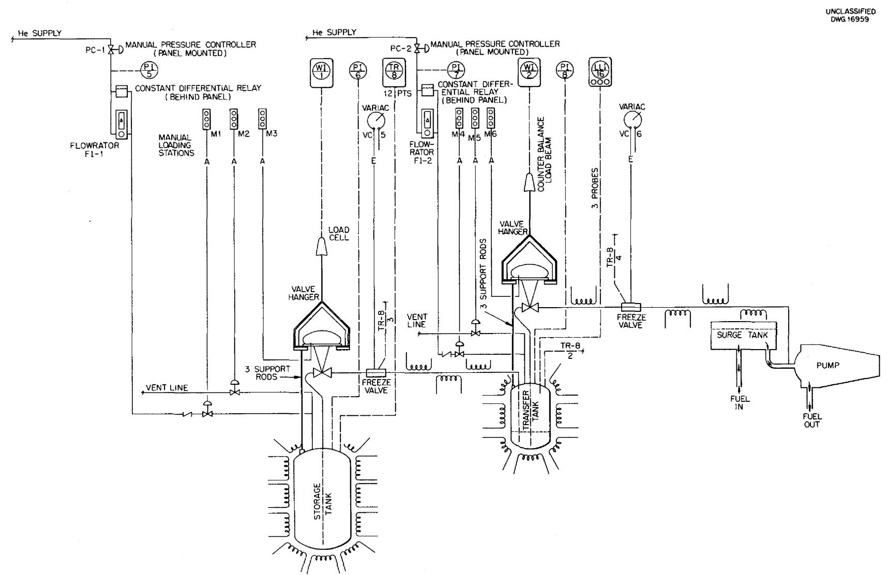  
Fig. 10. Fuel-Enrichment System.

This is accomplished by the forced circulation of helium down and around the rod in a closed loop.

The regulating rod is moved by a 200-watt, 60-cycle, reversible motor of constant speed that is either manually or automatically actuated. For manual operation the motor is energized by a zero-position, momentary-contact, reversing switch located on the operating console. Manual adjustments are used during the critical experiment, during the rod calibration operation, and if desired during the power regime. For automatic operation, the motor is energized from a control error signal derived from neutron flux measurements, from the reactor mean temperature, or from a linear combination of the two signals. The automatic system can be operated only when a reasonable power (greater than 300,000 kw) is being drawn from the reactor.

The servo system is arranged so that the reactivity changes introduced by the regulating rod behave like a negative temperature coefficient associated with the fuel. When the regulating rod is connected to the servo drive and temperature or flux perturbations are introduced into the reactor, control of the reactor will be accomplished.

During normal operation of the reactor, when power changes are being made at a slow rate, the reactor will be manually controlled. Improper manipulation of the manual control, which would result in getting the reactor on too short a period, is safeguarded by the cocked safety system plus the coefficient of reactivity associated with the expanding fuel. Precautions in the form of limit switches, interlocks, alarms, etc., in accordance with previous reactor installations, are provided to further minimize the opportunity for improper manipulation of the manual control.

The regulating rod drives are located on the concrete slab directly

over the reactor and are accessible to personnel at all times. The rod linkage goes through holes in the concrete slab and provides means for positioning the absorber portion of the rod in the center hole provided in the reactor.

Safety System. Three safety rods for the ARE are located in the core on 120-deg points at a radius of 7.5 in. from the center of the reactor. The rods insert into 3-in. sleeves that pass through the reactor shell and core vertically from top to bottom. The rods are of hot-pressed boron carbide slugs that are canned in stainless steel sections and slipped over a flexible tube. Sections of the rod are cored to permit passage of helium down through the rod for cooling. Helium also passes down and around the rod in the space between the rod can and the core sleeve so that cooling of the outside surface and the inside of the rod is accomplished by parallel helium flow.

Located above the reactor, on top of the reactor pit, are the actuating mechanisms for each rod. An actuator is provided for each rod, but all actuators are energized simultaneously, and the maximum speed of withdrawal of the rods is fixed by the speed of the constant speed a-c motor used to actuate the driving mechanism. The safety rods are suspended by electromagnets. This arrangement was used in the MTR, and the ARE design has taken advantage of the experience gained in the operation of that reactor.

The driving mechanism is comprised of a reversible 60-cycle motor connected to a drive screw that is arranged to drive an electromagnet in a vertical travel of 36 inches. The drive screw operates inside a cylindrical enclosure, and the magnet has a keeper that fits as a piston inside the enclosure. The piston has a small cable attached concentrically; the other end of the cable is attached

to the absorber rod. When the magnet is energized, the drive screw moves the piston vertically within the cylinder and, by the cable attachment, either raises the safety rod or allows it to fall by gravity as the piston is lowered on the drive screw. When the magnet is de-energized, the piston falls and permits the safety rod to drop. As the piston reaches the end of its travel, gas is compressed in the cylinder, to a degree controlled by vent holes in the cylinder wall, and acts as a pneumatic cushion for the rod.

Each of the three safety rods has approximately $5\% \Delta k / k$ negative reactivity when inserted in the reactor. Thus a total of approximately $15\% \Delta k / k$ is available to shut down the reactor. Three large rods are used because statistics indicate that at least one of the three rods is certain to drop without hesitation at a signal to scram.

# OPERATING PLAN

A clear concept of the object of the ARE is essential for an understanding of the specific reactor operation. The object, briefly stated, is: to operate the system at as near a 3-megawatt power level for as nearly 500 hr as possible. Even if the facility operates successfully at a power level of 1 megawatt for only 1 hr, the experiment will have attained some measure of success. The object, as stated above, is essentially the development of an operating unit. Consequently, practically all data derived from the ARE will be data pertaining to this particular type of nuclear power plant. One piece of basic information to be determined from the experiment is the evaluation of the stabilizing influence of the temperature coefficient of reactivity.

Operation of the ARE depends, to an extraordinary degree, on providing

a leak-free system before fluorides are introduced into it. For this reason, several preliminary tests have been proposed to ensure detection of all possible leaks. These tests must, and will be, made with the utmost care. The following account of the test procedure, in the interest of continuity, omits details of the repairs indicated from time to time by these tests (for repair of leaks see "Appendix A"). Accordingly, the description of each test step is based on the assumption that the system has been found tight by all previous tests.

Installation of Piping. Installation of the plumbing system, which involves all basic components of the reflector coolant and fuel circuits because of the interconnecting piping, will be a tedious and exacting job. The pipelines and components will be completely encased with a circulating gas (helium) system. All piping is to be installed in a prestressed condition so that thermal expansion will essentially remove system stresses. All joins of components to piping will be made by inert gas welding, according to strict functional specifications, and will be inspected by dye-checks and radiography. Each weld will be approved before additional welds are made.

The monitoring gas annuli, wherever these are integral pieces, will be installed as the piping is installed. No welded joint will be covered by the annulus until just prior to installation of the heaters and thermal insulation. After all plumbing is installed, the checkout procedure for the system will be started.

Helium Leak Test. The first check of the system will be made by putting the fuel and reflector-coolant circuits under a helium pressure of about 50 psi. While the systems are maintained under this pressure, each welded joint and the flanged joints at the pumps will be soaped and visually

inspected for leaks. This test will reveal gross leaks and will enable repairs to be made with a minimum of inconvenience.

Alcohol Leak Test. The pump shafts on the reflector circuit will be sealed with wax and the system evacuated. A DPI halogen detector will be installed in the vacuum pump circuit and will be left there while the fuel circuit is filled with alcohol. The filling technique will be the same as that followed in subsequent filling operations for NaK and fluorides. This involves evacuating the fuel system and filling slowly by means of a positive gas pressure over the fluid in the fill and dump tanks.

With vacuum on the reflector circuit, the alcohol in the fuel circuit will be circulated at design point flow, and the system pressure will be raised to design point by means of helium pressure over the free liquid surface in the surge tank. Then, if there is a leak between fuel and reflector circuits, alcohol vapor will be detected by a DPI unit, and the core will have to be repaired. This fault is extremely unlikely, but the test must be made to determine the integrity of the reactor core.

While the alcohol is circulating in the fuel circuit, all instrumentation such as flowmeters, level indicators, pressure indicators, and thermocouples will be checked to assure that their operation is at least qualitatively correct. Pump speed will be checked throughout the variable range, and a hydrodynamic test of the system in general will be made. All joints will be inspected visually for evidence of leaks. At this stage of the test program, it will be essential to check carefully all valve performance in relation to the associated valve-monitoring equipment. Gas space between bellows will be sniffed with

the DPI monitor for detection of leaky bellows.

On completion of the above tests, the reflector circuit will be filled with alcohol and checked almost exactly as was the fuel circuit. Obviously, no additional leak test of the core can be made, since both circuits will at that time be filled with alcohol.

Roth circuits will then be drained of alcohol, to the extent possible, by admitting high-pressure helium over the top of the liquid. A vacuum will be pulled on both circuits to complete the removal of all alcohol by evaporation. The alcohol thus drained into the fill and dump tanks will be removed from the building.

Assembly of Reactor, Gas Annuli, Heaters, and Insulation. After the alcohol leak tests, the top plug will be installed over the reactor and installation and testing of the control mechanism will begin. Both circuits will be on the vacuum pump continuously, and they will be checked repeatedly for leaks by the rate of rise of pressure in each system.

Before additional tests are warranted, the system must be brought up to temperature. This first necessitates the installation of all annuli, heaters, and thermal insulation, a job which will require several man-weeks of effort. The annulus system must be made tight so that helium can be circulated independently of the pit atmosphere, for, at this stage of the test, the pits will be open and will not have a helium atmosphere.

Vacuum Test at $1200^{\circ}\mathrm{F}$ . After the complete system has been equipped with annuli, heaters, and insulation, power will be turned on the entire heating assembly to begin the warm-up. Helium will be circulating in the annuli to assist in eliminating longitudinal thermal gradients. The warm-up will proceed at a very slow rate, about $35^{\circ}\mathrm{F}$ per hour. During the

warm-up, the heater system will be carefully monitored, and any inequality in temperature will be corrected by a shifting of heater power source (there are four such sources of independently variable voltage). The entire system will be brought to a temperature of $1200^{\circ}\mathrm{F}$

With an isothermal condition at a temperature of $1200^{\circ}\mathrm{F}$ , a rate-of-pressure-rise test will be applied to both fuel and reflector systems as a final check for leaks before the hot NaK is introduced into the circuits. Also, at this high temperature, the control rods will be given an operational check to make sure that no interference has resulted from thermal expansion. At this point also, any heaters and insulation damaged by thermal expansion will be repaired.

Hot NaK Test. One flush and fill tank will be filled with NaK and the heaters on the tank turned on to bring the NaK to a temperature of $1200^{\circ}\mathrm{F}$ . The fuel circuit will then be filled with hot NaK. With NaK circulating in the fuel circuit, the reflector circuit will be carefully monitored with the DPI sniffer to detect any leak that might have developed in the reactor core. All valve operation, thermocouples, flowmeters, level indicators, and other instrumentation will be checked for proper operation.

Once the fuel circuit has been checked out, the reflector circuit flush and fill tanks will be filled with NaK, which will then be brought up to a temperature of $1200^{\circ}\mathrm{F}$ . The reflector circuit will be given the same check as the fuel circuit, and both circuits will be operated simultaneously in a shakedown run. This run will involve operation of the helium blowers of both circuits for short periods of time. The heater power will be inadequate to allow extraction of much power by the heat

exchanger loops, but the heat exchanger outlet temperature will be reduced by about $200^{\circ}\mathrm{F}$ for brief periods to see that the equipment functions properly. The system will be observed critically and carefully for a period of continuous operation of about 40 hours. Final testing will be done at $1500^{\circ}\mathrm{F}$ .

When the operation is satisfactory, the fuel circuit only will be drained of NaK and put under vacuum. When the rate of pressure rise in the evacuated circuit indicates that the NaK has been removed, the system will be ready for the fluoride loading. Since NaK cannot be used in the fuel circuit after the fluorides have been introduced, the NaK will be removed from the fill and dump tanks as well as from the fuel circuit.

Tests with Fuel Carrier. If the preliminary tests up to this point indicate that the system is tight, the loading of the fill and dump tanks for the fuel circuit with the inert fluoride fuel carrier, $\mathrm{NaF - ZrF_4}$ , can be started. The fluoride will first be put into two fill and dump tanks of the fuel circuit. Each of these tanks has a usable capacity of approximately 12 ft³; the capacity of the fuel circuit is approximately 7.5 ft³. To provide a reserve of 7.5 ft³ of fluoride fuel carrier for flushing the fuel system and an empty dump tank for receiving the mixed fuel and carrier, it is proposed to divide the 15 ft³ of fluoride fuel carrier in these two tanks so that one will contain approximately 6 ft³ and the other 9 ft³. The system will be filled by using the smaller supply first, to empty that tank, and then the larger supply to provide the required amount, 7.5 ft³. Once the fuel carrier has been transferred to the reactor system, the valves to the fill tanks will be isolated so that the enriched fuel mixture cannot subsequently be dumped into these tanks.

Filling the system with molten fluoride will be carried out in the same manner as the previous fillings with alcohol and hot NaK. The system will be filled until the surge tanks are approximately two-thirds filled. With the pumps in operation, the gas pressure over the surge tanks will be increased by about 15 psi. A depression of the level in the surge tanks as a result of the increase in gas pressure will indicate gas pockets in the system.

A further check for gas pockets in the reactor, as well as a check for equality of flow in the six parallel fuel paths in the core, can be made by turning on the helium blowers to about $10\%$ of full flow for a short time. During all this time the fuel carrier will be heated by external resistance heaters. Unequal temperature rises as the fuel carrier flows in the six parallel channels will indicate unequal flow rates, with the slower moving fluid having the higher temperature rise. Variations of as much as $5\%$ in outlet temperatures between any two parallel paths will indicate unsatisfactory flow in the path with the higher outlet temperature. Changing the speed of the helium blowers will introduce a temperature transient in the fuel circuit. These variations in speed will be introduced by manual adjustment of the wobble plate of the Vickers hydraulic drive to the helium blower in such a manner that the fuel heat exchanger outlet temperature will not decrease more than $25^{\circ}\mathrm{F}$ . The wobble-plate-motor speed-control setting required to give this 25-deg drop in temperature will be noted, since it will be used again in a subsequent test.

At this point in the test program, the system will be ready for a shakedown run before the addition of the enriched fuel. The period of operation with the fuel carrier will be extensive so that any weak points in the system

can be discovered and final repairs made before the fuel is added. All instrumentation will be thoroughly checked, as will valve and pump operation. The system will be run for about 50 hr before fuel addition is started. The shakedown period should be long enough to show up possible danger points in seals, valves, rod actuators, etc. Once this period has been passed, the probability of failure within the next 100 hr is believed to be quite low. It is imperative that every precaution be taken to ensure the tightness of the system before enriched fuel is added, for it will be very difficult to effect repairs after that time.

Critical Loading. When the 50-hr test with the fuel carrier is completed, the fuel $(\mathrm{NaF - ZrF_4 - UF_4}$ 50-25-25 mole $\%$ will be brought into the building and the fuel-enrichment system will be filled. The fuel melt will be prepared in "eversafe" tanks at Y-12 and brought to the building for heating. All temporary gas by-passes will be removed and the pits covered so that the air in them can be replaced by a helium atmosphere, which will remain for the duration of the experiment. With helium in the pits, the heat loss from the system will be increased, and it will be necessary to increase the heater power input to maintain the temperatures at the desired point. Steady isothermal conditions for the entire system can be achieved after sufficient time has elapsed.

With the system isothermal, or approximately so, fuel enrichment will be started. However, before this can be done, it will be necessary to drain approximately 1 ft³ of the fluoride mixture from the system into the fill and dump tank that already contains approximately 6 ft³. Then one half the calculated critical loading will be made as rapidly as the enrichment system will permit. The system provides for injection of one quart

of fuel in approximately 3 minutes; the system can inject no more than a quart in each operation lasting 3 minutes. After each injection the quart-measuring device must be rel- loaded. The 3-min loading-time interval is approximately four fluid loop transit times. Successive quart loadings will be made in such a manner that the start of no two loadings will occur at the same point in the loop cycle. This precaution should ensure uniform fuel distribution in the system, even though mixing after injection should be good.

When one half the computed critical loading has been made, the remaining loading will be done with the care and caution characteristic of loading any reactor for the first time. The safety rods will be approximately $75\%$ withdrawn, and the regulating rod, which will be on "manual" operation, will be in the midrange position. The control system will be thoroughly interlocked to prevent gross misoperation while permitting the operator the maximum degree of freedom commensurate with safety. Loading of the fuel will be complete when the reactor is just critical at an isothermal temperature of $1200^{\circ}\mathrm{F}$ with the shim (safety) rods essentially $75\%$ withdrawn and the regulating rod completely withdrawn.

Subcritical Measurement of Fuel Temperature Coefficient. Loading will be interrupted just as soon as a measurable multiplication can be detected on the nuclear instruments. It is desirable to check the sign of the fuel temperature coefficient of reactivity as early in the operational regime as possible. Therefore, when the definite multiplication is discernible, a cool-fuel temperature transient will be induced in the reactor. This will be done by setting the helium speed control to that point previously determined which gives a maximum heat exchanger fuel-outlet temperature drop of about $25^{\circ}\mathrm{F}$ .

The characteristics of the temperature transient can be determined experimentally by starting and stopping the helium flow for the fuel-to-helium heat exchanger at that stage in the test program in which the system contains fluorides but no fuel in the fuel circuit. Several helium-flow time intervals will be used, and the reactor inlet and outlet temperatures for each will be recorded. These records will be available so that successively increasing time intervals can be used in this test for reactivity temperature coefficient.

The cool-fuel temperature transient should increase the multiplication because of the negative fuel temperature coefficient. If the multiplication decreases, indicating a positive temperature coefficient of reactivity, the reactor will be shut down and drained. It is the opinion of those who will operate the ARE that no power reactor having a positive temperature coefficient of reactivity is safe to operate, regardless of the type of automatic control system associated with it.

Regulating Rod Calibration. Before the reactor is brought to power, it will be necessary to calibrate the regulating rod. This will be done in the following manner: With the reactor critical, as described above, the regulating rod will be fully inserted and a measured quantity of fuel will be added uniformly to the system over a complete loop circuit time interval. By this time the quantity that must be added to provide excess reactivity of approximately $0.05\%$ can be estimated. The fuel can then be added uniformly to provide an increase in excess reactivity of $0.05\%$ in a single fuel enrichment operation. With the enrichment operation completed, the regulating rod will be withdrawn until the reactor is again critical. The position of the regulating rod will then be noted and recorded and the calibrating procedure repeated for

the remainder of the length of the regulating rod.

Zero Power Operation at $1300^{\circ}\mathrm{F}$ . With the regulating rod calibrated and the reactor critical, the temperature of the system will be raised $50^{\circ}\mathrm{F}$ and made isothermal at $1250^{\circ}\mathrm{F}$ . At this temperature the regulating rod will be adjusted so that the reactor is critical again, since the temperature rise will have caused it to go subcritical. The temperature will be raised slowly so that the operator can maintain critical or subcritical conditions rather easily throughout the operation by withdrawing or inserting the regulating rod.

Another $50^{\circ}\mathrm{F}$ temperature elevation will then be made in the same manner as was the first one. A further withdrawal of the shim rods may be required before the attempt is made to raise the temperature, since the magnitude of the negative temperature coefficients in fuel and moderator may be such that the excess reactivity contained in the regulating rod cannot compensate for a 100-deg temperature rise.

With the system isothermal at $1300^{\circ}\mathrm{F}$ and subcritical by shim and/or regulating rod insertion, fuel will be added in small increments until a sufficient amount has been added to maintain criticality at $1300^{\circ}\mathrm{F}$ with a regulating rod at the mid-position and the shim rods approximately $75\%$ withdrawn.

The calibrated regulating rod will make possible determination of the over-all reactivity temperature coefficient by these above-mentioned $50^{\circ}\mathrm{F}$ temperature increases. However, the precision of the shim rod positioning mechanism is not good enough to permit a reliable determination of this coefficient if the shim rods are moved during the operation of raising the temperature.

It is doubtful that the fuel temperature coefficient can be de

terminated accurately and independently from any of these tests. Evaluation of the temperature coefficient can probably be made by analysis of the load transients on the reactor at design-point power.

Power Operation. With the reactor critical and isothermal at $1300^{\circ}\mathrm{F}$ and the temperature coefficient tests completed, power operation may be undertaken. This step will be taken as follows: The reflector coolant helium pumps will be turned on. The regulating rod will be withdrawn sufficiently to provide a reactor period of approximately 20 seconds. If no further manipulation of the rod takes place, this period should continue until the power level suffices to raise the mean fuel temperature and lengthen the period. As the period increases to about 30 or 40 sec the fuel coolant helium blowers will be started and brought up, as rapidly as the equipment will allow, until about 500 kw of power is being generated by the reactor. This power level will be indicated by a differential temperature between reactor inlet and outlet of approximately $60^{\circ}\mathrm{F}$ .

The power extraction will then be leveled off long enough to check operation, and if the system is performing satisfactorily, the power level will again be raised. Present plans are to go to a power output of 3,000 kw as soon as possible. The exact procedure for getting to this high power level will be dictated by conditions at the time of operation and cannot be outlined in detail at this time, since so much depends upon the history of the system, the number of repairs that have been necessary, the elapsed time which the system has been at temperature, etc. A decision may be made to go to 3,000 kw for a few hours and then reduce the power to a lower value for a longer period of time. Again, the object of the experiment, to get all operating time

at 3,000 kw commensurate with safety, will dictate the exact procedure to be followed.

Shutdown. When the reactor has been run at power for about 500 hr, the experiment will be complete. If operation has been satisfactory and the condition of the various components is good, one further interesting test may be made. The reactor will be scrambled and left shut down for about 10 hr so that the xenon poison peak will be reached. At this time the rods will be carefully withdrawn until the reactor is again critical. If the reactor goes critical at essentially the same rod position, it will indicate that most of the xenon has been evolved from the molten fuel. If, however, the rods must be withdrawn beyond the original position to make the reactor critical, it can be assumed that xenon is at best incompletely evolved from the molten fuel.

The reactor will be finally scrambled and the fuel drained into the hot fuel dump tank. This draining will be done by blowing the fluorides out with helium. The blow-down will remove all liquid except that retained in the bottom of the loops in the core. The system will again be filled with fuel-carrier fluorides from the fill and flush tank. The flushing mixture will then be drained back into an empty fill and flush tank. This tank may be removed from the building for fuel recovery, with suitable shielding around it if it is removed from the pit.

The NaK coolant used in the reflector circuit will also be drained into the fill and flush tanks provided for this purpose. The NaK will remain in these tanks until the activity has decayed to a tolerance level that permits its being pumped out of the pit. The NaK can be removed after a cooling period of about 67 days.

# EXPERIMENTAL PROGRAM

As has been previously mentioned, the main purpose of the ARE is to test a reactor system and learn everything possible about the reactor itself. As a result, experiments not directly connected with the reactor have been discouraged. To date only one such test is planned: a shielding experiment of particular interest to the entire ANP project. The purpose of the experiment is twofold: to obtain shielding requirements for pipes containing flowing fuel and to obtain some fundamental data on delayed-neutron and gamma-ray emission.

To facilitate this experiment, the exit fuel line from the reactor has been routed through the corner of the pit containing the dump tanks. This will enable the shielding group to set up equipment around the exit fuel line close to the reactor but shielded from any direct radiation from it. The equipment will be set up prior to reactor operation and the data will be taken remotely.

# CHEMICAL PROCESSING AND DISPOSAL

After the completion of the operation of the reactor, the fuel will be dumped into a special tank provided for this purpose in the dump pit. This dump tank is designed to be subcritical at all times and incorporates helium convection channels to remove the fission afterheat. The fuel will be removed from this dump tank, under helium pressure, through a line in the bottom of the tank that terminates at the outside of the concrete shield. The fuel will be removed in batches of appropriate size for the chemical processing that is being developed by the Chemical Technology Division at ORNL. The active wastes from the chemical processing operation will be processed and stored in the existing ORNL tank farm and waste disposal system.

# REACTOR HAZARDS

The nuclear and chemical hazards peculiar to the ARE are discussed in this section. No discussion is included of the normal hazards of radiation associated with all reactors; however, every precaution has been taken to minimize these dangers. The usual tolerances were followed in the calculation of the shielding requirements for the reactor, and careful health-physics surveys will be made during the entire operation. Monitrons and air monitors are being installed inside and outside the building so that the operators will have constant knowledge of the radiation level around the area.

The radioactivity of the ARE is inherently confined by the nature of the design and materials in such a manner that the uncontrolled dispersion of radioactivity, even following an accident, is improbable. The bulk of the radioactivity is in the fuel, which has a melting point of about $520^{\circ}\mathrm{C}$ . Since the fuel solidifies at lower temperatures and is not water soluble, the fission gases, in the event of a fuel leak or a fuel and water leak, remain in the fuel. The NaK coolant permeates the core and becomes slightly radioactive, but the chief danger associated with the NaK is that it is a potential fire hazard. Process water, which is in an external heat exchanger, is sufficiently removed from the radioactive source that its disposal presents no hazard. The off-gas system is designed so that the released activity will not exceed tolerance and is capable of safely regulating the release of excess activity following a disaster in which the activity is confined to the pits.

Various possible failures are discussed below, including fuel freezing, fuel inventory, fuel leaks, and NaK leaks. It is apparent from the discussion of these failures that

as a result of any single failure, no serious damage will result and no radiation hazard will occur. A serious hazard could result only from a coincidence of failures that would permit the NaK and water to react and release a large amount of energy, and then all that energy, or some of it, would be applied to volatilize the the fuel. Since such a hazard would require the coincident failure of three independent fluid systems in the immediate vicinity of each other, it would appear that a serious catastrophe with the ARE is extremely unlikely. However, for such a failure, three situations have been examined in some detail (cf., "Hazard to Surrounding Area in the Event of a Failure"). The situations are (l) the activity is confined to the pits, (2) the pits are ruptured and the activity leaks slowly from the building, and (3) the building, as well as the pits, is violated and the activity rises in a hot cloud.

# FUEL FREEZING

One of the most hazardous features of the ARE is the relatively high melting point of the fuel. Accidental freezing of the fuel with attendant flow stoppage at some region in the system would probably terminate the experiment. The high melting point, about $950^{\circ}\mathrm{F}$ , has been determined in the laboratory. Search for a suitable lower-melting-point fuel continues, with little promise that such will be available by the time the ARE is ready to be put into operation. The high melting point is a basic feature that had to be taken into account in the design of the ARE reactor and auxiliary equipment.

The electrical heating system, together with circulating helium in the annuli about the fluoride-carrying piping, has been designed to keep the

fluorides external to and between the reactor and heat exchanger at uniform temperatures. Circulating helium will minimize occurrence of cold spots that would otherwise be found at points of local heater failure. Since it is impractical to locate thermojunctions at all vulnerable points, this hot, circulating, helium "blanket" ensures against development of such an undetected cold spot that could freeze the fuel.

Within the closed heat exchanger loops and adjacent to either side of the fuel-to-helium heat exchangers, thermal shields or barriers are located to reduce the radiant losses when fuel coolant helium is not circulating.

Electrical heater units have been installed around all fluoride-bearing lines and components. The number of these units installed provides a 10-to-1 safety feature over the calculated power required to heat the system. This over-design gives a margin of insurance against heater failures.

Means for monitoring the anticipated lowest temperature points of the system are a part of the basic design. Permissible lower limits of these temperatures automatically actuate mechanisms to diminish heat extraction from the system adjacent to these monitored points, wherever such methods are feasible. This method is applicable to the control of the fuel outlet temperature of the fuel-to-helium heat exchanger. The helium blowers to the fuel heat exchanger are interlocked with the outlet temperature to shut them down when the temperature drops lower than a predetermined safe value.

# LARGE FUEL INVENTORY IN SYSTEM

The presence of more than one critical mass of $\mathbf{U}^{235}$ in the system constitutes a hazard. Any circulating-fuel reactor that allows fuel external to the critical core volume is part of

a system containing more than one critical mass of fuel that has access to the critical lattice. Were there any mechanism whereby this fuel could precipitate selectively and consequently increase the mass of $\mathbf{U}^{235}$ in the core, the system would be potentially dangerous.

Extensive examination of the fluoride-melt phase diagrams indicates that the melt is homogeneous under all contemplated operating conditions. Radiation damage experiments have been run at a flux level comparable to that anticipated for the ARE. These experiments fail to show the development of inhomogeneity in the fuel. This evidence of fuel stability provides the only insurance against fuel precipitation either in the core or in the external loop.

If, in spite of this evidence, selective precipitation should occur, it may be possible to determine this by the following proposed test. If, after the reactor is made critical, it is kept in this condition and it is isothermal for an extended period of time, such as 8 or 10 hr, precipitation then would more than likely not occur uniformly throughout the system. In particular, it might occur most pronouncedly in those areas where the surface-to-volume ratio was highest. Or, it could very well be that the greatest precipitation would occur in those regions of the system where fluid turbulence would be at a minimum. In any case, selective precipitation that would deposit a relatively greater amount of uranium within the critical lattice than elsewhere in the system would increase the reactivity. Likewise, selective precipitation of such a nature as to allow greater deposits in the external system than in the critical lattice would decrease the reactivity. Since this would occur at low power, the decrease in reactivity could not be brought about by reactor poisoning. Consequently, this test

should provide confirming evidence of the absence of selective precipitation. If, in the period of 10 hr of operation at zero power under isothermal conditions, the reactivity remains constant, it can be concluded that there is no selective precipitation. This test, of course, does not furnish information on precipitation as influenced by radiation.

There are, however, certain observations that can be made when the reactor is at design-point power, or an appreciable fraction of this power, which may give some information on selective precipitation. Under these conditions, if the precipitations occur in the active lattice to a greater extent than in the external system the reactor will be put into a positive period, the flux will rise, and the reactor outlet temperature will slowly rise; thus indications of trouble will be given by both nuclear and process instrumentation. If the predetermined upper limits on any of these variables (for example, too fast a period or too high a temperature) is reached, the reactor will be automatically shut down. Unfortunately, an excess of precipitation in the external loop will decrease the reactivity, and since there are other effects in the operation of the reactor that also tend to do this, it will not be likely that any system presently provided will discriminate between slow precipitation in the external loop and these other features. Consequently, the hazard that has previously been extensively investigated theoretically and which accounts for a sudden release of uranium previously precipitated in the external loop into the critical volume, has not been guarded against by any of the nuclear safety devices. It is difficult to provide a means of detecting this external precipitation, should it occur. About the only inherent safety features of the system that afford protection for this sort of situation are the negative

reactivity temperature coefficients of the reactor and the safety rods, which will become effective when the dislodged accumulation of uranium begins entering the critical volume.

# FUEL LEAKS WITHIN THE REACTOR

The basic design of the reactor is such that fuel leaks occurring within the critical lattice cannot accumulate uranium in this region. All voids (instrument holes, control rod holes) that enter the active lattice are vertical and open through the pressure shell at the top and bottom. This is done to eliminate the possibility of a void filling with stagnant fuel in case of a leak in the void. The volume surrounding the fuel tubes is filled with the reflector coolant, NaK. This reflector coolant circuit is made common to the core moderator so that the NaK can permeate the interstices between the beryllium oxide blocks. Maintenance of a positive pressure differential between the NaK and fuel circuits minimizes any tendency for fuel to flow into the moderator volume in case of a leak between fuel and moderator. Therefore, in the event of a leak the direction of flow would be from the NaK into the fuel, as discussed below. The fuel which might back-diffuse into the NaK system would be reduced into high-melting-point solids.

# NaK LEAK EXTERNAL TO REACTOR

The use of NaK as the reflector coolant provides another hazard. The NaK is circulated at a temperature of the order of $1100^{\circ}\mathrm{F}$ , and consequently its naturally pyrophoric nature is accentuated.

Two features of the design are effective in reducing the danger of NaK fires. The monitoring system (a helium filled annulus in which the helium is monitored for NaK) that encloses every piece of pipe and every component carrying NaK will disclose

the presence of a leak within a few seconds. In order for the NaK to get into the pit area, it would be necessary for a leak to occur simultaneously in both the metal and annulus circuits. Furthermore, the helium atmosphere in the pit will not support a NaK fire. It would, therefore, be necessary for water to leak into the pit and come in contact with the metal in order to cause a fire. In addition to the fact that the probability of these coincidental failures is remote, the reaction of large quantities of NaK and water under a helium atmosphere results in only a mild fire - not the violent explosion that occurs when the mixture reacts in air. Furthermore, means for sensing the loss of NaK from the system are essentially the same as those used to detect a leak between the fuel and the NaK system; that is, an appreciable loss of the metal will lower the NaK surge tank level. As added safety features, means will be used to continuously examine both the oxygen concentration in the pits and the relative humidity of the helium atmosphere in the pit. These features should indicate promptly the presence of an air or water leak into this region.

# NaK LEAK WITHIN THE REACTOR

A NaK leak within the reactor implies three possibilities: (1) NaK leaking out of the core (through the pressure shell or welds therein), (2) NaK leaking into control rod or instrument voids, and (3) NaK leaking into the fuel circuit. A leak in or around the pressure shell in which the NaK escapes into the annulus surrounding the reactor will be detected by the monitoring system. Such a leak is, in effect, similar to the external leak discussed above.

A NaK leak into the helium-filled control rod holes is impeded by the 3/16-in.-thick, double-walled seamless tubing, control rod guide sleeve. The annulus between the two walls of the

tubing is filled with diatomaceous earth. The leak would be detected either by the loss in volume in the NaK system or by the halogen monitoring system for the helium in the control system.

The condition wherein NaK leaks into the fuel system because of the lower pressure maintained therein, must be further subdivided according to whether the leak is large or small. If the leak were large (the result of a tube rupture), the resulting reaction between the NaK and the fuel would create sufficient solid reaction products to completely plug the tube. (This will be discussed in considerably more detail below.) On the other hand, if the leak were small (a few cubic centimeters per second), up to 5 volume % of NaK might be added to the fuel circuit without noticeably affecting the fuel flow. The slow leak would be detected by the lowering of the level in the NaK surge tank, together with a rise in the level of the fuel surge tank. If these two levels change in this manner, the reactor will be shut down and the system drained.

With regard to a large leak, it has been found that when sufficient NaK is mixed with the fluoride fuel a high-melting-point compound that is solid at design-point temperatures is formed; therefore a large leak of NaK into the fuel circuit could block one of the fuel passages by the formation of such a solid mix. The reactor behavior for a condition wherein one of the fuel tubes becomes blocked has been carefully studied for one set of circumstances. It was assumed that the reactor was operating at design-point power when one fuel tube became blocked by the leaking NaK and fuel mixture and the fuel flow in the tube stopped instantly. Although it is difficult to define the cause or type of fuel tube failure that could bring about this result, the stoppage seems to represent the utmost in perversity.

This condition was simulated on the ORNL reactor power-plant simulator.

If one of the six parallel circuits is blocked, the temperature of the stagnant fuel in this passage will rise rapidly, but there will be no appreciable over-all reduction in fluid flow in the circuit owing to the plugging of the one passage. However, the flow rate in the five passages remaining open will be increased. The increased flow rate will lower the mean temperature of the fuel in these five passages if the power remains constant. Lowering of the mean temperature in five-sixths of the fuel will tend to offset the increase in mean temperature of the fuel in the blocked passage. Furthermore, the temperature coefficient of reactivity tends to maintain the reactor critical in spite of the rise in temperature of the fuel in the blocked tube. Both of these effects will bring about a pronounced decrease in the mean temperature of the fuel in the five unblocked passages and, consequently, in the fuel outlet temperature for these five channels.

Calculations indicate that the mean temperature of the fuel in the blocked passage rises exponentially to an asymptotic value of $875^{\circ}\mathrm{F}$ above design temperature, while the temperature of the fuel in the remaining five passages drops exponentially to an asymptotic value of $175^{\circ}\mathrm{F}$ below design point. This calculation has been checked for the initial period on the reactor simulator; the results are shown in Fig. 11. The curve shows that after 3 sec the temperature in the blocked tube is $120^{\circ}\mathrm{F}$ above design point, whereas the temperature in the five other tubes has dropped $23^{\circ}\mathrm{F}$ . The net result of these temperature changes is to put the reactor on a 25-sec negative period. For these studies it was assumed that there was no shift in flux distribution for a transient condition in which the reactor inlet temperature remained constant and no

compensating action was provided by the control and safety system. Dropping of safety rods would, of course, limit the amount of the temperature rise.

On the basis of the results derived from the simulator studies, means have been provided to sense the reactor fuel tube outlet temperature separately. Any appreciable change in differential temperatures between any two of the six outlet tubes will automatically scream the reactor and cut the helium coolant. Of necessity, there is a transport lag between the actual tube plugging and sensing of the temperature changes caused by this plugging, since the change in fuel flow will not be abrupt even for the assumed case of instantaneous blocking, but rather will be of the nature of a ramp function of time.

# FUEL LEAK EXTERNAL TO REACTOR

The hazard of fuel leakage into the pits naturally must be kept to a minimum. In the first place, were all the fuel to leak into the pit, there must be assurance that it will not accumulate in a compact volume so that it will remain subcritical with any conceivable surrounding. If the fuel leaks onto the concrete pit floor, the resulting solidified puddle will be subcritical. The equipment in the pits will have to be examined after installation to ascertain that in the event of a fuel leak no critical accumulation can occur in the equipment. Furthermore, fuel leakage into the pits after the reactor has been operated at power will release fission fragments into the helium atmosphere there. The results of a study of atmospheric contamination caused by fuel leaks of specified magnitude into the pits are discussed below.

The fuel fluid circuit is in a rather complex fabricated system. There are a great number of joints in this system and fuel leakage could occur at any joint.

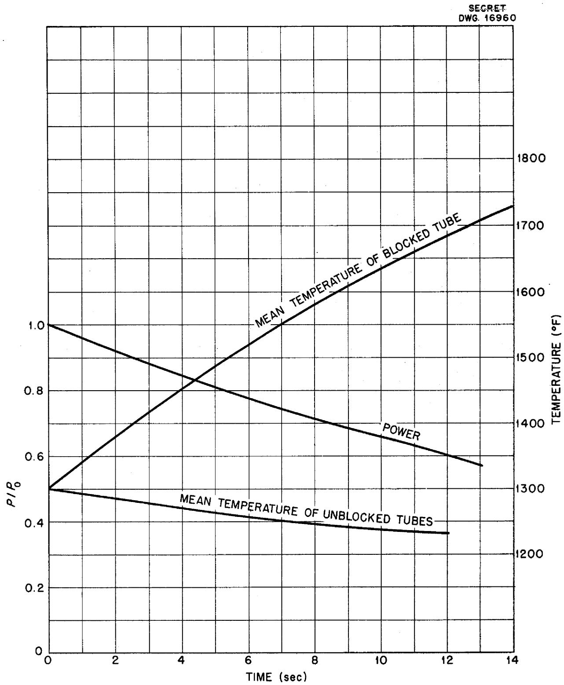  
Fig. 11. Response of ARE to Sudden Blocking of One Fuel Tube.

G-E halogen detectors will be used to sniff continuously samples of helium flowing in the annuli about the fuel-bearing pipes between reactor and heat exchanger. Minute fuel leaks in the piping system will be sensed promptly, and the detector will actuate an alarm system whenever a leak occurs. A sizeable leak will cause a lowering of the level in the fuel surge tank. With positive evidence that the fuel level in the surge tank is dropping, the operator will shut down the reactor and drain the fuel. If such a leak occurred during or after power operation it would also cause the radiation monitor to actuate an alarm system. These three signals, namely, an alarm from the G-E halogen detector, lowering of the fuel level in the surge tank, and an alarm from a radiation detector, constitute what is considered ample evidence of the loss of some fuel from the system, and other than draining the remaining fuel there is not much the operator can do to rectify the situation.

The helium system of the fuel-to-helium heat exchanger is nominally closed to the pits but there is leakage between the two systems. Consequently, a fuel leak in the heat exchanger will be discovered by either the halogen detector or a radiation monitor after the leakage products have entered the pits external to the heat exchanger loop.

# BOMB DAMAGE

Blowing up of the ARE with explosive charges set from within by saboteurs is feasible but could be done only with great difficulty because the entire reactor system is enclosed within concrete pits. The only way in which access can be gained to the pits is by lifting at least four of the concrete blocks covering the top of the reactor pits. Since these blocks weigh a minimum of 6 tons, it would

require the cooperation of several men experienced in rigging and it would take considerable time. This type of event appears extremely unlikely. Should it occur, the mixture of water, NaK, and fuel would react in the manner described in the section below on "The Ultimate Catastrophe."

The situation with regard to a bombing attack does not appear to be any more hazardous or probable than that resulting from the sabotage described above. Again, the questions of strategic importance of the experimental reactor, its invulnerability because of the $7 \frac{1}{2}$ -ft-thick concrete pits, and its isolated location in regard to possible hazards to other installations and thickly settled areas must be taken into account. A bombing attack would most certainly occur under wartime conditions, and appropriate measures could be taken at that time should that eventuality occur.

# OPERATIONAL SABOTAGE

To effect a serious accident by sabotage would require deliberate misoperation of the controls subsequent to blocking out several interlocks in the safety system. This method of sabotage is feasible only by cooperation (voluntary or otherwise) of all of the operators and guards on a shift.

The only time that serious damage can be produced by addition of fuel is the period between the attachment of the enriched fuel tank to the system and the final procurement of criticality. It is conceivable that a saboteur by severing interlocks could stop the pumps and then force all the enriched fuel into the piping system. With all of the fuel concentrated in one section of the process piping, subsequent starting of the pumps would place up to five critical masses in the reactor at one time. This possibility has been

discussed with the ORNL Protection Division and a special guarding system is being worked out for this period of operation. Once the reactor has been brought to critical with the required excess $k$ , any fuel remaining in the fuel tank will be removed so that this method for sabotage will no longer exist.

Probably the most likely and serious possibility for sabotage arises after the reactor has been operated for some time at full power. The best method of sabotage at this point would be to simply stop all four fuel and secondary coolant pumps and turn on all the process piping heaters. While the reactor would kill itself immediately by interlocks dropping the safety rods or by its negative temperature coefficient, the fission-product heat and the electrical power would raise the entire piping temperature.

By using the Way-Wigner equations, as summarized in ORNL-963, $^{(1)}$ for the fission-product energy, the cumulative heat after shutdown has been calculated, assuming that the reactor has been continuously operated for 20 days at 3 megawatts. The results of the calculations are given in Table 2.

(1) J. H. Buck and C. F. Leyse, Materials Testing Reactor Project Handbook, ORNL-963 (May 5, 1951).

The worst possible condition that one can assume is that all the heat is transmitted to and retained by the fuel and its immediate Inconel piping. The heat capacity of the 8.5 ft³ of fuel mixture and its associated piping is approximately $2 \times 10^5$ calories. Again, assuming no losses to the NaK, beryllium oxide, or annulus piping in 2 hr, the fuel temperature would rise $(130 \times 10^6) / (2 \times 10^5)$ or $650^\circ \mathrm{C}$ (1170°F). Assuming that the fuel started at a mean temperature of $735^\circ \mathrm{C}$ (1350°F), its temperature at the end of 2 hr would be $1385^\circ \mathrm{C}$ (2570°F). This is only slightly below the melting point of Inconel and somewhat above the boiling point of the fuel. It must be noted that no credit is taken for the heat capacity of the annulus piping, heaters, and insulation or, more important, the large increase of radiation to the walls of the pit as the temperature rises above 1700 or $1800^\circ \mathrm{F}$ . Therefore, it must be assumed that some time, that is, considerably more than 2 hr, would be required for the inner Inconel to give way and allow the fuel to run into the annulus piping. Then, as the annulus piping melted, the fuel would run to the floor of one of the pits where the heat would be taken up by the concrete. It should be noted that with this method of sabotage, the chance of a

TABLE 2. CUMULATIVE HEAT AFTER SHUTDOWN   

<table><tr><td>TIME AFTER SHUTDOWN</td><td>FISSION-PRODUCT HEAT (cal)</td><td>ELECTRIC POWER EXCESS OVER LOSSES (cal)</td><td>TOTAL HEAT INPUT (cal)</td></tr><tr><td>1 sec</td><td>71,500</td><td></td><td></td></tr><tr><td>2 sec</td><td>124,800</td><td></td><td></td></tr><tr><td>10 sec</td><td>451,000</td><td></td><td></td></tr><tr><td>60 sec</td><td>1.9 × 10^6</td><td></td><td></td></tr><tr><td>5 min</td><td>6.9 × 10^6</td><td></td><td></td></tr><tr><td>10 min</td><td>11.9 × 10^6</td><td></td><td></td></tr><tr><td>30 min</td><td>28.7 × 10^6</td><td></td><td></td></tr><tr><td>1 hr</td><td>50.1 × 10^6</td><td>22 × 10^6</td><td>72 × 10^6</td></tr><tr><td>2 hr</td><td>87.6 × 10^6</td><td>43 × 10^6</td><td>130 × 10^6</td></tr></table>

break within the reactor is extremely small due to the large heat capacity of the beryllium oxide. The first break would probably occur in the surge tanks or piping external to the reactor pit.

Since something more than 2 hr is required for the fuel to break into the pits and thus release fission products, this method of sabotage, although it would effectively ruin the reactor, has little chance of harming personnel outside the building.

# FIRE, FLOOD, WINDSTORMS, AND EARTHQUAKES

Of the so-called "Acts of God," neither floods nor earthquakes present a serious hazard to the aircraft reactor experiment. As a consequence of the particular topography (Fig. 1) selected for the site of the ARE, a flood and, therefore, flood damage is impossible. On the other hand, the data on the frequency and severity of earthquakes in the Oak Ridge area show that the probability of earthquake damage is extremely small (cf., section on seismology of area in chapter on "Hazards to Surrounding Area in Event of a Failure").

With regard to fire as a hazard, the ARE building (Figs. 6 and 7) carries a Uniform Building Code(2) fire rating of 2 hours. Inflammable materials are not used in any appreciable quantity in the construction of the building or the reactor. The reactor, as well as the associated plumbing, pumps, and heat transfer equipment, has been examined rather closely from this point of view because of the high (up to $1500^{\circ}\mathrm{F}$ ) temperatures expected. However, except for the use of NaK as a coolant in the reactor, even the high temperatures (in the absence of combustible material) present no hazard.

The possibilities of a NaK leak have been previously discussed. However, the operation of the reactor system involving NaK will take place in a helium atmosphere in which NaK alone is not inflammable. In fact, experiments have shown that in a helium environment even the potentially dangerous reactions of NaK on water and water on NaK are greatly reduced. In the event of a NaK fire, however, fire extinguishers and procedures as specified in the Alkali Metals Area Safety Guide(3) will be employed. Materials which will safely extinguish a NaK fire are graphite powder and Ansul-Met-L-X (sodium chloride coated to prevent the absorption of moisture). (4) Adequate quantities of of these materials will be kept at convenient locations.

It should be noted that such conventional extinguishers as water, $\mathrm{CO}_{2}$ , and sand should not be applied to a NaK fire. Therefore the conventional sprinkler system has been omitted from the design of the building, but a fire hydrant on a 6-in. water main is provided 20 ft from the building.

With regard to windstorms, the building is designed to the Uniform Building Code Criteria. These criteria design against wind loads of 20 lb/ft² (about 100 mph) without exceeding the allowable normal working stress of 20,000 psi in the steel structure. A review of the meteorological data for this area shows that it is highly improbable that winds of this magnitude will even be approached at the sheltered site of the ARE.

# THE ULTIMATE CATASTROPHE

Consideration of the reactor hazards discussed above shows that the worst possible accident would be

# ARE HAZARDS

the release of overheated fuel with simultaneous mixing of the NaK and water in the heat exchanger pit. This would require the planned coincidence of several independent failures.

If, by some unknown means, separation of the fuel should cause a deposition of uranium in the reactor, it is conceivable that the reactor could be maintained above critical to the boiling point of the fuel. If, at this point, the fuel were then released into the heat exchanger pit and simultaneous leaks occurred in the NaK and water lines, tremendous amounts of heat and radioactivity, as given in Appendix C (section on "Basic Data for the ARE Catastrophe"), would be re

leased into the pits. The results of such an accident are discussed in Appendix C, "Dispersion of Airborne Wastes in the 7500 Area."

It is inconceivable that such a series of circumstances could occur without the aid of a saboteur, and he would have to know some magical formula for selective separation of the fuel and deposition of some of it in the highest turbulence region of the system. Furthermore, the saboteur would have to provide means for breaking the fuel, NaK, and water lines in the heat exchanger pit - presumably by delayed action so that he could be safely away.

# HAZARDS TO THE SURROUNDING AREA IN THE EVENT OF FAILURE

# DISPERSION OF AIRBORNE WASTES

A study has been made of the wind direction, temperature gradients, and rainfall in the Melton Valley, site of the ARE, and calculations have been made on the deposition of airborne activity under these conditions (cf., Appendix C, "Dispersion of Airborne Wastes in the 7500 Area").

The lower layers of the atmosphere tend to be stable more frequently than unstable, with inversions occurring $56\%$ of the time, annually. In general, the stability is much more pronounced in the deep layer of air 183 to 5000 ft than in the 183-ft layer above the ground. With these climatological conditions, it is expected that any contaminant emitted into the inversion layer at ambient temperature will not be mixed vertically but will remain at or near its level of emission with a minimum of dilution, whereas a contaminant emitted into an unstable layer will be mixed through the unstable layer in a comparatively short time, during which puffs of relatively high concentration may be momentarily brought to the ground.

The valleys in the vicinity of the ARE are oriented northeast-southwest, in roughly the same orientation as the broad valley between the Cumberland Plateau and the Smoky Mountains. As might be expected, considerable channeling of the winds results from this orientation. The direction of the prevailing winds is upvalley from southwest and west-southwest, with a secondary mass of down valley winds from northeast and east-northeast. Wind speed is, in general, quite low, averaging less than 4 mph. In general, during nighttime or unstable conditions, the winds tend to be northeast and east-northeast and rather low in the valley, regardless of the gradient wind. Very strong winds aloft, however, will control the velocities and

direction of the valley winds, reversing them or producing calms when opposing local drainage. In a well-developed stable situation, however, a very light air movement will follow the valley as far downstream as the valley retains its structure. Air transport from the valley location will be governed by the local valley wind and the degree of coupling winds.

Two special wind patterns are assumed to be of some significance: (1) from the 7500 Area northwest of Haw Ridge to X-10, and (2) from the 7500 Area west to White Oak Creek, then northwest through Haw Gap, and finally north to X-10. Studies show that the frequency of these wind patterns is $2.5\%$ over the ridge and $0.4\%$ through the gap.

Since the upwind pattern at Knoxville seems almost identical with the pattern for Oak Ridge, the longer period records from the Knoxville Area have been used for this study. The northeast-southwest axis of the valley between the Cumberland Plateau and the Smoky Mountains, as mentioned before, influences the wind distribution over the Tennessee Valley, up to 5000 feet. Above 5000 ft, this pattern gives way to the prevalent westerly winds usually observed at these latitudes.

Consideration of the relation between precipitation and winds shows that there is little correlation between wind direction and rain.

Meteorological data have been used to calculate the possible radiation hazards to the civilian population as a result of accidental release of radioactive materials from the ARE. If it is assumed that the mass energy release of the reactor would not be more than the energy released by the explosion of an equivalent weight of TNT, then approximately $1.75 \times 10^{9}$ cal could be released from the reactor. This might be augmented by the

reaction of 15 ft³ of NaK with water, which could add about 8.5 × 10⁸ calories. This accidental release of heat would heat the 10,000 m³ of air in the building, shatter the building, and a hot, radioactive puff would be emitted to the atmosphere. By using Sutton's formula for such a hot puff, it is calculated that in the stable case the radioactive cloud would rise to about 200 meters, and in the unstable case the cloud would level off at 1500 meters.

It has been calculated that the radioactive cloud would contain $6.5 \times 10^{7}$ curies at 1000 sec after the catastrophe. This would give a concentration of about 72 curies/m³ for the stable case and 3.6 curies/m³ for the unstable case. Sutton's formula for isotopic diffusion from an instantaneous point source has been used to calculate the mass concentration at the ground during the passage of a puff and the integrated exposure at the ground for the entire time of passage of the cloud. Similar calculations have been made on the assumption that the radioactive cloud remains at ground level and is essentially blown away from the ARE building as it leaks out. From these calculations, it appears that the worst type of catastrophe would be one in which the iodine would be released slowly to the atmosphere. In such an event, it is likely that the tolerances for iodine would be exceeded for very long distances at night and even to about 30 miles in the daytime. However, the most likely occurrence is a reactor failure in which the activity is contained in the building. In this case, the halogen in the NaK would be removed and only the noble gases would be released. For such a failure the MPC would be exceeded out to 2 miles at night and 0.3 mile in the daytime.

Calculations have also been made on the result of a rainout of the activity in the radioactive cloud. This activity deposited on the ground would produce

a dosage rate of about 36 r/hr at a height of 3 ft, assuming l-Mev energy at a distance of 1 mile at night, and about 20 r/hr at 3 ft, assuming l-Mev energy at a distance of 1 mile after catastrophe occurred during the daytime. The consequence of surface water contamination from rainout is discussed in the following section.

If the failure does not rupture the concrete pits, the fission-product activity will be discharged into the $500\mathrm{m}^3$ of helium atmosphere contained therein. The fission products may be held up in the pits and then discharged. After 1000 sec, the total volatile activity (with augmentation owing to a power excursion) will be $6.8 \times 10^{6}$ curies and will have an average energy of decay of 1 Mev. Since the maximum permissible ground concentration for this energy is $1.6 \times 10^{-6}$ $\mu \mathrm{c/cm}^3$ , the fission-product activity may be discharged up the 100-ft stack during a 5-mph wind at an initial rate of 0.832 curies/min or 61.2 $\mathrm{cm}^3/\mathrm{min}$ , which increases with time owing to decay.

The potential hazard owing to the use of large quantities $(9 \times 10^{5} \mathrm{~g})$ of beryllium oxide in the reactor has been considered. At worst the potential contamination is about $25\%$ of that of the radiohalogen and the probable contamination is considerably less, since the beryllium oxide is in solid blocks that are contained within the pressure shell.

# SURFACE WATER CONTAMINATION

The most serious source of surface water contamination from a catastrophic failure of the ARE would be from rainout of airborne radioactive wastes. In this case, surface contamination of the order of $10^{6}$ curies per square mile would be realized for 10 miles within a 0.1 radian at night with a wind speed of 11 mph at cloud level (cf., Appendix C). Radioactivity of this order of magnitude would be expected to present a serious hazard to people who use the Clinch and Tennessee Rivers for their water

supply. Therefore a great deal of work has been done, and more is under way, on this problem. The discussion is limited here to the possible exposure of people through the use of water supplies derived from the Clinch River below ORNL and the Tennessee River below the mouth of the Clinch River.

Principle Water Supplies Affected. The predominant winds in Melton Valley are southwest during the day and northeast during the night (cf., Appendix C). Rainout during a northeast wind would affect downstream water supplies only; however, rainout during a southwest wind would affect both downstream and upstream supplies. Four, downstream, domestic, water-treatment plants are listed below. These plants treat the water by coagulation, sedimentation, and rapid sand filtration. The two downstream steam plants listed soften their boiler water by the Zeolite process.

1. K-25 Plant. There is a water-treatment plant at K-25 to provide drinking water for approximately 6000 people during working hours and process water for the plant. There is also a steam plant for which the water is taken directly from the Clinch River.   
2. Kingston Steam Plant (TVA). Operation of the Kingston steam plant might be affected through concentration of radioactivity in the Zeolite system or in the boilers. Drinking water for the small operating force could be obtained from a distant source if necessary.   
3. Harriman. The town of Harriman, approximately 6500 population, is located about 12 miles upstream on the Emory River. Contamination at the water plant is problematical, since upstream flow from the Clinch River to Harriman occurs only occasionally under special conditions of stratification.   
4. Watts Bar Village. The intake for the water-treatment plant for Watts Bar Village is located above

Watts Bar Dam. The village is a resort community with, perhaps, 1000 maximum population.

5. Chattanooga. The city of Chattanooga, approximately 131,000 people, has a water-treatment plant with intake about 5 miles below Chickamauga Dam. The plant provides industrial and drinking water for the city and several surrounding communities.

Upstream from ORNL, rainout of airborne activity might affect Norris and Clinton, as well as Oak Ridge. The towns of Norris and Clinton do not take raw water from the Clinch River. The hazards to these two small towns and other communities through drinking water supplies might have to be considered, but they are not included in this analysis of the effects of River contamination.

In the case of Oak Ridge, the water treatment plant, similar to those described above, has its intake located on the Clinch River about 10 to 15 miles upstream from ORNL. The plant supplies drinking water for the town of Oak Ridge, with a population of over 30,000, and to two of the AEC plants (X-10 and Y-12). An emergency plan has been formulated by which, in case of a shutdown of the water plant, the water supply to the town would be cut off temporarily and the relatively small reserve storage of filtered water would be used to continue operation of the two plants. It has been estimated that with average unregulated stream flow in the Clinch River, passage of water from Norris Dam to a point below the Oak Ridge water plant would require a period of one to two days. A more precise estimate of time of water travel in this and other stretches of the Clinch-Tennessee River is being made through cooperation of the Tennessee Valley Authority, but these data are not presently available.

Method of Analysis. Following an explosive release of fission products

from the ARE, contamination could reach the Clinch River by (1) surface flow through Melton Branch and White Oak Lake or (2) the rainout of airborne contaminants either into the water of the River or on land where they would be flushed into the stream. In either case, the level of activity in the water at downstream points would depend upon reduction by decay, dilution, and various other factors. The significance of the resultant hazard also would depend upon various factors such as the number of people who might be exposed to contaminated drinking water, the period of use of the water, and the counter measures that could be effected.

Any evaluation of the weight that should be given to the numerous modifying factors is subject to differences of opinion or interpretation. For this discussion, it is assumed that a given amount of activity is dispersed into Clinch River under specific conditions and the resulting downstream concentration and effects are estimated. These estimates can then be scaled to correspond to higher or lower levels of contamination. The very adverse conditions represented correspond to the worst conceivable catastrophe. Allowances can be estimated later for mitigating conditions or countermeasures. The basic assumptions and data are the following:

1. The dispersed contaminants will be mixed fission products that decay in accordance with the formula(1)

$$
\text {A c t i v i t y} = A _ {1} t ^ {- 1 \cdot 2}.
$$

2. A concentration of $10^{-3} \mu \mathrm{c/cm}^3$ is an acceptable emergency value in drinking water for use up to several weeks.   
3. Complete dispersion of the contaminants in the volume of stream flow is assumed except where stated otherwise.

4. As a basis for estimates, it is assumed that flow conditions in the rivers are the average unregulated flows for the period of record.   
5. Dilution factors and time of water travel determinations are based on the average unregulated flows.   
6. In case of airborne dispersal followed by rainout into the Clinch River upstream from the ARE, contamination in the stream might extend from Oak Ridge to Norris Dam.

The average unregulated flows used in the estimates are: Clinch River at ORNL, 4460 cfs; Tennessee River at Watts Bar Dam, 26,400 cfs; Tennessee River at Chickamauga Dam, 36,500 cfs.

It is believed that estimates based on these average figures will be representative, since the longer decay time corresponding to lower flows and the increased dilution owing to higher flow values tend to be compensating. Otherwise, conservative assumptions are employed, since these estimates do not take into account a number of mitigating factors; for example, not all the contaminants deposited on land will be flushed into the stream; activity will be removed from the water by adsorption upon organisms and sedimentation following settling; water-treatment plants will remove some of the activity; additional time could be allowed for decay before use of the water from the distribution system; use of the water by the people could be limited to only a portion of the acceptable period of exposure. Some of these factors are discussed very briefly in a subsequent section.

Estimated Conditions of Water Contamination. The effects of water contamination on the several water supplies downstream from the ARE are of the greatest interest. Table 3 has been prepared to show the estimated radioactivity in the water at selected points downstream. The data given are based on the assumption that the equivalent of one million curies of

TABLE 3. ESTIMATED RADIOACTIVITY IN WATER AT SELECTED POINTS IN CLINCH AND TENNESSEE RIVER SYSTEM FROM DISpersAL OF 435,000 CURIES OF ACTIVITY IN CLINCH RIVER NEAR THE MOUTH OF WHITE OAK CREEK   

<table><tr><td>LOCATION</td><td>DISTANCE BELOW MOUTH OF WHITE OAK CREEK (miles)</td><td>TIME OF WATER TRAVEL FROM WHITE OAK CREEK (hr)</td><td>ACTIVITY REMAINING AFTER DECAY (curies)</td><td>VOLUME OF DILUTION WATER TO THIS LOCATION (ml)°</td><td>CONCENTRATION OF ACTIVITY IN WATER (μc/ml)</td></tr><tr><td>Air and water activity 1 hr after the explosion</td><td></td><td></td><td>1,000,000</td><td></td><td></td></tr><tr><td>Clinch River at mouth of White Oak Creek; river miles, Cl. 20.8 (2 hr after explosion)</td><td>0</td><td>0</td><td>435,000</td><td>9.1 x 1011</td><td>480 x 10-3</td></tr><tr><td>K-25 water-plant in-take; river miles, Cl. 14.4</td><td>6.4</td><td>30</td><td>15,625</td><td>9.1 x 1011</td><td>17 x 10-3</td></tr><tr><td>Kingston Steam Plant (TVA); river miles, Cl. 2.8</td><td>18</td><td>83</td><td>4,894</td><td>9.1 x 1011</td><td>5.4 x 10-3</td></tr><tr><td>Mouth of Clinch River; river miles, Te. 567.6</td><td>20.8</td><td>96</td><td>4,080</td><td>9.1 x 1011</td><td>4.5 x 10-3</td></tr><tr><td>Watts Bar Dam; river miles, Te. 530</td><td>58.4</td><td>338</td><td>915</td><td>4.6 x 1014</td><td>2 x 10-6</td></tr><tr><td>Chickamauga Dam; river miles, 471</td><td>117.4</td><td>530</td><td>535</td><td>3.5 x 1014</td><td>6.5 x 10-7</td></tr></table>

*Dispersal in average flow of Clinch River, approximately 4460 cfs. in Tennessee River, dispersal in 50% of stored water in Watts Bar Reservoir at El. 735 ft (3.3 x 10 $^{10}$ ft $^{3}$ ) and in 75% of stored water in Chickamauga Reservoir at El. 675 ft (1.63 x 10 $^{10}$ ft $^{3}$ ).

activity existing 1 hr after the catastrophe finds its way into the Clinch River during a 2-hr period following the explosion. It is presumed that this would occur as a result of continuous heavy rainfall at and following the time of the disaster, and that the radioactive cloud would travel over the Clinch River and its drainage slopes so that, at the end of 2 hr, 435,000 curies would be dispersed in the Clinch River, with the center of the mass of activity at the mouth of White Oak Creek.

At points downstream the concentration would be reduced, as shown in Table 3, both by decay and by dilution, based on the assumptions given in the footnotes to the table. The data indicate that serious conditions of contamination might be expected throughout the Clinch River and near its entry into the main stream of the Tennessee River. Below this point, the concentration would be greatly reduced by dispersion in the large volumes of storage water in Watts Bar and Chickamauga reservoirs.

Factors Affecting Water Contamination. The brief analysis of conditions in the Clinch-Tennessee River system resulting from the release of a large amount of activity has necessarily been based on arbitrary assumptions and average river conditions. Although the data in Table 3 indicate that serious conditions of contamination might be expected throughout the Clinch River, there are several mitigating factors, presented below, that could combine to effect a reduction of the calculated contamination by several orders of magnitude. This is in addition to the fact that the initial assumption presupposed the most catastrophic failure conceivable.

Amount of Activity that will Become Waterborne. There is uncertainty as to the total amount of activity that will enter the stream from a particular event. This depends greatly on

meteorological conditions such as wind direction and speed and rainfall or other factors. In the event of fallout over land, a sizeable portion of the activity will adsorb on soil and vegetation and other organic matter and will not reach the stream, except in the event the material to which it is attached becomes waterborne. This factor tends to decrease ingestion hazards.

Dispersal Characteristics. Data on channeling, thermal stratification, etc. are incomplete. It appears to be reasonable to assume that at Chattanooga, after passage through two reservoirs and dams, the total volume of river water will be available for dilution purposes. As one progresses upstream, this is less likely to be true. In general, this factor tends to increase the potential ingestion hazard near the source of contamination.

Other River Conditions. These estimates have been based on average stream conditions, but the flow characteristics of a stream depend on a complex pattern of interlocking variables, particularly in a system that is controlled by hydroelectric dam installations. More definitive data are now being assembled with the cooperation of the TVA. However, it is doubtful that any other set of conditions would yield more information for this analysis than average stream conditions, unless one could predict the exact date and situation when an accident would occur. For example, an increase in stream flow would initiate compensatory reactions. Although the time of flow between any two points would be decreased and thus the loss in activity by decay would be decreased, the increased flow would compensate for this by decreasing the concentration of activity through greater dilution.

Removal by Water-Purification Plants. Communities that have treated

water supplies (coagulation-filtration) have an added safety factor. Data on the removal of a number of radioisotopes by water treatment procedures may be found in the literature. $^{(2)}$ A conservative value that may be applied to mixed fission-product removal by alum coagulation and filtration procedures is $70\%$ .

Adsorption of Radioisotopes by Clays. The following data should be considered in connection with the next section, "Geological and Hydrological Considerations," as well as with this section.

On exposure to natural clays under conditions such that adsorption and base exchange can occur, a large portion of any released activity will be firmly attached to the clays. If the exposure occurs in a liquid medium (natural turbidity), the ultimate location of the activity should be in

(2) C. P. Straub, R. J. Morton, and O. R. Placak, J. A. Water Works Assoc. 43, 773 (Oct. 1951).

the bottom sediments, otherwise it should be as firmly fixed in situ as are the clay particles. Although information on this subject is not complete, the magnitude of activity removal by this mechanism can be inferred from the data in Table 4. Parallel studies with clay columns, rather than stirring tests, indicate that the results are at least as good as those implied in Table 4 and perhaps better.

A comparison has been made between the shale from this area and well-defined clays from other locations by the jar-stirring method, using $5\mathrm{g}$ of clay in $500~\mathrm{ml}$ of fission-product solution at a level of $9000~\mathrm{c / m / ml}$ obtained by the addition of Chalk River waste. The results of this comparison are given in Table 5.

A large experimental waste storage pit has been built at ORNL in shale. To date, 16,200 gal of evaporator concentrate containing approximately 300 curies has been transferred to

TABLE 4. REMOVAL OF RADIOACTIVE ISOTOPES BY SHALE  
Jar-Stirring Method   

<table><tr><td rowspan="2">JAR NO.</td><td rowspan="2">SHALE (g)</td><td colspan="10">OVER-ALL ACTIVITY(a) REMOVAL AFTER 2-hr OF STIRRING (%)</td></tr><tr><td>Ba140</td><td>Ce144</td><td>Cs137</td><td>I131</td><td>P32</td><td>Ru106</td><td>Sr90</td><td>Zr95</td><td>MFP(b)</td><td>W-8(c)</td></tr><tr><td>1</td><td>0.5</td><td>91.8</td><td>98.0</td><td>98.2</td><td>8.6</td><td>48.6</td><td>93.0</td><td>39.8</td><td>98.4</td><td>83.5</td><td>71.6</td></tr><tr><td>2</td><td>1.0</td><td>94.7</td><td>98.3</td><td>98.6</td><td>22.2</td><td>75.2</td><td>97.8</td><td>40.7</td><td>99.0</td><td>87.7</td><td>74.6</td></tr><tr><td>3</td><td>2.0</td><td>96.4</td><td>97.2</td><td>98.4</td><td>21.8</td><td>87.1</td><td>98.3</td><td>45.1</td><td>99.0</td><td>90.3</td><td>73.4</td></tr><tr><td>4</td><td>3.0</td><td>97.5</td><td>99.7</td><td>99.2</td><td>24.0</td><td>82.4</td><td>99.5</td><td>54.4</td><td>99.1</td><td></td><td>79.5</td></tr><tr><td>5</td><td>5.0</td><td>98.2</td><td>98.9</td><td>99.2</td><td>35.7</td><td>88.3</td><td>99.5</td><td>64.1</td><td>99.3</td><td>94.7</td><td>81.0</td></tr><tr><td>6</td><td>10.0</td><td>99.3</td><td>99.9</td><td>99.2</td><td>39.5</td><td>88.2</td><td>99.5</td><td>73.6</td><td>99.4</td><td>96.6</td><td>83.9</td></tr><tr><td>7</td><td>12.0</td><td>99.5</td><td>99.9</td><td>99.2</td><td>49.2</td><td>98.2</td><td>99.6</td><td>71.9</td><td>99.3</td><td></td><td>81.4</td></tr><tr><td>8</td><td>15.0</td><td>99.7</td><td>99.9</td><td>99.5</td><td>56.8</td><td>95.8</td><td>99.5</td><td>76.9</td><td>99.2</td><td></td><td>84.0</td></tr><tr><td>9</td><td>18.0</td><td>99.8</td><td>100.0</td><td>99.5</td><td>56.1</td><td>99.3</td><td>99.7</td><td>78.0</td><td>99.7</td><td></td><td>82.4</td></tr><tr><td>10</td><td>20.0</td><td>99.8</td><td>100.0</td><td>99.7</td><td>66.9</td><td>99.2</td><td>99.8</td><td>76.8</td><td>99.6</td><td>98.2</td><td>85.2</td></tr></table>

(a) The level of activity used in the tests averaged $3.24 \times 10^{-2} \mu c / ml$ or 7200 counts/min/ml.   
(b) A three-year-old mixed fission-product solution containing approximately $16\%$ cerium, $20\%$ trivalent rare earths, $2\%$ ruthenium, $20\%$ strontium, $21\%$ cerium, and $21\%$ unknown.   
(c) Waste from waste storage tank W-8.

this pit, and thus a comparison, under natural conditions can be made with the laboratory data (Table 5). Data are being continuously accumulated, but up to this time (after a period of several months) no movement of activity through soil has been noted, except a selective movement of some of the ruthenium. This observation is based on activity measurements and radiochemical analyses of the water in test wells located around the pit. It should be noted that ruthenium has very complex chemistry, and its behavior under natural conditions is less predictable from laboratory tests than that of most other isotopes.

TABLE 5. ACTIVITY REMOVAL BY CLAYS FROM SEVERAL AREAS   

<table><tr><td>CLAY</td><td>SOURCE</td><td>OVER-ALLACTIVITYREMOVAL (%)</td></tr><tr><td>Shale</td><td>Oak Ridge</td><td>86.9</td></tr><tr><td rowspan="2">Kaolinite</td><td>South Carolina</td><td>67.7</td></tr><tr><td>New Mexico</td><td>70.9</td></tr><tr><td>Halloysite</td><td>Utah</td><td>89.8</td></tr><tr><td rowspan="2">Montmorillonite</td><td rowspan="2">Arkansas</td><td>94.7</td></tr><tr><td>92.4</td></tr><tr><td>Montronite</td><td>Washington</td><td>94.8</td></tr><tr><td rowspan="2">Meta-bentonite</td><td>Virginia</td><td>86.2</td></tr><tr><td>Kentucky</td><td>86.2</td></tr></table>

It is suspected that the ruthenium that is moving exists as a complex anion. Ruthenium, fortunately, has a very high MPC value, $0.1\mu \mathrm{c / ml}$ , or in other words it is presumed to be less hazardous than $\mathrm{Sr}^{90}$ , by a factor of approximately $10^{5}$ .

# GEOLOGICAL AND HYDROLOGICAL CONSIDERATIONS

Melton Valley, in which the ARE is situated, is underlaid by the Conasauga shale of the Middle and Upper Cambrian Age. The more resistant rock layers of the Rome formation, steeply inclined toward the southwest, are responsible

for Haw Ridge, which is immediately northwest of the ARE site. These layers dip beneath the shales of the Conasauga group in Melton Valley. The shale layers in the area are in keeping with the general structure of the surrounding area as reported in a recent survey.(3) Thin layers and lenses of limestone are common but are generally irregular in distribution. However, there are no persistent limestone beds in the area and, consequently, no underground solution channels or caverns to permit rapid and free discharge of water underground.

Observations in test wells in soil comparable to that of the ARE sites show that the Conasauga shale, although relatively impermeable, is capable of transmitting small amounts of ground water at a rate of a few feet per week. Furthermore, all of the active isotopes, except for ruthenium, apparently become fixed in the immediate vicinity of the point of entry into the soil (cf., preceding section). It may be concluded that such ground water flow as may exist in the soil surrounding the ARE will be small and slow (few feet per week) and that such flow will reduce the level of the activity of mixed nonvolatile fission products more than $90\%$ .

Aside from rainout of airborne wastes (discussed in preceding chapter), the only conceivable sources of ground water flow are (1) the normal discharge of process water and (2) the discharge of water used to flood the reactor pit. The fuel itself does not react with water and in its presence would solidify. Process water, the ultimate heat sink in the reactor system, does not come in contact with the fuel, since helium is present as an intermediate heat transfer fluid. It is therefore improbable that the process water would contain appreciable radioactivity. However, since the water

will be discharged at rates up to 300 gpm, it would create a surface stream. At the point of discharge, 100 ft southwest of the ARE building, this stream will flow south and join Melton Creek about 1/2 mile above White Oak Creek (Fig. 1).

A dirt storage pond has been excavated as a means of permitting decay in water used to flood the reactor pits after operation. The fuel will be dumped before the pits are flooded, but the reactor design is such that up to $15\%$ of the diluted fuel may remain in the bottom of the fuel circuit. This fuel, plus the residual activity in the structure, contains the radioactivity to which the water is exposed. The water used for shielding during postoperative service on the reactor will be pumped to the storage pond located approximately 1/4 mile southeast of the ARE building. This area also drains into Melton Creek, but no surface flow from the pond to the creek is expected.

In view of the lack of serious water contamination, as well as the extremely favorable geological environment, there does not appear to be any ground water hazard associated with the operation of the Aircraft Reactor Experiment. These observations were summarized from Appendixes D and E, which are preliminary reports. The Office of Research and Medicine of the ORAEC has indicated that it will soon undertake an extensive survey of the geological conditions in Melton Valley, in particular as they are expected to affect the dispersion of radioactive wastes of the reactors and waste pits.

# SEISMOLOGY OF AREA

Information on the frequency and severity of earthquakes in East Tennessee has been obtained both from Lynch(4) of the Fordham University Physics Department and from Moneymaker(5) of the Tennessee Valley Authority. Both sources indicated that such shocks as occasionally occur in the region are quite common in the world and do not indicate undue seismic activity. Consequently, earthquakes should be of little concern in connection with the ARE.

The TVA records show that the Appalachian Valley from Chattanooga to Virginia has an average of only one or two earthquakes a year. Furthermore, the maximum intensity of any of these shocks is 5 on the Woods-Neuman scale. This intensity is barely noticeable by ambulatory as well as stationary individuals. For any one location, such as Oak Ridge, the expectancy of an earthquake would be one in every few years.

The Fordham University records indicate even lower quake frequency; however, the severity of the observed quakes is the same. Lynch further concluded "that it is highly improbable that a major shock will be felt in the area (Tennessee) for several thousand years to come."

# DISTRIBUTION OF POPULATION

The population distribution within 30 miles of the site of the ARE is summarized in Tables 6, 7, and 8. A 30-mile radius was used for the population study because the meteorological studies showed that under certain conditions following a disaster a significant fraction of the maximum radiation dose would be received at these distances. Table 6 presents the total number of employees at the various plant sites within the AEC restricted area at Oak Ridge. Although practically all these employees work a 48-hr week, there is considerable variance at the different plants in the number on any one shift. Table 7 lists the surrounding towns with a population of 500 or more. Table 8 gives the rural population by counties

for those parts of the counties within 0 to 10, 10 to 20, and 20 to 30 miles of the site of the ARE. The latter data were calculated by deducting the urban (communities of 500 or more) population and assuming that the remaining population is uniformly distributed. These data are therefore approximate and are intended only to give an order of magnitude. Figure 12 shows the surrounding counties and all towns therein with a population greater than 500.

# VITAL INDUSTRIES AND INSTALLATIONS

A list of vital industrial and defense installations within possible hazard radius (30 miles) of the site of the ARE is given in Table 9. Most of these installations are shown on Figs. 1 and 12.

TABLE 6. PERSONNEL WITHIN THE AEC RESTRICTED AREA   

<table><tr><td>PLANT</td><td>DISTANCE FROM ARE (miles)</td><td>DIRECTION</td><td>TOTAL NO. OF EMPLOYEES</td></tr><tr><td>Homogeneous Reactor Experiment</td><td>0.24</td><td>SW</td><td>20</td></tr><tr><td>ORNL, X-10 Site (including 7000 Area)</td><td>0.6</td><td>NW</td><td>2500</td></tr><tr><td>Tower Shielding Facility*</td><td>1.75</td><td>S</td><td>10</td></tr><tr><td>Thermal Diffusion Plant (S-50)</td><td>4.5</td><td>WNW</td><td>50</td></tr><tr><td>Gaseous Diffusion Plants (K-25, -27, -29, -31, -33)</td><td>4.9</td><td>WNW</td><td>5750 CCCC</td></tr><tr><td>Electromagnetic Plant (Y-12)</td><td>5.1</td><td>NNE</td><td>2500 Maxon</td></tr><tr><td></td><td></td><td></td><td>4430</td></tr></table>

*Construction approved but not yet initiated.

TABLE 7. POPULATION OF THE SURROUNDING TOWNS*  

<table><tr><td>CITY OR TOWN</td><td>DISTANCE FROM ARE (miles)</td><td>DIRECTION</td><td>POPULATION</td></tr><tr><td>Oak Ridge</td><td>7</td><td>NNE</td><td>30,236</td></tr><tr><td>Lenoir City</td><td>9</td><td>SSE</td><td>5,159</td></tr><tr><td>Oliver Springs</td><td>9</td><td>N by W</td><td>1,089</td></tr><tr><td>Martel</td><td>10</td><td>SE</td><td>500</td></tr><tr><td>Coalfield</td><td>10</td><td>NW</td><td>650</td></tr><tr><td>Windrock</td><td>10</td><td>N by W</td><td>550</td></tr><tr><td>Kingston</td><td>12</td><td>WSW</td><td>1,627</td></tr><tr><td>Harriman</td><td>13</td><td>W</td><td>6,389</td></tr><tr><td>South Harriman</td><td>13</td><td>W</td><td>2,761</td></tr><tr><td>Petros</td><td>14</td><td>NW by N</td><td>790</td></tr><tr><td>Fork Mountain</td><td>15</td><td>NNW</td><td>700</td></tr><tr><td>Emory Gap</td><td>15</td><td>W</td><td>500</td></tr><tr><td>Friendsville</td><td>15</td><td>SE</td><td>600</td></tr><tr><td>Clinton</td><td>16</td><td>NE</td><td>3,712</td></tr><tr><td>Powell</td><td>17</td><td>ENE</td><td>500</td></tr><tr><td>Lyons View</td><td>18</td><td>E</td><td>500</td></tr><tr><td>Briceville</td><td>19</td><td>NNE</td><td>885</td></tr><tr><td>Wartburg</td><td>20</td><td>NW by W</td><td>800</td></tr><tr><td>Stainville</td><td>20</td><td>N</td><td>500</td></tr><tr><td>Knoxville</td><td>18 to 25</td><td>E</td><td>124,183</td></tr><tr><td>Greenback</td><td>20</td><td>S by E</td><td>960</td></tr><tr><td>Rockwood</td><td>21</td><td>W by S</td><td>4,272</td></tr><tr><td>Inskip</td><td>21</td><td>E</td><td>685</td></tr><tr><td>Rockford</td><td>22</td><td>SE</td><td>950</td></tr><tr><td>Whittle Springs</td><td>22</td><td>ENE</td><td>675</td></tr><tr><td>Fountain City</td><td>22</td><td>ENE</td><td>11,500</td></tr><tr><td>Gobey</td><td>22</td><td>NW</td><td>513</td></tr><tr><td>Lake City</td><td>23</td><td>NNE</td><td>1,827</td></tr><tr><td>Norris</td><td>23</td><td>NNE</td><td>1,134</td></tr><tr><td>Sweetwater</td><td>23</td><td>SSW</td><td>4,119</td></tr><tr><td>Neuberts</td><td>27</td><td>ENE</td><td>600</td></tr><tr><td>John Sevier</td><td>27</td><td>E</td><td>752</td></tr><tr><td>Madisonville</td><td>27</td><td>S</td><td>1,487</td></tr><tr><td>Caryville</td><td>27</td><td>N by E</td><td>1,234</td></tr><tr><td>Sunbright</td><td>30</td><td>NW</td><td>600</td></tr><tr><td>Jacksboro</td><td>30</td><td>N by E</td><td>577</td></tr><tr><td>Niota</td><td>30</td><td>SSW</td><td>956</td></tr></table>

* Included are those towns within a 30-mile radius that had a population of 500 or more according to the 1950 census, as reported in the 1952 Edition of the Rand-McNally Commercial Atlas and Marketing Guide, 83d Ed. 1952.

TABLE 8. RURAL POPULATION IN THE SURROUNDING COUNTIES  

<table><tr><td rowspan="2">COUNTY</td><td rowspan="2">TOTAL AREA(sq. miles)</td><td rowspan="2">RURAL POPULATION DENSITY(a)(No. of people per sq. mile)</td><td colspan="3">AREA (sq. miles)</td><td colspan="3">POPULATION</td></tr><tr><td>Within 0- to 10-Mile Radius</td><td>Within 10- to 20-Mile Radius</td><td>Within 20- to 30-Mile Radius</td><td>Within 0- to 10-Mile Radius</td><td>Within 10- to 20-Mile Radius</td><td>Within 20- to 30-Mile Radius</td></tr><tr><td>Anderson</td><td>338</td><td>62(b)</td><td>5(c)</td><td>175(c)</td><td>108</td><td>310</td><td>10,850</td><td>6,700</td></tr><tr><td>Blount</td><td>584</td><td>67</td><td>0</td><td>102</td><td>250</td><td>0</td><td>6,840</td><td>25,000</td></tr><tr><td>Campbell</td><td>447</td><td>48</td><td>0</td><td>0</td><td>130</td><td>0</td><td>0</td><td>6,240</td></tr><tr><td>Cumberland</td><td>679</td><td>22</td><td>0</td><td>0</td><td>80</td><td>0</td><td>0</td><td>1,760</td></tr><tr><td>Knox</td><td>517</td><td>178</td><td>55</td><td>140</td><td>208</td><td>9,780</td><td>24,900</td><td>37,000</td></tr><tr><td>Loudon</td><td>240</td><td>54</td><td>70</td><td>147</td><td>23</td><td>3,780</td><td>7,940</td><td>1,240</td></tr><tr><td>McMinn</td><td>435</td><td>39</td><td>0</td><td>0</td><td>69</td><td>0</td><td>0</td><td>2,690</td></tr><tr><td>Meigs</td><td>213</td><td>29</td><td>0</td><td>0</td><td>40</td><td>0</td><td>0</td><td>1,160</td></tr><tr><td>Monroe</td><td>665</td><td>26</td><td>0</td><td>35</td><td>212</td><td>0</td><td>910</td><td>5,510</td></tr><tr><td>Morgan</td><td>539</td><td>22</td><td>9</td><td>144</td><td>210</td><td>195</td><td>3,165</td><td>4,620</td></tr><tr><td>Rhea</td><td>335</td><td>33</td><td>0</td><td>0</td><td>52</td><td>0</td><td>0</td><td>1,720</td></tr><tr><td>Roane</td><td>379</td><td>50(b)</td><td>93(d)</td><td>185</td><td>59</td><td>4,650</td><td>9,250</td><td>2,950</td></tr><tr><td>Scott</td><td>549</td><td>26</td><td>0</td><td>6</td><td>111</td><td>0</td><td>155</td><td>2,890</td></tr><tr><td>Union</td><td>212</td><td>38</td><td>0</td><td>0</td><td>15</td><td>0</td><td>0</td><td>570</td></tr><tr><td></td><td></td><td></td><td></td><td></td><td></td><td>18,715</td><td>63,910</td><td>100,050</td></tr></table>

(a) Includes all county population except communities with population of 500 or more.   
(b) Does not include the Oak Ridge area.   
(c) Does not include the Oak Ridge area in Anderson county.   
$(d)^{\#}$ Does not include 42 sq. miles of Oak Ridge area in Roane county.

FOR-OFFICIAL-USE-ONLY DWG.17019

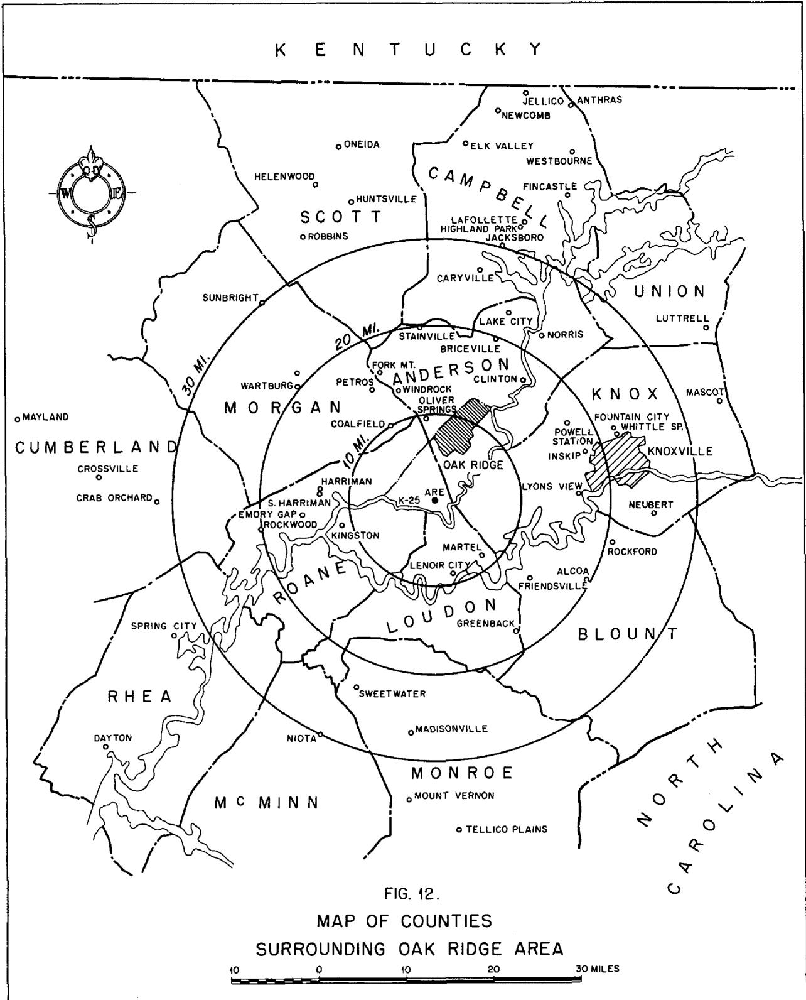

TABLE 9. VITAL INDUSTRIAL AND DEFENSE INSTALLATIONS IN 30-MILE RADIUS   

<table><tr><td>INDUSTRY OR INSTALLATION</td><td>DISTANCE FROM ARE (miles)</td><td>DIRECTION</td></tr><tr><td>Homogeneous Reactor Experiment</td><td>0.24</td><td>SW</td></tr><tr><td>ORNL, X-10 Site</td><td>0.60</td><td>NW</td></tr><tr><td>Tower Shielding Facility*</td><td>1.75</td><td>S</td></tr><tr><td>Thermal Diffusion Plant (S-50)</td><td>4.5</td><td>WNW</td></tr><tr><td>Gaseous Diffusion Plants (K-25, -27, -29, -31, -33)</td><td>4.9</td><td>WNW</td></tr><tr><td>Electromagnetic Plant (Y-12)</td><td>5.1</td><td>NNE</td></tr><tr><td>Fort Loudon Dam</td><td>10.0</td><td>SSE</td></tr><tr><td>Kingston Steam Plant (TVA)</td><td>11</td><td>W</td></tr><tr><td>Assorted Small Industries in Knoxville</td><td>20 to 26</td><td>E</td></tr><tr><td>Alcoa Plant of the Aluminum Company of America</td><td>22</td><td>SE</td></tr></table>

*Construction approved but not yet initiated.

# APPENDIXES

# A. PROCEDURE FOR REPAIRING LEAKS

System Testing. Testing of the plumbing system will be scheduled to facilitate making the necessary repairs. The tests become progressively more rigorous; the earlier ones reveal only the larger leaks, whereas the final test should reveal any leak that could be of concern to the operation of the system. It will be a relatively simple matter to effect a repair indicated by the first pneumatic test. Conversely, it will be very difficult to repair a leak that develops after the system has been operated at power. Since the tests have been arranged in an ascending order of importance, it is not proposed to revert to a lower order test when a leak is found, but rather after a leak is repaired only that test which revealed the leak will be repeated before progressing to the next step.

Locating and removing leaks from the system at any point in the testing procedure will obviously be time-consuming. It therefore follows that the best cure for leaks is prevention. Every precaution will be used to install a leak free system, and at no time will the installation work be hurried at the expense of quality workmanship. The successful operation of the ARE stands squarely on the quality of the craftsmanship that goes into the fabrication and installation. This philosophy dictates every action of those supervising the project.

Techniques for determining the existence of a leak in the system at elevated temperatures are rather simple. For large leaks the inability to obtain a vacuum will be ample evidence; the presence of smaller leaks will be indicated by rates of pressure rise in the system. However, locating the small leaks will usually involve the application

of special techniques, as well as instrumentation.

Leak Detection. Except by the bubble test method, locating a leak is tedious at best, since there is no indirect method that reveals the exact location. An effort is being made to develop a coating that can be applied to joints that will react with NaK and leave an easily recognizable and visible indication of the leak. The system will be inspected after cooling down to room temperature so that visual inspection can be made. Thus far, such a coating has not been found, and it may not be possible to employ such a technique.

The first leak test to be applied to the system will be the bubble test method. The system, at room temperature, will be placed under pressure and the suspected parts, namely, the welds, will be painted with soapy water. Bubbles created in the soap film will be evidence of leaks. This test is simple but tedious, and will spot only the larger leaks.

At the next stage of the operating procedure (cf., section on "Operating Plan"), the system will be brought to a temperature of $1200^{\circ}\mathrm{F}$ and made isothermal, with a vacuum maintained in both the fuel system and the reflector cooling system. A leak into either of these systems will cause a loss of vacuum there; the seriousness of the leak will be determined by the rate of pressure rise when the vacuum pump is cut off. During this test, helium will be circulated in the annuli. Once it is determined that a leak exists in the system, the power in the heating circuits will be lowered. The electrical wiring is such that each separate weld can be locally heated with all the remaining portions of the piping left unheated. With the helium no longer circulating, all heating will be stopped except

at the individual welds. All portions of the system will cool except the welds, which will be allowed to cool, one at a time, by opening the electrical heating circuits one at a time. During all this time the pumps will be evacuating both the fuel and moderator volumes. If a leak occurred at a particular weld at high temperature, it might disappear as the temperature of the weld was lowered. This might well be the case if expansion at the weld were to open up a small crack. A leak with these characteristics would be extremely difficult to locate by cooling the entire system to room temperature. But if cooling a particular weld eventually removes the leak so that a vacuum can be maintained in the system, then that particular weld is faulty. The system could then be cooled and the faulty weld repaired or replaced. If, on the other hand, cooling the welds individually did not remove the leak, it would be clear that there was a permanent leak, which could then be located by the soap and pressure test used for room temperature leak testing.

In another stage of leak testing at elevated temperature, NaK will be circulated in both the fuel and pressure shell cooling circuits at $1200^{\circ}\mathrm{F}$ . The DPI halogen detector (which detects NaK) will be used to sniff the helium flowing in the annuli about the pipes. An alarm will be sounded by the detector when it finds a leak. When the alarm sounds, it is proposed to stop the helium flow and cut off the heater power. As the system cools down and air is slowly admitted to the annuli, localized oxidation of NaK will occur at the leak. Removal of the insulation, heaters, and annuli will reveal where this oxidation took place.

I.eak Repair. All repairs involving a welding operation must be preceded by a careful cleansing of the system. If there is liquid in the system, the

liquid must first be removed. This is a tedious job, but an absolutely necessary one, since all vapor must be removed and an inert gas introduced before any welding is done.

The method of effecting a repair of a faulty weld will be the same as that employed in making a new weld. This procedure is outlined in detail in the welding instruction bulletin.(1) When a repair is completed, the test that revealed the leak will again be applied to the system and, as previously stated, the next step of the test procedure will be initiated as soon as the repaired leak has satisfactorily passed the retest.

# B. ANALYSIS OF ARE KINETIC RESPONSE ON REACTOR POWER-PLANT SIMULATOR

A reactor power-plant simulator has been developed and built, within the past year, at ORNL. The simulator was designed to be sufficiently general to be used as an engineering tool for determining means of controlling nuclear reactor power plants. It has been used to determine the response of the ARE reactor to changes in both excess reactivity and in load.

The simulator will be described in detail in an ORNL report. Operations such as addition, subtraction, differentiation, and integration are carried out by means of operational amplifiers. These are high-impedance-input, high-gain, d-c amplifiers, that are chopper-stabilized against drift; they are similar to the units used in the numerous analog computers in this country. There are twenty operational amplifiers in this simulator.

Multiplication is accomplished in this unit by converting the relatively slowly changing quantity, which is the coefficient of $P$ (Eq. 1; cf., next section), to binary digital form and using

this digital quantity to operate weighted gates for admitting the quantity $P$ to an operational amplifier. The weight of a particular gate is determined by the significance of the binary digit assigned to the gate. The weights are in the sequence $1/2, 1/2^2, 1/2^3$ , etc.

Equations for the ARE System. The kinetic equations of the complete power plant, including reactor and heat exchanger system, constitute a nonlinear set of differential equations, even in their simplest form. The simplification involves numerous assumptions and approximations generally justified by the fact that the solution of the exact and complete equations would be extremely tedious and expensive. Consequently, it has been found convenient to neglect the nonuniform spatial power distribution within the reactor and consider the power uniform throughout the fuel within the critical volume. Likewise, the traveling-wave nature of the delayed-neutron sources in the circulation system external to the critical lattice, represented analytically as a set of differential difference equations, has been replaced by a steady state concept wherein the external loop produces a fixed attenuation of each class of delayed-neutron contributions. Obviously, the latter concept does not permit a true representation of the system for power transients.

Some thought has been given to the question of whether the fuel circulation appreciably changes the power distribution within the reactor, since the delayed-neutron contributions are considerably lower from a unit fuel volume when it enters the critical volume than when it leaves the critical lattice. It is the opinion of those who have seriously considered this question that this effect is probably present but not significant.

The realization that complete and exact equations representing the

kinetics of the entire power plant would be clumsy, to say the least, has led to the establishment of the practical set of equations given here. The symbols used are defined in Table B1. The constants that were used when these equations were set up on the simulator are given in Table B2.

$$
\begin{array}{l} l * \vec {P} = [ (1 - \beta) K - 1 ] P \\ + \sum_ {i = 1} ^ {i = 6} \lambda_ {i} C _ {i} + S _ {0} \tag {1} \\ \end{array}
$$

$$
\dot {C} _ {i} = - \lambda_ {i} C _ {i} + \beta_ {i} \alpha_ {i} K P \tag {2}
$$

$$
V _ {m} \delta_ {m} C _ {m} \dot {\theta} _ {m} = b _ {1} P - \mu_ {m f} \left(\theta_ {m} - \theta_ {f}\right) \tag {3}
$$

$$
\begin{array}{l} V _ {f} \delta_ {f} C _ {f} \dot {\theta} _ {f} = b _ {2} P + \mu_ {m f} \left(\theta_ {m} - \theta_ {f}\right) \\ - \frac {2 V _ {f} \delta_ {f} C _ {f}}{\tau_ {1}} (\theta_ {f} - \theta_ {1 f}) \tag {4} \\ \end{array}
$$

$$
\begin{array}{l} \theta_ {2 f} (t) = \theta_ {1 f} (t - \tau_ {1}) \\ + \int_ {t - \tau_ {1}} ^ {t} \left[ b _ {2} P + \mu_ {\text {m f}} \left(\theta_ {\text {m}} - \theta_ {f}\right) \right] d t \tag {5} \\ \end{array}
$$

$$
\begin{array}{l} V _ {f} \delta_ {f} C _ {f} \dot {\theta} _ {f} \\ = \frac {2 V _ {f} \delta_ {f} C _ {f}}{\tau_ {2}} \left(\theta_ {2 f} - \theta_ {f}\right) - \mu_ {f H} \left(\theta_ {f} - \theta_ {H}\right) \tag {6} \\ \end{array}
$$

$$
\begin{array}{l} V _ {H} \delta_ {H} C _ {H} \dot {\theta} _ {H} = \mu_ {f H} \left(\theta_ {f} - \theta_ {H}\right) \\ - \frac {2 V _ {H} \delta_ {H} C _ {H}}{\tau_ {3}} \left(\theta_ {H} - \theta_ {1 H}\right) \tag {7} \\ \end{array}
$$

$$
\begin{array}{l} \theta_ {1 f} (t) = \theta_ {2 f} (t - \tau_ {2}) \\ - \int_ {t - \tau_ {2}} ^ {t} \left[ \mu_ {f H} \left(\theta_ {f} - \theta_ {H}\right) \right] d t \tag {8} \\ \end{array}
$$

$$
\dot {S} + \alpha \dot {S} = \epsilon \tag {9}
$$

# ARE HAZARDS

$$
\dot {S} = \int \dot {S} d t + B \tag {10}
$$

$$
\begin{array}{l} K = 0. 9 5 + \delta_ {f} \theta_ {f} + \delta_ {m} \theta_ {m} \\ + \delta_ {s} (S - S _ {0}) \tag {11} \\ \end{array}
$$

For velocity control

$$
\begin{array}{l} \epsilon = A _ {1} \left(\frac {\theta_ {1 f} + \theta_ {2 f}}{2} - \theta_ {d}\right) \\ + A _ {2} \left[ P - A _ {3} \left(\theta_ {2 f} - \theta_ {1 f}\right) \right] \tag {12} \\ \end{array}
$$

For "on-off" control, the error "dead zone" is defined for $|\epsilon| < E$ where $E$ is some fixed positive quantity at which the relays open and/or close. In particular, Eq. 13, as used in the ARE "on-off" servo system, was given by the expression

$$
\begin{array}{l} \epsilon = 0. 3 8 7 \left[ \frac {\theta_ {0} + \theta_ {i}}{2} - \theta_ {d} \right] \\ + 2 5. 8 \left[ \frac {P}{P _ {0}} - \frac {\theta_ {0} - \theta_ {i}}{\theta_ {P _ {0}}} \right] + \frac {3 . 7 8}{P _ {0}} \dot {P}, \tag {13} \\ \end{array}
$$

in which the term involving $P$ was added experimentally for stabilization purposes.

Discussion of Equations. Equations 1 through 13 are, as mentioned before, based on the assumptions that the power distribution is spatially uniform throughout the fuel within the critical volume and that the delayed-neutron contribution has constant attenuation because of fuel circulation. Transport lags in the system have been approximated by cascaded first-order lags in the conventional manner. Simulation of transport lag by this means is comparable to mathematical expansion of a function in a series in which as many terms as are considered feasible are used to provide satisfactory accuracy.

The set of equations for the system includes two equations for an external control loop or servo system. This feature is an integral part of the simulator, since a basic problem in reactor control is to determine the need for such a servo system, as well as its performance specifications. The stability of the reactor power plant without this external control loop is a function of many parameters that are inherent in the design and can be altered only by altering the design. If the equations of the servo loop are added to those of the rest of the system, the combined set of equations then represents a new system that may very well be stable even though the initial one without the servo was unstable. Stabilization will have thus been attained without altering the reactor design, which would have been necessary to alter the parameters producing instability. It is then possible to evaluate the performance characteristics of the servo system required for stabilization. If these requirements show that the servo system is well within the possibility of servo control, it is safe to assume that the power plant can be controlled by such means.

Although it can be shown that the negative-reactivity temperature coefficients of fuel and moderator are sufficient to provide stability of the ARE power plant, it has been thought advisable to provide a servo loop for controlling the system in the event these temperature coefficients are found to be of considerably smaller magnitude than expected. It is not proposed to operate the reactor if the fuel temperature coefficient of reactivity is found to be positive. Such a condition would be dangerous in the event of failure of an otherwise adequate servo controller.

These temperature coefficients provide an excellent master-slave relationship between load and reactor

TABLE B1. SYMBOLS USED IN ARE KINETIC EQUATIONS   

<table><tr><td>SYMBOL</td><td>DEFINITION</td></tr><tr><td>l*</td><td>Mean lifetime of neutrons in reactor from production to absorption (or mean regeneration time of nuclear power)</td></tr><tr><td>β</td><td>Total fraction of neutrons per fission that are delayed, Σi=1βi</td></tr><tr><td>K</td><td>Effective increase in neutrons, or power, during l* period.</td></tr><tr><td>P</td><td>Nuclear power level, Btu/sec</td></tr><tr><td>λi</td><td>Decay rate of ith group of delayed-neutron precursor</td></tr><tr><td>Ci</td><td>Potential power stored in the ith delayed neutron precursor, Btu/sec</td></tr><tr><td>S0</td><td>Nuclear power source in reactor, Btu/sec</td></tr><tr><td>βi</td><td>Fraction of neutrons per fission that is delayed in the ith group of delayed neutron precursors</td></tr><tr><td>αi</td><td>Attenuation of the effective level of the ith group of delayed neutrons owing to circulation of fuel</td></tr><tr><td>Vn</td><td>Total volume of moderator in reactor core, ft3</td></tr><tr><td>ρm</td><td>Mean density of moderator, lb/ft3</td></tr><tr><td>Cm</td><td>Specific heat of moderator, Btu/lb·°F</td></tr><tr><td>θm</td><td>Mean moderator temperature, °F</td></tr><tr><td>b1</td><td>Fraction of core power produced in moderator</td></tr><tr><td>μmf</td><td>Coefficient of heat transfer from moderator to fuel, Btu/sec·°F</td></tr><tr><td>θf</td><td>Mean fuel temperature, °F</td></tr><tr><td>Vf</td><td>Volume of fuel, ft3</td></tr><tr><td>ρf</td><td>Mean density of fuel, lb/ft3</td></tr><tr><td>Cf</td><td>Mean specific heat of fuel, Btu/lb·°F</td></tr><tr><td>b2</td><td>Fraction of core power produced in fuel</td></tr><tr><td>τ1</td><td>Mean transit time of fuel through reactor, sec (Fig. Bl)</td></tr><tr><td>θ1f</td><td>Reactor fuel inlet temperature, °F</td></tr><tr><td>θ2f</td><td>Reactor fuel outlet temperature, °F</td></tr><tr><td>τ2</td><td>Transit time of fuel through heat exchanger, sec (Fig. Bl)</td></tr><tr><td>μfH</td><td>Coefficient of heat transfer from fuel to helium, Btu/sec·°F</td></tr><tr><td>θH</td><td>Mean helium temperature, °F</td></tr><tr><td>θ1H</td><td>Helium inlet temperature, °F</td></tr><tr><td>VH</td><td>Volume of helium in heat exchanger, ft3</td></tr><tr><td>CH</td><td>Mean specific heat capacity of helium, Btu/lb·°F</td></tr><tr><td>ρH</td><td>Mean density of helium in heat exchanger, lb/ft3</td></tr><tr><td>τ3</td><td>Transit time of helium through heat exchanger, sec</td></tr><tr><td>s</td><td>Displacement of control rod, ft</td></tr><tr><td>α</td><td>Coefficient of velocity feedback in servo loop per unit mass</td></tr><tr><td>ε</td><td>Error signal for servo, volts</td></tr><tr><td>B</td><td>Constant of integration</td></tr><tr><td>δf</td><td>Fuel temperature coefficient of reactivity, δk/°F</td></tr><tr><td>δm</td><td>Moderator temperature coefficient of reactivity, δk/°F</td></tr><tr><td>δs</td><td>δk per foot of control rod</td></tr><tr><td>A1</td><td>Coefficient of mean temperature error in control equation</td></tr><tr><td>A2</td><td>Coefficient of power error in control equation</td></tr><tr><td>A3</td><td>Coefficient of output power in control equation (chosen so that P = A3(θ2f - θ1f)</td></tr><tr><td>θd</td><td>Mean temperature demand, °F</td></tr><tr><td>ε &gt; 0</td><td>Inserts regulating rod</td></tr><tr><td></td><td>Dead zones for on-off servo</td></tr><tr><td></td><td>ε, ± 0.5 volts</td></tr><tr><td></td><td>θi, ± 2°F</td></tr><tr><td></td><td>θ0, ± 3°F</td></tr><tr><td></td><td>P, ± 4% P0</td></tr><tr><td></td><td>θf, ± 1.3°F</td></tr></table>

TABLE B2. ARE SIMULATOR CONSTANTS   
*Figure B1.   

<table><tr><td>SYMBOL</td><td>VALUE</td><td>SYMBOL</td><td>VALUE</td><td>SYMBOL</td><td>VALUE</td></tr><tr><td>l*</td><td>1.5 x 10-4sec</td><td>λ1</td><td>1.61</td><td>VHρHCH</td><td>1/5 Btu/°F</td></tr><tr><td>β</td><td>0.0073</td><td>λ2</td><td>0.456</td><td>τ3</td><td>1/30 sec</td></tr><tr><td>α1</td><td>0.93</td><td>λ3</td><td>0.154</td><td>δf</td><td>8 x 10-5/°F</td></tr><tr><td>α2</td><td>0.73</td><td>λ4</td><td>0.0315</td><td>δm</td><td>1.2 x 10-4/°F</td></tr><tr><td>α3</td><td>0.45</td><td>λ5</td><td>0.0125</td><td rowspan="2" colspan="2">DESIGN POINT VALUES</td></tr><tr><td>α4</td><td>0.23</td><td>VmρmCm</td><td>2866 Btu/°F</td></tr><tr><td>α5</td><td>0.22</td><td>b1</td><td>0.15</td><td>P</td><td>3000 Btu/sec</td></tr><tr><td>αi</td><td>Taken from curve*</td><td>μnf</td><td>3 Btu/sec·°F</td><td>θf</td><td>1300°F</td></tr><tr><td>β1</td><td>0.00084</td><td>VfρfCf</td><td>71.1 Btu/°F</td><td>θm</td><td>1450°F</td></tr><tr><td>β2</td><td>0.0024</td><td>b2</td><td>0.85</td><td>θ1f</td><td>1125°F</td></tr><tr><td>β3</td><td>0.0021</td><td>τ1</td><td>8.3 sec</td><td>θ2f</td><td>1475°F</td></tr><tr><td>β4</td><td>0.0017</td><td>τ2</td><td>29.4 sec</td><td>θH</td><td>500°F</td></tr><tr><td>β5</td><td>0.00026</td><td>μfH</td><td>3.75 Btu/sec·°F</td><td>θ1H</td><td>250°F</td></tr></table>

power, in which it is possible to change the reactor power solely by changing the load on the heat exchanger and in which the mean reactor temperature is a function of reactivity only during steady-state operation.

It is relatively simple to utilize an error signal for the servo system which maintains this master-slave relationship for the reactor without temperature coefficients but with servo control. This error signal is a linear combination of electrical voltages proportional to errors in reactor mean temperature and variations in the quantity $P - a(\theta_0 - \theta_i)$ , where $P$ is the reactor power (measured as neutron flux by fission chambers), $\theta_0$ is the reactor outlet temperature, $\theta_i$ is the reactor inlet temperature,

and $a$ is a constant dependent on fuel flow rate. $P - a(\theta_0 - \theta_i)$ is equal to zero for all steady-state operation.

Response to Load and Reactivity Perturbations. The simulator for the reactor with temperature coefficients has been tested for load and reactivity perturbations. The system is stable, even though extremely small pressure surges develop on transients. In fact, the system behaves quite snug-gishly in that it always supplies load demand with relative smoothness in nuclear response. These responses are shown in Figs. B2, 3, and 4.

After these studies were made, it was assumed that there were no temperature coefficients of reactivity and the simulator was operated with a servo control system using the error

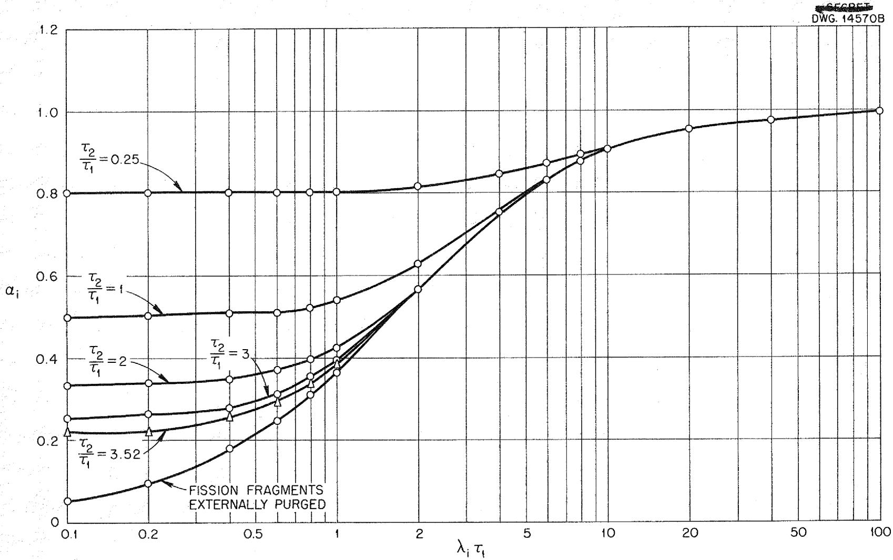  
Fig. B1. $\alpha_{i}$ As $n$ Function of $\lambda_{i}\tau_{1}$ , where $\tau_{1}$ is Transit Time of Fuel in the Reactor and $\tau_{2}$ is the Time Outside the Reactor.

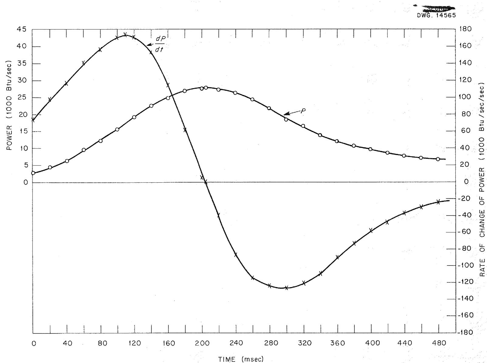  
Fig. B2. Reactor Power Response vs. Time. Temperature controlled; step $\delta k = 0.0056$ .

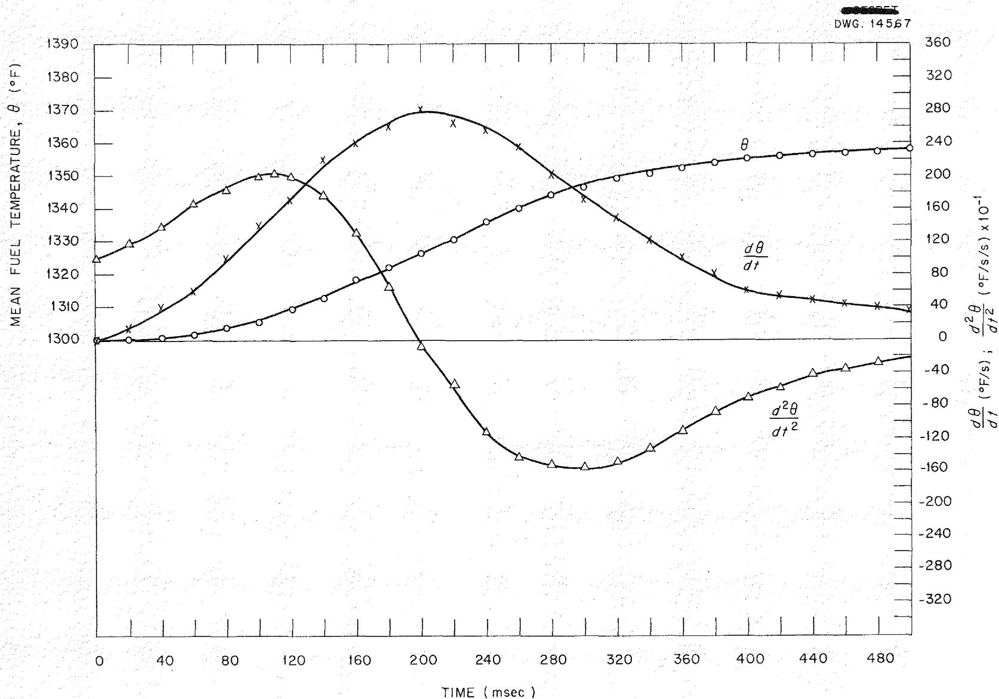  
Fig. B3. Mean Fuel Temperature Response vs. Time. Temperature controlled; step $\delta k = 0.0056$ .

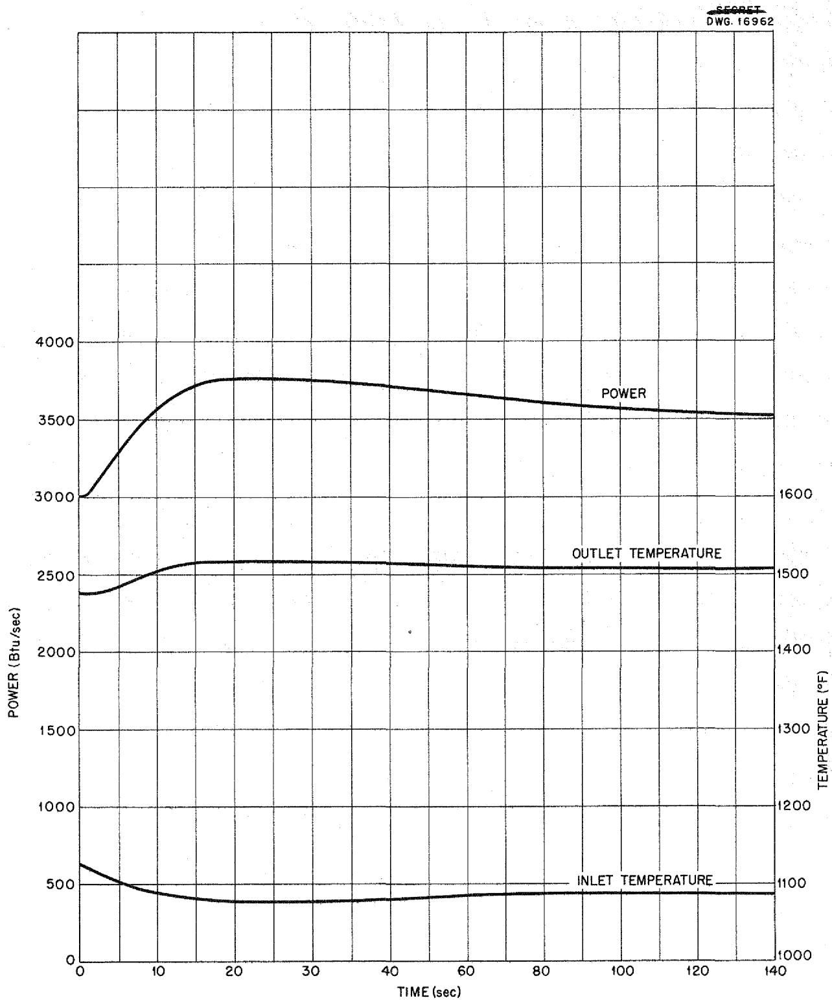  
Fig. B4. Response of Temperature-Controlled ARE to Step Change in Helium Inlet Temperature from 250 to $25.5^{\circ}\mathrm{F}$ .

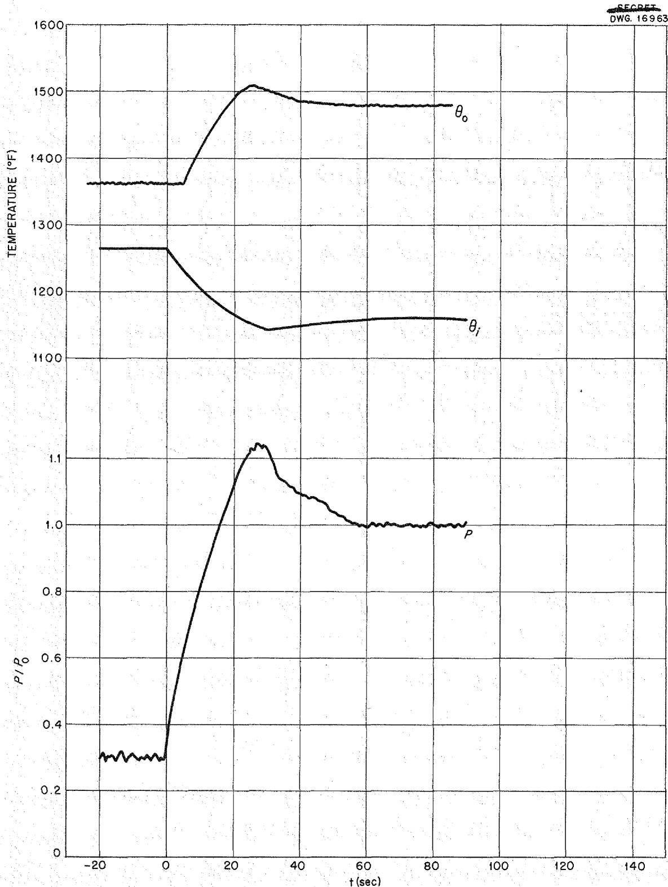  
Fig. B5. Response of Servo-Controlled ARE to Helium (Load) Perturbation from 0.3 $P_0$ to 1.0 $P_0$ at $t = 0$ .

signal proposed above. Since it seemed plausible that a relatively simple on-off type of servo system should suffice for controlling the ARE power plant, such a servo system was first simulated. There will be no means for determining the mean fuel temperature in the reactor, so a synthetic or steady-state mean temperature equal to the mean of the reactor inlet and outlet temperatures was used.

The synthetic on-off servo system was satisfactory for controlling the reactor in that the control was sufficiently comparable with that provided by temperature coefficients. Also, it provided responses completely compatible with the signals used for actuating safety devices for every conceivable load or reactivity transient that could occur in normal operation of the power plant. The safety devices are of course provided for abnormal operating conditions.

Examination of the synthetic on-off system showed that, with suitable gear trains, a small a-c reversible motor is sufficient to move the regulating rod at a satisfactory speed and over a large enough range to meet the specifications determined by the simulated servo. The output power of this motor is 200 w at 3500 rpm.

The motor, gear trains, simulated temperature and flux or power sensing devices, and amplifiers were assembled and attached to the ARE power plant simulator. The composite temperature and flux error signal was used precisely as it is to be used in the ARE. The regulating rod was simulated by a weight with a traverse and speed identical to that of the ARE. Recording instruments for temperatures and power identical to those of the ARE were used for recording data on these quantities.

Load and reactivity transients of magnitudes equal to any conceived for the ARE were provided for the system to obtain response-time data on these

quantities. The curve of Fig. B5 shows responses in power, reactor inlet temperature, and reactor outlet temperature for a load transient. Figure B6 shows the power response to a step in reactivity of $0.2\%$ . These responses differ little from those previously determined for the system with a simulated on-off servo.

Data derived from these simulator studies indicate that if the reactor has the assumed negative reactivity temperature coefficients owing to fuel and moderator, the servo system will be superfluous and probably will not be used. On the other hand, if these coefficients are much smaller than anticipated, the on-off servo system provided will easily provide excellent regulation and will result in behavior that retains the master-slave relationship between load and reactor expected of a negative-temperature-coefficient circulating-fuel reactor.

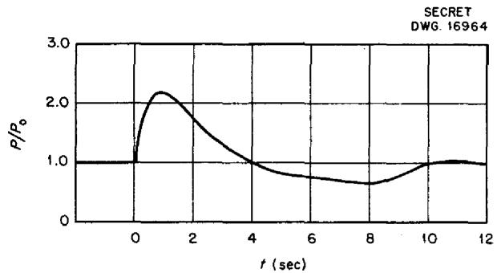  
Fig. B6. Response of Servo-Controlled ARE to a Step Change in Reactivity of $+0.2\% \Delta k / k$ at $t = 0$ .

# C. DISPERSION OF AIRBORNE WASTES IN THE 7500 AREA

# Meteorology and Climatology

R. F. Myers J. Z. Holland

U. S. Weather Bureau, Oak Ridge Office

Wind speed and direction measurements at a height of 70 ft at the site of the proposed ARE have been

correlated with wind, temperature gradient, and rainfall measurements made at the ORNL Health Physics Division weather station and elsewhere in the Oak Ridge Area and with measurements of winds aloft at nearby Weather Bureau stations to show the climatology of the site. Specialized measurements of the turbulence, wind-speed gradients, and temperature gradients have been used to make quantitative estimates of the meteorological factors involved in the travel and dilution of contamination released deliberately or accidentally at the site of the proposed ARE.

Stability of the Lower Layers of the Atmosphere. The lower layers of the atmosphere tend to be more frequently stable than unstable and inversions (constant or increasing temperature with height) occur about $56\%$ of the time, annually. Fall is usually the season with the greatest percentage of hours with inversions, and summer, as might be expected, is the season with the least number of hours of inversions. A summary of the seasonal percentage of frequency of inversions, as measured at ORNL, is given in Table Cl for the period 1944 to 1951.

A frequency distribution of the temperature gradient (Fig. Cl) shows the smallest range of values in the summer and fall and the greatest range

in spring and winter. Higher wind speeds in winter and spring tend to increase the percentage of neutral or adiabatic lapse rates (dashed vertical line) during these seasons.

Figure Cl also shows the distribution of temperature gradient between the surface and the 850-millibar pressure level (approximately 5000 ft MSL). The stability is much more pronounced in the deep layer of air than in the layer 183 ft above the ground. A marked shift occurs, during the spring, from the very stable winter distributions to the slightly stable summer distribution. By fall, the transition to the stable winter pattern begins. It should be noted that the frequency of adiabatic or neutral lapse extending through the whole layer up to 5000 ft MSL is not large.

Low level soundings taken at 0300E, 0900E, 1500E, and 2100E from the summer of 1949 through the fall of 1950 are summarized in Fig. C2. The average temperature gradients of the lowest 1000 ft are the most affected by diurnal changes. The nocturnal inversion is well developed in the 0300E and 2100E soundings. This inversion, which forms after sunset, usually builds up to 400 to 800 ft, with the stable layer extending higher, often to 5000 feet.

TABLE C1. SUMMARY OF SEASONAL FREQUENCY OF INVERSIONS   

<table><tr><td rowspan="2"></td><td colspan="9">FREQUENCY OF INVERSIONS (%)</td></tr><tr><td>1944</td><td>1945</td><td>1946</td><td>1947</td><td>1948</td><td>1949</td><td>1950</td><td>1951</td><td>Average</td></tr><tr><td>Winter</td><td>43.4</td><td>43.1</td><td>53.1</td><td>64.4</td><td>55.1</td><td>43.8</td><td>68.2</td><td>74.6</td><td>55.7</td></tr><tr><td>Spring</td><td>45.4</td><td>45.0</td><td>55.7</td><td>M*</td><td>54.9</td><td>58.9</td><td>58.4</td><td>83.9</td><td>57.4</td></tr><tr><td>Summer</td><td>44.1</td><td>52.5</td><td>50.4</td><td>52.8</td><td>41.1</td><td>57.1</td><td>59.5</td><td>50.2</td><td>51.0</td></tr><tr><td>Fall</td><td>51.1</td><td>65.5</td><td>55.7</td><td>61.4</td><td>33.4</td><td>67.9</td><td>80.5</td><td>52.8</td><td>58.5</td></tr><tr><td>Annual</td><td>46.0</td><td>51.5</td><td>53.7</td><td>59.2</td><td>46.1</td><td>56.9</td><td>66.5</td><td>65.4</td><td>55.7</td></tr></table>

* Observation missing.

UNCLASSIFIED DWG. 16965

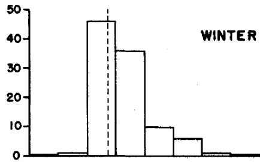  
SURFACE TO 183

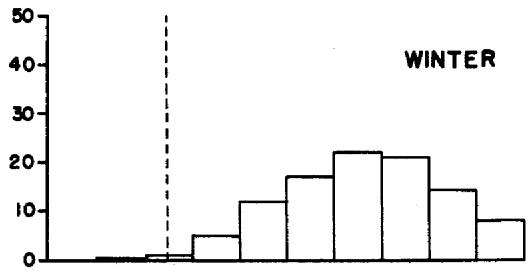  
SURFACE TO 850 MBS. (5000FT.M.S.L.)

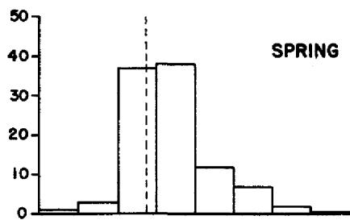

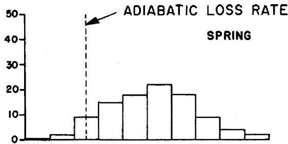

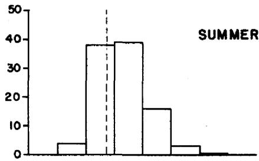  
FREQUENCY

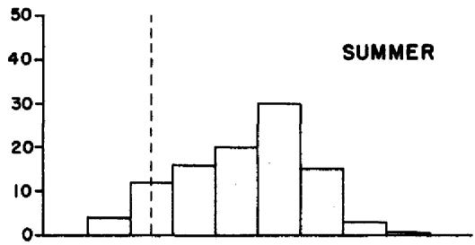

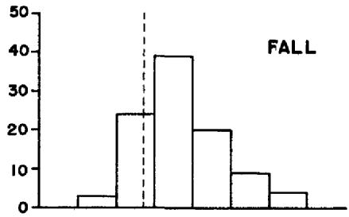

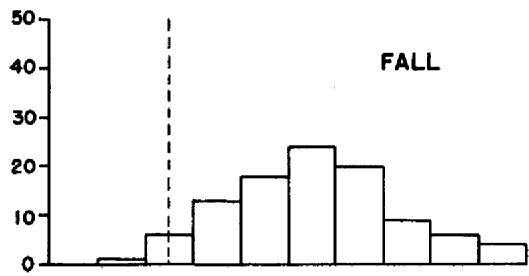

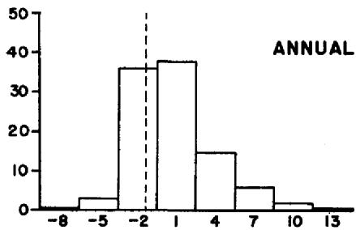

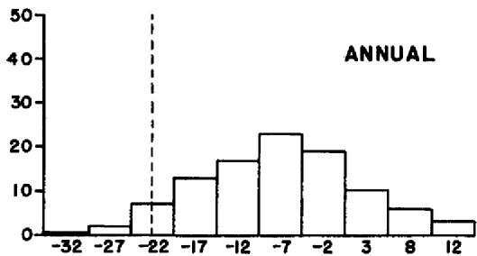  
T183'-T5'°F   
T850MBS-T5°F   
Fig. C1. Distribution of Temperature Gradient 1949 to 1950.

UNCLASSIFIED DWG. 16966

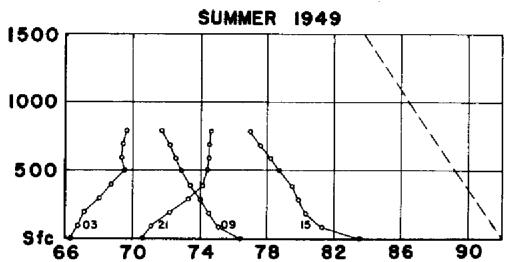

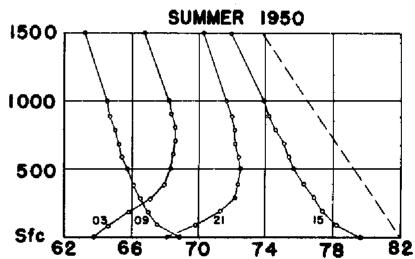

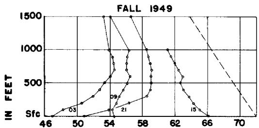

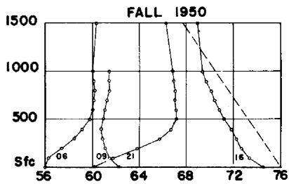

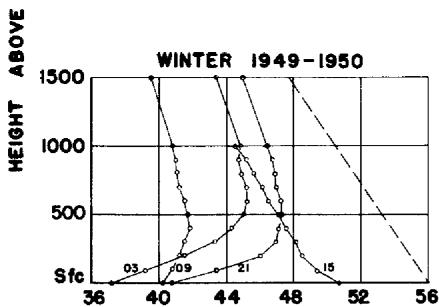  
GROUND

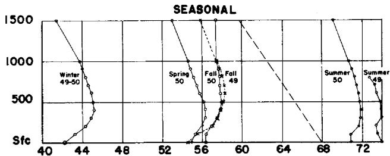

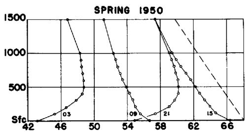

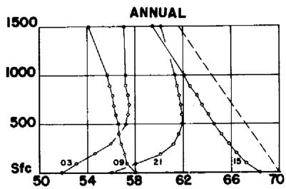  
TEMPERATURE IN \*F  
Fig. C2. Low-Level Temperature Soundings.

The afternoon temperature gradients, as shown by the 1500E soundings, are very unstable in the lowest 100 ft and usually are neutral or slightly unstable to several thousand feet.

The implications of these climatological conditions are that it is expected that any contaminant emitted into the inversion layer at ambient temperature will not be mixed vertically, but will remain at or near its level of emission with a minimum of dilution, whereas a contaminant emitted into an unstable layer will be mixed through the unstable layer in a comparatively short time during which puffs of relatively high concentration may be momentarily brought to the ground.

Winds in Relation to Stability. The valleys in the vicinity of the site are oriented northeast-southwest, and considerable channeling of the winds in the valley may be expected. This is evident in Fig. C3, which shows the annual frequency distribution of winds at the stations operated in the vicinity of ORNL during the meteorological survey. The flags on these wind rose diagrams point in the direction from which the wind comes. The prevailing wind directions are upvalley from southwest and west-southwest, with a secondary maximum of downvalley winds from northeast and east-northeast. The prevailing wind regimes reflect the orientation of the broad valley between the Cumberland Plateau and the Smoky Mountains, as well as the orientation of the local ridges and valleys. The gradient wind in this latitude is usually southwest or westerly, so the daytime winds tend to reflect a mixing down of the gradient winds. The night winds represent drainage of cold air down the local slopes and the broader Tennessee Valley. The combination of these two effects, as well as the daily changes in the pressure patterns over this area, gives the elongated

shape of the typical wind rose at a channeled valley station.

During inversions, the northeast and east-northeast winds occur most frequently, usually at the expense of the southwest and west-southwest winds. Many of these drainage winds are very light and are below the starting speed of the anemometers available. This characteristically increases the percentage of calms recorded during the night under stable conditions. It may be seen in Fig. C4 that the percentage of calms is much higher under stable conditions at the 7500 area than under unstable conditions. The predominance of light northeast and east-northeast winds under stable conditions is particularly marked in the summer and fall when the lower wind speeds aloft and the smaller amount of cloudiness allows the nocturnal drainage patterns to develop.

In Fig. C4, the unstable wind roses are typical of the daytime conditions when turbulence and dilution are most pronounced. Wind speeds under these conditions are usually above average. The stable wind roses are typical of nighttime when lower wind speeds, little turbulence, and a minimum of dilution are observed.

A comparison (Fig. C5 and Table C2) of the winds of 140 ft at the X-10 site and the winds at 70 ft at the 7500 area for 1951 shows that the distribution of direction is not greatly different at the two locations. The chief characteristics of the 7500 area winds are the lighter speeds and a higher degree of channeling. This is to be expected with the lower anemometer height and narrower valley at the 7500 site.

Further comparison of the 1951 X-10 site winds with the adjusted 16-point average of the 1944 to 1950 winds at the same location indicates that the 1951 wind distribution was very similar to the average for the longer period and hence the 7500 area

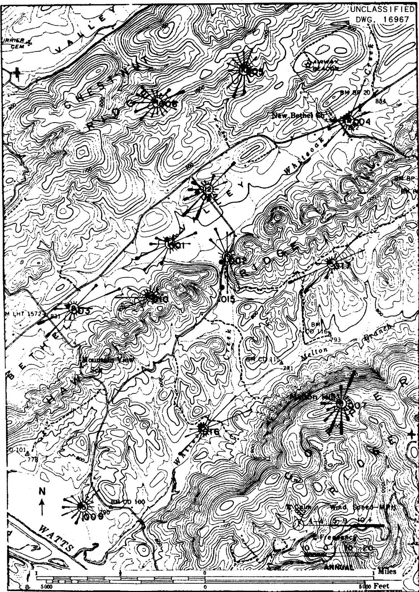  
Fig. C3. Annual Frequency Distribution of Winds in the Vicinity of X-10 Area.

UNCLASSIFIED

DWG. 16968

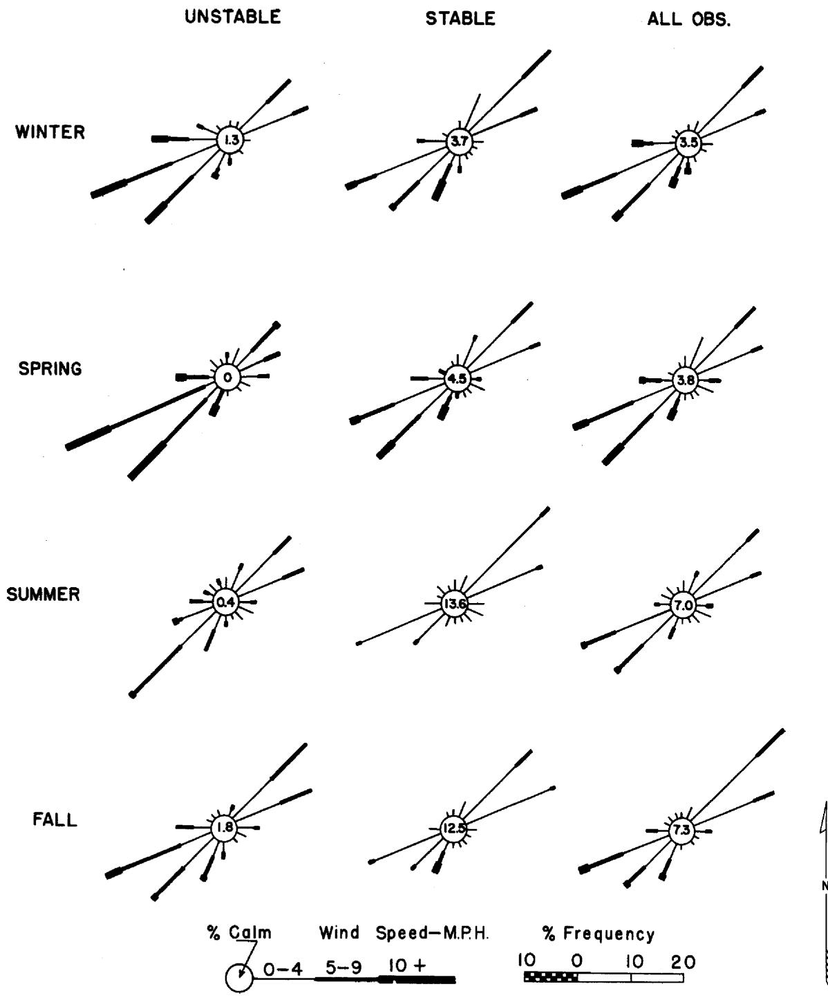  
Fig. C4. 7500 Area Seasonal Wind Roses 1951.

UNCLASSIFIED DWG. 16969

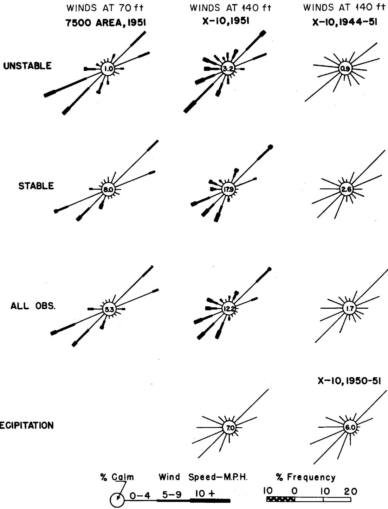  
Fig. C5. Annual Frequency Distribution of Winds at X-10 and 7500 Areas.

TABLE C2. ANNUAL FREQUENCY OF WIND DIRECTION  

<table><tr><td rowspan="2">WIND DIRECTION</td><td colspan="3">7500 AREA WINDS AT 70 ft (1951)</td><td>X-10 SITE WINDS AT 140 ft (1951)</td><td colspan="3">X-10 SITE WINDS AT 140 ft (1944-1950)</td></tr><tr><td>Stable</td><td>Unstable</td><td>All Obser.</td><td>All Obser.</td><td>Stable</td><td>Unstable</td><td>All Obser.</td></tr><tr><td>Calm</td><td>8%</td><td>1%</td><td>5%</td><td>12%</td><td>3%</td><td>1%</td><td>2%</td></tr><tr><td>NNE</td><td>4</td><td>3</td><td>4</td><td>4</td><td>4</td><td>4</td><td>4</td></tr><tr><td>NE</td><td>21</td><td>15</td><td>19</td><td>18</td><td>17</td><td>12</td><td>18</td></tr><tr><td>ENE</td><td>15</td><td>13</td><td>14</td><td>9</td><td>11</td><td>10</td><td>9</td></tr><tr><td>E</td><td>2</td><td>3</td><td>3</td><td>1</td><td>3</td><td>5</td><td>4</td></tr><tr><td>ESE</td><td>2</td><td>2</td><td>2</td><td>1</td><td>4</td><td>5</td><td>3</td></tr><tr><td>SE</td><td>1</td><td>1</td><td>1</td><td>1</td><td>2</td><td>4</td><td>3</td></tr><tr><td>SSE</td><td>1</td><td>0</td><td>1</td><td>1</td><td>3</td><td>4</td><td>3</td></tr><tr><td>S</td><td>1</td><td>2</td><td>2</td><td>2</td><td>2</td><td>2</td><td>2</td></tr><tr><td>SSW</td><td>5</td><td>7</td><td>6</td><td>9</td><td>9</td><td>7</td><td>8</td></tr><tr><td>SW</td><td>13</td><td>20</td><td>16</td><td>14</td><td>12</td><td>16</td><td>15</td></tr><tr><td>WSW</td><td>18</td><td>21</td><td>20</td><td>11</td><td>11</td><td>8</td><td>9</td></tr><tr><td>W</td><td>4</td><td>6</td><td>5</td><td>6</td><td>7</td><td>9</td><td>8</td></tr><tr><td>WNW</td><td>1</td><td>2</td><td>1</td><td>6</td><td>7</td><td>6</td><td>6</td></tr><tr><td>NW</td><td>1</td><td>1</td><td>1</td><td>2</td><td>2</td><td>4</td><td>3</td></tr><tr><td>NNW</td><td>1</td><td>1</td><td>1</td><td>1</td><td>2</td><td>1</td><td>2</td></tr><tr><td>N</td><td>2</td><td>1</td><td>1</td><td>2</td><td>1</td><td>1</td><td>1</td></tr></table>

wind data for 1951 would not be very different from a longer period record at that site. It should be noted that the higher frequency of calms at the X-10 site in 1951 is caused by the starting speed of 2 to 3 mph for the generator anemometer at that location, whereas the 7500 area instrument and the older X-10 instrument had starting speeds of under 1 mph.

The seasonal distribution of average hourly wind speed for 1951 is shown in Table C3.

Local Variation in the Winds. Considerable variation is observed both in wind speed and direction within small distances in Bethel Valley and Melton Valley. A study of the wind flow patterns that occur during the warm and cold halves of the year

with several groups of stability in the lowest 5000 ft under various regimes of 5000-ft wind direction and speed was made. All the hourly wind observations from the stations operated during the meteorological survey of 1949 to 1950 were sorted by these parameters, and the prevailing direction for each station was plotted.

Examples of the effects of these parameters on the local winds in the vicinity of the X-10 site are illustrated in Figs. C6 and 7. These wind patterns are typical of the winter, or cold half of the year, when vegetative cover is at a minimum and the surface is less sheltered from the winds aloft. Station 010 was located within the tree cover on Haw Ridge and is typical of the travel of contaminants

TABLE C3. 1951 SEASONAL DISTRIBUTION OF AVERAGE HOURLY WIND SPEED IN X-10 AND 7500 AREAS   

<table><tr><td rowspan="2"></td><td colspan="5">AVERAGE HOURLY WIND SPEED (mph)</td></tr><tr><td>Winter</td><td>Spring</td><td>Summer</td><td>Fall</td><td>Annual</td></tr><tr><td colspan="6">7500 Area (at 70 ft)</td></tr><tr><td>Stable</td><td>3.9</td><td>4.4</td><td>1.9</td><td>2.4</td><td>3.4</td></tr><tr><td>Unstable</td><td>5.4</td><td>7.2</td><td>4.6</td><td>4.7</td><td>5.1</td></tr><tr><td>All observations</td><td>4.5</td><td>4.8</td><td>3.3</td><td>3.5</td><td>3.9</td></tr><tr><td colspan="6">X-10 Area (at 140 ft)</td></tr><tr><td>Stable</td><td>5.4</td><td>6.1</td><td>2.1</td><td>2.9</td><td>4.4</td></tr><tr><td>Unstable</td><td>7.1</td><td>9.3</td><td>5.2</td><td>5.7</td><td>6.1</td></tr><tr><td>All observations</td><td>6.0</td><td>6.6</td><td>3.7</td><td>4.3</td><td>5.1</td></tr></table>

released at low levels on a north facing slope. All four patterns shown in Fig. C6 occurred with the same wind direction at 5000 ft MSL, that is, from the southwest. In the daytime, when the air is relatively unstable through the 5000-ft layer, the local winds tend to follow the upper winds in direction. The degree with which they follow is determined mainly by the speed of the upper winds. With the 5000 ft winds ranging between 5 and 14 mph, direct upslope winds occur on Chestnut Ridge, but the valley stations follow closely. If the upper wind speed is increased to 30 to 59 mph, all the stations follow quite well, except the station under the trees at Haw Ridge.

During the night, if the air is stable and there are light upper winds, the winds on the surface follow their own pattern of drainage of cold air from the local ridges down the local valley and the deeper current down the Tennessee Valley. If the wind speed in the upper layer is increased to 30 to 59 mph and all other parameters remain the same, the more exposed stations follow the southwest wind, and the percentage of calms increases considerably at most stations. The well-protected stations

have the drainage wind cancelled and their prevailing wind becomes calm. It is interesting to note that the wind velocity at Melton Hill (1431 ft MSL) is reversed from a drainage wind of 14 mph to a gradient wind of 11 mph during the night merely by an increase of the upper wind from light to strong.

In Fig. C7, the effect of crossridge gradient winds from the north and northwest at 5000 ft MSL is shown under the same combinations of speed and stability as in Fig. C6. Here again, even with the upper winds blowing across the ridges, the valley stations tend to follow the gradient winds in daytime with a fidelity dependent on the speed of the upper wind. It should be noted, however, that the probability of the wind following the prevailing direction is smaller for the crossvalley wind than the upvalley wind. Under stable conditions at night, downvalley flow again predominates when the upper winds are light and at right angles to the valley orientation. When the upper wind speed is strong, the surface winds tend to follow it, except at sheltered locations where the prevailing wind is generally calm or at least below the starting speed of the anemometers.

DAY-UNSTABLE   
NIGHT-STABLE  
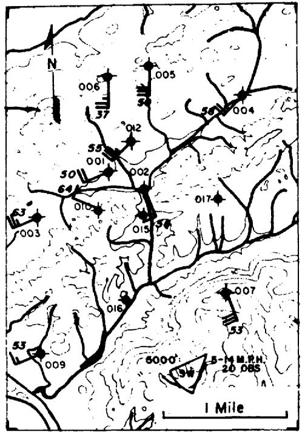  
UNCLASSIFIED DWG. 16970

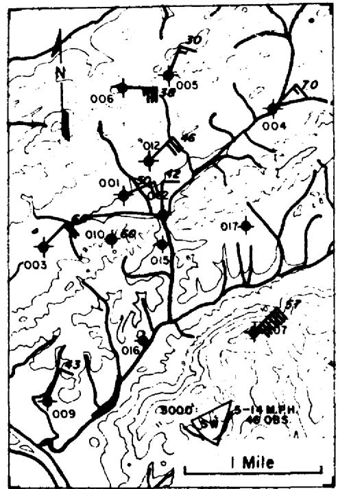

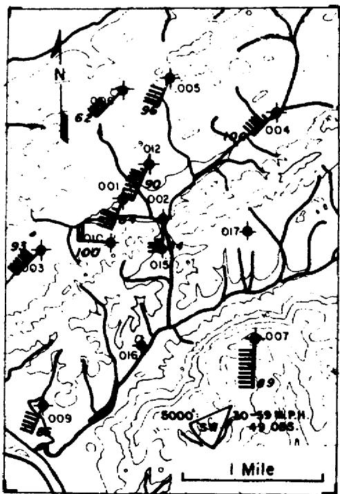

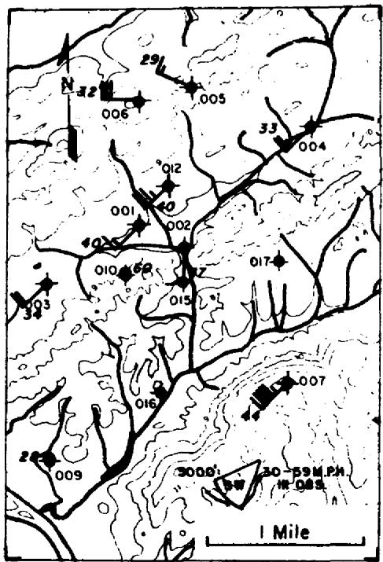

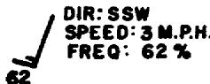  
Fig. C6. Low-Level Variation in Winter Winds with South-Southwest Winds at 5000-ft MSL.

UNCLASSIFIED

NIGHT-STABLE DWG. 16971

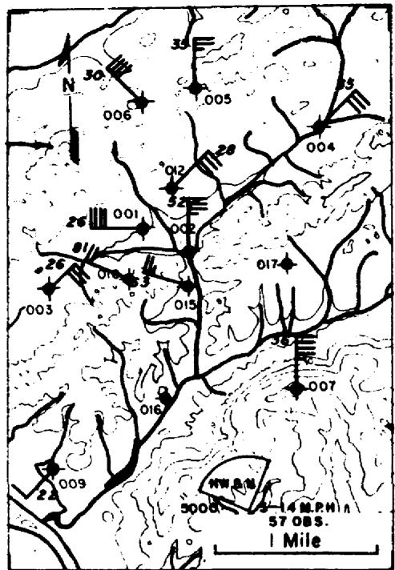  
DAY-UNSTABLE

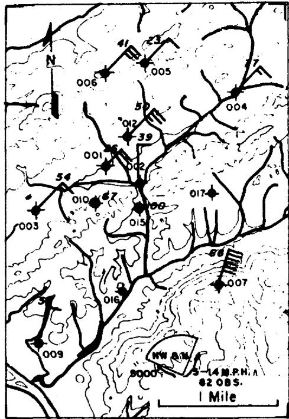

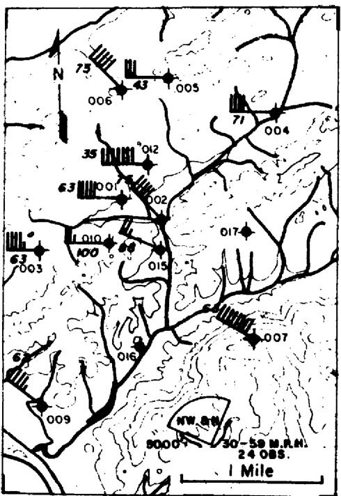

Fig. C7. Low-Level Variation in Winter Winds with Northwest and North Winds at 5000-ft MSL.   
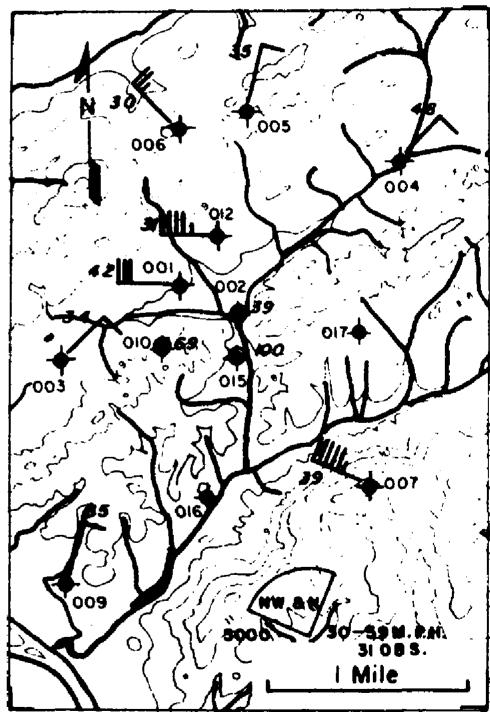  
DIR: SSW
SPEED: 3 M.P.H.
FREQ: 62%

Generalizing from these examples and others that have been studied, it may be said that in nighttime or in stable conditions, the winds tend to be generally northeast and east-northeast and rather light in the valley, regardless of the gradient wind, except that strong winds aloft will control the velocity and direction of the valley winds, reversing them or producing calms when opposing the local drainage. In the daytime, the surface winds tend to follow the winds aloft, with increasing reliability, as the upper wind speed increases. Only with strong winds aloft or winds parallel to the valleys would it be of value to attempt to extrapolate air movements for any number of miles by using valley winds. In the well-developed stable situation, however, a very light air movement will follow the valley as far downstream as the valley retains its structure, even though the prevailing winds a few hundred feet above the ground are in an entirely different direction. In general, air transport from a valley location will be governed by the local valley wind regime and the degree of coupling with the upper winds.

Frequency of Wind Flow from the 7500 Area to the X-10 Area. Two patterns of wind flow were assumed to be of significance: (l) from the 7500 area northwest over Haw Ridge to the X-10 area, and (2) from the 7500 area west to White Oak Creek, then northwest through Haw Gap, and finally north to the X-10 area.

Simultaneous wind records for four months at the 7500 area, X-10 area, two stations in Haw Gap, and a station at the top of the adjoining Chestnut Ridge were punched into IBM cards and a study made of the occurrence of the two patterns. For pattern (l) it was required that each of the stations at the 7500 area, Chestnut Ridge top, and the X-10 area have a wind direction within the sector east-southeast

through south. For pattern (2) it was required that the 7500 area station have a wind within the sector east-northeast through southeast, both the Gap stations have winds between east-southeast and south-southwest, and the X-10 area have a wind between south and west-southwest.

The frequencies of these patterns during the period September to December 1950 were normalized to the 1944 to 1951 wind record at the X-10 area by a ratio method. The normalized frequencies are shown in Table C4 for: (1) all cases, (2) daytime (unstable) only, (3) night (stable) only, (4) light winds only (1 to 4 mph at X-10), and (5) stronger winds only (5 mph and above at X-10).

TABLE C4. FREQUENCY OF WIND PATTERNS BETWEEN 7500 AND X-10 AREAS   

<table><tr><td rowspan="2"></td><td colspan="2">FREQUENCY OF WIND PATTERN(%)</td></tr><tr><td>Over Ridge</td><td>Through Gap</td></tr><tr><td>All observations</td><td>2.5</td><td>0.4</td></tr><tr><td>Day (9a to 5p)</td><td>4.3</td><td>0.6</td></tr><tr><td>Night (9p to 5a)</td><td>0.0</td><td>0.4</td></tr><tr><td>Light wind (1 to 4 mph)</td><td>2.6</td><td>0.4</td></tr><tr><td>Stronger wind (5 and over)</td><td>2.7</td><td>0.3</td></tr></table>

Upper Winds. A comparison of the pibal observations made throughout 1949 to 1950 at Knoxville and Oak Ridge shows that above about 2000 ft the wind roses are almost identical at these two stations. This identity in the data makes possible the use of the longer period of record (1927 to 1950) from Knoxville to eliminate the abnormalities introduced by the use of the short record at Oak Ridge.

Annual wind roses are shown for Knoxville (1927 to 1950) and Nashville (1937 to 1950) in Fig. C8. Pibal observations are only made when no low clouds, dense fog, or precipitation is occurring and so are not truly

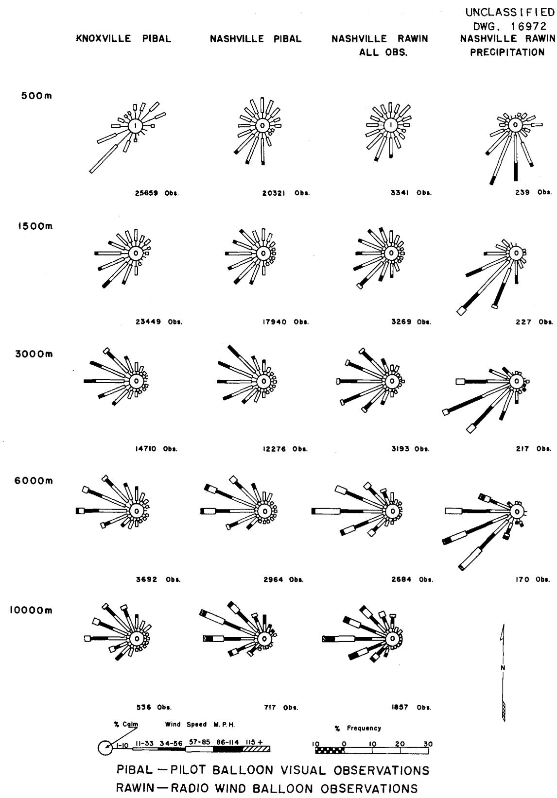  
Fig. C8. Pibal and Rawin Wind Roses at Knoxville and Nashville for Various Altitudes.

representative of the upper wind at all times. Three years of Rawin data for Nashville (1947 to 1950) are available that consist of observations taken regardless of the current weather at the time of observation. A comparison of these wind roses for Knoxville and Nashville shows that the mode for winds above 3000 meters MSL should be shifted to westerly instead of west-northwest when observations with rain are included in the set. In summer and fall, the winds aloft are lightest and the highest winds occur during the winter months at all levels.

Table C5 shows the annual frequency and speed of the winds aloft for Knoxville for several representative levels.

The northeast-southwest axis of the valley between the Cumberland Plateau and the Smoky Mountains continues to influence the wind distribution over the Tennessee Valley up to about

5000 ft although the variations within the Valley do not extend above about 2000 feet. Above 5000 ft, the southwesterly mode gives way to the prevailing westerlies usually observed at these latitudes.

Correlation of Winds with Precipitation. Figure C5 contains a wind rose for the surface wind at the X-10 site, for which only the hours of observation in 1951 during which precipitation was measured were used. The direction distribution is very little different from that of all observations. This is consistent with the experience of precipitation forecasters that there is little correlation between surface wind direction and rain, particularly in rugged terrain. Figure C8 shows the upper winds measured at Nashville during the period 1948 to 1950 when precipitation was occurring at observation time. In general the prevailing wind at any given level is shifted to

TABLE C5. ANNUAL FREQUENCY OF WIND DIRECTION AND AVERAGE WIND SPEED AT KNOXVILLE (1927 to 1950)   

<table><tr><td rowspan="2">WIND DIRECTION</td><td colspan="2">AT 500 m MSL</td><td colspan="2">AT 1500 m MSL</td><td colspan="2">AT 3000 m MSL</td></tr><tr><td>Frequency (%)</td><td>Speed (mph)</td><td>Frequency (%)</td><td>Speed (mph)</td><td>Frequency (%)</td><td>Speed (mph)</td></tr><tr><td>Calm</td><td>1</td><td></td><td>0</td><td></td><td>0</td><td></td></tr><tr><td>NNE</td><td>6</td><td>10</td><td>5</td><td>12</td><td>4</td><td>14</td></tr><tr><td>NE</td><td>10</td><td>10</td><td>4</td><td>12</td><td>3</td><td>13</td></tr><tr><td>ENE</td><td>9</td><td>10</td><td>3</td><td>12</td><td>2</td><td>12</td></tr><tr><td>E</td><td>4</td><td>7</td><td>2</td><td>10</td><td>2</td><td>11</td></tr><tr><td>ESE</td><td>2</td><td>6</td><td>2</td><td>8</td><td>1</td><td>11</td></tr><tr><td>SE</td><td>2</td><td>6</td><td>2</td><td>9</td><td>2</td><td>11</td></tr><tr><td>SSE</td><td>2</td><td>8</td><td>2</td><td>12</td><td>2</td><td>12</td></tr><tr><td>S</td><td>4</td><td>10</td><td>5</td><td>17</td><td>2</td><td>14</td></tr><tr><td>SSW</td><td>7</td><td>13</td><td>10</td><td>23</td><td>3</td><td>18</td></tr><tr><td>SW</td><td>20</td><td>15</td><td>15</td><td>24</td><td>5</td><td>22</td></tr><tr><td>WSW</td><td>12</td><td>12</td><td>13</td><td>21</td><td>9</td><td>25</td></tr><tr><td>W</td><td>7</td><td>12</td><td>12</td><td>20</td><td>12</td><td>26</td></tr><tr><td>WNW</td><td>4</td><td>11</td><td>9</td><td>17</td><td>16</td><td>28</td></tr><tr><td>NW</td><td>3</td><td>8</td><td>7</td><td>15</td><td>16</td><td>28</td></tr><tr><td>NNW</td><td>3</td><td>9</td><td>6</td><td>14</td><td>13</td><td>23</td></tr><tr><td>N</td><td>5</td><td>10</td><td>5</td><td>13</td><td>7</td><td>18</td></tr><tr><td>Average Speed</td><td></td><td>11</td><td></td><td>18</td><td></td><td>23</td></tr></table>

the southwest or south-southwest from west or southwest, and the velocity is somewhat higher during the occurrence of precipitation, with the shift being most marked in the winter.

Table C6 shows the annual frequency of wind direction and average wind speed during precipitation.

The average number of days with 0.01 in. of precipitation is 139 annually, with January having the highest average. The maximum days with rain in one month was 22 in January of 1950. September and October are the months with the least number of days with precipitation, averaging seven each. The distribution of daily precipitation is summarized in Fig. C9.

# Estimates of Dispersion of Airborne Activity

R. F. Myers J. Z. Holland

U. S. Weather Bureau, Oak Ridge Office

H. L. F. Enlund, ANP

Heat Liberated in a Disaster. The assumptions were made that the maximum energy release of the runaway reactor will not be worse than the energy released by the explosion of an equivalent weight of TNT. This would amount to $1.75 \times 10^{9}$ cal and could be augmented by the reaction of the $15\mathrm{ft}^3$ of NaK in the cooling system with water released from a heat exchanger line in the helium-filled pits. This secondary chemical reaction could add about $8.5 \times 10^{8}$ cal (cf., section on "Basic Data for ARE

TABLE C6. ANNUAL FREQUENCY OF WIND DIRECTION AND AVERAGE WIND SPEED DURING PRECIPITATION   

<table><tr><td rowspan="3">WIND DIRECTION</td><td rowspan="2" colspan="2">KNOXVILLE SFC. (1950-51)</td><td colspan="4">NASHVILLE RAWIN</td></tr><tr><td colspan="2">1500 m MSL</td><td colspan="2">3000 m MSL</td></tr><tr><td>Frequency (%)</td><td>Speed (mph)</td><td>Frequency (%)</td><td>Speed (mph)</td><td>Frequency (%)</td><td>Speed (mph)</td></tr><tr><td>Calm</td><td>6</td><td></td><td>0</td><td></td><td>0</td><td></td></tr><tr><td>NNE</td><td>3</td><td>4</td><td>0</td><td></td><td>1</td><td>13</td></tr><tr><td>NE</td><td>16</td><td>6</td><td>0</td><td></td><td>0</td><td></td></tr><tr><td>ENE</td><td>6</td><td>4</td><td>1</td><td>16</td><td>1</td><td>7</td></tr><tr><td>E</td><td>1</td><td>4</td><td>1</td><td>21</td><td>1</td><td>11</td></tr><tr><td>ESE</td><td>1</td><td>2</td><td>0</td><td></td><td>1</td><td>36</td></tr><tr><td>SE</td><td>1</td><td>3</td><td>2</td><td>24</td><td>1</td><td>20</td></tr><tr><td>SSE</td><td>1</td><td>4</td><td>3</td><td>19</td><td>1</td><td>12</td></tr><tr><td>S</td><td>4</td><td>6</td><td>8</td><td>28</td><td>5</td><td>26</td></tr><tr><td>SSW</td><td>10</td><td>8</td><td>17</td><td>32</td><td>12</td><td>26</td></tr><tr><td>SW</td><td>16</td><td>8</td><td>28</td><td>31</td><td>22</td><td>37</td></tr><tr><td>WSW</td><td>13</td><td>8</td><td>17</td><td>30</td><td>25</td><td>38</td></tr><tr><td>W</td><td>9</td><td>8</td><td>9</td><td>27</td><td>18</td><td>39</td></tr><tr><td>WNW</td><td>7</td><td>7</td><td>6</td><td>21</td><td>8</td><td>27</td></tr><tr><td>NW</td><td>3</td><td>7</td><td>4</td><td>22</td><td>4</td><td>33</td></tr><tr><td>NNW</td><td>2</td><td>4</td><td>2</td><td>5</td><td>1</td><td>16</td></tr><tr><td>N</td><td>1</td><td>1</td><td>1</td><td>7</td><td>1</td><td>18</td></tr><tr><td>Average Speed</td><td></td><td>5</td><td></td><td>28</td><td></td><td>34</td></tr></table>

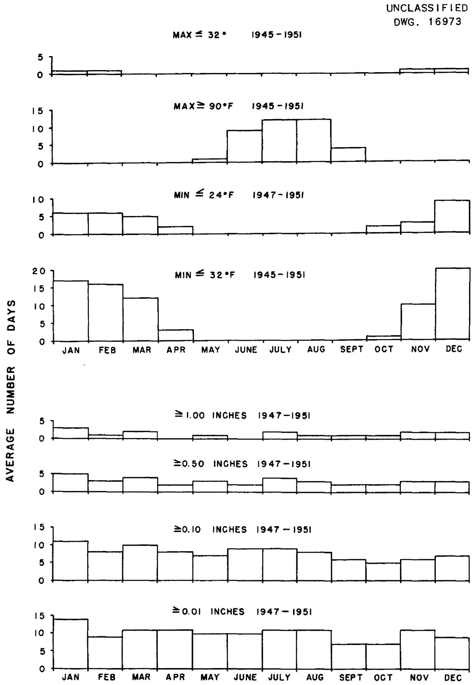  
Fig. C9. Frequency of Daily Temperature Extremes and Precipitation Amounts.

Catastrophe') to that available to heat the released fission products and air in the ARE building.

The working assumption was made that just sufficient heat would be released in the disaster to bring the reactor structure and fuel to about $1400^{\circ}\mathrm{C}$ , which would result in the boiling of the fuel and the melting of the Inconel. Only this amount of heat, about $4.4 \times 10^{8}$ cal, would be needed to heat to about $180^{\circ}\mathrm{C}$ the $10,000\mathrm{m}^{3}$ of air in the building that would contain the total activity of the reactor, either as vapor or as small particles under 50 microns. This calculation presents a much more pessimistic picture meteorologically than one in which all the available energy is utilized to push the initial cloud higher into the air, which allows greater dilution before it reaches the ground.

Height of Rise. Sutton(2) has obtained an approximate solution for the temperature excess of a rising hot puff originating in an instantaneous point source of heat and mixing with its environment by eddy diffusion. Satisfactory verification was obtained by comparison with published data on the Trinity explosion. Sutton's equation is

$$
\Delta \theta_ {e} = \frac {Q _ {H}}{2 c _ {p} \rho v T ^ {3 / 2} C ^ {3} Z ^ {3 m / 2}}, \tag {1}
$$

where $\Delta \theta_{c}$ is the difference, in degrees centigrade, between the average potential temperature of the cloud and the potential temperature of the atmosphere, the latter being assumed by Sutton to be constant with height. The potential temperature is the actual temperature of the air if it were compressed adiabatically to 1000 millibars. $Q_{H}$ is the total heat liberated, $4.4 \times 10^{8}$ cal and transferred to the building air from the melted

structure and the boiling fuel. $c_p$ is the specific heat of air at constant pressure, 0.25 cal/g $^{\circ}$ C. $\rho$ is the air density, 1.2 × 10³ g/m³. $C$ is the virtual diffusion coefficient that takes into account the natural turbulence of the air and the enhanced turbulence introduced by the hot puff. Sutton gives an estimated range of values, 0.3 to 0.6m $^{1/8}$ , for this parameter, based on studies of shell bursts. The 0.3 value is used here, since the calculation is for a relatively stable thermal stratification.(3) Z is the height above the source, meters. m is a parameter resulting from the increase in size of the effective diffusing eddies during the spreading of the cloud. Its value is estimated by Sutton, from a wide variety of evidence, to be 1.75 in the average case.

In order to determine the level in a stable atmosphere at which the cloud reaches thermal equilibrium, it is assumed that the vertical gradient of potential temperature in the atmosphere is a constant, $\theta_{a}^{\prime}$ and that at the equilibrium level the temperature excess of the cloud with respect to a neutral atmosphere is just balanced by the actual increase in potential temperature of the atmosphere with height. Then,

$$
\Delta \theta_ {c} = \Delta \theta_ {a} = Z _ {\max } \theta_ {a} ^ {\prime}
$$

and

$$
Z _ {\max } = \left(\frac {Q _ {H}}{2 c _ {p} \rho \pi^ {3 / 2} C ^ {3} \theta_ {a} ^ {\prime}}\right) ^ {2 / (3 m + 2)}. \tag {2}
$$

In the stable case, $\theta_{a}^{\prime} = 0.02^{\circ}\mathrm{C / m}$ (an average nighttime value for the Oak Ridge Area), giving a calculated cloud rise of about 200 meters.

Since $\Delta \theta_{c}$ is then equal to $0.02^{\circ}C / m \times 200m = 2^{\circ}C$ , the volume can be approximated by assuming that the

decrease in temperature excess is accounted for by a corresponding increase in volume:

$$
\frac {\Delta \theta_ {2}}{\Delta \theta_ {1}} = \frac {V _ {1}}{V _ {2}}. \tag {3}
$$

So that

$$
V _ {2} = 1 \times 1 0 ^ {4} m ^ {3} \times \frac {1 8 0}{2} = 9 \times 1 0 ^ {5} m ^ {3}
$$

at $200\mathrm{m}$ in the stable case.

In the unstable case, it is assumed that the cloud levels off at about $1500\mathrm{m}$ (300 to 500 m above the daytime cloud base). According to Sutton's formula, the temperature excess would then be:

$$
\begin{array}{l} \Delta \theta_ {3} = \Delta \theta_ {2} \left(\frac {Z _ {2}}{Z _ {3}}\right) ^ {2. 6 2} \\ = 2. 0 0 \left(\frac {2 0 0}{1 5 0 0}\right) ^ {2. 6 2} = 0. 0 1 0 ^ {\circ} \mathrm {C} \tag {4} \\ \end{array}
$$

which, according to Mills, would give an activity augmentation of 7.7 in the case of a runaway. Then the augmented activity at 1000 sec would be about $6.5 \times 10^{7}$ curies.

The initial concentration of gross fission products in the cloud will then be

$$
\frac {6 . 5 \times 1 0 ^ {7}}{9 \times 1 0 ^ {5}} = 7 2 \text {c u r i e s} / \mathrm {m} ^ {3}
$$

for the nighttime case, and

$$
\frac {6 . 5 \times 1 0 ^ {7}}{1 . 8 \times 1 0 ^ {7}} = 3. 6 \text {c u r i e s} / \mathrm {m} ^ {3}
$$

for the daytime case.

Diffusion from an Elevated Instantaneous Source. Sutton has developed a general equation for isotropic diffusion from an instantaneous point source of strength $Q$ : (6)

$$
\chi (r, t) = \frac {Q}{\pi^ {3 / 2} C ^ {3} (u t) ^ {3 (2 - n) / 2}} \exp \left[ - \frac {r ^ {2}}{C ^ {2} (u t) ^ {2 - n}} \right], \tag {5}
$$

Initial Concentration of Fission Products in the Cloud. The activity contained in the reactor following a normal shutdown, calculated from the formula given by Mills, (4) contains no augmentation owing to the additional activity produced by a power excursion during a runaway type of catastrophe:

$$
A = \frac {1 1 . 1 5 (\text {p o w e r i n w a t t s})}{t ^ {0 . 2} (\sec)}
$$

at $3 \times 10^{6}$ watts gives $8.4 \times 10^{6}$ curies at 1000 sec after the catastrophe, assuming an average energy of 1 MeV. A fast power oscillation would yield a reactor period of 1.5 sec, (5)

where

$$
\begin{array}{l} \begin{array}{l} \chi = \text {c o n c e n t r a t i o n o f a c t i v i t y}, \\ \text {c u r i e s / m ^ {3} (o r} \mu c / c m ^ {3}), \end{array} \\ \begin{array}{l} Q = \text {s t r e n g t h o f t h e s o u r c e , c u r i e s ,} \\ C = \text {v i r t u a l d i f f u s i o n c o e f f i c i e n t} \\ \text {a p p r o p r i a t e t o " n a t u r a l " d i f -} \\ \text {f u s i o n , (3 . 7)} \end{array} \\ u = \text {w i n d} \quad \text {s p e e d}, \quad \mathrm {m} / \sec , \\ t = \text {t i m e a f t e r} \\ n = \text {d i m e n s i o n l e s s} \quad \text {s t a b i l i t y p a r a m e t e r} \quad \text {v a r y i n g b e t w e e n 0 a n d 1 , t o b e} \quad \text {d e t e r m i n e d} \quad \text {e x p e r i m a n t l y f r o m} \quad \text {t h e w i n d p r o f i l e f o r m u l a} \\ \end{array}
$$

$$
\frac {u _ {2}}{u _ {1}} = \left(\frac {Z _ {2}}{Z _ {1}}\right) ^ {n / (2 - n)},
$$

$r =$ distance from the center of the puff, meters.

$$
\overline {{\chi T}} = \frac {2 Q}{\pi C ^ {2} u (x + x _ {0}) ^ {2 - n}}
$$

If one is interested only in the maximum concentration at the ground during the passage of the puff at a given distance $x$ downwind of the release point, and if the cloud has a finite volume and concentration at the release point, $ut$ can be replaced by $x + x_0$ , where $x_0$ is the distance upwind from the actual release point necessary to account for the initial concentration by diffusion from a point source. $x_0$ is determined from the formula

$$
x _ {0} = \left(\frac {V}{\pi^ {3 / 2} C ^ {3}}\right) ^ {2 / 3 (2 - n)}, \tag {6}
$$

where $V_{0}$ is the initial volume, equal to $\chi_0$ .

$r$ can be replaced by $h$ , the height of the initial puff in meters, for ground concentrations, and the formula is doubled to account for reflection by the ground. Thus

the concentration formula with respect to time from $-\infty$ to $+\infty$ :

$$
\exp \left(- \frac {h ^ {2}}{C ^ {2} \left(x + x _ {0}\right) ^ {2 - n}}\right), \tag {10}
$$

where $\chi T$ is in the units of curie/m $^3$ -sec (1 curie/m $^3$ -sec at 0.36 Mev is equivalent to 0.1 roentgen), and $T$ is the entire time of passage of the cloud.

The distance of maximum exposure is

$$
\chi_ {\max } = \left(\frac {h ^ {2}}{C ^ {2}}\right) ^ {1 / (2 - n)} - x _ {0}, \tag {11}
$$

and the maximum exposure is

$$
\chi T _ {\text {m a x}} = \frac {2 Q}{\pi e u h ^ {2}}. \tag {12}
$$

Values used in making the calculations are given in Table C7.

Using the source strengths and the meteorological parameters from Table C7 and formulas 5 through 12, the ground concentration and the integrated exposure resulting from the airborne hot cloud containing the total volatile activity of the reactor $(6.8 \times 10^{6}$ curies), the noble gases $(3.2 \times 10^{6}$ curies of Xe and Kr) or the halogens

$$
\chi_ {(x)} = \frac {2 Q}{\pi^ {3 / 2} C ^ {3} \left(x + x _ {0}\right) ^ {3 (2 - n) / 2}} \exp \left(- \frac {h ^ {2}}{C ^ {2} \left(x + x _ {0}\right) ^ {2 - n}}\right). \tag {7}
$$

The distance at which the maximum concentration occurs at the ground is found by setting $\frac{d\chi}{dx}$ equal to 0,

$$
x _ {\max } = \left(\frac {2 h ^ {2}}{3 C ^ {2}}\right) ^ {1 / (2 - n)} - x _ {0}, \tag {8}
$$

and the maximum ground concentration is

$$
\chi_ {\max } = \frac {2 Q}{\left(\frac {2}{3} \pi e\right) ^ {3 / 2} h ^ {3}}. \tag {9}
$$

The integrated exposure at the ground for the entire time of passage of the cloud is found by substituting $(ut_{1})^{2} + h^{2}$ for $h^2$ and integrating

(3.6 × 10⁶ curies of I and Br), and the Sr⁹⁰ (80 curies), are shown in Fig. C10 and Table C8.

The time of passage (Table C8) is defined as the time of exposure to maximum cloud concentration necessary to give an actual integrated exposure equal to that calculated.

Diffusion from a Continuous Surface Source. Sutton's formula for a continuous point source at ground level is

$$
\chi (x) = \frac {2 q}{\pi C _ {y} C _ {z} u X ^ {2 - n}}, \tag {13}
$$

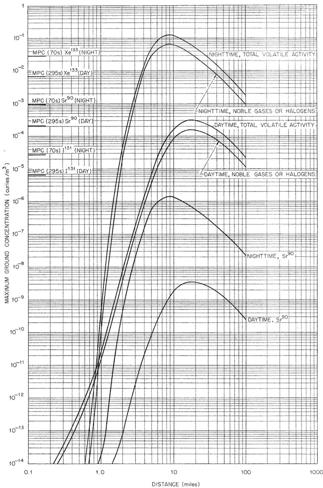  
(σ)

(b)   
Fig. C10. Instantaneous Hot Release. (a) Maximum ground concentration.   
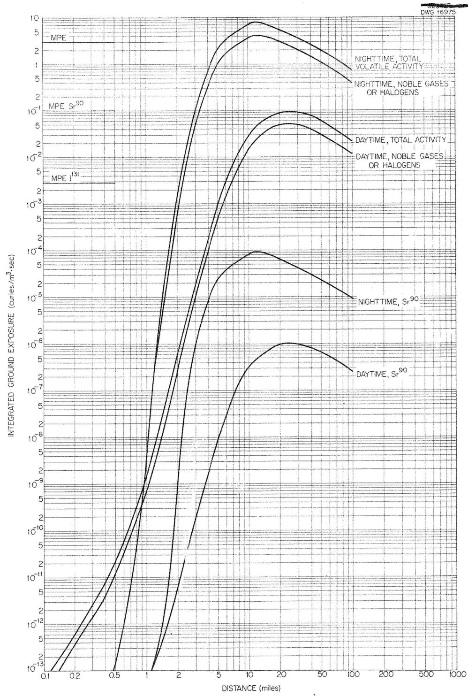  
(b) Integrated ground exposure.

TABLE C7. PARAMETERS FOR AN ELEVATED INSTANTANEOUS SOURCE   

<table><tr><td rowspan="4">Activity measured at 1000 sec after augmented runaway of reactor operating at equilibrium at 3 megawatts:</td><td>Q (total) = 6.5 × 107curies</td></tr><tr><td>Q (noble gas) = 3.2 × 106curies</td></tr><tr><td>Q (halogens) = 3.6 × 106curies</td></tr><tr><td>Q (Sr90) = 80 curies</td></tr></table>

<table><tr><td rowspan="2">PARAMETER</td><td rowspan="2">DEFINITION</td><td colspan="2">AVERAGE VALUE OF PARAMETER</td><td rowspan="2">SOURCE OF DATA</td></tr><tr><td>During Stable Conditions, at Night</td><td>During Unstable Conditions, in Daytime</td></tr><tr><td>h</td><td>Height of rise</td><td>200 meters</td><td>1500 meters</td><td>Preceding section</td></tr><tr><td>C</td><td>Virtual diffusion coefficient</td><td>0.055</td><td>0.114</td><td>Extrapolated gustiness at 15, 50, and 150 meters</td></tr><tr><td></td><td></td><td>0.063 (for comparison)</td><td>0.108 (for comparison)</td><td>Sutton(7)</td></tr><tr><td>n</td><td>Stability</td><td>0.35</td><td>0.23</td><td>Temperature gradient and empirical graph relating to wind profile</td></tr><tr><td></td><td></td><td>0.33 to 0.50 (for comparison)</td><td>0.20 to 0.25 (for comparison)</td><td>Sutton(7)</td></tr><tr><td>V0</td><td>Initial volume of cloud</td><td>9 × 10^5 m³</td><td>2 × 10^7 m³</td><td>Preceding section</td></tr><tr><td>X0</td><td>Distance correction</td><td>1330 meters</td><td>6300 meters</td><td>This section</td></tr><tr><td>n</td><td>Wind speed</td><td>5 meters/sec</td><td>8 meters/sec</td><td>Pibal observation at ORNL</td></tr></table>

where

$$
\begin{array}{l} \chi = \text {c o n c e n t r a t i o n , c u r i e s / m ^ {3}} \\ q = \text {s o u r c e r a t e o f e m i s s i o n ,} \\ \hskip 1 4. 2 2 6 3 7 8 p t \text {c u r i e s / s e c ,} \end{array}
$$

$$
C _ {y}, C _ {z} = \begin{array}{l} \text {v i r t u a l d i f f u s i o n c o e f f i c i e n t s} \\ \text {d e t e r m i n e d f r o m m e a s u r e m e n t s} \\ \text {o f g u s t i n e s s i n t h e c r o s s w i n d} \\ \text {a n d v e r t i c a l d i r e c t i o n s .} \end{array}
$$

In the absence of measurements of $C_z$ , it has been assumed that $C_z = C_y$ which has been evaluated from the following formula. (8)

$$
C _ {y} ^ {2} = \frac {4 \nu^ {n} (\tan \sigma) ^ {2 - 2 n}}{(1 - n) (2 - n) u ^ {n}}. \tag {14}
$$

The units of $C_{\mathbf{y}}^{2}$ are (meters) $^n$ , where $\sigma$ is the standard deviation of wind

direction, over a 15-min period, obtained from a recording wind vane at the site, $u$ is the mean wind speed at representative level (70 ft) near the surface in meters/sec, $n$ is a dimensionless stability parameter, and $X$ is the distance downwind in meters.

If the building does not present a large cross section to the wind and if the contaminated building air is leaking out at only one point, the formula could be expected to be fairly applicable. This particular problem in diffusion has received the greatest amount of experimental study, at least for short distances (less than 1 mile), by the chemical warfare people. It

TABLE C8. GROUND CONCENTRATION FROM AN ELEVATED INSTANTANEOUS SOURCE   

<table><tr><td rowspan="2"></td><td colspan="3">ACTIVITY DURING STABLE CONDITIONS (NIGHTTIME)</td><td colspan="3">ACTIVITY DURING UNSTABLE CONDITIONS (DAYTIME)</td></tr><tr><td>Total Volatile</td><td>Noble Gases or Halogens</td><td>Sr90</td><td>Total Volatile</td><td>Noble Gases or Halogens</td><td>Sr90</td></tr></table>

Maximum Concentration During Cloud Passage (curies/m3)   

<table><tr><td>At 0.37 mi (HRE)</td><td>2x10-20</td><td>1x10-20</td><td>2x10-25</td><td>9x10-14</td><td>5x10-14</td><td>1x10-18</td></tr><tr><td>At 0.89 mi (X-10)</td><td>2x10-11</td><td>1x10-11</td><td>2x10-16</td><td>1x10-11</td><td>5x10-12</td><td>1x10-10</td></tr><tr><td>At 5 mi (K-25, Townsite)</td><td>5x10-2</td><td>3x10-2</td><td>6x10-7</td><td>7x10-6</td><td>4x10-6</td><td>9x10-11</td></tr><tr><td>At 10 mi (Fort Loudon Dam)</td><td>1x10-1</td><td>6x10-2</td><td>1x10-6</td><td>2x10-4</td><td>8x10-5</td><td>2x10-9</td></tr><tr><td>At 15 mi</td><td>7x10-2</td><td>4x10-2</td><td>9x10-7</td><td>3x10-4</td><td>1x10-4</td><td>3x10-9</td></tr><tr><td>At 20 mi</td><td>5x10-2</td><td>3x10-2</td><td>6x10-7</td><td>3x10-4</td><td>1x10-4</td><td>3x10-9</td></tr><tr><td>At 50 mi</td><td>9x10-3</td><td>5x10-3</td><td>1x10-7</td><td>1x10-4</td><td>5x10-5</td><td>1x10-9</td></tr><tr><td>At 100 mi</td><td>2x10-3</td><td>1x10-3</td><td>2x10-8</td><td>2x10-5</td><td>1x10-5</td><td>3x10-10</td></tr><tr><td>Maximum concentration (9.2 mi)</td><td>1.2x10-1</td><td>6.6x10-2</td><td>1.5x10-6</td><td>3.0x10-4</td><td>1.6x10-4</td><td>3.5x10-9</td></tr><tr><td>Time of passage</td><td>68 sec</td><td>68 sec</td><td>68 sec</td><td>295 sec</td><td>295 sec</td><td>295 sec</td></tr><tr><td>MPC for time of passage</td><td>2.9x10-2</td><td>2.7x10-5</td><td>9.3x10-4</td><td>6.9x10-3</td><td>6.5x10-6</td><td>2.2x10-4(b)</td></tr><tr><td></td><td>Xe133</td><td>I121</td><td></td><td>Xe133(a)</td><td>I131(a)</td><td></td></tr></table>

Integrated Ground Exposure During Cloud Passage (curies/m $^3$ -sec)   

<table><tr><td>At 0.37 mi (HRE)</td><td>2×10-19</td><td>1×10-19</td><td>2×10-24</td><td>6×10-12</td><td>3×10-12</td><td>7×10-17</td></tr><tr><td>At 0.89 mi (X-10)</td><td>3×10-10</td><td>1×10-10</td><td>3×10-15</td><td>7×10-10</td><td>4×10-10</td><td>8×10-15</td></tr><tr><td>At 5 mi (K-25, Townsite)</td><td>1.98</td><td>1.04</td><td>2×10-5</td><td>9×10-4</td><td>5×10-4</td><td>1×10-8</td></tr><tr><td>At 10 mi (Fort Loudon Dam)</td><td>6.80</td><td>3.60</td><td>8×10-5</td><td>3×10-2</td><td>1×10-2</td><td>3×10-7</td></tr><tr><td>At 15 mi</td><td>7.00</td><td>3.80</td><td>8×10-5</td><td>6×10-2</td><td>3×10-2</td><td>7×10-7</td></tr><tr><td>At 20 mi (Norris, Knoxville)</td><td>5.45</td><td>2.88</td><td>6×10-5</td><td>8×10-2</td><td>4×10-2</td><td>1×10-6</td></tr><tr><td>At 50 mi</td><td>2.04</td><td>1.08</td><td>2×10-5</td><td>6×10-2</td><td>3×10-2</td><td>7×10-7</td></tr><tr><td>At 100 mi</td><td>0.75</td><td>0.40</td><td>9×10-6</td><td>2×10-2</td><td>1×10-2</td><td>3×10-7</td></tr><tr><td>Maximum exposure (12.1 mi)</td><td>8.18</td><td>4.33</td><td>9.6×10-5</td><td>8.8×10-2</td><td>4.7×10-2</td><td>1.1×10-6</td></tr><tr><td>Maximum permissible exposure</td><td>3(a)</td><td>1.7×10-3</td><td>0.1(b)</td><td>3(a)</td><td>1.7×10-3</td><td>0.1(b)</td></tr><tr><td></td><td></td><td>I131(a)</td><td></td><td></td><td>I131(a)</td><td></td></tr></table>

$(a)$ Papers Presented at Joint US/UK/Canadian Reactor Sitting Conference Held at Harwell, England on September 5, 6, and 7, 1949, TID-257 (Jan. 5, 1950).   
(b)K. Z. Morgan (Chairman), Maximum Permissible Amounts of Radioisotopes in the Human Body and Maximum Permissible Concentrations in Air and Water, NBS Handbook No. 52 (to be published).

has been found that at greater distances and for periods of sampling greater than about 3 to 5 min, the formula gives values that are too high by a factor of 4 to 8. This error can be attributed to meandering or gross displacement of the gas cloud by large eddies with periods of the order of several minutes, which are not wholly accounted for even by using the 15-min standard deviations of direction in the $C_y^2$ formula (Sutton used 3-min samples). Since the exact value of this correction factor is not known for all meteorological conditions and types of terrain, no allowance has been made for it in these calculations, but the resulting concentrations should be regarded as upper limits for the conditions specified, rather than as averages.

The assumptions are made that all the activity in the reactor at the time of the catastrophe is augmented by a runaway with an augmentation of about 7.7 times the normal activity at 3 megawatts. The volatile activity, consisting of the noble gases, the

(9)J. Z. Holland, AEC Meteorological Information Meeting February 1-2, 1951, TID-399, p. 45.

halogens, and the $\mathbf{Sr}^{90}$ is contained in the $10,000\mathrm{m}^3$ of air in the building. A nominal leakage rate of 1000 ft per day is postulated to allow the contained activity to leak into the air and be diffused downwind continuously.

The values of the parameters used in these calculations are given in Table C9.

Substitution of the values of Table C9 in Eq. 13 gives the values in Table C10 for the expected concentration downwind from the 7500 Area (Fig. C11).

From these calculations it appears that the worst type of catastrophe would be one in which the iodine would be released slowly to the atmosphere. In such an event, it is likely that the tolerance for iodine would be exceeded for very long distances at night and even to about 30 miles in the daytime. If $0.03\%$ or less of the halogens were released at night and $0.2\%$ or less in the daytime, the MPC's would not be exceeded outside the exclusion radius of 0.5 mile.

The most likely consequence of a reactor failure in which the activity is contained in the building would be the binding of the halogens in the NaK

TABLE C9. PARAMETERS FOR A CONTINUOUS SURFACE SOURCE   

<table><tr><td>q (total volatile)</td><td>= 0.21 curies/sec</td></tr><tr><td>q (halogens or noble gases)</td><td>= 0.12 curies/sec</td></tr><tr><td>q (Sr90)</td><td>= 2.6×10-6curies/sec</td></tr></table>

<table><tr><td rowspan="2">PARAMETER</td><td rowspan="2">DEFINITION</td><td colspan="2">AVERAGE VALUE OF PARAMETER</td><td rowspan="2">SOURCE OF DATA</td></tr><tr><td>During Stable Conditions, at Night</td><td>During Unstable Conditions, in Daytime</td></tr><tr><td>u</td><td>Wind speed</td><td>1.5 mphs</td><td>2.3 mphs</td><td>Anemometer at site</td></tr><tr><td>σ</td><td>Standard deviation</td><td>11 deg</td><td>24 deg</td><td>Vane at site</td></tr><tr><td>n</td><td>Stability parameter</td><td>0.35</td><td>0.23</td><td>T200 - T4 and empirical graph</td></tr><tr><td>Cy</td><td></td><td>0.100</td><td>0.224</td><td>Equation 14 and σ</td></tr><tr><td></td><td></td><td>0.105 (for comparison)</td><td>0.300 (for comparison)</td><td>Sutton(7)</td></tr></table>

TABLE C10. GROUND CONCENTRATIONS FROM A CONTINUOUS SURFACE SOURCE   

<table><tr><td rowspan="2"></td><td colspan="3">ACTIVITY DURING STABLE CONDITIONS, NIGHTIME (curies/m3)</td><td colspan="3">ACTIVITY DURING UNSTABLE CONDITIONS, DAYTIME (curies/m3)</td></tr><tr><td>Total Volatile</td><td>Noble Gases or Halogens</td><td>Sr90</td><td>Total Volatile</td><td>Noble Gases or Halogens</td><td>Sr90</td></tr><tr><td>At 0.37 mi (HRE)</td><td>2 × 10-4</td><td>1 × 10-4</td><td>3 × 10-9</td><td>2 × 10-5</td><td>9 × 10-6</td><td>2 × 10-10</td></tr><tr><td>At 0.89 mi (X-10)</td><td>6 × 10-5</td><td>3 × 10-5</td><td>7 × 10-10</td><td>3 × 10-6</td><td>2 × 10-6</td><td>4 × 10-11</td></tr><tr><td>At 5 mi (K-25, Townsite)</td><td>3 × 10-6</td><td>2 × 10-6</td><td>4 × 10-11</td><td>1 × 10-7</td><td>8 × 10-8</td><td>2 × 10-12</td></tr><tr><td>At 10 mi</td><td>1 × 10-6</td><td>6 × 10-7</td><td>1 × 10-11</td><td>4 × 10-8</td><td>2 × 10-8</td><td>5 × 10-13</td></tr><tr><td>At 20 mi (Knoxville, Norris)</td><td>4 × 10-7</td><td>2 × 10-7</td><td>4 × 10-12</td><td>1 × 10-8</td><td>7 × 10-9</td><td>1 × 10-13</td></tr><tr><td>At 50 mi</td><td>8 × 10-8</td><td>4 × 10-8</td><td>7 × 10-13</td><td>2 × 10-9</td><td>1 × 10-9</td><td>2 × 10-14</td></tr><tr><td>At 100 mi</td><td>3 × 10-8</td><td>1 × 10-8</td><td>3 × 10-13</td><td>7 × 10-10</td><td>4 × 10-10</td><td>8 × 10-15</td></tr><tr><td>Distance of MPC</td><td>2.5 mi</td><td>&gt;100 mi</td><td>2 mi</td><td>0.5 mi</td><td>30 mi</td><td>0.4 mi</td></tr><tr><td>MPC for continuous immersion</td><td>1 × 10-5</td><td>3 × 10-9</td><td>2 × 10-10</td><td>1 × 10-5</td><td>3 × 10-9</td><td>2 × 10-10</td></tr><tr><td></td><td>Xe133</td><td>I131</td><td></td><td>Xe133</td><td>I131</td><td></td></tr></table>

and the release of the noble gases, which would only exceed the MPC out to 2 miles at night and 0.3 mile in the daytime.

Beryllium Hazard. The ARE will contain approximately $9 \times 10^{5}$ g of hot-pressed beryllium oxide as moderator and reflector. The dispersal of this hard-fired material into the rising cloud from the catastrophe postulated would result in a hazard that could best be compared to the hazard of the radiohalogens. It is certain that not all of the beryllium oxide could be powdered sufficiently to allow the material to remain airborne. If the particles were about 1000 to 1500 microns in diameter, they would settle out in 2 to 5 min at night or in about 5 to 15 min in the daytime, representing a danger zone ranging from 1/2 to 1 mile (night) to 1 l/2 to 5 miles (day) downwind.

Since the peak concentration that should be permitted for a single exposure to beryllium is $21/2 \times 10^{-5}$

$g / m^3$ , the worst risk will be about one-fourth of that for iodine, considering a nighttime cloud, and about one-sixteenth of that for iodine, considering a daytime cloud.

Rainout. A reasonable assumption is that rain of moderate intensity continuing for a period of $1/2 \, \text{hr}$ would wash out approximately one half the particulate matter of a cloud from an instantaneous source. A simple approximation to the surface contamination by rainout is obtained by conservatively assuming an angle of spread of the cloud, downwind, equal to 0.1 radian. Then the area covered by the cloud per unit time will be roughly 0.1lux. At the rate of $50\%$ per 30 min, the total amount deposited will be $Q/0.1ux$ in curies/mi², where $Q$ is the source strength in curies, $u$ is the wind speed in mph, and $x$ is the distance in miles.

For $Q$ equal to $6.8 \times 10^{6}$ curies (total volatile activity at 1000 sec) and $u$ equal to 11 mph at the cloud level at night and 18 mph at the cloud

level during the day, the surface contamination (in curies/mi²) will be:

<table><tr><td></td><td>NIGHT</td><td>DAY</td></tr><tr><td>At 1 mile</td><td>6.2 x 106</td><td>3.8 x 106</td></tr><tr><td>At 10 miles</td><td>6.2 x 105</td><td>3.8 x 105</td></tr></table>

This activity deposited on the ground would produce a dosage rate of about 36 r/hr at a height of 3 ft, assuming l-Mev energy at a distance of 1 mile at night, and about 20 r/hr at 3 ft, assuming l-Mev energy at a distance of 1 mile if the catastrophe occurred during the daytime. (10)

Continuous Discharge from a Stack. The discharge from the stack located on the ARE building will be controlled under the following two conditions: the stack valve will not be open unless a wind velocity of 5 mph is measured and the activity of gas in the holdup tanks is such that the released activity will be less than 2.5 curies/min of $\text{Xe}^{133}$ (average energy about 0.35 Mev after holdup) or equivalent, which is obtained by Sutton's formula for maximum ground concentration from an elevated source:

$$
Q = \frac {\chi_ {m} \pi e u h ^ {2}}{2},
$$

where

$Q =$ emission rate,curies/sec, $\chi_{\pi} = \mathrm{MPC}$ for $\mathbf{Xe^{133}}$ $1\times 10^{-6}$ curies/m³, $\pmb {u} =$ wind speed,mps, $h =$ effective stack height, meters.

This formula is rather conservative when tested by experimental measurements and the MPC is that for small bodies, which should be doubled for large bodies. These factors imply a safety factor of at least 4 in the concentration downwind from the small, 30-meter, l-in.-dia pipe that serves as a stack for the ARE

If the reactor pits or dump tank pits should be contaminated and the

(10) The Effects of Atomic Weapons, p. 259, McGraw-Hill, New York, 1950.

activity contained in the pits, then the contaminated atmosphere could be pumped off after suitable decay, under the restrictions imposed by the interlocked monitor and anemometer.

It will not be possible for a continuous stream of helium to purge off the gases as they collect in the surge tanks, but they can be allowed to bubble off at the rate of production, diffuse through the holdup tanks, and be emitted when the activity and wind speed requirements are met. The fission gases will be bubbled through a NaK scrubber to absorb the halogens and hence will consist only of the noble gases. The cell atmosphere also passes through the halogen scrubber if for any reason it has to be pumped out.

Summary. Calculations of the upper limits of ground concentrations and exposures from hypothetical catastrophic failures of the ARE have been presented. If the reactor could be melted and the NaK reacted with water to blow the activity in the air with more than $5\%$ of the halogens released to the air in an instantaneous puff, then the MPC would be exceeded at a distance of 15 to 20 miles during the daytime. At night the release of more than about $0.05\%$ of the halogens would exceed MPC at a distance of 7 to 12 miles.

If the disaster were contained in the building and a leakage of the contaminated air occurred at the rate of 1000 ft³/day, the release of more than about 0.03% of the iodine would result in tolerance being exceeded beyond the 0.5 mile radius given by the exclusion formula $X = 0.01$ (power in kw)¹/².

There is also considered to be a risk of contamination by beryllium oxide, which is about $25\%$ of the hazard to the radiohalogens, aggravated by the lack of decay in the beryllium oxide and the continuing danger of relocation of the particles after they have fallen to the ground.

# BASIC DATA FOR ARE CATASTROPHE

Theoretical Heat Evolution from the Combination of NaK with water. When a sodium-potassium mixture (44 wt % Na and 56 wt % K), with a density of about $0.7\mathrm{g/cm^3}$ , reacts with water, the hydrides of the metals are formed first and hydrogen is evolved, which then burns violently. The end products are the hydroxides of the metals. For the reaction to go to completion, as indicated in the following, sufficient oxygen must be present:

$$
\begin{array}{l} 4 \mathrm {N a} + \mathrm {O} _ {2} + 2 \mathrm {H} _ {2} \mathrm {O} \longrightarrow 4 \mathrm {N a O H}, \\ 4 \mathrm {K} + \mathrm {O} _ {2} + 2 \mathrm {H} _ {2} \mathrm {O} \longrightarrow 4 \mathrm {K O H}. \\ \end{array}
$$

The following data were used to determine the heat evolved:

<table><tr><td></td><td>HEAT OF FORMATION(kcal/mol wt)</td><td>HEAT OF SOLUTION(kcal/mol wt)</td></tr><tr><td>NaOH</td><td>101.91</td><td>10.3</td></tr><tr><td>KOH</td><td>102.01</td><td>12.95</td></tr><tr><td>H2O</td><td>58.0</td><td></td></tr></table>

The heat evolved from the sodium will be

$$
\begin{array}{l} \frac {(4 \times 1 0 1 . 9 1) + (4 \times 1 0 . 3) - . (2 \times 5 8)}{4} \\ = 8 3. 2 \mathrm {k c a l} / \mathrm {m o l} \quad \mathrm {w t}, \\ \end{array}
$$

which is equivalent to

$$
\frac {8 3 . 2 \times 1 0 ^ {3}}{3 9 . 1} = 2. 2 0 \times 1 0 ^ {3} \mathrm {c a l / g}.
$$

The heat evolved from the potassium will be

$$
\begin{array}{l} \frac {(4 \times 1 0 2 . 0 1) + (4 \times 1 2 . 9 5) - (2 \times 5 8)}{4} \\ = 8 6. 2 \mathrm {k c a l} / \mathrm {m o l} \mathrm {w t}, \\ \end{array}
$$

which is equivalent to

$$
\frac {8 6 . 2 \times 1 0 ^ {3}}{3 9 . 1} = 2. 2 0 \times 1 0 ^ {3} \mathrm {c a l / g}.
$$

The heat evolved from the NaK will be

$$
\begin{array}{l} (. 4 4 \times 3. 6 2 +. 5 6 \times 2. 2) \times 1 0 ^ {3} \\ = 2. 8 3 \times 1 0 ^ {3} \mathrm {c a l} / \mathrm {g} \\ \end{array}
$$

or

$$
\begin{array}{l} 2. 8 3 \times 1 0 ^ {3} \times 0. 7 \times 2 8, 3 2 0 \\ = 5. 6 \times 1 0 ^ {7} \mathrm {c a l / f t} ^ {3} \\ \end{array}
$$

Initial Temperature Prediction of a Radioactive Cloud. If a catastrophe is postulated in which the reactor core reaches a temperature of $2500^{\circ}\mathrm{F}$ and causes the fuel to be boiled off, it can be further postulated that, as the components cool down, the heat given off will raise the temperature of the room atmosphere. It will be assumed that the reactor shell is not involved with the rise of temperature. This latter assumption is severe, since it means a lesser cloud temperature and, consequently, a smaller rise for the radioactive particles.

The values in Table C11 are obtained by combining the initial heat

TABLE C11. TOTAL HEAT OBTAINED FROM CORE COMPONENTS   

<table><tr><td></td><td>WEIGHT (1b)</td><td>SPECIFIC HEAT</td><td>WEIGHT × SPECIFIC HEAT × ΔT (Btu)</td></tr><tr><td>Beryllium oxide</td><td>2050</td><td>0.47</td><td>1.35 × 106</td></tr><tr><td>Fuel mixture and salts</td><td>925</td><td>0.27</td><td>0.35 × 106</td></tr><tr><td>Inconel</td><td>450</td><td>0.11</td><td>0.07 × 106</td></tr><tr><td></td><td></td><td></td><td>Total heat 1.77 × 106</td></tr></table>

# ARE HAZARDS

of the individual core components and
the assumed temperature rise of $1400^{\circ}\mathrm{F}$ .
The total heat, $1.77 \times 10^{6} \mathrm{Btu}$ , will
raise the temperature of the air in
the room. This has been calculated
as follows:

Air Volume, 10,000 m³ = 3.36 × 10⁵ ft³,

Air Density $= 0.08 \, \text{lb/ft}^3$ ,

Specific Heat = 0.25,

$$
\begin{array}{l} \Delta T (\text {a i r}) = \frac {1 . 7 6 \times 1 0 ^ {6}}{3 . 3 6 \times 1 0 ^ {5} \times . 0 8 \times . 2 5} \\ = 2 6 2 ^ {\circ} \mathrm {F}. \\ \end{array}
$$

Thus the initial cloud temperature will be $355^{\circ}\mathrm{F}$ or $180^{\circ}\mathrm{C}$ , if the ambient initial temperature is $93^{\circ}\mathrm{F}$ .

# D. OCCURRENCE OF GROUND WATER AT THE ARE SITE(11)

R.M.Richardson,Geologist U.S.Geological Survey Ground Water Branch Knoxville,Tennessee

The following remarks are based on a brief investigation made in collaboration with P. B. Stockdale of the University of Tennessee. They are preliminary in nature and are given in advance of approval by the Director of the U. S. Geological Survey.

The ARE site is located in Melton Valley, 1 1/2 miles southwest of the Roane-Anderson County line. Melton Valley is underlaid by the Conasauga shale of Middle and Upper Cambrian Age. The Conasauga shale consists of light-brown, light-green, and dull-purple shale. Thin layers and lenses of limestone are common, but seem to be generally irregular in distribution. The rocks dip to the southeast at an angle of about 35 degrees. Owing to crumpling, the angle of dip may be much greater locally. The Conasauga

shale weathers to a thin acid soil full of shale chips. The soil mantle is rarely more than a few feet in thickness.

Although field investigations of the rate and direction of ground-water movement have not been made at the ARE site, observations made at the lagoon or liquid waste pit constructed at ORNL this year are relevant to the present investigation. The pit, which is in Melton Valley about 1 mile southwest of the ARE site, is excavated in the Conasauga shale. While the rocks at the lagoon are younger than those at the ARE site, it is probable that they are similar in their hydrologic characteristics.

Mineralogical examination of a sample of Conasauga shale from the waste pit, made by the Geochemistry and Petrology Branch of the U. S. Geological Survey, showed the following: $19\%$ $\mathrm{CaCO_3}$ (loss on acid treatment), $87\%$ silt-grade particles (0.06 to 0.002 mm); $12\%$ clay (0.002 mm); base exchange capacity, 28.6 milliequivalents per 100 g; minerals, mica-type mineral, quartz, little halloysite.

Observations of fluctuations in the level of liquid in the lagoon and in test wells near it indicate that, although relatively impermeable, the Conasauga shale is capable of transmitting small amounts of ground water. The rate of movement is probably rather slow and would be expressed in terms of a few feet per week.

That ground water moves through minute fractures and joints in the shale rather than through solution cavities in the intercalated limestone lens is indicated by radiometric analyses of liquid taken from wells near the pit. Several weeks after liquid waste containing mixed fission products was introduced into the lagoon, water in one of the wells was found to be contaminated. Analyses showed that this activity was solely

from ruthenium. Since the waste in the pit contained many other isotopes, it is probable that most of the activity had been fixed in the immediate vicinity of the pit by ion exchange with clay contained in the Conasauga shale.

Laboratory investigation of the removal of radioactive isotopes by samples of Conasauga shale from the waste pit has been made by the Liquid Waste Disposal Research Section of the Health Physics Division of ORNL (cf., section on "Surface Water Contamination"). Tests by the jar-stirring method using eight different isotopes and two composite samples containing mixed fission products showed essentially complete removal of $\mathsf{Ba}^{140}$ , $\mathsf{Ce}^{144}$ , $\mathsf{Cs}^{137}$ , $\mathsf{P}^{32}$ , $\mathsf{Ru}^{106}$ , and $\mathsf{Zr}^{95}$ . Removal of $\mathsf{I}^{131}$ and $\mathsf{Sr}^{90}$ was reasonably good, being 66.9 and $76.8\%$ per $20\mathrm{g}$ of shale, respectively. Removal of activity from the samples of mixed fission products was $98.2\%$ . The level of activity of the various samples used averaged 7200 counts/min/ml.

Although these data are preliminary, they indicate that with respect to ground water the ARE site apparently does not present features that could be considered potentially hazardous.

# E. BEDROCK GEOLOGY IN THE AREA SURROUNDING THE ARE SITE (12)

P. B. Stockdale University of Tennessee

The ARE site is located near the north edge of a northeast-southwest trending valley trough, often referred to as Melton Valley, which is bounded on the northwest by Haw Ridge and on the southeast by Copper Ridge. More specifically, the site is three-fifths of a mile east of the water gap across Haw Ridge through which White Oak Creek runs in passing from Bethel Valley into Melton Valley. The site

is covered by the Tennessee Valley Authority-U. S. Geological Survey topographic map of the Bethel Valley quadrangle, designated as No. 130-NE, published in 1941.

The principal streams in Melton Valley are White Oak Creek, below the water gap across Haw Ridge, and its tributary Melton Branch. White Oak Creek empties into White Oak Lake, which serves as a final settling basin for certain of the liquid waste products that are discharged from operations at X-10 into White Oak Creek and thence into the lake. Surface drainage of the area surrounding the ARE goes into small tributaries that lead into Melton Branch and in turn into White Oak Creek. The general physiographic and topographic setting of the Oak Ridge National Laboratory is treated in a recent report,(13) which contains a special chapter on hydrologic features written by G. D. DeBuchananne of the Ground Water Branch of the U. S. Geological Survey.

Only brief reconnaissance study has been made of the geologic conditions at the ARE site, where the underlying rock, as well as that throughout most of Melton Valley, belongs to a geologic unit known as the Conasauga group. Detailed measurements and studies of this unit have not been made, although a general examination was made in connection with the previously mentioned report.(13) The rocks of the Conasauga group are mainly shale, mostly light-green, dull-purple, and drab to olive-gray in color, with considerable reddish-brown to black stain. Although the shale is somewhat variegated in places, it does not possess the color brilliance that typifies the rocks of the Rome formation beneath. In the main, the shale is argillaceous to slightly silty, with considerable amounts of slightly calcareous material. Most of the shale tends to weather to a flaky appearance, with abundant small chips.

# ARE HAZARDS

Throughout, there occur in varying quantities at different horizons, thin siltstone layers, generally less than l-in. thick, which stand out as ribs on weathered slopes and break up into small, angular blocks. Occasional limestone lenses are found interbedded in the shale. These lenses increase in abundance upward in the formation. The basal portion of the Conasauga shale has been referred to by J. Rogers as the Pumpkin Valley Formation. Not far above the base of the Conasauga, is a zone with a superabundance of thin siltstone ribs, sufficient in resistance to account in part for a line of low hills, or knolls, that rise above the valley floors carved in the softer shales. Such is exhibited along the northwest side of Melton Valley in the area of the ARE site. The shale is generally impervious. It is characterized by abundant, minute joints that are interconnected and traverse the beds in various directions. In the topmost 200 ft or more of the Conasauga group, there occur numerous beds of gray limestone of various textures and thicknesses separated by shale zones. Some are dense; some coarsely crystalline; some oolitic in texture. Many of the limestone beds are but a few inches thick; others are massive, up to several feet thick. The massive limestone portion at the top of the Conasauga group is known as the Maynardville limestone member. The total thickness of the Conasauga group in the Oak Ridge area is at least

1500 feet. Exact measurements have not been made.

The more resistant rock layers of the Rome formation, steeply inclined toward the southeast, are responsible for Haw Ridge, immediately northwest of the ARE site. These layers dip beneath the shales of the Conasauga group in Melton Valley. The Romerocks, which are sandstones and shales, grade into the adjoining younger Conasauga shales and thus make difficult the placing of the exact boundary between the two stratigraphic units. The ARE site lies upon the basal shales of the Conasauga group, not far distant from the adjoining Rome shales to the northwest.

The shale layers in the area under consideration are inclined to the southeast, generally at an angle in excess of 30 degrees. The strike of the beds is approximately N58°E. This is in keeping with the general structure of the surrounding area, as reported in the previously mentioned study.(13) Because of the general incompetence of the Conasauga beds, a variety of minor structural features and variations occur.

Since there are no persistent limestone beds in the immediate area of the ARE site, there are no sinkholes or underground solution channels and caverns to permit rapid and free discharge of waters underground.

(13)P. S. Stockdale, Geologic Conditions at the Oak Ridge National Laboratory (X-10) Area Relevant to the Disposal of Radioactive Waste, ORO-58 (August 1, 1951).

# BIBLIOGRAPHY

1. P. B. Stockdale, Geologic Conditions at the Oak Ridge National Laboratory (X-10) Area Relevant to the Disposal of Radioactive Waste, ORO-58 (Aug. 1, 1950).   
2. O. G. Sutton, Quar. J. Roy. Metgl. Soc. 73, 426, 432-434 (1947).   
3. J. Z. Holland, AEC Meteorological Information Meeting February 1-2, 1951, TID-399, p. 45.   
4. K.Z. Morgan (Chairman), Maximum Permissible Amounts of Radio isotopes in the Human Body and Maximum Permissible Concentrations in Air and Water, NBS Handbook No. 52, to be published.   
5. O. G. Sutton, Quar. J. Roy. Metgl. Soc. 73, 267 (1947).   
6. Papers Presented at Joint US/UK/Canadian Reactor Sitting Conference Held at Harwell, England on September 5, 6, and 7, 1949, TID-257 (Jan. 5, 1950).   
7. S. R. Sapirie, Reactor Safety Determination, OR-RDV-1 (July 24, 1952).   
8. W. B. Cottrell, Reactor Program of the Aircraft Nuclear Propulsion Project, ORNL-1234 (June 2, 1952).   
9. ANP Quar. Prog. Rep. Sept. 10, 1952, ORNL-1375.   
10. C. E. Winters and A. M. Weinberg, A Report on the Safety

Aspects of the Homogeneous Reactor Experiment, ORNL-731 (June 20, 1950).   
11. J. H. Buck and C. F. Leyse, Materials Testing Reactor Project Handbook, ORNL-963 (May 7, 1951).   
12. L. Wilson, Building Codes and Other Criteria, (AEC) GM-127 (Pacific Coast Building Operations Conference).   
13. P. L. Hill, Alkali Metals Area Safety Guide, Y-811 (Aug. 13, 1951).   
14. Rand-McNally and Co., Rand-McNally Commercial Atlas and Marketing Guide, 83d Ed. (1952).   
15. M. M. Mills, A Study of Reactor Hazards, NAA-SR-31 (Dec. 7, 1949).   
16. Los Alamos Scientific Laboratory, The Effects of Atomic Weapons (June 1950).   
17. C. P. Straub, R. J. Morton, and O. R. Placak, J. Am. Water Works Assoc. 43, 773 (Oct. 1951).   
18. O. G. Sutton, Weather, p. 108 (April 1947).   
19. M. M. Mills, A Study of Reactor Hazards, NAA-SR-31 (Dec. 7, 1949).   
20. O. G. Sutton, Proc. Roy. Soc. (London) 135A, 155 (1932).   
21. O. G. Sutton, The Diffusion of Matter from an Explosion, PLP-11 (Aug. 14, 1946).